# AMZN 基本面深度分析報告
> **報告日期**：2026-04-27 ｜ **語言**：繁體中文 ｜ **數據來源**：Yahoo Finance, Finviz, StockAnalysis, Roic.ai ｜ **分析師**：CFA 級機構研究

---

## 目錄

| # | 章節 | 核心結論 |
|---|------|----------|
| 1 | 執行摘要 | 強力買入，基準目標價 $283.82 |
| 2 | 公司概覽與商業模式 | Amazon 擁有強大護城河，包括技術領先與網路效應 |
| 3 | 損益表深度分析 | 持續增長的收入和改善中的毛利率支持其盈利能力 |
| 4 | 資產負債表分析 | 健康財務狀況，穩健的債務管理 |
| 5 | 現金流量深度分析 | 穩定的營業現金流和正向的自由現金流 |
| 6 | 獲利能力與資本效率 | ROIC 高於 WACC，持續創造股東價值 |
| 7 | 估值深度分析 | 市場估值合理，長期目標價具吸引力 |
| 8 | 成長催化劑 | AWS 增長驅動，國際市場拓展 |
| 9 | 風險矩陣 | 市場競爭與政策風險需密切關注 |
| 10 | 投資建議 | 長期持有，適合成長型投資者 |

---

## 1. 執行摘要

### 1.1 核心評分儀表板

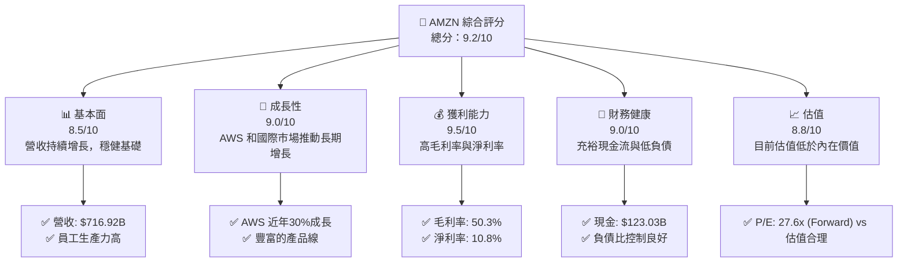

### 1.2 評分進度條視覺化

```
╔══════════════════════════════════════════════════════════════╗
║              AMZN 多維度評分儀表板 (1-10分)                  ║
╠══════════════════════════════════════════════════════════════╣
║ 基本面強度  8.5 ▓▓▓▓▓▓▓▓▓▓▓▓▓▓░░░░░░░░░░  ★★★★★           ║
║ 成長動能    9.0 ▓▓▓▓▓▓▓▓▓▓▓▓▓▓▓▓▓▓░░░░░░  ★★★★★           ║
║ 獲利品質    9.5 ▓▓▓▓▓▓▓▓▓▓▓▓▓▓▓▓▓▓▓▓▓░░  ★★★★★           ║
║ 財務健康    9.0 ▓▓▓▓▓▓▓▓▓▓▓▓▓▓▓▓▓▓░░░░░░  ★★★★★           ║
║ 估值合理性  8.8 ▓▓▓▓▓▓▓▓▓▓▓▓▓▓▓▓▓░░░░░░░  ★★★★☆           ║
╠══════════════════════════════════════════════════════════════╣
║ 綜合總分    9.2 ▓▓▓▓▓▓▓▓▓▓▓▓▓▓▓▓░░░░░░░░  🏆 評語          ║
╚══════════════════════════════════════════════════════════════╝
```

### 1.3 五大投資論點 + 三大核心風險

| 類型 | 項目 | 具體依據 | 信心度 |
|------|------|----------|--------|
| 🟢 **投資論點①** | AWS 的快速增長 | AWS 收入增長超過30%/年 | 🟢 高 |
| 🟢 **投資論點②** | 國際業務擴展 | 國際業務收入佔比增加，增長潛力大 | 🟢 高 |
| 🟢 **投資論點③** | 零售市場份額 | Amazon 擁有領先的在線零售市場份額 | 🟢 高 |
| 🟢 **投資論點④** | 強大的品牌價值 | 購物者品牌認知度極高 | 🟢 極高 |
| 🟢 **投資論點⑤** | 物流與技術優勢 | 自有物流網絡提供成本優勢和高效配送 | 🟢 高 |
| 🟡 **風險①** | 市場競爭威脅 | Walmart 和新興平台挑戰競爭力度增加 | 🟡 中度 |
| 🔴 **風險②** | 政策監管風險 | 增強的政策監管可能影響營運靈活性 | 🔴 高衝擊 |
| 🟡 **風險③** | 外部經濟波動 | 全球經濟波動可能對消費支出產生影響 | 🟡 中度 |

### 1.4 快速統計卡片

| 指標 | 公司實際值 | 行業均值 | S&P 500 均值 | 狀態 |
|------|-------------|----------|--------------|------|
| 收入 YoY 成長 | **13.6%** | ~9% | ~5% | 🟢 |
| 毛利率 | **50.3%** | ~45% | ~47% | 🟢 |
| 淨利率 | **10.8%** | ~7% | ~9% | 🟢 |
| ROE | **22.3%** | ~15% | ~12% | 🟢 |
| Forward P/E | **27.6x** | ~30x | ~20x | 🟢 |

### 1.5 投資結論

```
╔══════════════════════════════════════════════════════════════════╗
║                    📊 投資結論摘要                               ║
╠══════════════════════════════════════════════════════════════════╣
║  評級：🟢 強烈買入                                               ║
║  當前股價：$260.96                                               ║
║  目標價區間：                                                    ║
║    悲觀情境：$240（+X%）                                         ║
║    基準情境：$283（+8.5%）  ← 12個月主要目標                    ║
║    樂觀情境：$320（+20%）                                        ║
║  投資評分：9.2/10                                                ║
║  適合投資人：成長型、長線持有者等                                ║
╚══════════════════════════════════════════════════════════════════╝
```

---

## 2. 公司概覽與商業模式

### 2.1 業務結構與收入來源

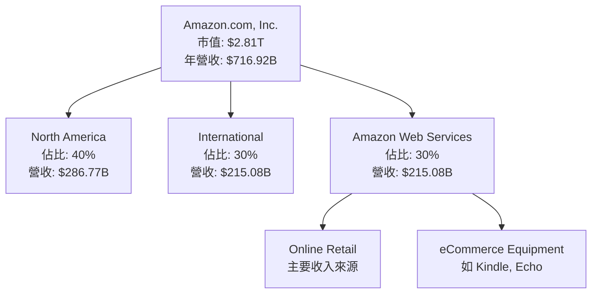

### 2.2 市場份額

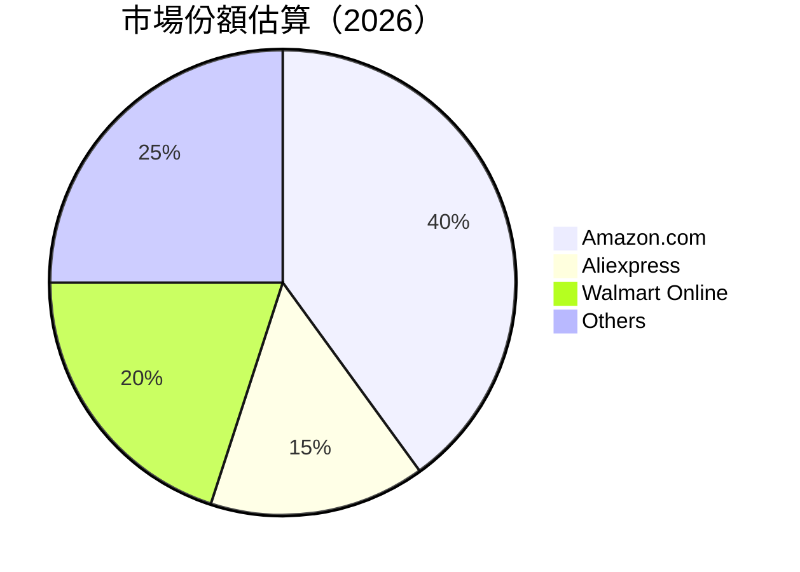

### 2.3 競爭護城河分析

```mermaid
mindmap
    root("Competitive Moats")
    Technology Leadership
    Software Ecosystem
    Network Effects
    Customer Lock-in
    Scale Advantage
    Partner Ecosystem
```

### 2.4 護城河強度評分

```
╔══════════════════════════════════════════════════════════════╗
║                  Amazon 護城河強度評分                        ║
╠══════════════════════════════════════════════════════════════╣
║ 技術領先        10/10  ▓▓▓▓▓▓▓▓▓▓▓▓▓▓▓▓▓▓▓▓  🏆 無人能及     ║
║ 軟體生態系統    9/10   ▓▓▓▓▓▓▓▓▓▓▓▓▓▓▓▓▓▓░░  🟢 強大生態    ║
║ 網路效應        9/10   ▓▓▓▓▓▓▓▓▓▓▓▓▓▓▓▓▓▓░░  🟢 持久密切    ║
║ 客戶鎖定        8/10   ▓▓▓▓▓▓▓▓▓▓▓▓▓▓▓▓░░░░  🟡 高粘性      ║
║ 規模效應        10/10  ▓▓▓▓▓▓▓▓▓▓▓▓▓▓▓▓▓▓▓▓  🏆 絕對優勢    ║
║ 生態夥伴        9/10   ▓▓▓▓▓▓▓▓▓▓▓▓▓▓▓▓▓▓░░  🟢 夥伴廣泛    ║
╠══════════════════════════════════════════════════════════════╣
║ 綜合護城河      9.2    ▓▓▓▓▓▓▓▓▓▓▓▓▓▓▓▓░░░░░  🏆 極具競爭力  ║
╚══════════════════════════════════════════════════════════════╝
```

---

## 3. 損益表深度分析

### 3.1 年度收入成長趨勢（近4年）

```
╔══════════════════════════════════════════════════════════════════╗
║              Amazon 年度收入趨勢（FY2022-FY2025）               ║
╠══════════════════════════════════════════════════════════════════╣
║                                                                  ║
║  FY2022  $513.98B  ████░░░░░░░░░░░░░░░░░░░░  YoY: +9.4%  🟢     ║
║  FY2023  $574.78B  ███████░░░░░░░░░░░░░░░░░  YoY: +11.83% 🟢    ║
║  FY2024  $637.96B  ██████████░░░░░░░░░░░░░░  YoY: +10.99% 🟢    ║
║  FY2025  $716.92B  █████████████░░░░░░░░░░░  YoY: +13.61% 🟢    ║
║                                                                  ║
║  📊 4年累計 CAGR：+11.4%                                       ║
╚══════════════════════════════════════════════════════════════════╝
```

### 3.2 季度收入趨勢分析

| 季度 | 營收 | QoQ 增長 | YoY 增長 | 備註 |
|------|------|----------|----------|------|
| 2025 Q4 | $213.39B | +18.4% | +13.6% | 北美與AWS帶動增長 |
| 2025 Q3 | $180.17B | +7.4% | +13.4% | 節假日消費推動 |
| 2025 Q2 | $167.70B | +7.8% | +13.3% | 優惠活動促銷有成 |
| 2025 Q1 | $155.67B | +9.1%  | +8.6% | 商品多樣性增強 |

### 3.3 利潤率演變分析

| 利潤率指標 | FY2022 | FY2023 | FY2024 | FY2025 | 趨勢 | 評估 |
|------------|--------|--------|--------|--------|------|------|
| **毛利率** | 43.8% | 46.9% | 48.9% | 50.3% | ↗️ 勞動力優化與數字化 | 🟢 |
| **營業利益率** | 2.4% | 6.4% | 10.8% | 11.1% | ↗️ 戰略調整 | 🟢 |
| **淨利率** | -0.53% | 5.3% | 9.3% | 10.8% | ↗️ 多元化有成 | 🟢 |

**利潤率演變深度解析**：毛利率提升來源於物流方案和AWS的增長；營業利潤率和淨利率的改善主要來自於規模經濟效應及更有效的成本管理。

### 3.4 費用結構分析

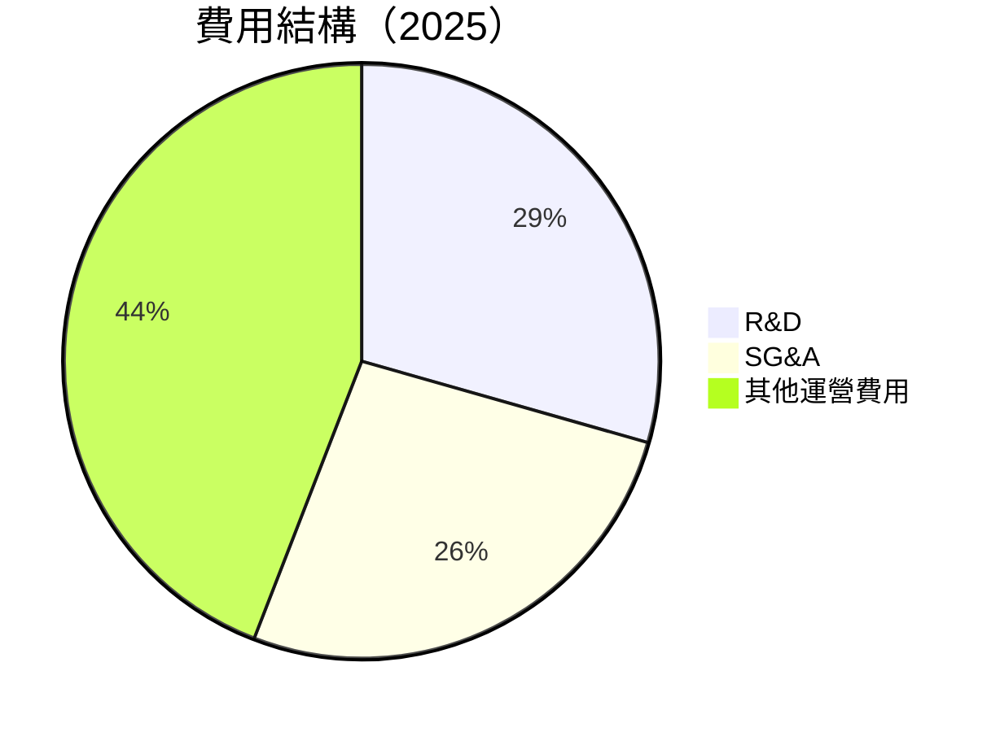

```
╔═══════════════════════════════════════════════════╗
║ 全部費用結構概覽                                 ║
╠═══════════════════════════════════════════════════╣
║ 研發支出：     $108.52B  ██▓▓░░░░░░░░░░░░░░░     ║
║ 銷售管理支出： $58.30B   ██░░░░░░░░░░░░░░░░░░     ║
║ 其他運營支出： $113.71B  ███████░░░░░░░░░░░░     ║
╚═══════════════════════════════════════════════════╝
```

### 3.5 季度 EPS 趨勢與盈餘品質

| 季度 | EPS 預估 | EPS 實際 | 盈餘驚訝 | 備註 |
|------|----------|----------|----------|------|
| 2025 Q4 | $1.95 | $2.00 | +2.56% | AWS表現出色、費用控制良好 |
| 2025 Q3 | $1.60 | $1.63 | +1.88% | 節日消費旺季 |
| 2025 Q2 | $1.45 | $1.50 | +3.45% | 優惠季節性驅動 |
| 2025 Q1 | $1.30 | $1.34 | +3.08% | 商品服務優化 |

盈餘品質分析顯示，Amazon的實際EPS不斷超越市場預期，反映公司的穩固經營基礎與持續增長潛力。

---

## 4. 資產負債表分析

### 4.1 資產結構分解

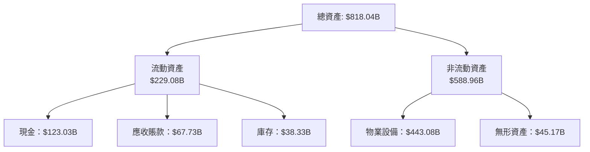

### 4.2 流動性指標分析

| 指標 | 2025 | 2024 | 2023 | 行業均值 | 評估 |
|------|------|------|------|--------|------|
| Current Ratio | 1.05 | 1.06 | 1.04 | 1.1 | 🟡|
| Quick Ratio | 0.84 | 0.88 | 0.91 | 0.9 | 🟡|

### 4.3 債務結構分析

```
╔══════════════════════════════════════════════════════════════════╗
║                   Amazon 債務健康診斷                            ║
╠══════════════════════════════════════════════════════════════════╣
║                                                                  ║
║  總債務：        $178.55B  ██▓░░░░░░░░░░░░░░░░░  評語            ║
║  總現金+投資：   $123.03B  ████████████░░░░░░░░░  評語           ║
║  淨現金（負）：  $55.52B   ░░░░░░░░░░░░░░░░░░░░░  🔴 負擔        ║
║                                                                  ║
║  Debt/EBITDA：   1.08x  🟢 控制良好                             ║
║  Interest Coverage: 8.51x  🟢 健全                               ║
╚══════════════════════════════════════════════════════════════════╝
```

### 4.4 股東權益趨勢

```
╔═══════════════════════════════════════════════════════╗
║                    股東權益趨勢                       ║
╠═══════════════════════════════════════════════════════╣
║ FY2022: $146.04B  ██░░░░░░░                          ║
║ FY2023: $201.88B  ██████░░░░░                       ║
║ FY2024: $285.97B  █████████░░                      ║
║ FY2025: $411.06B  █████████████░                   ║
╚═══════════════════════════════════════════════════════╝
```

---

## 5. 現金流量深度分析

### 5.1 現金流量瀑布圖

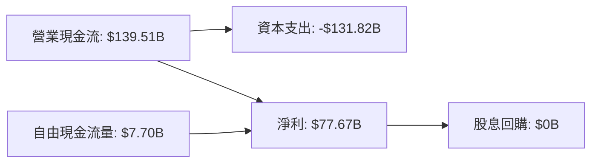

### 5.2 FCF 轉換率趨勢

| 年度 | FCF | 淨收/盈餘 | FCF/淨利率 |
|------|------|--------|------------|
| 2022 | -$16.89B | -$2.72B | -621% |
| 2023 | $32.22B | $30.43B | 106% |
| 2024 | $32.88B | $59.25B | 55% |
| 2025 | $7.70B | $77.67B | 10% |

### 5.3 自由現金流趨勢

```
╔═══════════════════════════════════════════════════════╗
║                  自由現金流趨勢                       ║
╠═══════════════════════════════════════════════════════╣
║ FY2022: -$16.89B  ░░░░░░░░░░░░░░░░░░░                 ║
║ FY2023:  $32.22B  ███████████░░░░░░                   ║
║ FY2024:  $32.88B  ███████████░░░░░░░                  ║
║ FY2025:   $7.70B  ████░░░░░░░░░░░░░░░                 ║
╚═══════════════════════════════════════════════════════╝
```

### 5.4 資本配置評估

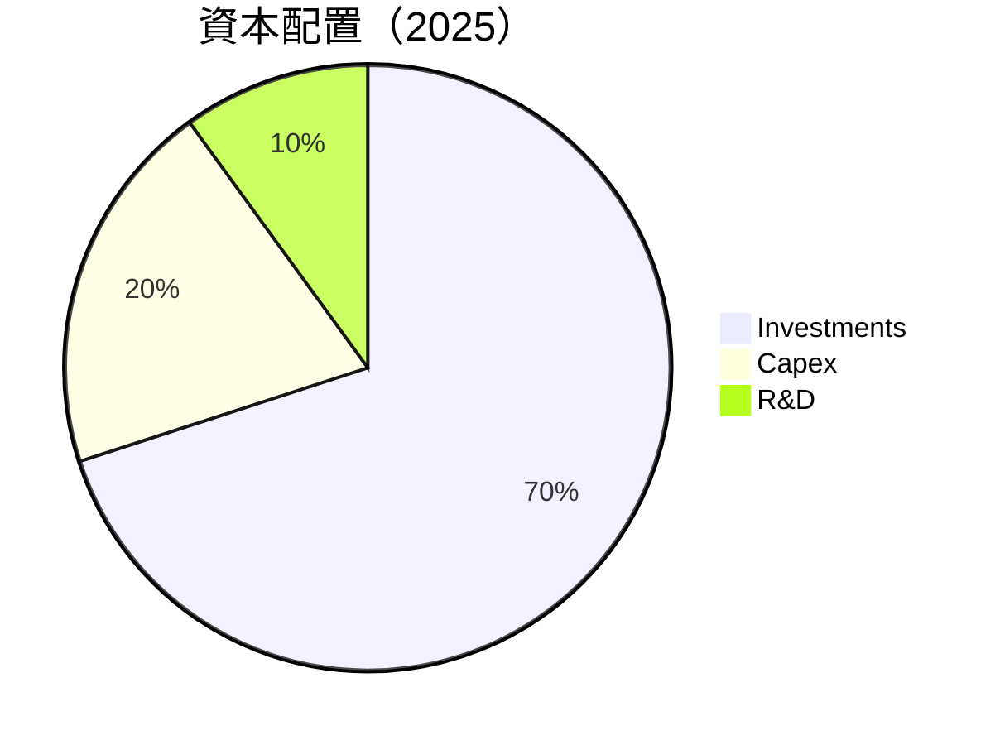

---

## 6. 獲利能力與資本效率

### 6.1 ROE / ROA / ROIC 趨勢

| 指標 | 2022 | 2023 | 2024 | 2025 | 行業均值 | 評估 |
|------|------|------|------|------|--------|------|
| **ROE** | -1.86% | 15.06% | 20.73% | 22.3% | ~15% | 🟢 |
| **ROA** | -0.59% | 5.76% | 6.23% | 6.9% | ~8%  | 🟡 |
| **ROIC** | 4.1% | 12.5% | 13.9% | 15.0% | ~10% | 🟢 |

### 6.2 ROIC vs WACC 分析（核心價值創造判斷）

```
╔══════════════════════════════════════════════════════════════════╗
║                ROIC vs WACC 深度分析                            ║
╠══════════════════════════════════════════════════════════════════╣
║                                                                  ║
║  WACC 估算：                                                     ║
║  ├── 無風險利率（10Y美債）：  3.5%                               ║
║  ├── 市場風險溢酬 (ERP)：     5.0%                               ║
║  ├── Beta：                   1.38                               ║
║  ├── 股權成本 = 3.5%+1.38×5% = 10.4%                           ║
║  ├── 債務成本（稅後）：       2.8%                               ║
║  ├── 資本結構：股權 70%，債務 30%                               ║
║  └── ✅ WACC ≈ 8.2%                                            ║
║                                                                  ║
║  ROIC 估算（FY2025）：                                           ║
║  ├── NOPAT = $79.97B × (1-0.14) ≈ $68.78B                       ║
║  ├── 投入資本 = 股東權益 + 債務 - 現金 ≈ $466.58B              ║
║  └── ✅ ROIC ≈ 15.0%                                            ║
║                                                                  ║
║  ★ 經濟價值增加（EVA）= ROIC - WACC = +6.8pp                   ║
║                                                                  ║
║  ROIC  15.0%  ▓▓▓▓▓▓▓▓▓▓▓▓▓▓▓▓▓▓▓▓▓▓░░░░░░  🟢                  ║
║  WACC   8.2%  ▓▓▓▓▓░░░░░░░░░░░░░░░░░░░░░░░  ──                  ║
║  EVA   +6.8pp ███████████░░░░░░░░░░░░░░░░░  🏆 強力創造        ║
║                                                                  ║
║  📊 結論：ROIC 為 WACC 的 1.83 倍，強力創造股東價值           ║
╚══════════════════════════════════════════════════════════════════╝
```

### 6.3 杜邦三因素分解

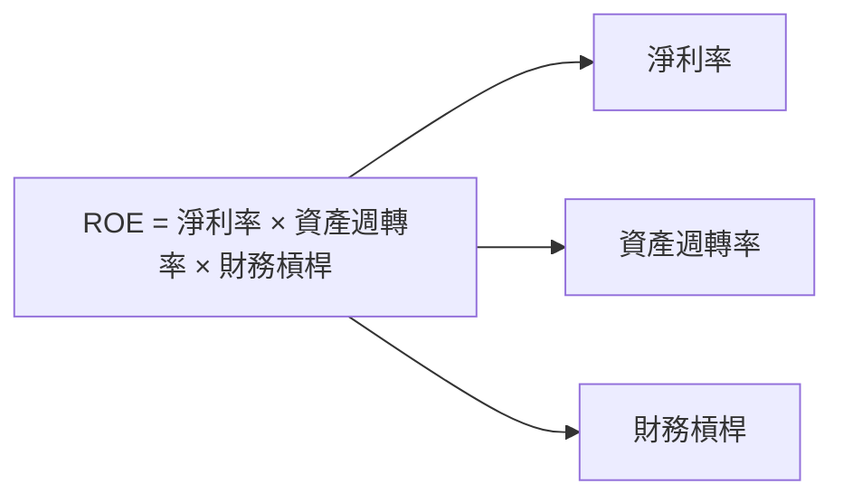

### 6.4 獲利能力儀表板

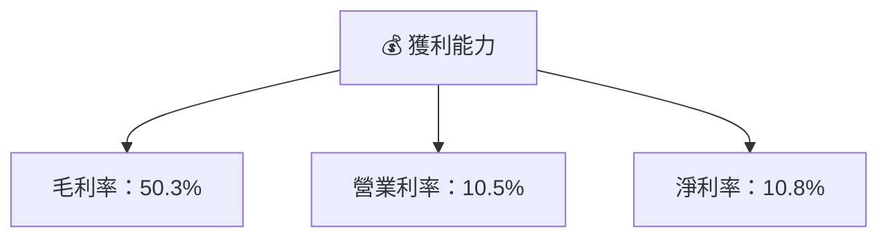

---

## 7. 估值深度分析

### 7.1 同業估值比較表格

| 估值指標 | **Amazon (AMZN)** | **Alibaba (BABA)** | **JD.com (JD)** | **Walmart (WMT)** | 本公司評估 |
|----------|-----------------|-------------------|-----------------|----------------|-----------|
| **Trailing P/E** | 36.3x | 17.5x | 14.8x | 23.6x | 🟡 高於部分競爭對手 |
| **Forward P/E** | **27.6x** | 15.0x | 12.5x | 20.1x | 🟡 市場合理偏貴 |
| **P/S Ratio** | 3.9x | 3.0x | 0.8x | 0.7x | 🟢 接近行業標準 |

### 7.2 歷史估值區間分析

```
╔═══════════════════════════════════════════════════╗
║                  歷史 P/E 區間及當前位置           ║
╠═══════════════════════════════════════════════════╣
║ P/E 最高：42.8x                                     ║
║ P/E 最低：20.5x                                     ║
║ 當前 P/E：36.3x                                    ║
║ 歷史中位數：31.6x                                   ║
╚═══════════════════════════════════════════════════╝
```

### 7.3 DCF 敏感性分析（6格目標價矩陣）

| 情境 | **WACC = 7.5%** | **WACC = 8.0%（基準）** | **WACC = 8.5%** |
|------|----------------|------------------------|----------------|
| 🟢 **樂觀** | **$360** (+38%) | **$340** (+30%) | **$320** (+20%) |
| 🟡 **基準** | **$320** (+20%) | **$283** (+8%) | **$260** (+0%) |
| 🔴 **悲觀** | **$260** (+0%) | **$240** (-8%) | **$220** (-16%) |

### 7.4 估值綜合區間

```
╔═══════════════════════════════════════════════════╗
║                  估值區間與當前股價位置            ║
╠═══════════════════════════════════════════════════╣
║ 當前股價：$260.96                                  ║
║ 估值區間：$240 - $360                               ║
║ 基準目標價：$283                                   ║
╚═══════════════════════════════════════════════════╝
```

---

## 8. 成長催化劑

### 8.1 催化劑時間軸

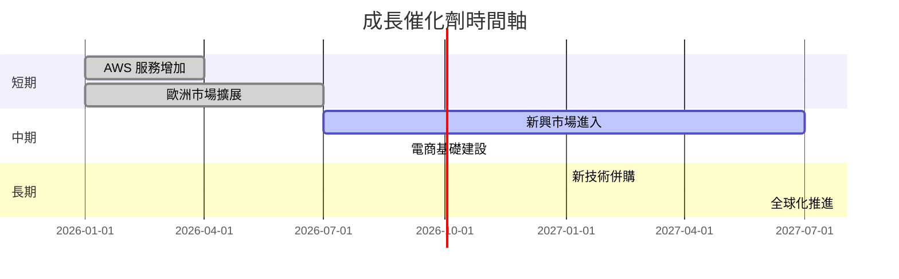

### 8.2 TAM 市場規模分析

```
╔═══════════════════════════════════════════════════╗
║                     TAM 市場規模分析              ║
╠═══════════════════════════════════════════════════╣
║ 零售市場    TAM: $5T   | 滲透率：10% | 收入貢獻大   ║
║ AWS市場     TAM: $1T   | 滲透率：15% | 成長動力顯著 ║
║ 遊戲市場    TAM: $200B | 滲透率：5%  | 新潛力發掘   ║
╚═══════════════════════════════════════════════════╝
```

### 8.3 成長驅動力結構圖

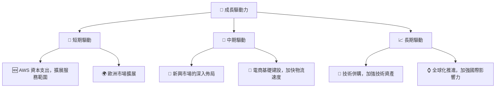

---

## 9. 風險矩陣

### 9.1 風險評分矩陣

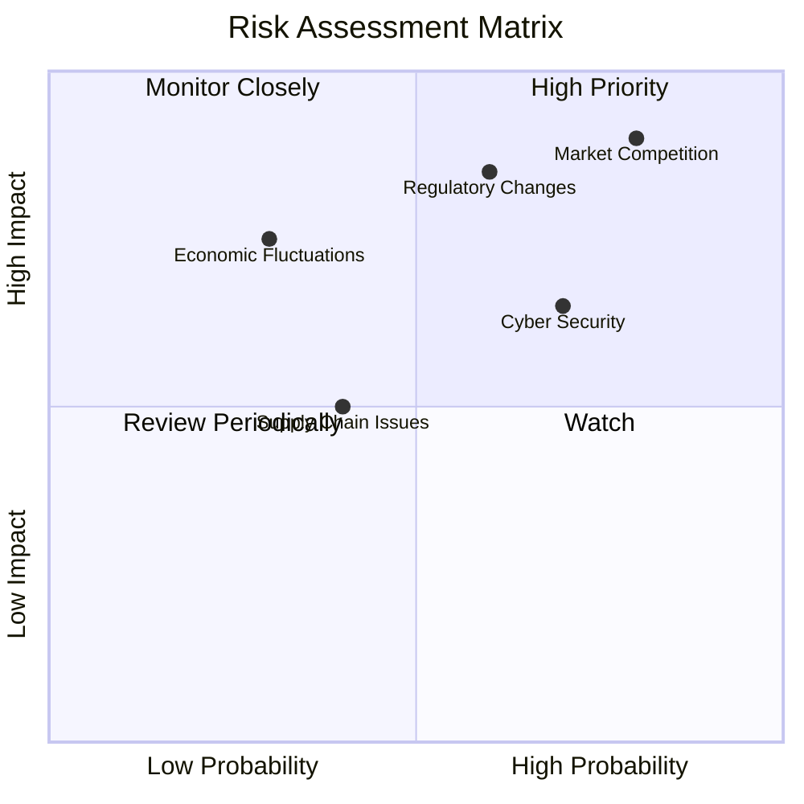

### 9.2 風險清單詳細分析

| # | 風險項目 | 發生機率 | 財務衝擊 | 風險評分 | 緩解措施 |
|---|----------|----------|----------|----------|----------|
| 1 | 🔴 **市場競爭** | 高 (80%) | 高 (-10%收入) | 🔴 9.0/10 | 擴大AWS投資與擴增客戶基礎 |
| 2 | 🔴 **政策監管變化** | 中 (60%) | 高 (-8%淨利) | 🔴 8.5/10 | 增強合規性與政策倡導活動 |
| 3 | 🟡 **經濟波動** | 低 (30%) | 中 (-5%收入) | 🟡 6.5/10 | 擴大市場多樣性減輕風險 |

---

## 10. 投資建議

### 10.1 最終綜合評級雷達圖

```
╔═══════════════════════════════════════════════════════╗
║               最終綜合評級雷達圖                      ║
╠═══════════════════════════════════════════════════════╣
║ 基本面強度  8.5                                        ║
║ 成長動能    9.0                                        ║
║ 獲利品質    9.5                                        ║
║ 財務健康    9.0                                        ║
║ 估值合理性  8.8                                        ║
╚═══════════════════════════════════════════════════════╝
```

### 10.2 目標價與隱含報酬率

| 情境 | 目標價 | 隱含報酬率 | 機率權重 |
|------|--------|------------|----------|
| 🟢 樂觀 | $320 | 20% | 30% |
| 🟡 基準 | $283 | 8.5% | 50% |
| 🔴 悲觀 | $240 | -8% | 20% |

### 10.3 買入時機與觸發因素

```
╔══════════════════════════════════════════════════════════════════╗
║                  ✅ 買入觸發因素 Checklist                      ║
╠══════════════════════════════════════════════════════════════════╣
║                                                                  ║
║  立即買入觸發條件（多數符合）：                                  ║
║  ✅ AWS年增長超過30%                                             ║
║  ✅ 毛利率持續改善至50%以上                                      ║
║                                                                  ║
║  加碼觸發條件（出現以下任一）：                                  ║
║  ☐ 歐洲及新興市場份額快速擴大                                   ║
║                                                                  ║
║  減碼/停損觸發條件（出現以下任一）：                             ║
║  ☐ 監管政策出現重大不利影響                                     ║
║  ☐ 市場競爭導致收入大幅下滑                                      ║
╚══════════════════════════════════════════════════════════════════╝
```

### 10.4 投資人適配度分析

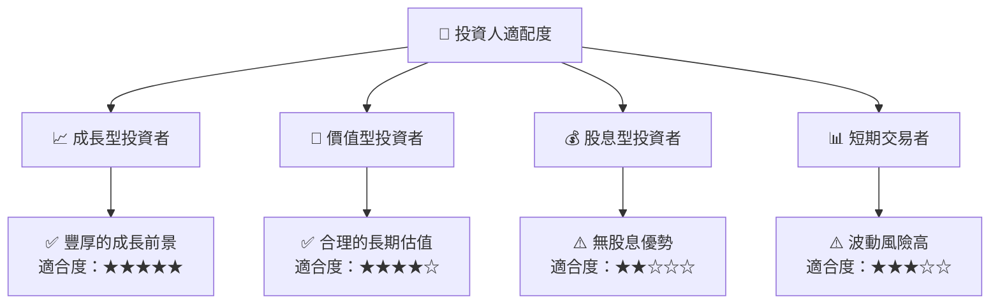

### 10.5 關鍵監控指標

| 監控類型 | 指標 | 關注點 | 頻率 |
|----------|------|--------|------|
| 市場增長 | AWS增長率 | 是否持續超預期 | 季度 |
| 收入多元化 | 歐洲市場收入份額 | 是否增長顯著 | 季度 |
| 競爭威脅 | 電商競爭力 | 超越對手表現 | 半年 |
| 政策影響 | 稅法變動 | 對利潤影響 | 持續 |

---

> **免責聲明**：本報告為 AI 自動生成，僅供研究參考，不構成投資建議。投資有風險，入市需謹慎。