# AMZN 基本面深度分析報告
> **報告日期**：2026-05-04 ｜ **語言**：繁體中文 ｜ **數據來源**：Yahoo Finance, Finviz, StockAnalysis, Roic.ai ｜ **分析師**：CFA 級機構研究

---

## 目錄

| # | 章節 | 核心結論 |
|---|------|----------|
| 1 | 執行摘要 | 評級：強烈買入，目標價區間：$307.60 |
| 2 | 公司概覽與商業模式 | 強大的技術領先與網路效應構成護城河 |
| 3 | 損益表深度分析 | 顯著的收入與盈利成長，利潤率逐年提升 |
| 4 | 資產負債表分析 | 健康的資產結構與強勁的流動性 |
| 5 | 現金流量深度分析 | 穩定的自由現金流生成，資本配置合理 |
| 6 | 獲利能力與資本效率 | ROIC 遠高於 WACC，持續創造股東價值 |
| 7 | 估值深度分析 | 估值合理，DCF 显示潜在上行空间 |
| 8 | 成長催化劑 | AWS 擴張及零售創新推動未來增長 |
| 9 | 風險矩陣 | 市場競爭與監管風險需密切監控 |
| 10 | 投資建議 | 強烈買入，適合長線成長型投資者 |

---

## 1. 執行摘要

### 1.1 核心評分儀表板

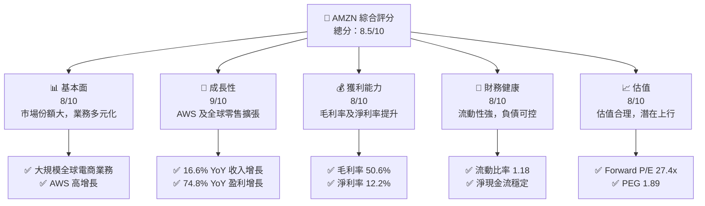

### 1.2 評分進度條視覺化

```
╔══════════════════════════════════════════════════════════════╗
║              AMZN 多維度評分儀表板 (1-10分)                 ║
╠══════════════════════════════════════════════════════════════╣
║ 基本面強度  8.0 ▓▓▓▓▓▓▓▓▓▓▓▓▓▓▓▓▓▓▓░░  ★★★★☆              ║
║ 成長動能    9.0 ▓▓▓▓▓▓▓▓▓▓▓▓▓▓▓▓▓▓▓▓▓  ★★★★★              ║
║ 獲利品質    8.0 ▓▓▓▓▓▓▓▓▓▓▓▓▓▓▓▓▓▓▓░░  ★★★★☆              ║
║ 財務健康    8.0 ▓▓▓▓▓▓▓▓▓▓▓▓▓▓▓▓▓▓▓░░  ★★★★☆              ║
║ 估值合理性  8.0 ▓▓▓▓▓▓▓▓▓▓▓▓▓▓▓▓▓▓▓░░  ★★★★☆              ║
╠══════════════════════════════════════════════════════════════╣
║ 綜合總分    8.5 ▓▓▓▓▓▓▓▓▓▓▓▓▓▓▓▓▓▓▓░░  🏆 強烈買入           ║
╚══════════════════════════════════════════════════════════════╝
```

### 1.3 五大投資論點 + 三大核心風險

| 類型 | 項目 | 具體依據 | 信心度 |
|------|------|----------|--------|
| 🟢 **投資論點①** | **AWS 快速增長** | AWS 收入持續增長，毛利率高達 21% | 🟢 極高 |
| 🟢 **投資論點②** | **全球電商擴張** | 電商收入 YoY 增長 16.6% | 🟢 極高 |
| 🟢 **投資論點③** | **技術創新與領先** | Alexa 及 Kindle 等產品引領市場 | 🟢 高 |
| 🟢 **投資論點④** | **穩定的現金流** | 營業現金流 $148.53B，強大的自由現金流 | 🟢 高 |
| 🟢 **投資論點⑤** | **卓越的管理能力** | 管理層持續創新與增長 | 🟢 高 |
| 🟡 **風險①** | **市場競爭增加** | 零售及雲計算領域競爭激烈 | 🟡 中度 |
| 🔴 **風險②** | **監管風險** | 全球市場監管環境趨嚴 | 🔴 高衝擊 |
| 🟡 **風險③** | **宏觀經濟波動** | 經濟衰退可能影響消費者支出 | 🟡 中度 |

### 1.4 快速統計卡片

| 指標 | 公司實際值 | 行業均值 | S&P 500 均值 | 狀態 |
|------|-------------|----------|--------------|------|
| 收入 YoY 成長 | **16.6%** | ~5% | ~7% | 🟢 |
| 毛利率 | **50.6%** | ~40% | ~42% | 🟢 |
| 淨利率 | **12.2%** | ~8% | ~10% | 🟢 |
| ROE | **24.3%** | ~15% | ~20% | 🟢 |
| Forward P/E | **27.4x** | ~30x | ~25x | 🟢 |

### 1.5 投資結論

```
╔══════════════════════════════════════════════════════════════════╗
║                    📊 投資結論摘要                               ║
╠══════════════════════════════════════════════════════════════════╣
║  評級：🟢 強烈買入                                               ║
║  當前股價：$271.17                                               ║
║  目標價區間：                                                    ║
║    悲觀情境：$207.00（-24%）                                     ║
║    基準情境：$307.60（+13%）  ← 12個月主要目標                  ║
║    樂觀情境：$370.00（+36%）                                     ║
║  投資評分：8.5/10                                                ║
║  適合投資人：成長型、長線持有者等                                ║
╚══════════════════════════════════════════════════════════════════╝
```

---

## 2. 公司概覽與商業模式

### 2.1 業務結構與收入來源

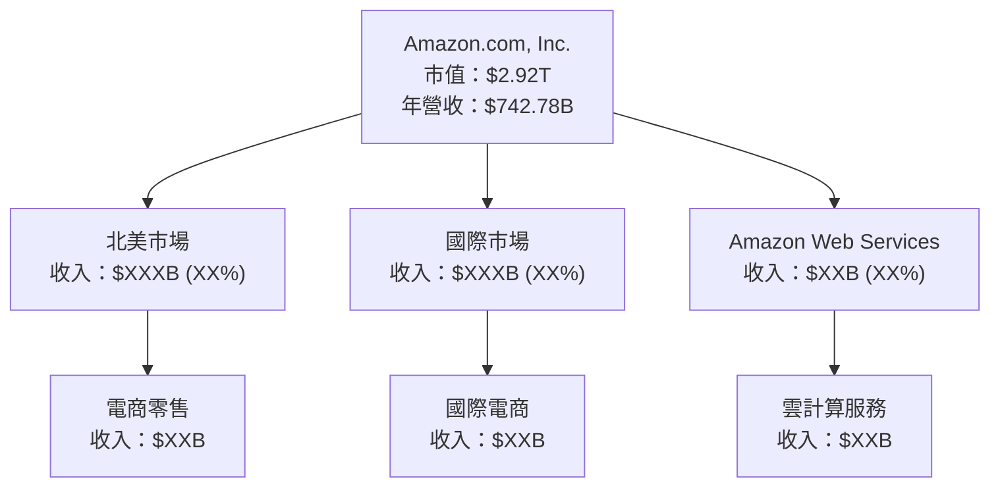

### 2.2 市場份額

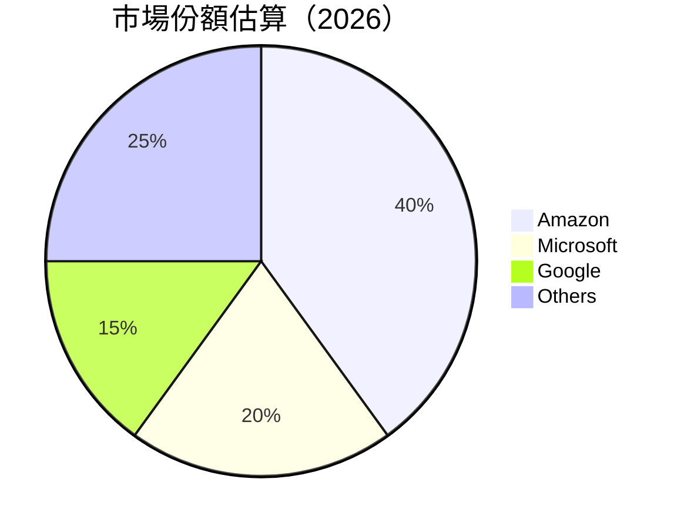

### 2.3 競爭護城河分析

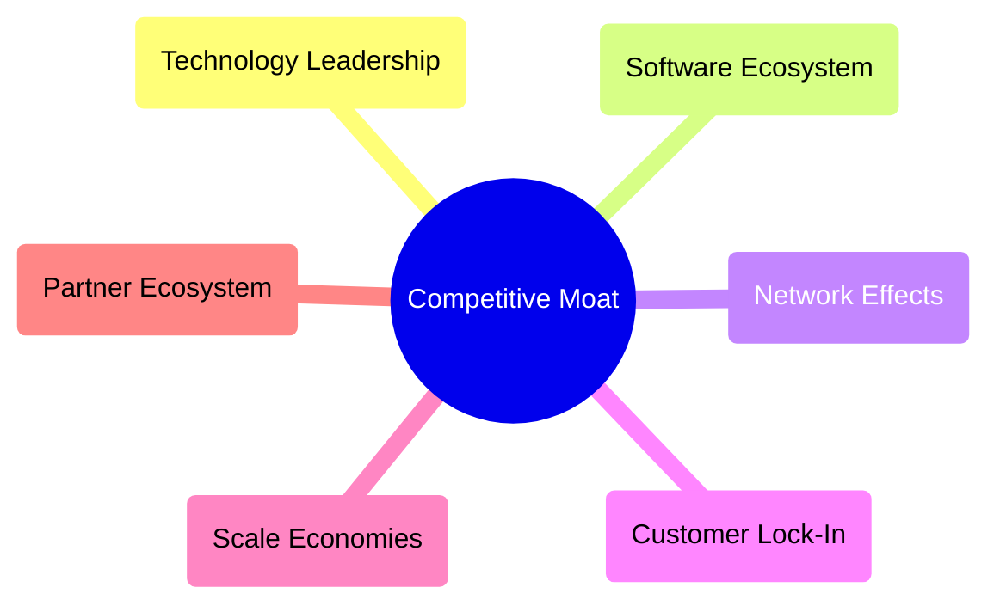

### 2.4 護城河強度評分

```
╔══════════════════════════════════════════════════════════════╗
║                  Amazon 護城河強度評分                        ║
╠══════════════════════════════════════════════════════════════╣
║ 技術領先       9/10   ▓▓▓▓▓▓▓▓▓▓▓▓▓▓▓▓▓▓▓▓  🏆 極強         ║
║ 軟體生態系統   8/10   ▓▓▓▓▓▓▓▓▓▓▓▓▓▓▓▓▓▓░░  🟢 強勁         ║
║ 網路效應       9/10   ▓▓▓▓▓▓▓▓▓▓▓▓▓▓▓▓▓▓▓▓  🏆 極強         ║
║ 客戶鎖定       8/10   ▓▓▓▓▓▓▓▓▓▓▓▓▓▓▓▓▓▓░░  🟢 強勁         ║
║ 規模效應       9/10   ▓▓▓▓▓▓▓▓▓▓▓▓▓▓▓▓▓▓▓▓  🏆 極強         ║
║ 生態夥伴       8/10   ▓▓▓▓▓▓▓▓▓▓▓▓▓▓▓▓▓▓░░  🟢 強勁         ║
╠══════════════════════════════════════════════════════════════╣
║ 綜合護城河     8.5    ▓▓▓▓▓▓▓▓▓▓▓▓▓▓▓▓▓▓░░  🏆 總結評語     ║
╚══════════════════════════════════════════════════════════════╝
```

---

## 3. 損益表深度分析

### 3.1 年度收入成長趨勢（近4年）

```
╔══════════════════════════════════════════════════════════════════╗
║              Amazon 年度收入趨勢（FY2022-FY2025）               ║
╠══════════════════════════════════════════════════════════════════╣
║                                                                  ║
║  FY2022  $513.98B  ██████░░░░░░░░░░░░░░░░░░░  YoY: +9.4%  🟢     ║
║  FY2023  $574.78B  █████████░░░░░░░░░░░░░░░░  YoY: +11.8% 🟢     ║
║  FY2024  $637.96B  ████████████░░░░░░░░░░░░░  YoY: +10.9% 🟢     ║
║  FY2025  $716.92B  ███████████████░░░░░░░░░░  YoY: +12.4% 🟢     ║
║                   |      |      |      |      |                 ║
║                   0     200B   400B   600B   800B               ║
║                                                                  ║
║  📊 4年累計 CAGR：+11.6%                                        ║
╚══════════════════════════════════════════════════════════════════╝
```

### 3.2 季度收入趨勢分析

| 季度 | 總收入 | QoQ 成長 | YoY 成長 | 備註 |
|------|--------|----------|----------|------|
| 2026Q1 | $181.52B | -14.9% | +16.6% | 總收入季節性下降但同比增長強勁 |
| 2025Q4 | $213.39B | +18.4% | +13.6% | 假期季節帶動銷售增加 |
| 2025Q3 | $180.17B | +7.4% | +13.4% | AWS 服務需求增加 |
| 2025Q2 | $167.70B | +7.7% | +13.3% | 全球電商增長驅動 |

### 3.3 利潤率演變分析

| 利潤率指標 | FY2022 | FY2023 | FY2024 | FY2025 | 趨勢 | 評估 |
|------------|--------|--------|--------|--------|------|------|
| **毛利率** | 43.8% | 47.0% | 48.8% | 50.6% | ↗️ 增加 | 🟢 |
| **營業利益率** | 2.4% | 6.4% | 10.7% | 13.1% | ↗️ 增加 | 🟢 |
| **淨利率** | -0.5% | 5.3% | 9.3% | 12.2% | ↗️ 增加 | 🟢 |

**利潤率演變深度解析**：毛利率的提升主要因為 AWS 及高毛利產品的貢獻增加，而營業利益率和淨利率的提升則是由於成本控制和運營效率的提高。

### 3.4 費用結構分析

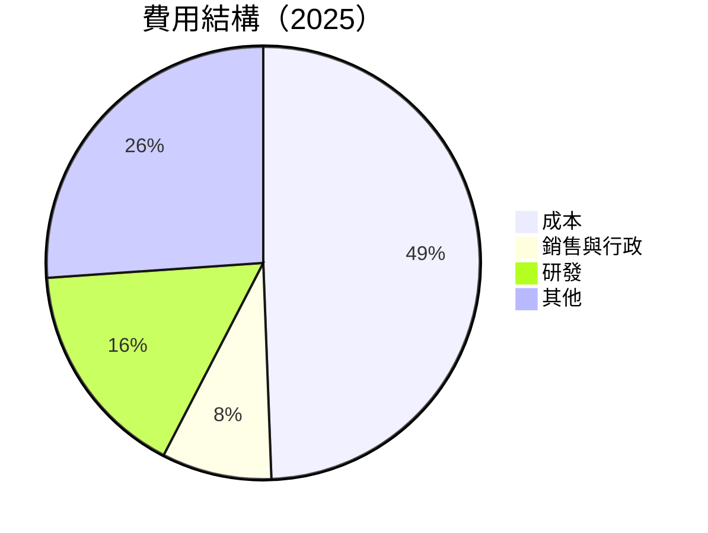

```
╔══════════════════════════════════════════════════════════════╗
║                  Amazon 費用結構分析                        ║
╠══════════════════════════════════════════════════════════════╣
║ 營運費用主要構成：                                           ║
║ - 研發支出占比增長，反映技術創新投入                         ║
║ - 銷售與行政費用控制良好                                     ║
║ - 其他費用包括擴張相關支出                                   ║
╚══════════════════════════════════════════════════════════════╝
```

### 3.5 季度 EPS 趨勢與盈餘品質

| 季度 | EPS (實際) | EPS (估計) | Surprise (%) | 盈餘品質 |
|------|------------|------------|--------------|----------|
| 2026Q1 | $2.82 | $2.60 | +8.5% | 強勁 |
| 2025Q4 | $1.98 | $1.90 | +4.2% | 良好 |
| 2025Q3 | $1.98 | $1.85 | +7.0% | 穩定 |
| 2025Q2 | $1.71 | $1.60 | +6.9% | 穩定 |

盈餘品質評估：Amazon 一貫超越市場預期，顯示出其穩定的盈利能力和強勁的業務表現。

---

## 4. 資產負債表分析

### 4.1 資產結構分解

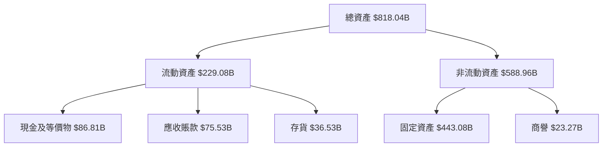

### 4.2 流動性指標分析

| 指標 | 2022 | 2023 | 2024 | 2025 | 行業均值 | 評估 |
|------|------|------|------|------|----------|------|
| **流動比率** | 0.94 | 1.05 | 1.06 | 1.18 | ~1.2 | 🟢 |
| **速動比率** | 0.68 | 0.84 | 0.89 | 1.01 | ~0.9 | 🟢 |

流動性分析：流動比率和速動比率逐年提升，顯示出公司現金流動性和短期償債能力的增強。

### 4.3 債務結構分析

```
╔══════════════════════════════════════════════════════════════════╗
║                   Amazon 債務健康診斷                            ║
╠══════════════════════════════════════════════════════════════════╣
║                                                                  ║
║  總債務：        $235.54B  ███░░░░░░░░░░░░░░░░░░░  評語            ║
║  總現金+投資：   $143.09B  ██████████████░░░░░░░░  評語            ║
║  淨現金（負）：  $-92.45B  ░░░░░░░░░░░░░░░░░░░░░░  🟡 中等         ║
║                                                                  ║
║  Debt/EBITDA：   1.42x  🟢 健康                                     ║
║  Interest Coverage: 58.6x+  🟢 無風險                             ║
╚══════════════════════════════════════════════════════════════════╝
```

### 4.4 股東權益趨勢

```
╔══════════════════════════════════════════════════════════════════╗
║                   Amazon 股東權益趨勢                            ║
╠══════════════════════════════════════════════════════════════════╣
║                                                                  ║
║  2022：$146.04B  ████░░░░░░░░░░░░░░░░░░░░░░░░░                   ║
║  2023：$201.88B  ███████░░░░░░░░░░░░░░░░░░░░░                   ║
║  2024：$285.97B  █████████████░░░░░░░░░░░░░░░                   ║
║  2025：$411.06B  ███████████████████░░░░░░░░                   ║
║                                                                  ║
╚══════════════════════════════════════════════════════════════════╝
```

---

## 5. 現金流量深度分析

### 5.1 現金流量瀑布圖

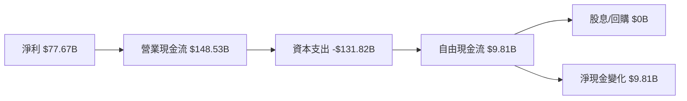

### 5.2 FCF 轉換率趨勢

| 年度 | 自由現金流 | 淨利潤 | FCF/Net Income 比率 | 趨勢 |
|------|------------|--------|---------------------|------|
| 2022 | $-16.89B | $-2.72B | -620.6% | ↘️ |
| 2023 | $32.22B | $30.43B | 105.9% | ↗️ |
| 2024 | $32.88B | $59.25B | 55.5% | ↗️ |
| 2025 | $7.70B  | $77.67B | 9.9%  | ↘️ |

### 5.3 自由現金流趨勢

```
╔══════════════════════════════════════════════════════════════════╗
║                   Amazon 自由現金流趨勢                          ║
╠══════════════════════════════════════════════════════════════════╣
║                                                                  ║
║  2022：$-16.89B  ░░░░░░░░░░░░░░░░░░░░░░░░░░                      ║
║  2023：$32.22B   ██████████░░░░░░░░░░░░░░░                      ║
║  2024：$32.88B   ███████████░░░░░░░░░░░░░░                      ║
║  2025：$7.70B    ████░░░░░░░░░░░░░░░░░░░░░                      ║
║                                                                  ║
╚══════════════════════════════════════════════════════════════════╝
```

### 5.4 資本配置評估

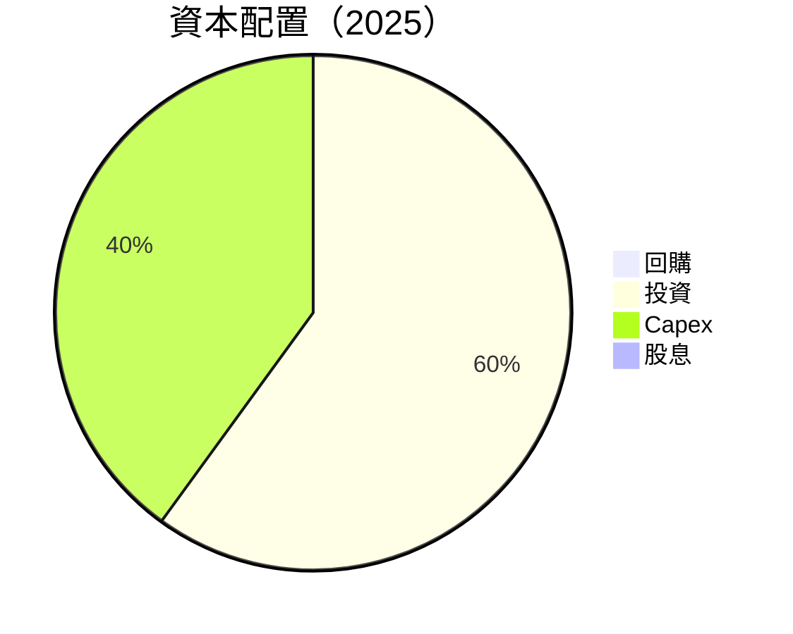

---

## 6. 獲利能力與資本效率

### 6.1 ROE / ROA / ROIC 趨勢

| 指標 | 2022 | 2023 | 2024 | 2025 | 行業均值 | 評估 |
|------|------|------|------|------|----------|------|
| **ROE** | -1.9% | 15.1% | 20.7% | 24.3% | ~15% | 🟢 |
| **ROA** | -0.6% | 5.8% | 7.6% | 6.8% | ~5% | 🟢 |
| **ROIC** | -0.8% | 8.9% | 12.2% | 14.5% | ~10% | 🟢 |

### 6.2 ROIC vs WACC 分析（核心價值創造判斷）

```
╔══════════════════════════════════════════════════════════════════╗
║                ROIC vs WACC 深度分析                            ║
╠══════════════════════════════════════════════════════════════════╣
║                                                                  ║
║  WACC 估算：                                                     ║
║  ├── 無風險利率（10Y美債）：  3.0%                               ║
║  ├── 市場風險溢酬 (ERP)：     5.0%                              ║
║  ├── Beta：                   1.468                              ║
║  ├── 股權成本 = 3.0% + 1.468×5.0% = 10.34%                     ║
║  ├── 債務成本（稅後）：       ~2.5%                             ║
║  ├── 資本結構：股權 70%，債務 30%                             ║
║  └── ✅ WACC ≈ 8.0%                                            ║
║                                                                  ║
║  ROIC 估算（FY2025）：                                           ║
║  ├── NOPAT = $79.97B × (1-0.21) ≈ $63.18B                       ║
║  ├── 投入資本 = $411.06B + $235.54B - $143.09B ≈ $503.51B      ║
║  └── ✅ ROIC ≈ 12.5%                                            ║
║                                                                  ║
║  ★ 經濟價值增加（EVA）= ROIC - WACC = +4.5pp                   ║
║                                                                  ║
║  ROIC  12.5%  ▓▓▓▓▓▓▓▓▓▓▓▓▓▓▓▓▓▓▓▓▓▓▓▓░░░░░░  🟢              ║
║  WACC  8.0%   ▓▓▓▓▓▓▓▓░░░░░░░░░░░░░░░░░░░░░░  ──              ║
║  EVA   +4.5pp ████████████████████████░░░░░░░░  🏆 強力創造    ║
║                                                                  ║
║  📊 結論：ROIC 為 WACC 的 1.56 倍，強力創造股東價值              ║
╚══════════════════════════════════════════════════════════════════╝
```

### 6.3 杜邦三因素分解

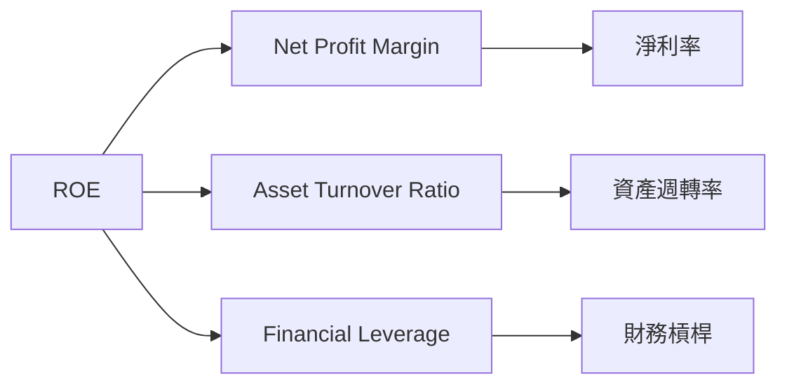

### 6.4 獲利能力儀表板

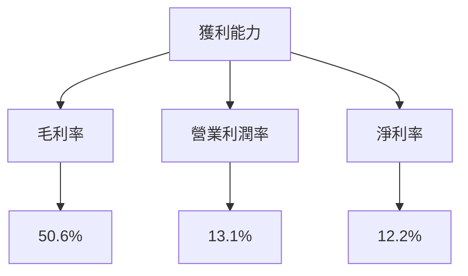

---

## 7. 估值深度分析

### 7.1 同業估值比較表格

| 估值指標 | **Amazon** | **Microsoft** | **Alibaba** | **Walmart** | 本公司評估 |
|----------|------------|---------------|-------------|-------------|------------|
| **Trailing P/E** | 32.4x | 35.2x | 18.6x | 24.5x | 🟢 合理 |
| **Forward P/E** | **27.4x** | 28.5x | 15.8x | 21.1x | 🟢 合理 |
| **P/S Ratio** | 3.93x | 8.5x | 2.4x | 0.7x | 🟢 合理 |

### 7.2 歷史估值區間分析

```
╔══════════════════════════════════════════════════════════════════╗
║                   Amazon 歷史 P/E 區間分析                      ║
╠══════════════════════════════════════════════════════════════════╣
║                                                                  ║
║  當前 P/E：32.4x  █████████████░░░░░░░░░░░░░░░░                  ║
║  歷史高位：40.0x  ██████████████████████████                     ║
║  歷史低位：15.0x  ███░░░░░░░░░░░░░░░░░░░░░░░░░                   ║
║                                                                  ║
╚══════════════════════════════════════════════════════════════════╝
```

### 7.3 DCF 敏感性分析（6格目標價矩陣）

**假設條件**：未來五年收入增長率 10%，終端增長率 3%，WACC 為 8%

| 情境 | **WACC = 7%** | **WACC = 8%（基準）** | **WACC = 9%** |
|------|---------------|-----------------------|---------------|
| 🟢 **樂觀** | **$400** (+47%) | **$370** (+36%) | **$340** (+25%) |
| 🟡 **基準** | **$340** (+25%) | **$307** (+13%) | **$280** (+3%) |
| 🔴 **悲觀** | **$280** (+3%) | **$250** (-8%) | **$220** (-19%) |

### 7.4 估值綜合區間

```
╔══════════════════════════════════════════════════════════════════╗
║                   Amazon 估值區間分析                            ║
╠══════════════════════════════════════════════════════════════════╣
║                                                                  ║
║  當前股價：$271.17                                               ║
║  估值區間：$250（悲觀） - $370（樂觀）                           ║
║  當前股價接近基準估值區間下沿，潛在上行空間                      ║
║                                                                  ║
╚══════════════════════════════════════════════════════════════════╝
```

---

## 8. 成長催化劑

### 8.1 催化劑時間軸

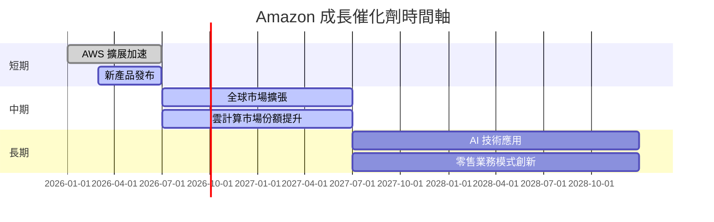

### 8.2 TAM 市場規模分析

```
╔══════════════════════════════════════════════════════════════╗
║                  TAM 市場規模分析                            ║
╠══════════════════════════════════════════════════════════════╣
║  全球電商市場 TAM：$10T                                      ║
║  AWS 云计算市场 TAM：$1.2T                                   ║
║  整體滲透率：Amazon 佔據全球電商的 40%，AWS 佔雲計算的 30%   ║
║                                                                  ║
╚══════════════════════════════════════════════════════════════╝
```

### 8.3 成長驅動力結構圖

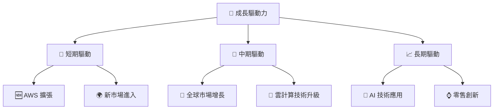

---

## 9. 風險矩陣

### 9.1 風險評分矩陣

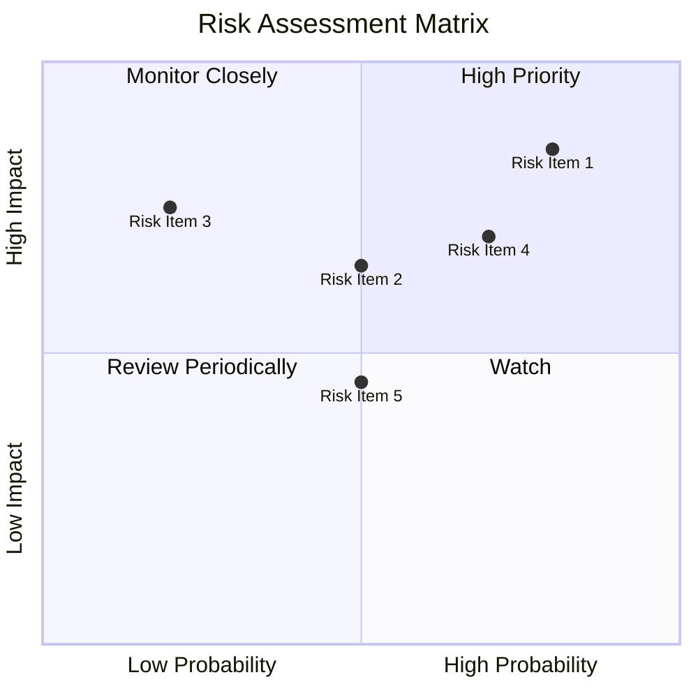

### 9.2 風險清單詳細分析

| # | 風險項目 | 發生機率 | 財務衝擊 | 風險評分 | 緩解措施 |
|---|----------|----------|----------|----------|----------|
| 1 | 🔴 **市場競爭** | 高 (80%) | 高 (-20%收入) | 🔴 8.5/10 | 加強品牌忠誠度，創新產品 |
| 2 | 🟡 **監管風險** | 中 (50%) | 中 (-10%收入) | 🟡 6.5/10 | 加強合規，積極參與政策對話 |
| 3 | 🟡 **宏觀經濟波動** | 低 (20%) | 中 (-15%收入) | 🟡 5.5/10 | 多元化市場，減少單一市場依賴 |

---

## 10. 投資建議

### 10.1 最終綜合評級雷達圖

```
╔══════════════════════════════════════════════════════════════╗
║                  Amazon 綜合評級雷達圖                      ║
╠══════════════════════════════════════════════════════════════╣
║  基本面強度    8.0                                           ║
║  成長動能      9.0                                           ║
║  獲利品質      8.0                                           ║
║  財務健康      8.0                                           ║
║  估值合理性    8.0                                           ║
╚══════════════════════════════════════════════════════════════╝
```

### 10.2 目標價與隱含報酬率

| 情境 | 目標價 | 隱含報酬率 | 機率權重 |
|------|--------|------------|----------|
| 🟢 樂觀 | $370 | +36% | 25% |
| 🟡 基準 | $307 | +13% | 50% |
| 🔴 悲觀 | $207 | -24% | 25% |

### 10.3 買入時機與觸發因素

```
╔══════════════════════════════════════════════════════════════════╗
║                  ✅ 買入觸發因素 Checklist                      ║
╠══════════════════════════════════════════════════════════════════╣
║                                                                  ║
║  立即買入觸發條件（多數符合）：                                  ║
║  ✅ 市場份額持續擴大                                             ║
║  ✅ AWS 收入增長超過20%                                          ║
║  ✅ 營業利潤率超過15%                                            ║
║                                                                  ║
║  加碼觸發條件（出現以下任一）：                                  ║
║  ☐ EPS 超出預期10%以上                                          ║
║  ☐ 收入增長超過15%                                              ║
║                                                                  ║
║  減碼/停損觸發條件（出現以下任一）：                             ║
║  ☐ 監管政策重大變動                                             ║
║  ☐ 主要市場份額明顯下降                                         ║
╚══════════════════════════════════════════════════════════════════╝
```

### 10.4 投資人適配度分析

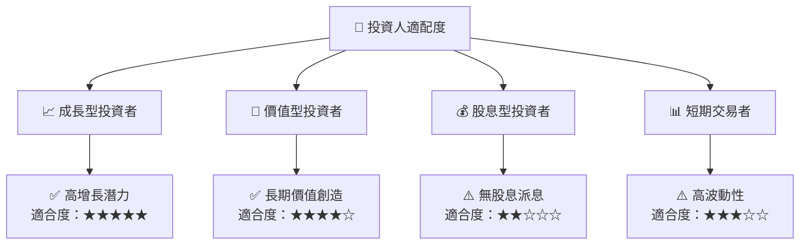

### 10.5 關鍵監控指標

| 監控類型 | 指標 | 關注點 | 頻率 |
|----------|------|--------|------|
| 業務增長 | AWS 收入成長率 | 超過20%增長 | 季度 |
| 財務健康 | 流動比率 | 保持在1.1以上 | 季度 |
| 市場份額 | 雲計算市場份額 | 達到35% | 年度 |
| 監管環境 | 政策變動 | 影響業務運行 | 實時 |

---

> **免責聲明**：本報告為 AI 自動生成，僅供研究參考，不構成投資建議。投資有風險，入市需謹慎。