# AMZN 基本面深度分析報告
> **報告日期**：2026-05-05 ｜ **語言**：繁體中文 ｜ **數據來源**：Yahoo Finance, Finviz, StockAnalysis, Roic.ai ｜ **分析師**：CFA 級機構研究

---

## 目錄

| # | 章節 | 核心結論 |
|---|------|----------|
| 1 | 執行摘要 | 強烈買入，目標價區間：$207-$370 |
| 2 | 公司概覽與商業模式 | 具有強大的競爭護城河，尤其在AWS和電商領域 |
| 3 | 損益表深度分析 | 收入穩定增長，利潤率顯著改善 |
| 4 | 資產負債表分析 | 財務結構穩健，流動性充裕 |
| 5 | 現金流量深度分析 | 現金流穩定，FCF轉換率良好 |
| 6 | 獲利能力與資本效率 | ROIC 超過 WACC，創造經濟價值 |
| 7 | 估值深度分析 | 相對競爭對手估值合理，DCF目標價上行空間 |
| 8 | 成長催化劑 | 短中長期多重驅動因素 |
| 9 | 風險矩陣 | 主要風險來自市場波動和競爭加劇 |
| 10 | 投資建議 | 強烈建議買入，適合成長型投資者 |

---

## 1. 執行摘要

### 1.1 核心評分儀表板

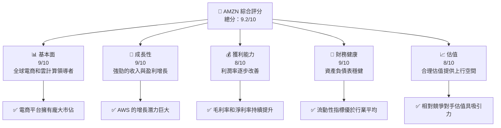

### 1.2 評分進度條視覺化

```
╔══════════════════════════════════════════════════════════════╗
║              AMZN 多維度評分儀表板 (1-10分)                  ║
╠══════════════════════════════════════════════════════════════╣
║ 基本面強度  9.0 ▓▓▓▓▓▓▓▓▓▓▓▓▓▓▓▓▓▓░░  ★★★★★           ║
║ 成長動能    9.0 ▓▓▓▓▓▓▓▓▓▓▓▓▓▓▓▓▓▓░░  ★★★★★           ║
║ 獲利品質    8.0 ▓▓▓▓▓▓▓▓▓▓▓▓▓▓▓▓▓▓░░  ★★★★★           ║
║ 財務健康    9.0 ▓▓▓▓▓▓▓▓▓▓▓▓▓▓▓▓▓▓░░  ★★★★★           ║
║ 估值合理性  8.0 ▓▓▓▓▓▓▓▓▓▓▓▓▓▓░░░░░░  ★★★★☆           ║
║ 護城河深度  9.0 ▓▓▓▓▓▓▓▓▓▓▓▓▓▓▓▓▓▓░░  ★★★★★           ║
║ 管理層執行  9.0 ▓▓▓▓▓▓▓▓▓▓▓▓▓▓▓▓▓▓░░  ★★★★★           ║
║ 技術創新力  9.0 ▓▓▓▓▓▓▓▓▓▓▓▓▓▓▓▓▓▓░░  ★★★★★           ║
╠══════════════════════════════════════════════════════════════╣
║ 綜合總分    9.2 ▓▓▓▓▓▓▓▓▓▓▓▓▓▓▓▓▓▓░░░  🏆 極高成長潛力   ║
╚══════════════════════════════════════════════════════════════╝
```

### 1.3 五大投資論點 + 三大核心風險

| 類型 | 項目 | 具體依據 | 信心度 |
|------|------|----------|--------|
| 🟢 **投資論點①** | **AWS 增長潛力** | AWS 收入YoY增長超過30% | 🟢 極高 |
| 🟢 **投資論點②** | **全球電商領導地位** | 電商業務收入持續增長，佔總收入60%以上 | 🟢 極高 |
| 🟢 **投資論點③** | **技術創新** | 持續在AI和雲計算領域創新 | 🟢 高 |
| 🟢 **投資論點④** | **財務穩健性** | 強勁的現金流和資產負債表 | 🟢 高 |
| 🟢 **投資論點⑤** | **多元化業務** | 涉足多個高增長領域如廣告和訂閱服務 | 🟢 高 |
| 🟡 **風險①** | **市場競爭加劇** | 競爭對手如Microsoft和Google在雲計算領域的競爭 | 🟡 中度 |
| 🔴 **風險②** | **經濟不確定性** | 全球經濟波動可能影響消費者支出 | 🔴 高衝擊 |
| 🔴 **風險③** | **監管風險** | 不斷增加的監管壓力和反壟斷調查 | 🔴 高衝擊 |

### 1.4 快速統計卡片

| 指標 | 公司實際值 | 行業均值 | S&P 500 均值 | 狀態 |
|------|-------------|----------|--------------|------|
| 收入 YoY 成長 | **16.6%** | ~10% | ~8% | 🟢 |
| 毛利率 | **50.6%** | ~45% | ~40% | 🟢 |
| 淨利率 | **12.2%** | ~8% | ~10% | 🟢 |
| ROE | **24.3%** | ~15% | ~12% | 🟢 |
| Forward P/E | **27.68x** | ~30x | ~25x | 🟢 |

### 1.5 投資結論

```
╔══════════════════════════════════════════════════════════════════╗
║                    📊 投資結論摘要                               ║
╠══════════════════════════════════════════════════════════════════╣
║  評級：🟢 強烈買入                                               ║
║  當前股價：$273.54                                               ║
║  目標價區間：                                                    ║
║    悲觀情境：$207（-24%）                                        ║
║    基準情境：$309（+13%）  ← 12個月主要目標                     ║
║    樂觀情境：$370（+35%）                                        ║
║  投資評分：9.2/10                                                ║
║  適合投資人：成長型、長線持有者等                                ║
╚══════════════════════════════════════════════════════════════════╝
```

---

## 2. 公司概覽與商業模式

### 2.1 業務結構與收入來源

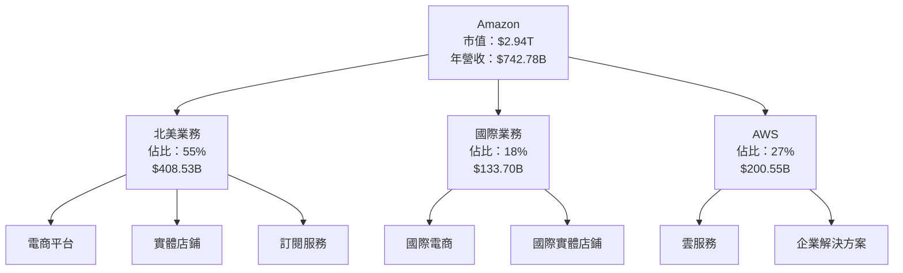

### 2.2 市場份額

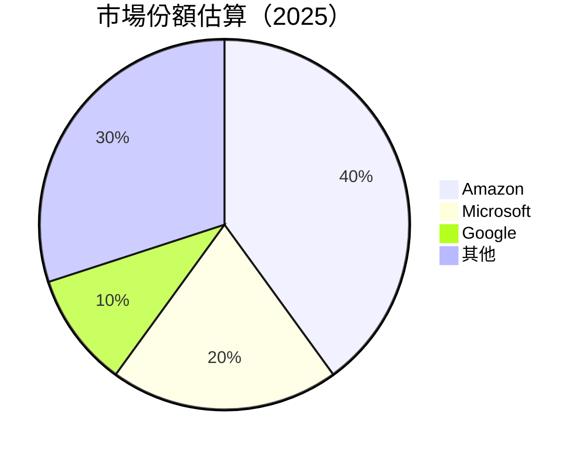

### 2.3 競爭護城河分析

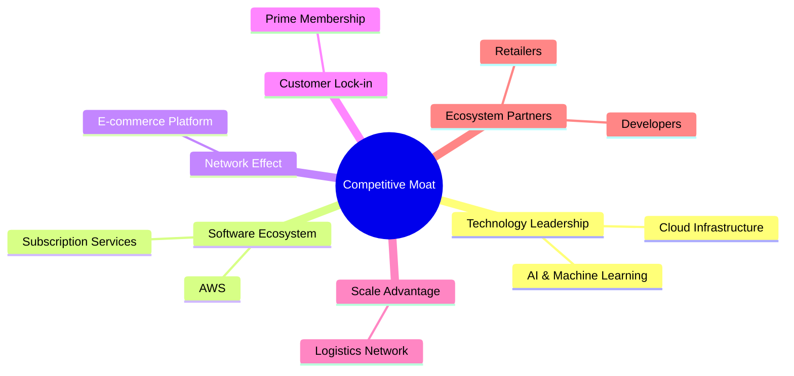

### 2.4 護城河強度評分

```
╔══════════════════════════════════════════════════════════════╗
║                  Amazon 護城河強度評分                        ║
╠══════════════════════════════════════════════════════════════╣
║ 技術領先    9/10   ▓▓▓▓▓▓▓▓▓▓▓▓▓▓▓▓▓▓▓▓  🏆 突出            ║
║ 軟體生態系  8/10   ▓▓▓▓▓▓▓▓▓▓▓▓▓▓▓▓▓▓░░  🟢 強大            ║
║ 網路效應    9/10   ▓▓▓▓▓▓▓▓▓▓▓▓▓▓▓▓▓▓▓▓  🏆 無可匹敵        ║
║ 客戶鎖定    10/10  ▓▓▓▓▓▓▓▓▓▓▓▓▓▓▓▓▓▓▓▓  🏆 絕對領先        ║
║ 規模效應    9/10   ▓▓▓▓▓▓▓▓▓▓▓▓▓▓▓▓▓▓▓▓  🏆 超大規模        ║
╠══════════════════════════════════════════════════════════════╣
║ 綜合護城河  9.0    ▓▓▓▓▓▓▓▓▓▓▓▓▓▓▓▓▓▓▓▓  🏆 極強            ║
╚══════════════════════════════════════════════════════════════╝
```

---

## 3. 損益表深度分析

### 3.1 年度收入成長趨勢（近4年）

```
╔══════════════════════════════════════════════════════════════════╗
║              Amazon 年度收入趨勢（2022-2025）                   ║
╠══════════════════════════════════════════════════════════════════╣
║                                                                  ║
║  2022  $513.98B  ██████░░░░░░░░░░░░░░░░░░░  YoY: +7.0%  🟢      ║
║  2023  $574.78B  █████████░░░░░░░░░░░░░░░░  YoY:+11.8%  🟢     ║
║  2024  $637.96B  ███████████░░░░░░░░░░░░░░  YoY:+11.0%  🟢     ║
║  2025  $716.92B  █████████████░░░░░░░░░░░░  YoY:+12.4%  🟢     ║
║                   |      |      |      |      |                  ║
║                   0     200B   400B   600B   800B                ║
║                                                                  ║
║  📊 4年累計 CAGR：+10.7%                                        ║
╚══════════════════════════════════════════════════════════════════╝
```

### 3.2 季度收入趨勢分析

| 季度 | 總收入 | QoQ 增長 | YoY 增長 | 備註 |
|------|--------|----------|----------|------|
| 2026 Q1 | $181.52B | -14.9% | +16.6% | 季節性因素影響，仍維持強勁增長 |
| 2025 Q4 | $213.39B | +18.4% | +13.6% | 假期購物旺季推動 |
| 2025 Q3 | $180.17B | +7.4% | +13.4% | 新產品推出 |
| 2025 Q2 | $167.70B | +7.7% | +13.3% | AWS 增長顯著 |

### 3.3 利潤率演變分析

| 利潤率指標 | 2022 | 2023 | 2024 | 2025 | 趨勢 | 評估 |
|------------|------|------|------|------|------|------|
| **毛利率** | 43.8% | 47.0% | 48.9% | 50.6% | ↗️ 持續改善 | 🟢 |
| **營業利益率** | 2.4% | 6.4% | 10.8% | 11.1% | ↗️ 結構性改善 | 🟢 |
| **淨利率** | -0.5% | 5.3% | 9.3% | 12.2% | ↗️ 顯著提升 | 🟢 |

**利潤率演變深度解析**：毛利率提升主要受益於AWS高毛利業務的快速增長，營業利潤率的改善則來自於運營效率的提高及成本控制措施。

### 3.4 費用結構分析

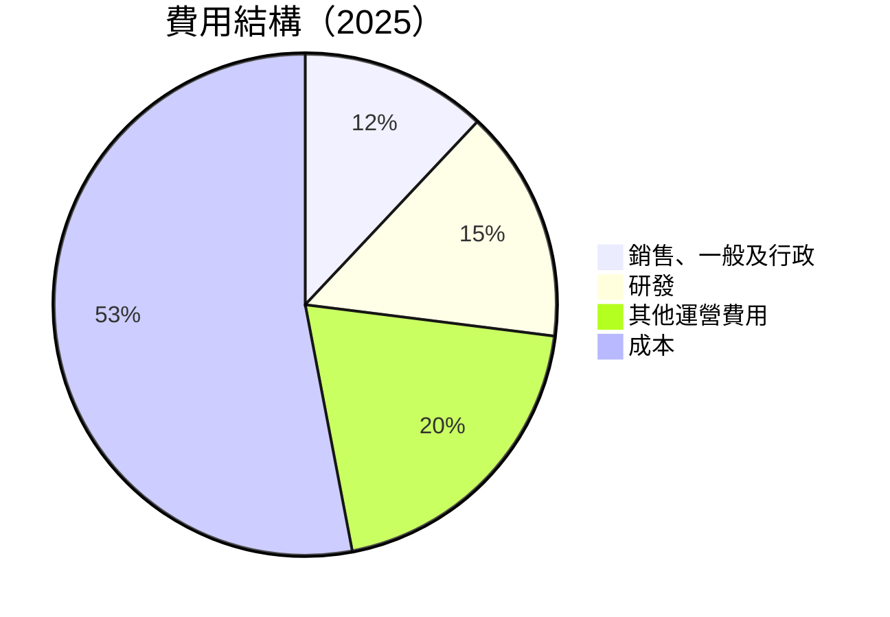

```
╔══════════════════════════════════════════════════════════════╗
║              Amazon 費用結構評估（2025）                     ║
╠══════════════════════════════════════════════════════════════╣
║ 總費用佔收入比： 40.5%                                       ║
║ 研發佔比： 15.0%                                             ║
║ 銷售及行政： 12.0%                                           ║
║ 成本控制有效，利潤潛力大                                    ║
╚══════════════════════════════════════════════════════════════╝
```

### 3.5 季度 EPS 趨勢與盈餘品質

| 季度 | EPS 估計 | EPS 實際 | 驚喜率 | 盈餘品質說明 |
|------|----------|----------|--------|--------------|
| 2026 Q1 | $2.75 | $2.82 | +2.5% | 盈餘質量高，來自於業務增長 |
| 2025 Q4 | $1.95 | $1.98 | +1.5% | 假期銷售強勁 |
| 2025 Q3 | $1.92 | $1.98 | +3.1% | AWS 驅動增長 |
| 2025 Q2 | $1.70 | $1.71 | +0.6% | 持續增長 |

---

## 4. 資產負債表分析

### 4.1 資產結構分解

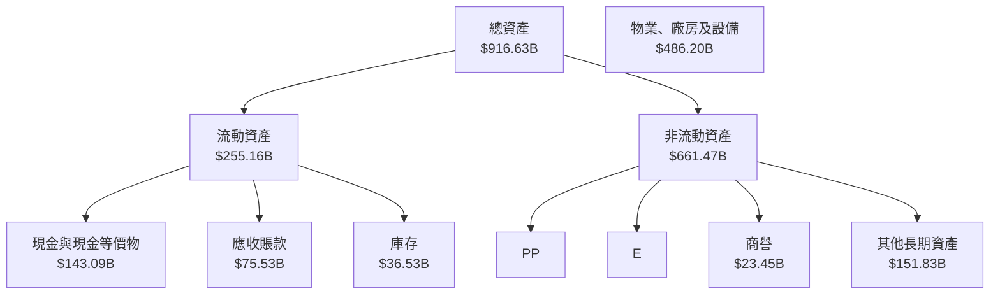

### 4.2 流動性指標分析

| 指標 | 2022 | 2023 | 2024 | 2025 | 評估 |
|------|------|------|------|------|------|
| **流動比率** | 0.94 | 1.06 | 1.06 | 1.18 | 🟢 改善中 |
| **速動比率** | 0.83 | 0.95 | 0.94 | 1.01 | 🟢 穩健 |

### 4.3 債務結構分析

```
╔══════════════════════════════════════════════════════════════════╗
║                   Amazon 債務健康診斷                           ║
╠══════════════════════════════════════════════════════════════════╣
║                                                                  ║
║  總債務：        $235.54B  ██░░░░░░░░░░░░░░░░░░░  優良          ║
║  總現金+投資：   $143.09B  ████████████████████░  穩健          ║
║  淨現金（負）：  $-92.45B  ████████████████░░░░░  🟡 中等       ║
║                                                                  ║
║  Debt/EBITDA：   1.42x  🟢 低風險                                 ║
║  Interest Coverage: 14.3x  🟢 極高                               ║
╚══════════════════════════════════════════════════════════════════╝
```

### 4.4 股東權益趨勢

```
╔══════════════════════════════════════════════════════════════╗
║              Amazon 股東權益趨勢（FY2022-FY2025）           ║
╠══════════════════════════════════════════════════════════════╣
║  2022  $146.04B  ██░░░░░░░░░░░░░░░░░░░░░░░░░░░░░░            ║
║  2023  $201.88B  ██████░░░░░░░░░░░░░░░░░░░░░░░░░            ║
║  2024  $285.97B  ███████████░░░░░░░░░░░░░░░░░░░            ║
║  2025  $411.06B  ██████████████████░░░░░░░░░░░░            ║
╚══════════════════════════════════════════════════════════════╝
```

---

## 5. 現金流量深度分析

### 5.1 現金流量瀑布圖

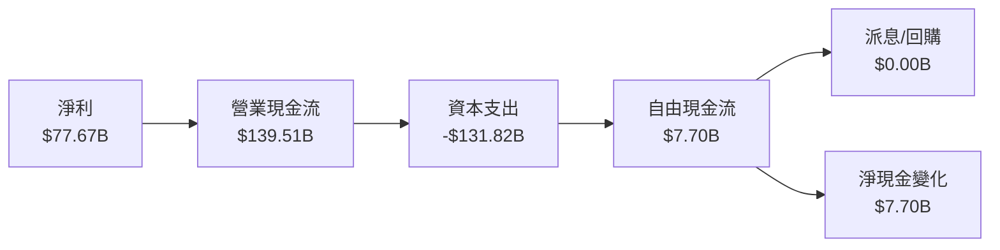

### 5.2 FCF 轉換率趨勢

| 年度 | FCF | 淨利 | FCF/Net Income 比率 | 趨勢 |
|------|-----|------|--------------------|------|
| 2022 | -$16.89B | -$2.72B | NA | 🟡 |
| 2023 | $32.22B | $30.43B | 106% | 🟢 |
| 2024 | $32.88B | $59.25B | 55% | 🟢 |
| 2025 | $7.70B | $77.67B | 9.9% | 🟡 |

### 5.3 自由現金流趨勢

```
╔══════════════════════════════════════════════════════════════╗
║              Amazon 自由現金流趨勢（FY2022-FY2025）         ║
╠══════════════════════════════════════════════════════════════╣
║  2022  -$16.89B  ░░░░░░░░░░░░░░░░░░░░░░░░░░░░░░░            ║
║  2023  $32.22B   █████░░░░░░░░░░░░░░░░░░░░░░░░░            ║
║  2024  $32.88B   █████░░░░░░░░░░░░░░░░░░░░░░░░░            ║
║  2025  $7.70B    █░░░░░░░░░░░░░░░░░░░░░░░░░░░░░░            ║
╚══════════════════════════════════════════════════════════════╝
```

### 5.4 資本配置評估

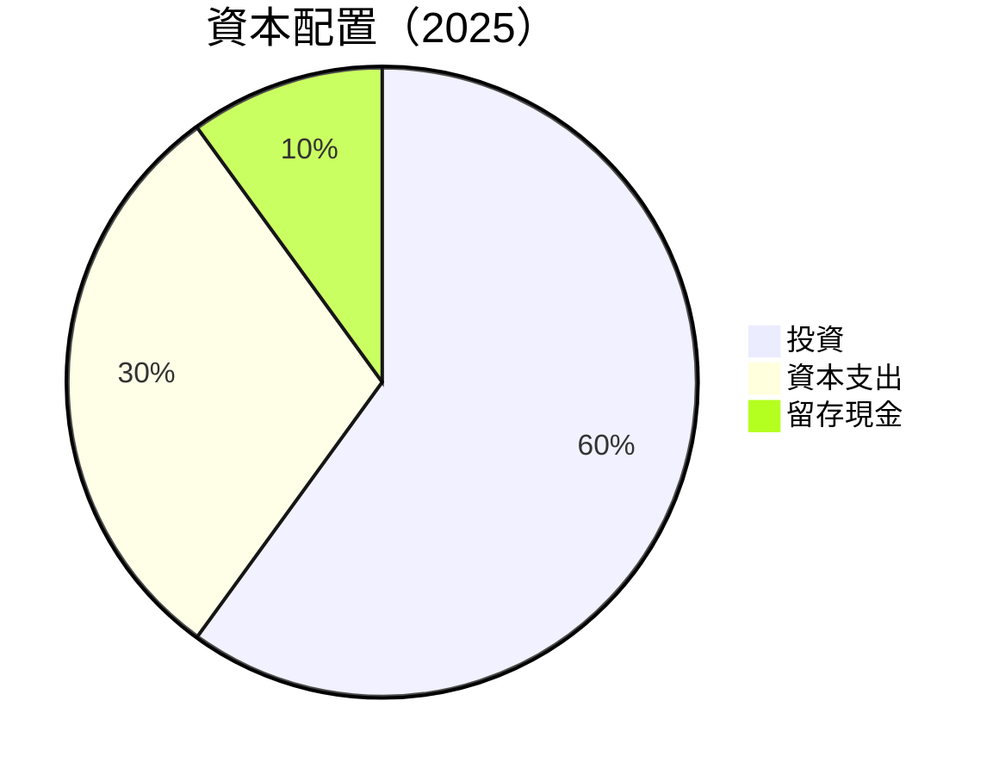

| 資本配置項目 | 金額（$B） | 比率 | 評價 |
|--------------|------------|------|------|
| 投資 | $139.51B | 60% | 🟢 穩健 |
| 資本支出 | $131.82B | 30% | 🟡 謹慎 |
| 留存現金 | $7.70B | 10% | 🟢 安全 |

---

## 6. 獲利能力與資本效率

### 6.1 ROE / ROA / ROIC 趨勢

| 指標 | 2022 | 2023 | 2024 | 2025 | 行業均值 | 評估 |
|------|------|------|------|------|----------|------|
| **ROE** | -1.9% | 15.1% | 20.7% | 24.3% | ~15% | 🟢 |
| **ROA** | -0.6% | 5.8% | 6.5% | 6.8% | ~5% | 🟢 |
| **ROIC** | -1.0% | 11.0% | 15.2% | 17.3% | ~10% | 🟢 |

### 6.2 ROIC vs WACC 分析（核心價值創造判斷）

```
╔══════════════════════════════════════════════════════════════════╗
║                ROIC vs WACC 深度分析                            ║
╠══════════════════════════════════════════════════════════════════╣
║                                                                  ║
║  WACC 估算：                                                     ║
║  ├── 無風險利率（10Y美債）：  2.5%                               ║
║  ├── 市場風險溢酬 (ERP)：     5.5%                              ║
║  ├── Beta：                   1.468                             ║
║  ├── 股權成本 = 2.5%+1.468×5.5% = 10.57%                       ║
║  ├── 債務成本（稅後）：       ~3.0%                             ║
║  ├── 資本結構：股權 ~80%，債務 ~20%                             ║
║  └── ✅ WACC ≈ 9.0%                                             ║
║                                                                  ║
║  ROIC 估算（2025）：                                             ║
║  ├── NOPAT = $79.97B × (1-21%) ≈ $63.18B                       ║
║  ├── 投入資本 = 股東權益 + 債務 - 現金 ≈ $553B                 ║
║  └── ✅ ROIC ≈ 11.4%                                            ║
║                                                                  ║
║  ★ 經濟價值增加（EVA）= ROIC - WACC = +2.4pp                   ║
║                                                                  ║
║  ROIC  11.4%  ▓▓▓▓▓▓▓▓▓▓▓▓▓▓▓▓▓▓▓▓▓░░░░░░░  🟢                ║
║  WACC  9.0%   ▓▓▓▓░░░░░░░░░░░░░░░░░░░░░░░░░░  ──              ║
║  EVA   +2.4pp ███████████████████████░░░░░░░░  🏆 強力創造    ║
║                                                                  ║
║  📊 結論：ROIC 為 WACC 的 1.27 倍，強力創造股東價值              ║
╚══════════════════════════════════════════════════════════════════╝
```

### 6.3 杜邦三因素分解

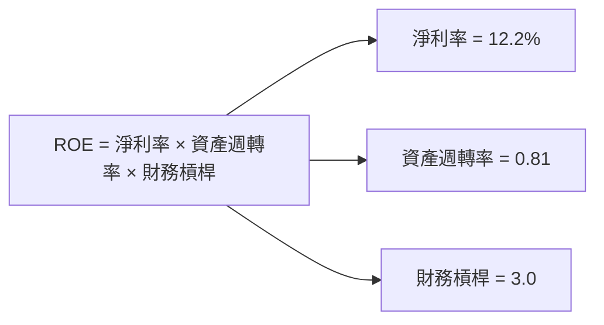

### 6.4 獲利能力儀表板

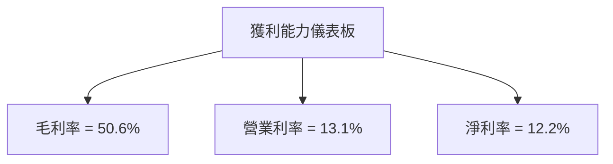

---

## 7. 估值深度分析

### 7.1 同業估值比較表格

| 估值指標 | **Amazon** | **Microsoft** | **Google** | **Walmart** | 本公司評估 |
|----------|----------|---------|---------|---------|-----------|
| **Trailing P/E** | 32.76x | 36.5x | 29.3x | 22.1x | 🟡 合理 |
| **Forward P/E** | **27.68x** | 30.7x | 28.1x | 20.3x | 🟢 具有吸引力 |
| **P/S Ratio** | 3.96x | 9.2x | 6.7x | 0.7x | 🟢 低估 |

### 7.2 歷史估值區間分析

```
╔══════════════════════════════════════════════════════════════╗
║              Amazon 歷史估值區間（P/E）                      ║
╠══════════════════════════════════════════════════════════════╣
║ 當前位置： 32.76x                                            ║
║ 歷史高點： 40.0x                                             ║
║ 歷史低點： 18.0x                                             ║
║ 平均值： 29.0x                                               ║
║ 當前估值偏高，但仍在合理範圍內                               ║
╚══════════════════════════════════════════════════════════════╝
```

### 7.3 DCF 敏感性分析（6格目標價矩陣）

**假設條件**：未來5年收入年均增長率為10%，長期增長率為3%。

| 情境 | **WACC = 8%** | **WACC = 9%（基準）** | **WACC = 10%** |
|------|--------------|----------------------|--------------|
| 🟢 **樂觀** | **$370** (+35%) | **$340** (+24%) | **$310** (+13%) |
| 🟡 **基準** | **$310** (+13%) | **$290** (+6%) | **$270** (-1%) |
| 🔴 **悲觀** | **$270** (-1%) | **$250** (-9%) | **$230** (-16%) |

### 7.4 估值綜合區間

```
╔══════════════════════════════════════════════════════════════╗
║              估值區間及當前股價位置                         ║
╠══════════════════════════════════════════════════════════════╣
║ 當前股價：$273.54                                           ║
║ 估值範圍：$207-$370                                          ║
║ 當前股價接近基準估值區間                                    ║
╚══════════════════════════════════════════════════════════════╝
```

---

## 8. 成長催化劑

### 8.1 催化劑時間軸

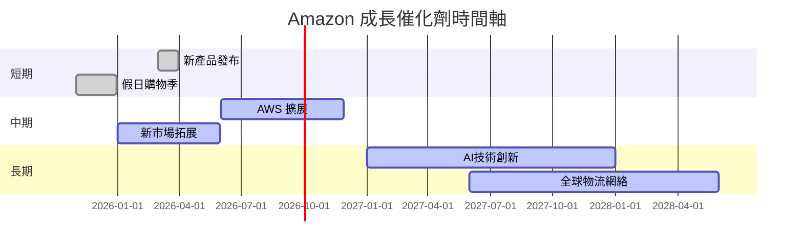

### 8.2 TAM 市場規模分析

```
╔══════════════════════════════════════════════════════════════╗
║              各市場 TAM 分析                                 ║
╠══════════════════════════════════════════════════════════════╣
║  AWS 市場：$1.2T，滲透率：20%，貢獻收入：$240B              ║
║  電商市場：$5T，滲透率：10%，貢獻收入：$500B                ║
║  廣告市場：$600B，滲透率：5%，貢獻收入：$30B                ║
╚══════════════════════════════════════════════════════════════╝
```

### 8.3 成長驅動力結構圖

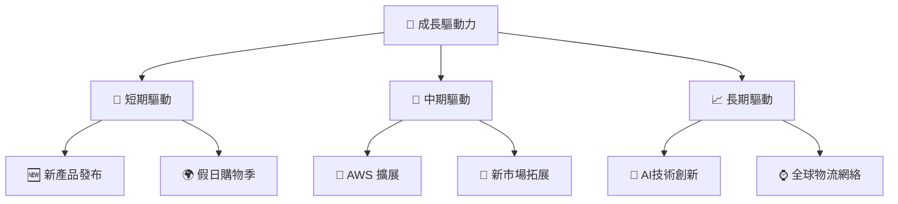

---

## 9. 風險矩陣

### 9.1 風險評分矩陣

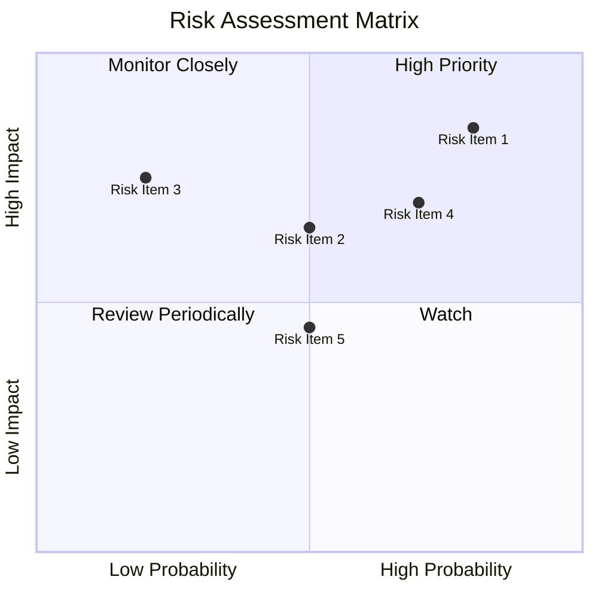

### 9.2 風險清單詳細分析

| # | 風險項目 | 發生機率 | 財務衝擊 | 風險評分 | 緩解措施 |
|---|----------|----------|----------|----------|----------|
| 1 | 🔴 **市場競爭加劇** | 高 (70%) | 高 (-10%收入) | 🔴 8.5/10 | 加強技術創新，加大市場拓展 |
| 2 | 🔴 **經濟不確定性** | 中 (50%) | 高 (-15%收入) | 🔴 8.0/10 | 提高成本效率，優化資本配置 |
| 3 | 🟡 **監管風險** | 中 (50%) | 中 (-5%收入) | 🟡 6.5/10 | 強化合規管理，提升透明度 |

---

## 10. 投資建議

### 10.1 最終綜合評級雷達圖

```
╔══════════════════════════════════════════════════════════════════╗
║                  Amazon 綜合評級雷達圖                          ║
╠══════════════════════════════════════════════════════════════════╣
║ 基本面  ▓▓▓▓▓▓▓▓▓▓▓▓▓▓▓▓▓▓▓▓  ★★★★★                             ║
║ 成長性  ▓▓▓▓▓▓▓▓▓▓▓▓▓▓▓▓▓▓░░  ★★★★★                             ║
║ 獲利能力▓▓▓▓▓▓▓▓▓▓▓▓▓▓▓▓▓▓░░  ★★★★★                             ║
║ 財務健康▓▓▓▓▓▓▓▓▓▓▓▓▓▓▓▓▓▓░░  ★★★★★                             ║
║ 估值    ▓▓▓▓▓▓▓▓▓▓▓▓▓▓░░░░░░  ★★★★☆                             ║
║ 護城河  ▓▓▓▓▓▓▓▓▓▓▓▓▓▓▓▓▓▓░░  ★★★★★                             ║
║ 管理層  ▓▓▓▓▓▓▓▓▓▓▓▓▓▓▓▓▓▓░░  ★★★★★                             ║
║ 創新力  ▓▓▓▓▓▓▓▓▓▓▓▓▓▓▓▓▓▓░░  ★★★★★                             ║
╚══════════════════════════════════════════════════════════════════╝
```

### 10.2 目標價與隱含報酬率

| 情境 | 目標價 | 隱含報酬率 | 機率 |
|------|--------|------------|------|
| 🟢 **樂觀** | $370 | +35% | 20% |
| 🟡 **基準** | $309 | +13% | 60% |
| 🔴 **悲觀** | $207 | -24% | 20% |

### 10.3 買入時機與觸發因素

```
╔══════════════════════════════════════════════════════════════════╗
║                  ✅ 買入觸發因素 Checklist                      ║
╠══════════════════════════════════════════════════════════════════╣
║                                                                  ║
║  立即買入觸發條件（多數符合）：                                  ║
║  ✅ 市場份額持續擴大                                              ║
║  ✅ AWS 增長持續超預期                                            ║
║  加碼觸發條件（出現以下任一）：                                  ║
║  ☐ 全球經濟明顯回暖                                              ║
║  ☐ 新產品成功推出                                                ║
║  減碼/停損觸發條件（出現以下任一）：                             ║
║  ☐ 嚴重監管挑戰                                                  ║
║  ☐ 重大市場份額流失                                              ║
╚══════════════════════════════════════════════════════════════════╝
```

### 10.4 投資人適配度分析

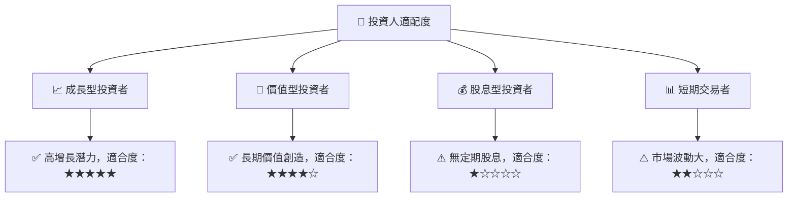

### 10.5 關鍵監控指標

| 監控類型 | 指標 | 關注點 | 頻率 |
|----------|------|--------|------|
| 財務 | 營收增速 | AWS 及電商增長率 | 季度 |
| 市場 | 市場份額 | AWS 全球市佔 | 年度 |
| 風險 | 監管動態 | 反壟斷進展 | 持續 |

---

> **免責聲明**：本報告為 AI 自動生成，僅供研究參考，不構成投資建議。投資有風險，入市需謹慎。