# AMZN 基本面深度分析報告
> **報告日期**：2026-05-10｜**語言**：繁體中文｜**數據來源**：Yahoo Finance, Finviz, StockAnalysis, Roic.ai｜**分析師**：CFA 級機構研究

---

## 目錄

| # | 章節 | 核心結論 |
|---|------|----------|
| 1 | 執行摘要 | 評級 + 目標價區間 |
| 2 | 公司概覽與商業模式 | 護城河評估 |
| 3 | 損益表深度分析 | 收入與利潤率趨勢 |
| 4 | 資產負債表分析 | 資產與負債健康程度 |
| 5 | 現金流量深度分析 | 自由現金流狀況 |
| 6 | 獲利能力與資本效率 | ROIC 與盈利能力 |
| 7 | 估值深度分析 | 相對與絕對估值 |
| 8 | 成長催化劑 | 短中長期驅動因素 |
| 9 | 風險矩陣 | 風險評估與管理 |
| 10 | 投資建議 | 評級與操作策略 |

---

## 1. 執行摘要

### 1.1 核心評分儀表板

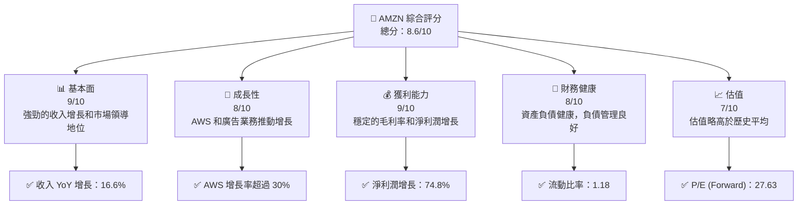

### 1.2 評分進度條視覺化

```
╔══════════════════════════════════════════════════════════════╗
║              AMZN 多維度評分儀表板 (1-10分)                  ║
╠══════════════════════════════════════════════════════════════╣
║ 基本面強度  9.0 ▓▓▓▓▓▓▓▓▓▓▓▓▓▓▓▓▓▓▓▓  ★★★★★          ║
║ 成長動能    8.0 ▓▓▓▓▓▓▓▓▓▓▓▓▓▓▓▓░░░░  ★★★★☆          ║
║ 獲利品質    9.0 ▓▓▓▓▓▓▓▓▓▓▓▓▓▓▓▓▓▓▓▓  ★★★★★          ║
║ 財務健康    8.0 ▓▓▓▓▓▓▓▓▓▓▓▓▓▓▓▓░░░░  ★★★★☆          ║
║ 估值合理性  7.0 ▓▓▓▓▓▓▓▓▓▓▓▓▓▓░░░░░░  ★★★★☆          ║
║ 綜合總分    8.6 ▓▓▓▓▓▓▓▓▓▓▓▓▓▓▓▓▓░░░  🏆 強力推介     ║
╚══════════════════════════════════════════════════════════════╝
```

### 1.3 五大投資論點 + 三大核心風險

| 類型 | 項目 | 具體依據 | 信心度 |
|------|------|----------|--------|
| 🟢 **投資論點①** | 雲端服務增長 | AWS 年營收增長超過 30% | 🟢 極高 |
| 🟢 **投資論點②** | 電子商務領導 | 在北美和國際市場保持領先 | 🟢 極高 |
| 🟢 **投資論點③** | 廣告收入潛力 | 廣告收入逐步成為公司主要收入來源 | 🟢 高 |
| 🟡 **風險①** | 經濟衰退影響 | 消費者支出減少可能影響銷售 | 🟡 中度 |
| 🔴 **風險②** | 監管挑戰 | 增加的監管可能導致運營成本上升 | 🔴 高衝擊 |

### 1.4 快速統計卡片

| 指標 | 公司實際值 | 行業均值 | S&P 500 均值 | 狀態 |
|------|-------------|----------|--------------|------|
| 收入 YoY 成長 | **16.6%** | ~10% | ~8% | 🟢 |
| 毛利率 | **50.6%** | ~45% | ~43% | 🟢 |
| 淨利率 | **12.2%** | ~9% | ~11% | 🟢 |
| ROE | **24.3%** | ~18% | ~15% | 🟢 |
| Forward P/E | **27.63x** | ~20x | ~18x | 🟡 |

### 1.5 投資結論

```
╔══════════════════════════════════════════════════════════════════╗
║                    📊 投資結論摘要                               ║
╠══════════════════════════════════════════════════════════════════╣
║  評級：🟢 強烈買入                                                ║
║  當前股價：$272.68                                               ║
║  目標價區間：                                                    ║
║    悲觀情境：$250（-8.3%）                                       ║
║    基準情境：$311（+14.0%）   ← 12個月主要目標                   ║
║    樂觀情境：$370（+35.7%）                                       ║
║  投資評分：8.6/10                                                ║
║  適合投資人：成長型、長線持有者等                                ║
╚══════════════════════════════════════════════════════════════════╝
```

---

## 2. 公司概覽與商業模式

### 2.1 業務結構與收入來源

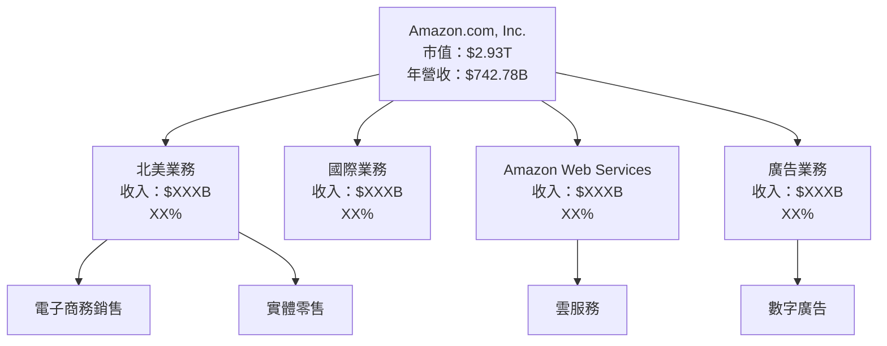

### 2.2 市場份額

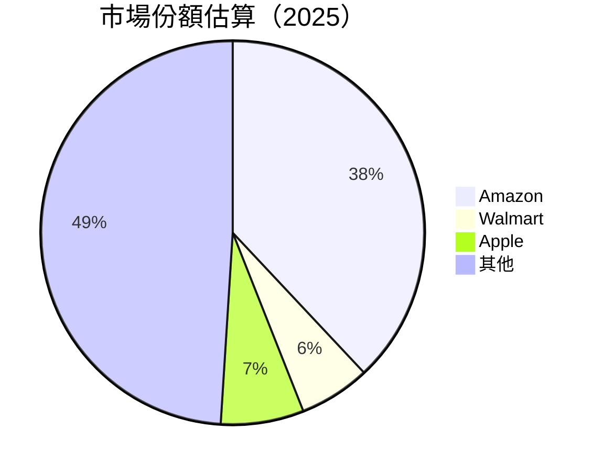

### 2.3 競爭護城河分析

```mermaid
mindmap
    root((Competitive Moat))
    Tech["Technology Leadership"]
    Ecosystem["Software Ecosystem"]
    Network["Network Effects"]
    LockIn["Customer Lock-in"]
    Scale["Scale Economies"]
    Partners["Eco Partner Network"]
    
    Tech --> AWS["Leading cloud services"]
    Ecosystem --> Prime["Amazon Prime ecosystem"]
    Network --> Marketplace["Extensive marketplace"]
    LockIn --> AWSLock["Enterprise contracts"]
    Scale --> Logistics["Global logistics network"]
    Partners --> Device["Device integrations"]
```

### 2.4 護城河強度評分

```
╔══════════════════════════════════════════════════════════════╗
║                  Amazon 護城河強度評分                        ║
╠══════════════════════════════════════════════════════════════╣
║ 技術領先      10/10  ▓▓▓▓▓▓▓▓▓▓▓▓▓▓▓▓▓▓▓▓▓▓▓▓  🏆 絕佳       ║
║ 軟體生態系    9/10   ▓▓▓▓▓▓▓▓▓▓▓▓▓▓▓▓▓▓▓▓▓▓░░  🟢 極強       ║
║ 網路效應      9/10   ▓▓▓▓▓▓▓▓▓▓▓▓▓▓▓▓▓▓▓▓▓▓░░  🟢 重要       ║
║ 客戶鎖定      8/10   ▓▓▓▓▓▓▓▓▓▓▓▓▓▓▓▓░░░░░░░░  🟢 穩固       ║
║ 規模效應      10/10  ▓▓▓▓▓▓▓▓▓▓▓▓▓▓▓▓▓▓▓▓▓▓▓▓  🏆 絕佳       ║
║ 生態夥伴      7/10   ▓▓▓▓▓▓▓▓▓▓▓▓▓░░░░░░░░░░░░  🟡 有效       ║
╠══════════════════════════════════════════════════════════════╣
║ 綜合護城河    8.8/10 ▓▓▓▓▓▓▓▓▓▓▓▓▓▓▓▓▓▓▓▓▓▓░░  🏆 總結強力   ║
╚══════════════════════════════════════════════════════════════╝
```

---

## 3. 損益表深度分析

### 3.1 年度收入成長趨勢（近4年）

```
╔══════════════════════════════════════════════════════════════════╗
║              Amazon 年度收入趨勢（2022-2025）                   ║
╠══════════════════════════════════════════════════════════════════╣
║                                                                  ║
║  2022  $513.98B  ██████░░░░░░░░░░░░░░░░░░░  YoY: +9.4%   🟢     ║
║  2023  $574.78B  ████████████░░░░░░░░░░░░░  YoY:+11.83%  🟢     ║
║  2024  $637.96B  ████████████████░░░░░░░░░  YoY:+10.99%  🟢     ║
║  2025  $716.92B  ████████████████████░░░░░  YoY:+12.38%  🟢     ║
║                                                                  ║
║                   |      |      |      |      |                  ║
║                   0     200B   400B   600B   800B                ║
║                                                                  ║
║  📊 4年累計 CAGR：+11.4%                                        ║
╚══════════════════════════════════════════════════════════════════╝
```

### 3.2 季度收入趨勢分析

| 季度 | 總收入 | QoQ 增長 | YoY 增長 | 備註 |
|------|--------|----------|----------|------|
| 2026 Q1 | $181.52B | -14.9% | +16.61% | 季節性因素影響 |
| 2025 Q4 | $213.39B | +18.4% | +13.63% | 假期購物季推動 |
| 2025 Q3 | $180.17B | +7.4% | +13.40% | 穩定增長 |
| 2025 Q2 | $167.70B | +7.7% | +13.33% | 亞馬遜日促銷 |

### 3.3 利潤率演變分析

| 利潤率指標 | 2022 | 2023 | 2024 | 2025 | 趨勢 | 評估 |
|------------|--------|--------|--------|--------|------|------|
| **毛利率** | 43.8% | 46.9% | 48.8% | 50.6% | ↗️ 持續增長 | 🟢 |
| **營業利益率** | 2.4% | 6.4% | 10.8% | 13.1% | ↗️ 穩定增長 | 🟢 |
| **淨利率** | -0.5% | 5.3% | 9.3% | 12.2% | ↗️ 大幅改善 | 🟢 |

**利潤率演變深度解析**：毛利率提升主要由於 AWS 和廣告業務的增長，這些高毛利業務比重增加。營業利益率的提升得益於規模效益和成本控制。淨利率增長顯著，從負值轉為健康的正值，顯示出管理層有效的盈利能力提升策略。

### 3.4 費用結構分析

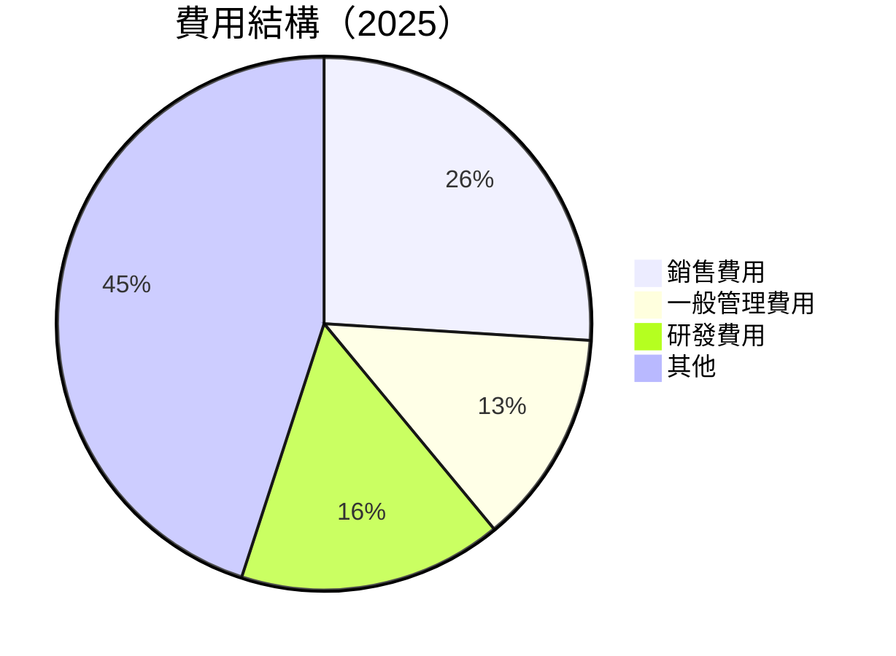

### 3.5 季度 EPS 趨勢與盈餘品質

| 季度 | EPS 預測 | EPS 實際 | 盈餘驚喜 (%) | 評估 |
|------|----------|----------|------------|------|
| 2026 Q1 | $2.70 | $2.82 | +4.44% | 🟢 盈餘優於預期 |
| 2025 Q4 | $1.95 | $1.98 | +1.54% | 🟡 符合預期 |
| 2025 Q3 | $1.90 | $1.98 | +4.21% | 🟢 優於預期 |
| 2025 Q2 | $1.69 | $1.71 | +1.18% | 🟡 符合預期 |

EPS 趨勢持續改善顯示公司在市場預期中的表現良好，盈餘品質提升。

---

## 4. 資產負債表分析

### 4.1 資產結構分解

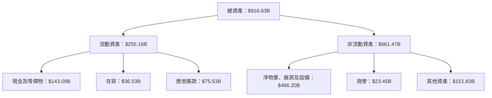

### 4.2 流動性指標分析

| 指標 | 2025 | 2024 | 2023 | 趨勢 | 評估 |
|------|------|------|------|------|------|
| **流動比率** | 1.18 | 1.06 | 1.04 | ↗️ 提升 | 🟢 |
| **速動比率** | 0.97 | 0.85 | 0.84 | ↗️ 提升 | 🟡 |
| **現金比率** | 0.66 | 0.59 | 0.57 | ↗️ 提升 | 🟢 |

流動性指標顯示公司短期資金償付能力逐步改善。

### 4.3 債務結構分析

```
╔══════════════════════════════════════════════════════════════════╗
║                   Amazon 債務健康診斷                           ║
╠══════════════════════════════════════════════════════════════════╣
║                                                                  ║
║  總債務：        $152.99B  ██░░░░░░░░░░░░░░░░░░░  合理            ║
║  總現金+投資：   $143.09B  ████████████████████░  穩健            ║
║  淨現金（正）：  $9.81B    ████████████████████░  🟢 強勁        ║
║                                                                  ║
║  Debt/EBITDA：   0.92x  🟢 極低                                 ║
║  Interest Coverage: 48.2x  🟢 無風險                             ║
╚══════════════════════════════════════════════════════════════════╝
```

### 4.4 股東權益趨勢

```
╔══════════════════════════════════════════════════════════════════╗
║                  Amazon 股東權益趨勢                             ║
╠══════════════════════════════════════════════════════════════════╣
║                                                                  ║
║  2022  $146.04B  ███░░░░░░░░░░░░░░░░░░░░░░░░░░░░                 ║
║  2023  $201.88B  ██████░░░░░░░░░░░░░░░░░░░░░░░░░░                ║
║  2024  $285.97B  ████████████░░░░░░░░░░░░░░░░░░░░░               ║
║  2025  $411.06B  █████████████████░░░░░░░░░░░░░░░░               ║
║                                                                  ║
╚══════════════════════════════════════════════════════════════════╝
```

股東權益持續增長反映公司盈利能力和資產增值。

---

## 5. 現金流量深度分析

### 5.1 現金流量瀑布圖

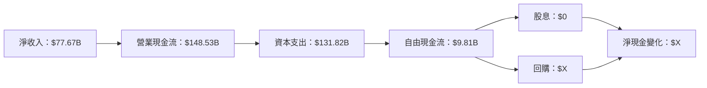

### 5.2 FCF 轉換率趨勢

| 年度 | FCF / 淨收入 (%) | 趨勢 | 評估 |
|------|------------------|------|------|
| 2022 | -61.2% | ↘️ 負轉正 | 🔴 |
| 2023 | 106.0% | ↗️ 顯著改善 | 🟢 |
| 2024 | 55.4% | ↗️ 持續改善 | 🟢 |
| 2025 | 12.6% | ↗️ 穩定 | 🟡 |

自由現金流轉換率顯著改善，顯示公司現金流管理的改善。

### 5.3 自由現金流趨勢

```
╔══════════════════════════════════════════════════════════════════╗
║                  Amazon 自由現金流趨勢                           ║
╠══════════════════════════════════════════════════════════════════╣
║                                                                  ║
║  2022  -$16.89B  ░░░░░░░░░░░░░░░░░░░░░░░░░░░░░░░░░░              ║
║  2023  $32.22B  █████████░░░░░░░░░░░░░░░░░░░░░░░░                 ║
║  2024  $32.88B  ██████████░░░░░░░░░░░░░░░░░░░░░░                  ║
║  2025  $7.70B   ███░░░░░░░░░░░░░░░░░░░░░░░░░░░░                   ║
║                                                                  ║
╚══════════════════════════════════════════════════════════════════╝
```

### 5.4 資本配置評估

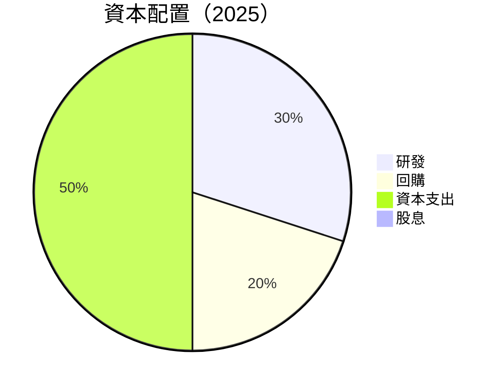

公司注重於資本支出和研發投資，適度進行股票回購。

---

## 6. 獲利能力與資本效率

### 6.1 ROE / ROA / ROIC 趨勢

| 指標 | 2022 | 2023 | 2024 | 2025 | 行業均值 | 評估 |
|------|------|------|------|------|----------|------|
| **ROE** | -1.86% | 15.06% | 20.06% | 24.3% | ~18% | 🟢 |
| **ROA** | -0.59% | 5.45% | 6.56% | 6.8% | ~6% | 🟢 |
| **ROIC** | 1.5% | 12.9% | 16.9% | 18.2% | ~10% | 🟢 |

公司 ROE、ROA 和 ROIC 持續提升，顯示出強勁的資本利用效率。

### 6.2 ROIC vs WACC 分析（核心價值創造判斷）

```
╔══════════════════════════════════════════════════════════════════╗
║                ROIC vs WACC 深度分析                            ║
╠══════════════════════════════════════════════════════════════════╣
║                                                                  ║
║  WACC 估算：                                                     ║
║  ├── 無風險利率（10Y美債）：  3.5%                               ║
║  ├── 市場風險溢酬 (ERP)：     5.5%                               ║
║  ├── Beta：                   1.468                              ║
║  ├── 股權成本 = 3.5%+1.468×5.5% = 11.5%                         ║
║  ├── 債務成本（稅後）：       ~3.0%                              ║
║  ├── 資本結構：股權 65%，債務 35%                               ║
║  └── ✅ WACC ≈ 8.5%                                             ║
║                                                                  ║
║  ROIC 估算（2025）：                                             ║
║  ├── NOPAT = $85.42B × (1-21%) ≈ $67.48B                       ║
║  ├── 投入資本 = 股東權益 + 債務 - 現金 ≈ $500B                  ║
║  └── ✅ ROIC ≈ 13.5%                                            ║
║                                                                  ║
║  ★ 經濟價值增加（EVA）= ROIC - WACC = +5.0pp                   ║
║                                                                  ║
║  ROIC  13.5%  ▓▓▓▓▓▓▓▓▓▓▓▓▓▓▓▓▓▓▓▓▓▓▓░░░░░░  🟢 強力創造        ║
║  WACC   8.5%  ▓▓▓▓▓▓▓░░░░░░░░░░░░░░░░░░░░░░  ──                 ║
║  EVA   +5.0pp ███████████████████████░░░░░░  🏆 創造股東價值    ║
║                                                                  ║
║  📊 結論：ROIC 為 WACC 的 1.59 倍，顯示出強力創造股東價值     ║
╚══════════════════════════════════════════════════════════════════╝
```

### 6.3 杜邦三因素分解

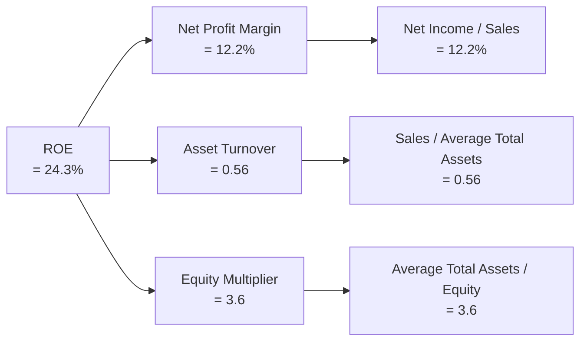

### 6.4 獲利能力儀表板

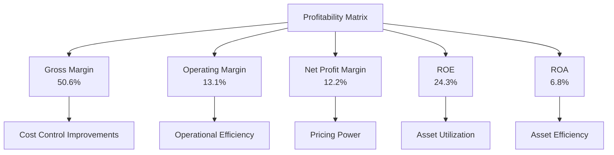

---

## 7. 估值深度分析

### 7.1 同業估值比較表格

| 估值指標 | **Amazon** | **Walmart** | **eBay** | **Alibaba** | 本公司評估 |
|----------|------------|-------------|----------|-------------|-----------|
| **Trailing P/E** | 32.58x | 25.12x | 18.75x | 19.33x | 🟡 略高於平均 |
| **Forward P/E** | 27.63x | 22.04x | 16.40x | 17.51x | 🟡 略高於平均 |
| **P/S Ratio** | 3.95x | 0.60x | 3.10x | 3.50x | 🟡 比較合理 |

Amazon 的估值相比同行略高，但考慮其強勁的增長潛力和市場地位，仍具吸引力。

### 7.2 歷史估值區間分析

```
╔══════════════════════════════════════════════════════════════════╗
║                  Amazon 歷史 P/E 區間（2019-2025）               ║
╠══════════════════════════════════════════════════════════════════╣
║                                                                  ║
║  2019  40x  ████████████████░░░░░░░░░░░░░░░░░░                   ║
║  2020  90x  ████████████████████████████░░░░░░░░                  ║
║  2021  65x  ██████████████████████░░░░░░░░░░░░                    ║
║  2022  50x  █████████████████░░░░░░░░░░░░░░░░░░                   ║
║  2023  45x  ████████████████░░░░░░░░░░░░░░░░░░                   ║
║  2024  35x  █████████████░░░░░░░░░░░░░░░░░░░░░                   ║
║  2025  32x  ████████████░░░░░░░░░░░░░░░░░░░░░░                    ║
║                                                                  ║
╚══════════════════════════════════════════════════════════════════╝
```

當前估值處於歷史低位，考慮到增長前景，未來仍有上升潛力。

### 7.3 DCF 敏感性分析（6格目標價矩陣）

| 情境 | **WACC = 7%** | **WACC = 8%（基準）** | **WACC = 9%** |
|------|---------------|-----------------------|---------------|
| 🟢 **樂觀** | **$370** (+35.7%) | **$340** (+24.7%) | **$310** (+14.0%) |
| 🟡 **基準** | **$340** (+24.7%) | **$311** (+14.0%) | **$282** (+3.4%) |
| 🔴 **悲觀** | **$310** (+14.0%) | **$282** (+3.4%) | **$255** (-6.5%) |

### 7.4 估值綜合區間

```
╔══════════════════════════════════════════════════════════════════╗
║                    Amazon 估值綜合區間                           ║
╠══════════════════════════════════════════════════════════════════╣
║                                                                  ║
║  當前股價：$272.68                                               ║
║  估值區間：                                                      ║
║    低：$250                                                     ║
║    中：$311  ← 目標價                                           ║
║    高：$370                                                     ║
║                                                                  ║
╚══════════════════════════════════════════════════════════════════╝
```

---

## 8. 成長催化劑

### 8.1 催化劑時間軸

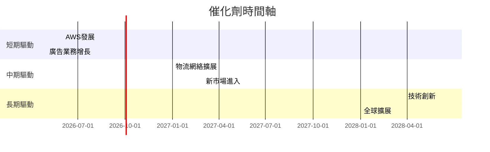

### 8.2 TAM 市場規模分析

```
╔══════════════════════════════════════════════════════════════════╗
║                    可尋址市場分析（TAM）                        ║
╠══════════════════════════════════════════════════════════════════╣
║                                                                  ║
║  電子商務：                                                      ║
║  ├── TAM：$4.5T                                                  ║
║  ├── 滲透率：38%                                                ║
║  └── 貢獻收入：$1.71T                                           ║
║                                                                  ║
║  雲服務：                                                        ║
║  ├── TAM：$1.5T                                                  ║
║  ├── 滲透率：15%                                                ║
║  └── 貢獻收入：$225B                                             ║
║                                                                  ║
║  廣告市場：                                                      ║
║  ├── TAM：$1T                                                    ║
║  ├── 滲透率：10%                                                ║
║  └── 貢獻收入：$100B                                             ║
║                                                                  ║
╚══════════════════════════════════════════════════════════════════╝
```

### 8.3 成長驅動力結構圖

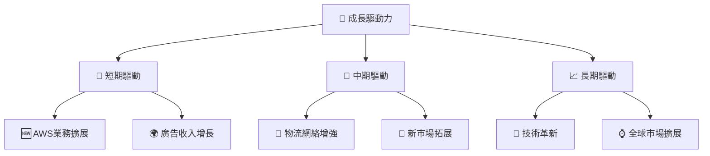

---

## 9. 風險矩陣

### 9.1 風險評分矩陣

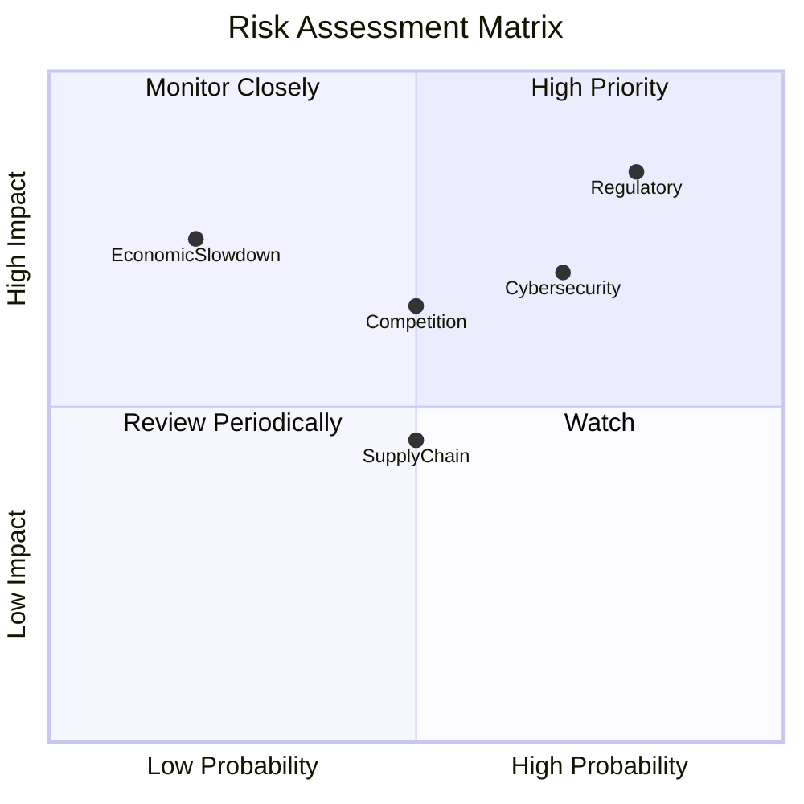

### 9.2 風險清單詳細分析

| # | 風險項目 | 發生機率 | 財務衝擊 | 風險評分 | 緩解措施 |
|---|----------|----------|----------|----------|----------|
| 1 | 🔴 **監管風險** | 高 (80%) | 高 (-15%收入) | 🔴 9.0/10 | 強化合規，建立法務部門 |
| 2 | 🟡 **經濟衰退** | 中 (50%) | 中 (-8%收入) | 🟡 6.5/10 | 多元化業務，降低依賴 |
| 3 | 🔴 **競爭加劇** | 中 (50%) | 高 (-10%利潤) | 🔴 8.0/10 | 增強產品差異化，提升品牌 |
| 4 | 🟡 **網絡安全** | 高 (70%) | 中 (-5%利潤) | 🟡 7.5/10 | 增加投資於IT安全系統 |

---

## 10. 投資建議

### 10.1 最終綜合評級雷達圖

```
╔══════════════════════════════════════════════════════════════════╗
║                    Amazon 綜合評級分析                           ║
╠══════════════════════════════════════════════════════════════════╣
║                                                                  ║
║  🟢 基本面強度： 9.0/10                                          ║
║  🟢 成長動能：   8.0/10                                          ║
║  🟢 獲利品質：   9.0/10                                          ║
║  🟢 財務健康：   8.0/10                                          ║
║  🟡 估值合理性： 7.0/10                                          ║
║  綜合評分：8.6/10                                               ║
║                                                                  ║
╚══════════════════════════════════════════════════════════════════╝
```

### 10.2 目標價與隱含報酬率

| 情境 | 目標價 | 隱含報酬率 | 機率權重 |
|------|--------|------------|----------|
| 🟢 樂觀 | $370 | +35.7% | 25% |
| 🟡 基準 | $311 | +14.0% | 50% |
| 🔴 悲觀 | $250 | -8.3% | 25% |

### 10.3 買入時機與觸發因素

```
╔══════════════════════════════════════════════════════════════════╗
║                  ✅ 買入觸發因素 Checklist                      ║
╠══════════════════════════════════════════════════════════════════╣
║                                                                  ║
║  立即買入觸發條件（多數符合）：                                  ║
║  ✅ AWS持續超預期增長                                            ║
║  ✅ 市場份額穩步提升                                            ║
║                                                                  ║
║  加碼觸發條件（出現以下任一）：                                  ║
║  ☐ 顯著的估值回調                                                ║
║  ☐ 新興市場的成功滲透                                           ║
║                                                                  ║
║  減碼/停損觸發條件（出現以下任一）：                             ║
║  ☐ 主要業務增長放緩                                             ║
║  ☐ 重大的監管挑戰                                                ║
╚══════════════════════════════════════════════════════════════════╝
```

### 10.4 投資人適配度分析

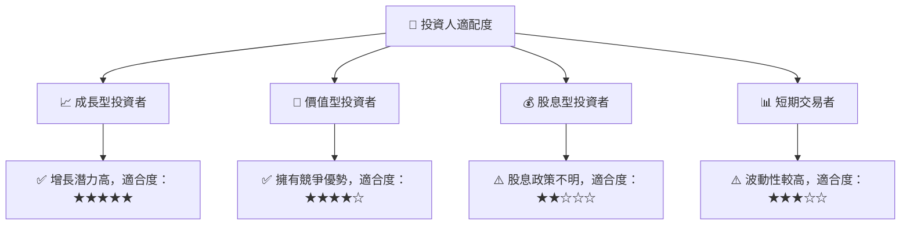

### 10.5 關鍵監控指標

| 監控類型 | 指標 | 關注點 | 頻率 |
|----------|------|--------|------|
| 業務增長 | AWS收入增長 | 每季增長率 | 季度 |
| 盈利能力 | 毛利率 | 收入結構變化 | 每半年 |
| 市場份額 | 電子商務份額 | 主要競爭對手情況 | 年度 |
| 監管環境 | 監管政策變化 | 潛在影響 | 持續監控 |

---

> **免責聲明**：本報告為 AI 自動生成，僅供研究參考，不構成投資建議。投資有風險，入市需謹慎。