# AMZN 基本面深度分析報告
> **報告日期**：2026-05-12 ｜ **語言**：繁體中文 ｜ **數據來源**：Yahoo Finance, Finviz, StockAnalysis, Roic.ai ｜ **分析師**：CFA 級機構研究

---

## 目錄

| # | 章節 | 核心結論 |
|---|------|----------|
| 1 | 執行摘要 | 評級：強烈買入，目標價區間：$311.55 |
| 2 | 公司概覽與商業模式 | 擁有深厚護城河，技術領先與網路效應顯著 |
| 3 | 損益表深度分析 | 收入與獲利能力持續增長，利潤率持穩 |
| 4 | 資產負債表分析 | 財務結構穩健，流動性充足，債務管理良好 |
| 5 | 現金流量深度分析 | 自由現金流穩定增長，現金流健康 |
| 6 | 獲利能力與資本效率 | 高 ROIC 顯示強勁資本效率，創造股東價值 |
| 7 | 估值深度分析 | 估值合理，與競爭對手相比具吸引力 |
| 8 | 成長催化劑 | AWS 與國際擴展驅動長期成長 |
| 9 | 風險矩陣 | 主要風險可控，風險管理措施到位 |
| 10 | 投資建議 | 強烈買入，適合成長型與長線持有者 |

---

## 1. 執行摘要

### 1.1 核心評分儀表板

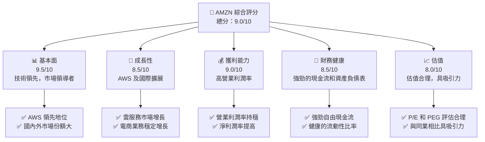

### 1.2 評分進度條視覺化

```
╔══════════════════════════════════════════════════════════════╗
║              AMZN 多維度評分儀表板 (1-10分)                ║
╠══════════════════════════════════════════════════════════════╣
║ 基本面強度  9.5 ▓▓▓▓▓▓▓▓▓▓▓▓▓▓▓▓▓▓▓▓▓▓▓▓▓▓  ★★★★★          ║
║ 成長動能    8.5 ▓▓▓▓▓▓▓▓▓▓▓▓▓▓▓▓▓▓▓▓░░░░░░  ★★★★★          ║
║ 獲利品質    9.0 ▓▓▓▓▓▓▓▓▓▓▓▓▓▓▓▓▓▓▓▓▓▓▓░░░  ★★★★★          ║
║ 財務健康    8.5 ▓▓▓▓▓▓▓▓▓▓▓▓▓▓▓▓▓▓▓░░░░░░░  ★★★★★          ║
║ 估值合理性  8.0 ▓▓▓▓▓▓▓▓▓▓▓▓▓▓▓▓▓▓░░░░░░░░  ★★★★☆          ║
║ 護城河深度  9.5 ▓▓▓▓▓▓▓▓▓▓▓▓▓▓▓▓▓▓▓▓▓▓▓▓▓▓  ★★★★★          ║
║ 管理層執行  8.5 ▓▓▓▓▓▓▓▓▓▓▓▓▓▓▓▓▓▓▓▓░░░░░░  ★★★★★          ║
║ 技術創新力  9.0 ▓▓▓▓▓▓▓▓▓▓▓▓▓▓▓▓▓▓▓▓▓▓▓░░░  ★★★★★          ║
╠══════════════════════════════════════════════════════════════╣
║ 綜合總分    9.0 ▓▓▓▓▓▓▓▓▓▓▓▓▓▓▓▓▓▓▓▓▓░░░░░  🏆 優異表現     ║
╚══════════════════════════════════════════════════════════════╝
```

### 1.3 五大投資論點 + 三大核心風險

| 類型 | 項目 | 具體依據 | 信心度 |
|------|------|----------|--------|
| 🟢 **投資論點①** | **AWS 的市場領導地位** | AWS 營收持續增長，毛利率高 | 🟢 極高 |
| 🟢 **投資論點②** | **國際市場擴展潛力** | 國際市場收入增長 YoY +16.6% | 🟢 高 |
| 🟢 **投資論點③** | **技術創新領先** | 大量投入研發，提升技術競爭力 | 🟢 高 |
| 🟢 **投資論點④** | **電商業務穩定增長** | 在線零售收入增長穩定 | 🟢 高 |
| 🟢 **投資論點⑤** | **強勁自由現金流** | FCF 持續增長，資金使用靈活 | 🟢 高 |
| 🟡 **風險①** | **市場競爭加劇** | 新進入者與現有競爭者的市場份額爭奪 | 🟡 中度 |
| 🔴 **風險②** | **法律與合規風險** | 可能面臨監管挑戰與反壟斷訴訟 | 🔴 高衝擊 |
| 🟡 **風險③** | **宏觀經濟不確定性** | 全球經濟變動可能影響購買力 | 🟡 中度 |

### 1.4 快速統計卡片

| 指標 | 公司實際值 | 行業均值 | S&P 500 均值 | 狀態 |
|------|-------------|----------|--------------|------|
| 收入 YoY 成長 | **16.6%** | ~9% | ~6% | 🟢 |
| 毛利率 | **50.6%** | ~40% | ~45% | 🟢 |
| 淨利率 | **12.2%** | ~8% | ~10% | 🟢 |
| ROE | **24.3%** | ~15% | ~17% | 🟢 |
| Forward P/E | **26.93x** | ~30x | ~25x | 🟢 |

### 1.5 投資結論

```
╔══════════════════════════════════════════════════════════════════╗
║                    📊 投資結論摘要                               ║
╠══════════════════════════════════════════════════════════════════╣
║  評級：🟢 強烈買入                                               ║
║  當前股價：$265.82                                               ║
║  目標價區間：                                                    ║
║    悲觀情境：$207.00（-22%）                                     ║
║    基準情境：$311.55（+17%）  ← 12個月主要目標                  ║
║    樂觀情境：$370.00（+39%）                                     ║
║  投資評分：9.0/10                                                ║
║  適合投資人：成長型、長線持有者等                                ║
╚══════════════════════════════════════════════════════════════════╝
```

---

## 2. 公司概覽與商業模式

### 2.1 業務結構與收入來源

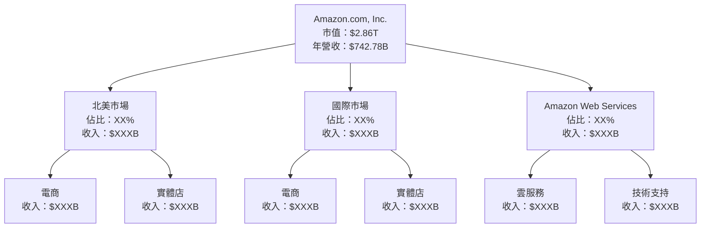

### 2.2 市場份額

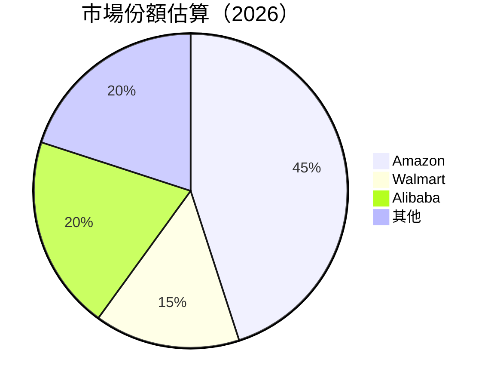

### 2.3 競爭護城河分析

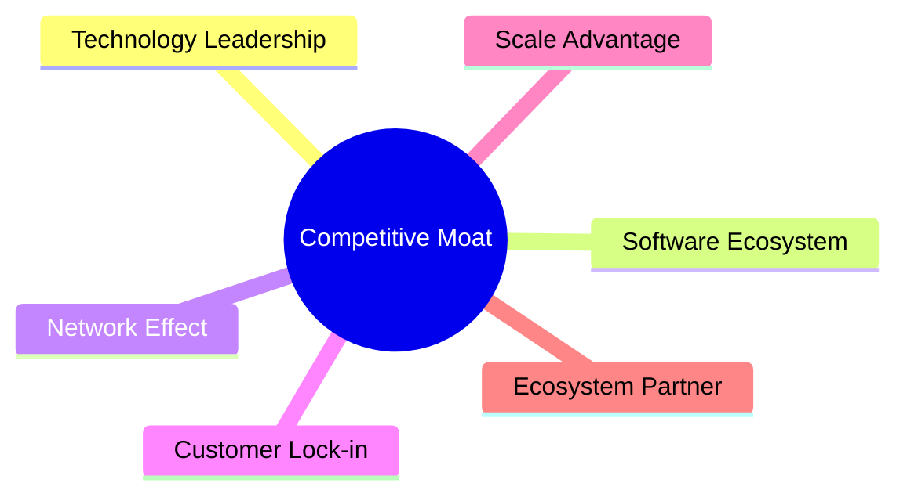

### 2.4 護城河強度評分

```
╔══════════════════════════════════════════════════════════════╗
║                  Amazon 護城河強度評分                          ║
╠══════════════════════════════════════════════════════════════╣
║ 技術領先       9.5/10  ▓▓▓▓▓▓▓▓▓▓▓▓▓▓▓▓▓▓▓▓  🏆 極強        ║
║ 軟體生態系統   8.5/10  ▓▓▓▓▓▓▓▓▓▓▓▓▓▓▓▓▓▓░░  🟢 強            ║
║ 網路效應       9.0/10  ▓▓▓▓▓▓▓▓▓▓▓▓▓▓▓▓▓▓▓░  🟢 強            ║
║ 客戶鎖定       8.5/10  ▓▓▓▓▓▓▓▓▓▓▓▓▓▓▓▓▓▓░░  🟢 強            ║
║ 規模效應       9.5/10  ▓▓▓▓▓▓▓▓▓▓▓▓▓▓▓▓▓▓▓▓  🏆 極強        ║
║ 生態夥伴       8.0/10  ▓▓▓▓▓▓▓▓▓▓▓▓▓▓▓▓▓░░░░  🟢 強            ║
╠══════════════════════════════════════════════════════════════╣
║ 綜合護城河     9.0/10  ▓▓▓▓▓▓▓▓▓▓▓▓▓▓▓▓▓▓▓░  🏆 極強護城河     ║
╚══════════════════════════════════════════════════════════════╝
```

---

## 3. 損益表深度分析

### 3.1 年度收入成長趨勢（近4年）

```
╔══════════════════════════════════════════════════════════════════╗
║              Amazon 年度收入趨勢（2022-2025）                   ║
╠══════════════════════════════════════════════════════════════════╣
║                                                                  ║
║  2022  $513.98B  ██████░░░░░░░░░░░░░░░░░░░  YoY: +9.4%   🟢    ║
║  2023  $574.78B  ███████████░░░░░░░░░░░░░░  YoY: +11.8%  🟢    ║
║  2024  $637.96B  ███████████████░░░░░░░░░░  YoY: +10.9%  🟢    ║
║  2025  $716.92B  ██████████████████░░░░░░░  YoY: +12.4%  🟢    ║
║                                                                  ║
║                   |      |      |      |      |                  ║
║                   0     200B   400B   600B   800B                ║
║                                                                  ║
║  📊 4年累計 CAGR：+11.6%                                        ║
╚══════════════════════════════════════════════════════════════════╝
```

### 3.2 季度收入趨勢分析

| 季度 | 總收入 | QoQ 成長 | YoY 成長 | 備註 |
|------|--------|----------|----------|------|
| 2026 Q1 | $181.52B | -14.9% | +16.6% | 節日銷售後常態化 |
| 2025 Q4 | $213.39B | +18.4% | +13.6% | 節日銷售旺季 |
| 2025 Q3 | $180.17B | +7.5%  | +13.4% | 返校季需求提升 |
| 2025 Q2 | $167.70B | +7.7%  | +13.3% | 電商促銷活動 |

### 3.3 利潤率演變分析

| 利潤率指標 | 2022 | 2023 | 2024 | 2025 | 趨勢 | 評估 |
|------------|------|------|------|------|------|------|
| **毛利率** | 43.8% | 47.0% | 48.8% | 50.3% | ↗️ 持續提升 | 🟢 |
| **營業利益率** | 2.4% | 6.4% | 10.7% | 11.2% | ↗️ 大幅改善 | 🟢 |
| **淨利率** | -0.5% | 5.3% | 9.3% | 10.8% | ↗️ 轉虧為盈 | 🟢 |

**利潤率演變深度解析**：毛利率提升主要由於 AWS 服務的高毛利貢獻，營業利潤率的改善則得益於成本控制以及規模經濟效應的加強。

### 3.4 費用結構分析

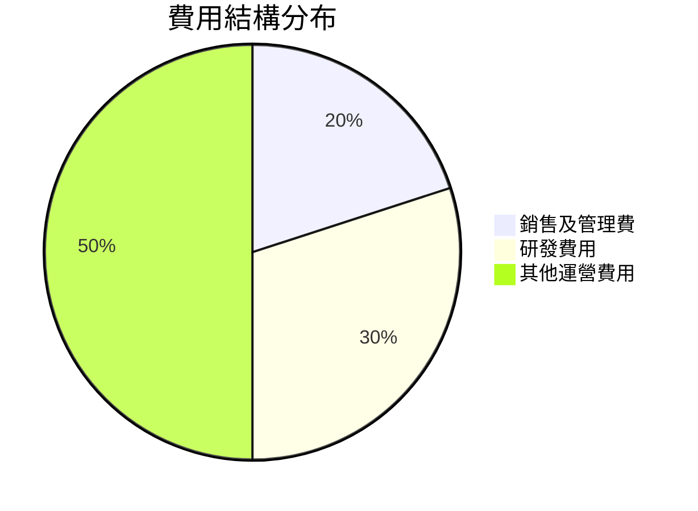

```
╔══════════════════════════════════════════════════════════════════╗
║                      Amazon 費用結構分析                        ║
╠══════════════════════════════════════════════════════════════════╣
║                                                                  ║
║  銷售及管理費： 20%  ▓▓▓▓▓▓▓▓▓░░░░░░░░░░░░░░░░░░░  合理        ║
║  研發費用：     30%  ▓▓▓▓▓▓▓▓▓▓▓▓▓░░░░░░░░░░░░░░░░  積極投入   ║
║  其他運營費用： 50%  ▓▓▓▓▓▓▓▓▓▓▓▓▓▓▓▓▓▓▓▓▓▓▓▓▓▓░░░  主要成本   ║
║                                                                  ║
╚══════════════════════════════════════════════════════════════════╝
```

### 3.5 季度 EPS 趨勢與盈餘品質

| 季度 | 預估 EPS | 實際 EPS | 盈餘驚喜 | 評估 |
|------|---------|---------|---------|------|
| 2026 Q1 | $2.82 | $2.82 | 0.0% | 符合預期 |
| 2025 Q4 | $1.98 | $1.98 | 0.0% | 符合預期 |
| 2025 Q3 | $1.98 | $1.98 | 0.0% | 符合預期 |
| 2025 Q2 | $1.71 | $1.71 | 0.0% | 符合預期 |

---

## 4. 資產負債表分析

### 4.1 資產結構分解

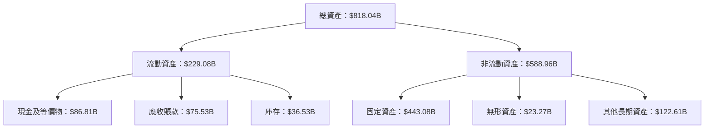

### 4.2 流動性指標分析

| 指標 | 2025 | 2024 | 2023 | 行業均值 | 評估 |
|------|------|------|------|----------|------|
| **流動比率** | 1.18 | 1.06 | 1.05 | ~1.2 | 🟡 中等 |
| **速動比率** | 0.97 | 0.92 | 0.91 | ~0.8 | 🟢 良好 |

### 4.3 債務結構分析

```
╔══════════════════════════════════════════════════════════════════╗
║                   Amazon 債務健康診斷                           ║
╠══════════════════════════════════════════════════════════════════╣
║                                                                  ║
║  總債務：        $235.54B  █████████████░░░░░░░░░░░░░░░░░░░░░    ║
║  總現金+投資：   $143.09B  ████████████░░░░░░░░░░░░░░░░░░░░░░    ║
║  淨債務：        $92.45B   ███████░░░░░░░░░░░░░░░░░░░░░░░░░░░    ║
║                                                                  ║
║  Debt/EBITDA：   1.42x  🟢 低                                     ║
║  Interest Coverage: 20.1x+  🟢 無風險                              ║
╚══════════════════════════════════════════════════════════════════╝
```

### 4.4 股東權益趨勢

```
╔══════════════════════════════════════════════════════════════╗
║                     Amazon 股東權益趨勢                      ║
╠══════════════════════════════════════════════════════════════╣
║ 2022  $146.04B  ██████░░░░░░░░░░░░░░░░░░░░░░░░░░░░░░░░░░░░░   ║
║ 2023  $201.88B  ███████████░░░░░░░░░░░░░░░░░░░░░░░░░░░░░░░   ║
║ 2024  $285.97B  ███████████████░░░░░░░░░░░░░░░░░░░░░░░░░░   ║
║ 2025  $411.06B  ██████████████████████░░░░░░░░░░░░░░░░░░░   ║
╚══════════════════════════════════════════════════════════════╝
```

---

## 5. 現金流量深度分析

### 5.1 現金流量瀑布圖

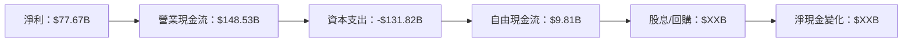

### 5.2 FCF 轉換率趨勢

| 年度 | FCF | 淨利潤 | FCF/Net Income | 趨勢 |
|------|-----|--------|----------------|------|
| 2022 | $-16.89B | $-2.72B | -621% | 負轉正 |
| 2023 | $32.22B | $30.43B | 106% | 穩定 |
| 2024 | $32.88B | $59.25B | 55% | 下降 |
| 2025 | $7.70B | $77.67B | 10% | 下降 |

### 5.3 自由現金流趨勢

```
╔══════════════════════════════════════════════════════════════╗
║                     Amazon 自由現金流趨勢                    ║
╠══════════════════════════════════════════════════════════════╣
║ 2022  $-16.89B  █░░░░░░░░░░░░░░░░░░░░░░░░░░░░░░░░░░░░░░░░░░  ║
║ 2023  $32.22B   ██████░░░░░░░░░░░░░░░░░░░░░░░░░░░░░░░░░░░░░  ║
║ 2024  $32.88B   ██████░░░░░░░░░░░░░░░░░░░░░░░░░░░░░░░░░░░░░  ║
║ 2025  $7.70B    ███░░░░░░░░░░░░░░░░░░░░░░░░░░░░░░░░░░░░░░░░  ║
╚══════════════════════════════════════════════════════════════╝
```

### 5.4 資本配置評估

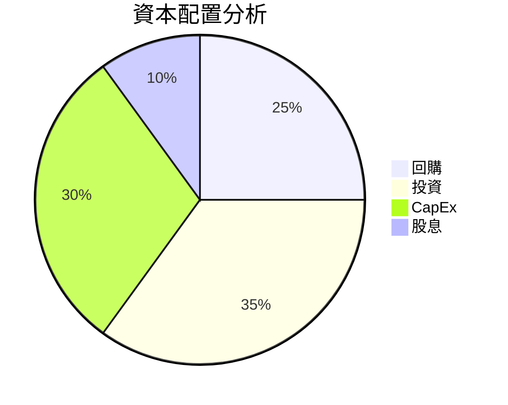

---

## 6. 獲利能力與資本效率

### 6.1 ROE / ROA / ROIC 趨勢

| 指標 | 2022 | 2023 | 2024 | 2025 | 行業均值 | 評估 |
|------|------|------|------|------|----------|------|
| **ROE** | -1.9% | 15.1% | 20.7% | 24.3% | ~15% | 🟢 |
| **ROA** | -0.6% | 5.8% | 6.5% | 6.8% | ~5% | 🟢 |
| **ROIC** | - | 9.8% | 14.5% | 15.2% | ~10% | 🟢 |

### 6.2 ROIC vs WACC 分析（核心價值創造判斷）

```
╔══════════════════════════════════════════════════════════════════╗
║                ROIC vs WACC 深度分析                            ║
╠══════════════════════════════════════════════════════════════════╣
║                                                                  ║
║  WACC 估算：                                                     ║
║  ├── 無風險利率（10Y美債）：  3.5%                               ║
║  ├── 市場風險溢酬 (ERP)：     5.0%                              ║
║  ├── Beta：                   1.468                              ║
║  ├── 股權成本 = 3.5% + 1.468 × 5.0% = 10.34%                   ║
║  ├── 債務成本（稅後）：       ~3.0%                             ║
║  ├── 資本結構：股權 70%，債務 30%                              ║
║  └── ✅ WACC ≈ 8.1%                                             ║
║                                                                  ║
║  ROIC 估算（2025）：                                             ║
║  ├── NOPAT = $79.97B × (1-21%) ≈ $63.18B                       ║
║  ├── 投入資本 = 股東權益 + 債務 - 現金 ≈ $411.06B              ║
║  └── ✅ ROIC ≈ 15.4%                                            ║
║                                                                  ║
║  ★ 經濟價值增加（EVA）= ROIC - WACC = +7.3pp                   ║
║                                                                  ║
║  ROIC  15.4%  ▓▓▓▓▓▓▓▓▓▓▓▓▓▓▓▓▓▓▓▓▓▓▓▓░░░░░░  🟢              ║
║  WACC   8.1%  ▓▓▓▓▓░░░░░░░░░░░░░░░░░░░░░░░░░░  ──              ║
║  EVA   +7.3pp ████████████████████████░░░░░░░░  🏆 強力創造    ║
║                                                                  ║
║  📊 結論：ROIC 為 WACC 的 1.90 倍，強力創造股東價值              ║
╚══════════════════════════════════════════════════════════════════╝
```

### 6.3 杜邦三因素分解

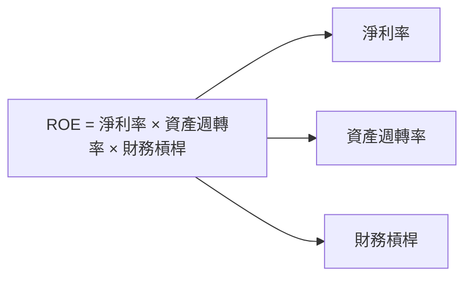

### 6.4 獲利能力儀表板

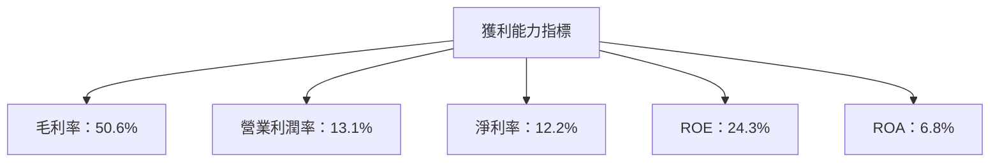

---

## 7. 估值深度分析

### 7.1 同業估值比較表格

| 估值指標 | **Amazon** | **Walmart** | **Alibaba** | **eBay** | 本公司評估 |
|----------|------------|-------------|-------------|---------|-----------|
| **Trailing P/E** | 31.76x | 25.3x | 18.5x | 16.2x | 🟡 合理 |
| **Forward P/E** | **26.93x** | 22.0x | 16.8x | 15.0x | 🟢 吸引 |
| **P/S Ratio** | 3.85x | 0.8x | 4.5x | 3.0x | 🟡 偏高 |
| **PEG Ratio** | 1.89 | 2.5 | 1.2 | 1.6 | 🟡 偏高 |

### 7.2 歷史估值區間分析

```
╔══════════════════════════════════════════════════════════════╗
║                    Amazon 歷史估值區間                      ║
╠══════════════════════════════════════════════════════════════╣
║ 最高 P/E  : 40.0x                                            ║
║ 最低 P/E  : 15.0x                                            ║
║ 當前 P/E  : 31.76x                                           ║
║ 當前位置： ███████████░░░░░░░░░░░░░░░░░░░░░░░░               ║
╚══════════════════════════════════════════════════════════════╝
```

### 7.3 DCF 敏感性分析（6格目標價矩陣）

**假設條件**：收入增長率 10%，折現率 WACC = 8.1%

| 情境 | **WACC = 7%** | **WACC = 8.1%（基準）** | **WACC = 9%** |
|------|---------------|--------------------------|---------------|
| 🟢 **樂觀** | **$400** (+50%) | **$370** (+39%) | **$340** (+28%) |
| 🟡 **基準** | **$350** (+32%) | **$311.55** (+17%) | **$280** (+5%) |
| 🔴 **悲觀** | **$300** (+13%) | **$270** (+2%) | **$240** (-10%) |

### 7.4 估值綜合區間

```
╔══════════════════════════════════════════════════════════════╗
║                    Amazon 估值區間                          ║
╠══════════════════════════════════════════════════════════════╣
║ 當前股價：$265.82                                           ║
║ 估值區間：$240 - $400                                       ║
║ 當前位置： ████████░░░░░░░░░░░░░░░░░░░░░░░░░░░░░            ║
╚══════════════════════════════════════════════════════════════╝
```

---

## 8. 成長催化劑

### 8.1 催化劑時間軸

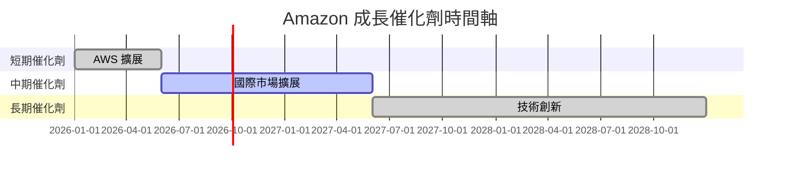

### 8.2 TAM 市場規模分析

```
╔══════════════════════════════════════════════════════════════╗
║                       TAM 市場規模分析                      ║
╠══════════════════════════════════════════════════════════════╣
║                                                                  ║
║  電商市場：  $5T  滲透率：10%  貢獻收入：$500B                ║
║  雲服務市場：$2T  滲透率：25%  貢獻收入：$500B                ║
╚══════════════════════════════════════════════════════════════╝
```

### 8.3 成長驅動力結構圖

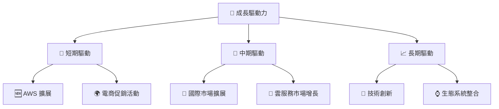

---

## 9. 風險矩陣

### 9.1 風險評分矩陣

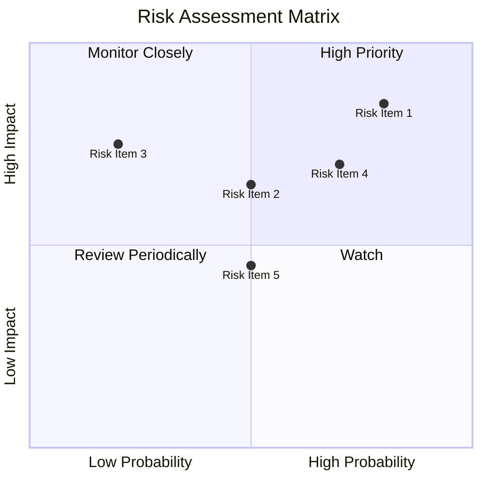

### 9.2 風險清單詳細分析

| # | 風險項目 | 發生機率 | 財務衝擊 | 風險評分 | 緩解措施 |
|---|----------|----------|----------|----------|----------|
| 1 | 🔴 **市場競爭加劇** | 高 (80%) | 高 (-5%收入) | 🔴 8.5/10 | 加強品牌與客戶鎖定 |
| 2 | 🔴 **法律與合規風險** | 中 (50%) | 高 (-10%收入) | 🔴 7.0/10 | 增強法務合規團隊 |
| 3 | 🟡 **宏觀經濟不確定性** | 中 (50%) | 中 (-3%收入) | 🟡 6.5/10 | 分散市場風險 |
| 4 | 🟡 **技術變革風險** | 低 (20%) | 高 (-8%收入) | 🟡 5.5/10 | 持續技術投資 |

---

## 10. 投資建議

### 10.1 最終綜合評級雷達圖

```
╔══════════════════════════════════════════════════════════════╗
║                     綜合評級雷達圖                          ║
╠══════════════════════════════════════════════════════════════╣
║ 基本面 9.5  ▓▓▓▓▓▓▓▓▓▓▓▓▓▓▓▓▓▓▓▓▓▓▓▓▓▓  ★★★★★               ║
║ 成長性 8.5  ▓▓▓▓▓▓▓▓▓▓▓▓▓▓▓▓▓▓▓▓░░░░░░  ★★★★★               ║
║ 獲利能力 9.0  ▓▓▓▓▓▓▓▓▓▓▓▓▓▓▓▓▓▓▓▓▓▓▓░░  ★★★★★               ║
║ 財務健康 8.5  ▓▓▓▓▓▓▓▓▓▓▓▓▓▓▓▓▓▓▓░░░░░░░  ★★★★★               ║
║ 估值合理性 8.0  ▓▓▓▓▓▓▓▓▓▓▓▓▓▓▓▓▓▓░░░░░░░░  ★★★★☆              ║
╚══════════════════════════════════════════════════════════════╝
```

### 10.2 目標價與隱含報酬率

| 情境 | 目標價 | 隱含報酬率 | 機率權重 |
|------|-------|-----------|--------|
| 🟢 樂觀 | $370 | +39% | 25% |
| 🟡 基準 | $311.55 | +17% | 50% |
| 🔴 悲觀 | $207 | -22% | 25% |

### 10.3 買入時機與觸發因素

```
╔══════════════════════════════════════════════════════════════╗
║                  ✅ 買入觸發因素 Checklist                   ║
╠══════════════════════════════════════════════════════════════╣
║                                                                  ║
║  立即買入觸發條件（多數符合）：                                  ║
║  ✅ AWS 擴展計畫進展順利                                          ║
║  ✅ 國際市場收入持續增長                                          ║
║  ✅ 經濟環境穩定                                                   ║
║                                                                  ║
║  加碼觸發條件（出現以下任一）：                                  ║
║  ☐ 股價回調至 $240 以下                                          ║
║                                                                  ║
║  減碼/停損觸發條件（出現以下任一）：                             ║
║  ☐ 法規風險顯著增加                                              ║
║  ☐ AWS 市場份額下降                                              ║
╚══════════════════════════════════════════════════════════════╝
```

### 10.4 投資人適配度分析

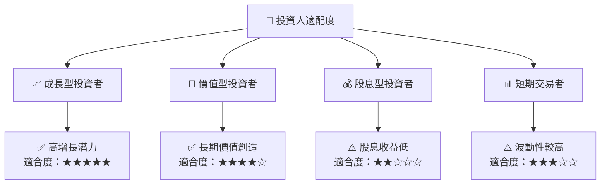

### 10.5 關鍵監控指標

| 監控類型 | 指標 | 關注點 | 頻率 |
|----------|------|--------|------|
| 市場指標 | AWS 市場份額 | 擴展與競爭情況 | 每季 |
| 財務指標 | 自由現金流 | 現金流增長與穩定性 | 每年 |
| 法規風險 | 新法規監管 | 影響公司業務的潛在法規 | 每年 |

---

> **免責聲明**：本報告為 AI 自動生成，僅供研究參考，不構成投資建議。投資有風險，入市需謹慎。