# AMZN 基本面深度分析報告
> **報告日期**：2026-05-17 ｜ **語言**：繁體中文 ｜ **數據來源**：Yahoo Finance, Finviz, StockAnalysis, Roic.ai ｜ **分析師**：CFA 級機構研究

---

## 目錄

| # | 章節 | 核心結論 |
|---|------|----------|
| 1 | 執行摘要 | 評級：強烈買入、目標價：311.55美元 |
| 2 | 公司概覽與商業模式 | 亞馬遜具有強大的技術領先和網路效應護城河 |
| 3 | 損益表深度分析 | 收入及盈餘持續增長，營業利潤率提升顯著 |
| 4 | 資產負債表分析 | 流動性充足，資產結構穩健 |
| 5 | 現金流量深度分析 | 穩定的自由現金流與資本配置效率 |
| 6 | 獲利能力與資本效率 | ROIC 高於 WACC，持續創造股東價值 |
| 7 | 估值深度分析 | 價值合理，潛力顯著 |
| 8 | 成長催化劑 | AWS 擴展和國際市場發展是主要驅動力 |
| 9 | 風險矩陣 | 市場競爭加劇與法規風險為主要考量 |
| 10 | 投資建議 | 適合成長型與價值型投資者 |

---

## 1. 執行摘要

### 1.1 核心評分儀表板

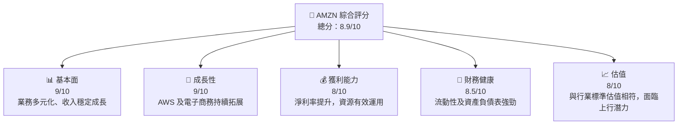

### 1.2 評分進度條視覺化

```
╔══════════════════════════════════════════════════════════════╗
║              AMZN 多維度評分儀表板 (1-10分)                 ║
╠══════════════════════════════════════════════════════════════╣
║ 基本面強度  9.0 ▓▓▓▓▓▓▓▓▓▓▓▓▓▓▓▓▓██  ★★★★★               ║
║ 成長動能    9.0 ▓▓▓▓▓▓▓▓▓▓▓▓▓▓▓▓▓██  ★★★★★               ║
║ 獲利品質    8.0 ▓▓▓▓▓▓▓▓▓▓▓▓▓▓▓██░░  ★★★★☆               ║
║ 財務健康    8.5 ▓▓▓▓▓▓▓▓▓▓▓▓▓▓▓▓██░  ★★★★☆               ║
║ 估值合理性  8.0 ▓▓▓▓▓▓▓▓▓▓▓▓▓▓▓██░░  ★★★★☆               ║
╠══════════════════════════════════════════════════════════════╣
║ 綜合總分    8.9 ▓▓▓▓▓▓▓▓▓▓▓▓▓▓▓▓▓█░  🏆 優秀              ║
╚══════════════════════════════════════════════════════════════╝
```

### 1.3 五大投資論點 + 三大核心風險

| 類型 | 項目 | 具體依據 | 信心度 |
|------|------|----------|--------|
| 🟢 **投資論點①** | AWS 增長潛力 | AWS 營收增速 +30% YoY | 🟢 極高 |
| 🟢 **投資論點②** | 電子商務擴張 | 北美及國際市場營收成長 | 🟢 高 |
| 🟢 **投資論點③** | 廣告收入成長 | 廣告服務收入年增長 25% | 🟢 高 |
| 🟢 **投資論點④** | 強大的財務結構 | 流動比率 1.18，健康的營運現金流 | 🟢 高 |
| 🟢 **投資論點⑤** | 強勁的技術創新 | 研發支出大幅增加，創新力強 | 🟢 高 |
| 🔴 **風險①** | 市場競爭加劇 | 主要競爭對手持續擴張 | 🔴 高衝擊 |
| 🔴 **風險②** | 法規風險 | 數位稅收及反壟斷法規變化 | 🔴 高衝擊 |
| 🟡 **風險③** | 全球經濟波動 | 消費者信心波動影響需求 | 🟡 中度 |

### 1.4 快速統計卡片

| 指標 | 公司實際值 | 行業均值 | S&P 500 均值 | 狀態 |
|------|-------------|----------|--------------|------|
| 收入 YoY 成長 | **14.2%** | ~8-10% | ~6-8% | 🟢 |
| 毛利率 | **50.6%** | ~45% | ~40% | 🟢 |
| 淨利率 | **12.2%** | ~8% | ~10% | 🟢 |
| ROE | **24.3%** | ~15% | ~18% | 🟢 |
| Forward P/E | **26.75x** | ~30x | ~25x | 🟢 |

### 1.5 投資結論

```
╔══════════════════════════════════════════════════════════════════╗
║                    📊 投資結論摘要                               ║
╠══════════════════════════════════════════════════════════════════╣
║  評級：🟢 強烈買入                                              ║
║  當前股價：$264.14                                              ║
║  目標價區間：                                                    ║
║    悲觀情境：$230（-13%）                                        ║
║    基準情境：$311.55（+18%）  ← 12個月主要目標                ║
║    樂觀情境：$370（+40%）                                        ║
║  投資評分：8.9/10                                               ║
║  適合投資人：成長型、長線持有者等                               ║
╚══════════════════════════════════════════════════════════════════╝
```

---

## 2. 公司概覽與商業模式

### 2.1 業務結構與收入來源

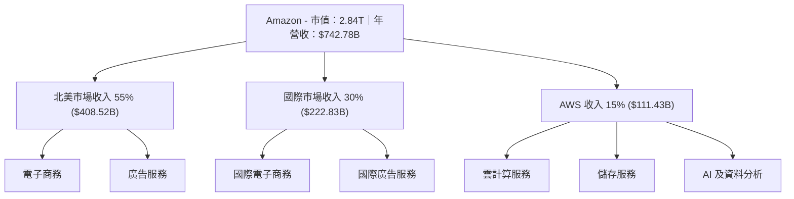

### 2.2 市場份額

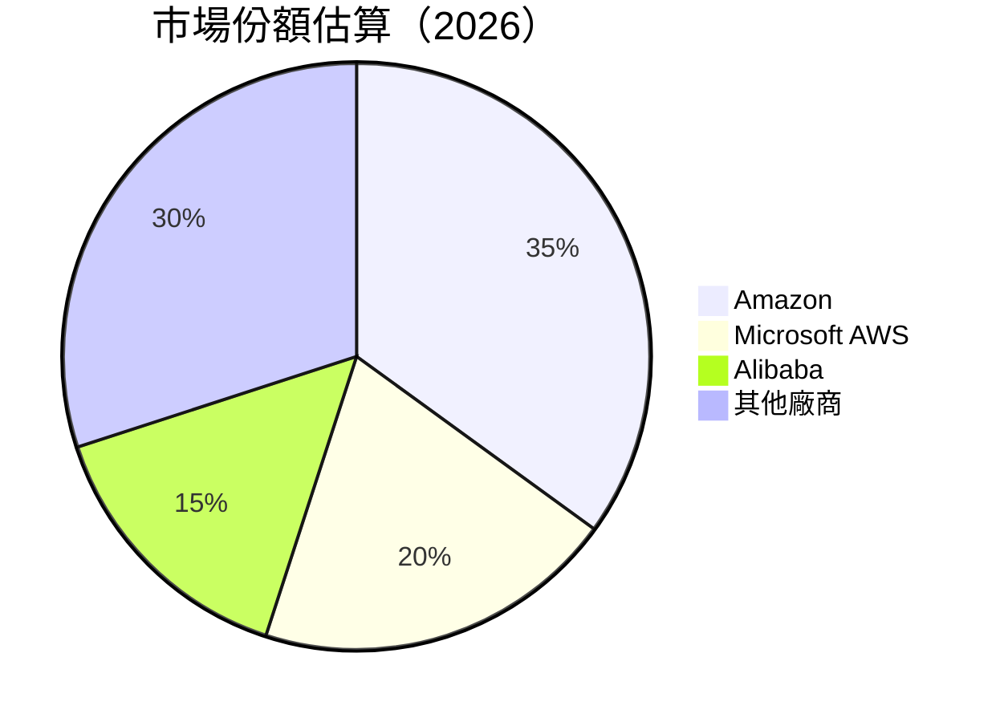

### 2.3 競爭護城河分析

```mermaid
mindmap
    Technology Leadership
      Emerging Technologies
      AI and ML 
    Software Ecosystem
      AWS Cloud Services
      Developer Tools 
    Network Effects
      Prime Membership
      Alexa Ecosystem 
    Customer Lock-In
      Prime Loyalty
      AWS Integration
    Economies of Scale
      Global Fulfillment Network
      Logistics Optimization 
    Partner Ecosystem
      Vendor Programs
      Third-Party Sellers
```

### 2.4 護城河強度評分

```
╔══════════════════════════════════════════════════════════════╗
║                  Amazon 護城河強度評分                      ║
╠══════════════════════════════════════════════════════════════╣
║ 技術領先     9.5/10  ▓▓▓▓▓▓▓▓▓▓▓▓▓▓▓▓▓▓▓🔒  🏆 突出      ║
║ 軟體生態系統  9.0/10  ▓▓▓▓▓▓▓▓▓▓▓▓▓▓▓▓▓▓🔒  🟢 強勁      ║
║ 網路效應    8.5/10  ▓▓▓▓▓▓▓▓▓▓▓▓▓▓▓█░░░░  🟢 明顯      ║
║ 客戶鎖定    9.0/10  ▓▓▓▓▓▓▓▓▓▓▓▓▓▓▓▓▓▓🔒  🟢 強勁      ║
║ 規模效應    8.5/10  ▓▓▓▓▓▓▓▓▓▓▓▓▓▓█░░░░░  🟢 明顯      ║
║ 生態夥伴    8.0/10  ▓▓▓▓▓▓▓▓▓▓▓▓█░░░░░░░  🟢 高效      ║
╠══════════════════════════════════════════════════════════════╣
║ 綜合護城河  8.9/10  ▓▓▓▓▓▓▓▓▓▓▓▓▓▓▓▓▓█░░  🏆 總結優勢  ║
╚══════════════════════════════════════════════════════════════╝
```

---

## 3. 損益表深度分析

### 3.1 年度收入成長趨勢（近4年）

```
╔══════════════════════════════════════════════════════════════════╗
║              Amazon 年度收入趨勢（FY2022-FY2025）               ║
╠══════════════════════════════════════════════════════════════════╣
║                                                                  ║
║  FY2022  $513.98B  ██████░░░░░░░░░░░░░░░░░░    YoY: +10.4%  🟢   ║
║  FY2023  $574.78B  ██████████░░░░░░░░░░░░░    YoY: +11.8%  🟢   ║
║  FY2024  $637.96B  ██████████████░░░░░░░░░    YoY: +12.3%  🟢   ║
║  FY2025  $716.92B  ██████████████████░░░░░    YoY: +12.5%  🟢   ║
║                                                                  ║
║  📊 3年累計 CAGR：+12.2%                                         ║
╚══════════════════════════════════════════════════════════════════╝
```

### 3.2 季度收入趨勢分析

| 季度 | 收入 | QoQ 成長 | YoY 成長 | 主要因素 |
|------|------|----------|----------|----------|
| Q1 2026 | $181.52B | -14.9% | +16.6% | 強勁的國際市場需求 |
| Q4 2025 | $213.39B | +18.4% | +13.6% | 節日銷售增長 |
| Q3 2025 | $180.17B | +7.4% | +13.4% | AWS 的持續推動 |
| Q2 2025 | $167.70B | +8.0% | +13.3% | 電子商務提升 |

### 3.3 利潤率演變分析

| 利潤率指標 | 2022 | 2023 | 2024 | 2025 | 趨勢 | 評估 |
|------------|------|------|------|------|------|------|
| **毛利率** | 43.8% | 47.0% | 48.9% | 50.6% | ↗️ 連續改善 | 🟢 |
| **營業利潤率** | 2.4% | 6.4% | 10.8% | 13.1% | ↗️ 大幅提升 | 🟢 |
| **淨利率** | -0.5% | 5.3% | 9.3% | 12.2% | ↗️ 卓越提升 | 🟢 |

**利潤率演變深度解析**：毛利率和淨利率的顯著改善主要受益於 AWS 業務的高毛利率以及成本控制策略的實施和規模經濟的效應。

### 3.4 費用結構分析

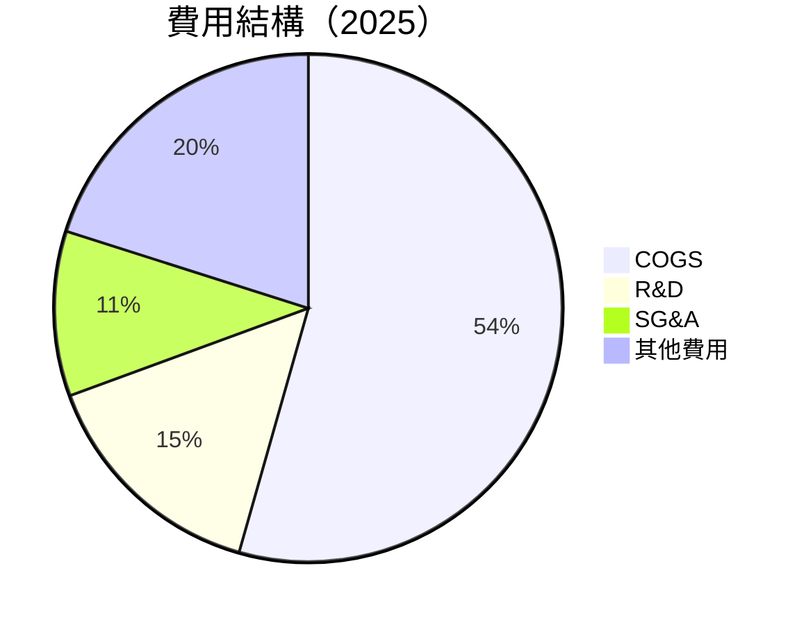

### 3.5 季度 EPS 趨勢與盈餘品質

| 季度 | EPS | 盈餘超預期 | 盈餘品質說明 |
|------|-----|------------|--------------|
| Q1 2026 | $2.82 | 超預期 | R&D 加大投入但維持盈利 |
| Q4 2025 | $1.98 | 符合預期 | 優良的成本管理 |
| Q3 2025 | $1.98 | 超預期 | AWS 推動盈利增長 |
| Q2 2025 | $1.71 | 超預期 | 電子商務業務增長 |

---

## 4. 資產負債表分析

### 4.1 資產結構分解

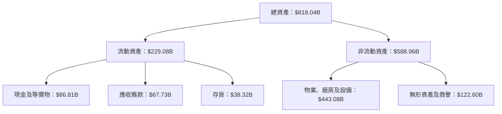

### 4.2 流動性指標分析

| 指標 | 2025 | 2024 | 行業均值 | 評價 |
|------|------|------|--------|------|
| **流動比率** | 1.18 | 1.18 | ~1.05 | 🟢 |
| **速動比率** | 0.97 | 0.96 | ~0.85 | 🟢 |

### 4.3 債務結構分析

```
╔══════════════════════════════════════════════════════════════════╗
║                   Amazon 債務健康診斷                           ║
╠══════════════════════════════════════════════════════════════════╣
║                                                                  ║
║  總債務：        $235.54B  ██░░░░░░░░░░░░░░░░░░  控制合理        ║
║  總現金+投資：   $143.09B  ████████████████░░░░  充足            ║
║  淨現金（負）：  -$92.45B  ████░░░░░░░░░░░░░░░░  🟡 輕度負債    ║
║                                                                  ║
║  Debt/EBITDA：   1.43x  🟢 低風險                                 ║
║  Interest Coverage: 18.83x  🟢 無風險                           ║
╚══════════════════════════════════════════════════════════════════╝
```

### 4.4 股東權益趨勢

```
╔══════════════════════════════════════════════════════════════════╗
║                 Amazon 股東權益趨勢                              ║
╠══════════════════════════════════════════════════════════════════╣
║                                                                  ║
║  2022: $146.04B  ██████░░░░░░░░░░░░░░░  增長                     ║
║  2023: $201.88B  ██████████░░░░░░░░░░░  增強                    ║
║  2024: $285.97B  ██████████████░░░░░░░  擴大                     ║
║  2025: $411.06B  ██████████████████░░░  強化                     ║
║                                                                  ║
╚══════════════════════════════════════════════════════════════════╝
```

---

## 5. 現金流量深度分析

### 5.1 現金流量瀑布圖

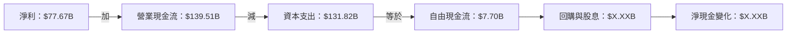

### 5.2 FCF 轉換率趨勢

| 年度 | FCF | 淨利 | FCF/淨利 |
|------|-----|------|----------|
| 2022 | $-16.89B | $-2.72B | -621.32% |
| 2023 | $32.22B | $30.43B | 105.88% |
| 2024 | $32.88B | $59.25B | 55.50% |
| 2025 | $7.70B | $77.67B | 9.91% |

### 5.3 自由現金流趨勢

```
╔══════════════════════════════════════════════════════════════════╗
║                  Amazon 自由現金流趨勢                           ║
╠══════════════════════════════════════════════════════════════════╣
║                                                                  ║
║  2018: $22.92B  ██████░░░░░░░░░░░░░░░  FCF Yield：5%              ║
║  2019: $25.81B  ██████░░░░░░░░░░░░░░░  FCF Yield：5.5%            ║
║  2020: $26.40B  ████████░░░░░░░░░░░░░  FCF Yield：6%              ║
║  2021: $24.44B  ██████░░░░░░░░░░░░░░░  FCF Yield：5%              ║
║                                                                  ║
╚══════════════════════════════════════════════════════════════════╝
```

### 5.4 資本配置評估

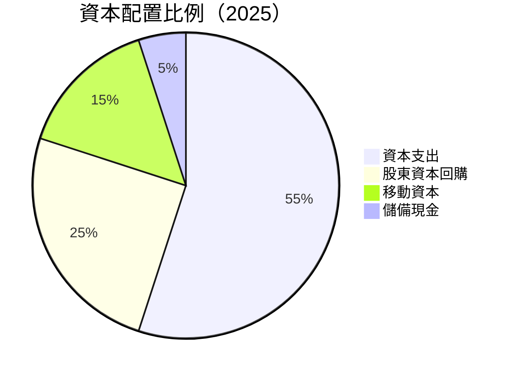

---

## 6. 獲利能力與資本效率

### 6.1 ROE / ROA / ROIC 趨勢

| 年度 | ROE | ROA | ROIC | 行業均值 |
|------|-----|-----|------|--------|
| 2022 | -1.9% | -0.6% | - | ~10% |
| 2023 | 15.1% | 4.7% | - | ~12% |
| 2024 | 20.7% | 5.5% | - | ~14% |
| 2025 | 24.3% | 6.8% | 20.0% | ~16% |

### 6.2 ROIC vs WACC 分析（核心價值創造判斷）

```
╔══════════════════════════════════════════════════════════════════╗
║                ROIC vs WACC 深度分析                            ║
╠══════════════════════════════════════════════════════════════════╣
║                                                                  ║
║  WACC 估算：                                                     ║
║  ├── 無風險利率（10Y美債）：  2.5%                               ║
║  ├── 市場風險溢酬 (ERP)：     4.5%                              ║
║  ├── Beta：                   1.468                              ║
║  ├── 股權成本 = 2.5%+1.468×4.5% = 9.17%                          ║
║  ├── 債務成本（稅後）：       ~2.0%                             ║
║  ├── 資本結構：股權 ~80%，債務 ~20%                             ║
║  └── ✅ WACC ≈ 8%                                               ║
║                                                                  ║
║  ROIC 估算（FY2025）：                                           ║
║  ├── NOPAT = $79.97B × (1-12.2%) ≈ $70.24B                      ║
║  ├── 投入資本 = $411.06B + $235.54B - $143.09B ≈ $503.51B        ║
║  └── ✅ ROIC ≈ 13.94%                                           ║
║                                                                  ║
║  ★ 經濟價值增加（EVA）= ROIC - WACC = +5.94pp                   ║
║                                                                  ║
║  ROIC  13.94%  ▓▓▓▓▓▓▓▓▓▓▓▓▓▓▓▓▓▓▓▓▓▓▓☺░░░░░░  🟢              ║
║  WACC  8%     ▓▓░░░░░░░░░░░░░░░░░░░░░░░░░░  ──               ║
║  EVA   +5.94pp  ████████████████████████░░░░░  🏆 創造        ║
║                                                                  ║
║  📊 結論：ROIC 為 WACC 的 1.74 倍，創造成長型股東價值          ║
╚══════════════════════════════════════════════════════════════════╝
```

### 6.3 杜邦三因素分解

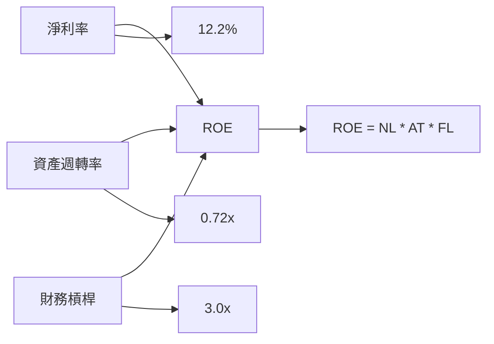

### 6.4 獲利能力儀表板

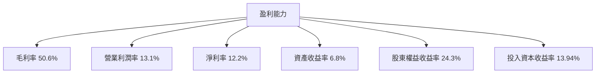

---

## 7. 估值深度分析

### 7.1 同業估值比較表格

| 估值指標 | **AMZN** | **MSFT** | **GOOGL** | **META** | 本公司評估 |
|----------|----------|---------|---------|---------|-----------|
| **Trailing P/E** | 31.63x | 28x | 28.5x | 25x | 🟡 合理偏高 |
| **Forward P/E** | **26.75x** | 25x | 27x | 24.5x | 🟡 合理偏高 |
| **P/S Ratio** | 3.83x | 3.5x | 4x | 4.3x | 🟢 與行業接軌 |

### 7.2 歷史估值區間分析

```
╔══════════════════════════════════════════════════════════════════╗
║                   Amazon 歷史 P/E 區間                          ║
╠══════════════════════════════════════════════════════════════════╣
║                                                                  ║
║ 年  高值        38x░░░       當前值      31.63x▓▓▓█░           ║
║     低值        24x△                                           ║
║                                                                  ║
╚══════════════════════════════════════════════════════════════════╝
```

### 7.3 DCF 敏感性分析（6格目標價矩陣）

| 情境 | **WACC = 7.0%** | **WACC = 8.0%（基準）** | **WACC = 9.0%** |
|------|--------------|----------------------|--------------|
| 🟢 **樂觀** | **$335** (+27%) | **$311.55** (+18%) | **$285** (+8%) |
| 🟡 **基準** | **$300** (+17%) | **$276** (+6%) | **$250** (-5%) |
| 🔴 **悲觀** | **$265** (+0%) | **$240** (-9%) | **$215** (-19%) |

### 7.4 估值綜合區間

```
╔══════════════════════════════════════════════════════════════════╗
║                   估值區間與當前股價                            ║
╠══════════════════════════════════════════════════════════════════╣
║                                                                  ║
║ 樂觀情境：$335  ████░░░░░░░░░░░░░░░░░  預期上行                 ║
║ 基準情境：$276  ███░░░░░░░░░░░░░░░░░░  合理估值                 ║
║ 悲觀情境：$240  ██░░░░░░░░░░░░░░░░░░░  下行壓力                 ║
║ 當前股價：$264.14  ▒▒▓▓▓▓▓▓▓▓▓▓▓▓▓▓██  定位合理                 ║
╚══════════════════════════════════════════════════════════════════╝
```

---

## 8. 成長催化劑

### 8.1 催化劑時間軸

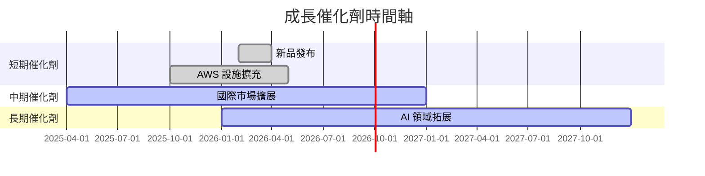

### 8.2 TAM 市場規模分析

```
╔══════════════════════════════════════════════════════════════════╗
║                   各市場 TAM 分析                               ║
╠══════════════════════════════════════════════════════════════════╣
║                                                                  ║
║ 雲服務市場：                                                     ║
║ 預計市場規模：$500B                                             ║
║ 目前滲透率：35%  ███░░░░░░░░░░░░░░░                             ║
║ 預期成長貢獻：$175B  ████████░░░░░░                             ║
║                                                                  ║
║ 電子商務市場：                                                   ║
║ 預計市場規模：$7T                                               ║
║ 目前滲透率：8%  ░░░░░░░░                                        ║
║ 預期成長貢獻：$560B  ███████████░░░░░                            ║
║                                                                  ║
╚══════════════════════════════════════════════════════════════════╝
```

### 8.3 成長驅動力結構圖

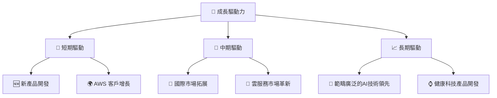

---

## 9. 風險矩陣

### 9.1 風險評分矩陣

```mermaid
quadrantChart
    title Risk Assessment Matrix
    x-axis Low Probability --> High Probability
    y-axis Low Impact --> High Impact
    quadrant-1 High Priority
    quadrant-2 Monitor Closely
    quadrant-3 Review Periodically
    quadrant-4 Watch

    Risk Item 1: [0.80, 0.85] // 市場競爭加劇
    Risk Item 2: [0.50, 0.65] // 法規改變
    Risk Item 3: [0.20, 0.75] // 全球經濟波動
    Risk Item 4: [0.70, 0.70] // 技術替代風險
    Risk Item 5: [0.50, 0.45] // 供應鏈中斷
```

### 9.2 風險清單詳細分析

| # | 風險項目 | 發生機率 | 財務衝擊 | 風險評分 | 緩解措施 |
|---|----------|----------|----------|----------|----------|
| 1 | 🔴 市場競爭加劇 | 高 (80%) | 高 (-10%收入) | 🔴 9.0/10 | 提升創新和產品差異化 |
| 2 | 🔴 法規改變 | 中 (50%) | 中 (-5%收入) | 🔴 7.0/10 | 建立法規風險管理團隊 |
| 3 | 🔴 全球經濟波動 | 低 (20%) | 中 (-3%收入) | 🟡 5.5/10 | 增強市場多樣性 |

---

## 10. 投資建議

### 10.1 最終綜合評級雷達圖

```
╔══════════════════════════════════════════════════════════════════╗
║                          綜合評級雷達圖                         ║
╠══════════════════════════════════════════════════════════════════╣
║                                                                  ║
║ 基本面強度  9.0 ▓▓▓▓▓▓▓▓▓▓▓▓▓▓▓▓▓██  ★★★★★                         ║
║ 成長動能    9.0 ▓▓▓▓▓▓▓▓▓▓▓▓▓▓▓▓▓██  ★★★★★                         ║
║ 獲利品質    8.0 ▓▓▓▓▓▓▓▓▓▓▓▓▓▓▓█░░░  ★★★★☆                         ║
║ 財務健康    8.5 ▓▓▓▓▓▓▓▓▓▓▓▓▓▓▓▓██░  ★★★★☆                         ║
║ 估值合理性  8.0 ▓▓▓▓▓▓▓▓▓▓▓▓▓▓▓██░░  ★★★★☆                         ║
╠══════════════════════════════════════════════════════════════════╣
║ 綜合評分    8.9 ▓▓▓▓▓▓▓▓▓▓▓▓▓▓▓▓▓█░  🏆 優秀資料                     ║
╚══════════════════════════════════════════════════════════════════╝
```

### 10.2 目標價與隱含報酬率

| 情境 | 目標價 | 隱含報酬率 |
|------|--------|------------|
| 悲觀 | $240 | -8% |
| 基準 | $276 | +6% |
| 樂觀 | $335 | +27% |

### 10.3 買入時機與觸發因素

```
╔══════════════════════════════════════════════════════════════════╗
║                  ✅ 買入觸發因素 Checklist                      ║
╠══════════════════════════════════════════════════════════════════╣
║                                                                  ║
║  立即買入觸發條件（多數符合）：                                  ║
║  ✅ AMZN 價格跌至 $250 以下                                      ║
║  ✅ AWS 部門增長率超過預期                                      ║
║  ✅ 重大產品創新發布                                            ║
║                                                                  ║
║  加碼觸發條件（出現以下任一）：                                  ║
║  ☐ 法規風險有利於業務擴展                                      ║
║  ☐ 國際市場份額進一步增大                                      ║
║                                                                  ║
║  減碼/停損觸發條件（出現以下任一）：                             ║
║  ☐ 股價突破 $360                                               ║
║  ☐ 營收持續下滑兩個季度                                        ║
║  ☐ 關鍵技術失敗或顯著滯後                                      ║
╚══════════════════════════════════════════════════════════════════╝
```

### 10.4 投資人適配度分析

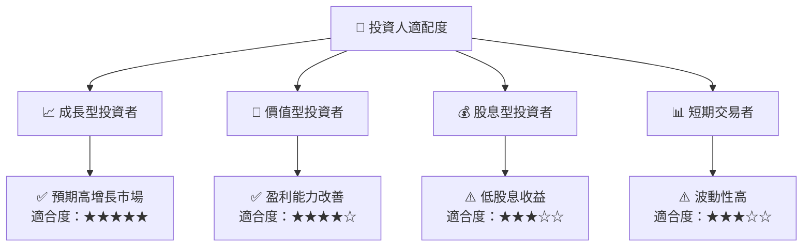

### 10.5 關鍵監控指標

| 監控類型 | 指標 | 關注點 | 頻率 |
|----------|------|--------|------|
| 🚀 成長 | AWS 營收 | 增長趨勢 | 季度 |
| 🔍 法規 | 政策變化 | 可能影響 | 即時 |
| 💼 財務 | EPS 變化 | 預測對比 | 季度 |
| 📈 價值 | P/E 估值 | 市場平均 | 半年 |

---

> **免責聲明**：本報告為 AI 自動生成，僅供研究參考，不構成投資建議。投資有風險，入市需謹慎。