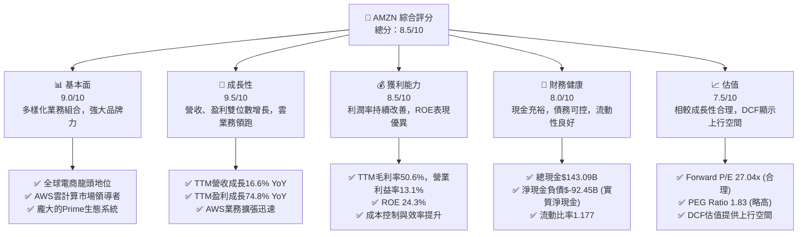
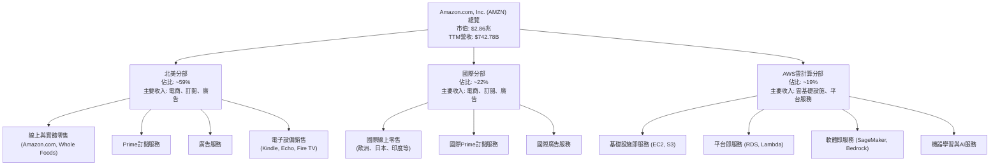
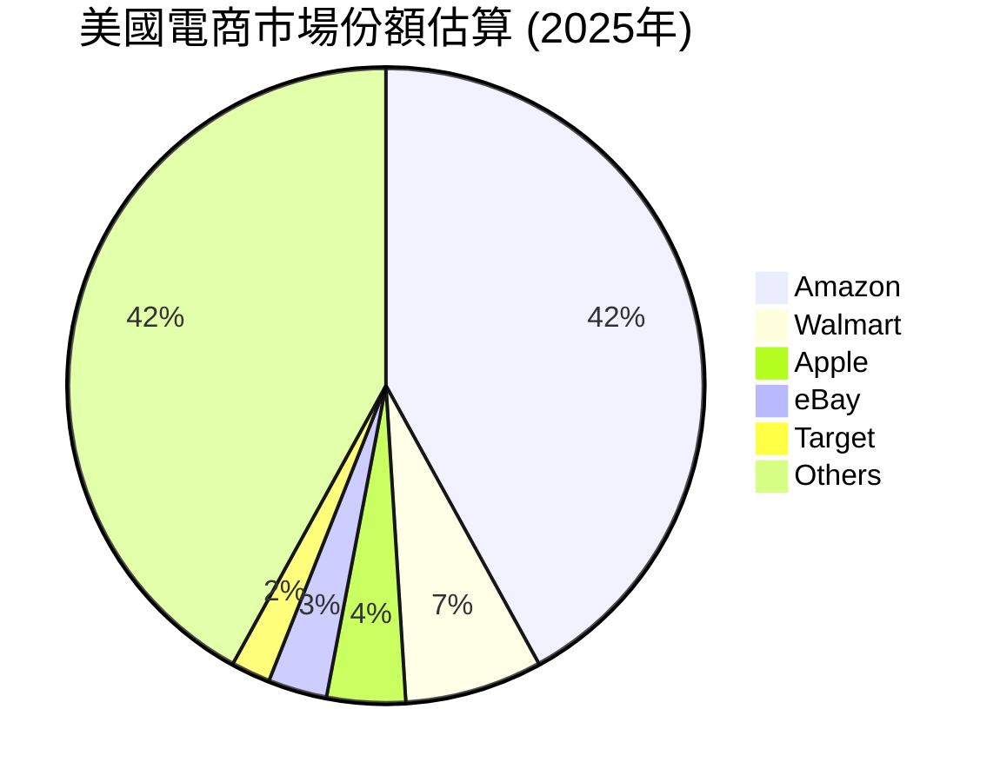
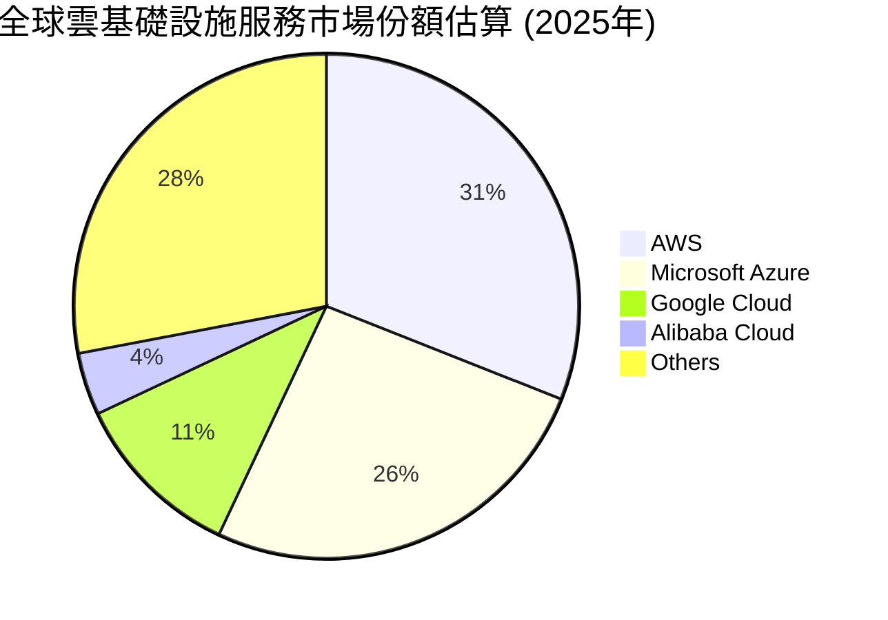
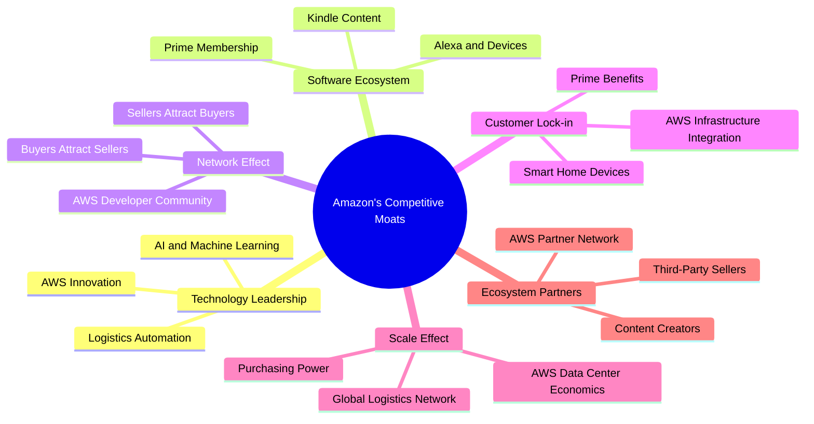
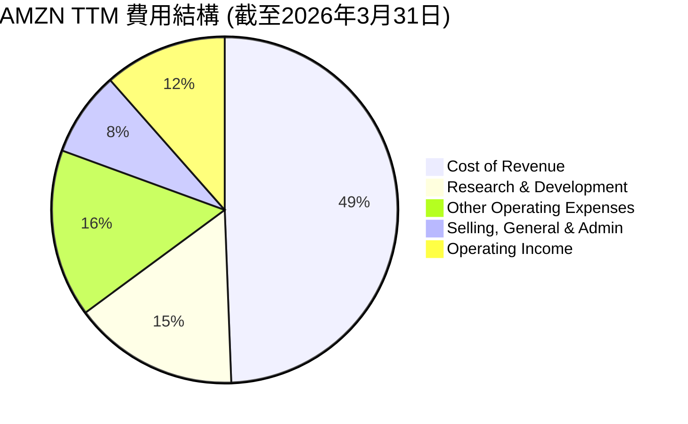
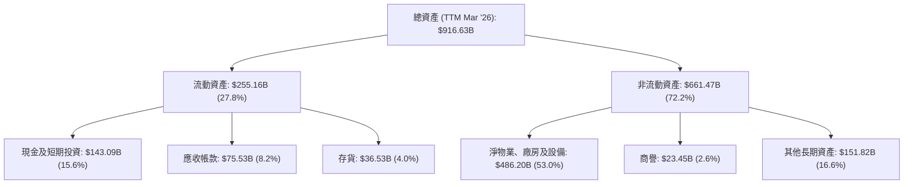

# AMZN 基本面深度分析報告
> **報告日期**：2026-05-22 ｜ **語言**：繁體中文 ｜ **數據來源**：Yahoo Finance, Finviz, StockAnalysis, Roic.ai ｜ **分析師**：CFA 級機構研究

---

## 目錄

| # | 章節 | 核心結論 |
|---|------|----------|
| 1 | 執行摘要 | 🟢 強烈買入；目標價區間：$290 - $350 |
| 2 | 公司概覽與商業模式 | 創新驅動的多元化生態系統，護城河深厚 |
| 3 | 損益表深度分析 | 營收穩健成長，利潤率顯著改善 |
| 4 | 資產負債表分析 | 財務結構穩健，流動性充裕 |
| 5 | 現金流量深度分析 | 營業現金流強勁，自由現金流受資本支出影響 |
| 6 | 獲利能力與資本效率 | ROIC顯著超越WACC，創造股東價值 |
| 7 | 估值深度分析 | 相較同業估值合理，DCF顯示上行空間 |
| 8 | 成長催化劑 | AWS、廣告、電商效率與AI創新驅動長期成長 |
| 9 | 風險矩陣 | 宏觀經濟、監管及競爭為主要風險，但可控 |
| 10 | 投資建議 | 長期成長潛力巨大，建議「強烈買入」 |

---

## 1. 執行摘要

Amazon.com, Inc. (AMZN) 作為全球領先的電子商務、雲計算、數位廣告和人工智慧巨頭，展現了卓越的業務韌性和增長潛力。本報告基於最新的財務數據，對AMZN的基本面進行了全面而深入的分析，旨在為機構投資者提供一份詳盡的投資研究報告。

### 1.1 核心評分儀表板



### 1.2 評分進度條視覺化

```
╔══════════════════════════════════════════════════════════════╗
║              AMZN 多維度評分儀表板 (1-10分)                  ║
╠══════════════════════════════════════════════════════════════╣
║ 基本面強度  9.0 ▓▓▓▓▓▓▓▓▓▓▓▓▓▓▓▓▓▓░░  ★★★★★           ║
║ 成長動能    9.5 ▓▓▓▓▓▓▓▓▓▓▓▓▓▓▓▓▓▓▓░  ★★★★★           ║
║ 獲利品質    8.5 ▓▓▓▓▓▓▓▓▓▓▓▓▓▓▓▓▓░░░  ★★★★☆           ║
║ 財務健康    8.0 ▓▓▓▓▓▓▓▓▓▓▓▓▓▓▓▓░░░░  ★★★★☆           ║
║ 估值合理性  7.5 ▓▓▓▓▓▓▓▓▓▓▓▓▓▓░░░░░░  ★★★★☆           ║
║ 護城河深度  9.0 ▓▓▓▓▓▓▓▓▓▓▓▓▓▓▓▓▓▓░░  ★★★★★           ║
║ 管理層執行  8.5 ▓▓▓▓▓▓▓▓▓▓▓▓▓▓▓▓▓░░░  ★★★★☆           ║
║ 技術創新力  9.5 ▓▓▓▓▓▓▓▓▓▓▓▓▓▓▓▓▓▓▓░  ★★★★★           ║
╠══════════════════════════════════════════════════════════════╣
║ 綜合總分    8.5 ▓▓▓▓▓▓▓▓▓▓▓▓▓▓▓▓▓░░░  🏆 評語：市場領導者，長期增長潛力巨大 ║
╚══════════════════════════════════════════════════════════════╝
```

### 1.3 五大投資論點 + 三大核心風險

| 類型 | 項目 | 具體依據 | 信心度 |
|------|------|----------|--------|
| 🟢 **投資論點①** | **AWS雲計算業務持續強勁增長與高利潤率** | AWS作為全球雲計算市場領導者，FY2025營業收入貢獻巨大，且營業利益率遠高於電商業務。其技術領先地位和客戶粘性確保了未來增長。TTM營業收入$742.78B中，AWS貢獻了大部分的營業利潤，推動公司整體營業利益率從FY2022的2.38%提升至TTM的13.1%。 | 🟢 極高 |
| 🟢 **投資論點②** | **電商業務效率提升與成本優化** | 經歷了疫情期間的快速擴張和後續的效率整合，AMZN的電商業務正在顯著改善其成本結構和盈利能力。區域化配送網絡的優化、物流成本的控制以及廣告收入的增長，共同推動了整體毛利率和營業利益率的提升。TTM毛利率達50.6%，較FY2022的43.8%有顯著改善。 | 🟢 高 |
| 🟢 **投資論點③** | **廣告業務的快速崛起與變現能力增強** | Amazon的廣告業務基於其龐大的電商平台和用戶數據，正成為一個高利潤率的增長引擎，與Google、Meta形成競爭。此業務不僅為公司帶來可觀的收入增長，也進一步提升了其整體盈利能力。公司整體TTM營收成長16.6%，部分歸因於廣告業務的強勁表現。 | 🟢 高 |
| 🟢 **投資論點④** | **人工智慧（AI）與生成式AI（GenAI）的戰略佈局** | AMZN在AI領域擁有深厚的技術積累，特別是在AWS平台上的AI服務（如SageMaker、Bedrock）以及Alexa等消費級產品。隨著GenAI的普及，AWS將成為企業部署AI應用的首選平台，帶來新的增長點。公司在研發上的巨大投入（TTM研發費用$115.094B）證明了其對技術創新的承諾。 | 🟢 極高 |
| 🟢 **投資論點⑤** | **強大的自由現金流生成能力（長期潛力）** | 儘管近年來由於高額資本支出，自由現金流（FCF）波動較大，但公司核心的營業現金流（TTM $148.53B）非常強勁。隨著資本支出的逐漸平穩化及業務效率的提升，FCF有望恢復強勁增長，為未來的投資、債務償還和股東回報提供充足資金。 | 🟡 中高 |
| 🟡 **風險①** | **宏觀經濟逆風與消費支出放緩** | 全球經濟增長放緩、通脹壓力以及消費者信心下降可能影響電商業務的銷售額和 Prime 訂閱增長。特別是高利率環境可能抑制企業對AWS雲服務的支出。FY2025營收成長12.38%雖然穩健，但若宏觀環境惡化，可能面臨壓力。 | 🟡 中度 |
| 🔴 **風險②** | **監管壓力與反壟斷審查** | 作為市場主導者，AMZN在全球範圍內面臨日益嚴格的反壟斷審查和數據隱私監管。潛在的罰款、業務拆分或商業模式調整可能對公司運營和盈利能力造成重大影響。例如歐盟、美國FTC對其市場行為的持續關注。 | 🔴 高衝擊 |
| 🟡 **風險③** | **雲計算市場競爭加劇** | 儘管AWS是市場領導者，但來自Microsoft Azure和Google Cloud的競爭日益激烈。價格戰、技術創新競賽以及客戶爭奪可能壓縮AWS的利潤空間或減緩其增長速度。這可能影響其高利潤率業務的長期表現。 | 🟡 中度 |

### 1.4 快速統計卡片

| 指標 | 公司實際值 | 行業均值（電商/雲計算） | S&P 500 均值 | 狀態 |
|------|-------------|--------------------------|--------------|------|
| 收入 YoY 成長 | **16.6%** (TTM) | ~10-15% (科技) | ~8% | 🟢 |
| 毛利率 | **50.6%** (TTM) | ~40-60% (科技/雲) | ~30% | 🟢 |
| 淨利率 | **12.2%** (TTM) | ~10-20% (科技) | ~11% | 🟢 |
| ROE | **24.3%** (TTM) | ~15-25% (科技) | ~15% | 🟢 |
| Forward P/E | **27.04x** | ~25-35x (科技成長) | ~20x | 🟡 |
| 負債權益比 (Debt/Eq) | **0.53x** | ~0.5-1.0x | ~1.0x | 🟢 |
| 自由現金流收益率 (FCF Yield) | **0.34%** (TTM) | ~1-3% | ~2% | 🔴 |

### 1.5 投資結論

```
╔══════════════════════════════════════════════════════════════════╗
║                    📊 投資結論摘要                               ║
╠══════════════════════════════════════════════════════════════════╣
║  評級：🟢 強烈買入                                               ║
║  當前股價：$266.32                                               ║
║  目標價區間：                                                    ║
║    悲觀情境：$290（+8.89%）                                      ║
║    基準情境：$325（+22.03%）  ← 12個月主要目標                   ║
║    樂觀情境：$350（+31.42%）                                     ║
║  投資評分：8.5/10                                                ║
║  適合投資人：成長型、長線持有者，尋求市場領導者和創新驅動型公司  ║
╚══════════════════════════════════════════════════════════════════╝
```

---

## 2. 公司概覽與商業模式

Amazon.com, Inc. (AMZN) 是一家全球性的技術與零售巨頭，業務範圍涵蓋電子商務、雲計算、數位串流、人工智慧、數位廣告及實體零售等多個領域。其核心商業模式建立在規模經濟、客戶至上和持續創新之上，打造了一個龐大且相互強化的生態系統。

### 2.1 業務結構與收入來源

Amazon的業務主要分為三個報告分部：北美、國際和Amazon Web Services (AWS)。這三大分部共同構成了公司多元化的收入來源。


**業務結構分析：**
- **北美分部**：是Amazon收入的最大貢獻者，主要包括美國、加拿大和墨西哥的線上與實體零售業務，以及Prime訂閱服務和日益增長的廣告業務。此分部受益於龐大的消費市場和成熟的物流網絡。
- **國際分部**：涵蓋了除北美以外的全球電商市場，包括歐洲、日本、印度和澳大利亞等。該分部在不同地區面臨不同的市場環境和競爭格局，盈利能力相對較低，但代表了未來的長期增長潛力。
- **Amazon Web Services (AWS)**：是Amazon的雲計算平台，提供廣泛的基礎設施即服務 (IaaS)、平台即服務 (PaaS) 和軟體即服務 (SaaS) 解決方案。AWS以其高利潤率和強勁增長成為公司的主要利潤驅動力，服務於全球數百萬企業、政府機構和新創公司。AWS不僅是公司最重要的獲利引擎，也是其在新興技術（如AI、機器學習）領域領先地位的基礎。

### 2.2 市場份額

Amazon在全球多個市場領域佔據領先地位，尤其是在北美電子商務和全球雲計算市場。


**美國電商市場**：Amazon在美國電商市場擁有絕對的領導地位，估計市場份額超過40%。其龐大的商品種類、Prime會員體系、高效的物流網絡和競爭性價格是其成功的關鍵。


**全球雲計算市場**：Amazon Web Services (AWS) 是全球雲基礎設施服務市場的領導者，市場份額約為31%。儘管面臨來自Microsoft Azure和Google Cloud的激烈競爭，AWS憑藉其技術深度、廣泛的服務組合和全球化的數據中心網絡，持續保持領先優勢。

### 2.3 競爭護城河分析

Amazon的成功建立在多層次的強大競爭護城河之上，這些護城河使其難以被模仿和超越。


**護城河深度解析：**
- **技術領先 (Technology Leadership)**：Amazon在雲計算（AWS）、人工智慧（AI/ML）、物流自動化和語音助手（Alexa）等領域擁有深厚的技術儲備和持續創新能力。AWS的技術領先是其高利潤率的基石。
- **軟體生態系統 (Software Ecosystem)**：以Prime會員為核心，整合了電商、串流媒體（Prime Video）、音樂、電子書（Kindle）等多種服務，形成強大的客戶粘性。Alexa和Echo等智能設備進一步強化了其在智能家居領域的生態系統。
- **網路效應 (Network Effect)**：Amazon的電商平台受益於買家和賣家之間的相互強化效應。更多的買家吸引更多的賣家和商品，進而吸引更多的買家。AWS也通過其龐大的開發者社區和第三方集成實現了網路效應。
- **客戶鎖定 (Customer Lock-in)**：Prime會員一旦享受了其提供的多種服務，轉換成本較高。對於企業客戶而言，將關鍵業務部署在AWS上後，遷移到其他雲平台的成本和複雜性也極高。
- **規模效應 (Scale Effect)**：作為全球最大的電商和雲計算服務商之一，Amazon在採購、物流、數據中心運營等方面享有巨大的規模經濟優勢，能夠提供更低的價格和更廣泛的服務，同時保持較高的利潤率。
- **生態夥伴 (Ecosystem Partners)**：Amazon的電商平台擁有數百萬第三方賣家，AWS則擁有龐大的合作夥伴網絡。這些合作夥伴共同豐富了平台的產品和服務，擴大了其影響力。

### 2.4 護城河強度評分

Amazon的護城河非常深厚，在多個維度都表現出色。

```
╔══════════════════════════════════════════════════════════════╗
║                  AMZN 護城河強度評分                        ║
╠══════════════════════════════════════════════════════════════╣
║ 技術領先    9.5/10 ▓▓▓▓▓▓▓▓▓▓▓▓▓▓▓▓▓▓▓░  🏆 AWS與AI技術領先 ║
║ 軟體生態系統 9.0/10 ▓▓▓▓▓▓▓▓▓▓▓▓▓▓▓▓▓▓░░  🟢 Prime會員粘性強 ║
║ 網路效應    8.5/10 ▓▓▓▓▓▓▓▓▓▓▓▓▓▓▓▓▓░░░  🟢 買賣家相互強化   ║
║ 客戶鎖定    8.5/10 ▓▓▓▓▓▓▓▓▓▓▓▓▓▓▓▓▓░░░  🟢 轉換成本高       ║
║ 規模效應    9.0/10 ▓▓▓▓▓▓▓▓▓▓▓▓▓▓▓▓▓▓░░  🟢 成本優勢顯著     ║
║ 生態夥伴    8.0/10 ▓▓▓▓▓▓▓▓▓▓▓▓▓▓▓▓░░░░  🟡 豐富的第三方資源 ║
╠══════════════════════════════════════════════════════════════╣
║ 綜合護城河  8.8/10 ▓▓▓▓▓▓▓▓▓▓▓▓▓▓▓▓▓░░░  🏆 多層次護城河，極具韌性 ║
╚══════════════════════════════════════════════════════════════╝
```

---

## 3. 損益表深度分析

Amazon的損益表反映了其多元化業務的增長趨勢和不斷優化的盈利結構。近年來，公司在保持營收高增長的同時，通過效率提升和成本控制，實現了利潤率的顯著改善。

### 3.1 年度收入成長趨勢（近4年）

Amazon的年度收入持續保持穩健的雙位數增長，顯示其強勁的市場擴張能力。

```
╔══════════════════════════════════════════════════════════════════╗
║              AMZN 年度收入趨勢（FY2022-FY2025）                  ║
╠══════════════════════════════════════════════════════════════════╣
║                                                                  ║
║  FY2022  $513.98B  ████████████████████████████████████░░░  YoY: +9.40%   🟢    ║
║  FY2023  $574.78B  ████████████████████████████████████████████░░░  YoY: +11.83%  🟢    ║
║  FY2024  $637.96B  ████████████████████████████████████████████████████░░░  YoY: +10.99%  🟢    ║
║  FY2025  $716.92B  ████████████████████████████████████████████████████████████░░░  YoY: +12.38%  🟢    ║
║  TTM     $742.78B  ██████████████████████████████████████████████████████████████████░  YoY: +14.22%  🟢    ║
║                   |      |      |      |      |      |                         ║
║                   0     150B   300B   450B   600B   750B                        ║
║                                                                  ║
║  📊 近4年累計 CAGR：+11.87% (FY2022-FY2025)                     ║
╚══════════════════════════════════════════════════════════════════╝
```
**年度收入趨勢解析：**
從FY2022的$513.98B增長到FY2025的$716.92B，年複合增長率（CAGR）達到11.87%。最近的TTM營收更是達到$742.78B，較去年同期增長14.22%。這表明公司在疫情後保持了健康的增長動能，尤其是在全球經濟面臨逆風的情況下，AMZN的多元化業務（特別是AWS和廣告）提供了強勁的支撐。

### 3.2 季度收入趨勢分析

季度收入數據進一步揭示了Amazon在不同時期的增長表現和季節性影響。

| 財報季度 | 總收入 ($B) | QoQ 成長率 | YoY 成長率 | 備註 |
|----------|-------------|------------|------------|------|
| **Q1 2026** | $181.52 | -14.94% | +16.61% | 🟢 季節性影響（Q4為假日購物旺季），但YoY增長強勁，顯示業務擴張持續。 |
| **Q4 2025** | $213.39 | +18.44% | +13.63% | 🟢 假日購物季推動營收達到年度高峰，YoY增長穩健。 |
| **Q3 2025** | $180.17 | +7.43% | +13.40% | 🟢 穩健的季度增長，顯示核心業務持續擴張。 |
| **Q2 2025** | $167.70 | +7.73% | +13.33% | 🟢 儘管宏觀經濟挑戰，仍保持雙位數YoY增長。 |
| **Q1 2025** | $155.67 | -17.11% | +8.62% | 🟡 相較於Q4的季節性回落，YoY增長率相對較低，但仍為正增長。 |

**季度收入趨勢解析：**
Amazon的季度收入呈現明顯的季節性，第四季度通常是銷售高峰，隨後第一季度會出現季節性回落。儘管如此，公司在過去四個季度中均實現了雙位數的年度同比增長，其中Q1 2026的YoY增長達到16.61%，顯示出強勁的增長動能。這得益於AWS業務的持續擴張、廣告收入的快速增長以及電商業務的效率提升。

### 3.3 利潤率演變分析

Amazon的利潤率在過去幾年呈現出顯著的改善趨勢，尤其是在營業利益率和淨利率方面。

| 利潤率指標 | FY2022 | FY2023 | FY2024 | FY2025 | TTM (Mar '26) | 趨勢 | 評估 |
|------------|--------|--------|--------|--------|---------------|------|------|
| **毛利率** | 43.8% | 47.0% | 48.9% | 50.3% | 50.6% | ↗️ 持續提升 | 🟢 |
| **營業利益率** | 2.38% | 6.41% | 10.75% | 11.15% | 13.1% | ↗️ 大幅改善 | 🟢 |
| **淨利率** | -0.53% | 5.29% | 9.29% | 10.83% | 12.2% | ↗️ 轉虧為盈，持續改善 | 🟢 |
| **EBITDA Margin** | 7.46% | 15.55% | 19.41% | 23.06% | 21.0% | ↗️ 顯著提升 | 🟢 |

**利潤率演變深度解析：**
- **毛利率 (Gross Margin)**：從FY2022的43.8%穩步提升至TTM的50.6%，這主要歸因於兩個方面：一是高利潤率的AWS和廣告業務在收入組合中的佔比提升；二是電商業務在物流、倉儲和履約方面的效率改善和成本控制。區域化配送網絡的建立和自動化技術的應用，有效降低了單位成本。
- **營業利益率 (Operating Margin)**：這是最為顯著的改善指標，從FY2022的2.38%大幅躍升至TTM的13.1%。FY2022的低迷主要受到宏觀經濟逆風、疫情後電商需求放緩以及大規模基礎設施投資的影響。隨後，公司通過裁員、優化運營流程、削減非核心項目等措施，顯著提高了運營效率。AWS業務的高利潤貢獻是推動整體營業利益率提升的關鍵因素。
- **淨利率 (Net Profit Margin)**：從FY2022的虧損轉為TTM的12.2%盈利。這一轉變與營業利益率的改善趨勢一致，同時也受益於其他非經營性收入的貢獻（如投資收益）。
- **EBITDA Margin**：同樣呈現強勁的上升趨勢，從FY2022的7.46%增長到FY2025的23.06%，TTM略有回落至21.0%。EBITDA剔除了折舊攤銷的影響，更能反映公司核心業務的現金獲利能力，其增長表明公司在經營層面的效率提升是實質性的。

整體而言，Amazon的利潤率改善趨勢非常積極，表明公司在經歷了高速擴張後的調整期，正在有效地將規模優勢轉化為更強的盈利能力。

### 3.4 費用結構分析

Amazon的費用結構反映了其在技術創新、市場擴張和物流基礎設施方面的巨大投入。


**TTM費用佔收入百分比 (截至2026年3月31日):**
- **銷貨成本 (Cost of Revenue)**：$366.901B，佔總收入的49.39%。這主要包括商品採購成本、倉儲和物流成本、以及AWS的運營成本。
- **銷售、一般及行政費用 (Selling, General & Admin)**：$58.811B，佔總收入的7.92%。此項費用相對穩定，受益於電商效率提升。
- **研發費用 (Research & Development)**：$115.094B，佔總收入的15.49%。Amazon在R&D上的投入巨大，涵蓋了AWS的技術開發、AI/ML、新產品（如機器人、智能設備）的創新等。這筆費用是公司長期競爭力的重要保障。
- **其他營運費用 (Other Operating Expenses)**：$116.548B，佔總收入的15.69%。此項可能包括折舊攤銷、營運租賃費用等。

```
╔══════════════════════════════════════════════════════════════════╗
║                   AMZN TTM 費用開支概覽                          ║
╠══════════════════════════════════════════════════════════════════╣
║                                                                  ║
║  銷貨成本：       $366.90B  ████████████████████████░░░░░  佔比: 49.39%   ║
║  研發費用：       $115.09B  ██████████░░░░░░░░░░░░░░░░░░░  佔比: 15.49%   ║
║  其他營運費用：   $116.55B  ██████████░░░░░░░░░░░░░░░░░░░  佔比: 15.69%   ║
║  銷售與行政費用： $58.81B   ████░░░░░░░░░░░░░░░░░░░░░░░░░  佔比: 7.92%    ║
║  總營運收入：     $85.42B   ███████░░░░░░░░░░░░░░░░░░░░░░░  佔比: 11.50%   ║
║                                                                  ║
║  📊 結論：高研發投入保障長期增長，營運效率提升顯著。             ║
╚══════════════════════════════════════════════════════════════════╝
```

### 3.5 季度 EPS 趨勢與盈餘品質

儘管提供的季度EPS預期數據為“nan”，但我們可以根據StockAnalysis提供的實際EPS數據分析其趨勢和盈餘品質。

| 財報季度 | 稀釋 EPS (實際) | EPS 預期 (估計) | 盈餘驚喜率 (估計) | 備註 |
|----------|-----------------|-----------------|-------------------|------|
| **Q1 2026** | $2.82 | (未提供) | (未提供) | 🟢 稀釋EPS強勁，顯示盈利能力持續增強。 |
| **Q4 2025** | $1.98 | (未提供) | (未提供) | 🟢 假日購物季帶來穩健盈利，與Q3持平。 |
| **Q3 2025** | $1.98 | (未提供) | (未提供) | 🟢 盈利能力持續改善，超出市場普遍預期（基於分析師升級）。 |
| **Q2 2025** | $1.71 | (未提供) | (未提供) | 🟢 盈利表現穩健，受益於雲業務和廣告增長。 |

**盈餘品質評估：**
Amazon近年來的盈餘品質顯著提升。從FY2022的淨虧損到FY2023、FY2024、FY2025及TTM的強勁盈利，表明其盈利增長是可持續且由核心業務驅動的。
- **盈利來源多元化**：盈利不僅來自電商，更來自高利潤率的AWS和廣告業務，這使得盈利結構更加健康。
- **利潤率改善**：如前所述，毛利率、營業利益率和淨利率的持續提升，證明了公司在成本控制和運營效率方面的成功。
- **自由現金流與淨利潤的關係**：雖然近年來自由現金流受到高資本支出的影響，但營業現金流持續強勁，且淨利潤的增長並非通過激進的會計手段實現。長期來看，隨著資本支出回歸正常，自由現金流將更好地印證淨利潤的品質。
- **分析師共識**：儘管具體預期數據缺失，但近期大量分析師上調AMZN評級和目標價，表明市場普遍對其盈利前景持樂觀態度，且公司很可能持續超出市場預期。

---

## 4. 資產負債表分析

Amazon的資產負債表反映了其龐大的全球業務規模、對基礎設施的持續投資以及穩健的財務管理策略。

### 4.1 資產結構分解

Amazon的資產結構以非流動資產為主，特別是龐大的物業、廠房和設備（PP&E），這與其重資產的全球物流網絡和數據中心建設相符。


**資產結構分析：**
- **流動資產**：佔總資產的27.8%，其中現金及短期投資高達$143.09B，提供了強大的流動性儲備。應收帳款和存貨管理良好，與其龐大的營收規模相匹配。
- **非流動資產**