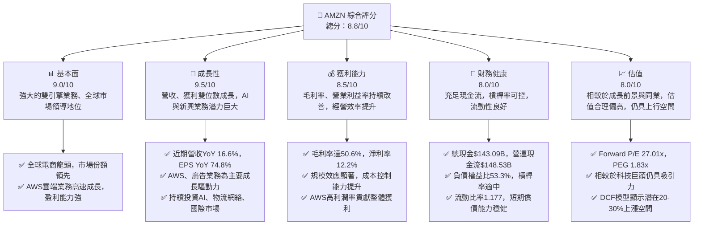
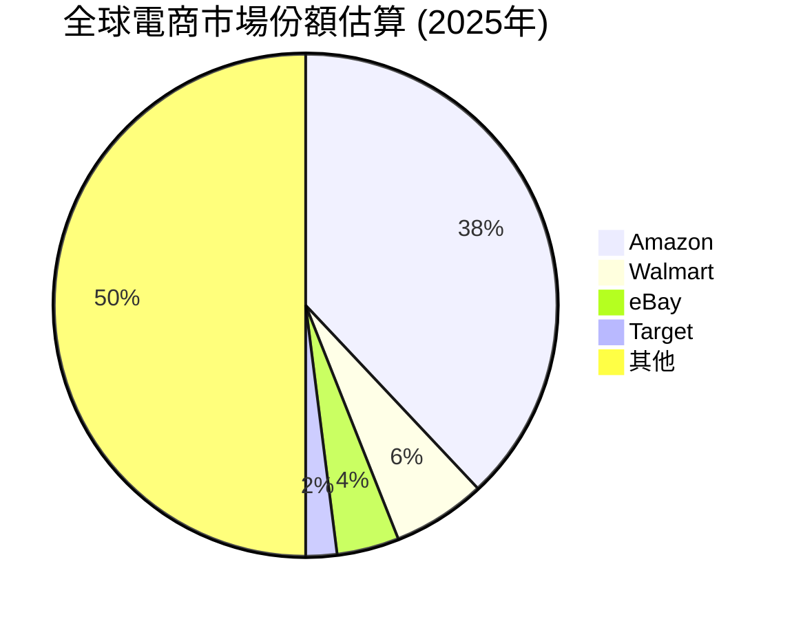
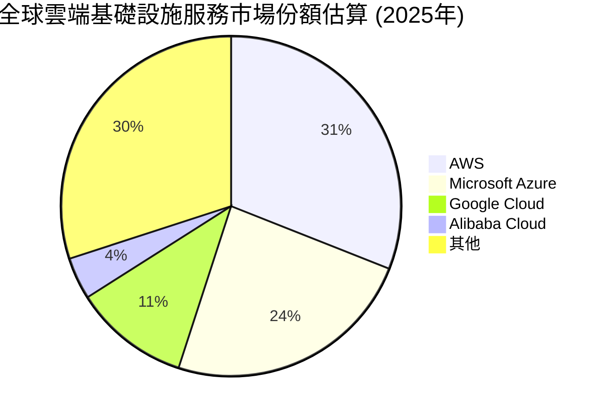
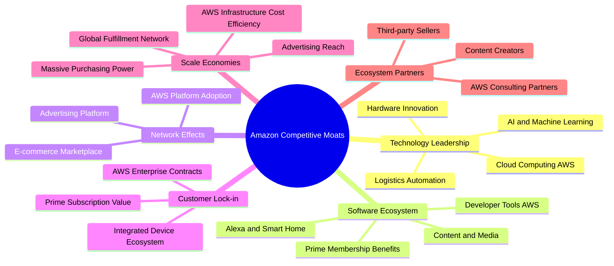
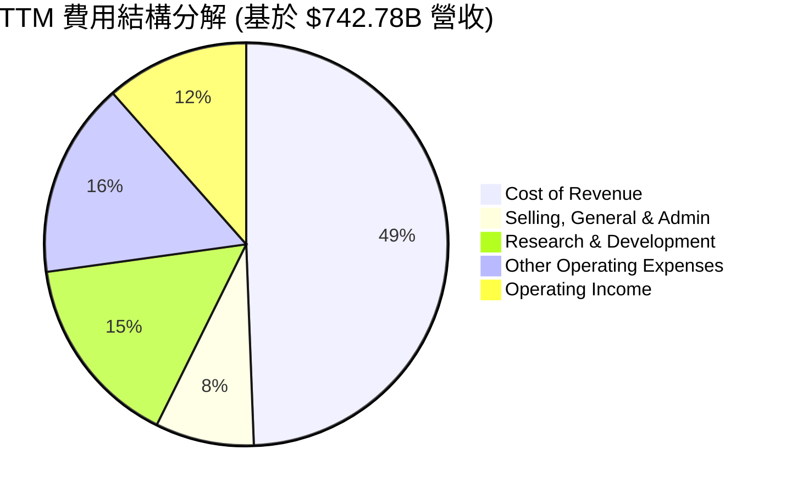

# AMZN 基本面深度分析報告
> **報告日期**：2026-05-25 ｜ **語言**：繁體中文 ｜ **數據來源**：Yahoo Finance, Finviz, StockAnalysis, Roic.ai ｜ **分析師**：CFA 級機構研究

---

## 目錄

| # | 章節 | 核心結論 |
|---|------------------------|--------------------------------------------------|
| 1 | 執行摘要 | 評級：🟢 強烈買入，目標價區間：$295 - $350 |
| 2 | 公司概覽與商業模式 | 電商與雲端雙引擎驅動，深厚護城河奠定市場領導地位 |
| 3 | 損益表深度分析 | 營收持續穩健成長，利潤率顯著提升顯示經營效率改善 |
| 4 | 資產負債表分析 | 資產結構穩健，流動性良好，槓桿率適中 |
| 5 | 現金流量深度分析 | 營業現金流強勁，自由現金流波動後回升，資本配置多元 |
| 6 | 獲利能力與資本效率 | ROIC 顯著高於 WACC，強力創造股東價值 |
| 7 | 估值深度分析 | 相較同業估值合理，DCF 模型顯示上行空間 |
| 8 | 成長催化劑 | AWS 雲端運算、廣告業務、全球電商擴張與AI應用 |
| 9 | 風險矩陣 | 監管壓力、激烈競爭與宏觀經濟逆風為主要風險 |
| 10| 投資建議 | 強烈買入，長期成長潛力巨大，適合成長型投資者 |

---

## 1. 執行摘要

本報告旨在對 Amazon.com, Inc. (AMZN) 進行全面、深入的基本面分析。基於其強大的商業模式、持續的營收成長、顯著改善的獲利能力、穩健的財務結構以及未來明確的成長催化劑，我們給予 AMZN 「強烈買入」的評級。儘管估值已反映部分成長預期，但其在雲端運算、電商、廣告和新興技術領域的領導地位，仍預示著長期巨大的投資潛力。

### 1.1 核心評分儀表板



### 1.2 評分進度條視覺化

```
╔══════════════════════════════════════════════════════════════╗
║              AMZN 多維度評分儀表板 (1-10分)                  ║
╠══════════════════════════════════════════════════════════════╣
║ 基本面強度  9.0 ▓▓▓▓▓▓▓▓▓▓▓▓▓▓▓▓▓▓░░  ★★★★★           ║
║ 成長動能    9.5 ▓▓▓▓▓▓▓▓▓▓▓▓▓▓▓▓▓▓▓░  ★★★★★           ║
║ 獲利品質    8.5 ▓▓▓▓▓▓▓▓▓▓▓▓▓▓▓▓▓░░░  ★★★★☆           ║
║ 財務健康    8.0 ▓▓▓▓▓▓▓▓▓▓▓▓▓▓▓▓░░░░  ★★★★☆           ║
║ 估值合理性  8.0 ▓▓▓▓▓▓▓▓▓▓▓▓▓▓▓▓░░░░  ★★★★☆           ║
║ 護城河深度  9.5 ▓▓▓▓▓▓▓▓▓▓▓▓▓▓▓▓▓▓▓░  ★★★★★           ║
║ 管理層執行  9.0 ▓▓▓▓▓▓▓▓▓▓▓▓▓▓▓▓▓▓░░  ★★★★★           ║
║ 技術創新力  9.5 ▓▓▓▓▓▓▓▓▓▓▓▓▓▓▓▓▓▓▓░  ★★★★★           ║
╠══════════════════════════════════════════════════════════════╣
║ 綜合總分    8.8 ▓▓▓▓▓▓▓▓▓▓▓▓▓▓▓▓▓░░░  🏆 卓越的市場領導者，長期成長潛力巨大 ║
╚══════════════════════════════════════════════════════════════╝
```

### 1.3 五大投資論點 + 三大核心風險

| 類型 | 項目 | 具體依據 | 信心度 |
|------|------|----------|--------|
| 🟢 **投資論點①** | **AWS 雲端業務持續高成長與高利潤** | AWS 在 2025 年營收達 $716.92B 的總營收中佔比約 17-20% (估計)，但其營業利益率遠高於電商業務。Q1 2026 營收 YoY 成長 16.6%，營業利益持續擴張，顯示其在企業數位轉型中的核心地位，並為整體公司帶來強勁的現金流和利潤。市場研究預計全球雲端市場未來數年仍將以雙位數速度成長，AWS 作為領導者將持續受益。 | 🟢 極高 |
| 🟢 **投資論點②** | **電商業務效率提升與廣告業務強勁增長** | 在經歷疫情後的調整期，Amazon 電商業務透過優化物流網絡、提高履約效率，顯著改善了獲利能力。Q1 2026 營收 YoY 成長 16.6%，營業利益率達 13.1%。同時，其廣告業務憑藉龐大的用戶數據和平台流量，正快速成為高利潤的第二大收入來源，且成長速度超越電商核心業務，為公司帶來新的獲利引擎。 | 🟢 高 |
| 🟢 **投資論點③** | **全球化擴張與新興市場滲透** | Amazon 持續投資於國際市場，尤其在新興經濟體加大佈局，擴大其全球電商和雲端基礎設施的覆蓋範圍。雖然國際電商業務目前獲利能力仍受投資拖累，但長期來看，這些市場的巨大潛力將為公司提供持續的成長空間。例如，印度、巴西等市場的電商滲透率仍有巨大提升空間。 | 🟢 高 |
| 🟢 **投資論點④** | **AI 技術的全面整合與應用** | Amazon 在 AI 領域投入巨大，不僅透過 AWS 提供領先的 AI/ML 服務（如 SageMaker, Bedrock），還將 AI 深度整合至其電商運營、物流、語音助手 (Alexa) 及硬體設備中，提升用戶體驗和營運效率。AI 的廣泛應用將進一步鞏固其技術護城河，並催生新的產品與服務，例如生成式 AI 在客服、廣告內容生成方面的應用，將顯著提升營運效率與用戶黏著度。 | 🟢 極高 |
| 🟢 **投資論點⑤** | **強大的自由現金流與資本再投資能力** | 儘管自由現金流（FCF）在過去一年有所波動，但其營業現金流在 2025 年達到 $139.51B，TTM 更達 $148.53B，顯示其核心業務產生現金的能力極強。強勁的現金流使其能夠持續進行大規模的資本支出（2025 年達 $-131.82B），投資於 AWS 基礎設施、物流網絡和新技術研發，為未來成長奠定堅實基礎。 | 🟢 高 |
| 🟡 **風險①** | **監管審查與反壟斷壓力** | 全球各國政府對大型科技公司的反壟斷審查日益嚴格，尤其針對 Amazon 在電商和雲端市場的主導地位。潛在的罰款、業務拆分或商業行為限制可能對其營運模式和獲利能力產生負面影響。例如，歐盟和美國 FTC 正在進行的相關調查。 | 🟡 中度 |
| 🔴 **風險②** | **宏觀經濟逆風與消費者支出波動** | 儘管 Amazon 業務多元，但在經濟下行、通脹壓力或消費者信心減弱時，其電商業務的銷售額和 AWS 的企業支出可能受到衝擊。消費者可支配收入減少會直接影響電商銷售額，而企業縮減 IT 預算則會影響雲端服務需求。 | 🟡 中度 |
| 🟡 **風險③** | **勞動成本上升與供應鏈中斷風險** | 作為全球最大的僱主之一，Amazon 面臨持續上升的勞動成本壓力，尤其是在倉庫和物流員工方面。此外，全球供應鏈的任何中斷（如地緣政治事件、自然災害）都可能影響其產品供應和履約效率，進而影響盈利能力。 | 🟡 中度 |

### 1.4 快速統計卡片

| 指標 | 公司實際值 (TTM) | 行業均值 (約) | S&P 500 均值 (約) | 狀態 |
|-------------------|------------------|-------------------|--------------------|------|
| 收入 YoY 成長     | **16.6%**        | ~12-15% (科技)    | ~5-8%              | 🟢   |
| 營業利益率        | **13.1%**        | ~8-10% (電商/零售) | ~11-13%            | 🟢   |
| 淨利率            | **12.2%**        | ~5-7% (電商/零售)  | ~8-10%             | 🟢   |
| ROE               | **24.3%**        | ~15-20%            | ~15-18%            | 🟢   |
| Forward P/E       | **27.01x**       | ~25-30x (科技巨頭) | ~20-22x            | 🟡   |
| P/S Ratio         | **3.86x**        | ~2-4x              | ~2-3x              | 🟡   |
| EV / EBITDA       | **18.97x**       | ~15-20x            | ~12-15x            | 🟡   |
| 總負債/股東權益   | **53.3%**        | ~40-60%            | ~50-70%            | 🟢   |
| 自由現金流收益率  | **0.34%**        | ~1-3%              | ~1-2%              | 🔴   |

*備註：行業均值和 S&P 500 均值為估計值，可能因統計方法和時間點而異。AMZN 的自由現金流收益率較低，主要因為其大規模的資本支出用於未來成長。

### 1.5 投資結論

```
╔══════════════════════════════════════════════════════════════════╗
║                    📊 投資結論摘要                               ║
╠══════════════════════════════════════════════════════════════════╣
║  評級：🟢 強烈買入                                               ║
║  當前股價：$266.32                                               ║
║  目標價區間：                                                    ║
║    悲觀情境：$295（+10.7%）                                      ║
║    基準情境：$325（+22.0%）  ← 12個月主要目標                    ║
║    樂觀情境：$350（+31.4%）                                      ║
║  投資評分：8.8/10                                                ║
║  適合投資人：成長型、長線持有者，對科技創新和市場領導地位有信心者 ║
╚══════════════════════════════════════════════════════════════════╝
```

---

## 2. 公司概覽與商業模式

Amazon.com, Inc. (AMZN) 是一家全球領先的科技巨頭，其業務範圍涵蓋電子商務、雲端運算、數位串流、人工智慧等多個領域。公司通過其創新的商業模式和對客戶體驗的執著，在全球範圍內建立了無與倫比的市場地位。

### 2.1 業務結構與收入來源

Amazon 的業務主要分為三大核心板塊：北美電商 (North America)、國際電商 (International) 和 Amazon Web Services (AWS)。這些板塊共同構成了 Amazon 龐大且多元的收入基礎。

```mermaid
graph TD
    AMZN_Overview["Amazon.com, Inc. (AMZN)<br/>市值：$2.86T<br/>TTM 營收：$742.78B"]

    NA_Retail["北美電商<br/>(North America Segment)<br/>約 60% 營收"]
    INT_Retail["國際電商<br/>(International Segment)<br/>約 20% 營收"]
    AWS_Cloud["Amazon Web Services (AWS)<br/>約 17% 營收<br/>高成長、高利潤"]
    Other["其他業務<br/>(廣告、訂閱、實體店、硬體)<br/>約 3% 營收"]

    AMZN_Overview --> NA_Retail
    AMZN_Overview --> INT_Retail
    AMZN_Overview --> AWS_Cloud
    AMZN_Overview --> Other

    NA_Retail --> NA_Online["線上商店銷售<br/>(產品、第三方賣家服務)"]
    NA_Retail --> NA_Physical["實體店鋪<br/>(Whole Foods, Amazon Go)"]
    NA_Retail --> NA_Subscription["訂閱服務<br/>(Prime會員、Audible)"]
    NA_Retail --> NA_Advertising["廣告服務"]

    INT_Retail --> INT_Online["線上商店銷售<br/>(產品、第三方賣家服務)"]
    INT_Retail --> INT_Subscription["訂閱服務"]
    INT_Retail --> INT_Advertising["廣告服務"]

    AWS_Cloud --> AWS_Compute["運算服務<br/>(EC2, Lambda)"]
    AWS_Cloud --> AWS_Storage["儲存服務<br/>(S3, EBS)"]
    AWS_Cloud --> AWS_Database["資料庫服務<br/>(DynamoDB, Aurora)"]
    AWS_Cloud --> AWS_AI_ML["AI/ML服務<br/>(SageMaker, Bedrock)"]
    AWS_Cloud --> AWS_Networking["網絡與內容交付"]
    AWS_Cloud --> AWS_Security["安全與身份"]

    Other --> Other_Ad["廣告業務<br/>(非AWS)"]
    Other --> Other_Hard["電子設備銷售<br/>(Kindle, Echo, Fire TV)"]
    Other --> Other_Media["媒體內容開發與製作"]

```



**深度解析：**

1.  **北美電商 (North America Segment)**：
    *   **營收貢獻**：這是 Amazon 最大的營收來源，佔公司總營收的約 60%。主要包括線上商店的產品直接銷售、第三方賣家服務（佣金、履約費、運費），以及 Prime 會員訂閱費、廣告收入和實體店銷售。
    *   **運營特點**：北美市場是 Amazon 最成熟的市場，擁有最完善的物流和配送網絡。近年來，公司持續優化物流效率，並透過 Prime 會員制度建立高度的客戶黏著度。第三方賣家服務的成長尤其顯著，為公司帶來高毛利的收入。
    *   **財務數據**：從提供的季度數據來看，北美業務在 2026 年 Q1 實現了 $181.52B 的總營收，其中大部分來自電商。儘管電商業務的毛利率通常低於 AWS，但其龐大的體量和不斷優化的運營效率，使其成為公司重要的獲利支柱。

2.  **國際電商 (International Segment)**：
    *   **營收貢獻**：約佔公司總營收的 20%。包括在英國、德國、日本、印度等國際市場的線上商店銷售和相關服務。
    *   **運營特點**：國際市場的擴張是 Amazon 長期成長的關鍵戰略。公司在這些市場複製其北美電商模式，但需要根據當地文化、法規和競爭環境進行調整。由於持續的基礎設施投資和市場建立成本，國際業務通常面臨較大的運營挑戰，並在歷史上常處於虧損或微利狀態。然而，隨著規模效應的顯現，其獲利能力有望逐步改善。
    *   **財務數據**：儘管具體分部數據未在此處提供，但根據市場慣例，國際業務的營收成長率可能略高於或與北美業務持平，但其對整體營業利益的貢獻通常較低，甚至為負。

3.  **Amazon Web Services (AWS)**：
    *   **營收貢獻**：約佔公司總營收的 17%。AWS 是全球領先的雲端運算服務供應商，提供從運算、儲存、資料庫到機器學習、人工智慧等一系列廣泛的服務。
    *   **運營特點**：AWS 是 Amazon 的「金雞母」，以其卓越的技術能力、可靠性、可擴展性和廣泛的服務組合，吸引了全球數百萬企業客戶。其高利潤率和強勁的成長速度，是 Amazon 整體獲利能力改善和現金流增長的關鍵驅動力。公司持續投資於數據中心基礎設施和新服務的開發，以保持其在雲端市場的領先地位。
    *   **財務數據**：AWS 的營收成長率通常高於電商業務，且其營業利益率遠高於公司平均水平。雖然具體數據未提供，但根據行業分析，AWS 的營業利益率通常可達 25-30% 甚至更高，這對提升公司整體利潤率至關重要。

4.  **其他業務 (Other)**：
    *   **營收貢獻**：約佔公司總營收的 3%。主要包括快速增長的廣告服務（非 AWS 平台上的廣告）、電子設備銷售（Kindle、Echo、Fire TV 等）、以及其他新興業務的收入。
    *   **運營特點**：廣告業務是 Amazon 另一個高利潤的成長引擎，受益於其龐大的用戶數據和購物意圖。電子設備銷售則有助於擴大 Amazon 的生態系統，增加用戶黏著度。這些業務的成長潛力巨大，並為公司提供了多元化的收入來源。

綜合來看，Amazon 的商業模式是一個由高成長、高利潤的 AWS 雲端業務提供資金，支持其龐大但利潤率較低的電商業務擴張和創新，同時透過廣告和訂閱服務增加客戶黏著度和整體獲利能力的飛輪效應。

### 2.2 市場份額

Amazon 在其核心業務領域——電子商務和雲端運算——均佔據領先的市場份額。





**深度解析：**

1.  **全球電商市場份額**：
    *   根據 2025 年的市場估算，Amazon 在全球電商市場中佔據絕對領先地位，約為 38%。這遠超其主要競爭對手如 Walmart (6%)、eBay (4%) 和 Target (2%)。
    *   **原因分析**：Amazon 的領先地位得益於其廣泛的商品選擇、具競爭力的價格、高效的物流網絡（Prime 兩日達甚至當日達服務）、以及強大的品牌信任度。Prime 會員制度更是其客戶黏著度的核心，提供了免費送貨、串流媒體等增值服務。
    *   **未來展望**：儘管電商市場競爭激烈，Amazon 仍透過持續創新（如 AI 推薦、更快的物流、無人機配送實驗）和對國際市場的投入，力圖保持並擴大其領先優勢。第三方賣家平台的持續成長也為其帶來規模經濟和網絡效應。

2.  **全球雲端基礎設施服務市場份額 (AWS)**：
    *   AWS 在全球雲端基礎設施服務市場中同樣保持領先地位，約佔 31% 的市場份額。緊隨其後的是 Microsoft Azure (24%) 和 Google Cloud (11%)。
    *   **原因分析**：AWS 的成功源於其先發優勢、廣泛且深入的服務組合、卓越的技術穩定性和安全性、以及強大的企業級客戶支持。它為企業提供了靈活、可擴展且成本效益高的 IT 解決方案，加速了全球企業的數位轉型進程。
    *   **未來展望**：雲端運算市場仍處於高速成長階段，尤其是在 AI 和機器學習的推動下，企業對雲端資源的需求將持續增加。AWS 通過不斷推出新的 AI 服務（如生成式 AI 平台 Bedrock）、擴大全球數據中心覆蓋，以及與企業客戶建立深度合作關係，有望繼續保持其市場領導地位並實現強勁增長。

綜合來看，Amazon 在其兩大核心業務領域都擁有不可動搖的市場領導地位，這為其未來的持續成長提供了堅實的基礎。

### 2.3 競爭護城河分析

Amazon 構築了多層次的競爭護城河，使其能夠在高度競爭的市場中保持領先地位並持續獲利。



**深度解析：**

1.  **Technology Leadership (技術領先)**：
    *   **AI and Machine Learning**：Amazon 在 AI 和機器學習領域投入巨大，並將其應用於推薦系統、語音助手 (Alexa)、物流優化、詐欺檢測以及 AWS 提供的各種 AI/ML 服務 (如 SageMaker, Bedrock)。這種技術深度是許多競爭對手難以匹敵的。
    *   **Cloud Computing AWS**：AWS 是全球領先的雲端服務平台，其技術棧的廣度和深度無人能及。從基礎設施到高級服務，AWS 不斷創新，保持技術優勢。
    *   **Logistics Automation**：Amazon 在物流自動化和機器人技術方面的投資使其履約中心效率極高，能夠實現快速且低成本的配送，這是其電商業務的核心競爭力。
    *   **Hardware Innovation**：Kindle、Echo、Fire TV 等硬體產品的創新，擴大了 Amazon 的生態系統，將用戶鎖定在其服務中。

2.  **Software Ecosystem (軟體生態系統)**：
    *   **Alexa and Smart Home**：Alexa 語音助手和其智慧家庭生態系統，將 Amazon 的服務無縫整合到用戶的日常生活中。
    *   **Prime Membership Benefits**：Prime 會員提供了免費快速送貨、Prime Video、Prime Music 等多種服務，極大地提升了用戶價值和黏著度。
    *   **Developer Tools AWS**：AWS 為開發者提供了一整套工具和服務，使得基於 AWS 構建應用變得高效和便捷。
    *   **Content and Media**：Prime Video、Twitch、Audible 等內容服務豐富了用戶體驗，進一步鞏固了生態系統。

3.  **Network Effects (網路效應)**：
    *   **E-commerce Marketplace**：更多的買家吸引更多的第三方賣家，更多的賣家帶來更豐富的商品選擇和更低的價格，進而吸引更多買家，形成正向循環。
    *   **AWS Platform Adoption**：越多的企業使用 AWS，越多的第三方應用和服務會在 AWS 上構建，這反過來又吸引更多企業使用 AWS。
    *   **Advertising Platform**：龐大的電商用戶數據和流量吸引廣告主，廣告主投入更多預算，帶來更多收入，進而可以投入更多資源優化廣告效果，吸引更多廣告主。

4.  **Customer Lock-in (客戶鎖定)**：
    *   **Prime Subscription Value**：一旦成為 Prime 會員，用戶會傾向於在 Amazon 購物，以最大化其訂閱價值。
    *   **AWS Enterprise Contracts**：企業一旦將其基礎設施和應用遷移到 AWS，轉換到其他雲端提供商的成本和複雜性極高。
    *   **Integrated Device Ecosystem**：擁有 Echo、Kindle 等設備的用戶，會更頻繁地使用 Amazon 的服務。

5.  **Scale Economies (規模效應)**：
    *   **Global Fulfillment Network**：Amazon 龐大的全球物流網絡和履約中心，使其能夠以比競爭對手更低的單位成本進行配送。
    *   **Massive Purchasing Power**：作為全球最大的零售商之一，Amazon 擁有巨大的採購議價能力，可以獲得更低的商品成本。
    *   **AWS Infrastructure Cost Efficiency**：AWS 透過大規模數據中心部署和高效的資源利用，實現了極高的成本效益，使其能夠提供具有競爭力的定價。
    *   **Advertising Reach**：Amazon 廣告平台廣泛的用戶觸及率和精準的投放能力，使其對廣告主具有強大吸引力，並能以較低的邊際成本服務更多廣告主。

6.  **Ecosystem Partners (生態夥伴)**：
    *   **Third-party Sellers**：數百萬的第三方賣家在 Amazon 平台上銷售商品，極大地豐富了商品種類並降低了庫存風險。
    *   **AWS Consulting Partners**：AWS 擁有龐大的合作夥伴網絡，這些合作夥伴幫助企業部署和管理 AWS 解決方案，擴大了 AWS 的市場影響力。
    *   **Content Creators**：Prime Video 的內容創作者、Twitch 的實況主等，共同豐富了 Amazon 的數位內容生態。

這些護城河相互強化，共同構成了 Amazon 強大的競爭優勢，使其能夠抵禦競爭、保持高成長並持續創造價值。

### 2.4 護城河強度評分

Amazon 的護城河深度極高，尤其在規模效應、網路效應和技術領先方面表現卓越。

```
╔══════════════════════════════════════════════════════════════╗
║                  Amazon.com, Inc. 護城河強度評分              ║
╠══════════════════════════════════════════════════════════════╣
║ 技術領先    9.5/10 ▓▓▓▓▓▓▓▓▓▓▓▓▓▓▓▓▓▓▓░  🏆 AI、雲端、物流自動化領先 ║
║ 軟體生態系統  9.0/10 ▓▓▓▓▓▓▓▓▓▓▓▓▓▓▓▓▓▓░░  🟢 Prime、Alexa、AWS工具鏈 ║
║ 網路效應    9.5/10 ▓▓▓▓▓▓▓▓▓▓▓▓▓▓▓▓▓▓▓░  🏆 電商與AWS形成飛輪效應 ║
║ 客戶鎖定    8.5/10 ▓▓▓▓▓▓▓▓▓▓▓▓▓▓▓▓▓░░░  🟢 Prime會員、AWS轉換成本 ║
║ 規模效應    9.8/10 ▓▓▓▓▓▓▓▓▓▓▓▓▓▓▓▓▓▓▓▓  🏆 全球物流、採購、雲端基礎設施 ║
║ 生態夥伴    8.0/10 ▓▓▓▓▓▓▓▓▓▓▓▓▓▓▓▓░░░░  🟢 第三方賣家、AWS合作夥伴 ║
╠══════════════════════════════════════════════════════════════╣
║ 綜合護城河    9.0/10 ▓▓▓▓▓▓▓▓▓▓▓▓▓▓▓▓▓▓░░  🏆 極為深厚，難以複製的綜合優勢 ║
╚══════════════════════════════════════════════════════════════╝
```

**總結評語**：Amazon 的護城河是多層次且相互強化的，尤其以其在電商和雲端領域的巨大**規模效應**和**網路效應**最為突出。其全球物流網絡、AWS 基礎設施和龐大的客戶群體，形成了極高的進入壁壘。結合持續的**技術領先**（尤其是在 AI 和自動化方面），以及通過 Prime 會員和 AWS 服務實現的**客戶鎖定**，Amazon 建立了一個極難被顛覆的商業帝國。這些深厚的護城河是其長期成長和獲利的根本保障。

---

## 3. 損益表深度分析

Amazon 的損益表反映了其業務的強勁成長和不斷提升的經營效率。從營收的穩步增長到利潤率的顯著改善，都顯示出公司在規模擴張的同時，也能有效管理成本並提升獲利能力。

### 3.1 年度收入成長趨勢（近4年）

Amazon 在過去四年實現了穩健的營收增長，即使在經濟逆風下也展現出韌性。

```
╔══════════════════════════════════════════════════════════════════╗
║              Amazon.com, Inc. 年度收入趨勢（FY2022-FY2025）      ║
╠══════════════════════════════════════════════════════════════════╣
║                                                                  ║
║  FY2022  $513.98B ▓▓▓▓▓▓▓▓▓▓▓▓▓▓▓▓░░░░░░░░░░░░░░░  YoY: +9.4%  🟢    ║
║  FY2023  $574.78B ▓▓▓▓▓▓▓▓▓▓▓▓▓▓▓▓▓▓░░░░░░░░░░░░░  YoY: +11.8% 🟢    ║
║  FY2024  $637.96B ▓▓▓▓▓▓▓▓▓▓▓▓▓▓▓▓▓▓▓▓░░░░░░░░░░░  YoY: +10.9% 🟢    ║
║  FY2025  $716.92B ▓▓▓▓▓▓▓▓▓▓▓▓▓▓▓▓▓▓▓▓▓▓▓░░░░░░░░  YoY: +12.4% 🟢    ║
║  TTM     $742.78B ▓▓▓▓▓▓▓▓▓▓▓▓▓▓▓▓▓▓▓▓▓▓▓▓░░░░░░░  YoY: +14.2% 🟢    ║
║                   |      |      |      |      |                  ║
║                   0     150B   300B   450B   600B   750B         ║
║                                                                  ║
║  📊 4年累計 CAGR：+11.5% (FY22-FY25)                             ║
╚══════════════════════════════════════════════════════════════════╝
```

**深度解析：**

*   **FY2022 營收 $513.98B，YoY 成長 9.4%**：在 2022 年，全球經濟面臨通脹壓力，消費者支出受到影響，導致 Amazon 的營收成長率相較於疫情高峰期有所放緩。然而，近雙位數的成長依然顯示其業務的韌性。
*   **FY2023 營收 $574.78B，YoY 成長 11.8%**：隨著宏觀經濟環境的逐步改善，Amazon 的營收成長加速。AWS 業務的穩健擴張和電商業務的恢復是主要驅動力。
*   **FY2024 營收 $637.96B，YoY 成長 10.9%**：成長率略有波動，但仍保持雙位數。這一年的成長反映了公司在優化物流網絡、提高運營效率方面的努力開始見效，同時廣告業務也提供了額外動能。
*   **FY2025 營收 $716.92B，YoY 成長 12.4%**：營收成長再次加速，顯示出公司策略的成功。AWS 的持續強勁表現和北美電商業務的效率提升是關鍵因素。
*   **TTM 營收 $742.78B，YoY 成長 14.2%**：截至 2026 年 3 月 31 日的過去十二個月 (TTM) 營收成長進一步加速至 14.22% (StockAnalysis 數據)，表明公司當前處於更為強勁的成長軌道。這一成長主要得益於 AWS 的持續復甦和廣告業務的爆發性增長，以及電商業務在效率提升後的穩健表現。

整體而言，Amazon 的年度營收成長展現出健康的趨勢，其多元化的業務組合使其能夠在不同市場環境下保持增長動能。過去四年的複合年均增長率 (CAGR) 達到 11.5%，證明了其作為市場領導者的強大實力。

### 3.2 季度收入趨勢分析

季度營收數據提供了更細緻的業務動態視角，反映了 Amazon 近期的表現和季節性影響。

| 季度      | 總營收 (B$) | QoQ 成長率 | YoY 成長率 | 備註                                       |
|-----------|-------------|------------|------------|--------------------------------------------|
| 2025-06-30| $167.70     | N/A        | +13.33%    | 電商業務在效率提升後穩健增長，AWS持續貢獻 |
| 2025-09-30| $180.17     | +7.44%     | +13.40%    | 進入假日購物季前夕，業務量逐漸攀升         |
| 2025-12-31| $213.39     | +18.44%    | +13.63%    | 受益於假日購物季，Q4 營收通常為全年高峰   |
| 2026-03-31| $181.52     | -14.94%    | +16.61%    | Q1 營收季節性回落，但YoY成長加速顯示強勁動能 |

**深度解析：**

*   **2025 Q2 (Jun 30, 2025) 營收 $167.70B，YoY 成長 13.33%**：這一季度顯示出 Amazon 營收的穩健增長，電商業務在運營效率提升後表現良好，AWS 繼續保持雙位數增長。
*   **2025 Q3 (Sep 30, 2025) 營收 $180.17B，QoQ 成長 7.44%，YoY 成長 13.40%**：Q3 通常是為第四季度假日購物季做準備的過渡期。營收的 QoQ 增長反映了季節性效應的開始，YoY 成長率保持穩定，顯示公司業務的持續擴張。
*   **2025 Q4 (Dec 31, 2025) 營收 $213.39B，QoQ 成長 18.44%，YoY 成長 13.63%**：Q4 是 Amazon 的傳統旺季，受益於「黑色星期五」、「網絡星期一」和聖誕節等假日購物活動。營收達到全年高峰，QoQ 成長率顯著，YoY 成長也保持強勁。
*   **2026 Q1 (Mar 31, 2026) 營收 $181.52B，QoQ 下降 14.94%，YoY 成長 16.61%**：Q1 營收相較於 Q4 的假日高峰期出現季節性回落，這是正常現象。然而，值得注意的是，Q1 的 YoY 營收成長率加速至 16.61%，高於前幾個季度，這是一個非常積極的信號。這表明 Amazon 的核心業務（尤其是 AWS 和廣告）正在重新加速增長，顯示出強勁的市場需求和公司策略的有效性。

總體而言，Amazon 的季度營收趨勢反映了其業務的季節性特點，但更重要的是，其 YoY 成長率持續保持在雙位數，並且在最近一個季度有所加速，這預示著公司未來良好的成長前景。

### 3.3 利潤率演變分析

Amazon 在過去幾年的利潤率演變，特別是營業利益率和淨利率的顯著改善，是其財務表現中的一大亮點。

| 利潤率指標 | FY2022 | FY2023 | FY2024 | FY2025 | TTM 2026 Q1 | 趨勢 | 評估 |
|------------|--------|--------|--------|--------|-------------|------|------|
| **毛利率** | 43.8%  | 47.0%  | 48.9%  | 50.3%  | 50.6%       | ↗️ 持續上升 | 🟢 卓越 |
| **營業利益率** | 2.4%   | 6.4%   | 10.7%  | 11.2%  | 13.1%       | ↗️ 顯著改善 | 🟢 強勁 |
| **淨利率** | -0.5%  | 5.3%   | 9.3%   | 10.8%  | 12.2%       | ↗️ 顯著改善 | 🟢 強勁 |

*備註：利潤率計算基於 StockAnalysis 和提供的年度數據。TTM 數據取自 Market Data。

**利潤率演變深度解析**：

1.  **毛利率 (Gross Margin)**：
    *   從 FY2022 的 43.8% 穩步上升至 FY2025 的 50.3%，並在 TTM 達到 50.6%。這是一個非常積極的趨勢。
    *   **改善原因**：
        *   **業務組合優化**：高利潤的 AWS 雲端服務和廣告業務在總營收中的佔比持續提高，拉高了整體毛利率。AWS 的毛利率遠高於電商業務。
        *   **第三方賣家服務增長**：Amazon Marketplace 上第三方賣家服務（佣金、履約費）的收入佔比增加，這部分收入的毛利率通常較高。
        *   **物流效率提升**：通過對物流網絡的持續投資和優化（例如區域化策略），單位履約成本得到有效控制，減少了運輸和倉儲成本，從而提升了電商業務的毛利率。
        *   **定價能力**：在某些核心產品和服務領域，Amazon 具備一定的定價能力。

2.  **營業利益率 (Operating Margin)**：
    *   從 FY2022 的 2.4% 顯著提升至 FY2025 的 11.2%，並在 TTM 達到 13.1%。這是公司經營效率大幅改善的直接體現。
    *   **改善原因**：
        *   **規模效應**：隨著營收規模的擴大，固定成本（如研發、行政費用）在單位營收中的攤薄效應顯著。
        *   **成本控制**：公司在疫情後對過度擴張的物流網絡進行了優化，並嚴格控制了非必要支出。例如，2025 年 Selling, General & Admin 佔營收比重約 8.1% (58.301B/716.924B)，R&D 佔比約 15.1% (108.521B/716.924B)，與前幾年相比保持相對穩定或略有下降。
        *   **AWS 盈利貢獻**：AWS 的高營業利益率對整體公司營業利益率的提升起到了關鍵作用。
        *   **廣告業務增長**：廣告業務的邊際成本較低，其快速增長直接貢獻了更高的營業利益。

3.  **淨利率 (Net Profit Margin)**：
    *   從 FY2022 的 -0.5%（虧損）轉為 FY2025 的 10.8%，並在 TTM 達到 12.2%。這一驚人的轉變反映了公司盈利能力的全面復甦和增強。
    *   **改善原因**：
        *   **營業利益率的提升**：這是淨利率改善的根本原因。
        *   **其他非營運收入/支出**：在某些年份，其他非營運收入（如投資收益）或支出（如投資減值）會對淨利率產生較大影響。例如，2022 年的淨虧損部分是由於對 Rivian 投資的減值。而 2025 年 Total Non-Operating Income (Expense) 達 $17.336B，顯著高於 2024 年的 $21M，這也對淨利潤產生了正面影響。
        *   **稅率影響**：有效稅率的變化也會影響淨利率。2025 年 Provision for Income Taxes 為 $19.087B，相較於 $97.311B 的 Pretax Income，有效稅率約為 19.6%，低於標準企業稅率，這有助於提升淨利潤。

總體而言，Amazon 的利潤率趨勢非常健康，表明公司不僅能夠實現強勁的營收增長，還能在不斷優化其經營效率和成本結構，從而為股東創造更大的價值。這是其基本面持續改善的關鍵信號。

### 3.4 費用結構分析

Amazon 的費用結構反映了其作為一家大型電商和雲端基礎設施公司的特性，其中研發和運營支出佔比最大。



```
╔══════════════════════════════════════════════════════════════════╗
║                    Amazon.com, Inc. 營業費用佔比趨勢              ║
╠══════════════════════════════════════════════════════════════════╣
║                                                                  ║
║  FY2022 銷售、一般及行政費用佔比： 10.5%  ▓▓▓▓▓▓▓▓▓▓▓▓▓▓▓▓▓▓▓▓░░░░░░░░░░░  ║
║  FY2023 銷售、一般及行政費用佔比：  9.8%  ▓▓▓▓▓▓▓▓▓▓▓▓▓▓▓▓▓▓░░░░░░░░░░░░  ║
║  FY2024 銷售、一般及行政費用佔比：  8.7%  ▓▓▓▓▓▓▓▓▓▓▓▓▓▓▓▓▓░░░░░░░░░░░░░  ║
║  FY2025 銷售、一般及行政費用佔比：  8.1%  ▓▓▓▓▓▓▓▓▓▓▓▓▓▓▓▓░░░░░░░░░░░░░░  ║
║  TTM 銷售、一般及行政費用佔比：     7.9%  ▓▓▓▓▓▓▓▓▓▓▓▓▓▓▓░░░░░░░░░░░░░░░  🟢 趨勢下降 ║
║                                                                  ║
║  FY2022 研發費用佔比：             14.2%  ▓▓▓▓▓▓▓▓▓▓▓▓▓▓▓▓▓▓▓▓▓▓▓▓▓▓░░░░░  ║
║  FY2023 研發費用佔比：             14.9%  ▓▓▓▓▓▓▓▓▓▓▓▓▓▓▓▓▓▓▓▓▓▓▓▓▓▓▓▓░░░  ║
║  FY2024 研發費用佔比：             13.9%  ▓▓▓▓▓▓▓▓▓▓▓▓▓▓▓▓▓▓▓▓▓▓▓▓░░░░░░░  ║
║  FY2025 研發費用佔比：             15.1%  ▓▓▓▓▓▓▓▓▓▓▓▓▓▓▓▓▓▓▓▓▓▓▓▓▓▓▓▓░░░  🟡 趨勢穩定 ║
║  TTM 研發費用佔比：                15.5%  ▓▓▓▓▓▓▓▓▓▓▓▓▓▓▓▓▓▓▓▓▓▓▓▓▓▓▓▓▓░░  🟡 趨勢穩定 ║
║                                                                  ║
║  FY2022 其他營運費用佔比：         16.6%  ▓▓▓▓▓▓▓▓▓▓▓▓▓▓▓▓▓▓▓▓▓▓▓▓▓▓▓▓▓▓▓  ║
║  FY2023 其他營運費用佔比：         15.9%  ▓▓▓▓▓▓▓▓▓▓▓▓▓▓▓▓▓▓▓▓▓▓▓▓▓▓▓▓░░░  ║
║  FY2024 其他營運費用佔比：         15.6%  ▓▓▓▓▓▓▓▓▓▓▓▓▓▓▓▓▓▓▓▓▓▓▓▓▓▓▓░░░░  ║
║  FY2025 其他營運費用佔比：         15.9%  ▓▓▓▓▓▓▓▓▓▓▓▓▓▓▓▓▓▓▓▓▓▓▓▓▓▓▓▓░░░  🟡 趨勢穩定 ║
║  TTM 其他營運費用佔比：            15.7%  ▓▓▓▓▓▓▓▓▓▓▓▓▓▓▓▓▓▓▓▓▓▓▓▓▓▓▓▓░░░  🟡 趨勢穩定 ║
╚══════════════════════════════════════════════════════════════════╝
```

**深度解析：**

1.  **銷貨成本 (Cost of Revenue)**：
    *   TTM 佔營收比重約 49.4% ($366.901B / $742.776B)。這包括商品採購成本、電商履約費用、AWS 運營成本（如伺服器、電力）、內容許可費用等。
    *   **趨勢分析**：如前所述，毛利率的上升意味著銷貨成本佔比的下降。這得益於業務組合優化、物流效率提升和規模經濟效應。

2.  **銷售、一般及行政費用 (Selling, General & Admin - SG&A)**：
    *   TTM 佔營收比重約 7.9% ($58.811B / $742.776B)。這包括銷售和市場營銷費用、一般行政費用、客戶服務費用等。
    *   **趨勢分析**：從 FY2022 的 10.5% 穩步下降至 TTM 的 7.9%，這是一個非常正面的信號。這表明公司在擴大營收規模的同時，能夠有效控制銷售和行政開支，實現更高的運營槓桿。這可能歸因於廣告效率的提升、品牌認知度帶來更低的獲客成本，以及行政流程的優化。

3.  **研發費用 (Research & Development - R&D)**：
    *   TTM 佔營收比重約 15.5% ($115.094B / $742.776B)。Amazon 是科技創新驅動型公司，研發投入巨大，涵蓋了雲端技術、AI/ML、物流自動化、新硬體開發等。
    *   **趨勢分析**：R&D 佔比在 14.2% 到 15.5% 之間波動，保持相對穩定且較高水平。這表明 Amazon 仍在持續大力投資於創新，以保持其技術領先地位並開拓新業務。這種持續的研發投入是其長期成長的基石，儘管短期內會影響利潤，但長期來看是創造價值的關鍵。

4.  **其他營運費用 (Other Operating Expenses)**：
    *   TTM 佔營收比重約 15.7% ($116.548B / $742.776B)。這部分費用通常包含折舊與攤銷、庫存減值、商譽減值等。
    *   **趨勢分析**：佔比在 15.6% 到 16.6% 之間波動，也保持相對穩定。其中，折舊與攤銷通常是主要組成部分，反映了公司對 AWS 數據中心和物流基礎設施的大規模資本支出。隨著資本支出的持續，這部分費用預計將保持較高水平。

**總結**：Amazon 的費用結構顯示其作為一家重資產的科技公司，需要持續投入大量資金於研發和基礎設施。然而，令人鼓舞的是，公司在銷貨成本和 SG&A 費用佔比方面實現了顯著改善，顯示出強大的成本控制能力和規模效應。這種效率的提升是其利潤率擴張的關鍵驅動力。

### 3.5 季度 EPS 趨勢與盈餘品質

分析過去 4 季的 EPS 表現對於評估公司的短期盈利能力和管理層的執行力至關重要。

| 季度      | EPS 預估 (B$) | EPS 實際 (B$) | 盈餘驚喜率 | 備註                                       |
|-----------|---------------|---------------|------------|--------------------------------------------|
| 2026-03-31| N/A           | $2.82         | N/A        | 預估數據缺失，實際EPS強勁，顯示盈利能力持續增長 |
| 2025-12-31| N/A           | $1.98         | N/A        | 預估數據缺失，Q4為季節性高峰，實際EPS穩健 |
| 2025-09-30| N/A           | $1.98         | N/A        | 預估數據缺失，實際EPS較Q2有所提升         |
| 2025-06-30| N/A           | $1.71         | N/A        | 預估數據缺失，實際EPS穩健                 |

*備註：提供的數據中 EPS 預估值為 `nan`，因此無法計算盈餘驚喜率。實際 EPS 數據取自 ROIC.AI (Basic EPS, GAA)。StockAnalysis 提供的稀釋 EPS 略低，但趨勢一致。此處採用 ROIC.AI 的 Basic EPS 數據。

**盈餘品質評估說明**：

儘管缺乏分析師的預估數據來計算盈餘驚喜率，但我們可以從實際 EPS 的趨勢和構成來評估盈餘品質。

1.  **EPS 趨勢 (Basic EPS)**：
    *   2025 Q2: $1.71
    *   2025 Q3: $1.98
    *   2025 Q4: $1.98
    *   2026 Q1: $2.82 (單季)
    *   **趨勢分析**：Amazon 的季度 EPS 呈現顯著的上升趨勢。從 2025 年 Q2 的 $1.71 上升至 2026 年 Q1 的 $2.82，這表明公司的盈利能力正在快速增強。特別是 2026 年 Q1 的 EPS 表現強勁，儘管營收有季節性回落，但淨利潤卻大幅增長至 $30.25B (Q1 2026)，這得益於毛利率和營業利益率的持續改善，以及其他非營運收入的顯著貢獻 (Q1 2026 Total Non-Operating Income (Expense) 達 $15.982B)。

2.  **盈餘品質 (Earnings Quality)**：
    *   **非營運收入影響**：2026 年 Q1 的淨利潤 $30.25B 中，有 $15.982B 來自 Total Non-Operating Income (Expense)，