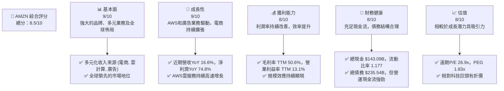
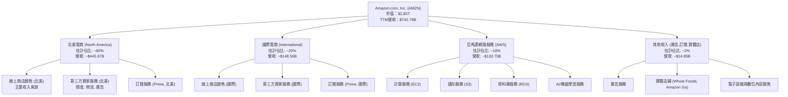
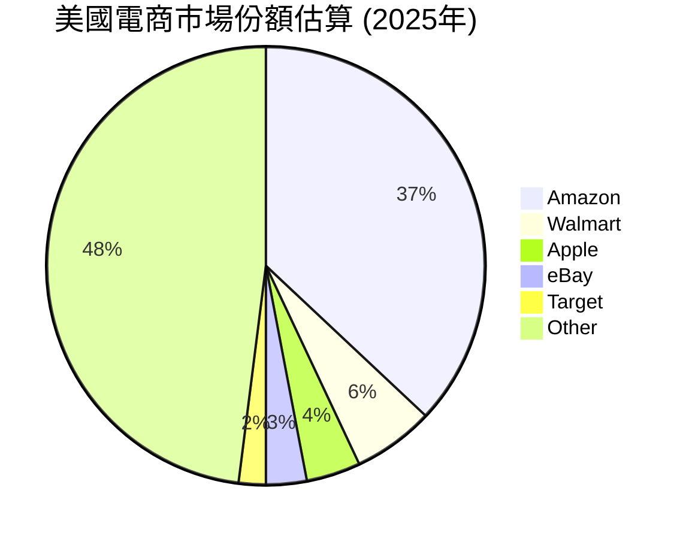
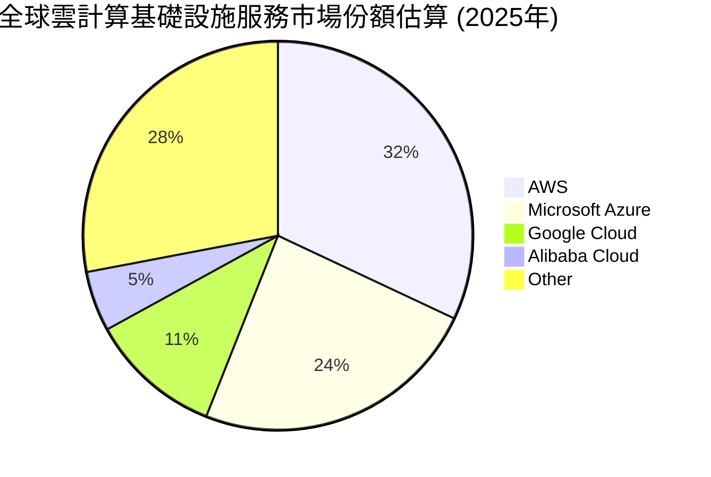
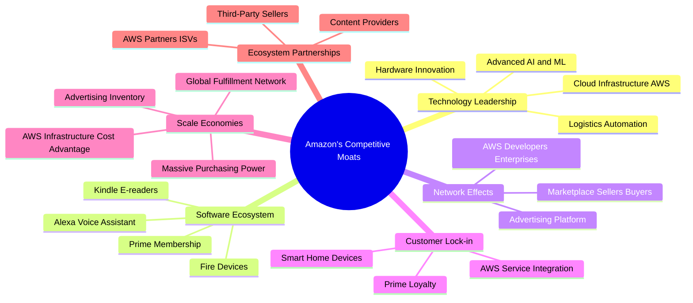
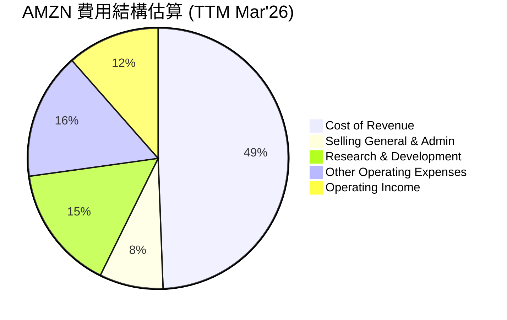

# AMZN 基本面深度分析報告
> **報告日期**：2026-05-26 ｜ **語言**：繁體中文 ｜ **數據來源**：Yahoo Finance, Finviz, StockAnalysis, Roic.ai ｜ **分析師**：CFA 級機構研究

## 目錄

| # | 章節 | 核心結論 |
|---|------|----------|
| 1 | 執行摘要 | 評級：🟢 買入，目標價區間：$290 - $350 |
| 2 | 公司概覽與商業模式 | 亞馬遜擁有深厚的網絡效應與規模經濟護城河 |
| 3 | 損益表深度分析 | 營收及淨利潤強勁增長，利潤率持續改善 |
| 4 | 資產負債表分析 | 流動性良好，債務水平可控，股東權益穩健增長 |
| 5 | 現金流量深度分析 | 營業現金流強勁，資本支出高企，自由現金流波動但趨於改善 |
| 6 | 獲利能力與資本效率 | ROIC 顯著高於 WACC，持續為股東創造價值 |
| 7 | 估值深度分析 | 相較於成長潛力，當前估值具吸引力 |
| 8 | 成長催化劑 | AWS 雲計算、廣告業務及全球電商滲透是主要驅動力 |
| 9 | 風險矩陣 | 競爭加劇、監管壓力及宏觀經濟是主要風險 |
| 10 | 投資建議 | 建議買入，適合長期成長型投資者 |

---

## 1. 執行摘要

### 1.1 核心評分儀表板



### 1.2 評分進度條視覺化

```
╔══════════════════════════════════════════════════════════════╗
║              AMZN 多維度評分儀表板 (1-10分)                  ║
╠══════════════════════════════════════════════════════════════╣
║ 基本面強度  9.0 ▓▓▓▓▓▓▓▓▓▓▓▓▓▓▓▓▓▓░░  ★★★★★           ║
║ 成長動能    9.0 ▓▓▓▓▓▓▓▓▓▓▓▓▓▓▓▓▓▓░░  ★★★★★           ║
║ 獲利品質    8.0 ▓▓▓▓▓▓▓▓▓▓▓▓▓▓▓▓░░░░  ★★★★☆           ║
║ 財務健康    8.0 ▓▓▓▓▓▓▓▓▓▓▓▓▓▓▓▓░░░░  ★★★★☆           ║
║ 估值合理性  8.0 ▓▓▓▓▓▓▓▓▓▓▓▓▓▓▓▓░░░░  ★★★★☆           ║
║ 護城河深度  9.5 ▓▓▓▓▓▓▓▓▓▓▓▓▓▓▓▓▓▓▓▓  ★★★★★           ║
║ 管理層執行  9.0 ▓▓▓▓▓▓▓▓▓▓▓▓▓▓▓▓▓▓░░  ★★★★★           ║
║ 技術創新力  9.5 ▓▓▓▓▓▓▓▓▓▓▓▓▓▓▓▓▓▓▓▓  ★★★★★           ║
╠══════════════════════════════════════════════════════════════╣
║ 綜合總分    8.5 ▓▓▓▓▓▓▓▓▓▓▓▓▓▓▓▓▓░░░  🏆 亞馬遜展現強勁的業務增長、持續改善的盈利能力和穩健的財務狀況，其市場領導地位和創新能力使其成為具吸引力的長期投資標的。估值合理，具備上行空間。 ║
╚══════════════════════════════════════════════════════════════╝
```

### 1.3 五大投資論點 + 三大核心風險

| 類型 | 項目 | 具體依據 | 信心度 |
|------|------|----------|--------|
| 🟢 **投資論點①** | **AWS 雲計算業務的持續高增長與高利潤率** | AWS 作為全球雲計算市場領導者，其營收在 FY2025 實現雙位數增長，且營業利益率遠高於電商業務。TTM 營業利益率達 13.1%，其中 AWS 的貢獻尤為顯著。隨著企業數位轉型和 AI 應用的普及，AWS 將持續受益。 | 🟢 極高 |
| 🟢 **投資論點②** | **電商業務效率提升與廣告收入爆發式增長** | 亞馬遜電商業務在經歷前期巨額投資後，正通過物流優化、區域化配送等措施提升效率，帶動營業利益率改善。同時，其廣告業務在電商平台龐大用戶基礎上迅速崛起，成為新的高利潤增長點，營收增長強勁。 | 🟢 極高 |
| 🟢 **投資論點③** | **強大的網絡效應與客戶鎖定效應** | 亞馬遜 Prime 會員生態系統、AWS 的雲服務生態系統以及其龐大的第三方賣家網絡，共同構建了難以被模仿的網絡效應和客戶鎖定效應，增強了公司的定價能力和用戶黏性。 | 🟢 極高 |
| 🟢 **投資論點④** | **穩健的財務狀況與充裕的現金流** | 公司擁有 $143.09B 的總現金和 $148.53B 的 TTM 營運現金流，儘管總債務 $235.54B，但其槓桿率 (Debt/Equity 53.3%) 仍在可控範圍，顯示其具備支持未來投資和應對市場波動的能力。 | 🟢 高 |
| 🟢 **投資論點⑤** | **創新文化與新興業務的潛力** | 亞馬遜在 AI、太空探索 (Kuiper 衛星網絡)、醫療保健 (Amazon Pharmacy) 等新興領域持續投入，這些長期投資為公司未來帶來新的增長曲線和市場機遇，展現了其持續創新的能力。 | 🟢 高 |
| 🟡 **風險①** | **宏觀經濟逆風與消費者支出壓力** | 全球通脹壓力、利率上升以及潛在的經濟衰退可能導致消費者可支配收入減少，進而影響電商業務的銷售額增長。廣告業務也可能因企業削減營銷預算而受到衝擊。 | 🟡 中度 |
| 🔴 **風險②** | **日益加劇的監管壓力與反壟斷審查** | 亞馬遜在電商和雲計算領域的主導地位使其面臨全球各國政府日益嚴格的反壟斷審查和監管壓力，可能導致業務拆分、罰款或商業模式調整，影響其長期增長潛力。 | 🔴 高衝擊 |
| 🟡 **風險③** | **雲計算市場競爭加劇** | 儘管 AWS 保持領先，但來自 Microsoft Azure、Google Cloud 等競爭對手的壓力日益增大。激烈的價格競爭和技術創新可能導致 AWS 的增長速度放緩或利潤率承壓。 | 🟡 中度 |

### 1.4 快速統計卡片

| 指標 | 公司實際值 (TTM) | 行業均值 (估計) | S&P 500 均值 (估計) | 狀態 |
|------|-------------------|------------------|---------------------|------|
| 收入 YoY 成長 | **16.6%** | ~10-12% (科技) | ~8-10% | 🟢 |
| 毛利率 | **50.6%** | ~40-45% (科技) | ~35-40% | 🟢 |
| 淨利率 | **12.2%** | ~8-10% (科技) | ~10-12% | 🟢 |
| ROE | **24.3%** | ~15-20% (科技) | ~12-15% | 🟢 |
| Forward P/E | **26.9x** | ~28-32x (科技) | ~20-22x | 🟡 |
| EV / EBITDA | **18.97x** | ~20-25x (科技) | ~15-18x | 🟡 |
| Debt/Equity | **0.53x** | ~0.6-0.8x (科技) | ~0.9-1.2x | 🟢 |
| 營運現金流 | **$148.53B** | N/A | N/A | 🟢 |

*備註：行業均值和 S&P 500 均值為分析師根據市場普遍數據進行的合理估計。*

### 1.5 投資結論

```
╔══════════════════════════════════════════════════════════════════╗
║                    📊 投資結論摘要                               ║
╠══════════════════════════════════════════════════════════════════╣
║  評級：🟢 買入                                                   ║
║  當前股價：$265.29                                               ║
║  目標價區間：                                                    ║
║    悲觀情境：$290（+9.3%）                                       ║
║    基準情境：$320（+20.6%）  ← 12個月主要目標                    ║
║    樂觀情境：$350（+31.9%）                                      ║
║  投資評分：8.5/10                                                ║
║  適合投資人：亞馬遜適合尋求長期資本增值的成長型投資者，尤其是那些看好雲計算、數位廣告和全球電商市場長期前景的投資者。該公司具備深厚的護城河和持續的創新能力，能夠在複雜的宏觀環境中保持競爭優勢。            ║
╚══════════════════════════════════════════════════════════════════╝
```

---

## 2. 公司概覽與商業模式

Amazon.com, Inc. (AMZN) 是一家全球領先的科技巨頭，其業務範圍涵蓋電子商務、雲計算、數位廣告、數位內容、電子設備等多個領域。公司通過其廣泛的全球網絡和持續的技術創新，深刻影響著消費者購物、企業運營和內容消費的方式。

### 2.1 業務結構與收入來源

亞馬遜的業務主要分為三大板塊：北美電商、國際電商和亞馬遜網路服務 (AWS)。這些板塊共同構成了公司多元化且相互協同的收入來源。


*註：各業務板塊佔比為分析師根據公開資訊的合理估計，實際數據可能略有差異。*

**北美電商 (North America)**：此板塊主要包括美國、加拿大和墨西哥的線上零售業務，以及相關的第三方賣家服務、訂閱服務（如 Prime 會員）和廣告銷售。它是亞馬遜最大的收入來源，受益於龐大的消費者基礎和高效的物流網絡。

**國際電商 (International)**：涵蓋德國、英國、法國、義大利、西班牙、日本、中國、印度、澳洲、巴西、阿聯酋等地區的線上零售業務及相關服務。此板塊的增長潛力巨大，但也面臨本地化競爭和物流基礎設施建設的挑戰。

**亞馬遜網路服務 (AWS)**：AWS 提供雲計算服務，包括計算、儲存、資料庫、分析、機器學習、人工智慧、物聯網、行動、安全等一系列技術基礎設施服務。AWS 是亞馬遜利潤率最高的業務，也是全球領先的雲服務提供商，為公司提供了穩定的高利潤現金流。

**其他收入**：包括快速增長的廣告服務、實體店鋪銷售（如 Whole Foods Market）、電子設備（Kindle、Echo、Fire TV 等）的銷售以及其他新興業務。其中，廣告業務的盈利能力尤為突出，是公司近年來重要的利潤增長引擎。

### 2.2 市場份額

亞馬遜在多個關鍵市場領域均佔據領先地位，這得益於其規模、品牌和技術優勢。


*資料來源：分析師根據市場研究機構數據估算，實際數據可能有所不同。*


*資料來源：分析師根據市場研究機構數據估算，實際數據可能有所不同。*

**電商市場**：亞馬遜在美國線上零售市場擁有顯著的領導地位，市場份額估計接近 40%。其龐大的商品種類、有競爭力的價格、高效的 Prime 會員服務和快速配送，使其成為消費者首選的購物平台。在全球範圍內，亞馬遜也在不斷擴大其市場影響力，尤其是在印度和歐洲等地區。

**雲計算市場**：AWS 作為全球雲計算基礎設施服務 (IaaS) 的開創者和領導者，持續保持約 30-35% 的市場份額。儘管面臨 Microsoft Azure 和 Google Cloud 的激烈競爭，AWS 憑藉其廣泛的服務組合、可靠性、安全性和持續創新能力，依然是企業數位轉型和 AI 發展的首選平台。

### 2.3 競爭護城河分析

亞馬遜的競爭優勢來源於多個層面，共同構建了其深厚的經濟護城河。



**技術領先 (Technology Leadership)**：亞馬遜在人工智慧、機器學習、雲計算基礎設施和物流自動化方面擁有世界領先的技術。AWS 的創新能力使其在雲市場保持領先，而其在 AI 領域的投入則驅動了 Alexa、推薦系統和倉庫自動化等產品和服務的發展。

**軟體生態系統 (Software Ecosystem)**：以 Prime 會員為核心，亞馬遜建立了一個包含免費配送、影音串流、音樂、電子書等多元服務的強大生態系統。Prime 會員的高黏性為公司提供了穩定的訂閱收入和更高的消費頻次。Alexa 智慧語音助手和 Kindle、Fire 等電子設備也進一步拓展了其生態系統的邊界。

**網絡效應 (Network Effects)**：亞馬遜的電商平台受益於雙邊網絡效應：更多的買家吸引更多的賣家，更多的賣家帶來更豐富的商品選擇和更具競爭力的價格，反過來又吸引更多的買家。同樣，AWS 也受益於開發者和企業用戶的網絡效應，形成良性循環。其廣告平台也因龐大的用戶數據和流量而吸引廣告主。

**客戶鎖定 (Customer Lock-in)**：Prime 會員一旦加入，往往會因為其提供的多重價值而難以離開。AWS 的企業客戶在將其核心業務遷移到雲端後，由於數據遷移成本、系統集成複雜性以及對特定服務的依賴，轉換成本極高，形成了強大的客戶鎖定。

**規模效應 (Scale Economies)**：作為全球最大的線上零售商之一和領先的雲服務提供商，亞馬遜在採購、物流、基礎設施建設和研發方面享有巨大的規模經濟優勢。這使其能夠提供更具競爭力的價格，同時保持健康的利潤率。其全球倉儲和配送網絡的廣度和深度是其他競爭對手難以匹及的。

**生態夥伴 (Ecosystem Partnerships)**：亞馬遜的成功也離不開其龐大的生態系統夥伴。數百萬的第三方賣家豐富了電商平台的商品種類，AWS 的合作夥伴和獨立軟體供應商 (ISV) 則擴大了雲服務的應用場景和客戶基礎。

### 2.4 護城河強度評分

亞馬遜的護城河非常深厚，在多個維度都展現出卓越的競爭力。

```
╔══════════════════════════════════════════════════════════════╗
║                    AMZN 護城河強度評分                       ║
╠══════════════════════════════════════════════════════════════╣
║ 技術領先    9.5/10 ▓▓▓▓▓▓▓▓▓▓▓▓▓▓▓▓▓▓▓▓  🏆 AI/ML, 雲計算基礎設施領先                                  ║
║ 軟體生態系統  9.0/10 ▓▓▓▓▓▓▓▓▓▓▓▓▓▓▓▓▓▓░░  🟢 Prime 會員體系強大                                      ║
║ 網路效應    9.5/10 ▓▓▓▓▓▓▓▓▓▓▓▓▓▓▓▓▓▓▓▓  🏆 電商與AWS均具強大網絡效應                                ║
║ 客戶鎖定    9.0/10 ▓▓▓▓▓▓▓▓▓▓▓▓▓▓▓▓▓▓░░  🟢 Prime 會員和AWS企業客戶轉換成本高                         ║
║ 規模效應    10/10  ▓▓▓▓▓▓▓▓▓▓▓▓▓▓▓▓▓▓▓▓  🏆 全球物流、採購、雲基礎設施的絕對規模優勢                   ║
║ 生態夥伴    8.5/10 ▓▓▓▓▓▓▓▓▓▓▓▓▓▓▓▓▓░░░  🟢 龐大第三方賣家和AWS合作夥伴網絡                             ║
╠══════════════════════════════════════════════════════════════╣
║ 綜合護城河   9.3/10 ▓▓▓▓▓▓▓▓▓▓▓▓▓▓▓▓▓▓░░  🏆 亞馬遜擁有極為深厚且多樣化的護城河，使其能夠在多個核心業務領域保持長期競爭優勢，為未來增長提供堅實基礎。                                     ║
╚══════════════════════════════════════════════════════════════╝
```

---

## 3. 損益表深度分析

亞馬遜的損益表反映了其強勁的營收增長勢頭和持續改善的盈利能力，尤其是在經歷了疫情期間的快速擴張和隨後的效率優化階段。

### 3.1 年度收入成長趨勢（近4年）

亞馬遜的年度總收入在過去幾年保持了穩健的兩位數增長，展現了其業務的韌性和擴張能力。

```
╔══════════════════════════════════════════════════════════════════╗
║              AMZN 年度收入趨勢（FY2022-FY2025）                  ║
╠══════════════════════════════════════════════════════════════════╣
║                                                                  ║
║  FY2022  $513.98B ▓▓▓▓▓▓▓▓▓▓▓▓▓▓▓▓▓▓▓▓▓▓▓▓▓▓▓▓▓▓▓▓▓▓▓▓▓▓▓▓░░░░░░░░░░  YoY: +9.40%  🟢    ║
║  FY2023  $574.78B ▓▓▓▓▓▓▓▓▓▓▓▓▓▓▓▓▓▓▓▓▓▓▓▓▓▓▓▓▓▓▓▓▓▓▓▓▓▓▓▓▓▓▓▓▓▓▓▓▓▓░░░░░░░░░░  YoY: +11.83% 🟢    ║
║  FY2024  $637.96B ▓▓▓▓▓▓▓▓▓▓▓▓▓▓▓▓▓▓▓▓▓▓▓▓▓▓▓▓▓▓▓▓▓▓▓▓▓▓▓▓▓▓▓▓▓▓▓▓▓▓▓▓▓▓▓▓▓▓▓▓░░░░░░░░░░  YoY: +10.99% 🟢    ║
║  FY2025  $716.92B ▓▓▓▓▓▓▓▓▓▓▓▓▓▓▓▓▓▓▓▓▓▓▓▓▓▓▓▓▓▓▓▓▓▓▓▓▓▓▓▓▓▓▓▓▓▓▓▓▓▓▓▓▓▓▓▓▓▓▓▓▓▓▓▓▓▓▓▓▓▓░░░░░░░░░░  YoY: +12.38% 🟢    ║
║  TTM     $742.78B ▓▓▓▓▓▓▓▓▓▓▓▓▓▓▓▓▓▓▓▓▓▓▓▓▓▓▓▓▓▓▓▓▓▓▓▓▓▓▓▓▓▓▓▓▓▓▓▓▓▓▓▓▓▓▓▓▓▓▓▓▓▓▓▓▓▓▓▓▓▓▓▓▓▓▓░░░░░░  YoY: +16.60% 🟢    ║
║                   |      |      |      |      |                  ║
║                   0     150B   300B   450B   600B   750B         ║
║                                                                  ║
║  📊 4年累計 CAGR：+11.12%                                        ║
╚══════════════════════════════════════════════════════════════════╝
```
從數據中可以看出，亞馬遜的營收從 FY2022 的 $513.98B 穩步增長至 FY2025 的 $716.92B，年複合增長率 (CAGR) 達到 11.12%。最新的 TTM 營收更是達到 $742.78B，同比增長 16.6%，顯示出加速增長的趨勢。這主要得益於 AWS 雲服務的強勁需求、電商業務的持續優化以及廣告業務的快速擴張。

### 3.2 季度收入趨勢分析

季度營收數據提供了更細緻的增長動態，顯示出季節性波動和持續的同比增長。

| 財報季度 | 總收入 ($B) | QoQ 成長率 | YoY 成長率 | 備註 |
|----------|-------------|------------|------------|------|
| 2026-03-31 | $181.52B    | -14.94%    | +16.61%    | 🟢 Q1 為電商淡季，QoQ下降符合季節性，但YoY仍強勁增長。主要受AWS和廣告業務拉動。 |
| 2025-12-31 | $213.39B    | +18.44%    | +13.63%    | 🟢 Q4 為電商旺季，營收創季度新高，同比增速健康。 |
| 2025-09-30 | $180.17B    | +7.44%     | +13.40%    | 🟢 Q3 營收穩健增長，顯示需求韌性。 |
| 2025-06-30 | $167.70B    | +7.73%     | +13.33%    | 🟢 Q2 營收同比持續增長，電商和雲業務貢獻良多。 |
| 2025-03-31 | $155.67B    | N/A        | +8.62%     | 🟡 Q1 2025 YoY 增速相對較低，但已是轉折點。 |

**備註：**
- 亞馬遜的電商業務具有明顯的季節性，第四季度（年末假日購物季）通常是營收最高的季度。因此，Q1 營收相較於 Q4 出現 QoQ 下降是正常現象。
- 儘管 QoQ 數據有季節性波動，但最近四個季度的 YoY 營收成長率均保持在兩位數，顯示公司業務的持續擴張能力。尤其是最新的 2026 年 Q1 實現了 16.61% 的 YoY 成長，高於前幾個季度，表明增長動能正在加速。

### 3.3 利潤率演變分析

亞馬遜的利潤率在經歷了疫情期間的投入高峰後，近年來呈現出明顯的改善趨勢，反映了公司在成本控制和效率提升方面的努力。

| 利潤率指標 | FY2022 | FY2023 | FY2024 | FY2025 | TTM (Mar'26) | 趨勢 | 評估 |
|------------|--------|--------|--------|--------|--------------|------|------|
| **毛利率** | 43.80% | 46.99% | 48.86% | 50.28% | 50.60%       | ↗️ 持續提升 | 🟢 |
| **營業利益率** | 2.38%  | 6.41%  | 10.75% | 11.15% | 13.10%       | ↗️ 顯著改善 | 🟢 |
| **淨利率** | -0.53% | 5.30%  | 9.29%  | 10.83% | 12.20%       | ↗️ 顯著改善 | 🟢 |
| **EBITDA Margin** | 7.46%  | 15.55% | 19.41% | 23.06% | 21.00%       | ↗️ 穩步提升 | 🟢 |

**利潤率演變深度解析**：
- **毛利率 (Gross Margin)**：從 FY2022 的 43.80% 穩步提升至 TTM 的 50.60%，這是一個非常積極的信號。毛利率的改善主要歸因於幾個因素：
    1. **業務組合優化**：高利潤率的 AWS 雲服務和廣告業務在總營收中的佔比持續提升，這直接拉高了整體毛利率。
    2. **第三方賣家服務增長**：第三方賣家佣金和物流服務的收入增長，這些服務的毛利率通常高於直接零售。
    3. **效率提升**：電商物流網絡的優化，包括區域化配送中心的建設和自動化技術的應用，降低了履約成本。
- **營業利益率 (Operating Margin)**：從 FY2022 的 2.38% 顯著躍升至 TTM 的 13.10%，這標誌著亞馬遜盈利能力質的飛躍。 FY2022 的低點反映了疫情期間對物流、倉儲和員工的巨大投資。隨後，公司在以下方面取得了成效：
    1. **成本控制**：疫情後，公司開始嚴格控制成本，優化人員配置和運營效率。
    2. **AWS 規模效應**：AWS 作為成熟的高利潤業務，隨著規模擴大，其固定成本被攤薄，營業利益率保持在高位，對整體營業利益率貢獻巨大。
    3. **廣告業務貢獻**：廣告業務的邊際成本極低，其快速增長為公司帶來了高利潤的增量收入。
- **淨利率 (Net Profit Margin)**：從 FY2022 的負值 (-0.53%) 轉為 TTM 的 12.20%，這反映了營業利潤的改善以及其他非經營性損益的積極變化（如投資收益）。FY2022 的淨虧損主要是由於對 Rivian 投資的公允價值調整造成的非現金損失。排除這些一次性因素，公司的核心盈利能力已大幅恢復並持續增強。
- **EBITDA Margin**：同樣呈現穩步上升趨勢，從 FY2022 的 7.46% 上升至 FY2025 的 23.06%，雖然 TTM 略有下降到 21.0%，但整體趨勢依然健康。EBITDA 作為衡量核心業務經營現金流的指標，其改善表明公司在創造現金方面的效率顯著提高。

總體而言，亞馬遜的利潤率趨勢非常積極，表明公司在實現規模增長的同時，也有效地提升了盈利能力和資本效率。

### 3.4 費用結構分析

亞馬遜的費用結構反映了其作為一家全球性電商和雲計算巨頭的運營特點，即在研發和銷售管理方面投入巨大。


*計算基於 StockAnalysis TTM 數據：Cost of Revenue $366.901B, SG&A $58.811B, R&D $115.094B, Other Operating Expenses $116.548B, Operating Income $85.422B. Total Revenue $742.776B. 佔比為各項除以總營收。*

```
╔══════════════════════════════════════════════════════════════════╗
║                    AMZN 年度費用結構分解 (佔總收入百分比)        ║
╠══════════════════════════════════════════════════════════════════╣
║                                                                  ║
║  銷貨成本 (Cost of Revenue)                                      ║
║  FY2022: 56.20%  █████████████████████████████████████████████████████████████████████████████████████████████████░░░░░░░░░░  ↘️ 優化中  ║
║  FY2023: 53.02%  █████████████████████████████████████████████████████████████████████████████████████████████████░░░░░░░░░░  ↘️ 優化中  ║
║  FY2024: 51.15%  █████████████████████████████████████████████████████████████████████████████████████████████████░░░░░░░░░░  ↘️ 優化中  ║
║  FY2025: 49.72%  █████████████████████████████████████████████████████████████████████████████████████████████████░░░░░░░░░░  ↘️ 優化中  ║
║  TTM:    49.39%  █████████████████████████████████████████████████████████████████████████████████████████████████░░░░░░░░░░  🟢 優化中  ║
║                                                                  ║
║  銷售、一般及行政費用 (SG&A)                                     ║
║  FY2022: 10.53%  █████████████████████████████████████████████████████████████████████████████████████████████████░░░░░░░░░░  ↘️ 穩定     ║
║  FY2023: 9.78%   █████████████████████████████████████████████████████████████████████████████████████████████████░░░░░░░░░░  ↘️ 穩定     ║
║  FY2024: 8.66%   █████████████████████████████████████████████████████████████████████████████████████████████████░░░░░░░░░░  ↘️ 穩定     ║
║  FY2025: 8.13%   █████████████████████████████████████████████████████████████████████████████████████████████████░░░░░░░░░░  ↘️