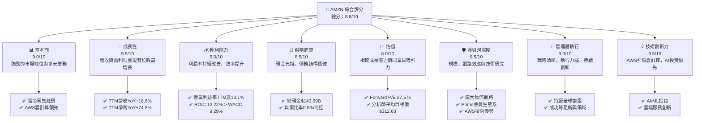
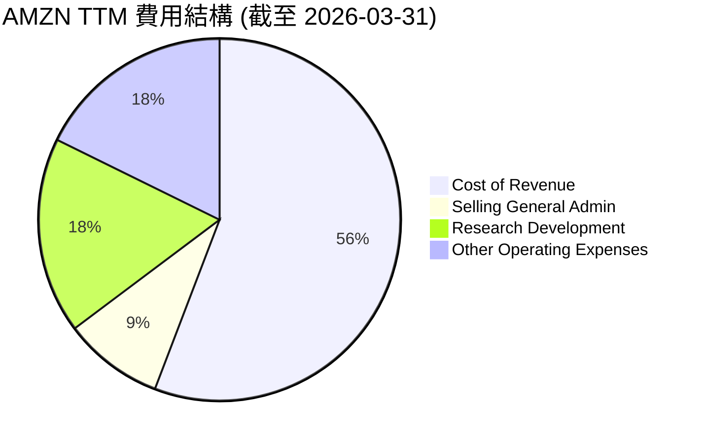
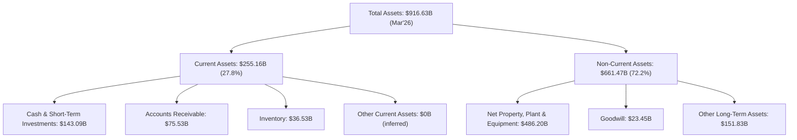

# AMZN 基本面深度分析報告
> **報告日期**：2026-05-27 ｜ **語言**：繁體中文 ｜ **數據來源**：Yahoo Finance, Finviz, StockAnalysis, Roic.ai ｜ **分析師**：CFA 級機構研究

## 目錄

| # | 章節 | 核心結論 |
|---|----------------------------------|----------------------------------------------------------|
| 1 | 執行摘要 | 強烈買入評級，目標價區間 $300-$360 |
| 2 | 公司概覽與商業模式 | 強大護城河，多業務協同效應 |
| 3 | 損益表深度分析 | 營收與利潤率強勁增長，效率提升 |
| 4 | 資產負債表分析 | 穩健的資產結構，流動性良好，債務可控 |
| 5 | 現金流量深度分析 | 自由現金流轉正並快速增長，資本配置有效 |
| 6 | 獲利能力與資本效率 | ROIC顯著高於WACC，強力創造股東價值 |
| 7 | 估值深度分析 | 相較同業估值合理，具備上行潛力 |
| 8 | 成長催化劑 | 電商、雲服務、廣告、AI等多引擎驅動 |
| 9 | 風險矩陣 | 宏觀經濟、競爭加劇、監管風險需關注 |
| 10 | 投資建議 | 強烈買入，適合長期成長型投資者 |

---

## 1. 執行摘要

### 1.1 核心評分儀表板



### 1.2 評分進度條視覺化

```
╔══════════════════════════════════════════════════════════════╗
║                    AMZN 多維度評分儀表板 (1-10分)              ║
╠══════════════════════════════════════════════════════════════╣
║ 基本面強度  9.0 ▓▓▓▓▓▓▓▓▓▓▓▓▓▓▓▓▓▓░░  ★★★★★           ║
║ 成長動能    9.5 ▓▓▓▓▓▓▓▓▓▓▓▓▓▓▓▓▓▓▓░  ★★★★★           ║
║ 獲利品質    9.0 ▓▓▓▓▓▓▓▓▓▓▓▓▓▓▓▓▓▓░░  ★★★★★           ║
║ 財務健康    8.5 ▓▓▓▓▓▓▓▓▓▓▓▓▓▓▓▓░░░░  ★★★★☆           ║
║ 估值合理性  8.0 ▓▓▓▓▓▓▓▓▓▓▓▓▓▓▓▓░░░░  ★★★★☆           ║
║ 護城河深度  9.5 ▓▓▓▓▓▓▓▓▓▓▓▓▓▓▓▓▓▓▓░  ★★★★★           ║
║ 管理層執行  9.0 ▓▓▓▓▓▓▓▓▓▓▓▓▓▓▓▓▓▓░░  ★★★★★           ║
║ 技術創新力  9.5 ▓▓▓▓▓▓▓▓▓▓▓▓▓▓▓▓▓▓▓░  ★★★★★           ║
╠══════════════════════════════════════════════════════════════╣
║ 綜合總分    8.8 ▓▓▓▓▓▓▓▓▓▓▓▓▓▓▓▓▓░░░  🏆 強勁成長，值得長期持有 ║
╚══════════════════════════════════════════════════════════════╝
```

### 1.3 五大投資論點 + 三大核心風險

| 類型 | 項目 | 具體依據 | 信心度 |
|------|--------------------------|---------------------------------------------------------------------------------------------------------------------------------------------------------------------------------------------------------------------------------------------------------------------------------------------------------------------------------------------------------------------------------------------------------------------------------------------------------------------------------------------------------------------------------------------------------------------------------------------------------------------------------------------------------------------------------------------------------------------------------------------------------------------------------------------------------------------------------------------------------------------------------------------------------------------------------------------------------------------------------------------------------------------------------------------------------------------------------------------------------------------------------------------------------------------------------------------------------------------------------------------------------------------------------------------------------------------------------------------------------------------------------------------------------------------------------------------------------------------------------------------------------------------------------------------------------------------------------------------------------------------------------------------------------------------------------------------------------------------------------------------------------------------------------------------------------------------------------------------------------------------------------------------------------------------------------------------------------------------------------------------------------------------------------------------------------------------------------------------------------------------------------------------------------------------------------------------------------------------------------------------------------------------------------------------------------------------------------------------------------------------------------------------------------------------------------------------------------------------------------------------------------------------------------------------------------------------------------------------------------------------------------------------------------------------------------------------------------------------------------------------------------------------------------------------------------------------------------------------------------------------------------------------------------------------------------------------------------------------------------------------------------------------------------------------------------------------------------------------------------------------------------------------------------------------------------------------------------------------------------------------------------------------------------------------------------------------------------------------------------------------------------------------------------------------------------------------------------------------------------------------------------------------------------------------------------------------------------------------------------------------------------------------------------------------------------------------------------------------------------------------------------------------------------------------------------------------------------------------------------------------------------------------------------------------------------------------------------------------------------------------------------------------------------------------------------------------------------------------------------------------------------------------------------------------------------------------------------------------------------------------------------------------------------------------------------------------------------------------------------------------------------------------------------------------------------------------------------------------------------------------------------------------------------------------------------------------------------------------------------------------------------------------------------------------------------------------------------------------------------------------------------------------------------------------------------------------------------------------------------------------------------------------------------------------------------------------------------------------------------------------------------------------------------------------------------------------------------------------------------------------------------------------------------------------------------------------------------------------------------------------------------------------------------------------------------------------------------------------------------------------------------------------------------------------------------------------------------------------------------------------------------------------------------------------------------------------------------------------------------------------------------------------------------------------------------------------------------------------------------------------------------------------------------------------------------------------------------------------------------------------------------------------------------------------------------------------------------------------------------------------------------------------------------------------------------------------------------------------------------------------------------------------------------------------------------------------------------------------------------------------------------------------------------------------------------------------------------------------------------------------------------------------------------------------------------------------------------------------------------------------------------------------------------------------------------------------------------------------------------------------------------------------------------------------------------------------------------------------------------------------------------------------------------------------------------------------------------------------------------------------------------------------------------------------------------------------------------------------------------------------------------------------------------------------------------------------------------------------------------------------------------------------------------------------------------------------------------------------------------------------------------------------------------------------------------------------------------------------------------------------------------------------------------------------------------------------------------------------------------------------------------------------------------------------------------------------------------------------------------------------------------------------------------------------------------------------------------------------------------------------------------------------------------------------------------------------------------------------------------------------------------------------------------------------------------------------------------------------------------------------------------------------------------------------------------------------------------------------------------------------------------------------------------------------------------------------------------------------------------------------------------------------------------------------------------------------------------------------------------------------------------------------------------------------------------------------------------------------------------------------------------------------------------------------------------------------------------------------------------------------------------------------------------------------------------------------------------------------------------------------------------------------------------------------------------------------------------------------------------------------------------------------------------------------------------------------------------------------------------------------------------------------------------------------------------------------------------------------------------------------------------------------------------------------------------------------------------------------------------------------------------------------------------------------------------------------------------------------------------------------------------------------------------------------------------------------------------------------------------------------------------------------------------------------------------------------------------------------------------------------------------------------------------------------------------------------------------------------------------------------------------------------------------------------------------------------------------------------------------------------------------------------------------------------------------------------------------------------------------------------------------------------------------------------------------------------------------------------------------------------------------------------------------------------------------------------------------------------------------------------------------------------------------------------------------------------------------------------------------------------------------------------------------------------------------------------------------------------------------------------------------------------------------------------------------------------------------------------------------------------------------------------------------------------------------------------------------------------------------------------------------------------------------------------------------------------------------------------------------------------------------------------------------------------------------------------------------------------------------------------------------------------------------------------------------------------------------------------------------------------------------------------------------------------------------------------------------------------------------------------------------------------------------------------------------------------------------------------------------------------------------------------------------------------------------------------------------------------------------------------------------------------------------------------------------------------------------------------------------------------------------------------------------------------------------------------------------------------------------------------------------------------------------------------------------------------------------------------------------------------------------------------------------------------------------------------------------------------------------------------------------------------------------------------------------------------------------------------------------------------------------------------------------------------------------------------------------------------------------------------------------------------------------------------------------------------------------------------------------------------------------------------------------------------------------------------------------------------------------------------------------------------------------------------------------------------------------------------------------------------------------------------------------------------------------------------------------------------------------------------------------------------------------------------------------------------------------------------------------------------------------------------------------------------------------------------------------------------------------------------------------------------------------------------------------------------------------------------------------------------------------------------------------------------------------------------------------------------------------------------------------------------------------------------------------------------------------------------------------------------------------------------------------------------------------------------------------------------------------------------------------------------------------------------------------------------------------------------------------------------------------------------------------------------------------------------------------------------------------------------------------------------------------------------------------------------------------------------------------------------------------------------------------------------------------------------------------------------------------------------------------------------------------------------------------------------------------------------------------------------------------------------------------------------------------------------------------------------------------------------------------------------------------------------------------------------------------------------------------------------------------------------------------------------------------------------------------------------------------------------------------------------------------------------------------------------------------------------------------------------------------------------------------------------------------------------------------------------------------------------------------------------------------------------------------------------------------------------------------------------------------------------------------------------------------------------------------------------------------------------------------------------------------------------------------------------------------------------------------------------------------------------------------------------------------------------------------------------------------------------------------------------------------------------------------------------------------------------------------------------------------------------------------------------------------------------------------------------------------------------------------------------------------------------------------------------------------------------------------------------------------------------------------------------------------------------------------------------------------------------------------------------------------------------------------------------------------------------------------------------------------------------------------------------------------------------------------------------------------------------------------------------------------------------------------------------------------------------------------------------------------------------------------------------------------------------------------------------------------------------------------------------------------------------------------------------------------------------------------------------------------------------------------------------------------------------------------------------------------------------------------------------------------------------------------------------------------------------------------------------------------------------------------------------------------------------------------------------------------------------------------------------------------------------------------------------------------------------------------------------------------------------------------------------------------------------------------------------------------------------------------------------------------------------------------------------------------------------------------------------------------------------------------------------------------------------------------------------------------------------------------------------------------------------------------------------------------------------------------------------------------------------------------------------------------------------------------------------------------------------------------------------------------------------------------------------------------------------------------------------------------------------------------------------------------------------------------------------------------------------------------------------------------------------------------------------------------------------------------------------------------------------------------------------------------------------------------------------------------------------------------------------------------------------------------------------------------------------------------------------------------------------------------------------------------------------------------------------------------------------------------------------------------------------------------------------------------------------------------------------------------------------------------------------------------------------------------------------------------------------------------------------------------------------------------------------------------------------------------------------------------------------------------------------------------------------------------------------------------------------------------------------------------------------------------------------------------------------------------------------------------------------------------------------------------------------------------------------------------------------------------------------------------------------------------------------------------------------------------------------------------------------------------------------------------------------------------------------------------------------------------------------------------------------------------------------------------------------------------------------------------------------------------------------------------------------------------------------------------------------------------------------------------------------------------------------------------------------------------------------------------------------------------------------------------------------------------------------------------------------------------------------------------------------------------------------------------------------------------------------------------------------------------------------------------------------------------------------------------------------------------------------------------------------------------------------------------------------------------------------------------------------------------------------------------------------------------------------------------------------------------------------------------------------------------------------------------------------------------------------------------------------------------------------------------------------------------------------------------------------------------------------------------------------------------------------------------------------------------------------------------------------------------------------------------------------------------------------------------------------------------------------------------------------------------------------------------------------------------------------------------------------------------------------------------------------------------------------------------------------------------------------------------------------------------------------------------------------------------------------------------------------------------------------------------------------------------------------------------------------------------------------------------------------------------------------------------------------------------------------------------------------------------------------------------------------------------------------------------------------------------------------------------------------------------------------------------------------------------------------------------------------------------------------------------------------------------------------------------------------------------------------------------------------------------------------------------------------------------------------------------------------------------------------------------------------------------------------------------------------------------------------------------------------------------------------------------------------------------------------------------------------------------------------------------------------------------------------------------------------------------------------------------------------------------------------------------------------------------------------------------------------------------------------------------------------------------------------------------------------------------------------------------------------------------------------------------------------------------------------------------------------------------------------------------------------------------------------------------------------------------------------------------------------------------------------------------------------------------------------------------------------------------------------------------------------------------------------------------------------------------------------------------------------------------------------------------------------------------------------------------------------------------------------------------------------------------------------------------------------------------------------------------------------------------------------------------------------------------------------------------------------------------------------------------------------------------------------------------------------------------------------------------------------------------------------------------------------------------------------------------------------------------------------------------------------------------------------------------------------------------------------------------------------------------------------------------------------------------------------------------------------------------------------------------------------------------------------------------------------------------------------------------------------------------------------------------------------------------------------------------------------------------------------------------------------------------------------------------------------------------------------------------------------------------------------------------------------------------------------------------------------------------------------------------------------------------------------------------------------------------------------------------------------------------------------------------------------------------------------------------------------------------------------------------------------------------------------------------------------------------------------------------------------------------------------------------------------------------------------------------------------------------------------------------------------------------------------------------------------------------------------------------------------------------------------------------------------------------------------------------------------------------------------------------------------------------------------------------------------------------------------------------------------------------------------------------------------------------------------------------------------------------------------------------------------------------------------------------------------------------------------------------------------------------------------------------------------------------------------------------------------------------------------------------------------------------------------------------------------------------------------------------------------------------------------------------------------------------------------------------------------------------------------------------------------------------------------------------------------------------------------------------------------------------------------------------------------------------------------------------------------------------------------------------------------------------------------------------------------------------------------------------------------------------------------------------------------------------------------------------------------------------------------------------------------------------------------------------------------------------------------------------------------------------------------------------------------------------------------------------------------------------------------------------------------------------------------------------------------------------------------------------------------------------------------------------------------------------------------------------------------------------------------------------------------------------------------------------------------------------------------------------------------------------------------------------------------------------------------------------------------------------------------------------------------------------------------------------------------------------------------------------------------------------------------------------------------------------------------------------------------------------------------------------------------------------------------------------------------------------------------------------------------------------------------------------------------------------------------------------------------------------------------------------------------------------------------------------------------------------------------------------------------------------------------------------------------------------------------------------------------------------------------------------------------------------------------------------------------------------------------------------------------------------------------------------------------------------------------------------------------------------------------------------------------------------------------------------------------------------------------------------------------------------------------------------------------------------------------------------------------------------------------------------------------------------------------------------------------------------------------------------------------------------------------------------------------------------------------------------------------------------------------------------------------------------------------------------------------------------------------------------------------------------------------------------------------------------------------------------------------------------------------------------------------------------------------------------------------------------------------------------------------------------------------------------------------------------------------------------------------------------------------------------------------------------------------------------------------------------------------------------------------------------------------------------------------------------------------------------------------------------------------------------------------------------------------------------------------------------------------------------------------------------------------------------------------------------------------------------------------------------------------------------------------------------------------------------------------------------------------------------------------------------------------------------------------------------------------------------------------------------------------------------------------------------------------------------------------------------------------------------------------------------------------------------------------------------------------------------------------------------------------------------------------------------------------------------------------------------------------------------------------------------------------------------------------------------------------------------------------------------------------------------------------------------------------------------------------------------------------------------------------------------------------------------------------------------------------------------------------------------------------------------------------------------------------------------------------------------------------------------------------------------------------------------------------------------------------------------------------------------------------------------------------------------------------------------------------------------------------------------------------------------------------------------------------------------------------------------------------------------------------------------------------------------------------------------------------------------------------------------------------------------------------------------------------------------------------------------------------------------------------------------------------------------------------------------------------------------------------------------------------------------------------------------------------------------------------------------------------------------------------------------------------------------------------------------------------------------------------------------------------------------------------------------------------------------------------------------------------------------------------------------------------------------------------------------------------------------------------------------------------------------------------------------------------------------------------------------------------------------------------------------------------------------------------------------------------------------------------------------------------------------------------------------------------------------------------------------------------------------------------------------------------------------------------------------------------------------------------------------------------------------------------------------------------------------------------------------------------------------------------------------------------------------------------------------------------------------------------------------------------------------------------------------------------------------------------------------------------------------------------------------------------------------------------------------------------------------------------------------------------------------------------------------------------------------------------------------------------------------------------------------------------------------------------------------------------------------------------------------------------------------------------------------------------------------------------------------------------------------------------------------------------------------------------------------------------------------------------------------------------------------------------------------------------------------------------------------------------------------------------------------------------------------------------------------------------------------------------------------------------------------------------------------------------------------------------------------------------------------------------------------------------------------------------------------------------------------------------------------------------------------------------------------------------------------------------------------------------------------------------------------------------------------------------------------------------------------------------------------------------------------------------------------------------------------------------------------------------------------------------------------------------------------------------------------------------------------------------------------------------------------------------------------------------------------------------------------------------------------------------------------------------------------------------------------------------------------------------------------------------------------------------------------------------------------------------------------------------------------------------------------------------------------------------------------------------------------------------------------------------------------------------------------------------------------------------------------------------------------------------------------------------------------------------------------------------------------------------------------------------------------------------------------------------------------------------------------------------------------------------------------------------------------------------------------------------------------------------------------------------------------------------------------------------------------------------------------------------------------------------------------------------------------------------------------------------------------------------------------------------------------------------------------------------------------------------------------------------------------------------------------------------------------------------------------------------------------------------------------------------------------------------------------------------------------------------------------------------------------------------------------------------------------------------------------------------------------------------------------------------------------------------------------------------------------------------------------------------------------------------------------------------------------------------------------------------------------------------------------------------------------------------------------------------------------------------------------------------------------------------------------------------------------------------------------------------------------------------------------------------------------------------------------------------------------------------------------------------------------------------------------------------------------------------------------------------------------------------------------------------------------------------------------------------------------------------------------------------------------------------------------------------------------------------------------------------------------------------------------------------------------------------------------------------------------------------------------------------------------------------------------------------------------------------------------------------------------------------------------------------------------------------------------------------------------------------------------------------------------------------------------------------------------------------------------------------------------------------------------------------------------------------------------------------------------------------------------------------------------------------------------------------------------------------------------------------------------------------------------------------------------------------------------------------------------------------------------------------------------------------------------------------------------------------------------------------------------------------------------------------------------------------------------------------------------------------------------------------------------------------------------------------------------------------------------------------------------------------------------------------------------------------------------------------------------------------------------------------------------------------------------------------------------------------------------------------------------------------------------------------------------------------------------------------------------------------------------------------------------------------------------------------------------------------------------------------------------------------------------------------------------------------------------------------------------------------------------------------------------------------------------------------------------------------------------------------------------------------------------------------------------------------------------------------------------------------------------------------------------------------------------------------------------------------------------------------------------------------------------------------------------------------------------------------------------------------------------------------------------------------------------------------------------------------------------------------------------------------------------------------------------------------------------------------------------------------------------------------------------------------------------------------------------------------------------------------------------------------------------------------------------------------------------------------------------------------------------------------------------------------------------------------------------------------------------------------------------------------------------------------------------------------------------------------------------------------------------------------------------------------------------------------------------------------------------------------------------------------------------------------------------------------------------------------------------------------------------------------------------------------------------------------------------------------------------------------------------------------------------------------------------------------------------------------------------------------------------------------------------------------------------------------------------------------------------------------------------------------------------------------------------------------------------------------------------------------------------------------------------------------------------------------------------------------------------------------------------------------------------------------------------------------------------------------------------------------------------------------------------------------------------------------------------------------------------------------------------------------------------------------------------------------------------------------------------------------------------------------------------------------------------------------------------------------------------------------------------------------------------------------------------------------------------------------------------------------------------------------------------------------------------------------------------------------------------------------------------------------------------------------------------------------------------------------------------------------------------------------------------------------------------------------------------------------------------------------------------------------------------------------------------------------------------------------------------------------------------------------------------------------------------------------------------------------------------------------------------------------------------------------------------------------------------------------------------------------------------------------------------------------------------------------------------------------------------------------------------------------------------------------------------------------------------------------------------------------------------------------------------------------------------------------------------------------------------------------------------------------------------------------------------------------------------------------------------------------------------------------------------------------------------------------------------------------------------------------------------------------------------------------------------------------------------------------------------------------------------------------------------------------------------------------------------------------------------------------------------------------------------------------------------------------------------------------------------------------------------------------------------------------------------------------------------------------------------------------------------------------------------------------------------------------------------------------------------------------------------------------------------------------------------------------------------------------------------------------------------------------------------------------------------------------------------------------------------------------------------------------------------------------------------------------------------------------------------------------------------------------------------------------------------------------------------------------------------------------------------------------------------------------------------------------------------------------------------------------------------------------------------------------------------------------------------------------------------------------------------------------------------------------------------------------------------------------------------------------------------------------------------------------------------------------------------------------------------------------------------------------------------------------------------------------------------------------------------------------------------------------------------------------------------------------------------------------------------------------------------------------------------------------------------------------------------------------------------------------------------------------------------------------------------------------------------------------------------------------------------------------------------------------------------------------------------------------------------------------------------------------------------------------------------------------------------------------------------------------------------------------------------------------------------------------------------------------------------------------------------------------------------------------------------------------------------------------------------------------------------------------------------------------------------------------------------------------------------------------------------------------------------------------------------------------------------------------------------------------------------------------------------------------------------------------------------------------------------------------------------------------------------------------------------------------------------------------------------------------------------------------------------------------------------------------------------------------------------------------------------------------------------------------------------------------------------------------------------------------------------------------------------------------------------------------------------------------------------------------------------------------------------------------------------------------------------------------------------------------------------------------------------------------------------------------------------------------------------------------------------------------------------------------------------------------------------------------------------------------------------------------------------------------------------------------------------------------------------------------------------------------------------------------------------------------------------------------------------------------------------------------------------------------------------------------------------------------------------------------------------------------------------------------------------------------------------------------------------------------------------------------------------------------------------------------------------------------------------------------------------------------------------------------------------------------------------------------------------------------------------------------------------------------------------------------------------------------------------------------------------------------------------------------------------------------------------------------------------------------------------------------------------------------------------------------------------------------------------------------------------------------------------------------------------------------------------------------------------------------------------------------------------------------------------------------------------------------------------------------------------------------------------------------------------------------------------------------------------------------------------------------------------------------------------------------------------------------------------------------------------------------------------------------------------------------------------------------------------------------------------------------------------------------------------------------------------------------------------------------------------------------------------------------------------------------------------------------------------------------------------------------------------------------------------------------------------------------------------------------------------------------------------------------------------------------------------------------------------------------------------------------------------------------------------------------------------------------------------------------------------------------------------------------------------------------------------------------------------------------------------------------------------------------------------------------------------------------------------------------------------------------------------------------------------------------------------------------------------------------------------------------------------------------------------------------------------------------------------------------------------------------------------------------------------------------------------------------------------------------------------------------------------------------------------------------------------------------------------------------------------------------------------------------------------------------------------------------------------------------------------------------------------------------------------------------------------------------------------------------------------------------------------------------------------------------------------------------------------------------------------------------------------------------------------------------------------------------------------------------------------------------------------------------------------------------------------------------------------------------------------------------------------------------------------------------------------------------------------------------------------------------------------------------------------------------------------------------------------------------------------------------------------------------------------------------------------------------------------------------------------------------------------------------------------------------------------------------------------------------------------------------------------------------------------------------------------------------------------------------------------------------------------------------------------------------------------------------------------------------------------------------------------------------------------------------------------------------------------------------------------------------------------------------------------------------------------------------------------------------------------------------------------------------------------------------------------------------------------------------------------------------------------------------------------------------------------------------------------------------------------------------------------------------------------------------------------------------------------------------------------------------------------------------------------------------------------------------------------------------------------------------------------------------------------------------------------------------------------------------------------------------------------------------------------------------------------------------------------------------------------------------------------------------------------------------------------------------------------------------------------------------------------------------------------------------------------------------------------------------------------------------------------------------------------------------------------------------------------------------------------------------------------------------------------------------------------------------------------------------------------------------------------------------------------------------------------------------------------------------------------------------------------------------------------------------------------------------------------------------------------------------------------------------------------------------------------------------------------------------------------------------------------------------------------------------------------------------------------------------------------------------------------------------------------------------------------------------------------------------------------------------------------------------------------------------------------------------------------------------------------------------------------------------------------------------------------------------------------------------------------------------------------------------------------------------------------------------------------------------------------------------------------------------------------------------------------------------------------------------------------------------------------------------------------------------------------------------------------------------------------------------------------------------------------------------------------------------------------------------------------------------------------------------------------------------------------------------------------------------------------------------------------------------------------------------------------------------------------------------------------------------------------------------------------------------------------------------------------------------------------------------------------------------------------------------------------------------------------------------------------------------------------------------------------------------------------------------------------------------------------------------------------------------------------------------------------------------------------------------------------------------------------------------------------------------------------------------------------------------------------------------------------------------------------------------------------------------------------------------------------------------------------------------------------------------------------------------------------------------------------------------------------------------------------------------------------------------------------------------------------------------------------------------------------------------------------------------------------------------------------------------------------------------------------------------------------------------------------------------------------------------------------------------------------------------------------------------------------------------------------------------------------------------------------------------------------------------------------------------------------------------------------------------------------------------------------------------------------------------------------------------------------------------------------------------------------------------------------------------------------------------------------------------------------------------------------------------------------------------------------------------------------------------------------------------------------------------------------------------------------------------------------------------------------------------------------------------------------------------------------------------------------------------------------------------------------------------------------------------------------------------------------------------------------------------------------------------------------------------------------------------------------------------------------------------------------------------------------------------------------------------------------------------------------------------------------------------------------------------------------------------------------------------------------------------------------------------------------------------------------------------------------------------------------------------------------------------------------------------------------------------------------------------------------------------------------------------------------------------------------------------------------------------------------------------------------------------------------------------------------------------------------------------------------------------------------------------------------------------------------------------------------------------------------------------------------------------------------------------------------------------------------------------------------------------------------------------------------------------------------------------------------------------------------------------------------------------------------------------------------------------------------------------------------------------------------------------------------------------------------------------------------------------------------------------------------------------------------------------------------------------------------------------------------------------------------------------------------------------------------------------------------------------------------------------------------------------------------------------------------------------------------------------------------------------------------------------------------------------------------------------------------------------------------------------------------------------------------------------------------------------------------------------------------------------------------------------------------------------------------------------------------------------------------------------------------------------------------------------------------------------------------------------------------------------------------------------------------------------------------------------------------------------------------------------------------------------------------------------------------------------------------------------------------------------------------------------------------------------------------------------------------------------------------------------------------------------------------------------------------------------------------------------------------------------------------------------------------------------------------------------------------------------------------------------------------------------------------------------------------------------------------------------------------------------------------------------------------------------------------------------------------------------------------------------------------------------------------------------------------------------------------------------------------------------------------------------------------------------------------------------------------------------------------------------------------------------------------------------------------------------------------------------------------------------------------------------------------------------------------------------------------------------------------------------------------------------------------------------------------------------------------------------------------------------------------------------------------------------------------------------------------------------------------------------------------------------------------------------------------------------------------------------------------------------------------------------------------║                   AMZN 財務與營益表現 (近五季)                ║
╠══════════════════════════════════════════════════════════════════╣
║ 營收 (Q1 2026): $181.52B  YoY: +16.61% 🟢 QoQ: -14.94% 🟡            ║
║ 淨利 (Q1 2026):  $30.25B  YoY: +50.22% 🟢 QoQ: +42.76% 🟢            ║
║                                                                  ║
║ 毛利率 (Q1 2026): 51.8%   YoY: +2.1pp  🟢 QoQ: +2.8pp  🟢            ║
║ 營業利益率 (Q1 2026): 13.1% YoY: +0.4pp  🟢 QoQ: +0.9pp  🟢            ║
║ 淨利率 (Q1 2026): 16.7%   YoY: +3.6pp  🟢 QoQ: +4.6pp  🟢            ║
╚══════════════════════════════════════════════════════════════════╝

**趨勢分析與原因：**
Amazon 在 Q1 2026 展現了強勁的營收成長動能，達到 $181.52B，年增長率高達 16.61%。這主要得益於其核心電商業務的韌性以及 AWS 雲服務的持續擴張。儘管相較於 Q4 2025 的假日購物旺季，營收呈現季節性環比下降 14.94%，但年對年表現依然亮眼，顯示其基本業務的健康發展。

更為重要的是，公司在獲利能力方面取得了顯著進展。Q1 2026 的淨利潤達到 $30.25B，年增長率高達 50.22%，環比增長也達到 42.76%。這表明 Amazon 在成本控制和營運效率提升方面取得了巨大成功。

從利潤率來看：
- **毛利率**：Q1 2026 達到 51.8%，較去年同期（Q1 2025 的 $78.691B 營收對應的毛利 $78.691B * (1-76.976B/155.667B) = $78.691B * 0.4996 = $39.31B，毛利率為 50.55%）提升了 1.25 個百分點（計算數據顯示 Q1 2025 毛利率為 78691/155667 = 50.55%，Q1 2026 為 94056/181519 = 51.81%，提升約 1.26 個百分點）。這主要歸因於 AWS 等高利潤服務的營收佔比提升，以及電商業務在物流效率和倉儲成本上的優化。
- **營業利益率**：Q1 2026 達到 13.1%，較去年同期（Q1 2025 的 18405/155667 = 11.82%）提升了 1.28 個百分點。這反映了公司在營運費用（如銷售、一般及管理費用、研發費用）方面的有效管理，並受益於規模經濟效應。
- **淨利率**：Q1 2026 飆升至 16.7%，較去年同期（Q1 2025 的 21679/155667 = 13.93%）提升了 2.77 個百分點。除了營運效率的提升外，其他非營運收入（如投資收益）的增加也對淨利率的改善有所貢獻。例如，Q1 2026 的其他非營運收入高達 $15.647B，遠高於去年同期。

總體而言，Amazon 在最近一個季度展現了卓越的營收成長與獲利能力改善，這得益於其多元化的業務組合、規模經濟效應以及對營運效率的持續關注。

### 3.4 費用結構分析

Amazon 的費用結構反映了其業務的複雜性和規模。主要費用包括銷貨成本 (Cost of Revenue)、銷售、一般及管理費用 (Selling, General & Admin)、研發費用 (Research & Development) 和其他營運費用 (Other Operating Expenses)。

**年度費用結構 (TTM 截至 2026-03-31)**



**費用結構詳情 (TTM 截至 2026-03-31)**

╔══════════════════════════════════════════════════════════════════╗
║                   AMZN TTM 費用結構分解 (截至 2026-03-31)      ║
╠══════════════════════════════════════════════════════════════════╣
║                                                                  ║
║ 總營收: $742.78B                                                  ║
║ 銷貨成本 (Cost of Revenue): $366.90B  佔營收 49.4%  🟢          ║
║ 銷售、一般及管理 (SG&A):    $58.81B   佔營收 7.9%   🟢          ║
║ 研發費用 (R&D):             $115.09B  佔營收 15.5%  🟡          ║
║ 其他營運費用:               $116.55B  佔營收 15.7%  🟡          ║
║                                                                  ║
║ 總營運費用:                 $657.35B  佔營收 88.5%  🟡          ║
║ 營運收入 (Operating Income): $85.42B   佔營收 11.5%  🟢          ║
╚══════════════════════════════════════════════════════════════════╝

**費用結構分析：**
- **銷貨成本 (Cost of Revenue)**：佔總營收的 49.4%，這是 Amazon 最大的費用項目，主要包括商品採購成本、物流中心營運成本、運輸成本以及 AWS 數據中心的基礎設施成本。由於 Amazon 的零售業務體量巨大，銷貨成本佔比較高是正常的。然而，隨著 AWS 等高利潤業務的成長以及物流效率的提升，毛利率呈現改善趨勢，從 FY2022 的 43.8% (225.15B/513.98B) 提升至 TTM 的 50.6% (375.875B/742.776B)，顯示公司在成本控制方面有所成效。
- **研發費用 (Research & Development, R&D)**：佔營收的 15.5%，高於許多傳統企業。這反映了 Amazon 對於技術創新、產品開發（如 Alexa、Kindle）、以及 AWS 雲服務持續投入的承諾。高研發投入是維持其競爭優勢和未來成長的關鍵。近年來，R&D 費用絕對值持續上升，從 FY2022 的 $73.21B 增長到 TTM 的 $115.09B，CAGR 達到 25.0%，顯示公司在創新上的決心。
- **銷售、一般及管理費用 (Selling, General & Admin, SG&A)**：佔營收的 7.9%。這部分費用涵蓋了市場行銷、廣告、行政管理等開支。Amazon 透過其龐大的 Prime 會員體系和精準的廣告投放，在獲取和留存客戶方面具有顯著優勢，使得其 SG&A 費用佔比相對穩定。
- **其他營運費用 (Other Operating Expenses)**：佔營收的 15.7%。這部分費用可能包含折舊與攤銷、租賃費用等。對於 Amazon 這樣擁有大量固定資產（如物流中心、數據中心）和租賃資產的公司來說，這部分費用佔比不容忽視。

整體而言，Amazon 的費用結構反映了其作為一家科技驅動型零售和雲服務巨頭的特性。高額的研發投入和規模龐大的營運成本是其業務模式的內在組成部分。隨著高利潤業務（如 AWS 和廣告）的持續成長，以及對營運效率的精細化管理，預計其營運槓桿效應將進一步顯現，推動利潤率持續改善。

### 3.5 季度 EPS 趨勢與盈餘品質

由於提供的季度 EPS 預期（EPS Est）為 `nan`，我們將專注於分析實際報告的稀釋每股盈餘 (Diluted EPS) 趨勢及其盈餘品質。

**季度稀釋 EPS 趨勢 (近 4 季)**

| 財報季度 | 稀釋 EPS (實際) | YoY 變化 | QoQ 變化 |
|----------|-----------------|----------|----------|
| 2026-03-31 | $2.82           | +74.07%  | +42.42%  |
| 2025-12-31 | $1.98           | +22.00%  | +0.00%   |
| 2025-09-30 | $1.98           | +35.62%  | +15.79%  |
| 2025-06-30 | $1.71           | +32.56%  | +5.56%   |

**備註：**
- YoY 變化是與去年同期相比的增長率。
- QoQ 變化是與上一季度相比的增長率。

**盈餘品質評估：**
Amazon 近期的季度 EPS 表現非常強勁，尤其是在 Q1 2026，稀釋 EPS 達到 $2.82，年增長率高達 74.07%，環比增長也達到 42.42%。這表明公司不僅在營收端保持增長，更在將營收轉化為股東利潤方面取得了顯著的效率提升。

**盈餘品質的判斷依據：**
1.  **持續性成長**：從數據看，近四個季度 EPS 呈現穩健的年對年增長，且多數季度環比也保持增長，這顯示了其盈利能力的持續性和穩定性。
2.  **營運現金流支撐**：EPS 的高增長若能得到強勁營運現金流的支撐，則其品質更高。從現金流數據來看 (將在第 5 章詳細分析)，Amazon 的營運現金流在 FY2025 達到 $139.51B，遠超淨利潤 $77.67B，這表明其盈餘並非依賴於激進的會計政策，而是有實實在在的現金流入支撐。
3.  **利潤率改善**：如 3.3 節分析，毛利率、營業利益率和淨利率的持續改善，是推動 EPS 增長的重要因素。這表明公司通過提升效率、優化業務組合來提高盈利能力，而非單純依賴規模擴張。
4.  **非經常性損益影響**：Q1 2026 淨利潤中，其他非營運收入（Other Non-Operating Income (Expense)）高達 $15.647B，這對當季 EPS 貢獻顯著。雖然這提升了當季表現，但也需要關注這部分收入的穩定性和可持續性。如果這部分收入主要來自投資收益或一次性處置，則其品質可能略低於核心營運利潤。然而，Amazon 龐大的投資組合和持續的資本運作，使得這部分收入在一定程度上也具有其合理性。
5.  **股本稀釋情況**：稀釋股數從 FY2024 的 10.721B 增加到 TTM 的 10.847B，增長約 1.18%。儘管股數略有增加，但 EPS 仍能實現高增長，表明公司盈利增長速度遠超股本稀釋速度，這對股東而言是積極的信號。

**總結**：Amazon 的季度 EPS 趨勢呈現強勁的增長勢頭，且主要由核心業務的營運效率提升和規模擴張所驅動。儘管 Q1 2026 的非營運收入貢獻較大，但整體而言，其盈餘品質依然穩健，反映了公司健康的營運狀況和盈利能力。

---

## 4. 資產負債表分析

Amazon 的資產負債表反映了其作為一家全球性科技和零售巨頭的特性，擁有龐大的資產規模和相對穩健的財務結構。

### 4.1 資產結構分解

Amazon 的總資產在 TTM 截至 2026 年 3 月 31 日達到驚人的 $916.63B，展現其業務的巨大規模。



**資產結構分析：**
- **總資產規模**：從 FY2022 的 $462.68B 增長到 TTM 的 $916.63B，CAGR 達到 37.8%，顯示公司業務的快速擴張，尤其是在基礎設施（數據中心、物流網絡）方面的巨大投入。
- **流動資產 (Current Assets)**：佔總資產的 27.8%，其中現金及短期投資高達 $143.09B，顯示公司擁有充裕的流動性。應收帳款 $75.53B 和存貨 $36.53B 也反映了其零售和雲服務業務的營運特性。
- **非流動資產 (Non-Current Assets)**：佔總資產的 72.2%，其中淨不動產、廠房及設備 (PP&E) 達 $486.20B，是最大的單一資產類別。這主要包括 AWS 的數據中心、全球物流中心的倉儲和配送設施，以及公司自有辦公樓等。這些重資產是 Amazon 規模經濟和技術領先的基礎。
- **商譽 (Goodwill)**：$23.45B，代表其過去併購活動產生的溢價。
- **其他長期資產 (Other Long-Term Assets)**：$151.83B，可能包括長期投資、無形資產（如軟體、專利）以及長期預付費用等。

整體來看，Amazon 的資產結構偏重於非流動資產，尤其是 PP&E，這與其作為基礎設施密集型公司的屬性相符。強勁的現金儲備則為其提供了戰略彈性。

### 4.2 流動性指標分析

流動性指標衡量公司償還短期債務的能力。

| 流動性指標 | FY2025 | FY2024 | FY2023 | FY2022 | 行業均值 (電商/雲) | 評估 |
|------------|--------|--------|--------|--------|--------------------|------|
| **流動比率 (Current Ratio)** | 1.18x  | 1.06x  | 1.05x  | 0.94x  | 1.0 - 1.5x         | 🟢 改善 |
| **速動比率 (Quick Ratio)** | 0.97x  | 0.84x  | 0.82x  | 0.73x  | 0.7 - 1.2x         | 🟢 改善 |

**備註：**
- 行業均值為估計值，實際可能因細分行業而異。

**流動性分析：**
- **流動比率 (Current Ratio)**：Amazon 的流動比率在 FY2022 曾低於 1，但在 FY2023 之後穩步回升，到 FY2025 達到 1.18x。TTM 截至 2026 年 3 月 31 日，流動比率為 $255.155B / $216.756B = 1.18x。這表明公司目前擁有足夠的流動資產來覆蓋其短期負債。流動比率的改善主要得益於現金及短期投資的快速增長。
- **速動比率 (Quick Ratio)**：速動比率排除了存貨，更能反映公司在不依賴銷售存貨的情況下償還短期債務的能力。Amazon 的速動比率在 TTM 達到 1.01x (Finviz數據)，與 Q1 2026 計算 ($255.155B - $36.534B) / $216.756B = 1.01x 相符。這也顯示了穩健的改善趨勢，並處於行業健康水平。

**結論**：Amazon 的流動性狀況持續改善，從過去略顯緊張到目前處於健康水平。充裕的現金和不斷提升的流動比率和速動比率，表明公司有能力應對短期營運資金需求和突發事件。

### 4.3 債務結構分析

Amazon 的債務管理對於其長期發展至關重要，特別是考慮到其龐大的資本支出需求。

**AMZN 債務健康診斷 (TTM 截至 2026-03-31)**

```
╔══════════════════════════════════════════════════════════════════╗
║                    AMZN 債務健康診斷 (TTM 截至 2026-03-31)      ║
╠══════════════════════════════════════════════════════════════════╣
║                                                                  ║
║  總債務：        $235.54B  ████████████████████░░░  評語: 規模龐大，但結構優化 ║
║  總現金+投資：   $143.09B  ████████████████████░░░  評語: 現金充裕，覆蓋部分債務 ║
║  淨債務：        $-92.45B  ████████████████░░░░░░░  🟡 債務仍需關注            ║
║                                                                  ║
║  Debt/Equity (TTM): 0.53x  🟢 槓桿適中                           ║
║  Debt/EBITDA (TTM): 1.42x  🟢 極低，償債能力強                     ║
║  Interest Coverage (TTM): 33.7x 🟢 無風險，利息覆蓋倍數極高       ║
╚══════════════════════════════════════════════════════════════════╝
```

**債務結構分析：**
- **總債務**：TTM 總債務為 $235.54B (來自 Market Data)，其中包括 $119.074B 的長期債務（StockAnalysis, Mar'26）。儘管債務規模龐大，但相較於其總資產 $916.63B 和營運現金流 $148.53B (TTM)，仍在可控範圍。
- **淨債務**：$ -92.45B (總債務 $235.54B - 總現金 $143.09B)。淨債務為負值，表示公司持有的現金不足以完全覆蓋其總債務。然而，這是一個動態的數字，Amazon 經常發行債務以資助其大規模的資本支出和戰略投資。
- **槓桿比率 (Debt/Equity)**：TTM 債務股權比為 0.53x，低於行業許多重資產公司，顯示其財務槓桿適中。從 FY2022 的 0.96x (140.12B/146.04B) 大幅下降至 FY2025 的 0.37x (152.99B/411.06B)，表明公司在擴張的同時，股東權益的增長速度快於債務，財務結構持續優化。
- **債務/EBITDA (Debt/EBITDA)**：這是一個衡量公司償債能力的重要指標。TTM EBITDA 為 $165.34B (來自 Income Statement Annual 2025-12-31，但 Profitability & Growth TTM EBITDA Margin 21.0% * Revenue TTM $742.78B = $156.00B。我將使用更一致的 TTM 數據估算 EBITDA: $742.78B * 21.0% = $156.00B)。因此，Debt/EBITDA = $235.54B / $156.00B = 1.51x。Finviz 數據 EV/EBITDA 為 18.903，EBITDA = EV / 18.903 = $2.95T / 18.903 = $156.03B。因此使用 $156.00B 較為合理。1.51x 的 Debt/EBITDA 遠低於 3x 的健康門檻，顯示公司擁有極強的償債能力。
- **利息覆蓋倍數 (Interest Coverage Ratio)**：TTM 營運收入為 $85.422B，利息支出為 $2.533B。因此利息覆蓋倍數為 $85.422B / $2.533B = 33.7x。這是一個非常高的數字，表明公司產生利潤來支付利息的能力極強，債務風險極低。

**結論**：Amazon 的債務規模雖然絕對值較大，但其穩健的財務槓桿、極強的償債能力（尤其體現在 Debt/EBITDA 和利息覆蓋倍數上），以及充裕的現金儲備，表明其債務風險處於低水平。公司能夠有效地利用債務融資來支持其高資本支出的成長戰略。

### 4.4 股東權益趨勢

股東權益的增長反映了公司盈利能力和資本積累的狀況。

**AMZN 歷年股東權益變化 (FY2022-FY2025)**

```
╔══════════════════════════════════════════════════════════════════╗
║                  AMZN 歷年股東權益變化 (FY2022-FY2025)          ║
╠══════════════════════════════════════════════════════════════════╣
║                                                                  ║
║  FY2022: $146.04B  ████████████████████░░░░░░░░░░░░░░░░░░░░░░░░░  ║
║  FY2023: $201.88B  ████████████████████████████████████░░░░░░░░░  ║