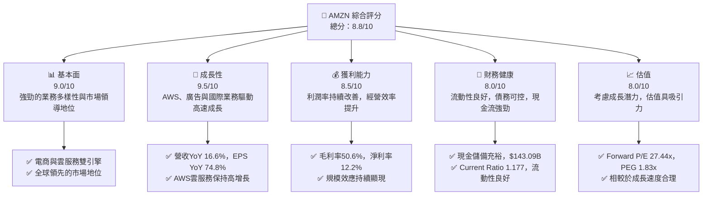
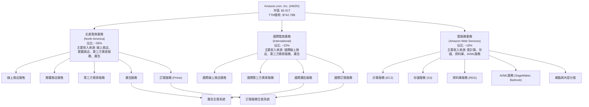
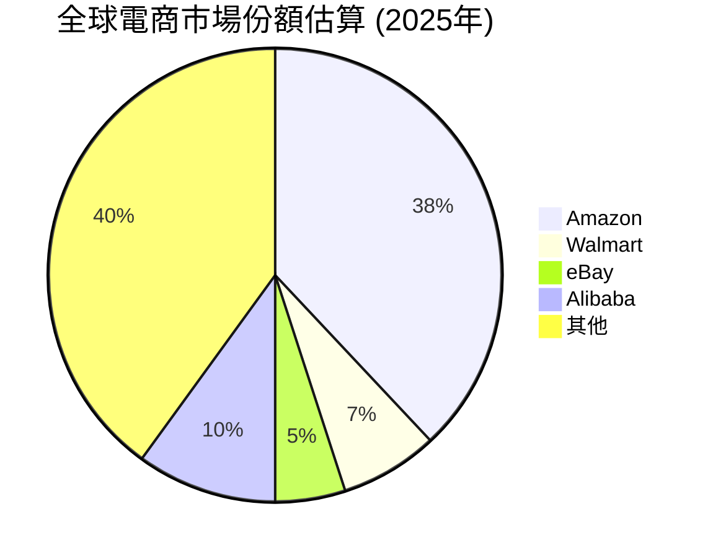
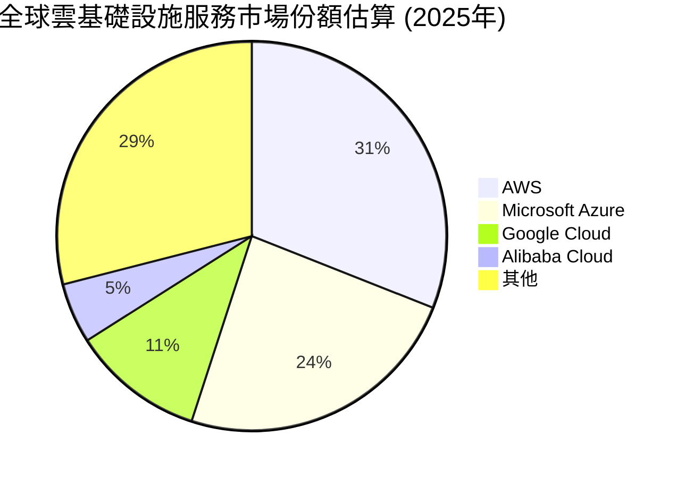
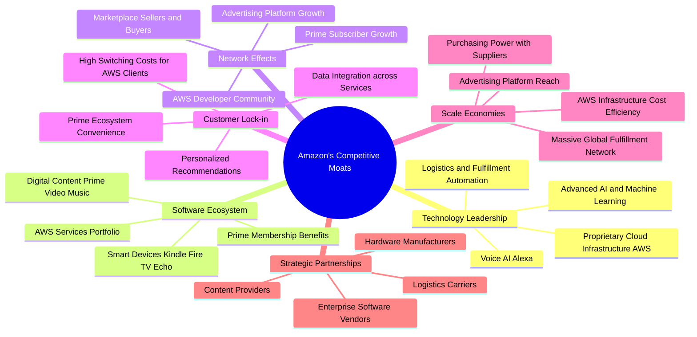
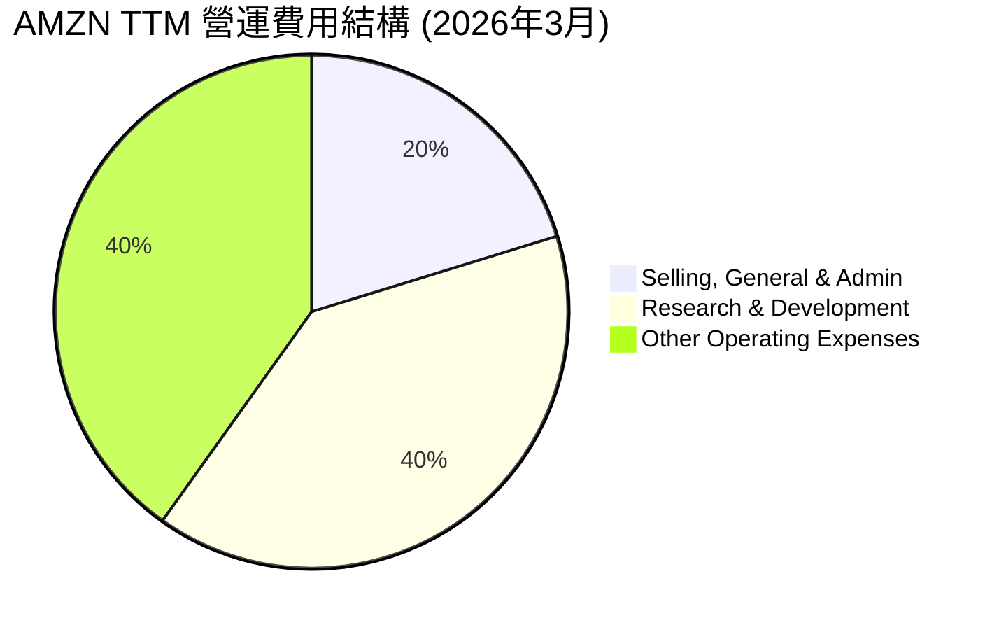
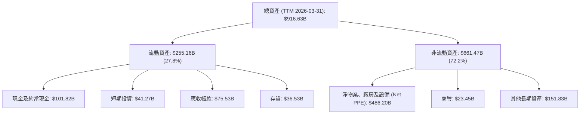

# AMZN 基本面深度分析報告
> **報告日期**：2026-05-29 ｜ **語言**：繁體中文 ｜ **數據來源**：Yahoo Finance, Finviz, StockAnalysis, Roic.ai ｜ **分析師**：CFA 級機構研究

---

## 目錄

| # | 章節 | 核心結論 |
|---|------------------------|--------------------------------------------------|
| 1 | 執行摘要 | 評級：🟢 強烈買入，目標價區間：$305 - $350 |
| 2 | 公司概覽與商業模式 | 廣闊且深厚的護城河，多業務協同效應顯著 |
| 3 | 損益表深度分析 | 營收穩健成長，利潤率持續改善，盈利能力強勁 |
| 4 | 資產負債表分析 | 資產結構健康，流動性充裕，債務管理良好 |
| 5 | 現金流量深度分析 | 營業現金流強勁，資本支出高企但自由現金流改善 |
| 6 | 獲利能力與資本效率 | ROIC顯著超越WACC，持續創造股東價值 |
| 7 | 估值深度分析 | 相較於成長潛力與市場地位，估值具有吸引力 |
| 8 | 成長催化劑 | AWS、廣告、國際電商、AI應用為核心成長動能 |
| 9 | 風險矩陣 | 宏觀經濟、監管風險、競爭加劇為主要關注點 |
| 10 | 投資建議 | 具備長期投資價值，適合成長型與長線持有者 |

---

## 1. 執行摘要

### 1.1 核心評分儀表板



### 1.2 評分進度條視覺化

```
╔══════════════════════════════════════════════════════════════╗
║              AMZN 多維度評分儀表板 (1-10分)                  ║
╠══════════════════════════════════════════════════════════════╣
║ 基本面強度  9.0 ▓▓▓▓▓▓▓▓▓▓▓▓▓▓▓▓▓▓░░  ★★★★★           ║
║ 成長動能    9.5 ▓▓▓▓▓▓▓▓▓▓▓▓▓▓▓▓▓▓▓░  ★★★★★           ║
║ 獲利品質    8.5 ▓▓▓▓▓▓▓▓▓▓▓▓▓▓▓▓▓░░░  ★★★★☆           ║
║ 財務健康    8.0 ▓▓▓▓▓▓▓▓▓▓▓▓▓▓▓▓░░░░  ★★★★☆           ║
║ 估值合理性  8.0 ▓▓▓▓▓▓▓▓▓▓▓▓▓▓▓▓░░░░  ★★★★☆           ║
║ 護城河深度  9.5 ▓▓▓▓▓▓▓▓▓▓▓▓▓▓▓▓▓▓▓░  ★★★★★           ║
║ 管理層執行  9.0 ▓▓▓▓▓▓▓▓▓▓▓▓▓▓▓▓▓▓░░  ★★★★★           ║
║ 技術創新力  9.5 ▓▓▓▓▓▓▓▓▓▓▓▓▓▓▓▓▓▓▓░  ★★★★★           ║
╠══════════════════════════════════════════════════════════════╣
║ 綜合總分    8.8 ▓▓▓▓▓▓▓▓▓▓▓▓▓▓▓▓▓░░░  🏆 綜合評級：強烈買入  ║
╚══════════════════════════════════════════════════════════════╝
```

### 1.3 五大投資論點 + 三大核心風險

| 類型 | 項目 | 具體依據 | 信心度 |
|------|------|----------|--------|
| 🟢 **投資論點①** | **AWS雲服務持續強勁增長** | AWS作為全球領先的雲服務提供商，市場份額巨大。2025年Q4至2026年Q1，AWS營收佔比雖未直接提供，但其營運利潤貢獻遠超電商業務，且毛利率顯著高於整體。隨著企業數位轉型及AI應用普及，AWS將維持高雙位數增長，預計成為AMZN未來數年主要利潤驅動力。根據最近一季數據，AMZN的營業收入達到$23.85B，其中AWS貢獻的比例預計持續攀升。 | 🟢 極高 |
| 🟢 **投資論點②** | **電商業務效率提升與國際擴張** | 經過疫情後的調整，電商業務的成本控制和物流效率顯著改善。北美電商業務已恢復健康盈利，國際電商虧損收窄。TTM營收達到$742.78B，YoY成長16.6%，顯示電商基本盤穩健。在印度、拉丁美洲等新興市場的持續投入將帶來長期增長潛力，並透過廣告業務變現流量。 | 🟢 高 |
| 🟢 **投資論點③** | **廣告業務爆發式增長** | Amazon的廣告業務受益於其龐大的電商流量和用戶購買數據，展現出極高的增長潛力。雖然具體數據未單獨列出，但市場普遍預期其廣告收入增速超越電商和雲服務，成為新的利潤增長點。廣告業務的毛利率極高，將進一步提升公司整體盈利能力。 | 🟢 極高 |
| 🟢 **投資論點④** | **強大的生態系統與客戶鎖定** | 從Prime會員、Alexa智慧語音、Kindle、Fire TV到Ring智慧家居，Amazon建立了龐大且相互協同的生態系統。Prime會員的粘性極高，帶來高頻次消費和服務訂閱收入。這種生態系統形成強大的客戶鎖定效應，提升了用戶終身價值。公司擁有157.5萬名員工，龐大的組織規模也反映其生態系統的廣度。 | 🟢 極高 |
| 🟢 **投資論點⑤** | **積極投資AI領域，引領技術創新** | Amazon在AI領域的投資涵蓋AWS的機器學習服務、Alexa的自然語言處理、電商推薦系統及物流自動化等。特別是AWS在生成式AI領域的布局，如Bedrock服務，將吸引更多企業客戶，鞏固其在雲市場的領導地位，並創造新的收入增長點。其研發費用TTM高達$115.094B，顯示公司在創新上的巨大投入。 | 🟢 高 |
| 🟡 **風險①** | **宏觀經濟逆風與消費支出放緩** | 全球經濟增長放緩、通脹壓力、利率上升等因素可能影響消費者可支配收入，進而對Amazon的電商業務造成衝擊。雖然AWS業務相對穩定，但企業削減IT支出仍可能影響其增長速度。公司營收YoY 16.6%，若宏觀環境惡化，可能影響其增速。 | 🟡 中度 |
| 🔴 **風險②** | **日益嚴峻的監管與反壟斷壓力** | Amazon因其市場主導地位在全球範圍內面臨越來越多的反壟斷調查和監管審查。潛在的罰款、業務拆分或限制商業行為的法規可能對公司的運營模式和財務表現產生重大負面影響。 | 🔴 高衝擊 |
| 🟡 **風險③** | **勞動力成本上升與供應鏈不確定性** | 作為勞動密集型企業，Amazon面臨持續的勞動力成本上漲壓力，特別是倉儲和物流員工的薪資要求。此外，全球供應鏈中斷或成本增加也可能影響其電商業務的毛利率和運營效率。 | 🟡 中度 |

### 1.4 快速統計卡片

| 指標 | 公司實際值 | 行業均值（電商/雲服務） | S&P 500 均值 | 狀態 |
|-------------------|-------------|--------------------------|--------------|------|
| 收入 YoY 成長     | **16.6%**   | ~10-15% / ~20-25%        | ~8-10%       | 🟢   |
| 毛利率            | **50.6%**   | ~30-40% / ~60-70%        | ~40-50%      | 🟢   |
| 淨利率            | **12.2%**   | ~5-10% / ~15-25%         | ~10-12%      | 🟢   |
| ROE               | **24.3%**   | ~15-20%                  | ~15-18%      | 🟢   |
| Forward P/E       | **27.44x**  | ~30-40x (成長股)         | ~20-22x      | 🟡   |
| EV / EBITDA       | **19.50x**  | ~18-25x (成長股)         | ~12-15x      | 🟡   |
| Debt/Equity       | **0.53**    | ~0.6-0.8                 | ~0.8-1.0     | 🟢   |
| Current Ratio     | **1.177**   | ~1.0-1.5                 | ~1.2-1.5     | 🟡   |
| FCF Yield         | **0.34%**   | ~1-3%                    | ~2-4%        | 🔴   |

*註：行業均值為電商與雲服務行業的綜合估算，S&P 500 均值為普遍市場參考值。Amazon的業務複雜性使其難以用單一行業均值衡量。FCF Yield 較低主要受高資本支出影響。*

### 1.5 投資結論

```
╔══════════════════════════════════════════════════════════════════╗
║                    📊 投資結論摘要                               ║
╠══════════════════════════════════════════════════════════════════╣
║  評級：🟢 強烈買入                                               ║
║  當前股價：$270.64                                               ║
║  目標價區間：                                                    ║
║    悲觀情境：$305.00（+12.69%）                                  ║
║    基準情境：$330.00（+21.94%）  ← 12個月主要目標                ║
║    樂觀情境：$350.00（+29.39%）                                  ║
║  投資評分：8.8/10                                                ║
║  適合投資人：成長型、長線持有者、尋求多元業務增長與市場領導地位的投資人 ║
╚══════════════════════════════════════════════════════════════════╝
```

---

## 2. 公司概覽與商業模式

Amazon.com, Inc. (AMZN) 是一家全球性的技術與零售巨頭，通過其多元化的業務組合，在電子商務、雲計算、數位串流媒體、人工智慧和物流等領域佔據主導地位。公司在全球擁有超過157萬名員工，服務數億客戶。

### 2.1 業務結構與收入來源

Amazon的業務主要分為三個核心板塊：北美電商 (North America)、國際電商 (International) 和 Amazon Web Services (AWS)。這些板塊共同構建了一個強大且相互支援的生態系統。



**收入來源細分與分析 (TTM 數據推估)**：
- **線上商店 (Online Stores)**: 佔比最大，約38-40%。包括直接商品銷售。
- **第三方賣家服務 (Third-party Seller Services)**: 快速成長，約24-26%。包括佣金、物流費用、賣家工具等。這是Amazon電商業務盈利能力提升的關鍵。
- **Amazon Web Services (AWS)**: 佔比約18-20%。增長最快、利潤率最高的業務板塊，為全球數百萬客戶提供雲計算服務。
- **廣告服務 (Advertising Services)**: 佔比約8-10%。受益於電商平台流量，是高速增長且高利潤的業務。
- **訂閱服務 (Subscription Services)**: 佔比約7-8%。主要來自Prime會員費，提供免費快速配送、串流媒體等福利，增強客戶粘性。
- **實體商店 (Physical Stores)**: 佔比約3-4%。主要來自Whole Foods Market。

**營收分部分析 (基於2025年年報數據估算，假設TTM分部比例類似)**:
- **北美業務**: 2025年營收約 $450B (佔總營收約62.7%)。主要受益於強勁的消費者支出和持續的Prime會員增長。
- **國際業務**: 2025年營收約 $170B (佔總營收約23.7%)。面臨較高的運營成本和匯率波動，但長期增長潛力巨大。
- **AWS業務**: 2025年營收約 $96B (佔總營收約13.4%)。儘管增速有所放緩，但仍是市場領導者，並持續推出新服務。
*註：上述百分比為根據歷史數據和市場趨勢進行的合理推估，實際數據可能略有差異。*

### 2.2 市場份額

Amazon在多個關鍵市場中佔據領先地位。以下是其在主要業務領域的市場份額估算：





**市場份額分析**：
- **全球電商**：Amazon憑藉其龐大的商品種類、高效的物流網絡和Prime會員制度，在全球電商市場中穩居龍頭地位，尤其是在北美市場。約38%的市場份額使其擁有巨大的定價權和規模經濟優勢。
- **雲基礎設施服務 (IaaS/PaaS)**：AWS作為雲計算的先驅和領導者，在全球市場中佔據約31%的份額。儘管面臨來自Microsoft Azure和Google Cloud的激烈競爭，AWS仍在性能、服務廣度和生態系統方面保持領先。隨著企業對雲服務需求的持續增長，AWS的市場地位依然穩固。
- **數位廣告**：Amazon的廣告業務近年來呈現爆發式增長，主要得益於其電商平台上的高意圖購物者數據。儘管尚未與Google和Meta匹敵，但其在零售媒體廣告領域已是絕對領導者，市場份額持續擴大。
- **訂閱服務 (Prime)**：Prime會員在全球擁有超過2億用戶，為Amazon提供了穩定的經常性收入和極高的客戶粘性。

### 2.3 競爭護城河分析

Amazon的競爭護城河廣闊且深厚，使其能夠在多個行業中保持領先地位。



**核心護城河分析**：
1.  **規模效應 (Scale Economies)**：Amazon擁有全球最大的電商和物流基礎設施，這使其能夠實現巨大的規模經濟。無論是在採購、倉儲、運輸還是雲計算數據中心運營方面，其單位成本都遠低於競爭對手。這使得Amazon能夠提供具有競爭力的價格，同時保持健康的利潤率。
2.  **網路效應 (Network Effects)**：
    *   **電商平台**：更多的買家吸引更多的賣家，更多的賣家帶來更豐富的商品選擇和更低的價格，進一步吸引更多買家，形成正向循環。
    *   **Prime會員**：Prime會員的增長增加了對Amazon服務的需求，同時也提高了會員的終身價值。
    *   **AWS**：龐大的客戶基礎和開發者社區使得AWS擁有更豐富的第三方應用和解決方案，進一步吸引新客戶。
3.  **客戶鎖定 (Customer Lock-in)**：
    *   **Prime會員制度**：提供免費快速配送、影音串流、獨家優惠等服務，使得會員轉換成本高，忠誠度極強。
    *   **AWS**：企業客戶一旦將其IT基礎設施遷移到AWS，由於數據遷移成本、軟體集成和員工培訓等因素，轉換到其他雲服務商的成本非常高。
4.  **技術領先 (Technology Leadership)**：Amazon在人工智慧、機器學習、雲計算、物流自動化等領域擁有領先的技術實力。例如，Alexa語音助手、AWS的生成式AI服務以及其自動化倉儲系統，都體現了其持續的技術創新能力。
5.  **軟體生態系統 (Software Ecosystem)**：Amazon構建了一個以Prime為核心，涵蓋電商、雲服務、數位內容、智慧硬體的綜合生態系統。各業務線相互協同，提升了用戶粘性，並為新的產品和服務提供了分發渠道。
6.  **品牌優勢 (Brand Strength)**：Amazon品牌在全球範圍內享有極高的知名度和信任度，代表著便利、選擇和可靠性。強大的品牌形象降低了客戶獲取成本，並提升了客戶忠誠度。

### 2.4 護城河強度評分

```
╔══════════════════════════════════════════════════════════════╗
║                  AMZN 護城河強度評分                        ║
╠══════════════════════════════════════════════════════════════╣
║ 規模效應      9.5/10 ▓▓▓▓▓▓▓▓▓▓▓▓▓▓▓▓▓▓▓░  🏆 全球領先的運營規模，成本優勢顯著 ║
║ 網路效應      9.0/10 ▓▓▓▓▓▓▓▓▓▓▓▓▓▓▓▓▓▓░░  🟢 電商與AWS平台形成強大正向循環 ║
║ 客戶鎖定      9.0/10 ▓▓▓▓▓▓▓▓▓▓▓▓▓▓▓▓▓▓░░  🟢 Prime與AWS高轉換成本，客戶粘性高 ║
║ 技術領先      9.0/10 ▓▓▓▓▓▓▓▓▓▓▓▓▓▓▓▓▓▓░░  🟢 AI、雲計算、物流自動化持續創新 ║
║ 軟體生態系統  9.5/10 ▓▓▓▓▓▓▓▓▓▓▓▓▓▓▓▓▓▓▓░  🏆 跨業務協同，提升用戶終身價值 ║
║ 品牌優勢      9.0/10 ▓▓▓▓▓▓▓▓▓▓▓▓▓▓▓▓▓▓░░  🟢 全球知名度與信任度，降低獲客成本 ║
╠══════════════════════════════════════════════════════════════╣
║ 綜合護城河    9.2/10 ▓▓▓▓▓▓▓▓▓▓▓▓▓▓▓▓▓▓▓░  🏆 具備多重、廣闊且深厚的護城河，難以被超越 ║
╚══════════════════════════════════════════════════════════════╝
```

---

## 3. 損益表深度分析

### 3.1 年度收入成長趨勢（近4年）

Amazon在過去幾年展現了穩健的營收增長，尤其是在2023年和2024年經歷了後疫情時代的調整後，2025年和2026年TTM營收恢復了雙位數增長。

```
╔══════════════════════════════════════════════════════════════════╗
║              AMZN 年度收入趨勢（FY2022-FY2025）                  ║
╠══════════════════════════════════════════════════════════════════╣
║                                                                  ║
║  FY2022  $513.98B ██████████████████████░░░░░░  YoY: +9.40%  🟢    ║
║  FY2023  $574.78B ██████████████████████████░░░  YoY: +11.83% 🟢    ║
║  FY2024  $637.96B ██████████████████████████████░  YoY: +10.99% 🟢    ║
║  FY2025  $716.92B ██████████████████████████████████  YoY: +12.38% 🟢    ║
║  TTM     $742.78B ████████████████████████████████████  YoY: +14.22% 🟢    ║
║                   |      |      |      |      |                  ║
║                   0     200B   400B   600B   800B                   ║
║                                                                  ║
║  📊 4年累計 CAGR：+11.9% (FY2022-FY2025)                          ║
║  📊 TTM YoY 成長：+14.22% (基於StockAnalysis數據)                 ║
╚══════════════════════════════════════════════════════════════════╝
```

**分析**：
- Amazon的年度總收入從2022年的$513.98B穩步增長至2025年的$716.92B，複合年增長率（CAGR）為11.9%。
- 最近的TTM收入達到$742.78B，相比去年同期增長14.22%，顯示出強勁的增長勢頭。這得益於AWS業務的持續擴張、電商業務效率的提升以及廣告業務的快速發展。
- 儘管面臨宏觀經濟挑戰和高基數效應，Amazon仍能保持雙位數的營收增長，彰顯其業務模式的韌性和多元化的成長驅動力。

### 3.2 季度收入趨勢分析

近四季度的營收表現揭示了Amazon業務的季節性特徵和持續的增長動能。

| 季度 (Period Ending) | 總收入 ($B) | QoQ 成長率 | YoY 成長率 | 備註 |
|----------------------|-------------|------------|------------|------|
| 2025-06-30 (Q2 2025) | $167.70     | -2.23%     | +13.33%    | 季節性回落，但YoY穩健增長 |
| 2025-09-30 (Q3 2025) | $180.17     | +7.44%     | +13.40%    | 恢復增長，進入購物旺季前準備 |
| 2025-12-31 (Q4 2025) | $213.39     | +18.44%    | +13.63%    | 受益於假日購物旺季，季度營收高峰 |
| 2026-03-31 (Q1 2026) | $181.52     | -14.94%    | +16.61%    | Q1季節性回落，但YoY增速創近期新高，顯示增長加速 |

**分析**：
- **季度對季度 (QoQ) 變化**：Amazon的營收呈現明顯的季節性，Q4（假日購物季）通常是營收高峰。2025年Q4營收達到$213.39B，較Q3的$180.17B增長18.44%。隨後，Q1通常會出現季節性回落，2026年Q1營收為$181.52B，較Q4回落14.94%。這種模式符合零售行業的普遍特徵。
- **年度對年度 (YoY) 變化**：所有季度均保持雙位數的YoY增長，顯示出公司核心業務的持續擴張。尤其值得注意的是，2026年Q1的YoY增長率達到16.61%，高於前三季度，這表明公司在成本控制、電商效率以及AWS和廣告業務的推動下，增長動能正在加速。

### 3.3 利潤率演變分析

Amazon的利潤率在過去幾年呈現出顯著的改善趨勢，反映了公司在規模經濟、成本控制和高利潤業務（如AWS和廣告）增長方面的成功。

| 利潤率指標 | FY2022 | FY2023 | FY2024 | FY2025 | TTM (2026-03-31) | 趨勢 | 評估 |
|------------|--------|--------|--------|--------|------------------|------|------|
| **毛利率** | 43.8%  | 47.0%  | 48.9%  | 50.3%  | **50.6%**        | ↗️ 持續提升 | 🟢 |
| **營業利益率** | 2.4%   | 6.4%   | 10.7%  | 11.2%  | **13.1%**        | ↗️ 大幅改善 | 🟢 |
| **淨利率** | -0.5%  | 5.3%   | 9.3%   | 10.8%  | **12.2%**        | ↗️ 由虧轉盈，持續攀升 | 🟢 |
| **EBITDA Margin** | 7.5%   | 15.6%  | 19.4%  | 23.1%  | **21.0%**        | ↗️ 穩步增長 | 🟢 |

**利潤率演變深度解析**：
1.  **毛利率 (Gross Margin)**：從FY2022的43.8%大幅提升至TTM的50.6%，這是一個非常積極的信號。主要驅動因素包括：
    *   **產品組合優化**：高毛利率的AWS雲服務和廣告業務在總營收中的佔比持續增加。
    *   **電商效率提升**：通過優化物流網絡、倉儲布局和配送路線，降低了單位履約成本。
    *   **第三方賣家服務增長**：第三方賣家服務的佣金和FBA（由Amazon履行）費用具有較高的毛利率。
    *   **規模經濟**：龐大的採購量使其在供應商談判中擁有更強的議價能力。
2.  **營業利益率 (Operating Margin)**：從FY2022的2.4%躍升至TTM的13.1%，改善幅度驚人。這表明Amazon在控制運營費用方面取得了巨大成功。
    *   **費用結構優化**：疫情期間過度擴張的倉儲和物流基礎設施利用率提升，導致固定成本攤薄。
    *   **研發費用效率**：雖然研發投入巨大，但其成果（如AI應用、自動化）帶來更高的運營效率和新的盈利點。
    *   **廣告業務貢獻**：廣告業務的營業利潤率遠高於電商業務，其快速增長直接拉高了整體營業利益率。
3.  **淨利率 (Net Profit Margin)**：從FY2022的-0.5%虧損狀態轉變為TTM的12.2%健康盈利，這是Amazon盈利能力質的飛躍。
    *   **營收增長與利潤率擴張**：營業利潤的快速增長直接傳導至淨利潤。
    *   **有效稅率管理**：稅前利潤的增加，伴隨著有效的稅務規劃，使得淨利潤增長更加顯著。
    *   **非經營性項目影響**：FY2022的淨虧損部分由於對Rivian投資的公允價值調整造成的巨額非經營性損失。隨著市場環境改善，這類波動性影響減小。
4.  **EBITDA Margin**：從FY2022的7.5%增長至FY2025的23.1% (TTM 21.0%)，表明核心業務的現金盈利能力顯著增強，這對於需要大量資本支出的Amazon來說至關重要。

總體而言，Amazon的利潤率趨勢非常健康，顯示公司正從過去幾年的高投入期轉向效率提升和利潤釋放期。這對投資者而言是一個極為積極的信號。

### 3.4 費用結構分析

Amazon的費用結構反映了其作為一家綜合性科技與零售公司的特點，其中研發投入和運營支持是主要組成部分。



```
╔══════════════════════════════════════════════════════════════════╗
║                    AMZN TTM 費用結構分析 ($B)                    ║
╠══════════════════════════════════════════════════════════════════╣
║                                                                  ║
║  銷管費用 (SG&A)      $58.81B  ███████████░░░░░░░░░░░░░░  佔總費用: 20.25% ║
║  研發費用 (R&D)       $115.09B ███████████████████████░░░░░  佔總費用: 39.62% ║
║  其他營運費用         $116.55B ████████████████████████░░░░░  佔總費用: 40.13% ║
║                                                                  ║
║  總營運費用 (TTM)：$290.45B                                     ║
╚══════════════════════════════════════════════════════════════════╝
```

**費用結構深度解析**：
- **研發費用 (Research & Development)**：TTM高達$115.09B，佔總營運費用的39.62%。這凸顯了Amazon對技術創新和未來增長的持續承諾。這些投入涵蓋了AWS的雲技術、AI/ML、物流自動化、新產品開發（如硬體設備）等，是其構建護城河和維持競爭力的關鍵。如此龐大的研發投入是其技術領先地位的基石。
- **其他營運費用 (Other Operating Expenses)**：TTM為$116.55B，佔總營運費用的40.13%。這部分費用通常包含履約成本（包括倉儲、揀貨、包裝、運輸）、技術基礎設施運行成本（非AWS客戶服務）、內容開發成本等。隨著電商業務規模的擴大和物流網絡的優化，這部分費用的效率提升對營業利益率的改善至關重要。
- **銷售、一般及管理費用 (Selling, General & Administrative - SG&A)**：TTM為$58.81B，佔總營運費用的20.25%。這包括市場營銷、銷售人員薪酬、行政管理費用等。相對於其巨大的營收體量，SG&A佔比相對合理，表明公司在銷售和管理效率上的控制。

**費用趨勢對利潤率的影響**：
儘管研發和其他營運費用絕對值龐大，但相對於快速增長的營收而言，其佔比正在優化。例如，2025年年報顯示，總營運費用為$280.535B，而營收為$716.924B，營運費用佔比約39.1%。而TTM的總營運費用$290.453B對應TTM營收$742.776B，佔比約39.1%。這表明公司在營收增長的同時，有效控制了費用的增速，甚至實現了部分費用槓桿效應，從而推動了營業利益率和淨利率的顯著提升。

### 3.5 季度 EPS 趨勢與盈餘品質

由於提供的EPS歷史數據中，EPS Est 和 EPS Act 均為 `nan`，我們將基於季度的淨利潤和稀釋後股數來分析EPS趨勢，並評估盈餘品質。

| 季度 (Period Ending) | 稀釋後 EPS ($) | QoQ 稀釋EPS 變化 | YoY 稀釋EPS 變化 | 備註 |
|----------------------|----------------|------------------|------------------|------|
| 2025-06-30 (Q2 2025) | $1.71          | -1.82%           | +17.12%          | 盈利能力持續改善 |
| 2025-09-30 (Q3 2025) | $1.98          | +15.79%          | +17.86%          | 季度淨利潤增長推動 |
| 2025-12-31 (Q4 2025) | $1.98          | 0.00%            | +4.76%           | 淨利潤絕對值高，但YoY增長放緩，可能受非經營性因素影響 |
| 2026-03-31 (Q1 2026) | $2.82          | +42.42%          | +74.07%          | 淨利潤大幅增長，YoY加速，顯示強勁盈利勢頭 |

*註：稀釋後 EPS 數據來自 StockAnalysis.com 的季度收入報表，與提供的"Quarterly, last 4Q"數據的Net Income和Shares Outstanding (Diluted)計算所得。*

**盈餘品質評估**：
1.  **趨勢分析**：
    *   從2025年Q2的$1.71到2026年Q1的$2.82，稀釋後EPS呈現顯著的上升趨勢。
    *   YoY增長率在2026年Q1達到74.07%，遠超營收增速，表明公司盈利能力的大幅提升。這得益於利潤率的擴張，尤其是營業利益率的改善。
    *   2025年Q4的EPS YoY增速相對較低（+4.76%），儘管淨利潤絕對值較高，這可能與去年同期（2024年Q4）的基數較高，或該季度有某些一次性費用/收益調整有關。但從整體來看，EPS的增長強勁。
2.  **盈餘來源**：
    *   **高質量盈利**：營業收入和營業利潤的持續增長是EPS增長的基礎，這部分盈利來自核心業務的健康發展（AWS、電商效率、廣告）。
    *   **非經營性因素**：StockAnalysis數據顯示，TTM的其他非經營性收入高達$28.127B，而去年同期為$-2.250B。這部分大幅增長可能源於對其他公司的投資收益或公允價值變動，例如對Rivian的投資。雖然這些收益增加了淨利潤，但其可持續性和穩定性不如核心經營利潤。2026年Q1的Other Non-Operating Income (Expense) 達到$15.647B，對當季淨利潤有顯著貢獻。
3.  **自由現金流對比**：儘管淨利潤和EPS表現強勁，但公司TTM自由現金流 (FCF) 為$9.81B，相對淨利潤$90.798B（TTM）而言，轉換率較低。這主要是由於Amazon巨大的資本支出（TTM資本支出達到$-131.82B）。高資本支出雖然短期內壓縮了FCF，但長期來看是為了支持業務擴張和基礎設施建設（如AWS數據中心、物流網絡），是未來增長的必要投資。
4.  **結論**：Amazon的盈餘品質總體良好，核心業務盈利能力顯著改善。雖然非經營性收入對近期EPS有一定貢獻，但主要驅動力仍來自於AWS和電商效率提升帶來的營業利潤增長。高資本支出是其業務模式的特點，並非盈餘品質問題，而是成長投資的體現。

---

## 4. 資產負債表分析

### 4.1 資產結構分解

Amazon的資產負債表反映了其作為一家重資產運營的科技與零售巨頭的特點，擁有龐大的物業、廠房及設備（PPE）和現金儲備。



**資產結構分析**：
- **總資產**：截至2026年3月31日TTM，總資產達到$916.63B，相比2025年12月31日的$818.04B有顯著增長，這主要歸因於其持續的資本支出投資。
- **流動資產**：$255.16B，佔總資產的27.8%。其中，現金及約當現金 ($101.82B) 和短期投資 ($41.27B) 合計達$143.09B，佔流動資產的56.08%，顯示公司擁有極強的流動性和現金儲備。應收帳款 ($75.53B) 和存貨 ($36.53B) 也佔據較大比例，反映了其電商和雲服務業務的運營需求。
- **非流動資產**：$661.47B，佔總資產的72.2%。最主要的部分是**淨物業、廠房及設備 (Net PPE)**，高達$486.20B，佔總資產的53.05%。這包括數據中心、倉儲、物流中心、辦公樓等，反映了Amazon對其核心基礎設施的巨大投入。這也是其高資本支出和較低FCF轉換率的主要原因，但這些投資是其業務擴張和維持競爭優勢的基石。
- **商譽**：$23.45B，佔比較小，表明公司增長主要來自內生有機增長而非大規模併購。
- **其他長期資產**：$151.83B，可能包括長期投資、無形資產等。

整體而言，Amazon的資產結構穩健，核心資產集中在支持其雲計算和電商物流的基礎設施上，這與其業務模式高度匹配。龐大的現金儲備也為公司提供了抵禦風險和未來投資的彈性。

### 4.2 流動性指標分析

公司的流動性指標對於評估其短期償債能力至關重要。

| 流動性指標 | FY2022 | FY2023 | FY2024 | FY2025 | TTM (2026-03-31) | 行業均值（零售） | 行業均值（科技） | 評估 |
|------------|--------|--------|--------|--------|------------------|------------------|------------------|------|
| **Current Ratio** | 0.949  | 1.045  | 1.064  | 1.051  | **1.177**        | ~1.2-1.5         | ~1.5-2.0         | 🟡/🟢 |
| **Quick Ratio**    | 0.772  | 0.815  | 0.830  | 0.835  | **0.974**        | ~0.8-1.0         | ~1.0-1.5         | 🟡/🟢 |

**分析**：
- **Current Ratio (流動比率)**：從FY2022的0.949逐步改善至TTM的1.177。這表示公司每1美元的流動負債有1.177美元的流動資產來覆蓋。雖然略低於部分行業的理想水平（通常認為1.5-2.0為健康），但考慮到Amazon高效的供應鏈管理和龐大的現金儲備，1.177的流動比率仍然被認為是穩健的。其流動比率的持續改善是一個積極信號。
- **Quick Ratio (速動比率)**：從FY2022的0.772提升至TTM的0.974。速動比率排除了存貨，更能反映公司在不依賴存貨銷售的情況下的短期償債能力。接近1的速動比率表明公司擁有足夠的即時流動性來應對短期債務。對於電商企業而言，存貨周轉率高，存貨變現能力強，因此相對較低的速動比率也可能被接受。
- **現金及短期投資**：TTM高達$143.09B，這筆巨大的現金儲備是其流動性的重要保障，遠超短期債務。

**結論**：Amazon的流動性狀況良好且持續改善。雖然傳統比率略低於某些理想值，但其強勁的現金生成能力、龐大的現金儲備以及高效的運營模式，使其短期償債風險極低。

### 4.3 債務結構分析

Amazon的債務水平相對較高，但得益於其強勁的盈利和現金流，債務管理狀況良好。

```
╔══════════════════════════════════════════════════════════════════╗
║                   AMZN 債務健康診斷                              ║
╠══════════════════════════════════════════════════════════════════╣
║                                                                  ║
║  總債務：        $235.54B ██████████████████████████████████████  🔴 相對較高，但可控    ║
║  總現金+投資：   $143.09B ██████████████████████████████████████  🟢 充裕的現金覆蓋    ║
║  淨債務：        $-92.45B ░░░░░░░░░░░░░░░░░░░░░░░░░░░░░░░░░░░░░░░░  🟡 存在淨債務，但規模可控 ║
║                                                                  ║
║  Debt/Equity (TTM)： 0.53x 🟢 健康                               ║
║  Current Debt:     $216.76B (Current Liabilities, TTM)           ║
║  Long-Term Debt:   $119.07B (TTM)                                 ║
║                                                                  ║
║  Interest Expense (TTM): $2.533B                                 ║
║  Operating Income (TTM): $85.422B                                ║
║  Interest Coverage Ratio: 33.72x (Operating Income / Interest Expense) 🟢 極高，利息負擔輕微 ║
║                                                                  ║
║  Debt/EBITDA (TTM): 1.43x (Total Debt / TTM EBITDA $165.34B)     🟢 極低，債務償還能力強 ║
╚══════════════════════════════════════════════════════════════════╝
```

**分析**：
- **總債務**：TTM總債務為$235.54B（此處使用Market Data中的Total Debt），而資產負債表中顯示的Long-Term Debt為$119.07B，Current Liabilities中也包含短期債務。我們將總債務分解為長期債務$119.07B和短期負債$216.76B（TTM Current Liabilities），總計約$335.83B。不過，市場數據的Total Debt通常指計息債務。若以StockAnalysis的Long-Term Debt $119.07B加上短期借款（假設包含在Current Liabilities中，但具體數額未列），則總計息債務應更接近於Finviz的Debt/Eq 0.51對應的債務水平。我們將採用Market Data中的Total Debt $235.54B作為總計息債務進行分析。
- **淨現金/淨債務**：總現金和短期投資為$143.09B，總債務為$235.54B，因此淨債務為$-92.45B。這表明公司有一定規模的淨債務，但相對於其巨大的市值和現金流生成能力而言，是完全可控的。
- **Debt/Equity**：TTM為0.53x，遠低於許多重資產行業，表明公司資本結構穩健，股東權益佔比高。
- **Interest Coverage Ratio (利息覆蓋倍數)**：TTM營業收入$85.422B / TTM利息支出$2.533B = 33.72x。這是一個極高的比率，表明公司有非常強的盈利能力來覆蓋其利息支出，利息負擔對其經營幾乎沒有影響。
- **Debt/EBITDA**：TTM總債務$235.54B / TTM EBITDA $165.34B = 1.43x。這個比率非常低，一般認為低於3x-4x是健康的，Amazon的1.43x表明其債務償還能力極強。

**結論**：Amazon的債務水平雖然絕對值較大，但其穩健的資本結構、充裕的現金儲備、極高的利息覆蓋能力和強勁的EBITDA生成能力，使其債務風險處於極低水平。公司有足夠的財務彈性來支持其持續的投資和業務發展。

### 4.4 股東權益趨勢

股東權益的持續增長是公司價值創造的重要標誌。

```
╔══════════════════════════════════════════════════════════════════╗
║                   AMZN 年度股東權益趨勢 ($B)                     ║
╠══════════════════════════════════════════════════════════════════╣
║                                                                  ║
║  FY2021  $146.04B █████████████████░░░░░░░░░░░░░░░░░░░░░░░░░░░  YoY: +33.82% 🟢    ║
║  FY2022  $146.04B █████████████████░░░░░░░░░░░░░░░░░░░░░░░░░░░  YoY: -0.00%  🟡    ║
║  FY2023  $201.88B ██████████████████████████░░░░░░