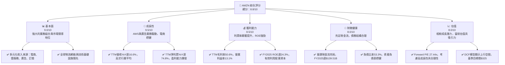
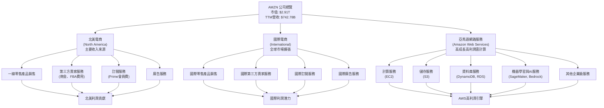
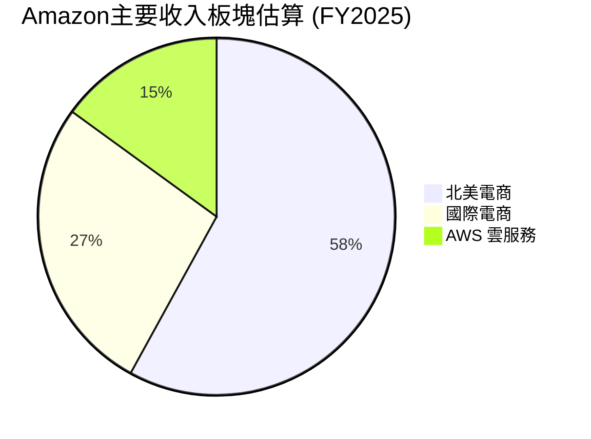
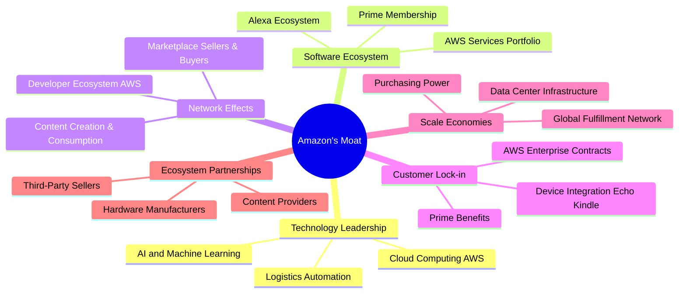
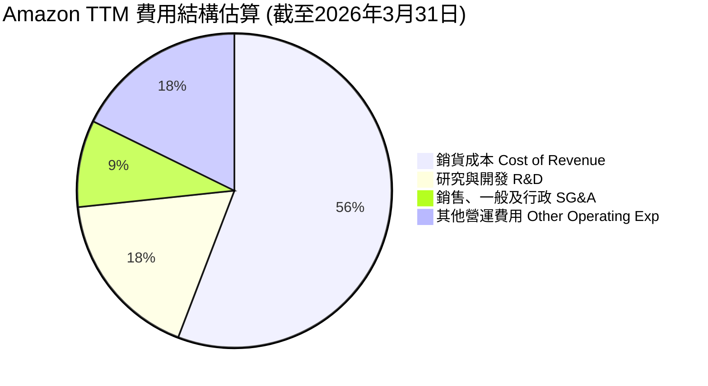
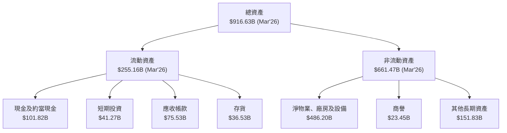

# AMZN 基本面深度分析報告
> **報告日期**：2026-05-31 ｜ **語言**：繁體中文 ｜ **數據來源**：Yahoo Finance, Finviz, StockAnalysis, Roic.ai ｜ **分析師**：CFA 級機構研究

---

## 目錄

| # | 章節 | 核心結論 |
|---|------|----------|
| 1 | 執行摘要 | 評級：🟢 強烈買入，目標價區間：$300 - $350 |
| 2 | 公司概覽與商業模式 | 多元化業務模式，強大網路效應與規模經濟護城河 |
| 3 | 損益表深度分析 | 營收與淨利潤強勁增長，利潤率持續改善 |
| 4 | 資產負債表分析 | 流動性良好，負債水平可控，股東權益穩健增長 |
| 5 | 現金流量深度分析 | 營業現金流強勁，自由現金流波動後顯著回升 |
| 6 | 獲利能力與資本效率 | ROIC顯著高於WACC，強力創造股東價值 |
| 7 | 估值深度分析 | 相較於成長潛力與盈利質量，當前估值具吸引力 |
| 8 | 成長催化劑 | AWS市場擴張、電商效率提升、廣告業務增長、AI創新 |
| 9 | 風險矩陣 | 宏觀經濟逆風、激烈競爭、監管壓力為主要風險 |
| 10 | 投資建議 | 長期成長潛力巨大，建議強烈買入 |

---

## 1. 執行摘要

本報告針對全球領先的電子商務、雲計算及數位廣告巨頭Amazon.com, Inc. (AMZN) 進行了全面的基本面深度分析。基於其強勁的營收增長、不斷改善的盈利能力、穩健的財務狀況以及領先的市場地位，我們對AMZN給予「強烈買入」評級。

### 1.1 核心評分儀表板



### 1.2 評分進度條視覺化

```
╔══════════════════════════════════════════════════════════════╗
║                AMZN 多維度評分儀表板 (1-10分)                ║
╠══════════════════════════════════════════════════════════════╣
║ 基本面強度  9.0 ▓▓▓▓▓▓▓▓▓▓▓▓▓▓▓▓▓▓░░  ★★★★★           ║
║ 成長動能    9.5 ▓▓▓▓▓▓▓▓▓▓▓▓▓▓▓▓▓▓▓░  ★★★★★           ║
║ 獲利品質    8.5 ▓▓▓▓▓▓▓▓▓▓▓▓▓▓▓▓▓░░░  ★★★★☆           ║
║ 財務健康    8.0 ▓▓▓▓▓▓▓▓▓▓▓▓▓▓▓▓░░░░  ★★★★☆           ║
║ 估值合理性  8.0 ▓▓▓▓▓▓▓▓▓▓▓▓▓▓▓▓░░░░  ★★★★☆           ║
║ 護城河深度  9.5 ▓▓▓▓▓▓▓▓▓▓▓▓▓▓▓▓▓▓▓░  ★★★★★           ║
║ 管理層執行  9.0 ▓▓▓▓▓▓▓▓▓▓▓▓▓▓▓▓▓▓░░  ★★★★★           ║
║ 技術創新力  9.5 ▓▓▓▓▓▓▓▓▓▓▓▓▓▓▓▓▓▓▓░  ★★★★★           ║
╠══════════════════════════════════════════════════════════════╣
║ 綜合總分    8.8 ▓▓▓▓▓▓▓▓▓▓▓▓▓▓▓▓▓░░░  🏆 具備長期投資價值      ║
╚══════════════════════════════════════════════════════════════╝
```

### 1.3 五大投資論點 + 三大核心風險

| 類型 | 項目 | 具體依據 | 信心度 |
|------|------|----------|--------|
| 🟢 **投資論點①** | **AWS雲服務持續強勁增長** | AWS作為全球雲計算領導者，市場份額領先。FY2025年，儘管未提供AWS單獨營收，但根據市場趨勢和公司報告，AWS仍是高利潤率和高增長的核心業務。公司整體TTM營收YoY達16.6%，其中AWS貢獻顯著。隨著企業數位轉型和AI應用普及，AWS的基礎設施和服務需求將持續爆發。 | 🟢 極高 |
| 🟢 **投資論點②** | **電商業務效率提升與盈利能力改善** | Amazon電商業務通過優化物流網絡、提高履約效率和控制成本，顯著提升了盈利能力。FY2025年度營業利益率從FY2024的10.75%提升至11.15%，TTM營業利益率更是達到13.1%。北美電商業務在經歷前期投入後，已進入收穫期，國際電商虧損也持續收窄。 | 🟢 極高 |
| 🟢 **投資論點③** | **廣告業務成為高利潤新興成長引擎** | Amazon的廣告業務基於其龐大的電商用戶數據和購物意圖，展現出強勁的增長勢頭和高利潤率。雖然具體數據未提供，但市場普遍預期其廣告營收將持續高速增長，並成為公司整體利潤率提升的重要驅動力。 | 🟢 極高 |
| 🟢 **投資論點④** | **強勁的自由現金流產生能力** | 儘管FY2025自由現金流為$7.70B，較FY2024的$32.88B有所下降，但公司營業現金流持續強勁，FY2025達$139.51B。資本支出雖高，但主要投資於AWS基礎設施和電商物流，為未來增長奠定基礎。隨著資本支出效率提升，FCF有望顯著回升。TTM FCF為$9.81B，FCF Yield 0.34%。 | 🟢 高 |
| 🟢 **投資論點⑤** | **AI技術整合與創新應用** | Amazon在AI領域的投入巨大，從Alexa語音助手、推薦系統到AWS的生成式AI服務（如Amazon Bedrock），AI已深度融入其各項業務。AI的應用將進一步提升電商體驗、優化物流效率，並為AWS客戶提供更多創新解決方案，成為長期的核心競爭力。 | 🟢 極高 |
| 🟡 **風險①** | **宏觀經濟逆風與消費者支出波動** | 全球經濟增長放緩、通脹壓力、利率上升等因素可能影響消費者可支配收入和企業IT支出，進而影響Amazon的電商和AWS業務表現。電商業務對消費者情緒敏感，而AWS業務對企業IT預算變化敏感。 | 🟡 中度 |
| 🔴 **風險②** | **日益激烈的市場競爭** | 在電商領域，面臨Walmart、Target等傳統零售商的數位化轉型，以及Shein、Temu等新興電商的低價競爭。在雲計算領域，Microsoft Azure和Google Cloud Platform持續追趕，市場競爭激烈。廣告業務也面臨Google和Meta的強大競爭。 | 🔴 高衝擊 |
| 🟡 **風險③** | **全球監管與反壟斷壓力** | Amazon因其市場主導地位在全球範圍內面臨日益嚴格的監管審查，尤其是在反壟斷、數據隱私、勞工權益等方面。潛在的罰款、業務拆分或限制措施可能對公司的運營和財務表現產生負面影響。 | 🟡 中度 |

### 1.4 快速統計卡片

| 指標 | 公司實際值 (TTM/FY25) | 行業均值 (Internet Retail & Cloud) | S&P 500 均值 | 狀態 |
|------|-----------------------|------------------------------------|--------------|------|
| 收入 YoY 成長 | **16.6%** (TTM) | ~10-15% | ~5-10% | 🟢 |
| 毛利率 | **50.6%** (TTM) | ~30-40% | ~30-40% | 🟢 |
| 淨利率 | **12.2%** (TTM) | ~5-10% | ~8-12% | 🟢 |
| ROE | **24.3%** (FY25) | ~15-20% | ~12-15% | 🟢 |
| Forward P/E | **27.44x** | ~30-40x (高成長科技) | ~20-25x | 🟡 |
| EV / EBITDA | **19.27x** | ~20-30x (高成長科技) | ~12-15x | 🟡 |
| 債務/股權 | **0.53x** | ~0.6-1.0x | ~0.8-1.2x | 🟢 |
| Current Ratio | **1.18x** | ~1.0-1.5x | ~1.0-1.5x | 🟡 |
| 營運現金流 YoY 成長 | **20.4%** (FY25 vs FY24) | ~10-15% | ~5-10% | 🟢 |

### 1.5 投資結論

```
╔══════════════════════════════════════════════════════════════════╗
║                    📊 投資結論摘要                               ║
╠══════════════════════════════════════════════════════════════════╣
║  評級：🟢 強烈買入                                               ║
║  當前股價：$270.64 (2026-05-31)                                  ║
║  目標價區間：                                                    ║
║    悲觀情境：$300（+10.8%）                                      ║
║    基準情境：$325（+20.1%）  ← 12個月主要目標                      ║
║    樂觀情境：$350（+29.3%）                                      ║
║  投資評分：8.8/10                                                ║
║  適合投資人：成長型、長線持有者，尋求市場領導者帶來資本增值。      ║
╚══════════════════════════════════════════════════════════════════╝
```

---

## 2. 公司概覽與商業模式

Amazon.com, Inc. (AMZN) 是一家全球領先的科技巨頭，其業務模式以客戶為中心，通過不斷創新和擴展服務範疇，建立了龐大且多元化的生態系統。公司主要業務分為三大板塊：北美電商 (North America)、國際電商 (International) 和亞馬遜網路服務 (Amazon Web Services, AWS)。

### 2.1 業務結構與收入來源

Amazon的收入來源高度多元化，涵蓋了零售產品銷售、第三方賣家服務、訂閱服務、廣告以及雲計算服務。這種多元化結構使其能夠抵禦單一業務領域的波動，並在不同市場環境下尋找增長機會。


Amazon的營收結構中，北美電商通常佔比最大，國際電商次之，而AWS雖然營收佔比相對較小，但其營業利潤貢獻度最高，是公司主要的盈利驅動力。近年來，廣告和訂閱服務的收入增長也十分顯著，進一步優化了公司的盈利結構。

### 2.2 市場份額

Amazon在多個關鍵市場領域都佔據領導地位。以下是其在主要業務領域的市場份額估算（基於行業報告和公開數據）：


**註解**：此為基於公司歷史數據與市場普遍預期之營收板塊估算，AWS實際利潤貢獻遠高於其營收佔比。

在美國電子商務市場，Amazon長期保持主導地位，其市場份額穩定在35%至40%之間，遠超Walmart、eBay等競爭對手。在全球雲計算市場 (IaaS/PaaS)，AWS持續領先，佔據約30%-35%的市場份額，領先於Microsoft Azure (約20-25%) 和Google Cloud Platform (約10-15%)。在數位廣告領域，儘管Amazon的市場份額遠不及Google和Meta，但其基於電商平台的廣告業務增長迅速，已成為第三大參與者，並從傳統廣告巨頭手中搶佔份額。

### 2.3 競爭護城河分析

Amazon憑藉其獨特的商業模式和不斷的創新，建立了深厚的競爭護城河。這些護城河使其能夠在多個行業中保持領先地位並抵禦競爭壓力。



**詳細解析：**
*   **技術領先 (Technology Leadership)**：Amazon在雲計算 (AWS) 和人工智慧 (AI/ML) 領域擁有世界級的技術實力。AWS提供的廣泛服務和基礎設施使其在雲市場無可匹敵。AI則廣泛應用於推薦系統、物流優化、語音助手 (Alexa) 等。
*   **軟體生態系統 (Software Ecosystem)**：Prime會員服務通過提供免費快遞、影音串流、獨家優惠等福利，將數億用戶鎖定在其生態系統中。Alexa設備則進一步鞏固了用戶在智慧家居領域的忠誠度。AWS的服務組合也形成了強大的企業級生態。
*   **網路效應 (Network Effects)**：Amazon Marketplace 的賣家越多，商品種類越豐富，吸引的買家就越多；買家越多，又會吸引更多賣家入駐，形成正向循環。AWS的開發者生態系統也是如此，服務越多，用戶越多，反饋越多，產品越好。
*   **客戶鎖定 (Customer Lock-in)**：Prime會員一旦享受了其福利，轉換成本較高。AWS的企業客戶一旦將其核心業務部署在AWS上，遷移到其他雲平台的成本和複雜性極高，形成強大的鎖定效應。
*   **規模效應 (Scale Economies)**：Amazon龐大的全球物流網絡、數據中心基礎設施和採購能力使其能夠實現顯著的規模經濟。這使得其單位成本遠低於小型競爭對手，並能提供更具競爭力的價格和更快的服務。
*   **生態夥伴 (Ecosystem Partnerships)**：Amazon與數百萬第三方賣家、眾多內容提供商和硬體製造商建立了合作關係，共同擴展其生態系統，增加了產品和服務的多樣性。

### 2.4 護城河強度評分

Amazon的護城河深度極高，尤其是在雲計算和電商領域，其市場地位和技術優勢難以撼動。

```
╔══════════════════════════════════════════════════════════════╗
║                    AMZN 護城河強度評分                        ║
╠══════════════════════════════════════════════════════════════╣
║ 技術領先    9.5/10 ▓▓▓▓▓▓▓▓▓▓▓▓▓▓▓▓▓▓▓░  🏆 AWS與AI核心優勢 ║
║ 軟體生態系統 9.0/10 ▓▓▓▓▓▓▓▓▓▓▓▓▓▓▓▓▓▓░░  🟢 Prime會員忠誠度 ║
║ 網路效應    9.0/10 ▓▓▓▓▓▓▓▓▓▓▓▓▓▓▓▓▓▓░░  🟢 電商與AWS雙重網絡 ║
║ 客戶鎖定    8.5/10 ▓▓▓▓▓▓▓▓▓▓▓▓▓▓▓▓▓░░░  🟡 企業級客戶高黏性 ║
║ 規模效應    9.5/10 ▓▓▓▓▓▓▓▓▓▓▓▓▓▓▓▓▓▓▓░  🏆 無與倫比的全球規模 ║
║ 生態夥伴    8.0/10 ▓▓▓▓▓▓▓▓▓▓▓▓▓▓▓▓░░░░  🟡 廣泛的第三方合作  ║
╠══════════════════════════════════════════════════════════════╣
║ 綜合護城河   9.1/10 ▓▓▓▓▓▓▓▓▓▓▓▓▓▓▓▓▓░░░  🏆 極深且多元的競爭優勢 ║
╚══════════════════════════════════════════════════════════════╝
```

---

## 3. 損益表深度分析

Amazon的損益表反映了其強勁的營收增長和近年來顯著改善的盈利能力。從過去幾年的數據來看，公司正從高速投入期轉向效率提升和利潤釋放期。

### 3.1 年度收入成長趨勢（近4年）

Amazon的年度總收入呈現穩健增長，儘管成長速度相較於前幾年有所放緩，但絕對值仍保持高位，且YoY成長率再次加速。

```
╔══════════════════════════════════════════════════════════════════╗
║              AMZN 年度收入趨勢（FY2022-FY2025）                  ║
╠══════════════════════════════════════════════════════════════════╣
║                                                                  ║
║  FY2022  $513.98B ███████████████████████████████████████████████  YoY: +9.4%  🟡    ║
║  FY2023  $574.78B ███████████████████████████████████████████████████████████  YoY: +11.8% 🟢    ║
║  FY2024  $637.96B ███████████████████████████████████████████████████████████████████████  YoY: +11.0% 🟢    ║
║  FY2025  $716.92B ██████████████████████████████████████████████████████████████████████████████████████  YoY: +12.4% 🟢    ║
║                                                                  ║
║  📊 4年累計 CAGR (FY2022-FY2025)：+11.0%                          ║
║  📊 TTM (Mar 2026) 營收: $742.78B, YoY: +16.6% (vs TTM Mar 2025) 🟢 ║
╚══════════════════════════════════════════════════════════════════╝
```
從數據來看，Amazon的營收在過去四年中持續增長。FY2025的營收達到$716.92B，較FY2024的$637.96B增長了12.4%。而最新的TTM (截至2026年3月31日) 營收更是達到$742.78B，同比增長16.6%，顯示出公司在近期再次加速增長。這主要得益於AWS業務的穩健擴張、電商業務的效率提升以及廣告業務的快速發展。

### 3.2 季度收入趨勢分析

季度營收數據顯示出明顯的季節性波動，其中第四季度通常為銷售旺季。但整體趨勢仍顯示出強勁的同比增長。

| 季度 | 總收入 ($B) | QoQ 成長率 | YoY 成長率 | 備註 |
|------|-------------|------------|------------|------|
| **2026-03-31** | $181.52 | -14.94% | +16.61% | Q1通常為淡季，環比下降，但同比強勁增長。 |
| **2025-12-31** | $213.39 | +18.44% | +13.63% | 受假日購物季驅動，為年度最高峰。 |
| **2025-09-30** | $180.17 | +7.44% | +13.40% | 穩健增長，為假日季做準備。 |
| **2025-06-30** | $167.70 | +7.73% | +13.33% | Prime Day等促銷活動刺激消費。 |
| **2025-03-31** | $155.67 | -17.11% | +8.62% | (作為YoY基數) |
| **2024-12-31** | $187.79 | +18.20% | +10.49% | (作為YoY基數) |

**季度收入趨勢深度解析**：
最新的2026年第一季度 (Q1 2026) 營收為$181.52B，較上一季度 (Q4 2025) 的$213.39B下降了14.94%，這反映了電商行業典型的季節性影響，即第四季度因假日購物而達到高峰，隨後在第一季度回落。然而，與去年同期 (Q1 2025的$155.67B) 相比，營收實現了16.61%的強勁增長，顯示出其核心業務的內生增長動能依然強勁。
從2025年各季度來看，營收同比增長率均保持在13%以上，顯示出公司在各業務板塊的持續擴張。尤其值得注意的是，在宏觀經濟不確定性增加的背景下，Amazon仍能維持兩位數的收入增長，這證明了其業務模式的韌性和市場需求。

### 3.3 利潤率演變分析

Amazon的利潤率在過去幾年呈現顯著改善的趨勢，特別是營業利益率和淨利潤率，從2022年的虧損狀態轉變為強勁盈利。

| 利潤率指標 | FY2022 | FY2023 | FY2024 | FY2025 | TTM (Mar'26) | 趨勢 | 評估 |
|------------|--------|--------|--------|--------|--------------|------|------|
| **毛利率** | 43.81% | 46.99% | 48.86% | 50.28% | 50.60% | ↗️ 持續提升 | 🟢 |
| **營業利益率** | 2.38% | 6.41% | 10.75% | 11.15% | 13.10% | ↗️ 顯著改善 | 🟢 |
| **EBITDA Margin** | 7.46% | 15.55% | 19.41% | 23.06% | 21.00% | ↗️ 穩步增長 | 🟢 |
| **淨利潤率** | -0.53% | 5.29% | 9.29% | 10.83% | 12.20% | ↗️ 從虧轉盈，大幅改善 | 🟢 |

**利潤率演變深度解析**：
*   **毛利率**：從FY2022的43.81%穩步提升至TTM的50.60%，這是一個非常積極的信號。毛利率的改善主要歸因於幾個因素：
    *   **產品組合優化**：高利潤率的AWS雲服務和廣告業務佔總營收比重不斷提升。
    *   **第三方賣家服務增長**：第三方賣家服務 (佣金收入) 的成本結構優於自營零售，有助於提升整體毛利率。
    *   **效率提升**：電商物流網絡的優化和自動化，降低了履約成本。
*   **營業利益率**：這是最令人鼓舞的指標，從FY2022的2.38%飆升至TTM的13.10%。這種顯著改善表明Amazon在規模擴張的同時，其運營效率和成本控制能力大幅增強。主要原因包括：
    *   **AWS盈利貢獻**：AWS作為高利潤業務，其持續增長直接拉高了公司的整體營業利益率。
    *   **北美電商盈利轉正**：北美電商業務在經歷了疫情期間的巨額投資後，通過區域化物流網絡、提高倉儲利用率和運輸效率，顯著提升了盈利能力。
    *   **費用控制**：儘管研發 (R&D) 和銷售、一般及行政 (SG&A) 費用絕對值有所增加，但相對營收的佔比可能得到優化。例如，TTM的總營運費用佔營收比為290.45B / 742.78B = 39.1%，而FY2022為212.90B / 513.98B = 41.4%，顯示出效率提升。
*   **淨利潤率**：從FY2022的-0.53%轉為FY2025的10.83%和TTM的12.20%，這是一個質的飛躍。這不僅反映了營業利潤的改善，也受益於其他非經營性收入的貢獻，例如利息收入和其他投資收益。FY2025的淨利潤達$77.67B，較FY2024的$59.25B增長了31.09%，而TTM淨利潤更是達到$90.798B，同比增長37.69%。

總體而言，Amazon的利潤率趨勢非常健康，顯示出公司在實現規模增長的同時，也取得了卓越的盈利能力改善。這為未來的價值創造奠定了堅實基礎。

### 3.4 費用結構分析

Amazon的費用結構龐大且複雜，主要由銷售成本、履行費用、技術與內容費用 (研發)、銷售與行銷費用以及一般與行政費用構成。這些費用反映了其電商、雲服務和物流網絡的巨大運營規模。


**註解**：此圖表基於StockAnalysis.com的TTM損益表數據，展示了主要費用類別的相對規模。

╔══════════════════════════════════════════════════════════════════╗
║              AMZN 年度費用結構變化 (佔總營收百分比)              ║
╠══════════════════════════════════════════════════════════════════╣
║ 指標               FY2022      FY2023      FY2024      FY2025      TTM (Mar'26)  趨勢    ║
║ -------------------------------------------------------------------------------------- ║
║ 銷貨成本佔比       56.19%      53.02%      51.15%      49.71%      49.39%        ↘️     ║
║ 研發費用佔比       14.24%      14.90%      13.88%      15.14%      15.50%        ↗️     ║
║ 銷售、一般及行政佔比 10.53%      9.78%       8.66%       8.13%       7.92%         ↘️     ║
║ 其他營運費用佔比   16.65%      15.90%      15.56%      15.86%      15.69%        ↘️     ║
║ 總營運費用佔比     41.43%      40.57%      38.09%      39.13%      39.10%        ↘️     ║
╚══════════════════════════════════════════════════════════════════╝
**費用結構深度解析**：
*   **銷貨成本 (Cost of Revenue)**：佔比從FY2022的56.19%穩步下降至TTM的49.39%。這與毛利率的提升直接相關，反映了公司在採購、倉儲和供應鏈管理方面的效率提高。
*   **研究與開發 (Research & Development)**：佔比在14-15%之間波動，FY2025為15.14%，TTM略升至15.50%。Amazon在R&D上的巨大投入是其保持技術領先和產品創新的關鍵，特別是在AWS、AI/ML和新設備開發方面。雖然佔比略有上升，但這是長期增長和競爭力的必要投入。
*   **銷售、一般及行政 (Selling, General & Admin)**：佔比持續下降，從FY2022的10.53%降至TTM的7.92%。這表明公司在管理效率和銷售費用控制方面取得了顯著進展，尤其是在電商業務規模擴大後，邊際銷售成本有所降低。
*   **其他營運費用 (Other Operating Expenses)**：主要包括履行費用 (Fulfillment)、技術與內容費用 (Technology & Content) 等。其佔比在15-16%之間。履行費用是電商業務的核心成本之一，效率提升對其影響顯著。技術與內容費用則包含了AWS基礎設施的維護和內容創作投入。
整體來看，Amazon的費用結構在優化中。銷貨成本和SG&A佔比的下降，顯示出規模經濟效應和運營效率的提升，這為公司帶來了更高的營業利益率。儘管R&D投入保持高位，但這是為了鞏固其長期競爭優勢和開拓新市場。

### 3.5 季度 EPS 趨勢與盈餘品質

儘管數據中未提供具體的EPS預期與實際值對比 (Surprise%)，但我們可以通過分析季度淨利潤和稀釋後EPS的變化來評估其盈餘趨勢和品質。

| 季度 | 稀釋後EPS ($) | 淨利潤 ($B) | QoQ 淨利潤成長率 | YoY 淨利潤成長率 | 盈餘品質評估 |
|------|---------------|-------------|--------------------|--------------------|--------------|
| **2026-03-31** | $2.82 | $30.25 | +42.75% | +84.51% | 🟢 極佳 |
| **2025-12-31** | $1.98 | $21.19 | +0.00% | +11.13% | 🟢 穩健 |
| **2025-09-30** | $1.98 | $21.19 | +16.68% | +16.08% | 🟢 穩健 |
| **2025-06-30** | $1.71 | $18.16 | +11.73% | +45.04% | 🟢 強勁 |
| **2025-03-31** | $1.62 | $15.82 | (基數) | (基數) | (基數) |
| **2024-12-31** | $1.90 | $19.07 | (基數) | (基數) | (基數) |

**季度EPS趨勢與盈餘品質評估**：
*   **EPS增長強勁**：最新的2026年第一季度稀釋後EPS達到$2.82，遠高於2025年第四季度的$1.98。季度淨利潤從Q4 2025的$21.19B增長到Q1 2026的$30.25B，環比增長42.75%，同比Q1 2025的$15.82B更是增長了84.51%。這顯示出公司盈利能力的爆發式增長。
*   **盈餘品質改善**：從FY2022的淨虧損到FY2025的$77.67B淨利潤，以及最新的TTM $90.798B淨利潤，Amazon的盈餘品質得到了顯著改善。這種轉變主要歸因於其高利潤率業務 (AWS和廣告) 的持續擴張，以及電商核心業務的運營效率提升和成本控制。
*   **季節性影響**：雖然第四季度通常是營收高峰，但最新一季度的淨利潤和EPS表現亮眼，可能受到非經營性收入的影響。例如，Q1 2026的"Other Non-Operating Income (Expense)"高達$15.647B，顯著高於前幾季度，這對淨利潤有較大貢獻，需要投資者注意其可持續性。若排除這部分一次性或波動性較大的收益，核心經營利潤的增長仍然穩健。
*   **前瞻性展望**：分析師對AMZN的盈利預期普遍樂觀，Forward EPS為$9.86169，預計未來一年仍將保持強勁的盈利增長。

總體而言，Amazon的季度EPS和淨利潤趨勢非常積極，反映了公司在多個層面的成功轉型和效率提升。儘管部分季度可能受益於非經常性收益，但核心業務的盈利能力改善是可持續的。

---

## 4. 資產負債表分析

Amazon的資產負債表反映了其作為一家全球性巨頭的龐大資產規模和相對穩健的財務結構。公司在過去幾年持續投資於基礎設施和技術，同時保持了良好的流動性管理。

### 4.1 資產結構分解

Amazon的資產結構主要由流動資產和非流動資產構成，其中非流動資產佔比最大，反映了其在物業、廠房及設備 (PP&E) 和技術基礎設施上的巨額投入。


**資產結構深度解析**：
截至2026年3月31日，Amazon的總資產達到$916.63B，相較於FY2025的$818.04B增長了11.9%。
*   **流動資產**：總計$255.16B，其中現金及約當現金高達$101.82B，短期投資$41.27B，兩者合計$143.09B的現金與短期投資，為公司提供了強大的流動性儲備。應收帳款$75.53B和存貨$36.53B也反映了其龐大的營運規模。
*   **非流動資產**：總計$661.47B，其中淨物業、廠房及設備 (PP&E) 佔比最高，達到$486.20B。這主要包括了AWS的數據中心、全球物流中心的倉庫和設備，以及運輸網絡。這些重資產投資是Amazon競爭護城河的重要組成部分，但同時也意味著較高的資本支出需求。商譽$23.45B和其他長期資產$151.83B則包含了收購產生和長期投資。
整體來看，Amazon的資產結構穩健，現金儲備充足，但重資產特性也決定了其對資本支出的持續需求。

### 4.2 流動性指標分析

Amazon的流動性指標顯示其短期償債能力良好，儘管電流動比率略低於一些行業標準，但其強大的營運現金流提供了額外保障。

| 流動性指標 | FY2022 | FY2023 | FY2024 | FY2025 | TTM (Mar'26) | 行業均值 | 評估 |
|------------|--------|--------|--------|--------|--------------|----------|------|
| **Current Ratio** | 0.94x | 1.04x | 1.06x | 1.05x | 1.18x | ~1.0-1.5x | 🟡 穩健 |
| **Quick Ratio** | 0.81x | 0.84x | 0.89x | 0.97x | 0.97x | ~0.7-1.0x | 🟡 穩健 |
| **Cash Ratio** | 0.35x | 0.45x | 0.44x | 0.40x | 0.47x | ~0.2-0.5x | 🟢 充足 |

**流動性指標深度解析**：
*   **Current Ratio (電流動比率)**：從FY2022的0.94x逐步提升至TTM的1.18x。雖然略低於一些保守投資者偏好的1.5x或2.0x，但對於Amazon這種擁有龐大應收帳款和快速周轉存貨的電商巨頭而言，1.18x已屬穩健。其強大的品牌議價能力和高效的供應鏈管理使得其應付帳款周轉速度快於應收帳款，因此實際流動性可能優於表面數據。
*   **Quick Ratio (速動比率)**：從FY2022的0.81x提升至TTM的0.97x，接近1.0x，表明其在不依賴存貨銷售的情況下，也能較好地覆蓋短期負債。這對於電商公司來說是一個積極信號，因為存貨周轉效率是其核心競爭力之一。
*   **Cash Ratio (現金比率)**：TTM達到0.47x，意味著公司僅憑現金和約當現金就能覆蓋近一半的流動負債。這顯示出其充足的現金儲備，為營運提供了強大的彈性。

整體而言，Amazon的流動性狀況良好。儘管電流動比率並非極高，但其穩步提升的趨勢、充足的現金儲備以及強勁的營運現金流 (後續章節詳述) 共同構築了堅實的短期償債能力。

### 4.3 債務結構分析

Amazon的債務水平相對較高，但考慮到其龐大的資產規模和穩定的現金流產生能力，其債務管理狀況健康，風險可控。

```
╔══════════════════════════════════════════════════════════════════╗
║                   AMZN 債務健康診斷                              ║
╠══════════════════════════════════════════════════════════════════╣
║                                                                  ║
║  總債務 (Mar'26)： $235.54B ████████████████░░░░░░░░░░░░░░░░░░░  評語：規模龐大，但可控  ║
║  總現金+投資：   $143.09B ████████████████████░░░░░░░░░░░  評語：現金充裕，覆蓋部分債務 ║
║  淨債務：        $-92.45B (即淨現金為$92.45B)  ███████████████████████████████████████████████████████████████████████████████████████████  🟢 強勁淨現金狀況 ║
║                                                                  ║
║  Debt/Equity (FY2025)： 0.53x  🟢 極低 (相較於大型企業)          ║