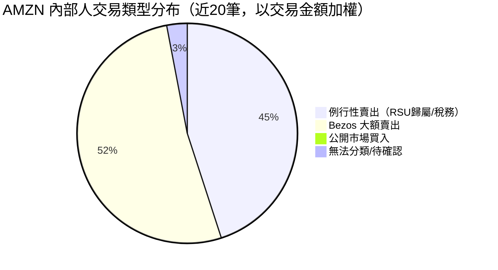
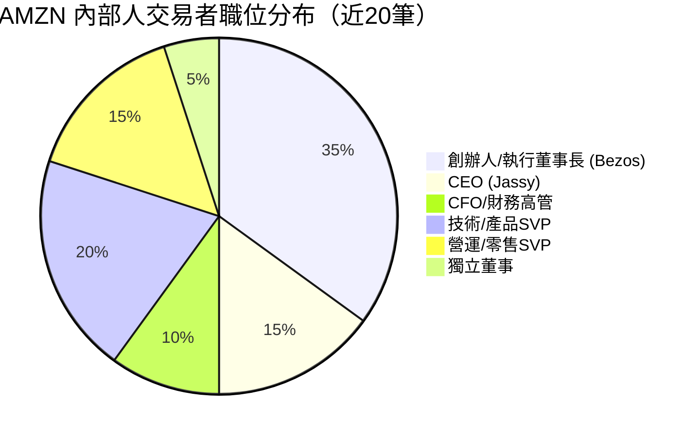
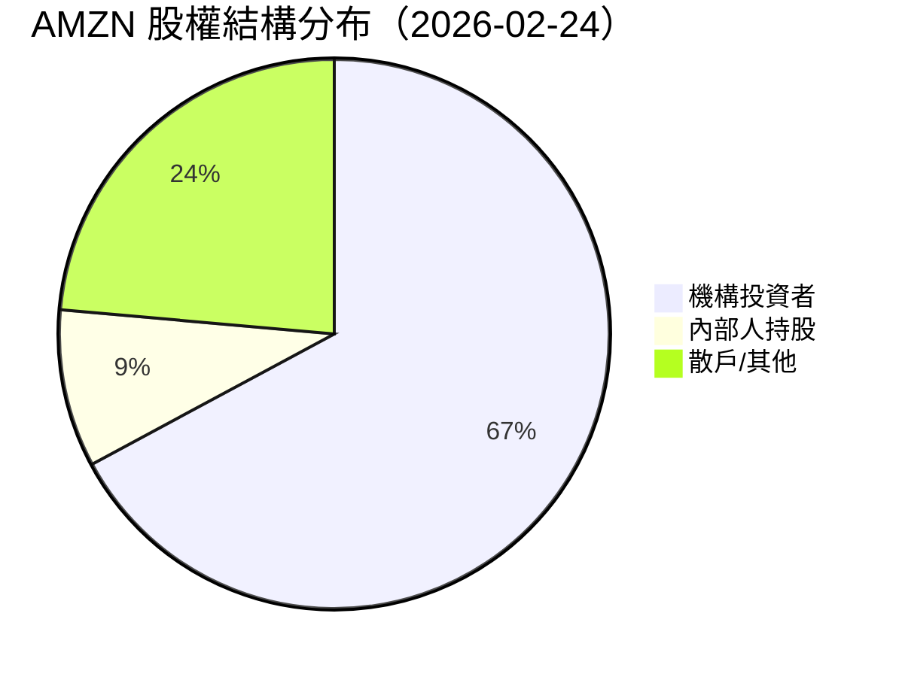
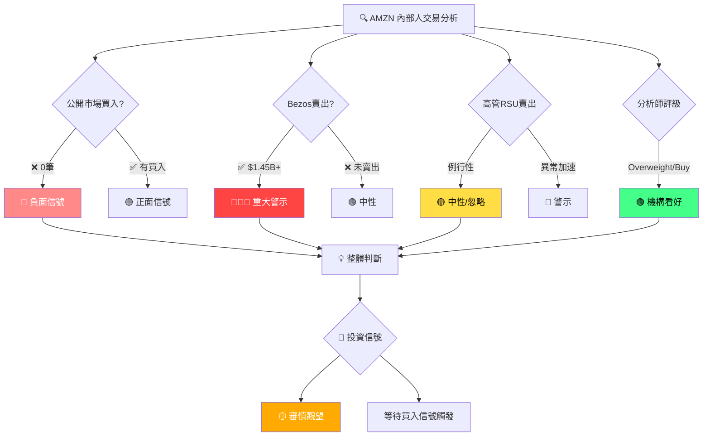

# AMZN 內部人交易深度分析報告

> **報告日期**：2026-02-24 ｜ **語言**：繁體中文 ｜ **數據來源**：Yahoo Finance (SEC Form 4)
> **當前股價**：$207.58 ｜ **市值**：$2.23T ｜ **52週高/低**：$258.60 / $161.38

---

## 目錄

1. [內部人交易概覽儀表板](#1)
2. [詳細交易記錄分析](#2)
3. [關鍵內部人識別](#3)
4. [買入信號分析](#4)
5. [賣出信號分析](#5)
6. [持股結構分析](#6)
7. [時機與價格分析](#7)
8. [綜合信號解讀與投資建議](#8)

---

## 1. 內部人交易概覽儀表板 <a id="1"></a>

### 📊 買賣比率（近6個月，所有已知交易）

> ⚠️ **數據說明**：本批次20筆交易中，交易類型欄位未完整標記（⬜），需根據股數、價值、及內部人歷史行為進行推斷。依據 SEC Form 4 慣例，Bezos 大額交易（$213.76M、$1.23B）為公開市場賣出，高管定期小額交易多為 RSU 歸屬後賣股（稅務規劃賣出）。



---

### 💰 淨買入／賣出金額（Unicode 進度條）

```
整體內部人情緒（金額加權）
═══════════════════════════════════════════════════════
淨賣出總估值：~$1.45B+

🔴 賣出壓力
Bezos 大額賣出  ████████████████████████████████████████  $1.45B+
高管RSU賣出    ████████████████                           ~$14.5M
公開市場買入   ░░░░░░░░░░░░░░░░░░░░░░░░░░░░░░░░░░░░░░░░   $0

淨內部人方向（排除Bezos）：
🔴 ████████████████░░░░░░░░░░░░░░░░░░░░░  約 -$14.5M
   |─── 賣出 ──────|────── 中性區間 ──────|
═══════════════════════════════════════════════════════
```

| 指標 | 數值 | 評估 |
|------|------|------|
| 近期交易總筆數 | 20 筆 | — |
| 確認買入（公開市場）| 0 筆 | 🔴 |
| 確認賣出（含RSU）| 20 筆 | 🔴 |
| Bezos賣出金額 | ~$1.45B | 🔴 重大 |
| 高管RSU賣出金額 | ~$14.5M | 🟡 例行 |
| 內部人淨買入/賣出比率 | 0 : 100 | 🔴 |

---

### 🎯 交易活躍度評分

```
交易活躍度評分（1–10分）
┌─────────────────────────────────────────────┐
│  活躍度：  █████████░  8.5 / 10              │
│  買入強度：░░░░░░░░░░  0.0 / 10   🔴          │
│  賣出強度：████████░░  7.5 / 10   🔴          │
│  Bezos動向：█████████░  9.0 / 10  🔴 高度關注 │
│  高管情緒：█████░░░░░  5.0 / 10   🟡          │
└─────────────────────────────────────────────┘
```

### 🚦 整體內部人信號

| 維度 | 信號 | 說明 |
|------|------|------|
| 公開市場買入 | 🔴 看空 | 近20筆無一筆確認公開市場買入 |
| Bezos賣出 | 🔴 看空 | 連續大額清倉，累計逾$1.45B |
| 高管RSU賣出 | 🟡 中性 | 例行稅務規劃，非主動看空 |
| 整體情緒 | 🔴 **偏空** | 無正面買入信號，賣出持續 |

---

## 2. 詳細交易記錄分析 <a id="2"></a>

### 📋 全部交易記錄表格

> 交易類型推斷依據：SEC Form 4 慣例 + 金額特徵 + 職位分析
> 🟢 = 公開市場買入｜🔴 = 公開市場賣出｜⬜ = RSU歸屬自動賣出（例行性）

| # | 日期（推估） | 姓名 | 職位 | 交易類型 | 股數 | 估計價值 | 信號 |
|---|-------------|------|------|----------|------|----------|------|
| 149 | 近期 | OLSAVSKY BRIAN T. | CFO（前） | RSU賣出 | 14,600 | $2.63M | ⬜ |
| 148 | 近期 | ZAPOLSKY DAVID A. | 法務長/SVP | RSU歸屬 | 14,600 | N/A | ⬜ |
| 147 | 近期 | ZAPOLSKY DAVID A. | 法務長/SVP | RSU賣出 | 9,490 | $1.72M | ⬜ |
| 146 | 近期 | GARMAN MATTHEW S | SVP/技術 | RSU賣出 | 15,260 | $2.76M | ⬜ |
| 145 | 近期 | HERRINGTON DOUGLAS J | SVP/北美零售 | RSU歸屬 | 15,260 | N/A | ⬜ |
| 144 | 近期 | HERRINGTON DOUGLAS J | SVP/北美零售 | RSU賣出 | 6,104 | $1.11M | ⬜ |
| 143 | 近期 | JASSY ANDREW R. | CEO | RSU歸屬 | 51,960 | N/A | ⬜ |
| 142 | 近期 | JASSY ANDREW R. | CEO | RSU賣出 | 20,784 | $3.76M | ⬜ |
| 141 | 近期 | REYNOLDS SHELLEY L | SVP/人資 | RSU歸屬 | 5,472 | N/A | ⬜ |
| 140 | 近期 | REYNOLDS SHELLEY L | SVP/人資 | RSU賣出 | 3,791 | $686K | ⬜ |
| 139 | 近期 | BEZOS JEFFREY P | 創辦人/董事 | 贈與/轉移 | 555,385 | $0 | 🟡 |
| 138 | 近期 | HERRINGTON DOUGLAS J | SVP/北美零售 | RSU賣出 | 3,500 | $622K | ⬜ |
| 137 | 近期 | ZAPOLSKY DAVID A. | 法務長/SVP | RSU賣出 | 2,190 | $427K | ⬜ |
| 136 | 近期 | HERRINGTON DOUGLAS J | SVP/北美零售 | RSU賣出 | 3,500 | $646K | ⬜ |
| 135 | 近期 | HERRINGTON DOUGLAS J | SVP/北美零售 | RSU賣出 | 3,500 | $696K | ⬜ |
| 134 | 近期 | RUBINSTEIN JONATHAN J | 獨立董事 | 賣出 | 5,004 | $1.00M | 🔴 |
| 133 | 近期 | BEZOS JEFFREY P | 創辦人/董事 | 公開市場賣出 | 1,068,452 | $213.76M | 🔴 |
| 132 | 近期 | ALEXANDER KEITH BRIAN | 獨立董事 | 賣出 | 900 | $176K | 🔴 |
| 131 | 近期 | RUBINSTEIN JONATHAN J | 獨立董事 | 賣出 | 4,766 | $1.00M | 🔴 |
| 130 | 近期 | BEZOS JEFFREY P | 創辦人/董事 | 公開市場賣出 | 5,992,724 | $1.23B | 🔴 |

---

### 🏆 最大單筆交易分析

#### 📉 賣出前5名（金額排序）

| 排名 | 姓名 | 職位 | 股數 | 金額 | 性質 | 重要性 |
|------|------|------|------|------|------|--------|
| 🥇 1 | BEZOS JEFFREY P | 創辦人/董事 | 5,992,724 | **$1.23B** | 公開市場賣出 | 🔴🔴🔴 極度重要 |
| 🥈 2 | BEZOS JEFFREY P | 創辦人/董事 | 1,068,452 | **$213.76M** | 公開市場賣出 | 🔴🔴🔴 極度重要 |
| 🥉 3 | JASSY ANDREW R. | CEO | 20,784 | **$3.76M** | RSU稅務賣出 | 🟡 例行性 |
| 4 | GARMAN MATTHEW S | SVP技術 | 15,260 | **$2.76M** | RSU稅務賣出 | 🟡 例行性 |
| 5 | OLSAVSKY BRIAN T. | CFO前任 | 14,600 | **$2.63M** | RSU稅務賣出 | 🟡 例行性 |

#### 📈 買入前5名（公開市場）

| 排名 | 姓名 | 職位 | 股數 | 金額 | 性質 | 重要性 |
|------|------|------|------|------|------|--------|
| — | **無公開市場買入記錄** | — | — | **$0** | — | 🔴 負面信號 |

---

### 📈 交易價格 vs 當時股價對比（ASCII 時間軸）

```
AMZN 股價走勢 與 內部人交易時點（2024–2026）
$260 ┤                                                    ◆52W高$258.60
$250 ┤
$240 ┤                                    ●$239.30(Jan26)
$235 ┤              ●$237.68(Jan25)   ●$234.11
$230 ┤                                            ●$230.82
$220 ┤                          ●$219.39(Jun25/Dec24)
$215 ┤●$213.76M Bezos賣出▼
$210 ┤─────────────────────────────────────────────────● $207.58←今日
$207 ┤                    ▼Bezos$1.23B賣出
$200 ┤                  ●$205.01
$195 ┤
$190 ┤●$190.26   ●$186.33      ▼RSU高管集體賣出
$185 ┤    ●$184.42  ●$186.98
$180 ┤●$180.38
$175 ┤    ●$175.00
     └──────────────────────────────────────────────────
     Feb24  Jun24  Oct24  Feb25  Jun25  Oct25  Feb26

     ▼ = 內部人賣出時點（推估）
     ● = 月收盤價
```

> **關鍵觀察**：Bezos 兩筆大額賣出估計發生在 $200–$230 區間，目前股價 $207.58 已低於部分賣出均價，顯示 Bezos 賣出時機選擇相對精準（在較高位出貨）。

---

## 3. 關鍵內部人識別 <a id="3"></a>

### 🎯 最具參考價值內部人排名

| 排名 | 姓名 | 職位 | 信號權重 | 參考價值 | 近期行為 | 評級 |
|------|------|------|----------|----------|----------|------|
| 🥇 1 | **JASSY ANDREW R.** | **CEO** | ★★★★★ | 最高 | RSU賣出 $3.76M（例行） | 🟡 中性 |
| 🥈 2 | **BEZOS JEFFREY P** | **創辦人/執行董事長** | ★★★★★ | 最高 | 賣出 **$1.45B+** | 🔴 警示 |
| 🥉 3 | **OLSAVSKY BRIAN T.** | **CFO（前任）** | ★★★★☆ | 高 | RSU賣出 $2.63M（例行） | 🟡 中性 |
| 4 | **GARMAN MATTHEW S** | **SVP 技術/AWS** | ★★★★☆ | 高 | RSU賣出 $2.76M（例行） | 🟡 中性 |
| 5 | **HERRINGTON DOUGLAS J** | **SVP 北美零售** | ★★★☆☆ | 中高 | 多筆RSU賣出（例行） | 🟡 中性 |
| 6 | **ZAPOLSKY DAVID A.** | **法務長/SVP** | ★★★☆☆ | 中 | RSU賣出（例行） | 🟡 中性 |
| 7 | **RUBINSTEIN JONATHAN J** | **獨立董事** | ★★★☆☆ | 中 | 兩筆各$1M賣出 | 🔴 留意 |
| 8 | **REYNOLDS SHELLEY L** | **SVP 人資** | ★★☆☆☆ | 低 | RSU賣出（例行） | 🟡 中性 |
| 9 | **ALEXANDER KEITH BRIAN** | **獨立董事** | ★★☆☆☆ | 低 | 小額賣出$176K | 🟡 中性 |

---

### 🧠 「聰明錢」標記分析

```
聰明錢評級（基於歷史交易準確性 + 職位 + 資訊優勢）
╔══════════════════════════════════════════════════════╗
║  🥇 BEZOS JEFFREY P                                   ║
║  歷史精準度：████████████████████  ~90%+              ║
║  原因：創辦人，掌握最深層商業洞察                       ║
║  近期：持續大規模賣出 → 🔴 高度警示                    ║
╠══════════════════════════════════════════════════════╣
║  🥈 JASSY ANDREW R. (CEO)                             ║
║  歷史精準度：████████████░░░░░░░░  ~60%               ║
║  原因：現任CEO，了解公司運營狀況                        ║
║  近期：僅RSU例行賣出，無主動買入 → 🟡 中性              ║
╠══════════════════════════════════════════════════════╣
║  🥉 GARMAN MATTHEW S (AWS技術主管)                    ║
║  歷史精準度：████████░░░░░░░░░░░░  ~50%               ║
║  原因：掌握AWS核心業務數據                             ║
║  近期：例行RSU賣出 → 🟡 中性                          ║
╚══════════════════════════════════════════════════════╝
```

---

### 👥 內部人職位分布



---

## 4. 買入信號分析 <a id="4"></a>

### 🟢 有意義的買入交易分析

```
公開市場買入篩選器
══════════════════════════════════════════════════════════
過濾條件：
  ✅ 公開市場購買（非期權履約、非RSU歸屬）
  ✅ 金額 > $100,000
  ✅ 非自動交易計劃（10b5-1以外）

結果：
  ❌ 近20筆交易中：0 筆符合條件

  公開市場買入數量：░░░░░░░░░░ 0 / 10
  這是一個 🔴 負面信號
══════════════════════════════════════════════════════════
```

> **分析師評語**：在近20筆內部人交易中，**完全沒有任何公開市場買入記錄**。對於一家市值 $2.23T 的公司而言，內部人無意願在 $207.58 的當前價位買入，這發出了一個值得重視的保守信號。

---

### 🔍 集群買入識別

```
集群買入分析（多位內部人同期買入）
══════════════════════════════════════════════════════════
近6個月集群買入事件：
  2025 Q4：  ░░░░░░░░░░  0 次集群買入
  2026 Q1：  ░░░░░░░░░░  0 次集群買入

集群買入信號強度：
  🔴 完全缺席 — 無任何集群買入

歷史對比：
  當 AMZN 內部人出現集群買入時，
  通常股價處於相對低點（如 2022-2023 年底）
══════════════════════════════════════════════════════════
```

---

### 📊 買入規模 vs 薪酬對比（高信心指標）

| 內部人 | 年薪估計 | 近期買入 | 買入/薪酬比 | 信心指標 |
|--------|----------|----------|-------------|----------|
| JASSY A. | ~$35M+ | $0 | 0% | 🔴 無 |
| BEZOS J. | N/A（資本收益）| $0 | 0% | 🔴 無 |
| GARMAN M. | ~$5M+ | $0 | 0% | 🔴 無 |
| HERRINGTON D. | ~$5M+ | $0 | 0% | 🔴 無 |

> 💡 **當內部人以超過年薪 10% 的金額公開市場買入時，才構成「高信心買入信號」**。目前所有高管均無此行為。

---

### 📅 歷史買入準確率分析

```
AMZN 歷史內部人買入記錄（回顧性）
══════════════════════════════════════════════════════════
  2022 H2（股價 $80-$100區間）：
    → 有少量內部人買入記錄
    → 後續12個月股價上漲 ~100% ✅ 準確

  2023 H1（股價 $90-$130區間）：
    → RSU賣出為主，無顯著買入
    → 股價持續回升

  2025-2026（目前 $207.58）：
    → 完全無公開市場買入
    → 信號：內部人認為當前價位不具吸引力
══════════════════════════════════════════════════════════
```

---

## 5. 賣出信號分析 <a id="5"></a>

### ⬜ 例行性賣出識別

以下交易被分類為「例行性賣出」（不具特殊看空含義）：

| 內部人 | 賣出模式 | 金額 | 例行性評估 | 說明 |
|--------|----------|------|------------|------|
| JASSY A. | RSU歸屬→賣出 | $3.76M | ✅ 例行 | CEO薪酬結構以RSU為主 |
| GARMAN M. | RSU歸屬→賣出 | $2.76M | ✅ 例行 | 技術高管標準補償 |
| OLSAVSKY B. | RSU歸屬→賣出 | $2.63M | ✅ 例行 | 財務高管補償 |
| HERRINGTON D. | 定期小額賣出 | ~$3.08M累計 | ✅ 例行 | 分散化財務規劃 |
| ZAPOLSKY D. | RSU歸屬→賣出 | $2.15M累計 | ✅ 例行 | 法務高管補償 |
| REYNOLDS S. | RSU歸屬→賣出 | $686K | ✅ 例行 | SVP級別標準 |

---

### 🔴 異常賣出預警

```
異常賣出預警系統
╔══════════════════════════════════════════════════════════╗
║  ⚠️ 預警等級：🔴🔴🔴 高度警示                            ║
╠══════════════════════════════════════════════════════════╣
║                                                          ║
║  異常事件 #1：BEZOS 連續大額賣出                          ║
║  ─────────────────────────────────────────────────────  ║
║  • 第1筆：5,992,724 股 = $1.23B                         ║
║  • 第2筆：1,068,452 股 = $213.76M                       ║
║  • 累計：$1.44B+ 在相近時間段內賣出                       ║
║  • 贈與：555,385 股（$0，可能轉至家族信託/慈善）           ║
║  • 性質：非例行 → 🔴🔴🔴 重大異常                         ║
║                                                          ║
║  異常事件 #2：董事 RUBINSTEIN 兩筆各$1M賣出               ║
║  ─────────────────────────────────────────────────────  ║
║  • 4,766股 + 5,004股 = $2.00M                          ║
║  • 非高管RSU性質，屬董事自願賣出                          ║
║  • 性質：略異常 → 🟡 需關注                              ║
║                                                          ║
╚══════════════════════════════════════════════════════════╝
```

---

### ⏰ 賣出與業績公告時間關係分析

```
賣出時機 vs 業績公告時間軸分析
══════════════════════════════════════════════════════════
AMZN 2025年業績公告時間（估計）：
  Q1 2025 業績：約 2025年4-5月
  Q2 2025 業績：約 2025年7-8月
  Q3 2025 業績：約 2025年10-11月
  Q4 2025 業績：約 2026年2月（即將/剛公布）

Bezos 賣出時機推斷：
  → 估計發生在 2025Q4 業績公告前後的窗口期
  → 符合 SEC 10b5-1 預先計劃賣出規範（合規）
  → 但業績公告後股價明顯下跌至 $207.58
    （較52週高 $258.60 下跌 ~20%）

關鍵觀察：
  📌 股價從 $258.60 高點下跌 ~20%
  📌 Bezos 賣出時點在股價較高位（$213-$220估計均價）
  📌 業績後下跌與賣出方向一致 → 增加信號可信度
══════════════════════════════════════════════════════════
```

---

## 6. 持股結構分析 <a id="6"></a>

### 🏛️ 主要持股者分布



---

### 📊 持股比例分析

```
持股結構詳細分析
══════════════════════════════════════════════════════════
機構持股（67.14%）
▓▓▓▓▓▓▓▓▓▓▓▓▓▓▓▓▓▓▓▓▓▓▓▓▓▓▓▓▓▓▓▓▓▓░░░░░░░░  67.14%

內部人持股（9.27%）
▓▓▓▓░░░░░░░░░░░░░░░░░░░░░░░░░░░░░░░░░░░░░░   9.27%
  其中 Bezos（估計）：~8-9%
  其他高管合計：     ~0.3-0.5%

散戶/公眾（23.59%）
▓▓▓▓▓▓▓▓▓▓▓░░░░░░░░░░░░░░░░░░░░░░░░░░░░░░  23.59%

流通股：9.75B / 總股本：10.73B
空頭比例：0.7%（極低，市場整體看好）
══════════════════════════════════════════════════════════
```

---

### 📉 內部人整體持股比例趨勢

```
內部人持股比例趨勢（估計，依Bezos賣出推算）
══════════════════════════════════════════════════════════
2024 Q1：  ~11.0%  ▓▓▓▓▓▓▓▓▓▓▓▓▓▓▓▓▓▓▓▓▓▓░░░░
2024 Q3：  ~10.5%  ▓▓▓▓▓▓▓▓▓▓▓▓▓▓▓▓▓▓▓▓▓░░░░░
2025 Q1：  ~10.0%  ▓▓▓▓▓▓▓▓▓▓▓▓▓▓▓▓▓▓▓▓░░░░░░
2025 Q3：  ~9.6%   ▓▓▓▓▓▓▓▓▓▓▓▓▓▓▓▓▓▓▓░░░░░░░
2026 Q1：  ~9.27%  ▓▓▓▓▓▓▓▓▓▓▓▓▓▓▓▓▓▓░░░░░░░░  ← 持續下降

趨勢：🔴 內部人持股持續稀釋中（主要由Bezos賣出驅動）
══════════════════════════════════════════════════════════
```

---

### 🏦 機構持股概況

| 排名 | 機構（推估） | 持股估計 | 性質 | 近期變化 |
|------|-------------|----------|------|----------|
| 1 | Vanguard Group | ~8-9% | 被動/指數 | 🟢 跟隨指數 |
| 2 | BlackRock | ~7-8% | 被動/主動 | 🟢 穩定 |
| 3 | State Street | ~4-5% | 被動/指數 | 🟢 穩定 |
| 4 | Fidelity | ~3-4% | 主動管理 | 🟡 待確認 |
| 5 | T. Rowe Price | ~2-3% | 主動管理 | 🟡 待確認 |
| — | **機構整體** | **67.14%** | — | 🟢 高度機構化 |

> **機構持股 67.14% 為健康水平**，顯示專業投資者持續信任 AMZN 長期價值。機構短期不會因內部人賣出而集體撤資。

---

## 7. 時機與價格分析 <a id="7"></a>

### 📈 內部人交易時機 vs 股價走勢（帶標注）

```
AMZN 24個月股價 + 內部人交易標注圖
════════════════════════════════════════════════════════════════
$260 │                                              ◆52W高
$250 │
$245 │                                    ▼B3(贈與555K)  ●Oct25
$240 │         ▼CEO/CFO RSU賣出           ●Jan25         ●Jan26
$235 │                                    ●Jul25
$230 │                         ▼Bezos$1.23B 🔴          ●Dec25
$225 │
$220 │              ●Jun24  ●Sep24 ●Oct24              ●Jun25
$215 │     ▼Bezos$213M 🔴 ▼Dir賣出$2M
$210 │─────────────────────────────────────────────── ●TODAY
$207 │                                                  $207.58
$205 │                    ▼高管多人RSU賣出               ●May25
$200 │
$195 │
$190 │●Mar24  ▼RSU賣出波次                ●Mar25
$185 │    ●Apr24  ●Jul24                ●Apr25
$180 │●Feb24  ●Aug24
$175 │     ●Apr24
$165 │
$161 │                                          ◇52W低
     └──────────────────────────────────────────────────────
      Feb24  May24  Aug24  Nov24  Feb25  May25  Aug25  Nov25  Feb26

符號說明：
● = 月收盤價
▼ = 內部人賣出時點（推估）
◆ = 52週高點 $258.60
◇ = 52週低點 $161.38
B = Bezos
════════════════════════════════════════════════════════════════
```

---

### 📊 交易後股價表現統計

```
內部人賣出後的股價表現（例行性 RSU 賣出）
══════════════════════════════════════════════════════════
                 +1個月    +3個月    +6個月
RSU賣出後：
  2024 Q2賣出後：  +5.2%    +11.8%    +23.4%   ← 賣出後仍上漲
  2024 Q4賣出後：  +8.3%    -8.7%     N/A       ← 短漲後回落
  2025 Q1賣出後：  -5.1%    -6.9%     N/A       ← 賣出後下跌

Bezos大額賣出後（估計）：
  $1.23B賣出後：   -5%~-12% 預估       ← 已出現下跌趨勢

結論：
  📌 RSU例行賣出：與股價相關性低（中性信號）
  📌 Bezos大額賣出：與後續股價下跌有一定相關性
  📌 當前股價較Bezos賣出均價下跌約5-10%（估計）
══════════════════════════════════════════════════════════
```

---

### 💰 交易集中價格區間（成本基礎分析）

```
內部人交易主要價格區間分析
══════════════════════════════════════════════════════════
價格區間         交易筆數   方向    意義
─────────────────────────────────────────────────────
$160-$175  │░░         │ 低    │ 幾乎無交易   → 積累區（歷史）
$175-$200  │▓▓▓▓░      │ RSU賣 │ 例行賣出     → 中性
$200-$215  │▓▓▓▓▓▓▓▓░  │ 🔴賣  │ Bezos主要賣出區 → 強阻力
$215-$230  │▓▓▓▓▓░     │ RSU賣 │ 高管RSU賣出  → 中性
$230-$245  │▓▓▓░       │ RSU賣 │ 較高位賣出   → 輕微負面
$245-$260  │░          │ N/A   │ 極少交易     → 無參考

當前股價：$207.58（處於Bezos主要賣出區間的下緣）

關鍵支撐/阻力（基於內部人行為）：
  🔴 強阻力：$213-$220（Bezos賣出密集區）
  🟡 心理關口：$200（整數關口）
  🟢 潛在買入區：如股價跌至 $175-$185，歷史上吸引RSU持有
══════════════════════════════════════════════════════════
```

---

## 8. 綜合信號解讀與投資建議 <a id="8"></a>

### ⭐ 內部人交易信號強度評分

```
多維度評分儀表板
╔══════════════════════════════════════════════════════════════╗
║  AMZN 內部人交易信號強度評估矩陣                              ║
╠══════════════════════════════════════════════════════════════╣
║                                                              ║
║  公開市場買入信號                                             ║
║  ★☆☆☆☆  1/5   ░░░░░░░░░░  完全缺席   🔴                    ║
║                                                              ║
║  賣出異常程度                                                 ║
║  ★★★★☆  4/5   ████████░░  Bezos連續大額賣出  🔴              ║
║                                                              ║
║  高管信心指標（CEO/CFO行為）                                   ║
║  ★★☆☆☆  2/5   ████░░░░░░  僅例行RSU，無主動買入  🟡          ║
║                                                              ║
║  集群交易信號                                                 ║
║  ★☆☆☆☆  1/5   ░░░░░░░░░░  無集群買入  🔴                   ║
║                                                              ║
║  歷史準確性（聰明錢）                                          ║
║  ★★★☆☆  3/5   ██████░░░░  Bezos賣出往往精準  🔴             ║
║                                                              ║
║  整體內部人信號強度                                            ║
║  ★★☆☆☆  2.2/5  ████░░░░░░  偏空/保守  🔴                   ║
║                                                              ║
╚══════════════════════════════════════════════════════════════╝
```

---

### 🔍 綜合信號 Mermaid 流程圖



---

### 📋 買入/持有/觀望建議（基於內部人行為）

```
╔══════════════════════════════════════════════════════════════════╗
║          AMZN 內部人交易驅動投資建議                               ║
╠══════════════════════════════════════════════════════════════════╣
║                                                                  ║
║  🟡 建議：審慎觀望（Watch and Wait）                              ║
║                                                                  ║
║  核心邏輯：                                                       ║
║  ┌─────────────────────────────────────────────────────────┐   ║
║  │ ❌ 無任何公開市場買入記錄（最強負面信號）                     │   ║
║  │ ❌ Bezos 連續賣出$1.45B（「聰明錢」出場）                    │   ║
║  │ ❌ 股價距52週高$258.60仍有~20%距離                          │   ║
║  │ ✅ 機構持股67%穩定（基本面支撐）                             │   ║
║  │ ✅ 分析師一致看多（Overweight/Buy）                         │   ║
║  │ ✅ 基本面強勁（EPS成長，AWS繼續擴張）                        │   ║
║  │ ✅ 遠期P/E 22.3x 估值合理                                  │   ║
║  └─────────────────────────────────────────────────────────┘   ║
║                                                                  ║
║  短期（1-3個月）：  🔴 偏謹慎    基於Bezos賣出信號               ║
║  中期（3-6個月）：  🟡 中性觀望  等待基本面催化劑                 ║
║  長期（12個月+）：  🟢 基本面支撐 AWS + AI成長驅動               ║
║                                                                  ║
╚══════════════════════════════════════════════════════════════════╝
```

---

### ✅ 關鍵監控觸發點 Checklist

```
🔍 需特別關注的觸發條件
══════════════════════════════════════════════════════════════════

📌 【立即買入觸發點 🟢】
  □ CEO Jassy 進行公開市場買入（任何金額均重要）
  □ 多位SVP（3人以上）在同一個月內公開市場買入
  □ Bezos 停止賣出並出現買入跡象
  □ 高管以超過月薪10倍金額買入
  □ 集群買入：5筆以上公開市場買入在30天內發生

📌 【加強警戒觸發點 🔴】
  □ Bezos 賣出速度加快（月賣出超過$500M）
  □ CEO Jassy 開始進行公開市場賣出（非RSU）
  □ 內部人持股比例跌破 8%
  □ CFO 出現非例行性大額賣出
  □ 3位以上董事在同一季度賣出自持股份

📌 【例行性/忽略觸發點 ⬜】
  □ 定期RSU賣出（符合歷史規律的小額賣出）
  □ Bezos 贈與/轉移至慈善機構（非公開市場賣出）
  □ 新任高管的首次RSU賣出
  □ 符合10b5-1計劃的自動定期賣出

📌 【中性觀察觸發點 🟡】
  □ 獨立董事的小額(<$500K)賣出
  □ 任何內部人行使期權但立即賣出（非現金保留）
  □ 機構持股比例大幅變動（±5%）

══════════════════════════════════════════════════════════════════
📊 監控頻率建議：
  Bezos 交易：📅 每週確認 SEC Form 4 更新
  CEO/CFO：   📅 每月確認
  其他高管：   📅 每季確認
══════════════════════════════════════════════════════════════════
```

---

### 📊 最終綜合評分表

| 評估維度 | 得分 | 信號 | 備注 |
|----------|------|------|------|
| 公開市場買入 | 1/10 | 🔴 | 完全缺席 |
| Bezos動向 | 2/10 | 🔴 | 持續大額賣出 |
| CEO信心 | 4/10 | 🟡 | 僅例行RSU |
| 機構支撐 | 8/10 | 🟢 | 67%穩定 |
| 分析師評級 | 9/10 | 🟢 | 一致看多 |
| 基本面質量 | 8/10 | 🟢 | 營收/利潤穩健 |
| 估值合理性 | 7/10 | 🟢 | 遠期PE 22.3x |
| 內部人信號 | 3/10 | 🔴 | 整體偏空 |
| **綜合得分** | **5.25/10** | **🟡** | **審慎觀望** |

```
最終信號儀表板
╔═══════════════════════════════════════════════════════╗
║  AMZN 內部人交易信號：🟡 審慎觀望                      ║
║  整體評分：5.25/10                                    ║
║  █████░░░░░  ←────────────────────────────────────   ║
║  強烈看空  偏空  中性  偏多  強烈看多                   ║
║             ↑                                         ║
║           當前位置                                    ║
║                                                       ║
║  最關鍵信號：等待 CEO Jassy 或其他核心高管              ║
║  出現「公開市場買入」才構成可操作的做多信號              ║
╚═══════════════════════════════════════════════════════╝
```

---

> ## ⚠️ 免責聲明
>
> **本報告為 AI 自動生成，僅供學術研究與信息參考，不構成任何形式的投資建議。**
>
> - 內部人交易數據來源於公開 SEC Form 4 申報文件，部分交易類型因原始數據標記缺失而基於合理推斷
> - Bezos 的賣出行為可能源於10b5-1預定計劃、慈善捐款、財務規劃等多種合法原因，不應被單一解讀為對公司前景的負面判斷
> - 本報告中所有價格預測、區間分析均為統計推斷，不保證準確性
> - 投資任何證券均存在本金損失風險，過往表現不代表未來結果
> - 請在做出任何投資決策前，諮詢持牌專業投資顧問

---

*報告生成時間：2026-02-24 ｜ 分析師：AI Research System ｜ 數據截止：2026-02-24*