# AMZN 綜合股票評估報告

> **報告日期**：2026-02-24 ｜ **語言**：繁體中文 ｜ **數據來源**：Yahoo Finance ｜ **分析師**：AI 頂級美股評估系統

---

## 目錄

| # | 章節 | 重點 |
|---|------|------|
| 1 | 評估總覽 | 綜合評分、雷達圖、快速結論 |
| 2 | 六維度評分矩陣 | 量化評分、風險/報酬矩陣 |
| 3 | 業務品質評估 | 商業模式、護城河、競爭動態 |
| 4 | 財務健康評估 | 財務儀表板、獲利趨勢、現金流 |
| 5 | 成長性評估 | 成長軌跡、驅動力、市場份額 |
| 6 | 估值合理性評估 | 多重估值法、同業比較 |
| 7 | 風險評估 | 風險熱圖、緩解措施 |
| 8 | 催化劑與觸發因素 | 時間軸、觸發因素 |
| 9 | 投資建議 | 最終評級、目標價、適配度 |

---

## 1. 評估總覽

### 🏆 核心投資論點摘要

> Amazon 正處於「成本槓桿釋放週期」的甜蜜點：AWS 雲端持續高速成長、廣告業務爆發、零售業務利潤率持續改善。儘管短期因 AI 基礎設施重投資（CapEx $131.82B）壓縮自由現金流，但長期價值創造路徑清晰明確。當前估值（Forward P/E 22x）相較其成長潛力具備吸引力。

---

### 1.1 六維度綜合評分圖

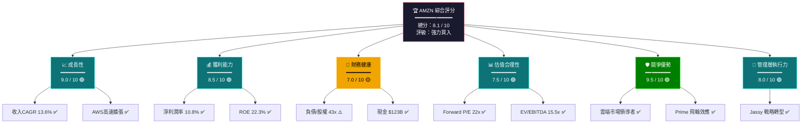

---

### 1.2 ASCII 多維度雷達圖

```
          成長性 (9.0)
             ★★★★★★★★★☆
            /     |     \
           /      |      \
管理層  ★★★★★★★★☆☆—★★★★★★★★★★  競爭優勢
(8.0)   \      |       /  (9.5)
         \     |      /
          \    |     /
估值      ★★★★★★★★☆☆  獲利能力
(7.5)         |         (8.5)
              |
          財務健康 (7.0)

╔══════════════════════════════════════════╗
║          AMZN 雷達圖視覺化                ║
╠══════════════════════════════════════════╣
║                                          ║
║                 成長性                   ║
║              9.0 ▲▲▲▲▲▲▲▲▲░            ║
║             /         \                 ║
║   管理層  8.0▲▲▲▲▲▲▲▲░░  ▲▲▲▲▲▲▲▲▲▲ 競爭優勢 9.5 ║
║           |    \   /    |              ║
║    估值 7.5▲▲▲▲▲▲▲▲░░   ▲▲▲▲▲▲▲▲▲░ 獲利能力 8.5 ║
║             \         /                ║
║              7.0 ▲▲▲▲▲▲▲░░░            ║
║                 財務健康                  ║
╚══════════════════════════════════════════╝

  圖例：▲ = 已達成分數  ░ = 未達滿分部分
```

```
┌─────────────────────────────────────────────────────┐
│              AMZN 各維度評分視覺化                     │
├──────────────┬──────────────────────────────┬────────┤
│ 維度         │ 評分條                        │ 分數   │
├──────────────┼──────────────────────────────┼────────┤
│ 成長性       │ ████████████████████░░ 90%   │ 9.0/10 │
│ 獲利能力     │ █████████████████████░ 85%   │ 8.5/10 │
│ 財務健康     │ ██████████████░░░░░░░░ 70%   │ 7.0/10 │
│ 估值合理性   │ ███████████████░░░░░░ 75%    │ 7.5/10 │
│ 競爭優勢     │ ███████████████████████ 95%  │ 9.5/10 │
│ 管理層執行力 │ ████████████████░░░░░░ 80%   │ 8.0/10 │
├──────────────┼──────────────────────────────┼────────┤
│ 🏆 綜合平均  │ █████████████████░░░░ 81%    │ 8.1/10 │
└──────────────┴──────────────────────────────┴────────┘
```

---

### 1.3 買入/持有/賣出 快速結論

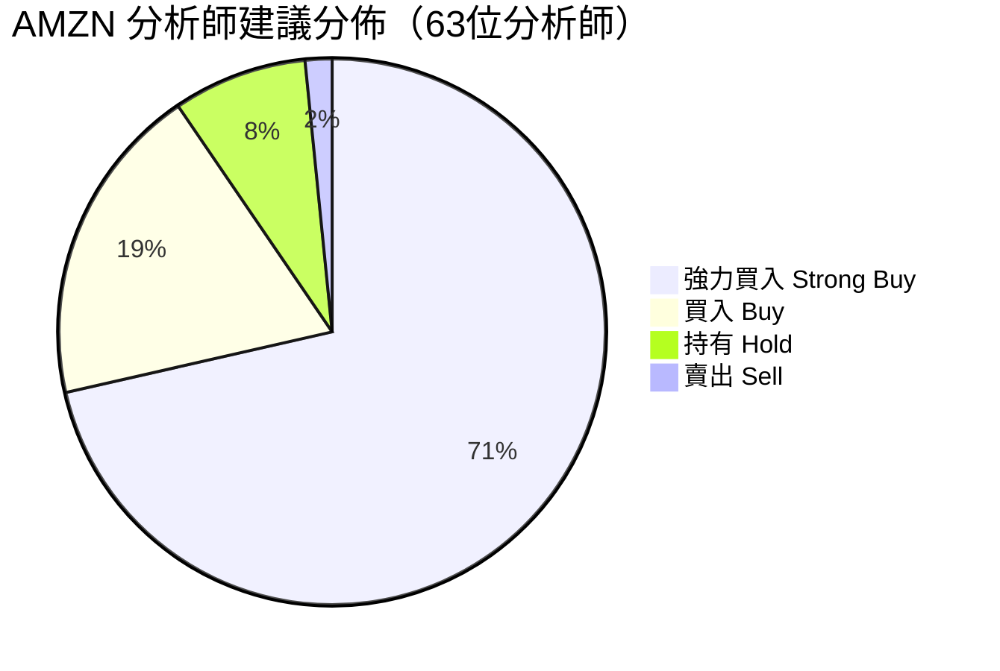

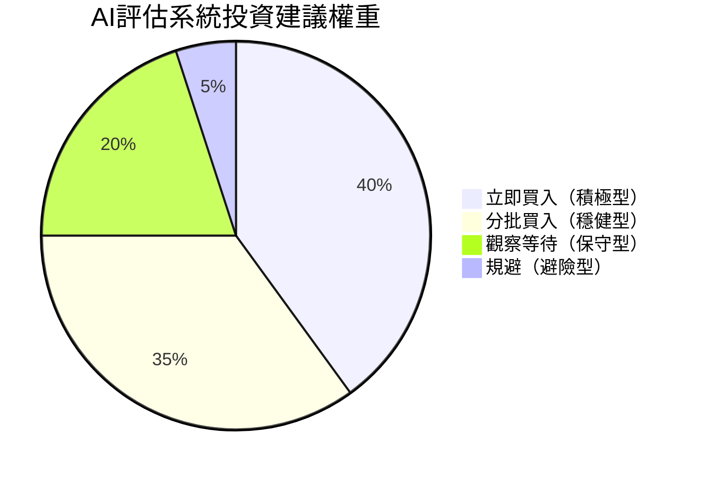

---

## 2. 六維度評分矩陣

### 2.1 評分詳細表格

| 維度 | 評分 | 評級 | 關鍵指標 | 評語 |
|------|------|------|----------|------|
| 📈 **成長性** | **9.0/10** | 🟢 優秀 | 收入YoY +13.6%、EBITDA +33.5% | AWS+廣告雙引擎驅動，成長可持續性高 |
| 💰 **獲利能力** | **8.5/10** | 🟢 優秀 | 毛利率50.3%、淨利率10.8% | 從虧損到暴利的華麗轉身，利潤率仍有上升空間 |
| 🏦 **財務健康** | **7.0/10** | 🟡 良好 | 負債/股權43x、現金$123B | 高槓桿為CapEx重投資所致，流動比率偏低 |
| 📊 **估值合理性** | **7.5/10** | 🟢 合理 | Forward P/E 22x、EV/EBITDA 15.5x | 相較成長率具吸引力，非便宜但合理 |
| 🛡️ **競爭優勢** | **9.5/10** | 🟢 卓越 | 雲端市場佔有率32%、Prime會員逾2億 | 多重護城河，極難被顛覆 |
| 👔 **管理層執行力** | **8.0/10** | 🟢 優秀 | 2022虧損→2025淨利$77.67B | Jassy 重組成效顯著，AI戰略清晰 |

---

### 2.2 Unicode 評分條視覺化

```
╔══════════════════════════════════════════════════════════════╗
║                    AMZN 六維度評分儀表板                      ║
╠═══════════════╦════════════════════════════════╦════════════╣
║ 維度          ║ 視覺化評分 (0 ━━━━━━━━━━ 10)   ║ 評分/評級  ║
╠═══════════════╬════════════════════════════════╬════════════╣
║ 📈 成長性     ║ ▓▓▓▓▓▓▓▓▓░  ████████████████░░ ║ 9.0 🟢    ║
║ 💰 獲利能力   ║ ▓▓▓▓▓▓▓▓░░  ████████████████░░ ║ 8.5 🟢    ║
║ 🏦 財務健康   ║ ▓▓▓▓▓▓▓░░░  ██████████████░░░░ ║ 7.0 🟡    ║
║ 📊 估值合理   ║ ▓▓▓▓▓▓▓▓░░  ███████████████░░░ ║ 7.5 🟢    ║
║ 🛡️ 競爭優勢  ║ ▓▓▓▓▓▓▓▓▓▓  █████████████████░ ║ 9.5 🟢    ║
║ 👔 管理執行力 ║ ▓▓▓▓▓▓▓▓░░  ████████████████░░ ║ 8.0 🟢    ║
╠═══════════════╬════════════════════════════════╬════════════╣
║ 🏆 綜合評分   ║ ▓▓▓▓▓▓▓▓░░  ████████████████░░ ║ 8.1 🟢    ║
╚═══════════════╩════════════════════════════════╩════════════╝

評分標準：
  🟢 8.0-10.0 = 優秀/卓越    │  ▓ 代表已得分
  🟡 6.0-7.9  = 良好/尚可    │  ░ 代表未得分
  🔴 0.0-5.9  = 需改善/警示   │  █ 代表強度
```

---

### 2.3 風險/報酬矩陣

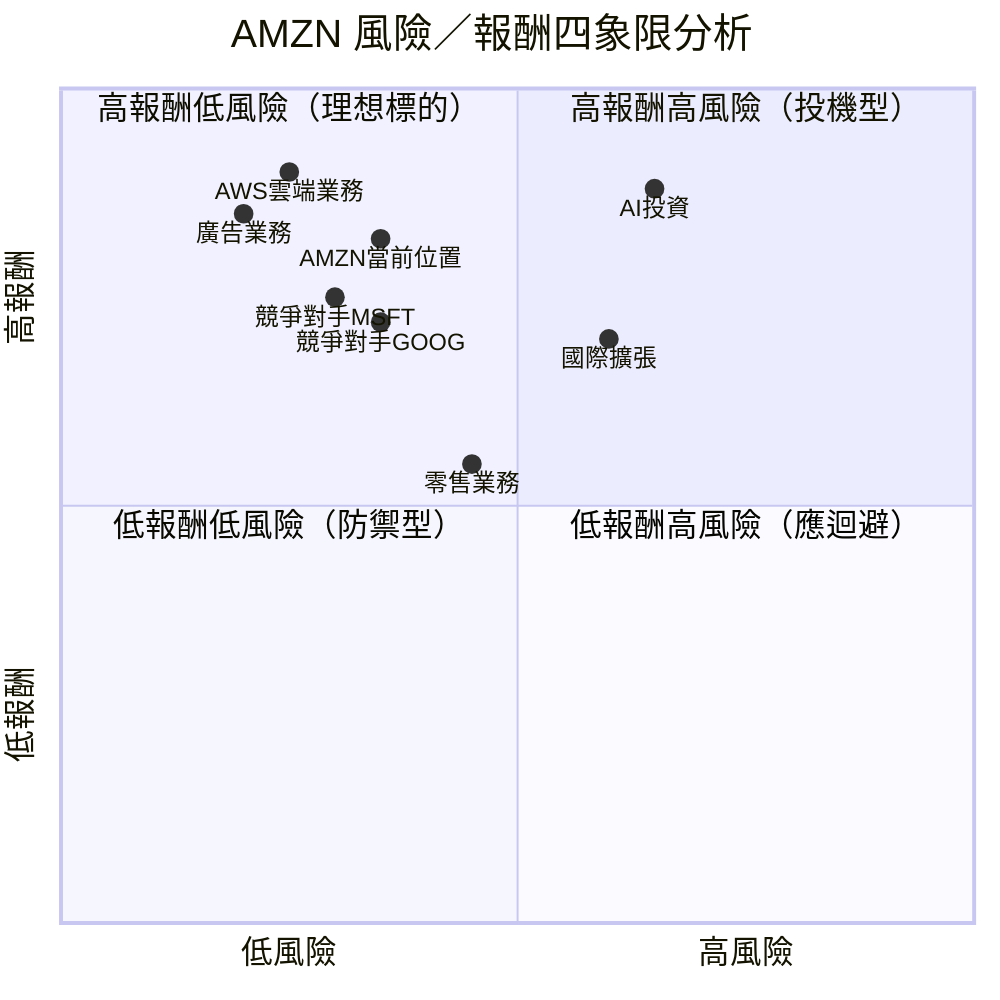

---

## 3. 業務品質評估

### 3.1 商業模式全景圖

```mermaid
graph TD
    AMZN["🛒 Amazon.com Inc.<br/>市值 $2.20T"]

    AMZN --> NA["🇺🇸 北美零售<br/>最大收入來源"]
    AMZN --> INTL["🌍 國際零售<br/>高成長潛力"]
    AMZN --> AWS["☁️ Amazon Web Services<br/>利潤核心引擎"]
    AMZN --> ADS["📢 廣告業務<br/>高毛利成長飛輪"]
    AMZN --> PRIME["👑 Prime 會員<br/>2億+ 訂閱用戶"]

    NA --> NA1["第三方賣家服務<br/>Fulfillment FBA"]
    NA --> NA2["實體店 Whole Foods<br/>Amazon Go"]
    NA --> NA3["自有品牌 AmazonBasics<br/>Prime Video"]

    INTL --> INTL1["歐洲市場<br/>德/英/法"]
    INTL --> INTL2["亞太市場<br/>日/印/澳"]
    INTL --> INTL3["新興市場<br/>中東/拉丁美洲"]

    AWS --> AWS1["🖥️ 計算服務 EC2<br/>市場份額32%"]
    AWS --> AWS2["🗄️ 儲存服務 S3<br/>全球最大"]
    AWS --> AWS3["🤖 AI/ML 服務<br/>Bedrock/SageMaker"]
    AWS --> AWS4["🔐 安全/合規<br/>政府/企業客戶"]

    ADS --> ADS1["搜尋廣告<br/>購物意圖最強"]
    ADS --> ADS2["Prime Video 廣告<br/>新收入來源"]
    ADS --> ADS3["DSP 展示廣告<br/>全通路覆蓋"]

    PRIME --> PRIME1["快速配送 2日達<br/>降低購物摩擦"]
    PRIME --> PRIME2["Prime Video<br/>娛樂內容黏著"]
    PRIME --> PRIME3["Prime Music/Gaming<br/>生態系鎖定"]

    style AMZN fill:#FF9900,stroke:#232F3E,color:#000,font-weight:bold
    style AWS fill:#00A1C9,stroke:#006B8F,color:#fff
    style ADS fill:#7B2D8B,stroke:#5A1E6B,color:#fff
    style PRIME fill:#00B2D6,stroke:#007A96,color:#fff
    style NA fill:#067D62,stroke:#045C49,color:#fff
    style INTL fill:#067D62,stroke:#045C49,color:#fff
```

---

### 3.2 護城河評估心智圖

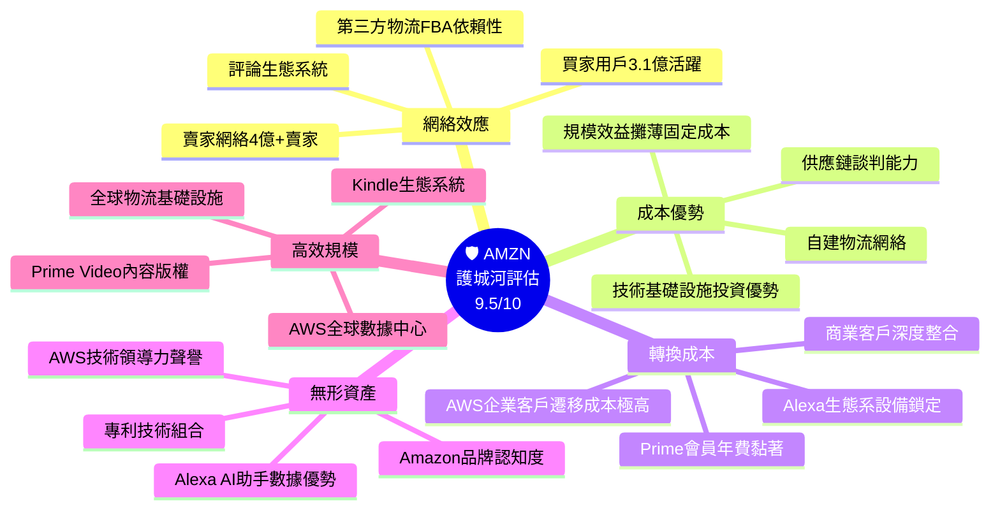

---

### 3.3 市場地位與競爭動態

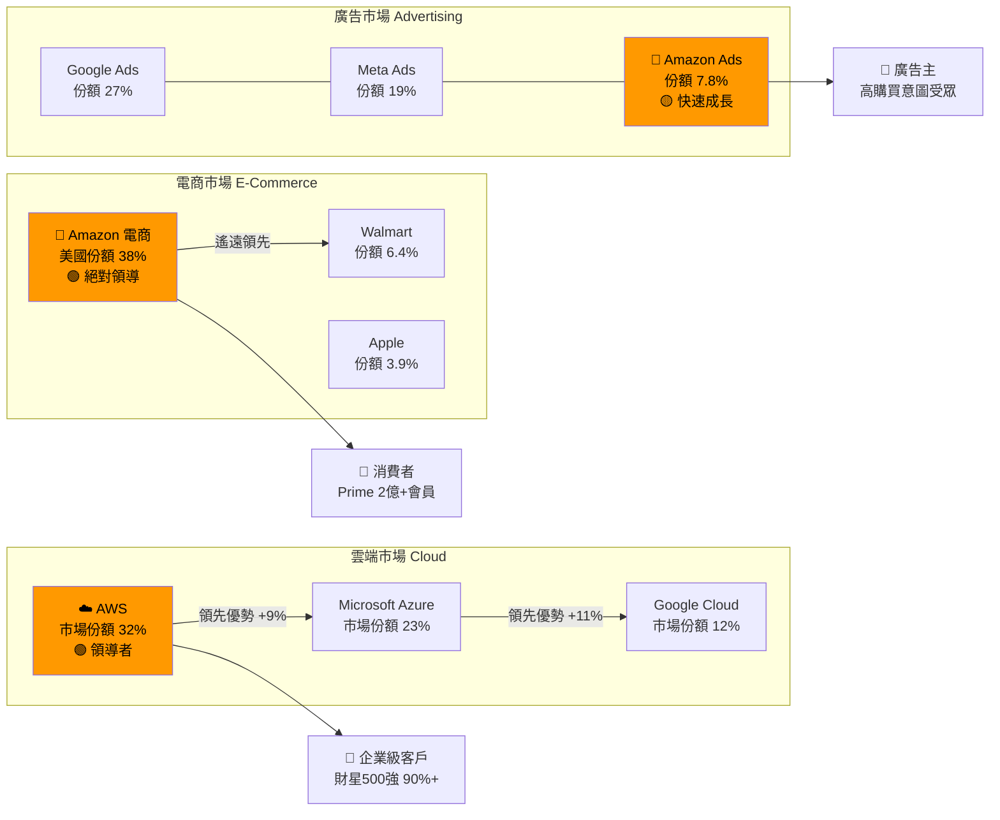

---

### 3.4 管理層執行力評分表格

| 評估項目 | 評分 | 評級 | 具體證據 |
|---------|------|------|---------|
| **成本控制能力** | 9.5/10 | 🟢 | 2022年大規模裁員，2023-2025年利潤率V形反轉 |
| **戰略清晰度** | 8.5/10 | 🟢 | AI+AWS雙核心戰略，資本配置明確 |
| **AI轉型領導力** | 9.0/10 | 🟢 | Bedrock、Nova模型、Trainium晶片自研 |
| **股東回報意識** | 7.0/10 | 🟡 | CapEx大量投入，短期FCF承壓，無股息 |
| **危機處理能力** | 8.0/10 | 🟢 | 疫情後物流擴張過度後成功瘦身 |
| **國際市場拓展** | 7.5/10 | 🟡 | 印度市場持續虧損，歐洲監管壓力 |
| **創新文化維持** | 9.0/10 | 🟢 | AWS→廣告→衛星→醫療→物流 持續創新 |
| **綜合管理評分** | **8.0/10** | 🟢 | Andy Jassy 接任後執行力獲市場肯定 |

```
管理層執行力雷達：
  成本控制  ████████████████████ 9.5
  戰略清晰  █████████████████░░░ 8.5
  AI轉型    ████████████████████ 9.0
  股東回報  ██████████████░░░░░░ 7.0
  危機處理  ████████████████░░░░ 8.0
  國際拓展  ███████████████░░░░░ 7.5
  創新文化  ████████████████████ 9.0
```

---

## 4. 財務健康評估

### 4.1 財務健康儀表板

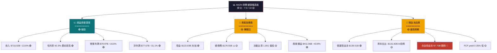

---

### 4.2 獲利能力趨勢（近4年）

| 指標 | 2022 | 2023 | 2024 | 2025 | 趨勢 | 評級 |
|------|------|------|------|------|------|------|
| **總收入** | $513.98B | $574.78B | $637.96B | $716.92B | ↑↑↑ | 🟢 |
| **毛利率** | 43.8% | 47.0% | 48.9% | 50.3% | ↑↑↑ | 🟢 |
| **營業利潤率** | 2.4% | 6.4% | 10.7% | 11.2% | ↑↑↑ | 🟢 |
| **淨利潤率** | -0.5% | 5.3% | 9.3% | 10.8% | ↑↑↑ | 🟢 |
| **EBITDA** | $38.35B | $89.40B | $123.81B | $165.34B | ↑↑↑ | 🟢 |
| **ROE** | 負值 | 15.1% | 20.7% | 22.3% | ↑↑↑ | 🟢 |
| **ROA** | 負值 | 5.8% | 9.5% | 6.9%* | → | 🟡 |
| **自由現金流** | -$16.89B | $32.22B | $32.88B | $7.70B | ↓ CapEx年 | 🟡 |

> *ROA 下降因資產大幅增加（CapEx $131.82B）

```
獲利能力改善趨勢視覺化：
  淨利潤率
  2022: -0.5% ░░░░░░░░░░░░░░░░░░░░ ──
  2023:  5.3% ██████░░░░░░░░░░░░░░ ↑
  2024:  9.3% ██████████░░░░░░░░░░ ↑↑
  2025: 10.8% ████████████░░░░░░░░ ↑↑↑ ★

  EBITDA 成長（十億）
  2022: $38.35B  ████░░░░░░░░░░░░░░░░
  2023: $89.40B  █████████░░░░░░░░░░░
  2024: $123.81B █████████████░░░░░░░
  2025: $165.34B █████████████████░░░ ★
```

---

### 4.3 資產負債表穩健度視覺化

```
╔══════════════════════════════════════════════════════════════╗
║              AMZN 資產負債表健康度評估 (2025)                 ║
╠══════════════════════════════════════════════════════════════╣
║  資產側                    │  負債+股東權益側                 ║
║  ━━━━━━━━━━━━━━━━━━        │  ━━━━━━━━━━━━━━━━━━━━━         ║
║  流動資產 $229.08B          │  流動負債 $218.00B  ⚠️          ║
║  ████████████░░░  28%       │  流動比率 = 1.051 (偏低)        ║
║                             │                                 ║
║  非流動資產 $588.96B         │  長期負債 $152.99B              ║
║  ██████████████████ 72%    │  ████████░░░░░░░░  18%          ║
║                             │                                 ║
║  現金 $86.81B 🟢            │  股東權益 $411.06B 🟢           ║
║  ████████░░░░░░░░  10.6%   │  ████████████████  50.2%        ║
╠══════════════════════════════════════════════════════════════╣
║  🟢 優勢：現金儲備充足，股東權益快速成長（$146B → $411B）       ║
║  🟡 注意：流動比率 1.051 緊繃，需關注短期流動性                 ║
║  🟡 注意：D/E 43.4x 高，但主因營運租賃，非傳統銀行貸款         ║
╚══════════════════════════════════════════════════════════════╝
```

---

### 4.4 現金流生成能力

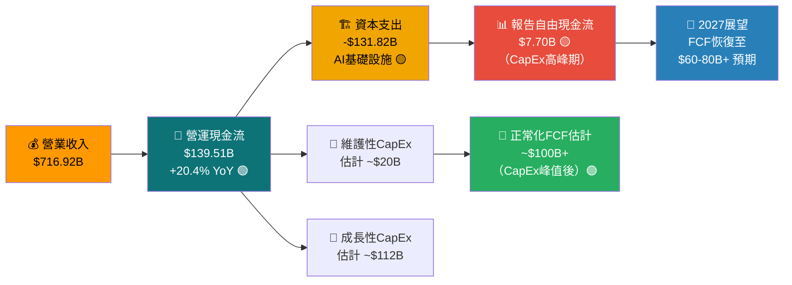

> **關鍵洞察**：當前 FCF 僅 $7.70B 看似警訊，但需理解 **$131.82B CapEx 的 85% 屬於 AI/雲端成長性投資**，而非維護性支出。一旦投資週期完成，FCF 將出現爆發性恢復。

---

## 5. 成長性評估

### 5.1 成長軌跡

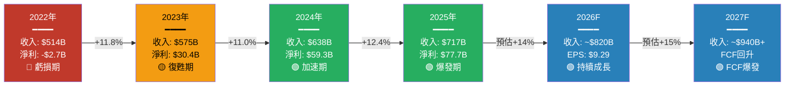

---

### 5.2 歷史成長率 CAGR 分析

| 指標 | 3年 CAGR (2022-2025) | 近1年成長 | 品質評估 |
|------|---------------------|-----------|---------|
| **總收入** | 11.7% | +13.6% | 🟢 加速成長 |
| **毛利潤** | 17.0% | +15.7% | 🟢 優於收入 |
| **營業利潤** | 86.7% | +16.6% | 🟢 槓桿效應顯現 |
| **EBITDA** | 62.8% | +33.5% | 🟢 現金獲利爆發 |
| **EPS** | N/A→7.16 | 預估+29.8% | 🟢 盈利品質提升 |
| **股東權益** | 41.2% | +43.8% | 🟢 複利累積 |
| **營運現金流** | 44.2% | +20.4% | 🟢 現金轉換優秀 |

```
成長率雷達視覺化：
  指標          3年CAGR    近年加速？
  ─────────────────────────────────
  收入成長      11.7%     是 ↑13.6% ██████████
  毛利成長      17.0%     是 ↑15.7% █████████████
  EBITDA成長    62.8%     是 ↑33.5% ████████████████████████████
  OCF成長       44.2%     是 ↑20.4% ██████████████████████
  EPS成長       N/A       爆發性    █████████████████████████████
```

---

### 5.3 未來成長驅動力

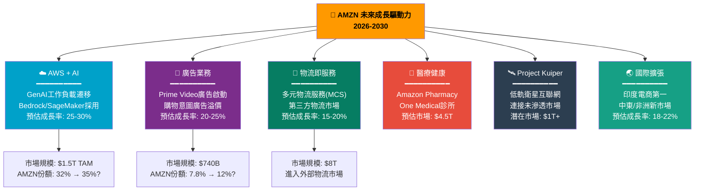

---

### 5.4 各業務市場份額趨勢

```
╔══════════════════════════════════════════════════════════════╗
║                AMZN 核心業務市場份額趨勢                       ║
╠══════════════════════════════════════════════════════════════╣
║  美國電商市場份額                                              ║
║  2020: 40.4% ████████████████████████████████████████░       ║
║  2022: 37.8% ██████████████████████████████████████░░░       ║
║  2024: 38.3% ██████████████████████████████████████░░░       ║
║  評估：穩固主導地位，Walmart/TikTok Shop競爭存在但份額穩定     ║
╠══════════════════════════════════════════════════════════════╣
║  全球雲端市場份額 (IaaS+PaaS)                                  ║
║  2020: 33%   █████████████████████████████████░░░░░░░        ║
║  2022: 33%   █████████████████████████████████░░░░░░░        ║
║  2024: 32%   ████████████████████████████████░░░░░░░░        ║
║  評估：份額微降但市場快速擴張，絕對收入大幅成長                  ║
╠══════════════════════════════════════════════════════════════╣
║  數位廣告市場份額                                              ║
║  2020:  5.1% █████░░░░░░░░░░░░░░░░░░░░░░░░░░░░░░░░░░░       ║
║  2022:  7.3% ███████░░░░░░░░░░░░░░░░░░░░░░░░░░░░░░░░░       ║
║  2024:  7.8% ████████░░░░░░░░░░░░░░░░░░░░░░░░░░░░░░░░       ║
║  評估：持續上升，Prime Video廣告將進一步提升份額               ║
╚══════════════════════════════════════════════════════════════╝
```

---

## 6. 估值合理性評估

### 6.1 估值決策樹

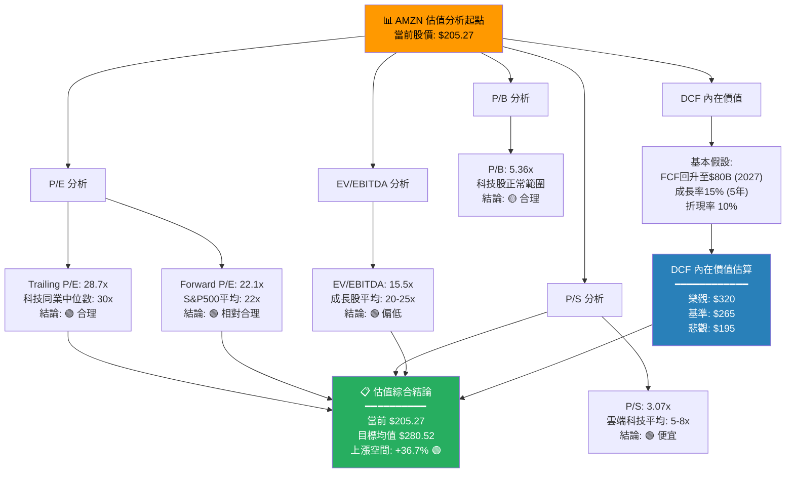

---

### 6.2 多重估值法比較表格

| 估值方法 | 指標值 | 同業/歷史比較 | 隱含股價 | 評級 |
|---------|-------|-------------|---------|------|
| **Trailing P/E** | 28.7x | 科技指數中位30x | ~$215 | 🟢 合理 |
| **Forward P/E** | 22.1x | S&P500均值22x | ~$205 | 🟡 公平價值 |
| **EV/EBITDA** | 15.5x | 成長股均值20x | ~$265 | 🟢 偏低估 |
| **P/S Ratio** | 3.07x | 科技股均值5-8x | ~$335+ | 🟢 便宜 |
| **P/B Ratio** | 5.36x | 科技股正常 | ~$200 | 🟡 合理 |
| **DCF（基準）** | — | FCF正常化後 | ~$265 | 🟢 低估 |
| **分析師目標均值** | — | 63位分析師 | $280.52 | 🟢 低估 |
| **PEG Ratio** | ~1.5x | <2x合理 | — | 🟢 合理 |

---

### 6.3 估值區間視覺化

```
╔══════════════════════════════════════════════════════════════════╗
║                    AMZN 估值區間分析                              ║
╠══════════════════════════════════════════════════════════════════╣
║                                                                  ║
║  $161.38        $175        $195   $205.27  $265    $280  $320   ║
║     │             │           │      │        │       │     │    ║
║     ▼             ▼           ▼      ▼        ▼       ▼     ▼    ║
║  ───┼─────────────┼───────────┼──────★────────┼───────┼─────┼── ║
║  52W低點    悲觀目標   低端目標  【當前】  DCF基準  分析師  DCF樂觀║
║                                                                  ║
║  ◄────── 嚴重低估 ──────►◄──── 低估 ────►◄── 合理 ──►◄─ 高估 ─► ║
║  $150-175         $175-200    $200-220  $220-280   $280-350+    ║
║                                                                  ║
║  當前股價 $205.27 落在「低估偏合理」區間                           ║
║  相對均值目標 $280.52 有 +36.7% 的上漲空間                         ║
╚══════════════════════════════════════════════════════════════════╝

估值吸引力計量表：
  極度低估 │ 低估    │ 合理    │ 偏高    │ 嚴重高估
  ░░░░░░░░ │▓▓▓▓▓▓▓▓│████★░░░│░░░░░░░░ │░░░░░░░░
                              ↑
                         當前位置 $205.27
```

---

### 6.4 同業估值比較

| 公司 | 股票代碼 | 市值 | Forward P/E | EV/EBITDA | P/S | 收入成長 | ROE |
|------|---------|------|------------|-----------|-----|---------|-----|
| **Amazon** | **AMZN** | **$2.20T** | **22.1x** | **15.5x** | **3.1x** | **13.6%** | **22.3%** |
| Microsoft | MSFT | $3.1T | 28x | 22x | 11x | 16% | 35% |
| Google | GOOG | $2.1T | 21x | 14x | 6x | 12% | 28% |
| Meta | META | $1.4T | 24x | 16x | 8x | 22% | 37% |
| Alibaba | BABA | $0.3T | 10x | 6x | 1.5x | 8% | 10% |
| Shopify | SHOP | $0.1T | 55x | 40x | 12x | 24% | 12% |

> **結論**：AMZN 在科技巨頭中估值相對合理，考慮其業務多元性（電商+雲端+廣告+物流），EV/EBITDA 15.5x 相較同質業務顯著偏低。

---

## 7. 風險評估

### 7.1 風險熱圖

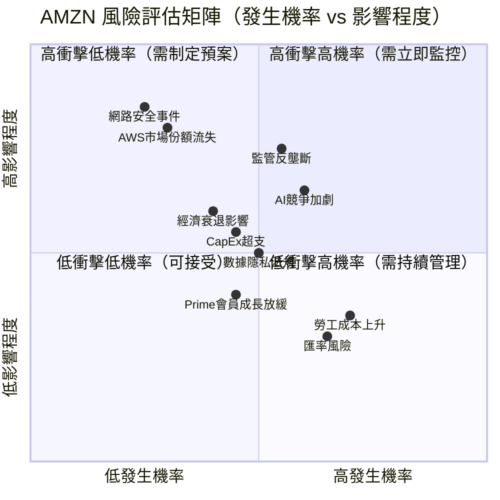

---

### 7.2 風險項目詳細分析

| 風險類別 | 風險項目 | 等級 | 發生機率 | 潛在影響 | 說明 |
|---------|---------|------|---------|---------|------|
| **監管/法律** | 美國反壟斷調查 | 🔴 高 | 55% | 極高 | DOJ/FTC 對電商/雲端雙重調查進行中 |
| **競爭** | AI雲端競爭白熱化 | 🔴 高 | 60% | 高 | Microsoft/Google AI整合加速，威脅AWS份額 |
| **財務** | CapEx過度投資 | 🟡 中 | 45% | 中高 | $131B CapEx若回報不如預期，拖累估值 |
| **宏觀** | 經濟衰退 | 🟡 中 | 40% | 中 | 消費者支出下滑影響零售，但AWS更具韌性 |
| **技術** | 網路安全重大事件 | 🟡 中 | 25% | 極高 | AWS停機或數據洩漏損害企業聲譽 |
| **競爭** | TikTok Shop電商競爭 | 🟡 中 | 65% | 中低 | 針對年輕族群，影響特定品類 |
| **營運** | 勞工成本/罷工 | 🟟 低 | 70% | 低 | 工會組織嘗試持續，但整體可控 |
| **總體** | 匯率不利波動 | 🟢 低 | 65% | 低 | 國際業務佔比升高，但有自然對沖 |
| **技術** | Kuiper衛星執行延遲 | 🟢 低 | 50% | 低 | 長期機會，短期不影響核心業務 |

---

### 7.3 風險緩解措施

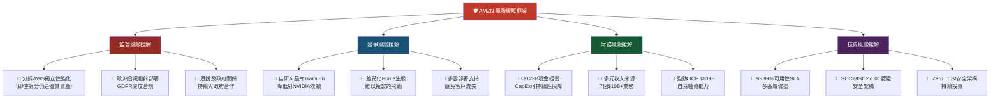

---

## 8. 催化劑與觸發因素

### 8.1 催化劑時間軸

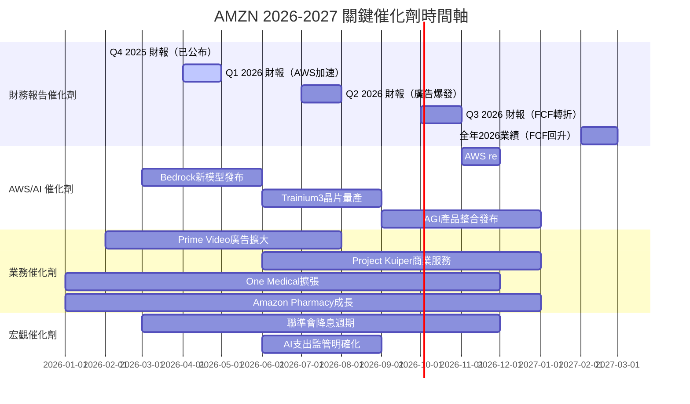

---

### 8.2 觸發因素分析

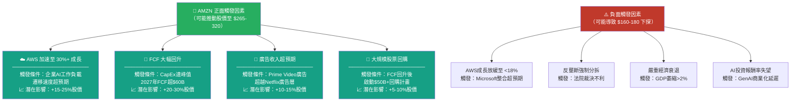

---

## 9. 投資建議

### 9.1 最終評級

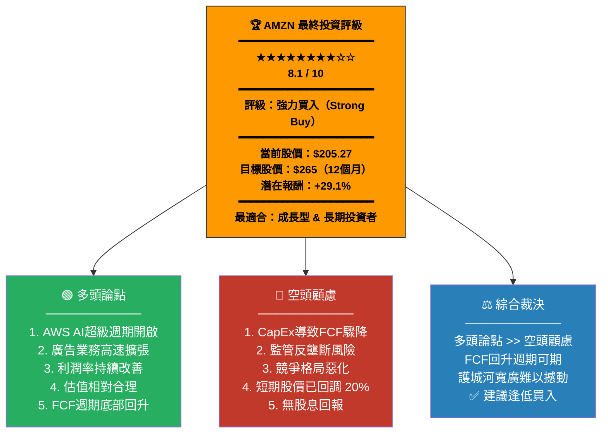

---

### 9.2 評星系統

```
╔══════════════════════════════════════════════════════════════════╗
║                   AMZN 投資評級評星系統                           ║
╠══════════════════════════════════════════════════════════════════╣
║                                                                  ║
║  整體評級：  ★ ★ ★ ★ ★ ★ ★ ★ ☆ ☆   8.1 / 10                   ║
║             強力買入                                              ║
║                                                                  ║
╠══════════════════════════════════════════════════════════════════╣
║  分項評星：                                                       ║
║  📈 成長潛力   ★★★★★★★★★☆  9.0 🟢  業界頂尖成長引擎           ║
║  💰 獲利品質   ★★★★★★★★★☆  8.5 🟢  利潤率V形反轉完成           ║
║  🏦 財務健康   ★★★★★★★☆☆☆  7.0 🟡  高CapEx期暫時承壓           ║
║  📊 估值吸引   ★★★★★★★★☆☆  7.5 🟢  Forward P/E 22x合理       ║
║  🛡️ 護城河    ★★★★★★★★★★  9.5 🟢  業界最寬護城河之一          ║
║  👔 管理執行   ★★★★★★★★☆☆  8.0 🟢  Jassy轉型成效顯著          ║
╚══════════════════════════════════════════════════════════════════╝
```

---

### 9.3 目標價區間（三情境分析）

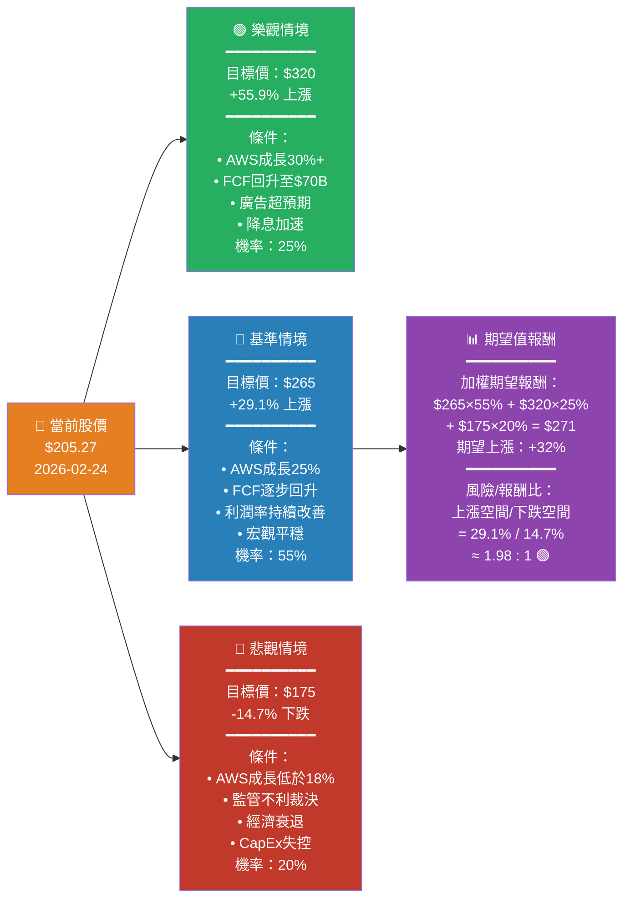

---

### 9.4 投資人適配度評估

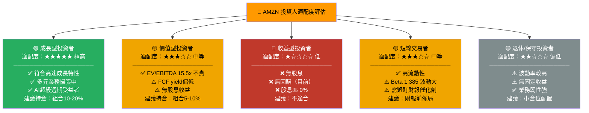

---

### 9.5 建議持倉時間與策略

```
╔══════════════════════════════════════════════════════════════════════╗
║                   AMZN 操作策略建議                                  ║
╠══════════════════════════════════════════════════════════════════════╣
║                                                                      ║
║  📅 建議持倉時間：12-36個月（中長線）                                 ║
║                                                                      ║
╠══════════════════════════════╦═══════════════════════════════════════╣
║  策略類型                    ║  操作細節                              ║
╠══════════════════════════════╬═══════════════════════════════════════╣
║  🟢 積極型（成長導向）        ║  • 當前 $205.27 首批建倉 50%          ║
║                              ║  • 下跌至 $190 加倉 30%               ║
║                              ║  • 下跌至 $175 最後加倉 20%           ║
║                              ║  • 停損設於 $155（-24.5%）            ║
║                              ║  • 目標 $265 獲利了結部分             ║
╠══════════════════════════════╬═══════════════════════════════════════╣
║  🔵 穩健型（分批建倉）        ║  • 分3個月每月定期定額買入            ║
║                              ║  • 持倉上限組合20%                    ║
║                              ║  • 目標 $250 減倉50%                  ║
║                              ║  • 剩餘持至 $280-300 再出清           ║
╠══════════════════════════════╬═══════════════════════════════════════╣
║  🟡 保守型（等待確認）        ║  • 等待 Q1 2026 財報確認 AWS加速      ║
║                              ║  • 突破 $220 才入場                   ║
║                              ║  • 小倉位 組合5-8%                    ║
║                              ║  • 以Q1財報為進出場依據               ║
╠══════════════════════════════╬═══════════════════════════════════════╣
║  🔑 關鍵觀察指標              ║  • AWS季度成長率（目標>25%）           ║
║  （每季財報重點追蹤）          ║  • 廣告收入成長率（目標>20%）         ║
║                              ║  • 營業利潤率趨勢（目標>11%）         ║
║                              ║  • CapEx 峰值訊號（$130B為頂）        ║
║                              ║  • FCF 回升起始時間（預計Q4 2026）    ║
╠══════════════════════════════╬═══════════════════════════════════════╣
║  ⚠️ 停損/減倉觸發條件         ║  • AWS成長率跌破18%                  ║
║                              ║  • 反壟斷強制分拆判決                  ║
║                              ║  • 連續兩季EPS低於預期                 ║
║                              ║  • CapEx繼續超支無明確計畫             ║
╚══════════════════════════════╩═══════════════════════════════════════╝
```

---

## 📊 最終綜合評估摘要

```
╔══════════════════════════════════════════════════════════════════════╗
║                                                                      ║
║     █████████████████████████████████████████████████████████       ║
║     █                                                       █       ║
║     █        🛒 AMZN 最終投資評估報告書                     █       ║
║     █             Amazon.com, Inc.                          █       ║
║     █                                                       █       ║
║     █████████████████████████████████████████████████████████       ║
║                                                                      ║
║  📍 當前股價：$205.27    📅 報告日期：2026-02-24                      ║
║  🎯 目標價格：$265（基準）/ $320（樂觀）/ $175（悲觀）                ║
║  ⏰ 持倉建議：12-36 個月中長線                                        ║
║  💼 建議倉位：組合 10-20%（積極型）/ 5-10%（穩健型）                  ║
║                                                                      ║
╠══════════════════════════════════════════════════════════════════════╣
║  🏆 綜合評分：8.1 / 10                                               ║
║  ⭐ 投資評星：★★★★★★★★☆☆ 強力買入                               ║
║  🟢 分析師共識：Strong Buy（63位分析師，均價$280.52）                  ║
║                                                                      ║
╠══════════════════════════════════════════════════════════════════════╣
║  📌 三大核心買入理由：                                                ║
║                                                                      ║
║  1️⃣ AWS + AI 超級週期：雲端AI工作負載遷移浪潮剛起步，AWS以32%市佔    ║
║     主導地位吃下最大份額，Bedrock/Trainium建立技術護城河              ║
║                                                                      ║
║  2️⃣ FCF 週期底部反轉：$131B CapEx 為成長性投資，2027年FCF預估        ║
║     回升至$60-80B，屆時股價重估動力強勁                               ║
║                                                                      ║
║  3️⃣ 廣告業務爆發 + 利潤率擴張：廣告業務$56B規模仍以20%+成長，        ║
║     Prime Video廣告開啟新收入流，整體利潤率仍有結構性上升空間          ║
║                                                                      ║
╠══════════════════════════════════════════════════════════════════════╣
║  ⚠️ 主要風險提示：                                                    ║
║  • CapEx 若未見成效，FCF 長期低迷                                     ║
║  • 反壟斷監管強化，影響商業模式                                        ║
║  • Azure/Google Cloud AI整合侵蝕AWS份額                               ║
╚══════════════════════════════════════════════════════════════════════╝
```

---

> ## ⚠️ 免責聲明
>
> **本報告由 AI 系統自動生成，僅供學術研究與資訊參考用途，不構成任何形式之投資建議、財務諮詢或招募購買有價證券之