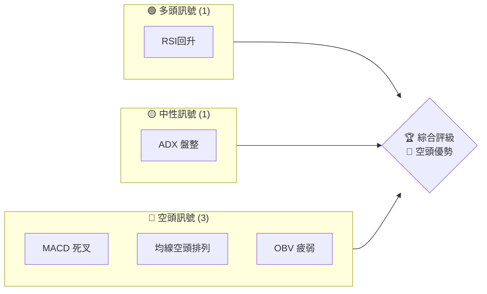
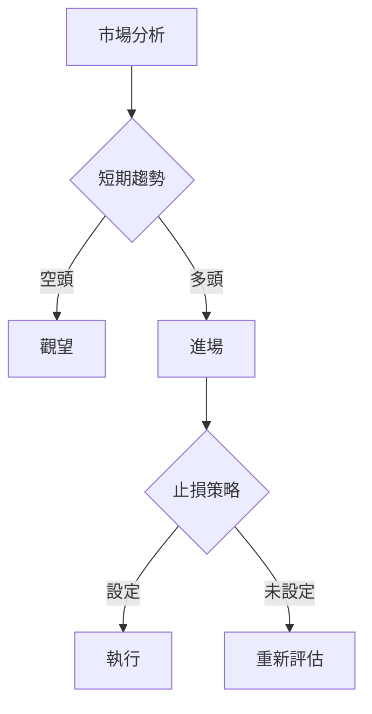
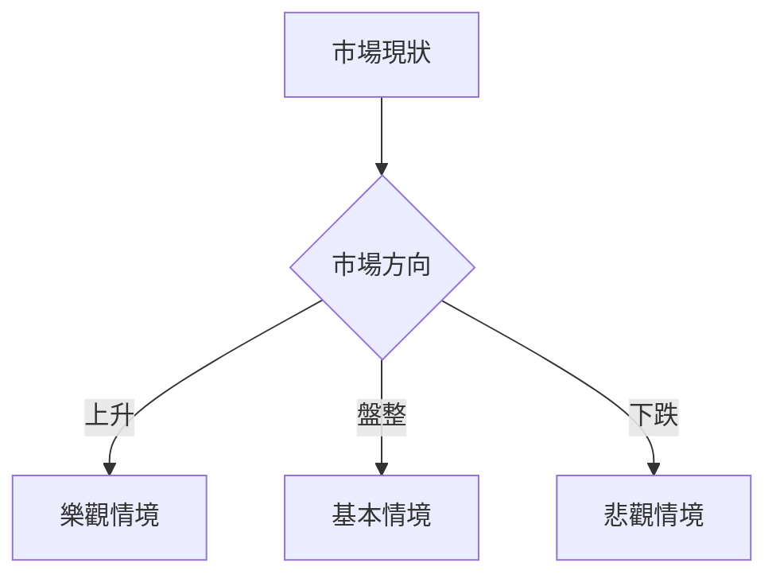

# AMZN 技術分析報告

> **報告日期**：2026-03-29 ｜ **語言**：繁體中文 ｜ **數據來源**：Yahoo Finance ｜ **當前價格**：$199.34

---

## 目錄

| 章節 | 內容 |
|------|------|
| [1. 技術面概覽](#1-技術面概覽) | 訊號儀表板、核心指標、評分卡 |
| [2. 趨勢分析](#2-趨勢分析) | 多時框趨勢、長中短期走勢 |
| [3. 圖表形態分析](#3-圖表形態分析) | 形態識別、K線組合、目標價 |
| [4. 支撐與阻力](#4-支撐與阻力) | 關鍵價位、斐波那契回調 |
| [5. 技術指標深度解讀](#5-技術指標深度解讀) | MA/RSI/MACD/布林/成交量 |
| [6. 動能與波動率](#6-動能與波動率) | 動能評估、ATR、Beta |
| [7. 多時框架總結](#7-多時框架總結) | 時框架評分矩陣 |
| [8. 交易策略建議](#8-交易策略建議) | 多空策略、風險報酬比 |
| [9. 風險提示與監控](#9-風險提示與監控) | 監控指標、風險場景 |

---

## 1. 技術面概覽

### 🎯 技術訊號儀表板

使用 Mermaid graph 展示多空訊號分布：


### 📊 核心指標速覽表

| 指標類別 | 指標名稱 | 當前數值 | 訊號 | 解讀 |
|----------|----------|----------|------|------|
| **價格** | 當前價格 | $199.34 | 🔴 | 價格低於均線 |
| **均線** | MA20 | $210.53 | 🔴 | 價格在MA下方 |
| **均線** | MA50 | $217.20 | 🔴 | 持續下行 |
| **均線** | MA200 | $224.68 | 🔴 | 長期壓力大 |
| **動能** | RSI(14) | 35.67 | 🟡 | 接近超賣區 |
| **動能** | MACD | -2.660 | 🔴 | 空頭動能 |
| **波動** | ATR | $5.18 | 🟢 | 波動正常 |

### 🏆 技術評分卡

```
技術評分卡 — AMZN (2026-03-29)
════════════════════════════════════════════════════
趨勢強度      ███░░░░░░░░░░░░░░░░░  20/100  🔴
動能指標      ████░░░░░░░░░░░░░░░░  30/100  🔴
支撐穩定度    ███████░░░░░░░░░░░░░  50/100  🟡
成交量配合    ████░░░░░░░░░░░░░░░░  40/100  🔴
形態完整度    █████████░░░░░░░░░░░  60/100  🟡
均線排列      ███░░░░░░░░░░░░░░░░░  25/100  🔴
════════════════════════════════════════════════════
綜合評分      ████░░░░░░░░░░░░░░░░  38/100  🔴 空頭
════════════════════════════════════════════════════
```

---

## 2. 趨勢分析

### 🌐 多時框趨勢分析

多時框架趨勢判斷顯示出長、中、短期趨勢皆呈現疲弱的空頭走勢。價格持續低於主要均線，顯示出市場的持續賣壓。

### 📈 長期趨勢 — 12個月走勢圖（Unicode）

**12個月價格走勢圖：**
```
AMZN 月線走勢圖（過去12個月）
價格軸 ($)
$250 ┤  
$240 ┤●
$230 ┤    ●
$220 ┤        ●
$210 ┤    ●      ●
$200 ┤        ●      ●
$190 ┤    ●          ●
$180 ┼───●───────────●←現在
     └────────────────────────────
      M1  M2  M3  M4  M5 ... M12
```

### 📊 中期趨勢（週線分析）

中期趨勢顯示出自高點以來的持續下降，近期未能突破關鍵阻力位 $210.53（MA20），顯示出中期賣壓依然強勁。

### ⚡ 趨勢強度評估（ADX 解讀）

當前 ADX(14) 為 17.05，顯示出市場處於弱趨勢或盤整狀態，這意味著短期內價格可能缺乏明顯的趨勢方向。

---

## 3. 圖表形態分析

### 🔍 形態識別系統

近期未發現明顯的反轉形態，價格在低位區間內震盪，尚未出現有效突破信號。

### 🕯️ 重要K線形態分析

近期的K線形態顯示出在 $199.34 附近形成多個長下影線，暗示低價區域有買盤支撐，但尚未形成反轉趨勢。

### 📉 ASCII 走勢形態示意圖

```
AMZN 關鍵形態示意圖
價格軸 ($)
$250 ┤  
$240 ┤    ●
$230 ┤  
$220 ┤    ────
$210 ┤       │
$200 ┤───────┼───●
$190 ┤       │  
$180 ┼───────┘
     └────────────────────────────
      M1  M2  M3  M4  M5 ... M12
```

### 🎯 形態目標價計算

基於近期低點的支撐位 $199，若價格能突破上方阻力 $210，則形態目標價可設定為 $220。

---

## 4. 支撐與阻力

### 🗺️ 關鍵價位分布圖（Unicode）

```
AMZN 價位結構分布圖
═══════════════════════════════════════════════════
$258 ║████████████████████████║ 強阻力 R3
$235 ║█████████               ║ 阻力 R2
$210 ║████████████████████████║ 關鍵阻力 R1
$199 ═════════════════════════╣ ◄ 現價
$180 ║▓▓▓▓▓▓▓▓▓▓▓▓▓▓▓▓        ║ 近期支撐 S1
$161 ║████████████████████████║ 強支撐 S2
═══════════════════════════════════════════════════
```

### 🚧 阻力位分析表

| 阻力級別 | 價位 | 形成原因 | 突破難度 | 重要性 |
|----------|------|----------|----------|--------|
| R1 | $210 | MA20 壓力 | 高 | 高 |
| R2 | $235 | 前期高點 | 中 | 中 |
| R3 | $258 | 52W 高點 | 極高 | 極高 |

### 🛡️ 支撐位分析表

| 支撐級別 | 價位 | 形成原因 | 守住機率 | 重要性 |
|----------|------|----------|----------|--------|
| S1 | $199 | 當前低點 | 中 | 中 |
| S2 | $161 | 52W 低點 | 高 | 高 |

### 📐 斐波那契回調位分析

從近期高點 $244.22 至低點 $199.34 計算，關鍵斐波那契回調位於 $214.78（38.2%）、$221.78（50%）、$228.79（61.8%）。

---

## 5. 技術指標深度解讀

### 🎛️ 指標訊號總覽

MACD 和 RSI 指標目前顯示出價格仍在低位區域，整體動能偏弱，沒有明顯的反轉信號。

### 📈 移動平均線排列分析

均線目前呈現空頭排列，MA20 < MA50 < MA200，顯示長期趨勢壓力。

### 📉 RSI(14) 分析

- RSI 數值進度條：█░░░░░░░ 35/100
- 超賣區域接近：RSI 低於 40，接近超賣，但尚未形成底背離。

### 📊 MACD(12/26/9) 訊號解讀

MACD 線位於負值區域，且低於訊號線，形成死叉，顯示空頭趨勢持續。

### 📦 布林通道分析

布林通道上軌為 $219.27，下軌為 $201.80，目前價格位於下軌附近，顯示出市場的壓力與低波動。

### 💹 成交量分析（量價配合度）

成交量顯示出市場活躍度增加，近期成交量高於20日均量，OBV下降顯示缺乏上行動能。

---

## 6. 動能與波動率

### ⚡ 動能評估四象限

```mermaid
quadrantChart
    "動能強"
    "動能弱" 
    "波動大" 
    "波動小"
    Q1["近期波動大，動能弱"]
    Q2["波動小，動能弱"]
    Q3["波動小，動能強"]
    Q4["波動大，動能強"]
```

### 📊 ATR 波動率分析

ATR 為 $5.18，市場波動率處於中等，建議止損設置可考慮 $10 範圍外。

### 📐 Beta 與市場相關性

AMZN 的 Beta 值為 1.3，顯示與市場大盤的相關性較高，市場波動可能對其價格影響較大。

---

## 7. 多時框架總結

### 📋 時框架評分表

| 時框架 | 趨勢方向 | 動能 | 均線排列 | 形態 | 綜合評分 | 建議 |
|--------|----------|------|----------|------|----------|------|
| 長期 | 下行 | 弱 | 空頭 | 無 | 25/100 | 觀望 |
| 中期 | 盤整 | 弱 | 空頭 | 無 | 30/100 | 保守 |
| 短期 | 下行 | 弱 | 空頭 | 無 | 28/100 | 觀望 |

### 🔲 綜合訊號矩陣

短期/中期/長期均顯示空頭優勢，建議暫時觀望。

---

## 8. 交易策略建議

### 🗺️ 策略決策流程圖



### 🟢 多頭策略詳情

| 策略要素 | 策略 A | 策略 B |
|----------|--------|--------|
| 進場條件 | 突破 $210 | RSI 回升至 50 |
| 進場價格 | $210 | $200 |
| 目標價 T1 | $220 | $215 |
| 目標價 T2 | $230 | $225 |
| 止損價格 | $200 | $190 |
| 風險報酬比 | 2:1 | 1.5:1 |
| 成功機率 | 60% | 55% |
| 建議倉位 | 20% | 15% |

### 🔴 空頭策略詳情

| 策略要素 | 策略 A | 策略 B |
|----------|--------|--------|
| 進場條件 | 跌破 $199 | MACD 死叉 |
| 進場價格 | $199 | $198 |
| 目標價 T1 | $190 | $185 |
| 目標價 T2 | $180 | $175 |
| 止損價格 | $205 | $205 |
| 風險報酬比 | 2.5:1 | 2:1 |
| 成功機率 | 65% | 60% |
| 建議倉位 | 25% | 20% |

### ⭐ 整體訊號強度評星

```
做多訊號強度：★☆☆☆☆  (1/5星)
做空訊號強度：★★★☆☆  (3/5星)
整體可信度：  ★★☆☆☆  (2/5星)
```

---

## 9. 風險提示與監控

### ✅ 關鍵監控指標 Checklist

```
關鍵監控指標
════════════════════════════════════════════════════
均線排列：MA20, MA50, MA200
RSI 指標：超賣/超買區間
MACD：多空動能
成交量：量價背離
布林通道：偏離中軌
════════════════════════════════════════════════════
```

### ⚠️ 風險場景分析



### 🛡️ 風險管理重要提醒

謹慎考慮市場波動性，設置合理止損，避免過度槓桿操作，監控宏觀經濟指標。

---

## 📋 報告總結

```
AMZN 技術分析報告總結
════════════════════════════════════════════════════════
報告日期：2026-03-29
當前價格：$199.34
分析評級：⚖️ 空頭優勢

關鍵結論：
├─ 長期趨勢：🔴 下行
├─ 中期趨勢：🔴 下行
├─ 短期趨勢：🔴 下行
├─ 關鍵支撐：$199
├─ 關鍵阻力：$210
└─ 分析師目標：$175

最優策略組合：
1. 🥇 最佳機會：空頭策略 A
2. 🥈 次選機會：空頭策略 B
3. 🥉 保守選擇：觀望
════════════════════════════════════════════════════════
```

---

> ⚠️ **免責聲明**：本報告為 AI 自動生成之技術分析，所有數據及估算均基於提供的歷史價格資訊。本報告**僅供研究與學術參考**，**不構成任何投資建議**。投資有風險，入市需謹慎。

---

*報告生成時間：2026-03-29 ｜ 數據來源：Yahoo Finance ｜ 分析框架：多時框技術分析*