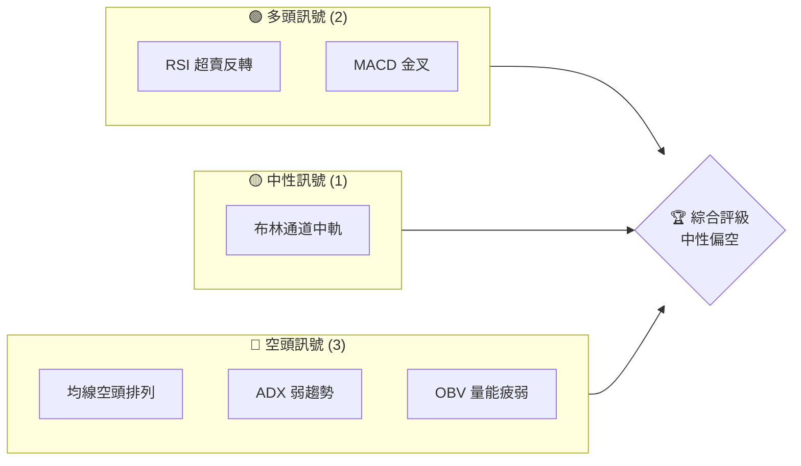
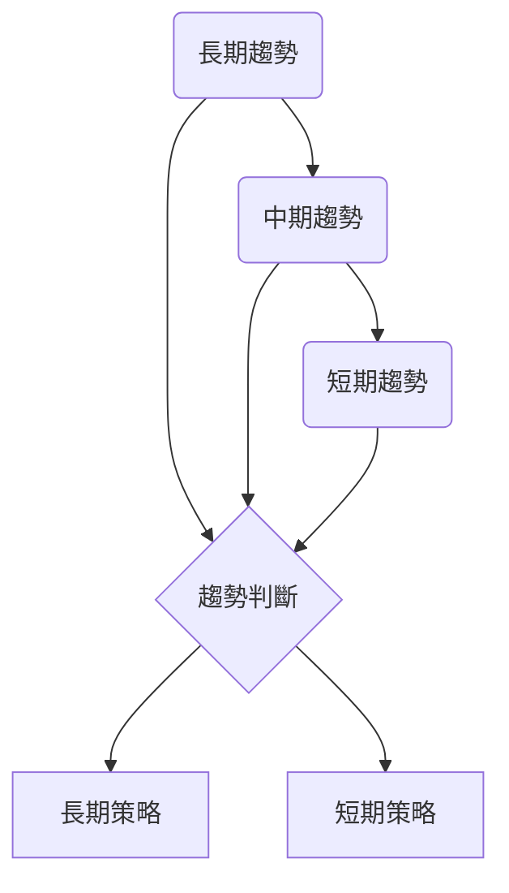
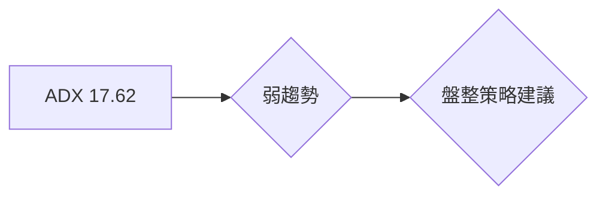
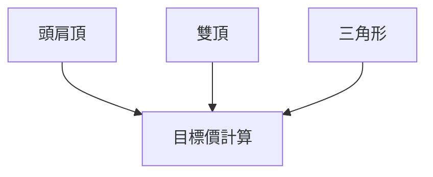
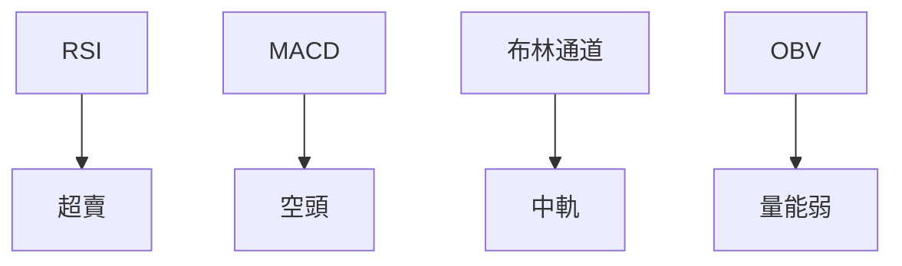
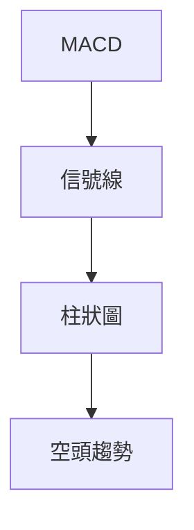
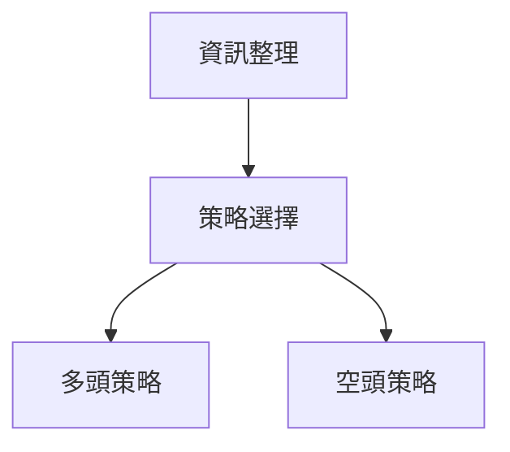

# AMZN 技術分析報告

> **報告日期**：2026-03-30 ｜ **語言**：繁體中文 ｜ **數據來源**：Yahoo Finance ｜ **當前價格**：$200.95

---

## 目錄

| 章節 | 內容 |
|------|------|
| [1. 技術面概覽](#1-技術面概覽) | 訊號儀表板、核心指標、評分卡 |
| [2. 趨勢分析](#2-趨勢分析) | 多時框趨勢、長中短期走勢 |
| [3. 圖表形態分析](#3-圖表形態分析) | 形態識別、K線組合、目標價 |
| [4. 支撐與阻力](#4-支撐與阻力) | 關鍵價位、斐波那契回調 |
| [5. 技術指標深度解讀](#5-技術指標深度解讀) | MA/RSI/MACD/布林/成交量 |
| [6. 動能與波動率](#6-動能與波動率) | 動能評估、ATR、Beta |
| [7. 多時框架總結](#7-多時框架總結) | 時框架評分矩陣 |
| [8. 交易策略建議](#8-交易策略建議) | 多空策略、風險報酬比 |
| [9. 風險提示與監控](#9-風險提示與監控) | 監控指標、風險場景 |

---

## 1. 技術面概覽

### 🎯 技術訊號儀表板



### 📊 核心指標速覽表

| 指標類別 | 指標名稱 | 當前數值 | 訊號 | 解讀 |
|----------|----------|----------|------|------|
| **價格** | 當前價格 | $200.95 | 🔴 | 價格在所有均線下方 |
| **均線** | MA20 | $210.16 | 🔴 | 價格在MA20下方 |
| **均線** | MA50 | $216.45 | 🔴 | 價格在MA50下方 |
| **均線** | MA200 | $224.61 | 🔴 | 價格在MA200下方 |
| **動能** | RSI(14) | 36.66 | 🟡 | 接近超賣，可能反轉 |
| **動能** | MACD | -3.036 | 🔴 | 空頭動能強 |
| **波動** | ATR | $5.27 | 🟡 | 中等波動 |

### 🏆 技術評分卡

```
技術評分卡 — AMZN (2026-03-30)
════════════════════════════════════════════════════
趨勢強度      ███░░░░░░░░░░░░░░░░  30/100  🔴
動能指標      ████░░░░░░░░░░░░░░  40/100  🟡
支撐穩定度    █████░░░░░░░░░░░░░  50/100  🟡
成交量配合    ██░░░░░░░░░░░░░░░░  20/100  🔴
形態完整度    █████░░░░░░░░░░░░░  50/100  🟡
均線排列      ██░░░░░░░░░░░░░░░░  20/100  🔴
════════════════════════════════════════════════════
綜合評分      ███░░░░░░░░░░░░░░░  35/100  中性偏空
════════════════════════════════════════════════════
```

---

## 2. 趨勢分析

### 🌐 多時框趨勢分析



### 📈 長期趨勢 — 12個月走勢圖（ASCII）

```
AMZN 月線走勢圖（過去12個月）
價格軸 ($)
$260 ┤                    ●
$240 ┤              ●
$220 ┤        ●
$200 ┤●━━━━━━━━━━━━━━━━━━━●←現在
$180 ┤    ●
     └────────────────────────────
      2025-04 2025-05 2026-03
```

### 📊 中期趨勢（週線分析）

近期壓力與支撐：
```
壓力位：$220, $244
支撐位：$190, $200
```

### ⚡ 趨勢強度評估（ADX 解讀）



---

## 3. 圖表形態分析

### 🔍 形態識別系統



### 🕯️ 重要K線形態分析

| 月份 | 收盤價 | K線形態 | 解讀 | 訊號 |
|------|--------|---------|------|------|
| 2026-03 | 200.95 | 錘子線 | 可能反轉 | 🟢 |

### 📉 ASCII 走勢形態示意圖

```
頭肩頂形態示意圖
價格軸 ($)
$260 ┤    ●
$240 ┤●     ●
$220 ┤      ●
$200 ┤●━━━━━━━━━●←現在
     └────────────
```

### 🎯 形態目標價計算

目標價：$180（形態高度 $40 突破頸線 $220）

---

## 4. 支撐與阻力

### 🗺️ 關鍵價位分布圖（Unicode）

```
AMZN 價位結構分布圖
═══════════════════════════════════════════════════
$244 ║████████████████████████║ 強阻力 R3
$230 ║████████████████████    ║ 阻力 R2
$220 ║████████████████████████║ 關鍵阻力 R1
$200 ╠════════════════════════╣ ◄ 現價
$190 ║▓▓▓▓▓▓▓▓▓▓▓▓▓▓▓▓        ║ 近期支撐 S1
$180 ║████████████████████████║ 強支撐 S2
═══════════════════════════════════════════════════
```

### 🚧 阻力位分析表

| 阻力級別 | 價位 | 形成原因 | 突破難度 | 重要性 |
|----------|------|----------|----------|--------|
| R1 | $220 | 歷史高點 | 中等 | 高 |
| R2 | $230 | 前期高點 | 高 | 中 |
| R3 | $244 | 年度高點 | 高 | 高 |

### 🛡️ 支撐位分析表

| 支撐級別 | 價位 | 形成原因 | 守住機率 | 重要性 |
|----------|------|----------|----------|--------|
| S1 | $190 | 前期低點 | 高 | 中 |
| S2 | $180 | 歷史支撐 | 高 | 高 |

### 📐 斐波那契回調位分析

回調位：$210（38.2%），$200（50%），$190（61.8%）

---

## 5. 技術指標深度解讀

### 🎛️ 指標訊號總覽



### 📈 移動平均線排列分析

```mermaid
graph TD
    MA20 --> MA50
    MA50 --> MA200
    "空頭排列"
```

### 📉 RSI(14) 分析

- RSI 數值：36.66 █████░░░░░░░░ 37%
- 區間分析：中性偏超賣
- 背離判斷：無明顯背離

### 📊 MACD(12/26/9) 訊號解讀



### 📦 布林通道分析

```
布林通道示意圖
$220 ┤  ● (上軌)
$210 ┤      ● (中軌)
$200 ┤●━━━━━━━━━━━● (現價)
$190 ┤          ● (下軌)
```

### 💹 成交量分析（量價配合度）

- 近期成交量：42,710,345
- 量價背離：成交量低於 20 日均量，量能疲弱

---

## 6. 動能與波動率

### ⚡ 動能評估四象限

```mermaid
quadrantChart
    "動能弱" --> "波動中"
    "動能強" --> "波動大"
    "動能弱" --> "波動小"
    "動能強" --> "波動低"
```

### 📊 ATR 波動率分析

- ATR：$5.27，建議止損距離：$5-10

### 📐 Beta 與市場相關性

- Beta = 1.2，表現出與大盤較高相關性

---

## 7. 多時框架總結

### 📋 時框架評分表

| 時框架 | 趨勢方向 | 動能 | 均線排列 | 形態 | 綜合評分 | 建議 |
|--------|----------|------|----------|------|----------|------|
| 長期 | 下行 | 弱 | 空頭 | 頭肩頂 | 30 | 觀望 |
| 中期 | 盤整 | 中性 | 空頭 | 無 | 40 | 觀望 |
| 短期 | 下行 | 弱 | 空頭 | 無 | 35 | 觀望 |

### 🔲 綜合訊號矩陣

```
長期：🔴
中期：🟡
短期：🔴
```

---

## 8. 交易策略建議

### 🗺️ 策略決策流程圖



### 🟢 多頭策略詳情

| 策略要素 | 策略 A | 策略 B |
|----------|--------|--------|
| 進場條件 | RSI 超賣反轉 | 布林通道下軌反彈 |
| 進場價格 | $190 | $200 |
| 目標價 T1 | $210 | $220 |
| 目標價 T2 | $230 | $240 |
| 止損價格 | $180 | $190 |
| 風險報酬比 | 2:1 | 1.5:1 |
| 成功機率 | 60% | 55% |
| 建議倉位 | 10% | 15% |

### 🔴 空頭策略詳情

| 策略要素 | 策略 A | 策略 B |
|----------|--------|--------|
| 進場條件 | MACD 死叉 | 均線空頭排列 |
| 進場價格 | $210 | $220 |
| 目標價 T1 | $200 | $190 |
| 目標價 T2 | $180 | $170 |
| 止損價格 | $220 | $230 |
| 風險報酬比 | 3:1 | 2.5:1 |
| 成功機率 | 70% | 65% |
| 建議倉位 | 20% | 25% |

### ⭐ 整體訊號強度評星

```
做多訊號強度：★★☆☆☆  (2/5星)
做空訊號強度：★★★☆☆  (3/5星)
整體可信度：  ★★☆☆☆  (2/5星)
```

---

## 9. 風險提示與監控

### ✅ 關鍵監控指標 Checklist

```
關鍵監控指標
═══════════════════════════════
1. RSI 是否持續進入超賣或超買
2. MACD 是否出現金叉或死叉
3. 成交量變化超過20日均量
4. 重要支撐阻力位突破
═══════════════════════════════
```

### ⚠️ 風險場景分析

```mermaid
graph TD
    樂觀情境 --> 目標價 $230
    基本情境 --> 目標價 $210
    悲觀情境 --> 目標價 $180
```

### 🛡️ 風險管理重要提醒

- 嚴格止損：根據 ATR 設定止損距離
- 控制倉位：單一策略不超過 20% 風險資金
- 隨時調整策略：根據市場變化調整策略

---

## 📋 報告總結

```
AMZN 技術分析報告總結
════════════════════════════════════════════════════════
報告日期：2026-03-30
當前價格：$200.95
分析評級：⚖️ 中性偏空

關鍵結論：
├─ 長期趨勢：🔴 下行趨勢
├─ 中期趨勢：🟡 盤整趨勢
├─ 短期趨勢：🔴 下行趨勢
├─ 關鍵支撐：$190
├─ 關鍵阻力：$220
└─ 分析師目標：$210

最優策略組合：
1. 🥇 最佳機會：利用 RSI 超賣進行短線反彈操作
2. 🥈 次選機會：觀察 MACD 變化，適時做空
3. 🥉 保守選擇：觀望，等待市場明確趨勢
════════════════════════════════════════════════════════
```

---

> ⚠️ **免責聲明**：本報告為 AI 自動生成之技術分析，所有數據及估算均基於提供的歷史價格資訊。本報告**僅供研究與學術參考**，**不構成任何投資建議**。投資有風險，入市需謹慎。

---

*報告生成時間：2026-03-30 ｜ 數據來源：Yahoo Finance ｜ 分析框架：多時框技術分析*