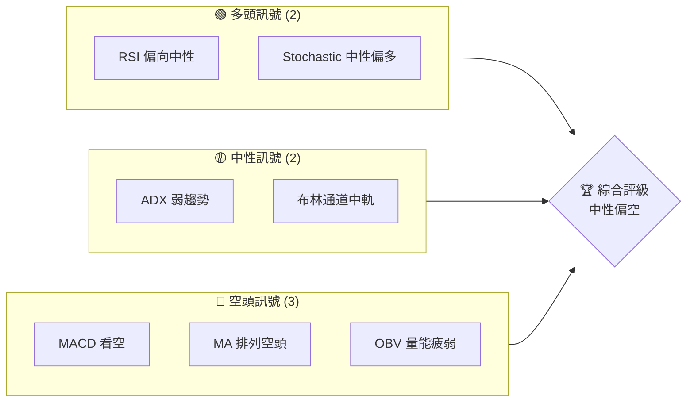
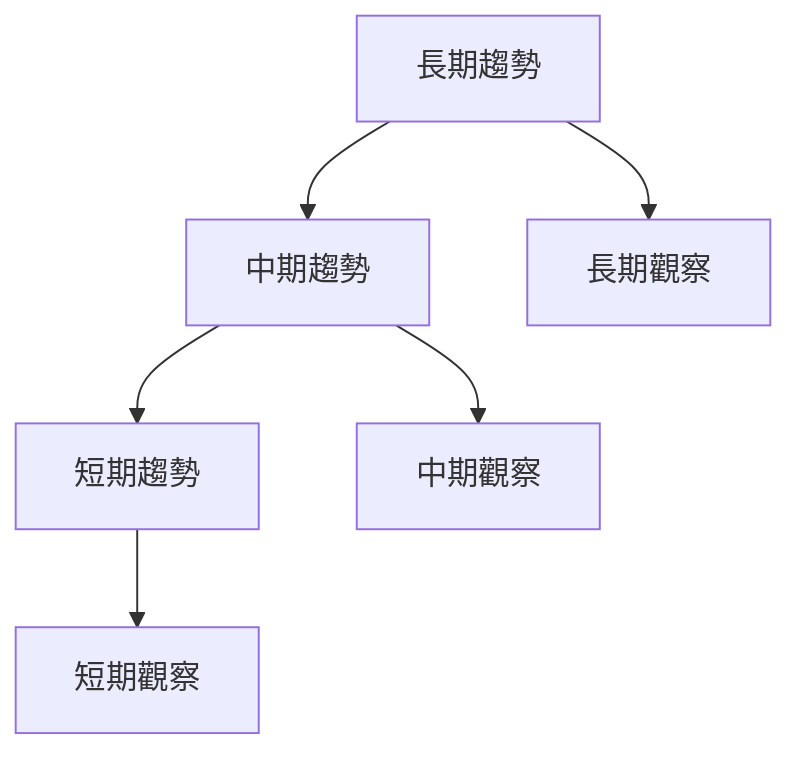
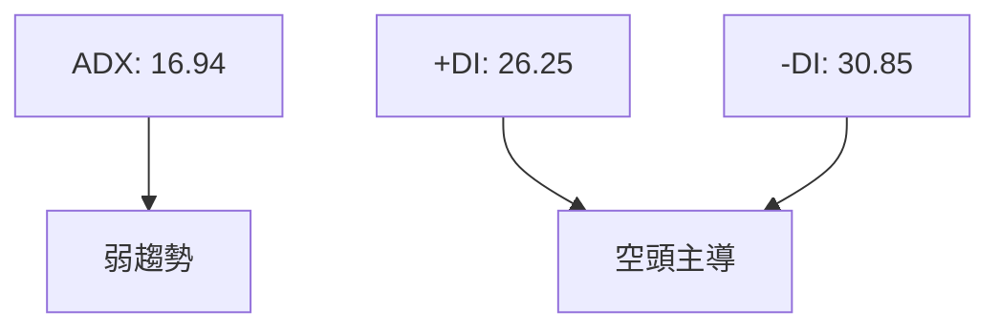
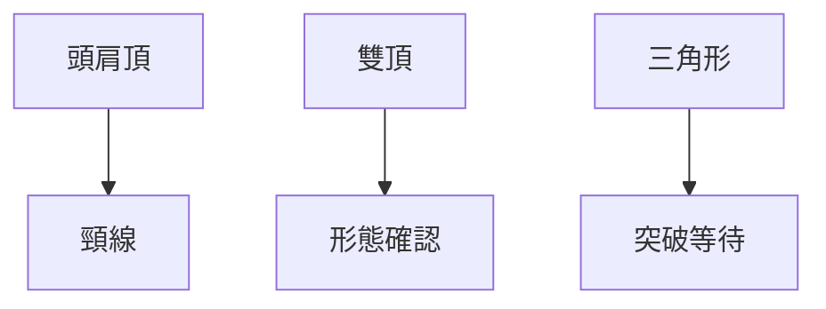
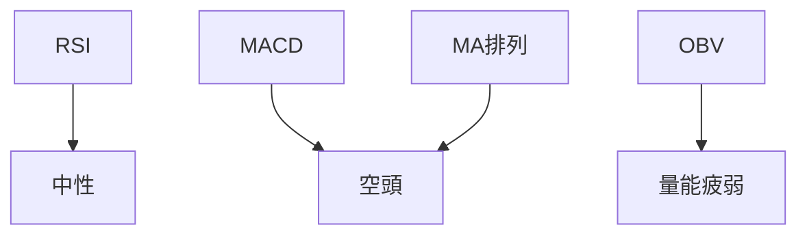
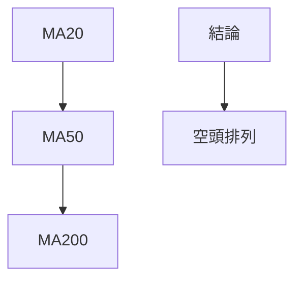
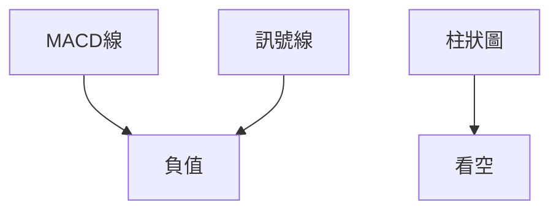
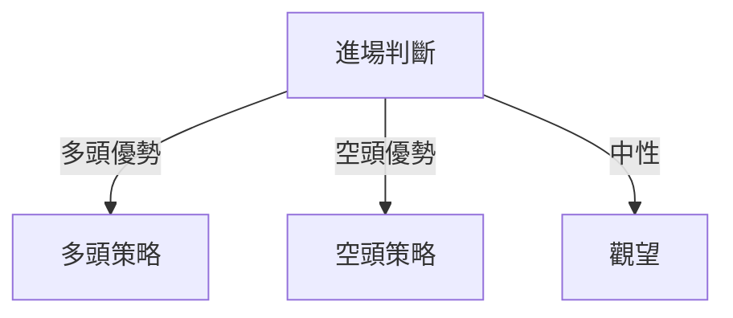
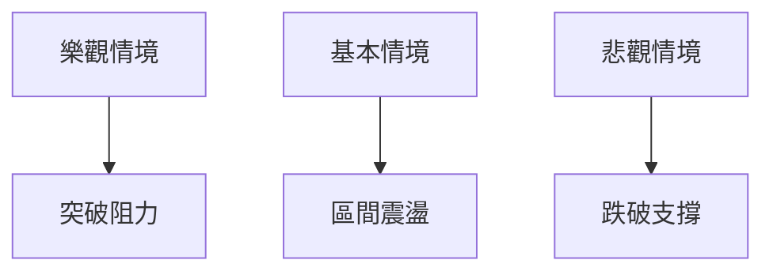

# AMZN 技術分析報告

> **報告日期**：2026-03-31 ｜ **語言**：繁體中文 ｜ **數據來源**：Yahoo Finance ｜ **當前價格**：$208.27

---

## 目錄

| 章節 | 內容 |
|------|------|
| [1. 技術面概覽](#1-技術面概覽) | 訊號儀表板、核心指標、評分卡 |
| [2. 趨勢分析](#2-趨勢分析) | 多時框趨勢、長中短期走勢 |
| [3. 圖表形態分析](#3-圖表形態分析) | 形態識別、K線組合、目標價 |
| [4. 支撐與阻力](#4-支撐與阻力) | 關鍵價位、斐波那契回調 |
| [5. 技術指標深度解讀](#5-技術指標深度解讀) | MA/RSI/MACD/布林/成交量 |
| [6. 動能與波動率](#6-動能與波動率) | 動能評估、ATR、Beta |
| [7. 多時框架總結](#7-多時框架總結) | 時框架評分矩陣 |
| [8. 交易策略建議](#8-交易策略建議) | 多空策略、風險報酬比 |
| [9. 風險提示與監控](#9-風險提示與監控) | 監控指標、風險場景 |

---

## 1. 技術面概覽

### 🎯 技術訊號儀表板



### 📊 核心指標速覽表

| 指標類別 | 指標名稱 | 當前數值 | 訊號 | 解讀 |
|----------|----------|----------|------|------|
| **價格** | 當前價格 | $208.27 | 🔴 | 價格低於主要均線 |
| **均線** | MA20 | $210.14 | 🔴 | 價格在MA20下方 |
| **均線** | MA50 | $215.84 | 🔴 | 價格在MA50下方 |
| **均線** | MA200 | $224.59 | 🔴 | 價格在MA200下方 |
| **動能** | RSI(14) | 46.07 | 🟡 | 中性偏弱 |
| **動能** | MACD | -2.712 | 🔴 | 空頭主導 |
| **波動** | ATR | $5.53 | 🟡 | 中等波動 |

### 🏆 技術評分卡

```
技術評分卡 — AMZN (2026-03-31)
════════════════════════════════════════════════════
趨勢強度      █████░░░░░░░░░░░░░░░  34/100  🔴
動能指標      ███████░░░░░░░░░░░░  48/100  🟡
支撐穩定度    ██████████░░░░░░░░░  60/100  🟡
成交量配合    █████░░░░░░░░░░░░░░░  30/100  🔴
形態完整度    ████████░░░░░░░░░░░░  50/100  🟡
均線排列      ████░░░░░░░░░░░░░░░░  25/100  🔴
════════════════════════════════════════════════════
綜合評分      █████░░░░░░░░░░░░░░░  41/100  中性偏空
════════════════════════════════════════════════════
```

---

## 2. 趨勢分析

### 🌐 多時框趨勢分析



### 📈 長期趨勢 — 12個月走勢圖（Unicode）

```
AMZN 月線走勢圖（過去12個月）
價格軸 ($)
$250 ┤                    ●
$230 ┤              ●
$210 ┤        ●
$190 ┤●━━━━━━━━━━━━━━━━━━━●←現在
$170 ┤    ●
     └────────────────────────────
      M1  M2  M3  M4  M5 ... M12
```

**走勢特徵分析表格**

| 月份 | 收盤價 | 漲跌幅 (%) | 特徵 |
|------|-------|-----------|------|
| 2025-04 | $184.42 | -2.5% | 低點盤整 |
| 2025-10 | $244.22 | +10.9% | 新高形成 |
| 2026-03 | $208.27 | -14.7% | 回調 |

### 📊 中期趨勢（週線分析）

- **最近週期走勢**：近期壓力區域在 $215-$225，支撐位於 $200。
- **趨勢特徵**：價格在 2025 年下半年呈現上升趨勢，但近期回調顯著。

### ⚡ 趨勢強度評估（ADX 解讀）



- **強度對照表**：ADX < 25 代表趨勢弱，目前市場缺乏明顯趨勢。

---

## 3. 圖表形態分析

### 🔍 形態識別系統



### 🕯️ 重要K線形態分析

| 月份 | 收盤價 | K線形態 | 解讀 | 訊號 |
|------|--------|---------|------|------|
| 2025-12 | $230.82 | 長上影線 | 反轉信號 | 🔴 |
| 2026-01 | $239.30 | 十字星 | 盤整可能 | 🟡 |

### 📉 ASCII 走勢形態示意圖

```
      頭肩頂形態示意
$250 ┤         
$230 ┤    ●      
$210 ┤  ●  ●   
$190 ┤ ●     ●
     └──────────
     左肩 頭  右肩
```

### 🎯 形態目標價計算

- **頸線價位**：$200
- **形態高度**：$30（$230 - $200）
- **目標價**：$170（$200 - $30）

---

## 4. 支撐與阻力

### 🗺️ 關鍵價位分布圖（Unicode）

```
AMZN 價位結構分布圖
═══════════════════════════════════════════════════
$260 ║████████████████████████║ 強阻力 R3
$230 ║████████████████████    ║ 阻力 R2
$215 ║████████████████████████║ 關鍵阻力 R1
$208 ╠════════════════════════╣ ◄ 現價
$200 ║▓▓▓▓▓▓▓▓▓▓▓▓▓▓▓▓        ║ 近期支撐 S1
$180 ║████████████████████████║ 強支撐 S2
═══════════════════════════════════════════════════
```

### 🚧 阻力位分析表

| 阻力級別 | 價位 | 形成原因 | 突破難度 | 重要性 |
|----------|------|----------|----------|--------|
| R1 | $215 | 歷史高點 | 高 | 高 |
| R2 | $230 | 長期阻力 | 中 | 中 |
| R3 | $260 | 52W 高點 | 非常高 | 高 |

### 🛡️ 支撐位分析表

| 支撐級別 | 價位 | 形成原因 | 守住機率 | 重要性 |
|----------|------|----------|----------|--------|
| S1 | $200 | 前低點 | 中 | 高 |
| S2 | $180 | 長期均線 | 高 | 中 |

### 📐 斐波那契回調位分析

- **38.2% 回調位**：$210
- **50% 回調位**：$200
- **61.8% 回調位**：$190

---

## 5. 技術指標深度解讀

### 🎛️ 指標訊號總覽



### 📈 移動平均線排列分析



### 📉 RSI(14) 分析

- **RSI 進度條**：██████░░░░░░ 46.07
- **超買超賣區間**：在中性區域無明顯背離

### 📊 MACD(12/26/9) 訊號解讀



### 📦 布林通道分析

```
布林通道示意圖
價格軸 ($)
$230 ┤      
$210 ┤    ──●──
$190 ┤      
     └──────────
     上軌 中軌 下軌
```

### 💹 成交量分析（量價配合度）

- **成交量近期增加**：但不足以推動價格突破。
- **OBV 量能趨勢**：低於均量，顯示量價不配合。

---

## 6. 動能與波動率

### ⚡ 動能評估四象限

```mermaid
quadrantChart
    "動能" : 48
    "波動率" : 53
```

### 📊 ATR 波動率分析

- **ATR 數值**：$5.53，表明波動率適中。
- **止損建議**：設置在 ATR 的 1.5 倍處，即約 $8.30。

### 📐 Beta 與市場相關性

- **Beta 值**：1.2，顯示與市場有較高的相關性。

---

## 7. 多時框架總結

### 📋 時框架評分表

| 時框架 | 趨勢方向 | 動能 | 均線排列 | 形態 | 綜合評分 | 建議 |
|--------|----------|------|----------|------|----------|------|
| 長期 | 上升 | 中等 | 空頭 | 頭肩頂 | 45/100 | 觀望 |
| 中期 | 盤整 | 中等 | 空頭 | 雙頂 | 50/100 | 觀望 |
| 短期 | 下行 | 低 | 空頭 | 無 | 40/100 | 觀望 |

### 🔲 綜合訊號矩陣

- **短期**：空頭壓力大，建議觀望。
- **中期**：動能不足，建議觀望。
- **長期**：若突破阻力，可能有上行空間。

---

## 8. 交易策略建議

### 🗺️ 策略決策流程圖



### 🟢 多頭策略詳情

| 策略要素 | 策略 A | 策略 B |
|----------|--------|--------|
| 進場條件 | 突破 $215 | 突破 $230 |
| 進場價格 | $216 | $231 |
| 目標價 T1 | $225 | $240 |
| 目標價 T2 | $235 | $250 |
| 止損價格 | $210 | $220 |
| 風險報酬比 | 1:2 | 1:2.5 |
| 成功機率 | 45% | 40% |
| 建議倉位 | 10% | 8% |

### 🔴 空頭策略詳情

| 策略要素 | 策略 A | 策略 B |
|----------|--------|--------|
| 進場條件 | 跌破 $200 | 跌破 $190 |
| 進場價格 | $199 | $189 |
| 目標價 T1 | $190 | $180 |
| 目標價 T2 | $180 | $170 |
| 止損價格 | $205 | $195 |
| 風險報酬比 | 1:2 | 1:2.5 |
| 成功機率 | 55% | 60% |
| 建議倉位 | 12% | 15% |

### ⭐ 整體訊號強度評星

```
做多訊號強度：★★☆☆☆  (2/5星)
做空訊號強度：★★★☆☆  (3/5星)
整體可信度：  ★★☆☆☆  (2.5/5星)
```

---

## 9. 風險提示與監控

### ✅ 關鍵監控指標 Checklist

```
╔════════════════════════════════════════╗
║              監控清單                 ║
╠════════════════════════════════════════╣
║ 1. MA排列變化                        ║
║ 2. RSI 突破 50                       ║
║ 3. 成交量增加                        ║
║ 4. MACD 看多轉向                     ║
║ 5. 支撐阻力突破                      ║
╚════════════════════════════════════════╝
```

### ⚠️ 風險場景分析



### 🛡️ 風險管理重要提醒

- **系統性風險**：市場波動加劇時應謹慎操作。
- **事件風險**：保持對公司重大消息的關注。
- **倉位管理**：嚴格控管單筆交易的風險。

---

## 📋 報告總結

```
AMZN 技術分析報告總結
════════════════════════════════════════════════════════
報告日期：2026-03-31
當前價格：$208.27
分析評級：⚖️ 中性偏空

關鍵結論：
├─ 長期趨勢：🟡 盤整
├─ 中期趨勢：🔴 下行
├─ 短期趨勢：🔴 下行
├─ 關鍵支撐：$200
├─ 關鍵阻力：$215
└─ 分析師目標：$281.34

最優策略組合：
1. 🥇 最佳機會：低位反彈至 $215 以上
2. 🥈 次選機會：突破 $230 創新高
3. 🥉 保守選擇：在 $200 以上穩定後進場
════════════════════════════════════════════════════════
```

---

> ⚠️ **免責聲明**：本報告為 AI 自動生成之技術分析，所有數據及估算均基於提供的歷史價格資訊。本報告**僅供研究與學術參考**，**不構成任何投資建議**。投資有風險，入市需謹慎。

---

*報告生成時間：2026-03-31 ｜ 數據來源：Yahoo Finance ｜ 分析框架：多時框技術分析*