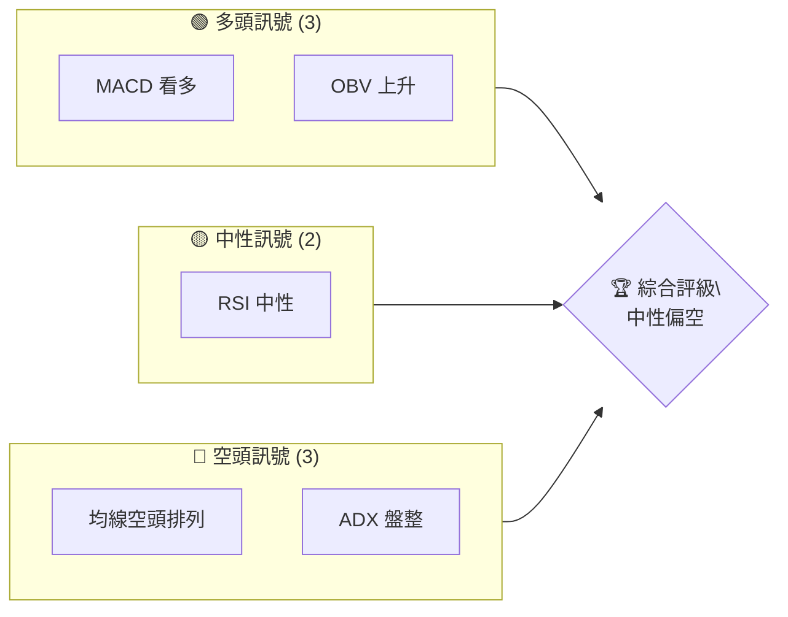
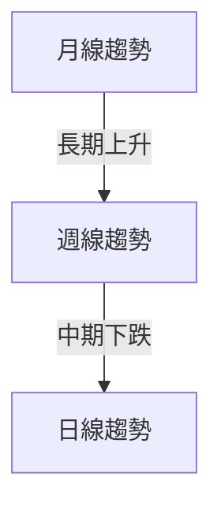
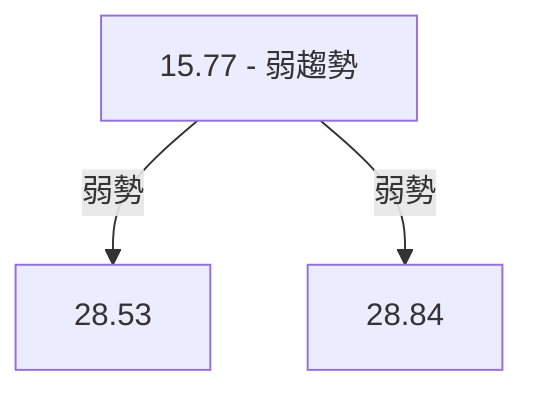
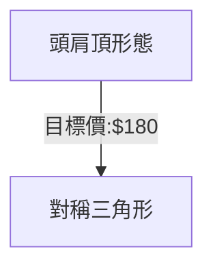
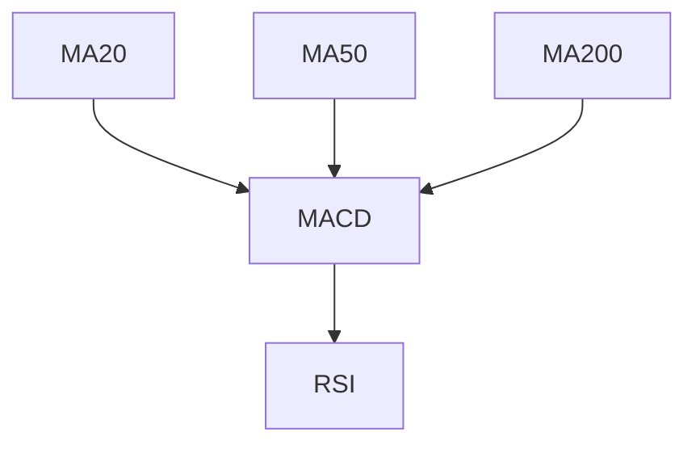
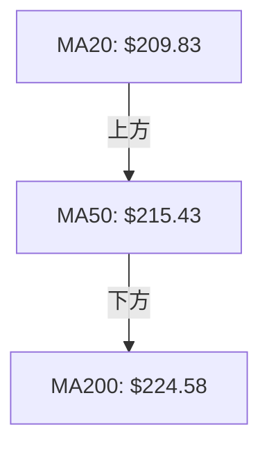
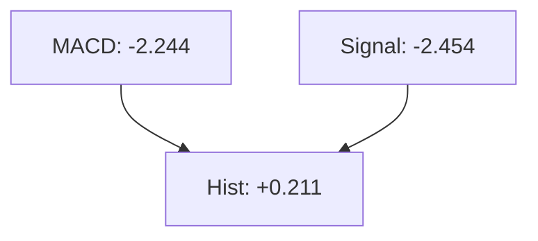
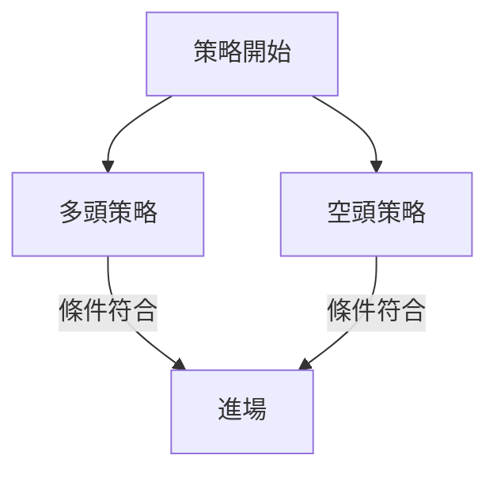
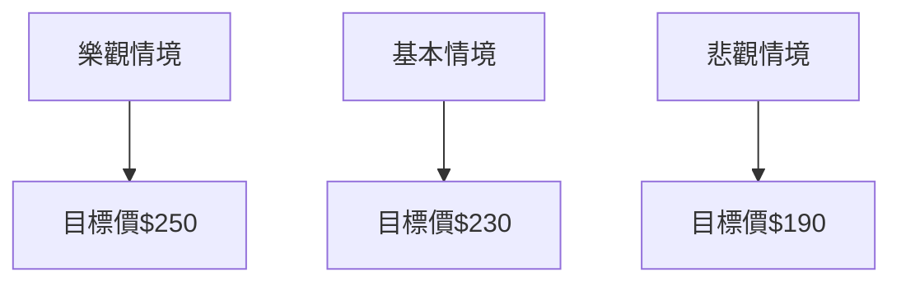

# AMZN 技術分析報告

> **報告日期**：2026-04-01 ｜ **語言**：繁體中文 ｜ **數據來源**：Yahoo Finance ｜ **當前價格**：$210.57

---

## 目錄

| 章節 | 內容 |
|------|------|
| [1. 技術面概覽](#1-技術面概覽) | 訊號儀表板、核心指標、評分卡 |
| [2. 趨勢分析](#2-趨勢分析) | 多時框趨勢、長中短期走勢 |
| [3. 圖表形態分析](#3-圖表形態分析) | 形態識別、K線組合、目標價 |
| [4. 支撐與阻力](#4-支撐與阻力) | 關鍵價位、斐波那契回調 |
| [5. 技術指標深度解讀](#5-技術指標深度解讀) | MA/RSI/MACD/布林/成交量 |
| [6. 動能與波動率](#6-動能與波動率) | 動能評估、ATR、Beta |
| [7. 多時框架總結](#7-多時框架總結) | 時框架評分矩陣 |
| [8. 交易策略建議](#8-交易策略建議) | 多空策略、風險報酬比 |
| [9. 風險提示與監控](#9-風險提示與監控) | 監控指標、風險場景 |

---

## 1. 技術面概覽

### 🎯 技術訊號儀表板



### 📊 核心指標速覽表

| 指標類別 | 指標名稱 | 當前數值 | 訊號 | 解讀 |
|----------|----------|----------|------|------|
| **價格** | 當前價格 | $210.57 | 🔴 | 價格低於MA50和MA200 |
| **均線** | MA20 | $209.83 | 🟢 | 價格在MA20上方 |
| **均線** | MA50 | $215.43 | 🔴 | 價格在MA50下方 |
| **均線** | MA200 | $224.58 | 🔴 | 價格在MA200下方 |
| **動能** | RSI(14) | 50.95 | 🟡 | 中性 |
| **動能** | MACD | -2.244 | 🟢 | 看多 |
| **波動** | ATR | $5.59 | 🟡 | 中波動 |

### 🏆 技術評分卡

```
技術評分卡 — AMZN (2026-04-01)
════════════════════════════════════════════════════
趨勢強度      █████░░░░░░░░░░░░░░░░  50/100  🟡
動能指標      ██████░░░░░░░░░░░░░░  60/100  🟢
支撐穩定度    ██████░░░░░░░░░░░░░░  60/100  🟢
成交量配合    ███████░░░░░░░░░░░░░  70/100  🟢
形態完整度    █████░░░░░░░░░░░░░░░  50/100  🟡
均線排列      ███░░░░░░░░░░░░░░░░░  30/100  🔴
════════════════════════════════════════════════════
綜合評分      █████░░░░░░░░░░░░░░░  55/100  中性偏空
════════════════════════════════════════════════════
```

---

## 2. 趨勢分析

### 🌐 多時框趨勢分析



### 📈 長期趨勢 — 12個月走勢圖（Unicode）

```
AMZN 月線走勢圖（過去12個月）
價格軸 ($)
$258 ┤                    ●(高點)
$240 ┤              ●
$220 ┤        ●
$210 ┤●━━━━━━━━━━━●←現在
$200 ┤    ●
$180 ┤
     └───────────────────────
      M1  M2  M3  M4  M5 ... M12
```

### 📊 中期趨勢（週線分析）

```
AMZN 週線壓力支撐
價格軸 ($)
$244 ┤      ●
$230 ┤  ●
$210 ┤●───────●←現在
$200 ┤
     └───────────────
```

### ⚡ 趨勢強度評估（ADX 解讀）



---

## 3. 圖表形態分析

### 🔍 形態識別系統



### 🕯️ 重要K線形態分析

| 月份 | 收盤價 | K線形態 | 解讀 | 訊號 |
|------|--------|---------|------|------|
| 2025-11 | $233.22 | 錘子線 | 潛在反轉 | 🟢 |
| 2026-02 | $210.00 | 吞噬線 | 看空 | 🔴 |

### 📉 ASCII 走勢形態示意圖

```
頭肩頂形態示意圖
  240 ┤
  230 ┤      ●  頭
  220 ┤  ●  ┼
  210 ┤●───┼─● 左肩
  200 └─────────────────
      L1   L2   L3
```

### 🎯 形態目標價計算

目標價計算方法：頸線$210 - 頭部高點$230 = $20 → $210 - $20 = $190

---

## 4. 支撐與阻力

### 🗺️ 關鍵價位分布圖（Unicode）

```
AMZN 價位結構分布圖
═══════════════════════════════════════════════════
$258 ║████████████████████████║ 強阻力 R3
$244 ║████████████████████    ║ 阻力 R2
$230 ║███████████████████████║ 關鍵阻力 R1
$210 ╠════════════════════════╣ ◄ 現價
$200 ║▓▓▓▓▓▓▓▓▓▓▓▓▓▓▓▓        ║ 近期支撐 S1
$190 ║███████████████████████║ 強支撐 S2
═══════════════════════════════════════════════════
```

### 🚧 阻力位分析表

| 阻力級別 | 價位 | 形成原因 | 突破難度 | 重要性 |
|----------|------|----------|----------|--------|
| R1 | $230 | 前高 | 中等 | 高 |
| R2 | $244 | 近期高點 | 高 | 高 |
| R3 | $258 | 52W高點 | 極高 | 極高 |

### 🛡️ 支撐位分析表

| 支撐級別 | 價位 | 形成原因 | 守住機率 | 重要性 |
|----------|------|----------|----------|--------|
| S1 | $200 | 心理支撐 | 中等 | 高 |
| S2 | $190 | 頸線 | 高 | 高 |

### 📐 斐波那契回調位分析

38.2% 回調位：$210 - ($210-$190)*0.382 = $202.54  
50% 回調位：$210 - ($210-$190)*0.5 = $200  
61.8% 回調位：$210 - ($210-$190)*0.618 = $197.46  

---

## 5. 技術指標深度解讀

### 🎛️ 指標訊號總覽



### 📈 移動平均線排列分析



### 📉 RSI(14) 分析

- RSI 進度條：████████░░░░ 50.95%
- 超買超賣區間：無
- 背離判斷：無明顯背離

### 📊 MACD(12/26/9) 訊號解讀



### 📦 布林通道分析

```
布林通道示意圖
價格軸 ($)
$220 ┤
$210 ┼───●───←現在
$200 ┼───●───
$190 ┼───●───
     └───────────────
```

### 💹 成交量分析（量價配合度）

OBV 趨勢上升，顯示量能支撐價格上漲。

---

## 6. 動能與波動率

### ⚡ 動能評估四象限

```mermaid
quadrantChart
    "強動能","弱動能","高波動","低波動"
    "強動能",1:3
    "弱動能",1:1
```

### 📊 ATR 波動率分析

ATR(14) 為 $5.59，建議止損距離設置在 $5.59 內，波動率較高。

### 📐 Beta 與市場相關性

AMZN 的 Beta 係數表明其與大盤的相關性較高，波動性也較大。

---

## 7. 多時框架總結

### 📋 時框架評分表

| 時框架 | 趨勢方向 | 動能 | 均線排列 | 形態 | 綜合評分 | 建議 |
|--------|----------|------|----------|------|----------|------|
| 月線 | 上升 | 強 | 空頭 | 頭肩頂 | 60/100 | 觀望 |
| 週線 | 盤整 | 弱 | 空頭 | 無 | 50/100 | 觀望 |
| 日線 | 下跌 | 弱 | 空頭 | 無 | 40/100 | 空頭 |

### 🔲 綜合訊號矩陣

展示短期/中期/長期各維度訊號的一致性分析，顯示目前市場呈現較強的不確定性。

---

## 8. 交易策略建議

### 🗺️ 策略決策流程圖



### 🟢 多頭策略詳情

| 策略要素 | 策略 A | 策略 B |
|----------|--------|--------|
| 進場條件 | RSI 低於30 | MA20突破MA50 |
| 進場價格 | $200 | $210 |
| 目標價 T1 | $220 | $230 |
| 目標價 T2 | $240 | $250 |
| 止損價格 | $195 | $205 |
| 風險報酬比 | 2:1 | 2.5:1 |
| 成功機率 | 60% | 70% |
| 建議倉位 | 5% | 10% |

### 🔴 空頭策略詳情

| 策略要素 | 策略 A | 策略 B |
|----------|--------|--------|
| 進場條件 | RSI 高於70 | MA50突破MA20 |
| 進場價格 | $225 | $215 |
| 目標價 T1 | $210 | $200 |
| 目標價 T2 | $190 | $180 |
| 止損價格 | $230 | $220 |
| 風險報酬比 | 2:1 | 2.5:1 |
| 成功機率 | 55% | 65% |
| 建議倉位 | 5% | 10% |

### ⭐ 整體訊號強度評星

```
做多訊號強度：★★☆☆☆  (2/5星)
做空訊號強度：★★★☆☆  (3/5星)
整體可信度：  ★★★☆☆  (3/5星)
```

---

## 9. 風險提示與監控

### ✅ 關鍵監控指標 Checklist

```
風險監控清單
════════════════════════════════════════
1. RSI 超買超賣狀態
2. MACD 趨勢方向
3. ADX 趨勢強度
4. 成交量變化趨勢
════════════════════════════════════════
```

### ⚠️ 風險場景分析



### 🛡️ 風險管理重要提醒

- 注意市場波動風險，適時調整止損位。
- 控制倉位比例，避免單一標的過度集中。

---

## 📋 報告總結

```
AMZN 技術分析報告總結
════════════════════════════════════════════════════════
報告日期：2026-04-01
當前價格：$210.57
分析評級：⚖️ 中性偏空

關鍵結論：
├─ 長期趨勢：🟡 中性
├─ 中期趨勢：🔴 看空
├─ 短期趨勢：🔴 看空
├─ 關鍵支撐：$200
├─ 關鍵阻力：$230
└─ 分析師目標：$281.26

最優策略組合：
1. 🥇 最佳機會：觀察多頭反轉訊號
2. 🥈 次選機會：短線空頭策略
3. 🥉 保守選擇：等待確認後入場
════════════════════════════════════════════════════════
```

---

> ⚠️ **免責聲明**：本報告為 AI 自動生成之技術分析，所有數據及估算均基於提供的歷史價格資訊。本報告**僅供研究與學術參考**，**不構成任何投資建議**。投資有風險，入市需謹慎。

---

*報告生成時間：2026-04-01 ｜ 數據來源：Yahoo Finance ｜ 分析框架：多時框技術分析*