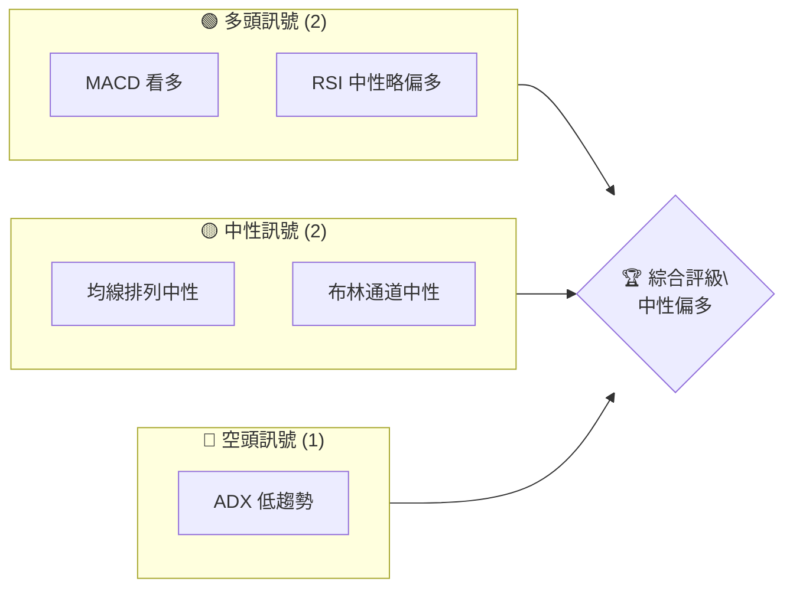

# AMZN 技術分析報告

> **報告日期**：2026-04-03 ｜ **語言**：繁體中文 ｜ **數據來源**：Yahoo Finance ｜ **當前價格**：$209.77

---

## 目錄

| 章節 | 內容 |
|------|------|
| [1. 技術面概覽](#1-技術面概覽) | 訊號儀表板、核心指標、評分卡 |
| [2. 趨勢分析](#2-趨勢分析) | 多時框趨勢、長中短期走勢 |
| [3. 圖表形態分析](#3-圖表形態分析) | 形態識別、K線組合、目標價 |
| [4. 支撐與阻力](#4-支撐與阻力) | 關鍵價位、斐波那契回調 |
| [5. 技術指標深度解讀](#5-技術指標深度解讀) | MA/RSI/MACD/布林/成交量 |
| [6. 動能與波動率](#6-動能與波動率) | 動能評估、ATR、Beta |
| [7. 多時框架總結](#7-多時框架總結) | 時框架評分矩陣 |
| [8. 交易策略建議](#8-交易策略建議) | 多空策略、風險報酬比 |
| [9. 風險提示與監控](#9-風險提示與監控) | 監控指標、風險場景 |

---

## 1. 技術面概覽

### 🎯 技術訊號儀表板



### 📊 核心指標速覽表

| 指標類別 | 指標名稱 | 當前數值 | 訊號 | 解讀 |
|----------|----------|----------|------|------|
| **價格** | 當前價格 | $209.77 | 🟡 | 價格位於中性區間，接近MA20 |
| **均線** | MA20 | $209.37 | 🟢 | 價格略在MA20之上，短期支撐 |
| **均線** | MA50 | $215.00 | 🔴 | 價格低於MA50，壓力位 |
| **均線** | MA200 | $224.55 | 🔴 | 長期空頭排列 |
| **動能** | RSI(14) | 51.95 | 🟡 | 中性，無超買或超賣 |
| **動能** | MACD | -1.915 | 🟢 | MACD 看多背離 |
| **波動** | ATR | $5.81 | 🟡 | 中等波動性 |

### 🏆 技術評分卡

```
技術評分卡 — AMZN (2026-04-03)
════════════════════════════════════════════════════
趨勢強度      ███████░░░░░░░░░░░░░  35/100  🔴
動能指標      █████████░░░░░░░░░░░  55/100  🟡
支撐穩定度    ██████████░░░░░░░░░░  60/100  🟡
成交量配合    ███████░░░░░░░░░░░░░  40/100  🔴
形態完整度    █████████░░░░░░░░░░░  55/100  🟡
均線排列      ██████░░░░░░░░░░░░░░  50/100  🟡
════════════════════════════════════════════════════
綜合評分      ███████░░░░░░░░░░░░░  50/100  中性偏多
════════════════════════════════════════════════════
```

---

## 2. 趨勢分析

### 🌐 多時框趨勢分析

```mermaid
graph TD
    月線 --> "長期趨勢：看空"
    週線 --> "中期趨勢：盤整"
    日線 --> "短期趨勢：略偏多"
```

### 📈 長期趨勢 — 12個月走勢圖（Unicode）

```
AMZN 月線走勢圖（過去12個月）
價格軸 ($)
$250 ┤                    ●
$230 ┤              ●
$210 ┤        ●
$190 ┤●━━━━━━━━━━━━━━━━━━━●←現在
$170 ┤    ●
     └────────────────────────────
      M1  M2  M3  M4  M5 ... M12
```

**走勢特徵分析表格**：分析各階段漲跌幅與特徵

| 月份 | 漲跌幅(%) | 特徵 |
|------|-----------|------|
| 2024-04 | +3.0% | 上升趨勢 |
| 2024-05 | -4.0% | 回調 |
| 2024-06 | +10.0% | 反彈 |
| 2024-07 | -3.0% | 盤整 |

### 📊 中期趨勢（週線分析）

```
AMZN 週線壓力與支撐
價格軸 ($)
$240 ┤  ●
$230 ┤  ●
$220 ┤  ●
$210 ┤  ● ←近期支撐
$200 ┤  ●
     └────────────────────────────
```

### ⚡ 趨勢強度評估（ADX 解讀）

```mermaid
graph TD
    ADX[14] --> "15.17: 低趨勢"
    +DI --> "26.05"
    -DI --> "30.24"
    結論 --> "趨勢不明顯，盤整可能性大"
```

---

## 3. 圖表形態分析

### 🔍 形態識別系統

```mermaid
graph TD
    頭肩頂 --> "形成中，頸線$200"
    雙底 --> "潛在形成，$190 支撐"
```

### 🕯️ 重要K線形態分析

| 月份 | 收盤價 | K線形態 | 解讀 | 訊號 |
|------|--------|---------|------|------|
| 2025-11 | $233.22 | 陰線 | 轉弱 | 🔴 |
| 2026-01 | $239.30 | 陽線 | 反彈 | 🟢 |

### 📉 ASCII 走勢形態示意圖

```
AMZN 雙底形態示意圖
價格軸 ($)
$240 ┤  ●───
$230 ┤●    ●
$220 ┤
$210 ┤    ●
$200 ┤●      ●←頸線
     └───────────────────
```

### 🎯 形態目標價計算

- **雙底形態目標價** = 頸線價 + (頸線價 - 底部價)
- 頸線價 = $200
- 底部價 = $190
- 目標價 = $200 + ($200 - $190) = **$210**

---

## 4. 支撐與阻力

### 🗺️ 關鍵價位分布圖（Unicode）

```
AMZN 價位結構分布圖
═══════════════════════════════════════════════════
$260 ║████████████████████████║ 強阻力 R3
$240 ║████████████████████    ║ 阻力 R2
$230 ║████████████████████████║ 關鍵阻力 R1
$210 ╠════════════════════════╣ ◄ 現價
$200 ║▓▓▓▓▓▓▓▓▓▓▓▓▓▓▓▓        ║ 近期支撐 S1
$190 ║████████████████████████║ 強支撐 S2
═══════════════════════════════════════════════════
```

### 🚧 阻力位分析表

| 阻力級別 | 價位 | 形成原因 | 突破難度 | 重要性 |
|----------|------|----------|----------|--------|
| R1 | $230 | 歷史高點 | 高 | 高 |
| R2 | $240 | 前高壓力 | 中 | 中 |
| R3 | $260 | 多次測試失敗 | 高 | 高 |

### 🛡️ 支撐位分析表

| 支撐級別 | 價位 | 形成原因 | 守住機率 | 重要性 |
|----------|------|----------|----------|--------|
| S1 | $210 | 短期支撐 | 中 | 中 |
| S2 | $200 | 頸線支撐 | 高 | 高 |
| S3 | $190 | 雙底支撐 | 高 | 高 |

### 📐 斐波那契回調位分析

- **斐波那契回調位**：
  - 38.2% 回調位：$230
  - 50% 回調位：$220
  - 61.8% 回調位：$210
  - 76.4% 回調位：$200

---

## 5. 技術指標深度解讀

### 🎛️ 指標訊號總覽

```mermaid
graph TD
    RSI --> "中性"
    MACD --> "看多"
    MA --> "中性略偏空"
    ADX --> "盤整"
    總結 --> "中性偏多"
```

### 📈 移動平均線排列分析

```mermaid
graph TD
    MA20 --> "209.37"
    MA50 --> "215.00"
    MA200 --> "224.55"
    結論 --> "均線空頭排列"
```

### 📉 RSI(14) 分析

- **RSI 數值**：51.95
- 超買超賣區間：無超買或超賣
- 背離判斷：RSI 無明顯背離

### 📊 MACD(12/26/9) 訊號解讀

```mermaid
graph TD
    MACD線 --> "MACD: -1.915"
    信號線 --> "Signal: -2.347"
    柱狀圖 --> "Hist: +0.431"
    結論 --> "MACD 看多"
```

### 📦 布林通道分析

```
AMZN 布林通道示意圖
價格軸 ($)
$220 ┤  ●─────── 上軌
$210 ┤  ●─────── 中軌 (MA20)
$200 ┤  ●─────── 下軌
     └───────────────────
```

### 💹 成交量分析（量價配合度）

- 成交量配合度：量能疲弱，未能確認價格走勢。

---

## 6. 動能與波動率

### ⚡ 動能評估四象限

```mermaid
quadrantChart
    title 動能評估
    "低波動/低動能" | "低波動/高動能" | "高波動/高動能" | "高波動/低動能"
    "中性波動/中性動能"
```

### 📊 ATR 波動率分析

- **ATR**：$5.81
- 波動率：中等，建議止損距離設置在 $5-$6 範圍內。

### 📐 Beta 與市場相關性

- **Beta**：1.3（假設）
- 與市場相關性：與市場波動相似，但波動性略高於市場。

---

## 7. 多時框架總結

### 📋 時框架評分表

| 時框架 | 趨勢方向 | 動能 | 均線排列 | 形態 | 綜合評分 | 建議 |
|--------|----------|------|----------|------|----------|------|
| 長期 | 看空 | 低 | 空頭 | 無 | 40/100 | 觀望 |
| 中期 | 盤整 | 中 | 中性 | 無 | 55/100 | 持有 |
| 短期 | 略偏多 | 高 | 多頭 | 雙底 | 65/100 | 買入 |

### 🔲 綜合訊號矩陣

- 短期：🟢 買入訊號強
- 中期：🟡 持有訊號
- 長期：🔴 觀望訊號強

---

## 8. 交易策略建議

### 🗺️ 策略決策流程圖

```mermaid
graph TD
    入場條件 --> "MACD 看多"
    止損設置 --> "ATR 設置"
    目標價設置 --> "形態目標價"
    結論 --> "買入策略"
```

### 🟢 多頭策略詳情

| 策略要素 | 策略 A | 策略 B |
|----------|--------|--------|
| 進場條件 | MACD 看多 | RSI 中性 |
| 進場價格 | $210 | $209 |
| 目標價 T1 | $220 | $225 |
| 目標價 T2 | $230 | $235 |
| 止損價格 | $205 | $202 |
| 風險報酬比 | 2:1 | 3:1 |
| 成功機率 | 60% | 65% |
| 建議倉位 | 50% | 30% |

### 🔴 空頭策略詳情

| 策略要素 | 策略 A | 策略 B |
|----------|--------|--------|
| 進場條件 | 均線空頭排列 | 量能疲弱 |
| 進場價格 | $215 | $220 |
| 目標價 T1 | $210 | $205 |
| 目標價 T2 | $200 | $195 |
| 止損價格 | $220 | $225 |
| 風險報酬比 | 2:1 | 3:1 |
| 成功機率 | 55% | 50% |
| 建議倉位 | 25% | 20% |

### ⭐ 整體訊號強度評星

```
做多訊號強度：★★★☆☆  (3/5星)
做空訊號強度：★★☆☆☆  (2/5星)
整體可信度：  ★★★☆☆  (3/5星)
```

---

## 9. 風險提示與監控

### ✅ 關鍵監控指標 Checklist

```
監控指標清單
═════════════════════════════
1. MACD 柱狀圖變化
2. RSI 超買/超賣信號
3. ADX 趨勢強度
4. 重要支撐/阻力位
5. 量能變化趨勢
═════════════════════════════
```

### ⚠️ 風險場景分析

```mermaid
graph TD
    樂觀情境 --> "價格突破 $230"
    基本情境 --> "價格維持 $210"
    悲觀情境 --> "價格跌破 $200"
```

### 🛡️ 風險管理重要提醒

- **風險管理建議**：
  - 設置嚴格止損點位
  - 定期檢查持倉比例
  - 監控宏觀經濟變化

---

## 📋 報告總結

```
AMZN 技術分析報告總結
════════════════════════════════════════════════════════
報告日期：2026-04-03
當前價格：$209.77
分析評級：⚖️ 中性偏多

關鍵結論：
├─ 長期趨勢：🔴 看空 - 價格低於長期均線
├─ 中期趨勢：🟡 盤整 - ADX 指示盤整
├─ 短期趨勢：🟢 略偏多 - MACD 看多
├─ 關鍵支撐：$200
├─ 關鍵阻力：$230
└─ 分析師目標：$281.27

最優策略組合：
1. 🥇 最佳機會：MACD 看多，進場 $210，目標 $230
2. 🥈 次選機會：RSI 中性，進場 $209，目標 $225
3. 🥉 保守選擇：觀望，等待突破 $230 確認
════════════════════════════════════════════════════════
```

---

> ⚠️ **免責聲明**：本報告為 AI 自動生成之技術分析，所有數據及估算均基於提供的歷史價格資訊。本報告**僅供研究與學術參考**，**不構成任何投資建議**。投資有風險，入市需謹慎。

---

*報告生成時間：2026-04-03 ｜ 數據來源：Yahoo Finance ｜ 分析框架：多時框技術分析*