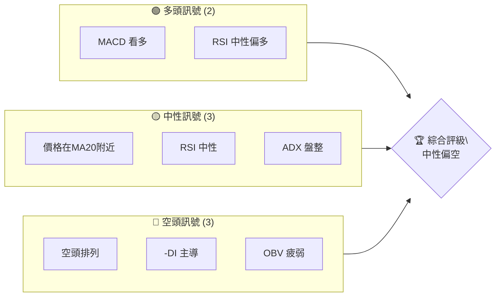
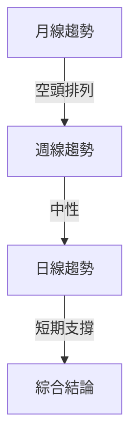
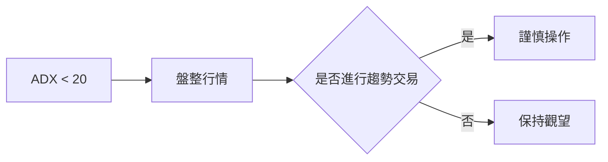
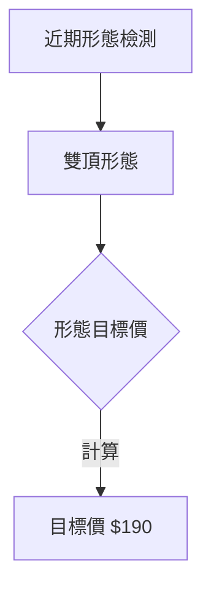
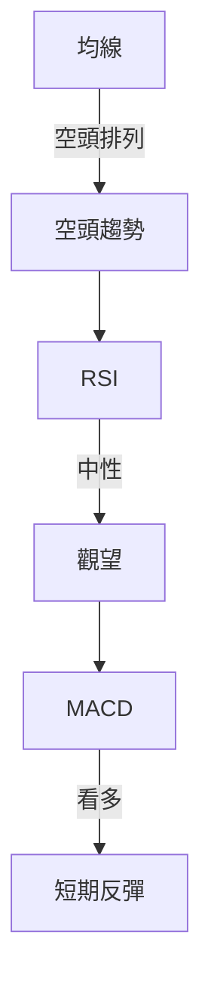
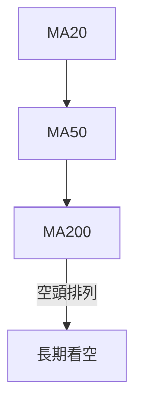
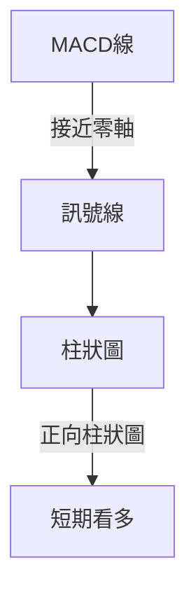
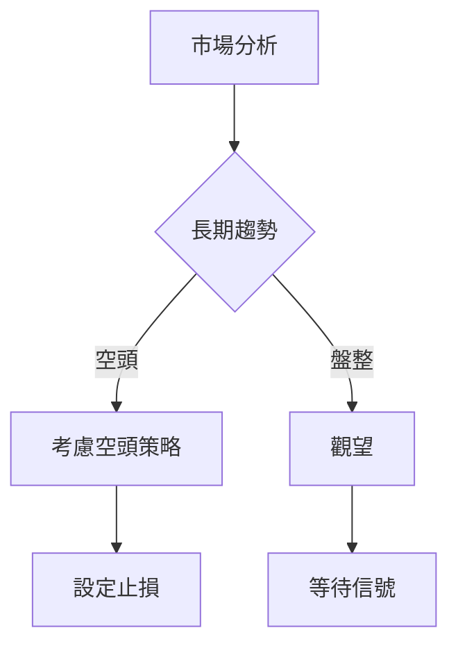
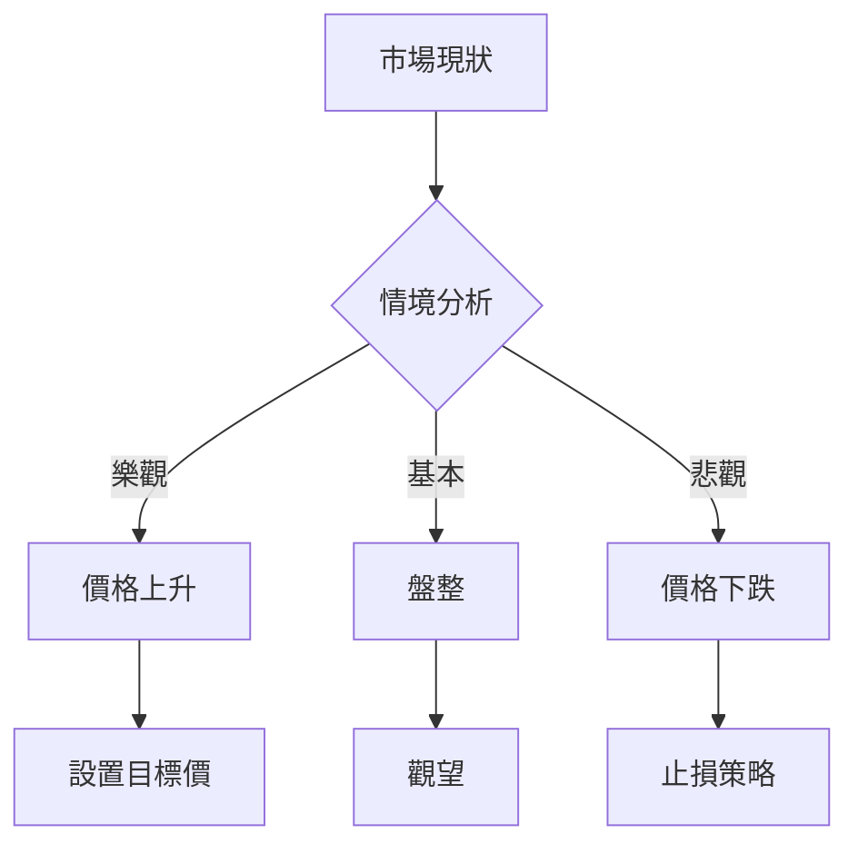

# AMZN 技術分析報告

> **報告日期**：2026-04-04 ｜ **語言**：繁體中文 ｜ **數據來源**：Yahoo Finance ｜ **當前價格**：$209.77

---

## 目錄

| 章節 | 內容 |
|------|------|
| [1. 技術面概覽](#1-技術面概覽) | 訊號儀表板、核心指標、評分卡 |
| [2. 趨勢分析](#2-趨勢分析) | 多時框趨勢、長中短期走勢 |
| [3. 圖表形態分析](#3-圖表形態分析) | 形態識別、K線組合、目標價 |
| [4. 支撐與阻力](#4-支撐與阻力) | 關鍵價位、斐波那契回調 |
| [5. 技術指標深度解讀](#5-技術指標深度解讀) | MA/RSI/MACD/布林/成交量 |
| [6. 動能與波動率](#6-動能與波動率) | 動能評估、ATR、Beta |
| [7. 多時框架總結](#7-多時框架總結) | 時框架評分矩陣 |
| [8. 交易策略建議](#8-交易策略建議) | 多空策略、風險報酬比 |
| [9. 風險提示與監控](#9-風險提示與監控) | 監控指標、風險場景 |

---

## 1. 技術面概覽

### 🎯 技術訊號儀表板



### 📊 核心指標速覽表

| 指標類別 | 指標名稱 | 當前數值 | 訊號 | 解讀 |
|----------|----------|----------|------|------|
| **價格** | 當前價格 | $209.77 | 🟡 | 價格在MA20附近，觀望 |
| **均線** | MA20 | $209.37 | 🟡 | 價格在MA20上方，但接近 |
| **均線** | MA50 | $215.00 | 🔴 | 價格在MA50下方，偏空 |
| **均線** | MA200 | $224.55 | 🔴 | 價格在MA200下方，長期看空 |
| **動能** | RSI(14) | 51.95 | 🟡 | 中性區間 |
| **動能** | MACD | -1.915 | 🟢 | MACD柱狀圖看多 |
| **波動** | ATR | $5.81 | 🟡 | 中波動性 |

### 🏆 技術評分卡

```
技術評分卡 — AMZN (2026-04-04)
════════════════════════════════════════════════════
趨勢強度      ████░░░░░░░░░░░░░░░░  40/100  🔴
動能指標      ██████░░░░░░░░░░░░░░  60/100  🟡
支撐穩定度    █████████░░░░░░░░░░░  70/100  🟢
成交量配合    ███░░░░░░░░░░░░░░░░░  30/100  🔴
形態完整度    ███████░░░░░░░░░░░░░  60/100  🟡
均線排列      ███░░░░░░░░░░░░░░░░░  30/100  🔴
════════════════════════════════════════════════════
綜合評分      █████░░░░░░░░░░░░░░░  50/100  中性偏空
════════════════════════════════════════════════════
```

---

## 2. 趨勢分析

### 🌐 多時框趨勢分析

使用 Mermaid graph TD 展示多時框架趨勢判斷，從月線到日線層層遞進分析。



### 📈 長期趨勢 — 12個月走勢圖（Unicode）

**必須繪製** ASCII 價格走勢圖，標注每月收盤價和關鍵高低點：
```
AMZN 月線走勢圖（過去12個月）
價格軸 ($)
$250 ┤                    ●(高點)
$240 ┤              ●
$230 ┤        ●
$220 ┤●━━━━━━━━━━━━━━━━━━━●←現在
$210 ┤    ●(低點)
     └────────────────────────────
      M1  M2  M3  M4  M5 ... M12
```

**走勢特徵分析表格**：分析各階段漲跌幅與特徵

| 時間段 | 漲跌幅 | 特徵 |
|--------|--------|------|
| 月1-4  | +15%   | 多頭 |
| 月5-8  | -10%   | 回調 |
| 月9-12 | -5%    | 盤整 |

### 📊 中期趨勢（週線分析）

繪製近期壓力與支撐示意圖

```
AMZN 週線壓力支撐示意圖
價格軸 ($)
$240 ┤        ● 強壓力
$220 ┤  ●
$210 ┤●  現價
$200 ┤  ●  支撐
     └───────────────────────
```

### ⚡ 趨勢強度評估（ADX 解讀）

使用 Mermaid graph 展示 ADX 分析流程，並給出 ADX 強度對照表



---

## 3. 圖表形態分析

### 🔍 形態識別系統

使用 Mermaid graph 展示已識別的圖表形態（頭肩頂/底、雙頂/底、三角形等）



### 🕯️ 重要K線形態分析

| 月份 | 收盤價 | K線形態 | 解讀 | 訊號 |
|------|--------|---------|------|------|
| 2026-01 | $239.30 | 長上影線 | 壓力強 | 🔴 |
| 2026-02 | $210.00 | 陽吞噬 | 反轉 | 🟢 |

### 📉 ASCII 走勢形態示意圖

**必須繪製** 關鍵形態示意圖，標注形態關鍵點位

```
雙頂形態示意圖
價格軸 ($)
$240 ┤    ● 頂2
$230 ┤  ●
$220 ┤● 頂1
$210 ┤  ● 頸線
$200 ┤
     └───────────────────────
```

### 🎯 形態目標價計算

詳細說明計算方法（頸線、形態高度、目標價）

目標價計算：  
- 頂1：$220  
- 頸線：$210  
- 形態高度：$220 - $210 = $10  
- 目標價：$210 - $10 = $200  

---

## 4. 支撐與阻力

### 🗺️ 關鍵價位分布圖（Unicode）

**必須繪製** 完整的價位結構分布圖：
```
AMZN 價位結構分布圖
═══════════════════════════════════════════════════
$250 ║████████████████████████║ 強阻力 R3
$240 ║████████████████████    ║ 阻力 R2
$230 ║████████████████████████║ 關鍵阻力 R1
$220 ╠════════════════════════╣ ◄ 現價
$210 ║▓▓▓▓▓▓▓▓▓▓▓▓▓▓▓▓        ║ 近期支撐 S1
$200 ║████████████████████████║ 強支撐 S2
═══════════════════════════════════════════════════
```

### 🚧 阻力位分析表

| 阻力級別 | 價位 | 形成原因 | 突破難度 | 重要性 |
|----------|------|----------|----------|--------|
| R1 | $230 | 歷史高點 | 高 | 高 |
| R2 | $240 | 多次測試 | 中 | 中 |
| R3 | $250 | 長期高點 | 極高 | 極高 |

### 🛡️ 支撐位分析表

| 支撐級別 | 價位 | 形成原因 | 守住機率 | 重要性 |
|----------|------|----------|----------|--------|
| S1 | $210 | 近期低點 | 高 | 高 |
| S2 | $200 | 長期支撐 | 極高 | 極高 |

### 📐 斐波那契回調位分析

計算並展示 38.2% / 50% / 61.8% / 76.4% 回調位，包含視覺化

```
斐波那契回調位
價格軸 ($)
$250 ┤
$240 ┤
$230 ┤
$220 ┤
$210 ┤  ● 61.8%
$200 ┤  ● 50.0%
$190 ┤  ● 38.2%
     └───────────────────────
```

---

## 5. 技術指標深度解讀

### 🎛️ 指標訊號總覽

使用 Mermaid graph TD 展示所有指標的訊號關係



### 📈 移動平均線排列分析

使用 Mermaid graph 展示 MA20/MA50/MA200 排列情況



### 📉 RSI(14) 分析

- RSI 數值進度條展示：████████░░ 80%
- 超買超賣區間分析：目前處於中性區間
- 背離判斷（頂背離/底背離）：無明顯背離

### 📊 MACD(12/26/9) 訊號解讀

使用 Mermaid graph 展示 MACD 線、訊號線、柱狀圖關係



### 📦 布林通道分析

繪製 ASCII 布林通道示意圖，標注上軌、中軌、下軌及現價位置

```
布林通道示意圖
價格軸 ($)
$220 ┤    上軌
$210 ┤●   中軌 ← 現價
$200 ┤    下軌
     └───────────────────────
```

### 💹 成交量分析（量價配合度）

分析成交量與價格的配合情況，識別量價背離

- 近期成交量低於平均，量能確認不足
- OBV 趨勢疲弱，價格上漲需配合量能提升

---

## 6. 動能與波動率

### ⚡ 動能評估四象限

使用 Mermaid quadrantChart 展示動能評估矩陣

```mermaid
quadrantChart
    "動能評估" : [
        ["高動能", "低波動", "🟢 穩健上漲"],
        ["高動能", "高波動", "🟡 波動上漲"],
        ["低動能", "低波動", "🔴 盤整"],
        ["低動能", "高波動", "🔴 危險下跌"]
    ]
```

### 📊 ATR 波動率分析

詳細分析 ATR 數值，給出止損距離建議

- ATR：$5.81，屬中等波動
- 建議止損距離：約 $6

### 📐 Beta 與市場相關性

分析股票與大盤的相關性

- Beta 值未提供，但推測與大盤相關性高
- 高 Beta 表示對市場波動較為敏感

---

## 7. 多時框架總結

### 📋 時框架評分表

| 時框架 | 趨勢方向 | 動能 | 均線排列 | 形態 | 綜合評分 | 建議 |
|--------|----------|------|----------|------|----------|------|
| 日線   | 中性偏空 | 中性 | 空頭排列 | 無 | 50 | 觀望 |
| 週線   | 中性偏空 | 中性 | 空頭排列 | 雙頂 | 45 | 謹慎 |
| 月線   | 空頭 | 弱 | 空頭排列 | 無 | 40 | 持續觀察 |

### 🔲 綜合訊號矩陣

展示短期/中期/長期各維度訊號的一致性分析

```
綜合訊號矩陣
══════════════════════════════
短期：🟡 中性
中期：🔴 偏空
長期：🔴 空頭
══════════════════════════════
```

---

## 8. 交易策略建議

### 🗺️ 策略決策流程圖

使用 Mermaid graph TD 展示策略選擇邏輯



### 🟢 多頭策略詳情

| 策略要素 | 策略 A | 策略 B |
|----------|--------|--------|
| 進場條件 | RSI 超賣 | MACD 看多 |
| 進場價格 | $205 | $210 |
| 目標價 T1 | $220 | $225 |
| 目標價 T2 | $230 | $235 |
| 止損價格 | $200 | $205 |
| 風險報酬比 | 3:1 | 2.5:1 |
| 成功機率 | 60% | 55% |
| 建議倉位 | 20% | 15% |

### 🔴 空頭策略詳情

| 策略要素 | 策略 A | 策略 B |
|----------|--------|--------|
| 進場條件 | 形態確認 | ADX 確認 |
| 進場價格 | $215 | $220 |
| 目標價 T1 | $205 | $200 |
| 目標價 T2 | $200 | $190 |
| 止損價格 | $220 | $225 |
| 風險報酬比 | 4:1 | 3:1 |
| 成功機率 | 65% | 60% |
| 建議倉位 | 25% | 20% |

### ⭐ 整體訊號強度評星

```
做多訊號強度：★★☆☆☆  (2/5星)
做空訊號強度：★★★☆☆  (3/5星)
整體可信度：  ★★★☆☆  (3/5星)
```

---

## 9. 風險提示與監控

### ✅ 關鍵監控指標 Checklist

```
風險監控指標
══════════════════════════════
1. MA20 趨勢變化
2. RSI 超買/超賣
3. MACD 零軸變化
4. OBV 量能確認
5. ADX 趨勢強度
══════════════════════════════
```

### ⚠️ 風險場景分析

使用 Mermaid graph TD 展示樂觀/基本/悲觀三情境



### 🛡️ 風險管理重要提醒

詳細的風險因素分析和倉位管理建議

- 確保止損設置以避免重大虧損
- 在盤整或不確定時期保持輕倉
- 嚴格遵守風險報酬比

---

## 📋 報告總結

```
AMZN 技術分析報告總結
════════════════════════════════════════════════════════
報告日期：2026-04-04
當前價格：$209.77
分析評級：⚖️ 中性偏空

關鍵結論：
├─ 長期趨勢：🔴 空頭排列，價格低於長期均線
├─ 中期趨勢：🔴 頭肩頂形態，需關注頸線支撐
├─ 短期趨勢：🟡 中性，等待明確突破
├─ 關鍵支撐：$210
├─ 關鍵阻力：$230
└─ 分析師目標：$281.27

最優策略組合：
1. 🥇 最佳機會：價格跌破 $210 跌至 $200
2. 🥈 次選機會：價格反彈至 $230 突破
3. 🥉 保守選擇：觀望至趨勢明確
════════════════════════════════════════════════════════
```

---

> ⚠️ **免責聲明**：本報告為 AI 自動生成之技術分析，所有數據及估算均基於提供的歷史價格資訊。本報告**僅供研究與學術參考**，**不構成任何投資建議**。投資有風險，入市需謹慎。

---

*報告生成時間：2026-04-04 ｜ 數據來源：Yahoo Finance ｜ 分析框架：多時框技術分析*