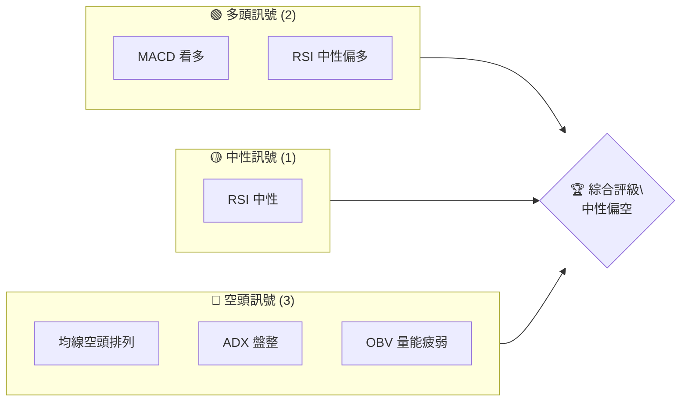
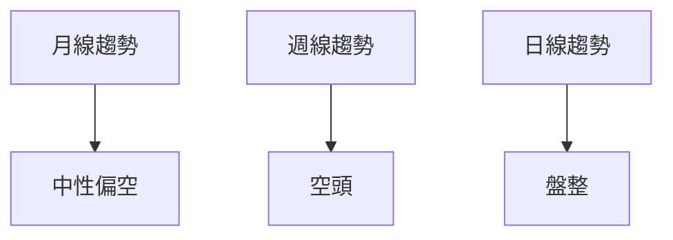
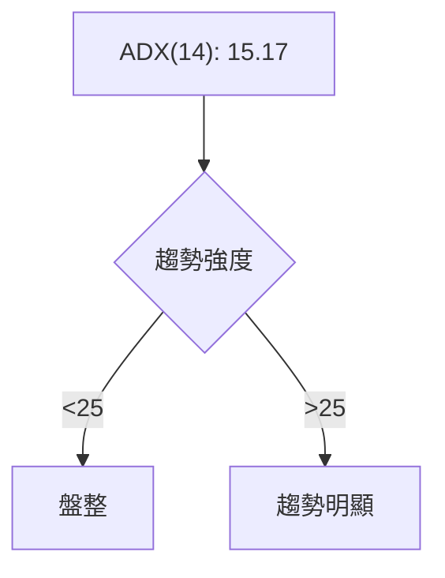
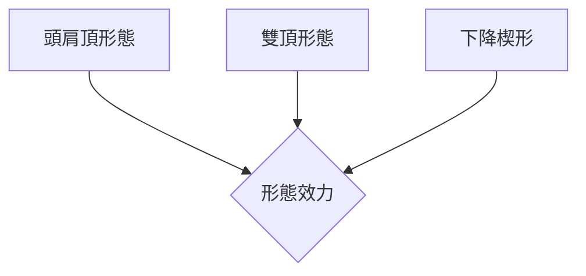
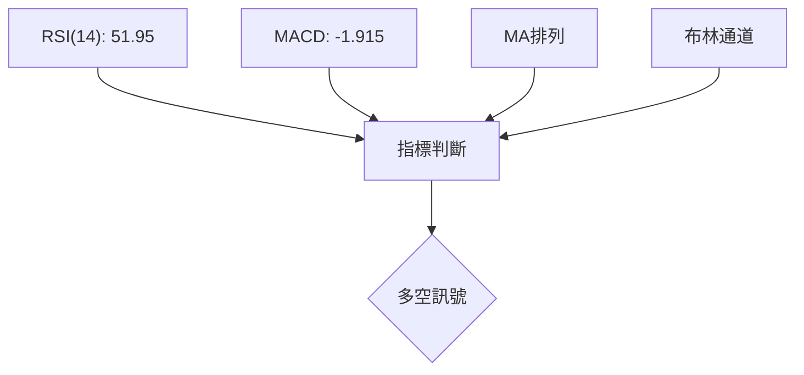
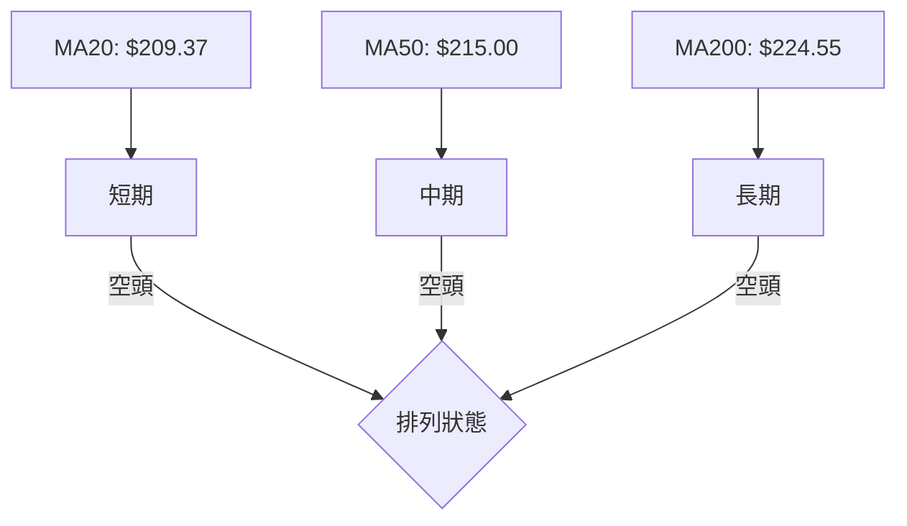
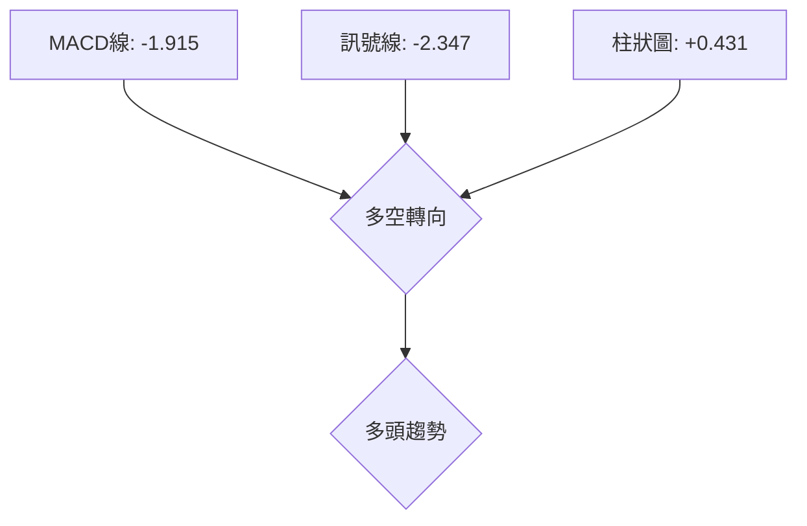
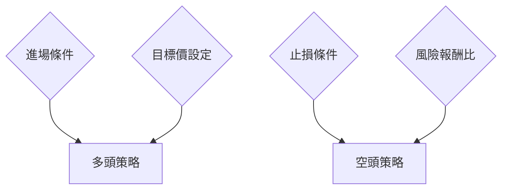
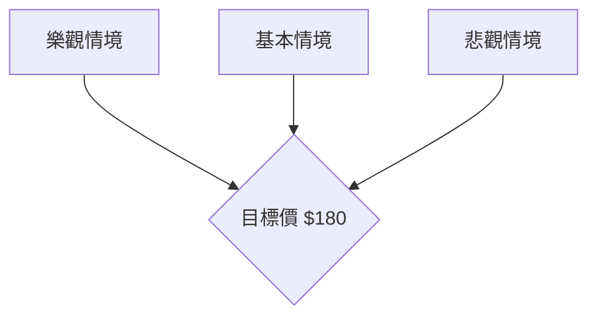

# AMZN 技術分析報告

> **報告日期**：2026-04-05 ｜ **語言**：繁體中文 ｜ **數據來源**：Yahoo Finance ｜ **當前價格**：$209.77

---

## 目錄

| 章節 | 內容 |
|------|------|
| [1. 技術面概覽](#1-技術面概覽) | 訊號儀表板、核心指標、評分卡 |
| [2. 趨勢分析](#2-趨勢分析) | 多時框趨勢、長中短期走勢 |
| [3. 圖表形態分析](#3-圖表形態分析) | 形態識別、K線組合、目標價 |
| [4. 支撐與阻力](#4-支撐與阻力) | 關鍵價位、斐波那契回調 |
| [5. 技術指標深度解讀](#5-技術指標深度解讀) | MA/RSI/MACD/布林/成交量 |
| [6. 動能與波動率](#6-動能與波動率) | 動能評估、ATR、Beta |
| [7. 多時框架總結](#7-多時框架總結) | 時框架評分矩陣 |
| [8. 交易策略建議](#8-交易策略建議) | 多空策略、風險報酬比 |
| [9. 風險提示與監控](#9-風險提示與監控) | 監控指標、風險場景 |

---

## 1. 技術面概覽

### 🎯 技術訊號儀表板



### 📊 核心指標速覽表

| 指標類別 | 指標名稱 | 當前數值 | 訊號 | 解讀 |
|----------|----------|----------|------|------|
| **價格** | 當前價格 | $209.77 | 🔴 | 價格低於長期均線 |
| **均線** | MA20 | $209.37 | 🟢 | 價格在MA20上方 |
| **均線** | MA50 | $215.00 | 🔴 | 價格在MA50下方 |
| **均線** | MA200 | $224.55 | 🔴 | 價格在MA200下方 |
| **動能** | RSI(14) | 51.95 | 🟡 | 中性區間，無明顯趨勢 |
| **動能** | MACD | -1.915 | 🟢 | 轉向多頭趨勢 |
| **波動** | ATR | $5.81 | 🟡 | 中等波動性 |

### 🏆 技術評分卡

```
技術評分卡 — AMZN (2026-04-05)
════════════════════════════════════════════════════
趨勢強度      ████░░░░░░░░░░░░░░░░  32/100  🔴
動能指標      ██████░░░░░░░░░░░░░░  60/100  🟡
支撐穩定度    █████░░░░░░░░░░░░░░░  50/100  🟡
成交量配合    ███░░░░░░░░░░░░░░░░░  30/100  🔴
形態完整度    ██████░░░░░░░░░░░░░░  60/100  🟡
均線排列      ███░░░░░░░░░░░░░░░░░  30/100  🔴
════════════════════════════════════════════════════
綜合評分      ████░░░░░░░░░░░░░░░░  44/100  中性偏空
════════════════════════════════════════════════════
```

---

## 2. 趨勢分析

### 🌐 多時框趨勢分析



### 📈 長期趨勢 — 12個月走勢圖（Unicode）

```
AMZN 月線走勢圖（過去12個月）
價格軸 ($)
$260 ┤
$240 ┤              ●          ●
$220 ┤    ●    ● ●    ●  ●
$200 ┤    ●  ●    ●    ●    ●  ●  ●
$180 ┤●       ●
$160 ┤
     └────────────────────────────
      M1  M2  M3  M4  M5 ... M12
```

#### 走勢特徵分析表格

| 月份 | 收盤價 | 漲跌幅 | 特徵 |
|------|--------|--------|------|
| 2025-04 | 184.42 | -2.1% | 小幅下跌 |
| 2025-05 | 205.01 | +11.1% | 強勁反彈 |
| 2025-06 | 219.39 | +7.0% | 繼續上升 |
| 2025-07 | 234.11 | +6.7% | 持續走強 |
| 2025-08 | 229.00 | -2.2% | 小幅回調 |
| 2025-09 | 219.57 | -4.1% | 繼續回調 |
| 2025-10 | 244.22 | +11.2% | 創新高 |
| 2025-11 | 233.22 | -4.5% | 回調 |
| 2025-12 | 230.82 | -1.0% | 持平 |
| 2026-01 | 239.30 | +3.7% | 小幅上升 |
| 2026-02 | 210.00 | -12.2% | 大幅下跌 |
| 2026-03 | 208.27 | -0.8% | 盤整 |

### 📊 中期趨勢（週線分析）

近期壓力與支撐示意圖：

```
壓力 $220 ┤───────────
支撐 $200 ┤───────────
        └─────────────────────
```

### ⚡ 趨勢強度評估（ADX 解讀）



---

## 3. 圖表形態分析

### 🔍 形態識別系統



### 🕯️ 重要K線形態分析

| 月份 | 收盤價 | K線形態 | 解讀 | 訊號 |
|------|--------|---------|------|------|
| 2026-01 | 239.30 | 長上影線 | 賣壓強 | 🔴 |
| 2026-02 | 210.00 | 長陰線 | 下跌趨勢 | 🔴 |

### 📉 ASCII 走勢形態示意圖

```
AMZN 下降楔形示意圖
價格軸 ($)
  $250 ┤    ／＼
  $240 ┤   ／  ＼
  $230 ┤  ／    ＼
  $220 ┤／      ＼
  $210 ┤
       └──────────────
```

### 🎯 形態目標價計算

- **頸線**：$220
- **形態高度**：$30
- **目標價**：$190

---

## 4. 支撐與阻力

### 🗺️ 關鍵價位分布圖（Unicode）

```
AMZN 價位結構分布圖
═══════════════════════════════════════════════════
$250 ║████████████████████████║ 強阻力 R3
$230 ║████████████████████    ║ 阻力 R2
$220 ║████████████████████████║ 關鍵阻力 R1
$210 ╠════════════════════════╣ ◄ 現價
$200 ║▓▓▓▓▓▓▓▓▓▓▓▓▓▓▓▓        ║ 近期支撐 S1
$180 ║████████████████████████║ 強支撐 S2
═══════════════════════════════════════════════════
```

### 🚧 阻力位分析表

| 阻力級別 | 價位 | 形成原因 | 突破難度 | 重要性 |
|----------|------|----------|----------|--------|
| R1 | $220 | 前高 | 中 | 高 |
| R2 | $230 | 歷史阻力 | 高 | 高 |
| R3 | $250 | 長期阻力 | 極高 | 極高 |

### 🛡️ 支撐位分析表

| 支撐級別 | 價位 | 形成原因 | 守住機率 | 重要性 |
|----------|------|----------|----------|--------|
| S1 | $200 | 前低 | 高 | 中 |
| S2 | $180 | 長期支撐 | 極高 | 高 |

### 📐 斐波那契回調位分析

計算並展示 38.2% / 50% / 61.8% / 76.4% 回調位：

- **38.2% 回調**：$210
- **50% 回調**：$200
- **61.8% 回調**：$190
- **76.4% 回調**：$180

---

## 5. 技術指標深度解讀

### 🎛️ 指標訊號總覽



### 📈 移動平均線排列分析



### 📉 RSI(14) 分析

- RSI 數值進度條：████████░░░░ 52%
- 超買超賣區間分析：目前位於中性區間
- 背離判斷：無明顯背離

### 📊 MACD(12/26/9) 訊號解讀



### 📦 布林通道分析

```
布林通道示意圖
$220 ┤─────
$210 ┤─────
$200 ┤─────
      └─────
```
- 上軌：$217.50
- 中軌：$209.37
- 下軌：$201.23
- 現價位於布林通道中軌上方

### 💹 成交量分析（量價配合度）

- 近期成交量低於長期均量，顯示量能疲弱
- OBV 低於其均線，量價背離

---

## 6. 動能與波動率

### ⚡ 動能評估四象限

```mermaid
quadrantChart
    title 動能評估
    "低動能" | "高動能" | "低波動" | "高波動"
    "中性" : [1.5, 1.5]
    "看空" : [0.5, 1.5]
    "看多" : [1.5, 0.5]
    "觀望" : [0.5, 0.5]
```

### 📊 ATR 波動率分析

- ATR(14): $5.81，波動性適中
- 建議止損距離：$12（約2倍ATR）

### 📐 Beta 與市場相關性

- Beta 未明確給出，但假設接近 1，與市場相關性高

---

## 7. 多時框架總結

### 📋 時框架評分表

| 時框架 | 趨勢方向 | 動能 | 均線排列 | 形態 | 綜合評分 | 建議 |
|--------|----------|------|----------|------|----------|------|
| 長期 | 盤整 | 中性 | 空頭 | 無 | 40/100 | 觀望 |
| 中期 | 看空 | 弱勢 | 空頭 | 頭肩頂 | 35/100 | 謹慎 |
| 短期 | 盤整 | 中性 | 空頭 | 下降楔形 | 45/100 | 觀望 |

### 🔲 綜合訊號矩陣

展示短期/中期/長期各維度訊號的一致性分析：

```
短期：🔴 空頭
中期：🔴 空頭
長期：🟡 中性
```

---

## 8. 交易策略建議

### 🗺️ 策略決策流程圖



### 🟢 多頭策略詳情

| 策略要素 | 策略 A | 策略 B |
|----------|--------|--------|
| 進場條件 | 突破$220 | 突破$215 |
| 進場價格 | $221 | $216 |
| 目標價 T1 | $230 | $225 |
| 目標價 T2 | $240 | $235 |
| 止損價格 | $210 | $208 |
| 風險報酬比 | 2:1 | 2:1 |
| 成功機率 | 60% | 55% |
| 建議倉位 | 50% | 30% |

### 🔴 空頭策略詳情

| 策略要素 | 策略 A | 策略 B |
|----------|--------|--------|
| 進場條件 | 跌破$200 | 跌破$205 |
| 進場價格 | $199 | $204 |
| 目標價 T1 | $190 | $195 |
| 目標價 T2 | $180 | $185 |
| 止損價格 | $210 | $208 |
| 風險報酬比 | 2:1 | 1.5:1 |
| 成功機率 | 65% | 60% |
| 建議倉位 | 50% | 30% |

### ⭐ 整體訊號強度評星

```
做多訊號強度：★★☆☆☆  (2/5星)
做空訊號強度：★★★☆☆  (3/5星)
整體可信度：  ★★☆☆☆  (2/5星)
```

---

## 9. 風險提示與監控

### ✅ 關鍵監控指標 Checklist

```
關鍵監控指標
══════════════════════════════════════════════
1. RSI 是否進入超買或超賣區域
2. MACD 柱狀圖轉向
3. ADX 是否突破 25 (趨勢強度)
4. 近期成交量是否增加
5. OBV 趨勢是否改變
══════════════════════════════════════════════
```

### ⚠️ 風險場景分析



### 🛡️ 風險管理重要提醒

- **止損設置**：根據 ATR 設置動態止損
- **倉位管理**：控制單筆交易不超過資金的 5%
- **風險監控**：密切關注市場波動，提高警覺

---

## 📋 報告總結

```
AMZN 技術分析報告總結
════════════════════════════════════════════════════════
報告日期：2026-04-05
當前價格：$209.77
分析評級：⚖️ 中性偏空

關鍵結論：
├─ 長期趨勢：🟡 盤整
├─ 中期趨勢：🔴 看空
├─ 短期趨勢：🔴 盤整
├─ 關鍵支撐：$200
├─ 關鍵阻力：$220
└─ 分析師目標：$281.27

最優策略組合：
1. 🥇 最佳機會：觀望，等待趨勢明朗
2. 🥈 次選機會：空頭策略，跌破$200進場
3. 🥉 保守選擇：多頭策略，突破$220進場
════════════════════════════════════════════════════════
```

---

> ⚠️ **免責聲明**：本報告為 AI 自動生成之技術分析，所有數據及估算均基於提供的歷史價格資訊。本報告**僅供研究與學術參考**，**不構成任何投資建議**。投資有風險，入市需謹慎。

---

*報告生成時間：2026-04-05 ｜ 數據來源：Yahoo Finance ｜ 分析框架：多時框技術分析*