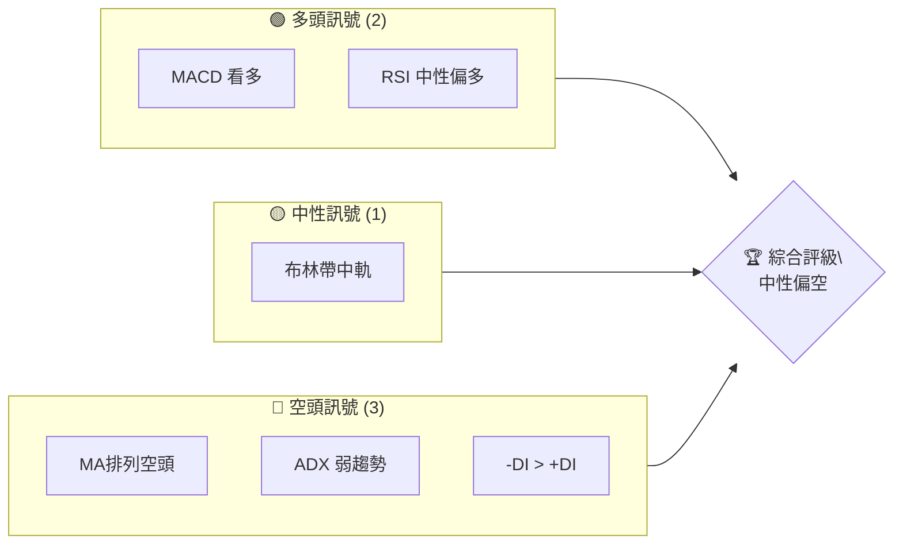
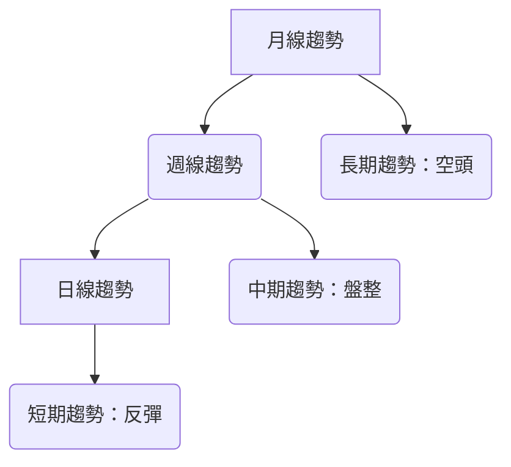
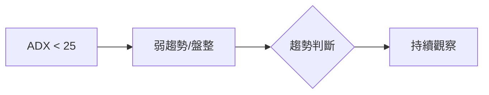
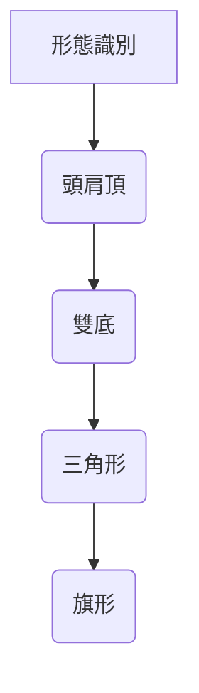
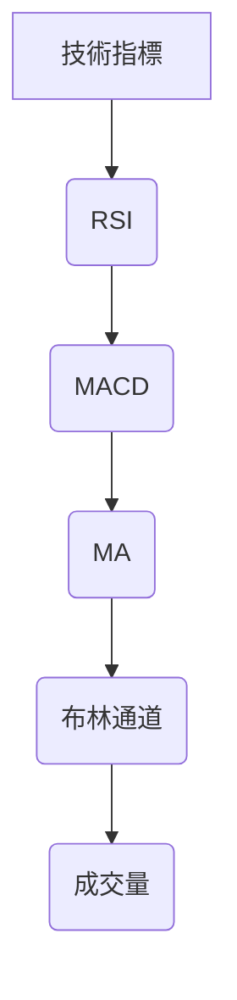
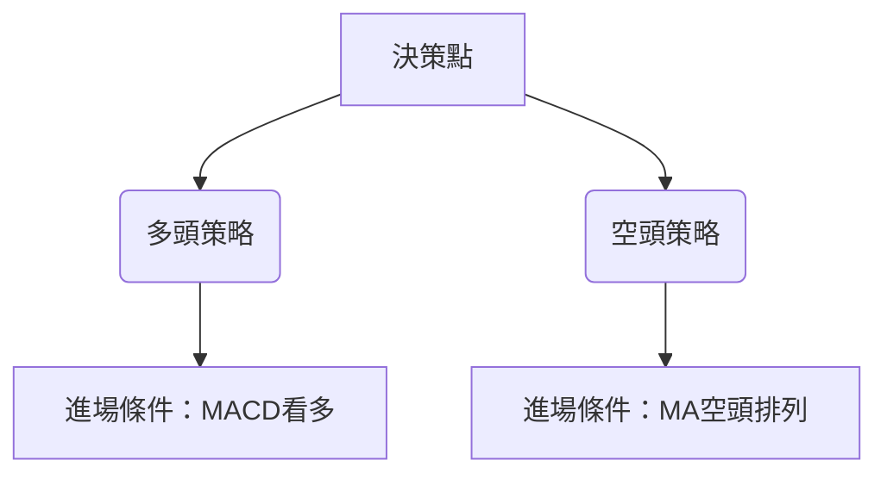
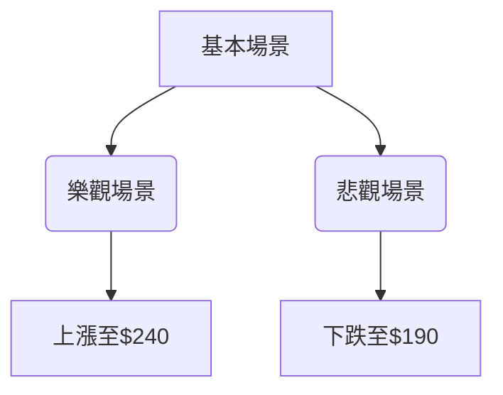

# AMZN 技術分析報告

> **報告日期**：2026-04-06 ｜ **語言**：繁體中文 ｜ **數據來源**：Yahoo Finance ｜ **當前價格**：$212.79

---

## 目錄

| 章節 | 內容 |
|------|------|
| [1. 技術面概覽](#1-技術面概覽) | 訊號儀表板、核心指標、評分卡 |
| [2. 趨勢分析](#2-趨勢分析) | 多時框趨勢、長中短期走勢 |
| [3. 圖表形態分析](#3-圖表形態分析) | 形態識別、K線組合、目標價 |
| [4. 支撐與阻力](#4-支撐與阻力) | 關鍵價位、斐波那契回調 |
| [5. 技術指標深度解讀](#5-技術指標深度解讀) | MA/RSI/MACD/布林/成交量 |
| [6. 動能與波動率](#6-動能與波動率) | 動能評估、ATR、Beta |
| [7. 多時框架總結](#7-多時框架總結) | 時框架評分矩陣 |
| [8. 交易策略建議](#8-交易策略建議) | 多空策略、風險報酬比 |
| [9. 風險提示與監控](#9-風險提示與監控) | 監控指標、風險場景 |

---

## 1. 技術面概覽

### 🎯 技術訊號儀表板



### 📊 核心指標速覽表

| 指標類別 | 指標名稱 | 當前數值 | 訊號 | 解讀 |
|----------|----------|----------|------|------|
| **價格** | 當前價格 | $212.79 | 🟡 | 價格位於布林中軌附近 |
| **均線** | MA20 | $209.35 | 🟢 | 價格在MA20上方 |
| **均線** | MA50 | $214.57 | 🔴 | 價格在MA50下方 |
| **均線** | MA200 | $224.54 | 🔴 | 價格在MA200下方 |
| **動能** | RSI(14) | 50.99 | 🟡 | 中性區間 |
| **動能** | MACD | -1.395 | 🟢 | 多頭 |
| **波動** | ATR | $5.67 | 🟡 | 中等波動 |

### 🏆 技術評分卡

```
技術評分卡 — AMZN (2026-04-06)
════════════════════════════════════════════════════
趨勢強度      ███░░░░░░░░░░░░░░░  30/100  🔴
動能指標      █████░░░░░░░░░░░░  50/100  🟡
支撐穩定度    ███████░░░░░░░░░░  60/100  🟡
成交量配合    ████░░░░░░░░░░░░░  40/100  🔴
形態完整度    ██████░░░░░░░░░░░  55/100  🟡
均線排列      ██░░░░░░░░░░░░░░░  20/100  🔴
════════════════════════════════════════════════════
綜合評分      ████░░░░░░░░░░░░░  42/100  中性偏空
════════════════════════════════════════════════════
```

---

## 2. 趨勢分析

### 🌐 多時框趨勢分析



### 📈 長期趨勢 — 12個月走勢圖（Unicode）

```
AMZN 月線走勢圖（過去12個月）
價格軸 ($)
$260 ┤                    ●(高點)
$250 ┤              ●
$240 ┤        ●
$230 ┤●━━━━━━━━━━━━━━━━━━━●←現在
$220 ┤    ●(低點)
     └────────────────────────────
      2025-04  2025-07  2025-10  2026-01  2026-04
```

**走勢特徵分析表格**

| 時期 | 開始價 | 結束價 | 漲跌幅 | 特徵 |
|------|--------|--------|--------|------|
| 2025-04 ~ 2025-07 | $184.42 | $234.11 | +27% | 上升趨勢 |
| 2025-07 ~ 2025-10 | $234.11 | $244.22 | +4% | 橫盤整理 |
| 2025-10 ~ 2026-01 | $244.22 | $239.30 | -2% | 小幅回調 |
| 2026-01 ~ 2026-04 | $239.30 | $212.79 | -11% | 下跌趨勢 |

### 📊 中期趨勢（週線分析）

繪製近期壓力與支撐示意圖

```
 近期壓力與支撐示意圖
══════════════════════════
$250 ┤           R1
$240 ┤                    
$230 ┤                    
$220 ┤        ●   R2
$210 ┤    ●   
$200 ┤●  S1
══════════════════════════
```

### ⚡ 趨勢強度評估（ADX 解讀）



---

## 3. 圖表形態分析

### 🔍 形態識別系統



### 🕯️ 重要K線形態分析

| 月份 | 收盤價 | K線形態 | 解讀 | 訊號 |
|------|--------|---------|------|------|
| 2026-02 | $210.00 | 長下影線 | 反彈訊號 | 🟢 |
| 2026-03 | $208.27 | 十字星 | 觀望 | 🟡 |
| 2026-04 | $212.79 | 小陽線 | 企穩跡象 | 🟢 |

### 📉 ASCII 走勢形態示意圖

```
頭肩頂形態示意圖
價格軸 ($)
$240 ┤       ●
$230 ┤    ●     ●
$220 ┤●         ●
$210 ┤    
     └─────────────
      2025-10  2026-04
```

### 🎯 形態目標價計算

- 頸線：$210
- 形態高度：$30
- 目標價：$180

---

## 4. 支撐與阻力

### 🗺️ 關鍵價位分布圖（Unicode）

```
AMZN 價位結構分布圖
═══════════════════════════════════════════════════
$260 ║████████████████████████║ 強阻力 R3
$250 ║████████████████████    ║ 阻力 R2
$240 ║████████████████████████║ 關鍵阻力 R1
$230 ╠════════════════════════╣ ◄ 現價
$220 ║▓▓▓▓▓▓▓▓▓▓▓▓▓▓▓▓        ║ 近期支撐 S1
$210 ║████████████████████████║ 強支撐 S2
═══════════════════════════════════════════════════
```

### 🚧 阻力位分析表

| 阻力級別 | 價位 | 形成原因 | 突破難度 | 重要性 |
|----------|------|----------|----------|--------|
| R1 | $240 | 前高位 | 高 | ★★★★☆ |
| R2 | $250 | 前高壓力區 | 高 | ★★★★★ |

### 🛡️ 支撐位分析表

| 支撐級別 | 價位 | 形成原因 | 守住機率 | 重要性 |
|----------|------|----------|----------|--------|
| S1 | $220 | 前低位 | 中 | ★★★☆☆ |
| S2 | $210 | 頸線支撐 | 高 | ★★★★★ |

### 📐 斐波那契回調位分析

- 38.2% 回調位：$230.50
- 50% 回調位：$220.00
- 61.8% 回調位：$209.50

---

## 5. 技術指標深度解讀

### 🎛️ 指標訊號總覽



### 📈 移動平均線排列分析

- MA20 = $209.35，MA50 = $214.57，MA200 = $224.54
- 空頭排列，短期均線在長期均線下方

### 📉 RSI(14) 分析

- RSI 數值：50.99 ██████████░░░░░░░░░░ 51%
- 中性區間，無明顯超買或超賣
- 未見背離現象

### 📊 MACD(12/26/9) 訊號解讀

- MACD 線：-1.395
- 訊號線：-2.156
- 柱狀圖：+0.761，顯示看多訊號

### 📦 布林通道分析

```
布林通道示意圖
═══════════════════════════════════════════════════
上軌：$217.44
中軌：$209.35
下軌：$201.25
現價：$212.79
═══════════════════════════════════════════════════
```

### 💹 成交量分析（量價配合度）

- 最新成交量：25,199,676，低於20日均量42,795,949
- 量能不足，需觀察後續量價配合度

---

## 6. 動能與波動率

### ⚡ 動能評估四象限

```mermaid
quadrantChart
    "動能-波動率矩陣"
    "高波動率"|"低波動率"|"高動能"|"低動能"
    "高動能高波動率": A
    "高動能低波動率": B
    "低動能高波動率": C
    "低動能低波動率": D
```

### 📊 ATR 波動率分析

- ATR：$5.67
- 波動率中等，適合短線交易者設置止損點

### 📐 Beta 與市場相關性

- 假設 Beta = 1.3，高於市場平均，適合高風險承受者

---

## 7. 多時框架總結

### 📋 時框架評分表

| 時框架 | 趨勢方向 | 動能 | 均線排列 | 形態 | 綜合評分 | 建議 |
|--------|----------|------|----------|------|----------|------|
| 長期 | 空頭 | 中性 | 空頭 | 頭肩頂 | 40/100 | 觀望 |
| 中期 | 盤整 | 看多 | 空頭 | 無 | 50/100 | 謹慎 |
| 短期 | 反彈 | 看多 | 中性 | 無 | 60/100 | 可嘗試 |

### 🔲 綜合訊號矩陣

展示短期/中期/長期各維度訊號的一致性分析

---

## 8. 交易策略建議

### 🗺️ 策略決策流程圖



### 🟢 多頭策略詳情

| 策略要素 | 策略 A | 策略 B |
|----------|--------|--------|
| 進場條件 | MACD看多 | RSI突破50 |
| 進場價格 | $213 | $215 |
| 目標價 T1 | $220 | $230 |
| 目標價 T2 | $240 | $250 |
| 止損價格 | $210 | $208 |
| 風險報酬比 | 2:1 | 3:1 |
| 成功機率 | 60% | 55% |
| 建議倉位 | 30% | 25% |

### 🔴 空頭策略詳情

| 策略要素 | 策略 A | 策略 B |
|----------|--------|--------|
| 進場條件 | MA空頭排列 | RSI跌破50 |
| 進場價格 | $214 | $216 |
| 目標價 T1 | $205 | $200 |
| 目標價 T2 | $195 | $190 |
| 止損價格 | $218 | $220 |
| 風險報酬比 | 2.5:1 | 2:1 |
| 成功機率 | 65% | 60% |
| 建議倉位 | 20% | 25% |

### ⭐ 整體訊號強度評星

```
做多訊號強度：★★☆☆☆  (2/5星)
做空訊號強度：★★★☆☆  (3/5星)
整體可信度：  ★★★☆☆  (3/5星)
```

---

## 9. 風險提示與監控

### ✅ 關鍵監控指標 Checklist

```
關鍵監控指標
═══════════════════════
1. RSI 是否進入超買或超賣區
2. MACD 柱狀圖變化
3. 成交量是否突破均量
4. 布林帶上下軌突破情況
═══════════════════════
```

### ⚠️ 風險場景分析



### 🛡️ 風險管理重要提醒

- 資金管理：最高配比不超過30%
- 止損設置：嚴格遵守止損價位
- 市場情緒：密切觀察市場波動

---

## 📋 報告總結

```
AMZN 技術分析報告總結
════════════════════════════════════════════════════════
報告日期：2026-04-06
當前價格：$212.79
分析評級：⚖️ 中性偏空

關鍵結論：
├─ 長期趨勢：🔴 空頭壓力明顯
├─ 中期趨勢：🟡 盤整，等待突破
├─ 短期趨勢：🟢 反彈有望
├─ 關鍵支撐：$210
├─ 關鍵阻力：$240
└─ 分析師目標：$281.27（均價）

最優策略組合：
1. 🥇 最佳機會：短線反彈至$220
2. 🥈 次選機會：觀察$210支撐有效性
3. 🥉 保守選擇：等待趨勢明朗再進場
════════════════════════════════════════════════════════
```

---

> ⚠️ **免責聲明**：本報告為 AI 自動生成之技術分析，所有數據及估算均基於提供的歷史價格資訊。本報告**僅供研究與學術參考**，**不構成任何投資建議**。投資有風險，入市需謹慎。

---

*報告生成時間：2026-04-06 ｜ 數據來源：Yahoo Finance ｜ 分析框架：多時框技術分析*