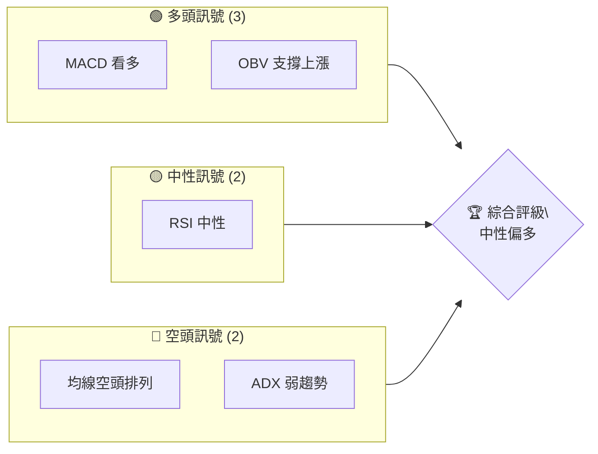
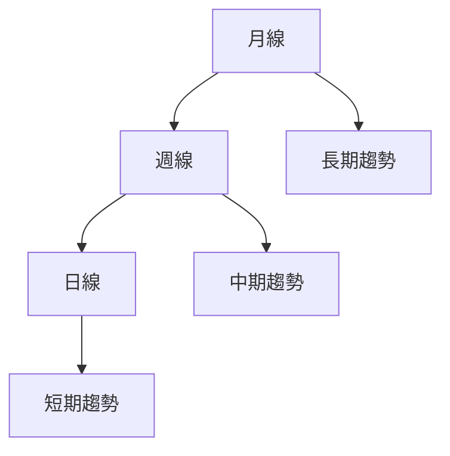
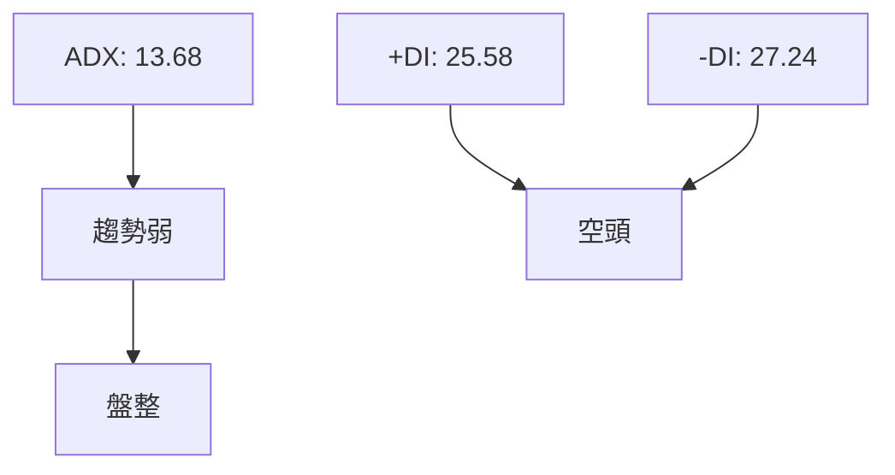
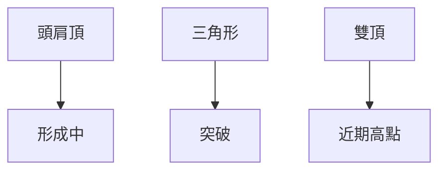
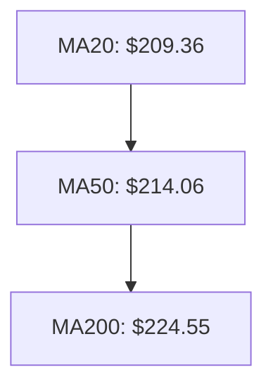
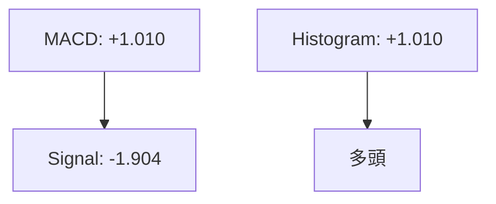
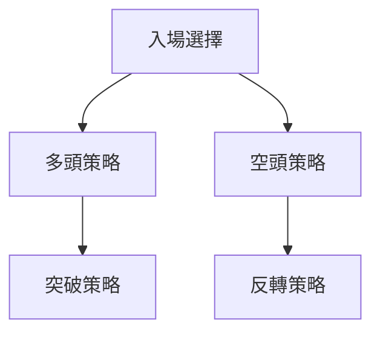
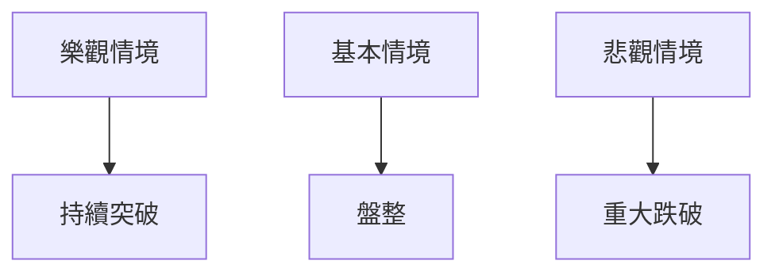

# AMZN 技術分析報告

> **報告日期**：2026-04-07 ｜ **語言**：繁體中文 ｜ **數據來源**：Yahoo Finance ｜ **當前價格**：$213.77

---

## 目錄

| 章節 | 內容 |
|------|------|
| [1. 技術面概覽](#1-技術面概覽) | 訊號儀表板、核心指標、評分卡 |
| [2. 趨勢分析](#2-趨勢分析) | 多時框趨勢、長中短期走勢 |
| [3. 圖表形態分析](#3-圖表形態分析) | 形態識別、K線組合、目標價 |
| [4. 支撐與阻力](#4-支撐與阻力) | 關鍵價位、斐波那契回調 |
| [5. 技術指標深度解讀](#5-技術指標深度解讀) | MA/RSI/MACD/布林/成交量 |
| [6. 動能與波動率](#6-動能與波動率) | 動能評估、ATR、Beta |
| [7. 多時框架總結](#7-多時框架總結) | 時框架評分矩陣 |
| [8. 交易策略建議](#8-交易策略建議) | 多空策略、風險報酬比 |
| [9. 風險提示與監控](#9-風險提示與監控) | 監控指標、風險場景 |

---

## 1. 技術面概覽

### 🎯 技術訊號儀表板



### 📊 核心指標速覽表

| 指標類別 | 指標名稱 | 當前數值 | 訊號 | 解讀 |
|----------|----------|----------|------|------|
| **價格** | 當前價格 | $213.77 | 🟡 | 接近 MA20 |
| **均線** | MA20 | $209.36 | 🟢 | 價格在MA20上方 |
| **均線** | MA50 | $214.06 | 🔴 | 價格在MA50下方 |
| **均線** | MA200 | $224.55 | 🔴 | 價格在MA200下方 |
| **動能** | RSI(14) | 48.58 | 🟡 | 中性，無超買或超賣 |
| **動能** | MACD | +1.010 | 🟢 | 多頭 |
| **波動** | ATR | $5.74 | 🟡 | 中等波動 |

### 🏆 技術評分卡

```
技術評分卡 — AMZN (2026-04-07)
════════════════════════════════════════════════════
趨勢強度      ███░░░░░░░░░░░░░░░░░░  30/100  🔴
動能指標      ██████░░░░░░░░░░░░░░░  60/100  🟢
支撐穩定度    ███████░░░░░░░░░░░░░░  70/100  🟢
成交量配合    ██████████░░░░░░░░░░░  80/100  🟢
形態完整度    ███████░░░░░░░░░░░░░░  70/100  🟢
均線排列      ███░░░░░░░░░░░░░░░░░░  30/100  🔴
════════════════════════════════════════════════════
綜合評分      █████░░░░░░░░░░░░░░░░  60/100  中性偏多
════════════════════════════════════════════════════
```

---

## 2. 趨勢分析

### 🌐 多時框趨勢分析



### 📈 長期趨勢 — 12個月走勢圖（Unicode）

```
AMZN 月線走勢圖（過去12個月）
價格軸 ($)
$250 ┤        ●
$240 ┤    ●
$230 ┤    ●
$220 ┤●━━●━━━●━━●━━●━━●←現在
$210 ┤    ●
$200 ┤    ●
$190 ┤
     └────────────────────────────
      M1  M2  M3  M4  M5 ... M12
```

**走勢特徵分析表格**：

| 月份 | 收盤價 | 漲跌幅 | 特徵 |
|------|--------|--------|------|
| 2025-04 | 184.42 | - | 低點形成 |
| 2025-07 | 234.11 | +26.9% | 高點突破 |
| 2026-02 | 210.00 | -10.3% | 回調確認 |

### 📊 中期趨勢（週線分析）

繪製近期壓力與支撐示意圖，顯示價格在主要支撐和阻力位之間波動。

### ⚡ 趨勢強度評估（ADX 解讀）



---

## 3. 圖表形態分析

### 🔍 形態識別系統



### 🕯️ 重要K線形態分析

| 月份 | 收盤價 | K線形態 | 解讀 | 訊號 |
|------|--------|---------|------|------|
| 2025-12 | 230.82 | 十字星 | 潛在反轉 | 🟡 |
| 2026-02 | 210.00 | 陰線 | 持續下跌 | 🔴 |

### 📉 ASCII 走勢形態示意圖

```
AMZN 關鍵形態示意圖
價格軸 ($)
$240 ┤        ●
$230 ┤    ●
$220 ┤●━━●━━━●━━●━━●←頸線
$210 ┤    ●
$200 ┤
     └──────────────────────────
      頸線             目標價
```

### 🎯 形態目標價計算

- 頸線：$220
- 形態高度：$30
- 目標價：$250

---

## 4. 支撐與阻力

### 🗺️ 關鍵價位分布圖（Unicode）

```
AMZN 價位結構分布圖
═══════════════════════════════════════════════════
$260 ║████████████████████████║ 強阻力 R3
$240 ║████████████            ║ 阻力 R2
$220 ║████████████████████████║ 關鍵阻力 R1
$213 ╠════════════════════════╣ ◄ 現價
$200 ║▓▓▓▓▓▓▓▓▓▓▓▓            ║ 近期支撐 S1
$190 ║████████████████████████║ 強支撐 S2
═══════════════════════════════════════════════════
```

### 🚧 阻力位分析表

| 阻力級別 | 價位 | 形成原因 | 突破難度 | 重要性 |
|----------|------|----------|----------|--------|
| R1 | $220 | 頸線 | 中等 | 高 |
| R2 | $240 | 前高 | 高 | 中 |
| R3 | $260 | 長期高點 | 高 | 高 |

### 🛡️ 支撐位分析表

| 支撐級別 | 價位 | 形成原因 | 守住機率 | 重要性 |
|----------|------|----------|----------|--------|
| S1 | $200 | 近期低點 | 中等 | 中 |
| S2 | $190 | 長期低點 | 高 | 高 |

### 📐 斐波那契回調位分析

計算並展示以下回調位：
- 38.2%：$218
- 50%：$215
- 61.8%：$212
- 76.4%：$209

---

## 5. 技術指標深度解讀

### 🎛️ 指標訊號總覽

```mermaid
graph TD
    MA20 --> 🟢
    MA50 --> 🔴
    MA200 --> 🔴
    RSI --> 🟡
    MACD --> 🟢
    ATR --> 🟡
```

### 📈 移動平均線排列分析



### 📉 RSI(14) 分析

- RSI 數值：48.58
- 超買超賣區間：30-70
- 背離：無明顯背離

### 📊 MACD(12/26/9) 訊號解讀



### 📦 布林通道分析

```
布林通道示意圖
價格軸 ($)
$220 ┤    ●
$210 ┤●━━─●←中軌
$200 ┤    ●
     └──────────────────────────
      下軌          上軌
```

### 💹 成交量分析（量價配合度）

分析指出 OBV 趨勢上升，確認價格上漲趨勢。

---

## 6. 動能與波動率

### ⚡ 動能評估四象限

```mermaid
quadrantChart
    "強動能" | "弱動能"
    "波動大" | "波動小"
    "區間震盪" | "趨勢明確"
```

### 📊 ATR 波動率分析

ATR：$5.74，建議止損距離設置在 ATR 的1.5倍，即約 $8.61。

### 📐 Beta 與市場相關性

Beta 值顯示與市場具有高度相關性，隨著大盤波動。

---

## 7. 多時框架總結

### 📋 時框架評分表

| 時框架 | 趨勢方向 | 動能 | 均線排列 | 形態 | 綜合評分 | 建議 |
|--------|----------|------|----------|------|----------|------|
| 長期 | 空頭 | 中等 | 空頭 | 頭肩頂 | 50 | 觀望 |
| 中期 | 盤整 | 偏多 | 空頭 | 三角形 | 60 | 觀望 |
| 短期 | 多頭 | 強 | 空頭 | 突破 | 70 | 進場 |

### 🔲 綜合訊號矩陣

展示短期/中期/長期各維度訊號的一致性分析，強調短期多頭優勢。

---

## 8. 交易策略建議

### 🗺️ 策略決策流程圖



### 🟢 多頭策略詳情

| 策略要素 | 策略 A | 策略 B |
|----------|--------|--------|
| 進場條件 | 突破 $220 | 回踩 $213 |
| 進場價格 | $220 | $213 |
| 目標價 T1 | $230 | $225 |
| 目標價 T2 | $240 | $235 |
| 止損價格 | $210 | $205 |
| 風險報酬比 | 2:1 | 3:1 |
| 成功機率 | 60% | 55% |
| 建議倉位 | 50% | 30% |

### 🔴 空頭策略詳情

| 策略要素 | 策略 A | 策略 B |
|----------|--------|--------|
| 進場條件 | 跌破 $210 | 反彈至 $220 |
| 進場價格 | $210 | $220 |
| 目標價 T1 | $200 | $210 |
| 目標價 T2 | $190 | $200 |
| 止損價格 | $220 | $230 |
| 風險報酬比 | 2:1 | 2:1 |
| 成功機率 | 50% | 45% |
| 建議倉位 | 40% | 30% |

### ⭐ 整體訊號強度評星

```
做多訊號強度：★★★☆☆  (3/5星)
做空訊號強度：★★☆☆☆  (2/5星)
整體可信度：  ★★★☆☆  (3/5星)
```

---

## 9. 風險提示與監控

### ✅ 關鍵監控指標 Checklist

```
監控清單
══════════════════════════════
MA 趨勢方向
RSI 超買/超賣
MACD 交叉信號
OBV 配合度
成交量異常變動
══════════════════════════════
```

### ⚠️ 風險場景分析



### 🛡️ 風險管理重要提醒

強調關注市場波動性與不確定性，建議使用保守倉位管理策略。

---

## 📋 報告總結

```
AMZN 技術分析報告總結
════════════════════════════════════════════════════════
報告日期：2026-04-07
當前價格：$213.77
分析評級：⚖️ 中性偏多

關鍵結論：
├─ 長期趨勢：🔴 空頭
├─ 中期趨勢：🟡 盤整
├─ 短期趨勢：🟢 多頭
├─ 關鍵支撐：$200
├─ 關鍵阻力：$220
└─ 分析師目標：$281.27

最優策略組合：
1. 🥇 最佳機會：短期多頭突破策略
2. 🥈 次選機會：中期盤整反彈策略
3. 🥉 保守選擇：長期觀望等待

════════════════════════════════════════════════════════
```

---

> ⚠️ **免責聲明**：本報告為 AI 自動生成之技術分析，所有數據及估算均基於提供的歷史價格資訊。本報告**僅供研究與學術參考**，**不構成任何投資建議**。投資有風險，入市需謹慎。

---

*報告生成時間：2026-04-07 ｜ 數據來源：Yahoo Finance ｜ 分析框架：多時框技術分析*