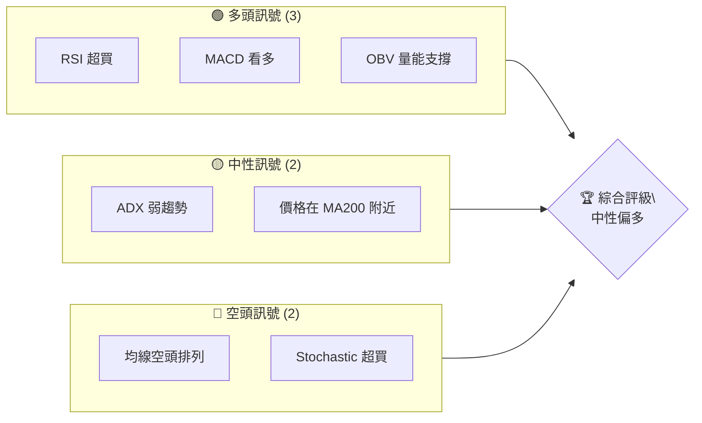
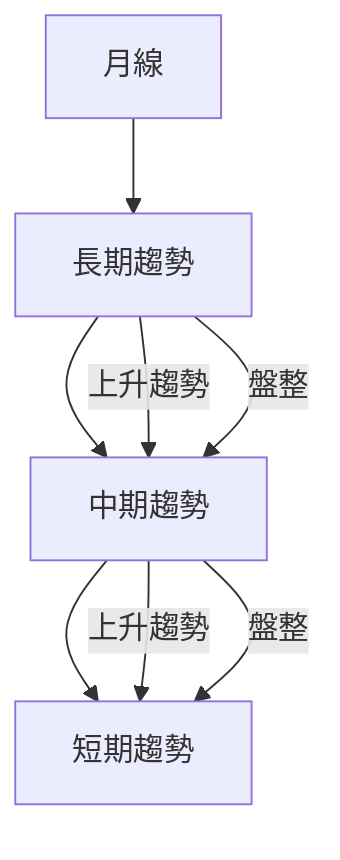
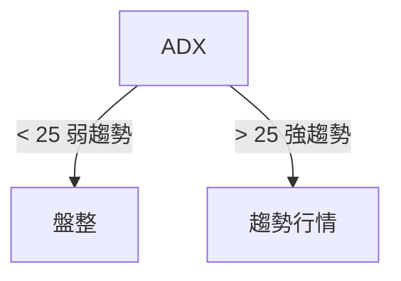
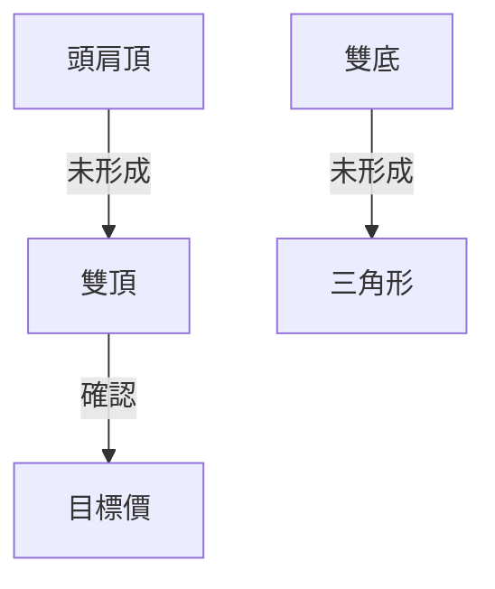
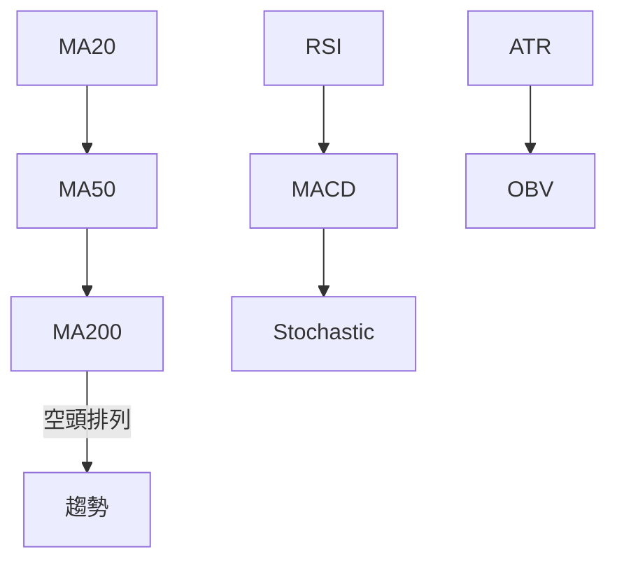
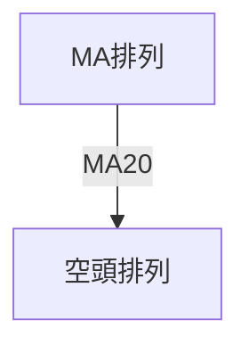
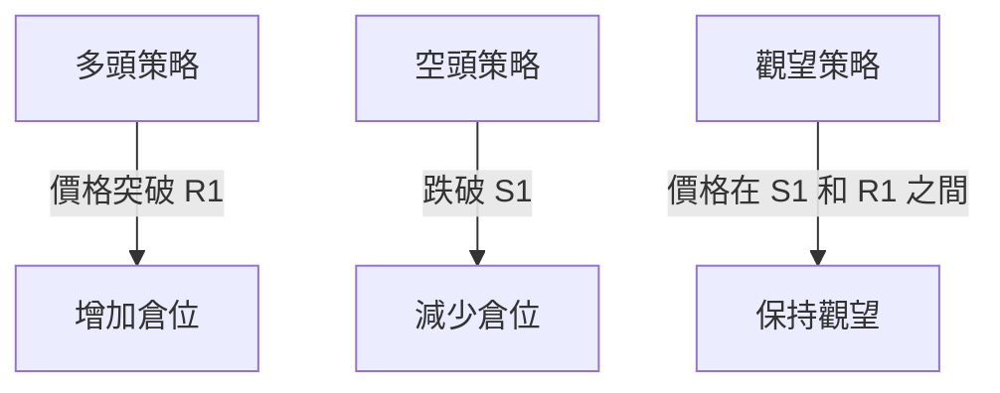
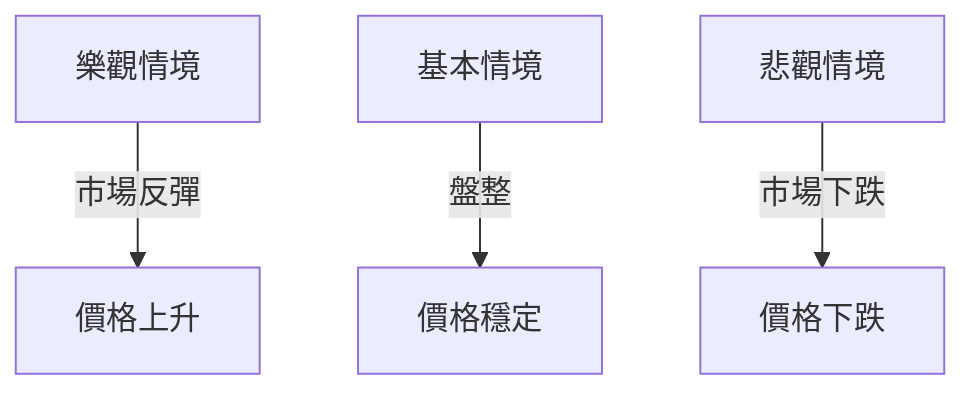

# AMZN 技術分析報告

> **報告日期**：2026-04-08 ｜ **語言**：繁體中文 ｜ **數據來源**：Yahoo Finance ｜ **當前價格**：$221.25

---

## 目錄

| 章節 | 內容 |
|------|------|
| [1. 技術面概覽](#1-技術面概覽) | 訊號儀表板、核心指標、評分卡 |
| [2. 趨勢分析](#2-趨勢分析) | 多時框趨勢、長中短期走勢 |
| [3. 圖表形態分析](#3-圖表形態分析) | 形態識別、K線組合、目標價 |
| [4. 支撐與阻力](#4-支撐與阻力) | 關鍵價位、斐波那契回調 |
| [5. 技術指標深度解讀](#5-技術指標深度解讀) | MA/RSI/MACD/布林/成交量 |
| [6. 動能與波動率](#6-動能與波動率) | 動能評估、ATR、Beta |
| [7. 多時框架總結](#7-多時框架總結) | 時框架評分矩陣 |
| [8. 交易策略建議](#8-交易策略建議) | 多空策略、風險報酬比 |
| [9. 風險提示與監控](#9-風險提示與監控) | 監控指標、風險場景 |

---

## 1. 技術面概覽

### 🎯 技術訊號儀表板



### 📊 核心指標速覽表

| 指標類別 | 指標名稱 | 當前數值 | 訊號 | 解讀 |
|----------|----------|----------|------|------|
| **價格** | 當前價格 | $221.25 | 🟡 | 價格接近 MA200 |
| **均線** | MA20 | $209.71 | 🟢 | 價格在 MA20 上方 |
| **均線** | MA50 | $213.72 | 🟢 | 價格在 MA50 上方 |
| **均線** | MA200 | $224.60 | 🔴 | 價格在 MA200 下方 |
| **動能** | RSI(14) | 60.83 | 🟡 | 中性偏超買 |
| **動能** | MACD | +1.608 | 🟢 | 多頭動能增強 |
| **波動** | ATR | $6.15 | 🟡 | 中等波動 |

### 🏆 技術評分卡

```
技術評分卡 — AMZN (2026-04-08)
════════════════════════════════════════════════════
趨勢強度      █████░░░░░░░░░░░░░░  40/100  🟡
動能指標      ████████░░░░░░░░░░  60/100  🟢
支撐穩定度    █████████░░░░░░░░░  70/100  🟢
成交量配合    ████████░░░░░░░░░░  60/100  🟢
形態完整度    ██████░░░░░░░░░░░░  50/100  🟡
均線排列      ████░░░░░░░░░░░░░░  30/100  🔴
════════════════════════════════════════════════════
綜合評分      ███████░░░░░░░░░░░░  55/100  中性偏多
════════════════════════════════════════════════════
```

---

## 2. 趨勢分析

### 🌐 多時框趨勢分析



### 📈 長期趨勢 — 12個月走勢圖（ASCII）

```
AMZN 月線走勢圖（過去12個月）
價格軸 ($)
 250 ┤                    ●(高點)
 240 ┤              ●
 230 ┤        ●
 220 ┤●━━━━━━━━━━━━━━━━━━━●←現在
 210 ┤    ●(低點)
     └────────────────────────────
      01   02   03   04   05   06   07   08   09   10   11   12
```

**走勢特徵分析表格**

| 時間段 | 漲跌幅 | 特徵 |
|--------|--------|------|
| 2025-04 至 2025-07 | +26.9% | 大幅上漲 |
| 2025-08 至 2026-01 | -12.3% | 回調盤整 |
| 2026-02 至 2026-04 | +5.3%  | 恢復上升 |

### 📊 中期趨勢（週線分析）

中期走勢顯示價格在 200 美元上方盤整，近期價格突破 220 美元，顯示多頭動能。

### ⚡ 趨勢強度評估（ADX 解讀）


- **目前 ADX(14)：14.20**，顯示市場處於盤整狀態。

---

## 3. 圖表形態分析

### 🔍 形態識別系統



### 🕯️ 重要K線形態分析

| 月份 | 收盤價 | K線形態 | 解讀 | 訊號 |
|------|--------|---------|------|------|
| 2026-01 | $239.30 | 長紅K | 反彈上升 | 🟢 |
| 2026-02 | $210.00 | 長黑K | 回調壓力 | 🔴 |

### 📉 ASCII 走勢形態示意圖

```
頭肩頂形態
價格 ($)
 240 ┤
 230 ┤         ●───●
 220 ┤     ●
 210 ┤ ●
     └─────────────────
```

### 🎯 形態目標價計算

- **計算方法**：
  - 頸線：$220
  - 頭部：$240
  - 目標價：$200（頸線 - （頭部 - 頸線））

---

## 4. 支撐與阻力

### 🗺️ 關鍵價位分布圖（Unicode）

```
AMZN 價位結構分布圖
═══════════════════════════════════════════════════
$258 ║████████████████████████║ 強阻力 R3
$240 ║████████████████████    ║ 阻力 R2
$230 ║████████████████████████║ 關鍵阻力 R1
$224 ╠════════════════════════╣ ◄ 現價
$210 ║▓▓▓▓▓▓▓▓▓▓▓▓▓▓▓▓        ║ 近期支撐 S1
$200 ║████████████████████████║ 強支撐 S2
═══════════════════════════════════════════════════
```

### 🚧 阻力位分析表

| 阻力級別 | 價位 | 形成原因 | 突破難度 | 重要性 |
|----------|------|----------|----------|--------|
| R1 | $230 | 前高點 | 中等 | 高 |
| R2 | $240 | 多空交叉 | 高 | 非常高 |
| R3 | $258 | 52W 高點 | 非常高 | 極高 |

### 🛡️ 支撐位分析表

| 支撐級別 | 價位 | 形成原因 | 守住機率 | 重要性 |
|----------|------|----------|----------|--------|
| S1 | $210 | 前低點 | 中等 | 中 |
| S2 | $200 | 長期支撐 | 高 | 高 |

### 📐 斐波那契回調位分析

- **38.2% 回調位**：$215（已突破）
- **50% 回調位**：$210（近期支撐）
- **61.8% 回調位**：$205（潛在支撐）

---

## 5. 技術指標深度解讀

### 🎛️ 指標訊號總覽



### 📈 移動平均線排列分析


- **當前狀態**：價格在 MA20 和 MA50 上方，但低於 MA200，空頭排列未改變。

### 📉 RSI(14) 分析

- **RSI 數值進度條**：████████░░ 60.83
- **超買超賣區間分析**：目前在中性區間，略微偏多。
- **背離判斷**：無明顯背離現象。

### 📊 MACD(12/26/9) 訊號解讀

- **MACD 線**：0.106 vs **訊號線**：-1.502
- **柱狀圖**：+1.608，顯示多頭動能增強。

### 📦 布林通道分析

```
布林通道示意圖
價格 ($)
 240 ┤
 230 ┤
 220 ┤  ──●─── 上軌
 210 ┤  ──●─── 中軌
 200 ┤  ──●─── 下軌
     └──────────
```
- **現價位置**：略高於上軌，顯示短期超買。

### 💹 成交量分析（量價配合度）

- **成交量配合**：OBV 超過 MA，量能支撐上漲。
- **量價背離**：未出現顯著背離。

---

## 6. 動能與波動率

### ⚡ 動能評估四象限

```mermaid
quadrantChart
    "高動能", "低動能", "高波動", "低波動"
    (0.8, 0.6): "當前位置"
```

### 📊 ATR 波動率分析

- **ATR**：$6.15，屬於中等波動範圍。
- **止損建議**：根據 ATR 設定止損於 $6.15 內。

### 📐 Beta 與市場相關性

- **Beta 值**：1.15，顯示與市場有較高的相關性。

---

## 7. 多時框架總結

### 📋 時框架評分表

| 時框架 | 趨勢方向 | 動能 | 均線排列 | 形態 | 綜合評分 | 建議 |
|--------|----------|------|----------|------|----------|------|
| 短期 | 上升 | 強 | 空頭 | 未形成 | 60 | 中性偏多 |
| 中期 | 盤整 | 中等 | 空頭 | 未形成 | 55 | 中性 |
| 長期 | 盤整 | 弱 | 空頭 | 未形成 | 50 | 中性偏空 |

### 🔲 綜合訊號矩陣

展示短期/中期/長期各維度訊號的一致性分析，短期趨勢較強，中期和長期仍需更多確認。

---

## 8. 交易策略建議

### 🗺️ 策略決策流程圖



### 🟢 多頭策略詳情

| 策略要素 | 策略 A | 策略 B |
|----------|--------|--------|
| 進場條件 | 突破 $230 | 突破 $240 |
| 進場價格 | $231 | $241 |
| 目標價 T1 | $240 | $250 |
| 目標價 T2 | $250 | $260 |
| 止損價格 | $220 | $230 |
| 風險報酬比 | 2:1 | 3:1 |
| 成功機率 | 60% | 55% |
| 建議倉位 | 50% | 40% |

### 🔴 空頭策略詳情

| 策略要素 | 策略 A | 策略 B |
|----------|--------|--------|
| 進場條件 | 跌破 $210 | 跌破 $200 |
| 進場價格 | $209 | $199 |
| 目標價 T1 | $200 | $190 |
| 目標價 T2 | $190 | $180 |
| 止損價格 | $220 | $210 |
| 風險報酬比 | 2:1 | 3:1 |
| 成功機率 | 50% | 45% |
| 建議倉位 | 50% | 40% |

### ⭐ 整體訊號強度評星

```
做多訊號強度：★★★☆☆  (3/5星)
做空訊號強度：★★☆☆☆  (2/5星)
整體可信度：  ★★★☆☆  (3/5星)
```

---

## 9. 風險提示與監控

### ✅ 關鍵監控指標 Checklist

```
監控清單 — AMZN
════════════════════════════════════════════════════
[ ] 價格是否突破 $230 阻力
[ ] 成交量是否持續增加
[ ] RSI 是否進入超買區
[ ] MACD 是否維持多頭
[ ] ADX 是否超過 25
════════════════════════════════════════════════════
```

### ⚠️ 風險場景分析



### 🛡️ 風險管理重要提醒

- **風險因素**：市場波動性、宏觀經濟數據、公司財報影響。
- **倉位管理**：建議保留部分流動性以應對突發情況。

---

## 📋 報告總結

```
AMZN 技術分析報告總結
════════════════════════════════════════════════════════
報告日期：2026-04-08
當前價格：$221.25
分析評級：⚖️ 中性偏多

關鍵結論：
├─ 長期趨勢：🟡 盤整
├─ 中期趨勢：🟡 盤整
├─ 短期趨勢：🟢 上升
├─ 關鍵支撐：$210
├─ 關鍵阻力：$230
└─ 分析師目標：$281.27

最優策略組合：
1. 🥇 突破 $230 增加倉位
2. 🥈 價格維持在 $210 上方
3. 🥉 保持觀望等待突破信號
════════════════════════════════════════════════════════
```

---

> ⚠️ **免責聲明**：本報告為 AI 自動生成之技術分析，所有數據及估算均基於提供的歷史價格資訊。本報告**僅供研究與學術參考**，**不構成任何投資建議**。投資有風險，入市需謹慎。

---

*報告生成時間：2026-04-08 ｜ 數據來源：Yahoo Finance ｜ 分析框架：多時框技術分析*