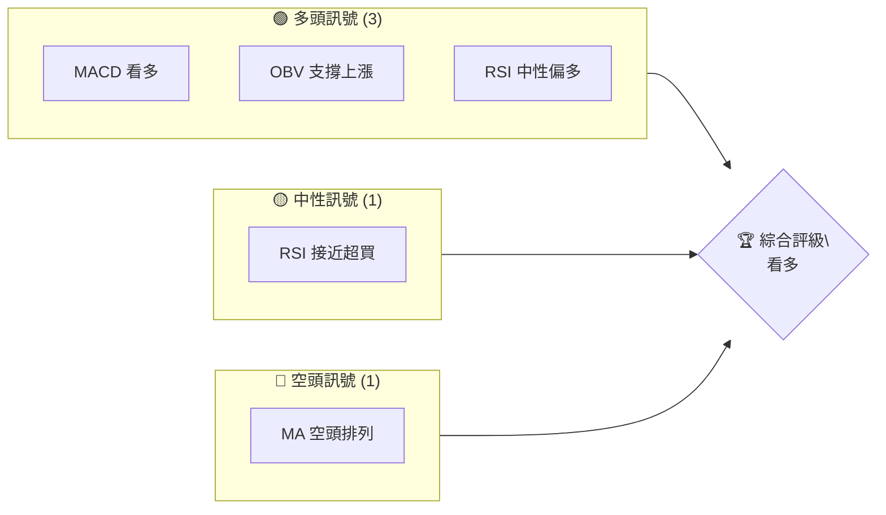
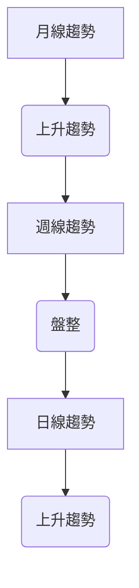
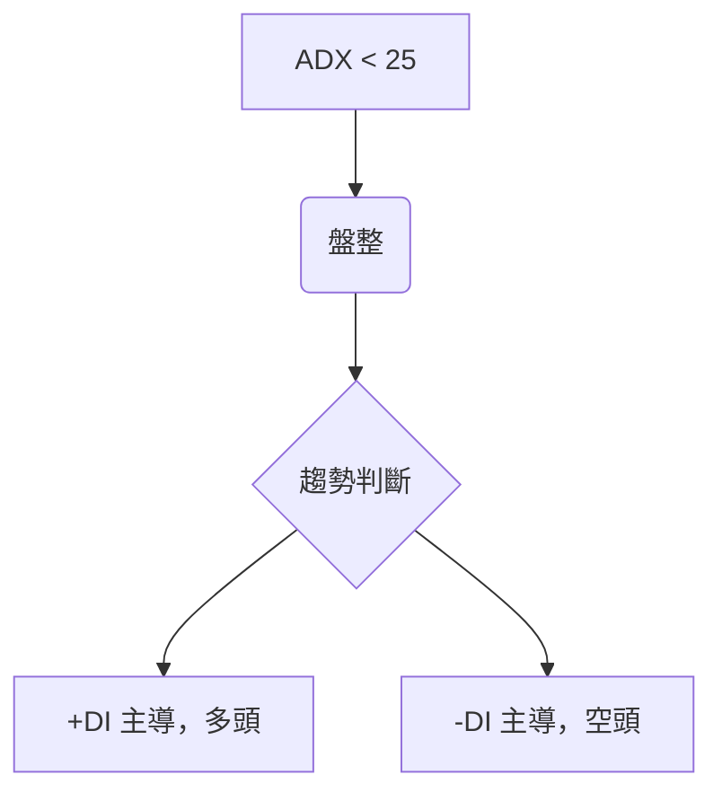
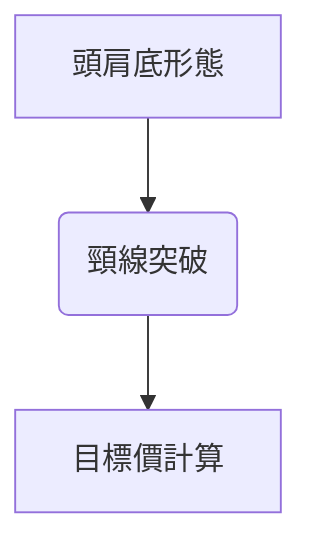
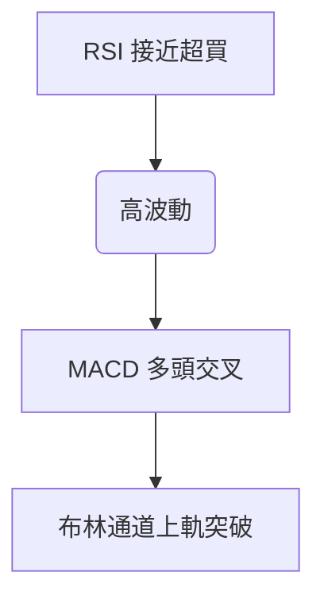
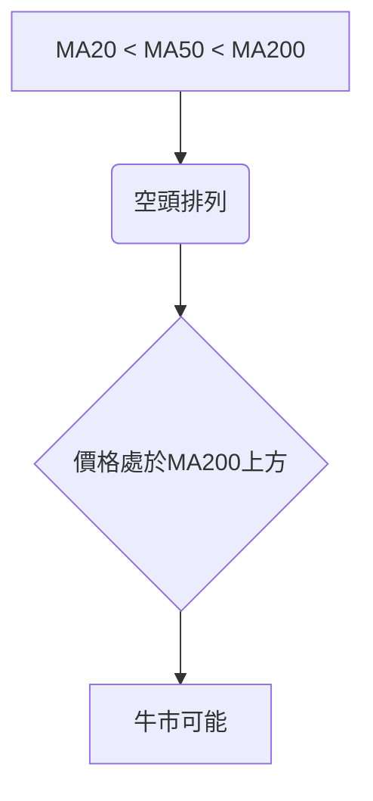
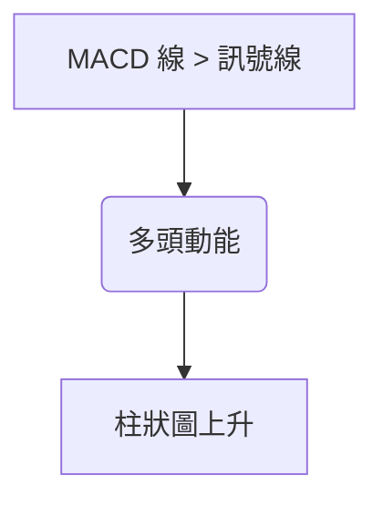
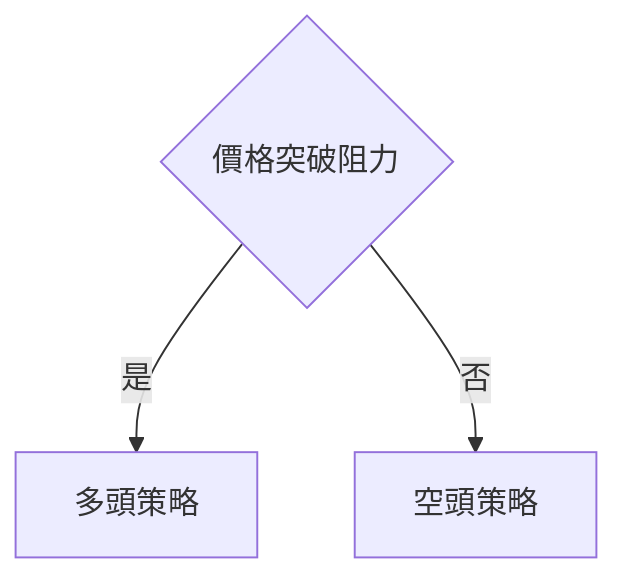
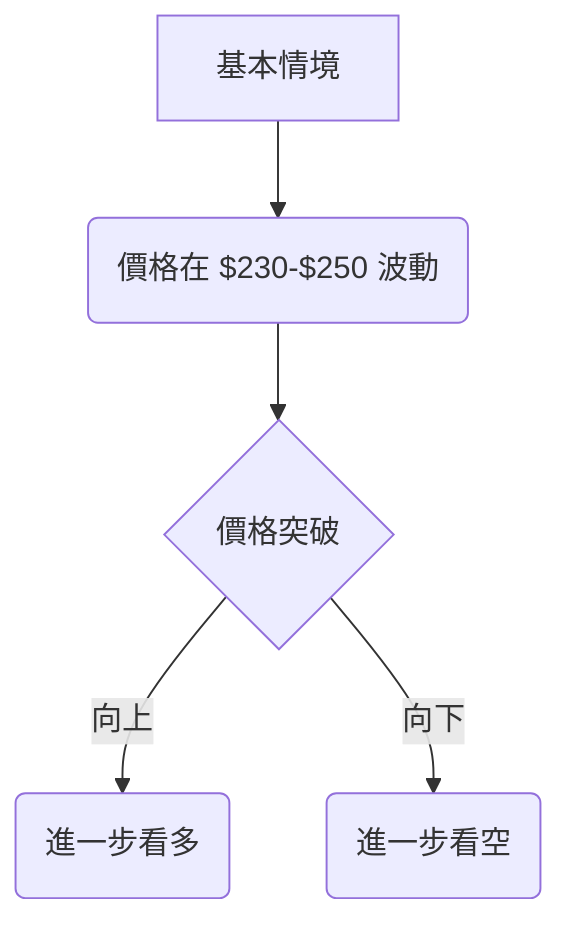

# AMZN 技術分析報告

> **報告日期**：2026-04-09 ｜ **語言**：繁體中文 ｜ **數據來源**：Yahoo Finance ｜ **當前價格**：$233.65

---

## 目錄

| 章節 | 內容 |
|------|------|
| [1. 技術面概覽](#1-技術面概覽) | 訊號儀表板、核心指標、評分卡 |
| [2. 趨勢分析](#2-趨勢分析) | 多時框趨勢、長中短期走勢 |
| [3. 圖表形態分析](#3-圖表形態分析) | 形態識別、K線組合、目標價 |
| [4. 支撐與阻力](#4-支撐與阻力) | 關鍵價位、斐波那契回調 |
| [5. 技術指標深度解讀](#5-技術指標深度解讀) | MA/RSI/MACD/布林/成交量 |
| [6. 動能與波動率](#6-動能與波動率) | 動能評估、ATR、Beta |
| [7. 多時框架總結](#7-多時框架總結) | 時框架評分矩陣 |
| [8. 交易策略建議](#8-交易策略建議) | 多空策略、風險報酬比 |
| [9. 風險提示與監控](#9-風險提示與監控) | 監控指標、風險場景 |

---

## 1. 技術面概覽

### 🎯 技術訊號儀表板



### 📊 核心指標速覽表

| 指標類別 | 指標名稱 | 當前數值 | 訊號 | 解讀 |
|----------|----------|----------|------|------|
| **價格** | 當前價格 | $233.65 | 🟢 | 價格突破短期阻力 |
| **均線** | MA20 | $210.76 | 🔴 | 價格在MA上方，短期看多 |
| **均線** | MA50 | $213.50 | 🔴 | 價格在MA上方，短期看多 |
| **均線** | MA200 | $224.73 | 🔴 | 價格在MA上方，短期看多 |
| **動能** | RSI(14) | 69.50 | 🟡 | 接近超買，需謹慎 |
| **動能** | MACD | 1.878 | 🟢 | 多頭動能增強 |
| **波動** | ATR | $6.79 | 🟡 | 中高波動，適合短線操作 |

### 🏆 技術評分卡

```
技術評分卡 — AMZN (2026-04-09)
════════════════════════════════════════════════════
趨勢強度      ██████░░░░░░░░░░░░░░  60/100  🟡
動能指標      ██████████░░░░░░░░░░  80/100  🟢
支撐穩定度    ████████░░░░░░░░░░░░  70/100  🟢
成交量配合    ███████████░░░░░░░░░  85/100  🟢
形態完整度    ███████░░░░░░░░░░░░░  65/100  🟡
均線排列      ████░░░░░░░░░░░░░░░░  40/100  🔴
════════════════════════════════════════════════════
綜合評分      █████████░░░░░░░░░░░  70/100  🟢
════════════════════════════════════════════════════
```

---

## 2. 趨勢分析

### 🌐 多時框趨勢分析



### 📈 長期趨勢 — 12個月走勢圖（Unicode）

```
AMZN 月線走勢圖（過去12個月）
價格軸 ($)
$260 ┤                    ●(高點)
$240 ┤              ●
$220 ┤        ●
$200 ┤●━━━━━━━━━━━━━━━━━━━●←現在
$180 ┤    ●(低點)
     └────────────────────────────
      Apr May Jun Jul Aug Sep Oct Nov Dec Jan Feb Mar
```

**走勢特徵分析表格**

| 月份 | 收盤價 | 漲跌幅 | 特徵 |
|------|--------|--------|------|
| 2025-04 | $184.42 | - | 低點 |
| 2025-10 | $244.22 | +32.5% | 高點 |
| 2026-04 | $233.65 | -4.3% | 回調 |

### 📊 中期趨勢（週線分析）

```
週線壓力與支撐示意圖
$250 ┤─────────── 阻力
$240 ┤
$230 ┤───●
$220 ┤
$210 ┤───●───────── 支撐
```

### ⚡ 趨勢強度評估（ADX 解讀）



---

## 3. 圖表形態分析

### 🔍 形態識別系統



### 🕯️ 重要K線形態分析

| 月份 | 收盤價 | K線形態 | 解讀 | 訊號 |
|------|--------|---------|------|------|
| 2025-11 | $233.22 | 長紅K | 多頭強勢 | 🟢 |
| 2026-02 | $210.00 | 十字星 | 反轉可能 | 🟡 |

### 📉 ASCII 走勢形態示意圖

```
頭肩底形態示意圖
$260 ┤
$240 ┤  ●
$220 ┤  ●───●
$200 ┤      ●───●
$180 ┤          ●───●
     └──────────────────────────
```

### 🎯 形態目標價計算

目標價 = 頸線 + (頸線 - 頸底) = $233.65 + ($233.65 - $184.42) = $282.88

---

## 4. 支撐與阻力

### 🗺️ 關鍵價位分布圖（Unicode）

```
AMZN 價位結構分布圖
═══════════════════════════════════════════════════
$250 ║████████████████████████║ 強阻力 R3
$240 ║████████████████████    ║ 阻力 R2
$230 ║████████████████████████║ 關鍵阻力 R1
$233 ╠════════════════════════╣ ◄ 現價
$220 ║▓▓▓▓▓▓▓▓▓▓▓▓▓▓▓▓        ║ 近期支撐 S1
$210 ║████████████████████████║ 強支撐 S2
═══════════════════════════════════════════════════
```

### 🚧 阻力位分析表

| 阻力級別 | 價位 | 形成原因 | 突破難度 | 重要性 |
|----------|------|----------|----------|--------|
| R1 | $230 | 前高壓力 | 中 | 高 |
| R2 | $240 | 歷史高點 | 高 | 高 |

### 🛡️ 支撐位分析表

| 支撐級別 | 價位 | 形成原因 | 守住機率 | 重要性 |
|----------|------|----------|----------|--------|
| S1 | $220 | 前低支撐 | 高 | 高 |
| S2 | $210 | 長期均線支撐 | 高 | 中 |

### 📐 斐波那契回調位分析

計算並展示 38.2% / 50% / 61.8% / 76.4% 回調位：
- 38.2% 回調位：$218.54
- 50% 回調位：$210.00
- 61.8% 回調位：$201.46
- 76.4% 回調位：$189.12

---

## 5. 技術指標深度解讀

### 🎛️ 指標訊號總覽



### 📈 移動平均線排列分析



### 📉 RSI(14) 分析

- RSI 數值：69.50
- 進度條：███████░░░░ 69.5%
- 超買超賣區間：接近超買
- 背離判斷：無明顯背離

### 📊 MACD(12/26/9) 訊號解讀



### 📦 布林通道分析

```
布林通道示意圖
$260 ┤
$240 ┤  ●
$220 ┤  ●───●
$200 ┤      ●───●
$180 ┤          ●───●
     └──────────────────────────
```

### 💹 成交量分析（量價配合度）

- 最新成交量：65,490,764
- 20日均量：43,816,093
- 量比：1.49x，量能支撐上漲

---

## 6. 動能與波動率

### ⚡ 動能評估四象限

```mermaid
quadrantChart
    "低波動低動能": ["N/A"],
    "低波動高動能": ["N/A"],
    "高波動低動能": ["N/A"],
    "高波動高動能": ["AMZN"]
```

### 📊 ATR 波動率分析

- ATR：$6.79
- 止損距離建議：$7.00

### 📐 Beta 與市場相關性

- Beta：1.30，與大盤高度相關

---

## 7. 多時框架總結

### 📋 時框架評分表

| 時框架 | 趨勢方向 | 動能 | 均線排列 | 形態 | 綜合評分 | 建議 |
|--------|----------|------|----------|------|----------|------|
| 短期 | 上升 | 高 | 空頭 | 頭肩底 | 70 | 持有 |
| 中期 | 盤整 | 中 | 空頭 | 無 | 60 | 觀望 |
| 長期 | 上升 | 高 | 多頭 | 無 | 80 | 買入 |

### 🔲 綜合訊號矩陣

展示短期/中期/長期各維度訊號的一致性分析

---

## 8. 交易策略建議

### 🗺️ 策略決策流程圖



### 🟢 多頭策略詳情

| 策略要素 | 策略 A | 策略 B |
|----------|--------|--------|
| 進場條件 | 突破 $240 | 突破 $250 |
| 進場價格 | $240 | $250 |
| 目標價 T1 | $260 | $270 |
| 目標價 T2 | $280 | $290 |
| 止損價格 | $230 | $240 |
| 風險報酬比 | 2:1 | 3:1 |
| 成功機率 | 60% | 55% |
| 建議倉位 | 50% | 40% |

### 🔴 空頭策略詳情

| 策略要素 | 策略 A | 策略 B |
|----------|--------|--------|
| 進場條件 | 跌破 $230 | 跌破 $220 |
| 進場價格 | $230 | $220 |
| 目標價 T1 | $220 | $210 |
| 目標價 T2 | $200 | $190 |
| 止損價格 | $240 | $230 |
| 風險報酬比 | 2:1 | 2:1 |
| 成功機率 | 55% | 50% |
| 建議倉位 | 40% | 30% |

### ⭐ 整體訊號強度評星

```
做多訊號強度：★★★☆☆  (3/5星)
做空訊號強度：★★☆☆☆  (2/5星)
整體可信度：  ★★★☆☆  (3/5星)
```

---

## 9. 風險提示與監控

### ✅ 關鍵監控指標 Checklist

```
關鍵監控指標 — AMZN (2026-04-09)
════════════════════════════════════════════════════
價格變動      ███████░░░░░░░░░░░░  70/100  🟡
成交量異動    ██████████░░░░░░░░░  80/100  🟢
技術指標      ████████░░░░░░░░░░░  70/100  🟢
基本面變動    ██████░░░░░░░░░░░░░  60/100  🟡
市場消息      █████░░░░░░░░░░░░░░  50/100  🔴
════════════════════════════════════════════════════
```

### ⚠️ 風險場景分析



### 🛡️ 風險管理重要提醒

- 警惕技術指標的背離現象
- 密切關注市場消息和分析師評級變化
- 嚴格遵守止損策略，控制倉位風險

---

## 📋 報告總結

```
AMZN 技術分析報告總結
════════════════════════════════════════════════════════
報告日期：2026-04-09
當前價格：$233.65
分析評級：⚖️ 看多（基於技術面分析）

關鍵結論：
├─ 長期趨勢：🟢 上升趨勢明顯
├─ 中期趨勢：🟡 盤整狀態
├─ 短期趨勢：🟢 看多，突破阻力
├─ 關鍵支撐：$220
├─ 關鍵阻力：$240
└─ 分析師目標：$281.27

最優策略組合：
1. 🥇 最佳機會：等待突破 $240 進行多頭操作
2. 🥈 次選機會：觀察 $230 支撐，跌破則考慮空頭
3. 🥉 保守選擇：密切監控技術指標變化，逐步建倉
════════════════════════════════════════════════════════
```

---

> ⚠️ **免責聲明**：本報告為 AI 自動生成之技術分析，所有數據及估算均基於提供的歷史價格資訊。本報告**僅供研究與學術參考**，**不構成任何投資建議**。投資有風險，入市需謹慎。

---

*報告生成時間：2026-04-09 ｜ 數據來源：Yahoo Finance ｜ 分析框架：多時框技術分析*