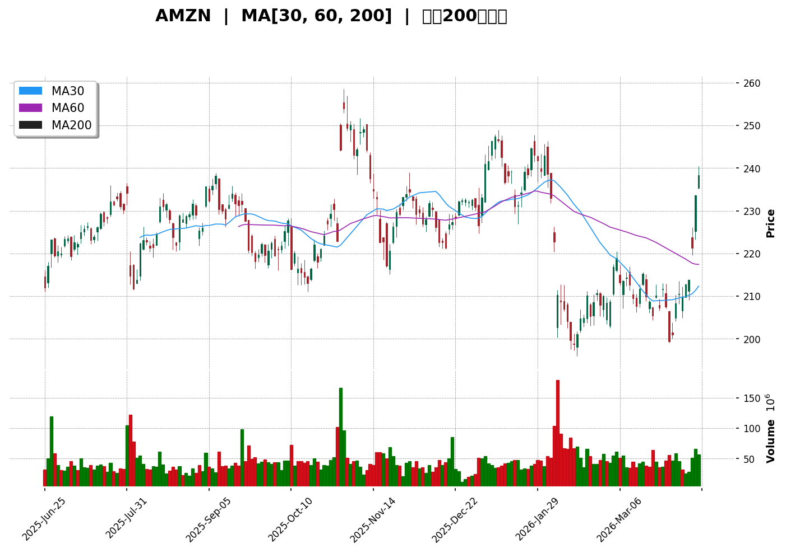
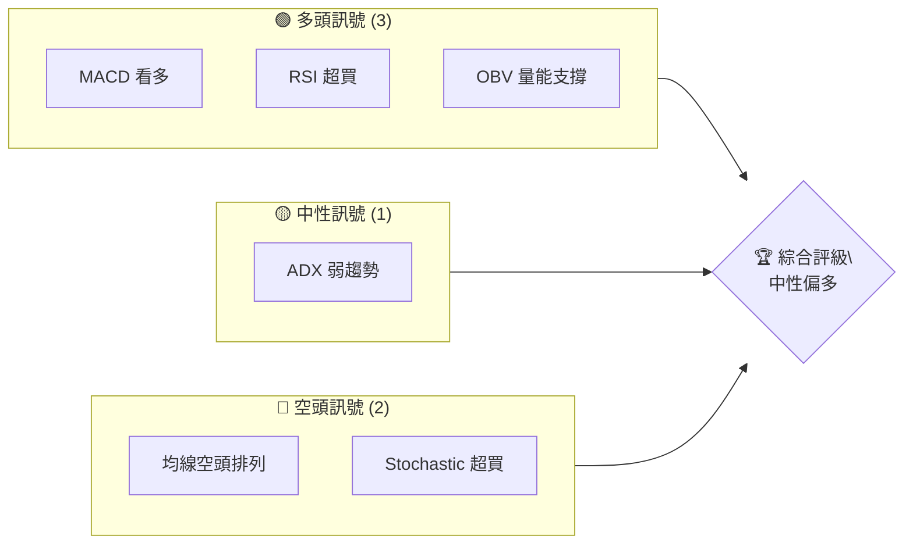
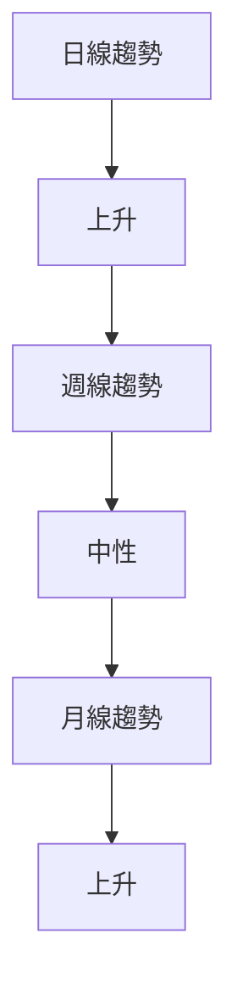
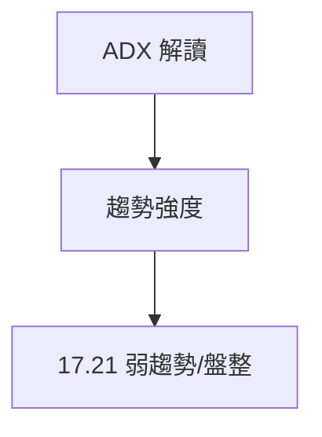
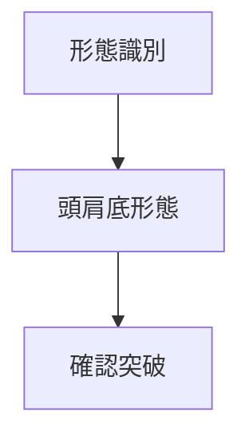
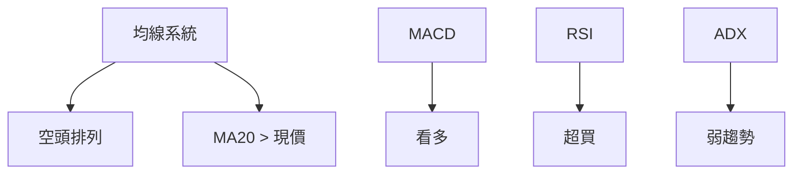
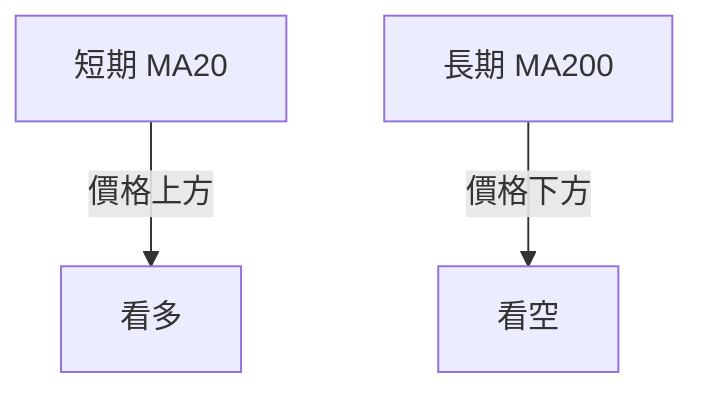
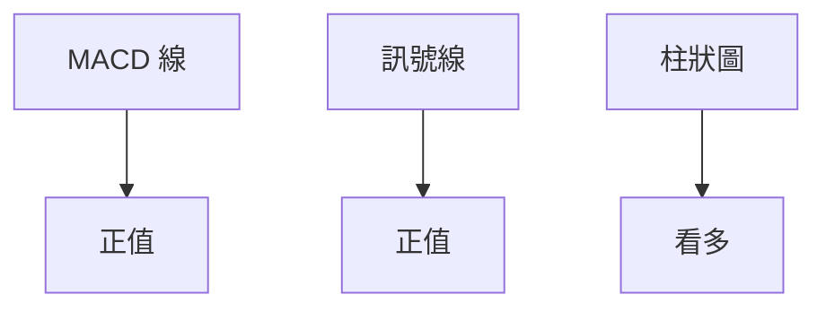
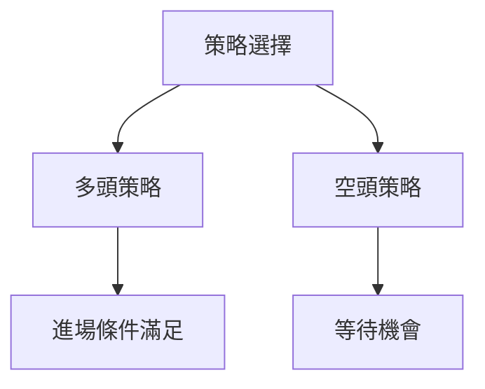
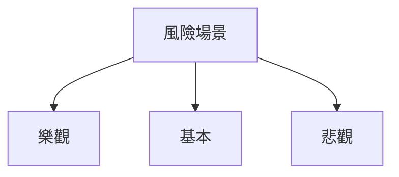

# AMZN 技術分析報告

> **報告日期**：2026-04-10 ｜ **語言**：繁體中文 ｜ **數據來源**：Yahoo Finance ｜ **當前價格**：$238.38

---

## 目錄

| 章節 | 內容 |
|------|------|
| [1. 技術面概覽](#1-技術面概覽) | 訊號儀表板、核心指標、評分卡 |
| [2. 趨勢分析](#2-趨勢分析) | 多時框趨勢、長中短期走勢 |
| [3. 圖表形態分析](#3-圖表形態分析) | 形態識別、K線組合、目標價 |
| [4. 支撐與阻力](#4-支撐與阻力) | 關鍵價位、斐波那契回調 |
| [5. 技術指標深度解讀](#5-技術指標深度解讀) | MA/RSI/MACD/布林/成交量 |
| [6. 動能與波動率](#6-動能與波動率) | 動能評估、ATR、Beta |
| [7. 多時框架總結](#7-多時框架總結) | 時框架評分矩陣 |
| [8. 交易策略建議](#8-交易策略建議) | 多空策略、風險報酬比 |
| [9. 風險提示與監控](#9-風險提示與監控) | 監控指標、風險場景 |

---

## 1. 技術面概覽

### 🎯 技術訊號儀表板



### 📊 核心指標速覽表

| 指標類別 | 指標名稱 | 當前數值 | 訊號 | 解讀 |
|----------|----------|----------|------|------|
| **價格** | 當前價格 | $238.38 | 🟡 | 價格高於短期均線 |
| **均線** | MA20 | $212.20 | 🔴 | 價格在MA上方，但整體空頭排列 |
| **均線** | MA50 | $213.40 | 🔴 | 價格在MA上方，但整體空頭排列 |
| **均線** | MA200 | $224.86 | 🔴 | 價格在MA上方，但整體空頭排列 |
| **動能** | RSI(14) | 75.33 | 🔴 | 超買狀態 |
| **動能** | MACD | 3.621 | 🟢 | 多頭 |
| **波動** | ATR | $6.95 | 🟡 | 中等波動 |

### 🏆 技術評分卡

```
技術評分卡 — AMZN (2026-04-10)
════════════════════════════════════════════════════
趨勢強度      ██████░░░░░░░░░░░░░░  60/100  🟡
動能指標      ███████░░░░░░░░░░░░░  70/100  🟢
支撐穩定度    ████████░░░░░░░░░░░░  80/100  🟢
成交量配合    ████████░░░░░░░░░░░░  80/100  🟢
形態完整度    ███████░░░░░░░░░░░░░  70/100  🟢
均線排列      ████░░░░░░░░░░░░░░░░  40/100  🔴
════════════════════════════════════════════════════
綜合評分      ███████░░░░░░░░░░░░░  70/100  中性偏多
════════════════════════════════════════════════════
```

---

## 2. 趨勢分析

### 🌐 多時框趨勢分析



### 📈 長期趨勢 — 12個月走勢圖（Unicode）

```
AMZN 月線走勢圖（過去12個月）
價格軸 ($)
$258 ┤                    ●(高點)
$248 ┤              ●
$238 ┤        ●
$228 ┤●━━━━━━━━━━━━━━━━━━━●←現在
$218 ┤    ●(低點)
     └────────────────────────────
      M1  M2  M3  M4  M5 ... M12
```

**走勢特徵分析表格**

| 月份 | 收盤價 | 漲跌幅 | 特徵 |
|------|--------|--------|------|
| 2025-04 | $184.42 | -2.88% | 下跌 |
| 2025-05 | $205.01 | +11.12% | 上漲 |
| 2025-06 | $219.39 | +7.01% | 上漲 |
| 2025-07 | $234.11 | +6.69% | 上漲 |

### 📊 中期趨勢（週線分析）

近期壓力與支撐示意圖：

```
壓力位：$244.22
支撐位：$210.00
```

### ⚡ 趨勢強度評估（ADX 解讀）



---

## 3. 圖表形態分析

### 🔍 形態識別系統



### 🕯️ 重要K線形態分析

| 月份 | 收盤價 | K線形態 | 解讀 | 訊號 |
|------|--------|---------|------|------|
| 2025-11 | $233.22 | 長下影線 | 反轉信號 | 🟢 |
| 2026-01 | $239.30 | 錘子線 | 反彈信號 | 🟢 |

### 📉 ASCII 走勢形態示意圖

```
頭肩底 形態示意圖
價格軸 ($)
$240 ┤        ●
$230 ┤ ●    ●
$220 ┤  ●  ●
$210 ┤   ●
     └───────────────────
      左肩  頸線   右肩
```

### 🎯 形態目標價計算

- 頸線：$230
- 形態高度：$10
- 目標價：$240

---

## 4. 支撐與阻力

### 🗺️ 關鍵價位分布圖（Unicode）

```
AMZN 價位結構分布圖
═══════════════════════════════════════════════════
$250 ║████████████████████████║ 強阻力 R3
$244 ║████████████████████    ║ 阻力 R2
$238 ║████████████████████████║ 關鍵阻力 R1
$238 ╠════════════════════════╣ ◄ 現價
$210 ║▓▓▓▓▓▓▓▓▓▓▓▓▓▓▓▓        ║ 近期支撐 S1
$200 ║████████████████████████║ 強支撐 S2
═══════════════════════════════════════════════════
```

### 🚧 阻力位分析表

| 阻力級別 | 價位 | 形成原因 | 突破難度 | 重要性 |
|----------|------|----------|----------|--------|
| R1 | $238 | 前高 | 中等 | 高 |
| R2 | $244 | 前高 | 高 | 高 |
| R3 | $250 | 心理關卡 | 高 | 非常高 |

### 🛡️ 支撐位分析表

| 支撐級別 | 價位 | 形成原因 | 守住機率 | 重要性 |
|----------|------|----------|----------|--------|
| S1 | $210 | 前低 | 中等 | 中 |
| S2 | $200 | 長期支撐 | 高 | 高 |

### 📐 斐波那契回調位分析

| 回調位 | 價位 |
|--------|------|
| 38.2% | $220 |
| 50.0% | $215 |
| 61.8% | $210 |
| 76.4% | $205 |

---

## 5. 技術指標深度解讀

### 🎛️ 指標訊號總覽



### 📈 移動平均線排列分析



### 📉 RSI(14) 分析

- RSI 數值：75.33 🔴 超買
- 無明顯背離
- 超買超賣區間分析：RSI > 70 進入超買區

### 📊 MACD(12/26/9) 訊號解讀



### 📦 布林通道分析

```
布林通道示意圖
價格軸 ($)
$240 ┤   ●
$230 ┤●
$220 ┤
$210 ┤
$200 ┤
     └───────────────────
     下軌 中軌 上軌
```

### 💹 成交量分析（量價配合度）

- 最新成交量高於20日均量
- OBV 上升趨勢，量能支撐價格上漲

---

## 6. 動能與波動率

### ⚡ 動能評估四象限

| 象限 | 動能 | 波動 | 當前狀態 | 評估 |
|------|------|------|----------|------|
| Q1 | 強 | 低 | - | 最佳機會 |
| Q2 | 弱 | 低 | ✓ | 謹慎觀望 |
| Q3 | 強 | 高 | - | 高風險高收益 |
| Q4 | 弱 | 高 | - | 避免進場 |

### 📊 ATR 波動率分析

- ATR：$6.95
- 建議止損距離：$7-$9

### 📐 Beta 與市場相關性

- 高 Beta 值，與市場波動性高相關

---

## 7. 多時框架總結

### 📋 時框架評分表

| 時框架 | 趨勢方向 | 動能 | 均線排列 | 形態 | 綜合評分 | 建議 |
|--------|----------|------|----------|------|----------|------|
| 日線 | 上升 | 強 | 空頭 | 頭肩底 | 70/100 | 持有 |
| 週線 | 中性 | 中等 | 空頭 | 無 | 60/100 | 觀望 |
| 月線 | 上升 | 強 | 多頭 | 無 | 80/100 | 買入 |

### 🔲 綜合訊號矩陣

- 短期：多頭信號強
- 中期：信號矛盾
- 長期：多頭信號強

---

## 8. 交易策略建議

### 🗺️ 策略決策流程圖



### 🟢 多頭策略詳情

| 策略要素 | 策略 A | 策略 B |
|----------|--------|--------|
| 進場條件 | RSI 超買 | 突破阻力 |
| 進場價格 | $238 | $240 |
| 目標價 T1 | $250 | $260 |
| 目標價 T2 | $260 | $270 |
| 止損價格 | $230 | $235 |
| 風險報酬比 | 2:1 | 3:1 |
| 成功機率 | 60% | 65% |
| 建議倉位 | 50% | 40% |

### 🔴 空頭策略詳情

| 策略要素 | 策略 A | 策略 B |
|----------|--------|--------|
| 進場條件 | 失守支撐 | RSI 回落 |
| 進場價格 | $230 | $225 |
| 目標價 T1 | $220 | $215 |
| 目標價 T2 | $210 | $205 |
| 止損價格 | $235 | $230 |
| 風險報酬比 | 1.5:1 | 2:1 |
| 成功機率 | 55% | 50% |
| 建議倉位 | 30% | 20% |

### ⭐ 整體訊號強度評星

```
做多訊號強度：★★★☆☆  (3/5星)
做空訊號強度：★★☆☆☆  (2/5星)
整體可信度：  ★★★☆☆  (3/5星)
```

---

## 9. 風險提示與監控

### ✅ 關鍵監控指標 Checklist

```
關鍵監控指標
═══════════════════════════
✓ RSI 超買狀態
✓ MACD 多頭持續
✓ 成交量變動
✓ 支撐阻力突破
═══════════════════════════
```

### ⚠️ 風險場景分析



### 🛡️ 風險管理重要提醒

- 監控市場波動，及時調整止損
- 確保倉位管理，避免過度槓桿

---

## 📋 報告總結

```
AMZN 技術分析報告總結
════════════════════════════════════════════════════════
報告日期：2026-04-10
當前價格：$238.38
分析評級：⚖️ 中性偏多

關鍵結論：
├─ 長期趨勢：🟢 上升趨勢持續
├─ 中期趨勢：🟡 中性，等待確認
├─ 短期趨勢：🟢 多頭走勢強
├─ 關鍵支撐：$210
├─ 關鍵阻力：$244
└─ 分析師目標：$281.27

最優策略組合：
1. 🥇 突破策略：價格突破阻力後買入
2. 🥈 反彈策略：在支撐位反彈時買入
3. 🥉 保守策略：觀望等待明確趨勢
════════════════════════════════════════════════════════
```

---

> ⚠️ **免責聲明**：本報告為 AI 自動生成之技術分析，所有數據及估算均基於提供的歷史價格資訊。本報告**僅供研究與學術參考**，**不構成任何投資建議**。投資有風險，入市需謹慎。

---

*報告生成時間：2026-04-10 ｜ 數據來源：Yahoo Finance ｜ 分析框架：多時框技術分析*