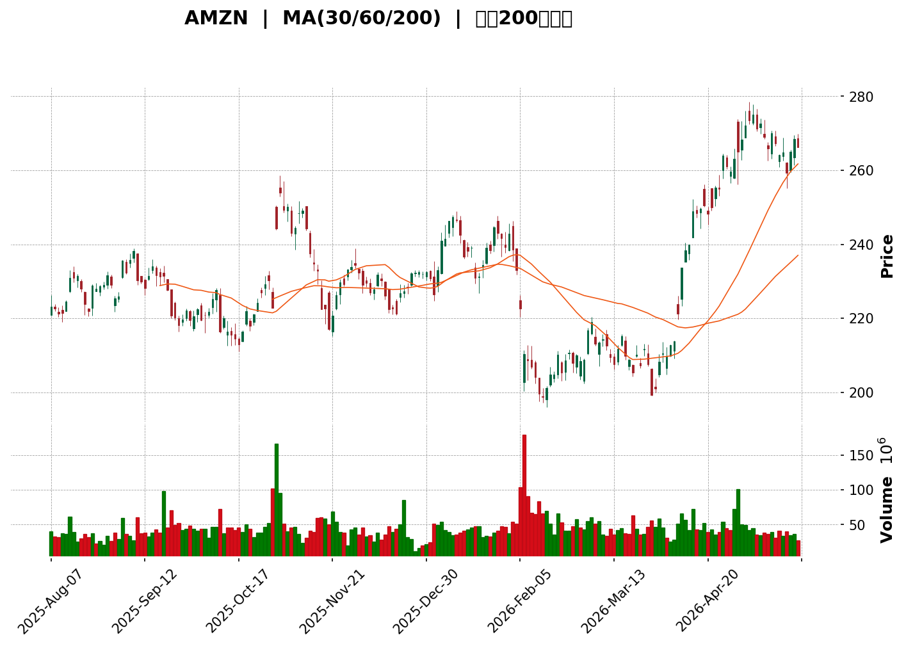
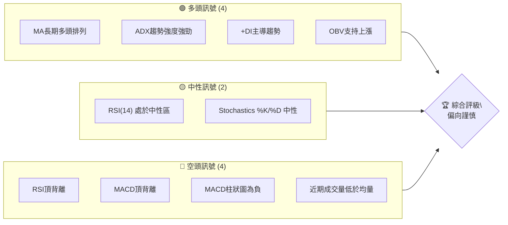
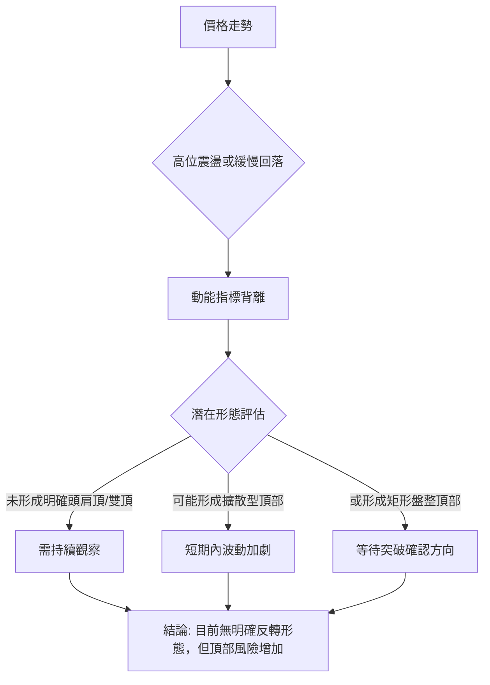
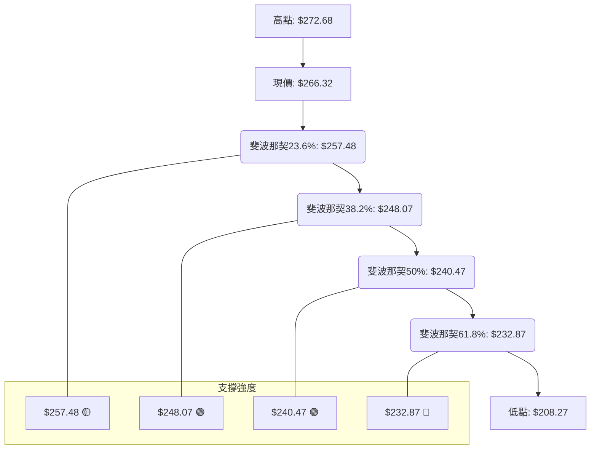

<details>
<summary>📊 靜態圖表 (點擊展開)</summary>

</details>

<html>
<head><meta charset="utf-8" /></head>
<body>
    <div>                        <script>window.PlotlyConfig = {MathJaxConfig: 'local'};</script>
        <script charset="utf-8" src="https://cdn.plot.ly/plotly-3.5.0.min.js" integrity="sha256-fHbNLP+GlIXN+efbQec78UkemUz3NJp7UmfGxC1tNxs=" crossorigin="anonymous"></script>                <div id="candlestick-chart" class="plotly-graph-div" style="height:500px; width:100%;"></div>            <script>                window.PLOTLYENV=window.PLOTLYENV || {};                                if (document.getElementById("candlestick-chart")) {                    Plotly.newPlot(                        "candlestick-chart",                        [{"close":{"dtype":"f8","bdata":"AAAAACnka0AAAACAFNZrQAAAAKCZqWtAAAAAQAqva0AAAACA6xFsQAAAACBc32xAAAAAwPXgbEAAAAAgru9sQAAAAOBRgGxAAAAAgOv5a0AAAABgZr5rQAAAAEDhmmxAAAAAgBR+bEAAAABguJZsQAAAAADXo2xAAAAAQDPzbEAAAAAAAKBsQAAAAEDhKmxAAAAAIK4\u002fbEAAAACAwnVtQAAAAGCPCm1AAAAAQOF6bUAAAAAgrsdtQAAAAGCPymxAAAAAYGa+bEAAAADAzIRsQAAAAIDC7WxAAAAAoJlBbUAAAAAA1\u002fNsQAAAACBc52xAAAAAIFzvbEAAAAAAKXRsQAAAAGC4lmtAAAAAYLiGa0AAAADAzERrQAAAAMD1eGtAAAAAoHDFa0AAAACAPXJrQAAAAAAplGtAAAAAwB7Na0AAAADgUXBrQAAAAMDMnGtAAAAAwPW4a0AAAABACidsQAAAACCud2xAAAAAANcLa0AAAACAPYJrQAAAAOB6DGtAAAAAgD3yakAAAABACs9qQAAAAKBHoWpAAAAAIFwPa0AAAADA9cBrQAAAAGBmPmtAAAAAQOGia0AAAABguAZsQAAAAEAKX2xAAAAAAACobEAAAACgmclsQAAAACCF22tAAAAAQAqHbkAAAAAAAMBvQAAAAIA9Km9AAAAAYGZGb0AAAACgR2FuQAAAAMAejW5AAAAAwMwMb0AAAABAMyNvQAAAAGBmhm5AAAAAYI+ybUAAAACAFFZtQAAAAADXG21AAAAAoJnRa0AAAACAFNZrQAAAAOB6JGtAAAAAgBSWa0AAAADA9UhsQAAAAKBwtWxAAAAAwB6lbEAAAABACidtQAAAAAApPG1AAAAAoHBNbUAAAAAAKQxtQAAAACCFo2xAAAAAwPWwbEAAAADgelxsQAAAAKBwfWxAAAAAwPX4bEAAAADA9chsQAAAAIAURmxAAAAAoEfRa0AAAACA69FrQAAAAOCjqGtAAAAA4FFYbEAAAABAM2tsQAAAAIDCjWxAAAAA4HoEbUAAAAAAKQxtQAAAAOCjEG1AAAAAgD0CbUAAAADA9RBtQAAAAIA92mxAAAAAAABQbEAAAACA6yFtQAAAAIDCHW5AAAAAgOsxbkAAAACgR8luQAAAAAAp7G5AAAAAQArPbkAAAABAM1NuQAAAAMDMlG1AAAAAgMLFbUAAAAAA1+NtQAAAAAAA4GxAAAAAgOvpbEAAAABA4UptQAAAAMAe5W1AAAAAoHDNbUAAAACAwpVuQAAAAOBRYG5AAAAAIFw3bkAAAACgmeltQAAAAGC4Xm5AAAAAANfTbUAAAAAgrh9tQAAAAIAU1mtAAAAAgD1KakAAAABAChdqQAAAAGC43mlAAAAAYI+CaUAAAABAM\u002fNoQAAAAKBH2WhAAAAAwMwkaUAAAACgR5lpQAAAACCFm2lAAAAAIIVDakAAAADgo6hpQAAAAIDrEWpAAAAA4HpUakAAAACgcP1pQAAAAAAAQGpAAAAA4HoMakAAAAAgXBdqQAAAAIA9GmtAAAAAgBRea0AAAABguKZqQAAAACCur2pAAAAAYI\u002fKakAAAADAzJRqQAAAAMD1MGpAAAAAoHD1aUAAAAAgrndqQAAAAGBm5mpAAAAAANc7akAAAADgURhqQAAAAADXq2lAAAAA4HpEakAAAAAgrudpQAAAAGC4dmpAAAAAoEfxaUAAAABA4epoQAAAAGBmHmlAAAAA4KMIakAAAACAPVJqQAAAAOCjOGpAAAAAoEeZakAAAADgo7hqQAAAAAAAqGtAAAAAwMw0bUAAAAAAKcxtQAAAAOB6\u002fG1AAAAA4KMgb0AAAAAAABBvQAAAAGBmNm9AAAAAgOtRb0AAAADA9QhvQAAAAMAePW9AAAAAIIXrb0AAAABgj+JvQAAAAADXf3BAAAAAgOtRcEAAAABAMztwQAAAAOCjcHBAAAAAwPWQcEAAAAAAKcRwQAAAAMDMAHFAAAAAwMwYcUAAAAAA1y9xQAAAAGC48nBAAAAAQOEKcUAAAAAA189wQAAAAMAenXBAAAAAgBTicEAAAAAghbNwQAAAAIA9gnBAAAAAgMKNcEAAAACgcDVwQAAAAAApkHBAAAAAIFzHcEAAAADAHqVwQA=="},"high":{"dtype":"f8","bdata":"AAAAQApHbEAAAACgmflrQAAAAKCZ4WtAAAAAAADwa0AAAACgcB1sQAAAACCFI21AAAAAYI9CbUAAAADAHv1sQAAAAMD10GxAAAAA4KNobEAAAADA9dhrQAAAAOB6pGxAAAAAQDOzbEAAAAAAAKBsQAAAAADXu2xAAAAAYLgWbUAAAACA6\u002flsQAAAAKBwRWxAAAAAoHBlbEAAAADgo3htQAAAAAAAgG1AAAAAQDOzbUAAAABAM9ttQAAAAIDCtW1AAAAAwPXwbEAAAACgR9lsQAAAACBcN21AAAAAwMx8bUAAAACgmUltQAAAACBcL21AAAAAwB5FbUAAAACAPdJsQAAAACCFe2xAAAAAgOsRbEAAAACgcJVrQAAAAKCZoWtAAAAAQDPTa0AAAAAgrsdrQAAAAMDMxGtAAAAAgOvZa0AAAABgZgZsQAAAACBct2tAAAAA4Hrca0AAAAAgXFdsQAAAAGC4hmxAAAAAAACIbEAAAACAwpVrQAAAAIA9amtAAAAAYLg2a0AAAABA4VJrQAAAAKCZ2WpAAAAAgBQWa0AAAACAPeprQAAAAOBRgGtAAAAAoJmpa0AAAADAzCxsQAAAAMDMjGxAAAAAIK7vbEAAAACAPRptQAAAAIAUjmxAAAAAAABQb0AAAACgmSlwQAAAAAApEHBAAAAAAABgb0AAAAAAKUxvQAAAAMDMnG5AAAAAAAB4b0AAAAAAADhvQAAAAADXS29AAAAAAAB4bkAAAAAgXNdtQAAAAEAzU21AAAAAYGbGbEAAAAAgrvdrQAAAAMAebWxAAAAAYLjGa0AAAABgj2psQAAAAOCj0GxAAAAAAAD4bEAAAACgRyltQAAAAKCZeW1AAAAAQArfbUAAAAAAKSxtQAAAAAAAMG1AAAAAIK7nbEAAAABgj9psQAAAAIA9kmxAAAAAoHANbUAAAAAghQNtQAAAAGCPwmxAAAAAgMJ9bEAAAADAHvVrQAAAAIAUJmxAAAAAIFynbEAAAAAAKaRsQAAAACBcr2xAAAAAYGYObUAAAABgZh5tQAAAACCuH21AAAAAQDMTbUAAAADgoxhtQAAAACCuH21AAAAAYLhubUAAAAAAAEBtQAAAAIDCZW5AAAAAoEepbkAAAADAHs1uQAAAACCF+25AAAAAgBQeb0AAAADAHvVuQAAAAMD1KG5AAAAAwMwUbkAAAACAPfJtQAAAAEDhYm1AAAAAoJkJbUAAAABACndtQAAAAGBmDm5AAAAAYGYebkAAAAAAKZxuQAAAAMD1+G5AAAAAAABgbkAAAACAPWpuQAAAAAAptG5AAAAAQDPLbkAAAAAghdttQAAAAIDrSWxAAAAAgBRuakAAAACA65lqQAAAAMDMlGpAAAAAgD0SakAAAABguH5pQAAAAMAeJWlAAAAAIK43aUAAAAAghdtpQAAAAOB6tGlAAAAAoHBlakAAAACAwg1qQAAAACCFS2pAAAAAQOFyakAAAACgmWFqQAAAAGCPSmpAAAAAIFw3akAAAACAwiVqQAAAAKBHMWtAAAAAQAqPa0AAAACAPSprQAAAAIA9umpAAAAAwMz0akAAAAAAACBrQAAAAGC4dmpAAAAAgOtRakAAAABACpdqQAAAAGBm9mpAAAAA4HrkakAAAAAA1yNqQAAAAKBH8WlAAAAAoJmZakAAAABAMytqQAAAAIA9ompAAAAA4HqcakAAAABAM9NpQAAAAKCZeWlAAAAAwPVIakAAAABgj7JqQAAAAGC4hmpAAAAAYGaeakAAAABACr9qQAAAAEAzQ2xAAAAAoJk5bUAAAACAwg1uQAAAAAAAAG5AAAAAgMKFb0AAAACAFE5vQAAAAAAAQG9AAAAAQOECcEAAAACAwkVvQAAAAEDh4m9AAAAAgBT+b0AAAADgoyxwQAAAAAAAiHBAAAAAYGaCcEAAAADgelBwQAAAAGCPnnBAAAAAgBQecUAAAADAHhVxQAAAAKCZQXFAAAAAwPVocUAAAADAzFxxQAAAAIAUSnFAAAAAAAAgcUAAAACAFBpxQAAAAGBmunBAAAAAIIXrcEAAAADgeuxwQAAAAIDChXBAAAAAoJnNcEAAAAAAAGRwQAAAAKBHmXBAAAAAANfXcEAAAADgo9xwQA=="},"hovertemplate":"\u003cb\u003e%{x|%Y-%m-%d}\u003c\u002fb\u003e\u003cbr\u003e\u958b: $%{open:.2f}\u003cbr\u003e\u9ad8: $%{high:.2f}\u003cbr\u003e\u4f4e: $%{low:.2f}\u003cbr\u003e\u6536: $%{close:.2f}\u003cextra\u003e\u003c\u002fextra\u003e","low":{"dtype":"f8","bdata":"AAAAgD2aa0AAAAAAKbxrQAAAAMDMjGtAAAAAoJlha0AAAAAAAMBrQAAAAOCjYGxAAAAAgOu5bEAAAABgj4psQAAAAADXY2xAAAAAoHCda0AAAAAAAJBrQAAAAIA9mmtAAAAAgOtpbEAAAADgo0BsQAAAAIDreWxAAAAA4KOAbEAAAADAHoVsQAAAAGCPumtAAAAAIIULbEAAAADA9dhsQAAAAIDC\u002fWxAAAAAAAA4bUAAAABgj2JtQAAAAEAzo2xAAAAAQOGqbEAAAACgR0lsQAAAAIA9ymxAAAAAIFwHbUAAAABguJZsQAAAAKBHmWxAAAAAYGa2bEAAAADgUXBsQAAAAIA9gmtAAAAAYGZua0AAAABACg9rQAAAAOCjQGtAAAAAoJlpa0AAAADgejxrQAAAACCFE2tAAAAAYGZea0AAAABA4WprQAAAAMD1AGtAAAAAoHCFa0AAAACAFKZrQAAAAAAAuGtAAAAAAAAAa0AAAACgRyFrQAAAAEAzk2pAAAAAwB6VakAAAACA65lqQAAAAMD1YGpAAAAAQOGyakAAAAAgrj9rQAAAAOCjEGtAAAAAgMJFa0AAAADAzLxrQAAAAKBHMWxAAAAAYLhGbEAAAADgUXhsQAAAAAAA2GtAAAAAIFx\u002fbkAAAADAzJxvQAAAAMAeFW9AAAAAwB7FbkAAAACgcEVuQAAAACCuz21AAAAAQOGybkAAAAAgXOduQAAAAAAAeG5AAAAAAACQbUAAAADgehxtQAAAAIAUpmxAAAAAoHDNa0AAAADgo1BrQAAAACCuF2tAAAAAgMLlakAAAADgo8hrQAAAAKCZ+WtAAAAA4KOYbEAAAABACsdsQAAAAAAACG1AAAAAoJkxbUAAAAAghdNsQAAAAKCZWWxAAAAAoJmRbEAAAADgo0hsQAAAACCFI2xAAAAAYLiObEAAAACAFJZsQAAAAADXI2xAAAAAAACwa0AAAAAAKaRrQAAAACCun2tAAAAAwB4NbEAAAABgjzJsQAAAAGC4VmxAAAAAIFyXbEAAAABgj+psQAAAAIDC5WxAAAAA4KPYbEAAAABgZsZsQAAAAADXw2xAAAAAYGYWbEAAAACAwmVsQAAAAIA9Am1AAAAA4KPwbUAAAAAAKTxuQAAAACCuR25AAAAAYLi+bkAAAAAAAAhuQAAAAEAKh21AAAAAACmUbUAAAADAHo1tQAAAAEDhqmxAAAAAAClcbEAAAADAzNxsQAAAAIA9Um1AAAAAoEexbUAAAABgj8JtQAAAAMD1MG5AAAAAIK6XbUAAAADgerRtQAAAAKBwxW1AAAAAYGZubUAAAACAPfpsQAAAAAApjGtAAAAAgOsJaUAAAABAM2tpQAAAAMAezWlAAAAAIK5PaUAAAACA67FoQAAAAMD1qGhAAAAAAACAaEAAAADgUTBpQAAAAIDrWWlAAAAAAAB4aUAAAAAghWNpQAAAAAAAaGlAAAAAgMIdakAAAABAM6tpQAAAAGBmpmlAAAAAYLhuaUAAAAAgXE9pQAAAAMDMRGpAAAAAQOHyakAAAADA9ZBqQAAAACCF42lAAAAAgMKNakAAAABAM2tqQAAAAMDMBGpAAAAAQArHaUAAAABgZu5pQAAAAIDCjWpAAAAAYI8aakAAAACgmcFpQAAAAIA9imlAAAAA4FEwakAAAADgetRpQAAAAMDMPGpAAAAAANfjaUAAAADgeuRoQAAAACBc\u002f2hAAAAA4HqEaUAAAACAFAZqQAAAAMDMnGlAAAAAQOEyakAAAABgjyJqQAAAAADXc2tAAAAA4KPoa0AAAABguGZtQAAAAAAAeG1AAAAAwPU4bkAAAABgZuZuQAAAAGBmhm5AAAAAIIVDb0AAAAAA16tuQAAAAEAzI29AAAAAYI9Kb0AAAACAPaJvQAAAAEAKG3BAAAAAoHBFcEAAAACAFApwQAAAAEAzG3BAAAAAYI8CcEAAAAAA12twQAAAAMDMzHBAAAAAgBQGcUAAAAAgXANxQAAAAADX53BAAAAAQDPfcEAAAAAgrsdwQAAAAIAUanBAAAAAQDNzcEAAAACAFKpwQAAAAIA9TnBAAAAA4HpocEAAAACAFOZvQAAAAOB6OHBAAAAAgOtVcEAAAAAA16NwQA=="},"name":"\u50f9\u683c","open":{"dtype":"f8","bdata":"AAAAAACga0AAAADgeuRrQAAAAMD1uGtAAAAAIFzHa0AAAAAAAMBrQAAAAMDMbGxAAAAAYI8SbUAAAAAgXMdsQAAAAEDhwmxAAAAAANdjbEAAAADAzNRrQAAAAKBH2WtAAAAAQDNrbEAAAAAghWNsQAAAAIA9kmxAAAAA4FGgbEAAAACAPepsQAAAAOCj8GtAAAAAYLgmbEAAAACAFOZsQAAAAIAUZm1AAAAAgBRebUAAAAAghYttQAAAAOCjsG1AAAAAIK7vbEAAAABAM8tsQAAAAAAp1GxAAAAAgBQebUAAAADgozhtQAAAAAAAEG1AAAAAANcLbUAAAACA69FsQAAAAGCPemxAAAAAwMwEbEAAAACA64FrQAAAAGCPYmtAAAAAYI+Ca0AAAADA9cBrQAAAACCFK2tAAAAA4FGga0AAAACAFO5rQAAAAAAAoGtAAAAAACmca0AAAACgcN1rQAAAAAAAIGxAAAAAYLhGbEAAAABgZjZrQAAAAIDr8WpAAAAAANcTa0AAAACgcPVqQAAAAIDr0WpAAAAAACm8akAAAACAwk1rQAAAAKCZaWtAAAAAAABga0AAAABACr9rQAAAAMAedWxAAAAAQAqHbEAAAACgcPVsQAAAAIDrYWxAAAAAQDNDb0AAAAAghetvQAAAAAApTG9AAAAAwPUgb0AAAADAHiVvQAAAAMDMXG5AAAAAQOEKb0AAAADAHg1vQAAAACCuR29AAAAAoJlhbkAAAACA62FtQAAAAAAAKG1AAAAAQDODbEAAAAAgrvdrQAAAAKCZYWxAAAAAQDMLa0AAAACA69FrQAAAAAApTGxAAAAAIK7XbEAAAAAgrudsQAAAAEAKJ21AAAAA4FFgbUAAAABAMyttQAAAAOCjGG1AAAAAgD3KbEAAAABA4bJsQAAAAEDhWmxAAAAAgOuZbEAAAABguNZsQAAAAADXu2xAAAAAgMJ9bEAAAACgR+FrQAAAAMAeFWxAAAAAYLg2bEAAAADgUVhsQAAAACCFk2xAAAAAgOuhbEAAAAAAKQRtQAAAAKBHAW1AAAAAgBT+bEAAAABguOZsQAAAAMAeHW1AAAAAQOHqbEAAAABA4ZpsQAAAAEAzA21AAAAAIIXzbUAAAACA62FuQAAAAIA9km5AAAAAIFzXbkAAAADA9dBuQAAAAMDMJG5AAAAAgOvpbUAAAABA4eJtQAAAAOBROG1AAAAAQOHibEAAAACgmUFtQAAAAGC4Xm1AAAAAIFz\u002fbUAAAACAFPZtQAAAAADXy25AAAAAgD1abkAAAADgevxtQAAAAIDryW1AAAAAIFyfbkAAAAAghdttQAAAAMAeHWxAAAAAYGZWaUAAAABACh9qQAAAAKCZGWpAAAAAgOsBakAAAABguH5pQAAAAAAp3GhAAAAAACnEaEAAAACAPUJpQAAAAKCZeWlAAAAA4FGYaUAAAABAMwNqQAAAAEAKr2lAAAAAYLhOakAAAAAgXFdqQAAAAGCP2mlAAAAAoJmRaUAAAABAM2NpQAAAAEAKT2pAAAAAIFz\u002fakAAAAAgrt9qQAAAAGBmTmpAAAAAgBTGakAAAABguPZqQAAAAOB6TGpAAAAAIIUzakAAAABAMwtqQAAAAIA9mmpAAAAAgMK9akAAAACA6+FpQAAAAMDM7GlAAAAAoEc5akAAAABgZv5pQAAAAIDrcWpAAAAAIIVTakAAAABguM5pQAAAACBcL2lAAAAAQDObaUAAAACAFE5qQAAAAKBH0WlAAAAAoJk5akAAAAAgrmdqQAAAAKBH+WtAAAAAIFwnbEAAAACgmWltQAAAAGBmrm1AAAAAwPU4bkAAAAAAAChvQAAAAOBREG9AAAAAIK7fb0AAAACAFCZvQAAAAEDh4m9AAAAAgBSOb0AAAADgeuxvQAAAACCuP3BAAAAAIFx3cEAAAACAPSZwQAAAAADXH3BAAAAAYLgScUAAAACgR5lwQAAAAMDMzHBAAAAAoEdBcUAAAACAPQ5xQAAAAOBRMHFAAAAAgBT6cEAAAACgcN1wQAAAACBcq3BAAAAAQOGGcEAAAABgZtJwQAAAAAAAaHBAAAAAgOt9cEAAAADgo2BwQAAAAMDMQHBAAAAAAAB4cEAAAABgj8pwQA=="},"x":["2025-08-07T00:00:00-04:00","2025-08-08T00:00:00-04:00","2025-08-11T00:00:00-04:00","2025-08-12T00:00:00-04:00","2025-08-13T00:00:00-04:00","2025-08-14T00:00:00-04:00","2025-08-15T00:00:00-04:00","2025-08-18T00:00:00-04:00","2025-08-19T00:00:00-04:00","2025-08-20T00:00:00-04:00","2025-08-21T00:00:00-04:00","2025-08-22T00:00:00-04:00","2025-08-25T00:00:00-04:00","2025-08-26T00:00:00-04:00","2025-08-27T00:00:00-04:00","2025-08-28T00:00:00-04:00","2025-08-29T00:00:00-04:00","2025-09-02T00:00:00-04:00","2025-09-03T00:00:00-04:00","2025-09-04T00:00:00-04:00","2025-09-05T00:00:00-04:00","2025-09-08T00:00:00-04:00","2025-09-09T00:00:00-04:00","2025-09-10T00:00:00-04:00","2025-09-11T00:00:00-04:00","2025-09-12T00:00:00-04:00","2025-09-15T00:00:00-04:00","2025-09-16T00:00:00-04:00","2025-09-17T00:00:00-04:00","2025-09-18T00:00:00-04:00","2025-09-19T00:00:00-04:00","2025-09-22T00:00:00-04:00","2025-09-23T00:00:00-04:00","2025-09-24T00:00:00-04:00","2025-09-25T00:00:00-04:00","2025-09-26T00:00:00-04:00","2025-09-29T00:00:00-04:00","2025-09-30T00:00:00-04:00","2025-10-01T00:00:00-04:00","2025-10-02T00:00:00-04:00","2025-10-03T00:00:00-04:00","2025-10-06T00:00:00-04:00","2025-10-07T00:00:00-04:00","2025-10-08T00:00:00-04:00","2025-10-09T00:00:00-04:00","2025-10-10T00:00:00-04:00","2025-10-13T00:00:00-04:00","2025-10-14T00:00:00-04:00","2025-10-15T00:00:00-04:00","2025-10-16T00:00:00-04:00","2025-10-17T00:00:00-04:00","2025-10-20T00:00:00-04:00","2025-10-21T00:00:00-04:00","2025-10-22T00:00:00-04:00","2025-10-23T00:00:00-04:00","2025-10-24T00:00:00-04:00","2025-10-27T00:00:00-04:00","2025-10-28T00:00:00-04:00","2025-10-29T00:00:00-04:00","2025-10-30T00:00:00-04:00","2025-10-31T00:00:00-04:00","2025-11-03T00:00:00-05:00","2025-11-04T00:00:00-05:00","2025-11-05T00:00:00-05:00","2025-11-06T00:00:00-05:00","2025-11-07T00:00:00-05:00","2025-11-10T00:00:00-05:00","2025-11-11T00:00:00-05:00","2025-11-12T00:00:00-05:00","2025-11-13T00:00:00-05:00","2025-11-14T00:00:00-05:00","2025-11-17T00:00:00-05:00","2025-11-18T00:00:00-05:00","2025-11-19T00:00:00-05:00","2025-11-20T00:00:00-05:00","2025-11-21T00:00:00-05:00","2025-11-24T00:00:00-05:00","2025-11-25T00:00:00-05:00","2025-11-26T00:00:00-05:00","2025-11-28T00:00:00-05:00","2025-12-01T00:00:00-05:00","2025-12-02T00:00:00-05:00","2025-12-03T00:00:00-05:00","2025-12-04T00:00:00-05:00","2025-12-05T00:00:00-05:00","2025-12-08T00:00:00-05:00","2025-12-09T00:00:00-05:00","2025-12-10T00:00:00-05:00","2025-12-11T00:00:00-05:00","2025-12-12T00:00:00-05:00","2025-12-15T00:00:00-05:00","2025-12-16T00:00:00-05:00","2025-12-17T00:00:00-05:00","2025-12-18T00:00:00-05:00","2025-12-19T00:00:00-05:00","2025-12-22T00:00:00-05:00","2025-12-23T00:00:00-05:00","2025-12-24T00:00:00-05:00","2025-12-26T00:00:00-05:00","2025-12-29T00:00:00-05:00","2025-12-30T00:00:00-05:00","2025-12-31T00:00:00-05:00","2026-01-02T00:00:00-05:00","2026-01-05T00:00:00-05:00","2026-01-06T00:00:00-05:00","2026-01-07T00:00:00-05:00","2026-01-08T00:00:00-05:00","2026-01-09T00:00:00-05:00","2026-01-12T00:00:00-05:00","2026-01-13T00:00:00-05:00","2026-01-14T00:00:00-05:00","2026-01-15T00:00:00-05:00","2026-01-16T00:00:00-05:00","2026-01-20T00:00:00-05:00","2026-01-21T00:00:00-05:00","2026-01-22T00:00:00-05:00","2026-01-23T00:00:00-05:00","2026-01-26T00:00:00-05:00","2026-01-27T00:00:00-05:00","2026-01-28T00:00:00-05:00","2026-01-29T00:00:00-05:00","2026-01-30T00:00:00-05:00","2026-02-02T00:00:00-05:00","2026-02-03T00:00:00-05:00","2026-02-04T00:00:00-05:00","2026-02-05T00:00:00-05:00","2026-02-06T00:00:00-05:00","2026-02-09T00:00:00-05:00","2026-02-10T00:00:00-05:00","2026-02-11T00:00:00-05:00","2026-02-12T00:00:00-05:00","2026-02-13T00:00:00-05:00","2026-02-17T00:00:00-05:00","2026-02-18T00:00:00-05:00","2026-02-19T00:00:00-05:00","2026-02-20T00:00:00-05:00","2026-02-23T00:00:00-05:00","2026-02-24T00:00:00-05:00","2026-02-25T00:00:00-05:00","2026-02-26T00:00:00-05:00","2026-02-27T00:00:00-05:00","2026-03-02T00:00:00-05:00","2026-03-03T00:00:00-05:00","2026-03-04T00:00:00-05:00","2026-03-05T00:00:00-05:00","2026-03-06T00:00:00-05:00","2026-03-09T00:00:00-04:00","2026-03-10T00:00:00-04:00","2026-03-11T00:00:00-04:00","2026-03-12T00:00:00-04:00","2026-03-13T00:00:00-04:00","2026-03-16T00:00:00-04:00","2026-03-17T00:00:00-04:00","2026-03-18T00:00:00-04:00","2026-03-19T00:00:00-04:00","2026-03-20T00:00:00-04:00","2026-03-23T00:00:00-04:00","2026-03-24T00:00:00-04:00","2026-03-25T00:00:00-04:00","2026-03-26T00:00:00-04:00","2026-03-27T00:00:00-04:00","2026-03-30T00:00:00-04:00","2026-03-31T00:00:00-04:00","2026-04-01T00:00:00-04:00","2026-04-02T00:00:00-04:00","2026-04-06T00:00:00-04:00","2026-04-07T00:00:00-04:00","2026-04-08T00:00:00-04:00","2026-04-09T00:00:00-04:00","2026-04-10T00:00:00-04:00","2026-04-13T00:00:00-04:00","2026-04-14T00:00:00-04:00","2026-04-15T00:00:00-04:00","2026-04-16T00:00:00-04:00","2026-04-17T00:00:00-04:00","2026-04-20T00:00:00-04:00","2026-04-21T00:00:00-04:00","2026-04-22T00:00:00-04:00","2026-04-23T00:00:00-04:00","2026-04-24T00:00:00-04:00","2026-04-27T00:00:00-04:00","2026-04-28T00:00:00-04:00","2026-04-29T00:00:00-04:00","2026-04-30T00:00:00-04:00","2026-05-01T00:00:00-04:00","2026-05-04T00:00:00-04:00","2026-05-05T00:00:00-04:00","2026-05-06T00:00:00-04:00","2026-05-07T00:00:00-04:00","2026-05-08T00:00:00-04:00","2026-05-11T00:00:00-04:00","2026-05-12T00:00:00-04:00","2026-05-13T00:00:00-04:00","2026-05-14T00:00:00-04:00","2026-05-15T00:00:00-04:00","2026-05-18T00:00:00-04:00","2026-05-19T00:00:00-04:00","2026-05-20T00:00:00-04:00","2026-05-21T00:00:00-04:00","2026-05-22T00:00:00-04:00"],"type":"candlestick"},{"hovertemplate":"MA30: $%{y:.2f}\u003cextra\u003e\u003c\u002fextra\u003e","line":{"color":"#2196F3","dash":"dash","width":2},"mode":"lines","name":"MA30","x":["2025-08-07T00:00:00-04:00","2025-08-08T00:00:00-04:00","2025-08-11T00:00:00-04:00","2025-08-12T00:00:00-04:00","2025-08-13T00:00:00-04:00","2025-08-14T00:00:00-04:00","2025-08-15T00:00:00-04:00","2025-08-18T00:00:00-04:00","2025-08-19T00:00:00-04:00","2025-08-20T00:00:00-04:00","2025-08-21T00:00:00-04:00","2025-08-22T00:00:00-04:00","2025-08-25T00:00:00-04:00","2025-08-26T00:00:00-04:00","2025-08-27T00:00:00-04:00","2025-08-28T00:00:00-04:00","2025-08-29T00:00:00-04:00","2025-09-02T00:00:00-04:00","2025-09-03T00:00:00-04:00","2025-09-04T00:00:00-04:00","2025-09-05T00:00:00-04:00","2025-09-08T00:00:00-04:00","2025-09-09T00:00:00-04:00","2025-09-10T00:00:00-04:00","2025-09-11T00:00:00-04:00","2025-09-12T00:00:00-04:00","2025-09-15T00:00:00-04:00","2025-09-16T00:00:00-04:00","2025-09-17T00:00:00-04:00","2025-09-18T00:00:00-04:00","2025-09-19T00:00:00-04:00","2025-09-22T00:00:00-04:00","2025-09-23T00:00:00-04:00","2025-09-24T00:00:00-04:00","2025-09-25T00:00:00-04:00","2025-09-26T00:00:00-04:00","2025-09-29T00:00:00-04:00","2025-09-30T00:00:00-04:00","2025-10-01T00:00:00-04:00","2025-10-02T00:00:00-04:00","2025-10-03T00:00:00-04:00","2025-10-06T00:00:00-04:00","2025-10-07T00:00:00-04:00","2025-10-08T00:00:00-04:00","2025-10-09T00:00:00-04:00","2025-10-10T00:00:00-04:00","2025-10-13T00:00:00-04:00","2025-10-14T00:00:00-04:00","2025-10-15T00:00:00-04:00","2025-10-16T00:00:00-04:00","2025-10-17T00:00:00-04:00","2025-10-20T00:00:00-04:00","2025-10-21T00:00:00-04:00","2025-10-22T00:00:00-04:00","2025-10-23T00:00:00-04:00","2025-10-24T00:00:00-04:00","2025-10-27T00:00:00-04:00","2025-10-28T00:00:00-04:00","2025-10-29T00:00:00-04:00","2025-10-30T00:00:00-04:00","2025-10-31T00:00:00-04:00","2025-11-03T00:00:00-05:00","2025-11-04T00:00:00-05:00","2025-11-05T00:00:00-05:00","2025-11-06T00:00:00-05:00","2025-11-07T00:00:00-05:00","2025-11-10T00:00:00-05:00","2025-11-11T00:00:00-05:00","2025-11-12T00:00:00-05:00","2025-11-13T00:00:00-05:00","2025-11-14T00:00:00-05:00","2025-11-17T00:00:00-05:00","2025-11-18T00:00:00-05:00","2025-11-19T00:00:00-05:00","2025-11-20T00:00:00-05:00","2025-11-21T00:00:00-05:00","2025-11-24T00:00:00-05:00","2025-11-25T00:00:00-05:00","2025-11-26T00:00:00-05:00","2025-11-28T00:00:00-05:00","2025-12-01T00:00:00-05:00","2025-12-02T00:00:00-05:00","2025-12-03T00:00:00-05:00","2025-12-04T00:00:00-05:00","2025-12-05T00:00:00-05:00","2025-12-08T00:00:00-05:00","2025-12-09T00:00:00-05:00","2025-12-10T00:00:00-05:00","2025-12-11T00:00:00-05:00","2025-12-12T00:00:00-05:00","2025-12-15T00:00:00-05:00","2025-12-16T00:00:00-05:00","2025-12-17T00:00:00-05:00","2025-12-18T00:00:00-05:00","2025-12-19T00:00:00-05:00","2025-12-22T00:00:00-05:00","2025-12-23T00:00:00-05:00","2025-12-24T00:00:00-05:00","2025-12-26T00:00:00-05:00","2025-12-29T00:00:00-05:00","2025-12-30T00:00:00-05:00","2025-12-31T00:00:00-05:00","2026-01-02T00:00:00-05:00","2026-01-05T00:00:00-05:00","2026-01-06T00:00:00-05:00","2026-01-07T00:00:00-05:00","2026-01-08T00:00:00-05:00","2026-01-09T00:00:00-05:00","2026-01-12T00:00:00-05:00","2026-01-13T00:00:00-05:00","2026-01-14T00:00:00-05:00","2026-01-15T00:00:00-05:00","2026-01-16T00:00:00-05:00","2026-01-20T00:00:00-05:00","2026-01-21T00:00:00-05:00","2026-01-22T00:00:00-05:00","2026-01-23T00:00:00-05:00","2026-01-26T00:00:00-05:00","2026-01-27T00:00:00-05:00","2026-01-28T00:00:00-05:00","2026-01-29T00:00:00-05:00","2026-01-30T00:00:00-05:00","2026-02-02T00:00:00-05:00","2026-02-03T00:00:00-05:00","2026-02-04T00:00:00-05:00","2026-02-05T00:00:00-05:00","2026-02-06T00:00:00-05:00","2026-02-09T00:00:00-05:00","2026-02-10T00:00:00-05:00","2026-02-11T00:00:00-05:00","2026-02-12T00:00:00-05:00","2026-02-13T00:00:00-05:00","2026-02-17T00:00:00-05:00","2026-02-18T00:00:00-05:00","2026-02-19T00:00:00-05:00","2026-02-20T00:00:00-05:00","2026-02-23T00:00:00-05:00","2026-02-24T00:00:00-05:00","2026-02-25T00:00:00-05:00","2026-02-26T00:00:00-05:00","2026-02-27T00:00:00-05:00","2026-03-02T00:00:00-05:00","2026-03-03T00:00:00-05:00","2026-03-04T00:00:00-05:00","2026-03-05T00:00:00-05:00","2026-03-06T00:00:00-05:00","2026-03-09T00:00:00-04:00","2026-03-10T00:00:00-04:00","2026-03-11T00:00:00-04:00","2026-03-12T00:00:00-04:00","2026-03-13T00:00:00-04:00","2026-03-16T00:00:00-04:00","2026-03-17T00:00:00-04:00","2026-03-18T00:00:00-04:00","2026-03-19T00:00:00-04:00","2026-03-20T00:00:00-04:00","2026-03-23T00:00:00-04:00","2026-03-24T00:00:00-04:00","2026-03-25T00:00:00-04:00","2026-03-26T00:00:00-04:00","2026-03-27T00:00:00-04:00","2026-03-30T00:00:00-04:00","2026-03-31T00:00:00-04:00","2026-04-01T00:00:00-04:00","2026-04-02T00:00:00-04:00","2026-04-06T00:00:00-04:00","2026-04-07T00:00:00-04:00","2026-04-08T00:00:00-04:00","2026-04-09T00:00:00-04:00","2026-04-10T00:00:00-04:00","2026-04-13T00:00:00-04:00","2026-04-14T00:00:00-04:00","2026-04-15T00:00:00-04:00","2026-04-16T00:00:00-04:00","2026-04-17T00:00:00-04:00","2026-04-20T00:00:00-04:00","2026-04-21T00:00:00-04:00","2026-04-22T00:00:00-04:00","2026-04-23T00:00:00-04:00","2026-04-24T00:00:00-04:00","2026-04-27T00:00:00-04:00","2026-04-28T00:00:00-04:00","2026-04-29T00:00:00-04:00","2026-04-30T00:00:00-04:00","2026-05-01T00:00:00-04:00","2026-05-04T00:00:00-04:00","2026-05-05T00:00:00-04:00","2026-05-06T00:00:00-04:00","2026-05-07T00:00:00-04:00","2026-05-08T00:00:00-04:00","2026-05-11T00:00:00-04:00","2026-05-12T00:00:00-04:00","2026-05-13T00:00:00-04:00","2026-05-14T00:00:00-04:00","2026-05-15T00:00:00-04:00","2026-05-18T00:00:00-04:00","2026-05-19T00:00:00-04:00","2026-05-20T00:00:00-04:00","2026-05-21T00:00:00-04:00","2026-05-22T00:00:00-04:00"],"y":{"dtype":"f8","bdata":"AAAAAAAA+H8AAAAAAAD4fwAAAAAAAPh\u002fAAAAAAAA+H8AAAAAAAD4fwAAAAAAAPh\u002fAAAAAAAA+H8AAAAAAAD4fwAAAAAAAPh\u002fAAAAAAAA+H8AAAAAAAD4fwAAAAAAAPh\u002fAAAAAAAA+H8AAAAAAAD4fwAAAAAAAPh\u002fAAAAAAAA+H8AAAAAAAD4fwAAAAAAAPh\u002fAAAAAAAA+H8AAAAAAAD4fwAAAAAAAPh\u002fAAAAAAAA+H8AAAAAAAD4fwAAAAAAAPh\u002fAAAAAAAA+H8AAAAAAAD4fwAAAAAAAPh\u002fAAAAAAAA+H8AAAAAAAD4f4mIiNiHm2xAMzMz82+kbEBmZmbmtKlsQKuqqsoTqWxAq6qqurunbEDv7u5e5aBsQGZmZgbzlGxAd3d3p3+LbEAzMzOzyH5sQImIiHjpdmxA3t3dLWt1bEBVVVXl0HJsQO\u002fu7r5YamxAd3d3p8ZjbEBmZmamDWBsQCIiItKUXmxAMzMzA1ZObEB3d3eHz0RsQFVVVZVDO2xAq6qqOiYwbEDNzMx8hhlsQHd3dwfzBGxAVVVVdUzwa0C8u7sLAt9rQKuqqnrN0WtAvLu7G1rIa0Crqqo6JsRrQKuqqlpkv2tAIiIiokW6a0AAAAAw3bhrQO\u002fu7p7vr2tA3t3dfYa9a0AiIiJCp9lrQCIiIrIr+GtAZmZm9igYbEB3d3eXtTJsQJqZmTn7TGxAMzMzw\u002fVobEC8u7trdYhsQJqZmZmZoWxAVVVVBcixbEDNzMws+cFsQImIiMi9zmxAvLu7C5DPbEAAAAAw3cxsQN7d3a2OwWxAREREVCrGbEAiIiISysxsQFVVVWX02mxA7+7uXnPpbEDv7u5ec\u002f1sQFVVVRWuE21AZmZm5tAmbUBEREQk2zFtQBEREZHCPW1AAAAAQMNGbUARERERn0ltQKuqqnqiSm1AZmZmVlVNbUAAAADgT01tQAAAADDdUG1AmpmZGb05bUAiIiLiMxhtQM3MzFxI+mxA3t3drUfhbEBEREREi9BsQImIiKh\u002fv2xAiYiImCeubEC8u7vrUZxsQBEREYHcj2xAiYiI6PuJbEBVVVUVrodsQM3MzEx+hWxAmpmZ6bSJbEDNzMycxJRsQN7d3d0krmxARERExGfEbEBERETUv9lsQHd3d9ej7GxAAAAAoBr\u002fbEDe3d39GwltQCIiImIQDG1AzczMHBMQbUBERESUQxdtQM3MzKxHGW1AvLu7uy0bbUBEREQUICNtQJqZmVkdL21AMzMzgzI2bUC8u7urjkVtQGZmZqZ\u002fV21AzczMzPdrbUAAAADw0n1tQBEREcH1lG1AMzMzU5yhbUC8u7troKdtQFVVVQWBoW1AVVVVtTqKbUAzMzPz\u002fXBtQN7d3V26VW1Aq6qqOt83bUBVVVUlvxRtQBEREdGU8mxAMzMzk4rXbECrqqr6YrlsQHd3d3fpkmxAVVVVhV1xbEBERERUnEVsQBEREeEzHGxAZmZm5vv1a0AiIiLy\u002fdBrQImIiLiQtGtAEREREcqUa0AiIiKSX3RrQM3MzHw\u002fZWtAd3d3pw1Ya0AiIiLCg0FrQDMzMyMiJmtAZmZm9m8Ma0AzMzOjRepqQN7d3V2PxmpAd3d3tzqiakAAAAAA1YRqQKuqqqo4Z2pAAAAAAI5IakB3d3eXtS5qQDMzMxM8HGpAvLu76wocakCJiIjIdhpqQJqZmdmHH2pAiYiIqDgjakCJiIio8SJqQLy7u3s\u002fJWpAiYiIuNcsakDNzMwMAjNqQO\u002fu7s4+OGpAAAAAoBo7akARERGxK0RqQImIiOi0UWpAvLu7K0BqakCJiIjIvYpqQO\u002fu7r6fqmpAIiIicvbVakDv7u5OYgBrQM3MzLx0I2tAq6qqGi9Fa0DNzMyMl2prQDMzM6NwkWtAAAAAkDS9a0CJiIjIduprQN7d3f2NJGxAd3d3Z5FdbEDv7u6uuZBsQCIiIjLBw2xA7+7uvp\u002f+bEB3d3c3Fz5tQM3MzEw3hW1AREREdNrIbUB3d3e3HhFuQDMzM0OLUG5AMzMz0waWbkCrqqrqUeBuQBEREcGDJW9AiYiIqH9nb0AiIiLi7KNvQFVVVYXr3W9AzczMDLsKcEB3d3ffCCNwQKuqqpJfOnBARERETPBMcEAiIiIK11twQA=="},"type":"scatter"},{"hovertemplate":"MA60: $%{y:.2f}\u003cextra\u003e\u003c\u002fextra\u003e","line":{"color":"#9C27B0","dash":"dash","width":2},"mode":"lines","name":"MA60","x":["2025-08-07T00:00:00-04:00","2025-08-08T00:00:00-04:00","2025-08-11T00:00:00-04:00","2025-08-12T00:00:00-04:00","2025-08-13T00:00:00-04:00","2025-08-14T00:00:00-04:00","2025-08-15T00:00:00-04:00","2025-08-18T00:00:00-04:00","2025-08-19T00:00:00-04:00","2025-08-20T00:00:00-04:00","2025-08-21T00:00:00-04:00","2025-08-22T00:00:00-04:00","2025-08-25T00:00:00-04:00","2025-08-26T00:00:00-04:00","2025-08-27T00:00:00-04:00","2025-08-28T00:00:00-04:00","2025-08-29T00:00:00-04:00","2025-09-02T00:00:00-04:00","2025-09-03T00:00:00-04:00","2025-09-04T00:00:00-04:00","2025-09-05T00:00:00-04:00","2025-09-08T00:00:00-04:00","2025-09-09T00:00:00-04:00","2025-09-10T00:00:00-04:00","2025-09-11T00:00:00-04:00","2025-09-12T00:00:00-04:00","2025-09-15T00:00:00-04:00","2025-09-16T00:00:00-04:00","2025-09-17T00:00:00-04:00","2025-09-18T00:00:00-04:00","2025-09-19T00:00:00-04:00","2025-09-22T00:00:00-04:00","2025-09-23T00:00:00-04:00","2025-09-24T00:00:00-04:00","2025-09-25T00:00:00-04:00","2025-09-26T00:00:00-04:00","2025-09-29T00:00:00-04:00","2025-09-30T00:00:00-04:00","2025-10-01T00:00:00-04:00","2025-10-02T00:00:00-04:00","2025-10-03T00:00:00-04:00","2025-10-06T00:00:00-04:00","2025-10-07T00:00:00-04:00","2025-10-08T00:00:00-04:00","2025-10-09T00:00:00-04:00","2025-10-10T00:00:00-04:00","2025-10-13T00:00:00-04:00","2025-10-14T00:00:00-04:00","2025-10-15T00:00:00-04:00","2025-10-16T00:00:00-04:00","2025-10-17T00:00:00-04:00","2025-10-20T00:00:00-04:00","2025-10-21T00:00:00-04:00","2025-10-22T00:00:00-04:00","2025-10-23T00:00:00-04:00","2025-10-24T00:00:00-04:00","2025-10-27T00:00:00-04:00","2025-10-28T00:00:00-04:00","2025-10-29T00:00:00-04:00","2025-10-30T00:00:00-04:00","2025-10-31T00:00:00-04:00","2025-11-03T00:00:00-05:00","2025-11-04T00:00:00-05:00","2025-11-05T00:00:00-05:00","2025-11-06T00:00:00-05:00","2025-11-07T00:00:00-05:00","2025-11-10T00:00:00-05:00","2025-11-11T00:00:00-05:00","2025-11-12T00:00:00-05:00","2025-11-13T00:00:00-05:00","2025-11-14T00:00:00-05:00","2025-11-17T00:00:00-05:00","2025-11-18T00:00:00-05:00","2025-11-19T00:00:00-05:00","2025-11-20T00:00:00-05:00","2025-11-21T00:00:00-05:00","2025-11-24T00:00:00-05:00","2025-11-25T00:00:00-05:00","2025-11-26T00:00:00-05:00","2025-11-28T00:00:00-05:00","2025-12-01T00:00:00-05:00","2025-12-02T00:00:00-05:00","2025-12-03T00:00:00-05:00","2025-12-04T00:00:00-05:00","2025-12-05T00:00:00-05:00","2025-12-08T00:00:00-05:00","2025-12-09T00:00:00-05:00","2025-12-10T00:00:00-05:00","2025-12-11T00:00:00-05:00","2025-12-12T00:00:00-05:00","2025-12-15T00:00:00-05:00","2025-12-16T00:00:00-05:00","2025-12-17T00:00:00-05:00","2025-12-18T00:00:00-05:00","2025-12-19T00:00:00-05:00","2025-12-22T00:00:00-05:00","2025-12-23T00:00:00-05:00","2025-12-24T00:00:00-05:00","2025-12-26T00:00:00-05:00","2025-12-29T00:00:00-05:00","2025-12-30T00:00:00-05:00","2025-12-31T00:00:00-05:00","2026-01-02T00:00:00-05:00","2026-01-05T00:00:00-05:00","2026-01-06T00:00:00-05:00","2026-01-07T00:00:00-05:00","2026-01-08T00:00:00-05:00","2026-01-09T00:00:00-05:00","2026-01-12T00:00:00-05:00","2026-01-13T00:00:00-05:00","2026-01-14T00:00:00-05:00","2026-01-15T00:00:00-05:00","2026-01-16T00:00:00-05:00","2026-01-20T00:00:00-05:00","2026-01-21T00:00:00-05:00","2026-01-22T00:00:00-05:00","2026-01-23T00:00:00-05:00","2026-01-26T00:00:00-05:00","2026-01-27T00:00:00-05:00","2026-01-28T00:00:00-05:00","2026-01-29T00:00:00-05:00","2026-01-30T00:00:00-05:00","2026-02-02T00:00:00-05:00","2026-02-03T00:00:00-05:00","2026-02-04T00:00:00-05:00","2026-02-05T00:00:00-05:00","2026-02-06T00:00:00-05:00","2026-02-09T00:00:00-05:00","2026-02-10T00:00:00-05:00","2026-02-11T00:00:00-05:00","2026-02-12T00:00:00-05:00","2026-02-13T00:00:00-05:00","2026-02-17T00:00:00-05:00","2026-02-18T00:00:00-05:00","2026-02-19T00:00:00-05:00","2026-02-20T00:00:00-05:00","2026-02-23T00:00:00-05:00","2026-02-24T00:00:00-05:00","2026-02-25T00:00:00-05:00","2026-02-26T00:00:00-05:00","2026-02-27T00:00:00-05:00","2026-03-02T00:00:00-05:00","2026-03-03T00:00:00-05:00","2026-03-04T00:00:00-05:00","2026-03-05T00:00:00-05:00","2026-03-06T00:00:00-05:00","2026-03-09T00:00:00-04:00","2026-03-10T00:00:00-04:00","2026-03-11T00:00:00-04:00","2026-03-12T00:00:00-04:00","2026-03-13T00:00:00-04:00","2026-03-16T00:00:00-04:00","2026-03-17T00:00:00-04:00","2026-03-18T00:00:00-04:00","2026-03-19T00:00:00-04:00","2026-03-20T00:00:00-04:00","2026-03-23T00:00:00-04:00","2026-03-24T00:00:00-04:00","2026-03-25T00:00:00-04:00","2026-03-26T00:00:00-04:00","2026-03-27T00:00:00-04:00","2026-03-30T00:00:00-04:00","2026-03-31T00:00:00-04:00","2026-04-01T00:00:00-04:00","2026-04-02T00:00:00-04:00","2026-04-06T00:00:00-04:00","2026-04-07T00:00:00-04:00","2026-04-08T00:00:00-04:00","2026-04-09T00:00:00-04:00","2026-04-10T00:00:00-04:00","2026-04-13T00:00:00-04:00","2026-04-14T00:00:00-04:00","2026-04-15T00:00:00-04:00","2026-04-16T00:00:00-04:00","2026-04-17T00:00:00-04:00","2026-04-20T00:00:00-04:00","2026-04-21T00:00:00-04:00","2026-04-22T00:00:00-04:00","2026-04-23T00:00:00-04:00","2026-04-24T00:00:00-04:00","2026-04-27T00:00:00-04:00","2026-04-28T00:00:00-04:00","2026-04-29T00:00:00-04:00","2026-04-30T00:00:00-04:00","2026-05-01T00:00:00-04:00","2026-05-04T00:00:00-04:00","2026-05-05T00:00:00-04:00","2026-05-06T00:00:00-04:00","2026-05-07T00:00:00-04:00","2026-05-08T00:00:00-04:00","2026-05-11T00:00:00-04:00","2026-05-12T00:00:00-04:00","2026-05-13T00:00:00-04:00","2026-05-14T00:00:00-04:00","2026-05-15T00:00:00-04:00","2026-05-18T00:00:00-04:00","2026-05-19T00:00:00-04:00","2026-05-20T00:00:00-04:00","2026-05-21T00:00:00-04:00","2026-05-22T00:00:00-04:00"],"y":{"dtype":"f8","bdata":"AAAAAAAA+H8AAAAAAAD4fwAAAAAAAPh\u002fAAAAAAAA+H8AAAAAAAD4fwAAAAAAAPh\u002fAAAAAAAA+H8AAAAAAAD4fwAAAAAAAPh\u002fAAAAAAAA+H8AAAAAAAD4fwAAAAAAAPh\u002fAAAAAAAA+H8AAAAAAAD4fwAAAAAAAPh\u002fAAAAAAAA+H8AAAAAAAD4fwAAAAAAAPh\u002fAAAAAAAA+H8AAAAAAAD4fwAAAAAAAPh\u002fAAAAAAAA+H8AAAAAAAD4fwAAAAAAAPh\u002fAAAAAAAA+H8AAAAAAAD4fwAAAAAAAPh\u002fAAAAAAAA+H8AAAAAAAD4fwAAAAAAAPh\u002fAAAAAAAA+H8AAAAAAAD4fwAAAAAAAPh\u002fAAAAAAAA+H8AAAAAAAD4fwAAAAAAAPh\u002fAAAAAAAA+H8AAAAAAAD4fwAAAAAAAPh\u002fAAAAAAAA+H8AAAAAAAD4fwAAAAAAAPh\u002fAAAAAAAA+H8AAAAAAAD4fwAAAAAAAPh\u002fAAAAAAAA+H8AAAAAAAD4fwAAAAAAAPh\u002fAAAAAAAA+H8AAAAAAAD4fwAAAAAAAPh\u002fAAAAAAAA+H8AAAAAAAD4fwAAAAAAAPh\u002fAAAAAAAA+H8AAAAAAAD4fwAAAAAAAPh\u002fAAAAAAAA+H8AAAAAAAD4f7y7u7u7JWxAiYiIOPswbEBEREQUrkFsQGZmZr6fUGxAiYiIWPJfbEAzMzN7zWlsQAAAACD3cGxAVVVVtTp6bEB3d3cPn4NsQBEREYlBjGxAmpmZmZmTbEAREREJZZpsQLy7u0OLnGxAmpmZWauZbEAzMzNrdZZsQAAAAMARkGxAvLu7K0CKbEDNzMzMzIhsQFVVVf0bi2xAzczMzMyMbEDe3d3tfItsQGZmZo5QjGxA3t3drY6LbEAAAACYbohsQN7d3QXIh2xA3t3drY6HbEDe3d2l4oZsQKuqqmoDhWxAREREfM2DbEAAAACIFoNsQHd3d2dmgGxAvLu7y6F7bEAiIiKS7XhsQHd3dwc6eWxAIiIiUrh8bEDe3d1toIFsQBEREXE9hmxA3t3drY6LbEC8u7urY5JsQFVVVQ27mGxA7+7u9uGdbEARERGh06RsQKuqqgoeqmxAq6qqeqKsbEBmZmbm0LBsQN7d3cXZt2xAREREDEnFbEAzMzPzRNNsQGZmZh7M42xAd3d3\u002f0b0bEBmZmauRwNtQLy7uzvfD21AmpmZAXIbbUBERERcjyRtQO\u002fu7h6FK21A3t3dffgwbUCrqqqSXzZtQCIiIurfPG1AzczM7MNBbUDe3d1Fb0ltQDMzM2suVG1AMzMzc9pSbUARERFpA0ttQO\u002fu7g6fR21AiYiIAHJBbUAAAADYFTxtQO\u002fu7laAMG1A7+7uJjEcbUB3d3fvpwZtQHd3d2\u002fL8mxAmpmZke3gbEBVVVWdNs5sQO\u002fu7o4JvGxAZmZmvp+wbEC8u7vLE6dsQKuqqiqHoGxAzczMpOKabEBEREQUro9sQERERNxrhGxAMzMzQ4t6bEAAAAD4DG1sQFVVVY1QYGxA7+7ulm5SbEAzMzOT0UVsQM3MzJRDP2xAmpmZsZ05bEAzMzPrUTJsQGZmZr6fKmxAzczMPFEhbEB3d3cn6hdsQCIiIoIHD2xAIiIiQhkHbEAAAAD4UwFsQN7d3TUX\u002fmtAmpmZKRX1a0CamZkBK+trQERERIze3mtAiYiI0CLTa0De3d1dusVrQLy7uxuhumtAmpmZ8Yuta0Dv7u5m2JtrQGZmZibqi2tA3t3dJTGCa0C8u7uDMnZrQDMzMyOUZWtAq6qqEjxWa0CrqqoC5ERrQM3MzGT0NmtAERERCR4wa0BVVVXd3S1rQLy7uzuYL2tAmpmZQWA1a0CJiIjwYDprQM3MzBxaRGtAERERYZ5Oa0B3d3enDVZrQDMzM2PJW2tAMzMzQ9Jka0De3d01XmprQN7d3a2OdWtAd3d3D+Z\u002fa0B3d3dXx4prQGZmZu58lWtAd3d335aja0B3d3dnZrZrQAAAALC50GtAAAAAsHLya0AAAADAyhVsQGZmZo4JOGxA3t3dvZ9cbECamZnJoYFsQGZmZp5hpWxAiYiIsCvKbEB3d3d3d+tsQCIiIioVC21AzczMXEgobUAAAAC4HkVtQO\u002fu7gY6Y21AIiIiYhCCbUBmZmbuNaFtQA=="},"type":"scatter"},{"hovertemplate":"MA200: $%{y:.2f}\u003cextra\u003e\u003c\u002fextra\u003e","line":{"color":"#FF6F00","dash":"solid","width":2},"mode":"lines","name":"MA200","x":["2025-08-07T00:00:00-04:00","2025-08-08T00:00:00-04:00","2025-08-11T00:00:00-04:00","2025-08-12T00:00:00-04:00","2025-08-13T00:00:00-04:00","2025-08-14T00:00:00-04:00","2025-08-15T00:00:00-04:00","2025-08-18T00:00:00-04:00","2025-08-19T00:00:00-04:00","2025-08-20T00:00:00-04:00","2025-08-21T00:00:00-04:00","2025-08-22T00:00:00-04:00","2025-08-25T00:00:00-04:00","2025-08-26T00:00:00-04:00","2025-08-27T00:00:00-04:00","2025-08-28T00:00:00-04:00","2025-08-29T00:00:00-04:00","2025-09-02T00:00:00-04:00","2025-09-03T00:00:00-04:00","2025-09-04T00:00:00-04:00","2025-09-05T00:00:00-04:00","2025-09-08T00:00:00-04:00","2025-09-09T00:00:00-04:00","2025-09-10T00:00:00-04:00","2025-09-11T00:00:00-04:00","2025-09-12T00:00:00-04:00","2025-09-15T00:00:00-04:00","2025-09-16T00:00:00-04:00","2025-09-17T00:00:00-04:00","2025-09-18T00:00:00-04:00","2025-09-19T00:00:00-04:00","2025-09-22T00:00:00-04:00","2025-09-23T00:00:00-04:00","2025-09-24T00:00:00-04:00","2025-09-25T00:00:00-04:00","2025-09-26T00:00:00-04:00","2025-09-29T00:00:00-04:00","2025-09-30T00:00:00-04:00","2025-10-01T00:00:00-04:00","2025-10-02T00:00:00-04:00","2025-10-03T00:00:00-04:00","2025-10-06T00:00:00-04:00","2025-10-07T00:00:00-04:00","2025-10-08T00:00:00-04:00","2025-10-09T00:00:00-04:00","2025-10-10T00:00:00-04:00","2025-10-13T00:00:00-04:00","2025-10-14T00:00:00-04:00","2025-10-15T00:00:00-04:00","2025-10-16T00:00:00-04:00","2025-10-17T00:00:00-04:00","2025-10-20T00:00:00-04:00","2025-10-21T00:00:00-04:00","2025-10-22T00:00:00-04:00","2025-10-23T00:00:00-04:00","2025-10-24T00:00:00-04:00","2025-10-27T00:00:00-04:00","2025-10-28T00:00:00-04:00","2025-10-29T00:00:00-04:00","2025-10-30T00:00:00-04:00","2025-10-31T00:00:00-04:00","2025-11-03T00:00:00-05:00","2025-11-04T00:00:00-05:00","2025-11-05T00:00:00-05:00","2025-11-06T00:00:00-05:00","2025-11-07T00:00:00-05:00","2025-11-10T00:00:00-05:00","2025-11-11T00:00:00-05:00","2025-11-12T00:00:00-05:00","2025-11-13T00:00:00-05:00","2025-11-14T00:00:00-05:00","2025-11-17T00:00:00-05:00","2025-11-18T00:00:00-05:00","2025-11-19T00:00:00-05:00","2025-11-20T00:00:00-05:00","2025-11-21T00:00:00-05:00","2025-11-24T00:00:00-05:00","2025-11-25T00:00:00-05:00","2025-11-26T00:00:00-05:00","2025-11-28T00:00:00-05:00","2025-12-01T00:00:00-05:00","2025-12-02T00:00:00-05:00","2025-12-03T00:00:00-05:00","2025-12-04T00:00:00-05:00","2025-12-05T00:00:00-05:00","2025-12-08T00:00:00-05:00","2025-12-09T00:00:00-05:00","2025-12-10T00:00:00-05:00","2025-12-11T00:00:00-05:00","2025-12-12T00:00:00-05:00","2025-12-15T00:00:00-05:00","2025-12-16T00:00:00-05:00","2025-12-17T00:00:00-05:00","2025-12-18T00:00:00-05:00","2025-12-19T00:00:00-05:00","2025-12-22T00:00:00-05:00","2025-12-23T00:00:00-05:00","2025-12-24T00:00:00-05:00","2025-12-26T00:00:00-05:00","2025-12-29T00:00:00-05:00","2025-12-30T00:00:00-05:00","2025-12-31T00:00:00-05:00","2026-01-02T00:00:00-05:00","2026-01-05T00:00:00-05:00","2026-01-06T00:00:00-05:00","2026-01-07T00:00:00-05:00","2026-01-08T00:00:00-05:00","2026-01-09T00:00:00-05:00","2026-01-12T00:00:00-05:00","2026-01-13T00:00:00-05:00","2026-01-14T00:00:00-05:00","2026-01-15T00:00:00-05:00","2026-01-16T00:00:00-05:00","2026-01-20T00:00:00-05:00","2026-01-21T00:00:00-05:00","2026-01-22T00:00:00-05:00","2026-01-23T00:00:00-05:00","2026-01-26T00:00:00-05:00","2026-01-27T00:00:00-05:00","2026-01-28T00:00:00-05:00","2026-01-29T00:00:00-05:00","2026-01-30T00:00:00-05:00","2026-02-02T00:00:00-05:00","2026-02-03T00:00:00-05:00","2026-02-04T00:00:00-05:00","2026-02-05T00:00:00-05:00","2026-02-06T00:00:00-05:00","2026-02-09T00:00:00-05:00","2026-02-10T00:00:00-05:00","2026-02-11T00:00:00-05:00","2026-02-12T00:00:00-05:00","2026-02-13T00:00:00-05:00","2026-02-17T00:00:00-05:00","2026-02-18T00:00:00-05:00","2026-02-19T00:00:00-05:00","2026-02-20T00:00:00-05:00","2026-02-23T00:00:00-05:00","2026-02-24T00:00:00-05:00","2026-02-25T00:00:00-05:00","2026-02-26T00:00:00-05:00","2026-02-27T00:00:00-05:00","2026-03-02T00:00:00-05:00","2026-03-03T00:00:00-05:00","2026-03-04T00:00:00-05:00","2026-03-05T00:00:00-05:00","2026-03-06T00:00:00-05:00","2026-03-09T00:00:00-04:00","2026-03-10T00:00:00-04:00","2026-03-11T00:00:00-04:00","2026-03-12T00:00:00-04:00","2026-03-13T00:00:00-04:00","2026-03-16T00:00:00-04:00","2026-03-17T00:00:00-04:00","2026-03-18T00:00:00-04:00","2026-03-19T00:00:00-04:00","2026-03-20T00:00:00-04:00","2026-03-23T00:00:00-04:00","2026-03-24T00:00:00-04:00","2026-03-25T00:00:00-04:00","2026-03-26T00:00:00-04:00","2026-03-27T00:00:00-04:00","2026-03-30T00:00:00-04:00","2026-03-31T00:00:00-04:00","2026-04-01T00:00:00-04:00","2026-04-02T00:00:00-04:00","2026-04-06T00:00:00-04:00","2026-04-07T00:00:00-04:00","2026-04-08T00:00:00-04:00","2026-04-09T00:00:00-04:00","2026-04-10T00:00:00-04:00","2026-04-13T00:00:00-04:00","2026-04-14T00:00:00-04:00","2026-04-15T00:00:00-04:00","2026-04-16T00:00:00-04:00","2026-04-17T00:00:00-04:00","2026-04-20T00:00:00-04:00","2026-04-21T00:00:00-04:00","2026-04-22T00:00:00-04:00","2026-04-23T00:00:00-04:00","2026-04-24T00:00:00-04:00","2026-04-27T00:00:00-04:00","2026-04-28T00:00:00-04:00","2026-04-29T00:00:00-04:00","2026-04-30T00:00:00-04:00","2026-05-01T00:00:00-04:00","2026-05-04T00:00:00-04:00","2026-05-05T00:00:00-04:00","2026-05-06T00:00:00-04:00","2026-05-07T00:00:00-04:00","2026-05-08T00:00:00-04:00","2026-05-11T00:00:00-04:00","2026-05-12T00:00:00-04:00","2026-05-13T00:00:00-04:00","2026-05-14T00:00:00-04:00","2026-05-15T00:00:00-04:00","2026-05-18T00:00:00-04:00","2026-05-19T00:00:00-04:00","2026-05-20T00:00:00-04:00","2026-05-21T00:00:00-04:00","2026-05-22T00:00:00-04:00"],"y":{"dtype":"f8","bdata":"AAAAAAAA+H8AAAAAAAD4fwAAAAAAAPh\u002fAAAAAAAA+H8AAAAAAAD4fwAAAAAAAPh\u002fAAAAAAAA+H8AAAAAAAD4fwAAAAAAAPh\u002fAAAAAAAA+H8AAAAAAAD4fwAAAAAAAPh\u002fAAAAAAAA+H8AAAAAAAD4fwAAAAAAAPh\u002fAAAAAAAA+H8AAAAAAAD4fwAAAAAAAPh\u002fAAAAAAAA+H8AAAAAAAD4fwAAAAAAAPh\u002fAAAAAAAA+H8AAAAAAAD4fwAAAAAAAPh\u002fAAAAAAAA+H8AAAAAAAD4fwAAAAAAAPh\u002fAAAAAAAA+H8AAAAAAAD4fwAAAAAAAPh\u002fAAAAAAAA+H8AAAAAAAD4fwAAAAAAAPh\u002fAAAAAAAA+H8AAAAAAAD4fwAAAAAAAPh\u002fAAAAAAAA+H8AAAAAAAD4fwAAAAAAAPh\u002fAAAAAAAA+H8AAAAAAAD4fwAAAAAAAPh\u002fAAAAAAAA+H8AAAAAAAD4fwAAAAAAAPh\u002fAAAAAAAA+H8AAAAAAAD4fwAAAAAAAPh\u002fAAAAAAAA+H8AAAAAAAD4fwAAAAAAAPh\u002fAAAAAAAA+H8AAAAAAAD4fwAAAAAAAPh\u002fAAAAAAAA+H8AAAAAAAD4fwAAAAAAAPh\u002fAAAAAAAA+H8AAAAAAAD4fwAAAAAAAPh\u002fAAAAAAAA+H8AAAAAAAD4fwAAAAAAAPh\u002fAAAAAAAA+H8AAAAAAAD4fwAAAAAAAPh\u002fAAAAAAAA+H8AAAAAAAD4fwAAAAAAAPh\u002fAAAAAAAA+H8AAAAAAAD4fwAAAAAAAPh\u002fAAAAAAAA+H8AAAAAAAD4fwAAAAAAAPh\u002fAAAAAAAA+H8AAAAAAAD4fwAAAAAAAPh\u002fAAAAAAAA+H8AAAAAAAD4fwAAAAAAAPh\u002fAAAAAAAA+H8AAAAAAAD4fwAAAAAAAPh\u002fAAAAAAAA+H8AAAAAAAD4fwAAAAAAAPh\u002fAAAAAAAA+H8AAAAAAAD4fwAAAAAAAPh\u002fAAAAAAAA+H8AAAAAAAD4fwAAAAAAAPh\u002fAAAAAAAA+H8AAAAAAAD4fwAAAAAAAPh\u002fAAAAAAAA+H8AAAAAAAD4fwAAAAAAAPh\u002fAAAAAAAA+H8AAAAAAAD4fwAAAAAAAPh\u002fAAAAAAAA+H8AAAAAAAD4fwAAAAAAAPh\u002fAAAAAAAA+H8AAAAAAAD4fwAAAAAAAPh\u002fAAAAAAAA+H8AAAAAAAD4fwAAAAAAAPh\u002fAAAAAAAA+H8AAAAAAAD4fwAAAAAAAPh\u002fAAAAAAAA+H8AAAAAAAD4fwAAAAAAAPh\u002fAAAAAAAA+H8AAAAAAAD4fwAAAAAAAPh\u002fAAAAAAAA+H8AAAAAAAD4fwAAAAAAAPh\u002fAAAAAAAA+H8AAAAAAAD4fwAAAAAAAPh\u002fAAAAAAAA+H8AAAAAAAD4fwAAAAAAAPh\u002fAAAAAAAA+H8AAAAAAAD4fwAAAAAAAPh\u002fAAAAAAAA+H8AAAAAAAD4fwAAAAAAAPh\u002fAAAAAAAA+H8AAAAAAAD4fwAAAAAAAPh\u002fAAAAAAAA+H8AAAAAAAD4fwAAAAAAAPh\u002fAAAAAAAA+H8AAAAAAAD4fwAAAAAAAPh\u002fAAAAAAAA+H8AAAAAAAD4fwAAAAAAAPh\u002fAAAAAAAA+H8AAAAAAAD4fwAAAAAAAPh\u002fAAAAAAAA+H8AAAAAAAD4fwAAAAAAAPh\u002fAAAAAAAA+H8AAAAAAAD4fwAAAAAAAPh\u002fAAAAAAAA+H8AAAAAAAD4fwAAAAAAAPh\u002fAAAAAAAA+H8AAAAAAAD4fwAAAAAAAPh\u002fAAAAAAAA+H8AAAAAAAD4fwAAAAAAAPh\u002fAAAAAAAA+H8AAAAAAAD4fwAAAAAAAPh\u002fAAAAAAAA+H8AAAAAAAD4fwAAAAAAAPh\u002fAAAAAAAA+H8AAAAAAAD4fwAAAAAAAPh\u002fAAAAAAAA+H8AAAAAAAD4fwAAAAAAAPh\u002fAAAAAAAA+H8AAAAAAAD4fwAAAAAAAPh\u002fAAAAAAAA+H8AAAAAAAD4fwAAAAAAAPh\u002fAAAAAAAA+H8AAAAAAAD4fwAAAAAAAPh\u002fAAAAAAAA+H8AAAAAAAD4fwAAAAAAAPh\u002fAAAAAAAA+H8AAAAAAAD4fwAAAAAAAPh\u002fAAAAAAAA+H8AAAAAAAD4fwAAAAAAAPh\u002fAAAAAAAA+H8AAAAAAAD4fwAAAAAAAPh\u002fAAAAAAAA+H9I4XpIv9FsQA=="},"type":"scatter"}],                        {"template":{"data":{"barpolar":[{"marker":{"line":{"color":"rgb(17,17,17)","width":0.5},"pattern":{"fillmode":"overlay","size":10,"solidity":0.2}},"type":"barpolar"}],"bar":[{"error_x":{"color":"#f2f5fa"},"error_y":{"color":"#f2f5fa"},"marker":{"line":{"color":"rgb(17,17,17)","width":0.5},"pattern":{"fillmode":"overlay","size":10,"solidity":0.2}},"type":"bar"}],"carpet":[{"aaxis":{"endlinecolor":"#A2B1C6","gridcolor":"#506784","linecolor":"#506784","minorgridcolor":"#506784","startlinecolor":"#A2B1C6"},"baxis":{"endlinecolor":"#A2B1C6","gridcolor":"#506784","linecolor":"#506784","minorgridcolor":"#506784","startlinecolor":"#A2B1C6"},"type":"carpet"}],"choropleth":[{"colorbar":{"outlinewidth":0,"ticks":""},"type":"choropleth"}],"contourcarpet":[{"colorbar":{"outlinewidth":0,"ticks":""},"type":"contourcarpet"}],"contour":[{"colorbar":{"outlinewidth":0,"ticks":""},"colorscale":[[0.0,"#0d0887"],[0.1111111111111111,"#46039f"],[0.2222222222222222,"#7201a8"],[0.3333333333333333,"#9c179e"],[0.4444444444444444,"#bd3786"],[0.5555555555555556,"#d8576b"],[0.6666666666666666,"#ed7953"],[0.7777777777777778,"#fb9f3a"],[0.8888888888888888,"#fdca26"],[1.0,"#f0f921"]],"type":"contour"}],"heatmap":[{"colorbar":{"outlinewidth":0,"ticks":""},"colorscale":[[0.0,"#0d0887"],[0.1111111111111111,"#46039f"],[0.2222222222222222,"#7201a8"],[0.3333333333333333,"#9c179e"],[0.4444444444444444,"#bd3786"],[0.5555555555555556,"#d8576b"],[0.6666666666666666,"#ed7953"],[0.7777777777777778,"#fb9f3a"],[0.8888888888888888,"#fdca26"],[1.0,"#f0f921"]],"type":"heatmap"}],"histogram2dcontour":[{"colorbar":{"outlinewidth":0,"ticks":""},"colorscale":[[0.0,"#0d0887"],[0.1111111111111111,"#46039f"],[0.2222222222222222,"#7201a8"],[0.3333333333333333,"#9c179e"],[0.4444444444444444,"#bd3786"],[0.5555555555555556,"#d8576b"],[0.6666666666666666,"#ed7953"],[0.7777777777777778,"#fb9f3a"],[0.8888888888888888,"#fdca26"],[1.0,"#f0f921"]],"type":"histogram2dcontour"}],"histogram2d":[{"colorbar":{"outlinewidth":0,"ticks":""},"colorscale":[[0.0,"#0d0887"],[0.1111111111111111,"#46039f"],[0.2222222222222222,"#7201a8"],[0.3333333333333333,"#9c179e"],[0.4444444444444444,"#bd3786"],[0.5555555555555556,"#d8576b"],[0.6666666666666666,"#ed7953"],[0.7777777777777778,"#fb9f3a"],[0.8888888888888888,"#fdca26"],[1.0,"#f0f921"]],"type":"histogram2d"}],"histogram":[{"marker":{"pattern":{"fillmode":"overlay","size":10,"solidity":0.2}},"type":"histogram"}],"mesh3d":[{"colorbar":{"outlinewidth":0,"ticks":""},"type":"mesh3d"}],"parcoords":[{"line":{"colorbar":{"outlinewidth":0,"ticks":""}},"type":"parcoords"}],"pie":[{"automargin":true,"type":"pie"}],"scatter3d":[{"line":{"colorbar":{"outlinewidth":0,"ticks":""}},"marker":{"colorbar":{"outlinewidth":0,"ticks":""}},"type":"scatter3d"}],"scattercarpet":[{"marker":{"colorbar":{"outlinewidth":0,"ticks":""}},"type":"scattercarpet"}],"scattergeo":[{"marker":{"colorbar":{"outlinewidth":0,"ticks":""}},"type":"scattergeo"}],"scattergl":[{"marker":{"line":{"color":"#283442"}},"type":"scattergl"}],"scattermapbox":[{"marker":{"colorbar":{"outlinewidth":0,"ticks":""}},"type":"scattermapbox"}],"scattermap":[{"marker":{"colorbar":{"outlinewidth":0,"ticks":""}},"type":"scattermap"}],"scatterpolargl":[{"marker":{"colorbar":{"outlinewidth":0,"ticks":""}},"type":"scatterpolargl"}],"scatterpolar":[{"marker":{"colorbar":{"outlinewidth":0,"ticks":""}},"type":"scatterpolar"}],"scatter":[{"marker":{"line":{"color":"#283442"}},"type":"scatter"}],"scatterternary":[{"marker":{"colorbar":{"outlinewidth":0,"ticks":""}},"type":"scatterternary"}],"surface":[{"colorbar":{"outlinewidth":0,"ticks":""},"colorscale":[[0.0,"#0d0887"],[0.1111111111111111,"#46039f"],[0.2222222222222222,"#7201a8"],[0.3333333333333333,"#9c179e"],[0.4444444444444444,"#bd3786"],[0.5555555555555556,"#d8576b"],[0.6666666666666666,"#ed7953"],[0.7777777777777778,"#fb9f3a"],[0.8888888888888888,"#fdca26"],[1.0,"#f0f921"]],"type":"surface"}],"table":[{"cells":{"fill":{"color":"#506784"},"line":{"color":"rgb(17,17,17)"}},"header":{"fill":{"color":"#2a3f5f"},"line":{"color":"rgb(17,17,17)"}},"type":"table"}]},"layout":{"annotationdefaults":{"arrowcolor":"#f2f5fa","arrowhead":0,"arrowwidth":1},"autotypenumbers":"strict","coloraxis":{"colorbar":{"outlinewidth":0,"ticks":""}},"colorscale":{"diverging":[[0,"#8e0152"],[0.1,"#c51b7d"],[0.2,"#de77ae"],[0.3,"#f1b6da"],[0.4,"#fde0ef"],[0.5,"#f7f7f7"],[0.6,"#e6f5d0"],[0.7,"#b8e186"],[0.8,"#7fbc41"],[0.9,"#4d9221"],[1,"#276419"]],"sequential":[[0.0,"#0d0887"],[0.1111111111111111,"#46039f"],[0.2222222222222222,"#7201a8"],[0.3333333333333333,"#9c179e"],[0.4444444444444444,"#bd3786"],[0.5555555555555556,"#d8576b"],[0.6666666666666666,"#ed7953"],[0.7777777777777778,"#fb9f3a"],[0.8888888888888888,"#fdca26"],[1.0,"#f0f921"]],"sequentialminus":[[0.0,"#0d0887"],[0.1111111111111111,"#46039f"],[0.2222222222222222,"#7201a8"],[0.3333333333333333,"#9c179e"],[0.4444444444444444,"#bd3786"],[0.5555555555555556,"#d8576b"],[0.6666666666666666,"#ed7953"],[0.7777777777777778,"#fb9f3a"],[0.8888888888888888,"#fdca26"],[1.0,"#f0f921"]]},"colorway":["#636efa","#EF553B","#00cc96","#ab63fa","#FFA15A","#19d3f3","#FF6692","#B6E880","#FF97FF","#FECB52"],"font":{"color":"#f2f5fa"},"geo":{"bgcolor":"rgb(17,17,17)","lakecolor":"rgb(17,17,17)","landcolor":"rgb(17,17,17)","showlakes":true,"showland":true,"subunitcolor":"#506784"},"hoverlabel":{"align":"left"},"hovermode":"closest","mapbox":{"style":"dark"},"paper_bgcolor":"rgb(17,17,17)","plot_bgcolor":"rgb(17,17,17)","polar":{"angularaxis":{"gridcolor":"#506784","linecolor":"#506784","ticks":""},"bgcolor":"rgb(17,17,17)","radialaxis":{"gridcolor":"#506784","linecolor":"#506784","ticks":""}},"scene":{"xaxis":{"backgroundcolor":"rgb(17,17,17)","gridcolor":"#506784","gridwidth":2,"linecolor":"#506784","showbackground":true,"ticks":"","zerolinecolor":"#C8D4E3"},"yaxis":{"backgroundcolor":"rgb(17,17,17)","gridcolor":"#506784","gridwidth":2,"linecolor":"#506784","showbackground":true,"ticks":"","zerolinecolor":"#C8D4E3"},"zaxis":{"backgroundcolor":"rgb(17,17,17)","gridcolor":"#506784","gridwidth":2,"linecolor":"#506784","showbackground":true,"ticks":"","zerolinecolor":"#C8D4E3"}},"shapedefaults":{"line":{"color":"#f2f5fa"}},"sliderdefaults":{"bgcolor":"#C8D4E3","bordercolor":"rgb(17,17,17)","borderwidth":1,"tickwidth":0},"ternary":{"aaxis":{"gridcolor":"#506784","linecolor":"#506784","ticks":""},"baxis":{"gridcolor":"#506784","linecolor":"#506784","ticks":""},"bgcolor":"rgb(17,17,17)","caxis":{"gridcolor":"#506784","linecolor":"#506784","ticks":""}},"title":{"x":0.05},"updatemenudefaults":{"bgcolor":"#506784","borderwidth":0},"xaxis":{"automargin":true,"gridcolor":"#283442","linecolor":"#506784","ticks":"","title":{"standoff":15},"zerolinecolor":"#283442","zerolinewidth":2},"yaxis":{"automargin":true,"gridcolor":"#283442","linecolor":"#506784","ticks":"","title":{"standoff":15},"zerolinecolor":"#283442","zerolinewidth":2}}},"xaxis":{"rangeslider":{"visible":false},"title":{"text":"\u65e5\u671f"}},"font":{"size":11},"title":{"text":"AMZN  |  MA(30\u002f60\u002f200)  |  \u6700\u8fd1200\u4ea4\u6613\u65e5"},"yaxis":{"title":{"text":"\u80a1\u50f9 (USD)"}},"hovermode":"x unified","height":500},                        {"responsive": true}                    )                };            </script>        </div>
</body>
</html>

# AMZN 技術分析報告

> **報告日期**：2026-05-23 ｜ **語言**：繁體中文 ｜ **數據來源**：Yahoo Finance ｜ **當前價格**：$266.32

---

## 目錄

| 章節 | 內容 |
|------|------|
| [1. 技術面概覽](#1-技術面概覽) | 訊號儀表板、核心指標、評分卡 |
| [2. 趨勢分析](#2-趨勢分析) | 多時框趨勢、長中短期走勢 |
| [3. 圖表形態分析](#3-圖表形態分析) | 形態識別、K線組合、目標價 |
| [4. 支撐與阻力](#4-支撐與阻力) | 關鍵價位、斐波那契回調 |
| [5. 技術指標深度解讀](#5-技術指標深度解讀) | MA/RSI/MACD/布林/成交量 |
| [6. 動能與波動率](#6-動能與波動率) | 動能評估、ATR、Beta |
| [7. 多時框架總結](#7-多時框架總結) | 時框架評分矩陣 |
| [8. 交易策略建議](#8-交易策略建議) | 多空策略、風險報酬比 |
| [9. 風險提示與監控](#9-風險提示與監控) | 監控指標、風險場景 |

---

## 1. 技術面概覽

本章節旨在提供 AMZN 當前技術狀況的快速總覽，透過視覺化儀表板、核心指標速覽及專業評分卡，讓投資者迅速掌握其多空訊號及整體健康程度。

### 🎯 技術訊號儀表板

當前 AMZN 的技術訊號呈現多空交織的複雜局面，短期動能指標顯示疲軟與頂背離，但長期趨勢指標仍維持多頭排列。



**儀表板解讀**：
多頭訊號主要來自於長期趨勢的穩固性，包括 MA200 仍保持上揚且均線系統呈現多頭排列，以及 ADX 指示當前趨勢依然強勁且由多頭主導。OBV 趨勢也顯示量能整體上支持價格上漲。
然而，空頭訊號則集中在動能指標的惡化，特別是 RSI 和 MACD 均出現明確的頂背離現象，暗示近期上漲動能衰竭。MACD 柱狀圖轉負，且當前成交量遠低於平均水平，進一步確認了市場動能的減弱。
中性訊號則顯示目前 RSI 和 Stochastics 處於中性區間，尚未進入超買或超賣，表明短期內市場可能處於調整或盤整階段。

綜合來看，AMZN 雖然長期趨勢健康，但短期內面臨較大的回調壓力，動能指標的背離是值得高度警惕的訊號。

### 📊 核心指標速覽表

以下表格匯總了 AMZN 當前主要技術指標的數值與初步解讀：

| 指標類別 | 指標名稱 | 當前數值 | 訊號 | 解讀 |
|----------|----------|----------|------|------|
| **價格** | 當前收盤價 | $266.32 | 🟡 | 位於52週高點區間，但已從近期最高點回落 |
| **均線** | MA20 | $267.10 | 🔴 | 價格位於MA20下方，短期偏空 |
| **均線** | MA50 | $241.92 | 🟢 | 價格位於MA50上方，中期偏多 |
| **均線** | MA200 | $230.55 | 🟢 | 價格位於MA200上方，長期偏多 |
| **動能** | RSI(14) | 43.33 | 🟡 | 處於中性區間 (30-70)，但存在頂背離風險 |
| **動能** | MACD | 5.724 | 🔴 | MACD線下穿Signal線，柱狀圖轉負，空頭訊號 |
| **波動** | ATR(14) | $6.12 | 🟡 | 中等波動，佔價格2.30%，提供止損參考 |
| **趨勢** | ADX(14) | 31.12 | 🟢 | 趨勢強度強勁 (>25)，多頭主導 (+DI > -DI) |
| **成交量** | 量比(20日) | 0.63x | 🔴 | 當前成交量顯著低於20日均量，量能萎縮 |

### 🏆 技術評分卡

根據上述指標和多時框架分析，對 AMZN 的技術面進行綜合評分：

```
╔══════════════════════════════════════════════════════════════╗
║                技術評分卡 — AMZN (2026-05-23)                ║
╠══════════════════════════════════════════════════════════════╣
║ 趨勢強度      ███████████████░░░░░  75/100  🟢 強勁上升趨勢，但短期面臨挑戰 ║
║ 動能指標      ██████░░░░░░░░░░░░░░  30/100  🔴 嚴重頂背離，動能迅速衰減     ║
║ 支撐穩定度    ████████████░░░░░░░░  60/100  🟡 關鍵支撐位尚遠，短期支撐較弱 ║
║ 成交量配合    ████░░░░░░░░░░░░░░░░  20/100  🔴 量能萎縮，不利於短期上攻     ║
║ 形態完整度    ████████░░░░░░░░░░░░  40/100  🟡 缺乏明確反轉或持續形態，高位盤整 ║
║ 均線排列      ██████████████░░░░░░  70/100  🟢 長期多頭排列，中期支撐穩固   ║
╠══════════════════════════════════════════════════════════════╣
║ 綜合評分      ████████░░░░░░░░░░░░  50/100  🟡 中性偏空，短期謹慎觀望       ║
╚══════════════════════════════════════════════════════════════╝
```

**評分卡解讀**：
*   **趨勢強度 (75/100, 🟢)**：ADX 顯示強勁的趨勢，且 +DI 領先 -DI，表明中長期上漲趨勢仍然穩固。然而，近期價格的回調和動能的減弱，使得短期趨勢面臨考驗。
*   **動能指標 (30/100, 🔴)**：RSI 和 MACD 的頂背離是極其重要的空頭訊號。這表明儘管價格達到新高，但推動價格上漲的內在力量已經減弱，預示著潛在的回調。MACD 柱狀圖轉負也確認了短期動能的喪失。
*   **支撐穩定度 (60/100, 🟡)**：MA50 和 MA200 提供了堅實的長期支撐，但短期 MA20 已經被跌破。近期價格從高點回落，缺乏明確的短期強支撐，使得短期調整風險增加。
*   **成交量配合 (20/100, 🔴)**：當前成交量遠低於均量，顯示市場買盤興趣不足。在價格從高點回落的背景下，量能萎縮不利於止跌反彈，反而可能預示進一步的調整。
*   **形態完整度 (40/100, 🟡)**：目前尚未形成明確的看漲或看跌圖表形態。高位盤整或緩慢下跌的走勢，在動能減弱的情況下，增加了不確定性。
*   **均線排列 (70/100, 🟢)**：MA200、MA50、MA20 呈現多頭排列 (MA20 > MA50 > MA200)，這是一個強勁的長期看漲訊號。然而，價格已經跌破 MA20，且 MA20 也開始下彎，暗示短期上漲動能正在減弱。

**綜合評分 (50/100, 🟡)**：AMZN 的技術面呈現長期看漲與短期看跌的矛盾。長期均線系統和 ADX 顯示趨勢仍是多頭，但 RSI 和 MACD 的頂背離以及成交量的萎縮，發出了強烈的短期回調警告。投資者應對短期風險保持高度警惕。

---

## 2. 趨勢分析

本章節將透過多時框架分析，從長期、中期到短期，全面剖析 AMZN 的價格趨勢，並結合 ADX 指標評估趨勢的強度與方向。

### 🌐 多時框趨勢分析

AMZN 的趨勢分析需要綜合考量不同時間框架下的市場行為，以獲得更全面的視角。

```mermaid
graph TD
    A[月線趨勢 - 長期] --> B{過去12-24個月走勢}
    B --> C1[2024年下半年至2025年Q1: 緩慢築底與反彈]
    B --> C2[2025年Q2至2026年Q1: 強勁上漲趨勢]
    B --> C3[2026年Q2至今: 高位震盪，動能減弱]
    C3 --> D[週線趨勢 - 中期]
    D --> E1{2026年3月低點 $208.27 後強勁反彈}
    D --> E2{4月創新高後遇阻，動能背離}
    D --> E3{5月回調，跌破MA20}
    E3 --> F[日線趨勢 - 短期]
    F --> G1{近期高點 $272.68 (週線) / $266.32 (日線收盤)}
    F --> G2{RSI/MACD頂背離}
    F --> G3{價格位於MA20下方}
    F --> H[結論: 長期看漲，中期調整，短期偏空]
```

**分析說明**：
*   **長期趨勢 (月線)**：從過去24個月的數據來看，AMZN 在2024年下半年經歷了一段盤整後，於2025年開始啟動強勁的上漲趨勢，連續創下新高。儘管近期有所回調，但整體月線級別的上升趨勢仍然保持完好。2026年4月和5月的收盤價 ($265.06, $266.32) 均創下新高，顯示長期上升通道未被破壞。
*   **中期趨勢 (週線)**：週線圖顯示，AMZN 在2026年3月初觸及 $208.27 的低點後，經歷了一波非常強勁的拉升，至5月初創下 $272.68 的階段性高點。然而，在這一波上漲過程中，RSI 和 MACD 都出現了明顯的頂背離現象，預示著中期上漲動能的衰竭。隨後價格從高位回落，並跌破了短期均線支撐。目前中期趨勢正從強勁上漲轉為高位調整。
*   **短期趨勢 (日線)**：日線層面，AMZN 股價在達到 $272.68 的高點後，開始呈現疲軟。當前收盤價 $266.32 已經位於 MA20 ($267.10) 之下，且 MA20 趨勢已由上揚轉為走平甚至略微下彎。動能指標的頂背離和 MACD 柱狀圖轉負都指向短期空頭佔優。成交量的萎縮也進一步確認了短期市場缺乏推動力量。

**綜合結論**：AMZN 的長期趨勢依然健康，顯示出強勁的成長潛力。然而，中期和短期趨勢均發出調整訊號，特別是動能指標的頂背離預示著股價短期內可能面臨較大的回調壓力。投資者應密切關注短期支撐位的表現。

### 📈 長期趨勢 — 12個月走勢圖（Unicode）

以下是 AMZN 過去12個月的月線收盤價格走勢圖，清晰展示了其長期上漲的軌跡。

```
AMZN 月線走勢圖（過去12個月：2025年5月 - 2026年5月）
價格軸 ($)
$270 ┤                                        ● (266.32)
$260 ┤                                      ● (265.06)
$250 ┤                       ● (244.22)
$240 ┤           ● (234.11)          ● (239.30)
$230 ┤           ● (229.00)  ● (233.22)● (230.82)
$220 ┤   ● (219.39) ● (219.57)
$210 ┤ ● (205.01)                       ● (210.00)● (208.27)
$200 ┤
     └───────────────────────────────────────────────────────
       25/05 25/06 25/07 25/08 25/09 25/10 25/11 25/12 26/01 26/02 26/03 26/04 26/05
       (205.01)                                                     (208.27)
       (低點)                                                         (低點)
```

**走勢特徵分析表格**：

| 階段日期 | 初始價 | 結束價 | 漲跌幅 | 走勢特徵 | 訊號 |
|----------|--------|--------|--------|----------|------|
| 2025-05 ~ 2025-07 | $205.01 | $234.11 | +14.19% | 強勁上升，突破前期阻力 | 🟢 |
| 2025-07 ~ 2025-09 | $234.11 | $219.57 | -6.21% | 小幅回調，考驗支撐 | 🟡 |
| 2025-09 ~ 2025-10 | $219.57 | $244.22 | +11.23% | 再次發力上攻，創階段新高 | 🟢 |
| 2025-10 ~ 2026-03 | $244.22 | $208.27 | -14.63% | 較大幅度回調，測試長期支撐 | 🔴 |
| 2026-03 ~ 2026-05 | $208.27 | $266.32 | +27.87% | 強勢反彈，創新歷史新高，但動能背離 | 🟡 |

**長期走勢解讀**：
AMZN 在過去12個月呈現明顯的上升趨勢，期間雖有回調，但整體高點和低點持續抬升。最近一波從2026年3月的低點 $208.27 開始，股價在短短兩個月內強勢反彈近28%，並在2026年4月和5月連續創下歷史新高。這顯示出其強勁的長期成長潛力。然而，值得注意的是，儘管價格創新高，但動能指標已發出警告訊號，暗示這波漲勢可能面臨調整。

### 📊 中期趨勢（週線分析）

中期趨勢主要關注週線圖上的價格行為和關鍵的支撐與阻力位。從2026年3月 $208.27 的低點反彈以來，AMZN 經歷了一輪快速上漲，但目前正處於回調階段。

```
AMZN 中期壓力與支撐示意圖 (週線)
價格 ($)
$278.56 ┤ ─ 52週高點 / 潛在阻力區
$272.68 ┤ ─ 近期高點 / 強阻力 R1
$266.32 ╠═══════════════════════════ 現價
$267.10 ┤ ─ MA20 (週線中軌) / 轉化為阻力
$264.14 ┤ ─ 上週收盤 / 短期心理支撐
$258.11 ┤ ─ 布林下軌 / 短期支撐 S1
$257.48 ┤ ─ 斐波那契23.6% / 短期支撐 S1
$248.07 ┤ ─ 斐波那契38.2% / 中期支撐 S2
$241.92 ┤ ─ MA50 / 強支撐 S3
$240.47 ┤ ─ 斐波那契50% / 強支撐 S3
$230.55 ┤ ─ MA200 / 長期支撐 S4
$208.27 ┤ ─ 2026年3月低點 / 關鍵支撐 S5
        └─────────────────────────────────
```

**中期走勢解讀**：
AMZN 在過去幾週從 $208.27 的低點強勁反彈，但未能突破 $272.68 的近期高點，並在 $278.56 的52週高點附近遇到強勁阻力。目前價格已跌破週線 MA20 ($267.10)，這是一個中期看跌訊號，表明短期上漲趨勢可能已經結束，進入調整階段。
**關鍵阻力**：
*   **$272.68**：這是2026年5月10日的週線收盤高點，是近期多頭的極限。
*   **$278.56**：52週高點，構成強大的心理和技術阻力。
**關鍵支撐**：
*   **$258.11** (布林下軌) / **$257.48** (斐波那契23.6%)：這是短期內需要關注的第一道支撐。
*   **$248.07** (斐波那契38.2%) / **$241.92** (MA50) / **$240.47** (斐波那契50%)：這些是中期非常重要的支撐區域，特別是 MA50，如果跌破將進一步確認中期趨勢的疲軟。

### ⚡ 趨勢強度評估（ADX 解讀）

ADX 指標用於衡量趨勢的強度，而非方向。結合 +DI 和 -DI 則可判斷趨勢的方向。

```mermaid
graph TD
    A[ADX(14): 31.12] --> B{趨勢強度判斷}
    B -- ADX > 25 --> C[強趨勢市場]
    B -- ADX < 20 --> D[無趨勢/盤整市場]
    C --> E{方向判斷}
    E -- +DI (29.62) > -DI (20.42) --> F[多頭主導趨勢]
    E -- -DI > +DI --> G[空頭主導趨勢]
    F --> H[結論: AMZN 處於強勁的多頭趨勢，但需警惕動能背離]
```

**ADX 強度對照表**：

| ADX 數值 | 趨勢強度 |
|----------|----------|
| 0-20     | 無趨勢或弱趨勢 |
| 20-25    | 趨勢形成中 |
| 25-50    | 強趨勢 |
| 50-75    | 非常強勢的趨勢 |
| 75-100   | 極端強勢的趨勢 |

**ADX 解讀**：
當前 ADX(14) 數值為 **31.12**，這明確表明 AMZN 處於一個**強勁的趨勢行情**中，而不是盤整行情。
進一步觀察方向指標：+DI 為 **29.62**，而 -DI 為 **20.42**。由於 +DI 顯著高於 -DI，這表明當前的強趨勢是由**多頭主導**的上升趨勢。
**整合分析**：ADX 指標確認了 AMZN 仍處於一個強勁的上升趨勢中。然而，這與 RSI 和 MACD 的頂背離訊號形成了矛盾。這種情況通常意味著雖然市場整體趨勢仍然向上，但推動價格上漲的動能正在減弱，市場可能正在進入一個趨勢的末期階段或面臨一次較大的回調。ADX 捕捉的是過去的趨勢強度，而動能指標則反映了當前市場買賣力量的變化。因此，我們應警惕強趨勢中的動能衰竭。

---

## 3. 圖表形態分析

圖表形態是技術分析中預測價格走勢的重要工具。本章節將識別 AMZN 可能存在的圖表形態和關鍵 K 線組合，並據此計算潛在的目標價。

### 🔍 形態識別系統

目前 AMZN 的價格走勢在近期高點附近呈現高位震盪回落，尚未形成經典的反轉或持續形態。但動能的衰竭和背離現象，可能預示著潛在的頂部形態正在醞釀。



**形態分析**：
儘管目前尚未形成教科書式的反轉形態（如頭肩頂、雙頂），但從價格在高位震盪，且動能指標出現頂背離的情況來看，市場可能正在構築一個潛在的頂部區域。這可能表現為：
*   **擴散型頂部 (Broadening Top)**：價格波動幅度在高位逐漸擴大，表明多空雙方在高位爭奪激烈，最終往往以向下突破結束。
*   **矩形盤整頂部 (Rectangle Top)**：價格在高位在一個相對狹窄的區間內震盪，等待市場選擇方向。在動能減弱的情況下，向下突破的可能性增加。
目前，最接近的形態是高位震盪後的潛在回調，需要密切關注關鍵支撐位的表現。

### 🕯️ 重要K線形態分析

分析近20週的週線收盤數據，以識別重要的 K 線形態。

| 月份 | 收盤價 | K線形態 (根據收盤價推斷) | 解讀 | 訊號 |
|------|--------|--------------------------|------|------|
| 2026-04-12 | $238.38 | 長陽線 (Strong Bullish) | 突破近期盤整，開啟新一輪漲勢 | 🟢 |
| 2026-04-19 | $250.56 | 長陽線 (Strong Bullish) | 漲勢延續，動能強勁 | 🟢 |
| 2026-04-26 | $263.99 | 長陽線 (Strong Bullish) | 價格加速上漲，逼近高點 | 🟢 |
| 2026-05-03 | $268.26 | 長陽線 (Strong Bullish) | 漲勢達到高潮，但RSI/MACD背離 | 🟡 |
| 2026-05-10 | $272.68 | 陽線 (Bullish) | 創近期新高，但漲幅收窄，動能減弱 | 🟡 |
| 2026-05-17 | $264.14 | 陰線 (Bearish Engulfing/Dark Cloud Cover) | 從高點大幅回落，吞噬前週部分漲幅，強烈看跌 | 🔴 |
| 2026-05-24 | $266.32 | 小陽線 (Doji/Hammer-like) | 在前週大跌後小幅反彈或盤整，顯示市場猶豫不決，可能為短期止跌，但仍需確認 | 🟡 |

**K線形態解讀**：
在2026年4月至5月初，AMZN 經歷了連續幾週的強勁陽線，顯示出多頭的強勢。然而，2026年5月17日出現了一根非常重要的陰線，其收盤價 $264.14 顯著低於前一週的收盤價 $272.68。如果考慮開盤價和最高最低價，這很可能是一個**看跌吞噬 (Bearish Engulfing)** 或 **烏雲蓋頂 (Dark Cloud Cover)** 的形態，這兩種都是強烈的反轉訊號，預示著上漲趨勢的結束或大幅回調。
緊隨其後的2026年5月24日的週線收盤價 $266.32 略高於前一週，形成一根小陽線。這可能是一個短期止跌的嘗試，但由於其漲幅有限且動能指標仍在惡化，不能視為強烈的看漲反轉訊號。在經歷了強烈的看跌 K 線後，這種小陽線更可能代表市場的猶豫或短期超跌反彈，而非趨勢逆轉。

### 📉 ASCII 走勢形態示意圖

以下示意圖展示了 AMZN 近期的價格走勢，從強勁上漲到高位回調，並標註了潛在的頂背離區域。

```
AMZN 近期走勢形態示意圖 (週線)
價格 ($)
$280 ┤                                  高點(272.68)
$270 ┤                                 ╱  ╲
$260 ┤                              ╱      ╲ (266.32)
$250 ┤                          ╱            ●
$240 ┤                       ╱
$230 ┤                    ╱
$220 ┤                 ╱
$210 ┤───────────────● (208.27)
$200 ┤
     └───────────────────────────────────────────
      時間軸
      (低點)          (強勁上漲)         (高位回調/頂背離)
```

**形態解讀**：
圖中清晰地展示了 AMZN 從2026年3月的低點 $208.27 開始的強勁上升趨勢，並在5月初達到 $272.68 的高點。隨後，價格開始回落。結合之前 RSI 和 MACD 的頂背離分析，這種價格創新高但動能指標未能跟隨的現象，正是圖中高點區域可能形成反轉的關鍵訊號。目前價格正在測試下方的支撐。

### 🎯 形態目標價計算

由於目前尚未形成明確的經典反轉形態，因此無法直接計算形態目標價。但我們可以根據斐波那契回調位和近期高點來推斷潛在的回調目標。

**基於近期高點 $272.68 和低點 $208.27 的斐波那契回調目標價**：
*   **回調 23.6% 目標價**：$257.48。如果價格跌破此水平，將確認短期回調趨勢。
*   **回調 38.2% 目標價**：$248.07。這是中期回調的重要觀察點，通常代表健康的調整。
*   **回調 50% 目標價**：$240.47。如果回調至此，將是相對較深的回調，但仍可能視為上升趨勢中的買入機會。
*   **回調 61.8% 目標價**：$232.87。如果回調至此，上升趨勢的穩固性將受到嚴重考驗。

**潛在的頂部形態目標價 (假設形成矩形或頭肩頂)**：
如果 AMZN 未來幾週在 $257.48 至 $272.68 之間形成一個矩形頂部，並向下突破 $257.48 的頸線，則潛在的下跌目標價可能為：
*   形態高度約為 $272.68 - $257.48 = $15.20。
*   下跌目標價 = 頸線 $257.48 - 形態高度 $15.20 = **$242.28**。
這個目標價與斐波那契 50% 回調位 ($240.47) 以及 MA50 ($241.92) 非常接近，增加了其可信度。因此，**$240-$242 區間將是中期回調的一個重要潛在目標**。

---

## 4. 支撐與阻力

本章節將詳細分析 AMZN 的關鍵支撐與阻力位，這些價位是判斷價格轉折點和規劃交易策略的基礎。我們將結合歷史價格、均線系統和斐波那契回調進行綜合判斷。

### 🗺️ 關鍵價位分布圖（Unicode）

以下圖表展示了 AMZN 當前價格 $266.32 周圍的關鍵支撐與阻力位。

```
AMZN 價位結構分布圖 (2026-05-23)
═══════════════════════════════════════════════════
$278.56 ║████████████████████████║ 強阻力 R3 (52週高點)
$276.08 ║████████████████████    ║ 阻力 R2 (布林上軌)
$272.68 ║████████████████████████║ 關鍵阻力 R1 (近期高點)
$267.10 ║████████████████████████║ 短期阻力 R0 (MA20 / 布林中軌)
$266.32 ╠════════════════════════╣ ◄ 現價
$258.11 ║▓▓▓▓▓▓▓▓▓▓▓▓▓▓▓▓        ║ 近期支撐 S1 (布林下軌)
$257.48 ║▓▓▓▓▓▓▓▓▓▓▓▓▓▓▓▓        ║ 近期支撐 S1 (斐波那契23.6%)
$248.07 ║████████████████████████║ 中期支撐 S2 (斐波那契38.2%)
$241.92 ║████████████████████    ║ 中期支撐 S3 (MA50)
$240.47 ║████████████████████████║ 中期支撐 S3 (斐波那契50%)
$230.55 ║████████████████████████║ 強支撐 S4 (MA200)
$208.27 ║████████████████████████║ 關鍵支撐 S5 (2026年3月低點)
═══════════════════════════════════════════════════
```

**圖解說明**：
*   **現價 ($266.32)**：目前位於短期阻力 MA20 ($267.10) 之下，且距離近期高點 $272.68 不遠，顯示市場處於高位調整階段。
*   **阻力區域**：主要集中在 $267.10 (MA20) 至 $278.56 (52週高點) 之間，多重阻力疊加，短期突破難度較大。
*   **支撐區域**：第一道支撐在 $257.48 - $258.11 之間，第二道重要支撐在 $240.47 - $248.07 之間，由斐波那契回調和 MA50 構成。長期強支撐則位於 MA200 和2026年3月低點。

### 🚧 阻力位分析表

| 阻力級別 | 價位 | 形成原因 | 突破難度 | 重要性 |
|----------|------|----------|----------|--------|
| **短期阻力 R0** | $267.10 | MA20 (布林中軌)，價格跌破後轉為阻力。 | 中等 | 價格短期反彈首先面臨的考驗。 |
| **關鍵阻力 R1** | $272.68 | 2026年5月10日週線收盤高點，近期多頭的極限。 | 高 | 突破此點才能恢復短期上漲趨勢。 |
| **阻力 R2** | $276.08 | 布林上軌 (BB上軌)。 | 高 | 限制價格上漲的動態區間上限。 |
| **強阻力 R3** | $278.56 | 52週高點，強大的心理和技術阻力。 | 非常高 | 突破此點意味著開啟新的上漲空間。 |
| **心理阻力** | $280.00 | 整數關口，通常具有心理阻力作用。 | 中等 | 股價接近時可能引發獲利了結。 |

### 🛡️ 支撐位分析表

| 支撐級別 | 價位 | 形成原因 | 守住機率 | 重要性 |
|----------|------|----------|----------|--------|
| **近期支撐 S1** | $258.11 | 布林下軌 (BB下軌)。 | 中等 | 價格在布林通道內波動的下限。 |
| **近期支撐 S1** | $257.48 | 斐波那契23.6%回調位 (基於 $208.27 - $272.68)。 | 中等 | 短期回調的第一道考驗，跌破則確認調整。 |
| **中期支撐 S2** | $248.07 | 斐波那契38.2%回調位。 | 高 | 健康的上升趨勢中常見的回調終點。 |
| **中期支撐 S3** | $241.92 | MA50 (50日移動平均線)。 | 非常高 | 強大的中期動態支撐，跌破則中期趨勢堪憂。 |
| **中期支撐 S3** | $240.47 | 斐波那契50%回調位。 | 高 | 與MA50形成疊加支撐區，重要性提升。 |
| **強支撐 S4** | $230.55 | MA200 (200日移動平均線)。 | 極高 | 長期趨勢的生命線，跌破預示長期趨勢反轉。 |
| **關鍵支撐 S5** | $208.27 | 2026年3月低點，近期反彈的起點。 | 極高 | 股價在此位築底反彈，跌破將是強烈空頭訊號。 |

### 📐 斐波那契回調位分析

我們選擇最近一波明顯上漲的起點 $208.27 (2026-03-01 週線收盤) 作為斐波那契低點，最高點 $272.68 (2026-05-10 週線收盤) 作為斐波那契高點來進行回調分析。

*   **斐波那契高點 (100%)**：$272.68
*   **斐波那契低點 (0%)**：$208.27
*   **總漲幅**：$272.68 - $208.27 = $64.41

**斐波那契回調位計算**：
*   **23.6% 回調**：$272.68 - ($64.41 * 0.236) = **$257.48**
    *   **解讀**：這是短期回調的第一個潛在支撐位。如果價格有效跌破此位，則表明短期調整可能深化。目前價格 $266.32 距離此位仍有一定空間，但一旦跌破 MA20，此位將是首要考驗。
*   **38.2% 回調**：$272.68 - ($64.41 * 0.382) = **$248.07**
    *   **解讀**：在健康的上升趨勢中，股價經常回調至 38.2% 或 50% 附近。此位是中期回調的一個重要支撐，與 MA50 附近的 $241.92 形成一個較強的支撐區間。
*   **50% 回調**：$272.68 - ($64.41 * 0.50) = **$240.47**
    *   **解讀**：這是一個強大的心理和技術支撐位，通常被認為是趨勢反彈的理想買入點。此位與 MA50 ($241.92) 非常接近，增加了其作為強支撐的重要性。
*   **61.8% 回調**：$272.68 - ($64.41 * 0.618) = **$232.87**
    *   **解讀**：如果價格回調至 61.8%，則表明之前的上漲動能已經嚴重受損，上升趨勢的穩固性將面臨重大考驗。此位接近 MA200 ($230.55)，若跌破，長期趨勢將受到威脅。

**視覺化**：


**斐波那契總結**：
斐波那契回調位顯示，AMZN 在 $257.48、$248.07 和 $240.47 附近存在多重支撐。當前價格正在高位調整，這些回調位將是未來幾週需要密切關注的關鍵防線。特別是 $240.47 - $248.07 區間，由於與 MA50 疊加，其支撐作用尤為重要。

---

## 5. 技術指標深度解讀

本章節將對 AMZN 的各項核心技術指標進行詳盡分析，包括移動平均線、RSI、MACD、布林通道和成交量，並探討它們之間的相互確認或矛盾關係。

### 🎛️ 指標訊號總覽

以下圖表展示了各主要技術指標當前發出的訊號及其相互關係。

```mermaid
graph TD
    A[價格 $266.32] --> B{趨勢指標}
    A --> C{動能指標}
    A --> D{波動率/量能}

    B --> B1[均線排列: MA200>MA50>MA20 🟢]
    B --> B2[ADX(31.12): 強趨勢 🟢]
    B --> B3[+DI(29.62) > -DI(20.42): 多頭主導 🟢]

    C --> C1[RSI(43.33): 中性區 🟡]
    C --> C2[RSI頂背離: 🔴]
    C --> C3[MACD(5.724) < Signal(7.825): 死亡交叉 🔴]
    C --> C4[MACD Hist(-2.101): 負值 🔴]
    C --> C5[MACD頂背離: 🔴]

    D --> D1[BB %B(0.46): 靠近中軌 🟡]
    D --> D2[價格 < MA20(BB中軌): 🔴]
    D --> D3[成交量(0.63x): 低於均量 🔴]
    D --> D4[OBV趨勢: OBV>MA 🟢]

    B1 & B2 & B3 --> E[長期趨勢: 穩健多頭]
    C1 & C2 & C3 & C4 & C5 & D2 & D3 --> F[短期動能: 嚴重衰竭，空頭主導]
    D1 & D4 --> G[中性/矛盾訊號]

    E & F & G --> H{綜合結論: 長期趨勢健康，短期面臨深度回調風險}
```

### 📈 移動平均線排列分析

移動平均線 (MA) 是判斷趨勢方向和強度的重要工具。
當前 AMZN 的 MA 系統排列如下：
*   MA20: $267.10
*   MA50: $241.92
*   MA200: $230.55

```mermaid
graph TD
    MA200["長期 MA200 ($230.55)"]
    MA50["中期 MA50 ($241.92)"]
    MA20["短期 MA20 ($267.10)"]
    Price["現價 $266.32"]

    MA200 -->|下方| MA50
    MA50 -->|下方| MA20
    Price -->|下方| MA20
    MA20 -->|上方| MA50
    MA50 -->|上方| MA200

    subgraph 均線排列
        MA20_POS[MA20 ($267.10)] --> MA50_POS[MA50 ($241.92)]
        MA50_POS --> MA200_POS[MA200 ($230.55)]
        direction(MA20 > MA50 > MA200)
    end

    均線排列 --> Conclusion[🟢 長期多頭排列確立]
    Price --> ShortTerm[🔴 現價跌破MA20，短期承壓]
```

**均線排列解讀**：
AMZN 的均線系統呈現典型的**多頭排列**：MA20 ($267.10) > MA50 ($241.92) > MA200 ($230.55)。這是一個強烈且穩固的長期看漲訊號，表明股價在長期內仍處於上升趨勢。MA200 和 MA50 均保持上揚，為股價提供了堅實的長期和中期支撐。
然而，值得注意的是，**當前股價 $266.32 已經跌破了 MA20 ($267.10)**。這是一個短期看跌訊號，表明短期上漲動能已經衰竭，股價進入調整階段。MA20 作為短期趨勢的代表，其下彎或被跌破，通常預示著短期內股價將面臨進一步的下跌壓力，並可能向下尋求 MA50 的支撐。

**綜合判斷**：長期趨勢依然樂觀，但短期內股價面臨調整壓力。MA20 的失守是短期內需要高度警惕的訊號。

### 📉 RSI(14) 分析

RSI (Relative Strength Index) 衡量價格變動的速度和幅度，判斷超買超賣情況。
當前 RSI(14): **43.33**

**RSI 數值進度條展示**：
RSI 數值: ▓▓▓▓▓▓▓▓░░░░░░░░░░░░ 43.33/100 🟡 (中性區間)

**超買超賣區間分析**：
*   **超買區 (RSI > 70)**：當 RSI 進入超買區時，表明股價可能過度上漲，存在回調風險。
*   **超賣區 (RSI < 30)**：當 RSI 進入超賣區時，表明股價可能過度下跌，存在反彈機會。
*   **中性區 (30 < RSI < 70)**：當前 RSI 43.33 位於中性區，表明股價既非超買也非超賣，市場處於相對平衡狀態。

**背離判斷 (頂背離)**：
根據提供的數據，AMZN 存在明確的 RSI 頂背離 (Bearish Divergence) 訊號。
*   **價格走勢**：從2026年4月19日 ($250.56) 到2026年5月10日 ($272.68)，股價連續創出新高。
*   **RSI 走勢**：然而，在同一時期，RSI 值卻呈現下降趨勢：
    *   2026-04-19: RSI 97.5 (價格 $250.56)
    *   2026-04-26: RSI 94.6 (價格 $263.99)
    *   2026-05-03: RSI 82.9 (價格 $268.26)
    *   2026-05-10: RSI 79.6 (價格 $272.68)
    這是一個典型的**頂背離**形態：**股價創出更高的高點，而 RSI 卻創出更低的高點**。這是一個強烈的看跌反轉訊號，表明儘管價格仍在上升，但上漲動能正在迅速衰竭，市場內部存在拋售壓力。

**RSI 頂背離示意圖**：
```
AMZN 價格與 RSI 頂背離示意圖
價格 ($)                      RSI
$270 ┤             高點 A' (272.68)      RSI 80 ┤
$260 ┤           ╱                   RSI 70 ┤      ↘
$250 ┤         ╱                     RSI 60 ┤        ↘
$240 ┤───────高點 A (250.56)         RSI 50 ┤          ↘
     └───────────────────────────     RSI 40 ┤─────────現在 (43.33)
      時間                       時間
      ▲ 價格創出更高的高點         ▲ RSI 創出更低的高點
      (看跌背離訊號)
```

**結論**：RSI 雖然目前處於中性區間 (43.33)，但其在高位形成的**頂背離訊號是極其重要的看跌警告**。這表明近期強勁的漲勢缺乏持續的動能支持，股價面臨較大的回調風險。

### 📊 MACD(12/26/9) 訊號解讀

MACD (Moving Average Convergence Divergence) 是一種趨勢追蹤動能指標。
當前 MACD: 5.724, MACD Signal: 7.825, MACD Hist: -2.101

```mermaid
graph TD
    MACD_Line[MACD線: 5.724] -->|下穿| Signal_Line[訊號線: 7.825]
    MACD_Line --- Histogram[MACD柱狀圖: -2.101]
    Signal_Line --- Histogram

    subgraph MACD訊號
        Crossover[MACD線 < 訊號線] --> Bearish_Crossover[🔴 死亡交叉]
        Histogram_Value[柱狀圖 < 0] --> Bearish_Momentum[🔴 空頭動能]
    end

    Bearish_Crossover --> Overall_Bear