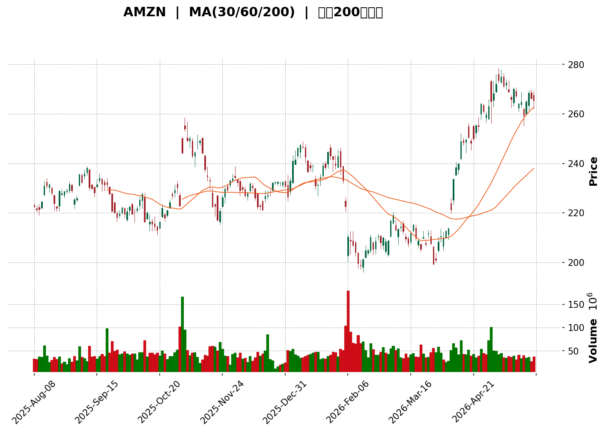
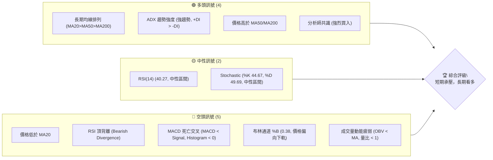
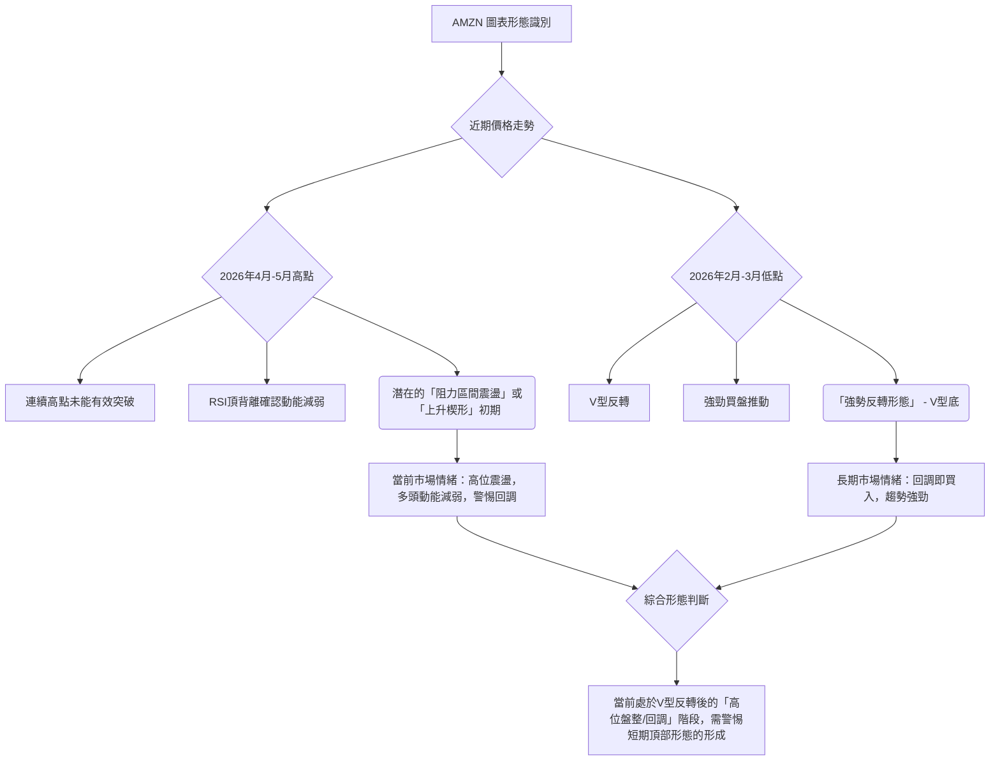

<details>
<summary>📊 靜態圖表 (點擊展開)</summary>

</details>

<html>
<head><meta charset="utf-8" /></head>
<body>
    <div>                        <script>window.PlotlyConfig = {MathJaxConfig: 'local'};</script>
        <script charset="utf-8" src="https://cdn.plot.ly/plotly-3.5.0.min.js" integrity="sha256-fHbNLP+GlIXN+efbQec78UkemUz3NJp7UmfGxC1tNxs=" crossorigin="anonymous"></script>                <div id="candlestick-chart" class="plotly-graph-div" style="height:500px; width:100%;"></div>            <script>                window.PLOTLYENV=window.PLOTLYENV || {};                                if (document.getElementById("candlestick-chart")) {                    Plotly.newPlot(                        "candlestick-chart",                        [{"close":{"dtype":"f8","bdata":"AAAAgBTWa0AAAACgmalrQAAAAEAKr2tAAAAAgOsRbEAAAAAgXN9sQAAAAMD14GxAAAAAIK7vbEAAAADgUYBsQAAAAIDr+WtAAAAAYGa+a0AAAABA4ZpsQAAAAIAUfmxAAAAAYLiWbEAAAAAA16NsQAAAAEAz82xAAAAAAACgbEAAAABA4SpsQAAAACCuP2xAAAAAgMJ1bUAAAABgjwptQAAAAEDhem1AAAAAIK7HbUAAAABgj8psQAAAAGBmvmxAAAAAwMyEbEAAAACAwu1sQAAAAKCZQW1AAAAAANfzbEAAAAAgXOdsQAAAACBc72xAAAAAACl0bEAAAABguJZrQAAAAGC4hmtAAAAAwMxEa0AAAADA9XhrQAAAAKBwxWtAAAAAgD1ya0AAAAAAKZRrQAAAAMAezWtAAAAA4FFwa0AAAADAzJxrQAAAAMD1uGtAAAAAQAonbEAAAAAgrndsQAAAAADXC2tAAAAAgD2Ca0AAAADgegxrQAAAAIA98mpAAAAAQArPakAAAACgR6FqQAAAACBcD2tAAAAAwPXAa0AAAABgZj5rQAAAAEDhomtAAAAAYLgGbEAAAABACl9sQAAAAAAAqGxAAAAAoJnJbEAAAAAghdtrQAAAAEAKh25AAAAAAADAb0AAAACAPSpvQAAAAGBmRm9AAAAAoEdhbkAAAADAHo1uQAAAAMDMDG9AAAAAQDMjb0AAAABgZoZuQAAAAGCPsm1AAAAAgBRWbUAAAAAA1xttQAAAAKCZ0WtAAAAAgBTWa0AAAADgeiRrQAAAAIAUlmtAAAAAwPVIbEAAAACgcLVsQAAAAMAepWxAAAAAQAonbUAAAAAAKTxtQAAAAKBwTW1AAAAAACkMbUAAAAAghaNsQAAAAMD1sGxAAAAA4HpcbEAAAACgcH1sQAAAAMD1+GxAAAAAwPXIbEAAAACAFEZsQAAAAKBH0WtAAAAAgOvRa0AAAADgo6hrQAAAAOBRWGxAAAAAQDNrbEAAAACAwo1sQAAAAOB6BG1AAAAAACkMbUAAAADgoxBtQAAAAIA9Am1AAAAAwPUQbUAAAACAPdpsQAAAAAAAUGxAAAAAgOshbUAAAACAwh1uQAAAAIDrMW5AAAAAoEfJbkAAAAAAKexuQAAAAEAKz25AAAAAQDNTbkAAAADAzJRtQAAAAIDCxW1AAAAAANfjbUAAAAAAAOBsQAAAAIDr6WxAAAAAQOFKbUAAAADAHuVtQAAAAKBwzW1AAAAAgMKVbkAAAADgUWBuQAAAACBcN25AAAAAoJnpbUAAAABguF5uQAAAAADX021AAAAAIK4fbUAAAACAFNZrQAAAAIA9SmpAAAAAQAoXakAAAABguN5pQAAAAGCPgmlAAAAAQDPzaEAAAACgR9loQAAAAMDMJGlAAAAAoEeZaUAAAAAghZtpQAAAACCFQ2pAAAAA4KOoaUAAAACA6xFqQAAAAOB6VGpAAAAAoHD9aUAAAAAAAEBqQAAAAOB6DGpAAAAAIFwXakAAAACAPRprQAAAAIAUXmtAAAAAYLimakAAAAAgrq9qQAAAAGCPympAAAAAwMyUakAAAADA9TBqQAAAAKBw9WlAAAAAIK53akAAAABgZuZqQAAAAADXO2pAAAAA4FEYakAAAAAA16tpQAAAAOB6RGpAAAAAIK7naUAAAABguHZqQAAAAKBH8WlAAAAAQOHqaEAAAABgZh5pQAAAAOCjCGpAAAAAgD1SakAAAADgozhqQAAAAKBHmWpAAAAA4KO4akAAAAAAAKhrQAAAAMDMNG1AAAAAACnMbUAAAADgevxtQAAAAOCjIG9AAAAAAAAQb0AAAABgZjZvQAAAAIDrUW9AAAAAwPUIb0AAAADAHj1vQAAAACCF629AAAAAYI\u002fib0AAAAAA139wQAAAAIDrUXBAAAAAQDM7cEAAAADgo3BwQAAAAMD1kHBAAAAAACnEcEAAAADAzABxQAAAAMDMGHFAAAAAANcvcUAAAABguPJwQAAAAEDhCnFAAAAAANfPcEAAAADAHp1wQAAAAIAU4nBAAAAAIIWzcEAAAACAPYJwQAAAAIDCjXBAAAAAoHA1cEAAAAAAKZBwQAAAACBcx3BAAAAAwB6lcEAAAADgo5RwQA=="},"high":{"dtype":"f8","bdata":"AAAAoJn5a0AAAACgmeFrQAAAAAAA8GtAAAAAoHAdbEAAAAAghSNtQAAAAGCPQm1AAAAAwB79bEAAAADA9dBsQAAAAOCjaGxAAAAAwPXYa0AAAADgeqRsQAAAAEAzs2xAAAAAAACgbEAAAAAA17tsQAAAAGC4Fm1AAAAAgOv5bEAAAACgcEVsQAAAAKBwZWxAAAAA4KN4bUAAAAAAAIBtQAAAAEAzs21AAAAAQDPbbUAAAACAwrVtQAAAAMD18GxAAAAAoEfZbEAAAAAgXDdtQAAAAMDMfG1AAAAAoJlJbUAAAAAgXC9tQAAAAMAeRW1AAAAAgD3SbEAAAAAghXtsQAAAAIDrEWxAAAAAoHCVa0AAAACgmaFrQAAAAEAz02tAAAAAIK7Ha0AAAADAzMRrQAAAAIDr2WtAAAAAYGYGbEAAAAAgXLdrQAAAAOB63GtAAAAAIFxXbEAAAABguIZsQAAAAAAAiGxAAAAAgMKVa0AAAACAPWprQAAAAGC4NmtAAAAAQOFSa0AAAACgmdlqQAAAAIAUFmtAAAAAgD3qa0AAAADgUYBrQAAAAKCZqWtAAAAAwMwsbEAAAADAzIxsQAAAACCu72xAAAAAgD0abUAAAACAFI5sQAAAAAAAUG9AAAAAoJkpcEAAAAAAKRBwQAAAAAAAYG9AAAAAAClMb0AAAADAzJxuQAAAAAAAeG9AAAAAAAA4b0AAAAAA10tvQAAAAAAAeG5AAAAAIFzXbUAAAABAM1NtQAAAAGBmxmxAAAAAIK73a0AAAADAHm1sQAAAAGC4xmtAAAAAYI9qbEAAAADgo9BsQAAAAAAA+GxAAAAAoEcpbUAAAACgmXltQAAAAEAK321AAAAAACksbUAAAAAAADBtQAAAACCu52xAAAAAYI\u002fabEAAAACAPZJsQAAAAKBwDW1AAAAAIIUDbUAAAABgj8JsQAAAAIDCfWxAAAAAwB71a0AAAACAFCZsQAAAACBcp2xAAAAAACmkbEAAAAAgXK9sQAAAAGBmDm1AAAAAYGYebUAAAAAgrh9tQAAAAEAzE21AAAAA4KMYbUAAAAAgrh9tQAAAAGC4bm1AAAAAAABAbUAAAACAwmVuQAAAAKBHqW5AAAAAwB7NbkAAAAAghftuQAAAAIAUHm9AAAAAwB71bkAAAADA9ShuQAAAAMDMFG5AAAAAgD3ybUAAAABA4WJtQAAAAKCZCW1AAAAAQAp3bUAAAABgZg5uQAAAAGBmHm5AAAAAACmcbkAAAADA9fhuQAAAAAAAYG5AAAAAgD1qbkAAAAAAKbRuQAAAAEAzy25AAAAAIIXbbUAAAACA60lsQAAAAIAUbmpAAAAAgOuZakAAAADAzJRqQAAAAIA9EmpAAAAAYLh+aUAAAADAHiVpQAAAACCuN2lAAAAAIIXbaUAAAADgerRpQAAAAKBwZWpAAAAAgMINakAAAAAghUtqQAAAAEDhcmpAAAAAoJlhakAAAABgj0pqQAAAACBcN2pAAAAAgMIlakAAAACgRzFrQAAAAEAKj2tAAAAAgD0qa0AAAACAPbpqQAAAAMDM9GpAAAAAAAAga0AAAABguHZqQAAAAIDrUWpAAAAAQAqXakAAAABgZvZqQAAAAOB65GpAAAAAANcjakAAAACgR\u002fFpQAAAAKCZmWpAAAAAQDMrakAAAACAPaJqQAAAAOB6nGpAAAAAQDPTaUAAAACgmXlpQAAAAMD1SGpAAAAAYI+yakAAAABguIZqQAAAAGBmnmpAAAAAQAq\u002fakAAAABAM0NsQAAAAKCZOW1AAAAAgMINbkAAAAAAAABuQAAAAIDChW9AAAAAgBROb0AAAAAAAEBvQAAAAEDhAnBAAAAAgMJFb0AAAABA4eJvQAAAAIAU\u002fm9AAAAA4KMscEAAAAAAAIhwQAAAAGBmgnBAAAAA4HpQcEAAAABgj55wQAAAAIAUHnFAAAAAwB4VcUAAAACgmUFxQAAAAMD1aHFAAAAAwMxccUAAAACAFEpxQAAAAAAAIHFAAAAAgBQacUAAAABgZrpwQAAAACCF63BAAAAA4HrscEAAAACAwoVwQAAAAKCZzXBAAAAAAABkcEAAAACgR5lwQAAAAADX13BAAAAA4KPccEAAAADAzNRwQA=="},"hovertemplate":"\u003cb\u003e%{x|%Y-%m-%d}\u003c\u002fb\u003e\u003cbr\u003e\u958b: $%{open:.2f}\u003cbr\u003e\u9ad8: $%{high:.2f}\u003cbr\u003e\u4f4e: $%{low:.2f}\u003cbr\u003e\u6536: $%{close:.2f}\u003cextra\u003e\u003c\u002fextra\u003e","low":{"dtype":"f8","bdata":"AAAAACm8a0AAAADAzIxrQAAAAKCZYWtAAAAAAADAa0AAAADgo2BsQAAAAIDruWxAAAAAYI+KbEAAAAAA12NsQAAAAKBwnWtAAAAAAACQa0AAAACAPZprQAAAAIDraWxAAAAA4KNAbEAAAACA63lsQAAAAOCjgGxAAAAAwB6FbEAAAABgj7prQAAAACCFC2xAAAAAwPXYbEAAAACAwv1sQAAAAAAAOG1AAAAAYI9ibUAAAABAM6NsQAAAAEDhqmxAAAAAoEdJbEAAAACAPcpsQAAAACBcB21AAAAAYLiWbEAAAACgR5lsQAAAAGBmtmxAAAAA4FFwbEAAAACAPYJrQAAAAGBmbmtAAAAAQAoPa0AAAADgo0BrQAAAAKCZaWtAAAAA4Ho8a0AAAAAghRNrQAAAAGBmXmtAAAAAQOFqa0AAAADA9QBrQAAAAKBwhWtAAAAAgBSma0AAAAAAALhrQAAAAAAAAGtAAAAAoEcha0AAAABAM5NqQAAAAMAelWpAAAAAgOuZakAAAADA9WBqQAAAAEDhsmpAAAAAIK4\u002fa0AAAADgoxBrQAAAAIDCRWtAAAAAwMy8a0AAAACgRzFsQAAAAGC4RmxAAAAA4FF4bEAAAAAAANhrQAAAACBcf25AAAAAwMycb0AAAADAHhVvQAAAAMAexW5AAAAAoHBFbkAAAAAgrs9tQAAAAEDhsm5AAAAAIFznbkAAAAAAAHhuQAAAAAAAkG1AAAAA4HocbUAAAACAFKZsQAAAAKBwzWtAAAAA4KNQa0AAAAAgrhdrQAAAAIDC5WpAAAAA4KPIa0AAAACgmflrQAAAAOCjmGxAAAAAQArHbEAAAAAAAAhtQAAAAKCZMW1AAAAAIIXTbEAAAACgmVlsQAAAAKCZkWxAAAAA4KNIbEAAAAAghSNsQAAAAGC4jmxAAAAAgBSWbEAAAAAA1yNsQAAAAAAAsGtAAAAAACmka0AAAAAgrp9rQAAAAMAeDWxAAAAAYI8ybEAAAABguFZsQAAAACBcl2xAAAAAYI\u002fqbEAAAACAwuVsQAAAAOCj2GxAAAAAYGbGbEAAAAAA18NsQAAAAGBmFmxAAAAAgMJlbEAAAACAPQJtQAAAAOCj8G1AAAAAACk8bkAAAAAgrkduQAAAAGC4vm5AAAAAAAAIbkAAAABACodtQAAAAAAplG1AAAAAwB6NbUAAAABA4apsQAAAAAApXGxAAAAAwMzcbEAAAACAPVJtQAAAAKBHsW1AAAAAYI\u002fCbUAAAADA9TBuQAAAACCul21AAAAA4Hq0bUAAAACgcMVtQAAAAGBmbm1AAAAAgD36bEAAAAAAKYxrQAAAAIDrCWlAAAAAQDNraUAAAADAHs1pQAAAACCuT2lAAAAAgOuxaEAAAADA9ahoQAAAAAAAgGhAAAAA4FEwaUAAAACA61lpQAAAAAAAeGlAAAAAIIVjaUAAAAAAAGhpQAAAAIDCHWpAAAAAQDOraUAAAABgZqZpQAAAAGC4bmlAAAAAIFxPaUAAAADAzERqQAAAAEDh8mpAAAAAwPWQakAAAAAgheNpQAAAAIDCjWpAAAAAQDNrakAAAADAzARqQAAAAEAKx2lAAAAAYGbuaUAAAACAwo1qQAAAAGCPGmpAAAAAoJnBaUAAAACAPYppQAAAAOBRMGpAAAAA4HrUaUAAAADAzDxqQAAAAADX42lAAAAA4HrkaEAAAAAgXP9oQAAAAOB6hGlAAAAAgBQGakAAAADAzJxpQAAAAEDhMmpAAAAAYI8iakAAAAAA13NrQAAAAOCj6GtAAAAAYLhmbUAAAAAAAHhtQAAAAMD1OG5AAAAAYGbmbkAAAABgZoZuQAAAACCFQ29AAAAAANerbkAAAABAMyNvQAAAAGCPSm9AAAAAgD2ib0AAAABAChtwQAAAAKBwRXBAAAAAgBQKcEAAAABAMxtwQAAAAGCPAnBAAAAAANdrcEAAAADAzMxwQAAAAIAUBnFAAAAAIFwDcUAAAAAA1+dwQAAAAEAz33BAAAAAIK7HcEAAAACAFGpwQAAAAEAzc3BAAAAAgBSqcEAAAACAPU5wQAAAAOB6aHBAAAAAgBTmb0AAAADgejhwQAAAAIDrVXBAAAAAANejcEAAAADAHmFwQA=="},"name":"\u50f9\u683c","open":{"dtype":"f8","bdata":"AAAA4Hrka0AAAADA9bhrQAAAACBcx2tAAAAAAADAa0AAAADAzGxsQAAAAGCPEm1AAAAAIFzHbEAAAABA4cJsQAAAAADXY2xAAAAAwMzUa0AAAACgR9lrQAAAAEAza2xAAAAAIIVjbEAAAACAPZJsQAAAAOBRoGxAAAAAgD3qbEAAAADgo\u002fBrQAAAAGC4JmxAAAAAgBTmbEAAAACAFGZtQAAAAIAUXm1AAAAAIIWLbUAAAADgo7BtQAAAACCu72xAAAAAQDPLbEAAAAAAKdRsQAAAAIAUHm1AAAAA4KM4bUAAAAAAABBtQAAAAADXC21AAAAAgOvRbEAAAABgj3psQAAAAMDMBGxAAAAAgOuBa0AAAABgj2JrQAAAAGCPgmtAAAAAwPXAa0AAAAAghStrQAAAAOBRoGtAAAAAgBTua0AAAAAAAKBrQAAAAAApnGtAAAAAoHDda0AAAAAAACBsQAAAAGC4RmxAAAAAYGY2a0AAAACA6\u002fFqQAAAAADXE2tAAAAAoHD1akAAAACA69FqQAAAAAApvGpAAAAAgMJNa0AAAACgmWlrQAAAAAAAYGtAAAAAQAq\u002fa0AAAADAHnVsQAAAAEAKh2xAAAAAoHD1bEAAAACA62FsQAAAAEAzQ29AAAAAIIXrb0AAAAAAKUxvQAAAAMD1IG9AAAAAwB4lb0AAAADAzFxuQAAAAEDhCm9AAAAAwB4Nb0AAAAAgrkdvQAAAAKCZYW5AAAAAgOthbUAAAAAAAChtQAAAAEAzg2xAAAAAIK73a0AAAACgmWFsQAAAAEAzC2tAAAAAgOvRa0AAAAAAKUxsQAAAACCu12xAAAAAIK7nbEAAAABACidtQAAAAOBRYG1AAAAAQDMrbUAAAADgoxhtQAAAAIA9ymxAAAAAQOGybEAAAABA4VpsQAAAAIDrmWxAAAAAYLjWbEAAAAAA17tsQAAAAIDCfWxAAAAAoEfha0AAAADAHhVsQAAAAGC4NmxAAAAA4FFYbEAAAAAghZNsQAAAAIDroWxAAAAAACkEbUAAAACgRwFtQAAAAIAU\u002fmxAAAAAYLjmbEAAAADAHh1tQAAAAEDh6mxAAAAAQOGabEAAAABAMwNtQAAAACCF821AAAAAgOthbkAAAACAPZJuQAAAACBc125AAAAAwPXQbkAAAADAzCRuQAAAAIDr6W1AAAAAQOHibUAAAADgUThtQAAAAEDh4mxAAAAAoJlBbUAAAABguF5tQAAAACBc\u002f21AAAAAgBT2bUAAAAAA18tuQAAAAIA9Wm5AAAAA4Hr8bUAAAACA68ltQAAAACBcn25AAAAAIIXbbUAAAADAHh1sQAAAAGBmVmlAAAAAQAofakAAAACgmRlqQAAAAIDrAWpAAAAAYLh+aUAAAAAAKdxoQAAAAAApxGhAAAAAgD1CaUAAAACgmXlpQAAAAOBRmGlAAAAAQDMDakAAAABACq9pQAAAAGC4TmpAAAAAIFxXakAAAABgj9ppQAAAAKCZkWlAAAAAQDNjaUAAAABACk9qQAAAACBc\u002f2pAAAAAIK7fakAAAABgZk5qQAAAAIAUxmpAAAAAYLj2akAAAADgekxqQAAAACCFM2pAAAAAQDMLakAAAACAPZpqQAAAAIDCvWpAAAAAgOvhaUAAAADAzOxpQAAAAKBHOWpAAAAAYGb+aUAAAACA63FqQAAAACCFU2pAAAAAYLjOaUAAAAAgXC9pQAAAAEAzm2lAAAAAgBROakAAAACgR9FpQAAAAKCZOWpAAAAAIK5nakAAAACgR\u002flrQAAAACBcJ2xAAAAAoJlpbUAAAABgZq5tQAAAAMD1OG5AAAAAAAAob0AAAADgURBvQAAAACCu329AAAAAgBQmb0AAAABA4eJvQAAAAIAUjm9AAAAA4Hrsb0AAAAAgrj9wQAAAACBcd3BAAAAAgD0mcEAAAAAA1x9wQAAAAGC4EnFAAAAAoEeZcEAAAADAzMxwQAAAAKBHQXFAAAAAgD0OcUAAAADgUTBxQAAAAIAU+nBAAAAAoHDdcEAAAAAgXKtwQAAAAEDhhnBAAAAAYGbScEAAAAAAAGhwQAAAAIDrfXBAAAAA4KNgcEAAAADAzEBwQAAAAAAAeHBAAAAAYI\u002fKcEAAAABAM7lwQA=="},"x":["2025-08-08T00:00:00-04:00","2025-08-11T00:00:00-04:00","2025-08-12T00:00:00-04:00","2025-08-13T00:00:00-04:00","2025-08-14T00:00:00-04:00","2025-08-15T00:00:00-04:00","2025-08-18T00:00:00-04:00","2025-08-19T00:00:00-04:00","2025-08-20T00:00:00-04:00","2025-08-21T00:00:00-04:00","2025-08-22T00:00:00-04:00","2025-08-25T00:00:00-04:00","2025-08-26T00:00:00-04:00","2025-08-27T00:00:00-04:00","2025-08-28T00:00:00-04:00","2025-08-29T00:00:00-04:00","2025-09-02T00:00:00-04:00","2025-09-03T00:00:00-04:00","2025-09-04T00:00:00-04:00","2025-09-05T00:00:00-04:00","2025-09-08T00:00:00-04:00","2025-09-09T00:00:00-04:00","2025-09-10T00:00:00-04:00","2025-09-11T00:00:00-04:00","2025-09-12T00:00:00-04:00","2025-09-15T00:00:00-04:00","2025-09-16T00:00:00-04:00","2025-09-17T00:00:00-04:00","2025-09-18T00:00:00-04:00","2025-09-19T00:00:00-04:00","2025-09-22T00:00:00-04:00","2025-09-23T00:00:00-04:00","2025-09-24T00:00:00-04:00","2025-09-25T00:00:00-04:00","2025-09-26T00:00:00-04:00","2025-09-29T00:00:00-04:00","2025-09-30T00:00:00-04:00","2025-10-01T00:00:00-04:00","2025-10-02T00:00:00-04:00","2025-10-03T00:00:00-04:00","2025-10-06T00:00:00-04:00","2025-10-07T00:00:00-04:00","2025-10-08T00:00:00-04:00","2025-10-09T00:00:00-04:00","2025-10-10T00:00:00-04:00","2025-10-13T00:00:00-04:00","2025-10-14T00:00:00-04:00","2025-10-15T00:00:00-04:00","2025-10-16T00:00:00-04:00","2025-10-17T00:00:00-04:00","2025-10-20T00:00:00-04:00","2025-10-21T00:00:00-04:00","2025-10-22T00:00:00-04:00","2025-10-23T00:00:00-04:00","2025-10-24T00:00:00-04:00","2025-10-27T00:00:00-04:00","2025-10-28T00:00:00-04:00","2025-10-29T00:00:00-04:00","2025-10-30T00:00:00-04:00","2025-10-31T00:00:00-04:00","2025-11-03T00:00:00-05:00","2025-11-04T00:00:00-05:00","2025-11-05T00:00:00-05:00","2025-11-06T00:00:00-05:00","2025-11-07T00:00:00-05:00","2025-11-10T00:00:00-05:00","2025-11-11T00:00:00-05:00","2025-11-12T00:00:00-05:00","2025-11-13T00:00:00-05:00","2025-11-14T00:00:00-05:00","2025-11-17T00:00:00-05:00","2025-11-18T00:00:00-05:00","2025-11-19T00:00:00-05:00","2025-11-20T00:00:00-05:00","2025-11-21T00:00:00-05:00","2025-11-24T00:00:00-05:00","2025-11-25T00:00:00-05:00","2025-11-26T00:00:00-05:00","2025-11-28T00:00:00-05:00","2025-12-01T00:00:00-05:00","2025-12-02T00:00:00-05:00","2025-12-03T00:00:00-05:00","2025-12-04T00:00:00-05:00","2025-12-05T00:00:00-05:00","2025-12-08T00:00:00-05:00","2025-12-09T00:00:00-05:00","2025-12-10T00:00:00-05:00","2025-12-11T00:00:00-05:00","2025-12-12T00:00:00-05:00","2025-12-15T00:00:00-05:00","2025-12-16T00:00:00-05:00","2025-12-17T00:00:00-05:00","2025-12-18T00:00:00-05:00","2025-12-19T00:00:00-05:00","2025-12-22T00:00:00-05:00","2025-12-23T00:00:00-05:00","2025-12-24T00:00:00-05:00","2025-12-26T00:00:00-05:00","2025-12-29T00:00:00-05:00","2025-12-30T00:00:00-05:00","2025-12-31T00:00:00-05:00","2026-01-02T00:00:00-05:00","2026-01-05T00:00:00-05:00","2026-01-06T00:00:00-05:00","2026-01-07T00:00:00-05:00","2026-01-08T00:00:00-05:00","2026-01-09T00:00:00-05:00","2026-01-12T00:00:00-05:00","2026-01-13T00:00:00-05:00","2026-01-14T00:00:00-05:00","2026-01-15T00:00:00-05:00","2026-01-16T00:00:00-05:00","2026-01-20T00:00:00-05:00","2026-01-21T00:00:00-05:00","2026-01-22T00:00:00-05:00","2026-01-23T00:00:00-05:00","2026-01-26T00:00:00-05:00","2026-01-27T00:00:00-05:00","2026-01-28T00:00:00-05:00","2026-01-29T00:00:00-05:00","2026-01-30T00:00:00-05:00","2026-02-02T00:00:00-05:00","2026-02-03T00:00:00-05:00","2026-02-04T00:00:00-05:00","2026-02-05T00:00:00-05:00","2026-02-06T00:00:00-05:00","2026-02-09T00:00:00-05:00","2026-02-10T00:00:00-05:00","2026-02-11T00:00:00-05:00","2026-02-12T00:00:00-05:00","2026-02-13T00:00:00-05:00","2026-02-17T00:00:00-05:00","2026-02-18T00:00:00-05:00","2026-02-19T00:00:00-05:00","2026-02-20T00:00:00-05:00","2026-02-23T00:00:00-05:00","2026-02-24T00:00:00-05:00","2026-02-25T00:00:00-05:00","2026-02-26T00:00:00-05:00","2026-02-27T00:00:00-05:00","2026-03-02T00:00:00-05:00","2026-03-03T00:00:00-05:00","2026-03-04T00:00:00-05:00","2026-03-05T00:00:00-05:00","2026-03-06T00:00:00-05:00","2026-03-09T00:00:00-04:00","2026-03-10T00:00:00-04:00","2026-03-11T00:00:00-04:00","2026-03-12T00:00:00-04:00","2026-03-13T00:00:00-04:00","2026-03-16T00:00:00-04:00","2026-03-17T00:00:00-04:00","2026-03-18T00:00:00-04:00","2026-03-19T00:00:00-04:00","2026-03-20T00:00:00-04:00","2026-03-23T00:00:00-04:00","2026-03-24T00:00:00-04:00","2026-03-25T00:00:00-04:00","2026-03-26T00:00:00-04:00","2026-03-27T00:00:00-04:00","2026-03-30T00:00:00-04:00","2026-03-31T00:00:00-04:00","2026-04-01T00:00:00-04:00","2026-04-02T00:00:00-04:00","2026-04-06T00:00:00-04:00","2026-04-07T00:00:00-04:00","2026-04-08T00:00:00-04:00","2026-04-09T00:00:00-04:00","2026-04-10T00:00:00-04:00","2026-04-13T00:00:00-04:00","2026-04-14T00:00:00-04:00","2026-04-15T00:00:00-04:00","2026-04-16T00:00:00-04:00","2026-04-17T00:00:00-04:00","2026-04-20T00:00:00-04:00","2026-04-21T00:00:00-04:00","2026-04-22T00:00:00-04:00","2026-04-23T00:00:00-04:00","2026-04-24T00:00:00-04:00","2026-04-27T00:00:00-04:00","2026-04-28T00:00:00-04:00","2026-04-29T00:00:00-04:00","2026-04-30T00:00:00-04:00","2026-05-01T00:00:00-04:00","2026-05-04T00:00:00-04:00","2026-05-05T00:00:00-04:00","2026-05-06T00:00:00-04:00","2026-05-07T00:00:00-04:00","2026-05-08T00:00:00-04:00","2026-05-11T00:00:00-04:00","2026-05-12T00:00:00-04:00","2026-05-13T00:00:00-04:00","2026-05-14T00:00:00-04:00","2026-05-15T00:00:00-04:00","2026-05-18T00:00:00-04:00","2026-05-19T00:00:00-04:00","2026-05-20T00:00:00-04:00","2026-05-21T00:00:00-04:00","2026-05-22T00:00:00-04:00","2026-05-26T00:00:00-04:00"],"type":"candlestick"},{"hovertemplate":"MA30: $%{y:.2f}\u003cextra\u003e\u003c\u002fextra\u003e","line":{"color":"#2196F3","dash":"dash","width":2},"mode":"lines","name":"MA30","x":["2025-08-08T00:00:00-04:00","2025-08-11T00:00:00-04:00","2025-08-12T00:00:00-04:00","2025-08-13T00:00:00-04:00","2025-08-14T00:00:00-04:00","2025-08-15T00:00:00-04:00","2025-08-18T00:00:00-04:00","2025-08-19T00:00:00-04:00","2025-08-20T00:00:00-04:00","2025-08-21T00:00:00-04:00","2025-08-22T00:00:00-04:00","2025-08-25T00:00:00-04:00","2025-08-26T00:00:00-04:00","2025-08-27T00:00:00-04:00","2025-08-28T00:00:00-04:00","2025-08-29T00:00:00-04:00","2025-09-02T00:00:00-04:00","2025-09-03T00:00:00-04:00","2025-09-04T00:00:00-04:00","2025-09-05T00:00:00-04:00","2025-09-08T00:00:00-04:00","2025-09-09T00:00:00-04:00","2025-09-10T00:00:00-04:00","2025-09-11T00:00:00-04:00","2025-09-12T00:00:00-04:00","2025-09-15T00:00:00-04:00","2025-09-16T00:00:00-04:00","2025-09-17T00:00:00-04:00","2025-09-18T00:00:00-04:00","2025-09-19T00:00:00-04:00","2025-09-22T00:00:00-04:00","2025-09-23T00:00:00-04:00","2025-09-24T00:00:00-04:00","2025-09-25T00:00:00-04:00","2025-09-26T00:00:00-04:00","2025-09-29T00:00:00-04:00","2025-09-30T00:00:00-04:00","2025-10-01T00:00:00-04:00","2025-10-02T00:00:00-04:00","2025-10-03T00:00:00-04:00","2025-10-06T00:00:00-04:00","2025-10-07T00:00:00-04:00","2025-10-08T00:00:00-04:00","2025-10-09T00:00:00-04:00","2025-10-10T00:00:00-04:00","2025-10-13T00:00:00-04:00","2025-10-14T00:00:00-04:00","2025-10-15T00:00:00-04:00","2025-10-16T00:00:00-04:00","2025-10-17T00:00:00-04:00","2025-10-20T00:00:00-04:00","2025-10-21T00:00:00-04:00","2025-10-22T00:00:00-04:00","2025-10-23T00:00:00-04:00","2025-10-24T00:00:00-04:00","2025-10-27T00:00:00-04:00","2025-10-28T00:00:00-04:00","2025-10-29T00:00:00-04:00","2025-10-30T00:00:00-04:00","2025-10-31T00:00:00-04:00","2025-11-03T00:00:00-05:00","2025-11-04T00:00:00-05:00","2025-11-05T00:00:00-05:00","2025-11-06T00:00:00-05:00","2025-11-07T00:00:00-05:00","2025-11-10T00:00:00-05:00","2025-11-11T00:00:00-05:00","2025-11-12T00:00:00-05:00","2025-11-13T00:00:00-05:00","2025-11-14T00:00:00-05:00","2025-11-17T00:00:00-05:00","2025-11-18T00:00:00-05:00","2025-11-19T00:00:00-05:00","2025-11-20T00:00:00-05:00","2025-11-21T00:00:00-05:00","2025-11-24T00:00:00-05:00","2025-11-25T00:00:00-05:00","2025-11-26T00:00:00-05:00","2025-11-28T00:00:00-05:00","2025-12-01T00:00:00-05:00","2025-12-02T00:00:00-05:00","2025-12-03T00:00:00-05:00","2025-12-04T00:00:00-05:00","2025-12-05T00:00:00-05:00","2025-12-08T00:00:00-05:00","2025-12-09T00:00:00-05:00","2025-12-10T00:00:00-05:00","2025-12-11T00:00:00-05:00","2025-12-12T00:00:00-05:00","2025-12-15T00:00:00-05:00","2025-12-16T00:00:00-05:00","2025-12-17T00:00:00-05:00","2025-12-18T00:00:00-05:00","2025-12-19T00:00:00-05:00","2025-12-22T00:00:00-05:00","2025-12-23T00:00:00-05:00","2025-12-24T00:00:00-05:00","2025-12-26T00:00:00-05:00","2025-12-29T00:00:00-05:00","2025-12-30T00:00:00-05:00","2025-12-31T00:00:00-05:00","2026-01-02T00:00:00-05:00","2026-01-05T00:00:00-05:00","2026-01-06T00:00:00-05:00","2026-01-07T00:00:00-05:00","2026-01-08T00:00:00-05:00","2026-01-09T00:00:00-05:00","2026-01-12T00:00:00-05:00","2026-01-13T00:00:00-05:00","2026-01-14T00:00:00-05:00","2026-01-15T00:00:00-05:00","2026-01-16T00:00:00-05:00","2026-01-20T00:00:00-05:00","2026-01-21T00:00:00-05:00","2026-01-22T00:00:00-05:00","2026-01-23T00:00:00-05:00","2026-01-26T00:00:00-05:00","2026-01-27T00:00:00-05:00","2026-01-28T00:00:00-05:00","2026-01-29T00:00:00-05:00","2026-01-30T00:00:00-05:00","2026-02-02T00:00:00-05:00","2026-02-03T00:00:00-05:00","2026-02-04T00:00:00-05:00","2026-02-05T00:00:00-05:00","2026-02-06T00:00:00-05:00","2026-02-09T00:00:00-05:00","2026-02-10T00:00:00-05:00","2026-02-11T00:00:00-05:00","2026-02-12T00:00:00-05:00","2026-02-13T00:00:00-05:00","2026-02-17T00:00:00-05:00","2026-02-18T00:00:00-05:00","2026-02-19T00:00:00-05:00","2026-02-20T00:00:00-05:00","2026-02-23T00:00:00-05:00","2026-02-24T00:00:00-05:00","2026-02-25T00:00:00-05:00","2026-02-26T00:00:00-05:00","2026-02-27T00:00:00-05:00","2026-03-02T00:00:00-05:00","2026-03-03T00:00:00-05:00","2026-03-04T00:00:00-05:00","2026-03-05T00:00:00-05:00","2026-03-06T00:00:00-05:00","2026-03-09T00:00:00-04:00","2026-03-10T00:00:00-04:00","2026-03-11T00:00:00-04:00","2026-03-12T00:00:00-04:00","2026-03-13T00:00:00-04:00","2026-03-16T00:00:00-04:00","2026-03-17T00:00:00-04:00","2026-03-18T00:00:00-04:00","2026-03-19T00:00:00-04:00","2026-03-20T00:00:00-04:00","2026-03-23T00:00:00-04:00","2026-03-24T00:00:00-04:00","2026-03-25T00:00:00-04:00","2026-03-26T00:00:00-04:00","2026-03-27T00:00:00-04:00","2026-03-30T00:00:00-04:00","2026-03-31T00:00:00-04:00","2026-04-01T00:00:00-04:00","2026-04-02T00:00:00-04:00","2026-04-06T00:00:00-04:00","2026-04-07T00:00:00-04:00","2026-04-08T00:00:00-04:00","2026-04-09T00:00:00-04:00","2026-04-10T00:00:00-04:00","2026-04-13T00:00:00-04:00","2026-04-14T00:00:00-04:00","2026-04-15T00:00:00-04:00","2026-04-16T00:00:00-04:00","2026-04-17T00:00:00-04:00","2026-04-20T00:00:00-04:00","2026-04-21T00:00:00-04:00","2026-04-22T00:00:00-04:00","2026-04-23T00:00:00-04:00","2026-04-24T00:00:00-04:00","2026-04-27T00:00:00-04:00","2026-04-28T00:00:00-04:00","2026-04-29T00:00:00-04:00","2026-04-30T00:00:00-04:00","2026-05-01T00:00:00-04:00","2026-05-04T00:00:00-04:00","2026-05-05T00:00:00-04:00","2026-05-06T00:00:00-04:00","2026-05-07T00:00:00-04:00","2026-05-08T00:00:00-04:00","2026-05-11T00:00:00-04:00","2026-05-12T00:00:00-04:00","2026-05-13T00:00:00-04:00","2026-05-14T00:00:00-04:00","2026-05-15T00:00:00-04:00","2026-05-18T00:00:00-04:00","2026-05-19T00:00:00-04:00","2026-05-20T00:00:00-04:00","2026-05-21T00:00:00-04:00","2026-05-22T00:00:00-04:00","2026-05-26T00:00:00-04:00"],"y":{"dtype":"f8","bdata":"AAAAAAAA+H8AAAAAAAD4fwAAAAAAAPh\u002fAAAAAAAA+H8AAAAAAAD4fwAAAAAAAPh\u002fAAAAAAAA+H8AAAAAAAD4fwAAAAAAAPh\u002fAAAAAAAA+H8AAAAAAAD4fwAAAAAAAPh\u002fAAAAAAAA+H8AAAAAAAD4fwAAAAAAAPh\u002fAAAAAAAA+H8AAAAAAAD4fwAAAAAAAPh\u002fAAAAAAAA+H8AAAAAAAD4fwAAAAAAAPh\u002fAAAAAAAA+H8AAAAAAAD4fwAAAAAAAPh\u002fAAAAAAAA+H8AAAAAAAD4fwAAAAAAAPh\u002fAAAAAAAA+H8AAAAAAAD4fzMzM\u002fNvpGxAZmZm5rSpbECrqqrKE6lsQKuqqrq7p2xA7+7uXuWgbEBmZmYG85RsQHd3d6d\u002fi2xAMzMzs8h+bECJiIh46XZsQN7d3S1rdWxAVVVV5dBybEDv7u6+WGpsQHd3d6fGY2xAZmZmpg1gbEAiIiLSlF5sQDMzMwNWTmxAd3d3h89EbEBVVVWVQztsQKuqqjomMGxAzczMfIYZbEB3d3cH8wRsQFVVVXVM8GtAvLu7CwLfa0Crqqp6zdFrQLy7uxtayGtAq6qqOibEa0CrqqpaZL9rQCIiIqJFumtAAAAAMN24a0Dv7u6e769rQN7d3X2GvWtAIiIiQqfZa0AiIiKyK\u002fhrQGZmZvYoGGxAd3d3l7UybECamZk5+0xsQDMzM8P1aGxAvLu7a3WIbECamZmZmaFsQFVVVQXIsWxAzczMLPnBbECJiIjIvc5sQLy7uwuQz2xAAAAAMN3MbEDe3d2tjsFsQERERFQqxmxAIiIiEsrMbEBVVVVl9NpsQO\u002fu7l5z6WxA7+7uXnP9bEBVVVUVrhNtQGZmZubQJm1AREREJNsxbUARERGRwj1tQAAAAEDDRm1AEREREZ9JbUCrqqp6okptQGZmZlZVTW1AAAAA4E9NbUAAAAAw3VBtQJqZmRm9OW1AIiIi4jMYbUDNzMxcSPpsQN7d3a1H4WxARERERIvQbECJiIiof79sQImIiJgnrmxAvLu761GcbEARERGB3I9sQImIiOj7iWxAVVVVFa6HbEDNzMxMfoVsQJqZmem0iWxAzczMnMSUbEDe3d3dJK5sQERERMRnxGxARERE1L\u002fZbEB3d3fXo+xsQAAAAKAa\u002f2xA3t3d\u002fRsJbUAiIiJiEAxtQM3MzBwTEG1ARERElEMXbUDNzMysRxltQLy7u7stG21AREREFCAjbUCamZlZHS9tQDMzM4MyNm1AvLu7q45FbUBmZmamf1dtQM3MzMz3a21AAAAA8NJ9bUARERHB9ZRtQDMzM1OcoW1AvLu7a6CnbUBVVVUFgaFtQFVVVbU6im1AMzMz8\u002f1wbUDe3d1dulVtQKuqqjrfN21AVVVVJb8UbUARERHRlPJsQDMzM5OK12xAq6qq+mK5bEB3d3d36ZJsQFVVVYVdcWxAREREVJxFbEARERHhMxxsQGZmZub79WtAIiIi8v3Qa0CJiIi4kLRrQBERERHKlGtAIiIikl90a0DNzMx8P2VrQHd3d6cNWGtAIiIiwoNBa0AzMzMjIiZrQGZmZvZvDGtAMzMzo0XqakDe3d1dj8ZqQHd3d7c6ompAAAAAANWEakCrqqqqOGdqQAAAAACOSGpAd3d3l7UuakAzMzMTPBxqQLy7u+sKHGpAiYiIyHYaakCamZnZhx9qQImIiKg4I2pAiYiIqPEiakC8u7t7PyVqQImIiLjXLGpAzczMDAIzakDv7u7OPjhqQAAAAKAaO2pAERERsStEakCJiIjotFFqQLy7uytAampAiYiIyL2KakDv7u6+n6pqQCIiInL21WpA7+7uTmIAa0DNzMy8dCNrQKuqqhovRWtAzczMjJdqa0AzMzOjcJFrQAAAAJA0vWtAiYiIyHbqa0De3d39jSRsQHd3d2eRXWxA7+7urrmQbEAiIiIywcNsQO\u002fu7r6f\u002fmxAd3d3Nxc+bUDNzMxMN4VtQERERHTayG1Ad3d3tx4RbkAzMzNDi1BuQDMzM9MGlm5Aq6qq6lHgbkARERHBgyVvQImIiKh\u002fZ29AIiIi4uyjb0BVVVWF691vQM3MzAy7CnBAd3d33wgjcECrqqqSXzpwQEREREzwTHBAIiIiCtdbcEDNzMz8YmlwQA=="},"type":"scatter"},{"hovertemplate":"MA60: $%{y:.2f}\u003cextra\u003e\u003c\u002fextra\u003e","line":{"color":"#9C27B0","dash":"dash","width":2},"mode":"lines","name":"MA60","x":["2025-08-08T00:00:00-04:00","2025-08-11T00:00:00-04:00","2025-08-12T00:00:00-04:00","2025-08-13T00:00:00-04:00","2025-08-14T00:00:00-04:00","2025-08-15T00:00:00-04:00","2025-08-18T00:00:00-04:00","2025-08-19T00:00:00-04:00","2025-08-20T00:00:00-04:00","2025-08-21T00:00:00-04:00","2025-08-22T00:00:00-04:00","2025-08-25T00:00:00-04:00","2025-08-26T00:00:00-04:00","2025-08-27T00:00:00-04:00","2025-08-28T00:00:00-04:00","2025-08-29T00:00:00-04:00","2025-09-02T00:00:00-04:00","2025-09-03T00:00:00-04:00","2025-09-04T00:00:00-04:00","2025-09-05T00:00:00-04:00","2025-09-08T00:00:00-04:00","2025-09-09T00:00:00-04:00","2025-09-10T00:00:00-04:00","2025-09-11T00:00:00-04:00","2025-09-12T00:00:00-04:00","2025-09-15T00:00:00-04:00","2025-09-16T00:00:00-04:00","2025-09-17T00:00:00-04:00","2025-09-18T00:00:00-04:00","2025-09-19T00:00:00-04:00","2025-09-22T00:00:00-04:00","2025-09-23T00:00:00-04:00","2025-09-24T00:00:00-04:00","2025-09-25T00:00:00-04:00","2025-09-26T00:00:00-04:00","2025-09-29T00:00:00-04:00","2025-09-30T00:00:00-04:00","2025-10-01T00:00:00-04:00","2025-10-02T00:00:00-04:00","2025-10-03T00:00:00-04:00","2025-10-06T00:00:00-04:00","2025-10-07T00:00:00-04:00","2025-10-08T00:00:00-04:00","2025-10-09T00:00:00-04:00","2025-10-10T00:00:00-04:00","2025-10-13T00:00:00-04:00","2025-10-14T00:00:00-04:00","2025-10-15T00:00:00-04:00","2025-10-16T00:00:00-04:00","2025-10-17T00:00:00-04:00","2025-10-20T00:00:00-04:00","2025-10-21T00:00:00-04:00","2025-10-22T00:00:00-04:00","2025-10-23T00:00:00-04:00","2025-10-24T00:00:00-04:00","2025-10-27T00:00:00-04:00","2025-10-28T00:00:00-04:00","2025-10-29T00:00:00-04:00","2025-10-30T00:00:00-04:00","2025-10-31T00:00:00-04:00","2025-11-03T00:00:00-05:00","2025-11-04T00:00:00-05:00","2025-11-05T00:00:00-05:00","2025-11-06T00:00:00-05:00","2025-11-07T00:00:00-05:00","2025-11-10T00:00:00-05:00","2025-11-11T00:00:00-05:00","2025-11-12T00:00:00-05:00","2025-11-13T00:00:00-05:00","2025-11-14T00:00:00-05:00","2025-11-17T00:00:00-05:00","2025-11-18T00:00:00-05:00","2025-11-19T00:00:00-05:00","2025-11-20T00:00:00-05:00","2025-11-21T00:00:00-05:00","2025-11-24T00:00:00-05:00","2025-11-25T00:00:00-05:00","2025-11-26T00:00:00-05:00","2025-11-28T00:00:00-05:00","2025-12-01T00:00:00-05:00","2025-12-02T00:00:00-05:00","2025-12-03T00:00:00-05:00","2025-12-04T00:00:00-05:00","2025-12-05T00:00:00-05:00","2025-12-08T00:00:00-05:00","2025-12-09T00:00:00-05:00","2025-12-10T00:00:00-05:00","2025-12-11T00:00:00-05:00","2025-12-12T00:00:00-05:00","2025-12-15T00:00:00-05:00","2025-12-16T00:00:00-05:00","2025-12-17T00:00:00-05:00","2025-12-18T00:00:00-05:00","2025-12-19T00:00:00-05:00","2025-12-22T00:00:00-05:00","2025-12-23T00:00:00-05:00","2025-12-24T00:00:00-05:00","2025-12-26T00:00:00-05:00","2025-12-29T00:00:00-05:00","2025-12-30T00:00:00-05:00","2025-12-31T00:00:00-05:00","2026-01-02T00:00:00-05:00","2026-01-05T00:00:00-05:00","2026-01-06T00:00:00-05:00","2026-01-07T00:00:00-05:00","2026-01-08T00:00:00-05:00","2026-01-09T00:00:00-05:00","2026-01-12T00:00:00-05:00","2026-01-13T00:00:00-05:00","2026-01-14T00:00:00-05:00","2026-01-15T00:00:00-05:00","2026-01-16T00:00:00-05:00","2026-01-20T00:00:00-05:00","2026-01-21T00:00:00-05:00","2026-01-22T00:00:00-05:00","2026-01-23T00:00:00-05:00","2026-01-26T00:00:00-05:00","2026-01-27T00:00:00-05:00","2026-01-28T00:00:00-05:00","2026-01-29T00:00:00-05:00","2026-01-30T00:00:00-05:00","2026-02-02T00:00:00-05:00","2026-02-03T00:00:00-05:00","2026-02-04T00:00:00-05:00","2026-02-05T00:00:00-05:00","2026-02-06T00:00:00-05:00","2026-02-09T00:00:00-05:00","2026-02-10T00:00:00-05:00","2026-02-11T00:00:00-05:00","2026-02-12T00:00:00-05:00","2026-02-13T00:00:00-05:00","2026-02-17T00:00:00-05:00","2026-02-18T00:00:00-05:00","2026-02-19T00:00:00-05:00","2026-02-20T00:00:00-05:00","2026-02-23T00:00:00-05:00","2026-02-24T00:00:00-05:00","2026-02-25T00:00:00-05:00","2026-02-26T00:00:00-05:00","2026-02-27T00:00:00-05:00","2026-03-02T00:00:00-05:00","2026-03-03T00:00:00-05:00","2026-03-04T00:00:00-05:00","2026-03-05T00:00:00-05:00","2026-03-06T00:00:00-05:00","2026-03-09T00:00:00-04:00","2026-03-10T00:00:00-04:00","2026-03-11T00:00:00-04:00","2026-03-12T00:00:00-04:00","2026-03-13T00:00:00-04:00","2026-03-16T00:00:00-04:00","2026-03-17T00:00:00-04:00","2026-03-18T00:00:00-04:00","2026-03-19T00:00:00-04:00","2026-03-20T00:00:00-04:00","2026-03-23T00:00:00-04:00","2026-03-24T00:00:00-04:00","2026-03-25T00:00:00-04:00","2026-03-26T00:00:00-04:00","2026-03-27T00:00:00-04:00","2026-03-30T00:00:00-04:00","2026-03-31T00:00:00-04:00","2026-04-01T00:00:00-04:00","2026-04-02T00:00:00-04:00","2026-04-06T00:00:00-04:00","2026-04-07T00:00:00-04:00","2026-04-08T00:00:00-04:00","2026-04-09T00:00:00-04:00","2026-04-10T00:00:00-04:00","2026-04-13T00:00:00-04:00","2026-04-14T00:00:00-04:00","2026-04-15T00:00:00-04:00","2026-04-16T00:00:00-04:00","2026-04-17T00:00:00-04:00","2026-04-20T00:00:00-04:00","2026-04-21T00:00:00-04:00","2026-04-22T00:00:00-04:00","2026-04-23T00:00:00-04:00","2026-04-24T00:00:00-04:00","2026-04-27T00:00:00-04:00","2026-04-28T00:00:00-04:00","2026-04-29T00:00:00-04:00","2026-04-30T00:00:00-04:00","2026-05-01T00:00:00-04:00","2026-05-04T00:00:00-04:00","2026-05-05T00:00:00-04:00","2026-05-06T00:00:00-04:00","2026-05-07T00:00:00-04:00","2026-05-08T00:00:00-04:00","2026-05-11T00:00:00-04:00","2026-05-12T00:00:00-04:00","2026-05-13T00:00:00-04:00","2026-05-14T00:00:00-04:00","2026-05-15T00:00:00-04:00","2026-05-18T00:00:00-04:00","2026-05-19T00:00:00-04:00","2026-05-20T00:00:00-04:00","2026-05-21T00:00:00-04:00","2026-05-22T00:00:00-04:00","2026-05-26T00:00:00-04:00"],"y":{"dtype":"f8","bdata":"AAAAAAAA+H8AAAAAAAD4fwAAAAAAAPh\u002fAAAAAAAA+H8AAAAAAAD4fwAAAAAAAPh\u002fAAAAAAAA+H8AAAAAAAD4fwAAAAAAAPh\u002fAAAAAAAA+H8AAAAAAAD4fwAAAAAAAPh\u002fAAAAAAAA+H8AAAAAAAD4fwAAAAAAAPh\u002fAAAAAAAA+H8AAAAAAAD4fwAAAAAAAPh\u002fAAAAAAAA+H8AAAAAAAD4fwAAAAAAAPh\u002fAAAAAAAA+H8AAAAAAAD4fwAAAAAAAPh\u002fAAAAAAAA+H8AAAAAAAD4fwAAAAAAAPh\u002fAAAAAAAA+H8AAAAAAAD4fwAAAAAAAPh\u002fAAAAAAAA+H8AAAAAAAD4fwAAAAAAAPh\u002fAAAAAAAA+H8AAAAAAAD4fwAAAAAAAPh\u002fAAAAAAAA+H8AAAAAAAD4fwAAAAAAAPh\u002fAAAAAAAA+H8AAAAAAAD4fwAAAAAAAPh\u002fAAAAAAAA+H8AAAAAAAD4fwAAAAAAAPh\u002fAAAAAAAA+H8AAAAAAAD4fwAAAAAAAPh\u002fAAAAAAAA+H8AAAAAAAD4fwAAAAAAAPh\u002fAAAAAAAA+H8AAAAAAAD4fwAAAAAAAPh\u002fAAAAAAAA+H8AAAAAAAD4fwAAAAAAAPh\u002fAAAAAAAA+H8AAAAAAAD4f4mIiDj7MGxAREREFK5BbEBmZma+n1BsQImIiFjyX2xAMzMze81pbEAAAAAg93BsQFVVVbU6emxAd3d3D5+DbEARERGJQYxsQJqZmZmZk2xAERERCWWabEC8u7tDi5xsQJqZmVmrmWxAMzMza3WWbEAAAADAEZBsQLy7uytAimxAzczMzMyIbEBVVVX9G4tsQM3MzMzMjGxA3t3d7XyLbEBmZmaOUIxsQN7d3a2Oi2xAAAAAmG6IbEDe3d0FyIdsQN7d3a2Oh2xA3t3dpeKGbECrqqpqA4VsQERERHzNg2xAAAAAiBaDbEB3d3dnZoBsQLy7u8uhe2xAIiIiku14bEB3d3cHOnlsQCIiIlK4fGxA3t3dbaCBbEARERFxPYZsQN7d3a2Oi2xAvLu7q2OSbEBVVVUNu5hsQO\u002fu7vbhnWxAERERodOkbECrqqoKHqpsQKuqqnqirGxAZmZm5tCwbEDe3d3F2bdsQERERAxJxWxAMzMz80TTbEBmZmYezONsQHd3d\u002f9G9GxAZmZmrkcDbUC8u7s73w9tQJqZmQFyG21AREREXI8kbUDv7u4ehSttQN7d3X34MG1Aq6qqkl82bUAiIiLq3zxtQM3MzOzDQW1A3t3dRW9JbUAzMzNrLlRtQDMzM3PaUm1AERERaQNLbUDv7u4On0dtQImIiAByQW1AAAAA2BU8bUDv7u5WgDBtQO\u002fu7iYxHG1Ad3d376cGbUB3d3dvy\u002fJsQJqZmZHt4GxAVVVVnTbObEDv7u6OCbxsQGZmZr6fsGxAvLu7yxOnbECrqqoqh6BsQM3MzKTimmxAREREFK6PbEBERETca4RsQDMzM0OLemxAAAAA+AxtbEBVVVWNUGBsQO\u002fu7pZuUmxAMzMzk9FFbEDNzMyUQz9sQJqZmbGdOWxAMzMz61EybEBmZma+nypsQM3MzDxRIWxAd3d3J+oXbEAiIiKCBw9sQCIiIkIZB2xAAAAA+FMBbEDe3d01F\u002f5rQJqZmSkV9WtAmpmZASvra0BERESM3t5rQImIiNAi02tA3t3dXbrFa0C8u7sbobprQJqZmfGLrWtA7+7uZtiba0BmZmYm6otrQN7d3SUxgmtAvLu7gzJ2a0AzMzMjlGVrQKuqqhI8VmtAq6qqAuREa0DNzMxk9DZrQBEREQkeMGtAVVVV3d0ta0C8u7s7mC9rQJqZmUFgNWtAiYiI8GA6a0DNzMwcWkRrQBEREWGeTmtAd3d3pw1Wa0AzMzNjyVtrQDMzM0PSZGtA3t3dNV5qa0De3d2tjnVrQHd3dw\u002fmf2tAd3d3V8eKa0BmZmbufJVrQHd3d9+Wo2tAd3d3Z2a2a0AAAACwudBrQAAAALBy8mtAAAAAwMoVbEBmZmaOCThsQN7d3b2fXGxAmpmZyaGBbEBmZmaeYaVsQImIiLArymxAd3d3d3frbEAiIiIqFQttQM3MzFxIKG1AAAAAuB5FbUDv7u4GOmNtQCIiImIQgm1AZmZm7jWhbUBERETcsr5tQA=="},"type":"scatter"},{"hovertemplate":"MA200: $%{y:.2f}\u003cextra\u003e\u003c\u002fextra\u003e","line":{"color":"#FF6F00","dash":"solid","width":2},"mode":"lines","name":"MA200","x":["2025-08-08T00:00:00-04:00","2025-08-11T00:00:00-04:00","2025-08-12T00:00:00-04:00","2025-08-13T00:00:00-04:00","2025-08-14T00:00:00-04:00","2025-08-15T00:00:00-04:00","2025-08-18T00:00:00-04:00","2025-08-19T00:00:00-04:00","2025-08-20T00:00:00-04:00","2025-08-21T00:00:00-04:00","2025-08-22T00:00:00-04:00","2025-08-25T00:00:00-04:00","2025-08-26T00:00:00-04:00","2025-08-27T00:00:00-04:00","2025-08-28T00:00:00-04:00","2025-08-29T00:00:00-04:00","2025-09-02T00:00:00-04:00","2025-09-03T00:00:00-04:00","2025-09-04T00:00:00-04:00","2025-09-05T00:00:00-04:00","2025-09-08T00:00:00-04:00","2025-09-09T00:00:00-04:00","2025-09-10T00:00:00-04:00","2025-09-11T00:00:00-04:00","2025-09-12T00:00:00-04:00","2025-09-15T00:00:00-04:00","2025-09-16T00:00:00-04:00","2025-09-17T00:00:00-04:00","2025-09-18T00:00:00-04:00","2025-09-19T00:00:00-04:00","2025-09-22T00:00:00-04:00","2025-09-23T00:00:00-04:00","2025-09-24T00:00:00-04:00","2025-09-25T00:00:00-04:00","2025-09-26T00:00:00-04:00","2025-09-29T00:00:00-04:00","2025-09-30T00:00:00-04:00","2025-10-01T00:00:00-04:00","2025-10-02T00:00:00-04:00","2025-10-03T00:00:00-04:00","2025-10-06T00:00:00-04:00","2025-10-07T00:00:00-04:00","2025-10-08T00:00:00-04:00","2025-10-09T00:00:00-04:00","2025-10-10T00:00:00-04:00","2025-10-13T00:00:00-04:00","2025-10-14T00:00:00-04:00","2025-10-15T00:00:00-04:00","2025-10-16T00:00:00-04:00","2025-10-17T00:00:00-04:00","2025-10-20T00:00:00-04:00","2025-10-21T00:00:00-04:00","2025-10-22T00:00:00-04:00","2025-10-23T00:00:00-04:00","2025-10-24T00:00:00-04:00","2025-10-27T00:00:00-04:00","2025-10-28T00:00:00-04:00","2025-10-29T00:00:00-04:00","2025-10-30T00:00:00-04:00","2025-10-31T00:00:00-04:00","2025-11-03T00:00:00-05:00","2025-11-04T00:00:00-05:00","2025-11-05T00:00:00-05:00","2025-11-06T00:00:00-05:00","2025-11-07T00:00:00-05:00","2025-11-10T00:00:00-05:00","2025-11-11T00:00:00-05:00","2025-11-12T00:00:00-05:00","2025-11-13T00:00:00-05:00","2025-11-14T00:00:00-05:00","2025-11-17T00:00:00-05:00","2025-11-18T00:00:00-05:00","2025-11-19T00:00:00-05:00","2025-11-20T00:00:00-05:00","2025-11-21T00:00:00-05:00","2025-11-24T00:00:00-05:00","2025-11-25T00:00:00-05:00","2025-11-26T00:00:00-05:00","2025-11-28T00:00:00-05:00","2025-12-01T00:00:00-05:00","2025-12-02T00:00:00-05:00","2025-12-03T00:00:00-05:00","2025-12-04T00:00:00-05:00","2025-12-05T00:00:00-05:00","2025-12-08T00:00:00-05:00","2025-12-09T00:00:00-05:00","2025-12-10T00:00:00-05:00","2025-12-11T00:00:00-05:00","2025-12-12T00:00:00-05:00","2025-12-15T00:00:00-05:00","2025-12-16T00:00:00-05:00","2025-12-17T00:00:00-05:00","2025-12-18T00:00:00-05:00","2025-12-19T00:00:00-05:00","2025-12-22T00:00:00-05:00","2025-12-23T00:00:00-05:00","2025-12-24T00:00:00-05:00","2025-12-26T00:00:00-05:00","2025-12-29T00:00:00-05:00","2025-12-30T00:00:00-05:00","2025-12-31T00:00:00-05:00","2026-01-02T00:00:00-05:00","2026-01-05T00:00:00-05:00","2026-01-06T00:00:00-05:00","2026-01-07T00:00:00-05:00","2026-01-08T00:00:00-05:00","2026-01-09T00:00:00-05:00","2026-01-12T00:00:00-05:00","2026-01-13T00:00:00-05:00","2026-01-14T00:00:00-05:00","2026-01-15T00:00:00-05:00","2026-01-16T00:00:00-05:00","2026-01-20T00:00:00-05:00","2026-01-21T00:00:00-05:00","2026-01-22T00:00:00-05:00","2026-01-23T00:00:00-05:00","2026-01-26T00:00:00-05:00","2026-01-27T00:00:00-05:00","2026-01-28T00:00:00-05:00","2026-01-29T00:00:00-05:00","2026-01-30T00:00:00-05:00","2026-02-02T00:00:00-05:00","2026-02-03T00:00:00-05:00","2026-02-04T00:00:00-05:00","2026-02-05T00:00:00-05:00","2026-02-06T00:00:00-05:00","2026-02-09T00:00:00-05:00","2026-02-10T00:00:00-05:00","2026-02-11T00:00:00-05:00","2026-02-12T00:00:00-05:00","2026-02-13T00:00:00-05:00","2026-02-17T00:00:00-05:00","2026-02-18T00:00:00-05:00","2026-02-19T00:00:00-05:00","2026-02-20T00:00:00-05:00","2026-02-23T00:00:00-05:00","2026-02-24T00:00:00-05:00","2026-02-25T00:00:00-05:00","2026-02-26T00:00:00-05:00","2026-02-27T00:00:00-05:00","2026-03-02T00:00:00-05:00","2026-03-03T00:00:00-05:00","2026-03-04T00:00:00-05:00","2026-03-05T00:00:00-05:00","2026-03-06T00:00:00-05:00","2026-03-09T00:00:00-04:00","2026-03-10T00:00:00-04:00","2026-03-11T00:00:00-04:00","2026-03-12T00:00:00-04:00","2026-03-13T00:00:00-04:00","2026-03-16T00:00:00-04:00","2026-03-17T00:00:00-04:00","2026-03-18T00:00:00-04:00","2026-03-19T00:00:00-04:00","2026-03-20T00:00:00-04:00","2026-03-23T00:00:00-04:00","2026-03-24T00:00:00-04:00","2026-03-25T00:00:00-04:00","2026-03-26T00:00:00-04:00","2026-03-27T00:00:00-04:00","2026-03-30T00:00:00-04:00","2026-03-31T00:00:00-04:00","2026-04-01T00:00:00-04:00","2026-04-02T00:00:00-04:00","2026-04-06T00:00:00-04:00","2026-04-07T00:00:00-04:00","2026-04-08T00:00:00-04:00","2026-04-09T00:00:00-04:00","2026-04-10T00:00:00-04:00","2026-04-13T00:00:00-04:00","2026-04-14T00:00:00-04:00","2026-04-15T00:00:00-04:00","2026-04-16T00:00:00-04:00","2026-04-17T00:00:00-04:00","2026-04-20T00:00:00-04:00","2026-04-21T00:00:00-04:00","2026-04-22T00:00:00-04:00","2026-04-23T00:00:00-04:00","2026-04-24T00:00:00-04:00","2026-04-27T00:00:00-04:00","2026-04-28T00:00:00-04:00","2026-04-29T00:00:00-04:00","2026-04-30T00:00:00-04:00","2026-05-01T00:00:00-04:00","2026-05-04T00:00:00-04:00","2026-05-05T00:00:00-04:00","2026-05-06T00:00:00-04:00","2026-05-07T00:00:00-04:00","2026-05-08T00:00:00-04:00","2026-05-11T00:00:00-04:00","2026-05-12T00:00:00-04:00","2026-05-13T00:00:00-04:00","2026-05-14T00:00:00-04:00","2026-05-15T00:00:00-04:00","2026-05-18T00:00:00-04:00","2026-05-19T00:00:00-04:00","2026-05-20T00:00:00-04:00","2026-05-21T00:00:00-04:00","2026-05-22T00:00:00-04:00","2026-05-26T00:00:00-04:00"],"y":{"dtype":"f8","bdata":"AAAAAAAA+H8AAAAAAAD4fwAAAAAAAPh\u002fAAAAAAAA+H8AAAAAAAD4fwAAAAAAAPh\u002fAAAAAAAA+H8AAAAAAAD4fwAAAAAAAPh\u002fAAAAAAAA+H8AAAAAAAD4fwAAAAAAAPh\u002fAAAAAAAA+H8AAAAAAAD4fwAAAAAAAPh\u002fAAAAAAAA+H8AAAAAAAD4fwAAAAAAAPh\u002fAAAAAAAA+H8AAAAAAAD4fwAAAAAAAPh\u002fAAAAAAAA+H8AAAAAAAD4fwAAAAAAAPh\u002fAAAAAAAA+H8AAAAAAAD4fwAAAAAAAPh\u002fAAAAAAAA+H8AAAAAAAD4fwAAAAAAAPh\u002fAAAAAAAA+H8AAAAAAAD4fwAAAAAAAPh\u002fAAAAAAAA+H8AAAAAAAD4fwAAAAAAAPh\u002fAAAAAAAA+H8AAAAAAAD4fwAAAAAAAPh\u002fAAAAAAAA+H8AAAAAAAD4fwAAAAAAAPh\u002fAAAAAAAA+H8AAAAAAAD4fwAAAAAAAPh\u002fAAAAAAAA+H8AAAAAAAD4fwAAAAAAAPh\u002fAAAAAAAA+H8AAAAAAAD4fwAAAAAAAPh\u002fAAAAAAAA+H8AAAAAAAD4fwAAAAAAAPh\u002fAAAAAAAA+H8AAAAAAAD4fwAAAAAAAPh\u002fAAAAAAAA+H8AAAAAAAD4fwAAAAAAAPh\u002fAAAAAAAA+H8AAAAAAAD4fwAAAAAAAPh\u002fAAAAAAAA+H8AAAAAAAD4fwAAAAAAAPh\u002fAAAAAAAA+H8AAAAAAAD4fwAAAAAAAPh\u002fAAAAAAAA+H8AAAAAAAD4fwAAAAAAAPh\u002fAAAAAAAA+H8AAAAAAAD4fwAAAAAAAPh\u002fAAAAAAAA+H8AAAAAAAD4fwAAAAAAAPh\u002fAAAAAAAA+H8AAAAAAAD4fwAAAAAAAPh\u002fAAAAAAAA+H8AAAAAAAD4fwAAAAAAAPh\u002fAAAAAAAA+H8AAAAAAAD4fwAAAAAAAPh\u002fAAAAAAAA+H8AAAAAAAD4fwAAAAAAAPh\u002fAAAAAAAA+H8AAAAAAAD4fwAAAAAAAPh\u002fAAAAAAAA+H8AAAAAAAD4fwAAAAAAAPh\u002fAAAAAAAA+H8AAAAAAAD4fwAAAAAAAPh\u002fAAAAAAAA+H8AAAAAAAD4fwAAAAAAAPh\u002fAAAAAAAA+H8AAAAAAAD4fwAAAAAAAPh\u002fAAAAAAAA+H8AAAAAAAD4fwAAAAAAAPh\u002fAAAAAAAA+H8AAAAAAAD4fwAAAAAAAPh\u002fAAAAAAAA+H8AAAAAAAD4fwAAAAAAAPh\u002fAAAAAAAA+H8AAAAAAAD4fwAAAAAAAPh\u002fAAAAAAAA+H8AAAAAAAD4fwAAAAAAAPh\u002fAAAAAAAA+H8AAAAAAAD4fwAAAAAAAPh\u002fAAAAAAAA+H8AAAAAAAD4fwAAAAAAAPh\u002fAAAAAAAA+H8AAAAAAAD4fwAAAAAAAPh\u002fAAAAAAAA+H8AAAAAAAD4fwAAAAAAAPh\u002fAAAAAAAA+H8AAAAAAAD4fwAAAAAAAPh\u002fAAAAAAAA+H8AAAAAAAD4fwAAAAAAAPh\u002fAAAAAAAA+H8AAAAAAAD4fwAAAAAAAPh\u002fAAAAAAAA+H8AAAAAAAD4fwAAAAAAAPh\u002fAAAAAAAA+H8AAAAAAAD4fwAAAAAAAPh\u002fAAAAAAAA+H8AAAAAAAD4fwAAAAAAAPh\u002fAAAAAAAA+H8AAAAAAAD4fwAAAAAAAPh\u002fAAAAAAAA+H8AAAAAAAD4fwAAAAAAAPh\u002fAAAAAAAA+H8AAAAAAAD4fwAAAAAAAPh\u002fAAAAAAAA+H8AAAAAAAD4fwAAAAAAAPh\u002fAAAAAAAA+H8AAAAAAAD4fwAAAAAAAPh\u002fAAAAAAAA+H8AAAAAAAD4fwAAAAAAAPh\u002fAAAAAAAA+H8AAAAAAAD4fwAAAAAAAPh\u002fAAAAAAAA+H8AAAAAAAD4fwAAAAAAAPh\u002fAAAAAAAA+H8AAAAAAAD4fwAAAAAAAPh\u002fAAAAAAAA+H8AAAAAAAD4fwAAAAAAAPh\u002fAAAAAAAA+H8AAAAAAAD4fwAAAAAAAPh\u002fAAAAAAAA+H8AAAAAAAD4fwAAAAAAAPh\u002fAAAAAAAA+H8AAAAAAAD4fwAAAAAAAPh\u002fAAAAAAAA+H8AAAAAAAD4fwAAAAAAAPh\u002fAAAAAAAA+H8AAAAAAAD4fwAAAAAAAPh\u002fAAAAAAAA+H8AAAAAAAD4fwAAAAAAAPh\u002fAAAAAAAA+H\u002fD9SgofthsQA=="},"type":"scatter"}],                        {"template":{"data":{"barpolar":[{"marker":{"line":{"color":"rgb(17,17,17)","width":0.5},"pattern":{"fillmode":"overlay","size":10,"solidity":0.2}},"type":"barpolar"}],"bar":[{"error_x":{"color":"#f2f5fa"},"error_y":{"color":"#f2f5fa"},"marker":{"line":{"color":"rgb(17,17,17)","width":0.5},"pattern":{"fillmode":"overlay","size":10,"solidity":0.2}},"type":"bar"}],"carpet":[{"aaxis":{"endlinecolor":"#A2B1C6","gridcolor":"#506784","linecolor":"#506784","minorgridcolor":"#506784","startlinecolor":"#A2B1C6"},"baxis":{"endlinecolor":"#A2B1C6","gridcolor":"#506784","linecolor":"#506784","minorgridcolor":"#506784","startlinecolor":"#A2B1C6"},"type":"carpet"}],"choropleth":[{"colorbar":{"outlinewidth":0,"ticks":""},"type":"choropleth"}],"contourcarpet":[{"colorbar":{"outlinewidth":0,"ticks":""},"type":"contourcarpet"}],"contour":[{"colorbar":{"outlinewidth":0,"ticks":""},"colorscale":[[0.0,"#0d0887"],[0.1111111111111111,"#46039f"],[0.2222222222222222,"#7201a8"],[0.3333333333333333,"#9c179e"],[0.4444444444444444,"#bd3786"],[0.5555555555555556,"#d8576b"],[0.6666666666666666,"#ed7953"],[0.7777777777777778,"#fb9f3a"],[0.8888888888888888,"#fdca26"],[1.0,"#f0f921"]],"type":"contour"}],"heatmap":[{"colorbar":{"outlinewidth":0,"ticks":""},"colorscale":[[0.0,"#0d0887"],[0.1111111111111111,"#46039f"],[0.2222222222222222,"#7201a8"],[0.3333333333333333,"#9c179e"],[0.4444444444444444,"#bd3786"],[0.5555555555555556,"#d8576b"],[0.6666666666666666,"#ed7953"],[0.7777777777777778,"#fb9f3a"],[0.8888888888888888,"#fdca26"],[1.0,"#f0f921"]],"type":"heatmap"}],"histogram2dcontour":[{"colorbar":{"outlinewidth":0,"ticks":""},"colorscale":[[0.0,"#0d0887"],[0.1111111111111111,"#46039f"],[0.2222222222222222,"#7201a8"],[0.3333333333333333,"#9c179e"],[0.4444444444444444,"#bd3786"],[0.5555555555555556,"#d8576b"],[0.6666666666666666,"#ed7953"],[0.7777777777777778,"#fb9f3a"],[0.8888888888888888,"#fdca26"],[1.0,"#f0f921"]],"type":"histogram2dcontour"}],"histogram2d":[{"colorbar":{"outlinewidth":0,"ticks":""},"colorscale":[[0.0,"#0d0887"],[0.1111111111111111,"#46039f"],[0.2222222222222222,"#7201a8"],[0.3333333333333333,"#9c179e"],[0.4444444444444444,"#bd3786"],[0.5555555555555556,"#d8576b"],[0.6666666666666666,"#ed7953"],[0.7777777777777778,"#fb9f3a"],[0.8888888888888888,"#fdca26"],[1.0,"#f0f921"]],"type":"histogram2d"}],"histogram":[{"marker":{"pattern":{"fillmode":"overlay","size":10,"solidity":0.2}},"type":"histogram"}],"mesh3d":[{"colorbar":{"outlinewidth":0,"ticks":""},"type":"mesh3d"}],"parcoords":[{"line":{"colorbar":{"outlinewidth":0,"ticks":""}},"type":"parcoords"}],"pie":[{"automargin":true,"type":"pie"}],"scatter3d":[{"line":{"colorbar":{"outlinewidth":0,"ticks":""}},"marker":{"colorbar":{"outlinewidth":0,"ticks":""}},"type":"scatter3d"}],"scattercarpet":[{"marker":{"colorbar":{"outlinewidth":0,"ticks":""}},"type":"scattercarpet"}],"scattergeo":[{"marker":{"colorbar":{"outlinewidth":0,"ticks":""}},"type":"scattergeo"}],"scattergl":[{"marker":{"line":{"color":"#283442"}},"type":"scattergl"}],"scattermapbox":[{"marker":{"colorbar":{"outlinewidth":0,"ticks":""}},"type":"scattermapbox"}],"scattermap":[{"marker":{"colorbar":{"outlinewidth":0,"ticks":""}},"type":"scattermap"}],"scatterpolargl":[{"marker":{"colorbar":{"outlinewidth":0,"ticks":""}},"type":"scatterpolargl"}],"scatterpolar":[{"marker":{"colorbar":{"outlinewidth":0,"ticks":""}},"type":"scatterpolar"}],"scatter":[{"marker":{"line":{"color":"#283442"}},"type":"scatter"}],"scatterternary":[{"marker":{"colorbar":{"outlinewidth":0,"ticks":""}},"type":"scatterternary"}],"surface":[{"colorbar":{"outlinewidth":0,"ticks":""},"colorscale":[[0.0,"#0d0887"],[0.1111111111111111,"#46039f"],[0.2222222222222222,"#7201a8"],[0.3333333333333333,"#9c179e"],[0.4444444444444444,"#bd3786"],[0.5555555555555556,"#d8576b"],[0.6666666666666666,"#ed7953"],[0.7777777777777778,"#fb9f3a"],[0.8888888888888888,"#fdca26"],[1.0,"#f0f921"]],"type":"surface"}],"table":[{"cells":{"fill":{"color":"#506784"},"line":{"color":"rgb(17,17,17)"}},"header":{"fill":{"color":"#2a3f5f"},"line":{"color":"rgb(17,17,17)"}},"type":"table"}]},"layout":{"annotationdefaults":{"arrowcolor":"#f2f5fa","arrowhead":0,"arrowwidth":1},"autotypenumbers":"strict","coloraxis":{"colorbar":{"outlinewidth":0,"ticks":""}},"colorscale":{"diverging":[[0,"#8e0152"],[0.1,"#c51b7d"],[0.2,"#de77ae"],[0.3,"#f1b6da"],[0.4,"#fde0ef"],[0.5,"#f7f7f7"],[0.6,"#e6f5d0"],[0.7,"#b8e186"],[0.8,"#7fbc41"],[0.9,"#4d9221"],[1,"#276419"]],"sequential":[[0.0,"#0d0887"],[0.1111111111111111,"#46039f"],[0.2222222222222222,"#7201a8"],[0.3333333333333333,"#9c179e"],[0.4444444444444444,"#bd3786"],[0.5555555555555556,"#d8576b"],[0.6666666666666666,"#ed7953"],[0.7777777777777778,"#fb9f3a"],[0.8888888888888888,"#fdca26"],[1.0,"#f0f921"]],"sequentialminus":[[0.0,"#0d0887"],[0.1111111111111111,"#46039f"],[0.2222222222222222,"#7201a8"],[0.3333333333333333,"#9c179e"],[0.4444444444444444,"#bd3786"],[0.5555555555555556,"#d8576b"],[0.6666666666666666,"#ed7953"],[0.7777777777777778,"#fb9f3a"],[0.8888888888888888,"#fdca26"],[1.0,"#f0f921"]]},"colorway":["#636efa","#EF553B","#00cc96","#ab63fa","#FFA15A","#19d3f3","#FF6692","#B6E880","#FF97FF","#FECB52"],"font":{"color":"#f2f5fa"},"geo":{"bgcolor":"rgb(17,17,17)","lakecolor":"rgb(17,17,17)","landcolor":"rgb(17,17,17)","showlakes":true,"showland":true,"subunitcolor":"#506784"},"hoverlabel":{"align":"left"},"hovermode":"closest","mapbox":{"style":"dark"},"paper_bgcolor":"rgb(17,17,17)","plot_bgcolor":"rgb(17,17,17)","polar":{"angularaxis":{"gridcolor":"#506784","linecolor":"#506784","ticks":""},"bgcolor":"rgb(17,17,17)","radialaxis":{"gridcolor":"#506784","linecolor":"#506784","ticks":""}},"scene":{"xaxis":{"backgroundcolor":"rgb(17,17,17)","gridcolor":"#506784","gridwidth":2,"linecolor":"#506784","showbackground":true,"ticks":"","zerolinecolor":"#C8D4E3"},"yaxis":{"backgroundcolor":"rgb(17,17,17)","gridcolor":"#506784","gridwidth":2,"linecolor":"#506784","showbackground":true,"ticks":"","zerolinecolor":"#C8D4E3"},"zaxis":{"backgroundcolor":"rgb(17,17,17)","gridcolor":"#506784","gridwidth":2,"linecolor":"#506784","showbackground":true,"ticks":"","zerolinecolor":"#C8D4E3"}},"shapedefaults":{"line":{"color":"#f2f5fa"}},"sliderdefaults":{"bgcolor":"#C8D4E3","bordercolor":"rgb(17,17,17)","borderwidth":1,"tickwidth":0},"ternary":{"aaxis":{"gridcolor":"#506784","linecolor":"#506784","ticks":""},"baxis":{"gridcolor":"#506784","linecolor":"#506784","ticks":""},"bgcolor":"rgb(17,17,17)","caxis":{"gridcolor":"#506784","linecolor":"#506784","ticks":""}},"title":{"x":0.05},"updatemenudefaults":{"bgcolor":"#506784","borderwidth":0},"xaxis":{"automargin":true,"gridcolor":"#283442","linecolor":"#506784","ticks":"","title":{"standoff":15},"zerolinecolor":"#283442","zerolinewidth":2},"yaxis":{"automargin":true,"gridcolor":"#283442","linecolor":"#506784","ticks":"","title":{"standoff":15},"zerolinecolor":"#283442","zerolinewidth":2}}},"xaxis":{"rangeslider":{"visible":false},"title":{"text":"\u65e5\u671f"}},"font":{"size":11},"title":{"text":"AMZN  |  MA(30\u002f60\u002f200)  |  \u6700\u8fd1200\u4ea4\u6613\u65e5"},"yaxis":{"title":{"text":"\u80a1\u50f9 (USD)"}},"hovermode":"x unified","height":500},                        {"responsive": true}                    )                };            </script>        </div>
</body>
</html>

# AMZN 技術分析報告

> **報告日期**：2026-05-26 ｜ **語言**：繁體中文 ｜ **數據來源**：Yahoo Finance ｜ **當前價格**：$265.29

---

## 目錄

| 章節 | 內容 |
|------|------|
| [1. 技術面概覽](#1-技術面概覽) | 訊號儀表板、核心指標、評分卡 |
| [2. 趨勢分析](#2-趨勢分析) | 多時框趨勢、長中短期走勢 |
| [3. 圖表形態分析](#3-圖表形態分析) | 形態識別、K線組合、目標價 |
| [4. 支撐與阻力](#4-支撐與阻力) | 關鍵價位、斐波那契回調 |
| [5. 技術指標深度解讀](#5-技術指標深度解讀) | MA/RSI/MACD/布林/成交量 |
| [6. 動能與波動率](#6-動能與波動率) | 動能評估、ATR、Beta |
| [7. 多時框架總結](#7-多時框架總結) | 時框架評分矩陣 |
| [8. 交易策略建議](#8-交易策略建議) | 多空策略、風險報酬比 |
| [9. 風險提示與監控](#9-風險提示與監控) | 監控指標、風險場景 |

---

## 1. 技術面概覽

本章節旨在提供 AMZN 股票當前技術面的快速概覽，透過整合多個關鍵技術指標，呈現一個全面的多空訊號儀表板、核心指標速覽以及專業技術評分卡，幫助投資者迅速掌握市場脈絡。

### 🎯 技術訊號儀表板

以下儀表板匯總了 AMZN 當前技術指標的多空訊號。我們將各指標的解讀歸類為多頭、中性或空頭，以視覺化方式呈現當前市場力量的分布。



**儀表板解讀**：
從訊號儀表板中，我們觀察到多頭訊號主要來自於長期趨勢的穩固，如均線的多頭排列以及 ADX 所示的強勁上升趨勢。然而，短期內空頭訊號數量略多，且這些訊號都指向動能的減弱和價格的下行壓力，特別是 RSI 頂背離、MACD 死亡交叉以及成交量的疲弱。中性訊號則顯示市場在這些多空拉鋸中仍有未決之處，但整體而言，短期內 AMZN 面臨的技術性賣壓較大。

### 📊 核心指標速覽表

本表提供 AMZN 關鍵技術指標的即時數值與初步解讀，讓投資者對其當前狀態一目了然。

| 指標類別 | 指標名稱 | 當前數值 | 訊號 | 解讀 |
|----------|----------|----------|------|------|
| **價格** | 當前價格 | $265.29 | 🟡 | 位於52週高點區間 (83.9%)，但近期回調 |
| **均線** | MA20 | $267.30 | 🔴 | 價格位於短期均線下方，短期承壓 |
| **均線** | MA50 | $243.08 | 🟢 | 價格位於中期均線上方，中期趨勢穩健 |
| **均線** | MA200 | $230.77 | 🟢 | 價格位於長期均線上方，長期趨勢強勁 |
| **動能** | RSI(14) | 40.27 | 🟡 | 處於中性區間，但顯示動能減弱 |
| **動能** | MACD | 5.263 (MACD), 7.313 (Signal) | 🔴 | MACD線下穿訊號線，柱狀圖為負值，空頭動能增強 |
| **趨勢** | ADX(14) | 29.47 | 🟢 | 趨勢強度較高 (強趨勢 > 25)，且多頭主導 (+DI > -DI) |
| **波動** | ATR(14) | $6.17 | 🟡 | 每日波動約2.33%，屬於中等波動水平 |
| **量能** | 量比 (vs 20日均量) | 0.87x | 🔴 | 最新成交量低於平均，量能疲弱，未確認價格走勢 |
| **量能** | OBV趨勢 | OBV < MA | 🔴 | 價跌量縮或價漲量未跟上，量能背離，看空 |

**速覽表總結**：
AMZN 目前處於一個複雜的技術局面。長期和中期趨勢依舊強勁，價格位於MA50和MA200上方，且均線呈現多頭排列，ADX也確認了趨勢的強度。然而，短期來看，價格已跌破MA20，動能指標RSI和MACD均顯示出下行壓力，特別是MACD已形成死亡交叉，加上RSI的頂背離和成交量的疲弱，暗示了當前市場處於一個修正或盤整階段，短期內存在進一步下跌的風險。

### 🏆 技術評分卡

這張評分卡將 AMZN 的各項技術面向量化評分，並以視覺化進度條呈現，提供一個綜合性的技術健康度評估。

```
╔══════════════════════════════════════════════════════════════╗
║              技術評分卡 — AMZN (2026-05-26)                  ║
╠══════════════════════════════════════════════════════════════╣
║ 趨勢強度      ████████████████░░░░  80/100  🟢 (長期趨勢強勁且多頭主導)   ║
║ 動能指標      ██████░░░░░░░░░░░░░░  30/100  🔴 (RSI頂背離，MACD死亡交叉)   ║
║ 支撐穩定度    ██████████████░░░░░░  70/100  🟡 (短期支撐被考驗，但中長期支撐穩固)║
║ 成交量配合    ████░░░░░░░░░░░░░░░░  20/100  🔴 (量能疲弱，OBV背離)       ║
║ 形態完整度    ████████░░░░░░░░░░░░  40/100  🟡 (無明確強勢形態，頂背離為警訊)║
║ 均線排列      ████████████████░░░░  80/100  🟢 (長期多頭排列，但短期價格跌破MA20)║
╠══════════════════════════════════════════════════════════════╣
║ 綜合評分      ████████░░░░░░░░░░░░  48/100  評級: ⚖️ 中性偏空 (短期承壓)║
╚══════════════════════════════════════════════════════════════╝
```

**評分卡總結**：
AMZN 的技術評分顯示，儘管長期趨勢和均線排列依然強勁 (80/100)，但短期動能指標 (30/100) 和成交量配合度 (20/100) 嚴重拖累了整體表現。RSI 頂背離和 MACD 死亡交叉發出明確的短期空頭訊號，而疲弱的成交量則未能為潛在的反彈提供足夠支持。支撐穩定度仍有一定保障，但如果短期賣壓持續，重要支撐位將面臨考驗。綜合來看，AMZN 當前處於一個短期修正或盤整的階段，投資者應保持謹慎，等待更明確的買入訊號或確認重要支撐。

---

## 2. 趨勢分析

趨勢分析是技術分析的核心，透過檢視不同時間框架下的價格走勢，我們可以判斷市場的主導方向。本章節將從多時框架的角度深入分析 AMZN 的長期、中期及短期趨勢，並結合 ADX 指標評估趨勢的強度。

### 🌐 多時框趨勢分析

多時框架分析有助於避免“只見樹木不見森林”的誤判。我們將從月線（長期）、週線（中期）和日線（短期）三個角度來評估 AMZN 的趨勢。

```mermaid
graph TD
    A[AMZN 多時框架趨勢分析] --> B{長期趨勢 (月線)}
    B --> B1[MA200/MA120/MA60均線多頭排列]
    B --> B2[過去12個月整體上漲幅度顯著]
    B --> B3[ADX顯示強勁上升趨勢]
    B --> B_outcome(🟢 強勁多頭趨勢)

    A --> C{中期趨勢 (週線)}
    C --> C1[價格位於MA50上方，但已跌破MA20]
    C --> C2[近期週線出現高點回落及RSI頂背離]
    C --> C3[MACD柱狀圖轉負，動能減弱]
    C --> C_outcome(🟡 牛市中的修正/盤整)

    A --> D{短期趨勢 (日線)}
    D --> D1[價格位於MA20下方，布林通道偏下軌]
    D --> D2[MACD死亡交叉，空頭動能佔優]
    D3[成交量萎縮，未能確認反彈]
    D --> D_outcome(🔴 短期空頭/回調)

    B_outcome --> E[綜合判斷]
    C_outcome --> E
    D_outcome --> E
    E --> F[AMZN整體趨勢為長期看漲，但短期正經歷顯著回調]
```

**多時框趨勢解讀**：
- **長期趨勢 (月線)**：AMZN 的長期走勢無疑是強勁的多頭趨勢。從過去兩年的數據來看，股價從2024年5月的 $176.44 一路穩步上漲至2026年5月的 $265.29，期間雖有回調，但整體上升通道保持完好。MA240 ($229.17)、MA120 ($232.48) 和 MA60 ($237.96) 均線呈現清晰的多頭排列，且均位於當前價格下方，提供堅實的長期支撐。ADX 指標也確認了這是一個具備強度的趨勢。
- **中期趨勢 (週線)**：中期來看，AMZN 仍處於上升趨勢中，價格遠高於 MA50 ($243.08)。然而，最近幾週的價格走勢顯示出動能的減弱。特別是從2026年4月下旬開始，股價在達到高點後未能繼續突破，反而出現了回落，並跌破了週線的短期均線（如MA20）。RSI 在高位出現頂背離，MACD 柱狀圖也轉為負值，這些都是中期動能減弱的警示。目前可以判斷為牛市中的一個中期修正或盤整階段。
- **短期趨勢 (日線)**：短期內，AMZN 面臨顯著的下行壓力。當前股價 $265.29 已跌破 MA20 ($267.30)，並在布林通道的下半區運行。MACD 已形成死亡交叉，明確指示短期空頭動能佔優。最新成交量低於平均水平，未能為可能的反彈提供支持。因此，短期趨勢判斷為空頭回調，市場正處於尋找短期底部或測試關鍵支撐的過程中。

### 📈 長期趨勢 — 12個月走勢圖（Unicode）

以下是 AMZN 過去12個月的月線收盤價格走勢圖，清晰展示了其長期上漲趨勢中的關鍵高低點。

```
AMZN 月線走勢圖（過去12個月：2025-05 至 2026-05）
價格軸 ($)
$270 ┤                                        ● (265.29, 2026-05)
$260 ┤                                      ●   (265.06, 2026-04)
$250 ┤                       ● (244.22, 2025-10)
$240 ┤             ● (234.11, 2025-07) ● (239.30, 2026-01)
$230 ┤         ● (229.00, 2025-08)
$220 ┤   ● (219.39, 2025-06) ● (219.57, 2025-09)
$210 ┤                                  ● (210.00, 2026-02)
$200 ┤● (205.01, 2025-05)                ● (208.27, 2026-03)
     └────────────────────────────────────────────────────────────
      2025-05 06    07    08    09    10    11    12  2026-01 02    03    04    05
```

**走勢特徵分析表格**：
下表詳細分析了 AMZN 過去12個月的月度收盤價走勢及其特徵。

| 月份 | 收盤價 ($) | 月度漲跌幅 (%) | 走勢特徵 | 訊號 |
|:-----------|:-----------|:---------------|:-------------------------------------------|:-----|
| 2025-05    | 205.01     | +11.17         | 從低點反彈，確立中期上升趨勢 | 🟢 |
| 2025-06    | 219.39     | +6.99          | 延續上升趨勢，動能強勁 | 🟢 |
| 2025-07    | 234.11     | +6.71          | 持續上漲，形成階段性高點 | 🟢 |
| 2025-08    | 229.00     | -2.26          | 短期回調，但未破壞上升趨勢 | 🟡 |
| 2025-09    | 219.57     | -4.00          | 繼續回調，測試支撐 | 🟡 |
| 2025-10    | 244.22     | +11.23         | 強勢反彈，突破前期高點，顯示買盤強勁 | 🟢 |
| 22025-11   | 233.22     | -4.49          | 回調，消化漲幅 | 🟡 |
| 2025-12    | 230.82     | -1.03          | 小幅回調，盤整等待方向 | 🟡 |
| 2026-01    | 239.30     | +3.68          | 反彈，但動能不如2025年10月 | 🟢 |
| 2026-02    | 210.00     | -12.33         | 大幅回調，跌破關鍵支撐，空頭力量顯現 | 🔴 |
| 2026-03    | 208.27     | -0.82          | 繼續探底，形成階段性低點，市場情緒悲觀 | 🔴 |
| 2026-04    | 265.06     | +27.27         | 強勢V型反轉，創出新高，買盤極度活躍 | 🟢 |
| 2026-05    | 265.29     | +0.09          | 繼續上漲，但漲幅收窄，動能減弱，RSI頂背離警訊 | 🟡 |

**長期走勢綜合分析**：
從過去12個月的月線走勢來看，AMZN 展現了強勁的長期上升趨勢。儘管在2025年8-9月和2026年2-3月經歷了兩次較為顯著的回調，但每次回調後都能夠V型反轉並創出新高，尤其是在2026年4月，股價從 $208.27 強勢反彈至 $265.06，漲幅驚人。這表明市場對 AMZN 的長期增長前景抱有高度信心，且在回調時有強勁的買盤支撐。然而，最新的2026年5月數據顯示，儘管股價仍創下新高，但月度漲幅已大幅收窄，且結合其他指標，如 RSI 頂背離，預示著短期內上漲動能可能正在耗盡，存在修正風險。整體而言，長期投資者可以繼續持有，但短期交易者需警惕回調風險。

### 📊 中期趨勢（週線分析）

中期趨勢的分析主要聚焦於週線層面，這能幫助我們識別持續數週至數月的價格波動模式。AMZN 的中期趨勢在經歷了2026年4月的強勁上漲後，目前正進入一個回調階段。

**近期壓力與支撐示意圖**：
以下 ASCII 圖示描繪了 AMZN 近期的關鍵壓力與支撐位，這些價位是中期趨勢轉折或延續的關鍵。

```
AMZN 中期壓力與支撐示意圖
════════════════════════════════════════════════════════════════
$278.56 ┤                      ▲ (52週高點)
$272.68 ┤                  ┌───┐ (近期週線高點)
$267.30 ┤                  │   │ (MA20 - 短期壓力)
$265.29 ╠══════════════════╣ ◄ 現價
$258.71 ┤                  │   │ (BB下軌 - 短期支撐)
$243.08 ┤                  └───┘ (MA50 - 中期支撐)
$239.30 ┤                ▲ (2026-01月高點/心理支撐)
$230.77 ┤              ▲ (MA200 - 強支撐)
$208.27 ┤            ▲ (2026-03月低點 - 強支撐)
════════════════════════════════════════════════════════════════
```

**中期趨勢綜合分析**：
從週線角度看，AMZN 在2026年3月觸及 $208.27 的低點後，經歷了連續數週的強勁反彈，在4月至5月初創下週線收盤新高 $272.68。這一波上漲確認了中期趨勢的強勁。然而，隨後兩週（5月17日和5月24日）價格出現回落，分別收於 $264.14 和 $266.32，並在最新的數據中收於 $265.29。雖然價格仍位於 MA50 ($243.08) 和 MA200 ($230.77) 上方，但已跌破短期 MA20 ($267.30)。
這表明中期趨勢雖然仍為上漲，但近期動能有所減弱，正處於一個健康的回調或盤整階段。MA50 ($243.08) 和 MA200 ($230.77) 將是重要的中期支撐位，若能守穩，則中期上升趨勢有望延續。但如果跌破這些關鍵支撐，則中期趨勢可能面臨逆轉的風險。

### ⚡ 趨勢強度評估（ADX 解讀）

ADX (Average Directional Index) 是衡量趨勢強度的重要指標。它不判斷趨勢方向，只判斷趨勢的強弱。ADX 數值越高，趨勢越強。同時，+DI 和 -DI 則指示多頭和空頭的力量。

```mermaid
graph TD
    A[ADX 趨勢強度分析] --> B{ADX(14) = 29.47}
    B --> B1{ADX > 25?}
    B1 -- 是 --> C[趨勢強勁]
    B1 -- 否 --> D[趨勢疲弱或盤整]

    C --> C1{比較 +DI 與 -DI}
    C1 --> E{+DI (27.34) > -DI (23.29)?}
    E -- 是 --> F[🟢 多頭趨勢主導]
    E -- 否 --> G[🔴 空頭趨勢主導]

    D --> H[市場處於盤整或無明顯趨勢]

    F --> I[AMZN 處於強勁的多頭趨勢]
    G --> J[AMZN 處於強勁的空頭趨勢]
    H --> K[AMZN 處於盤整狀態]
```

**ADX 強度對照表**：
| ADX 數值區間 | 趨勢強度 | 意義 |
|:--------------|:---------|:-----------------------------|
| 0-20          | 弱趨勢   | 市場處於盤整或缺乏明確方向 |
| 20-25         | 趨勢萌芽 | 趨勢開始形成，但強度仍不足 |
| 25-50         | 強趨勢   | 趨勢明確且強勁，適合順勢交易 |
| 50-75         | 極強趨勢 | 趨勢非常強勁，可能面臨超買/超賣 |
| 75-100        | 極端趨勢 | 趨勢極度強勁，反轉風險增加 |

**ADX 指標解讀**：
- **ADX(14) = 29.47**：此數值明顯高於 25，表明 AMZN 目前處於一個 **強勁的趨勢** 之中，而非盤整。這為順勢交易者提供了機會，但同時也暗示趨勢可能已持續一段時間。
- **+DI (27.34) 與 -DI (23.29)**：+DI 數值高於 -DI 數值，這明確指示了當前強勁趨勢的 **方向是多頭**。雖然近期股價有所回調，但 ADX 仍然顯示多頭力量佔據主導地位，只是短期內多頭動能有所減弱。
**結論**：綜合 ADX 指標，AMZN 的整體趨勢仍然是強勁的多頭趨勢。儘管短期內價格回調，但 ADX 尚未顯示趨勢強度減弱到盤整區間，且多頭力量仍佔優勢。這支持了長期和中期趨勢分析的結論：AMZN 處於牛市中的短期修正。

---

## 3. 圖表形態分析

圖表形態是價格行為在歷史數據中留下的視覺足跡，它們可以預示未來價格走勢的方向和潛在目標價。本章節將嘗試識別 AMZN 價格走勢中可能存在的圖表形態，分析關鍵 K 線組合，並計算潛在的形態目標價。

### 🔍 形態識別系統

從提供的月度及近期週度數據來看，AMZN 的價格走勢呈現出較為明顯的趨勢性，但缺乏教科書般的經典反轉或持續形態（如頭肩頂/底、雙頂/底）。然而，我們可以觀察到一些暗示市場情緒和動能變化的形態特徵。



**形態識別解讀**：
1.  **V型底反轉 (2026年2月-3月)**：在2026年2月和3月，AMZN 股價從 $239.30 大幅回落至 $208.27，隨後在4月強勢反彈至 $265.06。這種快速下跌後快速上漲的走勢形成了典型的 V 型底形態，顯示出市場在跌破關鍵支撐後，迅速吸引了大量買盤入場，反轉力量極為強勁。這個形態確認了長期趨勢的韌性，並為隨後的上漲奠定了基礎。
2.  **高位震盪/潛在上升楔形 (2026年4月-5月)**：在經歷了4月份的猛烈反彈後，5月份的股價雖然略有上漲，但漲幅明顯收窄，且多個動能指標（RSI、MACD）顯示出背離。這可能預示著股價在高位進入震盪區間，或者正在形成一個潛在的「上升楔形」形態。上升楔形通常被視為看跌反轉形態，暗示在趨勢末期買盤力量減弱，市場可能面臨回調。雖然目前形態尚未完全確立，但結合 RSI 頂背離，這是一個值得警惕的訊號。

### 🕯️ 重要K線形態分析

K線形態是市場情緒和供需關係的即時反映。我們將分析近期的週度 K 線數據，以識別重要的反轉或持續訊號。

| 月份 (週) | 收盤價 ($) | K線形態 (週線) | 解讀 | 訊號 |
|:----------|:-----------|:----------------|:---------------------------------------------------|:-----|
| 2026-03-01 | 210.00     | 錘子線 (Hammer) | 在底部區域出現，暗示下方有支撐，潛在反轉訊號 | 🟢 |
| 2026-03-08 | 213.21     | 大陽線 (Large Bullish Candle) | 確認前一週的錘子線，買盤力量開始積聚 | 🟢 |
| 2026-04-12 | 238.38     | 長陽線 (Long Bullish Candle) | 強勁的突破性上漲，確認V型反轉，突破多個阻力 | 🟢 |
| 2026-04-19 | 250.56     | 大陽線 (Large Bullish Candle) | 延續強勁漲勢，市場情緒極度樂觀 | 🟢 |
| 2026-05-03 | 268.26     | 紡錘線/小實體 (Spinning Top/Doji-like) | 在高位出現，顯示多空力量均衡，上漲動能減弱 | 🟡 |
| 2026-05-10 | 272.68     | 長上影線小實體 (Long Upper Shadow) | 創下新高後回落，顯示上方賣壓沉重，潛在反轉訊號 | 🔴 |
| 2026-05-17 | 264.14     | 大陰線 (Large Bearish Candle) | 強勢下跌，確認高位賣壓，打破短期上升趨勢 | 🔴 |
| 2026-05-24 | 266.32     | 倒錘子線 (Inverted Hammer) | 企圖反彈但受阻回落，顯示上方壓力仍在 | 🟡 |
| 2026-05-31 | 265.29     | 小陰線 (Small Bearish Candle) | 延續弱勢，市場仍在消化賣壓 | 🔴 |

**K線形態綜合分析**：
在2026年3月初，AMZN 在底部區域出現了錘子線和大陽線的組合，這是經典的底部反轉訊號，隨後在4月份以連續的長陽線確認了強勁的 V 型反轉。然而，進入5月份，K線形態開始發出警示。2026-05-03 的紡錘線顯示高位多空拉鋸，而 2026-05-10 的長上影線小實體則明確指示了在創出新高後，市場存在強勁的賣壓，未能守住高位。隨後 2026-05-17 的大陰線更是確認了短期趨勢的轉向。雖然 2026-05-24 出現了倒錘子線，嘗試反彈，但最終仍未能站穩，表明上方壓力依然存在。最新的 2026-05-31 小陰線則進一步確認了短期市場的弱勢。

### 📉 ASCII 走勢形態示意圖

以下示意圖描繪了 AMZN 近期從 V 型反轉到高位回調的走勢，並標注了潛在的短期壓力區間。

```
AMZN 近期走勢形態示意圖 (週線)
價格軸 ($)
$280 ┤                            ▲ (52W 高點 $278.56)
$270 ┤                          ┌─┐← 賣壓區間
     ├───────────┐           ┌─┘ │
$260 ┤             │           │   │
     │             │           │   │
$250 ┤             │           │   │
     │             │           │   │
$240 ┤             │           │   │
     │             │           │   │
$230 ┤             │           │   │
     │             │           │   │
$220 ┤             │           │   │
     │             │           │   │
$210 ┤             └───────────┘   │
     │                               │
$200 ┤───────────────────────────────┘
     └───────────────────────────────────────────────────
      2026-03 (V型底)        2026-04 (強勢反彈)     2026-05 (高位回調/盤整)
```

**示意圖解讀**：
這張圖清晰地展示了 AMZN 在2026年3月形成 V 型底後，於4月經歷了一波強勁的反彈行情。價格從低點迅速拉升，突破了多個阻力位。然而，進入5月份，股價在上漲至高位後，遭遇了顯著的賣壓，導致價格未能繼續創出更高的高點，反而出現了回落。目前價格處於一個高位震盪或回調的區間，上方 $270-$280 區域形成了明顯的短期賣壓區間，而下方則有來自 MA50 等級別的支撐。

### 🎯 形態目標價計算

由於目前沒有明確的經典圖表形態（如頭肩頂、雙頂等）可供精確計算反轉目標價，我們將基於最近的「V型反轉」和「高位回調」的潛在範圍來預估目標價。

1.  **V型底反轉目標價 (已達成)**:
    -   形態底部：$208.27 (2026-03-01 週收盤價)
    -   形態頸線/反轉起點：約 $239.30 (2026-01-18 週收盤價，作為反轉前的較高點)
    -   形態高度：$239.30 - $208.27 = $31.03
    -   理論目標價：$239.30 + $31.03 = $270.33
    -   **達成情況**：AMZN 在2026年5月10日週收盤達到 $272.68，已成功超越此目標價，顯示 V 型反轉的強勁動能已完全釋放。

2.  **高位回調目標價 (潛在)**:
    鑒於 RSI 頂背離、MACD 死亡交叉以及高位 K 線形態顯示的賣壓，AMZN 可能正在經歷一個回調。我們將使用最近的短期高點 ($272.68，2026-05-10 週收盤) 和最近的啟動點 ($208.27，2026-03-01 週收盤) 之間的漲幅，應用斐波那契回調來預估潛在的回調目標價。
    -   近期漲幅：$272.68 - $208.27 = $64.41
    -   **斐波那契回調位**：
        -   38.2% 回調：$272.68 - ($64.41 * 0.382) = $272.68 - $24.60 = **$248.08**
        -   50% 回調：$272.68 - ($64.41 * 0.500) = $272.68 - $32.21 = **$240.47**
        -   61.8% 回調：$272.68 - ($64.41 * 0.618) = $272.68 - $39.81 = **$232.87**
    **結論**：若 AMZN 的短期回調持續，其首個較強的支撐目標可能落在斐波那契 38.2% 回調位 $248.08 附近。若此位失守，則可能進一步下探至 50% 回調位 $240.47，甚至 61.8% 回調位 $232.87。這些價位與 MA50 ($243.08) 和 MA200 ($230.77) 等關鍵均線支撐重疊，增加了其作為潛在支撐的有效性。

---

## 4. 支撐與阻力

支撐與阻力是技術分析的基石，它們代表了歷史上買賣雙方力量轉換的關鍵價格水平。理解這些關鍵價位對於制定交易策略至關重要。本章節將詳細分析 AMZN 的關鍵支撐與阻力位，並結合斐波那契回調位進行更精確的判斷。

### 🗺️ 關鍵價位分布圖（Unicode）

以下 ASCII 圖示清晰描繪了 AMZN 當前的價格結構，標注了主要的支撐與阻力位，以及當前價格相對於這些關鍵點的位置。

```
AMZN 價位結構分布圖 (2026-05-26, 收盤價 $265.29)
═══════════════════════════════════════════════════════
$278.56 ║████████████████████████║ 強阻力 R3 (52週歷史高點)
$272.68 ║████████████████████    ║ 阻力 R2 (近期週線高點)
$267.30 ║████████████████████████║ 關鍵阻力 R1 (MA20 / 布林中軌)
$265.29 ╠════════════════════════╣ ◄ 現價
$258.71 ║▓▓▓▓▓▓▓▓▓▓▓▓▓▓▓▓        ║ 近期支撐 S1 (布林下軌)
$248.08 ║████████████████████████║ 支撐 S2 (斐波那契38.2%回調)
$243.08 ║████████████████████████║ 強支撐 S3 (MA50)
$240.47 ║████████████████████████║ 支撐 S4 (斐波那契50%回調)
$230.77 ║████████████████████████║ 極強支撐 S5 (MA200)
$208.27 ║████████████████████████║ 歷史強支撐 S6 (2026年3月低點)
═══════════════════════════════════════════════════════
```

**關鍵價位分布解讀**：
從圖中可以看出，AMZN 目前正處於 $267.30 (MA20/布林中軌) 的下方，顯示短期內面臨的阻力。上方最近的阻力是近期週線高點 $272.68 和 52 週歷史高點 $278.56。下方則有布林下軌 $258.71 作為近期支撐，再往下則是斐波那契回調位 $248.08、$240.47，以及更強勁的 MA50 ($243.08) 和 MA200 ($230.77) 支撐。這些多重支撐的匯聚，預示著在下跌過程中可能會有較強的買盤介入。

### 🚧 阻力位分析表

| 阻力級別 | 價位 ($) | 形成原因 | 突破難度 | 重要性 |
|:---------|:---------|:-----------------------------------|:---------|:-------|
| R1       | 267.30   | MA20 / 布林通道中軌                | 中等     | 🟢     |
| R2       | 272.68   | 近期週線收盤高點 (2026-05-10)      | 中等     | 🟢     |
| R3       | 275.89   | 布林通道上軌                       | 高       | 🟡     |
| R4       | 278.56   | 52週歷史高點                       | 極高     | 🔴     |
| R5       | 285.00   | 心理整數關口 / 歷史形態高點        | 極高     | 🟡     |

**阻力位詳細分析**：
-   **R1 ($267.30)**：這是 AMZN 目前面臨的最直接阻力，由 MA20 和布林通道中軌構成。價格跌破此線後，通常會在此位置遭遇賣壓。若能有效突破並站穩，則短期下行壓力將有所緩解。
-   **R2 ($272.68)**：這是 AMZN 在2026年5月10日週收盤創下的近期高點。在經歷回調後，此高點將成為多頭再次挑戰的重要關口。突破此位意味著短期回調結束，並可能再次測試歷史高點。
-   **R3 ($275.89)**：布林通道上軌代表了價格波動的上限。價格接近或觸及此位時，通常會伴隨動能減弱或回調。
-   **R4 ($278.56)**：這是 AMZN 的 52 週歷史最高價。作為一個重要的里程碑，此價位將會吸引大量的獲利了結盤和潛在的空頭入場，突破難度極高，需要極其強勁的買盤動能和成交量配合。
-   **R5 ($285.00)**：作為一個心理整數關口，此價位在沒有其他明確技術依據的情況下，也可能形成一定的阻力。

### 🛡️ 支撐位分析表

| 支撐級別 | 價位 ($) | 形成原因 | 守住機率 | 重要性 |
|:---------|:---------|:-----------------------------------|:---------|:-------|
| S1       | 258.71   | 布林通道下軌                       | 中等     | 🟡     |
| S2       | 248.08   | 斐波那契 38.2% 回調位              | 中等偏高 | 🟢     |
| S3       | 243.08   | MA50                               | 高       | 🟢     |
| S4       | 240.47   | 斐波那契 50% 回調位                | 高       | 🟢     |
| S5       | 230.77   | MA200                              | 極高     | 🔴     |
| S6       | 208.27   | 2026年3月低點 / V型底形態支撐      | 極高     | 🔴     |

**支撐位詳細分析**：
-   **S1 ($258.71)**：布林通道下軌是 AMZN 近期的第一道支撐。價格觸及此位時，通常會出現技術性反彈。但如果伴隨大量跌破，則可能預示著更深的回調。
-   **S2 ($248.08)**：這是從2026年3月低點到5月高點漲幅的 38.2% 斐波那契回調位。此價位是健康回調的常見目標，通常會提供較強的支撐。
-   **S3 ($243.08)**：MA50 作為中期趨勢線，是極為重要的動態支撐。在牛市中，價格回調至 MA50 附近往往能獲得強勁支撐並繼續上漲。
-   **S4 ($240.47)**：斐波那契 50% 回調位，通常被視為多頭趨勢中健康回調的極限。若此位能守穩，則長期趨勢依然樂觀。
-   **S5 ($230.77)**：MA200 是長期趨勢的生命線。價格若回調至此位，將考驗長期多頭趨勢的有效性。在強勁牛市中，MA200 往往提供極為堅實的支撐。
-   **S6 ($208.27)**：這是2026年3月的歷史低點，也是 V 型底形態的起點。此價位是極強的心理和技術支撐，若被跌破，將對 AMZN 的長期牛市結構構成嚴重威脅。

### 📐 斐波那契回調位分析

斐波那契回調是基於黃金比例的技術分析工具，用於識別價格回調的潛在支撐和阻力位。我們將以前一波主要上漲趨勢（從2026年3月低點 $208.27 到 2026年5月高點 $272.68）為基礎，計算其回調位。

**斐波那契回調計算區間**：
-   起始點 (A)：2026年3月低點 = $208.27
-   結束點 (B)：2026年5月高點 (週收盤) = $272.68
-   總漲幅：$272.68 - $208.27 = $64.41

**計算結果**：
-   **23.6% 回調位**：$272.68 - ($64.41 * 0.236) = $272.68 - $15.20 = **$257.48**
    -   解讀：此位接近布林通道下軌 $258.71，為近期可能遇到的初步支撐。
-   **38.2% 回調位**：$272.68 - ($64.41 * 0.382) = $272.68 - $24.60 = **$248.08**
    -   解讀：此位是一個重要的健康回調目標，往往能吸引買盤。
-   **50% 回調位**：$272.68 - ($64.41 * 0.500) = $272.68 - $32.21 = **$240.47**
    -   解讀：此位是中期趨勢中健康回調的常見極限，與 MA50 ($243.08) 非常接近，構成一個強大的支撐區。
-   **61.8% 回調位**：$272.68 - ($64.41 * 0.618) = $272.68 - $39.81 = **$232.87**
    -   解讀：若價格跌至此位，將考驗中期趨勢的穩定性。此位也接近 MA200 ($230.77)，形成另一個強支撐區。
-   **76.4% 回調位**：$272.68 - ($64.41 * 0.764) = $272.68 - $49.20 = **$223.48**
    -   解讀：若價格跌破 61.8% 回調位，此位將是最後一道防線，跌破則可能意味著長期趨勢面臨逆轉風險。

**斐波那契回調視覺化**：
```mermaid
graph TD
    A[斐波那契回調分析] --> B(起始點: $208.27)
    B --> C(結束點: $272.68)
    C --> D[回調至 $257.48 (23.6%)]
    D --> E[回調至 $248.08 (38.2%)]
    E --> F[回調至 $240.47 (50%)]
    F --> G[回調至 $232.87 (61.8%)]
    G --> H[回調至 $223.48 (76.4%)]
    H --> I[當前價格: $265.29]
    I -- 位於 --> D
    D -- 壓力來自 --> C
    D -- 支撐來自 --> E
```

**結論**：
AMZN 目前的價格 $265.29 位於 23.6% 回調位之上。在短期回調的背景下，投資者應密切關注 $257.48 (23.6%) 和 $248.08 (38.2%) 這兩個斐波那契回調位。特別是 $240.47 (50%) 和 $232.87 (61.8%)，它們與重要的均線支撐重疊，一旦價格回落到這些區域並獲得支撐，將是潛在的買入機會。反之，如果這些關鍵斐波那契支撐位被有效跌破，則可能預示著更深的回調，甚至長期趨勢的轉變。

---

## 5. 技術指標深度解讀

技術指標是量化分析市場行為的工具，它們能提供關於價格動能、趨勢強度、超買超賣狀況以及波動率的寶貴見解。本章節將對 AMZN 的移動平均線、RSI、MACD、布林通道和成交量進行深入解讀，並分析它們之間的相互確認或矛盾。

### 🎛️ 指標訊號總覽

以下 Mermaid 圖表展示了各主要技術指標的當前訊號及其相互關係，幫助我們快速掌握整體市場情緒。

```mermaid
graph TD
    A[AMZN 指標訊號總覽] --> B{價格行為: $265.29}
    B --> C[