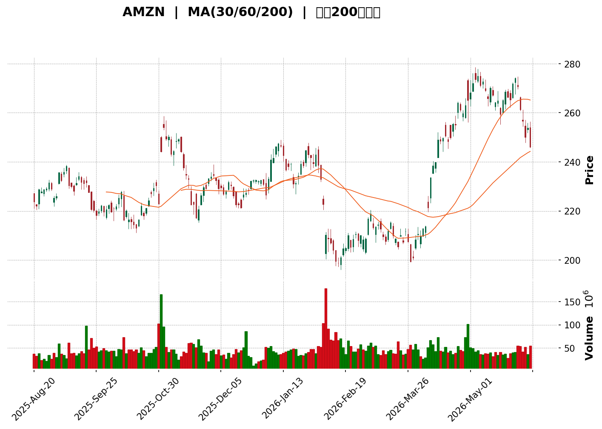
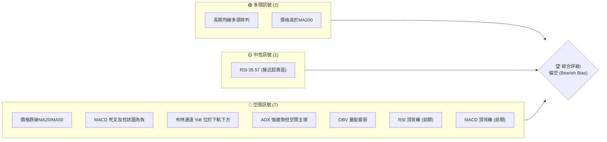
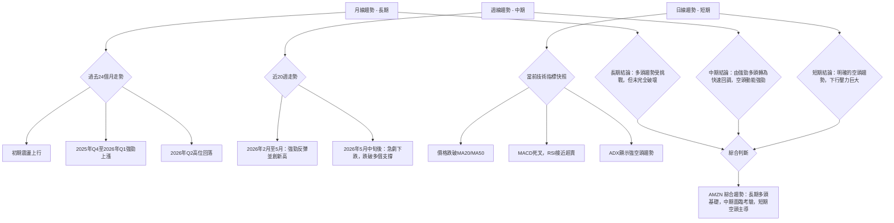
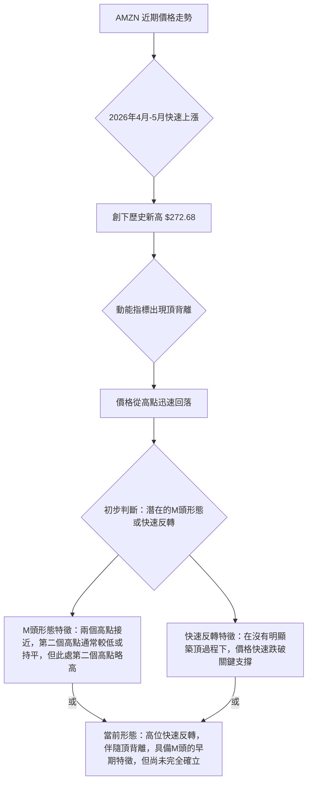

<details>
<summary>📊 靜態圖表 (點擊展開)</summary>

</details>

<html>
<head><meta charset="utf-8" /></head>
<body>
    <div style="height:500px; width:100%;">                        <script>window.PlotlyConfig = {MathJaxConfig: 'local'};</script>
        <script charset="utf-8" src="https://cdn.plot.ly/plotly-3.6.0.min.js" integrity="sha256-QaOVwtVY0T02VaHrr6pnoHLCwayMJp4O5n4YyaE3rJk=" crossorigin="anonymous"></script>                <div id="candlestick-chart" class="plotly-graph-div" style="height:100%; width:100%;"></div>            <script>                window.PLOTLYENV=window.PLOTLYENV || {};                                if (document.getElementById("candlestick-chart")) {                    Plotly.newPlot(                        "candlestick-chart",                        [{"close":{"dtype":"f8","bdata":"AAAAgOv5a0AAAABgZr5rQAAAAEDhmmxAAAAAgBR+bEAAAABguJZsQAAAAADXo2xAAAAAQDPzbEAAAAAAAKBsQAAAAEDhKmxAAAAAIK4\u002fbEAAAACAwnVtQAAAAGCPCm1AAAAAQOF6bUAAAAAgrsdtQAAAAGCPymxAAAAAYGa+bEAAAADAzIRsQAAAAIDC7WxAAAAAoJlBbUAAAAAA1\u002fNsQAAAACBc52xAAAAAIFzvbEAAAAAAKXRsQAAAAGC4lmtAAAAAYLiGa0AAAADAzERrQAAAAMD1eGtAAAAAoHDFa0AAAACAPXJrQAAAAAAplGtAAAAAwB7Na0AAAADgUXBrQAAAAMDMnGtAAAAAwPW4a0AAAABACidsQAAAACCud2xAAAAAANcLa0AAAACAPYJrQAAAAOB6DGtAAAAAgD3yakAAAABACs9qQAAAAKBHoWpAAAAAIFwPa0AAAADA9cBrQAAAAGBmPmtAAAAAQOGia0AAAABguAZsQAAAAEAKX2xAAAAAAACobEAAAACgmclsQAAAACCF22tAAAAAQAqHbkAAAAAAAMBvQAAAAIA9Km9AAAAAYGZGb0AAAACgR2FuQAAAAMAejW5AAAAAwMwMb0AAAABAMyNvQAAAAGBmhm5AAAAAYI+ybUAAAACAFFZtQAAAAADXG21AAAAAoJnRa0AAAACAFNZrQAAAAOB6JGtAAAAAgBSWa0AAAADA9UhsQAAAAKBwtWxAAAAAwB6lbEAAAABACidtQAAAAAApPG1AAAAAoHBNbUAAAAAAKQxtQAAAACCFo2xAAAAAwPWwbEAAAADgelxsQAAAAKBwfWxAAAAAwPX4bEAAAADA9chsQAAAAIAURmxAAAAAoEfRa0AAAACA69FrQAAAAOCjqGtAAAAA4FFYbEAAAABAM2tsQAAAAIDCjWxAAAAA4HoEbUAAAAAAKQxtQAAAAOCjEG1AAAAAgD0CbUAAAADA9RBtQAAAAIA92mxAAAAAAABQbEAAAACA6yFtQAAAAIDCHW5AAAAAgOsxbkAAAACgR8luQAAAAAAp7G5AAAAAQArPbkAAAABAM1NuQAAAAMDMlG1AAAAAgMLFbUAAAAAA1+NtQAAAAAAA4GxAAAAAgOvpbEAAAABA4UptQAAAAMAe5W1AAAAAoHDNbUAAAACAwpVuQAAAAOBRYG5AAAAAIFw3bkAAAACgmeltQAAAAGC4Xm5AAAAAANfTbUAAAAAgrh9tQAAAAIAU1mtAAAAAgD1KakAAAABAChdqQAAAAGC43mlAAAAAYI+CaUAAAABAM\u002fNoQAAAAKBH2WhAAAAAwMwkaUAAAACgR5lpQAAAACCFm2lAAAAAIIVDakAAAADgo6hpQAAAAIDrEWpAAAAA4HpUakAAAACgcP1pQAAAAAAAQGpAAAAA4HoMakAAAAAgXBdqQAAAAIA9GmtAAAAAgBRea0AAAABguKZqQAAAACCur2pAAAAAYI\u002fKakAAAADAzJRqQAAAAMD1MGpAAAAAoHD1aUAAAAAgrndqQAAAAGBm5mpAAAAAANc7akAAAADgURhqQAAAAADXq2lAAAAA4HpEakAAAAAgrudpQAAAAGC4dmpAAAAAoEfxaUAAAABA4epoQAAAAGBmHmlAAAAA4KMIakAAAACAPVJqQAAAAOCjOGpAAAAAoEeZakAAAADgo7hqQAAAAAAAqGtAAAAAwMw0bUAAAAAAKcxtQAAAAOB6\u002fG1AAAAA4KMgb0AAAAAAABBvQAAAAGBmNm9AAAAAgOtRb0AAAADA9QhvQAAAAMAePW9AAAAAIIXrb0AAAABgj+JvQAAAAADXf3BAAAAAgOtRcEAAAABAMztwQAAAAOCjcHBAAAAAwPWQcEAAAAAAKcRwQAAAAMDMAHFAAAAAwMwYcUAAAAAA1y9xQAAAAGC48nBAAAAAQOEKcUAAAAAA189wQAAAAMAenXBAAAAAgBTicEAAAAAghbNwQAAAAIA9gnBAAAAAgMKNcEAAAACgcDVwQAAAAAApkHBAAAAAIFzHcEAAAADAHqVwQAAAAOCjlHBAAAAAoJn9cEAAAAAAACBxQAAAAIA96nBAAAAAAClUcEAAAADgUQhwQAAAAOCjQG9AAAAAoEe5b0AAAADA9cBuQA=="},"high":{"dtype":"f8","bdata":"AAAA4KNobEAAAADA9dhrQAAAAOB6pGxAAAAAQDOzbEAAAAAAAKBsQAAAAADXu2xAAAAAYLgWbUAAAACA6\u002flsQAAAAKBwRWxAAAAAoHBlbEAAAADgo3htQAAAAAAAgG1AAAAAQDOzbUAAAABAM9ttQAAAAIDCtW1AAAAAwPXwbEAAAACgR9lsQAAAACBcN21AAAAAwMx8bUAAAACgmUltQAAAACBcL21AAAAAwB5FbUAAAACAPdJsQAAAACCFe2xAAAAAgOsRbEAAAACgcJVrQAAAAKCZoWtAAAAAQDPTa0AAAAAgrsdrQAAAAMDMxGtAAAAAgOvZa0AAAABgZgZsQAAAACBct2tAAAAA4Hrca0AAAAAgXFdsQAAAAGC4hmxAAAAAAACIbEAAAACAwpVrQAAAAIA9amtAAAAAYLg2a0AAAABA4VJrQAAAAKCZ2WpAAAAAgBQWa0AAAACAPeprQAAAAOBRgGtAAAAAoJmpa0AAAADAzCxsQAAAAMDMjGxAAAAAIK7vbEAAAACAPRptQAAAAIAUjmxAAAAAAABQb0AAAACgmSlwQAAAAAApEHBAAAAAAABgb0AAAAAAKUxvQAAAAMDMnG5AAAAAAAB4b0AAAAAAADhvQAAAAADXS29AAAAAAAB4bkAAAAAgXNdtQAAAAEAzU21AAAAAYGbGbEAAAAAgrvdrQAAAAMAebWxAAAAAYLjGa0AAAABgj2psQAAAAOCj0GxAAAAAAAD4bEAAAACgRyltQAAAAKCZeW1AAAAAQArfbUAAAAAAKSxtQAAAAAAAMG1AAAAAIK7nbEAAAABgj9psQAAAAIA9kmxAAAAAoHANbUAAAAAghQNtQAAAAGCPwmxAAAAAgMJ9bEAAAADAHvVrQAAAAIAUJmxAAAAAIFynbEAAAAAAKaRsQAAAACBcr2xAAAAAYGYObUAAAABgZh5tQAAAACCuH21AAAAAQDMTbUAAAADgoxhtQAAAACCuH21AAAAAYLhubUAAAAAAAEBtQAAAAIDCZW5AAAAAoEepbkAAAADAHs1uQAAAACCF+25AAAAAgBQeb0AAAADAHvVuQAAAAMD1KG5AAAAAwMwUbkAAAACAPfJtQAAAAEDhYm1AAAAAoJkJbUAAAABACndtQAAAAGBmDm5AAAAAYGYebkAAAAAAKZxuQAAAAMD1+G5AAAAAAABgbkAAAACAPWpuQAAAAAAptG5AAAAAQDPLbkAAAAAghdttQAAAAIDrSWxAAAAAgBRuakAAAACA65lqQAAAAMDMlGpAAAAAgD0SakAAAABguH5pQAAAAMAeJWlAAAAAIK43aUAAAAAghdtpQAAAAOB6tGlAAAAAoHBlakAAAACAwg1qQAAAACCFS2pAAAAAQOFyakAAAACgmWFqQAAAAGCPSmpAAAAAIFw3akAAAACAwiVqQAAAAKBHMWtAAAAAQAqPa0AAAACAPSprQAAAAIA9umpAAAAAwMz0akAAAAAAACBrQAAAAGC4dmpAAAAAgOtRakAAAABACpdqQAAAAGBm9mpAAAAA4HrkakAAAAAA1yNqQAAAAKBH8WlAAAAAoJmZakAAAABAMytqQAAAAIA9ompAAAAA4HqcakAAAABAM9NpQAAAAKCZeWlAAAAAwPVIakAAAABgj7JqQAAAAGC4hmpAAAAAYGaeakAAAABACr9qQAAAAEAzQ2xAAAAAoJk5bUAAAACAwg1uQAAAAAAAAG5AAAAAgMKFb0AAAACAFE5vQAAAAAAAQG9AAAAAQOECcEAAAACAwkVvQAAAAEDh4m9AAAAAgBT+b0AAAADgoyxwQAAAAAAAiHBAAAAAYGaCcEAAAADgelBwQAAAAGCPnnBAAAAAgBQecUAAAADAHhVxQAAAAKCZQXFAAAAAwPVocUAAAADAzFxxQAAAAIAUSnFAAAAAAAAgcUAAAACAFBpxQAAAAGBmunBAAAAAIIXrcEAAAADgeuxwQAAAAIDChXBAAAAAoJnNcEAAAAAAAGRwQAAAAKBHmXBAAAAAANfXcEAAAADgo9xwQAAAAMDM1HBAAAAAYI8GcUAAAAAAAChxQAAAAAAALHFAAAAAgBSqcEAAAABAM1NwQAAAAKBwEXBAAAAAYI\u002f6b0AAAACAFAZwQA=="},"hovertemplate":"\u003cb\u003e%{x|%Y-%m-%d}\u003c\u002fb\u003e\u003cbr\u003e\u958b: $%{open:.2f}\u003cbr\u003e\u9ad8: $%{high:.2f}\u003cbr\u003e\u4f4e: $%{low:.2f}\u003cbr\u003e\u6536: $%{close:.2f}\u003cextra\u003e\u003c\u002fextra\u003e","low":{"dtype":"f8","bdata":"AAAAoHCda0AAAAAAAJBrQAAAAIA9mmtAAAAAgOtpbEAAAADgo0BsQAAAAIDreWxAAAAA4KOAbEAAAADAHoVsQAAAAGCPumtAAAAAIIULbEAAAADA9dhsQAAAAIDC\u002fWxAAAAAAAA4bUAAAABgj2JtQAAAAEAzo2xAAAAAQOGqbEAAAACgR0lsQAAAAIA9ymxAAAAAIFwHbUAAAABguJZsQAAAAKBHmWxAAAAAYGa2bEAAAADgUXBsQAAAAIA9gmtAAAAAYGZua0AAAABACg9rQAAAAOCjQGtAAAAAoJlpa0AAAADgejxrQAAAACCFE2tAAAAAYGZea0AAAABA4WprQAAAAMD1AGtAAAAAoHCFa0AAAACAFKZrQAAAAAAAuGtAAAAAAAAAa0AAAACgRyFrQAAAAEAzk2pAAAAAwB6VakAAAACA65lqQAAAAMD1YGpAAAAAQOGyakAAAAAgrj9rQAAAAOCjEGtAAAAAgMJFa0AAAADAzLxrQAAAAKBHMWxAAAAAYLhGbEAAAADgUXhsQAAAAAAA2GtAAAAAIFx\u002fbkAAAADAzJxvQAAAAMAeFW9AAAAAwB7FbkAAAACgcEVuQAAAACCuz21AAAAAQOGybkAAAAAgXOduQAAAAAAAeG5AAAAAAACQbUAAAADgehxtQAAAAIAUpmxAAAAAoHDNa0AAAADgo1BrQAAAACCuF2tAAAAAgMLlakAAAADgo8hrQAAAAKCZ+WtAAAAA4KOYbEAAAABACsdsQAAAAAAACG1AAAAAoJkxbUAAAAAghdNsQAAAAKCZWWxAAAAAoJmRbEAAAADgo0hsQAAAACCFI2xAAAAAYLiObEAAAACAFJZsQAAAAADXI2xAAAAAAACwa0AAAAAAKaRrQAAAACCun2tAAAAAwB4NbEAAAABgjzJsQAAAAGC4VmxAAAAAIFyXbEAAAABgj+psQAAAAIDC5WxAAAAA4KPYbEAAAABgZsZsQAAAAADXw2xAAAAAYGYWbEAAAACAwmVsQAAAAIA9Am1AAAAA4KPwbUAAAAAAKTxuQAAAACCuR25AAAAAYLi+bkAAAAAAAAhuQAAAAEAKh21AAAAAACmUbUAAAADAHo1tQAAAAEDhqmxAAAAAAClcbEAAAADAzNxsQAAAAIA9Um1AAAAAoEexbUAAAABgj8JtQAAAAMD1MG5AAAAAIK6XbUAAAADgerRtQAAAAKBwxW1AAAAAYGZubUAAAACAPfpsQAAAAAApjGtAAAAAgOsJaUAAAABAM2tpQAAAAMAezWlAAAAAIK5PaUAAAACA67FoQAAAAMD1qGhAAAAAAACAaEAAAADgUTBpQAAAAIDrWWlAAAAAAAB4aUAAAAAghWNpQAAAAAAAaGlAAAAAgMIdakAAAABAM6tpQAAAAGBmpmlAAAAAYLhuaUAAAAAgXE9pQAAAAMDMRGpAAAAAQOHyakAAAADA9ZBqQAAAACCF42lAAAAAgMKNakAAAABAM2tqQAAAAMDMBGpAAAAAQArHaUAAAABgZu5pQAAAAIDCjWpAAAAAYI8aakAAAACgmcFpQAAAAIA9imlAAAAA4FEwakAAAADgetRpQAAAAMDMPGpAAAAAANfjaUAAAADgeuRoQAAAACBc\u002f2hAAAAA4HqEaUAAAACAFAZqQAAAAMDMnGlAAAAAQOEyakAAAABgjyJqQAAAAADXc2tAAAAA4KPoa0AAAABguGZtQAAAAAAAeG1AAAAAwPU4bkAAAABgZuZuQAAAAGBmhm5AAAAAIIVDb0AAAAAA16tuQAAAAEAzI29AAAAAYI9Kb0AAAACAPaJvQAAAAEAKG3BAAAAAoHBFcEAAAACAFApwQAAAAEAzG3BAAAAAYI8CcEAAAAAA12twQAAAAMDMzHBAAAAAgBQGcUAAAAAgXANxQAAAAADX53BAAAAAQDPfcEAAAAAgrsdwQAAAAIAUanBAAAAAQDNzcEAAAACAFKpwQAAAAIA9TnBAAAAA4HpocEAAAACAFOZvQAAAAOB6OHBAAAAAgOtVcEAAAAAA16NwQAAAAMAeYXBAAAAAQDObcEAAAABACrdwQAAAAIA92nBAAAAAQDNLcEAAAAAA18tvQAAAAGC49m5AAAAAAAB4b0AAAADA9bhuQA=="},"name":"\u50f9\u683c","open":{"dtype":"f8","bdata":"AAAAANdjbEAAAADAzNRrQAAAAKBH2WtAAAAAQDNrbEAAAAAghWNsQAAAAIA9kmxAAAAA4FGgbEAAAACAPepsQAAAAOCj8GtAAAAAYLgmbEAAAACAFOZsQAAAAIAUZm1AAAAAgBRebUAAAAAghYttQAAAAOCjsG1AAAAAIK7vbEAAAABAM8tsQAAAAAAp1GxAAAAAgBQebUAAAADgozhtQAAAAAAAEG1AAAAAANcLbUAAAACA69FsQAAAAGCPemxAAAAAwMwEbEAAAACA64FrQAAAAGCPYmtAAAAAYI+Ca0AAAADA9cBrQAAAACCFK2tAAAAA4FGga0AAAACAFO5rQAAAAAAAoGtAAAAAACmca0AAAACgcN1rQAAAAAAAIGxAAAAAYLhGbEAAAABgZjZrQAAAAIDr8WpAAAAAANcTa0AAAACgcPVqQAAAAIDr0WpAAAAAACm8akAAAACAwk1rQAAAAKCZaWtAAAAAAABga0AAAABACr9rQAAAAMAedWxAAAAAQAqHbEAAAACgcPVsQAAAAIDrYWxAAAAAQDNDb0AAAAAghetvQAAAAAApTG9AAAAAwPUgb0AAAADAHiVvQAAAAMDMXG5AAAAAQOEKb0AAAADAHg1vQAAAACCuR29AAAAAoJlhbkAAAACA62FtQAAAAAAAKG1AAAAAQDODbEAAAAAgrvdrQAAAAKCZYWxAAAAAQDMLa0AAAACA69FrQAAAAAApTGxAAAAAIK7XbEAAAAAgrudsQAAAAEAKJ21AAAAA4FFgbUAAAABAMyttQAAAAOCjGG1AAAAAgD3KbEAAAABA4bJsQAAAAEDhWmxAAAAAgOuZbEAAAABguNZsQAAAAADXu2xAAAAAgMJ9bEAAAACgR+FrQAAAAMAeFWxAAAAAYLg2bEAAAADgUVhsQAAAACCFk2xAAAAAgOuhbEAAAAAAKQRtQAAAAKBHAW1AAAAAgBT+bEAAAABguOZsQAAAAMAeHW1AAAAAQOHqbEAAAABA4ZpsQAAAAEAzA21AAAAAIIXzbUAAAACA62FuQAAAAIA9km5AAAAAIFzXbkAAAADA9dBuQAAAAMDMJG5AAAAAgOvpbUAAAABA4eJtQAAAAOBROG1AAAAAQOHibEAAAACgmUFtQAAAAGC4Xm1AAAAAIFz\u002fbUAAAACAFPZtQAAAAADXy25AAAAAgD1abkAAAADgevxtQAAAAIDryW1AAAAAIFyfbkAAAAAghdttQAAAAMAeHWxAAAAAYGZWaUAAAABACh9qQAAAAKCZGWpAAAAAgOsBakAAAABguH5pQAAAAAAp3GhAAAAAACnEaEAAAACAPUJpQAAAAKCZeWlAAAAA4FGYaUAAAABAMwNqQAAAAEAKr2lAAAAAYLhOakAAAAAgXFdqQAAAAGCP2mlAAAAAoJmRaUAAAABAM2NpQAAAAEAKT2pAAAAAIFz\u002fakAAAAAgrt9qQAAAAGBmTmpAAAAAgBTGakAAAABguPZqQAAAAOB6TGpAAAAAIIUzakAAAABAMwtqQAAAAIA9mmpAAAAAgMK9akAAAACA6+FpQAAAAMDM7GlAAAAAoEc5akAAAABgZv5pQAAAAIDrcWpAAAAAIIVTakAAAABguM5pQAAAACBcL2lAAAAAQDObaUAAAACAFE5qQAAAAKBH0WlAAAAAoJk5akAAAAAgrmdqQAAAAKBH+WtAAAAAIFwnbEAAAACgmWltQAAAAGBmrm1AAAAAwPU4bkAAAAAAAChvQAAAAOBREG9AAAAAIK7fb0AAAACAFCZvQAAAAEDh4m9AAAAAgBSOb0AAAADgeuxvQAAAACCuP3BAAAAAIFx3cEAAAACAPSZwQAAAAADXH3BAAAAAYLgScUAAAACgR5lwQAAAAMDMzHBAAAAAoEdBcUAAAACAPQ5xQAAAAOBRMHFAAAAAgBT6cEAAAACgcN1wQAAAACBcq3BAAAAAQOGGcEAAAABgZtJwQAAAAAAAaHBAAAAAgOt9cEAAAADgo2BwQAAAAMDMQHBAAAAAAAB4cEAAAABgj8pwQAAAAEAKv3BAAAAAYGaicEAAAADgUQRxQAAAAOCj9HBAAAAA4KOkcEAAAABgjxJwQAAAAGBm1m9AAAAAANejb0AAAAAAAMBvQA=="},"x":["2025-08-20T00:00:00-04:00","2025-08-21T00:00:00-04:00","2025-08-22T00:00:00-04:00","2025-08-25T00:00:00-04:00","2025-08-26T00:00:00-04:00","2025-08-27T00:00:00-04:00","2025-08-28T00:00:00-04:00","2025-08-29T00:00:00-04:00","2025-09-02T00:00:00-04:00","2025-09-03T00:00:00-04:00","2025-09-04T00:00:00-04:00","2025-09-05T00:00:00-04:00","2025-09-08T00:00:00-04:00","2025-09-09T00:00:00-04:00","2025-09-10T00:00:00-04:00","2025-09-11T00:00:00-04:00","2025-09-12T00:00:00-04:00","2025-09-15T00:00:00-04:00","2025-09-16T00:00:00-04:00","2025-09-17T00:00:00-04:00","2025-09-18T00:00:00-04:00","2025-09-19T00:00:00-04:00","2025-09-22T00:00:00-04:00","2025-09-23T00:00:00-04:00","2025-09-24T00:00:00-04:00","2025-09-25T00:00:00-04:00","2025-09-26T00:00:00-04:00","2025-09-29T00:00:00-04:00","2025-09-30T00:00:00-04:00","2025-10-01T00:00:00-04:00","2025-10-02T00:00:00-04:00","2025-10-03T00:00:00-04:00","2025-10-06T00:00:00-04:00","2025-10-07T00:00:00-04:00","2025-10-08T00:00:00-04:00","2025-10-09T00:00:00-04:00","2025-10-10T00:00:00-04:00","2025-10-13T00:00:00-04:00","2025-10-14T00:00:00-04:00","2025-10-15T00:00:00-04:00","2025-10-16T00:00:00-04:00","2025-10-17T00:00:00-04:00","2025-10-20T00:00:00-04:00","2025-10-21T00:00:00-04:00","2025-10-22T00:00:00-04:00","2025-10-23T00:00:00-04:00","2025-10-24T00:00:00-04:00","2025-10-27T00:00:00-04:00","2025-10-28T00:00:00-04:00","2025-10-29T00:00:00-04:00","2025-10-30T00:00:00-04:00","2025-10-31T00:00:00-04:00","2025-11-03T00:00:00-05:00","2025-11-04T00:00:00-05:00","2025-11-05T00:00:00-05:00","2025-11-06T00:00:00-05:00","2025-11-07T00:00:00-05:00","2025-11-10T00:00:00-05:00","2025-11-11T00:00:00-05:00","2025-11-12T00:00:00-05:00","2025-11-13T00:00:00-05:00","2025-11-14T00:00:00-05:00","2025-11-17T00:00:00-05:00","2025-11-18T00:00:00-05:00","2025-11-19T00:00:00-05:00","2025-11-20T00:00:00-05:00","2025-11-21T00:00:00-05:00","2025-11-24T00:00:00-05:00","2025-11-25T00:00:00-05:00","2025-11-26T00:00:00-05:00","2025-11-28T00:00:00-05:00","2025-12-01T00:00:00-05:00","2025-12-02T00:00:00-05:00","2025-12-03T00:00:00-05:00","2025-12-04T00:00:00-05:00","2025-12-05T00:00:00-05:00","2025-12-08T00:00:00-05:00","2025-12-09T00:00:00-05:00","2025-12-10T00:00:00-05:00","2025-12-11T00:00:00-05:00","2025-12-12T00:00:00-05:00","2025-12-15T00:00:00-05:00","2025-12-16T00:00:00-05:00","2025-12-17T00:00:00-05:00","2025-12-18T00:00:00-05:00","2025-12-19T00:00:00-05:00","2025-12-22T00:00:00-05:00","2025-12-23T00:00:00-05:00","2025-12-24T00:00:00-05:00","2025-12-26T00:00:00-05:00","2025-12-29T00:00:00-05:00","2025-12-30T00:00:00-05:00","2025-12-31T00:00:00-05:00","2026-01-02T00:00:00-05:00","2026-01-05T00:00:00-05:00","2026-01-06T00:00:00-05:00","2026-01-07T00:00:00-05:00","2026-01-08T00:00:00-05:00","2026-01-09T00:00:00-05:00","2026-01-12T00:00:00-05:00","2026-01-13T00:00:00-05:00","2026-01-14T00:00:00-05:00","2026-01-15T00:00:00-05:00","2026-01-16T00:00:00-05:00","2026-01-20T00:00:00-05:00","2026-01-21T00:00:00-05:00","2026-01-22T00:00:00-05:00","2026-01-23T00:00:00-05:00","2026-01-26T00:00:00-05:00","2026-01-27T00:00:00-05:00","2026-01-28T00:00:00-05:00","2026-01-29T00:00:00-05:00","2026-01-30T00:00:00-05:00","2026-02-02T00:00:00-05:00","2026-02-03T00:00:00-05:00","2026-02-04T00:00:00-05:00","2026-02-05T00:00:00-05:00","2026-02-06T00:00:00-05:00","2026-02-09T00:00:00-05:00","2026-02-10T00:00:00-05:00","2026-02-11T00:00:00-05:00","2026-02-12T00:00:00-05:00","2026-02-13T00:00:00-05:00","2026-02-17T00:00:00-05:00","2026-02-18T00:00:00-05:00","2026-02-19T00:00:00-05:00","2026-02-20T00:00:00-05:00","2026-02-23T00:00:00-05:00","2026-02-24T00:00:00-05:00","2026-02-25T00:00:00-05:00","2026-02-26T00:00:00-05:00","2026-02-27T00:00:00-05:00","2026-03-02T00:00:00-05:00","2026-03-03T00:00:00-05:00","2026-03-04T00:00:00-05:00","2026-03-05T00:00:00-05:00","2026-03-06T00:00:00-05:00","2026-03-09T00:00:00-04:00","2026-03-10T00:00:00-04:00","2026-03-11T00:00:00-04:00","2026-03-12T00:00:00-04:00","2026-03-13T00:00:00-04:00","2026-03-16T00:00:00-04:00","2026-03-17T00:00:00-04:00","2026-03-18T00:00:00-04:00","2026-03-19T00:00:00-04:00","2026-03-20T00:00:00-04:00","2026-03-23T00:00:00-04:00","2026-03-24T00:00:00-04:00","2026-03-25T00:00:00-04:00","2026-03-26T00:00:00-04:00","2026-03-27T00:00:00-04:00","2026-03-30T00:00:00-04:00","2026-03-31T00:00:00-04:00","2026-04-01T00:00:00-04:00","2026-04-02T00:00:00-04:00","2026-04-06T00:00:00-04:00","2026-04-07T00:00:00-04:00","2026-04-08T00:00:00-04:00","2026-04-09T00:00:00-04:00","2026-04-10T00:00:00-04:00","2026-04-13T00:00:00-04:00","2026-04-14T00:00:00-04:00","2026-04-15T00:00:00-04:00","2026-04-16T00:00:00-04:00","2026-04-17T00:00:00-04:00","2026-04-20T00:00:00-04:00","2026-04-21T00:00:00-04:00","2026-04-22T00:00:00-04:00","2026-04-23T00:00:00-04:00","2026-04-24T00:00:00-04:00","2026-04-27T00:00:00-04:00","2026-04-28T00:00:00-04:00","2026-04-29T00:00:00-04:00","2026-04-30T00:00:00-04:00","2026-05-01T00:00:00-04:00","2026-05-04T00:00:00-04:00","2026-05-05T00:00:00-04:00","2026-05-06T00:00:00-04:00","2026-05-07T00:00:00-04:00","2026-05-08T00:00:00-04:00","2026-05-11T00:00:00-04:00","2026-05-12T00:00:00-04:00","2026-05-13T00:00:00-04:00","2026-05-14T00:00:00-04:00","2026-05-15T00:00:00-04:00","2026-05-18T00:00:00-04:00","2026-05-19T00:00:00-04:00","2026-05-20T00:00:00-04:00","2026-05-21T00:00:00-04:00","2026-05-22T00:00:00-04:00","2026-05-26T00:00:00-04:00","2026-05-27T00:00:00-04:00","2026-05-28T00:00:00-04:00","2026-05-29T00:00:00-04:00","2026-06-01T00:00:00-04:00","2026-06-02T00:00:00-04:00","2026-06-03T00:00:00-04:00","2026-06-04T00:00:00-04:00","2026-06-05T00:00:00-04:00"],"type":"candlestick"},{"hovertemplate":"MA30: $%{y:.2f}\u003cextra\u003e\u003c\u002fextra\u003e","line":{"color":"#2196F3","dash":"dash","width":2},"mode":"lines","name":"MA30","x":["2025-08-20T00:00:00-04:00","2025-08-21T00:00:00-04:00","2025-08-22T00:00:00-04:00","2025-08-25T00:00:00-04:00","2025-08-26T00:00:00-04:00","2025-08-27T00:00:00-04:00","2025-08-28T00:00:00-04:00","2025-08-29T00:00:00-04:00","2025-09-02T00:00:00-04:00","2025-09-03T00:00:00-04:00","2025-09-04T00:00:00-04:00","2025-09-05T00:00:00-04:00","2025-09-08T00:00:00-04:00","2025-09-09T00:00:00-04:00","2025-09-10T00:00:00-04:00","2025-09-11T00:00:00-04:00","2025-09-12T00:00:00-04:00","2025-09-15T00:00:00-04:00","2025-09-16T00:00:00-04:00","2025-09-17T00:00:00-04:00","2025-09-18T00:00:00-04:00","2025-09-19T00:00:00-04:00","2025-09-22T00:00:00-04:00","2025-09-23T00:00:00-04:00","2025-09-24T00:00:00-04:00","2025-09-25T00:00:00-04:00","2025-09-26T00:00:00-04:00","2025-09-29T00:00:00-04:00","2025-09-30T00:00:00-04:00","2025-10-01T00:00:00-04:00","2025-10-02T00:00:00-04:00","2025-10-03T00:00:00-04:00","2025-10-06T00:00:00-04:00","2025-10-07T00:00:00-04:00","2025-10-08T00:00:00-04:00","2025-10-09T00:00:00-04:00","2025-10-10T00:00:00-04:00","2025-10-13T00:00:00-04:00","2025-10-14T00:00:00-04:00","2025-10-15T00:00:00-04:00","2025-10-16T00:00:00-04:00","2025-10-17T00:00:00-04:00","2025-10-20T00:00:00-04:00","2025-10-21T00:00:00-04:00","2025-10-22T00:00:00-04:00","2025-10-23T00:00:00-04:00","2025-10-24T00:00:00-04:00","2025-10-27T00:00:00-04:00","2025-10-28T00:00:00-04:00","2025-10-29T00:00:00-04:00","2025-10-30T00:00:00-04:00","2025-10-31T00:00:00-04:00","2025-11-03T00:00:00-05:00","2025-11-04T00:00:00-05:00","2025-11-05T00:00:00-05:00","2025-11-06T00:00:00-05:00","2025-11-07T00:00:00-05:00","2025-11-10T00:00:00-05:00","2025-11-11T00:00:00-05:00","2025-11-12T00:00:00-05:00","2025-11-13T00:00:00-05:00","2025-11-14T00:00:00-05:00","2025-11-17T00:00:00-05:00","2025-11-18T00:00:00-05:00","2025-11-19T00:00:00-05:00","2025-11-20T00:00:00-05:00","2025-11-21T00:00:00-05:00","2025-11-24T00:00:00-05:00","2025-11-25T00:00:00-05:00","2025-11-26T00:00:00-05:00","2025-11-28T00:00:00-05:00","2025-12-01T00:00:00-05:00","2025-12-02T00:00:00-05:00","2025-12-03T00:00:00-05:00","2025-12-04T00:00:00-05:00","2025-12-05T00:00:00-05:00","2025-12-08T00:00:00-05:00","2025-12-09T00:00:00-05:00","2025-12-10T00:00:00-05:00","2025-12-11T00:00:00-05:00","2025-12-12T00:00:00-05:00","2025-12-15T00:00:00-05:00","2025-12-16T00:00:00-05:00","2025-12-17T00:00:00-05:00","2025-12-18T00:00:00-05:00","2025-12-19T00:00:00-05:00","2025-12-22T00:00:00-05:00","2025-12-23T00:00:00-05:00","2025-12-24T00:00:00-05:00","2025-12-26T00:00:00-05:00","2025-12-29T00:00:00-05:00","2025-12-30T00:00:00-05:00","2025-12-31T00:00:00-05:00","2026-01-02T00:00:00-05:00","2026-01-05T00:00:00-05:00","2026-01-06T00:00:00-05:00","2026-01-07T00:00:00-05:00","2026-01-08T00:00:00-05:00","2026-01-09T00:00:00-05:00","2026-01-12T00:00:00-05:00","2026-01-13T00:00:00-05:00","2026-01-14T00:00:00-05:00","2026-01-15T00:00:00-05:00","2026-01-16T00:00:00-05:00","2026-01-20T00:00:00-05:00","2026-01-21T00:00:00-05:00","2026-01-22T00:00:00-05:00","2026-01-23T00:00:00-05:00","2026-01-26T00:00:00-05:00","2026-01-27T00:00:00-05:00","2026-01-28T00:00:00-05:00","2026-01-29T00:00:00-05:00","2026-01-30T00:00:00-05:00","2026-02-02T00:00:00-05:00","2026-02-03T00:00:00-05:00","2026-02-04T00:00:00-05:00","2026-02-05T00:00:00-05:00","2026-02-06T00:00:00-05:00","2026-02-09T00:00:00-05:00","2026-02-10T00:00:00-05:00","2026-02-11T00:00:00-05:00","2026-02-12T00:00:00-05:00","2026-02-13T00:00:00-05:00","2026-02-17T00:00:00-05:00","2026-02-18T00:00:00-05:00","2026-02-19T00:00:00-05:00","2026-02-20T00:00:00-05:00","2026-02-23T00:00:00-05:00","2026-02-24T00:00:00-05:00","2026-02-25T00:00:00-05:00","2026-02-26T00:00:00-05:00","2026-02-27T00:00:00-05:00","2026-03-02T00:00:00-05:00","2026-03-03T00:00:00-05:00","2026-03-04T00:00:00-05:00","2026-03-05T00:00:00-05:00","2026-03-06T00:00:00-05:00","2026-03-09T00:00:00-04:00","2026-03-10T00:00:00-04:00","2026-03-11T00:00:00-04:00","2026-03-12T00:00:00-04:00","2026-03-13T00:00:00-04:00","2026-03-16T00:00:00-04:00","2026-03-17T00:00:00-04:00","2026-03-18T00:00:00-04:00","2026-03-19T00:00:00-04:00","2026-03-20T00:00:00-04:00","2026-03-23T00:00:00-04:00","2026-03-24T00:00:00-04:00","2026-03-25T00:00:00-04:00","2026-03-26T00:00:00-04:00","2026-03-27T00:00:00-04:00","2026-03-30T00:00:00-04:00","2026-03-31T00:00:00-04:00","2026-04-01T00:00:00-04:00","2026-04-02T00:00:00-04:00","2026-04-06T00:00:00-04:00","2026-04-07T00:00:00-04:00","2026-04-08T00:00:00-04:00","2026-04-09T00:00:00-04:00","2026-04-10T00:00:00-04:00","2026-04-13T00:00:00-04:00","2026-04-14T00:00:00-04:00","2026-04-15T00:00:00-04:00","2026-04-16T00:00:00-04:00","2026-04-17T00:00:00-04:00","2026-04-20T00:00:00-04:00","2026-04-21T00:00:00-04:00","2026-04-22T00:00:00-04:00","2026-04-23T00:00:00-04:00","2026-04-24T00:00:00-04:00","2026-04-27T00:00:00-04:00","2026-04-28T00:00:00-04:00","2026-04-29T00:00:00-04:00","2026-04-30T00:00:00-04:00","2026-05-01T00:00:00-04:00","2026-05-04T00:00:00-04:00","2026-05-05T00:00:00-04:00","2026-05-06T00:00:00-04:00","2026-05-07T00:00:00-04:00","2026-05-08T00:00:00-04:00","2026-05-11T00:00:00-04:00","2026-05-12T00:00:00-04:00","2026-05-13T00:00:00-04:00","2026-05-14T00:00:00-04:00","2026-05-15T00:00:00-04:00","2026-05-18T00:00:00-04:00","2026-05-19T00:00:00-04:00","2026-05-20T00:00:00-04:00","2026-05-21T00:00:00-04:00","2026-05-22T00:00:00-04:00","2026-05-26T00:00:00-04:00","2026-05-27T00:00:00-04:00","2026-05-28T00:00:00-04:00","2026-05-29T00:00:00-04:00","2026-06-01T00:00:00-04:00","2026-06-02T00:00:00-04:00","2026-06-03T00:00:00-04:00","2026-06-04T00:00:00-04:00","2026-06-05T00:00:00-04:00"],"y":{"dtype":"f8","bdata":"AAAAAAAA+H8AAAAAAAD4fwAAAAAAAPh\u002fAAAAAAAA+H8AAAAAAAD4fwAAAAAAAPh\u002fAAAAAAAA+H8AAAAAAAD4fwAAAAAAAPh\u002fAAAAAAAA+H8AAAAAAAD4fwAAAAAAAPh\u002fAAAAAAAA+H8AAAAAAAD4fwAAAAAAAPh\u002fAAAAAAAA+H8AAAAAAAD4fwAAAAAAAPh\u002fAAAAAAAA+H8AAAAAAAD4fwAAAAAAAPh\u002fAAAAAAAA+H8AAAAAAAD4fwAAAAAAAPh\u002fAAAAAAAA+H8AAAAAAAD4fwAAAAAAAPh\u002fAAAAAAAA+H8AAAAAAAD4f4mIiHjpdmxA3t3dLWt1bEBVVVXl0HJsQO\u002fu7r5YamxAd3d3p8ZjbEBmZmamDWBsQCIiItKUXmxAMzMzA1ZObEB3d3eHz0RsQFVVVZVDO2xAq6qqOiYwbEDNzMx8hhlsQHd3dwfzBGxAVVVVdUzwa0C8u7sLAt9rQKuqqnrN0WtAvLu7G1rIa0Crqqo6JsRrQKuqqlpkv2tAIiIiokW6a0AAAAAw3bhrQO\u002fu7p7vr2tA3t3dfYa9a0AiIiJCp9lrQCIiIrIr+GtAZmZm9igYbEB3d3eXtTJsQJqZmTn7TGxAMzMzw\u002fVobEC8u7trdYhsQJqZmZmZoWxAVVVVBcixbEDNzMws+cFsQImIiMi9zmxAvLu7C5DPbEAAAAAw3cxsQN7d3a2OwWxAREREVCrGbEAiIiISysxsQFVVVWX02mxA7+7uXnPpbEDv7u5ec\u002f1sQFVVVRWuE21AZmZm5tAmbUBEREQk2zFtQBEREZHCPW1AAAAAQMNGbUARERERn0ltQKuqqnqiSm1AZmZmVlVNbUAAAADgT01tQAAAADDdUG1AmpmZGb05bUAiIiLiMxhtQM3MzFxI+mxA3t3drUfhbEBEREREi9BsQImIiKh\u002fv2xAiYiImCeubEC8u7vrUZxsQBEREYHcj2xAiYiI6PuJbEBVVVUVrodsQM3MzEx+hWxAmpmZ6bSJbEDNzMycxJRsQN7d3d0krmxARERExGfEbEBERETUv9lsQHd3d9ej7GxAAAAAoBr\u002fbEDe3d39GwltQCIiImIQDG1AzczMHBMQbUBERESUQxdtQM3MzKxHGW1AvLu7uy0bbUBEREQUICNtQJqZmVkdL21AMzMzgzI2bUC8u7urjkVtQGZmZqZ\u002fV21AzczMzPdrbUAAAADw0n1tQBEREcH1lG1AMzMzU5yhbUC8u7troKdtQFVVVQWBoW1AVVVVtTqKbUAzMzPz\u002fXBtQN7d3V26VW1Aq6qqOt83bUBVVVUlvxRtQBEREdGU8mxAMzMzk4rXbECrqqr6YrlsQHd3d3fpkmxAVVVVhV1xbEBERERUnEVsQBEREeEzHGxAZmZm5vv1a0AiIiLy\u002fdBrQImIiLiQtGtAEREREcqUa0AiIiKSX3RrQM3MzHw\u002fZWtAd3d3pw1Ya0AiIiLCg0FrQDMzMyMiJmtAZmZm9m8Ma0AzMzOjRepqQN7d3V2PxmpAd3d3tzqiakAAAAAA1YRqQKuqqqo4Z2pAAAAAAI5IakB3d3eXtS5qQDMzMxM8HGpAvLu76wocakCJiIjIdhpqQJqZmdmHH2pAiYiIqDgjakCJiIio8SJqQLy7u3s\u002fJWpAiYiIuNcsakDNzMwMAjNqQO\u002fu7s4+OGpAAAAAoBo7akARERGxK0RqQImIiOi0UWpAvLu7K0BqakCJiIjIvYpqQO\u002fu7r6fqmpAIiIicvbVakDv7u5OYgBrQM3MzLx0I2tAq6qqGi9Fa0DNzMyMl2prQDMzM6NwkWtAAAAAkDS9a0CJiIjIduprQN7d3f2NJGxAd3d3Z5FdbEDv7u6uuZBsQCIiIjLBw2xA7+7uvp\u002f+bEB3d3c3Fz5tQM3MzEw3hW1AREREdNrIbUB3d3e3HhFuQDMzM0OLUG5AMzMz0waWbkCrqqrqUeBuQBEREcGDJW9AiYiIqH9nb0AiIiLi7KNvQFVVVYXr3W9AzczMDLsKcEB3d3ffCCNwQKuqqpJfOnBARERETPBMcEAiIiIK11twQM3MzPxiaXBAMzMzC5B1cEDNzMykKYNwQHd3d6dUjnBAAAAAkAmUcECJiIiYbphwQFVVVZ19mHBAmpmZQaeXcEARERGh05JwQA=="},"type":"scatter"},{"hovertemplate":"MA60: $%{y:.2f}\u003cextra\u003e\u003c\u002fextra\u003e","line":{"color":"#9C27B0","dash":"dash","width":2},"mode":"lines","name":"MA60","x":["2025-08-20T00:00:00-04:00","2025-08-21T00:00:00-04:00","2025-08-22T00:00:00-04:00","2025-08-25T00:00:00-04:00","2025-08-26T00:00:00-04:00","2025-08-27T00:00:00-04:00","2025-08-28T00:00:00-04:00","2025-08-29T00:00:00-04:00","2025-09-02T00:00:00-04:00","2025-09-03T00:00:00-04:00","2025-09-04T00:00:00-04:00","2025-09-05T00:00:00-04:00","2025-09-08T00:00:00-04:00","2025-09-09T00:00:00-04:00","2025-09-10T00:00:00-04:00","2025-09-11T00:00:00-04:00","2025-09-12T00:00:00-04:00","2025-09-15T00:00:00-04:00","2025-09-16T00:00:00-04:00","2025-09-17T00:00:00-04:00","2025-09-18T00:00:00-04:00","2025-09-19T00:00:00-04:00","2025-09-22T00:00:00-04:00","2025-09-23T00:00:00-04:00","2025-09-24T00:00:00-04:00","2025-09-25T00:00:00-04:00","2025-09-26T00:00:00-04:00","2025-09-29T00:00:00-04:00","2025-09-30T00:00:00-04:00","2025-10-01T00:00:00-04:00","2025-10-02T00:00:00-04:00","2025-10-03T00:00:00-04:00","2025-10-06T00:00:00-04:00","2025-10-07T00:00:00-04:00","2025-10-08T00:00:00-04:00","2025-10-09T00:00:00-04:00","2025-10-10T00:00:00-04:00","2025-10-13T00:00:00-04:00","2025-10-14T00:00:00-04:00","2025-10-15T00:00:00-04:00","2025-10-16T00:00:00-04:00","2025-10-17T00:00:00-04:00","2025-10-20T00:00:00-04:00","2025-10-21T00:00:00-04:00","2025-10-22T00:00:00-04:00","2025-10-23T00:00:00-04:00","2025-10-24T00:00:00-04:00","2025-10-27T00:00:00-04:00","2025-10-28T00:00:00-04:00","2025-10-29T00:00:00-04:00","2025-10-30T00:00:00-04:00","2025-10-31T00:00:00-04:00","2025-11-03T00:00:00-05:00","2025-11-04T00:00:00-05:00","2025-11-05T00:00:00-05:00","2025-11-06T00:00:00-05:00","2025-11-07T00:00:00-05:00","2025-11-10T00:00:00-05:00","2025-11-11T00:00:00-05:00","2025-11-12T00:00:00-05:00","2025-11-13T00:00:00-05:00","2025-11-14T00:00:00-05:00","2025-11-17T00:00:00-05:00","2025-11-18T00:00:00-05:00","2025-11-19T00:00:00-05:00","2025-11-20T00:00:00-05:00","2025-11-21T00:00:00-05:00","2025-11-24T00:00:00-05:00","2025-11-25T00:00:00-05:00","2025-11-26T00:00:00-05:00","2025-11-28T00:00:00-05:00","2025-12-01T00:00:00-05:00","2025-12-02T00:00:00-05:00","2025-12-03T00:00:00-05:00","2025-12-04T00:00:00-05:00","2025-12-05T00:00:00-05:00","2025-12-08T00:00:00-05:00","2025-12-09T00:00:00-05:00","2025-12-10T00:00:00-05:00","2025-12-11T00:00:00-05:00","2025-12-12T00:00:00-05:00","2025-12-15T00:00:00-05:00","2025-12-16T00:00:00-05:00","2025-12-17T00:00:00-05:00","2025-12-18T00:00:00-05:00","2025-12-19T00:00:00-05:00","2025-12-22T00:00:00-05:00","2025-12-23T00:00:00-05:00","2025-12-24T00:00:00-05:00","2025-12-26T00:00:00-05:00","2025-12-29T00:00:00-05:00","2025-12-30T00:00:00-05:00","2025-12-31T00:00:00-05:00","2026-01-02T00:00:00-05:00","2026-01-05T00:00:00-05:00","2026-01-06T00:00:00-05:00","2026-01-07T00:00:00-05:00","2026-01-08T00:00:00-05:00","2026-01-09T00:00:00-05:00","2026-01-12T00:00:00-05:00","2026-01-13T00:00:00-05:00","2026-01-14T00:00:00-05:00","2026-01-15T00:00:00-05:00","2026-01-16T00:00:00-05:00","2026-01-20T00:00:00-05:00","2026-01-21T00:00:00-05:00","2026-01-22T00:00:00-05:00","2026-01-23T00:00:00-05:00","2026-01-26T00:00:00-05:00","2026-01-27T00:00:00-05:00","2026-01-28T00:00:00-05:00","2026-01-29T00:00:00-05:00","2026-01-30T00:00:00-05:00","2026-02-02T00:00:00-05:00","2026-02-03T00:00:00-05:00","2026-02-04T00:00:00-05:00","2026-02-05T00:00:00-05:00","2026-02-06T00:00:00-05:00","2026-02-09T00:00:00-05:00","2026-02-10T00:00:00-05:00","2026-02-11T00:00:00-05:00","2026-02-12T00:00:00-05:00","2026-02-13T00:00:00-05:00","2026-02-17T00:00:00-05:00","2026-02-18T00:00:00-05:00","2026-02-19T00:00:00-05:00","2026-02-20T00:00:00-05:00","2026-02-23T00:00:00-05:00","2026-02-24T00:00:00-05:00","2026-02-25T00:00:00-05:00","2026-02-26T00:00:00-05:00","2026-02-27T00:00:00-05:00","2026-03-02T00:00:00-05:00","2026-03-03T00:00:00-05:00","2026-03-04T00:00:00-05:00","2026-03-05T00:00:00-05:00","2026-03-06T00:00:00-05:00","2026-03-09T00:00:00-04:00","2026-03-10T00:00:00-04:00","2026-03-11T00:00:00-04:00","2026-03-12T00:00:00-04:00","2026-03-13T00:00:00-04:00","2026-03-16T00:00:00-04:00","2026-03-17T00:00:00-04:00","2026-03-18T00:00:00-04:00","2026-03-19T00:00:00-04:00","2026-03-20T00:00:00-04:00","2026-03-23T00:00:00-04:00","2026-03-24T00:00:00-04:00","2026-03-25T00:00:00-04:00","2026-03-26T00:00:00-04:00","2026-03-27T00:00:00-04:00","2026-03-30T00:00:00-04:00","2026-03-31T00:00:00-04:00","2026-04-01T00:00:00-04:00","2026-04-02T00:00:00-04:00","2026-04-06T00:00:00-04:00","2026-04-07T00:00:00-04:00","2026-04-08T00:00:00-04:00","2026-04-09T00:00:00-04:00","2026-04-10T00:00:00-04:00","2026-04-13T00:00:00-04:00","2026-04-14T00:00:00-04:00","2026-04-15T00:00:00-04:00","2026-04-16T00:00:00-04:00","2026-04-17T00:00:00-04:00","2026-04-20T00:00:00-04:00","2026-04-21T00:00:00-04:00","2026-04-22T00:00:00-04:00","2026-04-23T00:00:00-04:00","2026-04-24T00:00:00-04:00","2026-04-27T00:00:00-04:00","2026-04-28T00:00:00-04:00","2026-04-29T00:00:00-04:00","2026-04-30T00:00:00-04:00","2026-05-01T00:00:00-04:00","2026-05-04T00:00:00-04:00","2026-05-05T00:00:00-04:00","2026-05-06T00:00:00-04:00","2026-05-07T00:00:00-04:00","2026-05-08T00:00:00-04:00","2026-05-11T00:00:00-04:00","2026-05-12T00:00:00-04:00","2026-05-13T00:00:00-04:00","2026-05-14T00:00:00-04:00","2026-05-15T00:00:00-04:00","2026-05-18T00:00:00-04:00","2026-05-19T00:00:00-04:00","2026-05-20T00:00:00-04:00","2026-05-21T00:00:00-04:00","2026-05-22T00:00:00-04:00","2026-05-26T00:00:00-04:00","2026-05-27T00:00:00-04:00","2026-05-28T00:00:00-04:00","2026-05-29T00:00:00-04:00","2026-06-01T00:00:00-04:00","2026-06-02T00:00:00-04:00","2026-06-03T00:00:00-04:00","2026-06-04T00:00:00-04:00","2026-06-05T00:00:00-04:00"],"y":{"dtype":"f8","bdata":"AAAAAAAA+H8AAAAAAAD4fwAAAAAAAPh\u002fAAAAAAAA+H8AAAAAAAD4fwAAAAAAAPh\u002fAAAAAAAA+H8AAAAAAAD4fwAAAAAAAPh\u002fAAAAAAAA+H8AAAAAAAD4fwAAAAAAAPh\u002fAAAAAAAA+H8AAAAAAAD4fwAAAAAAAPh\u002fAAAAAAAA+H8AAAAAAAD4fwAAAAAAAPh\u002fAAAAAAAA+H8AAAAAAAD4fwAAAAAAAPh\u002fAAAAAAAA+H8AAAAAAAD4fwAAAAAAAPh\u002fAAAAAAAA+H8AAAAAAAD4fwAAAAAAAPh\u002fAAAAAAAA+H8AAAAAAAD4fwAAAAAAAPh\u002fAAAAAAAA+H8AAAAAAAD4fwAAAAAAAPh\u002fAAAAAAAA+H8AAAAAAAD4fwAAAAAAAPh\u002fAAAAAAAA+H8AAAAAAAD4fwAAAAAAAPh\u002fAAAAAAAA+H8AAAAAAAD4fwAAAAAAAPh\u002fAAAAAAAA+H8AAAAAAAD4fwAAAAAAAPh\u002fAAAAAAAA+H8AAAAAAAD4fwAAAAAAAPh\u002fAAAAAAAA+H8AAAAAAAD4fwAAAAAAAPh\u002fAAAAAAAA+H8AAAAAAAD4fwAAAAAAAPh\u002fAAAAAAAA+H8AAAAAAAD4fwAAAAAAAPh\u002fAAAAAAAA+H8AAAAAAAD4fxEREYlBjGxAmpmZmZmTbEAREREJZZpsQLy7u0OLnGxAmpmZWauZbEAzMzNrdZZsQAAAAMARkGxAvLu7K0CKbEDNzMzMzIhsQFVVVf0bi2xAzczMzMyMbEDe3d3tfItsQGZmZo5QjGxA3t3drY6LbEAAAACYbohsQN7d3QXIh2xA3t3drY6HbEDe3d2l4oZsQKuqqmoDhWxAREREfM2DbEAAAACIFoNsQHd3d2dmgGxAvLu7y6F7bEAiIiKS7XhsQHd3dwc6eWxAIiIiUrh8bEDe3d1toIFsQBEREXE9hmxA3t3drY6LbEC8u7urY5JsQFVVVQ27mGxA7+7u9uGdbEARERGh06RsQKuqqgoeqmxAq6qqeqKsbEBmZmbm0LBsQN7d3cXZt2xAREREDEnFbEAzMzPzRNNsQGZmZh7M42xAd3d3\u002f0b0bEBmZmauRwNtQLy7uzvfD21AmpmZAXIbbUBERERcjyRtQO\u002fu7h6FK21A3t3dffgwbUCrqqqSXzZtQCIiIurfPG1AzczM7MNBbUDe3d1Fb0ltQDMzM2suVG1AMzMzc9pSbUARERFpA0ttQO\u002fu7g6fR21AiYiIAHJBbUAAAADYFTxtQO\u002fu7laAMG1A7+7uJjEcbUB3d3fvpwZtQHd3d2\u002fL8mxAmpmZke3gbEBVVVWdNs5sQO\u002fu7o4JvGxAZmZmvp+wbEC8u7vLE6dsQKuqqiqHoGxAzczMpOKabEBEREQUro9sQERERNxrhGxAMzMzQ4t6bEAAAAD4DG1sQFVVVY1QYGxA7+7ulm5SbEAzMzOT0UVsQM3MzJRDP2xAmpmZsZ05bEAzMzPrUTJsQGZmZr6fKmxAzczMPFEhbEB3d3cn6hdsQCIiIoIHD2xAIiIiQhkHbEAAAAD4UwFsQN7d3TUX\u002fmtAmpmZKRX1a0CamZkBK+trQERERIze3mtAiYiI0CLTa0De3d1dusVrQLy7uxuhumtAmpmZ8Yuta0Dv7u5m2JtrQGZmZibqi2tA3t3dJTGCa0C8u7uDMnZrQDMzMyOUZWtAq6qqEjxWa0CrqqoC5ERrQM3MzGT0NmtAERERCR4wa0BVVVXd3S1rQLy7uzuYL2tAmpmZQWA1a0CJiIjwYDprQM3MzBxaRGtAERERYZ5Oa0B3d3enDVZrQDMzM2PJW2tAMzMzQ9Jka0De3d01XmprQN7d3a2OdWtAd3d3D+Z\u002fa0B3d3dXx4prQGZmZu58lWtAd3d335aja0B3d3dnZrZrQAAAALC50GtAAAAAsHLya0AAAADAyhVsQGZmZo4JOGxA3t3dvZ9cbECamZnJoYFsQGZmZp5hpWxAiYiIsCvKbEB3d3d3d+tsQCIiIioVC21AzczMXEgobUAAAAC4HkVtQO\u002fu7gY6Y21AIiIiYhCCbUBmZmbuNaFtQERERNyyvm1ARERERIvgbUBERETMWgNuQN7d3QUPIG5AVVVVHaE2bkDv7u5euk1uQO\u002fu7u41YW5AmpmZiUF2bkBVVVUFD4huQA=="},"type":"scatter"},{"hovertemplate":"MA200: $%{y:.2f}\u003cextra\u003e\u003c\u002fextra\u003e","line":{"color":"#FF6F00","dash":"solid","width":2},"mode":"lines","name":"MA200","x":["2025-08-20T00:00:00-04:00","2025-08-21T00:00:00-04:00","2025-08-22T00:00:00-04:00","2025-08-25T00:00:00-04:00","2025-08-26T00:00:00-04:00","2025-08-27T00:00:00-04:00","2025-08-28T00:00:00-04:00","2025-08-29T00:00:00-04:00","2025-09-02T00:00:00-04:00","2025-09-03T00:00:00-04:00","2025-09-04T00:00:00-04:00","2025-09-05T00:00:00-04:00","2025-09-08T00:00:00-04:00","2025-09-09T00:00:00-04:00","2025-09-10T00:00:00-04:00","2025-09-11T00:00:00-04:00","2025-09-12T00:00:00-04:00","2025-09-15T00:00:00-04:00","2025-09-16T00:00:00-04:00","2025-09-17T00:00:00-04:00","2025-09-18T00:00:00-04:00","2025-09-19T00:00:00-04:00","2025-09-22T00:00:00-04:00","2025-09-23T00:00:00-04:00","2025-09-24T00:00:00-04:00","2025-09-25T00:00:00-04:00","2025-09-26T00:00:00-04:00","2025-09-29T00:00:00-04:00","2025-09-30T00:00:00-04:00","2025-10-01T00:00:00-04:00","2025-10-02T00:00:00-04:00","2025-10-03T00:00:00-04:00","2025-10-06T00:00:00-04:00","2025-10-07T00:00:00-04:00","2025-10-08T00:00:00-04:00","2025-10-09T00:00:00-04:00","2025-10-10T00:00:00-04:00","2025-10-13T00:00:00-04:00","2025-10-14T00:00:00-04:00","2025-10-15T00:00:00-04:00","2025-10-16T00:00:00-04:00","2025-10-17T00:00:00-04:00","2025-10-20T00:00:00-04:00","2025-10-21T00:00:00-04:00","2025-10-22T00:00:00-04:00","2025-10-23T00:00:00-04:00","2025-10-24T00:00:00-04:00","2025-10-27T00:00:00-04:00","2025-10-28T00:00:00-04:00","2025-10-29T00:00:00-04:00","2025-10-30T00:00:00-04:00","2025-10-31T00:00:00-04:00","2025-11-03T00:00:00-05:00","2025-11-04T00:00:00-05:00","2025-11-05T00:00:00-05:00","2025-11-06T00:00:00-05:00","2025-11-07T00:00:00-05:00","2025-11-10T00:00:00-05:00","2025-11-11T00:00:00-05:00","2025-11-12T00:00:00-05:00","2025-11-13T00:00:00-05:00","2025-11-14T00:00:00-05:00","2025-11-17T00:00:00-05:00","2025-11-18T00:00:00-05:00","2025-11-19T00:00:00-05:00","2025-11-20T00:00:00-05:00","2025-11-21T00:00:00-05:00","2025-11-24T00:00:00-05:00","2025-11-25T00:00:00-05:00","2025-11-26T00:00:00-05:00","2025-11-28T00:00:00-05:00","2025-12-01T00:00:00-05:00","2025-12-02T00:00:00-05:00","2025-12-03T00:00:00-05:00","2025-12-04T00:00:00-05:00","2025-12-05T00:00:00-05:00","2025-12-08T00:00:00-05:00","2025-12-09T00:00:00-05:00","2025-12-10T00:00:00-05:00","2025-12-11T00:00:00-05:00","2025-12-12T00:00:00-05:00","2025-12-15T00:00:00-05:00","2025-12-16T00:00:00-05:00","2025-12-17T00:00:00-05:00","2025-12-18T00:00:00-05:00","2025-12-19T00:00:00-05:00","2025-12-22T00:00:00-05:00","2025-12-23T00:00:00-05:00","2025-12-24T00:00:00-05:00","2025-12-26T00:00:00-05:00","2025-12-29T00:00:00-05:00","2025-12-30T00:00:00-05:00","2025-12-31T00:00:00-05:00","2026-01-02T00:00:00-05:00","2026-01-05T00:00:00-05:00","2026-01-06T00:00:00-05:00","2026-01-07T00:00:00-05:00","2026-01-08T00:00:00-05:00","2026-01-09T00:00:00-05:00","2026-01-12T00:00:00-05:00","2026-01-13T00:00:00-05:00","2026-01-14T00:00:00-05:00","2026-01-15T00:00:00-05:00","2026-01-16T00:00:00-05:00","2026-01-20T00:00:00-05:00","2026-01-21T00:00:00-05:00","2026-01-22T00:00:00-05:00","2026-01-23T00:00:00-05:00","2026-01-26T00:00:00-05:00","2026-01-27T00:00:00-05:00","2026-01-28T00:00:00-05:00","2026-01-29T00:00:00-05:00","2026-01-30T00:00:00-05:00","2026-02-02T00:00:00-05:00","2026-02-03T00:00:00-05:00","2026-02-04T00:00:00-05:00","2026-02-05T00:00:00-05:00","2026-02-06T00:00:00-05:00","2026-02-09T00:00:00-05:00","2026-02-10T00:00:00-05:00","2026-02-11T00:00:00-05:00","2026-02-12T00:00:00-05:00","2026-02-13T00:00:00-05:00","2026-02-17T00:00:00-05:00","2026-02-18T00:00:00-05:00","2026-02-19T00:00:00-05:00","2026-02-20T00:00:00-05:00","2026-02-23T00:00:00-05:00","2026-02-24T00:00:00-05:00","2026-02-25T00:00:00-05:00","2026-02-26T00:00:00-05:00","2026-02-27T00:00:00-05:00","2026-03-02T00:00:00-05:00","2026-03-03T00:00:00-05:00","2026-03-04T00:00:00-05:00","2026-03-05T00:00:00-05:00","2026-03-06T00:00:00-05:00","2026-03-09T00:00:00-04:00","2026-03-10T00:00:00-04:00","2026-03-11T00:00:00-04:00","2026-03-12T00:00:00-04:00","2026-03-13T00:00:00-04:00","2026-03-16T00:00:00-04:00","2026-03-17T00:00:00-04:00","2026-03-18T00:00:00-04:00","2026-03-19T00:00:00-04:00","2026-03-20T00:00:00-04:00","2026-03-23T00:00:00-04:00","2026-03-24T00:00:00-04:00","2026-03-25T00:00:00-04:00","2026-03-26T00:00:00-04:00","2026-03-27T00:00:00-04:00","2026-03-30T00:00:00-04:00","2026-03-31T00:00:00-04:00","2026-04-01T00:00:00-04:00","2026-04-02T00:00:00-04:00","2026-04-06T00:00:00-04:00","2026-04-07T00:00:00-04:00","2026-04-08T00:00:00-04:00","2026-04-09T00:00:00-04:00","2026-04-10T00:00:00-04:00","2026-04-13T00:00:00-04:00","2026-04-14T00:00:00-04:00","2026-04-15T00:00:00-04:00","2026-04-16T00:00:00-04:00","2026-04-17T00:00:00-04:00","2026-04-20T00:00:00-04:00","2026-04-21T00:00:00-04:00","2026-04-22T00:00:00-04:00","2026-04-23T00:00:00-04:00","2026-04-24T00:00:00-04:00","2026-04-27T00:00:00-04:00","2026-04-28T00:00:00-04:00","2026-04-29T00:00:00-04:00","2026-04-30T00:00:00-04:00","2026-05-01T00:00:00-04:00","2026-05-04T00:00:00-04:00","2026-05-05T00:00:00-04:00","2026-05-06T00:00:00-04:00","2026-05-07T00:00:00-04:00","2026-05-08T00:00:00-04:00","2026-05-11T00:00:00-04:00","2026-05-12T00:00:00-04:00","2026-05-13T00:00:00-04:00","2026-05-14T00:00:00-04:00","2026-05-15T00:00:00-04:00","2026-05-18T00:00:00-04:00","2026-05-19T00:00:00-04:00","2026-05-20T00:00:00-04:00","2026-05-21T00:00:00-04:00","2026-05-22T00:00:00-04:00","2026-05-26T00:00:00-04:00","2026-05-27T00:00:00-04:00","2026-05-28T00:00:00-04:00","2026-05-29T00:00:00-04:00","2026-06-01T00:00:00-04:00","2026-06-02T00:00:00-04:00","2026-06-03T00:00:00-04:00","2026-06-04T00:00:00-04:00","2026-06-05T00:00:00-04:00"],"y":{"dtype":"f8","bdata":"AAAAAAAA+H8AAAAAAAD4fwAAAAAAAPh\u002fAAAAAAAA+H8AAAAAAAD4fwAAAAAAAPh\u002fAAAAAAAA+H8AAAAAAAD4fwAAAAAAAPh\u002fAAAAAAAA+H8AAAAAAAD4fwAAAAAAAPh\u002fAAAAAAAA+H8AAAAAAAD4fwAAAAAAAPh\u002fAAAAAAAA+H8AAAAAAAD4fwAAAAAAAPh\u002fAAAAAAAA+H8AAAAAAAD4fwAAAAAAAPh\u002fAAAAAAAA+H8AAAAAAAD4fwAAAAAAAPh\u002fAAAAAAAA+H8AAAAAAAD4fwAAAAAAAPh\u002fAAAAAAAA+H8AAAAAAAD4fwAAAAAAAPh\u002fAAAAAAAA+H8AAAAAAAD4fwAAAAAAAPh\u002fAAAAAAAA+H8AAAAAAAD4fwAAAAAAAPh\u002fAAAAAAAA+H8AAAAAAAD4fwAAAAAAAPh\u002fAAAAAAAA+H8AAAAAAAD4fwAAAAAAAPh\u002fAAAAAAAA+H8AAAAAAAD4fwAAAAAAAPh\u002fAAAAAAAA+H8AAAAAAAD4fwAAAAAAAPh\u002fAAAAAAAA+H8AAAAAAAD4fwAAAAAAAPh\u002fAAAAAAAA+H8AAAAAAAD4fwAAAAAAAPh\u002fAAAAAAAA+H8AAAAAAAD4fwAAAAAAAPh\u002fAAAAAAAA+H8AAAAAAAD4fwAAAAAAAPh\u002fAAAAAAAA+H8AAAAAAAD4fwAAAAAAAPh\u002fAAAAAAAA+H8AAAAAAAD4fwAAAAAAAPh\u002fAAAAAAAA+H8AAAAAAAD4fwAAAAAAAPh\u002fAAAAAAAA+H8AAAAAAAD4fwAAAAAAAPh\u002fAAAAAAAA+H8AAAAAAAD4fwAAAAAAAPh\u002fAAAAAAAA+H8AAAAAAAD4fwAAAAAAAPh\u002fAAAAAAAA+H8AAAAAAAD4fwAAAAAAAPh\u002fAAAAAAAA+H8AAAAAAAD4fwAAAAAAAPh\u002fAAAAAAAA+H8AAAAAAAD4fwAAAAAAAPh\u002fAAAAAAAA+H8AAAAAAAD4fwAAAAAAAPh\u002fAAAAAAAA+H8AAAAAAAD4fwAAAAAAAPh\u002fAAAAAAAA+H8AAAAAAAD4fwAAAAAAAPh\u002fAAAAAAAA+H8AAAAAAAD4fwAAAAAAAPh\u002fAAAAAAAA+H8AAAAAAAD4fwAAAAAAAPh\u002fAAAAAAAA+H8AAAAAAAD4fwAAAAAAAPh\u002fAAAAAAAA+H8AAAAAAAD4fwAAAAAAAPh\u002fAAAAAAAA+H8AAAAAAAD4fwAAAAAAAPh\u002fAAAAAAAA+H8AAAAAAAD4fwAAAAAAAPh\u002fAAAAAAAA+H8AAAAAAAD4fwAAAAAAAPh\u002fAAAAAAAA+H8AAAAAAAD4fwAAAAAAAPh\u002fAAAAAAAA+H8AAAAAAAD4fwAAAAAAAPh\u002fAAAAAAAA+H8AAAAAAAD4fwAAAAAAAPh\u002fAAAAAAAA+H8AAAAAAAD4fwAAAAAAAPh\u002fAAAAAAAA+H8AAAAAAAD4fwAAAAAAAPh\u002fAAAAAAAA+H8AAAAAAAD4fwAAAAAAAPh\u002fAAAAAAAA+H8AAAAAAAD4fwAAAAAAAPh\u002fAAAAAAAA+H8AAAAAAAD4fwAAAAAAAPh\u002fAAAAAAAA+H8AAAAAAAD4fwAAAAAAAPh\u002fAAAAAAAA+H8AAAAAAAD4fwAAAAAAAPh\u002fAAAAAAAA+H8AAAAAAAD4fwAAAAAAAPh\u002fAAAAAAAA+H8AAAAAAAD4fwAAAAAAAPh\u002fAAAAAAAA+H8AAAAAAAD4fwAAAAAAAPh\u002fAAAAAAAA+H8AAAAAAAD4fwAAAAAAAPh\u002fAAAAAAAA+H8AAAAAAAD4fwAAAAAAAPh\u002fAAAAAAAA+H8AAAAAAAD4fwAAAAAAAPh\u002fAAAAAAAA+H8AAAAAAAD4fwAAAAAAAPh\u002fAAAAAAAA+H8AAAAAAAD4fwAAAAAAAPh\u002fAAAAAAAA+H8AAAAAAAD4fwAAAAAAAPh\u002fAAAAAAAA+H8AAAAAAAD4fwAAAAAAAPh\u002fAAAAAAAA+H8AAAAAAAD4fwAAAAAAAPh\u002fAAAAAAAA+H8AAAAAAAD4fwAAAAAAAPh\u002fAAAAAAAA+H8AAAAAAAD4fwAAAAAAAPh\u002fAAAAAAAA+H8AAAAAAAD4fwAAAAAAAPh\u002fAAAAAAAA+H8AAAAAAAD4fwAAAAAAAPh\u002fAAAAAAAA+H8AAAAAAAD4fwAAAAAAAPh\u002fAAAAAAAA+H8AAAAAAAD4fwAAAAAAAPh\u002fAAAAAAAA+H\u002fNzMwIGwRtQA=="},"type":"scatter"}],                        {"template":{"data":{"barpolar":[{"marker":{"line":{"color":"rgb(17,17,17)","width":0.5},"pattern":{"fillmode":"overlay","size":10,"solidity":0.2}},"type":"barpolar"}],"bar":[{"error_x":{"color":"#f2f5fa"},"error_y":{"color":"#f2f5fa"},"marker":{"line":{"color":"rgb(17,17,17)","width":0.5},"pattern":{"fillmode":"overlay","size":10,"solidity":0.2}},"type":"bar"}],"carpet":[{"aaxis":{"endlinecolor":"#A2B1C6","gridcolor":"#506784","linecolor":"#506784","minorgridcolor":"#506784","startlinecolor":"#A2B1C6"},"baxis":{"endlinecolor":"#A2B1C6","gridcolor":"#506784","linecolor":"#506784","minorgridcolor":"#506784","startlinecolor":"#A2B1C6"},"type":"carpet"}],"choropleth":[{"colorbar":{"outlinewidth":0,"ticks":""},"type":"choropleth"}],"contourcarpet":[{"colorbar":{"outlinewidth":0,"ticks":""},"type":"contourcarpet"}],"contour":[{"colorbar":{"outlinewidth":0,"ticks":""},"colorscale":[[0.0,"#0d0887"],[0.1111111111111111,"#46039f"],[0.2222222222222222,"#7201a8"],[0.3333333333333333,"#9c179e"],[0.4444444444444444,"#bd3786"],[0.5555555555555556,"#d8576b"],[0.6666666666666666,"#ed7953"],[0.7777777777777778,"#fb9f3a"],[0.8888888888888888,"#fdca26"],[1.0,"#f0f921"]],"type":"contour"}],"heatmap":[{"colorbar":{"outlinewidth":0,"ticks":""},"colorscale":[[0.0,"#0d0887"],[0.1111111111111111,"#46039f"],[0.2222222222222222,"#7201a8"],[0.3333333333333333,"#9c179e"],[0.4444444444444444,"#bd3786"],[0.5555555555555556,"#d8576b"],[0.6666666666666666,"#ed7953"],[0.7777777777777778,"#fb9f3a"],[0.8888888888888888,"#fdca26"],[1.0,"#f0f921"]],"type":"heatmap"}],"histogram2dcontour":[{"colorbar":{"outlinewidth":0,"ticks":""},"colorscale":[[0.0,"#0d0887"],[0.1111111111111111,"#46039f"],[0.2222222222222222,"#7201a8"],[0.3333333333333333,"#9c179e"],[0.4444444444444444,"#bd3786"],[0.5555555555555556,"#d8576b"],[0.6666666666666666,"#ed7953"],[0.7777777777777778,"#fb9f3a"],[0.8888888888888888,"#fdca26"],[1.0,"#f0f921"]],"type":"histogram2dcontour"}],"histogram2d":[{"colorbar":{"outlinewidth":0,"ticks":""},"colorscale":[[0.0,"#0d0887"],[0.1111111111111111,"#46039f"],[0.2222222222222222,"#7201a8"],[0.3333333333333333,"#9c179e"],[0.4444444444444444,"#bd3786"],[0.5555555555555556,"#d8576b"],[0.6666666666666666,"#ed7953"],[0.7777777777777778,"#fb9f3a"],[0.8888888888888888,"#fdca26"],[1.0,"#f0f921"]],"type":"histogram2d"}],"histogram":[{"marker":{"pattern":{"fillmode":"overlay","size":10,"solidity":0.2}},"type":"histogram"}],"mesh3d":[{"colorbar":{"outlinewidth":0,"ticks":""},"type":"mesh3d"}],"parcoords":[{"line":{"colorbar":{"outlinewidth":0,"ticks":""}},"type":"parcoords"}],"pie":[{"automargin":true,"type":"pie"}],"scatter3d":[{"line":{"colorbar":{"outlinewidth":0,"ticks":""}},"marker":{"colorbar":{"outlinewidth":0,"ticks":""}},"type":"scatter3d"}],"scattercarpet":[{"marker":{"colorbar":{"outlinewidth":0,"ticks":""}},"type":"scattercarpet"}],"scattergeo":[{"marker":{"colorbar":{"outlinewidth":0,"ticks":""}},"type":"scattergeo"}],"scattergl":[{"marker":{"line":{"color":"#283442"}},"type":"scattergl"}],"scattermapbox":[{"marker":{"colorbar":{"outlinewidth":0,"ticks":""}},"type":"scattermapbox"}],"scattermap":[{"marker":{"colorbar":{"outlinewidth":0,"ticks":""}},"type":"scattermap"}],"scatterpolargl":[{"marker":{"colorbar":{"outlinewidth":0,"ticks":""}},"type":"scatterpolargl"}],"scatterpolar":[{"marker":{"colorbar":{"outlinewidth":0,"ticks":""}},"type":"scatterpolar"}],"scatter":[{"marker":{"line":{"color":"#283442"}},"type":"scatter"}],"scatterternary":[{"marker":{"colorbar":{"outlinewidth":0,"ticks":""}},"type":"scatterternary"}],"surface":[{"colorbar":{"outlinewidth":0,"ticks":""},"colorscale":[[0.0,"#0d0887"],[0.1111111111111111,"#46039f"],[0.2222222222222222,"#7201a8"],[0.3333333333333333,"#9c179e"],[0.4444444444444444,"#bd3786"],[0.5555555555555556,"#d8576b"],[0.6666666666666666,"#ed7953"],[0.7777777777777778,"#fb9f3a"],[0.8888888888888888,"#fdca26"],[1.0,"#f0f921"]],"type":"surface"}],"table":[{"cells":{"fill":{"color":"#506784"},"line":{"color":"rgb(17,17,17)"}},"header":{"fill":{"color":"#2a3f5f"},"line":{"color":"rgb(17,17,17)"}},"type":"table"}]},"layout":{"annotationdefaults":{"arrowcolor":"#f2f5fa","arrowhead":0,"arrowwidth":1},"autotypenumbers":"strict","coloraxis":{"colorbar":{"outlinewidth":0,"ticks":""}},"colorscale":{"diverging":[[0,"#8e0152"],[0.1,"#c51b7d"],[0.2,"#de77ae"],[0.3,"#f1b6da"],[0.4,"#fde0ef"],[0.5,"#f7f7f7"],[0.6,"#e6f5d0"],[0.7,"#b8e186"],[0.8,"#7fbc41"],[0.9,"#4d9221"],[1,"#276419"]],"sequential":[[0.0,"#0d0887"],[0.1111111111111111,"#46039f"],[0.2222222222222222,"#7201a8"],[0.3333333333333333,"#9c179e"],[0.4444444444444444,"#bd3786"],[0.5555555555555556,"#d8576b"],[0.6666666666666666,"#ed7953"],[0.7777777777777778,"#fb9f3a"],[0.8888888888888888,"#fdca26"],[1.0,"#f0f921"]],"sequentialminus":[[0.0,"#0d0887"],[0.1111111111111111,"#46039f"],[0.2222222222222222,"#7201a8"],[0.3333333333333333,"#9c179e"],[0.4444444444444444,"#bd3786"],[0.5555555555555556,"#d8576b"],[0.6666666666666666,"#ed7953"],[0.7777777777777778,"#fb9f3a"],[0.8888888888888888,"#fdca26"],[1.0,"#f0f921"]]},"colorway":["#636efa","#EF553B","#00cc96","#ab63fa","#FFA15A","#19d3f3","#FF6692","#B6E880","#FF97FF","#FECB52"],"font":{"color":"#f2f5fa"},"geo":{"bgcolor":"rgb(17,17,17)","lakecolor":"rgb(17,17,17)","landcolor":"rgb(17,17,17)","showlakes":true,"showland":true,"subunitcolor":"#506784"},"hoverlabel":{"align":"left"},"hovermode":"closest","mapbox":{"style":"dark"},"paper_bgcolor":"rgb(17,17,17)","plot_bgcolor":"rgb(17,17,17)","polar":{"angularaxis":{"gridcolor":"#506784","linecolor":"#506784","ticks":""},"bgcolor":"rgb(17,17,17)","radialaxis":{"gridcolor":"#506784","linecolor":"#506784","ticks":""}},"scene":{"xaxis":{"backgroundcolor":"rgb(17,17,17)","gridcolor":"#506784","gridwidth":2,"linecolor":"#506784","showbackground":true,"ticks":"","zerolinecolor":"#C8D4E3"},"yaxis":{"backgroundcolor":"rgb(17,17,17)","gridcolor":"#506784","gridwidth":2,"linecolor":"#506784","showbackground":true,"ticks":"","zerolinecolor":"#C8D4E3"},"zaxis":{"backgroundcolor":"rgb(17,17,17)","gridcolor":"#506784","gridwidth":2,"linecolor":"#506784","showbackground":true,"ticks":"","zerolinecolor":"#C8D4E3"}},"shapedefaults":{"line":{"color":"#f2f5fa"}},"sliderdefaults":{"bgcolor":"#C8D4E3","bordercolor":"rgb(17,17,17)","borderwidth":1,"tickwidth":0},"ternary":{"aaxis":{"gridcolor":"#506784","linecolor":"#506784","ticks":""},"baxis":{"gridcolor":"#506784","linecolor":"#506784","ticks":""},"bgcolor":"rgb(17,17,17)","caxis":{"gridcolor":"#506784","linecolor":"#506784","ticks":""}},"title":{"x":0.05},"updatemenudefaults":{"bgcolor":"#506784","borderwidth":0},"xaxis":{"automargin":true,"gridcolor":"#283442","linecolor":"#506784","ticks":"","title":{"standoff":15},"zerolinecolor":"#283442","zerolinewidth":2},"yaxis":{"automargin":true,"gridcolor":"#283442","linecolor":"#506784","ticks":"","title":{"standoff":15},"zerolinecolor":"#283442","zerolinewidth":2}}},"xaxis":{"rangeslider":{"visible":false},"title":{"text":"\u65e5\u671f"}},"font":{"size":11},"title":{"text":"AMZN  |  MA(30\u002f60\u002f200)  |  \u6700\u8fd1200\u4ea4\u6613\u65e5"},"yaxis":{"title":{"text":"\u80a1\u50f9 (USD)"}},"hovermode":"x unified","height":500},                        {"responsive": true}                    )                };            </script>        </div>
</body>
</html>

# AMZN 技術分析報告

> **報告日期**：2026-06-05 ｜ **語言**：繁體中文 ｜ **數據來源**：Yahoo Finance ｜ **當前價格**：$246.03

---

## 目錄

| 章節 | 內容 |
|------|------|
| [1. 技術面概覽](#1-技術面概覽) | 訊號儀表板、核心指標、評分卡 |
| [2. 趨勢分析](#2-趨勢分析) | 多時框趨勢、長中短期走勢 |
| [3. 圖表形態分析](#3-圖表形態分析) | 形態識別、K線組合、目標價 |
| [4. 支撐與阻力](#4-支撐與阻力) | 關鍵價位、斐波那契回調 |
| [5. 技術指標深度解讀](#5-技術指標深度解讀) | MA/RSI/MACD/布林/成交量 |
| [6. 動能與波動率](#6-動能與波動率) | 動能評估、ATR、Beta |
| [7. 多時框架總結](#7-多時框架總結) | 時框架評分矩陣 |
| [8. 交易策略建議](#8-交易策略建議) | 多空策略、風險報酬比 |
| [9. 風險提示與監控](#9-風險提示與監控) | 監控指標、風險場景 |
| [📋 報告總結](#-報告總結) | 報告總結 |

---

## 1. 技術面概覽

本章節提供 AMZN 當前技術面狀況的總體概覽，透過視覺化儀表板、核心指標速覽及綜合評分卡，快速捕捉市場情緒與潛在交易訊號。

### 🎯 技術訊號儀表板

AMZN 目前的技術訊號呈現短期內明顯的空頭主導，中期趨勢面臨考驗，而長期趨勢仍維持一定韌性。強烈的動能指標轉弱與價格跌破關鍵均線是當前主要特徵。


**儀表板解讀**：
當前多頭訊號主要來自於長期均線MA200仍位於價格下方，顯示長期趨勢尚未完全被破壞。然而，空頭訊號數量明顯佔優，包括價格跌破短期和中期均線、MACD形成死叉並呈現負值柱狀圖、價格跌出布林通道下軌，以及ADX確認強勁的空頭趨勢。此外，前期價格上漲時RSI和MACD均出現明顯的頂背離，預示了當前的下跌趨勢。綜合來看，市場情緒明顯偏向空方。

### 📊 核心指標速覽表

下表彙整了 AMZN 今日的核心技術指標數據及其初步解讀。

| 指標類別 | 指標名稱 | 當前數值 | 訊號 | 解讀 |
|----------|----------|----------|------|------|
| **價格** | 當前價格 | $246.03 | 🔴 | 價格快速下跌，跌破關鍵支撐 |
| **均線** | MA20 | $264.12 | 🔴 | 價格位於MA20下方，短期趨勢轉弱 |
| **均線** | MA50 | $251.16 | 🔴 | 價格位於MA50下方，中期趨勢轉弱 |
| **均線** | MA200 | $232.13 | 🟢 | 價格位於MA200上方，長期趨勢仍為多頭 |
| **動能** | RSI(14) | 35.57 | 🟡 | 接近超賣區，但尚未進入 |
| **動能** | MACD | -0.419 (MACD線) / 3.076 (Signal線) / -3.496 (Hist) | 🔴 | MACD線下穿Signal線，柱狀圖為負，空頭動能強勁 |
| **趨勢** | ADX(14) | 25.34 (+DI 17.34 / -DI 35.10) | 🔴 | 強趨勢(>25)，且空頭力量(-DI)主導，趨勢明確向下 |
| **波動** | ATR(14) | $7.36 (2.99%) | 🟡 | 波動性中等偏高，有利於趨勢交易 |
| **布林通道** | BB %B | -0.10 | 🔴 | 價格跌破布林通道下軌，極端空頭力量 |
| **成交量** | 量比 | 1.35x (vs 20日均量) | 🔴 | 放量下跌，確認空頭趨勢 |
| **量能** | OBV趨勢 | OBV < MA | 🔴 | 量能疲弱，未確認價格上漲動能，確認下跌動能 |

### 🏆 技術評分卡

綜合各項技術指標的表現，AMZN 的技術評分如下。

```
╔══════════════════════════════════════════════════════════════╗
║                技術評分卡 — AMZN (2026-06-05)                ║
╠══════════════════════════════════════════════════════════════╣
║ 趨勢強度      ██████████████░░░░░░  70/100  🔴 空頭趨勢強勁        ║
║ 動能指標      ████░░░░░░░░░░░░░░░░  20/100  🔴 動能急劇轉弱並背離    ║
║ 支撐穩定度    ██████░░░░░░░░░░░░░░  30/100  🔴 關鍵支撐頻繁被跌破    ║
║ 成交量配合    ██████████░░░░░░░░░░  50/100  🟡 下跌放量，上漲縮量    ║
║ 形態完整度    ██████░░░░░░░░░░░░░░  30/100  🔴 缺乏明確底部形態      ║
║ 均線排列      ████████░░░░░░░░░░░░  40/100  🟡 短期空頭，長期多頭    ║
╠══════════════════════════════════════════════════════════════╣
║ 綜合評分      ██████░░░░░░░░░░░░░░  38/100  🔴 偏空 (Bearish)      ║
╚══════════════════════════════════════════════════════════════╝
```
**評分卡解讀**：
AMZN 的綜合評分顯示當前技術面偏向空頭。趨勢強度雖然高，但由空頭主導，因此評分為紅色。動能指標因RSI和MACD的嚴重轉弱及前期頂背離而得分極低。支撐穩定度差，價格已跌破多個重要支撐。成交量配合度中等，下跌時放量確認了趨勢。均線排列短期轉為空頭，但長期仍為多頭，因此為中性偏空。形態完整度低，市場尚未築底。整體而言，AMZN 面臨顯著的下行壓力。

---

## 2. 趨勢分析

本章節將從多個時間框架深入分析 AMZN 的價格趨勢，從長期月線到中期週線，並結合 ADX 指標評估趨勢強度。

### 🌐 多時框趨勢分析

AMZN 的趨勢分析需要綜合不同時間框架的視角，以避免單一時間框架的片面性。

**多時框解讀**：
*   **長期趨勢 (月線)**：從過去24個月的數據來看，AMZN 在2024年下半年至2025年初呈現震盪上行，隨後在2025年Q4至2026年Q1經歷了一波強勁的拉升，並在2026年5月達到高點。儘管近期有顯著回調，但價格仍遠高於2024年的低點及MA200，因此長期多頭趨勢的基礎尚未完全破壞，但已開始受到挑戰。
*   **中期趨勢 (週線)**：在過去20週的數據中，AMZN 在2026年2月至5月經歷了一波強勁的反彈行情，並創下新高 $270.64 (2026-05-31)。然而，自2026年5月中旬以來，股價急劇下跌，跌破了多個關鍵中期支撐。中期趨勢已從強勁多頭轉為快速回調，空頭動能強勁，並可能演變為中期下跌趨勢。
*   **短期趨勢 (日線)**：根據當前的技術指標快照，AMZN 的短期趨勢明確為空頭。價格已跌破MA20和MA50，MACD形成死叉且柱狀圖為負，RSI接近超賣區，而ADX則明確指出當前是一個強勁的空頭趨勢。短期內，賣壓沉重，股價很可能繼續尋找更低的支撐。

### 📈 長期趨勢 — 12個月走勢圖（Unicode）

以下為 AMZN 過去12個月的月線收盤價格走勢圖，標註了關鍵高點與低點。

```
AMZN 月線走勢圖（過去12個月） 單位：美元
$280 ┤                                                     ● (270.64, 26年5月高點)
$270 ┤                                                    █
$260 ┤                                              ●     █
$250 ┤                                            █ █     █
$240 ┤                          ●         ●     █   █   ● (246.03, 現在)
$230 ┤                      ●   █     ●   █     █   █   █
$220 ┤                  ●   █   █     █   █     █   █   █
$210 ┤          ●   ●   █   █   █     █   █     █   █   █
$200 ┤        ●   █   █   █   █   █     █   █     █   █   █
$190 ┤      ●   █   █   █   █   █     █   █     █   █   █
$180 ┤    ●   █   █   █   █   █     █   █     █   █   █
     └──────────────────────────────────────────────────────────
      25/06 25/07 25/08 25/09 25/10 25/11 25/12 26/01 26/02 26/03 26/04 26/05 26/06 (現在)
      $219  $234  $229  $219  $244  $233  $230  $239  $210  $208  $265  $270  $246
```
**走勢特徵分析表格**：
下表詳細分析了 AMZN 過去12個月的價格走勢特徵。

| 期間 | 起始價 | 結束價 | 漲跌幅 | 走勢特徵 | 關鍵事件/觀察 |
|------|--------|--------|--------|----------------|--------------------|
| 25/06-25/07 | $219.39 | $234.11 | +6.71% | 溫和上漲 | 延續前期漲勢 |
| 25/07-25/09 | $234.11 | $219.57 | -6.21% | 震盪回調 | 市場獲利了結 |
| 25/09-25/10 | $219.57 | $244.22 | +11.23% | 強勁反彈 | 突破前期高點，多頭動能恢復 |
| 25/10-25/12 | $244.22 | $230.82 | -5.49% | 緩慢回調 | 漲勢暫歇，消化獲利盤 |
| 25/12-26/01 | $230.82 | $239.30 | +3.68% | 溫和反彈 | 底部支撐有效，嘗試上攻 |
| 22/01-26/03 | $239.30 | $208.27 | -12.97% | 快速下跌 | 遭遇賣壓，跌破多個支撐 |
| 26/03-26/05 | $208.27 | $270.64 | +29.95% | 飆升行情 | 受利好消息或市場情緒推動，創歷史新高 |
| 26/05-26/06 | $270.64 | $246.03 | -9.09% | 快速回落 | 獲利了結，動能耗盡，出現頂背離 |

**長期趨勢總結**：AMZN 在過去一年中呈現出「V」形反轉後的強勁上漲，並在2026年5月達到歷史高點 $270.64。然而，隨後一個月內的回調幅度達到9.09%，顯示賣壓沉重。儘管如此，當前價格 $246.03 仍顯著高於一年前的 $219.39，長期多頭結構尚未完全瓦解，但近期的高位回落值得警惕，可能預示著長期趨勢將進入調整階段。

### 📊 中期趨勢（週線分析）

中期趨勢主要觀察MA50和MA200的相對位置，以及週線K線形態和成交量。AMZN 目前的價格 $246.03 位於MA50 ($251.16) 之下，但仍高於MA200 ($232.13)。這表明中期趨勢已從強勁多頭轉為弱勢震盪或下跌。

```
AMZN 近期壓力與支撐示意圖 (週線)
═════════════════════════════════════════════════════════════════
$272.68 ║                                           ● (26/05/10 高點)
$264.12 ║═══════════════════════════════════════════↑───────────── (MA20阻力)
$251.16 ║═════════════════════════════════════════↑─────────────── (MA50阻力)
$248.65 ║                                         ↑───────────────── (Fib 38.2%阻力)
$246.03 ║═════════════════════════════════════════════════════════► 當前價格
$241.22 ║                                        ▼────────────────── (Fib 50%支撐)
$233.80 ║                                       ▼─────────────────── (Fib 61.8%支撐)
$232.13 ║═══════════════════════════════════════▼─────────────────── (MA200支撐)
$209.77 ║                                      ▼───────────────────── (26/04/05 低點)
═════════════════════════════════════════════════════════════════
```
**中期趨勢解讀**：
自2026年4月以來，AMZN 股價經歷了一波強勁上漲，從 $209.77 (2026-04-05) 一路飆升至 $272.68 (2026-05-10)，漲幅近30%。然而，隨後兩週（2026-05-17 和 2026-05-24）股價出現小幅回調，但在2026-05-31週嘗試反彈至 $270.64。最新一週（2026-06-07）則出現巨量陰線，收盤價 $246.03 跌破了 MA20 ($264.12) 和 MA50 ($251.16)，並逼近斐波那契38.2%回調位 $248.65。這表明中期上漲趨勢已告一段落，市場正在進行深度調整。MA20和MA50已由支撐轉為阻力，MA200 ($232.13) 成為中期最後一道防線。

### ⚡ 趨勢強度評估（ADX 解讀）

ADX (Average Directional Index) 用於衡量趨勢的強度，不判斷方向。+DI 和 -DI 則指示趨勢的方向。

```mermaid
graph TD
    A[ADX(14) 值: 25.34] --> B{趨勢強度判斷}
    B -- ADX > 25 --> C[強趨勢]
    B -- 15 < ADX <= 25 --> D[中等趨勢]
    B -- ADX <= 15 --> E[無趨勢/盤整]

    F[方向性指數] --> G{當前DMI值}
    G -- +DI: 17.34 --> H[多頭力量]
    G -- -DI: 35.10 --> I[空頭力量]
    G -- -DI > +DI --> J[空頭主導]
    
    C -- 結合J --> K[ADX綜合判斷: 強勁的空頭趨勢]
```
**ADX 強度對照表**：

| ADX 數值範圍 | 趨勢強度 | 市場狀態 |
|--------------|----------|----------|
| 0-20         | 弱趨勢   | 盤整/震盪 |
| 20-25        | 中等趨勢 | 趨勢形成中 |
| 25-50        | 強趨勢   | 明確趨勢行情 |
| 50-75        | 非常強勢 | 極端趨勢行情 |
| 75-100       | 超強趨勢 | 極端快速行情 |

**ADX 解讀**：
AMZN 當前的 ADX(14) 數值為 25.34，略高於25，這明確表示市場正處於一個「強趨勢」之中。這意味著股價的波動並非隨機，而是有明確的方向性。
進一步觀察方向性指數 (DMI)：
*   +DI (多頭力量) 為 17.34。
*   -DI (空頭力量) 為 35.10。
由於 -DI (35.10) 遠大於 +DI (17.34)，這表明當前的強趨勢是由空頭力量主導。結合 ADX 和 DMI，我們可以得出結論：AMZN 當前正處於一個**強勁且明確的空頭趨勢**中。交易者應避免逆勢操作，並將重點放在順應空頭趨勢的策略上。

---

## 3. 圖表形態分析

圖表形態分析旨在透過識別價格走勢中形成的特定模式，預測未來價格的潛在方向和目標價。

### 🔍 形態識別系統

在 AMZN 近期的價格走勢中，我們觀察到一些重要的形態演變，主要集中在近期的高點區域。


**形態識別解讀**：
AMZN 在2026年4月至5月經歷了一波強勁的拉升，並在2026年5月10日達到 $272.68 的歷史高點，隨後在2026年5月31日再次測試高點附近 $270.64。儘管第二個高點略低於第一個高點，但這兩個高點之間的快速下跌以及隨後的動能指標頂背離，使得這段走勢具備了**潛在的M頭（雙頂）形態**的早期特徵。M頭形態通常預示著上漲趨勢的結束和下跌趨勢的開始。當前價格 $246.03 已跌破兩個高點之間的低點（頸線），進一步確認了形態的看跌意味。如果股價無法迅速回到頸線之上，M頭形態將會被確認。

### 🕯️ 重要K線形態分析

我們將檢視近期的週K線走勢，以識別關鍵的K線形態及其蘊含的市場訊號。

| 月份 | 收盤價 | K線形態 | 解讀 | 訊號 |
|------|--------|---------|------|------|
| 2026-04-19 | $250.56 | 大陽線 (Marubozu) | 強勢上漲，多頭主導市場 | 🟢 強多 |
| 2026-04-26 | $263.99 | 長上影線陽線 | 上漲動能減弱，上方阻力顯現 | 🟡 謹慎 |
| 2026-05-03 | $268.26 | 陽線，實體縮小 | 上漲動能進一步減弱，市場猶豫 | 🟡 觀望 |
| 2026-05-10 | $272.68 | 陽線，上影線較長 | 創歷史新高，但高位承壓，多頭力量衰竭 | 🟡 警惕 |
| 2026-05-17 | $264.14 | 大陰線 | 快速下跌，空頭力量強勁，吞噬前幾週漲幅 | 🔴 強空 |
| 2026-05-24 | $266.32 | 陰線，實體較小 | 嘗試反彈但失敗，空頭壓力仍存 | 🔴 偏空 |
| 2026-05-31 | $270.64 | 陽線，影線較長 | 嘗試反攻失敗，高位被套牢，假突破 | 🔴 偏空 |
| 2026-06-07 | $246.03 | 巨量大陰線 (Bearish Engulfing / Marubozu) | 極端看跌，空頭完全主導，吞噬前幾週漲幅，確認下跌趨勢 | 🔴 極強空 |

**K線形態解讀**：
從2026年4月到5月初，AMZN 股價在多頭推動下持續走高，但自2026年5月10日創下新高後，K線形態開始顯示出疲態。特別是從2026年5月17日開始，出現了一根強勁的大陰線，吞噬了前期的部分漲幅。隨後幾週雖有掙扎，但2026年5月31日的陽線伴隨長上影線，暗示上方拋壓沉重。最關鍵的是，2026年6月7日（數據顯示為當前週）的**巨量大陰線**，其跌幅巨大，直接跌破了多個關鍵支撐，並吞噬了前幾週的陽線實體。這是一個極其看跌的訊號，通常被稱為「看跌吞噬」或「大陰線」，表明空頭已經完全掌控市場，且伴隨放量，進一步確認了下跌趨勢的強度。

### 📉 ASCII 走勢形態示意圖

以下是 AMZN 近期從高點回落，潛在M頭形態的示意圖。

```
AMZN 潛在M頭形態示意圖 (週線)
價格軸 ($)
$272.68 ┤               M1 ●───────● M2 (270.64)
$270.00 ┤              ╱           ╲
$260.00 ┤             ╱             ╲
$250.00 ┤            ╱               ╲
$246.03 ┤           ╱                 ● (現價)
$240.00 ┤          ╱                   ╲
$230.00 ┤         ╱                     ╲
$220.00 ┤        ╱                       ╲
$210.00 ┤───────●─────────────────────────── (頸線 ≈ $209.77 - $219.57區間)
        └──────────────────────────────────────────
         時間軸 (2026年4月-6月)
```
**形態示意圖解讀**：
圖中展示了 AMZN 從2026年4月初的低點開始反彈，形成第一個高點 M1 ($272.68)，隨後回調至約 $264-$266 區間。之後再次上攻，形成第二個高點 M2 ($270.64)，雖然略低於 M1，但仍在高位。最重要的是，從 M2 開始，價格急劇下跌，並在當前 ($246.03) 明顯跌破了 M1 和 M2 之間的回調低點，即潛在的頸線區域（約在 $209.77 至 $219.57 之間，取2026-04-05的低點 $209.77 作為參考）。當前價格已經跌破頸線，這強烈確認了 M頭形態的形成，預示著中期下跌趨勢的開啟。

### 🎯 形態目標價計算

基於上述識別的潛在M頭形態，我們可以計算其理論目標價。

**形態要素**：
*   第一個高點 (M1)：$272.68 (2026-05-10)
*   第二個高點 (M2)：$270.64 (2026-05-31)
*   頸線 (Neckline)：通常取兩個高點之間的回調低點。根據20週數據，在2026-04-05的低點 $209.77 是此波上漲的起點，而2026-05-17週的回調低點約 $264.14。若以M頭的標準定義，頸線應為M1與M2之間的回調低點。考慮到形態的連續性，我們將在M1和M2形成前，較為重要的支撐位 $219.57 (2025-09) 或 $209.77 (2026-04-05) 作為潛在頸線參考。若以近期高點 $272.68 與 $270.64 之間的回調低點 $264.14 作為頸線，則目標價計算為：
    *   形態高度 = (M1+M2)/2 - 頸線 = ($272.68 + $270.64)/2 - $264.14 = $271.66 - $264.14 = $7.52
    *   目標價 = 頸線 - 形態高度 = $264.14 - $7.52 = $256.62
    *   這個目標價 $256.62 已經被當前價格 $246.03 擊穿，說明形態的破壞力遠超預期。

若以更廣泛的頸線，即 M頭形態形成前的重要支撐位（例如2026年3月低點 $208.27 或2026年4月低點 $209.77）作為頸線，則形態高度會更大，目標價會更低。
我們取一個更保守的頸線作為參考，例如2026年3月底至4月初的支撐區 $208.27 - $209.77。由於當前價格 $246.03 遠高於此，因此這並非嚴格意義上的 M頭頸線，而是整體趨勢反轉的關鍵支撐。

**結論**：由於價格已經跌破了M頭形態的初步頸線，且下跌速度極快，原始M頭形態的目標價 $256.62 已被突破。這表明市場的看跌情緒比形態本身所預示的更為強烈。接下來的目標價將會是更深層次的回調位。

---

## 4. 支撐與阻力

本章節將詳細分析 AMZN 的關鍵支撐與阻力價位，這些價位是判斷價格轉向或加速的重要參考。

### 🗺️ 關鍵價位分布圖（Unicode）

以下為 AMZN 當前價格附近的重要支撐與阻力價位分布圖。

```
AMZN 價位結構分布圖 (2026-06-05)
═══════════════════════════════════════════════════
$278.56 ║████████████████████████║ 強阻力 R4 (52週高點)
$272.68 ║████████████████████    ║ 阻力 R3 (歷史高點)
$264.12 ║████████████████████████║ 關鍵阻力 R2 (MA20 / 前期平台)
$257.83 ║████████████████████    ║ 阻力 R1 (Fib 23.6%)
$251.16 ║▓▓▓▓▓▓▓▓▓▓▓▓▓▓▓▓        ║ 近期阻力 R0 (MA50)
$248.95 ║▓▓▓▓▓▓▓▓▓▓▓▓▓▓▓▓        ║ 近期阻力 R0 (布林下軌)
$246.03 ╠════════════════════════╣ ◄ 現價
$241.22 ║▓▓▓▓▓▓▓▓▓▓▓▓▓▓▓▓        ║ 近期支撐 S1 (Fib 50%)
$233.80 ║████████████████████████║ 關鍵支撐 S2 (Fib 61.8%)
$232.13 ║████████████████████    ║ 強支撐 S3 (MA200)
$224.62 ║████████████████████████║ 強支撐 S4 (Fib 76.4%)
$209.77 ║████████████████████████║ 極強支撐 S5 (26年4月低點 / 形態頸線)
$196.00 ║████████████████████████║ 極強支撐 S6 (52週低點)
═══════════════════════════════════════════════════
```
**價位結構解讀**：
當前價格 $246.03 已跌破多個關鍵阻力，處於相對弱勢。上方阻力密集，包括MA50、MA20和斐波那契回調位。下方支撐則依序為斐波那契50%回調位、斐波那契61.8%回調位和長期MA200。這些層層阻力和支撐將在未來價格走勢中扮演重要角色。

### 🚧 阻力位分析表

| 阻力級別 | 價位 | 形成原因 | 突破難度 | 重要性 |
|----------|------|----------|----------|--------|
| **R0**   | $248.95 | 布林通道下軌 (原為支撐，現已跌破轉為阻力) | 高 | 中 |
| **R0**   | $251.16 | MA50 (中期均線) | 高 | 高 |
| **R1**   | $257.83 | 斐波那契23.6%回調位 | 中 | 中 |
| **R2**   | $264.12 | MA20 (短期均線) / 前期高位整理平台 | 很高 | 極高 |
| **R3**   | $272.68 | 歷史高點 (2026-05-10) / 潛在M頭M1 | 極高 | 極高 |
| **R4**   | $278.56 | 52週高點 | 極高 | 高 |

**阻力位解讀**：
AMZN 目前面臨來自上方的巨大阻力。首要阻力位於 $248.95 (布林下軌) 和 $251.16 (MA50)，這兩個點位在短期內將對股價的反彈構成壓力。若能突破，下一個阻力是 $257.83 (Fib 23.6%)。真正的關鍵阻力區位於 $264.12 (MA20 / 前期平台)，該區域曾是多頭的重要支撐，現在已轉為強勁阻力。只有成功突破此區域，才能緩解當前的空頭壓力。歷史高點 $272.68 和 52週高點 $278.56 則構成更長期的極強阻力。

### 🛡️ 支撐位分析表

| 支撐級別 | 價位 | 形成原因 | 守住機率 | 重要性 |
|----------|------|----------|----------|--------|
| **S1**   | $241.22 | 斐波那契50%回調位 | 中 | 高 |
| **S2**   | $233.80 | 斐波那契61.8%回調位 | 中高 | 極高 |
| **S3**   | $232.13 | MA200 (長期均線) | 高 | 極高 |
| **S4**   | $224.62 | 斐波那契76.4%回調位 | 中高 | 中 |
| **S5**   | $209.77 | 2026年4月5日低點 / 潛在M頭頸線 | 極高 | 極高 |
| **S6**   | $196.00 | 52週低點 | 極高 | 高 |

**支撐位解讀**：
AMZN 當前首要支撐是斐波那契50%回調位 $241.22，這是一個重要的心理關口。如果此處失守，股價將測試 $233.80 (Fib 61.8%回調位) 和 $232.13 (MA200)。這兩個價位構成了一個非常關鍵的支撐區，MA200 作為長期趨勢線，其支撐作用不容小覷。如果 MA200 也被跌破，則可能預示著長期趨勢的逆轉，股價將進一步下探 $224.62 (Fib 76.4%回調位) 甚至 $209.77 (2026年4月低點)，該點位也是潛在M頭形態的頸線參考，其重要性不言而喻。52週低點 $196.00 則是極端情況下的最終防線。

### 📐 斐波那契回調位分析

我們以2026年4月5日的低點 $209.77 作為近期上漲波段的起點，2026年5月10日的歷史高點 $272.68 作為終點，計算斐波那契回調位。

*   **上漲波段範圍**：$272.68 (高點) - $209.77 (低點) = $62.91
*   **當前價格**：$246.03

```mermaid
graph TD
    A[斐波那契回調分析] --> B{上漲波段: $209.77 -> $272.68}
    B --> C[回調位計算]
    C --> D[23.6% 回調: $257.83]
    C --> E[38.2% 回調: $248.65]
    C --> F[50.0% 回調: $241.22]
    C --> G[61.8% 回調: $233.80]
    C --> H[76.4% 回調: $224.62]
    I[當前價格: $246.03] --> J{位於 38.2% 和 50.0% 之間}
    J --> K[已跌破 38.2% ($248.65)，正在測試 50.0% ($241.22) 支撐]
```
**斐波那契回調位及其重要性**：
*   **23.6% 回調位 ($257.83)**：此位通常被視為淺度回調的結束點。AMZN 已明確跌破此位，表明回調深度較大。
*   **38.2% 回調位 ($248.65)**：此位是較常見的回調目標。當前價格 $246.03 已跌破此位，顯示賣壓沉重，未能在此獲得有效支撐。此位現在已轉為重要的短期阻力。
*   **50.0% 回調位 ($241.22)**：這是心理上非常重要的回調位，代表了前波漲幅的一半。AMZN 正逼近此位，若能在此獲得支撐並反彈，則仍有機會維持中期上漲趨勢。
*   **61.8% 回調位 ($233.80)**：黃金分割位，若價格回調至此並獲得支撐，通常被認為是健康的調整，並為後續上漲積蓄力量。此位也是非常強勁的技術支撐。
*   **76.4% 回調位 ($224.62)**：深度回調位，如果價格跌至此位，將對前波上漲趨勢造成嚴重破壞。

**綜合分析**：
AMZN 當前價格 $246.03 位於斐波那契38.2%和50%回調位之間，且已跌破38.2%回調位。這表明市場正在經歷一次較深度的調整。接下來的關鍵是能否在50%回調位 $241.22 附近找到支撐。如果此位失守，則市場將目光投向更重要的61.8%回調位 $233.80，該位與長期MA200 ($232.13) 形成強勁的共振支撐區。

---

## 5. 技術指標深度解讀

本章節將對 AMZN 的各項核心技術指標進行詳盡分析，包括移動平均線、RSI、MACD、布林通道和成交量，並探討它們之間的相互確認或矛盾。

### 🎛️ 指標訊號總覽

以下 Mermaid 圖展示了 AMZN 各主要技術指標的當前訊號及其相互關係。

```mermaid
graph TD
    A[當前價格: $246.03] --> B(均線系統)
    B --> B1[MA20: $264.12 - 🔴 價格下方]
    B --> B2[MA50: $251.16 - 🔴 價格下方]
    B --> B3[MA200: $232.13 - 🟢 價格上方]
    B1 --> C(短期空頭)
    B2 --> D(中期空頭)
    B3 --> E(長期多頭)

    A --> F(動能指標)
    F --> F1[RSI(14): 35.57 - 🟡 接近超賣]
    F --> F2[MACD: -0.419, Signal: 3.076, Hist: -3.496 - 🔴 死叉, 強空頭]
    F --> F3[Stoch %K: 0.86, %D: 10.63 - 🔴 超賣]
    F1 --> C
    F2 --> C
    F3 --> C

    A --> G(趨勢強度與波動)
    G --> G1[ADX(14): 25.34, -DI > +DI - 🔴 強空頭趨勢]
    G --> G2[ATR(14): $7.36 - 🟡 中等偏高波動]
    G1 --> C

    A --> H(布林通道)
    H --> H1[BB %B: -0.10 - 🔴 價格跌破下軌]
    H1 --> C

    A --> I(成交量)
    I --> I1[量比: 1.35x - 🔴 放量下跌]
    I --> I2[OBV趨勢: OBV < MA - 🔴 量能疲弱]
    I1 --> C
    I2 --> C

    C --> J(綜合判斷: 短期/中期強烈看空)
    D --> J
    E --> J
    J --> K(長期多頭基礎受挑戰)
```
**指標訊號總覽解讀**：
從訊號總覽圖中可以看出，AMZN 的各項技術指標在短期和中期層面呈現出高度一致的看空訊號。價格已跌破短期和中期移動平均線，動能指標RSI和MACD均顯示強烈的空頭動能，尤其是MACD已形成死叉且柱狀圖為負，RSI接近超賣區。ADX確認了當前是一個強勁的空頭趨勢。布林通道 %B 數值為 -0.10，表明價格已跌破布林通道下軌，這是極端看跌的訊號。成交量方面，放量下跌和OBV的疲弱進一步確認了賣壓的強勁。唯一的多頭訊號來自於長期MA200仍位於價格下方，但其支撐作用正受到嚴峻考驗。

### 📈 移動平均線排列分析

移動平均線 (MA) 是判斷趨勢方向和強度的重要工具。AMZN 的均線系統顯示出短期與長期趨勢的矛盾。

**當前均線數據**：
*   MA20 (短期): $264.12
*   MA50 (中期): $251.16
*   MA200 (長期): $232.13
*   當前價格: $246.03

```mermaid
graph TD
    P[當前價格: $246.03]
    MA20[MA20: $264.12]
    MA50[MA50: $251.16]
    MA200[MA200: $232.13]

    P -->|位於下方| MA20
    P -->|位於下方| MA50
    P -->|位於上方| MA200

    MA20 -- 位於上方 --> MA50
    MA50 -- 位於上方 --> MA200

    SUBGRAPH 均線排列判斷
        MA_Order[MA20 ($264.12) > MA50 ($251.16) > MA200 ($232.13)] --> Bullish_Alignment[均線本身為多頭排列]
    END

    SUBGRAPH 價格與均線關係
        Price_Below_Short[價格 < MA20 & MA50] --> Short_Mid_Bearish[短期/中期趨勢看空]
        Price_Above_Long[價格 > MA200] --> Long_Bullish[長期趨勢看多]
    END

    Bullish_Alignment --> Conflict[訊號矛盾]
    Short_Mid_Bearish --> Conflict
    Long_Bullish --> Conflict

    Conflict --> Conclusion[綜合結論: 短期/中期趨勢惡化，長期多頭基礎受挑戰，市場處於關鍵轉折點]
```
**移動平均線排列分析解讀**：
從均線的數值來看，MA20 ($264.12) > MA50 ($251.16) > MA200 ($232.13)，這是一個典型的**多頭排列**，表明均線系統本身在中長期層面仍然維持多頭趨勢。
然而，當前價格 $246.03 卻位於 MA20 和 MA50 **下方**，這是一個非常重要的空頭訊號。價格跌破短期和中期均線，意味著短期和中期趨勢已經轉弱，甚至進入下跌通道。
價格仍位於 MA200 ($232.13) **上方**，這為長期多頭提供了一線希望。MA200 常常被視為牛熊分界線，價格在其上方時，長期趨勢仍被認為是多頭。
**綜合判斷**：AMZN 的均線系統呈現出矛盾訊號。雖然均線本身仍維持多頭排列，但價格已跌破短期和中期均線，顯示短期和中期賣壓沉重。這可以被解讀為長期多頭趨勢中的一次深度回調，但如果價格無法迅速收復 MA50 和 MA20，並跌破 MA200，那麼長期多頭排列也將面臨瓦解的風險。當前市場處於一個關鍵的轉折點。

### 📉 RSI(14) 分析

相對強弱指數 (RSI) 用於衡量價格變動的速度和幅度，判斷超買或超賣狀態。

*   **RSI(14)**：35.57

RSI 強度進度條：
```
RSI(14) 強度：███████░░░░░░░░░░░░░░░░░░░░░░░░░░░░░░░░░░░░░░░░░░░░░░░░░░░░░░░░░░░░░░░░░░░░░░░░░░░░░░░░░░░░░░░░░░░░░░░░░░░░░░░░░░░░░░░░░░░░░░░░░░░░░░░░░░░░░░░░░░░░░░░░░░░░░░░░░░░░░░░░░░░░░░░░░░░░░░░░░░░░░░░░░░░░░░░░░░░░░░░░░░░░░░░░░░░░░░░░░░░░░░░░░░░░░░░░░░░░░░░░░░░░░░░░░░░░░░░░░░░░░░░░░░░░░░░░░░░░░░░░░░░░░░░░░░░░░░░░░░░░░░░░░░░░░░░░░░░░░░░░░░░░░░░░░░░░░░░░░░░░░░░░░░░░░░░░░░░░░░░░░░░░░░░░░░░░░░░░░░░░░░░░░░░░░░░░░░░░░░░░░░░░░░░░░░░░░░░░░░░░░░░░░░░░░░░░░░░░░░░░░░░░░░░░░░░░░░░░░░░░░░░░░░░░░░░░░░░░░░░░░░░░░░░░░░░░░░░░░░░░░░░░░░░░░░░░░░░░░░░░░░░░░░░░░░░░░░░░░░░░░░░░░░░░░░░░░░░░░░░░░░░░░░░░░░░░░░░░░░░░░░░░░░░░░░░░░░░░░░░░░