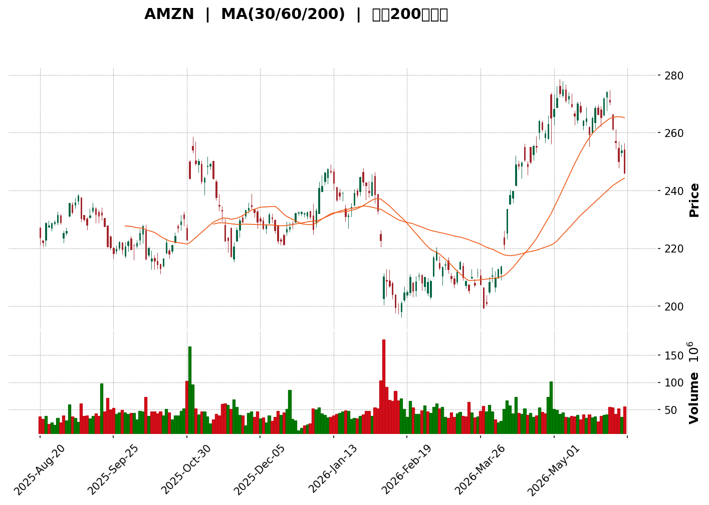
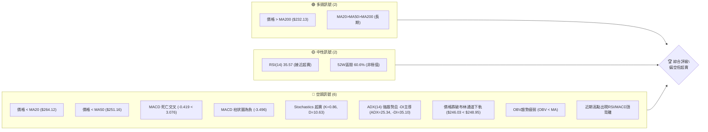

<details>
<summary>📊 靜態圖表 (點擊展開)</summary>

</details>

<html>
<head><meta charset="utf-8" /></head>
<body>
    <div style="height:500px; width:100%;">                        <script>window.PlotlyConfig = {MathJaxConfig: 'local'};</script>
        <script charset="utf-8" src="https://cdn.plot.ly/plotly-3.6.0.min.js" integrity="sha256-QaOVwtVY0T02VaHrr6pnoHLCwayMJp4O5n4YyaE3rJk=" crossorigin="anonymous"></script>                <div id="candlestick-chart" class="plotly-graph-div" style="height:100%; width:100%;"></div>            <script>                window.PLOTLYENV=window.PLOTLYENV || {};                                if (document.getElementById("candlestick-chart")) {                    Plotly.newPlot(                        "candlestick-chart",                        [{"close":{"dtype":"f8","bdata":"AAAAgOv5a0AAAABgZr5rQAAAAEDhmmxAAAAAgBR+bEAAAABguJZsQAAAAADXo2xAAAAAQDPzbEAAAAAAAKBsQAAAAEDhKmxAAAAAIK4\u002fbEAAAACAwnVtQAAAAGCPCm1AAAAAQOF6bUAAAAAgrsdtQAAAAGCPymxAAAAAYGa+bEAAAADAzIRsQAAAAIDC7WxAAAAAoJlBbUAAAAAA1\u002fNsQAAAACBc52xAAAAAIFzvbEAAAAAAKXRsQAAAAGC4lmtAAAAAYLiGa0AAAADAzERrQAAAAMD1eGtAAAAAoHDFa0AAAACAPXJrQAAAAAAplGtAAAAAwB7Na0AAAADgUXBrQAAAAMDMnGtAAAAAwPW4a0AAAABACidsQAAAACCud2xAAAAAANcLa0AAAACAPYJrQAAAAOB6DGtAAAAAgD3yakAAAABACs9qQAAAAKBHoWpAAAAAIFwPa0AAAADA9cBrQAAAAGBmPmtAAAAAQOGia0AAAABguAZsQAAAAEAKX2xAAAAAAACobEAAAACgmclsQAAAACCF22tAAAAAQAqHbkAAAAAAAMBvQAAAAIA9Km9AAAAAYGZGb0AAAACgR2FuQAAAAMAejW5AAAAAwMwMb0AAAABAMyNvQAAAAGBmhm5AAAAAYI+ybUAAAACAFFZtQAAAAADXG21AAAAAoJnRa0AAAACAFNZrQAAAAOB6JGtAAAAAgBSWa0AAAADA9UhsQAAAAKBwtWxAAAAAwB6lbEAAAABACidtQAAAAAApPG1AAAAAoHBNbUAAAAAAKQxtQAAAACCFo2xAAAAAwPWwbEAAAADgelxsQAAAAKBwfWxAAAAAwPX4bEAAAADA9chsQAAAAIAURmxAAAAAoEfRa0AAAACA69FrQAAAAOCjqGtAAAAA4FFYbEAAAABAM2tsQAAAAIDCjWxAAAAA4HoEbUAAAAAAKQxtQAAAAOCjEG1AAAAAgD0CbUAAAADA9RBtQAAAAIA92mxAAAAAAABQbEAAAACA6yFtQAAAAIDCHW5AAAAAgOsxbkAAAACgR8luQAAAAAAp7G5AAAAAQArPbkAAAABAM1NuQAAAAMDMlG1AAAAAgMLFbUAAAAAA1+NtQAAAAAAA4GxAAAAAgOvpbEAAAABA4UptQAAAAMAe5W1AAAAAoHDNbUAAAACAwpVuQAAAAOBRYG5AAAAAIFw3bkAAAACgmeltQAAAAGC4Xm5AAAAAANfTbUAAAAAgrh9tQAAAAIAU1mtAAAAAgD1KakAAAABAChdqQAAAAGC43mlAAAAAYI+CaUAAAABAM\u002fNoQAAAAKBH2WhAAAAAwMwkaUAAAACgR5lpQAAAACCFm2lAAAAAIIVDakAAAADgo6hpQAAAAIDrEWpAAAAA4HpUakAAAACgcP1pQAAAAAAAQGpAAAAA4HoMakAAAAAgXBdqQAAAAIA9GmtAAAAAgBRea0AAAABguKZqQAAAACCur2pAAAAAYI\u002fKakAAAADAzJRqQAAAAMD1MGpAAAAAoHD1aUAAAAAgrndqQAAAAGBm5mpAAAAAANc7akAAAADgURhqQAAAAADXq2lAAAAA4HpEakAAAAAgrudpQAAAAGC4dmpAAAAAoEfxaUAAAABA4epoQAAAAGBmHmlAAAAA4KMIakAAAACAPVJqQAAAAOCjOGpAAAAAoEeZakAAAADgo7hqQAAAAAAAqGtAAAAAwMw0bUAAAAAAKcxtQAAAAOB6\u002fG1AAAAA4KMgb0AAAAAAABBvQAAAAGBmNm9AAAAAgOtRb0AAAADA9QhvQAAAAMAePW9AAAAAIIXrb0AAAABgj+JvQAAAAADXf3BAAAAAgOtRcEAAAABAMztwQAAAAOCjcHBAAAAAwPWQcEAAAAAAKcRwQAAAAMDMAHFAAAAAwMwYcUAAAAAA1y9xQAAAAGC48nBAAAAAQOEKcUAAAAAA189wQAAAAMAenXBAAAAAgBTicEAAAAAghbNwQAAAAIA9gnBAAAAAgMKNcEAAAACgcDVwQAAAAAApkHBAAAAAIFzHcEAAAADAHqVwQAAAAOCjlHBAAAAAoJn9cEAAAAAAACBxQAAAAIA96nBAAAAAAClUcEAAAADgUQhwQAAAAOCjQG9AAAAAoEe5b0AAAADA9cBuQA=="},"high":{"dtype":"f8","bdata":"AAAA4KNobEAAAADA9dhrQAAAAOB6pGxAAAAAQDOzbEAAAAAAAKBsQAAAAADXu2xAAAAAYLgWbUAAAACA6\u002flsQAAAAKBwRWxAAAAAoHBlbEAAAADgo3htQAAAAAAAgG1AAAAAQDOzbUAAAABAM9ttQAAAAIDCtW1AAAAAwPXwbEAAAACgR9lsQAAAACBcN21AAAAAwMx8bUAAAACgmUltQAAAACBcL21AAAAAwB5FbUAAAACAPdJsQAAAACCFe2xAAAAAgOsRbEAAAACgcJVrQAAAAKCZoWtAAAAAQDPTa0AAAAAgrsdrQAAAAMDMxGtAAAAAgOvZa0AAAABgZgZsQAAAACBct2tAAAAA4Hrca0AAAAAgXFdsQAAAAGC4hmxAAAAAAACIbEAAAACAwpVrQAAAAIA9amtAAAAAYLg2a0AAAABA4VJrQAAAAKCZ2WpAAAAAgBQWa0AAAACAPeprQAAAAOBRgGtAAAAAoJmpa0AAAADAzCxsQAAAAMDMjGxAAAAAIK7vbEAAAACAPRptQAAAAIAUjmxAAAAAAABQb0AAAACgmSlwQAAAAAApEHBAAAAAAABgb0AAAAAAKUxvQAAAAMDMnG5AAAAAAAB4b0AAAAAAADhvQAAAAADXS29AAAAAAAB4bkAAAAAgXNdtQAAAAEAzU21AAAAAYGbGbEAAAAAgrvdrQAAAAMAebWxAAAAAYLjGa0AAAABgj2psQAAAAOCj0GxAAAAAAAD4bEAAAACgRyltQAAAAKCZeW1AAAAAQArfbUAAAAAAKSxtQAAAAAAAMG1AAAAAIK7nbEAAAABgj9psQAAAAIA9kmxAAAAAoHANbUAAAAAghQNtQAAAAGCPwmxAAAAAgMJ9bEAAAADAHvVrQAAAAIAUJmxAAAAAIFynbEAAAAAAKaRsQAAAACBcr2xAAAAAYGYObUAAAABgZh5tQAAAACCuH21AAAAAQDMTbUAAAADgoxhtQAAAACCuH21AAAAAYLhubUAAAAAAAEBtQAAAAIDCZW5AAAAAoEepbkAAAADAHs1uQAAAACCF+25AAAAAgBQeb0AAAADAHvVuQAAAAMD1KG5AAAAAwMwUbkAAAACAPfJtQAAAAEDhYm1AAAAAoJkJbUAAAABACndtQAAAAGBmDm5AAAAAYGYebkAAAAAAKZxuQAAAAMD1+G5AAAAAAABgbkAAAACAPWpuQAAAAAAptG5AAAAAQDPLbkAAAAAghdttQAAAAIDrSWxAAAAAgBRuakAAAACA65lqQAAAAMDMlGpAAAAAgD0SakAAAABguH5pQAAAAMAeJWlAAAAAIK43aUAAAAAghdtpQAAAAOB6tGlAAAAAoHBlakAAAACAwg1qQAAAACCFS2pAAAAAQOFyakAAAACgmWFqQAAAAGCPSmpAAAAAIFw3akAAAACAwiVqQAAAAKBHMWtAAAAAQAqPa0AAAACAPSprQAAAAIA9umpAAAAAwMz0akAAAAAAACBrQAAAAGC4dmpAAAAAgOtRakAAAABACpdqQAAAAGBm9mpAAAAA4HrkakAAAAAA1yNqQAAAAKBH8WlAAAAAoJmZakAAAABAMytqQAAAAIA9ompAAAAA4HqcakAAAABAM9NpQAAAAKCZeWlAAAAAwPVIakAAAABgj7JqQAAAAGC4hmpAAAAAYGaeakAAAABACr9qQAAAAEAzQ2xAAAAAoJk5bUAAAACAwg1uQAAAAAAAAG5AAAAAgMKFb0AAAACAFE5vQAAAAAAAQG9AAAAAQOECcEAAAACAwkVvQAAAAEDh4m9AAAAAgBT+b0AAAADgoyxwQAAAAAAAiHBAAAAAYGaCcEAAAADgelBwQAAAAGCPnnBAAAAAgBQecUAAAADAHhVxQAAAAKCZQXFAAAAAwPVocUAAAADAzFxxQAAAAIAUSnFAAAAAAAAgcUAAAACAFBpxQAAAAGBmunBAAAAAIIXrcEAAAADgeuxwQAAAAIDChXBAAAAAoJnNcEAAAAAAAGRwQAAAAKBHmXBAAAAAANfXcEAAAADgo9xwQAAAAMDM1HBAAAAAYI8GcUAAAAAAAChxQAAAAAAALHFAAAAAgBSqcEAAAABAM1NwQAAAAKBwEXBAAAAAYI\u002f6b0AAAACAFAZwQA=="},"hovertemplate":"\u003cb\u003e%{x|%Y-%m-%d}\u003c\u002fb\u003e\u003cbr\u003e\u958b: $%{open:.2f}\u003cbr\u003e\u9ad8: $%{high:.2f}\u003cbr\u003e\u4f4e: $%{low:.2f}\u003cbr\u003e\u6536: $%{close:.2f}\u003cextra\u003e\u003c\u002fextra\u003e","low":{"dtype":"f8","bdata":"AAAAoHCda0AAAAAAAJBrQAAAAIA9mmtAAAAAgOtpbEAAAADgo0BsQAAAAIDreWxAAAAA4KOAbEAAAADAHoVsQAAAAGCPumtAAAAAIIULbEAAAADA9dhsQAAAAIDC\u002fWxAAAAAAAA4bUAAAABgj2JtQAAAAEAzo2xAAAAAQOGqbEAAAACgR0lsQAAAAIA9ymxAAAAAIFwHbUAAAABguJZsQAAAAKBHmWxAAAAAYGa2bEAAAADgUXBsQAAAAIA9gmtAAAAAYGZua0AAAABACg9rQAAAAOCjQGtAAAAAoJlpa0AAAADgejxrQAAAACCFE2tAAAAAYGZea0AAAABA4WprQAAAAMD1AGtAAAAAoHCFa0AAAACAFKZrQAAAAAAAuGtAAAAAAAAAa0AAAACgRyFrQAAAAEAzk2pAAAAAwB6VakAAAACA65lqQAAAAMD1YGpAAAAAQOGyakAAAAAgrj9rQAAAAOCjEGtAAAAAgMJFa0AAAADAzLxrQAAAAKBHMWxAAAAAYLhGbEAAAADgUXhsQAAAAAAA2GtAAAAAIFx\u002fbkAAAADAzJxvQAAAAMAeFW9AAAAAwB7FbkAAAACgcEVuQAAAACCuz21AAAAAQOGybkAAAAAgXOduQAAAAAAAeG5AAAAAAACQbUAAAADgehxtQAAAAIAUpmxAAAAAoHDNa0AAAADgo1BrQAAAACCuF2tAAAAAgMLlakAAAADgo8hrQAAAAKCZ+WtAAAAA4KOYbEAAAABACsdsQAAAAAAACG1AAAAAoJkxbUAAAAAghdNsQAAAAKCZWWxAAAAAoJmRbEAAAADgo0hsQAAAACCFI2xAAAAAYLiObEAAAACAFJZsQAAAAADXI2xAAAAAAACwa0AAAAAAKaRrQAAAACCun2tAAAAAwB4NbEAAAABgjzJsQAAAAGC4VmxAAAAAIFyXbEAAAABgj+psQAAAAIDC5WxAAAAA4KPYbEAAAABgZsZsQAAAAADXw2xAAAAAYGYWbEAAAACAwmVsQAAAAIA9Am1AAAAA4KPwbUAAAAAAKTxuQAAAACCuR25AAAAAYLi+bkAAAAAAAAhuQAAAAEAKh21AAAAAACmUbUAAAADAHo1tQAAAAEDhqmxAAAAAAClcbEAAAADAzNxsQAAAAIA9Um1AAAAAoEexbUAAAABgj8JtQAAAAMD1MG5AAAAAIK6XbUAAAADgerRtQAAAAKBwxW1AAAAAYGZubUAAAACAPfpsQAAAAAApjGtAAAAAgOsJaUAAAABAM2tpQAAAAMAezWlAAAAAIK5PaUAAAACA67FoQAAAAMD1qGhAAAAAAACAaEAAAADgUTBpQAAAAIDrWWlAAAAAAAB4aUAAAAAghWNpQAAAAAAAaGlAAAAAgMIdakAAAABAM6tpQAAAAGBmpmlAAAAAYLhuaUAAAAAgXE9pQAAAAMDMRGpAAAAAQOHyakAAAADA9ZBqQAAAACCF42lAAAAAgMKNakAAAABAM2tqQAAAAMDMBGpAAAAAQArHaUAAAABgZu5pQAAAAIDCjWpAAAAAYI8aakAAAACgmcFpQAAAAIA9imlAAAAA4FEwakAAAADgetRpQAAAAMDMPGpAAAAAANfjaUAAAADgeuRoQAAAACBc\u002f2hAAAAA4HqEaUAAAACAFAZqQAAAAMDMnGlAAAAAQOEyakAAAABgjyJqQAAAAADXc2tAAAAA4KPoa0AAAABguGZtQAAAAAAAeG1AAAAAwPU4bkAAAABgZuZuQAAAAGBmhm5AAAAAIIVDb0AAAAAA16tuQAAAAEAzI29AAAAAYI9Kb0AAAACAPaJvQAAAAEAKG3BAAAAAoHBFcEAAAACAFApwQAAAAEAzG3BAAAAAYI8CcEAAAAAA12twQAAAAMDMzHBAAAAAgBQGcUAAAAAgXANxQAAAAADX53BAAAAAQDPfcEAAAAAgrsdwQAAAAIAUanBAAAAAQDNzcEAAAACAFKpwQAAAAIA9TnBAAAAA4HpocEAAAACAFOZvQAAAAOB6OHBAAAAAgOtVcEAAAAAA16NwQAAAAMAeYXBAAAAAQDObcEAAAABACrdwQAAAAIA92nBAAAAAQDNLcEAAAAAA18tvQAAAAGC49m5AAAAAAAB4b0AAAADA9bhuQA=="},"name":"\u50f9\u683c","open":{"dtype":"f8","bdata":"AAAAANdjbEAAAADAzNRrQAAAAKBH2WtAAAAAQDNrbEAAAAAghWNsQAAAAIA9kmxAAAAA4FGgbEAAAACAPepsQAAAAOCj8GtAAAAAYLgmbEAAAACAFOZsQAAAAIAUZm1AAAAAgBRebUAAAAAghYttQAAAAOCjsG1AAAAAIK7vbEAAAABAM8tsQAAAAAAp1GxAAAAAgBQebUAAAADgozhtQAAAAAAAEG1AAAAAANcLbUAAAACA69FsQAAAAGCPemxAAAAAwMwEbEAAAACA64FrQAAAAGCPYmtAAAAAYI+Ca0AAAADA9cBrQAAAACCFK2tAAAAA4FGga0AAAACAFO5rQAAAAAAAoGtAAAAAACmca0AAAACgcN1rQAAAAAAAIGxAAAAAYLhGbEAAAABgZjZrQAAAAIDr8WpAAAAAANcTa0AAAACgcPVqQAAAAIDr0WpAAAAAACm8akAAAACAwk1rQAAAAKCZaWtAAAAAAABga0AAAABACr9rQAAAAMAedWxAAAAAQAqHbEAAAACgcPVsQAAAAIDrYWxAAAAAQDNDb0AAAAAghetvQAAAAAApTG9AAAAAwPUgb0AAAADAHiVvQAAAAMDMXG5AAAAAQOEKb0AAAADAHg1vQAAAACCuR29AAAAAoJlhbkAAAACA62FtQAAAAAAAKG1AAAAAQDODbEAAAAAgrvdrQAAAAKCZYWxAAAAAQDMLa0AAAACA69FrQAAAAAApTGxAAAAAIK7XbEAAAAAgrudsQAAAAEAKJ21AAAAA4FFgbUAAAABAMyttQAAAAOCjGG1AAAAAgD3KbEAAAABA4bJsQAAAAEDhWmxAAAAAgOuZbEAAAABguNZsQAAAAADXu2xAAAAAgMJ9bEAAAACgR+FrQAAAAMAeFWxAAAAAYLg2bEAAAADgUVhsQAAAACCFk2xAAAAAgOuhbEAAAAAAKQRtQAAAAKBHAW1AAAAAgBT+bEAAAABguOZsQAAAAMAeHW1AAAAAQOHqbEAAAABA4ZpsQAAAAEAzA21AAAAAIIXzbUAAAACA62FuQAAAAIA9km5AAAAAIFzXbkAAAADA9dBuQAAAAMDMJG5AAAAAgOvpbUAAAABA4eJtQAAAAOBROG1AAAAAQOHibEAAAACgmUFtQAAAAGC4Xm1AAAAAIFz\u002fbUAAAACAFPZtQAAAAADXy25AAAAAgD1abkAAAADgevxtQAAAAIDryW1AAAAAIFyfbkAAAAAghdttQAAAAMAeHWxAAAAAYGZWaUAAAABACh9qQAAAAKCZGWpAAAAAgOsBakAAAABguH5pQAAAAAAp3GhAAAAAACnEaEAAAACAPUJpQAAAAKCZeWlAAAAA4FGYaUAAAABAMwNqQAAAAEAKr2lAAAAAYLhOakAAAAAgXFdqQAAAAGCP2mlAAAAAoJmRaUAAAABAM2NpQAAAAEAKT2pAAAAAIFz\u002fakAAAAAgrt9qQAAAAGBmTmpAAAAAgBTGakAAAABguPZqQAAAAOB6TGpAAAAAIIUzakAAAABAMwtqQAAAAIA9mmpAAAAAgMK9akAAAACA6+FpQAAAAMDM7GlAAAAAoEc5akAAAABgZv5pQAAAAIDrcWpAAAAAIIVTakAAAABguM5pQAAAACBcL2lAAAAAQDObaUAAAACAFE5qQAAAAKBH0WlAAAAAoJk5akAAAAAgrmdqQAAAAKBH+WtAAAAAIFwnbEAAAACgmWltQAAAAGBmrm1AAAAAwPU4bkAAAAAAAChvQAAAAOBREG9AAAAAIK7fb0AAAACAFCZvQAAAAEDh4m9AAAAAgBSOb0AAAADgeuxvQAAAACCuP3BAAAAAIFx3cEAAAACAPSZwQAAAAADXH3BAAAAAYLgScUAAAACgR5lwQAAAAMDMzHBAAAAAoEdBcUAAAACAPQ5xQAAAAOBRMHFAAAAAgBT6cEAAAACgcN1wQAAAACBcq3BAAAAAQOGGcEAAAABgZtJwQAAAAAAAaHBAAAAAgOt9cEAAAADgo2BwQAAAAMDMQHBAAAAAAAB4cEAAAABgj8pwQAAAAEAKv3BAAAAAYGaicEAAAADgUQRxQAAAAOCj9HBAAAAA4KOkcEAAAABgjxJwQAAAAGBm1m9AAAAAANejb0AAAADgUchvQA=="},"x":["2025-08-20T00:00:00-04:00","2025-08-21T00:00:00-04:00","2025-08-22T00:00:00-04:00","2025-08-25T00:00:00-04:00","2025-08-26T00:00:00-04:00","2025-08-27T00:00:00-04:00","2025-08-28T00:00:00-04:00","2025-08-29T00:00:00-04:00","2025-09-02T00:00:00-04:00","2025-09-03T00:00:00-04:00","2025-09-04T00:00:00-04:00","2025-09-05T00:00:00-04:00","2025-09-08T00:00:00-04:00","2025-09-09T00:00:00-04:00","2025-09-10T00:00:00-04:00","2025-09-11T00:00:00-04:00","2025-09-12T00:00:00-04:00","2025-09-15T00:00:00-04:00","2025-09-16T00:00:00-04:00","2025-09-17T00:00:00-04:00","2025-09-18T00:00:00-04:00","2025-09-19T00:00:00-04:00","2025-09-22T00:00:00-04:00","2025-09-23T00:00:00-04:00","2025-09-24T00:00:00-04:00","2025-09-25T00:00:00-04:00","2025-09-26T00:00:00-04:00","2025-09-29T00:00:00-04:00","2025-09-30T00:00:00-04:00","2025-10-01T00:00:00-04:00","2025-10-02T00:00:00-04:00","2025-10-03T00:00:00-04:00","2025-10-06T00:00:00-04:00","2025-10-07T00:00:00-04:00","2025-10-08T00:00:00-04:00","2025-10-09T00:00:00-04:00","2025-10-10T00:00:00-04:00","2025-10-13T00:00:00-04:00","2025-10-14T00:00:00-04:00","2025-10-15T00:00:00-04:00","2025-10-16T00:00:00-04:00","2025-10-17T00:00:00-04:00","2025-10-20T00:00:00-04:00","2025-10-21T00:00:00-04:00","2025-10-22T00:00:00-04:00","2025-10-23T00:00:00-04:00","2025-10-24T00:00:00-04:00","2025-10-27T00:00:00-04:00","2025-10-28T00:00:00-04:00","2025-10-29T00:00:00-04:00","2025-10-30T00:00:00-04:00","2025-10-31T00:00:00-04:00","2025-11-03T00:00:00-05:00","2025-11-04T00:00:00-05:00","2025-11-05T00:00:00-05:00","2025-11-06T00:00:00-05:00","2025-11-07T00:00:00-05:00","2025-11-10T00:00:00-05:00","2025-11-11T00:00:00-05:00","2025-11-12T00:00:00-05:00","2025-11-13T00:00:00-05:00","2025-11-14T00:00:00-05:00","2025-11-17T00:00:00-05:00","2025-11-18T00:00:00-05:00","2025-11-19T00:00:00-05:00","2025-11-20T00:00:00-05:00","2025-11-21T00:00:00-05:00","2025-11-24T00:00:00-05:00","2025-11-25T00:00:00-05:00","2025-11-26T00:00:00-05:00","2025-11-28T00:00:00-05:00","2025-12-01T00:00:00-05:00","2025-12-02T00:00:00-05:00","2025-12-03T00:00:00-05:00","2025-12-04T00:00:00-05:00","2025-12-05T00:00:00-05:00","2025-12-08T00:00:00-05:00","2025-12-09T00:00:00-05:00","2025-12-10T00:00:00-05:00","2025-12-11T00:00:00-05:00","2025-12-12T00:00:00-05:00","2025-12-15T00:00:00-05:00","2025-12-16T00:00:00-05:00","2025-12-17T00:00:00-05:00","2025-12-18T00:00:00-05:00","2025-12-19T00:00:00-05:00","2025-12-22T00:00:00-05:00","2025-12-23T00:00:00-05:00","2025-12-24T00:00:00-05:00","2025-12-26T00:00:00-05:00","2025-12-29T00:00:00-05:00","2025-12-30T00:00:00-05:00","2025-12-31T00:00:00-05:00","2026-01-02T00:00:00-05:00","2026-01-05T00:00:00-05:00","2026-01-06T00:00:00-05:00","2026-01-07T00:00:00-05:00","2026-01-08T00:00:00-05:00","2026-01-09T00:00:00-05:00","2026-01-12T00:00:00-05:00","2026-01-13T00:00:00-05:00","2026-01-14T00:00:00-05:00","2026-01-15T00:00:00-05:00","2026-01-16T00:00:00-05:00","2026-01-20T00:00:00-05:00","2026-01-21T00:00:00-05:00","2026-01-22T00:00:00-05:00","2026-01-23T00:00:00-05:00","2026-01-26T00:00:00-05:00","2026-01-27T00:00:00-05:00","2026-01-28T00:00:00-05:00","2026-01-29T00:00:00-05:00","2026-01-30T00:00:00-05:00","2026-02-02T00:00:00-05:00","2026-02-03T00:00:00-05:00","2026-02-04T00:00:00-05:00","2026-02-05T00:00:00-05:00","2026-02-06T00:00:00-05:00","2026-02-09T00:00:00-05:00","2026-02-10T00:00:00-05:00","2026-02-11T00:00:00-05:00","2026-02-12T00:00:00-05:00","2026-02-13T00:00:00-05:00","2026-02-17T00:00:00-05:00","2026-02-18T00:00:00-05:00","2026-02-19T00:00:00-05:00","2026-02-20T00:00:00-05:00","2026-02-23T00:00:00-05:00","2026-02-24T00:00:00-05:00","2026-02-25T00:00:00-05:00","2026-02-26T00:00:00-05:00","2026-02-27T00:00:00-05:00","2026-03-02T00:00:00-05:00","2026-03-03T00:00:00-05:00","2026-03-04T00:00:00-05:00","2026-03-05T00:00:00-05:00","2026-03-06T00:00:00-05:00","2026-03-09T00:00:00-04:00","2026-03-10T00:00:00-04:00","2026-03-11T00:00:00-04:00","2026-03-12T00:00:00-04:00","2026-03-13T00:00:00-04:00","2026-03-16T00:00:00-04:00","2026-03-17T00:00:00-04:00","2026-03-18T00:00:00-04:00","2026-03-19T00:00:00-04:00","2026-03-20T00:00:00-04:00","2026-03-23T00:00:00-04:00","2026-03-24T00:00:00-04:00","2026-03-25T00:00:00-04:00","2026-03-26T00:00:00-04:00","2026-03-27T00:00:00-04:00","2026-03-30T00:00:00-04:00","2026-03-31T00:00:00-04:00","2026-04-01T00:00:00-04:00","2026-04-02T00:00:00-04:00","2026-04-06T00:00:00-04:00","2026-04-07T00:00:00-04:00","2026-04-08T00:00:00-04:00","2026-04-09T00:00:00-04:00","2026-04-10T00:00:00-04:00","2026-04-13T00:00:00-04:00","2026-04-14T00:00:00-04:00","2026-04-15T00:00:00-04:00","2026-04-16T00:00:00-04:00","2026-04-17T00:00:00-04:00","2026-04-20T00:00:00-04:00","2026-04-21T00:00:00-04:00","2026-04-22T00:00:00-04:00","2026-04-23T00:00:00-04:00","2026-04-24T00:00:00-04:00","2026-04-27T00:00:00-04:00","2026-04-28T00:00:00-04:00","2026-04-29T00:00:00-04:00","2026-04-30T00:00:00-04:00","2026-05-01T00:00:00-04:00","2026-05-04T00:00:00-04:00","2026-05-05T00:00:00-04:00","2026-05-06T00:00:00-04:00","2026-05-07T00:00:00-04:00","2026-05-08T00:00:00-04:00","2026-05-11T00:00:00-04:00","2026-05-12T00:00:00-04:00","2026-05-13T00:00:00-04:00","2026-05-14T00:00:00-04:00","2026-05-15T00:00:00-04:00","2026-05-18T00:00:00-04:00","2026-05-19T00:00:00-04:00","2026-05-20T00:00:00-04:00","2026-05-21T00:00:00-04:00","2026-05-22T00:00:00-04:00","2026-05-26T00:00:00-04:00","2026-05-27T00:00:00-04:00","2026-05-28T00:00:00-04:00","2026-05-29T00:00:00-04:00","2026-06-01T00:00:00-04:00","2026-06-02T00:00:00-04:00","2026-06-03T00:00:00-04:00","2026-06-04T00:00:00-04:00","2026-06-05T00:00:00-04:00"],"type":"candlestick"},{"hovertemplate":"MA30: $%{y:.2f}\u003cextra\u003e\u003c\u002fextra\u003e","line":{"color":"#2196F3","dash":"dash","width":2},"mode":"lines","name":"MA30","x":["2025-08-20T00:00:00-04:00","2025-08-21T00:00:00-04:00","2025-08-22T00:00:00-04:00","2025-08-25T00:00:00-04:00","2025-08-26T00:00:00-04:00","2025-08-27T00:00:00-04:00","2025-08-28T00:00:00-04:00","2025-08-29T00:00:00-04:00","2025-09-02T00:00:00-04:00","2025-09-03T00:00:00-04:00","2025-09-04T00:00:00-04:00","2025-09-05T00:00:00-04:00","2025-09-08T00:00:00-04:00","2025-09-09T00:00:00-04:00","2025-09-10T00:00:00-04:00","2025-09-11T00:00:00-04:00","2025-09-12T00:00:00-04:00","2025-09-15T00:00:00-04:00","2025-09-16T00:00:00-04:00","2025-09-17T00:00:00-04:00","2025-09-18T00:00:00-04:00","2025-09-19T00:00:00-04:00","2025-09-22T00:00:00-04:00","2025-09-23T00:00:00-04:00","2025-09-24T00:00:00-04:00","2025-09-25T00:00:00-04:00","2025-09-26T00:00:00-04:00","2025-09-29T00:00:00-04:00","2025-09-30T00:00:00-04:00","2025-10-01T00:00:00-04:00","2025-10-02T00:00:00-04:00","2025-10-03T00:00:00-04:00","2025-10-06T00:00:00-04:00","2025-10-07T00:00:00-04:00","2025-10-08T00:00:00-04:00","2025-10-09T00:00:00-04:00","2025-10-10T00:00:00-04:00","2025-10-13T00:00:00-04:00","2025-10-14T00:00:00-04:00","2025-10-15T00:00:00-04:00","2025-10-16T00:00:00-04:00","2025-10-17T00:00:00-04:00","2025-10-20T00:00:00-04:00","2025-10-21T00:00:00-04:00","2025-10-22T00:00:00-04:00","2025-10-23T00:00:00-04:00","2025-10-24T00:00:00-04:00","2025-10-27T00:00:00-04:00","2025-10-28T00:00:00-04:00","2025-10-29T00:00:00-04:00","2025-10-30T00:00:00-04:00","2025-10-31T00:00:00-04:00","2025-11-03T00:00:00-05:00","2025-11-04T00:00:00-05:00","2025-11-05T00:00:00-05:00","2025-11-06T00:00:00-05:00","2025-11-07T00:00:00-05:00","2025-11-10T00:00:00-05:00","2025-11-11T00:00:00-05:00","2025-11-12T00:00:00-05:00","2025-11-13T00:00:00-05:00","2025-11-14T00:00:00-05:00","2025-11-17T00:00:00-05:00","2025-11-18T00:00:00-05:00","2025-11-19T00:00:00-05:00","2025-11-20T00:00:00-05:00","2025-11-21T00:00:00-05:00","2025-11-24T00:00:00-05:00","2025-11-25T00:00:00-05:00","2025-11-26T00:00:00-05:00","2025-11-28T00:00:00-05:00","2025-12-01T00:00:00-05:00","2025-12-02T00:00:00-05:00","2025-12-03T00:00:00-05:00","2025-12-04T00:00:00-05:00","2025-12-05T00:00:00-05:00","2025-12-08T00:00:00-05:00","2025-12-09T00:00:00-05:00","2025-12-10T00:00:00-05:00","2025-12-11T00:00:00-05:00","2025-12-12T00:00:00-05:00","2025-12-15T00:00:00-05:00","2025-12-16T00:00:00-05:00","2025-12-17T00:00:00-05:00","2025-12-18T00:00:00-05:00","2025-12-19T00:00:00-05:00","2025-12-22T00:00:00-05:00","2025-12-23T00:00:00-05:00","2025-12-24T00:00:00-05:00","2025-12-26T00:00:00-05:00","2025-12-29T00:00:00-05:00","2025-12-30T00:00:00-05:00","2025-12-31T00:00:00-05:00","2026-01-02T00:00:00-05:00","2026-01-05T00:00:00-05:00","2026-01-06T00:00:00-05:00","2026-01-07T00:00:00-05:00","2026-01-08T00:00:00-05:00","2026-01-09T00:00:00-05:00","2026-01-12T00:00:00-05:00","2026-01-13T00:00:00-05:00","2026-01-14T00:00:00-05:00","2026-01-15T00:00:00-05:00","2026-01-16T00:00:00-05:00","2026-01-20T00:00:00-05:00","2026-01-21T00:00:00-05:00","2026-01-22T00:00:00-05:00","2026-01-23T00:00:00-05:00","2026-01-26T00:00:00-05:00","2026-01-27T00:00:00-05:00","2026-01-28T00:00:00-05:00","2026-01-29T00:00:00-05:00","2026-01-30T00:00:00-05:00","2026-02-02T00:00:00-05:00","2026-02-03T00:00:00-05:00","2026-02-04T00:00:00-05:00","2026-02-05T00:00:00-05:00","2026-02-06T00:00:00-05:00","2026-02-09T00:00:00-05:00","2026-02-10T00:00:00-05:00","2026-02-11T00:00:00-05:00","2026-02-12T00:00:00-05:00","2026-02-13T00:00:00-05:00","2026-02-17T00:00:00-05:00","2026-02-18T00:00:00-05:00","2026-02-19T00:00:00-05:00","2026-02-20T00:00:00-05:00","2026-02-23T00:00:00-05:00","2026-02-24T00:00:00-05:00","2026-02-25T00:00:00-05:00","2026-02-26T00:00:00-05:00","2026-02-27T00:00:00-05:00","2026-03-02T00:00:00-05:00","2026-03-03T00:00:00-05:00","2026-03-04T00:00:00-05:00","2026-03-05T00:00:00-05:00","2026-03-06T00:00:00-05:00","2026-03-09T00:00:00-04:00","2026-03-10T00:00:00-04:00","2026-03-11T00:00:00-04:00","2026-03-12T00:00:00-04:00","2026-03-13T00:00:00-04:00","2026-03-16T00:00:00-04:00","2026-03-17T00:00:00-04:00","2026-03-18T00:00:00-04:00","2026-03-19T00:00:00-04:00","2026-03-20T00:00:00-04:00","2026-03-23T00:00:00-04:00","2026-03-24T00:00:00-04:00","2026-03-25T00:00:00-04:00","2026-03-26T00:00:00-04:00","2026-03-27T00:00:00-04:00","2026-03-30T00:00:00-04:00","2026-03-31T00:00:00-04:00","2026-04-01T00:00:00-04:00","2026-04-02T00:00:00-04:00","2026-04-06T00:00:00-04:00","2026-04-07T00:00:00-04:00","2026-04-08T00:00:00-04:00","2026-04-09T00:00:00-04:00","2026-04-10T00:00:00-04:00","2026-04-13T00:00:00-04:00","2026-04-14T00:00:00-04:00","2026-04-15T00:00:00-04:00","2026-04-16T00:00:00-04:00","2026-04-17T00:00:00-04:00","2026-04-20T00:00:00-04:00","2026-04-21T00:00:00-04:00","2026-04-22T00:00:00-04:00","2026-04-23T00:00:00-04:00","2026-04-24T00:00:00-04:00","2026-04-27T00:00:00-04:00","2026-04-28T00:00:00-04:00","2026-04-29T00:00:00-04:00","2026-04-30T00:00:00-04:00","2026-05-01T00:00:00-04:00","2026-05-04T00:00:00-04:00","2026-05-05T00:00:00-04:00","2026-05-06T00:00:00-04:00","2026-05-07T00:00:00-04:00","2026-05-08T00:00:00-04:00","2026-05-11T00:00:00-04:00","2026-05-12T00:00:00-04:00","2026-05-13T00:00:00-04:00","2026-05-14T00:00:00-04:00","2026-05-15T00:00:00-04:00","2026-05-18T00:00:00-04:00","2026-05-19T00:00:00-04:00","2026-05-20T00:00:00-04:00","2026-05-21T00:00:00-04:00","2026-05-22T00:00:00-04:00","2026-05-26T00:00:00-04:00","2026-05-27T00:00:00-04:00","2026-05-28T00:00:00-04:00","2026-05-29T00:00:00-04:00","2026-06-01T00:00:00-04:00","2026-06-02T00:00:00-04:00","2026-06-03T00:00:00-04:00","2026-06-04T00:00:00-04:00","2026-06-05T00:00:00-04:00"],"y":{"dtype":"f8","bdata":"AAAAAAAA+H8AAAAAAAD4fwAAAAAAAPh\u002fAAAAAAAA+H8AAAAAAAD4fwAAAAAAAPh\u002fAAAAAAAA+H8AAAAAAAD4fwAAAAAAAPh\u002fAAAAAAAA+H8AAAAAAAD4fwAAAAAAAPh\u002fAAAAAAAA+H8AAAAAAAD4fwAAAAAAAPh\u002fAAAAAAAA+H8AAAAAAAD4fwAAAAAAAPh\u002fAAAAAAAA+H8AAAAAAAD4fwAAAAAAAPh\u002fAAAAAAAA+H8AAAAAAAD4fwAAAAAAAPh\u002fAAAAAAAA+H8AAAAAAAD4fwAAAAAAAPh\u002fAAAAAAAA+H8AAAAAAAD4f4mIiHjpdmxA3t3dLWt1bEBVVVXl0HJsQO\u002fu7r5YamxAd3d3p8ZjbEBmZmamDWBsQCIiItKUXmxAMzMzA1ZObEB3d3eHz0RsQFVVVZVDO2xAq6qqOiYwbEDNzMx8hhlsQHd3dwfzBGxAVVVVdUzwa0C8u7sLAt9rQKuqqnrN0WtAvLu7G1rIa0Crqqo6JsRrQKuqqlpkv2tAIiIiokW6a0AAAAAw3bhrQO\u002fu7p7vr2tA3t3dfYa9a0AiIiJCp9lrQCIiIrIr+GtAZmZm9igYbEB3d3eXtTJsQJqZmTn7TGxAMzMzw\u002fVobEC8u7trdYhsQJqZmZmZoWxAVVVVBcixbEDNzMws+cFsQImIiMi9zmxAvLu7C5DPbEAAAAAw3cxsQN7d3a2OwWxAREREVCrGbEAiIiISysxsQFVVVWX02mxA7+7uXnPpbEDv7u5ec\u002f1sQFVVVRWuE21AZmZm5tAmbUBEREQk2zFtQBEREZHCPW1AAAAAQMNGbUARERERn0ltQKuqqnqiSm1AZmZmVlVNbUAAAADgT01tQAAAADDdUG1AmpmZGb05bUAiIiLiMxhtQM3MzFxI+mxA3t3drUfhbEBEREREi9BsQImIiKh\u002fv2xAiYiImCeubEC8u7vrUZxsQBEREYHcj2xAiYiI6PuJbEBVVVUVrodsQM3MzEx+hWxAmpmZ6bSJbEDNzMycxJRsQN7d3d0krmxARERExGfEbEBERETUv9lsQHd3d9ej7GxAAAAAoBr\u002fbEDe3d39GwltQCIiImIQDG1AzczMHBMQbUBERESUQxdtQM3MzKxHGW1AvLu7uy0bbUBEREQUICNtQJqZmVkdL21AMzMzgzI2bUC8u7urjkVtQGZmZqZ\u002fV21AzczMzPdrbUAAAADw0n1tQBEREcH1lG1AMzMzU5yhbUC8u7troKdtQFVVVQWBoW1AVVVVtTqKbUAzMzPz\u002fXBtQN7d3V26VW1Aq6qqOt83bUBVVVUlvxRtQBEREdGU8mxAMzMzk4rXbECrqqr6YrlsQHd3d3fpkmxAVVVVhV1xbEBERERUnEVsQBEREeEzHGxAZmZm5vv1a0AiIiLy\u002fdBrQImIiLiQtGtAEREREcqUa0AiIiKSX3RrQM3MzHw\u002fZWtAd3d3pw1Ya0AiIiLCg0FrQDMzMyMiJmtAZmZm9m8Ma0AzMzOjRepqQN7d3V2PxmpAd3d3tzqiakAAAAAA1YRqQKuqqqo4Z2pAAAAAAI5IakB3d3eXtS5qQDMzMxM8HGpAvLu76wocakCJiIjIdhpqQJqZmdmHH2pAiYiIqDgjakCJiIio8SJqQLy7u3s\u002fJWpAiYiIuNcsakDNzMwMAjNqQO\u002fu7s4+OGpAAAAAoBo7akARERGxK0RqQImIiOi0UWpAvLu7K0BqakCJiIjIvYpqQO\u002fu7r6fqmpAIiIicvbVakDv7u5OYgBrQM3MzLx0I2tAq6qqGi9Fa0DNzMyMl2prQDMzM6NwkWtAAAAAkDS9a0CJiIjIduprQN7d3f2NJGxAd3d3Z5FdbEDv7u6uuZBsQCIiIjLBw2xA7+7uvp\u002f+bEB3d3c3Fz5tQM3MzEw3hW1AREREdNrIbUB3d3e3HhFuQDMzM0OLUG5AMzMz0waWbkCrqqrqUeBuQBEREcGDJW9AiYiIqH9nb0AiIiLi7KNvQFVVVYXr3W9AzczMDLsKcEB3d3ffCCNwQKuqqpJfOnBARERETPBMcEAiIiIK11twQM3MzPxiaXBAMzMzC5B1cEDNzMykKYNwQHd3d6dUjnBAAAAAkAmUcECJiIiYbphwQFVVVZ19mHBAmpmZQaeXcEARERGh05JwQA=="},"type":"scatter"},{"hovertemplate":"MA60: $%{y:.2f}\u003cextra\u003e\u003c\u002fextra\u003e","line":{"color":"#9C27B0","dash":"dash","width":2},"mode":"lines","name":"MA60","x":["2025-08-20T00:00:00-04:00","2025-08-21T00:00:00-04:00","2025-08-22T00:00:00-04:00","2025-08-25T00:00:00-04:00","2025-08-26T00:00:00-04:00","2025-08-27T00:00:00-04:00","2025-08-28T00:00:00-04:00","2025-08-29T00:00:00-04:00","2025-09-02T00:00:00-04:00","2025-09-03T00:00:00-04:00","2025-09-04T00:00:00-04:00","2025-09-05T00:00:00-04:00","2025-09-08T00:00:00-04:00","2025-09-09T00:00:00-04:00","2025-09-10T00:00:00-04:00","2025-09-11T00:00:00-04:00","2025-09-12T00:00:00-04:00","2025-09-15T00:00:00-04:00","2025-09-16T00:00:00-04:00","2025-09-17T00:00:00-04:00","2025-09-18T00:00:00-04:00","2025-09-19T00:00:00-04:00","2025-09-22T00:00:00-04:00","2025-09-23T00:00:00-04:00","2025-09-24T00:00:00-04:00","2025-09-25T00:00:00-04:00","2025-09-26T00:00:00-04:00","2025-09-29T00:00:00-04:00","2025-09-30T00:00:00-04:00","2025-10-01T00:00:00-04:00","2025-10-02T00:00:00-04:00","2025-10-03T00:00:00-04:00","2025-10-06T00:00:00-04:00","2025-10-07T00:00:00-04:00","2025-10-08T00:00:00-04:00","2025-10-09T00:00:00-04:00","2025-10-10T00:00:00-04:00","2025-10-13T00:00:00-04:00","2025-10-14T00:00:00-04:00","2025-10-15T00:00:00-04:00","2025-10-16T00:00:00-04:00","2025-10-17T00:00:00-04:00","2025-10-20T00:00:00-04:00","2025-10-21T00:00:00-04:00","2025-10-22T00:00:00-04:00","2025-10-23T00:00:00-04:00","2025-10-24T00:00:00-04:00","2025-10-27T00:00:00-04:00","2025-10-28T00:00:00-04:00","2025-10-29T00:00:00-04:00","2025-10-30T00:00:00-04:00","2025-10-31T00:00:00-04:00","2025-11-03T00:00:00-05:00","2025-11-04T00:00:00-05:00","2025-11-05T00:00:00-05:00","2025-11-06T00:00:00-05:00","2025-11-07T00:00:00-05:00","2025-11-10T00:00:00-05:00","2025-11-11T00:00:00-05:00","2025-11-12T00:00:00-05:00","2025-11-13T00:00:00-05:00","2025-11-14T00:00:00-05:00","2025-11-17T00:00:00-05:00","2025-11-18T00:00:00-05:00","2025-11-19T00:00:00-05:00","2025-11-20T00:00:00-05:00","2025-11-21T00:00:00-05:00","2025-11-24T00:00:00-05:00","2025-11-25T00:00:00-05:00","2025-11-26T00:00:00-05:00","2025-11-28T00:00:00-05:00","2025-12-01T00:00:00-05:00","2025-12-02T00:00:00-05:00","2025-12-03T00:00:00-05:00","2025-12-04T00:00:00-05:00","2025-12-05T00:00:00-05:00","2025-12-08T00:00:00-05:00","2025-12-09T00:00:00-05:00","2025-12-10T00:00:00-05:00","2025-12-11T00:00:00-05:00","2025-12-12T00:00:00-05:00","2025-12-15T00:00:00-05:00","2025-12-16T00:00:00-05:00","2025-12-17T00:00:00-05:00","2025-12-18T00:00:00-05:00","2025-12-19T00:00:00-05:00","2025-12-22T00:00:00-05:00","2025-12-23T00:00:00-05:00","2025-12-24T00:00:00-05:00","2025-12-26T00:00:00-05:00","2025-12-29T00:00:00-05:00","2025-12-30T00:00:00-05:00","2025-12-31T00:00:00-05:00","2026-01-02T00:00:00-05:00","2026-01-05T00:00:00-05:00","2026-01-06T00:00:00-05:00","2026-01-07T00:00:00-05:00","2026-01-08T00:00:00-05:00","2026-01-09T00:00:00-05:00","2026-01-12T00:00:00-05:00","2026-01-13T00:00:00-05:00","2026-01-14T00:00:00-05:00","2026-01-15T00:00:00-05:00","2026-01-16T00:00:00-05:00","2026-01-20T00:00:00-05:00","2026-01-21T00:00:00-05:00","2026-01-22T00:00:00-05:00","2026-01-23T00:00:00-05:00","2026-01-26T00:00:00-05:00","2026-01-27T00:00:00-05:00","2026-01-28T00:00:00-05:00","2026-01-29T00:00:00-05:00","2026-01-30T00:00:00-05:00","2026-02-02T00:00:00-05:00","2026-02-03T00:00:00-05:00","2026-02-04T00:00:00-05:00","2026-02-05T00:00:00-05:00","2026-02-06T00:00:00-05:00","2026-02-09T00:00:00-05:00","2026-02-10T00:00:00-05:00","2026-02-11T00:00:00-05:00","2026-02-12T00:00:00-05:00","2026-02-13T00:00:00-05:00","2026-02-17T00:00:00-05:00","2026-02-18T00:00:00-05:00","2026-02-19T00:00:00-05:00","2026-02-20T00:00:00-05:00","2026-02-23T00:00:00-05:00","2026-02-24T00:00:00-05:00","2026-02-25T00:00:00-05:00","2026-02-26T00:00:00-05:00","2026-02-27T00:00:00-05:00","2026-03-02T00:00:00-05:00","2026-03-03T00:00:00-05:00","2026-03-04T00:00:00-05:00","2026-03-05T00:00:00-05:00","2026-03-06T00:00:00-05:00","2026-03-09T00:00:00-04:00","2026-03-10T00:00:00-04:00","2026-03-11T00:00:00-04:00","2026-03-12T00:00:00-04:00","2026-03-13T00:00:00-04:00","2026-03-16T00:00:00-04:00","2026-03-17T00:00:00-04:00","2026-03-18T00:00:00-04:00","2026-03-19T00:00:00-04:00","2026-03-20T00:00:00-04:00","2026-03-23T00:00:00-04:00","2026-03-24T00:00:00-04:00","2026-03-25T00:00:00-04:00","2026-03-26T00:00:00-04:00","2026-03-27T00:00:00-04:00","2026-03-30T00:00:00-04:00","2026-03-31T00:00:00-04:00","2026-04-01T00:00:00-04:00","2026-04-02T00:00:00-04:00","2026-04-06T00:00:00-04:00","2026-04-07T00:00:00-04:00","2026-04-08T00:00:00-04:00","2026-04-09T00:00:00-04:00","2026-04-10T00:00:00-04:00","2026-04-13T00:00:00-04:00","2026-04-14T00:00:00-04:00","2026-04-15T00:00:00-04:00","2026-04-16T00:00:00-04:00","2026-04-17T00:00:00-04:00","2026-04-20T00:00:00-04:00","2026-04-21T00:00:00-04:00","2026-04-22T00:00:00-04:00","2026-04-23T00:00:00-04:00","2026-04-24T00:00:00-04:00","2026-04-27T00:00:00-04:00","2026-04-28T00:00:00-04:00","2026-04-29T00:00:00-04:00","2026-04-30T00:00:00-04:00","2026-05-01T00:00:00-04:00","2026-05-04T00:00:00-04:00","2026-05-05T00:00:00-04:00","2026-05-06T00:00:00-04:00","2026-05-07T00:00:00-04:00","2026-05-08T00:00:00-04:00","2026-05-11T00:00:00-04:00","2026-05-12T00:00:00-04:00","2026-05-13T00:00:00-04:00","2026-05-14T00:00:00-04:00","2026-05-15T00:00:00-04:00","2026-05-18T00:00:00-04:00","2026-05-19T00:00:00-04:00","2026-05-20T00:00:00-04:00","2026-05-21T00:00:00-04:00","2026-05-22T00:00:00-04:00","2026-05-26T00:00:00-04:00","2026-05-27T00:00:00-04:00","2026-05-28T00:00:00-04:00","2026-05-29T00:00:00-04:00","2026-06-01T00:00:00-04:00","2026-06-02T00:00:00-04:00","2026-06-03T00:00:00-04:00","2026-06-04T00:00:00-04:00","2026-06-05T00:00:00-04:00"],"y":{"dtype":"f8","bdata":"AAAAAAAA+H8AAAAAAAD4fwAAAAAAAPh\u002fAAAAAAAA+H8AAAAAAAD4fwAAAAAAAPh\u002fAAAAAAAA+H8AAAAAAAD4fwAAAAAAAPh\u002fAAAAAAAA+H8AAAAAAAD4fwAAAAAAAPh\u002fAAAAAAAA+H8AAAAAAAD4fwAAAAAAAPh\u002fAAAAAAAA+H8AAAAAAAD4fwAAAAAAAPh\u002fAAAAAAAA+H8AAAAAAAD4fwAAAAAAAPh\u002fAAAAAAAA+H8AAAAAAAD4fwAAAAAAAPh\u002fAAAAAAAA+H8AAAAAAAD4fwAAAAAAAPh\u002fAAAAAAAA+H8AAAAAAAD4fwAAAAAAAPh\u002fAAAAAAAA+H8AAAAAAAD4fwAAAAAAAPh\u002fAAAAAAAA+H8AAAAAAAD4fwAAAAAAAPh\u002fAAAAAAAA+H8AAAAAAAD4fwAAAAAAAPh\u002fAAAAAAAA+H8AAAAAAAD4fwAAAAAAAPh\u002fAAAAAAAA+H8AAAAAAAD4fwAAAAAAAPh\u002fAAAAAAAA+H8AAAAAAAD4fwAAAAAAAPh\u002fAAAAAAAA+H8AAAAAAAD4fwAAAAAAAPh\u002fAAAAAAAA+H8AAAAAAAD4fwAAAAAAAPh\u002fAAAAAAAA+H8AAAAAAAD4fwAAAAAAAPh\u002fAAAAAAAA+H8AAAAAAAD4fxEREYlBjGxAmpmZmZmTbEAREREJZZpsQLy7u0OLnGxAmpmZWauZbEAzMzNrdZZsQAAAAMARkGxAvLu7K0CKbEDNzMzMzIhsQFVVVf0bi2xAzczMzMyMbEDe3d3tfItsQGZmZo5QjGxA3t3drY6LbEAAAACYbohsQN7d3QXIh2xA3t3drY6HbEDe3d2l4oZsQKuqqmoDhWxAREREfM2DbEAAAACIFoNsQHd3d2dmgGxAvLu7y6F7bEAiIiKS7XhsQHd3dwc6eWxAIiIiUrh8bEDe3d1toIFsQBEREXE9hmxA3t3drY6LbEC8u7urY5JsQFVVVQ27mGxA7+7u9uGdbEARERGh06RsQKuqqgoeqmxAq6qqeqKsbEBmZmbm0LBsQN7d3cXZt2xAREREDEnFbEAzMzPzRNNsQGZmZh7M42xAd3d3\u002f0b0bEBmZmauRwNtQLy7uzvfD21AmpmZAXIbbUBERERcjyRtQO\u002fu7h6FK21A3t3dffgwbUCrqqqSXzZtQCIiIurfPG1AzczM7MNBbUDe3d1Fb0ltQDMzM2suVG1AMzMzc9pSbUARERFpA0ttQO\u002fu7g6fR21AiYiIAHJBbUAAAADYFTxtQO\u002fu7laAMG1A7+7uJjEcbUB3d3fvpwZtQHd3d2\u002fL8mxAmpmZke3gbEBVVVWdNs5sQO\u002fu7o4JvGxAZmZmvp+wbEC8u7vLE6dsQKuqqiqHoGxAzczMpOKabEBEREQUro9sQERERNxrhGxAMzMzQ4t6bEAAAAD4DG1sQFVVVY1QYGxA7+7ulm5SbEAzMzOT0UVsQM3MzJRDP2xAmpmZsZ05bEAzMzPrUTJsQGZmZr6fKmxAzczMPFEhbEB3d3cn6hdsQCIiIoIHD2xAIiIiQhkHbEAAAAD4UwFsQN7d3TUX\u002fmtAmpmZKRX1a0CamZkBK+trQERERIze3mtAiYiI0CLTa0De3d1dusVrQLy7uxuhumtAmpmZ8Yuta0Dv7u5m2JtrQGZmZibqi2tA3t3dJTGCa0C8u7uDMnZrQDMzMyOUZWtAq6qqEjxWa0CrqqoC5ERrQM3MzGT0NmtAERERCR4wa0BVVVXd3S1rQLy7uzuYL2tAmpmZQWA1a0CJiIjwYDprQM3MzBxaRGtAERERYZ5Oa0B3d3enDVZrQDMzM2PJW2tAMzMzQ9Jka0De3d01XmprQN7d3a2OdWtAd3d3D+Z\u002fa0B3d3dXx4prQGZmZu58lWtAd3d335aja0B3d3dnZrZrQAAAALC50GtAAAAAsHLya0AAAADAyhVsQGZmZo4JOGxA3t3dvZ9cbECamZnJoYFsQGZmZp5hpWxAiYiIsCvKbEB3d3d3d+tsQCIiIioVC21AzczMXEgobUAAAAC4HkVtQO\u002fu7gY6Y21AIiIiYhCCbUBmZmbuNaFtQERERNyyvm1ARERERIvgbUBERETMWgNuQN7d3QUPIG5AVVVVHaE2bkDv7u5euk1uQO\u002fu7u41YW5AmpmZiUF2bkBVVVUFD4huQA=="},"type":"scatter"},{"hovertemplate":"MA200: $%{y:.2f}\u003cextra\u003e\u003c\u002fextra\u003e","line":{"color":"#FF6F00","dash":"solid","width":2},"mode":"lines","name":"MA200","x":["2025-08-20T00:00:00-04:00","2025-08-21T00:00:00-04:00","2025-08-22T00:00:00-04:00","2025-08-25T00:00:00-04:00","2025-08-26T00:00:00-04:00","2025-08-27T00:00:00-04:00","2025-08-28T00:00:00-04:00","2025-08-29T00:00:00-04:00","2025-09-02T00:00:00-04:00","2025-09-03T00:00:00-04:00","2025-09-04T00:00:00-04:00","2025-09-05T00:00:00-04:00","2025-09-08T00:00:00-04:00","2025-09-09T00:00:00-04:00","2025-09-10T00:00:00-04:00","2025-09-11T00:00:00-04:00","2025-09-12T00:00:00-04:00","2025-09-15T00:00:00-04:00","2025-09-16T00:00:00-04:00","2025-09-17T00:00:00-04:00","2025-09-18T00:00:00-04:00","2025-09-19T00:00:00-04:00","2025-09-22T00:00:00-04:00","2025-09-23T00:00:00-04:00","2025-09-24T00:00:00-04:00","2025-09-25T00:00:00-04:00","2025-09-26T00:00:00-04:00","2025-09-29T00:00:00-04:00","2025-09-30T00:00:00-04:00","2025-10-01T00:00:00-04:00","2025-10-02T00:00:00-04:00","2025-10-03T00:00:00-04:00","2025-10-06T00:00:00-04:00","2025-10-07T00:00:00-04:00","2025-10-08T00:00:00-04:00","2025-10-09T00:00:00-04:00","2025-10-10T00:00:00-04:00","2025-10-13T00:00:00-04:00","2025-10-14T00:00:00-04:00","2025-10-15T00:00:00-04:00","2025-10-16T00:00:00-04:00","2025-10-17T00:00:00-04:00","2025-10-20T00:00:00-04:00","2025-10-21T00:00:00-04:00","2025-10-22T00:00:00-04:00","2025-10-23T00:00:00-04:00","2025-10-24T00:00:00-04:00","2025-10-27T00:00:00-04:00","2025-10-28T00:00:00-04:00","2025-10-29T00:00:00-04:00","2025-10-30T00:00:00-04:00","2025-10-31T00:00:00-04:00","2025-11-03T00:00:00-05:00","2025-11-04T00:00:00-05:00","2025-11-05T00:00:00-05:00","2025-11-06T00:00:00-05:00","2025-11-07T00:00:00-05:00","2025-11-10T00:00:00-05:00","2025-11-11T00:00:00-05:00","2025-11-12T00:00:00-05:00","2025-11-13T00:00:00-05:00","2025-11-14T00:00:00-05:00","2025-11-17T00:00:00-05:00","2025-11-18T00:00:00-05:00","2025-11-19T00:00:00-05:00","2025-11-20T00:00:00-05:00","2025-11-21T00:00:00-05:00","2025-11-24T00:00:00-05:00","2025-11-25T00:00:00-05:00","2025-11-26T00:00:00-05:00","2025-11-28T00:00:00-05:00","2025-12-01T00:00:00-05:00","2025-12-02T00:00:00-05:00","2025-12-03T00:00:00-05:00","2025-12-04T00:00:00-05:00","2025-12-05T00:00:00-05:00","2025-12-08T00:00:00-05:00","2025-12-09T00:00:00-05:00","2025-12-10T00:00:00-05:00","2025-12-11T00:00:00-05:00","2025-12-12T00:00:00-05:00","2025-12-15T00:00:00-05:00","2025-12-16T00:00:00-05:00","2025-12-17T00:00:00-05:00","2025-12-18T00:00:00-05:00","2025-12-19T00:00:00-05:00","2025-12-22T00:00:00-05:00","2025-12-23T00:00:00-05:00","2025-12-24T00:00:00-05:00","2025-12-26T00:00:00-05:00","2025-12-29T00:00:00-05:00","2025-12-30T00:00:00-05:00","2025-12-31T00:00:00-05:00","2026-01-02T00:00:00-05:00","2026-01-05T00:00:00-05:00","2026-01-06T00:00:00-05:00","2026-01-07T00:00:00-05:00","2026-01-08T00:00:00-05:00","2026-01-09T00:00:00-05:00","2026-01-12T00:00:00-05:00","2026-01-13T00:00:00-05:00","2026-01-14T00:00:00-05:00","2026-01-15T00:00:00-05:00","2026-01-16T00:00:00-05:00","2026-01-20T00:00:00-05:00","2026-01-21T00:00:00-05:00","2026-01-22T00:00:00-05:00","2026-01-23T00:00:00-05:00","2026-01-26T00:00:00-05:00","2026-01-27T00:00:00-05:00","2026-01-28T00:00:00-05:00","2026-01-29T00:00:00-05:00","2026-01-30T00:00:00-05:00","2026-02-02T00:00:00-05:00","2026-02-03T00:00:00-05:00","2026-02-04T00:00:00-05:00","2026-02-05T00:00:00-05:00","2026-02-06T00:00:00-05:00","2026-02-09T00:00:00-05:00","2026-02-10T00:00:00-05:00","2026-02-11T00:00:00-05:00","2026-02-12T00:00:00-05:00","2026-02-13T00:00:00-05:00","2026-02-17T00:00:00-05:00","2026-02-18T00:00:00-05:00","2026-02-19T00:00:00-05:00","2026-02-20T00:00:00-05:00","2026-02-23T00:00:00-05:00","2026-02-24T00:00:00-05:00","2026-02-25T00:00:00-05:00","2026-02-26T00:00:00-05:00","2026-02-27T00:00:00-05:00","2026-03-02T00:00:00-05:00","2026-03-03T00:00:00-05:00","2026-03-04T00:00:00-05:00","2026-03-05T00:00:00-05:00","2026-03-06T00:00:00-05:00","2026-03-09T00:00:00-04:00","2026-03-10T00:00:00-04:00","2026-03-11T00:00:00-04:00","2026-03-12T00:00:00-04:00","2026-03-13T00:00:00-04:00","2026-03-16T00:00:00-04:00","2026-03-17T00:00:00-04:00","2026-03-18T00:00:00-04:00","2026-03-19T00:00:00-04:00","2026-03-20T00:00:00-04:00","2026-03-23T00:00:00-04:00","2026-03-24T00:00:00-04:00","2026-03-25T00:00:00-04:00","2026-03-26T00:00:00-04:00","2026-03-27T00:00:00-04:00","2026-03-30T00:00:00-04:00","2026-03-31T00:00:00-04:00","2026-04-01T00:00:00-04:00","2026-04-02T00:00:00-04:00","2026-04-06T00:00:00-04:00","2026-04-07T00:00:00-04:00","2026-04-08T00:00:00-04:00","2026-04-09T00:00:00-04:00","2026-04-10T00:00:00-04:00","2026-04-13T00:00:00-04:00","2026-04-14T00:00:00-04:00","2026-04-15T00:00:00-04:00","2026-04-16T00:00:00-04:00","2026-04-17T00:00:00-04:00","2026-04-20T00:00:00-04:00","2026-04-21T00:00:00-04:00","2026-04-22T00:00:00-04:00","2026-04-23T00:00:00-04:00","2026-04-24T00:00:00-04:00","2026-04-27T00:00:00-04:00","2026-04-28T00:00:00-04:00","2026-04-29T00:00:00-04:00","2026-04-30T00:00:00-04:00","2026-05-01T00:00:00-04:00","2026-05-04T00:00:00-04:00","2026-05-05T00:00:00-04:00","2026-05-06T00:00:00-04:00","2026-05-07T00:00:00-04:00","2026-05-08T00:00:00-04:00","2026-05-11T00:00:00-04:00","2026-05-12T00:00:00-04:00","2026-05-13T00:00:00-04:00","2026-05-14T00:00:00-04:00","2026-05-15T00:00:00-04:00","2026-05-18T00:00:00-04:00","2026-05-19T00:00:00-04:00","2026-05-20T00:00:00-04:00","2026-05-21T00:00:00-04:00","2026-05-22T00:00:00-04:00","2026-05-26T00:00:00-04:00","2026-05-27T00:00:00-04:00","2026-05-28T00:00:00-04:00","2026-05-29T00:00:00-04:00","2026-06-01T00:00:00-04:00","2026-06-02T00:00:00-04:00","2026-06-03T00:00:00-04:00","2026-06-04T00:00:00-04:00","2026-06-05T00:00:00-04:00"],"y":{"dtype":"f8","bdata":"AAAAAAAA+H8AAAAAAAD4fwAAAAAAAPh\u002fAAAAAAAA+H8AAAAAAAD4fwAAAAAAAPh\u002fAAAAAAAA+H8AAAAAAAD4fwAAAAAAAPh\u002fAAAAAAAA+H8AAAAAAAD4fwAAAAAAAPh\u002fAAAAAAAA+H8AAAAAAAD4fwAAAAAAAPh\u002fAAAAAAAA+H8AAAAAAAD4fwAAAAAAAPh\u002fAAAAAAAA+H8AAAAAAAD4fwAAAAAAAPh\u002fAAAAAAAA+H8AAAAAAAD4fwAAAAAAAPh\u002fAAAAAAAA+H8AAAAAAAD4fwAAAAAAAPh\u002fAAAAAAAA+H8AAAAAAAD4fwAAAAAAAPh\u002fAAAAAAAA+H8AAAAAAAD4fwAAAAAAAPh\u002fAAAAAAAA+H8AAAAAAAD4fwAAAAAAAPh\u002fAAAAAAAA+H8AAAAAAAD4fwAAAAAAAPh\u002fAAAAAAAA+H8AAAAAAAD4fwAAAAAAAPh\u002fAAAAAAAA+H8AAAAAAAD4fwAAAAAAAPh\u002fAAAAAAAA+H8AAAAAAAD4fwAAAAAAAPh\u002fAAAAAAAA+H8AAAAAAAD4fwAAAAAAAPh\u002fAAAAAAAA+H8AAAAAAAD4fwAAAAAAAPh\u002fAAAAAAAA+H8AAAAAAAD4fwAAAAAAAPh\u002fAAAAAAAA+H8AAAAAAAD4fwAAAAAAAPh\u002fAAAAAAAA+H8AAAAAAAD4fwAAAAAAAPh\u002fAAAAAAAA+H8AAAAAAAD4fwAAAAAAAPh\u002fAAAAAAAA+H8AAAAAAAD4fwAAAAAAAPh\u002fAAAAAAAA+H8AAAAAAAD4fwAAAAAAAPh\u002fAAAAAAAA+H8AAAAAAAD4fwAAAAAAAPh\u002fAAAAAAAA+H8AAAAAAAD4fwAAAAAAAPh\u002fAAAAAAAA+H8AAAAAAAD4fwAAAAAAAPh\u002fAAAAAAAA+H8AAAAAAAD4fwAAAAAAAPh\u002fAAAAAAAA+H8AAAAAAAD4fwAAAAAAAPh\u002fAAAAAAAA+H8AAAAAAAD4fwAAAAAAAPh\u002fAAAAAAAA+H8AAAAAAAD4fwAAAAAAAPh\u002fAAAAAAAA+H8AAAAAAAD4fwAAAAAAAPh\u002fAAAAAAAA+H8AAAAAAAD4fwAAAAAAAPh\u002fAAAAAAAA+H8AAAAAAAD4fwAAAAAAAPh\u002fAAAAAAAA+H8AAAAAAAD4fwAAAAAAAPh\u002fAAAAAAAA+H8AAAAAAAD4fwAAAAAAAPh\u002fAAAAAAAA+H8AAAAAAAD4fwAAAAAAAPh\u002fAAAAAAAA+H8AAAAAAAD4fwAAAAAAAPh\u002fAAAAAAAA+H8AAAAAAAD4fwAAAAAAAPh\u002fAAAAAAAA+H8AAAAAAAD4fwAAAAAAAPh\u002fAAAAAAAA+H8AAAAAAAD4fwAAAAAAAPh\u002fAAAAAAAA+H8AAAAAAAD4fwAAAAAAAPh\u002fAAAAAAAA+H8AAAAAAAD4fwAAAAAAAPh\u002fAAAAAAAA+H8AAAAAAAD4fwAAAAAAAPh\u002fAAAAAAAA+H8AAAAAAAD4fwAAAAAAAPh\u002fAAAAAAAA+H8AAAAAAAD4fwAAAAAAAPh\u002fAAAAAAAA+H8AAAAAAAD4fwAAAAAAAPh\u002fAAAAAAAA+H8AAAAAAAD4fwAAAAAAAPh\u002fAAAAAAAA+H8AAAAAAAD4fwAAAAAAAPh\u002fAAAAAAAA+H8AAAAAAAD4fwAAAAAAAPh\u002fAAAAAAAA+H8AAAAAAAD4fwAAAAAAAPh\u002fAAAAAAAA+H8AAAAAAAD4fwAAAAAAAPh\u002fAAAAAAAA+H8AAAAAAAD4fwAAAAAAAPh\u002fAAAAAAAA+H8AAAAAAAD4fwAAAAAAAPh\u002fAAAAAAAA+H8AAAAAAAD4fwAAAAAAAPh\u002fAAAAAAAA+H8AAAAAAAD4fwAAAAAAAPh\u002fAAAAAAAA+H8AAAAAAAD4fwAAAAAAAPh\u002fAAAAAAAA+H8AAAAAAAD4fwAAAAAAAPh\u002fAAAAAAAA+H8AAAAAAAD4fwAAAAAAAPh\u002fAAAAAAAA+H8AAAAAAAD4fwAAAAAAAPh\u002fAAAAAAAA+H8AAAAAAAD4fwAAAAAAAPh\u002fAAAAAAAA+H8AAAAAAAD4fwAAAAAAAPh\u002fAAAAAAAA+H8AAAAAAAD4fwAAAAAAAPh\u002fAAAAAAAA+H8AAAAAAAD4fwAAAAAAAPh\u002fAAAAAAAA+H8AAAAAAAD4fwAAAAAAAPh\u002fAAAAAAAA+H8AAAAAAAD4fwAAAAAAAPh\u002fAAAAAAAA+H\u002fNzMwIGwRtQA=="},"type":"scatter"}],                        {"template":{"data":{"barpolar":[{"marker":{"line":{"color":"rgb(17,17,17)","width":0.5},"pattern":{"fillmode":"overlay","size":10,"solidity":0.2}},"type":"barpolar"}],"bar":[{"error_x":{"color":"#f2f5fa"},"error_y":{"color":"#f2f5fa"},"marker":{"line":{"color":"rgb(17,17,17)","width":0.5},"pattern":{"fillmode":"overlay","size":10,"solidity":0.2}},"type":"bar"}],"carpet":[{"aaxis":{"endlinecolor":"#A2B1C6","gridcolor":"#506784","linecolor":"#506784","minorgridcolor":"#506784","startlinecolor":"#A2B1C6"},"baxis":{"endlinecolor":"#A2B1C6","gridcolor":"#506784","linecolor":"#506784","minorgridcolor":"#506784","startlinecolor":"#A2B1C6"},"type":"carpet"}],"choropleth":[{"colorbar":{"outlinewidth":0,"ticks":""},"type":"choropleth"}],"contourcarpet":[{"colorbar":{"outlinewidth":0,"ticks":""},"type":"contourcarpet"}],"contour":[{"colorbar":{"outlinewidth":0,"ticks":""},"colorscale":[[0.0,"#0d0887"],[0.1111111111111111,"#46039f"],[0.2222222222222222,"#7201a8"],[0.3333333333333333,"#9c179e"],[0.4444444444444444,"#bd3786"],[0.5555555555555556,"#d8576b"],[0.6666666666666666,"#ed7953"],[0.7777777777777778,"#fb9f3a"],[0.8888888888888888,"#fdca26"],[1.0,"#f0f921"]],"type":"contour"}],"heatmap":[{"colorbar":{"outlinewidth":0,"ticks":""},"colorscale":[[0.0,"#0d0887"],[0.1111111111111111,"#46039f"],[0.2222222222222222,"#7201a8"],[0.3333333333333333,"#9c179e"],[0.4444444444444444,"#bd3786"],[0.5555555555555556,"#d8576b"],[0.6666666666666666,"#ed7953"],[0.7777777777777778,"#fb9f3a"],[0.8888888888888888,"#fdca26"],[1.0,"#f0f921"]],"type":"heatmap"}],"histogram2dcontour":[{"colorbar":{"outlinewidth":0,"ticks":""},"colorscale":[[0.0,"#0d0887"],[0.1111111111111111,"#46039f"],[0.2222222222222222,"#7201a8"],[0.3333333333333333,"#9c179e"],[0.4444444444444444,"#bd3786"],[0.5555555555555556,"#d8576b"],[0.6666666666666666,"#ed7953"],[0.7777777777777778,"#fb9f3a"],[0.8888888888888888,"#fdca26"],[1.0,"#f0f921"]],"type":"histogram2dcontour"}],"histogram2d":[{"colorbar":{"outlinewidth":0,"ticks":""},"colorscale":[[0.0,"#0d0887"],[0.1111111111111111,"#46039f"],[0.2222222222222222,"#7201a8"],[0.3333333333333333,"#9c179e"],[0.4444444444444444,"#bd3786"],[0.5555555555555556,"#d8576b"],[0.6666666666666666,"#ed7953"],[0.7777777777777778,"#fb9f3a"],[0.8888888888888888,"#fdca26"],[1.0,"#f0f921"]],"type":"histogram2d"}],"histogram":[{"marker":{"pattern":{"fillmode":"overlay","size":10,"solidity":0.2}},"type":"histogram"}],"mesh3d":[{"colorbar":{"outlinewidth":0,"ticks":""},"type":"mesh3d"}],"parcoords":[{"line":{"colorbar":{"outlinewidth":0,"ticks":""}},"type":"parcoords"}],"pie":[{"automargin":true,"type":"pie"}],"scatter3d":[{"line":{"colorbar":{"outlinewidth":0,"ticks":""}},"marker":{"colorbar":{"outlinewidth":0,"ticks":""}},"type":"scatter3d"}],"scattercarpet":[{"marker":{"colorbar":{"outlinewidth":0,"ticks":""}},"type":"scattercarpet"}],"scattergeo":[{"marker":{"colorbar":{"outlinewidth":0,"ticks":""}},"type":"scattergeo"}],"scattergl":[{"marker":{"line":{"color":"#283442"}},"type":"scattergl"}],"scattermapbox":[{"marker":{"colorbar":{"outlinewidth":0,"ticks":""}},"type":"scattermapbox"}],"scattermap":[{"marker":{"colorbar":{"outlinewidth":0,"ticks":""}},"type":"scattermap"}],"scatterpolargl":[{"marker":{"colorbar":{"outlinewidth":0,"ticks":""}},"type":"scatterpolargl"}],"scatterpolar":[{"marker":{"colorbar":{"outlinewidth":0,"ticks":""}},"type":"scatterpolar"}],"scatter":[{"marker":{"line":{"color":"#283442"}},"type":"scatter"}],"scatterternary":[{"marker":{"colorbar":{"outlinewidth":0,"ticks":""}},"type":"scatterternary"}],"surface":[{"colorbar":{"outlinewidth":0,"ticks":""},"colorscale":[[0.0,"#0d0887"],[0.1111111111111111,"#46039f"],[0.2222222222222222,"#7201a8"],[0.3333333333333333,"#9c179e"],[0.4444444444444444,"#bd3786"],[0.5555555555555556,"#d8576b"],[0.6666666666666666,"#ed7953"],[0.7777777777777778,"#fb9f3a"],[0.8888888888888888,"#fdca26"],[1.0,"#f0f921"]],"type":"surface"}],"table":[{"cells":{"fill":{"color":"#506784"},"line":{"color":"rgb(17,17,17)"}},"header":{"fill":{"color":"#2a3f5f"},"line":{"color":"rgb(17,17,17)"}},"type":"table"}]},"layout":{"annotationdefaults":{"arrowcolor":"#f2f5fa","arrowhead":0,"arrowwidth":1},"autotypenumbers":"strict","coloraxis":{"colorbar":{"outlinewidth":0,"ticks":""}},"colorscale":{"diverging":[[0,"#8e0152"],[0.1,"#c51b7d"],[0.2,"#de77ae"],[0.3,"#f1b6da"],[0.4,"#fde0ef"],[0.5,"#f7f7f7"],[0.6,"#e6f5d0"],[0.7,"#b8e186"],[0.8,"#7fbc41"],[0.9,"#4d9221"],[1,"#276419"]],"sequential":[[0.0,"#0d0887"],[0.1111111111111111,"#46039f"],[0.2222222222222222,"#7201a8"],[0.3333333333333333,"#9c179e"],[0.4444444444444444,"#bd3786"],[0.5555555555555556,"#d8576b"],[0.6666666666666666,"#ed7953"],[0.7777777777777778,"#fb9f3a"],[0.8888888888888888,"#fdca26"],[1.0,"#f0f921"]],"sequentialminus":[[0.0,"#0d0887"],[0.1111111111111111,"#46039f"],[0.2222222222222222,"#7201a8"],[0.3333333333333333,"#9c179e"],[0.4444444444444444,"#bd3786"],[0.5555555555555556,"#d8576b"],[0.6666666666666666,"#ed7953"],[0.7777777777777778,"#fb9f3a"],[0.8888888888888888,"#fdca26"],[1.0,"#f0f921"]]},"colorway":["#636efa","#EF553B","#00cc96","#ab63fa","#FFA15A","#19d3f3","#FF6692","#B6E880","#FF97FF","#FECB52"],"font":{"color":"#f2f5fa"},"geo":{"bgcolor":"rgb(17,17,17)","lakecolor":"rgb(17,17,17)","landcolor":"rgb(17,17,17)","showlakes":true,"showland":true,"subunitcolor":"#506784"},"hoverlabel":{"align":"left"},"hovermode":"closest","mapbox":{"style":"dark"},"paper_bgcolor":"rgb(17,17,17)","plot_bgcolor":"rgb(17,17,17)","polar":{"angularaxis":{"gridcolor":"#506784","linecolor":"#506784","ticks":""},"bgcolor":"rgb(17,17,17)","radialaxis":{"gridcolor":"#506784","linecolor":"#506784","ticks":""}},"scene":{"xaxis":{"backgroundcolor":"rgb(17,17,17)","gridcolor":"#506784","gridwidth":2,"linecolor":"#506784","showbackground":true,"ticks":"","zerolinecolor":"#C8D4E3"},"yaxis":{"backgroundcolor":"rgb(17,17,17)","gridcolor":"#506784","gridwidth":2,"linecolor":"#506784","showbackground":true,"ticks":"","zerolinecolor":"#C8D4E3"},"zaxis":{"backgroundcolor":"rgb(17,17,17)","gridcolor":"#506784","gridwidth":2,"linecolor":"#506784","showbackground":true,"ticks":"","zerolinecolor":"#C8D4E3"}},"shapedefaults":{"line":{"color":"#f2f5fa"}},"sliderdefaults":{"bgcolor":"#C8D4E3","bordercolor":"rgb(17,17,17)","borderwidth":1,"tickwidth":0},"ternary":{"aaxis":{"gridcolor":"#506784","linecolor":"#506784","ticks":""},"baxis":{"gridcolor":"#506784","linecolor":"#506784","ticks":""},"bgcolor":"rgb(17,17,17)","caxis":{"gridcolor":"#506784","linecolor":"#506784","ticks":""}},"title":{"x":0.05},"updatemenudefaults":{"bgcolor":"#506784","borderwidth":0},"xaxis":{"automargin":true,"gridcolor":"#283442","linecolor":"#506784","ticks":"","title":{"standoff":15},"zerolinecolor":"#283442","zerolinewidth":2},"yaxis":{"automargin":true,"gridcolor":"#283442","linecolor":"#506784","ticks":"","title":{"standoff":15},"zerolinecolor":"#283442","zerolinewidth":2}}},"xaxis":{"rangeslider":{"visible":false},"title":{"text":"\u65e5\u671f"}},"font":{"size":11},"title":{"text":"AMZN  |  MA(30\u002f60\u002f200)  |  \u6700\u8fd1200\u4ea4\u6613\u65e5"},"yaxis":{"title":{"text":"\u80a1\u50f9 (USD)"}},"hovermode":"x unified","height":500},                        {"responsive": true}                    )                };            </script>        </div>
</body>
</html>

# AMZN 技術分析報告

> **報告日期**：2026-06-06 ｜ **語言**：繁體中文 ｜ **數據來源**：Yahoo Finance ｜ **當前價格**：$246.03

---

## 目錄

| 章節 | 內容 |
|------|------|
| [1. 技術面概覽](#1-技術面概覽) | 訊號儀表板、核心指標、評分卡 |
| [2. 趨勢分析](#2-趨勢分析) | 多時框趨勢、長中短期走勢 |
| [3. 圖表形態分析](#3-圖表形態分析) | 形態識別、K線組合、目標價 |
| [4. 支撐與阻力](#4-支撐與阻力) | 關鍵價位、斐波那契回調 |
| [5. 技術指標深度解讀](#5-技術指標深度解讀) | MA/RSI/MACD/布林/成交量 |
| [6. 動能與波動率](#6-動能與波動率) | 動能評估、ATR、Beta |
| [7. 多時框架總結](#7-多時框架總結) | 時框架評分矩陣 |
| [8. 交易策略建議](#8-交易策略建議) | 多空策略、風險報酬比 |
| [9. 風險提示與監控](#9-風險提示與監控) | 監控指標、風險場景 |

---

## 1. 技術面概覽

### 🎯 技術訊號儀表板

本儀表板旨在提供 AMZN 當前技術面狀態的即時概覽，將各項指標訊號劃分為多頭、中性及空頭，幫助投資者快速判斷市場情緒與潛在方向。



**儀表板解讀**：
當前 AMZN 的技術訊號呈現明顯的偏空態勢，空頭訊號數量遠超多頭訊號。儘管長期均線（MA200）仍提供支撐且均線排列在長期視角下仍為多頭，但短期和中期價格已跌破關鍵均線。特別是 MACD 呈現死亡交叉且柱狀圖為負，ADX 指示趨勢強勁且空頭佔據主導，以及價格跌破布林通道下軌和 Stochastics 顯示超賣，這些都強烈暗示短期內存在顯著的賣壓。RSI 雖然接近超賣區間，可能預示短期反彈，但其整體趨勢仍向下。多個指標顯示的頂背離更確認了這波下跌的預警。

### 📊 核心指標速覽表

本表彙總了 AMZN 當前最重要的技術指標數據，並提供簡潔的訊號與解讀。

| 指標類別 | 指標名稱 | 當前數值 | 訊號 | 解讀 |
|----------|----------|----------|------|------|
| **價格** | 當前價格 | $246.03 | 🔴 | 較近期高點 $272.68 大幅回落 |
| **均線** | MA20 | $264.12 | 🔴 | 價格遠低於短期均線，趨勢向下 |
| **均線** | MA50 | $251.16 | 🔴 | 價格低於中期均線，中期走弱 |
| **均線** | MA200 | $232.13 | 🟢 | 價格仍高於長期均線，長期趨勢未破壞 |
| **動能** | RSI(14) | 35.57 | 🟡 | 接近超賣區間 (30)，可能醞釀反彈 |
| **動能** | MACD | -0.419 (線) / 3.076 (訊號) / -3.496 (柱) | 🔴 | MACD線下穿訊號線，柱狀圖為負，空頭動能強勁 |
| **動能** | Stoch %K / %D | 0.86 / 10.63 | 🔴 | 進入極度超賣區，短期反彈機率增加，但非趨勢反轉 |
| **趨勢** | ADX(14) | 25.34 | 🔴 | 趨勢強度強勁，且空頭(+DI < -DI)主導 |
| **波動** | ATR(14) | $7.36 | 🟡 | 每日波動約 2.99%，屬於中等偏高波動 |
| **布林** | BB %B | -0.10 | 🔴 | 價格跌破布林通道下軌，極度超賣 |
| **成交量** | 量比 (vs 20MA) | 1.38x | 🔴 | 下跌伴隨高於均量，賣壓沉重 |
| **成交量** | OBV趨勢 | OBV < MA | 🔴 | 量能疲弱，未確認價格走勢 |

### 🏆 技術評分卡

這份評分卡提供 AMZN 各關鍵技術維度的量化評估，以視覺化進度條和評級標示其當前狀態。

```
╔══════════════════════════════════════════════════════════════╗
║                技術評分卡 — AMZN (2026-06-06)                 ║
╠══════════════════════════════════════════════════════════════╣
║ 趨勢強度      ███████████░░░░░░░░░░  55/100  🔴 (強勁空頭趨勢) ║
║ 動能指標      ████░░░░░░░░░░░░░░░░░░  20/100  🔴 (空頭動能強勁，但短線超賣) ║
║ 支撐穩定度    ███████░░░░░░░░░░░░░░░  35/100  🔴 (主要支撐位面臨考驗) ║
║ 成交量配合    ██████░░░░░░░░░░░░░░░░  30/100  🔴 (下跌放量，量能疲弱) ║
║ 形態完整度    ██████░░░░░░░░░░░░░░░░  30/100  🔴 (近期呈現下跌趨勢形態) ║
║ 均線排列      ████████████░░░░░░░░░░  60/100  🟡 (長期均線多頭，短中期空頭) ║
╠══════════════════════════════════════════════════════════════╣
║ 綜合評分      ██████░░░░░░░░░░░░░░░░  38/100  ⚖️ 偏空 (短期超賣，醞釀反彈) ║
╚══════════════════════════════════════════════════════════════╝
```

**評分卡總結**：
AMZN 的技術評分卡顯示整體評分為 38/100，處於偏空區域。雖然長期均線排列仍為多頭，但價格已顯著跌破短期和中期均線，且趨勢強度指標 ADX 確認了強勁的空頭趨勢。動能指標（RSI, MACD, Stochastics）均發出強烈的空頭訊號，儘管 Stochastics 和布林通道 %B 顯示極度超賣，可能導致短期反彈。成交量配合下跌，確認了賣壓的真實性。形態分析顯示近期為下跌趨勢，支撐位穩定度較低，表明下方支撐面臨較大壓力。綜合來看，AMZN 目前處於較為弱勢的下跌修正階段，但短線超賣狀況值得關注。

---

## 2. 趨勢分析

### 🌐 多時框趨勢分析

本節將從長期、中期到短期多個時間框架對 AMZN 的股價趨勢進行深入剖析，以提供全面的市場視角。

```mermaid
graph TD
    A[開始分析] --> B{選擇時間框架};

    subgraph LongTerm["長期趨勢 (月線/MA200)"]
        LT1[MA200 ($232.13) 向上] --> LT2{價格 $246.03 > MA200};
        LT2 --> LT3[長期多頭趨勢 🟢];
    end

    subgraph MediumTerm["中期趨勢 (週線/MA50)"]
        MT1[價格 $246.03 < MA50 ($251.16)] --> MT2{MA50 轉向向下};
        MT2 --> MT3[中期修正或轉空 🔴];
    end

    subgraph ShortTerm["短期趨勢 (日線/MA20)"]
        ST1[價格 $246.03 < MA20 ($264.12)] --> ST2{MA20 急速向下};
        ST2 --> ST3[短期強勁空頭趨勢 🔴];
    end

    B --> LongTerm;
    B --> MediumTerm;
    B --> ShortTerm;
    LongTerm --> C{綜合判斷};
    MediumTerm --> C;
    ShortTerm --> C;
    C --> D[結論: 長期看漲，但中短期處於劇烈修正階段];
```

**詳細解讀**：
*   **長期趨勢 (月線/MA200)**：AMZN 的股價 ($246.03) 仍明顯高於 200 日移動平均線 ($232.13)，且 200 日均線本身保持向上傾斜，這明確指示了該股票仍處於一個健康的長期上升通道中。從過去兩年的價格走勢來看，儘管有波動，但整體重心不斷抬高。這表明長期投資者仍可保持樂觀，當前的下跌更可能被視為牛市中的一次深度回調。
*   **中期趨勢 (週線/MA50)**：價格 ($246.03) 已跌破 50 日移動平均線 ($251.16)，並且 50 日均線的斜率已開始趨平甚至略微向下彎曲，這是一個中期趨勢轉弱的訊號。從最近幾週的數據來看，股價在 2026 年 5 月達到高點後迅速回落，未能守住關鍵的中期支撐。這表明中期動能已由多頭轉為空頭，市場正在經歷一個較為顯著的調整期。
*   **短期趨勢 (日線/MA20)**：目前價格 ($246.03) 遠低於 20 日移動平均線 ($264.12)，且 20 日均線呈現陡峭的向下傾斜，這標誌著短期內存在非常強勁的賣壓。價格在短時間內從高位急劇下跌，顯示出恐慌性拋售或主力資金的出貨。短期市場情緒極度悲觀，任何反彈都可能面臨 20 日均線的強勁阻力。

**綜合判斷**：AMZN 目前處於一個「長期上升趨勢中的中短期劇烈修正」階段。長期而言，其成長潛力與基本面可能依然堅韌，但中短期內，強勁的空頭動能正在主導市場，價格仍有進一步探底的風險。投資者應區分不同時間框架的訊號，避免在短期修正中過度悲觀，同時也要尊重短期趨勢的下行力量。

### 📈 長期趨勢 — 12個月走勢圖（Unicode）

以下是 AMZN 過去 12 個月的月線收盤價走勢圖，標示了關鍵的高點與低點，以視覺化方式呈現長期趨勢的演變。

```
AMZN 月線走勢圖（過去12個月）
價格軸 ($)
$275 ┤                                  ●(270.64, 2026-05)
$270 ┤                                 ╱
$265 ┤                            ●(265.06, 2026-04)
$260 ┤                           ╱
$255 ┤                          ╱
$250 ┤                       ●(246.03, 2026-06)
$245 ┤                  ●(244.22, 2025-10)
$240 ┤             ●(239.30, 2026-01)
$235 ┤         ●(234.11, 2025-07)
$230 ┤       ●(230.82, 2025-12) ●(233.22, 2025-11)
$225 ┤     ╱  ╲      ╱
$220 ┤ ●(219.39, 2025-06) ●(219.57, 2025-09)
$215 ┤  ╲      ╱
$210 ┤   ●(210.00, 2026-02)
$205 ┤    ●(208.27, 2026-03) (低點)
     └──────────────────────────────────────────────────────────
       2025-06 2025-07 2025-08 2025-09 2025-10 2025-11 2025-12 2026-01 2026-02 2026-03 2026-04 2026-05 2026-06
```

**走勢特徵分析表格**：
下表詳細分析了 AMZN 過去 12 個月的價格走勢，標注了各階段的漲跌幅與關鍵特徵。

| 時期 | 起始價 | 結束價 | 漲跌幅 | 特徵描述 | 訊號 |
|------|--------|--------|--------|----------|------|
| 2025-06 ~ 2025-07 | $219.39 | $234.11 | +6.71% | 穩步上漲，多頭動能積聚。 | 🟢 |
| 2025-07 ~ 2025-09 | $234.11 | $219.57 | -6.11% | 短期回調，但未跌破前期低點，健康調整。 | 🟡 |
| 2025-09 ~ 2026-01 | $219.57 | $239.30 | +8.99% | 恢復上漲，創階段新高，動能強勁。 | 🟢 |
| 2026-01 ~ 2026-03 | $239.30 | $208.27 | -12.97% | 較大幅度回調，接近 52 週低點，賣壓顯現。 | 🔴 |
| 2026-03 ~ 2026-05 | $208.27 | $270.64 | +29.95% | 強勁反彈，創出 52 週新高，多頭勢頭兇猛。 | 🟢 |
| 2026-05 ~ 2026-06 | $270.64 | $246.03 | -9.09% | 快速下跌，回吐部分漲幅，短期賣壓沉重。 | 🔴 |

**長期趨勢總結**：
從過去 12 個月的月線走勢來看，AMZN 呈現出一個清晰的上升趨勢，期間伴隨著健康的漲跌循環。在 2026 年 3 月觸及 $208.27 的階段性低點後，股價經歷了長達兩個月的強勁反彈，在 2026 年 5 月達到 $270.64 的高點。然而，最近一個月（2026 年 6 月）股價迅速回落至 $246.03，顯示出在強勁上漲之後的獲利了結與短期修正壓力。儘管近期下跌，但整體價格重心仍高於一年前，且保持在 200 日均線上方，長期多頭格局尚未改變。

### 📊 中期趨勢（週線分析）

中期趨勢主要透過週線圖和 50 日移動平均線進行評估。從「近20週收盤走勢」數據來看，AMZN 在 2026 年 4 月中旬至 5 月初達到高點後，開始進入中期調整。

```
AMZN 中期壓力與支撐示意圖 (週線)
═══════════════════════════════════════════════════
$275 ║                                    * (272.68)
$270 ║                                  ╱
$265 ║                                 ╱
$260 ║                                ╱
$255 ║                             ╱
$250 ║                         ╱───────┐ (MA50: $251.16, 阻力)
$245 ║                     ╱           │ ← 現價 $246.03
$240 ║                   ╱             │
$235 ║                 ╱               │
$230 ║               ╱                 │
$225 ║             ╱                   │
$220 ║           ╱                     │
$215 ║         ╱                       │
$210 ║       * (210.00, 2026-02)       │
$205 ║     ╱                           │
$200 ║   * (198.79, 2026-02-15)────────┘ (潛在支撐區域)
═══════════════════════════════════════════════════
```

**中期趨勢分析**：
在 2026 年 4 月至 5 月，AMZN 股價經歷了一波強勁上漲，從 $209.77 (2026-04-05) 一路飆升至 $272.68 (2026-05-10)，漲幅超過 30%。此期間，RSI 曾多次進入超買區 (75.3, 97.5, 94.6, 82.9, 79.6)，MACD 柱狀圖也長期維持正值，顯示強勁的多頭動能。然而，在觸及高點 $272.68 後，股價迅速回落，尤其在 2026-06-07 當週，收盤價從 $270.64 大幅下跌至 $246.03，跌幅近 9.1%。

目前價格 ($246.03) 已跌破 50 日移動平均線 ($251.16)，這是一個重要的中期看空訊號。50 日均線現在從支撐轉變為阻力。在下跌過程中，週成交量在 2026-06-07 當週達到 237,917,500 股，高於近期的平均水平，表明賣壓沉重。中期來看，AMZN 已從上升趨勢轉為修正趨勢。若股價無法迅速站回 $251.16 上方，則中期下跌壓力將持續。下一個重要的中期支撐位將是 200 日移動平均線 ($232.13) 以及斐波那契回調位。

### ⚡ 趨勢強度評估（ADX 解讀）

平均趨向指數 (ADX) 用於衡量趨勢的強度，而非方向。+DI 和 -DI 則指示趨勢的方向。

```mermaid
graph TD
    A[ADX(14) = 25.34] --> B{ADX > 25?};
    B -- 是 --> C[趨勢強勁];
    B -- 否 --> D[趨勢疲弱/盤整];

    C --> E{比較 +DI 與 -DI};
    E -- +DI (17.34) < -DI (35.10) --> F[空頭主導趨勢 🔴];
    E -- +DI > -DI --> G[多頭主導趨勢 🟢];

    F --> H[結論: 強勁的空頭趨勢];
    G --> I[結論: 強勁的多頭趨勢];
    D --> J[結論: 盤整市場或無明確趨勢];
```

**ADX 強度對照表**：

| ADX 數值 | 趨勢強度 | 狀態 |
|----------|----------|------|
| 0-20     | 弱趨勢/無趨勢 | 盤整 |
| 20-25    | 趨勢開始形成 | 觀望/建立倉位 |
| 25-50    | 強趨勢      | 趨勢行情 |
| 50-75    | 非常強趨勢  | 趨勢加速 |
| 75-100   | 極端強趨勢  | 趨勢末期/過熱 |

**ADX 解讀**：
AMZN 當前的 ADX(14) 數值為 25.34。根據 ADX 強度對照表，這表示市場存在一個**強勁的趨勢**。
進一步觀察方向指標：+DI 為 17.34，而 -DI 為 35.10。由於 -DI 遠高於 +DI，這明確指出當前的強勁趨勢是由**空頭主導**。
**結論**：AMZN 目前正處於一個強勁的空頭趨勢行情中。這並非盤整市場，而是有明確方向的下跌趨勢。交易者應避免在下跌趨勢中逆勢做多，除非有明確的底部訊號和反轉形態出現。空頭力量強勁，短期內反轉的可能性較低，更可能延續下跌，或在超賣後進行小幅反彈。

---

## 3. 圖表形態分析

### 🔍 形態識別系統

由於僅提供月線和週線收盤價數據，難以識別複雜的日線圖表形態（如頭肩頂/底、雙頂/底）。然而，透過對近期價格走勢的觀察，我們可以識別出一些宏觀的價格結構和潛在的形態。

```mermaid
graph TD
    A[價格走勢分析] --> B{識別主要轉折點};
    B --> C[2026-05 高點: $270.64];
    B --> D[2026-03 低點: $208.27];
    B --> E[2026-06 現價: $246.03];

    C --> F{高點後的急劇下跌};
    F --> G{確認下跌趨勢};

    H[識別潛在形態] --> I{圓弧頂 (Rounded Top)?};
    I -- 可能性低 (下跌過於急劇) --> J[否定圓弧頂];

    H --> K{雙重頂 (Double Top)?};
    K -- 2026-04 $265.06, 2026-05 $270.64 (形態不明顯) --> L[否定雙重頂];

    H --> M{上升楔形 (Rising Wedge) 破位?};
    M -- 2026-03至2026-05走勢可能構成 --> N[潛在上升楔形破位 🔴];

    N --> O[結論: 短期內呈現下跌趨勢，可能由上升楔形破位引發。];
```

**形態識別詳情**：
從 2026 年 3 月底的低點 $208.27 到 2026 年 5 月初的 $270.64，AMZN 經歷了一波快速且陡峭的漲勢。這段上漲在技術上可能構成一個**上升楔形 (Rising Wedge)**，尤其是在 2026 年 4 月中旬至 5 月初的快速拉升階段。上升楔形通常被視為一個看跌的反轉形態，其在形成過程中，價格高點和低點之間的波動區間逐漸收窄，最終向下突破。

當前價格 ($246.03) 從 $270.64 的高點急劇下跌，並跌破了此前的短期上升趨勢線，這正好符合上升楔形向下突破的特徵。這種形態的確認，預示著股價可能會繼續下跌，回補楔形形成過程中的部分漲幅。

### 🕯️ 重要K線形態分析

由於提供的數據是週收盤價，我們無法繪製傳統的 K 線圖，但可以從週收盤價的變化幅度與成交量來推斷 K 線的性質。

| 月份 | 收盤價 | 週變化 | 週成交量 | 推斷K線形態 | 解讀 | 訊號 |
|------|--------|--------|----------|--------------|------|------|
| 2026-04-12 | $238.38 | +$28.61 | 227,509,800 | 大陽線 | 強勢突破，多頭主導，伴隨高成交量，確認上漲動能。 | 🟢 |
| 2026-04-19 | $250.56 | +$12.18 | 251,821,400 | 中陽線 | 延續漲勢，量能放大，市場情緒樂觀。 | 🟢 |
| 2026-04-26 | $263.99 | +$13.43 | 211,319,400 | 中陽線 | 漲勢持續，但量能略有萎縮，顯示買盤動能可能開始放緩。 | 🟡 |
| 2026-05-03 | $268.26 | +$4.27  | 311,279,200 | 小陽線/高位十字星 | 漲幅收窄但成交量巨量，可能為「放量滯漲」或「射擊之星」的週線表現，暗示多頭力量衰竭。 | 🔴 |
| 2026-05-10 | $272.68 | +$4.42  | 206,169,800 | 小陽線/假突破 | 創出新高，但漲幅有限且量能萎縮，可能是誘多。 | 🔴 |
| 2026-05-17 | $264.14 | -$8.54  | 186,732,500 | 大陰線 | 快速下跌，跌破前幾週低點，確認空頭反轉。 | 🔴 |
| 2026-05-24 | $266.32 | +$2.18  | 173,091,900 | 小陽線 | 短暫反彈，但量能持續萎縮，反彈無力。 | 🟡 |
| 2026-05-31 | $270.64 | +$4.32  | 173,470,000 | 小陽線/吊人線 | 再次嘗試上攻但未能突破前高，可能形成「吊人線」或「墓碑十字星」，預示下跌。 | 🔴 |
| 2026-06-07 | $246.03 | -$24.61 | 237,917,500 | 巨陰線/長黑棒 | 帶量巨幅下跌，吞噬前幾週漲幅，確認空頭趨勢強勁。 | 🔴 |

**K線形態總結**：
從週線收盤價數據中，我們可以觀察到 AMZN 在 2026 年 4 月中旬到 5 月初的強勁上漲，伴隨著穩健的成交量。然而，在 2026 年 5 月 3 日和 5 月 10 日，儘管價格創出新高，但漲幅開始收窄，且 5 月 3 日伴隨巨量，這可能是一個「放量滯漲」的訊號，暗示多頭動能已顯疲態。隨後的 5 月 17 日出現一根大陰線，確認了短期反轉。而 5 月 31 日的再次上攻失敗，緊接著 6 月 7 日的巨陰線，帶有高於平均的成交量，這是一個非常強烈的看跌訊號，顯示賣壓沉重，空頭力量完全主導市場。這根巨陰線幾乎吞噬了 5 月份的所有漲幅，形成了一個類似「烏雲蓋頂」或「看跌吞噬」的週線級別形態，確認了短期頂部形成。

### 📉 ASCII 走勢形態示意圖

以下是 AMZN 近期走勢的簡化示意圖，突顯了潛在的上升楔形破位形態。

```
AMZN 近期走勢形態示意圖 (潛在上升楔形破位)
═══════════════════════════════════════════════════════
$275 ┤                                  ● (272.68, 高點)
$270 ┤                                 ╱╲
$265 ┤                            ●   ╱  ╲
$260 ┤                           ╱   ╱    ╲
$255 ┤                          ╱   ╱      ╲
$250 ┤                       ●───────┐     ╲
$245 ┤                     ╱           │      ● (246.03, 現價)
$240 ┤                   ╱             │     ╱
$235 ┤                 ╱               │    ╱
$230 ┤               ╱                 │   ╱
$225 ┤             ╱                   │  ╱
$220 ┤           ╱                     │ ╱
$215 ┤         ╱                       │╱
$210 ┤       ● (210.00, 2026-02)───────┘
$205 ┤     ● (208.27, 2026-03, 低點)
     └──────────────────────────────────────────────────────────
       2026-02-01              2026-05-10              2026-06-07
```

**形態分析與結論**：
此示意圖描繪了 AMZN 從 2026 年 2 月至 5 月形成的一個潛在上升楔形。楔形的下邊界由 $208.27 (2026-03) 和 $210.00 (2026-02) 等低點連成，而上邊界則由 $265.06 (2026-04) 和 $272.68 (2026-05) 等高點連成。價格在 5 月達到頂部後，於 6 月份迅速跌破了楔形的下邊界，確認了**上升楔形向下破位**的看跌形態。這種形態的破位通常預示著此前的上升趨勢已告終結，並將進入一個下跌或深度修正階段。

### 🎯 形態目標價計算

基於上升楔形破位的形態，我們可以估算其潛在的下跌目標價。上升楔形形態的目標價通常是形態開始形成時的最低點，或者形態最大寬度的投影。

1.  **形態最大寬度**：
    *   形態開始時的低點（約 2026-03）：$208.27
    *   形態開始時的高點（約 2026-04）：$265.06 (此為楔形最寬處的起點，非最高點)
    *   最大寬度 = $265.06 - $208.27 = $56.79

2.  **形態破位點**：
    *   雖然沒有精確的日線數據，但從 2026-06-07 的巨幅下跌來看，破位發生在約 $260.00 附近（即楔形下邊界的延長線）。

3.  **目標價計算**：
    *   **保守目標價**：破位點 - (最大寬度 * 0.618) = $260.00 - ($56.79 * 0.618) = $260.00 - $35.10 = $224.90
    *   **激進目標價**：破位點 - 最大寬度 = $260.00 - $56.79 = $203.21

**結論**：
基於上升楔形向下破位的形態分析，AMZN 的潛在下跌目標價區間為 **$203.21 至 $224.90**。這表明股價仍有進一步下跌的空間，可能會回測甚至跌破 200 日移動平均線 ($232.13) 和分析師的最低目標價 ($207.00)。投資者應警惕這一形態所帶來的下跌風險。

---

## 4. 支撐與阻力

### 🗺️ 關鍵價位分布圖（Unicode）

這張圖描繪了 AMZN 股票當前價格周圍的關鍵支撐與阻力位，幫助投資者識別潛在的買賣點和價格轉折區域。

```
AMZN 價位結構分布圖
═══════════════════════════════════════════════════
$279.29 ║████████████████████████║ 強阻力 R3 (BB上軌, 52W高點附近)
$278.56 ║████████████████████████║ 52週高點
$272.68 ║████████████████████    ║ 歷史高點 (2026-05-10)
$264.12 ║████████████████████████║ 關鍵阻力 R1 (MA20, BB中軌)
$251.16 ║▓▓▓▓▓▓▓▓▓▓▓▓▓▓▓▓        ║ 近期阻力 R0 (MA50)
$248.95 ║▓▓▓▓▓▓▓▓▓▓▓▓▓▓▓▓        ║ 近期阻力 R-BB (BB下軌)
$246.03 ╠════════════════════════╣ ◄ 現價
$237.52 ║████████████████████████║ 近期支撐 S1 (Fib 38.2%)
$232.13 ║████████████████████████║ 強支撐 S2 (MA200)
$227.53 ║████████████████████    ║ 關鍵支撐 S3 (Fib 50%)
$217.15 ║████████████████████████║ 強支撐 S4 (Fib 61.8%)
$208.27 ║████████████████████████║ 歷史低點 (2026-03) / 分析師低價
$196.00 ║████████████████████████║ 52週低點
═══════════════════════════════════════════════════
```

### 🚧 阻力位分析表

本表詳細列出 AMZN 上方的關鍵阻力價位，分析其形成原因及突破難度。

| 阻力級別 | 價位     | 形成原因                                   | 突破難度 | 重要性 |
|----------|----------|--------------------------------------------|----------|--------|
| **R0**   | $248.95  | 布林通道下軌 (短期反彈可能觸及的第一道阻力) | 中等     | 🟢 |
| **R1**   | $251.16  | 50日移動平均線 (MA50)                      | 高       | 🔴 |
| **R2**   | $264.12  | 20日移動平均線 (MA20), 布林通道中軌 (MA20) | 非常高   | 🔴 |
| **R3**   | $272.68  | 2026年5月高點 / 近期多頭反轉失敗點         | 極高     | 🔴 |
| **R4**   | $279.29  | 布林通道上軌 / 52週高點 $278.56 附近       | 極高     | 🔴 |

**阻力位分析**：
AMZN 目前面臨來自上方的多重阻力。最直接的阻力是布林通道下軌 $248.95，隨後是 50 日移動平均線 $251.16。由於價格近期從高位急劇下跌，這些均線已從支撐轉為強勁阻力。若股價能夠反彈，MA50 是一個重要的考驗，突破將釋放短期壓力。更上方的 20 日移動平均線 $264.12（同時也是布林通道中軌）將構成更強的阻力，突破它意味著短期趨勢可能正在逆轉。而 $272.68 的近期高點和 $279.29 的布林通道上軌/52週高點，在當前趨勢下，是極難突破的強大阻力區域。

### 🛡️ 支撐位分析表

本表詳細列出 AMZN 下方的關鍵支撐價位，分析其形成原因及守住機率。

| 支撐級別 | 價位     | 形成原因                                   | 守住機率 | 重要性 |
|----------|----------|--------------------------------------------|----------|--------|
| **S1**   | $237.52  | 斐波那契 38.2% 回調位 (從 2025-04 低點算起) | 中等     | 🟡 |
| **S2**   | $232.13  | 200日移動平均線 (MA200)                    | 高       | 🟢 |
| **S3**   | $227.53  | 斐波那契 50% 回調位                        | 中等偏高 | 🟡 |
| **S4**   | $217.15  | 斐波那契 61.8% 回調位                      | 高       | 🟢 |
| **S5**   | $208.27  | 2026年3月低點 / 分析師最低目標價 $207.00 附近 | 非常高   | 🟢 |
| **S6**   | $196.00  | 52週低點                                   | 極高     | 🟢 |

**支撐位分析**：
AMZN 目前的價格已跌至布林通道下軌下方，顯示極度超賣，但下方仍有多重關鍵支撐。最直接的支撐是斐波那契 38.2% 回調位 $237.52。若此處未能守住，則 200 日移動平均線 $232.13 將是更強大的長期支撐。200 日均線通常被視為牛熊分界線，其重要性不言而喻。如果 MA200 也被跌破，那麼斐波那契 50% 回調位 $227.53 和 61.8% 回調位 $217.15 將成為重要的考驗。這些斐波那契回調位是市場上普遍認可的調整目標。最後，2026 年 3 月的低點 $208.27 以及 52 週低點 $196.00 構成最終的心理和技術防線，這些價位若被跌破，則長期趨勢可能面臨嚴峻挑戰。

### 📐 斐波那契回調位分析

我們選擇自 2025 年 4 月的低點 $184.42 (此為 24 個月數據中最近一個主要底部) 至 2026 年 5 月的高點 $270.64 之間的上升波段，來計算其回調位。

*   **斐波那契基礎**：
    *   Swing Low (A): $184.42 (2025-04)
    *   Swing High (B): $270.64 (2026-05)
    *   上升波段總幅度：$270.64 - $184.42 = $86.22

*   **斐波那契回調位計算**：
    *   **38.2% 回調位**：$270.64 - ($86.22 × 0.382) = $270.64 - $32.94 = **$237.70**
    *   **50% 回調位**：$270.64 - ($86.22 × 0.50) = $270.64 - $43.11 = **$227.53**
    *   **61.8% 回調位**：$270.64 - ($86.22 × 0.618) = $270.64 - $53.29 = **$217.35**
    *   **76.4% 回調位**：$270.64 - ($86.22 × 0.764) = $270.64 - $65.85 = **$204.79**

**斐波那契回調位視覺化**：

```
AMZN 斐波那契回調位示意圖
════════════════════════════════════════════════════════
$270.64 ║███████████████████████████████████████████║ (100% - Swing High)
        ║                                           ║
        ║                                           ║
$246.03 ╠═══════════════════════════════════════════╣ ◄ 現價
        ║                                           ║
$237.70 ║███████████████████████████████████████████║ (38.2% 回調位)
        ║                                           ║
$232.13 ║███████████████████████████████████████████║ (MA200, 關鍵支撐)
        ║                                           ║
$227.53 ║███████████████████████████████████████████║ (50% 回調位)
        ║                                           ║
$21