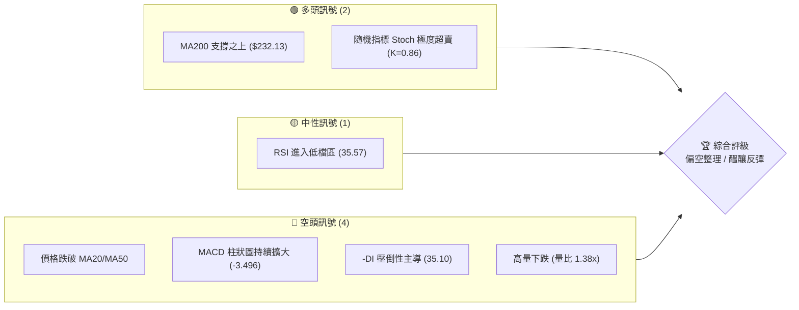
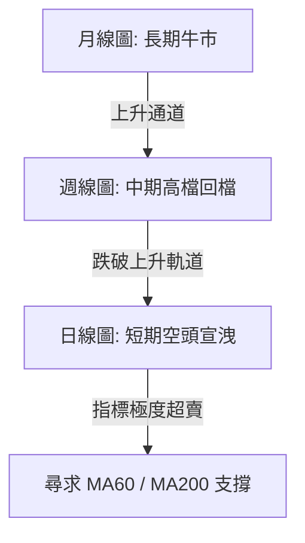
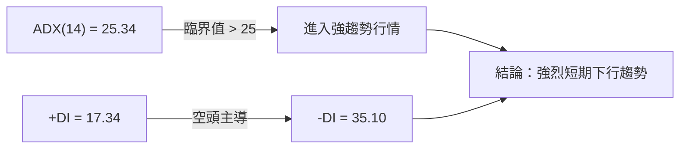
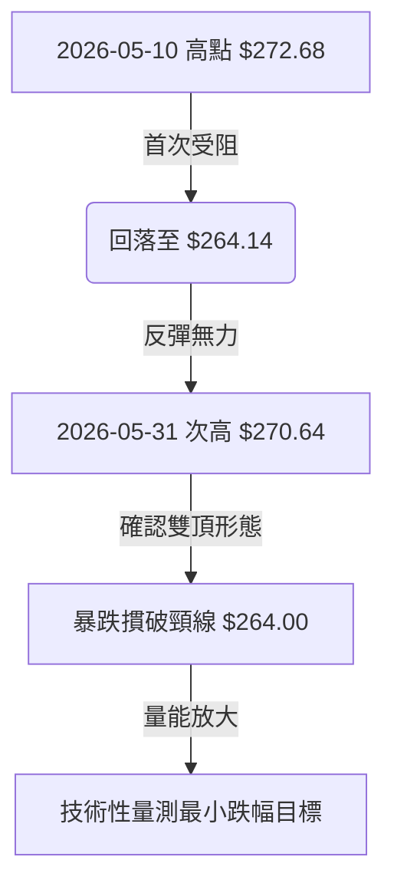

<details>
<summary>📊 靜態圖表 (點擊展開)</summary>

</details>

<html>
<head><meta charset="utf-8" /></head>
<body>
    <div style="height:500px; width:100%;">                        <script>window.PlotlyConfig = {MathJaxConfig: 'local'};</script>
        <script charset="utf-8" src="https://cdn.plot.ly/plotly-3.6.0.min.js" integrity="sha256-QaOVwtVY0T02VaHrr6pnoHLCwayMJp4O5n4YyaE3rJk=" crossorigin="anonymous"></script>                <div id="candlestick-chart" class="plotly-graph-div" style="height:100%; width:100%;"></div>            <script>                window.PLOTLYENV=window.PLOTLYENV || {};                                if (document.getElementById("candlestick-chart")) {                    Plotly.newPlot(                        "candlestick-chart",                        [{"close":{"dtype":"f8","bdata":"AAAAgOv5a0AAAABgZr5rQAAAAEDhmmxAAAAAgBR+bEAAAABguJZsQAAAAADXo2xAAAAAQDPzbEAAAAAAAKBsQAAAAEDhKmxAAAAAIK4\u002fbEAAAACAwnVtQAAAAGCPCm1AAAAAQOF6bUAAAAAgrsdtQAAAAGCPymxAAAAAYGa+bEAAAADAzIRsQAAAAIDC7WxAAAAAoJlBbUAAAAAA1\u002fNsQAAAACBc52xAAAAAIFzvbEAAAAAAKXRsQAAAAGC4lmtAAAAAYLiGa0AAAADAzERrQAAAAMD1eGtAAAAAoHDFa0AAAACAPXJrQAAAAAAplGtAAAAAwB7Na0AAAADgUXBrQAAAAMDMnGtAAAAAwPW4a0AAAABACidsQAAAACCud2xAAAAAANcLa0AAAACAPYJrQAAAAOB6DGtAAAAAgD3yakAAAABACs9qQAAAAKBHoWpAAAAAIFwPa0AAAADA9cBrQAAAAGBmPmtAAAAAQOGia0AAAABguAZsQAAAAEAKX2xAAAAAAACobEAAAACgmclsQAAAACCF22tAAAAAQAqHbkAAAAAAAMBvQAAAAIA9Km9AAAAAYGZGb0AAAACgR2FuQAAAAMAejW5AAAAAwMwMb0AAAABAMyNvQAAAAGBmhm5AAAAAYI+ybUAAAACAFFZtQAAAAADXG21AAAAAoJnRa0AAAACAFNZrQAAAAOB6JGtAAAAAgBSWa0AAAADA9UhsQAAAAKBwtWxAAAAAwB6lbEAAAABACidtQAAAAAApPG1AAAAAoHBNbUAAAAAAKQxtQAAAACCFo2xAAAAAwPWwbEAAAADgelxsQAAAAKBwfWxAAAAAwPX4bEAAAADA9chsQAAAAIAURmxAAAAAoEfRa0AAAACA69FrQAAAAOCjqGtAAAAA4FFYbEAAAABAM2tsQAAAAIDCjWxAAAAA4HoEbUAAAAAAKQxtQAAAAOCjEG1AAAAAgD0CbUAAAADA9RBtQAAAAIA92mxAAAAAAABQbEAAAACA6yFtQAAAAIDCHW5AAAAAgOsxbkAAAACgR8luQAAAAAAp7G5AAAAAQArPbkAAAABAM1NuQAAAAMDMlG1AAAAAgMLFbUAAAAAA1+NtQAAAAAAA4GxAAAAAgOvpbEAAAABA4UptQAAAAMAe5W1AAAAAoHDNbUAAAACAwpVuQAAAAOBRYG5AAAAAIFw3bkAAAACgmeltQAAAAGC4Xm5AAAAAANfTbUAAAAAgrh9tQAAAAIAU1mtAAAAAgD1KakAAAABAChdqQAAAAGC43mlAAAAAYI+CaUAAAABAM\u002fNoQAAAAKBH2WhAAAAAwMwkaUAAAACgR5lpQAAAACCFm2lAAAAAIIVDakAAAADgo6hpQAAAAIDrEWpAAAAA4HpUakAAAACgcP1pQAAAAAAAQGpAAAAA4HoMakAAAAAgXBdqQAAAAIA9GmtAAAAAgBRea0AAAABguKZqQAAAACCur2pAAAAAYI\u002fKakAAAADAzJRqQAAAAMD1MGpAAAAAoHD1aUAAAAAgrndqQAAAAGBm5mpAAAAAANc7akAAAADgURhqQAAAAADXq2lAAAAA4HpEakAAAAAgrudpQAAAAGC4dmpAAAAAoEfxaUAAAABA4epoQAAAAGBmHmlAAAAA4KMIakAAAACAPVJqQAAAAOCjOGpAAAAAoEeZakAAAADgo7hqQAAAAAAAqGtAAAAAwMw0bUAAAAAAKcxtQAAAAOB6\u002fG1AAAAA4KMgb0AAAAAAABBvQAAAAGBmNm9AAAAAgOtRb0AAAADA9QhvQAAAAMAePW9AAAAAIIXrb0AAAABgj+JvQAAAAADXf3BAAAAAgOtRcEAAAABAMztwQAAAAOCjcHBAAAAAwPWQcEAAAAAAKcRwQAAAAMDMAHFAAAAAwMwYcUAAAAAA1y9xQAAAAGC48nBAAAAAQOEKcUAAAAAA189wQAAAAMAenXBAAAAAgBTicEAAAAAghbNwQAAAAIA9gnBAAAAAgMKNcEAAAACgcDVwQAAAAAApkHBAAAAAIFzHcEAAAADAHqVwQAAAAOCjlHBAAAAAoJn9cEAAAAAAACBxQAAAAIA96nBAAAAAAClUcEAAAADgUQhwQAAAAOCjQG9AAAAAoEe5b0AAAADA9cBuQA=="},"high":{"dtype":"f8","bdata":"AAAA4KNobEAAAADA9dhrQAAAAOB6pGxAAAAAQDOzbEAAAAAAAKBsQAAAAADXu2xAAAAAYLgWbUAAAACA6\u002flsQAAAAKBwRWxAAAAAoHBlbEAAAADgo3htQAAAAAAAgG1AAAAAQDOzbUAAAABAM9ttQAAAAIDCtW1AAAAAwPXwbEAAAACgR9lsQAAAACBcN21AAAAAwMx8bUAAAACgmUltQAAAACBcL21AAAAAwB5FbUAAAACAPdJsQAAAACCFe2xAAAAAgOsRbEAAAACgcJVrQAAAAKCZoWtAAAAAQDPTa0AAAAAgrsdrQAAAAMDMxGtAAAAAgOvZa0AAAABgZgZsQAAAACBct2tAAAAA4Hrca0AAAAAgXFdsQAAAAGC4hmxAAAAAAACIbEAAAACAwpVrQAAAAIA9amtAAAAAYLg2a0AAAABA4VJrQAAAAKCZ2WpAAAAAgBQWa0AAAACAPeprQAAAAOBRgGtAAAAAoJmpa0AAAADAzCxsQAAAAMDMjGxAAAAAIK7vbEAAAACAPRptQAAAAIAUjmxAAAAAAABQb0AAAACgmSlwQAAAAAApEHBAAAAAAABgb0AAAAAAKUxvQAAAAMDMnG5AAAAAAAB4b0AAAAAAADhvQAAAAADXS29AAAAAAAB4bkAAAAAgXNdtQAAAAEAzU21AAAAAYGbGbEAAAAAgrvdrQAAAAMAebWxAAAAAYLjGa0AAAABgj2psQAAAAOCj0GxAAAAAAAD4bEAAAACgRyltQAAAAKCZeW1AAAAAQArfbUAAAAAAKSxtQAAAAAAAMG1AAAAAIK7nbEAAAABgj9psQAAAAIA9kmxAAAAAoHANbUAAAAAghQNtQAAAAGCPwmxAAAAAgMJ9bEAAAADAHvVrQAAAAIAUJmxAAAAAIFynbEAAAAAAKaRsQAAAACBcr2xAAAAAYGYObUAAAABgZh5tQAAAACCuH21AAAAAQDMTbUAAAADgoxhtQAAAACCuH21AAAAAYLhubUAAAAAAAEBtQAAAAIDCZW5AAAAAoEepbkAAAADAHs1uQAAAACCF+25AAAAAgBQeb0AAAADAHvVuQAAAAMD1KG5AAAAAwMwUbkAAAACAPfJtQAAAAEDhYm1AAAAAoJkJbUAAAABACndtQAAAAGBmDm5AAAAAYGYebkAAAAAAKZxuQAAAAMD1+G5AAAAAAABgbkAAAACAPWpuQAAAAAAptG5AAAAAQDPLbkAAAAAghdttQAAAAIDrSWxAAAAAgBRuakAAAACA65lqQAAAAMDMlGpAAAAAgD0SakAAAABguH5pQAAAAMAeJWlAAAAAIK43aUAAAAAghdtpQAAAAOB6tGlAAAAAoHBlakAAAACAwg1qQAAAACCFS2pAAAAAQOFyakAAAACgmWFqQAAAAGCPSmpAAAAAIFw3akAAAACAwiVqQAAAAKBHMWtAAAAAQAqPa0AAAACAPSprQAAAAIA9umpAAAAAwMz0akAAAAAAACBrQAAAAGC4dmpAAAAAgOtRakAAAABACpdqQAAAAGBm9mpAAAAA4HrkakAAAAAA1yNqQAAAAKBH8WlAAAAAoJmZakAAAABAMytqQAAAAIA9ompAAAAA4HqcakAAAABAM9NpQAAAAKCZeWlAAAAAwPVIakAAAABgj7JqQAAAAGC4hmpAAAAAYGaeakAAAABACr9qQAAAAEAzQ2xAAAAAoJk5bUAAAACAwg1uQAAAAAAAAG5AAAAAgMKFb0AAAACAFE5vQAAAAAAAQG9AAAAAQOECcEAAAACAwkVvQAAAAEDh4m9AAAAAgBT+b0AAAADgoyxwQAAAAAAAiHBAAAAAYGaCcEAAAADgelBwQAAAAGCPnnBAAAAAgBQecUAAAADAHhVxQAAAAKCZQXFAAAAAwPVocUAAAADAzFxxQAAAAIAUSnFAAAAAAAAgcUAAAACAFBpxQAAAAGBmunBAAAAAIIXrcEAAAADgeuxwQAAAAIDChXBAAAAAoJnNcEAAAAAAAGRwQAAAAKBHmXBAAAAAANfXcEAAAADgo9xwQAAAAMDM1HBAAAAAYI8GcUAAAAAAAChxQAAAAAAALHFAAAAAgBSqcEAAAABAM1NwQAAAAKBwEXBAAAAAYI\u002f6b0AAAACAFAZwQA=="},"hovertemplate":"\u003cb\u003e%{x|%Y-%m-%d}\u003c\u002fb\u003e\u003cbr\u003e\u958b: $%{open:.2f}\u003cbr\u003e\u9ad8: $%{high:.2f}\u003cbr\u003e\u4f4e: $%{low:.2f}\u003cbr\u003e\u6536: $%{close:.2f}\u003cextra\u003e\u003c\u002fextra\u003e","low":{"dtype":"f8","bdata":"AAAAoHCda0AAAAAAAJBrQAAAAIA9mmtAAAAAgOtpbEAAAADgo0BsQAAAAIDreWxAAAAA4KOAbEAAAADAHoVsQAAAAGCPumtAAAAAIIULbEAAAADA9dhsQAAAAIDC\u002fWxAAAAAAAA4bUAAAABgj2JtQAAAAEAzo2xAAAAAQOGqbEAAAACgR0lsQAAAAIA9ymxAAAAAIFwHbUAAAABguJZsQAAAAKBHmWxAAAAAYGa2bEAAAADgUXBsQAAAAIA9gmtAAAAAYGZua0AAAABACg9rQAAAAOCjQGtAAAAAoJlpa0AAAADgejxrQAAAACCFE2tAAAAAYGZea0AAAABA4WprQAAAAMD1AGtAAAAAoHCFa0AAAACAFKZrQAAAAAAAuGtAAAAAAAAAa0AAAACgRyFrQAAAAEAzk2pAAAAAwB6VakAAAACA65lqQAAAAMD1YGpAAAAAQOGyakAAAAAgrj9rQAAAAOCjEGtAAAAAgMJFa0AAAADAzLxrQAAAAKBHMWxAAAAAYLhGbEAAAADgUXhsQAAAAAAA2GtAAAAAIFx\u002fbkAAAADAzJxvQAAAAMAeFW9AAAAAwB7FbkAAAACgcEVuQAAAACCuz21AAAAAQOGybkAAAAAgXOduQAAAAAAAeG5AAAAAAACQbUAAAADgehxtQAAAAIAUpmxAAAAAoHDNa0AAAADgo1BrQAAAACCuF2tAAAAAgMLlakAAAADgo8hrQAAAAKCZ+WtAAAAA4KOYbEAAAABACsdsQAAAAAAACG1AAAAAoJkxbUAAAAAghdNsQAAAAKCZWWxAAAAAoJmRbEAAAADgo0hsQAAAACCFI2xAAAAAYLiObEAAAACAFJZsQAAAAADXI2xAAAAAAACwa0AAAAAAKaRrQAAAACCun2tAAAAAwB4NbEAAAABgjzJsQAAAAGC4VmxAAAAAIFyXbEAAAABgj+psQAAAAIDC5WxAAAAA4KPYbEAAAABgZsZsQAAAAADXw2xAAAAAYGYWbEAAAACAwmVsQAAAAIA9Am1AAAAA4KPwbUAAAAAAKTxuQAAAACCuR25AAAAAYLi+bkAAAAAAAAhuQAAAAEAKh21AAAAAACmUbUAAAADAHo1tQAAAAEDhqmxAAAAAAClcbEAAAADAzNxsQAAAAIA9Um1AAAAAoEexbUAAAABgj8JtQAAAAMD1MG5AAAAAIK6XbUAAAADgerRtQAAAAKBwxW1AAAAAYGZubUAAAACAPfpsQAAAAAApjGtAAAAAgOsJaUAAAABAM2tpQAAAAMAezWlAAAAAIK5PaUAAAACA67FoQAAAAMD1qGhAAAAAAACAaEAAAADgUTBpQAAAAIDrWWlAAAAAAAB4aUAAAAAghWNpQAAAAAAAaGlAAAAAgMIdakAAAABAM6tpQAAAAGBmpmlAAAAAYLhuaUAAAAAgXE9pQAAAAMDMRGpAAAAAQOHyakAAAADA9ZBqQAAAACCF42lAAAAAgMKNakAAAABAM2tqQAAAAMDMBGpAAAAAQArHaUAAAABgZu5pQAAAAIDCjWpAAAAAYI8aakAAAACgmcFpQAAAAIA9imlAAAAA4FEwakAAAADgetRpQAAAAMDMPGpAAAAAANfjaUAAAADgeuRoQAAAACBc\u002f2hAAAAA4HqEaUAAAACAFAZqQAAAAMDMnGlAAAAAQOEyakAAAABgjyJqQAAAAADXc2tAAAAA4KPoa0AAAABguGZtQAAAAAAAeG1AAAAAwPU4bkAAAABgZuZuQAAAAGBmhm5AAAAAIIVDb0AAAAAA16tuQAAAAEAzI29AAAAAYI9Kb0AAAACAPaJvQAAAAEAKG3BAAAAAoHBFcEAAAACAFApwQAAAAEAzG3BAAAAAYI8CcEAAAAAA12twQAAAAMDMzHBAAAAAgBQGcUAAAAAgXANxQAAAAADX53BAAAAAQDPfcEAAAAAgrsdwQAAAAIAUanBAAAAAQDNzcEAAAACAFKpwQAAAAIA9TnBAAAAA4HpocEAAAACAFOZvQAAAAOB6OHBAAAAAgOtVcEAAAAAA16NwQAAAAMAeYXBAAAAAQDObcEAAAABACrdwQAAAAIA92nBAAAAAQDNLcEAAAAAA18tvQAAAAGC49m5AAAAAAAB4b0AAAADA9bhuQA=="},"name":"\u50f9\u683c","open":{"dtype":"f8","bdata":"AAAAANdjbEAAAADAzNRrQAAAAKBH2WtAAAAAQDNrbEAAAAAghWNsQAAAAIA9kmxAAAAA4FGgbEAAAACAPepsQAAAAOCj8GtAAAAAYLgmbEAAAACAFOZsQAAAAIAUZm1AAAAAgBRebUAAAAAghYttQAAAAOCjsG1AAAAAIK7vbEAAAABAM8tsQAAAAAAp1GxAAAAAgBQebUAAAADgozhtQAAAAAAAEG1AAAAAANcLbUAAAACA69FsQAAAAGCPemxAAAAAwMwEbEAAAACA64FrQAAAAGCPYmtAAAAAYI+Ca0AAAADA9cBrQAAAACCFK2tAAAAA4FGga0AAAACAFO5rQAAAAAAAoGtAAAAAACmca0AAAACgcN1rQAAAAAAAIGxAAAAAYLhGbEAAAABgZjZrQAAAAIDr8WpAAAAAANcTa0AAAACgcPVqQAAAAIDr0WpAAAAAACm8akAAAACAwk1rQAAAAKCZaWtAAAAAAABga0AAAABACr9rQAAAAMAedWxAAAAAQAqHbEAAAACgcPVsQAAAAIDrYWxAAAAAQDNDb0AAAAAghetvQAAAAAApTG9AAAAAwPUgb0AAAADAHiVvQAAAAMDMXG5AAAAAQOEKb0AAAADAHg1vQAAAACCuR29AAAAAoJlhbkAAAACA62FtQAAAAAAAKG1AAAAAQDODbEAAAAAgrvdrQAAAAKCZYWxAAAAAQDMLa0AAAACA69FrQAAAAAApTGxAAAAAIK7XbEAAAAAgrudsQAAAAEAKJ21AAAAA4FFgbUAAAABAMyttQAAAAOCjGG1AAAAAgD3KbEAAAABA4bJsQAAAAEDhWmxAAAAAgOuZbEAAAABguNZsQAAAAADXu2xAAAAAgMJ9bEAAAACgR+FrQAAAAMAeFWxAAAAAYLg2bEAAAADgUVhsQAAAACCFk2xAAAAAgOuhbEAAAAAAKQRtQAAAAKBHAW1AAAAAgBT+bEAAAABguOZsQAAAAMAeHW1AAAAAQOHqbEAAAABA4ZpsQAAAAEAzA21AAAAAIIXzbUAAAACA62FuQAAAAIA9km5AAAAAIFzXbkAAAADA9dBuQAAAAMDMJG5AAAAAgOvpbUAAAABA4eJtQAAAAOBROG1AAAAAQOHibEAAAACgmUFtQAAAAGC4Xm1AAAAAIFz\u002fbUAAAACAFPZtQAAAAADXy25AAAAAgD1abkAAAADgevxtQAAAAIDryW1AAAAAIFyfbkAAAAAghdttQAAAAMAeHWxAAAAAYGZWaUAAAABACh9qQAAAAKCZGWpAAAAAgOsBakAAAABguH5pQAAAAAAp3GhAAAAAACnEaEAAAACAPUJpQAAAAKCZeWlAAAAA4FGYaUAAAABAMwNqQAAAAEAKr2lAAAAAYLhOakAAAAAgXFdqQAAAAGCP2mlAAAAAoJmRaUAAAABAM2NpQAAAAEAKT2pAAAAAIFz\u002fakAAAAAgrt9qQAAAAGBmTmpAAAAAgBTGakAAAABguPZqQAAAAOB6TGpAAAAAIIUzakAAAABAMwtqQAAAAIA9mmpAAAAAgMK9akAAAACA6+FpQAAAAMDM7GlAAAAAoEc5akAAAABgZv5pQAAAAIDrcWpAAAAAIIVTakAAAABguM5pQAAAACBcL2lAAAAAQDObaUAAAACAFE5qQAAAAKBH0WlAAAAAoJk5akAAAAAgrmdqQAAAAKBH+WtAAAAAIFwnbEAAAACgmWltQAAAAGBmrm1AAAAAwPU4bkAAAAAAAChvQAAAAOBREG9AAAAAIK7fb0AAAACAFCZvQAAAAEDh4m9AAAAAgBSOb0AAAADgeuxvQAAAACCuP3BAAAAAIFx3cEAAAACAPSZwQAAAAADXH3BAAAAAYLgScUAAAACgR5lwQAAAAMDMzHBAAAAAoEdBcUAAAACAPQ5xQAAAAOBRMHFAAAAAgBT6cEAAAACgcN1wQAAAACBcq3BAAAAAQOGGcEAAAABgZtJwQAAAAAAAaHBAAAAAgOt9cEAAAADgo2BwQAAAAMDMQHBAAAAAAAB4cEAAAABgj8pwQAAAAEAKv3BAAAAAYGaicEAAAADgUQRxQAAAAOCj9HBAAAAA4KOkcEAAAABgjxJwQAAAAGBm1m9AAAAAANejb0AAAADgUchvQA=="},"x":["2025-08-20T00:00:00-04:00","2025-08-21T00:00:00-04:00","2025-08-22T00:00:00-04:00","2025-08-25T00:00:00-04:00","2025-08-26T00:00:00-04:00","2025-08-27T00:00:00-04:00","2025-08-28T00:00:00-04:00","2025-08-29T00:00:00-04:00","2025-09-02T00:00:00-04:00","2025-09-03T00:00:00-04:00","2025-09-04T00:00:00-04:00","2025-09-05T00:00:00-04:00","2025-09-08T00:00:00-04:00","2025-09-09T00:00:00-04:00","2025-09-10T00:00:00-04:00","2025-09-11T00:00:00-04:00","2025-09-12T00:00:00-04:00","2025-09-15T00:00:00-04:00","2025-09-16T00:00:00-04:00","2025-09-17T00:00:00-04:00","2025-09-18T00:00:00-04:00","2025-09-19T00:00:00-04:00","2025-09-22T00:00:00-04:00","2025-09-23T00:00:00-04:00","2025-09-24T00:00:00-04:00","2025-09-25T00:00:00-04:00","2025-09-26T00:00:00-04:00","2025-09-29T00:00:00-04:00","2025-09-30T00:00:00-04:00","2025-10-01T00:00:00-04:00","2025-10-02T00:00:00-04:00","2025-10-03T00:00:00-04:00","2025-10-06T00:00:00-04:00","2025-10-07T00:00:00-04:00","2025-10-08T00:00:00-04:00","2025-10-09T00:00:00-04:00","2025-10-10T00:00:00-04:00","2025-10-13T00:00:00-04:00","2025-10-14T00:00:00-04:00","2025-10-15T00:00:00-04:00","2025-10-16T00:00:00-04:00","2025-10-17T00:00:00-04:00","2025-10-20T00:00:00-04:00","2025-10-21T00:00:00-04:00","2025-10-22T00:00:00-04:00","2025-10-23T00:00:00-04:00","2025-10-24T00:00:00-04:00","2025-10-27T00:00:00-04:00","2025-10-28T00:00:00-04:00","2025-10-29T00:00:00-04:00","2025-10-30T00:00:00-04:00","2025-10-31T00:00:00-04:00","2025-11-03T00:00:00-05:00","2025-11-04T00:00:00-05:00","2025-11-05T00:00:00-05:00","2025-11-06T00:00:00-05:00","2025-11-07T00:00:00-05:00","2025-11-10T00:00:00-05:00","2025-11-11T00:00:00-05:00","2025-11-12T00:00:00-05:00","2025-11-13T00:00:00-05:00","2025-11-14T00:00:00-05:00","2025-11-17T00:00:00-05:00","2025-11-18T00:00:00-05:00","2025-11-19T00:00:00-05:00","2025-11-20T00:00:00-05:00","2025-11-21T00:00:00-05:00","2025-11-24T00:00:00-05:00","2025-11-25T00:00:00-05:00","2025-11-26T00:00:00-05:00","2025-11-28T00:00:00-05:00","2025-12-01T00:00:00-05:00","2025-12-02T00:00:00-05:00","2025-12-03T00:00:00-05:00","2025-12-04T00:00:00-05:00","2025-12-05T00:00:00-05:00","2025-12-08T00:00:00-05:00","2025-12-09T00:00:00-05:00","2025-12-10T00:00:00-05:00","2025-12-11T00:00:00-05:00","2025-12-12T00:00:00-05:00","2025-12-15T00:00:00-05:00","2025-12-16T00:00:00-05:00","2025-12-17T00:00:00-05:00","2025-12-18T00:00:00-05:00","2025-12-19T00:00:00-05:00","2025-12-22T00:00:00-05:00","2025-12-23T00:00:00-05:00","2025-12-24T00:00:00-05:00","2025-12-26T00:00:00-05:00","2025-12-29T00:00:00-05:00","2025-12-30T00:00:00-05:00","2025-12-31T00:00:00-05:00","2026-01-02T00:00:00-05:00","2026-01-05T00:00:00-05:00","2026-01-06T00:00:00-05:00","2026-01-07T00:00:00-05:00","2026-01-08T00:00:00-05:00","2026-01-09T00:00:00-05:00","2026-01-12T00:00:00-05:00","2026-01-13T00:00:00-05:00","2026-01-14T00:00:00-05:00","2026-01-15T00:00:00-05:00","2026-01-16T00:00:00-05:00","2026-01-20T00:00:00-05:00","2026-01-21T00:00:00-05:00","2026-01-22T00:00:00-05:00","2026-01-23T00:00:00-05:00","2026-01-26T00:00:00-05:00","2026-01-27T00:00:00-05:00","2026-01-28T00:00:00-05:00","2026-01-29T00:00:00-05:00","2026-01-30T00:00:00-05:00","2026-02-02T00:00:00-05:00","2026-02-03T00:00:00-05:00","2026-02-04T00:00:00-05:00","2026-02-05T00:00:00-05:00","2026-02-06T00:00:00-05:00","2026-02-09T00:00:00-05:00","2026-02-10T00:00:00-05:00","2026-02-11T00:00:00-05:00","2026-02-12T00:00:00-05:00","2026-02-13T00:00:00-05:00","2026-02-17T00:00:00-05:00","2026-02-18T00:00:00-05:00","2026-02-19T00:00:00-05:00","2026-02-20T00:00:00-05:00","2026-02-23T00:00:00-05:00","2026-02-24T00:00:00-05:00","2026-02-25T00:00:00-05:00","2026-02-26T00:00:00-05:00","2026-02-27T00:00:00-05:00","2026-03-02T00:00:00-05:00","2026-03-03T00:00:00-05:00","2026-03-04T00:00:00-05:00","2026-03-05T00:00:00-05:00","2026-03-06T00:00:00-05:00","2026-03-09T00:00:00-04:00","2026-03-10T00:00:00-04:00","2026-03-11T00:00:00-04:00","2026-03-12T00:00:00-04:00","2026-03-13T00:00:00-04:00","2026-03-16T00:00:00-04:00","2026-03-17T00:00:00-04:00","2026-03-18T00:00:00-04:00","2026-03-19T00:00:00-04:00","2026-03-20T00:00:00-04:00","2026-03-23T00:00:00-04:00","2026-03-24T00:00:00-04:00","2026-03-25T00:00:00-04:00","2026-03-26T00:00:00-04:00","2026-03-27T00:00:00-04:00","2026-03-30T00:00:00-04:00","2026-03-31T00:00:00-04:00","2026-04-01T00:00:00-04:00","2026-04-02T00:00:00-04:00","2026-04-06T00:00:00-04:00","2026-04-07T00:00:00-04:00","2026-04-08T00:00:00-04:00","2026-04-09T00:00:00-04:00","2026-04-10T00:00:00-04:00","2026-04-13T00:00:00-04:00","2026-04-14T00:00:00-04:00","2026-04-15T00:00:00-04:00","2026-04-16T00:00:00-04:00","2026-04-17T00:00:00-04:00","2026-04-20T00:00:00-04:00","2026-04-21T00:00:00-04:00","2026-04-22T00:00:00-04:00","2026-04-23T00:00:00-04:00","2026-04-24T00:00:00-04:00","2026-04-27T00:00:00-04:00","2026-04-28T00:00:00-04:00","2026-04-29T00:00:00-04:00","2026-04-30T00:00:00-04:00","2026-05-01T00:00:00-04:00","2026-05-04T00:00:00-04:00","2026-05-05T00:00:00-04:00","2026-05-06T00:00:00-04:00","2026-05-07T00:00:00-04:00","2026-05-08T00:00:00-04:00","2026-05-11T00:00:00-04:00","2026-05-12T00:00:00-04:00","2026-05-13T00:00:00-04:00","2026-05-14T00:00:00-04:00","2026-05-15T00:00:00-04:00","2026-05-18T00:00:00-04:00","2026-05-19T00:00:00-04:00","2026-05-20T00:00:00-04:00","2026-05-21T00:00:00-04:00","2026-05-22T00:00:00-04:00","2026-05-26T00:00:00-04:00","2026-05-27T00:00:00-04:00","2026-05-28T00:00:00-04:00","2026-05-29T00:00:00-04:00","2026-06-01T00:00:00-04:00","2026-06-02T00:00:00-04:00","2026-06-03T00:00:00-04:00","2026-06-04T00:00:00-04:00","2026-06-05T00:00:00-04:00"],"type":"candlestick"},{"hovertemplate":"MA30: $%{y:.2f}\u003cextra\u003e\u003c\u002fextra\u003e","line":{"color":"#2196F3","dash":"dash","width":2},"mode":"lines","name":"MA30","x":["2025-08-20T00:00:00-04:00","2025-08-21T00:00:00-04:00","2025-08-22T00:00:00-04:00","2025-08-25T00:00:00-04:00","2025-08-26T00:00:00-04:00","2025-08-27T00:00:00-04:00","2025-08-28T00:00:00-04:00","2025-08-29T00:00:00-04:00","2025-09-02T00:00:00-04:00","2025-09-03T00:00:00-04:00","2025-09-04T00:00:00-04:00","2025-09-05T00:00:00-04:00","2025-09-08T00:00:00-04:00","2025-09-09T00:00:00-04:00","2025-09-10T00:00:00-04:00","2025-09-11T00:00:00-04:00","2025-09-12T00:00:00-04:00","2025-09-15T00:00:00-04:00","2025-09-16T00:00:00-04:00","2025-09-17T00:00:00-04:00","2025-09-18T00:00:00-04:00","2025-09-19T00:00:00-04:00","2025-09-22T00:00:00-04:00","2025-09-23T00:00:00-04:00","2025-09-24T00:00:00-04:00","2025-09-25T00:00:00-04:00","2025-09-26T00:00:00-04:00","2025-09-29T00:00:00-04:00","2025-09-30T00:00:00-04:00","2025-10-01T00:00:00-04:00","2025-10-02T00:00:00-04:00","2025-10-03T00:00:00-04:00","2025-10-06T00:00:00-04:00","2025-10-07T00:00:00-04:00","2025-10-08T00:00:00-04:00","2025-10-09T00:00:00-04:00","2025-10-10T00:00:00-04:00","2025-10-13T00:00:00-04:00","2025-10-14T00:00:00-04:00","2025-10-15T00:00:00-04:00","2025-10-16T00:00:00-04:00","2025-10-17T00:00:00-04:00","2025-10-20T00:00:00-04:00","2025-10-21T00:00:00-04:00","2025-10-22T00:00:00-04:00","2025-10-23T00:00:00-04:00","2025-10-24T00:00:00-04:00","2025-10-27T00:00:00-04:00","2025-10-28T00:00:00-04:00","2025-10-29T00:00:00-04:00","2025-10-30T00:00:00-04:00","2025-10-31T00:00:00-04:00","2025-11-03T00:00:00-05:00","2025-11-04T00:00:00-05:00","2025-11-05T00:00:00-05:00","2025-11-06T00:00:00-05:00","2025-11-07T00:00:00-05:00","2025-11-10T00:00:00-05:00","2025-11-11T00:00:00-05:00","2025-11-12T00:00:00-05:00","2025-11-13T00:00:00-05:00","2025-11-14T00:00:00-05:00","2025-11-17T00:00:00-05:00","2025-11-18T00:00:00-05:00","2025-11-19T00:00:00-05:00","2025-11-20T00:00:00-05:00","2025-11-21T00:00:00-05:00","2025-11-24T00:00:00-05:00","2025-11-25T00:00:00-05:00","2025-11-26T00:00:00-05:00","2025-11-28T00:00:00-05:00","2025-12-01T00:00:00-05:00","2025-12-02T00:00:00-05:00","2025-12-03T00:00:00-05:00","2025-12-04T00:00:00-05:00","2025-12-05T00:00:00-05:00","2025-12-08T00:00:00-05:00","2025-12-09T00:00:00-05:00","2025-12-10T00:00:00-05:00","2025-12-11T00:00:00-05:00","2025-12-12T00:00:00-05:00","2025-12-15T00:00:00-05:00","2025-12-16T00:00:00-05:00","2025-12-17T00:00:00-05:00","2025-12-18T00:00:00-05:00","2025-12-19T00:00:00-05:00","2025-12-22T00:00:00-05:00","2025-12-23T00:00:00-05:00","2025-12-24T00:00:00-05:00","2025-12-26T00:00:00-05:00","2025-12-29T00:00:00-05:00","2025-12-30T00:00:00-05:00","2025-12-31T00:00:00-05:00","2026-01-02T00:00:00-05:00","2026-01-05T00:00:00-05:00","2026-01-06T00:00:00-05:00","2026-01-07T00:00:00-05:00","2026-01-08T00:00:00-05:00","2026-01-09T00:00:00-05:00","2026-01-12T00:00:00-05:00","2026-01-13T00:00:00-05:00","2026-01-14T00:00:00-05:00","2026-01-15T00:00:00-05:00","2026-01-16T00:00:00-05:00","2026-01-20T00:00:00-05:00","2026-01-21T00:00:00-05:00","2026-01-22T00:00:00-05:00","2026-01-23T00:00:00-05:00","2026-01-26T00:00:00-05:00","2026-01-27T00:00:00-05:00","2026-01-28T00:00:00-05:00","2026-01-29T00:00:00-05:00","2026-01-30T00:00:00-05:00","2026-02-02T00:00:00-05:00","2026-02-03T00:00:00-05:00","2026-02-04T00:00:00-05:00","2026-02-05T00:00:00-05:00","2026-02-06T00:00:00-05:00","2026-02-09T00:00:00-05:00","2026-02-10T00:00:00-05:00","2026-02-11T00:00:00-05:00","2026-02-12T00:00:00-05:00","2026-02-13T00:00:00-05:00","2026-02-17T00:00:00-05:00","2026-02-18T00:00:00-05:00","2026-02-19T00:00:00-05:00","2026-02-20T00:00:00-05:00","2026-02-23T00:00:00-05:00","2026-02-24T00:00:00-05:00","2026-02-25T00:00:00-05:00","2026-02-26T00:00:00-05:00","2026-02-27T00:00:00-05:00","2026-03-02T00:00:00-05:00","2026-03-03T00:00:00-05:00","2026-03-04T00:00:00-05:00","2026-03-05T00:00:00-05:00","2026-03-06T00:00:00-05:00","2026-03-09T00:00:00-04:00","2026-03-10T00:00:00-04:00","2026-03-11T00:00:00-04:00","2026-03-12T00:00:00-04:00","2026-03-13T00:00:00-04:00","2026-03-16T00:00:00-04:00","2026-03-17T00:00:00-04:00","2026-03-18T00:00:00-04:00","2026-03-19T00:00:00-04:00","2026-03-20T00:00:00-04:00","2026-03-23T00:00:00-04:00","2026-03-24T00:00:00-04:00","2026-03-25T00:00:00-04:00","2026-03-26T00:00:00-04:00","2026-03-27T00:00:00-04:00","2026-03-30T00:00:00-04:00","2026-03-31T00:00:00-04:00","2026-04-01T00:00:00-04:00","2026-04-02T00:00:00-04:00","2026-04-06T00:00:00-04:00","2026-04-07T00:00:00-04:00","2026-04-08T00:00:00-04:00","2026-04-09T00:00:00-04:00","2026-04-10T00:00:00-04:00","2026-04-13T00:00:00-04:00","2026-04-14T00:00:00-04:00","2026-04-15T00:00:00-04:00","2026-04-16T00:00:00-04:00","2026-04-17T00:00:00-04:00","2026-04-20T00:00:00-04:00","2026-04-21T00:00:00-04:00","2026-04-22T00:00:00-04:00","2026-04-23T00:00:00-04:00","2026-04-24T00:00:00-04:00","2026-04-27T00:00:00-04:00","2026-04-28T00:00:00-04:00","2026-04-29T00:00:00-04:00","2026-04-30T00:00:00-04:00","2026-05-01T00:00:00-04:00","2026-05-04T00:00:00-04:00","2026-05-05T00:00:00-04:00","2026-05-06T00:00:00-04:00","2026-05-07T00:00:00-04:00","2026-05-08T00:00:00-04:00","2026-05-11T00:00:00-04:00","2026-05-12T00:00:00-04:00","2026-05-13T00:00:00-04:00","2026-05-14T00:00:00-04:00","2026-05-15T00:00:00-04:00","2026-05-18T00:00:00-04:00","2026-05-19T00:00:00-04:00","2026-05-20T00:00:00-04:00","2026-05-21T00:00:00-04:00","2026-05-22T00:00:00-04:00","2026-05-26T00:00:00-04:00","2026-05-27T00:00:00-04:00","2026-05-28T00:00:00-04:00","2026-05-29T00:00:00-04:00","2026-06-01T00:00:00-04:00","2026-06-02T00:00:00-04:00","2026-06-03T00:00:00-04:00","2026-06-04T00:00:00-04:00","2026-06-05T00:00:00-04:00"],"y":{"dtype":"f8","bdata":"AAAAAAAA+H8AAAAAAAD4fwAAAAAAAPh\u002fAAAAAAAA+H8AAAAAAAD4fwAAAAAAAPh\u002fAAAAAAAA+H8AAAAAAAD4fwAAAAAAAPh\u002fAAAAAAAA+H8AAAAAAAD4fwAAAAAAAPh\u002fAAAAAAAA+H8AAAAAAAD4fwAAAAAAAPh\u002fAAAAAAAA+H8AAAAAAAD4fwAAAAAAAPh\u002fAAAAAAAA+H8AAAAAAAD4fwAAAAAAAPh\u002fAAAAAAAA+H8AAAAAAAD4fwAAAAAAAPh\u002fAAAAAAAA+H8AAAAAAAD4fwAAAAAAAPh\u002fAAAAAAAA+H8AAAAAAAD4f4mIiHjpdmxA3t3dLWt1bEBVVVXl0HJsQO\u002fu7r5YamxAd3d3p8ZjbEBmZmamDWBsQCIiItKUXmxAMzMzA1ZObEB3d3eHz0RsQFVVVZVDO2xAq6qqOiYwbEDNzMx8hhlsQHd3dwfzBGxAVVVVdUzwa0C8u7sLAt9rQKuqqnrN0WtAvLu7G1rIa0Crqqo6JsRrQKuqqlpkv2tAIiIiokW6a0AAAAAw3bhrQO\u002fu7p7vr2tA3t3dfYa9a0AiIiJCp9lrQCIiIrIr+GtAZmZm9igYbEB3d3eXtTJsQJqZmTn7TGxAMzMzw\u002fVobEC8u7trdYhsQJqZmZmZoWxAVVVVBcixbEDNzMws+cFsQImIiMi9zmxAvLu7C5DPbEAAAAAw3cxsQN7d3a2OwWxAREREVCrGbEAiIiISysxsQFVVVWX02mxA7+7uXnPpbEDv7u5ec\u002f1sQFVVVRWuE21AZmZm5tAmbUBEREQk2zFtQBEREZHCPW1AAAAAQMNGbUARERERn0ltQKuqqnqiSm1AZmZmVlVNbUAAAADgT01tQAAAADDdUG1AmpmZGb05bUAiIiLiMxhtQM3MzFxI+mxA3t3drUfhbEBEREREi9BsQImIiKh\u002fv2xAiYiImCeubEC8u7vrUZxsQBEREYHcj2xAiYiI6PuJbEBVVVUVrodsQM3MzEx+hWxAmpmZ6bSJbEDNzMycxJRsQN7d3d0krmxARERExGfEbEBERETUv9lsQHd3d9ej7GxAAAAAoBr\u002fbEDe3d39GwltQCIiImIQDG1AzczMHBMQbUBERESUQxdtQM3MzKxHGW1AvLu7uy0bbUBEREQUICNtQJqZmVkdL21AMzMzgzI2bUC8u7urjkVtQGZmZqZ\u002fV21AzczMzPdrbUAAAADw0n1tQBEREcH1lG1AMzMzU5yhbUC8u7troKdtQFVVVQWBoW1AVVVVtTqKbUAzMzPz\u002fXBtQN7d3V26VW1Aq6qqOt83bUBVVVUlvxRtQBEREdGU8mxAMzMzk4rXbECrqqr6YrlsQHd3d3fpkmxAVVVVhV1xbEBERERUnEVsQBEREeEzHGxAZmZm5vv1a0AiIiLy\u002fdBrQImIiLiQtGtAEREREcqUa0AiIiKSX3RrQM3MzHw\u002fZWtAd3d3pw1Ya0AiIiLCg0FrQDMzMyMiJmtAZmZm9m8Ma0AzMzOjRepqQN7d3V2PxmpAd3d3tzqiakAAAAAA1YRqQKuqqqo4Z2pAAAAAAI5IakB3d3eXtS5qQDMzMxM8HGpAvLu76wocakCJiIjIdhpqQJqZmdmHH2pAiYiIqDgjakCJiIio8SJqQLy7u3s\u002fJWpAiYiIuNcsakDNzMwMAjNqQO\u002fu7s4+OGpAAAAAoBo7akARERGxK0RqQImIiOi0UWpAvLu7K0BqakCJiIjIvYpqQO\u002fu7r6fqmpAIiIicvbVakDv7u5OYgBrQM3MzLx0I2tAq6qqGi9Fa0DNzMyMl2prQDMzM6NwkWtAAAAAkDS9a0CJiIjIduprQN7d3f2NJGxAd3d3Z5FdbEDv7u6uuZBsQCIiIjLBw2xA7+7uvp\u002f+bEB3d3c3Fz5tQM3MzEw3hW1AREREdNrIbUB3d3e3HhFuQDMzM0OLUG5AMzMz0waWbkCrqqrqUeBuQBEREcGDJW9AiYiIqH9nb0AiIiLi7KNvQFVVVYXr3W9AzczMDLsKcEB3d3ffCCNwQKuqqpJfOnBARERETPBMcEAiIiIK11twQM3MzPxiaXBAMzMzC5B1cEDNzMykKYNwQHd3d6dUjnBAAAAAkAmUcECJiIiYbphwQFVVVZ19mHBAmpmZQaeXcEARERGh05JwQA=="},"type":"scatter"},{"hovertemplate":"MA60: $%{y:.2f}\u003cextra\u003e\u003c\u002fextra\u003e","line":{"color":"#9C27B0","dash":"dash","width":2},"mode":"lines","name":"MA60","x":["2025-08-20T00:00:00-04:00","2025-08-21T00:00:00-04:00","2025-08-22T00:00:00-04:00","2025-08-25T00:00:00-04:00","2025-08-26T00:00:00-04:00","2025-08-27T00:00:00-04:00","2025-08-28T00:00:00-04:00","2025-08-29T00:00:00-04:00","2025-09-02T00:00:00-04:00","2025-09-03T00:00:00-04:00","2025-09-04T00:00:00-04:00","2025-09-05T00:00:00-04:00","2025-09-08T00:00:00-04:00","2025-09-09T00:00:00-04:00","2025-09-10T00:00:00-04:00","2025-09-11T00:00:00-04:00","2025-09-12T00:00:00-04:00","2025-09-15T00:00:00-04:00","2025-09-16T00:00:00-04:00","2025-09-17T00:00:00-04:00","2025-09-18T00:00:00-04:00","2025-09-19T00:00:00-04:00","2025-09-22T00:00:00-04:00","2025-09-23T00:00:00-04:00","2025-09-24T00:00:00-04:00","2025-09-25T00:00:00-04:00","2025-09-26T00:00:00-04:00","2025-09-29T00:00:00-04:00","2025-09-30T00:00:00-04:00","2025-10-01T00:00:00-04:00","2025-10-02T00:00:00-04:00","2025-10-03T00:00:00-04:00","2025-10-06T00:00:00-04:00","2025-10-07T00:00:00-04:00","2025-10-08T00:00:00-04:00","2025-10-09T00:00:00-04:00","2025-10-10T00:00:00-04:00","2025-10-13T00:00:00-04:00","2025-10-14T00:00:00-04:00","2025-10-15T00:00:00-04:00","2025-10-16T00:00:00-04:00","2025-10-17T00:00:00-04:00","2025-10-20T00:00:00-04:00","2025-10-21T00:00:00-04:00","2025-10-22T00:00:00-04:00","2025-10-23T00:00:00-04:00","2025-10-24T00:00:00-04:00","2025-10-27T00:00:00-04:00","2025-10-28T00:00:00-04:00","2025-10-29T00:00:00-04:00","2025-10-30T00:00:00-04:00","2025-10-31T00:00:00-04:00","2025-11-03T00:00:00-05:00","2025-11-04T00:00:00-05:00","2025-11-05T00:00:00-05:00","2025-11-06T00:00:00-05:00","2025-11-07T00:00:00-05:00","2025-11-10T00:00:00-05:00","2025-11-11T00:00:00-05:00","2025-11-12T00:00:00-05:00","2025-11-13T00:00:00-05:00","2025-11-14T00:00:00-05:00","2025-11-17T00:00:00-05:00","2025-11-18T00:00:00-05:00","2025-11-19T00:00:00-05:00","2025-11-20T00:00:00-05:00","2025-11-21T00:00:00-05:00","2025-11-24T00:00:00-05:00","2025-11-25T00:00:00-05:00","2025-11-26T00:00:00-05:00","2025-11-28T00:00:00-05:00","2025-12-01T00:00:00-05:00","2025-12-02T00:00:00-05:00","2025-12-03T00:00:00-05:00","2025-12-04T00:00:00-05:00","2025-12-05T00:00:00-05:00","2025-12-08T00:00:00-05:00","2025-12-09T00:00:00-05:00","2025-12-10T00:00:00-05:00","2025-12-11T00:00:00-05:00","2025-12-12T00:00:00-05:00","2025-12-15T00:00:00-05:00","2025-12-16T00:00:00-05:00","2025-12-17T00:00:00-05:00","2025-12-18T00:00:00-05:00","2025-12-19T00:00:00-05:00","2025-12-22T00:00:00-05:00","2025-12-23T00:00:00-05:00","2025-12-24T00:00:00-05:00","2025-12-26T00:00:00-05:00","2025-12-29T00:00:00-05:00","2025-12-30T00:00:00-05:00","2025-12-31T00:00:00-05:00","2026-01-02T00:00:00-05:00","2026-01-05T00:00:00-05:00","2026-01-06T00:00:00-05:00","2026-01-07T00:00:00-05:00","2026-01-08T00:00:00-05:00","2026-01-09T00:00:00-05:00","2026-01-12T00:00:00-05:00","2026-01-13T00:00:00-05:00","2026-01-14T00:00:00-05:00","2026-01-15T00:00:00-05:00","2026-01-16T00:00:00-05:00","2026-01-20T00:00:00-05:00","2026-01-21T00:00:00-05:00","2026-01-22T00:00:00-05:00","2026-01-23T00:00:00-05:00","2026-01-26T00:00:00-05:00","2026-01-27T00:00:00-05:00","2026-01-28T00:00:00-05:00","2026-01-29T00:00:00-05:00","2026-01-30T00:00:00-05:00","2026-02-02T00:00:00-05:00","2026-02-03T00:00:00-05:00","2026-02-04T00:00:00-05:00","2026-02-05T00:00:00-05:00","2026-02-06T00:00:00-05:00","2026-02-09T00:00:00-05:00","2026-02-10T00:00:00-05:00","2026-02-11T00:00:00-05:00","2026-02-12T00:00:00-05:00","2026-02-13T00:00:00-05:00","2026-02-17T00:00:00-05:00","2026-02-18T00:00:00-05:00","2026-02-19T00:00:00-05:00","2026-02-20T00:00:00-05:00","2026-02-23T00:00:00-05:00","2026-02-24T00:00:00-05:00","2026-02-25T00:00:00-05:00","2026-02-26T00:00:00-05:00","2026-02-27T00:00:00-05:00","2026-03-02T00:00:00-05:00","2026-03-03T00:00:00-05:00","2026-03-04T00:00:00-05:00","2026-03-05T00:00:00-05:00","2026-03-06T00:00:00-05:00","2026-03-09T00:00:00-04:00","2026-03-10T00:00:00-04:00","2026-03-11T00:00:00-04:00","2026-03-12T00:00:00-04:00","2026-03-13T00:00:00-04:00","2026-03-16T00:00:00-04:00","2026-03-17T00:00:00-04:00","2026-03-18T00:00:00-04:00","2026-03-19T00:00:00-04:00","2026-03-20T00:00:00-04:00","2026-03-23T00:00:00-04:00","2026-03-24T00:00:00-04:00","2026-03-25T00:00:00-04:00","2026-03-26T00:00:00-04:00","2026-03-27T00:00:00-04:00","2026-03-30T00:00:00-04:00","2026-03-31T00:00:00-04:00","2026-04-01T00:00:00-04:00","2026-04-02T00:00:00-04:00","2026-04-06T00:00:00-04:00","2026-04-07T00:00:00-04:00","2026-04-08T00:00:00-04:00","2026-04-09T00:00:00-04:00","2026-04-10T00:00:00-04:00","2026-04-13T00:00:00-04:00","2026-04-14T00:00:00-04:00","2026-04-15T00:00:00-04:00","2026-04-16T00:00:00-04:00","2026-04-17T00:00:00-04:00","2026-04-20T00:00:00-04:00","2026-04-21T00:00:00-04:00","2026-04-22T00:00:00-04:00","2026-04-23T00:00:00-04:00","2026-04-24T00:00:00-04:00","2026-04-27T00:00:00-04:00","2026-04-28T00:00:00-04:00","2026-04-29T00:00:00-04:00","2026-04-30T00:00:00-04:00","2026-05-01T00:00:00-04:00","2026-05-04T00:00:00-04:00","2026-05-05T00:00:00-04:00","2026-05-06T00:00:00-04:00","2026-05-07T00:00:00-04:00","2026-05-08T00:00:00-04:00","2026-05-11T00:00:00-04:00","2026-05-12T00:00:00-04:00","2026-05-13T00:00:00-04:00","2026-05-14T00:00:00-04:00","2026-05-15T00:00:00-04:00","2026-05-18T00:00:00-04:00","2026-05-19T00:00:00-04:00","2026-05-20T00:00:00-04:00","2026-05-21T00:00:00-04:00","2026-05-22T00:00:00-04:00","2026-05-26T00:00:00-04:00","2026-05-27T00:00:00-04:00","2026-05-28T00:00:00-04:00","2026-05-29T00:00:00-04:00","2026-06-01T00:00:00-04:00","2026-06-02T00:00:00-04:00","2026-06-03T00:00:00-04:00","2026-06-04T00:00:00-04:00","2026-06-05T00:00:00-04:00"],"y":{"dtype":"f8","bdata":"AAAAAAAA+H8AAAAAAAD4fwAAAAAAAPh\u002fAAAAAAAA+H8AAAAAAAD4fwAAAAAAAPh\u002fAAAAAAAA+H8AAAAAAAD4fwAAAAAAAPh\u002fAAAAAAAA+H8AAAAAAAD4fwAAAAAAAPh\u002fAAAAAAAA+H8AAAAAAAD4fwAAAAAAAPh\u002fAAAAAAAA+H8AAAAAAAD4fwAAAAAAAPh\u002fAAAAAAAA+H8AAAAAAAD4fwAAAAAAAPh\u002fAAAAAAAA+H8AAAAAAAD4fwAAAAAAAPh\u002fAAAAAAAA+H8AAAAAAAD4fwAAAAAAAPh\u002fAAAAAAAA+H8AAAAAAAD4fwAAAAAAAPh\u002fAAAAAAAA+H8AAAAAAAD4fwAAAAAAAPh\u002fAAAAAAAA+H8AAAAAAAD4fwAAAAAAAPh\u002fAAAAAAAA+H8AAAAAAAD4fwAAAAAAAPh\u002fAAAAAAAA+H8AAAAAAAD4fwAAAAAAAPh\u002fAAAAAAAA+H8AAAAAAAD4fwAAAAAAAPh\u002fAAAAAAAA+H8AAAAAAAD4fwAAAAAAAPh\u002fAAAAAAAA+H8AAAAAAAD4fwAAAAAAAPh\u002fAAAAAAAA+H8AAAAAAAD4fwAAAAAAAPh\u002fAAAAAAAA+H8AAAAAAAD4fwAAAAAAAPh\u002fAAAAAAAA+H8AAAAAAAD4fxEREYlBjGxAmpmZmZmTbEAREREJZZpsQLy7u0OLnGxAmpmZWauZbEAzMzNrdZZsQAAAAMARkGxAvLu7K0CKbEDNzMzMzIhsQFVVVf0bi2xAzczMzMyMbEDe3d3tfItsQGZmZo5QjGxA3t3drY6LbEAAAACYbohsQN7d3QXIh2xA3t3drY6HbEDe3d2l4oZsQKuqqmoDhWxAREREfM2DbEAAAACIFoNsQHd3d2dmgGxAvLu7y6F7bEAiIiKS7XhsQHd3dwc6eWxAIiIiUrh8bEDe3d1toIFsQBEREXE9hmxA3t3drY6LbEC8u7urY5JsQFVVVQ27mGxA7+7u9uGdbEARERGh06RsQKuqqgoeqmxAq6qqeqKsbEBmZmbm0LBsQN7d3cXZt2xAREREDEnFbEAzMzPzRNNsQGZmZh7M42xAd3d3\u002f0b0bEBmZmauRwNtQLy7uzvfD21AmpmZAXIbbUBERERcjyRtQO\u002fu7h6FK21A3t3dffgwbUCrqqqSXzZtQCIiIurfPG1AzczM7MNBbUDe3d1Fb0ltQDMzM2suVG1AMzMzc9pSbUARERFpA0ttQO\u002fu7g6fR21AiYiIAHJBbUAAAADYFTxtQO\u002fu7laAMG1A7+7uJjEcbUB3d3fvpwZtQHd3d2\u002fL8mxAmpmZke3gbEBVVVWdNs5sQO\u002fu7o4JvGxAZmZmvp+wbEC8u7vLE6dsQKuqqiqHoGxAzczMpOKabEBEREQUro9sQERERNxrhGxAMzMzQ4t6bEAAAAD4DG1sQFVVVY1QYGxA7+7ulm5SbEAzMzOT0UVsQM3MzJRDP2xAmpmZsZ05bEAzMzPrUTJsQGZmZr6fKmxAzczMPFEhbEB3d3cn6hdsQCIiIoIHD2xAIiIiQhkHbEAAAAD4UwFsQN7d3TUX\u002fmtAmpmZKRX1a0CamZkBK+trQERERIze3mtAiYiI0CLTa0De3d1dusVrQLy7uxuhumtAmpmZ8Yuta0Dv7u5m2JtrQGZmZibqi2tA3t3dJTGCa0C8u7uDMnZrQDMzMyOUZWtAq6qqEjxWa0CrqqoC5ERrQM3MzGT0NmtAERERCR4wa0BVVVXd3S1rQLy7uzuYL2tAmpmZQWA1a0CJiIjwYDprQM3MzBxaRGtAERERYZ5Oa0B3d3enDVZrQDMzM2PJW2tAMzMzQ9Jka0De3d01XmprQN7d3a2OdWtAd3d3D+Z\u002fa0B3d3dXx4prQGZmZu58lWtAd3d335aja0B3d3dnZrZrQAAAALC50GtAAAAAsHLya0AAAADAyhVsQGZmZo4JOGxA3t3dvZ9cbECamZnJoYFsQGZmZp5hpWxAiYiIsCvKbEB3d3d3d+tsQCIiIioVC21AzczMXEgobUAAAAC4HkVtQO\u002fu7gY6Y21AIiIiYhCCbUBmZmbuNaFtQERERNyyvm1ARERERIvgbUBERETMWgNuQN7d3QUPIG5AVVVVHaE2bkDv7u5euk1uQO\u002fu7u41YW5AmpmZiUF2bkBVVVUFD4huQA=="},"type":"scatter"},{"hovertemplate":"MA200: $%{y:.2f}\u003cextra\u003e\u003c\u002fextra\u003e","line":{"color":"#FF6F00","dash":"solid","width":2},"mode":"lines","name":"MA200","x":["2025-08-20T00:00:00-04:00","2025-08-21T00:00:00-04:00","2025-08-22T00:00:00-04:00","2025-08-25T00:00:00-04:00","2025-08-26T00:00:00-04:00","2025-08-27T00:00:00-04:00","2025-08-28T00:00:00-04:00","2025-08-29T00:00:00-04:00","2025-09-02T00:00:00-04:00","2025-09-03T00:00:00-04:00","2025-09-04T00:00:00-04:00","2025-09-05T00:00:00-04:00","2025-09-08T00:00:00-04:00","2025-09-09T00:00:00-04:00","2025-09-10T00:00:00-04:00","2025-09-11T00:00:00-04:00","2025-09-12T00:00:00-04:00","2025-09-15T00:00:00-04:00","2025-09-16T00:00:00-04:00","2025-09-17T00:00:00-04:00","2025-09-18T00:00:00-04:00","2025-09-19T00:00:00-04:00","2025-09-22T00:00:00-04:00","2025-09-23T00:00:00-04:00","2025-09-24T00:00:00-04:00","2025-09-25T00:00:00-04:00","2025-09-26T00:00:00-04:00","2025-09-29T00:00:00-04:00","2025-09-30T00:00:00-04:00","2025-10-01T00:00:00-04:00","2025-10-02T00:00:00-04:00","2025-10-03T00:00:00-04:00","2025-10-06T00:00:00-04:00","2025-10-07T00:00:00-04:00","2025-10-08T00:00:00-04:00","2025-10-09T00:00:00-04:00","2025-10-10T00:00:00-04:00","2025-10-13T00:00:00-04:00","2025-10-14T00:00:00-04:00","2025-10-15T00:00:00-04:00","2025-10-16T00:00:00-04:00","2025-10-17T00:00:00-04:00","2025-10-20T00:00:00-04:00","2025-10-21T00:00:00-04:00","2025-10-22T00:00:00-04:00","2025-10-23T00:00:00-04:00","2025-10-24T00:00:00-04:00","2025-10-27T00:00:00-04:00","2025-10-28T00:00:00-04:00","2025-10-29T00:00:00-04:00","2025-10-30T00:00:00-04:00","2025-10-31T00:00:00-04:00","2025-11-03T00:00:00-05:00","2025-11-04T00:00:00-05:00","2025-11-05T00:00:00-05:00","2025-11-06T00:00:00-05:00","2025-11-07T00:00:00-05:00","2025-11-10T00:00:00-05:00","2025-11-11T00:00:00-05:00","2025-11-12T00:00:00-05:00","2025-11-13T00:00:00-05:00","2025-11-14T00:00:00-05:00","2025-11-17T00:00:00-05:00","2025-11-18T00:00:00-05:00","2025-11-19T00:00:00-05:00","2025-11-20T00:00:00-05:00","2025-11-21T00:00:00-05:00","2025-11-24T00:00:00-05:00","2025-11-25T00:00:00-05:00","2025-11-26T00:00:00-05:00","2025-11-28T00:00:00-05:00","2025-12-01T00:00:00-05:00","2025-12-02T00:00:00-05:00","2025-12-03T00:00:00-05:00","2025-12-04T00:00:00-05:00","2025-12-05T00:00:00-05:00","2025-12-08T00:00:00-05:00","2025-12-09T00:00:00-05:00","2025-12-10T00:00:00-05:00","2025-12-11T00:00:00-05:00","2025-12-12T00:00:00-05:00","2025-12-15T00:00:00-05:00","2025-12-16T00:00:00-05:00","2025-12-17T00:00:00-05:00","2025-12-18T00:00:00-05:00","2025-12-19T00:00:00-05:00","2025-12-22T00:00:00-05:00","2025-12-23T00:00:00-05:00","2025-12-24T00:00:00-05:00","2025-12-26T00:00:00-05:00","2025-12-29T00:00:00-05:00","2025-12-30T00:00:00-05:00","2025-12-31T00:00:00-05:00","2026-01-02T00:00:00-05:00","2026-01-05T00:00:00-05:00","2026-01-06T00:00:00-05:00","2026-01-07T00:00:00-05:00","2026-01-08T00:00:00-05:00","2026-01-09T00:00:00-05:00","2026-01-12T00:00:00-05:00","2026-01-13T00:00:00-05:00","2026-01-14T00:00:00-05:00","2026-01-15T00:00:00-05:00","2026-01-16T00:00:00-05:00","2026-01-20T00:00:00-05:00","2026-01-21T00:00:00-05:00","2026-01-22T00:00:00-05:00","2026-01-23T00:00:00-05:00","2026-01-26T00:00:00-05:00","2026-01-27T00:00:00-05:00","2026-01-28T00:00:00-05:00","2026-01-29T00:00:00-05:00","2026-01-30T00:00:00-05:00","2026-02-02T00:00:00-05:00","2026-02-03T00:00:00-05:00","2026-02-04T00:00:00-05:00","2026-02-05T00:00:00-05:00","2026-02-06T00:00:00-05:00","2026-02-09T00:00:00-05:00","2026-02-10T00:00:00-05:00","2026-02-11T00:00:00-05:00","2026-02-12T00:00:00-05:00","2026-02-13T00:00:00-05:00","2026-02-17T00:00:00-05:00","2026-02-18T00:00:00-05:00","2026-02-19T00:00:00-05:00","2026-02-20T00:00:00-05:00","2026-02-23T00:00:00-05:00","2026-02-24T00:00:00-05:00","2026-02-25T00:00:00-05:00","2026-02-26T00:00:00-05:00","2026-02-27T00:00:00-05:00","2026-03-02T00:00:00-05:00","2026-03-03T00:00:00-05:00","2026-03-04T00:00:00-05:00","2026-03-05T00:00:00-05:00","2026-03-06T00:00:00-05:00","2026-03-09T00:00:00-04:00","2026-03-10T00:00:00-04:00","2026-03-11T00:00:00-04:00","2026-03-12T00:00:00-04:00","2026-03-13T00:00:00-04:00","2026-03-16T00:00:00-04:00","2026-03-17T00:00:00-04:00","2026-03-18T00:00:00-04:00","2026-03-19T00:00:00-04:00","2026-03-20T00:00:00-04:00","2026-03-23T00:00:00-04:00","2026-03-24T00:00:00-04:00","2026-03-25T00:00:00-04:00","2026-03-26T00:00:00-04:00","2026-03-27T00:00:00-04:00","2026-03-30T00:00:00-04:00","2026-03-31T00:00:00-04:00","2026-04-01T00:00:00-04:00","2026-04-02T00:00:00-04:00","2026-04-06T00:00:00-04:00","2026-04-07T00:00:00-04:00","2026-04-08T00:00:00-04:00","2026-04-09T00:00:00-04:00","2026-04-10T00:00:00-04:00","2026-04-13T00:00:00-04:00","2026-04-14T00:00:00-04:00","2026-04-15T00:00:00-04:00","2026-04-16T00:00:00-04:00","2026-04-17T00:00:00-04:00","2026-04-20T00:00:00-04:00","2026-04-21T00:00:00-04:00","2026-04-22T00:00:00-04:00","2026-04-23T00:00:00-04:00","2026-04-24T00:00:00-04:00","2026-04-27T00:00:00-04:00","2026-04-28T00:00:00-04:00","2026-04-29T00:00:00-04:00","2026-04-30T00:00:00-04:00","2026-05-01T00:00:00-04:00","2026-05-04T00:00:00-04:00","2026-05-05T00:00:00-04:00","2026-05-06T00:00:00-04:00","2026-05-07T00:00:00-04:00","2026-05-08T00:00:00-04:00","2026-05-11T00:00:00-04:00","2026-05-12T00:00:00-04:00","2026-05-13T00:00:00-04:00","2026-05-14T00:00:00-04:00","2026-05-15T00:00:00-04:00","2026-05-18T00:00:00-04:00","2026-05-19T00:00:00-04:00","2026-05-20T00:00:00-04:00","2026-05-21T00:00:00-04:00","2026-05-22T00:00:00-04:00","2026-05-26T00:00:00-04:00","2026-05-27T00:00:00-04:00","2026-05-28T00:00:00-04:00","2026-05-29T00:00:00-04:00","2026-06-01T00:00:00-04:00","2026-06-02T00:00:00-04:00","2026-06-03T00:00:00-04:00","2026-06-04T00:00:00-04:00","2026-06-05T00:00:00-04:00"],"y":{"dtype":"f8","bdata":"AAAAAAAA+H8AAAAAAAD4fwAAAAAAAPh\u002fAAAAAAAA+H8AAAAAAAD4fwAAAAAAAPh\u002fAAAAAAAA+H8AAAAAAAD4fwAAAAAAAPh\u002fAAAAAAAA+H8AAAAAAAD4fwAAAAAAAPh\u002fAAAAAAAA+H8AAAAAAAD4fwAAAAAAAPh\u002fAAAAAAAA+H8AAAAAAAD4fwAAAAAAAPh\u002fAAAAAAAA+H8AAAAAAAD4fwAAAAAAAPh\u002fAAAAAAAA+H8AAAAAAAD4fwAAAAAAAPh\u002fAAAAAAAA+H8AAAAAAAD4fwAAAAAAAPh\u002fAAAAAAAA+H8AAAAAAAD4fwAAAAAAAPh\u002fAAAAAAAA+H8AAAAAAAD4fwAAAAAAAPh\u002fAAAAAAAA+H8AAAAAAAD4fwAAAAAAAPh\u002fAAAAAAAA+H8AAAAAAAD4fwAAAAAAAPh\u002fAAAAAAAA+H8AAAAAAAD4fwAAAAAAAPh\u002fAAAAAAAA+H8AAAAAAAD4fwAAAAAAAPh\u002fAAAAAAAA+H8AAAAAAAD4fwAAAAAAAPh\u002fAAAAAAAA+H8AAAAAAAD4fwAAAAAAAPh\u002fAAAAAAAA+H8AAAAAAAD4fwAAAAAAAPh\u002fAAAAAAAA+H8AAAAAAAD4fwAAAAAAAPh\u002fAAAAAAAA+H8AAAAAAAD4fwAAAAAAAPh\u002fAAAAAAAA+H8AAAAAAAD4fwAAAAAAAPh\u002fAAAAAAAA+H8AAAAAAAD4fwAAAAAAAPh\u002fAAAAAAAA+H8AAAAAAAD4fwAAAAAAAPh\u002fAAAAAAAA+H8AAAAAAAD4fwAAAAAAAPh\u002fAAAAAAAA+H8AAAAAAAD4fwAAAAAAAPh\u002fAAAAAAAA+H8AAAAAAAD4fwAAAAAAAPh\u002fAAAAAAAA+H8AAAAAAAD4fwAAAAAAAPh\u002fAAAAAAAA+H8AAAAAAAD4fwAAAAAAAPh\u002fAAAAAAAA+H8AAAAAAAD4fwAAAAAAAPh\u002fAAAAAAAA+H8AAAAAAAD4fwAAAAAAAPh\u002fAAAAAAAA+H8AAAAAAAD4fwAAAAAAAPh\u002fAAAAAAAA+H8AAAAAAAD4fwAAAAAAAPh\u002fAAAAAAAA+H8AAAAAAAD4fwAAAAAAAPh\u002fAAAAAAAA+H8AAAAAAAD4fwAAAAAAAPh\u002fAAAAAAAA+H8AAAAAAAD4fwAAAAAAAPh\u002fAAAAAAAA+H8AAAAAAAD4fwAAAAAAAPh\u002fAAAAAAAA+H8AAAAAAAD4fwAAAAAAAPh\u002fAAAAAAAA+H8AAAAAAAD4fwAAAAAAAPh\u002fAAAAAAAA+H8AAAAAAAD4fwAAAAAAAPh\u002fAAAAAAAA+H8AAAAAAAD4fwAAAAAAAPh\u002fAAAAAAAA+H8AAAAAAAD4fwAAAAAAAPh\u002fAAAAAAAA+H8AAAAAAAD4fwAAAAAAAPh\u002fAAAAAAAA+H8AAAAAAAD4fwAAAAAAAPh\u002fAAAAAAAA+H8AAAAAAAD4fwAAAAAAAPh\u002fAAAAAAAA+H8AAAAAAAD4fwAAAAAAAPh\u002fAAAAAAAA+H8AAAAAAAD4fwAAAAAAAPh\u002fAAAAAAAA+H8AAAAAAAD4fwAAAAAAAPh\u002fAAAAAAAA+H8AAAAAAAD4fwAAAAAAAPh\u002fAAAAAAAA+H8AAAAAAAD4fwAAAAAAAPh\u002fAAAAAAAA+H8AAAAAAAD4fwAAAAAAAPh\u002fAAAAAAAA+H8AAAAAAAD4fwAAAAAAAPh\u002fAAAAAAAA+H8AAAAAAAD4fwAAAAAAAPh\u002fAAAAAAAA+H8AAAAAAAD4fwAAAAAAAPh\u002fAAAAAAAA+H8AAAAAAAD4fwAAAAAAAPh\u002fAAAAAAAA+H8AAAAAAAD4fwAAAAAAAPh\u002fAAAAAAAA+H8AAAAAAAD4fwAAAAAAAPh\u002fAAAAAAAA+H8AAAAAAAD4fwAAAAAAAPh\u002fAAAAAAAA+H8AAAAAAAD4fwAAAAAAAPh\u002fAAAAAAAA+H8AAAAAAAD4fwAAAAAAAPh\u002fAAAAAAAA+H8AAAAAAAD4fwAAAAAAAPh\u002fAAAAAAAA+H8AAAAAAAD4fwAAAAAAAPh\u002fAAAAAAAA+H8AAAAAAAD4fwAAAAAAAPh\u002fAAAAAAAA+H8AAAAAAAD4fwAAAAAAAPh\u002fAAAAAAAA+H8AAAAAAAD4fwAAAAAAAPh\u002fAAAAAAAA+H8AAAAAAAD4fwAAAAAAAPh\u002fAAAAAAAA+H8AAAAAAAD4fwAAAAAAAPh\u002fAAAAAAAA+H\u002fNzMwIGwRtQA=="},"type":"scatter"}],                        {"template":{"data":{"barpolar":[{"marker":{"line":{"color":"rgb(17,17,17)","width":0.5},"pattern":{"fillmode":"overlay","size":10,"solidity":0.2}},"type":"barpolar"}],"bar":[{"error_x":{"color":"#f2f5fa"},"error_y":{"color":"#f2f5fa"},"marker":{"line":{"color":"rgb(17,17,17)","width":0.5},"pattern":{"fillmode":"overlay","size":10,"solidity":0.2}},"type":"bar"}],"carpet":[{"aaxis":{"endlinecolor":"#A2B1C6","gridcolor":"#506784","linecolor":"#506784","minorgridcolor":"#506784","startlinecolor":"#A2B1C6"},"baxis":{"endlinecolor":"#A2B1C6","gridcolor":"#506784","linecolor":"#506784","minorgridcolor":"#506784","startlinecolor":"#A2B1C6"},"type":"carpet"}],"choropleth":[{"colorbar":{"outlinewidth":0,"ticks":""},"type":"choropleth"}],"contourcarpet":[{"colorbar":{"outlinewidth":0,"ticks":""},"type":"contourcarpet"}],"contour":[{"colorbar":{"outlinewidth":0,"ticks":""},"colorscale":[[0.0,"#0d0887"],[0.1111111111111111,"#46039f"],[0.2222222222222222,"#7201a8"],[0.3333333333333333,"#9c179e"],[0.4444444444444444,"#bd3786"],[0.5555555555555556,"#d8576b"],[0.6666666666666666,"#ed7953"],[0.7777777777777778,"#fb9f3a"],[0.8888888888888888,"#fdca26"],[1.0,"#f0f921"]],"type":"contour"}],"heatmap":[{"colorbar":{"outlinewidth":0,"ticks":""},"colorscale":[[0.0,"#0d0887"],[0.1111111111111111,"#46039f"],[0.2222222222222222,"#7201a8"],[0.3333333333333333,"#9c179e"],[0.4444444444444444,"#bd3786"],[0.5555555555555556,"#d8576b"],[0.6666666666666666,"#ed7953"],[0.7777777777777778,"#fb9f3a"],[0.8888888888888888,"#fdca26"],[1.0,"#f0f921"]],"type":"heatmap"}],"histogram2dcontour":[{"colorbar":{"outlinewidth":0,"ticks":""},"colorscale":[[0.0,"#0d0887"],[0.1111111111111111,"#46039f"],[0.2222222222222222,"#7201a8"],[0.3333333333333333,"#9c179e"],[0.4444444444444444,"#bd3786"],[0.5555555555555556,"#d8576b"],[0.6666666666666666,"#ed7953"],[0.7777777777777778,"#fb9f3a"],[0.8888888888888888,"#fdca26"],[1.0,"#f0f921"]],"type":"histogram2dcontour"}],"histogram2d":[{"colorbar":{"outlinewidth":0,"ticks":""},"colorscale":[[0.0,"#0d0887"],[0.1111111111111111,"#46039f"],[0.2222222222222222,"#7201a8"],[0.3333333333333333,"#9c179e"],[0.4444444444444444,"#bd3786"],[0.5555555555555556,"#d8576b"],[0.6666666666666666,"#ed7953"],[0.7777777777777778,"#fb9f3a"],[0.8888888888888888,"#fdca26"],[1.0,"#f0f921"]],"type":"histogram2d"}],"histogram":[{"marker":{"pattern":{"fillmode":"overlay","size":10,"solidity":0.2}},"type":"histogram"}],"mesh3d":[{"colorbar":{"outlinewidth":0,"ticks":""},"type":"mesh3d"}],"parcoords":[{"line":{"colorbar":{"outlinewidth":0,"ticks":""}},"type":"parcoords"}],"pie":[{"automargin":true,"type":"pie"}],"scatter3d":[{"line":{"colorbar":{"outlinewidth":0,"ticks":""}},"marker":{"colorbar":{"outlinewidth":0,"ticks":""}},"type":"scatter3d"}],"scattercarpet":[{"marker":{"colorbar":{"outlinewidth":0,"ticks":""}},"type":"scattercarpet"}],"scattergeo":[{"marker":{"colorbar":{"outlinewidth":0,"ticks":""}},"type":"scattergeo"}],"scattergl":[{"marker":{"line":{"color":"#283442"}},"type":"scattergl"}],"scattermapbox":[{"marker":{"colorbar":{"outlinewidth":0,"ticks":""}},"type":"scattermapbox"}],"scattermap":[{"marker":{"colorbar":{"outlinewidth":0,"ticks":""}},"type":"scattermap"}],"scatterpolargl":[{"marker":{"colorbar":{"outlinewidth":0,"ticks":""}},"type":"scatterpolargl"}],"scatterpolar":[{"marker":{"colorbar":{"outlinewidth":0,"ticks":""}},"type":"scatterpolar"}],"scatter":[{"marker":{"line":{"color":"#283442"}},"type":"scatter"}],"scatterternary":[{"marker":{"colorbar":{"outlinewidth":0,"ticks":""}},"type":"scatterternary"}],"surface":[{"colorbar":{"outlinewidth":0,"ticks":""},"colorscale":[[0.0,"#0d0887"],[0.1111111111111111,"#46039f"],[0.2222222222222222,"#7201a8"],[0.3333333333333333,"#9c179e"],[0.4444444444444444,"#bd3786"],[0.5555555555555556,"#d8576b"],[0.6666666666666666,"#ed7953"],[0.7777777777777778,"#fb9f3a"],[0.8888888888888888,"#fdca26"],[1.0,"#f0f921"]],"type":"surface"}],"table":[{"cells":{"fill":{"color":"#506784"},"line":{"color":"rgb(17,17,17)"}},"header":{"fill":{"color":"#2a3f5f"},"line":{"color":"rgb(17,17,17)"}},"type":"table"}]},"layout":{"annotationdefaults":{"arrowcolor":"#f2f5fa","arrowhead":0,"arrowwidth":1},"autotypenumbers":"strict","coloraxis":{"colorbar":{"outlinewidth":0,"ticks":""}},"colorscale":{"diverging":[[0,"#8e0152"],[0.1,"#c51b7d"],[0.2,"#de77ae"],[0.3,"#f1b6da"],[0.4,"#fde0ef"],[0.5,"#f7f7f7"],[0.6,"#e6f5d0"],[0.7,"#b8e186"],[0.8,"#7fbc41"],[0.9,"#4d9221"],[1,"#276419"]],"sequential":[[0.0,"#0d0887"],[0.1111111111111111,"#46039f"],[0.2222222222222222,"#7201a8"],[0.3333333333333333,"#9c179e"],[0.4444444444444444,"#bd3786"],[0.5555555555555556,"#d8576b"],[0.6666666666666666,"#ed7953"],[0.7777777777777778,"#fb9f3a"],[0.8888888888888888,"#fdca26"],[1.0,"#f0f921"]],"sequentialminus":[[0.0,"#0d0887"],[0.1111111111111111,"#46039f"],[0.2222222222222222,"#7201a8"],[0.3333333333333333,"#9c179e"],[0.4444444444444444,"#bd3786"],[0.5555555555555556,"#d8576b"],[0.6666666666666666,"#ed7953"],[0.7777777777777778,"#fb9f3a"],[0.8888888888888888,"#fdca26"],[1.0,"#f0f921"]]},"colorway":["#636efa","#EF553B","#00cc96","#ab63fa","#FFA15A","#19d3f3","#FF6692","#B6E880","#FF97FF","#FECB52"],"font":{"color":"#f2f5fa"},"geo":{"bgcolor":"rgb(17,17,17)","lakecolor":"rgb(17,17,17)","landcolor":"rgb(17,17,17)","showlakes":true,"showland":true,"subunitcolor":"#506784"},"hoverlabel":{"align":"left"},"hovermode":"closest","mapbox":{"style":"dark"},"paper_bgcolor":"rgb(17,17,17)","plot_bgcolor":"rgb(17,17,17)","polar":{"angularaxis":{"gridcolor":"#506784","linecolor":"#506784","ticks":""},"bgcolor":"rgb(17,17,17)","radialaxis":{"gridcolor":"#506784","linecolor":"#506784","ticks":""}},"scene":{"xaxis":{"backgroundcolor":"rgb(17,17,17)","gridcolor":"#506784","gridwidth":2,"linecolor":"#506784","showbackground":true,"ticks":"","zerolinecolor":"#C8D4E3"},"yaxis":{"backgroundcolor":"rgb(17,17,17)","gridcolor":"#506784","gridwidth":2,"linecolor":"#506784","showbackground":true,"ticks":"","zerolinecolor":"#C8D4E3"},"zaxis":{"backgroundcolor":"rgb(17,17,17)","gridcolor":"#506784","gridwidth":2,"linecolor":"#506784","showbackground":true,"ticks":"","zerolinecolor":"#C8D4E3"}},"shapedefaults":{"line":{"color":"#f2f5fa"}},"sliderdefaults":{"bgcolor":"#C8D4E3","bordercolor":"rgb(17,17,17)","borderwidth":1,"tickwidth":0},"ternary":{"aaxis":{"gridcolor":"#506784","linecolor":"#506784","ticks":""},"baxis":{"gridcolor":"#506784","linecolor":"#506784","ticks":""},"bgcolor":"rgb(17,17,17)","caxis":{"gridcolor":"#506784","linecolor":"#506784","ticks":""}},"title":{"x":0.05},"updatemenudefaults":{"bgcolor":"#506784","borderwidth":0},"xaxis":{"automargin":true,"gridcolor":"#283442","linecolor":"#506784","ticks":"","title":{"standoff":15},"zerolinecolor":"#283442","zerolinewidth":2},"yaxis":{"automargin":true,"gridcolor":"#283442","linecolor":"#506784","ticks":"","title":{"standoff":15},"zerolinecolor":"#283442","zerolinewidth":2}}},"xaxis":{"rangeslider":{"visible":false},"title":{"text":"\u65e5\u671f"}},"font":{"size":11},"title":{"text":"AMZN  |  MA(30\u002f60\u002f200)  |  \u6700\u8fd1200\u4ea4\u6613\u65e5"},"yaxis":{"title":{"text":"\u80a1\u50f9 (USD)"}},"hovermode":"x unified","height":500},                        {"responsive": true}                    )                };            </script>        </div>
</body>
</html>

# AMZN 技術分析報告

> **報告日期**：2026-06-07 ｜ **語言**：繁體中文 ｜ **數據來源**：Yahoo Finance ｜ **當前價格**：$246.03

---

## 目錄

| 章節 | 內容 |
|------|------|
| [1. 技術面概覽](#1-技術面概覽) | 訊號儀表板、核心指標、評分卡 |
| [2. 趨勢分析](#2-趨勢分析) | 多時框趨勢、長中短期走勢 |
| [3. 圖表形態分析](#3-圖表形態分析) | 形態識別、K線組合、目標價 |
| [4. 支撐與阻力](#4-支撐與阻力) | 關鍵價位、斐波那契回調 |
| [5. 技術指標深度解讀](#5-技術指標深度解讀) | MA/RSI/MACD/布林/成交量 |
| [6. 動能與波動率](#6-動能與波動率) | 動能評估、ATR、Beta |
| [7. 多時框架總結](#7-多時框架總結) | 時框架評分矩陣 |
| [8. 交易策略建議](#8-交易策略建議) | 多空策略、風險報酬比 |
| [9. 風險提示與監控](#9-風險提示與監控) | 監控指標、風險場景 |

---

## 1. 技術面概覽

### 🎯 技術訊號儀表板

目前亞馬遜（AMZN）正經歷一波劇烈的短期修正。雖然長線牛市格局（MA200之上）並未遭到根本性破壞，但中短期指標已全面轉弱，呈現「長多、中空、短超賣」的複雜格局。



### 📊 核心指標速覽表

| 指標類別 | 指標名稱 | 當前數值 | 訊號 | 解讀 |
|----------|----------|----------|------|------|
| **價格** | 當前價格 | $246.03 | 🟡 中性 | 位於52W高低點區間之 60.6% 位置 |
| **均線** | MA20 | $264.12 | 🔴 空頭 | 價格遠低於MA20，短期下行趨勢陡峭 |
| **均線** | MA50 | $251.16 | 🔴 空頭 | 跌破中期生命線，蓋頭反轉為阻力 |
| **均線** | MA200 | $232.13 | 🟢 多頭 | 長期多空分水嶺，維持上升趨勢，具強支撐 |
| **動能** | RSI(14) | 35.57 | 🟡 中性 | 接近超賣邊界，未見明顯底背離 |
| **動能** | MACD | -0.419 | 🔴 空頭 | 雙線死叉向下，柱狀圖 -3.496 顯示動能極弱 |
| **波動** | ATR(14) | $7.36 | 🟡 中性 | 佔股價 2.99%，市場恐慌情緒升溫，波動放大 |
| **量能** | OBV | 弱於均線 | 🔴 空頭 | 資金呈淨流出狀態，量能無法支撐價格 |

### 🏆 技術評分卡

╔══════════════════════════════════════════════════════════════╗
║             AMZN 技術評分卡 (2026-06-07)                     ║
╠══════════════════════════════════════════════════════════════╣
║ 趨勢強度    ██████████░░░░░░░░░░  50/100  🟡 中性            ║
║ 動能指標    ██████░░░░░░░░░░░░░░  30/100  🔴 空頭            ║
║ 支撐穩定度  ██████████████░░░░░░  70/100  🟢 強勁            ║
║ 成交量配合  ████████░░░░░░░░░░░░  40/100  🟡 偏弱            ║
║ 形態完整度  ██████████░░░░░░░░░░  50/100  🟡 中性            ║
║ 均線排列    ████████████░░░░░░░░  60/100  🟢 偏多            ║
╠══════════════════════════════════════════════════════════════╣
║ 綜合評分    ██████████░░░░░░░░░░  50/100  ⚖️ 中性觀望        ║
╚══════════════════════════════════════════════════════════════╝

---

## 2. 趨勢分析

### 🌐 多時框趨勢分析

技術分析必須由大到小。我們透過多時框架（Multi-timeframe）來解構 AMZN 的趨勢結構：



*   **長期（月線）**：**🟢 多頭**。價格維持在 MA200 ($232.13) 之上，24個月歷史低點 $178.50 逐步墊高至 $270.64。
*   **中期（週線）**：**🟡 中性偏空**。近一週出現一根巨大的長黑 K 線，從 $270.64 暴跌至 $246.03，跌幅達 -9.09%，直接摜破短期均線。
*   **短期（日線）**：**🔴 空頭**。短期均線（MA5、MA10、MA20）呈現空頭排列，價格呈現瀑布式下挫，目前正考驗 MA60 ($244.25) 的防守力度。

---

### 📈 長期趨勢 — 12個月走勢圖（Unicode）

以下為 AMZN 過去 12 個月（2025-06 至 2026-06）的收盤價走勢軌跡。

```
AMZN 月線走勢圖（過去12個月）
價格軸 ($)
$280 ┤                                           ● 270.64
$270 ┤                                       ●
$260 ┤                                   ●
$250 ┤                       ●                       ● 246.03 (現在)
$240 ┤           ●               ●   ●
$230 ┤       ●       ●   ●
$220 ┤   ●
$210 ┤                           ●   ●
$200 ┤
     └─┬───┬───┬───┬───┬───┬───┬───┬───┬───┬───┬───┬───►
      06  07  08  09  10  11  12  01  02  03  04  05  06  (月份)
```

#### 走勢特徵分析表

| 階段 | 期間 | 價格區間 | 走勢特徵描述 | 量能表現 |
|------|------|----------|--------------|----------|
| **第一階段** | 2025-06 ~ 2025-10 | $219.39 → $244.22 | 穩健震盪上行，階梯式突破 | 溫和放量 |
| **第二階段** | 2025-11 ~ 2026-03 | $233.22 → $208.27 | 中期深幅回檔，下探 $200 關卡 | 縮量築底 |
| **第三階段** | 2026-04 ~ 2026-05 | $208.27 → $270.64 | 爆發性主升段，多頭強勢軋空 | 巨量推升 |
| **第四階段** | 2026-06 (至今) | $270.64 → $246.03 | 急速獲利回吐，測試中期均線支撐 | 放量下跌 |

---

### 📊 中期趨勢（週線分析）

從週線結構來看，AMZN 在 2026-05-31 當週收在 $270.64，隨後在 2026-06-07 當週出現了極具破壞性的下挫，收在 $246.03。

```
【中期壓力與支撐示意圖】

 R3 (52W 高點) ────────────────────────── $278.56
 R2 (前高阻力) ────────────────────────── $270.64
 R1 (MA20 阻力) ───────────────────────── $264.12
--------------------------------------------------
 現價 ─────────────────────────────────── $246.03 (★ 當前位置)
--------------------------------------------------
 S1 (MA60 支撐) ───────────────────────── $244.25
 S2 (50% 斐波那契) ────────────────────── $237.28
 S3 (MA200 強支撐) ────────────────────── $232.13
```

---

### ⚡ 趨勢強度評估（ADX 解讀）

我們引入趨勢方向指標（DMI）與平均趨向指標（ADX）來評估當前動能的實質強度：



#### ADX 趨勢強度對照

*   **ADX 讀數 25.34**：代表市場已脫離無趨勢的盤整盤（ADX < 20），正式進入**強趨勢階段**。
*   **方向線對比**：`-DI (35.10)` 遠高於 `+DI (17.34)`，顯示空頭力量在短期內佔據絕對統治地位。此時不宜盲目左側抄底，必須等待 -DI 走平回落。

---

## 3. 圖表形態分析

### 🔍 形態識別系統

在日線與週線圖表上，AMZN 呈現出「高檔雙重頂（Double Top）」與「陡峭上升楔形跌破」的複合看跌形態。



### 🕯️ 重要K線形態分析

| 觀測週期 | 收盤價 | K線形態 | 形態解讀 | 訊號強度 |
|------|--------|---------|------|------|
| **2026-05-10** | $272.68 | 🚀 射擊之星 (Shooting Star) | 高檔留長上影線，買盤後勁不足，主力出貨 | 🔴🔴🔴 |
| **2026-05-31** | $270.64 | 🟡 吊人線 (Hanging Man) | 二次測試高點失敗，下影線顯示有支撐但隨即被沒收 | 🔴🔴 |
| **2026-06-07** | $246.03 | 💀 穿頭破腳大陰線 (Bearish Engulfing) | 一舉吞噬過去多週的漲幅，帶量破位，確認修正開始 | 🔴🔴🔴🔴🔴 |

---

### 📉 ASCII 走勢形態示意圖

```
【雙重頂與上升楔形跌破示意圖】

$278 ┤          (頂1) $272.68     (頂2) $270.64
$270 ┤            /\               /\
$260 ┤───────────/──\─────頸線─────/──\────────────── $264.00 (跌破)
$250 ┤          /    \           /    \
$240 ┤         /      \_________/      \      ● 現價 $246.03
$230 ┤        /                         \    /
$220 ┤_______/                           \__/
```

### 🎯 形態目標價計算

*   **雙重頂頸線**：$264.00
*   **形態最高點**：$272.68
*   **形態高度 (H)**：$272.68 - $264.00 = $8.68
*   **最小跌幅測幅目標**：
    $$\text{目標價} = \text{頸線} - H = 264.00 - 8.6