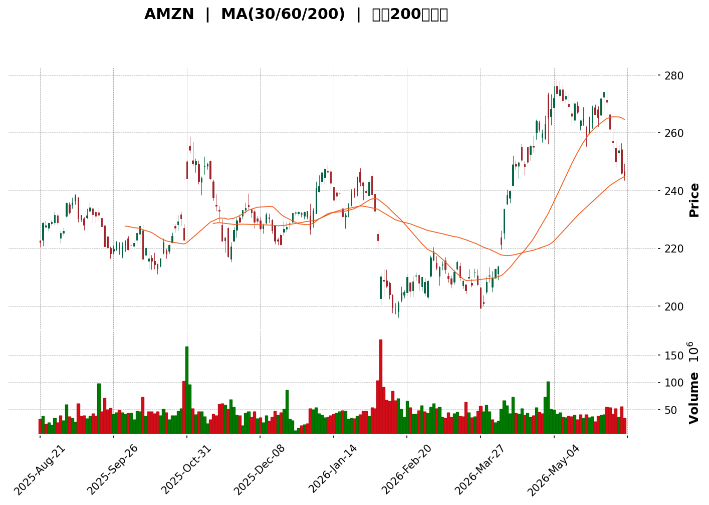
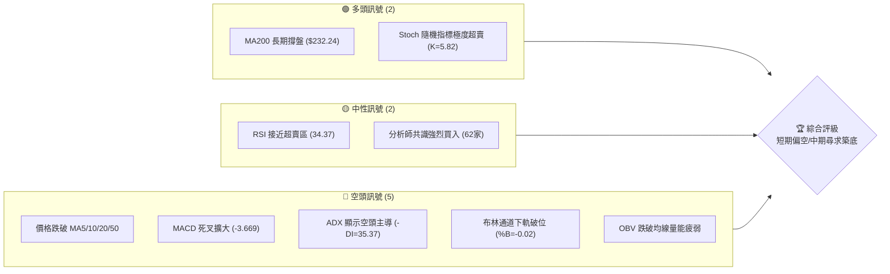
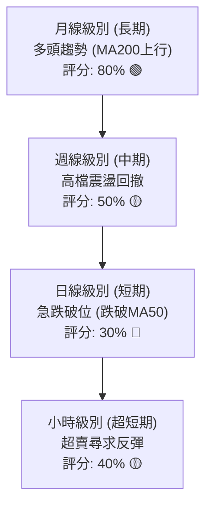
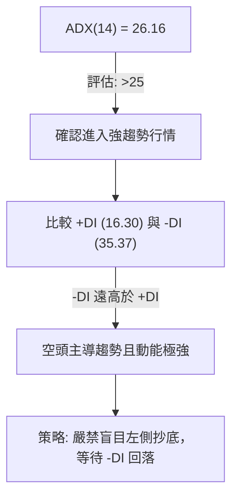

<details>
<summary>📊 靜態圖表 (點擊展開)</summary>

</details>

<html>
<head><meta charset="utf-8" /></head>
<body>
    <div style="height:500px; width:100%;">                        <script>window.PlotlyConfig = {MathJaxConfig: 'local'};</script>
        <script charset="utf-8" src="https://cdn.plot.ly/plotly-3.6.0.min.js" integrity="sha256-QaOVwtVY0T02VaHrr6pnoHLCwayMJp4O5n4YyaE3rJk=" crossorigin="anonymous"></script>                <div id="candlestick-chart" class="plotly-graph-div" style="height:100%; width:100%;"></div>            <script>                window.PLOTLYENV=window.PLOTLYENV || {};                                if (document.getElementById("candlestick-chart")) {                    Plotly.newPlot(                        "candlestick-chart",                        [{"close":{"dtype":"f8","bdata":"AAAAYGa+a0AAAABA4ZpsQAAAAIAUfmxAAAAAYLiWbEAAAAAA16NsQAAAAEAz82xAAAAAAACgbEAAAABA4SpsQAAAACCuP2xAAAAAgMJ1bUAAAABgjwptQAAAAEDhem1AAAAAIK7HbUAAAABgj8psQAAAAGBmvmxAAAAAwMyEbEAAAACAwu1sQAAAAKCZQW1AAAAAANfzbEAAAAAgXOdsQAAAACBc72xAAAAAACl0bEAAAABguJZrQAAAAGC4hmtAAAAAwMxEa0AAAADA9XhrQAAAAKBwxWtAAAAAgD1ya0AAAAAAKZRrQAAAAMAezWtAAAAA4FFwa0AAAADAzJxrQAAAAMD1uGtAAAAAQAonbEAAAAAgrndsQAAAAADXC2tAAAAAgD2Ca0AAAADgegxrQAAAAIA98mpAAAAAQArPakAAAACgR6FqQAAAACBcD2tAAAAAwPXAa0AAAABgZj5rQAAAAEDhomtAAAAAYLgGbEAAAABACl9sQAAAAAAAqGxAAAAAoJnJbEAAAAAghdtrQAAAAEAKh25AAAAAAADAb0AAAACAPSpvQAAAAGBmRm9AAAAAoEdhbkAAAADAHo1uQAAAAMDMDG9AAAAAQDMjb0AAAABgZoZuQAAAAGCPsm1AAAAAgBRWbUAAAAAA1xttQAAAAKCZ0WtAAAAAgBTWa0AAAADgeiRrQAAAAIAUlmtAAAAAwPVIbEAAAACgcLVsQAAAAMAepWxAAAAAQAonbUAAAAAAKTxtQAAAAKBwTW1AAAAAACkMbUAAAAAghaNsQAAAAMD1sGxAAAAA4HpcbEAAAACgcH1sQAAAAMD1+GxAAAAAwPXIbEAAAACAFEZsQAAAAKBH0WtAAAAAgOvRa0AAAADgo6hrQAAAAOBRWGxAAAAAQDNrbEAAAACAwo1sQAAAAOB6BG1AAAAAACkMbUAAAADgoxBtQAAAAIA9Am1AAAAAwPUQbUAAAACAPdpsQAAAAAAAUGxAAAAAgOshbUAAAACAwh1uQAAAAIDrMW5AAAAAoEfJbkAAAAAAKexuQAAAAEAKz25AAAAAQDNTbkAAAADAzJRtQAAAAIDCxW1AAAAAANfjbUAAAAAAAOBsQAAAAIDr6WxAAAAAQOFKbUAAAADAHuVtQAAAAKBwzW1AAAAAgMKVbkAAAADgUWBuQAAAACBcN25AAAAAoJnpbUAAAABguF5uQAAAAADX021AAAAAIK4fbUAAAACAFNZrQAAAAIA9SmpAAAAAQAoXakAAAABguN5pQAAAAGCPgmlAAAAAQDPzaEAAAACgR9loQAAAAMDMJGlAAAAAoEeZaUAAAAAghZtpQAAAACCFQ2pAAAAA4KOoaUAAAACA6xFqQAAAAOB6VGpAAAAAoHD9aUAAAAAAAEBqQAAAAOB6DGpAAAAAIFwXakAAAACAPRprQAAAAIAUXmtAAAAAYLimakAAAAAgrq9qQAAAAGCPympAAAAAwMyUakAAAADA9TBqQAAAAKBw9WlAAAAAIK53akAAAABgZuZqQAAAAADXO2pAAAAA4FEYakAAAAAA16tpQAAAAOB6RGpAAAAAIK7naUAAAABguHZqQAAAAKBH8WlAAAAAQOHqaEAAAABgZh5pQAAAAOCjCGpAAAAAgD1SakAAAADgozhqQAAAAKBHmWpAAAAA4KO4akAAAAAAAKhrQAAAAMDMNG1AAAAAACnMbUAAAADgevxtQAAAAOCjIG9AAAAAAAAQb0AAAABgZjZvQAAAAIDrUW9AAAAAwPUIb0AAAADAHj1vQAAAACCF629AAAAAYI\u002fib0AAAAAA139wQAAAAIDrUXBAAAAAQDM7cEAAAADgo3BwQAAAAMD1kHBAAAAAACnEcEAAAADAzABxQAAAAMDMGHFAAAAAANcvcUAAAABguPJwQAAAAEDhCnFAAAAAANfPcEAAAADAHp1wQAAAAIAU4nBAAAAAIIWzcEAAAACAPYJwQAAAAIDCjXBAAAAAoHA1cEAAAAAAKZBwQAAAACBcx3BAAAAAwB6lcEAAAADgo5RwQAAAAKCZ\u002fXBAAAAAAAAgcUAAAACAPepwQAAAAAApVHBAAAAA4FEIcEAAAADgo0BvQAAAAKBHuW9AAAAAwPXAbkAAAABACqduQA=="},"high":{"dtype":"f8","bdata":"AAAAwPXYa0AAAADgeqRsQAAAAEAzs2xAAAAAAACgbEAAAAAA17tsQAAAAGC4Fm1AAAAAgOv5bEAAAACgcEVsQAAAAKBwZWxAAAAA4KN4bUAAAAAAAIBtQAAAAEAzs21AAAAAQDPbbUAAAACAwrVtQAAAAMD18GxAAAAAoEfZbEAAAAAgXDdtQAAAAMDMfG1AAAAAoJlJbUAAAAAgXC9tQAAAAMAeRW1AAAAAgD3SbEAAAAAghXtsQAAAAIDrEWxAAAAAoHCVa0AAAACgmaFrQAAAAEAz02tAAAAAIK7Ha0AAAADAzMRrQAAAAIDr2WtAAAAAYGYGbEAAAAAgXLdrQAAAAOB63GtAAAAAIFxXbEAAAABguIZsQAAAAAAAiGxAAAAAgMKVa0AAAACAPWprQAAAAGC4NmtAAAAAQOFSa0AAAACgmdlqQAAAAIAUFmtAAAAAgD3qa0AAAADgUYBrQAAAAKCZqWtAAAAAwMwsbEAAAADAzIxsQAAAACCu72xAAAAAgD0abUAAAACAFI5sQAAAAAAAUG9AAAAAoJkpcEAAAAAAKRBwQAAAAAAAYG9AAAAAAClMb0AAAADAzJxuQAAAAAAAeG9AAAAAAAA4b0AAAAAA10tvQAAAAAAAeG5AAAAAIFzXbUAAAABAM1NtQAAAAGBmxmxAAAAAIK73a0AAAADAHm1sQAAAAGC4xmtAAAAAYI9qbEAAAADgo9BsQAAAAAAA+GxAAAAAoEcpbUAAAACgmXltQAAAAEAK321AAAAAACksbUAAAAAAADBtQAAAACCu52xAAAAAYI\u002fabEAAAACAPZJsQAAAAKBwDW1AAAAAIIUDbUAAAABgj8JsQAAAAIDCfWxAAAAAwB71a0AAAACAFCZsQAAAACBcp2xAAAAAACmkbEAAAAAgXK9sQAAAAGBmDm1AAAAAYGYebUAAAAAgrh9tQAAAAEAzE21AAAAA4KMYbUAAAAAgrh9tQAAAAGC4bm1AAAAAAABAbUAAAACAwmVuQAAAAKBHqW5AAAAAwB7NbkAAAAAghftuQAAAAIAUHm9AAAAAwB71bkAAAADA9ShuQAAAAMDMFG5AAAAAgD3ybUAAAABA4WJtQAAAAKCZCW1AAAAAQAp3bUAAAABgZg5uQAAAAGBmHm5AAAAAACmcbkAAAADA9fhuQAAAAAAAYG5AAAAAgD1qbkAAAAAAKbRuQAAAAEAzy25AAAAAIIXbbUAAAACA60lsQAAAAIAUbmpAAAAAgOuZakAAAADAzJRqQAAAAIA9EmpAAAAAYLh+aUAAAADAHiVpQAAAACCuN2lAAAAAIIXbaUAAAADgerRpQAAAAKBwZWpAAAAAgMINakAAAAAghUtqQAAAAEDhcmpAAAAAoJlhakAAAABgj0pqQAAAACBcN2pAAAAAgMIlakAAAACgRzFrQAAAAEAKj2tAAAAAgD0qa0AAAACAPbpqQAAAAMDM9GpAAAAAAAAga0AAAABguHZqQAAAAIDrUWpAAAAAQAqXakAAAABgZvZqQAAAAOB65GpAAAAAANcjakAAAACgR\u002fFpQAAAAKCZmWpAAAAAQDMrakAAAACAPaJqQAAAAOB6nGpAAAAAQDPTaUAAAACgmXlpQAAAAMD1SGpAAAAAYI+yakAAAABguIZqQAAAAGBmnmpAAAAAQAq\u002fakAAAABAM0NsQAAAAKCZOW1AAAAAgMINbkAAAAAAAABuQAAAAIDChW9AAAAAgBROb0AAAAAAAEBvQAAAAEDhAnBAAAAAgMJFb0AAAABA4eJvQAAAAIAU\u002fm9AAAAA4KMscEAAAAAAAIhwQAAAAGBmgnBAAAAA4HpQcEAAAABgj55wQAAAAIAUHnFAAAAAwB4VcUAAAACgmUFxQAAAAMD1aHFAAAAAwMxccUAAAACAFEpxQAAAAAAAIHFAAAAAgBQacUAAAABgZrpwQAAAACCF63BAAAAA4HrscEAAAACAwoVwQAAAAKCZzXBAAAAAAABkcEAAAACgR5lwQAAAAADX13BAAAAA4KPccEAAAADAzNRwQAAAAGCPBnFAAAAAAAAocUAAAAAAACxxQAAAAIAUqnBAAAAAQDNTcEAAAACgcBFwQAAAAGCP+m9AAAAAgBQGcEAAAACgcC1vQA=="},"hovertemplate":"\u003cb\u003e%{x|%Y-%m-%d}\u003c\u002fb\u003e\u003cbr\u003e\u958b: $%{open:.2f}\u003cbr\u003e\u9ad8: $%{high:.2f}\u003cbr\u003e\u4f4e: $%{low:.2f}\u003cbr\u003e\u6536: $%{close:.2f}\u003cextra\u003e\u003c\u002fextra\u003e","low":{"dtype":"f8","bdata":"AAAAAACQa0AAAACAPZprQAAAAIDraWxAAAAA4KNAbEAAAACA63lsQAAAAOCjgGxAAAAAwB6FbEAAAABgj7prQAAAACCFC2xAAAAAwPXYbEAAAACAwv1sQAAAAAAAOG1AAAAAYI9ibUAAAABAM6NsQAAAAEDhqmxAAAAAoEdJbEAAAACAPcpsQAAAACBcB21AAAAAYLiWbEAAAACgR5lsQAAAAGBmtmxAAAAA4FFwbEAAAACAPYJrQAAAAGBmbmtAAAAAQAoPa0AAAADgo0BrQAAAAKCZaWtAAAAA4Ho8a0AAAAAghRNrQAAAAGBmXmtAAAAAQOFqa0AAAADA9QBrQAAAAKBwhWtAAAAAgBSma0AAAAAAALhrQAAAAAAAAGtAAAAAoEcha0AAAABAM5NqQAAAAMAelWpAAAAAgOuZakAAAADA9WBqQAAAAEDhsmpAAAAAIK4\u002fa0AAAADgoxBrQAAAAIDCRWtAAAAAwMy8a0AAAACgRzFsQAAAAGC4RmxAAAAA4FF4bEAAAAAAANhrQAAAACBcf25AAAAAwMycb0AAAADAHhVvQAAAAMAexW5AAAAAoHBFbkAAAAAgrs9tQAAAAEDhsm5AAAAAIFznbkAAAAAAAHhuQAAAAAAAkG1AAAAA4HocbUAAAACAFKZsQAAAAKBwzWtAAAAA4KNQa0AAAAAgrhdrQAAAAIDC5WpAAAAA4KPIa0AAAACgmflrQAAAAOCjmGxAAAAAQArHbEAAAAAAAAhtQAAAAKCZMW1AAAAAIIXTbEAAAACgmVlsQAAAAKCZkWxAAAAA4KNIbEAAAAAghSNsQAAAAGC4jmxAAAAAgBSWbEAAAAAA1yNsQAAAAAAAsGtAAAAAACmka0AAAAAgrp9rQAAAAMAeDWxAAAAAYI8ybEAAAABguFZsQAAAACBcl2xAAAAAYI\u002fqbEAAAACAwuVsQAAAAOCj2GxAAAAAYGbGbEAAAAAA18NsQAAAAGBmFmxAAAAAgMJlbEAAAACAPQJtQAAAAOCj8G1AAAAAACk8bkAAAAAgrkduQAAAAGC4vm5AAAAAAAAIbkAAAABACodtQAAAAAAplG1AAAAAwB6NbUAAAABA4apsQAAAAAApXGxAAAAAwMzcbEAAAACAPVJtQAAAAKBHsW1AAAAAYI\u002fCbUAAAADA9TBuQAAAACCul21AAAAA4Hq0bUAAAACgcMVtQAAAAGBmbm1AAAAAgD36bEAAAAAAKYxrQAAAAIDrCWlAAAAAQDNraUAAAADAHs1pQAAAACCuT2lAAAAAgOuxaEAAAADA9ahoQAAAAAAAgGhAAAAA4FEwaUAAAACA61lpQAAAAAAAeGlAAAAAIIVjaUAAAAAAAGhpQAAAAIDCHWpAAAAAQDOraUAAAABgZqZpQAAAAGC4bmlAAAAAIFxPaUAAAADAzERqQAAAAEDh8mpAAAAAwPWQakAAAAAgheNpQAAAAIDCjWpAAAAAQDNrakAAAADAzARqQAAAAEAKx2lAAAAAYGbuaUAAAACAwo1qQAAAAGCPGmpAAAAAoJnBaUAAAACAPYppQAAAAOBRMGpAAAAA4HrUaUAAAADAzDxqQAAAAADX42lAAAAA4HrkaEAAAAAgXP9oQAAAAOB6hGlAAAAAgBQGakAAAADAzJxpQAAAAEDhMmpAAAAAYI8iakAAAAAA13NrQAAAAOCj6GtAAAAAYLhmbUAAAAAAAHhtQAAAAMD1OG5AAAAAYGbmbkAAAABgZoZuQAAAACCFQ29AAAAAANerbkAAAABAMyNvQAAAAGCPSm9AAAAAgD2ib0AAAABAChtwQAAAAKBwRXBAAAAAgBQKcEAAAABAMxtwQAAAAGCPAnBAAAAAANdrcEAAAADAzMxwQAAAAIAUBnFAAAAAIFwDcUAAAAAA1+dwQAAAAEAz33BAAAAAIK7HcEAAAACAFGpwQAAAAEAzc3BAAAAAgBSqcEAAAACAPU5wQAAAAOB6aHBAAAAAgBTmb0AAAADgejhwQAAAAIDrVXBAAAAAANejcEAAAADAHmFwQAAAAEAzm3BAAAAAQAq3cEAAAACAPdpwQAAAAEAzS3BAAAAAANfLb0AAAABguPZuQAAAAAAAeG9AAAAAwPW4bkAAAADgo2xuQA=="},"name":"\u50f9\u683c","open":{"dtype":"f8","bdata":"AAAAwMzUa0AAAACgR9lrQAAAAEAza2xAAAAAIIVjbEAAAACAPZJsQAAAAOBRoGxAAAAAgD3qbEAAAADgo\u002fBrQAAAAGC4JmxAAAAAgBTmbEAAAACAFGZtQAAAAIAUXm1AAAAAIIWLbUAAAADgo7BtQAAAACCu72xAAAAAQDPLbEAAAAAAKdRsQAAAAIAUHm1AAAAA4KM4bUAAAAAAABBtQAAAAADXC21AAAAAgOvRbEAAAABgj3psQAAAAMDMBGxAAAAAgOuBa0AAAABgj2JrQAAAAGCPgmtAAAAAwPXAa0AAAAAghStrQAAAAOBRoGtAAAAAgBTua0AAAAAAAKBrQAAAAAApnGtAAAAAoHDda0AAAAAAACBsQAAAAGC4RmxAAAAAYGY2a0AAAACA6\u002fFqQAAAAADXE2tAAAAAoHD1akAAAACA69FqQAAAAAApvGpAAAAAgMJNa0AAAACgmWlrQAAAAAAAYGtAAAAAQAq\u002fa0AAAADAHnVsQAAAAEAKh2xAAAAAoHD1bEAAAACA62FsQAAAAEAzQ29AAAAAIIXrb0AAAAAAKUxvQAAAAMD1IG9AAAAAwB4lb0AAAADAzFxuQAAAAEDhCm9AAAAAwB4Nb0AAAAAgrkdvQAAAAKCZYW5AAAAAgOthbUAAAAAAAChtQAAAAEAzg2xAAAAAIK73a0AAAACgmWFsQAAAAEAzC2tAAAAAgOvRa0AAAAAAKUxsQAAAACCu12xAAAAAIK7nbEAAAABACidtQAAAAOBRYG1AAAAAQDMrbUAAAADgoxhtQAAAAIA9ymxAAAAAQOGybEAAAABA4VpsQAAAAIDrmWxAAAAAYLjWbEAAAAAA17tsQAAAAIDCfWxAAAAAoEfha0AAAADAHhVsQAAAAGC4NmxAAAAA4FFYbEAAAAAghZNsQAAAAIDroWxAAAAAACkEbUAAAACgRwFtQAAAAIAU\u002fmxAAAAAYLjmbEAAAADAHh1tQAAAAEDh6mxAAAAAQOGabEAAAABAMwNtQAAAACCF821AAAAAgOthbkAAAACAPZJuQAAAACBc125AAAAAwPXQbkAAAADAzCRuQAAAAIDr6W1AAAAAQOHibUAAAADgUThtQAAAAEDh4mxAAAAAoJlBbUAAAABguF5tQAAAACBc\u002f21AAAAAgBT2bUAAAAAA18tuQAAAAIA9Wm5AAAAA4Hr8bUAAAACA68ltQAAAACBcn25AAAAAIIXbbUAAAADAHh1sQAAAAGBmVmlAAAAAQAofakAAAACgmRlqQAAAAIDrAWpAAAAAYLh+aUAAAAAAKdxoQAAAAAApxGhAAAAAgD1CaUAAAACgmXlpQAAAAOBRmGlAAAAAQDMDakAAAABACq9pQAAAAGC4TmpAAAAAIFxXakAAAABgj9ppQAAAAKCZkWlAAAAAQDNjaUAAAABACk9qQAAAACBc\u002f2pAAAAAIK7fakAAAABgZk5qQAAAAIAUxmpAAAAAYLj2akAAAADgekxqQAAAACCFM2pAAAAAQDMLakAAAACAPZpqQAAAAIDCvWpAAAAAgOvhaUAAAADAzOxpQAAAAKBHOWpAAAAAYGb+aUAAAACA63FqQAAAACCFU2pAAAAAYLjOaUAAAAAgXC9pQAAAAEAzm2lAAAAAgBROakAAAACgR9FpQAAAAKCZOWpAAAAAIK5nakAAAACgR\u002flrQAAAACBcJ2xAAAAAoJlpbUAAAABgZq5tQAAAAMD1OG5AAAAAAAAob0AAAADgURBvQAAAACCu329AAAAAgBQmb0AAAABA4eJvQAAAAIAUjm9AAAAA4Hrsb0AAAAAgrj9wQAAAACBcd3BAAAAAgD0mcEAAAAAA1x9wQAAAAGC4EnFAAAAAoEeZcEAAAADAzMxwQAAAAKBHQXFAAAAAgD0OcUAAAADgUTBxQAAAAIAU+nBAAAAAoHDdcEAAAAAgXKtwQAAAAEDhhnBAAAAAYGbScEAAAAAAAGhwQAAAAIDrfXBAAAAA4KNgcEAAAADAzEBwQAAAAAAAeHBAAAAAYI\u002fKcEAAAABACr9wQAAAAGBmonBAAAAA4FEEcUAAAADgo\u002fRwQAAAAOCjpHBAAAAAYI8ScEAAAABgZtZvQAAAAADXo29AAAAA4FHIb0AAAAAghdNuQA=="},"x":["2025-08-21T00:00:00-04:00","2025-08-22T00:00:00-04:00","2025-08-25T00:00:00-04:00","2025-08-26T00:00:00-04:00","2025-08-27T00:00:00-04:00","2025-08-28T00:00:00-04:00","2025-08-29T00:00:00-04:00","2025-09-02T00:00:00-04:00","2025-09-03T00:00:00-04:00","2025-09-04T00:00:00-04:00","2025-09-05T00:00:00-04:00","2025-09-08T00:00:00-04:00","2025-09-09T00:00:00-04:00","2025-09-10T00:00:00-04:00","2025-09-11T00:00:00-04:00","2025-09-12T00:00:00-04:00","2025-09-15T00:00:00-04:00","2025-09-16T00:00:00-04:00","2025-09-17T00:00:00-04:00","2025-09-18T00:00:00-04:00","2025-09-19T00:00:00-04:00","2025-09-22T00:00:00-04:00","2025-09-23T00:00:00-04:00","2025-09-24T00:00:00-04:00","2025-09-25T00:00:00-04:00","2025-09-26T00:00:00-04:00","2025-09-29T00:00:00-04:00","2025-09-30T00:00:00-04:00","2025-10-01T00:00:00-04:00","2025-10-02T00:00:00-04:00","2025-10-03T00:00:00-04:00","2025-10-06T00:00:00-04:00","2025-10-07T00:00:00-04:00","2025-10-08T00:00:00-04:00","2025-10-09T00:00:00-04:00","2025-10-10T00:00:00-04:00","2025-10-13T00:00:00-04:00","2025-10-14T00:00:00-04:00","2025-10-15T00:00:00-04:00","2025-10-16T00:00:00-04:00","2025-10-17T00:00:00-04:00","2025-10-20T00:00:00-04:00","2025-10-21T00:00:00-04:00","2025-10-22T00:00:00-04:00","2025-10-23T00:00:00-04:00","2025-10-24T00:00:00-04:00","2025-10-27T00:00:00-04:00","2025-10-28T00:00:00-04:00","2025-10-29T00:00:00-04:00","2025-10-30T00:00:00-04:00","2025-10-31T00:00:00-04:00","2025-11-03T00:00:00-05:00","2025-11-04T00:00:00-05:00","2025-11-05T00:00:00-05:00","2025-11-06T00:00:00-05:00","2025-11-07T00:00:00-05:00","2025-11-10T00:00:00-05:00","2025-11-11T00:00:00-05:00","2025-11-12T00:00:00-05:00","2025-11-13T00:00:00-05:00","2025-11-14T00:00:00-05:00","2025-11-17T00:00:00-05:00","2025-11-18T00:00:00-05:00","2025-11-19T00:00:00-05:00","2025-11-20T00:00:00-05:00","2025-11-21T00:00:00-05:00","2025-11-24T00:00:00-05:00","2025-11-25T00:00:00-05:00","2025-11-26T00:00:00-05:00","2025-11-28T00:00:00-05:00","2025-12-01T00:00:00-05:00","2025-12-02T00:00:00-05:00","2025-12-03T00:00:00-05:00","2025-12-04T00:00:00-05:00","2025-12-05T00:00:00-05:00","2025-12-08T00:00:00-05:00","2025-12-09T00:00:00-05:00","2025-12-10T00:00:00-05:00","2025-12-11T00:00:00-05:00","2025-12-12T00:00:00-05:00","2025-12-15T00:00:00-05:00","2025-12-16T00:00:00-05:00","2025-12-17T00:00:00-05:00","2025-12-18T00:00:00-05:00","2025-12-19T00:00:00-05:00","2025-12-22T00:00:00-05:00","2025-12-23T00:00:00-05:00","2025-12-24T00:00:00-05:00","2025-12-26T00:00:00-05:00","2025-12-29T00:00:00-05:00","2025-12-30T00:00:00-05:00","2025-12-31T00:00:00-05:00","2026-01-02T00:00:00-05:00","2026-01-05T00:00:00-05:00","2026-01-06T00:00:00-05:00","2026-01-07T00:00:00-05:00","2026-01-08T00:00:00-05:00","2026-01-09T00:00:00-05:00","2026-01-12T00:00:00-05:00","2026-01-13T00:00:00-05:00","2026-01-14T00:00:00-05:00","2026-01-15T00:00:00-05:00","2026-01-16T00:00:00-05:00","2026-01-20T00:00:00-05:00","2026-01-21T00:00:00-05:00","2026-01-22T00:00:00-05:00","2026-01-23T00:00:00-05:00","2026-01-26T00:00:00-05:00","2026-01-27T00:00:00-05:00","2026-01-28T00:00:00-05:00","2026-01-29T00:00:00-05:00","2026-01-30T00:00:00-05:00","2026-02-02T00:00:00-05:00","2026-02-03T00:00:00-05:00","2026-02-04T00:00:00-05:00","2026-02-05T00:00:00-05:00","2026-02-06T00:00:00-05:00","2026-02-09T00:00:00-05:00","2026-02-10T00:00:00-05:00","2026-02-11T00:00:00-05:00","2026-02-12T00:00:00-05:00","2026-02-13T00:00:00-05:00","2026-02-17T00:00:00-05:00","2026-02-18T00:00:00-05:00","2026-02-19T00:00:00-05:00","2026-02-20T00:00:00-05:00","2026-02-23T00:00:00-05:00","2026-02-24T00:00:00-05:00","2026-02-25T00:00:00-05:00","2026-02-26T00:00:00-05:00","2026-02-27T00:00:00-05:00","2026-03-02T00:00:00-05:00","2026-03-03T00:00:00-05:00","2026-03-04T00:00:00-05:00","2026-03-05T00:00:00-05:00","2026-03-06T00:00:00-05:00","2026-03-09T00:00:00-04:00","2026-03-10T00:00:00-04:00","2026-03-11T00:00:00-04:00","2026-03-12T00:00:00-04:00","2026-03-13T00:00:00-04:00","2026-03-16T00:00:00-04:00","2026-03-17T00:00:00-04:00","2026-03-18T00:00:00-04:00","2026-03-19T00:00:00-04:00","2026-03-20T00:00:00-04:00","2026-03-23T00:00:00-04:00","2026-03-24T00:00:00-04:00","2026-03-25T00:00:00-04:00","2026-03-26T00:00:00-04:00","2026-03-27T00:00:00-04:00","2026-03-30T00:00:00-04:00","2026-03-31T00:00:00-04:00","2026-04-01T00:00:00-04:00","2026-04-02T00:00:00-04:00","2026-04-06T00:00:00-04:00","2026-04-07T00:00:00-04:00","2026-04-08T00:00:00-04:00","2026-04-09T00:00:00-04:00","2026-04-10T00:00:00-04:00","2026-04-13T00:00:00-04:00","2026-04-14T00:00:00-04:00","2026-04-15T00:00:00-04:00","2026-04-16T00:00:00-04:00","2026-04-17T00:00:00-04:00","2026-04-20T00:00:00-04:00","2026-04-21T00:00:00-04:00","2026-04-22T00:00:00-04:00","2026-04-23T00:00:00-04:00","2026-04-24T00:00:00-04:00","2026-04-27T00:00:00-04:00","2026-04-28T00:00:00-04:00","2026-04-29T00:00:00-04:00","2026-04-30T00:00:00-04:00","2026-05-01T00:00:00-04:00","2026-05-04T00:00:00-04:00","2026-05-05T00:00:00-04:00","2026-05-06T00:00:00-04:00","2026-05-07T00:00:00-04:00","2026-05-08T00:00:00-04:00","2026-05-11T00:00:00-04:00","2026-05-12T00:00:00-04:00","2026-05-13T00:00:00-04:00","2026-05-14T00:00:00-04:00","2026-05-15T00:00:00-04:00","2026-05-18T00:00:00-04:00","2026-05-19T00:00:00-04:00","2026-05-20T00:00:00-04:00","2026-05-21T00:00:00-04:00","2026-05-22T00:00:00-04:00","2026-05-26T00:00:00-04:00","2026-05-27T00:00:00-04:00","2026-05-28T00:00:00-04:00","2026-05-29T00:00:00-04:00","2026-06-01T00:00:00-04:00","2026-06-02T00:00:00-04:00","2026-06-03T00:00:00-04:00","2026-06-04T00:00:00-04:00","2026-06-05T00:00:00-04:00","2026-06-08T00:00:00-04:00"],"type":"candlestick"},{"hovertemplate":"MA30: $%{y:.2f}\u003cextra\u003e\u003c\u002fextra\u003e","line":{"color":"#2196F3","dash":"dash","width":2},"mode":"lines","name":"MA30","x":["2025-08-21T00:00:00-04:00","2025-08-22T00:00:00-04:00","2025-08-25T00:00:00-04:00","2025-08-26T00:00:00-04:00","2025-08-27T00:00:00-04:00","2025-08-28T00:00:00-04:00","2025-08-29T00:00:00-04:00","2025-09-02T00:00:00-04:00","2025-09-03T00:00:00-04:00","2025-09-04T00:00:00-04:00","2025-09-05T00:00:00-04:00","2025-09-08T00:00:00-04:00","2025-09-09T00:00:00-04:00","2025-09-10T00:00:00-04:00","2025-09-11T00:00:00-04:00","2025-09-12T00:00:00-04:00","2025-09-15T00:00:00-04:00","2025-09-16T00:00:00-04:00","2025-09-17T00:00:00-04:00","2025-09-18T00:00:00-04:00","2025-09-19T00:00:00-04:00","2025-09-22T00:00:00-04:00","2025-09-23T00:00:00-04:00","2025-09-24T00:00:00-04:00","2025-09-25T00:00:00-04:00","2025-09-26T00:00:00-04:00","2025-09-29T00:00:00-04:00","2025-09-30T00:00:00-04:00","2025-10-01T00:00:00-04:00","2025-10-02T00:00:00-04:00","2025-10-03T00:00:00-04:00","2025-10-06T00:00:00-04:00","2025-10-07T00:00:00-04:00","2025-10-08T00:00:00-04:00","2025-10-09T00:00:00-04:00","2025-10-10T00:00:00-04:00","2025-10-13T00:00:00-04:00","2025-10-14T00:00:00-04:00","2025-10-15T00:00:00-04:00","2025-10-16T00:00:00-04:00","2025-10-17T00:00:00-04:00","2025-10-20T00:00:00-04:00","2025-10-21T00:00:00-04:00","2025-10-22T00:00:00-04:00","2025-10-23T00:00:00-04:00","2025-10-24T00:00:00-04:00","2025-10-27T00:00:00-04:00","2025-10-28T00:00:00-04:00","2025-10-29T00:00:00-04:00","2025-10-30T00:00:00-04:00","2025-10-31T00:00:00-04:00","2025-11-03T00:00:00-05:00","2025-11-04T00:00:00-05:00","2025-11-05T00:00:00-05:00","2025-11-06T00:00:00-05:00","2025-11-07T00:00:00-05:00","2025-11-10T00:00:00-05:00","2025-11-11T00:00:00-05:00","2025-11-12T00:00:00-05:00","2025-11-13T00:00:00-05:00","2025-11-14T00:00:00-05:00","2025-11-17T00:00:00-05:00","2025-11-18T00:00:00-05:00","2025-11-19T00:00:00-05:00","2025-11-20T00:00:00-05:00","2025-11-21T00:00:00-05:00","2025-11-24T00:00:00-05:00","2025-11-25T00:00:00-05:00","2025-11-26T00:00:00-05:00","2025-11-28T00:00:00-05:00","2025-12-01T00:00:00-05:00","2025-12-02T00:00:00-05:00","2025-12-03T00:00:00-05:00","2025-12-04T00:00:00-05:00","2025-12-05T00:00:00-05:00","2025-12-08T00:00:00-05:00","2025-12-09T00:00:00-05:00","2025-12-10T00:00:00-05:00","2025-12-11T00:00:00-05:00","2025-12-12T00:00:00-05:00","2025-12-15T00:00:00-05:00","2025-12-16T00:00:00-05:00","2025-12-17T00:00:00-05:00","2025-12-18T00:00:00-05:00","2025-12-19T00:00:00-05:00","2025-12-22T00:00:00-05:00","2025-12-23T00:00:00-05:00","2025-12-24T00:00:00-05:00","2025-12-26T00:00:00-05:00","2025-12-29T00:00:00-05:00","2025-12-30T00:00:00-05:00","2025-12-31T00:00:00-05:00","2026-01-02T00:00:00-05:00","2026-01-05T00:00:00-05:00","2026-01-06T00:00:00-05:00","2026-01-07T00:00:00-05:00","2026-01-08T00:00:00-05:00","2026-01-09T00:00:00-05:00","2026-01-12T00:00:00-05:00","2026-01-13T00:00:00-05:00","2026-01-14T00:00:00-05:00","2026-01-15T00:00:00-05:00","2026-01-16T00:00:00-05:00","2026-01-20T00:00:00-05:00","2026-01-21T00:00:00-05:00","2026-01-22T00:00:00-05:00","2026-01-23T00:00:00-05:00","2026-01-26T00:00:00-05:00","2026-01-27T00:00:00-05:00","2026-01-28T00:00:00-05:00","2026-01-29T00:00:00-05:00","2026-01-30T00:00:00-05:00","2026-02-02T00:00:00-05:00","2026-02-03T00:00:00-05:00","2026-02-04T00:00:00-05:00","2026-02-05T00:00:00-05:00","2026-02-06T00:00:00-05:00","2026-02-09T00:00:00-05:00","2026-02-10T00:00:00-05:00","2026-02-11T00:00:00-05:00","2026-02-12T00:00:00-05:00","2026-02-13T00:00:00-05:00","2026-02-17T00:00:00-05:00","2026-02-18T00:00:00-05:00","2026-02-19T00:00:00-05:00","2026-02-20T00:00:00-05:00","2026-02-23T00:00:00-05:00","2026-02-24T00:00:00-05:00","2026-02-25T00:00:00-05:00","2026-02-26T00:00:00-05:00","2026-02-27T00:00:00-05:00","2026-03-02T00:00:00-05:00","2026-03-03T00:00:00-05:00","2026-03-04T00:00:00-05:00","2026-03-05T00:00:00-05:00","2026-03-06T00:00:00-05:00","2026-03-09T00:00:00-04:00","2026-03-10T00:00:00-04:00","2026-03-11T00:00:00-04:00","2026-03-12T00:00:00-04:00","2026-03-13T00:00:00-04:00","2026-03-16T00:00:00-04:00","2026-03-17T00:00:00-04:00","2026-03-18T00:00:00-04:00","2026-03-19T00:00:00-04:00","2026-03-20T00:00:00-04:00","2026-03-23T00:00:00-04:00","2026-03-24T00:00:00-04:00","2026-03-25T00:00:00-04:00","2026-03-26T00:00:00-04:00","2026-03-27T00:00:00-04:00","2026-03-30T00:00:00-04:00","2026-03-31T00:00:00-04:00","2026-04-01T00:00:00-04:00","2026-04-02T00:00:00-04:00","2026-04-06T00:00:00-04:00","2026-04-07T00:00:00-04:00","2026-04-08T00:00:00-04:00","2026-04-09T00:00:00-04:00","2026-04-10T00:00:00-04:00","2026-04-13T00:00:00-04:00","2026-04-14T00:00:00-04:00","2026-04-15T00:00:00-04:00","2026-04-16T00:00:00-04:00","2026-04-17T00:00:00-04:00","2026-04-20T00:00:00-04:00","2026-04-21T00:00:00-04:00","2026-04-22T00:00:00-04:00","2026-04-23T00:00:00-04:00","2026-04-24T00:00:00-04:00","2026-04-27T00:00:00-04:00","2026-04-28T00:00:00-04:00","2026-04-29T00:00:00-04:00","2026-04-30T00:00:00-04:00","2026-05-01T00:00:00-04:00","2026-05-04T00:00:00-04:00","2026-05-05T00:00:00-04:00","2026-05-06T00:00:00-04:00","2026-05-07T00:00:00-04:00","2026-05-08T00:00:00-04:00","2026-05-11T00:00:00-04:00","2026-05-12T00:00:00-04:00","2026-05-13T00:00:00-04:00","2026-05-14T00:00:00-04:00","2026-05-15T00:00:00-04:00","2026-05-18T00:00:00-04:00","2026-05-19T00:00:00-04:00","2026-05-20T00:00:00-04:00","2026-05-21T00:00:00-04:00","2026-05-22T00:00:00-04:00","2026-05-26T00:00:00-04:00","2026-05-27T00:00:00-04:00","2026-05-28T00:00:00-04:00","2026-05-29T00:00:00-04:00","2026-06-01T00:00:00-04:00","2026-06-02T00:00:00-04:00","2026-06-03T00:00:00-04:00","2026-06-04T00:00:00-04:00","2026-06-05T00:00:00-04:00","2026-06-08T00:00:00-04:00"],"y":{"dtype":"f8","bdata":"AAAAAAAA+H8AAAAAAAD4fwAAAAAAAPh\u002fAAAAAAAA+H8AAAAAAAD4fwAAAAAAAPh\u002fAAAAAAAA+H8AAAAAAAD4fwAAAAAAAPh\u002fAAAAAAAA+H8AAAAAAAD4fwAAAAAAAPh\u002fAAAAAAAA+H8AAAAAAAD4fwAAAAAAAPh\u002fAAAAAAAA+H8AAAAAAAD4fwAAAAAAAPh\u002fAAAAAAAA+H8AAAAAAAD4fwAAAAAAAPh\u002fAAAAAAAA+H8AAAAAAAD4fwAAAAAAAPh\u002fAAAAAAAA+H8AAAAAAAD4fwAAAAAAAPh\u002fAAAAAAAA+H8AAAAAAAD4f97d3S1rdWxAVVVV5dBybEDv7u6+WGpsQHd3d6fGY2xAZmZmpg1gbEAiIiLSlF5sQDMzMwNWTmxAd3d3h89EbEBVVVWVQztsQKuqqjomMGxAzczMfIYZbEB3d3cH8wRsQFVVVXVM8GtAvLu7CwLfa0Crqqp6zdFrQLy7uxtayGtAq6qqOibEa0CrqqpaZL9rQCIiIqJFumtAAAAAMN24a0Dv7u6e769rQN7d3X2GvWtAIiIiQqfZa0AiIiKyK\u002fhrQGZmZvYoGGxAd3d3l7UybECamZk5+0xsQDMzM8P1aGxAvLu7a3WIbECamZmZmaFsQFVVVQXIsWxAzczMLPnBbECJiIjIvc5sQLy7uwuQz2xAAAAAMN3MbEDe3d2tjsFsQERERFQqxmxAIiIiEsrMbEBVVVVl9NpsQO\u002fu7l5z6WxA7+7uXnP9bEBVVVUVrhNtQGZmZubQJm1AREREJNsxbUARERGRwj1tQAAAAEDDRm1AEREREZ9JbUCrqqp6okptQGZmZlZVTW1AAAAA4E9NbUAAAAAw3VBtQJqZmRm9OW1AIiIi4jMYbUDNzMxcSPpsQN7d3a1H4WxARERERIvQbECJiIiof79sQImIiJgnrmxAvLu761GcbEARERGB3I9sQImIiOj7iWxAVVVVFa6HbEDNzMxMfoVsQJqZmem0iWxAzczMnMSUbEDe3d3dJK5sQERERMRnxGxARERE1L\u002fZbEB3d3fXo+xsQAAAAKAa\u002f2xA3t3d\u002fRsJbUAiIiJiEAxtQM3MzBwTEG1ARERElEMXbUDNzMysRxltQLy7u7stG21AREREFCAjbUCamZlZHS9tQDMzM4MyNm1AvLu7q45FbUBmZmamf1dtQM3MzMz3a21AAAAA8NJ9bUARERHB9ZRtQDMzM1OcoW1AvLu7a6CnbUBVVVUFgaFtQFVVVbU6im1AMzMz8\u002f1wbUDe3d1dulVtQKuqqjrfN21AVVVVJb8UbUARERHRlPJsQDMzM5OK12xAq6qq+mK5bEB3d3d36ZJsQFVVVYVdcWxAREREVJxFbEARERHhMxxsQGZmZub79WtAIiIi8v3Qa0CJiIi4kLRrQBERERHKlGtAIiIikl90a0DNzMx8P2VrQHd3d6cNWGtAIiIiwoNBa0AzMzMjIiZrQGZmZvZvDGtAMzMzo0XqakDe3d1dj8ZqQHd3d7c6ompAAAAAANWEakCrqqqqOGdqQAAAAACOSGpAd3d3l7UuakAzMzMTPBxqQLy7u+sKHGpAiYiIyHYaakCamZnZhx9qQImIiKg4I2pAiYiIqPEiakC8u7t7PyVqQImIiLjXLGpAzczMDAIzakDv7u7OPjhqQAAAAKAaO2pAERERsStEakCJiIjotFFqQLy7uytAampAiYiIyL2KakDv7u6+n6pqQCIiInL21WpA7+7uTmIAa0DNzMy8dCNrQKuqqhovRWtAzczMjJdqa0AzMzOjcJFrQAAAAJA0vWtAiYiIyHbqa0De3d39jSRsQHd3d2eRXWxA7+7urrmQbEAiIiIywcNsQO\u002fu7r6f\u002fmxAd3d3Nxc+bUDNzMxMN4VtQERERHTayG1Ad3d3tx4RbkAzMzNDi1BuQDMzM9MGlm5Aq6qq6lHgbkARERHBgyVvQImIiKh\u002fZ29AIiIi4uyjb0BVVVWF691vQM3MzAy7CnBAd3d33wgjcECrqqqSXzpwQEREREzwTHBAIiIiCtdbcEDNzMz8YmlwQDMzMwuQdXBAzczMpCmDcEB3d3enVI5wQAAAAJAJlHBAiYiImG6YcEBVVVWdfZhwQJqZmUGnl3BAERERodOScEBmZmbm0IhwQA=="},"type":"scatter"},{"hovertemplate":"MA60: $%{y:.2f}\u003cextra\u003e\u003c\u002fextra\u003e","line":{"color":"#9C27B0","dash":"dash","width":2},"mode":"lines","name":"MA60","x":["2025-08-21T00:00:00-04:00","2025-08-22T00:00:00-04:00","2025-08-25T00:00:00-04:00","2025-08-26T00:00:00-04:00","2025-08-27T00:00:00-04:00","2025-08-28T00:00:00-04:00","2025-08-29T00:00:00-04:00","2025-09-02T00:00:00-04:00","2025-09-03T00:00:00-04:00","2025-09-04T00:00:00-04:00","2025-09-05T00:00:00-04:00","2025-09-08T00:00:00-04:00","2025-09-09T00:00:00-04:00","2025-09-10T00:00:00-04:00","2025-09-11T00:00:00-04:00","2025-09-12T00:00:00-04:00","2025-09-15T00:00:00-04:00","2025-09-16T00:00:00-04:00","2025-09-17T00:00:00-04:00","2025-09-18T00:00:00-04:00","2025-09-19T00:00:00-04:00","2025-09-22T00:00:00-04:00","2025-09-23T00:00:00-04:00","2025-09-24T00:00:00-04:00","2025-09-25T00:00:00-04:00","2025-09-26T00:00:00-04:00","2025-09-29T00:00:00-04:00","2025-09-30T00:00:00-04:00","2025-10-01T00:00:00-04:00","2025-10-02T00:00:00-04:00","2025-10-03T00:00:00-04:00","2025-10-06T00:00:00-04:00","2025-10-07T00:00:00-04:00","2025-10-08T00:00:00-04:00","2025-10-09T00:00:00-04:00","2025-10-10T00:00:00-04:00","2025-10-13T00:00:00-04:00","2025-10-14T00:00:00-04:00","2025-10-15T00:00:00-04:00","2025-10-16T00:00:00-04:00","2025-10-17T00:00:00-04:00","2025-10-20T00:00:00-04:00","2025-10-21T00:00:00-04:00","2025-10-22T00:00:00-04:00","2025-10-23T00:00:00-04:00","2025-10-24T00:00:00-04:00","2025-10-27T00:00:00-04:00","2025-10-28T00:00:00-04:00","2025-10-29T00:00:00-04:00","2025-10-30T00:00:00-04:00","2025-10-31T00:00:00-04:00","2025-11-03T00:00:00-05:00","2025-11-04T00:00:00-05:00","2025-11-05T00:00:00-05:00","2025-11-06T00:00:00-05:00","2025-11-07T00:00:00-05:00","2025-11-10T00:00:00-05:00","2025-11-11T00:00:00-05:00","2025-11-12T00:00:00-05:00","2025-11-13T00:00:00-05:00","2025-11-14T00:00:00-05:00","2025-11-17T00:00:00-05:00","2025-11-18T00:00:00-05:00","2025-11-19T00:00:00-05:00","2025-11-20T00:00:00-05:00","2025-11-21T00:00:00-05:00","2025-11-24T00:00:00-05:00","2025-11-25T00:00:00-05:00","2025-11-26T00:00:00-05:00","2025-11-28T00:00:00-05:00","2025-12-01T00:00:00-05:00","2025-12-02T00:00:00-05:00","2025-12-03T00:00:00-05:00","2025-12-04T00:00:00-05:00","2025-12-05T00:00:00-05:00","2025-12-08T00:00:00-05:00","2025-12-09T00:00:00-05:00","2025-12-10T00:00:00-05:00","2025-12-11T00:00:00-05:00","2025-12-12T00:00:00-05:00","2025-12-15T00:00:00-05:00","2025-12-16T00:00:00-05:00","2025-12-17T00:00:00-05:00","2025-12-18T00:00:00-05:00","2025-12-19T00:00:00-05:00","2025-12-22T00:00:00-05:00","2025-12-23T00:00:00-05:00","2025-12-24T00:00:00-05:00","2025-12-26T00:00:00-05:00","2025-12-29T00:00:00-05:00","2025-12-30T00:00:00-05:00","2025-12-31T00:00:00-05:00","2026-01-02T00:00:00-05:00","2026-01-05T00:00:00-05:00","2026-01-06T00:00:00-05:00","2026-01-07T00:00:00-05:00","2026-01-08T00:00:00-05:00","2026-01-09T00:00:00-05:00","2026-01-12T00:00:00-05:00","2026-01-13T00:00:00-05:00","2026-01-14T00:00:00-05:00","2026-01-15T00:00:00-05:00","2026-01-16T00:00:00-05:00","2026-01-20T00:00:00-05:00","2026-01-21T00:00:00-05:00","2026-01-22T00:00:00-05:00","2026-01-23T00:00:00-05:00","2026-01-26T00:00:00-05:00","2026-01-27T00:00:00-05:00","2026-01-28T00:00:00-05:00","2026-01-29T00:00:00-05:00","2026-01-30T00:00:00-05:00","2026-02-02T00:00:00-05:00","2026-02-03T00:00:00-05:00","2026-02-04T00:00:00-05:00","2026-02-05T00:00:00-05:00","2026-02-06T00:00:00-05:00","2026-02-09T00:00:00-05:00","2026-02-10T00:00:00-05:00","2026-02-11T00:00:00-05:00","2026-02-12T00:00:00-05:00","2026-02-13T00:00:00-05:00","2026-02-17T00:00:00-05:00","2026-02-18T00:00:00-05:00","2026-02-19T00:00:00-05:00","2026-02-20T00:00:00-05:00","2026-02-23T00:00:00-05:00","2026-02-24T00:00:00-05:00","2026-02-25T00:00:00-05:00","2026-02-26T00:00:00-05:00","2026-02-27T00:00:00-05:00","2026-03-02T00:00:00-05:00","2026-03-03T00:00:00-05:00","2026-03-04T00:00:00-05:00","2026-03-05T00:00:00-05:00","2026-03-06T00:00:00-05:00","2026-03-09T00:00:00-04:00","2026-03-10T00:00:00-04:00","2026-03-11T00:00:00-04:00","2026-03-12T00:00:00-04:00","2026-03-13T00:00:00-04:00","2026-03-16T00:00:00-04:00","2026-03-17T00:00:00-04:00","2026-03-18T00:00:00-04:00","2026-03-19T00:00:00-04:00","2026-03-20T00:00:00-04:00","2026-03-23T00:00:00-04:00","2026-03-24T00:00:00-04:00","2026-03-25T00:00:00-04:00","2026-03-26T00:00:00-04:00","2026-03-27T00:00:00-04:00","2026-03-30T00:00:00-04:00","2026-03-31T00:00:00-04:00","2026-04-01T00:00:00-04:00","2026-04-02T00:00:00-04:00","2026-04-06T00:00:00-04:00","2026-04-07T00:00:00-04:00","2026-04-08T00:00:00-04:00","2026-04-09T00:00:00-04:00","2026-04-10T00:00:00-04:00","2026-04-13T00:00:00-04:00","2026-04-14T00:00:00-04:00","2026-04-15T00:00:00-04:00","2026-04-16T00:00:00-04:00","2026-04-17T00:00:00-04:00","2026-04-20T00:00:00-04:00","2026-04-21T00:00:00-04:00","2026-04-22T00:00:00-04:00","2026-04-23T00:00:00-04:00","2026-04-24T00:00:00-04:00","2026-04-27T00:00:00-04:00","2026-04-28T00:00:00-04:00","2026-04-29T00:00:00-04:00","2026-04-30T00:00:00-04:00","2026-05-01T00:00:00-04:00","2026-05-04T00:00:00-04:00","2026-05-05T00:00:00-04:00","2026-05-06T00:00:00-04:00","2026-05-07T00:00:00-04:00","2026-05-08T00:00:00-04:00","2026-05-11T00:00:00-04:00","2026-05-12T00:00:00-04:00","2026-05-13T00:00:00-04:00","2026-05-14T00:00:00-04:00","2026-05-15T00:00:00-04:00","2026-05-18T00:00:00-04:00","2026-05-19T00:00:00-04:00","2026-05-20T00:00:00-04:00","2026-05-21T00:00:00-04:00","2026-05-22T00:00:00-04:00","2026-05-26T00:00:00-04:00","2026-05-27T00:00:00-04:00","2026-05-28T00:00:00-04:00","2026-05-29T00:00:00-04:00","2026-06-01T00:00:00-04:00","2026-06-02T00:00:00-04:00","2026-06-03T00:00:00-04:00","2026-06-04T00:00:00-04:00","2026-06-05T00:00:00-04:00","2026-06-08T00:00:00-04:00"],"y":{"dtype":"f8","bdata":"AAAAAAAA+H8AAAAAAAD4fwAAAAAAAPh\u002fAAAAAAAA+H8AAAAAAAD4fwAAAAAAAPh\u002fAAAAAAAA+H8AAAAAAAD4fwAAAAAAAPh\u002fAAAAAAAA+H8AAAAAAAD4fwAAAAAAAPh\u002fAAAAAAAA+H8AAAAAAAD4fwAAAAAAAPh\u002fAAAAAAAA+H8AAAAAAAD4fwAAAAAAAPh\u002fAAAAAAAA+H8AAAAAAAD4fwAAAAAAAPh\u002fAAAAAAAA+H8AAAAAAAD4fwAAAAAAAPh\u002fAAAAAAAA+H8AAAAAAAD4fwAAAAAAAPh\u002fAAAAAAAA+H8AAAAAAAD4fwAAAAAAAPh\u002fAAAAAAAA+H8AAAAAAAD4fwAAAAAAAPh\u002fAAAAAAAA+H8AAAAAAAD4fwAAAAAAAPh\u002fAAAAAAAA+H8AAAAAAAD4fwAAAAAAAPh\u002fAAAAAAAA+H8AAAAAAAD4fwAAAAAAAPh\u002fAAAAAAAA+H8AAAAAAAD4fwAAAAAAAPh\u002fAAAAAAAA+H8AAAAAAAD4fwAAAAAAAPh\u002fAAAAAAAA+H8AAAAAAAD4fwAAAAAAAPh\u002fAAAAAAAA+H8AAAAAAAD4fwAAAAAAAPh\u002fAAAAAAAA+H8AAAAAAAD4fwAAAAAAAPh\u002fAAAAAAAA+H8AAAAAAAD4f5qZmZmZk2xAERERCWWabEC8u7tDi5xsQJqZmVmrmWxAMzMza3WWbEAAAADAEZBsQLy7uytAimxAzczMzMyIbEBVVVX9G4tsQM3MzMzMjGxA3t3d7XyLbEBmZmaOUIxsQN7d3a2Oi2xAAAAAmG6IbEDe3d0FyIdsQN7d3a2Oh2xA3t3dpeKGbECrqqpqA4VsQERERHzNg2xAAAAAiBaDbEB3d3dnZoBsQLy7u8uhe2xAIiIiku14bEB3d3cHOnlsQCIiIlK4fGxA3t3dbaCBbEARERFxPYZsQN7d3a2Oi2xAvLu7q2OSbEBVVVUNu5hsQO\u002fu7vbhnWxAERERodOkbECrqqoKHqpsQKuqqnqirGxAZmZm5tCwbEDe3d3F2bdsQERERAxJxWxAMzMz80TTbEBmZmYezONsQHd3d\u002f9G9GxAZmZmrkcDbUC8u7s73w9tQJqZmQFyG21AREREXI8kbUDv7u4ehSttQN7d3X34MG1Aq6qqkl82bUAiIiLq3zxtQM3MzOzDQW1A3t3dRW9JbUAzMzNrLlRtQDMzM3PaUm1AERERaQNLbUDv7u4On0dtQImIiAByQW1AAAAA2BU8bUDv7u5WgDBtQO\u002fu7iYxHG1Ad3d376cGbUB3d3dvy\u002fJsQJqZmZHt4GxAVVVVnTbObEDv7u6OCbxsQGZmZr6fsGxAvLu7yxOnbECrqqoqh6BsQM3MzKTimmxAREREFK6PbEBERETca4RsQDMzM0OLemxAAAAA+AxtbEBVVVWNUGBsQO\u002fu7pZuUmxAMzMzk9FFbEDNzMyUQz9sQJqZmbGdOWxAMzMz61EybEBmZma+nypsQM3MzDxRIWxAd3d3J+oXbEAiIiKCBw9sQCIiIkIZB2xAAAAA+FMBbEDe3d01F\u002f5rQJqZmSkV9WtAmpmZASvra0BERESM3t5rQImIiNAi02tA3t3dXbrFa0C8u7sbobprQJqZmfGLrWtA7+7uZtiba0BmZmYm6otrQN7d3SUxgmtAvLu7gzJ2a0AzMzMjlGVrQKuqqhI8VmtAq6qqAuREa0DNzMxk9DZrQBEREQkeMGtAVVVV3d0ta0C8u7s7mC9rQJqZmUFgNWtAiYiI8GA6a0DNzMwcWkRrQBEREWGeTmtAd3d3pw1Wa0AzMzNjyVtrQDMzM0PSZGtA3t3dNV5qa0De3d2tjnVrQHd3dw\u002fmf2tAd3d3V8eKa0BmZmbufJVrQHd3d9+Wo2tAd3d3Z2a2a0AAAACwudBrQAAAALBy8mtAAAAAwMoVbEBmZmaOCThsQN7d3b2fXGxAmpmZyaGBbEBmZmaeYaVsQImIiLArymxAd3d3d3frbEAiIiIqFQttQM3MzFxIKG1AAAAAuB5FbUDv7u4GOmNtQCIiImIQgm1AZmZm7jWhbUBERETcsr5tQERERESL4G1AREREzFoDbkDe3d0FDyBuQFVVVR2hNm5A7+7uXrpNbkDv7u7uNWFuQJqZmYlBdm5AVVVVBQ+IbkBVVVXlF5tuQA=="},"type":"scatter"},{"hovertemplate":"MA200: $%{y:.2f}\u003cextra\u003e\u003c\u002fextra\u003e","line":{"color":"#FF6F00","dash":"solid","width":2},"mode":"lines","name":"MA200","x":["2025-08-21T00:00:00-04:00","2025-08-22T00:00:00-04:00","2025-08-25T00:00:00-04:00","2025-08-26T00:00:00-04:00","2025-08-27T00:00:00-04:00","2025-08-28T00:00:00-04:00","2025-08-29T00:00:00-04:00","2025-09-02T00:00:00-04:00","2025-09-03T00:00:00-04:00","2025-09-04T00:00:00-04:00","2025-09-05T00:00:00-04:00","2025-09-08T00:00:00-04:00","2025-09-09T00:00:00-04:00","2025-09-10T00:00:00-04:00","2025-09-11T00:00:00-04:00","2025-09-12T00:00:00-04:00","2025-09-15T00:00:00-04:00","2025-09-16T00:00:00-04:00","2025-09-17T00:00:00-04:00","2025-09-18T00:00:00-04:00","2025-09-19T00:00:00-04:00","2025-09-22T00:00:00-04:00","2025-09-23T00:00:00-04:00","2025-09-24T00:00:00-04:00","2025-09-25T00:00:00-04:00","2025-09-26T00:00:00-04:00","2025-09-29T00:00:00-04:00","2025-09-30T00:00:00-04:00","2025-10-01T00:00:00-04:00","2025-10-02T00:00:00-04:00","2025-10-03T00:00:00-04:00","2025-10-06T00:00:00-04:00","2025-10-07T00:00:00-04:00","2025-10-08T00:00:00-04:00","2025-10-09T00:00:00-04:00","2025-10-10T00:00:00-04:00","2025-10-13T00:00:00-04:00","2025-10-14T00:00:00-04:00","2025-10-15T00:00:00-04:00","2025-10-16T00:00:00-04:00","2025-10-17T00:00:00-04:00","2025-10-20T00:00:00-04:00","2025-10-21T00:00:00-04:00","2025-10-22T00:00:00-04:00","2025-10-23T00:00:00-04:00","2025-10-24T00:00:00-04:00","2025-10-27T00:00:00-04:00","2025-10-28T00:00:00-04:00","2025-10-29T00:00:00-04:00","2025-10-30T00:00:00-04:00","2025-10-31T00:00:00-04:00","2025-11-03T00:00:00-05:00","2025-11-04T00:00:00-05:00","2025-11-05T00:00:00-05:00","2025-11-06T00:00:00-05:00","2025-11-07T00:00:00-05:00","2025-11-10T00:00:00-05:00","2025-11-11T00:00:00-05:00","2025-11-12T00:00:00-05:00","2025-11-13T00:00:00-05:00","2025-11-14T00:00:00-05:00","2025-11-17T00:00:00-05:00","2025-11-18T00:00:00-05:00","2025-11-19T00:00:00-05:00","2025-11-20T00:00:00-05:00","2025-11-21T00:00:00-05:00","2025-11-24T00:00:00-05:00","2025-11-25T00:00:00-05:00","2025-11-26T00:00:00-05:00","2025-11-28T00:00:00-05:00","2025-12-01T00:00:00-05:00","2025-12-02T00:00:00-05:00","2025-12-03T00:00:00-05:00","2025-12-04T00:00:00-05:00","2025-12-05T00:00:00-05:00","2025-12-08T00:00:00-05:00","2025-12-09T00:00:00-05:00","2025-12-10T00:00:00-05:00","2025-12-11T00:00:00-05:00","2025-12-12T00:00:00-05:00","2025-12-15T00:00:00-05:00","2025-12-16T00:00:00-05:00","2025-12-17T00:00:00-05:00","2025-12-18T00:00:00-05:00","2025-12-19T00:00:00-05:00","2025-12-22T00:00:00-05:00","2025-12-23T00:00:00-05:00","2025-12-24T00:00:00-05:00","2025-12-26T00:00:00-05:00","2025-12-29T00:00:00-05:00","2025-12-30T00:00:00-05:00","2025-12-31T00:00:00-05:00","2026-01-02T00:00:00-05:00","2026-01-05T00:00:00-05:00","2026-01-06T00:00:00-05:00","2026-01-07T00:00:00-05:00","2026-01-08T00:00:00-05:00","2026-01-09T00:00:00-05:00","2026-01-12T00:00:00-05:00","2026-01-13T00:00:00-05:00","2026-01-14T00:00:00-05:00","2026-01-15T00:00:00-05:00","2026-01-16T00:00:00-05:00","2026-01-20T00:00:00-05:00","2026-01-21T00:00:00-05:00","2026-01-22T00:00:00-05:00","2026-01-23T00:00:00-05:00","2026-01-26T00:00:00-05:00","2026-01-27T00:00:00-05:00","2026-01-28T00:00:00-05:00","2026-01-29T00:00:00-05:00","2026-01-30T00:00:00-05:00","2026-02-02T00:00:00-05:00","2026-02-03T00:00:00-05:00","2026-02-04T00:00:00-05:00","2026-02-05T00:00:00-05:00","2026-02-06T00:00:00-05:00","2026-02-09T00:00:00-05:00","2026-02-10T00:00:00-05:00","2026-02-11T00:00:00-05:00","2026-02-12T00:00:00-05:00","2026-02-13T00:00:00-05:00","2026-02-17T00:00:00-05:00","2026-02-18T00:00:00-05:00","2026-02-19T00:00:00-05:00","2026-02-20T00:00:00-05:00","2026-02-23T00:00:00-05:00","2026-02-24T00:00:00-05:00","2026-02-25T00:00:00-05:00","2026-02-26T00:00:00-05:00","2026-02-27T00:00:00-05:00","2026-03-02T00:00:00-05:00","2026-03-03T00:00:00-05:00","2026-03-04T00:00:00-05:00","2026-03-05T00:00:00-05:00","2026-03-06T00:00:00-05:00","2026-03-09T00:00:00-04:00","2026-03-10T00:00:00-04:00","2026-03-11T00:00:00-04:00","2026-03-12T00:00:00-04:00","2026-03-13T00:00:00-04:00","2026-03-16T00:00:00-04:00","2026-03-17T00:00:00-04:00","2026-03-18T00:00:00-04:00","2026-03-19T00:00:00-04:00","2026-03-20T00:00:00-04:00","2026-03-23T00:00:00-04:00","2026-03-24T00:00:00-04:00","2026-03-25T00:00:00-04:00","2026-03-26T00:00:00-04:00","2026-03-27T00:00:00-04:00","2026-03-30T00:00:00-04:00","2026-03-31T00:00:00-04:00","2026-04-01T00:00:00-04:00","2026-04-02T00:00:00-04:00","2026-04-06T00:00:00-04:00","2026-04-07T00:00:00-04:00","2026-04-08T00:00:00-04:00","2026-04-09T00:00:00-04:00","2026-04-10T00:00:00-04:00","2026-04-13T00:00:00-04:00","2026-04-14T00:00:00-04:00","2026-04-15T00:00:00-04:00","2026-04-16T00:00:00-04:00","2026-04-17T00:00:00-04:00","2026-04-20T00:00:00-04:00","2026-04-21T00:00:00-04:00","2026-04-22T00:00:00-04:00","2026-04-23T00:00:00-04:00","2026-04-24T00:00:00-04:00","2026-04-27T00:00:00-04:00","2026-04-28T00:00:00-04:00","2026-04-29T00:00:00-04:00","2026-04-30T00:00:00-04:00","2026-05-01T00:00:00-04:00","2026-05-04T00:00:00-04:00","2026-05-05T00:00:00-04:00","2026-05-06T00:00:00-04:00","2026-05-07T00:00:00-04:00","2026-05-08T00:00:00-04:00","2026-05-11T00:00:00-04:00","2026-05-12T00:00:00-04:00","2026-05-13T00:00:00-04:00","2026-05-14T00:00:00-04:00","2026-05-15T00:00:00-04:00","2026-05-18T00:00:00-04:00","2026-05-19T00:00:00-04:00","2026-05-20T00:00:00-04:00","2026-05-21T00:00:00-04:00","2026-05-22T00:00:00-04:00","2026-05-26T00:00:00-04:00","2026-05-27T00:00:00-04:00","2026-05-28T00:00:00-04:00","2026-05-29T00:00:00-04:00","2026-06-01T00:00:00-04:00","2026-06-02T00:00:00-04:00","2026-06-03T00:00:00-04:00","2026-06-04T00:00:00-04:00","2026-06-05T00:00:00-04:00","2026-06-08T00:00:00-04:00"],"y":{"dtype":"f8","bdata":"AAAAAAAA+H8AAAAAAAD4fwAAAAAAAPh\u002fAAAAAAAA+H8AAAAAAAD4fwAAAAAAAPh\u002fAAAAAAAA+H8AAAAAAAD4fwAAAAAAAPh\u002fAAAAAAAA+H8AAAAAAAD4fwAAAAAAAPh\u002fAAAAAAAA+H8AAAAAAAD4fwAAAAAAAPh\u002fAAAAAAAA+H8AAAAAAAD4fwAAAAAAAPh\u002fAAAAAAAA+H8AAAAAAAD4fwAAAAAAAPh\u002fAAAAAAAA+H8AAAAAAAD4fwAAAAAAAPh\u002fAAAAAAAA+H8AAAAAAAD4fwAAAAAAAPh\u002fAAAAAAAA+H8AAAAAAAD4fwAAAAAAAPh\u002fAAAAAAAA+H8AAAAAAAD4fwAAAAAAAPh\u002fAAAAAAAA+H8AAAAAAAD4fwAAAAAAAPh\u002fAAAAAAAA+H8AAAAAAAD4fwAAAAAAAPh\u002fAAAAAAAA+H8AAAAAAAD4fwAAAAAAAPh\u002fAAAAAAAA+H8AAAAAAAD4fwAAAAAAAPh\u002fAAAAAAAA+H8AAAAAAAD4fwAAAAAAAPh\u002fAAAAAAAA+H8AAAAAAAD4fwAAAAAAAPh\u002fAAAAAAAA+H8AAAAAAAD4fwAAAAAAAPh\u002fAAAAAAAA+H8AAAAAAAD4fwAAAAAAAPh\u002fAAAAAAAA+H8AAAAAAAD4fwAAAAAAAPh\u002fAAAAAAAA+H8AAAAAAAD4fwAAAAAAAPh\u002fAAAAAAAA+H8AAAAAAAD4fwAAAAAAAPh\u002fAAAAAAAA+H8AAAAAAAD4fwAAAAAAAPh\u002fAAAAAAAA+H8AAAAAAAD4fwAAAAAAAPh\u002fAAAAAAAA+H8AAAAAAAD4fwAAAAAAAPh\u002fAAAAAAAA+H8AAAAAAAD4fwAAAAAAAPh\u002fAAAAAAAA+H8AAAAAAAD4fwAAAAAAAPh\u002fAAAAAAAA+H8AAAAAAAD4fwAAAAAAAPh\u002fAAAAAAAA+H8AAAAAAAD4fwAAAAAAAPh\u002fAAAAAAAA+H8AAAAAAAD4fwAAAAAAAPh\u002fAAAAAAAA+H8AAAAAAAD4fwAAAAAAAPh\u002fAAAAAAAA+H8AAAAAAAD4fwAAAAAAAPh\u002fAAAAAAAA+H8AAAAAAAD4fwAAAAAAAPh\u002fAAAAAAAA+H8AAAAAAAD4fwAAAAAAAPh\u002fAAAAAAAA+H8AAAAAAAD4fwAAAAAAAPh\u002fAAAAAAAA+H8AAAAAAAD4fwAAAAAAAPh\u002fAAAAAAAA+H8AAAAAAAD4fwAAAAAAAPh\u002fAAAAAAAA+H8AAAAAAAD4fwAAAAAAAPh\u002fAAAAAAAA+H8AAAAAAAD4fwAAAAAAAPh\u002fAAAAAAAA+H8AAAAAAAD4fwAAAAAAAPh\u002fAAAAAAAA+H8AAAAAAAD4fwAAAAAAAPh\u002fAAAAAAAA+H8AAAAAAAD4fwAAAAAAAPh\u002fAAAAAAAA+H8AAAAAAAD4fwAAAAAAAPh\u002fAAAAAAAA+H8AAAAAAAD4fwAAAAAAAPh\u002fAAAAAAAA+H8AAAAAAAD4fwAAAAAAAPh\u002fAAAAAAAA+H8AAAAAAAD4fwAAAAAAAPh\u002fAAAAAAAA+H8AAAAAAAD4fwAAAAAAAPh\u002fAAAAAAAA+H8AAAAAAAD4fwAAAAAAAPh\u002fAAAAAAAA+H8AAAAAAAD4fwAAAAAAAPh\u002fAAAAAAAA+H8AAAAAAAD4fwAAAAAAAPh\u002fAAAAAAAA+H8AAAAAAAD4fwAAAAAAAPh\u002fAAAAAAAA+H8AAAAAAAD4fwAAAAAAAPh\u002fAAAAAAAA+H8AAAAAAAD4fwAAAAAAAPh\u002fAAAAAAAA+H8AAAAAAAD4fwAAAAAAAPh\u002fAAAAAAAA+H8AAAAAAAD4fwAAAAAAAPh\u002fAAAAAAAA+H8AAAAAAAD4fwAAAAAAAPh\u002fAAAAAAAA+H8AAAAAAAD4fwAAAAAAAPh\u002fAAAAAAAA+H8AAAAAAAD4fwAAAAAAAPh\u002fAAAAAAAA+H8AAAAAAAD4fwAAAAAAAPh\u002fAAAAAAAA+H8AAAAAAAD4fwAAAAAAAPh\u002fAAAAAAAA+H8AAAAAAAD4fwAAAAAAAPh\u002fAAAAAAAA+H8AAAAAAAD4fwAAAAAAAPh\u002fAAAAAAAA+H8AAAAAAAD4fwAAAAAAAPh\u002fAAAAAAAA+H8AAAAAAAD4fwAAAAAAAPh\u002fAAAAAAAA+H8AAAAAAAD4fwAAAAAAAPh\u002fAAAAAAAA+H8AAAAAAAD4fwAAAAAAAPh\u002fAAAAAAAA+H+PwvX8hwdtQA=="},"type":"scatter"}],                        {"template":{"data":{"barpolar":[{"marker":{"line":{"color":"rgb(17,17,17)","width":0.5},"pattern":{"fillmode":"overlay","size":10,"solidity":0.2}},"type":"barpolar"}],"bar":[{"error_x":{"color":"#f2f5fa"},"error_y":{"color":"#f2f5fa"},"marker":{"line":{"color":"rgb(17,17,17)","width":0.5},"pattern":{"fillmode":"overlay","size":10,"solidity":0.2}},"type":"bar"}],"carpet":[{"aaxis":{"endlinecolor":"#A2B1C6","gridcolor":"#506784","linecolor":"#506784","minorgridcolor":"#506784","startlinecolor":"#A2B1C6"},"baxis":{"endlinecolor":"#A2B1C6","gridcolor":"#506784","linecolor":"#506784","minorgridcolor":"#506784","startlinecolor":"#A2B1C6"},"type":"carpet"}],"choropleth":[{"colorbar":{"outlinewidth":0,"ticks":""},"type":"choropleth"}],"contourcarpet":[{"colorbar":{"outlinewidth":0,"ticks":""},"type":"contourcarpet"}],"contour":[{"colorbar":{"outlinewidth":0,"ticks":""},"colorscale":[[0.0,"#0d0887"],[0.1111111111111111,"#46039f"],[0.2222222222222222,"#7201a8"],[0.3333333333333333,"#9c179e"],[0.4444444444444444,"#bd3786"],[0.5555555555555556,"#d8576b"],[0.6666666666666666,"#ed7953"],[0.7777777777777778,"#fb9f3a"],[0.8888888888888888,"#fdca26"],[1.0,"#f0f921"]],"type":"contour"}],"heatmap":[{"colorbar":{"outlinewidth":0,"ticks":""},"colorscale":[[0.0,"#0d0887"],[0.1111111111111111,"#46039f"],[0.2222222222222222,"#7201a8"],[0.3333333333333333,"#9c179e"],[0.4444444444444444,"#bd3786"],[0.5555555555555556,"#d8576b"],[0.6666666666666666,"#ed7953"],[0.7777777777777778,"#fb9f3a"],[0.8888888888888888,"#fdca26"],[1.0,"#f0f921"]],"type":"heatmap"}],"histogram2dcontour":[{"colorbar":{"outlinewidth":0,"ticks":""},"colorscale":[[0.0,"#0d0887"],[0.1111111111111111,"#46039f"],[0.2222222222222222,"#7201a8"],[0.3333333333333333,"#9c179e"],[0.4444444444444444,"#bd3786"],[0.5555555555555556,"#d8576b"],[0.6666666666666666,"#ed7953"],[0.7777777777777778,"#fb9f3a"],[0.8888888888888888,"#fdca26"],[1.0,"#f0f921"]],"type":"histogram2dcontour"}],"histogram2d":[{"colorbar":{"outlinewidth":0,"ticks":""},"colorscale":[[0.0,"#0d0887"],[0.1111111111111111,"#46039f"],[0.2222222222222222,"#7201a8"],[0.3333333333333333,"#9c179e"],[0.4444444444444444,"#bd3786"],[0.5555555555555556,"#d8576b"],[0.6666666666666666,"#ed7953"],[0.7777777777777778,"#fb9f3a"],[0.8888888888888888,"#fdca26"],[1.0,"#f0f921"]],"type":"histogram2d"}],"histogram":[{"marker":{"pattern":{"fillmode":"overlay","size":10,"solidity":0.2}},"type":"histogram"}],"mesh3d":[{"colorbar":{"outlinewidth":0,"ticks":""},"type":"mesh3d"}],"parcoords":[{"line":{"colorbar":{"outlinewidth":0,"ticks":""}},"type":"parcoords"}],"pie":[{"automargin":true,"type":"pie"}],"scatter3d":[{"line":{"colorbar":{"outlinewidth":0,"ticks":""}},"marker":{"colorbar":{"outlinewidth":0,"ticks":""}},"type":"scatter3d"}],"scattercarpet":[{"marker":{"colorbar":{"outlinewidth":0,"ticks":""}},"type":"scattercarpet"}],"scattergeo":[{"marker":{"colorbar":{"outlinewidth":0,"ticks":""}},"type":"scattergeo"}],"scattergl":[{"marker":{"line":{"color":"#283442"}},"type":"scattergl"}],"scattermapbox":[{"marker":{"colorbar":{"outlinewidth":0,"ticks":""}},"type":"scattermapbox"}],"scattermap":[{"marker":{"colorbar":{"outlinewidth":0,"ticks":""}},"type":"scattermap"}],"scatterpolargl":[{"marker":{"colorbar":{"outlinewidth":0,"ticks":""}},"type":"scatterpolargl"}],"scatterpolar":[{"marker":{"colorbar":{"outlinewidth":0,"ticks":""}},"type":"scatterpolar"}],"scatter":[{"marker":{"line":{"color":"#283442"}},"type":"scatter"}],"scatterternary":[{"marker":{"colorbar":{"outlinewidth":0,"ticks":""}},"type":"scatterternary"}],"surface":[{"colorbar":{"outlinewidth":0,"ticks":""},"colorscale":[[0.0,"#0d0887"],[0.1111111111111111,"#46039f"],[0.2222222222222222,"#7201a8"],[0.3333333333333333,"#9c179e"],[0.4444444444444444,"#bd3786"],[0.5555555555555556,"#d8576b"],[0.6666666666666666,"#ed7953"],[0.7777777777777778,"#fb9f3a"],[0.8888888888888888,"#fdca26"],[1.0,"#f0f921"]],"type":"surface"}],"table":[{"cells":{"fill":{"color":"#506784"},"line":{"color":"rgb(17,17,17)"}},"header":{"fill":{"color":"#2a3f5f"},"line":{"color":"rgb(17,17,17)"}},"type":"table"}]},"layout":{"annotationdefaults":{"arrowcolor":"#f2f5fa","arrowhead":0,"arrowwidth":1},"autotypenumbers":"strict","coloraxis":{"colorbar":{"outlinewidth":0,"ticks":""}},"colorscale":{"diverging":[[0,"#8e0152"],[0.1,"#c51b7d"],[0.2,"#de77ae"],[0.3,"#f1b6da"],[0.4,"#fde0ef"],[0.5,"#f7f7f7"],[0.6,"#e6f5d0"],[0.7,"#b8e186"],[0.8,"#7fbc41"],[0.9,"#4d9221"],[1,"#276419"]],"sequential":[[0.0,"#0d0887"],[0.1111111111111111,"#46039f"],[0.2222222222222222,"#7201a8"],[0.3333333333333333,"#9c179e"],[0.4444444444444444,"#bd3786"],[0.5555555555555556,"#d8576b"],[0.6666666666666666,"#ed7953"],[0.7777777777777778,"#fb9f3a"],[0.8888888888888888,"#fdca26"],[1.0,"#f0f921"]],"sequentialminus":[[0.0,"#0d0887"],[0.1111111111111111,"#46039f"],[0.2222222222222222,"#7201a8"],[0.3333333333333333,"#9c179e"],[0.4444444444444444,"#bd3786"],[0.5555555555555556,"#d8576b"],[0.6666666666666666,"#ed7953"],[0.7777777777777778,"#fb9f3a"],[0.8888888888888888,"#fdca26"],[1.0,"#f0f921"]]},"colorway":["#636efa","#EF553B","#00cc96","#ab63fa","#FFA15A","#19d3f3","#FF6692","#B6E880","#FF97FF","#FECB52"],"font":{"color":"#f2f5fa"},"geo":{"bgcolor":"rgb(17,17,17)","lakecolor":"rgb(17,17,17)","landcolor":"rgb(17,17,17)","showlakes":true,"showland":true,"subunitcolor":"#506784"},"hoverlabel":{"align":"left"},"hovermode":"closest","mapbox":{"style":"dark"},"paper_bgcolor":"rgb(17,17,17)","plot_bgcolor":"rgb(17,17,17)","polar":{"angularaxis":{"gridcolor":"#506784","linecolor":"#506784","ticks":""},"bgcolor":"rgb(17,17,17)","radialaxis":{"gridcolor":"#506784","linecolor":"#506784","ticks":""}},"scene":{"xaxis":{"backgroundcolor":"rgb(17,17,17)","gridcolor":"#506784","gridwidth":2,"linecolor":"#506784","showbackground":true,"ticks":"","zerolinecolor":"#C8D4E3"},"yaxis":{"backgroundcolor":"rgb(17,17,17)","gridcolor":"#506784","gridwidth":2,"linecolor":"#506784","showbackground":true,"ticks":"","zerolinecolor":"#C8D4E3"},"zaxis":{"backgroundcolor":"rgb(17,17,17)","gridcolor":"#506784","gridwidth":2,"linecolor":"#506784","showbackground":true,"ticks":"","zerolinecolor":"#C8D4E3"}},"shapedefaults":{"line":{"color":"#f2f5fa"}},"sliderdefaults":{"bgcolor":"#C8D4E3","bordercolor":"rgb(17,17,17)","borderwidth":1,"tickwidth":0},"ternary":{"aaxis":{"gridcolor":"#506784","linecolor":"#506784","ticks":""},"baxis":{"gridcolor":"#506784","linecolor":"#506784","ticks":""},"bgcolor":"rgb(17,17,17)","caxis":{"gridcolor":"#506784","linecolor":"#506784","ticks":""}},"title":{"x":0.05},"updatemenudefaults":{"bgcolor":"#506784","borderwidth":0},"xaxis":{"automargin":true,"gridcolor":"#283442","linecolor":"#506784","ticks":"","title":{"standoff":15},"zerolinecolor":"#283442","zerolinewidth":2},"yaxis":{"automargin":true,"gridcolor":"#283442","linecolor":"#506784","ticks":"","title":{"standoff":15},"zerolinecolor":"#283442","zerolinewidth":2}}},"xaxis":{"rangeslider":{"visible":false},"title":{"text":"\u65e5\u671f"}},"font":{"size":11},"title":{"text":"AMZN  |  MA(30\u002f60\u002f200)  |  \u6700\u8fd1200\u4ea4\u6613\u65e5"},"yaxis":{"title":{"text":"\u80a1\u50f9 (USD)"}},"hovermode":"x unified","height":500},                        {"responsive": true}                    )                };            </script>        </div>
</body>
</html>

# AMZN 技術分析報告

> **報告日期**：2026-06-08 ｜ **語言**：繁體中文 ｜ **數據來源**：Yahoo Finance ｜ **當前價格**：$245.22

---

## 目錄

| 章節 | 內容 |
|------|------|
| [1. 技術面概覽](#1-技術面概覽) | 訊號儀表板、核心指標、評分卡 |
| [2. 趨勢分析](#2-趨勢分析) | 多時框趨勢、長中短期走勢 |
| [3. 圖表形態分析](#3-圖表形態分析) | 形態識別、K線組合、目標價 |
| [4. 支撐與阻力](#4-支撐與阻力) | 關鍵價位、斐波那契回調 |
| [5. 技術指標深度解讀](#5-技術指標深度解讀) | MA/RSI/MACD/布林/成交量 |
| [6. 動能與波動率](#6-動能與波動率) | 動能評估、ATR、Beta |
| [7. 多時框架總結](#7-多時框架總結) | 時框架評分矩陣 |
| [8. 交易策略建議](#8-交易策略建議) | 多空策略、風險報酬比 |
| [9. 風險提示與監控](#9-風險提示與監控) | 監控指標、風險場景 |
| [10. 報告總結](#10-報告總結) | 核心結論與最佳策略組合 |

---

## 1. 技術面概覽

### 🎯 技術訊號儀表板



### 📊 核心指標速覽表

| 指標類別 | 指標名稱 | 當前數值 | 訊號 | 解讀 |
|----------|----------|----------|------|------|
| **價格** | 當前價格 | $245.22 | 🔴 | 價格經歷近期暴漲後快速回撤，處於52W高低區間的59.6% |
| **均線** | MA20 | $262.75 | 🔴 | 價格在MA20下方，MA20走勢向下（▼ -6.67%） |
| **均線** | MA50 | $251.91 | 🔴 | 價格跌破MA50生命線，短期多頭結構遭到破壞 |
| **均線** | MA200 | $232.24 | 🟢 | 價格仍高於MA200（▲ +6.20%），長期牛市基調未變 |
| **動能** | RSI(14) | 34.37 | 🟡 | 接近超賣臨界點（30），未出現背離，空頭動能仍強 |
| **動能** | MACD | -1.510 | 🔴 | MACD低於訊號線，柱狀圖持續擴大至-3.669，典型殺多行情 |
| **波動** | ATR(14) | $7.34 | 🟡 | 波動率佔股價2.99%，短期市場情緒劇烈，洗盤幅度大 |

### 🏆 技術評分卡

```
技術評分卡 — AMZN (2026-06-08)
════════════════════════════════════════════════════
趨勢強度      ████████████░░░░░░░░  60/100  🟡 中性偏弱
動能指標      ██████░░░░░░░░░░░░░░  30/100  🔴 強烈看空
支撐穩定度    ██████████████░░░░░░  70/100  🟢 長期支撐強
成交量配合    ████████░░░░░░░░░░░░  40/100  🔴 量能退潮
形態完整度    ████████████████░░░░  80/100  🟢 形態破位確立
均線排列      ████████████░░░░░░░░  60/100  🟡 短空長多
════════════════════════════════════════════════════
綜合評分      ██████████░░░░░░░░░░  50/100  ⚖️ 觀望/尋求築底
════════════════════════════════════════════════════
```

---

## 2. 趨勢分析

### 🌐 多時框趨勢分析



### 📈 長期趨勢 — 12個月走勢圖（Unicode）

以下為 AMZN 過去 12 個月（2025-07 至 2026-06）的月線收盤價格走勢。

```
AMZN 月線走勢圖（過去12個月）
價格軸 ($)
$275 ┤                                                 ● (2026-05 $270.64)
$265 ┤                                             ●
$255 ┤                                                 
$245 ┤                  ● (2025-10 $244.22)            ▲ (現在 $245.22)
$235 ┤  ● (2025-07 $234.11)   ●                    ● 
$225 ┤      ●                 ●
$215 ┤          ●                 ●            ●
$205 ┤                                ●    ●
     └──────────────────────────────────────────────────────────────
       07   08   09   10   11   12   01   02   03   04   05   06 (月份)
```

**走勢特徵分析表格**：

| 階段 | 時間區間 | 收盤價變動 | 走勢特徵描述 |
|------|----------|------------|--------------|
| **第一階段：高檔震盪** | 2025-07 ~ 2025-12 | $234.11 → $230.82 | 股價在 $220 - $245 區間進行寬幅震盪，並於 10 月觸及 $244.22 局部高點，隨後縮量回調。 |
| **第二階段：春季回撤** | 2026-01 ~ 2026-03 | $239.30 → $208.27 | 遭遇系統性調整與獲利回吐，連續三個月收陰，最低下探至 $198.79（週線級別），築底於 $200 整數關卡。 |
| **第三階段：主升暴漲** | 2026-04 ~ 2026-05 | $265.06 → $270.64 | 伴隨強勁財報與分析師集體調升評級，股價跳空暴漲，創下 $278.56 的歷史新高。 |
| **第四階段：急速回撤** | 2026-06 (至今) | $270.64 → $245.22 | 獲利盤瘋狂湧出，股價在兩週內抹去近兩個月漲幅，跌破多條短期均線。 |

### 📊 中期趨勢（週線分析）

從週線結構來看，AMZN 近 20 週經歷了一次完整的「倒 V 型」洗盤。
- **高點阻力**：$272.68 - $278.56 區間形成中期頂部。
- **近期殺多**：2026-06-07 當週，成交量顯著放大至 237,917,500 股，股價暴跌 -9.09% 報收 $246.03，週線收出大陰線，直接摜破週線級別的 10 週與 20 週均線。
- **量價背離**：此波從 $270 上方下跌的過程，成交量並未呈現極度萎縮，說明有機構資金進行防禦性減倉。

### ⚡ 趨勢強度評估（ADX 解讀）



**ADX 趨勢強度對照表**：

| ADX 數值區間 | 趨勢強度 | AMZN 當前位置 | 交易指導意義 |
|--------------|----------|---------------|--------------|
| < 20 | 無趨勢（盤整）| | 適合進行高拋低吸的區間震盪交易 |
| 20 - 25 | 趨勢初顯 | | 準備順勢突破交易 |
| **25 - 50** | **強趨勢** | **★ 26.16 (空頭)** | **順勢交易為主，逆勢抄底風險極高** |
| > 50 | 極強趨勢 | | 趨勢可能面臨超買/超賣後的衰竭 |

---

## 3. 圖表形態分析

### 🔍 形態識別系統

```mermaid
graph TD
    A["近期高點 $272.68\n(2026-05-10)"] -->|回落至 $264.14| B["形成左肩/左頂"]
    B -->|反彈至 $270.64\n(2026-05-31)| C["未能創新高\n形成雙頂/右肩"]
    C -->|急速暴跌跌破 $250.56| D["頸線破位"]
    D -->|當前收盤 $245.22| E["形態確立: 雙重頂 (Double Top) 破位"]
```

### 🕯️ 重要K線形態分析

| 日期/月份 | 收盤價 | K線形態 | 解讀 | 訊號 |
|-----------|--------|---------|------|------|
| **2026-04-19** | $250.56 | **突破大陽線** | 伴隨跳空缺口直接突破前期阻力，確立主升段。 | 🟢 強烈看多 |
| **2026-05-10** | $272.68 | **高檔流星線 (Shooting Star)** | 上影線極長，顯示在高檔 $275 以上買盤無力，主力出貨。 | 🔴 見頂訊號 |
| **2026-05-31** | $270.64 | **黃昏之星 (Evening Star) 組合** | 反彈無力後收陰，與前一週陽線形成高檔停頓，確立雙頂。 | 🔴 出局訊號 |
| **2026-06-07** | $246.03 | **斷頭大陰線** | 一舉跌破多條均線，無留存下影線，恐慌盤湧出。 | 🔴 強烈看空 |

### 📉 ASCII 雙重頂形態示意圖

```
AMZN 雙重頂 (Double Top) 形態示意
價格 ($)
$275 ┤          頂1 ($272.68)      頂2 ($270.64)
     │            /\                /\
$265 ┤           /  \              /  \
     │          /    \            /    \
$255 ┤         /      \  頸線位  /      \
     │        /        \--●-----/        \
$245 ┤       /         ($250.56)          \
     │      /                              \   ● 現在 ($245.22)
$235 ┤     /                                \ /
     │    /                                  ▼ (目標測幅: $228.44)
     └─────────────────────────────────────────────────────
```

### 🎯 形態目標價計算

1. **雙重頂高度計算**：
   - 第一頂（最高點）：$272.68
   - 頸線支撐（4月中旬突破平台起漲點）：$250.56
   - 形態高度 = $272.68 - $250.56 = $22.12

2. **向下測幅目標價**：
   - 測幅公式 = 頸線位 - 形態高度
   - 計算結果 = $250.56 - $22.12 = **$228.44**
   - *備註：該目標價與 MA240 ($230.91) 以及歷史支撐帶高度重合，極具技術參考價值。*

---

## 4. 支撐與阻力

### 🗺️ 關鍵價位分布圖

```
AMZN 價位結構分布圖
═══════════════════════════════════════════════════
$278.56 ║████████████████████████║ 歷史高點 / 強阻力 R3
$270.64 ║████████████████████    ║ 雙頂右肩 / 阻力 R2
$262.75 ║████████████████████████║ MA20 & 布林中軌 / 關鍵阻力 R1
$251.91 ╠════════════════════════╣ MA50 生命線 / 轉折阻力
$245.22 ╠════════════════════════╣ ◄ 當前收盤價
$244.85 ║▓▓▓▓▓▓▓▓▓▓▓▓▓▓▓▓        ║ MA60 均線支撐 / 臨時支撐 S1
$232.24 ║████████████████████████║ MA200 牛熊分界線 / 強支撐 S2
$208.27 ║██████████