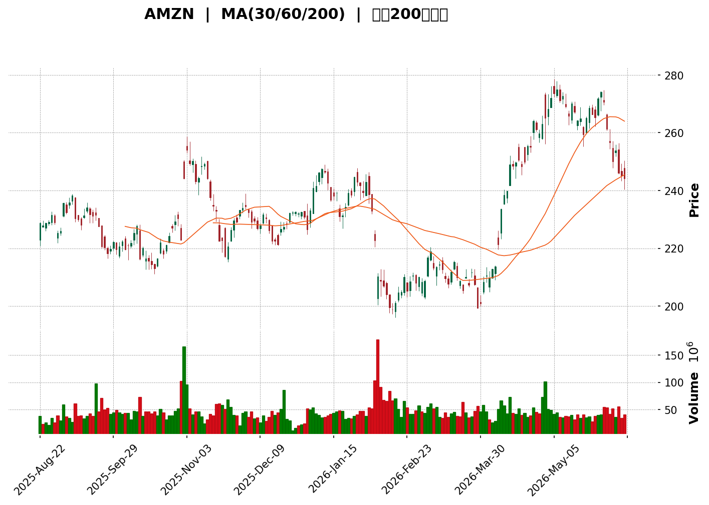
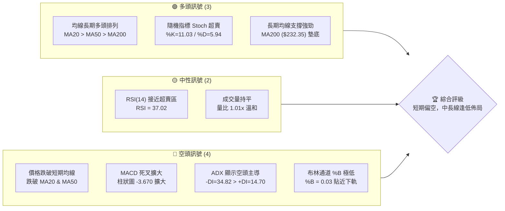
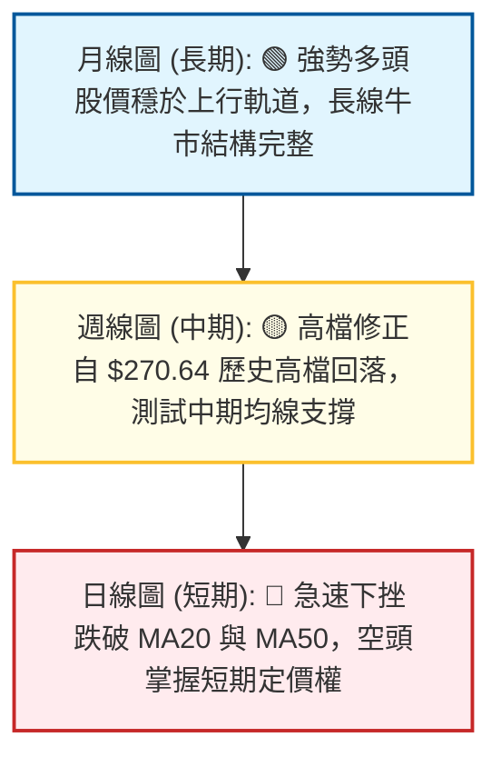
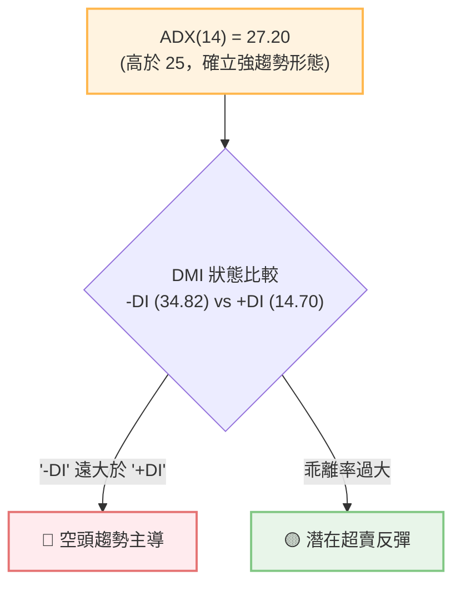
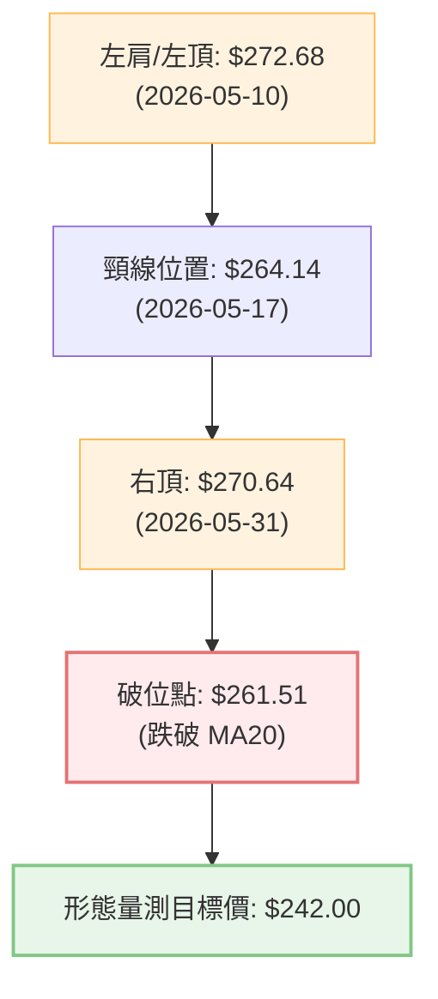

<details>
<summary>📊 靜態圖表 (點擊展開)</summary>

</details>

<html>
<head><meta charset="utf-8" /></head>
<body>
    <div style="height:500px; width:100%;">                        <script>window.PlotlyConfig = {MathJaxConfig: 'local'};</script>
        <script charset="utf-8" src="https://cdn.plot.ly/plotly-3.6.0.min.js" integrity="sha256-QaOVwtVY0T02VaHrr6pnoHLCwayMJp4O5n4YyaE3rJk=" crossorigin="anonymous"></script>                <div id="candlestick-chart" class="plotly-graph-div" style="height:100%; width:100%;"></div>            <script>                window.PLOTLYENV=window.PLOTLYENV || {};                                if (document.getElementById("candlestick-chart")) {                    Plotly.newPlot(                        "candlestick-chart",                        [{"close":{"dtype":"f8","bdata":"AAAAQOGabEAAAACAFH5sQAAAAGC4lmxAAAAAANejbEAAAABAM\u002fNsQAAAAAAAoGxAAAAAQOEqbEAAAAAgrj9sQAAAAIDCdW1AAAAAYI8KbUAAAABA4XptQAAAACCux21AAAAAYI\u002fKbEAAAABgZr5sQAAAAMDMhGxAAAAAgMLtbEAAAACgmUFtQAAAAADX82xAAAAAIFznbEAAAAAgXO9sQAAAAAApdGxAAAAAYLiWa0AAAABguIZrQAAAAMDMRGtAAAAAwPV4a0AAAACgcMVrQAAAAIA9cmtAAAAAACmUa0AAAADAHs1rQAAAAOBRcGtAAAAAwMyca0AAAADA9bhrQAAAAEAKJ2xAAAAAIK53bEAAAAAA1wtrQAAAAIA9gmtAAAAA4HoMa0AAAACAPfJqQAAAAEAKz2pAAAAAoEehakAAAAAgXA9rQAAAAMD1wGtAAAAAYGY+a0AAAABA4aJrQAAAAGC4BmxAAAAAQApfbEAAAAAAAKhsQAAAAKCZyWxAAAAAIIXba0AAAABACoduQAAAAAAAwG9AAAAAgD0qb0AAAABgZkZvQAAAAKBHYW5AAAAAwB6NbkAAAADAzAxvQAAAAEAzI29AAAAAYGaGbkAAAABgj7JtQAAAAIAUVm1AAAAAANcbbUAAAACgmdFrQAAAAIAU1mtAAAAA4Hoka0AAAACAFJZrQAAAAMD1SGxAAAAAoHC1bEAAAADAHqVsQAAAAEAKJ21AAAAAACk8bUAAAACgcE1tQAAAAAApDG1AAAAAIIWjbEAAAADA9bBsQAAAAOB6XGxAAAAAoHB9bEAAAADA9fhsQAAAAMD1yGxAAAAAgBRGbEAAAACgR9FrQAAAAIDr0WtAAAAA4KOoa0AAAADgUVhsQAAAAEAza2xAAAAAgMKNbEAAAADgegRtQAAAAAApDG1AAAAA4KMQbUAAAACAPQJtQAAAAMD1EG1AAAAAgD3abEAAAAAAAFBsQAAAAIDrIW1AAAAAgMIdbkAAAACA6zFuQAAAAKBHyW5AAAAAACnsbkAAAABACs9uQAAAAEAzU25AAAAAwMyUbUAAAACAwsVtQAAAAADX421AAAAAAADgbEAAAACA6+lsQAAAAEDhSm1AAAAAwB7lbUAAAACgcM1tQAAAAIDClW5AAAAA4FFgbkAAAAAgXDduQAAAAKCZ6W1AAAAAYLhebkAAAAAA19NtQAAAACCuH21AAAAAgBTWa0AAAACAPUpqQAAAAEAKF2pAAAAAYLjeaUAAAABgj4JpQAAAAEAz82hAAAAAoEfZaEAAAADAzCRpQAAAAKBHmWlAAAAAIIWbaUAAAAAghUNqQAAAAOCjqGlAAAAAgOsRakAAAADgelRqQAAAAKBw\u002fWlAAAAAAABAakAAAADgegxqQAAAACBcF2pAAAAAgD0aa0AAAACAFF5rQAAAAGC4pmpAAAAAIK6vakAAAABgj8pqQAAAAMDMlGpAAAAAwPUwakAAAACgcPVpQAAAACCud2pAAAAAYGbmakAAAAAA1ztqQAAAAOBRGGpAAAAAANeraUAAAADgekRqQAAAACCu52lAAAAAYLh2akAAAACgR\u002fFpQAAAAEDh6mhAAAAAYGYeaUAAAADgowhqQAAAAIA9UmpAAAAA4KM4akAAAACgR5lqQAAAAOCjuGpAAAAAAACoa0AAAADAzDRtQAAAAAApzG1AAAAA4Hr8bUAAAADgoyBvQAAAAAAAEG9AAAAAYGY2b0AAAACA61FvQAAAAMD1CG9AAAAAwB49b0AAAAAghetvQAAAAGCP4m9AAAAAANd\u002fcEAAAACA61FwQAAAAEAzO3BAAAAA4KNwcEAAAADA9ZBwQAAAAAApxHBAAAAAwMwAcUAAAADAzBhxQAAAAADXL3FAAAAAYLjycEAAAABA4QpxQAAAAADXz3BAAAAAwB6dcEAAAACAFOJwQAAAACCFs3BAAAAAgD2CcEAAAACAwo1wQAAAAKBwNXBAAAAAACmQcEAAAAAgXMdwQAAAAMAepXBAAAAA4KOUcEAAAACgmf1wQAAAAAAAIHFAAAAAgD3qcEAAAAAAKVRwQAAAAOBRCHBAAAAA4KNAb0AAAACgR7lvQAAAAMD1wG5AAAAAQAqnbkAAAACAFIZuQA=="},"high":{"dtype":"f8","bdata":"AAAA4HqkbEAAAABAM7NsQAAAAAAAoGxAAAAAANe7bEAAAABguBZtQAAAAIDr+WxAAAAAoHBFbEAAAACgcGVsQAAAAOCjeG1AAAAAAACAbUAAAABAM7NtQAAAAEAz221AAAAAgMK1bUAAAADA9fBsQAAAAKBH2WxAAAAAIFw3bUAAAADAzHxtQAAAAKCZSW1AAAAAIFwvbUAAAADAHkVtQAAAAIA90mxAAAAAIIV7bEAAAACA6xFsQAAAAKBwlWtAAAAAoJmha0AAAABAM9NrQAAAACCux2tAAAAAwMzEa0AAAACA69lrQAAAAGBmBmxAAAAAIFy3a0AAAADgetxrQAAAACBcV2xAAAAAYLiGbEAAAAAAAIhsQAAAAIDClWtAAAAAgD1qa0AAAABguDZrQAAAAEDhUmtAAAAAoJnZakAAAACAFBZrQAAAAIA96mtAAAAA4FGAa0AAAACgmalrQAAAAMDMLGxAAAAAwMyMbEAAAAAgru9sQAAAAIA9Gm1AAAAAgBSObEAAAAAAAFBvQAAAAKCZKXBAAAAAACkQcEAAAAAAAGBvQAAAAAApTG9AAAAAwMycbkAAAAAAAHhvQAAAAAAAOG9AAAAAANdLb0AAAAAAAHhuQAAAACBc121AAAAAQDNTbUAAAABgZsZsQAAAACCu92tAAAAAwB5tbEAAAABguMZrQAAAAGCPamxAAAAA4KPQbEAAAAAAAPhsQAAAAKBHKW1AAAAAoJl5bUAAAABACt9tQAAAAAApLG1AAAAAAAAwbUAAAAAgrudsQAAAAGCP2mxAAAAAgD2SbEAAAACgcA1tQAAAACCFA21AAAAAYI\u002fCbEAAAACAwn1sQAAAAMAe9WtAAAAAgBQmbEAAAAAgXKdsQAAAAAAppGxAAAAAIFyvbEAAAABgZg5tQAAAAGBmHm1AAAAAIK4fbUAAAABAMxNtQAAAAOCjGG1AAAAAIK4fbUAAAABguG5tQAAAAAAAQG1AAAAAgMJlbkAAAACgR6luQAAAAMAezW5AAAAAIIX7bkAAAACAFB5vQAAAAMAe9W5AAAAAwPUobkAAAADAzBRuQAAAAIA98m1AAAAAQOFibUAAAACgmQltQAAAAEAKd21AAAAAYGYObkAAAABgZh5uQAAAAAApnG5AAAAAwPX4bkAAAAAAAGBuQAAAAIA9am5AAAAAACm0bkAAAABAM8tuQAAAACCF221AAAAAgOtJbEAAAACAFG5qQAAAAIDrmWpAAAAAwMyUakAAAACAPRJqQAAAAGC4fmlAAAAAwB4laUAAAAAgrjdpQAAAACCF22lAAAAA4Hq0aUAAAACgcGVqQAAAAIDCDWpAAAAAIIVLakAAAABA4XJqQAAAAKCZYWpAAAAAYI9KakAAAAAgXDdqQAAAAIDCJWpAAAAAoEcxa0AAAABACo9rQAAAAIA9KmtAAAAAgD26akAAAADAzPRqQAAAAAAAIGtAAAAAYLh2akAAAACA61FqQAAAAEAKl2pAAAAAYGb2akAAAADgeuRqQAAAAADXI2pAAAAAoEfxaUAAAACgmZlqQAAAAEAzK2pAAAAAgD2iakAAAADgepxqQAAAAEAz02lAAAAAoJl5aUAAAADA9UhqQAAAAGCPsmpAAAAAYLiGakAAAABgZp5qQAAAAEAKv2pAAAAAQDNDbEAAAACgmTltQAAAAIDCDW5AAAAAAAAAbkAAAACAwoVvQAAAAIAUTm9AAAAAAABAb0AAAABA4QJwQAAAAIDCRW9AAAAAQOHib0AAAACAFP5vQAAAAOCjLHBAAAAAAACIcEAAAABgZoJwQAAAAOB6UHBAAAAAYI+ecEAAAACAFB5xQAAAAMAeFXFAAAAAoJlBcUAAAADA9WhxQAAAAMDMXHFAAAAAgBRKcUAAAAAAACBxQAAAAIAUGnFAAAAAYGa6cEAAAAAghetwQAAAAOB67HBAAAAAgMKFcEAAAACgmc1wQAAAAAAAZHBAAAAAoEeZcEAAAAAA19dwQAAAAOCj3HBAAAAAwMzUcEAAAABgjwZxQAAAAAAAKHFAAAAAAAAscUAAAACAFKpwQAAAAEAzU3BAAAAAoHARcEAAAABgj\u002fpvQAAAAIAUBnBAAAAAoHAtb0AAAACAwk1vQA=="},"hovertemplate":"\u003cb\u003e%{x|%Y-%m-%d}\u003c\u002fb\u003e\u003cbr\u003e\u958b: $%{open:.2f}\u003cbr\u003e\u9ad8: $%{high:.2f}\u003cbr\u003e\u4f4e: $%{low:.2f}\u003cbr\u003e\u6536: $%{close:.2f}\u003cextra\u003e\u003c\u002fextra\u003e","low":{"dtype":"f8","bdata":"AAAAgD2aa0AAAACA62lsQAAAAOCjQGxAAAAAgOt5bEAAAADgo4BsQAAAAMAehWxAAAAAYI+6a0AAAAAghQtsQAAAAMD12GxAAAAAgML9bEAAAAAAADhtQAAAAGCPYm1AAAAAQDOjbEAAAABA4apsQAAAAKBHSWxAAAAAgD3KbEAAAAAgXAdtQAAAAGC4lmxAAAAAoEeZbEAAAABgZrZsQAAAAOBRcGxAAAAAgD2Ca0AAAABgZm5rQAAAAEAKD2tAAAAA4KNAa0AAAACgmWlrQAAAAOB6PGtAAAAAIIUTa0AAAABgZl5rQAAAAEDhamtAAAAAwPUAa0AAAACgcIVrQAAAAIAUpmtAAAAAAAC4a0AAAAAAAABrQAAAAKBHIWtAAAAAQDOTakAAAADAHpVqQAAAAIDrmWpAAAAAwPVgakAAAABA4bJqQAAAACCuP2tAAAAA4KMQa0AAAACAwkVrQAAAAMDMvGtAAAAAoEcxbEAAAABguEZsQAAAAOBReGxAAAAAAADYa0AAAAAgXH9uQAAAAMDMnG9AAAAAwB4Vb0AAAADAHsVuQAAAAKBwRW5AAAAAIK7PbUAAAABA4bJuQAAAACBc525AAAAAAAB4bkAAAAAAAJBtQAAAAOB6HG1AAAAAgBSmbEAAAACgcM1rQAAAAOCjUGtAAAAAIK4Xa0AAAACAwuVqQAAAAOCjyGtAAAAAoJn5a0AAAADgo5hsQAAAAEAKx2xAAAAAAAAIbUAAAACgmTFtQAAAACCF02xAAAAAoJlZbEAAAACgmZFsQAAAAOCjSGxAAAAAIIUjbEAAAABguI5sQAAAAIAUlmxAAAAAANcjbEAAAAAAALBrQAAAAAAppGtAAAAAIK6fa0AAAADAHg1sQAAAAGCPMmxAAAAAYLhWbEAAAAAgXJdsQAAAAGCP6mxAAAAAgMLlbEAAAADgo9hsQAAAAGBmxmxAAAAAANfDbEAAAABgZhZsQAAAAIDCZWxAAAAAgD0CbUAAAADgo\u002fBtQAAAAAApPG5AAAAAIK5HbkAAAABguL5uQAAAAAAACG5AAAAAQAqHbUAAAAAAKZRtQAAAAMAejW1AAAAAQOGqbEAAAAAAKVxsQAAAAMDM3GxAAAAAgD1SbUAAAACgR7FtQAAAAGCPwm1AAAAAwPUwbkAAAAAgrpdtQAAAAOB6tG1AAAAAoHDFbUAAAABgZm5tQAAAAIA9+mxAAAAAACmMa0AAAACA6wlpQAAAAEAza2lAAAAAwB7NaUAAAAAgrk9pQAAAAIDrsWhAAAAAwPWoaEAAAAAAAIBoQAAAAOBRMGlAAAAAgOtZaUAAAAAAAHhpQAAAACCFY2lAAAAAAABoaUAAAACAwh1qQAAAAEAzq2lAAAAAYGamaUAAAABguG5pQAAAACBcT2lAAAAAwMxEakAAAABA4fJqQAAAAMD1kGpAAAAAIIXjaUAAAACAwo1qQAAAAEAza2pAAAAAwMwEakAAAABACsdpQAAAAGBm7mlAAAAAgMKNakAAAABgjxpqQAAAAKCZwWlAAAAAgD2KaUAAAADgUTBqQAAAAOB61GlAAAAAwMw8akAAAAAA1+NpQAAAAOB65GhAAAAAIFz\u002faEAAAADgeoRpQAAAAIAUBmpAAAAAwMycaUAAAABA4TJqQAAAAGCPImpAAAAAANdza0AAAADgo+hrQAAAAGC4Zm1AAAAAAAB4bUAAAADA9ThuQAAAAGBm5m5AAAAAYGaGbkAAAAAghUNvQAAAAADXq25AAAAAQDMjb0AAAABgj0pvQAAAAIA9om9AAAAAQAobcEAAAACgcEVwQAAAAIAUCnBAAAAAQDMbcEAAAABgjwJwQAAAAADXa3BAAAAAwMzMcEAAAACAFAZxQAAAACBcA3FAAAAAANfncEAAAABAM99wQAAAACCux3BAAAAAgBRqcEAAAABAM3NwQAAAAIAUqnBAAAAAgD1OcEAAAADgemhwQAAAAIAU5m9AAAAA4Ho4cEAAAACA61VwQAAAAADXo3BAAAAAwB5hcEAAAABAM5twQAAAAEAKt3BAAAAAgD3acEAAAABAM0twQAAAAADXy29AAAAAYLj2bkAAAAAAAHhvQAAAAMD1uG5AAAAAIIVrbkAAAADAzAxuQA=="},"name":"\u50f9\u683c","open":{"dtype":"f8","bdata":"AAAAoEfZa0AAAABAM2tsQAAAACCFY2xAAAAAgD2SbEAAAADgUaBsQAAAAIA96mxAAAAA4KPwa0AAAABguCZsQAAAAIAU5mxAAAAAgBRmbUAAAACAFF5tQAAAACCFi21AAAAA4KOwbUAAAAAgru9sQAAAAEAzy2xAAAAAACnUbEAAAACAFB5tQAAAAOCjOG1AAAAAAAAQbUAAAAAA1wttQAAAAIDr0WxAAAAAYI96bEAAAADAzARsQAAAAIDrgWtAAAAAYI9ia0AAAABgj4JrQAAAAMD1wGtAAAAAIIUra0AAAADgUaBrQAAAAIAU7mtAAAAAAACga0AAAAAAKZxrQAAAAKBw3WtAAAAAAAAgbEAAAABguEZsQAAAAGBmNmtAAAAAgOvxakAAAAAA1xNrQAAAAKBw9WpAAAAAgOvRakAAAAAAKbxqQAAAAIDCTWtAAAAAoJlpa0AAAAAAAGBrQAAAAEAKv2tAAAAAwB51bEAAAABACodsQAAAAKBw9WxAAAAAgOthbEAAAABAM0NvQAAAACCF629AAAAAAClMb0AAAADA9SBvQAAAAMAeJW9AAAAAwMxcbkAAAABA4QpvQAAAAMAeDW9AAAAAIK5Hb0AAAACgmWFuQAAAAIDrYW1AAAAAAAAobUAAAABAM4NsQAAAACCu92tAAAAAoJlhbEAAAABAMwtrQAAAAIDr0WtAAAAAAClMbEAAAAAgrtdsQAAAACCu52xAAAAAQAonbUAAAADgUWBtQAAAAEAzK21AAAAA4KMYbUAAAACAPcpsQAAAAEDhsmxAAAAAQOFabEAAAACA65lsQAAAAGC41mxAAAAAANe7bEAAAACAwn1sQAAAAKBH4WtAAAAAwB4VbEAAAABguDZsQAAAAOBRWGxAAAAAIIWTbEAAAACA66FsQAAAAAApBG1AAAAAoEcBbUAAAACAFP5sQAAAAGC45mxAAAAAwB4dbUAAAABA4epsQAAAAEDhmmxAAAAAQDMDbUAAAAAghfNtQAAAAIDrYW5AAAAAgD2SbkAAAAAgXNduQAAAAMD10G5AAAAAwMwkbkAAAACA6+ltQAAAAEDh4m1AAAAA4FE4bUAAAABA4eJsQAAAAKCZQW1AAAAAYLhebUAAAAAgXP9tQAAAAIAU9m1AAAAAANfLbkAAAACAPVpuQAAAAOB6\u002fG1AAAAAgOvJbUAAAAAgXJ9uQAAAACCF221AAAAAwB4dbEAAAABgZlZpQAAAAEAKH2pAAAAAoJkZakAAAACA6wFqQAAAAGC4fmlAAAAAACncaEAAAAAAKcRoQAAAAIA9QmlAAAAAoJl5aUAAAADgUZhpQAAAAEAzA2pAAAAAQAqvaUAAAABguE5qQAAAACBcV2pAAAAAYI\u002faaUAAAACgmZFpQAAAAEAzY2lAAAAAQApPakAAAAAgXP9qQAAAACCu32pAAAAAYGZOakAAAACAFMZqQAAAAGC49mpAAAAA4HpMakAAAAAghTNqQAAAAEAzC2pAAAAAgD2aakAAAACAwr1qQAAAAIDr4WlAAAAAwMzsaUAAAACgRzlqQAAAAGBm\u002fmlAAAAAgOtxakAAAAAghVNqQAAAAGC4zmlAAAAAIFwvaUAAAABAM5tpQAAAAIAUTmpAAAAAoEfRaUAAAACgmTlqQAAAACCuZ2pAAAAAoEf5a0AAAAAgXCdsQAAAAKCZaW1AAAAAYGaubUAAAADA9ThuQAAAAAAAKG9AAAAA4FEQb0AAAAAgrt9vQAAAAIAUJm9AAAAAQOHib0AAAACAFI5vQAAAAOB67G9AAAAAIK4\u002fcEAAAAAgXHdwQAAAAIA9JnBAAAAAANcfcEAAAABguBJxQAAAAKBHmXBAAAAAwMzMcEAAAACgR0FxQAAAAIA9DnFAAAAA4FEwcUAAAACAFPpwQAAAAKBw3XBAAAAAIFyrcEAAAABA4YZwQAAAAGBm0nBAAAAAAABocEAAAACA631wQAAAAOCjYHBAAAAAwMxAcEAAAAAAAHhwQAAAAGCPynBAAAAAQAq\u002fcEAAAABgZqJwQAAAAOBRBHFAAAAA4KP0cEAAAADgo6RwQAAAAGCPEnBAAAAAYGbWb0AAAAAA16NvQAAAAOBRyG9AAAAAgMLVbkAAAABgZvZuQA=="},"x":["2025-08-22T00:00:00-04:00","2025-08-25T00:00:00-04:00","2025-08-26T00:00:00-04:00","2025-08-27T00:00:00-04:00","2025-08-28T00:00:00-04:00","2025-08-29T00:00:00-04:00","2025-09-02T00:00:00-04:00","2025-09-03T00:00:00-04:00","2025-09-04T00:00:00-04:00","2025-09-05T00:00:00-04:00","2025-09-08T00:00:00-04:00","2025-09-09T00:00:00-04:00","2025-09-10T00:00:00-04:00","2025-09-11T00:00:00-04:00","2025-09-12T00:00:00-04:00","2025-09-15T00:00:00-04:00","2025-09-16T00:00:00-04:00","2025-09-17T00:00:00-04:00","2025-09-18T00:00:00-04:00","2025-09-19T00:00:00-04:00","2025-09-22T00:00:00-04:00","2025-09-23T00:00:00-04:00","2025-09-24T00:00:00-04:00","2025-09-25T00:00:00-04:00","2025-09-26T00:00:00-04:00","2025-09-29T00:00:00-04:00","2025-09-30T00:00:00-04:00","2025-10-01T00:00:00-04:00","2025-10-02T00:00:00-04:00","2025-10-03T00:00:00-04:00","2025-10-06T00:00:00-04:00","2025-10-07T00:00:00-04:00","2025-10-08T00:00:00-04:00","2025-10-09T00:00:00-04:00","2025-10-10T00:00:00-04:00","2025-10-13T00:00:00-04:00","2025-10-14T00:00:00-04:00","2025-10-15T00:00:00-04:00","2025-10-16T00:00:00-04:00","2025-10-17T00:00:00-04:00","2025-10-20T00:00:00-04:00","2025-10-21T00:00:00-04:00","2025-10-22T00:00:00-04:00","2025-10-23T00:00:00-04:00","2025-10-24T00:00:00-04:00","2025-10-27T00:00:00-04:00","2025-10-28T00:00:00-04:00","2025-10-29T00:00:00-04:00","2025-10-30T00:00:00-04:00","2025-10-31T00:00:00-04:00","2025-11-03T00:00:00-05:00","2025-11-04T00:00:00-05:00","2025-11-05T00:00:00-05:00","2025-11-06T00:00:00-05:00","2025-11-07T00:00:00-05:00","2025-11-10T00:00:00-05:00","2025-11-11T00:00:00-05:00","2025-11-12T00:00:00-05:00","2025-11-13T00:00:00-05:00","2025-11-14T00:00:00-05:00","2025-11-17T00:00:00-05:00","2025-11-18T00:00:00-05:00","2025-11-19T00:00:00-05:00","2025-11-20T00:00:00-05:00","2025-11-21T00:00:00-05:00","2025-11-24T00:00:00-05:00","2025-11-25T00:00:00-05:00","2025-11-26T00:00:00-05:00","2025-11-28T00:00:00-05:00","2025-12-01T00:00:00-05:00","2025-12-02T00:00:00-05:00","2025-12-03T00:00:00-05:00","2025-12-04T00:00:00-05:00","2025-12-05T00:00:00-05:00","2025-12-08T00:00:00-05:00","2025-12-09T00:00:00-05:00","2025-12-10T00:00:00-05:00","2025-12-11T00:00:00-05:00","2025-12-12T00:00:00-05:00","2025-12-15T00:00:00-05:00","2025-12-16T00:00:00-05:00","2025-12-17T00:00:00-05:00","2025-12-18T00:00:00-05:00","2025-12-19T00:00:00-05:00","2025-12-22T00:00:00-05:00","2025-12-23T00:00:00-05:00","2025-12-24T00:00:00-05:00","2025-12-26T00:00:00-05:00","2025-12-29T00:00:00-05:00","2025-12-30T00:00:00-05:00","2025-12-31T00:00:00-05:00","2026-01-02T00:00:00-05:00","2026-01-05T00:00:00-05:00","2026-01-06T00:00:00-05:00","2026-01-07T00:00:00-05:00","2026-01-08T00:00:00-05:00","2026-01-09T00:00:00-05:00","2026-01-12T00:00:00-05:00","2026-01-13T00:00:00-05:00","2026-01-14T00:00:00-05:00","2026-01-15T00:00:00-05:00","2026-01-16T00:00:00-05:00","2026-01-20T00:00:00-05:00","2026-01-21T00:00:00-05:00","2026-01-22T00:00:00-05:00","2026-01-23T00:00:00-05:00","2026-01-26T00:00:00-05:00","2026-01-27T00:00:00-05:00","2026-01-28T00:00:00-05:00","2026-01-29T00:00:00-05:00","2026-01-30T00:00:00-05:00","2026-02-02T00:00:00-05:00","2026-02-03T00:00:00-05:00","2026-02-04T00:00:00-05:00","2026-02-05T00:00:00-05:00","2026-02-06T00:00:00-05:00","2026-02-09T00:00:00-05:00","2026-02-10T00:00:00-05:00","2026-02-11T00:00:00-05:00","2026-02-12T00:00:00-05:00","2026-02-13T00:00:00-05:00","2026-02-17T00:00:00-05:00","2026-02-18T00:00:00-05:00","2026-02-19T00:00:00-05:00","2026-02-20T00:00:00-05:00","2026-02-23T00:00:00-05:00","2026-02-24T00:00:00-05:00","2026-02-25T00:00:00-05:00","2026-02-26T00:00:00-05:00","2026-02-27T00:00:00-05:00","2026-03-02T00:00:00-05:00","2026-03-03T00:00:00-05:00","2026-03-04T00:00:00-05:00","2026-03-05T00:00:00-05:00","2026-03-06T00:00:00-05:00","2026-03-09T00:00:00-04:00","2026-03-10T00:00:00-04:00","2026-03-11T00:00:00-04:00","2026-03-12T00:00:00-04:00","2026-03-13T00:00:00-04:00","2026-03-16T00:00:00-04:00","2026-03-17T00:00:00-04:00","2026-03-18T00:00:00-04:00","2026-03-19T00:00:00-04:00","2026-03-20T00:00:00-04:00","2026-03-23T00:00:00-04:00","2026-03-24T00:00:00-04:00","2026-03-25T00:00:00-04:00","2026-03-26T00:00:00-04:00","2026-03-27T00:00:00-04:00","2026-03-30T00:00:00-04:00","2026-03-31T00:00:00-04:00","2026-04-01T00:00:00-04:00","2026-04-02T00:00:00-04:00","2026-04-06T00:00:00-04:00","2026-04-07T00:00:00-04:00","2026-04-08T00:00:00-04:00","2026-04-09T00:00:00-04:00","2026-04-10T00:00:00-04:00","2026-04-13T00:00:00-04:00","2026-04-14T00:00:00-04:00","2026-04-15T00:00:00-04:00","2026-04-16T00:00:00-04:00","2026-04-17T00:00:00-04:00","2026-04-20T00:00:00-04:00","2026-04-21T00:00:00-04:00","2026-04-22T00:00:00-04:00","2026-04-23T00:00:00-04:00","2026-04-24T00:00:00-04:00","2026-04-27T00:00:00-04:00","2026-04-28T00:00:00-04:00","2026-04-29T00:00:00-04:00","2026-04-30T00:00:00-04:00","2026-05-01T00:00:00-04:00","2026-05-04T00:00:00-04:00","2026-05-05T00:00:00-04:00","2026-05-06T00:00:00-04:00","2026-05-07T00:00:00-04:00","2026-05-08T00:00:00-04:00","2026-05-11T00:00:00-04:00","2026-05-12T00:00:00-04:00","2026-05-13T00:00:00-04:00","2026-05-14T00:00:00-04:00","2026-05-15T00:00:00-04:00","2026-05-18T00:00:00-04:00","2026-05-19T00:00:00-04:00","2026-05-20T00:00:00-04:00","2026-05-21T00:00:00-04:00","2026-05-22T00:00:00-04:00","2026-05-26T00:00:00-04:00","2026-05-27T00:00:00-04:00","2026-05-28T00:00:00-04:00","2026-05-29T00:00:00-04:00","2026-06-01T00:00:00-04:00","2026-06-02T00:00:00-04:00","2026-06-03T00:00:00-04:00","2026-06-04T00:00:00-04:00","2026-06-05T00:00:00-04:00","2026-06-08T00:00:00-04:00","2026-06-09T00:00:00-04:00"],"type":"candlestick"},{"hovertemplate":"MA30: $%{y:.2f}\u003cextra\u003e\u003c\u002fextra\u003e","line":{"color":"#2196F3","dash":"dash","width":2},"mode":"lines","name":"MA30","x":["2025-08-22T00:00:00-04:00","2025-08-25T00:00:00-04:00","2025-08-26T00:00:00-04:00","2025-08-27T00:00:00-04:00","2025-08-28T00:00:00-04:00","2025-08-29T00:00:00-04:00","2025-09-02T00:00:00-04:00","2025-09-03T00:00:00-04:00","2025-09-04T00:00:00-04:00","2025-09-05T00:00:00-04:00","2025-09-08T00:00:00-04:00","2025-09-09T00:00:00-04:00","2025-09-10T00:00:00-04:00","2025-09-11T00:00:00-04:00","2025-09-12T00:00:00-04:00","2025-09-15T00:00:00-04:00","2025-09-16T00:00:00-04:00","2025-09-17T00:00:00-04:00","2025-09-18T00:00:00-04:00","2025-09-19T00:00:00-04:00","2025-09-22T00:00:00-04:00","2025-09-23T00:00:00-04:00","2025-09-24T00:00:00-04:00","2025-09-25T00:00:00-04:00","2025-09-26T00:00:00-04:00","2025-09-29T00:00:00-04:00","2025-09-30T00:00:00-04:00","2025-10-01T00:00:00-04:00","2025-10-02T00:00:00-04:00","2025-10-03T00:00:00-04:00","2025-10-06T00:00:00-04:00","2025-10-07T00:00:00-04:00","2025-10-08T00:00:00-04:00","2025-10-09T00:00:00-04:00","2025-10-10T00:00:00-04:00","2025-10-13T00:00:00-04:00","2025-10-14T00:00:00-04:00","2025-10-15T00:00:00-04:00","2025-10-16T00:00:00-04:00","2025-10-17T00:00:00-04:00","2025-10-20T00:00:00-04:00","2025-10-21T00:00:00-04:00","2025-10-22T00:00:00-04:00","2025-10-23T00:00:00-04:00","2025-10-24T00:00:00-04:00","2025-10-27T00:00:00-04:00","2025-10-28T00:00:00-04:00","2025-10-29T00:00:00-04:00","2025-10-30T00:00:00-04:00","2025-10-31T00:00:00-04:00","2025-11-03T00:00:00-05:00","2025-11-04T00:00:00-05:00","2025-11-05T00:00:00-05:00","2025-11-06T00:00:00-05:00","2025-11-07T00:00:00-05:00","2025-11-10T00:00:00-05:00","2025-11-11T00:00:00-05:00","2025-11-12T00:00:00-05:00","2025-11-13T00:00:00-05:00","2025-11-14T00:00:00-05:00","2025-11-17T00:00:00-05:00","2025-11-18T00:00:00-05:00","2025-11-19T00:00:00-05:00","2025-11-20T00:00:00-05:00","2025-11-21T00:00:00-05:00","2025-11-24T00:00:00-05:00","2025-11-25T00:00:00-05:00","2025-11-26T00:00:00-05:00","2025-11-28T00:00:00-05:00","2025-12-01T00:00:00-05:00","2025-12-02T00:00:00-05:00","2025-12-03T00:00:00-05:00","2025-12-04T00:00:00-05:00","2025-12-05T00:00:00-05:00","2025-12-08T00:00:00-05:00","2025-12-09T00:00:00-05:00","2025-12-10T00:00:00-05:00","2025-12-11T00:00:00-05:00","2025-12-12T00:00:00-05:00","2025-12-15T00:00:00-05:00","2025-12-16T00:00:00-05:00","2025-12-17T00:00:00-05:00","2025-12-18T00:00:00-05:00","2025-12-19T00:00:00-05:00","2025-12-22T00:00:00-05:00","2025-12-23T00:00:00-05:00","2025-12-24T00:00:00-05:00","2025-12-26T00:00:00-05:00","2025-12-29T00:00:00-05:00","2025-12-30T00:00:00-05:00","2025-12-31T00:00:00-05:00","2026-01-02T00:00:00-05:00","2026-01-05T00:00:00-05:00","2026-01-06T00:00:00-05:00","2026-01-07T00:00:00-05:00","2026-01-08T00:00:00-05:00","2026-01-09T00:00:00-05:00","2026-01-12T00:00:00-05:00","2026-01-13T00:00:00-05:00","2026-01-14T00:00:00-05:00","2026-01-15T00:00:00-05:00","2026-01-16T00:00:00-05:00","2026-01-20T00:00:00-05:00","2026-01-21T00:00:00-05:00","2026-01-22T00:00:00-05:00","2026-01-23T00:00:00-05:00","2026-01-26T00:00:00-05:00","2026-01-27T00:00:00-05:00","2026-01-28T00:00:00-05:00","2026-01-29T00:00:00-05:00","2026-01-30T00:00:00-05:00","2026-02-02T00:00:00-05:00","2026-02-03T00:00:00-05:00","2026-02-04T00:00:00-05:00","2026-02-05T00:00:00-05:00","2026-02-06T00:00:00-05:00","2026-02-09T00:00:00-05:00","2026-02-10T00:00:00-05:00","2026-02-11T00:00:00-05:00","2026-02-12T00:00:00-05:00","2026-02-13T00:00:00-05:00","2026-02-17T00:00:00-05:00","2026-02-18T00:00:00-05:00","2026-02-19T00:00:00-05:00","2026-02-20T00:00:00-05:00","2026-02-23T00:00:00-05:00","2026-02-24T00:00:00-05:00","2026-02-25T00:00:00-05:00","2026-02-26T00:00:00-05:00","2026-02-27T00:00:00-05:00","2026-03-02T00:00:00-05:00","2026-03-03T00:00:00-05:00","2026-03-04T00:00:00-05:00","2026-03-05T00:00:00-05:00","2026-03-06T00:00:00-05:00","2026-03-09T00:00:00-04:00","2026-03-10T00:00:00-04:00","2026-03-11T00:00:00-04:00","2026-03-12T00:00:00-04:00","2026-03-13T00:00:00-04:00","2026-03-16T00:00:00-04:00","2026-03-17T00:00:00-04:00","2026-03-18T00:00:00-04:00","2026-03-19T00:00:00-04:00","2026-03-20T00:00:00-04:00","2026-03-23T00:00:00-04:00","2026-03-24T00:00:00-04:00","2026-03-25T00:00:00-04:00","2026-03-26T00:00:00-04:00","2026-03-27T00:00:00-04:00","2026-03-30T00:00:00-04:00","2026-03-31T00:00:00-04:00","2026-04-01T00:00:00-04:00","2026-04-02T00:00:00-04:00","2026-04-06T00:00:00-04:00","2026-04-07T00:00:00-04:00","2026-04-08T00:00:00-04:00","2026-04-09T00:00:00-04:00","2026-04-10T00:00:00-04:00","2026-04-13T00:00:00-04:00","2026-04-14T00:00:00-04:00","2026-04-15T00:00:00-04:00","2026-04-16T00:00:00-04:00","2026-04-17T00:00:00-04:00","2026-04-20T00:00:00-04:00","2026-04-21T00:00:00-04:00","2026-04-22T00:00:00-04:00","2026-04-23T00:00:00-04:00","2026-04-24T00:00:00-04:00","2026-04-27T00:00:00-04:00","2026-04-28T00:00:00-04:00","2026-04-29T00:00:00-04:00","2026-04-30T00:00:00-04:00","2026-05-01T00:00:00-04:00","2026-05-04T00:00:00-04:00","2026-05-05T00:00:00-04:00","2026-05-06T00:00:00-04:00","2026-05-07T00:00:00-04:00","2026-05-08T00:00:00-04:00","2026-05-11T00:00:00-04:00","2026-05-12T00:00:00-04:00","2026-05-13T00:00:00-04:00","2026-05-14T00:00:00-04:00","2026-05-15T00:00:00-04:00","2026-05-18T00:00:00-04:00","2026-05-19T00:00:00-04:00","2026-05-20T00:00:00-04:00","2026-05-21T00:00:00-04:00","2026-05-22T00:00:00-04:00","2026-05-26T00:00:00-04:00","2026-05-27T00:00:00-04:00","2026-05-28T00:00:00-04:00","2026-05-29T00:00:00-04:00","2026-06-01T00:00:00-04:00","2026-06-02T00:00:00-04:00","2026-06-03T00:00:00-04:00","2026-06-04T00:00:00-04:00","2026-06-05T00:00:00-04:00","2026-06-08T00:00:00-04:00","2026-06-09T00:00:00-04:00"],"y":{"dtype":"f8","bdata":"AAAAAAAA+H8AAAAAAAD4fwAAAAAAAPh\u002fAAAAAAAA+H8AAAAAAAD4fwAAAAAAAPh\u002fAAAAAAAA+H8AAAAAAAD4fwAAAAAAAPh\u002fAAAAAAAA+H8AAAAAAAD4fwAAAAAAAPh\u002fAAAAAAAA+H8AAAAAAAD4fwAAAAAAAPh\u002fAAAAAAAA+H8AAAAAAAD4fwAAAAAAAPh\u002fAAAAAAAA+H8AAAAAAAD4fwAAAAAAAPh\u002fAAAAAAAA+H8AAAAAAAD4fwAAAAAAAPh\u002fAAAAAAAA+H8AAAAAAAD4fwAAAAAAAPh\u002fAAAAAAAA+H8AAAAAAAD4f1VVVeXQcmxA7+7uvlhqbEB3d3enxmNsQGZmZqYNYGxAIiIi0pRebEAzMzMDVk5sQHd3d4fPRGxAVVVVlUM7bECrqqo6JjBsQM3MzHyGGWxAd3d3B\u002fMEbEBVVVV1TPBrQLy7uwsC32tAq6qqes3Ra0C8u7sbWshrQKuqqjomxGtAq6qqWmS\u002fa0AiIiKiRbprQAAAADDduGtA7+7unu+va0De3d19hr1rQCIiIkKn2WtAIiIisiv4a0BmZmb2KBhsQHd3d5e1MmxAmpmZOftMbEAzMzPD9WhsQLy7u2t1iGxAmpmZmZmhbEBVVVUFyLFsQM3MzCz5wWxAiYiIyL3ObEC8u7sLkM9sQAAAADDdzGxA3t3drY7BbEBERERUKsZsQCIiIhLKzGxAVVVVZfTabEDv7u5ec+lsQO\u002fu7l5z\u002fWxAVVVVFa4TbUBmZmbm0CZtQERERCTbMW1AERERkcI9bUAAAABAw0ZtQBERERGfSW1Aq6qqeqJKbUBmZmZWVU1tQAAAAOBPTW1AAAAAMN1QbUCamZkZvTltQCIiIuIzGG1AzczMXEj6bEDe3d2tR+FsQERERESL0GxAiYiIqH+\u002fbECJiIiYJ65sQLy7u+tRnGxAERERgdyPbECJiIjo+4lsQFVVVRWuh2xAzczMTH6FbECamZnptIlsQM3MzJzElGxA3t3d3SSubEBERETEZ8RsQERERNS\u002f2WxAd3d316PsbEAAAACgGv9sQN7d3f0bCW1AIiIiYhAMbUDNzMwcExBtQERERJRDF21AzczMrEcZbUC8u7u7LRttQERERBQgI21AmpmZWR0vbUAzMzODMjZtQLy7u6uORW1AZmZmpn9XbUDNzMzM92ttQAAAAPDSfW1AERERwfWUbUAzMzNTnKFtQLy7u2ugp21AVVVVBYGhbUBVVVW1OoptQDMzM\u002fP9cG1A3t3dXbpVbUCrqqo63zdtQFVVVSW\u002fFG1AERER0ZTybEAzMzOTitdsQKuqqvpiuWxAd3d3d+mSbEBVVVWFXXFsQERERFScRWxAERER4TMcbEBmZmbm+\u002fVrQCIiIvL90GtAiYiIuJC0a0ARERERypRrQCIiIpJfdGtAzczMfD9la0B3d3enDVhrQCIiIsKDQWtAMzMzIyIma0BmZmb2bwxrQDMzM6NF6mpA3t3dXY\u002fGakB3d3e3OqJqQAAAAADVhGpAq6qqqjhnakAAAAAAjkhqQHd3d5e1LmpAMzMzEzwcakC8u7vrChxqQImIiMh2GmpAmpmZ2YcfakCJiIioOCNqQImIiKjxImpAvLu7ez8lakCJiIi41yxqQM3MzAwCM2pA7+7uzj44akAAAACgGjtqQBEREbErRGpAiYiI6LRRakC8u7srQGpqQImIiMi9impA7+7uvp+qakAiIiJy9tVqQO\u002fu7k5iAGtAzczMvHQja0CrqqoaL0VrQM3MzIyXamtAMzMzo3CRa0AAAACQNL1rQImIiMh26mtA3t3d\u002fY0kbEB3d3dnkV1sQO\u002fu7q65kGxAIiIiMsHDbEDv7u6+n\u002f5sQHd3dzcXPm1AzczMTDeFbUBERER02shtQHd3d7ceEW5AMzMzQ4tQbkAzMzPTBpZuQKuqqupR4G5AERERwYMlb0CJiIiof2dvQCIiIuLso29AVVVVhevdb0DNzMwMuwpwQHd3d98II3BAq6qqkl86cEBERERM8ExwQCIiIgrXW3BAzczM\u002fGJpcEAzMzMLkHVwQM3MzKQpg3BAd3d3p1SOcEAAAACQCZRwQImIiJhumHBAVVVVnX2YcECamZlBp5dwQBEREaHTknBAZmZm5tCIcEBERERkyX9wQA=="},"type":"scatter"},{"hovertemplate":"MA60: $%{y:.2f}\u003cextra\u003e\u003c\u002fextra\u003e","line":{"color":"#9C27B0","dash":"dash","width":2},"mode":"lines","name":"MA60","x":["2025-08-22T00:00:00-04:00","2025-08-25T00:00:00-04:00","2025-08-26T00:00:00-04:00","2025-08-27T00:00:00-04:00","2025-08-28T00:00:00-04:00","2025-08-29T00:00:00-04:00","2025-09-02T00:00:00-04:00","2025-09-03T00:00:00-04:00","2025-09-04T00:00:00-04:00","2025-09-05T00:00:00-04:00","2025-09-08T00:00:00-04:00","2025-09-09T00:00:00-04:00","2025-09-10T00:00:00-04:00","2025-09-11T00:00:00-04:00","2025-09-12T00:00:00-04:00","2025-09-15T00:00:00-04:00","2025-09-16T00:00:00-04:00","2025-09-17T00:00:00-04:00","2025-09-18T00:00:00-04:00","2025-09-19T00:00:00-04:00","2025-09-22T00:00:00-04:00","2025-09-23T00:00:00-04:00","2025-09-24T00:00:00-04:00","2025-09-25T00:00:00-04:00","2025-09-26T00:00:00-04:00","2025-09-29T00:00:00-04:00","2025-09-30T00:00:00-04:00","2025-10-01T00:00:00-04:00","2025-10-02T00:00:00-04:00","2025-10-03T00:00:00-04:00","2025-10-06T00:00:00-04:00","2025-10-07T00:00:00-04:00","2025-10-08T00:00:00-04:00","2025-10-09T00:00:00-04:00","2025-10-10T00:00:00-04:00","2025-10-13T00:00:00-04:00","2025-10-14T00:00:00-04:00","2025-10-15T00:00:00-04:00","2025-10-16T00:00:00-04:00","2025-10-17T00:00:00-04:00","2025-10-20T00:00:00-04:00","2025-10-21T00:00:00-04:00","2025-10-22T00:00:00-04:00","2025-10-23T00:00:00-04:00","2025-10-24T00:00:00-04:00","2025-10-27T00:00:00-04:00","2025-10-28T00:00:00-04:00","2025-10-29T00:00:00-04:00","2025-10-30T00:00:00-04:00","2025-10-31T00:00:00-04:00","2025-11-03T00:00:00-05:00","2025-11-04T00:00:00-05:00","2025-11-05T00:00:00-05:00","2025-11-06T00:00:00-05:00","2025-11-07T00:00:00-05:00","2025-11-10T00:00:00-05:00","2025-11-11T00:00:00-05:00","2025-11-12T00:00:00-05:00","2025-11-13T00:00:00-05:00","2025-11-14T00:00:00-05:00","2025-11-17T00:00:00-05:00","2025-11-18T00:00:00-05:00","2025-11-19T00:00:00-05:00","2025-11-20T00:00:00-05:00","2025-11-21T00:00:00-05:00","2025-11-24T00:00:00-05:00","2025-11-25T00:00:00-05:00","2025-11-26T00:00:00-05:00","2025-11-28T00:00:00-05:00","2025-12-01T00:00:00-05:00","2025-12-02T00:00:00-05:00","2025-12-03T00:00:00-05:00","2025-12-04T00:00:00-05:00","2025-12-05T00:00:00-05:00","2025-12-08T00:00:00-05:00","2025-12-09T00:00:00-05:00","2025-12-10T00:00:00-05:00","2025-12-11T00:00:00-05:00","2025-12-12T00:00:00-05:00","2025-12-15T00:00:00-05:00","2025-12-16T00:00:00-05:00","2025-12-17T00:00:00-05:00","2025-12-18T00:00:00-05:00","2025-12-19T00:00:00-05:00","2025-12-22T00:00:00-05:00","2025-12-23T00:00:00-05:00","2025-12-24T00:00:00-05:00","2025-12-26T00:00:00-05:00","2025-12-29T00:00:00-05:00","2025-12-30T00:00:00-05:00","2025-12-31T00:00:00-05:00","2026-01-02T00:00:00-05:00","2026-01-05T00:00:00-05:00","2026-01-06T00:00:00-05:00","2026-01-07T00:00:00-05:00","2026-01-08T00:00:00-05:00","2026-01-09T00:00:00-05:00","2026-01-12T00:00:00-05:00","2026-01-13T00:00:00-05:00","2026-01-14T00:00:00-05:00","2026-01-15T00:00:00-05:00","2026-01-16T00:00:00-05:00","2026-01-20T00:00:00-05:00","2026-01-21T00:00:00-05:00","2026-01-22T00:00:00-05:00","2026-01-23T00:00:00-05:00","2026-01-26T00:00:00-05:00","2026-01-27T00:00:00-05:00","2026-01-28T00:00:00-05:00","2026-01-29T00:00:00-05:00","2026-01-30T00:00:00-05:00","2026-02-02T00:00:00-05:00","2026-02-03T00:00:00-05:00","2026-02-04T00:00:00-05:00","2026-02-05T00:00:00-05:00","2026-02-06T00:00:00-05:00","2026-02-09T00:00:00-05:00","2026-02-10T00:00:00-05:00","2026-02-11T00:00:00-05:00","2026-02-12T00:00:00-05:00","2026-02-13T00:00:00-05:00","2026-02-17T00:00:00-05:00","2026-02-18T00:00:00-05:00","2026-02-19T00:00:00-05:00","2026-02-20T00:00:00-05:00","2026-02-23T00:00:00-05:00","2026-02-24T00:00:00-05:00","2026-02-25T00:00:00-05:00","2026-02-26T00:00:00-05:00","2026-02-27T00:00:00-05:00","2026-03-02T00:00:00-05:00","2026-03-03T00:00:00-05:00","2026-03-04T00:00:00-05:00","2026-03-05T00:00:00-05:00","2026-03-06T00:00:00-05:00","2026-03-09T00:00:00-04:00","2026-03-10T00:00:00-04:00","2026-03-11T00:00:00-04:00","2026-03-12T00:00:00-04:00","2026-03-13T00:00:00-04:00","2026-03-16T00:00:00-04:00","2026-03-17T00:00:00-04:00","2026-03-18T00:00:00-04:00","2026-03-19T00:00:00-04:00","2026-03-20T00:00:00-04:00","2026-03-23T00:00:00-04:00","2026-03-24T00:00:00-04:00","2026-03-25T00:00:00-04:00","2026-03-26T00:00:00-04:00","2026-03-27T00:00:00-04:00","2026-03-30T00:00:00-04:00","2026-03-31T00:00:00-04:00","2026-04-01T00:00:00-04:00","2026-04-02T00:00:00-04:00","2026-04-06T00:00:00-04:00","2026-04-07T00:00:00-04:00","2026-04-08T00:00:00-04:00","2026-04-09T00:00:00-04:00","2026-04-10T00:00:00-04:00","2026-04-13T00:00:00-04:00","2026-04-14T00:00:00-04:00","2026-04-15T00:00:00-04:00","2026-04-16T00:00:00-04:00","2026-04-17T00:00:00-04:00","2026-04-20T00:00:00-04:00","2026-04-21T00:00:00-04:00","2026-04-22T00:00:00-04:00","2026-04-23T00:00:00-04:00","2026-04-24T00:00:00-04:00","2026-04-27T00:00:00-04:00","2026-04-28T00:00:00-04:00","2026-04-29T00:00:00-04:00","2026-04-30T00:00:00-04:00","2026-05-01T00:00:00-04:00","2026-05-04T00:00:00-04:00","2026-05-05T00:00:00-04:00","2026-05-06T00:00:00-04:00","2026-05-07T00:00:00-04:00","2026-05-08T00:00:00-04:00","2026-05-11T00:00:00-04:00","2026-05-12T00:00:00-04:00","2026-05-13T00:00:00-04:00","2026-05-14T00:00:00-04:00","2026-05-15T00:00:00-04:00","2026-05-18T00:00:00-04:00","2026-05-19T00:00:00-04:00","2026-05-20T00:00:00-04:00","2026-05-21T00:00:00-04:00","2026-05-22T00:00:00-04:00","2026-05-26T00:00:00-04:00","2026-05-27T00:00:00-04:00","2026-05-28T00:00:00-04:00","2026-05-29T00:00:00-04:00","2026-06-01T00:00:00-04:00","2026-06-02T00:00:00-04:00","2026-06-03T00:00:00-04:00","2026-06-04T00:00:00-04:00","2026-06-05T00:00:00-04:00","2026-06-08T00:00:00-04:00","2026-06-09T00:00:00-04:00"],"y":{"dtype":"f8","bdata":"AAAAAAAA+H8AAAAAAAD4fwAAAAAAAPh\u002fAAAAAAAA+H8AAAAAAAD4fwAAAAAAAPh\u002fAAAAAAAA+H8AAAAAAAD4fwAAAAAAAPh\u002fAAAAAAAA+H8AAAAAAAD4fwAAAAAAAPh\u002fAAAAAAAA+H8AAAAAAAD4fwAAAAAAAPh\u002fAAAAAAAA+H8AAAAAAAD4fwAAAAAAAPh\u002fAAAAAAAA+H8AAAAAAAD4fwAAAAAAAPh\u002fAAAAAAAA+H8AAAAAAAD4fwAAAAAAAPh\u002fAAAAAAAA+H8AAAAAAAD4fwAAAAAAAPh\u002fAAAAAAAA+H8AAAAAAAD4fwAAAAAAAPh\u002fAAAAAAAA+H8AAAAAAAD4fwAAAAAAAPh\u002fAAAAAAAA+H8AAAAAAAD4fwAAAAAAAPh\u002fAAAAAAAA+H8AAAAAAAD4fwAAAAAAAPh\u002fAAAAAAAA+H8AAAAAAAD4fwAAAAAAAPh\u002fAAAAAAAA+H8AAAAAAAD4fwAAAAAAAPh\u002fAAAAAAAA+H8AAAAAAAD4fwAAAAAAAPh\u002fAAAAAAAA+H8AAAAAAAD4fwAAAAAAAPh\u002fAAAAAAAA+H8AAAAAAAD4fwAAAAAAAPh\u002fAAAAAAAA+H8AAAAAAAD4fwAAAAAAAPh\u002fAAAAAAAA+H8AAAAAAAD4fxEREQllmmxAvLu7Q4ucbECamZlZq5lsQDMzM2t1lmxAAAAAwBGQbEC8u7srQIpsQM3MzMzMiGxAVVVV\u002fRuLbEDNzMzMzIxsQN7d3e18i2xAZmZmjlCMbEDe3d2tjotsQAAAAJhuiGxA3t3dBciHbEDe3d2tjodsQN7d3aXihmxAq6qqagOFbEBERER8zYNsQAAAAIgWg2xAd3d3Z2aAbEC8u7vLoXtsQCIiIpLteGxAd3d3Bzp5bEAiIiJSuHxsQN7d3W2ggWxAERERcT2GbEDe3d2tjotsQLy7u6tjkmxAVVVVDbuYbEDv7u724Z1sQBEREaHTpGxAq6qqCh6qbECrqqp6oqxsQGZmZubQsGxA3t3dxdm3bEBEREQMScVsQDMzM\u002fNE02xAZmZmHszjbEB3d3f\u002fRvRsQGZmZq5HA21AvLu7O98PbUCamZkBchttQERERFyPJG1A7+7uHoUrbUDe3d19+DBtQKuqqpJfNm1AIiIi6t88bUDNzMzsw0FtQN7d3UVvSW1AMzMzay5UbUAzMzNz2lJtQBEREWkDS21A7+7uDp9HbUCJiIgAckFtQAAAANgVPG1A7+7uVoAwbUDv7u4mMRxtQHd3d++nBm1Ad3d3b8vybECamZmR7eBsQFVVVZ02zmxA7+7ujgm8bEBmZma+n7BsQLy7u8sTp2xAq6qqKoegbEDNzMyk4ppsQERERBSuj2xARERE3GuEbEAzMzNDi3psQAAAAPgMbWxAVVVVjVBgbEDv7u6WblJsQDMzM5PRRWxAzczMlEM\u002fbECamZmxnTlsQDMzM+tRMmxAZmZmvp8qbEDNzMw8USFsQHd3dyfqF2xAIiIiggcPbEAiIiJCGQdsQAAAAPhTAWxA3t3dNRf+a0CamZkpFfVrQJqZmQEr62tAREREjN7ea0CJiIjQItNrQN7d3V26xWtAvLu7G6G6a0CamZnxi61rQO\u002fu7mbYm2tAZmZmJuqLa0De3d0lMYJrQLy7u4MydmtAMzMzI5Rla0CrqqoSPFZrQKuqqgLkRGtAzczMZPQ2a0AREREJHjBrQFVVVd3dLWtAvLu7O5gva0CamZlBYDVrQImIiPBgOmtAzczMHFpEa0ARERFhnk5rQHd3d6cNVmtAMzMzY8lba0AzMzND0mRrQN7d3TVeamtA3t3drY51a0B3d3cP5n9rQHd3d1fHimtAZmZm7nyVa0B3d3fflqNrQHd3d2dmtmtAAAAAsLnQa0AAAACwcvJrQAAAAMDKFWxAZmZmjgk4bEDe3d29n1xsQJqZmcmhgWxAZmZmnmGlbECJiIiwK8psQHd3d3d362xAIiIiKhULbUDNzMxcSChtQAAAALgeRW1A7+7uBjpjbUAiIiJiEIJtQGZmZu41oW1ARERE3LK+bUBEREREi+BtQERERMxaA25A3t3dBQ8gbkBVVVUdoTZuQO\u002fu7l66TW5A7+7u7jVhbkCamZmJQXZuQFVVVQUPiG5AVVVV5RebbkAAAAAYkq5uQA=="},"type":"scatter"},{"hovertemplate":"MA200: $%{y:.2f}\u003cextra\u003e\u003c\u002fextra\u003e","line":{"color":"#FF6F00","dash":"solid","width":2},"mode":"lines","name":"MA200","x":["2025-08-22T00:00:00-04:00","2025-08-25T00:00:00-04:00","2025-08-26T00:00:00-04:00","2025-08-27T00:00:00-04:00","2025-08-28T00:00:00-04:00","2025-08-29T00:00:00-04:00","2025-09-02T00:00:00-04:00","2025-09-03T00:00:00-04:00","2025-09-04T00:00:00-04:00","2025-09-05T00:00:00-04:00","2025-09-08T00:00:00-04:00","2025-09-09T00:00:00-04:00","2025-09-10T00:00:00-04:00","2025-09-11T00:00:00-04:00","2025-09-12T00:00:00-04:00","2025-09-15T00:00:00-04:00","2025-09-16T00:00:00-04:00","2025-09-17T00:00:00-04:00","2025-09-18T00:00:00-04:00","2025-09-19T00:00:00-04:00","2025-09-22T00:00:00-04:00","2025-09-23T00:00:00-04:00","2025-09-24T00:00:00-04:00","2025-09-25T00:00:00-04:00","2025-09-26T00:00:00-04:00","2025-09-29T00:00:00-04:00","2025-09-30T00:00:00-04:00","2025-10-01T00:00:00-04:00","2025-10-02T00:00:00-04:00","2025-10-03T00:00:00-04:00","2025-10-06T00:00:00-04:00","2025-10-07T00:00:00-04:00","2025-10-08T00:00:00-04:00","2025-10-09T00:00:00-04:00","2025-10-10T00:00:00-04:00","2025-10-13T00:00:00-04:00","2025-10-14T00:00:00-04:00","2025-10-15T00:00:00-04:00","2025-10-16T00:00:00-04:00","2025-10-17T00:00:00-04:00","2025-10-20T00:00:00-04:00","2025-10-21T00:00:00-04:00","2025-10-22T00:00:00-04:00","2025-10-23T00:00:00-04:00","2025-10-24T00:00:00-04:00","2025-10-27T00:00:00-04:00","2025-10-28T00:00:00-04:00","2025-10-29T00:00:00-04:00","2025-10-30T00:00:00-04:00","2025-10-31T00:00:00-04:00","2025-11-03T00:00:00-05:00","2025-11-04T00:00:00-05:00","2025-11-05T00:00:00-05:00","2025-11-06T00:00:00-05:00","2025-11-07T00:00:00-05:00","2025-11-10T00:00:00-05:00","2025-11-11T00:00:00-05:00","2025-11-12T00:00:00-05:00","2025-11-13T00:00:00-05:00","2025-11-14T00:00:00-05:00","2025-11-17T00:00:00-05:00","2025-11-18T00:00:00-05:00","2025-11-19T00:00:00-05:00","2025-11-20T00:00:00-05:00","2025-11-21T00:00:00-05:00","2025-11-24T00:00:00-05:00","2025-11-25T00:00:00-05:00","2025-11-26T00:00:00-05:00","2025-11-28T00:00:00-05:00","2025-12-01T00:00:00-05:00","2025-12-02T00:00:00-05:00","2025-12-03T00:00:00-05:00","2025-12-04T00:00:00-05:00","2025-12-05T00:00:00-05:00","2025-12-08T00:00:00-05:00","2025-12-09T00:00:00-05:00","2025-12-10T00:00:00-05:00","2025-12-11T00:00:00-05:00","2025-12-12T00:00:00-05:00","2025-12-15T00:00:00-05:00","2025-12-16T00:00:00-05:00","2025-12-17T00:00:00-05:00","2025-12-18T00:00:00-05:00","2025-12-19T00:00:00-05:00","2025-12-22T00:00:00-05:00","2025-12-23T00:00:00-05:00","2025-12-24T00:00:00-05:00","2025-12-26T00:00:00-05:00","2025-12-29T00:00:00-05:00","2025-12-30T00:00:00-05:00","2025-12-31T00:00:00-05:00","2026-01-02T00:00:00-05:00","2026-01-05T00:00:00-05:00","2026-01-06T00:00:00-05:00","2026-01-07T00:00:00-05:00","2026-01-08T00:00:00-05:00","2026-01-09T00:00:00-05:00","2026-01-12T00:00:00-05:00","2026-01-13T00:00:00-05:00","2026-01-14T00:00:00-05:00","2026-01-15T00:00:00-05:00","2026-01-16T00:00:00-05:00","2026-01-20T00:00:00-05:00","2026-01-21T00:00:00-05:00","2026-01-22T00:00:00-05:00","2026-01-23T00:00:00-05:00","2026-01-26T00:00:00-05:00","2026-01-27T00:00:00-05:00","2026-01-28T00:00:00-05:00","2026-01-29T00:00:00-05:00","2026-01-30T00:00:00-05:00","2026-02-02T00:00:00-05:00","2026-02-03T00:00:00-05:00","2026-02-04T00:00:00-05:00","2026-02-05T00:00:00-05:00","2026-02-06T00:00:00-05:00","2026-02-09T00:00:00-05:00","2026-02-10T00:00:00-05:00","2026-02-11T00:00:00-05:00","2026-02-12T00:00:00-05:00","2026-02-13T00:00:00-05:00","2026-02-17T00:00:00-05:00","2026-02-18T00:00:00-05:00","2026-02-19T00:00:00-05:00","2026-02-20T00:00:00-05:00","2026-02-23T00:00:00-05:00","2026-02-24T00:00:00-05:00","2026-02-25T00:00:00-05:00","2026-02-26T00:00:00-05:00","2026-02-27T00:00:00-05:00","2026-03-02T00:00:00-05:00","2026-03-03T00:00:00-05:00","2026-03-04T00:00:00-05:00","2026-03-05T00:00:00-05:00","2026-03-06T00:00:00-05:00","2026-03-09T00:00:00-04:00","2026-03-10T00:00:00-04:00","2026-03-11T00:00:00-04:00","2026-03-12T00:00:00-04:00","2026-03-13T00:00:00-04:00","2026-03-16T00:00:00-04:00","2026-03-17T00:00:00-04:00","2026-03-18T00:00:00-04:00","2026-03-19T00:00:00-04:00","2026-03-20T00:00:00-04:00","2026-03-23T00:00:00-04:00","2026-03-24T00:00:00-04:00","2026-03-25T00:00:00-04:00","2026-03-26T00:00:00-04:00","2026-03-27T00:00:00-04:00","2026-03-30T00:00:00-04:00","2026-03-31T00:00:00-04:00","2026-04-01T00:00:00-04:00","2026-04-02T00:00:00-04:00","2026-04-06T00:00:00-04:00","2026-04-07T00:00:00-04:00","2026-04-08T00:00:00-04:00","2026-04-09T00:00:00-04:00","2026-04-10T00:00:00-04:00","2026-04-13T00:00:00-04:00","2026-04-14T00:00:00-04:00","2026-04-15T00:00:00-04:00","2026-04-16T00:00:00-04:00","2026-04-17T00:00:00-04:00","2026-04-20T00:00:00-04:00","2026-04-21T00:00:00-04:00","2026-04-22T00:00:00-04:00","2026-04-23T00:00:00-04:00","2026-04-24T00:00:00-04:00","2026-04-27T00:00:00-04:00","2026-04-28T00:00:00-04:00","2026-04-29T00:00:00-04:00","2026-04-30T00:00:00-04:00","2026-05-01T00:00:00-04:00","2026-05-04T00:00:00-04:00","2026-05-05T00:00:00-04:00","2026-05-06T00:00:00-04:00","2026-05-07T00:00:00-04:00","2026-05-08T00:00:00-04:00","2026-05-11T00:00:00-04:00","2026-05-12T00:00:00-04:00","2026-05-13T00:00:00-04:00","2026-05-14T00:00:00-04:00","2026-05-15T00:00:00-04:00","2026-05-18T00:00:00-04:00","2026-05-19T00:00:00-04:00","2026-05-20T00:00:00-04:00","2026-05-21T00:00:00-04:00","2026-05-22T00:00:00-04:00","2026-05-26T00:00:00-04:00","2026-05-27T00:00:00-04:00","2026-05-28T00:00:00-04:00","2026-05-29T00:00:00-04:00","2026-06-01T00:00:00-04:00","2026-06-02T00:00:00-04:00","2026-06-03T00:00:00-04:00","2026-06-04T00:00:00-04:00","2026-06-05T00:00:00-04:00","2026-06-08T00:00:00-04:00","2026-06-09T00:00:00-04:00"],"y":{"dtype":"f8","bdata":"AAAAAAAA+H8AAAAAAAD4fwAAAAAAAPh\u002fAAAAAAAA+H8AAAAAAAD4fwAAAAAAAPh\u002fAAAAAAAA+H8AAAAAAAD4fwAAAAAAAPh\u002fAAAAAAAA+H8AAAAAAAD4fwAAAAAAAPh\u002fAAAAAAAA+H8AAAAAAAD4fwAAAAAAAPh\u002fAAAAAAAA+H8AAAAAAAD4fwAAAAAAAPh\u002fAAAAAAAA+H8AAAAAAAD4fwAAAAAAAPh\u002fAAAAAAAA+H8AAAAAAAD4fwAAAAAAAPh\u002fAAAAAAAA+H8AAAAAAAD4fwAAAAAAAPh\u002fAAAAAAAA+H8AAAAAAAD4fwAAAAAAAPh\u002fAAAAAAAA+H8AAAAAAAD4fwAAAAAAAPh\u002fAAAAAAAA+H8AAAAAAAD4fwAAAAAAAPh\u002fAAAAAAAA+H8AAAAAAAD4fwAAAAAAAPh\u002fAAAAAAAA+H8AAAAAAAD4fwAAAAAAAPh\u002fAAAAAAAA+H8AAAAAAAD4fwAAAAAAAPh\u002fAAAAAAAA+H8AAAAAAAD4fwAAAAAAAPh\u002fAAAAAAAA+H8AAAAAAAD4fwAAAAAAAPh\u002fAAAAAAAA+H8AAAAAAAD4fwAAAAAAAPh\u002fAAAAAAAA+H8AAAAAAAD4fwAAAAAAAPh\u002fAAAAAAAA+H8AAAAAAAD4fwAAAAAAAPh\u002fAAAAAAAA+H8AAAAAAAD4fwAAAAAAAPh\u002fAAAAAAAA+H8AAAAAAAD4fwAAAAAAAPh\u002fAAAAAAAA+H8AAAAAAAD4fwAAAAAAAPh\u002fAAAAAAAA+H8AAAAAAAD4fwAAAAAAAPh\u002fAAAAAAAA+H8AAAAAAAD4fwAAAAAAAPh\u002fAAAAAAAA+H8AAAAAAAD4fwAAAAAAAPh\u002fAAAAAAAA+H8AAAAAAAD4fwAAAAAAAPh\u002fAAAAAAAA+H8AAAAAAAD4fwAAAAAAAPh\u002fAAAAAAAA+H8AAAAAAAD4fwAAAAAAAPh\u002fAAAAAAAA+H8AAAAAAAD4fwAAAAAAAPh\u002fAAAAAAAA+H8AAAAAAAD4fwAAAAAAAPh\u002fAAAAAAAA+H8AAAAAAAD4fwAAAAAAAPh\u002fAAAAAAAA+H8AAAAAAAD4fwAAAAAAAPh\u002fAAAAAAAA+H8AAAAAAAD4fwAAAAAAAPh\u002fAAAAAAAA+H8AAAAAAAD4fwAAAAAAAPh\u002fAAAAAAAA+H8AAAAAAAD4fwAAAAAAAPh\u002fAAAAAAAA+H8AAAAAAAD4fwAAAAAAAPh\u002fAAAAAAAA+H8AAAAAAAD4fwAAAAAAAPh\u002fAAAAAAAA+H8AAAAAAAD4fwAAAAAAAPh\u002fAAAAAAAA+H8AAAAAAAD4fwAAAAAAAPh\u002fAAAAAAAA+H8AAAAAAAD4fwAAAAAAAPh\u002fAAAAAAAA+H8AAAAAAAD4fwAAAAAAAPh\u002fAAAAAAAA+H8AAAAAAAD4fwAAAAAAAPh\u002fAAAAAAAA+H8AAAAAAAD4fwAAAAAAAPh\u002fAAAAAAAA+H8AAAAAAAD4fwAAAAAAAPh\u002fAAAAAAAA+H8AAAAAAAD4fwAAAAAAAPh\u002fAAAAAAAA+H8AAAAAAAD4fwAAAAAAAPh\u002fAAAAAAAA+H8AAAAAAAD4fwAAAAAAAPh\u002fAAAAAAAA+H8AAAAAAAD4fwAAAAAAAPh\u002fAAAAAAAA+H8AAAAAAAD4fwAAAAAAAPh\u002fAAAAAAAA+H8AAAAAAAD4fwAAAAAAAPh\u002fAAAAAAAA+H8AAAAAAAD4fwAAAAAAAPh\u002fAAAAAAAA+H8AAAAAAAD4fwAAAAAAAPh\u002fAAAAAAAA+H8AAAAAAAD4fwAAAAAAAPh\u002fAAAAAAAA+H8AAAAAAAD4fwAAAAAAAPh\u002fAAAAAAAA+H8AAAAAAAD4fwAAAAAAAPh\u002fAAAAAAAA+H8AAAAAAAD4fwAAAAAAAPh\u002fAAAAAAAA+H8AAAAAAAD4fwAAAAAAAPh\u002fAAAAAAAA+H8AAAAAAAD4fwAAAAAAAPh\u002fAAAAAAAA+H8AAAAAAAD4fwAAAAAAAPh\u002fAAAAAAAA+H8AAAAAAAD4fwAAAAAAAPh\u002fAAAAAAAA+H8AAAAAAAD4fwAAAAAAAPh\u002fAAAAAAAA+H8AAAAAAAD4fwAAAAAAAPh\u002fAAAAAAAA+H8AAAAAAAD4fwAAAAAAAPh\u002fAAAAAAAA+H8AAAAAAAD4fwAAAAAAAPh\u002fAAAAAAAA+H8AAAAAAAD4fwAAAAAAAPh\u002fAAAAAAAA+H+F61HwFgttQA=="},"type":"scatter"}],                        {"template":{"data":{"barpolar":[{"marker":{"line":{"color":"rgb(17,17,17)","width":0.5},"pattern":{"fillmode":"overlay","size":10,"solidity":0.2}},"type":"barpolar"}],"bar":[{"error_x":{"color":"#f2f5fa"},"error_y":{"color":"#f2f5fa"},"marker":{"line":{"color":"rgb(17,17,17)","width":0.5},"pattern":{"fillmode":"overlay","size":10,"solidity":0.2}},"type":"bar"}],"carpet":[{"aaxis":{"endlinecolor":"#A2B1C6","gridcolor":"#506784","linecolor":"#506784","minorgridcolor":"#506784","startlinecolor":"#A2B1C6"},"baxis":{"endlinecolor":"#A2B1C6","gridcolor":"#506784","linecolor":"#506784","minorgridcolor":"#506784","startlinecolor":"#A2B1C6"},"type":"carpet"}],"choropleth":[{"colorbar":{"outlinewidth":0,"ticks":""},"type":"choropleth"}],"contourcarpet":[{"colorbar":{"outlinewidth":0,"ticks":""},"type":"contourcarpet"}],"contour":[{"colorbar":{"outlinewidth":0,"ticks":""},"colorscale":[[0.0,"#0d0887"],[0.1111111111111111,"#46039f"],[0.2222222222222222,"#7201a8"],[0.3333333333333333,"#9c179e"],[0.4444444444444444,"#bd3786"],[0.5555555555555556,"#d8576b"],[0.6666666666666666,"#ed7953"],[0.7777777777777778,"#fb9f3a"],[0.8888888888888888,"#fdca26"],[1.0,"#f0f921"]],"type":"contour"}],"heatmap":[{"colorbar":{"outlinewidth":0,"ticks":""},"colorscale":[[0.0,"#0d0887"],[0.1111111111111111,"#46039f"],[0.2222222222222222,"#7201a8"],[0.3333333333333333,"#9c179e"],[0.4444444444444444,"#bd3786"],[0.5555555555555556,"#d8576b"],[0.6666666666666666,"#ed7953"],[0.7777777777777778,"#fb9f3a"],[0.8888888888888888,"#fdca26"],[1.0,"#f0f921"]],"type":"heatmap"}],"histogram2dcontour":[{"colorbar":{"outlinewidth":0,"ticks":""},"colorscale":[[0.0,"#0d0887"],[0.1111111111111111,"#46039f"],[0.2222222222222222,"#7201a8"],[0.3333333333333333,"#9c179e"],[0.4444444444444444,"#bd3786"],[0.5555555555555556,"#d8576b"],[0.6666666666666666,"#ed7953"],[0.7777777777777778,"#fb9f3a"],[0.8888888888888888,"#fdca26"],[1.0,"#f0f921"]],"type":"histogram2dcontour"}],"histogram2d":[{"colorbar":{"outlinewidth":0,"ticks":""},"colorscale":[[0.0,"#0d0887"],[0.1111111111111111,"#46039f"],[0.2222222222222222,"#7201a8"],[0.3333333333333333,"#9c179e"],[0.4444444444444444,"#bd3786"],[0.5555555555555556,"#d8576b"],[0.6666666666666666,"#ed7953"],[0.7777777777777778,"#fb9f3a"],[0.8888888888888888,"#fdca26"],[1.0,"#f0f921"]],"type":"histogram2d"}],"histogram":[{"marker":{"pattern":{"fillmode":"overlay","size":10,"solidity":0.2}},"type":"histogram"}],"mesh3d":[{"colorbar":{"outlinewidth":0,"ticks":""},"type":"mesh3d"}],"parcoords":[{"line":{"colorbar":{"outlinewidth":0,"ticks":""}},"type":"parcoords"}],"pie":[{"automargin":true,"type":"pie"}],"scatter3d":[{"line":{"colorbar":{"outlinewidth":0,"ticks":""}},"marker":{"colorbar":{"outlinewidth":0,"ticks":""}},"type":"scatter3d"}],"scattercarpet":[{"marker":{"colorbar":{"outlinewidth":0,"ticks":""}},"type":"scattercarpet"}],"scattergeo":[{"marker":{"colorbar":{"outlinewidth":0,"ticks":""}},"type":"scattergeo"}],"scattergl":[{"marker":{"line":{"color":"#283442"}},"type":"scattergl"}],"scattermapbox":[{"marker":{"colorbar":{"outlinewidth":0,"ticks":""}},"type":"scattermapbox"}],"scattermap":[{"marker":{"colorbar":{"outlinewidth":0,"ticks":""}},"type":"scattermap"}],"scatterpolargl":[{"marker":{"colorbar":{"outlinewidth":0,"ticks":""}},"type":"scatterpolargl"}],"scatterpolar":[{"marker":{"colorbar":{"outlinewidth":0,"ticks":""}},"type":"scatterpolar"}],"scatter":[{"marker":{"line":{"color":"#283442"}},"type":"scatter"}],"scatterternary":[{"marker":{"colorbar":{"outlinewidth":0,"ticks":""}},"type":"scatterternary"}],"surface":[{"colorbar":{"outlinewidth":0,"ticks":""},"colorscale":[[0.0,"#0d0887"],[0.1111111111111111,"#46039f"],[0.2222222222222222,"#7201a8"],[0.3333333333333333,"#9c179e"],[0.4444444444444444,"#bd3786"],[0.5555555555555556,"#d8576b"],[0.6666666666666666,"#ed7953"],[0.7777777777777778,"#fb9f3a"],[0.8888888888888888,"#fdca26"],[1.0,"#f0f921"]],"type":"surface"}],"table":[{"cells":{"fill":{"color":"#506784"},"line":{"color":"rgb(17,17,17)"}},"header":{"fill":{"color":"#2a3f5f"},"line":{"color":"rgb(17,17,17)"}},"type":"table"}]},"layout":{"annotationdefaults":{"arrowcolor":"#f2f5fa","arrowhead":0,"arrowwidth":1},"autotypenumbers":"strict","coloraxis":{"colorbar":{"outlinewidth":0,"ticks":""}},"colorscale":{"diverging":[[0,"#8e0152"],[0.1,"#c51b7d"],[0.2,"#de77ae"],[0.3,"#f1b6da"],[0.4,"#fde0ef"],[0.5,"#f7f7f7"],[0.6,"#e6f5d0"],[0.7,"#b8e186"],[0.8,"#7fbc41"],[0.9,"#4d9221"],[1,"#276419"]],"sequential":[[0.0,"#0d0887"],[0.1111111111111111,"#46039f"],[0.2222222222222222,"#7201a8"],[0.3333333333333333,"#9c179e"],[0.4444444444444444,"#bd3786"],[0.5555555555555556,"#d8576b"],[0.6666666666666666,"#ed7953"],[0.7777777777777778,"#fb9f3a"],[0.8888888888888888,"#fdca26"],[1.0,"#f0f921"]],"sequentialminus":[[0.0,"#0d0887"],[0.1111111111111111,"#46039f"],[0.2222222222222222,"#7201a8"],[0.3333333333333333,"#9c179e"],[0.4444444444444444,"#bd3786"],[0.5555555555555556,"#d8576b"],[0.6666666666666666,"#ed7953"],[0.7777777777777778,"#fb9f3a"],[0.8888888888888888,"#fdca26"],[1.0,"#f0f921"]]},"colorway":["#636efa","#EF553B","#00cc96","#ab63fa","#FFA15A","#19d3f3","#FF6692","#B6E880","#FF97FF","#FECB52"],"font":{"color":"#f2f5fa"},"geo":{"bgcolor":"rgb(17,17,17)","lakecolor":"rgb(17,17,17)","landcolor":"rgb(17,17,17)","showlakes":true,"showland":true,"subunitcolor":"#506784"},"hoverlabel":{"align":"left"},"hovermode":"closest","mapbox":{"style":"dark"},"paper_bgcolor":"rgb(17,17,17)","plot_bgcolor":"rgb(17,17,17)","polar":{"angularaxis":{"gridcolor":"#506784","linecolor":"#506784","ticks":""},"bgcolor":"rgb(17,17,17)","radialaxis":{"gridcolor":"#506784","linecolor":"#506784","ticks":""}},"scene":{"xaxis":{"backgroundcolor":"rgb(17,17,17)","gridcolor":"#506784","gridwidth":2,"linecolor":"#506784","showbackground":true,"ticks":"","zerolinecolor":"#C8D4E3"},"yaxis":{"backgroundcolor":"rgb(17,17,17)","gridcolor":"#506784","gridwidth":2,"linecolor":"#506784","showbackground":true,"ticks":"","zerolinecolor":"#C8D4E3"},"zaxis":{"backgroundcolor":"rgb(17,17,17)","gridcolor":"#506784","gridwidth":2,"linecolor":"#506784","showbackground":true,"ticks":"","zerolinecolor":"#C8D4E3"}},"shapedefaults":{"line":{"color":"#f2f5fa"}},"sliderdefaults":{"bgcolor":"#C8D4E3","bordercolor":"rgb(17,17,17)","borderwidth":1,"tickwidth":0},"ternary":{"aaxis":{"gridcolor":"#506784","linecolor":"#506784","ticks":""},"baxis":{"gridcolor":"#506784","linecolor":"#506784","ticks":""},"bgcolor":"rgb(17,17,17)","caxis":{"gridcolor":"#506784","linecolor":"#506784","ticks":""}},"title":{"x":0.05},"updatemenudefaults":{"bgcolor":"#506784","borderwidth":0},"xaxis":{"automargin":true,"gridcolor":"#283442","linecolor":"#506784","ticks":"","title":{"standoff":15},"zerolinecolor":"#283442","zerolinewidth":2},"yaxis":{"automargin":true,"gridcolor":"#283442","linecolor":"#506784","ticks":"","title":{"standoff":15},"zerolinecolor":"#283442","zerolinewidth":2}}},"xaxis":{"rangeslider":{"visible":false},"title":{"text":"\u65e5\u671f"}},"font":{"size":11},"title":{"text":"AMZN  |  MA(30\u002f60\u002f200)  |  \u6700\u8fd1200\u4ea4\u6613\u65e5"},"yaxis":{"title":{"text":"\u80a1\u50f9 (USD)"}},"hovermode":"x unified","height":500},                        {"responsive": true}                    )                };            </script>        </div>
</body>
</html>

# AMZN 技術分析報告

> **報告日期**：2026-06-09 ｜ **語言**：繁體中文 ｜ **數據來源**：Yahoo Finance ｜ **當前價格**：$244.19

---

## 目錄

| 章節 | 內容 |
|------|------|
| [1. 技術面概覽](#1-技術面概覽) | 訊號儀表板、核心指標、評分卡 |
| [2. 趨勢分析](#2-趨勢分析) | 多時框趨勢、長中短期走勢 |
| [3. 圖表形態分析](#3-圖表形態分析) | 形態識別、K線組合、目標價 |
| [4. 支撐與阻力](#4-支撐與阻力) | 關鍵價位、斐波那契回調 |
| [5. 技術指標深度解讀](#5-技術指標深度解讀) | MA/RSI/MACD/布林/成交量 |
| [6. 動能與波動率](#6-動能與波動率) | 動能評估、ATR、Beta |
| [7. 多時框架總結](#7-多時框架總結) | 時框架評分矩陣 |
| [8. 交易策略建議](#8-交易策略建議) | 多空策略、風險報酬比 |
| [9. 風險提示與監控](#9-風險提示與監控) | 監控指標、風險場景 |

---

## 1. 技術面概覽

### 🎯 技術訊號儀表板

亞馬遜（AMZN）當前正經歷一波劇烈的短期修正。在經歷了 2026 年 4 月與 5 月的強勁噴射行情後，股價自 52 週高點 $278.56 快速回落，目前收在 $244.19。技術面上呈現「**長期多頭結構未變，但中短期面臨嚴重超賣與急跌修正**」的格局。

以下為當前多空技術訊號的分佈圖：



---

### 📊 核心指標速覽表

| 指標類別 | 指標名稱 | 當前數值 | 訊號 | 解讀 |
|----------|----------|----------|------|------|
| **價格** | 當前收盤價 | $244.19 | 🟡 中性 | 位於 52W 區間 ($196.00 - $278.56) 的 58.4% 處，高檔拉回 |
| **均線** | MA20 | $261.51 | 🔴 空頭 | 價格在 MA20 下方，且 MA20 扣抵高值，下行斜率陡峭 |
| **均線** | MA50 | $252.81 | 🔴 空頭 | 價格跌破中期生命線，短期多頭防線失守 |
| **均線** | MA200 | $232.35 | 🟢 多頭 | 價格仍高於長期年線 5.1%，年線維持上揚，長線牛市格局未壞 |
| **動能** | RSI(14) | 37.02 | 🟡 中性 | 接近 30 超賣邊界，未出現底背離，下行空間仍有但有限 |
| **動能** | MACD | -2.429 | 🔴 空頭 | MACD 位於零軸下方，雙線死叉，柱狀圖（-3.670）顯示跌勢加速 |
| **動能** | Stoch %K / %D | 11.03 / 5.94| 🟢 多頭 | 隨機指標進入極度超賣區，暗示短期隨時有反彈契機 |
| **趨勢** | ADX(14) | 27.20 | 🔴 空頭 | ADX > 25 且 -DI (34.82) 遠高於 +DI (14.70)，空頭趨勢動能強勁 |
| **波動** | ATR(14) | $7.37 | 🟡 中性 | 佔股價 3.02%，波動度處於中高水平，單日洗盤幅度大 |
| **通道** | 布林通道 %B | 0.03 | 🟢 多頭 | 股價貼近下軌（$243.07），通常預示著短線乖離過大將有修正 |
| **量能** | OBV | 弱於均線 | 🔴 空頭 | OBV 跌破其移動平均線，量能未能在下跌中提供支撐，資金流出 |

---

### 🏆 技術評分卡

根據多因子技術分析模型，針對 AMZN 目前的技術結構進行量化評分：

```
技術評分卡 — AMZN (2026-06-09)
════════════════════════════════════════════════════
趨勢強度      ████████████░░░░░░░░░░  60/100  🟡 中性偏弱
動能指標      ██████░░░░░░░░░░░░░░░░  30/100  🔴 空頭主導
支撐穩定度    ████████████████░░░░░░  80/100  🟢 支撐強勁
成交量配合    ██████████░░░░░░░░░░░░  50/100  🟡 量價平衡
形態完整度    ████████████░░░░░░░░░░  60/100  🟡 修正形態
均線排列      ██████████████░░░░░░░░  70/100  🟢 長期牛市
════════════════════════════════════════════════════
綜合評分      ████████████░░░░░░░░░░  58/100  ⚖️ 觀望/逢低分批
════════════════════════════════════════════════════
```

**評分理由：**
- **趨勢強度 (60/100)**：雖然短期跌勢迅猛（ADX 達 27.20 且空頭主導），但長期均線仍維持多頭排列，未確立長線反轉。
- **動能指標 (30/100)**：MACD 柱狀圖嚴重下挫，RSI 走弱，短期下行動能強。
- **支撐穩定度 (80/100)**：下方有強大的 MA200（$232.35）與密集籌碼區支撐，下檔空間相對清晰。
- **均線排列 (70/100)**：MA20 > MA50 > MA200 仍未被破壞（多頭排列），但價格已跌破前兩者，均線系統面臨考驗。

---

## 2. 趨勢分析

### 🌐 多時框趨勢分析

技術分析的精髓在於多時框的交互驗證。AMZN 在不同時間維度上表現出明顯的矛盾與過渡特徵：



---

### 📈 長期趨勢 — 12個月走勢圖（Unicode）

以下為 AMZN 過去 12 個月（2025-06 至 2026-06）的收盤價走勢圖，展示了股價從突破、高位盤整、再次噴射到目前急速拉回的完整歷程。

```
AMZN 月線走勢圖（過去12個月）
價格軸 ($)
$280 ┤                                      ● (5月高點 $270.64)
$270 ┤                                  ●   │
$260 ┤                                  │   │
$250 ┤                  ●               │   │   ● (當前 $244.19)
$240 ┤          ●       │   ●           │   │   │
$230 ┤      ●   │   ●   │   │   ●       │   │   │
$220 ┤  ●   │   │   │   │   │   │   ●   │   │   │
$210 ┤  │   │   │   │   │   │   │   │   │   │   │
$200 ┤  │   │   │   │   │   │   │   │   │   │   │
$190 ┤  │   │   │   │   │   │   │   │   │   │   │
     └─┬───┬───┬───┬───┬───┬───┬───┬───┬───┬───┬───┬───►
      06/25 07  08  09  10  11  12  01/26 02  03  04  05  06 (當前)
```

#### 走勢特徵分析表格

| 階段 | 時間區間 | 價格區間 | 走勢特徵 | 成交量狀態 | 技術解讀 |
|------|----------|----------|----------|------------|----------|
| **1. 穩健墊高** | 2025-06 ~ 2025-09 | $219.39 - $229.00 | 震盪走高後回檔 | 溫和萎縮 | 突破前高後的健康回踩確認 |
| **2. 首波噴射** | 2025-10 ~ 2025-12 | $244.22 - $230.82 | 衝高拉回，高位洗盤 | 顯著放大 | 遭遇獲利了結賣壓，構築中期平台 |
| **3. 二度探底** | 2026-01 ~ 2026-03 | $239.30 - $208.27 | 倒 V 型深幅回撤 | 放量下跌 | 市場對宏觀環境擔憂，測試 $200 大關 |
| **4. 主升狂飆** | 2026-04 ~ 2026-05 | $265.06 - $270.64 | 跳空暴漲，連創歷史新高 | 極度放量 | 財報利多與 AWS 增長超預期驅動的主升段 |
| **5. 獲利回吐** | 2026-06 (至今) | $270.64 - $244.19 | 倒戈長黑，連續跌破均線 | 量能持平 | 漲幅過大後的均值修復（Mean Reversion） |

---

### 📊 中期趨勢（週線分析）

從週線級別來看，AMZN 的表現更具啟發性。過去 20 週的收盤價與指標變化，清楚地描繪了一幅「**高檔動能衰竭 → 快速多殺多**」的畫面。

```
週線級別支撐與阻力示意圖
════════════════════════════════════════════════════════════════════════
$278.56 ════════════════════════════════════════════════════ (歷史高點阻力)
            ▲
            │  (5月份高檔震盪，RSI 一度高達 97.5 的極度超買狀態)
            ▼
$261.51 ──────────────────────────────────────────────────── (週線MA20/中期分水嶺)
            ▲
            │  (目前股價在此區間快速墜落，跌破此線引發技術性賣盤)
            ▼
$244.19 ◄═══當前股價 
            ▲
            │  (進入密集籌碼區，MA60 位於 $245.46，提供第一線支撐)
            ▼
$232.35 ════════════════════════════════════════════════════ (長期年線 MA200 強支撐)
════════════════════════════════════════════════════════════════════════
```

在 2026 年 4 月中旬至 5 月中旬，週線 RSI 持續處於 80 以上的極端超買區（4/19 甚至達到 97.5），這在技術上是極其罕見且不可持續的。目前的急跌，正是對先前非理性暴漲的**技術性懲罰**。

---

### ⚡ 趨勢強度評估（ADX 解讀）

我們引入趨勢轉向指標（DMI）與平均趨向指標（ADX）來量化當前趨勢的真實強度。



#### ADX 趨勢強度對照

| ADX 數值區間 | 趨勢強度解讀 | AMZN 當前狀態 | 交易對策 |
|--------------|--------------|---------------|----------|
| 0 - 20 | 無趨勢 / 橫盤整理 | | 區間震盪，低買高賣 |
| 20 - 25 | 趨勢初具雛形 | | 準備順勢突破佈局 |
| **25 - 50** | **強烈趨勢確立** | **✓ (27.20)** | **順應趨勢交易，當前為空頭主導** |
| 50 - 75 | 極強趨勢 | | 趨勢可能進入尾聲，注意反轉 |
| 75 - 100 | 崩潰/噴射極限 | | 極度危險，隨時發生趨勢衰竭 |

**結論**：ADX(14) 目前為 27.20，證實了這波下跌並非無序的隨機波動，而是**有實質資金推動的短期下行趨勢**。由於 -DI 達 34.82，空方在日線級別上擁有絕對控制權，此時不宜盲目左側重倉接刀。

---

## 3. 圖表形態分析

### 🔍 形態識別系統

在日線與週線圖表上，AMZN 展現出了經典的「**雙重頂（M頭）**」與「**跳空缺口回補**」的複合形態。



---

### 🕯️ 重要K線形態分析

觀察近期 K 線組合，可以發現多空勢力消長的關鍵節點：

| 日期/月份 | 收盤價 | 關鍵K線形態 | 技術解讀 | 訊號強度 |
|-----------|--------|-------------|----------|----------|
| **2026-05-10** | $272.68 | **高檔流星線 (Shooting Star)** | 盤中衝高至 $278.56 後大幅留長上影線，暗示高檔買盤無力支撐。 | 🔴🔴🔴 強烈看跌 |
| **2026-05-17** | $264.14 | **長黑吞噬 (Bearish Engulfing)** | 一舉跌破前一週的整理平台，確認 M 頭左側成形。 | 🔴🔴🔴🔴 極強看跌 |
| **2026-05-31** | $270.64 | **吊人線 (Hanging Man)** | 縮量反彈至 $270.64，但實體狹小，顯示反彈缺乏實質買盤支撐，屬於誘多陷阱。 | 🔴🔴 中性偏空 |
| **2026-06-07** | $246.03 | **跳空大陰線 (Gap Down Bearish)** | 跳空跌破 MA50（$252.81），留下未補跳空缺口（$250.00 - $254.00），結構轉弱。 | 🔴🔴🔴🔴🔴 破位訊號 |
| **2026-06-14** | $244.19 | **十字星 (Doji) / 錘子線** | 股價盤中下探至 $243.07 布林下軌後獲得支撐，收盤微幅回升，顯示跌勢暫緩。 | 🟡 止跌訊號 |

---

### 📉 ASCII 走勢形態示意圖

以下展示日線級別的雙頂破位及目前回測長期支撐的形態：

```
AMZN 日線雙頂 (Double Top) 與缺口回補形態
價格 ($)
$278 ┤          ★ 左頂 ($278.56)
$270 ┤         ●   ●           ★ 右頂 ($270.64)
$264 ┤────────┼───┼─────────── (頸線 $264.14)
$258 ┤        │   │   ●
$252 ┤────────┼───┼───░░░────── (MA50/跳空缺口 $252.81)
$246 ┤        │   │   ░░░   ● ◄── 當前股價 ($244.19) 測試密集支撐區
$232 ┤━━━━━━━━━━━━━━━━━━━━━━━━━ (MA200 長線防守線 $232.35)
     └───────────────────────────
```

**形態要點解讀**：
1. **雙頂確立**：股價在 $278.56 與 $270.64 形成雙頂，並於 6 月初放量跌破頸線 $264.14，宣告中期調整波段展開。
2. **跳空缺口 (░░░)**：在 $250.00 - $254.00 之間存在一個跳空缺口，目前已完全被長黑 K 線回補。在技術分析中，**突破缺口被回補往往意味著先前的強烈多頭動能已被完全瓦解**，趨勢轉為震盪或弱勢修正。

---

### 🎯 形態目標價計算

根據雙重頂形態的經典量測方法：
*   **形態高度 (H)** = 歷史最高點 ($278.56) - 頸線價位 ($264.14) = **$14.42**
*   **形態破位點** = $264.14
*   **最小量測跌幅目標價 (T1)** = 破位點 ($264.14) - 形態高度 ($14.42) = **$249.72**（目前已跌破並超額完成目標）
*   **極端修正目標價 (T2)** = 52 週低點至高點的 50% 斐波那契回撤位 = **$237.28**（與 MA200 支撐高度重合）

---

## 4. 支撐與阻力

### 🗺️ 關鍵價位分布圖（Unicode）

基於籌碼分佈（Volume Profile）、均線系統及歷史高低點，AMZN 目前的價位結構如下：

```
AMZN 價位結構分布圖
═══════════════════════════════════════════════════
$278.56 ║████████████████████████║ 強阻力 R3 (歷史天花板)
$270.64 ║████████████████████    ║ 阻力 R2 (右頂/高檔套牢區)
$261.51 ║████████████████████████║ 關鍵阻力 R1 (MA20/前頸線)
$244.19 