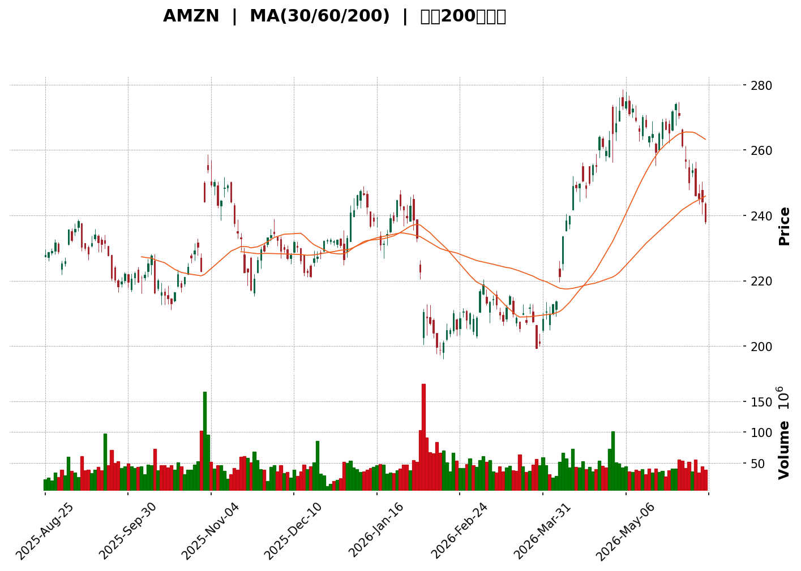
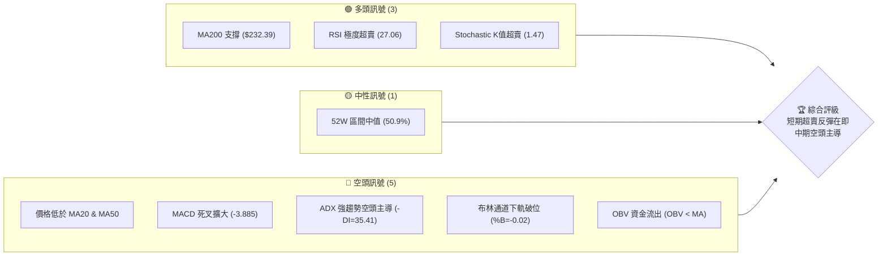
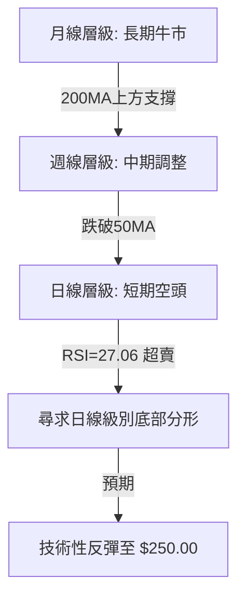
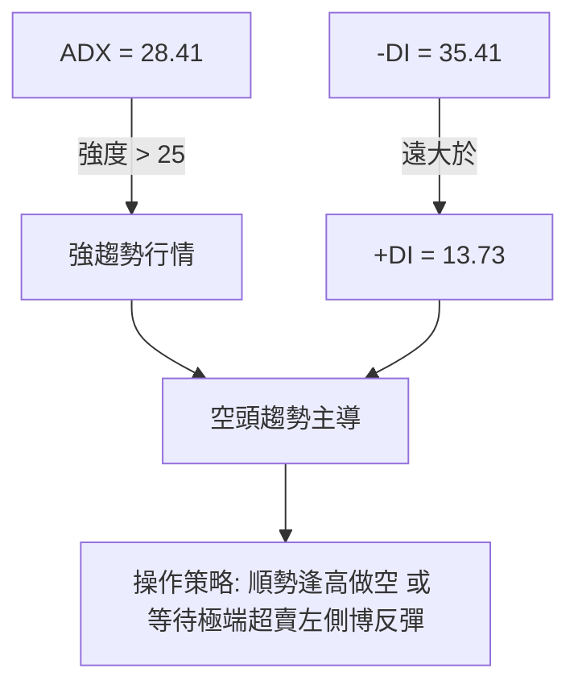
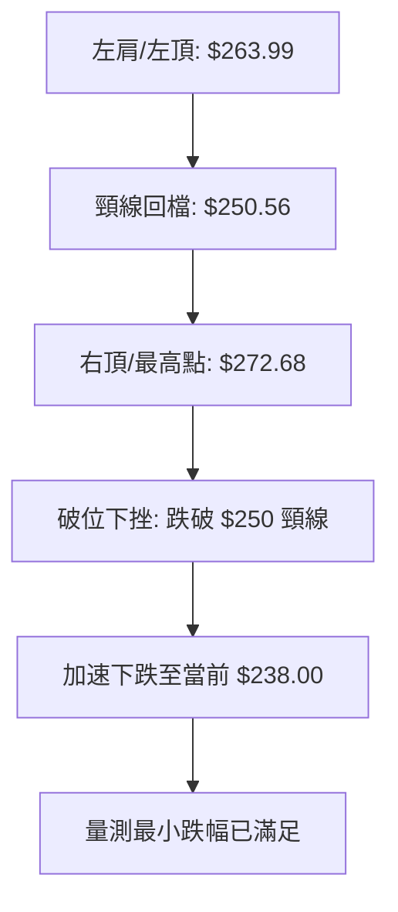

<details>
<summary>📊 靜態圖表 (點擊展開)</summary>

</details>

<html>
<head><meta charset="utf-8" /></head>
<body>
    <div style="height:500px; width:100%;">                        <script>window.PlotlyConfig = {MathJaxConfig: 'local'};</script>
        <script charset="utf-8" src="https://cdn.plot.ly/plotly-3.6.0.min.js" integrity="sha256-QaOVwtVY0T02VaHrr6pnoHLCwayMJp4O5n4YyaE3rJk=" crossorigin="anonymous"></script>                <div id="candlestick-chart" class="plotly-graph-div" style="height:100%; width:100%;"></div>            <script>                window.PLOTLYENV=window.PLOTLYENV || {};                                if (document.getElementById("candlestick-chart")) {                    Plotly.newPlot(                        "candlestick-chart",                        [{"close":{"dtype":"f8","bdata":"AAAAgBR+bEAAAABguJZsQAAAAADXo2xAAAAAQDPzbEAAAAAAAKBsQAAAAEDhKmxAAAAAIK4\u002fbEAAAACAwnVtQAAAAGCPCm1AAAAAQOF6bUAAAAAgrsdtQAAAAGCPymxAAAAAYGa+bEAAAADAzIRsQAAAAIDC7WxAAAAAoJlBbUAAAAAA1\u002fNsQAAAACBc52xAAAAAIFzvbEAAAAAAKXRsQAAAAGC4lmtAAAAAYLiGa0AAAADAzERrQAAAAMD1eGtAAAAAoHDFa0AAAACAPXJrQAAAAAAplGtAAAAAwB7Na0AAAADgUXBrQAAAAMDMnGtAAAAAwPW4a0AAAABACidsQAAAACCud2xAAAAAANcLa0AAAACAPYJrQAAAAOB6DGtAAAAAgD3yakAAAABACs9qQAAAAKBHoWpAAAAAIFwPa0AAAADA9cBrQAAAAGBmPmtAAAAAQOGia0AAAABguAZsQAAAAEAKX2xAAAAAAACobEAAAACgmclsQAAAACCF22tAAAAAQAqHbkAAAAAAAMBvQAAAAIA9Km9AAAAAYGZGb0AAAACgR2FuQAAAAMAejW5AAAAAwMwMb0AAAABAMyNvQAAAAGBmhm5AAAAAYI+ybUAAAACAFFZtQAAAAADXG21AAAAAoJnRa0AAAACAFNZrQAAAAOB6JGtAAAAAgBSWa0AAAADA9UhsQAAAAKBwtWxAAAAAwB6lbEAAAABACidtQAAAAAApPG1AAAAAoHBNbUAAAAAAKQxtQAAAACCFo2xAAAAAwPWwbEAAAADgelxsQAAAAKBwfWxAAAAAwPX4bEAAAADA9chsQAAAAIAURmxAAAAAoEfRa0AAAACA69FrQAAAAOCjqGtAAAAA4FFYbEAAAABAM2tsQAAAAIDCjWxAAAAA4HoEbUAAAAAAKQxtQAAAAOCjEG1AAAAAgD0CbUAAAADA9RBtQAAAAIA92mxAAAAAAABQbEAAAACA6yFtQAAAAIDCHW5AAAAAgOsxbkAAAACgR8luQAAAAAAp7G5AAAAAQArPbkAAAABAM1NuQAAAAMDMlG1AAAAAgMLFbUAAAAAA1+NtQAAAAAAA4GxAAAAAgOvpbEAAAABA4UptQAAAAMAe5W1AAAAAoHDNbUAAAACAwpVuQAAAAOBRYG5AAAAAIFw3bkAAAACgmeltQAAAAGC4Xm5AAAAAANfTbUAAAAAgrh9tQAAAAIAU1mtAAAAAgD1KakAAAABAChdqQAAAAGC43mlAAAAAYI+CaUAAAABAM\u002fNoQAAAAKBH2WhAAAAAwMwkaUAAAACgR5lpQAAAACCFm2lAAAAAIIVDakAAAADgo6hpQAAAAIDrEWpAAAAA4HpUakAAAACgcP1pQAAAAAAAQGpAAAAA4HoMakAAAAAgXBdqQAAAAIA9GmtAAAAAgBRea0AAAABguKZqQAAAACCur2pAAAAAYI\u002fKakAAAADAzJRqQAAAAMD1MGpAAAAAoHD1aUAAAAAgrndqQAAAAGBm5mpAAAAAANc7akAAAADgURhqQAAAAADXq2lAAAAA4HpEakAAAAAgrudpQAAAAGC4dmpAAAAAoEfxaUAAAABA4epoQAAAAGBmHmlAAAAA4KMIakAAAACAPVJqQAAAAOCjOGpAAAAAoEeZakAAAADgo7hqQAAAAAAAqGtAAAAAwMw0bUAAAAAAKcxtQAAAAOB6\u002fG1AAAAA4KMgb0AAAAAAABBvQAAAAGBmNm9AAAAAgOtRb0AAAADA9QhvQAAAAMAePW9AAAAAIIXrb0AAAABgj+JvQAAAAADXf3BAAAAAgOtRcEAAAABAMztwQAAAAOCjcHBAAAAAwPWQcEAAAAAAKcRwQAAAAMDMAHFAAAAAwMwYcUAAAAAA1y9xQAAAAGC48nBAAAAAQOEKcUAAAAAA189wQAAAAMAenXBAAAAAgBTicEAAAAAghbNwQAAAAIA9gnBAAAAAgMKNcEAAAACgcDVwQAAAAAApkHBAAAAAIFzHcEAAAADAHqVwQAAAAOCjlHBAAAAAoJn9cEAAAAAAACBxQAAAAIA96nBAAAAAAClUcEAAAADgUQhwQAAAAOCjQG9AAAAAoEe5b0AAAADA9cBuQAAAAEAKp25AAAAAgBSGbkAAAAAAAMBtQA=="},"high":{"dtype":"f8","bdata":"AAAAQDOzbEAAAAAAAKBsQAAAAADXu2xAAAAAYLgWbUAAAACA6\u002flsQAAAAKBwRWxAAAAAoHBlbEAAAADgo3htQAAAAAAAgG1AAAAAQDOzbUAAAABAM9ttQAAAAIDCtW1AAAAAwPXwbEAAAACgR9lsQAAAACBcN21AAAAAwMx8bUAAAACgmUltQAAAACBcL21AAAAAwB5FbUAAAACAPdJsQAAAACCFe2xAAAAAgOsRbEAAAACgcJVrQAAAAKCZoWtAAAAAQDPTa0AAAAAgrsdrQAAAAMDMxGtAAAAAgOvZa0AAAABgZgZsQAAAACBct2tAAAAA4Hrca0AAAAAgXFdsQAAAAGC4hmxAAAAAAACIbEAAAACAwpVrQAAAAIA9amtAAAAAYLg2a0AAAABA4VJrQAAAAKCZ2WpAAAAAgBQWa0AAAACAPeprQAAAAOBRgGtAAAAAoJmpa0AAAADAzCxsQAAAAMDMjGxAAAAAIK7vbEAAAACAPRptQAAAAIAUjmxAAAAAAABQb0AAAACgmSlwQAAAAAApEHBAAAAAAABgb0AAAAAAKUxvQAAAAMDMnG5AAAAAAAB4b0AAAAAAADhvQAAAAADXS29AAAAAAAB4bkAAAAAgXNdtQAAAAEAzU21AAAAAYGbGbEAAAAAgrvdrQAAAAMAebWxAAAAAYLjGa0AAAABgj2psQAAAAOCj0GxAAAAAAAD4bEAAAACgRyltQAAAAKCZeW1AAAAAQArfbUAAAAAAKSxtQAAAAAAAMG1AAAAAIK7nbEAAAABgj9psQAAAAIA9kmxAAAAAoHANbUAAAAAghQNtQAAAAGCPwmxAAAAAgMJ9bEAAAADAHvVrQAAAAIAUJmxAAAAAIFynbEAAAAAAKaRsQAAAACBcr2xAAAAAYGYObUAAAABgZh5tQAAAACCuH21AAAAAQDMTbUAAAADgoxhtQAAAACCuH21AAAAAYLhubUAAAAAAAEBtQAAAAIDCZW5AAAAAoEepbkAAAADAHs1uQAAAACCF+25AAAAAgBQeb0AAAADAHvVuQAAAAMD1KG5AAAAAwMwUbkAAAACAPfJtQAAAAEDhYm1AAAAAoJkJbUAAAABACndtQAAAAGBmDm5AAAAAYGYebkAAAAAAKZxuQAAAAMD1+G5AAAAAAABgbkAAAACAPWpuQAAAAAAptG5AAAAAQDPLbkAAAAAghdttQAAAAIDrSWxAAAAAgBRuakAAAACA65lqQAAAAMDMlGpAAAAAgD0SakAAAABguH5pQAAAAMAeJWlAAAAAIK43aUAAAAAghdtpQAAAAOB6tGlAAAAAoHBlakAAAACAwg1qQAAAACCFS2pAAAAAQOFyakAAAACgmWFqQAAAAGCPSmpAAAAAIFw3akAAAACAwiVqQAAAAKBHMWtAAAAAQAqPa0AAAACAPSprQAAAAIA9umpAAAAAwMz0akAAAAAAACBrQAAAAGC4dmpAAAAAgOtRakAAAABACpdqQAAAAGBm9mpAAAAA4HrkakAAAAAA1yNqQAAAAKBH8WlAAAAAoJmZakAAAABAMytqQAAAAIA9ompAAAAA4HqcakAAAABAM9NpQAAAAKCZeWlAAAAAwPVIakAAAABgj7JqQAAAAGC4hmpAAAAAYGaeakAAAABACr9qQAAAAEAzQ2xAAAAAoJk5bUAAAACAwg1uQAAAAAAAAG5AAAAAgMKFb0AAAACAFE5vQAAAAAAAQG9AAAAAQOECcEAAAACAwkVvQAAAAEDh4m9AAAAAgBT+b0AAAADgoyxwQAAAAAAAiHBAAAAAYGaCcEAAAADgelBwQAAAAGCPnnBAAAAAgBQecUAAAADAHhVxQAAAAKCZQXFAAAAAwPVocUAAAADAzFxxQAAAAIAUSnFAAAAAAAAgcUAAAACAFBpxQAAAAGBmunBAAAAAIIXrcEAAAADgeuxwQAAAAIDChXBAAAAAoJnNcEAAAAAAAGRwQAAAAKBHmXBAAAAAANfXcEAAAADgo9xwQAAAAMDM1HBAAAAAYI8GcUAAAAAAAChxQAAAAAAALHFAAAAAgBSqcEAAAABAM1NwQAAAAKBwEXBAAAAAYI\u002f6b0AAAACAFAZwQAAAAKBwLW9AAAAAgMJNb0AAAACgmYFuQA=="},"hovertemplate":"\u003cb\u003e%{x|%Y-%m-%d}\u003c\u002fb\u003e\u003cbr\u003e\u958b: $%{open:.2f}\u003cbr\u003e\u9ad8: $%{high:.2f}\u003cbr\u003e\u4f4e: $%{low:.2f}\u003cbr\u003e\u6536: $%{close:.2f}\u003cextra\u003e\u003c\u002fextra\u003e","low":{"dtype":"f8","bdata":"AAAAgOtpbEAAAADgo0BsQAAAAIDreWxAAAAA4KOAbEAAAADAHoVsQAAAAGCPumtAAAAAIIULbEAAAADA9dhsQAAAAIDC\u002fWxAAAAAAAA4bUAAAABgj2JtQAAAAEAzo2xAAAAAQOGqbEAAAACgR0lsQAAAAIA9ymxAAAAAIFwHbUAAAABguJZsQAAAAKBHmWxAAAAAYGa2bEAAAADgUXBsQAAAAIA9gmtAAAAAYGZua0AAAABACg9rQAAAAOCjQGtAAAAAoJlpa0AAAADgejxrQAAAACCFE2tAAAAAYGZea0AAAABA4WprQAAAAMD1AGtAAAAAoHCFa0AAAACAFKZrQAAAAAAAuGtAAAAAAAAAa0AAAACgRyFrQAAAAEAzk2pAAAAAwB6VakAAAACA65lqQAAAAMD1YGpAAAAAQOGyakAAAAAgrj9rQAAAAOCjEGtAAAAAgMJFa0AAAADAzLxrQAAAAKBHMWxAAAAAYLhGbEAAAADgUXhsQAAAAAAA2GtAAAAAIFx\u002fbkAAAADAzJxvQAAAAMAeFW9AAAAAwB7FbkAAAACgcEVuQAAAACCuz21AAAAAQOGybkAAAAAgXOduQAAAAAAAeG5AAAAAAACQbUAAAADgehxtQAAAAIAUpmxAAAAAoHDNa0AAAADgo1BrQAAAACCuF2tAAAAAgMLlakAAAADgo8hrQAAAAKCZ+WtAAAAA4KOYbEAAAABACsdsQAAAAAAACG1AAAAAoJkxbUAAAAAghdNsQAAAAKCZWWxAAAAAoJmRbEAAAADgo0hsQAAAACCFI2xAAAAAYLiObEAAAACAFJZsQAAAAADXI2xAAAAAAACwa0AAAAAAKaRrQAAAACCun2tAAAAAwB4NbEAAAABgjzJsQAAAAGC4VmxAAAAAIFyXbEAAAABgj+psQAAAAIDC5WxAAAAA4KPYbEAAAABgZsZsQAAAAADXw2xAAAAAYGYWbEAAAACAwmVsQAAAAIA9Am1AAAAA4KPwbUAAAAAAKTxuQAAAACCuR25AAAAAYLi+bkAAAAAAAAhuQAAAAEAKh21AAAAAACmUbUAAAADAHo1tQAAAAEDhqmxAAAAAAClcbEAAAADAzNxsQAAAAIA9Um1AAAAAoEexbUAAAABgj8JtQAAAAMD1MG5AAAAAIK6XbUAAAADgerRtQAAAAKBwxW1AAAAAYGZubUAAAACAPfpsQAAAAAApjGtAAAAAgOsJaUAAAABAM2tpQAAAAMAezWlAAAAAIK5PaUAAAACA67FoQAAAAMD1qGhAAAAAAACAaEAAAADgUTBpQAAAAIDrWWlAAAAAAAB4aUAAAAAghWNpQAAAAAAAaGlAAAAAgMIdakAAAABAM6tpQAAAAGBmpmlAAAAAYLhuaUAAAAAgXE9pQAAAAMDMRGpAAAAAQOHyakAAAADA9ZBqQAAAACCF42lAAAAAgMKNakAAAABAM2tqQAAAAMDMBGpAAAAAQArHaUAAAABgZu5pQAAAAIDCjWpAAAAAYI8aakAAAACgmcFpQAAAAIA9imlAAAAA4FEwakAAAADgetRpQAAAAMDMPGpAAAAAANfjaUAAAADgeuRoQAAAACBc\u002f2hAAAAA4HqEaUAAAACAFAZqQAAAAMDMnGlAAAAAQOEyakAAAABgjyJqQAAAAADXc2tAAAAA4KPoa0AAAABguGZtQAAAAAAAeG1AAAAAwPU4bkAAAABgZuZuQAAAAGBmhm5AAAAAIIVDb0AAAAAA16tuQAAAAEAzI29AAAAAYI9Kb0AAAACAPaJvQAAAAEAKG3BAAAAAoHBFcEAAAACAFApwQAAAAEAzG3BAAAAAYI8CcEAAAAAA12twQAAAAMDMzHBAAAAAgBQGcUAAAAAgXANxQAAAAADX53BAAAAAQDPfcEAAAAAgrsdwQAAAAIAUanBAAAAAQDNzcEAAAACAFKpwQAAAAIA9TnBAAAAA4HpocEAAAACAFOZvQAAAAOB6OHBAAAAAgOtVcEAAAAAA16NwQAAAAMAeYXBAAAAAQDObcEAAAABACrdwQAAAAIA92nBAAAAAQDNLcEAAAAAA18tvQAAAAGC49m5AAAAAAAB4b0AAAADA9bhuQAAAACCFa25AAAAAwMwMbkAAAABgZq5tQA=="},"name":"\u50f9\u683c","open":{"dtype":"f8","bdata":"AAAAQDNrbEAAAAAghWNsQAAAAIA9kmxAAAAA4FGgbEAAAACAPepsQAAAAOCj8GtAAAAAYLgmbEAAAACAFOZsQAAAAIAUZm1AAAAAgBRebUAAAAAghYttQAAAAOCjsG1AAAAAIK7vbEAAAABAM8tsQAAAAAAp1GxAAAAAgBQebUAAAADgozhtQAAAAAAAEG1AAAAAANcLbUAAAACA69FsQAAAAGCPemxAAAAAwMwEbEAAAACA64FrQAAAAGCPYmtAAAAAYI+Ca0AAAADA9cBrQAAAACCFK2tAAAAA4FGga0AAAACAFO5rQAAAAAAAoGtAAAAAACmca0AAAACgcN1rQAAAAAAAIGxAAAAAYLhGbEAAAABgZjZrQAAAAIDr8WpAAAAAANcTa0AAAACgcPVqQAAAAIDr0WpAAAAAACm8akAAAACAwk1rQAAAAKCZaWtAAAAAAABga0AAAABACr9rQAAAAMAedWxAAAAAQAqHbEAAAACgcPVsQAAAAIDrYWxAAAAAQDNDb0AAAAAghetvQAAAAAApTG9AAAAAwPUgb0AAAADAHiVvQAAAAMDMXG5AAAAAQOEKb0AAAADAHg1vQAAAACCuR29AAAAAoJlhbkAAAACA62FtQAAAAAAAKG1AAAAAQDODbEAAAAAgrvdrQAAAAKCZYWxAAAAAQDMLa0AAAACA69FrQAAAAAApTGxAAAAAIK7XbEAAAAAgrudsQAAAAEAKJ21AAAAA4FFgbUAAAABAMyttQAAAAOCjGG1AAAAAgD3KbEAAAABA4bJsQAAAAEDhWmxAAAAAgOuZbEAAAABguNZsQAAAAADXu2xAAAAAgMJ9bEAAAACgR+FrQAAAAMAeFWxAAAAAYLg2bEAAAADgUVhsQAAAACCFk2xAAAAAgOuhbEAAAAAAKQRtQAAAAKBHAW1AAAAAgBT+bEAAAABguOZsQAAAAMAeHW1AAAAAQOHqbEAAAABA4ZpsQAAAAEAzA21AAAAAIIXzbUAAAACA62FuQAAAAIA9km5AAAAAIFzXbkAAAADA9dBuQAAAAMDMJG5AAAAAgOvpbUAAAABA4eJtQAAAAOBROG1AAAAAQOHibEAAAACgmUFtQAAAAGC4Xm1AAAAAIFz\u002fbUAAAACAFPZtQAAAAADXy25AAAAAgD1abkAAAADgevxtQAAAAIDryW1AAAAAIFyfbkAAAAAghdttQAAAAMAeHWxAAAAAYGZWaUAAAABACh9qQAAAAKCZGWpAAAAAgOsBakAAAABguH5pQAAAAAAp3GhAAAAAACnEaEAAAACAPUJpQAAAAKCZeWlAAAAA4FGYaUAAAABAMwNqQAAAAEAKr2lAAAAAYLhOakAAAAAgXFdqQAAAAGCP2mlAAAAAoJmRaUAAAABAM2NpQAAAAEAKT2pAAAAAIFz\u002fakAAAAAgrt9qQAAAAGBmTmpAAAAAgBTGakAAAABguPZqQAAAAOB6TGpAAAAAIIUzakAAAABAMwtqQAAAAIA9mmpAAAAAgMK9akAAAACA6+FpQAAAAMDM7GlAAAAAoEc5akAAAABgZv5pQAAAAIDrcWpAAAAAIIVTakAAAABguM5pQAAAACBcL2lAAAAAQDObaUAAAACAFE5qQAAAAKBH0WlAAAAAoJk5akAAAAAgrmdqQAAAAKBH+WtAAAAAIFwnbEAAAACgmWltQAAAAGBmrm1AAAAAwPU4bkAAAAAAAChvQAAAAOBREG9AAAAAIK7fb0AAAACAFCZvQAAAAEDh4m9AAAAAgBSOb0AAAADgeuxvQAAAACCuP3BAAAAAIFx3cEAAAACAPSZwQAAAAADXH3BAAAAAYLgScUAAAACgR5lwQAAAAMDMzHBAAAAAoEdBcUAAAACAPQ5xQAAAAOBRMHFAAAAAgBT6cEAAAACgcN1wQAAAACBcq3BAAAAAQOGGcEAAAABgZtJwQAAAAAAAaHBAAAAAgOt9cEAAAADgo2BwQAAAAMDMQHBAAAAAAAB4cEAAAABgj8pwQAAAAEAKv3BAAAAAYGaicEAAAADgUQRxQAAAAOCj9HBAAAAA4KOkcEAAAABgjxJwQAAAAGBm1m9AAAAAANejb0AAAADgUchvQAAAAIDC1W5AAAAAIFz3bkAAAAAgXHNuQA=="},"x":["2025-08-25T00:00:00-04:00","2025-08-26T00:00:00-04:00","2025-08-27T00:00:00-04:00","2025-08-28T00:00:00-04:00","2025-08-29T00:00:00-04:00","2025-09-02T00:00:00-04:00","2025-09-03T00:00:00-04:00","2025-09-04T00:00:00-04:00","2025-09-05T00:00:00-04:00","2025-09-08T00:00:00-04:00","2025-09-09T00:00:00-04:00","2025-09-10T00:00:00-04:00","2025-09-11T00:00:00-04:00","2025-09-12T00:00:00-04:00","2025-09-15T00:00:00-04:00","2025-09-16T00:00:00-04:00","2025-09-17T00:00:00-04:00","2025-09-18T00:00:00-04:00","2025-09-19T00:00:00-04:00","2025-09-22T00:00:00-04:00","2025-09-23T00:00:00-04:00","2025-09-24T00:00:00-04:00","2025-09-25T00:00:00-04:00","2025-09-26T00:00:00-04:00","2025-09-29T00:00:00-04:00","2025-09-30T00:00:00-04:00","2025-10-01T00:00:00-04:00","2025-10-02T00:00:00-04:00","2025-10-03T00:00:00-04:00","2025-10-06T00:00:00-04:00","2025-10-07T00:00:00-04:00","2025-10-08T00:00:00-04:00","2025-10-09T00:00:00-04:00","2025-10-10T00:00:00-04:00","2025-10-13T00:00:00-04:00","2025-10-14T00:00:00-04:00","2025-10-15T00:00:00-04:00","2025-10-16T00:00:00-04:00","2025-10-17T00:00:00-04:00","2025-10-20T00:00:00-04:00","2025-10-21T00:00:00-04:00","2025-10-22T00:00:00-04:00","2025-10-23T00:00:00-04:00","2025-10-24T00:00:00-04:00","2025-10-27T00:00:00-04:00","2025-10-28T00:00:00-04:00","2025-10-29T00:00:00-04:00","2025-10-30T00:00:00-04:00","2025-10-31T00:00:00-04:00","2025-11-03T00:00:00-05:00","2025-11-04T00:00:00-05:00","2025-11-05T00:00:00-05:00","2025-11-06T00:00:00-05:00","2025-11-07T00:00:00-05:00","2025-11-10T00:00:00-05:00","2025-11-11T00:00:00-05:00","2025-11-12T00:00:00-05:00","2025-11-13T00:00:00-05:00","2025-11-14T00:00:00-05:00","2025-11-17T00:00:00-05:00","2025-11-18T00:00:00-05:00","2025-11-19T00:00:00-05:00","2025-11-20T00:00:00-05:00","2025-11-21T00:00:00-05:00","2025-11-24T00:00:00-05:00","2025-11-25T00:00:00-05:00","2025-11-26T00:00:00-05:00","2025-11-28T00:00:00-05:00","2025-12-01T00:00:00-05:00","2025-12-02T00:00:00-05:00","2025-12-03T00:00:00-05:00","2025-12-04T00:00:00-05:00","2025-12-05T00:00:00-05:00","2025-12-08T00:00:00-05:00","2025-12-09T00:00:00-05:00","2025-12-10T00:00:00-05:00","2025-12-11T00:00:00-05:00","2025-12-12T00:00:00-05:00","2025-12-15T00:00:00-05:00","2025-12-16T00:00:00-05:00","2025-12-17T00:00:00-05:00","2025-12-18T00:00:00-05:00","2025-12-19T00:00:00-05:00","2025-12-22T00:00:00-05:00","2025-12-23T00:00:00-05:00","2025-12-24T00:00:00-05:00","2025-12-26T00:00:00-05:00","2025-12-29T00:00:00-05:00","2025-12-30T00:00:00-05:00","2025-12-31T00:00:00-05:00","2026-01-02T00:00:00-05:00","2026-01-05T00:00:00-05:00","2026-01-06T00:00:00-05:00","2026-01-07T00:00:00-05:00","2026-01-08T00:00:00-05:00","2026-01-09T00:00:00-05:00","2026-01-12T00:00:00-05:00","2026-01-13T00:00:00-05:00","2026-01-14T00:00:00-05:00","2026-01-15T00:00:00-05:00","2026-01-16T00:00:00-05:00","2026-01-20T00:00:00-05:00","2026-01-21T00:00:00-05:00","2026-01-22T00:00:00-05:00","2026-01-23T00:00:00-05:00","2026-01-26T00:00:00-05:00","2026-01-27T00:00:00-05:00","2026-01-28T00:00:00-05:00","2026-01-29T00:00:00-05:00","2026-01-30T00:00:00-05:00","2026-02-02T00:00:00-05:00","2026-02-03T00:00:00-05:00","2026-02-04T00:00:00-05:00","2026-02-05T00:00:00-05:00","2026-02-06T00:00:00-05:00","2026-02-09T00:00:00-05:00","2026-02-10T00:00:00-05:00","2026-02-11T00:00:00-05:00","2026-02-12T00:00:00-05:00","2026-02-13T00:00:00-05:00","2026-02-17T00:00:00-05:00","2026-02-18T00:00:00-05:00","2026-02-19T00:00:00-05:00","2026-02-20T00:00:00-05:00","2026-02-23T00:00:00-05:00","2026-02-24T00:00:00-05:00","2026-02-25T00:00:00-05:00","2026-02-26T00:00:00-05:00","2026-02-27T00:00:00-05:00","2026-03-02T00:00:00-05:00","2026-03-03T00:00:00-05:00","2026-03-04T00:00:00-05:00","2026-03-05T00:00:00-05:00","2026-03-06T00:00:00-05:00","2026-03-09T00:00:00-04:00","2026-03-10T00:00:00-04:00","2026-03-11T00:00:00-04:00","2026-03-12T00:00:00-04:00","2026-03-13T00:00:00-04:00","2026-03-16T00:00:00-04:00","2026-03-17T00:00:00-04:00","2026-03-18T00:00:00-04:00","2026-03-19T00:00:00-04:00","2026-03-20T00:00:00-04:00","2026-03-23T00:00:00-04:00","2026-03-24T00:00:00-04:00","2026-03-25T00:00:00-04:00","2026-03-26T00:00:00-04:00","2026-03-27T00:00:00-04:00","2026-03-30T00:00:00-04:00","2026-03-31T00:00:00-04:00","2026-04-01T00:00:00-04:00","2026-04-02T00:00:00-04:00","2026-04-06T00:00:00-04:00","2026-04-07T00:00:00-04:00","2026-04-08T00:00:00-04:00","2026-04-09T00:00:00-04:00","2026-04-10T00:00:00-04:00","2026-04-13T00:00:00-04:00","2026-04-14T00:00:00-04:00","2026-04-15T00:00:00-04:00","2026-04-16T00:00:00-04:00","2026-04-17T00:00:00-04:00","2026-04-20T00:00:00-04:00","2026-04-21T00:00:00-04:00","2026-04-22T00:00:00-04:00","2026-04-23T00:00:00-04:00","2026-04-24T00:00:00-04:00","2026-04-27T00:00:00-04:00","2026-04-28T00:00:00-04:00","2026-04-29T00:00:00-04:00","2026-04-30T00:00:00-04:00","2026-05-01T00:00:00-04:00","2026-05-04T00:00:00-04:00","2026-05-05T00:00:00-04:00","2026-05-06T00:00:00-04:00","2026-05-07T00:00:00-04:00","2026-05-08T00:00:00-04:00","2026-05-11T00:00:00-04:00","2026-05-12T00:00:00-04:00","2026-05-13T00:00:00-04:00","2026-05-14T00:00:00-04:00","2026-05-15T00:00:00-04:00","2026-05-18T00:00:00-04:00","2026-05-19T00:00:00-04:00","2026-05-20T00:00:00-04:00","2026-05-21T00:00:00-04:00","2026-05-22T00:00:00-04:00","2026-05-26T00:00:00-04:00","2026-05-27T00:00:00-04:00","2026-05-28T00:00:00-04:00","2026-05-29T00:00:00-04:00","2026-06-01T00:00:00-04:00","2026-06-02T00:00:00-04:00","2026-06-03T00:00:00-04:00","2026-06-04T00:00:00-04:00","2026-06-05T00:00:00-04:00","2026-06-08T00:00:00-04:00","2026-06-09T00:00:00-04:00","2026-06-10T00:00:00-04:00"],"type":"candlestick"},{"hovertemplate":"MA30: $%{y:.2f}\u003cextra\u003e\u003c\u002fextra\u003e","line":{"color":"#2196F3","dash":"dash","width":2},"mode":"lines","name":"MA30","x":["2025-08-25T00:00:00-04:00","2025-08-26T00:00:00-04:00","2025-08-27T00:00:00-04:00","2025-08-28T00:00:00-04:00","2025-08-29T00:00:00-04:00","2025-09-02T00:00:00-04:00","2025-09-03T00:00:00-04:00","2025-09-04T00:00:00-04:00","2025-09-05T00:00:00-04:00","2025-09-08T00:00:00-04:00","2025-09-09T00:00:00-04:00","2025-09-10T00:00:00-04:00","2025-09-11T00:00:00-04:00","2025-09-12T00:00:00-04:00","2025-09-15T00:00:00-04:00","2025-09-16T00:00:00-04:00","2025-09-17T00:00:00-04:00","2025-09-18T00:00:00-04:00","2025-09-19T00:00:00-04:00","2025-09-22T00:00:00-04:00","2025-09-23T00:00:00-04:00","2025-09-24T00:00:00-04:00","2025-09-25T00:00:00-04:00","2025-09-26T00:00:00-04:00","2025-09-29T00:00:00-04:00","2025-09-30T00:00:00-04:00","2025-10-01T00:00:00-04:00","2025-10-02T00:00:00-04:00","2025-10-03T00:00:00-04:00","2025-10-06T00:00:00-04:00","2025-10-07T00:00:00-04:00","2025-10-08T00:00:00-04:00","2025-10-09T00:00:00-04:00","2025-10-10T00:00:00-04:00","2025-10-13T00:00:00-04:00","2025-10-14T00:00:00-04:00","2025-10-15T00:00:00-04:00","2025-10-16T00:00:00-04:00","2025-10-17T00:00:00-04:00","2025-10-20T00:00:00-04:00","2025-10-21T00:00:00-04:00","2025-10-22T00:00:00-04:00","2025-10-23T00:00:00-04:00","2025-10-24T00:00:00-04:00","2025-10-27T00:00:00-04:00","2025-10-28T00:00:00-04:00","2025-10-29T00:00:00-04:00","2025-10-30T00:00:00-04:00","2025-10-31T00:00:00-04:00","2025-11-03T00:00:00-05:00","2025-11-04T00:00:00-05:00","2025-11-05T00:00:00-05:00","2025-11-06T00:00:00-05:00","2025-11-07T00:00:00-05:00","2025-11-10T00:00:00-05:00","2025-11-11T00:00:00-05:00","2025-11-12T00:00:00-05:00","2025-11-13T00:00:00-05:00","2025-11-14T00:00:00-05:00","2025-11-17T00:00:00-05:00","2025-11-18T00:00:00-05:00","2025-11-19T00:00:00-05:00","2025-11-20T00:00:00-05:00","2025-11-21T00:00:00-05:00","2025-11-24T00:00:00-05:00","2025-11-25T00:00:00-05:00","2025-11-26T00:00:00-05:00","2025-11-28T00:00:00-05:00","2025-12-01T00:00:00-05:00","2025-12-02T00:00:00-05:00","2025-12-03T00:00:00-05:00","2025-12-04T00:00:00-05:00","2025-12-05T00:00:00-05:00","2025-12-08T00:00:00-05:00","2025-12-09T00:00:00-05:00","2025-12-10T00:00:00-05:00","2025-12-11T00:00:00-05:00","2025-12-12T00:00:00-05:00","2025-12-15T00:00:00-05:00","2025-12-16T00:00:00-05:00","2025-12-17T00:00:00-05:00","2025-12-18T00:00:00-05:00","2025-12-19T00:00:00-05:00","2025-12-22T00:00:00-05:00","2025-12-23T00:00:00-05:00","2025-12-24T00:00:00-05:00","2025-12-26T00:00:00-05:00","2025-12-29T00:00:00-05:00","2025-12-30T00:00:00-05:00","2025-12-31T00:00:00-05:00","2026-01-02T00:00:00-05:00","2026-01-05T00:00:00-05:00","2026-01-06T00:00:00-05:00","2026-01-07T00:00:00-05:00","2026-01-08T00:00:00-05:00","2026-01-09T00:00:00-05:00","2026-01-12T00:00:00-05:00","2026-01-13T00:00:00-05:00","2026-01-14T00:00:00-05:00","2026-01-15T00:00:00-05:00","2026-01-16T00:00:00-05:00","2026-01-20T00:00:00-05:00","2026-01-21T00:00:00-05:00","2026-01-22T00:00:00-05:00","2026-01-23T00:00:00-05:00","2026-01-26T00:00:00-05:00","2026-01-27T00:00:00-05:00","2026-01-28T00:00:00-05:00","2026-01-29T00:00:00-05:00","2026-01-30T00:00:00-05:00","2026-02-02T00:00:00-05:00","2026-02-03T00:00:00-05:00","2026-02-04T00:00:00-05:00","2026-02-05T00:00:00-05:00","2026-02-06T00:00:00-05:00","2026-02-09T00:00:00-05:00","2026-02-10T00:00:00-05:00","2026-02-11T00:00:00-05:00","2026-02-12T00:00:00-05:00","2026-02-13T00:00:00-05:00","2026-02-17T00:00:00-05:00","2026-02-18T00:00:00-05:00","2026-02-19T00:00:00-05:00","2026-02-20T00:00:00-05:00","2026-02-23T00:00:00-05:00","2026-02-24T00:00:00-05:00","2026-02-25T00:00:00-05:00","2026-02-26T00:00:00-05:00","2026-02-27T00:00:00-05:00","2026-03-02T00:00:00-05:00","2026-03-03T00:00:00-05:00","2026-03-04T00:00:00-05:00","2026-03-05T00:00:00-05:00","2026-03-06T00:00:00-05:00","2026-03-09T00:00:00-04:00","2026-03-10T00:00:00-04:00","2026-03-11T00:00:00-04:00","2026-03-12T00:00:00-04:00","2026-03-13T00:00:00-04:00","2026-03-16T00:00:00-04:00","2026-03-17T00:00:00-04:00","2026-03-18T00:00:00-04:00","2026-03-19T00:00:00-04:00","2026-03-20T00:00:00-04:00","2026-03-23T00:00:00-04:00","2026-03-24T00:00:00-04:00","2026-03-25T00:00:00-04:00","2026-03-26T00:00:00-04:00","2026-03-27T00:00:00-04:00","2026-03-30T00:00:00-04:00","2026-03-31T00:00:00-04:00","2026-04-01T00:00:00-04:00","2026-04-02T00:00:00-04:00","2026-04-06T00:00:00-04:00","2026-04-07T00:00:00-04:00","2026-04-08T00:00:00-04:00","2026-04-09T00:00:00-04:00","2026-04-10T00:00:00-04:00","2026-04-13T00:00:00-04:00","2026-04-14T00:00:00-04:00","2026-04-15T00:00:00-04:00","2026-04-16T00:00:00-04:00","2026-04-17T00:00:00-04:00","2026-04-20T00:00:00-04:00","2026-04-21T00:00:00-04:00","2026-04-22T00:00:00-04:00","2026-04-23T00:00:00-04:00","2026-04-24T00:00:00-04:00","2026-04-27T00:00:00-04:00","2026-04-28T00:00:00-04:00","2026-04-29T00:00:00-04:00","2026-04-30T00:00:00-04:00","2026-05-01T00:00:00-04:00","2026-05-04T00:00:00-04:00","2026-05-05T00:00:00-04:00","2026-05-06T00:00:00-04:00","2026-05-07T00:00:00-04:00","2026-05-08T00:00:00-04:00","2026-05-11T00:00:00-04:00","2026-05-12T00:00:00-04:00","2026-05-13T00:00:00-04:00","2026-05-14T00:00:00-04:00","2026-05-15T00:00:00-04:00","2026-05-18T00:00:00-04:00","2026-05-19T00:00:00-04:00","2026-05-20T00:00:00-04:00","2026-05-21T00:00:00-04:00","2026-05-22T00:00:00-04:00","2026-05-26T00:00:00-04:00","2026-05-27T00:00:00-04:00","2026-05-28T00:00:00-04:00","2026-05-29T00:00:00-04:00","2026-06-01T00:00:00-04:00","2026-06-02T00:00:00-04:00","2026-06-03T00:00:00-04:00","2026-06-04T00:00:00-04:00","2026-06-05T00:00:00-04:00","2026-06-08T00:00:00-04:00","2026-06-09T00:00:00-04:00","2026-06-10T00:00:00-04:00"],"y":{"dtype":"f8","bdata":"AAAAAAAA+H8AAAAAAAD4fwAAAAAAAPh\u002fAAAAAAAA+H8AAAAAAAD4fwAAAAAAAPh\u002fAAAAAAAA+H8AAAAAAAD4fwAAAAAAAPh\u002fAAAAAAAA+H8AAAAAAAD4fwAAAAAAAPh\u002fAAAAAAAA+H8AAAAAAAD4fwAAAAAAAPh\u002fAAAAAAAA+H8AAAAAAAD4fwAAAAAAAPh\u002fAAAAAAAA+H8AAAAAAAD4fwAAAAAAAPh\u002fAAAAAAAA+H8AAAAAAAD4fwAAAAAAAPh\u002fAAAAAAAA+H8AAAAAAAD4fwAAAAAAAPh\u002fAAAAAAAA+H8AAAAAAAD4f+\u002fu7r5YamxAd3d3p8ZjbEBmZmamDWBsQCIiItKUXmxAMzMzA1ZObEB3d3eHz0RsQFVVVZVDO2xAq6qqOiYwbEDNzMx8hhlsQHd3dwfzBGxAVVVVdUzwa0C8u7sLAt9rQKuqqnrN0WtAvLu7G1rIa0Crqqo6JsRrQKuqqlpkv2tAIiIiokW6a0AAAAAw3bhrQO\u002fu7p7vr2tA3t3dfYa9a0AiIiJCp9lrQCIiIrIr+GtAZmZm9igYbEB3d3eXtTJsQJqZmTn7TGxAMzMzw\u002fVobEC8u7trdYhsQJqZmZmZoWxAVVVVBcixbEDNzMws+cFsQImIiMi9zmxAvLu7C5DPbEAAAAAw3cxsQN7d3a2OwWxAREREVCrGbEAiIiISysxsQFVVVWX02mxA7+7uXnPpbEDv7u5ec\u002f1sQFVVVRWuE21AZmZm5tAmbUBEREQk2zFtQBEREZHCPW1AAAAAQMNGbUARERERn0ltQKuqqnqiSm1AZmZmVlVNbUAAAADgT01tQAAAADDdUG1AmpmZGb05bUAiIiLiMxhtQM3MzFxI+mxA3t3drUfhbEBEREREi9BsQImIiKh\u002fv2xAiYiImCeubEC8u7vrUZxsQBEREYHcj2xAiYiI6PuJbEBVVVUVrodsQM3MzEx+hWxAmpmZ6bSJbEDNzMycxJRsQN7d3d0krmxARERExGfEbEBERETUv9lsQHd3d9ej7GxAAAAAoBr\u002fbEDe3d39GwltQCIiImIQDG1AzczMHBMQbUBERESUQxdtQM3MzKxHGW1AvLu7uy0bbUBEREQUICNtQJqZmVkdL21AMzMzgzI2bUC8u7urjkVtQGZmZqZ\u002fV21AzczMzPdrbUAAAADw0n1tQBEREcH1lG1AMzMzU5yhbUC8u7troKdtQFVVVQWBoW1AVVVVtTqKbUAzMzPz\u002fXBtQN7d3V26VW1Aq6qqOt83bUBVVVUlvxRtQBEREdGU8mxAMzMzk4rXbECrqqr6YrlsQHd3d3fpkmxAVVVVhV1xbEBERERUnEVsQBEREeEzHGxAZmZm5vv1a0AiIiLy\u002fdBrQImIiLiQtGtAEREREcqUa0AiIiKSX3RrQM3MzHw\u002fZWtAd3d3pw1Ya0AiIiLCg0FrQDMzMyMiJmtAZmZm9m8Ma0AzMzOjRepqQN7d3V2PxmpAd3d3tzqiakAAAAAA1YRqQKuqqqo4Z2pAAAAAAI5IakB3d3eXtS5qQDMzMxM8HGpAvLu76wocakCJiIjIdhpqQJqZmdmHH2pAiYiIqDgjakCJiIio8SJqQLy7u3s\u002fJWpAiYiIuNcsakDNzMwMAjNqQO\u002fu7s4+OGpAAAAAoBo7akARERGxK0RqQImIiOi0UWpAvLu7K0BqakCJiIjIvYpqQO\u002fu7r6fqmpAIiIicvbVakDv7u5OYgBrQM3MzLx0I2tAq6qqGi9Fa0DNzMyMl2prQDMzM6NwkWtAAAAAkDS9a0CJiIjIduprQN7d3f2NJGxAd3d3Z5FdbEDv7u6uuZBsQCIiIjLBw2xA7+7uvp\u002f+bEB3d3c3Fz5tQM3MzEw3hW1AREREdNrIbUB3d3e3HhFuQDMzM0OLUG5AMzMz0waWbkCrqqrqUeBuQBEREcGDJW9AiYiIqH9nb0AiIiLi7KNvQFVVVYXr3W9AzczMDLsKcEB3d3ffCCNwQKuqqpJfOnBARERETPBMcEAiIiIK11twQM3MzPxiaXBAMzMzC5B1cEDNzMykKYNwQHd3d6dUjnBAAAAAkAmUcECJiIiYbphwQFVVVZ19mHBAmpmZQaeXcEARERGh05JwQGZmZubQiHBAREREZMl\u002fcEDe3d2dNnRwQA=="},"type":"scatter"},{"hovertemplate":"MA60: $%{y:.2f}\u003cextra\u003e\u003c\u002fextra\u003e","line":{"color":"#9C27B0","dash":"dash","width":2},"mode":"lines","name":"MA60","x":["2025-08-25T00:00:00-04:00","2025-08-26T00:00:00-04:00","2025-08-27T00:00:00-04:00","2025-08-28T00:00:00-04:00","2025-08-29T00:00:00-04:00","2025-09-02T00:00:00-04:00","2025-09-03T00:00:00-04:00","2025-09-04T00:00:00-04:00","2025-09-05T00:00:00-04:00","2025-09-08T00:00:00-04:00","2025-09-09T00:00:00-04:00","2025-09-10T00:00:00-04:00","2025-09-11T00:00:00-04:00","2025-09-12T00:00:00-04:00","2025-09-15T00:00:00-04:00","2025-09-16T00:00:00-04:00","2025-09-17T00:00:00-04:00","2025-09-18T00:00:00-04:00","2025-09-19T00:00:00-04:00","2025-09-22T00:00:00-04:00","2025-09-23T00:00:00-04:00","2025-09-24T00:00:00-04:00","2025-09-25T00:00:00-04:00","2025-09-26T00:00:00-04:00","2025-09-29T00:00:00-04:00","2025-09-30T00:00:00-04:00","2025-10-01T00:00:00-04:00","2025-10-02T00:00:00-04:00","2025-10-03T00:00:00-04:00","2025-10-06T00:00:00-04:00","2025-10-07T00:00:00-04:00","2025-10-08T00:00:00-04:00","2025-10-09T00:00:00-04:00","2025-10-10T00:00:00-04:00","2025-10-13T00:00:00-04:00","2025-10-14T00:00:00-04:00","2025-10-15T00:00:00-04:00","2025-10-16T00:00:00-04:00","2025-10-17T00:00:00-04:00","2025-10-20T00:00:00-04:00","2025-10-21T00:00:00-04:00","2025-10-22T00:00:00-04:00","2025-10-23T00:00:00-04:00","2025-10-24T00:00:00-04:00","2025-10-27T00:00:00-04:00","2025-10-28T00:00:00-04:00","2025-10-29T00:00:00-04:00","2025-10-30T00:00:00-04:00","2025-10-31T00:00:00-04:00","2025-11-03T00:00:00-05:00","2025-11-04T00:00:00-05:00","2025-11-05T00:00:00-05:00","2025-11-06T00:00:00-05:00","2025-11-07T00:00:00-05:00","2025-11-10T00:00:00-05:00","2025-11-11T00:00:00-05:00","2025-11-12T00:00:00-05:00","2025-11-13T00:00:00-05:00","2025-11-14T00:00:00-05:00","2025-11-17T00:00:00-05:00","2025-11-18T00:00:00-05:00","2025-11-19T00:00:00-05:00","2025-11-20T00:00:00-05:00","2025-11-21T00:00:00-05:00","2025-11-24T00:00:00-05:00","2025-11-25T00:00:00-05:00","2025-11-26T00:00:00-05:00","2025-11-28T00:00:00-05:00","2025-12-01T00:00:00-05:00","2025-12-02T00:00:00-05:00","2025-12-03T00:00:00-05:00","2025-12-04T00:00:00-05:00","2025-12-05T00:00:00-05:00","2025-12-08T00:00:00-05:00","2025-12-09T00:00:00-05:00","2025-12-10T00:00:00-05:00","2025-12-11T00:00:00-05:00","2025-12-12T00:00:00-05:00","2025-12-15T00:00:00-05:00","2025-12-16T00:00:00-05:00","2025-12-17T00:00:00-05:00","2025-12-18T00:00:00-05:00","2025-12-19T00:00:00-05:00","2025-12-22T00:00:00-05:00","2025-12-23T00:00:00-05:00","2025-12-24T00:00:00-05:00","2025-12-26T00:00:00-05:00","2025-12-29T00:00:00-05:00","2025-12-30T00:00:00-05:00","2025-12-31T00:00:00-05:00","2026-01-02T00:00:00-05:00","2026-01-05T00:00:00-05:00","2026-01-06T00:00:00-05:00","2026-01-07T00:00:00-05:00","2026-01-08T00:00:00-05:00","2026-01-09T00:00:00-05:00","2026-01-12T00:00:00-05:00","2026-01-13T00:00:00-05:00","2026-01-14T00:00:00-05:00","2026-01-15T00:00:00-05:00","2026-01-16T00:00:00-05:00","2026-01-20T00:00:00-05:00","2026-01-21T00:00:00-05:00","2026-01-22T00:00:00-05:00","2026-01-23T00:00:00-05:00","2026-01-26T00:00:00-05:00","2026-01-27T00:00:00-05:00","2026-01-28T00:00:00-05:00","2026-01-29T00:00:00-05:00","2026-01-30T00:00:00-05:00","2026-02-02T00:00:00-05:00","2026-02-03T00:00:00-05:00","2026-02-04T00:00:00-05:00","2026-02-05T00:00:00-05:00","2026-02-06T00:00:00-05:00","2026-02-09T00:00:00-05:00","2026-02-10T00:00:00-05:00","2026-02-11T00:00:00-05:00","2026-02-12T00:00:00-05:00","2026-02-13T00:00:00-05:00","2026-02-17T00:00:00-05:00","2026-02-18T00:00:00-05:00","2026-02-19T00:00:00-05:00","2026-02-20T00:00:00-05:00","2026-02-23T00:00:00-05:00","2026-02-24T00:00:00-05:00","2026-02-25T00:00:00-05:00","2026-02-26T00:00:00-05:00","2026-02-27T00:00:00-05:00","2026-03-02T00:00:00-05:00","2026-03-03T00:00:00-05:00","2026-03-04T00:00:00-05:00","2026-03-05T00:00:00-05:00","2026-03-06T00:00:00-05:00","2026-03-09T00:00:00-04:00","2026-03-10T00:00:00-04:00","2026-03-11T00:00:00-04:00","2026-03-12T00:00:00-04:00","2026-03-13T00:00:00-04:00","2026-03-16T00:00:00-04:00","2026-03-17T00:00:00-04:00","2026-03-18T00:00:00-04:00","2026-03-19T00:00:00-04:00","2026-03-20T00:00:00-04:00","2026-03-23T00:00:00-04:00","2026-03-24T00:00:00-04:00","2026-03-25T00:00:00-04:00","2026-03-26T00:00:00-04:00","2026-03-27T00:00:00-04:00","2026-03-30T00:00:00-04:00","2026-03-31T00:00:00-04:00","2026-04-01T00:00:00-04:00","2026-04-02T00:00:00-04:00","2026-04-06T00:00:00-04:00","2026-04-07T00:00:00-04:00","2026-04-08T00:00:00-04:00","2026-04-09T00:00:00-04:00","2026-04-10T00:00:00-04:00","2026-04-13T00:00:00-04:00","2026-04-14T00:00:00-04:00","2026-04-15T00:00:00-04:00","2026-04-16T00:00:00-04:00","2026-04-17T00:00:00-04:00","2026-04-20T00:00:00-04:00","2026-04-21T00:00:00-04:00","2026-04-22T00:00:00-04:00","2026-04-23T00:00:00-04:00","2026-04-24T00:00:00-04:00","2026-04-27T00:00:00-04:00","2026-04-28T00:00:00-04:00","2026-04-29T00:00:00-04:00","2026-04-30T00:00:00-04:00","2026-05-01T00:00:00-04:00","2026-05-04T00:00:00-04:00","2026-05-05T00:00:00-04:00","2026-05-06T00:00:00-04:00","2026-05-07T00:00:00-04:00","2026-05-08T00:00:00-04:00","2026-05-11T00:00:00-04:00","2026-05-12T00:00:00-04:00","2026-05-13T00:00:00-04:00","2026-05-14T00:00:00-04:00","2026-05-15T00:00:00-04:00","2026-05-18T00:00:00-04:00","2026-05-19T00:00:00-04:00","2026-05-20T00:00:00-04:00","2026-05-21T00:00:00-04:00","2026-05-22T00:00:00-04:00","2026-05-26T00:00:00-04:00","2026-05-27T00:00:00-04:00","2026-05-28T00:00:00-04:00","2026-05-29T00:00:00-04:00","2026-06-01T00:00:00-04:00","2026-06-02T00:00:00-04:00","2026-06-03T00:00:00-04:00","2026-06-04T00:00:00-04:00","2026-06-05T00:00:00-04:00","2026-06-08T00:00:00-04:00","2026-06-09T00:00:00-04:00","2026-06-10T00:00:00-04:00"],"y":{"dtype":"f8","bdata":"AAAAAAAA+H8AAAAAAAD4fwAAAAAAAPh\u002fAAAAAAAA+H8AAAAAAAD4fwAAAAAAAPh\u002fAAAAAAAA+H8AAAAAAAD4fwAAAAAAAPh\u002fAAAAAAAA+H8AAAAAAAD4fwAAAAAAAPh\u002fAAAAAAAA+H8AAAAAAAD4fwAAAAAAAPh\u002fAAAAAAAA+H8AAAAAAAD4fwAAAAAAAPh\u002fAAAAAAAA+H8AAAAAAAD4fwAAAAAAAPh\u002fAAAAAAAA+H8AAAAAAAD4fwAAAAAAAPh\u002fAAAAAAAA+H8AAAAAAAD4fwAAAAAAAPh\u002fAAAAAAAA+H8AAAAAAAD4fwAAAAAAAPh\u002fAAAAAAAA+H8AAAAAAAD4fwAAAAAAAPh\u002fAAAAAAAA+H8AAAAAAAD4fwAAAAAAAPh\u002fAAAAAAAA+H8AAAAAAAD4fwAAAAAAAPh\u002fAAAAAAAA+H8AAAAAAAD4fwAAAAAAAPh\u002fAAAAAAAA+H8AAAAAAAD4fwAAAAAAAPh\u002fAAAAAAAA+H8AAAAAAAD4fwAAAAAAAPh\u002fAAAAAAAA+H8AAAAAAAD4fwAAAAAAAPh\u002fAAAAAAAA+H8AAAAAAAD4fwAAAAAAAPh\u002fAAAAAAAA+H8AAAAAAAD4fwAAAAAAAPh\u002fAAAAAAAA+H8AAAAAAAD4f7y7u0OLnGxAmpmZWauZbEAzMzNrdZZsQAAAAMARkGxAvLu7K0CKbEDNzMzMzIhsQFVVVf0bi2xAzczMzMyMbEDe3d3tfItsQGZmZo5QjGxA3t3drY6LbEAAAACYbohsQN7d3QXIh2xA3t3drY6HbEDe3d2l4oZsQKuqqmoDhWxAREREfM2DbEAAAACIFoNsQHd3d2dmgGxAvLu7y6F7bEAiIiKS7XhsQHd3dwc6eWxAIiIiUrh8bEDe3d1toIFsQBEREXE9hmxA3t3drY6LbEC8u7urY5JsQFVVVQ27mGxA7+7u9uGdbEARERGh06RsQKuqqgoeqmxAq6qqeqKsbEBmZmbm0LBsQN7d3cXZt2xAREREDEnFbEAzMzPzRNNsQGZmZh7M42xAd3d3\u002f0b0bEBmZmauRwNtQLy7uzvfD21AmpmZAXIbbUBERERcjyRtQO\u002fu7h6FK21A3t3dffgwbUCrqqqSXzZtQCIiIurfPG1AzczM7MNBbUDe3d1Fb0ltQDMzM2suVG1AMzMzc9pSbUARERFpA0ttQO\u002fu7g6fR21AiYiIAHJBbUAAAADYFTxtQO\u002fu7laAMG1A7+7uJjEcbUB3d3fvpwZtQHd3d2\u002fL8mxAmpmZke3gbEBVVVWdNs5sQO\u002fu7o4JvGxAZmZmvp+wbEC8u7vLE6dsQKuqqiqHoGxAzczMpOKabEBEREQUro9sQERERNxrhGxAMzMzQ4t6bEAAAAD4DG1sQFVVVY1QYGxA7+7ulm5SbEAzMzOT0UVsQM3MzJRDP2xAmpmZsZ05bEAzMzPrUTJsQGZmZr6fKmxAzczMPFEhbEB3d3cn6hdsQCIiIoIHD2xAIiIiQhkHbEAAAAD4UwFsQN7d3TUX\u002fmtAmpmZKRX1a0CamZkBK+trQERERIze3mtAiYiI0CLTa0De3d1dusVrQLy7uxuhumtAmpmZ8Yuta0Dv7u5m2JtrQGZmZibqi2tA3t3dJTGCa0C8u7uDMnZrQDMzMyOUZWtAq6qqEjxWa0CrqqoC5ERrQM3MzGT0NmtAERERCR4wa0BVVVXd3S1rQLy7uzuYL2tAmpmZQWA1a0CJiIjwYDprQM3MzBxaRGtAERERYZ5Oa0B3d3enDVZrQDMzM2PJW2tAMzMzQ9Jka0De3d01XmprQN7d3a2OdWtAd3d3D+Z\u002fa0B3d3dXx4prQGZmZu58lWtAd3d335aja0B3d3dnZrZrQAAAALC50GtAAAAAsHLya0AAAADAyhVsQGZmZo4JOGxA3t3dvZ9cbECamZnJoYFsQGZmZp5hpWxAiYiIsCvKbEB3d3d3d+tsQCIiIioVC21AzczMXEgobUAAAAC4HkVtQO\u002fu7gY6Y21AIiIiYhCCbUBmZmbuNaFtQERERNyyvm1ARERERIvgbUBERETMWgNuQN7d3QUPIG5AVVVVHaE2bkDv7u5euk1uQO\u002fu7u41YW5AmpmZiUF2bkBVVVUFD4huQFVVVeUXm25AAAAAGJKubkBVVVV1k7xuQA=="},"type":"scatter"},{"hovertemplate":"MA200: $%{y:.2f}\u003cextra\u003e\u003c\u002fextra\u003e","line":{"color":"#FF6F00","dash":"solid","width":2},"mode":"lines","name":"MA200","x":["2025-08-25T00:00:00-04:00","2025-08-26T00:00:00-04:00","2025-08-27T00:00:00-04:00","2025-08-28T00:00:00-04:00","2025-08-29T00:00:00-04:00","2025-09-02T00:00:00-04:00","2025-09-03T00:00:00-04:00","2025-09-04T00:00:00-04:00","2025-09-05T00:00:00-04:00","2025-09-08T00:00:00-04:00","2025-09-09T00:00:00-04:00","2025-09-10T00:00:00-04:00","2025-09-11T00:00:00-04:00","2025-09-12T00:00:00-04:00","2025-09-15T00:00:00-04:00","2025-09-16T00:00:00-04:00","2025-09-17T00:00:00-04:00","2025-09-18T00:00:00-04:00","2025-09-19T00:00:00-04:00","2025-09-22T00:00:00-04:00","2025-09-23T00:00:00-04:00","2025-09-24T00:00:00-04:00","2025-09-25T00:00:00-04:00","2025-09-26T00:00:00-04:00","2025-09-29T00:00:00-04:00","2025-09-30T00:00:00-04:00","2025-10-01T00:00:00-04:00","2025-10-02T00:00:00-04:00","2025-10-03T00:00:00-04:00","2025-10-06T00:00:00-04:00","2025-10-07T00:00:00-04:00","2025-10-08T00:00:00-04:00","2025-10-09T00:00:00-04:00","2025-10-10T00:00:00-04:00","2025-10-13T00:00:00-04:00","2025-10-14T00:00:00-04:00","2025-10-15T00:00:00-04:00","2025-10-16T00:00:00-04:00","2025-10-17T00:00:00-04:00","2025-10-20T00:00:00-04:00","2025-10-21T00:00:00-04:00","2025-10-22T00:00:00-04:00","2025-10-23T00:00:00-04:00","2025-10-24T00:00:00-04:00","2025-10-27T00:00:00-04:00","2025-10-28T00:00:00-04:00","2025-10-29T00:00:00-04:00","2025-10-30T00:00:00-04:00","2025-10-31T00:00:00-04:00","2025-11-03T00:00:00-05:00","2025-11-04T00:00:00-05:00","2025-11-05T00:00:00-05:00","2025-11-06T00:00:00-05:00","2025-11-07T00:00:00-05:00","2025-11-10T00:00:00-05:00","2025-11-11T00:00:00-05:00","2025-11-12T00:00:00-05:00","2025-11-13T00:00:00-05:00","2025-11-14T00:00:00-05:00","2025-11-17T00:00:00-05:00","2025-11-18T00:00:00-05:00","2025-11-19T00:00:00-05:00","2025-11-20T00:00:00-05:00","2025-11-21T00:00:00-05:00","2025-11-24T00:00:00-05:00","2025-11-25T00:00:00-05:00","2025-11-26T00:00:00-05:00","2025-11-28T00:00:00-05:00","2025-12-01T00:00:00-05:00","2025-12-02T00:00:00-05:00","2025-12-03T00:00:00-05:00","2025-12-04T00:00:00-05:00","2025-12-05T00:00:00-05:00","2025-12-08T00:00:00-05:00","2025-12-09T00:00:00-05:00","2025-12-10T00:00:00-05:00","2025-12-11T00:00:00-05:00","2025-12-12T00:00:00-05:00","2025-12-15T00:00:00-05:00","2025-12-16T00:00:00-05:00","2025-12-17T00:00:00-05:00","2025-12-18T00:00:00-05:00","2025-12-19T00:00:00-05:00","2025-12-22T00:00:00-05:00","2025-12-23T00:00:00-05:00","2025-12-24T00:00:00-05:00","2025-12-26T00:00:00-05:00","2025-12-29T00:00:00-05:00","2025-12-30T00:00:00-05:00","2025-12-31T00:00:00-05:00","2026-01-02T00:00:00-05:00","2026-01-05T00:00:00-05:00","2026-01-06T00:00:00-05:00","2026-01-07T00:00:00-05:00","2026-01-08T00:00:00-05:00","2026-01-09T00:00:00-05:00","2026-01-12T00:00:00-05:00","2026-01-13T00:00:00-05:00","2026-01-14T00:00:00-05:00","2026-01-15T00:00:00-05:00","2026-01-16T00:00:00-05:00","2026-01-20T00:00:00-05:00","2026-01-21T00:00:00-05:00","2026-01-22T00:00:00-05:00","2026-01-23T00:00:00-05:00","2026-01-26T00:00:00-05:00","2026-01-27T00:00:00-05:00","2026-01-28T00:00:00-05:00","2026-01-29T00:00:00-05:00","2026-01-30T00:00:00-05:00","2026-02-02T00:00:00-05:00","2026-02-03T00:00:00-05:00","2026-02-04T00:00:00-05:00","2026-02-05T00:00:00-05:00","2026-02-06T00:00:00-05:00","2026-02-09T00:00:00-05:00","2026-02-10T00:00:00-05:00","2026-02-11T00:00:00-05:00","2026-02-12T00:00:00-05:00","2026-02-13T00:00:00-05:00","2026-02-17T00:00:00-05:00","2026-02-18T00:00:00-05:00","2026-02-19T00:00:00-05:00","2026-02-20T00:00:00-05:00","2026-02-23T00:00:00-05:00","2026-02-24T00:00:00-05:00","2026-02-25T00:00:00-05:00","2026-02-26T00:00:00-05:00","2026-02-27T00:00:00-05:00","2026-03-02T00:00:00-05:00","2026-03-03T00:00:00-05:00","2026-03-04T00:00:00-05:00","2026-03-05T00:00:00-05:00","2026-03-06T00:00:00-05:00","2026-03-09T00:00:00-04:00","2026-03-10T00:00:00-04:00","2026-03-11T00:00:00-04:00","2026-03-12T00:00:00-04:00","2026-03-13T00:00:00-04:00","2026-03-16T00:00:00-04:00","2026-03-17T00:00:00-04:00","2026-03-18T00:00:00-04:00","2026-03-19T00:00:00-04:00","2026-03-20T00:00:00-04:00","2026-03-23T00:00:00-04:00","2026-03-24T00:00:00-04:00","2026-03-25T00:00:00-04:00","2026-03-26T00:00:00-04:00","2026-03-27T00:00:00-04:00","2026-03-30T00:00:00-04:00","2026-03-31T00:00:00-04:00","2026-04-01T00:00:00-04:00","2026-04-02T00:00:00-04:00","2026-04-06T00:00:00-04:00","2026-04-07T00:00:00-04:00","2026-04-08T00:00:00-04:00","2026-04-09T00:00:00-04:00","2026-04-10T00:00:00-04:00","2026-04-13T00:00:00-04:00","2026-04-14T00:00:00-04:00","2026-04-15T00:00:00-04:00","2026-04-16T00:00:00-04:00","2026-04-17T00:00:00-04:00","2026-04-20T00:00:00-04:00","2026-04-21T00:00:00-04:00","2026-04-22T00:00:00-04:00","2026-04-23T00:00:00-04:00","2026-04-24T00:00:00-04:00","2026-04-27T00:00:00-04:00","2026-04-28T00:00:00-04:00","2026-04-29T00:00:00-04:00","2026-04-30T00:00:00-04:00","2026-05-01T00:00:00-04:00","2026-05-04T00:00:00-04:00","2026-05-05T00:00:00-04:00","2026-05-06T00:00:00-04:00","2026-05-07T00:00:00-04:00","2026-05-08T00:00:00-04:00","2026-05-11T00:00:00-04:00","2026-05-12T00:00:00-04:00","2026-05-13T00:00:00-04:00","2026-05-14T00:00:00-04:00","2026-05-15T00:00:00-04:00","2026-05-18T00:00:00-04:00","2026-05-19T00:00:00-04:00","2026-05-20T00:00:00-04:00","2026-05-21T00:00:00-04:00","2026-05-22T00:00:00-04:00","2026-05-26T00:00:00-04:00","2026-05-27T00:00:00-04:00","2026-05-28T00:00:00-04:00","2026-05-29T00:00:00-04:00","2026-06-01T00:00:00-04:00","2026-06-02T00:00:00-04:00","2026-06-03T00:00:00-04:00","2026-06-04T00:00:00-04:00","2026-06-05T00:00:00-04:00","2026-06-08T00:00:00-04:00","2026-06-09T00:00:00-04:00","2026-06-10T00:00:00-04:00"],"y":{"dtype":"f8","bdata":"AAAAAAAA+H8AAAAAAAD4fwAAAAAAAPh\u002fAAAAAAAA+H8AAAAAAAD4fwAAAAAAAPh\u002fAAAAAAAA+H8AAAAAAAD4fwAAAAAAAPh\u002fAAAAAAAA+H8AAAAAAAD4fwAAAAAAAPh\u002fAAAAAAAA+H8AAAAAAAD4fwAAAAAAAPh\u002fAAAAAAAA+H8AAAAAAAD4fwAAAAAAAPh\u002fAAAAAAAA+H8AAAAAAAD4fwAAAAAAAPh\u002fAAAAAAAA+H8AAAAAAAD4fwAAAAAAAPh\u002fAAAAAAAA+H8AAAAAAAD4fwAAAAAAAPh\u002fAAAAAAAA+H8AAAAAAAD4fwAAAAAAAPh\u002fAAAAAAAA+H8AAAAAAAD4fwAAAAAAAPh\u002fAAAAAAAA+H8AAAAAAAD4fwAAAAAAAPh\u002fAAAAAAAA+H8AAAAAAAD4fwAAAAAAAPh\u002fAAAAAAAA+H8AAAAAAAD4fwAAAAAAAPh\u002fAAAAAAAA+H8AAAAAAAD4fwAAAAAAAPh\u002fAAAAAAAA+H8AAAAAAAD4fwAAAAAAAPh\u002fAAAAAAAA+H8AAAAAAAD4fwAAAAAAAPh\u002fAAAAAAAA+H8AAAAAAAD4fwAAAAAAAPh\u002fAAAAAAAA+H8AAAAAAAD4fwAAAAAAAPh\u002fAAAAAAAA+H8AAAAAAAD4fwAAAAAAAPh\u002fAAAAAAAA+H8AAAAAAAD4fwAAAAAAAPh\u002fAAAAAAAA+H8AAAAAAAD4fwAAAAAAAPh\u002fAAAAAAAA+H8AAAAAAAD4fwAAAAAAAPh\u002fAAAAAAAA+H8AAAAAAAD4fwAAAAAAAPh\u002fAAAAAAAA+H8AAAAAAAD4fwAAAAAAAPh\u002fAAAAAAAA+H8AAAAAAAD4fwAAAAAAAPh\u002fAAAAAAAA+H8AAAAAAAD4fwAAAAAAAPh\u002fAAAAAAAA+H8AAAAAAAD4fwAAAAAAAPh\u002fAAAAAAAA+H8AAAAAAAD4fwAAAAAAAPh\u002fAAAAAAAA+H8AAAAAAAD4fwAAAAAAAPh\u002fAAAAAAAA+H8AAAAAAAD4fwAAAAAAAPh\u002fAAAAAAAA+H8AAAAAAAD4fwAAAAAAAPh\u002fAAAAAAAA+H8AAAAAAAD4fwAAAAAAAPh\u002fAAAAAAAA+H8AAAAAAAD4fwAAAAAAAPh\u002fAAAAAAAA+H8AAAAAAAD4fwAAAAAAAPh\u002fAAAAAAAA+H8AAAAAAAD4fwAAAAAAAPh\u002fAAAAAAAA+H8AAAAAAAD4fwAAAAAAAPh\u002fAAAAAAAA+H8AAAAAAAD4fwAAAAAAAPh\u002fAAAAAAAA+H8AAAAAAAD4fwAAAAAAAPh\u002fAAAAAAAA+H8AAAAAAAD4fwAAAAAAAPh\u002fAAAAAAAA+H8AAAAAAAD4fwAAAAAAAPh\u002fAAAAAAAA+H8AAAAAAAD4fwAAAAAAAPh\u002fAAAAAAAA+H8AAAAAAAD4fwAAAAAAAPh\u002fAAAAAAAA+H8AAAAAAAD4fwAAAAAAAPh\u002fAAAAAAAA+H8AAAAAAAD4fwAAAAAAAPh\u002fAAAAAAAA+H8AAAAAAAD4fwAAAAAAAPh\u002fAAAAAAAA+H8AAAAAAAD4fwAAAAAAAPh\u002fAAAAAAAA+H8AAAAAAAD4fwAAAAAAAPh\u002fAAAAAAAA+H8AAAAAAAD4fwAAAAAAAPh\u002fAAAAAAAA+H8AAAAAAAD4fwAAAAAAAPh\u002fAAAAAAAA+H8AAAAAAAD4fwAAAAAAAPh\u002fAAAAAAAA+H8AAAAAAAD4fwAAAAAAAPh\u002fAAAAAAAA+H8AAAAAAAD4fwAAAAAAAPh\u002fAAAAAAAA+H8AAAAAAAD4fwAAAAAAAPh\u002fAAAAAAAA+H8AAAAAAAD4fwAAAAAAAPh\u002fAAAAAAAA+H8AAAAAAAD4fwAAAAAAAPh\u002fAAAAAAAA+H8AAAAAAAD4fwAAAAAAAPh\u002fAAAAAAAA+H8AAAAAAAD4fwAAAAAAAPh\u002fAAAAAAAA+H8AAAAAAAD4fwAAAAAAAPh\u002fAAAAAAAA+H8AAAAAAAD4fwAAAAAAAPh\u002fAAAAAAAA+H8AAAAAAAD4fwAAAAAAAPh\u002fAAAAAAAA+H8AAAAAAAD4fwAAAAAAAPh\u002fAAAAAAAA+H8AAAAAAAD4fwAAAAAAAPh\u002fAAAAAAAA+H8AAAAAAAD4fwAAAAAAAPh\u002fAAAAAAAA+H8AAAAAAAD4fwAAAAAAAPh\u002fAAAAAAAA+H8AAAAAAAD4fwAAAAAAAPh\u002fAAAAAAAA+H8fheshjgxtQA=="},"type":"scatter"}],                        {"template":{"data":{"barpolar":[{"marker":{"line":{"color":"rgb(17,17,17)","width":0.5},"pattern":{"fillmode":"overlay","size":10,"solidity":0.2}},"type":"barpolar"}],"bar":[{"error_x":{"color":"#f2f5fa"},"error_y":{"color":"#f2f5fa"},"marker":{"line":{"color":"rgb(17,17,17)","width":0.5},"pattern":{"fillmode":"overlay","size":10,"solidity":0.2}},"type":"bar"}],"carpet":[{"aaxis":{"endlinecolor":"#A2B1C6","gridcolor":"#506784","linecolor":"#506784","minorgridcolor":"#506784","startlinecolor":"#A2B1C6"},"baxis":{"endlinecolor":"#A2B1C6","gridcolor":"#506784","linecolor":"#506784","minorgridcolor":"#506784","startlinecolor":"#A2B1C6"},"type":"carpet"}],"choropleth":[{"colorbar":{"outlinewidth":0,"ticks":""},"type":"choropleth"}],"contourcarpet":[{"colorbar":{"outlinewidth":0,"ticks":""},"type":"contourcarpet"}],"contour":[{"colorbar":{"outlinewidth":0,"ticks":""},"colorscale":[[0.0,"#0d0887"],[0.1111111111111111,"#46039f"],[0.2222222222222222,"#7201a8"],[0.3333333333333333,"#9c179e"],[0.4444444444444444,"#bd3786"],[0.5555555555555556,"#d8576b"],[0.6666666666666666,"#ed7953"],[0.7777777777777778,"#fb9f3a"],[0.8888888888888888,"#fdca26"],[1.0,"#f0f921"]],"type":"contour"}],"heatmap":[{"colorbar":{"outlinewidth":0,"ticks":""},"colorscale":[[0.0,"#0d0887"],[0.1111111111111111,"#46039f"],[0.2222222222222222,"#7201a8"],[0.3333333333333333,"#9c179e"],[0.4444444444444444,"#bd3786"],[0.5555555555555556,"#d8576b"],[0.6666666666666666,"#ed7953"],[0.7777777777777778,"#fb9f3a"],[0.8888888888888888,"#fdca26"],[1.0,"#f0f921"]],"type":"heatmap"}],"histogram2dcontour":[{"colorbar":{"outlinewidth":0,"ticks":""},"colorscale":[[0.0,"#0d0887"],[0.1111111111111111,"#46039f"],[0.2222222222222222,"#7201a8"],[0.3333333333333333,"#9c179e"],[0.4444444444444444,"#bd3786"],[0.5555555555555556,"#d8576b"],[0.6666666666666666,"#ed7953"],[0.7777777777777778,"#fb9f3a"],[0.8888888888888888,"#fdca26"],[1.0,"#f0f921"]],"type":"histogram2dcontour"}],"histogram2d":[{"colorbar":{"outlinewidth":0,"ticks":""},"colorscale":[[0.0,"#0d0887"],[0.1111111111111111,"#46039f"],[0.2222222222222222,"#7201a8"],[0.3333333333333333,"#9c179e"],[0.4444444444444444,"#bd3786"],[0.5555555555555556,"#d8576b"],[0.6666666666666666,"#ed7953"],[0.7777777777777778,"#fb9f3a"],[0.8888888888888888,"#fdca26"],[1.0,"#f0f921"]],"type":"histogram2d"}],"histogram":[{"marker":{"pattern":{"fillmode":"overlay","size":10,"solidity":0.2}},"type":"histogram"}],"mesh3d":[{"colorbar":{"outlinewidth":0,"ticks":""},"type":"mesh3d"}],"parcoords":[{"line":{"colorbar":{"outlinewidth":0,"ticks":""}},"type":"parcoords"}],"pie":[{"automargin":true,"type":"pie"}],"scatter3d":[{"line":{"colorbar":{"outlinewidth":0,"ticks":""}},"marker":{"colorbar":{"outlinewidth":0,"ticks":""}},"type":"scatter3d"}],"scattercarpet":[{"marker":{"colorbar":{"outlinewidth":0,"ticks":""}},"type":"scattercarpet"}],"scattergeo":[{"marker":{"colorbar":{"outlinewidth":0,"ticks":""}},"type":"scattergeo"}],"scattergl":[{"marker":{"line":{"color":"#283442"}},"type":"scattergl"}],"scattermapbox":[{"marker":{"colorbar":{"outlinewidth":0,"ticks":""}},"type":"scattermapbox"}],"scattermap":[{"marker":{"colorbar":{"outlinewidth":0,"ticks":""}},"type":"scattermap"}],"scatterpolargl":[{"marker":{"colorbar":{"outlinewidth":0,"ticks":""}},"type":"scatterpolargl"}],"scatterpolar":[{"marker":{"colorbar":{"outlinewidth":0,"ticks":""}},"type":"scatterpolar"}],"scatter":[{"marker":{"line":{"color":"#283442"}},"type":"scatter"}],"scatterternary":[{"marker":{"colorbar":{"outlinewidth":0,"ticks":""}},"type":"scatterternary"}],"surface":[{"colorbar":{"outlinewidth":0,"ticks":""},"colorscale":[[0.0,"#0d0887"],[0.1111111111111111,"#46039f"],[0.2222222222222222,"#7201a8"],[0.3333333333333333,"#9c179e"],[0.4444444444444444,"#bd3786"],[0.5555555555555556,"#d8576b"],[0.6666666666666666,"#ed7953"],[0.7777777777777778,"#fb9f3a"],[0.8888888888888888,"#fdca26"],[1.0,"#f0f921"]],"type":"surface"}],"table":[{"cells":{"fill":{"color":"#506784"},"line":{"color":"rgb(17,17,17)"}},"header":{"fill":{"color":"#2a3f5f"},"line":{"color":"rgb(17,17,17)"}},"type":"table"}]},"layout":{"annotationdefaults":{"arrowcolor":"#f2f5fa","arrowhead":0,"arrowwidth":1},"autotypenumbers":"strict","coloraxis":{"colorbar":{"outlinewidth":0,"ticks":""}},"colorscale":{"diverging":[[0,"#8e0152"],[0.1,"#c51b7d"],[0.2,"#de77ae"],[0.3,"#f1b6da"],[0.4,"#fde0ef"],[0.5,"#f7f7f7"],[0.6,"#e6f5d0"],[0.7,"#b8e186"],[0.8,"#7fbc41"],[0.9,"#4d9221"],[1,"#276419"]],"sequential":[[0.0,"#0d0887"],[0.1111111111111111,"#46039f"],[0.2222222222222222,"#7201a8"],[0.3333333333333333,"#9c179e"],[0.4444444444444444,"#bd3786"],[0.5555555555555556,"#d8576b"],[0.6666666666666666,"#ed7953"],[0.7777777777777778,"#fb9f3a"],[0.8888888888888888,"#fdca26"],[1.0,"#f0f921"]],"sequentialminus":[[0.0,"#0d0887"],[0.1111111111111111,"#46039f"],[0.2222222222222222,"#7201a8"],[0.3333333333333333,"#9c179e"],[0.4444444444444444,"#bd3786"],[0.5555555555555556,"#d8576b"],[0.6666666666666666,"#ed7953"],[0.7777777777777778,"#fb9f3a"],[0.8888888888888888,"#fdca26"],[1.0,"#f0f921"]]},"colorway":["#636efa","#EF553B","#00cc96","#ab63fa","#FFA15A","#19d3f3","#FF6692","#B6E880","#FF97FF","#FECB52"],"font":{"color":"#f2f5fa"},"geo":{"bgcolor":"rgb(17,17,17)","lakecolor":"rgb(17,17,17)","landcolor":"rgb(17,17,17)","showlakes":true,"showland":true,"subunitcolor":"#506784"},"hoverlabel":{"align":"left"},"hovermode":"closest","mapbox":{"style":"dark"},"paper_bgcolor":"rgb(17,17,17)","plot_bgcolor":"rgb(17,17,17)","polar":{"angularaxis":{"gridcolor":"#506784","linecolor":"#506784","ticks":""},"bgcolor":"rgb(17,17,17)","radialaxis":{"gridcolor":"#506784","linecolor":"#506784","ticks":""}},"scene":{"xaxis":{"backgroundcolor":"rgb(17,17,17)","gridcolor":"#506784","gridwidth":2,"linecolor":"#506784","showbackground":true,"ticks":"","zerolinecolor":"#C8D4E3"},"yaxis":{"backgroundcolor":"rgb(17,17,17)","gridcolor":"#506784","gridwidth":2,"linecolor":"#506784","showbackground":true,"ticks":"","zerolinecolor":"#C8D4E3"},"zaxis":{"backgroundcolor":"rgb(17,17,17)","gridcolor":"#506784","gridwidth":2,"linecolor":"#506784","showbackground":true,"ticks":"","zerolinecolor":"#C8D4E3"}},"shapedefaults":{"line":{"color":"#f2f5fa"}},"sliderdefaults":{"bgcolor":"#C8D4E3","bordercolor":"rgb(17,17,17)","borderwidth":1,"tickwidth":0},"ternary":{"aaxis":{"gridcolor":"#506784","linecolor":"#506784","ticks":""},"baxis":{"gridcolor":"#506784","linecolor":"#506784","ticks":""},"bgcolor":"rgb(17,17,17)","caxis":{"gridcolor":"#506784","linecolor":"#506784","ticks":""}},"title":{"x":0.05},"updatemenudefaults":{"bgcolor":"#506784","borderwidth":0},"xaxis":{"automargin":true,"gridcolor":"#283442","linecolor":"#506784","ticks":"","title":{"standoff":15},"zerolinecolor":"#283442","zerolinewidth":2},"yaxis":{"automargin":true,"gridcolor":"#283442","linecolor":"#506784","ticks":"","title":{"standoff":15},"zerolinecolor":"#283442","zerolinewidth":2}}},"xaxis":{"rangeslider":{"visible":false},"title":{"text":"\u65e5\u671f"}},"font":{"size":11},"title":{"text":"AMZN  |  MA(30\u002f60\u002f200)  |  \u6700\u8fd1200\u4ea4\u6613\u65e5"},"yaxis":{"title":{"text":"\u80a1\u50f9 (USD)"}},"hovermode":"x unified","height":500},                        {"responsive": true}                    )                };            </script>        </div>
</body>
</html>

# AMZN 技術分析報告

> **報告日期**：2026-06-10 ｜ **語言**：繁體中文 ｜ **數據來源**：Yahoo Finance ｜ **當前價格**：$238.00

---

## 目錄

| 章節 | 內容 |
|------|------|
| [1. 技術面概覽](#1-技術面概覽) | 訊號儀表板、核心指標、評分卡 |
| [2. 趨勢分析](#2-趨勢分析) | 多時框趨勢、長中短期走勢 |
| [3. 圖表形態分析](#3-圖表形態分析) | 形態識別、K線組合、目標價 |
| [4. 支撐與阻力](#4-支撐與阻力) | 關鍵價位、斐波那契回調 |
| [5. 技術指標深度解讀](#5-技術指標深度解讀) | MA/RSI/MACD/布林/成交量 |
| [6. 動能與波動率](#6-動能與波動率) | 動能評估、ATR、Beta |
| [7. 多時框架總結](#7-多時框架總結) | 時框架評分矩陣 |
| [8. 交易策略建議](#8-交易策略建議) | 多空策略、風險報酬比 |
| [9. 風險提示與監控](#9-風險提示與監控) | 監控指標、風險場景 |

---

## 1. 技術面概覽

### 🎯 技術訊號儀表板



### 📊 核心指標速覽表

| 指標類別 | 指標名稱 | 當前數值 | 訊號 | 解讀 |
|----------|----------|----------|------|------|
| **價格** | 當前收盤價 | $238.00 | 🟡 中性 | 位於 52W 區間 ($196.00 - $278.56) 的 50.9% 處，多空分水嶺 |
| **均線** | MA20 | $260.11 | 🔴 空頭 | 價格遠低於 MA20 (-8.50%)，短期下行趨勢確立 |
| **均線** | MA50 | $253.55 | 🔴 空頭 | 價格跌破中期生命線，斜率轉為向下 |
| **均線** | MA200 | $232.39 | 🟢 多頭 | 價格守在長期年線上方 (+2.41%)，長期多頭結構未破 |
| **動能** | RSI(14) | 27.06 | 🟢 超賣 | 進入嚴重超賣區，歷史上此區間極易引發技術性反彈 |
| **動能** | MACD | -3.615 | 🔴 空頭 | 雙線位於零軸下方，柱狀圖擴大至 -3.885，空頭動能強勁 |
| **動能** | Stoch %K | 1.47 | 🟢 超賣 | %K(1.47) 與 %D(6.14) 處於極端超賣，隨時可能黃金交叉 |
| **趨勢** | ADX(14) | 28.41 | 🔴 空頭 | ADX > 25 且 -DI (35.41) 遠高於 +DI (13.73)，空頭趨勢強烈 |
| **波動** | ATR(14) | $7.40 | 🟡 中性 | 波動率佔股價 3.11%，市場恐慌情緒蔓延，日波幅加大 |
| **量能** | OBV | 弱於均線 | 🔴 空頭 | OBV 低於其移動平均線，顯示此輪下跌伴隨資金主動流出 |

### 🏆 技術評分卡

```
技術評分卡 — AMZN (2026-06-10)
════════════════════════════════════════════════════
趨勢強度      ██████████████░░░░░░  70/100  🔴 空頭主導
動能指標      ████░░░░░░░░░░░░░░░░  20/100  🟢 極度超賣
支撐穩定度    ████████████████░░░░  80/100  🟢 年線強支撐
成交量配合    ████████░░░░░░░░░░░░  40/100  🔴 縮量陰跌
形態完整度    ██████████████░░░░░░  70/100  🟡 雙頂破位
均線排列      ████████████░░░░░░░░  60/100  🟡 混亂過渡期
════════════════════════════════════════════════════
綜合評分      ██████████░░░░░░░░░░  50/100  ⚖️ 中性偏空
════════════════════════════════════════════════════
```

---

## 2. 趨勢分析

### 🌐 多時框趨勢分析

AMZN 當前的趨勢結構呈現高度的「時框分裂」特徵。長期（月線）維持牛市格局，中期（週線）進入深度回檔，短期（日線）則處於極端的空頭宣洩階段。



### 📈 長期趨勢 — 24個月走勢圖（Unicode）

```
AMZN 月線走勢圖（過去24個月）
價格軸 ($)
$280 ┤                                                 ● (52W高點 $278.56)
$270 ┤                                             ●   ●
$260 ┤                                                 
$250 ┤                                         ●       
$240 ┤                     ●                   ●       ● ← 現在 ($238.00)
$230 ┤                 ●   ║                   ║   ●   
$220 ┤             ●   ║   ║                   ║   ║   
$210 ┤         ●   ║   ║   ║           ●       ║   ║   
$200 ┤ ●       ║   ║   ║   ║       ●   ║       ║   ║   
$190 ┤ ║   ●   ║   ║   ║   ║   ●   ║   ║       ║   ║   
$180 ┤ ║   ║   ●   ║   ║   ║   ║   ║   ║       ║   ║   
$170 ┤ ╚═══╩═══╩═══╩═══╩═══╩═══╩═══╩═══╩═══╩═══╩═══╩═══
      06  08  10  12  02  04  06  08  10  12  02  04  06 (月份: 2024-06 至 2026-06)
```

**走勢特徵分析表格**：

| 階段 | 時間區間 | 價格區間 | 漲跌幅 | 走勢特徵與量能配合 |
|------|----------|----------|--------|-------------------|
| 1. 初始震盪 | 2024-06 ~ 2024-10 | $193.25 → $186.40 | -3.54% | 區間震盪，成交量溫和，屬於高檔籌碼沉澱期。 |
| 2. 主升浪潮 | 2024-11 ~ 2025-01 | $207.89 → $237.68 | +14.33% | 突破箱體上軌，量能顯著放大，多頭強勢主導。 |
| 3. 獲利回吐 | 2025-02 ~ 2025-04 | $212.28 → $184.42 | -22.41% | 深度回調，測試 $180-$185 區間的長期支撐。 |
| 4. 二次主升 | 2025-05 ~ 2025-10 | $205.01 → $244.22 | +19.13% | 震盪走高，多頭重新奪回主導權，創出波段新高。 |
| 5. 高位橫盤 | 2025-11 ~ 2026-03 | $233.22 → $208.27 | -10.70% | 構築大型收斂三角形，波動率收窄，靜待方向選擇。 |
| 6. 末端噴射 | 2026-04 ~ 2026-05 | $265.06 → $270.64 | +29.95% | 突破三角形上軌，極速拉升至歷史新高 $278.56。 |
| 7. 瀑布下挫 | 2026-06 (至今) | $270.64 → $238.00 | -12.06% | 週線級別頂背離後引發的多頭踩踏，目前極度超賣。 |

### 📊 中期趨勢（週線分析）

從近 20 週的收盤走勢來看，AMZN 在 2026 年 4 月至 5 月中旬經歷了一次極為強勢的「噴射行情」，週線 RSI 一度達到難以置信的 **97.5**（2026-04-19）。這種極端的超買本身就蘊含了巨大的均值回歸風險。

```
週線壓力與支撐示意圖
══════════════════════════════════════════════════════════════
$278.56 ─────────────────────────────────── 歷史高點 (52W High)
           ▲
           │ [中期回撤: -14.56%]
           ▼
$238.00 ═══════════════════════════════════ 當前收盤價 (BB下軌破位)
           ▲
           │ [下方均線支撐帶: $231.13 - $234.97]
           ▼
$232.39 ─────────────────────────────────── MA200 長期生命線
══════════════════════════════════════════════════════════════
```

### ⚡ 趨勢強度評估（ADX 解讀）

當前 ADX(14) 數值為 **28.41**，已越過 25 的強弱分水嶺，這表明市場目前並非處於無方向的盤整行情，而是處於**強烈的趨勢行情**中。



| ADX 區間 | 趨勢強度 | AMZN 當前狀態 | 交易策略指引 |
|----------|----------|---------------|--------------|
| < 20 | 趨勢微弱（盤整） | ❌ 否 | 區間網格交易，低吸高拋 |
| 20 - 25 | 趨勢形成中 | ❌ 否 | 觀察突破方向，準備建倉 |
| **25 - 50** | **強趨勢** | 🟢 **是 (28.41)** | **順勢交易，避免逆勢抗單** |
| > 50 | 極強趨勢 | ❌ 否 | 極端行情，注意反轉訊號 |

---

## 3. 圖表形態分析

### 🔍 形態識別系統

在日線與週線圖表上，AMZN 展現出了經典的**「雙頂（Double Top）」**破位形態，並伴隨著週線級別的**「M頭」**頸線跌破。



### 🕯️ 重要K線形態分析

| 日期/月份 | 收盤價 | 關鍵K線形態 | 技術解讀 | 訊號強度 |
|-----------|--------|-------------|----------|----------|
| 2026-04-19 | $250.56 | **跳空缺口 + 大陽線** | 突破箱體，確認主升浪，但 RSI 97.5 預示過熱。 | 🟢 強多頭 |
| 2026-05-10 | $272.68 | **高檔流星線 (Shooting Star)** | 盤中創下新高後遭到強烈拋壓，收盤留長上影線，見頂訊號。 | 🔴 強空頭 |
| 2026-05-17 | $264.14 | **陰孕線 (Harami)** | 波動率收窄，多頭無力承接，確認流星線的轉折訊號。 | 🟡 中性偏空 |
| 2026-06-07 | $246.03 | **跳空長陰線 (Breakaway Gap)** | 一舉跌破 MA20 與 MA50，形成下行突破缺口，空頭全面爆發。 | 🔴 極空頭 |
| 2026-06-14 | $238.00 | **長下影線小陰線** | 逼近 MA200 年線，出現買盤抵抗，空頭動能有所衰竭。 | 🟡 止跌訊號 |

### 📉 ASCII 雙頂破位形態示意圖

```
$272.68 ───────┐             ┌───● (右頂: 2026-05-10)
               │             │
$263.99 ───● (左頂)         │
           │   │             │   │
           │   └──────●──────┘   │
$250.56 ───┼──────── (頸線) ─────┼──────── (跌破頸線，確認形態成立)
           │                     │
           ▼                     ▼
$238.00 ─────────────────────────● (當前價格，已達到形態量測目標)
```

### 🎯 形態目標價計算

1. **雙頂高度計算**：
   $$\text{雙頂最高點} = \$272.68$$
   $$\text{頸線位置} = \$250.56$$
   $$\text{形態高度} = \$272.68 - \$250.56 = \$22.12$$

2. **最小量測跌幅目標 (Measured Move Target)**：
   $$\text{目標價} = \text{頸線位置} - \text{形態高度} = \$250.56 - \$22.12 = \$228.44$$

3. **分析結論**：
   當前價格 **$238.00** 已非常接近雙頂形態的理論量測目標價 **$228.44**。考慮到下方 **$231.13 - $234.97** 存在多重長期均線支撐，形態下跌動能已完成了約 **85%**，不宜在此處盲目追空。

---

## 4. 支撐與阻力

### 🗺️ 關鍵價位分布圖

```
AMZN 價位結構分布圖 (2026-06-10)
═══════════════════════════════════════════════════
$278.56 ║████████████████████████║ 歷史絕對阻力 R3
$270.64 ║████████████████████    ║ 雙頂右肩阻力 R2
$253.55 ║████████████████████████║ MA50/頸線關鍵阻力 R1
$238.00 ╠════════════════════════╣ ◄ 當前現價 ($238.00)
$234.97 ║▓▓▓▓▓▓▓▓▓▓▓▓▓▓▓▓        ║ MA120 短期支撐 S1
$232.39 ║████████████████████████║ MA200/年線強支撐 S2
$210.00 ║████████████████████████║ 前期箱體下軌極強支撐 S3
═══════════════════════════════════════════════════
```

### 🚧 阻力位分析表

| 阻力級別 | 價位 | 形成原因 | 突破難度 | 重要性 |
|----------|------|----------|----------|--------|
| **R1 (弱阻力)** | **$246.03** | 前週收盤價、日線跳空缺口下沿 | 🟡 中等 | 短期多空拉鋸戰場，反彈第一目標 |
| **R2 (強阻力)** | **$253.55** | MA50 密集籌碼區、雙頂頸線 | 🔴 極難 | 中期趨勢分水嶺，此處預期有強大拋壓 |
| **R3 (波段阻力)**| **$270.64** | 前期密集成交平台、雙頂頂部 | 🔴 極難 | 多頭若要重啟牛市，必須放量收復此處 |

### 🛡️ 支撐位分析表

| 支撐級別 | 價位 | 形成原因 | 守住機率 | 重要性 |
|----------|------|----------|----------|--------|
| **S1 (弱支撐)** | **$234.97** | MA120 移動平均線 | 🟡 中等 | 減緩下跌速度的第一道防線 |
| **S2 (強