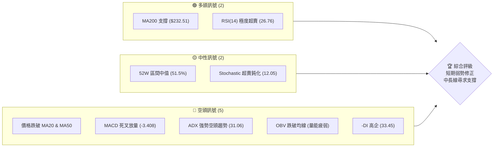
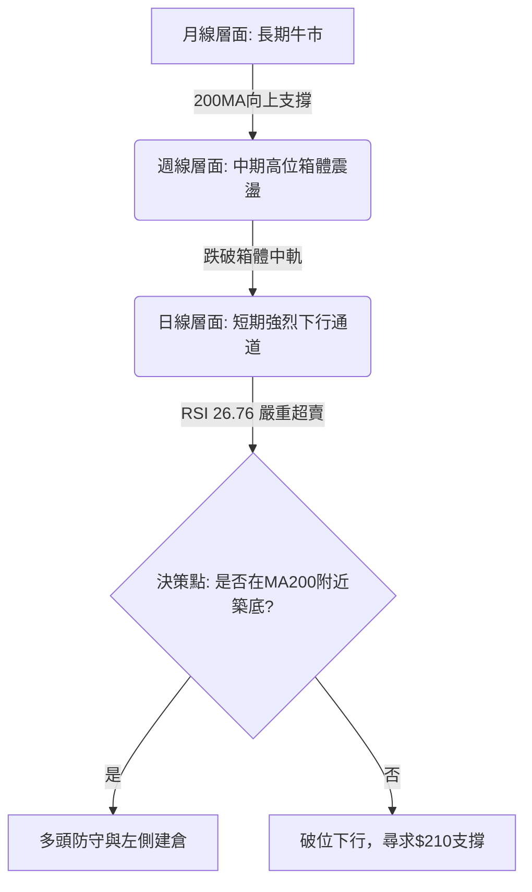
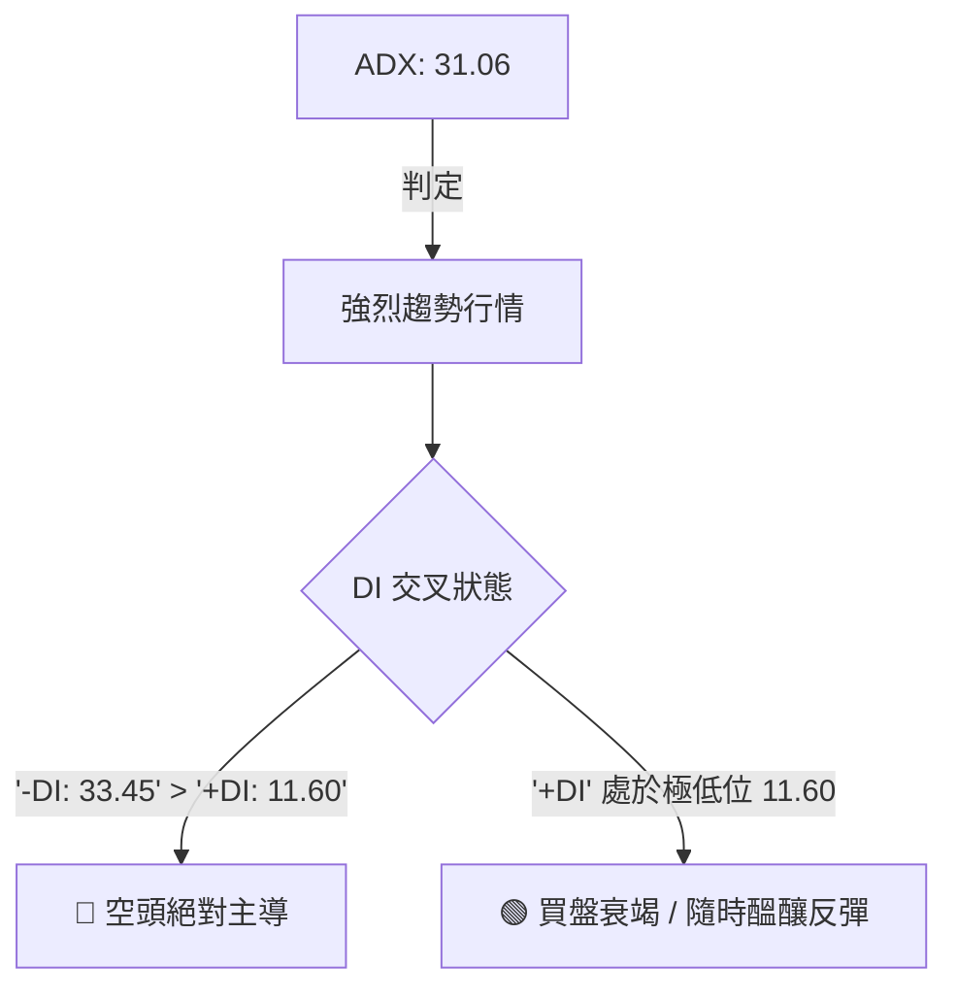
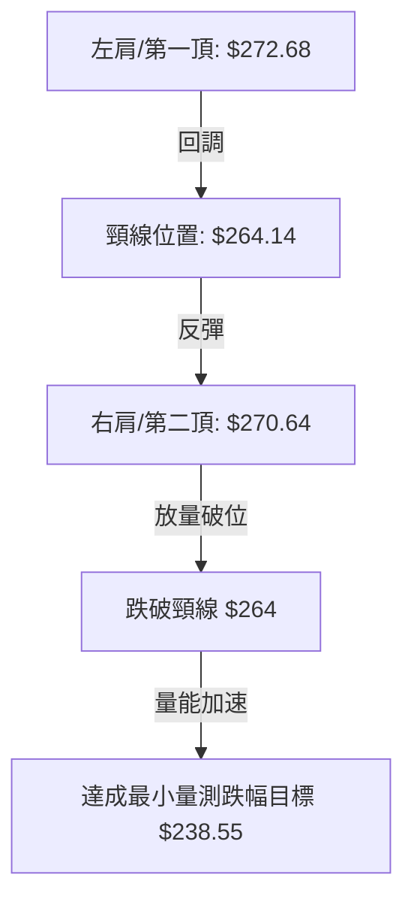
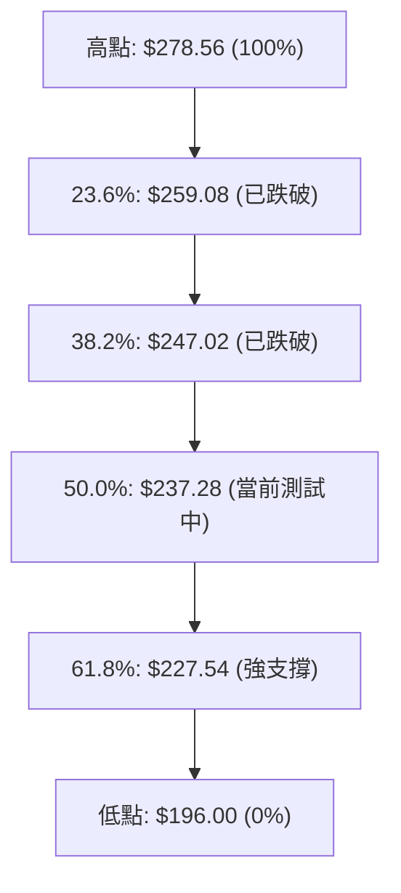
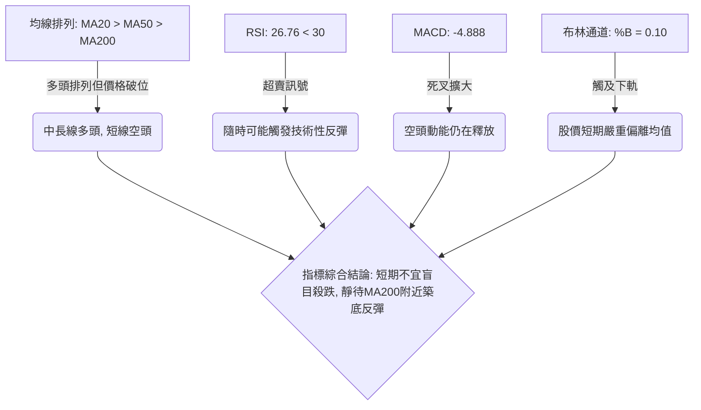
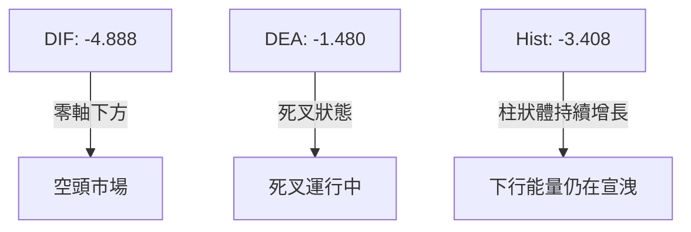
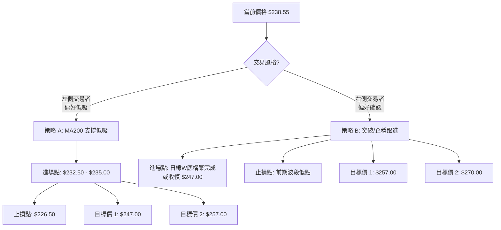
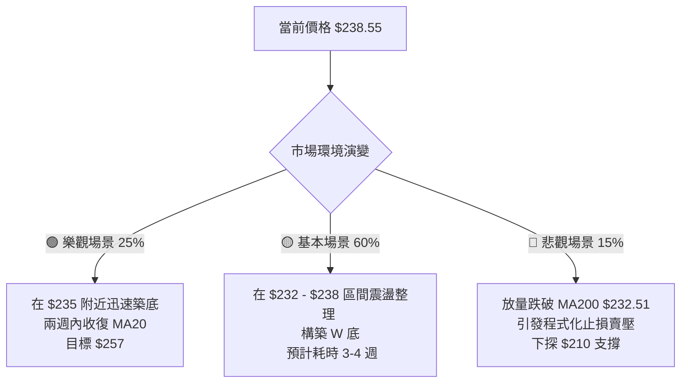

<details>
<summary>📊 靜態圖表 (點擊展開)</summary>

</details>

<html>
<head><meta charset="utf-8" /></head>
<body>
    <div style="height:500px; width:100%;">                        <script>window.PlotlyConfig = {MathJaxConfig: 'local'};</script>
        <script charset="utf-8" src="https://cdn.plot.ly/plotly-3.6.0.min.js" integrity="sha256-QaOVwtVY0T02VaHrr6pnoHLCwayMJp4O5n4YyaE3rJk=" crossorigin="anonymous"></script>                <div id="candlestick-chart" class="plotly-graph-div" style="height:100%; width:100%;"></div>            <script>                window.PLOTLYENV=window.PLOTLYENV || {};                                if (document.getElementById("candlestick-chart")) {                    Plotly.newPlot(                        "candlestick-chart",                        [{"close":{"dtype":"f8","bdata":"AAAAANejbEAAAABAM\u002fNsQAAAAAAAoGxAAAAAQOEqbEAAAAAgrj9sQAAAAIDCdW1AAAAAYI8KbUAAAABA4XptQAAAACCux21AAAAAYI\u002fKbEAAAABgZr5sQAAAAMDMhGxAAAAAgMLtbEAAAACgmUFtQAAAAADX82xAAAAAIFznbEAAAAAgXO9sQAAAAAApdGxAAAAAYLiWa0AAAABguIZrQAAAAMDMRGtAAAAAwPV4a0AAAACgcMVrQAAAAIA9cmtAAAAAACmUa0AAAADAHs1rQAAAAOBRcGtAAAAAwMyca0AAAADA9bhrQAAAAEAKJ2xAAAAAIK53bEAAAAAA1wtrQAAAAIA9gmtAAAAA4HoMa0AAAACAPfJqQAAAAEAKz2pAAAAAoEehakAAAAAgXA9rQAAAAMD1wGtAAAAAYGY+a0AAAABA4aJrQAAAAGC4BmxAAAAAQApfbEAAAAAAAKhsQAAAAKCZyWxAAAAAIIXba0AAAABACoduQAAAAAAAwG9AAAAAgD0qb0AAAABgZkZvQAAAAKBHYW5AAAAAwB6NbkAAAADAzAxvQAAAAEAzI29AAAAAYGaGbkAAAABgj7JtQAAAAIAUVm1AAAAAANcbbUAAAACgmdFrQAAAAIAU1mtAAAAA4Hoka0AAAACAFJZrQAAAAMD1SGxAAAAAoHC1bEAAAADAHqVsQAAAAEAKJ21AAAAAACk8bUAAAACgcE1tQAAAAAApDG1AAAAAIIWjbEAAAADA9bBsQAAAAOB6XGxAAAAAoHB9bEAAAADA9fhsQAAAAMD1yGxAAAAAgBRGbEAAAACgR9FrQAAAAIDr0WtAAAAA4KOoa0AAAADgUVhsQAAAAEAza2xAAAAAgMKNbEAAAADgegRtQAAAAAApDG1AAAAA4KMQbUAAAACAPQJtQAAAAMD1EG1AAAAAgD3abEAAAAAAAFBsQAAAAIDrIW1AAAAAgMIdbkAAAACA6zFuQAAAAKBHyW5AAAAAACnsbkAAAABACs9uQAAAAEAzU25AAAAAwMyUbUAAAACAwsVtQAAAAADX421AAAAAAADgbEAAAACA6+lsQAAAAEDhSm1AAAAAwB7lbUAAAACgcM1tQAAAAIDClW5AAAAA4FFgbkAAAAAgXDduQAAAAKCZ6W1AAAAAYLhebkAAAAAA19NtQAAAACCuH21AAAAAgBTWa0AAAACAPUpqQAAAAEAKF2pAAAAAYLjeaUAAAABgj4JpQAAAAEAz82hAAAAAoEfZaEAAAADAzCRpQAAAAKBHmWlAAAAAIIWbaUAAAAAghUNqQAAAAOCjqGlAAAAAgOsRakAAAADgelRqQAAAAKBw\u002fWlAAAAAAABAakAAAADgegxqQAAAACBcF2pAAAAAgD0aa0AAAACAFF5rQAAAAGC4pmpAAAAAIK6vakAAAABgj8pqQAAAAMDMlGpAAAAAwPUwakAAAACgcPVpQAAAACCud2pAAAAAYGbmakAAAAAA1ztqQAAAAOBRGGpAAAAAANeraUAAAADgekRqQAAAACCu52lAAAAAYLh2akAAAACgR\u002fFpQAAAAEDh6mhAAAAAYGYeaUAAAADgowhqQAAAAIA9UmpAAAAA4KM4akAAAACgR5lqQAAAAOCjuGpAAAAAAACoa0AAAADAzDRtQAAAAAApzG1AAAAA4Hr8bUAAAADgoyBvQAAAAAAAEG9AAAAAYGY2b0AAAACA61FvQAAAAMD1CG9AAAAAwB49b0AAAAAghetvQAAAAGCP4m9AAAAAANd\u002fcEAAAACA61FwQAAAAEAzO3BAAAAA4KNwcEAAAADA9ZBwQAAAAAApxHBAAAAAwMwAcUAAAADAzBhxQAAAAADXL3FAAAAAYLjycEAAAABA4QpxQAAAAADXz3BAAAAAwB6dcEAAAACAFOJwQAAAACCFs3BAAAAAgD2CcEAAAACAwo1wQAAAAKBwNXBAAAAAACmQcEAAAAAgXMdwQAAAAMAepXBAAAAA4KOUcEAAAACgmf1wQAAAAAAAIHFAAAAAgD3qcEAAAAAAKVRwQAAAAOBRCHBAAAAA4KNAb0AAAACgR7lvQAAAAMD1wG5AAAAAQAqnbkAAAACAFIZuQAAAAAAAwG1AAAAA4FEwbkAAAACgmdFtQA=="},"high":{"dtype":"f8","bdata":"AAAAANe7bEAAAABguBZtQAAAAIDr+WxAAAAAoHBFbEAAAACgcGVsQAAAAOCjeG1AAAAAAACAbUAAAABAM7NtQAAAAEAz221AAAAAgMK1bUAAAADA9fBsQAAAAKBH2WxAAAAAIFw3bUAAAADAzHxtQAAAAKCZSW1AAAAAIFwvbUAAAADAHkVtQAAAAIA90mxAAAAAIIV7bEAAAACA6xFsQAAAAKBwlWtAAAAAoJmha0AAAABAM9NrQAAAACCux2tAAAAAwMzEa0AAAACA69lrQAAAAGBmBmxAAAAAIFy3a0AAAADgetxrQAAAACBcV2xAAAAAYLiGbEAAAAAAAIhsQAAAAIDClWtAAAAAgD1qa0AAAABguDZrQAAAAEDhUmtAAAAAoJnZakAAAACAFBZrQAAAAIA96mtAAAAA4FGAa0AAAACgmalrQAAAAMDMLGxAAAAAwMyMbEAAAAAgru9sQAAAAIA9Gm1AAAAAgBSObEAAAAAAAFBvQAAAAKCZKXBAAAAAACkQcEAAAAAAAGBvQAAAAAApTG9AAAAAwMycbkAAAAAAAHhvQAAAAAAAOG9AAAAAANdLb0AAAAAAAHhuQAAAACBc121AAAAAQDNTbUAAAABgZsZsQAAAACCu92tAAAAAwB5tbEAAAABguMZrQAAAAGCPamxAAAAA4KPQbEAAAAAAAPhsQAAAAKBHKW1AAAAAoJl5bUAAAABACt9tQAAAAAApLG1AAAAAAAAwbUAAAAAgrudsQAAAAGCP2mxAAAAAgD2SbEAAAACgcA1tQAAAACCFA21AAAAAYI\u002fCbEAAAACAwn1sQAAAAMAe9WtAAAAAgBQmbEAAAAAgXKdsQAAAAAAppGxAAAAAIFyvbEAAAABgZg5tQAAAAGBmHm1AAAAAIK4fbUAAAABAMxNtQAAAAOCjGG1AAAAAIK4fbUAAAABguG5tQAAAAAAAQG1AAAAAgMJlbkAAAACgR6luQAAAAMAezW5AAAAAIIX7bkAAAACAFB5vQAAAAMAe9W5AAAAAwPUobkAAAADAzBRuQAAAAIA98m1AAAAAQOFibUAAAACgmQltQAAAAEAKd21AAAAAYGYObkAAAABgZh5uQAAAAAApnG5AAAAAwPX4bkAAAAAAAGBuQAAAAIA9am5AAAAAACm0bkAAAABAM8tuQAAAACCF221AAAAAgOtJbEAAAACAFG5qQAAAAIDrmWpAAAAAwMyUakAAAACAPRJqQAAAAGC4fmlAAAAAwB4laUAAAAAgrjdpQAAAACCF22lAAAAA4Hq0aUAAAACgcGVqQAAAAIDCDWpAAAAAIIVLakAAAABA4XJqQAAAAKCZYWpAAAAAYI9KakAAAAAgXDdqQAAAAIDCJWpAAAAAoEcxa0AAAABACo9rQAAAAIA9KmtAAAAAgD26akAAAADAzPRqQAAAAAAAIGtAAAAAYLh2akAAAACA61FqQAAAAEAKl2pAAAAAYGb2akAAAADgeuRqQAAAAADXI2pAAAAAoEfxaUAAAACgmZlqQAAAAEAzK2pAAAAAgD2iakAAAADgepxqQAAAAEAz02lAAAAAoJl5aUAAAADA9UhqQAAAAGCPsmpAAAAAYLiGakAAAABgZp5qQAAAAEAKv2pAAAAAQDNDbEAAAACgmTltQAAAAIDCDW5AAAAAAAAAbkAAAACAwoVvQAAAAIAUTm9AAAAAAABAb0AAAABA4QJwQAAAAIDCRW9AAAAAQOHib0AAAACAFP5vQAAAAOCjLHBAAAAAAACIcEAAAABgZoJwQAAAAOB6UHBAAAAAYI+ecEAAAACAFB5xQAAAAMAeFXFAAAAAoJlBcUAAAADA9WhxQAAAAMDMXHFAAAAAgBRKcUAAAAAAACBxQAAAAIAUGnFAAAAAYGa6cEAAAAAghetwQAAAAOB67HBAAAAAgMKFcEAAAACgmc1wQAAAAAAAZHBAAAAAoEeZcEAAAAAA19dwQAAAAOCj3HBAAAAAwMzUcEAAAABgjwZxQAAAAAAAKHFAAAAAAAAscUAAAACAFKpwQAAAAEAzU3BAAAAAoHARcEAAAABgj\u002fpvQAAAAIAUBnBAAAAAoHAtb0AAAACAwk1vQAAAAIA9gm5AAAAA4HpEbkAAAAAghWtuQA=="},"hovertemplate":"\u003cb\u003e%{x|%Y-%m-%d}\u003c\u002fb\u003e\u003cbr\u003e\u958b: $%{open:.2f}\u003cbr\u003e\u9ad8: $%{high:.2f}\u003cbr\u003e\u4f4e: $%{low:.2f}\u003cbr\u003e\u6536: $%{close:.2f}\u003cextra\u003e\u003c\u002fextra\u003e","low":{"dtype":"f8","bdata":"AAAAgOt5bEAAAADgo4BsQAAAAMAehWxAAAAAYI+6a0AAAAAghQtsQAAAAMD12GxAAAAAgML9bEAAAAAAADhtQAAAAGCPYm1AAAAAQDOjbEAAAABA4apsQAAAAKBHSWxAAAAAgD3KbEAAAAAgXAdtQAAAAGC4lmxAAAAAoEeZbEAAAABgZrZsQAAAAOBRcGxAAAAAgD2Ca0AAAABgZm5rQAAAAEAKD2tAAAAA4KNAa0AAAACgmWlrQAAAAOB6PGtAAAAAIIUTa0AAAABgZl5rQAAAAEDhamtAAAAAwPUAa0AAAACgcIVrQAAAAIAUpmtAAAAAAAC4a0AAAAAAAABrQAAAAKBHIWtAAAAAQDOTakAAAADAHpVqQAAAAIDrmWpAAAAAwPVgakAAAABA4bJqQAAAACCuP2tAAAAA4KMQa0AAAACAwkVrQAAAAMDMvGtAAAAAoEcxbEAAAABguEZsQAAAAOBReGxAAAAAAADYa0AAAAAgXH9uQAAAAMDMnG9AAAAAwB4Vb0AAAADAHsVuQAAAAKBwRW5AAAAAIK7PbUAAAABA4bJuQAAAACBc525AAAAAAAB4bkAAAAAAAJBtQAAAAOB6HG1AAAAAgBSmbEAAAACgcM1rQAAAAOCjUGtAAAAAIK4Xa0AAAACAwuVqQAAAAOCjyGtAAAAAoJn5a0AAAADgo5hsQAAAAEAKx2xAAAAAAAAIbUAAAACgmTFtQAAAACCF02xAAAAAoJlZbEAAAACgmZFsQAAAAOCjSGxAAAAAIIUjbEAAAABguI5sQAAAAIAUlmxAAAAAANcjbEAAAAAAALBrQAAAAAAppGtAAAAAIK6fa0AAAADAHg1sQAAAAGCPMmxAAAAAYLhWbEAAAAAgXJdsQAAAAGCP6mxAAAAAgMLlbEAAAADgo9hsQAAAAGBmxmxAAAAAANfDbEAAAABgZhZsQAAAAIDCZWxAAAAAgD0CbUAAAADgo\u002fBtQAAAAAApPG5AAAAAIK5HbkAAAABguL5uQAAAAAAACG5AAAAAQAqHbUAAAAAAKZRtQAAAAMAejW1AAAAAQOGqbEAAAAAAKVxsQAAAAMDM3GxAAAAAgD1SbUAAAACgR7FtQAAAAGCPwm1AAAAAwPUwbkAAAAAgrpdtQAAAAOB6tG1AAAAAoHDFbUAAAABgZm5tQAAAAIA9+mxAAAAAACmMa0AAAACA6wlpQAAAAEAza2lAAAAAwB7NaUAAAAAgrk9pQAAAAIDrsWhAAAAAwPWoaEAAAAAAAIBoQAAAAOBRMGlAAAAAgOtZaUAAAAAAAHhpQAAAACCFY2lAAAAAAABoaUAAAACAwh1qQAAAAEAzq2lAAAAAYGamaUAAAABguG5pQAAAACBcT2lAAAAAwMxEakAAAABA4fJqQAAAAMD1kGpAAAAAIIXjaUAAAACAwo1qQAAAAEAza2pAAAAAwMwEakAAAABACsdpQAAAAGBm7mlAAAAAgMKNakAAAABgjxpqQAAAAKCZwWlAAAAAgD2KaUAAAADgUTBqQAAAAOB61GlAAAAAwMw8akAAAAAA1+NpQAAAAOB65GhAAAAAIFz\u002faEAAAADgeoRpQAAAAIAUBmpAAAAAwMycaUAAAABA4TJqQAAAAGCPImpAAAAAANdza0AAAADgo+hrQAAAAGC4Zm1AAAAAAAB4bUAAAADA9ThuQAAAAGBm5m5AAAAAYGaGbkAAAAAghUNvQAAAAADXq25AAAAAQDMjb0AAAABgj0pvQAAAAIA9om9AAAAAQAobcEAAAACgcEVwQAAAAIAUCnBAAAAAQDMbcEAAAABgjwJwQAAAAADXa3BAAAAAwMzMcEAAAACAFAZxQAAAACBcA3FAAAAAANfncEAAAABAM99wQAAAACCux3BAAAAAgBRqcEAAAABAM3NwQAAAAIAUqnBAAAAAgD1OcEAAAADgemhwQAAAAIAU5m9AAAAA4Ho4cEAAAACA61VwQAAAAADXo3BAAAAAwB5hcEAAAABAM5twQAAAAEAKt3BAAAAAgD3acEAAAABAM0twQAAAAADXy29AAAAAYLj2bkAAAAAAAHhvQAAAAMD1uG5AAAAAIIVrbkAAAADAzAxuQAAAAGBmrm1AAAAAgMJlbUAAAABA4TJtQA=="},"name":"\u50f9\u683c","open":{"dtype":"f8","bdata":"AAAAgD2SbEAAAADgUaBsQAAAAIA96mxAAAAA4KPwa0AAAABguCZsQAAAAIAU5mxAAAAAgBRmbUAAAACAFF5tQAAAACCFi21AAAAA4KOwbUAAAAAgru9sQAAAAEAzy2xAAAAAACnUbEAAAACAFB5tQAAAAOCjOG1AAAAAAAAQbUAAAAAA1wttQAAAAIDr0WxAAAAAYI96bEAAAADAzARsQAAAAIDrgWtAAAAAYI9ia0AAAABgj4JrQAAAAMD1wGtAAAAAIIUra0AAAADgUaBrQAAAAIAU7mtAAAAAAACga0AAAAAAKZxrQAAAAKBw3WtAAAAAAAAgbEAAAABguEZsQAAAAGBmNmtAAAAAgOvxakAAAAAA1xNrQAAAAKBw9WpAAAAAgOvRakAAAAAAKbxqQAAAAIDCTWtAAAAAoJlpa0AAAAAAAGBrQAAAAEAKv2tAAAAAwB51bEAAAABACodsQAAAAKBw9WxAAAAAgOthbEAAAABAM0NvQAAAACCF629AAAAAAClMb0AAAADA9SBvQAAAAMAeJW9AAAAAwMxcbkAAAABA4QpvQAAAAMAeDW9AAAAAIK5Hb0AAAACgmWFuQAAAAIDrYW1AAAAAAAAobUAAAABAM4NsQAAAACCu92tAAAAAoJlhbEAAAABAMwtrQAAAAIDr0WtAAAAAAClMbEAAAAAgrtdsQAAAACCu52xAAAAAQAonbUAAAADgUWBtQAAAAEAzK21AAAAA4KMYbUAAAACAPcpsQAAAAEDhsmxAAAAAQOFabEAAAACA65lsQAAAAGC41mxAAAAAANe7bEAAAACAwn1sQAAAAKBH4WtAAAAAwB4VbEAAAABguDZsQAAAAOBRWGxAAAAAIIWTbEAAAACA66FsQAAAAAApBG1AAAAAoEcBbUAAAACAFP5sQAAAAGC45mxAAAAAwB4dbUAAAABA4epsQAAAAEDhmmxAAAAAQDMDbUAAAAAghfNtQAAAAIDrYW5AAAAAgD2SbkAAAAAgXNduQAAAAMD10G5AAAAAwMwkbkAAAACA6+ltQAAAAEDh4m1AAAAA4FE4bUAAAABA4eJsQAAAAKCZQW1AAAAAYLhebUAAAAAgXP9tQAAAAIAU9m1AAAAAANfLbkAAAACAPVpuQAAAAOB6\u002fG1AAAAAgOvJbUAAAAAgXJ9uQAAAACCF221AAAAAwB4dbEAAAABgZlZpQAAAAEAKH2pAAAAAoJkZakAAAACA6wFqQAAAAGC4fmlAAAAAACncaEAAAAAAKcRoQAAAAIA9QmlAAAAAoJl5aUAAAADgUZhpQAAAAEAzA2pAAAAAQAqvaUAAAABguE5qQAAAACBcV2pAAAAAYI\u002faaUAAAACgmZFpQAAAAEAzY2lAAAAAQApPakAAAAAgXP9qQAAAACCu32pAAAAAYGZOakAAAACAFMZqQAAAAGC49mpAAAAA4HpMakAAAAAghTNqQAAAAEAzC2pAAAAAgD2aakAAAACAwr1qQAAAAIDr4WlAAAAAwMzsaUAAAACgRzlqQAAAAGBm\u002fmlAAAAAgOtxakAAAAAghVNqQAAAAGC4zmlAAAAAIFwvaUAAAABAM5tpQAAAAIAUTmpAAAAAoEfRaUAAAACgmTlqQAAAACCuZ2pAAAAAoEf5a0AAAAAgXCdsQAAAAKCZaW1AAAAAYGaubUAAAADA9ThuQAAAAAAAKG9AAAAA4FEQb0AAAAAgrt9vQAAAAIAUJm9AAAAAQOHib0AAAACAFI5vQAAAAOB67G9AAAAAIK4\u002fcEAAAAAgXHdwQAAAAIA9JnBAAAAAANcfcEAAAABguBJxQAAAAKBHmXBAAAAAwMzMcEAAAACgR0FxQAAAAIA9DnFAAAAA4FEwcUAAAACAFPpwQAAAAKBw3XBAAAAAIFyrcEAAAABA4YZwQAAAAGBm0nBAAAAAAABocEAAAACA631wQAAAAOCjYHBAAAAAwMxAcEAAAAAAAHhwQAAAAGCPynBAAAAAQAq\u002fcEAAAABgZqJwQAAAAOBRBHFAAAAA4KP0cEAAAADgo6RwQAAAAGCPEnBAAAAAYGbWb0AAAAAA16NvQAAAAOBRyG9AAAAAgMLVbkAAAAAgXPduQAAAACCFc25AAAAAgMK9bUAAAABguGZuQA=="},"x":["2025-08-27T00:00:00-04:00","2025-08-28T00:00:00-04:00","2025-08-29T00:00:00-04:00","2025-09-02T00:00:00-04:00","2025-09-03T00:00:00-04:00","2025-09-04T00:00:00-04:00","2025-09-05T00:00:00-04:00","2025-09-08T00:00:00-04:00","2025-09-09T00:00:00-04:00","2025-09-10T00:00:00-04:00","2025-09-11T00:00:00-04:00","2025-09-12T00:00:00-04:00","2025-09-15T00:00:00-04:00","2025-09-16T00:00:00-04:00","2025-09-17T00:00:00-04:00","2025-09-18T00:00:00-04:00","2025-09-19T00:00:00-04:00","2025-09-22T00:00:00-04:00","2025-09-23T00:00:00-04:00","2025-09-24T00:00:00-04:00","2025-09-25T00:00:00-04:00","2025-09-26T00:00:00-04:00","2025-09-29T00:00:00-04:00","2025-09-30T00:00:00-04:00","2025-10-01T00:00:00-04:00","2025-10-02T00:00:00-04:00","2025-10-03T00:00:00-04:00","2025-10-06T00:00:00-04:00","2025-10-07T00:00:00-04:00","2025-10-08T00:00:00-04:00","2025-10-09T00:00:00-04:00","2025-10-10T00:00:00-04:00","2025-10-13T00:00:00-04:00","2025-10-14T00:00:00-04:00","2025-10-15T00:00:00-04:00","2025-10-16T00:00:00-04:00","2025-10-17T00:00:00-04:00","2025-10-20T00:00:00-04:00","2025-10-21T00:00:00-04:00","2025-10-22T00:00:00-04:00","2025-10-23T00:00:00-04:00","2025-10-24T00:00:00-04:00","2025-10-27T00:00:00-04:00","2025-10-28T00:00:00-04:00","2025-10-29T00:00:00-04:00","2025-10-30T00:00:00-04:00","2025-10-31T00:00:00-04:00","2025-11-03T00:00:00-05:00","2025-11-04T00:00:00-05:00","2025-11-05T00:00:00-05:00","2025-11-06T00:00:00-05:00","2025-11-07T00:00:00-05:00","2025-11-10T00:00:00-05:00","2025-11-11T00:00:00-05:00","2025-11-12T00:00:00-05:00","2025-11-13T00:00:00-05:00","2025-11-14T00:00:00-05:00","2025-11-17T00:00:00-05:00","2025-11-18T00:00:00-05:00","2025-11-19T00:00:00-05:00","2025-11-20T00:00:00-05:00","2025-11-21T00:00:00-05:00","2025-11-24T00:00:00-05:00","2025-11-25T00:00:00-05:00","2025-11-26T00:00:00-05:00","2025-11-28T00:00:00-05:00","2025-12-01T00:00:00-05:00","2025-12-02T00:00:00-05:00","2025-12-03T00:00:00-05:00","2025-12-04T00:00:00-05:00","2025-12-05T00:00:00-05:00","2025-12-08T00:00:00-05:00","2025-12-09T00:00:00-05:00","2025-12-10T00:00:00-05:00","2025-12-11T00:00:00-05:00","2025-12-12T00:00:00-05:00","2025-12-15T00:00:00-05:00","2025-12-16T00:00:00-05:00","2025-12-17T00:00:00-05:00","2025-12-18T00:00:00-05:00","2025-12-19T00:00:00-05:00","2025-12-22T00:00:00-05:00","2025-12-23T00:00:00-05:00","2025-12-24T00:00:00-05:00","2025-12-26T00:00:00-05:00","2025-12-29T00:00:00-05:00","2025-12-30T00:00:00-05:00","2025-12-31T00:00:00-05:00","2026-01-02T00:00:00-05:00","2026-01-05T00:00:00-05:00","2026-01-06T00:00:00-05:00","2026-01-07T00:00:00-05:00","2026-01-08T00:00:00-05:00","2026-01-09T00:00:00-05:00","2026-01-12T00:00:00-05:00","2026-01-13T00:00:00-05:00","2026-01-14T00:00:00-05:00","2026-01-15T00:00:00-05:00","2026-01-16T00:00:00-05:00","2026-01-20T00:00:00-05:00","2026-01-21T00:00:00-05:00","2026-01-22T00:00:00-05:00","2026-01-23T00:00:00-05:00","2026-01-26T00:00:00-05:00","2026-01-27T00:00:00-05:00","2026-01-28T00:00:00-05:00","2026-01-29T00:00:00-05:00","2026-01-30T00:00:00-05:00","2026-02-02T00:00:00-05:00","2026-02-03T00:00:00-05:00","2026-02-04T00:00:00-05:00","2026-02-05T00:00:00-05:00","2026-02-06T00:00:00-05:00","2026-02-09T00:00:00-05:00","2026-02-10T00:00:00-05:00","2026-02-11T00:00:00-05:00","2026-02-12T00:00:00-05:00","2026-02-13T00:00:00-05:00","2026-02-17T00:00:00-05:00","2026-02-18T00:00:00-05:00","2026-02-19T00:00:00-05:00","2026-02-20T00:00:00-05:00","2026-02-23T00:00:00-05:00","2026-02-24T00:00:00-05:00","2026-02-25T00:00:00-05:00","2026-02-26T00:00:00-05:00","2026-02-27T00:00:00-05:00","2026-03-02T00:00:00-05:00","2026-03-03T00:00:00-05:00","2026-03-04T00:00:00-05:00","2026-03-05T00:00:00-05:00","2026-03-06T00:00:00-05:00","2026-03-09T00:00:00-04:00","2026-03-10T00:00:00-04:00","2026-03-11T00:00:00-04:00","2026-03-12T00:00:00-04:00","2026-03-13T00:00:00-04:00","2026-03-16T00:00:00-04:00","2026-03-17T00:00:00-04:00","2026-03-18T00:00:00-04:00","2026-03-19T00:00:00-04:00","2026-03-20T00:00:00-04:00","2026-03-23T00:00:00-04:00","2026-03-24T00:00:00-04:00","2026-03-25T00:00:00-04:00","2026-03-26T00:00:00-04:00","2026-03-27T00:00:00-04:00","2026-03-30T00:00:00-04:00","2026-03-31T00:00:00-04:00","2026-04-01T00:00:00-04:00","2026-04-02T00:00:00-04:00","2026-04-06T00:00:00-04:00","2026-04-07T00:00:00-04:00","2026-04-08T00:00:00-04:00","2026-04-09T00:00:00-04:00","2026-04-10T00:00:00-04:00","2026-04-13T00:00:00-04:00","2026-04-14T00:00:00-04:00","2026-04-15T00:00:00-04:00","2026-04-16T00:00:00-04:00","2026-04-17T00:00:00-04:00","2026-04-20T00:00:00-04:00","2026-04-21T00:00:00-04:00","2026-04-22T00:00:00-04:00","2026-04-23T00:00:00-04:00","2026-04-24T00:00:00-04:00","2026-04-27T00:00:00-04:00","2026-04-28T00:00:00-04:00","2026-04-29T00:00:00-04:00","2026-04-30T00:00:00-04:00","2026-05-01T00:00:00-04:00","2026-05-04T00:00:00-04:00","2026-05-05T00:00:00-04:00","2026-05-06T00:00:00-04:00","2026-05-07T00:00:00-04:00","2026-05-08T00:00:00-04:00","2026-05-11T00:00:00-04:00","2026-05-12T00:00:00-04:00","2026-05-13T00:00:00-04:00","2026-05-14T00:00:00-04:00","2026-05-15T00:00:00-04:00","2026-05-18T00:00:00-04:00","2026-05-19T00:00:00-04:00","2026-05-20T00:00:00-04:00","2026-05-21T00:00:00-04:00","2026-05-22T00:00:00-04:00","2026-05-26T00:00:00-04:00","2026-05-27T00:00:00-04:00","2026-05-28T00:00:00-04:00","2026-05-29T00:00:00-04:00","2026-06-01T00:00:00-04:00","2026-06-02T00:00:00-04:00","2026-06-03T00:00:00-04:00","2026-06-04T00:00:00-04:00","2026-06-05T00:00:00-04:00","2026-06-08T00:00:00-04:00","2026-06-09T00:00:00-04:00","2026-06-10T00:00:00-04:00","2026-06-11T00:00:00-04:00","2026-06-12T00:00:00-04:00"],"type":"candlestick"},{"hovertemplate":"MA30: $%{y:.2f}\u003cextra\u003e\u003c\u002fextra\u003e","line":{"color":"#2196F3","dash":"dash","width":2},"mode":"lines","name":"MA30","x":["2025-08-27T00:00:00-04:00","2025-08-28T00:00:00-04:00","2025-08-29T00:00:00-04:00","2025-09-02T00:00:00-04:00","2025-09-03T00:00:00-04:00","2025-09-04T00:00:00-04:00","2025-09-05T00:00:00-04:00","2025-09-08T00:00:00-04:00","2025-09-09T00:00:00-04:00","2025-09-10T00:00:00-04:00","2025-09-11T00:00:00-04:00","2025-09-12T00:00:00-04:00","2025-09-15T00:00:00-04:00","2025-09-16T00:00:00-04:00","2025-09-17T00:00:00-04:00","2025-09-18T00:00:00-04:00","2025-09-19T00:00:00-04:00","2025-09-22T00:00:00-04:00","2025-09-23T00:00:00-04:00","2025-09-24T00:00:00-04:00","2025-09-25T00:00:00-04:00","2025-09-26T00:00:00-04:00","2025-09-29T00:00:00-04:00","2025-09-30T00:00:00-04:00","2025-10-01T00:00:00-04:00","2025-10-02T00:00:00-04:00","2025-10-03T00:00:00-04:00","2025-10-06T00:00:00-04:00","2025-10-07T00:00:00-04:00","2025-10-08T00:00:00-04:00","2025-10-09T00:00:00-04:00","2025-10-10T00:00:00-04:00","2025-10-13T00:00:00-04:00","2025-10-14T00:00:00-04:00","2025-10-15T00:00:00-04:00","2025-10-16T00:00:00-04:00","2025-10-17T00:00:00-04:00","2025-10-20T00:00:00-04:00","2025-10-21T00:00:00-04:00","2025-10-22T00:00:00-04:00","2025-10-23T00:00:00-04:00","2025-10-24T00:00:00-04:00","2025-10-27T00:00:00-04:00","2025-10-28T00:00:00-04:00","2025-10-29T00:00:00-04:00","2025-10-30T00:00:00-04:00","2025-10-31T00:00:00-04:00","2025-11-03T00:00:00-05:00","2025-11-04T00:00:00-05:00","2025-11-05T00:00:00-05:00","2025-11-06T00:00:00-05:00","2025-11-07T00:00:00-05:00","2025-11-10T00:00:00-05:00","2025-11-11T00:00:00-05:00","2025-11-12T00:00:00-05:00","2025-11-13T00:00:00-05:00","2025-11-14T00:00:00-05:00","2025-11-17T00:00:00-05:00","2025-11-18T00:00:00-05:00","2025-11-19T00:00:00-05:00","2025-11-20T00:00:00-05:00","2025-11-21T00:00:00-05:00","2025-11-24T00:00:00-05:00","2025-11-25T00:00:00-05:00","2025-11-26T00:00:00-05:00","2025-11-28T00:00:00-05:00","2025-12-01T00:00:00-05:00","2025-12-02T00:00:00-05:00","2025-12-03T00:00:00-05:00","2025-12-04T00:00:00-05:00","2025-12-05T00:00:00-05:00","2025-12-08T00:00:00-05:00","2025-12-09T00:00:00-05:00","2025-12-10T00:00:00-05:00","2025-12-11T00:00:00-05:00","2025-12-12T00:00:00-05:00","2025-12-15T00:00:00-05:00","2025-12-16T00:00:00-05:00","2025-12-17T00:00:00-05:00","2025-12-18T00:00:00-05:00","2025-12-19T00:00:00-05:00","2025-12-22T00:00:00-05:00","2025-12-23T00:00:00-05:00","2025-12-24T00:00:00-05:00","2025-12-26T00:00:00-05:00","2025-12-29T00:00:00-05:00","2025-12-30T00:00:00-05:00","2025-12-31T00:00:00-05:00","2026-01-02T00:00:00-05:00","2026-01-05T00:00:00-05:00","2026-01-06T00:00:00-05:00","2026-01-07T00:00:00-05:00","2026-01-08T00:00:00-05:00","2026-01-09T00:00:00-05:00","2026-01-12T00:00:00-05:00","2026-01-13T00:00:00-05:00","2026-01-14T00:00:00-05:00","2026-01-15T00:00:00-05:00","2026-01-16T00:00:00-05:00","2026-01-20T00:00:00-05:00","2026-01-21T00:00:00-05:00","2026-01-22T00:00:00-05:00","2026-01-23T00:00:00-05:00","2026-01-26T00:00:00-05:00","2026-01-27T00:00:00-05:00","2026-01-28T00:00:00-05:00","2026-01-29T00:00:00-05:00","2026-01-30T00:00:00-05:00","2026-02-02T00:00:00-05:00","2026-02-03T00:00:00-05:00","2026-02-04T00:00:00-05:00","2026-02-05T00:00:00-05:00","2026-02-06T00:00:00-05:00","2026-02-09T00:00:00-05:00","2026-02-10T00:00:00-05:00","2026-02-11T00:00:00-05:00","2026-02-12T00:00:00-05:00","2026-02-13T00:00:00-05:00","2026-02-17T00:00:00-05:00","2026-02-18T00:00:00-05:00","2026-02-19T00:00:00-05:00","2026-02-20T00:00:00-05:00","2026-02-23T00:00:00-05:00","2026-02-24T00:00:00-05:00","2026-02-25T00:00:00-05:00","2026-02-26T00:00:00-05:00","2026-02-27T00:00:00-05:00","2026-03-02T00:00:00-05:00","2026-03-03T00:00:00-05:00","2026-03-04T00:00:00-05:00","2026-03-05T00:00:00-05:00","2026-03-06T00:00:00-05:00","2026-03-09T00:00:00-04:00","2026-03-10T00:00:00-04:00","2026-03-11T00:00:00-04:00","2026-03-12T00:00:00-04:00","2026-03-13T00:00:00-04:00","2026-03-16T00:00:00-04:00","2026-03-17T00:00:00-04:00","2026-03-18T00:00:00-04:00","2026-03-19T00:00:00-04:00","2026-03-20T00:00:00-04:00","2026-03-23T00:00:00-04:00","2026-03-24T00:00:00-04:00","2026-03-25T00:00:00-04:00","2026-03-26T00:00:00-04:00","2026-03-27T00:00:00-04:00","2026-03-30T00:00:00-04:00","2026-03-31T00:00:00-04:00","2026-04-01T00:00:00-04:00","2026-04-02T00:00:00-04:00","2026-04-06T00:00:00-04:00","2026-04-07T00:00:00-04:00","2026-04-08T00:00:00-04:00","2026-04-09T00:00:00-04:00","2026-04-10T00:00:00-04:00","2026-04-13T00:00:00-04:00","2026-04-14T00:00:00-04:00","2026-04-15T00:00:00-04:00","2026-04-16T00:00:00-04:00","2026-04-17T00:00:00-04:00","2026-04-20T00:00:00-04:00","2026-04-21T00:00:00-04:00","2026-04-22T00:00:00-04:00","2026-04-23T00:00:00-04:00","2026-04-24T00:00:00-04:00","2026-04-27T00:00:00-04:00","2026-04-28T00:00:00-04:00","2026-04-29T00:00:00-04:00","2026-04-30T00:00:00-04:00","2026-05-01T00:00:00-04:00","2026-05-04T00:00:00-04:00","2026-05-05T00:00:00-04:00","2026-05-06T00:00:00-04:00","2026-05-07T00:00:00-04:00","2026-05-08T00:00:00-04:00","2026-05-11T00:00:00-04:00","2026-05-12T00:00:00-04:00","2026-05-13T00:00:00-04:00","2026-05-14T00:00:00-04:00","2026-05-15T00:00:00-04:00","2026-05-18T00:00:00-04:00","2026-05-19T00:00:00-04:00","2026-05-20T00:00:00-04:00","2026-05-21T00:00:00-04:00","2026-05-22T00:00:00-04:00","2026-05-26T00:00:00-04:00","2026-05-27T00:00:00-04:00","2026-05-28T00:00:00-04:00","2026-05-29T00:00:00-04:00","2026-06-01T00:00:00-04:00","2026-06-02T00:00:00-04:00","2026-06-03T00:00:00-04:00","2026-06-04T00:00:00-04:00","2026-06-05T00:00:00-04:00","2026-06-08T00:00:00-04:00","2026-06-09T00:00:00-04:00","2026-06-10T00:00:00-04:00","2026-06-11T00:00:00-04:00","2026-06-12T00:00:00-04:00"],"y":{"dtype":"f8","bdata":"AAAAAAAA+H8AAAAAAAD4fwAAAAAAAPh\u002fAAAAAAAA+H8AAAAAAAD4fwAAAAAAAPh\u002fAAAAAAAA+H8AAAAAAAD4fwAAAAAAAPh\u002fAAAAAAAA+H8AAAAAAAD4fwAAAAAAAPh\u002fAAAAAAAA+H8AAAAAAAD4fwAAAAAAAPh\u002fAAAAAAAA+H8AAAAAAAD4fwAAAAAAAPh\u002fAAAAAAAA+H8AAAAAAAD4fwAAAAAAAPh\u002fAAAAAAAA+H8AAAAAAAD4fwAAAAAAAPh\u002fAAAAAAAA+H8AAAAAAAD4fwAAAAAAAPh\u002fAAAAAAAA+H8AAAAAAAD4f2ZmZqYNYGxAIiIi0pRebEAzMzMDVk5sQHd3d4fPRGxAVVVVlUM7bECrqqo6JjBsQM3MzHyGGWxAd3d3B\u002fMEbEBVVVV1TPBrQLy7uwsC32tAq6qqes3Ra0C8u7sbWshrQKuqqjomxGtAq6qqWmS\u002fa0AiIiKiRbprQAAAADDduGtA7+7unu+va0De3d19hr1rQCIiIkKn2WtAIiIisiv4a0BmZmb2KBhsQHd3d5e1MmxAmpmZOftMbEAzMzPD9WhsQLy7u2t1iGxAmpmZmZmhbEBVVVUFyLFsQM3MzCz5wWxAiYiIyL3ObEC8u7sLkM9sQAAAADDdzGxA3t3drY7BbEBERERUKsZsQCIiIhLKzGxAVVVVZfTabEDv7u5ec+lsQO\u002fu7l5z\u002fWxAVVVVFa4TbUBmZmbm0CZtQERERCTbMW1AERERkcI9bUAAAABAw0ZtQBERERGfSW1Aq6qqeqJKbUBmZmZWVU1tQAAAAOBPTW1AAAAAMN1QbUCamZkZvTltQCIiIuIzGG1AzczMXEj6bEDe3d2tR+FsQERERESL0GxAiYiIqH+\u002fbECJiIiYJ65sQLy7u+tRnGxAERERgdyPbECJiIjo+4lsQFVVVRWuh2xAzczMTH6FbECamZnptIlsQM3MzJzElGxA3t3d3SSubEBERETEZ8RsQERERNS\u002f2WxAd3d316PsbEAAAACgGv9sQN7d3f0bCW1AIiIiYhAMbUDNzMwcExBtQERERJRDF21AzczMrEcZbUC8u7u7LRttQERERBQgI21AmpmZWR0vbUAzMzODMjZtQLy7u6uORW1AZmZmpn9XbUDNzMzM92ttQAAAAPDSfW1AERERwfWUbUAzMzNTnKFtQLy7u2ugp21AVVVVBYGhbUBVVVW1OoptQDMzM\u002fP9cG1A3t3dXbpVbUCrqqo63zdtQFVVVSW\u002fFG1AERER0ZTybEAzMzOTitdsQKuqqvpiuWxAd3d3d+mSbEBVVVWFXXFsQERERFScRWxAERER4TMcbEBmZmbm+\u002fVrQCIiIvL90GtAiYiIuJC0a0ARERERypRrQCIiIpJfdGtAzczMfD9la0B3d3enDVhrQCIiIsKDQWtAMzMzIyIma0BmZmb2bwxrQDMzM6NF6mpA3t3dXY\u002fGakB3d3e3OqJqQAAAAADVhGpAq6qqqjhnakAAAAAAjkhqQHd3d5e1LmpAMzMzEzwcakC8u7vrChxqQImIiMh2GmpAmpmZ2YcfakCJiIioOCNqQImIiKjxImpAvLu7ez8lakCJiIi41yxqQM3MzAwCM2pA7+7uzj44akAAAACgGjtqQBEREbErRGpAiYiI6LRRakC8u7srQGpqQImIiMi9impA7+7uvp+qakAiIiJy9tVqQO\u002fu7k5iAGtAzczMvHQja0CrqqoaL0VrQM3MzIyXamtAMzMzo3CRa0AAAACQNL1rQImIiMh26mtA3t3d\u002fY0kbEB3d3dnkV1sQO\u002fu7q65kGxAIiIiMsHDbEDv7u6+n\u002f5sQHd3dzcXPm1AzczMTDeFbUBERER02shtQHd3d7ceEW5AMzMzQ4tQbkAzMzPTBpZuQKuqqupR4G5AERERwYMlb0CJiIiof2dvQCIiIuLso29AVVVVhevdb0DNzMwMuwpwQHd3d98II3BAq6qqkl86cEBERERM8ExwQCIiIgrXW3BAzczM\u002fGJpcEAzMzMLkHVwQM3MzKQpg3BAd3d3p1SOcEAAAACQCZRwQImIiJhumHBAVVVVnX2YcECamZlBp5dwQBEREaHTknBAZmZm5tCIcEBERERkyX9wQN7d3Z02dHBAVVVVDbtocEDe3d2Nl1pwQA=="},"type":"scatter"},{"hovertemplate":"MA60: $%{y:.2f}\u003cextra\u003e\u003c\u002fextra\u003e","line":{"color":"#9C27B0","dash":"dash","width":2},"mode":"lines","name":"MA60","x":["2025-08-27T00:00:00-04:00","2025-08-28T00:00:00-04:00","2025-08-29T00:00:00-04:00","2025-09-02T00:00:00-04:00","2025-09-03T00:00:00-04:00","2025-09-04T00:00:00-04:00","2025-09-05T00:00:00-04:00","2025-09-08T00:00:00-04:00","2025-09-09T00:00:00-04:00","2025-09-10T00:00:00-04:00","2025-09-11T00:00:00-04:00","2025-09-12T00:00:00-04:00","2025-09-15T00:00:00-04:00","2025-09-16T00:00:00-04:00","2025-09-17T00:00:00-04:00","2025-09-18T00:00:00-04:00","2025-09-19T00:00:00-04:00","2025-09-22T00:00:00-04:00","2025-09-23T00:00:00-04:00","2025-09-24T00:00:00-04:00","2025-09-25T00:00:00-04:00","2025-09-26T00:00:00-04:00","2025-09-29T00:00:00-04:00","2025-09-30T00:00:00-04:00","2025-10-01T00:00:00-04:00","2025-10-02T00:00:00-04:00","2025-10-03T00:00:00-04:00","2025-10-06T00:00:00-04:00","2025-10-07T00:00:00-04:00","2025-10-08T00:00:00-04:00","2025-10-09T00:00:00-04:00","2025-10-10T00:00:00-04:00","2025-10-13T00:00:00-04:00","2025-10-14T00:00:00-04:00","2025-10-15T00:00:00-04:00","2025-10-16T00:00:00-04:00","2025-10-17T00:00:00-04:00","2025-10-20T00:00:00-04:00","2025-10-21T00:00:00-04:00","2025-10-22T00:00:00-04:00","2025-10-23T00:00:00-04:00","2025-10-24T00:00:00-04:00","2025-10-27T00:00:00-04:00","2025-10-28T00:00:00-04:00","2025-10-29T00:00:00-04:00","2025-10-30T00:00:00-04:00","2025-10-31T00:00:00-04:00","2025-11-03T00:00:00-05:00","2025-11-04T00:00:00-05:00","2025-11-05T00:00:00-05:00","2025-11-06T00:00:00-05:00","2025-11-07T00:00:00-05:00","2025-11-10T00:00:00-05:00","2025-11-11T00:00:00-05:00","2025-11-12T00:00:00-05:00","2025-11-13T00:00:00-05:00","2025-11-14T00:00:00-05:00","2025-11-17T00:00:00-05:00","2025-11-18T00:00:00-05:00","2025-11-19T00:00:00-05:00","2025-11-20T00:00:00-05:00","2025-11-21T00:00:00-05:00","2025-11-24T00:00:00-05:00","2025-11-25T00:00:00-05:00","2025-11-26T00:00:00-05:00","2025-11-28T00:00:00-05:00","2025-12-01T00:00:00-05:00","2025-12-02T00:00:00-05:00","2025-12-03T00:00:00-05:00","2025-12-04T00:00:00-05:00","2025-12-05T00:00:00-05:00","2025-12-08T00:00:00-05:00","2025-12-09T00:00:00-05:00","2025-12-10T00:00:00-05:00","2025-12-11T00:00:00-05:00","2025-12-12T00:00:00-05:00","2025-12-15T00:00:00-05:00","2025-12-16T00:00:00-05:00","2025-12-17T00:00:00-05:00","2025-12-18T00:00:00-05:00","2025-12-19T00:00:00-05:00","2025-12-22T00:00:00-05:00","2025-12-23T00:00:00-05:00","2025-12-24T00:00:00-05:00","2025-12-26T00:00:00-05:00","2025-12-29T00:00:00-05:00","2025-12-30T00:00:00-05:00","2025-12-31T00:00:00-05:00","2026-01-02T00:00:00-05:00","2026-01-05T00:00:00-05:00","2026-01-06T00:00:00-05:00","2026-01-07T00:00:00-05:00","2026-01-08T00:00:00-05:00","2026-01-09T00:00:00-05:00","2026-01-12T00:00:00-05:00","2026-01-13T00:00:00-05:00","2026-01-14T00:00:00-05:00","2026-01-15T00:00:00-05:00","2026-01-16T00:00:00-05:00","2026-01-20T00:00:00-05:00","2026-01-21T00:00:00-05:00","2026-01-22T00:00:00-05:00","2026-01-23T00:00:00-05:00","2026-01-26T00:00:00-05:00","2026-01-27T00:00:00-05:00","2026-01-28T00:00:00-05:00","2026-01-29T00:00:00-05:00","2026-01-30T00:00:00-05:00","2026-02-02T00:00:00-05:00","2026-02-03T00:00:00-05:00","2026-02-04T00:00:00-05:00","2026-02-05T00:00:00-05:00","2026-02-06T00:00:00-05:00","2026-02-09T00:00:00-05:00","2026-02-10T00:00:00-05:00","2026-02-11T00:00:00-05:00","2026-02-12T00:00:00-05:00","2026-02-13T00:00:00-05:00","2026-02-17T00:00:00-05:00","2026-02-18T00:00:00-05:00","2026-02-19T00:00:00-05:00","2026-02-20T00:00:00-05:00","2026-02-23T00:00:00-05:00","2026-02-24T00:00:00-05:00","2026-02-25T00:00:00-05:00","2026-02-26T00:00:00-05:00","2026-02-27T00:00:00-05:00","2026-03-02T00:00:00-05:00","2026-03-03T00:00:00-05:00","2026-03-04T00:00:00-05:00","2026-03-05T00:00:00-05:00","2026-03-06T00:00:00-05:00","2026-03-09T00:00:00-04:00","2026-03-10T00:00:00-04:00","2026-03-11T00:00:00-04:00","2026-03-12T00:00:00-04:00","2026-03-13T00:00:00-04:00","2026-03-16T00:00:00-04:00","2026-03-17T00:00:00-04:00","2026-03-18T00:00:00-04:00","2026-03-19T00:00:00-04:00","2026-03-20T00:00:00-04:00","2026-03-23T00:00:00-04:00","2026-03-24T00:00:00-04:00","2026-03-25T00:00:00-04:00","2026-03-26T00:00:00-04:00","2026-03-27T00:00:00-04:00","2026-03-30T00:00:00-04:00","2026-03-31T00:00:00-04:00","2026-04-01T00:00:00-04:00","2026-04-02T00:00:00-04:00","2026-04-06T00:00:00-04:00","2026-04-07T00:00:00-04:00","2026-04-08T00:00:00-04:00","2026-04-09T00:00:00-04:00","2026-04-10T00:00:00-04:00","2026-04-13T00:00:00-04:00","2026-04-14T00:00:00-04:00","2026-04-15T00:00:00-04:00","2026-04-16T00:00:00-04:00","2026-04-17T00:00:00-04:00","2026-04-20T00:00:00-04:00","2026-04-21T00:00:00-04:00","2026-04-22T00:00:00-04:00","2026-04-23T00:00:00-04:00","2026-04-24T00:00:00-04:00","2026-04-27T00:00:00-04:00","2026-04-28T00:00:00-04:00","2026-04-29T00:00:00-04:00","2026-04-30T00:00:00-04:00","2026-05-01T00:00:00-04:00","2026-05-04T00:00:00-04:00","2026-05-05T00:00:00-04:00","2026-05-06T00:00:00-04:00","2026-05-07T00:00:00-04:00","2026-05-08T00:00:00-04:00","2026-05-11T00:00:00-04:00","2026-05-12T00:00:00-04:00","2026-05-13T00:00:00-04:00","2026-05-14T00:00:00-04:00","2026-05-15T00:00:00-04:00","2026-05-18T00:00:00-04:00","2026-05-19T00:00:00-04:00","2026-05-20T00:00:00-04:00","2026-05-21T00:00:00-04:00","2026-05-22T00:00:00-04:00","2026-05-26T00:00:00-04:00","2026-05-27T00:00:00-04:00","2026-05-28T00:00:00-04:00","2026-05-29T00:00:00-04:00","2026-06-01T00:00:00-04:00","2026-06-02T00:00:00-04:00","2026-06-03T00:00:00-04:00","2026-06-04T00:00:00-04:00","2026-06-05T00:00:00-04:00","2026-06-08T00:00:00-04:00","2026-06-09T00:00:00-04:00","2026-06-10T00:00:00-04:00","2026-06-11T00:00:00-04:00","2026-06-12T00:00:00-04:00"],"y":{"dtype":"f8","bdata":"AAAAAAAA+H8AAAAAAAD4fwAAAAAAAPh\u002fAAAAAAAA+H8AAAAAAAD4fwAAAAAAAPh\u002fAAAAAAAA+H8AAAAAAAD4fwAAAAAAAPh\u002fAAAAAAAA+H8AAAAAAAD4fwAAAAAAAPh\u002fAAAAAAAA+H8AAAAAAAD4fwAAAAAAAPh\u002fAAAAAAAA+H8AAAAAAAD4fwAAAAAAAPh\u002fAAAAAAAA+H8AAAAAAAD4fwAAAAAAAPh\u002fAAAAAAAA+H8AAAAAAAD4fwAAAAAAAPh\u002fAAAAAAAA+H8AAAAAAAD4fwAAAAAAAPh\u002fAAAAAAAA+H8AAAAAAAD4fwAAAAAAAPh\u002fAAAAAAAA+H8AAAAAAAD4fwAAAAAAAPh\u002fAAAAAAAA+H8AAAAAAAD4fwAAAAAAAPh\u002fAAAAAAAA+H8AAAAAAAD4fwAAAAAAAPh\u002fAAAAAAAA+H8AAAAAAAD4fwAAAAAAAPh\u002fAAAAAAAA+H8AAAAAAAD4fwAAAAAAAPh\u002fAAAAAAAA+H8AAAAAAAD4fwAAAAAAAPh\u002fAAAAAAAA+H8AAAAAAAD4fwAAAAAAAPh\u002fAAAAAAAA+H8AAAAAAAD4fwAAAAAAAPh\u002fAAAAAAAA+H8AAAAAAAD4fwAAAAAAAPh\u002fAAAAAAAA+H8AAAAAAAD4fzMzM2t1lmxAAAAAwBGQbEC8u7srQIpsQM3MzMzMiGxAVVVV\u002fRuLbEDNzMzMzIxsQN7d3e18i2xAZmZmjlCMbEDe3d2tjotsQAAAAJhuiGxA3t3dBciHbEDe3d2tjodsQN7d3aXihmxAq6qqagOFbEBERER8zYNsQAAAAIgWg2xAd3d3Z2aAbEC8u7vLoXtsQCIiIpLteGxAd3d3Bzp5bEAiIiJSuHxsQN7d3W2ggWxAERERcT2GbEDe3d2tjotsQLy7u6tjkmxAVVVVDbuYbEDv7u724Z1sQBEREaHTpGxAq6qqCh6qbECrqqp6oqxsQGZmZubQsGxA3t3dxdm3bEBEREQMScVsQDMzM\u002fNE02xAZmZmHszjbEB3d3f\u002fRvRsQGZmZq5HA21AvLu7O98PbUCamZkBchttQERERFyPJG1A7+7uHoUrbUDe3d19+DBtQKuqqpJfNm1AIiIi6t88bUDNzMzsw0FtQN7d3UVvSW1AMzMzay5UbUAzMzNz2lJtQBEREWkDS21A7+7uDp9HbUCJiIgAckFtQAAAANgVPG1A7+7uVoAwbUDv7u4mMRxtQHd3d++nBm1Ad3d3b8vybECamZmR7eBsQFVVVZ02zmxA7+7ujgm8bEBmZma+n7BsQLy7u8sTp2xAq6qqKoegbEDNzMyk4ppsQERERBSuj2xARERE3GuEbEAzMzNDi3psQAAAAPgMbWxAVVVVjVBgbEDv7u6WblJsQDMzM5PRRWxAzczMlEM\u002fbECamZmxnTlsQDMzM+tRMmxAZmZmvp8qbEDNzMw8USFsQHd3dyfqF2xAIiIiggcPbEAiIiJCGQdsQAAAAPhTAWxA3t3dNRf+a0CamZkpFfVrQJqZmQEr62tAREREjN7ea0CJiIjQItNrQN7d3V26xWtAvLu7G6G6a0CamZnxi61rQO\u002fu7mbYm2tAZmZmJuqLa0De3d0lMYJrQLy7u4MydmtAMzMzI5Rla0CrqqoSPFZrQKuqqgLkRGtAzczMZPQ2a0AREREJHjBrQFVVVd3dLWtAvLu7O5gva0CamZlBYDVrQImIiPBgOmtAzczMHFpEa0ARERFhnk5rQHd3d6cNVmtAMzMzY8lba0AzMzND0mRrQN7d3TVeamtA3t3drY51a0B3d3cP5n9rQHd3d1fHimtAZmZm7nyVa0B3d3fflqNrQHd3d2dmtmtAAAAAsLnQa0AAAACwcvJrQAAAAMDKFWxAZmZmjgk4bEDe3d29n1xsQJqZmcmhgWxAZmZmnmGlbECJiIiwK8psQHd3d3d362xAIiIiKhULbUDNzMxcSChtQAAAALgeRW1A7+7uBjpjbUAiIiJiEIJtQGZmZu41oW1ARERE3LK+bUBEREREi+BtQERERMxaA25A3t3dBQ8gbkBVVVUdoTZuQO\u002fu7l66TW5A7+7u7jVhbkCamZmJQXZuQFVVVQUPiG5AVVVV5RebbkAAAAAYkq5uQFVVVXWTvG5AZmZmppvKbkBVVVVt59luQA=="},"type":"scatter"},{"hovertemplate":"MA200: $%{y:.2f}\u003cextra\u003e\u003c\u002fextra\u003e","line":{"color":"#FF6F00","dash":"solid","width":2},"mode":"lines","name":"MA200","x":["2025-08-27T00:00:00-04:00","2025-08-28T00:00:00-04:00","2025-08-29T00:00:00-04:00","2025-09-02T00:00:00-04:00","2025-09-03T00:00:00-04:00","2025-09-04T00:00:00-04:00","2025-09-05T00:00:00-04:00","2025-09-08T00:00:00-04:00","2025-09-09T00:00:00-04:00","2025-09-10T00:00:00-04:00","2025-09-11T00:00:00-04:00","2025-09-12T00:00:00-04:00","2025-09-15T00:00:00-04:00","2025-09-16T00:00:00-04:00","2025-09-17T00:00:00-04:00","2025-09-18T00:00:00-04:00","2025-09-19T00:00:00-04:00","2025-09-22T00:00:00-04:00","2025-09-23T00:00:00-04:00","2025-09-24T00:00:00-04:00","2025-09-25T00:00:00-04:00","2025-09-26T00:00:00-04:00","2025-09-29T00:00:00-04:00","2025-09-30T00:00:00-04:00","2025-10-01T00:00:00-04:00","2025-10-02T00:00:00-04:00","2025-10-03T00:00:00-04:00","2025-10-06T00:00:00-04:00","2025-10-07T00:00:00-04:00","2025-10-08T00:00:00-04:00","2025-10-09T00:00:00-04:00","2025-10-10T00:00:00-04:00","2025-10-13T00:00:00-04:00","2025-10-14T00:00:00-04:00","2025-10-15T00:00:00-04:00","2025-10-16T00:00:00-04:00","2025-10-17T00:00:00-04:00","2025-10-20T00:00:00-04:00","2025-10-21T00:00:00-04:00","2025-10-22T00:00:00-04:00","2025-10-23T00:00:00-04:00","2025-10-24T00:00:00-04:00","2025-10-27T00:00:00-04:00","2025-10-28T00:00:00-04:00","2025-10-29T00:00:00-04:00","2025-10-30T00:00:00-04:00","2025-10-31T00:00:00-04:00","2025-11-03T00:00:00-05:00","2025-11-04T00:00:00-05:00","2025-11-05T00:00:00-05:00","2025-11-06T00:00:00-05:00","2025-11-07T00:00:00-05:00","2025-11-10T00:00:00-05:00","2025-11-11T00:00:00-05:00","2025-11-12T00:00:00-05:00","2025-11-13T00:00:00-05:00","2025-11-14T00:00:00-05:00","2025-11-17T00:00:00-05:00","2025-11-18T00:00:00-05:00","2025-11-19T00:00:00-05:00","2025-11-20T00:00:00-05:00","2025-11-21T00:00:00-05:00","2025-11-24T00:00:00-05:00","2025-11-25T00:00:00-05:00","2025-11-26T00:00:00-05:00","2025-11-28T00:00:00-05:00","2025-12-01T00:00:00-05:00","2025-12-02T00:00:00-05:00","2025-12-03T00:00:00-05:00","2025-12-04T00:00:00-05:00","2025-12-05T00:00:00-05:00","2025-12-08T00:00:00-05:00","2025-12-09T00:00:00-05:00","2025-12-10T00:00:00-05:00","2025-12-11T00:00:00-05:00","2025-12-12T00:00:00-05:00","2025-12-15T00:00:00-05:00","2025-12-16T00:00:00-05:00","2025-12-17T00:00:00-05:00","2025-12-18T00:00:00-05:00","2025-12-19T00:00:00-05:00","2025-12-22T00:00:00-05:00","2025-12-23T00:00:00-05:00","2025-12-24T00:00:00-05:00","2025-12-26T00:00:00-05:00","2025-12-29T00:00:00-05:00","2025-12-30T00:00:00-05:00","2025-12-31T00:00:00-05:00","2026-01-02T00:00:00-05:00","2026-01-05T00:00:00-05:00","2026-01-06T00:00:00-05:00","2026-01-07T00:00:00-05:00","2026-01-08T00:00:00-05:00","2026-01-09T00:00:00-05:00","2026-01-12T00:00:00-05:00","2026-01-13T00:00:00-05:00","2026-01-14T00:00:00-05:00","2026-01-15T00:00:00-05:00","2026-01-16T00:00:00-05:00","2026-01-20T00:00:00-05:00","2026-01-21T00:00:00-05:00","2026-01-22T00:00:00-05:00","2026-01-23T00:00:00-05:00","2026-01-26T00:00:00-05:00","2026-01-27T00:00:00-05:00","2026-01-28T00:00:00-05:00","2026-01-29T00:00:00-05:00","2026-01-30T00:00:00-05:00","2026-02-02T00:00:00-05:00","2026-02-03T00:00:00-05:00","2026-02-04T00:00:00-05:00","2026-02-05T00:00:00-05:00","2026-02-06T00:00:00-05:00","2026-02-09T00:00:00-05:00","2026-02-10T00:00:00-05:00","2026-02-11T00:00:00-05:00","2026-02-12T00:00:00-05:00","2026-02-13T00:00:00-05:00","2026-02-17T00:00:00-05:00","2026-02-18T00:00:00-05:00","2026-02-19T00:00:00-05:00","2026-02-20T00:00:00-05:00","2026-02-23T00:00:00-05:00","2026-02-24T00:00:00-05:00","2026-02-25T00:00:00-05:00","2026-02-26T00:00:00-05:00","2026-02-27T00:00:00-05:00","2026-03-02T00:00:00-05:00","2026-03-03T00:00:00-05:00","2026-03-04T00:00:00-05:00","2026-03-05T00:00:00-05:00","2026-03-06T00:00:00-05:00","2026-03-09T00:00:00-04:00","2026-03-10T00:00:00-04:00","2026-03-11T00:00:00-04:00","2026-03-12T00:00:00-04:00","2026-03-13T00:00:00-04:00","2026-03-16T00:00:00-04:00","2026-03-17T00:00:00-04:00","2026-03-18T00:00:00-04:00","2026-03-19T00:00:00-04:00","2026-03-20T00:00:00-04:00","2026-03-23T00:00:00-04:00","2026-03-24T00:00:00-04:00","2026-03-25T00:00:00-04:00","2026-03-26T00:00:00-04:00","2026-03-27T00:00:00-04:00","2026-03-30T00:00:00-04:00","2026-03-31T00:00:00-04:00","2026-04-01T00:00:00-04:00","2026-04-02T00:00:00-04:00","2026-04-06T00:00:00-04:00","2026-04-07T00:00:00-04:00","2026-04-08T00:00:00-04:00","2026-04-09T00:00:00-04:00","2026-04-10T00:00:00-04:00","2026-04-13T00:00:00-04:00","2026-04-14T00:00:00-04:00","2026-04-15T00:00:00-04:00","2026-04-16T00:00:00-04:00","2026-04-17T00:00:00-04:00","2026-04-20T00:00:00-04:00","2026-04-21T00:00:00-04:00","2026-04-22T00:00:00-04:00","2026-04-23T00:00:00-04:00","2026-04-24T00:00:00-04:00","2026-04-27T00:00:00-04:00","2026-04-28T00:00:00-04:00","2026-04-29T00:00:00-04:00","2026-04-30T00:00:00-04:00","2026-05-01T00:00:00-04:00","2026-05-04T00:00:00-04:00","2026-05-05T00:00:00-04:00","2026-05-06T00:00:00-04:00","2026-05-07T00:00:00-04:00","2026-05-08T00:00:00-04:00","2026-05-11T00:00:00-04:00","2026-05-12T00:00:00-04:00","2026-05-13T00:00:00-04:00","2026-05-14T00:00:00-04:00","2026-05-15T00:00:00-04:00","2026-05-18T00:00:00-04:00","2026-05-19T00:00:00-04:00","2026-05-20T00:00:00-04:00","2026-05-21T00:00:00-04:00","2026-05-22T00:00:00-04:00","2026-05-26T00:00:00-04:00","2026-05-27T00:00:00-04:00","2026-05-28T00:00:00-04:00","2026-05-29T00:00:00-04:00","2026-06-01T00:00:00-04:00","2026-06-02T00:00:00-04:00","2026-06-03T00:00:00-04:00","2026-06-04T00:00:00-04:00","2026-06-05T00:00:00-04:00","2026-06-08T00:00:00-04:00","2026-06-09T00:00:00-04:00","2026-06-10T00:00:00-04:00","2026-06-11T00:00:00-04:00","2026-06-12T00:00:00-04:00"],"y":{"dtype":"f8","bdata":"AAAAAAAA+H8AAAAAAAD4fwAAAAAAAPh\u002fAAAAAAAA+H8AAAAAAAD4fwAAAAAAAPh\u002fAAAAAAAA+H8AAAAAAAD4fwAAAAAAAPh\u002fAAAAAAAA+H8AAAAAAAD4fwAAAAAAAPh\u002fAAAAAAAA+H8AAAAAAAD4fwAAAAAAAPh\u002fAAAAAAAA+H8AAAAAAAD4fwAAAAAAAPh\u002fAAAAAAAA+H8AAAAAAAD4fwAAAAAAAPh\u002fAAAAAAAA+H8AAAAAAAD4fwAAAAAAAPh\u002fAAAAAAAA+H8AAAAAAAD4fwAAAAAAAPh\u002fAAAAAAAA+H8AAAAAAAD4fwAAAAAAAPh\u002fAAAAAAAA+H8AAAAAAAD4fwAAAAAAAPh\u002fAAAAAAAA+H8AAAAAAAD4fwAAAAAAAPh\u002fAAAAAAAA+H8AAAAAAAD4fwAAAAAAAPh\u002fAAAAAAAA+H8AAAAAAAD4fwAAAAAAAPh\u002fAAAAAAAA+H8AAAAAAAD4fwAAAAAAAPh\u002fAAAAAAAA+H8AAAAAAAD4fwAAAAAAAPh\u002fAAAAAAAA+H8AAAAAAAD4fwAAAAAAAPh\u002fAAAAAAAA+H8AAAAAAAD4fwAAAAAAAPh\u002fAAAAAAAA+H8AAAAAAAD4fwAAAAAAAPh\u002fAAAAAAAA+H8AAAAAAAD4fwAAAAAAAPh\u002fAAAAAAAA+H8AAAAAAAD4fwAAAAAAAPh\u002fAAAAAAAA+H8AAAAAAAD4fwAAAAAAAPh\u002fAAAAAAAA+H8AAAAAAAD4fwAAAAAAAPh\u002fAAAAAAAA+H8AAAAAAAD4fwAAAAAAAPh\u002fAAAAAAAA+H8AAAAAAAD4fwAAAAAAAPh\u002fAAAAAAAA+H8AAAAAAAD4fwAAAAAAAPh\u002fAAAAAAAA+H8AAAAAAAD4fwAAAAAAAPh\u002fAAAAAAAA+H8AAAAAAAD4fwAAAAAAAPh\u002fAAAAAAAA+H8AAAAAAAD4fwAAAAAAAPh\u002fAAAAAAAA+H8AAAAAAAD4fwAAAAAAAPh\u002fAAAAAAAA+H8AAAAAAAD4fwAAAAAAAPh\u002fAAAAAAAA+H8AAAAAAAD4fwAAAAAAAPh\u002fAAAAAAAA+H8AAAAAAAD4fwAAAAAAAPh\u002fAAAAAAAA+H8AAAAAAAD4fwAAAAAAAPh\u002fAAAAAAAA+H8AAAAAAAD4fwAAAAAAAPh\u002fAAAAAAAA+H8AAAAAAAD4fwAAAAAAAPh\u002fAAAAAAAA+H8AAAAAAAD4fwAAAAAAAPh\u002fAAAAAAAA+H8AAAAAAAD4fwAAAAAAAPh\u002fAAAAAAAA+H8AAAAAAAD4fwAAAAAAAPh\u002fAAAAAAAA+H8AAAAAAAD4fwAAAAAAAPh\u002fAAAAAAAA+H8AAAAAAAD4fwAAAAAAAPh\u002fAAAAAAAA+H8AAAAAAAD4fwAAAAAAAPh\u002fAAAAAAAA+H8AAAAAAAD4fwAAAAAAAPh\u002fAAAAAAAA+H8AAAAAAAD4fwAAAAAAAPh\u002fAAAAAAAA+H8AAAAAAAD4fwAAAAAAAPh\u002fAAAAAAAA+H8AAAAAAAD4fwAAAAAAAPh\u002fAAAAAAAA+H8AAAAAAAD4fwAAAAAAAPh\u002fAAAAAAAA+H8AAAAAAAD4fwAAAAAAAPh\u002fAAAAAAAA+H8AAAAAAAD4fwAAAAAAAPh\u002fAAAAAAAA+H8AAAAAAAD4fwAAAAAAAPh\u002fAAAAAAAA+H8AAAAAAAD4fwAAAAAAAPh\u002fAAAAAAAA+H8AAAAAAAD4fwAAAAAAAPh\u002fAAAAAAAA+H8AAAAAAAD4fwAAAAAAAPh\u002fAAAAAAAA+H8AAAAAAAD4fwAAAAAAAPh\u002fAAAAAAAA+H8AAAAAAAD4fwAAAAAAAPh\u002fAAAAAAAA+H8AAAAAAAD4fwAAAAAAAPh\u002fAAAAAAAA+H8AAAAAAAD4fwAAAAAAAPh\u002fAAAAAAAA+H8AAAAAAAD4fwAAAAAAAPh\u002fAAAAAAAA+H8AAAAAAAD4fwAAAAAAAPh\u002fAAAAAAAA+H8AAAAAAAD4fwAAAAAAAPh\u002fAAAAAAAA+H8AAAAAAAD4fwAAAAAAAPh\u002fAAAAAAAA+H8AAAAAAAD4fwAAAAAAAPh\u002fAAAAAAAA+H8AAAAAAAD4fwAAAAAAAPh\u002fAAAAAAAA+H8AAAAAAAD4fwAAAAAAAPh\u002fAAAAAAAA+H8AAAAAAAD4fwAAAAAAAPh\u002fAAAAAAAA+H8AAAAAAAD4fwAAAAAAAPh\u002fAAAAAAAA+H\u002fXo3ABTRBtQA=="},"type":"scatter"}],                        {"template":{"data":{"barpolar":[{"marker":{"line":{"color":"rgb(17,17,17)","width":0.5},"pattern":{"fillmode":"overlay","size":10,"solidity":0.2}},"type":"barpolar"}],"bar":[{"error_x":{"color":"#f2f5fa"},"error_y":{"color":"#f2f5fa"},"marker":{"line":{"color":"rgb(17,17,17)","width":0.5},"pattern":{"fillmode":"overlay","size":10,"solidity":0.2}},"type":"bar"}],"carpet":[{"aaxis":{"endlinecolor":"#A2B1C6","gridcolor":"#506784","linecolor":"#506784","minorgridcolor":"#506784","startlinecolor":"#A2B1C6"},"baxis":{"endlinecolor":"#A2B1C6","gridcolor":"#506784","linecolor":"#506784","minorgridcolor":"#506784","startlinecolor":"#A2B1C6"},"type":"carpet"}],"choropleth":[{"colorbar":{"outlinewidth":0,"ticks":""},"type":"choropleth"}],"contourcarpet":[{"colorbar":{"outlinewidth":0,"ticks":""},"type":"contourcarpet"}],"contour":[{"colorbar":{"outlinewidth":0,"ticks":""},"colorscale":[[0.0,"#0d0887"],[0.1111111111111111,"#46039f"],[0.2222222222222222,"#7201a8"],[0.3333333333333333,"#9c179e"],[0.4444444444444444,"#bd3786"],[0.5555555555555556,"#d8576b"],[0.6666666666666666,"#ed7953"],[0.7777777777777778,"#fb9f3a"],[0.8888888888888888,"#fdca26"],[1.0,"#f0f921"]],"type":"contour"}],"heatmap":[{"colorbar":{"outlinewidth":0,"ticks":""},"colorscale":[[0.0,"#0d0887"],[0.1111111111111111,"#46039f"],[0.2222222222222222,"#7201a8"],[0.3333333333333333,"#9c179e"],[0.4444444444444444,"#bd3786"],[0.5555555555555556,"#d8576b"],[0.6666666666666666,"#ed7953"],[0.7777777777777778,"#fb9f3a"],[0.8888888888888888,"#fdca26"],[1.0,"#f0f921"]],"type":"heatmap"}],"histogram2dcontour":[{"colorbar":{"outlinewidth":0,"ticks":""},"colorscale":[[0.0,"#0d0887"],[0.1111111111111111,"#46039f"],[0.2222222222222222,"#7201a8"],[0.3333333333333333,"#9c179e"],[0.4444444444444444,"#bd3786"],[0.5555555555555556,"#d8576b"],[0.6666666666666666,"#ed7953"],[0.7777777777777778,"#fb9f3a"],[0.8888888888888888,"#fdca26"],[1.0,"#f0f921"]],"type":"histogram2dcontour"}],"histogram2d":[{"colorbar":{"outlinewidth":0,"ticks":""},"colorscale":[[0.0,"#0d0887"],[0.1111111111111111,"#46039f"],[0.2222222222222222,"#7201a8"],[0.3333333333333333,"#9c179e"],[0.4444444444444444,"#bd3786"],[0.5555555555555556,"#d8576b"],[0.6666666666666666,"#ed7953"],[0.7777777777777778,"#fb9f3a"],[0.8888888888888888,"#fdca26"],[1.0,"#f0f921"]],"type":"histogram2d"}],"histogram":[{"marker":{"pattern":{"fillmode":"overlay","size":10,"solidity":0.2}},"type":"histogram"}],"mesh3d":[{"colorbar":{"outlinewidth":0,"ticks":""},"type":"mesh3d"}],"parcoords":[{"line":{"colorbar":{"outlinewidth":0,"ticks":""}},"type":"parcoords"}],"pie":[{"automargin":true,"type":"pie"}],"scatter3d":[{"line":{"colorbar":{"outlinewidth":0,"ticks":""}},"marker":{"colorbar":{"outlinewidth":0,"ticks":""}},"type":"scatter3d"}],"scattercarpet":[{"marker":{"colorbar":{"outlinewidth":0,"ticks":""}},"type":"scattercarpet"}],"scattergeo":[{"marker":{"colorbar":{"outlinewidth":0,"ticks":""}},"type":"scattergeo"}],"scattergl":[{"marker":{"line":{"color":"#283442"}},"type":"scattergl"}],"scattermapbox":[{"marker":{"colorbar":{"outlinewidth":0,"ticks":""}},"type":"scattermapbox"}],"scattermap":[{"marker":{"colorbar":{"outlinewidth":0,"ticks":""}},"type":"scattermap"}],"scatterpolargl":[{"marker":{"colorbar":{"outlinewidth":0,"ticks":""}},"type":"scatterpolargl"}],"scatterpolar":[{"marker":{"colorbar":{"outlinewidth":0,"ticks":""}},"type":"scatterpolar"}],"scatter":[{"marker":{"line":{"color":"#283442"}},"type":"scatter"}],"scatterternary":[{"marker":{"colorbar":{"outlinewidth":0,"ticks":""}},"type":"scatterternary"}],"surface":[{"colorbar":{"outlinewidth":0,"ticks":""},"colorscale":[[0.0,"#0d0887"],[0.1111111111111111,"#46039f"],[0.2222222222222222,"#7201a8"],[0.3333333333333333,"#9c179e"],[0.4444444444444444,"#bd3786"],[0.5555555555555556,"#d8576b"],[0.6666666666666666,"#ed7953"],[0.7777777777777778,"#fb9f3a"],[0.8888888888888888,"#fdca26"],[1.0,"#f0f921"]],"type":"surface"}],"table":[{"cells":{"fill":{"color":"#506784"},"line":{"color":"rgb(17,17,17)"}},"header":{"fill":{"color":"#2a3f5f"},"line":{"color":"rgb(17,17,17)"}},"type":"table"}]},"layout":{"annotationdefaults":{"arrowcolor":"#f2f5fa","arrowhead":0,"arrowwidth":1},"autotypenumbers":"strict","coloraxis":{"colorbar":{"outlinewidth":0,"ticks":""}},"colorscale":{"diverging":[[0,"#8e0152"],[0.1,"#c51b7d"],[0.2,"#de77ae"],[0.3,"#f1b6da"],[0.4,"#fde0ef"],[0.5,"#f7f7f7"],[0.6,"#e6f5d0"],[0.7,"#b8e186"],[0.8,"#7fbc41"],[0.9,"#4d9221"],[1,"#276419"]],"sequential":[[0.0,"#0d0887"],[0.1111111111111111,"#46039f"],[0.2222222222222222,"#7201a8"],[0.3333333333333333,"#9c179e"],[0.4444444444444444,"#bd3786"],[0.5555555555555556,"#d8576b"],[0.6666666666666666,"#ed7953"],[0.7777777777777778,"#fb9f3a"],[0.8888888888888888,"#fdca26"],[1.0,"#f0f921"]],"sequentialminus":[[0.0,"#0d0887"],[0.1111111111111111,"#46039f"],[0.2222222222222222,"#7201a8"],[0.3333333333333333,"#9c179e"],[0.4444444444444444,"#bd3786"],[0.5555555555555556,"#d8576b"],[0.6666666666666666,"#ed7953"],[0.7777777777777778,"#fb9f3a"],[0.8888888888888888,"#fdca26"],[1.0,"#f0f921"]]},"colorway":["#636efa","#EF553B","#00cc96","#ab63fa","#FFA15A","#19d3f3","#FF6692","#B6E880","#FF97FF","#FECB52"],"font":{"color":"#f2f5fa"},"geo":{"bgcolor":"rgb(17,17,17)","lakecolor":"rgb(17,17,17)","landcolor":"rgb(17,17,17)","showlakes":true,"showland":true,"subunitcolor":"#506784"},"hoverlabel":{"align":"left"},"hovermode":"closest","mapbox":{"style":"dark"},"paper_bgcolor":"rgb(17,17,17)","plot_bgcolor":"rgb(17,17,17)","polar":{"angularaxis":{"gridcolor":"#506784","linecolor":"#506784","ticks":""},"bgcolor":"rgb(17,17,17)","radialaxis":{"gridcolor":"#506784","linecolor":"#506784","ticks":""}},"scene":{"xaxis":{"backgroundcolor":"rgb(17,17,17)","gridcolor":"#506784","gridwidth":2,"linecolor":"#506784","showbackground":true,"ticks":"","zerolinecolor":"#C8D4E3"},"yaxis":{"backgroundcolor":"rgb(17,17,17)","gridcolor":"#506784","gridwidth":2,"linecolor":"#506784","showbackground":true,"ticks":"","zerolinecolor":"#C8D4E3"},"zaxis":{"backgroundcolor":"rgb(17,17,17)","gridcolor":"#506784","gridwidth":2,"linecolor":"#506784","showbackground":true,"ticks":"","zerolinecolor":"#C8D4E3"}},"shapedefaults":{"line":{"color":"#f2f5fa"}},"sliderdefaults":{"bgcolor":"#C8D4E3","bordercolor":"rgb(17,17,17)","borderwidth":1,"tickwidth":0},"ternary":{"aaxis":{"gridcolor":"#506784","linecolor":"#506784","ticks":""},"baxis":{"gridcolor":"#506784","linecolor":"#506784","ticks":""},"bgcolor":"rgb(17,17,17)","caxis":{"gridcolor":"#506784","linecolor":"#506784","ticks":""}},"title":{"x":0.05},"updatemenudefaults":{"bgcolor":"#506784","borderwidth":0},"xaxis":{"automargin":true,"gridcolor":"#283442","linecolor":"#506784","ticks":"","title":{"standoff":15},"zerolinecolor":"#283442","zerolinewidth":2},"yaxis":{"automargin":true,"gridcolor":"#283442","linecolor":"#506784","ticks":"","title":{"standoff":15},"zerolinecolor":"#283442","zerolinewidth":2}}},"xaxis":{"rangeslider":{"visible":false},"title":{"text":"\u65e5\u671f"}},"font":{"size":11},"title":{"text":"AMZN  |  MA(30\u002f60\u002f200)  |  \u6700\u8fd1200\u4ea4\u6613\u65e5"},"yaxis":{"title":{"text":"\u80a1\u50f9 (USD)"}},"hovermode":"x unified","height":500},                        {"responsive": true}                    )                };            </script>        </div>
</body>
</html>

# AMZN 技術分析報告

> **報告日期**：2026-06-14 ｜ **語言**：繁體中文 ｜ **數據來源**：Yahoo Finance ｜ **當前價格**：$238.55

---

## 目錄

| 章節 | 內容 |
|------|------|
| [1. 技術面概覽](#1-技術面概覽) | 訊號儀表板、核心指標、評分卡 |
| [2. 趨勢分析](#2-趨勢分析) | 多時框趨勢、長中短期走勢 |
| [3. 圖表形態分析](#3-圖表形態分析) | 形態識別、K線組合、目標價 |
| [4. 支撐與阻力](#4-支撐與阻力) | 關鍵價位、斐波那契回調 |
| [5. 技術指標深度解讀](#5-技術指標深度解讀) | MA/RSI/MACD/布林/成交量 |
| [6. 動能與波動率](#6-動能與波動率) | 動能評估、ATR、Beta |
| [7. 多時框架總結](#7-多時框架總結) | 時框架評分矩陣 |
| [8. 交易策略建議](#8-交易策略建議) | 多空策略、風險報酬比 |
| [9. 風險提示與監控](#9-風險提示與監控) | 監控指標、風險場景 |
| [10. 報告總結](#10-報告總結) | 核心結論與最優策略組合 |

---

## 1. 技術面概覽

### 🎯 技術訊號儀表板

當前亞馬遜（AMZN）正經歷一輪劇烈的短期修正。雖然長期均線系統（MA200）仍維持上行，但短期動能指標已全面步入超賣區間，且空頭在短期內佔據絕對主導地位。以下為當前市場技術訊號的分布圖：



### 📊 核心指標速覽表

| 指標類別 | 指標名稱 | 當前數值 | 訊號 | 解讀 |
|----------|----------|----------|------|------|
| **價格** | 當前收盤價 | $238.55 | 🟡 中性 | 位於52週高低點的 51.5% 處，短期回調至中樞 |
| **均線** | MA20 | $257.25 | 🔴 空頭 | 股價位於 MA20 下方，且 MA20 拐頭向下 (-7.27%) |
| **均線** | MA50 | $254.77 | 🔴 空頭 | 股價跌破中期生命線，短中期趨勢轉弱 |
| **均線** | MA200 | $232.51 | 🟢 多頭 | 股價仍守在長期牛熊分界線上方，長期多頭格局未破 |
| **動能** | RSI(14) | 26.76 | 🟢 超賣 | 進入嚴重超賣區（<30），預示隨時可能出現技術性反彈 |
| **動能** | MACD | -4.888 | 🔴 空頭 | MACD 柱狀體擴大至 -3.408，空頭動能仍處於宣洩期 |
| **趨勢** | ADX(14) | 31.06 | 🔴 空頭 | ADX > 25 且 -DI (33.45) 遠高於 +DI (11.60)，空頭趨勢強勁 |
| **波動** | ATR(14) | $7.76 | 🔴 高波動 | 波動率佔股價 3.25%，近期下殺伴隨波動度放大 |
| **量能** | 量比 (20D) | 1.23x | 🔴 空頭 | 下跌放量（最新成交量 51.18M），顯示恐慌盤割肉湧出 |

### 🏆 技術評分卡

╔══════════════════════════════════════════════════════════════╗
║                 AMZN 技術指標綜合評分卡                      ║
╠══════════════════════════════════════════════════════════════╣
║ 趨勢強度    ████████████░░░░░░░░  60/100 🟡 中性 (長多短空)   ║
║ 動能指標    ████░░░░░░░░░░░░░░░░  20/100 🔴 極度疲弱          ║
║ 支撐穩定度  ██████████████░░░░░░  70/100 🟢 強支撐在即        ║
║ 成交量配合  ████████░░░░░░░░░░░░  40/100 🔴 放量下跌          ║
║ 形態完整度  ████████████░░░░░░░░  60/100 🟡 構築頂部後破位    ║
║ 均線排列    ██████████████░░░░░░  70/100 🟢 長期多頭排列未破  ║
╠══════════════════════════════════════════════════════════════╣
║ 綜合評分    ██████████░░░░░░░░░░  53/100 🟡 觀望 / 尋求築底   ║
╚══════════════════════════════════════════════════════════════╝

---

## 2. 趨勢分析

### 🌐 多時框趨勢分析

技術分析必須遵循「自上而下」的原則。以下是亞馬遜在月線、週線、日線層面的趨勢演變邏輯：



### 📈 長期趨勢 — 24個月走勢圖（Unicode）

以下為 2024 年 6 月至 2026 年 6 月的月線收盤走勢圖。我們可以看到 AMZN 經歷了一輪完整的上漲、回調、再創歷史新高（$270.64），隨後在近期出現快速修正的軌跡。

```
AMZN 月線走勢圖（過去24個月）
價格軸 ($)
$280 ┤                                                     ● (2026-05: $270.64)
$270 ┤                                                 ●
$260 ┤                                             ●
$250 ┤                                   ●
$240 ┤                       ●               ●                 ● (現在: $238.55)
$230 ┤                 ●                 ●       ●   ●   ●
$220 ┤             ●           ●       ●
$210 ┤         ●                 ●   ●
$200 ┤     ●                                                 
$190 ┤ ●                                                     
$180 ┤     ●   ●                                             
     └─┬───┬───┬───┬───┬───┬───┬───┬───┬───┬───┬───┬───┬───┬───┬───┬───┬───► 月份
      24  24  24  24  24  24  25  25  25  25  25  25  25  25  25  25  26  26  
      06  08  10  12  02  04  06  08  10  12  02  04  06  08  10  12  02  06  
```

**走勢特徵分析表格**：

| 歷史階段 | 時間區間 | 價格區間 | 漲跌幅 | 主要技術特徵 |
| :--- | :--- | :--- | :--- | :--- |
| **第一階段：震盪築底** | 2024-06 至 2024-10 | $178.50 - $193.25 | -2.45% | 股價在 $180-$195 區間反覆洗盤，構築堅實底部。 |
| **第二階段：主升浪潮** | 2024-11 至 2025-01 | $207.89 - $237.68 | +14.33% | 伴隨成交量放大，股價突破歷史高位，MA200 拐頭向上。 |
| **第三階段：中期調整** | 2025-02 至 2025-04 | $184.42 - $212.28 | -13.15% | 遭遇獲利回吐，回踩 $184 附近支撐（黃金分割 61.8% 處）。 |
| **第四階段：二次主升** | 2025-05 至 2026-05 | $205.01 - $270.64 | +32.01% | 緩步推升，並於 2026 年 5 月創下 $270.64 的歷史收盤新高。 |
| **第五階段：急速修正** | 2026-06 至今 | $270.64 - $238.55 | -11.86% | 短短兩週內暴跌，連續跌破多條短期均線，直逼 MA200。 |

### 📊 中期趨勢（週線分析）

從近 20 週的週線數據來看，亞馬遜在 2026 年 4 月至 5 月中旬經歷了一波極其強勁的噴射行情，RSI 一度高達 97.5（2026-04-19），呈現嚴重的超買與情緒狂熱。隨後，股價在高位 $270 附近滯漲，並於 6 月份出現了「斷頭槌」式的放量下跌，週成交量在 6 月初放大至 238,027,200。

#### 近期壓力與支撐示意圖
```
       [歷史高點 $278.56] 
              │
      ┌───────┴───────┐
      │  R3: $270.64  │ ◄ 近期雙頂阻力
      ├───────────────┤
      │  R2: $257.25  │ ◄ BB中軌 / MA20 (多空分水嶺)
      ├───────────────┤
      │  R1: $246.81  │ ◄ MA60 中期反彈阻力
      ├───────────────┤
      │  現價: $238.55 │ ◄ 急速下殺中
      ├───────────────┤
      │  S1: $233.83  │ ◄ BB下軌支撐 / MA120
      ├───────────────┤
      │  S2: $232.51  │ ◄ MA200 長期牛熊分界線 (極關鍵)
      └───────┬───────┘
              │
       [中期支撐 $208.27]
```

### ⚡ 趨勢強度評估（ADX 解讀）

當前的 ADX(14) 數值為 **31.06**，這是一個非常強烈的趨勢訊號（ADX > 25 即代表市場處於強趨勢行情，而非盤整）。



*   **ADX 強度對照表**：
    *   `< 20`：無趨勢 / 橫盤整理
    *   `20 - 25`：趨勢初現
    *   `25 - 50`：**強烈趨勢**（AMZN 目前處於 **31.06**，屬於強烈空頭宣洩趨勢）
    *   `> 50`：極端趨勢

---

## 3. 圖表形態分析

### 🔍 形態識別系統

在日線與週線圖表上，AMZN 展現出了非常經典的**「雙重頂（Double Top）」**破位形態，這解釋了為何近期會出現如此快速的下行。



### 🕯️ 重要K線形態分析

結合近期的K線表現，我們可以看出空頭是如何逐步蠶食多頭防線的：

| 日期/週 | 收盤價 | K線形態 | 解讀 | 訊號 |
|------|--------|---------|------|------|
| **2026-05-10** | $272.68 | **高位十字星** | 創下收盤新高後買盤不濟，RSI(79.6) 出現滯漲，多空分歧加劇。 | 🟡 警示 |
| **2026-05-17** | $264.14 | **大陰吞噬** | 一舉跌破前一週的上升K線實體，構成週線級別的「吞噬」形態。 | 🔴 看空 |
| **2026-05-31** | $270.64 | **黃昏之星（右頂）** | 反彈無力越過前高，隨後拉出長上影線，確認雙頂結構。 | 🔴 看空 |
| **2026-06-07** | $246.03 | **長陰破位（跳空）** | 跌破 20 日與 50 日均線，成交量顯著放大，恐慌盤湧出。 | 🔴 強烈看空 |
| **2026-06-14** | $238.55 | **下影線錘子線** | 股價盤中直逼 MA200 ($232.51) 後獲得支撐，尾盤收窄跌幅。 | 🟢 潛在止跌 |

### 📉 ASCII 雙重頂破位示意圖

```
價格 ($)
$272.68 ┼───────● (第一頂 05-10)       ● (第二頂 05-31)
        │      / \                   / \
$264.14 ┼─────/───\─────● (頸線)────/───\─────────────
        │    /     \   / \         /     \
$254.77 ┼───/───────\─/───\───────/───────\ (跌破 MA50)
        │  /         ●     \     /         \
$238.55 ┼─/─────────────────\───/───────────● ◄ 當前位置 (量測目標達成)
        │/                                    \
$232.51 ┼──────────────────────────────────────● (MA200 支撐預期)
        └─────────────────────────────────────────────► 時間
```

### 🎯 形態目標價計算

1.  **雙頂最高點 (H)**：$272.68 (2026-05-10)
2.  **雙頂頸線位 (N)**：$264.14 (2026-05-17)
3.  **形態高度 (D)**：$272.68 - $264.14 = $8.54
4.  **最小量測跌幅目標 (T1)**：
    $$\text{T1} = N - D = 264.14 - 8.54 = 255.60 \quad (\text{已於 6 月初跌破})$$
5.  **最大量測跌幅目標 (T2，以 52W 高點 $278.56 計算)**：
    $$\text{T2} = 264.14 - (278.56 - 264.14) = 264.14 - 14.42 = 249.72 \quad (\text{已跌破})$$
6.  **黃金分割 50% 回撤目標**：
    以本輪起漲點 $196.00 至歷史高點 $278.56 計算：
    $$\text{Fib 50\%} = 278.56 - (0.5 \times 82.56) = 237.28$$
    *當前收盤價 $238.55 極度接近此黃金分割關鍵支撐位（誤差僅 0.5%），形態學上跌幅已基本滿足。*

---

## 4. 支撐與阻力

### 🗺️ 關鍵價位分布圖

亞馬遜目前的價格行為正在考驗長期牛市的「最後防線」。下方密集分佈著 MA200、MA240 以及黃金分割 50% 的共振支撐帶。

```
AMZN 價位結構分布圖
═══════════════════════════════════════════════════
$278.56 ║████████████████████████║ 強阻力 R3 (52W 歷史高點)
$270.64 ║████████████████████    ║ 阻力 R2 (雙頂結構右頂)
$257.25 ║████████████████████████║ 關鍵阻力 R1 (MA20 / 布林中軌)
$238.55 ╠════════════════════════╣ ◄ 現價
$237.28 ║▓▓▓▓▓▓▓▓▓▓▓▓▓▓▓▓        ║ 近期支撐 S1 (Fib 50% 回撤)
$232.51 ║████████████████████████║ 強支撐 S2 (MA200 長期牛熊線)
$227.54 ║████████████████████████║ 極強支撐 S3 (Fib 61.8% 黃金分割)
═══════════════════════════════════════════════════
```

### 🚧 阻力位分析表

| 阻力級別 | 價位 | 形成原因 | 突破難度 | 重要性 |
|----------|------|----------|----------|--------|
| **R1** | **$246.81** | MA60 均線與前期跳空缺口下沿 | 🟡 中等 | 短期多頭反彈的首要目標，需補量才能收復。 |
| **R2** | **$257.25** | MA20 均線、布林通道中軌、前密集交易區 | 🔴 極高 | 中期多空分水嶺，收復此線代表中期修正結束。 |
| **R3** | **$270.64** | 雙頂高點、歷史次高點 | 🔴 極高 | 長期趨勢的頂部壓力，需要極大的基本面利多配合。 |

### 🛡️ 支撐位分析表

| 支撐級別 | 價位 | 形成原因 | 守住機率 | 重要性 |
|----------|------|----------|----------|--------|
| **S1** | **$237.28** | 52W 漲幅的 Fib 50% 回撤位、MA120 ($235.23) | 🟡 中等 | 短期多頭試圖止跌的第一道防線。 |
| **S2** | **$232.51** | **MA200 長期均線**、MA240 ($231.29) | 🟢 極高 | **技術面最核心防線**，跌破則宣告長期牛市終結。 |
| **S3** | **$227.54** | Fib 61.8% 黃金分割強防守位 | 🟢 極高 | 極端恐慌情況下的終極支撐，通常為大型買點。 |

### 📐 斐波那契回調位分析

以 52 週低點 **$196.00** 至 52 週高點 **$278.56** 作為完整波段進行黃金分割回撤分析：



*   **當前反饋**：股價收於 $238.55，距離 **50% 回撤位 ($237.28)** 僅有 0.5% 的空間。此處通常會引發左側價值投資資金與技術派短線買盤的共振。

---

## 5. 技術指標深度解密

### 🎛️ 指標訊號總覽

當前的技術指標呈現出顯著的**「趨勢空頭，動能超賣」**的背離特徵。這通常是中期修正尾聲、短期醞釀強烈反彈的典型信號。



### 📈 移動平均線排列分析

雖然當前的均線系統在定義上仍呈現「多頭排列」（MA20 $257.25 > MA50 $254.77 > MA200 $232.51），但這屬於**「滯後型多頭排列」**。
*   **短期均線死叉**：MA5 ($241.49) 已死叉 MA10 ($247.51) 與 MA20 ($257.25)，且 MA20 拐頭向下，跌幅達 -7.27%。
*   **中期均線失守**：股價跌破 MA60 ($246.81)，意味著過去一季度的持股均價已全面套牢。
*   **長期均線支撐**：MA120 ($235.23) 與 MA200 ($232.51) 依然保持向上的斜率。這意味著**長期上升趨勢並未被破壞**，目前的下跌屬於牛市中的「健康回撤」與籌碼洗盤。

### 📉 RSI(14) 深度分析

*   **當前數值**：**26.76**
    
    ╔══════════════════════════════════════════════════════════════╗
    ║ RSI(14) 強度：██████░░░░░░░░░░░░░░░░░░░░  26.76% (超賣區)      ║
    ╚══════════════════════════════════════════════════════════════╝

*   **背離分析**：
    *   **日線級別**：無明顯背離。股價創近期新低，RSI 亦同步創下新低，顯示這是一次實打實的動能下殺。
    *   **週線級別**：值得注意的是，週線 RSI 從 5 月中旬的 **97.5** 極端超買，暴跌至目前的 **26.8**。如此劇烈的 RSI 修正（-72.5%）在 AMZN 歷史上極為罕見，通常會伴隨着超跌反彈。

### 📊 MACD(12/26/9) 訊號解讀

*   **DIF 線**：-4.888
*   **DEA (Signal) 線**：-1.480
*   **MACD 柱狀圖 (Hist)**：-3.408 (🔴 看空)



*   **解讀**：MACD 柱狀體尚未出現收斂跡象，表明空頭動能仍未完全衰竭。在柱狀體開始縮短（轉淺紅）之前，右側交易者不宜過早重倉進場。

### 📦 布林通道分析

*   **上軌**：$280.67
*   **中軌**：$257.25
*   **下軌**：$233.83
*   **%B 數值**：**0.10**（極度貼近下軌）

#### 布林通道價格位置圖
```
$280.67 ┼─────────────────────────────────────── (上軌)
        │
$257.25 ┼─────────────────────────────────────── (中軌: MA20)
        │
$238.55 ┼─────────────────────────────● ◄ 現價 (位於通道極下端)
$233.83 ┼────────────────────────────   ──────── (下軌)
```

*   **通道狀態**：布林通道呈現開口放大狀態。當 %B 降至 0.10，且股價逼近下軌 $233.83 時，股價已經處於統計學上的「極端低估值區間」（95% 的概率價格應在通道內運行）。這暗示短期內向下空間有限，技術性反抽中軌 ($257.25) 的需求極大。

### 💹 成交量分析（量價配合度）

*   **最新日成交量**：51,186,600
*   **20日均量**：41,739,825（量比：**1.23x**）
*   **OBV 趨勢**：OBV < MA（量能疲弱）

#### 量價關係矩陣分析
```
  價格下跌 ───► 伴隨 ───► 成交量放大 (1.23x 均量)
                               │
                               ▼
                    [ 🔴 短期恐慌盤割肉湧出 ]
                               │
                               ▼
                    [ 🟢 底部主力被動接盤 (換手) ]
```

*   **量價背離評估**：在 6 月初的下跌中，成交量明顯高於 20 日均量，顯示市場存在恐慌性拋售（Capitulation）。OBV 跌破其移動平均線，說明資金在短期內呈淨流出狀態。然而，下跌放量也意味著多空雙方在 $235-$240 區間進行了激烈的籌碼換手，這通常是底部即將探明的特徵之一。

---

## 6. 動能與波動率

### ⚡ 動能評估四象限

為了更清晰地界定 AMZN 在當前市場中的定位，我們引入動能與波動率的四象限分析：

| 象限 | 動能 (Momentum) | 波動率 (Volatility) | 當前狀態 | 評估與交易策略 |
|------|------|------|----------|------|
| **Q1: 强势主升** | 強 (多頭) | 低 (穩定) | — | 適合趨勢跟蹤，持股待漲。 |
| **Q2: 橫盤蓄勢** | 弱 (中性) | 低 (壓縮) | — | 適合網格交易，或靜待突破。 |
| **Q3: 恐慌宣洩** | **弱 (空頭)** | **高 (擴張)** | **✓ [AMZN 當前定位]** | **左側尋求超賣支撐，分批低吸；右側等待波動率收斂。** |
| **Q4: 投機噴射** | 強 (多頭) | 高 (劇烈) | — | 適合高拋低吸，嚴格止損。 |

### 📊 ATR 波動率分析

*   **ATR(14)**：**$7.76**（佔股價的 **3.25%**）
*   **應用解讀**：
    *   **每日波動區間**：預期 AMZN 的單日波動範圍約為 $7.76。
    *   **防守止損設置**：若進行多頭左側建倉，合理的寬鬆止損距離應設為 $1.5 \times \text{ATR} \approx \$11.64$。
    *   以當前價格 $238.55 計算，技術防守止損位應設在 $\$238.55 - \$11.64 = \$226.91$（此位置剛好處於 Fib 61.8% 支撐 $227.54 下方，極具技術參考價值）。

### 📐 Beta 與市場相關性

*   **Beta (5Y Monthly)**：**1.15**
*   **大盤相關性**：AMZN 的波動性略高於標普 500 指數（SPY）。在美股大盤整體回調時，AMZN 通常會表現出更深幅度的修正；但當大盤企穩反彈時，其彈性亦會顯著優於大盤。

---

## 7. 多時框架總結

### 📋 時框架評分表

| 時框架 | 趨勢方向 | 動能 (RSI) | 均線排列 | 形態 | 綜合評分 | 交易建議 |
|--------|----------|------|----------|------|----------|------|
| **日線 (Daily)** | 🔴 強勢看空 | 🟢 超賣 (26.7) | 🟡 滯後多頭 | 🔴 雙頂破位 | 45/100 | 左側輕倉試探，不宜盲目追空。 |
| **週線 (Weekly)** | 🟡 中性回調 | 🟡 中性 (43.3) | 🟢 完美多頭 | 🟡 高位箱體 | 65/100 | 尋求 MA50/MA120 支撐，中線買點。 |
| **月線 (Monthly)**| 🟢 強勢看多 | 🟢 偏強 (53.9) | 🟢 完美多頭 | 🟢 長期上升通道| 85/100 | 長期趨勢健康，逢大跌即是買點。 |

### 🔲 綜合訊號矩陣

```
                     ╔═════════════════════════════════════╗
                     ║        AMZN 綜合訊號矩陣            ║
                     ╚═════════════════════════════════════╝
                        短期 (日線)     中期 (週線)     長期 (月線)
      趨勢方向 ──────►     🔴 看空         🟡 中性         🟢 看多
      動能指標 ──────►     🟢 超賣         🟡 中性         🟢 偏多
      量能配合 ──────►     🔴 放量         🟡 縮量         🟢 健康
      支撐強度 ──────►     🟡 測試中       🟢 強大         🟢 極強
```

---

## 8. 交易策略建議

### 🗺️ 策略決策流程圖

根據上述分析，我們為不同風險偏好的交易者制定了兩套交易路徑：



### 🟢 多頭交易策略詳情

| 策略要素 | 策略 A（左側分批低吸 — 適合中長線） | 策略 B（右側突破跟進 — 適合短線） |
|----------|------------------------------------|------------------------------------|
| **進場條件** | 價格回踩 MA200 支撐區，且日線收出下影線。 | 日線級別站穩 $247.02（Fib 38.2%），且 MACD 柱狀體收斂。 |
| **進場價格** | **$232.50 - $235.00** | **$247.50** |
| **目標價 T1** | **$247.00**（回補缺口與 Fib 38.2% 阻力） | **$257.00**（測試 MA20 與布林中軌） |
| **目標價 T2** | **$257.00**（中期多空分水嶺） | **$270.00**（挑戰雙頂阻力區） |
| **止損價格** | **$226.50**（跌破 Fib 61.8% 支撐 $227.54）| **$239.00**（跌破進場當週的K線低點） |
| **風險報酬比** | **1 : 2.5**（風險 $7.00，預期收益 $17.50） | **1 : 2.2**（風險 $8.50，預期收益 $19.50） |
| **成功機率** | **65%** | **60%** |
| **建議倉位** | **15% - 20%**（分批建倉） | **10%**（一次性建倉，嚴格止損） |

### 🔴 空頭交易策略詳情

由於 AMZN 的長期趨勢依舊處於牛市排列（MA200 向上），**強烈建議不要在此處盲目做空**。若非要做空，僅限於短線反彈至關鍵阻力位受阻時的「對沖型做空」：

*   **進場點**：反彈至 **$247.00 - $250.00** 受阻時
*   **止損點**：**$252.50**（突破站穩 MA60）
*   **目標價 T1**：**$238.55**
*   **目標價 T2**：**$232.50**
*   **風險報酬比**：1 : 2.0

### ⭐ 整體訊號強度評星

```
做多訊號強度：★★★★☆  (4/5星 - 核心支撐在即，RSI極度超賣)
做空訊號強度：★☆☆☆☆  (1/5星 - 空間有限，面臨強大長期均線支撐)
整體可信度：  ★★★★☆  (4/5星 - 技術指標共振度高)
```

---

## 9. 風險提示與監控

### ✅ 關鍵監控指標 Checklist

╔══════════════════════════════════════════════════════════════╗
║                AMZN 盤中與每日收盤監控清單                   ║
╠══════════════════════════════════════════════════════════════╣
║ [ ] 每日收盤價是否守住 MA200 ($232.51)？                     ║
║ [ ] RSI(14) 是否在超賣區形成「底背離」？                     ║
║ [ ] 成交量是否在反彈時放大至 44M 以上（量比 > 1.0）？         ║
║ [ ] MACD 柱狀體是否開始縮短（由深紅轉淺紅）？                ║
║ [ ] 布林通道 %B 是否重新站回 0.20 以上？                     ║
╚══════════════════════════════════════════════════════════════╝

### ⚠️ 風險場景分析



### 🛡️ 風險管理重要提醒

1.  **防範「接落下的刀子」**：雖然 RSI 處於 26.76 的極度超賣狀態，但超賣可以「鈍化」。左側交易者必須控制好首批進場倉位（不超過 5%），並在確認止止跌信號（如出現陽包陰、長下影線）後再行加倉。
2.  **止損的一致性**：一旦收盤價有效跌破 **$226.50**（以收盤價為準，容忍盤中虛破），必須果斷執行止損，防範基本面可能出現未披露的重大利空。

---

## 10. 報告總結

```
AMZN 技術分析報告總結
════════════════════════════════════════════════════════
報告日期：2026-06-14
當前價格：$238.55
分析評級：⚖️ 逢低買入 / 尋求築底 (Buy on Dips)

關鍵結論：
├─ 長期趨勢：🟢 依然看多。MA200 ($232.51) 保持向上斜率，牛市格局未變。
├─ 中期趨勢：🟡 中性偏弱。日線「雙頂」破位，中期進入健康的籌碼洗盤階段。
├─ 短期趨勢：🔴 極度超賣。RSI 降至 26.76，股價貼近布林下軌，隨時醞釀強反彈。
├─ 關鍵支撐：$237.28 (Fib 50%) ｜ $232.51 (MA200 核心防線)
├─ 關鍵阻力：$246.81 (MA60) ｜ $257.25 (MA20/多空分水嶺)
└─ 分析師目標：$312.51 (當前折價約 23.7%)

最優策略組合：
1. 🥇 最佳機會：在 $232.50 - $235.00 區間（MA200附近）分批佈局左側多單，
               止損設於 $226.50，首期目標看至 $247.00，二期目標 $257.00。
2. 🥈 次選機會：靜待日線級別收復 $247.02 後，右側順勢追入，目標 $257.00。
3. 🥉 保守選擇：在波動率（ATR）收斂至 $5.00 以下、且 MACD 金叉前，保持觀望。
════════════════════════════════════════════════════════
```

---

> ⚠️ **免責聲明**：本報告為技術分析，所有數據及估算均基於 2026-06-14 提供的歷史價格資訊。本報告**僅供研究與學術參考**，**不構成任何投資建議**。投資有風險，入市需謹慎。

---
*報告生成時間：2026-06-14 ｜ 數據來源：Yahoo Finance ｜ 分析框架：多時框技術分析*