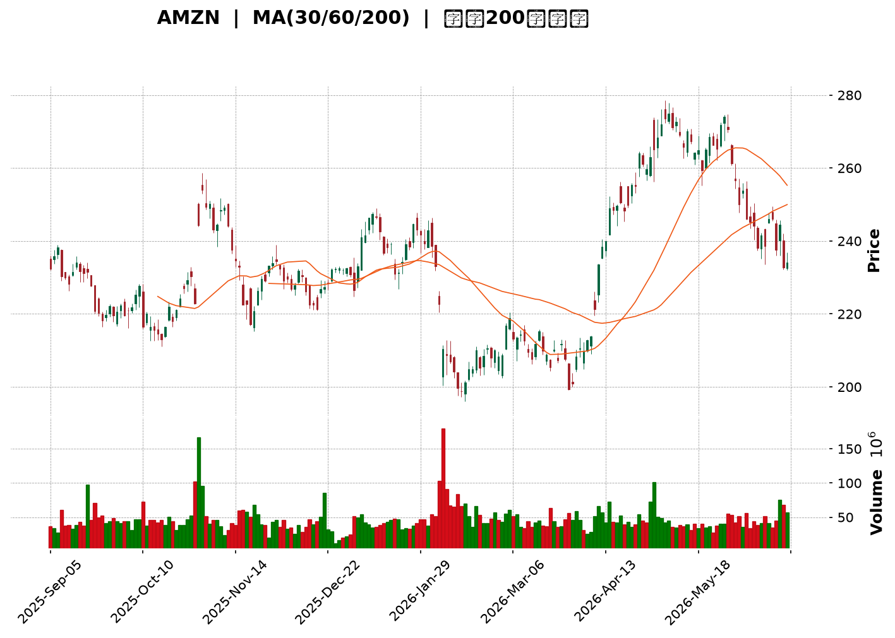
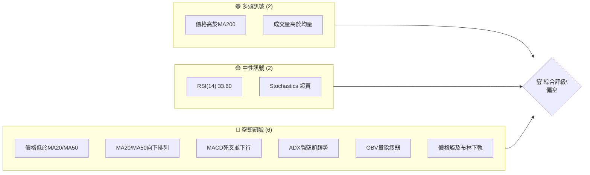
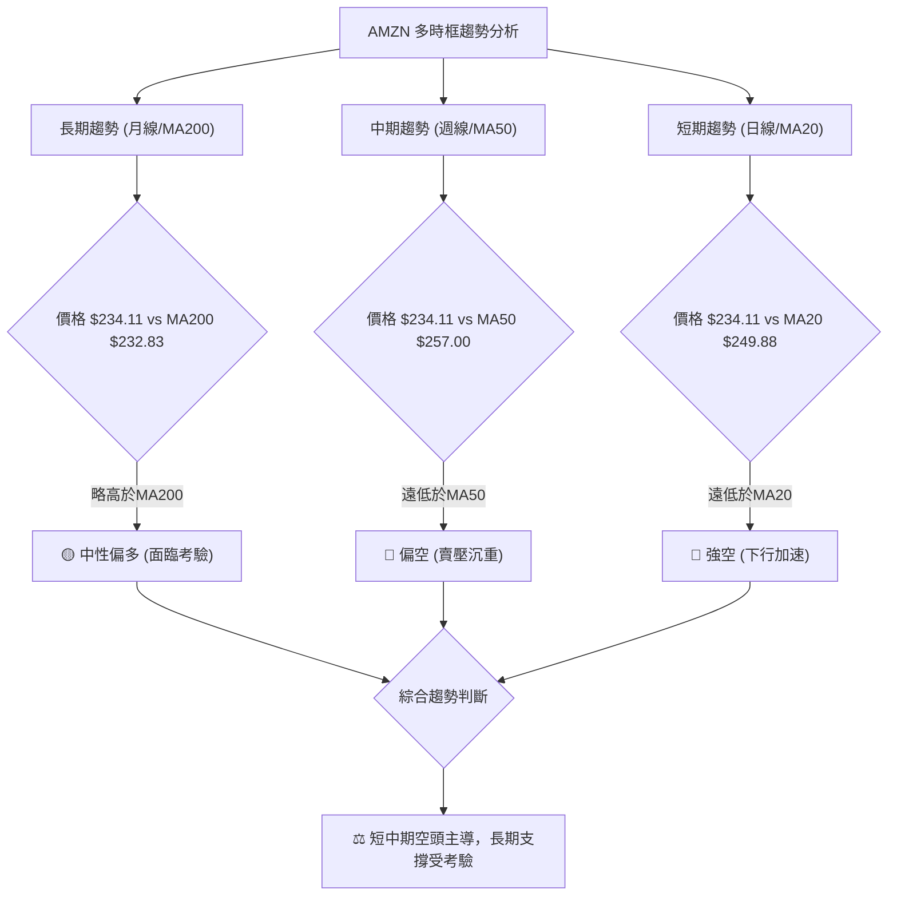
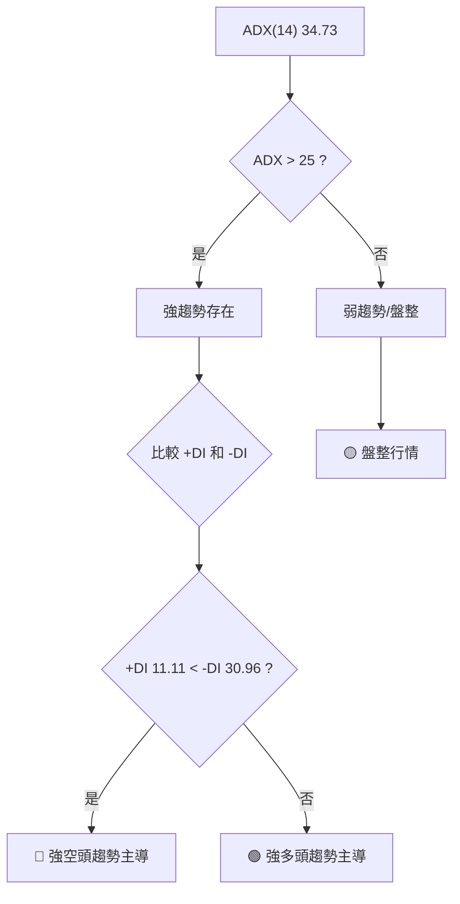
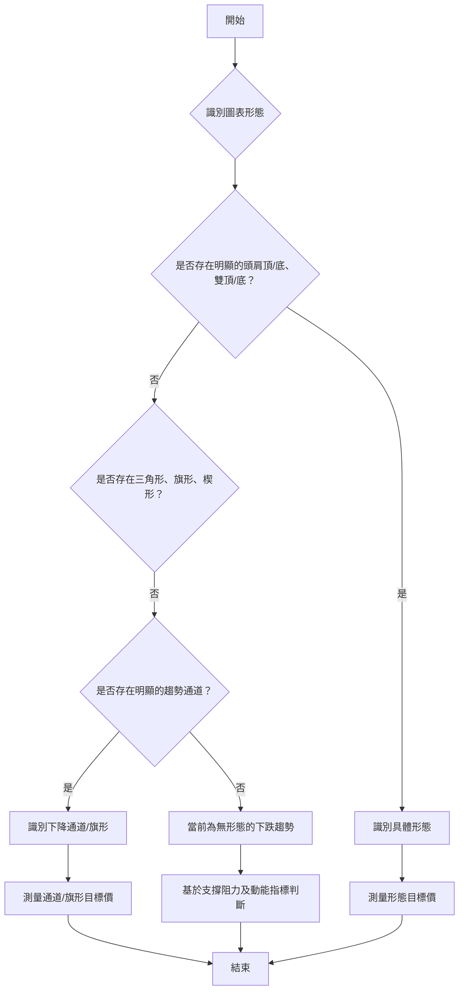
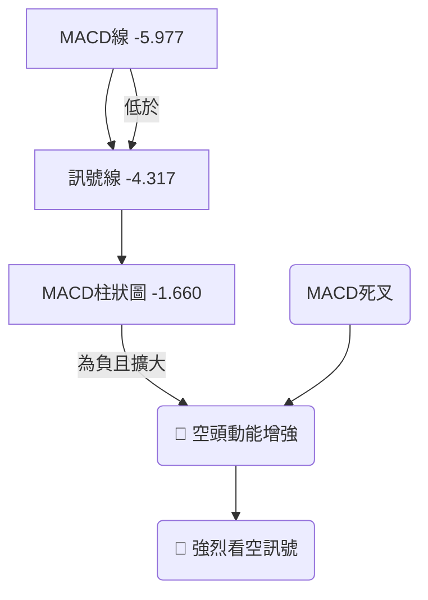

<details>
<summary>📊 靜態圖表 (點擊展開)</summary>

</details>

<html>
<head><meta charset="utf-8" /></head>
<body>
    <div style="height:500px; width:100%;">                        <script>window.PlotlyConfig = {MathJaxConfig: 'local'};</script>
        <script charset="utf-8" src="https://cdn.plot.ly/plotly-3.6.0.min.js" integrity="sha256-QaOVwtVY0T02VaHrr6pnoHLCwayMJp4O5n4YyaE3rJk=" crossorigin="anonymous"></script>                <div id="candlestick-chart" class="plotly-graph-div" style="height:100%; width:100%;"></div>            <script>                window.PLOTLYENV=window.PLOTLYENV || {};                                if (document.getElementById("candlestick-chart")) {                    Plotly.newPlot(                        "candlestick-chart",                        [{"close":{"dtype":"f8","bdata":"AAAAYI8KbUAAAABA4XptQAAAACCux21AAAAAYI\u002fKbEAAAABgZr5sQAAAAMDMhGxAAAAAgMLtbEAAAACgmUFtQAAAAADX82xAAAAAIFznbEAAAAAgXO9sQAAAAAApdGxAAAAAYLiWa0AAAABguIZrQAAAAMDMRGtAAAAAwPV4a0AAAACgcMVrQAAAAIA9cmtAAAAAACmUa0AAAADAHs1rQAAAAOBRcGtAAAAAwMyca0AAAADA9bhrQAAAAEAKJ2xAAAAAIK53bEAAAAAA1wtrQAAAAIA9gmtAAAAA4HoMa0AAAACAPfJqQAAAAEAKz2pAAAAAoEehakAAAAAgXA9rQAAAAMD1wGtAAAAAYGY+a0AAAABA4aJrQAAAAGC4BmxAAAAAQApfbEAAAAAAAKhsQAAAAKCZyWxAAAAAIIXba0AAAABACoduQAAAAAAAwG9AAAAAgD0qb0AAAABgZkZvQAAAAKBHYW5AAAAAwB6NbkAAAADAzAxvQAAAAEAzI29AAAAAYGaGbkAAAABgj7JtQAAAAIAUVm1AAAAAANcbbUAAAACgmdFrQAAAAIAU1mtAAAAA4Hoka0AAAACAFJZrQAAAAMD1SGxAAAAAoHC1bEAAAADAHqVsQAAAAEAKJ21AAAAAACk8bUAAAACgcE1tQAAAAAApDG1AAAAAIIWjbEAAAADA9bBsQAAAAOB6XGxAAAAAoHB9bEAAAADA9fhsQAAAAMD1yGxAAAAAgBRGbEAAAACgR9FrQAAAAIDr0WtAAAAA4KOoa0AAAADgUVhsQAAAAEAza2xAAAAAgMKNbEAAAADgegRtQAAAAAApDG1AAAAA4KMQbUAAAACAPQJtQAAAAMD1EG1AAAAAgD3abEAAAAAAAFBsQAAAAIDrIW1AAAAAgMIdbkAAAACA6zFuQAAAAKBHyW5AAAAAACnsbkAAAABACs9uQAAAAEAzU25AAAAAwMyUbUAAAACAwsVtQAAAAADX421AAAAAAADgbEAAAACA6+lsQAAAAEDhSm1AAAAAwB7lbUAAAACgcM1tQAAAAIDClW5AAAAA4FFgbkAAAAAgXDduQAAAAKCZ6W1AAAAAYLhebkAAAAAA19NtQAAAACCuH21AAAAAgBTWa0AAAACAPUpqQAAAAEAKF2pAAAAAYLjeaUAAAABgj4JpQAAAAEAz82hAAAAAoEfZaEAAAADAzCRpQAAAAKBHmWlAAAAAIIWbaUAAAAAghUNqQAAAAOCjqGlAAAAAgOsRakAAAADgelRqQAAAAKBw\u002fWlAAAAAAABAakAAAADgegxqQAAAACBcF2pAAAAAgD0aa0AAAACAFF5rQAAAAGC4pmpAAAAAIK6vakAAAABgj8pqQAAAAMDMlGpAAAAAwPUwakAAAACgcPVpQAAAACCud2pAAAAAYGbmakAAAAAA1ztqQAAAAOBRGGpAAAAAANeraUAAAADgekRqQAAAACCu52lAAAAAYLh2akAAAACgR\u002fFpQAAAAEDh6mhAAAAAYGYeaUAAAADgowhqQAAAAIA9UmpAAAAA4KM4akAAAACgR5lqQAAAAOCjuGpAAAAAAACoa0AAAADAzDRtQAAAAAApzG1AAAAA4Hr8bUAAAADgoyBvQAAAAAAAEG9AAAAAYGY2b0AAAACA61FvQAAAAMD1CG9AAAAAwB49b0AAAAAghetvQAAAAGCP4m9AAAAAANd\u002fcEAAAACA61FwQAAAAEAzO3BAAAAA4KNwcEAAAADA9ZBwQAAAAAApxHBAAAAAwMwAcUAAAADAzBhxQAAAAADXL3FAAAAAYLjycEAAAABA4QpxQAAAAADXz3BAAAAAwB6dcEAAAACAFOJwQAAAACCFs3BAAAAAgD2CcEAAAACAwo1wQAAAAKBwNXBAAAAAACmQcEAAAAAgXMdwQAAAAMAepXBAAAAA4KOUcEAAAACgmf1wQAAAAAAAIHFAAAAAgD3qcEAAAAAAKVRwQAAAAOBRCHBAAAAA4KNAb0AAAACgR7lvQAAAAMD1wG5AAAAAQAqnbkAAAACAFIZuQAAAAAAAwG1AAAAA4FEwbkAAAACgmdFtQAAAAOCjwG5AAAAAAADAbkAAAAAAALBtQAAAAOB6jG5AAAAAoEcZbUAAAAAghUNtQA=="},"high":{"dtype":"f8","bdata":"AAAAAACAbUAAAABAM7NtQAAAAEAz221AAAAAgMK1bUAAAADA9fBsQAAAAKBH2WxAAAAAIFw3bUAAAADAzHxtQAAAAKCZSW1AAAAAIFwvbUAAAADAHkVtQAAAAIA90mxAAAAAIIV7bEAAAACA6xFsQAAAAKBwlWtAAAAAoJmha0AAAABAM9NrQAAAACCux2tAAAAAwMzEa0AAAACA69lrQAAAAGBmBmxAAAAAIFy3a0AAAADgetxrQAAAACBcV2xAAAAAYLiGbEAAAAAAAIhsQAAAAIDClWtAAAAAgD1qa0AAAABguDZrQAAAAEDhUmtAAAAAoJnZakAAAACAFBZrQAAAAIA96mtAAAAA4FGAa0AAAACgmalrQAAAAMDMLGxAAAAAwMyMbEAAAAAgru9sQAAAAIA9Gm1AAAAAgBSObEAAAAAAAFBvQAAAAKCZKXBAAAAAACkQcEAAAAAAAGBvQAAAAAApTG9AAAAAwMycbkAAAAAAAHhvQAAAAAAAOG9AAAAAANdLb0AAAAAAAHhuQAAAACBc121AAAAAQDNTbUAAAABgZsZsQAAAACCu92tAAAAAwB5tbEAAAABguMZrQAAAAGCPamxAAAAA4KPQbEAAAAAAAPhsQAAAAKBHKW1AAAAAoJl5bUAAAABACt9tQAAAAAApLG1AAAAAAAAwbUAAAAAgrudsQAAAAGCP2mxAAAAAgD2SbEAAAACgcA1tQAAAACCFA21AAAAAYI\u002fCbEAAAACAwn1sQAAAAMAe9WtAAAAAgBQmbEAAAAAgXKdsQAAAAAAppGxAAAAAIFyvbEAAAABgZg5tQAAAAGBmHm1AAAAAIK4fbUAAAABAMxNtQAAAAOCjGG1AAAAAIK4fbUAAAABguG5tQAAAAAAAQG1AAAAAgMJlbkAAAACgR6luQAAAAMAezW5AAAAAIIX7bkAAAACAFB5vQAAAAMAe9W5AAAAAwPUobkAAAADAzBRuQAAAAIA98m1AAAAAQOFibUAAAACgmQltQAAAAEAKd21AAAAAYGYObkAAAABgZh5uQAAAAAApnG5AAAAAwPX4bkAAAAAAAGBuQAAAAIA9am5AAAAAACm0bkAAAABAM8tuQAAAACCF221AAAAAgOtJbEAAAACAFG5qQAAAAIDrmWpAAAAAwMyUakAAAACAPRJqQAAAAGC4fmlAAAAAwB4laUAAAAAgrjdpQAAAACCF22lAAAAA4Hq0aUAAAACgcGVqQAAAAIDCDWpAAAAAIIVLakAAAABA4XJqQAAAAKCZYWpAAAAAYI9KakAAAAAgXDdqQAAAAIDCJWpAAAAAoEcxa0AAAABACo9rQAAAAIA9KmtAAAAAgD26akAAAADAzPRqQAAAAAAAIGtAAAAAYLh2akAAAACA61FqQAAAAEAKl2pAAAAAYGb2akAAAADgeuRqQAAAAADXI2pAAAAAoEfxaUAAAACgmZlqQAAAAEAzK2pAAAAAgD2iakAAAADgepxqQAAAAEAz02lAAAAAoJl5aUAAAADA9UhqQAAAAGCPsmpAAAAAYLiGakAAAABgZp5qQAAAAEAKv2pAAAAAQDNDbEAAAACgmTltQAAAAIDCDW5AAAAAAAAAbkAAAACAwoVvQAAAAIAUTm9AAAAAAABAb0AAAABA4QJwQAAAAIDCRW9AAAAAQOHib0AAAACAFP5vQAAAAOCjLHBAAAAAAACIcEAAAABgZoJwQAAAAOB6UHBAAAAAYI+ecEAAAACAFB5xQAAAAMAeFXFAAAAAoJlBcUAAAADA9WhxQAAAAMDMXHFAAAAAgBRKcUAAAAAAACBxQAAAAIAUGnFAAAAAYGa6cEAAAAAghetwQAAAAOB67HBAAAAAgMKFcEAAAACgmc1wQAAAAAAAZHBAAAAAoEeZcEAAAAAA19dwQAAAAOCj3HBAAAAAwMzUcEAAAABgjwZxQAAAAAAAKHFAAAAAAAAscUAAAACAFKpwQAAAAEAzU3BAAAAAoHARcEAAAABgj\u002fpvQAAAAIAUBnBAAAAAoHAtb0AAAACAwk1vQAAAAIA9gm5AAAAA4HpEbkAAAAAghWtuQAAAAIDr+W5AAAAA4FEwb0AAAADAHr1uQAAAACBct25AAAAAAABAbkAAAAAA15ttQA=="},"hovertemplate":"\u003cb\u003e%{x|%Y-%m-%d}\u003c\u002fb\u003e\u003cbr\u003e\u958b: $%{open:.2f}\u003cbr\u003e\u9ad8: $%{high:.2f}\u003cbr\u003e\u4f4e: $%{low:.2f}\u003cbr\u003e\u6536: $%{close:.2f}\u003cextra\u003e\u003c\u002fextra\u003e","low":{"dtype":"f8","bdata":"AAAAgML9bEAAAAAAADhtQAAAAGCPYm1AAAAAQDOjbEAAAABA4apsQAAAAKBHSWxAAAAAgD3KbEAAAAAgXAdtQAAAAGC4lmxAAAAAoEeZbEAAAABgZrZsQAAAAOBRcGxAAAAAgD2Ca0AAAABgZm5rQAAAAEAKD2tAAAAA4KNAa0AAAACgmWlrQAAAAOB6PGtAAAAAIIUTa0AAAABgZl5rQAAAAEDhamtAAAAAwPUAa0AAAACgcIVrQAAAAIAUpmtAAAAAAAC4a0AAAAAAAABrQAAAAKBHIWtAAAAAQDOTakAAAADAHpVqQAAAAIDrmWpAAAAAwPVgakAAAABA4bJqQAAAACCuP2tAAAAA4KMQa0AAAACAwkVrQAAAAMDMvGtAAAAAoEcxbEAAAABguEZsQAAAAOBReGxAAAAAAADYa0AAAAAgXH9uQAAAAMDMnG9AAAAAwB4Vb0AAAADAHsVuQAAAAKBwRW5AAAAAIK7PbUAAAABA4bJuQAAAACBc525AAAAAAAB4bkAAAAAAAJBtQAAAAOB6HG1AAAAAgBSmbEAAAACgcM1rQAAAAOCjUGtAAAAAIK4Xa0AAAACAwuVqQAAAAOCjyGtAAAAAoJn5a0AAAADgo5hsQAAAAEAKx2xAAAAAAAAIbUAAAACgmTFtQAAAACCF02xAAAAAoJlZbEAAAACgmZFsQAAAAOCjSGxAAAAAIIUjbEAAAABguI5sQAAAAIAUlmxAAAAAANcjbEAAAAAAALBrQAAAAAAppGtAAAAAIK6fa0AAAADAHg1sQAAAAGCPMmxAAAAAYLhWbEAAAAAgXJdsQAAAAGCP6mxAAAAAgMLlbEAAAADgo9hsQAAAAGBmxmxAAAAAANfDbEAAAABgZhZsQAAAAIDCZWxAAAAAgD0CbUAAAADgo\u002fBtQAAAAAApPG5AAAAAIK5HbkAAAABguL5uQAAAAAAACG5AAAAAQAqHbUAAAAAAKZRtQAAAAMAejW1AAAAAQOGqbEAAAAAAKVxsQAAAAMDM3GxAAAAAgD1SbUAAAACgR7FtQAAAAGCPwm1AAAAAwPUwbkAAAAAgrpdtQAAAAOB6tG1AAAAAoHDFbUAAAABgZm5tQAAAAIA9+mxAAAAAACmMa0AAAACA6wlpQAAAAEAza2lAAAAAwB7NaUAAAAAgrk9pQAAAAIDrsWhAAAAAwPWoaEAAAAAAAIBoQAAAAOBRMGlAAAAAgOtZaUAAAAAAAHhpQAAAACCFY2lAAAAAAABoaUAAAACAwh1qQAAAAEAzq2lAAAAAYGamaUAAAABguG5pQAAAACBcT2lAAAAAwMxEakAAAABA4fJqQAAAAMD1kGpAAAAAIIXjaUAAAACAwo1qQAAAAEAza2pAAAAAwMwEakAAAABACsdpQAAAAGBm7mlAAAAAgMKNakAAAABgjxpqQAAAAKCZwWlAAAAAgD2KaUAAAADgUTBqQAAAAOB61GlAAAAAwMw8akAAAAAA1+NpQAAAAOB65GhAAAAAIFz\u002faEAAAADgeoRpQAAAAIAUBmpAAAAAwMycaUAAAABA4TJqQAAAAGCPImpAAAAAANdza0AAAADgo+hrQAAAAGC4Zm1AAAAAAAB4bUAAAADA9ThuQAAAAGBm5m5AAAAAYGaGbkAAAAAghUNvQAAAAADXq25AAAAAQDMjb0AAAABgj0pvQAAAAIA9om9AAAAAQAobcEAAAACgcEVwQAAAAIAUCnBAAAAAQDMbcEAAAABgjwJwQAAAAADXa3BAAAAAwMzMcEAAAACAFAZxQAAAACBcA3FAAAAAANfncEAAAABAM99wQAAAACCux3BAAAAAgBRqcEAAAABAM3NwQAAAAIAUqnBAAAAAgD1OcEAAAADgemhwQAAAAIAU5m9AAAAA4Ho4cEAAAACA61VwQAAAAADXo3BAAAAAwB5hcEAAAABAM5twQAAAAEAKt3BAAAAAgD3acEAAAABAM0twQAAAAADXy29AAAAAYLj2bkAAAAAAAHhvQAAAAMD1uG5AAAAAIIVrbkAAAADAzAxuQAAAAGBmrm1AAAAAgMJlbUAAAABA4TJtQAAAACBcl25AAAAAYGaubkAAAAAAAIBtQAAAAOCjgG1AAAAAIK4HbUAAAAAAAABtQA=="},"name":"\u50f9\u683c","open":{"dtype":"f8","bdata":"AAAAgBRmbUAAAACAFF5tQAAAACCFi21AAAAA4KOwbUAAAAAgru9sQAAAAEAzy2xAAAAAACnUbEAAAACAFB5tQAAAAOCjOG1AAAAAAAAQbUAAAAAA1wttQAAAAIDr0WxAAAAAYI96bEAAAADAzARsQAAAAIDrgWtAAAAAYI9ia0AAAABgj4JrQAAAAMD1wGtAAAAAIIUra0AAAADgUaBrQAAAAIAU7mtAAAAAAACga0AAAAAAKZxrQAAAAKBw3WtAAAAAAAAgbEAAAABguEZsQAAAAGBmNmtAAAAAgOvxakAAAAAA1xNrQAAAAKBw9WpAAAAAgOvRakAAAAAAKbxqQAAAAIDCTWtAAAAAoJlpa0AAAAAAAGBrQAAAAEAKv2tAAAAAwB51bEAAAABACodsQAAAAKBw9WxAAAAAgOthbEAAAABAM0NvQAAAACCF629AAAAAAClMb0AAAADA9SBvQAAAAMAeJW9AAAAAwMxcbkAAAABA4QpvQAAAAMAeDW9AAAAAIK5Hb0AAAACgmWFuQAAAAIDrYW1AAAAAAAAobUAAAABAM4NsQAAAACCu92tAAAAAoJlhbEAAAABAMwtrQAAAAIDr0WtAAAAAAClMbEAAAAAgrtdsQAAAACCu52xAAAAAQAonbUAAAADgUWBtQAAAAEAzK21AAAAA4KMYbUAAAACAPcpsQAAAAEDhsmxAAAAAQOFabEAAAACA65lsQAAAAGC41mxAAAAAANe7bEAAAACAwn1sQAAAAKBH4WtAAAAAwB4VbEAAAABguDZsQAAAAOBRWGxAAAAAIIWTbEAAAACA66FsQAAAAAApBG1AAAAAoEcBbUAAAACAFP5sQAAAAGC45mxAAAAAwB4dbUAAAABA4epsQAAAAEDhmmxAAAAAQDMDbUAAAAAghfNtQAAAAIDrYW5AAAAAgD2SbkAAAAAgXNduQAAAAMD10G5AAAAAwMwkbkAAAACA6+ltQAAAAEDh4m1AAAAA4FE4bUAAAABA4eJsQAAAAKCZQW1AAAAAYLhebUAAAAAgXP9tQAAAAIAU9m1AAAAAANfLbkAAAACAPVpuQAAAAOB6\u002fG1AAAAAgOvJbUAAAAAgXJ9uQAAAACCF221AAAAAwB4dbEAAAABgZlZpQAAAAEAKH2pAAAAAoJkZakAAAACA6wFqQAAAAGC4fmlAAAAAACncaEAAAAAAKcRoQAAAAIA9QmlAAAAAoJl5aUAAAADgUZhpQAAAAEAzA2pAAAAAQAqvaUAAAABguE5qQAAAACBcV2pAAAAAYI\u002faaUAAAACgmZFpQAAAAEAzY2lAAAAAQApPakAAAAAgXP9qQAAAACCu32pAAAAAYGZOakAAAACAFMZqQAAAAGC49mpAAAAA4HpMakAAAAAghTNqQAAAAEAzC2pAAAAAgD2aakAAAACAwr1qQAAAAIDr4WlAAAAAwMzsaUAAAACgRzlqQAAAAGBm\u002fmlAAAAAgOtxakAAAAAghVNqQAAAAGC4zmlAAAAAIFwvaUAAAABAM5tpQAAAAIAUTmpAAAAAoEfRaUAAAACgmTlqQAAAACCuZ2pAAAAAoEf5a0AAAAAgXCdsQAAAAKCZaW1AAAAAYGaubUAAAADA9ThuQAAAAAAAKG9AAAAA4FEQb0AAAAAgrt9vQAAAAIAUJm9AAAAAQOHib0AAAACAFI5vQAAAAOB67G9AAAAAIK4\u002fcEAAAAAgXHdwQAAAAIA9JnBAAAAAANcfcEAAAABguBJxQAAAAKBHmXBAAAAAwMzMcEAAAACgR0FxQAAAAIA9DnFAAAAA4FEwcUAAAACAFPpwQAAAAKBw3XBAAAAAIFyrcEAAAABA4YZwQAAAAGBm0nBAAAAAAABocEAAAACA631wQAAAAOCjYHBAAAAAwMxAcEAAAAAAAHhwQAAAAGCPynBAAAAAQAq\u002fcEAAAABgZqJwQAAAAOBRBHFAAAAA4KP0cEAAAADgo6RwQAAAAGCPEnBAAAAAYGbWb0AAAAAA16NvQAAAAOBRyG9AAAAAgMLVbkAAAAAgXPduQAAAACCFc25AAAAAgMK9bUAAAABguGZuQAAAAOCjoG5AAAAAAAAAb0AAAADAzJxuQAAAAADXA25AAAAAYI8CbkAAAACgmRFtQA=="},"x":["2025-09-05T00:00:00-04:00","2025-09-08T00:00:00-04:00","2025-09-09T00:00:00-04:00","2025-09-10T00:00:00-04:00","2025-09-11T00:00:00-04:00","2025-09-12T00:00:00-04:00","2025-09-15T00:00:00-04:00","2025-09-16T00:00:00-04:00","2025-09-17T00:00:00-04:00","2025-09-18T00:00:00-04:00","2025-09-19T00:00:00-04:00","2025-09-22T00:00:00-04:00","2025-09-23T00:00:00-04:00","2025-09-24T00:00:00-04:00","2025-09-25T00:00:00-04:00","2025-09-26T00:00:00-04:00","2025-09-29T00:00:00-04:00","2025-09-30T00:00:00-04:00","2025-10-01T00:00:00-04:00","2025-10-02T00:00:00-04:00","2025-10-03T00:00:00-04:00","2025-10-06T00:00:00-04:00","2025-10-07T00:00:00-04:00","2025-10-08T00:00:00-04:00","2025-10-09T00:00:00-04:00","2025-10-10T00:00:00-04:00","2025-10-13T00:00:00-04:00","2025-10-14T00:00:00-04:00","2025-10-15T00:00:00-04:00","2025-10-16T00:00:00-04:00","2025-10-17T00:00:00-04:00","2025-10-20T00:00:00-04:00","2025-10-21T00:00:00-04:00","2025-10-22T00:00:00-04:00","2025-10-23T00:00:00-04:00","2025-10-24T00:00:00-04:00","2025-10-27T00:00:00-04:00","2025-10-28T00:00:00-04:00","2025-10-29T00:00:00-04:00","2025-10-30T00:00:00-04:00","2025-10-31T00:00:00-04:00","2025-11-03T00:00:00-05:00","2025-11-04T00:00:00-05:00","2025-11-05T00:00:00-05:00","2025-11-06T00:00:00-05:00","2025-11-07T00:00:00-05:00","2025-11-10T00:00:00-05:00","2025-11-11T00:00:00-05:00","2025-11-12T00:00:00-05:00","2025-11-13T00:00:00-05:00","2025-11-14T00:00:00-05:00","2025-11-17T00:00:00-05:00","2025-11-18T00:00:00-05:00","2025-11-19T00:00:00-05:00","2025-11-20T00:00:00-05:00","2025-11-21T00:00:00-05:00","2025-11-24T00:00:00-05:00","2025-11-25T00:00:00-05:00","2025-11-26T00:00:00-05:00","2025-11-28T00:00:00-05:00","2025-12-01T00:00:00-05:00","2025-12-02T00:00:00-05:00","2025-12-03T00:00:00-05:00","2025-12-04T00:00:00-05:00","2025-12-05T00:00:00-05:00","2025-12-08T00:00:00-05:00","2025-12-09T00:00:00-05:00","2025-12-10T00:00:00-05:00","2025-12-11T00:00:00-05:00","2025-12-12T00:00:00-05:00","2025-12-15T00:00:00-05:00","2025-12-16T00:00:00-05:00","2025-12-17T00:00:00-05:00","2025-12-18T00:00:00-05:00","2025-12-19T00:00:00-05:00","2025-12-22T00:00:00-05:00","2025-12-23T00:00:00-05:00","2025-12-24T00:00:00-05:00","2025-12-26T00:00:00-05:00","2025-12-29T00:00:00-05:00","2025-12-30T00:00:00-05:00","2025-12-31T00:00:00-05:00","2026-01-02T00:00:00-05:00","2026-01-05T00:00:00-05:00","2026-01-06T00:00:00-05:00","2026-01-07T00:00:00-05:00","2026-01-08T00:00:00-05:00","2026-01-09T00:00:00-05:00","2026-01-12T00:00:00-05:00","2026-01-13T00:00:00-05:00","2026-01-14T00:00:00-05:00","2026-01-15T00:00:00-05:00","2026-01-16T00:00:00-05:00","2026-01-20T00:00:00-05:00","2026-01-21T00:00:00-05:00","2026-01-22T00:00:00-05:00","2026-01-23T00:00:00-05:00","2026-01-26T00:00:00-05:00","2026-01-27T00:00:00-05:00","2026-01-28T00:00:00-05:00","2026-01-29T00:00:00-05:00","2026-01-30T00:00:00-05:00","2026-02-02T00:00:00-05:00","2026-02-03T00:00:00-05:00","2026-02-04T00:00:00-05:00","2026-02-05T00:00:00-05:00","2026-02-06T00:00:00-05:00","2026-02-09T00:00:00-05:00","2026-02-10T00:00:00-05:00","2026-02-11T00:00:00-05:00","2026-02-12T00:00:00-05:00","2026-02-13T00:00:00-05:00","2026-02-17T00:00:00-05:00","2026-02-18T00:00:00-05:00","2026-02-19T00:00:00-05:00","2026-02-20T00:00:00-05:00","2026-02-23T00:00:00-05:00","2026-02-24T00:00:00-05:00","2026-02-25T00:00:00-05:00","2026-02-26T00:00:00-05:00","2026-02-27T00:00:00-05:00","2026-03-02T00:00:00-05:00","2026-03-03T00:00:00-05:00","2026-03-04T00:00:00-05:00","2026-03-05T00:00:00-05:00","2026-03-06T00:00:00-05:00","2026-03-09T00:00:00-04:00","2026-03-10T00:00:00-04:00","2026-03-11T00:00:00-04:00","2026-03-12T00:00:00-04:00","2026-03-13T00:00:00-04:00","2026-03-16T00:00:00-04:00","2026-03-17T00:00:00-04:00","2026-03-18T00:00:00-04:00","2026-03-19T00:00:00-04:00","2026-03-20T00:00:00-04:00","2026-03-23T00:00:00-04:00","2026-03-24T00:00:00-04:00","2026-03-25T00:00:00-04:00","2026-03-26T00:00:00-04:00","2026-03-27T00:00:00-04:00","2026-03-30T00:00:00-04:00","2026-03-31T00:00:00-04:00","2026-04-01T00:00:00-04:00","2026-04-02T00:00:00-04:00","2026-04-06T00:00:00-04:00","2026-04-07T00:00:00-04:00","2026-04-08T00:00:00-04:00","2026-04-09T00:00:00-04:00","2026-04-10T00:00:00-04:00","2026-04-13T00:00:00-04:00","2026-04-14T00:00:00-04:00","2026-04-15T00:00:00-04:00","2026-04-16T00:00:00-04:00","2026-04-17T00:00:00-04:00","2026-04-20T00:00:00-04:00","2026-04-21T00:00:00-04:00","2026-04-22T00:00:00-04:00","2026-04-23T00:00:00-04:00","2026-04-24T00:00:00-04:00","2026-04-27T00:00:00-04:00","2026-04-28T00:00:00-04:00","2026-04-29T00:00:00-04:00","2026-04-30T00:00:00-04:00","2026-05-01T00:00:00-04:00","2026-05-04T00:00:00-04:00","2026-05-05T00:00:00-04:00","2026-05-06T00:00:00-04:00","2026-05-07T00:00:00-04:00","2026-05-08T00:00:00-04:00","2026-05-11T00:00:00-04:00","2026-05-12T00:00:00-04:00","2026-05-13T00:00:00-04:00","2026-05-14T00:00:00-04:00","2026-05-15T00:00:00-04:00","2026-05-18T00:00:00-04:00","2026-05-19T00:00:00-04:00","2026-05-20T00:00:00-04:00","2026-05-21T00:00:00-04:00","2026-05-22T00:00:00-04:00","2026-05-26T00:00:00-04:00","2026-05-27T00:00:00-04:00","2026-05-28T00:00:00-04:00","2026-05-29T00:00:00-04:00","2026-06-01T00:00:00-04:00","2026-06-02T00:00:00-04:00","2026-06-03T00:00:00-04:00","2026-06-04T00:00:00-04:00","2026-06-05T00:00:00-04:00","2026-06-08T00:00:00-04:00","2026-06-09T00:00:00-04:00","2026-06-10T00:00:00-04:00","2026-06-11T00:00:00-04:00","2026-06-12T00:00:00-04:00","2026-06-15T00:00:00-04:00","2026-06-16T00:00:00-04:00","2026-06-17T00:00:00-04:00","2026-06-18T00:00:00-04:00","2026-06-22T00:00:00-04:00","2026-06-23T00:00:00-04:00"],"type":"candlestick"},{"hovertemplate":"MA30: $%{y:.2f}\u003cextra\u003e\u003c\u002fextra\u003e","line":{"color":"#2196F3","dash":"dash","width":2},"mode":"lines","name":"MA30","x":["2025-09-05T00:00:00-04:00","2025-09-08T00:00:00-04:00","2025-09-09T00:00:00-04:00","2025-09-10T00:00:00-04:00","2025-09-11T00:00:00-04:00","2025-09-12T00:00:00-04:00","2025-09-15T00:00:00-04:00","2025-09-16T00:00:00-04:00","2025-09-17T00:00:00-04:00","2025-09-18T00:00:00-04:00","2025-09-19T00:00:00-04:00","2025-09-22T00:00:00-04:00","2025-09-23T00:00:00-04:00","2025-09-24T00:00:00-04:00","2025-09-25T00:00:00-04:00","2025-09-26T00:00:00-04:00","2025-09-29T00:00:00-04:00","2025-09-30T00:00:00-04:00","2025-10-01T00:00:00-04:00","2025-10-02T00:00:00-04:00","2025-10-03T00:00:00-04:00","2025-10-06T00:00:00-04:00","2025-10-07T00:00:00-04:00","2025-10-08T00:00:00-04:00","2025-10-09T00:00:00-04:00","2025-10-10T00:00:00-04:00","2025-10-13T00:00:00-04:00","2025-10-14T00:00:00-04:00","2025-10-15T00:00:00-04:00","2025-10-16T00:00:00-04:00","2025-10-17T00:00:00-04:00","2025-10-20T00:00:00-04:00","2025-10-21T00:00:00-04:00","2025-10-22T00:00:00-04:00","2025-10-23T00:00:00-04:00","2025-10-24T00:00:00-04:00","2025-10-27T00:00:00-04:00","2025-10-28T00:00:00-04:00","2025-10-29T00:00:00-04:00","2025-10-30T00:00:00-04:00","2025-10-31T00:00:00-04:00","2025-11-03T00:00:00-05:00","2025-11-04T00:00:00-05:00","2025-11-05T00:00:00-05:00","2025-11-06T00:00:00-05:00","2025-11-07T00:00:00-05:00","2025-11-10T00:00:00-05:00","2025-11-11T00:00:00-05:00","2025-11-12T00:00:00-05:00","2025-11-13T00:00:00-05:00","2025-11-14T00:00:00-05:00","2025-11-17T00:00:00-05:00","2025-11-18T00:00:00-05:00","2025-11-19T00:00:00-05:00","2025-11-20T00:00:00-05:00","2025-11-21T00:00:00-05:00","2025-11-24T00:00:00-05:00","2025-11-25T00:00:00-05:00","2025-11-26T00:00:00-05:00","2025-11-28T00:00:00-05:00","2025-12-01T00:00:00-05:00","2025-12-02T00:00:00-05:00","2025-12-03T00:00:00-05:00","2025-12-04T00:00:00-05:00","2025-12-05T00:00:00-05:00","2025-12-08T00:00:00-05:00","2025-12-09T00:00:00-05:00","2025-12-10T00:00:00-05:00","2025-12-11T00:00:00-05:00","2025-12-12T00:00:00-05:00","2025-12-15T00:00:00-05:00","2025-12-16T00:00:00-05:00","2025-12-17T00:00:00-05:00","2025-12-18T00:00:00-05:00","2025-12-19T00:00:00-05:00","2025-12-22T00:00:00-05:00","2025-12-23T00:00:00-05:00","2025-12-24T00:00:00-05:00","2025-12-26T00:00:00-05:00","2025-12-29T00:00:00-05:00","2025-12-30T00:00:00-05:00","2025-12-31T00:00:00-05:00","2026-01-02T00:00:00-05:00","2026-01-05T00:00:00-05:00","2026-01-06T00:00:00-05:00","2026-01-07T00:00:00-05:00","2026-01-08T00:00:00-05:00","2026-01-09T00:00:00-05:00","2026-01-12T00:00:00-05:00","2026-01-13T00:00:00-05:00","2026-01-14T00:00:00-05:00","2026-01-15T00:00:00-05:00","2026-01-16T00:00:00-05:00","2026-01-20T00:00:00-05:00","2026-01-21T00:00:00-05:00","2026-01-22T00:00:00-05:00","2026-01-23T00:00:00-05:00","2026-01-26T00:00:00-05:00","2026-01-27T00:00:00-05:00","2026-01-28T00:00:00-05:00","2026-01-29T00:00:00-05:00","2026-01-30T00:00:00-05:00","2026-02-02T00:00:00-05:00","2026-02-03T00:00:00-05:00","2026-02-04T00:00:00-05:00","2026-02-05T00:00:00-05:00","2026-02-06T00:00:00-05:00","2026-02-09T00:00:00-05:00","2026-02-10T00:00:00-05:00","2026-02-11T00:00:00-05:00","2026-02-12T00:00:00-05:00","2026-02-13T00:00:00-05:00","2026-02-17T00:00:00-05:00","2026-02-18T00:00:00-05:00","2026-02-19T00:00:00-05:00","2026-02-20T00:00:00-05:00","2026-02-23T00:00:00-05:00","2026-02-24T00:00:00-05:00","2026-02-25T00:00:00-05:00","2026-02-26T00:00:00-05:00","2026-02-27T00:00:00-05:00","2026-03-02T00:00:00-05:00","2026-03-03T00:00:00-05:00","2026-03-04T00:00:00-05:00","2026-03-05T00:00:00-05:00","2026-03-06T00:00:00-05:00","2026-03-09T00:00:00-04:00","2026-03-10T00:00:00-04:00","2026-03-11T00:00:00-04:00","2026-03-12T00:00:00-04:00","2026-03-13T00:00:00-04:00","2026-03-16T00:00:00-04:00","2026-03-17T00:00:00-04:00","2026-03-18T00:00:00-04:00","2026-03-19T00:00:00-04:00","2026-03-20T00:00:00-04:00","2026-03-23T00:00:00-04:00","2026-03-24T00:00:00-04:00","2026-03-25T00:00:00-04:00","2026-03-26T00:00:00-04:00","2026-03-27T00:00:00-04:00","2026-03-30T00:00:00-04:00","2026-03-31T00:00:00-04:00","2026-04-01T00:00:00-04:00","2026-04-02T00:00:00-04:00","2026-04-06T00:00:00-04:00","2026-04-07T00:00:00-04:00","2026-04-08T00:00:00-04:00","2026-04-09T00:00:00-04:00","2026-04-10T00:00:00-04:00","2026-04-13T00:00:00-04:00","2026-04-14T00:00:00-04:00","2026-04-15T00:00:00-04:00","2026-04-16T00:00:00-04:00","2026-04-17T00:00:00-04:00","2026-04-20T00:00:00-04:00","2026-04-21T00:00:00-04:00","2026-04-22T00:00:00-04:00","2026-04-23T00:00:00-04:00","2026-04-24T00:00:00-04:00","2026-04-27T00:00:00-04:00","2026-04-28T00:00:00-04:00","2026-04-29T00:00:00-04:00","2026-04-30T00:00:00-04:00","2026-05-01T00:00:00-04:00","2026-05-04T00:00:00-04:00","2026-05-05T00:00:00-04:00","2026-05-06T00:00:00-04:00","2026-05-07T00:00:00-04:00","2026-05-08T00:00:00-04:00","2026-05-11T00:00:00-04:00","2026-05-12T00:00:00-04:00","2026-05-13T00:00:00-04:00","2026-05-14T00:00:00-04:00","2026-05-15T00:00:00-04:00","2026-05-18T00:00:00-04:00","2026-05-19T00:00:00-04:00","2026-05-20T00:00:00-04:00","2026-05-21T00:00:00-04:00","2026-05-22T00:00:00-04:00","2026-05-26T00:00:00-04:00","2026-05-27T00:00:00-04:00","2026-05-28T00:00:00-04:00","2026-05-29T00:00:00-04:00","2026-06-01T00:00:00-04:00","2026-06-02T00:00:00-04:00","2026-06-03T00:00:00-04:00","2026-06-04T00:00:00-04:00","2026-06-05T00:00:00-04:00","2026-06-08T00:00:00-04:00","2026-06-09T00:00:00-04:00","2026-06-10T00:00:00-04:00","2026-06-11T00:00:00-04:00","2026-06-12T00:00:00-04:00","2026-06-15T00:00:00-04:00","2026-06-16T00:00:00-04:00","2026-06-17T00:00:00-04:00","2026-06-18T00:00:00-04:00","2026-06-22T00:00:00-04:00","2026-06-23T00:00:00-04:00"],"y":{"dtype":"f8","bdata":"AAAAAAAA+H8AAAAAAAD4fwAAAAAAAPh\u002fAAAAAAAA+H8AAAAAAAD4fwAAAAAAAPh\u002fAAAAAAAA+H8AAAAAAAD4fwAAAAAAAPh\u002fAAAAAAAA+H8AAAAAAAD4fwAAAAAAAPh\u002fAAAAAAAA+H8AAAAAAAD4fwAAAAAAAPh\u002fAAAAAAAA+H8AAAAAAAD4fwAAAAAAAPh\u002fAAAAAAAA+H8AAAAAAAD4fwAAAAAAAPh\u002fAAAAAAAA+H8AAAAAAAD4fwAAAAAAAPh\u002fAAAAAAAA+H8AAAAAAAD4fwAAAAAAAPh\u002fAAAAAAAA+H8AAAAAAAD4f83MzHyGGWxAd3d3B\u002fMEbEBVVVV1TPBrQLy7uwsC32tAq6qqes3Ra0C8u7sbWshrQKuqqjomxGtAq6qqWmS\u002fa0AiIiKiRbprQAAAADDduGtA7+7unu+va0De3d19hr1rQCIiIkKn2WtAIiIisiv4a0BmZmb2KBhsQHd3d5e1MmxAmpmZOftMbEAzMzPD9WhsQLy7u2t1iGxAmpmZmZmhbEBVVVUFyLFsQM3MzCz5wWxAiYiIyL3ObEC8u7sLkM9sQAAAADDdzGxA3t3drY7BbEBERERUKsZsQCIiIhLKzGxAVVVVZfTabEDv7u5ec+lsQO\u002fu7l5z\u002fWxAVVVVFa4TbUBmZmbm0CZtQERERCTbMW1AERERkcI9bUAAAABAw0ZtQBERERGfSW1Aq6qqeqJKbUBmZmZWVU1tQAAAAOBPTW1AAAAAMN1QbUCamZkZvTltQCIiIuIzGG1AzczMXEj6bEDe3d2tR+FsQERERESL0GxAiYiIqH+\u002fbECJiIiYJ65sQLy7u+tRnGxAERERgdyPbECJiIjo+4lsQFVVVRWuh2xAzczMTH6FbECamZnptIlsQM3MzJzElGxA3t3d3SSubEBERETEZ8RsQERERNS\u002f2WxAd3d316PsbEAAAACgGv9sQN7d3f0bCW1AIiIiYhAMbUDNzMwcExBtQERERJRDF21AzczMrEcZbUC8u7u7LRttQERERBQgI21AmpmZWR0vbUAzMzODMjZtQLy7u6uORW1AZmZmpn9XbUDNzMzM92ttQAAAAPDSfW1AERERwfWUbUAzMzNTnKFtQLy7u2ugp21AVVVVBYGhbUBVVVW1OoptQDMzM\u002fP9cG1A3t3dXbpVbUCrqqo63zdtQFVVVSW\u002fFG1AERER0ZTybEAzMzOTitdsQKuqqvpiuWxAd3d3d+mSbEBVVVWFXXFsQERERFScRWxAERER4TMcbEBmZmbm+\u002fVrQCIiIvL90GtAiYiIuJC0a0ARERERypRrQCIiIpJfdGtAzczMfD9la0B3d3enDVhrQCIiIsKDQWtAMzMzIyIma0BmZmb2bwxrQDMzM6NF6mpA3t3dXY\u002fGakB3d3e3OqJqQAAAAADVhGpAq6qqqjhnakAAAAAAjkhqQHd3d5e1LmpAMzMzEzwcakC8u7vrChxqQImIiMh2GmpAmpmZ2YcfakCJiIioOCNqQImIiKjxImpAvLu7ez8lakCJiIi41yxqQM3MzAwCM2pA7+7uzj44akAAAACgGjtqQBEREbErRGpAiYiI6LRRakC8u7srQGpqQImIiMi9impA7+7uvp+qakAiIiJy9tVqQO\u002fu7k5iAGtAzczMvHQja0CrqqoaL0VrQM3MzIyXamtAMzMzo3CRa0AAAACQNL1rQImIiMh26mtA3t3d\u002fY0kbEB3d3dnkV1sQO\u002fu7q65kGxAIiIiMsHDbEDv7u6+n\u002f5sQHd3dzcXPm1AzczMTDeFbUBERER02shtQHd3d7ceEW5AMzMzQ4tQbkAzMzPTBpZuQKuqqupR4G5AERERwYMlb0CJiIiof2dvQCIiIuLso29AVVVVhevdb0DNzMwMuwpwQHd3d98II3BAq6qqkl86cEBERERM8ExwQCIiIgrXW3BAzczM\u002fGJpcEAzMzMLkHVwQM3MzKQpg3BAd3d3p1SOcEAAAACQCZRwQImIiJhumHBAVVVVnX2YcECamZlBp5dwQBEREaHTknBAZmZm5tCIcEBERERkyX9wQN7d3Z02dHBAVVVVDbtocEDe3d2Nl1pwQFVVVQ27TnBAREREXNZAcEDe3d1VnC1wQKuqqmpKHXBAvLu7Q9IIcECamZlZgOhvQA=="},"type":"scatter"},{"hovertemplate":"MA60: $%{y:.2f}\u003cextra\u003e\u003c\u002fextra\u003e","line":{"color":"#9C27B0","dash":"dash","width":2},"mode":"lines","name":"MA60","x":["2025-09-05T00:00:00-04:00","2025-09-08T00:00:00-04:00","2025-09-09T00:00:00-04:00","2025-09-10T00:00:00-04:00","2025-09-11T00:00:00-04:00","2025-09-12T00:00:00-04:00","2025-09-15T00:00:00-04:00","2025-09-16T00:00:00-04:00","2025-09-17T00:00:00-04:00","2025-09-18T00:00:00-04:00","2025-09-19T00:00:00-04:00","2025-09-22T00:00:00-04:00","2025-09-23T00:00:00-04:00","2025-09-24T00:00:00-04:00","2025-09-25T00:00:00-04:00","2025-09-26T00:00:00-04:00","2025-09-29T00:00:00-04:00","2025-09-30T00:00:00-04:00","2025-10-01T00:00:00-04:00","2025-10-02T00:00:00-04:00","2025-10-03T00:00:00-04:00","2025-10-06T00:00:00-04:00","2025-10-07T00:00:00-04:00","2025-10-08T00:00:00-04:00","2025-10-09T00:00:00-04:00","2025-10-10T00:00:00-04:00","2025-10-13T00:00:00-04:00","2025-10-14T00:00:00-04:00","2025-10-15T00:00:00-04:00","2025-10-16T00:00:00-04:00","2025-10-17T00:00:00-04:00","2025-10-20T00:00:00-04:00","2025-10-21T00:00:00-04:00","2025-10-22T00:00:00-04:00","2025-10-23T00:00:00-04:00","2025-10-24T00:00:00-04:00","2025-10-27T00:00:00-04:00","2025-10-28T00:00:00-04:00","2025-10-29T00:00:00-04:00","2025-10-30T00:00:00-04:00","2025-10-31T00:00:00-04:00","2025-11-03T00:00:00-05:00","2025-11-04T00:00:00-05:00","2025-11-05T00:00:00-05:00","2025-11-06T00:00:00-05:00","2025-11-07T00:00:00-05:00","2025-11-10T00:00:00-05:00","2025-11-11T00:00:00-05:00","2025-11-12T00:00:00-05:00","2025-11-13T00:00:00-05:00","2025-11-14T00:00:00-05:00","2025-11-17T00:00:00-05:00","2025-11-18T00:00:00-05:00","2025-11-19T00:00:00-05:00","2025-11-20T00:00:00-05:00","2025-11-21T00:00:00-05:00","2025-11-24T00:00:00-05:00","2025-11-25T00:00:00-05:00","2025-11-26T00:00:00-05:00","2025-11-28T00:00:00-05:00","2025-12-01T00:00:00-05:00","2025-12-02T00:00:00-05:00","2025-12-03T00:00:00-05:00","2025-12-04T00:00:00-05:00","2025-12-05T00:00:00-05:00","2025-12-08T00:00:00-05:00","2025-12-09T00:00:00-05:00","2025-12-10T00:00:00-05:00","2025-12-11T00:00:00-05:00","2025-12-12T00:00:00-05:00","2025-12-15T00:00:00-05:00","2025-12-16T00:00:00-05:00","2025-12-17T00:00:00-05:00","2025-12-18T00:00:00-05:00","2025-12-19T00:00:00-05:00","2025-12-22T00:00:00-05:00","2025-12-23T00:00:00-05:00","2025-12-24T00:00:00-05:00","2025-12-26T00:00:00-05:00","2025-12-29T00:00:00-05:00","2025-12-30T00:00:00-05:00","2025-12-31T00:00:00-05:00","2026-01-02T00:00:00-05:00","2026-01-05T00:00:00-05:00","2026-01-06T00:00:00-05:00","2026-01-07T00:00:00-05:00","2026-01-08T00:00:00-05:00","2026-01-09T00:00:00-05:00","2026-01-12T00:00:00-05:00","2026-01-13T00:00:00-05:00","2026-01-14T00:00:00-05:00","2026-01-15T00:00:00-05:00","2026-01-16T00:00:00-05:00","2026-01-20T00:00:00-05:00","2026-01-21T00:00:00-05:00","2026-01-22T00:00:00-05:00","2026-01-23T00:00:00-05:00","2026-01-26T00:00:00-05:00","2026-01-27T00:00:00-05:00","2026-01-28T00:00:00-05:00","2026-01-29T00:00:00-05:00","2026-01-30T00:00:00-05:00","2026-02-02T00:00:00-05:00","2026-02-03T00:00:00-05:00","2026-02-04T00:00:00-05:00","2026-02-05T00:00:00-05:00","2026-02-06T00:00:00-05:00","2026-02-09T00:00:00-05:00","2026-02-10T00:00:00-05:00","2026-02-11T00:00:00-05:00","2026-02-12T00:00:00-05:00","2026-02-13T00:00:00-05:00","2026-02-17T00:00:00-05:00","2026-02-18T00:00:00-05:00","2026-02-19T00:00:00-05:00","2026-02-20T00:00:00-05:00","2026-02-23T00:00:00-05:00","2026-02-24T00:00:00-05:00","2026-02-25T00:00:00-05:00","2026-02-26T00:00:00-05:00","2026-02-27T00:00:00-05:00","2026-03-02T00:00:00-05:00","2026-03-03T00:00:00-05:00","2026-03-04T00:00:00-05:00","2026-03-05T00:00:00-05:00","2026-03-06T00:00:00-05:00","2026-03-09T00:00:00-04:00","2026-03-10T00:00:00-04:00","2026-03-11T00:00:00-04:00","2026-03-12T00:00:00-04:00","2026-03-13T00:00:00-04:00","2026-03-16T00:00:00-04:00","2026-03-17T00:00:00-04:00","2026-03-18T00:00:00-04:00","2026-03-19T00:00:00-04:00","2026-03-20T00:00:00-04:00","2026-03-23T00:00:00-04:00","2026-03-24T00:00:00-04:00","2026-03-25T00:00:00-04:00","2026-03-26T00:00:00-04:00","2026-03-27T00:00:00-04:00","2026-03-30T00:00:00-04:00","2026-03-31T00:00:00-04:00","2026-04-01T00:00:00-04:00","2026-04-02T00:00:00-04:00","2026-04-06T00:00:00-04:00","2026-04-07T00:00:00-04:00","2026-04-08T00:00:00-04:00","2026-04-09T00:00:00-04:00","2026-04-10T00:00:00-04:00","2026-04-13T00:00:00-04:00","2026-04-14T00:00:00-04:00","2026-04-15T00:00:00-04:00","2026-04-16T00:00:00-04:00","2026-04-17T00:00:00-04:00","2026-04-20T00:00:00-04:00","2026-04-21T00:00:00-04:00","2026-04-22T00:00:00-04:00","2026-04-23T00:00:00-04:00","2026-04-24T00:00:00-04:00","2026-04-27T00:00:00-04:00","2026-04-28T00:00:00-04:00","2026-04-29T00:00:00-04:00","2026-04-30T00:00:00-04:00","2026-05-01T00:00:00-04:00","2026-05-04T00:00:00-04:00","2026-05-05T00:00:00-04:00","2026-05-06T00:00:00-04:00","2026-05-07T00:00:00-04:00","2026-05-08T00:00:00-04:00","2026-05-11T00:00:00-04:00","2026-05-12T00:00:00-04:00","2026-05-13T00:00:00-04:00","2026-05-14T00:00:00-04:00","2026-05-15T00:00:00-04:00","2026-05-18T00:00:00-04:00","2026-05-19T00:00:00-04:00","2026-05-20T00:00:00-04:00","2026-05-21T00:00:00-04:00","2026-05-22T00:00:00-04:00","2026-05-26T00:00:00-04:00","2026-05-27T00:00:00-04:00","2026-05-28T00:00:00-04:00","2026-05-29T00:00:00-04:00","2026-06-01T00:00:00-04:00","2026-06-02T00:00:00-04:00","2026-06-03T00:00:00-04:00","2026-06-04T00:00:00-04:00","2026-06-05T00:00:00-04:00","2026-06-08T00:00:00-04:00","2026-06-09T00:00:00-04:00","2026-06-10T00:00:00-04:00","2026-06-11T00:00:00-04:00","2026-06-12T00:00:00-04:00","2026-06-15T00:00:00-04:00","2026-06-16T00:00:00-04:00","2026-06-17T00:00:00-04:00","2026-06-18T00:00:00-04:00","2026-06-22T00:00:00-04:00","2026-06-23T00:00:00-04:00"],"y":{"dtype":"f8","bdata":"AAAAAAAA+H8AAAAAAAD4fwAAAAAAAPh\u002fAAAAAAAA+H8AAAAAAAD4fwAAAAAAAPh\u002fAAAAAAAA+H8AAAAAAAD4fwAAAAAAAPh\u002fAAAAAAAA+H8AAAAAAAD4fwAAAAAAAPh\u002fAAAAAAAA+H8AAAAAAAD4fwAAAAAAAPh\u002fAAAAAAAA+H8AAAAAAAD4fwAAAAAAAPh\u002fAAAAAAAA+H8AAAAAAAD4fwAAAAAAAPh\u002fAAAAAAAA+H8AAAAAAAD4fwAAAAAAAPh\u002fAAAAAAAA+H8AAAAAAAD4fwAAAAAAAPh\u002fAAAAAAAA+H8AAAAAAAD4fwAAAAAAAPh\u002fAAAAAAAA+H8AAAAAAAD4fwAAAAAAAPh\u002fAAAAAAAA+H8AAAAAAAD4fwAAAAAAAPh\u002fAAAAAAAA+H8AAAAAAAD4fwAAAAAAAPh\u002fAAAAAAAA+H8AAAAAAAD4fwAAAAAAAPh\u002fAAAAAAAA+H8AAAAAAAD4fwAAAAAAAPh\u002fAAAAAAAA+H8AAAAAAAD4fwAAAAAAAPh\u002fAAAAAAAA+H8AAAAAAAD4fwAAAAAAAPh\u002fAAAAAAAA+H8AAAAAAAD4fwAAAAAAAPh\u002fAAAAAAAA+H8AAAAAAAD4fwAAAAAAAPh\u002fAAAAAAAA+H8AAAAAAAD4f97d3e18i2xAZmZmjlCMbEDe3d2tjotsQAAAAJhuiGxA3t3dBciHbEDe3d2tjodsQN7d3aXihmxAq6qqagOFbEBERER8zYNsQAAAAIgWg2xAd3d3Z2aAbEC8u7vLoXtsQCIiIpLteGxAd3d3Bzp5bEAiIiJSuHxsQN7d3W2ggWxAERERcT2GbEDe3d2tjotsQLy7u6tjkmxAVVVVDbuYbEDv7u724Z1sQBEREaHTpGxAq6qqCh6qbECrqqp6oqxsQGZmZubQsGxA3t3dxdm3bEBEREQMScVsQDMzM\u002fNE02xAZmZmHszjbEB3d3f\u002fRvRsQGZmZq5HA21AvLu7O98PbUCamZkBchttQERERFyPJG1A7+7uHoUrbUDe3d19+DBtQKuqqpJfNm1AIiIi6t88bUDNzMzsw0FtQN7d3UVvSW1AMzMzay5UbUAzMzNz2lJtQBEREWkDS21A7+7uDp9HbUCJiIgAckFtQAAAANgVPG1A7+7uVoAwbUDv7u4mMRxtQHd3d++nBm1Ad3d3b8vybECamZmR7eBsQFVVVZ02zmxA7+7ujgm8bEBmZma+n7BsQLy7u8sTp2xAq6qqKoegbEDNzMyk4ppsQERERBSuj2xARERE3GuEbEAzMzNDi3psQAAAAPgMbWxAVVVVjVBgbEDv7u6WblJsQDMzM5PRRWxAzczMlEM\u002fbECamZmxnTlsQDMzM+tRMmxAZmZmvp8qbEDNzMw8USFsQHd3dyfqF2xAIiIiggcPbEAiIiJCGQdsQAAAAPhTAWxA3t3dNRf+a0CamZkpFfVrQJqZmQEr62tAREREjN7ea0CJiIjQItNrQN7d3V26xWtAvLu7G6G6a0CamZnxi61rQO\u002fu7mbYm2tAZmZmJuqLa0De3d0lMYJrQLy7u4MydmtAMzMzI5Rla0CrqqoSPFZrQKuqqgLkRGtAzczMZPQ2a0AREREJHjBrQFVVVd3dLWtAvLu7O5gva0CamZlBYDVrQImIiPBgOmtAzczMHFpEa0ARERFhnk5rQHd3d6cNVmtAMzMzY8lba0AzMzND0mRrQN7d3TVeamtA3t3drY51a0B3d3cP5n9rQHd3d1fHimtAZmZm7nyVa0B3d3fflqNrQHd3d2dmtmtAAAAAsLnQa0AAAACwcvJrQAAAAMDKFWxAZmZmjgk4bEDe3d29n1xsQJqZmcmhgWxAZmZmnmGlbECJiIiwK8psQHd3d3d362xAIiIiKhULbUDNzMxcSChtQAAAALgeRW1A7+7uBjpjbUAiIiJiEIJtQGZmZu41oW1ARERE3LK+bUBEREREi+BtQERERMxaA25A3t3dBQ8gbkBVVVUdoTZuQO\u002fu7l66TW5A7+7u7jVhbkCamZmJQXZuQFVVVQUPiG5AVVVV5RebbkAAAAAYkq5uQFVVVXWTvG5AZmZmppvKbkBVVVVt59luQBEREanG7W5Aq6qqAnIDb0AAAACQCRJvQGZmZsbZJW9AVVVV5Rcxb0BmZmaWQz9vQA=="},"type":"scatter"},{"hovertemplate":"MA200: $%{y:.2f}\u003cextra\u003e\u003c\u002fextra\u003e","line":{"color":"#FF6F00","dash":"solid","width":2},"mode":"lines","name":"MA200","x":["2025-09-05T00:00:00-04:00","2025-09-08T00:00:00-04:00","2025-09-09T00:00:00-04:00","2025-09-10T00:00:00-04:00","2025-09-11T00:00:00-04:00","2025-09-12T00:00:00-04:00","2025-09-15T00:00:00-04:00","2025-09-16T00:00:00-04:00","2025-09-17T00:00:00-04:00","2025-09-18T00:00:00-04:00","2025-09-19T00:00:00-04:00","2025-09-22T00:00:00-04:00","2025-09-23T00:00:00-04:00","2025-09-24T00:00:00-04:00","2025-09-25T00:00:00-04:00","2025-09-26T00:00:00-04:00","2025-09-29T00:00:00-04:00","2025-09-30T00:00:00-04:00","2025-10-01T00:00:00-04:00","2025-10-02T00:00:00-04:00","2025-10-03T00:00:00-04:00","2025-10-06T00:00:00-04:00","2025-10-07T00:00:00-04:00","2025-10-08T00:00:00-04:00","2025-10-09T00:00:00-04:00","2025-10-10T00:00:00-04:00","2025-10-13T00:00:00-04:00","2025-10-14T00:00:00-04:00","2025-10-15T00:00:00-04:00","2025-10-16T00:00:00-04:00","2025-10-17T00:00:00-04:00","2025-10-20T00:00:00-04:00","2025-10-21T00:00:00-04:00","2025-10-22T00:00:00-04:00","2025-10-23T00:00:00-04:00","2025-10-24T00:00:00-04:00","2025-10-27T00:00:00-04:00","2025-10-28T00:00:00-04:00","2025-10-29T00:00:00-04:00","2025-10-30T00:00:00-04:00","2025-10-31T00:00:00-04:00","2025-11-03T00:00:00-05:00","2025-11-04T00:00:00-05:00","2025-11-05T00:00:00-05:00","2025-11-06T00:00:00-05:00","2025-11-07T00:00:00-05:00","2025-11-10T00:00:00-05:00","2025-11-11T00:00:00-05:00","2025-11-12T00:00:00-05:00","2025-11-13T00:00:00-05:00","2025-11-14T00:00:00-05:00","2025-11-17T00:00:00-05:00","2025-11-18T00:00:00-05:00","2025-11-19T00:00:00-05:00","2025-11-20T00:00:00-05:00","2025-11-21T00:00:00-05:00","2025-11-24T00:00:00-05:00","2025-11-25T00:00:00-05:00","2025-11-26T00:00:00-05:00","2025-11-28T00:00:00-05:00","2025-12-01T00:00:00-05:00","2025-12-02T00:00:00-05:00","2025-12-03T00:00:00-05:00","2025-12-04T00:00:00-05:00","2025-12-05T00:00:00-05:00","2025-12-08T00:00:00-05:00","2025-12-09T00:00:00-05:00","2025-12-10T00:00:00-05:00","2025-12-11T00:00:00-05:00","2025-12-12T00:00:00-05:00","2025-12-15T00:00:00-05:00","2025-12-16T00:00:00-05:00","2025-12-17T00:00:00-05:00","2025-12-18T00:00:00-05:00","2025-12-19T00:00:00-05:00","2025-12-22T00:00:00-05:00","2025-12-23T00:00:00-05:00","2025-12-24T00:00:00-05:00","2025-12-26T00:00:00-05:00","2025-12-29T00:00:00-05:00","2025-12-30T00:00:00-05:00","2025-12-31T00:00:00-05:00","2026-01-02T00:00:00-05:00","2026-01-05T00:00:00-05:00","2026-01-06T00:00:00-05:00","2026-01-07T00:00:00-05:00","2026-01-08T00:00:00-05:00","2026-01-09T00:00:00-05:00","2026-01-12T00:00:00-05:00","2026-01-13T00:00:00-05:00","2026-01-14T00:00:00-05:00","2026-01-15T00:00:00-05:00","2026-01-16T00:00:00-05:00","2026-01-20T00:00:00-05:00","2026-01-21T00:00:00-05:00","2026-01-22T00:00:00-05:00","2026-01-23T00:00:00-05:00","2026-01-26T00:00:00-05:00","2026-01-27T00:00:00-05:00","2026-01-28T00:00:00-05:00","2026-01-29T00:00:00-05:00","2026-01-30T00:00:00-05:00","2026-02-02T00:00:00-05:00","2026-02-03T00:00:00-05:00","2026-02-04T00:00:00-05:00","2026-02-05T00:00:00-05:00","2026-02-06T00:00:00-05:00","2026-02-09T00:00:00-05:00","2026-02-10T00:00:00-05:00","2026-02-11T00:00:00-05:00","2026-02-12T00:00:00-05:00","2026-02-13T00:00:00-05:00","2026-02-17T00:00:00-05:00","2026-02-18T00:00:00-05:00","2026-02-19T00:00:00-05:00","2026-02-20T00:00:00-05:00","2026-02-23T00:00:00-05:00","2026-02-24T00:00:00-05:00","2026-02-25T00:00:00-05:00","2026-02-26T00:00:00-05:00","2026-02-27T00:00:00-05:00","2026-03-02T00:00:00-05:00","2026-03-03T00:00:00-05:00","2026-03-04T00:00:00-05:00","2026-03-05T00:00:00-05:00","2026-03-06T00:00:00-05:00","2026-03-09T00:00:00-04:00","2026-03-10T00:00:00-04:00","2026-03-11T00:00:00-04:00","2026-03-12T00:00:00-04:00","2026-03-13T00:00:00-04:00","2026-03-16T00:00:00-04:00","2026-03-17T00:00:00-04:00","2026-03-18T00:00:00-04:00","2026-03-19T00:00:00-04:00","2026-03-20T00:00:00-04:00","2026-03-23T00:00:00-04:00","2026-03-24T00:00:00-04:00","2026-03-25T00:00:00-04:00","2026-03-26T00:00:00-04:00","2026-03-27T00:00:00-04:00","2026-03-30T00:00:00-04:00","2026-03-31T00:00:00-04:00","2026-04-01T00:00:00-04:00","2026-04-02T00:00:00-04:00","2026-04-06T00:00:00-04:00","2026-04-07T00:00:00-04:00","2026-04-08T00:00:00-04:00","2026-04-09T00:00:00-04:00","2026-04-10T00:00:00-04:00","2026-04-13T00:00:00-04:00","2026-04-14T00:00:00-04:00","2026-04-15T00:00:00-04:00","2026-04-16T00:00:00-04:00","2026-04-17T00:00:00-04:00","2026-04-20T00:00:00-04:00","2026-04-21T00:00:00-04:00","2026-04-22T00:00:00-04:00","2026-04-23T00:00:00-04:00","2026-04-24T00:00:00-04:00","2026-04-27T00:00:00-04:00","2026-04-28T00:00:00-04:00","2026-04-29T00:00:00-04:00","2026-04-30T00:00:00-04:00","2026-05-01T00:00:00-04:00","2026-05-04T00:00:00-04:00","2026-05-05T00:00:00-04:00","2026-05-06T00:00:00-04:00","2026-05-07T00:00:00-04:00","2026-05-08T00:00:00-04:00","2026-05-11T00:00:00-04:00","2026-05-12T00:00:00-04:00","2026-05-13T00:00:00-04:00","2026-05-14T00:00:00-04:00","2026-05-15T00:00:00-04:00","2026-05-18T00:00:00-04:00","2026-05-19T00:00:00-04:00","2026-05-20T00:00:00-04:00","2026-05-21T00:00:00-04:00","2026-05-22T00:00:00-04:00","2026-05-26T00:00:00-04:00","2026-05-27T00:00:00-04:00","2026-05-28T00:00:00-04:00","2026-05-29T00:00:00-04:00","2026-06-01T00:00:00-04:00","2026-06-02T00:00:00-04:00","2026-06-03T00:00:00-04:00","2026-06-04T00:00:00-04:00","2026-06-05T00:00:00-04:00","2026-06-08T00:00:00-04:00","2026-06-09T00:00:00-04:00","2026-06-10T00:00:00-04:00","2026-06-11T00:00:00-04:00","2026-06-12T00:00:00-04:00","2026-06-15T00:00:00-04:00","2026-06-16T00:00:00-04:00","2026-06-17T00:00:00-04:00","2026-06-18T00:00:00-04:00","2026-06-22T00:00:00-04:00","2026-06-23T00:00:00-04:00"],"y":{"dtype":"f8","bdata":"AAAAAAAA+H8AAAAAAAD4fwAAAAAAAPh\u002fAAAAAAAA+H8AAAAAAAD4fwAAAAAAAPh\u002fAAAAAAAA+H8AAAAAAAD4fwAAAAAAAPh\u002fAAAAAAAA+H8AAAAAAAD4fwAAAAAAAPh\u002fAAAAAAAA+H8AAAAAAAD4fwAAAAAAAPh\u002fAAAAAAAA+H8AAAAAAAD4fwAAAAAAAPh\u002fAAAAAAAA+H8AAAAAAAD4fwAAAAAAAPh\u002fAAAAAAAA+H8AAAAAAAD4fwAAAAAAAPh\u002fAAAAAAAA+H8AAAAAAAD4fwAAAAAAAPh\u002fAAAAAAAA+H8AAAAAAAD4fwAAAAAAAPh\u002fAAAAAAAA+H8AAAAAAAD4fwAAAAAAAPh\u002fAAAAAAAA+H8AAAAAAAD4fwAAAAAAAPh\u002fAAAAAAAA+H8AAAAAAAD4fwAAAAAAAPh\u002fAAAAAAAA+H8AAAAAAAD4fwAAAAAAAPh\u002fAAAAAAAA+H8AAAAAAAD4fwAAAAAAAPh\u002fAAAAAAAA+H8AAAAAAAD4fwAAAAAAAPh\u002fAAAAAAAA+H8AAAAAAAD4fwAAAAAAAPh\u002fAAAAAAAA+H8AAAAAAAD4fwAAAAAAAPh\u002fAAAAAAAA+H8AAAAAAAD4fwAAAAAAAPh\u002fAAAAAAAA+H8AAAAAAAD4fwAAAAAAAPh\u002fAAAAAAAA+H8AAAAAAAD4fwAAAAAAAPh\u002fAAAAAAAA+H8AAAAAAAD4fwAAAAAAAPh\u002fAAAAAAAA+H8AAAAAAAD4fwAAAAAAAPh\u002fAAAAAAAA+H8AAAAAAAD4fwAAAAAAAPh\u002fAAAAAAAA+H8AAAAAAAD4fwAAAAAAAPh\u002fAAAAAAAA+H8AAAAAAAD4fwAAAAAAAPh\u002fAAAAAAAA+H8AAAAAAAD4fwAAAAAAAPh\u002fAAAAAAAA+H8AAAAAAAD4fwAAAAAAAPh\u002fAAAAAAAA+H8AAAAAAAD4fwAAAAAAAPh\u002fAAAAAAAA+H8AAAAAAAD4fwAAAAAAAPh\u002fAAAAAAAA+H8AAAAAAAD4fwAAAAAAAPh\u002fAAAAAAAA+H8AAAAAAAD4fwAAAAAAAPh\u002fAAAAAAAA+H8AAAAAAAD4fwAAAAAAAPh\u002fAAAAAAAA+H8AAAAAAAD4fwAAAAAAAPh\u002fAAAAAAAA+H8AAAAAAAD4fwAAAAAAAPh\u002fAAAAAAAA+H8AAAAAAAD4fwAAAAAAAPh\u002fAAAAAAAA+H8AAAAAAAD4fwAAAAAAAPh\u002fAAAAAAAA+H8AAAAAAAD4fwAAAAAAAPh\u002fAAAAAAAA+H8AAAAAAAD4fwAAAAAAAPh\u002fAAAAAAAA+H8AAAAAAAD4fwAAAAAAAPh\u002fAAAAAAAA+H8AAAAAAAD4fwAAAAAAAPh\u002fAAAAAAAA+H8AAAAAAAD4fwAAAAAAAPh\u002fAAAAAAAA+H8AAAAAAAD4fwAAAAAAAPh\u002fAAAAAAAA+H8AAAAAAAD4fwAAAAAAAPh\u002fAAAAAAAA+H8AAAAAAAD4fwAAAAAAAPh\u002fAAAAAAAA+H8AAAAAAAD4fwAAAAAAAPh\u002fAAAAAAAA+H8AAAAAAAD4fwAAAAAAAPh\u002fAAAAAAAA+H8AAAAAAAD4fwAAAAAAAPh\u002fAAAAAAAA+H8AAAAAAAD4fwAAAAAAAPh\u002fAAAAAAAA+H8AAAAAAAD4fwAAAAAAAPh\u002fAAAAAAAA+H8AAAAAAAD4fwAAAAAAAPh\u002fAAAAAAAA+H8AAAAAAAD4fwAAAAAAAPh\u002fAAAAAAAA+H8AAAAAAAD4fwAAAAAAAPh\u002fAAAAAAAA+H8AAAAAAAD4fwAAAAAAAPh\u002fAAAAAAAA+H8AAAAAAAD4fwAAAAAAAPh\u002fAAAAAAAA+H8AAAAAAAD4fwAAAAAAAPh\u002fAAAAAAAA+H8AAAAAAAD4fwAAAAAAAPh\u002fAAAAAAAA+H8AAAAAAAD4fwAAAAAAAPh\u002fAAAAAAAA+H8AAAAAAAD4fwAAAAAAAPh\u002fAAAAAAAA+H8AAAAAAAD4fwAAAAAAAPh\u002fAAAAAAAA+H8AAAAAAAD4fwAAAAAAAPh\u002fAAAAAAAA+H8AAAAAAAD4fwAAAAAAAPh\u002fAAAAAAAA+H8AAAAAAAD4fwAAAAAAAPh\u002fAAAAAAAA+H8AAAAAAAD4fwAAAAAAAPh\u002fAAAAAAAA+H8AAAAAAAD4fwAAAAAAAPh\u002fAAAAAAAA+H8AAAAAAAD4fwAAAAAAAPh\u002fAAAAAAAA+H+PwvW4jRptQA=="},"type":"scatter"}],                        {"template":{"data":{"barpolar":[{"marker":{"line":{"color":"rgb(17,17,17)","width":0.5},"pattern":{"fillmode":"overlay","size":10,"solidity":0.2}},"type":"barpolar"}],"bar":[{"error_x":{"color":"#f2f5fa"},"error_y":{"color":"#f2f5fa"},"marker":{"line":{"color":"rgb(17,17,17)","width":0.5},"pattern":{"fillmode":"overlay","size":10,"solidity":0.2}},"type":"bar"}],"carpet":[{"aaxis":{"endlinecolor":"#A2B1C6","gridcolor":"#506784","linecolor":"#506784","minorgridcolor":"#506784","startlinecolor":"#A2B1C6"},"baxis":{"endlinecolor":"#A2B1C6","gridcolor":"#506784","linecolor":"#506784","minorgridcolor":"#506784","startlinecolor":"#A2B1C6"},"type":"carpet"}],"choropleth":[{"colorbar":{"outlinewidth":0,"ticks":""},"type":"choropleth"}],"contourcarpet":[{"colorbar":{"outlinewidth":0,"ticks":""},"type":"contourcarpet"}],"contour":[{"colorbar":{"outlinewidth":0,"ticks":""},"colorscale":[[0.0,"#0d0887"],[0.1111111111111111,"#46039f"],[0.2222222222222222,"#7201a8"],[0.3333333333333333,"#9c179e"],[0.4444444444444444,"#bd3786"],[0.5555555555555556,"#d8576b"],[0.6666666666666666,"#ed7953"],[0.7777777777777778,"#fb9f3a"],[0.8888888888888888,"#fdca26"],[1.0,"#f0f921"]],"type":"contour"}],"heatmap":[{"colorbar":{"outlinewidth":0,"ticks":""},"colorscale":[[0.0,"#0d0887"],[0.1111111111111111,"#46039f"],[0.2222222222222222,"#7201a8"],[0.3333333333333333,"#9c179e"],[0.4444444444444444,"#bd3786"],[0.5555555555555556,"#d8576b"],[0.6666666666666666,"#ed7953"],[0.7777777777777778,"#fb9f3a"],[0.8888888888888888,"#fdca26"],[1.0,"#f0f921"]],"type":"heatmap"}],"histogram2dcontour":[{"colorbar":{"outlinewidth":0,"ticks":""},"colorscale":[[0.0,"#0d0887"],[0.1111111111111111,"#46039f"],[0.2222222222222222,"#7201a8"],[0.3333333333333333,"#9c179e"],[0.4444444444444444,"#bd3786"],[0.5555555555555556,"#d8576b"],[0.6666666666666666,"#ed7953"],[0.7777777777777778,"#fb9f3a"],[0.8888888888888888,"#fdca26"],[1.0,"#f0f921"]],"type":"histogram2dcontour"}],"histogram2d":[{"colorbar":{"outlinewidth":0,"ticks":""},"colorscale":[[0.0,"#0d0887"],[0.1111111111111111,"#46039f"],[0.2222222222222222,"#7201a8"],[0.3333333333333333,"#9c179e"],[0.4444444444444444,"#bd3786"],[0.5555555555555556,"#d8576b"],[0.6666666666666666,"#ed7953"],[0.7777777777777778,"#fb9f3a"],[0.8888888888888888,"#fdca26"],[1.0,"#f0f921"]],"type":"histogram2d"}],"histogram":[{"marker":{"pattern":{"fillmode":"overlay","size":10,"solidity":0.2}},"type":"histogram"}],"mesh3d":[{"colorbar":{"outlinewidth":0,"ticks":""},"type":"mesh3d"}],"parcoords":[{"line":{"colorbar":{"outlinewidth":0,"ticks":""}},"type":"parcoords"}],"pie":[{"automargin":true,"type":"pie"}],"scatter3d":[{"line":{"colorbar":{"outlinewidth":0,"ticks":""}},"marker":{"colorbar":{"outlinewidth":0,"ticks":""}},"type":"scatter3d"}],"scattercarpet":[{"marker":{"colorbar":{"outlinewidth":0,"ticks":""}},"type":"scattercarpet"}],"scattergeo":[{"marker":{"colorbar":{"outlinewidth":0,"ticks":""}},"type":"scattergeo"}],"scattergl":[{"marker":{"line":{"color":"#283442"}},"type":"scattergl"}],"scattermapbox":[{"marker":{"colorbar":{"outlinewidth":0,"ticks":""}},"type":"scattermapbox"}],"scattermap":[{"marker":{"colorbar":{"outlinewidth":0,"ticks":""}},"type":"scattermap"}],"scatterpolargl":[{"marker":{"colorbar":{"outlinewidth":0,"ticks":""}},"type":"scatterpolargl"}],"scatterpolar":[{"marker":{"colorbar":{"outlinewidth":0,"ticks":""}},"type":"scatterpolar"}],"scatter":[{"marker":{"line":{"color":"#283442"}},"type":"scatter"}],"scatterternary":[{"marker":{"colorbar":{"outlinewidth":0,"ticks":""}},"type":"scatterternary"}],"surface":[{"colorbar":{"outlinewidth":0,"ticks":""},"colorscale":[[0.0,"#0d0887"],[0.1111111111111111,"#46039f"],[0.2222222222222222,"#7201a8"],[0.3333333333333333,"#9c179e"],[0.4444444444444444,"#bd3786"],[0.5555555555555556,"#d8576b"],[0.6666666666666666,"#ed7953"],[0.7777777777777778,"#fb9f3a"],[0.8888888888888888,"#fdca26"],[1.0,"#f0f921"]],"type":"surface"}],"table":[{"cells":{"fill":{"color":"#506784"},"line":{"color":"rgb(17,17,17)"}},"header":{"fill":{"color":"#2a3f5f"},"line":{"color":"rgb(17,17,17)"}},"type":"table"}]},"layout":{"annotationdefaults":{"arrowcolor":"#f2f5fa","arrowhead":0,"arrowwidth":1},"autotypenumbers":"strict","coloraxis":{"colorbar":{"outlinewidth":0,"ticks":""}},"colorscale":{"diverging":[[0,"#8e0152"],[0.1,"#c51b7d"],[0.2,"#de77ae"],[0.3,"#f1b6da"],[0.4,"#fde0ef"],[0.5,"#f7f7f7"],[0.6,"#e6f5d0"],[0.7,"#b8e186"],[0.8,"#7fbc41"],[0.9,"#4d9221"],[1,"#276419"]],"sequential":[[0.0,"#0d0887"],[0.1111111111111111,"#46039f"],[0.2222222222222222,"#7201a8"],[0.3333333333333333,"#9c179e"],[0.4444444444444444,"#bd3786"],[0.5555555555555556,"#d8576b"],[0.6666666666666666,"#ed7953"],[0.7777777777777778,"#fb9f3a"],[0.8888888888888888,"#fdca26"],[1.0,"#f0f921"]],"sequentialminus":[[0.0,"#0d0887"],[0.1111111111111111,"#46039f"],[0.2222222222222222,"#7201a8"],[0.3333333333333333,"#9c179e"],[0.4444444444444444,"#bd3786"],[0.5555555555555556,"#d8576b"],[0.6666666666666666,"#ed7953"],[0.7777777777777778,"#fb9f3a"],[0.8888888888888888,"#fdca26"],[1.0,"#f0f921"]]},"colorway":["#636efa","#EF553B","#00cc96","#ab63fa","#FFA15A","#19d3f3","#FF6692","#B6E880","#FF97FF","#FECB52"],"font":{"color":"#f2f5fa"},"geo":{"bgcolor":"rgb(17,17,17)","lakecolor":"rgb(17,17,17)","landcolor":"rgb(17,17,17)","showlakes":true,"showland":true,"subunitcolor":"#506784"},"hoverlabel":{"align":"left"},"hovermode":"closest","mapbox":{"style":"dark"},"paper_bgcolor":"rgb(17,17,17)","plot_bgcolor":"rgb(17,17,17)","polar":{"angularaxis":{"gridcolor":"#506784","linecolor":"#506784","ticks":""},"bgcolor":"rgb(17,17,17)","radialaxis":{"gridcolor":"#506784","linecolor":"#506784","ticks":""}},"scene":{"xaxis":{"backgroundcolor":"rgb(17,17,17)","gridcolor":"#506784","gridwidth":2,"linecolor":"#506784","showbackground":true,"ticks":"","zerolinecolor":"#C8D4E3"},"yaxis":{"backgroundcolor":"rgb(17,17,17)","gridcolor":"#506784","gridwidth":2,"linecolor":"#506784","showbackground":true,"ticks":"","zerolinecolor":"#C8D4E3"},"zaxis":{"backgroundcolor":"rgb(17,17,17)","gridcolor":"#506784","gridwidth":2,"linecolor":"#506784","showbackground":true,"ticks":"","zerolinecolor":"#C8D4E3"}},"shapedefaults":{"line":{"color":"#f2f5fa"}},"sliderdefaults":{"bgcolor":"#C8D4E3","bordercolor":"rgb(17,17,17)","borderwidth":1,"tickwidth":0},"ternary":{"aaxis":{"gridcolor":"#506784","linecolor":"#506784","ticks":""},"baxis":{"gridcolor":"#506784","linecolor":"#506784","ticks":""},"bgcolor":"rgb(17,17,17)","caxis":{"gridcolor":"#506784","linecolor":"#506784","ticks":""}},"title":{"x":0.05},"updatemenudefaults":{"bgcolor":"#506784","borderwidth":0},"xaxis":{"automargin":true,"gridcolor":"#283442","linecolor":"#506784","ticks":"","title":{"standoff":15},"zerolinecolor":"#283442","zerolinewidth":2},"yaxis":{"automargin":true,"gridcolor":"#283442","linecolor":"#506784","ticks":"","title":{"standoff":15},"zerolinecolor":"#283442","zerolinewidth":2}}},"xaxis":{"rangeslider":{"visible":false},"title":{"text":"\u65e5\u671f"}},"font":{"size":11},"title":{"text":"AMZN  |  MA(30\u002f60\u002f200)  |  \u6700\u8fd1200\u4ea4\u6613\u65e5"},"yaxis":{"title":{"text":"\u80a1\u50f9 (USD)"}},"hovermode":"x unified","height":500},                        {"responsive": true}                    )                };            </script>        </div>
</body>
</html>

# AMZN 技術分析報告

> **報告日期**：2026-06-24 ｜ **語言**：繁體中文 ｜ **數據來源**：提供數據 ｜ **當前價格**：$234.11

---

## 目錄

| 章節 | 內容 |
|------|------|
| [1. 技術面概覽](#1-技術面概覽) | 訊號儀表板、核心指標、評分卡 |
| [2. 趨勢分析](#2-趨勢分析) | 多時框趨勢、長中短期走勢 |
| [3. 圖表形態分析](#3-圖表形態分析) | 形態識別、K線組合、目標價 |
| [4. 支撐與阻力](#4-支撐與阻力) | 關鍵價位、斐波那契回調 |
| [5. 技術指標深度解讀](#5-技術指標深度解讀) | MA/RSI/MACD/布林/成交量 |
| [6. 動能與波動率](#6-動能與波動率) | 動能評估、ATR、Beta |
| [7. 多時框架總結](#7-多時框架總結) | 時框架評分矩陣 |
| [8. 交易策略建議](#8-交易策略建議) | 多空策略、風險報酬比 |
| [9. 風險提示與監控](#9-風險提示與監控) | 監控指標、風險場景 |

---

## 1. 技術面概覽

本章節提供 AMZN 當前技術狀況的快速總覽，透過儀表板、速覽表及評分卡，幫助投資者迅速掌握核心多空訊號。

### 🎯 技術訊號儀表板


**解讀**：目前 AMZN 的技術訊號呈現明顯的偏空態勢。雖然價格仍位於長期均線 MA200 上方，且近期成交量有所放大，這通常是多頭積極的表現。然而，中期和短期均線（MA20, MA50）皆已形成空頭排列並向下，價格也已跌破這些關鍵均線。動能指標 MACD 呈現清晰的死叉並持續下行，顯示賣壓沉重。RSI 雖然處於中性區間但已接近超賣區，而 Stochastics 則已進入超賣區，這可能預示短期有反彈需求，但尚未形成明確的反轉訊號。最值得關注的是，ADX 指標顯示當前處於強勁的空頭趨勢中，且 OBV 量能疲弱，確認了當前下跌趨勢的有效性。價格觸及布林下軌，也印證了短期超跌。綜合來看，市場情緒和技術面結構均對多頭不利。

### 📊 核心指標速覽表

| 指標類別 | 指標名稱 | 當前數值 | 訊號 | 解讀 |
|----------|----------|----------|------|------|
| **價格** | 當前價格 | $234.11 | 🔴 | 較52W高點回落顯著，處於下跌通道 |
| **均線** | MA20 | $249.88 | 🔴 | 價格位於MA20下方，MA20向下 |
| **均線** | MA50 | $257.00 | 🔴 | 價格位於MA50下方，MA50向下 |
| **均線** | MA200 | $232.83 | 🟡 | 價格略高於MA200，MA200向上但面臨考驗 |
| **動能** | RSI(14) | 33.60 | 🟡 | 接近超賣區間，但尚未進入 |
| **動能** | MACD | -5.977 | 🔴 | MACD線在訊號線下方，柱狀圖為負並擴大 |
| **波動** | ATR | $8.24 | 🟡 | 每日波動率適中，佔股價3.52%，顯示市場活躍 |

### 🏆 技術評分卡

```
技術評分卡 — AMZN (2026-06-24)
════════════════════════════════════════════════════
趨勢強度      ████████████░░░░░░░░  65/100  🔴 強空頭趨勢
動能指標      ████░░░░░░░░░░░░░░░░  20/100  🔴 賣壓沉重
支撐穩定度    ██████████░░░░░░░░░░  50/100  🟡 接近關鍵支撐，但面臨考驗
成交量配合    ██████░░░░░░░░░░░░░░  30/100  🔴 放量下跌，OBV疲弱
形態完整度    ██████░░░░░░░░░░░░░░  30/100  🔴 無明顯反轉形態，下跌趨勢主導
均線排列      ████░░░░░░░░░░░░░░░░  20/100  🔴 短中期均線空頭排列
════════════════════════════════════════════════════
綜合評分      █████░░░░░░░░░░░░░░░  28/100  🔴 偏空
════════════════════════════════════════════════════
```
**評分說明**：
- **趨勢強度 (65/100, 🔴)**：ADX 顯示存在強勁趨勢，但 +DI 遠低於 -DI，表明是強勁的下跌趨勢。因此趨勢強度高，但方向為空。
- **動能指標 (20/100, 🔴)**：RSI 接近超賣但未入，MACD 處於死叉狀態且柱狀圖為負並擴大，Stochastics 處於超賣區間，整體顯示強烈賣壓，動能極弱。
- **支撐穩定度 (50/100, 🟡)**：價格正測試 MA200 和布林下軌的支撐作用，這些是潛在的關鍵支撐。但跌破這些支撐的可能性不低，穩定性中等。
- **成交量配合 (30/100, 🔴)**：近期成交量較均量放大，但 OBV 趨勢疲弱，顯示下跌過程有量能配合，但多頭承接意願不足，量能配合度差。
- **形態完整度 (30/100, 🔴)**：從提供數據無法識別明確的反轉或持續形態，但近期走勢呈現高點回落的下跌趨勢，未見築底形態。
- **均線排列 (20/100, 🔴)**：MA20, MA50 均線向下，且價格位於其下方，形成短期和中期空頭排列。雖然價格略高於 MA200，但整體排列偏空。

**綜合評分 (28/100, 🔴)**：AMZN 目前技術面呈現顯著的偏空訊號。大多數指標指向股價可能繼續下行或在低位盤整。投資者應保持高度警惕，謹慎操作。

---

## 2. 趨勢分析

本章節將從多個時間框架深入分析 AMZN 的股價趨勢，包括長期、中期和短期走勢，並利用 ADX 指標評估趨勢強度與方向。

### 🌐 多時框趨勢分析


**解讀**：
- **長期趨勢 (MA200)**：當前價格 $234.11 略高於 MA200 $232.83，但差距微乎其微。這表明長期趨勢仍勉強維持中性偏多，但 MA200 已成為一個重要的支撐考驗點。一旦跌破，長期趨勢將轉為看空。
- **中期趨勢 (MA50)**：價格 $234.11 遠低於 MA50 $257.00，且 MA50 呈明顯下降趨勢。這明確顯示中期走勢已轉為空頭，市場在中期時間框架內受到顯著賣壓。
- **短期趨勢 (MA20)**：價格 $234.11 遠低於 MA20 $249.88，且 MA20 快速向下。這表明短期內股價處於強勁的下跌通道，空頭力量佔據絕對優勢。

綜合來看，AMZN 在短中期時間框架內呈現出強烈的空頭趨勢，而長期趨勢的支撐作用正受到嚴峻考驗。這種多時框架的不一致性要求投資者保持高度警惕，空頭動能可能會向長期趨勢蔓延。

### 📈 長期趨勢 — 12個月走勢圖（ASCII）

以下是 AMZN 過去 12 個月的月線收盤價格走勢圖，標註了關鍵高低點：

```
AMZN 月線走勢圖（過去12個月）
價格軸 ($)
$270.64 ┤                           ● (2026-05, 高點)
$260.00 ┤                     ●
$250.00 ┤              ●
$240.00 ┤    ●       ●     ●   ●
$230.00 ┤  ●       ●
$220.00 ┤●     ●
$210.00 ┤            ●(2026-02, 低點)
$208.27 ┤            ● (2026-03, 最低點)
        └───────────────────────────────────────────
         2025-06 07 08 09 10 11 12 2026-01 02 03 04 05 06
```
**走勢特徵分析表格**：
| 區間 | 始點 (收盤價) | 終點 (收盤價) | 漲跌幅 | 走勢特徵 | 訊號 |
|------|--------------|--------------|--------|----------|------|
| 2025-06至2025-10 | $219.39 | $244.22 | +11.32% | 溫和上漲，期間有小幅回調，築底後震盪向上 | 🟡 |
| 2025-10至2026-03 | $244.22 | $208.27 | -14.67% | 顯著回調，形成短期低點，賣壓增加 | 🔴 |
| 2026-03至2026-05 | $208.27 | $270.64 | +29.95% | 強勁反彈，創下近期新高，多頭動能強勁 | 🟢 |
| 2026-05至2026-06 | $270.64 | $234.11 | -13.49% | 急速回落，吞噬前期部分漲幅，空頭力量迅速積聚 | 🔴 |
**長期趨勢總結**：過去 12 個月 AMZN 股價呈現「V」型反轉後的快速回落。從 2025 年 6 月至 2026 年 3 月經歷了一次較大幅度的回調，隨後在 2026 年 3 月築底 $208.27 後強勁反彈，於 2026 年 5 月達到 $270.64 的近期高點。然而，最近一個月（2026 年 6 月）股價出現了急劇下跌，回落至 $234.11，吞噬了前期部分漲幅，顯示出強烈的賣壓和趨勢反轉的可能。

### 📊 中期趨勢（週線分析）

中期趨勢主要受到近期從 $270.64 高點回落的影響。從週線角度看，股價在 2026 年 5 月達到高點後，連續數週下跌，顯示出明確的下降通道。

```
AMZN 近期壓力與支撐示意圖 (週線視角)
價格軸 ($)
$270.64 ┤R1 (歷史高點)
$260.00 ┤
$250.00 ┤R2 (MA20/MA50重疊區)
$240.00 ┤    ● (近期收盤價 $234.11)
$230.00 ┤S1 (MA200)
$220.00 ┤S2 (布林下軌)
$210.00 ┤S3 (前期低點 $208.27)
        └───────────────────────────
               時間軸
```
**解讀**：中期趨勢目前處於明顯的下跌通道中。從 2026 年 5 月高點 $270.64 開始，股價已形成一系列更低的高點和更低的低點。當前價格 $234.11 位於中期均線 MA50 ($257.00) 和 MA20 ($249.88) 之下，這些均線已轉變為強勁的阻力位。下方 MA200 ($232.83) 和布林下軌 ($224.40) 構成近期關鍵支撐。如果這些支撐未能守住，中期下跌趨勢將進一步確認。

### ⚡ 趨勢強度評估（ADX 解讀）

ADX 指標用於衡量趨勢的強度，而非方向。結合 +DI 和 -DI 則可判斷趨勢方向。


**ADX 強度對照表**：
| ADX 數值 | 趨勢強度 | 建議 |
|----------|----------|------|
| 0-20 | 無明顯趨勢/弱趨勢 | 盤整行情，指標易失真 |
| 20-25 | 趨勢初現/中性 | 觀察趨勢方向，謹慎操作 |
| **25-50** | **強趨勢** | **順勢交易** |
| 50-75 | 非常強趨勢 | 趨勢可能過熱，注意反轉 |
| 75-100 | 極強趨勢 | 極端情況，反轉風險高 |

**解讀**：AMZN 的 ADX(14) 值為 34.73，遠高於 25，這明確指出當前市場存在一個「強勁的趨勢」。進一步觀察方向指標：+DI 為 11.11，而 -DI 為 30.96。由於 -DI 遠大於 +DI，這表明當前的強勁趨勢是一個由空頭主導的「強空頭趨勢」。這與其他動能指標的空頭訊號相互印證，確認了 AMZN 目前正處於一個有力的下跌趨勢之中。

---

## 3. 圖表形態分析

本章節將嘗試從 AMZN 的歷史價格數據中識別潛在的圖表形態和 K 線組合，並據此推導可能的價格目標。

### 🔍 形態識別系統

從提供的月度收盤價數據來看，AMZN 在 2026 年 3 月形成一個低點 $208.27，隨後在 2026 年 5 月達到高點 $270.64，然後在 2026 年 6 月大幅回落至 $234.11。這種走勢可以被視為一個快速的 V 型反轉後的急劇回落。目前市場可能正在形成一個“下降旗形”或“下降通道”，但數據有限，更傾向於認為是從高點形成的“下跌趨勢”。


**解讀**：根據當前數據，AMZN 未形成經典的頭肩頂/底或雙頂/底形態。近期走勢更像從 $270.64 高點開始的快速回落，可能構成一個「下降通道」或「熊旗形態」的初期。由於數據為月度，難以精確判斷 K 線形態，但可以從月度收盤價的劇烈變化中推斷市場情緒。

### 🕯️ 重要K線形態分析

由於提供的是月度收盤價，無法分析每日 K 線形態。但我們可以從月度價格變化中推斷出「月度 K 線」的性質。

| 月份 | 收盤價 | 月度K線形態推斷 | 解讀 | 訊號 |
|------|--------|----------------|------|------|
| 2026-03 | $208.27 | 錘子線/長下影線 (假設前期下跌) | 觸底反彈的潛在訊號，買方開始入場 | 🟡 |
| 2026-04 | $265.06 | 大陽線/長實體陽線 | 強勁上漲，多頭力量強盛 | 🟢 |
| 2026-05 | $270.64 | 紡錘線/小陽線 (高位震盪) | 上漲動能減弱，多空力量平衡，潛在反轉訊號 | 🟡 |
| 2026-06 | $234.11 | 大陰線/長實體陰線 | 強烈下跌，空頭力量佔優，賣壓沉重 | 🔴 |

**解讀**：2026 年 3 月在 $208.27 附近形成低點後，4 月和 5 月經歷了強勁的上漲，其中 5 月的高點 $270.64 伴隨動能減弱的 K 線形態。然而，2026 年 6 月的月度收盤價 $234.11 較 5 月的 $270.64 呈現大幅下跌，這構成了一個非常強烈的「長實體陰線」形態，幾乎吞噬了 4 月和 5 月的部分漲幅。這種形態通常預示著市場情緒的急劇惡化和強大的賣壓，確認了短期內的下跌趨勢。

### 📉 ASCII 走勢形態示意圖

以下是 AMZN 近期從高點回落的走勢示意圖，可能預示著一個下降通道或熊旗形態。

```
AMZN 近期下跌走勢示意圖（潛在下降通道）

$270.64 ───┐ (高點)
            │
            │  R1 (通道上軌)
$257.00 ───┼─┼─┐
            │ │ │
$249.88 ───┼─┼─┼─┐
            │ │ │ │
$234.11 ─────●───┼─┼─┼─┐ (當前價格)
            │ │ │ │ │
$232.83 ───┼─┼─┼─┼─┼─┐
            │ │ │ │ │ │
$224.40 ───┴─┴─┴─┴─┴─┴─── S1 (通道下軌)
            時間軸
```
**解讀**：從 2026 年 5 月高點 $270.64 開始，股價呈現出一個明顯的下跌趨勢。圖中虛線代表潛在的下降通道，價格目前在通道的中下部運行。MA20 ($249.88) 和 MA50 ($257.00) 形成通道上軌的初步阻力，而 MA200 ($232.83) 和布林下軌 ($224.40) 則提供通道下軌的支撐。這種形態通常在趨勢確認後，預示著價格將沿通道方向繼續運行，直到通道被有效突破。

### 🎯 形態目標價計算

由於沒有明確的經典圖表形態（如頭肩頂/底）可以進行標準的形態目標價計算，我們將根據近期下跌的幅度來推算可能的目標價，並結合斐波那契擴展位。

**假設為下跌旗形或通道的延續**：
- **下跌起始點**：2026-05 高點 $270.64
- **下跌第一波段低點**：假設為當前價格 $234.11
- **下跌幅度**：$270.64 - $234.11 = $36.53

若此下跌趨勢持續，且市場情緒未能改善，則後續下跌目標可以參考以下兩種方法：

1.  **基於近期跌幅的延伸**：
    如果股價在短期反彈後，未能突破關鍵阻力並再次下跌，則可能複製前一波跌幅。
    - **假設反彈高點**：約 MA20 $249.88
    - **目標價 T1 (基於前波跌幅延伸)**：$249.88 - $36.53 = **$213.35**
    這個目標價位於前低 $208.27 附近，具有一定的參考意義。

2.  **基於斐波那契擴展 (若跌破 $208.27)**：
    若股價跌破 2026 年 3 月的低點 $208.27，則可能觸發更深的回調。
    - **波段 1**：從 $270.64 (高點) 到 $208.27 (低點)
    - **波段 2**：假設反彈至 $249.88 (MA20)
    - **1.272 擴展位**：$208.27 - ($270.64 - $208.27) * 0.272 = **$191.22**
    - **1.618 擴展位**：$208.27 - ($270.64 - $208.27) * 0.618 = **$181.79**

**結論**：在當前強空頭趨勢下，若未能有效守住 MA200 附近的支撐，則潛在的下跌目標可能指向 **$213.35**，甚至在更悲觀情境下，若跌破前低 $208.27，則可能進一步下探至 **$191.22** 或 **$181.79**。這些目標價的實現將取決於市場對關鍵支撐位的反應以及宏觀經濟環境的變化。

---

## 4. 支撐與阻力

本章節將詳細分析 AMZN 股價的關鍵支撐與阻力價位，包括基於歷史價格、均線系統和斐波那契回調的分析。

### 🗺️ 關鍵價位分布圖（Unicode）

```
AMZN 價位結構分布圖 (2026-06-24)
═══════════════════════════════════════════════════
$278.56 ║████████████████████████║ 強阻力 R4 (52W高點)
$275.37 ║████████████████████████║ 強阻力 R3 (布林上軌)
$270.64 ║████████████████████    ║ 阻力 R2 (近期高點)
$257.00 ║████████████████████████║ 關鍵阻力 R1 (MA50)
$249.88 ║▓▓▓▓▓▓▓▓▓▓▓▓▓▓▓▓        ║ 近期阻力 R0 (MA20/布林中軌)
$234.11 ╠════════════════════════╣ ◄ 現價
$232.83 ║▓▓▓▓▓▓▓▓▓▓▓▓▓▓▓▓        ║ 近期支撐 S0 (MA200)
$224.40 ║████████████████████████║ 強支撐 S1 (布林下軌)
$208.27 ║████████████████████████║ 強支撐 S2 (2026-03低點/分析師低目標)
$196.00 ║████████████████████████║ 極強支撐 S3 (52W低點)
═══════════════════════════════════════════════════
```

### 🚧 阻力位分析表

| 阻力級別 | 價位 | 形成原因 | 突破難度 | 重要性 |
|----------|------|----------|----------|--------|
| **近期阻力 R0** | **$249.88** | MA20 / 布林中軌 | 中等偏高 | 🔴 |
| **關鍵阻力 R1** | **$257.00** | MA50 | 高 | 🔴 |
| **阻力 R2** | **$270.64** | 2026-05 近期高點 | 高 | 🔴 |
| **強阻力 R3** | **$275.37** | 布林上軌 | 極高 | 🔴 |
| **強阻力 R4** | **$278.56** | 52週高點 | 極高 | 🔴 |

**解讀**：當前股價 $234.11 距離最近的阻力位 MA20 ($249.88) 還有約 6.7% 的空間。MA20 和 MA50 目前均向下傾斜，並構成強勁的動態阻力。若股價要展開反彈，首先必須突破 $249.88，然後是 $257.00。近期高點 $270.64 和 52 週高點 $278.56 則構成更長期且強大的阻力區，在當前空頭趨勢下突破難度極大。

### 🛡️ 支撐位分析表

| 支撐級別 | 價位 | 形成原因 | 守住機率 | 重要性 |
|----------|------|----------|----------|--------|
| **近期支撐 S0** | **$232.83** | MA200 | 中等 | 🟡 |
| **強支撐 S1** | **$224.40** | 布林下軌 | 中等偏高 | 🟡 |
| **強支撐 S2** | **$208.27** | 2026-03低點 / 分析師低目標 | 高 | 🟢 |
| **極強支撐 S3** | **$196.00** | 52週低點 | 極高 | 🟢 |

**解讀**：當前股價 $234.11 正緊貼 MA200 ($232.83)，這是第一個重要的長期支撐位。若此處未能守穩，股價將可能下探至布林下軌 $224.40。更關鍵的支撐位於 2026 年 3 月的低點 $208.27，此處也與分析師的低目標 $207.00 接近，形成一個強大的心理和技術支撐區。一旦跌破 $208.27，則 52 週低點 $196.00 將成為最終防線。

### 📐 斐波那契回調位分析

我們將以 2026 年 3 月的低點 ($208.27) 作為波段起點，2026 年 5 月的高點 ($270.64) 作為波段終點，計算當前下跌波段的回調位。

- **波段範圍**：$208.27 至 $270.64
- **總漲幅**：$270.64 - $208.27 = $62.37

| 斐波那契回調位 | 價位計算 | 價位 ($) | 意義 | 訊號 |
|----------------|----------|----------|------|------|
| **23.6% 回調** | $270.64 - ($62.37 * 0.236) | $255.93 | 輕微回調 | 🟡 |
| **38.2% 回調** | $270.64 - ($62.37 * 0.382) | $246.73 | 較常見回調位，位於MA20附近 | 🟡 |
| **50% 回調** | $270.64 - ($62.37 * 0.500) | $239.45 | 強勢回調，多空力量平衡點 | 🟡 |
| **61.8% 回調** | $270.64 - ($62.37 * 0.618) | $232.17 | 黃金分割位，關鍵支撐 | 🟢 |
| **76.4% 回調** | $270.64 - ($62.37 * 0.764) | $223.00 | 強力回調，接近布林下軌 | 🟢 |

**視覺化**：
```
AMZN 斐波那契回調位 (自2026-03低點至2026-05高點)

$270.64 ┤─── 高點 (0% 回調)
        │
$255.93 ┤─── 23.6% 回調
        │
$246.73 ┤─── 38.2% 回調
        │
$239.45 ┤─── 50% 回調
        │
$234.11 ╠═════ 現價 ($234.11)
        │
$232.17 ┤─── 61.8% 回調 (關鍵支撐，與MA200非常接近)
        │
$223.00 ┤─── 76.4% 回調
        │
$208.27 ┤─── 低點 (100% 回調)
```
**解讀**：當前股價 $234.11 位於 50% 回調位 ($239.45) 和 61.8% 回調位 ($232.17) 之間，且非常接近 61.8% 的黃金分割位。這是一個極其重要的支撐區間。61.8% 回調位與 MA200 ($232.83) 幾乎重疊，增強了此處的支撐強度。若此區域能有效止跌並反彈，則說明前期漲勢仍有保留。然而，若跌破 61.8% 回調位，則可能進一步下探至 76.4% 回調位 $223.00，甚至完全回補前期漲幅至 $208.27。這也與布林下軌 $224.40 形成共振，顯示 $223.00-$224.40 區間為另一個關鍵支撐。

---

## 5. 技術指標深度解讀

本章節將對 AMZN 的各項技術指標進行深入分析，包括移動平均線、相對強弱指標 (RSI)、移動平均線匯聚背離指標 (MACD)、布林通道和成交量，並探討它們之間的相互確認或矛盾。

### 🎛️ 指標訊號總覽

```mermaid
graph TD
    A[價格 $234.11] --> B[均線系統];
    A --> C[動能指標];
    A --> D[波動率指標];
    A --> E[成交量分析];

    B --> B1[MA20 $249.88: 🔴 價格下方, 下降];
    B --> B2[MA50 $257.00: 🔴 價格下方, 下降];
    B --> B3[MA200 $232.83: 🟡 價格上方, 上升];
    B --> B4[均線排列: 🔴 短中期空頭排列];

    C --> C1[RSI(14) 33.60: 🟡 接近超賣];
    C --> C2[MACD: 🔴 死叉, 柱狀圖為負];
    C --> C3[Stochastics %K 8.41: 🟢 超賣];
    C --> C4[ADX(14) 34.73: 🔴 強空頭趨勢];

    D --> D1[BB上軌 $275.37];
    D --> D2[BB中軌 $249.88];
    D --> D3[BB下軌 $224.40];
    D --> D4[BB %B 0.19: 🔴 接近下軌];

    E --> E1[最新成交量 56.99M: 🟢 高於均量];
    E --> E2[20日均量 47.18M];
    E --> E3[OBV趨勢: 🔴 量能疲弱];

    B4 --> F[綜合判斷: 🔴 偏空];
    C4 --> F;
    D4 --> F;
    E3 --> F;
```
**解讀**：從指標訊號總覽圖可以看出，AMZN 的技術面呈現高度的一致性偏空訊號。均線系統、MACD、ADX 和布林通道都明確指向空頭主導。儘管 RSI 接近超賣且 Stochastics 已處於超賣區，這預示著短期存在反彈的潛力，但強勁的空頭趨勢和疲弱的 OBV 量能表明任何反彈都可能只是下跌趨勢中的修正，而非趨勢反轉。

### 📈 移動平均線排列分析

AMZN 的移動平均線系統呈現典型的空頭排列前期形態，短期和中期均線已經向下交叉並位於價格上方，構成強勁阻力。

```mermaid
graph TD
    P[價格 $234.11]
    MA20[MA20 $249.88]
    MA50[MA50 $257.00]
    MA200[MA200 $232.83]

    P -->|下方| MA20
    P -->|下方| MA50
    P -->|上方| MA200

    MA20 -->|下方交叉| MA50
    MA50 -->|上方| MA200

    subgraph 均線排列判斷
        Direction[MA20/MA50: 下降趨勢];
        Relationship[MA20 < MA50: 空頭排列];
        LongTerm[價格 > MA200: 長期支撐];
    end

    Direction --> Conclusion(🔴 短中期空頭排列，長期支撐受考驗);
    Relationship --> Conclusion;
    LongTerm --> Conclusion;
```


**解讀**：
- **MA5 ($238.96)** 和 **MA10 ($240.31)** 均已跌破 MA20 和 MA50，且均線本身也呈快速下降趨勢，顯示短期賣壓極重。
- **MA20 ($249.88)** 位於價格上方，且呈明顯下降趨勢。價格自 2026-06 開始跌破 MA20 後，MA20 轉為主要阻力。
- **MA50 ($257.00)** 位於 MA20 上方，且同樣呈下降趨勢。MA20 與 MA50 形成死亡交叉的跡象，確認了中期趨勢的轉弱。
- **MA200 ($232.83)** 目前位於價格下方，是唯一一條提供支撐的長期均線。然而，價格僅略高於 MA200，一旦跌破，將意味著長期趨勢也面臨轉空的風險。
- **均線排列**：當前呈現 MA20 < MA50 的空頭排列，價格位於 MA20 和 MA50 之下，這是一個明確的熊市訊號。雖然價格仍在 MA200 之上，但若不能迅速收復短期和中期均線，MA200 的支撐作用將面臨巨大壓力。

### 📉 RSI(14) 分析

**RSI 數值進度條**：
RSI(14): 33.60  ▓▓▓▓▓▓▓░░░░░░░░░░░░  (33.60/100) 🟡

**解讀**：
- **RSI 數值**：AMZN 的 RSI(14) 為 33.60。這個數值位於 30-70 的中性區間內，但非常接近 30 的超賣區域。這表明股價在近期下跌過程中，賣壓雖然沉重，但尚未達到極度超賣的狀態，因此可能還有進一步下跌的空間，或者即使反彈也可能力度有限。
- **超買超賣區間分析**：
    - 超買 (RSI > 70)：過去幾週內，RSI 在 2026-04-19 曾達到 97.5 (極度超買)，隨後迅速回落。
    - 超賣 (RSI < 30)：當前 RSI 尚未進入超賣區，但已非常接近。這意味著短期內若繼續下跌，RSI 將很快進入超賣區，屆時可能觸發技術性反彈。
- **背離判斷**：數據顯示「RSI 背離: 無明顯背離」。這表示在當前下跌過程中，價格創新低時，RSI 也同步創新低（或接近新低），沒有出現底背離（價格創新低，RSI 不創新低）的跡象。因此，RSI 並未給出任何反轉的早期訊號，而是確認了當前的下跌趨勢。

### 📊 MACD(12/26/9) 訊號解讀

MACD 指標明確顯示空頭動能正在增強。


**解讀**：
- **MACD 線 (-5.977) 與訊號線 (-4.317)**：MACD 線位於訊號線下方，這是一個清晰的「死叉」訊號，表明短期動能已轉為向下，並已跌破中期動能。
- **MACD 柱狀圖 (-1.660)**：柱狀圖為負值，且其絕對值較前一週 (-1.415) 再次擴大。負值的柱狀圖表示 MACD 線與訊號線的差距正在拉大，且負向差距越來越大，這是一個強烈的「空頭動能增強」訊號。
- **背離判斷**：數據顯示「無明顯背離」。這意味著在股價下跌的同時，MACD 指標也同步下跌，沒有出現底背離（價格創新低，MACD 不創新低）的跡象。因此，MACD 指標確認了當前的下跌趨勢，並未提供反轉訊號。

**綜合判斷**：MACD 指標給出了強烈的看空訊號，MACD 線的死叉和持續擴大的負向柱狀圖，均表明賣壓沉重且空頭動能正在加速。

### 📦 布林通道分析

布林通道顯示股價已跌至下軌附近，波動率適中。

```
AMZN 布林通道示意圖 (2026-06-24)
價格軸 ($)

$275.37 ║████████████████████████║ BB上軌
$260.00 ║                        ║
$249.88 ║▓▓▓▓▓▓▓▓▓▓▓▓▓▓▓▓▓▓▓▓▓▓▓▓║ BB中軌 (MA20)
$240.00 ║                        ║
$234.11 ╠════════════════════════╣ ◄ 現價
$230.00 ║                        ║
$224.40 ║████████████████████████║ BB下軌
$210.00 ║                        ║

═══════════════════════════════════════════════════
```
**解讀**：
- **BB上軌 ($275.37)**, **BB中軌 ($249.88)**, **BB下軌 ($224.40)**：當前價格 $234.11 位於布林通道的下半部分，且非常接近下軌。
- **BB %B (0.19)**：這個數值表示價格位於通道的 19% 位置，即非常靠近下軌。價格觸及或跌破布林下軌通常被視為股價「超賣」的訊號，預示著短期內可能出現反彈或止跌。然而，在強烈的空頭趨勢中，價格可能會沿著下軌運行，甚至在極端情況下突破下軌繼續下跌。
- **通道寬度**：通道寬度由 ATR 決定，ATR 為 $8.24 (3.52% of price)，顯示通道寬度適中，市場波動性相對活躍。

**綜合判斷**：布林通道顯示 AMZN 股價已進入超賣區域，短期可能面臨技術性反彈的需求。然而，考慮到其他指標的強烈空頭訊號，這種反彈的持續性有待觀察。通道中軌 ($249.88) 與 MA20 重疊，將構成強勁阻力。

### 💹 成交量分析（量價配合度）

成交量分析對於確認價格走勢的有效性至關重要。

| 指標 | 數值 | 解讀 | 訊號 |
|------|------|------|------|
| 最新成交量 | 56,989,747 | 較20日均量高出21% | 🟢 |
| 20日均量 | 47,180,837 | - | - |
| 量比 (Volume Ratio) | 1.21x | 當前成交量是20日均量的1.21倍 | 🟢 |
| OBV趨勢 | OBV < MA | OBV趨勢線低於其移動平均線 | 🔴 |

**解讀**：
- **最新成交量與均量**：當前成交量 56,989,747 較 20 日均量 47,180,837 顯著放大 (量比 1.21x)。在價格下跌的過程中，放大的成交量通常意味著賣壓的加劇和空頭力量的積極介入。這確認了當前下跌趨勢的有效性。
- **OBV 趨勢**：OBV 指標的趨勢顯示「OBV < MA → 量能疲弱」。這是一個重要的空頭確認訊號。OBV 下跌表示賣出日的成交量大於買入日的成交量總和，而 OBV 低於其移動平均線則進一步確認了資金正在流出，多頭買盤不濟。

**量價配合度結論**：雖然當日成交量放大，但在價格下跌且 OBV 趨勢疲弱的情況下，這種放量被解讀為「放量下跌」，即賣方力量強勁，多方未能有效承接。這是一個明確的空頭訊號，表明當前下跌趨勢有量能配合，而非無量空跌。

---

## 6. 動能與波動率

本章節將評估 AMZN 的動能強度和波動率，以了解其市場活躍度和潛在的風險報酬特徵。

### ⚡ 動能評估四象限

我們將根據當前的動能指標（RSI, MACD, ADX）和波動率指標（ATR）來定位 AMZN 的市場狀態。

| 象限 | 動能 (RSI, MACD, ADX) | 波動 (ATR) | 當前狀態 (AMZN) | 評估 |
|------|--------------------------|--------------|-------------------|------|
| Q1 | 強 (MACD多頭, RSI高位) | 低 (ATR低) | - (不符) | 最佳機會 (趨勢明確，風險低) |
| Q2 | 弱 (MACD空頭, RSI低位) | 低 (ATR低) | - (不符) | 謹慎觀望 (缺乏方向，無明顯機會) |
| Q3 | 強 (MACD多頭, RSI高位) | 高 (ATR高) | - (不符) | 高風險高收益 (追漲殺跌，需要快速反應) |
| **Q4** | **弱 (MACD空頭, RSI低位)** | **高 (ATR高)** | **✓** | **避免進場 (趨勢不明或下跌，波動大，風險高)** |

**解讀**：
- **動能評估**：MACD 處於死叉且柱狀圖為負，RSI 接近超賣區，ADX 顯示強空頭趨勢。這些都表明 AMZN 當前動能「弱」，且方向向下。
- **波動率評估**：ATR(14) 為 $8.24，佔股價的 3.52%。考慮到 AMZN 的股價體量和市場慣性，3.52% 的每日波動率屬於「高」水平，顯示市場交投活躍，價格波動劇烈。

**結論**：AMZN 目前處於「弱動能、高波動」的 Q4 象限。這是一個高風險的市場環境，意味著股價缺乏明確的多頭動能，且每日波動劇烈，容易出現快速下跌或震盪。在這種情況下，投資者應避免盲目進場，或只考慮高風險的短期空頭交易。

### 📊 ATR 波動率分析

**ATR(14) 數值**：$8.24 (佔當前價格 $234.11 的 3.52%)

**解讀**：
- **波動率水平**：AMZN 的 ATR(14) 為 $8.24。這代表過去 14 天內，AMZN 的平均每日真實波動範圍為 $8.24。相較於 $234.11 的股價，3.52% 的波動幅度屬於較