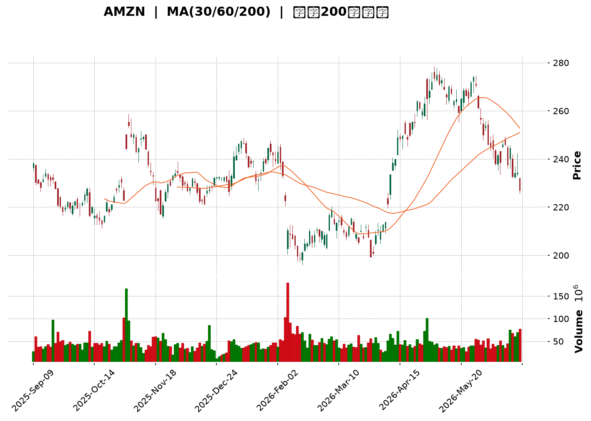
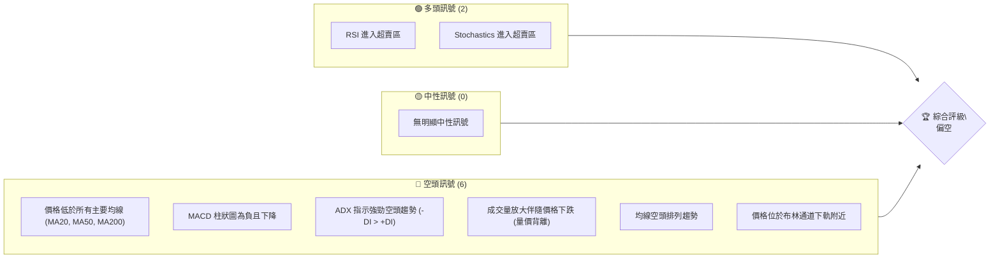
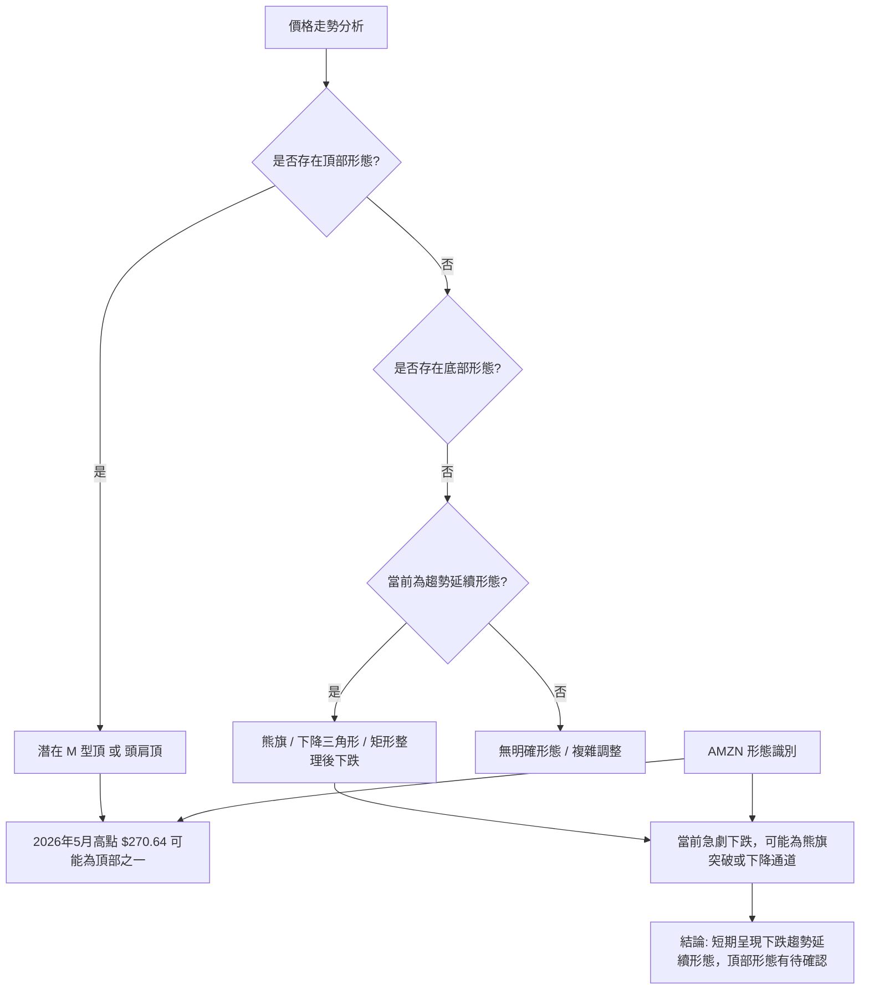
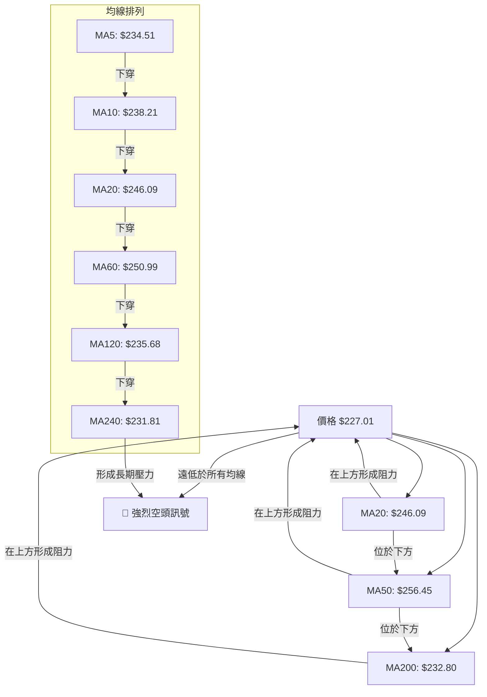
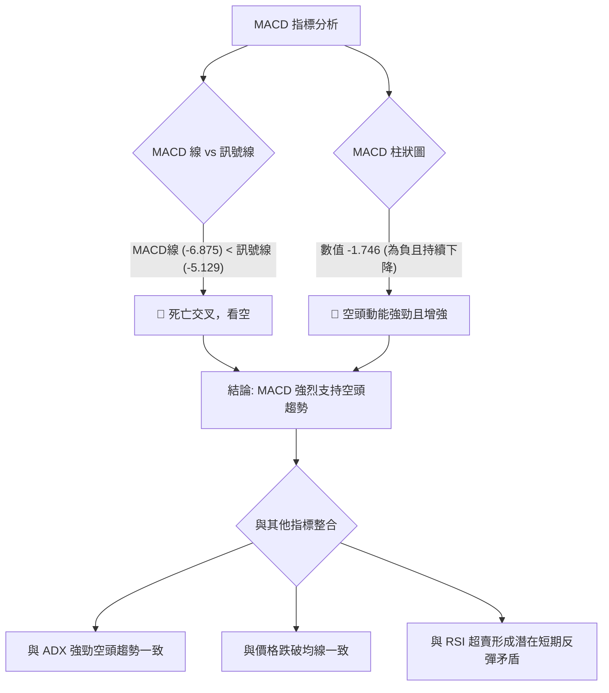
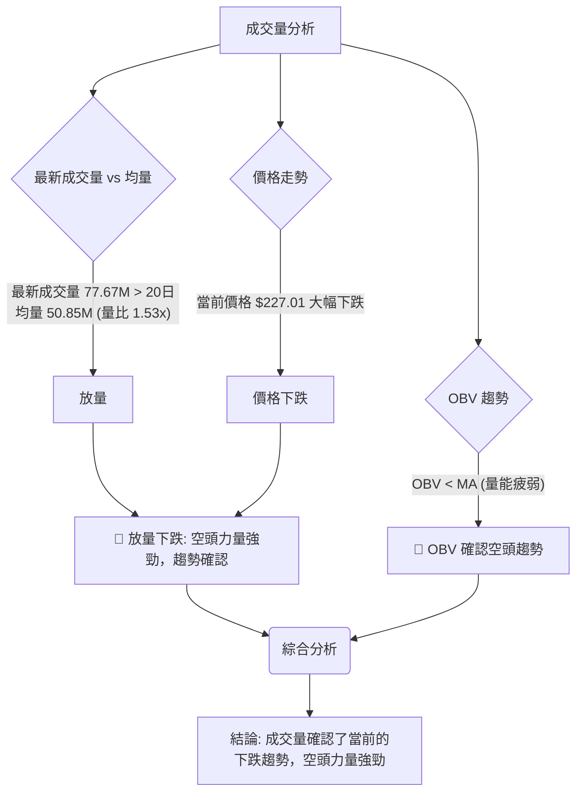

<details>
<summary>📊 靜態圖表 (點擊展開)</summary>

</details>

<html>
<head><meta charset="utf-8" /></head>
<body>
    <div style="height:500px; width:100%;">                        <script>window.PlotlyConfig = {MathJaxConfig: 'local'};</script>
        <script charset="utf-8" src="https://cdn.plot.ly/plotly-3.6.0.min.js" integrity="sha256-QaOVwtVY0T02VaHrr6pnoHLCwayMJp4O5n4YyaE3rJk=" crossorigin="anonymous"></script>                <div id="candlestick-chart" class="plotly-graph-div" style="height:100%; width:100%;"></div>            <script>                window.PLOTLYENV=window.PLOTLYENV || {};                                if (document.getElementById("candlestick-chart")) {                    Plotly.newPlot(                        "candlestick-chart",                        [{"close":{"dtype":"f8","bdata":"AAAAIK7HbUAAAABgj8psQAAAAGBmvmxAAAAAwMyEbEAAAACAwu1sQAAAAKCZQW1AAAAAANfzbEAAAAAgXOdsQAAAACBc72xAAAAAACl0bEAAAABguJZrQAAAAGC4hmtAAAAAwMxEa0AAAADA9XhrQAAAAKBwxWtAAAAAgD1ya0AAAAAAKZRrQAAAAMAezWtAAAAA4FFwa0AAAADAzJxrQAAAAMD1uGtAAAAAQAonbEAAAAAgrndsQAAAAADXC2tAAAAAgD2Ca0AAAADgegxrQAAAAIA98mpAAAAAQArPakAAAACgR6FqQAAAACBcD2tAAAAAwPXAa0AAAABgZj5rQAAAAEDhomtAAAAAYLgGbEAAAABACl9sQAAAAAAAqGxAAAAAoJnJbEAAAAAghdtrQAAAAEAKh25AAAAAAADAb0AAAACAPSpvQAAAAGBmRm9AAAAAoEdhbkAAAADAHo1uQAAAAMDMDG9AAAAAQDMjb0AAAABgZoZuQAAAAGCPsm1AAAAAgBRWbUAAAAAA1xttQAAAAKCZ0WtAAAAAgBTWa0AAAADgeiRrQAAAAIAUlmtAAAAAwPVIbEAAAACgcLVsQAAAAMAepWxAAAAAQAonbUAAAAAAKTxtQAAAAKBwTW1AAAAAACkMbUAAAAAghaNsQAAAAMD1sGxAAAAA4HpcbEAAAACgcH1sQAAAAMD1+GxAAAAAwPXIbEAAAACAFEZsQAAAAKBH0WtAAAAAgOvRa0AAAADgo6hrQAAAAOBRWGxAAAAAQDNrbEAAAACAwo1sQAAAAOB6BG1AAAAAACkMbUAAAADgoxBtQAAAAIA9Am1AAAAAwPUQbUAAAACAPdpsQAAAAAAAUGxAAAAAgOshbUAAAACAwh1uQAAAAIDrMW5AAAAAoEfJbkAAAAAAKexuQAAAAEAKz25AAAAAQDNTbkAAAADAzJRtQAAAAIDCxW1AAAAAANfjbUAAAAAAAOBsQAAAAIDr6WxAAAAAQOFKbUAAAADAHuVtQAAAAKBwzW1AAAAAgMKVbkAAAADgUWBuQAAAACBcN25AAAAAoJnpbUAAAABguF5uQAAAAADX021AAAAAIK4fbUAAAACAFNZrQAAAAIA9SmpAAAAAQAoXakAAAABguN5pQAAAAGCPgmlAAAAAQDPzaEAAAACgR9loQAAAAMDMJGlAAAAAoEeZaUAAAAAghZtpQAAAACCFQ2pAAAAA4KOoaUAAAACA6xFqQAAAAOB6VGpAAAAAoHD9aUAAAAAAAEBqQAAAAOB6DGpAAAAAIFwXakAAAACAPRprQAAAAIAUXmtAAAAAYLimakAAAAAgrq9qQAAAAGCPympAAAAAwMyUakAAAADA9TBqQAAAAKBw9WlAAAAAIK53akAAAABgZuZqQAAAAADXO2pAAAAA4FEYakAAAAAA16tpQAAAAOB6RGpAAAAAIK7naUAAAABguHZqQAAAAKBH8WlAAAAAQOHqaEAAAABgZh5pQAAAAOCjCGpAAAAAgD1SakAAAADgozhqQAAAAKBHmWpAAAAA4KO4akAAAAAAAKhrQAAAAMDMNG1AAAAAACnMbUAAAADgevxtQAAAAOCjIG9AAAAAAAAQb0AAAABgZjZvQAAAAIDrUW9AAAAAwPUIb0AAAADAHj1vQAAAACCF629AAAAAYI\u002fib0AAAAAA139wQAAAAIDrUXBAAAAAQDM7cEAAAADgo3BwQAAAAMD1kHBAAAAAACnEcEAAAADAzABxQAAAAMDMGHFAAAAAANcvcUAAAABguPJwQAAAAEDhCnFAAAAAANfPcEAAAADAHp1wQAAAAIAU4nBAAAAAIIWzcEAAAACAPYJwQAAAAIDCjXBAAAAAoHA1cEAAAAAAKZBwQAAAACBcx3BAAAAAwB6lcEAAAADgo5RwQAAAAKCZ\u002fXBAAAAAAAAgcUAAAACAPepwQAAAAAApVHBAAAAA4FEIcEAAAADgo0BvQAAAAKBHuW9AAAAAwPXAbkAAAABACqduQAAAAIAUhm5AAAAAAADAbUAAAADgUTBuQAAAAKCZ0W1AAAAA4KPAbkAAAAAAAMBuQAAAAAAAsG1AAAAA4HqMbkAAAACgRxltQAAAACCFQ21AAAAA4KNIbUAAAADgUWBsQA=="},"high":{"dtype":"f8","bdata":"AAAAQDPbbUAAAACAwrVtQAAAAMD18GxAAAAAoEfZbEAAAAAgXDdtQAAAAMDMfG1AAAAAoJlJbUAAAAAgXC9tQAAAAMAeRW1AAAAAgD3SbEAAAAAghXtsQAAAAIDrEWxAAAAAoHCVa0AAAACgmaFrQAAAAEAz02tAAAAAIK7Ha0AAAADAzMRrQAAAAIDr2WtAAAAAYGYGbEAAAAAgXLdrQAAAAOB63GtAAAAAIFxXbEAAAABguIZsQAAAAAAAiGxAAAAAgMKVa0AAAACAPWprQAAAAGC4NmtAAAAAQOFSa0AAAACgmdlqQAAAAIAUFmtAAAAAgD3qa0AAAADgUYBrQAAAAKCZqWtAAAAAwMwsbEAAAADAzIxsQAAAACCu72xAAAAAgD0abUAAAACAFI5sQAAAAAAAUG9AAAAAoJkpcEAAAAAAKRBwQAAAAAAAYG9AAAAAAClMb0AAAADAzJxuQAAAAAAAeG9AAAAAAAA4b0AAAAAA10tvQAAAAAAAeG5AAAAAIFzXbUAAAABAM1NtQAAAAGBmxmxAAAAAIK73a0AAAADAHm1sQAAAAGC4xmtAAAAAYI9qbEAAAADgo9BsQAAAAAAA+GxAAAAAoEcpbUAAAACgmXltQAAAAEAK321AAAAAACksbUAAAAAAADBtQAAAACCu52xAAAAAYI\u002fabEAAAACAPZJsQAAAAKBwDW1AAAAAIIUDbUAAAABgj8JsQAAAAIDCfWxAAAAAwB71a0AAAACAFCZsQAAAACBcp2xAAAAAACmkbEAAAAAgXK9sQAAAAGBmDm1AAAAAYGYebUAAAAAgrh9tQAAAAEAzE21AAAAA4KMYbUAAAAAgrh9tQAAAAGC4bm1AAAAAAABAbUAAAACAwmVuQAAAAKBHqW5AAAAAwB7NbkAAAAAghftuQAAAAIAUHm9AAAAAwB71bkAAAADA9ShuQAAAAMDMFG5AAAAAgD3ybUAAAABA4WJtQAAAAKCZCW1AAAAAQAp3bUAAAABgZg5uQAAAAGBmHm5AAAAAACmcbkAAAADA9fhuQAAAAAAAYG5AAAAAgD1qbkAAAAAAKbRuQAAAAEAzy25AAAAAIIXbbUAAAACA60lsQAAAAIAUbmpAAAAAgOuZakAAAADAzJRqQAAAAIA9EmpAAAAAYLh+aUAAAADAHiVpQAAAACCuN2lAAAAAIIXbaUAAAADgerRpQAAAAKBwZWpAAAAAgMINakAAAAAghUtqQAAAAEDhcmpAAAAAoJlhakAAAABgj0pqQAAAACBcN2pAAAAAgMIlakAAAACgRzFrQAAAAEAKj2tAAAAAgD0qa0AAAACAPbpqQAAAAMDM9GpAAAAAAAAga0AAAABguHZqQAAAAIDrUWpAAAAAQAqXakAAAABgZvZqQAAAAOB65GpAAAAAANcjakAAAACgR\u002fFpQAAAAKCZmWpAAAAAQDMrakAAAACAPaJqQAAAAOB6nGpAAAAAQDPTaUAAAACgmXlpQAAAAMD1SGpAAAAAYI+yakAAAABguIZqQAAAAGBmnmpAAAAAQAq\u002fakAAAABAM0NsQAAAAKCZOW1AAAAAgMINbkAAAAAAAABuQAAAAIDChW9AAAAAgBROb0AAAAAAAEBvQAAAAEDhAnBAAAAAgMJFb0AAAABA4eJvQAAAAIAU\u002fm9AAAAA4KMscEAAAAAAAIhwQAAAAGBmgnBAAAAA4HpQcEAAAABgj55wQAAAAIAUHnFAAAAAwB4VcUAAAACgmUFxQAAAAMD1aHFAAAAAwMxccUAAAACAFEpxQAAAAAAAIHFAAAAAgBQacUAAAABgZrpwQAAAACCF63BAAAAA4HrscEAAAACAwoVwQAAAAKCZzXBAAAAAAABkcEAAAACgR5lwQAAAAADX13BAAAAA4KPccEAAAADAzNRwQAAAAGCPBnFAAAAAAAAocUAAAAAAACxxQAAAAIAUqnBAAAAAQDNTcEAAAACgcBFwQAAAAGCP+m9AAAAAgBQGcEAAAACgcC1vQAAAAIDCTW9AAAAAgD2CbkAAAADgekRuQAAAACCFa25AAAAAgOv5bkAAAADgUTBvQAAAAMAevW5AAAAAIFy3bkAAAAAAAEBuQAAAAADXm21AAAAAoHBNbkAAAACAPQptQA=="},"hovertemplate":"\u003cb\u003e%{x|%Y-%m-%d}\u003c\u002fb\u003e\u003cbr\u003e\u958b: $%{open:.2f}\u003cbr\u003e\u9ad8: $%{high:.2f}\u003cbr\u003e\u4f4e: $%{low:.2f}\u003cbr\u003e\u6536: $%{close:.2f}\u003cextra\u003e\u003c\u002fextra\u003e","low":{"dtype":"f8","bdata":"AAAAYI9ibUAAAABAM6NsQAAAAEDhqmxAAAAAoEdJbEAAAACAPcpsQAAAACBcB21AAAAAYLiWbEAAAACgR5lsQAAAAGBmtmxAAAAA4FFwbEAAAACAPYJrQAAAAGBmbmtAAAAAQAoPa0AAAADgo0BrQAAAAKCZaWtAAAAA4Ho8a0AAAAAghRNrQAAAAGBmXmtAAAAAQOFqa0AAAADA9QBrQAAAAKBwhWtAAAAAgBSma0AAAAAAALhrQAAAAAAAAGtAAAAAoEcha0AAAABAM5NqQAAAAMAelWpAAAAAgOuZakAAAADA9WBqQAAAAEDhsmpAAAAAIK4\u002fa0AAAADgoxBrQAAAAIDCRWtAAAAAwMy8a0AAAACgRzFsQAAAAGC4RmxAAAAA4FF4bEAAAAAAANhrQAAAACBcf25AAAAAwMycb0AAAADAHhVvQAAAAMAexW5AAAAAoHBFbkAAAAAgrs9tQAAAAEDhsm5AAAAAIFznbkAAAAAAAHhuQAAAAAAAkG1AAAAA4HocbUAAAACAFKZsQAAAAKBwzWtAAAAA4KNQa0AAAAAgrhdrQAAAAIDC5WpAAAAA4KPIa0AAAACgmflrQAAAAOCjmGxAAAAAQArHbEAAAAAAAAhtQAAAAKCZMW1AAAAAIIXTbEAAAACgmVlsQAAAAKCZkWxAAAAA4KNIbEAAAAAghSNsQAAAAGC4jmxAAAAAgBSWbEAAAAAA1yNsQAAAAAAAsGtAAAAAACmka0AAAAAgrp9rQAAAAMAeDWxAAAAAYI8ybEAAAABguFZsQAAAACBcl2xAAAAAYI\u002fqbEAAAACAwuVsQAAAAOCj2GxAAAAAYGbGbEAAAAAA18NsQAAAAGBmFmxAAAAAgMJlbEAAAACAPQJtQAAAAOCj8G1AAAAAACk8bkAAAAAgrkduQAAAAGC4vm5AAAAAAAAIbkAAAABACodtQAAAAAAplG1AAAAAwB6NbUAAAABA4apsQAAAAAApXGxAAAAAwMzcbEAAAACAPVJtQAAAAKBHsW1AAAAAYI\u002fCbUAAAADA9TBuQAAAACCul21AAAAA4Hq0bUAAAACgcMVtQAAAAGBmbm1AAAAAgD36bEAAAAAAKYxrQAAAAIDrCWlAAAAAQDNraUAAAADAHs1pQAAAACCuT2lAAAAAgOuxaEAAAADA9ahoQAAAAAAAgGhAAAAA4FEwaUAAAACA61lpQAAAAAAAeGlAAAAAIIVjaUAAAAAAAGhpQAAAAIDCHWpAAAAAQDOraUAAAABgZqZpQAAAAGC4bmlAAAAAIFxPaUAAAADAzERqQAAAAEDh8mpAAAAAwPWQakAAAAAgheNpQAAAAIDCjWpAAAAAQDNrakAAAADAzARqQAAAAEAKx2lAAAAAYGbuaUAAAACAwo1qQAAAAGCPGmpAAAAAoJnBaUAAAACAPYppQAAAAOBRMGpAAAAA4HrUaUAAAADAzDxqQAAAAADX42lAAAAA4HrkaEAAAAAgXP9oQAAAAOB6hGlAAAAAgBQGakAAAADAzJxpQAAAAEDhMmpAAAAAYI8iakAAAAAA13NrQAAAAOCj6GtAAAAAYLhmbUAAAAAAAHhtQAAAAMD1OG5AAAAAYGbmbkAAAABgZoZuQAAAACCFQ29AAAAAANerbkAAAABAMyNvQAAAAGCPSm9AAAAAgD2ib0AAAABAChtwQAAAAKBwRXBAAAAAgBQKcEAAAABAMxtwQAAAAGCPAnBAAAAAANdrcEAAAADAzMxwQAAAAIAUBnFAAAAAIFwDcUAAAAAA1+dwQAAAAEAz33BAAAAAIK7HcEAAAACAFGpwQAAAAEAzc3BAAAAAgBSqcEAAAACAPU5wQAAAAOB6aHBAAAAAgBTmb0AAAADgejhwQAAAAIDrVXBAAAAAANejcEAAAADAHmFwQAAAAEAzm3BAAAAAQAq3cEAAAACAPdpwQAAAAEAzS3BAAAAAANfLb0AAAABguPZuQAAAAAAAeG9AAAAAwPW4bkAAAAAghWtuQAAAAMDMDG5AAAAAYGaubUAAAACAwmVtQAAAAEDhMm1AAAAAIFyXbkAAAABgZq5uQAAAAAAAgG1AAAAA4KOAbUAAAAAgrgdtQAAAAAAAAG1AAAAAYGYebUAAAACgmTFsQA=="},"name":"\u50f9\u683c","open":{"dtype":"f8","bdata":"AAAAIIWLbUAAAADgo7BtQAAAACCu72xAAAAAQDPLbEAAAAAAKdRsQAAAAIAUHm1AAAAA4KM4bUAAAAAAABBtQAAAAADXC21AAAAAgOvRbEAAAABgj3psQAAAAMDMBGxAAAAAgOuBa0AAAABgj2JrQAAAAGCPgmtAAAAAwPXAa0AAAAAghStrQAAAAOBRoGtAAAAAgBTua0AAAAAAAKBrQAAAAAApnGtAAAAAoHDda0AAAAAAACBsQAAAAGC4RmxAAAAAYGY2a0AAAACA6\u002fFqQAAAAADXE2tAAAAAoHD1akAAAACA69FqQAAAAAApvGpAAAAAgMJNa0AAAACgmWlrQAAAAAAAYGtAAAAAQAq\u002fa0AAAADAHnVsQAAAAEAKh2xAAAAAoHD1bEAAAACA62FsQAAAAEAzQ29AAAAAIIXrb0AAAAAAKUxvQAAAAMD1IG9AAAAAwB4lb0AAAADAzFxuQAAAAEDhCm9AAAAAwB4Nb0AAAAAgrkdvQAAAAKCZYW5AAAAAgOthbUAAAAAAAChtQAAAAEAzg2xAAAAAIK73a0AAAACgmWFsQAAAAEAzC2tAAAAAgOvRa0AAAAAAKUxsQAAAACCu12xAAAAAIK7nbEAAAABACidtQAAAAOBRYG1AAAAAQDMrbUAAAADgoxhtQAAAAIA9ymxAAAAAQOGybEAAAABA4VpsQAAAAIDrmWxAAAAAYLjWbEAAAAAA17tsQAAAAIDCfWxAAAAAoEfha0AAAADAHhVsQAAAAGC4NmxAAAAA4FFYbEAAAAAghZNsQAAAAIDroWxAAAAAACkEbUAAAACgRwFtQAAAAIAU\u002fmxAAAAAYLjmbEAAAADAHh1tQAAAAEDh6mxAAAAAQOGabEAAAABAMwNtQAAAACCF821AAAAAgOthbkAAAACAPZJuQAAAACBc125AAAAAwPXQbkAAAADAzCRuQAAAAIDr6W1AAAAAQOHibUAAAADgUThtQAAAAEDh4mxAAAAAoJlBbUAAAABguF5tQAAAACBc\u002f21AAAAAgBT2bUAAAAAA18tuQAAAAIA9Wm5AAAAA4Hr8bUAAAACA68ltQAAAACBcn25AAAAAIIXbbUAAAADAHh1sQAAAAGBmVmlAAAAAQAofakAAAACgmRlqQAAAAIDrAWpAAAAAYLh+aUAAAAAAKdxoQAAAAAApxGhAAAAAgD1CaUAAAACgmXlpQAAAAOBRmGlAAAAAQDMDakAAAABACq9pQAAAAGC4TmpAAAAAIFxXakAAAABgj9ppQAAAAKCZkWlAAAAAQDNjaUAAAABACk9qQAAAACBc\u002f2pAAAAAIK7fakAAAABgZk5qQAAAAIAUxmpAAAAAYLj2akAAAADgekxqQAAAACCFM2pAAAAAQDMLakAAAACAPZpqQAAAAIDCvWpAAAAAgOvhaUAAAADAzOxpQAAAAKBHOWpAAAAAYGb+aUAAAACA63FqQAAAACCFU2pAAAAAYLjOaUAAAAAgXC9pQAAAAEAzm2lAAAAAgBROakAAAACgR9FpQAAAAKCZOWpAAAAAIK5nakAAAACgR\u002flrQAAAACBcJ2xAAAAAoJlpbUAAAABgZq5tQAAAAMD1OG5AAAAAAAAob0AAAADgURBvQAAAACCu329AAAAAgBQmb0AAAABA4eJvQAAAAIAUjm9AAAAA4Hrsb0AAAAAgrj9wQAAAACBcd3BAAAAAgD0mcEAAAAAA1x9wQAAAAGC4EnFAAAAAoEeZcEAAAADAzMxwQAAAAKBHQXFAAAAAgD0OcUAAAADgUTBxQAAAAIAU+nBAAAAAoHDdcEAAAAAgXKtwQAAAAEDhhnBAAAAAYGbScEAAAAAAAGhwQAAAAIDrfXBAAAAA4KNgcEAAAADAzEBwQAAAAAAAeHBAAAAAYI\u002fKcEAAAABACr9wQAAAAGBmonBAAAAA4FEEcUAAAADgo\u002fRwQAAAAOCjpHBAAAAAYI8ScEAAAABgZtZvQAAAAADXo29AAAAA4FHIb0AAAACAwtVuQAAAACBc925AAAAAIIVzbkAAAACAwr1tQAAAAGC4Zm5AAAAA4KOgbkAAAAAAAABvQAAAAMDMnG5AAAAAANcDbkAAAABgjwJuQAAAAKCZEW1AAAAAQDM7bUAAAADgowBtQA=="},"x":["2025-09-09T00:00:00-04:00","2025-09-10T00:00:00-04:00","2025-09-11T00:00:00-04:00","2025-09-12T00:00:00-04:00","2025-09-15T00:00:00-04:00","2025-09-16T00:00:00-04:00","2025-09-17T00:00:00-04:00","2025-09-18T00:00:00-04:00","2025-09-19T00:00:00-04:00","2025-09-22T00:00:00-04:00","2025-09-23T00:00:00-04:00","2025-09-24T00:00:00-04:00","2025-09-25T00:00:00-04:00","2025-09-26T00:00:00-04:00","2025-09-29T00:00:00-04:00","2025-09-30T00:00:00-04:00","2025-10-01T00:00:00-04:00","2025-10-02T00:00:00-04:00","2025-10-03T00:00:00-04:00","2025-10-06T00:00:00-04:00","2025-10-07T00:00:00-04:00","2025-10-08T00:00:00-04:00","2025-10-09T00:00:00-04:00","2025-10-10T00:00:00-04:00","2025-10-13T00:00:00-04:00","2025-10-14T00:00:00-04:00","2025-10-15T00:00:00-04:00","2025-10-16T00:00:00-04:00","2025-10-17T00:00:00-04:00","2025-10-20T00:00:00-04:00","2025-10-21T00:00:00-04:00","2025-10-22T00:00:00-04:00","2025-10-23T00:00:00-04:00","2025-10-24T00:00:00-04:00","2025-10-27T00:00:00-04:00","2025-10-28T00:00:00-04:00","2025-10-29T00:00:00-04:00","2025-10-30T00:00:00-04:00","2025-10-31T00:00:00-04:00","2025-11-03T00:00:00-05:00","2025-11-04T00:00:00-05:00","2025-11-05T00:00:00-05:00","2025-11-06T00:00:00-05:00","2025-11-07T00:00:00-05:00","2025-11-10T00:00:00-05:00","2025-11-11T00:00:00-05:00","2025-11-12T00:00:00-05:00","2025-11-13T00:00:00-05:00","2025-11-14T00:00:00-05:00","2025-11-17T00:00:00-05:00","2025-11-18T00:00:00-05:00","2025-11-19T00:00:00-05:00","2025-11-20T00:00:00-05:00","2025-11-21T00:00:00-05:00","2025-11-24T00:00:00-05:00","2025-11-25T00:00:00-05:00","2025-11-26T00:00:00-05:00","2025-11-28T00:00:00-05:00","2025-12-01T00:00:00-05:00","2025-12-02T00:00:00-05:00","2025-12-03T00:00:00-05:00","2025-12-04T00:00:00-05:00","2025-12-05T00:00:00-05:00","2025-12-08T00:00:00-05:00","2025-12-09T00:00:00-05:00","2025-12-10T00:00:00-05:00","2025-12-11T00:00:00-05:00","2025-12-12T00:00:00-05:00","2025-12-15T00:00:00-05:00","2025-12-16T00:00:00-05:00","2025-12-17T00:00:00-05:00","2025-12-18T00:00:00-05:00","2025-12-19T00:00:00-05:00","2025-12-22T00:00:00-05:00","2025-12-23T00:00:00-05:00","2025-12-24T00:00:00-05:00","2025-12-26T00:00:00-05:00","2025-12-29T00:00:00-05:00","2025-12-30T00:00:00-05:00","2025-12-31T00:00:00-05:00","2026-01-02T00:00:00-05:00","2026-01-05T00:00:00-05:00","2026-01-06T00:00:00-05:00","2026-01-07T00:00:00-05:00","2026-01-08T00:00:00-05:00","2026-01-09T00:00:00-05:00","2026-01-12T00:00:00-05:00","2026-01-13T00:00:00-05:00","2026-01-14T00:00:00-05:00","2026-01-15T00:00:00-05:00","2026-01-16T00:00:00-05:00","2026-01-20T00:00:00-05:00","2026-01-21T00:00:00-05:00","2026-01-22T00:00:00-05:00","2026-01-23T00:00:00-05:00","2026-01-26T00:00:00-05:00","2026-01-27T00:00:00-05:00","2026-01-28T00:00:00-05:00","2026-01-29T00:00:00-05:00","2026-01-30T00:00:00-05:00","2026-02-02T00:00:00-05:00","2026-02-03T00:00:00-05:00","2026-02-04T00:00:00-05:00","2026-02-05T00:00:00-05:00","2026-02-06T00:00:00-05:00","2026-02-09T00:00:00-05:00","2026-02-10T00:00:00-05:00","2026-02-11T00:00:00-05:00","2026-02-12T00:00:00-05:00","2026-02-13T00:00:00-05:00","2026-02-17T00:00:00-05:00","2026-02-18T00:00:00-05:00","2026-02-19T00:00:00-05:00","2026-02-20T00:00:00-05:00","2026-02-23T00:00:00-05:00","2026-02-24T00:00:00-05:00","2026-02-25T00:00:00-05:00","2026-02-26T00:00:00-05:00","2026-02-27T00:00:00-05:00","2026-03-02T00:00:00-05:00","2026-03-03T00:00:00-05:00","2026-03-04T00:00:00-05:00","2026-03-05T00:00:00-05:00","2026-03-06T00:00:00-05:00","2026-03-09T00:00:00-04:00","2026-03-10T00:00:00-04:00","2026-03-11T00:00:00-04:00","2026-03-12T00:00:00-04:00","2026-03-13T00:00:00-04:00","2026-03-16T00:00:00-04:00","2026-03-17T00:00:00-04:00","2026-03-18T00:00:00-04:00","2026-03-19T00:00:00-04:00","2026-03-20T00:00:00-04:00","2026-03-23T00:00:00-04:00","2026-03-24T00:00:00-04:00","2026-03-25T00:00:00-04:00","2026-03-26T00:00:00-04:00","2026-03-27T00:00:00-04:00","2026-03-30T00:00:00-04:00","2026-03-31T00:00:00-04:00","2026-04-01T00:00:00-04:00","2026-04-02T00:00:00-04:00","2026-04-06T00:00:00-04:00","2026-04-07T00:00:00-04:00","2026-04-08T00:00:00-04:00","2026-04-09T00:00:00-04:00","2026-04-10T00:00:00-04:00","2026-04-13T00:00:00-04:00","2026-04-14T00:00:00-04:00","2026-04-15T00:00:00-04:00","2026-04-16T00:00:00-04:00","2026-04-17T00:00:00-04:00","2026-04-20T00:00:00-04:00","2026-04-21T00:00:00-04:00","2026-04-22T00:00:00-04:00","2026-04-23T00:00:00-04:00","2026-04-24T00:00:00-04:00","2026-04-27T00:00:00-04:00","2026-04-28T00:00:00-04:00","2026-04-29T00:00:00-04:00","2026-04-30T00:00:00-04:00","2026-05-01T00:00:00-04:00","2026-05-04T00:00:00-04:00","2026-05-05T00:00:00-04:00","2026-05-06T00:00:00-04:00","2026-05-07T00:00:00-04:00","2026-05-08T00:00:00-04:00","2026-05-11T00:00:00-04:00","2026-05-12T00:00:00-04:00","2026-05-13T00:00:00-04:00","2026-05-14T00:00:00-04:00","2026-05-15T00:00:00-04:00","2026-05-18T00:00:00-04:00","2026-05-19T00:00:00-04:00","2026-05-20T00:00:00-04:00","2026-05-21T00:00:00-04:00","2026-05-22T00:00:00-04:00","2026-05-26T00:00:00-04:00","2026-05-27T00:00:00-04:00","2026-05-28T00:00:00-04:00","2026-05-29T00:00:00-04:00","2026-06-01T00:00:00-04:00","2026-06-02T00:00:00-04:00","2026-06-03T00:00:00-04:00","2026-06-04T00:00:00-04:00","2026-06-05T00:00:00-04:00","2026-06-08T00:00:00-04:00","2026-06-09T00:00:00-04:00","2026-06-10T00:00:00-04:00","2026-06-11T00:00:00-04:00","2026-06-12T00:00:00-04:00","2026-06-15T00:00:00-04:00","2026-06-16T00:00:00-04:00","2026-06-17T00:00:00-04:00","2026-06-18T00:00:00-04:00","2026-06-22T00:00:00-04:00","2026-06-23T00:00:00-04:00","2026-06-24T00:00:00-04:00","2026-06-25T00:00:00-04:00"],"type":"candlestick"},{"hovertemplate":"MA30: $%{y:.2f}\u003cextra\u003e\u003c\u002fextra\u003e","line":{"color":"#2196F3","dash":"dash","width":2},"mode":"lines","name":"MA30","x":["2025-09-09T00:00:00-04:00","2025-09-10T00:00:00-04:00","2025-09-11T00:00:00-04:00","2025-09-12T00:00:00-04:00","2025-09-15T00:00:00-04:00","2025-09-16T00:00:00-04:00","2025-09-17T00:00:00-04:00","2025-09-18T00:00:00-04:00","2025-09-19T00:00:00-04:00","2025-09-22T00:00:00-04:00","2025-09-23T00:00:00-04:00","2025-09-24T00:00:00-04:00","2025-09-25T00:00:00-04:00","2025-09-26T00:00:00-04:00","2025-09-29T00:00:00-04:00","2025-09-30T00:00:00-04:00","2025-10-01T00:00:00-04:00","2025-10-02T00:00:00-04:00","2025-10-03T00:00:00-04:00","2025-10-06T00:00:00-04:00","2025-10-07T00:00:00-04:00","2025-10-08T00:00:00-04:00","2025-10-09T00:00:00-04:00","2025-10-10T00:00:00-04:00","2025-10-13T00:00:00-04:00","2025-10-14T00:00:00-04:00","2025-10-15T00:00:00-04:00","2025-10-16T00:00:00-04:00","2025-10-17T00:00:00-04:00","2025-10-20T00:00:00-04:00","2025-10-21T00:00:00-04:00","2025-10-22T00:00:00-04:00","2025-10-23T00:00:00-04:00","2025-10-24T00:00:00-04:00","2025-10-27T00:00:00-04:00","2025-10-28T00:00:00-04:00","2025-10-29T00:00:00-04:00","2025-10-30T00:00:00-04:00","2025-10-31T00:00:00-04:00","2025-11-03T00:00:00-05:00","2025-11-04T00:00:00-05:00","2025-11-05T00:00:00-05:00","2025-11-06T00:00:00-05:00","2025-11-07T00:00:00-05:00","2025-11-10T00:00:00-05:00","2025-11-11T00:00:00-05:00","2025-11-12T00:00:00-05:00","2025-11-13T00:00:00-05:00","2025-11-14T00:00:00-05:00","2025-11-17T00:00:00-05:00","2025-11-18T00:00:00-05:00","2025-11-19T00:00:00-05:00","2025-11-20T00:00:00-05:00","2025-11-21T00:00:00-05:00","2025-11-24T00:00:00-05:00","2025-11-25T00:00:00-05:00","2025-11-26T00:00:00-05:00","2025-11-28T00:00:00-05:00","2025-12-01T00:00:00-05:00","2025-12-02T00:00:00-05:00","2025-12-03T00:00:00-05:00","2025-12-04T00:00:00-05:00","2025-12-05T00:00:00-05:00","2025-12-08T00:00:00-05:00","2025-12-09T00:00:00-05:00","2025-12-10T00:00:00-05:00","2025-12-11T00:00:00-05:00","2025-12-12T00:00:00-05:00","2025-12-15T00:00:00-05:00","2025-12-16T00:00:00-05:00","2025-12-17T00:00:00-05:00","2025-12-18T00:00:00-05:00","2025-12-19T00:00:00-05:00","2025-12-22T00:00:00-05:00","2025-12-23T00:00:00-05:00","2025-12-24T00:00:00-05:00","2025-12-26T00:00:00-05:00","2025-12-29T00:00:00-05:00","2025-12-30T00:00:00-05:00","2025-12-31T00:00:00-05:00","2026-01-02T00:00:00-05:00","2026-01-05T00:00:00-05:00","2026-01-06T00:00:00-05:00","2026-01-07T00:00:00-05:00","2026-01-08T00:00:00-05:00","2026-01-09T00:00:00-05:00","2026-01-12T00:00:00-05:00","2026-01-13T00:00:00-05:00","2026-01-14T00:00:00-05:00","2026-01-15T00:00:00-05:00","2026-01-16T00:00:00-05:00","2026-01-20T00:00:00-05:00","2026-01-21T00:00:00-05:00","2026-01-22T00:00:00-05:00","2026-01-23T00:00:00-05:00","2026-01-26T00:00:00-05:00","2026-01-27T00:00:00-05:00","2026-01-28T00:00:00-05:00","2026-01-29T00:00:00-05:00","2026-01-30T00:00:00-05:00","2026-02-02T00:00:00-05:00","2026-02-03T00:00:00-05:00","2026-02-04T00:00:00-05:00","2026-02-05T00:00:00-05:00","2026-02-06T00:00:00-05:00","2026-02-09T00:00:00-05:00","2026-02-10T00:00:00-05:00","2026-02-11T00:00:00-05:00","2026-02-12T00:00:00-05:00","2026-02-13T00:00:00-05:00","2026-02-17T00:00:00-05:00","2026-02-18T00:00:00-05:00","2026-02-19T00:00:00-05:00","2026-02-20T00:00:00-05:00","2026-02-23T00:00:00-05:00","2026-02-24T00:00:00-05:00","2026-02-25T00:00:00-05:00","2026-02-26T00:00:00-05:00","2026-02-27T00:00:00-05:00","2026-03-02T00:00:00-05:00","2026-03-03T00:00:00-05:00","2026-03-04T00:00:00-05:00","2026-03-05T00:00:00-05:00","2026-03-06T00:00:00-05:00","2026-03-09T00:00:00-04:00","2026-03-10T00:00:00-04:00","2026-03-11T00:00:00-04:00","2026-03-12T00:00:00-04:00","2026-03-13T00:00:00-04:00","2026-03-16T00:00:00-04:00","2026-03-17T00:00:00-04:00","2026-03-18T00:00:00-04:00","2026-03-19T00:00:00-04:00","2026-03-20T00:00:00-04:00","2026-03-23T00:00:00-04:00","2026-03-24T00:00:00-04:00","2026-03-25T00:00:00-04:00","2026-03-26T00:00:00-04:00","2026-03-27T00:00:00-04:00","2026-03-30T00:00:00-04:00","2026-03-31T00:00:00-04:00","2026-04-01T00:00:00-04:00","2026-04-02T00:00:00-04:00","2026-04-06T00:00:00-04:00","2026-04-07T00:00:00-04:00","2026-04-08T00:00:00-04:00","2026-04-09T00:00:00-04:00","2026-04-10T00:00:00-04:00","2026-04-13T00:00:00-04:00","2026-04-14T00:00:00-04:00","2026-04-15T00:00:00-04:00","2026-04-16T00:00:00-04:00","2026-04-17T00:00:00-04:00","2026-04-20T00:00:00-04:00","2026-04-21T00:00:00-04:00","2026-04-22T00:00:00-04:00","2026-04-23T00:00:00-04:00","2026-04-24T00:00:00-04:00","2026-04-27T00:00:00-04:00","2026-04-28T00:00:00-04:00","2026-04-29T00:00:00-04:00","2026-04-30T00:00:00-04:00","2026-05-01T00:00:00-04:00","2026-05-04T00:00:00-04:00","2026-05-05T00:00:00-04:00","2026-05-06T00:00:00-04:00","2026-05-07T00:00:00-04:00","2026-05-08T00:00:00-04:00","2026-05-11T00:00:00-04:00","2026-05-12T00:00:00-04:00","2026-05-13T00:00:00-04:00","2026-05-14T00:00:00-04:00","2026-05-15T00:00:00-04:00","2026-05-18T00:00:00-04:00","2026-05-19T00:00:00-04:00","2026-05-20T00:00:00-04:00","2026-05-21T00:00:00-04:00","2026-05-22T00:00:00-04:00","2026-05-26T00:00:00-04:00","2026-05-27T00:00:00-04:00","2026-05-28T00:00:00-04:00","2026-05-29T00:00:00-04:00","2026-06-01T00:00:00-04:00","2026-06-02T00:00:00-04:00","2026-06-03T00:00:00-04:00","2026-06-04T00:00:00-04:00","2026-06-05T00:00:00-04:00","2026-06-08T00:00:00-04:00","2026-06-09T00:00:00-04:00","2026-06-10T00:00:00-04:00","2026-06-11T00:00:00-04:00","2026-06-12T00:00:00-04:00","2026-06-15T00:00:00-04:00","2026-06-16T00:00:00-04:00","2026-06-17T00:00:00-04:00","2026-06-18T00:00:00-04:00","2026-06-22T00:00:00-04:00","2026-06-23T00:00:00-04:00","2026-06-24T00:00:00-04:00","2026-06-25T00:00:00-04:00"],"y":{"dtype":"f8","bdata":"AAAAAAAA+H8AAAAAAAD4fwAAAAAAAPh\u002fAAAAAAAA+H8AAAAAAAD4fwAAAAAAAPh\u002fAAAAAAAA+H8AAAAAAAD4fwAAAAAAAPh\u002fAAAAAAAA+H8AAAAAAAD4fwAAAAAAAPh\u002fAAAAAAAA+H8AAAAAAAD4fwAAAAAAAPh\u002fAAAAAAAA+H8AAAAAAAD4fwAAAAAAAPh\u002fAAAAAAAA+H8AAAAAAAD4fwAAAAAAAPh\u002fAAAAAAAA+H8AAAAAAAD4fwAAAAAAAPh\u002fAAAAAAAA+H8AAAAAAAD4fwAAAAAAAPh\u002fAAAAAAAA+H8AAAAAAAD4f1VVVXVM8GtAvLu7CwLfa0Crqqp6zdFrQLy7uxtayGtAq6qqOibEa0CrqqpaZL9rQCIiIqJFumtAAAAAMN24a0Dv7u6e769rQN7d3X2GvWtAIiIiQqfZa0AiIiKyK\u002fhrQGZmZvYoGGxAd3d3l7UybECamZk5+0xsQDMzM8P1aGxAvLu7a3WIbECamZmZmaFsQFVVVQXIsWxAzczMLPnBbECJiIjIvc5sQLy7uwuQz2xAAAAAMN3MbEDe3d2tjsFsQERERFQqxmxAIiIiEsrMbEBVVVVl9NpsQO\u002fu7l5z6WxA7+7uXnP9bEBVVVUVrhNtQGZmZubQJm1AREREJNsxbUARERGRwj1tQAAAAEDDRm1AEREREZ9JbUCrqqp6okptQGZmZlZVTW1AAAAA4E9NbUAAAAAw3VBtQJqZmRm9OW1AIiIi4jMYbUDNzMxcSPpsQN7d3a1H4WxARERERIvQbECJiIiof79sQImIiJgnrmxAvLu761GcbEARERGB3I9sQImIiOj7iWxAVVVVFa6HbEDNzMxMfoVsQJqZmem0iWxAzczMnMSUbEDe3d3dJK5sQERERMRnxGxARERE1L\u002fZbEB3d3fXo+xsQAAAAKAa\u002f2xA3t3d\u002fRsJbUAiIiJiEAxtQM3MzBwTEG1ARERElEMXbUDNzMysRxltQLy7u7stG21AREREFCAjbUCamZlZHS9tQDMzM4MyNm1AvLu7q45FbUBmZmamf1dtQM3MzMz3a21AAAAA8NJ9bUARERHB9ZRtQDMzM1OcoW1AvLu7a6CnbUBVVVUFgaFtQFVVVbU6im1AMzMz8\u002f1wbUDe3d1dulVtQKuqqjrfN21AVVVVJb8UbUARERHRlPJsQDMzM5OK12xAq6qq+mK5bEB3d3d36ZJsQFVVVYVdcWxAREREVJxFbEARERHhMxxsQGZmZub79WtAIiIi8v3Qa0CJiIi4kLRrQBERERHKlGtAIiIikl90a0DNzMx8P2VrQHd3d6cNWGtAIiIiwoNBa0AzMzMjIiZrQGZmZvZvDGtAMzMzo0XqakDe3d1dj8ZqQHd3d7c6ompAAAAAANWEakCrqqqqOGdqQAAAAACOSGpAd3d3l7UuakAzMzMTPBxqQLy7u+sKHGpAiYiIyHYaakCamZnZhx9qQImIiKg4I2pAiYiIqPEiakC8u7t7PyVqQImIiLjXLGpAzczMDAIzakDv7u7OPjhqQAAAAKAaO2pAERERsStEakCJiIjotFFqQLy7uytAampAiYiIyL2KakDv7u6+n6pqQCIiInL21WpA7+7uTmIAa0DNzMy8dCNrQKuqqhovRWtAzczMjJdqa0AzMzOjcJFrQAAAAJA0vWtAiYiIyHbqa0De3d39jSRsQHd3d2eRXWxA7+7urrmQbEAiIiIywcNsQO\u002fu7r6f\u002fmxAd3d3Nxc+bUDNzMxMN4VtQERERHTayG1Ad3d3tx4RbkAzMzNDi1BuQDMzM9MGlm5Aq6qq6lHgbkARERHBgyVvQImIiKh\u002fZ29AIiIi4uyjb0BVVVWF691vQM3MzAy7CnBAd3d33wgjcECrqqqSXzpwQEREREzwTHBAIiIiCtdbcEDNzMz8YmlwQDMzMwuQdXBAzczMpCmDcEB3d3enVI5wQAAAAJAJlHBAiYiImG6YcEBVVVWdfZhwQJqZmUGnl3BAERERodOScEBmZmbm0IhwQERERGTJf3BA3t3dnTZ0cEBVVVUNu2hwQN7d3Y2XWnBAVVVVDbtOcEBERERc1kBwQN7d3VWcLXBAq6qqakodcEC8u7tD0ghwQJqZmVmA6G9Aq6qqenfDb0AiIiLCEZpvQA=="},"type":"scatter"},{"hovertemplate":"MA60: $%{y:.2f}\u003cextra\u003e\u003c\u002fextra\u003e","line":{"color":"#9C27B0","dash":"dash","width":2},"mode":"lines","name":"MA60","x":["2025-09-09T00:00:00-04:00","2025-09-10T00:00:00-04:00","2025-09-11T00:00:00-04:00","2025-09-12T00:00:00-04:00","2025-09-15T00:00:00-04:00","2025-09-16T00:00:00-04:00","2025-09-17T00:00:00-04:00","2025-09-18T00:00:00-04:00","2025-09-19T00:00:00-04:00","2025-09-22T00:00:00-04:00","2025-09-23T00:00:00-04:00","2025-09-24T00:00:00-04:00","2025-09-25T00:00:00-04:00","2025-09-26T00:00:00-04:00","2025-09-29T00:00:00-04:00","2025-09-30T00:00:00-04:00","2025-10-01T00:00:00-04:00","2025-10-02T00:00:00-04:00","2025-10-03T00:00:00-04:00","2025-10-06T00:00:00-04:00","2025-10-07T00:00:00-04:00","2025-10-08T00:00:00-04:00","2025-10-09T00:00:00-04:00","2025-10-10T00:00:00-04:00","2025-10-13T00:00:00-04:00","2025-10-14T00:00:00-04:00","2025-10-15T00:00:00-04:00","2025-10-16T00:00:00-04:00","2025-10-17T00:00:00-04:00","2025-10-20T00:00:00-04:00","2025-10-21T00:00:00-04:00","2025-10-22T00:00:00-04:00","2025-10-23T00:00:00-04:00","2025-10-24T00:00:00-04:00","2025-10-27T00:00:00-04:00","2025-10-28T00:00:00-04:00","2025-10-29T00:00:00-04:00","2025-10-30T00:00:00-04:00","2025-10-31T00:00:00-04:00","2025-11-03T00:00:00-05:00","2025-11-04T00:00:00-05:00","2025-11-05T00:00:00-05:00","2025-11-06T00:00:00-05:00","2025-11-07T00:00:00-05:00","2025-11-10T00:00:00-05:00","2025-11-11T00:00:00-05:00","2025-11-12T00:00:00-05:00","2025-11-13T00:00:00-05:00","2025-11-14T00:00:00-05:00","2025-11-17T00:00:00-05:00","2025-11-18T00:00:00-05:00","2025-11-19T00:00:00-05:00","2025-11-20T00:00:00-05:00","2025-11-21T00:00:00-05:00","2025-11-24T00:00:00-05:00","2025-11-25T00:00:00-05:00","2025-11-26T00:00:00-05:00","2025-11-28T00:00:00-05:00","2025-12-01T00:00:00-05:00","2025-12-02T00:00:00-05:00","2025-12-03T00:00:00-05:00","2025-12-04T00:00:00-05:00","2025-12-05T00:00:00-05:00","2025-12-08T00:00:00-05:00","2025-12-09T00:00:00-05:00","2025-12-10T00:00:00-05:00","2025-12-11T00:00:00-05:00","2025-12-12T00:00:00-05:00","2025-12-15T00:00:00-05:00","2025-12-16T00:00:00-05:00","2025-12-17T00:00:00-05:00","2025-12-18T00:00:00-05:00","2025-12-19T00:00:00-05:00","2025-12-22T00:00:00-05:00","2025-12-23T00:00:00-05:00","2025-12-24T00:00:00-05:00","2025-12-26T00:00:00-05:00","2025-12-29T00:00:00-05:00","2025-12-30T00:00:00-05:00","2025-12-31T00:00:00-05:00","2026-01-02T00:00:00-05:00","2026-01-05T00:00:00-05:00","2026-01-06T00:00:00-05:00","2026-01-07T00:00:00-05:00","2026-01-08T00:00:00-05:00","2026-01-09T00:00:00-05:00","2026-01-12T00:00:00-05:00","2026-01-13T00:00:00-05:00","2026-01-14T00:00:00-05:00","2026-01-15T00:00:00-05:00","2026-01-16T00:00:00-05:00","2026-01-20T00:00:00-05:00","2026-01-21T00:00:00-05:00","2026-01-22T00:00:00-05:00","2026-01-23T00:00:00-05:00","2026-01-26T00:00:00-05:00","2026-01-27T00:00:00-05:00","2026-01-28T00:00:00-05:00","2026-01-29T00:00:00-05:00","2026-01-30T00:00:00-05:00","2026-02-02T00:00:00-05:00","2026-02-03T00:00:00-05:00","2026-02-04T00:00:00-05:00","2026-02-05T00:00:00-05:00","2026-02-06T00:00:00-05:00","2026-02-09T00:00:00-05:00","2026-02-10T00:00:00-05:00","2026-02-11T00:00:00-05:00","2026-02-12T00:00:00-05:00","2026-02-13T00:00:00-05:00","2026-02-17T00:00:00-05:00","2026-02-18T00:00:00-05:00","2026-02-19T00:00:00-05:00","2026-02-20T00:00:00-05:00","2026-02-23T00:00:00-05:00","2026-02-24T00:00:00-05:00","2026-02-25T00:00:00-05:00","2026-02-26T00:00:00-05:00","2026-02-27T00:00:00-05:00","2026-03-02T00:00:00-05:00","2026-03-03T00:00:00-05:00","2026-03-04T00:00:00-05:00","2026-03-05T00:00:00-05:00","2026-03-06T00:00:00-05:00","2026-03-09T00:00:00-04:00","2026-03-10T00:00:00-04:00","2026-03-11T00:00:00-04:00","2026-03-12T00:00:00-04:00","2026-03-13T00:00:00-04:00","2026-03-16T00:00:00-04:00","2026-03-17T00:00:00-04:00","2026-03-18T00:00:00-04:00","2026-03-19T00:00:00-04:00","2026-03-20T00:00:00-04:00","2026-03-23T00:00:00-04:00","2026-03-24T00:00:00-04:00","2026-03-25T00:00:00-04:00","2026-03-26T00:00:00-04:00","2026-03-27T00:00:00-04:00","2026-03-30T00:00:00-04:00","2026-03-31T00:00:00-04:00","2026-04-01T00:00:00-04:00","2026-04-02T00:00:00-04:00","2026-04-06T00:00:00-04:00","2026-04-07T00:00:00-04:00","2026-04-08T00:00:00-04:00","2026-04-09T00:00:00-04:00","2026-04-10T00:00:00-04:00","2026-04-13T00:00:00-04:00","2026-04-14T00:00:00-04:00","2026-04-15T00:00:00-04:00","2026-04-16T00:00:00-04:00","2026-04-17T00:00:00-04:00","2026-04-20T00:00:00-04:00","2026-04-21T00:00:00-04:00","2026-04-22T00:00:00-04:00","2026-04-23T00:00:00-04:00","2026-04-24T00:00:00-04:00","2026-04-27T00:00:00-04:00","2026-04-28T00:00:00-04:00","2026-04-29T00:00:00-04:00","2026-04-30T00:00:00-04:00","2026-05-01T00:00:00-04:00","2026-05-04T00:00:00-04:00","2026-05-05T00:00:00-04:00","2026-05-06T00:00:00-04:00","2026-05-07T00:00:00-04:00","2026-05-08T00:00:00-04:00","2026-05-11T00:00:00-04:00","2026-05-12T00:00:00-04:00","2026-05-13T00:00:00-04:00","2026-05-14T00:00:00-04:00","2026-05-15T00:00:00-04:00","2026-05-18T00:00:00-04:00","2026-05-19T00:00:00-04:00","2026-05-20T00:00:00-04:00","2026-05-21T00:00:00-04:00","2026-05-22T00:00:00-04:00","2026-05-26T00:00:00-04:00","2026-05-27T00:00:00-04:00","2026-05-28T00:00:00-04:00","2026-05-29T00:00:00-04:00","2026-06-01T00:00:00-04:00","2026-06-02T00:00:00-04:00","2026-06-03T00:00:00-04:00","2026-06-04T00:00:00-04:00","2026-06-05T00:00:00-04:00","2026-06-08T00:00:00-04:00","2026-06-09T00:00:00-04:00","2026-06-10T00:00:00-04:00","2026-06-11T00:00:00-04:00","2026-06-12T00:00:00-04:00","2026-06-15T00:00:00-04:00","2026-06-16T00:00:00-04:00","2026-06-17T00:00:00-04:00","2026-06-18T00:00:00-04:00","2026-06-22T00:00:00-04:00","2026-06-23T00:00:00-04:00","2026-06-24T00:00:00-04:00","2026-06-25T00:00:00-04:00"],"y":{"dtype":"f8","bdata":"AAAAAAAA+H8AAAAAAAD4fwAAAAAAAPh\u002fAAAAAAAA+H8AAAAAAAD4fwAAAAAAAPh\u002fAAAAAAAA+H8AAAAAAAD4fwAAAAAAAPh\u002fAAAAAAAA+H8AAAAAAAD4fwAAAAAAAPh\u002fAAAAAAAA+H8AAAAAAAD4fwAAAAAAAPh\u002fAAAAAAAA+H8AAAAAAAD4fwAAAAAAAPh\u002fAAAAAAAA+H8AAAAAAAD4fwAAAAAAAPh\u002fAAAAAAAA+H8AAAAAAAD4fwAAAAAAAPh\u002fAAAAAAAA+H8AAAAAAAD4fwAAAAAAAPh\u002fAAAAAAAA+H8AAAAAAAD4fwAAAAAAAPh\u002fAAAAAAAA+H8AAAAAAAD4fwAAAAAAAPh\u002fAAAAAAAA+H8AAAAAAAD4fwAAAAAAAPh\u002fAAAAAAAA+H8AAAAAAAD4fwAAAAAAAPh\u002fAAAAAAAA+H8AAAAAAAD4fwAAAAAAAPh\u002fAAAAAAAA+H8AAAAAAAD4fwAAAAAAAPh\u002fAAAAAAAA+H8AAAAAAAD4fwAAAAAAAPh\u002fAAAAAAAA+H8AAAAAAAD4fwAAAAAAAPh\u002fAAAAAAAA+H8AAAAAAAD4fwAAAAAAAPh\u002fAAAAAAAA+H8AAAAAAAD4fwAAAAAAAPh\u002fAAAAAAAA+H8AAAAAAAD4f97d3a2Oi2xAAAAAmG6IbEDe3d0FyIdsQN7d3a2Oh2xA3t3dpeKGbECrqqpqA4VsQERERHzNg2xAAAAAiBaDbEB3d3dnZoBsQLy7u8uhe2xAIiIiku14bEB3d3cHOnlsQCIiIlK4fGxA3t3dbaCBbEARERFxPYZsQN7d3a2Oi2xAvLu7q2OSbEBVVVUNu5hsQO\u002fu7vbhnWxAERERodOkbECrqqoKHqpsQKuqqnqirGxAZmZm5tCwbEDe3d3F2bdsQERERAxJxWxAMzMz80TTbEBmZmYezONsQHd3d\u002f9G9GxAZmZmrkcDbUC8u7s73w9tQJqZmQFyG21AREREXI8kbUDv7u4ehSttQN7d3X34MG1Aq6qqkl82bUAiIiLq3zxtQM3MzOzDQW1A3t3dRW9JbUAzMzNrLlRtQDMzM3PaUm1AERERaQNLbUDv7u4On0dtQImIiAByQW1AAAAA2BU8bUDv7u5WgDBtQO\u002fu7iYxHG1Ad3d376cGbUB3d3dvy\u002fJsQJqZmZHt4GxAVVVVnTbObEDv7u6OCbxsQGZmZr6fsGxAvLu7yxOnbECrqqoqh6BsQM3MzKTimmxAREREFK6PbEBERETca4RsQDMzM0OLemxAAAAA+AxtbEBVVVWNUGBsQO\u002fu7pZuUmxAMzMzk9FFbEDNzMyUQz9sQJqZmbGdOWxAMzMz61EybEBmZma+nypsQM3MzDxRIWxAd3d3J+oXbEAiIiKCBw9sQCIiIkIZB2xAAAAA+FMBbEDe3d01F\u002f5rQJqZmSkV9WtAmpmZASvra0BERESM3t5rQImIiNAi02tA3t3dXbrFa0C8u7sbobprQJqZmfGLrWtA7+7uZtiba0BmZmYm6otrQN7d3SUxgmtAvLu7gzJ2a0AzMzMjlGVrQKuqqhI8VmtAq6qqAuREa0DNzMxk9DZrQBEREQkeMGtAVVVV3d0ta0C8u7s7mC9rQJqZmUFgNWtAiYiI8GA6a0DNzMwcWkRrQBEREWGeTmtAd3d3pw1Wa0AzMzNjyVtrQDMzM0PSZGtA3t3dNV5qa0De3d2tjnVrQHd3dw\u002fmf2tAd3d3V8eKa0BmZmbufJVrQHd3d9+Wo2tAd3d3Z2a2a0AAAACwudBrQAAAALBy8mtAAAAAwMoVbEBmZmaOCThsQN7d3b2fXGxAmpmZyaGBbEBmZmaeYaVsQImIiLArymxAd3d3d3frbEAiIiIqFQttQM3MzFxIKG1AAAAAuB5FbUDv7u4GOmNtQCIiImIQgm1AZmZm7jWhbUBERETcsr5tQERERESL4G1AREREzFoDbkDe3d0FDyBuQFVVVR2hNm5A7+7uXrpNbkDv7u7uNWFuQJqZmYlBdm5AVVVVBQ+IbkBVVVXlF5tuQAAAABiSrm5AVVVVdZO8bkBmZmamm8puQFVVVW3n2W5AERERqcbtbkCrqqoCcgNvQAAAAJAJEm9AZmZmxtklb0BVVVXlFzFvQGZmZpZDP29Aq6qqsuRRb0CamZnByl9vQA=="},"type":"scatter"},{"hovertemplate":"MA200: $%{y:.2f}\u003cextra\u003e\u003c\u002fextra\u003e","line":{"color":"#FF6F00","dash":"solid","width":2},"mode":"lines","name":"MA200","x":["2025-09-09T00:00:00-04:00","2025-09-10T00:00:00-04:00","2025-09-11T00:00:00-04:00","2025-09-12T00:00:00-04:00","2025-09-15T00:00:00-04:00","2025-09-16T00:00:00-04:00","2025-09-17T00:00:00-04:00","2025-09-18T00:00:00-04:00","2025-09-19T00:00:00-04:00","2025-09-22T00:00:00-04:00","2025-09-23T00:00:00-04:00","2025-09-24T00:00:00-04:00","2025-09-25T00:00:00-04:00","2025-09-26T00:00:00-04:00","2025-09-29T00:00:00-04:00","2025-09-30T00:00:00-04:00","2025-10-01T00:00:00-04:00","2025-10-02T00:00:00-04:00","2025-10-03T00:00:00-04:00","2025-10-06T00:00:00-04:00","2025-10-07T00:00:00-04:00","2025-10-08T00:00:00-04:00","2025-10-09T00:00:00-04:00","2025-10-10T00:00:00-04:00","2025-10-13T00:00:00-04:00","2025-10-14T00:00:00-04:00","2025-10-15T00:00:00-04:00","2025-10-16T00:00:00-04:00","2025-10-17T00:00:00-04:00","2025-10-20T00:00:00-04:00","2025-10-21T00:00:00-04:00","2025-10-22T00:00:00-04:00","2025-10-23T00:00:00-04:00","2025-10-24T00:00:00-04:00","2025-10-27T00:00:00-04:00","2025-10-28T00:00:00-04:00","2025-10-29T00:00:00-04:00","2025-10-30T00:00:00-04:00","2025-10-31T00:00:00-04:00","2025-11-03T00:00:00-05:00","2025-11-04T00:00:00-05:00","2025-11-05T00:00:00-05:00","2025-11-06T00:00:00-05:00","2025-11-07T00:00:00-05:00","2025-11-10T00:00:00-05:00","2025-11-11T00:00:00-05:00","2025-11-12T00:00:00-05:00","2025-11-13T00:00:00-05:00","2025-11-14T00:00:00-05:00","2025-11-17T00:00:00-05:00","2025-11-18T00:00:00-05:00","2025-11-19T00:00:00-05:00","2025-11-20T00:00:00-05:00","2025-11-21T00:00:00-05:00","2025-11-24T00:00:00-05:00","2025-11-25T00:00:00-05:00","2025-11-26T00:00:00-05:00","2025-11-28T00:00:00-05:00","2025-12-01T00:00:00-05:00","2025-12-02T00:00:00-05:00","2025-12-03T00:00:00-05:00","2025-12-04T00:00:00-05:00","2025-12-05T00:00:00-05:00","2025-12-08T00:00:00-05:00","2025-12-09T00:00:00-05:00","2025-12-10T00:00:00-05:00","2025-12-11T00:00:00-05:00","2025-12-12T00:00:00-05:00","2025-12-15T00:00:00-05:00","2025-12-16T00:00:00-05:00","2025-12-17T00:00:00-05:00","2025-12-18T00:00:00-05:00","2025-12-19T00:00:00-05:00","2025-12-22T00:00:00-05:00","2025-12-23T00:00:00-05:00","2025-12-24T00:00:00-05:00","2025-12-26T00:00:00-05:00","2025-12-29T00:00:00-05:00","2025-12-30T00:00:00-05:00","2025-12-31T00:00:00-05:00","2026-01-02T00:00:00-05:00","2026-01-05T00:00:00-05:00","2026-01-06T00:00:00-05:00","2026-01-07T00:00:00-05:00","2026-01-08T00:00:00-05:00","2026-01-09T00:00:00-05:00","2026-01-12T00:00:00-05:00","2026-01-13T00:00:00-05:00","2026-01-14T00:00:00-05:00","2026-01-15T00:00:00-05:00","2026-01-16T00:00:00-05:00","2026-01-20T00:00:00-05:00","2026-01-21T00:00:00-05:00","2026-01-22T00:00:00-05:00","2026-01-23T00:00:00-05:00","2026-01-26T00:00:00-05:00","2026-01-27T00:00:00-05:00","2026-01-28T00:00:00-05:00","2026-01-29T00:00:00-05:00","2026-01-30T00:00:00-05:00","2026-02-02T00:00:00-05:00","2026-02-03T00:00:00-05:00","2026-02-04T00:00:00-05:00","2026-02-05T00:00:00-05:00","2026-02-06T00:00:00-05:00","2026-02-09T00:00:00-05:00","2026-02-10T00:00:00-05:00","2026-02-11T00:00:00-05:00","2026-02-12T00:00:00-05:00","2026-02-13T00:00:00-05:00","2026-02-17T00:00:00-05:00","2026-02-18T00:00:00-05:00","2026-02-19T00:00:00-05:00","2026-02-20T00:00:00-05:00","2026-02-23T00:00:00-05:00","2026-02-24T00:00:00-05:00","2026-02-25T00:00:00-05:00","2026-02-26T00:00:00-05:00","2026-02-27T00:00:00-05:00","2026-03-02T00:00:00-05:00","2026-03-03T00:00:00-05:00","2026-03-04T00:00:00-05:00","2026-03-05T00:00:00-05:00","2026-03-06T00:00:00-05:00","2026-03-09T00:00:00-04:00","2026-03-10T00:00:00-04:00","2026-03-11T00:00:00-04:00","2026-03-12T00:00:00-04:00","2026-03-13T00:00:00-04:00","2026-03-16T00:00:00-04:00","2026-03-17T00:00:00-04:00","2026-03-18T00:00:00-04:00","2026-03-19T00:00:00-04:00","2026-03-20T00:00:00-04:00","2026-03-23T00:00:00-04:00","2026-03-24T00:00:00-04:00","2026-03-25T00:00:00-04:00","2026-03-26T00:00:00-04:00","2026-03-27T00:00:00-04:00","2026-03-30T00:00:00-04:00","2026-03-31T00:00:00-04:00","2026-04-01T00:00:00-04:00","2026-04-02T00:00:00-04:00","2026-04-06T00:00:00-04:00","2026-04-07T00:00:00-04:00","2026-04-08T00:00:00-04:00","2026-04-09T00:00:00-04:00","2026-04-10T00:00:00-04:00","2026-04-13T00:00:00-04:00","2026-04-14T00:00:00-04:00","2026-04-15T00:00:00-04:00","2026-04-16T00:00:00-04:00","2026-04-17T00:00:00-04:00","2026-04-20T00:00:00-04:00","2026-04-21T00:00:00-04:00","2026-04-22T00:00:00-04:00","2026-04-23T00:00:00-04:00","2026-04-24T00:00:00-04:00","2026-04-27T00:00:00-04:00","2026-04-28T00:00:00-04:00","2026-04-29T00:00:00-04:00","2026-04-30T00:00:00-04:00","2026-05-01T00:00:00-04:00","2026-05-04T00:00:00-04:00","2026-05-05T00:00:00-04:00","2026-05-06T00:00:00-04:00","2026-05-07T00:00:00-04:00","2026-05-08T00:00:00-04:00","2026-05-11T00:00:00-04:00","2026-05-12T00:00:00-04:00","2026-05-13T00:00:00-04:00","2026-05-14T00:00:00-04:00","2026-05-15T00:00:00-04:00","2026-05-18T00:00:00-04:00","2026-05-19T00:00:00-04:00","2026-05-20T00:00:00-04:00","2026-05-21T00:00:00-04:00","2026-05-22T00:00:00-04:00","2026-05-26T00:00:00-04:00","2026-05-27T00:00:00-04:00","2026-05-28T00:00:00-04:00","2026-05-29T00:00:00-04:00","2026-06-01T00:00:00-04:00","2026-06-02T00:00:00-04:00","2026-06-03T00:00:00-04:00","2026-06-04T00:00:00-04:00","2026-06-05T00:00:00-04:00","2026-06-08T00:00:00-04:00","2026-06-09T00:00:00-04:00","2026-06-10T00:00:00-04:00","2026-06-11T00:00:00-04:00","2026-06-12T00:00:00-04:00","2026-06-15T00:00:00-04:00","2026-06-16T00:00:00-04:00","2026-06-17T00:00:00-04:00","2026-06-18T00:00:00-04:00","2026-06-22T00:00:00-04:00","2026-06-23T00:00:00-04:00","2026-06-24T00:00:00-04:00","2026-06-25T00:00:00-04:00"],"y":{"dtype":"f8","bdata":"AAAAAAAA+H8AAAAAAAD4fwAAAAAAAPh\u002fAAAAAAAA+H8AAAAAAAD4fwAAAAAAAPh\u002fAAAAAAAA+H8AAAAAAAD4fwAAAAAAAPh\u002fAAAAAAAA+H8AAAAAAAD4fwAAAAAAAPh\u002fAAAAAAAA+H8AAAAAAAD4fwAAAAAAAPh\u002fAAAAAAAA+H8AAAAAAAD4fwAAAAAAAPh\u002fAAAAAAAA+H8AAAAAAAD4fwAAAAAAAPh\u002fAAAAAAAA+H8AAAAAAAD4fwAAAAAAAPh\u002fAAAAAAAA+H8AAAAAAAD4fwAAAAAAAPh\u002fAAAAAAAA+H8AAAAAAAD4fwAAAAAAAPh\u002fAAAAAAAA+H8AAAAAAAD4fwAAAAAAAPh\u002fAAAAAAAA+H8AAAAAAAD4fwAAAAAAAPh\u002fAAAAAAAA+H8AAAAAAAD4fwAAAAAAAPh\u002fAAAAAAAA+H8AAAAAAAD4fwAAAAAAAPh\u002fAAAAAAAA+H8AAAAAAAD4fwAAAAAAAPh\u002fAAAAAAAA+H8AAAAAAAD4fwAAAAAAAPh\u002fAAAAAAAA+H8AAAAAAAD4fwAAAAAAAPh\u002fAAAAAAAA+H8AAAAAAAD4fwAAAAAAAPh\u002fAAAAAAAA+H8AAAAAAAD4fwAAAAAAAPh\u002fAAAAAAAA+H8AAAAAAAD4fwAAAAAAAPh\u002fAAAAAAAA+H8AAAAAAAD4fwAAAAAAAPh\u002fAAAAAAAA+H8AAAAAAAD4fwAAAAAAAPh\u002fAAAAAAAA+H8AAAAAAAD4fwAAAAAAAPh\u002fAAAAAAAA+H8AAAAAAAD4fwAAAAAAAPh\u002fAAAAAAAA+H8AAAAAAAD4fwAAAAAAAPh\u002fAAAAAAAA+H8AAAAAAAD4fwAAAAAAAPh\u002fAAAAAAAA+H8AAAAAAAD4fwAAAAAAAPh\u002fAAAAAAAA+H8AAAAAAAD4fwAAAAAAAPh\u002fAAAAAAAA+H8AAAAAAAD4fwAAAAAAAPh\u002fAAAAAAAA+H8AAAAAAAD4fwAAAAAAAPh\u002fAAAAAAAA+H8AAAAAAAD4fwAAAAAAAPh\u002fAAAAAAAA+H8AAAAAAAD4fwAAAAAAAPh\u002fAAAAAAAA+H8AAAAAAAD4fwAAAAAAAPh\u002fAAAAAAAA+H8AAAAAAAD4fwAAAAAAAPh\u002fAAAAAAAA+H8AAAAAAAD4fwAAAAAAAPh\u002fAAAAAAAA+H8AAAAAAAD4fwAAAAAAAPh\u002fAAAAAAAA+H8AAAAAAAD4fwAAAAAAAPh\u002fAAAAAAAA+H8AAAAAAAD4fwAAAAAAAPh\u002fAAAAAAAA+H8AAAAAAAD4fwAAAAAAAPh\u002fAAAAAAAA+H8AAAAAAAD4fwAAAAAAAPh\u002fAAAAAAAA+H8AAAAAAAD4fwAAAAAAAPh\u002fAAAAAAAA+H8AAAAAAAD4fwAAAAAAAPh\u002fAAAAAAAA+H8AAAAAAAD4fwAAAAAAAPh\u002fAAAAAAAA+H8AAAAAAAD4fwAAAAAAAPh\u002fAAAAAAAA+H8AAAAAAAD4fwAAAAAAAPh\u002fAAAAAAAA+H8AAAAAAAD4fwAAAAAAAPh\u002fAAAAAAAA+H8AAAAAAAD4fwAAAAAAAPh\u002fAAAAAAAA+H8AAAAAAAD4fwAAAAAAAPh\u002fAAAAAAAA+H8AAAAAAAD4fwAAAAAAAPh\u002fAAAAAAAA+H8AAAAAAAD4fwAAAAAAAPh\u002fAAAAAAAA+H8AAAAAAAD4fwAAAAAAAPh\u002fAAAAAAAA+H8AAAAAAAD4fwAAAAAAAPh\u002fAAAAAAAA+H8AAAAAAAD4fwAAAAAAAPh\u002fAAAAAAAA+H8AAAAAAAD4fwAAAAAAAPh\u002fAAAAAAAA+H8AAAAAAAD4fwAAAAAAAPh\u002fAAAAAAAA+H8AAAAAAAD4fwAAAAAAAPh\u002fAAAAAAAA+H8AAAAAAAD4fwAAAAAAAPh\u002fAAAAAAAA+H8AAAAAAAD4fwAAAAAAAPh\u002fAAAAAAAA+H8AAAAAAAD4fwAAAAAAAPh\u002fAAAAAAAA+H8AAAAAAAD4fwAAAAAAAPh\u002fAAAAAAAA+H8AAAAAAAD4fwAAAAAAAPh\u002fAAAAAAAA+H8AAAAAAAD4fwAAAAAAAPh\u002fAAAAAAAA+H8AAAAAAAD4fwAAAAAAAPh\u002fAAAAAAAA+H8AAAAAAAD4fwAAAAAAAPh\u002fAAAAAAAA+H8AAAAAAAD4fwAAAAAAAPh\u002fAAAAAAAA+H8AAAAAAAD4fwAAAAAAAPh\u002fAAAAAAAA+H\u002fhehSCcxltQA=="},"type":"scatter"}],                        {"template":{"data":{"barpolar":[{"marker":{"line":{"color":"rgb(17,17,17)","width":0.5},"pattern":{"fillmode":"overlay","size":10,"solidity":0.2}},"type":"barpolar"}],"bar":[{"error_x":{"color":"#f2f5fa"},"error_y":{"color":"#f2f5fa"},"marker":{"line":{"color":"rgb(17,17,17)","width":0.5},"pattern":{"fillmode":"overlay","size":10,"solidity":0.2}},"type":"bar"}],"carpet":[{"aaxis":{"endlinecolor":"#A2B1C6","gridcolor":"#506784","linecolor":"#506784","minorgridcolor":"#506784","startlinecolor":"#A2B1C6"},"baxis":{"endlinecolor":"#A2B1C6","gridcolor":"#506784","linecolor":"#506784","minorgridcolor":"#506784","startlinecolor":"#A2B1C6"},"type":"carpet"}],"choropleth":[{"colorbar":{"outlinewidth":0,"ticks":""},"type":"choropleth"}],"contourcarpet":[{"colorbar":{"outlinewidth":0,"ticks":""},"type":"contourcarpet"}],"contour":[{"colorbar":{"outlinewidth":0,"ticks":""},"colorscale":[[0.0,"#0d0887"],[0.1111111111111111,"#46039f"],[0.2222222222222222,"#7201a8"],[0.3333333333333333,"#9c179e"],[0.4444444444444444,"#bd3786"],[0.5555555555555556,"#d8576b"],[0.6666666666666666,"#ed7953"],[0.7777777777777778,"#fb9f3a"],[0.8888888888888888,"#fdca26"],[1.0,"#f0f921"]],"type":"contour"}],"heatmap":[{"colorbar":{"outlinewidth":0,"ticks":""},"colorscale":[[0.0,"#0d0887"],[0.1111111111111111,"#46039f"],[0.2222222222222222,"#7201a8"],[0.3333333333333333,"#9c179e"],[0.4444444444444444,"#bd3786"],[0.5555555555555556,"#d8576b"],[0.6666666666666666,"#ed7953"],[0.7777777777777778,"#fb9f3a"],[0.8888888888888888,"#fdca26"],[1.0,"#f0f921"]],"type":"heatmap"}],"histogram2dcontour":[{"colorbar":{"outlinewidth":0,"ticks":""},"colorscale":[[0.0,"#0d0887"],[0.1111111111111111,"#46039f"],[0.2222222222222222,"#7201a8"],[0.3333333333333333,"#9c179e"],[0.4444444444444444,"#bd3786"],[0.5555555555555556,"#d8576b"],[0.6666666666666666,"#ed7953"],[0.7777777777777778,"#fb9f3a"],[0.8888888888888888,"#fdca26"],[1.0,"#f0f921"]],"type":"histogram2dcontour"}],"histogram2d":[{"colorbar":{"outlinewidth":0,"ticks":""},"colorscale":[[0.0,"#0d0887"],[0.1111111111111111,"#46039f"],[0.2222222222222222,"#7201a8"],[0.3333333333333333,"#9c179e"],[0.4444444444444444,"#bd3786"],[0.5555555555555556,"#d8576b"],[0.6666666666666666,"#ed7953"],[0.7777777777777778,"#fb9f3a"],[0.8888888888888888,"#fdca26"],[1.0,"#f0f921"]],"type":"histogram2d"}],"histogram":[{"marker":{"pattern":{"fillmode":"overlay","size":10,"solidity":0.2}},"type":"histogram"}],"mesh3d":[{"colorbar":{"outlinewidth":0,"ticks":""},"type":"mesh3d"}],"parcoords":[{"line":{"colorbar":{"outlinewidth":0,"ticks":""}},"type":"parcoords"}],"pie":[{"automargin":true,"type":"pie"}],"scatter3d":[{"line":{"colorbar":{"outlinewidth":0,"ticks":""}},"marker":{"colorbar":{"outlinewidth":0,"ticks":""}},"type":"scatter3d"}],"scattercarpet":[{"marker":{"colorbar":{"outlinewidth":0,"ticks":""}},"type":"scattercarpet"}],"scattergeo":[{"marker":{"colorbar":{"outlinewidth":0,"ticks":""}},"type":"scattergeo"}],"scattergl":[{"marker":{"line":{"color":"#283442"}},"type":"scattergl"}],"scattermapbox":[{"marker":{"colorbar":{"outlinewidth":0,"ticks":""}},"type":"scattermapbox"}],"scattermap":[{"marker":{"colorbar":{"outlinewidth":0,"ticks":""}},"type":"scattermap"}],"scatterpolargl":[{"marker":{"colorbar":{"outlinewidth":0,"ticks":""}},"type":"scatterpolargl"}],"scatterpolar":[{"marker":{"colorbar":{"outlinewidth":0,"ticks":""}},"type":"scatterpolar"}],"scatter":[{"marker":{"line":{"color":"#283442"}},"type":"scatter"}],"scatterternary":[{"marker":{"colorbar":{"outlinewidth":0,"ticks":""}},"type":"scatterternary"}],"surface":[{"colorbar":{"outlinewidth":0,"ticks":""},"colorscale":[[0.0,"#0d0887"],[0.1111111111111111,"#46039f"],[0.2222222222222222,"#7201a8"],[0.3333333333333333,"#9c179e"],[0.4444444444444444,"#bd3786"],[0.5555555555555556,"#d8576b"],[0.6666666666666666,"#ed7953"],[0.7777777777777778,"#fb9f3a"],[0.8888888888888888,"#fdca26"],[1.0,"#f0f921"]],"type":"surface"}],"table":[{"cells":{"fill":{"color":"#506784"},"line":{"color":"rgb(17,17,17)"}},"header":{"fill":{"color":"#2a3f5f"},"line":{"color":"rgb(17,17,17)"}},"type":"table"}]},"layout":{"annotationdefaults":{"arrowcolor":"#f2f5fa","arrowhead":0,"arrowwidth":1},"autotypenumbers":"strict","coloraxis":{"colorbar":{"outlinewidth":0,"ticks":""}},"colorscale":{"diverging":[[0,"#8e0152"],[0.1,"#c51b7d"],[0.2,"#de77ae"],[0.3,"#f1b6da"],[0.4,"#fde0ef"],[0.5,"#f7f7f7"],[0.6,"#e6f5d0"],[0.7,"#b8e186"],[0.8,"#7fbc41"],[0.9,"#4d9221"],[1,"#276419"]],"sequential":[[0.0,"#0d0887"],[0.1111111111111111,"#46039f"],[0.2222222222222222,"#7201a8"],[0.3333333333333333,"#9c179e"],[0.4444444444444444,"#bd3786"],[0.5555555555555556,"#d8576b"],[0.6666666666666666,"#ed7953"],[0.7777777777777778,"#fb9f3a"],[0.8888888888888888,"#fdca26"],[1.0,"#f0f921"]],"sequentialminus":[[0.0,"#0d0887"],[0.1111111111111111,"#46039f"],[0.2222222222222222,"#7201a8"],[0.3333333333333333,"#9c179e"],[0.4444444444444444,"#bd3786"],[0.5555555555555556,"#d8576b"],[0.6666666666666666,"#ed7953"],[0.7777777777777778,"#fb9f3a"],[0.8888888888888888,"#fdca26"],[1.0,"#f0f921"]]},"colorway":["#636efa","#EF553B","#00cc96","#ab63fa","#FFA15A","#19d3f3","#FF6692","#B6E880","#FF97FF","#FECB52"],"font":{"color":"#f2f5fa"},"geo":{"bgcolor":"rgb(17,17,17)","lakecolor":"rgb(17,17,17)","landcolor":"rgb(17,17,17)","showlakes":true,"showland":true,"subunitcolor":"#506784"},"hoverlabel":{"align":"left"},"hovermode":"closest","mapbox":{"style":"dark"},"paper_bgcolor":"rgb(17,17,17)","plot_bgcolor":"rgb(17,17,17)","polar":{"angularaxis":{"gridcolor":"#506784","linecolor":"#506784","ticks":""},"bgcolor":"rgb(17,17,17)","radialaxis":{"gridcolor":"#506784","linecolor":"#506784","ticks":""}},"scene":{"xaxis":{"backgroundcolor":"rgb(17,17,17)","gridcolor":"#506784","gridwidth":2,"linecolor":"#506784","showbackground":true,"ticks":"","zerolinecolor":"#C8D4E3"},"yaxis":{"backgroundcolor":"rgb(17,17,17)","gridcolor":"#506784","gridwidth":2,"linecolor":"#506784","showbackground":true,"ticks":"","zerolinecolor":"#C8D4E3"},"zaxis":{"backgroundcolor":"rgb(17,17,17)","gridcolor":"#506784","gridwidth":2,"linecolor":"#506784","showbackground":true,"ticks":"","zerolinecolor":"#C8D4E3"}},"shapedefaults":{"line":{"color":"#f2f5fa"}},"sliderdefaults":{"bgcolor":"#C8D4E3","bordercolor":"rgb(17,17,17)","borderwidth":1,"tickwidth":0},"ternary":{"aaxis":{"gridcolor":"#506784","linecolor":"#506784","ticks":""},"baxis":{"gridcolor":"#506784","linecolor":"#506784","ticks":""},"bgcolor":"rgb(17,17,17)","caxis":{"gridcolor":"#506784","linecolor":"#506784","ticks":""}},"title":{"x":0.05},"updatemenudefaults":{"bgcolor":"#506784","borderwidth":0},"xaxis":{"automargin":true,"gridcolor":"#283442","linecolor":"#506784","ticks":"","title":{"standoff":15},"zerolinecolor":"#283442","zerolinewidth":2},"yaxis":{"automargin":true,"gridcolor":"#283442","linecolor":"#506784","ticks":"","title":{"standoff":15},"zerolinecolor":"#283442","zerolinewidth":2}}},"xaxis":{"rangeslider":{"visible":false},"title":{"text":"\u65e5\u671f"}},"font":{"size":11},"title":{"text":"AMZN  |  MA(30\u002f60\u002f200)  |  \u6700\u8fd1200\u4ea4\u6613\u65e5"},"yaxis":{"title":{"text":"\u80a1\u50f9 (USD)"}},"hovermode":"x unified","height":500},                        {"responsive": true}                    )                };            </script>        </div>
</body>
</html>

# AMZN 技術分析報告

> **報告日期**：2026-06-26 ｜ **語言**：繁體中文 ｜ **數據來源**：Yahoo Finance ｜ **當前價格**：$227.01

---

## 目錄

| 章節 | 內容 |
|------|------|
| [1. 技術面概覽](#1-技術面概覽) | 訊號儀表板、核心指標、評分卡 |
| [2. 趨勢分析](#2-趨勢分析) | 多時框趨勢、長中短期走勢 |
| [3. 圖表形態分析](#3-圖表形態分析) | 形態識別、K線組合、目標價 |
| [4. 支撐與阻力](#4-支撐與阻力) | 關鍵價位、斐波那契回調 |
| [5. 技術指標深度解讀](#5-技術指標深度解讀) | MA/RSI/MACD/布林/成交量 |
| [6. 動能與波動率](#6-動能與波動率) | 動能評估、ATR、Beta |
| [7. 多時框架總結](#7-多時框架總結) | 時框架評分矩陣 |
| [8. 交易策略建議](#8-交易策略建議) | 多空策略、風險報酬比 |
| [9. 風險提示與監控](#9-風險提示與監控) | 監控指標、風險場景 |

---

## 1. 技術面概覽

### 🎯 技術訊號儀表板

當前AMZN的技術訊號呈現顯著的空頭主導，儘管部分指標已進入超賣區，預示潛在的技術性反彈可能，但整體趨勢仍偏向下行。



### 📊 核心指標速覽表

| 指標類別 | 指標名稱 | 當前數值 | 訊號 | 解讀 |
|----------|----------|----------|------|------|
| **價格** | 當前價格 | $227.01 | 🔴 | 處於近期下跌趨勢低位 |
| **均線** | MA20 | $246.09 | 🔴 | 價格遠低於短期均線 |
| **均線** | MA50 | $256.45 | 🔴 | 價格遠低於中期均線 |
| **均線** | MA200 | $232.80 | 🔴 | 價格跌破長期均線，形成壓力 |
| **動能** | RSI(14) | 29.55 | 🟢 | 進入超賣區，預示潛在反彈 |
| **動能** | MACD | -6.875 | 🔴 | MACD線在訊號線下方，柱狀圖負值，強烈看空 |
| **波動** | ATR | $8.46 | 🟡 | 相對較高波動，佔股價 3.73% |

### 🏆 技術評分卡

AMZN的綜合技術評分顯示當前市場情緒極度悲觀，趨勢強度與動能指標均指向空頭，儘管超賣訊號存在，但需謹慎對待。

```
╔══════════════════════════════════════════════════════════════╗
║              技術評分卡 — AMZN (2026-06-26)                 ║
╠══════════════════════════════════════════════════════════════╣
║趨勢強度      ██████░░░░░░░░░░░░░░  30/100  🔴 強勁空頭趨勢              ║
║動能指標      ████░░░░░░░░░░░░░░░░  20/100  🔴 MACD強烈看空，RSI超賣       ║
║支撐穩定度    ████████░░░░░░░░░░░░  40/100  🟡 接近關鍵斐波那契和布林下軌    ║
║成交量配合    ████░░░░░░░░░░░░░░░░  20/100  🔴 放量下跌，量能疲弱          ║
║形態完整度    ████░░░░░░░░░░░░░░░░  20/100  🔴 短期呈下跌趨勢，無明確反轉形態 ║
║均線排列      ████░░░░░░░░░░░░░░░░  20/100  🔴 價格遠低於所有主要均線      ║
╠══════════════════════════════════════════════════════════════╣
║綜合評分      ████░░░░░░░░░░░░░░░░  27/100  🔴 強烈看空                   ║
╚══════════════════════════════════════════════════════════════╝
```
**評分理由：**
- **趨勢強度 (30/100 🔴)**：ADX高達34.81，顯示趨勢非常強勁，但-DI遠高於+DI (32.73 vs 13.99)，明確指示為強勁的空頭趨勢。
- **動能指標 (20/100 🔴)**：RSI(14)為29.55，Stochastics也處於超賣區，理論上預示可能反彈。然而，MACD柱狀圖為負且持續下降，MACD線位於訊號線下方，顯示強烈的空頭動能主導。超賣狀態可能導致短期反彈，但整體動能仍偏空。
- **支撐穩定度 (40/100 🟡)**：目前股價$227.01已跌至布林通道下軌$221.62附近，且接近斐波那契61.8%回調位，此處可能提供短期支撐。然而，若此支撐位失守，下方將面臨更深度的回調。
- **成交量配合 (20/100 🔴)**：最新成交量遠高於20日均量 (1.53x)，但在價格大幅下跌的情況下出現，這被視為空頭力量強勁的確認。OBV趨勢顯示量能疲弱，進一步確認空頭佔優。
- **形態完整度 (20/100 🔴)**：短期內價格呈現急劇下跌趨勢，尚未形成任何明確的反轉形態（如雙底、頭肩底等）。
- **均線排列 (20/100 🔴)**：價格$227.01目前位於MA20($246.09)、MA50($256.45)和MA200($232.80)下方，均線呈現空頭排列（儘管MA200仍高於MA20和MA50，但價格已跌破MA200），這是非常明確的空頭訊號。

## 2. 趨勢分析

### 🌐 多時框趨勢分析

AMZN的多時框架分析顯示，儘管長期仍處於上升趨勢中，但中期和短期均面臨顯著的下跌壓力，尤其近期跌勢急速。

```mermaid
graph TD
    A[月線圖 (長期趨勢)] --> B{2024年8月低點 $178.50 上升至 2026年5月高點 $270.64}
    B --> C{當前從高點回調，但尚未破壞長期上升結構}
    C --> D[長期趨勢: 🟡 中性偏多]

    E[週線圖 (中期趨勢)] --> F{2026年5月高點 $272.68 後，連續數週下跌}
    F --> G{價格跌破多條中期均線，形成中期下跌趨勢}
    G --> H[中期趨勢: 🔴 偏空]

    I[日線圖 (短期趨勢)] --> J{價格快速跌破所有短期主要均線}
    J --> K{動能指標顯示超賣但MACD仍處空頭}
    K --> L[短期趨勢: 🔴 強烈偏空]

    D --> M(綜合評估)
    H --> M
    L --> M
    M --> N{結論: 長期趨勢受考驗，中短期趨勢惡化}
```

### 📈 長期趨勢 — 12個月走勢圖（Unicode）

AMZN在過去12個月內，從2025年7月的$234.11開始，經歷了一波震盪上漲，於2026年5月達到高點$270.64。然而，隨後在2026年6月出現急劇下跌，回吐了相當一部分漲幅。

```
AMZN 月線走勢圖（過去12個月）
價格軸 ($)
$275 ┤                                ●(270.64)
$265 ┤                          ●(265.06)
$255 ┤
$245 ┤            ●(244.22)
$235 ┤●(234.11) ●(239.30) ●(233.22)
$225 ┤  ●(229.00) ●(230.82) ━━━━━━━━━━━━━━━━━━━━━●(227.01)←現在
$215 ┤    ●(219.57)
$205 ┤            ●(210.00)●(208.27)
     └───────────────────────────────────────────────────────
      25/Jul 25/Aug 25/Sep 25/Oct 25/Nov 25/Dec 26/Jan 26/Feb 26/Mar 26/Apr 26/May 26/Jun
```

**走勢特徵分析表格**：
| 階段 | 時間段 | 收盤價範圍 | 漲跌幅 | 特徵 | 訊號 |
|------|----------|------------|--------|------|------|
| **初期震盪** | 2025-07 ~ 2025-09 | $219.57 ~ $234.11 | -6.21% | 窄幅震盪，尋找方向 | 🟡 |
| **穩步上漲** | 2025-10 ~ 2026-01 | $219.57 ~ $239.30 | +9.00% | 突破震盪區間，逐步走高 | 🟢 |
| **短期回調** | 2026-02 ~ 2026-03 | $208.27 ~ $210.00 | -12.92% | 消化前期漲幅，回調幅度較大 | 🔴 |
| **強勁反彈** | 2026-04 ~ 2026-05 | $265.06 ~ $270.64 | +29.95% | 突破前高，創下12個月新高 | 🟢 |
| **急劇下跌** | 2026-06 | $227.01 | -16.12% | 從高點快速回落，跌幅顯著 | 🔴 |

### 📊 中期趨勢（週線分析）

從近20週的數據來看，AMZN在中期經歷了一波顯著的上升趨勢，並在2026年5月初達到頂峰$272.68。然而，隨後市場情緒急轉直下，股價快速回落，形成一個明顯的下降通道，目前正處於該通道的下沿。

```
AMZN 中期壓力與支撐示意圖 (週線)
價格軸 ($)
$280 ┤                                        R1(272.68)
$270 ┤                                        /
$260 ┤                                       /
$250 ┤                                      /
$240 ┤                                     /
$230 ┤                                    /
$220 ┤                                   /
$210 ┤                                  /
$200 ┤                                 S1(196.00)
     └──────────────────────────────────────────────────────────
      2026-02-15                                     2026-06-28
      (中期高點)                                     (當前價格 $227.01)

關鍵觀察：
- 中期高點 R1: $272.68 (2026-05-10)
- 當前價格: $227.01
- 近期主要壓力: MA200 ($232.80), 斐波那契38.2%回調位 ($241.19)
- 近期主要支撐: 布林下軌 ($221.62), 斐波那契61.8%回調位 ($221.74)
- 52週低點 S1: $196.00
```
**分析**：
週線圖顯示，AMZN在2026年5月10日觸及$272.68的階段性高點後，便開始了一波急劇的下跌。在過去7週內，股價從高點下跌了約16.89%。這表明中期趨勢已經從上升轉為下降。當前價格$227.01已經跌破了MA20、MA50、MA200等所有主要中期移動平均線，這些均線現在轉化為重要的阻力位。特別是MA200位於$232.80，是短期反彈可能面臨的第一個強勁阻力。

### ⚡ 趨勢強度評估（ADX 解讀）

ADX指標用於衡量趨勢的強度，而非方向。+DI和-DI則指示趨勢的方向。

```mermaid
graph TD
    A[ADX 指標分析] --> B{ADX(14) 數值: 34.81}
    B --> C{ADX > 25 ?}
    C -- 是 --> D[趨勢強度: 強勁]
    C -- 否 --> E[趨勢強度: 盤整或弱勢]

    D --> F{比較 +DI 與 -DI}
    F --> G{+DI (13.99) > -DI (32.73) ?}
    G -- 是 --> H[多頭主導]
    G -- 否 --> I[空頭主導]
    I --> J[結論: AMZN目前處於強勁的空頭趨勢中]
```

**ADX 強度對照表**：
| ADX 值 | 趨勢強度 | 狀態 |
|--------|----------|------|
| 0-20   | 弱勢     | 盤整/無趨勢 |
| 20-25  | 中等     | 趨勢形成中 |
| 25-50  | 強勢     | 明顯趨勢 |
| 50+    | 極強     | 趨勢過熱 |

**當前 ADX 分析**：
- **ADX(14) = 34.81**：此數值遠高於25，表明AMZN目前正處於一個**強勁的趨勢行情**中，而非盤整。
- **+DI = 13.99，-DI = 32.73**：由於-DI遠大於+DI，這明確指出當前的強勁趨勢是由**空頭主導**。空頭力量強大，正在推動股價下跌。

**整合分析**：ADX的解讀與價格走勢、均線排列和MACD等指標高度一致，共同確認了AMZN目前處於一個強勁且明確的下跌趨勢中。這不是一個適合輕易逆勢操作的市場環境。

## 3. 圖表形態分析

### 🔍 形態識別系統

從提供的數據來看，AMZN在2026年5月至6月之間經歷了一個急劇的下跌，這可能暗示著潛在的「M型頂部」形態的右肩已形成並確認跌破，或者是一個「熊旗」的下跌突破。鑑於數據有限，我們將重點分析其下跌結構。



### 🕯️ 重要K線形態分析

根據近期的週線數據，我們可以觀察到以下關鍵K線形態和其含義：

| 日期 | 收盤價 | K線形態 | 解讀 | 訊號 |
|------|--------|---------|------|------|
| 2026-05-10 | $272.68 | 長上影線陽線 | 嘗試上攻，但遇到強大阻力，多頭力量衰竭 | 🔴 |
| 2026-05-17 | $264.14 | 長陰線 | 跌破前一週低點，空頭力量開始佔優 | 🔴 |
| 2026-05-24 | $266.32 | 小陽線 | 短暫反彈，但未能收復失地，多頭力量微弱 | 🟡 |
| 2026-05-31 | $270.64 | 錘子線 (反轉失敗) | 嘗試探底回升，但隨後被空頭吞噬，反轉失敗 | 🔴 |
| 2026-06-07 | $246.03 | 大型陰線 | 帶量下跌，確認下跌趨勢，空頭力量強勁 | 🔴 |
| 2026-06-14 | $238.55 | 陰線 | 下跌趨勢延續，市場信心不足 | 🔴 |
| 2026-06-21 | $244.39 | 小陽線 | 輕微反彈，但缺乏持續性買盤，量能不足 | 🟡 |
| 2026-06-28 | $227.01 | 大型陰線 | 強勢下跌，跌破關鍵支撐，空頭趨勢加速 | 🔴 |

**分析**：
近期K線形態呈現明顯的空頭主導。從5月10日的高點回落，隨後出現多根長陰線，特別是2026-06-07和2026-06-28這兩週的大型陰線，伴隨著較高的成交量，明確表示空頭強勢，多頭反攻無力。雖然中間有小幅反彈的陽線，但其力度和持續性都非常弱，未能改變下跌趨勢。

### 📉 ASCII 走勢形態示意圖

目前的走勢更像是一個從高點急劇下跌的趨勢，可以視為一個「下降旗形」或「下降通道」的突破。

```
AMZN 近期下跌形態示意圖
價格軸 ($)
$275 ┤                           (頂部)R
$265 ┤                         ／
$255 ┤                       ／
$245 ┤                     ／
$235 ┤                   ／
$225 ┤                 ／
$215 ┤               ／
$205 ┤             ／
$195 ┤           ／
     └──────────────────────────────────────────────────────────
      2026-05-10                                     2026-06-28

關鍵觀察：
- 從 $272.68 高點開始急劇下跌，形成一個陡峭的下降趨勢線。
- 價格目前正沿著下降趨勢線的下沿運行，顯示空頭主導。
- 缺乏明確的反轉底部形態，表明下跌動能仍未完全衰竭。
- 若未來出現反彈，可能會在 $232.80 (MA200) 和 $241.19 (斐波那契38.2%) 處遇到強勁阻力。
```

### 🎯 形態目標價計算

鑑於缺乏明確的傳統反轉或延續形態（如頭肩頂、雙頂等），我們根據近期高點的下跌幅度和斐波那契擴展來推算潛在的下跌目標價。

假設從2026年5月10日的高點$272.68開始的下跌是一個新的趨勢，並且考慮到其急劇性，我們可以參考過去的支撐位和斐波那契擴展來設定目標。

1.  **基於近期高點下跌的等幅測量**：
    *   從2026年5月10日高點 $272.68 到第一個明顯支撐 $246.03 (2026-06-07) 的跌幅約為 $26.65。
    *   如果下跌趨勢延續，從當前價格 $227.01 或下一個阻力位 $232.80 繼續下跌同等幅度：
        *   $227.01 - $26.65 = $200.36
        *   $232.80 - $26.65 = $206.15

2.  **斐波那契擴展目標**：
    *   以2026年3月低點 $208.27 為起點，2026年5月高點 $272.68 為終點，當前價格為回調點。
    *   考慮到目前價格已經跌破斐波那契61.8%回調位，下一個潛在支撐和目標位可能是斐波那契擴展位。
    *   如果當前下跌是從 $272.68 開始的趨勢，並回調至 $244.39 (2026-06-21) 後繼續下跌：
        *   100% 擴展目標 (與 $272.68 - $208.27 幅度相同) = $272.68 - ($272.68 - $208.27) = $208.27 (即回到起點)
        *   127.2% 擴展目標 = $272.68 - (($272.68 - $208.27) * 1.272) = $272.68 - $81.65 = $191.03
        *   161.8% 擴展目標 = $272.68 - (($272.68 - $208.27) * 1.618) = $272.68 - $100.99 = $171.69

**結論**：
綜合來看，短期內若下跌趨勢延續，潛在的形態目標價可能在 **$200.36 至 $206.15** 區間。若市場情緒進一步惡化，並跌破52週低點 $196.00，則斐波那契擴展目標指向 **$191.03**，甚至更低至 **$171.69**。

## 4. 支撐與阻力

### 🗺️ 關鍵價位分布圖（Unicode）

AMZN的當前價格$227.01位於多個關鍵阻力位下方，並接近重要的短期支撐位。若支撐位失守，下方空間將進一步打開。

```
AMZN 價位結構分布圖 (2026-06-26)
═══════════════════════════════════════════════════
$278.56 ║████████████████████████║ 強阻力 R4 (52週高點)
$270.64 ║████████████████████    ║ 阻力 R3 (2026年5月高點)
$256.45 ║████████████████████████║ 關鍵阻力 R2 (MA50)
$246.09 ║████████████████████    ║ 近期阻力 R1 (MA20)
$232.80 ║▓▓▓▓▓▓▓▓▓▓▓▓▓▓▓▓▓▓▓▓▓▓▓▓║ 關鍵阻力 R0 (MA200, 斐波那契38.2%)
$227.01 ╠════════════════════════╣ ◄ 現價
$221.74 ║▓▓▓▓▓▓▓▓▓▓▓▓▓▓▓▓        ║ 近期支撐 S0 (斐波那契61.8%, BB下軌)
$221.62 ║████████████████████████║ 近期支撐 S1 (布林通道下軌)
$196.00 ║████████████████████    ║ 強支撐 S2 (52週低點)
$190.26 ║████████████████████████║ 強支撐 S3 (2025年3月低點)
═══════════════════════════════════════════════════
```

### 🚧 阻力位分析表

AMZN在反彈過程中將面臨多重阻力，尤其移動平均線的壓力較大。

| 阻力級別 | 價位 | 形成原因 | 突破難度 | 重要性 |
|----------|------|----------|----------|--------|
| **R0** | $232.80 | MA200、斐波那契50%回調位 ($231.47 附近) | 中等偏高 | 🟢 |
| **R1** | $241.19 | 斐波那契38.2%回調位 | 中等 | 🟢 |
| **R2** | $246.09 | MA20、布林通道中軌 | 中等 | 🟢 |
| **R3** | $256.45 | MA50 | 高 | 🟡 |
| **R4** | $270.64 | 2026年5月高點 | 非常高 | 🔴 |
| **R5** | $278.56 | 52週高點 | 極高 | 🔴 |

### 🛡️ 支撐位分析表

當前AMZN價格接近關鍵支撐，這些價位將決定短期走勢。

| 支撐級別 | 價位 | 形成原因 | 守住機率 | 重要性 |
|----------|------|----------|----------|--------|
| **S0** | $221.74 | 斐波那契61.8%回調位 | 中等 | 🟢 |
| **S1** | $221.62 | 布林通道下軌 | 中等 | 🟢 |
| **S2** | $209.68 | 斐波那契76.4%回調位 | 中等偏低 | 🟡 |
| **S3** | $196.00 | 52週低點 | 較低 | 🔴 |
| **S4** | $190.26 | 2025年3月低點 | 較低 | 🔴 |
| **S5** | $178.50 | 2024年8月低點 | 極低 | 🔴 |

### 📐 斐波那契回調位分析

我們以從2025年3月低點 $190.26 到 2026年5月高點 $272.68 的這波主要上升趨勢作為參考，計算其回調位。

*   **趨勢起點 (低點)**: $190.26 (2025-03)
*   **趨勢終點 (高點)**: $272.68 (2026-05)
*   **總漲幅**: $272.68 - $190.26 = $82.42

**斐波那契回調位計算**：
*   **38.2% 回調**: $272.68 - ($82.42 * 0.382) = $272.68 - $31.49 = **$241.19**
*   **50.0% 回調**: $272.68 - ($82.42 * 0.500) = $272.68 - $41.21 = **$231.47**
*   **61.8% 回調**: $272.68 - ($82.42 * 0.618) = $272.68 - $50.94 = **$221.74**
*   **76.4% 回調**: $272.68 - ($82.42 * 0.764) = $272.68 - $63.00 = **$209.68**

**分析**：
當前價格 $227.01 正位於斐波那契50%回調位 $231.47 和 61.8%回調位 $221.74 之間。特別是 **$221.74 (61.8%回調位)** 是一個非常關鍵的支撐區域，通常被視為多頭趨勢的最後一道防線。若此位置失守，則意味著從2025年3月開始的上升趨勢結構可能被破壞，股價將可能進一步探底至 $209.68 (76.4%回調位) 甚至 $196.00 (52週低點) 附近。
目前的價格位置暗示著市場正處於一個重要的轉折點，多空雙方在此區域的博弈將非常激烈。

## 5. 技術指標深度解讀

### 🎛️ 指標訊號總覽

AMZN的各項技術指標普遍發出空頭訊號，僅RSI和Stochastics顯示超賣，預示可能的短期反彈，但這與整體趨勢背離。

```mermaid
graph TD
    A[當前價格 $227.01]
    B[移動平均線 MA]
    C[相對強弱指標 RSI]
    D[平滑異同移動平均線 MACD]
    E[布林通道 BB]
    F[趨向指標 ADX]
    G[成交量 OBV]

    A -- 跌破所有 --> B
    B -- 顯示空頭排列 --> H[均線系統: 🔴 看空]

    A -- 處於 --> C
    C -- 數值 29.55 (<30) --> I[RSI: 🟢 超賣]

    A -- 導致 --> D
    D -- MACD線 < 訊號線, 柱狀圖負值 --> J[MACD: 🔴 看空]

    A -- 觸及 --> E
    E -- 價格位於下軌附近 (BB %B 0.11) --> K[布林通道: 🟡 潛在反彈，但趨勢偏空]

    A -- 伴隨 --> F
    F -- ADX 34.81, -DI > +DI --> L[ADX: 🔴 強勁空頭趨勢]

    A -- 伴隨 --> G
    G -- OBV < MA, 放量下跌 --> M[成交量: 🔴 量價背離 (看空)]

    H --> N(綜合分析)
    I --> N
    J --> N
    K --> N
    L --> N
    M --> N
    N --> P[結論: 整體技術面極度悲觀，僅超賣指標提供短期反彈可能]
```

### 📈 移動平均線排列分析

AMZN的移動平均線系統呈現出非常明確的空頭排列趨勢，這是判斷中期和短期趨勢的關鍵指標。


**分析**：
1.  **價格與均線關係**：當前收盤價 $227.01 遠低於所有重要的移動平均線：MA20 ($246.09)、MA50 ($256.45) 和 MA200 ($232.80)。這是一個非常明確的短期和中期空頭訊號。所有均線都位於價格上方，構成強勁的動態阻力。
2.  **均線排列順序**：
    *   短期均線 (MA5, MA10, MA20) 均處於快速下行狀態，並已形成空頭排列。
    *   MA20 ($246.09) 已經位於 MA200 ($232.80) 的下方，這表明一個「死亡交叉」可能已經形成或即將形成（如果MA50也下穿MA200）。從數據來看，MA200 ($232.80) 略低於MA50 ($256.45) 說明還未完全形成標準的死亡交叉，但價格跌破MA200本身就是一個強烈的看空訊號。
    *   更長期均線 (MA60, MA120, MA240) 也呈現向下趨勢，雖然速度較慢，但整體方向一致。
3.  **結論**：均線系統的分析強烈支持當前AMZN處於一個明確的下跌趨勢中。任何反彈都可能在這些均線位置遇到強大的阻力。

### 📉 RSI(14) 分析

**RSI 數值進度條**：
RSI(14): 29.55 ▓▓▓▓▓▓░░░░░░░░░░░░░░ 29.55/100 🟢 (超賣)

**超買超賣區間分析**：
-   **RSI 值**: 29.55
-   **超買區**: 通常指RSI > 70。當前RSI遠低於此區間。
-   **超賣區**: 通常指RSI < 30。當前RSI為29.55，已明確進入超賣區。
-   **解讀**: RSI進入超賣區通常被視為股價可能出現技術性反彈的訊號。這意味著在短期內，賣方力量可能暫時耗盡，買方可能嘗試介入推動股價回升。

**背離判斷**：
-   **RSI 背離**: 無明顯背離
-   **頂背離**: 價格創新高，但RSI未創新高。在此次下跌中未觀察到。
-   **底背離**: 價格創新低，但RSI未創新低（或形成更高低點）。從提供的數據來看，AMZN的股價從2026年5月高點 $270.64 一路下跌至當前 $227.01，RSI也從高位一路跌至超賣區。雖然RSI已超賣，但沒有明顯的證據表明價格在創下新低時RSI出現更高低點，因此**無明顯底背離訊號**。
    *   最近一次RSI在超賣區是2026-02-15的16.7，當時價格為$198.79。隨後價格反彈。
    *   當前價格$227.01，RSI為29.55。與2026-02-15相比，價格更高，RSI也更高，因此不構成底背離。

**整合分析**：
RSI的超賣訊號與MACD的強烈看空訊號形成了一定程度的矛盾。RSI表明短期內可能出現反彈，但MACD則強調了趨勢的強勁空頭動能。這提示我們，即使出現反彈，也可能只是技術性的、短暫的，並非趨勢的反轉。在強勁的空頭趨勢中，超賣區的RSI可能維持一段時間，甚至在下跌過程中繼續創新低。

### 📊 MACD(12/26/9) 訊號解讀

MACD指標是衡量動能和趨勢變化的重要工具。


**分析**：
-   **MACD 線 (-6.875) vs. 訊號線 (-5.129)**：MACD線位於其訊號線下方，這是一個標準的**死亡交叉**訊號，表明短期動能已轉為向下，且空頭力量正在主導。
-   **MACD 柱狀圖 (-1.746)**：柱狀圖為負值，並且從上週的-1.415進一步下降，這表明空頭動能正在**增強**。負值越大，空頭動能越強。
-   **背離判斷**：從提供的數據來看，價格在下跌，MACD線和柱狀圖也同步下降，沒有觀察到明顯的底背離（即價格創新低但MACD線或柱狀圖形成更高低點）。

**整合分析**：
MACD指標發出強烈的空頭訊號，與ADX所指示的強勁空頭趨勢以及價格位於所有主要均線下方的情況高度一致。這表明市場的整體趨勢和動能都指向下跌。儘管RSI處於超賣區可能預示短期反彈，但MACD的強勢空頭訊號提醒我們，任何反彈都可能只是下跌趨勢中的修正，而非反轉。

### 📦 布林通道分析

布林通道能顯示價格的波動範圍及其相對於移動平均線的位置。

```
AMZN 布林通道示意圖
價格軸 ($)
$275 ┤                           上軌 (270.56)
$265 ┤                       ／
$255 ┤                     ／
$245 ┤                   ／ MA20中軌 (246.09)
$235 ┤                 ／
$225 ┤               ● 現價 (227.01)
$215 ┤             ／
$205 ┤           ／ 下軌 (221.62)
     └──────────────────────────────────────────────────────────
      2026-05-10                                     2026-06-28
```

**分析**：
-   **布林通道上軌**: $270.56
-   **布林通道中軌 (MA20)**: $246.09
-   **布林通道下軌**: $221.62
-   **當前價格**: $227.01
-   **BB %B**: 0.11。此數值非常接近0，表示價格幾乎觸及布林通道下軌。

**解讀**：
1.  **價格位置**: 當前價格 $227.01 位於布林通道下軌 $221.62 附近。這通常表明股票處於短期超賣狀態，與RSI的超賣訊號相互印證。
2.  **通道擴張/收縮**: 從數據無法直接判斷通道的擴張或收縮，但考慮到ATR較高 ($8.46)，可能暗示通道正在擴張，這在趨勢行情中是常見的，尤其是在強勁的下跌趨勢中。
3.  **潛在反彈**: 價格觸及或跌破布林下軌後，通常會有向中軌（MA20）回歸的傾向。因此，從當前位置到中軌 $246.09 可能存在一個短期的反彈空間。

**整合分析**：
布林通道的分析再次確認了AMZN的短期超賣狀態。這與RSI的訊號一致，均提示了短期內存在技術性反彈的可能性。然而，由於中軌 $246.09 仍遠高於當前價格，且其他趨勢和動能指標均為空頭，即使出現反彈，也應視為下跌趨勢中的調整，而非趨勢反轉。中軌將成為反彈的重要阻力位。

### 💹 成交量分析（量價配合度）

成交量是確認價格走勢的關鍵。量價關係能揭示市場參與者的真實意圖。



**分析**：
-   **最新成交量**: 77,674,100股。
-   **20日均量**: 50,849,315股。
-   **量比**: 1.53x。這表明今天的成交量遠高於近期平均水平。

**量價配合解讀**：
1.  **放