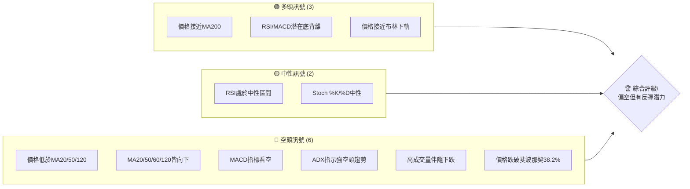
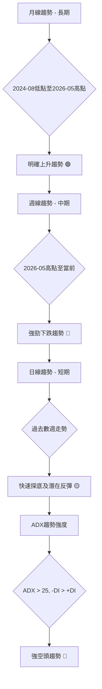
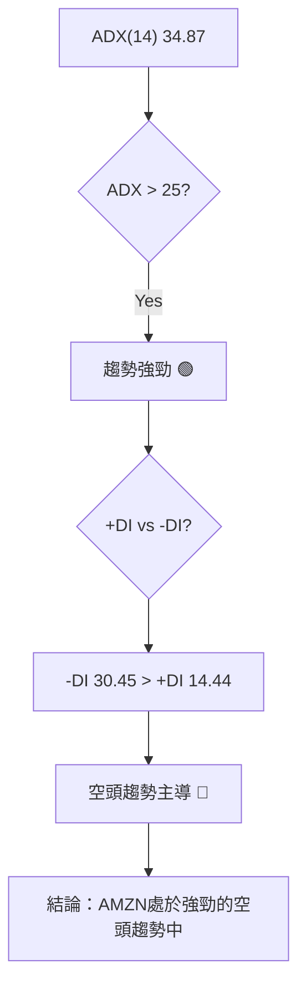
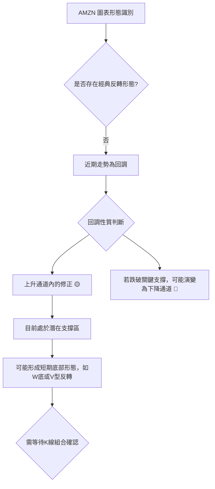
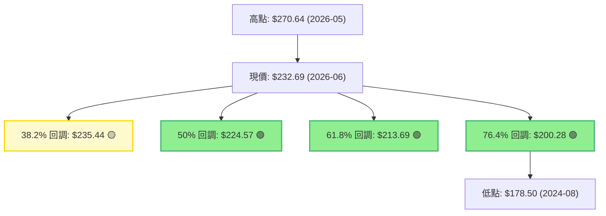
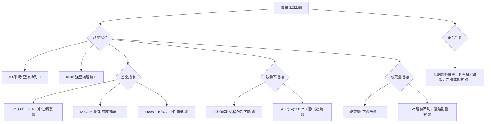
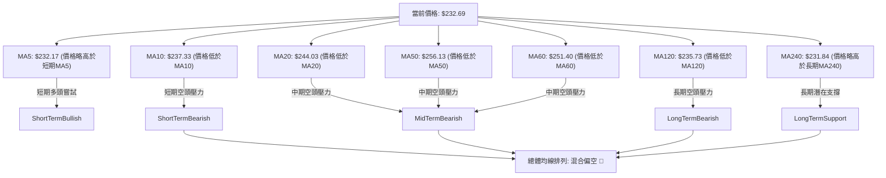
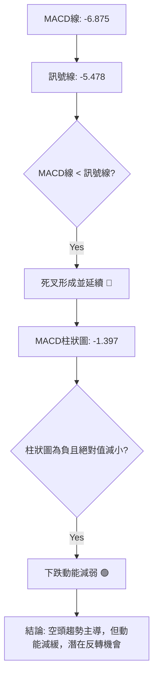
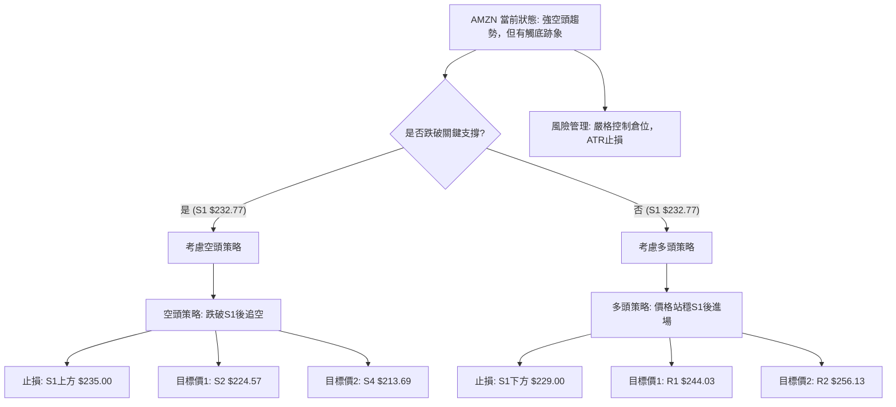
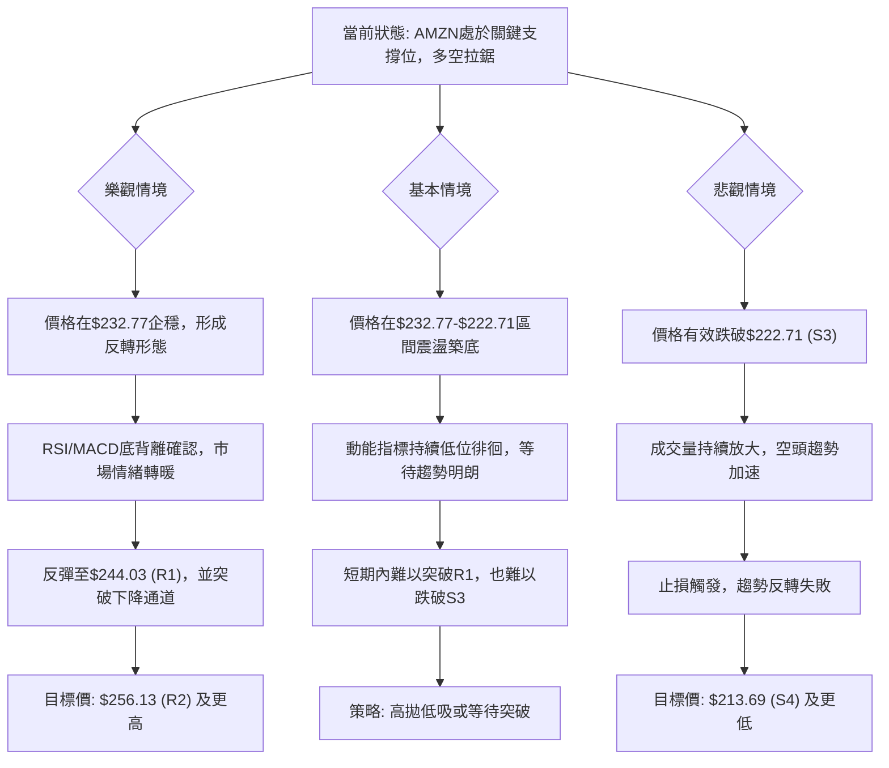

<details>
<summary>📊 靜態圖表 (點擊展開)</summary>

</details>

<html>
<head><meta charset="utf-8" /></head>
<body>
    <div style="height:500px; width:100%;">                        <script>window.PlotlyConfig = {MathJaxConfig: 'local'};</script>
        <script charset="utf-8" src="https://cdn.plot.ly/plotly-3.6.0.min.js" integrity="sha256-QaOVwtVY0T02VaHrr6pnoHLCwayMJp4O5n4YyaE3rJk=" crossorigin="anonymous"></script>                <div id="candlestick-chart" class="plotly-graph-div" style="height:100%; width:100%;"></div>            <script>                window.PLOTLYENV=window.PLOTLYENV || {};                                if (document.getElementById("candlestick-chart")) {                    Plotly.newPlot(                        "candlestick-chart",                        [{"close":{"dtype":"f8","bdata":"AAAAYI\u002fKbEAAAABgZr5sQAAAAMDMhGxAAAAAgMLtbEAAAACgmUFtQAAAAADX82xAAAAAIFznbEAAAAAgXO9sQAAAAAApdGxAAAAAYLiWa0AAAABguIZrQAAAAMDMRGtAAAAAwPV4a0AAAACgcMVrQAAAAIA9cmtAAAAAACmUa0AAAADAHs1rQAAAAOBRcGtAAAAAwMyca0AAAADA9bhrQAAAAEAKJ2xAAAAAIK53bEAAAAAA1wtrQAAAAIA9gmtAAAAA4HoMa0AAAACAPfJqQAAAAEAKz2pAAAAAoEehakAAAAAgXA9rQAAAAMD1wGtAAAAAYGY+a0AAAABA4aJrQAAAAGC4BmxAAAAAQApfbEAAAAAAAKhsQAAAAKCZyWxAAAAAIIXba0AAAABACoduQAAAAAAAwG9AAAAAgD0qb0AAAABgZkZvQAAAAKBHYW5AAAAAwB6NbkAAAADAzAxvQAAAAEAzI29AAAAAYGaGbkAAAABgj7JtQAAAAIAUVm1AAAAAANcbbUAAAACgmdFrQAAAAIAU1mtAAAAA4Hoka0AAAACAFJZrQAAAAMD1SGxAAAAAoHC1bEAAAADAHqVsQAAAAEAKJ21AAAAAACk8bUAAAACgcE1tQAAAAAApDG1AAAAAIIWjbEAAAADA9bBsQAAAAOB6XGxAAAAAoHB9bEAAAADA9fhsQAAAAMD1yGxAAAAAgBRGbEAAAACgR9FrQAAAAIDr0WtAAAAA4KOoa0AAAADgUVhsQAAAAEAza2xAAAAAgMKNbEAAAADgegRtQAAAAAApDG1AAAAA4KMQbUAAAACAPQJtQAAAAMD1EG1AAAAAgD3abEAAAAAAAFBsQAAAAIDrIW1AAAAAgMIdbkAAAACA6zFuQAAAAKBHyW5AAAAAACnsbkAAAABACs9uQAAAAEAzU25AAAAAwMyUbUAAAACAwsVtQAAAAADX421AAAAAAADgbEAAAACA6+lsQAAAAEDhSm1AAAAAwB7lbUAAAACgcM1tQAAAAIDClW5AAAAA4FFgbkAAAAAgXDduQAAAAKCZ6W1AAAAAYLhebkAAAAAA19NtQAAAACCuH21AAAAAgBTWa0AAAACAPUpqQAAAAEAKF2pAAAAAYLjeaUAAAABgj4JpQAAAAEAz82hAAAAAoEfZaEAAAADAzCRpQAAAAKBHmWlAAAAAIIWbaUAAAAAghUNqQAAAAOCjqGlAAAAAgOsRakAAAADgelRqQAAAAKBw\u002fWlAAAAAAABAakAAAADgegxqQAAAACBcF2pAAAAAgD0aa0AAAACAFF5rQAAAAGC4pmpAAAAAIK6vakAAAABgj8pqQAAAAMDMlGpAAAAAwPUwakAAAACgcPVpQAAAACCud2pAAAAAYGbmakAAAAAA1ztqQAAAAOBRGGpAAAAAANeraUAAAADgekRqQAAAACCu52lAAAAAYLh2akAAAACgR\u002fFpQAAAAEDh6mhAAAAAYGYeaUAAAADgowhqQAAAAIA9UmpAAAAA4KM4akAAAACgR5lqQAAAAOCjuGpAAAAAAACoa0AAAADAzDRtQAAAAAApzG1AAAAA4Hr8bUAAAADgoyBvQAAAAAAAEG9AAAAAYGY2b0AAAACA61FvQAAAAMD1CG9AAAAAwB49b0AAAAAghetvQAAAAGCP4m9AAAAAANd\u002fcEAAAACA61FwQAAAAEAzO3BAAAAA4KNwcEAAAADA9ZBwQAAAAAApxHBAAAAAwMwAcUAAAADAzBhxQAAAAADXL3FAAAAAYLjycEAAAABA4QpxQAAAAADXz3BAAAAAwB6dcEAAAACAFOJwQAAAACCFs3BAAAAAgD2CcEAAAACAwo1wQAAAAKBwNXBAAAAAACmQcEAAAAAgXMdwQAAAAMAepXBAAAAA4KOUcEAAAACgmf1wQAAAAAAAIHFAAAAAgD3qcEAAAAAAKVRwQAAAAOBRCHBAAAAA4KNAb0AAAACgR7lvQAAAAMD1wG5AAAAAQAqnbkAAAACAFIZuQAAAAAAAwG1AAAAA4FEwbkAAAACgmdFtQAAAAOCjwG5AAAAAAADAbkAAAAAAALBtQAAAAOB6jG5AAAAAoEcZbUAAAAAghUNtQAAAAOCjSG1AAAAA4FFgbEAAAACAFBZtQA=="},"high":{"dtype":"f8","bdata":"AAAAgMK1bUAAAADA9fBsQAAAAKBH2WxAAAAAIFw3bUAAAADAzHxtQAAAAKCZSW1AAAAAIFwvbUAAAADAHkVtQAAAAIA90mxAAAAAIIV7bEAAAACA6xFsQAAAAKBwlWtAAAAAoJmha0AAAABAM9NrQAAAACCux2tAAAAAwMzEa0AAAACA69lrQAAAAGBmBmxAAAAAIFy3a0AAAADgetxrQAAAACBcV2xAAAAAYLiGbEAAAAAAAIhsQAAAAIDClWtAAAAAgD1qa0AAAABguDZrQAAAAEDhUmtAAAAAoJnZakAAAACAFBZrQAAAAIA96mtAAAAA4FGAa0AAAACgmalrQAAAAMDMLGxAAAAAwMyMbEAAAAAgru9sQAAAAIA9Gm1AAAAAgBSObEAAAAAAAFBvQAAAAKCZKXBAAAAAACkQcEAAAAAAAGBvQAAAAAApTG9AAAAAwMycbkAAAAAAAHhvQAAAAAAAOG9AAAAAANdLb0AAAAAAAHhuQAAAACBc121AAAAAQDNTbUAAAABgZsZsQAAAACCu92tAAAAAwB5tbEAAAABguMZrQAAAAGCPamxAAAAA4KPQbEAAAAAAAPhsQAAAAKBHKW1AAAAAoJl5bUAAAABACt9tQAAAAAApLG1AAAAAAAAwbUAAAAAgrudsQAAAAGCP2mxAAAAAgD2SbEAAAACgcA1tQAAAACCFA21AAAAAYI\u002fCbEAAAACAwn1sQAAAAMAe9WtAAAAAgBQmbEAAAAAgXKdsQAAAAAAppGxAAAAAIFyvbEAAAABgZg5tQAAAAGBmHm1AAAAAIK4fbUAAAABAMxNtQAAAAOCjGG1AAAAAIK4fbUAAAABguG5tQAAAAAAAQG1AAAAAgMJlbkAAAACgR6luQAAAAMAezW5AAAAAIIX7bkAAAACAFB5vQAAAAMAe9W5AAAAAwPUobkAAAADAzBRuQAAAAIA98m1AAAAAQOFibUAAAACgmQltQAAAAEAKd21AAAAAYGYObkAAAABgZh5uQAAAAAApnG5AAAAAwPX4bkAAAAAAAGBuQAAAAIA9am5AAAAAACm0bkAAAABAM8tuQAAAACCF221AAAAAgOtJbEAAAACAFG5qQAAAAIDrmWpAAAAAwMyUakAAAACAPRJqQAAAAGC4fmlAAAAAwB4laUAAAAAgrjdpQAAAACCF22lAAAAA4Hq0aUAAAACgcGVqQAAAAIDCDWpAAAAAIIVLakAAAABA4XJqQAAAAKCZYWpAAAAAYI9KakAAAAAgXDdqQAAAAIDCJWpAAAAAoEcxa0AAAABACo9rQAAAAIA9KmtAAAAAgD26akAAAADAzPRqQAAAAAAAIGtAAAAAYLh2akAAAACA61FqQAAAAEAKl2pAAAAAYGb2akAAAADgeuRqQAAAAADXI2pAAAAAoEfxaUAAAACgmZlqQAAAAEAzK2pAAAAAgD2iakAAAADgepxqQAAAAEAz02lAAAAAoJl5aUAAAADA9UhqQAAAAGCPsmpAAAAAYLiGakAAAABgZp5qQAAAAEAKv2pAAAAAQDNDbEAAAACgmTltQAAAAIDCDW5AAAAAAAAAbkAAAACAwoVvQAAAAIAUTm9AAAAAAABAb0AAAABA4QJwQAAAAIDCRW9AAAAAQOHib0AAAACAFP5vQAAAAOCjLHBAAAAAAACIcEAAAABgZoJwQAAAAOB6UHBAAAAAYI+ecEAAAACAFB5xQAAAAMAeFXFAAAAAoJlBcUAAAADA9WhxQAAAAMDMXHFAAAAAgBRKcUAAAAAAACBxQAAAAIAUGnFAAAAAYGa6cEAAAAAghetwQAAAAOB67HBAAAAAgMKFcEAAAACgmc1wQAAAAAAAZHBAAAAAoEeZcEAAAAAA19dwQAAAAOCj3HBAAAAAwMzUcEAAAABgjwZxQAAAAAAAKHFAAAAAAAAscUAAAACAFKpwQAAAAEAzU3BAAAAAoHARcEAAAABgj\u002fpvQAAAAIAUBnBAAAAAoHAtb0AAAACAwk1vQAAAAIA9gm5AAAAA4HpEbkAAAAAghWtuQAAAAIDr+W5AAAAA4FEwb0AAAADAHr1uQAAAACBct25AAAAAAABAbkAAAAAA15ttQAAAAKBwTW5AAAAAgD0KbUAAAADAzDxtQA=="},"hovertemplate":"\u003cb\u003e%{x|%Y-%m-%d}\u003c\u002fb\u003e\u003cbr\u003e\u958b: $%{open:.2f}\u003cbr\u003e\u9ad8: $%{high:.2f}\u003cbr\u003e\u4f4e: $%{low:.2f}\u003cbr\u003e\u6536: $%{close:.2f}\u003cextra\u003e\u003c\u002fextra\u003e","low":{"dtype":"f8","bdata":"AAAAQDOjbEAAAABA4apsQAAAAKBHSWxAAAAAgD3KbEAAAAAgXAdtQAAAAGC4lmxAAAAAoEeZbEAAAABgZrZsQAAAAOBRcGxAAAAAgD2Ca0AAAABgZm5rQAAAAEAKD2tAAAAA4KNAa0AAAACgmWlrQAAAAOB6PGtAAAAAIIUTa0AAAABgZl5rQAAAAEDhamtAAAAAwPUAa0AAAACgcIVrQAAAAIAUpmtAAAAAAAC4a0AAAAAAAABrQAAAAKBHIWtAAAAAQDOTakAAAADAHpVqQAAAAIDrmWpAAAAAwPVgakAAAABA4bJqQAAAACCuP2tAAAAA4KMQa0AAAACAwkVrQAAAAMDMvGtAAAAAoEcxbEAAAABguEZsQAAAAOBReGxAAAAAAADYa0AAAAAgXH9uQAAAAMDMnG9AAAAAwB4Vb0AAAADAHsVuQAAAAKBwRW5AAAAAIK7PbUAAAABA4bJuQAAAACBc525AAAAAAAB4bkAAAAAAAJBtQAAAAOB6HG1AAAAAgBSmbEAAAACgcM1rQAAAAOCjUGtAAAAAIK4Xa0AAAACAwuVqQAAAAOCjyGtAAAAAoJn5a0AAAADgo5hsQAAAAEAKx2xAAAAAAAAIbUAAAACgmTFtQAAAACCF02xAAAAAoJlZbEAAAACgmZFsQAAAAOCjSGxAAAAAIIUjbEAAAABguI5sQAAAAIAUlmxAAAAAANcjbEAAAAAAALBrQAAAAAAppGtAAAAAIK6fa0AAAADAHg1sQAAAAGCPMmxAAAAAYLhWbEAAAAAgXJdsQAAAAGCP6mxAAAAAgMLlbEAAAADgo9hsQAAAAGBmxmxAAAAAANfDbEAAAABgZhZsQAAAAIDCZWxAAAAAgD0CbUAAAADgo\u002fBtQAAAAAApPG5AAAAAIK5HbkAAAABguL5uQAAAAAAACG5AAAAAQAqHbUAAAAAAKZRtQAAAAMAejW1AAAAAQOGqbEAAAAAAKVxsQAAAAMDM3GxAAAAAgD1SbUAAAACgR7FtQAAAAGCPwm1AAAAAwPUwbkAAAAAgrpdtQAAAAOB6tG1AAAAAoHDFbUAAAABgZm5tQAAAAIA9+mxAAAAAACmMa0AAAACA6wlpQAAAAEAza2lAAAAAwB7NaUAAAAAgrk9pQAAAAIDrsWhAAAAAwPWoaEAAAAAAAIBoQAAAAOBRMGlAAAAAgOtZaUAAAAAAAHhpQAAAACCFY2lAAAAAAABoaUAAAACAwh1qQAAAAEAzq2lAAAAAYGamaUAAAABguG5pQAAAACBcT2lAAAAAwMxEakAAAABA4fJqQAAAAMD1kGpAAAAAIIXjaUAAAACAwo1qQAAAAEAza2pAAAAAwMwEakAAAABACsdpQAAAAGBm7mlAAAAAgMKNakAAAABgjxpqQAAAAKCZwWlAAAAAgD2KaUAAAADgUTBqQAAAAOB61GlAAAAAwMw8akAAAAAA1+NpQAAAAOB65GhAAAAAIFz\u002faEAAAADgeoRpQAAAAIAUBmpAAAAAwMycaUAAAABA4TJqQAAAAGCPImpAAAAAANdza0AAAADgo+hrQAAAAGC4Zm1AAAAAAAB4bUAAAADA9ThuQAAAAGBm5m5AAAAAYGaGbkAAAAAghUNvQAAAAADXq25AAAAAQDMjb0AAAABgj0pvQAAAAIA9om9AAAAAQAobcEAAAACgcEVwQAAAAIAUCnBAAAAAQDMbcEAAAABgjwJwQAAAAADXa3BAAAAAwMzMcEAAAACAFAZxQAAAACBcA3FAAAAAANfncEAAAABAM99wQAAAACCux3BAAAAAgBRqcEAAAABAM3NwQAAAAIAUqnBAAAAAgD1OcEAAAADgemhwQAAAAIAU5m9AAAAA4Ho4cEAAAACA61VwQAAAAADXo3BAAAAAwB5hcEAAAABAM5twQAAAAEAKt3BAAAAAgD3acEAAAABAM0twQAAAAADXy29AAAAAYLj2bkAAAAAAAHhvQAAAAMD1uG5AAAAAIIVrbkAAAADAzAxuQAAAAGBmrm1AAAAAgMJlbUAAAABA4TJtQAAAACBcl25AAAAAYGaubkAAAAAAAIBtQAAAAOCjgG1AAAAAIK4HbUAAAAAAAABtQAAAAGBmHm1AAAAAoJkxbEAAAAAAKURsQA=="},"name":"\u50f9\u683c","open":{"dtype":"f8","bdata":"AAAA4KOwbUAAAAAgru9sQAAAAEAzy2xAAAAAACnUbEAAAACAFB5tQAAAAOCjOG1AAAAAAAAQbUAAAAAA1wttQAAAAIDr0WxAAAAAYI96bEAAAADAzARsQAAAAIDrgWtAAAAAYI9ia0AAAABgj4JrQAAAAMD1wGtAAAAAIIUra0AAAADgUaBrQAAAAIAU7mtAAAAAAACga0AAAAAAKZxrQAAAAKBw3WtAAAAAAAAgbEAAAABguEZsQAAAAGBmNmtAAAAAgOvxakAAAAAA1xNrQAAAAKBw9WpAAAAAgOvRakAAAAAAKbxqQAAAAIDCTWtAAAAAoJlpa0AAAAAAAGBrQAAAAEAKv2tAAAAAwB51bEAAAABACodsQAAAAKBw9WxAAAAAgOthbEAAAABAM0NvQAAAACCF629AAAAAAClMb0AAAADA9SBvQAAAAMAeJW9AAAAAwMxcbkAAAABA4QpvQAAAAMAeDW9AAAAAIK5Hb0AAAACgmWFuQAAAAIDrYW1AAAAAAAAobUAAAABAM4NsQAAAACCu92tAAAAAoJlhbEAAAABAMwtrQAAAAIDr0WtAAAAAAClMbEAAAAAgrtdsQAAAACCu52xAAAAAQAonbUAAAADgUWBtQAAAAEAzK21AAAAA4KMYbUAAAACAPcpsQAAAAEDhsmxAAAAAQOFabEAAAACA65lsQAAAAGC41mxAAAAAANe7bEAAAACAwn1sQAAAAKBH4WtAAAAAwB4VbEAAAABguDZsQAAAAOBRWGxAAAAAIIWTbEAAAACA66FsQAAAAAApBG1AAAAAoEcBbUAAAACAFP5sQAAAAGC45mxAAAAAwB4dbUAAAABA4epsQAAAAEDhmmxAAAAAQDMDbUAAAAAghfNtQAAAAIDrYW5AAAAAgD2SbkAAAAAgXNduQAAAAMD10G5AAAAAwMwkbkAAAACA6+ltQAAAAEDh4m1AAAAA4FE4bUAAAABA4eJsQAAAAKCZQW1AAAAAYLhebUAAAAAgXP9tQAAAAIAU9m1AAAAAANfLbkAAAACAPVpuQAAAAOB6\u002fG1AAAAAgOvJbUAAAAAgXJ9uQAAAACCF221AAAAAwB4dbEAAAABgZlZpQAAAAEAKH2pAAAAAoJkZakAAAACA6wFqQAAAAGC4fmlAAAAAACncaEAAAAAAKcRoQAAAAIA9QmlAAAAAoJl5aUAAAADgUZhpQAAAAEAzA2pAAAAAQAqvaUAAAABguE5qQAAAACBcV2pAAAAAYI\u002faaUAAAACgmZFpQAAAAEAzY2lAAAAAQApPakAAAAAgXP9qQAAAACCu32pAAAAAYGZOakAAAACAFMZqQAAAAGC49mpAAAAA4HpMakAAAAAghTNqQAAAAEAzC2pAAAAAgD2aakAAAACAwr1qQAAAAIDr4WlAAAAAwMzsaUAAAACgRzlqQAAAAGBm\u002fmlAAAAAgOtxakAAAAAghVNqQAAAAGC4zmlAAAAAIFwvaUAAAABAM5tpQAAAAIAUTmpAAAAAoEfRaUAAAACgmTlqQAAAACCuZ2pAAAAAoEf5a0AAAAAgXCdsQAAAAKCZaW1AAAAAYGaubUAAAADA9ThuQAAAAAAAKG9AAAAA4FEQb0AAAAAgrt9vQAAAAIAUJm9AAAAAQOHib0AAAACAFI5vQAAAAOB67G9AAAAAIK4\u002fcEAAAAAgXHdwQAAAAIA9JnBAAAAAANcfcEAAAABguBJxQAAAAKBHmXBAAAAAwMzMcEAAAACgR0FxQAAAAIA9DnFAAAAA4FEwcUAAAACAFPpwQAAAAKBw3XBAAAAAIFyrcEAAAABA4YZwQAAAAGBm0nBAAAAAAABocEAAAACA631wQAAAAOCjYHBAAAAAwMxAcEAAAAAAAHhwQAAAAGCPynBAAAAAQAq\u002fcEAAAABgZqJwQAAAAOBRBHFAAAAA4KP0cEAAAADgo6RwQAAAAGCPEnBAAAAAYGbWb0AAAAAA16NvQAAAAOBRyG9AAAAAgMLVbkAAAAAgXPduQAAAACCFc25AAAAAgMK9bUAAAABguGZuQAAAAOCjoG5AAAAAAAAAb0AAAADAzJxuQAAAAADXA25AAAAAYI8CbkAAAACgmRFtQAAAAEAzO21AAAAA4KMAbUAAAABguGZsQA=="},"x":["2025-09-10T00:00:00-04:00","2025-09-11T00:00:00-04:00","2025-09-12T00:00:00-04:00","2025-09-15T00:00:00-04:00","2025-09-16T00:00:00-04:00","2025-09-17T00:00:00-04:00","2025-09-18T00:00:00-04:00","2025-09-19T00:00:00-04:00","2025-09-22T00:00:00-04:00","2025-09-23T00:00:00-04:00","2025-09-24T00:00:00-04:00","2025-09-25T00:00:00-04:00","2025-09-26T00:00:00-04:00","2025-09-29T00:00:00-04:00","2025-09-30T00:00:00-04:00","2025-10-01T00:00:00-04:00","2025-10-02T00:00:00-04:00","2025-10-03T00:00:00-04:00","2025-10-06T00:00:00-04:00","2025-10-07T00:00:00-04:00","2025-10-08T00:00:00-04:00","2025-10-09T00:00:00-04:00","2025-10-10T00:00:00-04:00","2025-10-13T00:00:00-04:00","2025-10-14T00:00:00-04:00","2025-10-15T00:00:00-04:00","2025-10-16T00:00:00-04:00","2025-10-17T00:00:00-04:00","2025-10-20T00:00:00-04:00","2025-10-21T00:00:00-04:00","2025-10-22T00:00:00-04:00","2025-10-23T00:00:00-04:00","2025-10-24T00:00:00-04:00","2025-10-27T00:00:00-04:00","2025-10-28T00:00:00-04:00","2025-10-29T00:00:00-04:00","2025-10-30T00:00:00-04:00","2025-10-31T00:00:00-04:00","2025-11-03T00:00:00-05:00","2025-11-04T00:00:00-05:00","2025-11-05T00:00:00-05:00","2025-11-06T00:00:00-05:00","2025-11-07T00:00:00-05:00","2025-11-10T00:00:00-05:00","2025-11-11T00:00:00-05:00","2025-11-12T00:00:00-05:00","2025-11-13T00:00:00-05:00","2025-11-14T00:00:00-05:00","2025-11-17T00:00:00-05:00","2025-11-18T00:00:00-05:00","2025-11-19T00:00:00-05:00","2025-11-20T00:00:00-05:00","2025-11-21T00:00:00-05:00","2025-11-24T00:00:00-05:00","2025-11-25T00:00:00-05:00","2025-11-26T00:00:00-05:00","2025-11-28T00:00:00-05:00","2025-12-01T00:00:00-05:00","2025-12-02T00:00:00-05:00","2025-12-03T00:00:00-05:00","2025-12-04T00:00:00-05:00","2025-12-05T00:00:00-05:00","2025-12-08T00:00:00-05:00","2025-12-09T00:00:00-05:00","2025-12-10T00:00:00-05:00","2025-12-11T00:00:00-05:00","2025-12-12T00:00:00-05:00","2025-12-15T00:00:00-05:00","2025-12-16T00:00:00-05:00","2025-12-17T00:00:00-05:00","2025-12-18T00:00:00-05:00","2025-12-19T00:00:00-05:00","2025-12-22T00:00:00-05:00","2025-12-23T00:00:00-05:00","2025-12-24T00:00:00-05:00","2025-12-26T00:00:00-05:00","2025-12-29T00:00:00-05:00","2025-12-30T00:00:00-05:00","2025-12-31T00:00:00-05:00","2026-01-02T00:00:00-05:00","2026-01-05T00:00:00-05:00","2026-01-06T00:00:00-05:00","2026-01-07T00:00:00-05:00","2026-01-08T00:00:00-05:00","2026-01-09T00:00:00-05:00","2026-01-12T00:00:00-05:00","2026-01-13T00:00:00-05:00","2026-01-14T00:00:00-05:00","2026-01-15T00:00:00-05:00","2026-01-16T00:00:00-05:00","2026-01-20T00:00:00-05:00","2026-01-21T00:00:00-05:00","2026-01-22T00:00:00-05:00","2026-01-23T00:00:00-05:00","2026-01-26T00:00:00-05:00","2026-01-27T00:00:00-05:00","2026-01-28T00:00:00-05:00","2026-01-29T00:00:00-05:00","2026-01-30T00:00:00-05:00","2026-02-02T00:00:00-05:00","2026-02-03T00:00:00-05:00","2026-02-04T00:00:00-05:00","2026-02-05T00:00:00-05:00","2026-02-06T00:00:00-05:00","2026-02-09T00:00:00-05:00","2026-02-10T00:00:00-05:00","2026-02-11T00:00:00-05:00","2026-02-12T00:00:00-05:00","2026-02-13T00:00:00-05:00","2026-02-17T00:00:00-05:00","2026-02-18T00:00:00-05:00","2026-02-19T00:00:00-05:00","2026-02-20T00:00:00-05:00","2026-02-23T00:00:00-05:00","2026-02-24T00:00:00-05:00","2026-02-25T00:00:00-05:00","2026-02-26T00:00:00-05:00","2026-02-27T00:00:00-05:00","2026-03-02T00:00:00-05:00","2026-03-03T00:00:00-05:00","2026-03-04T00:00:00-05:00","2026-03-05T00:00:00-05:00","2026-03-06T00:00:00-05:00","2026-03-09T00:00:00-04:00","2026-03-10T00:00:00-04:00","2026-03-11T00:00:00-04:00","2026-03-12T00:00:00-04:00","2026-03-13T00:00:00-04:00","2026-03-16T00:00:00-04:00","2026-03-17T00:00:00-04:00","2026-03-18T00:00:00-04:00","2026-03-19T00:00:00-04:00","2026-03-20T00:00:00-04:00","2026-03-23T00:00:00-04:00","2026-03-24T00:00:00-04:00","2026-03-25T00:00:00-04:00","2026-03-26T00:00:00-04:00","2026-03-27T00:00:00-04:00","2026-03-30T00:00:00-04:00","2026-03-31T00:00:00-04:00","2026-04-01T00:00:00-04:00","2026-04-02T00:00:00-04:00","2026-04-06T00:00:00-04:00","2026-04-07T00:00:00-04:00","2026-04-08T00:00:00-04:00","2026-04-09T00:00:00-04:00","2026-04-10T00:00:00-04:00","2026-04-13T00:00:00-04:00","2026-04-14T00:00:00-04:00","2026-04-15T00:00:00-04:00","2026-04-16T00:00:00-04:00","2026-04-17T00:00:00-04:00","2026-04-20T00:00:00-04:00","2026-04-21T00:00:00-04:00","2026-04-22T00:00:00-04:00","2026-04-23T00:00:00-04:00","2026-04-24T00:00:00-04:00","2026-04-27T00:00:00-04:00","2026-04-28T00:00:00-04:00","2026-04-29T00:00:00-04:00","2026-04-30T00:00:00-04:00","2026-05-01T00:00:00-04:00","2026-05-04T00:00:00-04:00","2026-05-05T00:00:00-04:00","2026-05-06T00:00:00-04:00","2026-05-07T00:00:00-04:00","2026-05-08T00:00:00-04:00","2026-05-11T00:00:00-04:00","2026-05-12T00:00:00-04:00","2026-05-13T00:00:00-04:00","2026-05-14T00:00:00-04:00","2026-05-15T00:00:00-04:00","2026-05-18T00:00:00-04:00","2026-05-19T00:00:00-04:00","2026-05-20T00:00:00-04:00","2026-05-21T00:00:00-04:00","2026-05-22T00:00:00-04:00","2026-05-26T00:00:00-04:00","2026-05-27T00:00:00-04:00","2026-05-28T00:00:00-04:00","2026-05-29T00:00:00-04:00","2026-06-01T00:00:00-04:00","2026-06-02T00:00:00-04:00","2026-06-03T00:00:00-04:00","2026-06-04T00:00:00-04:00","2026-06-05T00:00:00-04:00","2026-06-08T00:00:00-04:00","2026-06-09T00:00:00-04:00","2026-06-10T00:00:00-04:00","2026-06-11T00:00:00-04:00","2026-06-12T00:00:00-04:00","2026-06-15T00:00:00-04:00","2026-06-16T00:00:00-04:00","2026-06-17T00:00:00-04:00","2026-06-18T00:00:00-04:00","2026-06-22T00:00:00-04:00","2026-06-23T00:00:00-04:00","2026-06-24T00:00:00-04:00","2026-06-25T00:00:00-04:00","2026-06-26T00:00:00-04:00"],"type":"candlestick"},{"hovertemplate":"MA30: $%{y:.2f}\u003cextra\u003e\u003c\u002fextra\u003e","line":{"color":"#2196F3","dash":"dash","width":2},"mode":"lines","name":"MA30","x":["2025-09-10T00:00:00-04:00","2025-09-11T00:00:00-04:00","2025-09-12T00:00:00-04:00","2025-09-15T00:00:00-04:00","2025-09-16T00:00:00-04:00","2025-09-17T00:00:00-04:00","2025-09-18T00:00:00-04:00","2025-09-19T00:00:00-04:00","2025-09-22T00:00:00-04:00","2025-09-23T00:00:00-04:00","2025-09-24T00:00:00-04:00","2025-09-25T00:00:00-04:00","2025-09-26T00:00:00-04:00","2025-09-29T00:00:00-04:00","2025-09-30T00:00:00-04:00","2025-10-01T00:00:00-04:00","2025-10-02T00:00:00-04:00","2025-10-03T00:00:00-04:00","2025-10-06T00:00:00-04:00","2025-10-07T00:00:00-04:00","2025-10-08T00:00:00-04:00","2025-10-09T00:00:00-04:00","2025-10-10T00:00:00-04:00","2025-10-13T00:00:00-04:00","2025-10-14T00:00:00-04:00","2025-10-15T00:00:00-04:00","2025-10-16T00:00:00-04:00","2025-10-17T00:00:00-04:00","2025-10-20T00:00:00-04:00","2025-10-21T00:00:00-04:00","2025-10-22T00:00:00-04:00","2025-10-23T00:00:00-04:00","2025-10-24T00:00:00-04:00","2025-10-27T00:00:00-04:00","2025-10-28T00:00:00-04:00","2025-10-29T00:00:00-04:00","2025-10-30T00:00:00-04:00","2025-10-31T00:00:00-04:00","2025-11-03T00:00:00-05:00","2025-11-04T00:00:00-05:00","2025-11-05T00:00:00-05:00","2025-11-06T00:00:00-05:00","2025-11-07T00:00:00-05:00","2025-11-10T00:00:00-05:00","2025-11-11T00:00:00-05:00","2025-11-12T00:00:00-05:00","2025-11-13T00:00:00-05:00","2025-11-14T00:00:00-05:00","2025-11-17T00:00:00-05:00","2025-11-18T00:00:00-05:00","2025-11-19T00:00:00-05:00","2025-11-20T00:00:00-05:00","2025-11-21T00:00:00-05:00","2025-11-24T00:00:00-05:00","2025-11-25T00:00:00-05:00","2025-11-26T00:00:00-05:00","2025-11-28T00:00:00-05:00","2025-12-01T00:00:00-05:00","2025-12-02T00:00:00-05:00","2025-12-03T00:00:00-05:00","2025-12-04T00:00:00-05:00","2025-12-05T00:00:00-05:00","2025-12-08T00:00:00-05:00","2025-12-09T00:00:00-05:00","2025-12-10T00:00:00-05:00","2025-12-11T00:00:00-05:00","2025-12-12T00:00:00-05:00","2025-12-15T00:00:00-05:00","2025-12-16T00:00:00-05:00","2025-12-17T00:00:00-05:00","2025-12-18T00:00:00-05:00","2025-12-19T00:00:00-05:00","2025-12-22T00:00:00-05:00","2025-12-23T00:00:00-05:00","2025-12-24T00:00:00-05:00","2025-12-26T00:00:00-05:00","2025-12-29T00:00:00-05:00","2025-12-30T00:00:00-05:00","2025-12-31T00:00:00-05:00","2026-01-02T00:00:00-05:00","2026-01-05T00:00:00-05:00","2026-01-06T00:00:00-05:00","2026-01-07T00:00:00-05:00","2026-01-08T00:00:00-05:00","2026-01-09T00:00:00-05:00","2026-01-12T00:00:00-05:00","2026-01-13T00:00:00-05:00","2026-01-14T00:00:00-05:00","2026-01-15T00:00:00-05:00","2026-01-16T00:00:00-05:00","2026-01-20T00:00:00-05:00","2026-01-21T00:00:00-05:00","2026-01-22T00:00:00-05:00","2026-01-23T00:00:00-05:00","2026-01-26T00:00:00-05:00","2026-01-27T00:00:00-05:00","2026-01-28T00:00:00-05:00","2026-01-29T00:00:00-05:00","2026-01-30T00:00:00-05:00","2026-02-02T00:00:00-05:00","2026-02-03T00:00:00-05:00","2026-02-04T00:00:00-05:00","2026-02-05T00:00:00-05:00","2026-02-06T00:00:00-05:00","2026-02-09T00:00:00-05:00","2026-02-10T00:00:00-05:00","2026-02-11T00:00:00-05:00","2026-02-12T00:00:00-05:00","2026-02-13T00:00:00-05:00","2026-02-17T00:00:00-05:00","2026-02-18T00:00:00-05:00","2026-02-19T00:00:00-05:00","2026-02-20T00:00:00-05:00","2026-02-23T00:00:00-05:00","2026-02-24T00:00:00-05:00","2026-02-25T00:00:00-05:00","2026-02-26T00:00:00-05:00","2026-02-27T00:00:00-05:00","2026-03-02T00:00:00-05:00","2026-03-03T00:00:00-05:00","2026-03-04T00:00:00-05:00","2026-03-05T00:00:00-05:00","2026-03-06T00:00:00-05:00","2026-03-09T00:00:00-04:00","2026-03-10T00:00:00-04:00","2026-03-11T00:00:00-04:00","2026-03-12T00:00:00-04:00","2026-03-13T00:00:00-04:00","2026-03-16T00:00:00-04:00","2026-03-17T00:00:00-04:00","2026-03-18T00:00:00-04:00","2026-03-19T00:00:00-04:00","2026-03-20T00:00:00-04:00","2026-03-23T00:00:00-04:00","2026-03-24T00:00:00-04:00","2026-03-25T00:00:00-04:00","2026-03-26T00:00:00-04:00","2026-03-27T00:00:00-04:00","2026-03-30T00:00:00-04:00","2026-03-31T00:00:00-04:00","2026-04-01T00:00:00-04:00","2026-04-02T00:00:00-04:00","2026-04-06T00:00:00-04:00","2026-04-07T00:00:00-04:00","2026-04-08T00:00:00-04:00","2026-04-09T00:00:00-04:00","2026-04-10T00:00:00-04:00","2026-04-13T00:00:00-04:00","2026-04-14T00:00:00-04:00","2026-04-15T00:00:00-04:00","2026-04-16T00:00:00-04:00","2026-04-17T00:00:00-04:00","2026-04-20T00:00:00-04:00","2026-04-21T00:00:00-04:00","2026-04-22T00:00:00-04:00","2026-04-23T00:00:00-04:00","2026-04-24T00:00:00-04:00","2026-04-27T00:00:00-04:00","2026-04-28T00:00:00-04:00","2026-04-29T00:00:00-04:00","2026-04-30T00:00:00-04:00","2026-05-01T00:00:00-04:00","2026-05-04T00:00:00-04:00","2026-05-05T00:00:00-04:00","2026-05-06T00:00:00-04:00","2026-05-07T00:00:00-04:00","2026-05-08T00:00:00-04:00","2026-05-11T00:00:00-04:00","2026-05-12T00:00:00-04:00","2026-05-13T00:00:00-04:00","2026-05-14T00:00:00-04:00","2026-05-15T00:00:00-04:00","2026-05-18T00:00:00-04:00","2026-05-19T00:00:00-04:00","2026-05-20T00:00:00-04:00","2026-05-21T00:00:00-04:00","2026-05-22T00:00:00-04:00","2026-05-26T00:00:00-04:00","2026-05-27T00:00:00-04:00","2026-05-28T00:00:00-04:00","2026-05-29T00:00:00-04:00","2026-06-01T00:00:00-04:00","2026-06-02T00:00:00-04:00","2026-06-03T00:00:00-04:00","2026-06-04T00:00:00-04:00","2026-06-05T00:00:00-04:00","2026-06-08T00:00:00-04:00","2026-06-09T00:00:00-04:00","2026-06-10T00:00:00-04:00","2026-06-11T00:00:00-04:00","2026-06-12T00:00:00-04:00","2026-06-15T00:00:00-04:00","2026-06-16T00:00:00-04:00","2026-06-17T00:00:00-04:00","2026-06-18T00:00:00-04:00","2026-06-22T00:00:00-04:00","2026-06-23T00:00:00-04:00","2026-06-24T00:00:00-04:00","2026-06-25T00:00:00-04:00","2026-06-26T00:00:00-04:00"],"y":{"dtype":"f8","bdata":"AAAAAAAA+H8AAAAAAAD4fwAAAAAAAPh\u002fAAAAAAAA+H8AAAAAAAD4fwAAAAAAAPh\u002fAAAAAAAA+H8AAAAAAAD4fwAAAAAAAPh\u002fAAAAAAAA+H8AAAAAAAD4fwAAAAAAAPh\u002fAAAAAAAA+H8AAAAAAAD4fwAAAAAAAPh\u002fAAAAAAAA+H8AAAAAAAD4fwAAAAAAAPh\u002fAAAAAAAA+H8AAAAAAAD4fwAAAAAAAPh\u002fAAAAAAAA+H8AAAAAAAD4fwAAAAAAAPh\u002fAAAAAAAA+H8AAAAAAAD4fwAAAAAAAPh\u002fAAAAAAAA+H8AAAAAAAD4f7y7uwsC32tAq6qqes3Ra0C8u7sbWshrQKuqqjomxGtAq6qqWmS\u002fa0AiIiKiRbprQAAAADDduGtA7+7unu+va0De3d19hr1rQCIiIkKn2WtAIiIisiv4a0BmZmb2KBhsQHd3d5e1MmxAmpmZOftMbEAzMzPD9WhsQLy7u2t1iGxAmpmZmZmhbEBVVVUFyLFsQM3MzCz5wWxAiYiIyL3ObEC8u7sLkM9sQAAAADDdzGxA3t3drY7BbEBERERUKsZsQCIiIhLKzGxAVVVVZfTabEDv7u5ec+lsQO\u002fu7l5z\u002fWxAVVVVFa4TbUBmZmbm0CZtQERERCTbMW1AERERkcI9bUAAAABAw0ZtQBERERGfSW1Aq6qqeqJKbUBmZmZWVU1tQAAAAOBPTW1AAAAAMN1QbUCamZkZvTltQCIiIuIzGG1AzczMXEj6bEDe3d2tR+FsQERERESL0GxAiYiIqH+\u002fbECJiIiYJ65sQLy7u+tRnGxAERERgdyPbECJiIjo+4lsQFVVVRWuh2xAzczMTH6FbECamZnptIlsQM3MzJzElGxA3t3d3SSubEBERETEZ8RsQERERNS\u002f2WxAd3d316PsbEAAAACgGv9sQN7d3f0bCW1AIiIiYhAMbUDNzMwcExBtQERERJRDF21AzczMrEcZbUC8u7u7LRttQERERBQgI21AmpmZWR0vbUAzMzODMjZtQLy7u6uORW1AZmZmpn9XbUDNzMzM92ttQAAAAPDSfW1AERERwfWUbUAzMzNTnKFtQLy7u2ugp21AVVVVBYGhbUBVVVW1OoptQDMzM\u002fP9cG1A3t3dXbpVbUCrqqo63zdtQFVVVSW\u002fFG1AERER0ZTybEAzMzOTitdsQKuqqvpiuWxAd3d3d+mSbEBVVVWFXXFsQERERFScRWxAERER4TMcbEBmZmbm+\u002fVrQCIiIvL90GtAiYiIuJC0a0ARERERypRrQCIiIpJfdGtAzczMfD9la0B3d3enDVhrQCIiIsKDQWtAMzMzIyIma0BmZmb2bwxrQDMzM6NF6mpA3t3dXY\u002fGakB3d3e3OqJqQAAAAADVhGpAq6qqqjhnakAAAAAAjkhqQHd3d5e1LmpAMzMzEzwcakC8u7vrChxqQImIiMh2GmpAmpmZ2YcfakCJiIioOCNqQImIiKjxImpAvLu7ez8lakCJiIi41yxqQM3MzAwCM2pA7+7uzj44akAAAACgGjtqQBEREbErRGpAiYiI6LRRakC8u7srQGpqQImIiMi9impA7+7uvp+qakAiIiJy9tVqQO\u002fu7k5iAGtAzczMvHQja0CrqqoaL0VrQM3MzIyXamtAMzMzo3CRa0AAAACQNL1rQImIiMh26mtA3t3d\u002fY0kbEB3d3dnkV1sQO\u002fu7q65kGxAIiIiMsHDbEDv7u6+n\u002f5sQHd3dzcXPm1AzczMTDeFbUBERER02shtQHd3d7ceEW5AMzMzQ4tQbkAzMzPTBpZuQKuqqupR4G5AERERwYMlb0CJiIiof2dvQCIiIuLso29AVVVVhevdb0DNzMwMuwpwQHd3d98II3BAq6qqkl86cEBERERM8ExwQCIiIgrXW3BAzczM\u002fGJpcEAzMzMLkHVwQM3MzKQpg3BAd3d3p1SOcEAAAACQCZRwQImIiJhumHBAVVVVnX2YcECamZlBp5dwQBEREaHTknBAZmZm5tCIcEBERERkyX9wQN7d3Z02dHBAVVVVDbtocEDe3d2Nl1pwQFVVVQ27TnBAREREXNZAcEDe3d1VnC1wQKuqqmpKHXBAvLu7Q9IIcECamZlZgOhvQKuqqnp3w29AIiIiwhGab0BEREQkInJvQA=="},"type":"scatter"},{"hovertemplate":"MA60: $%{y:.2f}\u003cextra\u003e\u003c\u002fextra\u003e","line":{"color":"#9C27B0","dash":"dash","width":2},"mode":"lines","name":"MA60","x":["2025-09-10T00:00:00-04:00","2025-09-11T00:00:00-04:00","2025-09-12T00:00:00-04:00","2025-09-15T00:00:00-04:00","2025-09-16T00:00:00-04:00","2025-09-17T00:00:00-04:00","2025-09-18T00:00:00-04:00","2025-09-19T00:00:00-04:00","2025-09-22T00:00:00-04:00","2025-09-23T00:00:00-04:00","2025-09-24T00:00:00-04:00","2025-09-25T00:00:00-04:00","2025-09-26T00:00:00-04:00","2025-09-29T00:00:00-04:00","2025-09-30T00:00:00-04:00","2025-10-01T00:00:00-04:00","2025-10-02T00:00:00-04:00","2025-10-03T00:00:00-04:00","2025-10-06T00:00:00-04:00","2025-10-07T00:00:00-04:00","2025-10-08T00:00:00-04:00","2025-10-09T00:00:00-04:00","2025-10-10T00:00:00-04:00","2025-10-13T00:00:00-04:00","2025-10-14T00:00:00-04:00","2025-10-15T00:00:00-04:00","2025-10-16T00:00:00-04:00","2025-10-17T00:00:00-04:00","2025-10-20T00:00:00-04:00","2025-10-21T00:00:00-04:00","2025-10-22T00:00:00-04:00","2025-10-23T00:00:00-04:00","2025-10-24T00:00:00-04:00","2025-10-27T00:00:00-04:00","2025-10-28T00:00:00-04:00","2025-10-29T00:00:00-04:00","2025-10-30T00:00:00-04:00","2025-10-31T00:00:00-04:00","2025-11-03T00:00:00-05:00","2025-11-04T00:00:00-05:00","2025-11-05T00:00:00-05:00","2025-11-06T00:00:00-05:00","2025-11-07T00:00:00-05:00","2025-11-10T00:00:00-05:00","2025-11-11T00:00:00-05:00","2025-11-12T00:00:00-05:00","2025-11-13T00:00:00-05:00","2025-11-14T00:00:00-05:00","2025-11-17T00:00:00-05:00","2025-11-18T00:00:00-05:00","2025-11-19T00:00:00-05:00","2025-11-20T00:00:00-05:00","2025-11-21T00:00:00-05:00","2025-11-24T00:00:00-05:00","2025-11-25T00:00:00-05:00","2025-11-26T00:00:00-05:00","2025-11-28T00:00:00-05:00","2025-12-01T00:00:00-05:00","2025-12-02T00:00:00-05:00","2025-12-03T00:00:00-05:00","2025-12-04T00:00:00-05:00","2025-12-05T00:00:00-05:00","2025-12-08T00:00:00-05:00","2025-12-09T00:00:00-05:00","2025-12-10T00:00:00-05:00","2025-12-11T00:00:00-05:00","2025-12-12T00:00:00-05:00","2025-12-15T00:00:00-05:00","2025-12-16T00:00:00-05:00","2025-12-17T00:00:00-05:00","2025-12-18T00:00:00-05:00","2025-12-19T00:00:00-05:00","2025-12-22T00:00:00-05:00","2025-12-23T00:00:00-05:00","2025-12-24T00:00:00-05:00","2025-12-26T00:00:00-05:00","2025-12-29T00:00:00-05:00","2025-12-30T00:00:00-05:00","2025-12-31T00:00:00-05:00","2026-01-02T00:00:00-05:00","2026-01-05T00:00:00-05:00","2026-01-06T00:00:00-05:00","2026-01-07T00:00:00-05:00","2026-01-08T00:00:00-05:00","2026-01-09T00:00:00-05:00","2026-01-12T00:00:00-05:00","2026-01-13T00:00:00-05:00","2026-01-14T00:00:00-05:00","2026-01-15T00:00:00-05:00","2026-01-16T00:00:00-05:00","2026-01-20T00:00:00-05:00","2026-01-21T00:00:00-05:00","2026-01-22T00:00:00-05:00","2026-01-23T00:00:00-05:00","2026-01-26T00:00:00-05:00","2026-01-27T00:00:00-05:00","2026-01-28T00:00:00-05:00","2026-01-29T00:00:00-05:00","2026-01-30T00:00:00-05:00","2026-02-02T00:00:00-05:00","2026-02-03T00:00:00-05:00","2026-02-04T00:00:00-05:00","2026-02-05T00:00:00-05:00","2026-02-06T00:00:00-05:00","2026-02-09T00:00:00-05:00","2026-02-10T00:00:00-05:00","2026-02-11T00:00:00-05:00","2026-02-12T00:00:00-05:00","2026-02-13T00:00:00-05:00","2026-02-17T00:00:00-05:00","2026-02-18T00:00:00-05:00","2026-02-19T00:00:00-05:00","2026-02-20T00:00:00-05:00","2026-02-23T00:00:00-05:00","2026-02-24T00:00:00-05:00","2026-02-25T00:00:00-05:00","2026-02-26T00:00:00-05:00","2026-02-27T00:00:00-05:00","2026-03-02T00:00:00-05:00","2026-03-03T00:00:00-05:00","2026-03-04T00:00:00-05:00","2026-03-05T00:00:00-05:00","2026-03-06T00:00:00-05:00","2026-03-09T00:00:00-04:00","2026-03-10T00:00:00-04:00","2026-03-11T00:00:00-04:00","2026-03-12T00:00:00-04:00","2026-03-13T00:00:00-04:00","2026-03-16T00:00:00-04:00","2026-03-17T00:00:00-04:00","2026-03-18T00:00:00-04:00","2026-03-19T00:00:00-04:00","2026-03-20T00:00:00-04:00","2026-03-23T00:00:00-04:00","2026-03-24T00:00:00-04:00","2026-03-25T00:00:00-04:00","2026-03-26T00:00:00-04:00","2026-03-27T00:00:00-04:00","2026-03-30T00:00:00-04:00","2026-03-31T00:00:00-04:00","2026-04-01T00:00:00-04:00","2026-04-02T00:00:00-04:00","2026-04-06T00:00:00-04:00","2026-04-07T00:00:00-04:00","2026-04-08T00:00:00-04:00","2026-04-09T00:00:00-04:00","2026-04-10T00:00:00-04:00","2026-04-13T00:00:00-04:00","2026-04-14T00:00:00-04:00","2026-04-15T00:00:00-04:00","2026-04-16T00:00:00-04:00","2026-04-17T00:00:00-04:00","2026-04-20T00:00:00-04:00","2026-04-21T00:00:00-04:00","2026-04-22T00:00:00-04:00","2026-04-23T00:00:00-04:00","2026-04-24T00:00:00-04:00","2026-04-27T00:00:00-04:00","2026-04-28T00:00:00-04:00","2026-04-29T00:00:00-04:00","2026-04-30T00:00:00-04:00","2026-05-01T00:00:00-04:00","2026-05-04T00:00:00-04:00","2026-05-05T00:00:00-04:00","2026-05-06T00:00:00-04:00","2026-05-07T00:00:00-04:00","2026-05-08T00:00:00-04:00","2026-05-11T00:00:00-04:00","2026-05-12T00:00:00-04:00","2026-05-13T00:00:00-04:00","2026-05-14T00:00:00-04:00","2026-05-15T00:00:00-04:00","2026-05-18T00:00:00-04:00","2026-05-19T00:00:00-04:00","2026-05-20T00:00:00-04:00","2026-05-21T00:00:00-04:00","2026-05-22T00:00:00-04:00","2026-05-26T00:00:00-04:00","2026-05-27T00:00:00-04:00","2026-05-28T00:00:00-04:00","2026-05-29T00:00:00-04:00","2026-06-01T00:00:00-04:00","2026-06-02T00:00:00-04:00","2026-06-03T00:00:00-04:00","2026-06-04T00:00:00-04:00","2026-06-05T00:00:00-04:00","2026-06-08T00:00:00-04:00","2026-06-09T00:00:00-04:00","2026-06-10T00:00:00-04:00","2026-06-11T00:00:00-04:00","2026-06-12T00:00:00-04:00","2026-06-15T00:00:00-04:00","2026-06-16T00:00:00-04:00","2026-06-17T00:00:00-04:00","2026-06-18T00:00:00-04:00","2026-06-22T00:00:00-04:00","2026-06-23T00:00:00-04:00","2026-06-24T00:00:00-04:00","2026-06-25T00:00:00-04:00","2026-06-26T00:00:00-04:00"],"y":{"dtype":"f8","bdata":"AAAAAAAA+H8AAAAAAAD4fwAAAAAAAPh\u002fAAAAAAAA+H8AAAAAAAD4fwAAAAAAAPh\u002fAAAAAAAA+H8AAAAAAAD4fwAAAAAAAPh\u002fAAAAAAAA+H8AAAAAAAD4fwAAAAAAAPh\u002fAAAAAAAA+H8AAAAAAAD4fwAAAAAAAPh\u002fAAAAAAAA+H8AAAAAAAD4fwAAAAAAAPh\u002fAAAAAAAA+H8AAAAAAAD4fwAAAAAAAPh\u002fAAAAAAAA+H8AAAAAAAD4fwAAAAAAAPh\u002fAAAAAAAA+H8AAAAAAAD4fwAAAAAAAPh\u002fAAAAAAAA+H8AAAAAAAD4fwAAAAAAAPh\u002fAAAAAAAA+H8AAAAAAAD4fwAAAAAAAPh\u002fAAAAAAAA+H8AAAAAAAD4fwAAAAAAAPh\u002fAAAAAAAA+H8AAAAAAAD4fwAAAAAAAPh\u002fAAAAAAAA+H8AAAAAAAD4fwAAAAAAAPh\u002fAAAAAAAA+H8AAAAAAAD4fwAAAAAAAPh\u002fAAAAAAAA+H8AAAAAAAD4fwAAAAAAAPh\u002fAAAAAAAA+H8AAAAAAAD4fwAAAAAAAPh\u002fAAAAAAAA+H8AAAAAAAD4fwAAAAAAAPh\u002fAAAAAAAA+H8AAAAAAAD4fwAAAAAAAPh\u002fAAAAAAAA+H8AAAAAAAD4fwAAAJhuiGxA3t3dBciHbEDe3d2tjodsQN7d3aXihmxAq6qqagOFbEBERER8zYNsQAAAAIgWg2xAd3d3Z2aAbEC8u7vLoXtsQCIiIpLteGxAd3d3Bzp5bEAiIiJSuHxsQN7d3W2ggWxAERERcT2GbEDe3d2tjotsQLy7u6tjkmxAVVVVDbuYbEDv7u724Z1sQBEREaHTpGxAq6qqCh6qbECrqqp6oqxsQGZmZubQsGxA3t3dxdm3bEBEREQMScVsQDMzM\u002fNE02xAZmZmHszjbEB3d3f\u002fRvRsQGZmZq5HA21AvLu7O98PbUCamZkBchttQERERFyPJG1A7+7uHoUrbUDe3d19+DBtQKuqqpJfNm1AIiIi6t88bUDNzMzsw0FtQN7d3UVvSW1AMzMzay5UbUAzMzNz2lJtQBEREWkDS21A7+7uDp9HbUCJiIgAckFtQAAAANgVPG1A7+7uVoAwbUDv7u4mMRxtQHd3d++nBm1Ad3d3b8vybECamZmR7eBsQFVVVZ02zmxA7+7ujgm8bEBmZma+n7BsQLy7u8sTp2xAq6qqKoegbEDNzMyk4ppsQERERBSuj2xARERE3GuEbEAzMzNDi3psQAAAAPgMbWxAVVVVjVBgbEDv7u6WblJsQDMzM5PRRWxAzczMlEM\u002fbECamZmxnTlsQDMzM+tRMmxAZmZmvp8qbEDNzMw8USFsQHd3dyfqF2xAIiIiggcPbEAiIiJCGQdsQAAAAPhTAWxA3t3dNRf+a0CamZkpFfVrQJqZmQEr62tAREREjN7ea0CJiIjQItNrQN7d3V26xWtAvLu7G6G6a0CamZnxi61rQO\u002fu7mbYm2tAZmZmJuqLa0De3d0lMYJrQLy7u4MydmtAMzMzI5Rla0CrqqoSPFZrQKuqqgLkRGtAzczMZPQ2a0AREREJHjBrQFVVVd3dLWtAvLu7O5gva0CamZlBYDVrQImIiPBgOmtAzczMHFpEa0ARERFhnk5rQHd3d6cNVmtAMzMzY8lba0AzMzND0mRrQN7d3TVeamtA3t3drY51a0B3d3cP5n9rQHd3d1fHimtAZmZm7nyVa0B3d3fflqNrQHd3d2dmtmtAAAAAsLnQa0AAAACwcvJrQAAAAMDKFWxAZmZmjgk4bEDe3d29n1xsQJqZmcmhgWxAZmZmnmGlbECJiIiwK8psQHd3d3d362xAIiIiKhULbUDNzMxcSChtQAAAALgeRW1A7+7uBjpjbUAiIiJiEIJtQGZmZu41oW1ARERE3LK+bUBEREREi+BtQERERMxaA25A3t3dBQ8gbkBVVVUdoTZuQO\u002fu7l66TW5A7+7u7jVhbkCamZmJQXZuQFVVVQUPiG5AVVVV5RebbkAAAAAYkq5uQFVVVXWTvG5AZmZmppvKbkBVVVVt59luQBEREanG7W5Aq6qqAnIDb0AAAACQCRJvQGZmZsbZJW9AVVVV5Rcxb0BmZmaWQz9vQKuqqrLkUW9AmpmZwcpfb0BmZmbm0GxvQA=="},"type":"scatter"},{"hovertemplate":"MA200: $%{y:.2f}\u003cextra\u003e\u003c\u002fextra\u003e","line":{"color":"#FF6F00","dash":"solid","width":2},"mode":"lines","name":"MA200","x":["2025-09-10T00:00:00-04:00","2025-09-11T00:00:00-04:00","2025-09-12T00:00:00-04:00","2025-09-15T00:00:00-04:00","2025-09-16T00:00:00-04:00","2025-09-17T00:00:00-04:00","2025-09-18T00:00:00-04:00","2025-09-19T00:00:00-04:00","2025-09-22T00:00:00-04:00","2025-09-23T00:00:00-04:00","2025-09-24T00:00:00-04:00","2025-09-25T00:00:00-04:00","2025-09-26T00:00:00-04:00","2025-09-29T00:00:00-04:00","2025-09-30T00:00:00-04:00","2025-10-01T00:00:00-04:00","2025-10-02T00:00:00-04:00","2025-10-03T00:00:00-04:00","2025-10-06T00:00:00-04:00","2025-10-07T00:00:00-04:00","2025-10-08T00:00:00-04:00","2025-10-09T00:00:00-04:00","2025-10-10T00:00:00-04:00","2025-10-13T00:00:00-04:00","2025-10-14T00:00:00-04:00","2025-10-15T00:00:00-04:00","2025-10-16T00:00:00-04:00","2025-10-17T00:00:00-04:00","2025-10-20T00:00:00-04:00","2025-10-21T00:00:00-04:00","2025-10-22T00:00:00-04:00","2025-10-23T00:00:00-04:00","2025-10-24T00:00:00-04:00","2025-10-27T00:00:00-04:00","2025-10-28T00:00:00-04:00","2025-10-29T00:00:00-04:00","2025-10-30T00:00:00-04:00","2025-10-31T00:00:00-04:00","2025-11-03T00:00:00-05:00","2025-11-04T00:00:00-05:00","2025-11-05T00:00:00-05:00","2025-11-06T00:00:00-05:00","2025-11-07T00:00:00-05:00","2025-11-10T00:00:00-05:00","2025-11-11T00:00:00-05:00","2025-11-12T00:00:00-05:00","2025-11-13T00:00:00-05:00","2025-11-14T00:00:00-05:00","2025-11-17T00:00:00-05:00","2025-11-18T00:00:00-05:00","2025-11-19T00:00:00-05:00","2025-11-20T00:00:00-05:00","2025-11-21T00:00:00-05:00","2025-11-24T00:00:00-05:00","2025-11-25T00:00:00-05:00","2025-11-26T00:00:00-05:00","2025-11-28T00:00:00-05:00","2025-12-01T00:00:00-05:00","2025-12-02T00:00:00-05:00","2025-12-03T00:00:00-05:00","2025-12-04T00:00:00-05:00","2025-12-05T00:00:00-05:00","2025-12-08T00:00:00-05:00","2025-12-09T00:00:00-05:00","2025-12-10T00:00:00-05:00","2025-12-11T00:00:00-05:00","2025-12-12T00:00:00-05:00","2025-12-15T00:00:00-05:00","2025-12-16T00:00:00-05:00","2025-12-17T00:00:00-05:00","2025-12-18T00:00:00-05:00","2025-12-19T00:00:00-05:00","2025-12-22T00:00:00-05:00","2025-12-23T00:00:00-05:00","2025-12-24T00:00:00-05:00","2025-12-26T00:00:00-05:00","2025-12-29T00:00:00-05:00","2025-12-30T00:00:00-05:00","2025-12-31T00:00:00-05:00","2026-01-02T00:00:00-05:00","2026-01-05T00:00:00-05:00","2026-01-06T00:00:00-05:00","2026-01-07T00:00:00-05:00","2026-01-08T00:00:00-05:00","2026-01-09T00:00:00-05:00","2026-01-12T00:00:00-05:00","2026-01-13T00:00:00-05:00","2026-01-14T00:00:00-05:00","2026-01-15T00:00:00-05:00","2026-01-16T00:00:00-05:00","2026-01-20T00:00:00-05:00","2026-01-21T00:00:00-05:00","2026-01-22T00:00:00-05:00","2026-01-23T00:00:00-05:00","2026-01-26T00:00:00-05:00","2026-01-27T00:00:00-05:00","2026-01-28T00:00:00-05:00","2026-01-29T00:00:00-05:00","2026-01-30T00:00:00-05:00","2026-02-02T00:00:00-05:00","2026-02-03T00:00:00-05:00","2026-02-04T00:00:00-05:00","2026-02-05T00:00:00-05:00","2026-02-06T00:00:00-05:00","2026-02-09T00:00:00-05:00","2026-02-10T00:00:00-05:00","2026-02-11T00:00:00-05:00","2026-02-12T00:00:00-05:00","2026-02-13T00:00:00-05:00","2026-02-17T00:00:00-05:00","2026-02-18T00:00:00-05:00","2026-02-19T00:00:00-05:00","2026-02-20T00:00:00-05:00","2026-02-23T00:00:00-05:00","2026-02-24T00:00:00-05:00","2026-02-25T00:00:00-05:00","2026-02-26T00:00:00-05:00","2026-02-27T00:00:00-05:00","2026-03-02T00:00:00-05:00","2026-03-03T00:00:00-05:00","2026-03-04T00:00:00-05:00","2026-03-05T00:00:00-05:00","2026-03-06T00:00:00-05:00","2026-03-09T00:00:00-04:00","2026-03-10T00:00:00-04:00","2026-03-11T00:00:00-04:00","2026-03-12T00:00:00-04:00","2026-03-13T00:00:00-04:00","2026-03-16T00:00:00-04:00","2026-03-17T00:00:00-04:00","2026-03-18T00:00:00-04:00","2026-03-19T00:00:00-04:00","2026-03-20T00:00:00-04:00","2026-03-23T00:00:00-04:00","2026-03-24T00:00:00-04:00","2026-03-25T00:00:00-04:00","2026-03-26T00:00:00-04:00","2026-03-27T00:00:00-04:00","2026-03-30T00:00:00-04:00","2026-03-31T00:00:00-04:00","2026-04-01T00:00:00-04:00","2026-04-02T00:00:00-04:00","2026-04-06T00:00:00-04:00","2026-04-07T00:00:00-04:00","2026-04-08T00:00:00-04:00","2026-04-09T00:00:00-04:00","2026-04-10T00:00:00-04:00","2026-04-13T00:00:00-04:00","2026-04-14T00:00:00-04:00","2026-04-15T00:00:00-04:00","2026-04-16T00:00:00-04:00","2026-04-17T00:00:00-04:00","2026-04-20T00:00:00-04:00","2026-04-21T00:00:00-04:00","2026-04-22T00:00:00-04:00","2026-04-23T00:00:00-04:00","2026-04-24T00:00:00-04:00","2026-04-27T00:00:00-04:00","2026-04-28T00:00:00-04:00","2026-04-29T00:00:00-04:00","2026-04-30T00:00:00-04:00","2026-05-01T00:00:00-04:00","2026-05-04T00:00:00-04:00","2026-05-05T00:00:00-04:00","2026-05-06T00:00:00-04:00","2026-05-07T00:00:00-04:00","2026-05-08T00:00:00-04:00","2026-05-11T00:00:00-04:00","2026-05-12T00:00:00-04:00","2026-05-13T00:00:00-04:00","2026-05-14T00:00:00-04:00","2026-05-15T00:00:00-04:00","2026-05-18T00:00:00-04:00","2026-05-19T00:00:00-04:00","2026-05-20T00:00:00-04:00","2026-05-21T00:00:00-04:00","2026-05-22T00:00:00-04:00","2026-05-26T00:00:00-04:00","2026-05-27T00:00:00-04:00","2026-05-28T00:00:00-04:00","2026-05-29T00:00:00-04:00","2026-06-01T00:00:00-04:00","2026-06-02T00:00:00-04:00","2026-06-03T00:00:00-04:00","2026-06-04T00:00:00-04:00","2026-06-05T00:00:00-04:00","2026-06-08T00:00:00-04:00","2026-06-09T00:00:00-04:00","2026-06-10T00:00:00-04:00","2026-06-11T00:00:00-04:00","2026-06-12T00:00:00-04:00","2026-06-15T00:00:00-04:00","2026-06-16T00:00:00-04:00","2026-06-17T00:00:00-04:00","2026-06-18T00:00:00-04:00","2026-06-22T00:00:00-04:00","2026-06-23T00:00:00-04:00","2026-06-24T00:00:00-04:00","2026-06-25T00:00:00-04:00","2026-06-26T00:00:00-04:00"],"y":{"dtype":"f8","bdata":"AAAAAAAA+H8AAAAAAAD4fwAAAAAAAPh\u002fAAAAAAAA+H8AAAAAAAD4fwAAAAAAAPh\u002fAAAAAAAA+H8AAAAAAAD4fwAAAAAAAPh\u002fAAAAAAAA+H8AAAAAAAD4fwAAAAAAAPh\u002fAAAAAAAA+H8AAAAAAAD4fwAAAAAAAPh\u002fAAAAAAAA+H8AAAAAAAD4fwAAAAAAAPh\u002fAAAAAAAA+H8AAAAAAAD4fwAAAAAAAPh\u002fAAAAAAAA+H8AAAAAAAD4fwAAAAAAAPh\u002fAAAAAAAA+H8AAAAAAAD4fwAAAAAAAPh\u002fAAAAAAAA+H8AAAAAAAD4fwAAAAAAAPh\u002fAAAAAAAA+H8AAAAAAAD4fwAAAAAAAPh\u002fAAAAAAAA+H8AAAAAAAD4fwAAAAAAAPh\u002fAAAAAAAA+H8AAAAAAAD4fwAAAAAAAPh\u002fAAAAAAAA+H8AAAAAAAD4fwAAAAAAAPh\u002fAAAAAAAA+H8AAAAAAAD4fwAAAAAAAPh\u002fAAAAAAAA+H8AAAAAAAD4fwAAAAAAAPh\u002fAAAAAAAA+H8AAAAAAAD4fwAAAAAAAPh\u002fAAAAAAAA+H8AAAAAAAD4fwAAAAAAAPh\u002fAAAAAAAA+H8AAAAAAAD4fwAAAAAAAPh\u002fAAAAAAAA+H8AAAAAAAD4fwAAAAAAAPh\u002fAAAAAAAA+H8AAAAAAAD4fwAAAAAAAPh\u002fAAAAAAAA+H8AAAAAAAD4fwAAAAAAAPh\u002fAAAAAAAA+H8AAAAAAAD4fwAAAAAAAPh\u002fAAAAAAAA+H8AAAAAAAD4fwAAAAAAAPh\u002fAAAAAAAA+H8AAAAAAAD4fwAAAAAAAPh\u002fAAAAAAAA+H8AAAAAAAD4fwAAAAAAAPh\u002fAAAAAAAA+H8AAAAAAAD4fwAAAAAAAPh\u002fAAAAAAAA+H8AAAAAAAD4fwAAAAAAAPh\u002fAAAAAAAA+H8AAAAAAAD4fwAAAAAAAPh\u002fAAAAAAAA+H8AAAAAAAD4fwAAAAAAAPh\u002fAAAAAAAA+H8AAAAAAAD4fwAAAAAAAPh\u002fAAAAAAAA+H8AAAAAAAD4fwAAAAAAAPh\u002fAAAAAAAA+H8AAAAAAAD4fwAAAAAAAPh\u002fAAAAAAAA+H8AAAAAAAD4fwAAAAAAAPh\u002fAAAAAAAA+H8AAAAAAAD4fwAAAAAAAPh\u002fAAAAAAAA+H8AAAAAAAD4fwAAAAAAAPh\u002fAAAAAAAA+H8AAAAAAAD4fwAAAAAAAPh\u002fAAAAAAAA+H8AAAAAAAD4fwAAAAAAAPh\u002fAAAAAAAA+H8AAAAAAAD4fwAAAAAAAPh\u002fAAAAAAAA+H8AAAAAAAD4fwAAAAAAAPh\u002fAAAAAAAA+H8AAAAAAAD4fwAAAAAAAPh\u002fAAAAAAAA+H8AAAAAAAD4fwAAAAAAAPh\u002fAAAAAAAA+H8AAAAAAAD4fwAAAAAAAPh\u002fAAAAAAAA+H8AAAAAAAD4fwAAAAAAAPh\u002fAAAAAAAA+H8AAAAAAAD4fwAAAAAAAPh\u002fAAAAAAAA+H8AAAAAAAD4fwAAAAAAAPh\u002fAAAAAAAA+H8AAAAAAAD4fwAAAAAAAPh\u002fAAAAAAAA+H8AAAAAAAD4fwAAAAAAAPh\u002fAAAAAAAA+H8AAAAAAAD4fwAAAAAAAPh\u002fAAAAAAAA+H8AAAAAAAD4fwAAAAAAAPh\u002fAAAAAAAA+H8AAAAAAAD4fwAAAAAAAPh\u002fAAAAAAAA+H8AAAAAAAD4fwAAAAAAAPh\u002fAAAAAAAA+H8AAAAAAAD4fwAAAAAAAPh\u002fAAAAAAAA+H8AAAAAAAD4fwAAAAAAAPh\u002fAAAAAAAA+H8AAAAAAAD4fwAAAAAAAPh\u002fAAAAAAAA+H8AAAAAAAD4fwAAAAAAAPh\u002fAAAAAAAA+H8AAAAAAAD4fwAAAAAAAPh\u002fAAAAAAAA+H8AAAAAAAD4fwAAAAAAAPh\u002fAAAAAAAA+H8AAAAAAAD4fwAAAAAAAPh\u002fAAAAAAAA+H8AAAAAAAD4fwAAAAAAAPh\u002fAAAAAAAA+H8AAAAAAAD4fwAAAAAAAPh\u002fAAAAAAAA+H8AAAAAAAD4fwAAAAAAAPh\u002fAAAAAAAA+H8AAAAAAAD4fwAAAAAAAPh\u002fAAAAAAAA+H8AAAAAAAD4fwAAAAAAAPh\u002fAAAAAAAA+H8AAAAAAAD4fwAAAAAAAPh\u002fAAAAAAAA+H8AAAAAAAD4fwAAAAAAAPh\u002fAAAAAAAA+H\u002fhehQukBhtQA=="},"type":"scatter"}],                        {"template":{"data":{"barpolar":[{"marker":{"line":{"color":"rgb(17,17,17)","width":0.5},"pattern":{"fillmode":"overlay","size":10,"solidity":0.2}},"type":"barpolar"}],"bar":[{"error_x":{"color":"#f2f5fa"},"error_y":{"color":"#f2f5fa"},"marker":{"line":{"color":"rgb(17,17,17)","width":0.5},"pattern":{"fillmode":"overlay","size":10,"solidity":0.2}},"type":"bar"}],"carpet":[{"aaxis":{"endlinecolor":"#A2B1C6","gridcolor":"#506784","linecolor":"#506784","minorgridcolor":"#506784","startlinecolor":"#A2B1C6"},"baxis":{"endlinecolor":"#A2B1C6","gridcolor":"#506784","linecolor":"#506784","minorgridcolor":"#506784","startlinecolor":"#A2B1C6"},"type":"carpet"}],"choropleth":[{"colorbar":{"outlinewidth":0,"ticks":""},"type":"choropleth"}],"contourcarpet":[{"colorbar":{"outlinewidth":0,"ticks":""},"type":"contourcarpet"}],"contour":[{"colorbar":{"outlinewidth":0,"ticks":""},"colorscale":[[0.0,"#0d0887"],[0.1111111111111111,"#46039f"],[0.2222222222222222,"#7201a8"],[0.3333333333333333,"#9c179e"],[0.4444444444444444,"#bd3786"],[0.5555555555555556,"#d8576b"],[0.6666666666666666,"#ed7953"],[0.7777777777777778,"#fb9f3a"],[0.8888888888888888,"#fdca26"],[1.0,"#f0f921"]],"type":"contour"}],"heatmap":[{"colorbar":{"outlinewidth":0,"ticks":""},"colorscale":[[0.0,"#0d0887"],[0.1111111111111111,"#46039f"],[0.2222222222222222,"#7201a8"],[0.3333333333333333,"#9c179e"],[0.4444444444444444,"#bd3786"],[0.5555555555555556,"#d8576b"],[0.6666666666666666,"#ed7953"],[0.7777777777777778,"#fb9f3a"],[0.8888888888888888,"#fdca26"],[1.0,"#f0f921"]],"type":"heatmap"}],"histogram2dcontour":[{"colorbar":{"outlinewidth":0,"ticks":""},"colorscale":[[0.0,"#0d0887"],[0.1111111111111111,"#46039f"],[0.2222222222222222,"#7201a8"],[0.3333333333333333,"#9c179e"],[0.4444444444444444,"#bd3786"],[0.5555555555555556,"#d8576b"],[0.6666666666666666,"#ed7953"],[0.7777777777777778,"#fb9f3a"],[0.8888888888888888,"#fdca26"],[1.0,"#f0f921"]],"type":"histogram2dcontour"}],"histogram2d":[{"colorbar":{"outlinewidth":0,"ticks":""},"colorscale":[[0.0,"#0d0887"],[0.1111111111111111,"#46039f"],[0.2222222222222222,"#7201a8"],[0.3333333333333333,"#9c179e"],[0.4444444444444444,"#bd3786"],[0.5555555555555556,"#d8576b"],[0.6666666666666666,"#ed7953"],[0.7777777777777778,"#fb9f3a"],[0.8888888888888888,"#fdca26"],[1.0,"#f0f921"]],"type":"histogram2d"}],"histogram":[{"marker":{"pattern":{"fillmode":"overlay","size":10,"solidity":0.2}},"type":"histogram"}],"mesh3d":[{"colorbar":{"outlinewidth":0,"ticks":""},"type":"mesh3d"}],"parcoords":[{"line":{"colorbar":{"outlinewidth":0,"ticks":""}},"type":"parcoords"}],"pie":[{"automargin":true,"type":"pie"}],"scatter3d":[{"line":{"colorbar":{"outlinewidth":0,"ticks":""}},"marker":{"colorbar":{"outlinewidth":0,"ticks":""}},"type":"scatter3d"}],"scattercarpet":[{"marker":{"colorbar":{"outlinewidth":0,"ticks":""}},"type":"scattercarpet"}],"scattergeo":[{"marker":{"colorbar":{"outlinewidth":0,"ticks":""}},"type":"scattergeo"}],"scattergl":[{"marker":{"line":{"color":"#283442"}},"type":"scattergl"}],"scattermapbox":[{"marker":{"colorbar":{"outlinewidth":0,"ticks":""}},"type":"scattermapbox"}],"scattermap":[{"marker":{"colorbar":{"outlinewidth":0,"ticks":""}},"type":"scattermap"}],"scatterpolargl":[{"marker":{"colorbar":{"outlinewidth":0,"ticks":""}},"type":"scatterpolargl"}],"scatterpolar":[{"marker":{"colorbar":{"outlinewidth":0,"ticks":""}},"type":"scatterpolar"}],"scatter":[{"marker":{"line":{"color":"#283442"}},"type":"scatter"}],"scatterternary":[{"marker":{"colorbar":{"outlinewidth":0,"ticks":""}},"type":"scatterternary"}],"surface":[{"colorbar":{"outlinewidth":0,"ticks":""},"colorscale":[[0.0,"#0d0887"],[0.1111111111111111,"#46039f"],[0.2222222222222222,"#7201a8"],[0.3333333333333333,"#9c179e"],[0.4444444444444444,"#bd3786"],[0.5555555555555556,"#d8576b"],[0.6666666666666666,"#ed7953"],[0.7777777777777778,"#fb9f3a"],[0.8888888888888888,"#fdca26"],[1.0,"#f0f921"]],"type":"surface"}],"table":[{"cells":{"fill":{"color":"#506784"},"line":{"color":"rgb(17,17,17)"}},"header":{"fill":{"color":"#2a3f5f"},"line":{"color":"rgb(17,17,17)"}},"type":"table"}]},"layout":{"annotationdefaults":{"arrowcolor":"#f2f5fa","arrowhead":0,"arrowwidth":1},"autotypenumbers":"strict","coloraxis":{"colorbar":{"outlinewidth":0,"ticks":""}},"colorscale":{"diverging":[[0,"#8e0152"],[0.1,"#c51b7d"],[0.2,"#de77ae"],[0.3,"#f1b6da"],[0.4,"#fde0ef"],[0.5,"#f7f7f7"],[0.6,"#e6f5d0"],[0.7,"#b8e186"],[0.8,"#7fbc41"],[0.9,"#4d9221"],[1,"#276419"]],"sequential":[[0.0,"#0d0887"],[0.1111111111111111,"#46039f"],[0.2222222222222222,"#7201a8"],[0.3333333333333333,"#9c179e"],[0.4444444444444444,"#bd3786"],[0.5555555555555556,"#d8576b"],[0.6666666666666666,"#ed7953"],[0.7777777777777778,"#fb9f3a"],[0.8888888888888888,"#fdca26"],[1.0,"#f0f921"]],"sequentialminus":[[0.0,"#0d0887"],[0.1111111111111111,"#46039f"],[0.2222222222222222,"#7201a8"],[0.3333333333333333,"#9c179e"],[0.4444444444444444,"#bd3786"],[0.5555555555555556,"#d8576b"],[0.6666666666666666,"#ed7953"],[0.7777777777777778,"#fb9f3a"],[0.8888888888888888,"#fdca26"],[1.0,"#f0f921"]]},"colorway":["#636efa","#EF553B","#00cc96","#ab63fa","#FFA15A","#19d3f3","#FF6692","#B6E880","#FF97FF","#FECB52"],"font":{"color":"#f2f5fa"},"geo":{"bgcolor":"rgb(17,17,17)","lakecolor":"rgb(17,17,17)","landcolor":"rgb(17,17,17)","showlakes":true,"showland":true,"subunitcolor":"#506784"},"hoverlabel":{"align":"left"},"hovermode":"closest","mapbox":{"style":"dark"},"paper_bgcolor":"rgb(17,17,17)","plot_bgcolor":"rgb(17,17,17)","polar":{"angularaxis":{"gridcolor":"#506784","linecolor":"#506784","ticks":""},"bgcolor":"rgb(17,17,17)","radialaxis":{"gridcolor":"#506784","linecolor":"#506784","ticks":""}},"scene":{"xaxis":{"backgroundcolor":"rgb(17,17,17)","gridcolor":"#506784","gridwidth":2,"linecolor":"#506784","showbackground":true,"ticks":"","zerolinecolor":"#C8D4E3"},"yaxis":{"backgroundcolor":"rgb(17,17,17)","gridcolor":"#506784","gridwidth":2,"linecolor":"#506784","showbackground":true,"ticks":"","zerolinecolor":"#C8D4E3"},"zaxis":{"backgroundcolor":"rgb(17,17,17)","gridcolor":"#506784","gridwidth":2,"linecolor":"#506784","showbackground":true,"ticks":"","zerolinecolor":"#C8D4E3"}},"shapedefaults":{"line":{"color":"#f2f5fa"}},"sliderdefaults":{"bgcolor":"#C8D4E3","bordercolor":"rgb(17,17,17)","borderwidth":1,"tickwidth":0},"ternary":{"aaxis":{"gridcolor":"#506784","linecolor":"#506784","ticks":""},"baxis":{"gridcolor":"#506784","linecolor":"#506784","ticks":""},"bgcolor":"rgb(17,17,17)","caxis":{"gridcolor":"#506784","linecolor":"#506784","ticks":""}},"title":{"x":0.05},"updatemenudefaults":{"bgcolor":"#506784","borderwidth":0},"xaxis":{"automargin":true,"gridcolor":"#283442","linecolor":"#506784","ticks":"","title":{"standoff":15},"zerolinecolor":"#283442","zerolinewidth":2},"yaxis":{"automargin":true,"gridcolor":"#283442","linecolor":"#506784","ticks":"","title":{"standoff":15},"zerolinecolor":"#283442","zerolinewidth":2}}},"xaxis":{"rangeslider":{"visible":false},"title":{"text":"\u65e5\u671f"}},"font":{"size":11},"title":{"text":"AMZN  |  MA(30\u002f60\u002f200)  |  \u6700\u8fd1200\u4ea4\u6613\u65e5"},"yaxis":{"title":{"text":"\u80a1\u50f9 (USD)"}},"hovermode":"x unified","height":500},                        {"responsive": true}                    )                };            </script>        </div>
</body>
</html>

# AMZN 技術分析報告

> **報告日期**：2026-06-27 ｜ **語言**：繁體中文 ｜ **數據來源**：Yahoo Finance ｜ **當前價格**：$232.69

---

## 目錄

| 章節 | 內容 |
|------|------|
| [1. 技術面概覽](#1-技術面概覽) | 訊號儀表板、核心指標、評分卡 |
| [2. 趨勢分析](#2-趨勢分析) | 多時框趨勢、長中短期走勢 |
| [3. 圖表形態分析](#3-圖表形態分析) | 形態識別、K線組合、目標價 |
| [4. 支撐與阻力](#4-支撐與阻力) | 關鍵價位、斐波那契回調 |
| [5. 技術指標深度解讀](#5-技術指標深度解讀) | MA/RSI/MACD/布林/成交量 |
| [6. 動能與波動率](#6-動能與波動率) | 動能評估、ATR、Beta |
| [7. 多時框架總結](#7-多時框架總結) | 時框架評分矩陣 |
| [8. 交易策略建議](#8-交易策略建議) | 多空策略、風險報酬比 |
| [9. 風險提示與監控](#9-風險提示與監控) | 監控指標、風險場景 |

---

## 1. 技術面概覽

### 🎯 技術訊號儀表板

當前AMZN的技術面呈現複雜訊號，短期內空頭趨勢顯著，但長期潛在支撐及動能背離暗示可能存在反彈機會。



**綜合解讀**：目前AMZN的技術訊號以空頭為主導，多數短期及中期移動平均線均形成壓力，且動能指標MACD明確看空。ADX趨勢強度指標確認當前處於強勁的空頭趨勢中。然而，股價已跌至長期移動平均線MA200附近，並觸及布林通道下軌，RSI與MACD也出現潛在的底背離跡象，這些都暗示股價可能過度下跌，短期內存在技術性反彈的需求。但需注意，伴隨下跌的高成交量顯示賣壓仍重。

### 📊 核心指標速覽表

| 指標類別 | 指標名稱 | 當前數值 | 訊號 | 解讀 |
|----------|----------|----------|------|------|
| **價格** | 當前價格 | $232.69 | 🟡 | 位於52週區間中下部，近期跌幅較大。 |
| **均線** | MA20 | $244.03 | 🔴 | 價格遠低於MA20，短期趨勢看空。 |
| **均線** | MA50 | $256.13 | 🔴 | 價格遠低於MA50，中期趨勢看空。 |
| **均線** | MA200 | $232.77 | 🟡 | 價格非常接近MA200，MA200提供潛在支撐。 |
| **動能** | RSI(14) | 39.48 | 🟡 | 處於中性區間，但已接近超賣區，顯示賣壓減輕。 |
| **動能** | MACD | -6.875 | 🔴 | MACD線低於訊號線，柱狀圖為負，明確空頭排列。 |
| **波動** | ATR | $8.25 | 🟢 | 波動率適中，但佔價格比重3.55%，相對活躍。 |

### 🏆 技術評分卡

```
╔══════════════════════════════════════════════════════════════╗
║              技術評分卡 — AMZN (2026-06-27)                    ║
╠══════════════════════════════════════════════════════════════╣
║趨勢強度      ███████░░░░░░░░░░░░░░  35/100  🔴 (強空頭趨勢)      ║
║動能指標      ████░░░░░░░░░░░░░░░░  20/100  🔴 (MACD看空，RSI中性)║
║支撐穩定度    ███████████░░░░░░░░░░  55/100  🟡 (MA200及布林下軌提供支持)║
║成交量配合    ██████░░░░░░░░░░░░░░  30/100  🔴 (下跌伴隨巨量，賣壓沉重)║
║形態完整度    ██████░░░░░░░░░░░░░░  30/100  🟡 (短期無明確反轉形態)║
║均線排列      ████░░░░░░░░░░░░░░░░  20/100  🔴 (短中期均線空頭排列)║
╠══════════════════════════════════════════════════════════════╣
║綜合評分      █████░░░░░░░░░░░░░░░░  33/100  🟡 偏空，但有觸底跡象  ║
╚══════════════════════════════════════════════════════════════╝
```

**評分解讀**：AMZN的綜合技術評分偏低，主要受制於強勁的空頭趨勢、負面的動能指標和空頭排列的均線系統。儘管存在長期支撐和潛在底背離，但這些反轉訊號尚未得到充分確認。高成交量下的急劇下跌，顯示市場恐慌情緒較重，短期內仍需謹慎。

---

## 2. 趨勢分析

### 🌐 多時框趨勢分析

AMZN在不同時間框架下呈現出複雜的趨勢結構。長期來看，股價仍處於上升通道中，但中短期則明顯經歷一波急劇回調。



**詳細分析**：
*   **長期趨勢（月線）**：從2024年8月的低點$178.50到2026年5月的高點$270.64，AMZN展現出一個清晰的上升趨勢，形成了一系列更高的低點和更高的低點。這表明其基本面驅動的增長邏輯在較長時間維度上仍被市場認可。
*   **中期趨勢（週線）**：自2026年5月高點$270.64以來，股價經歷了快速且深度的回調，目前已跌至$232.69，跌幅顯著。此中期趨勢為明確的下跌趨勢。
*   **短期趨勢（日線）**：最近幾週，股價持續探底，但在接近MA200及布林下軌時，下跌動能有所減弱，並伴隨RSI/MACD的潛在底背離，暗示短期內可能出現技術性反彈。然而，最新的周線收盤仍為大陰線，顯示賣壓未完全釋放。

### 📈 長期趨勢 — 12個月走勢圖（Unicode）

AMZN過去12個月的走勢圖清晰展示了其從2025年中期的上升動能，經歷了2026年初的回調，隨後在2026年4-5月創下新高，但近期又遭遇大幅修正。

```
AMZN 月線走勢圖（過去12個月：2025-06 至 2026-06）
價格 ($)
$280 ┤                                      ● (270.64, 2026-05)  高點
$270 ┤                                    ●
$260 ┤                                  ●
$250 ┤            ●
$240 ┤  ●       ●     ●
$230 ┤●   ● ●         ●                   ● (232.69, 2026-06)  現價
$220 ┤          ●
$210 ┤                ● (210.00, 2026-02) ● (208.27, 2026-03)  低點
$200 ┤
     └────────────────────────────────────────────────────────
       06    07    08    09    10    11    12    01    02    03    04    05    06
      2025                                                    2026
```

**走勢特徵分析表格**：

| 階段 | 時間區間 | 起始價 | 結束價 | 漲跌幅 | 走勢特徵 |
|------|----------|--------|--------|--------|----------|
| **上升期1** | 2025-06 至 2025-10 | $219.39 | $244.22 | +11.32% | 溫和上漲，創階段新高。 |
| **回調期1** | 2025-10 至 2025-12 | $244.22 | $230.82 | -5.48% | 短期回調，但仍維持在長期上升趨勢中。 |
| **反彈期1** | 2025-12 至 2026-01 | $230.82 | $239.30 | +3.67% | 溫和反彈。 |
| **回調期2** | 2026-01 至 2026-03 | $239.30 | $208.27 | -12.97% | 較大幅度回調，觸及12個月低點。 |
| **上升期2** | 2026-03 至 2026-05 | $208.27 | $270.64 | +30.04% | 強勁反彈，創下新的歷史高點。 |
| **回調期3** | 2026-05 至 2026-06 | $270.64 | $232.69 | -14.02% | 急劇下跌，快速修正前期漲幅。 |

### 📊 中期趨勢（週線分析）

中期趨勢圖顯示AMZN自2026年5月高點以來形成一個下降通道，目前正測試通道下緣及關鍵支撐。

```
AMZN 中期壓力與支撐示意圖 (週線視角)
價格 ($)
$275 ┤  ● (270.64)
$270 ┤  │
$265 ┤  │
$260 ┤  │
$255 ┤  │       R1 (MA50, $256.13)
$250 ┤  │       R2 (MA20, $244.03)
$245 ┤  │
$240 ┤  │
$235 ┤  │
$230 ╠━━━● (232.69) ◄ 現價
$225 ┤  │       S1 (MA200, $232.77)
$220 ┤          S2 (BB下軌, $222.71)
$215 ┤
     └─────────────────────────────────────────
     時間軸 (近期)
```
**分析**：從週線圖來看，AMZN在2026年5月達到高點$270.64後，隨即進入下行通道。目前股價$232.69正位於MA200 ($232.77)這一長期關鍵支撐線附近，同時也是布林通道下軌 ($222.71)上方不遠處。短期移動平均線MA20 ($244.03)和MA50 ($256.13)已由支撐轉為阻力，形成明顯的下降趨勢壓力。若MA200支撐失守，則下一重要支撐將是布林通道下軌。

### ⚡ 趨勢強度評估（ADX 解讀）

ADX指標用於衡量趨勢的強度，而非方向。當ADX值高於25時，表示趨勢強勁。結合+DI和-DI可以判斷趨勢方向。



**ADX強度對照表**：

| ADX 數值 | 趨勢強度 | 解讀 |
|----------|----------|------|
| 0-20     | 無趨勢或弱趨勢 | 盤整或震盪行情 |
| 20-25    | 趨勢形成中 | 趨勢可能正在發展 |
| **25-50**| **強趨勢** | **趨勢明確且強勁** |
| 50-75    | 非常強趨勢 | 趨勢極為強勁，可能面臨調整 |
| 75-100   | 極端強趨勢 | 趨勢過熱，反轉風險高 |

**解讀**：AMZN的ADX(14)值為34.87，遠高於25，明確指示當前存在一個強勁的趨勢。進一步觀察方向指標，-DI (30.45)顯著高於+DI (14.44)，這表明當前的強趨勢是由空頭主導的下跌趨勢。因此，AMZN目前正處於一個強勁的空頭行情中，而非盤整。

---

## 3. 圖表形態分析

### 🔍 形態識別系統

從提供的月線和週線數據來看，AMZN在長期上呈現上升通道，但在近期高點後並未形成典型的反轉形態如頭肩頂或雙頂。當前走勢更像是對前期快速上漲的深度回調。



**分析**：AMZN在2026年5月創下高點$270.64後，隨即展開一波快速而深度的回調，但並未形成明確的頭肩頂、雙頂等經典反轉形態。這波下跌更像是對2026年3月至5月強勁上漲30%的技術性修正。目前股價已跌至MA200及斐波那契38.2%回調位附近，此區域是潛在的支撐區。如果能在這裡形成W底、三重底或錘子線等反轉K線組合，則可能預示短期底部形成。反之，若跌破此關鍵支撐，則回調可能進一步深化。

### 🕯️ 重要K線形態分析

分析近20週的週線收盤數據，特別關注近期價格行為：

| 月份 | 收盤價 | K線形態 (週線) | 解讀 | 訊號 |
|------|--------|----------------|------|------|
| 2026-05-10 | $272.68 | 小實體陰線 | 高點震盪，動能開始減弱 | 🟡 |
| 2026-05-17 | $264.14 | 大陰線 | 強勢下跌，吞噬前週漲幅 | 🔴 |
| 2026-05-24 | $266.32 | 小陽線 | 短暫反彈，但動能不足 | 🟡 |
| 2026-05-31 | $270.64 | 中陽線 | 嘗試反彈至高點，但未創新高 | 🟡 |
| 2026-06-07 | $246.03 | 大型陰線 | 吞噬前三週漲幅，確認下跌趨勢 | 🔴 |
| 2026-06-14 | $238.55 | 中型陰線 | 延續下跌，但跌幅收斂 | 🔴 |
| 2026-06-21 | $244.39 | 中型陽線 | 短暫反彈，但未能突破關鍵阻力 | 🟡 |
| 2026-06-28 | $232.69 | 大型陰線 | 跌破前週低點，確認空頭趨勢延續 | 🔴 |

**分析**：最近的週線K線形態顯示，自2026年5月底$270.64高點以來，AMZN經歷了一系列強勢的陰線下跌，尤其2026-06-07和2026-06-28的兩根大型陰線，表明空頭力量強勁。雖然2026-06-21出現過一次反彈陽線，但隨即被本週的下跌所吞噬，未能形成有效的反轉結構。這表明在短期內，市場仍由賣方主導，多頭缺乏足夠力量扭轉頹勢。

### 📉 ASCII 走勢形態示意圖

以下示意圖展示了AMZN近期從高點回調的趨勢，呈現出一個「下跌旗形」或「下降通道」的形態，暗示在突破關鍵支撐後可能進一步下跌，但也可能在支撐區形成反轉。

```
AMZN 近期走勢形態示意圖 (下降通道/下跌旗形)
價格 ($)
$275 ┤    ●(高點 $270.64)
$270 ┤    │
$265 ┤    │  ╲
$260 ┤    │    ╲ R1 (通道上軌)
$255 ┤    │      ╲
$250 ┤    │        ● (反彈 $244.39)
$245 ┤    │          ╲
$240 ┤    │            ╲
$235 ┤    │              ● (現價 $232.69)
$230 ╠═════════════════════╣ S1 (通道下軌/MA200 $232.77)
$225 ┤                        ╲
$220 ┤                          ╲ S2 (布林下軌 $222.71)
$215 ┤
     └─────────────────────────────────────────
     時間軸 (近期)
```
**形態分析**：從2026年5月高點$270.64開始，AMZN的價格走勢形成了一個明顯的下降通道，或者可以視為一個對前期上漲的「下跌旗形」整理形態。目前價格$232.69正位於通道下軌附近，同時也是MA200這一重要長期支撐線。若此旗形向下突破，則將確認下跌趨勢的延續；若在此處獲得支撐並向上突破通道上軌，則可能預示著回調結束和新一輪上漲的開始。

### 🎯 形態目標價計算

由於目前沒有明確的經典反轉形態可供精確計算形態目標價，我們將基於近期高點的回調深度和斐波那契擴展來推算潛在目標價。

**情境一：下跌旗形突破下沿**
若AMZN未能守住$232.77 (MA200) 和 $222.71 (布林下軌) 的支撐，並有效跌破下降通道。
*   **旗桿高度**：從2026-03低點 $208.27 到 2026-05高點 $270.64，漲幅為 $62.37。
*   **保守目標價**：若下跌旗形向下突破，則下跌幅度可能至少為旗形內部的一個小波段。考慮到旗形通常是中繼形態，其下跌目標可能指向前期漲幅的更深回調。
    *   **目標價1 (斐波那契50%回調)**：$224.57 (基於2024-08低點至2026-05高點的長期漲幅)。
    *   **目標價2 (斐波那契61.8%回調)**：$213.69。

**情境二：短期底部形態形成並反彈**
若AMZN在$232.77 (MA200) 和 $222.71 (布林下軌) 之間形成短期底部形態（如W底），並成功反彈。
*   **反彈目標價1 (斐波那契38.2%反彈)**：從$232.69反彈至近期高點$270.64下跌幅度的38.2%。下跌幅度為 $270.64 - $232.69 = $37.95。反彈目標為 $232.69 + ($37.95 * 0.382) = $232.69 + $14.49 = $247.18。此目標接近MA20 ($244.03)。
*   **反彈目標價2 (斐波那契50%反彈)**：$232.69 + ($37.95 * 0.50) = $232.69 + $18.98 = $251.67。此目標接近MA50 ($256.13)。

**結論**：由於目前趨勢仍偏空，下跌目標價的實現機率較高。短期反彈目標價則需等待底部形態和多頭訊號的確認。

---

## 4. 支撐與阻力

### 🗺️ 關鍵價位分布圖（Unicode）

AMZN當前價格$232.69，正處於關鍵的支撐區域。

```
AMZN 價位結構分布圖
═══════════════════════════════════════════════════
$278.56 ║████████████████████████║ 強阻力 R4 (52週高點)
$270.64 ║████████████████████    ║ 阻力 R3 (前期高點)
$256.13 ║████████████████████████║ 阻力 R2 (MA50)
$244.03 ║████████████████████    ║ 關鍵阻力 R1 (MA20/布林中軌)
$235.44 ║▓▓▓▓▓▓▓▓▓▓▓▓▓▓▓▓        ║ 阻力 R0 (斐波那契38.2%回調)
$232.69 ╠════════════════════════╣ ◄ 現價
$232.77 ║▓▓▓▓▓▓▓▓▓▓▓▓▓▓▓▓        ║ 關鍵支撐 S1 (MA200)
$224.57 ║████████████████████████║ 支撐 S2 (斐波那契50%回調)
$222.71 ║████████████████████    ║ 支撐 S3 (布林下軌)
$213.69 ║████████████████████████║ 強支撐 S4 (斐波那契61.8%回調)
$196.00 ║████████████████████████║ 極強支撐 S5 (52週低點)
═══════════════════════════════════════════════════
```

**分析**：AMZN目前價格$232.69正位於一個非常重要的多重支撐區域。上方最近的阻力是MA20 ($244.03)和MA50 ($256.13)，這些均線在下跌趨勢中扮演壓力角色。下方的MA200 ($232.77)是即時且強勁的長期支撐，同時斐波那契38.2%回調位 ($235.44)也在此附近形成一個支撐區間。若此區域失守，布林通道下軌 ($222.71)和斐波那契50%回調位 ($224.57)將是下一層重要支撐。

### 🚧 阻力位分析表

| 阻力級別 | 價位 | 形成原因 | 突破難度 | 重要性 |
|----------|------|----------|----------|--------|
| **R1 (關鍵)** | $244.03 | MA20 / 布林中軌 | 中高 | 突破此線意味著短期下跌趨勢可能暫緩。 |
| **R2** | $256.13 | MA50 | 高 | 突破此線意味著中期下跌趨勢可能反轉。 |
| **R3** | $270.64 | 前期高點 (2026-05) | 極高 | 突破此線將確認新一輪上升趨勢。 |
| **R4** | $278.56 | 52週高點 | 極高 | 歷史高位，突破需極強動能。 |

### 🛡️ 支撐位分析表

| 支撐級別 | 價位 | 形成原因 | 守住機率 | 重要性 |
|----------|------|----------|----------|--------|
| **S1 (關鍵)** | $232.77 | MA200 | 中 | 長期趨勢線，對長期多頭至關重要。 |
| **S2** | $224.57 | 斐波那契50%回調 | 中高 | 重要回調位，守住則長期趨勢未變。 |
| **S3** | $222.71 | 布林下軌 | 高 | 短期超賣區，通常會有技術性反彈。 |
| **S4** | $213.69 | 斐波那契61.8%回調 | 高 | 黃金分割位，若守住則牛市結構仍完整。 |
| **S5 (極強)** | $196.00 | 52週低點 | 極高 | 歷史低位，提供強勁心理和技術支撐。 |

### 📐 斐波那契回調位分析

我們以2024年8月的低點$178.50作為長期上升趨勢的起點，2026年5月的高點$270.64作為高點，計算其回調位。

*   **長期上升趨勢 (2024-08 $178.50 至 2026-05 $270.64)**
    *   **38.2% 回調位**：$235.44 ( $270.64 - ($270.64 - $178.50) * 0.382 )
    *   **50% 回調位**：$224.57 ( $270.64 - ($270.64 - $178.50) * 0.50 )
    *   **61.8% 回調位**：$213.69 ( $270.64 - ($270.64 - $178.50) * 0.618 )
    *   **76.4% 回調位**：$200.28 ( $270.64 - ($270.64 - $178.50) * 0.764 )

**視覺化**：

**分析**：當前價格$232.69略低於斐波那契38.2%回調位$235.44，這表明股價已經完成了對前期漲幅的較深回調。38.2%回調位通常被視為較淺的回調，若跌破則可能測試更深的回調水平。目前價格緊貼MA200 ($232.77)和38.2%回調位，形成一個重要的支撐區間。若能在此區間企穩，則有望止跌反彈；反之，若有效跌破50%回調位$224.57，則長期上升趨勢的健康性將受到考驗。

---

## 5. 技術指標深度解讀

### 🎛️ 指標訊號總覽



### 📈 移動平均線排列分析

AMZN的移動平均線系統目前呈現出顯著的空頭排列，但長期均線MA200提供了一線生機。


**均線排列狀態表**：

| 均線 | 數值 ($) | 價格相對位置 | 走勢 | 訊號 | 解讀 |
|------|----------|--------------|------|------|------|
| MA5  | $232.17  | 價格上方     | 橫盤 | 🟡 | 短期均線已趨平，價格嘗試站穩。 |
| MA10 | $237.33  | 價格下方     | 向下 | 🔴 | 價格跌破短期均線，空頭佔優。 |
| MA20 | $244.03  | 價格下方     | 向下 | 🔴 | 價格遠低於短期趨勢線，短期趨勢惡化。 |
| MA50 | $256.13  | 價格下方     | 向下 | 🔴 | 價格遠低於中期趨勢線，中期趨勢看空。 |
| MA60 | $251.40  | 價格下方     | 向下 | 🔴 | 價格遠低於中期趨勢線，中期趨勢看空。 |
| MA120| $235.73  | 價格下方     | 向下 | 🔴 | 價格低於較長期均線，顯示長期壓力。 |
| MA240| $231.84  | 價格上方     | 向上 | 🟢 | 價格略高於長期均線，MA240提供關鍵支撐。 |

**綜合分析**：除了MA5和MA240以外，所有短期和中期移動平均線均位於當前股價上方，且呈現向下發散的趨勢，這構成了一個典型的空頭排列，對股價形成強大壓力。MA200 ($232.77)和MA240 ($231.84)幾乎與當前股價持平，MA240甚至略低於現價，這兩條長期均線在此時扮演著關鍵的心理和技術支撐角色。若股價能在此處企穩並向上突破短期均線，則可能扭轉短期頹勢。

### 📉 RSI(14) 分析

RSI(14)值為39.48，處於中性區間，但已靠近超賣區30。

**RSI數值進度條**：
RSI(14) 39.48: ▓▓▓▓▓▓▓▓░░░░░░░░░░░░░░░░░░░░░░░░░░░░░░░░░░░░░░░░░░ 39.48%

**超買超賣區間分析**：
*   **超買區 (>70)**：當前RSI未進入超買區，表明股價未過度上漲。
*   **超賣區 (<30)**：當前RSI距離超賣區不遠，顯示市場賣壓已有所釋放，可能存在超跌反彈的機會。

**背離判斷**：
*   **頂背離**：
    *   在2026年5月10日，價格達到$272.68，RSI為79.6。
    *   在2026年5月31日，價格再次達到$270.64（與前高點接近），但RSI僅為47.9。
    *   **結論**：存在明確的**頂背離** 🔴 (價格創新高或持平，但RSI未創新高或顯著降低)，這預示了隨後的下跌。
*   **底背離**：
    *   在2026年6月14日，價格達到低點$238.55，RSI為26.8。
    *   在2026年6月28日，價格達到更低點$232.69，但RSI為39.5。
    *   **結論**：存在潛在的**底背離** 🟢 (價格創新低，但RSI未創新低反而上升)，這暗示下跌動能正在減弱，可能預示著短期反彈或底部形成。

**綜合解讀**：RSI的頂背離成功預示了近期的大幅回調。而當前出現的底背離是一個重要的多頭訊號，表明儘管價格繼續下跌，但賣壓已不如之前強勁，市場可能正在消化賣盤，為潛在的反彈積蓄能量。

### 📊 MACD(12/26/9) 訊號解讀

MACD指標目前顯示明確的空頭訊號，但柱狀圖的變化暗示下跌動能可能在減弱。


**MACD分析**：
*   **MACD線 (-6.875) 低於訊號線 (-5.478)**：這是一個經典的死叉訊號，表示短期平均成本低於長期平均成本，確認了當前的空頭趨勢。
*   **MACD柱狀圖 (-1.397) 為負值**：柱狀圖為負表示空頭動能，但其絕對值 (-1.397) 相較於前幾週的低點 (-3.408) 有所收斂，表明空頭動能正在減弱。

**背離判斷**：
*   **頂背離**：
    *   在2026年5月10日，價格達到$272.68，MACD柱狀圖為+0.162。
    *   在2026年5月31日，價格再次達到$270.64，但MACD柱狀圖為-1.021。
    *   **結論**：存在明確的**頂背離** 🔴 (價格接近前高，但MACD柱狀圖由正轉負或顯著降低)，預示了隨後的下跌。
*   **底背離**：
    *   在2026年6月14日，價格達到低點$238.55，MACD柱狀圖為-3.408。
    *   在2026年6月28日，價格達到更低點$232.69，但MACD柱狀圖為-1.397。
    *   **結論**：存在潛在的**底背離** 🟢 (價格創新低，但MACD柱狀圖的負值絕對值減小)，這暗示賣方力量正在衰竭，可能預示著短期反彈。

**綜合解讀**：MACD明確確認了當前的空頭趨勢，但柱狀圖的收斂和底背離訊號，與RSI的底背離相互印證，強烈暗示下跌動能正在減弱，市場可能正在尋找短期底部。

### 📦 布林通道分析

AMZN的價格已跌至布林通道下軌附近，顯示短期內可能存在超賣情況。

```
AMZN 布林通道示意圖
價格 ($)
$270 ┤             BB上軌 $265.35
$260 ┤             ║
$250 ┤             ║
$240 ┤             ║ BB中軌 (MA20) $244.03
$230 ╠═════════════╣ ◄ 現價 $232.69
$220 ┤             ║ BB下軌 $222.71
$210 ┤
     └───────────────────────────
     時間軸
```
**分析**：
*   **布林上軌**：$265.35
*   **布林中軌 (MA20)**：$244.03
*   **布林下軌**：$222.71
*   **當前價格**：$232.69
*   **BB %B**：0.23 (價格位於下軌和中軌之間，且靠近下軌)

**解讀**：AMZN的股價$232.69位於布林通道中軌 ($244.03) 和下軌 ($222.71) 之間，且非常接近下軌。BB %B值為0.23，表明股價處於布林通道的相對低位，這通常被視為超賣訊號，暗示股價可能過度下跌，短期內存在向中軌或上軌反彈的需求。布林通道開口尚寬，顯示波動性仍在。

### 💹 成交量分析（量價配合度）

成交量是確認價格走勢和趨勢健康度的關鍵指標。

| 日期 | 收盤價 | 週成交量 | 量比 (vs 20日均量) | 量價關係 | 解讀 | 訊號 |
|------|--------|----------|--------------------|----------|------|------|
| 2026-05-31 | $270.64 | 173,470,000 | 2.83x | 價漲量平 | 反彈動能不足，高位滯漲 | 🟡 |
| 2026-06-07 | $246.03 | 238,027,200 | 3.89x | 價跌量增 | 恐慌性拋售，下跌趨勢確認 | 🔴 |
| 2026-06-14 | $238.55 | 209,437,100 | 3.42x | 價跌量增 | 賣壓持續，下跌趨勢延續 | 🔴 |
| 2026-06-21 | $244.39 | 197,304,200 | 3.22x | 價漲量減 | 反彈乏力，缺乏買盤支撐 | 🟡 |
| 2026-06-28 | $232.69 | 525,129,100 | 8.57x | 價跌巨量 | 恐慌性拋售或潛在的洗盤/觸底 | 🔴 |

**OBV趨勢**：提供的數據顯示「OBV > MA → 量能支撐上漲」。然而，這是一個通用判斷。鑑於當前股價的急劇下跌和巨量，若OBV仍高於其移動平均線，則可能意味著長期累積的買盤力量仍在，但短期內遭遇強烈賣壓。這是一個潛在的矛盾訊號，暗示機構可能仍在逢低吸納，但散戶恐慌性拋售導致短期價格承壓。

**綜合解讀**：最近一週，AMZN在價格大幅下跌的同時伴隨著驚人的巨量 (525,129,100股，約是20日均量的8.57倍)。這種「價跌巨量」通常有兩種解讀：
1.  **強烈看空訊號**：表明市場恐慌性拋售，賣壓極度沉重，可能預示下跌趨勢將進一步加速。
2.  **潛在的底部訊號 (Selling Climax)**：在關鍵支撐位附近出現的巨量下跌，有時可能是空頭力量的最後一次釋放，即「洗盤」或「投降式拋售」，隨後可能迎來反彈。
考慮到價格已接近MA200和布林下軌，且RSI/MACD出現底背離，後者情境的可能性增加，但仍需等待價格企穩和反轉K線的確認。

---

## 6. 動能與波動率

### ⚡ 動能評估四象限

動能評估四象限將AMZN當前的動能強度和波動率進行分類。

| 象限 | 動能 | 波動 | 當前狀態 | 評估 |
|------|------|------|----------|------|
| Q1   | 強   | 低   | -        | 最佳機會 (強勢股，低風險) |
| Q2   | 弱   | 低   | -        | 謹慎觀望 (盤整股，等待方向) |
| Q3   | 強   | 高   | -        | 高風險高收益 (追高殺跌，需嚴格止損) |
| **Q4** | **弱** | **高** | **✓**    | **避免進場 (弱勢股，高不確定性)** |

**分析**：
*   **動能評估**：RSI(14)為39.48，接近中性但偏低，MACD為負值且處於死叉狀態，表明動能偏弱。
*   **波動率評估**：ATR(14)為$8.25，佔股價的3.55%，相對較高，顯示市場波動劇烈。

**結論**：AMZN目前處於Q4象限，即「弱動能、高波動」狀態。這表示股價缺乏明確的上漲動能，但同時又面臨較大的價格波動風險。在這種情況下，建議投資者避免貿然進場，應保持觀望，等待市場動能恢復並趨勢明朗化。若考慮交易，則應採取極為嚴格的風險管理策略。

### 📊 ATR 波動率分析

ATR (Average True Range) 衡量股票的平均每日價格波動範圍，是評估波動率和設定止損的重要工具。

*   **ATR(14)**：$8.25
*   **佔收盤價比重**：$8.25 / $232.69 = 3.55%

**分析**：AMZN的ATR為$8.25，這表示在過去14天中，AMZN平均每天的波動範圍約為$8.25。3.55%的波動率對於大型股而言相對較高，表明近期市場情緒不穩定，價格走勢劇烈。

**止損距離建議**：
在波動率較高的市場中，止損點的設置應考慮ATR。
*   **短期交易者**：建議將止損點設置在1倍至1.5倍ATR的距離。
    *   1倍ATR止損：$232.69 - $8.25 = $224.44
    *   1.5倍ATR止損：$232.69 - ($8.25 * 1.5) = $232.69 - $12.38 = $220.31
*   **中長期投資者**：可考慮更大的止損距離，例如2倍ATR或基於關鍵支撐位。
    *   2倍ATR止損：$232.69 - ($8.25 * 2) = $232.69 - $16.50 = $216.19
    *   基於關鍵支撐：例如布林下軌$222.71或斐波那契50%回調位$224.57。

**結論**：較高的ATR要求交易者在設置止損時給予足夠的緩衝空間，以避免在正常波動範圍內被止損出場。同時，也意味著潛在的利潤空間可能更大，但風險也相應增加。

### 📐 Beta 與市場相關性

Beta值衡量個股相對於整體市場（通常是S&P 500指數）的波動性。由於數據中未提供Beta值，我們基於AMZN作為大型科技股的普遍認知進行推斷。

**分析**：AMZN作為市值巨大的科技巨頭，通常具有接近1或略高於1的Beta值。這意味著：
*   **高相關性**：AMZN的股價走勢與大盤高度相關。當大盤上漲時，AMZN通常也會上漲；當大盤下跌時，AMZN也傾向於下跌。
*   **略高於大盤的波動性**：若Beta略高於1 (例如1.1-1.3)，則表示AMZN的波動性略大於大盤。例如，大盤上漲1%，AMZN可能上漲1.1%-1.3%；大盤下跌1%，AMZN可能下跌1.1%-1.3%。

**結論**：在當前市場情緒不明朗或趨勢不明確時，AMZN作為市場風向標之一，其走勢將與大盤高度同步。投資者在分析AMZN時，必須密切關注整體市場指數（如SPY或QQQ）的表現。如果大盤出現止跌企穩的訊號，AMZN反彈的可能性將大大增加；反之，若大盤繼續下跌，AMZN也難以獨善其身。

---

## 7. 多時框架總結

多時框架分析顯示AMZN的長期趨勢仍為上漲，但中短期則面臨顯著的回調壓力。

### 📋 時框架評分表

| 時框架 | 趨勢方向 | 動能 | 均線排列 | 形態 | 綜合評分 | 建議 |
|--------|----------|------|----------|------|----------|------|
| **長期 (月線)** | 上升趨勢 🟢 | 強勁 🟢 | 向上發散 🟢 | 上升通道 🟢 | 8/10     | 逢低吸納 |
| **中期 (週線)** | 下跌趨勢 🔴 | 減弱 🟡 | 空頭排列 🔴 | 下降通道 🔴 | 3/10     | 謹慎觀望 |
| **短期 (日線)** | 探底震盪 🟡 | 減弱 🟢 | 混合偏空 🔴 | 潛在底背離 🟢 | 5/10     | 短線觀察 |

**綜合解讀**：AMZN的長期基本面和趨勢依然穩固，但中短期內正經歷一次顯著的修正。短期內雖然空頭壓力仍大，但多項指標（RSI/MACD底背離、價格接近MA200和布林下軌）暗示下跌動能正在減弱，存在技術性反彈的可能性。

### 🔲 綜合訊號矩陣

| 指標/時框架 | 長期趨勢 | 中期趨勢 | 短期趨勢 | 一致性 |
|-------------|----------|----------|----------|--------|
| **價格走勢** | 🟢 上漲   | 🔴 下跌   | 🟡 震盪   | 較低   |
| **均線系統** | 🟢 多頭   | 🔴 空頭   | 🔴 空頭   | 較低   |
| **動能指標** | 🟢 強勁   | 🟡 減弱   | 🟢 減弱   | 較高   |
| **趨勢強度** | 🟢 強趨勢 | 🔴 強趨勢 | 🔴 強趨勢 | 較高   |
| **支撐/阻力** | 🟢 支撐強 | 🔴 阻力多 | 🟢 支撐近 | 較高   |
| **成交量**   | 🟢 穩定   | 🟡 放大   | 🔴 巨量跌 | 較低   |

**一致性分析**：從綜合訊號矩陣來看，AMZN的長期與中短期訊號存在明顯矛盾。長期來看，價格和均線仍處於多頭趨勢，顯示其基本面強勁。然而，中短期內，價格已轉為下跌，均線形成空頭排列，且趨勢強度指標確認為強空頭趨勢。動能指標在中短期均顯示下跌動能正在減弱，這是一個積極訊號。成交量方面，長期穩定，但近期下跌伴隨巨量，顯示短期市場情緒劇烈。

**結論**：AMZN目前處於長期牛市中的一次深度調整。中短期空頭趨勢明顯，但多項指標顯示下跌動能衰竭，且價格已進入關鍵支撐區。這是一個多空拉鋸的關鍵時刻，短期內可能會有反彈，但要扭轉中期趨勢仍需更多時間和多頭力量的積聚。

---

## 8. 交易策略建議

基於上述多時框架分析，AMZN目前處於一個關鍵的轉折點，存在多空交易機會，但風險管理至關重要。

### 🗺️ 策略決策流程圖



### 🟢 多頭策略詳情 (短線反彈)

此策略基於RSI/MACD底背離、價格接近MA200及布林下軌、以及巨量下跌可能形成「投降式拋售」的判斷。

| 策略要素 | 策略 A (穩健反彈) |
|----------|--------------------|
| 進場條件 | 價格在$232.77 (MA200)上方企穩，並出現明確反轉K線（如錘子線、啟明星）或突破短期下降趨勢線。 |
| 進場價格 | $233.50 - $234.50 (確認站穩MA200後) |
| 目標價 T1 | $244.03 (MA20/布林中軌) |
| 目標價 T2 | $256.13 (MA50) |
| 止損價格 | $229.00 (略低於MA200和斐波那契38.2%回調位，約0.45x ATR) |
| 風險報酬比 | T1: (244.03-233.50) / (233.50-229.00) = 10.53 / 4.50 ≈ 2.34:1 <br> T2: (256.13-233.50) / (233.50-229.00) = 22.63 / 4.50 ≈ 5.03:1 |
| 成功機率 | 50% (需等待確認訊號) |
| 建議倉位 | 5-10% (試探性) |

### 🔴 空頭策略詳情 (趨勢延續)

此策略基於強勁的空頭趨勢 (ADX)、短中期均線空頭排列、以及巨量下跌可能為趨勢確認的判斷。

| 策略要素 | 策略 B (跌破追空) |
|----------|--------------------|
| 進場條件 | 價格有效跌破$232.77 (MA200) 和 $222.71 (布林下軌)，並伴隨放量。 |
| 進場價格 | $222.00 - $222.50 (跌破布林下軌後) |
| 目標價 T1 | $213.69 (斐波那契61.8%回調) |
| 目標價 T2 | $200.28 (斐波那契76.4%回調) |
| 止損價格 | $225.00 (略高於布林下軌，約0.36x ATR) |
| 風險報酬比 | T1: (222.00-213.69) / (225.00-222.00) = 8.31 / 3.00 ≈ 2.77:1 <br> T2: (222.00-200.28) / (225.00-222.00) = 21.72 / 3.00 ≈ 7.24:1 |
| 成功機率 | 60% (空頭趨勢強勁) |
| 建議倉位 | 5-10% (試探性) |

### ⭐ 整體訊號強度評星

```
做多訊號強度：★★☆☆☆  (2/5星) (有潛在底背離和支撐，但趨勢偏空，需確認)
做空訊號強度：★★★☆☆  (3/5星) (趨勢明確，但已接近重要支撐，有反彈風險)
整體可信度：  ★★★☆☆  (3/5星) (市場波動大，方向未完全明朗，謹慎交易)
```

---

## 9. 風險提示與監控

### ✅ 關鍵監控指標 Checklist

以下清單列出了在AMZN交易中需要密切關注的關鍵技術指標和價位，以應對市場變化。

```
╔══════════════════════════════════════════════════════════════╗
║              AMZN 關鍵監控指標 Checklist                     ║
╠══════════════════════════════════════════════════════════════╣
║ [ ] 價格是否跌破 $232.77 (MA200)                             ║
║ [ ] 價格是否站穩 $232.77 並向上突破短期下降趨勢線            ║
║ [ ] RSI(14) 是否跌破 30 (進入超賣區) 或從超賣區反彈           ║
║ [ ] MACD是否形成金叉或柱狀圖轉正                              ║
║ [ ] 成交量是否在下跌過程中持續縮量 (止跌訊號) 或反彈放量      ║
║ [ ] 布林通道是否收窄 (波動率降低) 或價格突破中軌              ║
║ [ ] ADX的-DI是否開始下降，+DI是否開始上升                     ║
║ [ ] 觀察市場情緒和大盤走勢 (SPY/QQQ)                         ║
║ [ ] 關注任何突發新聞或基本面變化                             ║
╚══════════════════════════════════════════════════════════════╝
```

### ⚠️ 風險場景分析



**分析**：
*   **樂觀情境**：AMZN在當前關鍵支撐位 ($232.77) 獲得有效支持，並在RSI/MACD底背離的推動下，形成有效的反轉形態。市場情緒轉暖，股價快速反彈，並突破短期下降趨勢線和MA20 ($244.03)。
*   **基本情境**：AMZN在$232.77至$222.71的區間內進行震盪整理，市場在消化賣壓和積蓄買盤。動能指標在低位徘徊，沒有明確的多空方向。股價短期內難以突破主要阻力，也難以跌破主要支撐。
*   **悲觀情境**：AMZN未能守住$232.77的MA200支撐，並有效跌破布林通道下軌$222.71。伴隨持續放大的成交量，空頭趨勢進一步強化，股價加速下跌，測試更深的斐波那契回調位。

### 🛡️ 風險管理重要提醒

1.  **嚴格止損**：無論採用何種策略，都必須預設並嚴格執行止損點。在波動性高的市場中，止損是保護資本的唯一方式。
2.  **倉位管理**：避免重倉單一股票，尤其是在趨勢不明朗或波動劇烈時。建議將單一股票的風險敞口控制在總資本的5-10%以內。
3.  **分批建倉/平倉**：不要一次性投入所有資金。可以採用分批建倉的方式，在確認趨勢後逐步增加倉位，或者在達到目標價時分批平倉，鎖定利潤。
4.  **順勢而為**：儘管存在潛在的反彈機會，但目前AMZN的中短期趨勢仍偏空。在趨勢未明確反轉之前，逆勢操作的風險較高。等待趨勢確認後再進場，雖然可能錯過最低點，但能顯著降低風險。
5.  **關注大盤**：AMZN與大盤高度相關。在進行交易決策時，務必同時考量S&P 500和納斯達克指數的走勢和情緒。
6.  **耐心等待**：技術分析是基於概率的科學。在關鍵轉折點，市場往往會出現假突破或假跌破。耐心等待明確的訊號確認，是成功交易的關鍵。

---

## 📋 報告總結

```
╔════════════════════════════════════════════════════════════════════════╗
║                   AMZN 技術分析報告總結                                ║
╠════════════════════════════════════════════════════════════════════════╣
║報告日期：2026-06-27                                                    ║
║當前價格：$232.69                                                       ║
║分析評級：⚖️ 偏空但有反彈潛力。短期空頭趨勢強勁，但已進入關鍵支撐區，   ║
║             動能指標顯示下跌動能減弱，存在技術性反彈需求。             ║
║                                                                        ║
║關鍵結論：                                                              ║
║├─ 長期趨勢：🟢 上升趨勢。從2024-08至2026-05形成明確上升通道。         ║
║├─ 中期趨勢：🔴 下跌趨勢。自2026-05高點$270.64以來，快速深度回調。    ║
║├─ 短期趨勢：🟡 探底震盪。價格接近MA200，RSI/MACD出現潛在底背離。     ║
║├─ 關鍵支撐：$232.77 (MA200) / $224.57 (斐波那契50%) / $222.71 (布林下軌)║
║├─ 關鍵阻力：$244.03 (MA20/布林中軌) / $256.13 (MA50)                 ║
║└─ 分析師目標：$312.99 (平均目標價，遠高於現價)                        ║
║                                                                        ║
║最優策略組合：                                                          ║
║1. 🥇 **最佳機會 (短線多頭)**：若價格能於$232.77 (MA200)上方企穩，     ║
║    並出現明確反轉K線，可考慮輕倉做多，目標$244.03，止損$229.00。      ║
║2. 🥈 **次選機會 (趨勢空頭)**：若價格有效跌破$222.71 (布林下軌)，並    ║
║    伴隨放量，可考慮追空，目標$213.69，止損$225.00。                    ║
║3. 🥉 **保守選擇**：鑒於市場波動大且方向未完全明朗，建議觀望，等待     ║
║    價格在關鍵支撐位企穩並形成明確反轉形態，或等待空頭趨勢徹底確認。   ║
╚════════════════════════════════════════════════════════════════════════╝
```

---

> ⚠️ **免責聲明**：本報告為 AI 自動生成之技術分析，所有數據及估算均基於提供的歷史價格資訊。本報告**僅供研究與學術參考**，**不構成任何投資建議**。投資有風險，入市需謹慎。

---

*報告生成時間：2026-06-27 ｜ 數據來源：Yahoo Finance ｜ 分析框架：多時框技術分析*