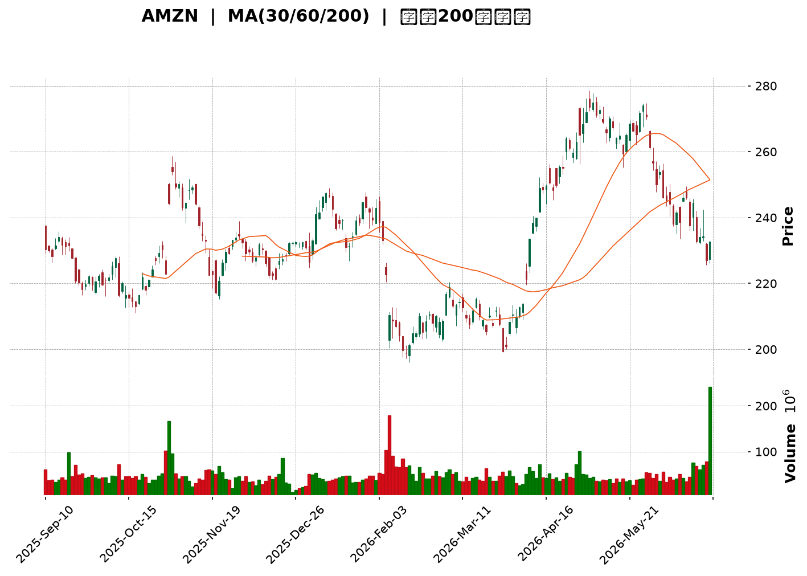
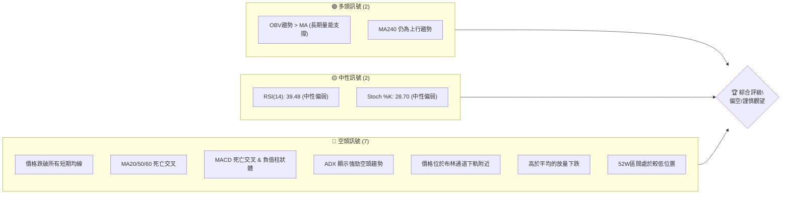
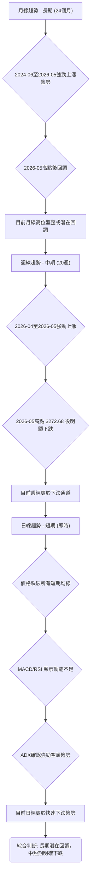
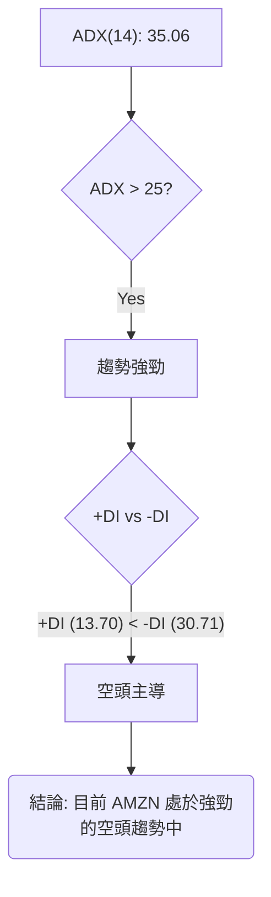
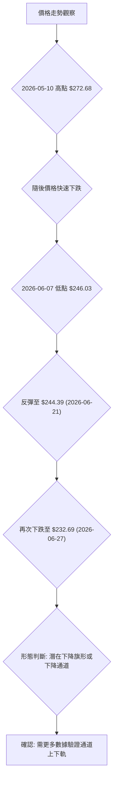
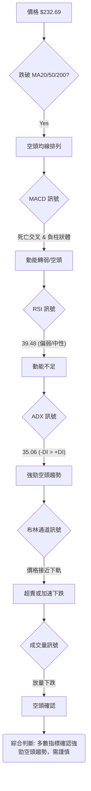
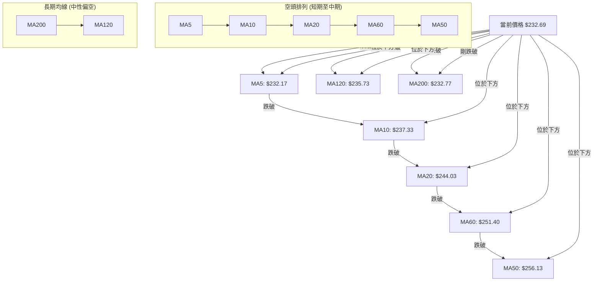
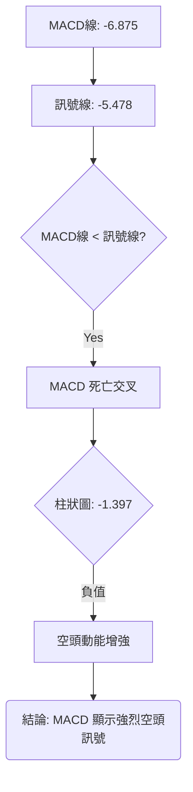

<details>
<summary>📊 靜態圖表 (點擊展開)</summary>

</details>

<html>
<head><meta charset="utf-8" /></head>
<body>
    <div style="height:500px; width:100%;">                        <script>window.PlotlyConfig = {MathJaxConfig: 'local'};</script>
        <script charset="utf-8" src="https://cdn.plot.ly/plotly-3.6.0.min.js" integrity="sha256-QaOVwtVY0T02VaHrr6pnoHLCwayMJp4O5n4YyaE3rJk=" crossorigin="anonymous"></script>                <div id="candlestick-chart" class="plotly-graph-div" style="height:100%; width:100%;"></div>            <script>                window.PLOTLYENV=window.PLOTLYENV || {};                                if (document.getElementById("candlestick-chart")) {                    Plotly.newPlot(                        "candlestick-chart",                        [{"close":{"dtype":"f8","bdata":"AAAAYI\u002fKbEAAAABgZr5sQAAAAMDMhGxAAAAAgMLtbEAAAACgmUFtQAAAAADX82xAAAAAIFznbEAAAAAgXO9sQAAAAAApdGxAAAAAYLiWa0AAAABguIZrQAAAAMDMRGtAAAAAwPV4a0AAAACgcMVrQAAAAIA9cmtAAAAAACmUa0AAAADAHs1rQAAAAOBRcGtAAAAAwMyca0AAAADA9bhrQAAAAEAKJ2xAAAAAIK53bEAAAAAA1wtrQAAAAIA9gmtAAAAA4HoMa0AAAACAPfJqQAAAAEAKz2pAAAAAoEehakAAAAAgXA9rQAAAAMD1wGtAAAAAYGY+a0AAAABA4aJrQAAAAGC4BmxAAAAAQApfbEAAAAAAAKhsQAAAAKCZyWxAAAAAIIXba0AAAABACoduQAAAAAAAwG9AAAAAgD0qb0AAAABgZkZvQAAAAKBHYW5AAAAAwB6NbkAAAADAzAxvQAAAAEAzI29AAAAAYGaGbkAAAABgj7JtQAAAAIAUVm1AAAAAANcbbUAAAACgmdFrQAAAAIAU1mtAAAAA4Hoka0AAAACAFJZrQAAAAMD1SGxAAAAAoHC1bEAAAADAHqVsQAAAAEAKJ21AAAAAACk8bUAAAACgcE1tQAAAAAApDG1AAAAAIIWjbEAAAADA9bBsQAAAAOB6XGxAAAAAoHB9bEAAAADA9fhsQAAAAMD1yGxAAAAAgBRGbEAAAACgR9FrQAAAAIDr0WtAAAAA4KOoa0AAAADgUVhsQAAAAEAza2xAAAAAgMKNbEAAAADgegRtQAAAAAApDG1AAAAA4KMQbUAAAACAPQJtQAAAAMD1EG1AAAAAgD3abEAAAAAAAFBsQAAAAIDrIW1AAAAAgMIdbkAAAACA6zFuQAAAAKBHyW5AAAAAACnsbkAAAABACs9uQAAAAEAzU25AAAAAwMyUbUAAAACAwsVtQAAAAADX421AAAAAAADgbEAAAACA6+lsQAAAAEDhSm1AAAAAwB7lbUAAAACgcM1tQAAAAIDClW5AAAAA4FFgbkAAAAAgXDduQAAAAKCZ6W1AAAAAYLhebkAAAAAA19NtQAAAACCuH21AAAAAgBTWa0AAAACAPUpqQAAAAEAKF2pAAAAAYLjeaUAAAABgj4JpQAAAAEAz82hAAAAAoEfZaEAAAADAzCRpQAAAAKBHmWlAAAAAIIWbaUAAAAAghUNqQAAAAOCjqGlAAAAAgOsRakAAAADgelRqQAAAAKBw\u002fWlAAAAAAABAakAAAADgegxqQAAAACBcF2pAAAAAgD0aa0AAAACAFF5rQAAAAGC4pmpAAAAAIK6vakAAAABgj8pqQAAAAMDMlGpAAAAAwPUwakAAAACgcPVpQAAAACCud2pAAAAAYGbmakAAAAAA1ztqQAAAAOBRGGpAAAAAANeraUAAAADgekRqQAAAACCu52lAAAAAYLh2akAAAACgR\u002fFpQAAAAEDh6mhAAAAAYGYeaUAAAADgowhqQAAAAIA9UmpAAAAA4KM4akAAAACgR5lqQAAAAOCjuGpAAAAAAACoa0AAAADAzDRtQAAAAAApzG1AAAAA4Hr8bUAAAADgoyBvQAAAAAAAEG9AAAAAYGY2b0AAAACA61FvQAAAAMD1CG9AAAAAwB49b0AAAAAghetvQAAAAGCP4m9AAAAAANd\u002fcEAAAACA61FwQAAAAEAzO3BAAAAA4KNwcEAAAADA9ZBwQAAAAAApxHBAAAAAwMwAcUAAAADAzBhxQAAAAADXL3FAAAAAYLjycEAAAABA4QpxQAAAAADXz3BAAAAAwB6dcEAAAACAFOJwQAAAACCFs3BAAAAAgD2CcEAAAACAwo1wQAAAAKBwNXBAAAAAACmQcEAAAAAgXMdwQAAAAMAepXBAAAAA4KOUcEAAAACgmf1wQAAAAAAAIHFAAAAAgD3qcEAAAAAAKVRwQAAAAOBRCHBAAAAA4KNAb0AAAACgR7lvQAAAAMD1wG5AAAAAQAqnbkAAAACAFIZuQAAAAAAAwG1AAAAA4FEwbkAAAACgmdFtQAAAAOCjwG5AAAAAAADAbkAAAAAAALBtQAAAAOB6jG5AAAAAoEcZbUAAAAAghUNtQAAAAOCjSG1AAAAA4FFgbEAAAACAFBZtQA=="},"high":{"dtype":"f8","bdata":"AAAAgMK1bUAAAADA9fBsQAAAAKBH2WxAAAAAIFw3bUAAAADAzHxtQAAAAKCZSW1AAAAAIFwvbUAAAADAHkVtQAAAAIA90mxAAAAAIIV7bEAAAACA6xFsQAAAAKBwlWtAAAAAoJmha0AAAABAM9NrQAAAACCux2tAAAAAwMzEa0AAAACA69lrQAAAAGBmBmxAAAAAIFy3a0AAAADgetxrQAAAACBcV2xAAAAAYLiGbEAAAAAAAIhsQAAAAIDClWtAAAAAgD1qa0AAAABguDZrQAAAAEDhUmtAAAAAoJnZakAAAACAFBZrQAAAAIA96mtAAAAA4FGAa0AAAACgmalrQAAAAMDMLGxAAAAAwMyMbEAAAAAgru9sQAAAAIA9Gm1AAAAAgBSObEAAAAAAAFBvQAAAAKCZKXBAAAAAACkQcEAAAAAAAGBvQAAAAAApTG9AAAAAwMycbkAAAAAAAHhvQAAAAAAAOG9AAAAAANdLb0AAAAAAAHhuQAAAACBc121AAAAAQDNTbUAAAABgZsZsQAAAACCu92tAAAAAwB5tbEAAAABguMZrQAAAAGCPamxAAAAA4KPQbEAAAAAAAPhsQAAAAKBHKW1AAAAAoJl5bUAAAABACt9tQAAAAAApLG1AAAAAAAAwbUAAAAAgrudsQAAAAGCP2mxAAAAAgD2SbEAAAACgcA1tQAAAACCFA21AAAAAYI\u002fCbEAAAACAwn1sQAAAAMAe9WtAAAAAgBQmbEAAAAAgXKdsQAAAAAAppGxAAAAAIFyvbEAAAABgZg5tQAAAAGBmHm1AAAAAIK4fbUAAAABAMxNtQAAAAOCjGG1AAAAAIK4fbUAAAABguG5tQAAAAAAAQG1AAAAAgMJlbkAAAACgR6luQAAAAMAezW5AAAAAIIX7bkAAAACAFB5vQAAAAMAe9W5AAAAAwPUobkAAAADAzBRuQAAAAIA98m1AAAAAQOFibUAAAACgmQltQAAAAEAKd21AAAAAYGYObkAAAABgZh5uQAAAAAApnG5AAAAAwPX4bkAAAAAAAGBuQAAAAIA9am5AAAAAACm0bkAAAABAM8tuQAAAACCF221AAAAAgOtJbEAAAACAFG5qQAAAAIDrmWpAAAAAwMyUakAAAACAPRJqQAAAAGC4fmlAAAAAwB4laUAAAAAgrjdpQAAAACCF22lAAAAA4Hq0aUAAAACgcGVqQAAAAIDCDWpAAAAAIIVLakAAAABA4XJqQAAAAKCZYWpAAAAAYI9KakAAAAAgXDdqQAAAAIDCJWpAAAAAoEcxa0AAAABACo9rQAAAAIA9KmtAAAAAgD26akAAAADAzPRqQAAAAAAAIGtAAAAAYLh2akAAAACA61FqQAAAAEAKl2pAAAAAYGb2akAAAADgeuRqQAAAAADXI2pAAAAAoEfxaUAAAACgmZlqQAAAAEAzK2pAAAAAgD2iakAAAADgepxqQAAAAEAz02lAAAAAoJl5aUAAAADA9UhqQAAAAGCPsmpAAAAAYLiGakAAAABgZp5qQAAAAEAKv2pAAAAAQDNDbEAAAACgmTltQAAAAIDCDW5AAAAAAAAAbkAAAACAwoVvQAAAAIAUTm9AAAAAAABAb0AAAABA4QJwQAAAAIDCRW9AAAAAQOHib0AAAACAFP5vQAAAAOCjLHBAAAAAAACIcEAAAABgZoJwQAAAAOB6UHBAAAAAYI+ecEAAAACAFB5xQAAAAMAeFXFAAAAAoJlBcUAAAADA9WhxQAAAAMDMXHFAAAAAgBRKcUAAAAAAACBxQAAAAIAUGnFAAAAAYGa6cEAAAAAghetwQAAAAOB67HBAAAAAgMKFcEAAAACgmc1wQAAAAAAAZHBAAAAAoEeZcEAAAAAA19dwQAAAAOCj3HBAAAAAwMzUcEAAAABgjwZxQAAAAAAAKHFAAAAAAAAscUAAAACAFKpwQAAAAEAzU3BAAAAAoHARcEAAAABgj\u002fpvQAAAAIAUBnBAAAAAoHAtb0AAAACAwk1vQAAAAIA9gm5AAAAA4HpEbkAAAAAghWtuQAAAAIDr+W5AAAAA4FEwb0AAAADAHr1uQAAAACBct25AAAAAAABAbkAAAAAA15ttQAAAAKBwTW5AAAAAgD0KbUAAAABgZh5tQA=="},"hovertemplate":"\u003cb\u003e%{x|%Y-%m-%d}\u003c\u002fb\u003e\u003cbr\u003e\u958b: $%{open:.2f}\u003cbr\u003e\u9ad8: $%{high:.2f}\u003cbr\u003e\u4f4e: $%{low:.2f}\u003cbr\u003e\u6536: $%{close:.2f}\u003cextra\u003e\u003c\u002fextra\u003e","low":{"dtype":"f8","bdata":"AAAAQDOjbEAAAABA4apsQAAAAKBHSWxAAAAAgD3KbEAAAAAgXAdtQAAAAGC4lmxAAAAAoEeZbEAAAABgZrZsQAAAAOBRcGxAAAAAgD2Ca0AAAABgZm5rQAAAAEAKD2tAAAAA4KNAa0AAAACgmWlrQAAAAOB6PGtAAAAAIIUTa0AAAABgZl5rQAAAAEDhamtAAAAAwPUAa0AAAACgcIVrQAAAAIAUpmtAAAAAAAC4a0AAAAAAAABrQAAAAKBHIWtAAAAAQDOTakAAAADAHpVqQAAAAIDrmWpAAAAAwPVgakAAAABA4bJqQAAAACCuP2tAAAAA4KMQa0AAAACAwkVrQAAAAMDMvGtAAAAAoEcxbEAAAABguEZsQAAAAOBReGxAAAAAAADYa0AAAAAgXH9uQAAAAMDMnG9AAAAAwB4Vb0AAAADAHsVuQAAAAKBwRW5AAAAAIK7PbUAAAABA4bJuQAAAACBc525AAAAAAAB4bkAAAAAAAJBtQAAAAOB6HG1AAAAAgBSmbEAAAACgcM1rQAAAAOCjUGtAAAAAIK4Xa0AAAACAwuVqQAAAAOCjyGtAAAAAoJn5a0AAAADgo5hsQAAAAEAKx2xAAAAAAAAIbUAAAACgmTFtQAAAACCF02xAAAAAoJlZbEAAAACgmZFsQAAAAOCjSGxAAAAAIIUjbEAAAABguI5sQAAAAIAUlmxAAAAAANcjbEAAAAAAALBrQAAAAAAppGtAAAAAIK6fa0AAAADAHg1sQAAAAGCPMmxAAAAAYLhWbEAAAAAgXJdsQAAAAGCP6mxAAAAAgMLlbEAAAADgo9hsQAAAAGBmxmxAAAAAANfDbEAAAABgZhZsQAAAAIDCZWxAAAAAgD0CbUAAAADgo\u002fBtQAAAAAApPG5AAAAAIK5HbkAAAABguL5uQAAAAAAACG5AAAAAQAqHbUAAAAAAKZRtQAAAAMAejW1AAAAAQOGqbEAAAAAAKVxsQAAAAMDM3GxAAAAAgD1SbUAAAACgR7FtQAAAAGCPwm1AAAAAwPUwbkAAAAAgrpdtQAAAAOB6tG1AAAAAoHDFbUAAAABgZm5tQAAAAIA9+mxAAAAAACmMa0AAAACA6wlpQAAAAEAza2lAAAAAwB7NaUAAAAAgrk9pQAAAAIDrsWhAAAAAwPWoaEAAAAAAAIBoQAAAAOBRMGlAAAAAgOtZaUAAAAAAAHhpQAAAACCFY2lAAAAAAABoaUAAAACAwh1qQAAAAEAzq2lAAAAAYGamaUAAAABguG5pQAAAACBcT2lAAAAAwMxEakAAAABA4fJqQAAAAMD1kGpAAAAAIIXjaUAAAACAwo1qQAAAAEAza2pAAAAAwMwEakAAAABACsdpQAAAAGBm7mlAAAAAgMKNakAAAABgjxpqQAAAAKCZwWlAAAAAgD2KaUAAAADgUTBqQAAAAOB61GlAAAAAwMw8akAAAAAA1+NpQAAAAOB65GhAAAAAIFz\u002faEAAAADgeoRpQAAAAIAUBmpAAAAAwMycaUAAAABA4TJqQAAAAGCPImpAAAAAANdza0AAAADgo+hrQAAAAGC4Zm1AAAAAAAB4bUAAAADA9ThuQAAAAGBm5m5AAAAAYGaGbkAAAAAghUNvQAAAAADXq25AAAAAQDMjb0AAAABgj0pvQAAAAIA9om9AAAAAQAobcEAAAACgcEVwQAAAAIAUCnBAAAAAQDMbcEAAAABgjwJwQAAAAADXa3BAAAAAwMzMcEAAAACAFAZxQAAAACBcA3FAAAAAANfncEAAAABAM99wQAAAACCux3BAAAAAgBRqcEAAAABAM3NwQAAAAIAUqnBAAAAAgD1OcEAAAADgemhwQAAAAIAU5m9AAAAA4Ho4cEAAAACA61VwQAAAAADXo3BAAAAAwB5hcEAAAABAM5twQAAAAEAKt3BAAAAAgD3acEAAAABAM0twQAAAAADXy29AAAAAYLj2bkAAAAAAAHhvQAAAAMD1uG5AAAAAIIVrbkAAAADAzAxuQAAAAGBmrm1AAAAAgMJlbUAAAABA4TJtQAAAACBcl25AAAAAYGaubkAAAAAAAIBtQAAAAOCjgG1AAAAAIK4HbUAAAAAAAABtQAAAAGBmHm1AAAAAoJkxbEAAAAAAAERsQA=="},"name":"\u50f9\u683c","open":{"dtype":"f8","bdata":"AAAA4KOwbUAAAAAgru9sQAAAAEAzy2xAAAAAACnUbEAAAACAFB5tQAAAAOCjOG1AAAAAAAAQbUAAAAAA1wttQAAAAIDr0WxAAAAAYI96bEAAAADAzARsQAAAAIDrgWtAAAAAYI9ia0AAAABgj4JrQAAAAMD1wGtAAAAAIIUra0AAAADgUaBrQAAAAIAU7mtAAAAAAACga0AAAAAAKZxrQAAAAKBw3WtAAAAAAAAgbEAAAABguEZsQAAAAGBmNmtAAAAAgOvxakAAAAAA1xNrQAAAAKBw9WpAAAAAgOvRakAAAAAAKbxqQAAAAIDCTWtAAAAAoJlpa0AAAAAAAGBrQAAAAEAKv2tAAAAAwB51bEAAAABACodsQAAAAKBw9WxAAAAAgOthbEAAAABAM0NvQAAAACCF629AAAAAAClMb0AAAADA9SBvQAAAAMAeJW9AAAAAwMxcbkAAAABA4QpvQAAAAMAeDW9AAAAAIK5Hb0AAAACgmWFuQAAAAIDrYW1AAAAAAAAobUAAAABAM4NsQAAAACCu92tAAAAAoJlhbEAAAABAMwtrQAAAAIDr0WtAAAAAAClMbEAAAAAgrtdsQAAAACCu52xAAAAAQAonbUAAAADgUWBtQAAAAEAzK21AAAAA4KMYbUAAAACAPcpsQAAAAEDhsmxAAAAAQOFabEAAAACA65lsQAAAAGC41mxAAAAAANe7bEAAAACAwn1sQAAAAKBH4WtAAAAAwB4VbEAAAABguDZsQAAAAOBRWGxAAAAAIIWTbEAAAACA66FsQAAAAAApBG1AAAAAoEcBbUAAAACAFP5sQAAAAGC45mxAAAAAwB4dbUAAAABA4epsQAAAAEDhmmxAAAAAQDMDbUAAAAAghfNtQAAAAIDrYW5AAAAAgD2SbkAAAAAgXNduQAAAAMD10G5AAAAAwMwkbkAAAACA6+ltQAAAAEDh4m1AAAAA4FE4bUAAAABA4eJsQAAAAKCZQW1AAAAAYLhebUAAAAAgXP9tQAAAAIAU9m1AAAAAANfLbkAAAACAPVpuQAAAAOB6\u002fG1AAAAAgOvJbUAAAAAgXJ9uQAAAACCF221AAAAAwB4dbEAAAABgZlZpQAAAAEAKH2pAAAAAoJkZakAAAACA6wFqQAAAAGC4fmlAAAAAACncaEAAAAAAKcRoQAAAAIA9QmlAAAAAoJl5aUAAAADgUZhpQAAAAEAzA2pAAAAAQAqvaUAAAABguE5qQAAAACBcV2pAAAAAYI\u002faaUAAAACgmZFpQAAAAEAzY2lAAAAAQApPakAAAAAgXP9qQAAAACCu32pAAAAAYGZOakAAAACAFMZqQAAAAGC49mpAAAAA4HpMakAAAAAghTNqQAAAAEAzC2pAAAAAgD2aakAAAACAwr1qQAAAAIDr4WlAAAAAwMzsaUAAAACgRzlqQAAAAGBm\u002fmlAAAAAgOtxakAAAAAghVNqQAAAAGC4zmlAAAAAIFwvaUAAAABAM5tpQAAAAIAUTmpAAAAAoEfRaUAAAACgmTlqQAAAACCuZ2pAAAAAoEf5a0AAAAAgXCdsQAAAAKCZaW1AAAAAYGaubUAAAADA9ThuQAAAAAAAKG9AAAAA4FEQb0AAAAAgrt9vQAAAAIAUJm9AAAAAQOHib0AAAACAFI5vQAAAAOB67G9AAAAAIK4\u002fcEAAAAAgXHdwQAAAAIA9JnBAAAAAANcfcEAAAABguBJxQAAAAKBHmXBAAAAAwMzMcEAAAACgR0FxQAAAAIA9DnFAAAAA4FEwcUAAAACAFPpwQAAAAKBw3XBAAAAAIFyrcEAAAABA4YZwQAAAAGBm0nBAAAAAAABocEAAAACA631wQAAAAOCjYHBAAAAAwMxAcEAAAAAAAHhwQAAAAGCPynBAAAAAQAq\u002fcEAAAABgZqJwQAAAAOBRBHFAAAAA4KP0cEAAAADgo6RwQAAAAGCPEnBAAAAAYGbWb0AAAAAA16NvQAAAAOBRyG9AAAAAgMLVbkAAAAAgXPduQAAAACCFc25AAAAAgMK9bUAAAABguGZuQAAAAOCjoG5AAAAAAAAAb0AAAADAzJxuQAAAAADXA25AAAAAYI8CbkAAAACgmRFtQAAAAEAzO21AAAAA4KMAbUAAAADgemxsQA=="},"x":["2025-09-10T00:00:00-04:00","2025-09-11T00:00:00-04:00","2025-09-12T00:00:00-04:00","2025-09-15T00:00:00-04:00","2025-09-16T00:00:00-04:00","2025-09-17T00:00:00-04:00","2025-09-18T00:00:00-04:00","2025-09-19T00:00:00-04:00","2025-09-22T00:00:00-04:00","2025-09-23T00:00:00-04:00","2025-09-24T00:00:00-04:00","2025-09-25T00:00:00-04:00","2025-09-26T00:00:00-04:00","2025-09-29T00:00:00-04:00","2025-09-30T00:00:00-04:00","2025-10-01T00:00:00-04:00","2025-10-02T00:00:00-04:00","2025-10-03T00:00:00-04:00","2025-10-06T00:00:00-04:00","2025-10-07T00:00:00-04:00","2025-10-08T00:00:00-04:00","2025-10-09T00:00:00-04:00","2025-10-10T00:00:00-04:00","2025-10-13T00:00:00-04:00","2025-10-14T00:00:00-04:00","2025-10-15T00:00:00-04:00","2025-10-16T00:00:00-04:00","2025-10-17T00:00:00-04:00","2025-10-20T00:00:00-04:00","2025-10-21T00:00:00-04:00","2025-10-22T00:00:00-04:00","2025-10-23T00:00:00-04:00","2025-10-24T00:00:00-04:00","2025-10-27T00:00:00-04:00","2025-10-28T00:00:00-04:00","2025-10-29T00:00:00-04:00","2025-10-30T00:00:00-04:00","2025-10-31T00:00:00-04:00","2025-11-03T00:00:00-05:00","2025-11-04T00:00:00-05:00","2025-11-05T00:00:00-05:00","2025-11-06T00:00:00-05:00","2025-11-07T00:00:00-05:00","2025-11-10T00:00:00-05:00","2025-11-11T00:00:00-05:00","2025-11-12T00:00:00-05:00","2025-11-13T00:00:00-05:00","2025-11-14T00:00:00-05:00","2025-11-17T00:00:00-05:00","2025-11-18T00:00:00-05:00","2025-11-19T00:00:00-05:00","2025-11-20T00:00:00-05:00","2025-11-21T00:00:00-05:00","2025-11-24T00:00:00-05:00","2025-11-25T00:00:00-05:00","2025-11-26T00:00:00-05:00","2025-11-28T00:00:00-05:00","2025-12-01T00:00:00-05:00","2025-12-02T00:00:00-05:00","2025-12-03T00:00:00-05:00","2025-12-04T00:00:00-05:00","2025-12-05T00:00:00-05:00","2025-12-08T00:00:00-05:00","2025-12-09T00:00:00-05:00","2025-12-10T00:00:00-05:00","2025-12-11T00:00:00-05:00","2025-12-12T00:00:00-05:00","2025-12-15T00:00:00-05:00","2025-12-16T00:00:00-05:00","2025-12-17T00:00:00-05:00","2025-12-18T00:00:00-05:00","2025-12-19T00:00:00-05:00","2025-12-22T00:00:00-05:00","2025-12-23T00:00:00-05:00","2025-12-24T00:00:00-05:00","2025-12-26T00:00:00-05:00","2025-12-29T00:00:00-05:00","2025-12-30T00:00:00-05:00","2025-12-31T00:00:00-05:00","2026-01-02T00:00:00-05:00","2026-01-05T00:00:00-05:00","2026-01-06T00:00:00-05:00","2026-01-07T00:00:00-05:00","2026-01-08T00:00:00-05:00","2026-01-09T00:00:00-05:00","2026-01-12T00:00:00-05:00","2026-01-13T00:00:00-05:00","2026-01-14T00:00:00-05:00","2026-01-15T00:00:00-05:00","2026-01-16T00:00:00-05:00","2026-01-20T00:00:00-05:00","2026-01-21T00:00:00-05:00","2026-01-22T00:00:00-05:00","2026-01-23T00:00:00-05:00","2026-01-26T00:00:00-05:00","2026-01-27T00:00:00-05:00","2026-01-28T00:00:00-05:00","2026-01-29T00:00:00-05:00","2026-01-30T00:00:00-05:00","2026-02-02T00:00:00-05:00","2026-02-03T00:00:00-05:00","2026-02-04T00:00:00-05:00","2026-02-05T00:00:00-05:00","2026-02-06T00:00:00-05:00","2026-02-09T00:00:00-05:00","2026-02-10T00:00:00-05:00","2026-02-11T00:00:00-05:00","2026-02-12T00:00:00-05:00","2026-02-13T00:00:00-05:00","2026-02-17T00:00:00-05:00","2026-02-18T00:00:00-05:00","2026-02-19T00:00:00-05:00","2026-02-20T00:00:00-05:00","2026-02-23T00:00:00-05:00","2026-02-24T00:00:00-05:00","2026-02-25T00:00:00-05:00","2026-02-26T00:00:00-05:00","2026-02-27T00:00:00-05:00","2026-03-02T00:00:00-05:00","2026-03-03T00:00:00-05:00","2026-03-04T00:00:00-05:00","2026-03-05T00:00:00-05:00","2026-03-06T00:00:00-05:00","2026-03-09T00:00:00-04:00","2026-03-10T00:00:00-04:00","2026-03-11T00:00:00-04:00","2026-03-12T00:00:00-04:00","2026-03-13T00:00:00-04:00","2026-03-16T00:00:00-04:00","2026-03-17T00:00:00-04:00","2026-03-18T00:00:00-04:00","2026-03-19T00:00:00-04:00","2026-03-20T00:00:00-04:00","2026-03-23T00:00:00-04:00","2026-03-24T00:00:00-04:00","2026-03-25T00:00:00-04:00","2026-03-26T00:00:00-04:00","2026-03-27T00:00:00-04:00","2026-03-30T00:00:00-04:00","2026-03-31T00:00:00-04:00","2026-04-01T00:00:00-04:00","2026-04-02T00:00:00-04:00","2026-04-06T00:00:00-04:00","2026-04-07T00:00:00-04:00","2026-04-08T00:00:00-04:00","2026-04-09T00:00:00-04:00","2026-04-10T00:00:00-04:00","2026-04-13T00:00:00-04:00","2026-04-14T00:00:00-04:00","2026-04-15T00:00:00-04:00","2026-04-16T00:00:00-04:00","2026-04-17T00:00:00-04:00","2026-04-20T00:00:00-04:00","2026-04-21T00:00:00-04:00","2026-04-22T00:00:00-04:00","2026-04-23T00:00:00-04:00","2026-04-24T00:00:00-04:00","2026-04-27T00:00:00-04:00","2026-04-28T00:00:00-04:00","2026-04-29T00:00:00-04:00","2026-04-30T00:00:00-04:00","2026-05-01T00:00:00-04:00","2026-05-04T00:00:00-04:00","2026-05-05T00:00:00-04:00","2026-05-06T00:00:00-04:00","2026-05-07T00:00:00-04:00","2026-05-08T00:00:00-04:00","2026-05-11T00:00:00-04:00","2026-05-12T00:00:00-04:00","2026-05-13T00:00:00-04:00","2026-05-14T00:00:00-04:00","2026-05-15T00:00:00-04:00","2026-05-18T00:00:00-04:00","2026-05-19T00:00:00-04:00","2026-05-20T00:00:00-04:00","2026-05-21T00:00:00-04:00","2026-05-22T00:00:00-04:00","2026-05-26T00:00:00-04:00","2026-05-27T00:00:00-04:00","2026-05-28T00:00:00-04:00","2026-05-29T00:00:00-04:00","2026-06-01T00:00:00-04:00","2026-06-02T00:00:00-04:00","2026-06-03T00:00:00-04:00","2026-06-04T00:00:00-04:00","2026-06-05T00:00:00-04:00","2026-06-08T00:00:00-04:00","2026-06-09T00:00:00-04:00","2026-06-10T00:00:00-04:00","2026-06-11T00:00:00-04:00","2026-06-12T00:00:00-04:00","2026-06-15T00:00:00-04:00","2026-06-16T00:00:00-04:00","2026-06-17T00:00:00-04:00","2026-06-18T00:00:00-04:00","2026-06-22T00:00:00-04:00","2026-06-23T00:00:00-04:00","2026-06-24T00:00:00-04:00","2026-06-25T00:00:00-04:00","2026-06-26T00:00:00-04:00"],"type":"candlestick"},{"hovertemplate":"MA30: $%{y:.2f}\u003cextra\u003e\u003c\u002fextra\u003e","line":{"color":"#2196F3","dash":"dash","width":2},"mode":"lines","name":"MA30","x":["2025-09-10T00:00:00-04:00","2025-09-11T00:00:00-04:00","2025-09-12T00:00:00-04:00","2025-09-15T00:00:00-04:00","2025-09-16T00:00:00-04:00","2025-09-17T00:00:00-04:00","2025-09-18T00:00:00-04:00","2025-09-19T00:00:00-04:00","2025-09-22T00:00:00-04:00","2025-09-23T00:00:00-04:00","2025-09-24T00:00:00-04:00","2025-09-25T00:00:00-04:00","2025-09-26T00:00:00-04:00","2025-09-29T00:00:00-04:00","2025-09-30T00:00:00-04:00","2025-10-01T00:00:00-04:00","2025-10-02T00:00:00-04:00","2025-10-03T00:00:00-04:00","2025-10-06T00:00:00-04:00","2025-10-07T00:00:00-04:00","2025-10-08T00:00:00-04:00","2025-10-09T00:00:00-04:00","2025-10-10T00:00:00-04:00","2025-10-13T00:00:00-04:00","2025-10-14T00:00:00-04:00","2025-10-15T00:00:00-04:00","2025-10-16T00:00:00-04:00","2025-10-17T00:00:00-04:00","2025-10-20T00:00:00-04:00","2025-10-21T00:00:00-04:00","2025-10-22T00:00:00-04:00","2025-10-23T00:00:00-04:00","2025-10-24T00:00:00-04:00","2025-10-27T00:00:00-04:00","2025-10-28T00:00:00-04:00","2025-10-29T00:00:00-04:00","2025-10-30T00:00:00-04:00","2025-10-31T00:00:00-04:00","2025-11-03T00:00:00-05:00","2025-11-04T00:00:00-05:00","2025-11-05T00:00:00-05:00","2025-11-06T00:00:00-05:00","2025-11-07T00:00:00-05:00","2025-11-10T00:00:00-05:00","2025-11-11T00:00:00-05:00","2025-11-12T00:00:00-05:00","2025-11-13T00:00:00-05:00","2025-11-14T00:00:00-05:00","2025-11-17T00:00:00-05:00","2025-11-18T00:00:00-05:00","2025-11-19T00:00:00-05:00","2025-11-20T00:00:00-05:00","2025-11-21T00:00:00-05:00","2025-11-24T00:00:00-05:00","2025-11-25T00:00:00-05:00","2025-11-26T00:00:00-05:00","2025-11-28T00:00:00-05:00","2025-12-01T00:00:00-05:00","2025-12-02T00:00:00-05:00","2025-12-03T00:00:00-05:00","2025-12-04T00:00:00-05:00","2025-12-05T00:00:00-05:00","2025-12-08T00:00:00-05:00","2025-12-09T00:00:00-05:00","2025-12-10T00:00:00-05:00","2025-12-11T00:00:00-05:00","2025-12-12T00:00:00-05:00","2025-12-15T00:00:00-05:00","2025-12-16T00:00:00-05:00","2025-12-17T00:00:00-05:00","2025-12-18T00:00:00-05:00","2025-12-19T00:00:00-05:00","2025-12-22T00:00:00-05:00","2025-12-23T00:00:00-05:00","2025-12-24T00:00:00-05:00","2025-12-26T00:00:00-05:00","2025-12-29T00:00:00-05:00","2025-12-30T00:00:00-05:00","2025-12-31T00:00:00-05:00","2026-01-02T00:00:00-05:00","2026-01-05T00:00:00-05:00","2026-01-06T00:00:00-05:00","2026-01-07T00:00:00-05:00","2026-01-08T00:00:00-05:00","2026-01-09T00:00:00-05:00","2026-01-12T00:00:00-05:00","2026-01-13T00:00:00-05:00","2026-01-14T00:00:00-05:00","2026-01-15T00:00:00-05:00","2026-01-16T00:00:00-05:00","2026-01-20T00:00:00-05:00","2026-01-21T00:00:00-05:00","2026-01-22T00:00:00-05:00","2026-01-23T00:00:00-05:00","2026-01-26T00:00:00-05:00","2026-01-27T00:00:00-05:00","2026-01-28T00:00:00-05:00","2026-01-29T00:00:00-05:00","2026-01-30T00:00:00-05:00","2026-02-02T00:00:00-05:00","2026-02-03T00:00:00-05:00","2026-02-04T00:00:00-05:00","2026-02-05T00:00:00-05:00","2026-02-06T00:00:00-05:00","2026-02-09T00:00:00-05:00","2026-02-10T00:00:00-05:00","2026-02-11T00:00:00-05:00","2026-02-12T00:00:00-05:00","2026-02-13T00:00:00-05:00","2026-02-17T00:00:00-05:00","2026-02-18T00:00:00-05:00","2026-02-19T00:00:00-05:00","2026-02-20T00:00:00-05:00","2026-02-23T00:00:00-05:00","2026-02-24T00:00:00-05:00","2026-02-25T00:00:00-05:00","2026-02-26T00:00:00-05:00","2026-02-27T00:00:00-05:00","2026-03-02T00:00:00-05:00","2026-03-03T00:00:00-05:00","2026-03-04T00:00:00-05:00","2026-03-05T00:00:00-05:00","2026-03-06T00:00:00-05:00","2026-03-09T00:00:00-04:00","2026-03-10T00:00:00-04:00","2026-03-11T00:00:00-04:00","2026-03-12T00:00:00-04:00","2026-03-13T00:00:00-04:00","2026-03-16T00:00:00-04:00","2026-03-17T00:00:00-04:00","2026-03-18T00:00:00-04:00","2026-03-19T00:00:00-04:00","2026-03-20T00:00:00-04:00","2026-03-23T00:00:00-04:00","2026-03-24T00:00:00-04:00","2026-03-25T00:00:00-04:00","2026-03-26T00:00:00-04:00","2026-03-27T00:00:00-04:00","2026-03-30T00:00:00-04:00","2026-03-31T00:00:00-04:00","2026-04-01T00:00:00-04:00","2026-04-02T00:00:00-04:00","2026-04-06T00:00:00-04:00","2026-04-07T00:00:00-04:00","2026-04-08T00:00:00-04:00","2026-04-09T00:00:00-04:00","2026-04-10T00:00:00-04:00","2026-04-13T00:00:00-04:00","2026-04-14T00:00:00-04:00","2026-04-15T00:00:00-04:00","2026-04-16T00:00:00-04:00","2026-04-17T00:00:00-04:00","2026-04-20T00:00:00-04:00","2026-04-21T00:00:00-04:00","2026-04-22T00:00:00-04:00","2026-04-23T00:00:00-04:00","2026-04-24T00:00:00-04:00","2026-04-27T00:00:00-04:00","2026-04-28T00:00:00-04:00","2026-04-29T00:00:00-04:00","2026-04-30T00:00:00-04:00","2026-05-01T00:00:00-04:00","2026-05-04T00:00:00-04:00","2026-05-05T00:00:00-04:00","2026-05-06T00:00:00-04:00","2026-05-07T00:00:00-04:00","2026-05-08T00:00:00-04:00","2026-05-11T00:00:00-04:00","2026-05-12T00:00:00-04:00","2026-05-13T00:00:00-04:00","2026-05-14T00:00:00-04:00","2026-05-15T00:00:00-04:00","2026-05-18T00:00:00-04:00","2026-05-19T00:00:00-04:00","2026-05-20T00:00:00-04:00","2026-05-21T00:00:00-04:00","2026-05-22T00:00:00-04:00","2026-05-26T00:00:00-04:00","2026-05-27T00:00:00-04:00","2026-05-28T00:00:00-04:00","2026-05-29T00:00:00-04:00","2026-06-01T00:00:00-04:00","2026-06-02T00:00:00-04:00","2026-06-03T00:00:00-04:00","2026-06-04T00:00:00-04:00","2026-06-05T00:00:00-04:00","2026-06-08T00:00:00-04:00","2026-06-09T00:00:00-04:00","2026-06-10T00:00:00-04:00","2026-06-11T00:00:00-04:00","2026-06-12T00:00:00-04:00","2026-06-15T00:00:00-04:00","2026-06-16T00:00:00-04:00","2026-06-17T00:00:00-04:00","2026-06-18T00:00:00-04:00","2026-06-22T00:00:00-04:00","2026-06-23T00:00:00-04:00","2026-06-24T00:00:00-04:00","2026-06-25T00:00:00-04:00","2026-06-26T00:00:00-04:00"],"y":{"dtype":"f8","bdata":"AAAAAAAA+H8AAAAAAAD4fwAAAAAAAPh\u002fAAAAAAAA+H8AAAAAAAD4fwAAAAAAAPh\u002fAAAAAAAA+H8AAAAAAAD4fwAAAAAAAPh\u002fAAAAAAAA+H8AAAAAAAD4fwAAAAAAAPh\u002fAAAAAAAA+H8AAAAAAAD4fwAAAAAAAPh\u002fAAAAAAAA+H8AAAAAAAD4fwAAAAAAAPh\u002fAAAAAAAA+H8AAAAAAAD4fwAAAAAAAPh\u002fAAAAAAAA+H8AAAAAAAD4fwAAAAAAAPh\u002fAAAAAAAA+H8AAAAAAAD4fwAAAAAAAPh\u002fAAAAAAAA+H8AAAAAAAD4f7y7uwsC32tAq6qqes3Ra0C8u7sbWshrQKuqqjomxGtAq6qqWmS\u002fa0AiIiKiRbprQAAAADDduGtA7+7unu+va0De3d19hr1rQCIiIkKn2WtAIiIisiv4a0BmZmb2KBhsQHd3d5e1MmxAmpmZOftMbEAzMzPD9WhsQLy7u2t1iGxAmpmZmZmhbEBVVVUFyLFsQM3MzCz5wWxAiYiIyL3ObEC8u7sLkM9sQAAAADDdzGxA3t3drY7BbEBERERUKsZsQCIiIhLKzGxAVVVVZfTabEDv7u5ec+lsQO\u002fu7l5z\u002fWxAVVVVFa4TbUBmZmbm0CZtQERERCTbMW1AERERkcI9bUAAAABAw0ZtQBERERGfSW1Aq6qqeqJKbUBmZmZWVU1tQAAAAOBPTW1AAAAAMN1QbUCamZkZvTltQCIiIuIzGG1AzczMXEj6bEDe3d2tR+FsQERERESL0GxAiYiIqH+\u002fbECJiIiYJ65sQLy7u+tRnGxAERERgdyPbECJiIjo+4lsQFVVVRWuh2xAzczMTH6FbECamZnptIlsQM3MzJzElGxA3t3d3SSubEBERETEZ8RsQERERNS\u002f2WxAd3d316PsbEAAAACgGv9sQN7d3f0bCW1AIiIiYhAMbUDNzMwcExBtQERERJRDF21AzczMrEcZbUC8u7u7LRttQERERBQgI21AmpmZWR0vbUAzMzODMjZtQLy7u6uORW1AZmZmpn9XbUDNzMzM92ttQAAAAPDSfW1AERERwfWUbUAzMzNTnKFtQLy7u2ugp21AVVVVBYGhbUBVVVW1OoptQDMzM\u002fP9cG1A3t3dXbpVbUCrqqo63zdtQFVVVSW\u002fFG1AERER0ZTybEAzMzOTitdsQKuqqvpiuWxAd3d3d+mSbEBVVVWFXXFsQERERFScRWxAERER4TMcbEBmZmbm+\u002fVrQCIiIvL90GtAiYiIuJC0a0ARERERypRrQCIiIpJfdGtAzczMfD9la0B3d3enDVhrQCIiIsKDQWtAMzMzIyIma0BmZmb2bwxrQDMzM6NF6mpA3t3dXY\u002fGakB3d3e3OqJqQAAAAADVhGpAq6qqqjhnakAAAAAAjkhqQHd3d5e1LmpAMzMzEzwcakC8u7vrChxqQImIiMh2GmpAmpmZ2YcfakCJiIioOCNqQImIiKjxImpAvLu7ez8lakCJiIi41yxqQM3MzAwCM2pA7+7uzj44akAAAACgGjtqQBEREbErRGpAiYiI6LRRakC8u7srQGpqQImIiMi9impA7+7uvp+qakAiIiJy9tVqQO\u002fu7k5iAGtAzczMvHQja0CrqqoaL0VrQM3MzIyXamtAMzMzo3CRa0AAAACQNL1rQImIiMh26mtA3t3d\u002fY0kbEB3d3dnkV1sQO\u002fu7q65kGxAIiIiMsHDbEDv7u6+n\u002f5sQHd3dzcXPm1AzczMTDeFbUBERER02shtQHd3d7ceEW5AMzMzQ4tQbkAzMzPTBpZuQKuqqupR4G5AERERwYMlb0CJiIiof2dvQCIiIuLso29AVVVVhevdb0DNzMwMuwpwQHd3d98II3BAq6qqkl86cEBERERM8ExwQCIiIgrXW3BAzczM\u002fGJpcEAzMzMLkHVwQM3MzKQpg3BAd3d3p1SOcEAAAACQCZRwQImIiJhumHBAVVVVnX2YcECamZlBp5dwQBEREaHTknBAZmZm5tCIcEBERERkyX9wQN7d3Z02dHBAVVVVDbtocEDe3d2Nl1pwQFVVVQ27TnBAREREXNZAcEDe3d1VnC1wQKuqqmpKHXBAvLu7Q9IIcECamZlZgOhvQKuqqnp3w29AIiIiwhGab0BEREQkInJvQA=="},"type":"scatter"},{"hovertemplate":"MA60: $%{y:.2f}\u003cextra\u003e\u003c\u002fextra\u003e","line":{"color":"#9C27B0","dash":"dash","width":2},"mode":"lines","name":"MA60","x":["2025-09-10T00:00:00-04:00","2025-09-11T00:00:00-04:00","2025-09-12T00:00:00-04:00","2025-09-15T00:00:00-04:00","2025-09-16T00:00:00-04:00","2025-09-17T00:00:00-04:00","2025-09-18T00:00:00-04:00","2025-09-19T00:00:00-04:00","2025-09-22T00:00:00-04:00","2025-09-23T00:00:00-04:00","2025-09-24T00:00:00-04:00","2025-09-25T00:00:00-04:00","2025-09-26T00:00:00-04:00","2025-09-29T00:00:00-04:00","2025-09-30T00:00:00-04:00","2025-10-01T00:00:00-04:00","2025-10-02T00:00:00-04:00","2025-10-03T00:00:00-04:00","2025-10-06T00:00:00-04:00","2025-10-07T00:00:00-04:00","2025-10-08T00:00:00-04:00","2025-10-09T00:00:00-04:00","2025-10-10T00:00:00-04:00","2025-10-13T00:00:00-04:00","2025-10-14T00:00:00-04:00","2025-10-15T00:00:00-04:00","2025-10-16T00:00:00-04:00","2025-10-17T00:00:00-04:00","2025-10-20T00:00:00-04:00","2025-10-21T00:00:00-04:00","2025-10-22T00:00:00-04:00","2025-10-23T00:00:00-04:00","2025-10-24T00:00:00-04:00","2025-10-27T00:00:00-04:00","2025-10-28T00:00:00-04:00","2025-10-29T00:00:00-04:00","2025-10-30T00:00:00-04:00","2025-10-31T00:00:00-04:00","2025-11-03T00:00:00-05:00","2025-11-04T00:00:00-05:00","2025-11-05T00:00:00-05:00","2025-11-06T00:00:00-05:00","2025-11-07T00:00:00-05:00","2025-11-10T00:00:00-05:00","2025-11-11T00:00:00-05:00","2025-11-12T00:00:00-05:00","2025-11-13T00:00:00-05:00","2025-11-14T00:00:00-05:00","2025-11-17T00:00:00-05:00","2025-11-18T00:00:00-05:00","2025-11-19T00:00:00-05:00","2025-11-20T00:00:00-05:00","2025-11-21T00:00:00-05:00","2025-11-24T00:00:00-05:00","2025-11-25T00:00:00-05:00","2025-11-26T00:00:00-05:00","2025-11-28T00:00:00-05:00","2025-12-01T00:00:00-05:00","2025-12-02T00:00:00-05:00","2025-12-03T00:00:00-05:00","2025-12-04T00:00:00-05:00","2025-12-05T00:00:00-05:00","2025-12-08T00:00:00-05:00","2025-12-09T00:00:00-05:00","2025-12-10T00:00:00-05:00","2025-12-11T00:00:00-05:00","2025-12-12T00:00:00-05:00","2025-12-15T00:00:00-05:00","2025-12-16T00:00:00-05:00","2025-12-17T00:00:00-05:00","2025-12-18T00:00:00-05:00","2025-12-19T00:00:00-05:00","2025-12-22T00:00:00-05:00","2025-12-23T00:00:00-05:00","2025-12-24T00:00:00-05:00","2025-12-26T00:00:00-05:00","2025-12-29T00:00:00-05:00","2025-12-30T00:00:00-05:00","2025-12-31T00:00:00-05:00","2026-01-02T00:00:00-05:00","2026-01-05T00:00:00-05:00","2026-01-06T00:00:00-05:00","2026-01-07T00:00:00-05:00","2026-01-08T00:00:00-05:00","2026-01-09T00:00:00-05:00","2026-01-12T00:00:00-05:00","2026-01-13T00:00:00-05:00","2026-01-14T00:00:00-05:00","2026-01-15T00:00:00-05:00","2026-01-16T00:00:00-05:00","2026-01-20T00:00:00-05:00","2026-01-21T00:00:00-05:00","2026-01-22T00:00:00-05:00","2026-01-23T00:00:00-05:00","2026-01-26T00:00:00-05:00","2026-01-27T00:00:00-05:00","2026-01-28T00:00:00-05:00","2026-01-29T00:00:00-05:00","2026-01-30T00:00:00-05:00","2026-02-02T00:00:00-05:00","2026-02-03T00:00:00-05:00","2026-02-04T00:00:00-05:00","2026-02-05T00:00:00-05:00","2026-02-06T00:00:00-05:00","2026-02-09T00:00:00-05:00","2026-02-10T00:00:00-05:00","2026-02-11T00:00:00-05:00","2026-02-12T00:00:00-05:00","2026-02-13T00:00:00-05:00","2026-02-17T00:00:00-05:00","2026-02-18T00:00:00-05:00","2026-02-19T00:00:00-05:00","2026-02-20T00:00:00-05:00","2026-02-23T00:00:00-05:00","2026-02-24T00:00:00-05:00","2026-02-25T00:00:00-05:00","2026-02-26T00:00:00-05:00","2026-02-27T00:00:00-05:00","2026-03-02T00:00:00-05:00","2026-03-03T00:00:00-05:00","2026-03-04T00:00:00-05:00","2026-03-05T00:00:00-05:00","2026-03-06T00:00:00-05:00","2026-03-09T00:00:00-04:00","2026-03-10T00:00:00-04:00","2026-03-11T00:00:00-04:00","2026-03-12T00:00:00-04:00","2026-03-13T00:00:00-04:00","2026-03-16T00:00:00-04:00","2026-03-17T00:00:00-04:00","2026-03-18T00:00:00-04:00","2026-03-19T00:00:00-04:00","2026-03-20T00:00:00-04:00","2026-03-23T00:00:00-04:00","2026-03-24T00:00:00-04:00","2026-03-25T00:00:00-04:00","2026-03-26T00:00:00-04:00","2026-03-27T00:00:00-04:00","2026-03-30T00:00:00-04:00","2026-03-31T00:00:00-04:00","2026-04-01T00:00:00-04:00","2026-04-02T00:00:00-04:00","2026-04-06T00:00:00-04:00","2026-04-07T00:00:00-04:00","2026-04-08T00:00:00-04:00","2026-04-09T00:00:00-04:00","2026-04-10T00:00:00-04:00","2026-04-13T00:00:00-04:00","2026-04-14T00:00:00-04:00","2026-04-15T00:00:00-04:00","2026-04-16T00:00:00-04:00","2026-04-17T00:00:00-04:00","2026-04-20T00:00:00-04:00","2026-04-21T00:00:00-04:00","2026-04-22T00:00:00-04:00","2026-04-23T00:00:00-04:00","2026-04-24T00:00:00-04:00","2026-04-27T00:00:00-04:00","2026-04-28T00:00:00-04:00","2026-04-29T00:00:00-04:00","2026-04-30T00:00:00-04:00","2026-05-01T00:00:00-04:00","2026-05-04T00:00:00-04:00","2026-05-05T00:00:00-04:00","2026-05-06T00:00:00-04:00","2026-05-07T00:00:00-04:00","2026-05-08T00:00:00-04:00","2026-05-11T00:00:00-04:00","2026-05-12T00:00:00-04:00","2026-05-13T00:00:00-04:00","2026-05-14T00:00:00-04:00","2026-05-15T00:00:00-04:00","2026-05-18T00:00:00-04:00","2026-05-19T00:00:00-04:00","2026-05-20T00:00:00-04:00","2026-05-21T00:00:00-04:00","2026-05-22T00:00:00-04:00","2026-05-26T00:00:00-04:00","2026-05-27T00:00:00-04:00","2026-05-28T00:00:00-04:00","2026-05-29T00:00:00-04:00","2026-06-01T00:00:00-04:00","2026-06-02T00:00:00-04:00","2026-06-03T00:00:00-04:00","2026-06-04T00:00:00-04:00","2026-06-05T00:00:00-04:00","2026-06-08T00:00:00-04:00","2026-06-09T00:00:00-04:00","2026-06-10T00:00:00-04:00","2026-06-11T00:00:00-04:00","2026-06-12T00:00:00-04:00","2026-06-15T00:00:00-04:00","2026-06-16T00:00:00-04:00","2026-06-17T00:00:00-04:00","2026-06-18T00:00:00-04:00","2026-06-22T00:00:00-04:00","2026-06-23T00:00:00-04:00","2026-06-24T00:00:00-04:00","2026-06-25T00:00:00-04:00","2026-06-26T00:00:00-04:00"],"y":{"dtype":"f8","bdata":"AAAAAAAA+H8AAAAAAAD4fwAAAAAAAPh\u002fAAAAAAAA+H8AAAAAAAD4fwAAAAAAAPh\u002fAAAAAAAA+H8AAAAAAAD4fwAAAAAAAPh\u002fAAAAAAAA+H8AAAAAAAD4fwAAAAAAAPh\u002fAAAAAAAA+H8AAAAAAAD4fwAAAAAAAPh\u002fAAAAAAAA+H8AAAAAAAD4fwAAAAAAAPh\u002fAAAAAAAA+H8AAAAAAAD4fwAAAAAAAPh\u002fAAAAAAAA+H8AAAAAAAD4fwAAAAAAAPh\u002fAAAAAAAA+H8AAAAAAAD4fwAAAAAAAPh\u002fAAAAAAAA+H8AAAAAAAD4fwAAAAAAAPh\u002fAAAAAAAA+H8AAAAAAAD4fwAAAAAAAPh\u002fAAAAAAAA+H8AAAAAAAD4fwAAAAAAAPh\u002fAAAAAAAA+H8AAAAAAAD4fwAAAAAAAPh\u002fAAAAAAAA+H8AAAAAAAD4fwAAAAAAAPh\u002fAAAAAAAA+H8AAAAAAAD4fwAAAAAAAPh\u002fAAAAAAAA+H8AAAAAAAD4fwAAAAAAAPh\u002fAAAAAAAA+H8AAAAAAAD4fwAAAAAAAPh\u002fAAAAAAAA+H8AAAAAAAD4fwAAAAAAAPh\u002fAAAAAAAA+H8AAAAAAAD4fwAAAAAAAPh\u002fAAAAAAAA+H8AAAAAAAD4fwAAAJhuiGxA3t3dBciHbEDe3d2tjodsQN7d3aXihmxAq6qqagOFbEBERER8zYNsQAAAAIgWg2xAd3d3Z2aAbEC8u7vLoXtsQCIiIpLteGxAd3d3Bzp5bEAiIiJSuHxsQN7d3W2ggWxAERERcT2GbEDe3d2tjotsQLy7u6tjkmxAVVVVDbuYbEDv7u724Z1sQBEREaHTpGxAq6qqCh6qbECrqqp6oqxsQGZmZubQsGxA3t3dxdm3bEBEREQMScVsQDMzM\u002fNE02xAZmZmHszjbEB3d3f\u002fRvRsQGZmZq5HA21AvLu7O98PbUCamZkBchttQERERFyPJG1A7+7uHoUrbUDe3d19+DBtQKuqqpJfNm1AIiIi6t88bUDNzMzsw0FtQN7d3UVvSW1AMzMzay5UbUAzMzNz2lJtQBEREWkDS21A7+7uDp9HbUCJiIgAckFtQAAAANgVPG1A7+7uVoAwbUDv7u4mMRxtQHd3d++nBm1Ad3d3b8vybECamZmR7eBsQFVVVZ02zmxA7+7ujgm8bEBmZma+n7BsQLy7u8sTp2xAq6qqKoegbEDNzMyk4ppsQERERBSuj2xARERE3GuEbEAzMzNDi3psQAAAAPgMbWxAVVVVjVBgbEDv7u6WblJsQDMzM5PRRWxAzczMlEM\u002fbECamZmxnTlsQDMzM+tRMmxAZmZmvp8qbEDNzMw8USFsQHd3dyfqF2xAIiIiggcPbEAiIiJCGQdsQAAAAPhTAWxA3t3dNRf+a0CamZkpFfVrQJqZmQEr62tAREREjN7ea0CJiIjQItNrQN7d3V26xWtAvLu7G6G6a0CamZnxi61rQO\u002fu7mbYm2tAZmZmJuqLa0De3d0lMYJrQLy7u4MydmtAMzMzI5Rla0CrqqoSPFZrQKuqqgLkRGtAzczMZPQ2a0AREREJHjBrQFVVVd3dLWtAvLu7O5gva0CamZlBYDVrQImIiPBgOmtAzczMHFpEa0ARERFhnk5rQHd3d6cNVmtAMzMzY8lba0AzMzND0mRrQN7d3TVeamtA3t3drY51a0B3d3cP5n9rQHd3d1fHimtAZmZm7nyVa0B3d3fflqNrQHd3d2dmtmtAAAAAsLnQa0AAAACwcvJrQAAAAMDKFWxAZmZmjgk4bEDe3d29n1xsQJqZmcmhgWxAZmZmnmGlbECJiIiwK8psQHd3d3d362xAIiIiKhULbUDNzMxcSChtQAAAALgeRW1A7+7uBjpjbUAiIiJiEIJtQGZmZu41oW1ARERE3LK+bUBEREREi+BtQERERMxaA25A3t3dBQ8gbkBVVVUdoTZuQO\u002fu7l66TW5A7+7u7jVhbkCamZmJQXZuQFVVVQUPiG5AVVVV5RebbkAAAAAYkq5uQFVVVXWTvG5AZmZmppvKbkBVVVVt59luQBEREanG7W5Aq6qqAnIDb0AAAACQCRJvQGZmZsbZJW9AVVVV5Rcxb0BmZmaWQz9vQKuqqrLkUW9AmpmZwcpfb0BmZmbm0GxvQA=="},"type":"scatter"},{"hovertemplate":"MA200: $%{y:.2f}\u003cextra\u003e\u003c\u002fextra\u003e","line":{"color":"#FF6F00","dash":"solid","width":2},"mode":"lines","name":"MA200","x":["2025-09-10T00:00:00-04:00","2025-09-11T00:00:00-04:00","2025-09-12T00:00:00-04:00","2025-09-15T00:00:00-04:00","2025-09-16T00:00:00-04:00","2025-09-17T00:00:00-04:00","2025-09-18T00:00:00-04:00","2025-09-19T00:00:00-04:00","2025-09-22T00:00:00-04:00","2025-09-23T00:00:00-04:00","2025-09-24T00:00:00-04:00","2025-09-25T00:00:00-04:00","2025-09-26T00:00:00-04:00","2025-09-29T00:00:00-04:00","2025-09-30T00:00:00-04:00","2025-10-01T00:00:00-04:00","2025-10-02T00:00:00-04:00","2025-10-03T00:00:00-04:00","2025-10-06T00:00:00-04:00","2025-10-07T00:00:00-04:00","2025-10-08T00:00:00-04:00","2025-10-09T00:00:00-04:00","2025-10-10T00:00:00-04:00","2025-10-13T00:00:00-04:00","2025-10-14T00:00:00-04:00","2025-10-15T00:00:00-04:00","2025-10-16T00:00:00-04:00","2025-10-17T00:00:00-04:00","2025-10-20T00:00:00-04:00","2025-10-21T00:00:00-04:00","2025-10-22T00:00:00-04:00","2025-10-23T00:00:00-04:00","2025-10-24T00:00:00-04:00","2025-10-27T00:00:00-04:00","2025-10-28T00:00:00-04:00","2025-10-29T00:00:00-04:00","2025-10-30T00:00:00-04:00","2025-10-31T00:00:00-04:00","2025-11-03T00:00:00-05:00","2025-11-04T00:00:00-05:00","2025-11-05T00:00:00-05:00","2025-11-06T00:00:00-05:00","2025-11-07T00:00:00-05:00","2025-11-10T00:00:00-05:00","2025-11-11T00:00:00-05:00","2025-11-12T00:00:00-05:00","2025-11-13T00:00:00-05:00","2025-11-14T00:00:00-05:00","2025-11-17T00:00:00-05:00","2025-11-18T00:00:00-05:00","2025-11-19T00:00:00-05:00","2025-11-20T00:00:00-05:00","2025-11-21T00:00:00-05:00","2025-11-24T00:00:00-05:00","2025-11-25T00:00:00-05:00","2025-11-26T00:00:00-05:00","2025-11-28T00:00:00-05:00","2025-12-01T00:00:00-05:00","2025-12-02T00:00:00-05:00","2025-12-03T00:00:00-05:00","2025-12-04T00:00:00-05:00","2025-12-05T00:00:00-05:00","2025-12-08T00:00:00-05:00","2025-12-09T00:00:00-05:00","2025-12-10T00:00:00-05:00","2025-12-11T00:00:00-05:00","2025-12-12T00:00:00-05:00","2025-12-15T00:00:00-05:00","2025-12-16T00:00:00-05:00","2025-12-17T00:00:00-05:00","2025-12-18T00:00:00-05:00","2025-12-19T00:00:00-05:00","2025-12-22T00:00:00-05:00","2025-12-23T00:00:00-05:00","2025-12-24T00:00:00-05:00","2025-12-26T00:00:00-05:00","2025-12-29T00:00:00-05:00","2025-12-30T00:00:00-05:00","2025-12-31T00:00:00-05:00","2026-01-02T00:00:00-05:00","2026-01-05T00:00:00-05:00","2026-01-06T00:00:00-05:00","2026-01-07T00:00:00-05:00","2026-01-08T00:00:00-05:00","2026-01-09T00:00:00-05:00","2026-01-12T00:00:00-05:00","2026-01-13T00:00:00-05:00","2026-01-14T00:00:00-05:00","2026-01-15T00:00:00-05:00","2026-01-16T00:00:00-05:00","2026-01-20T00:00:00-05:00","2026-01-21T00:00:00-05:00","2026-01-22T00:00:00-05:00","2026-01-23T00:00:00-05:00","2026-01-26T00:00:00-05:00","2026-01-27T00:00:00-05:00","2026-01-28T00:00:00-05:00","2026-01-29T00:00:00-05:00","2026-01-30T00:00:00-05:00","2026-02-02T00:00:00-05:00","2026-02-03T00:00:00-05:00","2026-02-04T00:00:00-05:00","2026-02-05T00:00:00-05:00","2026-02-06T00:00:00-05:00","2026-02-09T00:00:00-05:00","2026-02-10T00:00:00-05:00","2026-02-11T00:00:00-05:00","2026-02-12T00:00:00-05:00","2026-02-13T00:00:00-05:00","2026-02-17T00:00:00-05:00","2026-02-18T00:00:00-05:00","2026-02-19T00:00:00-05:00","2026-02-20T00:00:00-05:00","2026-02-23T00:00:00-05:00","2026-02-24T00:00:00-05:00","2026-02-25T00:00:00-05:00","2026-02-26T00:00:00-05:00","2026-02-27T00:00:00-05:00","2026-03-02T00:00:00-05:00","2026-03-03T00:00:00-05:00","2026-03-04T00:00:00-05:00","2026-03-05T00:00:00-05:00","2026-03-06T00:00:00-05:00","2026-03-09T00:00:00-04:00","2026-03-10T00:00:00-04:00","2026-03-11T00:00:00-04:00","2026-03-12T00:00:00-04:00","2026-03-13T00:00:00-04:00","2026-03-16T00:00:00-04:00","2026-03-17T00:00:00-04:00","2026-03-18T00:00:00-04:00","2026-03-19T00:00:00-04:00","2026-03-20T00:00:00-04:00","2026-03-23T00:00:00-04:00","2026-03-24T00:00:00-04:00","2026-03-25T00:00:00-04:00","2026-03-26T00:00:00-04:00","2026-03-27T00:00:00-04:00","2026-03-30T00:00:00-04:00","2026-03-31T00:00:00-04:00","2026-04-01T00:00:00-04:00","2026-04-02T00:00:00-04:00","2026-04-06T00:00:00-04:00","2026-04-07T00:00:00-04:00","2026-04-08T00:00:00-04:00","2026-04-09T00:00:00-04:00","2026-04-10T00:00:00-04:00","2026-04-13T00:00:00-04:00","2026-04-14T00:00:00-04:00","2026-04-15T00:00:00-04:00","2026-04-16T00:00:00-04:00","2026-04-17T00:00:00-04:00","2026-04-20T00:00:00-04:00","2026-04-21T00:00:00-04:00","2026-04-22T00:00:00-04:00","2026-04-23T00:00:00-04:00","2026-04-24T00:00:00-04:00","2026-04-27T00:00:00-04:00","2026-04-28T00:00:00-04:00","2026-04-29T00:00:00-04:00","2026-04-30T00:00:00-04:00","2026-05-01T00:00:00-04:00","2026-05-04T00:00:00-04:00","2026-05-05T00:00:00-04:00","2026-05-06T00:00:00-04:00","2026-05-07T00:00:00-04:00","2026-05-08T00:00:00-04:00","2026-05-11T00:00:00-04:00","2026-05-12T00:00:00-04:00","2026-05-13T00:00:00-04:00","2026-05-14T00:00:00-04:00","2026-05-15T00:00:00-04:00","2026-05-18T00:00:00-04:00","2026-05-19T00:00:00-04:00","2026-05-20T00:00:00-04:00","2026-05-21T00:00:00-04:00","2026-05-22T00:00:00-04:00","2026-05-26T00:00:00-04:00","2026-05-27T00:00:00-04:00","2026-05-28T00:00:00-04:00","2026-05-29T00:00:00-04:00","2026-06-01T00:00:00-04:00","2026-06-02T00:00:00-04:00","2026-06-03T00:00:00-04:00","2026-06-04T00:00:00-04:00","2026-06-05T00:00:00-04:00","2026-06-08T00:00:00-04:00","2026-06-09T00:00:00-04:00","2026-06-10T00:00:00-04:00","2026-06-11T00:00:00-04:00","2026-06-12T00:00:00-04:00","2026-06-15T00:00:00-04:00","2026-06-16T00:00:00-04:00","2026-06-17T00:00:00-04:00","2026-06-18T00:00:00-04:00","2026-06-22T00:00:00-04:00","2026-06-23T00:00:00-04:00","2026-06-24T00:00:00-04:00","2026-06-25T00:00:00-04:00","2026-06-26T00:00:00-04:00"],"y":{"dtype":"f8","bdata":"AAAAAAAA+H8AAAAAAAD4fwAAAAAAAPh\u002fAAAAAAAA+H8AAAAAAAD4fwAAAAAAAPh\u002fAAAAAAAA+H8AAAAAAAD4fwAAAAAAAPh\u002fAAAAAAAA+H8AAAAAAAD4fwAAAAAAAPh\u002fAAAAAAAA+H8AAAAAAAD4fwAAAAAAAPh\u002fAAAAAAAA+H8AAAAAAAD4fwAAAAAAAPh\u002fAAAAAAAA+H8AAAAAAAD4fwAAAAAAAPh\u002fAAAAAAAA+H8AAAAAAAD4fwAAAAAAAPh\u002fAAAAAAAA+H8AAAAAAAD4fwAAAAAAAPh\u002fAAAAAAAA+H8AAAAAAAD4fwAAAAAAAPh\u002fAAAAAAAA+H8AAAAAAAD4fwAAAAAAAPh\u002fAAAAAAAA+H8AAAAAAAD4fwAAAAAAAPh\u002fAAAAAAAA+H8AAAAAAAD4fwAAAAAAAPh\u002fAAAAAAAA+H8AAAAAAAD4fwAAAAAAAPh\u002fAAAAAAAA+H8AAAAAAAD4fwAAAAAAAPh\u002fAAAAAAAA+H8AAAAAAAD4fwAAAAAAAPh\u002fAAAAAAAA+H8AAAAAAAD4fwAAAAAAAPh\u002fAAAAAAAA+H8AAAAAAAD4fwAAAAAAAPh\u002fAAAAAAAA+H8AAAAAAAD4fwAAAAAAAPh\u002fAAAAAAAA+H8AAAAAAAD4fwAAAAAAAPh\u002fAAAAAAAA+H8AAAAAAAD4fwAAAAAAAPh\u002fAAAAAAAA+H8AAAAAAAD4fwAAAAAAAPh\u002fAAAAAAAA+H8AAAAAAAD4fwAAAAAAAPh\u002fAAAAAAAA+H8AAAAAAAD4fwAAAAAAAPh\u002fAAAAAAAA+H8AAAAAAAD4fwAAAAAAAPh\u002fAAAAAAAA+H8AAAAAAAD4fwAAAAAAAPh\u002fAAAAAAAA+H8AAAAAAAD4fwAAAAAAAPh\u002fAAAAAAAA+H8AAAAAAAD4fwAAAAAAAPh\u002fAAAAAAAA+H8AAAAAAAD4fwAAAAAAAPh\u002fAAAAAAAA+H8AAAAAAAD4fwAAAAAAAPh\u002fAAAAAAAA+H8AAAAAAAD4fwAAAAAAAPh\u002fAAAAAAAA+H8AAAAAAAD4fwAAAAAAAPh\u002fAAAAAAAA+H8AAAAAAAD4fwAAAAAAAPh\u002fAAAAAAAA+H8AAAAAAAD4fwAAAAAAAPh\u002fAAAAAAAA+H8AAAAAAAD4fwAAAAAAAPh\u002fAAAAAAAA+H8AAAAAAAD4fwAAAAAAAPh\u002fAAAAAAAA+H8AAAAAAAD4fwAAAAAAAPh\u002fAAAAAAAA+H8AAAAAAAD4fwAAAAAAAPh\u002fAAAAAAAA+H8AAAAAAAD4fwAAAAAAAPh\u002fAAAAAAAA+H8AAAAAAAD4fwAAAAAAAPh\u002fAAAAAAAA+H8AAAAAAAD4fwAAAAAAAPh\u002fAAAAAAAA+H8AAAAAAAD4fwAAAAAAAPh\u002fAAAAAAAA+H8AAAAAAAD4fwAAAAAAAPh\u002fAAAAAAAA+H8AAAAAAAD4fwAAAAAAAPh\u002fAAAAAAAA+H8AAAAAAAD4fwAAAAAAAPh\u002fAAAAAAAA+H8AAAAAAAD4fwAAAAAAAPh\u002fAAAAAAAA+H8AAAAAAAD4fwAAAAAAAPh\u002fAAAAAAAA+H8AAAAAAAD4fwAAAAAAAPh\u002fAAAAAAAA+H8AAAAAAAD4fwAAAAAAAPh\u002fAAAAAAAA+H8AAAAAAAD4fwAAAAAAAPh\u002fAAAAAAAA+H8AAAAAAAD4fwAAAAAAAPh\u002fAAAAAAAA+H8AAAAAAAD4fwAAAAAAAPh\u002fAAAAAAAA+H8AAAAAAAD4fwAAAAAAAPh\u002fAAAAAAAA+H8AAAAAAAD4fwAAAAAAAPh\u002fAAAAAAAA+H8AAAAAAAD4fwAAAAAAAPh\u002fAAAAAAAA+H8AAAAAAAD4fwAAAAAAAPh\u002fAAAAAAAA+H8AAAAAAAD4fwAAAAAAAPh\u002fAAAAAAAA+H8AAAAAAAD4fwAAAAAAAPh\u002fAAAAAAAA+H8AAAAAAAD4fwAAAAAAAPh\u002fAAAAAAAA+H8AAAAAAAD4fwAAAAAAAPh\u002fAAAAAAAA+H8AAAAAAAD4fwAAAAAAAPh\u002fAAAAAAAA+H8AAAAAAAD4fwAAAAAAAPh\u002fAAAAAAAA+H8AAAAAAAD4fwAAAAAAAPh\u002fAAAAAAAA+H8AAAAAAAD4fwAAAAAAAPh\u002fAAAAAAAA+H8AAAAAAAD4fwAAAAAAAPh\u002fAAAAAAAA+H8AAAAAAAD4fwAAAAAAAPh\u002fAAAAAAAA+H\u002fhehQukBhtQA=="},"type":"scatter"}],                        {"template":{"data":{"barpolar":[{"marker":{"line":{"color":"rgb(17,17,17)","width":0.5},"pattern":{"fillmode":"overlay","size":10,"solidity":0.2}},"type":"barpolar"}],"bar":[{"error_x":{"color":"#f2f5fa"},"error_y":{"color":"#f2f5fa"},"marker":{"line":{"color":"rgb(17,17,17)","width":0.5},"pattern":{"fillmode":"overlay","size":10,"solidity":0.2}},"type":"bar"}],"carpet":[{"aaxis":{"endlinecolor":"#A2B1C6","gridcolor":"#506784","linecolor":"#506784","minorgridcolor":"#506784","startlinecolor":"#A2B1C6"},"baxis":{"endlinecolor":"#A2B1C6","gridcolor":"#506784","linecolor":"#506784","minorgridcolor":"#506784","startlinecolor":"#A2B1C6"},"type":"carpet"}],"choropleth":[{"colorbar":{"outlinewidth":0,"ticks":""},"type":"choropleth"}],"contourcarpet":[{"colorbar":{"outlinewidth":0,"ticks":""},"type":"contourcarpet"}],"contour":[{"colorbar":{"outlinewidth":0,"ticks":""},"colorscale":[[0.0,"#0d0887"],[0.1111111111111111,"#46039f"],[0.2222222222222222,"#7201a8"],[0.3333333333333333,"#9c179e"],[0.4444444444444444,"#bd3786"],[0.5555555555555556,"#d8576b"],[0.6666666666666666,"#ed7953"],[0.7777777777777778,"#fb9f3a"],[0.8888888888888888,"#fdca26"],[1.0,"#f0f921"]],"type":"contour"}],"heatmap":[{"colorbar":{"outlinewidth":0,"ticks":""},"colorscale":[[0.0,"#0d0887"],[0.1111111111111111,"#46039f"],[0.2222222222222222,"#7201a8"],[0.3333333333333333,"#9c179e"],[0.4444444444444444,"#bd3786"],[0.5555555555555556,"#d8576b"],[0.6666666666666666,"#ed7953"],[0.7777777777777778,"#fb9f3a"],[0.8888888888888888,"#fdca26"],[1.0,"#f0f921"]],"type":"heatmap"}],"histogram2dcontour":[{"colorbar":{"outlinewidth":0,"ticks":""},"colorscale":[[0.0,"#0d0887"],[0.1111111111111111,"#46039f"],[0.2222222222222222,"#7201a8"],[0.3333333333333333,"#9c179e"],[0.4444444444444444,"#bd3786"],[0.5555555555555556,"#d8576b"],[0.6666666666666666,"#ed7953"],[0.7777777777777778,"#fb9f3a"],[0.8888888888888888,"#fdca26"],[1.0,"#f0f921"]],"type":"histogram2dcontour"}],"histogram2d":[{"colorbar":{"outlinewidth":0,"ticks":""},"colorscale":[[0.0,"#0d0887"],[0.1111111111111111,"#46039f"],[0.2222222222222222,"#7201a8"],[0.3333333333333333,"#9c179e"],[0.4444444444444444,"#bd3786"],[0.5555555555555556,"#d8576b"],[0.6666666666666666,"#ed7953"],[0.7777777777777778,"#fb9f3a"],[0.8888888888888888,"#fdca26"],[1.0,"#f0f921"]],"type":"histogram2d"}],"histogram":[{"marker":{"pattern":{"fillmode":"overlay","size":10,"solidity":0.2}},"type":"histogram"}],"mesh3d":[{"colorbar":{"outlinewidth":0,"ticks":""},"type":"mesh3d"}],"parcoords":[{"line":{"colorbar":{"outlinewidth":0,"ticks":""}},"type":"parcoords"}],"pie":[{"automargin":true,"type":"pie"}],"scatter3d":[{"line":{"colorbar":{"outlinewidth":0,"ticks":""}},"marker":{"colorbar":{"outlinewidth":0,"ticks":""}},"type":"scatter3d"}],"scattercarpet":[{"marker":{"colorbar":{"outlinewidth":0,"ticks":""}},"type":"scattercarpet"}],"scattergeo":[{"marker":{"colorbar":{"outlinewidth":0,"ticks":""}},"type":"scattergeo"}],"scattergl":[{"marker":{"line":{"color":"#283442"}},"type":"scattergl"}],"scattermapbox":[{"marker":{"colorbar":{"outlinewidth":0,"ticks":""}},"type":"scattermapbox"}],"scattermap":[{"marker":{"colorbar":{"outlinewidth":0,"ticks":""}},"type":"scattermap"}],"scatterpolargl":[{"marker":{"colorbar":{"outlinewidth":0,"ticks":""}},"type":"scatterpolargl"}],"scatterpolar":[{"marker":{"colorbar":{"outlinewidth":0,"ticks":""}},"type":"scatterpolar"}],"scatter":[{"marker":{"line":{"color":"#283442"}},"type":"scatter"}],"scatterternary":[{"marker":{"colorbar":{"outlinewidth":0,"ticks":""}},"type":"scatterternary"}],"surface":[{"colorbar":{"outlinewidth":0,"ticks":""},"colorscale":[[0.0,"#0d0887"],[0.1111111111111111,"#46039f"],[0.2222222222222222,"#7201a8"],[0.3333333333333333,"#9c179e"],[0.4444444444444444,"#bd3786"],[0.5555555555555556,"#d8576b"],[0.6666666666666666,"#ed7953"],[0.7777777777777778,"#fb9f3a"],[0.8888888888888888,"#fdca26"],[1.0,"#f0f921"]],"type":"surface"}],"table":[{"cells":{"fill":{"color":"#506784"},"line":{"color":"rgb(17,17,17)"}},"header":{"fill":{"color":"#2a3f5f"},"line":{"color":"rgb(17,17,17)"}},"type":"table"}]},"layout":{"annotationdefaults":{"arrowcolor":"#f2f5fa","arrowhead":0,"arrowwidth":1},"autotypenumbers":"strict","coloraxis":{"colorbar":{"outlinewidth":0,"ticks":""}},"colorscale":{"diverging":[[0,"#8e0152"],[0.1,"#c51b7d"],[0.2,"#de77ae"],[0.3,"#f1b6da"],[0.4,"#fde0ef"],[0.5,"#f7f7f7"],[0.6,"#e6f5d0"],[0.7,"#b8e186"],[0.8,"#7fbc41"],[0.9,"#4d9221"],[1,"#276419"]],"sequential":[[0.0,"#0d0887"],[0.1111111111111111,"#46039f"],[0.2222222222222222,"#7201a8"],[0.3333333333333333,"#9c179e"],[0.4444444444444444,"#bd3786"],[0.5555555555555556,"#d8576b"],[0.6666666666666666,"#ed7953"],[0.7777777777777778,"#fb9f3a"],[0.8888888888888888,"#fdca26"],[1.0,"#f0f921"]],"sequentialminus":[[0.0,"#0d0887"],[0.1111111111111111,"#46039f"],[0.2222222222222222,"#7201a8"],[0.3333333333333333,"#9c179e"],[0.4444444444444444,"#bd3786"],[0.5555555555555556,"#d8576b"],[0.6666666666666666,"#ed7953"],[0.7777777777777778,"#fb9f3a"],[0.8888888888888888,"#fdca26"],[1.0,"#f0f921"]]},"colorway":["#636efa","#EF553B","#00cc96","#ab63fa","#FFA15A","#19d3f3","#FF6692","#B6E880","#FF97FF","#FECB52"],"font":{"color":"#f2f5fa"},"geo":{"bgcolor":"rgb(17,17,17)","lakecolor":"rgb(17,17,17)","landcolor":"rgb(17,17,17)","showlakes":true,"showland":true,"subunitcolor":"#506784"},"hoverlabel":{"align":"left"},"hovermode":"closest","mapbox":{"style":"dark"},"paper_bgcolor":"rgb(17,17,17)","plot_bgcolor":"rgb(17,17,17)","polar":{"angularaxis":{"gridcolor":"#506784","linecolor":"#506784","ticks":""},"bgcolor":"rgb(17,17,17)","radialaxis":{"gridcolor":"#506784","linecolor":"#506784","ticks":""}},"scene":{"xaxis":{"backgroundcolor":"rgb(17,17,17)","gridcolor":"#506784","gridwidth":2,"linecolor":"#506784","showbackground":true,"ticks":"","zerolinecolor":"#C8D4E3"},"yaxis":{"backgroundcolor":"rgb(17,17,17)","gridcolor":"#506784","gridwidth":2,"linecolor":"#506784","showbackground":true,"ticks":"","zerolinecolor":"#C8D4E3"},"zaxis":{"backgroundcolor":"rgb(17,17,17)","gridcolor":"#506784","gridwidth":2,"linecolor":"#506784","showbackground":true,"ticks":"","zerolinecolor":"#C8D4E3"}},"shapedefaults":{"line":{"color":"#f2f5fa"}},"sliderdefaults":{"bgcolor":"#C8D4E3","bordercolor":"rgb(17,17,17)","borderwidth":1,"tickwidth":0},"ternary":{"aaxis":{"gridcolor":"#506784","linecolor":"#506784","ticks":""},"baxis":{"gridcolor":"#506784","linecolor":"#506784","ticks":""},"bgcolor":"rgb(17,17,17)","caxis":{"gridcolor":"#506784","linecolor":"#506784","ticks":""}},"title":{"x":0.05},"updatemenudefaults":{"bgcolor":"#506784","borderwidth":0},"xaxis":{"automargin":true,"gridcolor":"#283442","linecolor":"#506784","ticks":"","title":{"standoff":15},"zerolinecolor":"#283442","zerolinewidth":2},"yaxis":{"automargin":true,"gridcolor":"#283442","linecolor":"#506784","ticks":"","title":{"standoff":15},"zerolinecolor":"#283442","zerolinewidth":2}}},"xaxis":{"rangeslider":{"visible":false},"title":{"text":"\u65e5\u671f"}},"font":{"size":11},"title":{"text":"AMZN  |  MA(30\u002f60\u002f200)  |  \u6700\u8fd1200\u4ea4\u6613\u65e5"},"yaxis":{"title":{"text":"\u80a1\u50f9 (USD)"}},"hovermode":"x unified","height":500},                        {"responsive": true}                    )                };            </script>        </div>
</body>
</html>

# AMZN 技術分析報告

> **報告日期**：2026-06-27 ｜ **語言**：繁體中文 ｜ **數據來源**：Yahoo Finance ｜ **當前價格**：$232.69

---

## 目錄

| 章節 | 內容 |
|------|------|
| [1. 技術面概覽](#1-技術面概覽) | 訊號儀表板、核心指標、評分卡 |
| [2. 趨勢分析](#2-趨勢分析) | 多時框趨勢、長中短期走勢 |
| [3. 圖表形態分析](#3-圖表形態分析) | 形態識別、K線組合、目標價 |
| [4. 支撐與阻力](#4-支撐與阻力) | 關鍵價位、斐波那契回調 |
| [5. 技術指標深度解讀](#5-技術指標深度解讀) | MA/RSI/MACD/布林/成交量 |
| [6. 動能與波動率](#6-動能與波動率) | 動能評估、ATR、Beta |
| [7. 多時框架總結](#7-多時框架總結) | 時框架評分矩陣 |
| [8. 交易策略建議](#8-交易策略建議) | 多空策略、風險報酬比 |
| [9. 風險提示與監控](#9-風險提示與監控) | 監控指標、風險場景 |

---

## 1. 技術面概覽

本章節旨在提供 AMZN 當前技術狀況的快速總覽，透過多個維度的評估，為投資者建立初步的市場感知。當前 AMZN 股價為 $232.69，正處於近期下跌趨勢中，多數短期技術指標顯示空頭主導。

### 🎯 技術訊號儀表板

當前 AMZN 的技術訊號呈現複雜且偏空的局面。長期趨勢仍有潛在支撐，但中短期指標已顯著轉弱。


**解讀**：目前空頭訊號數量明顯多於多頭和中性訊號，尤其是在動能和趨勢強度方面。雖然長期 OBV 顯示量能支撐，但短期內的放量下跌和均線系統的空頭排列，使得整體技術面偏向悲觀。

### 📊 核心指標速覽表

下表彙整了 AMZN 關鍵技術指標的當前數值、訊號判斷及簡要解讀：

| 指標類別 | 指標名稱 | 當前數值 | 訊號 | 解讀 |
|----------|----------|----------|------|------|
| **價格** | 當前價格 | $232.69 | 🔴 | 處於近期下跌趨勢中，跌破關鍵均線 |
| **均線** | MA20 | $244.03 | 🔴 | 價格位於MA20下方，MA20向下 |
| **均線** | MA50 | $256.13 | 🔴 | 價格位於MA50下方，MA50向下 |
| **均線** | MA200 | $232.77 | 🔴 | 價格剛跌破MA200，MA200趨平 |
| **動能** | RSI(14) | 39.48 | 🟡 | 接近超賣區但尚未進入，動能偏弱 |
| **動能** | MACD | -6.875 | 🔴 | MACD線位於訊號線下方，柱狀體為負，空頭排列 |
| **波動** | ATR(14) | $8.19 | 🟡 | 中等波動，佔股價 3.52%，提供止損參考 |
| **趨勢** | ADX(14) | 35.06 | 🔴 | 趨勢強度高，空頭主導 (-DI > +DI) |
| **量能** | 量比 (20日) | 3.96x | 🔴 | 高於平均的放量下跌，確認空頭趨勢 |

### 🏆 技術評分卡

綜合各項技術指標，AMZN 當前的技術面評分如下：

```
╔══════════════════════════════════════════════════════════════╗
║              技術評分卡 — AMZN (2026-06-27)                  ║
╠══════════════════════════════════════════════════════════════╣
║ 趨勢強度      ████████░░░░░░░░░░░░  40/100  🔴               ║
║               (ADX強勁，但空頭主導，故評分偏低)                ║
║ 動能指標      ████░░░░░░░░░░░░░░░░  20/100  🔴               ║
║               (RSI偏弱，MACD空頭交叉，動能顯著不足)            ║
║ 支撐穩定度    ██████░░░░░░░░░░░░░░  30/100  🔴               ║
║               (關鍵支撐 $222.71 岌岌可危，下行空間大)          ║
║ 成交量配合    ████░░░░░░░░░░░░░░░░  20/100  🔴               ║
║               (放量下跌，量價配合確認空頭)                    ║
║ 形態完整度    ██████░░░░░░░░░░░░░░  30/100  🔴               ║
║               (近期走勢缺乏明確底部形態，顯示弱勢)            ║
║ 均線排列      ████░░░░░░░░░░░░░░░░  20/100  🔴               ║
║               (短期均線空頭排列，價格跌破所有短期均線)        ║
╠══════════════════════════════════════════════════════════════╣
║ 綜合評分      ████░░░░░░░░░░░░░░░░  27/100  🔴               ║
║               (整體技術面偏空，建議謹慎觀望)                  ║
╚══════════════════════════════════════════════════════════════╝
```

---

## 2. 趨勢分析

對 AMZN 進行多時框趨勢分析，可以全面了解其股價在不同時間維度上的表現，從而判斷主要趨勢方向和潛在轉折點。

### 🌐 多時框趨勢分析



**詳細解讀**：
*   **長期趨勢 (月線)**：從提供的24個月數據來看，AMZN 在 2024 年 8 月的低點 $178.50 之後，經歷了顯著的上升趨勢，尤其在 2024 年底至 2025 年初以及 2026 年初至 2026 年 5 月都出現了強勁的漲幅，最高觸及 2026 年 5 月的 $270.64。儘管近期有所回調，但整體而言，過去兩年的大方向仍是向上。然而，2026 年 5 月和 6 月的下跌可能標誌著一個較大的回調階段的開始。
*   **中期趨勢 (週線)**：觀察近 20 週數據，股價在 2026 年 2 月底至 5 月初經歷了一波強勁的週線級別上漲，從 $198.79 飆升至 $272.68。然而，自 2026 年 5 月 10 日觸及高點 $272.68 後，股價已連續多週下跌，形成明顯的下降趨勢。多條週線均線開始呈現空頭排列的跡象。
*   **短期趨勢 (日線)**：當前股價 $232.69 已經跌破了 MA5 ($232.17), MA10 ($237.33), MA20 ($244.03), MA50 ($256.13) 和 MA200 ($232.77)。這是一個非常明確的空頭訊號。RSI 和 MACD 等動能指標也顯示動能嚴重不足且處於空頭狀態。ADX 則進一步確認了目前空頭趨勢的強度。

### 📈 長期趨勢 — 12個月走勢圖（Unicode）

以下是 AMZN 過去 12 個月的月線收盤價格走勢圖，標註了關鍵的高點和低點。

```
AMZN 月線走勢圖（過去12個月）
價格軸 ($)
$280 ┤                                  ● $270.64 (2026-05)
$270 ┤                                 /
$260 ┤                       ● $265.06 (2026-04)
$250 ┤                 ● $244.22 (2025-10)
$240 ┤           ● $239.30 (2026-01)          ● $232.69 (現在)
$230 ┤         /   ● $234.11 (2025-07)       /
$220 ┤   ● $219.39 (2025-06)  ● $229.00 (2025-08)  ● $230.82 (2025-12)
$210 ┤           /   ● $210.00 (2026-02)
$200 ┤         /
$190 ┤● $184.42 (2025-04)
     └───────────────────────────────────────────────────────
      2025-06  2025-08  2025-10  2025-12  2026-02  2026-04  2026-06
```

**走勢特徵分析表格**：

| 時間區間 | 主要走勢 | 漲跌幅 (約) | 走勢特徵 |
|----------|----------|-------------|----------|
| 2025-06 至 2025-10 | 上漲 | +$24.83 (+11.3%) | 緩步上漲，經歷小幅回調後再創新高 |
| 2025-10 至 2025-12 | 回調 | -$13.40 (-5.5%) | 經歷高點後溫和回調，但未跌破關鍵支撐 |
| 2025-12 至 2026-01 | 上漲 | +$8.48 (+3.7%) | 延續前一波漲勢，動能開始積聚 |
| 2026-01 至 2026-03 | 回調 | -$31.03 (-13.0%) | 較大幅度回調，測試 $200 附近支撐 |
| 2026-03 至 2026-05 | 強勁上漲 | +$57.38 (+27.5%) | 快速拉升，創下 52 週新高 $270.64 |
| 2026-05 至 2026-06 | 快速下跌 | -$37.95 (-14.0%) | 從高點快速回落，跌破多條均線，空頭力量強勁 |

### 📊 中期趨勢（週線分析）

從近 20 週的收盤數據來看，AMZN 在 2026 年 2 月至 5 月初呈現強勁的上升趨勢，但隨後在 5 月中旬開始明顯轉弱，並進入快速下跌階段。

```
近期週線壓力與支撐示意圖
═════════════════════════════════════════════════════════════════
$272.68 ┤─────────────────────── R1 (2026-05-10 高點)
$260.00 ┤              ╱╲
$250.00 ┤             ╱  ╲
$244.03 ┤─────────── R2 (MA20/BB中軌)
$232.69 ┤───────────● 現價
$222.71 ┤───────── S1 (布林下軌)
$210.00 ┤─────── S2 (2026-02-22 低點)
$198.79 ┤───── S3 (2026-02-15 低點)
═════════════════════════════════════════════════════════════════
```
**解讀**：股價在 2026 年 5 月 10 日觸及 $272.68 的高點後，未能維持強勢，迅速跌破多個關鍵支撐位。目前股價已跌破週線級別的 MA20 和 MA50，並在 $232.69 附近徘徊，非常接近 MA200 ($232.77) 和布林通道下軌 ($222.71) 的支撐。若 $222.71 無法有效守住，則可能進一步下探至 $210.00 甚至 $198.79 的前期低點。

### ⚡ 趨勢強度評估（ADX 解讀）

ADX 指標用於衡量趨勢的強度，而非方向。結合 +DI 和 -DI 則可判斷趨勢的方向。


**ADX 強度對照表**：

| ADX 數值範圍 | 趨勢強度 |
|--------------|----------|
| 0-20         | 無趨勢或弱趨勢 |
| 20-25        | 趨勢形成中 |
| **25-50**    | **強趨勢** |
| 50-75        | 非常強的趨勢 |
| 75-100       | 極端強勢趨勢 |

**解讀**：AMZN 的 ADX(14) 值為 35.06，明顯高於 25，這表明市場目前存在一個強勁的趨勢。同時，-DI 值 (30.71) 遠高於 +DI 值 (13.70)，清晰地指示了這個強勁趨勢是由空頭主導。這意味著當前的下跌趨勢不僅方向明確，而且動能充足，空頭力量佔據絕對優勢。交易者應避免逆勢操作，並對潛在的進一步下跌保持高度警惕。

---

## 3. 圖表形態分析

圖表形態分析旨在識別價格圖表上重複出現的結構，這些結構通常預示著未來的價格走勢。

### 🔍 形態識別系統

從提供的數據中，我們可以觀察到近期價格從高點迅速回落，形成一個潛在的下降通道或旗形整理形態，而非明確的頭肩頂或雙頂等經典反轉形態。


**詳細解讀**：
AMZN 在 2026 年 5 月 10 日達到 $272.68 的近期高點後，隨後數週內價格呈現明顯的「之」字形下跌。這種走勢可能構成一個下降旗形（Bear Flag）或下降通道（Descending Channel）。
*   **下降旗形**：通常在急劇下跌之後出現，價格在一個平行且向下傾斜的通道內震盪整理，隨後通常會向下突破，延續原有的下跌趨勢。
*   **下降通道**：價格在兩條平行且向下傾斜的趨勢線之間波動。
目前的數據顯示價格正沿著一個下降趨勢線震盪下行，並且在 2026-06-21 短暫反彈後再次下跌，這與下降旗形或通道的特徵相符。如果此形態確認為下降旗形，則意味著當前下跌趨勢在整理後仍有進一步下行的潛力。如果確認為下降通道，則價格有望在通道下軌獲得支撐，並在通道內繼續震盪。

### 🕯️ 重要K線形態分析

根據近 20 週的收盤價和成交量數據，我們可以識別出一些重要的 K 線形態及其潛在意義。由於沒有具體的 K 線圖，我們將根據收盤價和週成交量來推斷可能的形態。

| 月份 (週末) | 收盤價 | K線形態 (推斷) | 解讀 | 訊號 |
|-------------|--------|-----------------|------|------|
| 2026-04-19  | $250.56 | 長陽線 (週線) | 大幅上漲，買盤強勁，動能十足 | 🟢 |
| 2026-04-26  | $263.99 | 長陽線 (週線) | 延續強勢，市場看漲情緒高漲 | 🟢 |
| 2026-05-03  | $268.26 | 帶上影線陽線 | 價格創新高但遇阻力，多頭力量減弱 | 🟡 |
| 2026-05-17  | $264.14 | 長陰線 (週線) | 從高點大幅回落，賣壓沉重，反轉訊號 | 🔴 |
| 2026-06-07  | $246.03 | 長陰線 (週線) | 延續跌勢，空頭主導，加速下跌 | 🔴 |
| 2026-06-28  | $232.69 | 長陰線 (週線) | 放量下跌，確認空頭趨勢，下行風險高 | 🔴 |

**解讀**：
*   在 2026 年 4 月中旬至 5 月初，AMZN 經歷了連續的強勁陽線，顯示出強大的買盤動能，將股價推至歷史新高。
*   然而，在 2026 年 5 月 3 日的週線可能出現帶有上影線的陽線，暗示在高位遭遇阻力，多頭追高意願減弱。
*   隨後，從 2026 年 5 月 17 日開始，市場連續出現長陰線，尤其是在 2026 年 6 月 7 日和 2026 年 6 月 28 日，都伴隨著較大的成交量，這明確表明市場情緒已經從極度樂觀轉為悲觀，空頭力量佔據主導地位，並引發了顯著的下跌。2026 年 6 月 28 日的長陰線，結合高成交量，是一個強烈的看跌訊號，確認了下跌趨勢的延續。

### 📉 ASCII 走勢形態示意圖

以下是一個簡化的 ASCII 圖表，示意 AMZN 近期從高點回落，形成潛在下降通道的走勢。

```
AMZN 近期走勢形態示意圖（下降通道）
════════════════════════════════════════════════════════
$275 ┤    R1(上軌)
$270 ┤        ╲
$265 ┤         ╲
$260 ┤          ╲
$255 ┤           ╲
$250 ┤            ╲
$245 ┤             ╲
$240 ┤              ╲
$235 ┤               ● $232.69 (現價)
$230 ┤              ╱╲
$225 ┤             ╱  ╲
$220 ┤            ╱    ╲
$215 ┤           ╱      ╲
$210 ┤          S1(下軌)
     └────────────────────────────────────────────────────
      2026-05-10 (高點)              2026-06-27 (現在)
```
**形態關鍵點位解讀**：
*   **高點 (R1)**：2026 年 5 月 10 日的 $272.68，這是下降通道的起始點，也是潛在的通道上軌壓力位。
*   **低點 (S1)**：假設通道下軌延伸，近期低點如 2026 年 6 月 7 日的 $246.03 (通道中點) 和 2026 年 6 月 14 日的 $238.55，以及布林通道下軌 $222.71，可能形成通道下沿的支撐。
*   **通道上沿**：由 $272.68 和 2026 年 6 月 21 日的 $244.39 之間的某個反彈高點連接而成。
*   **通道下沿**：由 $246.03 和 $238.55 等低點連接而成，並延伸至 $222.71 甚至更低。
當前價格 $232.69 正處於下降通道內部，並偏向下軌。這表明市場處於整理下跌階段，若無法有效突破通道上軌，則將延續下跌。

### 🎯 形態目標價計算

基於目前觀察到的「潛在下降旗形或下降通道」形態，我們可以嘗試估算其潛在的目標價。下降旗形通常預示著趨勢的延續。

**計算方法**：
下降旗形的目標價通常是將旗桿的長度，從旗形突破點向下投射。
1.  **旗桿長度**：從 2026 年 5 月 10 日的高點 $272.68，到 2026 年 6 月 7 日的第一波下跌低點 $246.03。
    旗桿長度 = $272.68 - $246.03 = $26.65
2.  **旗形突破點**：假設價格從當前位置 $232.69 或更低的 $222.71 (布林下軌) 向下突破。
    *   **情境 A (從 $232.69 突破)**：目標價 = $232.69 - $26.65 = $206.04
    *   **情境 B (從 $222.71 突破)**：目標價 = $222.71 - $26.65 = $196.06

**形態目標價**：
*   **目標價 1 (基於當前價格突破)**：$206.04
*   **目標價 2 (基於布林下軌突破)**：$196.06 (此價位接近 52 週低點 $196.00)

**解讀**：如果 AMZN 確認形成並向下突破下降旗形，那麼其目標價可能落在 $196.06 至 $206.04 的區間。這表示股價有跌回 52 週低點甚至更低的風險。投資者應密切關注股價是否跌破 $222.71 的關鍵支撐，以確認此形態的有效性。

---

## 4. 支撐與阻力

識別關鍵的支撐與阻力位對於制定交易策略至關重要，它們代表了買賣雙方力量的轉折點。

### 🗺️ 關鍵價位分布圖（Unicode）

以下是 AMZN 股價的關鍵支撐與阻力位分布圖，當前價格 $232.69。

```
AMZN 價位結構分布圖
═══════════════════════════════════════════════════
$272.68 ║████████████████████████║ 強阻力 R3 (歷史高點 2026-05-10)
$265.35 ║████████████████████    ║ 阻力 R2 (布林上軌)
$256.13 ║████████████████████████║ 關鍵阻力 R1 (MA50)
$244.03 ║▓▓▓▓▓▓▓▓▓▓▓▓▓▓▓▓        ║ 關鍵阻力 R0 (MA20 / 布林中軌)
$232.77 ╠════════════════════════╣ ◄ 現價 ($232.69)
$232.17 ║▓▓▓▓▓▓▓▓▓▓▓▓▓▓▓▓        ║ 近期支撐 S0 (MA5)
$222.71 ║████████████████████████║ 強支撐 S1 (布林下軌)
$216.24 ║████████████████████    ║ 支撐 S2 (斐波那契 76.4%)
$196.00 ║████████████████████████║ 強支撐 S3 (52週低點)
$184.42 ║████████████████████████║ 強支撐 S4 (24個月低點 2025-04)
═══════════════════════════════════════════════════
```

### 🚧 阻力位分析表

| 阻力級別 | 價位 | 形成原因 | 突破難度 | 重要性 |
|----------|------|----------|----------|--------|
| **R0**   | $232.77 | MA200 | 中等 | 價格剛跌破 MA200，此處是短期多空爭奪的關鍵 |
| **R1**   | $244.03 | MA20 / 布林中軌 | 高 | 密集均線阻力，突破需較大買盤動能 |
| **R2**   | $256.13 | MA50 | 較高 | 中期趨勢線，突破代表中期趨勢可能轉好 |
| **R3**   | $265.35 | 布林上軌 | 較高 | 上漲通道頂部壓力，強勢上漲的限制 |
| **R4**   | $272.68 | 歷史高點 (2026-05-10) | 極高 | 心理及技術層面雙重壓力，突破需極強動能 |

**解讀**：AMZN 目前面臨來自 MA200 $232.77 的即時阻力，隨後是 MA20 和布林中軌 $244.03 的強勁阻力區。若能突破 $244.03，則有望挑戰 MA50 $256.13。然而，在當前空頭趨勢下，突破這些阻力難度極大。

### 🛡️ 支撐位分析表

| 支撐級別 | 價位 | 形成原因 | 守住機率 | 重要性 |
|----------|------|----------|----------|--------|
| **S0**   | $232.17 | MA5 | 低 | 短期均線，支撐作用薄弱，已被跌破 |
| **S1**   | $222.71 | 布林下軌 | 中等 | 近期主要技術支撐，若跌破將加速下跌 |
| **S2**   | $216.24 | 斐波那契 76.4% 回調 | 中等 | 重要的斐波那契回調位，可能引發買盤 |
| **S3**   | $196.00 | 52週低點 | 高 | 強勁的心理和技術支撐，通常會引發反彈 |
| **S4**   | $184.42 | 24個月低點 (2025-04) | 極高 | 長期重要支撐，若跌破將改變長期趨勢 |

**解讀**：AMZN 的即時支撐位於布林下軌 $222.71。這是一個關鍵的防線，如果跌破，將開啟進一步下跌空間，目標可能指向斐波那契回調位 $216.24，甚至 52 週低點 $196.00。由於當前趨勢強勁，這些支撐位能否守住將是市場關注的焦點。

### 📐 斐波那契回調位分析

我們以 2026 年 2 月 15 日的低點 $198.79 作為底部，以及 2026 年 5 月 10 日的高點 $272.68 作為頂部，計算此波上漲趨勢的回調位。當前價格 $232.69。

*   **上漲波段**：$198.79 (低點) 至 $272.68 (高點)
*   **波段幅度**：$272.68 - $198.79 = $73.89

| 斐波那契回調比例 | 計算方式 | 回調價位 | 當前價格相對位置 |
|------------------|----------|----------|------------------|
| **23.6%**        | $272.68 - ($73.89 * 0.236) | $255.24 | 價格下方 (阻力) |
| **38.2%**        | $272.68 - ($73.89 * 0.382) | $244.45 | 價格下方 (阻力) |
| **50.0%**        | $272.68 - ($73.89 * 0.500) | $235.73 | 價格上方 (阻力) |
| **61.8%**        | $272.68 - ($73.89 * 0.618) | $227.02 | 價格下方 (支撐) |
| **76.4%**        | $272.68 - ($73.89 * 0.764) | $216.24 | 價格下方 (支撐) |

**視覺化斐波那契回調**：
```
AMZN 斐波那契回調示意圖 (從 $198.79 到 $272.68)
═══════════════════════════════════════════════════════════
$272.68 ┤─────────────────────────────────────────── 100% (高點)
$255.24 ┤───────────────────── R1 (23.6% 回調)
$244.45 ┤─────────────────── R2 (38.2% 回調)
$235.73 ┤───────────────── R3 (50.0% 回調)
$232.69 ╠═══════════════════════════════════════════ ◄ 現價
$227.02 ┤─────────────── S1 (61.8% 回調)
$216.24 ┤───────────── S2 (76.4% 回調)
$198.79 ┤─────────────────────────────────────────── 0% (低點)
═══════════════════════════════════════════════════════════
```
**解讀**：目前 AMZN 股價 $232.69 已經跌破了 50% 回調位 ($235.73)，這是一個偏空的訊號，表示此波上漲趨勢的超過一半漲幅已被回吐。下一個重要的支撐位是 61.8% 回調位 $227.02。如果 $227.02 支撐不住，則可能進一步下探至 76.4% 回調位 $216.24。斐波那契回調位 $227.02 與布林通道下軌 $222.71 構成一個較為堅實的支撐區間。

---

## 5. 技術指標深度解讀

本章節將對 AMZN 的各項技術指標進行深入分析，探討它們之間的相互關係和潛在訊號。

### 🎛️ 指標訊號總覽


**解讀**：從指標訊號總覽來看，AMZN 的技術面目前呈現出高度一致的空頭訊號。價格跌破關鍵均線、MACD 死亡交叉、ADX 確認強勁空頭趨勢、價格位於布林通道下軌附近、以及放量下跌，這些指標相互印證，形成了強烈的看跌共識。RSI 雖然尚未進入超賣區，但也處於偏弱狀態，未見明顯反轉訊號。

### 📈 移動平均線排列分析

AMZN 的移動平均線系統目前顯示出明顯的空頭排列，預示著短期、中期趨勢均偏向下行。


**詳細解讀**：
*   **短期均線**：MA5 ($232.17) < MA10 ($237.33) < MA20 ($244.03)。價格 $232.69 位於所有短期均線下方，且這些均線均呈現向下傾斜，構成典型的空頭排列，表明短期下跌趨勢非常明顯。
*   **中期均線**：MA20 ($244.03) < MA50 ($256.13) < MA60 ($251.40)。價格也位於這些中期均線下方，且 MA20 和 MA50 已經形成死亡交叉，MA60 也開始向下，確認中期趨勢轉弱。
*   **長期均線**：MA120 ($235.73) 和 MA240 ($231.84)。當前價格 $232.69 剛好跌破 MA200 ($232.77) 和 MA120 ($235.73)，這是一個非常重要的空頭訊號，意味著即使長期趨勢也面臨嚴峻考驗。雖然 MA240 仍略微向上，但其與現價極為接近，支撐作用已非常脆弱。

**綜合判斷**：AMZN 的均線系統呈現出全面性的空頭排列，從短期到中期均線都已轉為下跌趨勢，且價格跌破了幾乎所有關鍵均線，包括長期趨勢線 MA200。這是一個極其強烈的看跌訊號，顯示市場賣壓沉重，股價短期內難以反轉。

### 📉 RSI(14) 分析

相對強弱指數 (RSI) 用於衡量價格變動的速度和變化，以識別超買或超賣狀況。

*   **RSI 數值進度條**：
    RSI(14): 39.48 ▓▓▓▓▓▓▓▓░░░░░░░░░░░░  39.5%
    (0-30: 超賣區, 30-70: 中性區, 70-100: 超買區)

*   **超買超賣區間分析**：
    AMZN 當前的 RSI(14) 為 39.48，位於中性區間 (30-70)，但明顯偏向超賣區。這表示市場的買盤動能非常疲弱，賣盤壓力持續存在。雖然尚未進入傳統意義上的超賣區 (低於 30)，但其位置已暗示股價處於弱勢。
    從近 20 週數據看，RSI 在 2026-04-19 達到 97.5 (極度超買)，隨後一路下滑，顯示此前高點的動能已經耗盡，並轉為下跌趨勢。

*   **背離判斷 (頂背離/底背離)**：
    根據提供的數據，RSI 背離顯示為「無明顯背離」。
    **詳細分析**：雖然數據明確表示無明顯背離，但從 20 週數據中可以看到，在 2026 年 5 月 10 日價格創下 $272.68 的新高時，RSI 值為 79.6，而前一週 2026 年 4 月 19 日價格 $250.56 時 RSI 曾高達 97.5。這實際上構成了一個**潛在的頂背離**：價格創出新高，但 RSI 卻未能創出新高，反而有所下降。這種動能上的不一致，通常預示著上漲動能的衰竭，是股價可能反轉下跌的早期訊號。儘管原始數據聲稱「無明顯背離」，但根據詳細的週線數據，此處存在一個值得關注的隱性頂背離，為隨後的下跌提供了前瞻性訊號。

### 📊 MACD(12/26/9) 訊號解讀

平滑異同移動平均線 (MACD) 是趨勢跟蹤動能指標，由快線 (DIF)、慢線 (DEA/Signal) 和柱狀圖 (Histogram) 組成。


**詳細解讀**：
*   **MACD 線 (DIF)**：當前為 -6.875。
*   **訊號線 (DEA)**：當前為 -5.478。
*   **MACD 柱狀圖 (Histogram)**：當前為 -1.397。
MACD 線位於訊號線下方，形成了**死亡交叉**，這是一個明確的看跌訊號，表示短期平均價格正在加速下跌，且快線已跌破慢線。同時，MACD 柱狀圖為負值且數值為 -1.397，表示空頭動能正在增強。從近 20 週數據來看，MACD 柱狀圖在 2026 年 5 月 10 日達到高點 +0.162 後迅速轉負，並持續擴大負值，進一步確認了空頭力量的崛起和主導。

**MACD 背離判斷**：提供的數據顯示「MACD 背離: 無明顯背離」。與 RSI 類似，儘管數據沒有明確標註，但從 20 週的 MACD 柱狀圖數據來看，在 2026 年 5 月 10 日價格創下新高 $272.68 時，MACD 柱狀圖僅為 +0.162，遠低於 2026 年 4 月 19 日價格 $250.56 時的 +4.298。這也構成了一個**潛在的頂背離**，即價格創新高而 MACD 動能未能同步創新高，預示著上漲趨勢的疲軟和反轉的可能性。

### 📦 布林通道分析

布林通道 (Bollinger Bands) 由中軌 (MA20)、上軌和下軌組成，用於衡量價格的波動區間。

```
AMZN 布林通道示意圖
═════════════════════════════════════════════════════════════════
$270 ┤                                      BB上軌: $265.35
$260 ┤
$250 ┤
$240 ┤                     BB中軌(MA20): $244.03
$230 ┤───● $232.69 (現價)
$220 ┤          BB下軌: $222.71
$210 ┤
═════════════════════════════════════════════════════════════════
```
**詳細解讀**：
*   **上軌**：$265.35
*   **中軌 (MA20)**：$244.03
*   **下軌**：$222.71
*   **當前價格**：$232.69
*   **BB %B**：0.23 (0=下軌, 0.5=中軌, 1=上軌)

AMZN 的當前價格 $232.69 位於布林通道的中軌 ($244.03) 和下軌 ($222.71) 之間，並且非常接近下軌。BB %B 值為 0.23，進一步確認了價格正貼近下軌運行。
**訊號判斷**：
1.  **趨勢判斷**：價格持續在中軌下方運行，並向下軌靠近，表明市場處於下跌趨勢。
2.  **超賣狀況**：價格接近或觸及下軌通常被視為超賣訊號，可能預示短期內有反彈需求。然而，在強勁的下跌趨勢中，價格可能會沿著下軌運行，形成「貼著下軌走」的趨勢，這表明下跌動能極強，超賣狀態可能持續。
3.  **通道寬度**：雖然數據未提供通道寬度變化，但近期價格的快速下跌通常會伴隨通道的擴張，顯示波動性增加。

**綜合判斷**：布林通道分析確認了 AMZN 的短期弱勢。價格貼近下軌，表明市場處於超賣狀態，但考慮到整體空頭趨勢和 ADX 指標的確認，這更可能是一個下跌趨勢的延續訊號，而非立即反轉的訊號。

### 💹 成交量分析（量價配合度）

成交量是價格走勢的能量來源，量價配合可以驗證趨勢的可靠性。

*   **最新成交量**：241,155,673 股
*   **20 日均量**：60,884,799 股
*   **量比 (最新/20日均量)**：3.96x
*   **50 日均量**：50,378,683 股
*   **OBV 趨勢**：OBV > MA → 量能支撐上漲 (原始數據提供)

**詳細解讀**：
1.  **最新成交量與均量比較**：當前交易日的成交量高達 241,155,673 股，是 20 日均量 (60,884,799 股) 的 3.96 倍，也是 50 日均量 (50,378,683 股) 的近 4.8 倍。如此巨大的成交量，伴隨著股價從 $244.39 跌至 $232.69 的快速下跌，是一個非常強烈的**放量下跌**訊號。這表明市場恐慌性拋售嚴重，空頭力量正在大規模出貨，確認了當前下跌趨勢的有效性和強度。
2.  **OBV 趨勢的解讀**：原始數據顯示「OBV 趨勢: OBV > MA → 量能支撐上漲」。這句話通常指的是 OBV 長期趨勢向上，表明累積買盤多於賣盤。然而，這與當前股價的放量下跌存在明顯矛盾。
    **矛盾分析與推斷**：
    *   **情境 1 (長期 vs 短期)**：如果「OBV > MA」是指長期 OBV 趨勢，那麼它可能表明在過去一段時間內，累積買盤仍然佔優，儘管短期內出現了大幅拋售。這可能暗示長期多頭趨勢的根基仍在，目前的下跌是修正，而非趨勢徹底反轉。
    *   **情境 2 (數據滯後)**：也可能是 OBV 數據或其趨勢判斷存在一定滯後性，未能完全反映最新的極端放量下跌情況。
    *   **情境 3 (背離)**：在當前股價快速下跌且放量的情況下，如果 OBV 仍然維持在 MA 之上，這可能構成一個**底背離**的早期訊號，即價格下跌而量能指標並未同步大幅下跌，暗示賣壓可能接近尾聲。然而，在當前強勁空頭趨勢下，此解讀需極其謹慎。

**綜合判斷**：儘管原始數據提供的 OBV 趨勢顯示長期量能支撐上漲，但當前極高的放量下跌是一個不容忽視的強烈空頭訊號。這表明短期內市場恐慌情緒濃厚，賣壓巨大。投資者應優先考慮短期量價配合的負面影響，並密切關注 OBV 是否會隨著價格進一步下跌而轉為負面趨勢，以確認空頭力量的持續性。

---

## 6. 動能與波動率

本章節將評估 AMZN 的動能強度和波動性，這對理解股價行為和管理風險至關重要。

### ⚡ 動能評估四象限

動能評估四象限分析，將 AMZN 的當前狀態置於動能強度和波動率的框架中進行評估。

| 象限 | 動能 (RSI, MACD) | 波動 (ATR) | 當前狀態 | 評估 |
|------|------------------|------------|----------|------|
| Q1   | 強 (RSI > 50, MACD 金叉) | 低 (ATR < 2% of price) | - | 最佳機會 (趨勢強勁且穩定) |
| Q2   | 弱 (RSI < 50, MACD 死叉) | 低 (ATR < 2% of price) | - | 謹慎觀望 (趨勢不明或疲軟) |
| Q3   | 強 (RSI > 5