<details>
<summary>📊 靜態圖表 (點擊展開)</summary>
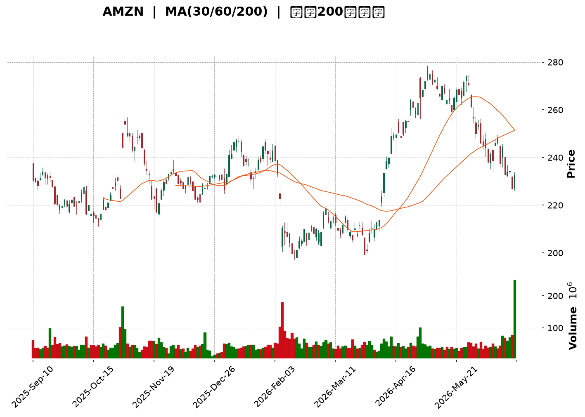
</details>

<html>
<head><meta charset="utf-8" /></head>
<body>
    <div style="height:500px; width:100%;">                        <script>window.PlotlyConfig = {MathJaxConfig: 'local'};</script>
        <script charset="utf-8" src="https://cdn.plot.ly/plotly-3.6.0.min.js" integrity="sha256-QaOVwtVY0T02VaHrr6pnoHLCwayMJp4O5n4YyaE3rJk=" crossorigin="anonymous"></script>                <div id="candlestick-chart" class="plotly-graph-div" style="height:100%; width:100%;"></div>            <script>                window.PLOTLYENV=window.PLOTLYENV || {};                                if (document.getElementById("candlestick-chart")) {                    Plotly.newPlot(                        "candlestick-chart",                        [{"close":{"dtype":"f8","bdata":"AAAAYI\u002fKbEAAAABgZr5sQAAAAMDMhGxAAAAAgMLtbEAAAACgmUFtQAAAAADX82xAAAAAIFznbEAAAAAgXO9sQAAAAAApdGxAAAAAYLiWa0AAAABguIZrQAAAAMDMRGtAAAAAwPV4a0AAAACgcMVrQAAAAIA9cmtAAAAAACmUa0AAAADAHs1rQAAAAOBRcGtAAAAAwMyca0AAAADA9bhrQAAAAEAKJ2xAAAAAIK53bEAAAAAA1wtrQAAAAIA9gmtAAAAA4HoMa0AAAACAPfJqQAAAAEAKz2pAAAAAoEehakAAAAAgXA9rQAAAAMD1wGtAAAAAYGY+a0AAAABA4aJrQAAAAGC4BmxAAAAAQApfbEAAAAAAAKhsQAAAAKCZyWxAAAAAIIXba0AAAABACoduQAAAAAAAwG9AAAAAgD0qb0AAAABgZkZvQAAAAKBHYW5AAAAAwB6NbkAAAADAzAxvQAAAAEAzI29AAAAAYGaGbkAAAABgj7JtQAAAAIAUVm1AAAAAANcbbUAAAACgmdFrQAAAAIAU1mtAAAAA4Hoka0AAAACAFJZrQAAAAMD1SGxAAAAAoHC1bEAAAADAHqVsQAAAAEAKJ21AAAAAACk8bUAAAACgcE1tQAAAAAApDG1AAAAAIIWjbEAAAADA9bBsQAAAAOB6XGxAAAAAoHB9bEAAAADA9fhsQAAAAMD1yGxAAAAAgBRGbEAAAACgR9FrQAAAAIDr0WtAAAAA4KOoa0AAAADgUVhsQAAAAEAza2xAAAAAgMKNbEAAAADgegRtQAAAAAApDG1AAAAA4KMQbUAAAACAPQJtQAAAAMD1EG1AAAAAgD3abEAAAAAAAFBsQAAAAIDrIW1AAAAAgMIdbkAAAACA6zFuQAAAAKBHyW5AAAAAACnsbkAAAABACs9uQAAAAEAzU25AAAAAwMyUbUAAAACAwsVtQAAAAADX421AAAAAAADgbEAAAACA6+lsQAAAAEDhSm1AAAAAwB7lbUAAAACgcM1tQAAAAIDClW5AAAAA4FFgbkAAAAAgXDduQAAAAKCZ6W1AAAAAYLhebkAAAAAA19NtQAAAACCuH21AAAAAgBTWa0AAAACAPUpqQAAAAEAKF2pAAAAAYLjeaUAAAABgj4JpQAAAAEAz82hAAAAAoEfZaEAAAADAzCRpQAAAAKBHmWlAAAAAIIWbaUAAAAAghUNqQAAAAOCjqGlAAAAAgOsRakAAAADgelRqQAAAAKBw\u002fWlAAAAAAABAakAAAADgegxqQAAAACBcF2pAAAAAgD0aa0AAAACAFF5rQAAAAGC4pmpAAAAAIK6vakAAAABgj8pqQAAAAMDMlGpAAAAAwPUwakAAAACgcPVpQAAAACCud2pAAAAAYGbmakAAAAAA1ztqQAAAAOBRGGpAAAAAANeraUAAAADgekRqQAAAACCu52lAAAAAYLh2akAAAACgR\u002fFpQAAAAEDh6mhAAAAAYGYeaUAAAADgowhqQAAAAIA9UmpAAAAA4KM4akAAAACgR5lqQAAAAOCjuGpAAAAAAACoa0AAAADAzDRtQAAAAAApzG1AAAAA4Hr8bUAAAADgoyBvQAAAAAAAEG9AAAAAYGY2b0AAAACA61FvQAAAAMD1CG9AAAAAwB49b0AAAAAghetvQAAAAGCP4m9AAAAAANd\u002fcEAAAACA61FwQAAAAEAzO3BAAAAA4KNwcEAAAADA9ZBwQAAAAAApxHBAAAAAwMwAcUAAAADAzBhxQAAAAADXL3FAAAAAYLjycEAAAABA4QpxQAAAAADXz3BAAAAAwB6dcEAAAACAFOJwQAAAACCFs3BAAAAAgD2CcEAAAACAwo1wQAAAAKBwNXBAAAAAACmQcEAAAAAgXMdwQAAAAMAepXBAAAAA4KOUcEAAAACgmf1wQAAAAAAAIHFAAAAAgD3qcEAAAAAAKVRwQAAAAOBRCHBAAAAA4KNAb0AAAACgR7lvQAAAAMD1wG5AAAAAQAqnbkAAAACAFIZuQAAAAAAAwG1AAAAA4FEwbkAAAACgmdFtQAAAAOCjwG5AAAAAAADAbkAAAAAAALBtQAAAAOB6jG5AAAAAoEcZbUAAAAAghUNtQAAAAOCjSG1AAAAA4FFgbEAAAACAFBZtQA=="},"high":{"dtype":"f8","bdata":"AAAAgMK1bUAAAADA9fBsQAAAAKBH2WxAAAAAIFw3bUAAAADAzHxtQAAAAKCZSW1AAAAAIFwvbUAAAADAHkVtQAAAAIA90mxAAAAAIIV7bEAAAACA6xFsQAAAAKBwlWtAAAAAoJmha0AAAABAM9NrQAAAACCux2tAAAAAwMzEa0AAAACA69lrQAAAAGBmBmxAAAAAIFy3a0AAAADgetxrQAAAACBcV2xAAAAAYLiGbEAAAAAAAIhsQAAAAIDClWtAAAAAgD1qa0AAAABguDZrQAAAAEDhUmtAAAAAoJnZakAAAACAFBZrQAAAAIA96mtAAAAA4FGAa0AAAACgmalrQAAAAMDMLGxAAAAAwMyMbEAAAAAgru9sQAAAAIA9Gm1AAAAAgBSObEAAAAAAAFBvQAAAAKCZKXBAAAAAACkQcEAAAAAAAGBvQAAAAAApTG9AAAAAwMycbkAAAAAAAHhvQAAAAAAAOG9AAAAAANdLb0AAAAAAAHhuQAAAACBc121AAAAAQDNTbUAAAABgZsZsQAAAACCu92tAAAAAwB5tbEAAAABguMZrQAAAAGCPamxAAAAA4KPQbEAAAAAAAPhsQAAAAKBHKW1AAAAAoJl5bUAAAABACt9tQAAAAAApLG1AAAAAAAAwbUAAAAAgrudsQAAAAGCP2mxAAAAAgD2SbEAAAACgcA1tQAAAACCFA21AAAAAYI\u002fCbEAAAACAwn1sQAAAAMAe9WtAAAAAgBQmbEAAAAAgXKdsQAAAAAAppGxAAAAAIFyvbEAAAABgZg5tQAAAAGBmHm1AAAAAIK4fbUAAAABAMxNtQAAAAOCjGG1AAAAAIK4fbUAAAABguG5tQAAAAAAAQG1AAAAAgMJlbkAAAACgR6luQAAAAMAezW5AAAAAIIX7bkAAAACAFB5vQAAAAMAe9W5AAAAAwPUobkAAAADAzBRuQAAAAIA98m1AAAAAQOFibUAAAACgmQltQAAAAEAKd21AAAAAYGYObkAAAABgZh5uQAAAAAApnG5AAAAAwPX4bkAAAAAAAGBuQAAAAIA9am5AAAAAACm0bkAAAABAM8tuQAAAACCF221AAAAAgOtJbEAAAACAFG5qQAAAAIDrmWpAAAAAwMyUakAAAACAPRJqQAAAAGC4fmlAAAAAwB4laUAAAAAgrjdpQAAAACCF22lAAAAA4Hq0aUAAAACgcGVqQAAAAIDCDWpAAAAAIIVLakAAAABA4XJqQAAAAKCZYWpAAAAAYI9KakAAAAAgXDdqQAAAAIDCJWpAAAAAoEcxa0AAAABACo9rQAAAAIA9KmtAAAAAgD26akAAAADAzPRqQAAAAAAAIGtAAAAAYLh2akAAAACA61FqQAAAAEAKl2pAAAAAYGb2akAAAADgeuRqQAAAAADXI2pAAAAAoEfxaUAAAACgmZlqQAAAAEAzK2pAAAAAgD2iakAAAADgepxqQAAAAEAz02lAAAAAoJl5aUAAAADA9UhqQAAAAGCPsmpAAAAAYLiGakAAAABgZp5qQAAAAEAKv2pAAAAAQDNDbEAAAACgmTltQAAAAIDCDW5AAAAAAAAAbkAAAACAwoVvQAAAAIAUTm9AAAAAAABAb0AAAABA4QJwQAAAAIDCRW9AAAAAQOHib0AAAACAFP5vQAAAAOCjLHBAAAAAAACIcEAAAABgZoJwQAAAAOB6UHBAAAAAYI+ecEAAAACAFB5xQAAAAMAeFXFAAAAAoJlBcUAAAADA9WhxQAAAAMDMXHFAAAAAgBRKcUAAAAAAACBxQAAAAIAUGnFAAAAAYGa6cEAAAAAghetwQAAAAOB67HBAAAAAgMKFcEAAAACgmc1wQAAAAAAAZHBAAAAAoEeZcEAAAAAA19dwQAAAAOCj3HBAAAAAwMzUcEAAAABgjwZxQAAAAAAAKHFAAAAAAAAscUAAAACAFKpwQAAAAEAzU3BAAAAAoHARcEAAAABgj\u002fpvQAAAAIAUBnBAAAAAoHAtb0AAAACAwk1vQAAAAIA9gm5AAAAA4HpEbkAAAAAghWtuQAAAAIDr+W5AAAAA4FEwb0AAAADAHr1uQAAAACBct25AAAAAAABAbkAAAAAA15ttQAAAAKBwTW5AAAAAgD0KbUAAAADAzDxtQA=="},"hovertemplate":"\u003cb\u003e%{x|%Y-%m-%d}\u003c\u002fb\u003e\u003cbr\u003e\u958b: $%{open:.2f}\u003cbr\u003e\u9ad8: $%{high:.2f}\u003cbr\u003e\u4f4e: $%{low:.2f}\u003cbr\u003e\u6536: $%{close:.2f}\u003cextra\u003e\u003c\u002fextra\u003e","low":{"dtype":"f8","bdata":"AAAAQDOjbEAAAABA4apsQAAAAKBHSWxAAAAAgD3KbEAAAAAgXAdtQAAAAGC4lmxAAAAAoEeZbEAAAABgZrZsQAAAAOBRcGxAAAAAgD2Ca0AAAABgZm5rQAAAAEAKD2tAAAAA4KNAa0AAAACgmWlrQAAAAOB6PGtAAAAAIIUTa0AAAABgZl5rQAAAAEDhamtAAAAAwPUAa0AAAACgcIVrQAAAAIAUpmtAAAAAAAC4a0AAAAAAAABrQAAAAKBHIWtAAAAAQDOTakAAAADAHpVqQAAAAIDrmWpAAAAAwPVgakAAAABA4bJqQAAAACCuP2tAAAAA4KMQa0AAAACAwkVrQAAAAMDMvGtAAAAAoEcxbEAAAABguEZsQAAAAOBReGxAAAAAAADYa0AAAAAgXH9uQAAAAMDMnG9AAAAAwB4Vb0AAAADAHsVuQAAAAKBwRW5AAAAAIK7PbUAAAABA4bJuQAAAACBc525AAAAAAAB4bkAAAAAAAJBtQAAAAOB6HG1AAAAAgBSmbEAAAACgcM1rQAAAAOCjUGtAAAAAIK4Xa0AAAACAwuVqQAAAAOCjyGtAAAAAoJn5a0AAAADgo5hsQAAAAEAKx2xAAAAAAAAIbUAAAACgmTFtQAAAACCF02xAAAAAoJlZbEAAAACgmZFsQAAAAOCjSGxAAAAAIIUjbEAAAABguI5sQAAAAIAUlmxAAAAAANcjbEAAAAAAALBrQAAAAAAppGtAAAAAIK6fa0AAAADAHg1sQAAAAGCPMmxAAAAAYLhWbEAAAAAgXJdsQAAAAGCP6mxAAAAAgMLlbEAAAADgo9hsQAAAAGBmxmxAAAAAANfDbEAAAABgZhZsQAAAAIDCZWxAAAAAgD0CbUAAAADgo\u002fBtQAAAAAApPG5AAAAAIK5HbkAAAABguL5uQAAAAAAACG5AAAAAQAqHbUAAAAAAKZRtQAAAAMAejW1AAAAAQOGqbEAAAAAAKVxsQAAAAMDM3GxAAAAAgD1SbUAAAACgR7FtQAAAAGCPwm1AAAAAwPUwbkAAAAAgrpdtQAAAAOB6tG1AAAAAoHDFbUAAAABgZm5tQAAAAIA9+mxAAAAAACmMa0AAAACA6wlpQAAAAEAza2lAAAAAwB7NaUAAAAAgrk9pQAAAAIDrsWhAAAAAwPWoaEAAAAAAAIBoQAAAAOBRMGlAAAAAgOtZaUAAAAAAAHhpQAAAACCFY2lAAAAAAABoaUAAAACAwh1qQAAAAEAzq2lAAAAAYGamaUAAAABguG5pQAAAACBcT2lAAAAAwMxEakAAAABA4fJqQAAAAMD1kGpAAAAAIIXjaUAAAACAwo1qQAAAAEAza2pAAAAAwMwEakAAAABACsdpQAAAAGBm7mlAAAAAgMKNakAAAABgjxpqQAAAAKCZwWlAAAAAgD2KaUAAAADgUTBqQAAAAOB61GlAAAAAwMw8akAAAAAA1+NpQAAAAOB65GhAAAAAIFz\u002faEAAAADgeoRpQAAAAIAUBmpAAAAAwMycaUAAAABA4TJqQAAAAGCPImpAAAAAANdza0AAAADgo+hrQAAAAGC4Zm1AAAAAAAB4bUAAAADA9ThuQAAAAGBm5m5AAAAAYGaGbkAAAAAghUNvQAAAAADXq25AAAAAQDMjb0AAAABgj0pvQAAAAIA9om9AAAAAQAobcEAAAACgcEVwQAAAAIAUCnBAAAAAQDMbcEAAAABgjwJwQAAAAADXa3BAAAAAwMzMcEAAAACAFAZxQAAAACBcA3FAAAAAANfncEAAAABAM99wQAAAACCux3BAAAAAgBRqcEAAAABAM3NwQAAAAIAUqnBAAAAAgD1OcEAAAADgemhwQAAAAIAU5m9AAAAA4Ho4cEAAAACA61VwQAAAAADXo3BAAAAAwB5hcEAAAABAM5twQAAAAEAKt3BAAAAAgD3acEAAAABAM0twQAAAAADXy29AAAAAYLj2bkAAAAAAAHhvQAAAAMD1uG5AAAAAIIVrbkAAAADAzAxuQAAAAGBmrm1AAAAAgMJlbUAAAABA4TJtQAAAACBcl25AAAAAYGaubkAAAAAAAIBtQAAAAOCjgG1AAAAAIK4HbUAAAAAAAABtQAAAAGBmHm1AAAAAoJkxbEAAAAAAKURsQA=="},"name":"\u50f9\u683c","open":{"dtype":"f8","bdata":"AAAA4KOwbUAAAAAgru9sQAAAAEAzy2xAAAAAACnUbEAAAACAFB5tQAAAAOCjOG1AAAAAAAAQbUAAAAAA1wttQAAAAIDr0WxAAAAAYI96bEAAAADAzARsQAAAAIDrgWtAAAAAYI9ia0AAAABgj4JrQAAAAMD1wGtAAAAAIIUra0AAAADgUaBrQAAAAIAU7mtAAAAAAACga0AAAAAAKZxrQAAAAKBw3WtAAAAAAAAgbEAAAABguEZsQAAAAGBmNmtAAAAAgOvxakAAAAAA1xNrQAAAAKBw9WpAAAAAgOvRakAAAAAAKbxqQAAAAIDCTWtAAAAAoJlpa0AAAAAAAGBrQAAAAEAKv2tAAAAAwB51bEAAAABACodsQAAAAKBw9WxAAAAAgOthbEAAAABAM0NvQAAAACCF629AAAAAAClMb0AAAADA9SBvQAAAAMAeJW9AAAAAwMxcbkAAAABA4QpvQAAAAMAeDW9AAAAAIK5Hb0AAAACgmWFuQAAAAIDrYW1AAAAAAAAobUAAAABAM4NsQAAAACCu92tAAAAAoJlhbEAAAABAMwtrQAAAAIDr0WtAAAAAAClMbEAAAAAgrtdsQAAAACCu52xAAAAAQAonbUAAAADgUWBtQAAAAEAzK21AAAAA4KMYbUAAAACAPcpsQAAAAEDhsmxAAAAAQOFabEAAAACA65lsQAAAAGC41mxAAAAAANe7bEAAAACAwn1sQAAAAKBH4WtAAAAAwB4VbEAAAABguDZsQAAAAOBRWGxAAAAAIIWTbEAAAACA66FsQAAAAAApBG1AAAAAoEcBbUAAAACAFP5sQAAAAGC45mxAAAAAwB4dbUAAAABA4epsQAAAAEDhmmxAAAAAQDMDbUAAAAAghfNtQAAAAIDrYW5AAAAAgD2SbkAAAAAgXNduQAAAAMD10G5AAAAAwMwkbkAAAACA6+ltQAAAAEDh4m1AAAAA4FE4bUAAAABA4eJsQAAAAKCZQW1AAAAAYLhebUAAAAAgXP9tQAAAAIAU9m1AAAAAANfLbkAAAACAPVpuQAAAAOB6\u002fG1AAAAAgOvJbUAAAAAgXJ9uQAAAACCF221AAAAAwB4dbEAAAABgZlZpQAAAAEAKH2pAAAAAoJkZakAAAACA6wFqQAAAAGC4fmlAAAAAACncaEAAAAAAKcRoQAAAAIA9QmlAAAAAoJl5aUAAAADgUZhpQAAAAEAzA2pAAAAAQAqvaUAAAABguE5qQAAAACBcV2pAAAAAYI\u002faaUAAAACgmZFpQAAAAEAzY2lAAAAAQApPakAAAAAgXP9qQAAAACCu32pAAAAAYGZOakAAAACAFMZqQAAAAGC49mpAAAAA4HpMakAAAAAghTNqQAAAAEAzC2pAAAAAgD2aakAAAACAwr1qQAAAAIDr4WlAAAAAwMzsaUAAAACgRzlqQAAAAGBm\u002fmlAAAAAgOtxakAAAAAghVNqQAAAAGC4zmlAAAAAIFwvaUAAAABAM5tpQAAAAIAUTmpAAAAAoEfRaUAAAACgmTlqQAAAACCuZ2pAAAAAoEf5a0AAAAAgXCdsQAAAAKCZaW1AAAAAYGaubUAAAADA9ThuQAAAAAAAKG9AAAAA4FEQb0AAAAAgrt9vQAAAAIAUJm9AAAAAQOHib0AAAACAFI5vQAAAAOB67G9AAAAAIK4\u002fcEAAAAAgXHdwQAAAAIA9JnBAAAAAANcfcEAAAABguBJxQAAAAKBHmXBAAAAAwMzMcEAAAACgR0FxQAAAAIA9DnFAAAAA4FEwcUAAAACAFPpwQAAAAKBw3XBAAAAAIFyrcEAAAABA4YZwQAAAAGBm0nBAAAAAAABocEAAAACA631wQAAAAOCjYHBAAAAAwMxAcEAAAAAAAHhwQAAAAGCPynBAAAAAQAq\u002fcEAAAABgZqJwQAAAAOBRBHFAAAAA4KP0cEAAAADgo6RwQAAAAGCPEnBAAAAAYGbWb0AAAAAA16NvQAAAAOBRyG9AAAAAgMLVbkAAAAAgXPduQAAAACCFc25AAAAAgMK9bUAAAABguGZuQAAAAOCjoG5AAAAAAAAAb0AAAADAzJxuQAAAAADXA25AAAAAYI8CbkAAAACgmRFtQAAAAEAzO21AAAAA4KMAbUAAAABguGZsQA=="},"x":["2025-09-10T00:00:00-04:00","2025-09-11T00:00:00-04:00","2025-09-12T00:00:00-04:00","2025-09-15T00:00:00-04:00","2025-09-16T00:00:00-04:00","2025-09-17T00:00:00-04:00","2025-09-18T00:00:00-04:00","2025-09-19T00:00:00-04:00","2025-09-22T00:00:00-04:00","2025-09-23T00:00:00-04:00","2025-09-24T00:00:00-04:00","2025-09-25T00:00:00-04:00","2025-09-26T00:00:00-04:00","2025-09-29T00:00:00-04:00","2025-09-30T00:00:00-04:00","2025-10-01T00:00:00-04:00","2025-10-02T00:00:00-04:00","2025-10-03T00:00:00-04:00","2025-10-06T00:00:00-04:00","2025-10-07T00:00:00-04:00","2025-10-08T00:00:00-04:00","2025-10-09T00:00:00-04:00","2025-10-10T00:00:00-04:00","2025-10-13T00:00:00-04:00","2025-10-14T00:00:00-04:00","2025-10-15T00:00:00-04:00","2025-10-16T00:00:00-04:00","2025-10-17T00:00:00-04:00","2025-10-20T00:00:00-04:00","2025-10-21T00:00:00-04:00","2025-10-22T00:00:00-04:00","2025-10-23T00:00:00-04:00","2025-10-24T00:00:00-04:00","2025-10-27T00:00:00-04:00","2025-10-28T00:00:00-04:00","2025-10-29T00:00:00-04:00","2025-10-30T00:00:00-04:00","2025-10-31T00:00:00-04:00","2025-11-03T00:00:00-05:00","2025-11-04T00:00:00-05:00","2025-11-05T00:00:00-05:00","2025-11-06T00:00:00-05:00","2025-11-07T00:00:00-05:00","2025-11-10T00:00:00-05:00","2025-11-11T00:00:00-05:00","2025-11-12T00:00:00-05:00","2025-11-13T00:00:00-05:00","2025-11-14T00:00:00-05:00","2025-11-17T00:00:00-05:00","2025-11-18T00:00:00-05:00","2025-11-19T00:00:00-05:00","2025-11-20T00:00:00-05:00","2025-11-21T00:00:00-05:00","2025-11-24T00:00:00-05:00","2025-11-25T00:00:00-05:00","2025-11-26T00:00:00-05:00","2025-11-28T00:00:00-05:00","2025-12-01T00:00:00-05:00","2025-12-02T00:00:00-05:00","2025-12-03T00:00:00-05:00","2025-12-04T00:00:00-05:00","2025-12-05T00:00:00-05:00","2025-12-08T00:00:00-05:00","2025-12-09T00:00:00-05:00","2025-12-10T00:00:00-05:00","2025-12-11T00:00:00-05:00","2025-12-12T00:00:00-05:00","2025-12-15T00:00:00-05:00","2025-12-16T00:00:00-05:00","2025-12-17T00:00:00-05:00","2025-12-18T00:00:00-05:00","2025-12-19T00:00:00-05:00","2025-12-22T00:00:00-05:00","2025-12-23T00:00:00-05:00","2025-12-24T00:00:00-05:00","2025-12-26T00:00:00-05:00","2025-12-29T00:00:00-05:00","2025-12-30T00:00:00-05:00","2025-12-31T00:00:00-05:00","2026-01-02T00:00:00-05:00","2026-01-05T00:00:00-05:00","2026-01-06T00:00:00-05:00","2026-01-07T00:00:00-05:00","2026-01-08T00:00:00-05:00","2026-01-09T00:00:00-05:00","2026-01-12T00:00:00-05:00","2026-01-13T00:00:00-05:00","2026-01-14T00:00:00-05:00","2026-01-15T00:00:00-05:00","2026-01-16T00:00:00-05:00","2026-01-20T00:00:00-05:00","2026-01-21T00:00:00-05:00","2026-01-22T00:00:00-05:00","2026-01-23T00:00:00-05:00","2026-01-26T00:00:00-05:00","2026-01-27T00:00:00-05:00","2026-01-28T00:00:00-05:00","2026-01-29T00:00:00-05:00","2026-01-30T00:00:00-05:00","2026-02-02T00:00:00-05:00","2026-02-03T00:00:00-05:00","2026-02-04T00:00:00-05:00","2026-02-05T00:00:00-05:00","2026-02-06T00:00:00-05:00","2026-02-09T00:00:00-05:00","2026-02-10T00:00:00-05:00","2026-02-11T00:00:00-05:00","2026-02-12T00:00:00-05:00","2026-02-13T00:00:00-05:00","2026-02-17T00:00:00-05:00","2026-02-18T00:00:00-05:00","2026-02-19T00:00:00-05:00","2026-02-20T00:00:00-05:00","2026-02-23T00:00:00-05:00","2026-02-24T00:00:00-05:00","2026-02-25T00:00:00-05:00","2026-02-26T00:00:00-05:00","2026-02-27T00:00:00-05:00","2026-03-02T00:00:00-05:00","2026-03-03T00:00:00-05:00","2026-03-04T00:00:00-05:00","2026-03-05T00:00:00-05:00","2026-03-06T00:00:00-05:00","2026-03-09T00:00:00-04:00","2026-03-10T00:00:00-04:00","2026-03-11T00:00:00-04:00","2026-03-12T00:00:00-04:00","2026-03-13T00:00:00-04:00","2026-03-16T00:00:00-04:00","2026-03-17T00:00:00-04:00","2026-03-18T00:00:00-04:00","2026-03-19T00:00:00-04:00","2026-03-20T00:00:00-04:00","2026-03-23T00:00:00-04:00","2026-03-24T00:00:00-04:00","2026-03-25T00:00:00-04:00","2026-03-26T00:00:00-04:00","2026-03-27T00:00:00-04:00","2026-03-30T00:00:00-04:00","2026-03-31T00:00:00-04:00","2026-04-01T00:00:00-04:00","2026-04-02T00:00:00-04:00","2026-04-06T00:00:00-04:00","2026-04-07T00:00:00-04:00","2026-04-08T00:00:00-04:00","2026-04-09T00:00:00-04:00","2026-04-10T00:00:00-04:00","2026-04-13T00:00:00-04:00","2026-04-14T00:00:00-04:00","2026-04-15T00:00:00-04:00","2026-04-16T00:00:00-04:00","2026-04-17T00:00:00-04:00","2026-04-20T00:00:00-04:00","2026-04-21T00:00:00-04:00","2026-04-22T00:00:00-04:00","2026-04-23T00:00:00-04:00","2026-04-24T00:00:00-04:00","2026-04-27T00:00:00-04:00","2026-04-28T00:00:00-04:00","2026-04-29T00:00:00-04:00","2026-04-30T00:00:00-04:00","2026-05-01T00:00:00-04:00","2026-05-04T00:00:00-04:00","2026-05-05T00:00:00-04:00","2026-05-06T00:00:00-04:00","2026-05-07T00:00:00-04:00","2026-05-08T00:00:00-04:00","2026-05-11T00:00:00-04:00","2026-05-12T00:00:00-04:00","2026-05-13T00:00:00-04:00","2026-05-14T00:00:00-04:00","2026-05-15T00:00:00-04:00","2026-05-18T00:00:00-04:00","2026-05-19T00:00:00-04:00","2026-05-20T00:00:00-04:00","2026-05-21T00:00:00-04:00","2026-05-22T00:00:00-04:00","2026-05-26T00:00:00-04:00","2026-05-27T00:00:00-04:00","2026-05-28T00:00:00-04:00","2026-05-29T00:00:00-04:00","2026-06-01T00:00:00-04:00","2026-06-02T00:00:00-04:00","2026-06-03T00:00:00-04:00","2026-06-04T00:00:00-04:00","2026-06-05T00:00:00-04:00","2026-06-08T00:00:00-04:00","2026-06-09T00:00:00-04:00","2026-06-10T00:00:00-04:00","2026-06-11T00:00:00-04:00","2026-06-12T00:00:00-04:00","2026-06-15T00:00:00-04:00","2026-06-16T00:00:00-04:00","2026-06-17T00:00:00-04:00","2026-06-18T00:00:00-04:00","2026-06-22T00:00:00-04:00","2026-06-23T00:00:00-04:00","2026-06-24T00:00:00-04:00","2026-06-25T00:00:00-04:00","2026-06-26T00:00:00-04:00"],"type":"candlestick"},{"hovertemplate":"MA30: $%{y:.2f}\u003cextra\u003e\u003c\u002fextra\u003e","line":{"color":"#2196F3","dash":"dash","width":2},"mode":"lines","name":"MA30","x":["2025-09-10T00:00:00-04:00","2025-09-11T00:00:00-04:00","2025-09-12T00:00:00-04:00","2025-09-15T00:00:00-04:00","2025-09-16T00:00:00-04:00","2025-09-17T00:00:00-04:00","2025-09-18T00:00:00-04:00","2025-09-19T00:00:00-04:00","2025-09-22T00:00:00-04:00","2025-09-23T00:00:00-04:00","2025-09-24T00:00:00-04:00","2025-09-25T00:00:00-04:00","2025-09-26T00:00:00-04:00","2025-09-29T00:00:00-04:00","2025-09-30T00:00:00-04:00","2025-10-01T00:00:00-04:00","2025-10-02T00:00:00-04:00","2025-10-03T00:00:00-04:00","2025-10-06T00:00:00-04:00","2025-10-07T00:00:00-04:00","2025-10-08T00:00:00-04:00","2025-10-09T00:00:00-04:00","2025-10-10T00:00:00-04:00","2025-10-13T00:00:00-04:00","2025-10-14T00:00:00-04:00","2025-10-15T00:00:00-04:00","2025-10-16T00:00:00-04:00","2025-10-17T00:00:00-04:00","2025-10-20T00:00:00-04:00","2025-10-21T00:00:00-04:00","2025-10-22T00:00:00-04:00","2025-10-23T00:00:00-04:00","2025-10-24T00:00:00-04:00","2025-10-27T00:00:00-04:00","2025-10-28T00:00:00-04:00","2025-10-29T00:00:00-04:00","2025-10-30T00:00:00-04:00","2025-10-31T00:00:00-04:00","2025-11-03T00:00:00-05:00","2025-11-04T00:00:00-05:00","2025-11-05T00:00:00-05:00","2025-11-06T00:00:00-05:00","2025-11-07T00:00:00-05:00","2025-11-10T00:00:00-05:00","2025-11-11T00:00:00-05:00","2025-11-12T00:00:00-05:00","2025-11-13T00:00:00-05:00","2025-11-14T00:00:00-05:00","2025-11-17T00:00:00-05:00","2025-11-18T00:00:00-05:00","2025-11-19T00:00:00-05:00","2025-11-20T00:00:00-05:00","2025-11-21T00:00:00-05:00","2025-11-24T00:00:00-05:00","2025-11-25T00:00:00-05:00","2025-11-26T00:00:00-05:00","2025-11-28T00:00:00-05:00","2025-12-01T00:00:00-05:00","2025-12-02T00:00:00-05:00","2025-12-03T00:00:00-05:00","2025-12-04T00:00:00-05:00","2025-12-05T00:00:00-05:00","2025-12-08T00:00:00-05:00","2025-12-09T00:00:00-05:00","2025-12-10T00:00:00-05:00","2025-12-11T00:00:00-05:00","2025-12-12T00:00:00-05:00","2025-12-15T00:00:00-05:00","2025-12-16T00:00:00-05:00","2025-12-17T00:00:00-05:00","2025-12-18T00:00:00-05:00","2025-12-19T00:00:00-05:00","2025-12-22T00:00:00-05:00","2025-12-23T00:00:00-05:00","2025-12-24T00:00:00-05:00","2025-12-26T00:00:00-05:00","2025-12-29T00:00:00-05:00","2025-12-30T00:00:00-05:00","2025-12-31T00:00:00-05:00","2026-01-02T00:00:00-05:00","2026-01-05T00:00:00-05:00","2026-01-06T00:00:00-05:00","2026-01-07T00:00:00-05:00","2026-01-08T00:00:00-05:00","2026-01-09T00:00:00-05:00","2026-01-12T00:00:00-05:00","2026-01-13T00:00:00-05:00","2026-01-14T00:00:00-05:00","2026-01-15T00:00:00-05:00","2026-01-16T00:00:00-05:00","2026-01-20T00:00:00-05:00","2026-01-21T00:00:00-05:00","2026-01-22T00:00:00-05:00","2026-01-23T00:00:00-05:00","2026-01-26T00:00:00-05:00","2026-01-27T00:00:00-05:00","2026-01-28T00:00:00-05:00","2026-01-29T00:00:00-05:00","2026-01-30T00:00:00-05:00","2026-02-02T00:00:00-05:00","2026-02-03T00:00:00-05:00","2026-02-04T00:00:00-05:00","2026-02-05T00:00:00-05:00","2026-02-06T00:00:00-05:00","2026-02-09T00:00:00-05:00","2026-02-10T00:00:00-05:00","2026-02-11T00:00:00-05:00","2026-02-12T00:00:00-05:00","2026-02-13T00:00:00-05:00","2026-02-17T00:00:00-05:00","2026-02-18T00:00:00-05:00","2026-02-19T00:00:00-05:00","2026-02-20T00:00:00-05:00","2026-02-23T00:00:00-05:00","2026-02-24T00:00:00-05:00","2026-02-25T00:00:00-05:00","2026-02-26T00:00:00-05:00","2026-02-27T00:00:00-05:00","2026-03-02T00:00:00-05:00","2026-03-03T00:00:00-05:00","2026-03-04T00:00:00-05:00","2026-03-05T00:00:00-05:00","2026-03-06T00:00:00-05:00","2026-03-09T00:00:00-04:00","2026-03-10T00:00:00-04:00","2026-03-11T00:00:00-04:00","2026-03-12T00:00:00-04:00","2026-03-13T00:00:00-04:00","2026-03-16T00:00:00-04:00","2026-03-17T00:00:00-04:00","2026-03-18T00:00:00-04:00","2026-03-19T00:00:00-04:00","2026-03-20T00:00:00-04:00","2026-03-23T00:00:00-04:00","2026-03-24T00:00:00-04:00","2026-03-25T00:00:00-04:00","2026-03-26T00:00:00-04:00","2026-03-27T00:00:00-04:00","2026-03-30T00:00:00-04:00","2026-03-31T00:00:00-04:00","2026-04-01T00:00:00-04:00","2026-04-02T00:00:00-04:00","2026-04-06T00:00:00-04:00","2026-04-07T00:00:00-04:00","2026-04-08T00:00:00-04:00","2026-04-09T00:00:00-04:00","2026-04-10T00:00:00-04:00","2026-04-13T00:00:00-04:00","2026-04-14T00:00:00-04:00","2026-04-15T00:00:00-04:00","2026-04-16T00:00:00-04:00","2026-04-17T00:00:00-04:00","2026-04-20T00:00:00-04:00","2026-04-21T00:00:00-04:00","2026-04-22T00:00:00-04:00","2026-04-23T00:00:00-04:00","2026-04-24T00:00:00-04:00","2026-04-27T00:00:00-04:00","2026-04-28T00:00:00-04:00","2026-04-29T00:00:00-04:00","2026-04-30T00:00:00-04:00","2026-05-01T00:00:00-04:00","2026-05-04T00:00:00-04:00","2026-05-05T00:00:00-04:00","2026-05-06T00:00:00-04:00","2026-05-07T00:00:00-04:00","2026-05-08T00:00:00-04:00","2026-05-11T00:00:00-04:00","2026-05-12T00:00:00-04:00","2026-05-13T00:00:00-04:00","2026-05-14T00:00:00-04:00","2026-05-15T00:00:00-04:00","2026-05-18T00:00:00-04:00","2026-05-19T00:00:00-04:00","2026-05-20T00:00:00-04:00","2026-05-21T00:00:00-04:00","2026-05-22T00:00:00-04:00","2026-05-26T00:00:00-04:00","2026-05-27T00:00:00-04:00","2026-05-28T00:00:00-04:00","2026-05-29T00:00:00-04:00","2026-06-01T00:00:00-04:00","2026-06-02T00:00:00-04:00","2026-06-03T00:00:00-04:00","2026-06-04T00:00:00-04:00","2026-06-05T00:00:00-04:00","2026-06-08T00:00:00-04:00","2026-06-09T00:00:00-04:00","2026-06-10T00:00:00-04:00","2026-06-11T00:00:00-04:00","2026-06-12T00:00:00-04:00","2026-06-15T00:00:00-04:00","2026-06-16T00:00:00-04:00","2026-06-17T00:00:00-04:00","2026-06-18T00:00:00-04:00","2026-06-22T00:00:00-04:00","2026-06-23T00:00:00-04:00","2026-06-24T00:00:00-04:00","2026-06-25T00:00:00-04:00","2026-06-26T00:00:00-04:00"],"y":{"dtype":"f8","bdata":"AAAAAAAA+H8AAAAAAAD4fwAAAAAAAPh\u002fAAAAAAAA+H8AAAAAAAD4fwAAAAAAAPh\u002fAAAAAAAA+H8AAAAAAAD4fwAAAAAAAPh\u002fAAAAAAAA+H8AAAAAAAD4fwAAAAAAAPh\u002fAAAAAAAA+H8AAAAAAAD4fwAAAAAAAPh\u002fAAAAAAAA+H8AAAAAAAD4fwAAAAAAAPh\u002fAAAAAAAA+H8AAAAAAAD4fwAAAAAAAPh\u002fAAAAAAAA+H8AAAAAAAD4fwAAAAAAAPh\u002fAAAAAAAA+H8AAAAAAAD4fwAAAAAAAPh\u002fAAAAAAAA+H8AAAAAAAD4f7y7uwsC32tAq6qqes3Ra0C8u7sbWshrQKuqqjomxGtAq6qqWmS\u002fa0AiIiKiRbprQAAAADDduGtA7+7unu+va0De3d19hr1rQCIiIkKn2WtAIiIisiv4a0BmZmb2KBhsQHd3d5e1MmxAmpmZOftMbEAzMzPD9WhsQLy7u2t1iGxAmpmZmZmhbEBVVVUFyLFsQM3MzCz5wWxAiYiIyL3ObEC8u7sLkM9sQAAAADDdzGxA3t3drY7BbEBERERUKsZsQCIiIhLKzGxAVVVVZfTabEDv7u5ec+lsQO\u002fu7l5z\u002fWxAVVVVFa4TbUBmZmbm0CZtQERERCTbMW1AERERkcI9bUAAAABAw0ZtQBERERGfSW1Aq6qqeqJKbUBmZmZWVU1tQAAAAOBPTW1AAAAAMN1QbUCamZkZvTltQCIiIuIzGG1AzczMXEj6bEDe3d2tR+FsQERERESL0GxAiYiIqH+\u002fbECJiIiYJ65sQLy7u+tRnGxAERERgdyPbECJiIjo+4lsQFVVVRWuh2xAzczMTH6FbECamZnptIlsQM3MzJzElGxA3t3d3SSubEBERETEZ8RsQERERNS\u002f2WxAd3d316PsbEAAAACgGv9sQN7d3f0bCW1AIiIiYhAMbUDNzMwcExBtQERERJRDF21AzczMrEcZbUC8u7u7LRttQERERBQgI21AmpmZWR0vbUAzMzODMjZtQLy7u6uORW1AZmZmpn9XbUDNzMzM92ttQAAAAPDSfW1AERERwfWUbUAzMzNTnKFtQLy7u2ugp21AVVVVBYGhbUBVVVW1OoptQDMzM\u002fP9cG1A3t3dXbpVbUCrqqo63zdtQFVVVSW\u002fFG1AERER0ZTybEAzMzOTitdsQKuqqvpiuWxAd3d3d+mSbEBVVVWFXXFsQERERFScRWxAERER4TMcbEBmZmbm+\u002fVrQCIiIvL90GtAiYiIuJC0a0ARERERypRrQCIiIpJfdGtAzczMfD9la0B3d3enDVhrQCIiIsKDQWtAMzMzIyIma0BmZmb2bwxrQDMzM6NF6mpA3t3dXY\u002fGakB3d3e3OqJqQAAAAADVhGpAq6qqqjhnakAAAAAAjkhqQHd3d5e1LmpAMzMzEzwcakC8u7vrChxqQImIiMh2GmpAmpmZ2YcfakCJiIioOCNqQImIiKjxImpAvLu7ez8lakCJiIi41yxqQM3MzAwCM2pA7+7uzj44akAAAACgGjtqQBEREbErRGpAiYiI6LRRakC8u7srQGpqQImIiMi9impA7+7uvp+qakAiIiJy9tVqQO\u002fu7k5iAGtAzczMvHQja0CrqqoaL0VrQM3MzIyXamtAMzMzo3CRa0AAAACQNL1rQImIiMh26mtA3t3d\u002fY0kbEB3d3dnkV1sQO\u002fu7q65kGxAIiIiMsHDbEDv7u6+n\u002f5sQHd3dzcXPm1AzczMTDeFbUBERER02shtQHd3d7ceEW5AMzMzQ4tQbkAzMzPTBpZuQKuqqupR4G5AERERwYMlb0CJiIiof2dvQCIiIuLso29AVVVVhevdb0DNzMwMuwpwQHd3d98II3BAq6qqkl86cEBERERM8ExwQCIiIgrXW3BAzczM\u002fGJpcEAzMzMLkHVwQM3MzKQpg3BAd3d3p1SOcEAAAACQCZRwQImIiJhumHBAVVVVnX2YcECamZlBp5dwQBEREaHTknBAZmZm5tCIcEBERERkyX9wQN7d3Z02dHBAVVVVDbtocEDe3d2Nl1pwQFVVVQ27TnBAREREXNZAcEDe3d1VnC1wQKuqqmpKHXBAvLu7Q9IIcECamZlZgOhvQKuqqnp3w29AIiIiwhGab0BEREQkInJvQA=="},"type":"scatter"},{"hovertemplate":"MA60: $%{y:.2f}\u003cextra\u003e\u003c\u002fextra\u003e","line":{"color":"#9C27B0","dash":"dash","width":2},"mode":"lines","name":"MA60","x":["2025-09-10T00:00:00-04:00","2025-09-11T00:00:00-04:00","2025-09-12T00:00:00-04:00","2025-09-15T00:00:00-04:00","2025-09-16T00:00:00-04:00","2025-09-17T00:00:00-04:00","2025-09-18T00:00:00-04:00","2025-09-19T00:00:00-04:00","2025-09-22T00:00:00-04:00","2025-09-23T00:00:00-04:00","2025-09-24T00:00:00-04:00","2025-09-25T00:00:00-04:00","2025-09-26T00:00:00-04:00","2025-09-29T00:00:00-04:00","2025-09-30T00:00:00-04:00","2025-10-01T00:00:00-04:00","2025-10-02T00:00:00-04:00","2025-10-03T00:00:00-04:00","2025-10-06T00:00:00-04:00","2025-10-07T00:00:00-04:00","2025-10-08T00:00:00-04:00","2025-10-09T00:00:00-04:00","2025-10-10T00:00:00-04:00","2025-10-13T00:00:00-04:00","2025-10-14T00:00:00-04:00","2025-10-15T00:00:00-04:00","2025-10-16T00:00:00-04:00","2025-10-17T00:00:00-04:00","2025-10-20T00:00:00-04:00","2025-10-21T00:00:00-04:00","2025-10-22T00:00:00-04:00","2025-10-23T00:00:00-04:00","2025-10-24T00:00:00-04:00","2025-10-27T00:00:00-04:00","2025-10-28T00:00:00-04:00","2025-10-29T00:00:00-04:00","2025-10-30T00:00:00-04:00","2025-10-31T00:00:00-04:00","2025-11-03T00:00:00-05:00","2025-11-04T00:00:00-05:00","2025-11-05T00:00:00-05:00","2025-11-06T00:00:00-05:00","2025-11-07T00:00:00-05:00","2025-11-10T00:00:00-05:00","2025-11-11T00:00:00-05:00","2025-11-12T00:00:00-05:00","2025-11-13T00:00:00-05:00","2025-11-14T00:00:00-05:00","2025-11-17T00:00:00-05:00","2025-11-18T00:00:00-05:00","2025-11-19T00:00:00-05:00","2025-11-20T00:00:00-05:00","2025-11-21T00:00:00-05:00","2025-11-24T00:00:00-05:00","2025-11-25T00:00:00-05:00","2025-11-26T00:00:00-05:00","2025-11-28T00:00:00-05:00","2025-12-01T00:00:00-05:00","2025-12-02T00:00:00-05:00","2025-12-03T00:00:00-05:00","2025-12-04T00:00:00-05:00","2025-12-05T00:00:00-05:00","2025-12-08T00:00:00-05:00","2025-12-09T00:00:00-05:00","2025-12-10T00:00:00-05:00","2025-12-11T00:00:00-05:00","2025-12-12T00:00:00-05:00","2025-12-15T00:00:00-05:00","2025-12-16T00:00:00-05:00","2025-12-17T00:00:00-05:00","2025-12-18T00:00:00-05:00","2025-12-19T00:00:00-05:00","2025-12-22T00:00:00-05:00","2025-12-23T00:00:00-05:00","2025-12-24T00:00:00-05:00","2025-12-26T00:00:00-05:00","2025-12-29T00:00:00-05:00","2025-12-30T00:00:00-05:00","2025-12-31T00:00:00-05:00","2026-01-02T00:00:00-05:00","2026-01-05T00:00:00-05:00","2026-01-06T00:00:00-05:00","2026-01-07T00:00:00-05:00","2026-01-08T00:00:00-05:00","2026-01-09T00:00:00-05:00","2026-01-12T00:00:00-05:00","2026-01-13T00:00:00-05:00","2026-01-14T00:00:00-05:00","2026-01-15T00:00:00-05:00","2026-01-16T00:00:00-05:00","2026-01-20T00:00:00-05:00","2026-01-21T00:00:00-05:00","2026-01-22T00:00:00-05:00","2026-01-23T00:00:00-05:00","2026-01-26T00:00:00-05:00","2026-01-27T00:00:00-05:00","2026-01-28T00:00:00-05:00","2026-01-29T00:00:00-05:00","2026-01-30T00:00:00-05:00","2026-02-02T00:00:00-05:00","2026-02-03T00:00:00-05:00","2026-02-04T00:00:00-05:00","2026-02-05T00:00:00-05:00","2026-02-06T00:00:00-05:00","2026-02-09T00:00:00-05:00","2026-02-10T00:00:00-05:00","2026-02-11T00:00:00-05:00","2026-02-12T00:00:00-05:00","2026-02-13T00:00:00-05:00","2026-02-17T00:00:00-05:00","2026-02-18T00:00:00-05:00","2026-02-19T00:00:00-05:00","2026-02-20T00:00:00-05:00","2026-02-23T00:00:00-05:00","2026-02-24T00:00:00-05:00","2026-02-25T00:00:00-05:00","2026-02-26T00:00:00-05:00","2026-02-27T00:00:00-05:00","2026-03-02T00:00:00-05:00","2026-03-03T00:00:00-05:00","2026-03-04T00:00:00-05:00","2026-03-05T00:00:00-05:00","2026-03-06T00:00:00-05:00","2026-03-09T00:00:00-04:00","2026-03-10T00:00:00-04:00","2026-03-11T00:00:00-04:00","2026-03-12T00:00:00-04:00","2026-03-13T00:00:00-04:00","2026-03-16T00:00:00-04:00","2026-03-17T00:00:00-04:00","2026-03-18T00:00:00-04:00","2026-03-19T00:00:00-04:00","2026-03-20T00:00:00-04:00","2026-03-23T00:00:00-04:00","2026-03-24T00:00:00-04:00","2026-03-25T00:00:00-04:00","2026-03-26T00:00:00-04:00","2026-03-27T00:00:00-04:00","2026-03-30T00:00:00-04:00","2026-03-31T00:00:00-04:00","2026-04-01T00:00:00-04:00","2026-04-02T00:00:00-04:00","2026-04-06T00:00:00-04:00","2026-04-07T00:00:00-04:00","2026-04-08T00:00:00-04:00","2026-04-09T00:00:00-04:00","2026-04-10T00:00:00-04:00","2026-04-13T00:00:00-04:00","2026-04-14T00:00:00-04:00","2026-04-15T00:00:00-04:00","2026-04-16T00:00:00-04:00","2026-04-17T00:00:00-04:00","2026-04-20T00:00:00-04:00","2026-04-21T00:00:00-04:00","2026-04-22T00:00:00-04:00","2026-04-23T00:00:00-04:00","2026-04-24T00:00:00-04:00","2026-04-27T00:00:00-04:00","2026-04-28T00:00:00-04:00","2026-04-29T00:00:00-04:00","2026-04-30T00:00:00-04:00","2026-05-01T00:00:00-04:00","2026-05-04T00:00:00-04:00","2026-05-05T00:00:00-04:00","2026-05-06T00:00:00-04:00","2026-05-07T00:00:00-04:00","2026-05-08T00:00:00-04:00","2026-05-11T00:00:00-04:00","2026-05-12T00:00:00-04:00","2026-05-13T00:00:00-04:00","2026-05-14T00:00:00-04:00","2026-05-15T00:00:00-04:00","2026-05-18T00:00:00-04:00","2026-05-19T00:00:00-04:00","2026-05-20T00:00:00-04:00","2026-05-21T00:00:00-04:00","2026-05-22T00:00:00-04:00","2026-05-26T00:00:00-04:00","2026-05-27T00:00:00-04:00","2026-05-28T00:00:00-04:00","2026-05-29T00:00:00-04:00","2026-06-01T00:00:00-04:00","2026-06-02T00:00:00-04:00","2026-06-03T00:00:00-04:00","2026-06-04T00:00:00-04:00","2026-06-05T00:00:00-04:00","2026-06-08T00:00:00-04:00","2026-06-09T00:00:00-04:00","2026-06-10T00:00:00-04:00","2026-06-11T00:00:00-04:00","2026-06-12T00:00:00-04:00","2026-06-15T00:00:00-04:00","2026-06-16T00:00:00-04:00","2026-06-17T00:00:00-04:00","2026-06-18T00:00:00-04:00","2026-06-22T00:00:00-04:00","2026-06-23T00:00:00-04:00","2026-06-24T00:00:00-04:00","2026-06-25T00:00:00-04:00","2026-06-26T00:00:00-04:00"],"y":{"dtype":"f8","bdata":"AAAAAAAA+H8AAAAAAAD4fwAAAAAAAPh\u002fAAAAAAAA+H8AAAAAAAD4fwAAAAAAAPh\u002fAAAAAAAA+H8AAAAAAAD4fwAAAAAAAPh\u002fAAAAAAAA+H8AAAAAAAD4fwAAAAAAAPh\u002fAAAAAAAA+H8AAAAAAAD4fwAAAAAAAPh\u002fAAAAAAAA+H8AAAAAAAD4fwAAAAAAAPh\u002fAAAAAAAA+H8AAAAAAAD4fwAAAAAAAPh\u002fAAAAAAAA+H8AAAAAAAD4fwAAAAAAAPh\u002fAAAAAAAA+H8AAAAAAAD4fwAAAAAAAPh\u002fAAAAAAAA+H8AAAAAAAD4fwAAAAAAAPh\u002fAAAAAAAA+H8AAAAAAAD4fwAAAAAAAPh\u002fAAAAAAAA+H8AAAAAAAD4fwAAAAAAAPh\u002fAAAAAAAA+H8AAAAAAAD4fwAAAAAAAPh\u002fAAAAAAAA+H8AAAAAAAD4fwAAAAAAAPh\u002fAAAAAAAA+H8AAAAAAAD4fwAAAAAAAPh\u002fAAAAAAAA+H8AAAAAAAD4fwAAAAAAAPh\u002fAAAAAAAA+H8AAAAAAAD4fwAAAAAAAPh\u002fAAAAAAAA+H8AAAAAAAD4fwAAAAAAAPh\u002fAAAAAAAA+H8AAAAAAAD4fwAAAAAAAPh\u002fAAAAAAAA+H8AAAAAAAD4fwAAAJhuiGxA3t3dBciHbEDe3d2tjodsQN7d3aXihmxAq6qqagOFbEBERER8zYNsQAAAAIgWg2xAd3d3Z2aAbEC8u7vLoXtsQCIiIpLteGxAd3d3Bzp5bEAiIiJSuHxsQN7d3W2ggWxAERERcT2GbEDe3d2tjotsQLy7u6tjkmxAVVVVDbuYbEDv7u724Z1sQBEREaHTpGxAq6qqCh6qbECrqqp6oqxsQGZmZubQsGxA3t3dxdm3bEBEREQMScVsQDMzM\u002fNE02xAZmZmHszjbEB3d3f\u002fRvRsQGZmZq5HA21AvLu7O98PbUCamZkBchttQERERFyPJG1A7+7uHoUrbUDe3d19+DBtQKuqqpJfNm1AIiIi6t88bUDNzMzsw0FtQN7d3UVvSW1AMzMzay5UbUAzMzNz2lJtQBEREWkDS21A7+7uDp9HbUCJiIgAckFtQAAAANgVPG1A7+7uVoAwbUDv7u4mMRxtQHd3d++nBm1Ad3d3b8vybECamZmR7eBsQFVVVZ02zmxA7+7ujgm8bEBmZma+n7BsQLy7u8sTp2xAq6qqKoegbEDNzMyk4ppsQERERBSuj2xARERE3GuEbEAzMzNDi3psQAAAAPgMbWxAVVVVjVBgbEDv7u6WblJsQDMzM5PRRWxAzczMlEM\u002fbECamZmxnTlsQDMzM+tRMmxAZmZmvp8qbEDNzMw8USFsQHd3dyfqF2xAIiIiggcPbEAiIiJCGQdsQAAAAPhTAWxA3t3dNRf+a0CamZkpFfVrQJqZmQEr62tAREREjN7ea0CJiIjQItNrQN7d3V26xWtAvLu7G6G6a0CamZnxi61rQO\u002fu7mbYm2tAZmZmJuqLa0De3d0lMYJrQLy7u4MydmtAMzMzI5Rla0CrqqoSPFZrQKuqqgLkRGtAzczMZPQ2a0AREREJHjBrQFVVVd3dLWtAvLu7O5gva0CamZlBYDVrQImIiPBgOmtAzczMHFpEa0ARERFhnk5rQHd3d6cNVmtAMzMzY8lba0AzMzND0mRrQN7d3TVeamtA3t3drY51a0B3d3cP5n9rQHd3d1fHimtAZmZm7nyVa0B3d3fflqNrQHd3d2dmtmtAAAAAsLnQa0AAAACwcvJrQAAAAMDKFWxAZmZmjgk4bEDe3d29n1xsQJqZmcmhgWxAZmZmnmGlbECJiIiwK8psQHd3d3d362xAIiIiKhULbUDNzMxcSChtQAAAALgeRW1A7+7uBjpjbUAiIiJiEIJtQGZmZu41oW1ARERE3LK+bUBEREREi+BtQERERMxaA25A3t3dBQ8gbkBVVVUdoTZuQO\u002fu7l66TW5A7+7u7jVhbkCamZmJQXZuQFVVVQUPiG5AVVVV5RebbkAAAAAYkq5uQFVVVXWTvG5AZmZmppvKbkBVVVVt59luQBEREanG7W5Aq6qqAnIDb0AAAACQCRJvQGZmZsbZJW9AVVVV5Rcxb0BmZmaWQz9vQKuqqrLkUW9AmpmZwcpfb0BmZmbm0GxvQA=="},"type":"scatter"},{"hovertemplate":"MA200: $%{y:.2f}\u003cextra\u003e\u003c\u002fextra\u003e","line":{"color":"#FF6F00","dash":"solid","width":2},"mode":"lines","name":"MA200","x":["2025-09-10T00:00:00-04:00","2025-09-11T00:00:00-04:00","2025-09-12T00:00:00-04:00","2025-09-15T00:00:00-04:00","2025-09-16T00:00:00-04:00","2025-09-17T00:00:00-04:00","2025-09-18T00:00:00-04:00","2025-09-19T00:00:00-04:00","2025-09-22T00:00:00-04:00","2025-09-23T00:00:00-04:00","2025-09-24T00:00:00-04:00","2025-09-25T00:00:00-04:00","2025-09-26T00:00:00-04:00","2025-09-29T00:00:00-04:00","2025-09-30T00:00:00-04:00","2025-10-01T00:00:00-04:00","2025-10-02T00:00:00-04:00","2025-10-03T00:00:00-04:00","2025-10-06T00:00:00-04:00","2025-10-07T00:00:00-04:00","2025-10-08T00:00:00-04:00","2025-10-09T00:00:00-04:00","2025-10-10T00:00:00-04:00","2025-10-13T00:00:00-04:00","2025-10-14T00:00:00-04:00","2025-10-15T00:00:00-04:00","2025-10-16T00:00:00-04:00","2025-10-17T00:00:00-04:00","2025-10-20T00:00:00-04:00","2025-10-21T00:00:00-04:00","2025-10-22T00:00:00-04:00","2025-10-23T00:00:00-04:00","2025-10-24T00:00:00-04:00","2025-10-27T00:00:00-04:00","2025-10-28T00:00:00-04:00","2025-10-29T00:00:00-04:00","2025-10-30T00:00:00-04:00","2025-10-31T00:00:00-04:00","2025-11-03T00:00:00-05:00","2025-11-04T00:00:00-05:00","2025-11-05T00:00:00-05:00","2025-11-06T00:00:00-05:00","2025-11-07T00:00:00-05:00","2025-11-10T00:00:00-05:00","2025-11-11T00:00:00-05:00","2025-11-12T00:00:00-05:00","2025-11-13T00:00:00-05:00","2025-11-14T00:00:00-05:00","2025-11-17T00:00:00-05:00","2025-11-18T00:00:00-05:00","2025-11-19T00:00:00-05:00","2025-11-20T00:00:00-05:00","2025-11-21T00:00:00-05:00","2025-11-24T00:00:00-05:00","2025-11-25T00:00:00-05:00","2025-11-26T00:00:00-05:00","2025-11-28T00:00:00-05:00","2025-12-01T00:00:00-05:00","2025-12-02T00:00:00-05:00","2025-12-03T00:00:00-05:00","2025-12-04T00:00:00-05:00","2025-12-05T00:00:00-05:00","2025-12-08T00:00:00-05:00","2025-12-09T00:00:00-05:00","2025-12-10T00:00:00-05:00","2025-12-11T00:00:00-05:00","2025-12-12T00:00:00-05:00","2025-12-15T00:00:00-05:00","2025-12-16T00:00:00-05:00","2025-12-17T00:00:00-05:00","2025-12-18T00:00:00-05:00","2025-12-19T00:00:00-05:00","2025-12-22T00:00:00-05:00","2025-12-23T00:00:00-05:00","2025-12-24T00:00:00-05:00","2025-12-26T00:00:00-05:00","2025-12-29T00:00:00-05:00","2025-12-30T00:00:00-05:00","2025-12-31T00:00:00-05:00","2026-01-02T00:00:00-05:00","2026-01-05T00:00:00-05:00","2026-01-06T00:00:00-05:00","2026-01-07T00:00:00-05:00","2026-01-08T00:00:00-05:00","2026-01-09T00:00:00-05:00","2026-01-12T00:00:00-05:00","2026-01-13T00:00:00-05:00","2026-01-14T00:00:00-05:00","2026-01-15T00:00:00-05:00","2026-01-16T00:00:00-05:00","2026-01-20T00:00:00-05:00","2026-01-21T00:00:00-05:00","2026-01-22T00:00:00-05:00","2026-01-23T00:00:00-05:00","2026-01-26T00:00:00-05:00","2026-01-27T00:00:00-05:00","2026-01-28T00:00:00-05:00","2026-01-29T00:00:00-05:00","2026-01-30T00:00:00-05:00","2026-02-02T00:00:00-05:00","2026-02-03T00:00:00-05:00","2026-02-04T00:00:00-05:00","2026-02-05T00:00:00-05:00","2026-02-06T00:00:00-05:00","2026-02-09T00:00:00-05:00","2026-02-10T00:00:00-05:00","2026-02-11T00:00:00-05:00","2026-02-12T00:00:00-05:00","2026-02-13T00:00:00-05:00","2026-02-17T00:00:00-05:00","2026-02-18T00:00:00-05:00","2026-02-19T00:00:00-05:00","2026-02-20T00:00:00-05:00","2026-02-23T00:00:00-05:00","2026-02-24T00:00:00-05:00","2026-02-25T00:00:00-05:00","2026-02-26T00:00:00-05:00","2026-02-27T00:00:00-05:00","2026-03-02T00:00:00-05:00","2026-03-03T00:00:00-05:00","2026-03-04T00:00:00-05:00","2026-03-05T00:00:00-05:00","2026-03-06T00:00:00-05:00","2026-03-09T00:00:00-04:00","2026-03-10T00:00:00-04:00","2026-03-11T00:00:00-04:00","2026-03-12T00:00:00-04:00","2026-03-13T00:00:00-04:00","2026-03-16T00:00:00-04:00","2026-03-17T00:00:00-04:00","2026-03-18T00:00:00-04:00","2026-03-19T00:00:00-04:00","2026-03-20T00:00:00-04:00","2026-03-23T00:00:00-04:00","2026-03-24T00:00:00-04:00","2026-03-25T00:00:00-04:00","2026-03-26T00:00:00-04:00","2026-03-27T00:00:00-04:00","2026-03-30T00:00:00-04:00","2026-03-31T00:00:00-04:00","2026-04-01T00:00:00-04:00","2026-04-02T00:00:00-04:00","2026-04-06T00:00:00-04:00","2026-04-07T00:00:00-04:00","2026-04-08T00:00:00-04:00","2026-04-09T00:00:00-04:00","2026-04-10T00:00:00-04:00","2026-04-13T00:00:00-04:00","2026-04-14T00:00:00-04:00","2026-04-15T00:00:00-04:00","2026-04-16T00:00:00-04:00","2026-04-17T00:00:00-04:00","2026-04-20T00:00:00-04:00","2026-04-21T00:00:00-04:00","2026-04-22T00:00:00-04:00","2026-04-23T00:00:00-04:00","2026-04-24T00:00:00-04:00","2026-04-27T00:00:00-04:00","2026-04-28T00:00:00-04:00","2026-04-29T00:00:00-04:00","2026-04-30T00:00:00-04:00","2026-05-01T00:00:00-04:00","2026-05-04T00:00:00-04:00","2026-05-05T00:00:00-04:00","2026-05-06T00:00:00-04:00","2026-05-07T00:00:00-04:00","2026-05-08T00:00:00-04:00","2026-05-11T00:00:00-04:00","2026-05-12T00:00:00-04:00","2026-05-13T00:00:00-04:00","2026-05-14T00:00:00-04:00","2026-05-15T00:00:00-04:00","2026-05-18T00:00:00-04:00","2026-05-19T00:00:00-04:00","2026-05-20T00:00:00-04:00","2026-05-21T00:00:00-04:00","2026-05-22T00:00:00-04:00","2026-05-26T00:00:00-04:00","2026-05-27T00:00:00-04:00","2026-05-28T00:00:00-04:00","2026-05-29T00:00:00-04:00","2026-06-01T00:00:00-04:00","2026-06-02T00:00:00-04:00","2026-06-03T00:00:00-04:00","2026-06-04T00:00:00-04:00","2026-06-05T00:00:00-04:00","2026-06-08T00:00:00-04:00","2026-06-09T00:00:00-04:00","2026-06-10T00:00:00-04:00","2026-06-11T00:00:00-04:00","2026-06-12T00:00:00-04:00","2026-06-15T00:00:00-04:00","2026-06-16T00:00:00-04:00","2026-06-17T00:00:00-04:00","2026-06-18T00:00:00-04:00","2026-06-22T00:00:00-04:00","2026-06-23T00:00:00-04:00","2026-06-24T00:00:00-04:00","2026-06-25T00:00:00-04:00","2026-06-26T00:00:00-04:00"],"y":{"dtype":"f8","bdata":"AAAAAAAA+H8AAAAAAAD4fwAAAAAAAPh\u002fAAAAAAAA+H8AAAAAAAD4fwAAAAAAAPh\u002fAAAAAAAA+H8AAAAAAAD4fwAAAAAAAPh\u002fAAAAAAAA+H8AAAAAAAD4fwAAAAAAAPh\u002fAAAAAAAA+H8AAAAAAAD4fwAAAAAAAPh\u002fAAAAAAAA+H8AAAAAAAD4fwAAAAAAAPh\u002fAAAAAAAA+H8AAAAAAAD4fwAAAAAAAPh\u002fAAAAAAAA+H8AAAAAAAD4fwAAAAAAAPh\u002fAAAAAAAA+H8AAAAAAAD4fwAAAAAAAPh\u002fAAAAAAAA+H8AAAAAAAD4fwAAAAAAAPh\u002fAAAAAAAA+H8AAAAAAAD4fwAAAAAAAPh\u002fAAAAAAAA+H8AAAAAAAD4fwAAAAAAAPh\u002fAAAAAAAA+H8AAAAAAAD4fwAAAAAAAPh\u002fAAAAAAAA+H8AAAAAAAD4fwAAAAAAAPh\u002fAAAAAAAA+H8AAAAAAAD4fwAAAAAAAPh\u002fAAAAAAAA+H8AAAAAAAD4fwAAAAAAAPh\u002fAAAAAAAA+H8AAAAAAAD4fwAAAAAAAPh\u002fAAAAAAAA+H8AAAAAAAD4fwAAAAAAAPh\u002fAAAAAAAA+H8AAAAAAAD4fwAAAAAAAPh\u002fAAAAAAAA+H8AAAAAAAD4fwAAAAAAAPh\u002fAAAAAAAA+H8AAAAAAAD4fwAAAAAAAPh\u002fAAAAAAAA+H8AAAAAAAD4fwAAAAAAAPh\u002fAAAAAAAA+H8AAAAAAAD4fwAAAAAAAPh\u002fAAAAAAAA+H8AAAAAAAD4fwAAAAAAAPh\u002fAAAAAAAA+H8AAAAAAAD4fwAAAAAAAPh\u002fAAAAAAAA+H8AAAAAAAD4fwAAAAAAAPh\u002fAAAAAAAA+H8AAAAAAAD4fwAAAAAAAPh\u002fAAAAAAAA+H8AAAAAAAD4fwAAAAAAAPh\u002fAAAAAAAA+H8AAAAAAAD4fwAAAAAAAPh\u002fAAAAAAAA+H8AAAAAAAD4fwAAAAAAAPh\u002fAAAAAAAA+H8AAAAAAAD4fwAAAAAAAPh\u002fAAAAAAAA+H8AAAAAAAD4fwAAAAAAAPh\u002fAAAAAAAA+H8AAAAAAAD4fwAAAAAAAPh\u002fAAAAAAAA+H8AAAAAAAD4fwAAAAAAAPh\u002fAAAAAAAA+H8AAAAAAAD4fwAAAAAAAPh\u002fAAAAAAAA+H8AAAAAAAD4fwAAAAAAAPh\u002fAAAAAAAA+H8AAAAAAAD4fwAAAAAAAPh\u002fAAAAAAAA+H8AAAAAAAD4fwAAAAAAAPh\u002fAAAAAAAA+H8AAAAAAAD4fwAAAAAAAPh\u002fAAAAAAAA+H8AAAAAAAD4fwAAAAAAAPh\u002fAAAAAAAA+H8AAAAAAAD4fwAAAAAAAPh\u002fAAAAAAAA+H8AAAAAAAD4fwAAAAAAAPh\u002fAAAAAAAA+H8AAAAAAAD4fwAAAAAAAPh\u002fAAAAAAAA+H8AAAAAAAD4fwAAAAAAAPh\u002fAAAAAAAA+H8AAAAAAAD4fwAAAAAAAPh\u002fAAAAAAAA+H8AAAAAAAD4fwAAAAAAAPh\u002fAAAAAAAA+H8AAAAAAAD4fwAAAAAAAPh\u002fAAAAAAAA+H8AAAAAAAD4fwAAAAAAAPh\u002fAAAAAAAA+H8AAAAAAAD4fwAAAAAAAPh\u002fAAAAAAAA+H8AAAAAAAD4fwAAAAAAAPh\u002fAAAAAAAA+H8AAAAAAAD4fwAAAAAAAPh\u002fAAAAAAAA+H8AAAAAAAD4fwAAAAAAAPh\u002fAAAAAAAA+H8AAAAAAAD4fwAAAAAAAPh\u002fAAAAAAAA+H8AAAAAAAD4fwAAAAAAAPh\u002fAAAAAAAA+H8AAAAAAAD4fwAAAAAAAPh\u002fAAAAAAAA+H8AAAAAAAD4fwAAAAAAAPh\u002fAAAAAAAA+H8AAAAAAAD4fwAAAAAAAPh\u002fAAAAAAAA+H8AAAAAAAD4fwAAAAAAAPh\u002fAAAAAAAA+H8AAAAAAAD4fwAAAAAAAPh\u002fAAAAAAAA+H8AAAAAAAD4fwAAAAAAAPh\u002fAAAAAAAA+H8AAAAAAAD4fwAAAAAAAPh\u002fAAAAAAAA+H8AAAAAAAD4fwAAAAAAAPh\u002fAAAAAAAA+H8AAAAAAAD4fwAAAAAAAPh\u002fAAAAAAAA+H8AAAAAAAD4fwAAAAAAAPh\u002fAAAAAAAA+H8AAAAAAAD4fwAAAAAAAPh\u002fAAAAAAAA+H8AAAAAAAD4fwAAAAAAAPh\u002fAAAAAAAA+H\u002fhehQukBhtQA=="},"type":"scatter"}],                        {"template":{"data":{"barpolar":[{"marker":{"line":{"color":"rgb(17,17,17)","width":0.5},"pattern":{"fillmode":"overlay","size":10,"solidity":0.2}},"type":"barpolar"}],"bar":[{"error_x":{"color":"#f2f5fa"},"error_y":{"color":"#f2f5fa"},"marker":{"line":{"color":"rgb(17,17,17)","width":0.5},"pattern":{"fillmode":"overlay","size":10,"solidity":0.2}},"type":"bar"}],"carpet":[{"aaxis":{"endlinecolor":"#A2B1C6","gridcolor":"#506784","linecolor":"#506784","minorgridcolor":"#506784","startlinecolor":"#A2B1C6"},"baxis":{"endlinecolor":"#A2B1C6","gridcolor":"#506784","linecolor":"#506784","minorgridcolor":"#506784","startlinecolor":"#A2B1C6"},"type":"carpet"}],"choropleth":[{"colorbar":{"outlinewidth":0,"ticks":""},"type":"choropleth"}],"contourcarpet":[{"colorbar":{"outlinewidth":0,"ticks":""},"type":"contourcarpet"}],"contour":[{"colorbar":{"outlinewidth":0,"ticks":""},"colorscale":[[0.0,"#0d0887"],[0.1111111111111111,"#46039f"],[0.2222222222222222,"#7201a8"],[0.3333333333333333,"#9c179e"],[0.4444444444444444,"#bd3786"],[0.5555555555555556,"#d8576b"],[0.6666666666666666,"#ed7953"],[0.7777777777777778,"#fb9f3a"],[0.8888888888888888,"#fdca26"],[1.0,"#f0f921"]],"type":"contour"}],"heatmap":[{"colorbar":{"outlinewidth":0,"ticks":""},"colorscale":[[0.0,"#0d0887"],[0.1111111111111111,"#46039f"],[0.2222222222222222,"#7201a8"],[0.3333333333333333,"#9c179e"],[0.4444444444444444,"#bd3786"],[0.5555555555555556,"#d8576b"],[0.6666666666666666,"#ed7953"],[0.7777777777777778,"#fb9f3a"],[0.8888888888888888,"#fdca26"],[1.0,"#f0f921"]],"type":"heatmap"}],"histogram2dcontour":[{"colorbar":{"outlinewidth":0,"ticks":""},"colorscale":[[0.0,"#0d0887"],[0.1111111111111111,"#46039f"],[0.2222222222222222,"#7201a8"],[0.3333333333333333,"#9c179e"],[0.4444444444444444,"#bd3786"],[0.5555555555555556,"#d8576b"],[0.6666666666666666,"#ed7953"],[0.7777777777777778,"#fb9f3a"],[0.8888888888888888,"#fdca26"],[1.0,"#f0f921"]],"type":"histogram2dcontour"}],"histogram2d":[{"colorbar":{"outlinewidth":0,"ticks":""},"colorscale":[[0.0,"#0d0887"],[0.1111111111111111,"#46039f"],[0.2222222222222222,"#7201a8"],[0.3333333333333333,"#9c179e"],[0.4444444444444444,"#bd3786"],[0.5555555555555556,"#d8576b"],[0.6666666666666666,"#ed7953"],[0.7777777777777778,"#fb9f3a"],[0.8888888888888888,"#fdca26"],[1.0,"#f0f921"]],"type":"histogram2d"}],"histogram":[{"marker":{"pattern":{"fillmode":"overlay","size":10,"solidity":0.2}},"type":"histogram"}],"mesh3d":[{"colorbar":{"outlinewidth":0,"ticks":""},"type":"mesh3d"}],"parcoords":[{"line":{"colorbar":{"outlinewidth":0,"ticks":""}},"type":"parcoords"}],"pie":[{"automargin":true,"type":"pie"}],"scatter3d":[{"line":{"colorbar":{"outlinewidth":0,"ticks":""}},"marker":{"colorbar":{"outlinewidth":0,"ticks":""}},"type":"scatter3d"}],"scattercarpet":[{"marker":{"colorbar":{"outlinewidth":0,"ticks":""}},"type":"scattercarpet"}],"scattergeo":[{"marker":{"colorbar":{"outlinewidth":0,"ticks":""}},"type":"scattergeo"}],"scattergl":[{"marker":{"line":{"color":"#283442"}},"type":"scattergl"}],"scattermapbox":[{"marker":{"colorbar":{"outlinewidth":0,"ticks":""}},"type":"scattermapbox"}],"scattermap":[{"marker":{"colorbar":{"outlinewidth":0,"ticks":""}},"type":"scattermap"}],"scatterpolargl":[{"marker":{"colorbar":{"outlinewidth":0,"ticks":""}},"type":"scatterpolargl"}],"scatterpolar":[{"marker":{"colorbar":{"outlinewidth":0,"ticks":""}},"type":"scatterpolar"}],"scatter":[{"marker":{"line":{"color":"#283442"}},"type":"scatter"}],"scatterternary":[{"marker":{"colorbar":{"outlinewidth":0,"ticks":""}},"type":"scatterternary"}],"surface":[{"colorbar":{"outlinewidth":0,"ticks":""},"colorscale":[[0.0,"#0d0887"],[0.1111111111111111,"#46039f"],[0.2222222222222222,"#7201a8"],[0.3333333333333333,"#9c179e"],[0.4444444444444444,"#bd3786"],[0.5555555555555556,"#d8576b"],[0.6666666666666666,"#ed7953"],[0.7777777777777778,"#fb9f3a"],[0.8888888888888888,"#fdca26"],[1.0,"#f0f921"]],"type":"surface"}],"table":[{"cells":{"fill":{"color":"#506784"},"line":{"color":"rgb(17,17,17)"}},"header":{"fill":{"color":"#2a3f5f"},"line":{"color":"rgb(17,17,17)"}},"type":"table"}]},"layout":{"annotationdefaults":{"arrowcolor":"#f2f5fa","arrowhead":0,"arrowwidth":1},"autotypenumbers":"strict","coloraxis":{"colorbar":{"outlinewidth":0,"ticks":""}},"colorscale":{"diverging":[[0,"#8e0152"],[0.1,"#c51b7d"],[0.2,"#de77ae"],[0.3,"#f1b6da"],[0.4,"#fde0ef"],[0.5,"#f7f7f7"],[0.6,"#e6f5d0"],[0.7,"#b8e186"],[0.8,"#7fbc41"],[0.9,"#4d9221"],[1,"#276419"]],"sequential":[[0.0,"#0d0887"],[0.1111111111111111,"#46039f"],[0.2222222222222222,"#7201a8"],[0.3333333333333333,"#9c179e"],[0.4444444444444444,"#bd3786"],[0.5555555555555556,"#d8576b"],[0.6666666666666666,"#ed7953"],[0.7777777777777778,"#fb9f3a"],[0.8888888888888888,"#fdca26"],[1.0,"#f0f921"]],"sequentialminus":[[0.0,"#0d0887"],[0.1111111111111111,"#46039f"],[0.2222222222222222,"#7201a8"],[0.3333333333333333,"#9c179e"],[0.4444444444444444,"#bd3786"],[0.5555555555555556,"#d8576b"],[0.6666666666666666,"#ed7953"],[0.7777777777777778,"#fb9f3a"],[0.8888888888888888,"#fdca26"],[1.0,"#f0f921"]]},"colorway":["#636efa","#EF553B","#00cc96","#ab63fa","#FFA15A","#19d3f3","#FF6692","#B6E880","#FF97FF","#FECB52"],"font":{"color":"#f2f5fa"},"geo":{"bgcolor":"rgb(17,17,17)","lakecolor":"rgb(17,17,17)","landcolor":"rgb(17,17,17)","showlakes":true,"showland":true,"subunitcolor":"#506784"},"hoverlabel":{"align":"left"},"hovermode":"closest","mapbox":{"style":"dark"},"paper_bgcolor":"rgb(17,17,17)","plot_bgcolor":"rgb(17,17,17)","polar":{"angularaxis":{"gridcolor":"#506784","linecolor":"#506784","ticks":""},"bgcolor":"rgb(17,17,17)","radialaxis":{"gridcolor":"#506784","linecolor":"#506784","ticks":""}},"scene":{"xaxis":{"backgroundcolor":"rgb(17,17,17)","gridcolor":"#506784","gridwidth":2,"linecolor":"#506784","showbackground":true,"ticks":"","zerolinecolor":"#C8D4E3"},"yaxis":{"backgroundcolor":"rgb(17,17,17)","gridcolor":"#506784","gridwidth":2,"linecolor":"#506784","showbackground":true,"ticks":"","zerolinecolor":"#C8D4E3"},"zaxis":{"backgroundcolor":"rgb(17,17,17)","gridcolor":"#506784","gridwidth":2,"linecolor":"#506784","showbackground":true,"ticks":"","zerolinecolor":"#C8D4E3"}},"shapedefaults":{"line":{"color":"#f2f5fa"}},"sliderdefaults":{"bgcolor":"#C8D4E3","bordercolor":"rgb(17,17,17)","borderwidth":1,"tickwidth":0},"ternary":{"aaxis":{"gridcolor":"#506784","linecolor":"#506784","ticks":""},"baxis":{"gridcolor":"#506784","linecolor":"#506784","ticks":""},"bgcolor":"rgb(17,17,17)","caxis":{"gridcolor":"#506784","linecolor":"#506784","ticks":""}},"title":{"x":0.05},"updatemenudefaults":{"bgcolor":"#506784","borderwidth":0},"xaxis":{"automargin":true,"gridcolor":"#283442","linecolor":"#506784","ticks":"","title":{"standoff":15},"zerolinecolor":"#283442","zerolinewidth":2},"yaxis":{"automargin":true,"gridcolor":"#283442","linecolor":"#506784","ticks":"","title":{"standoff":15},"zerolinecolor":"#283442","zerolinewidth":2}}},"xaxis":{"rangeslider":{"visible":false},"title":{"text":"\u65e5\u671f"}},"font":{"size":11},"title":{"text":"AMZN  |  MA(30\u002f60\u002f200)  |  \u6700\u8fd1200\u4ea4\u6613\u65e5"},"yaxis":{"title":{"text":"\u80a1\u50f9 (USD)"}},"hovermode":"x unified","height":500},                        {"responsive": true}                    )                };            </script>        </div>
</body>
</html>

# AMZN 技術分析報告

> **報告日期**：2026-06-28 ｜ **語言**：繁體中文 ｜ **數據來源**：Yahoo Finance ｜ **當前價格**：$232.69

---

## 目錄

| 章節 | 內容 |
|------|------|
| [1. 技術面概覽](#1-技術面概覽) | 訊號儀表板、核心指標、評分卡 |
| [2. 趨勢分析](#2-趨勢分析) | 多時框趨勢、長中短期走勢 |
| [3. 圖表形態分析](#3-圖表形態分析) | 形態識別、K線組合、目標價 |
| [4. 支撐與阻力](#4-支撐與阻力) | 關鍵價位、斐波那契回調 |
| [5. 技術指標深度解讀](#5-技術指標深度解讀) | MA/RSI/MACD/布林/成交量 |
| [6. 動能與波動率](#6-動能與波動率) | 動能評估、ATR、Beta |
| [7. 多時框架總結](#7-多時框架總結) | 時框架評分矩陣 |
| [8. 交易策略建議](#8-交易策略建議) | 多空策略、風險報酬比 |
| [9. 風險提示與監控](#9-風險提示與監控) | 監控指標、風險場景 |

---

## 1. 技術面概覽

### 🎯 技術訊號儀表板

當前 AMZN 的技術訊號呈現出短期空頭主導與中期趨勢不明的複雜局面。儘管長期趨勢仍有支撐，但近期的大幅下跌伴隨著巨量，顯示賣壓沉重。

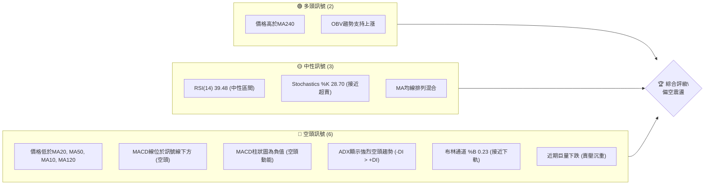

### 📊 核心指標速覽表

| 指標類別 | 指標名稱 | 當前數值 | 訊號 | 解讀 |
|----------|----------|----------|------|------|
| **價格** | 當前價格 | $232.69 | 🔴 | 價格位於多數短期/中期均線下方 |
| **均線** | MA20 | $244.03 | 🔴 | 價格位於MA20下方，短期趨勢偏空 |
| **均線** | MA50 | $256.13 | 🔴 | 價格位於MA50下方，中期趨勢偏空 |
| **均線** | MA200 | $232.77 | 🟡 | 價格與MA200極為接近，形成關鍵支撐/阻力 |
| **動能** | RSI(14) | 39.48 | 🟡 | RSI處於中性區間，但接近超賣，動能偏弱 |
| **動能** | MACD | -6.875 | 🔴 | MACD線位於訊號線下方，柱狀圖為負，空頭動能主導 |
| **波動** | ATR(14) | $8.25 | 🟡 | 每日波動約3.55%，波動性中等偏高 |

### 🏆 技術評分卡

根據當前 AMZN 的技術數據，其綜合評分顯示當前市場情緒偏向謹慎，短期空頭壓力較大，但長期趨勢仍有潛在支撐。

╔══════════════════════════════════════════════════════════════╗
║              技術評分卡 — AMZN (2026-06-28)                  ║
╠══════════════════════════════════════════════════════════════╣
║ 趨勢強度      ▓▓▓▓▓▓▓░░░░░░░░░░░░░░  35/100  🔴 (空頭趨勢強勁) ║
║ 動能指標      ▓▓▓▓▓▓░░░░░░░░░░░░░░░░  30/100  🔴 (空頭動能主導) ║
║ 支撐穩定度    ▓▓▓▓▓▓▓▓▓▓▓▓░░░░░░░░░░  60/100  🟡 (MA200及Fib支撐)║
║ 成交量配合    ▓▓▓▓▓▓▓▓░░░░░░░░░░░░░░  40/100  🔴 (巨量下跌，賣壓重)║
║ 形態完整度    ▓▓▓▓▓▓▓░░░░░░░░░░░░░░  35/100  🟡 (潛在回調或形態中)║
║ 均線排列      ▓▓▓▓▓▓░░░░░░░░░░░░░░░░  30/100  🔴 (短期均線空頭排列)║
╠══════════════════════════════════════════════════════════════╣
║ 綜合評分      ▓▓▓▓▓▓▓░░░░░░░░░░░░░░  38/100  評級：⚖️ 偏空震盪    ║
╚══════════════════════════════════════════════════════════════╝

---

## 2. 趨勢分析

### 🌐 多時框趨勢分析

AMZN 的股價在不同時間框架下呈現出複雜的趨勢結構。長期來看，儘管近期有所回調，但整體仍維持上升格局。中期則呈現出明顯的修正走勢，而短期則被強烈的空頭動能主導。

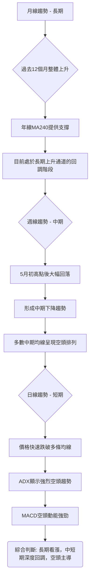

### 📈 長期趨勢 — 12個月走勢圖（Unicode）

過去12個月，AMZN 股價經歷了從底部回升至高點，再進行深度回調的過程。2026年5月創下近期高點 $270.64，隨後在6月大幅下跌至當前價格 $232.69。

```
AMZN 月線走勢圖（過去12個月）
價格軸 ($)
$270.64 ┤                           ●(2026-05 高點)
$260.00 ┤                     ●(2026-04)
$250.00 ┤           ●(2025-10)
$240.00 ┤     ●(2025-07) ●(2026-01)
$230.00 ┤   ●(2025-12) ●(2026-06 現在)
$220.00 ┤ ●(2025-06) ●(2025-09)
$210.00 ┤           ●(2026-02 低點)
$200.00 ┤
     └───────────────────────────────────
      2025-06  07  08  09  10  11  12  2026-01  02  03  04  05  06

關鍵高點：2026-05 $270.64
關鍵低點：2026-02 $210.00
當前價格：2026-06 $232.69
```

**走勢特徵分析表格**：

| 時間區間 | 起始價 | 結束價 | 漲跌幅 | 走勢特徵 | 評估 |
|----------|--------|--------|--------|----------|------|
| 2025-06 至 2026-05 | $219.39 | $270.64 | +23.36% | 強勁上升趨勢，創出新高 | 🟢 多頭 |
| 2026-05 至 2026-06 | $270.64 | $232.69 | -14.02% | 急速深度回調，伴隨巨量 | 🔴 空頭 |
| 2025-06 至 2026-06 | $219.39 | $232.69 | +6.06% | 儘管近期回調，長期仍處於上升格局 | 🟡 中性偏多 |

### 📊 中期趨勢（週線分析）

從近20週的收盤價數據來看，AMZN 在2026年2月至5月經歷了一波強勁的上升行情，從 $198.79 上漲至 $272.68。然而，自5月中旬以來，股價開始顯著回落。

```
近期 AMZN 週線走勢示意圖
╔═══════════════════════════════════════════════════╗
║                                   ●(272.68)       ║  ← 阻力區 (MA20, MA50)
║                                 ╱                 ║
║                             ╱                     ║
║                           ╱                       ║
║                         ╱                         ║
║                       ╱                           ║
║                     ╱                             ║
║                   ╱                               ║
║                 ╱                                 ║
║               ╱                                   ║
║             ╱                                     ║
║           ╱                                       ║
║         ╱                                         ║
║       ╱                                           ║
║     ╱                                             ║
║   ●──────────────────────●(232.69) ← 現價        ║
║ (198.79)                                          ║  ← 支撐區 (MA200, Fib 61.8%)
╚═══════════════════════════════════════════════════╝
```
圖中可見，股價在創下 $272.68 高點後，經歷了快速且連續的下跌，目前已跌破多條短期和中期移動平均線。最近一週的收盤價 $232.69 更是直接逼近 MA200，顯示中期上升趨勢已轉為修正，且修正幅度較大。上方的 MA20 ($244.03) 和 MA50 ($256.13) 已形成顯著的阻力區。

### ⚡ 趨勢強度評估（ADX 解讀）

ADX 指標用於衡量趨勢的強度，而非方向。當 ADX 高於25時，表示趨勢強勁。+DI 和 -DI 則指示趨勢的方向。

```mermaid
graph TD
    A["ADX(14): 34.87"] --> B{"趨勢強度判斷"}
    B -- ADX > 25 --> C["強趨勢行情"]
    C --> D{"趨勢方向判斷"}
    D -- +DI("14.44") < -DI("30.45") --> E["空頭主導"]
    E --> F["結論: 強勁的空頭趨勢正在發展"]
```

**ADX 強度對照表：**

| ADX 數值範圍 | 趨勢強度 | 市場狀態 |
|--------------|----------|----------|
| 0-20         | 無趨勢或弱趨勢 | 盤整 |
| 20-25        | 新興趨勢 | 趨勢形成中 |
| **25-50**    | **強趨勢** | **趨勢行情** |
| 50-75        | 非常強趨勢 | 趨勢行情 |
| 75-100       | 極端強趨勢 | 趨勢行情 (可能過熱) |

當前 ADX(14) 為 34.87，遠高於25，明確指出 AMZN 目前處於一個強勁的趨勢行情中。結合 +DI (14.44) 和 -DI (30.45) 的對比，-DI 明顯高於 +DI，這表明當前主導的強趨勢是空頭趨勢。換言之，AMZN 正處於一個強勢的下跌趨勢中，而非盤整行情。

---

## 3. 圖表形態分析

### 🔍 形態識別系統

在當前 AMZN 的週線圖上，從2026年2月低點 $210.00 附近開始，股價經歷了一波強勁上漲至5月高點 $270.64，隨後快速回落。這種快速上漲後急劇下跌的走勢，在形態上可以初步觀察到潛在的頂部形態發展，儘管尚未完全確認。

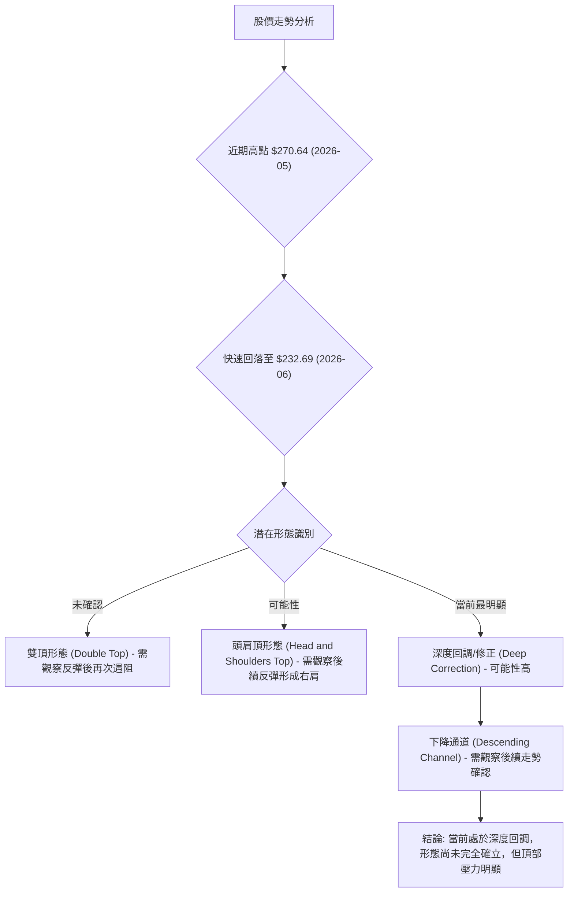
目前最直接的觀察是從5月高點開始的深度回調。如果股價在未來反彈至 $250 - $260 區間後再次受阻下跌，則可能形成雙頂或頭肩頂的右肩結構。

### 🕯️ 重要K線形態分析

由於提供的數據為月度收盤價和週度收盤價，無法直接分析每日的K線形態。但可以根據週度收盤價的變化來推斷可能的形態意義。

| 月份/週別 | 收盤價 | K線形態 (推斷) | 解讀 | 訊號 |
|-----------|--------|------------------|------|------|
| 2026-04-19 | $250.56 | 長陽線 (週) | 強勁上漲動能 | 🟢 |
| 2026-04-26 | $263.99 | 長陽線 (週) | 上漲動能延續 | 🟢 |
| 2026-05-03 | $268.26 | 上影線較長陽線 (週) | 上漲動能開始減弱，出現初步賣壓 | 🟡 |
| 2026-05-10 | $272.68 | 較短陽線/震盪 (週) | 上漲放緩，高位震盪，多空拉鋸 | 🟡 |
| 2026-05-17 | $264.14 | 長陰線 (週) | 跌破前一週低點，確認空頭力量增強 | 🔴 |
| 2026-05-24 | $266.32 | 小陽線/十字星 (週) | 短暫反彈或整理，但未能有效突破 | 🟡 |
| 2026-05-31 | $270.64 | 長陽線 (月) | 創新高，但隨後週線開始下跌 | 🟡 |
| 2026-06-07 | $246.03 | 長陰線 (週) | 股價大幅下跌，加速跌破支撐 | 🔴 |
| 2026-06-14 | $238.55 | 長陰線 (週) | 延續跌勢，顯示賣壓持續 | 🔴 |
| 2026-06-21 | $244.39 | 錘頭線/陽線 (週) | 短暫反彈，可能為下跌中繼或初步止跌訊號 | 🟡 |
| 2026-06-28 | $232.69 | 長陰線 (週) | 再次大幅下跌，確認空頭掌控，止跌訊號失效 | 🔴 |

### 📉 ASCII 走勢形態示意圖

從5月高點 $270.64 到6月底的 $232.69，AMZN 經歷了一個快速的下跌，形成了一個明顯的下跌趨勢。

```
AMZN 近期下跌走勢示意圖（週線）
══════════════════════════════════════════════════════════════
$275 ┤                                  ● (272.68)
$270 ┤                                 /
$265 ┤                                /
$260 ┤                              /
$255 ┤                             /
$250 ┤                            /
$245 ┤                           /
$240 ┤                          /
$235 ┤                         /
$230 ┤                        ● (232.69)
$225 ┤
$220 ┤
     └──────────────────────────────────────────────────────────
      2026-05-03 05-10 05-17 05-24 05-31 06-07 06-14 06-21 06-28

形態推斷：
- 高點 $272.68 (2026-05-10)
- 隨後跌破多條均線，形成快速下跌通道。
- 觀察：在 $244.39 (2026-06-21) 曾有短暫反彈，但隨後被 $232.69 (2026-06-28) 的巨量下跌所吞噬，顯示反彈失敗。
- 當前走勢更像是 **下降旗形 (Bear Flag)** 的後半段或 **下跌通道 (Descending Channel)** 的延續。
```

### 🎯 形態目標價計算

由於目前形態尚未完全確立為典型的反轉形態（如頭肩頂或雙頂），我們主要基於當前的下跌趨勢來預估潛在目標價，並結合斐波那契擴展或通道測量。

1.  **基於近期跌幅的簡單測量：**
    -   從5月高點 $272.68 到6月初的 $246.03 (2026-06-07) 跌幅約為 $26.65。
    -   如果將此跌幅再次向下延伸，則目標價約為 $246.03 - $26.65 = $219.38。
    -   **目標價1：$219.38** (接近2025年6月的高點，也接近布林通道下軌)

2.  **基於斐波那契擴展 (若確認下跌趨勢)：**
    -   假設第一波下跌為 A 點 ($272.68) 到 B 點 ($238.55, 2026-06-14)，反彈至 C 點 ($244.39, 2026-06-21)。
    -   則擴展目標 E1 (1.00x AB 從 C 點開始): $244.39 - ($272.68 - $238.55) = $244.39 - $34.13 = $210.26。
    -   擴展目標 E2 (1.618x AB 從 C 點開始): $244.39 - ($34.13 * 1.618) = $244.39 - $55.29 = $189.10。
    -   **目標價2：$210.26** (接近2026年2月低點)
    -   **目標價3：$189.10** (接近52週低點 $196.00 之下，潛在的更深回調)

**結論：** 由於當前股價仍處於快速下跌過程中，形態目標價的計算帶有較高不確定性。上述目標價應被視為潛在的支撐區域，特別是 $219.38 和 $210.26 附近。

---

## 4. 支撐與阻力

### 🗺️ 關鍵價位分布圖（Unicode）

當前 AMZN 股價 $232.69 處於一個多空拉鋸的關鍵位置，上方阻力重重，下方則有多重支撐等待考驗。特別值得關注的是 MA200 ($232.77) 和斐波那契 61.8% 回調位 ($232.12)，兩者形成極為重要的短期支撐區。

```
AMZN 價位結構分布圖
═══════════════════════════════════════════════════
$278.56 ║████████████████████████║ 強阻力 R4 (52週高點)
$270.64 ║████████████████████    ║ 阻力 R3 (近期高點)
$265.35 ║████████████████████████║ 阻力 R2 (布林上軌)
$256.13 ║████████████████████    ║ 阻力 R1 (MA50)
$244.03 ║████████████████████████║ 關鍵阻力 R0 (MA20 / Fib 38.2%)
$232.77 ╠════════════════════════╣ ◄ MA200
$232.69 ╠════════════════════════╣ ◄ 現價
$232.12 ║▓▓▓▓▓▓▓▓▓▓▓▓▓▓▓▓        ║ 近期支撐 S0 (Fib 61.8%)
$222.71 ║████████████████████████║ 強支撐 S1 (布林下軌)
$210.00 ║▓▓▓▓▓▓▓▓▓▓▓▓▓▓▓▓        ║ 強支撐 S2 (2026-02 低點 / Fib 1.0擴展)
$196.00 ║████████████████████████║ 極強支撐 S3 (52週低點)
═══════════════════════════════════════════════════
```

### 🚧 阻力位分析表

| 阻力級別 | 價位 | 形成原因 | 突破難度 | 重要性 |
|----------|------|----------|----------|--------|
| **R0**   | $244.03 | MA20 / 斐波那契 38.2% 回調位 ($246.81 接近) | 中等偏高 | 短期反彈的首要考驗，確認能否止跌 |
| **R1**   | $256.13 | MA50 | 高 | 中期趨勢能否扭轉的關鍵 |
| **R2**   | $265.35 | 布林通道上軌 | 高 | 強勢反彈的上限，突破預示極強多頭 |
| **R3**   | $270.64 | 近期高點 (2026-05) | 極高 | 歷史高點，突破則開啟新一輪上漲 |
| **R4**   | $278.56 | 52週高點 | 極高 | 年內最高點，極難突破 |

### 🛡️ 支撐位分析表

| 支撐級別 | 價位 | 形成原因 | 守住機率 | 重要性 |
|----------|------|----------|----------|--------|
| **S0**   | $232.12 | 斐波那契 61.8% 回調位 | 中等 | 當前價格附近，能否守住決定短期走勢 |
| **S1**   | $222.71 | 布林通道下軌 | 中等偏高 | 短期超賣反彈的潛在啟動點 |
| **S2**   | $210.00 | 2026-02 低點 / 斐波那契 1.0 擴展目標 | 高 | 重要的心理與歷史支撐，守住則避免更深跌幅 |
| **S3**   | $196.00 | 52週低點 | 極高 | 長期下跌的最終防線，跌破則趨勢惡化 |

### 📐 斐波那契回調位分析

我們以2026年2月至5月的一波主要上漲趨勢 ($208.27 至 $270.64) 為基礎，計算其回調位。當前價格 $232.69 正處於 61.8% 回調位附近，這是技術分析中一個極為關鍵的黃金比例支撐位。

-   **上漲波段起點 (A)**: $208.27 (2026-03-01 低點，取其附近較低值 $208.27)
-   **上漲波段終點 (B)**: $270.64 (2026-05-31 高點)
-   **波段漲幅**: $270.64 - $208.27 = $62.37

| 回調比例 | 計算方式                                | 斐波那契回調位 | 當前狀態 | 意義 |
|----------|-----------------------------------------|----------------|----------|------|
| 23.6%    | $270.64 - ($62.37 * 0.236)             | $255.88        | 已跌破 | 較弱支撐，已轉為阻力 |
| 38.2%    | $270.64 - ($62.37 * 0.382)             | $246.81        | 已跌破 | 重要阻力，與 MA20 接近 |
| 50.0%    | $270.64 - ($62.37 * 0.500)             | $239.46        | 已跌破 | 心理支撐，與 MA10 接近 |
| **61.8%**| **$270.64 - ($62.37 * 0.618)**          | **$232.12**    | **正在測試** | **黃金比例支撐，極為關鍵** |
| 76.4%    | $270.64 - ($62.37 * 0.764)             | $222.65        | 尚未到達 | 深度回調支撐，接近布林下軌 |

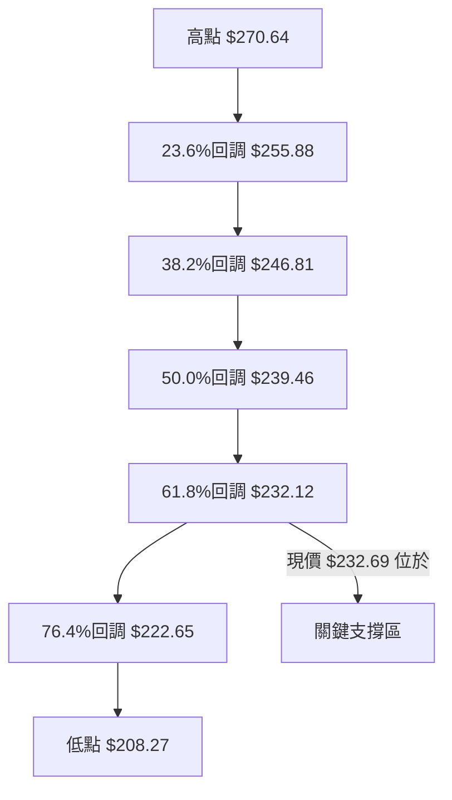
當前價格 $232.69 幾乎精確地落在 61.8% 斐波那契回調位 $232.12 附近，同時也與 MA200 ($232.77) 極為接近。這三個價位的匯合形成了一個非常強大的短期支撐區。能否守住此區域，將是判斷 AMZN 短期走勢的關鍵。跌破此區，則可能進一步下探至 $222.71 (布林下軌) 甚至 $210.00 (2026-02 低點)。

---

## 5. 技術指標深度解讀

### 🎛️ 指標訊號總覽

當前 AMZN 的各項技術指標發出了混合但總體偏空的訊號。動能指標顯示空頭主導，趨勢強度確認了下跌趨勢的強勁，而成交量則反映了巨大的賣壓。

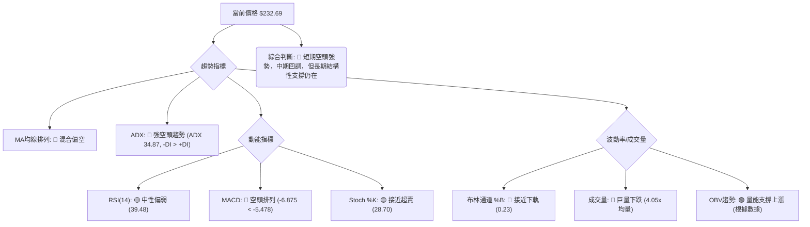

### 📈 移動平均線排列分析

AMZN 的移動平均線 (MA) 目前呈現出短期和中期均線的空頭排列，而長期均線則與價格糾纏，顯示出長期趨勢的潛在支撐和當前多空拉鋸的激烈程度。

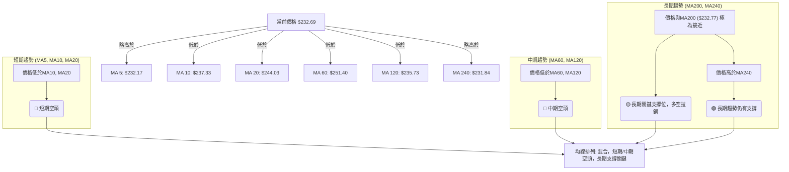

**均線排列狀態：**

| 均線          | 當前數值 | 價格相對位置 | 訊號 | 解讀                                   |
|---------------|----------|--------------|------|----------------------------------------|
| **MA5**       | $232.17 | 價格略高於   | 🟢   | 極短期有止跌跡象，但力量微弱         |
| **MA10**      | $237.33 | 價格位於下方 | 🔴   | 短期下跌趨勢明確                       |
| **MA20**      | $244.03 | 價格位於下方 | 🔴   | 短期下跌趨勢明確，MA20形成上方阻力   |
| **MA50**      | $256.13 | 價格位於下方 | 🔴   | 中期下跌趨勢明確，MA50為重要阻力     |
| **MA120**     | $235.73 | 價格位於下方 | 🔴   | 中長期趨勢偏空                         |
| **MA200**     | $232.77 | 價格與之接近 | 🟡   | 極為關鍵的長期支撐/阻力，多空拉鋸點  |
| **MA240**     | $231.84 | 價格位於上方 | 🟢   | 長期趨勢仍有潛在支撐                   |

**總結：** 短期和中期均線呈現典型的空頭排列，價格在這些均線下方運行，顯示強勁的賣壓。然而，價格與 MA200 幾乎重合，且略高於 MA240，這為長期趨勢提供了潛在的支撐。目前 MA200 成為多空雙方爭奪的關鍵防線。

### 📉 RSI(14) 分析

RSI(14) 是衡量股票買賣壓力的動能指標。

-   **RSI(14) 數值進度條：**
    RSI: ▓▓▓▓▓▓▓▓░░░░░░░░░░░░░░░░░░░░░░░░░░░░░░░░░░░░░░░░░░░░░░░░░░░░░░░░░░░░░░░░░░░░░░░░░░░░░░░░░░░░░░░░░░░░░░░░░░░░░░░░░░░░░░░░░░░░░░░░░░░░░░░░░░░░░░░░░░░░░░░░░░░░░░░░░░░░░░░░░░░░░░░░░░░░░░░░░░░░░░░░░░░░░░░░░░░░░░░░░░░░░░░░░░░░░░░░░░░░░░░░░░░░░░░░░░░░░░░░░░░░░░░░░░░░░░░░░░░░░░░░░░░░░░░░░░░░░░░░░░░░░░░░░░░░░░░░░░░░░░░░░░░░░░░░░░░░░░░░░░░░░░░░░░░░░░░░░░░░░░░░░░░░░░░░░░░░░░░░░░░░░░░░░░░░░░░░░░░░░░░░░░░░░░░░░░░░░░░░░░░░░░░░░░░░░░░░░░░░░░░░░░░░░░░░░░░░░░░░░░░░░░░░░░░░░░░░░░░░░░░░░░░░░░░░░░░░░░░░░░░░░░░░░░░░░░░░░░░░░░░░░░░░░░░░░░░░░░░░░░░░░░░░░░░░░░░░░░░░░░░░░░░░░░░░░░░░░░░░░░░░░░░░░░░░░░░░░░░░░░░░░░░░░░░░░░░░░░░░░░░░░░░░░░░░░░░░░░░░░░░░░░░░░░░░░░░░░░░░░░░░░░░░░░░░░░░░░░░░░░░░░░░░░░░░░░░░░░░░░░░░░░░░░░░░░░░░░░░░░░░░░░░░░░░░░░░░░░░░░░░░░░░░░░░░░░░░░░░░░░░░░░░░░░░░░░░░░░░░░░░░░░░░░░░░░░░░░░░░░░░░░░░░░░░░░░░░░░░░░░░░░░░░░░░░░░░░░░░░░░░░░░░░░░░░░░░░░░░░░░░░░░░░░░░░░░░░░░░░░░░░░░░░░░░░░░░░░░░░░░░░░░░░░░░░░░░░░░░░░░░░░░░░░░░░░░░░░░░░░░░░░░░░░░░░░░░░░░░░░░░░░░░░░░░░░░░░░░░░░░░░░░░░░░░░░░░░░░░░░░░░░░░░░░░░░░░░░░░░░░░░░░░░░░░░░░░░░░░░░░░░░░░░░░░░░░░░░░░░░░░░░░░░░░░░░░░░░░░░░░░░░░░░░░░░░░░░░░░░░░░░░░░░░░░░░░░░░░░░░░░░░░░░░░░░░░░░░░░░░░░░░░░░░░░░░░░░░░░░░░░░░░░░░░░░░░░░░░░░░░░░░░░░░░░░░░░░░░░░░░░░░░░░░░░░░░░░░░░░░░░░░░░░░░░░░░░░░░░░░░░░░░░░░░░░░░░░░░░░░░░░░░░░░░░░░░░░░░░░░░░░░░░░░░░░░░░░░░░░░░░░░░░░░░░░░░░░░░░░░░░░░░░░░░░░░░░░░░░░░░░░░░░░░░░░░░░░░░░░░░░░░░░░░░░░░░░░░░░░░░░░░░░░░░░░░░░░░░░░░░░░░░░░░░░░░░░░░░░░░░░░░░░░░░░░░░░░░░░░░░░░░░░░░░░░░░░░░░░░░░░░░░░░░░░░░░░░░░░░░░░░░░░░░░░░░░░░░░░░░░░░39.48%

RSI 目前位於 39.48，處於中性區間 (30-70)。
-   **超買/超賣區間分析：**
    -   RSI 在5月上旬曾高達 82.9 (2026-05-03) 和 97.5 (2026-04-19)，顯示股價嚴重超買，為當時的下跌埋下伏筆。
    -   在6月14日曾觸及 26.8，進入超賣區，隨後有所反彈至 31.1 (2026-06-21)，再回到 39.48。
    -   當前 RSI 數值雖然未達超賣區 (低於30)，但已非常接近，表明賣壓雖強，但短期內有可能因為技術性超賣而出現反彈。
-   **背離判斷：**
    -   從20週數據看，2026-05-10 股價高點 $272.68，RSI 為 79.6。而2026-04-19 股價 $250.56，RSI 為 97.5。這形成了一個 **頂背離 (Bearish Divergence)**，即價格創新高，但 RSI 未能創新高，這是潛在的看跌訊號，並在隨後的下跌中得到了驗證。
    -   在最近的下跌中，2026-06-14 股價 $238.55，RSI 26.8。2026-06-28 股價 $232.69，RSI 39.48。價格創了新低，但 RSI 卻有所回升 (從 26.8 到 39.48)。這是一個潛在的 **底背離 (Bullish Divergence)** 訊號，儘管幅度不大，但暗示下跌動能可能正在減弱，短期內有止跌反彈的機會。

### 📊 MACD(12/26/9) 訊號解讀

MACD 是趨勢追蹤動量指標，由快線 (MACD Line)、慢線 (Signal Line) 和柱狀圖 (Histogram) 組成。

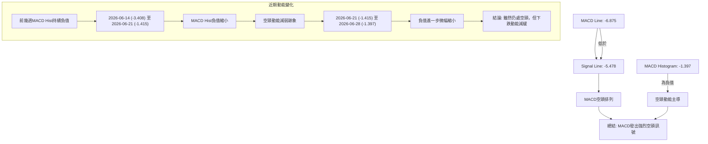

-   **MACD 線與訊號線：** 當前 MACD 線 (-6.875) 位於訊號線 (-5.478) 下方，這是一個明確的空頭訊號。兩條線都位於零軸下方，進一步確認了市場的空頭趨勢。
-   **MACD 柱狀圖：** 當前柱狀圖為 -1.397，為負值，表示 MACD 線在訊號線下方，空頭動能佔優。
-   **動能變化：** 儘管 MACD 仍處於空頭排列，但觀察柱狀圖的變化，從2026-06-07 的 -3.496，到 2026-06-14 的 -3.408，再到 2026-06-21 的 -1.415，以及當前的 -1.397，柱狀圖的負值正在縮小 (即從更負向零軸靠近)。這是一個重要的訊號，表明空頭動能正在減弱，雖然還未能轉為多頭，但下跌的勢頭可能正在放緩，為潛在的止跌反彈創造條件。
-   **背離判斷：** 結合 RSI 的底背離，MACD 柱狀圖負值縮小，雖然 MACD 線本身尚未形成明確的底背離，但其動能的減弱與 RSI 的底背離相互印證，增加了短期止跌的可能性。

### 📦 布林通道分析

布林通道 (Bollinger Bands) 用於衡量價格的波動範圍，並判斷股價是否處於超買或超賣狀態。

```
AMZN 布林通道示意圖
══════════════════════════════════════════════════════════════
$270 ┤                                  BB上軌 ($265.35)
$260 ┤                                 /
$250 ┤                                /
$240 ┤                              /
$230 ┤                        ● 現價 ($232.69)
$220 ┤                      /
$210 ┤                     BB下軌 ($222.71)
     └──────────────────────────────────────────────────────────
      時間軸

上軌 (Upper Band): $265.35
中軌 (Middle Band, MA20): $244.03
下軌 (Lower Band): $222.71
當前價格: $232.69
BB %B: 0.23
```

-   **價格位置：** 當前價格 $232.69 位於布林通道中軌 ($244.03) 和下軌 ($222.71) 之間，且非常接近下軌。
-   **BB %B：** 數值為 0.23，表示價格距離下軌較近 (0代表下軌，0.5代表中軌，1代表上軌)。這通常被視為股價處於偏弱或超賣狀態的訊號。
-   **解讀：** 股價接近布林通道下軌，可能預示著短期內存在超賣反彈的機會。然而，如果股價持續跌破下軌，則可能預示著下跌趨勢的加速和強化。目前通道口徑 (上軌 $265.35 - 下軌 $222.71 = $42.64) 相對較大，顯示近期波動性較高，這與 ATR 指標的觀察一致。

### 💹 成交量分析（量價配合度）

成交量是價格走勢的能量來源，量價配合度是判斷趨勢可信度的關鍵。

-   **最新成交量：** 248,291,300 股。
-   **20日均量：** 61,232,360 股。
-   **量比：** 4.05x。最新成交量是20日均量的4.05倍，這是一個極高的成交量。
-   **50日均量：** 50,517,708 股。
-   **OBV趨勢：** 數據顯示 "OBV > MA → 量能支撐上漲"。

**量價配合度分析：**
1.  **巨量下跌：** 當前價格 $232.69 是在巨量 (248,291,300) 配合下形成的，而這一週的價格從 $244.39 (2026-06-21) 下跌至 $232.69 (2026-06-28)，跌幅明顯。如此巨大的成交量伴隨著價格的下跌，通常被解讀為市場上存在強大的賣壓，空頭力量佔據主導地位。這是一個強烈的看跌訊號，表明多頭即使有心反抗，也難以抵擋如此洶湧的拋售潮。
2.  **OBV 趨勢的矛盾：** 數據提供的 "OBV趨勢: OBV > MA → 量能支撐上漲" 這一結論，與最近一週的巨量下跌在表面上存在矛盾。一般而言，價格下跌伴隨巨量，OBV 理應同步下跌或至少不會顯示量能支撐上漲。
    -   **可能的解釋1：** 該 OBV 趨勢的判斷可能是一個長期或中期趨勢的總結，並未完全反映最新一週的極端成交量。
    -   **可能的解釋2：** 如果 OBV 確實仍高於其移動平均線，那麼在價格大幅下跌的同時，OBV 仍能保持相對強勢，這可能構成一個潛在的 **量價背離** 訊號。這種情況下，它暗示著儘管短期賣壓巨大，但市場的底層買盤力量或長期持有者的信心並未完全崩潰，或許有主力資金在低位承接。
3.  **綜合判斷：** 鑒於最新一週的成交量和價格行為，我們必須優先考慮巨量下跌所帶來的強烈空頭訊號。雖然 OBV 的長期趨勢可能仍顯示支撐，但在短期內，如此大的賣壓很難被忽視。這表明當前市場處於激烈的多空爭奪中，空頭暫時佔優，但若 OBV 確實保持強勢，則需警惕隨後的反彈潛力。

---

## 6. 動能與波動率

### ⚡ 動能評估四象限

我們將 AMZN 當前的動能與波動率進行評估，以判斷其所處的市場狀態。

**動能評估：**
-   RSI(14): 39.48 (中性偏弱，接近超賣)
-   MACD Hist: -1.397 (負值，但負值縮小，空頭動能減弱)
-   Stoch %K: 28.70 (接近超賣)
綜合來看，動能處於 **弱動能** 狀態，但顯示出止跌的早期跡象。

**波動率評估：**
-   ATR(14): $8.25 (3.55% of price)
-   布林通道口徑: $42.64 ($265.35 - $222.71)
3.55% 的日波動率對於 AMZN 而言屬於 **中等偏高波動**。

**動能與波動率四象限分析：**

| 象限 | 動能 | 波動 | 當前狀態 | 評估                                   |
|------|------|------|----------|----------------------------------------|
| Q1   | 強   | 低   | -        | 最佳機會 (趨勢明確，風險可控)          |
| Q2   | 弱   | 低   | -        | 謹慎觀望 (缺乏方向，波動小，易盤整)    |
| Q3   | 強   | 高   | -        | 高風險高收益 (趨勢強勁，但波動劇烈)    |
| **Q4**| **弱**| **高**| **✓**    | **避免進場** (方向不明，波動劇烈，風險高) |

**結論：** AMZN 目前處於 **弱動能、高波動** 的 Q4 象限。這表示市場缺乏明確的方向性動能，但價格波動劇烈，交易風險較高。這種環境下，追漲殺跌容易被套，更適合等待趨勢明朗或波動收斂後再尋找交易機會。

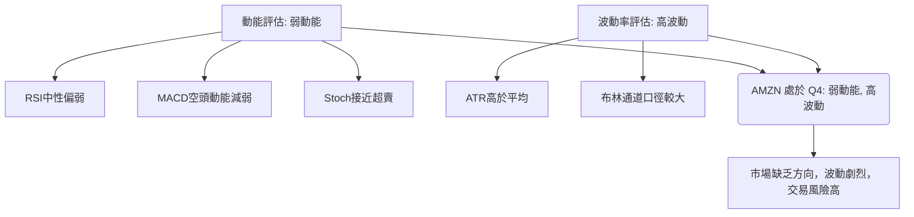

### 📊 ATR 波動率分析

平均真實波幅 (ATR) 是衡量股票波動性的一個指標，它反映了在給定時間段內價格的平均波動範圍。

-   **ATR(14)：** $8.25
-   **佔當前價格百分比：** ($8.25 / $232.69) * 100% = 3.55%

**分析：**
-   AMZN 的 ATR 數值為 $8.25，這意味著在過去14天中，AMZN 的平均每日波動範圍約為 $8.25。
-   3.55% 的波動率對於 AMZN 這種大型科技股來說，屬於中等偏高水平。這表明近期市場情緒不穩定，價格容易出現較大波動。
-   **止損距離建議：** 鑑於當前波動性，交易者在設置止損時應考慮 ATR。一個常見的策略是將止損設置在入場點下方 1.5 到 3 倍 ATR 的距離。
    -   1.5 * ATR = 1.5 * $8.25 = $12.38
    -   2.0 * ATR = 2.0 * $8.25 = $16.50
    -   3.0 * ATR = 3.0 * $8.25 = $24.75
    -   例如，如果以 $232.12 (Fib 61.8% 支撐) 作為潛在入場點，一個合理的止損可以設置在 $232.12 - $12.38 = $219.74 (約 1.5倍 ATR) 或 $232.12 - $16.50 = $215.62 (約 2倍 ATR) 之下，以避免被正常波動洗出局。

### 📐 Beta 與市場相關性

報告中未提供 AMZN 的 Beta 係數。然而，根據其行業 (Consumer Cyclical, Internet Retail) 和公司規模，AMZN 通常被認為是一個具有較高 Beta 值的股票，即其股價波動性傾向於大於整體市場。

-   **推斷：** 作為大型科技成長股，AMZN 通常對市場情緒和經濟前景變化敏感，其 Beta 值很可能大於 1。
-   **影響：**
    -   如果市場上漲，AMZN 往往會漲得更多；如果市場下跌，AMZN 也可能跌得更深。
    -   在當前的市場環境下，如果大盤（如 SPY, QQQ）表現疲軟或進入修正，AMZN 的跌幅可能會被放大。
    -   因此，在制定交易策略時，除了關注 AMZN 自身的技術面，也應密切監控整體大盤的走勢。

---

## 7. 多時框架總結

### 📋 時框架評分表

綜合各時間框架的技術分析，AMZN 目前呈現出長期仍有潛力，但中短期面臨顯著下行壓力的格局。

| 時框架 | 趨勢方向 | 動能 | 均線排列 | 形態 | 綜合評分 | 建議 |
|--------|----------|------|----------|------|----------|------|
| **長期 (月線)** | 🟢 上升趨勢回調 | 🟡 中性偏弱 | 🟢 價格高於MA240 | 🟡 潛在頂部形態中 | 6/10 | 觀望/逢低佈局 |
| **中期 (週線)** | 🔴 下降趨勢 | 🔴 減弱的空頭 | 🔴 價格低於MA50/MA120 | 🔴 深度回調/下降通道 | 3/10 | 謹慎/等待築底 |
| **短期 (日線)** | 🔴 強空頭趨勢 | 🟡 空頭動能減弱 | 🔴 價格低於MA20/MA50 | 🔴 急速下跌/反彈失敗 | 2/10 | 避免追空/等待反彈 |

### 🔲 綜合訊號矩陣

透過多時框架的訊號矩陣，我們可以看到 AMZN 的短期和中期訊號一致性較高，均指向空頭，而長期訊號則相對獨立，仍為多頭。

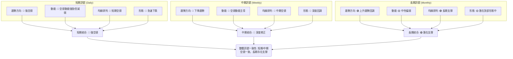

**結論：** 短期和中期趨勢均指向強烈的空頭修正，且動能和均線排列都支持這一判斷。然而，長期趨勢顯示股價仍處於上升通道的回調區間，MA200 和 MA240 提供了關鍵支撐。這種情況下，短期和中期交易者應保持謹慎或尋找空頭機會，而長期投資者則可關注關鍵支撐位的築底情況。當前市場缺乏明確的多頭信號，多空爭奪激烈，短期內波動性可能持續。

---

## 8. 交易策略建議

基於上述詳盡的技術分析，AMZN 目前處於短期強勢空頭、中期深度修正、長期潛在支撐的複雜局面。當前價格 $232.69 位於 MA200 和斐波那契 61.8% 回調位的關鍵匯合處，多空力量在此區域將展開激烈爭奪。

### 🗺️ 策略決策流程圖

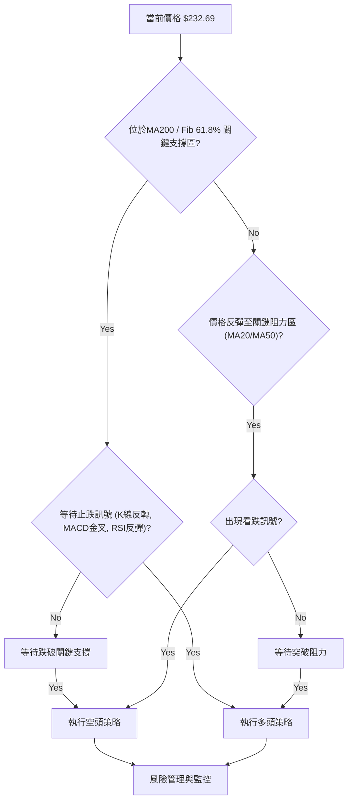

### 🟢 多頭策略詳情

此策略建立在 AMZN 能夠成功守住關鍵支撐位，並出現止跌反彈訊號的基礎上。由於當前空頭趨勢強勁，此策略風險較高，建議小倉位試探。

| 策略要素 | 策略 A (保守反彈) | 策略 B (激進抄底) |
|----------|-------------------|-------------------|
| 進場條件 | 股價在 $232.12-$232.77 區間獲得支撐，出現明確的看漲K線形態 (如錘頭、啟明星)，MACD 柱狀圖負值持續縮小，RSI 脫離超賣區並向上反轉。 | 股價跌破 $232.12 但迅速收回，或在 $222.71 (布林下軌) 附近出現強勢買盤，RSI 進入超賣區後快速反彈。 |
| 進場價格 | $235.00 (確認反彈後) | $225.00 (接近布林下軌) |
| 目標價 T1 | $244.03 (MA20 / Fib 38.2% 阻力) | $239.46 (Fib 50% 阻力) |
| 目標價 T2 | $256.13 (MA50 阻力) | $246.81 (Fib 38.2% 阻力) |
| 止損價格 | $228.00 (略低於 $232.12/$232.77 支撐，考慮 ATR 的 0.5倍) | $218.00 (略低於 $222.71 支撐，考慮 ATR 的 0.5倍) |
| 風險報酬比 | T1: ($244.03-$235.00)/($235.00-$228.00) = 9.03/7.00 ≈ **1.29:1**<br>T2: ($256.13-$235.00)/($235.00-$228.00) = 21.13/7.00 ≈ **3.02:1** | T1: ($239.46-$225.00)/($225.00-$218.00) = 14.46/7.00 ≈ **2.07:1**<br>T2: ($246.81-$225.00)/($225.00-$218.00) = 21.81/7.00 ≈ **3.12:1** |
| 成功機率 | 40% (需市場配合) | 30% (高風險) |
| 建議倉位 | 5-10% | 3-5% (極小倉位) |

### 🔴 空頭策略詳情

此策略建立在 AMZN 無法守住關鍵支撐位，或反彈至阻力位後再次受阻下跌的基礎上。當前趨勢有利於空頭，但需警惕超跌反彈。

| 策略要素 | 策略 A (跌破支撐) | 策略 B (反彈做空) |
|----------|-------------------|-------------------|
| 進場條件 | 股價明確跌破 $232.12 (Fib 61.8%) 和 $232.77 (MA200)，並以大陰線收盤，成交量放大。 | 股價反彈至 $244.03 (MA20) 或 $246.81 (Fib 38.2%) 附近受阻，出現看跌K線形態 (如烏雲蓋頂、射擊之星)，MACD 柱狀圖負值再次放大。 |
| 進場價格 | $230.00 (確認跌破後) | $245.00 (確認阻力後) |
| 目標價 T1 | $222.71 (布林下軌) | $232.12 (Fib 61.8% 支撐) |
| 目標價 T2 | $210.00 (2026-02 低點 / Fib 1.0 擴展) | $222.71 (布林下軌) |
| 止損價格 | $235.00 (略高於 $232.12/$232.77 支撐，考慮 ATR 的 0.5倍) | $250.00 (略高於 $244.03/$246.81 阻力，考慮 ATR 的 0.5倍) |
| 風險報酬比 | T1: ($230.00-$222.71)/($235.00-$230.00) = 7.29/5.00 ≈ **1.46:1**<br>T2: ($230.00-$210.00)/($235.00-$230.00) = 20.00/5.00 ≈ **4.00:1** | T1: ($245.00-$232.12)/($250.00-$245.00) = 12.88/5.00 ≈ **2.58:1**<br>T2: ($245.00-$222.71)/($250.00-$245.00) = 22.29/5.00 ≈ **4.46:1** |
| 成功機率 | 55% | 50% |
| 建議倉位 | 10-15% | 8-12% |

### ⭐ 整體訊號強度評星

基於當前 AMZN 的多重技術指標分析，以及中短期趨勢的判斷：

做多訊號強度：★★☆☆☆  (2/5星)
-   理由：儘管RSI和MACD柱狀圖顯示空頭動能減弱，且價格位於關鍵斐波那契和MA200支撐，但整體趨勢仍偏空，多頭訊號尚未完全確認，風險較高。

做空訊號強度：★★★☆☆  (3/5星)
-   理由：ADX顯示強勁空頭趨勢，價格跌破多條均線，MACD空頭排列，且近期巨量下跌確認賣壓沉重。但需警惕超賣反彈。

整體可信度：  ★★★☆☆  (3/5星)
-   理由：各項指標雖有矛盾，但中短期空頭趨勢的判斷具有較高一致性，市場處於深度回調階段。長期支撐的存在為後續反彈留有空間，但當前仍以空頭主導。

---

## 9. 風險提示與監控

在當前複雜的市場環境下，對 AMZN 的投資或交易應高度重視風險管理。

### ✅ 關鍵監控指標 Checklist

交易者應密切關注以下關鍵指標和價位，以應對市場的快速變化。

╔══════════════════════════════════════════════════════════════╗
║              AMZN 關鍵監控指標清單                           ║
╠══════════════════════════════════════════════════════════════╣
║ ├─ 價格行為：是否有效跌破 $232.12 (Fib 61.8%) 和 $232.77 (MA200)？    ║
║ ├─ 成交量：下跌時成交量是否持續放大？反彈時成交量是否足夠？             ║
║ ├─ RSI(14)：是否跌破 30 進入超賣區？是否從超賣區有效反彈？            ║
║ ├─ MACD：MACD線是否形成金叉 (多頭) 或死叉 (空頭)？柱狀圖是否轉正？     ║
║ ├─ ADX：ADX 是否持續上升 (-DI 是否持續高於 +DI)？                    ║
║ ├─ 布林通道：價格是否跌破下軌？是否在中軌上方站穩？                 ║
║ ├─ 大盤走勢：納斯達克100指數 (QQQ) 和標普500指數 (SPY) 表現如何？      ║
║ └─ 突發新聞：公司或行業是否有重大新聞事件影響股價？                 ║
╚══════════════════════════════════════════════════════════════╝

### ⚠️ 風險場景分析

針對 AMZN 當前的技術面，可以預想以下三種主要情境：

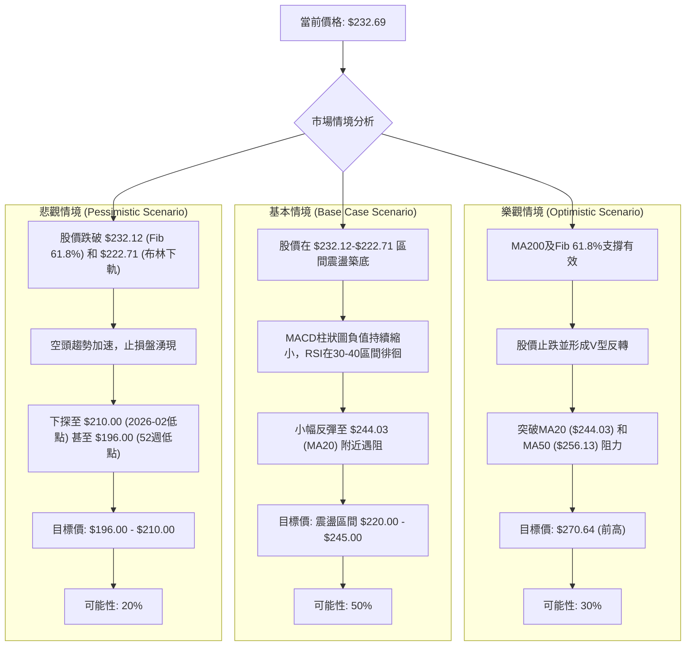

### 🛡️ 風險管理重要提醒

1.  **倉位管理：** 在當前市場不確定性較高的情況下，嚴格控制倉位至關重要。避免重倉單一股票，特別是波動性較高的成長股。建議將 AMZN 的倉位控制在總投資組合的 5-15% 範圍內。
2.  **止損設定：** 無論採取何種交易策略，務必在入場前設定明確的止損點，並嚴格執行。ATR 指標 ($8.25) 可作為設置止損距離的參考。
3.  **分批操作：** 無論是買入還是賣出，都建議採取分批策略。例如，在支撐位附近分批建倉，或在阻力位附近分批減倉，以平滑平均成本，降低單次操作的風險。
4.  **市場情緒：** 密切關注整體市場情緒和宏觀經濟數據，特別是通脹、利率政策等可能影響科技成長股估值的因素。
5.  **耐心等待：** 當前 AMZN 處於多空拉鋸的關鍵時刻，趨勢尚未完全明朗。對於傾向於趨勢交易的投資者，耐心等待明確的趨勢訊號出現，或等待股價在關鍵支撐位築底成功，是更為穩健的策略。避免在混亂的盤整區間內頻繁交易。

---

## 📋 報告總結

```
AMZN 技術分析報告總結
════════════════════════════════════════════════════════
報告日期：2026-06-28
當前價格：$232.69
分析評級：⚖️ 偏空震盪 (短期空頭強勢，中期回調，長期支撐)

關鍵結論：
├─ 長期趨勢：🟢 儘管近期回調，但從過去12個月看仍處於上升通道的回調區間，MA240提供支撐。
├─ 中期趨勢：🔴 自2026年5月高點以來，股價呈現深度修正，已跌破多條中期均線，形成下降趨勢。
├─ 短期趨勢：🔴 強勢空頭主導，ADX確認強勁下跌趨勢，MACD空頭排列，巨量下跌。但RSI和MACD柱狀圖顯示空頭動能減弱，有止跌跡象。
├─ 關鍵支撐：$232.12 (Fib 61.8%回調位) 與 $232.77 (MA200) 形成極為關鍵的匯合支撐區。次級支撐位為 $222.71 (布林下軌) 和 $210.00 (2026-02低點)。
└─ 關鍵阻力：$244.03 (MA20) 和 $246.81 (Fib 38.2%回調位) 為短期反彈的首要阻力。中期阻力為 $256.13 (MA50)。
└─ 分析師目標：$312.99 (平均目標價，顯示長期潛力)

最優策略組合：
1. 🥇 最佳機會：等待股價在 $232.12-$232.77 關鍵支撐區築底成功，出現明確的止跌反轉K線形態和MACD金叉訊號後，輕倉佈局多頭，目標價 $244.03 和 $256.13。
2. 🥈 次選機會：若股價跌破 $232.12-$232.77 支撐區，並確認破位，可考慮短線追空至 $222.71 或 $210.00。
3. 🥉 保守選擇：保持觀望，等待市場趨勢明朗化。若股價能有效突破 $244.03 (MA20) 並站穩，則空頭壓力將有所緩解，可再尋找多頭機會。
════════════════════════════════════════════════════════
```

---

> ⚠️ **免責聲明**：本報告為 AI 自動生成之技術分析，所有數據及估算均基於提供的歷史價格資訊。本報告**僅供研究與學術參考**，**不構成任何投資建議**。投資有風險，入市需謹慎。

---

*報告生成時間：2026-06-28 ｜ 數據來源：Yahoo Finance ｜ 分析框架：多時框技術分析*