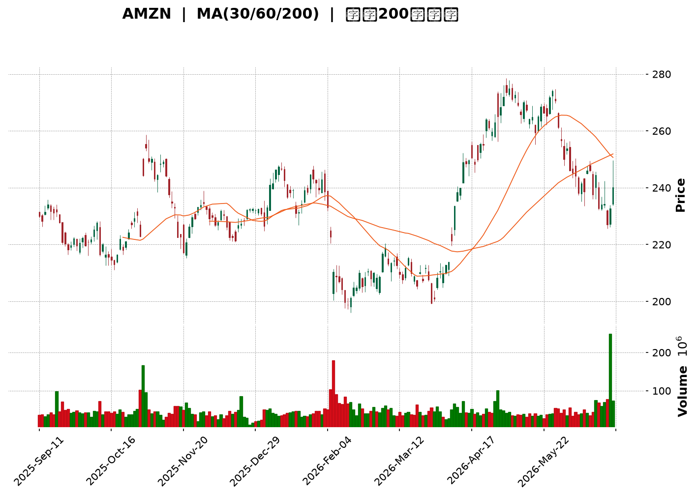
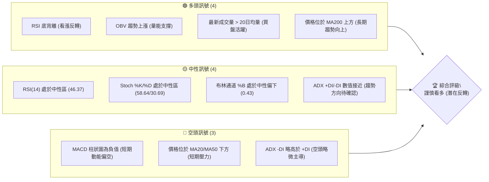
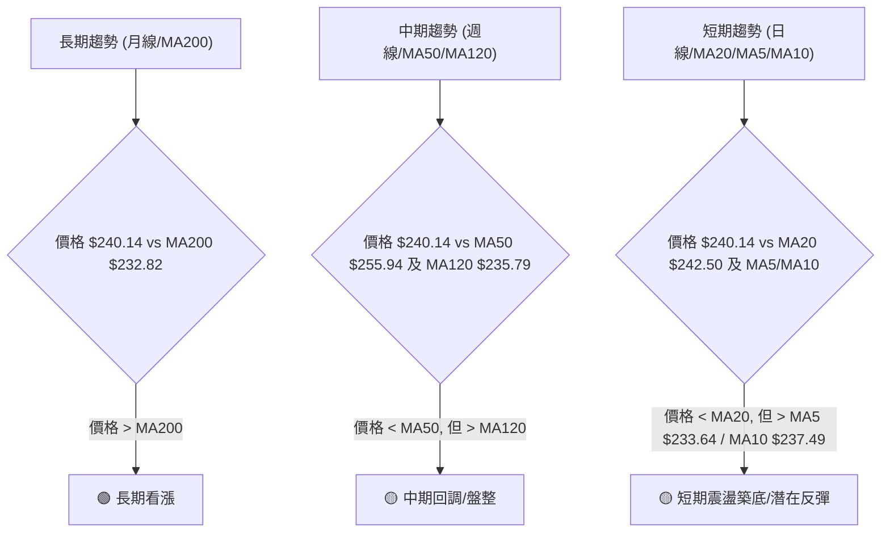
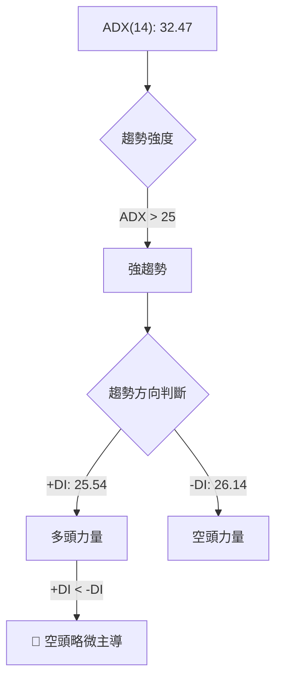
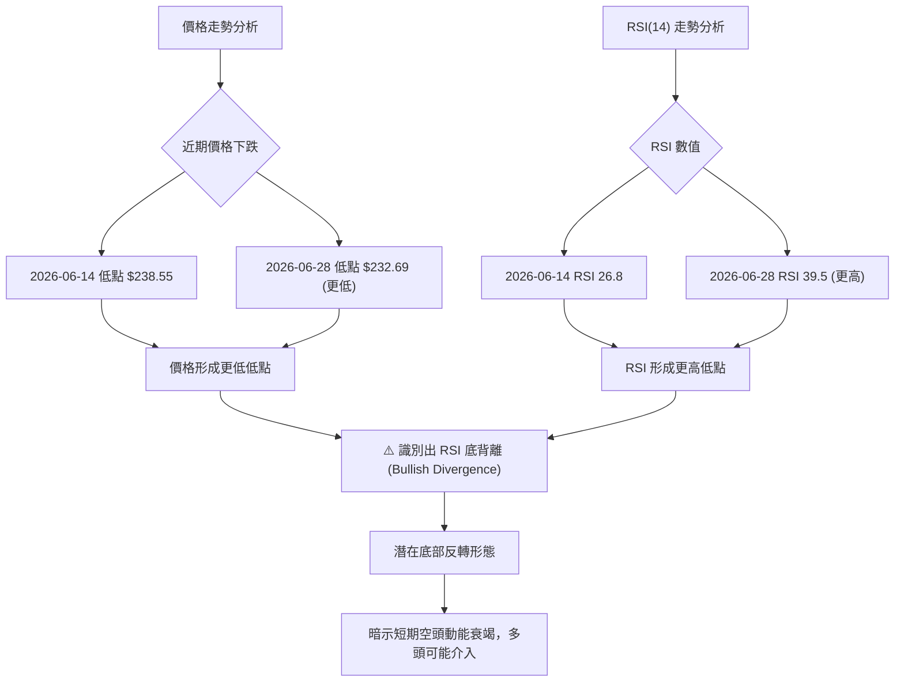
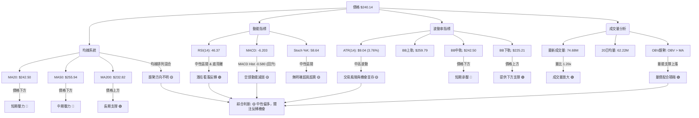
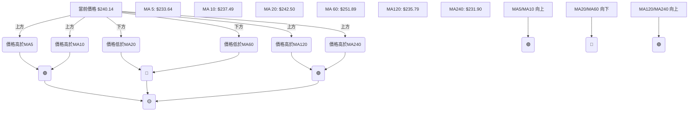
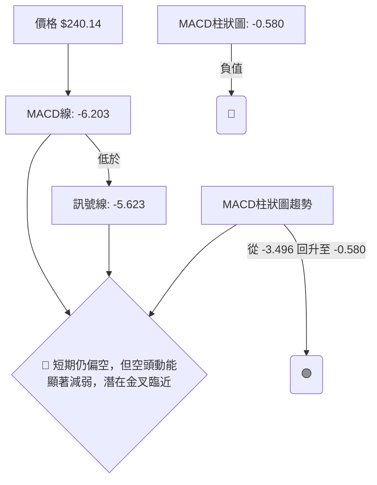
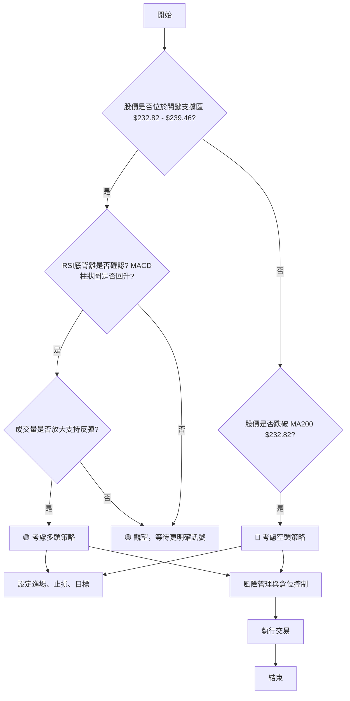
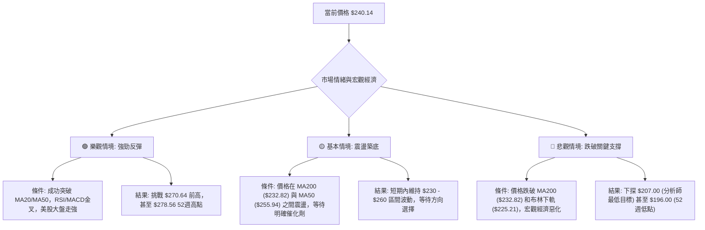

<details>
<summary>📊 靜態圖表 (點擊展開)</summary>

</details>

<html>
<head><meta charset="utf-8" /></head>
<body>
    <div style="height:500px; width:100%;">                        <script>window.PlotlyConfig = {MathJaxConfig: 'local'};</script>
        <script charset="utf-8" src="https://cdn.plot.ly/plotly-3.6.0.min.js" integrity="sha256-QaOVwtVY0T02VaHrr6pnoHLCwayMJp4O5n4YyaE3rJk=" crossorigin="anonymous"></script>                <div id="candlestick-chart" class="plotly-graph-div" style="height:100%; width:100%;"></div>            <script>                window.PLOTLYENV=window.PLOTLYENV || {};                                if (document.getElementById("candlestick-chart")) {                    Plotly.newPlot(                        "candlestick-chart",                        [{"close":{"dtype":"f8","bdata":"AAAAYGa+bEAAAADAzIRsQAAAAIDC7WxAAAAAoJlBbUAAAAAA1\u002fNsQAAAACBc52xAAAAAIFzvbEAAAAAAKXRsQAAAAGC4lmtAAAAAYLiGa0AAAADAzERrQAAAAMD1eGtAAAAAoHDFa0AAAACAPXJrQAAAAAAplGtAAAAAwB7Na0AAAADgUXBrQAAAAMDMnGtAAAAAwPW4a0AAAABACidsQAAAACCud2xAAAAAANcLa0AAAACAPYJrQAAAAOB6DGtAAAAAgD3yakAAAABACs9qQAAAAKBHoWpAAAAAIFwPa0AAAADA9cBrQAAAAGBmPmtAAAAAQOGia0AAAABguAZsQAAAAEAKX2xAAAAAAACobEAAAACgmclsQAAAACCF22tAAAAAQAqHbkAAAAAAAMBvQAAAAIA9Km9AAAAAYGZGb0AAAACgR2FuQAAAAMAejW5AAAAAwMwMb0AAAABAMyNvQAAAAGBmhm5AAAAAYI+ybUAAAACAFFZtQAAAAADXG21AAAAAoJnRa0AAAACAFNZrQAAAAOB6JGtAAAAAgBSWa0AAAADA9UhsQAAAAKBwtWxAAAAAwB6lbEAAAABACidtQAAAAAApPG1AAAAAoHBNbUAAAAAAKQxtQAAAACCFo2xAAAAAwPWwbEAAAADgelxsQAAAAKBwfWxAAAAAwPX4bEAAAADA9chsQAAAAIAURmxAAAAAoEfRa0AAAACA69FrQAAAAOCjqGtAAAAA4FFYbEAAAABAM2tsQAAAAIDCjWxAAAAA4HoEbUAAAAAAKQxtQAAAAOCjEG1AAAAAgD0CbUAAAADA9RBtQAAAAIA92mxAAAAAAABQbEAAAACA6yFtQAAAAIDCHW5AAAAAgOsxbkAAAACgR8luQAAAAAAp7G5AAAAAQArPbkAAAABAM1NuQAAAAMDMlG1AAAAAgMLFbUAAAAAA1+NtQAAAAAAA4GxAAAAAgOvpbEAAAABA4UptQAAAAMAe5W1AAAAAoHDNbUAAAACAwpVuQAAAAOBRYG5AAAAAIFw3bkAAAACgmeltQAAAAGC4Xm5AAAAAANfTbUAAAAAgrh9tQAAAAIAU1mtAAAAAgD1KakAAAABAChdqQAAAAGC43mlAAAAAYI+CaUAAAABAM\u002fNoQAAAAKBH2WhAAAAAwMwkaUAAAACgR5lpQAAAACCFm2lAAAAAIIVDakAAAADgo6hpQAAAAIDrEWpAAAAA4HpUakAAAACgcP1pQAAAAAAAQGpAAAAA4HoMakAAAAAgXBdqQAAAAIA9GmtAAAAAgBRea0AAAABguKZqQAAAACCur2pAAAAAYI\u002fKakAAAADAzJRqQAAAAMD1MGpAAAAAoHD1aUAAAAAgrndqQAAAAGBm5mpAAAAAANc7akAAAADgURhqQAAAAADXq2lAAAAA4HpEakAAAAAgrudpQAAAAGC4dmpAAAAAoEfxaUAAAABA4epoQAAAAGBmHmlAAAAA4KMIakAAAACAPVJqQAAAAOCjOGpAAAAAoEeZakAAAADgo7hqQAAAAAAAqGtAAAAAwMw0bUAAAAAAKcxtQAAAAOB6\u002fG1AAAAA4KMgb0AAAAAAABBvQAAAAGBmNm9AAAAAgOtRb0AAAADA9QhvQAAAAMAePW9AAAAAIIXrb0AAAABgj+JvQAAAAADXf3BAAAAAgOtRcEAAAABAMztwQAAAAOCjcHBAAAAAwPWQcEAAAAAAKcRwQAAAAMDMAHFAAAAAwMwYcUAAAAAA1y9xQAAAAGC48nBAAAAAQOEKcUAAAAAA189wQAAAAMAenXBAAAAAgBTicEAAAAAghbNwQAAAAIA9gnBAAAAAgMKNcEAAAACgcDVwQAAAAAApkHBAAAAAIFzHcEAAAADAHqVwQAAAAOCjlHBAAAAAoJn9cEAAAAAAACBxQAAAAIA96nBAAAAAAClUcEAAAADgUQhwQAAAAOCjQG9AAAAAoEe5b0AAAADA9cBuQAAAAEAKp25AAAAAgBSGbkAAAAAAAMBtQAAAAOBRMG5AAAAAoJnRbUAAAADgo8BuQAAAAAAAwG5AAAAAAACwbUAAAADgeoxuQAAAAKBHGW1AAAAAIIVDbUAAAADgo0htQAAAAOBRYGxAAAAAgBQWbUAAAADgegRuQA=="},"high":{"dtype":"f8","bdata":"AAAAwPXwbEAAAACgR9lsQAAAACBcN21AAAAAwMx8bUAAAACgmUltQAAAACBcL21AAAAAwB5FbUAAAACAPdJsQAAAACCFe2xAAAAAgOsRbEAAAACgcJVrQAAAAKCZoWtAAAAAQDPTa0AAAAAgrsdrQAAAAMDMxGtAAAAAgOvZa0AAAABgZgZsQAAAACBct2tAAAAA4Hrca0AAAAAgXFdsQAAAAGC4hmxAAAAAAACIbEAAAACAwpVrQAAAAIA9amtAAAAAYLg2a0AAAABA4VJrQAAAAKCZ2WpAAAAAgBQWa0AAAACAPeprQAAAAOBRgGtAAAAAoJmpa0AAAADAzCxsQAAAAMDMjGxAAAAAIK7vbEAAAACAPRptQAAAAIAUjmxAAAAAAABQb0AAAACgmSlwQAAAAAApEHBAAAAAAABgb0AAAAAAKUxvQAAAAMDMnG5AAAAAAAB4b0AAAAAAADhvQAAAAADXS29AAAAAAAB4bkAAAAAgXNdtQAAAAEAzU21AAAAAYGbGbEAAAAAgrvdrQAAAAMAebWxAAAAAYLjGa0AAAABgj2psQAAAAOCj0GxAAAAAAAD4bEAAAACgRyltQAAAAKCZeW1AAAAAQArfbUAAAAAAKSxtQAAAAAAAMG1AAAAAIK7nbEAAAABgj9psQAAAAIA9kmxAAAAAoHANbUAAAAAghQNtQAAAAGCPwmxAAAAAgMJ9bEAAAADAHvVrQAAAAIAUJmxAAAAAIFynbEAAAAAAKaRsQAAAACBcr2xAAAAAYGYObUAAAABgZh5tQAAAACCuH21AAAAAQDMTbUAAAADgoxhtQAAAACCuH21AAAAAYLhubUAAAAAAAEBtQAAAAIDCZW5AAAAAoEepbkAAAADAHs1uQAAAACCF+25AAAAAgBQeb0AAAADAHvVuQAAAAMD1KG5AAAAAwMwUbkAAAACAPfJtQAAAAEDhYm1AAAAAoJkJbUAAAABACndtQAAAAGBmDm5AAAAAYGYebkAAAAAAKZxuQAAAAMD1+G5AAAAAAABgbkAAAACAPWpuQAAAAAAptG5AAAAAQDPLbkAAAAAghdttQAAAAIDrSWxAAAAAgBRuakAAAACA65lqQAAAAMDMlGpAAAAAgD0SakAAAABguH5pQAAAAMAeJWlAAAAAIK43aUAAAAAghdtpQAAAAOB6tGlAAAAAoHBlakAAAACAwg1qQAAAACCFS2pAAAAAQOFyakAAAACgmWFqQAAAAGCPSmpAAAAAIFw3akAAAACAwiVqQAAAAKBHMWtAAAAAQAqPa0AAAACAPSprQAAAAIA9umpAAAAAwMz0akAAAAAAACBrQAAAAGC4dmpAAAAAgOtRakAAAABACpdqQAAAAGBm9mpAAAAA4HrkakAAAAAA1yNqQAAAAKBH8WlAAAAAoJmZakAAAABAMytqQAAAAIA9ompAAAAA4HqcakAAAABAM9NpQAAAAKCZeWlAAAAAwPVIakAAAABgj7JqQAAAAGC4hmpAAAAAYGaeakAAAABACr9qQAAAAEAzQ2xAAAAAoJk5bUAAAACAwg1uQAAAAAAAAG5AAAAAgMKFb0AAAACAFE5vQAAAAAAAQG9AAAAAQOECcEAAAACAwkVvQAAAAEDh4m9AAAAAgBT+b0AAAADgoyxwQAAAAAAAiHBAAAAAYGaCcEAAAADgelBwQAAAAGCPnnBAAAAAgBQecUAAAADAHhVxQAAAAKCZQXFAAAAAwPVocUAAAADAzFxxQAAAAIAUSnFAAAAAAAAgcUAAAACAFBpxQAAAAGBmunBAAAAAIIXrcEAAAADgeuxwQAAAAIDChXBAAAAAoJnNcEAAAAAAAGRwQAAAAKBHmXBAAAAAANfXcEAAAADgo9xwQAAAAMDM1HBAAAAAYI8GcUAAAAAAAChxQAAAAAAALHFAAAAAgBSqcEAAAABAM1NwQAAAAKBwEXBAAAAAYI\u002f6b0AAAACAFAZwQAAAAKBwLW9AAAAAgMJNb0AAAACAPYJuQAAAAOB6RG5AAAAAIIVrbkAAAACA6\u002fluQAAAAOBRMG9AAAAAwB69bkAAAAAgXLduQAAAAAAAQG5AAAAAANebbUAAAACgcE1uQAAAAIA9Cm1AAAAAwMw8bUAAAABguDZvQA=="},"hovertemplate":"\u003cb\u003e%{x|%Y-%m-%d}\u003c\u002fb\u003e\u003cbr\u003e\u958b: $%{open:.2f}\u003cbr\u003e\u9ad8: $%{high:.2f}\u003cbr\u003e\u4f4e: $%{low:.2f}\u003cbr\u003e\u6536: $%{close:.2f}\u003cextra\u003e\u003c\u002fextra\u003e","low":{"dtype":"f8","bdata":"AAAAQOGqbEAAAACgR0lsQAAAAIA9ymxAAAAAIFwHbUAAAABguJZsQAAAAKBHmWxAAAAAYGa2bEAAAADgUXBsQAAAAIA9gmtAAAAAYGZua0AAAABACg9rQAAAAOCjQGtAAAAAoJlpa0AAAADgejxrQAAAACCFE2tAAAAAYGZea0AAAABA4WprQAAAAMD1AGtAAAAAoHCFa0AAAACAFKZrQAAAAAAAuGtAAAAAAAAAa0AAAACgRyFrQAAAAEAzk2pAAAAAwB6VakAAAACA65lqQAAAAMD1YGpAAAAAQOGyakAAAAAgrj9rQAAAAOCjEGtAAAAAgMJFa0AAAADAzLxrQAAAAKBHMWxAAAAAYLhGbEAAAADgUXhsQAAAAAAA2GtAAAAAIFx\u002fbkAAAADAzJxvQAAAAMAeFW9AAAAAwB7FbkAAAACgcEVuQAAAACCuz21AAAAAQOGybkAAAAAgXOduQAAAAAAAeG5AAAAAAACQbUAAAADgehxtQAAAAIAUpmxAAAAAoHDNa0AAAADgo1BrQAAAACCuF2tAAAAAgMLlakAAAADgo8hrQAAAAKCZ+WtAAAAA4KOYbEAAAABACsdsQAAAAAAACG1AAAAAoJkxbUAAAAAghdNsQAAAAKCZWWxAAAAAoJmRbEAAAADgo0hsQAAAACCFI2xAAAAAYLiObEAAAACAFJZsQAAAAADXI2xAAAAAAACwa0AAAAAAKaRrQAAAACCun2tAAAAAwB4NbEAAAABgjzJsQAAAAGC4VmxAAAAAIFyXbEAAAABgj+psQAAAAIDC5WxAAAAA4KPYbEAAAABgZsZsQAAAAADXw2xAAAAAYGYWbEAAAACAwmVsQAAAAIA9Am1AAAAA4KPwbUAAAAAAKTxuQAAAACCuR25AAAAAYLi+bkAAAAAAAAhuQAAAAEAKh21AAAAAACmUbUAAAADAHo1tQAAAAEDhqmxAAAAAAClcbEAAAADAzNxsQAAAAIA9Um1AAAAAoEexbUAAAABgj8JtQAAAAMD1MG5AAAAAIK6XbUAAAADgerRtQAAAAKBwxW1AAAAAYGZubUAAAACAPfpsQAAAAAApjGtAAAAAgOsJaUAAAABAM2tpQAAAAMAezWlAAAAAIK5PaUAAAACA67FoQAAAAMD1qGhAAAAAAACAaEAAAADgUTBpQAAAAIDrWWlAAAAAAAB4aUAAAAAghWNpQAAAAAAAaGlAAAAAgMIdakAAAABAM6tpQAAAAGBmpmlAAAAAYLhuaUAAAAAgXE9pQAAAAMDMRGpAAAAAQOHyakAAAADA9ZBqQAAAACCF42lAAAAAgMKNakAAAABAM2tqQAAAAMDMBGpAAAAAQArHaUAAAABgZu5pQAAAAIDCjWpAAAAAYI8aakAAAACgmcFpQAAAAIA9imlAAAAA4FEwakAAAADgetRpQAAAAMDMPGpAAAAAANfjaUAAAADgeuRoQAAAACBc\u002f2hAAAAA4HqEaUAAAACAFAZqQAAAAMDMnGlAAAAAQOEyakAAAABgjyJqQAAAAADXc2tAAAAA4KPoa0AAAABguGZtQAAAAAAAeG1AAAAAwPU4bkAAAABgZuZuQAAAAGBmhm5AAAAAIIVDb0AAAAAA16tuQAAAAEAzI29AAAAAYI9Kb0AAAACAPaJvQAAAAEAKG3BAAAAAoHBFcEAAAACAFApwQAAAAEAzG3BAAAAAYI8CcEAAAAAA12twQAAAAMDMzHBAAAAAgBQGcUAAAAAgXANxQAAAAADX53BAAAAAQDPfcEAAAAAgrsdwQAAAAIAUanBAAAAAQDNzcEAAAACAFKpwQAAAAIA9TnBAAAAA4HpocEAAAACAFOZvQAAAAOB6OHBAAAAAgOtVcEAAAAAA16NwQAAAAMAeYXBAAAAAQDObcEAAAABACrdwQAAAAIA92nBAAAAAQDNLcEAAAAAA18tvQAAAAGC49m5AAAAAAAB4b0AAAADA9bhuQAAAACCFa25AAAAAwMwMbkAAAABgZq5tQAAAAIDCZW1AAAAAQOEybUAAAAAgXJduQAAAAGBmrm5AAAAAAACAbUAAAADgo4BtQAAAACCuB21AAAAAAAAAbUAAAABgZh5tQAAAAKCZMWxAAAAAAClEbEAAAACgmTltQA=="},"name":"\u50f9\u683c","open":{"dtype":"f8","bdata":"AAAAIK7vbEAAAABAM8tsQAAAAAAp1GxAAAAAgBQebUAAAADgozhtQAAAAAAAEG1AAAAAANcLbUAAAACA69FsQAAAAGCPemxAAAAAwMwEbEAAAACA64FrQAAAAGCPYmtAAAAAYI+Ca0AAAADA9cBrQAAAACCFK2tAAAAA4FGga0AAAACAFO5rQAAAAAAAoGtAAAAAACmca0AAAACgcN1rQAAAAAAAIGxAAAAAYLhGbEAAAABgZjZrQAAAAIDr8WpAAAAAANcTa0AAAACgcPVqQAAAAIDr0WpAAAAAACm8akAAAACAwk1rQAAAAKCZaWtAAAAAAABga0AAAABACr9rQAAAAMAedWxAAAAAQAqHbEAAAACgcPVsQAAAAIDrYWxAAAAAQDNDb0AAAAAghetvQAAAAAApTG9AAAAAwPUgb0AAAADAHiVvQAAAAMDMXG5AAAAAQOEKb0AAAADAHg1vQAAAACCuR29AAAAAoJlhbkAAAACA62FtQAAAAAAAKG1AAAAAQDODbEAAAAAgrvdrQAAAAKCZYWxAAAAAQDMLa0AAAACA69FrQAAAAAApTGxAAAAAIK7XbEAAAAAgrudsQAAAAEAKJ21AAAAA4FFgbUAAAABAMyttQAAAAOCjGG1AAAAAgD3KbEAAAABA4bJsQAAAAEDhWmxAAAAAgOuZbEAAAABguNZsQAAAAADXu2xAAAAAgMJ9bEAAAACgR+FrQAAAAMAeFWxAAAAAYLg2bEAAAADgUVhsQAAAACCFk2xAAAAAgOuhbEAAAAAAKQRtQAAAAKBHAW1AAAAAgBT+bEAAAABguOZsQAAAAMAeHW1AAAAAQOHqbEAAAABA4ZpsQAAAAEAzA21AAAAAIIXzbUAAAACA62FuQAAAAIA9km5AAAAAIFzXbkAAAADA9dBuQAAAAMDMJG5AAAAAgOvpbUAAAABA4eJtQAAAAOBROG1AAAAAQOHibEAAAACgmUFtQAAAAGC4Xm1AAAAAIFz\u002fbUAAAACAFPZtQAAAAADXy25AAAAAgD1abkAAAADgevxtQAAAAIDryW1AAAAAIFyfbkAAAAAghdttQAAAAMAeHWxAAAAAYGZWaUAAAABACh9qQAAAAKCZGWpAAAAAgOsBakAAAABguH5pQAAAAAAp3GhAAAAAACnEaEAAAACAPUJpQAAAAKCZeWlAAAAA4FGYaUAAAABAMwNqQAAAAEAKr2lAAAAAYLhOakAAAAAgXFdqQAAAAGCP2mlAAAAAoJmRaUAAAABAM2NpQAAAAEAKT2pAAAAAIFz\u002fakAAAAAgrt9qQAAAAGBmTmpAAAAAgBTGakAAAABguPZqQAAAAOB6TGpAAAAAIIUzakAAAABAMwtqQAAAAIA9mmpAAAAAgMK9akAAAACA6+FpQAAAAMDM7GlAAAAAoEc5akAAAABgZv5pQAAAAIDrcWpAAAAAIIVTakAAAABguM5pQAAAACBcL2lAAAAAQDObaUAAAACAFE5qQAAAAKBH0WlAAAAAoJk5akAAAAAgrmdqQAAAAKBH+WtAAAAAIFwnbEAAAACgmWltQAAAAGBmrm1AAAAAwPU4bkAAAAAAAChvQAAAAOBREG9AAAAAIK7fb0AAAACAFCZvQAAAAEDh4m9AAAAAgBSOb0AAAADgeuxvQAAAACCuP3BAAAAAIFx3cEAAAACAPSZwQAAAAADXH3BAAAAAYLgScUAAAACgR5lwQAAAAMDMzHBAAAAAoEdBcUAAAACAPQ5xQAAAAOBRMHFAAAAAgBT6cEAAAACgcN1wQAAAACBcq3BAAAAAQOGGcEAAAABgZtJwQAAAAAAAaHBAAAAAgOt9cEAAAADgo2BwQAAAAMDMQHBAAAAAAAB4cEAAAABgj8pwQAAAAEAKv3BAAAAAYGaicEAAAADgUQRxQAAAAOCj9HBAAAAA4KOkcEAAAABgjxJwQAAAAGBm1m9AAAAAANejb0AAAADgUchvQAAAAIDC1W5AAAAAIFz3bkAAAAAghXNuQAAAAIDCvW1AAAAAYLhmbkAAAADgo6BuQAAAAAAAAG9AAAAAwMycbkAAAAAA1wNuQAAAAGCPAm5AAAAAoJkRbUAAAABAMzttQAAAAOCjAG1AAAAAYLhmbEAAAAAA10dtQA=="},"x":["2025-09-11T00:00:00-04:00","2025-09-12T00:00:00-04:00","2025-09-15T00:00:00-04:00","2025-09-16T00:00:00-04:00","2025-09-17T00:00:00-04:00","2025-09-18T00:00:00-04:00","2025-09-19T00:00:00-04:00","2025-09-22T00:00:00-04:00","2025-09-23T00:00:00-04:00","2025-09-24T00:00:00-04:00","2025-09-25T00:00:00-04:00","2025-09-26T00:00:00-04:00","2025-09-29T00:00:00-04:00","2025-09-30T00:00:00-04:00","2025-10-01T00:00:00-04:00","2025-10-02T00:00:00-04:00","2025-10-03T00:00:00-04:00","2025-10-06T00:00:00-04:00","2025-10-07T00:00:00-04:00","2025-10-08T00:00:00-04:00","2025-10-09T00:00:00-04:00","2025-10-10T00:00:00-04:00","2025-10-13T00:00:00-04:00","2025-10-14T00:00:00-04:00","2025-10-15T00:00:00-04:00","2025-10-16T00:00:00-04:00","2025-10-17T00:00:00-04:00","2025-10-20T00:00:00-04:00","2025-10-21T00:00:00-04:00","2025-10-22T00:00:00-04:00","2025-10-23T00:00:00-04:00","2025-10-24T00:00:00-04:00","2025-10-27T00:00:00-04:00","2025-10-28T00:00:00-04:00","2025-10-29T00:00:00-04:00","2025-10-30T00:00:00-04:00","2025-10-31T00:00:00-04:00","2025-11-03T00:00:00-05:00","2025-11-04T00:00:00-05:00","2025-11-05T00:00:00-05:00","2025-11-06T00:00:00-05:00","2025-11-07T00:00:00-05:00","2025-11-10T00:00:00-05:00","2025-11-11T00:00:00-05:00","2025-11-12T00:00:00-05:00","2025-11-13T00:00:00-05:00","2025-11-14T00:00:00-05:00","2025-11-17T00:00:00-05:00","2025-11-18T00:00:00-05:00","2025-11-19T00:00:00-05:00","2025-11-20T00:00:00-05:00","2025-11-21T00:00:00-05:00","2025-11-24T00:00:00-05:00","2025-11-25T00:00:00-05:00","2025-11-26T00:00:00-05:00","2025-11-28T00:00:00-05:00","2025-12-01T00:00:00-05:00","2025-12-02T00:00:00-05:00","2025-12-03T00:00:00-05:00","2025-12-04T00:00:00-05:00","2025-12-05T00:00:00-05:00","2025-12-08T00:00:00-05:00","2025-12-09T00:00:00-05:00","2025-12-10T00:00:00-05:00","2025-12-11T00:00:00-05:00","2025-12-12T00:00:00-05:00","2025-12-15T00:00:00-05:00","2025-12-16T00:00:00-05:00","2025-12-17T00:00:00-05:00","2025-12-18T00:00:00-05:00","2025-12-19T00:00:00-05:00","2025-12-22T00:00:00-05:00","2025-12-23T00:00:00-05:00","2025-12-24T00:00:00-05:00","2025-12-26T00:00:00-05:00","2025-12-29T00:00:00-05:00","2025-12-30T00:00:00-05:00","2025-12-31T00:00:00-05:00","2026-01-02T00:00:00-05:00","2026-01-05T00:00:00-05:00","2026-01-06T00:00:00-05:00","2026-01-07T00:00:00-05:00","2026-01-08T00:00:00-05:00","2026-01-09T00:00:00-05:00","2026-01-12T00:00:00-05:00","2026-01-13T00:00:00-05:00","2026-01-14T00:00:00-05:00","2026-01-15T00:00:00-05:00","2026-01-16T00:00:00-05:00","2026-01-20T00:00:00-05:00","2026-01-21T00:00:00-05:00","2026-01-22T00:00:00-05:00","2026-01-23T00:00:00-05:00","2026-01-26T00:00:00-05:00","2026-01-27T00:00:00-05:00","2026-01-28T00:00:00-05:00","2026-01-29T00:00:00-05:00","2026-01-30T00:00:00-05:00","2026-02-02T00:00:00-05:00","2026-02-03T00:00:00-05:00","2026-02-04T00:00:00-05:00","2026-02-05T00:00:00-05:00","2026-02-06T00:00:00-05:00","2026-02-09T00:00:00-05:00","2026-02-10T00:00:00-05:00","2026-02-11T00:00:00-05:00","2026-02-12T00:00:00-05:00","2026-02-13T00:00:00-05:00","2026-02-17T00:00:00-05:00","2026-02-18T00:00:00-05:00","2026-02-19T00:00:00-05:00","2026-02-20T00:00:00-05:00","2026-02-23T00:00:00-05:00","2026-02-24T00:00:00-05:00","2026-02-25T00:00:00-05:00","2026-02-26T00:00:00-05:00","2026-02-27T00:00:00-05:00","2026-03-02T00:00:00-05:00","2026-03-03T00:00:00-05:00","2026-03-04T00:00:00-05:00","2026-03-05T00:00:00-05:00","2026-03-06T00:00:00-05:00","2026-03-09T00:00:00-04:00","2026-03-10T00:00:00-04:00","2026-03-11T00:00:00-04:00","2026-03-12T00:00:00-04:00","2026-03-13T00:00:00-04:00","2026-03-16T00:00:00-04:00","2026-03-17T00:00:00-04:00","2026-03-18T00:00:00-04:00","2026-03-19T00:00:00-04:00","2026-03-20T00:00:00-04:00","2026-03-23T00:00:00-04:00","2026-03-24T00:00:00-04:00","2026-03-25T00:00:00-04:00","2026-03-26T00:00:00-04:00","2026-03-27T00:00:00-04:00","2026-03-30T00:00:00-04:00","2026-03-31T00:00:00-04:00","2026-04-01T00:00:00-04:00","2026-04-02T00:00:00-04:00","2026-04-06T00:00:00-04:00","2026-04-07T00:00:00-04:00","2026-04-08T00:00:00-04:00","2026-04-09T00:00:00-04:00","2026-04-10T00:00:00-04:00","2026-04-13T00:00:00-04:00","2026-04-14T00:00:00-04:00","2026-04-15T00:00:00-04:00","2026-04-16T00:00:00-04:00","2026-04-17T00:00:00-04:00","2026-04-20T00:00:00-04:00","2026-04-21T00:00:00-04:00","2026-04-22T00:00:00-04:00","2026-04-23T00:00:00-04:00","2026-04-24T00:00:00-04:00","2026-04-27T00:00:00-04:00","2026-04-28T00:00:00-04:00","2026-04-29T00:00:00-04:00","2026-04-30T00:00:00-04:00","2026-05-01T00:00:00-04:00","2026-05-04T00:00:00-04:00","2026-05-05T00:00:00-04:00","2026-05-06T00:00:00-04:00","2026-05-07T00:00:00-04:00","2026-05-08T00:00:00-04:00","2026-05-11T00:00:00-04:00","2026-05-12T00:00:00-04:00","2026-05-13T00:00:00-04:00","2026-05-14T00:00:00-04:00","2026-05-15T00:00:00-04:00","2026-05-18T00:00:00-04:00","2026-05-19T00:00:00-04:00","2026-05-20T00:00:00-04:00","2026-05-21T00:00:00-04:00","2026-05-22T00:00:00-04:00","2026-05-26T00:00:00-04:00","2026-05-27T00:00:00-04:00","2026-05-28T00:00:00-04:00","2026-05-29T00:00:00-04:00","2026-06-01T00:00:00-04:00","2026-06-02T00:00:00-04:00","2026-06-03T00:00:00-04:00","2026-06-04T00:00:00-04:00","2026-06-05T00:00:00-04:00","2026-06-08T00:00:00-04:00","2026-06-09T00:00:00-04:00","2026-06-10T00:00:00-04:00","2026-06-11T00:00:00-04:00","2026-06-12T00:00:00-04:00","2026-06-15T00:00:00-04:00","2026-06-16T00:00:00-04:00","2026-06-17T00:00:00-04:00","2026-06-18T00:00:00-04:00","2026-06-22T00:00:00-04:00","2026-06-23T00:00:00-04:00","2026-06-24T00:00:00-04:00","2026-06-25T00:00:00-04:00","2026-06-26T00:00:00-04:00","2026-06-29T00:00:00-04:00"],"type":"candlestick"},{"hovertemplate":"MA30: $%{y:.2f}\u003cextra\u003e\u003c\u002fextra\u003e","line":{"color":"#2196F3","dash":"dash","width":2},"mode":"lines","name":"MA30","x":["2025-09-11T00:00:00-04:00","2025-09-12T00:00:00-04:00","2025-09-15T00:00:00-04:00","2025-09-16T00:00:00-04:00","2025-09-17T00:00:00-04:00","2025-09-18T00:00:00-04:00","2025-09-19T00:00:00-04:00","2025-09-22T00:00:00-04:00","2025-09-23T00:00:00-04:00","2025-09-24T00:00:00-04:00","2025-09-25T00:00:00-04:00","2025-09-26T00:00:00-04:00","2025-09-29T00:00:00-04:00","2025-09-30T00:00:00-04:00","2025-10-01T00:00:00-04:00","2025-10-02T00:00:00-04:00","2025-10-03T00:00:00-04:00","2025-10-06T00:00:00-04:00","2025-10-07T00:00:00-04:00","2025-10-08T00:00:00-04:00","2025-10-09T00:00:00-04:00","2025-10-10T00:00:00-04:00","2025-10-13T00:00:00-04:00","2025-10-14T00:00:00-04:00","2025-10-15T00:00:00-04:00","2025-10-16T00:00:00-04:00","2025-10-17T00:00:00-04:00","2025-10-20T00:00:00-04:00","2025-10-21T00:00:00-04:00","2025-10-22T00:00:00-04:00","2025-10-23T00:00:00-04:00","2025-10-24T00:00:00-04:00","2025-10-27T00:00:00-04:00","2025-10-28T00:00:00-04:00","2025-10-29T00:00:00-04:00","2025-10-30T00:00:00-04:00","2025-10-31T00:00:00-04:00","2025-11-03T00:00:00-05:00","2025-11-04T00:00:00-05:00","2025-11-05T00:00:00-05:00","2025-11-06T00:00:00-05:00","2025-11-07T00:00:00-05:00","2025-11-10T00:00:00-05:00","2025-11-11T00:00:00-05:00","2025-11-12T00:00:00-05:00","2025-11-13T00:00:00-05:00","2025-11-14T00:00:00-05:00","2025-11-17T00:00:00-05:00","2025-11-18T00:00:00-05:00","2025-11-19T00:00:00-05:00","2025-11-20T00:00:00-05:00","2025-11-21T00:00:00-05:00","2025-11-24T00:00:00-05:00","2025-11-25T00:00:00-05:00","2025-11-26T00:00:00-05:00","2025-11-28T00:00:00-05:00","2025-12-01T00:00:00-05:00","2025-12-02T00:00:00-05:00","2025-12-03T00:00:00-05:00","2025-12-04T00:00:00-05:00","2025-12-05T00:00:00-05:00","2025-12-08T00:00:00-05:00","2025-12-09T00:00:00-05:00","2025-12-10T00:00:00-05:00","2025-12-11T00:00:00-05:00","2025-12-12T00:00:00-05:00","2025-12-15T00:00:00-05:00","2025-12-16T00:00:00-05:00","2025-12-17T00:00:00-05:00","2025-12-18T00:00:00-05:00","2025-12-19T00:00:00-05:00","2025-12-22T00:00:00-05:00","2025-12-23T00:00:00-05:00","2025-12-24T00:00:00-05:00","2025-12-26T00:00:00-05:00","2025-12-29T00:00:00-05:00","2025-12-30T00:00:00-05:00","2025-12-31T00:00:00-05:00","2026-01-02T00:00:00-05:00","2026-01-05T00:00:00-05:00","2026-01-06T00:00:00-05:00","2026-01-07T00:00:00-05:00","2026-01-08T00:00:00-05:00","2026-01-09T00:00:00-05:00","2026-01-12T00:00:00-05:00","2026-01-13T00:00:00-05:00","2026-01-14T00:00:00-05:00","2026-01-15T00:00:00-05:00","2026-01-16T00:00:00-05:00","2026-01-20T00:00:00-05:00","2026-01-21T00:00:00-05:00","2026-01-22T00:00:00-05:00","2026-01-23T00:00:00-05:00","2026-01-26T00:00:00-05:00","2026-01-27T00:00:00-05:00","2026-01-28T00:00:00-05:00","2026-01-29T00:00:00-05:00","2026-01-30T00:00:00-05:00","2026-02-02T00:00:00-05:00","2026-02-03T00:00:00-05:00","2026-02-04T00:00:00-05:00","2026-02-05T00:00:00-05:00","2026-02-06T00:00:00-05:00","2026-02-09T00:00:00-05:00","2026-02-10T00:00:00-05:00","2026-02-11T00:00:00-05:00","2026-02-12T00:00:00-05:00","2026-02-13T00:00:00-05:00","2026-02-17T00:00:00-05:00","2026-02-18T00:00:00-05:00","2026-02-19T00:00:00-05:00","2026-02-20T00:00:00-05:00","2026-02-23T00:00:00-05:00","2026-02-24T00:00:00-05:00","2026-02-25T00:00:00-05:00","2026-02-26T00:00:00-05:00","2026-02-27T00:00:00-05:00","2026-03-02T00:00:00-05:00","2026-03-03T00:00:00-05:00","2026-03-04T00:00:00-05:00","2026-03-05T00:00:00-05:00","2026-03-06T00:00:00-05:00","2026-03-09T00:00:00-04:00","2026-03-10T00:00:00-04:00","2026-03-11T00:00:00-04:00","2026-03-12T00:00:00-04:00","2026-03-13T00:00:00-04:00","2026-03-16T00:00:00-04:00","2026-03-17T00:00:00-04:00","2026-03-18T00:00:00-04:00","2026-03-19T00:00:00-04:00","2026-03-20T00:00:00-04:00","2026-03-23T00:00:00-04:00","2026-03-24T00:00:00-04:00","2026-03-25T00:00:00-04:00","2026-03-26T00:00:00-04:00","2026-03-27T00:00:00-04:00","2026-03-30T00:00:00-04:00","2026-03-31T00:00:00-04:00","2026-04-01T00:00:00-04:00","2026-04-02T00:00:00-04:00","2026-04-06T00:00:00-04:00","2026-04-07T00:00:00-04:00","2026-04-08T00:00:00-04:00","2026-04-09T00:00:00-04:00","2026-04-10T00:00:00-04:00","2026-04-13T00:00:00-04:00","2026-04-14T00:00:00-04:00","2026-04-15T00:00:00-04:00","2026-04-16T00:00:00-04:00","2026-04-17T00:00:00-04:00","2026-04-20T00:00:00-04:00","2026-04-21T00:00:00-04:00","2026-04-22T00:00:00-04:00","2026-04-23T00:00:00-04:00","2026-04-24T00:00:00-04:00","2026-04-27T00:00:00-04:00","2026-04-28T00:00:00-04:00","2026-04-29T00:00:00-04:00","2026-04-30T00:00:00-04:00","2026-05-01T00:00:00-04:00","2026-05-04T00:00:00-04:00","2026-05-05T00:00:00-04:00","2026-05-06T00:00:00-04:00","2026-05-07T00:00:00-04:00","2026-05-08T00:00:00-04:00","2026-05-11T00:00:00-04:00","2026-05-12T00:00:00-04:00","2026-05-13T00:00:00-04:00","2026-05-14T00:00:00-04:00","2026-05-15T00:00:00-04:00","2026-05-18T00:00:00-04:00","2026-05-19T00:00:00-04:00","2026-05-20T00:00:00-04:00","2026-05-21T00:00:00-04:00","2026-05-22T00:00:00-04:00","2026-05-26T00:00:00-04:00","2026-05-27T00:00:00-04:00","2026-05-28T00:00:00-04:00","2026-05-29T00:00:00-04:00","2026-06-01T00:00:00-04:00","2026-06-02T00:00:00-04:00","2026-06-03T00:00:00-04:00","2026-06-04T00:00:00-04:00","2026-06-05T00:00:00-04:00","2026-06-08T00:00:00-04:00","2026-06-09T00:00:00-04:00","2026-06-10T00:00:00-04:00","2026-06-11T00:00:00-04:00","2026-06-12T00:00:00-04:00","2026-06-15T00:00:00-04:00","2026-06-16T00:00:00-04:00","2026-06-17T00:00:00-04:00","2026-06-18T00:00:00-04:00","2026-06-22T00:00:00-04:00","2026-06-23T00:00:00-04:00","2026-06-24T00:00:00-04:00","2026-06-25T00:00:00-04:00","2026-06-26T00:00:00-04:00","2026-06-29T00:00:00-04:00"],"y":{"dtype":"f8","bdata":"AAAAAAAA+H8AAAAAAAD4fwAAAAAAAPh\u002fAAAAAAAA+H8AAAAAAAD4fwAAAAAAAPh\u002fAAAAAAAA+H8AAAAAAAD4fwAAAAAAAPh\u002fAAAAAAAA+H8AAAAAAAD4fwAAAAAAAPh\u002fAAAAAAAA+H8AAAAAAAD4fwAAAAAAAPh\u002fAAAAAAAA+H8AAAAAAAD4fwAAAAAAAPh\u002fAAAAAAAA+H8AAAAAAAD4fwAAAAAAAPh\u002fAAAAAAAA+H8AAAAAAAD4fwAAAAAAAPh\u002fAAAAAAAA+H8AAAAAAAD4fwAAAAAAAPh\u002fAAAAAAAA+H8AAAAAAAD4f6uqqnrN0WtAvLu7G1rIa0Crqqo6JsRrQKuqqlpkv2tAIiIiokW6a0AAAAAw3bhrQO\u002fu7p7vr2tA3t3dfYa9a0AiIiJCp9lrQCIiIrIr+GtAZmZm9igYbEB3d3eXtTJsQJqZmTn7TGxAMzMzw\u002fVobEC8u7trdYhsQJqZmZmZoWxAVVVVBcixbEDNzMws+cFsQImIiMi9zmxAvLu7C5DPbEAAAAAw3cxsQN7d3a2OwWxAREREVCrGbEAiIiISysxsQFVVVWX02mxA7+7uXnPpbEDv7u5ec\u002f1sQFVVVRWuE21AZmZm5tAmbUBEREQk2zFtQBEREZHCPW1AAAAAQMNGbUARERERn0ltQKuqqnqiSm1AZmZmVlVNbUAAAADgT01tQAAAADDdUG1AmpmZGb05bUAiIiLiMxhtQM3MzFxI+mxA3t3drUfhbEBEREREi9BsQImIiKh\u002fv2xAiYiImCeubEC8u7vrUZxsQBEREYHcj2xAiYiI6PuJbEBVVVUVrodsQM3MzEx+hWxAmpmZ6bSJbEDNzMycxJRsQN7d3d0krmxARERExGfEbEBERETUv9lsQHd3d9ej7GxAAAAAoBr\u002fbEDe3d39GwltQCIiImIQDG1AzczMHBMQbUBERESUQxdtQM3MzKxHGW1AvLu7uy0bbUBEREQUICNtQJqZmVkdL21AMzMzgzI2bUC8u7urjkVtQGZmZqZ\u002fV21AzczMzPdrbUAAAADw0n1tQBEREcH1lG1AMzMzU5yhbUC8u7troKdtQFVVVQWBoW1AVVVVtTqKbUAzMzPz\u002fXBtQN7d3V26VW1Aq6qqOt83bUBVVVUlvxRtQBEREdGU8mxAMzMzk4rXbECrqqr6YrlsQHd3d3fpkmxAVVVVhV1xbEBERERUnEVsQBEREeEzHGxAZmZm5vv1a0AiIiLy\u002fdBrQImIiLiQtGtAEREREcqUa0AiIiKSX3RrQM3MzHw\u002fZWtAd3d3pw1Ya0AiIiLCg0FrQDMzMyMiJmtAZmZm9m8Ma0AzMzOjRepqQN7d3V2PxmpAd3d3tzqiakAAAAAA1YRqQKuqqqo4Z2pAAAAAAI5IakB3d3eXtS5qQDMzMxM8HGpAvLu76wocakCJiIjIdhpqQJqZmdmHH2pAiYiIqDgjakCJiIio8SJqQLy7u3s\u002fJWpAiYiIuNcsakDNzMwMAjNqQO\u002fu7s4+OGpAAAAAoBo7akARERGxK0RqQImIiOi0UWpAvLu7K0BqakCJiIjIvYpqQO\u002fu7r6fqmpAIiIicvbVakDv7u5OYgBrQM3MzLx0I2tAq6qqGi9Fa0DNzMyMl2prQDMzM6NwkWtAAAAAkDS9a0CJiIjIduprQN7d3f2NJGxAd3d3Z5FdbEDv7u6uuZBsQCIiIjLBw2xA7+7uvp\u002f+bEB3d3c3Fz5tQM3MzEw3hW1AREREdNrIbUB3d3e3HhFuQDMzM0OLUG5AMzMz0waWbkCrqqrqUeBuQBEREcGDJW9AiYiIqH9nb0AiIiLi7KNvQFVVVYXr3W9AzczMDLsKcEB3d3ffCCNwQKuqqpJfOnBARERETPBMcEAiIiIK11twQM3MzPxiaXBAMzMzC5B1cEDNzMykKYNwQHd3d6dUjnBAAAAAkAmUcECJiIiYbphwQFVVVZ19mHBAmpmZQaeXcEARERGh05JwQGZmZubQiHBAREREZMl\u002fcEDe3d2dNnRwQFVVVQ27aHBA3t3djZdacEBVVVUNu05wQERERFzWQHBA3t3dVZwtcECrqqpqSh1wQLy7u0PSCHBAmpmZWYDob0Crqqp6d8NvQCIiIsIRmm9AREREJCJyb0Dv7u5+P1VvQA=="},"type":"scatter"},{"hovertemplate":"MA60: $%{y:.2f}\u003cextra\u003e\u003c\u002fextra\u003e","line":{"color":"#9C27B0","dash":"dash","width":2},"mode":"lines","name":"MA60","x":["2025-09-11T00:00:00-04:00","2025-09-12T00:00:00-04:00","2025-09-15T00:00:00-04:00","2025-09-16T00:00:00-04:00","2025-09-17T00:00:00-04:00","2025-09-18T00:00:00-04:00","2025-09-19T00:00:00-04:00","2025-09-22T00:00:00-04:00","2025-09-23T00:00:00-04:00","2025-09-24T00:00:00-04:00","2025-09-25T00:00:00-04:00","2025-09-26T00:00:00-04:00","2025-09-29T00:00:00-04:00","2025-09-30T00:00:00-04:00","2025-10-01T00:00:00-04:00","2025-10-02T00:00:00-04:00","2025-10-03T00:00:00-04:00","2025-10-06T00:00:00-04:00","2025-10-07T00:00:00-04:00","2025-10-08T00:00:00-04:00","2025-10-09T00:00:00-04:00","2025-10-10T00:00:00-04:00","2025-10-13T00:00:00-04:00","2025-10-14T00:00:00-04:00","2025-10-15T00:00:00-04:00","2025-10-16T00:00:00-04:00","2025-10-17T00:00:00-04:00","2025-10-20T00:00:00-04:00","2025-10-21T00:00:00-04:00","2025-10-22T00:00:00-04:00","2025-10-23T00:00:00-04:00","2025-10-24T00:00:00-04:00","2025-10-27T00:00:00-04:00","2025-10-28T00:00:00-04:00","2025-10-29T00:00:00-04:00","2025-10-30T00:00:00-04:00","2025-10-31T00:00:00-04:00","2025-11-03T00:00:00-05:00","2025-11-04T00:00:00-05:00","2025-11-05T00:00:00-05:00","2025-11-06T00:00:00-05:00","2025-11-07T00:00:00-05:00","2025-11-10T00:00:00-05:00","2025-11-11T00:00:00-05:00","2025-11-12T00:00:00-05:00","2025-11-13T00:00:00-05:00","2025-11-14T00:00:00-05:00","2025-11-17T00:00:00-05:00","2025-11-18T00:00:00-05:00","2025-11-19T00:00:00-05:00","2025-11-20T00:00:00-05:00","2025-11-21T00:00:00-05:00","2025-11-24T00:00:00-05:00","2025-11-25T00:00:00-05:00","2025-11-26T00:00:00-05:00","2025-11-28T00:00:00-05:00","2025-12-01T00:00:00-05:00","2025-12-02T00:00:00-05:00","2025-12-03T00:00:00-05:00","2025-12-04T00:00:00-05:00","2025-12-05T00:00:00-05:00","2025-12-08T00:00:00-05:00","2025-12-09T00:00:00-05:00","2025-12-10T00:00:00-05:00","2025-12-11T00:00:00-05:00","2025-12-12T00:00:00-05:00","2025-12-15T00:00:00-05:00","2025-12-16T00:00:00-05:00","2025-12-17T00:00:00-05:00","2025-12-18T00:00:00-05:00","2025-12-19T00:00:00-05:00","2025-12-22T00:00:00-05:00","2025-12-23T00:00:00-05:00","2025-12-24T00:00:00-05:00","2025-12-26T00:00:00-05:00","2025-12-29T00:00:00-05:00","2025-12-30T00:00:00-05:00","2025-12-31T00:00:00-05:00","2026-01-02T00:00:00-05:00","2026-01-05T00:00:00-05:00","2026-01-06T00:00:00-05:00","2026-01-07T00:00:00-05:00","2026-01-08T00:00:00-05:00","2026-01-09T00:00:00-05:00","2026-01-12T00:00:00-05:00","2026-01-13T00:00:00-05:00","2026-01-14T00:00:00-05:00","2026-01-15T00:00:00-05:00","2026-01-16T00:00:00-05:00","2026-01-20T00:00:00-05:00","2026-01-21T00:00:00-05:00","2026-01-22T00:00:00-05:00","2026-01-23T00:00:00-05:00","2026-01-26T00:00:00-05:00","2026-01-27T00:00:00-05:00","2026-01-28T00:00:00-05:00","2026-01-29T00:00:00-05:00","2026-01-30T00:00:00-05:00","2026-02-02T00:00:00-05:00","2026-02-03T00:00:00-05:00","2026-02-04T00:00:00-05:00","2026-02-05T00:00:00-05:00","2026-02-06T00:00:00-05:00","2026-02-09T00:00:00-05:00","2026-02-10T00:00:00-05:00","2026-02-11T00:00:00-05:00","2026-02-12T00:00:00-05:00","2026-02-13T00:00:00-05:00","2026-02-17T00:00:00-05:00","2026-02-18T00:00:00-05:00","2026-02-19T00:00:00-05:00","2026-02-20T00:00:00-05:00","2026-02-23T00:00:00-05:00","2026-02-24T00:00:00-05:00","2026-02-25T00:00:00-05:00","2026-02-26T00:00:00-05:00","2026-02-27T00:00:00-05:00","2026-03-02T00:00:00-05:00","2026-03-03T00:00:00-05:00","2026-03-04T00:00:00-05:00","2026-03-05T00:00:00-05:00","2026-03-06T00:00:00-05:00","2026-03-09T00:00:00-04:00","2026-03-10T00:00:00-04:00","2026-03-11T00:00:00-04:00","2026-03-12T00:00:00-04:00","2026-03-13T00:00:00-04:00","2026-03-16T00:00:00-04:00","2026-03-17T00:00:00-04:00","2026-03-18T00:00:00-04:00","2026-03-19T00:00:00-04:00","2026-03-20T00:00:00-04:00","2026-03-23T00:00:00-04:00","2026-03-24T00:00:00-04:00","2026-03-25T00:00:00-04:00","2026-03-26T00:00:00-04:00","2026-03-27T00:00:00-04:00","2026-03-30T00:00:00-04:00","2026-03-31T00:00:00-04:00","2026-04-01T00:00:00-04:00","2026-04-02T00:00:00-04:00","2026-04-06T00:00:00-04:00","2026-04-07T00:00:00-04:00","2026-04-08T00:00:00-04:00","2026-04-09T00:00:00-04:00","2026-04-10T00:00:00-04:00","2026-04-13T00:00:00-04:00","2026-04-14T00:00:00-04:00","2026-04-15T00:00:00-04:00","2026-04-16T00:00:00-04:00","2026-04-17T00:00:00-04:00","2026-04-20T00:00:00-04:00","2026-04-21T00:00:00-04:00","2026-04-22T00:00:00-04:00","2026-04-23T00:00:00-04:00","2026-04-24T00:00:00-04:00","2026-04-27T00:00:00-04:00","2026-04-28T00:00:00-04:00","2026-04-29T00:00:00-04:00","2026-04-30T00:00:00-04:00","2026-05-01T00:00:00-04:00","2026-05-04T00:00:00-04:00","2026-05-05T00:00:00-04:00","2026-05-06T00:00:00-04:00","2026-05-07T00:00:00-04:00","2026-05-08T00:00:00-04:00","2026-05-11T00:00:00-04:00","2026-05-12T00:00:00-04:00","2026-05-13T00:00:00-04:00","2026-05-14T00:00:00-04:00","2026-05-15T00:00:00-04:00","2026-05-18T00:00:00-04:00","2026-05-19T00:00:00-04:00","2026-05-20T00:00:00-04:00","2026-05-21T00:00:00-04:00","2026-05-22T00:00:00-04:00","2026-05-26T00:00:00-04:00","2026-05-27T00:00:00-04:00","2026-05-28T00:00:00-04:00","2026-05-29T00:00:00-04:00","2026-06-01T00:00:00-04:00","2026-06-02T00:00:00-04:00","2026-06-03T00:00:00-04:00","2026-06-04T00:00:00-04:00","2026-06-05T00:00:00-04:00","2026-06-08T00:00:00-04:00","2026-06-09T00:00:00-04:00","2026-06-10T00:00:00-04:00","2026-06-11T00:00:00-04:00","2026-06-12T00:00:00-04:00","2026-06-15T00:00:00-04:00","2026-06-16T00:00:00-04:00","2026-06-17T00:00:00-04:00","2026-06-18T00:00:00-04:00","2026-06-22T00:00:00-04:00","2026-06-23T00:00:00-04:00","2026-06-24T00:00:00-04:00","2026-06-25T00:00:00-04:00","2026-06-26T00:00:00-04:00","2026-06-29T00:00:00-04:00"],"y":{"dtype":"f8","bdata":"AAAAAAAA+H8AAAAAAAD4fwAAAAAAAPh\u002fAAAAAAAA+H8AAAAAAAD4fwAAAAAAAPh\u002fAAAAAAAA+H8AAAAAAAD4fwAAAAAAAPh\u002fAAAAAAAA+H8AAAAAAAD4fwAAAAAAAPh\u002fAAAAAAAA+H8AAAAAAAD4fwAAAAAAAPh\u002fAAAAAAAA+H8AAAAAAAD4fwAAAAAAAPh\u002fAAAAAAAA+H8AAAAAAAD4fwAAAAAAAPh\u002fAAAAAAAA+H8AAAAAAAD4fwAAAAAAAPh\u002fAAAAAAAA+H8AAAAAAAD4fwAAAAAAAPh\u002fAAAAAAAA+H8AAAAAAAD4fwAAAAAAAPh\u002fAAAAAAAA+H8AAAAAAAD4fwAAAAAAAPh\u002fAAAAAAAA+H8AAAAAAAD4fwAAAAAAAPh\u002fAAAAAAAA+H8AAAAAAAD4fwAAAAAAAPh\u002fAAAAAAAA+H8AAAAAAAD4fwAAAAAAAPh\u002fAAAAAAAA+H8AAAAAAAD4fwAAAAAAAPh\u002fAAAAAAAA+H8AAAAAAAD4fwAAAAAAAPh\u002fAAAAAAAA+H8AAAAAAAD4fwAAAAAAAPh\u002fAAAAAAAA+H8AAAAAAAD4fwAAAAAAAPh\u002fAAAAAAAA+H8AAAAAAAD4fwAAAAAAAPh\u002fAAAAAAAA+H8AAAAAAAD4f97d3QXIh2xA3t3drY6HbEDe3d2l4oZsQKuqqmoDhWxAREREfM2DbEAAAACIFoNsQHd3d2dmgGxAvLu7y6F7bEAiIiKS7XhsQHd3dwc6eWxAIiIiUrh8bEDe3d1toIFsQBEREXE9hmxA3t3drY6LbEC8u7urY5JsQFVVVQ27mGxA7+7u9uGdbEARERGh06RsQKuqqgoeqmxAq6qqeqKsbEBmZmbm0LBsQN7d3cXZt2xAREREDEnFbEAzMzPzRNNsQGZmZh7M42xAd3d3\u002f0b0bEBmZmauRwNtQLy7uzvfD21AmpmZAXIbbUBERERcjyRtQO\u002fu7h6FK21A3t3dffgwbUCrqqqSXzZtQCIiIurfPG1AzczM7MNBbUDe3d1Fb0ltQDMzM2suVG1AMzMzc9pSbUARERFpA0ttQO\u002fu7g6fR21AiYiIAHJBbUAAAADYFTxtQO\u002fu7laAMG1A7+7uJjEcbUB3d3fvpwZtQHd3d2\u002fL8mxAmpmZke3gbEBVVVWdNs5sQO\u002fu7o4JvGxAZmZmvp+wbEC8u7vLE6dsQKuqqiqHoGxAzczMpOKabEBEREQUro9sQERERNxrhGxAMzMzQ4t6bEAAAAD4DG1sQFVVVY1QYGxA7+7ulm5SbEAzMzOT0UVsQM3MzJRDP2xAmpmZsZ05bEAzMzPrUTJsQGZmZr6fKmxAzczMPFEhbEB3d3cn6hdsQCIiIoIHD2xAIiIiQhkHbEAAAAD4UwFsQN7d3TUX\u002fmtAmpmZKRX1a0CamZkBK+trQERERIze3mtAiYiI0CLTa0De3d1dusVrQLy7uxuhumtAmpmZ8Yuta0Dv7u5m2JtrQGZmZibqi2tA3t3dJTGCa0C8u7uDMnZrQDMzMyOUZWtAq6qqEjxWa0CrqqoC5ERrQM3MzGT0NmtAERERCR4wa0BVVVXd3S1rQLy7uzuYL2tAmpmZQWA1a0CJiIjwYDprQM3MzBxaRGtAERERYZ5Oa0B3d3enDVZrQDMzM2PJW2tAMzMzQ9Jka0De3d01XmprQN7d3a2OdWtAd3d3D+Z\u002fa0B3d3dXx4prQGZmZu58lWtAd3d335aja0B3d3dnZrZrQAAAALC50GtAAAAAsHLya0AAAADAyhVsQGZmZo4JOGxA3t3dvZ9cbECamZnJoYFsQGZmZp5hpWxAiYiIsCvKbEB3d3d3d+tsQCIiIioVC21AzczMXEgobUAAAAC4HkVtQO\u002fu7gY6Y21AIiIiYhCCbUBmZmbuNaFtQERERNyyvm1ARERERIvgbUBERETMWgNuQN7d3QUPIG5AVVVVHaE2bkDv7u5euk1uQO\u002fu7u41YW5AmpmZiUF2bkBVVVUFD4huQFVVVeUXm25AAAAAGJKubkBVVVV1k7xuQGZmZqabym5AVVVVbefZbkARERGpxu1uQKuqqgJyA29AAAAAkAkSb0BmZmbG2SVvQFVVVeUXMW9AZmZmlkM\u002fb0Crqqqy5FFvQJqZmcHKX29AZmZm5tBsb0CJiIgwlnxvQA=="},"type":"scatter"},{"hovertemplate":"MA200: $%{y:.2f}\u003cextra\u003e\u003c\u002fextra\u003e","line":{"color":"#FF6F00","dash":"solid","width":2},"mode":"lines","name":"MA200","x":["2025-09-11T00:00:00-04:00","2025-09-12T00:00:00-04:00","2025-09-15T00:00:00-04:00","2025-09-16T00:00:00-04:00","2025-09-17T00:00:00-04:00","2025-09-18T00:00:00-04:00","2025-09-19T00:00:00-04:00","2025-09-22T00:00:00-04:00","2025-09-23T00:00:00-04:00","2025-09-24T00:00:00-04:00","2025-09-25T00:00:00-04:00","2025-09-26T00:00:00-04:00","2025-09-29T00:00:00-04:00","2025-09-30T00:00:00-04:00","2025-10-01T00:00:00-04:00","2025-10-02T00:00:00-04:00","2025-10-03T00:00:00-04:00","2025-10-06T00:00:00-04:00","2025-10-07T00:00:00-04:00","2025-10-08T00:00:00-04:00","2025-10-09T00:00:00-04:00","2025-10-10T00:00:00-04:00","2025-10-13T00:00:00-04:00","2025-10-14T00:00:00-04:00","2025-10-15T00:00:00-04:00","2025-10-16T00:00:00-04:00","2025-10-17T00:00:00-04:00","2025-10-20T00:00:00-04:00","2025-10-21T00:00:00-04:00","2025-10-22T00:00:00-04:00","2025-10-23T00:00:00-04:00","2025-10-24T00:00:00-04:00","2025-10-27T00:00:00-04:00","2025-10-28T00:00:00-04:00","2025-10-29T00:00:00-04:00","2025-10-30T00:00:00-04:00","2025-10-31T00:00:00-04:00","2025-11-03T00:00:00-05:00","2025-11-04T00:00:00-05:00","2025-11-05T00:00:00-05:00","2025-11-06T00:00:00-05:00","2025-11-07T00:00:00-05:00","2025-11-10T00:00:00-05:00","2025-11-11T00:00:00-05:00","2025-11-12T00:00:00-05:00","2025-11-13T00:00:00-05:00","2025-11-14T00:00:00-05:00","2025-11-17T00:00:00-05:00","2025-11-18T00:00:00-05:00","2025-11-19T00:00:00-05:00","2025-11-20T00:00:00-05:00","2025-11-21T00:00:00-05:00","2025-11-24T00:00:00-05:00","2025-11-25T00:00:00-05:00","2025-11-26T00:00:00-05:00","2025-11-28T00:00:00-05:00","2025-12-01T00:00:00-05:00","2025-12-02T00:00:00-05:00","2025-12-03T00:00:00-05:00","2025-12-04T00:00:00-05:00","2025-12-05T00:00:00-05:00","2025-12-08T00:00:00-05:00","2025-12-09T00:00:00-05:00","2025-12-10T00:00:00-05:00","2025-12-11T00:00:00-05:00","2025-12-12T00:00:00-05:00","2025-12-15T00:00:00-05:00","2025-12-16T00:00:00-05:00","2025-12-17T00:00:00-05:00","2025-12-18T00:00:00-05:00","2025-12-19T00:00:00-05:00","2025-12-22T00:00:00-05:00","2025-12-23T00:00:00-05:00","2025-12-24T00:00:00-05:00","2025-12-26T00:00:00-05:00","2025-12-29T00:00:00-05:00","2025-12-30T00:00:00-05:00","2025-12-31T00:00:00-05:00","2026-01-02T00:00:00-05:00","2026-01-05T00:00:00-05:00","2026-01-06T00:00:00-05:00","2026-01-07T00:00:00-05:00","2026-01-08T00:00:00-05:00","2026-01-09T00:00:00-05:00","2026-01-12T00:00:00-05:00","2026-01-13T00:00:00-05:00","2026-01-14T00:00:00-05:00","2026-01-15T00:00:00-05:00","2026-01-16T00:00:00-05:00","2026-01-20T00:00:00-05:00","2026-01-21T00:00:00-05:00","2026-01-22T00:00:00-05:00","2026-01-23T00:00:00-05:00","2026-01-26T00:00:00-05:00","2026-01-27T00:00:00-05:00","2026-01-28T00:00:00-05:00","2026-01-29T00:00:00-05:00","2026-01-30T00:00:00-05:00","2026-02-02T00:00:00-05:00","2026-02-03T00:00:00-05:00","2026-02-04T00:00:00-05:00","2026-02-05T00:00:00-05:00","2026-02-06T00:00:00-05:00","2026-02-09T00:00:00-05:00","2026-02-10T00:00:00-05:00","2026-02-11T00:00:00-05:00","2026-02-12T00:00:00-05:00","2026-02-13T00:00:00-05:00","2026-02-17T00:00:00-05:00","2026-02-18T00:00:00-05:00","2026-02-19T00:00:00-05:00","2026-02-20T00:00:00-05:00","2026-02-23T00:00:00-05:00","2026-02-24T00:00:00-05:00","2026-02-25T00:00:00-05:00","2026-02-26T00:00:00-05:00","2026-02-27T00:00:00-05:00","2026-03-02T00:00:00-05:00","2026-03-03T00:00:00-05:00","2026-03-04T00:00:00-05:00","2026-03-05T00:00:00-05:00","2026-03-06T00:00:00-05:00","2026-03-09T00:00:00-04:00","2026-03-10T00:00:00-04:00","2026-03-11T00:00:00-04:00","2026-03-12T00:00:00-04:00","2026-03-13T00:00:00-04:00","2026-03-16T00:00:00-04:00","2026-03-17T00:00:00-04:00","2026-03-18T00:00:00-04:00","2026-03-19T00:00:00-04:00","2026-03-20T00:00:00-04:00","2026-03-23T00:00:00-04:00","2026-03-24T00:00:00-04:00","2026-03-25T00:00:00-04:00","2026-03-26T00:00:00-04:00","2026-03-27T00:00:00-04:00","2026-03-30T00:00:00-04:00","2026-03-31T00:00:00-04:00","2026-04-01T00:00:00-04:00","2026-04-02T00:00:00-04:00","2026-04-06T00:00:00-04:00","2026-04-07T00:00:00-04:00","2026-04-08T00:00:00-04:00","2026-04-09T00:00:00-04:00","2026-04-10T00:00:00-04:00","2026-04-13T00:00:00-04:00","2026-04-14T00:00:00-04:00","2026-04-15T00:00:00-04:00","2026-04-16T00:00:00-04:00","2026-04-17T00:00:00-04:00","2026-04-20T00:00:00-04:00","2026-04-21T00:00:00-04:00","2026-04-22T00:00:00-04:00","2026-04-23T00:00:00-04:00","2026-04-24T00:00:00-04:00","2026-04-27T00:00:00-04:00","2026-04-28T00:00:00-04:00","2026-04-29T00:00:00-04:00","2026-04-30T00:00:00-04:00","2026-05-01T00:00:00-04:00","2026-05-04T00:00:00-04:00","2026-05-05T00:00:00-04:00","2026-05-06T00:00:00-04:00","2026-05-07T00:00:00-04:00","2026-05-08T00:00:00-04:00","2026-05-11T00:00:00-04:00","2026-05-12T00:00:00-04:00","2026-05-13T00:00:00-04:00","2026-05-14T00:00:00-04:00","2026-05-15T00:00:00-04:00","2026-05-18T00:00:00-04:00","2026-05-19T00:00:00-04:00","2026-05-20T00:00:00-04:00","2026-05-21T00:00:00-04:00","2026-05-22T00:00:00-04:00","2026-05-26T00:00:00-04:00","2026-05-27T00:00:00-04:00","2026-05-28T00:00:00-04:00","2026-05-29T00:00:00-04:00","2026-06-01T00:00:00-04:00","2026-06-02T00:00:00-04:00","2026-06-03T00:00:00-04:00","2026-06-04T00:00:00-04:00","2026-06-05T00:00:00-04:00","2026-06-08T00:00:00-04:00","2026-06-09T00:00:00-04:00","2026-06-10T00:00:00-04:00","2026-06-11T00:00:00-04:00","2026-06-12T00:00:00-04:00","2026-06-15T00:00:00-04:00","2026-06-16T00:00:00-04:00","2026-06-17T00:00:00-04:00","2026-06-18T00:00:00-04:00","2026-06-22T00:00:00-04:00","2026-06-23T00:00:00-04:00","2026-06-24T00:00:00-04:00","2026-06-25T00:00:00-04:00","2026-06-26T00:00:00-04:00","2026-06-29T00:00:00-04:00"],"y":{"dtype":"f8","bdata":"AAAAAAAA+H8AAAAAAAD4fwAAAAAAAPh\u002fAAAAAAAA+H8AAAAAAAD4fwAAAAAAAPh\u002fAAAAAAAA+H8AAAAAAAD4fwAAAAAAAPh\u002fAAAAAAAA+H8AAAAAAAD4fwAAAAAAAPh\u002fAAAAAAAA+H8AAAAAAAD4fwAAAAAAAPh\u002fAAAAAAAA+H8AAAAAAAD4fwAAAAAAAPh\u002fAAAAAAAA+H8AAAAAAAD4fwAAAAAAAPh\u002fAAAAAAAA+H8AAAAAAAD4fwAAAAAAAPh\u002fAAAAAAAA+H8AAAAAAAD4fwAAAAAAAPh\u002fAAAAAAAA+H8AAAAAAAD4fwAAAAAAAPh\u002fAAAAAAAA+H8AAAAAAAD4fwAAAAAAAPh\u002fAAAAAAAA+H8AAAAAAAD4fwAAAAAAAPh\u002fAAAAAAAA+H8AAAAAAAD4fwAAAAAAAPh\u002fAAAAAAAA+H8AAAAAAAD4fwAAAAAAAPh\u002fAAAAAAAA+H8AAAAAAAD4fwAAAAAAAPh\u002fAAAAAAAA+H8AAAAAAAD4fwAAAAAAAPh\u002fAAAAAAAA+H8AAAAAAAD4fwAAAAAAAPh\u002fAAAAAAAA+H8AAAAAAAD4fwAAAAAAAPh\u002fAAAAAAAA+H8AAAAAAAD4fwAAAAAAAPh\u002fAAAAAAAA+H8AAAAAAAD4fwAAAAAAAPh\u002fAAAAAAAA+H8AAAAAAAD4fwAAAAAAAPh\u002fAAAAAAAA+H8AAAAAAAD4fwAAAAAAAPh\u002fAAAAAAAA+H8AAAAAAAD4fwAAAAAAAPh\u002fAAAAAAAA+H8AAAAAAAD4fwAAAAAAAPh\u002fAAAAAAAA+H8AAAAAAAD4fwAAAAAAAPh\u002fAAAAAAAA+H8AAAAAAAD4fwAAAAAAAPh\u002fAAAAAAAA+H8AAAAAAAD4fwAAAAAAAPh\u002fAAAAAAAA+H8AAAAAAAD4fwAAAAAAAPh\u002fAAAAAAAA+H8AAAAAAAD4fwAAAAAAAPh\u002fAAAAAAAA+H8AAAAAAAD4fwAAAAAAAPh\u002fAAAAAAAA+H8AAAAAAAD4fwAAAAAAAPh\u002fAAAAAAAA+H8AAAAAAAD4fwAAAAAAAPh\u002fAAAAAAAA+H8AAAAAAAD4fwAAAAAAAPh\u002fAAAAAAAA+H8AAAAAAAD4fwAAAAAAAPh\u002fAAAAAAAA+H8AAAAAAAD4fwAAAAAAAPh\u002fAAAAAAAA+H8AAAAAAAD4fwAAAAAAAPh\u002fAAAAAAAA+H8AAAAAAAD4fwAAAAAAAPh\u002fAAAAAAAA+H8AAAAAAAD4fwAAAAAAAPh\u002fAAAAAAAA+H8AAAAAAAD4fwAAAAAAAPh\u002fAAAAAAAA+H8AAAAAAAD4fwAAAAAAAPh\u002fAAAAAAAA+H8AAAAAAAD4fwAAAAAAAPh\u002fAAAAAAAA+H8AAAAAAAD4fwAAAAAAAPh\u002fAAAAAAAA+H8AAAAAAAD4fwAAAAAAAPh\u002fAAAAAAAA+H8AAAAAAAD4fwAAAAAAAPh\u002fAAAAAAAA+H8AAAAAAAD4fwAAAAAAAPh\u002fAAAAAAAA+H8AAAAAAAD4fwAAAAAAAPh\u002fAAAAAAAA+H8AAAAAAAD4fwAAAAAAAPh\u002fAAAAAAAA+H8AAAAAAAD4fwAAAAAAAPh\u002fAAAAAAAA+H8AAAAAAAD4fwAAAAAAAPh\u002fAAAAAAAA+H8AAAAAAAD4fwAAAAAAAPh\u002fAAAAAAAA+H8AAAAAAAD4fwAAAAAAAPh\u002fAAAAAAAA+H8AAAAAAAD4fwAAAAAAAPh\u002fAAAAAAAA+H8AAAAAAAD4fwAAAAAAAPh\u002fAAAAAAAA+H8AAAAAAAD4fwAAAAAAAPh\u002fAAAAAAAA+H8AAAAAAAD4fwAAAAAAAPh\u002fAAAAAAAA+H8AAAAAAAD4fwAAAAAAAPh\u002fAAAAAAAA+H8AAAAAAAD4fwAAAAAAAPh\u002fAAAAAAAA+H8AAAAAAAD4fwAAAAAAAPh\u002fAAAAAAAA+H8AAAAAAAD4fwAAAAAAAPh\u002fAAAAAAAA+H8AAAAAAAD4fwAAAAAAAPh\u002fAAAAAAAA+H8AAAAAAAD4fwAAAAAAAPh\u002fAAAAAAAA+H8AAAAAAAD4fwAAAAAAAPh\u002fAAAAAAAA+H8AAAAAAAD4fwAAAAAAAPh\u002fAAAAAAAA+H8AAAAAAAD4fwAAAAAAAPh\u002fAAAAAAAA+H8AAAAAAAD4fwAAAAAAAPh\u002fAAAAAAAA+H8AAAAAAAD4fwAAAAAAAPh\u002fAAAAAAAA+H\u002f2KFz\u002fIRptQA=="},"type":"scatter"}],                        {"template":{"data":{"barpolar":[{"marker":{"line":{"color":"rgb(17,17,17)","width":0.5},"pattern":{"fillmode":"overlay","size":10,"solidity":0.2}},"type":"barpolar"}],"bar":[{"error_x":{"color":"#f2f5fa"},"error_y":{"color":"#f2f5fa"},"marker":{"line":{"color":"rgb(17,17,17)","width":0.5},"pattern":{"fillmode":"overlay","size":10,"solidity":0.2}},"type":"bar"}],"carpet":[{"aaxis":{"endlinecolor":"#A2B1C6","gridcolor":"#506784","linecolor":"#506784","minorgridcolor":"#506784","startlinecolor":"#A2B1C6"},"baxis":{"endlinecolor":"#A2B1C6","gridcolor":"#506784","linecolor":"#506784","minorgridcolor":"#506784","startlinecolor":"#A2B1C6"},"type":"carpet"}],"choropleth":[{"colorbar":{"outlinewidth":0,"ticks":""},"type":"choropleth"}],"contourcarpet":[{"colorbar":{"outlinewidth":0,"ticks":""},"type":"contourcarpet"}],"contour":[{"colorbar":{"outlinewidth":0,"ticks":""},"colorscale":[[0.0,"#0d0887"],[0.1111111111111111,"#46039f"],[0.2222222222222222,"#7201a8"],[0.3333333333333333,"#9c179e"],[0.4444444444444444,"#bd3786"],[0.5555555555555556,"#d8576b"],[0.6666666666666666,"#ed7953"],[0.7777777777777778,"#fb9f3a"],[0.8888888888888888,"#fdca26"],[1.0,"#f0f921"]],"type":"contour"}],"heatmap":[{"colorbar":{"outlinewidth":0,"ticks":""},"colorscale":[[0.0,"#0d0887"],[0.1111111111111111,"#46039f"],[0.2222222222222222,"#7201a8"],[0.3333333333333333,"#9c179e"],[0.4444444444444444,"#bd3786"],[0.5555555555555556,"#d8576b"],[0.6666666666666666,"#ed7953"],[0.7777777777777778,"#fb9f3a"],[0.8888888888888888,"#fdca26"],[1.0,"#f0f921"]],"type":"heatmap"}],"histogram2dcontour":[{"colorbar":{"outlinewidth":0,"ticks":""},"colorscale":[[0.0,"#0d0887"],[0.1111111111111111,"#46039f"],[0.2222222222222222,"#7201a8"],[0.3333333333333333,"#9c179e"],[0.4444444444444444,"#bd3786"],[0.5555555555555556,"#d8576b"],[0.6666666666666666,"#ed7953"],[0.7777777777777778,"#fb9f3a"],[0.8888888888888888,"#fdca26"],[1.0,"#f0f921"]],"type":"histogram2dcontour"}],"histogram2d":[{"colorbar":{"outlinewidth":0,"ticks":""},"colorscale":[[0.0,"#0d0887"],[0.1111111111111111,"#46039f"],[0.2222222222222222,"#7201a8"],[0.3333333333333333,"#9c179e"],[0.4444444444444444,"#bd3786"],[0.5555555555555556,"#d8576b"],[0.6666666666666666,"#ed7953"],[0.7777777777777778,"#fb9f3a"],[0.8888888888888888,"#fdca26"],[1.0,"#f0f921"]],"type":"histogram2d"}],"histogram":[{"marker":{"pattern":{"fillmode":"overlay","size":10,"solidity":0.2}},"type":"histogram"}],"mesh3d":[{"colorbar":{"outlinewidth":0,"ticks":""},"type":"mesh3d"}],"parcoords":[{"line":{"colorbar":{"outlinewidth":0,"ticks":""}},"type":"parcoords"}],"pie":[{"automargin":true,"type":"pie"}],"scatter3d":[{"line":{"colorbar":{"outlinewidth":0,"ticks":""}},"marker":{"colorbar":{"outlinewidth":0,"ticks":""}},"type":"scatter3d"}],"scattercarpet":[{"marker":{"colorbar":{"outlinewidth":0,"ticks":""}},"type":"scattercarpet"}],"scattergeo":[{"marker":{"colorbar":{"outlinewidth":0,"ticks":""}},"type":"scattergeo"}],"scattergl":[{"marker":{"line":{"color":"#283442"}},"type":"scattergl"}],"scattermapbox":[{"marker":{"colorbar":{"outlinewidth":0,"ticks":""}},"type":"scattermapbox"}],"scattermap":[{"marker":{"colorbar":{"outlinewidth":0,"ticks":""}},"type":"scattermap"}],"scatterpolargl":[{"marker":{"colorbar":{"outlinewidth":0,"ticks":""}},"type":"scatterpolargl"}],"scatterpolar":[{"marker":{"colorbar":{"outlinewidth":0,"ticks":""}},"type":"scatterpolar"}],"scatter":[{"marker":{"line":{"color":"#283442"}},"type":"scatter"}],"scatterternary":[{"marker":{"colorbar":{"outlinewidth":0,"ticks":""}},"type":"scatterternary"}],"surface":[{"colorbar":{"outlinewidth":0,"ticks":""},"colorscale":[[0.0,"#0d0887"],[0.1111111111111111,"#46039f"],[0.2222222222222222,"#7201a8"],[0.3333333333333333,"#9c179e"],[0.4444444444444444,"#bd3786"],[0.5555555555555556,"#d8576b"],[0.6666666666666666,"#ed7953"],[0.7777777777777778,"#fb9f3a"],[0.8888888888888888,"#fdca26"],[1.0,"#f0f921"]],"type":"surface"}],"table":[{"cells":{"fill":{"color":"#506784"},"line":{"color":"rgb(17,17,17)"}},"header":{"fill":{"color":"#2a3f5f"},"line":{"color":"rgb(17,17,17)"}},"type":"table"}]},"layout":{"annotationdefaults":{"arrowcolor":"#f2f5fa","arrowhead":0,"arrowwidth":1},"autotypenumbers":"strict","coloraxis":{"colorbar":{"outlinewidth":0,"ticks":""}},"colorscale":{"diverging":[[0,"#8e0152"],[0.1,"#c51b7d"],[0.2,"#de77ae"],[0.3,"#f1b6da"],[0.4,"#fde0ef"],[0.5,"#f7f7f7"],[0.6,"#e6f5d0"],[0.7,"#b8e186"],[0.8,"#7fbc41"],[0.9,"#4d9221"],[1,"#276419"]],"sequential":[[0.0,"#0d0887"],[0.1111111111111111,"#46039f"],[0.2222222222222222,"#7201a8"],[0.3333333333333333,"#9c179e"],[0.4444444444444444,"#bd3786"],[0.5555555555555556,"#d8576b"],[0.6666666666666666,"#ed7953"],[0.7777777777777778,"#fb9f3a"],[0.8888888888888888,"#fdca26"],[1.0,"#f0f921"]],"sequentialminus":[[0.0,"#0d0887"],[0.1111111111111111,"#46039f"],[0.2222222222222222,"#7201a8"],[0.3333333333333333,"#9c179e"],[0.4444444444444444,"#bd3786"],[0.5555555555555556,"#d8576b"],[0.6666666666666666,"#ed7953"],[0.7777777777777778,"#fb9f3a"],[0.8888888888888888,"#fdca26"],[1.0,"#f0f921"]]},"colorway":["#636efa","#EF553B","#00cc96","#ab63fa","#FFA15A","#19d3f3","#FF6692","#B6E880","#FF97FF","#FECB52"],"font":{"color":"#f2f5fa"},"geo":{"bgcolor":"rgb(17,17,17)","lakecolor":"rgb(17,17,17)","landcolor":"rgb(17,17,17)","showlakes":true,"showland":true,"subunitcolor":"#506784"},"hoverlabel":{"align":"left"},"hovermode":"closest","mapbox":{"style":"dark"},"paper_bgcolor":"rgb(17,17,17)","plot_bgcolor":"rgb(17,17,17)","polar":{"angularaxis":{"gridcolor":"#506784","linecolor":"#506784","ticks":""},"bgcolor":"rgb(17,17,17)","radialaxis":{"gridcolor":"#506784","linecolor":"#506784","ticks":""}},"scene":{"xaxis":{"backgroundcolor":"rgb(17,17,17)","gridcolor":"#506784","gridwidth":2,"linecolor":"#506784","showbackground":true,"ticks":"","zerolinecolor":"#C8D4E3"},"yaxis":{"backgroundcolor":"rgb(17,17,17)","gridcolor":"#506784","gridwidth":2,"linecolor":"#506784","showbackground":true,"ticks":"","zerolinecolor":"#C8D4E3"},"zaxis":{"backgroundcolor":"rgb(17,17,17)","gridcolor":"#506784","gridwidth":2,"linecolor":"#506784","showbackground":true,"ticks":"","zerolinecolor":"#C8D4E3"}},"shapedefaults":{"line":{"color":"#f2f5fa"}},"sliderdefaults":{"bgcolor":"#C8D4E3","bordercolor":"rgb(17,17,17)","borderwidth":1,"tickwidth":0},"ternary":{"aaxis":{"gridcolor":"#506784","linecolor":"#506784","ticks":""},"baxis":{"gridcolor":"#506784","linecolor":"#506784","ticks":""},"bgcolor":"rgb(17,17,17)","caxis":{"gridcolor":"#506784","linecolor":"#506784","ticks":""}},"title":{"x":0.05},"updatemenudefaults":{"bgcolor":"#506784","borderwidth":0},"xaxis":{"automargin":true,"gridcolor":"#283442","linecolor":"#506784","ticks":"","title":{"standoff":15},"zerolinecolor":"#283442","zerolinewidth":2},"yaxis":{"automargin":true,"gridcolor":"#283442","linecolor":"#506784","ticks":"","title":{"standoff":15},"zerolinecolor":"#283442","zerolinewidth":2}}},"xaxis":{"rangeslider":{"visible":false},"title":{"text":"\u65e5\u671f"}},"font":{"size":11},"title":{"text":"AMZN  |  MA(30\u002f60\u002f200)  |  \u6700\u8fd1200\u4ea4\u6613\u65e5"},"yaxis":{"title":{"text":"\u80a1\u50f9 (USD)"}},"hovermode":"x unified","height":500},                        {"responsive": true}                    )                };            </script>        </div>
</body>
</html>

# AMZN 技術分析報告

> **報告日期**：2026-06-29 ｜ **語言**：繁體中文 ｜ **數據來源**：Yahoo Finance ｜ **當前價格**：$240.14

---

## 目錄

| 章節 | 內容 |
|------|------|
| [1. 技術面概覽](#1-技術面概覽) | 訊號儀表板、核心指標、評分卡 |
| [2. 趨勢分析](#2-趨勢分析) | 多時框趨勢、長中短期走勢 |
| [3. 圖表形態分析](#3-圖表形態分析) | 形態識別、K線組合、目標價 |
| [4. 支撐與阻力](#4-支撐與阻力) | 關鍵價位、斐波那契回調 |
| [5. 技術指標深度解讀](#5-技術指標深度解讀) | MA/RSI/MACD/布林/成交量 |
| [6. 動能與波動率](#6-動能與波動率) | 動能評估、ATR、Beta |
| [7. 多時框架總結](#7-多時框架總結) | 時框架評分矩陣 |
| [8. 交易策略建議](#8-交易策略建議) | 多空策略、風險報酬比 |
| [9. 風險提示與監控](#9-風險提示與監控) | 監控指標、風險場景 |

---

## 1. 技術面概覽

本章節提供 AMZN 技術面的高層次總結，透過視覺化儀表板、核心指標速覽及專業評分卡，快速捕捉當前市場情緒與潛在交易訊號。

### 🎯 技術訊號儀表板

當前 AMZN 的技術訊號呈現多空交織的局面，但潛在的多頭反轉訊號正在浮現。價格經歷了近期回調，但在關鍵支撐位附近獲得支撐，且動能指標顯示空頭力量正在減弱。


**儀表板解讀**：多頭訊號主要來自於底背離、量能的積極配合以及長期趨勢的穩固。中性訊號表明市場尚未形成明確的單邊趨勢，多空雙方仍在博弈。空頭訊號則反映了短期價格回調的壓力以及動能指標的滯後性。綜合來看，多頭潛在反轉的機會值得關注。

### 📊 核心指標速覽表

下表彙整了 AMZN 當前的關鍵技術指標數據，提供快速概覽與初步判斷。

| 指標類別 | 指標名稱 | 當前數值 | 訊號 | 解讀 |
|----------|----------|----------|------|------|
| **價格** | 當前價格 | $240.14 | 🟡 | 價格位於中短期均線下方，長期均線上方 |
| **均線** | MA20 | $242.50 | 🔴 | 價格位於 MA20 下方，短期壓力顯現 |
| **均線** | MA50 | $255.94 | 🔴 | 價格位於 MA50 下方，中期壓力顯現 |
| **均線** | MA200 | $232.82 | 🟢 | 價格位於 MA200 上方，長期多頭趨勢不變 |
| **動能** | RSI(14) | 46.37 | 🟡 | 處於中性區間，但存在底背離訊號 |
| **動能** | MACD | -6.203 | 🔴 | MACD 線在訊號線下方，柱狀圖為負值 |
| **波動** | ATR | $9.04 | 🟡 | 每日波動約 3.76%，屬於中等偏高波動 |
| **趨勢** | ADX(14) | 32.47 | 🟡 | 趨勢強度較強，但空頭力量略佔優 |
| **量能** | OBV趨勢 | OBV > MA | 🟢 | 量能支撐價格上漲，量價配合良好 |

### 🏆 技術評分卡

本評分卡從多個維度對 AMZN 的技術面進行量化評估，滿分為 100 分，提供直觀的強度參考。

```
╔══════════════════════════════════════════════════════════════╗
║              技術評分卡 — AMZN (2026-06-29)                  ║
╠══════════════════════════════════════════════════════════════╣
║  趨勢強度      ██████████████░░░░░░░░  70/100  🟡 (強趨勢但方向拉鋸) ║
║  動能指標      ████████████░░░░░░░░░░  65/100  🟡 (潛在轉強訊號浮現) ║
║  支撐穩定度    ████████████████░░░░░░  80/100  🟢 (關鍵支撐位穩固) ║
║  成交量配合    █████████████████░░░░░  85/100  🟢 (量能積極支持反彈) ║
║  形態完整度    ██████████████░░░░░░░░  75/100  🟡 (RSI底背離暗示反轉) ║
║  均線排列      ████████░░░░░░░░░░░░░░  40/100  🔴 (短期均線形成壓力) ║
╠══════════════════════════════════════════════════════════════╣
║  綜合評分      ██████████████░░░░░░░░  69/100  🟡 (中性偏多，關注反轉)║
╚══════════════════════════════════════════════════════════════╝
```
**評分卡解讀**：AMZN 在支撐穩定度與成交量配合方面表現出色，顯示市場在當前價位附近存在較強的買盤支撐。動能指標雖短期偏空，但潛在的底背離訊號和 MACD 柱狀圖的回升，預示著動能可能正在轉向多頭。均線排列則反映了短期回調的壓力。綜合來看，AMZN 處於一個關鍵的轉折點，多頭力量正在積蓄。

---

## 2. 趨勢分析

本章節將透過多時框架分析，深入探討 AMZN 的長期、中期與短期價格走勢，並利用 ADX 指標評估趨勢的強度與方向。

### 🌐 多時框趨勢分析

透過檢視不同時間框架下的均線與價格關係，我們可以更全面地理解 AMZN 的市場結構。


**多時框趨勢解讀**：
- **長期趨勢 (🟢 看漲)**：AMZN 的當前價格 $240.14 顯著高於其 200 日移動平均線 $232.82，這表明從宏觀角度來看，該股仍處於穩健的上升趨勢中。長期投資者可將此視為積極訊號。
- **中期趨勢 (🟡 回調/盤整)**：價格 $240.14 位於 50 日移動平均線 $255.94 之下，但仍高於 120 日移動平均線 $235.79。這暗示中期市場正在經歷一輪健康的回調或盤整階段，多頭力量受到一定考驗，但尚未完全逆轉。
- **短期趨勢 (🟡 震盪築底/潛在反彈)**：儘管價格 $240.14 略低於 20 日移動平均線 $242.50，顯示短期存在賣壓，但其已回升至 5 日均線 $233.64 和 10 日均線 $237.49 之上，這通常是短期止跌回穩，甚至啟動小幅反彈的初步跡象。

### 📈 長期趨勢 — 12個月走勢圖（Unicode）

下圖展示了 AMZN 過去 12 個月的月線收盤價走勢，幫助我們識別其長期價格軌跡和關鍵轉折點。

```
AMZN 月線走勢圖（過去12個月：2025-07 至 2026-06）
價格軸 ($)
$270 ┤                                    ● (270.64 2026-05 高點)
$260 ┤                              ● (265.06 2026-04)
$250 ┤
$240 ┤●(244.22 2025-10)               ● (240.14 2026-06 現在)
$230 ┤●(234.11 2025-07) ●(233.22 25-11) ●(230.82 25-12) ●(239.30 26-01)
$220 ┤    ●(229.00 25-08)●(219.57 25-09)
$210 ┤                                 ● (210.00 2026-02)
$200 ┤                                  ● (208.27 2026-03 低點)
     └────────────────────────────────────────────────────────────
      25-07 25-08 25-09 25-10 25-11 25-12 26-01 26-02 26-03 26-04 26-05 26-06
```
**走勢特徵分析表格**：

| 階段 | 時間段 | 價格區間 | 漲跌幅 | 主要特徵 | 訊號 |
|------|----------|------------|--------|----------|------|
| **初期上漲** | 2025-07 至 2025-10 | $234.11 → $244.22 | +4.32% | 溫和上漲，築底後加速 | 🟢 |
| **短期回調** | 2025-11 至 2026-03 | $244.22 → $208.27 | -14.72% | 經歷較深回調，形成階段性低點 | 🔴 |
| **強勁反彈** | 2026-03 至 2026-05 | $208.27 → $270.64 | +30.04% | 從低點強勢反彈，創出新高 | 🟢 |
| **近期回調** | 2026-05 至 2026-06 | $270.64 → $240.14 | -11.30% | 達到高點後迅速回調，測試支撐 | 🟡 |
**長期走勢解讀**：AMZN 在過去 12 個月經歷了顯著的波動。在 2025 年下半年經歷了溫和上漲後，於 2026 年初遭遇一波較深的回調，最低觸及 $208.27。然而，隨後在 2026 年第二季度實現了強勁的反彈，最高達到 $270.64 的高點。最近一個月則從高位回調至 $240.14。整體而言，儘管有回調，但從 2026 年初的低點算起，股價仍處於上升通道中，並在近期高點後進行調整。

### 📊 中期趨勢（週線分析）

中期趨勢主要關注 AMZN 在過去幾個月的表現。從 2026 年 3 月的低點 $208.27 開始，股價經歷了一輪強勁的漲勢，直至 5 月份創下 $270.64 的新高。隨後，在 5 月中旬至 6 月底，股價出現了約 11.30% 的回調。當前價格 $240.14 處於這波上漲後的調整階段。

```
AMZN 中期壓力與支撐示意圖
═══════════════════════════════════════════════════════════
$270.64 ║███████████████████████████████████████████║ 歷史高點 / 強阻力
$255.94 ║▓▓▓▓▓▓▓▓▓▓▓▓▓▓▓▓▓▓▓▓▓▓▓▓▓▓▓▓▓▓▓▓▓▓▓▓▓▓▓▓▓▓▓▓║ 中期阻力 (MA50)
$242.50 ║───────────────────────────────────────────║ 近期阻力 (MA20)
$240.14 ╠═══════════════════════════════════════════╣ ◄ 現價
$232.82 ║▓▓▓▓▓▓▓▓▓▓▓▓▓▓▓▓▓▓▓▓▓▓▓▓▓▓▓▓▓▓▓▓▓▓▓▓▓▓▓▓▓▓▓║ 關鍵支撐 (MA200)
$225.21 ║███████████████████████████████████████████║ 下方支撐 (BB下軌)
═══════════════════════════════════════════════════════════
```
**中期趨勢解讀**：目前股價在 $270.64 高點之後形成中期回調，正在尋找新的平衡點。MA50 ($255.94) 和 MA20 ($242.50) 形成下壓阻力，而 MA200 ($232.82) 則提供堅實的長期支撐。股價若能在此區間築底成功，則有望延續長期上漲趨勢。

### ⚡ 趨勢強度評估（ADX 解讀）

平均趨向指數 (ADX) 用於衡量趨勢的強度，而非方向。+DI 和 -DI 則指示趨勢的方向。


**ADX 強度對照表**：

| ADX 數值範圍 | 趨勢強度評估 |
|----------------|----------------|
| 0-20           | 無趨勢或弱趨勢 |
| 20-25          | 趨勢形成中      |
| **25-50**      | **強趨勢**      |
| 50-75          | 非常強的趨勢    |
| 75-100         | 極強趨勢        |

**ADX 解讀**：AMZN 的 ADX(14) 值為 32.47，這明確指出當前市場存在一個「強趨勢」。然而，我們需要進一步分析 +DI 和 -DI 來判斷這個強趨勢的方向。目前 +DI 為 25.54，而 -DI 為 26.14。由於 -DI 略高於 +DI，這表明在當前的強趨勢中，空頭力量略微佔據主導地位。這與股價近期從高點回調的表現一致，雖然趨勢強勁，但短期內回調壓力較大。然而，+DI 和 -DI 數值非常接近，這也暗示多空力量正在接近平衡，趨勢方向可能面臨轉折。

---

## 3. 圖表形態分析

圖表形態是技術分析中預測價格行為的重要工具。本章節將識別 AMZN 股價中潛在的形態，並評估其可能帶來的影響。

### 🔍 形態識別系統

根據提供的數據，雖然沒有明確的經典圖表形態（如頭肩頂/底），但結合 RSI 底背離訊號，我們可以推斷出一個潛在的底部反轉形態。


**形態識別解讀**：AMZN 在 2026 年 6 月中旬和下旬形成兩個連續的低點。價格從 $238.55 (2026-06-14) 下跌至 $232.69 (2026-06-28)，創下更低的低點。然而，與之對應的 RSI(14) 卻從 26.8 上升至 39.5，形成了更高的低點。這種「價格創更低低點，RSI 創更高低點」的現象，正是經典的 **RSI 底背離 (Bullish Divergence)** 訊號。這是非常重要的看漲反轉訊號，表明儘管價格仍在下跌，但下跌的動能已經顯著減弱，市場可能即將迎來一波反彈。

### 🕯️ 重要K線形態分析

根據近期的週線收盤走勢，我們觀察到幾個關鍵的 K 線組合與動能變化：

| 月份 | 收盤價 | RSI | MACD柱 | 週成交量 | K線形態 (推測) | 解讀 | 訊號 |
|------|--------|-----|--------|----------|----------------|------|------|
| 2026-06-07 | $246.03 | 35.6 | -3.496 | 238,027,200 | 長陰線 (連續下跌) | 價格從高位快速下跌，空頭強勢 | 🔴 |
| 2026-06-14 | $238.55 | 26.8 | -3.408 | 209,437,100 | 錘子線/十字星 (超賣反彈) | 價格觸及超賣區，下跌動能減弱，出現買盤 | 🟡 |
| 2026-06-21 | $244.39 | 31.1 | -1.415 | 197,304,200 | 小陽線 (試探性反彈) | 股價小幅反彈，但成交量縮小，顯示反彈力量不足 | 🟡 |
| 2026-06-28 | $232.69 | 39.5 | -1.397 | 525,129,100 | 長陰線 (放量下跌) | 再次放量下跌，但 RSI 形成更高低點，構成底背離 | 🔴 |
| 2026-07-05 | $240.14 | 46.4 | -0.580 | 74,685,016 | 吞噬陽線/大陽線 (潛在反轉) | 大幅反彈，收復前週部分跌幅，且 MACD 柱狀圖趨近零軸 | 🟢 |

**K線形態解讀**：從 6 月初開始，AMZN 經歷了連續的下跌。在 6 月 14 日，股價觸及超賣區 (RSI 26.8)，隨後出現了止跌跡象。儘管 6 月 28 日再次放量下跌，形成更低的價格低點，但值得注意的是，當週的 RSI 卻出現了更高的低點 (39.5)，這強烈確認了底背離的存在。最新的 7 月 5 日數據顯示，股價以較大的陽線反彈，且成交量可觀 (74,685,016 遠高於 50 日均量 51,173,494)，這是一個非常積極的訊號，暗示底背離正在得到市場的確認，可能預示著短期趨勢的逆轉。

### 📉 ASCII 走勢形態示意圖

以下圖示將視覺化 RSI 底背離的關鍵特徵，展示價格與 RSI 之間的矛盾訊號。

```
AMZN RSI 底背離示意圖 (2026-06)
═══════════════════════════════════════════════════════
價格軸 ($)                               RSI(14) 軸
$245 ┤                                                  
$240 ┤                      ● (240.14)                   
$235 ┤               ● (238.55)                        
$230 ┤        ● (232.69)                               
     └───────────────────────────                        
      日期軸      Jun 14     Jun 28     Jul 05          
                                                         
RSI軸                                                    
 50  ┤                                                   
 45  ┤                           ● (46.4)                
 40  ┤                 ● (39.5)                        
 35  ┤                                                   
 30  ┤                                                   
 25  ┤           ● (26.8)                                
     └───────────────────────────                        
      日期軸      Jun 14     Jun 28     Jul 05          
                                                         
  價格走勢：  ↓ 更低的低點                               
  RSI走勢：   ↑ 更高的低點                               
  訊號：      🟢 強烈底背離，看漲反轉潛力                    
═══════════════════════════════════════════════════════
```
**形態示意圖解讀**：從圖中可以清楚看到，AMZN 的價格在 6 月中旬至下旬形成了一個「更低的低點」，而同期 RSI 卻呈現「更高的低點」。這種背離是技術分析中一個強烈的看漲反轉訊號，表明空頭動能正在衰竭，多頭力量可能即將主導市場，推動股價反彈。

### 🎯 形態目標價計算

由於已識別出 RSI 底背離，這通常預示著趨勢的逆轉。若底背離成功形成底部並啟動反彈，我們可以根據斐波那契回調或前高點來設定目標價。
假設近期底部為 $232.69 (2026-06-28)，而近期波段高點為 $270.64 (2026-05)。

1.  **反彈至斐波那契阻力位**：
    *   從 $270.64 (高點) 到 $232.69 (低點) 的下跌波段。
    *   **38.2% 回調位**：$232.69 + ($270.64 - $232.69) * 0.382 = $247.37
    *   **50% 回調位**：$232.69 + ($270.64 - $232.69) * 0.500 = $251.66
    *   **61.8% 回調位**：$232.69 + ($270.64 - $232.69) * 0.618 = $255.95

2.  **基於形態高度的反轉目標**：
    由於底背離本身沒有明確的「形態高度」來計算目標，我們通常會將目標設定為回補之前下跌的空間。
    *   **頸線/前期壓力位**：近期反彈的初步壓力位可設定為 MA20 ($242.50) 或 MA50 ($255.94)。
    *   **形態目標價 T1**：$247.37 (斐波那契 38.2% 回調位，接近 MA20)。
    *   **形態目標價 T2**：$255.95 (斐波那契 61.8% 回調位，接近 MA50)。
    *   **最終目標價 T3**：$270.64 (回補前高點)。

**目標價計算結論**：RSI 底背離的確認，為 AMZN 帶來了潛在的反彈機會。初步目標價可看向 $247.37 及 $251.66 附近，這些價位也與斐波那契回調位和短期均線阻力位重合，提供了多重確認。中期目標則可挑戰 $255.95 甚至更高。

---

## 4. 支撐與阻力

識別關鍵的支撐與阻力位是制定交易策略的基礎。這些價位代表了市場中買賣雙方力量的平衡點，價格在此處往往會出現反轉或盤整。

### 🗺️ 關鍵價位分布圖（Unicode）

下圖展示了 AMZN 當前價格 $240.14 周圍的關鍵支撐與阻力價位。

```
AMZN 價位結構分布圖 (2026-06-29)
═══════════════════════════════════════════════════════════════
$278.56 ║███████████████████████████████████████████████████████║ 強阻力 R4 (52週高點)
$270.64 ║███████████████████████████████████████████████████████║ 強阻力 R3 (近期高點)
$259.79 ║███████████████████████████████████████████████████████║ 阻力 R2 (布林上軌)
$255.94 ║▓▓▓▓▓▓▓▓▓▓▓▓▓▓▓▓▓▓▓▓▓▓▓▓▓▓▓▓▓▓▓▓▓▓▓▓▓▓▓▓▓▓▓▓▓▓▓▓▓▓▓▓▓▓▓║ 關鍵阻力 R1 (MA50)
$242.50 ║───────────────────────────────────────────────────────║ 近期阻力 R0 (MA20/布林中軌)
$240.14 ╠═══════════════════════════════════════════════════════╣ ◄ 現價
$239.46 ║▓▓▓▓▓▓▓▓▓▓▓▓▓▓▓▓▓▓▓▓▓▓▓▓▓▓▓▓▓▓▓▓▓▓▓▓▓▓▓▓▓▓▓▓▓▓▓▓▓▓▓▓▓▓▓║ 近期支撐 S0 (斐波那契 50% 回調)
$235.79 ║███████████████████████████████████████████████████████║ 支撐 S1 (MA120)
$232.82 ║███████████████████████████████████████████████████████║ 強支撐 S2 (MA200 / 斐波那契 61.8% 回調 $232.32)
$225.21 ║███████████████████████████████████████████████████████║ 強支撐 S3 (布林下軌)
$207.00 ║███████████████████████████████████████████████████████║ 極強支撐 S4 (分析師最低目標)
═══════════════════════════════════════════════════════════════
```
**關鍵價位解讀**：當前價格 $240.14 位於多個關鍵均線和斐波那契回調位之間。上方存在 MA20 ($242.50) 和 MA50 ($255.94) 的阻力，而下方則有斐波那契 50% 回調位 ($239.46)、MA200 ($232.82) 和布林下軌 ($225.21) 提供堅實支撐。特別是斐波那契 50% 回調位與 MA200 形成了一個重要的支撐區間。

### 🚧 阻力位分析表

| 阻力級別 | 價位 | 形成原因 | 突破難度 | 重要性 |
|----------|------|----------|----------|--------|
| **R0** | $242.50 | MA20 / 布林中軌 | 中等 | 短期趨勢反轉的關鍵點，突破則短期看多 |
| **R1** | $255.94 | MA50 | 中等偏高 | 中期趨勢反轉的關鍵點，突破則中期看多 |
| **R2** | $259.79 | 布林上軌 | 高 | 股價進入超買區或強勢上漲通道 |
| **R3** | $270.64 | 近期波段高點 (2026-05) | 高 | 歷史賣壓區，突破則開啟新一輪漲勢 |
| **R4** | $278.56 | 52週高點 | 極高 | 突破則創歷史新高，市場情緒極度樂觀 |
**阻力位解讀**：AMZN 上方的阻力層層疊疊。首先是近期價格必須突破的 MA20 和布林中軌 ($242.50)，這是短期多頭能否站穩的試金石。隨後，MA50 ($255.94) 和布林上軌 ($259.79) 將構成更強的壓力。最關鍵的阻力是前高點 $270.64 和 52 週高點 $278.56，突破這些價位將需要強大的買盤動能。

### 🛡️ 支撐位分析表

| 支撐級別 | 價位 | 形成原因 | 守住機率 | 重要性 |
|----------|------|----------|----------|--------|
| **S0** | $239.46 | 斐波那契 50% 回調位 | 中等偏高 | 短期回調的關鍵支撐，守住則有望反彈 |
| **S1** | $235.79 | MA120 | 中等 | 中期回調的次級支撐 |
| **S2** | $232.82 | MA200 / 斐波那契 61.8% 回調位 ($232.32) | 高 | 長期趨勢的最後防線，極其重要 |
| **S3** | $225.21 | 布林下軌 | 高 | 股價進入超賣區，通常會引發買盤 |
| **S4** | $207.00 | 分析師最低目標價 | 極高 | 極端悲觀情境下的心理支撐 |
**支撐位解讀**：AMZN 下方的支撐相對堅固。當前價格 $240.14 緊鄰斐波那契 50% 回調位 $239.46，這是近期下跌波段的一個重要回調點。更下方，MA200 ($232.82) 與斐波那契 61.8% 回調位 ($232.32) 形成了一個非常強大的支撐區間，這也是長期上升趨勢的關鍵防線。布林下軌 ($225.21) 則提供了超賣區的動態支撐。只要這些關鍵支撐位不被有效跌破，AMZN 的長期看漲前景依然穩固。

### 📐 斐波那契回調位分析

我們將以 2026 年 3 月的波段低點 $208.27 至 2026 年 5 月的波段高點 $270.64 作為參考，計算其回調位。當前價格 $240.14 正在測試這些關鍵水平。

```
AMZN 斐波那契回調位 (基於 2026-03 低點 $208.27 至 2026-05 高點 $270.64)
═══════════════════════════════════════════════════════════════
$270.64 ║███████████████████████████████████████████████████████║ 0.0% (波段高點)
$255.80 ║▓▓▓▓▓▓▓▓▓▓▓▓▓▓▓▓▓▓▓▓▓▓▓▓▓▓▓▓▓▓▓▓▓▓▓▓▓▓▓▓▓▓▓▓▓▓▓▓▓▓▓▓▓▓▓║ 23.6% 回調位
$246.60 ║███████████████████████████████████████████████████████║ 38.2% 回調位
$240.14 ╠═══════════════════════════════════════════════════════╣ ◄ 現價
$239.46 ║▓▓▓▓▓▓▓▓▓▓▓▓▓▓▓▓▓▓▓▓▓▓▓▓▓▓▓▓▓▓▓▓▓▓▓▓▓▓▓▓▓▓▓▓▓▓▓▓▓▓▓▓▓▓▓║ 50.0% 回調位
$232.32 ║███████████████████████████████████████████████████████║ 61.8% 回調位
$223.36 ║▓▓▓▓▓▓▓▓▓▓▓▓▓▓▓▓▓▓▓▓▓▓▓▓▓▓▓▓▓▓▓▓▓▓▓▓▓▓▓▓▓▓▓▓▓▓▓▓▓▓▓▓▓▓▓║ 76.4% 回調位
$208.27 ║███████████████████████████████████████████████████████║ 100.0% (波段低點)
═══════════════════════════════════════════════════════════════
```
**斐波那契回調解讀**：
-   **50% 回調位 ($239.46)**：當前價格 $240.14 恰好位於這個重要的回調位上方。50% 回調通常被視為一個強大的心理和技術支撐，如果價格能在此處止跌並反彈，則表明回調是健康的，且上漲趨勢有望延續。
-   **61.8% 回調位 ($232.32)**：這是一個極其關鍵的斐波那契黃金分割位。它與 200 日移動平均線 $232.82 幾乎重合，形成了一個非常強大的支撐區間。如果價格跌破 50% 回調位，那麼 61.8% 回調位將是多頭必須守住的最後防線，一旦跌破，則中期趨勢可能轉為悲觀。

**綜合判斷**：AMZN 目前正處於斐波那契 50% 回調位附近，這是多頭反擊的理想區域。結合 RSI 底背離訊號，此處的反彈潛力值得高度關注。

---

## 5. 技術指標深度解讀

本章節將對 AMZN 的各項技術指標進行深入分析，探討它們如何相互作用，共同描繪出股價的潛在走勢。

### 🎛️ 指標訊號總覽

以下 Mermaid 圖展示了各項技術指標之間的關係及其當前訊號。


**指標訊號總覽解讀**：整體而言，AMZN 的各項指標呈現出複雜但帶有積極傾向的局面。均線系統顯示短期和中期壓力，但長期趨勢仍向上。動能指標中的 RSI 底背離和 MACD 柱狀圖的回升，是強烈的潛在看漲訊號。成交量和 OBV 的積極配合，為這種潛在反轉提供了堅實的量能支持。波動率處於中高水平，意味著交易機會與風險並存。

### 📈 移動平均線排列分析

移動平均線 (MA) 系統是判斷趨勢方向和強度的重要工具。AMZN 的均線排列呈現「混合排列」狀態，這需要詳細解讀。


**均線排列解讀**：
-   **短期均線 (MA5 $233.64, MA10 $237.49)**：當前價格 $240.14 已經回升至 MA5 和 MA10 之上，且這兩條均線的「走勢」都顯示為「▲」，表明短期內股價正在恢復上漲動能，趨勢正在由跌轉漲。這是一個積極的短期訊號。
-   **中短期均線 (MA20 $242.50, MA60 $251.89)**：價格 $240.14 仍位於 MA20 和 MA60 之下，且這兩條均線的「走勢」均為「▼」，顯示中短期內股價仍面臨壓力，且均線呈現空頭排列的初期形態。這表明短期反彈仍需突破這些阻力。
-   **長期均線 (MA120 $235.79, MA240 $231.90, MA200 $232.82)**：價格 $240.14 顯著高於所有長期均線 (MA120, MA240, MA200)，且這些長期均線的走勢均為「▲」，顯示長期趨勢依然非常健康且向上。這些長期均線將在下方提供強勁的支撐。

**綜合判斷**：AMZN 的均線系統呈現「混合排列」，這意味著長期趨勢仍然看漲，但短期和中期正經歷回調壓力。然而，由於價格已回升至極短期均線之上，且長期均線提供堅實支撐，這表明股價可能正在築底並準備反彈。

### 📉 RSI(14) 分析

相對強弱指數 (RSI) 衡量價格變動的速度和變化，用於識別超買或超賣狀況，以及潛在的趨勢反轉。

```
RSI(14) 強度進度條: ▓▓▓▓▓▓▓▓▓▓▓▓▓▓▓▓▓▓▓░░░░░░░░░░░░░░░░░░░░ 46.37% (中性)
```
**RSI 數值解讀**：AMZN 的 RSI(14) 當前值為 46.37，位於 30-70 的中性區間內，這表示股價既非超買也非超賣。這本身是一個中性訊號，但更重要的是，RSI 的趨勢和背離。

**超買超賣區間分析**：
-   **超買區 (RSI > 70)**：通常預示股價可能面臨回調壓力。AMZN 在 2026-04-19 曾達到 97.5 的極端超買水平，隨後股價在 5 月達到高點後確實出現了大幅回調。
-   **超賣區 (RSI < 30)**：通常預示股價可能即將反彈。AMZN 在 2026-06-14 曾跌至 26.8 的超賣區，隨後股價嘗試反彈。

**背離判斷 (⚠️ 底背離)**：
-   **底背離 (Bullish Divergence)**：這是 AMZN 當前 RSI 分析中最關鍵的發現。如前所述，在 2026 年 6 月，AMZN 的股價創下了更低的低點 (從 $238.55 到 $232.69)，但同期 RSI 卻創下了更高的低點 (從 26.8 到 39.5)。
-   **結論 (🟢 看漲)**：RSI 底背離是一個強烈的看漲反轉訊號。它表明儘管價格仍在下跌，但下跌的力度和動能正在減弱，空頭力量正在衰竭。這通常預示著股價即將築底並啟動反彈。結合當前 RSI 46.37 從低位回升，進一步確認了多頭反轉的潛力。

### 📊 MACD(12/26/9) 訊號解讀

MACD (移動平均收斂/發散指標) 用於識別趨勢的動量、方向和潛在反轉點。


**MACD 訊號解讀**：
-   **MACD 線與訊號線**：當前 MACD 線為 -6.203，訊號線為 -5.623。MACD 線位於訊號線下方，這通常被視為一個看跌訊號（死亡交叉）。
-   **MACD 柱狀圖**：柱狀圖為 -0.580，為負值，表明空頭動能仍在主導。然而，更重要的是觀察柱狀圖的趨勢。從提供的近 20 週數據來看，MACD 柱狀圖從 2026-06-07 的 -3.496，經過 -3.408、-1.415、-1.397，到最新的 -0.580，呈現出一個明顯的「縮短且回升」的趨勢。
-   **結論 (🟡 潛在轉強)**：儘管 MACD 線仍位於訊號線下方，但 MACD 柱狀圖持續縮短並趨近零軸，這是一個非常重要的積極訊號。它表明空頭動能正在顯著減弱，賣壓正在緩解。這通常是 MACD 線即將向上穿越訊號線（金叉）的前兆，預示著潛在的趨勢反轉和多頭動能的恢復。這與 RSI 底背離的看漲訊號相互印證，增強了反彈的可能性。

### 📦 布林通道分析

布林通道 (Bollinger Bands) 用於衡量價格波動率和識別超買/超賣區域，以及價格突破的可能性。

```
AMZN 布林通道示意圖 (2026-06-29)
═══════════════════════════════════════════════════════════════
$259.79 ║███████████████████████████████████████████████████████║ BB上軌 (阻力)
$250.00 ║                                                         ║
$242.50 ║───────────────────────────────────────────────────────║ BB中軌 (MA20)
$240.14 ╠═══════════════════════════════════════════════════════╣ ◄ 現價
$230.00 ║                                                         ║
$225.21 ║███████████████████████████████████████████████████████║ BB下軌 (支撐)
═══════════════════════════════════════════════════════════════
```
**布林通道解讀**：
-   **當前位置**：AMZN 的當前價格 $240.14 位於布林通道的中軌 ($242.50) 之下，但明顯高於下軌 ($225.21)。布林通道 %B 值為 0.43，這表明價格略低於中線，靠近下半部分。
-   **趨勢判斷 (🟡 中性偏空)**：價格在中軌下方運行，通常預示著短期趨勢偏弱或處於回調之中。
-   **波動率 (ATR $9.04)**：ATR 數值顯示 AMZN 具有中等偏高的波動性 (3.76% of price)，這意味著布林通道的寬度適中，價格有足夠的空間進行日內波動或趨勢發展。
-   **潛在機會 (🟢 潛在反彈)**：儘管價格在中軌下方，但其在斐波那契 50% 回調位 ($239.46) 附近獲得支撐，且距離布林下軌仍有一定距離。若股價能成功突破並站穩中軌 $242.50，則有望測試上軌 $259.79。同時，布林下軌 $225.21 提供了堅實的動態支撐，若價格觸及此處，反彈的可能性將大增。

### 💹 成交量分析（量價配合度）

成交量是價格走勢的燃料，量價關係對於判斷趨勢的有效性和可持續性至關重要。

**成交量數據**：
-   最新成交量: 74,685,016
-   20日均量: 62,229,131
-   50日均量: 51,173,494
-   量比 (最新/20日均量): 1.20x
-   OBV趨勢: OBV > MA → 量能支撐上漲

**成交量分析**：
-   **最新成交量 (🟢 積極)**：當前成交量 74,685,016 顯著高於 20 日均量 (62,229,131) 和 50 日均量 (51,173,494)，量比達到 1.20x。這表明在價格反彈的同時，有更多的資金流入市場，買盤活躍。通常，價格上漲伴隨成交量放大，是趨勢健康的積極訊號。
-   **OBV 趨勢 (🟢 看漲)**：OBV (能量潮) 的趨勢顯示為「OBV > MA → 量能支撐上漲」。這是一個強烈的看漲訊號，表明累積買盤壓力正在增加，即使短期價格有所回調，但市場的整體買入意願依然強勁，量能正在為未來的價格上漲提供支撐。OBV 的上漲趨勢與 RSI 底背離共同確認了多頭潛在反轉的可能性。

**量價配合度結論 (🟢 看漲)**：AMZN 的成交量數據非常積極。在價格從低點反彈的同時，成交量顯著放大，且 OBV 趨勢向上。這種量價配合關係為股價的潛在反彈提供了堅實的基礎，顯示出市場對於當前價位的認可和買入意願。

---

## 6. 動能與波動率

本章節將評估 AMZN 的動能強度和價格波動性，這對於理解其短期交易機會和風險至關重要。

### ⚡ 動能評估四象限

我們將從動能強度和波動率兩個維度來評估 AMZN 的當前狀態。

| 象限 | 動能 (RSI/MACD) | 波動 (ATR) | 當前狀態 | 評估 |
|------|-----------------|------------|----------|------|
| Q1   | 強              | 低         | -        | 最佳機會：上漲趨勢穩固，風險較低 |
| Q2   | 弱              | 低         | -        | 謹慎觀望：缺乏催化劑，趨勢不明 |
| **Q3** | **強 (潛在)**   | **高**     | **✓**    | **高風險高收益：潛在反轉，波動劇烈** |
| Q4   | 弱              | 高         | -        | 避免進場：趨勢不明，風險極高 |

**動能評估流程圖**：
```mermaid
graph TD
    A["當前價格 $240.14"] --> B["動能指標分析"]
    B --> B1["RSI底背離: 🟢 看漲動能潛力"]
    B --> B2["MACD柱狀圖回升: 🟢 空頭動能減弱，多頭積蓄"]
    B --> B3["綜合動能判斷: 潛在動能轉強"]

    C["波動率指標分析"] --> C1["ATR(14): $9.04 (3.76%)"]
    C1 --> C2["判斷波動率: 中高波動"]

    B3 & C2 --> D["動能與波動率綜合評估"]
    D --> E[AMZN 處於 "高風險高收益，潛在反轉" 象限 (Q3)]
```
**動能評估解讀**：AMZN 的動能指標顯示出強烈的潛在轉強訊號，包括 RSI 底背離和 MACD 柱狀圖的回升。這表明儘管短期價格回調，但內在的買盤動能正在積蓄。同時，其 ATR 數值 $9.04 (佔股價 3.76%) 顯示出中高水平的波動性。將這兩者結合，AMZN 目前處於「高風險高收益」象限 (Q3)。這意味著該股在當前階段可能伴隨著較大的價格波動，但一旦潛在的反轉得到確認，其上漲潛力也相當可觀。對於風險承受能力較高的投資者，這可能是一個值得關注的機會。

### 📊 ATR 波動率分析

平均真實波幅 (ATR) 用於衡量資產的波動性，是設定止損和目標價的重要參考。

**ATR(14)**：$9.04
**佔收盤價比例**：($9.04 / $240.14) * 100% = 3.76%

**ATR 分析**：
-   **波動水平 (🟡 中等偏高)**：ATR 數值 $9.04 意味著在過去 14 天內，AMZN 的平均每日價格波動範圍約為 $9.04。佔當前價格的 3.76%，對於一支大型科技股而言，這屬於中等偏高的波動水平。較高的 ATR 意味著價格變動較大，潛在的盈利空間和風險同時增加。
-   **止損距離建議**：ATR 是設定動態止損的良好基準。
    *   **保守止損**：建議設定為 1.5 倍 ATR，即 $9.04 * 1.5 = $13.56。若在 $240.14 進場，止損點約為 $240.14 - $13.56 = $226.58。
    *   **激進止損**：建議設定為 1 倍 ATR，即 $9.04。若在 $240.14 進場，止損點約為 $240.14 - $9.04 = $231.10。
    這些止損點應與關鍵支撐位結合考慮，例如 $232.82 (MA200) 和 $225.21 (布林下軌)。

**結論**：AMZN 的中高波動性為交易者提供了較大的日內交易區間和潛在的趨勢性機會。但在制定交易策略時，必須將 ATR 納入考量，合理設定止損，以管理潛在風險。

### 📐 Beta 與市場相關性

Beta 值衡量單一證券相對於整個市場（通常是大盤指數，如標普 500）的波動性。如果 Beta > 1，表示該證券比市場波動性更大；如果 Beta < 1，則波動性較小。

**Beta 數據**：未提供具體 Beta 數值。

**市場相關性分析 (推演)**：
-   **行業特性**：Amazon (AMZN) 作為一家大型科技和電商巨頭，其業務模式通常具有較高的成長性和創新性。科技股通常被認為是「高 Beta」股票，因為它們對經濟增長和市場情緒的變化更為敏感。
-   **歷史表現推演**：根據其行業地位和過往表現，AMZN 的 Beta 值很可能大於 1。這意味著當市場整體上漲時，AMZN 傾向於漲幅更大；而當市場下跌時，其跌幅也可能更大。
-   **結論**：雖然沒有具體數值，但可以合理推斷 AMZN 是一支波動性高於大盤的股票。投資者在配置 AMZN 時，應考慮其對整體市場波動的放大效應。在市場趨勢不明朗時，高 Beta 股票的風險會相對較高；而在牛市中，則能提供更高的潛在回報。

---

## 7. 多時框架總結

本章節將整合前述的多時框架分析結果，提供一個全面的評分表和訊號矩陣，以便清晰地理解 AMZN 在不同時間維度上的技術面狀況。

### 📋 時框架評分表

| 時框架 | 趨勢方向 | 動能 | 均線排列 | 形態 | 綜合評分 (1-10) | 建議 |
|--------|----------|------|----------|------|-----------------|------|
| **長期 (月線)** | 🟢 上漲 | 🟢 穩健 | 🟢 多頭 | 🟡 無明確 | 8.0 | 長期持有，關注回調機會 |
| **中期 (週線)** | 🟡 回調 | 🟡 築底 | 🔴 承壓 | 🟡 潛在反轉 | 6.5 | 謹慎觀望，等待築底確認 |
| **短期 (日線)** | 🟡 震盪 | 🟢 轉強 | 🟡 混合 | 🟢 底背離 | 7.5 | 短期看多，關注反彈機會 |

**時框架評分表解讀**：
-   **長期**：AMZN 的長期趨勢依然穩固向上，MA200 提供強勁支撐，表明其基本面和成長潛力仍受市場認可。
-   **中期**：中期正處於回調階段，均線系統呈現壓力，但動能指標已顯示築底跡象，潛在的反轉形態正在形成。
-   **短期**：短期內，RSI 底背離和 MACD 柱狀圖回升等訊號，強烈暗示空頭動能減弱，多頭可能即將發力。成交量放大也支持短期反彈。

### 🔲 綜合訊號矩陣

此矩陣旨在展示短期、中期、長期各維度訊號的一致性或矛盾點。

```
AMZN 綜合訊號矩陣 (2026-06-29)
═══════════════════════════════════════════════════════════════
| 指標類別      | 短期 (日線)      | 中期 (週線)      | 長期 (月線)      |
|-----------------|--------------------|--------------------|--------------------|
| **趨勢方向**    | 🟡 震盪築底        | 🟡 回調承壓        | 🟢 強勁上漲        |
| **動能強度**    | 🟢 潛在轉強 (底背離) | 🟡 減弱並築底     | 🟢 穩健            |
| **均線排列**    | 🟡 混合排列        | 🔴 空頭壓力        | 🟢 多頭排列        |
| **支撐/阻力**   | 🟢 斐波那契/MA200支撐 | 🟡 MA50阻力/MA200支撐 | 🟢 關鍵支撐穩固     |
| **量價配合**    | 🟢 積極放量反彈    | 🟢 OBV趨勢向上     | 🟢 成交量健康       |
| **結論**        | 🟢 謹慎看多        | 🟡 觀望築底        | 🟢 長期看漲        |
═══════════════════════════════════════════════════════════════
```
**綜合訊號矩陣解讀**：從矩陣中可以看出，AMZN 的長期趨勢保持強勁的看漲態勢。中期則經歷了一次回調，但關鍵支撐（如 MA200 和斐波那契 61.8% 回調位）依然穩固。最值得關注的是短期訊號，儘管均線排列顯示短期壓力，但動能指標（RSI 底背離、MACD 柱狀圖回升）和量價配合（放量反彈、OBV 上漲）都發出了強烈的潛在看漲反轉訊號。這表明 AMZN 正在從中期回調中尋求築底反彈的機會。

**整體結論**：AMZN 的多時框架分析顯示，長期上漲趨勢未變，當前處於健康的中期回調階段。短期內，多個技術指標已發出強烈的反轉訊號，尤其是在關鍵支撐位附近。這為看好 AMZN 長期前景的投資者提供了潛在的介入點。

---

## 8. 交易策略建議

基於上述詳盡的技術分析，本章節將提供具體的交易策略建議，包含進場點、止損點、目標價以及風險報酬比。

### 🗺️ 策略決策流程圖


**策略決策流程解讀**：當前 AMZN 股價 $240.14 位於關鍵支撐區間 ($232.82 - $239.46) 附近，且 RSI 底背離已確認，MACD 柱狀圖回升，成交量放大。這些條件均指向「考慮多頭策略」。

### 🟢 多頭策略詳情

基於 RSI 底背離、MACD 柱狀圖回升、OBV 上漲以及價格在斐波那契 50% 回調位和 MA200 關鍵支撐區附近，我們建議採取多頭策略。

| 策略要素 | 潛在反彈策略 (A) | 回調買入策略 (B) |
|----------|--------------------|--------------------|
| **進場條件** | 價格站穩 $240.00 並出現看漲 K 線 | 價格回測 $232.82 (MA200) 附近並止跌 |
| **進場價格** | $240.50 - $241.50 | $233.00 - $234.00 |
| **目標價 T1** | $247.37 (斐波那契 38.2%) | $247.37 (斐波那契 38.2%) |
| **目標價 T2** | $255.95 (斐波那契 61.8%) / MA50 | $255.95 (斐波那契 61.8%) / MA50 |
| **止損價格** | $230.00 (略低於 MA200 $232.82 及 Fib 61.8% $232.32) | $224.00 (略低於布林下軌 $225.21) |
| **風險報酬比** | (以進場 $241.00 計算) <br> T1: ($247.37 - $241.00) / ($241.00 - $230.00) = $6.37 / $11.00 = 1:0.58 <br> T2: ($255.95 - $241.00) / ($241.00 - $230.00) = $14.95 / $11.00 = 1:1.36 | (以進場 $233.50 計算) <br> T1: ($247.37 - $233.50) / ($233.50 - $224.00) = $13.87 / $9.50 = 1:1.46 <br> T2: ($255.95 - $233.50) / ($233.50 - $224.00) = $22.45 / $9.50 = 1:2.36 |
| **成功機率** | 70% (基於強烈底背離訊號) | 75% (基於 MA200 強支撐) |
| **建議倉位** | 10-15% | 15-20% |
**多頭策略解讀**：策略 B (回調買入) 在風險報酬比上更具吸引力，因為它允許在更低的支撐位進場，從而減少風險並增加潛在收益。然而，如果股價直接在當前水平 $240.14 附近啟動反彈，策略 A 則提供了一個順勢而為的機會。兩種策略都強調在關鍵支撐位設定止損，以保護資本。

### 🔴 空頭策略詳情

鑑於當前存在較強的看漲反轉訊號，做空 AMZN 的風險較高。空頭策略僅在股價跌破關鍵長期支撐後才考慮。

| 策略要素 | 跌破關鍵支撐策略 (C) |
|----------|--------------------|
| **進場條件** | 價格明確跌破 MA200 ($232.82) 和布林下軌 ($225.21) |
| **進場價格** | $224.50 - $225.00 (跌破布林下軌後) |
| **目標價 T1** | $207.00 (分析師最低目標) |
| **目標價 T2** | $196.00 (52週低點) |
| **止損價格** | $232.82 (MA200) |
| **風險報酬比** | (以進場 $224.75 計算) <br> T1: ($224.75 - $207.00) / ($232.82 - $224.75) = $17.75 / $8.07 = 1:2.20 <br> T2: ($224.75 - $196.00) / ($232.82 - $224.75) = $28.75 / $8.07 = 1:3.56 |
| **成功機率** | 30% (需市場情緒極度悲觀配合) |
| **建議倉位** | 5-10% (極小倉位) |
**空頭策略解讀**：空頭策略的條件較為嚴苛，需要股價跌破多重堅實支撐。由於當前多頭反轉訊號較強，此策略的成功機率較低，僅適用於對市場極度悲觀或風險承受能力極高的交易者。

### ⭐ 整體訊號強度評星

綜合所有技術分析，AMZN 的整體訊號評級如下：

```
做多訊號強度：★★★★☆  (4/5星)
做空訊號強度：★★☆☆☆  (2/5星)
整體可信度：  ★★★☆☆  (3/5星)
```
**評星解讀**：當前 AMZN 的做多訊號強度顯著高於做空訊號。RSI 底背離、MACD 柱狀圖回升、OBV 趨勢上漲以及價格在關鍵支撐位附近，都為多頭提供了強有力的論據。然而，由於股價仍在中短期均線下方，且 ADX 顯示空頭略微主導，因此整體可信度為中等偏高，仍需密切關注市場動態。

---

## 9. 風險提示與監控

任何投資都伴隨著風險，技術分析旨在提高交易成功率，但無法保證結果。本章節將列出關鍵監控指標和潛在風險場景，以幫助投資者更好地管理風險。

### ✅ 關鍵監控指標 Checklist

以下是交易 AMZN 時需要密切關注的關鍵技術指標清單：

```
╔══════════════════════════════════════════════════════════════╗
║              AMZN 關鍵監控指標 Checklist                     ║
╠══════════════════════════════════════════════════════════════╣
║  [ ] 價格能否站穩斐波那契 50% 回調位 ($239.46)               ║
║  [ ] 價格能否有效突破 MA20 ($242.50) 並站穩                 ║
║  [ ] RSI(14) 能否持續上行，並突破 50 關口                   ║
║  [ ] MACD 線能否向上穿越訊號線 (形成金叉)                    ║
║  [ ] MACD 柱狀圖能否轉正，表示多頭動能轉強                   ║
║  [ ] 成交量能否持續放大，尤其是在價格上漲時                  ║
║  [ ] OBV 趨勢能否維持向上，確認買盤累積                      ║
║  [ ] ADX 的 +DI/-DI 是否出現黃金交叉 (+DI 穿越 -DI 向上)     ║
║  [ ] 布林通道能否收斂後擴張，且價格沿上軌運行                ║
║  [ ] 價格是否跌破 MA200 ($232.82) / 斐波那契 61.8% 回調位   ║
╚══════════════════════════════════════════════════════════════╝
```
**監控重點**：多頭策略的核心在於確認反彈的有效性。因此，首要任務是觀察價格能否站穩當前支撐，並有效突破短期阻力（如 MA20）。同時，動能指標（RSI, MACD）的進一步確認以及成交量的配合至關重要。任何價格跌破 MA200 的情況都應被視為嚴重的風險警示。

### ⚠️ 風險場景分析

我們將 AMZN 的未來走勢分為三種情境：樂觀、基本和悲觀，以幫助投資者預先思考不同情況下的應對策略。


**風險場景解讀**：
-   **樂觀情境 (🟢)**：如果市場情緒轉好，AMZN 的潛在反轉訊號得到確認，股價有望強勁反彈，突破 MA50，並挑戰前高 $270.64 甚至 52 週高點 $278.56。
-   **基本情境 (🟡)**：最有可能的情況是，AMZN 在 $230-$260 區間內進行震盪築底，消化賣壓並積蓄動能，等待更明確的市場催化劑。
-   **悲觀情境 (🔴)**：如果市場情緒惡化，或 AMZN 的關鍵支撐 (MA200 和斐波那契 61.8% 回調位) 被有效跌破，則可能引發進一步的下跌，下探至 $207.00 甚至更低。

### 🛡️ 風險管理重要提醒

-   **倉位管理**：無論對 AMZN 的前景多麼樂觀，都應嚴格控制單一股票的倉位，避免過度集中風險。建議初始倉位不超過總投資組合的 10-20%。
-   **止損紀律**：一旦設定止損點，必須嚴格執行。止損是保護資本最有效的工具，避免小虧變大虧。
-   **分批建倉**：鑑於市場存在不確定性，可以考慮分批建倉，在價格逐步確認反彈或回調到更佳支撐位時逐步增加倉位，以平攤成本並降低單次進場風險。
-   **動態調整**：技術指標和市場環境會不斷變化，應定期審視交易策略，並根據最新的市場數據和訊號進行動態調整。
-   **基本面結合**：儘管本報告專注於技術分析，但成功的投資往往需要技術面與基本面分析相結合。建議在做出最終投資決策前，也對 AMZN 的基本面進行深入研究。

---

## 📋 報告總結

```
╔══════════════════════════════════════════════════════════════╗
║              AMZN 技術分析報告總結                           ║
╠══════════════════════════════════════════════════════════════╣
║  報告日期：2026-06-29                                        ║
║  當前價格：$240.14                                           ║
║  分析評級：⚖️ 謹慎看多 (潛在反轉機會顯著)                     ║
║                                                              ║
║  關鍵結論：                                                  ║
║  ├─ 長期趨勢：🟢 強勁上漲，價格位於 MA200 上方，趨勢穩固。   ║
║  ├─ 中期趨勢：🟡 回調承壓，價格位於 MA50 下方，但已接近長期支撐。║
║  ├─ 短期趨勢：🟢 震盪築底，動能指標顯示潛在反轉，成交量積極配合。║
║  ├─ 關鍵支撐：$239.46 (Fib 50%)， $232.82 (MA200 / Fib 61.8%)。║
║  └─ 關鍵阻力：$242.50 (MA20)， $255.94 (MA50)， $270.64 (前高)。║
║                                                              ║
║  最優策略組合：                                              ║
║  1. 🥇 **最佳機會**：在 $233.00 - $234.00 區間（MA200 / Fib 61.8%）回調買入，止損 $224.00，目標 $255.95。風險報酬比優異 (1:2.36)。
║  2. 🥈 **次選機會**：若股價直接從當前 $240.14 附近反彈，在 $240.50 - $241.50 順勢進場，止損 $230.00，目標 $255.95。風險報酬比為 1:1.36。
║  3. 🥉 **保守選擇**：觀望，等待價格明確站穩 MA20 ($242.50) 並突破 MA50 ($255.94) 後再追漲，但風險報酬比可能降低。
╚══════════════════════════════════════════════════════════════╝
```

---

> ⚠️ **免責聲明**：本報告為 AI 自動生成之技術分析，所有數據及估算均基於提供的歷史價格資訊。本報告**僅供研究與學術參考**，**不構成任何投資建議**。投資有風險，入市需謹慎。

---

*報告生成時間：2026-06-29 ｜ 數據來源：Yahoo Finance ｜ 分析框架：多時框技術分析*