<details>
<summary>📊 靜態圖表 (點擊展開)</summary>
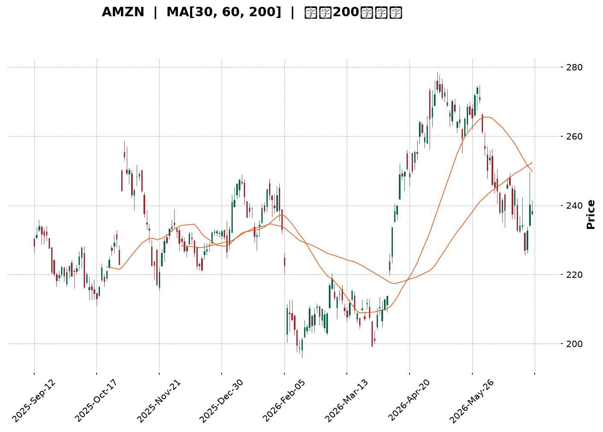
</details>

<html>
<head><meta charset="utf-8" /></head>
<body>
    <div style="height:500px; width:100%;">                        <script>window.PlotlyConfig = {MathJaxConfig: 'local'};</script>
        <script charset="utf-8" src="https://cdn.plot.ly/plotly-3.6.0.min.js" integrity="sha256-QaOVwtVY0T02VaHrr6pnoHLCwayMJp4O5n4YyaE3rJk=" crossorigin="anonymous"></script>                <div id="candlestick-chart" class="plotly-graph-div" style="height:100%; width:100%;"></div>            <script>                window.PLOTLYENV=window.PLOTLYENV || {};                                if (document.getElementById("candlestick-chart")) {                    Plotly.newPlot(                        "candlestick-chart",                        [{"close":{"dtype":"f8","bdata":"AAAAwMyEbEAAAACAwu1sQAAAAKCZQW1AAAAAANfzbEAAAAAgXOdsQAAAACBc72xAAAAAACl0bEAAAABguJZrQAAAAGC4hmtAAAAAwMxEa0AAAADA9XhrQAAAAKBwxWtAAAAAgD1ya0AAAAAAKZRrQAAAAMAezWtAAAAA4FFwa0AAAADAzJxrQAAAAMD1uGtAAAAAQAonbEAAAAAgrndsQAAAAADXC2tAAAAAgD2Ca0AAAADgegxrQAAAAIA98mpAAAAAQArPakAAAACgR6FqQAAAACBcD2tAAAAAwPXAa0AAAABgZj5rQAAAAEDhomtAAAAAYLgGbEAAAABACl9sQAAAAAAAqGxAAAAAoJnJbEAAAAAghdtrQAAAAEAKh25AAAAAAADAb0AAAACAPSpvQAAAAGBmRm9AAAAAoEdhbkAAAADAHo1uQAAAAMDMDG9AAAAAQDMjb0AAAABgZoZuQAAAAGCPsm1AAAAAgBRWbUAAAAAA1xttQAAAAKCZ0WtAAAAAgBTWa0AAAADgeiRrQAAAAIAUlmtAAAAAwPVIbEAAAACgcLVsQAAAAMAepWxAAAAAQAonbUAAAAAAKTxtQAAAAKBwTW1AAAAAACkMbUAAAAAghaNsQAAAAMD1sGxAAAAA4HpcbEAAAACgcH1sQAAAAMD1+GxAAAAAwPXIbEAAAACAFEZsQAAAAKBH0WtAAAAAgOvRa0AAAADgo6hrQAAAAOBRWGxAAAAAQDNrbEAAAACAwo1sQAAAAOB6BG1AAAAAACkMbUAAAADgoxBtQAAAAIA9Am1AAAAAwPUQbUAAAACAPdpsQAAAAAAAUGxAAAAAgOshbUAAAACAwh1uQAAAAIDrMW5AAAAAoEfJbkAAAAAAKexuQAAAAEAKz25AAAAAQDNTbkAAAADAzJRtQAAAAIDCxW1AAAAAANfjbUAAAAAAAOBsQAAAAIDr6WxAAAAAQOFKbUAAAADAHuVtQAAAAKBwzW1AAAAAgMKVbkAAAADgUWBuQAAAACBcN25AAAAAoJnpbUAAAABguF5uQAAAAADX021AAAAAIK4fbUAAAACAFNZrQAAAAIA9SmpAAAAAQAoXakAAAABguN5pQAAAAGCPgmlAAAAAQDPzaEAAAACgR9loQAAAAMDMJGlAAAAAoEeZaUAAAAAghZtpQAAAACCFQ2pAAAAA4KOoaUAAAACA6xFqQAAAAOB6VGpAAAAAoHD9aUAAAAAAAEBqQAAAAOB6DGpAAAAAIFwXakAAAACAPRprQAAAAIAUXmtAAAAAYLimakAAAAAgrq9qQAAAAGCPympAAAAAwMyUakAAAADA9TBqQAAAAKBw9WlAAAAAIK53akAAAABgZuZqQAAAAADXO2pAAAAA4FEYakAAAAAA16tpQAAAAOB6RGpAAAAAIK7naUAAAABguHZqQAAAAKBH8WlAAAAAQOHqaEAAAABgZh5pQAAAAOCjCGpAAAAAgD1SakAAAADgozhqQAAAAKBHmWpAAAAA4KO4akAAAAAAAKhrQAAAAMDMNG1AAAAAACnMbUAAAADgevxtQAAAAOCjIG9AAAAAAAAQb0AAAABgZjZvQAAAAIDrUW9AAAAAwPUIb0AAAADAHj1vQAAAACCF629AAAAAYI\u002fib0AAAAAA139wQAAAAIDrUXBAAAAAQDM7cEAAAADgo3BwQAAAAMD1kHBAAAAAACnEcEAAAADAzABxQAAAAMDMGHFAAAAAANcvcUAAAABguPJwQAAAAEDhCnFAAAAAANfPcEAAAADAHp1wQAAAAIAU4nBAAAAAIIWzcEAAAACAPYJwQAAAAIDCjXBAAAAAoHA1cEAAAAAAKZBwQAAAACBcx3BAAAAAwB6lcEAAAADgo5RwQAAAAKCZ\u002fXBAAAAAAAAgcUAAAACAPepwQAAAAAApVHBAAAAA4FEIcEAAAADgo0BvQAAAAKBHuW9AAAAAwPXAbkAAAABACqduQAAAAIAUhm5AAAAAAADAbUAAAADgUTBuQAAAAKCZ0W1AAAAA4KPAbkAAAAAAAMBuQAAAAAAAsG1AAAAA4HqMbkAAAACgRxltQAAAACCFQ21AAAAA4KNIbUAAAADgUWBsQAAAAIAUFm1AAAAA4HoEbkAAAABA4cptQA=="},"high":{"dtype":"f8","bdata":"AAAAoEfZbEAAAAAgXDdtQAAAAMDMfG1AAAAAoJlJbUAAAAAgXC9tQAAAAMAeRW1AAAAAgD3SbEAAAAAghXtsQAAAAIDrEWxAAAAAoHCVa0AAAACgmaFrQAAAAEAz02tAAAAAIK7Ha0AAAADAzMRrQAAAAIDr2WtAAAAAYGYGbEAAAAAgXLdrQAAAAOB63GtAAAAAIFxXbEAAAABguIZsQAAAAAAAiGxAAAAAgMKVa0AAAACAPWprQAAAAGC4NmtAAAAAQOFSa0AAAACgmdlqQAAAAIAUFmtAAAAAgD3qa0AAAADgUYBrQAAAAKCZqWtAAAAAwMwsbEAAAADAzIxsQAAAACCu72xAAAAAgD0abUAAAACAFI5sQAAAAAAAUG9AAAAAoJkpcEAAAAAAKRBwQAAAAAAAYG9AAAAAAClMb0AAAADAzJxuQAAAAAAAeG9AAAAAAAA4b0AAAAAA10tvQAAAAAAAeG5AAAAAIFzXbUAAAABAM1NtQAAAAGBmxmxAAAAAIK73a0AAAADAHm1sQAAAAGC4xmtAAAAAYI9qbEAAAADgo9BsQAAAAAAA+GxAAAAAoEcpbUAAAACgmXltQAAAAEAK321AAAAAACksbUAAAAAAADBtQAAAACCu52xAAAAAYI\u002fabEAAAACAPZJsQAAAAKBwDW1AAAAAIIUDbUAAAABgj8JsQAAAAIDCfWxAAAAAwB71a0AAAACAFCZsQAAAACBcp2xAAAAAACmkbEAAAAAgXK9sQAAAAGBmDm1AAAAAYGYebUAAAAAgrh9tQAAAAEAzE21AAAAA4KMYbUAAAAAgrh9tQAAAAGC4bm1AAAAAAABAbUAAAACAwmVuQAAAAKBHqW5AAAAAwB7NbkAAAAAghftuQAAAAIAUHm9AAAAAwB71bkAAAADA9ShuQAAAAMDMFG5AAAAAgD3ybUAAAABA4WJtQAAAAKCZCW1AAAAAQAp3bUAAAABgZg5uQAAAAGBmHm5AAAAAACmcbkAAAADA9fhuQAAAAAAAYG5AAAAAgD1qbkAAAAAAKbRuQAAAAEAzy25AAAAAIIXbbUAAAACA60lsQAAAAIAUbmpAAAAAgOuZakAAAADAzJRqQAAAAIA9EmpAAAAAYLh+aUAAAADAHiVpQAAAACCuN2lAAAAAIIXbaUAAAADgerRpQAAAAKBwZWpAAAAAgMINakAAAAAghUtqQAAAAEDhcmpAAAAAoJlhakAAAABgj0pqQAAAACBcN2pAAAAAgMIlakAAAACgRzFrQAAAAEAKj2tAAAAAgD0qa0AAAACAPbpqQAAAAMDM9GpAAAAAAAAga0AAAABguHZqQAAAAIDrUWpAAAAAQAqXakAAAABgZvZqQAAAAOB65GpAAAAAANcjakAAAACgR\u002fFpQAAAAKCZmWpAAAAAQDMrakAAAACAPaJqQAAAAOB6nGpAAAAAQDPTaUAAAACgmXlpQAAAAMD1SGpAAAAAYI+yakAAAABguIZqQAAAAGBmnmpAAAAAQAq\u002fakAAAABAM0NsQAAAAKCZOW1AAAAAgMINbkAAAAAAAABuQAAAAIDChW9AAAAAgBROb0AAAAAAAEBvQAAAAEDhAnBAAAAAgMJFb0AAAABA4eJvQAAAAIAU\u002fm9AAAAA4KMscEAAAAAAAIhwQAAAAGBmgnBAAAAA4HpQcEAAAABgj55wQAAAAIAUHnFAAAAAwB4VcUAAAACgmUFxQAAAAMD1aHFAAAAAwMxccUAAAACAFEpxQAAAAAAAIHFAAAAAgBQacUAAAABgZrpwQAAAACCF63BAAAAA4HrscEAAAACAwoVwQAAAAKCZzXBAAAAAAABkcEAAAACgR5lwQAAAAADX13BAAAAA4KPccEAAAADAzNRwQAAAAGCPBnFAAAAAAAAocUAAAAAAACxxQAAAAIAUqnBAAAAAQDNTcEAAAACgcBFwQAAAAGCP+m9AAAAAgBQGcEAAAACgcC1vQAAAAIDCTW9AAAAAgD2CbkAAAADgekRuQAAAACCFa25AAAAAgOv5bkAAAADgUTBvQAAAAMAevW5AAAAAIFy3bkAAAAAAAEBuQAAAAADXm21AAAAAoHBNbkAAAACAPQptQAAAAMDMPG1AAAAAYLg2b0AAAACgRzFuQA=="},"hovertemplate":"\u003cb\u003e%{x|%Y-%m-%d}\u003c\u002fb\u003e\u003cbr\u003e\u958b: $%{open:.2f}\u003cbr\u003e\u9ad8: $%{high:.2f}\u003cbr\u003e\u4f4e: $%{low:.2f}\u003cbr\u003e\u6536: $%{close:.2f}\u003cextra\u003e\u003c\u002fextra\u003e","low":{"dtype":"f8","bdata":"AAAAoEdJbEAAAACAPcpsQAAAACBcB21AAAAAYLiWbEAAAACgR5lsQAAAAGBmtmxAAAAA4FFwbEAAAACAPYJrQAAAAGBmbmtAAAAAQAoPa0AAAADgo0BrQAAAAKCZaWtAAAAA4Ho8a0AAAAAghRNrQAAAAGBmXmtAAAAAQOFqa0AAAADA9QBrQAAAAKBwhWtAAAAAgBSma0AAAAAAALhrQAAAAAAAAGtAAAAAoEcha0AAAABAM5NqQAAAAMAelWpAAAAAgOuZakAAAADA9WBqQAAAAEDhsmpAAAAAIK4\u002fa0AAAADgoxBrQAAAAIDCRWtAAAAAwMy8a0AAAACgRzFsQAAAAGC4RmxAAAAA4FF4bEAAAAAAANhrQAAAACBcf25AAAAAwMycb0AAAADAHhVvQAAAAMAexW5AAAAAoHBFbkAAAAAgrs9tQAAAAEDhsm5AAAAAIFznbkAAAAAAAHhuQAAAAAAAkG1AAAAA4HocbUAAAACAFKZsQAAAAKBwzWtAAAAA4KNQa0AAAAAgrhdrQAAAAIDC5WpAAAAA4KPIa0AAAACgmflrQAAAAOCjmGxAAAAAQArHbEAAAAAAAAhtQAAAAKCZMW1AAAAAIIXTbEAAAACgmVlsQAAAAKCZkWxAAAAA4KNIbEAAAAAghSNsQAAAAGC4jmxAAAAAgBSWbEAAAAAA1yNsQAAAAAAAsGtAAAAAACmka0AAAAAgrp9rQAAAAMAeDWxAAAAAYI8ybEAAAABguFZsQAAAACBcl2xAAAAAYI\u002fqbEAAAACAwuVsQAAAAOCj2GxAAAAAYGbGbEAAAAAA18NsQAAAAGBmFmxAAAAAgMJlbEAAAACAPQJtQAAAAOCj8G1AAAAAACk8bkAAAAAgrkduQAAAAGC4vm5AAAAAAAAIbkAAAABACodtQAAAAAAplG1AAAAAwB6NbUAAAABA4apsQAAAAAApXGxAAAAAwMzcbEAAAACAPVJtQAAAAKBHsW1AAAAAYI\u002fCbUAAAADA9TBuQAAAACCul21AAAAA4Hq0bUAAAACgcMVtQAAAAGBmbm1AAAAAgD36bEAAAAAAKYxrQAAAAIDrCWlAAAAAQDNraUAAAADAHs1pQAAAACCuT2lAAAAAgOuxaEAAAADA9ahoQAAAAAAAgGhAAAAA4FEwaUAAAACA61lpQAAAAAAAeGlAAAAAIIVjaUAAAAAAAGhpQAAAAIDCHWpAAAAAQDOraUAAAABgZqZpQAAAAGC4bmlAAAAAIFxPaUAAAADAzERqQAAAAEDh8mpAAAAAwPWQakAAAAAgheNpQAAAAIDCjWpAAAAAQDNrakAAAADAzARqQAAAAEAKx2lAAAAAYGbuaUAAAACAwo1qQAAAAGCPGmpAAAAAoJnBaUAAAACAPYppQAAAAOBRMGpAAAAA4HrUaUAAAADAzDxqQAAAAADX42lAAAAA4HrkaEAAAAAgXP9oQAAAAOB6hGlAAAAAgBQGakAAAADAzJxpQAAAAEDhMmpAAAAAYI8iakAAAAAA13NrQAAAAOCj6GtAAAAAYLhmbUAAAAAAAHhtQAAAAMD1OG5AAAAAYGbmbkAAAABgZoZuQAAAACCFQ29AAAAAANerbkAAAABAMyNvQAAAAGCPSm9AAAAAgD2ib0AAAABAChtwQAAAAKBwRXBAAAAAgBQKcEAAAABAMxtwQAAAAGCPAnBAAAAAANdrcEAAAADAzMxwQAAAAIAUBnFAAAAAIFwDcUAAAAAA1+dwQAAAAEAz33BAAAAAIK7HcEAAAACAFGpwQAAAAEAzc3BAAAAAgBSqcEAAAACAPU5wQAAAAOB6aHBAAAAAgBTmb0AAAADgejhwQAAAAIDrVXBAAAAAANejcEAAAADAHmFwQAAAAEAzm3BAAAAAQAq3cEAAAACAPdpwQAAAAEAzS3BAAAAAANfLb0AAAABguPZuQAAAAAAAeG9AAAAAwPW4bkAAAAAghWtuQAAAAMDMDG5AAAAAYGaubUAAAACAwmVtQAAAAEDhMm1AAAAAIFyXbkAAAABgZq5uQAAAAAAAgG1AAAAA4KOAbUAAAAAgrgdtQAAAAAAAAG1AAAAAYGYebUAAAACgmTFsQAAAAAApRGxAAAAAoJk5bUAAAADgeKVtQA=="},"name":"\u50f9\u683c","open":{"dtype":"f8","bdata":"AAAAQDPLbEAAAAAAKdRsQAAAAIAUHm1AAAAA4KM4bUAAAAAAABBtQAAAAADXC21AAAAAgOvRbEAAAABgj3psQAAAAMDMBGxAAAAAgOuBa0AAAABgj2JrQAAAAGCPgmtAAAAAwPXAa0AAAAAghStrQAAAAOBRoGtAAAAAgBTua0AAAAAAAKBrQAAAAAApnGtAAAAAoHDda0AAAAAAACBsQAAAAGC4RmxAAAAAYGY2a0AAAACA6\u002fFqQAAAAADXE2tAAAAAoHD1akAAAACA69FqQAAAAAApvGpAAAAAgMJNa0AAAACgmWlrQAAAAAAAYGtAAAAAQAq\u002fa0AAAADAHnVsQAAAAEAKh2xAAAAAoHD1bEAAAACA62FsQAAAAEAzQ29AAAAAIIXrb0AAAAAAKUxvQAAAAMD1IG9AAAAAwB4lb0AAAADAzFxuQAAAAEDhCm9AAAAAwB4Nb0AAAAAgrkdvQAAAAKCZYW5AAAAAgOthbUAAAAAAAChtQAAAAEAzg2xAAAAAIK73a0AAAACgmWFsQAAAAEAzC2tAAAAAgOvRa0AAAAAAKUxsQAAAACCu12xAAAAAIK7nbEAAAABACidtQAAAAOBRYG1AAAAAQDMrbUAAAADgoxhtQAAAAIA9ymxAAAAAQOGybEAAAABA4VpsQAAAAIDrmWxAAAAAYLjWbEAAAAAA17tsQAAAAIDCfWxAAAAAoEfha0AAAADAHhVsQAAAAGC4NmxAAAAA4FFYbEAAAAAghZNsQAAAAIDroWxAAAAAACkEbUAAAACgRwFtQAAAAIAU\u002fmxAAAAAYLjmbEAAAADAHh1tQAAAAEDh6mxAAAAAQOGabEAAAABAMwNtQAAAACCF821AAAAAgOthbkAAAACAPZJuQAAAACBc125AAAAAwPXQbkAAAADAzCRuQAAAAIDr6W1AAAAAQOHibUAAAADgUThtQAAAAEDh4mxAAAAAoJlBbUAAAABguF5tQAAAACBc\u002f21AAAAAgBT2bUAAAAAA18tuQAAAAIA9Wm5AAAAA4Hr8bUAAAACA68ltQAAAACBcn25AAAAAIIXbbUAAAADAHh1sQAAAAGBmVmlAAAAAQAofakAAAACgmRlqQAAAAIDrAWpAAAAAYLh+aUAAAAAAKdxoQAAAAAApxGhAAAAAgD1CaUAAAACgmXlpQAAAAOBRmGlAAAAAQDMDakAAAABACq9pQAAAAGC4TmpAAAAAIFxXakAAAABgj9ppQAAAAKCZkWlAAAAAQDNjaUAAAABACk9qQAAAACBc\u002f2pAAAAAIK7fakAAAABgZk5qQAAAAIAUxmpAAAAAYLj2akAAAADgekxqQAAAACCFM2pAAAAAQDMLakAAAACAPZpqQAAAAIDCvWpAAAAAgOvhaUAAAADAzOxpQAAAAKBHOWpAAAAAYGb+aUAAAACA63FqQAAAACCFU2pAAAAAYLjOaUAAAAAgXC9pQAAAAEAzm2lAAAAAgBROakAAAACgR9FpQAAAAKCZOWpAAAAAIK5nakAAAACgR\u002flrQAAAACBcJ2xAAAAAoJlpbUAAAABgZq5tQAAAAMD1OG5AAAAAAAAob0AAAADgURBvQAAAACCu329AAAAAgBQmb0AAAABA4eJvQAAAAIAUjm9AAAAA4Hrsb0AAAAAgrj9wQAAAACBcd3BAAAAAgD0mcEAAAAAA1x9wQAAAAGC4EnFAAAAAoEeZcEAAAADAzMxwQAAAAKBHQXFAAAAAgD0OcUAAAADgUTBxQAAAAIAU+nBAAAAAoHDdcEAAAAAgXKtwQAAAAEDhhnBAAAAAYGbScEAAAAAAAGhwQAAAAIDrfXBAAAAA4KNgcEAAAADAzEBwQAAAAAAAeHBAAAAAYI\u002fKcEAAAABACr9wQAAAAGBmonBAAAAA4FEEcUAAAADgo\u002fRwQAAAAOCjpHBAAAAAYI8ScEAAAABgZtZvQAAAAADXo29AAAAA4FHIb0AAAACAwtVuQAAAACBc925AAAAAIIVzbkAAAACAwr1tQAAAAGC4Zm5AAAAA4KOgbkAAAAAAAABvQAAAAMDMnG5AAAAAANcDbkAAAABgjwJuQAAAAKCZEW1AAAAAQDM7bUAAAADgowBtQAAAAGC4ZmxAAAAAQApHbUAAAACAwq1tQA=="},"x":["2025-09-12T00:00:00-04:00","2025-09-15T00:00:00-04:00","2025-09-16T00:00:00-04:00","2025-09-17T00:00:00-04:00","2025-09-18T00:00:00-04:00","2025-09-19T00:00:00-04:00","2025-09-22T00:00:00-04:00","2025-09-23T00:00:00-04:00","2025-09-24T00:00:00-04:00","2025-09-25T00:00:00-04:00","2025-09-26T00:00:00-04:00","2025-09-29T00:00:00-04:00","2025-09-30T00:00:00-04:00","2025-10-01T00:00:00-04:00","2025-10-02T00:00:00-04:00","2025-10-03T00:00:00-04:00","2025-10-06T00:00:00-04:00","2025-10-07T00:00:00-04:00","2025-10-08T00:00:00-04:00","2025-10-09T00:00:00-04:00","2025-10-10T00:00:00-04:00","2025-10-13T00:00:00-04:00","2025-10-14T00:00:00-04:00","2025-10-15T00:00:00-04:00","2025-10-16T00:00:00-04:00","2025-10-17T00:00:00-04:00","2025-10-20T00:00:00-04:00","2025-10-21T00:00:00-04:00","2025-10-22T00:00:00-04:00","2025-10-23T00:00:00-04:00","2025-10-24T00:00:00-04:00","2025-10-27T00:00:00-04:00","2025-10-28T00:00:00-04:00","2025-10-29T00:00:00-04:00","2025-10-30T00:00:00-04:00","2025-10-31T00:00:00-04:00","2025-11-03T00:00:00-05:00","2025-11-04T00:00:00-05:00","2025-11-05T00:00:00-05:00","2025-11-06T00:00:00-05:00","2025-11-07T00:00:00-05:00","2025-11-10T00:00:00-05:00","2025-11-11T00:00:00-05:00","2025-11-12T00:00:00-05:00","2025-11-13T00:00:00-05:00","2025-11-14T00:00:00-05:00","2025-11-17T00:00:00-05:00","2025-11-18T00:00:00-05:00","2025-11-19T00:00:00-05:00","2025-11-20T00:00:00-05:00","2025-11-21T00:00:00-05:00","2025-11-24T00:00:00-05:00","2025-11-25T00:00:00-05:00","2025-11-26T00:00:00-05:00","2025-11-28T00:00:00-05:00","2025-12-01T00:00:00-05:00","2025-12-02T00:00:00-05:00","2025-12-03T00:00:00-05:00","2025-12-04T00:00:00-05:00","2025-12-05T00:00:00-05:00","2025-12-08T00:00:00-05:00","2025-12-09T00:00:00-05:00","2025-12-10T00:00:00-05:00","2025-12-11T00:00:00-05:00","2025-12-12T00:00:00-05:00","2025-12-15T00:00:00-05:00","2025-12-16T00:00:00-05:00","2025-12-17T00:00:00-05:00","2025-12-18T00:00:00-05:00","2025-12-19T00:00:00-05:00","2025-12-22T00:00:00-05:00","2025-12-23T00:00:00-05:00","2025-12-24T00:00:00-05:00","2025-12-26T00:00:00-05:00","2025-12-29T00:00:00-05:00","2025-12-30T00:00:00-05:00","2025-12-31T00:00:00-05:00","2026-01-02T00:00:00-05:00","2026-01-05T00:00:00-05:00","2026-01-06T00:00:00-05:00","2026-01-07T00:00:00-05:00","2026-01-08T00:00:00-05:00","2026-01-09T00:00:00-05:00","2026-01-12T00:00:00-05:00","2026-01-13T00:00:00-05:00","2026-01-14T00:00:00-05:00","2026-01-15T00:00:00-05:00","2026-01-16T00:00:00-05:00","2026-01-20T00:00:00-05:00","2026-01-21T00:00:00-05:00","2026-01-22T00:00:00-05:00","2026-01-23T00:00:00-05:00","2026-01-26T00:00:00-05:00","2026-01-27T00:00:00-05:00","2026-01-28T00:00:00-05:00","2026-01-29T00:00:00-05:00","2026-01-30T00:00:00-05:00","2026-02-02T00:00:00-05:00","2026-02-03T00:00:00-05:00","2026-02-04T00:00:00-05:00","2026-02-05T00:00:00-05:00","2026-02-06T00:00:00-05:00","2026-02-09T00:00:00-05:00","2026-02-10T00:00:00-05:00","2026-02-11T00:00:00-05:00","2026-02-12T00:00:00-05:00","2026-02-13T00:00:00-05:00","2026-02-17T00:00:00-05:00","2026-02-18T00:00:00-05:00","2026-02-19T00:00:00-05:00","2026-02-20T00:00:00-05:00","2026-02-23T00:00:00-05:00","2026-02-24T00:00:00-05:00","2026-02-25T00:00:00-05:00","2026-02-26T00:00:00-05:00","2026-02-27T00:00:00-05:00","2026-03-02T00:00:00-05:00","2026-03-03T00:00:00-05:00","2026-03-04T00:00:00-05:00","2026-03-05T00:00:00-05:00","2026-03-06T00:00:00-05:00","2026-03-09T00:00:00-04:00","2026-03-10T00:00:00-04:00","2026-03-11T00:00:00-04:00","2026-03-12T00:00:00-04:00","2026-03-13T00:00:00-04:00","2026-03-16T00:00:00-04:00","2026-03-17T00:00:00-04:00","2026-03-18T00:00:00-04:00","2026-03-19T00:00:00-04:00","2026-03-20T00:00:00-04:00","2026-03-23T00:00:00-04:00","2026-03-24T00:00:00-04:00","2026-03-25T00:00:00-04:00","2026-03-26T00:00:00-04:00","2026-03-27T00:00:00-04:00","2026-03-30T00:00:00-04:00","2026-03-31T00:00:00-04:00","2026-04-01T00:00:00-04:00","2026-04-02T00:00:00-04:00","2026-04-06T00:00:00-04:00","2026-04-07T00:00:00-04:00","2026-04-08T00:00:00-04:00","2026-04-09T00:00:00-04:00","2026-04-10T00:00:00-04:00","2026-04-13T00:00:00-04:00","2026-04-14T00:00:00-04:00","2026-04-15T00:00:00-04:00","2026-04-16T00:00:00-04:00","2026-04-17T00:00:00-04:00","2026-04-20T00:00:00-04:00","2026-04-21T00:00:00-04:00","2026-04-22T00:00:00-04:00","2026-04-23T00:00:00-04:00","2026-04-24T00:00:00-04:00","2026-04-27T00:00:00-04:00","2026-04-28T00:00:00-04:00","2026-04-29T00:00:00-04:00","2026-04-30T00:00:00-04:00","2026-05-01T00:00:00-04:00","2026-05-04T00:00:00-04:00","2026-05-05T00:00:00-04:00","2026-05-06T00:00:00-04:00","2026-05-07T00:00:00-04:00","2026-05-08T00:00:00-04:00","2026-05-11T00:00:00-04:00","2026-05-12T00:00:00-04:00","2026-05-13T00:00:00-04:00","2026-05-14T00:00:00-04:00","2026-05-15T00:00:00-04:00","2026-05-18T00:00:00-04:00","2026-05-19T00:00:00-04:00","2026-05-20T00:00:00-04:00","2026-05-21T00:00:00-04:00","2026-05-22T00:00:00-04:00","2026-05-26T00:00:00-04:00","2026-05-27T00:00:00-04:00","2026-05-28T00:00:00-04:00","2026-05-29T00:00:00-04:00","2026-06-01T00:00:00-04:00","2026-06-02T00:00:00-04:00","2026-06-03T00:00:00-04:00","2026-06-04T00:00:00-04:00","2026-06-05T00:00:00-04:00","2026-06-08T00:00:00-04:00","2026-06-09T00:00:00-04:00","2026-06-10T00:00:00-04:00","2026-06-11T00:00:00-04:00","2026-06-12T00:00:00-04:00","2026-06-15T00:00:00-04:00","2026-06-16T00:00:00-04:00","2026-06-17T00:00:00-04:00","2026-06-18T00:00:00-04:00","2026-06-22T00:00:00-04:00","2026-06-23T00:00:00-04:00","2026-06-24T00:00:00-04:00","2026-06-25T00:00:00-04:00","2026-06-26T00:00:00-04:00","2026-06-29T00:00:00-04:00","2026-06-30T00:00:00-04:00"],"type":"candlestick"},{"hovertemplate":"MA30: $%{y:.2f}\u003cextra\u003e\u003c\u002fextra\u003e","line":{"color":"#2196F3","dash":"dash","width":2},"mode":"lines","name":"MA30","x":["2025-09-12T00:00:00-04:00","2025-09-15T00:00:00-04:00","2025-09-16T00:00:00-04:00","2025-09-17T00:00:00-04:00","2025-09-18T00:00:00-04:00","2025-09-19T00:00:00-04:00","2025-09-22T00:00:00-04:00","2025-09-23T00:00:00-04:00","2025-09-24T00:00:00-04:00","2025-09-25T00:00:00-04:00","2025-09-26T00:00:00-04:00","2025-09-29T00:00:00-04:00","2025-09-30T00:00:00-04:00","2025-10-01T00:00:00-04:00","2025-10-02T00:00:00-04:00","2025-10-03T00:00:00-04:00","2025-10-06T00:00:00-04:00","2025-10-07T00:00:00-04:00","2025-10-08T00:00:00-04:00","2025-10-09T00:00:00-04:00","2025-10-10T00:00:00-04:00","2025-10-13T00:00:00-04:00","2025-10-14T00:00:00-04:00","2025-10-15T00:00:00-04:00","2025-10-16T00:00:00-04:00","2025-10-17T00:00:00-04:00","2025-10-20T00:00:00-04:00","2025-10-21T00:00:00-04:00","2025-10-22T00:00:00-04:00","2025-10-23T00:00:00-04:00","2025-10-24T00:00:00-04:00","2025-10-27T00:00:00-04:00","2025-10-28T00:00:00-04:00","2025-10-29T00:00:00-04:00","2025-10-30T00:00:00-04:00","2025-10-31T00:00:00-04:00","2025-11-03T00:00:00-05:00","2025-11-04T00:00:00-05:00","2025-11-05T00:00:00-05:00","2025-11-06T00:00:00-05:00","2025-11-07T00:00:00-05:00","2025-11-10T00:00:00-05:00","2025-11-11T00:00:00-05:00","2025-11-12T00:00:00-05:00","2025-11-13T00:00:00-05:00","2025-11-14T00:00:00-05:00","2025-11-17T00:00:00-05:00","2025-11-18T00:00:00-05:00","2025-11-19T00:00:00-05:00","2025-11-20T00:00:00-05:00","2025-11-21T00:00:00-05:00","2025-11-24T00:00:00-05:00","2025-11-25T00:00:00-05:00","2025-11-26T00:00:00-05:00","2025-11-28T00:00:00-05:00","2025-12-01T00:00:00-05:00","2025-12-02T00:00:00-05:00","2025-12-03T00:00:00-05:00","2025-12-04T00:00:00-05:00","2025-12-05T00:00:00-05:00","2025-12-08T00:00:00-05:00","2025-12-09T00:00:00-05:00","2025-12-10T00:00:00-05:00","2025-12-11T00:00:00-05:00","2025-12-12T00:00:00-05:00","2025-12-15T00:00:00-05:00","2025-12-16T00:00:00-05:00","2025-12-17T00:00:00-05:00","2025-12-18T00:00:00-05:00","2025-12-19T00:00:00-05:00","2025-12-22T00:00:00-05:00","2025-12-23T00:00:00-05:00","2025-12-24T00:00:00-05:00","2025-12-26T00:00:00-05:00","2025-12-29T00:00:00-05:00","2025-12-30T00:00:00-05:00","2025-12-31T00:00:00-05:00","2026-01-02T00:00:00-05:00","2026-01-05T00:00:00-05:00","2026-01-06T00:00:00-05:00","2026-01-07T00:00:00-05:00","2026-01-08T00:00:00-05:00","2026-01-09T00:00:00-05:00","2026-01-12T00:00:00-05:00","2026-01-13T00:00:00-05:00","2026-01-14T00:00:00-05:00","2026-01-15T00:00:00-05:00","2026-01-16T00:00:00-05:00","2026-01-20T00:00:00-05:00","2026-01-21T00:00:00-05:00","2026-01-22T00:00:00-05:00","2026-01-23T00:00:00-05:00","2026-01-26T00:00:00-05:00","2026-01-27T00:00:00-05:00","2026-01-28T00:00:00-05:00","2026-01-29T00:00:00-05:00","2026-01-30T00:00:00-05:00","2026-02-02T00:00:00-05:00","2026-02-03T00:00:00-05:00","2026-02-04T00:00:00-05:00","2026-02-05T00:00:00-05:00","2026-02-06T00:00:00-05:00","2026-02-09T00:00:00-05:00","2026-02-10T00:00:00-05:00","2026-02-11T00:00:00-05:00","2026-02-12T00:00:00-05:00","2026-02-13T00:00:00-05:00","2026-02-17T00:00:00-05:00","2026-02-18T00:00:00-05:00","2026-02-19T00:00:00-05:00","2026-02-20T00:00:00-05:00","2026-02-23T00:00:00-05:00","2026-02-24T00:00:00-05:00","2026-02-25T00:00:00-05:00","2026-02-26T00:00:00-05:00","2026-02-27T00:00:00-05:00","2026-03-02T00:00:00-05:00","2026-03-03T00:00:00-05:00","2026-03-04T00:00:00-05:00","2026-03-05T00:00:00-05:00","2026-03-06T00:00:00-05:00","2026-03-09T00:00:00-04:00","2026-03-10T00:00:00-04:00","2026-03-11T00:00:00-04:00","2026-03-12T00:00:00-04:00","2026-03-13T00:00:00-04:00","2026-03-16T00:00:00-04:00","2026-03-17T00:00:00-04:00","2026-03-18T00:00:00-04:00","2026-03-19T00:00:00-04:00","2026-03-20T00:00:00-04:00","2026-03-23T00:00:00-04:00","2026-03-24T00:00:00-04:00","2026-03-25T00:00:00-04:00","2026-03-26T00:00:00-04:00","2026-03-27T00:00:00-04:00","2026-03-30T00:00:00-04:00","2026-03-31T00:00:00-04:00","2026-04-01T00:00:00-04:00","2026-04-02T00:00:00-04:00","2026-04-06T00:00:00-04:00","2026-04-07T00:00:00-04:00","2026-04-08T00:00:00-04:00","2026-04-09T00:00:00-04:00","2026-04-10T00:00:00-04:00","2026-04-13T00:00:00-04:00","2026-04-14T00:00:00-04:00","2026-04-15T00:00:00-04:00","2026-04-16T00:00:00-04:00","2026-04-17T00:00:00-04:00","2026-04-20T00:00:00-04:00","2026-04-21T00:00:00-04:00","2026-04-22T00:00:00-04:00","2026-04-23T00:00:00-04:00","2026-04-24T00:00:00-04:00","2026-04-27T00:00:00-04:00","2026-04-28T00:00:00-04:00","2026-04-29T00:00:00-04:00","2026-04-30T00:00:00-04:00","2026-05-01T00:00:00-04:00","2026-05-04T00:00:00-04:00","2026-05-05T00:00:00-04:00","2026-05-06T00:00:00-04:00","2026-05-07T00:00:00-04:00","2026-05-08T00:00:00-04:00","2026-05-11T00:00:00-04:00","2026-05-12T00:00:00-04:00","2026-05-13T00:00:00-04:00","2026-05-14T00:00:00-04:00","2026-05-15T00:00:00-04:00","2026-05-18T00:00:00-04:00","2026-05-19T00:00:00-04:00","2026-05-20T00:00:00-04:00","2026-05-21T00:00:00-04:00","2026-05-22T00:00:00-04:00","2026-05-26T00:00:00-04:00","2026-05-27T00:00:00-04:00","2026-05-28T00:00:00-04:00","2026-05-29T00:00:00-04:00","2026-06-01T00:00:00-04:00","2026-06-02T00:00:00-04:00","2026-06-03T00:00:00-04:00","2026-06-04T00:00:00-04:00","2026-06-05T00:00:00-04:00","2026-06-08T00:00:00-04:00","2026-06-09T00:00:00-04:00","2026-06-10T00:00:00-04:00","2026-06-11T00:00:00-04:00","2026-06-12T00:00:00-04:00","2026-06-15T00:00:00-04:00","2026-06-16T00:00:00-04:00","2026-06-17T00:00:00-04:00","2026-06-18T00:00:00-04:00","2026-06-22T00:00:00-04:00","2026-06-23T00:00:00-04:00","2026-06-24T00:00:00-04:00","2026-06-25T00:00:00-04:00","2026-06-26T00:00:00-04:00","2026-06-29T00:00:00-04:00","2026-06-30T00:00:00-04:00"],"y":{"dtype":"f8","bdata":"AAAAAAAA+H8AAAAAAAD4fwAAAAAAAPh\u002fAAAAAAAA+H8AAAAAAAD4fwAAAAAAAPh\u002fAAAAAAAA+H8AAAAAAAD4fwAAAAAAAPh\u002fAAAAAAAA+H8AAAAAAAD4fwAAAAAAAPh\u002fAAAAAAAA+H8AAAAAAAD4fwAAAAAAAPh\u002fAAAAAAAA+H8AAAAAAAD4fwAAAAAAAPh\u002fAAAAAAAA+H8AAAAAAAD4fwAAAAAAAPh\u002fAAAAAAAA+H8AAAAAAAD4fwAAAAAAAPh\u002fAAAAAAAA+H8AAAAAAAD4fwAAAAAAAPh\u002fAAAAAAAA+H8AAAAAAAD4f7y7uxtayGtAq6qqOibEa0CrqqpaZL9rQCIiIqJFumtAAAAAMN24a0Dv7u6e769rQN7d3X2GvWtAIiIiQqfZa0AiIiKyK\u002fhrQGZmZvYoGGxAd3d3l7UybECamZk5+0xsQDMzM8P1aGxAvLu7a3WIbECamZmZmaFsQFVVVQXIsWxAzczMLPnBbECJiIjIvc5sQLy7uwuQz2xAAAAAMN3MbEDe3d2tjsFsQERERFQqxmxAIiIiEsrMbEBVVVVl9NpsQO\u002fu7l5z6WxA7+7uXnP9bEBVVVUVrhNtQGZmZubQJm1AREREJNsxbUARERGRwj1tQAAAAEDDRm1AEREREZ9JbUCrqqp6okptQGZmZlZVTW1AAAAA4E9NbUAAAAAw3VBtQJqZmRm9OW1AIiIi4jMYbUDNzMxcSPpsQN7d3a1H4WxARERERIvQbECJiIiof79sQImIiJgnrmxAvLu761GcbEARERGB3I9sQImIiOj7iWxAVVVVFa6HbEDNzMxMfoVsQJqZmem0iWxAzczMnMSUbEDe3d3dJK5sQERERMRnxGxARERE1L\u002fZbEB3d3fXo+xsQAAAAKAa\u002f2xA3t3d\u002fRsJbUAiIiJiEAxtQM3MzBwTEG1ARERElEMXbUDNzMysRxltQLy7u7stG21AREREFCAjbUCamZlZHS9tQDMzM4MyNm1AvLu7q45FbUBmZmamf1dtQM3MzMz3a21AAAAA8NJ9bUARERHB9ZRtQDMzM1OcoW1AvLu7a6CnbUBVVVUFgaFtQFVVVbU6im1AMzMz8\u002f1wbUDe3d1dulVtQKuqqjrfN21AVVVVJb8UbUARERHRlPJsQDMzM5OK12xAq6qq+mK5bEB3d3d36ZJsQFVVVYVdcWxAREREVJxFbEARERHhMxxsQGZmZub79WtAIiIi8v3Qa0CJiIi4kLRrQBERERHKlGtAIiIikl90a0DNzMx8P2VrQHd3d6cNWGtAIiIiwoNBa0AzMzMjIiZrQGZmZvZvDGtAMzMzo0XqakDe3d1dj8ZqQHd3d7c6ompAAAAAANWEakCrqqqqOGdqQAAAAACOSGpAd3d3l7UuakAzMzMTPBxqQLy7u+sKHGpAiYiIyHYaakCamZnZhx9qQImIiKg4I2pAiYiIqPEiakC8u7t7PyVqQImIiLjXLGpAzczMDAIzakDv7u7OPjhqQAAAAKAaO2pAERERsStEakCJiIjotFFqQLy7uytAampAiYiIyL2KakDv7u6+n6pqQCIiInL21WpA7+7uTmIAa0DNzMy8dCNrQKuqqhovRWtAzczMjJdqa0AzMzOjcJFrQAAAAJA0vWtAiYiIyHbqa0De3d39jSRsQHd3d2eRXWxA7+7urrmQbEAiIiIywcNsQO\u002fu7r6f\u002fmxAd3d3Nxc+bUDNzMxMN4VtQERERHTayG1Ad3d3tx4RbkAzMzNDi1BuQDMzM9MGlm5Aq6qq6lHgbkARERHBgyVvQImIiKh\u002fZ29AIiIi4uyjb0BVVVWF691vQM3MzAy7CnBAd3d33wgjcECrqqqSXzpwQEREREzwTHBAIiIiCtdbcEDNzMz8YmlwQDMzMwuQdXBAzczMpCmDcEB3d3enVI5wQAAAAJAJlHBAiYiImG6YcEBVVVWdfZhwQJqZmUGnl3BAERERodOScEBmZmbm0IhwQERERGTJf3BA3t3dnTZ0cEBVVVUNu2hwQN7d3Y2XWnBAVVVVDbtOcEBERERc1kBwQN7d3VWcLXBAq6qqakodcEC8u7tD0ghwQJqZmVmA6G9Aq6qqenfDb0AiIiLCEZpvQERERCQicm9A7+7ufj9Vb0Dv7u5eujlvQA=="},"type":"scatter"},{"hovertemplate":"MA60: $%{y:.2f}\u003cextra\u003e\u003c\u002fextra\u003e","line":{"color":"#9C27B0","dash":"dash","width":2},"mode":"lines","name":"MA60","x":["2025-09-12T00:00:00-04:00","2025-09-15T00:00:00-04:00","2025-09-16T00:00:00-04:00","2025-09-17T00:00:00-04:00","2025-09-18T00:00:00-04:00","2025-09-19T00:00:00-04:00","2025-09-22T00:00:00-04:00","2025-09-23T00:00:00-04:00","2025-09-24T00:00:00-04:00","2025-09-25T00:00:00-04:00","2025-09-26T00:00:00-04:00","2025-09-29T00:00:00-04:00","2025-09-30T00:00:00-04:00","2025-10-01T00:00:00-04:00","2025-10-02T00:00:00-04:00","2025-10-03T00:00:00-04:00","2025-10-06T00:00:00-04:00","2025-10-07T00:00:00-04:00","2025-10-08T00:00:00-04:00","2025-10-09T00:00:00-04:00","2025-10-10T00:00:00-04:00","2025-10-13T00:00:00-04:00","2025-10-14T00:00:00-04:00","2025-10-15T00:00:00-04:00","2025-10-16T00:00:00-04:00","2025-10-17T00:00:00-04:00","2025-10-20T00:00:00-04:00","2025-10-21T00:00:00-04:00","2025-10-22T00:00:00-04:00","2025-10-23T00:00:00-04:00","2025-10-24T00:00:00-04:00","2025-10-27T00:00:00-04:00","2025-10-28T00:00:00-04:00","2025-10-29T00:00:00-04:00","2025-10-30T00:00:00-04:00","2025-10-31T00:00:00-04:00","2025-11-03T00:00:00-05:00","2025-11-04T00:00:00-05:00","2025-11-05T00:00:00-05:00","2025-11-06T00:00:00-05:00","2025-11-07T00:00:00-05:00","2025-11-10T00:00:00-05:00","2025-11-11T00:00:00-05:00","2025-11-12T00:00:00-05:00","2025-11-13T00:00:00-05:00","2025-11-14T00:00:00-05:00","2025-11-17T00:00:00-05:00","2025-11-18T00:00:00-05:00","2025-11-19T00:00:00-05:00","2025-11-20T00:00:00-05:00","2025-11-21T00:00:00-05:00","2025-11-24T00:00:00-05:00","2025-11-25T00:00:00-05:00","2025-11-26T00:00:00-05:00","2025-11-28T00:00:00-05:00","2025-12-01T00:00:00-05:00","2025-12-02T00:00:00-05:00","2025-12-03T00:00:00-05:00","2025-12-04T00:00:00-05:00","2025-12-05T00:00:00-05:00","2025-12-08T00:00:00-05:00","2025-12-09T00:00:00-05:00","2025-12-10T00:00:00-05:00","2025-12-11T00:00:00-05:00","2025-12-12T00:00:00-05:00","2025-12-15T00:00:00-05:00","2025-12-16T00:00:00-05:00","2025-12-17T00:00:00-05:00","2025-12-18T00:00:00-05:00","2025-12-19T00:00:00-05:00","2025-12-22T00:00:00-05:00","2025-12-23T00:00:00-05:00","2025-12-24T00:00:00-05:00","2025-12-26T00:00:00-05:00","2025-12-29T00:00:00-05:00","2025-12-30T00:00:00-05:00","2025-12-31T00:00:00-05:00","2026-01-02T00:00:00-05:00","2026-01-05T00:00:00-05:00","2026-01-06T00:00:00-05:00","2026-01-07T00:00:00-05:00","2026-01-08T00:00:00-05:00","2026-01-09T00:00:00-05:00","2026-01-12T00:00:00-05:00","2026-01-13T00:00:00-05:00","2026-01-14T00:00:00-05:00","2026-01-15T00:00:00-05:00","2026-01-16T00:00:00-05:00","2026-01-20T00:00:00-05:00","2026-01-21T00:00:00-05:00","2026-01-22T00:00:00-05:00","2026-01-23T00:00:00-05:00","2026-01-26T00:00:00-05:00","2026-01-27T00:00:00-05:00","2026-01-28T00:00:00-05:00","2026-01-29T00:00:00-05:00","2026-01-30T00:00:00-05:00","2026-02-02T00:00:00-05:00","2026-02-03T00:00:00-05:00","2026-02-04T00:00:00-05:00","2026-02-05T00:00:00-05:00","2026-02-06T00:00:00-05:00","2026-02-09T00:00:00-05:00","2026-02-10T00:00:00-05:00","2026-02-11T00:00:00-05:00","2026-02-12T00:00:00-05:00","2026-02-13T00:00:00-05:00","2026-02-17T00:00:00-05:00","2026-02-18T00:00:00-05:00","2026-02-19T00:00:00-05:00","2026-02-20T00:00:00-05:00","2026-02-23T00:00:00-05:00","2026-02-24T00:00:00-05:00","2026-02-25T00:00:00-05:00","2026-02-26T00:00:00-05:00","2026-02-27T00:00:00-05:00","2026-03-02T00:00:00-05:00","2026-03-03T00:00:00-05:00","2026-03-04T00:00:00-05:00","2026-03-05T00:00:00-05:00","2026-03-06T00:00:00-05:00","2026-03-09T00:00:00-04:00","2026-03-10T00:00:00-04:00","2026-03-11T00:00:00-04:00","2026-03-12T00:00:00-04:00","2026-03-13T00:00:00-04:00","2026-03-16T00:00:00-04:00","2026-03-17T00:00:00-04:00","2026-03-18T00:00:00-04:00","2026-03-19T00:00:00-04:00","2026-03-20T00:00:00-04:00","2026-03-23T00:00:00-04:00","2026-03-24T00:00:00-04:00","2026-03-25T00:00:00-04:00","2026-03-26T00:00:00-04:00","2026-03-27T00:00:00-04:00","2026-03-30T00:00:00-04:00","2026-03-31T00:00:00-04:00","2026-04-01T00:00:00-04:00","2026-04-02T00:00:00-04:00","2026-04-06T00:00:00-04:00","2026-04-07T00:00:00-04:00","2026-04-08T00:00:00-04:00","2026-04-09T00:00:00-04:00","2026-04-10T00:00:00-04:00","2026-04-13T00:00:00-04:00","2026-04-14T00:00:00-04:00","2026-04-15T00:00:00-04:00","2026-04-16T00:00:00-04:00","2026-04-17T00:00:00-04:00","2026-04-20T00:00:00-04:00","2026-04-21T00:00:00-04:00","2026-04-22T00:00:00-04:00","2026-04-23T00:00:00-04:00","2026-04-24T00:00:00-04:00","2026-04-27T00:00:00-04:00","2026-04-28T00:00:00-04:00","2026-04-29T00:00:00-04:00","2026-04-30T00:00:00-04:00","2026-05-01T00:00:00-04:00","2026-05-04T00:00:00-04:00","2026-05-05T00:00:00-04:00","2026-05-06T00:00:00-04:00","2026-05-07T00:00:00-04:00","2026-05-08T00:00:00-04:00","2026-05-11T00:00:00-04:00","2026-05-12T00:00:00-04:00","2026-05-13T00:00:00-04:00","2026-05-14T00:00:00-04:00","2026-05-15T00:00:00-04:00","2026-05-18T00:00:00-04:00","2026-05-19T00:00:00-04:00","2026-05-20T00:00:00-04:00","2026-05-21T00:00:00-04:00","2026-05-22T00:00:00-04:00","2026-05-26T00:00:00-04:00","2026-05-27T00:00:00-04:00","2026-05-28T00:00:00-04:00","2026-05-29T00:00:00-04:00","2026-06-01T00:00:00-04:00","2026-06-02T00:00:00-04:00","2026-06-03T00:00:00-04:00","2026-06-04T00:00:00-04:00","2026-06-05T00:00:00-04:00","2026-06-08T00:00:00-04:00","2026-06-09T00:00:00-04:00","2026-06-10T00:00:00-04:00","2026-06-11T00:00:00-04:00","2026-06-12T00:00:00-04:00","2026-06-15T00:00:00-04:00","2026-06-16T00:00:00-04:00","2026-06-17T00:00:00-04:00","2026-06-18T00:00:00-04:00","2026-06-22T00:00:00-04:00","2026-06-23T00:00:00-04:00","2026-06-24T00:00:00-04:00","2026-06-25T00:00:00-04:00","2026-06-26T00:00:00-04:00","2026-06-29T00:00:00-04:00","2026-06-30T00:00:00-04:00"],"y":{"dtype":"f8","bdata":"AAAAAAAA+H8AAAAAAAD4fwAAAAAAAPh\u002fAAAAAAAA+H8AAAAAAAD4fwAAAAAAAPh\u002fAAAAAAAA+H8AAAAAAAD4fwAAAAAAAPh\u002fAAAAAAAA+H8AAAAAAAD4fwAAAAAAAPh\u002fAAAAAAAA+H8AAAAAAAD4fwAAAAAAAPh\u002fAAAAAAAA+H8AAAAAAAD4fwAAAAAAAPh\u002fAAAAAAAA+H8AAAAAAAD4fwAAAAAAAPh\u002fAAAAAAAA+H8AAAAAAAD4fwAAAAAAAPh\u002fAAAAAAAA+H8AAAAAAAD4fwAAAAAAAPh\u002fAAAAAAAA+H8AAAAAAAD4fwAAAAAAAPh\u002fAAAAAAAA+H8AAAAAAAD4fwAAAAAAAPh\u002fAAAAAAAA+H8AAAAAAAD4fwAAAAAAAPh\u002fAAAAAAAA+H8AAAAAAAD4fwAAAAAAAPh\u002fAAAAAAAA+H8AAAAAAAD4fwAAAAAAAPh\u002fAAAAAAAA+H8AAAAAAAD4fwAAAAAAAPh\u002fAAAAAAAA+H8AAAAAAAD4fwAAAAAAAPh\u002fAAAAAAAA+H8AAAAAAAD4fwAAAAAAAPh\u002fAAAAAAAA+H8AAAAAAAD4fwAAAAAAAPh\u002fAAAAAAAA+H8AAAAAAAD4fwAAAAAAAPh\u002fAAAAAAAA+H8AAAAAAAD4f97d3a2Oh2xA3t3dpeKGbECrqqpqA4VsQERERHzNg2xAAAAAiBaDbEB3d3dnZoBsQLy7u8uhe2xAIiIiku14bEB3d3cHOnlsQCIiIlK4fGxA3t3dbaCBbEARERFxPYZsQN7d3a2Oi2xAvLu7q2OSbEBVVVUNu5hsQO\u002fu7vbhnWxAERERodOkbECrqqoKHqpsQKuqqnqirGxAZmZm5tCwbEDe3d3F2bdsQERERAxJxWxAMzMz80TTbEBmZmYezONsQHd3d\u002f9G9GxAZmZmrkcDbUC8u7s73w9tQJqZmQFyG21AREREXI8kbUDv7u4ehSttQN7d3X34MG1Aq6qqkl82bUAiIiLq3zxtQM3MzOzDQW1A3t3dRW9JbUAzMzNrLlRtQDMzM3PaUm1AERERaQNLbUDv7u4On0dtQImIiAByQW1AAAAA2BU8bUDv7u5WgDBtQO\u002fu7iYxHG1Ad3d376cGbUB3d3dvy\u002fJsQJqZmZHt4GxAVVVVnTbObEDv7u6OCbxsQGZmZr6fsGxAvLu7yxOnbECrqqoqh6BsQM3MzKTimmxAREREFK6PbEBERETca4RsQDMzM0OLemxAAAAA+AxtbEBVVVWNUGBsQO\u002fu7pZuUmxAMzMzk9FFbEDNzMyUQz9sQJqZmbGdOWxAMzMz61EybEBmZma+nypsQM3MzDxRIWxAd3d3J+oXbEAiIiKCBw9sQCIiIkIZB2xAAAAA+FMBbEDe3d01F\u002f5rQJqZmSkV9WtAmpmZASvra0BERESM3t5rQImIiNAi02tA3t3dXbrFa0C8u7sbobprQJqZmfGLrWtA7+7uZtiba0BmZmYm6otrQN7d3SUxgmtAvLu7gzJ2a0AzMzMjlGVrQKuqqhI8VmtAq6qqAuREa0DNzMxk9DZrQBEREQkeMGtAVVVV3d0ta0C8u7s7mC9rQJqZmUFgNWtAiYiI8GA6a0DNzMwcWkRrQBEREWGeTmtAd3d3pw1Wa0AzMzNjyVtrQDMzM0PSZGtA3t3dNV5qa0De3d2tjnVrQHd3dw\u002fmf2tAd3d3V8eKa0BmZmbufJVrQHd3d9+Wo2tAd3d3Z2a2a0AAAACwudBrQAAAALBy8mtAAAAAwMoVbEBmZmaOCThsQN7d3b2fXGxAmpmZyaGBbEBmZmaeYaVsQImIiLArymxAd3d3d3frbEAiIiIqFQttQM3MzFxIKG1AAAAAuB5FbUDv7u4GOmNtQCIiImIQgm1AZmZm7jWhbUBERETcsr5tQERERESL4G1AREREzFoDbkDe3d0FDyBuQFVVVR2hNm5A7+7uXrpNbkDv7u7uNWFuQJqZmYlBdm5AVVVVBQ+IbkBVVVXlF5tuQAAAABiSrm5AVVVVdZO8bkBmZmamm8puQFVVVW3n2W5AERERqcbtbkCrqqoCcgNvQAAAAJAJEm9AZmZmxtklb0BVVVXlFzFvQGZmZpZDP29Aq6qqsuRRb0CamZnByl9vQGZmZubQbG9AiYiIMJZ8b0AiIiLy0otvQA=="},"type":"scatter"},{"hovertemplate":"MA200: $%{y:.2f}\u003cextra\u003e\u003c\u002fextra\u003e","line":{"color":"#FF6F00","dash":"solid","width":2},"mode":"lines","name":"MA200","x":["2025-09-12T00:00:00-04:00","2025-09-15T00:00:00-04:00","2025-09-16T00:00:00-04:00","2025-09-17T00:00:00-04:00","2025-09-18T00:00:00-04:00","2025-09-19T00:00:00-04:00","2025-09-22T00:00:00-04:00","2025-09-23T00:00:00-04:00","2025-09-24T00:00:00-04:00","2025-09-25T00:00:00-04:00","2025-09-26T00:00:00-04:00","2025-09-29T00:00:00-04:00","2025-09-30T00:00:00-04:00","2025-10-01T00:00:00-04:00","2025-10-02T00:00:00-04:00","2025-10-03T00:00:00-04:00","2025-10-06T00:00:00-04:00","2025-10-07T00:00:00-04:00","2025-10-08T00:00:00-04:00","2025-10-09T00:00:00-04:00","2025-10-10T00:00:00-04:00","2025-10-13T00:00:00-04:00","2025-10-14T00:00:00-04:00","2025-10-15T00:00:00-04:00","2025-10-16T00:00:00-04:00","2025-10-17T00:00:00-04:00","2025-10-20T00:00:00-04:00","2025-10-21T00:00:00-04:00","2025-10-22T00:00:00-04:00","2025-10-23T00:00:00-04:00","2025-10-24T00:00:00-04:00","2025-10-27T00:00:00-04:00","2025-10-28T00:00:00-04:00","2025-10-29T00:00:00-04:00","2025-10-30T00:00:00-04:00","2025-10-31T00:00:00-04:00","2025-11-03T00:00:00-05:00","2025-11-04T00:00:00-05:00","2025-11-05T00:00:00-05:00","2025-11-06T00:00:00-05:00","2025-11-07T00:00:00-05:00","2025-11-10T00:00:00-05:00","2025-11-11T00:00:00-05:00","2025-11-12T00:00:00-05:00","2025-11-13T00:00:00-05:00","2025-11-14T00:00:00-05:00","2025-11-17T00:00:00-05:00","2025-11-18T00:00:00-05:00","2025-11-19T00:00:00-05:00","2025-11-20T00:00:00-05:00","2025-11-21T00:00:00-05:00","2025-11-24T00:00:00-05:00","2025-11-25T00:00:00-05:00","2025-11-26T00:00:00-05:00","2025-11-28T00:00:00-05:00","2025-12-01T00:00:00-05:00","2025-12-02T00:00:00-05:00","2025-12-03T00:00:00-05:00","2025-12-04T00:00:00-05:00","2025-12-05T00:00:00-05:00","2025-12-08T00:00:00-05:00","2025-12-09T00:00:00-05:00","2025-12-10T00:00:00-05:00","2025-12-11T00:00:00-05:00","2025-12-12T00:00:00-05:00","2025-12-15T00:00:00-05:00","2025-12-16T00:00:00-05:00","2025-12-17T00:00:00-05:00","2025-12-18T00:00:00-05:00","2025-12-19T00:00:00-05:00","2025-12-22T00:00:00-05:00","2025-12-23T00:00:00-05:00","2025-12-24T00:00:00-05:00","2025-12-26T00:00:00-05:00","2025-12-29T00:00:00-05:00","2025-12-30T00:00:00-05:00","2025-12-31T00:00:00-05:00","2026-01-02T00:00:00-05:00","2026-01-05T00:00:00-05:00","2026-01-06T00:00:00-05:00","2026-01-07T00:00:00-05:00","2026-01-08T00:00:00-05:00","2026-01-09T00:00:00-05:00","2026-01-12T00:00:00-05:00","2026-01-13T00:00:00-05:00","2026-01-14T00:00:00-05:00","2026-01-15T00:00:00-05:00","2026-01-16T00:00:00-05:00","2026-01-20T00:00:00-05:00","2026-01-21T00:00:00-05:00","2026-01-22T00:00:00-05:00","2026-01-23T00:00:00-05:00","2026-01-26T00:00:00-05:00","2026-01-27T00:00:00-05:00","2026-01-28T00:00:00-05:00","2026-01-29T00:00:00-05:00","2026-01-30T00:00:00-05:00","2026-02-02T00:00:00-05:00","2026-02-03T00:00:00-05:00","2026-02-04T00:00:00-05:00","2026-02-05T00:00:00-05:00","2026-02-06T00:00:00-05:00","2026-02-09T00:00:00-05:00","2026-02-10T00:00:00-05:00","2026-02-11T00:00:00-05:00","2026-02-12T00:00:00-05:00","2026-02-13T00:00:00-05:00","2026-02-17T00:00:00-05:00","2026-02-18T00:00:00-05:00","2026-02-19T00:00:00-05:00","2026-02-20T00:00:00-05:00","2026-02-23T00:00:00-05:00","2026-02-24T00:00:00-05:00","2026-02-25T00:00:00-05:00","2026-02-26T00:00:00-05:00","2026-02-27T00:00:00-05:00","2026-03-02T00:00:00-05:00","2026-03-03T00:00:00-05:00","2026-03-04T00:00:00-05:00","2026-03-05T00:00:00-05:00","2026-03-06T00:00:00-05:00","2026-03-09T00:00:00-04:00","2026-03-10T00:00:00-04:00","2026-03-11T00:00:00-04:00","2026-03-12T00:00:00-04:00","2026-03-13T00:00:00-04:00","2026-03-16T00:00:00-04:00","2026-03-17T00:00:00-04:00","2026-03-18T00:00:00-04:00","2026-03-19T00:00:00-04:00","2026-03-20T00:00:00-04:00","2026-03-23T00:00:00-04:00","2026-03-24T00:00:00-04:00","2026-03-25T00:00:00-04:00","2026-03-26T00:00:00-04:00","2026-03-27T00:00:00-04:00","2026-03-30T00:00:00-04:00","2026-03-31T00:00:00-04:00","2026-04-01T00:00:00-04:00","2026-04-02T00:00:00-04:00","2026-04-06T00:00:00-04:00","2026-04-07T00:00:00-04:00","2026-04-08T00:00:00-04:00","2026-04-09T00:00:00-04:00","2026-04-10T00:00:00-04:00","2026-04-13T00:00:00-04:00","2026-04-14T00:00:00-04:00","2026-04-15T00:00:00-04:00","2026-04-16T00:00:00-04:00","2026-04-17T00:00:00-04:00","2026-04-20T00:00:00-04:00","2026-04-21T00:00:00-04:00","2026-04-22T00:00:00-04:00","2026-04-23T00:00:00-04:00","2026-04-24T00:00:00-04:00","2026-04-27T00:00:00-04:00","2026-04-28T00:00:00-04:00","2026-04-29T00:00:00-04:00","2026-04-30T00:00:00-04:00","2026-05-01T00:00:00-04:00","2026-05-04T00:00:00-04:00","2026-05-05T00:00:00-04:00","2026-05-06T00:00:00-04:00","2026-05-07T00:00:00-04:00","2026-05-08T00:00:00-04:00","2026-05-11T00:00:00-04:00","2026-05-12T00:00:00-04:00","2026-05-13T00:00:00-04:00","2026-05-14T00:00:00-04:00","2026-05-15T00:00:00-04:00","2026-05-18T00:00:00-04:00","2026-05-19T00:00:00-04:00","2026-05-20T00:00:00-04:00","2026-05-21T00:00:00-04:00","2026-05-22T00:00:00-04:00","2026-05-26T00:00:00-04:00","2026-05-27T00:00:00-04:00","2026-05-28T00:00:00-04:00","2026-05-29T00:00:00-04:00","2026-06-01T00:00:00-04:00","2026-06-02T00:00:00-04:00","2026-06-03T00:00:00-04:00","2026-06-04T00:00:00-04:00","2026-06-05T00:00:00-04:00","2026-06-08T00:00:00-04:00","2026-06-09T00:00:00-04:00","2026-06-10T00:00:00-04:00","2026-06-11T00:00:00-04:00","2026-06-12T00:00:00-04:00","2026-06-15T00:00:00-04:00","2026-06-16T00:00:00-04:00","2026-06-17T00:00:00-04:00","2026-06-18T00:00:00-04:00","2026-06-22T00:00:00-04:00","2026-06-23T00:00:00-04:00","2026-06-24T00:00:00-04:00","2026-06-25T00:00:00-04:00","2026-06-26T00:00:00-04:00","2026-06-29T00:00:00-04:00","2026-06-30T00:00:00-04:00"],"y":{"dtype":"f8","bdata":"AAAAAAAA+H8AAAAAAAD4fwAAAAAAAPh\u002fAAAAAAAA+H8AAAAAAAD4fwAAAAAAAPh\u002fAAAAAAAA+H8AAAAAAAD4fwAAAAAAAPh\u002fAAAAAAAA+H8AAAAAAAD4fwAAAAAAAPh\u002fAAAAAAAA+H8AAAAAAAD4fwAAAAAAAPh\u002fAAAAAAAA+H8AAAAAAAD4fwAAAAAAAPh\u002fAAAAAAAA+H8AAAAAAAD4fwAAAAAAAPh\u002fAAAAAAAA+H8AAAAAAAD4fwAAAAAAAPh\u002fAAAAAAAA+H8AAAAAAAD4fwAAAAAAAPh\u002fAAAAAAAA+H8AAAAAAAD4fwAAAAAAAPh\u002fAAAAAAAA+H8AAAAAAAD4fwAAAAAAAPh\u002fAAAAAAAA+H8AAAAAAAD4fwAAAAAAAPh\u002fAAAAAAAA+H8AAAAAAAD4fwAAAAAAAPh\u002fAAAAAAAA+H8AAAAAAAD4fwAAAAAAAPh\u002fAAAAAAAA+H8AAAAAAAD4fwAAAAAAAPh\u002fAAAAAAAA+H8AAAAAAAD4fwAAAAAAAPh\u002fAAAAAAAA+H8AAAAAAAD4fwAAAAAAAPh\u002fAAAAAAAA+H8AAAAAAAD4fwAAAAAAAPh\u002fAAAAAAAA+H8AAAAAAAD4fwAAAAAAAPh\u002fAAAAAAAA+H8AAAAAAAD4fwAAAAAAAPh\u002fAAAAAAAA+H8AAAAAAAD4fwAAAAAAAPh\u002fAAAAAAAA+H8AAAAAAAD4fwAAAAAAAPh\u002fAAAAAAAA+H8AAAAAAAD4fwAAAAAAAPh\u002fAAAAAAAA+H8AAAAAAAD4fwAAAAAAAPh\u002fAAAAAAAA+H8AAAAAAAD4fwAAAAAAAPh\u002fAAAAAAAA+H8AAAAAAAD4fwAAAAAAAPh\u002fAAAAAAAA+H8AAAAAAAD4fwAAAAAAAPh\u002fAAAAAAAA+H8AAAAAAAD4fwAAAAAAAPh\u002fAAAAAAAA+H8AAAAAAAD4fwAAAAAAAPh\u002fAAAAAAAA+H8AAAAAAAD4fwAAAAAAAPh\u002fAAAAAAAA+H8AAAAAAAD4fwAAAAAAAPh\u002fAAAAAAAA+H8AAAAAAAD4fwAAAAAAAPh\u002fAAAAAAAA+H8AAAAAAAD4fwAAAAAAAPh\u002fAAAAAAAA+H8AAAAAAAD4fwAAAAAAAPh\u002fAAAAAAAA+H8AAAAAAAD4fwAAAAAAAPh\u002fAAAAAAAA+H8AAAAAAAD4fwAAAAAAAPh\u002fAAAAAAAA+H8AAAAAAAD4fwAAAAAAAPh\u002fAAAAAAAA+H8AAAAAAAD4fwAAAAAAAPh\u002fAAAAAAAA+H8AAAAAAAD4fwAAAAAAAPh\u002fAAAAAAAA+H8AAAAAAAD4fwAAAAAAAPh\u002fAAAAAAAA+H8AAAAAAAD4fwAAAAAAAPh\u002fAAAAAAAA+H8AAAAAAAD4fwAAAAAAAPh\u002fAAAAAAAA+H8AAAAAAAD4fwAAAAAAAPh\u002fAAAAAAAA+H8AAAAAAAD4fwAAAAAAAPh\u002fAAAAAAAA+H8AAAAAAAD4fwAAAAAAAPh\u002fAAAAAAAA+H8AAAAAAAD4fwAAAAAAAPh\u002fAAAAAAAA+H8AAAAAAAD4fwAAAAAAAPh\u002fAAAAAAAA+H8AAAAAAAD4fwAAAAAAAPh\u002fAAAAAAAA+H8AAAAAAAD4fwAAAAAAAPh\u002fAAAAAAAA+H8AAAAAAAD4fwAAAAAAAPh\u002fAAAAAAAA+H8AAAAAAAD4fwAAAAAAAPh\u002fAAAAAAAA+H8AAAAAAAD4fwAAAAAAAPh\u002fAAAAAAAA+H8AAAAAAAD4fwAAAAAAAPh\u002fAAAAAAAA+H8AAAAAAAD4fwAAAAAAAPh\u002fAAAAAAAA+H8AAAAAAAD4fwAAAAAAAPh\u002fAAAAAAAA+H8AAAAAAAD4fwAAAAAAAPh\u002fAAAAAAAA+H8AAAAAAAD4fwAAAAAAAPh\u002fAAAAAAAA+H8AAAAAAAD4fwAAAAAAAPh\u002fAAAAAAAA+H8AAAAAAAD4fwAAAAAAAPh\u002fAAAAAAAA+H8AAAAAAAD4fwAAAAAAAPh\u002fAAAAAAAA+H8AAAAAAAD4fwAAAAAAAPh\u002fAAAAAAAA+H8AAAAAAAD4fwAAAAAAAPh\u002fAAAAAAAA+H8AAAAAAAD4fwAAAAAAAPh\u002fAAAAAAAA+H8AAAAAAAD4fwAAAAAAAPh\u002fAAAAAAAA+H8AAAAAAAD4fwAAAAAAAPh\u002fAAAAAAAA+H8AAAAAAAD4fwAAAAAAAPh\u002fAAAAAAAA+H+uR+GmeRttQA=="},"type":"scatter"}],                        {"template":{"data":{"barpolar":[{"marker":{"line":{"color":"rgb(17,17,17)","width":0.5},"pattern":{"fillmode":"overlay","size":10,"solidity":0.2}},"type":"barpolar"}],"bar":[{"error_x":{"color":"#f2f5fa"},"error_y":{"color":"#f2f5fa"},"marker":{"line":{"color":"rgb(17,17,17)","width":0.5},"pattern":{"fillmode":"overlay","size":10,"solidity":0.2}},"type":"bar"}],"carpet":[{"aaxis":{"endlinecolor":"#A2B1C6","gridcolor":"#506784","linecolor":"#506784","minorgridcolor":"#506784","startlinecolor":"#A2B1C6"},"baxis":{"endlinecolor":"#A2B1C6","gridcolor":"#506784","linecolor":"#506784","minorgridcolor":"#506784","startlinecolor":"#A2B1C6"},"type":"carpet"}],"choropleth":[{"colorbar":{"outlinewidth":0,"ticks":""},"type":"choropleth"}],"contourcarpet":[{"colorbar":{"outlinewidth":0,"ticks":""},"type":"contourcarpet"}],"contour":[{"colorbar":{"outlinewidth":0,"ticks":""},"colorscale":[[0.0,"#0d0887"],[0.1111111111111111,"#46039f"],[0.2222222222222222,"#7201a8"],[0.3333333333333333,"#9c179e"],[0.4444444444444444,"#bd3786"],[0.5555555555555556,"#d8576b"],[0.6666666666666666,"#ed7953"],[0.7777777777777778,"#fb9f3a"],[0.8888888888888888,"#fdca26"],[1.0,"#f0f921"]],"type":"contour"}],"heatmap":[{"colorbar":{"outlinewidth":0,"ticks":""},"colorscale":[[0.0,"#0d0887"],[0.1111111111111111,"#46039f"],[0.2222222222222222,"#7201a8"],[0.3333333333333333,"#9c179e"],[0.4444444444444444,"#bd3786"],[0.5555555555555556,"#d8576b"],[0.6666666666666666,"#ed7953"],[0.7777777777777778,"#fb9f3a"],[0.8888888888888888,"#fdca26"],[1.0,"#f0f921"]],"type":"heatmap"}],"histogram2dcontour":[{"colorbar":{"outlinewidth":0,"ticks":""},"colorscale":[[0.0,"#0d0887"],[0.1111111111111111,"#46039f"],[0.2222222222222222,"#7201a8"],[0.3333333333333333,"#9c179e"],[0.4444444444444444,"#bd3786"],[0.5555555555555556,"#d8576b"],[0.6666666666666666,"#ed7953"],[0.7777777777777778,"#fb9f3a"],[0.8888888888888888,"#fdca26"],[1.0,"#f0f921"]],"type":"histogram2dcontour"}],"histogram2d":[{"colorbar":{"outlinewidth":0,"ticks":""},"colorscale":[[0.0,"#0d0887"],[0.1111111111111111,"#46039f"],[0.2222222222222222,"#7201a8"],[0.3333333333333333,"#9c179e"],[0.4444444444444444,"#bd3786"],[0.5555555555555556,"#d8576b"],[0.6666666666666666,"#ed7953"],[0.7777777777777778,"#fb9f3a"],[0.8888888888888888,"#fdca26"],[1.0,"#f0f921"]],"type":"histogram2d"}],"histogram":[{"marker":{"pattern":{"fillmode":"overlay","size":10,"solidity":0.2}},"type":"histogram"}],"mesh3d":[{"colorbar":{"outlinewidth":0,"ticks":""},"type":"mesh3d"}],"parcoords":[{"line":{"colorbar":{"outlinewidth":0,"ticks":""}},"type":"parcoords"}],"pie":[{"automargin":true,"type":"pie"}],"scatter3d":[{"line":{"colorbar":{"outlinewidth":0,"ticks":""}},"marker":{"colorbar":{"outlinewidth":0,"ticks":""}},"type":"scatter3d"}],"scattercarpet":[{"marker":{"colorbar":{"outlinewidth":0,"ticks":""}},"type":"scattercarpet"}],"scattergeo":[{"marker":{"colorbar":{"outlinewidth":0,"ticks":""}},"type":"scattergeo"}],"scattergl":[{"marker":{"line":{"color":"#283442"}},"type":"scattergl"}],"scattermapbox":[{"marker":{"colorbar":{"outlinewidth":0,"ticks":""}},"type":"scattermapbox"}],"scattermap":[{"marker":{"colorbar":{"outlinewidth":0,"ticks":""}},"type":"scattermap"}],"scatterpolargl":[{"marker":{"colorbar":{"outlinewidth":0,"ticks":""}},"type":"scatterpolargl"}],"scatterpolar":[{"marker":{"colorbar":{"outlinewidth":0,"ticks":""}},"type":"scatterpolar"}],"scatter":[{"marker":{"line":{"color":"#283442"}},"type":"scatter"}],"scatterternary":[{"marker":{"colorbar":{"outlinewidth":0,"ticks":""}},"type":"scatterternary"}],"surface":[{"colorbar":{"outlinewidth":0,"ticks":""},"colorscale":[[0.0,"#0d0887"],[0.1111111111111111,"#46039f"],[0.2222222222222222,"#7201a8"],[0.3333333333333333,"#9c179e"],[0.4444444444444444,"#bd3786"],[0.5555555555555556,"#d8576b"],[0.6666666666666666,"#ed7953"],[0.7777777777777778,"#fb9f3a"],[0.8888888888888888,"#fdca26"],[1.0,"#f0f921"]],"type":"surface"}],"table":[{"cells":{"fill":{"color":"#506784"},"line":{"color":"rgb(17,17,17)"}},"header":{"fill":{"color":"#2a3f5f"},"line":{"color":"rgb(17,17,17)"}},"type":"table"}]},"layout":{"annotationdefaults":{"arrowcolor":"#f2f5fa","arrowhead":0,"arrowwidth":1},"autotypenumbers":"strict","coloraxis":{"colorbar":{"outlinewidth":0,"ticks":""}},"colorscale":{"diverging":[[0,"#8e0152"],[0.1,"#c51b7d"],[0.2,"#de77ae"],[0.3,"#f1b6da"],[0.4,"#fde0ef"],[0.5,"#f7f7f7"],[0.6,"#e6f5d0"],[0.7,"#b8e186"],[0.8,"#7fbc41"],[0.9,"#4d9221"],[1,"#276419"]],"sequential":[[0.0,"#0d0887"],[0.1111111111111111,"#46039f"],[0.2222222222222222,"#7201a8"],[0.3333333333333333,"#9c179e"],[0.4444444444444444,"#bd3786"],[0.5555555555555556,"#d8576b"],[0.6666666666666666,"#ed7953"],[0.7777777777777778,"#fb9f3a"],[0.8888888888888888,"#fdca26"],[1.0,"#f0f921"]],"sequentialminus":[[0.0,"#0d0887"],[0.1111111111111111,"#46039f"],[0.2222222222222222,"#7201a8"],[0.3333333333333333,"#9c179e"],[0.4444444444444444,"#bd3786"],[0.5555555555555556,"#d8576b"],[0.6666666666666666,"#ed7953"],[0.7777777777777778,"#fb9f3a"],[0.8888888888888888,"#fdca26"],[1.0,"#f0f921"]]},"colorway":["#636efa","#EF553B","#00cc96","#ab63fa","#FFA15A","#19d3f3","#FF6692","#B6E880","#FF97FF","#FECB52"],"font":{"color":"#f2f5fa"},"geo":{"bgcolor":"rgb(17,17,17)","lakecolor":"rgb(17,17,17)","landcolor":"rgb(17,17,17)","showlakes":true,"showland":true,"subunitcolor":"#506784"},"hoverlabel":{"align":"left"},"hovermode":"closest","mapbox":{"style":"dark"},"paper_bgcolor":"rgb(17,17,17)","plot_bgcolor":"rgb(17,17,17)","polar":{"angularaxis":{"gridcolor":"#506784","linecolor":"#506784","ticks":""},"bgcolor":"rgb(17,17,17)","radialaxis":{"gridcolor":"#506784","linecolor":"#506784","ticks":""}},"scene":{"xaxis":{"backgroundcolor":"rgb(17,17,17)","gridcolor":"#506784","gridwidth":2,"linecolor":"#506784","showbackground":true,"ticks":"","zerolinecolor":"#C8D4E3"},"yaxis":{"backgroundcolor":"rgb(17,17,17)","gridcolor":"#506784","gridwidth":2,"linecolor":"#506784","showbackground":true,"ticks":"","zerolinecolor":"#C8D4E3"},"zaxis":{"backgroundcolor":"rgb(17,17,17)","gridcolor":"#506784","gridwidth":2,"linecolor":"#506784","showbackground":true,"ticks":"","zerolinecolor":"#C8D4E3"}},"shapedefaults":{"line":{"color":"#f2f5fa"}},"sliderdefaults":{"bgcolor":"#C8D4E3","bordercolor":"rgb(17,17,17)","borderwidth":1,"tickwidth":0},"ternary":{"aaxis":{"gridcolor":"#506784","linecolor":"#506784","ticks":""},"baxis":{"gridcolor":"#506784","linecolor":"#506784","ticks":""},"bgcolor":"rgb(17,17,17)","caxis":{"gridcolor":"#506784","linecolor":"#506784","ticks":""}},"title":{"x":0.05},"updatemenudefaults":{"bgcolor":"#506784","borderwidth":0},"xaxis":{"automargin":true,"gridcolor":"#283442","linecolor":"#506784","ticks":"","title":{"standoff":15},"zerolinecolor":"#283442","zerolinewidth":2},"yaxis":{"automargin":true,"gridcolor":"#283442","linecolor":"#506784","ticks":"","title":{"standoff":15},"zerolinecolor":"#283442","zerolinewidth":2}}},"xaxis":{"rangeslider":{"visible":false},"title":{"text":"\u65e5\u671f"}},"font":{"size":11},"title":{"text":"AMZN  |  MA(30\u002f60\u002f200)  |  \u6700\u8fd1200\u4ea4\u6613\u65e5"},"yaxis":{"title":{"text":"\u80a1\u50f9 (USD)"}},"hovermode":"x unified","height":500},                        {"responsive": true}                    )                };            </script>        </div>
</body>
</html>

# AMZN 技術分析報告

> **報告日期**：2026-06-30 ｜ **語言**：繁體中文 ｜ **數據來源**：Yahoo Finance ｜ **當前價格**：$238.34

---

## 目錄

| 章節 | 內容 |
|------|------|
| [1. 技術面概覽](#1-技術面概覽) | 訊號儀表板、核心指標、評分卡 |
| [2. 趨勢分析](#2-趨勢分析) | 多時框趨勢、長中短期走勢 |
| [3. 圖表形態分析](#3-圖表形態分析) | 形態識別、K線組合、目標價 |
| [4. 支撐與阻力](#4-支撐與阻力) | 關鍵價位、斐波那契回調 |
| [5. 技術指標深度解讀](#5-技術指標深度解讀) | MA/RSI/MACD/布林/成交量 |
| [6. 動能與波動率](#6-動能與波動率) | 動能評估、ATR、Beta |
| [7. 多時框架總結](#7-多時框架總結) | 時框架評分矩陣 |
| [8. 交易策略建議](#8-交易策略建議) | 多空策略、風險報酬比 |
| [9. 風險提示與監控](#9-風險提示與監控) | 監控指標、風險場景 |

---

## 1. 技術面概覽

本章節提供 AMZN 技術面的高層次總覽，透過儀表板、核心指標速覽與評分卡，快速掌握當前市場訊號與潛在動向。

### 🎯 技術訊號儀表板

以下 Mermaid 圖表彙整了 AMZN 當前的多空技術訊號，為綜合評級提供基礎。

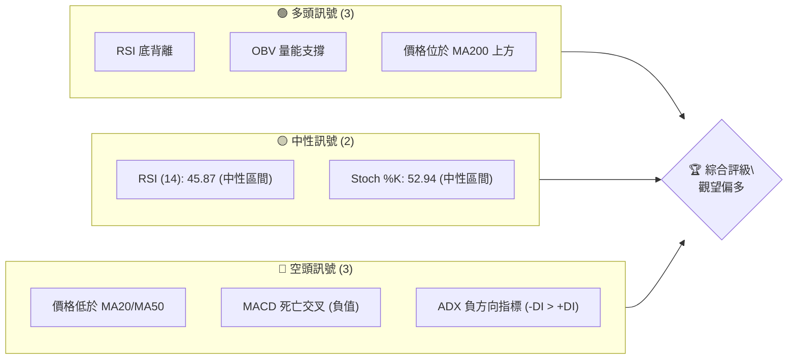

**解讀**：目前 AMZN 的技術訊號呈現多空交織的局面。多頭訊號主要來自於 RSI 的底背離、OBV 的量能支撐以及價格維持在長期均線 MA200 之上，暗示潛在的反彈動能正在積累。然而，空頭訊號也相當顯著，包括價格跌破短期和中期均線、MACD 處於死亡交叉狀態，以及 ADX 顯示空頭趨勢佔據主導地位。中性訊號則表明市場尚未形成明顯的單邊動能。綜合來看，市場處於一個關鍵的轉折點，雖有空頭壓力，但底部的多頭訊號不容忽視，因此傾向於「觀望偏多」的評級，等待進一步的趨勢確認。

### 📊 核心指標速覽表

| 指標類別 | 指標名稱 | 當前數值 | 訊號 | 解讀 |
|----------|----------|----------|------|------|
| **價格** | 當前價格 | $238.34 | 🟡 | 位於52週區間中點，近期下跌後反彈 |
| **均線** | MA20 | $241.35 | 🔴 | 價格位於MA20下方，短期看空 |
| **均線** | MA50 | $255.69 | 🔴 | 價格位於MA50下方，中期看空 |
| **均線** | MA200 | $232.86 | 🟢 | 價格位於MA200上方，長期看多 |
| **動能** | RSI(14) | 45.87 | 🟡 | 中性區間，但存在底背離 |
| **動能** | MACD | -5.750 | 🔴 | MACD線低於訊號線，空頭動能 |
| **波動** | ATR | $8.63 | 🟡 | 每日波動中等 (3.62% of price) |
| **趨勢** | ADX(14) | 30.23 | 🟡 | 趨勢強度較強，但空頭主導 |
| **量能** | OBV趨勢 | OBV > MA | 🟢 | 量能支撐上漲趨勢 |

**解讀**：從核心指標來看，AMZN 面臨短期均線壓力和 MACD 空頭訊號的挑戰，顯示近期股價表現疲軟。然而，RSI 的底背離和 OBV 的量能支撐提供了重要的多頭反轉線索，且價格仍堅守在 MA200 上方，暗示長期趨勢依然健康。ADX 雖然指示趨勢強勁，但負方向指標佔優勢，說明目前的強勢趨勢是下跌趨勢。整體而言，市場處於短期修正但長期趨勢未破的狀態，多空力量正在拉鋸，需密切關注關鍵支撐位的表現。

### 🏆 技術評分卡

以下 ASCII 方框圖展示了 AMZN 各技術維度的評分，並給出綜合評級。

```
╔══════════════════════════════════════════════════════════════╗
║             技術評分卡 — AMZN (2026-06-30)                     ║
╠══════════════════════════════════════════════════════════════╣
║ 趨勢強度      ████████░░░░░░░░░░░░  40/100  🔴 (ADX強勢但空頭主導)║
║ 動能指標      ██████████░░░░░░░░░░  50/100  🟡 (RSI底背離但MACD空頭)║
║ 支撐穩定度    ██████████████░░░░░░  70/100  🟢 (MA200與斐波那契強支撐)║
║ 成交量配合    ████████████░░░░░░░░  60/100  🟢 (OBV確認上漲，近期量增)║
║ 形態完整度    ██████░░░░░░░░░░░░░░  30/100  🔴 (近期無明確反轉形態)║
║ 均線排列      ██████░░░░░░░░░░░░░░  30/100  🔴 (短期均線空頭排列)║
╠══════════════════════════════════════════════════════════════╣
║ 綜合評分      ████████░░░░░░░░░░░░  50/100  🟡 觀望偏多              ║
╚══════════════════════════════════════════════════════════════╝
```

**評分解讀**：
- **趨勢強度 (40/100 🔴)**：ADX 顯示存在強勢趨勢 (30.23)，但負方向指標 (-DI: 25.15) 高於正方向指標 (+DI: 24.58)，表明當前強勢趨勢由空頭主導。這是一個重要的空頭訊號。
- **動能指標 (50/100 🟡)**：RSI 處於中性區間 (45.87)，但存在底背離，暗示賣壓減輕，潛在反彈動能醞釀。然而，MACD 處於死亡交叉且為負值，空頭動能仍佔優勢。因此評為中性。
- **支撐穩定度 (70/100 🟢)**：當前價格 $238.34 位於 MA200 ($232.86) 上方，且接近斐波那契 50% 回調位 ($239.45) 和 61.8% 回調位 ($232.06) 形成的強支撐區間。這些是重要的多頭防線。
- **成交量配合 (60/100 🟢)**：OBV 趨勢顯示 OBV 線高於其均線，表明量能正在支撐上漲。最新成交量略高於20日均量 (量比 1.04x)，顯示在近期反彈中買盤有所活躍。
- **形態完整度 (30/100 🔴)**：從提供的數據來看，近期沒有明確的底部反轉形態（如頭肩底、雙底）形成，多是價格快速下跌後的整理或小幅反彈，形態尚不明朗。
- **均線排列 (30/100 🔴)**：價格位於 MA20 ($241.35) 和 MA50 ($255.69) 下方，且 MA20 低於 MA50，形成短期和中期均線的空頭排列，對股價構成壓力。

**綜合評分 (50/100 🟡)**：AMZN 目前處於一個複雜的技術局面。儘管長期趨勢依然向上 (價格在 MA200 之上)，且動能指標出現底背離和量能支撐的積極訊號，但短期和中期均線的空頭排列以及 ADX 顯示的強勢空頭趨勢，使得股價仍承受壓力。綜合來看，多空力量拉鋸，評級為「觀望偏多」，建議投資者密切關注支撐位的有效性及動能指標的進一步確認。

---

## 2. 趨勢分析

本章節將深入分析 AMZN 在不同時間框架下的價格趨勢，從長期到短期，並結合 ADX 指標評估趨勢的強度與方向。

### 🌐 多時框趨勢分析

AMZN 的股價走勢在不同的時間框架下呈現出不同的特徵，以下 Mermaid 圖表展示了其多時框架趨勢判斷。

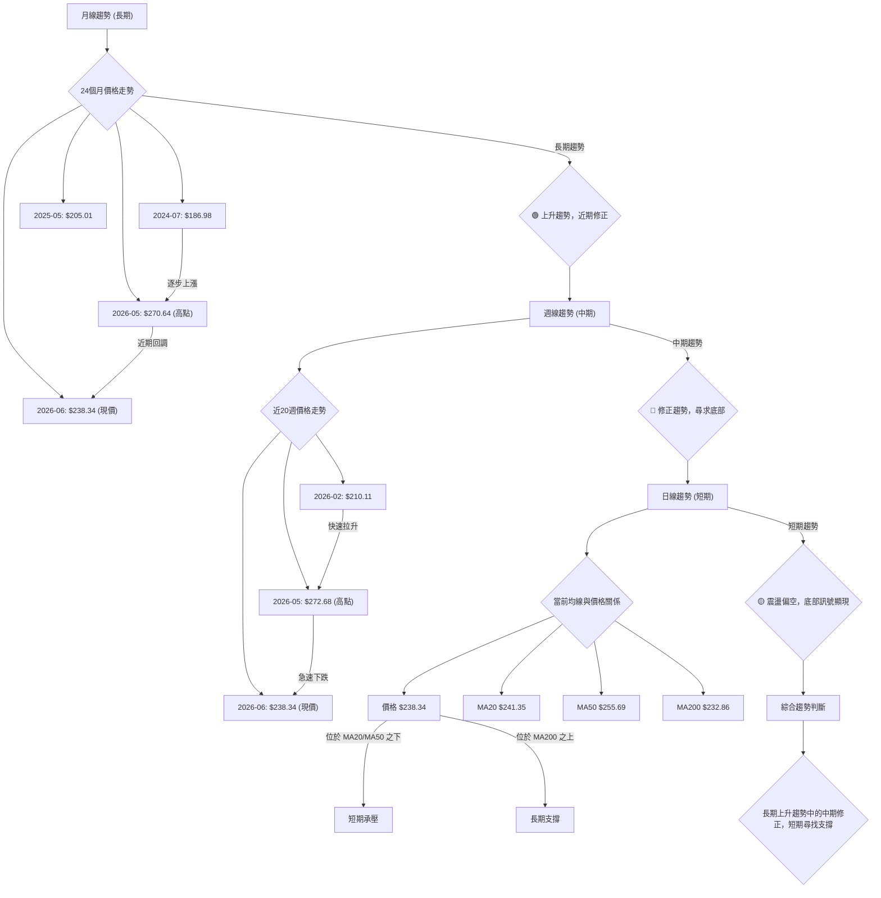

**詳細分析**：
- **長期趨勢 (月線)**：從2024年7月的 $186.98 到 2026年5月的 $270.64，AMZN 股價呈現明顯的上升趨勢。儘管近期從高點回調至 $238.34，但整體而言，股價仍遠高於兩年前的水平，且MA200 ($232.86) 仍提供堅實的長期支撐。這表明 AMZN 仍處於長期牛市格局中，目前的下跌應被視為一次深度的修正。
- **中期趨勢 (週線)**：檢視近20週的數據，股價從2026年2月的約 $210 快速拉升至2026年5月的 $272.68，隨後在6月份經歷了急劇的下跌。這種快速上漲後的深度回調，使中期趨勢從強勁上漲轉為修正趨勢。目前股價正在尋求中期支撐，MA50 ($255.69) 已被跌破，顯示中期動能轉弱。
- **短期趨勢 (日線)**：當前價格 $238.34 位於 MA20 ($241.35) 和 MA50 ($255.69) 之下，短期均線呈現空頭排列，顯示短期賣壓沉重。然而，價格仍然保持在 MA200 ($232.86) 之上，這是一個關鍵的長期支撐。短期內，股價可能在 MA200 附近震盪，並試圖築底。

### 📈 長期趨勢 — 12個月走勢圖（Unicode）

以下 ASCII 圖表展示了 AMZN 過去12個月的收盤價走勢，並標註了關鍵高點和低點。

```
AMZN 月線走勢圖（過去12個月：2025-07 至 2026-06）
價格軸 ($)
$270 ┤                                   ● (270.64, 2026-05)
$260 ┤                          ● (265.06, 2026-04)
$250 ┤          ● (244.22, 2025-10)
$240 ┤● (234.11, 2025-07)                 ● (238.34, 2026-06)  ← 現價
$230 ┤        ● (229.00, 2025-08) ● (233.22, 2025-11) ● (230.82, 2025-12) ● (239.30, 2026-01)
$220 ┤      ● (219.57, 2025-09)
$210 ┤                ● (210.00, 2026-02) ● (208.27, 2026-03) (低點)
$200 ┤
     └───────────────────────────────────────────────────────────
      25-07 25-08 25-09 25-10 25-11 25-12 26-01 26-02 26-03 26-04 26-05 26-06
```

**走勢特徵分析表格**：

| 階段 | 時間區間 | 主要走勢 | 漲跌幅 (約) | 關鍵價位 | 特徵與解讀 |
|------|----------|----------|------------|----------|------------|
| 1 | 2025-07 ~ 2025-09 | 震盪下跌 | -6.2% | 高: $234.11, 低: $219.57 | 從高點回落，市場觀望情緒濃。 |
| 2 | 2025-10 | 強勁反彈 | +11.2% | 高: $244.22 | 突破震盪區間，買盤積極。 |
| 3 | 2025-11 ~ 2026-01 | 盤整上行 | -2.0% | 高: $239.30, 低: $230.82 | 震盪中緩慢走高，積蓄動能。 |
| 4 | 2026-02 ~ 2026-03 | 快速回調 | -12.9% | 高: $239.30, 低: $208.27 | 跌破盤整區間，賣壓沉重，形成12個月低點。 |
| 5 | 2026-04 ~ 2026-05 | 爆發式上漲 | +30.0% | 高: $270.64 | 強勁反彈並創下12個月新高，買盤力量強大。 |
| 6 | 2026-06 | 深度修正 | -12.0% | 高: $270.64, 現價: $238.34 | 從高點大幅回落，消化前期漲幅，尋求新的平衡。 |

**結論**：AMZN 在過去12個月經歷了兩次明顯的漲跌循環。從2025年7月開始，經過一段時間的盤整和回調後，在2026年4月至5月實現了爆發式上漲，創下 $270.64 的高點。然而，隨後在2026年6月出現了深度修正，回吐了部分漲幅。目前股價位於 $238.34，處於長期上升趨勢中的中期修正階段。

### 📊 中期趨勢（週線分析）

中期趨勢主要由週線圖來判斷，以下示意圖描繪了 AMZN 近期的壓力與支撐結構。

```
AMZN 中期壓力與支撐示意圖 (近6個月)
═══════════════════════════════════════════════════
$270.64 ║████████████████████████║ 歷史高點 / 強阻力
$255.69 ║████████████████████    ║ MA50 (中期阻力)
$241.35 ║████████████████████████║ MA20 (短期阻力)
$238.34 ╠════════════════════════╣ ◄ 現價
$232.86 ║▓▓▓▓▓▓▓▓▓▓▓▓▓▓▓▓        ║ MA200 (長期支撐) / 斐波那契61.8%
$226.43 ║████████████████████████║ 布林下軌 (強支撐)
$208.27 ║████████████████████████║ 過去12個月低點 / 關鍵長期支撐
═══════════════════════════════════════════════════
```

**分析**：從中期來看，AMZN 在2026年5月創下 $270.64 的高點後，經歷了快速而深度的回調。目前股價 $238.34 已跌破 MA20 ($241.35) 和 MA50 ($255.69)，這兩條均線現在構成中期上漲的阻力。MA50 ($255.69) 成為近期反彈的首要挑戰，若能突破並站穩，則中期跌勢有望緩解。下方，MA200 ($232.86) 和布林通道下軌 ($226.43) 形成關鍵支撐區間。若此區間能有效守住，則中期修正有望結束並啟動新一輪上漲。

### ⚡ 趨勢強度評估（ADX 解讀）

ADX 指標用於衡量趨勢的強度，而非方向。結合 +DI 和 -DI 則可判斷趨勢的方向。

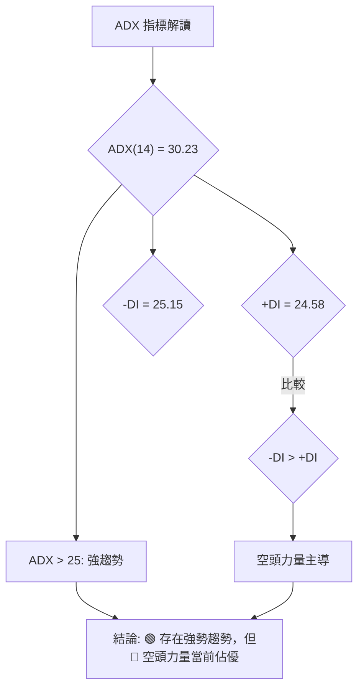

**ADX 強度對照表**：

| ADX 數值範圍 | 趨勢強度 | 解讀 |
|--------------|----------|------|
| 0-20         | 無趨勢/弱勢趨勢 | 市場盤整，方向不明。 |
| 20-25        | 新興趨勢/中等趨勢 | 趨勢正在形成或發展。 |
| 25-50        | 強勢趨勢       | 趨勢明確且強勁。     |
| 50-75        | 非常強勢趨勢   | 趨勢極為強勁，不易逆轉。 |
| 75-100       | 極端強勢趨勢   | 趨勢可能過熱，注意潛在回調。 |

**分析**：AMZN 的 ADX(14) 數值為 30.23，這明確指示當前市場存在一個「強勢趨勢」。然而，我們必須進一步觀察方向性指標 +DI 和 -DI。目前 -DI (25.15) 略高於 +DI (24.58)，這意味著儘管趨勢強勁，但當前的強勢趨勢是由「空頭力量」所主導的。這與價格在5月高點後深度回調的走勢相符。

**綜合判斷**：AMZN 目前處於一個強勁的下跌趨勢中，但從 RSI 底背離和 OBV 支撐來看，這個下跌趨勢可能正在接近尾聲或面臨反轉。ADX 告訴我們，一旦趨勢方向改變，其潛在的動能將會非常強大。因此，儘管目前空頭主導，但密切關注多頭反轉訊號的出現至關重要。

---

## 3. 圖表形態分析

本章節將識別 AMZN 股價走勢中可能存在的圖表形態和關鍵 K 線組合，並據此推導潛在的價格目標。

### 🔍 形態識別系統

從提供的24個月和20週價格數據中，我們可以觀察到一些價格行為模式，但沒有形成教科書般的經典反轉或持續形態。以下 Mermaid 圖表展示了當前的形態觀察。

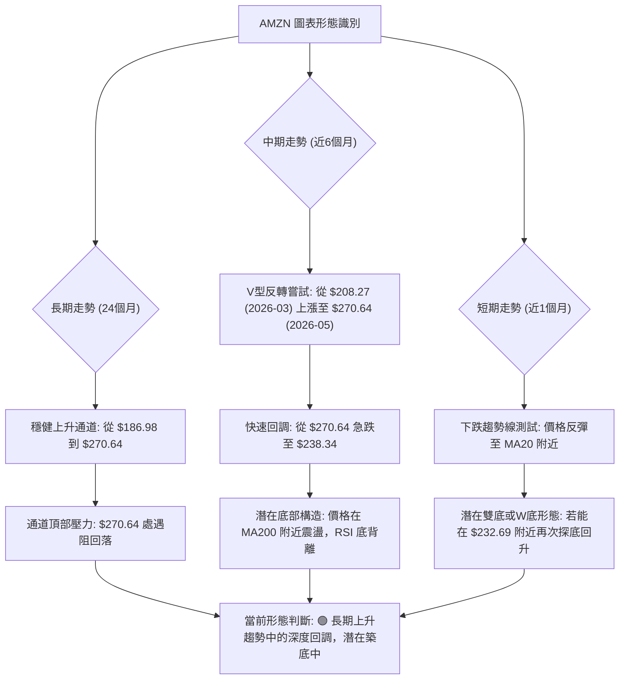

**分析**：
- **長期形態**：AMZN 在過去兩年呈現出一個清晰的上升通道，從 $186.98 穩健上漲，並在2026年5月達到通道上緣 $270.64 附近。目前的回調可以被視為對通道上緣超買後的修正，而非趨勢的根本性逆轉。
- **中期形態**：從2026年3月的 $208.27 低點開始，股價形成了一個強勁的 V 型反轉，快速拉升至 $270.64。隨後的急劇下跌則是對這一快速上漲的修正。目前價格在 $238.34，正處於 MA200 ($232.86) 附近，且伴隨 RSI 底背離，這暗示可能正在形成一個「潛在的底部構造」。如果股價能在當前區間獲得支撐並向上反彈，則有機會形成一個更大的雙底或 W 底形態。
- **短期形態**：近期的下跌走勢中，價格在 $232.69 (2026-06-28) 處獲得支撐後小幅反彈至 $238.34。這可能是一個短期反彈的開始，但尚未形成明確的底部反轉 K 線形態。需要觀察後續幾個交易日的價格行為，以確認底部是否牢固。

### 🕯️ 重要K線形態分析

以下表格分析了近20週數據中一些關鍵的週 K 線形態及其可能的市場解讀。

| 日期 (週結) | 收盤價 | K線形態 (推斷) | 解讀 | 訊號 |
|-------------|--------|-----------------|------|------|
| 2026-03-29  | $199.34 | 大陰線          | 跌破關鍵支撐，賣壓沉重。 | 🔴 |
| 2026-04-05  | $209.77 | 錘子線/陽線     | 在低位出現，暗示潛在買盤介入，止跌企穩。 | 🟢 |
| 2026-04-12  | $238.38 | 大陽線          | 強勢反彈，突破多個阻力，買盤強勁。 | 🟢 |
| 2026-05-03  | $268.26 | 飽和陽線        | 價格持續上漲，動能強勁，但伴隨RSI超買，需警惕。 | 🟡 |
| 2026-05-17  | $264.14 | 烏雲罩頂/陰線   | 衝高回落，顯示上方壓力，可能開啟回調。 | 🔴 |
| 2026-06-07  | $246.03 | 大陰線          | 確認下跌趨勢，跌破多個均線。 | 🔴 |
| 2026-06-28  | $232.69 | 長陰線/錘子線   | 跌至MA200附近，下方有較長下影線，暗示下方支撐強勁。 | 🟢 |
| 2026-07-05  | $238.34 | 小陽線/十字星   | 在低位反彈，量能溫和，市場觀望，等待方向選擇。 | 🟡 |

**分析**：近期（2026年6月）的 K 線形態顯示了從高點 $270.64 急速下跌的過程。2026-06-07 的大陰線確認了下跌趨勢的啟動。然而，在2026-06-28 達到 $232.69 附近時，雖然收出長陰線，但若結合日線圖，可能出現帶有長下影線的 K 線，暗示下方有買盤承接。隨後的2026-07-05 的小陽線反彈，進一步確認了在 MA200 附近存在初步支撐。這些 K 線形態雖然不構成強烈的反轉形態，但提供了在關鍵支撐位附近止跌的線索。

### 📉 ASCII 走勢形態示意圖

以下 ASCII 圖表繪製了 AMZN 從2026年5月高點回落至近期支撐的走勢，並標注了潛在的形態。

```
AMZN 近期走勢形態示意圖 (2026-05 至 2026-06)
═══════════════════════════════════════════════════
$275 ┤                               ● (270.64, 2026-05-31)
$270 ┤                              /
$265 ┤                             /
$260 ┤                            /
$255 ┤                           /
$250 ┤                          /
$245 ┤                         /
$240 ┤                        /
$235 ┤                       /
$230 ┤                      ● (232.69, 2026-06-28)
$225 ┤                     /
     └─────────────────────────────────────────────────
       2026-05        2026-06        2026-07
       高點回落 (修正形態)
```

**解讀**：從5月底的 $270.64 高點開始，AMZN 經歷了一輪快速的下跌修正。這段下跌走勢目前尚未形成明確的底部反轉形態，但價格在 $232.69 附近獲得初步支撐。如果後續價格能夠在此區域形成一個 W 型底或雙底形態，並突破近期反彈高點，那麼將是強烈的看漲訊號。目前來看，更像是一個「旗形整理」或「下降通道」中的底部試探。

### 🎯 形態目標價計算

由於目前尚未形成明確的經典反轉形態，我們將主要基於斐波那契回調位和近期波動區間來估算潛在目標價。

**情境一：若形成雙底或 W 底反轉 (基於 $232.69)**
- **前提**：股價在 $232.69 附近形成第二個底部，並向上突破近期反彈高點 (假設為 $245.00)。
- **形態高度**：從 $232.69 到 $245.00，高度為 $12.31。
- **目標價計算**：
    - **目標價 T1 (短線)**：突破頸線 $245.00 + 形態高度 $12.31 = $257.31。此目標接近布林通道上軌 ($256.28) 和 MA50 ($255.69)，構成強阻力。
    - **目標價 T2 (中線)**：若能突破 $257.31，則有望挑戰前高 $270.64。

**情境二：若僅為下跌中的反彈 (基於斐波那契擴展)**
- **前提**：價格從 $270.64 回調至 $232.69，然後反彈。
- **反彈目標**：
    - **斐波那契 38.2% 回彈**：從 $270.64 到 $232.69 的跌幅為 $37.95。反彈 38.2% = $232.69 + ($37.95 * 0.382) = $247.18。
    - **斐波那契 50% 回彈**：$232.69 + ($37.95 * 0.500) = $251.66。
    - **斐波那契 61.8% 回彈**：$232.69 + ($37.95 * 0.618) = $256.09。此目標接近布林上軌和 MA50。

**結論**：目前股價在關鍵支撐區間尋求方向。若能有效築底並反彈，初步目標將落在 $247.18 至 $257.31 的區間，這也是短期和中期均線所在的阻力區。能否突破此區間將是判斷後續走勢的關鍵。

---

## 4. 支撐與阻力

本章節將詳細分析 AMZN 的關鍵支撐與阻力價位，並結合斐波那契回調工具，構建完整的價位結構分布圖。

### 🗺️ 關鍵價位分布圖（Unicode）

以下 ASCII 圖表展示了 AMZN 當前的關鍵價位結構，包括支撐與阻力。

```
AMZN 價位結構分布圖 (2026-06-30)
═══════════════════════════════════════════════════
$278.56 ║████████████████████████║ 52週高點 / 極強阻力 R3
$270.64 ║████████████████████    ║ 歷史高點 / 強阻力 R2
$256.28 ║████████████████████████║ 布林上軌 / 阻力 R1 (接近MA50 $255.69)
$241.35 ║▓▓▓▓▓▓▓▓▓▓▓▓▓▓▓▓        ║ MA20 (近期阻力)
$238.34 ╠════════════════════════╣ ◄ 現價
$232.86 ║████████████████████████║ MA200 (關鍵支撐 S1) / 斐波那契61.8%回調
$226.43 ║████████████████████████║ 布林下軌 (強支撐 S2)
$196.00 ║████████████████████████║ 52週低點 / 極強支撐 S3
═══════════════════════════════════════════════════
```

### 🚧 阻力位分析表

| 阻力級別 | 價位 | 形成原因 | 突破難度 | 重要性 |
|----------|------|----------|----------|--------|
| **R1**   | $241.35 | 短期 MA20 | 中等     | 價格能否止跌反彈的首要觀察點。 |
| **R1**   | $246.77 | 斐波那契 38.2% 回調 | 中等     | 測試反彈強度。 |
| **R2**   | $255.69 | 中期 MA50 | 較高     | 若能突破，中期下跌趨勢有望結束。 |
| **R2**   | $256.28 | 布林通道上軌 | 較高     | 與 MA50 重合，形成強勁阻力區。 |
| **R3**   | $270.64 | 2026年5月歷史高點 | 極高     | 突破此點將創歷史新高，確認強勁牛市。 |
| **R4**   | $278.56 | 52週高點 | 極高     | 突破代表股價進入新的上漲空間。 |

**分析**：AMZN 目前面臨來自上方均線的多重阻力。最直接的挑戰是短期 MA20 ($241.35)，其次是斐波那契 38.2% 回調位 ($246.77)。中期來看，MA50 ($255.69) 與布林通道上軌 ($256.28) 形成的阻力區至關重要，若能突破此區間，則意味著短期下跌趨勢的逆轉。最終的強阻力是2026年5月的高點 $270.64 和52週高點 $278.56，這些點位代表了巨大的賣壓和獲利了結盤。

### 🛡️ 支撐位分析表

| 支撐級別 | 價位 | 形成原因 | 守住機率 | 重要性 |
|----------|------|----------|----------|--------|
| **S1**   | $232.86 | 長期 MA200 | 高       | 長期牛市的關鍵防線，不容有失。 |
| **S1**   | $232.06 | 斐波那契 61.8% 回調 | 高       | 黃金分割位，常見的止跌反彈點。 |
| **S2**   | $226.43 | 布林通道下軌 | 較高     | 價格超賣後的自然反彈點，提供強勁技術支撐。 |
| **S3**   | $196.00 | 52週低點 | 極高     | 若跌破，將宣告長期趨勢轉弱，可能引發恐慌性拋售。 |

**分析**：AMZN 當前股價 $238.34 位於 MA200 ($232.86) 上方不遠處，MA200 作為長期牛市的生命線，其支撐作用極為關鍵。同時，斐波那契 61.8% 回調位 ($232.06) 與 MA200 形成一個強大的支撐區間。布林通道下軌 ($226.43) 也提供了額外的技術支撐。這些支撐位若能有效守住，將是多頭反攻的基礎。最底部的支撐是52週低點 $196.00，這是長期趨勢的最後一道防線。

### 📐 斐波那契回調位分析

我們以 AMZN 近期從2026年3月低點 $208.27 到2026年5月高點 $270.64 的主要上漲波段為基礎，計算其回調位。

- **上漲波段**：低點 $208.27 (2026-03) 至 高點 $270.64 (2026-05)
- **總漲幅**：$270.64 - $208.27 = $62.37

| 回調比例 | 回調價位 | 距離現價 $238.34 | 解讀 |
|----------|----------|------------------|------|
| 23.6%    | $255.93 | 上方 $17.59      | 接近 MA50，若突破則短期跌勢告一段落。 |
| 38.2%    | $246.77 | 上方 $8.43       | 重要的反彈阻力位，需關注。 |
| **50%**  | **$239.45** | 上方 $1.11       | **心理與技術關鍵位，現價非常接近，提供初步支撐。** |
| **61.8%**| **$232.06** | 下方 $6.28       | **黃金分割位，與 MA200 ($232.86) 形成強支撐區。** |
| 76.4%    | $223.00 | 下方 $15.34      | 若跌破61.8%，此為下一個重要支撐。 |

**視覺化**：

```
AMZN 斐波那契回調示意圖
═══════════════════════════════════════════════════
$270.64 ║████████████████████████║ (高點 0%)
$255.93 ║████████████████████    ║ (23.6% 回調)
$246.77 ║████████████████████████║ (38.2% 回調)
$239.45 ║▓▓▓▓▓▓▓▓▓▓▓▓▓▓▓▓        ║ (50% 回調)
$238.34 ╠════════════════════════╣ ◄ 現價
$232.06 ║████████████████████████║ (61.8% 回調)
$223.00 ║████████████████████████║ (76.4% 回調)
$208.27 ║████████████████████████║ (低點 100%)
═══════════════════════════════════════════════════
```

**結論**：當前價格 $238.34 已經回調至斐波那契 50% 回調位 ($239.45) 附近，並在 61.8% 回調位 ($232.06) 上方，且此區域與長期 MA200 ($232.86) 重疊，形成了極為重要的支撐區間。這是一個高度敏感的區域，若能在此處止跌反彈，將是多頭強勢的表現。反之，若跌破此區間，則可能進一步探底至布林下軌甚至更低。

---

## 5. 技術指標深度解讀

本章節將對 AMZN 的各項技術指標進行深入分析，包括移動平均線、RSI、MACD、布林通道和成交量，並探討它們之間的相互關係和訊號確認。

### 🎛️ 指標訊號總覽

以下 Mermaid 圖表展示了各個技術指標的當前訊號及其相互關係。

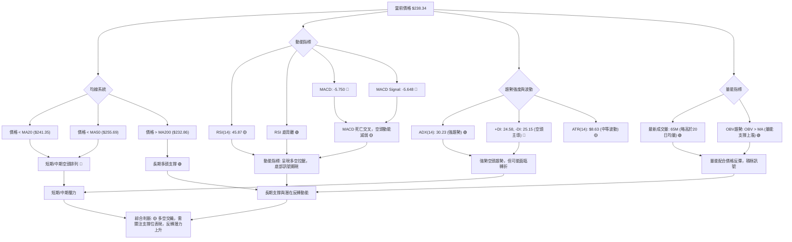

### 📈 移動平均線排列分析

移動平均線 (MA) 是判斷趨勢方向和支撐阻力的重要工具。

**當前均線排列狀態**：
- MA 5: $234.49 (▲ +1.64%)
- MA 10: $236.72 (▲ +0.68%)
- MA 20: $241.35 (▼ -1.25%)
- MA 60: $252.37 (▼ -5.56%)
- MA 120: $235.77 (▲ +1.09%)
- MA 240: $231.96 (▲ +2.75%)

**Mermaid 圖表展示均線關係**：

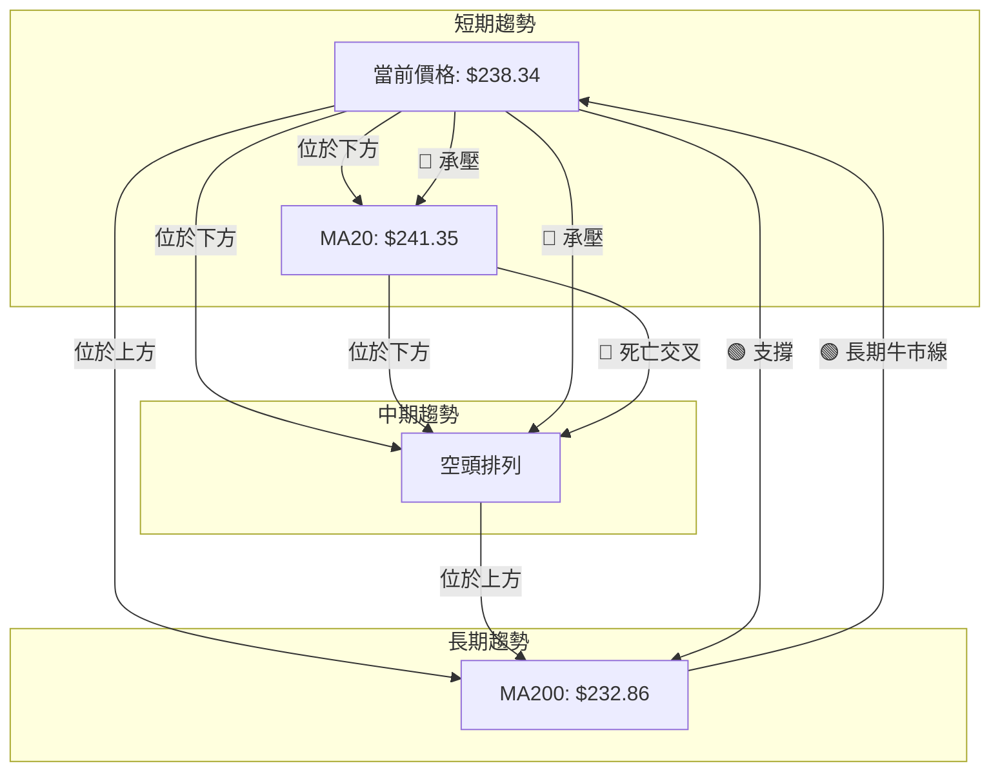

**分析**：
- **短期均線**：當前價格 $238.34 位於 MA20 ($241.35) 和 MA50 ($255.69) 之下，且 MA20 低於 MA50，形成了典型的短期和中期空頭排列。這對股價構成顯著的壓力，表明短期下跌趨勢仍在持續。MA20 和 MA50 將是股價反彈時的首要阻力。
- **長期均線**：最長期的 MA200 ($232.86) 位於當前價格 $238.34 的下方，且其趨勢仍向上。這是一個強烈的長期多頭訊號，表明儘管短期和中期出現修正，但 AMZN 的長期上漲趨勢並未改變。MA200 在 $232.86 附近形成重要的長期支撐。
- **綜合判斷**：均線系統呈現「混合排列」。短期和中期均線預示股價承壓，但長期均線提供堅實支撐。這種情況通常發生在長期上漲趨勢中的深度修正階段，股價在尋找新的平衡點。

### 📉 RSI(14) 分析

RSI (Relative Strength Index) 用於衡量價格變動的速度和變化，判斷超買超賣情況。

- **RSI(14) 數值**：45.87
- **RSI 進度條**：▓▓▓▓▓▓▓▓▓▓▓▓▓▓▓▓░░░░ 45.87%
- **超買超賣區間**：
    - 超買區：RSI > 70
    - 超賣區：RSI < 30
    - 中性區：30 <= RSI <= 70

**分析**：
- **RSI 數值**：當前 RSI 數值為 45.87，位於中性區間 (30-70)。這表明股價既非超買也非超賣，市場動能相對平衡。然而，從近期週線數據來看，RSI 在2026-05-03 達到 82.9 (超買)，隨後快速下跌至 2026-06-14 的 26.8 (超賣)，目前已從超賣區反彈。
- **RSI 背離**：數據明確指出「⚠️ 底背離 (Bullish Divergence)」。
    - **背離判斷**：從近20週數據觀察，2026-06-14 收盤價 $238.55 時 RSI 為 26.8。而2026-06-28 收盤價 $232.69 (價格創下更低點) 時，RSI 卻為 39.5 (RSI 創下更高低點)。這是一個經典的「底背離」訊號。
    - **解讀**：RSI 底背離是一個強烈的看漲反轉訊號。它表明儘管股價創下新低，但賣盤動能卻在減弱，未能伴隨價格創下更低的動能。這暗示了市場可能即將見底反彈。

**結論**：RSI 指標提供了一個非常重要的多頭反轉線索。雖然當前 RSI 處於中性區間，但底背離的出現，強烈暗示了 AMZN 的下跌動能正在衰竭，潛在的反彈機會正在增加。

### 📊 MACD(12/26/9) 訊號解讀

MACD (Moving Average Convergence Divergence) 用於識別趨勢的變化和動能。

- **MACD 線**：-5.750
- **MACD Signal 線**：-5.648
- **MACD Hist 柱狀圖**：-0.101

**Mermaid 圖表展示 MACD 關係**：

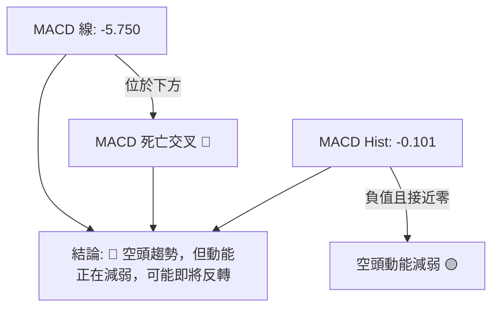

**分析**：
- **MACD 線與 Signal 線**：MACD 線 (-5.750) 位於 Signal 線 (-5.648) 之下，這是一個「死亡交叉」的空頭訊號，表明短期動能弱於中期動能，股價處於下跌趨勢。
- **MACD 柱狀圖**：MACD Hist 為 -0.101，為負值，確認了空頭動能。然而，重要的是要觀察其變化。從近20週數據來看，2026-06-28 的 MACD Hist 為 -1.397，而2026-07-05 則為 -0.101。這表明 MACD 柱狀圖的負值正在顯著縮小，從較大的負值向零軸靠近。
- **解讀**：MACD 柱狀圖負值縮小，是一個潛在的看漲訊號。它暗示空頭動能正在減弱，賣壓可能正在緩解，可能預示著 MACD 線即將向上穿越 Signal 線，形成「黃金交叉」。

**綜合判斷**：MACD 指標目前仍顯示空頭趨勢，但柱狀圖的變化提供了一個重要的早期反轉線索。結合 RSI 的底背離，這兩個動能指標相互印證了賣壓減輕，潛在反彈動能正在積聚的觀點。

### 📦 布林通道分析

布林通道 (Bollinger Bands) 用於衡量價格的波動範圍和相對位置。

- **BB 上軌**：$256.28
- **BB 中軌 (MA20)**：$241.35
- **BB 下軌**：$226.43
- **BB %B**：0.40 (0=下軌, 0.5=中軌, 1=上軌)

**ASCII 布林通道示意圖**：

```
AMZN 布林通道示意圖
═══════════════════════════════════════════════════
$260 ┤             BB上軌 ($256.28)
$250 ┤
$240 ┤             BB中軌 (MA20: $241.35)
$238.34 ╠════════════════════════╣ ◄ 現價
$230 ┤
$220 ┤             BB下軌 ($226.43)
═══════════════════════════════════════════════════
```

**分析**：
- **價格位置**：當前價格 $238.34 位於布林通道中軌 (MA20: $241.35) 之下，且靠近下半部分。這表明短期內價格趨勢偏弱，但尚未觸及下軌。
- **BB %B**：%B 值為 0.40，表示價格位於布林通道的下半區間，但略高於下軌。這暗示價格在下軌附近獲得了一定的支撐，並可能正在嘗試從超賣區域反彈。
- **通道寬度**：布林通道的寬度為 $256.28 - $226.43 = $29.85。與 ATR ($8.63) 相比，通道寬度相對較大，表明市場波動性適中。
- **解讀**：價格位於中軌下方，短期趨勢偏空。然而，%B 值顯示價格並未跌破下軌，且MA200 ($232.86) 提供了通道外的額外支撐。若價格能在布林通道下半區獲得支撐並向上反彈，則有望測試中軌阻力。

**綜合判斷**：布林通道顯示 AMZN 股價在短期內偏弱，但並未極度超賣。價格在通道下半區的表現，結合 MA200 和斐波那契支撐，暗示了潛在的止跌反彈機會。

### 💹 成交量分析（量價配合度）

成交量是價格走勢的燃料，量價配合是判斷趨勢可靠性的關鍵。

- **最新成交量**：65,198,589
- **20日均量**：62,959,589
- **量比**：1.04x (最新成交量 / 20日均量)
- **50日均量**：51,497,180
- **OBV 趨勢**：OBV > MA → 量能支撐上漲

**Mermaid 圖表展示量價關係**：

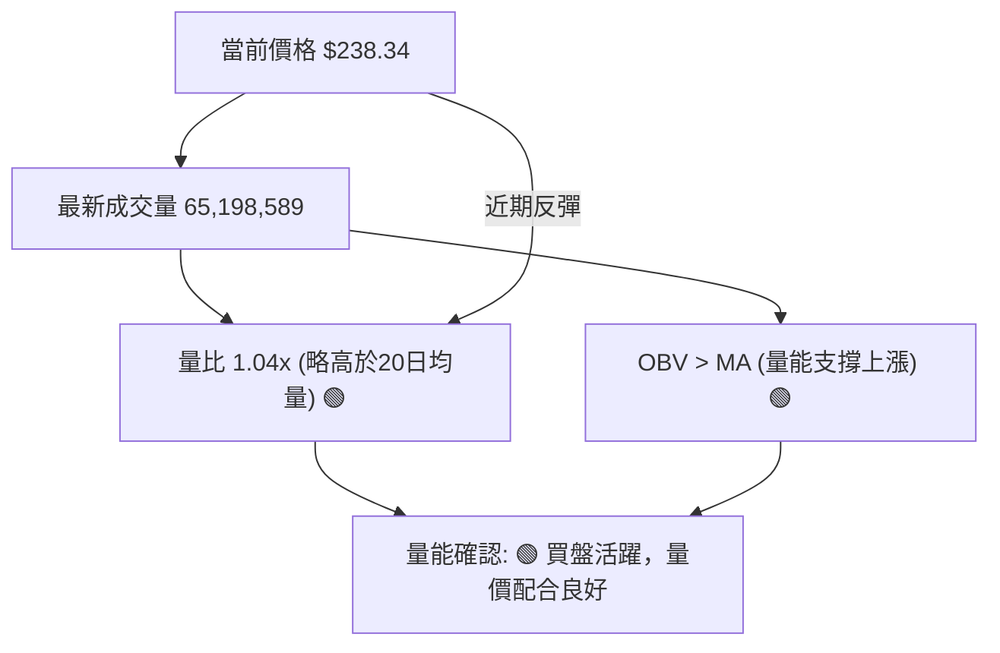

**分析**：
- **量比分析**：最新成交量 65,198,589 略高於20日均量 62,959,589 (量比 1.04x)。這表明在近期價格從 $232.69 反彈至 $238.34 的過程中，有較為活躍的買盤參與。成交量在反彈中溫和放大，是一個積極的訊號，表明市場對價格回升存在一定的認可。
- **OBV 趨勢**：數據明確指出「OBV 趨勢: OBV > MA → 量能支撐上漲」。這是非常重要的多頭訊號。OBV (On Balance Volume) 是一種累積成交量指標，如果 OBV 線高於其均線，表明在價格下跌期間，買盤量能仍佔優勢，存在潛在的資金流入或籌碼收集行為。這與 RSI 的底背離相互印證，進一步強化了底部可能正在形成的觀點。
- **量價配合度**：在近期價格下跌修正的過程中，OBV 仍能保持在均線之上，這顯示了市場對 AMZN 的長期信心並未動搖，且在價格下跌時仍有資金逢低吸納。這種量價配合為潛在的反彈提供了堅實的基礎。

**綜合判斷**：成交量分析提供了強烈的多頭訊號。量比略高於平均水平，且 OBV 的趨勢表明量能正在支撐上漲。這與 RSI 底背離和 MACD 空頭動能減弱的訊號相結合，共同指向 AMZN 股價在當前支撐位附近有較高的反彈潛力。

---

## 6. 動能與波動率

本章節將評估 AMZN 的動能狀態和波動率特徵，這對於制定交易策略和風險管理至關重要。

### ⚡ 動能評估四象限

我們將根據當前的動能強度和波動率來評估 AMZN 的市場狀態。由於 Mermaid 的 quadrantChart 不適用於此，我們使用表格來呈現。

| 象限 | 動能 | 波動 | 當前狀態 | 評估 |
|------|------|------|----------|------|
| Q1 | 強 | 低 | -        | 最佳機會 (趨勢明確，風險可控) |
| Q2 | 弱 | 低 | -        | 謹慎觀望 (缺乏方向，無顯著波動) |
| Q3 | 強 | 高 | -        | 高風險高收益 (趨勢明確，但波動劇烈) |
| Q4 | 弱 | 高 | ✓        | 避免進場 (方向不明，波動劇烈，風險難控) |

**AMZN 當前狀態評估**：
- **動能**：RSI 處於中性區間 (45.87)，但存在底背離 (潛在看漲)。MACD 雖然處於死亡交叉，但 MACD Hist 負值顯著縮小 (空頭動能減弱)。整體動能從強勢下跌轉為「弱勢但正在改善」的狀態。因此，動能評估為「弱」。
- **波動**：ATR(14) 為 $8.63，佔當前價格 $238.34 的 3.62%。這個波動率屬於「中等偏高」水平，並非極低波動。
- **結論**：AMZN 目前處於「弱動能、中高波動」的狀態。這將其置於 Q4 象限。
    - **解讀**：雖然動能偏弱，但 RSI 底背離和 MACD 柱狀圖的變化暗示動能正在從下跌轉為潛在的反彈。高波動率意味著價格波動劇烈，這增加了交易風險，但也提供了潛在的快速獲利機會。在這種情況下，建議謹慎觀望，等待動能確認轉強，或在關鍵支撐位附近小倉位試探。

### 📊 ATR 波動率分析

ATR (Average True Range) 衡量市場波動的平均範圍，是設定止損和目標價的重要參考。

- **ATR(14)**：$8.63 (3.62% of price)
- **日均波動範圍**：$8.63

**分析**：
- **波動率水平**：AMZN 的 ATR 為 $8.63，佔當前價格 $238.34 的 3.62%。這表明 AMZN 每日的價格波動幅度相對較大，屬於中等偏高波動性的股票。這種波動性對於日內交易者可能提供機會，但對於波段或長期投資者則需謹慎管理風險。
- **止損距離建議**：
    - **保守止損**：通常建議將止損設置在 2 倍 ATR 之外。即 $8.63 * 2 = $17.26。若在 $238.34 進場，止損點約為 $238.34 - $17.26 = $221.08。這將提供相對較大的緩衝空間，避免被日常波動震出。
    - **激進止損**：可考慮 1.5 倍 ATR。即 $8.63 * 1.5 = $12.95。若在 $238.34 進場，止損點約為 $238.34 - $12.95 = $225.39。此止損點接近布林通道下軌 ($226.43)，相對靈活。
- **目標價參考**：ATR 也可用於設定目標價。例如，若預期股價能上漲 2-3 倍 ATR，則目標價可能設定在 $238.34 + ($8.63 * 2) = $255.60 或 $238.34 + ($8.63 * 3) = $264.23。

**結論**：AMZN 的中高波動性要求交易者在設置止損和管理倉位時更加謹慎。建議根據個人風險承受能力，選擇合適的 ATR 倍數來設定止損，以有效控制潛在虧損。

### 📐 Beta 與市場相關性

Beta 值衡量單一股票相對於整個市場的波動性。由於數據中未提供 Beta 值，我們將根據其所屬行業 (Consumer Cyclical, Internet Retail) 和公司規模進行專業推演。

**推演分析**：
- **行業特性**：Amazon 屬於消費週期性行業和互聯網零售巨頭，其業務模式對經濟週期和消費者支出敏感。這類公司通常在經濟擴張期表現優於大盤，而在經濟衰退期則可能表現不佳。
- **成長型股票**：AMZN 長期以來被視為成長型股票，這類股票的 Beta 值通常高於 1。高 Beta 值意味著當市場上漲時，AMZN 的漲幅可能更大；而當市場下跌時，其跌幅也可能更大。
- **市場影響**：作為市值巨大的科技巨頭，AMZN 的股價走勢對主要股指 (如 S&P 500 和 Nasdaq 100) 具有顯著影響，同時其自身也容易受到大盤情緒的影響。
- **預估 Beta**：基於上述行業和公司特性，AMZN 的 Beta 值很可能在 1.2 至 1.5 之間，屬於高 Beta 股票。

**結論**：儘管缺乏具體數據，但可以合理推斷 AMZN 是一隻高 Beta 股票，其股價波動性預計會高於市場平均水平。這意味著在市場多頭環境下，AMZN 有望提供超額收益；但在市場空頭環境下，其下跌風險也相對較大。投資者應將 AMZN 納入其整體投資組合的風險管理框架中，並考慮其對大盤走勢的敏感性。

---

## 7. 多時框架總結

本章節將彙整 AMZN 在不同時間框架下的技術分析結果，透過時框架評分表和綜合訊號矩陣，提供一個全面的多時框架視角。

### 📋 時框架評分表

| 時框架 | 趨勢方向 | 動能 | 均線排列 | 形態 | 綜合評分 | 建議 |
|--------|----------|------|----------|------|----------|------|
| **長期** | 🟢 上升   | 🟢 強 | 🟢 多頭   | 🟢 上升通道 | 8/10 🟢 | 持有/逢低買入 |
| **中期** | 🔴 修正   | 🟡 減弱 | 🔴 空頭   | 🟡 築底中 | 4/10 🔴 | 觀望/謹慎操作 |
| **短期** | 🟡 震盪偏空 | 🟢 改善 | 🔴 空頭   | 🟡 潛在反轉 | 6/10 🟡 | 小倉位試探/等待確認 |

**評分解讀**：
- **長期 (🟢)**：AMZN 的24個月走勢圖顯示明確的上升趨勢，價格仍位於 MA200 之上，且長期均線趨勢向上，整體形態為上升通道。儘管近期修正，但長期看漲格局未變。
- **中期 (🔴)**：從2026年5月高點至今，股價經歷深度修正，跌破 MA20 和 MA50，MACD 處於死亡交叉且 ADX 顯示強勢空頭主導。中期趨勢處於修正階段，尚未確認底部。
- **短期 (🟡)**：價格雖然在短期均線下方，但 RSI 出現底背離，MACD 空頭動能減弱，OBV 顯示量能支撐上漲，且價格在 MA200 和斐波那契 61.8% 回調位附近獲得支撐。這些訊號暗示短期下跌動能正在減弱，存在反轉潛力。

### 🔲 綜合訊號矩陣

以下矩陣圖展示了 AMZN 短期、中期、長期各維度訊號的一致性分析。

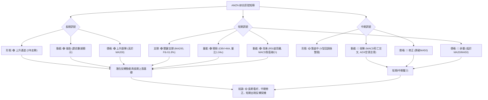

**分析**：
- **短期與中期的一致性**：短期和中期訊號在價格和動能方面存在一致的壓力，均線排列顯示空頭佔優，股價處於修正趨勢。然而，短期的動能指標 (RSI, MACD) 和量能 (OBV) 已經出現積極的反轉訊號，暗示中期修正可能即將結束。
- **長期與中短期的矛盾**：長期趨勢依然強勁，與中短期的修正形成對比。這表明當前的下跌是長期牛市中的一次健康回調，而非趨勢的根本性逆轉。長期支撐 MA200 的重要性在此凸顯。
- **綜合判斷**：AMZN 目前處於一個關鍵的轉折點。長期趨勢的穩固性為股價提供了堅實的下限，而中期修正雖然帶來壓力，但短期動能指標已經發出強烈的築底和反轉訊號。這是一個「逢低佈局」的潛在機會，但仍需等待短期訊號的進一步確認，以避免過早進場。

---

## 8. 交易策略建議

基於上述詳盡的多時框架技術分析，本章節將提供具體的交易策略建議，包含進場點、止損點、目標價和風險報酬比。

### 🗺️ 策略決策流程圖

以下 Mermaid 圖表展示了針對 AMZN 當前技術狀況的交易策略選擇邏輯。

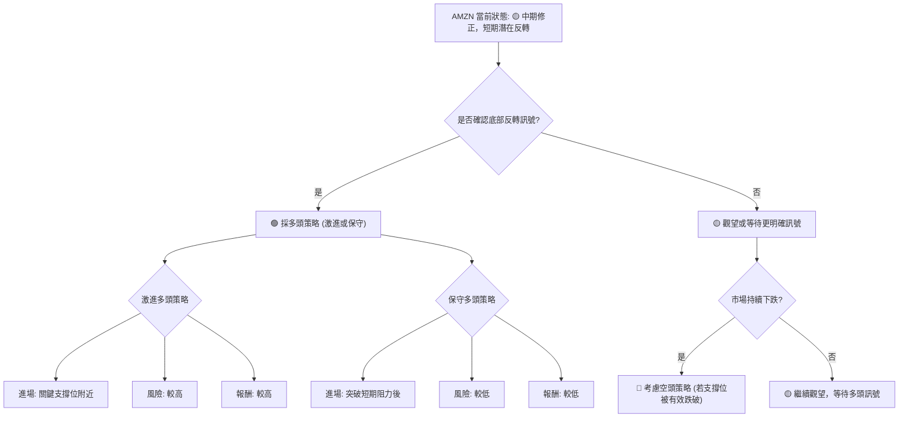

**決策分析**：由於 AMZN 長期趨勢向上，且短期指標出現底背離和量能支撐等積極反轉訊號，儘管中期仍處於修正，但我們傾向於尋找多頭機會。空頭策略僅在關鍵長期支撐位被明確跌破後才考慮。

### 🟢 多頭策略詳情

考慮到 AMZN 目前的技術狀態，提供兩種多頭策略：一種較為激進，旨在捕捉底部反轉；另一種較為保守，等待趨勢確認。

| 策略要素 | 策略 A (激進反轉策略) | 策略 B (保守突破策略) |
|----------|-----------------------|-----------------------|
| **進場條件** | 價格在 MA200 或斐波那契 61.8% 附近止跌反彈，且 RSI/MACD 顯示動能改善。 | 價格有效突破 MA20 並站穩，確認短期下跌趨勢結束。 |
| **進場價格** | $233.00 (MA200 附近) | $242.00 (突破 MA20 $241.35 後) |
| **目標價 T1** | $246.00 (斐波那契 38.2% 回調位附近) | $255.00 (接近 MA50 $255.69 和布林上軌 $256.28) |
| **目標價 T2** | $260.00 (中期反彈高點，接近分析師低目標) | $270.00 (挑戰前期高點 $270.64) |
| **止損價格** | $225.00 (跌破布林下軌 $226.43 和 61.8% Fib 回調位 $232.06) | $230.00 (跌破 MA200 $232.86) |
| **風險報酬比** | (T1: $13.00/$8.00 = 1.63:1) (T2: $27.00/$8.00 = 3.38:1) | (T1: $13.00/$12.00 = 1.08:1) (T2: $28.00/$12.00 = 2.33:1) |
| **成功機率** | 60% (基於RSI底背離和OBV支撐) | 70% (等待確認，風險較低) |
| **建議倉位** | 5% (激進，小倉位試探) | 10% (保守，等待確認) |

**策略 A 詳細解說**：
此策略旨在捕捉 AMZN 在關鍵支撐位 (MA200 / Fib 61.8%) 附近的強勢反彈。進場點設定在 $233.00，止損點設在 $225.00，提供了 $8.00 的風險空間。若股價能反彈至 T1 $246.00，則可獲利 $13.00，風險報酬比為 1.63:1。若能進一步反彈至 T2 $260.00，則可獲利 $27.00，風險報酬比高達 3.38:1。此策略依賴於 RSI 底背離和 OBV 量能支撐的有效性，因此具有較高的成功機率，但由於是逆勢操作，仍需控制倉位。

**策略 B 詳細解說**：
此策略較為保守，等待股價確認突破短期阻力 MA20 ($241.35) 後再進場，以降低不確定性。進場點設在 $242.00，止損點設在 $230.00，風險空間為 $12.00。若股價能上漲至 T1 $255.00，可獲利 $13.00，風險報酬比 1.08:1。若能挑戰 T2 $270.00，則可獲利 $28.00，風險報酬比為 2.33:1。此策略雖然風險報酬比略低於策略 A，但成功機率更高，適合不喜歡逆勢操作的投資者。

### 🔴 空頭策略詳情

雖然目前多頭訊號顯現，但若關鍵支撐位被有效跌破，空頭策略仍是可行的應對方案。

| 策略要素 | 策略 C (跌破支撐策略) |
|----------|-----------------------|
| **進場條件** | 股價有效跌破 MA200 ($232.86) 和斐波那契 61.8% 回調位 ($232.06)，並收盤於其下方。 |
| **進場價格** | $231.00 (跌破關鍵支撐區後) |
| **目標價 T1** | $226.00 (接近布林通道下軌 $226.43) |
| **目標價 T2** | $215.00 (接近2026年2月低點 $210.00) |
| **止損價格** | $235.00 (回到 MA200 上方) |
| **風險報酬比** | (T1: $5.00/$4.00 = 1.25:1) (T2: $16.00/$4.00 = 4:1) |
| **成功機率** | 50% (若關鍵支撐跌破，則空頭動能將增強) |
| **建議倉位** | 5% (謹慎操作，等待確認) |

**策略 C 詳細解說**：
此策略是一個防守性策略，僅在 AMZN 的關鍵長期支撐 (MA200 / Fib 61.8%) 被明確跌破時才啟動。進場點設在 $231.00，止損點設在 $235.00，風險空間為 $4.00。若股價能跌至 T1 $226.00，則可獲利 $5.00，風險報酬比為 1.25:1。若能進一步跌至 T2 $215.00，則可獲利 $16.00，風險報酬比高達 4:1。此策略的關鍵在於確認支撐位的有效跌破，避免假突破造成的損失。

### ⭐ 整體訊號強度評星

```
做多訊號強度：★★★★☆  (4/5星)
做空訊號強度：★★☆☆☆  (2/5星)
整體可信度：  ★★★☆☆  (3/5星)
```

**評星解讀**：
- **做多訊號強度 (★★★★☆)**：儘管短期和中期均線排列偏空，但 RSI 底背離、MACD 空頭動能減弱、OBV 量能支撐以及價格位於 MA200 關鍵支撐區上方，這些都提供了強烈的多頭反轉訊號。因此，做多機會的強度較高。
- **做空訊號強度 (★★☆☆☆)**：目前沒有強烈的頂部反轉形態，且動能指標顯示賣壓正在減輕。空頭訊號主要來自於短期均線壓力和 ADX 的空頭主導，但這些可能正在趨於衰竭。因此，做空訊號強度相對較弱。
- **整體可信度 (★★★☆☆)**：多空訊號交織，但底部反轉的線索越來越明確。由於市場處於關鍵轉折點，仍存在一定的不確定性，因此整體可信度為中等。建議投資者應密切關注市場動態，並嚴格執行風險管理。

---

## 9. 風險提示與監控

本章節旨在提醒投資者 AMZN 交易中存在的潛在風險，並提供關鍵監控指標，以幫助有效管理風險。

### ✅ 關鍵監控指標 Checklist

以下 ASCII 方框圖列出了在交易 AMZN 時需要密切關注的關鍵技術指標和價位。

```
╔══════════════════════════════════════════════════════════════╗
║               AMZN 關鍵監控指標 Checklist                      ║
╠══════════════════════════════════════════════════════════════╣
║ [ ] 價格是否有效站穩 $232.86 (MA200)？                        ║
║ [ ] 價格是否有效突破 $241.35 (MA20)？                         ║
║ [ ] RSI 是否持續向上突破 50？                                  ║
║ [ ] MACD 是否形成黃金交叉 (MACD線穿過Signal線)？               ║
║ [ ] MACD Hist 負值是否轉正？                                   ║
║ [ ] OBV 趨勢是否持續向上？                                     ║
║ [ ] ADX 的 +DI 是否向上穿越 -DI？                              ║
║ [ ] 成交量是否在價格上漲時溫和放大？                           ║
║ [ ] 是否出現明確的底部反轉 K 線形態 (如晨星、看漲吞噬)？       ║
║ [ ] 是否有任何重大利空消息或財報風險？                         ║
╚══════════════════════════════════════════════════════════════╝
```

**監控解讀**：以上清單中的每一項都是判斷 AMZN 股價走勢是否發生轉變的關鍵。特別是價格對 MA200 的反應、RSI 和 MACD 的動能變化，以及量價配合情況，將直接影響交易策略的成功與否。

### ⚠️ 風險場景分析

以下 Mermaid 圖表展示了 AMZN 股價在不同市場情境下的潛在走勢。

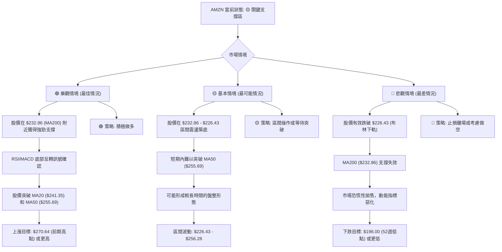

**風險分析**：
- **樂觀情境**：如果多頭反轉訊號得到確認，AMZN 有望從當前支撐位強勁反彈，並挑戰前期高點甚至創出新高。此時，積極的多頭策略將帶來豐厚回報。
- **基本情境**：最可能的情況是，股價在當前關鍵支撐區間內進行一段時間的震盪整理，以消化賣壓並積蓄新的動能。在此期間，投資者可考慮區間操作或耐心等待明確的趨勢突破。
- **悲觀情境**：最大的風險是 MA200 和斐波那契 61.8% 回調位等關鍵長期支撐被有效跌破。一旦發生，將意味著長期趨勢可能轉弱，並可能引發進一步的下跌，屆時應果斷止損離場。

### 🛡️ 風險管理重要提醒

1.  **嚴格止損**：無論採取何種策略，都必須設定並嚴格執行止損點。在市場波動較大的情況下，止損是保護資金的最後一道防線。
2.  **倉位管理**：避免單一股票過度集中，尤其是在不確定性較高的轉折點。建議初期採用小倉位試探，待趨勢確認後再逐步加倉。
3.  **多時框驗證**：在做出交易決策前，務必將短期訊號與中期和長期趨勢進行對比驗證，確保決策的合理性。
4.  **關注市場情緒**：AMZN 作為科技巨頭，其股價易受大盤情緒和宏觀經濟數據影響。保持對整體市場環境的關注至關重要。
5.  **財報與新聞**：密切關注公司的財報發布和重大新聞，這些基本面因素可能導致技術形態的快速失效。
6.  **耐心等待確認**：在多空拉鋸的局面下，耐心是美德。等待明確的趨勢訊號和形態確認，可以顯著提高交易的成功率。

---

## 📋 報告總結

```
AMZN 技術分析報告總結
════════════════════════════════════════════════════════
報告日期：2026-06-30
當前價格：$238.34
分析評級：⚖️ 觀望偏多 (長期趨勢健康，中期修正，短期動能顯現反轉訊號)

關鍵結論：
├─ 長期趨勢：🟢 強勁上升趨勢，價格位於MA200上方。
├─ 中期趨勢：🔴 深度修正中，價格跌破MA20和MA50，空頭主導。
├─ 短期趨勢：🟡 震盪偏空，但RSI底背離、MACD空頭動能減弱、OBV量能支撐顯示反轉潛力。
├─ 關鍵支撐：$232.86 (MA200) 與 $232.06 (斐波那契61.8%) 形成強大支撐區間。
├─ 關鍵阻力：$241.35 (MA20) 和 $255.69 (MA50)，以及前期高點 $270.64。
└─ 分析師目標：均價 $312.99 (顯示長期上漲潛力)。

最優策略組合：
1. 🥇 最佳機會：在 $233.00 附近 (MA200/Fib 61.8%) 尋找激進做多機會，止損 $225.00，目標 $260.00。
2. 🥈 次選機會：等待價格突破 MA20 ($241.35) 並站穩 $242.00 後，保守做多，止損 $230.00，目標 $270.00。
3. 🥉 保守選擇：若關鍵支撐 $232.06 有效跌破，則止損離場或考慮在 $231.00 附近做空，止損 $235.00，目標 $215.00。
════════════════════════════════════════════════════════
```

---

> ⚠️ **免責聲明**：本報告為 AI 自動生成之技術分析，所有數據及估算均基於提供的歷史價格資訊。本報告**僅供研究與學術參考**，**不構成任何投資建議**。投資有風險，入市需謹慎。

---

*報告生成時間：2026-06-30 ｜ 數據來源：Yahoo Finance ｜ 分析框架：多時框技術分析*