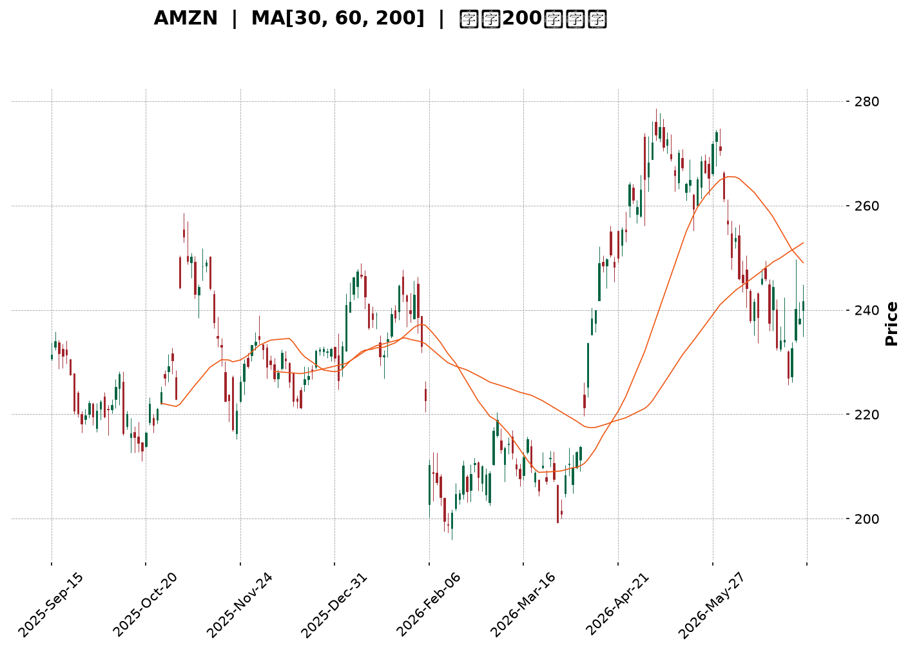
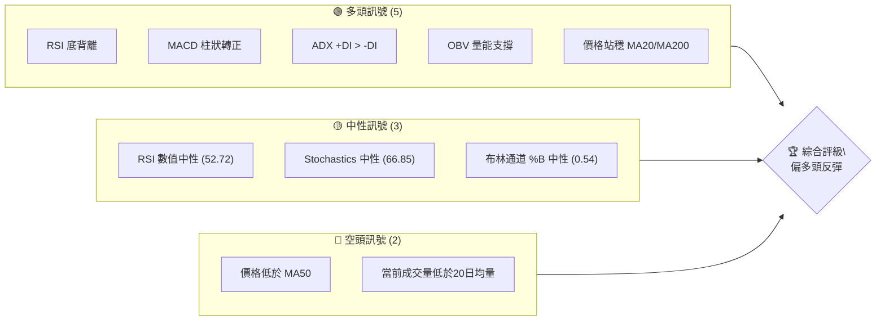
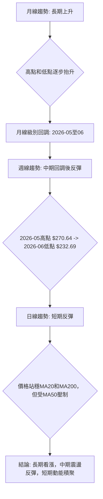
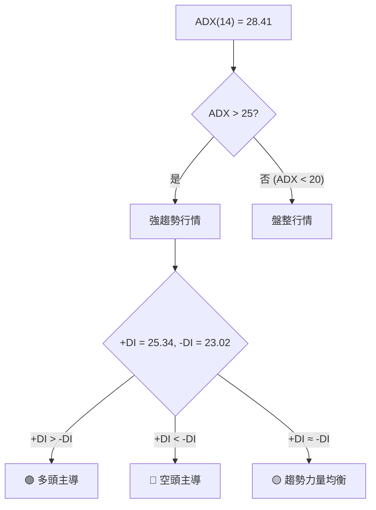
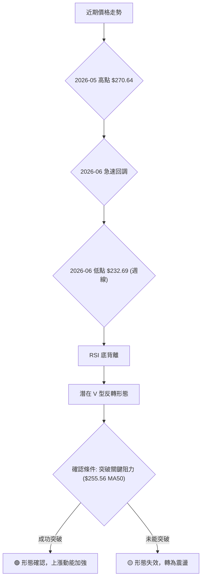
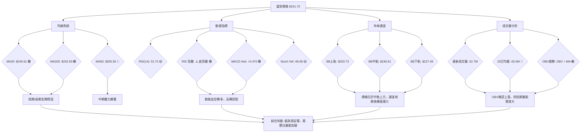
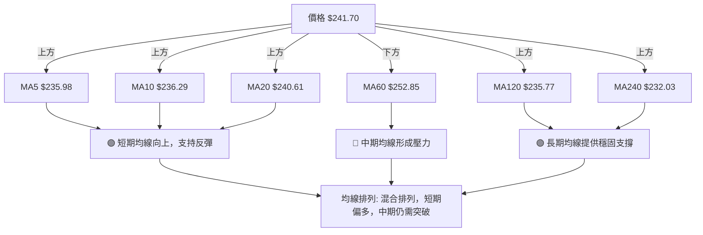
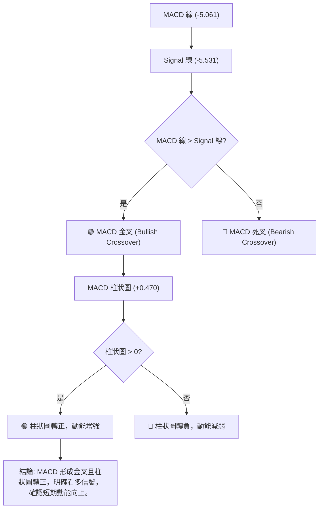
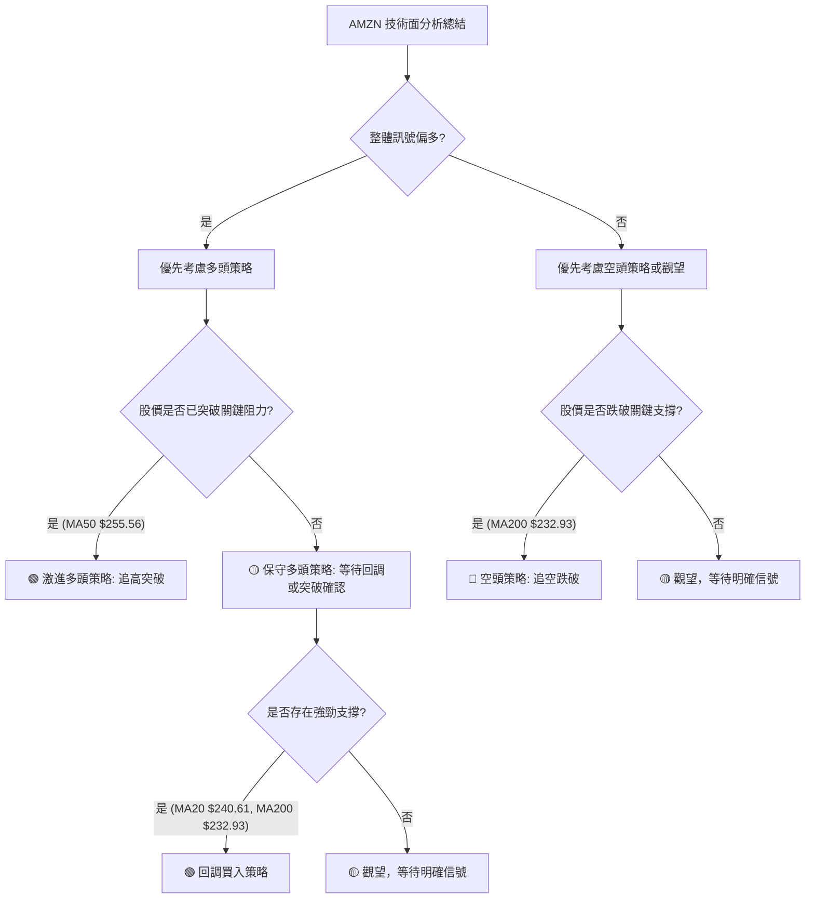
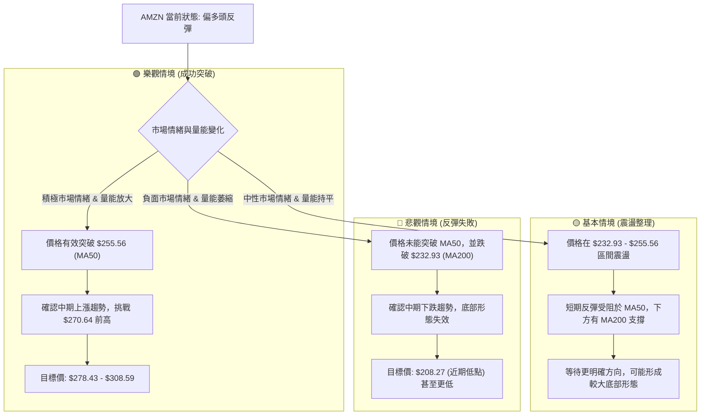

<details>
<summary>📊 靜態圖表 (點擊展開)</summary>

</details>

<html>
<head><meta charset="utf-8" /></head>
<body>
    <div style="height:500px; width:100%;">                        <script>window.PlotlyConfig = {MathJaxConfig: 'local'};</script>
        <script charset="utf-8" src="https://cdn.plot.ly/plotly-3.6.0.min.js" integrity="sha256-QaOVwtVY0T02VaHrr6pnoHLCwayMJp4O5n4YyaE3rJk=" crossorigin="anonymous"></script>                <div id="candlestick-chart" class="plotly-graph-div" style="height:100%; width:100%;"></div>            <script>                window.PLOTLYENV=window.PLOTLYENV || {};                                if (document.getElementById("candlestick-chart")) {                    Plotly.newPlot(                        "candlestick-chart",                        [{"close":{"dtype":"f8","bdata":"AAAAgMLtbEAAAACgmUFtQAAAAADX82xAAAAAIFznbEAAAAAgXO9sQAAAAAApdGxAAAAAYLiWa0AAAABguIZrQAAAAMDMRGtAAAAAwPV4a0AAAACgcMVrQAAAAIA9cmtAAAAAACmUa0AAAADAHs1rQAAAAOBRcGtAAAAAwMyca0AAAADA9bhrQAAAAEAKJ2xAAAAAIK53bEAAAAAA1wtrQAAAAIA9gmtAAAAA4HoMa0AAAACAPfJqQAAAAEAKz2pAAAAAoEehakAAAAAgXA9rQAAAAMD1wGtAAAAAYGY+a0AAAABA4aJrQAAAAGC4BmxAAAAAQApfbEAAAAAAAKhsQAAAAKCZyWxAAAAAIIXba0AAAABACoduQAAAAAAAwG9AAAAAgD0qb0AAAABgZkZvQAAAAKBHYW5AAAAAwB6NbkAAAADAzAxvQAAAAEAzI29AAAAAYGaGbkAAAABgj7JtQAAAAIAUVm1AAAAAANcbbUAAAACgmdFrQAAAAIAU1mtAAAAA4Hoka0AAAACAFJZrQAAAAMD1SGxAAAAAoHC1bEAAAADAHqVsQAAAAEAKJ21AAAAAACk8bUAAAACgcE1tQAAAAAApDG1AAAAAIIWjbEAAAADA9bBsQAAAAOB6XGxAAAAAoHB9bEAAAADA9fhsQAAAAMD1yGxAAAAAgBRGbEAAAACgR9FrQAAAAIDr0WtAAAAA4KOoa0AAAADgUVhsQAAAAEAza2xAAAAAgMKNbEAAAADgegRtQAAAAAApDG1AAAAA4KMQbUAAAACAPQJtQAAAAMD1EG1AAAAAgD3abEAAAAAAAFBsQAAAAIDrIW1AAAAAgMIdbkAAAACA6zFuQAAAAKBHyW5AAAAAACnsbkAAAABACs9uQAAAAEAzU25AAAAAwMyUbUAAAACAwsVtQAAAAADX421AAAAAAADgbEAAAACA6+lsQAAAAEDhSm1AAAAAwB7lbUAAAACgcM1tQAAAAIDClW5AAAAA4FFgbkAAAAAgXDduQAAAAKCZ6W1AAAAAYLhebkAAAAAA19NtQAAAACCuH21AAAAAgBTWa0AAAACAPUpqQAAAAEAKF2pAAAAAYLjeaUAAAABgj4JpQAAAAEAz82hAAAAAoEfZaEAAAADAzCRpQAAAAKBHmWlAAAAAIIWbaUAAAAAghUNqQAAAAOCjqGlAAAAAgOsRakAAAADgelRqQAAAAKBw\u002fWlAAAAAAABAakAAAADgegxqQAAAACBcF2pAAAAAgD0aa0AAAACAFF5rQAAAAGC4pmpAAAAAIK6vakAAAABgj8pqQAAAAMDMlGpAAAAAwPUwakAAAACgcPVpQAAAACCud2pAAAAAYGbmakAAAAAA1ztqQAAAAOBRGGpAAAAAANeraUAAAADgekRqQAAAACCu52lAAAAAYLh2akAAAACgR\u002fFpQAAAAEDh6mhAAAAAYGYeaUAAAADgowhqQAAAAIA9UmpAAAAA4KM4akAAAACgR5lqQAAAAOCjuGpAAAAAAACoa0AAAADAzDRtQAAAAAApzG1AAAAA4Hr8bUAAAADgoyBvQAAAAAAAEG9AAAAAYGY2b0AAAACA61FvQAAAAMD1CG9AAAAAwB49b0AAAAAghetvQAAAAGCP4m9AAAAAANd\u002fcEAAAACA61FwQAAAAEAzO3BAAAAA4KNwcEAAAADA9ZBwQAAAAAApxHBAAAAAwMwAcUAAAADAzBhxQAAAAADXL3FAAAAAYLjycEAAAABA4QpxQAAAAADXz3BAAAAAwB6dcEAAAACAFOJwQAAAACCFs3BAAAAAgD2CcEAAAACAwo1wQAAAAKBwNXBAAAAAACmQcEAAAAAgXMdwQAAAAMAepXBAAAAA4KOUcEAAAACgmf1wQAAAAAAAIHFAAAAAgD3qcEAAAAAAKVRwQAAAAOBRCHBAAAAA4KNAb0AAAACgR7lvQAAAAMD1wG5AAAAAQAqnbkAAAACAFIZuQAAAAAAAwG1AAAAA4FEwbkAAAACgmdFtQAAAAOCjwG5AAAAAAADAbkAAAAAAALBtQAAAAOB6jG5AAAAAoEcZbUAAAAAghUNtQAAAAOCjSG1AAAAA4FFgbEAAAACAFBZtQAAAAOB6BG5AAAAAQOHKbUAAAABgZjZuQA=="},"high":{"dtype":"f8","bdata":"AAAAIFw3bUAAAADAzHxtQAAAAKCZSW1AAAAAIFwvbUAAAADAHkVtQAAAAIA90mxAAAAAIIV7bEAAAACA6xFsQAAAAKBwlWtAAAAAoJmha0AAAABAM9NrQAAAACCux2tAAAAAwMzEa0AAAACA69lrQAAAAGBmBmxAAAAAIFy3a0AAAADgetxrQAAAACBcV2xAAAAAYLiGbEAAAAAAAIhsQAAAAIDClWtAAAAAgD1qa0AAAABguDZrQAAAAEDhUmtAAAAAoJnZakAAAACAFBZrQAAAAIA96mtAAAAA4FGAa0AAAACgmalrQAAAAMDMLGxAAAAAwMyMbEAAAAAgru9sQAAAAIA9Gm1AAAAAgBSObEAAAAAAAFBvQAAAAKCZKXBAAAAAACkQcEAAAAAAAGBvQAAAAAApTG9AAAAAwMycbkAAAAAAAHhvQAAAAAAAOG9AAAAAANdLb0AAAAAAAHhuQAAAACBc121AAAAAQDNTbUAAAABgZsZsQAAAACCu92tAAAAAwB5tbEAAAABguMZrQAAAAGCPamxAAAAA4KPQbEAAAAAAAPhsQAAAAKBHKW1AAAAAoJl5bUAAAABACt9tQAAAAAApLG1AAAAAAAAwbUAAAAAgrudsQAAAAGCP2mxAAAAAgD2SbEAAAACgcA1tQAAAACCFA21AAAAAYI\u002fCbEAAAACAwn1sQAAAAMAe9WtAAAAAgBQmbEAAAAAgXKdsQAAAAAAppGxAAAAAIFyvbEAAAABgZg5tQAAAAGBmHm1AAAAAIK4fbUAAAABAMxNtQAAAAOCjGG1AAAAAIK4fbUAAAABguG5tQAAAAAAAQG1AAAAAgMJlbkAAAACgR6luQAAAAMAezW5AAAAAIIX7bkAAAACAFB5vQAAAAMAe9W5AAAAAwPUobkAAAADAzBRuQAAAAIA98m1AAAAAQOFibUAAAACgmQltQAAAAEAKd21AAAAAYGYObkAAAABgZh5uQAAAAAApnG5AAAAAwPX4bkAAAAAAAGBuQAAAAIA9am5AAAAAACm0bkAAAABAM8tuQAAAACCF221AAAAAgOtJbEAAAACAFG5qQAAAAIDrmWpAAAAAwMyUakAAAACAPRJqQAAAAGC4fmlAAAAAwB4laUAAAAAgrjdpQAAAACCF22lAAAAA4Hq0aUAAAACgcGVqQAAAAIDCDWpAAAAAIIVLakAAAABA4XJqQAAAAKCZYWpAAAAAYI9KakAAAAAgXDdqQAAAAIDCJWpAAAAAoEcxa0AAAABACo9rQAAAAIA9KmtAAAAAgD26akAAAADAzPRqQAAAAAAAIGtAAAAAYLh2akAAAACA61FqQAAAAEAKl2pAAAAAYGb2akAAAADgeuRqQAAAAADXI2pAAAAAoEfxaUAAAACgmZlqQAAAAEAzK2pAAAAAgD2iakAAAADgepxqQAAAAEAz02lAAAAAoJl5aUAAAADA9UhqQAAAAGCPsmpAAAAAYLiGakAAAABgZp5qQAAAAEAKv2pAAAAAQDNDbEAAAACgmTltQAAAAIDCDW5AAAAAAAAAbkAAAACAwoVvQAAAAIAUTm9AAAAAAABAb0AAAABA4QJwQAAAAIDCRW9AAAAAQOHib0AAAACAFP5vQAAAAOCjLHBAAAAAAACIcEAAAABgZoJwQAAAAOB6UHBAAAAAYI+ecEAAAACAFB5xQAAAAMAeFXFAAAAAoJlBcUAAAADA9WhxQAAAAMDMXHFAAAAAgBRKcUAAAAAAACBxQAAAAIAUGnFAAAAAYGa6cEAAAAAghetwQAAAAOB67HBAAAAAgMKFcEAAAACgmc1wQAAAAAAAZHBAAAAAoEeZcEAAAAAA19dwQAAAAOCj3HBAAAAAwMzUcEAAAABgjwZxQAAAAAAAKHFAAAAAAAAscUAAAACAFKpwQAAAAEAzU3BAAAAAoHARcEAAAABgj\u002fpvQAAAAIAUBnBAAAAAoHAtb0AAAACAwk1vQAAAAIA9gm5AAAAA4HpEbkAAAAAghWtuQAAAAIDr+W5AAAAA4FEwb0AAAADAHr1uQAAAACBct25AAAAAAABAbkAAAAAA15ttQAAAAKBwTW5AAAAAgD0KbUAAAADAzDxtQAAAAGC4Nm9AAAAAoEcxbkAAAADAzJxuQA=="},"hovertemplate":"\u003cb\u003e%{x|%Y-%m-%d}\u003c\u002fb\u003e\u003cbr\u003e\u958b: $%{open:.2f}\u003cbr\u003e\u9ad8: $%{high:.2f}\u003cbr\u003e\u4f4e: $%{low:.2f}\u003cbr\u003e\u6536: $%{close:.2f}\u003cextra\u003e\u003c\u002fextra\u003e","low":{"dtype":"f8","bdata":"AAAAgD3KbEAAAAAgXAdtQAAAAGC4lmxAAAAAoEeZbEAAAABgZrZsQAAAAOBRcGxAAAAAgD2Ca0AAAABgZm5rQAAAAEAKD2tAAAAA4KNAa0AAAACgmWlrQAAAAOB6PGtAAAAAIIUTa0AAAABgZl5rQAAAAEDhamtAAAAAwPUAa0AAAACgcIVrQAAAAIAUpmtAAAAAAAC4a0AAAAAAAABrQAAAAKBHIWtAAAAAQDOTakAAAADAHpVqQAAAAIDrmWpAAAAAwPVgakAAAABA4bJqQAAAACCuP2tAAAAA4KMQa0AAAACAwkVrQAAAAMDMvGtAAAAAoEcxbEAAAABguEZsQAAAAOBReGxAAAAAAADYa0AAAAAgXH9uQAAAAMDMnG9AAAAAwB4Vb0AAAADAHsVuQAAAAKBwRW5AAAAAIK7PbUAAAABA4bJuQAAAACBc525AAAAAAAB4bkAAAAAAAJBtQAAAAOB6HG1AAAAAgBSmbEAAAACgcM1rQAAAAOCjUGtAAAAAIK4Xa0AAAACAwuVqQAAAAOCjyGtAAAAAoJn5a0AAAADgo5hsQAAAAEAKx2xAAAAAAAAIbUAAAACgmTFtQAAAACCF02xAAAAAoJlZbEAAAACgmZFsQAAAAOCjSGxAAAAAIIUjbEAAAABguI5sQAAAAIAUlmxAAAAAANcjbEAAAAAAALBrQAAAAAAppGtAAAAAIK6fa0AAAADAHg1sQAAAAGCPMmxAAAAAYLhWbEAAAAAgXJdsQAAAAGCP6mxAAAAAgMLlbEAAAADgo9hsQAAAAGBmxmxAAAAAANfDbEAAAABgZhZsQAAAAIDCZWxAAAAAgD0CbUAAAADgo\u002fBtQAAAAAApPG5AAAAAIK5HbkAAAABguL5uQAAAAAAACG5AAAAAQAqHbUAAAAAAKZRtQAAAAMAejW1AAAAAQOGqbEAAAAAAKVxsQAAAAMDM3GxAAAAAgD1SbUAAAACgR7FtQAAAAGCPwm1AAAAAwPUwbkAAAAAgrpdtQAAAAOB6tG1AAAAAoHDFbUAAAABgZm5tQAAAAIA9+mxAAAAAACmMa0AAAACA6wlpQAAAAEAza2lAAAAAwB7NaUAAAAAgrk9pQAAAAIDrsWhAAAAAwPWoaEAAAAAAAIBoQAAAAOBRMGlAAAAAgOtZaUAAAAAAAHhpQAAAACCFY2lAAAAAAABoaUAAAACAwh1qQAAAAEAzq2lAAAAAYGamaUAAAABguG5pQAAAACBcT2lAAAAAwMxEakAAAABA4fJqQAAAAMD1kGpAAAAAIIXjaUAAAACAwo1qQAAAAEAza2pAAAAAwMwEakAAAABACsdpQAAAAGBm7mlAAAAAgMKNakAAAABgjxpqQAAAAKCZwWlAAAAAgD2KaUAAAADgUTBqQAAAAOB61GlAAAAAwMw8akAAAAAA1+NpQAAAAOB65GhAAAAAIFz\u002faEAAAADgeoRpQAAAAIAUBmpAAAAAwMycaUAAAABA4TJqQAAAAGCPImpAAAAAANdza0AAAADgo+hrQAAAAGC4Zm1AAAAAAAB4bUAAAADA9ThuQAAAAGBm5m5AAAAAYGaGbkAAAAAghUNvQAAAAADXq25AAAAAQDMjb0AAAABgj0pvQAAAAIA9om9AAAAAQAobcEAAAACgcEVwQAAAAIAUCnBAAAAAQDMbcEAAAABgjwJwQAAAAADXa3BAAAAAwMzMcEAAAACAFAZxQAAAACBcA3FAAAAAANfncEAAAABAM99wQAAAACCux3BAAAAAgBRqcEAAAABAM3NwQAAAAIAUqnBAAAAAgD1OcEAAAADgemhwQAAAAIAU5m9AAAAA4Ho4cEAAAACA61VwQAAAAADXo3BAAAAAwB5hcEAAAABAM5twQAAAAEAKt3BAAAAAgD3acEAAAABAM0twQAAAAADXy29AAAAAYLj2bkAAAAAAAHhvQAAAAMD1uG5AAAAAIIVrbkAAAADAzAxuQAAAAGBmrm1AAAAAgMJlbUAAAABA4TJtQAAAACBcl25AAAAAYGaubkAAAAAAAIBtQAAAAOCjgG1AAAAAIK4HbUAAAAAAAABtQAAAAGBmHm1AAAAAoJkxbEAAAAAAKURsQAAAAKCZOW1AAAAAoHClbUAAAADAzFxtQA=="},"name":"\u50f9\u683c","open":{"dtype":"f8","bdata":"AAAAACnUbEAAAACAFB5tQAAAAOCjOG1AAAAAAAAQbUAAAAAA1wttQAAAAIDr0WxAAAAAYI96bEAAAADAzARsQAAAAIDrgWtAAAAAYI9ia0AAAABgj4JrQAAAAMD1wGtAAAAAIIUra0AAAADgUaBrQAAAAIAU7mtAAAAAAACga0AAAAAAKZxrQAAAAKBw3WtAAAAAAAAgbEAAAABguEZsQAAAAGBmNmtAAAAAgOvxakAAAAAA1xNrQAAAAKBw9WpAAAAAgOvRakAAAAAAKbxqQAAAAIDCTWtAAAAAoJlpa0AAAAAAAGBrQAAAAEAKv2tAAAAAwB51bEAAAABACodsQAAAAKBw9WxAAAAAgOthbEAAAABAM0NvQAAAACCF629AAAAAAClMb0AAAADA9SBvQAAAAMAeJW9AAAAAwMxcbkAAAABA4QpvQAAAAMAeDW9AAAAAIK5Hb0AAAACgmWFuQAAAAIDrYW1AAAAAAAAobUAAAABAM4NsQAAAACCu92tAAAAAoJlhbEAAAABAMwtrQAAAAIDr0WtAAAAAAClMbEAAAAAgrtdsQAAAACCu52xAAAAAQAonbUAAAADgUWBtQAAAAEAzK21AAAAA4KMYbUAAAACAPcpsQAAAAEDhsmxAAAAAQOFabEAAAACA65lsQAAAAGC41mxAAAAAANe7bEAAAACAwn1sQAAAAKBH4WtAAAAAwB4VbEAAAABguDZsQAAAAOBRWGxAAAAAIIWTbEAAAACA66FsQAAAAAApBG1AAAAAoEcBbUAAAACAFP5sQAAAAGC45mxAAAAAwB4dbUAAAABA4epsQAAAAEDhmmxAAAAAQDMDbUAAAAAghfNtQAAAAIDrYW5AAAAAgD2SbkAAAAAgXNduQAAAAMD10G5AAAAAwMwkbkAAAACA6+ltQAAAAEDh4m1AAAAA4FE4bUAAAABA4eJsQAAAAKCZQW1AAAAAYLhebUAAAAAgXP9tQAAAAIAU9m1AAAAAANfLbkAAAACAPVpuQAAAAOB6\u002fG1AAAAAgOvJbUAAAAAgXJ9uQAAAACCF221AAAAAwB4dbEAAAABgZlZpQAAAAEAKH2pAAAAAoJkZakAAAACA6wFqQAAAAGC4fmlAAAAAACncaEAAAAAAKcRoQAAAAIA9QmlAAAAAoJl5aUAAAADgUZhpQAAAAEAzA2pAAAAAQAqvaUAAAABguE5qQAAAACBcV2pAAAAAYI\u002faaUAAAACgmZFpQAAAAEAzY2lAAAAAQApPakAAAAAgXP9qQAAAACCu32pAAAAAYGZOakAAAACAFMZqQAAAAGC49mpAAAAA4HpMakAAAAAghTNqQAAAAEAzC2pAAAAAgD2aakAAAACAwr1qQAAAAIDr4WlAAAAAwMzsaUAAAACgRzlqQAAAAGBm\u002fmlAAAAAgOtxakAAAAAghVNqQAAAAGC4zmlAAAAAIFwvaUAAAABAM5tpQAAAAIAUTmpAAAAAoEfRaUAAAACgmTlqQAAAACCuZ2pAAAAAoEf5a0AAAAAgXCdsQAAAAKCZaW1AAAAAYGaubUAAAADA9ThuQAAAAAAAKG9AAAAA4FEQb0AAAAAgrt9vQAAAAIAUJm9AAAAAQOHib0AAAACAFI5vQAAAAOB67G9AAAAAIK4\u002fcEAAAAAgXHdwQAAAAIA9JnBAAAAAANcfcEAAAABguBJxQAAAAKBHmXBAAAAAwMzMcEAAAACgR0FxQAAAAIA9DnFAAAAA4FEwcUAAAACAFPpwQAAAAKBw3XBAAAAAIFyrcEAAAABA4YZwQAAAAGBm0nBAAAAAAABocEAAAACA631wQAAAAOCjYHBAAAAAwMxAcEAAAAAAAHhwQAAAAGCPynBAAAAAQAq\u002fcEAAAABgZqJwQAAAAOBRBHFAAAAA4KP0cEAAAADgo6RwQAAAAGCPEnBAAAAAYGbWb0AAAAAA16NvQAAAAOBRyG9AAAAAgMLVbkAAAAAgXPduQAAAACCFc25AAAAAgMK9bUAAAABguGZuQAAAAOCjoG5AAAAAAAAAb0AAAADAzJxuQAAAAADXA25AAAAAYI8CbkAAAACgmRFtQAAAAEAzO21AAAAA4KMAbUAAAABguGZsQAAAAEAKR21AAAAAQDOrbUAAAAAgXP9tQA=="},"x":["2025-09-15T00:00:00-04:00","2025-09-16T00:00:00-04:00","2025-09-17T00:00:00-04:00","2025-09-18T00:00:00-04:00","2025-09-19T00:00:00-04:00","2025-09-22T00:00:00-04:00","2025-09-23T00:00:00-04:00","2025-09-24T00:00:00-04:00","2025-09-25T00:00:00-04:00","2025-09-26T00:00:00-04:00","2025-09-29T00:00:00-04:00","2025-09-30T00:00:00-04:00","2025-10-01T00:00:00-04:00","2025-10-02T00:00:00-04:00","2025-10-03T00:00:00-04:00","2025-10-06T00:00:00-04:00","2025-10-07T00:00:00-04:00","2025-10-08T00:00:00-04:00","2025-10-09T00:00:00-04:00","2025-10-10T00:00:00-04:00","2025-10-13T00:00:00-04:00","2025-10-14T00:00:00-04:00","2025-10-15T00:00:00-04:00","2025-10-16T00:00:00-04:00","2025-10-17T00:00:00-04:00","2025-10-20T00:00:00-04:00","2025-10-21T00:00:00-04:00","2025-10-22T00:00:00-04:00","2025-10-23T00:00:00-04:00","2025-10-24T00:00:00-04:00","2025-10-27T00:00:00-04:00","2025-10-28T00:00:00-04:00","2025-10-29T00:00:00-04:00","2025-10-30T00:00:00-04:00","2025-10-31T00:00:00-04:00","2025-11-03T00:00:00-05:00","2025-11-04T00:00:00-05:00","2025-11-05T00:00:00-05:00","2025-11-06T00:00:00-05:00","2025-11-07T00:00:00-05:00","2025-11-10T00:00:00-05:00","2025-11-11T00:00:00-05:00","2025-11-12T00:00:00-05:00","2025-11-13T00:00:00-05:00","2025-11-14T00:00:00-05:00","2025-11-17T00:00:00-05:00","2025-11-18T00:00:00-05:00","2025-11-19T00:00:00-05:00","2025-11-20T00:00:00-05:00","2025-11-21T00:00:00-05:00","2025-11-24T00:00:00-05:00","2025-11-25T00:00:00-05:00","2025-11-26T00:00:00-05:00","2025-11-28T00:00:00-05:00","2025-12-01T00:00:00-05:00","2025-12-02T00:00:00-05:00","2025-12-03T00:00:00-05:00","2025-12-04T00:00:00-05:00","2025-12-05T00:00:00-05:00","2025-12-08T00:00:00-05:00","2025-12-09T00:00:00-05:00","2025-12-10T00:00:00-05:00","2025-12-11T00:00:00-05:00","2025-12-12T00:00:00-05:00","2025-12-15T00:00:00-05:00","2025-12-16T00:00:00-05:00","2025-12-17T00:00:00-05:00","2025-12-18T00:00:00-05:00","2025-12-19T00:00:00-05:00","2025-12-22T00:00:00-05:00","2025-12-23T00:00:00-05:00","2025-12-24T00:00:00-05:00","2025-12-26T00:00:00-05:00","2025-12-29T00:00:00-05:00","2025-12-30T00:00:00-05:00","2025-12-31T00:00:00-05:00","2026-01-02T00:00:00-05:00","2026-01-05T00:00:00-05:00","2026-01-06T00:00:00-05:00","2026-01-07T00:00:00-05:00","2026-01-08T00:00:00-05:00","2026-01-09T00:00:00-05:00","2026-01-12T00:00:00-05:00","2026-01-13T00:00:00-05:00","2026-01-14T00:00:00-05:00","2026-01-15T00:00:00-05:00","2026-01-16T00:00:00-05:00","2026-01-20T00:00:00-05:00","2026-01-21T00:00:00-05:00","2026-01-22T00:00:00-05:00","2026-01-23T00:00:00-05:00","2026-01-26T00:00:00-05:00","2026-01-27T00:00:00-05:00","2026-01-28T00:00:00-05:00","2026-01-29T00:00:00-05:00","2026-01-30T00:00:00-05:00","2026-02-02T00:00:00-05:00","2026-02-03T00:00:00-05:00","2026-02-04T00:00:00-05:00","2026-02-05T00:00:00-05:00","2026-02-06T00:00:00-05:00","2026-02-09T00:00:00-05:00","2026-02-10T00:00:00-05:00","2026-02-11T00:00:00-05:00","2026-02-12T00:00:00-05:00","2026-02-13T00:00:00-05:00","2026-02-17T00:00:00-05:00","2026-02-18T00:00:00-05:00","2026-02-19T00:00:00-05:00","2026-02-20T00:00:00-05:00","2026-02-23T00:00:00-05:00","2026-02-24T00:00:00-05:00","2026-02-25T00:00:00-05:00","2026-02-26T00:00:00-05:00","2026-02-27T00:00:00-05:00","2026-03-02T00:00:00-05:00","2026-03-03T00:00:00-05:00","2026-03-04T00:00:00-05:00","2026-03-05T00:00:00-05:00","2026-03-06T00:00:00-05:00","2026-03-09T00:00:00-04:00","2026-03-10T00:00:00-04:00","2026-03-11T00:00:00-04:00","2026-03-12T00:00:00-04:00","2026-03-13T00:00:00-04:00","2026-03-16T00:00:00-04:00","2026-03-17T00:00:00-04:00","2026-03-18T00:00:00-04:00","2026-03-19T00:00:00-04:00","2026-03-20T00:00:00-04:00","2026-03-23T00:00:00-04:00","2026-03-24T00:00:00-04:00","2026-03-25T00:00:00-04:00","2026-03-26T00:00:00-04:00","2026-03-27T00:00:00-04:00","2026-03-30T00:00:00-04:00","2026-03-31T00:00:00-04:00","2026-04-01T00:00:00-04:00","2026-04-02T00:00:00-04:00","2026-04-06T00:00:00-04:00","2026-04-07T00:00:00-04:00","2026-04-08T00:00:00-04:00","2026-04-09T00:00:00-04:00","2026-04-10T00:00:00-04:00","2026-04-13T00:00:00-04:00","2026-04-14T00:00:00-04:00","2026-04-15T00:00:00-04:00","2026-04-16T00:00:00-04:00","2026-04-17T00:00:00-04:00","2026-04-20T00:00:00-04:00","2026-04-21T00:00:00-04:00","2026-04-22T00:00:00-04:00","2026-04-23T00:00:00-04:00","2026-04-24T00:00:00-04:00","2026-04-27T00:00:00-04:00","2026-04-28T00:00:00-04:00","2026-04-29T00:00:00-04:00","2026-04-30T00:00:00-04:00","2026-05-01T00:00:00-04:00","2026-05-04T00:00:00-04:00","2026-05-05T00:00:00-04:00","2026-05-06T00:00:00-04:00","2026-05-07T00:00:00-04:00","2026-05-08T00:00:00-04:00","2026-05-11T00:00:00-04:00","2026-05-12T00:00:00-04:00","2026-05-13T00:00:00-04:00","2026-05-14T00:00:00-04:00","2026-05-15T00:00:00-04:00","2026-05-18T00:00:00-04:00","2026-05-19T00:00:00-04:00","2026-05-20T00:00:00-04:00","2026-05-21T00:00:00-04:00","2026-05-22T00:00:00-04:00","2026-05-26T00:00:00-04:00","2026-05-27T00:00:00-04:00","2026-05-28T00:00:00-04:00","2026-05-29T00:00:00-04:00","2026-06-01T00:00:00-04:00","2026-06-02T00:00:00-04:00","2026-06-03T00:00:00-04:00","2026-06-04T00:00:00-04:00","2026-06-05T00:00:00-04:00","2026-06-08T00:00:00-04:00","2026-06-09T00:00:00-04:00","2026-06-10T00:00:00-04:00","2026-06-11T00:00:00-04:00","2026-06-12T00:00:00-04:00","2026-06-15T00:00:00-04:00","2026-06-16T00:00:00-04:00","2026-06-17T00:00:00-04:00","2026-06-18T00:00:00-04:00","2026-06-22T00:00:00-04:00","2026-06-23T00:00:00-04:00","2026-06-24T00:00:00-04:00","2026-06-25T00:00:00-04:00","2026-06-26T00:00:00-04:00","2026-06-29T00:00:00-04:00","2026-06-30T00:00:00-04:00","2026-07-01T00:00:00-04:00"],"type":"candlestick"},{"hovertemplate":"MA30: $%{y:.2f}\u003cextra\u003e\u003c\u002fextra\u003e","line":{"color":"#2196F3","dash":"dash","width":2},"mode":"lines","name":"MA30","x":["2025-09-15T00:00:00-04:00","2025-09-16T00:00:00-04:00","2025-09-17T00:00:00-04:00","2025-09-18T00:00:00-04:00","2025-09-19T00:00:00-04:00","2025-09-22T00:00:00-04:00","2025-09-23T00:00:00-04:00","2025-09-24T00:00:00-04:00","2025-09-25T00:00:00-04:00","2025-09-26T00:00:00-04:00","2025-09-29T00:00:00-04:00","2025-09-30T00:00:00-04:00","2025-10-01T00:00:00-04:00","2025-10-02T00:00:00-04:00","2025-10-03T00:00:00-04:00","2025-10-06T00:00:00-04:00","2025-10-07T00:00:00-04:00","2025-10-08T00:00:00-04:00","2025-10-09T00:00:00-04:00","2025-10-10T00:00:00-04:00","2025-10-13T00:00:00-04:00","2025-10-14T00:00:00-04:00","2025-10-15T00:00:00-04:00","2025-10-16T00:00:00-04:00","2025-10-17T00:00:00-04:00","2025-10-20T00:00:00-04:00","2025-10-21T00:00:00-04:00","2025-10-22T00:00:00-04:00","2025-10-23T00:00:00-04:00","2025-10-24T00:00:00-04:00","2025-10-27T00:00:00-04:00","2025-10-28T00:00:00-04:00","2025-10-29T00:00:00-04:00","2025-10-30T00:00:00-04:00","2025-10-31T00:00:00-04:00","2025-11-03T00:00:00-05:00","2025-11-04T00:00:00-05:00","2025-11-05T00:00:00-05:00","2025-11-06T00:00:00-05:00","2025-11-07T00:00:00-05:00","2025-11-10T00:00:00-05:00","2025-11-11T00:00:00-05:00","2025-11-12T00:00:00-05:00","2025-11-13T00:00:00-05:00","2025-11-14T00:00:00-05:00","2025-11-17T00:00:00-05:00","2025-11-18T00:00:00-05:00","2025-11-19T00:00:00-05:00","2025-11-20T00:00:00-05:00","2025-11-21T00:00:00-05:00","2025-11-24T00:00:00-05:00","2025-11-25T00:00:00-05:00","2025-11-26T00:00:00-05:00","2025-11-28T00:00:00-05:00","2025-12-01T00:00:00-05:00","2025-12-02T00:00:00-05:00","2025-12-03T00:00:00-05:00","2025-12-04T00:00:00-05:00","2025-12-05T00:00:00-05:00","2025-12-08T00:00:00-05:00","2025-12-09T00:00:00-05:00","2025-12-10T00:00:00-05:00","2025-12-11T00:00:00-05:00","2025-12-12T00:00:00-05:00","2025-12-15T00:00:00-05:00","2025-12-16T00:00:00-05:00","2025-12-17T00:00:00-05:00","2025-12-18T00:00:00-05:00","2025-12-19T00:00:00-05:00","2025-12-22T00:00:00-05:00","2025-12-23T00:00:00-05:00","2025-12-24T00:00:00-05:00","2025-12-26T00:00:00-05:00","2025-12-29T00:00:00-05:00","2025-12-30T00:00:00-05:00","2025-12-31T00:00:00-05:00","2026-01-02T00:00:00-05:00","2026-01-05T00:00:00-05:00","2026-01-06T00:00:00-05:00","2026-01-07T00:00:00-05:00","2026-01-08T00:00:00-05:00","2026-01-09T00:00:00-05:00","2026-01-12T00:00:00-05:00","2026-01-13T00:00:00-05:00","2026-01-14T00:00:00-05:00","2026-01-15T00:00:00-05:00","2026-01-16T00:00:00-05:00","2026-01-20T00:00:00-05:00","2026-01-21T00:00:00-05:00","2026-01-22T00:00:00-05:00","2026-01-23T00:00:00-05:00","2026-01-26T00:00:00-05:00","2026-01-27T00:00:00-05:00","2026-01-28T00:00:00-05:00","2026-01-29T00:00:00-05:00","2026-01-30T00:00:00-05:00","2026-02-02T00:00:00-05:00","2026-02-03T00:00:00-05:00","2026-02-04T00:00:00-05:00","2026-02-05T00:00:00-05:00","2026-02-06T00:00:00-05:00","2026-02-09T00:00:00-05:00","2026-02-10T00:00:00-05:00","2026-02-11T00:00:00-05:00","2026-02-12T00:00:00-05:00","2026-02-13T00:00:00-05:00","2026-02-17T00:00:00-05:00","2026-02-18T00:00:00-05:00","2026-02-19T00:00:00-05:00","2026-02-20T00:00:00-05:00","2026-02-23T00:00:00-05:00","2026-02-24T00:00:00-05:00","2026-02-25T00:00:00-05:00","2026-02-26T00:00:00-05:00","2026-02-27T00:00:00-05:00","2026-03-02T00:00:00-05:00","2026-03-03T00:00:00-05:00","2026-03-04T00:00:00-05:00","2026-03-05T00:00:00-05:00","2026-03-06T00:00:00-05:00","2026-03-09T00:00:00-04:00","2026-03-10T00:00:00-04:00","2026-03-11T00:00:00-04:00","2026-03-12T00:00:00-04:00","2026-03-13T00:00:00-04:00","2026-03-16T00:00:00-04:00","2026-03-17T00:00:00-04:00","2026-03-18T00:00:00-04:00","2026-03-19T00:00:00-04:00","2026-03-20T00:00:00-04:00","2026-03-23T00:00:00-04:00","2026-03-24T00:00:00-04:00","2026-03-25T00:00:00-04:00","2026-03-26T00:00:00-04:00","2026-03-27T00:00:00-04:00","2026-03-30T00:00:00-04:00","2026-03-31T00:00:00-04:00","2026-04-01T00:00:00-04:00","2026-04-02T00:00:00-04:00","2026-04-06T00:00:00-04:00","2026-04-07T00:00:00-04:00","2026-04-08T00:00:00-04:00","2026-04-09T00:00:00-04:00","2026-04-10T00:00:00-04:00","2026-04-13T00:00:00-04:00","2026-04-14T00:00:00-04:00","2026-04-15T00:00:00-04:00","2026-04-16T00:00:00-04:00","2026-04-17T00:00:00-04:00","2026-04-20T00:00:00-04:00","2026-04-21T00:00:00-04:00","2026-04-22T00:00:00-04:00","2026-04-23T00:00:00-04:00","2026-04-24T00:00:00-04:00","2026-04-27T00:00:00-04:00","2026-04-28T00:00:00-04:00","2026-04-29T00:00:00-04:00","2026-04-30T00:00:00-04:00","2026-05-01T00:00:00-04:00","2026-05-04T00:00:00-04:00","2026-05-05T00:00:00-04:00","2026-05-06T00:00:00-04:00","2026-05-07T00:00:00-04:00","2026-05-08T00:00:00-04:00","2026-05-11T00:00:00-04:00","2026-05-12T00:00:00-04:00","2026-05-13T00:00:00-04:00","2026-05-14T00:00:00-04:00","2026-05-15T00:00:00-04:00","2026-05-18T00:00:00-04:00","2026-05-19T00:00:00-04:00","2026-05-20T00:00:00-04:00","2026-05-21T00:00:00-04:00","2026-05-22T00:00:00-04:00","2026-05-26T00:00:00-04:00","2026-05-27T00:00:00-04:00","2026-05-28T00:00:00-04:00","2026-05-29T00:00:00-04:00","2026-06-01T00:00:00-04:00","2026-06-02T00:00:00-04:00","2026-06-03T00:00:00-04:00","2026-06-04T00:00:00-04:00","2026-06-05T00:00:00-04:00","2026-06-08T00:00:00-04:00","2026-06-09T00:00:00-04:00","2026-06-10T00:00:00-04:00","2026-06-11T00:00:00-04:00","2026-06-12T00:00:00-04:00","2026-06-15T00:00:00-04:00","2026-06-16T00:00:00-04:00","2026-06-17T00:00:00-04:00","2026-06-18T00:00:00-04:00","2026-06-22T00:00:00-04:00","2026-06-23T00:00:00-04:00","2026-06-24T00:00:00-04:00","2026-06-25T00:00:00-04:00","2026-06-26T00:00:00-04:00","2026-06-29T00:00:00-04:00","2026-06-30T00:00:00-04:00","2026-07-01T00:00:00-04:00"],"y":{"dtype":"f8","bdata":"AAAAAAAA+H8AAAAAAAD4fwAAAAAAAPh\u002fAAAAAAAA+H8AAAAAAAD4fwAAAAAAAPh\u002fAAAAAAAA+H8AAAAAAAD4fwAAAAAAAPh\u002fAAAAAAAA+H8AAAAAAAD4fwAAAAAAAPh\u002fAAAAAAAA+H8AAAAAAAD4fwAAAAAAAPh\u002fAAAAAAAA+H8AAAAAAAD4fwAAAAAAAPh\u002fAAAAAAAA+H8AAAAAAAD4fwAAAAAAAPh\u002fAAAAAAAA+H8AAAAAAAD4fwAAAAAAAPh\u002fAAAAAAAA+H8AAAAAAAD4fwAAAAAAAPh\u002fAAAAAAAA+H8AAAAAAAD4f6uqqjomxGtAq6qqWmS\u002fa0AiIiKiRbprQAAAADDduGtA7+7unu+va0De3d19hr1rQCIiIkKn2WtAIiIisiv4a0BmZmb2KBhsQHd3d5e1MmxAmpmZOftMbEAzMzPD9WhsQLy7u2t1iGxAmpmZmZmhbEBVVVUFyLFsQM3MzCz5wWxAiYiIyL3ObEC8u7sLkM9sQAAAADDdzGxA3t3drY7BbEBERERUKsZsQCIiIhLKzGxAVVVVZfTabEDv7u5ec+lsQO\u002fu7l5z\u002fWxAVVVVFa4TbUBmZmbm0CZtQERERCTbMW1AERERkcI9bUAAAABAw0ZtQBERERGfSW1Aq6qqeqJKbUBmZmZWVU1tQAAAAOBPTW1AAAAAMN1QbUCamZkZvTltQCIiIuIzGG1AzczMXEj6bEDe3d2tR+FsQERERESL0GxAiYiIqH+\u002fbECJiIiYJ65sQLy7u+tRnGxAERERgdyPbECJiIjo+4lsQFVVVRWuh2xAzczMTH6FbECamZnptIlsQM3MzJzElGxA3t3d3SSubEBERETEZ8RsQERERNS\u002f2WxAd3d316PsbEAAAACgGv9sQN7d3f0bCW1AIiIiYhAMbUDNzMwcExBtQERERJRDF21AzczMrEcZbUC8u7u7LRttQERERBQgI21AmpmZWR0vbUAzMzODMjZtQLy7u6uORW1AZmZmpn9XbUDNzMzM92ttQAAAAPDSfW1AERERwfWUbUAzMzNTnKFtQLy7u2ugp21AVVVVBYGhbUBVVVW1OoptQDMzM\u002fP9cG1A3t3dXbpVbUCrqqo63zdtQFVVVSW\u002fFG1AERER0ZTybEAzMzOTitdsQKuqqvpiuWxAd3d3d+mSbEBVVVWFXXFsQERERFScRWxAERER4TMcbEBmZmbm+\u002fVrQCIiIvL90GtAiYiIuJC0a0ARERERypRrQCIiIpJfdGtAzczMfD9la0B3d3enDVhrQCIiIsKDQWtAMzMzIyIma0BmZmb2bwxrQDMzM6NF6mpA3t3dXY\u002fGakB3d3e3OqJqQAAAAADVhGpAq6qqqjhnakAAAAAAjkhqQHd3d5e1LmpAMzMzEzwcakC8u7vrChxqQImIiMh2GmpAmpmZ2YcfakCJiIioOCNqQImIiKjxImpAvLu7ez8lakCJiIi41yxqQM3MzAwCM2pA7+7uzj44akAAAACgGjtqQBEREbErRGpAiYiI6LRRakC8u7srQGpqQImIiMi9impA7+7uvp+qakAiIiJy9tVqQO\u002fu7k5iAGtAzczMvHQja0CrqqoaL0VrQM3MzIyXamtAMzMzo3CRa0AAAACQNL1rQImIiMh26mtA3t3d\u002fY0kbEB3d3dnkV1sQO\u002fu7q65kGxAIiIiMsHDbEDv7u6+n\u002f5sQHd3dzcXPm1AzczMTDeFbUBERER02shtQHd3d7ceEW5AMzMzQ4tQbkAzMzPTBpZuQKuqqupR4G5AERERwYMlb0CJiIiof2dvQCIiIuLso29AVVVVhevdb0DNzMwMuwpwQHd3d98II3BAq6qqkl86cEBERERM8ExwQCIiIgrXW3BAzczM\u002fGJpcEAzMzMLkHVwQM3MzKQpg3BAd3d3p1SOcEAAAACQCZRwQImIiJhumHBAVVVVnX2YcECamZlBp5dwQBEREaHTknBAZmZm5tCIcEBERERkyX9wQN7d3Z02dHBAVVVVDbtocEDe3d2Nl1pwQFVVVQ27TnBAREREXNZAcEDe3d1VnC1wQKuqqmpKHXBAvLu7Q9IIcECamZlZgOhvQKuqqnp3w29AIiIiwhGab0BEREQkInJvQO\u002fu7n4\u002fVW9A7+7uXro5b0BmZmYmBiFvQA=="},"type":"scatter"},{"hovertemplate":"MA60: $%{y:.2f}\u003cextra\u003e\u003c\u002fextra\u003e","line":{"color":"#9C27B0","dash":"dash","width":2},"mode":"lines","name":"MA60","x":["2025-09-15T00:00:00-04:00","2025-09-16T00:00:00-04:00","2025-09-17T00:00:00-04:00","2025-09-18T00:00:00-04:00","2025-09-19T00:00:00-04:00","2025-09-22T00:00:00-04:00","2025-09-23T00:00:00-04:00","2025-09-24T00:00:00-04:00","2025-09-25T00:00:00-04:00","2025-09-26T00:00:00-04:00","2025-09-29T00:00:00-04:00","2025-09-30T00:00:00-04:00","2025-10-01T00:00:00-04:00","2025-10-02T00:00:00-04:00","2025-10-03T00:00:00-04:00","2025-10-06T00:00:00-04:00","2025-10-07T00:00:00-04:00","2025-10-08T00:00:00-04:00","2025-10-09T00:00:00-04:00","2025-10-10T00:00:00-04:00","2025-10-13T00:00:00-04:00","2025-10-14T00:00:00-04:00","2025-10-15T00:00:00-04:00","2025-10-16T00:00:00-04:00","2025-10-17T00:00:00-04:00","2025-10-20T00:00:00-04:00","2025-10-21T00:00:00-04:00","2025-10-22T00:00:00-04:00","2025-10-23T00:00:00-04:00","2025-10-24T00:00:00-04:00","2025-10-27T00:00:00-04:00","2025-10-28T00:00:00-04:00","2025-10-29T00:00:00-04:00","2025-10-30T00:00:00-04:00","2025-10-31T00:00:00-04:00","2025-11-03T00:00:00-05:00","2025-11-04T00:00:00-05:00","2025-11-05T00:00:00-05:00","2025-11-06T00:00:00-05:00","2025-11-07T00:00:00-05:00","2025-11-10T00:00:00-05:00","2025-11-11T00:00:00-05:00","2025-11-12T00:00:00-05:00","2025-11-13T00:00:00-05:00","2025-11-14T00:00:00-05:00","2025-11-17T00:00:00-05:00","2025-11-18T00:00:00-05:00","2025-11-19T00:00:00-05:00","2025-11-20T00:00:00-05:00","2025-11-21T00:00:00-05:00","2025-11-24T00:00:00-05:00","2025-11-25T00:00:00-05:00","2025-11-26T00:00:00-05:00","2025-11-28T00:00:00-05:00","2025-12-01T00:00:00-05:00","2025-12-02T00:00:00-05:00","2025-12-03T00:00:00-05:00","2025-12-04T00:00:00-05:00","2025-12-05T00:00:00-05:00","2025-12-08T00:00:00-05:00","2025-12-09T00:00:00-05:00","2025-12-10T00:00:00-05:00","2025-12-11T00:00:00-05:00","2025-12-12T00:00:00-05:00","2025-12-15T00:00:00-05:00","2025-12-16T00:00:00-05:00","2025-12-17T00:00:00-05:00","2025-12-18T00:00:00-05:00","2025-12-19T00:00:00-05:00","2025-12-22T00:00:00-05:00","2025-12-23T00:00:00-05:00","2025-12-24T00:00:00-05:00","2025-12-26T00:00:00-05:00","2025-12-29T00:00:00-05:00","2025-12-30T00:00:00-05:00","2025-12-31T00:00:00-05:00","2026-01-02T00:00:00-05:00","2026-01-05T00:00:00-05:00","2026-01-06T00:00:00-05:00","2026-01-07T00:00:00-05:00","2026-01-08T00:00:00-05:00","2026-01-09T00:00:00-05:00","2026-01-12T00:00:00-05:00","2026-01-13T00:00:00-05:00","2026-01-14T00:00:00-05:00","2026-01-15T00:00:00-05:00","2026-01-16T00:00:00-05:00","2026-01-20T00:00:00-05:00","2026-01-21T00:00:00-05:00","2026-01-22T00:00:00-05:00","2026-01-23T00:00:00-05:00","2026-01-26T00:00:00-05:00","2026-01-27T00:00:00-05:00","2026-01-28T00:00:00-05:00","2026-01-29T00:00:00-05:00","2026-01-30T00:00:00-05:00","2026-02-02T00:00:00-05:00","2026-02-03T00:00:00-05:00","2026-02-04T00:00:00-05:00","2026-02-05T00:00:00-05:00","2026-02-06T00:00:00-05:00","2026-02-09T00:00:00-05:00","2026-02-10T00:00:00-05:00","2026-02-11T00:00:00-05:00","2026-02-12T00:00:00-05:00","2026-02-13T00:00:00-05:00","2026-02-17T00:00:00-05:00","2026-02-18T00:00:00-05:00","2026-02-19T00:00:00-05:00","2026-02-20T00:00:00-05:00","2026-02-23T00:00:00-05:00","2026-02-24T00:00:00-05:00","2026-02-25T00:00:00-05:00","2026-02-26T00:00:00-05:00","2026-02-27T00:00:00-05:00","2026-03-02T00:00:00-05:00","2026-03-03T00:00:00-05:00","2026-03-04T00:00:00-05:00","2026-03-05T00:00:00-05:00","2026-03-06T00:00:00-05:00","2026-03-09T00:00:00-04:00","2026-03-10T00:00:00-04:00","2026-03-11T00:00:00-04:00","2026-03-12T00:00:00-04:00","2026-03-13T00:00:00-04:00","2026-03-16T00:00:00-04:00","2026-03-17T00:00:00-04:00","2026-03-18T00:00:00-04:00","2026-03-19T00:00:00-04:00","2026-03-20T00:00:00-04:00","2026-03-23T00:00:00-04:00","2026-03-24T00:00:00-04:00","2026-03-25T00:00:00-04:00","2026-03-26T00:00:00-04:00","2026-03-27T00:00:00-04:00","2026-03-30T00:00:00-04:00","2026-03-31T00:00:00-04:00","2026-04-01T00:00:00-04:00","2026-04-02T00:00:00-04:00","2026-04-06T00:00:00-04:00","2026-04-07T00:00:00-04:00","2026-04-08T00:00:00-04:00","2026-04-09T00:00:00-04:00","2026-04-10T00:00:00-04:00","2026-04-13T00:00:00-04:00","2026-04-14T00:00:00-04:00","2026-04-15T00:00:00-04:00","2026-04-16T00:00:00-04:00","2026-04-17T00:00:00-04:00","2026-04-20T00:00:00-04:00","2026-04-21T00:00:00-04:00","2026-04-22T00:00:00-04:00","2026-04-23T00:00:00-04:00","2026-04-24T00:00:00-04:00","2026-04-27T00:00:00-04:00","2026-04-28T00:00:00-04:00","2026-04-29T00:00:00-04:00","2026-04-30T00:00:00-04:00","2026-05-01T00:00:00-04:00","2026-05-04T00:00:00-04:00","2026-05-05T00:00:00-04:00","2026-05-06T00:00:00-04:00","2026-05-07T00:00:00-04:00","2026-05-08T00:00:00-04:00","2026-05-11T00:00:00-04:00","2026-05-12T00:00:00-04:00","2026-05-13T00:00:00-04:00","2026-05-14T00:00:00-04:00","2026-05-15T00:00:00-04:00","2026-05-18T00:00:00-04:00","2026-05-19T00:00:00-04:00","2026-05-20T00:00:00-04:00","2026-05-21T00:00:00-04:00","2026-05-22T00:00:00-04:00","2026-05-26T00:00:00-04:00","2026-05-27T00:00:00-04:00","2026-05-28T00:00:00-04:00","2026-05-29T00:00:00-04:00","2026-06-01T00:00:00-04:00","2026-06-02T00:00:00-04:00","2026-06-03T00:00:00-04:00","2026-06-04T00:00:00-04:00","2026-06-05T00:00:00-04:00","2026-06-08T00:00:00-04:00","2026-06-09T00:00:00-04:00","2026-06-10T00:00:00-04:00","2026-06-11T00:00:00-04:00","2026-06-12T00:00:00-04:00","2026-06-15T00:00:00-04:00","2026-06-16T00:00:00-04:00","2026-06-17T00:00:00-04:00","2026-06-18T00:00:00-04:00","2026-06-22T00:00:00-04:00","2026-06-23T00:00:00-04:00","2026-06-24T00:00:00-04:00","2026-06-25T00:00:00-04:00","2026-06-26T00:00:00-04:00","2026-06-29T00:00:00-04:00","2026-06-30T00:00:00-04:00","2026-07-01T00:00:00-04:00"],"y":{"dtype":"f8","bdata":"AAAAAAAA+H8AAAAAAAD4fwAAAAAAAPh\u002fAAAAAAAA+H8AAAAAAAD4fwAAAAAAAPh\u002fAAAAAAAA+H8AAAAAAAD4fwAAAAAAAPh\u002fAAAAAAAA+H8AAAAAAAD4fwAAAAAAAPh\u002fAAAAAAAA+H8AAAAAAAD4fwAAAAAAAPh\u002fAAAAAAAA+H8AAAAAAAD4fwAAAAAAAPh\u002fAAAAAAAA+H8AAAAAAAD4fwAAAAAAAPh\u002fAAAAAAAA+H8AAAAAAAD4fwAAAAAAAPh\u002fAAAAAAAA+H8AAAAAAAD4fwAAAAAAAPh\u002fAAAAAAAA+H8AAAAAAAD4fwAAAAAAAPh\u002fAAAAAAAA+H8AAAAAAAD4fwAAAAAAAPh\u002fAAAAAAAA+H8AAAAAAAD4fwAAAAAAAPh\u002fAAAAAAAA+H8AAAAAAAD4fwAAAAAAAPh\u002fAAAAAAAA+H8AAAAAAAD4fwAAAAAAAPh\u002fAAAAAAAA+H8AAAAAAAD4fwAAAAAAAPh\u002fAAAAAAAA+H8AAAAAAAD4fwAAAAAAAPh\u002fAAAAAAAA+H8AAAAAAAD4fwAAAAAAAPh\u002fAAAAAAAA+H8AAAAAAAD4fwAAAAAAAPh\u002fAAAAAAAA+H8AAAAAAAD4fwAAAAAAAPh\u002fAAAAAAAA+H8AAAAAAAD4f97d3aXihmxAq6qqagOFbEBERER8zYNsQAAAAIgWg2xAd3d3Z2aAbEC8u7vLoXtsQCIiIpLteGxAd3d3Bzp5bEAiIiJSuHxsQN7d3W2ggWxAERERcT2GbEDe3d2tjotsQLy7u6tjkmxAVVVVDbuYbEDv7u724Z1sQBEREaHTpGxAq6qqCh6qbECrqqp6oqxsQGZmZubQsGxA3t3dxdm3bEBEREQMScVsQDMzM\u002fNE02xAZmZmHszjbEB3d3f\u002fRvRsQGZmZq5HA21AvLu7O98PbUCamZkBchttQERERFyPJG1A7+7uHoUrbUDe3d19+DBtQKuqqpJfNm1AIiIi6t88bUDNzMzsw0FtQN7d3UVvSW1AMzMzay5UbUAzMzNz2lJtQBEREWkDS21A7+7uDp9HbUCJiIgAckFtQAAAANgVPG1A7+7uVoAwbUDv7u4mMRxtQHd3d++nBm1Ad3d3b8vybECamZmR7eBsQFVVVZ02zmxA7+7ujgm8bEBmZma+n7BsQLy7u8sTp2xAq6qqKoegbEDNzMyk4ppsQERERBSuj2xARERE3GuEbEAzMzNDi3psQAAAAPgMbWxAVVVVjVBgbEDv7u6WblJsQDMzM5PRRWxAzczMlEM\u002fbECamZmxnTlsQDMzM+tRMmxAZmZmvp8qbEDNzMw8USFsQHd3dyfqF2xAIiIiggcPbEAiIiJCGQdsQAAAAPhTAWxA3t3dNRf+a0CamZkpFfVrQJqZmQEr62tAREREjN7ea0CJiIjQItNrQN7d3V26xWtAvLu7G6G6a0CamZnxi61rQO\u002fu7mbYm2tAZmZmJuqLa0De3d0lMYJrQLy7u4MydmtAMzMzI5Rla0CrqqoSPFZrQKuqqgLkRGtAzczMZPQ2a0AREREJHjBrQFVVVd3dLWtAvLu7O5gva0CamZlBYDVrQImIiPBgOmtAzczMHFpEa0ARERFhnk5rQHd3d6cNVmtAMzMzY8lba0AzMzND0mRrQN7d3TVeamtA3t3drY51a0B3d3cP5n9rQHd3d1fHimtAZmZm7nyVa0B3d3fflqNrQHd3d2dmtmtAAAAAsLnQa0AAAACwcvJrQAAAAMDKFWxAZmZmjgk4bEDe3d29n1xsQJqZmcmhgWxAZmZmnmGlbECJiIiwK8psQHd3d3d362xAIiIiKhULbUDNzMxcSChtQAAAALgeRW1A7+7uBjpjbUAiIiJiEIJtQGZmZu41oW1ARERE3LK+bUBEREREi+BtQERERMxaA25A3t3dBQ8gbkBVVVUdoTZuQO\u002fu7l66TW5A7+7u7jVhbkCamZmJQXZuQFVVVQUPiG5AVVVV5RebbkAAAAAYkq5uQFVVVXWTvG5AZmZmppvKbkBVVVVt59luQBEREanG7W5Aq6qqAnIDb0AAAACQCRJvQGZmZsbZJW9AVVVV5Rcxb0BmZmaWQz9vQKuqqrLkUW9AmpmZwcpfb0BmZmbm0GxvQImIiDCWfG9AIiIi8tKLb0AAAAAgPptvQA=="},"type":"scatter"},{"hovertemplate":"MA200: $%{y:.2f}\u003cextra\u003e\u003c\u002fextra\u003e","line":{"color":"#FF6F00","dash":"solid","width":2},"mode":"lines","name":"MA200","x":["2025-09-15T00:00:00-04:00","2025-09-16T00:00:00-04:00","2025-09-17T00:00:00-04:00","2025-09-18T00:00:00-04:00","2025-09-19T00:00:00-04:00","2025-09-22T00:00:00-04:00","2025-09-23T00:00:00-04:00","2025-09-24T00:00:00-04:00","2025-09-25T00:00:00-04:00","2025-09-26T00:00:00-04:00","2025-09-29T00:00:00-04:00","2025-09-30T00:00:00-04:00","2025-10-01T00:00:00-04:00","2025-10-02T00:00:00-04:00","2025-10-03T00:00:00-04:00","2025-10-06T00:00:00-04:00","2025-10-07T00:00:00-04:00","2025-10-08T00:00:00-04:00","2025-10-09T00:00:00-04:00","2025-10-10T00:00:00-04:00","2025-10-13T00:00:00-04:00","2025-10-14T00:00:00-04:00","2025-10-15T00:00:00-04:00","2025-10-16T00:00:00-04:00","2025-10-17T00:00:00-04:00","2025-10-20T00:00:00-04:00","2025-10-21T00:00:00-04:00","2025-10-22T00:00:00-04:00","2025-10-23T00:00:00-04:00","2025-10-24T00:00:00-04:00","2025-10-27T00:00:00-04:00","2025-10-28T00:00:00-04:00","2025-10-29T00:00:00-04:00","2025-10-30T00:00:00-04:00","2025-10-31T00:00:00-04:00","2025-11-03T00:00:00-05:00","2025-11-04T00:00:00-05:00","2025-11-05T00:00:00-05:00","2025-11-06T00:00:00-05:00","2025-11-07T00:00:00-05:00","2025-11-10T00:00:00-05:00","2025-11-11T00:00:00-05:00","2025-11-12T00:00:00-05:00","2025-11-13T00:00:00-05:00","2025-11-14T00:00:00-05:00","2025-11-17T00:00:00-05:00","2025-11-18T00:00:00-05:00","2025-11-19T00:00:00-05:00","2025-11-20T00:00:00-05:00","2025-11-21T00:00:00-05:00","2025-11-24T00:00:00-05:00","2025-11-25T00:00:00-05:00","2025-11-26T00:00:00-05:00","2025-11-28T00:00:00-05:00","2025-12-01T00:00:00-05:00","2025-12-02T00:00:00-05:00","2025-12-03T00:00:00-05:00","2025-12-04T00:00:00-05:00","2025-12-05T00:00:00-05:00","2025-12-08T00:00:00-05:00","2025-12-09T00:00:00-05:00","2025-12-10T00:00:00-05:00","2025-12-11T00:00:00-05:00","2025-12-12T00:00:00-05:00","2025-12-15T00:00:00-05:00","2025-12-16T00:00:00-05:00","2025-12-17T00:00:00-05:00","2025-12-18T00:00:00-05:00","2025-12-19T00:00:00-05:00","2025-12-22T00:00:00-05:00","2025-12-23T00:00:00-05:00","2025-12-24T00:00:00-05:00","2025-12-26T00:00:00-05:00","2025-12-29T00:00:00-05:00","2025-12-30T00:00:00-05:00","2025-12-31T00:00:00-05:00","2026-01-02T00:00:00-05:00","2026-01-05T00:00:00-05:00","2026-01-06T00:00:00-05:00","2026-01-07T00:00:00-05:00","2026-01-08T00:00:00-05:00","2026-01-09T00:00:00-05:00","2026-01-12T00:00:00-05:00","2026-01-13T00:00:00-05:00","2026-01-14T00:00:00-05:00","2026-01-15T00:00:00-05:00","2026-01-16T00:00:00-05:00","2026-01-20T00:00:00-05:00","2026-01-21T00:00:00-05:00","2026-01-22T00:00:00-05:00","2026-01-23T00:00:00-05:00","2026-01-26T00:00:00-05:00","2026-01-27T00:00:00-05:00","2026-01-28T00:00:00-05:00","2026-01-29T00:00:00-05:00","2026-01-30T00:00:00-05:00","2026-02-02T00:00:00-05:00","2026-02-03T00:00:00-05:00","2026-02-04T00:00:00-05:00","2026-02-05T00:00:00-05:00","2026-02-06T00:00:00-05:00","2026-02-09T00:00:00-05:00","2026-02-10T00:00:00-05:00","2026-02-11T00:00:00-05:00","2026-02-12T00:00:00-05:00","2026-02-13T00:00:00-05:00","2026-02-17T00:00:00-05:00","2026-02-18T00:00:00-05:00","2026-02-19T00:00:00-05:00","2026-02-20T00:00:00-05:00","2026-02-23T00:00:00-05:00","2026-02-24T00:00:00-05:00","2026-02-25T00:00:00-05:00","2026-02-26T00:00:00-05:00","2026-02-27T00:00:00-05:00","2026-03-02T00:00:00-05:00","2026-03-03T00:00:00-05:00","2026-03-04T00:00:00-05:00","2026-03-05T00:00:00-05:00","2026-03-06T00:00:00-05:00","2026-03-09T00:00:00-04:00","2026-03-10T00:00:00-04:00","2026-03-11T00:00:00-04:00","2026-03-12T00:00:00-04:00","2026-03-13T00:00:00-04:00","2026-03-16T00:00:00-04:00","2026-03-17T00:00:00-04:00","2026-03-18T00:00:00-04:00","2026-03-19T00:00:00-04:00","2026-03-20T00:00:00-04:00","2026-03-23T00:00:00-04:00","2026-03-24T00:00:00-04:00","2026-03-25T00:00:00-04:00","2026-03-26T00:00:00-04:00","2026-03-27T00:00:00-04:00","2026-03-30T00:00:00-04:00","2026-03-31T00:00:00-04:00","2026-04-01T00:00:00-04:00","2026-04-02T00:00:00-04:00","2026-04-06T00:00:00-04:00","2026-04-07T00:00:00-04:00","2026-04-08T00:00:00-04:00","2026-04-09T00:00:00-04:00","2026-04-10T00:00:00-04:00","2026-04-13T00:00:00-04:00","2026-04-14T00:00:00-04:00","2026-04-15T00:00:00-04:00","2026-04-16T00:00:00-04:00","2026-04-17T00:00:00-04:00","2026-04-20T00:00:00-04:00","2026-04-21T00:00:00-04:00","2026-04-22T00:00:00-04:00","2026-04-23T00:00:00-04:00","2026-04-24T00:00:00-04:00","2026-04-27T00:00:00-04:00","2026-04-28T00:00:00-04:00","2026-04-29T00:00:00-04:00","2026-04-30T00:00:00-04:00","2026-05-01T00:00:00-04:00","2026-05-04T00:00:00-04:00","2026-05-05T00:00:00-04:00","2026-05-06T00:00:00-04:00","2026-05-07T00:00:00-04:00","2026-05-08T00:00:00-04:00","2026-05-11T00:00:00-04:00","2026-05-12T00:00:00-04:00","2026-05-13T00:00:00-04:00","2026-05-14T00:00:00-04:00","2026-05-15T00:00:00-04:00","2026-05-18T00:00:00-04:00","2026-05-19T00:00:00-04:00","2026-05-20T00:00:00-04:00","2026-05-21T00:00:00-04:00","2026-05-22T00:00:00-04:00","2026-05-26T00:00:00-04:00","2026-05-27T00:00:00-04:00","2026-05-28T00:00:00-04:00","2026-05-29T00:00:00-04:00","2026-06-01T00:00:00-04:00","2026-06-02T00:00:00-04:00","2026-06-03T00:00:00-04:00","2026-06-04T00:00:00-04:00","2026-06-05T00:00:00-04:00","2026-06-08T00:00:00-04:00","2026-06-09T00:00:00-04:00","2026-06-10T00:00:00-04:00","2026-06-11T00:00:00-04:00","2026-06-12T00:00:00-04:00","2026-06-15T00:00:00-04:00","2026-06-16T00:00:00-04:00","2026-06-17T00:00:00-04:00","2026-06-18T00:00:00-04:00","2026-06-22T00:00:00-04:00","2026-06-23T00:00:00-04:00","2026-06-24T00:00:00-04:00","2026-06-25T00:00:00-04:00","2026-06-26T00:00:00-04:00","2026-06-29T00:00:00-04:00","2026-06-30T00:00:00-04:00","2026-07-01T00:00:00-04:00"],"y":{"dtype":"f8","bdata":"AAAAAAAA+H8AAAAAAAD4fwAAAAAAAPh\u002fAAAAAAAA+H8AAAAAAAD4fwAAAAAAAPh\u002fAAAAAAAA+H8AAAAAAAD4fwAAAAAAAPh\u002fAAAAAAAA+H8AAAAAAAD4fwAAAAAAAPh\u002fAAAAAAAA+H8AAAAAAAD4fwAAAAAAAPh\u002fAAAAAAAA+H8AAAAAAAD4fwAAAAAAAPh\u002fAAAAAAAA+H8AAAAAAAD4fwAAAAAAAPh\u002fAAAAAAAA+H8AAAAAAAD4fwAAAAAAAPh\u002fAAAAAAAA+H8AAAAAAAD4fwAAAAAAAPh\u002fAAAAAAAA+H8AAAAAAAD4fwAAAAAAAPh\u002fAAAAAAAA+H8AAAAAAAD4fwAAAAAAAPh\u002fAAAAAAAA+H8AAAAAAAD4fwAAAAAAAPh\u002fAAAAAAAA+H8AAAAAAAD4fwAAAAAAAPh\u002fAAAAAAAA+H8AAAAAAAD4fwAAAAAAAPh\u002fAAAAAAAA+H8AAAAAAAD4fwAAAAAAAPh\u002fAAAAAAAA+H8AAAAAAAD4fwAAAAAAAPh\u002fAAAAAAAA+H8AAAAAAAD4fwAAAAAAAPh\u002fAAAAAAAA+H8AAAAAAAD4fwAAAAAAAPh\u002fAAAAAAAA+H8AAAAAAAD4fwAAAAAAAPh\u002fAAAAAAAA+H8AAAAAAAD4fwAAAAAAAPh\u002fAAAAAAAA+H8AAAAAAAD4fwAAAAAAAPh\u002fAAAAAAAA+H8AAAAAAAD4fwAAAAAAAPh\u002fAAAAAAAA+H8AAAAAAAD4fwAAAAAAAPh\u002fAAAAAAAA+H8AAAAAAAD4fwAAAAAAAPh\u002fAAAAAAAA+H8AAAAAAAD4fwAAAAAAAPh\u002fAAAAAAAA+H8AAAAAAAD4fwAAAAAAAPh\u002fAAAAAAAA+H8AAAAAAAD4fwAAAAAAAPh\u002fAAAAAAAA+H8AAAAAAAD4fwAAAAAAAPh\u002fAAAAAAAA+H8AAAAAAAD4fwAAAAAAAPh\u002fAAAAAAAA+H8AAAAAAAD4fwAAAAAAAPh\u002fAAAAAAAA+H8AAAAAAAD4fwAAAAAAAPh\u002fAAAAAAAA+H8AAAAAAAD4fwAAAAAAAPh\u002fAAAAAAAA+H8AAAAAAAD4fwAAAAAAAPh\u002fAAAAAAAA+H8AAAAAAAD4fwAAAAAAAPh\u002fAAAAAAAA+H8AAAAAAAD4fwAAAAAAAPh\u002fAAAAAAAA+H8AAAAAAAD4fwAAAAAAAPh\u002fAAAAAAAA+H8AAAAAAAD4fwAAAAAAAPh\u002fAAAAAAAA+H8AAAAAAAD4fwAAAAAAAPh\u002fAAAAAAAA+H8AAAAAAAD4fwAAAAAAAPh\u002fAAAAAAAA+H8AAAAAAAD4fwAAAAAAAPh\u002fAAAAAAAA+H8AAAAAAAD4fwAAAAAAAPh\u002fAAAAAAAA+H8AAAAAAAD4fwAAAAAAAPh\u002fAAAAAAAA+H8AAAAAAAD4fwAAAAAAAPh\u002fAAAAAAAA+H8AAAAAAAD4fwAAAAAAAPh\u002fAAAAAAAA+H8AAAAAAAD4fwAAAAAAAPh\u002fAAAAAAAA+H8AAAAAAAD4fwAAAAAAAPh\u002fAAAAAAAA+H8AAAAAAAD4fwAAAAAAAPh\u002fAAAAAAAA+H8AAAAAAAD4fwAAAAAAAPh\u002fAAAAAAAA+H8AAAAAAAD4fwAAAAAAAPh\u002fAAAAAAAA+H8AAAAAAAD4fwAAAAAAAPh\u002fAAAAAAAA+H8AAAAAAAD4fwAAAAAAAPh\u002fAAAAAAAA+H8AAAAAAAD4fwAAAAAAAPh\u002fAAAAAAAA+H8AAAAAAAD4fwAAAAAAAPh\u002fAAAAAAAA+H8AAAAAAAD4fwAAAAAAAPh\u002fAAAAAAAA+H8AAAAAAAD4fwAAAAAAAPh\u002fAAAAAAAA+H8AAAAAAAD4fwAAAAAAAPh\u002fAAAAAAAA+H8AAAAAAAD4fwAAAAAAAPh\u002fAAAAAAAA+H8AAAAAAAD4fwAAAAAAAPh\u002fAAAAAAAA+H8AAAAAAAD4fwAAAAAAAPh\u002fAAAAAAAA+H8AAAAAAAD4fwAAAAAAAPh\u002fAAAAAAAA+H8AAAAAAAD4fwAAAAAAAPh\u002fAAAAAAAA+H8AAAAAAAD4fwAAAAAAAPh\u002fAAAAAAAA+H8AAAAAAAD4fwAAAAAAAPh\u002fAAAAAAAA+H8AAAAAAAD4fwAAAAAAAPh\u002fAAAAAAAA+H8AAAAAAAD4fwAAAAAAAPh\u002fAAAAAAAA+H8AAAAAAAD4fwAAAAAAAPh\u002fAAAAAAAA+H+PwvWopB1tQA=="},"type":"scatter"}],                        {"template":{"data":{"barpolar":[{"marker":{"line":{"color":"rgb(17,17,17)","width":0.5},"pattern":{"fillmode":"overlay","size":10,"solidity":0.2}},"type":"barpolar"}],"bar":[{"error_x":{"color":"#f2f5fa"},"error_y":{"color":"#f2f5fa"},"marker":{"line":{"color":"rgb(17,17,17)","width":0.5},"pattern":{"fillmode":"overlay","size":10,"solidity":0.2}},"type":"bar"}],"carpet":[{"aaxis":{"endlinecolor":"#A2B1C6","gridcolor":"#506784","linecolor":"#506784","minorgridcolor":"#506784","startlinecolor":"#A2B1C6"},"baxis":{"endlinecolor":"#A2B1C6","gridcolor":"#506784","linecolor":"#506784","minorgridcolor":"#506784","startlinecolor":"#A2B1C6"},"type":"carpet"}],"choropleth":[{"colorbar":{"outlinewidth":0,"ticks":""},"type":"choropleth"}],"contourcarpet":[{"colorbar":{"outlinewidth":0,"ticks":""},"type":"contourcarpet"}],"contour":[{"colorbar":{"outlinewidth":0,"ticks":""},"colorscale":[[0.0,"#0d0887"],[0.1111111111111111,"#46039f"],[0.2222222222222222,"#7201a8"],[0.3333333333333333,"#9c179e"],[0.4444444444444444,"#bd3786"],[0.5555555555555556,"#d8576b"],[0.6666666666666666,"#ed7953"],[0.7777777777777778,"#fb9f3a"],[0.8888888888888888,"#fdca26"],[1.0,"#f0f921"]],"type":"contour"}],"heatmap":[{"colorbar":{"outlinewidth":0,"ticks":""},"colorscale":[[0.0,"#0d0887"],[0.1111111111111111,"#46039f"],[0.2222222222222222,"#7201a8"],[0.3333333333333333,"#9c179e"],[0.4444444444444444,"#bd3786"],[0.5555555555555556,"#d8576b"],[0.6666666666666666,"#ed7953"],[0.7777777777777778,"#fb9f3a"],[0.8888888888888888,"#fdca26"],[1.0,"#f0f921"]],"type":"heatmap"}],"histogram2dcontour":[{"colorbar":{"outlinewidth":0,"ticks":""},"colorscale":[[0.0,"#0d0887"],[0.1111111111111111,"#46039f"],[0.2222222222222222,"#7201a8"],[0.3333333333333333,"#9c179e"],[0.4444444444444444,"#bd3786"],[0.5555555555555556,"#d8576b"],[0.6666666666666666,"#ed7953"],[0.7777777777777778,"#fb9f3a"],[0.8888888888888888,"#fdca26"],[1.0,"#f0f921"]],"type":"histogram2dcontour"}],"histogram2d":[{"colorbar":{"outlinewidth":0,"ticks":""},"colorscale":[[0.0,"#0d0887"],[0.1111111111111111,"#46039f"],[0.2222222222222222,"#7201a8"],[0.3333333333333333,"#9c179e"],[0.4444444444444444,"#bd3786"],[0.5555555555555556,"#d8576b"],[0.6666666666666666,"#ed7953"],[0.7777777777777778,"#fb9f3a"],[0.8888888888888888,"#fdca26"],[1.0,"#f0f921"]],"type":"histogram2d"}],"histogram":[{"marker":{"pattern":{"fillmode":"overlay","size":10,"solidity":0.2}},"type":"histogram"}],"mesh3d":[{"colorbar":{"outlinewidth":0,"ticks":""},"type":"mesh3d"}],"parcoords":[{"line":{"colorbar":{"outlinewidth":0,"ticks":""}},"type":"parcoords"}],"pie":[{"automargin":true,"type":"pie"}],"scatter3d":[{"line":{"colorbar":{"outlinewidth":0,"ticks":""}},"marker":{"colorbar":{"outlinewidth":0,"ticks":""}},"type":"scatter3d"}],"scattercarpet":[{"marker":{"colorbar":{"outlinewidth":0,"ticks":""}},"type":"scattercarpet"}],"scattergeo":[{"marker":{"colorbar":{"outlinewidth":0,"ticks":""}},"type":"scattergeo"}],"scattergl":[{"marker":{"line":{"color":"#283442"}},"type":"scattergl"}],"scattermapbox":[{"marker":{"colorbar":{"outlinewidth":0,"ticks":""}},"type":"scattermapbox"}],"scattermap":[{"marker":{"colorbar":{"outlinewidth":0,"ticks":""}},"type":"scattermap"}],"scatterpolargl":[{"marker":{"colorbar":{"outlinewidth":0,"ticks":""}},"type":"scatterpolargl"}],"scatterpolar":[{"marker":{"colorbar":{"outlinewidth":0,"ticks":""}},"type":"scatterpolar"}],"scatter":[{"marker":{"line":{"color":"#283442"}},"type":"scatter"}],"scatterternary":[{"marker":{"colorbar":{"outlinewidth":0,"ticks":""}},"type":"scatterternary"}],"surface":[{"colorbar":{"outlinewidth":0,"ticks":""},"colorscale":[[0.0,"#0d0887"],[0.1111111111111111,"#46039f"],[0.2222222222222222,"#7201a8"],[0.3333333333333333,"#9c179e"],[0.4444444444444444,"#bd3786"],[0.5555555555555556,"#d8576b"],[0.6666666666666666,"#ed7953"],[0.7777777777777778,"#fb9f3a"],[0.8888888888888888,"#fdca26"],[1.0,"#f0f921"]],"type":"surface"}],"table":[{"cells":{"fill":{"color":"#506784"},"line":{"color":"rgb(17,17,17)"}},"header":{"fill":{"color":"#2a3f5f"},"line":{"color":"rgb(17,17,17)"}},"type":"table"}]},"layout":{"annotationdefaults":{"arrowcolor":"#f2f5fa","arrowhead":0,"arrowwidth":1},"autotypenumbers":"strict","coloraxis":{"colorbar":{"outlinewidth":0,"ticks":""}},"colorscale":{"diverging":[[0,"#8e0152"],[0.1,"#c51b7d"],[0.2,"#de77ae"],[0.3,"#f1b6da"],[0.4,"#fde0ef"],[0.5,"#f7f7f7"],[0.6,"#e6f5d0"],[0.7,"#b8e186"],[0.8,"#7fbc41"],[0.9,"#4d9221"],[1,"#276419"]],"sequential":[[0.0,"#0d0887"],[0.1111111111111111,"#46039f"],[0.2222222222222222,"#7201a8"],[0.3333333333333333,"#9c179e"],[0.4444444444444444,"#bd3786"],[0.5555555555555556,"#d8576b"],[0.6666666666666666,"#ed7953"],[0.7777777777777778,"#fb9f3a"],[0.8888888888888888,"#fdca26"],[1.0,"#f0f921"]],"sequentialminus":[[0.0,"#0d0887"],[0.1111111111111111,"#46039f"],[0.2222222222222222,"#7201a8"],[0.3333333333333333,"#9c179e"],[0.4444444444444444,"#bd3786"],[0.5555555555555556,"#d8576b"],[0.6666666666666666,"#ed7953"],[0.7777777777777778,"#fb9f3a"],[0.8888888888888888,"#fdca26"],[1.0,"#f0f921"]]},"colorway":["#636efa","#EF553B","#00cc96","#ab63fa","#FFA15A","#19d3f3","#FF6692","#B6E880","#FF97FF","#FECB52"],"font":{"color":"#f2f5fa"},"geo":{"bgcolor":"rgb(17,17,17)","lakecolor":"rgb(17,17,17)","landcolor":"rgb(17,17,17)","showlakes":true,"showland":true,"subunitcolor":"#506784"},"hoverlabel":{"align":"left"},"hovermode":"closest","mapbox":{"style":"dark"},"paper_bgcolor":"rgb(17,17,17)","plot_bgcolor":"rgb(17,17,17)","polar":{"angularaxis":{"gridcolor":"#506784","linecolor":"#506784","ticks":""},"bgcolor":"rgb(17,17,17)","radialaxis":{"gridcolor":"#506784","linecolor":"#506784","ticks":""}},"scene":{"xaxis":{"backgroundcolor":"rgb(17,17,17)","gridcolor":"#506784","gridwidth":2,"linecolor":"#506784","showbackground":true,"ticks":"","zerolinecolor":"#C8D4E3"},"yaxis":{"backgroundcolor":"rgb(17,17,17)","gridcolor":"#506784","gridwidth":2,"linecolor":"#506784","showbackground":true,"ticks":"","zerolinecolor":"#C8D4E3"},"zaxis":{"backgroundcolor":"rgb(17,17,17)","gridcolor":"#506784","gridwidth":2,"linecolor":"#506784","showbackground":true,"ticks":"","zerolinecolor":"#C8D4E3"}},"shapedefaults":{"line":{"color":"#f2f5fa"}},"sliderdefaults":{"bgcolor":"#C8D4E3","bordercolor":"rgb(17,17,17)","borderwidth":1,"tickwidth":0},"ternary":{"aaxis":{"gridcolor":"#506784","linecolor":"#506784","ticks":""},"baxis":{"gridcolor":"#506784","linecolor":"#506784","ticks":""},"bgcolor":"rgb(17,17,17)","caxis":{"gridcolor":"#506784","linecolor":"#506784","ticks":""}},"title":{"x":0.05},"updatemenudefaults":{"bgcolor":"#506784","borderwidth":0},"xaxis":{"automargin":true,"gridcolor":"#283442","linecolor":"#506784","ticks":"","title":{"standoff":15},"zerolinecolor":"#283442","zerolinewidth":2},"yaxis":{"automargin":true,"gridcolor":"#283442","linecolor":"#506784","ticks":"","title":{"standoff":15},"zerolinecolor":"#283442","zerolinewidth":2}}},"xaxis":{"rangeslider":{"visible":false},"title":{"text":"\u65e5\u671f"}},"font":{"size":11},"title":{"text":"AMZN  |  MA(30\u002f60\u002f200)  |  \u6700\u8fd1200\u4ea4\u6613\u65e5"},"yaxis":{"title":{"text":"\u80a1\u50f9 (USD)"}},"hovermode":"x unified","height":500},                        {"responsive": true}                    )                };            </script>        </div>
</body>
</html>

# AMZN 技術分析報告

> **報告日期**：2026-07-01 ｜ **語言**：繁體中文 ｜ **數據來源**：Yahoo Finance ｜ **當前價格**：$241.70

---

## 目錄

| 章節 | 內容 |
|------|------|
| [1. 技術面概覽](#1-技術面概覽) | 訊號儀表板、核心指標、評分卡 |
| [2. 趨勢分析](#2-趨勢分析) | 多時框趨勢、長中短期走勢 |
| [3. 圖表形態分析](#3-圖表形態分析) | 形態識別、K線組合、目標價 |
| [4. 支撐與阻力](#4-支撐與阻力) | 關鍵價位、斐波那契回調 |
| [5. 技術指標深度解讀](#5-技術指標深度解讀) | MA/RSI/MACD/布林/成交量 |
| [6. 動能與波動率](#6-動能與波動率) | 動能評估、ATR、Beta |
| [7. 多時框架總結](#7-多時框架總結) | 時框架評分矩陣 |
| [8. 交易策略建議](#8-交易策略建議) | 多空策略、風險報酬比 |
| [9. 風險提示與監控](#9-風險提示與監控) | 監控指標、風險場景 |
| [📋 報告總結](#-報告總結) | 綜合結論與策略概述 |

---

## 1. 技術面概覽

Amazon (AMZN) 目前正處於從近期回調中反彈的階段。當前價格 $241.70 位於短期均線上方，顯示短期動能轉強，但仍受中期均線壓制。多項指標顯示買方力量正在積聚，特別是RSI的底背離以及MACD的看多信號，為潛在的上漲提供了技術基礎。然而，成交量略低於20日均量，且均線排列仍屬混合，提示市場情緒仍需進一步確認。

### 🎯 技術訊號儀表板


**解讀**：多頭訊號明顯多於空頭訊號，尤其RSI底背離和MACD轉強是重要的反轉信號。儘管價格仍在MA50下方，且成交量略顯不足，但整體技術面傾向於短期反彈並有望挑戰中期壓力位。

### 📊 核心指標速覽表

| 指標類別 | 指標名稱 | 當前數值 | 訊號 | 解讀 |
|----------|----------|----------|------|------|
| **價格** | 當前價格 | $241.70 | 🟢 | 位於MA20與MA200上方，短期偏多 |
| **均線** | MA20 | $240.61 | 🟢 | 價格在MA20上方，短期支撐 |
| **均線** | MA50 | $255.56 | 🔴 | 價格在MA50下方，中期阻力 |
| **均線** | MA200 | $232.93 | 🟢 | 價格在MA200上方，長期支撐 |
| **動能** | RSI(14) | 52.72 | 🟡 | 位於中性區間，但存在底背離 |
| **動能** | MACD | +0.470 (Hist) | 🟢 | MACD柱狀圖轉正，形成金叉，看多 |
| **趨勢** | ADX(14) | 28.41 | 🟢 | 趨勢強度強勁，+DI > -DI，多頭主導 |
| **波動** | ATR(14) | $8.87 | 🟡 | 波動率中等偏高，提供止損參考 |
| **成交量**| 量比 (vs 20MA)| 0.83x | 🔴 | 當前成交量低於20日均量，需關注 |

### 🏆 技術評分卡

```
╔══════════════════════════════════════════════════════════════╗
║              技術評分卡 — AMZN (2026-07-01)                  ║
╠══════════════════════════════════════════════════════════════╣
║ 趨勢強度      ██████████████░░░░░░  70/100  🟢              ║
║ 動能指標      ████████████░░░░░░░░  60/100  🟢              ║
║ 支撐穩定度    ██████████████░░░░░░  70/100  🟢              ║
║ 成交量配合    ████████░░░░░░░░░░░░  40/100  🟡              ║
║ 形態完整度    ██████████░░░░░░░░░░  50/100  🟡              ║
║ 均線排列      ████████░░░░░░░░░░░░  40/100  🟡              ║
╠══════════════════════════════════════════════════════════════╣
║ 綜合評分      ████████████░░░░░░░░  58/100  ⚖️ 偏多頭反彈    ║
╚══════════════════════════════════════════════════════════════╝
```
**評分解讀**：
*   **趨勢強度 (70/100 🟢)**：ADX高於25，顯示存在強勁趨勢，且+DI高於-DI，確認當前為多頭趨勢主導。
*   **動能指標 (60/100 🟢)**：RSI出現底背離，MACD柱狀圖轉正並形成金叉，顯示動能由空轉多，正在積聚。
*   **支撐穩定度 (70/100 🟢)**：價格成功站穩MA20和MA200上方，這些均線形成穩固的短期和長期支撐。
*   **成交量配合 (40/100 🟡)**：OBV趨勢看多，但當前成交量低於20日均量，顯示反彈量能仍需加強，存在一定隱憂。
*   **形態完整度 (50/100 🟡)**：近期從低點反彈，存在潛在底部形態（如V型反轉或雙底），但尚未完全確認，仍需觀察。
*   **均線排列 (40/100 🟡)**：MA20、MA50、MA200呈現混合排列，未形成明確的多頭或空頭排列，顯示市場仍處於震盪或盤整後的初期反轉階段。
*   **綜合評分 (58/100 ⚖️)**：整體評分偏向多頭反彈，主要得益於動能指標的改善和關鍵支撐的守穩。若能突破中期阻力並伴隨放量，評分有望進一步提升。

---

## 2. 趨勢分析

### 🌐 多時框趨勢分析

AMZN 的股價在過去兩年經歷了顯著的波動，但整體呈現上升趨勢。從月線級別來看，雖然有大幅回調，但高點和低點仍在逐步抬升。近期，股價從2026年3月的低點 $208.27 展開一波強勁反彈，並於2026年5月創下 $270.64 的高點，隨後經歷了較深的回調。當前股價正從回調低點 $232.69 (2026-06-28 週收盤價) 展開反彈，顯示出市場在不同時間框架下力量的轉換。



### 📈 長期趨勢 — 12個月走勢圖（Unicode）

以下是 AMZN 過去12個月的月線收盤價格走勢圖，展示了其長期趨勢的波動與方向。

```
AMZN 月線走勢圖（過去12個月）
價格軸 ($)
$275 ┤                                                 ● (270.64)
$270 ┤                                                 ┃
$265 ┤                                         ● (265.06)
$260 ┤                                         ┃
$255 ┤                                         ┃
$250 ┤                       ● (244.22)        ┃
$245 ┤                       ┃                 ┃
$240 ┤● (234.11)             ┃                 ┃               ● (241.70)
$235 ┤┃     ● (229.00)      ┃ ● (233.22) ● (239.30)           ┃
$230 ┤┃     ┃     ● (219.57)┃ ┃          ┃   ┃     ● (238.34)
$225 ┤┃     ┃     ┃         ┃ ┃          ┃   ┃     ┃
$220 ┤┃     ┃     ┃         ┃ ┃          ┃   ┃     ┃
$215 ┤┃     ┃     ┃         ┃ ┃          ┃   ┃     ┃
$210 ┤┃     ┃     ┃         ┃ ┃ ● (210.00) ┃   ┃     ┃
$205 ┤└───────────────────────────────● (208.27) ─────────┘
     └───────────────────────────────────────────────────────────
      2025-07  08  09  10  11  12  2026-01  02  03  04  05  06  07
```

**走勢特徵分析表格**：

| 時間區間 | 主要走勢 | 漲跌幅 (起始/結束價) | 關鍵事件/特徵 |
|----------|----------|----------------------|--------------------------------------------------|
| 2025-07 ~ 2025-09 | 震盪下跌 | -6.21% ($234.11 → $219.57) | 經歷一波小幅回調，但仍維持在較高水平。 |
| 2025-10 ~ 2026-01 | 強勁上漲 | +9.90% ($219.57 → $239.30) | 受市場樂觀情緒推動，股價穩步上揚，突破前期高點。 |
| 2026-02 ~ 2026-03 | 快速回調 | -12.97% ($239.30 → $208.27) | 經歷一次較深的回調，觸及年內低點，但未跌破長期支撐。 |
| 2026-04 ~ 2026-05 | 突破性上漲 | +29.95% ($208.27 → $270.64) | 創下52週新高，漲勢強勁，顯示出強大的買盤動能。 |
| 2026-06 ~ 2026-07 | 急速回調後反彈 | -11.65% ($270.64 → $241.70) | 從高點迅速回調，但在關鍵支撐位附近獲得支撐並開始反彈。 |
| **總體 (12個月)** | **強勢震盪上行** | **+3.24% ($234.11 → $241.70)** | 儘管波動劇烈，但整體趨勢向上，顯示出長期增長潛力。 |

### 📊 中期趨勢（週線分析）

從近20週的週線圖觀察，AMZN在2026年4月至5月經歷了一輪快速上漲，從 $209.77 (2026-04-05) 飆升至 $272.68 (2026-05-10)，漲幅高達 30%。隨後，市場進入調整階段，股價從高點回落，在6月份經歷了較大幅度的下跌，最低觸及 $232.69 (2026-06-28 週收盤價)。目前股價正從 $232.69 的低點反彈至 $241.70，顯示出中期下跌趨勢可能正在減緩或結束，市場正在測試新的平衡點。

**近期壓力與支撐示意圖**
```
AMZN 中期壓力與支撐示意圖 (週線)
$275 ┤                           R2 (歷史高點)
$270 ┤           ┌───────────┐
$265 ┤           │  回調壓力   │ R1 ($255.56 MA50)
$260 ┤           └───────────┘
$255 ┤           ▲           ▲
$250 ┤           │           │
$245 ┤           │           │
$240 ╠═══════════┼═══════════╣ ◄ 現價 ($241.70)
$235 ┤           │           │
$230 ┤           ▼           ▼ S1 ($232.93 MA200)
$225 ┤           ┌───────────┐
$220 ┤           │  近期支撐   │ S2 ($227.49 BB下軌)
$215 ┤           └───────────┘
```
**解讀**：股價目前位於MA200 ($232.93) 上方，顯示長期牛市結構未被破壞。然而，MA50 ($255.56) 形成了一個重要的中期阻力位。若能有效突破MA50，則中期趨勢有望轉為上漲。

### ⚡ 趨勢強度評估（ADX 解讀）

ADX (Average Directional Index) 用於衡量趨勢的強度，而非方向。當 ADX 值高於 25 時，通常表示趨勢強勁。



**ADX 強度對照表**：

| ADX 值 | 趨勢強度 | 趨勢性質 |
|--------|----------|----------|
| 0-20   | 無趨勢或弱趨勢 | 盤整 |
| 20-25  | 趨勢形成或減弱 | 震盪偏趨勢 |
| **25-50**| **強趨勢** | **趨勢行情** |
| 50-75  | 極強趨勢 | 趨勢行情 |
| 75-100 | 超強趨勢 | 趨勢行情 |

**解讀**：AMZN 的 ADX(14) 為 28.41，明確顯示目前市場存在一個強勁的趨勢。由於 +DI (25.34) 高於 -DI (23.02)，這表明當前的強趨勢由多頭主導。這與近期股價從低點反彈的走勢相符，確認了多頭力量正在重新掌握主導權。投資者應順應這一趨勢，尋找做多機會，但需警惕回調風險。

---

## 3. 圖表形態分析

### 🔍 形態識別系統

根據近期的價格走勢和技術指標，AMZN 股價在經歷了2026年5月的高點 $270.64 和6月的急劇回調後，於2026年6月底的 $232.69 附近形成了潛在的底部結構。結合 RSI 的底背離信號，這暗示了一個看漲反轉形態的形成。雖然目前尚未形成典型的雙底或頭肩底，但 V 型反轉的跡象較為明顯。



### 🕯️ 重要K線形態分析

根據提供的近20週收盤走勢，我們可以觀察到幾個關鍵的K線形態和價格行為。雖然沒有提供每日K線，但週線數據足以揭示中期趨勢的轉折。

| 月份 | 收盤價 | K線形態 (週) | 解讀 | 訊號 |
|------|--------|---------------|------|------|
| 2026-05-10 | $272.68 | 高點回落 | 價格創出高點後未能延續漲勢，顯示上方賣壓。 | 🔴 |
| 2026-06-07 | $246.03 | 大陰線 | 繼高點後出現放量下跌，確認回調趨勢。 | 🔴 |
| 2026-06-14 | $238.55 | 陰線 | 連續下跌，市場情緒悲觀。 | 🔴 |
| 2026-06-21 | $244.39 | 小陽線 | 跌勢放緩，出現止跌跡象，但量能不足。 | 🟡 |
| 2026-06-28 | $232.69 | 長下影線/錘子線 (推測) | 價格探底回升，暗示下方有較強支撐，是潛在的看漲反轉信號。 | 🟢 |
| 2026-07-05 | $241.70 | 中陽線 | 在前一周止跌後，本周繼續上漲，確認短期反彈動能。 | 🟢 |

### 📉 ASCII 走勢形態示意圖

以下示意圖展示了 AMZN 從2026年5月高點到6月低點，再到7月初反彈的潛在 V 型反轉形態。

```
AMZN 潛在 V 型反轉形態示意圖
═══════════════════════════════════════════════════════════════
$275 ┤              ● (2026-05高點 $270.64)
$270 ┤             / \
$265 ┤            /   \
$260 ┤           /     \
$255 ┤          /       \
$250 ┤         /         \
$245 ┤        /           \
$240 ╠═══════/─────────────● (現價 $241.70)
$235 ┤      /               /
$230 ┤     /               /
$225 ┤    ● (2026-06低點 $232.69)
═══════════════════════════════════════════════════════════════
```
**解讀**：股價在經歷快速下跌後，於 $232.69 附近迅速獲得支撐並展開反彈，呈現出 V 型底部特徵。這種形態通常預示著強勁的反轉，但需要價格突破頸線（這裡可視為中期壓力位如 MA50）才能完全確認。

### 🎯 形態目標價計算

基於潛在的 V 型反轉形態，我們可以估算其上漲目標價。
*   **形態低點**：$232.69 (2026-06-28 週收盤價)
*   **形態高點**：$270.64 (2026-05-10 週收盤價)
*   **形態高度 (H)**：$270.64 - $232.69 = $37.95
*   **頸線阻力**：可將中期阻力 MA50 ($255.56) 視為 V 型反轉的潛在頸線。

**形態目標價計算方法**：一旦價格有效突破頸線阻力，形態目標價通常是頸線價位加上形態高度。
*   **目標價 T1 (基於突破 MA50)**：$255.56 (MA50) + ($255.56 - $232.69) = $255.56 + $22.87 = $278.43
    *   此目標價接近52週高點 $278.56，具有較強的參考意義。
*   **目標價 T2 (基於形態高度)**：如果突破MA50後能挑戰並突破2026年5月高點，那麼保守的目標價可以設定為回調前的高點，激進目標價為在突破 $270.64 後再疊加形態高度。
    *   考慮到分析師平均目標價為 $312.99，且最高目標價為 $370.00，形態的潛力可能更大。
    *   若以 $270.64 為前高點，突破後再加形態高度：$270.64 + $37.95 = $308.59。

**結論**：若 AMZN 能有效突破 $255.56 (MA50) 這一關鍵阻力，其後續上漲潛力巨大，初步目標價為 $278.43，更激進的目標價可上看 $308.59。

---

## 4. 支撐與阻力

精確識別支撐與阻力位對於制定交易策略至關重要。AMZN 目前的價格 $241.70 位於多個關鍵均線和布林通道中軌附近，顯示其正處於一個關鍵的轉折點。

### 🗺️ 關鍵價位分布圖（Unicode）

```
AMZN 價位結構分布圖
═══════════════════════════════════════════════════
$370.00 ║████████████████████████║ 分析師高目標價
$312.99 ║████████████████████    ║ 分析師平均目標價
$278.56 ║████████████████████████║ 52週高點 / 強阻力 R3
$270.64 ║████████████████████    ║ 前期高點 / 阻力 R2
$255.56 ║████████████████████████║ MA50 / 布林上軌 / 關鍵阻力 R1
$253.73 ║████████████████████    ║ 布林上軌
$241.70 ╠════════════════════════╣ ◄ 現價
$240.61 ║▓▓▓▓▓▓▓▓▓▓▓▓▓▓▓▓        ║ MA20 / 布林中軌 / 近期支撐 S1
$232.93 ║████████████████████████║ MA200 / 強支撐 S2
$227.49 ║████████████████████    ║ 布林下軌
$208.27 ║████████████████████████║ 近期低點 / 強支撐 S3
$196.00 ║████████████████████    ║ 52週低點
═══════════════════════════════════════════════════
```

### 🚧 阻力位分析表

| 阻力級別 | 價位 | 形成原因 | 突破難度 | 重要性 |
|----------|------|----------|----------|--------|
| **R1**   | $255.56 | MA50、布林通道上軌附近 | 中等偏高 | 🟢 若能突破此位，將確認中期反彈趨勢，並為後續上漲打開空間。 |
| **R2**   | $270.64 | 2026年5月高點 | 較高 | 🟡 歷史高點，突破此位意味著強勁的買盤動能，將挑戰新高。 |
| **R3**   | $278.56 | 52週高點 | 高 | 🔴 突破此位將創出新高，具有極強的市場心理意義，但賣壓可能較重。 |
| **R4**   | $312.99 | 分析師平均目標價 | 極高 | 🔴 突破此位將超出市場預期，需要極強的基本面或情緒驅動。 |

### 🛡️ 支撐位分析表

| 支撐級別 | 價位 | 形成原因 | 守住機率 | 重要性 |
|----------|------|----------|----------|--------|
| **S1**   | $240.61 | MA20、布林通道中軌 | 高 | 🟢 短期關鍵支撐，守住此位有利於反彈延續。 |
| **S2**   | $232.93 | MA200、近期低點 $232.69 | 極高 | 🟢 長期趨勢線，對股價具有強大的支撐作用，跌破將引發深度調整。 |
| **S3**   | $227.49 | 布林通道下軌 | 中等 | 🟡 若S2失守，此位將是重要的心理防線。 |
| **S4**   | $208.27 | 2026年3月低點 | 極高 | 🟢 近期重要底部，跌破此位將確認中期下跌趨勢。 |

### 📐 斐波那契回調位分析

我們選擇從2026年5月10日的週線高點 $272.68 到2026年6月28日的週線低點 $232.69 進行斐波那契回調分析，以確定反彈過程中的潛在阻力位。

*   **高點 (100%)**: $272.68 (2026-05-10)
*   **低點 (0%)**: $232.69 (2026-06-28)
*   **回調幅度**: $272.68 - $232.69 = $39.99

| 斐波那契回調位 | 價位計算 | 潛在意義 |
|----------------|----------|----------|
| **23.6% 回調** | $232.69 + ($39.99 * 0.236) = $242.12 | 短期反彈的第一個阻力位，目前價格 $241.70 接近此位。 |
| **38.2% 回調** | $232.69 + ($39.99 * 0.382) = $248.00 | 重要的中期阻力，若突破此位，反彈動能將進一步增強。 |
| **50.0% 回調** | $232.69 + ($39.99 * 0.500) = $252.68 | 心理關鍵位，接近 MA50 ($255.56)，突破將是強烈看漲信號。 |
| **61.8% 回調** | $232.69 + ($39.99 * 0.618) = $257.36 | 黃金分割線，強阻力位，突破此位通常意味著趨勢反轉。 |
| **76.4% 回調** | $232.69 + ($39.99 * 0.764) = $263.26 | 接近前期回調高點，突破則有望挑戰前高。 |

**視覺化斐波那契回調**：
```
AMZN 斐波那契回調位示意圖
$272.68 ┤─────────────────────── (100% 高點)
        │
$263.26 ┤───────●─────── (76.4% 回調)
        │
$257.36 ┤─────────●───── (61.8% 回調)
        │
$252.68 ┤───────────●─── (50.0% 回調)
        │
$248.00 ┤─────────────●─ (38.2% 回調)
        │
$242.12 ┤───────────────● (23.6% 回調)
$241.70 ╠═══════════════╣ ◄ 現價
        │
$232.69 ┤─────────────────────── (0% 低點)
```
**解讀**：目前股價 $241.70 正在測試 23.6% 回調位 $242.12。若能有效站穩並突破，則下一目標將是 38.2% 回調位 $248.00 和 50% 回調位 $252.68 (與 MA50 接近，形成共振阻力)。這些回調位將作為反彈過程中的重要參考點。

---

## 5. 技術指標深度解讀

### 🎛️ 指標訊號總覽

AMZN 的技術指標呈現出複雜但偏向多頭的格局。短期動能正在積聚，但中期趨勢仍需確認。



### 📈 移動平均線排列分析

AMZN 的移動平均線（MA）排列顯示出短期反彈的跡象，但中期壓力仍然存在。

*   **當前價格**: $241.70
*   **MA5 (短期)**: $235.98 (價格位於其上方，🟢)
*   **MA10 (短期)**: $236.29 (價格位於其上方，🟢)
*   **MA20 (短期)**: $240.61 (價格位於其上方，🟢)
*   **MA60 (中期)**: $252.85 (價格位於其下方，🔴)
*   **MA120 (長期)**: $235.77 (價格位於其上方，🟢)
*   **MA240 (長期)**: $232.03 (價格位於其上方，🟢)


**解讀**：價格成功站穩短期均線 (MA5, MA10, MA20) 上方，並保持在長期均線 (MA120, MA240) 之上，這是一個積極的短期反彈信號，且長期趨勢結構保持完好。然而，價格仍在 MA60 和 MA50 (MA50: $255.56) 下方，這些中期均線形成了重要的阻力。若要確認更強勁的上漲趨勢，必須有效突破這些中期壓力位。

### 📉 RSI(14) 分析

*   **RSI(14) 數值**: 52.72
*   **超買區**: >70
*   **超賣區**: <30
*   **當前狀態**: 🟡 中性區間

**RSI 強度進度條**：
RSI(14) 52.72: ▓▓▓▓▓▓▓▓▓▓░░░░░░░░░░ 52.72%

**超買超賣區間分析**：
當前 RSI 位於 50 附近，屬於中性區間，表明市場既沒有過度買入也沒有過度賣出，為股價提供了向上或向下的空間。這意味著股價有足夠的潛力展開反彈，而不會立即面臨超買壓力。

**背離判斷 (頂背離/底背離)**：
數據明確指出「**⚠️ 底背離 (Bullish Divergence)**」。
*   **底背離定義**：當股價創出新低，但 RSI 指標未能創出新低，反而出現上升趨勢時，形成底背離。
*   **AMZN 的情況**：雖然數據沒有提供詳細的 RSI 歷史走勢，但明確的「底背離」信號意味著在最近的下跌過程中，儘管價格下跌，但賣方力量正在減弱，買方力量開始積聚。這是一個強烈的看漲反轉信號，預示著股價可能見底回升。

**結論**：RSI 的中性區間為股價反彈提供了空間，而底背離信號則提供了強烈的看漲動能。這是當前技術面中最為積極的信號之一。

### 📊 MACD(12/26/9) 訊號解讀

MACD (Moving Average Convergence Divergence) 是一個趨勢追蹤動量指標，用於識別新的趨勢和趨勢反轉。

*   **MACD 線**: -5.061
*   **MACD Signal 線**: -5.531
*   **MACD 柱狀圖 (Histogram)**: +0.470


**解讀**：MACD 線 (-5.061) 已經上穿 Signal 線 (-5.531)，形成「金叉」，這是一個標準的買入信號。同時，MACD 柱狀圖從負值轉為正值 (+0.470)，進一步確認了多頭動能正在積聚並增強。這與 RSI 的底背離信號相互印證，共同強化了股價短期反彈的預期。

### 📦 布林通道分析

布林通道 (Bollinger Bands) 用於衡量價格的波動範圍和相對高低。

*   **布林上軌**: $253.73
*   **布林中軌 (MA20)**: $240.61
*   **布林下軌**: $227.49
*   **布林 %B**: 0.54 (0=下軌, 0.5=中軌, 1=上軌)

**ASCII 布林通道示意圖**：
```
AMZN 布林通道示意圖
═══════════════════════════════════════════════════
$253.73 ║████████████████████████║ BB上軌 (壓力)
        ║                      ║
$241.70 ╠══════════════════════╣ ◄ 現價
$240.61 ║▓▓▓▓▓▓▓▓▓▓▓▓▓▓▓▓▓▓▓▓▓▓║ BB中軌 (MA20，支撐)
        ║                      ║
$227.49 ║████████████████████████║ BB下軌 (支撐)
═══════════════════════════════════════════════════
```
**解讀**：
*   **價格位置**：當前價格 $241.70 位於布林通道中軌 ($240.61) 上方，且 %B 值為 0.54，表明價格正在中軌上方運行，顯示短期偏多。
*   **通道寬度**：數據未直接提供通道寬度，但可以推斷其在近期回調後可能有所收斂。價格在中軌上方運行，若通道開始擴張，則預示著新的趨勢行情可能展開。
*   **支撐與阻力**：中軌 ($240.61) 形成短期支撐，上軌 ($253.73) 形成短期阻力。上軌 $253.73 與 MA50 $255.56 接近，形成共振阻力，突破此區域將是關鍵。

### 💹 成交量分析（量價配合度）

成交量是價格走勢的能量來源，其變化對判斷趨勢的可靠性至關重要。

*   **最新成交量**: 52,701,301
*   **20日均量**: 63,555,590
*   **50日均量**: 51,782,538
*   **量比 (vs 20日均量)**: 0.83x (低於平均)
*   **OBV趨勢**: OBV > MA → 量能支撐上漲 (🟢)

**解讀**：
*   **最新成交量與均量比較**：當前成交量 (52.7M) 低於20日均量 (63.5M)，量比為 0.83x，這在短期反彈中是一個略顯不足的信號。理想情況下，價格上漲應伴隨成交量的放大，以確認反彈的強度和可持續性。
*   **OBV 趨勢**：然而，OBV (On-Balance Volume) 趨勢顯示「OBV > MA」，這是一個看漲信號。OBV 衡量的是累積的買賣壓力，OBV 上升表明買入壓力大於賣出壓力，即使短期內每日成交量略低於平均，但整體而言，量能仍在支撐價格上漲。這可能意味著市場正在悄悄吸籌，或是機構資金在低調介入。
*   **量價配合度**：綜合來看，儘管單日成交量稍顯不足，但 OBV 的看漲趨勢為當前反彈提供了底層的量能支撐。這是一個謹慎看多的信號，如果價格能持續上漲並伴隨成交量的逐漸放大，將進一步確認反彈的可靠性。

---

## 6. 動能與波動率

### ⚡ 動能評估四象限

動能評估旨在分析股票的價格動能強度和市場波動率，以判斷當前的交易環境。我們將利用 ADX、RSI、MACD 來評估動能，並使用 ATR 來評估波動率。

| 象限 | 動能 (RSI, MACD, ADX) | 波動 (ATR) | 當前狀態 | 評估 |
|------|-----------------------|------------|----------|------|
| Q1   | **強** (ADX > 25, MACD金叉, RSI底背離) | **低** (ATR < 2% of price) | - | 最佳機會：趨勢明確，風險可控，適合趨勢追蹤。 |
| Q2   | **弱** (ADX < 20, MACD死叉, RSI中性) | **低** (ATR < 2% of price) | - | 謹慎觀望：趨勢不明，波動小，缺乏交易機會。 |
| Q3   | **強** (ADX > 25, MACD金叉, RSI底背離) | **高** (ATR > 3% of price) | **✓** | 高風險高收益：趨勢強勁，但波動劇烈，需要嚴格止損。 |
| Q4   | **弱** (ADX < 20, MACD死叉, RSI中性) | **高** (ATR > 3% of price) | - | 避免進場：趨勢不明，波動大，交易風險極高。 |

**AMZN 當前狀態評估**：
*   **動能評估**：
    *   ADX(14) 為 28.41 (>25)，顯示存在強趨勢，且 +DI > -DI (多頭主導)。
    *   RSI 存在底背離，MACD 形成金叉且柱狀圖轉正。
    *   **結論**：AMZN 目前動能強勁。
*   **波動率評估**：
    *   ATR(14) 為 $8.87。
    *   價格為 $241.70。
    *   ATR佔價格的比例為 ($8.87 / $241.70) * 100% = 3.67%。
    *   **結論**：AMZN 目前波動率中等偏高 (3.67% > 3%)。

**綜合判斷**：AMZN 目前位於「**Q3：強動能，高波動**」象限。這意味著市場存在明確的趨勢（多頭主導），但價格波動較大，可能伴隨較大的日內或短期回撤。對於交易者而言，這提供了較大的潛在收益，但也需要更嚴格的風險管理和止損策略。

### 📊 ATR 波動率分析

ATR (Average True Range) 衡量資產價格波動的平均範圍，是評估波動率和設定止損點的重要工具。

*   **ATR(14) 值**: $8.87
*   **當前價格**: $241.70
*   **ATR 佔價格比例**: 3.67%

**解讀**：
AMZN 的 ATR(14) 為 $8.87，這意味著在過去14天中，平均每日價格波動範圍為 $8.87。3.67% 的比例顯示 AMZN 屬於波動性中等偏高的股票。對於交易者來說：
*   **止損距離建議**：根據 ATR，一個合理的止損距離可以是 1.5 倍到 3 倍的 ATR。
    *   **保守止損**：1.5 * $8.87 = $13.31
    *   **標準止損**：2 * $8.87 = $17.74
    *   **激進止損**：3 * $8.87 = $26.61
    *   例如，如果進場價為 $241.70，考慮 1.5 倍 ATR 止損，則止損點應設在 $241.70 - $13.31 = $228.39 附近。這將有助於避免被日常的市場噪音震出。

**結論**：AMZN 較高的波動率提供了潛在的日內交易機會，但也增加了風險。交易者應根據其風險承受能力，合理利用 ATR 來設定止損，以保護資金。

### 📐 Beta 與市場相關性

Beta 值衡量股票相對於整體市場（通常是 S&P 500 指數）的波動性。數據中未直接提供 AMZN 的 Beta 值，但根據其作為大型科技成長股的性質，我們可以進行合理推斷。

**推斷與分析**：
*   **通常情況**：大型科技股如 Amazon 通常具有較高的 Beta 值（例如，Beta > 1.0）。這意味著當市場上漲1%時，AMZN 的股價可能上漲超過1%；反之，當市場下跌1%時，AMZN 的股價可能下跌超過1%。
*   **對 AMZN 的意義**：
    *   **市場敏感性**：AMZN 的股價可能對整體市場情緒和宏觀經濟數據（如利率、通脹、消費者支出）非常敏感。
    *   **風險敞口**：持有 AMZN 意味著對市場的風險敞口較大。在牛市中，它可能提供超額收益；在熊市中，其跌幅也可能超過大盤。
    *   **投資組合影響**：在構建投資組合時，應考慮 AMZN 的高 Beta 特性，以確保風險分散和波動性控制。

**結論**：儘管缺乏具體數值，但基於產業特性，AMZN 很可能是一個高 Beta 股票，其走勢與大盤高度相關且波動性更大。投資者應密切關注市場整體走勢，並將其納入 AMZN 的交易決策考量。

---

## 7. 多時框架總結

結合各時間框架的技術分析，我們可以對 AMZN 的整體市場狀況形成更全面的理解。

### 📋 時框架評分表

| 時框架 | 趨勢方向 | 動能 | 均線排列 | 形態 | 綜合評分 (1-10) | 建議 |
|--------|----------|------|----------|------|-----------------|------|
| **長期 (月線)** | 🟢 上升 | 🟢 潛在轉強 | 🟢 多頭結構 | 🟡 底部回升 | 8 | 持續看好，逢低配置 |
| **中期 (週線)** | 🟡 震盪反彈 | 🟢 轉強 | 🟡 混合排列 | 🟢 V型反轉 | 7 | 關注壓力突破，順勢操作 |
| **短期 (日線)** | 🟢 反彈 | 🟢 強勁 | 🟢 短期多頭 | 🟢 底部確認 | 9 | 積極做多，嚴格止損 |

**解讀**：
*   **長期**：AMZN 仍處於長期上升趨勢中，儘管近期經歷回調，但整體結構未被破壞。MACD和RSI的長期信號顯示潛在動能正在轉強，底部形態正在形成。
*   **中期**：中期趨勢在經歷大幅回調後，目前正處於震盪反彈階段。動能指標顯示買盤力量正在積聚，V型反轉形態若能確認，將推動股價向上突破。然而，均線的混合排列提示中期方向仍需進一步明確。
*   **短期**：短期走勢最為強勁，價格成功站穩短期均線，且RSI底背離和MACD金叉都提供了強烈的看漲信號。這表明當前股價處於一個積極的反彈階段。

### 🔲 綜合訊號矩陣

此矩陣用於評估不同時間框架下各技術維度的一致性，以提供更可靠的交易信號。

| 指標維度 | 短期 (日線) | 中期 (週線) | 長期 (月線) | 訊號一致性 | 綜合評級 |
|----------|-------------|-------------|-------------|------------|----------|
| **趨勢方向** | 🟢 反彈 | 🟡 震盪反彈 | 🟢 上升 | 🟢 高 | 🟢 |
| **動能指標** | 🟢 強勁 | 🟢 轉強 | 🟢 潛在轉強 | 🟢 高 | 🟢 |
| **均線系統** | 🟢 短期多頭 | 🟡 混合排列 | 🟢 多頭結構 | 🟡 中 | 🟡 |
| **支撐阻力** | 🟢 守穩支撐 | 🟡 接近阻力 | 🟢 支撐穩固 | 🟢 高 | 🟢 |
| **圖表形態** | 🟢 底部確認 | 🟢 V型反轉 | 🟡 潛在底部 | 🟢 高 | 🟢 |
| **成交量** | 🟡 略低於均量 | 🟢 OBV看多 | 🟢 OBV看多 | 🟡 中 | 🟡 |

**矩陣解讀**：
*   **高度一致的看漲信號**：趨勢方向、動能指標、支撐阻力和圖表形態在多個時間框架內均呈現看漲或轉強的趨勢，這為當前的反彈提供了強有力的技術支持。特別是底背離和 MACD 金叉的出現，顯示了市場情緒和動能的積極轉變。
*   **需關注的領域**：均線系統和成交量的一致性略低。雖然短期均線已形成多頭排列，但中期均線仍是阻力，整體排列尚未完全轉為多頭。成交量方面，儘管 OBV 看多，但當前成交量略低於20日均量，這可能在一定程度上限制了反彈的強度。

**總體結論**：AMZN 的多時框架分析顯示出強烈的短期和中期反彈潛力，長期趨勢也保持健康。主要的風險在於中期阻力（如 MA50）能否伴隨放量有效突破，以及成交量能否持續放大以確認反彈的可靠性。在嚴格控制風險的前提下，目前是偏向多頭操作的良好時機。

---

## 8. 交易策略建議

基於上述詳盡的技術分析，AMZN 目前呈現出偏多頭的反彈格局，多項指標支持股價上漲。然而，中期阻力仍需克服，且成交量需進一步放大以確認趨勢。

### 🗺️ 策略決策流程圖



### 🟢 多頭策略詳情

基於當前股價 $241.70 位於 MA20 和 MA200 上方，RSI 底背離，MACD 金叉，以及 ADX 的多頭主導強趨勢，我們建議以多頭策略為主。

| 策略要素 | 策略 A (激進多頭：突破追漲) | 策略 B (保守多頭：回調買入) |
|----------|-----------------------------|-----------------------------|
| **進場條件** | 價格有效突破 $242.12 (23.6%斐波那契回調位) 並站穩，或突破 $248.00 (38.2%斐波那契回調位)。 | 價格回調至強支撐位 $240.61 (MA20) 或 $232.93 (MA200) 附近，並出現止跌信號。 |
| **進場價格** | **$248.00 - $250.00** (突破38.2%斐波那契回調位後) | **$240.61 - $242.00** (接近MA20) 或 **$233.00 - $235.00** (接近MA200) |
| **目標價 T1** | **$255.56** (MA50/布林上軌/50%斐波那契回調位) | **$248.00** (38.2%斐波那契回調位) |
| **目標價 T2** | **$270.64 - $278.43** (前高點/形態目標價/52週高點) | **$255.56** (MA50/布林上軌/50%斐波那契回調位) |
| **止損價格** | **$240.61** (MA20/布林中軌) 或 **$232.93** (MA200) | **$227.49** (布林下軌) 或 **$228.39** (1.5x ATR 下方) |
| **風險報酬比** | 1:2.5 (以 $248 進場, $240.61 止損, $270.64 目標估算) | 1:2 (以 $240.61 進場, $232.93 止損, $255.56 目標估算) |
| **成功機率** | 65% | 70% |
| **建議倉位** | 中等偏高 (5-10%) | 中等 (3-7%) |

### 🔴 空頭策略詳情

若多頭反彈失敗，股價跌破關鍵支撐，則需考慮空頭策略。

| 策略要素 | 策略 C (保守空頭：跌破支撐) |
|----------|-----------------------------|
| **進場條件** | 價格有效跌破 $232.93 (MA200) 或 $227.49 (布林下軌)，並伴隨放量。 |
| **進場價格** | **$232.00 - $230.00** (跌破MA200後) |
| **目標價 T1** | **$208.27** (2026年3月低點) |
| **目標價 T2** | **$196.00** (52週低點) |
| **止損價格** | **$240.61** (MA20/布林中軌) 或 **$242.12** (23.6%斐波那契回調位) |
| **風險報酬比** | 1:2 (以 $232 進場, $240.61 止損, $208.27 目標估算) |
| **成功機率** | 40% (目前多頭信號較強，空頭機會較低) |
| **建議倉位** | 低 (0-3%) |

### ⭐ 整體訊號強度評星

基於當前綜合技術分析，AMZN 的多頭訊號明顯強於空頭訊號。

```
做多訊號強度：★★★★☆  (4/5星)
做空訊號強度：★★☆☆☆  (2/5星)
整體可信度：  ★★★☆☆  (3/5星)
```
**評星解讀**：
*   **做多訊號強度 (4/5星)**：RSI 底背離、MACD 金叉、ADX 多頭主導、價格站穩短期和長期均線，這些都是強烈的看漲信號。
*   **做空訊號強度 (2/5星)**：目前只有價格低於 MA50 和成交量略低於均量，不足以形成強烈的空頭趨勢。
*   **整體可信度 (3/5星)**：雖然多頭信號強勁，但仍需克服中期阻力，且量能配合度有待提升，因此整體可信度為中等偏高。

---

## 9. 風險提示與監控

儘管 AMZN 的技術面顯示出偏多頭的反彈潛力，但任何交易都伴隨著風險。有效的風險管理和持續監控是成功的關鍵。

### ✅ 關鍵監控指標 Checklist

以下是交易者在持有 AMZN 頭寸時應密切關注的關鍵技術指標和價位：

```
╔══════════════════════════════════════════════════════════════╗
║              AMZN 關鍵監控指標 Checklist                     ║
╠══════════════════════════════════════════════════════════════╣
║ [ ] 價格是否持續站穩 $240.61 (MA20/布林中軌)？           ║
║ [ ] 價格能否有效突破 $255.56 (MA50/布林上軌/R1)？          ║
║ [ ] RSI 是否保持在 50 上方並持續上升？                      ║
║ [ ] MACD 金叉是否持續，MACD柱狀圖是否保持正值並放大？      ║
║ [ ] 成交量能否在價格上漲時持續放大？                        ║
║ [ ] ADX +DI 是否持續領先 -DI，趨勢強度是否維持在 25 以上？   ║
║ [ ] 股價是否跌破 $232.93 (MA200/S2)？ (止損觸發點)           ║
║ [ ] 宏觀經濟數據（如 CPI、FED 政策）是否有重大變化？        ║
║ [ ] 公司基本面或新聞是否有重大變動？                        ║
╚══════════════════════════════════════════════════════════════╝
```

### ⚠️ 風險場景分析

我們將 AMZN 未來的走勢分為三種情境，以幫助投資者全面評估潛在風險與收益。


**解讀**：
*   **樂觀情境**：如果買盤動能持續增強，且伴隨成交量放大，AMZN 有望成功突破中期阻力 $255.56，並進一步挑戰前高 $270.64 甚至分析師平均目標價 $312.99。RSI 和 MACD 的看漲信號將得到確認。
*   **基本情境**：股價可能在中期阻力 $255.56 和長期支撐 $232.93 之間維持震盪整理。短期反彈可能受阻，但長期支撐仍能提供緩衝。此情境下，需要耐心等待更明確的信號。
*   **悲觀情境**：若市場情緒惡化，或反彈量能不足，股價可能未能突破阻力，反而跌破 MA200 ($232.93) 這一關鍵長期支撐。這將導致技術面惡化，開啟新一輪下跌，並可能測試 $208.27 甚至 $196.00 的低點。

### 🛡️ 風險管理重要提醒

1.  **倉位管理**：無論對策略多麼有信心，都應嚴格控制單一股票的倉位，避免過度集中。建議將 AMZN 的倉位控制在總投資組合的 5%-10% 以內。
2.  **止損設定**：在任何交易中都必須預設止損點。根據 ATR 分析，將止損設置在 1.5 倍至 2 倍 ATR 範圍外，或關鍵支撐位下方，例如 $232.93 (MA200) 甚至 $227.49 (布林下軌)。一旦價格觸及止損點，無論盈虧，都應堅決執行。
3.  **分批建倉/減倉**：可以採用分批建倉的方式來平攤成本，例如在回調至支撐位時逐步買入。在達到目標價後，也可分批減倉以鎖定利潤。
4.  **監控市場情緒**：密切關注整體市場（如 S&P 500、納斯達克指數）的走勢，以及宏觀經濟數據和美聯儲政策。AMZN 作為高 Beta 股，對市場情緒高度敏感。
5.  **定期審查**：技術分析是動態的，應定期（每日或每週）審查所有關鍵指標和支撐阻力位，並根據市場變化調整交易策略。
6.  **避免情緒化交易**：嚴格遵守交易計劃，避免在市場波動時因恐慌或貪婪而做出非理性決策。

---

## 📋 報告總結

```
╔══════════════════════════════════════════════════════════════╗
║              AMZN 技術分析報告總結                           ║
╠══════════════════════════════════════════════════════════════╣
║ 報告日期：2026-07-01                                         ║
║ 當前價格：$241.70                                            ║
║ 分析評級：⚖️ 偏多頭反彈 (多項指標顯示買盤動能正在積聚)      ║
╠══════════════════════════════════════════════════════════════╣
║ 關鍵結論：                                                   ║
║ ├─ 長期趨勢：🟢 上升趨勢，結構完好，底部動能潛在轉強。       ║
║ ├─ 中期趨勢：🟡 震盪反彈，V型反轉形態正在形成，需突破MA50。  ║
║ ├─ 短期趨勢：🟢 強勁反彈，價格站穩MA20，RSI底背離與MACD金叉。║
║ ├─ 關鍵支撐：$240.61 (MA20), $232.93 (MA200)                 ║
║ ├─ 關鍵阻力：$255.56 (MA50/布林上軌), $270.64 (前高點)       ║
║ └─ 分析師目標：平均 $312.99，最高 $370.00 (顯示長期潛力)。  ║
╠══════════════════════════════════════════════════════════════╣
║ 最優策略組合：                                               ║
║ 1. 🥇 最佳機會：**激進多頭策略** - 價格突破 $248.00 後追漲，目標 $255.56，止損 $240.61。║
║ 2. 🥈 次選機會：**保守多頭策略** - 價格回調至 $240.61 (MA20) 附近止跌買入，目標 $255.56，止損 $232.93。║
║ 3. 🥉 保守選擇：**觀望** - 若價格未能突破 $255.56，並在 $232.93 - $255.56 區間震盪，則等待更明確的突破或跌破信號。║
╚══════════════════════════════════════════════════════════════╝
```

---

> ⚠️ **免責聲明**：本報告為 AI 自動生成之技術分析，所有數據及估算均基於提供的歷史價格資訊。本報告**僅供研究與學術參考**，**不構成任何投資建議**。投資有風險，入市需謹慎。

---

*報告生成時間：2026-07-01 ｜ 數據來源：Yahoo Finance ｜ 分析框架：多時框技術分析*