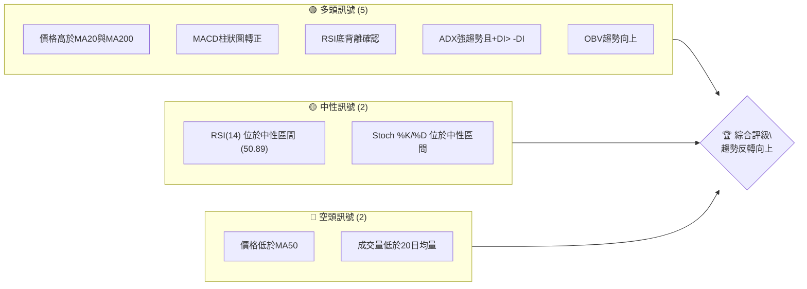
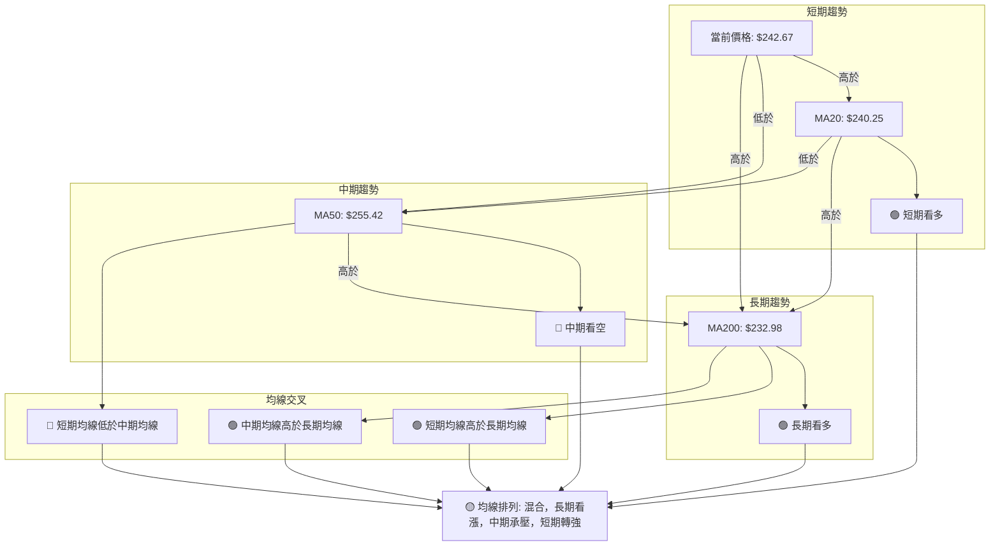
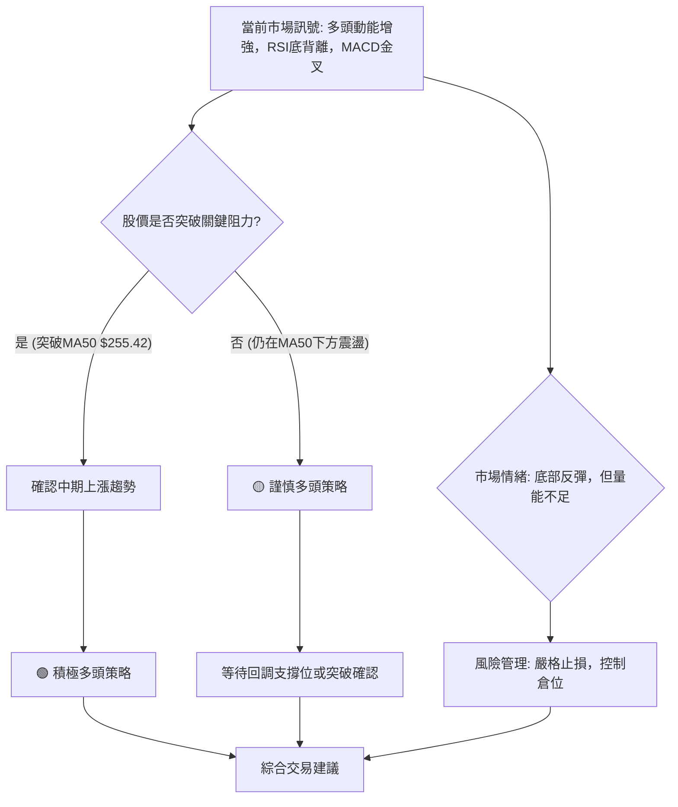

<details>
<summary>📊 靜態圖表 (點擊展開)</summary>

</details>

<html>
<head><meta charset="utf-8" /></head>
<body>
    <div style="height:500px; width:100%;">                        <script>window.PlotlyConfig = {MathJaxConfig: 'local'};</script>
        <script charset="utf-8" src="https://cdn.plot.ly/plotly-3.6.0.min.js" integrity="sha256-QaOVwtVY0T02VaHrr6pnoHLCwayMJp4O5n4YyaE3rJk=" crossorigin="anonymous"></script>                <div id="candlestick-chart" class="plotly-graph-div" style="height:100%; width:100%;"></div>            <script>                window.PLOTLYENV=window.PLOTLYENV || {};                                if (document.getElementById("candlestick-chart")) {                    Plotly.newPlot(                        "candlestick-chart",                        [{"close":{"dtype":"f8","bdata":"AAAAoJlBbUAAAAAA1\u002fNsQAAAACBc52xAAAAAIFzvbEAAAAAAKXRsQAAAAGC4lmtAAAAAYLiGa0AAAADAzERrQAAAAMD1eGtAAAAAoHDFa0AAAACAPXJrQAAAAAAplGtAAAAAwB7Na0AAAADgUXBrQAAAAMDMnGtAAAAAwPW4a0AAAABACidsQAAAACCud2xAAAAAANcLa0AAAACAPYJrQAAAAOB6DGtAAAAAgD3yakAAAABACs9qQAAAAKBHoWpAAAAAIFwPa0AAAADA9cBrQAAAAGBmPmtAAAAAQOGia0AAAABguAZsQAAAAEAKX2xAAAAAAACobEAAAACgmclsQAAAACCF22tAAAAAQAqHbkAAAAAAAMBvQAAAAIA9Km9AAAAAYGZGb0AAAACgR2FuQAAAAMAejW5AAAAAwMwMb0AAAABAMyNvQAAAAGBmhm5AAAAAYI+ybUAAAACAFFZtQAAAAADXG21AAAAAoJnRa0AAAACAFNZrQAAAAOB6JGtAAAAAgBSWa0AAAADA9UhsQAAAAKBwtWxAAAAAwB6lbEAAAABACidtQAAAAAApPG1AAAAAoHBNbUAAAAAAKQxtQAAAACCFo2xAAAAAwPWwbEAAAADgelxsQAAAAKBwfWxAAAAAwPX4bEAAAADA9chsQAAAAIAURmxAAAAAoEfRa0AAAACA69FrQAAAAOCjqGtAAAAA4FFYbEAAAABAM2tsQAAAAIDCjWxAAAAA4HoEbUAAAAAAKQxtQAAAAOCjEG1AAAAAgD0CbUAAAADA9RBtQAAAAIA92mxAAAAAAABQbEAAAACA6yFtQAAAAIDCHW5AAAAAgOsxbkAAAACgR8luQAAAAAAp7G5AAAAAQArPbkAAAABAM1NuQAAAAMDMlG1AAAAAgMLFbUAAAAAA1+NtQAAAAAAA4GxAAAAAgOvpbEAAAABA4UptQAAAAMAe5W1AAAAAoHDNbUAAAACAwpVuQAAAAOBRYG5AAAAAIFw3bkAAAACgmeltQAAAAGC4Xm5AAAAAANfTbUAAAAAgrh9tQAAAAIAU1mtAAAAAgD1KakAAAABAChdqQAAAAGC43mlAAAAAYI+CaUAAAABAM\u002fNoQAAAAKBH2WhAAAAAwMwkaUAAAACgR5lpQAAAACCFm2lAAAAAIIVDakAAAADgo6hpQAAAAIDrEWpAAAAA4HpUakAAAACgcP1pQAAAAAAAQGpAAAAA4HoMakAAAAAgXBdqQAAAAIA9GmtAAAAAgBRea0AAAABguKZqQAAAACCur2pAAAAAYI\u002fKakAAAADAzJRqQAAAAMD1MGpAAAAAoHD1aUAAAAAgrndqQAAAAGBm5mpAAAAAANc7akAAAADgURhqQAAAAADXq2lAAAAA4HpEakAAAAAgrudpQAAAAGC4dmpAAAAAoEfxaUAAAABA4epoQAAAAGBmHmlAAAAA4KMIakAAAACAPVJqQAAAAOCjOGpAAAAAoEeZakAAAADgo7hqQAAAAAAAqGtAAAAAwMw0bUAAAAAAKcxtQAAAAOB6\u002fG1AAAAA4KMgb0AAAAAAABBvQAAAAGBmNm9AAAAAgOtRb0AAAADA9QhvQAAAAMAePW9AAAAAIIXrb0AAAABgj+JvQAAAAADXf3BAAAAAgOtRcEAAAABAMztwQAAAAOCjcHBAAAAAwPWQcEAAAAAAKcRwQAAAAMDMAHFAAAAAwMwYcUAAAAAA1y9xQAAAAGC48nBAAAAAQOEKcUAAAAAA189wQAAAAMAenXBAAAAAgBTicEAAAAAghbNwQAAAAIA9gnBAAAAAgMKNcEAAAACgcDVwQAAAAAApkHBAAAAAIFzHcEAAAADAHqVwQAAAAOCjlHBAAAAAoJn9cEAAAAAAACBxQAAAAIA96nBAAAAAAClUcEAAAADgUQhwQAAAAOCjQG9AAAAAoEe5b0AAAADA9cBuQAAAAEAKp25AAAAAgBSGbkAAAAAAAMBtQAAAAOBRMG5AAAAAoJnRbUAAAADgo8BuQAAAAAAAwG5AAAAAAACwbUAAAADgeoxuQAAAAKBHGW1AAAAAIIVDbUAAAADgo0htQAAAAOBRYGxAAAAAgBQWbUAAAADgegRuQAAAAEDhym1AAAAAYGY2bkAAAACgcFVuQA=="},"high":{"dtype":"f8","bdata":"AAAAwMx8bUAAAACgmUltQAAAACBcL21AAAAAwB5FbUAAAACAPdJsQAAAACCFe2xAAAAAgOsRbEAAAACgcJVrQAAAAKCZoWtAAAAAQDPTa0AAAAAgrsdrQAAAAMDMxGtAAAAAgOvZa0AAAABgZgZsQAAAACBct2tAAAAA4Hrca0AAAAAgXFdsQAAAAGC4hmxAAAAAAACIbEAAAACAwpVrQAAAAIA9amtAAAAAYLg2a0AAAABA4VJrQAAAAKCZ2WpAAAAAgBQWa0AAAACAPeprQAAAAOBRgGtAAAAAoJmpa0AAAADAzCxsQAAAAMDMjGxAAAAAIK7vbEAAAACAPRptQAAAAIAUjmxAAAAAAABQb0AAAACgmSlwQAAAAAApEHBAAAAAAABgb0AAAAAAKUxvQAAAAMDMnG5AAAAAAAB4b0AAAAAAADhvQAAAAADXS29AAAAAAAB4bkAAAAAgXNdtQAAAAEAzU21AAAAAYGbGbEAAAAAgrvdrQAAAAMAebWxAAAAAYLjGa0AAAABgj2psQAAAAOCj0GxAAAAAAAD4bEAAAACgRyltQAAAAKCZeW1AAAAAQArfbUAAAAAAKSxtQAAAAAAAMG1AAAAAIK7nbEAAAABgj9psQAAAAIA9kmxAAAAAoHANbUAAAAAghQNtQAAAAGCPwmxAAAAAgMJ9bEAAAADAHvVrQAAAAIAUJmxAAAAAIFynbEAAAAAAKaRsQAAAACBcr2xAAAAAYGYObUAAAABgZh5tQAAAACCuH21AAAAAQDMTbUAAAADgoxhtQAAAACCuH21AAAAAYLhubUAAAAAAAEBtQAAAAIDCZW5AAAAAoEepbkAAAADAHs1uQAAAACCF+25AAAAAgBQeb0AAAADAHvVuQAAAAMD1KG5AAAAAwMwUbkAAAACAPfJtQAAAAEDhYm1AAAAAoJkJbUAAAABACndtQAAAAGBmDm5AAAAAYGYebkAAAAAAKZxuQAAAAMD1+G5AAAAAAABgbkAAAACAPWpuQAAAAAAptG5AAAAAQDPLbkAAAAAghdttQAAAAIDrSWxAAAAAgBRuakAAAACA65lqQAAAAMDMlGpAAAAAgD0SakAAAABguH5pQAAAAMAeJWlAAAAAIK43aUAAAAAghdtpQAAAAOB6tGlAAAAAoHBlakAAAACAwg1qQAAAACCFS2pAAAAAQOFyakAAAACgmWFqQAAAAGCPSmpAAAAAIFw3akAAAACAwiVqQAAAAKBHMWtAAAAAQAqPa0AAAACAPSprQAAAAIA9umpAAAAAwMz0akAAAAAAACBrQAAAAGC4dmpAAAAAgOtRakAAAABACpdqQAAAAGBm9mpAAAAA4HrkakAAAAAA1yNqQAAAAKBH8WlAAAAAoJmZakAAAABAMytqQAAAAIA9ompAAAAA4HqcakAAAABAM9NpQAAAAKCZeWlAAAAAwPVIakAAAABgj7JqQAAAAGC4hmpAAAAAYGaeakAAAABACr9qQAAAAEAzQ2xAAAAAoJk5bUAAAACAwg1uQAAAAAAAAG5AAAAAgMKFb0AAAACAFE5vQAAAAAAAQG9AAAAAQOECcEAAAACAwkVvQAAAAEDh4m9AAAAAgBT+b0AAAADgoyxwQAAAAAAAiHBAAAAAYGaCcEAAAADgelBwQAAAAGCPnnBAAAAAgBQecUAAAADAHhVxQAAAAKCZQXFAAAAAwPVocUAAAADAzFxxQAAAAIAUSnFAAAAAAAAgcUAAAACAFBpxQAAAAGBmunBAAAAAIIXrcEAAAADgeuxwQAAAAIDChXBAAAAAoJnNcEAAAAAAAGRwQAAAAKBHmXBAAAAAANfXcEAAAADgo9xwQAAAAMDM1HBAAAAAYI8GcUAAAAAAAChxQAAAAAAALHFAAAAAgBSqcEAAAABAM1NwQAAAAKBwEXBAAAAAYI\u002f6b0AAAACAFAZwQAAAAKBwLW9AAAAAgMJNb0AAAACAPYJuQAAAAOB6RG5AAAAAIIVrbkAAAACA6\u002fluQAAAAOBRMG9AAAAAwB69bkAAAAAgXLduQAAAAAAAQG5AAAAAANebbUAAAACgcE1uQAAAAIA9Cm1AAAAAwMw8bUAAAABguDZvQAAAAKBHMW5AAAAAwMycbkAAAABACtduQA=="},"hovertemplate":"\u003cb\u003e%{x|%Y-%m-%d}\u003c\u002fb\u003e\u003cbr\u003e\u958b: $%{open:.2f}\u003cbr\u003e\u9ad8: $%{high:.2f}\u003cbr\u003e\u4f4e: $%{low:.2f}\u003cbr\u003e\u6536: $%{close:.2f}\u003cextra\u003e\u003c\u002fextra\u003e","low":{"dtype":"f8","bdata":"AAAAIFwHbUAAAABguJZsQAAAAKBHmWxAAAAAYGa2bEAAAADgUXBsQAAAAIA9gmtAAAAAYGZua0AAAABACg9rQAAAAOCjQGtAAAAAoJlpa0AAAADgejxrQAAAACCFE2tAAAAAYGZea0AAAABA4WprQAAAAMD1AGtAAAAAoHCFa0AAAACAFKZrQAAAAAAAuGtAAAAAAAAAa0AAAACgRyFrQAAAAEAzk2pAAAAAwB6VakAAAACA65lqQAAAAMD1YGpAAAAAQOGyakAAAAAgrj9rQAAAAOCjEGtAAAAAgMJFa0AAAADAzLxrQAAAAKBHMWxAAAAAYLhGbEAAAADgUXhsQAAAAAAA2GtAAAAAIFx\u002fbkAAAADAzJxvQAAAAMAeFW9AAAAAwB7FbkAAAACgcEVuQAAAACCuz21AAAAAQOGybkAAAAAgXOduQAAAAAAAeG5AAAAAAACQbUAAAADgehxtQAAAAIAUpmxAAAAAoHDNa0AAAADgo1BrQAAAACCuF2tAAAAAgMLlakAAAADgo8hrQAAAAKCZ+WtAAAAA4KOYbEAAAABACsdsQAAAAAAACG1AAAAAoJkxbUAAAAAghdNsQAAAAKCZWWxAAAAAoJmRbEAAAADgo0hsQAAAACCFI2xAAAAAYLiObEAAAACAFJZsQAAAAADXI2xAAAAAAACwa0AAAAAAKaRrQAAAACCun2tAAAAAwB4NbEAAAABgjzJsQAAAAGC4VmxAAAAAIFyXbEAAAABgj+psQAAAAIDC5WxAAAAA4KPYbEAAAABgZsZsQAAAAADXw2xAAAAAYGYWbEAAAACAwmVsQAAAAIA9Am1AAAAA4KPwbUAAAAAAKTxuQAAAACCuR25AAAAAYLi+bkAAAAAAAAhuQAAAAEAKh21AAAAAACmUbUAAAADAHo1tQAAAAEDhqmxAAAAAAClcbEAAAADAzNxsQAAAAIA9Um1AAAAAoEexbUAAAABgj8JtQAAAAMD1MG5AAAAAIK6XbUAAAADgerRtQAAAAKBwxW1AAAAAYGZubUAAAACAPfpsQAAAAAApjGtAAAAAgOsJaUAAAABAM2tpQAAAAMAezWlAAAAAIK5PaUAAAACA67FoQAAAAMD1qGhAAAAAAACAaEAAAADgUTBpQAAAAIDrWWlAAAAAAAB4aUAAAAAghWNpQAAAAAAAaGlAAAAAgMIdakAAAABAM6tpQAAAAGBmpmlAAAAAYLhuaUAAAAAgXE9pQAAAAMDMRGpAAAAAQOHyakAAAADA9ZBqQAAAACCF42lAAAAAgMKNakAAAABAM2tqQAAAAMDMBGpAAAAAQArHaUAAAABgZu5pQAAAAIDCjWpAAAAAYI8aakAAAACgmcFpQAAAAIA9imlAAAAA4FEwakAAAADgetRpQAAAAMDMPGpAAAAAANfjaUAAAADgeuRoQAAAACBc\u002f2hAAAAA4HqEaUAAAACAFAZqQAAAAMDMnGlAAAAAQOEyakAAAABgjyJqQAAAAADXc2tAAAAA4KPoa0AAAABguGZtQAAAAAAAeG1AAAAAwPU4bkAAAABgZuZuQAAAAGBmhm5AAAAAIIVDb0AAAAAA16tuQAAAAEAzI29AAAAAYI9Kb0AAAACAPaJvQAAAAEAKG3BAAAAAoHBFcEAAAACAFApwQAAAAEAzG3BAAAAAYI8CcEAAAAAA12twQAAAAMDMzHBAAAAAgBQGcUAAAAAgXANxQAAAAADX53BAAAAAQDPfcEAAAAAgrsdwQAAAAIAUanBAAAAAQDNzcEAAAACAFKpwQAAAAIA9TnBAAAAA4HpocEAAAACAFOZvQAAAAOB6OHBAAAAAgOtVcEAAAAAA16NwQAAAAMAeYXBAAAAAQDObcEAAAABACrdwQAAAAIA92nBAAAAAQDNLcEAAAAAA18tvQAAAAGC49m5AAAAAAAB4b0AAAADA9bhuQAAAACCFa25AAAAAwMwMbkAAAABgZq5tQAAAAIDCZW1AAAAAQOEybUAAAAAgXJduQAAAAGBmrm5AAAAAAACAbUAAAADgo4BtQAAAACCuB21AAAAAAAAAbUAAAABgZh5tQAAAAKCZMWxAAAAAAClEbEAAAACgmTltQAAAAKBwpW1AAAAAwMxcbUAAAABgjyJuQA=="},"name":"\u50f9\u683c","open":{"dtype":"f8","bdata":"AAAAgBQebUAAAADgozhtQAAAAAAAEG1AAAAAANcLbUAAAACA69FsQAAAAGCPemxAAAAAwMwEbEAAAACA64FrQAAAAGCPYmtAAAAAYI+Ca0AAAADA9cBrQAAAACCFK2tAAAAA4FGga0AAAACAFO5rQAAAAAAAoGtAAAAAACmca0AAAACgcN1rQAAAAAAAIGxAAAAAYLhGbEAAAABgZjZrQAAAAIDr8WpAAAAAANcTa0AAAACgcPVqQAAAAIDr0WpAAAAAACm8akAAAACAwk1rQAAAAKCZaWtAAAAAAABga0AAAABACr9rQAAAAMAedWxAAAAAQAqHbEAAAACgcPVsQAAAAIDrYWxAAAAAQDNDb0AAAAAghetvQAAAAAApTG9AAAAAwPUgb0AAAADAHiVvQAAAAMDMXG5AAAAAQOEKb0AAAADAHg1vQAAAACCuR29AAAAAoJlhbkAAAACA62FtQAAAAAAAKG1AAAAAQDODbEAAAAAgrvdrQAAAAKCZYWxAAAAAQDMLa0AAAACA69FrQAAAAAApTGxAAAAAIK7XbEAAAAAgrudsQAAAAEAKJ21AAAAA4FFgbUAAAABAMyttQAAAAOCjGG1AAAAAgD3KbEAAAABA4bJsQAAAAEDhWmxAAAAAgOuZbEAAAABguNZsQAAAAADXu2xAAAAAgMJ9bEAAAACgR+FrQAAAAMAeFWxAAAAAYLg2bEAAAADgUVhsQAAAACCFk2xAAAAAgOuhbEAAAAAAKQRtQAAAAKBHAW1AAAAAgBT+bEAAAABguOZsQAAAAMAeHW1AAAAAQOHqbEAAAABA4ZpsQAAAAEAzA21AAAAAIIXzbUAAAACA62FuQAAAAIA9km5AAAAAIFzXbkAAAADA9dBuQAAAAMDMJG5AAAAAgOvpbUAAAABA4eJtQAAAAOBROG1AAAAAQOHibEAAAACgmUFtQAAAAGC4Xm1AAAAAIFz\u002fbUAAAACAFPZtQAAAAADXy25AAAAAgD1abkAAAADgevxtQAAAAIDryW1AAAAAIFyfbkAAAAAghdttQAAAAMAeHWxAAAAAYGZWaUAAAABACh9qQAAAAKCZGWpAAAAAgOsBakAAAABguH5pQAAAAAAp3GhAAAAAACnEaEAAAACAPUJpQAAAAKCZeWlAAAAA4FGYaUAAAABAMwNqQAAAAEAKr2lAAAAAYLhOakAAAAAgXFdqQAAAAGCP2mlAAAAAoJmRaUAAAABAM2NpQAAAAEAKT2pAAAAAIFz\u002fakAAAAAgrt9qQAAAAGBmTmpAAAAAgBTGakAAAABguPZqQAAAAOB6TGpAAAAAIIUzakAAAABAMwtqQAAAAIA9mmpAAAAAgMK9akAAAACA6+FpQAAAAMDM7GlAAAAAoEc5akAAAABgZv5pQAAAAIDrcWpAAAAAIIVTakAAAABguM5pQAAAACBcL2lAAAAAQDObaUAAAACAFE5qQAAAAKBH0WlAAAAAoJk5akAAAAAgrmdqQAAAAKBH+WtAAAAAIFwnbEAAAACgmWltQAAAAGBmrm1AAAAAwPU4bkAAAAAAAChvQAAAAOBREG9AAAAAIK7fb0AAAACAFCZvQAAAAEDh4m9AAAAAgBSOb0AAAADgeuxvQAAAACCuP3BAAAAAIFx3cEAAAACAPSZwQAAAAADXH3BAAAAAYLgScUAAAACgR5lwQAAAAMDMzHBAAAAAoEdBcUAAAACAPQ5xQAAAAOBRMHFAAAAAgBT6cEAAAACgcN1wQAAAACBcq3BAAAAAQOGGcEAAAABgZtJwQAAAAAAAaHBAAAAAgOt9cEAAAADgo2BwQAAAAMDMQHBAAAAAAAB4cEAAAABgj8pwQAAAAEAKv3BAAAAAYGaicEAAAADgUQRxQAAAAOCj9HBAAAAA4KOkcEAAAABgjxJwQAAAAGBm1m9AAAAAANejb0AAAADgUchvQAAAAIDC1W5AAAAAIFz3bkAAAAAghXNuQAAAAIDCvW1AAAAAYLhmbkAAAADgo6BuQAAAAAAAAG9AAAAAwMycbkAAAAAA1wNuQAAAAGCPAm5AAAAAoJkRbUAAAABAMzttQAAAAOCjAG1AAAAAYLhmbEAAAABACkdtQAAAAEAzq21AAAAAAAD4bUAAAACgRzNuQA=="},"x":["2025-09-16T00:00:00-04:00","2025-09-17T00:00:00-04:00","2025-09-18T00:00:00-04:00","2025-09-19T00:00:00-04:00","2025-09-22T00:00:00-04:00","2025-09-23T00:00:00-04:00","2025-09-24T00:00:00-04:00","2025-09-25T00:00:00-04:00","2025-09-26T00:00:00-04:00","2025-09-29T00:00:00-04:00","2025-09-30T00:00:00-04:00","2025-10-01T00:00:00-04:00","2025-10-02T00:00:00-04:00","2025-10-03T00:00:00-04:00","2025-10-06T00:00:00-04:00","2025-10-07T00:00:00-04:00","2025-10-08T00:00:00-04:00","2025-10-09T00:00:00-04:00","2025-10-10T00:00:00-04:00","2025-10-13T00:00:00-04:00","2025-10-14T00:00:00-04:00","2025-10-15T00:00:00-04:00","2025-10-16T00:00:00-04:00","2025-10-17T00:00:00-04:00","2025-10-20T00:00:00-04:00","2025-10-21T00:00:00-04:00","2025-10-22T00:00:00-04:00","2025-10-23T00:00:00-04:00","2025-10-24T00:00:00-04:00","2025-10-27T00:00:00-04:00","2025-10-28T00:00:00-04:00","2025-10-29T00:00:00-04:00","2025-10-30T00:00:00-04:00","2025-10-31T00:00:00-04:00","2025-11-03T00:00:00-05:00","2025-11-04T00:00:00-05:00","2025-11-05T00:00:00-05:00","2025-11-06T00:00:00-05:00","2025-11-07T00:00:00-05:00","2025-11-10T00:00:00-05:00","2025-11-11T00:00:00-05:00","2025-11-12T00:00:00-05:00","2025-11-13T00:00:00-05:00","2025-11-14T00:00:00-05:00","2025-11-17T00:00:00-05:00","2025-11-18T00:00:00-05:00","2025-11-19T00:00:00-05:00","2025-11-20T00:00:00-05:00","2025-11-21T00:00:00-05:00","2025-11-24T00:00:00-05:00","2025-11-25T00:00:00-05:00","2025-11-26T00:00:00-05:00","2025-11-28T00:00:00-05:00","2025-12-01T00:00:00-05:00","2025-12-02T00:00:00-05:00","2025-12-03T00:00:00-05:00","2025-12-04T00:00:00-05:00","2025-12-05T00:00:00-05:00","2025-12-08T00:00:00-05:00","2025-12-09T00:00:00-05:00","2025-12-10T00:00:00-05:00","2025-12-11T00:00:00-05:00","2025-12-12T00:00:00-05:00","2025-12-15T00:00:00-05:00","2025-12-16T00:00:00-05:00","2025-12-17T00:00:00-05:00","2025-12-18T00:00:00-05:00","2025-12-19T00:00:00-05:00","2025-12-22T00:00:00-05:00","2025-12-23T00:00:00-05:00","2025-12-24T00:00:00-05:00","2025-12-26T00:00:00-05:00","2025-12-29T00:00:00-05:00","2025-12-30T00:00:00-05:00","2025-12-31T00:00:00-05:00","2026-01-02T00:00:00-05:00","2026-01-05T00:00:00-05:00","2026-01-06T00:00:00-05:00","2026-01-07T00:00:00-05:00","2026-01-08T00:00:00-05:00","2026-01-09T00:00:00-05:00","2026-01-12T00:00:00-05:00","2026-01-13T00:00:00-05:00","2026-01-14T00:00:00-05:00","2026-01-15T00:00:00-05:00","2026-01-16T00:00:00-05:00","2026-01-20T00:00:00-05:00","2026-01-21T00:00:00-05:00","2026-01-22T00:00:00-05:00","2026-01-23T00:00:00-05:00","2026-01-26T00:00:00-05:00","2026-01-27T00:00:00-05:00","2026-01-28T00:00:00-05:00","2026-01-29T00:00:00-05:00","2026-01-30T00:00:00-05:00","2026-02-02T00:00:00-05:00","2026-02-03T00:00:00-05:00","2026-02-04T00:00:00-05:00","2026-02-05T00:00:00-05:00","2026-02-06T00:00:00-05:00","2026-02-09T00:00:00-05:00","2026-02-10T00:00:00-05:00","2026-02-11T00:00:00-05:00","2026-02-12T00:00:00-05:00","2026-02-13T00:00:00-05:00","2026-02-17T00:00:00-05:00","2026-02-18T00:00:00-05:00","2026-02-19T00:00:00-05:00","2026-02-20T00:00:00-05:00","2026-02-23T00:00:00-05:00","2026-02-24T00:00:00-05:00","2026-02-25T00:00:00-05:00","2026-02-26T00:00:00-05:00","2026-02-27T00:00:00-05:00","2026-03-02T00:00:00-05:00","2026-03-03T00:00:00-05:00","2026-03-04T00:00:00-05:00","2026-03-05T00:00:00-05:00","2026-03-06T00:00:00-05:00","2026-03-09T00:00:00-04:00","2026-03-10T00:00:00-04:00","2026-03-11T00:00:00-04:00","2026-03-12T00:00:00-04:00","2026-03-13T00:00:00-04:00","2026-03-16T00:00:00-04:00","2026-03-17T00:00:00-04:00","2026-03-18T00:00:00-04:00","2026-03-19T00:00:00-04:00","2026-03-20T00:00:00-04:00","2026-03-23T00:00:00-04:00","2026-03-24T00:00:00-04:00","2026-03-25T00:00:00-04:00","2026-03-26T00:00:00-04:00","2026-03-27T00:00:00-04:00","2026-03-30T00:00:00-04:00","2026-03-31T00:00:00-04:00","2026-04-01T00:00:00-04:00","2026-04-02T00:00:00-04:00","2026-04-06T00:00:00-04:00","2026-04-07T00:00:00-04:00","2026-04-08T00:00:00-04:00","2026-04-09T00:00:00-04:00","2026-04-10T00:00:00-04:00","2026-04-13T00:00:00-04:00","2026-04-14T00:00:00-04:00","2026-04-15T00:00:00-04:00","2026-04-16T00:00:00-04:00","2026-04-17T00:00:00-04:00","2026-04-20T00:00:00-04:00","2026-04-21T00:00:00-04:00","2026-04-22T00:00:00-04:00","2026-04-23T00:00:00-04:00","2026-04-24T00:00:00-04:00","2026-04-27T00:00:00-04:00","2026-04-28T00:00:00-04:00","2026-04-29T00:00:00-04:00","2026-04-30T00:00:00-04:00","2026-05-01T00:00:00-04:00","2026-05-04T00:00:00-04:00","2026-05-05T00:00:00-04:00","2026-05-06T00:00:00-04:00","2026-05-07T00:00:00-04:00","2026-05-08T00:00:00-04:00","2026-05-11T00:00:00-04:00","2026-05-12T00:00:00-04:00","2026-05-13T00:00:00-04:00","2026-05-14T00:00:00-04:00","2026-05-15T00:00:00-04:00","2026-05-18T00:00:00-04:00","2026-05-19T00:00:00-04:00","2026-05-20T00:00:00-04:00","2026-05-21T00:00:00-04:00","2026-05-22T00:00:00-04:00","2026-05-26T00:00:00-04:00","2026-05-27T00:00:00-04:00","2026-05-28T00:00:00-04:00","2026-05-29T00:00:00-04:00","2026-06-01T00:00:00-04:00","2026-06-02T00:00:00-04:00","2026-06-03T00:00:00-04:00","2026-06-04T00:00:00-04:00","2026-06-05T00:00:00-04:00","2026-06-08T00:00:00-04:00","2026-06-09T00:00:00-04:00","2026-06-10T00:00:00-04:00","2026-06-11T00:00:00-04:00","2026-06-12T00:00:00-04:00","2026-06-15T00:00:00-04:00","2026-06-16T00:00:00-04:00","2026-06-17T00:00:00-04:00","2026-06-18T00:00:00-04:00","2026-06-22T00:00:00-04:00","2026-06-23T00:00:00-04:00","2026-06-24T00:00:00-04:00","2026-06-25T00:00:00-04:00","2026-06-26T00:00:00-04:00","2026-06-29T00:00:00-04:00","2026-06-30T00:00:00-04:00","2026-07-01T00:00:00-04:00","2026-07-02T00:00:00-04:00"],"type":"candlestick"},{"hovertemplate":"MA30: $%{y:.2f}\u003cextra\u003e\u003c\u002fextra\u003e","line":{"color":"#2196F3","dash":"dash","width":2},"mode":"lines","name":"MA30","x":["2025-09-16T00:00:00-04:00","2025-09-17T00:00:00-04:00","2025-09-18T00:00:00-04:00","2025-09-19T00:00:00-04:00","2025-09-22T00:00:00-04:00","2025-09-23T00:00:00-04:00","2025-09-24T00:00:00-04:00","2025-09-25T00:00:00-04:00","2025-09-26T00:00:00-04:00","2025-09-29T00:00:00-04:00","2025-09-30T00:00:00-04:00","2025-10-01T00:00:00-04:00","2025-10-02T00:00:00-04:00","2025-10-03T00:00:00-04:00","2025-10-06T00:00:00-04:00","2025-10-07T00:00:00-04:00","2025-10-08T00:00:00-04:00","2025-10-09T00:00:00-04:00","2025-10-10T00:00:00-04:00","2025-10-13T00:00:00-04:00","2025-10-14T00:00:00-04:00","2025-10-15T00:00:00-04:00","2025-10-16T00:00:00-04:00","2025-10-17T00:00:00-04:00","2025-10-20T00:00:00-04:00","2025-10-21T00:00:00-04:00","2025-10-22T00:00:00-04:00","2025-10-23T00:00:00-04:00","2025-10-24T00:00:00-04:00","2025-10-27T00:00:00-04:00","2025-10-28T00:00:00-04:00","2025-10-29T00:00:00-04:00","2025-10-30T00:00:00-04:00","2025-10-31T00:00:00-04:00","2025-11-03T00:00:00-05:00","2025-11-04T00:00:00-05:00","2025-11-05T00:00:00-05:00","2025-11-06T00:00:00-05:00","2025-11-07T00:00:00-05:00","2025-11-10T00:00:00-05:00","2025-11-11T00:00:00-05:00","2025-11-12T00:00:00-05:00","2025-11-13T00:00:00-05:00","2025-11-14T00:00:00-05:00","2025-11-17T00:00:00-05:00","2025-11-18T00:00:00-05:00","2025-11-19T00:00:00-05:00","2025-11-20T00:00:00-05:00","2025-11-21T00:00:00-05:00","2025-11-24T00:00:00-05:00","2025-11-25T00:00:00-05:00","2025-11-26T00:00:00-05:00","2025-11-28T00:00:00-05:00","2025-12-01T00:00:00-05:00","2025-12-02T00:00:00-05:00","2025-12-03T00:00:00-05:00","2025-12-04T00:00:00-05:00","2025-12-05T00:00:00-05:00","2025-12-08T00:00:00-05:00","2025-12-09T00:00:00-05:00","2025-12-10T00:00:00-05:00","2025-12-11T00:00:00-05:00","2025-12-12T00:00:00-05:00","2025-12-15T00:00:00-05:00","2025-12-16T00:00:00-05:00","2025-12-17T00:00:00-05:00","2025-12-18T00:00:00-05:00","2025-12-19T00:00:00-05:00","2025-12-22T00:00:00-05:00","2025-12-23T00:00:00-05:00","2025-12-24T00:00:00-05:00","2025-12-26T00:00:00-05:00","2025-12-29T00:00:00-05:00","2025-12-30T00:00:00-05:00","2025-12-31T00:00:00-05:00","2026-01-02T00:00:00-05:00","2026-01-05T00:00:00-05:00","2026-01-06T00:00:00-05:00","2026-01-07T00:00:00-05:00","2026-01-08T00:00:00-05:00","2026-01-09T00:00:00-05:00","2026-01-12T00:00:00-05:00","2026-01-13T00:00:00-05:00","2026-01-14T00:00:00-05:00","2026-01-15T00:00:00-05:00","2026-01-16T00:00:00-05:00","2026-01-20T00:00:00-05:00","2026-01-21T00:00:00-05:00","2026-01-22T00:00:00-05:00","2026-01-23T00:00:00-05:00","2026-01-26T00:00:00-05:00","2026-01-27T00:00:00-05:00","2026-01-28T00:00:00-05:00","2026-01-29T00:00:00-05:00","2026-01-30T00:00:00-05:00","2026-02-02T00:00:00-05:00","2026-02-03T00:00:00-05:00","2026-02-04T00:00:00-05:00","2026-02-05T00:00:00-05:00","2026-02-06T00:00:00-05:00","2026-02-09T00:00:00-05:00","2026-02-10T00:00:00-05:00","2026-02-11T00:00:00-05:00","2026-02-12T00:00:00-05:00","2026-02-13T00:00:00-05:00","2026-02-17T00:00:00-05:00","2026-02-18T00:00:00-05:00","2026-02-19T00:00:00-05:00","2026-02-20T00:00:00-05:00","2026-02-23T00:00:00-05:00","2026-02-24T00:00:00-05:00","2026-02-25T00:00:00-05:00","2026-02-26T00:00:00-05:00","2026-02-27T00:00:00-05:00","2026-03-02T00:00:00-05:00","2026-03-03T00:00:00-05:00","2026-03-04T00:00:00-05:00","2026-03-05T00:00:00-05:00","2026-03-06T00:00:00-05:00","2026-03-09T00:00:00-04:00","2026-03-10T00:00:00-04:00","2026-03-11T00:00:00-04:00","2026-03-12T00:00:00-04:00","2026-03-13T00:00:00-04:00","2026-03-16T00:00:00-04:00","2026-03-17T00:00:00-04:00","2026-03-18T00:00:00-04:00","2026-03-19T00:00:00-04:00","2026-03-20T00:00:00-04:00","2026-03-23T00:00:00-04:00","2026-03-24T00:00:00-04:00","2026-03-25T00:00:00-04:00","2026-03-26T00:00:00-04:00","2026-03-27T00:00:00-04:00","2026-03-30T00:00:00-04:00","2026-03-31T00:00:00-04:00","2026-04-01T00:00:00-04:00","2026-04-02T00:00:00-04:00","2026-04-06T00:00:00-04:00","2026-04-07T00:00:00-04:00","2026-04-08T00:00:00-04:00","2026-04-09T00:00:00-04:00","2026-04-10T00:00:00-04:00","2026-04-13T00:00:00-04:00","2026-04-14T00:00:00-04:00","2026-04-15T00:00:00-04:00","2026-04-16T00:00:00-04:00","2026-04-17T00:00:00-04:00","2026-04-20T00:00:00-04:00","2026-04-21T00:00:00-04:00","2026-04-22T00:00:00-04:00","2026-04-23T00:00:00-04:00","2026-04-24T00:00:00-04:00","2026-04-27T00:00:00-04:00","2026-04-28T00:00:00-04:00","2026-04-29T00:00:00-04:00","2026-04-30T00:00:00-04:00","2026-05-01T00:00:00-04:00","2026-05-04T00:00:00-04:00","2026-05-05T00:00:00-04:00","2026-05-06T00:00:00-04:00","2026-05-07T00:00:00-04:00","2026-05-08T00:00:00-04:00","2026-05-11T00:00:00-04:00","2026-05-12T00:00:00-04:00","2026-05-13T00:00:00-04:00","2026-05-14T00:00:00-04:00","2026-05-15T00:00:00-04:00","2026-05-18T00:00:00-04:00","2026-05-19T00:00:00-04:00","2026-05-20T00:00:00-04:00","2026-05-21T00:00:00-04:00","2026-05-22T00:00:00-04:00","2026-05-26T00:00:00-04:00","2026-05-27T00:00:00-04:00","2026-05-28T00:00:00-04:00","2026-05-29T00:00:00-04:00","2026-06-01T00:00:00-04:00","2026-06-02T00:00:00-04:00","2026-06-03T00:00:00-04:00","2026-06-04T00:00:00-04:00","2026-06-05T00:00:00-04:00","2026-06-08T00:00:00-04:00","2026-06-09T00:00:00-04:00","2026-06-10T00:00:00-04:00","2026-06-11T00:00:00-04:00","2026-06-12T00:00:00-04:00","2026-06-15T00:00:00-04:00","2026-06-16T00:00:00-04:00","2026-06-17T00:00:00-04:00","2026-06-18T00:00:00-04:00","2026-06-22T00:00:00-04:00","2026-06-23T00:00:00-04:00","2026-06-24T00:00:00-04:00","2026-06-25T00:00:00-04:00","2026-06-26T00:00:00-04:00","2026-06-29T00:00:00-04:00","2026-06-30T00:00:00-04:00","2026-07-01T00:00:00-04:00","2026-07-02T00:00:00-04:00"],"y":{"dtype":"f8","bdata":"AAAAAAAA+H8AAAAAAAD4fwAAAAAAAPh\u002fAAAAAAAA+H8AAAAAAAD4fwAAAAAAAPh\u002fAAAAAAAA+H8AAAAAAAD4fwAAAAAAAPh\u002fAAAAAAAA+H8AAAAAAAD4fwAAAAAAAPh\u002fAAAAAAAA+H8AAAAAAAD4fwAAAAAAAPh\u002fAAAAAAAA+H8AAAAAAAD4fwAAAAAAAPh\u002fAAAAAAAA+H8AAAAAAAD4fwAAAAAAAPh\u002fAAAAAAAA+H8AAAAAAAD4fwAAAAAAAPh\u002fAAAAAAAA+H8AAAAAAAD4fwAAAAAAAPh\u002fAAAAAAAA+H8AAAAAAAD4f6uqqlpkv2tAIiIiokW6a0AAAAAw3bhrQO\u002fu7p7vr2tA3t3dfYa9a0AiIiJCp9lrQCIiIrIr+GtAZmZm9igYbEB3d3eXtTJsQJqZmTn7TGxAMzMzw\u002fVobEC8u7trdYhsQJqZmZmZoWxAVVVVBcixbEDNzMws+cFsQImIiMi9zmxAvLu7C5DPbEAAAAAw3cxsQN7d3a2OwWxAREREVCrGbEAiIiISysxsQFVVVWX02mxA7+7uXnPpbEDv7u5ec\u002f1sQFVVVRWuE21AZmZm5tAmbUBEREQk2zFtQBEREZHCPW1AAAAAQMNGbUARERERn0ltQKuqqnqiSm1AZmZmVlVNbUAAAADgT01tQAAAADDdUG1AmpmZGb05bUAiIiLiMxhtQM3MzFxI+mxA3t3drUfhbEBEREREi9BsQImIiKh\u002fv2xAiYiImCeubEC8u7vrUZxsQBEREYHcj2xAiYiI6PuJbEBVVVUVrodsQM3MzEx+hWxAmpmZ6bSJbEDNzMycxJRsQN7d3d0krmxARERExGfEbEBERETUv9lsQHd3d9ej7GxAAAAAoBr\u002fbEDe3d39GwltQCIiImIQDG1AzczMHBMQbUBERESUQxdtQM3MzKxHGW1AvLu7uy0bbUBEREQUICNtQJqZmVkdL21AMzMzgzI2bUC8u7urjkVtQGZmZqZ\u002fV21AzczMzPdrbUAAAADw0n1tQBEREcH1lG1AMzMzU5yhbUC8u7troKdtQFVVVQWBoW1AVVVVtTqKbUAzMzPz\u002fXBtQN7d3V26VW1Aq6qqOt83bUBVVVUlvxRtQBEREdGU8mxAMzMzk4rXbECrqqr6YrlsQHd3d3fpkmxAVVVVhV1xbEBERERUnEVsQBEREeEzHGxAZmZm5vv1a0AiIiLy\u002fdBrQImIiLiQtGtAEREREcqUa0AiIiKSX3RrQM3MzHw\u002fZWtAd3d3pw1Ya0AiIiLCg0FrQDMzMyMiJmtAZmZm9m8Ma0AzMzOjRepqQN7d3V2PxmpAd3d3tzqiakAAAAAA1YRqQKuqqqo4Z2pAAAAAAI5IakB3d3eXtS5qQDMzMxM8HGpAvLu76wocakCJiIjIdhpqQJqZmdmHH2pAiYiIqDgjakCJiIio8SJqQLy7u3s\u002fJWpAiYiIuNcsakDNzMwMAjNqQO\u002fu7s4+OGpAAAAAoBo7akARERGxK0RqQImIiOi0UWpAvLu7K0BqakCJiIjIvYpqQO\u002fu7r6fqmpAIiIicvbVakDv7u5OYgBrQM3MzLx0I2tAq6qqGi9Fa0DNzMyMl2prQDMzM6NwkWtAAAAAkDS9a0CJiIjIduprQN7d3f2NJGxAd3d3Z5FdbEDv7u6uuZBsQCIiIjLBw2xA7+7uvp\u002f+bEB3d3c3Fz5tQM3MzEw3hW1AREREdNrIbUB3d3e3HhFuQDMzM0OLUG5AMzMz0waWbkCrqqrqUeBuQBEREcGDJW9AiYiIqH9nb0AiIiLi7KNvQFVVVYXr3W9AzczMDLsKcEB3d3ffCCNwQKuqqpJfOnBARERETPBMcEAiIiIK11twQM3MzPxiaXBAMzMzC5B1cEDNzMykKYNwQHd3d6dUjnBAAAAAkAmUcECJiIiYbphwQFVVVZ19mHBAmpmZQaeXcEARERGh05JwQGZmZubQiHBAREREZMl\u002fcEDe3d2dNnRwQFVVVQ27aHBA3t3djZdacEBVVVUNu05wQERERFzWQHBA3t3dVZwtcECrqqpqSh1wQLy7u0PSCHBAmpmZWYDob0Crqqp6d8NvQCIiIsIRmm9AREREJCJyb0Dv7u5+P1VvQO\u002fu7l66OW9AZmZmJgYhb0AREREhPg9vQA=="},"type":"scatter"},{"hovertemplate":"MA60: $%{y:.2f}\u003cextra\u003e\u003c\u002fextra\u003e","line":{"color":"#9C27B0","dash":"dash","width":2},"mode":"lines","name":"MA60","x":["2025-09-16T00:00:00-04:00","2025-09-17T00:00:00-04:00","2025-09-18T00:00:00-04:00","2025-09-19T00:00:00-04:00","2025-09-22T00:00:00-04:00","2025-09-23T00:00:00-04:00","2025-09-24T00:00:00-04:00","2025-09-25T00:00:00-04:00","2025-09-26T00:00:00-04:00","2025-09-29T00:00:00-04:00","2025-09-30T00:00:00-04:00","2025-10-01T00:00:00-04:00","2025-10-02T00:00:00-04:00","2025-10-03T00:00:00-04:00","2025-10-06T00:00:00-04:00","2025-10-07T00:00:00-04:00","2025-10-08T00:00:00-04:00","2025-10-09T00:00:00-04:00","2025-10-10T00:00:00-04:00","2025-10-13T00:00:00-04:00","2025-10-14T00:00:00-04:00","2025-10-15T00:00:00-04:00","2025-10-16T00:00:00-04:00","2025-10-17T00:00:00-04:00","2025-10-20T00:00:00-04:00","2025-10-21T00:00:00-04:00","2025-10-22T00:00:00-04:00","2025-10-23T00:00:00-04:00","2025-10-24T00:00:00-04:00","2025-10-27T00:00:00-04:00","2025-10-28T00:00:00-04:00","2025-10-29T00:00:00-04:00","2025-10-30T00:00:00-04:00","2025-10-31T00:00:00-04:00","2025-11-03T00:00:00-05:00","2025-11-04T00:00:00-05:00","2025-11-05T00:00:00-05:00","2025-11-06T00:00:00-05:00","2025-11-07T00:00:00-05:00","2025-11-10T00:00:00-05:00","2025-11-11T00:00:00-05:00","2025-11-12T00:00:00-05:00","2025-11-13T00:00:00-05:00","2025-11-14T00:00:00-05:00","2025-11-17T00:00:00-05:00","2025-11-18T00:00:00-05:00","2025-11-19T00:00:00-05:00","2025-11-20T00:00:00-05:00","2025-11-21T00:00:00-05:00","2025-11-24T00:00:00-05:00","2025-11-25T00:00:00-05:00","2025-11-26T00:00:00-05:00","2025-11-28T00:00:00-05:00","2025-12-01T00:00:00-05:00","2025-12-02T00:00:00-05:00","2025-12-03T00:00:00-05:00","2025-12-04T00:00:00-05:00","2025-12-05T00:00:00-05:00","2025-12-08T00:00:00-05:00","2025-12-09T00:00:00-05:00","2025-12-10T00:00:00-05:00","2025-12-11T00:00:00-05:00","2025-12-12T00:00:00-05:00","2025-12-15T00:00:00-05:00","2025-12-16T00:00:00-05:00","2025-12-17T00:00:00-05:00","2025-12-18T00:00:00-05:00","2025-12-19T00:00:00-05:00","2025-12-22T00:00:00-05:00","2025-12-23T00:00:00-05:00","2025-12-24T00:00:00-05:00","2025-12-26T00:00:00-05:00","2025-12-29T00:00:00-05:00","2025-12-30T00:00:00-05:00","2025-12-31T00:00:00-05:00","2026-01-02T00:00:00-05:00","2026-01-05T00:00:00-05:00","2026-01-06T00:00:00-05:00","2026-01-07T00:00:00-05:00","2026-01-08T00:00:00-05:00","2026-01-09T00:00:00-05:00","2026-01-12T00:00:00-05:00","2026-01-13T00:00:00-05:00","2026-01-14T00:00:00-05:00","2026-01-15T00:00:00-05:00","2026-01-16T00:00:00-05:00","2026-01-20T00:00:00-05:00","2026-01-21T00:00:00-05:00","2026-01-22T00:00:00-05:00","2026-01-23T00:00:00-05:00","2026-01-26T00:00:00-05:00","2026-01-27T00:00:00-05:00","2026-01-28T00:00:00-05:00","2026-01-29T00:00:00-05:00","2026-01-30T00:00:00-05:00","2026-02-02T00:00:00-05:00","2026-02-03T00:00:00-05:00","2026-02-04T00:00:00-05:00","2026-02-05T00:00:00-05:00","2026-02-06T00:00:00-05:00","2026-02-09T00:00:00-05:00","2026-02-10T00:00:00-05:00","2026-02-11T00:00:00-05:00","2026-02-12T00:00:00-05:00","2026-02-13T00:00:00-05:00","2026-02-17T00:00:00-05:00","2026-02-18T00:00:00-05:00","2026-02-19T00:00:00-05:00","2026-02-20T00:00:00-05:00","2026-02-23T00:00:00-05:00","2026-02-24T00:00:00-05:00","2026-02-25T00:00:00-05:00","2026-02-26T00:00:00-05:00","2026-02-27T00:00:00-05:00","2026-03-02T00:00:00-05:00","2026-03-03T00:00:00-05:00","2026-03-04T00:00:00-05:00","2026-03-05T00:00:00-05:00","2026-03-06T00:00:00-05:00","2026-03-09T00:00:00-04:00","2026-03-10T00:00:00-04:00","2026-03-11T00:00:00-04:00","2026-03-12T00:00:00-04:00","2026-03-13T00:00:00-04:00","2026-03-16T00:00:00-04:00","2026-03-17T00:00:00-04:00","2026-03-18T00:00:00-04:00","2026-03-19T00:00:00-04:00","2026-03-20T00:00:00-04:00","2026-03-23T00:00:00-04:00","2026-03-24T00:00:00-04:00","2026-03-25T00:00:00-04:00","2026-03-26T00:00:00-04:00","2026-03-27T00:00:00-04:00","2026-03-30T00:00:00-04:00","2026-03-31T00:00:00-04:00","2026-04-01T00:00:00-04:00","2026-04-02T00:00:00-04:00","2026-04-06T00:00:00-04:00","2026-04-07T00:00:00-04:00","2026-04-08T00:00:00-04:00","2026-04-09T00:00:00-04:00","2026-04-10T00:00:00-04:00","2026-04-13T00:00:00-04:00","2026-04-14T00:00:00-04:00","2026-04-15T00:00:00-04:00","2026-04-16T00:00:00-04:00","2026-04-17T00:00:00-04:00","2026-04-20T00:00:00-04:00","2026-04-21T00:00:00-04:00","2026-04-22T00:00:00-04:00","2026-04-23T00:00:00-04:00","2026-04-24T00:00:00-04:00","2026-04-27T00:00:00-04:00","2026-04-28T00:00:00-04:00","2026-04-29T00:00:00-04:00","2026-04-30T00:00:00-04:00","2026-05-01T00:00:00-04:00","2026-05-04T00:00:00-04:00","2026-05-05T00:00:00-04:00","2026-05-06T00:00:00-04:00","2026-05-07T00:00:00-04:00","2026-05-08T00:00:00-04:00","2026-05-11T00:00:00-04:00","2026-05-12T00:00:00-04:00","2026-05-13T00:00:00-04:00","2026-05-14T00:00:00-04:00","2026-05-15T00:00:00-04:00","2026-05-18T00:00:00-04:00","2026-05-19T00:00:00-04:00","2026-05-20T00:00:00-04:00","2026-05-21T00:00:00-04:00","2026-05-22T00:00:00-04:00","2026-05-26T00:00:00-04:00","2026-05-27T00:00:00-04:00","2026-05-28T00:00:00-04:00","2026-05-29T00:00:00-04:00","2026-06-01T00:00:00-04:00","2026-06-02T00:00:00-04:00","2026-06-03T00:00:00-04:00","2026-06-04T00:00:00-04:00","2026-06-05T00:00:00-04:00","2026-06-08T00:00:00-04:00","2026-06-09T00:00:00-04:00","2026-06-10T00:00:00-04:00","2026-06-11T00:00:00-04:00","2026-06-12T00:00:00-04:00","2026-06-15T00:00:00-04:00","2026-06-16T00:00:00-04:00","2026-06-17T00:00:00-04:00","2026-06-18T00:00:00-04:00","2026-06-22T00:00:00-04:00","2026-06-23T00:00:00-04:00","2026-06-24T00:00:00-04:00","2026-06-25T00:00:00-04:00","2026-06-26T00:00:00-04:00","2026-06-29T00:00:00-04:00","2026-06-30T00:00:00-04:00","2026-07-01T00:00:00-04:00","2026-07-02T00:00:00-04:00"],"y":{"dtype":"f8","bdata":"AAAAAAAA+H8AAAAAAAD4fwAAAAAAAPh\u002fAAAAAAAA+H8AAAAAAAD4fwAAAAAAAPh\u002fAAAAAAAA+H8AAAAAAAD4fwAAAAAAAPh\u002fAAAAAAAA+H8AAAAAAAD4fwAAAAAAAPh\u002fAAAAAAAA+H8AAAAAAAD4fwAAAAAAAPh\u002fAAAAAAAA+H8AAAAAAAD4fwAAAAAAAPh\u002fAAAAAAAA+H8AAAAAAAD4fwAAAAAAAPh\u002fAAAAAAAA+H8AAAAAAAD4fwAAAAAAAPh\u002fAAAAAAAA+H8AAAAAAAD4fwAAAAAAAPh\u002fAAAAAAAA+H8AAAAAAAD4fwAAAAAAAPh\u002fAAAAAAAA+H8AAAAAAAD4fwAAAAAAAPh\u002fAAAAAAAA+H8AAAAAAAD4fwAAAAAAAPh\u002fAAAAAAAA+H8AAAAAAAD4fwAAAAAAAPh\u002fAAAAAAAA+H8AAAAAAAD4fwAAAAAAAPh\u002fAAAAAAAA+H8AAAAAAAD4fwAAAAAAAPh\u002fAAAAAAAA+H8AAAAAAAD4fwAAAAAAAPh\u002fAAAAAAAA+H8AAAAAAAD4fwAAAAAAAPh\u002fAAAAAAAA+H8AAAAAAAD4fwAAAAAAAPh\u002fAAAAAAAA+H8AAAAAAAD4fwAAAAAAAPh\u002fAAAAAAAA+H8AAAAAAAD4f6uqqmoDhWxAREREfM2DbEAAAACIFoNsQHd3d2dmgGxAvLu7y6F7bEAiIiKS7XhsQHd3dwc6eWxAIiIiUrh8bEDe3d1toIFsQBEREXE9hmxA3t3drY6LbEC8u7urY5JsQFVVVQ27mGxA7+7u9uGdbEARERGh06RsQKuqqgoeqmxAq6qqeqKsbEBmZmbm0LBsQN7d3cXZt2xAREREDEnFbEAzMzPzRNNsQGZmZh7M42xAd3d3\u002f0b0bEBmZmauRwNtQLy7uzvfD21AmpmZAXIbbUBERERcjyRtQO\u002fu7h6FK21A3t3dffgwbUCrqqqSXzZtQCIiIurfPG1AzczM7MNBbUDe3d1Fb0ltQDMzM2suVG1AMzMzc9pSbUARERFpA0ttQO\u002fu7g6fR21AiYiIAHJBbUAAAADYFTxtQO\u002fu7laAMG1A7+7uJjEcbUB3d3fvpwZtQHd3d2\u002fL8mxAmpmZke3gbEBVVVWdNs5sQO\u002fu7o4JvGxAZmZmvp+wbEC8u7vLE6dsQKuqqiqHoGxAzczMpOKabEBEREQUro9sQERERNxrhGxAMzMzQ4t6bEAAAAD4DG1sQFVVVY1QYGxA7+7ulm5SbEAzMzOT0UVsQM3MzJRDP2xAmpmZsZ05bEAzMzPrUTJsQGZmZr6fKmxAzczMPFEhbEB3d3cn6hdsQCIiIoIHD2xAIiIiQhkHbEAAAAD4UwFsQN7d3TUX\u002fmtAmpmZKRX1a0CamZkBK+trQERERIze3mtAiYiI0CLTa0De3d1dusVrQLy7uxuhumtAmpmZ8Yuta0Dv7u5m2JtrQGZmZibqi2tA3t3dJTGCa0C8u7uDMnZrQDMzMyOUZWtAq6qqEjxWa0CrqqoC5ERrQM3MzGT0NmtAERERCR4wa0BVVVXd3S1rQLy7uzuYL2tAmpmZQWA1a0CJiIjwYDprQM3MzBxaRGtAERERYZ5Oa0B3d3enDVZrQDMzM2PJW2tAMzMzQ9Jka0De3d01XmprQN7d3a2OdWtAd3d3D+Z\u002fa0B3d3dXx4prQGZmZu58lWtAd3d335aja0B3d3dnZrZrQAAAALC50GtAAAAAsHLya0AAAADAyhVsQGZmZo4JOGxA3t3dvZ9cbECamZnJoYFsQGZmZp5hpWxAiYiIsCvKbEB3d3d3d+tsQCIiIioVC21AzczMXEgobUAAAAC4HkVtQO\u002fu7gY6Y21AIiIiYhCCbUBmZmbuNaFtQERERNyyvm1ARERERIvgbUBERETMWgNuQN7d3QUPIG5AVVVVHaE2bkDv7u5euk1uQO\u002fu7u41YW5AmpmZiUF2bkBVVVUFD4huQFVVVeUXm25AAAAAGJKubkBVVVV1k7xuQGZmZqabym5AVVVVbefZbkARERGpxu1uQKuqqgJyA29AAAAAkAkSb0BmZmbG2SVvQFVVVeUXMW9AZmZmlkM\u002fb0Crqqqy5FFvQJqZmcHKX29AZmZm5tBsb0CJiIgwlnxvQCIiIvLSi29AAAAAID6bb0AAAADwp6pvQA=="},"type":"scatter"},{"hovertemplate":"MA200: $%{y:.2f}\u003cextra\u003e\u003c\u002fextra\u003e","line":{"color":"#FF6F00","dash":"solid","width":2},"mode":"lines","name":"MA200","x":["2025-09-16T00:00:00-04:00","2025-09-17T00:00:00-04:00","2025-09-18T00:00:00-04:00","2025-09-19T00:00:00-04:00","2025-09-22T00:00:00-04:00","2025-09-23T00:00:00-04:00","2025-09-24T00:00:00-04:00","2025-09-25T00:00:00-04:00","2025-09-26T00:00:00-04:00","2025-09-29T00:00:00-04:00","2025-09-30T00:00:00-04:00","2025-10-01T00:00:00-04:00","2025-10-02T00:00:00-04:00","2025-10-03T00:00:00-04:00","2025-10-06T00:00:00-04:00","2025-10-07T00:00:00-04:00","2025-10-08T00:00:00-04:00","2025-10-09T00:00:00-04:00","2025-10-10T00:00:00-04:00","2025-10-13T00:00:00-04:00","2025-10-14T00:00:00-04:00","2025-10-15T00:00:00-04:00","2025-10-16T00:00:00-04:00","2025-10-17T00:00:00-04:00","2025-10-20T00:00:00-04:00","2025-10-21T00:00:00-04:00","2025-10-22T00:00:00-04:00","2025-10-23T00:00:00-04:00","2025-10-24T00:00:00-04:00","2025-10-27T00:00:00-04:00","2025-10-28T00:00:00-04:00","2025-10-29T00:00:00-04:00","2025-10-30T00:00:00-04:00","2025-10-31T00:00:00-04:00","2025-11-03T00:00:00-05:00","2025-11-04T00:00:00-05:00","2025-11-05T00:00:00-05:00","2025-11-06T00:00:00-05:00","2025-11-07T00:00:00-05:00","2025-11-10T00:00:00-05:00","2025-11-11T00:00:00-05:00","2025-11-12T00:00:00-05:00","2025-11-13T00:00:00-05:00","2025-11-14T00:00:00-05:00","2025-11-17T00:00:00-05:00","2025-11-18T00:00:00-05:00","2025-11-19T00:00:00-05:00","2025-11-20T00:00:00-05:00","2025-11-21T00:00:00-05:00","2025-11-24T00:00:00-05:00","2025-11-25T00:00:00-05:00","2025-11-26T00:00:00-05:00","2025-11-28T00:00:00-05:00","2025-12-01T00:00:00-05:00","2025-12-02T00:00:00-05:00","2025-12-03T00:00:00-05:00","2025-12-04T00:00:00-05:00","2025-12-05T00:00:00-05:00","2025-12-08T00:00:00-05:00","2025-12-09T00:00:00-05:00","2025-12-10T00:00:00-05:00","2025-12-11T00:00:00-05:00","2025-12-12T00:00:00-05:00","2025-12-15T00:00:00-05:00","2025-12-16T00:00:00-05:00","2025-12-17T00:00:00-05:00","2025-12-18T00:00:00-05:00","2025-12-19T00:00:00-05:00","2025-12-22T00:00:00-05:00","2025-12-23T00:00:00-05:00","2025-12-24T00:00:00-05:00","2025-12-26T00:00:00-05:00","2025-12-29T00:00:00-05:00","2025-12-30T00:00:00-05:00","2025-12-31T00:00:00-05:00","2026-01-02T00:00:00-05:00","2026-01-05T00:00:00-05:00","2026-01-06T00:00:00-05:00","2026-01-07T00:00:00-05:00","2026-01-08T00:00:00-05:00","2026-01-09T00:00:00-05:00","2026-01-12T00:00:00-05:00","2026-01-13T00:00:00-05:00","2026-01-14T00:00:00-05:00","2026-01-15T00:00:00-05:00","2026-01-16T00:00:00-05:00","2026-01-20T00:00:00-05:00","2026-01-21T00:00:00-05:00","2026-01-22T00:00:00-05:00","2026-01-23T00:00:00-05:00","2026-01-26T00:00:00-05:00","2026-01-27T00:00:00-05:00","2026-01-28T00:00:00-05:00","2026-01-29T00:00:00-05:00","2026-01-30T00:00:00-05:00","2026-02-02T00:00:00-05:00","2026-02-03T00:00:00-05:00","2026-02-04T00:00:00-05:00","2026-02-05T00:00:00-05:00","2026-02-06T00:00:00-05:00","2026-02-09T00:00:00-05:00","2026-02-10T00:00:00-05:00","2026-02-11T00:00:00-05:00","2026-02-12T00:00:00-05:00","2026-02-13T00:00:00-05:00","2026-02-17T00:00:00-05:00","2026-02-18T00:00:00-05:00","2026-02-19T00:00:00-05:00","2026-02-20T00:00:00-05:00","2026-02-23T00:00:00-05:00","2026-02-24T00:00:00-05:00","2026-02-25T00:00:00-05:00","2026-02-26T00:00:00-05:00","2026-02-27T00:00:00-05:00","2026-03-02T00:00:00-05:00","2026-03-03T00:00:00-05:00","2026-03-04T00:00:00-05:00","2026-03-05T00:00:00-05:00","2026-03-06T00:00:00-05:00","2026-03-09T00:00:00-04:00","2026-03-10T00:00:00-04:00","2026-03-11T00:00:00-04:00","2026-03-12T00:00:00-04:00","2026-03-13T00:00:00-04:00","2026-03-16T00:00:00-04:00","2026-03-17T00:00:00-04:00","2026-03-18T00:00:00-04:00","2026-03-19T00:00:00-04:00","2026-03-20T00:00:00-04:00","2026-03-23T00:00:00-04:00","2026-03-24T00:00:00-04:00","2026-03-25T00:00:00-04:00","2026-03-26T00:00:00-04:00","2026-03-27T00:00:00-04:00","2026-03-30T00:00:00-04:00","2026-03-31T00:00:00-04:00","2026-04-01T00:00:00-04:00","2026-04-02T00:00:00-04:00","2026-04-06T00:00:00-04:00","2026-04-07T00:00:00-04:00","2026-04-08T00:00:00-04:00","2026-04-09T00:00:00-04:00","2026-04-10T00:00:00-04:00","2026-04-13T00:00:00-04:00","2026-04-14T00:00:00-04:00","2026-04-15T00:00:00-04:00","2026-04-16T00:00:00-04:00","2026-04-17T00:00:00-04:00","2026-04-20T00:00:00-04:00","2026-04-21T00:00:00-04:00","2026-04-22T00:00:00-04:00","2026-04-23T00:00:00-04:00","2026-04-24T00:00:00-04:00","2026-04-27T00:00:00-04:00","2026-04-28T00:00:00-04:00","2026-04-29T00:00:00-04:00","2026-04-30T00:00:00-04:00","2026-05-01T00:00:00-04:00","2026-05-04T00:00:00-04:00","2026-05-05T00:00:00-04:00","2026-05-06T00:00:00-04:00","2026-05-07T00:00:00-04:00","2026-05-08T00:00:00-04:00","2026-05-11T00:00:00-04:00","2026-05-12T00:00:00-04:00","2026-05-13T00:00:00-04:00","2026-05-14T00:00:00-04:00","2026-05-15T00:00:00-04:00","2026-05-18T00:00:00-04:00","2026-05-19T00:00:00-04:00","2026-05-20T00:00:00-04:00","2026-05-21T00:00:00-04:00","2026-05-22T00:00:00-04:00","2026-05-26T00:00:00-04:00","2026-05-27T00:00:00-04:00","2026-05-28T00:00:00-04:00","2026-05-29T00:00:00-04:00","2026-06-01T00:00:00-04:00","2026-06-02T00:00:00-04:00","2026-06-03T00:00:00-04:00","2026-06-04T00:00:00-04:00","2026-06-05T00:00:00-04:00","2026-06-08T00:00:00-04:00","2026-06-09T00:00:00-04:00","2026-06-10T00:00:00-04:00","2026-06-11T00:00:00-04:00","2026-06-12T00:00:00-04:00","2026-06-15T00:00:00-04:00","2026-06-16T00:00:00-04:00","2026-06-17T00:00:00-04:00","2026-06-18T00:00:00-04:00","2026-06-22T00:00:00-04:00","2026-06-23T00:00:00-04:00","2026-06-24T00:00:00-04:00","2026-06-25T00:00:00-04:00","2026-06-26T00:00:00-04:00","2026-06-29T00:00:00-04:00","2026-06-30T00:00:00-04:00","2026-07-01T00:00:00-04:00","2026-07-02T00:00:00-04:00"],"y":{"dtype":"f8","bdata":"AAAAAAAA+H8AAAAAAAD4fwAAAAAAAPh\u002fAAAAAAAA+H8AAAAAAAD4fwAAAAAAAPh\u002fAAAAAAAA+H8AAAAAAAD4fwAAAAAAAPh\u002fAAAAAAAA+H8AAAAAAAD4fwAAAAAAAPh\u002fAAAAAAAA+H8AAAAAAAD4fwAAAAAAAPh\u002fAAAAAAAA+H8AAAAAAAD4fwAAAAAAAPh\u002fAAAAAAAA+H8AAAAAAAD4fwAAAAAAAPh\u002fAAAAAAAA+H8AAAAAAAD4fwAAAAAAAPh\u002fAAAAAAAA+H8AAAAAAAD4fwAAAAAAAPh\u002fAAAAAAAA+H8AAAAAAAD4fwAAAAAAAPh\u002fAAAAAAAA+H8AAAAAAAD4fwAAAAAAAPh\u002fAAAAAAAA+H8AAAAAAAD4fwAAAAAAAPh\u002fAAAAAAAA+H8AAAAAAAD4fwAAAAAAAPh\u002fAAAAAAAA+H8AAAAAAAD4fwAAAAAAAPh\u002fAAAAAAAA+H8AAAAAAAD4fwAAAAAAAPh\u002fAAAAAAAA+H8AAAAAAAD4fwAAAAAAAPh\u002fAAAAAAAA+H8AAAAAAAD4fwAAAAAAAPh\u002fAAAAAAAA+H8AAAAAAAD4fwAAAAAAAPh\u002fAAAAAAAA+H8AAAAAAAD4fwAAAAAAAPh\u002fAAAAAAAA+H8AAAAAAAD4fwAAAAAAAPh\u002fAAAAAAAA+H8AAAAAAAD4fwAAAAAAAPh\u002fAAAAAAAA+H8AAAAAAAD4fwAAAAAAAPh\u002fAAAAAAAA+H8AAAAAAAD4fwAAAAAAAPh\u002fAAAAAAAA+H8AAAAAAAD4fwAAAAAAAPh\u002fAAAAAAAA+H8AAAAAAAD4fwAAAAAAAPh\u002fAAAAAAAA+H8AAAAAAAD4fwAAAAAAAPh\u002fAAAAAAAA+H8AAAAAAAD4fwAAAAAAAPh\u002fAAAAAAAA+H8AAAAAAAD4fwAAAAAAAPh\u002fAAAAAAAA+H8AAAAAAAD4fwAAAAAAAPh\u002fAAAAAAAA+H8AAAAAAAD4fwAAAAAAAPh\u002fAAAAAAAA+H8AAAAAAAD4fwAAAAAAAPh\u002fAAAAAAAA+H8AAAAAAAD4fwAAAAAAAPh\u002fAAAAAAAA+H8AAAAAAAD4fwAAAAAAAPh\u002fAAAAAAAA+H8AAAAAAAD4fwAAAAAAAPh\u002fAAAAAAAA+H8AAAAAAAD4fwAAAAAAAPh\u002fAAAAAAAA+H8AAAAAAAD4fwAAAAAAAPh\u002fAAAAAAAA+H8AAAAAAAD4fwAAAAAAAPh\u002fAAAAAAAA+H8AAAAAAAD4fwAAAAAAAPh\u002fAAAAAAAA+H8AAAAAAAD4fwAAAAAAAPh\u002fAAAAAAAA+H8AAAAAAAD4fwAAAAAAAPh\u002fAAAAAAAA+H8AAAAAAAD4fwAAAAAAAPh\u002fAAAAAAAA+H8AAAAAAAD4fwAAAAAAAPh\u002fAAAAAAAA+H8AAAAAAAD4fwAAAAAAAPh\u002fAAAAAAAA+H8AAAAAAAD4fwAAAAAAAPh\u002fAAAAAAAA+H8AAAAAAAD4fwAAAAAAAPh\u002fAAAAAAAA+H8AAAAAAAD4fwAAAAAAAPh\u002fAAAAAAAA+H8AAAAAAAD4fwAAAAAAAPh\u002fAAAAAAAA+H8AAAAAAAD4fwAAAAAAAPh\u002fAAAAAAAA+H8AAAAAAAD4fwAAAAAAAPh\u002fAAAAAAAA+H8AAAAAAAD4fwAAAAAAAPh\u002fAAAAAAAA+H8AAAAAAAD4fwAAAAAAAPh\u002fAAAAAAAA+H8AAAAAAAD4fwAAAAAAAPh\u002fAAAAAAAA+H8AAAAAAAD4fwAAAAAAAPh\u002fAAAAAAAA+H8AAAAAAAD4fwAAAAAAAPh\u002fAAAAAAAA+H8AAAAAAAD4fwAAAAAAAPh\u002fAAAAAAAA+H8AAAAAAAD4fwAAAAAAAPh\u002fAAAAAAAA+H8AAAAAAAD4fwAAAAAAAPh\u002fAAAAAAAA+H8AAAAAAAD4fwAAAAAAAPh\u002fAAAAAAAA+H8AAAAAAAD4fwAAAAAAAPh\u002fAAAAAAAA+H8AAAAAAAD4fwAAAAAAAPh\u002fAAAAAAAA+H8AAAAAAAD4fwAAAAAAAPh\u002fAAAAAAAA+H8AAAAAAAD4fwAAAAAAAPh\u002fAAAAAAAA+H8AAAAAAAD4fwAAAAAAAPh\u002fAAAAAAAA+H8AAAAAAAD4fwAAAAAAAPh\u002fAAAAAAAA+H8AAAAAAAD4fwAAAAAAAPh\u002fAAAAAAAA+H8AAAAAAAD4fwAAAAAAAPh\u002fAAAAAAAA+H+PwvUMcR9tQA=="},"type":"scatter"}],                        {"template":{"data":{"barpolar":[{"marker":{"line":{"color":"rgb(17,17,17)","width":0.5},"pattern":{"fillmode":"overlay","size":10,"solidity":0.2}},"type":"barpolar"}],"bar":[{"error_x":{"color":"#f2f5fa"},"error_y":{"color":"#f2f5fa"},"marker":{"line":{"color":"rgb(17,17,17)","width":0.5},"pattern":{"fillmode":"overlay","size":10,"solidity":0.2}},"type":"bar"}],"carpet":[{"aaxis":{"endlinecolor":"#A2B1C6","gridcolor":"#506784","linecolor":"#506784","minorgridcolor":"#506784","startlinecolor":"#A2B1C6"},"baxis":{"endlinecolor":"#A2B1C6","gridcolor":"#506784","linecolor":"#506784","minorgridcolor":"#506784","startlinecolor":"#A2B1C6"},"type":"carpet"}],"choropleth":[{"colorbar":{"outlinewidth":0,"ticks":""},"type":"choropleth"}],"contourcarpet":[{"colorbar":{"outlinewidth":0,"ticks":""},"type":"contourcarpet"}],"contour":[{"colorbar":{"outlinewidth":0,"ticks":""},"colorscale":[[0.0,"#0d0887"],[0.1111111111111111,"#46039f"],[0.2222222222222222,"#7201a8"],[0.3333333333333333,"#9c179e"],[0.4444444444444444,"#bd3786"],[0.5555555555555556,"#d8576b"],[0.6666666666666666,"#ed7953"],[0.7777777777777778,"#fb9f3a"],[0.8888888888888888,"#fdca26"],[1.0,"#f0f921"]],"type":"contour"}],"heatmap":[{"colorbar":{"outlinewidth":0,"ticks":""},"colorscale":[[0.0,"#0d0887"],[0.1111111111111111,"#46039f"],[0.2222222222222222,"#7201a8"],[0.3333333333333333,"#9c179e"],[0.4444444444444444,"#bd3786"],[0.5555555555555556,"#d8576b"],[0.6666666666666666,"#ed7953"],[0.7777777777777778,"#fb9f3a"],[0.8888888888888888,"#fdca26"],[1.0,"#f0f921"]],"type":"heatmap"}],"histogram2dcontour":[{"colorbar":{"outlinewidth":0,"ticks":""},"colorscale":[[0.0,"#0d0887"],[0.1111111111111111,"#46039f"],[0.2222222222222222,"#7201a8"],[0.3333333333333333,"#9c179e"],[0.4444444444444444,"#bd3786"],[0.5555555555555556,"#d8576b"],[0.6666666666666666,"#ed7953"],[0.7777777777777778,"#fb9f3a"],[0.8888888888888888,"#fdca26"],[1.0,"#f0f921"]],"type":"histogram2dcontour"}],"histogram2d":[{"colorbar":{"outlinewidth":0,"ticks":""},"colorscale":[[0.0,"#0d0887"],[0.1111111111111111,"#46039f"],[0.2222222222222222,"#7201a8"],[0.3333333333333333,"#9c179e"],[0.4444444444444444,"#bd3786"],[0.5555555555555556,"#d8576b"],[0.6666666666666666,"#ed7953"],[0.7777777777777778,"#fb9f3a"],[0.8888888888888888,"#fdca26"],[1.0,"#f0f921"]],"type":"histogram2d"}],"histogram":[{"marker":{"pattern":{"fillmode":"overlay","size":10,"solidity":0.2}},"type":"histogram"}],"mesh3d":[{"colorbar":{"outlinewidth":0,"ticks":""},"type":"mesh3d"}],"parcoords":[{"line":{"colorbar":{"outlinewidth":0,"ticks":""}},"type":"parcoords"}],"pie":[{"automargin":true,"type":"pie"}],"scatter3d":[{"line":{"colorbar":{"outlinewidth":0,"ticks":""}},"marker":{"colorbar":{"outlinewidth":0,"ticks":""}},"type":"scatter3d"}],"scattercarpet":[{"marker":{"colorbar":{"outlinewidth":0,"ticks":""}},"type":"scattercarpet"}],"scattergeo":[{"marker":{"colorbar":{"outlinewidth":0,"ticks":""}},"type":"scattergeo"}],"scattergl":[{"marker":{"line":{"color":"#283442"}},"type":"scattergl"}],"scattermapbox":[{"marker":{"colorbar":{"outlinewidth":0,"ticks":""}},"type":"scattermapbox"}],"scattermap":[{"marker":{"colorbar":{"outlinewidth":0,"ticks":""}},"type":"scattermap"}],"scatterpolargl":[{"marker":{"colorbar":{"outlinewidth":0,"ticks":""}},"type":"scatterpolargl"}],"scatterpolar":[{"marker":{"colorbar":{"outlinewidth":0,"ticks":""}},"type":"scatterpolar"}],"scatter":[{"marker":{"line":{"color":"#283442"}},"type":"scatter"}],"scatterternary":[{"marker":{"colorbar":{"outlinewidth":0,"ticks":""}},"type":"scatterternary"}],"surface":[{"colorbar":{"outlinewidth":0,"ticks":""},"colorscale":[[0.0,"#0d0887"],[0.1111111111111111,"#46039f"],[0.2222222222222222,"#7201a8"],[0.3333333333333333,"#9c179e"],[0.4444444444444444,"#bd3786"],[0.5555555555555556,"#d8576b"],[0.6666666666666666,"#ed7953"],[0.7777777777777778,"#fb9f3a"],[0.8888888888888888,"#fdca26"],[1.0,"#f0f921"]],"type":"surface"}],"table":[{"cells":{"fill":{"color":"#506784"},"line":{"color":"rgb(17,17,17)"}},"header":{"fill":{"color":"#2a3f5f"},"line":{"color":"rgb(17,17,17)"}},"type":"table"}]},"layout":{"annotationdefaults":{"arrowcolor":"#f2f5fa","arrowhead":0,"arrowwidth":1},"autotypenumbers":"strict","coloraxis":{"colorbar":{"outlinewidth":0,"ticks":""}},"colorscale":{"diverging":[[0,"#8e0152"],[0.1,"#c51b7d"],[0.2,"#de77ae"],[0.3,"#f1b6da"],[0.4,"#fde0ef"],[0.5,"#f7f7f7"],[0.6,"#e6f5d0"],[0.7,"#b8e186"],[0.8,"#7fbc41"],[0.9,"#4d9221"],[1,"#276419"]],"sequential":[[0.0,"#0d0887"],[0.1111111111111111,"#46039f"],[0.2222222222222222,"#7201a8"],[0.3333333333333333,"#9c179e"],[0.4444444444444444,"#bd3786"],[0.5555555555555556,"#d8576b"],[0.6666666666666666,"#ed7953"],[0.7777777777777778,"#fb9f3a"],[0.8888888888888888,"#fdca26"],[1.0,"#f0f921"]],"sequentialminus":[[0.0,"#0d0887"],[0.1111111111111111,"#46039f"],[0.2222222222222222,"#7201a8"],[0.3333333333333333,"#9c179e"],[0.4444444444444444,"#bd3786"],[0.5555555555555556,"#d8576b"],[0.6666666666666666,"#ed7953"],[0.7777777777777778,"#fb9f3a"],[0.8888888888888888,"#fdca26"],[1.0,"#f0f921"]]},"colorway":["#636efa","#EF553B","#00cc96","#ab63fa","#FFA15A","#19d3f3","#FF6692","#B6E880","#FF97FF","#FECB52"],"font":{"color":"#f2f5fa"},"geo":{"bgcolor":"rgb(17,17,17)","lakecolor":"rgb(17,17,17)","landcolor":"rgb(17,17,17)","showlakes":true,"showland":true,"subunitcolor":"#506784"},"hoverlabel":{"align":"left"},"hovermode":"closest","mapbox":{"style":"dark"},"paper_bgcolor":"rgb(17,17,17)","plot_bgcolor":"rgb(17,17,17)","polar":{"angularaxis":{"gridcolor":"#506784","linecolor":"#506784","ticks":""},"bgcolor":"rgb(17,17,17)","radialaxis":{"gridcolor":"#506784","linecolor":"#506784","ticks":""}},"scene":{"xaxis":{"backgroundcolor":"rgb(17,17,17)","gridcolor":"#506784","gridwidth":2,"linecolor":"#506784","showbackground":true,"ticks":"","zerolinecolor":"#C8D4E3"},"yaxis":{"backgroundcolor":"rgb(17,17,17)","gridcolor":"#506784","gridwidth":2,"linecolor":"#506784","showbackground":true,"ticks":"","zerolinecolor":"#C8D4E3"},"zaxis":{"backgroundcolor":"rgb(17,17,17)","gridcolor":"#506784","gridwidth":2,"linecolor":"#506784","showbackground":true,"ticks":"","zerolinecolor":"#C8D4E3"}},"shapedefaults":{"line":{"color":"#f2f5fa"}},"sliderdefaults":{"bgcolor":"#C8D4E3","bordercolor":"rgb(17,17,17)","borderwidth":1,"tickwidth":0},"ternary":{"aaxis":{"gridcolor":"#506784","linecolor":"#506784","ticks":""},"baxis":{"gridcolor":"#506784","linecolor":"#506784","ticks":""},"bgcolor":"rgb(17,17,17)","caxis":{"gridcolor":"#506784","linecolor":"#506784","ticks":""}},"title":{"x":0.05},"updatemenudefaults":{"bgcolor":"#506784","borderwidth":0},"xaxis":{"automargin":true,"gridcolor":"#283442","linecolor":"#506784","ticks":"","title":{"standoff":15},"zerolinecolor":"#283442","zerolinewidth":2},"yaxis":{"automargin":true,"gridcolor":"#283442","linecolor":"#506784","ticks":"","title":{"standoff":15},"zerolinecolor":"#283442","zerolinewidth":2}}},"xaxis":{"rangeslider":{"visible":false},"title":{"text":"\u65e5\u671f"}},"font":{"size":11},"title":{"text":"AMZN  |  MA(30\u002f60\u002f200)  |  \u6700\u8fd1200\u4ea4\u6613\u65e5"},"yaxis":{"title":{"text":"\u80a1\u50f9 (USD)"}},"hovermode":"x unified","height":500},                        {"responsive": true}                    )                };            </script>        </div>
</body>
</html>

# AMZN 技術分析報告

> **報告日期**：2026-07-02 ｜ **語言**：繁體中文 ｜ **數據來源**：提供之技術數據 ｜ **當前價格**：$242.67

---

## 目錄

| 章節 | 內容 |
|------|------|
| [1. 技術面概覽](#1-技術面概覽) | 訊號儀表板、核心指標、評分卡 |
| [2. 趨勢分析](#2-趨勢分析) | 多時框趨勢、長中短期走勢 |
| [3. 圖表形態分析](#3-圖表形態分析) | 形態識別、K線組合、目標價 |
| [4. 支撐與阻力](#4-支撐與阻力) | 關鍵價位、斐波那契回調 |
| [5. 技術指標深度解讀](#5-技術指標深度解讀) | MA/RSI/MACD/布林/成交量 |
| [6. 動能與波動率](#6-動能與波動率) | 動能評估、ATR、Beta |
| [7. 多時框架總結](#7-多時框架總結) | 時框架評分矩陣 |
| [8. 交易策略建議](#8-交易策略建議) | 多空策略、風險報酬比 |
| [9. 風險提示與監控](#9-風險提示與監控) | 監控指標、風險場景 |
| [📋 報告總結](#-報告總結) | 綜合評級與關鍵結論 |

---

## 1. 技術面概覽

本章節提供 AMZN 技術面的快速概覽，透過儀表板、核心指標速覽表與專業評分卡，幫助投資者迅速掌握當前市場訊號與潛在動向。

### 🎯 技術訊號儀表板

當前 AMZN 的技術訊號呈現多空交織的局面，但多頭訊號在短期回調後逐漸增強，尤其是在動能指標方面。



**解讀**：多頭訊號目前佔據主導，特別是RSI底背離的確認和MACD柱狀圖的轉正，預示著股價在經歷近期下跌後正嘗試築底反彈。儘管價格仍受MA50壓制，且成交量略顯不足，但整體動能趨勢已偏向多方。ADX顯示當前存在強趨勢，且多頭DI線佔優，進一步支持反彈動能。

### 📊 核心指標速覽表

以下表格匯總了 AMZN 當前的關鍵技術指標數值及其訊號解讀：

| 指標類別 | 指標名稱 | 當前數值 | 訊號 | 解讀 |
|----------|----------|----------|------|------|
| **價格** | 當前收盤價 | $242.67 | 🟢 | 位於MA20與MA200上方，顯示短期與長期支撐 |
| **均線** | MA20 | $240.25 | 🟢 | 價格位於MA20上方，短期偏多 |
| **均線** | MA50 | $255.42 | 🔴 | 價格位於MA50下方，中期壓力顯現 |
| **均線** | MA200 | $232.98 | 🟢 | 價格位於MA200上方，長期趨勢向上 |
| **動能** | RSI(14) | 50.89 | 🟡 | 處於中性區間，但剛從超賣區反彈，動能回升 |
| **動能** | MACD | -4.386 | 🟢 | MACD線接近訊號線，柱狀圖轉正，預示金叉 |
| **波動** | ATR(14) | $8.77 | 🟡 | 每日波動中等，約為股價的3.61% |
| **趨勢** | ADX(14) | 26.95 | 🟢 | 趨勢強度較高，多頭佔優 (+DI > -DI) |
| **量能** | 量比 (vs 20日均量) | 0.71x | 🔴 | 當前成交量低於20日均量，反彈量能略顯不足 |

### 🏆 技術評分卡

綜合各項技術指標的分析，AMZN 的技術評分如下：

```
╔══════════════════════════════════════════════════════════════════╗
║                 AMZN 技術評分卡 (2026-07-02)                     ║
╠══════════════════════════════════════════════════════════════════╣
║ 趨勢強度      ▓▓▓▓▓▓▓▓▓▓▓▓▓▓░░░░░░  70/100  🟢 (ADX強趨勢，多頭主導) ║
║ 動能指標      ▓▓▓▓▓▓▓▓▓▓▓▓▓▓▓▓░░░░  80/100  🟢 (RSI底背離，MACD柱狀圖轉正) ║
║ 支撐穩定度    ▓▓▓▓▓▓▓▓▓▓▓▓▓▓▓▓░░░░  80/100  🟢 (MA20/MA200提供良好支撐) ║
║ 成交量配合    ▓▓▓▓▓▓░░░░░░░░░░░░░░  30/100  🔴 (成交量偏低，反彈需補量) ║
║ 形態完整度    ▓▓▓▓▓▓▓▓▓▓░░░░░░░░░░  50/100  🟡 (潛在底部形態形成中，待確認) ║
║ 均線排列      ▓▓▓▓▓▓▓▓░░░░░░░░░░░░  40/100  🟡 (MA200>MA50>MA20，但短期MA20剛上穿MA50) ║
╠══════════════════════════════════════════════════════════════════╣
║ 綜合評分      ▓▓▓▓▓▓▓▓▓▓▓▓▓░░░░░░░  65/100  ⚖️ (中性偏多，底部反彈訊號浮現) ║
╚══════════════════════════════════════════════════════════════════╝
```
**評分說明**：AMZN 目前的技術面呈現中性偏多的格局。趨勢強度和動能指標表現強勁，顯示股價在經歷近期回調後，多頭力量正在集結。特別是RSI底背離和MACD柱狀圖轉正，是重要的看漲訊號。支撐位穩定，MA20和MA200提供了堅實的底部。然而，成交量未能有效配合，這在反彈初期是一個隱憂，需要密切關注後續量能是否放大。均線排列仍顯混亂，短期均線雖有上行跡象，但尚未形成明確的多頭排列，形態完整度也需進一步確認。

---

## 2. 趨勢分析

本章節將從多個時間框架深入分析 AMZN 的股價趨勢，包括長期、中期和短期走勢，並透過 ADX 指標評估趨勢的強度與方向。

### 🌐 多時框趨勢分析

透過自上而下的分析方法，我們將 AMZN 的趨勢劃分為月線（長期）、週線（中期）和日線（短期）三個時間框架進行評估。

```mermaid
graph TD
    A[月線趨勢: 24個月] --> B{長期走勢: 明顯上升趨勢}
    B --> C[2024年7月 $186.98 -> 2026年5月 $270.64]
    C --> D[2026年6月回調至 $238.34 後反彈]
    A --> E[週線趨勢: 20週]
    E --> F{中期走勢: 震盪上行後快速回調，現處反彈初期}
    F --> G[2026年2月低點 $210.11 -> 2026年5月高點 $272.68]
    G --> H[2026年6月急跌至 $232.69 -> 2026年7月反彈至 $242.67]
    E --> I[日線趨勢: 當前快照]
    I --> J{短期走勢: 底部反彈，動能增強，但量能不足}
    J --> K[價格 $242.67 位於MA20 ($240.25) 和MA200 ($232.98) 上方]
    J --> L[價格 $242.67 位於MA50 ($255.42) 下方]
    J --> M[MACD柱狀圖轉正，RSI底背離]
    K & L & M --> N(綜合判斷: 長期看漲，中期回調後反彈，短期動能積極)
```

**詳細解讀**：
- **長期趨勢 (月線)**：從過去24個月的數據來看，AMZN 呈現出明顯的上升趨勢。股價從2024年7月的$186.98穩步上漲，於2026年5月達到$270.64的高點，隨後在2026年6月經歷了一次回調，但整體上升結構並未被破壞。2026年7月收盤價$242.67，顯示出在長期支撐位上方企穩的跡象。
- **中期趨勢 (週線)**：近20週的走勢顯示，AMZN 在2026年2月築底於$210.11後，經歷了一波強勁的上升行情，於2026年5月10日達到$272.68的階段性高點。隨後，在2026年6月出現了一次快速且較大幅度的回調，最低觸及$232.69（2026-06-28）。目前的$242.67價格是從該低點的反彈，中期趨勢正從下跌轉為反彈初期，但仍需突破關鍵阻力才能確認反轉。
- **短期趨勢 (日線)**：當前股價$242.67位於短期均線MA20 ($240.25) 和長期均線MA200 ($232.98) 之上，顯示短期和長期均線對股價形成支撐。然而，股價仍位於中期均線MA50 ($255.42) 之下，這表明中期調整壓力尚未完全解除。MACD柱狀圖轉正和RSI底背離的出現，是短期動能轉強的積極訊號。

### 📈 長期趨勢 — 12個月走勢圖（Unicode）

以下是 AMZN 過去12個月的月線收盤價格走勢圖，標註了關鍵高點和低點，以視覺化方式呈現長期趨勢。

```
AMZN 月線走勢圖（過去12個月：2025-07 至 2026-07）
價格軸 ($)
$270.64 ┤                              ● (2026-05)
$265.06 ┤                            ●
$250.56 ┤                          ●
$244.22 ┤            ●
$242.67 ┤                        ● ← 現在 (2026-07)
$239.30 ┤                    ●
$234.11 ┤●
$230.82 ┤                  ●
$229.00 ┤  ●
$219.57 ┤    ●
$210.00 ┤                      ●
$190.26 ┤                                  ● (2026-03低點)
        └─────────────────────────────────────────────────────
         2025-07  08  09  10  11  12  2026-01  02  03  04  05  06  07
```

**走勢特徵分析表格**：
| 階段 | 時間段 | 起始價 | 結束價 | 漲跌幅 | 特徵描述 |
|------|----------|--------|--------|--------|
| **穩步上漲** | 2025-07至2025-10 | $234.11 | $244.22 | +4.32% | 股價在震盪中緩慢上行，量能穩健。 |
| **小幅回調** | 2025-11至2025-12 | $244.22 | $230.82 | -5.50% | 經歷短期調整，但未跌破關鍵支撐。 |
| **強勁反彈** | 2026-01至2026-05 | $239.30 | $270.64 | +13.10% | 股價加速上漲，創下年內新高，動能強勁。 |
| **快速回調** | 2026-06 | $270.64 | $238.34 | -11.93% | 伴隨較大成交量，股價快速下跌，回吐部分漲幅。 |
| **企穩反彈** | 2026-07 | $238.34 | $242.67 | +1.82% | 股價在回調後企穩，開始嘗試反彈，底部動能浮現。 |

### 📊 中期趨勢（週線分析）

中期趨勢主要由週線圖反映，以下示意圖展示了近期壓力與支撐的結構。從2026年2月低點$210.11到2026年5月高點$272.68，AMZN形成了一個清晰的上升通道。然而，在2026年6月，股價跌破了這個上升通道，並在$232.69附近找到支撐。

```
AMZN 近期週線壓力與支撐示意圖
═══════════════════════════════════════════════════════════════
$272.68 ║                                  ● (2026-05-10 高點)
$260.00 ║           ┌──────────────────────┐  ← 壓力區間
$255.42 ║           │                      │  ← MA50 (中期阻力)
$250.00 ║           └──────────────────────┘
$242.67 ╠══════════════════════════════════════════════════════╣ ◄ 現價
$240.25 ║           ┌──────────────────────┐  ← MA20 (短期支撐)
$232.98 ║           │                      │  ← MA200 (長期支撐)
$232.69 ║           └──────────────────────┘  ● (2026-06-28 低點)
$220.00 ║
$210.11 ║ ● (2026-02-22 低點)
═══════════════════════════════════════════════════════════════
```
**解讀**：中期來看，AMZN 經歷了從$272.68到$232.69的深度回調，這使得股價跌破了多條短期和中期均線。目前股價正在從$232.69的低點反彈，並嘗試站穩MA20和MA200上方。然而，MA50 ($255.42) 形成了顯著的中期阻力。若要確認中期趨勢反轉向上，股價必須有效突破MA50並重新站穩。

### ⚡ 趨勢強度評估（ADX 解讀）

ADX (Average Directional Index) 指標用於衡量趨勢的強度，而非方向。當 ADX 值高於25時，表明趨勢強度較強。+DI 和 -DI 則指示趨勢的方向。

```mermaid
graph TD
    A[ADX(14) 值: 26.95] --> B{判斷: 趨勢強度強勁}
    B --> C[ADX > 25: 強趨勢行情]
    C --> D{進一步分析: +DI vs -DI}
    D --> E[+DI: 25.68]
    D --> F[-DI: 21.89]
    E --> G{+DI > -DI: 多頭主導趨勢}
    G --> H[結論: AMZN 處於強勁的多頭趨勢中，儘管剛經歷回調，但多頭力量仍佔優勢。]
```

**ADX 強度對照表**：
| ADX 數值範圍 | 趨勢強度 | 市場狀態 |
|--------------|----------|----------|
| 0-20         | 弱趨勢   | 盤整/無趨勢 |
| 20-25        | 中等趨勢 | 趨勢形成中 |
| **25-50**    | **強趨勢** | **趨勢行情** |
| 50-75        | 非常強趨勢 | 趨勢加速 |
| 75-100       | 極強趨勢 | 趨勢極端 |

**詳細解讀**：AMZN 當前的 ADX(14) 值為26.95，顯著高於25，這表明市場目前存在一個強勁的趨勢，而不是盤整行情。進一步觀察 +DI 和 -DI，+DI 數值為25.68，而 -DI 數值為21.89。由於 +DI 高於 -DI，這明確指示當前的強趨勢是由多頭力量主導的。儘管近期股價經歷了一次下跌，但 ADX 指標的表現說明這可能是一次健康的修正，而非趨勢的根本性反轉，多頭仍然掌握著主動權。

---

## 3. 圖表形態分析

圖表形態是技術分析中的重要工具，通過識別特定的價格模式，我們可以預測未來價格的走勢和目標價。

### 🔍 形態識別系統

在 AMZN 近期的價格走勢中，我們觀察到一個潛在的底部反轉形態，特別是從2026年6月低點到目前的反彈，結合RSI底背離，這可能預示著一個「W」底或雙重底形態的形成。

```mermaid
graph TD
    A[觀察價格走勢] --> B{識別潛在形態?}
    B -- 是 --> C[2026-06-28 低點: $232.69]
    C --> D[2026-07-05 反彈: $242.67]
    D --> E[中期壓力: MA50 $255.42]
    E --> F{潛在形態: 雙重底 (W底)}
    F --> G[形態特徵: 經歷下跌後，股價兩次探底，第二次探底不創新低或略低，隨後反彈並突破頸線]
    G --> H[當前進度: 第一次探底 (2026-06-28) 後反彈，正在測試頸線區域]
    F -- 否 --> I[其他可能: V型反轉 (若反彈迅速且無回測)]
    I --> J[確認訊號: 需突破關鍵頸線阻力]
```

**詳細解讀**：從2026年5月的高點$272.68回落至2026年6月28日的$232.69，隨後股價出現強勁反彈至$242.67。這種走勢，尤其是在RSI底背離的配合下，暗示著一個潛在的「W」底（雙重底）形態正在形成。第一個底部已經在$232.69附近形成，目前股價正處於從該底部向上反彈的過程中。若要確認此形態，股價需要回測並形成第二個底部，或直接突破潛在的頸線阻力。鑒於數據中沒有明確的第二個底部，我們可以將當前走勢視為從$232.69低點的V型反轉嘗試，或是W底的第一個反彈波。最重要的確認訊號將是股價能否有效突破中期阻力位。

### 🕯️ 重要K線形態分析

分析近期的週K線形態，可以提供更細緻的市場情緒洞察。

| 日期 | 收盤價 | K線形態 (週) | 解讀 | 訊號 |
|------|--------|--------------|------|------|
| 2026-06-14 | $238.55 | 大陰線 | 股價大幅下跌，空頭力量強勁 | 🔴 |
| 2026-06-21 | $244.39 | 錘子線 (Hammer) | 下跌後出現長下影線，顯示下方有買盤支撐，潛在反轉訊號 | 🟢 |
| 2026-06-28 | $232.69 | 長下影線陰線 | 股價再次探底，但下影線較長，買盤介入，但收盤仍為陰線 | 🟡 |
| 2026-07-05 | $242.67 | 大陽線 | 強勁反彈，吞噬前一週跌幅，多頭力量回歸 | 🟢 |

**詳細解讀**：在2026年6月14日和28日的週線中，雖然收盤價仍然下跌，但出現了長下影線，特別是2026年6月21日的錘子線，這些都是潛在的底部反轉訊號。隨後在2026年7月5日出現的強勁大陽線，確認了買盤的介入和反彈的開始，這是一個強烈的看漲K線組合，表明市場情緒已從悲觀轉為樂觀。

### 📉 ASCII 走勢形態示意圖

以下示意圖展示了 AMZN 從近期高點回落後，潛在的「W」底形態的形成過程。

```
AMZN 潛在雙重底 (W底) 形態示意圖
═══════════════════════════════════════════════════════════════════
$272.68 ┤● (2026-05-10 高點)
$260.00 ┤
$255.42 ┤                  ┌───┐ ← 潛在頸線 (MA50)
$248.40 ┤                ┌─┘   └─┐
$242.67 ┤              ●           ● ← 現價 (反彈中)
$232.69 ┤            ●               ● ← 2026-06-28 第一個底部
$220.00 ┤          ─┘                 └─
═══════════════════════════════════════════════════════════════════
        時間軸
```
**解讀**：圖中顯示股價從高點$272.68下跌，在$232.69形成第一個底部後反彈。當前價格$242.67是反彈的一部分。若要形成完整的「W」底，股價需要再次回落，形成第二個底部（通常在第一個底部附近或略高/略低），然後再次反彈並突破頸線。目前，$227.84 (BB下軌) 和 $232.98 (MA200) 是重要的潛在支撐，而 $255.42 (MA50) 和 $252.65 (BB上軌) 是潛在的頸線阻力。

### 🎯 形態目標價計算

基於潛在的「W」底形態，我們來計算其潛在的目標價。由於形態尚未完全確認，此為初步估計。
**假設**：
1. 第一個底部 (Bottom 1): $232.69 (2026-06-28)
2. 形態頸線 (Neckline): 由於未形成第二個底部，暫時將反彈高點 $272.68 至 $232.69 之間的反彈高點作為參考，或使用 MA50 ($255.42) 作為中期頸線。
   - 如果我們以近期反彈的高點 $272.68 作為「W」底前的高點，而 $232.69 為底部。那麼，反彈的目標價將是突破 $272.68 之後。
   - 更實際的，我們將2026年5月的高點$272.68和2026年6月的回調低點$232.69之間的價格波動視為形態的一部分。如果股價能有效突破 MA50 ($255.42)，則可視為一個較小的反轉形態頸線。

**計算方法 (基於形態高度)**：
- 形態高度 (H) = 頸線 - 底部 = $255.42 (MA50) - $232.69 = $22.73
- 形態目標價 = 頸線 + 形態高度 = $255.42 + $22.73 = $278.15

**詳細說明**：若 AMZN 股價能夠成功突破並站穩 MA50 ($255.42) 這個中期阻力位，這將確認一個小型底部反轉形態的有效性。基於此形態高度，初步目標價將為 $278.15。這個目標價非常接近52週高點 ($278.56)，顯示出較大的上漲潛力。然而，在形態確認之前，應謹慎對待。

---

## 4. 支撐與阻力

支撐與阻力是技術分析的基石，它們代表著買賣雙方力量的關鍵轉折點。本章節將詳細分析 AMZN 的關鍵價位結構。

### 🗺️ 關鍵價位分布圖（Unicode）

以下圖示展示了 AMZN 當前的關鍵支撐與阻力價位分布。

```
AMZN 價位結構分布圖 (2026-07-02)
═══════════════════════════════════════════════════════════════
$278.56 ║████████████████████████████████████████████████║ 極強阻力 R4 (52週高點)
$272.68 ║████████████████████████████████████████████████║ 強阻力 R3 (歷史高點)
$263.26 ║████████████████████████████████████████████████║ 阻力 R2 (Fib 76.4%)
$256.96 ║████████████████████████████████████████████████║ 關鍵阻力 R1 (Fib 61.8%)
$255.42 ║████████████████████████████████████████████████║ 阻力 R0 (MA50)
$252.65 ║████████████████████████████████████████████████║ 阻力 R-BB (布林上軌)
$242.67 ╠═══════════════════════════════════════════════════════════════╣ ◄ 現價
$242.10 ║▓▓▓▓▓▓▓▓▓▓▓▓▓▓▓▓▓▓▓▓▓▓▓▓▓▓▓▓▓▓▓▓▓▓▓▓▓▓▓▓▓▓▓▓▓▓▓▓║ 近期支撐 S0 (Fib 23.6%)
$240.25 ║▓▓▓▓▓▓▓▓▓▓▓▓▓▓▓▓▓▓▓▓▓▓▓▓▓▓▓▓▓▓▓▓▓▓▓▓▓▓▓▓▓▓▓▓▓▓▓▓║ 近期支撐 S1 (MA20 / 布林中軌)
$232.98 ║████████████████████████████████████████████████║ 強支撐 S2 (MA200)
$232.69 ║████████████████████████████████████████████████║ 強支撐 S3 (近期低點)
$227.84 ║████████████████████████████████████████████████║ 強支撐 S4 (布林下軌)
$196.00 ║████████████████████████████████████████████████║ 極強支撐 S5 (52週低點)
═══════════════════════════════════════════════════════════════
```

### 🚧 阻力位分析表

以下是 AMZN 的主要阻力位及其詳細分析：

| 阻力級別 | 價位 | 形成原因 | 突破難度 | 重要性 |
|----------|------|----------|----------|--------|
| **R0** | $248.40 | 斐波那契38.2%回調位 | 中等 | 短期反彈的第一個關鍵考驗 |
| **R1** | $252.65 | 布林通道上軌 | 中等 | 股價若能突破，可能進入強勢區間 |
| **R2** | $255.42 | MA50均線阻力 | 高 | 中期趨勢反轉的關鍵訊號，歷史交易密集區 |
| **R3** | $263.26 | 斐波那契76.4%回調位 | 高 | 反彈接近前高點，賣壓可能增加 |
| **R4** | $272.68 | 2026年5月高點 | 非常高 | 歷史性高點，需巨量才能突破 |
| **R5** | $278.56 | 52週高點 | 極高 | 若突破，將開啟新的上漲空間 |

**詳細解讀**：AMZN 目前面臨多重阻力。最直接的壓力來自斐波那契38.2%回調位$248.40和布林通道上軌$252.65。更為關鍵的是MA50均線阻力$255.42，這是判斷中期趨勢能否恢復上行的重要關口。若能有效突破這些阻力，下一個目標將是斐波那契76.4%回調位$263.26，以及2026年5月高點$272.68。52週高點$278.56將是最終的多頭目標。

### 🛡️ 支撐位分析表

以下是 AMZN 的主要支撐位及其詳細分析：

| 支撐級別 | 價位 | 形成原因 | 守住機率 | 重要性 |
|----------|------|----------|----------|--------|
| **S0** | $242.10 | 斐波那契23.6%回調位 | 中等 | 近期反彈的初步支撐，若跌破可能回測更低點 |
| **S1** | $240.25 | MA20均線 / 布林通道中軌 | 高 | 短期上漲趨勢的關鍵支撐，對短期多頭至關重要 |
| **S2** | $232.98 | MA200均線 | 非常高 | 長期上漲趨勢的生命線，提供強勁的長期買盤支持 |
| **S3** | $232.69 | 2026年6月低點 | 非常高 | 近期底部，若跌破將確認短期下跌趨勢 |
| **S4** | $227.84 | 布林通道下軌 | 高 | 極端下跌時的動態支撐，通常伴隨反彈 |
| **S5** | $196.00 | 52週低點 | 極高 | 長期強勁支撐，代表市場的極度悲觀區域 |

**詳細解讀**：當前股價$242.67剛剛經歷反彈，其下方最近的支撐是斐波那契23.6%回調位$242.10和MA20/$240.25 (布林中軌)。這些是短期反彈能否持續的關鍵。更為重要的支撐位於MA200 ($232.98) 和2026年6月低點$232.69，這些價位是長期趨勢的關鍵防線，也是近期底部形態的依託。只要這些強支撐不被有效跌破，AMZN 的長期上漲趨勢就保持完好。

### 📐 斐波那契回調位分析

我們將使用近期高點 $272.68 (2026-05-10) 到近期低點 $232.69 (2026-06-28) 之間的下跌波段進行斐波那契回調分析，以找出反彈過程中的潛在阻力位。

**斐波那契回調位計算**：
- 高點 (H): $272.68
- 低點 (L): $232.69
- 總跌幅: $272.68 - $232.69 = $39.99

| 回調比例 | 價位計算 (L + 跌幅 * 比例) | 價位 | 屬性 |
|----------|------------------------------|------|------|
| 23.6%    | $232.69 + $39.99 * 0.236    | $242.10 | 初步阻力/支撐 |
| 38.2%    | $232.69 + $39.99 * 0.382    | $248.40 | 關鍵阻力 |
| 50.0%    | $232.69 + $39.99 * 0.500    | $252.68 | 心理阻力 |
| 61.8%    | $232.69 + $39.99 * 0.618    | $256.96 | 強阻力 (黃金分割) |
| 76.4%    | $232.69 + $39.99 * 0.764    | $263.26 | 接近前高阻力 |

**視覺化斐波那契回調位**：
```
AMZN 斐波那契回調位 (自 $272.68 跌至 $232.69)
═══════════════════════════════════════════════════════════════════
$272.68 ┤───────────────────────────────────────────────● (100% 高點)
        │
$263.26 ┤─── 76.4% 回調位 ────────────────────────────
        │
$256.96 ┤─── 61.8% 回調位 (黃金分割) ───────────────────
        │
$252.68 ┤─── 50.0% 回調位 ───────────────────────────
        │
$248.40 ┤─── 38.2% 回調位 ───────────────────────
        │
$242.67 ╠═══════════════════════════════════════════════════════════════╣ ◄ 現價
$242.10 ┤─── 23.6% 回調位 ───────────────────
        │
$232.69 ┤●─────────────────────────────────────────────── (0% 低點)
═══════════════════════════════════════════════════════════════════
```
**詳細解讀**：當前股價$242.67位於23.6%回調位$242.10上方，表明市場正嘗試從低點反彈。如果反彈能夠持續，下一個重要的阻力將是38.2%回調位$248.40和50%回調位$252.68。其中，61.8%回調位$256.96是黃金分割位，通常被視為一個非常強勁的阻力，若能突破此位，則反彈趨勢將極為強勁，甚至可能挑戰前高。這些斐波那契回調位將作為交易者設置止盈和止損的重要參考。

---

## 5. 技術指標深度解讀

本章節將對 AMZN 的各項核心技術指標進行深入分析，並探討它們之間的相互關係，以形成更全面的市場判斷。

### 🎛️ 指標訊號總覽

以下 Mermaid 圖展示了各個技術指標之間的訊號關係與綜合判斷：

```mermaid
graph TD
    A[價格行為 $242.67] --> B[MA系統]
    B --> B1{MA20: $240.25 (🟢 上方)}
    B --> B2{MA50: $255.42 (🔴 下方)}
    B --> B3{MA200: $232.98 (🟢 上方)}
    B --> C[MA排列: 混合，短期轉強]

    A --> D[RSI(14) 50.89]
    D --> D1{RSI: 中性區間，從超賣反彈 (🟡)}
    D --> D2{RSI背離: 底背離 (🟢)}
    D --> E[RSI訊號: 動能回升，潛在底部確立]

    A --> F[MACD]
    F --> F1{MACD線: -4.386}
    F --> F2{Signal線: -5.302}
    F --> F3{MACD柱狀圖: +0.916 (🟢 轉正)}
    F --> G[MACD訊號: 潛在金叉，多頭動能增強]

    A --> H[布林通道]
    H --> H1{上軌: $252.65}
    H --> H2{中軌: $240.25}
    H --> H3{下軌: $227.84}
    H --> H4{%B: 0.60 (🟡 偏上)}
    H --> I[布林訊號: 價格在中軌上方，通道擴張，波動增加]

    A --> J[成交量]
    J --> J1{最新成交量: 44.7M}
    J --> J2{20日均量: 63.2M (🔴 量比0.71x)}
    J --> J3{OBV趨勢: OBV > MA (🟢)}
    J --> K[成交量訊號: 短期量能不足，但OBV支持上漲]

    C & E & G & I & K --> L[綜合判斷: 多頭力量正在積聚，短期反彈動能強勁，但量能不足是潛在風險。]
```

### 📈 移動平均線排列分析

移動平均線 (MA) 的排列是判斷趨勢方向和強度的重要工具。


**詳細解讀**：
- **價格與均線關係**：當前價格$242.67位於MA20 ($240.25) 和MA200 ($232.98) 上方，顯示短期和長期均線對股價形成支撐。然而，價格仍低於MA50 ($255.42)，這表明中期趨勢仍處於調整或弱勢。
- **均線排列**：
    - MA20 ($240.25) > MA200 ($232.98)：短期均線高於長期均線，這是長期看漲的訊號。
    - MA50 ($255.42) > MA200 ($232.98)：中期均線高於長期均線，也支持長期看漲。
    - MA20 ($240.25) < MA50 ($255.42)：短期均線低於中期均線，顯示短期上漲動能尚未完全恢復到中期強勢水平，MA50構成阻力。
- **結論**：整體而言，均線系統呈現混合訊號。長期趨勢依然向上，但中期動能有所減弱，目前正處於從短期低點反彈的階段，需要突破MA50才能確認中期趨勢的反轉。

### 📉 RSI(14) 分析

RSI (Relative Strength Index) 衡量價格變動的速度和強度，通常用於判斷超買或超賣。

- **RSI 數值進度條**：
  RSI(14): 50.89  ▓▓▓▓▓▓▓▓▓▓░░░░░░░░░░ (50.89%) 🟡 中性區間 (30-70)

- **超買超賣區間分析**：
  - RSI 值為50.89，位於30-70的中性區間，既非超買也非超賣。
  - 觀察近20週數據，AMZN 在2026-06-14達到26.8的超賣區，隨後反彈。當前50.89的數值表明股價已從超賣狀態成功脫離，並進入動能回升階段。這是一個積極的訊號，表明市場情緒正在改善。

- **背離判斷 (底背離)**：
  - **RSI 背離**：⚠️ 底背離 (Bullish Divergence) 🟢
  - **詳細分析**：根據提供的數據，RSI(14) 存在底背離現象。在2026年6月，股價從$244.39 (2026-06-21) 下跌至 $232.69 (2026-06-28)，創出新低。然而，同期的RSI從31.1 (2026-06-21) 上升至39.5 (2026-06-28)，形成RSI的抬升。這種價格創新低但RSI不創新低的現象，是經典的**底背離**，強烈預示著潛在的底部反轉。這是一個非常強勁的看漲訊號。

### 📊 MACD(12/26/9) 訊號解讀

MACD (Moving Average Convergence Divergence) 是一種趨勢跟蹤動量指標，用於識別新的趨勢、超買超賣條件以及背離。

```mermaid
graph TD
    M[MACD線: -4.386] --> MS[MACD Signal線: -5.302]
    MS --> H[MACD Hist: +0.916]

    M -->|高於| MS --> C1[MACD線由下往上穿越Signal線]
    C1 --> C2[🟢 金叉訊號 (潛在)]
    H -->|正值且上升| C3[MACD柱狀圖轉正並擴大]
    C3 --> C4[🟢 動能轉強，多頭佔優]

    C2 & C4 --> Verdict[MACD訊號: 潛在金叉，多頭動能顯著增強，預示短期上漲趨勢]

    subgraph Divergence["背離分析"]
        P_Low[價格低點: 2026-06-28 $232.69] --> P_Lower[後續價格走高: 2026-07-05 $242.67]
        MACD_Low[MACD值: 2026-06-28 -1.397] --> MACD_Higher[後續MACD值: 2026-07-05 +0.916]
        P_Low & P_Lower & MACD_Low & MACD_Higher --> No_MACD_Divergence[MACD目前無明顯底背離，但柱狀圖轉正本身即為強烈看漲訊號]
    end
```
**詳細解讀**：
- **MACD 線與訊號線**：當前 MACD 線為 -4.386，MACD Signal 線為 -5.302。MACD 線已經位於 Signal 線之上，雖然數值仍為負，但這是一個明確的**金叉訊號 (Bullish Crossover)**，表明短期動能已超越中期動能，趨勢正在向上轉變。
- **MACD 柱狀圖**：MACD 柱狀圖為 +0.916，已由負轉正，並且為正值。這是一個非常強勁的看漲訊號，表示多頭動能正在積聚並加速。柱狀圖的正值和上升趨勢，確認了MACD金叉所指示的動能轉強。
- **背離分析**：從提供的數據來看，MACD在2026年6月28日MACD柱狀圖為-1.397，隨後在2026年7月5日轉正為+0.916，而價格也從$232.69反彈至$242.67。這並非典型的背離，而是MACD指標在底部區域形成金叉並轉強的標準表現。
- **結論**：MACD 指標提供了強烈的看漲訊號，與 RSI 底背離互相印證，共同支持 AMZN 股價短期內將繼續反彈。

### 📦 布林通道分析

布林通道 (Bollinger Bands) 用於衡量價格波動率和超買超賣狀況。

```
AMZN 布林通道示意圖 (2026-07-02)
═══════════════════════════════════════════════════════════════════
$270.00 ┤
$260.00 ┤
$252.65 ┤━━━━━━━━━━━━━━━━━━━━━━━━━━━━━━━━━━━━━━━━━━━━━━━ 布林上軌 (BB Upper)
$250.00 ┤
$245.00 ┤
$242.67 ╠═══════════════════════════════════════════════════════════════╣ ◄ 現價
$240.25 ┤─────────────────────────────────────────────── 布林中軌 (MA20)
$235.00 ┤
$230.00 ┤
$227.84 ┤━━━━━━━━━━━━━━━━━━━━━━━━━━━━━━━━━━━━━━━━━━━━━━━ 布林下軌 (BB Lower)
$220.00 ┤
═══════════════════════════════════════════════════════════════════
```
**詳細解讀**：
- **通道位置**：當前價格$242.67位於布林通道中軌 ($240.25) 和上軌 ($252.65) 之間。這表明股價在從底部反彈後，已經突破了中軌，並向著上軌運行。
- **%B 值**：布林通道 %B 值為0.60。%B 值在0.5以上表示價格位於通道上半部分，0.60表示價格相對靠近上軌，顯示市場力量偏向多頭。
- **通道寬度**： ATR(14) 為$8.77，佔股價的3.61%，表示波動率中等。布林通道的寬度適中，但隨著價格的反彈，通道可能會逐漸擴張，反映波動性的增加。
- **訊號**：價格在中軌上方運行，是一個看漲訊號。如果價格能夠突破上軌，則可能進入超買區，但通常也伴隨著強勁的上漲趨勢。目前情況顯示股價正處於健康的上升階段。

### 💹 成交量分析（量價配合度）

成交量是價格走勢的燃料，量價關係對於判斷趨勢的可靠性至關重要。

- **最新成交量**：44,746,134 股
- **20日均量**：63,279,617 股
- **50日均量**：51,841,585 股
- **量比 (vs 20日均量)**：0.71x (當前成交量僅為20日均量的71%)

**成交量與價格配合分析**：
- **OBV 趨勢**：OBV > MA，這是一個積極的訊號，表明在過去一段時間內，買盤累積的壓力大於賣盤。OBV 的上升趨勢確認了價格的潛在上升動能，即使近期價格有所回調，但量能累積依然偏多。
- **近期成交量表現**：
  - 2026年6月28日，股價下跌至$232.69，當週成交量達到525,209,900股，顯示在底部區域有大量換手，可能是恐慌性拋售與抄底買盤的激烈交鋒。
  - 2026年7月5日，股價反彈至$242.67，當週成交量為242,423,534股，相較於前一週的巨量大幅萎縮，且低於20日均量和50日均量。
- **量價配合度結論**：
  - **積極面**：OBV趨勢向上，表明長期量能累積支持上漲。在低點出現巨量，通常是底部區域的特徵。
  - **潛在風險**：當前反彈的成交量 ($44.7M) 顯著低於20日均量 ($63.2M)，這是一個需要警惕的訊號。健康的底部反彈通常需要伴隨放大的成交量來確認多頭力量的強勁。如果反彈未能得到量能的有效支持，則反彈的持續性可能存疑，容易遇到阻力而回落。

**綜合判斷**：儘管OBV提供了一些積極訊號，但當前反彈的量能不足，是AMZN短期上漲勢頭的一個潛在弱點。後續觀察重點應放在股價在突破關鍵阻力時，能否伴隨成交量的顯著放大。

---

## 6. 動能與波動率

本章節將評估 AMZN 的動能強度和波動率，這對於理解股票的交易特性和風險管理至關重要。

### ⚡ 動能評估四象限

我們將根據 ADX 指標判斷趨勢強度（動能），以及 ATR 指標判斷波動率，來定位 AMZN 在動能與波動率四象限中的位置。

| 象限 | 動能 | 波動 | 當前狀態 (AMZN) | 評估 |
|------|------|------|----------------|------|
| Q1   | 強   | 低   | -              | 最佳機會 (穩定上漲) |
| Q2   | 弱   | 低   | -              | 謹慎觀望 (盤整) |
| **Q3** | **強** | **高** | **✓**          | **高風險高收益 (趨勢行情，波動大)** |
| Q4   | 弱   | 高   | -              | 避免進場 (混亂波動) |

**詳細解讀**：
- **動能評估**：AMZN 的 ADX(14) 值為26.95，高於25，顯示當前存在一個強勁的趨勢。且 +DI (25.68) 高於 -DI (21.89)，表明多頭力量主導這個強趨勢。因此，AMZN 目前處於**強動能**狀態。
- **波動率評估**：ATR(14) 為 $8.77，佔當前股價 $242.67 的3.61%。對於一隻大型股而言，3.61%的每日波動率可以被認為是**中等偏高**的波動水平。
- **綜合結論**：AMZN 位於「強動能，高波動」的 Q3 象限。這意味著股價目前處於一個明確的趨勢中（多頭主導），但同時伴隨著較高的日內價格波動。對於交易者來說，這提供了潛在的高收益機會，但也伴隨著較高的風險。需要精準的進場和止損點，並做好倉位管理。

### 📊 ATR 波動率分析

ATR (Average True Range) 指標衡量資產價格在特定時間段內的平均波動幅度。

- **ATR(14) 值**：$8.77
- **ATR 佔股價比例**：$8.77 / $242.67 = 3.61%

**詳細分析**：
- **波動性水平**：AMZN 的ATR為$8.77，佔股價的3.61%。這表明在過去14天中，AMZN 的平均每日波動範圍約為$8.77。對於一個市值龐大的科技巨頭來說，3.61%的每日波動屬於中等偏高水平，顯示股價活躍，但同時也存在較大的不確定性。
- **止損距離建議**：ATR 是設定止損點的實用工具。
  - **短期交易者**：可以考慮將止損點設置在當前價格下方1倍ATR至1.5倍ATR的範圍。即 $242.67 - (1 * $8.77) = $233.90 或 $242.67 - (1.5 * $8.77) = $229.31。
  - **中期交易者**：可以考慮設置在2倍ATR左右，即 $242.67 - (2 * $8.77) = $225.13。
  - 結合支撐位，一個合理的止損點可以設置在近期低點 $232.69 之下，例如 $230.00。這約為 1.44 倍 ATR 的距離。
- **風險管理**：較高的ATR意味著股價可能在短時間內快速波動，因此交易者應根據其風險承受能力，調整倉位大小，避免因單日大幅波動而觸發不必要的止損。

### 📐 Beta 與市場相關性

**數據提示**：提供的技術數據中未包含 AMZN 的 Beta 值。

**分析推演**：Amazon (AMZN) 作為一家大型科技成長股，通常具有較高的 Beta 值。在過去的市場環境中，大型科技股的 Beta 值通常介於1.0到1.5之間，甚至更高。
- **高 Beta 股票特點**：
    - **與大盤相關性**：Beta 值高於1.0意味著該股票的波動性大於市場整體波動。當大盤上漲時，AMZN 可能會以更快的速度上漲；當大盤下跌時，AMZN 也可能以更快的速度下跌。
    - **成長股屬性**：成長型公司通常具有較高的 Beta 值，因為它們的盈利預期和未來增長潛力對市場情緒更為敏感。
- **投資者影響**：對於追求高成長和承受較高風險的投資者，高 Beta 股票可能具有吸引力。然而，對於風險厭惡型投資者，高 Beta 意味著更高的波動風險。
- **監控建議**：在實際投資中，建議投資者查詢 AMZN 當前的 Beta 值，並結合標普500指數 (SPY) 或納斯達克100指數 (QQQ) 的走勢進行判斷，以更好地理解其相對市場的風險敞口。

---

## 7. 多時框架總結

本章節將彙整前述各時間框架的分析結果，形成一個綜合性的評估，以提供更全面的交易視角。

### 📋 時框架評分表

| 時框架 | 趨勢方向 | 動能 | 均線排列 | 形態 | 綜合評分 | 建議 |
|--------|----------|------|----------|------|----------|------|
| **長期 (月線)** | 🟢 上升趨勢 | 🟢 強勁 | 🟢 多頭排列 | 🟢 震盪上行 | 8/10 | 持有/逢低買入 |
| **中期 (週線)** | 🟡 底部反彈 | 🟢 增強 | 🟡 偏空轉多 | 🟡 潛在W底 | 7/10 | 觀察/輕倉試多 |
| **短期 (日線)** | 🟢 反彈向上 | 🟢 強勁 | 🟡 混亂轉多 | 🟢 V型反轉 | 7.5/10 | 短線交易/追蹤 |

**詳細解讀**：
- **長期**：AMZN 的長期趨勢依然強勁，價格位於主要長期均線上方，顯示出穩固的上升結構。儘管近期有回調，但整體趨勢並未改變。
- **中期**：中期趨勢在經歷了快速回調後，目前正處於底部反彈的初期。動能指標（RSI、MACD）顯示出明顯的轉強訊號，潛在的底部形態正在形成，但仍需突破關鍵阻力才能確認。
- **短期**：短期內，股價從低點強勁反彈，動能指標表現積極。價格已站穩短期均線，顯示短期內多頭佔優。

### 🔲 綜合訊號矩陣

以下矩陣展示了不同時間框架下各技術維度訊號的一致性：

```mermaid
graph TD
    subgraph ShortTerm["短期 (日線)"]
        ST_Trend[趨勢: 🟢 反彈向上]
        ST_Momentum[動能: 🟢 強勁 (RSI底背離, MACD金叉)]
        ST_MA[均線: 🟡 混亂轉多 (價格>MA20,MA200; 價格<MA50)]
        ST_Volume[量能: 🔴 不足 (量比0.71x)]
        ST_Pattern[形態: 🟢 V型反轉]
    end

    subgraph MidTerm["中期 (週線)"]
        MT_Trend[趨勢: 🟡 底部反彈]
        MT_Momentum[動能: 🟢 增強 (RSI從超賣反彈)]
        MT_MA[均線: 🟡 偏空轉多 (價格<MA50, 但MA200提供支撐)]
        MT_Volume[量能: 🟡 中性 (OBV支持)]
        MT_Pattern[形態: 🟡 潛在W底]
    end

    subgraph LongTerm["長期 (月線)"]
        LT_Trend[趨勢: 🟢 明顯上升]
        LT_Momentum[動能: 🟢 強勁 (ADX高位，+DI> -DI)]
        LT_MA[均線: 🟢 多頭排列 (MA200為基礎)]
        LT_Volume[量能: 🟢 支持 (OBV向上)]
        LT_Pattern[形態: 🟢 震盪上行]
    end

    ST_Trend & ST_Momentum & ST_MA & ST_Volume & ST_Pattern --> ShortTerm_Summary[短期: 積極反彈，但量能不足]
    MT_Trend & MT_Momentum & MT_MA & MT_Volume & MT_Pattern --> MidTerm_Summary[中期: 築底反轉，待確認]
    LT_Trend & LT_Momentum & LT_MA & LT_Volume & LT_Pattern --> LongTerm_Summary[長期: 穩固多頭，健康回調]

    ShortTerm_Summary & MidTerm_Summary & LongTerm_Summary --> Overall_Consistency[🏆 綜合一致性: 長期看漲，中短期從回調中反彈]
```
**一致性分析**：
- **趨勢方向**：長期和短期均指向多頭，中期則處於從回調向反彈的過渡期。整體趨勢方向偏多。
- **動能**：所有時間框架的動能指標都顯示出增強或強勁的看漲訊號，尤其是RSI底背離和MACD金叉，這是非常強烈的一致性訊號。
- **均線排列**：長期均線系統保持多頭排列，但中短期均線排列較為混亂，顯示中期壓力尚未完全解除。
- **形態**：短期呈現V型反轉，中期有潛在W底，都支持底部反轉的判斷。
- **成交量**：長期OBV支持上漲，但短期成交量不足是唯一的負面因素，需要重點關注。

**結論**：AMZN 的技術面在多個時間框架上顯示出積極的底部反轉訊號。長期趨勢保持健康，中期和短期動能正在積極恢復。儘管成交量略顯不足，但動能指標的強勁表現和潛在的底部形態，使整體技術分析偏向樂觀。

---

## 8. 交易策略建議

基於上述詳盡的技術分析，本章節將提供具體的交易策略建議，包含進場、止損、目標價和風險報酬比。

### 🗺️ 策略決策流程圖



### 🟢 多頭策略詳情

考慮到 AMZN 當前呈現的底部反彈訊號、RSI底背離、MACD金叉以及ADX的強趨勢，多頭策略是當前較為可行的選擇。

| 策略要素 | 策略 A：積極追蹤反彈 | 策略 B：回調買入 |
|----------|----------------------|------------------|
| **進場條件** | 股價突破斐波那契38.2%阻力位 $248.40 並站穩 | 股價回踩MA20 ($240.25) 或布林中軌 ($240.25) 不破 |
| **進場價格** | $248.50 - $249.00 | $240.50 - $241.00 |
| **目標價 T1** | $255.42 (MA50阻力) | $252.65 (布林上軌) |
| **目標價 T2** | $263.26 (Fib 76.4%回調位) | $256.96 (Fib 61.8%回調位) |
| **止損價格** | $240.00 (跌破MA20) | $232.00 (跌破近期低點 $232.69 和MA200 $232.98) |
| **風險報酬比** | T1: (255.42-248.50)/(248.50-240.00) ≈ 0.81:1 <br> T2: (263.26-248.50)/(248.50-240.00) ≈ 1.74:1 | T1: (252.65-240.50)/(240.50-232.00) ≈ 1.43:1 <br> T2: (256.96-240.50)/(240.50-232.00) ≈ 1.93:1 |
| **成功機率** | 60% (需量能配合) | 65% (底部支撐較強) |
| **建議倉位** | 10%-15% | 15%-20% |

**策略說明**：
- **策略 A**：適用於較為激進的交易者，在股價確認突破短期阻力後追蹤進場，目標是挑戰中期阻力。由於是追漲，風險報酬比在T1時相對不高，但若能達到T2則收益可觀。
- **策略 B**：適用於穩健的交易者，等待股價回調至關鍵支撐位（如MA20或布林中軌）時買入。此策略的優勢在於止損點明確且風險報酬比更優，特別是考慮到MA200的強勁支撐。

### 🔴 空頭策略詳情

鑒於當前多頭訊號佔優，且RSI出現底背離，空頭策略的風險較高，僅在特定情況下考慮。

| 策略要素 | 策略 C：跌破關鍵支撐 |
|----------|----------------------|
| **進場條件** | 股價有效跌破MA200 ($232.98) 和近期低點 $232.69 |
| **進場價格** | $232.50 - $232.00 (確認跌破後) |
| **目標價 T1** | $227.84 (布林下軌) |
| **目標價 T2** | $210.00 (2026年2月低點) |
| **止損價格** | $235.00 (重新站上MA200) |
| **風險報酬比** | T1: (232.50-227.84)/(235.00-232.50) ≈ 1.86:1 <br> T2: (232.50-210.00)/(235.00-232.50) ≈ 9.00:1 |
| **成功機率** | 30% (當前趨勢不配合) |
| **建議倉位** | 5%以下或避免 |

**策略說明**：
- **策略 C**：僅在市場情緒急劇惡化，或出現重大利空消息，導致股價有效跌破長期關鍵支撐 (MA200) 時才考慮。此策略風險極高，因為它與當前多數技術訊號相悖。建議嚴格控制倉位，或避免此類逆勢操作。

### ⭐ 整體訊號強度評星

綜合所有技術分析，AMZN 的整體訊號強度評星如下：

```
做多訊號強度：★★★★☆  (4/5星)
做空訊號強度：★☆☆☆☆  (1/5星)
整體可信度：  ★★★☆☆  (3/5星)
```
**評星解讀**：目前做多訊號非常強勁，尤其是在動能指標和底背離的確認下。做空訊號則非常弱，不建議逆勢操作。整體可信度為3星，表示在多頭訊號明確的同時，仍需關注成交量不足和中期阻力帶來的潛在風險，不能盲目樂觀。

---

## 9. 風險提示與監控

任何投資都伴隨著風險，技術分析旨在提高交易勝率，但無法保證成功。本章節將詳細列出 AMZN 的主要風險提示和監控要點。

### ✅ 關鍵監控指標 Checklist

以下是交易 AMZN 時應密切關注的關鍵技術指標和價位清單：

```
╔══════════════════════════════════════════════════════════════════╗
║               AMZN 關鍵監控指標 Checklist                        ║
╠══════════════════════════════════════════════════════════════════╣
║ [ ] 股價能否持續站穩 MA20 ($240.25) 和布林中軌 ($240.25)        ║
║ [ ] 成交量是否放大，尤其是在股價突破阻力時                       ║
║ [ ] MA50 ($255.42) 是否被有效突破並轉化為支撐                   ║
║ [ ] RSI(14) 能否持續走高並突破70進入超買區，或出現頂背離訊號      ║
║ [ ] MACD 柱狀圖是否持續為正並擴大，且MACD線與Signal線保持金叉    ║
║ [ ] ADX 是否保持在25以上，且+DI是否持續高於-DI                  ║
║ [ ] 斐波那契38.2%回調位 ($248.40) 是否被突破                    ║
║ [ ] 股價是否跌破近期低點 $232.69 和 MA200 ($232.98)             ║
║ [ ] 52週高點 ($278.56) 和低點 ($196.00) 的極端情況是否被觸及      ║
╚══════════════════════════════════════════════════════════════════╝
```

### ⚠️ 風險場景分析

以下是 AMZN 未來可能出現的三種情境分析：

```mermaid
graph TD
    A[當前價格: $242.67] --> B{市場發展}

    B --> C[🟢 樂觀情境 (突破性上漲)]
    C --> C1[股價有效突破MA50 $255.42，並伴隨放量]
    C1 --> C2[RSI持續上升，MACD金叉保持，ADX趨勢加強]
    C2 --> C3[目標價: $272.68 (前高) → $278.15 (形態目標) → $312.99 (分析師平均目標)]

    B --> D[🟡 基本情境 (震盪上行)]
    D --> D1[股價在 $240.25 (MA20) - $255.42 (MA50) 之間震盪盤整]
    D1 --> D2[量能維持中等，指標保持中性偏多]
    D2 --> D3[目標價: 短期內難以突破前高，維持在 $240-$260 區間波動]

    B --> E[🔴 悲觀情境 (再次下跌)]
    E --> E1[股價跌破MA200 $232.98 和近期低點 $232.69]
    E1 --> E2[RSI跌破30，MACD形成死叉，成交量放大]
    E2 --> E3[目標價: $227.84 (布林下軌) → $210.00 (2026年2月低點) → $196.00 (52週低點)]
```

**詳細分析**：
- **樂觀情境**：如果 AMZN 能夠在接下來的交易日中，伴隨放大成交量有效突破 MA50 ($255.42) 和斐波那契61.8%回調位 ($256.96)，則中期上漲趨勢將得到確認。動能指標的強勁表現將推動股價挑戰前高 $272.68，甚至基於形態計算的目標價 $278.15。分析師的平均目標價 $312.99 也提供了更高的潛在空間。
- **基本情境**：股價在底部反彈後，可能不會立即突破所有阻力，而是在 MA20 ($240.25) 和 MA50 ($255.42) 之間進行一段時間的震盪整理。在此期間，動能指標可能會在中性區間徘徊，成交量也可能維持平穩。這將是蓄積力量的階段。
- **悲觀情境**：如果當前的反彈未能得到量能支持，或者遇到強勁阻力後再次回落，並有效跌破 MA200 ($232.98) 和近期低點 $232.69，則可能確認短期下跌趨勢的延續。這種情況下，RSI可能會再次進入超賣區，MACD形成死叉，股價將向下測試布林下軌 $227.84，甚至更低的支撐位。

### 🛡️ 風險管理重要提醒

1.  **嚴格止損**：無論採取何種策略，都必須設定並嚴格執行止損點。一旦價格觸及止損位，應立即離場，避免虧損擴大。例如，對於多頭策略，可將止損點設置在關鍵支撐位下方，如 $232.00。
2.  **倉位管理**：根據自身的風險承受能力和市場波動性，合理分配投資倉位。在趨勢不明朗或波動較大時，應降低倉位。
3.  **量能確認**：密切關注成交量的變化。健康的趨勢反轉或突破，通常需要伴隨放大的成交量。如果股價上漲但量能不足，則反彈的持續性可能存疑。
4.  **多時框架驗證**：在做出交易決策前，應再次確認不同時間框架的技術訊號是否相互驗證。避免僅憑單一時框架的訊號進行判斷。
5.  **基本面配合**：雖然本報告專注於技術分析，但仍建議關注公司的基本面消息，如財報、新聞事件、行業動態等，這些因素可能對股價產生重大影響。

---

## 📋 報告總結

```
AMZN 技術分析報告總結
══════════════════════════════════════════════════════════════════
報告日期：2026-07-02
當前價格：$242.67
分析評級：⚖️ 中性偏多 (底部反彈訊號強勁，但量能不足，中期阻力待突破)

關鍵結論：
├─ 長期趨勢：🟢 穩固上升趨勢，MA200提供強勁支撐。
├─ 中期趨勢：🟡 經歷回調後，正處於底部反彈初期，需突破MA50確認反轉。
├─ 短期趨勢：🟢 強勁反彈向上，RSI底背離和MACD金叉提供強力動能訊號。
├─ 關鍵支撐：$240.25 (MA20/布林中軌), $232.98 (MA200), $232.69 (近期低點)。
└─ 關鍵阻力：$248.40 (Fib 38.2%), $252.65 (布林上軌), $255.42 (MA50)。
└─ 分析師目標：均價 $312.99 (提供長期上漲潛力)。

最優策略組合：
1. 🥇 最佳機會：**謹慎多頭策略**。等待股價回調至 $240.50-$241.00 (MA20/布林中軌附近) 時逢低買入，止損 $232.00，目標 T1 $252.65，T2 $256.96。風險報酬比優化。
2. 🥈 次選機會：**積極追蹤反彈策略**。若股價能放量突破 $248.40 (Fib 38.2%)，可在 $248.50-$249.00 追蹤進場，止損 $240.00，目標 T1 $255.42，T2 $263.26。此策略需密切關注量能配合。
3. 🥉 保守選擇：**觀望**。在股價未能有效突破MA50 ($255.42) 之前，維持觀望，等待更明確的趨勢確認或更優的進場點。
══════════════════════════════════════════════════════════════════
```

---

> ⚠️ **免責聲明**：本報告為 AI 自動生成之技術分析，所有數據及估算均基於提供的歷史價格資訊。本報告**僅供研究與學術參考**，**不構成任何投資建議**。投資有風險，入市需謹慎。

---

*報告生成時間：2026-07-02 ｜ 數據來源：提供之技術數據 ｜ 分析框架：多時框技術分析*