<details>
<summary>📊 靜態圖表 (點擊展開)</summary>

</details>

<html>
<head><meta charset="utf-8" /></head>
<body>
    <div style="height:500px; width:100%;">                        <script>window.PlotlyConfig = {MathJaxConfig: 'local'};</script>
        <script charset="utf-8" src="https://cdn.plot.ly/plotly-3.6.0.min.js" integrity="sha256-QaOVwtVY0T02VaHrr6pnoHLCwayMJp4O5n4YyaE3rJk=" crossorigin="anonymous"></script>                <div id="candlestick-chart" class="plotly-graph-div" style="height:100%; width:100%;"></div>            <script>                window.PLOTLYENV=window.PLOTLYENV || {};                                if (document.getElementById("candlestick-chart")) {                    Plotly.newPlot(                        "candlestick-chart",                        [{"close":{"dtype":"f8","bdata":"AAAAoJlBbUAAAAAA1\u002fNsQAAAACBc52xAAAAAIFzvbEAAAAAAKXRsQAAAAGC4lmtAAAAAYLiGa0AAAADAzERrQAAAAMD1eGtAAAAAoHDFa0AAAACAPXJrQAAAAAAplGtAAAAAwB7Na0AAAADgUXBrQAAAAMDMnGtAAAAAwPW4a0AAAABACidsQAAAACCud2xAAAAAANcLa0AAAACAPYJrQAAAAOB6DGtAAAAAgD3yakAAAABACs9qQAAAAKBHoWpAAAAAIFwPa0AAAADA9cBrQAAAAGBmPmtAAAAAQOGia0AAAABguAZsQAAAAEAKX2xAAAAAAACobEAAAACgmclsQAAAACCF22tAAAAAQAqHbkAAAAAAAMBvQAAAAIA9Km9AAAAAYGZGb0AAAACgR2FuQAAAAMAejW5AAAAAwMwMb0AAAABAMyNvQAAAAGBmhm5AAAAAYI+ybUAAAACAFFZtQAAAAADXG21AAAAAoJnRa0AAAACAFNZrQAAAAOB6JGtAAAAAgBSWa0AAAADA9UhsQAAAAKBwtWxAAAAAwB6lbEAAAABACidtQAAAAAApPG1AAAAAoHBNbUAAAAAAKQxtQAAAACCFo2xAAAAAwPWwbEAAAADgelxsQAAAAKBwfWxAAAAAwPX4bEAAAADA9chsQAAAAIAURmxAAAAAoEfRa0AAAACA69FrQAAAAOCjqGtAAAAA4FFYbEAAAABAM2tsQAAAAIDCjWxAAAAA4HoEbUAAAAAAKQxtQAAAAOCjEG1AAAAAgD0CbUAAAADA9RBtQAAAAIA92mxAAAAAAABQbEAAAACA6yFtQAAAAIDCHW5AAAAAgOsxbkAAAACgR8luQAAAAAAp7G5AAAAAQArPbkAAAABAM1NuQAAAAMDMlG1AAAAAgMLFbUAAAAAA1+NtQAAAAAAA4GxAAAAAgOvpbEAAAABA4UptQAAAAMAe5W1AAAAAoHDNbUAAAACAwpVuQAAAAOBRYG5AAAAAIFw3bkAAAACgmeltQAAAAGC4Xm5AAAAAANfTbUAAAAAgrh9tQAAAAIAU1mtAAAAAgD1KakAAAABAChdqQAAAAGC43mlAAAAAYI+CaUAAAABAM\u002fNoQAAAAKBH2WhAAAAAwMwkaUAAAACgR5lpQAAAACCFm2lAAAAAIIVDakAAAADgo6hpQAAAAIDrEWpAAAAA4HpUakAAAACgcP1pQAAAAAAAQGpAAAAA4HoMakAAAAAgXBdqQAAAAIA9GmtAAAAAgBRea0AAAABguKZqQAAAACCur2pAAAAAYI\u002fKakAAAADAzJRqQAAAAMD1MGpAAAAAoHD1aUAAAAAgrndqQAAAAGBm5mpAAAAAANc7akAAAADgURhqQAAAAADXq2lAAAAA4HpEakAAAAAgrudpQAAAAGC4dmpAAAAAoEfxaUAAAABA4epoQAAAAGBmHmlAAAAA4KMIakAAAACAPVJqQAAAAOCjOGpAAAAAoEeZakAAAADgo7hqQAAAAAAAqGtAAAAAwMw0bUAAAAAAKcxtQAAAAOB6\u002fG1AAAAA4KMgb0AAAAAAABBvQAAAAGBmNm9AAAAAgOtRb0AAAADA9QhvQAAAAMAePW9AAAAAIIXrb0AAAABgj+JvQAAAAADXf3BAAAAAgOtRcEAAAABAMztwQAAAAOCjcHBAAAAAwPWQcEAAAAAAKcRwQAAAAMDMAHFAAAAAwMwYcUAAAAAA1y9xQAAAAGC48nBAAAAAQOEKcUAAAAAA189wQAAAAMAenXBAAAAAgBTicEAAAAAghbNwQAAAAIA9gnBAAAAAgMKNcEAAAACgcDVwQAAAAAApkHBAAAAAIFzHcEAAAADAHqVwQAAAAOCjlHBAAAAAoJn9cEAAAAAAACBxQAAAAIA96nBAAAAAAClUcEAAAADgUQhwQAAAAOCjQG9AAAAAoEe5b0AAAADA9cBuQAAAAEAKp25AAAAAgBSGbkAAAAAAAMBtQAAAAOBRMG5AAAAAoJnRbUAAAADgo8BuQAAAAAAAwG5AAAAAAACwbUAAAADgeoxuQAAAAKBHGW1AAAAAIIVDbUAAAADgo0htQAAAAOBRYGxAAAAAgBQWbUAAAADgegRuQAAAAEDhym1AAAAAYGY2bkAAAACgcFVuQA=="},"high":{"dtype":"f8","bdata":"AAAAwMx8bUAAAACgmUltQAAAACBcL21AAAAAwB5FbUAAAACAPdJsQAAAACCFe2xAAAAAgOsRbEAAAACgcJVrQAAAAKCZoWtAAAAAQDPTa0AAAAAgrsdrQAAAAMDMxGtAAAAAgOvZa0AAAABgZgZsQAAAACBct2tAAAAA4Hrca0AAAAAgXFdsQAAAAGC4hmxAAAAAAACIbEAAAACAwpVrQAAAAIA9amtAAAAAYLg2a0AAAABA4VJrQAAAAKCZ2WpAAAAAgBQWa0AAAACAPeprQAAAAOBRgGtAAAAAoJmpa0AAAADAzCxsQAAAAMDMjGxAAAAAIK7vbEAAAACAPRptQAAAAIAUjmxAAAAAAABQb0AAAACgmSlwQAAAAAApEHBAAAAAAABgb0AAAAAAKUxvQAAAAMDMnG5AAAAAAAB4b0AAAAAAADhvQAAAAADXS29AAAAAAAB4bkAAAAAgXNdtQAAAAEAzU21AAAAAYGbGbEAAAAAgrvdrQAAAAMAebWxAAAAAYLjGa0AAAABgj2psQAAAAOCj0GxAAAAAAAD4bEAAAACgRyltQAAAAKCZeW1AAAAAQArfbUAAAAAAKSxtQAAAAAAAMG1AAAAAIK7nbEAAAABgj9psQAAAAIA9kmxAAAAAoHANbUAAAAAghQNtQAAAAGCPwmxAAAAAgMJ9bEAAAADAHvVrQAAAAIAUJmxAAAAAIFynbEAAAAAAKaRsQAAAACBcr2xAAAAAYGYObUAAAABgZh5tQAAAACCuH21AAAAAQDMTbUAAAADgoxhtQAAAACCuH21AAAAAYLhubUAAAAAAAEBtQAAAAIDCZW5AAAAAoEepbkAAAADAHs1uQAAAACCF+25AAAAAgBQeb0AAAADAHvVuQAAAAMD1KG5AAAAAwMwUbkAAAACAPfJtQAAAAEDhYm1AAAAAoJkJbUAAAABACndtQAAAAGBmDm5AAAAAYGYebkAAAAAAKZxuQAAAAMD1+G5AAAAAAABgbkAAAACAPWpuQAAAAAAptG5AAAAAQDPLbkAAAAAghdttQAAAAIDrSWxAAAAAgBRuakAAAACA65lqQAAAAMDMlGpAAAAAgD0SakAAAABguH5pQAAAAMAeJWlAAAAAIK43aUAAAAAghdtpQAAAAOB6tGlAAAAAoHBlakAAAACAwg1qQAAAACCFS2pAAAAAQOFyakAAAACgmWFqQAAAAGCPSmpAAAAAIFw3akAAAACAwiVqQAAAAKBHMWtAAAAAQAqPa0AAAACAPSprQAAAAIA9umpAAAAAwMz0akAAAAAAACBrQAAAAGC4dmpAAAAAgOtRakAAAABACpdqQAAAAGBm9mpAAAAA4HrkakAAAAAA1yNqQAAAAKBH8WlAAAAAoJmZakAAAABAMytqQAAAAIA9ompAAAAA4HqcakAAAABAM9NpQAAAAKCZeWlAAAAAwPVIakAAAABgj7JqQAAAAGC4hmpAAAAAYGaeakAAAABACr9qQAAAAEAzQ2xAAAAAoJk5bUAAAACAwg1uQAAAAAAAAG5AAAAAgMKFb0AAAACAFE5vQAAAAAAAQG9AAAAAQOECcEAAAACAwkVvQAAAAEDh4m9AAAAAgBT+b0AAAADgoyxwQAAAAAAAiHBAAAAAYGaCcEAAAADgelBwQAAAAGCPnnBAAAAAgBQecUAAAADAHhVxQAAAAKCZQXFAAAAAwPVocUAAAADAzFxxQAAAAIAUSnFAAAAAAAAgcUAAAACAFBpxQAAAAGBmunBAAAAAIIXrcEAAAADgeuxwQAAAAIDChXBAAAAAoJnNcEAAAAAAAGRwQAAAAKBHmXBAAAAAANfXcEAAAADgo9xwQAAAAMDM1HBAAAAAYI8GcUAAAAAAAChxQAAAAAAALHFAAAAAgBSqcEAAAABAM1NwQAAAAKBwEXBAAAAAYI\u002f6b0AAAACAFAZwQAAAAKBwLW9AAAAAgMJNb0AAAACAPYJuQAAAAOB6RG5AAAAAIIVrbkAAAACA6\u002fluQAAAAOBRMG9AAAAAwB69bkAAAAAgXLduQAAAAAAAQG5AAAAAANebbUAAAACgcE1uQAAAAIA9Cm1AAAAAwMw8bUAAAABguDZvQAAAAKBHMW5AAAAAwMycbkAAAABACtduQA=="},"hovertemplate":"\u003cb\u003e%{x|%Y-%m-%d}\u003c\u002fb\u003e\u003cbr\u003e\u958b: $%{open:.2f}\u003cbr\u003e\u9ad8: $%{high:.2f}\u003cbr\u003e\u4f4e: $%{low:.2f}\u003cbr\u003e\u6536: $%{close:.2f}\u003cextra\u003e\u003c\u002fextra\u003e","low":{"dtype":"f8","bdata":"AAAAIFwHbUAAAABguJZsQAAAAKBHmWxAAAAAYGa2bEAAAADgUXBsQAAAAIA9gmtAAAAAYGZua0AAAABACg9rQAAAAOCjQGtAAAAAoJlpa0AAAADgejxrQAAAACCFE2tAAAAAYGZea0AAAABA4WprQAAAAMD1AGtAAAAAoHCFa0AAAACAFKZrQAAAAAAAuGtAAAAAAAAAa0AAAACgRyFrQAAAAEAzk2pAAAAAwB6VakAAAACA65lqQAAAAMD1YGpAAAAAQOGyakAAAAAgrj9rQAAAAOCjEGtAAAAAgMJFa0AAAADAzLxrQAAAAKBHMWxAAAAAYLhGbEAAAADgUXhsQAAAAAAA2GtAAAAAIFx\u002fbkAAAADAzJxvQAAAAMAeFW9AAAAAwB7FbkAAAACgcEVuQAAAACCuz21AAAAAQOGybkAAAAAgXOduQAAAAAAAeG5AAAAAAACQbUAAAADgehxtQAAAAIAUpmxAAAAAoHDNa0AAAADgo1BrQAAAACCuF2tAAAAAgMLlakAAAADgo8hrQAAAAKCZ+WtAAAAA4KOYbEAAAABACsdsQAAAAAAACG1AAAAAoJkxbUAAAAAghdNsQAAAAKCZWWxAAAAAoJmRbEAAAADgo0hsQAAAACCFI2xAAAAAYLiObEAAAACAFJZsQAAAAADXI2xAAAAAAACwa0AAAAAAKaRrQAAAACCun2tAAAAAwB4NbEAAAABgjzJsQAAAAGC4VmxAAAAAIFyXbEAAAABgj+psQAAAAIDC5WxAAAAA4KPYbEAAAABgZsZsQAAAAADXw2xAAAAAYGYWbEAAAACAwmVsQAAAAIA9Am1AAAAA4KPwbUAAAAAAKTxuQAAAACCuR25AAAAAYLi+bkAAAAAAAAhuQAAAAEAKh21AAAAAACmUbUAAAADAHo1tQAAAAEDhqmxAAAAAAClcbEAAAADAzNxsQAAAAIA9Um1AAAAAoEexbUAAAABgj8JtQAAAAMD1MG5AAAAAIK6XbUAAAADgerRtQAAAAKBwxW1AAAAAYGZubUAAAACAPfpsQAAAAAApjGtAAAAAgOsJaUAAAABAM2tpQAAAAMAezWlAAAAAIK5PaUAAAACA67FoQAAAAMD1qGhAAAAAAACAaEAAAADgUTBpQAAAAIDrWWlAAAAAAAB4aUAAAAAghWNpQAAAAAAAaGlAAAAAgMIdakAAAABAM6tpQAAAAGBmpmlAAAAAYLhuaUAAAAAgXE9pQAAAAMDMRGpAAAAAQOHyakAAAADA9ZBqQAAAACCF42lAAAAAgMKNakAAAABAM2tqQAAAAMDMBGpAAAAAQArHaUAAAABgZu5pQAAAAIDCjWpAAAAAYI8aakAAAACgmcFpQAAAAIA9imlAAAAA4FEwakAAAADgetRpQAAAAMDMPGpAAAAAANfjaUAAAADgeuRoQAAAACBc\u002f2hAAAAA4HqEaUAAAACAFAZqQAAAAMDMnGlAAAAAQOEyakAAAABgjyJqQAAAAADXc2tAAAAA4KPoa0AAAABguGZtQAAAAAAAeG1AAAAAwPU4bkAAAABgZuZuQAAAAGBmhm5AAAAAIIVDb0AAAAAA16tuQAAAAEAzI29AAAAAYI9Kb0AAAACAPaJvQAAAAEAKG3BAAAAAoHBFcEAAAACAFApwQAAAAEAzG3BAAAAAYI8CcEAAAAAA12twQAAAAMDMzHBAAAAAgBQGcUAAAAAgXANxQAAAAADX53BAAAAAQDPfcEAAAAAgrsdwQAAAAIAUanBAAAAAQDNzcEAAAACAFKpwQAAAAIA9TnBAAAAA4HpocEAAAACAFOZvQAAAAOB6OHBAAAAAgOtVcEAAAAAA16NwQAAAAMAeYXBAAAAAQDObcEAAAABACrdwQAAAAIA92nBAAAAAQDNLcEAAAAAA18tvQAAAAGC49m5AAAAAAAB4b0AAAADA9bhuQAAAACCFa25AAAAAwMwMbkAAAABgZq5tQAAAAIDCZW1AAAAAQOEybUAAAAAgXJduQAAAAGBmrm5AAAAAAACAbUAAAADgo4BtQAAAACCuB21AAAAAAAAAbUAAAABgZh5tQAAAAKCZMWxAAAAAAClEbEAAAACgmTltQAAAAKBwpW1AAAAAwMxcbUAAAABgjyJuQA=="},"name":"\u50f9\u683c","open":{"dtype":"f8","bdata":"AAAAgBQebUAAAADgozhtQAAAAAAAEG1AAAAAANcLbUAAAACA69FsQAAAAGCPemxAAAAAwMwEbEAAAACA64FrQAAAAGCPYmtAAAAAYI+Ca0AAAADA9cBrQAAAACCFK2tAAAAA4FGga0AAAACAFO5rQAAAAAAAoGtAAAAAACmca0AAAACgcN1rQAAAAAAAIGxAAAAAYLhGbEAAAABgZjZrQAAAAIDr8WpAAAAAANcTa0AAAACgcPVqQAAAAIDr0WpAAAAAACm8akAAAACAwk1rQAAAAKCZaWtAAAAAAABga0AAAABACr9rQAAAAMAedWxAAAAAQAqHbEAAAACgcPVsQAAAAIDrYWxAAAAAQDNDb0AAAAAghetvQAAAAAApTG9AAAAAwPUgb0AAAADAHiVvQAAAAMDMXG5AAAAAQOEKb0AAAADAHg1vQAAAACCuR29AAAAAoJlhbkAAAACA62FtQAAAAAAAKG1AAAAAQDODbEAAAAAgrvdrQAAAAKCZYWxAAAAAQDMLa0AAAACA69FrQAAAAAApTGxAAAAAIK7XbEAAAAAgrudsQAAAAEAKJ21AAAAA4FFgbUAAAABAMyttQAAAAOCjGG1AAAAAgD3KbEAAAABA4bJsQAAAAEDhWmxAAAAAgOuZbEAAAABguNZsQAAAAADXu2xAAAAAgMJ9bEAAAACgR+FrQAAAAMAeFWxAAAAAYLg2bEAAAADgUVhsQAAAACCFk2xAAAAAgOuhbEAAAAAAKQRtQAAAAKBHAW1AAAAAgBT+bEAAAABguOZsQAAAAMAeHW1AAAAAQOHqbEAAAABA4ZpsQAAAAEAzA21AAAAAIIXzbUAAAACA62FuQAAAAIA9km5AAAAAIFzXbkAAAADA9dBuQAAAAMDMJG5AAAAAgOvpbUAAAABA4eJtQAAAAOBROG1AAAAAQOHibEAAAACgmUFtQAAAAGC4Xm1AAAAAIFz\u002fbUAAAACAFPZtQAAAAADXy25AAAAAgD1abkAAAADgevxtQAAAAIDryW1AAAAAIFyfbkAAAAAghdttQAAAAMAeHWxAAAAAYGZWaUAAAABACh9qQAAAAKCZGWpAAAAAgOsBakAAAABguH5pQAAAAAAp3GhAAAAAACnEaEAAAACAPUJpQAAAAKCZeWlAAAAA4FGYaUAAAABAMwNqQAAAAEAKr2lAAAAAYLhOakAAAAAgXFdqQAAAAGCP2mlAAAAAoJmRaUAAAABAM2NpQAAAAEAKT2pAAAAAIFz\u002fakAAAAAgrt9qQAAAAGBmTmpAAAAAgBTGakAAAABguPZqQAAAAOB6TGpAAAAAIIUzakAAAABAMwtqQAAAAIA9mmpAAAAAgMK9akAAAACA6+FpQAAAAMDM7GlAAAAAoEc5akAAAABgZv5pQAAAAIDrcWpAAAAAIIVTakAAAABguM5pQAAAACBcL2lAAAAAQDObaUAAAACAFE5qQAAAAKBH0WlAAAAAoJk5akAAAAAgrmdqQAAAAKBH+WtAAAAAIFwnbEAAAACgmWltQAAAAGBmrm1AAAAAwPU4bkAAAAAAAChvQAAAAOBREG9AAAAAIK7fb0AAAACAFCZvQAAAAEDh4m9AAAAAgBSOb0AAAADgeuxvQAAAACCuP3BAAAAAIFx3cEAAAACAPSZwQAAAAADXH3BAAAAAYLgScUAAAACgR5lwQAAAAMDMzHBAAAAAoEdBcUAAAACAPQ5xQAAAAOBRMHFAAAAAgBT6cEAAAACgcN1wQAAAACBcq3BAAAAAQOGGcEAAAABgZtJwQAAAAAAAaHBAAAAAgOt9cEAAAADgo2BwQAAAAMDMQHBAAAAAAAB4cEAAAABgj8pwQAAAAEAKv3BAAAAAYGaicEAAAADgUQRxQAAAAOCj9HBAAAAA4KOkcEAAAABgjxJwQAAAAGBm1m9AAAAAANejb0AAAADgUchvQAAAAIDC1W5AAAAAIFz3bkAAAAAghXNuQAAAAIDCvW1AAAAAYLhmbkAAAADgo6BuQAAAAAAAAG9AAAAAwMycbkAAAAAA1wNuQAAAAGCPAm5AAAAAoJkRbUAAAABAMzttQAAAAOCjAG1AAAAAYLhmbEAAAABACkdtQAAAAEAzq21AAAAAAAD4bUAAAAAghTNuQA=="},"x":["2025-09-16T00:00:00-04:00","2025-09-17T00:00:00-04:00","2025-09-18T00:00:00-04:00","2025-09-19T00:00:00-04:00","2025-09-22T00:00:00-04:00","2025-09-23T00:00:00-04:00","2025-09-24T00:00:00-04:00","2025-09-25T00:00:00-04:00","2025-09-26T00:00:00-04:00","2025-09-29T00:00:00-04:00","2025-09-30T00:00:00-04:00","2025-10-01T00:00:00-04:00","2025-10-02T00:00:00-04:00","2025-10-03T00:00:00-04:00","2025-10-06T00:00:00-04:00","2025-10-07T00:00:00-04:00","2025-10-08T00:00:00-04:00","2025-10-09T00:00:00-04:00","2025-10-10T00:00:00-04:00","2025-10-13T00:00:00-04:00","2025-10-14T00:00:00-04:00","2025-10-15T00:00:00-04:00","2025-10-16T00:00:00-04:00","2025-10-17T00:00:00-04:00","2025-10-20T00:00:00-04:00","2025-10-21T00:00:00-04:00","2025-10-22T00:00:00-04:00","2025-10-23T00:00:00-04:00","2025-10-24T00:00:00-04:00","2025-10-27T00:00:00-04:00","2025-10-28T00:00:00-04:00","2025-10-29T00:00:00-04:00","2025-10-30T00:00:00-04:00","2025-10-31T00:00:00-04:00","2025-11-03T00:00:00-05:00","2025-11-04T00:00:00-05:00","2025-11-05T00:00:00-05:00","2025-11-06T00:00:00-05:00","2025-11-07T00:00:00-05:00","2025-11-10T00:00:00-05:00","2025-11-11T00:00:00-05:00","2025-11-12T00:00:00-05:00","2025-11-13T00:00:00-05:00","2025-11-14T00:00:00-05:00","2025-11-17T00:00:00-05:00","2025-11-18T00:00:00-05:00","2025-11-19T00:00:00-05:00","2025-11-20T00:00:00-05:00","2025-11-21T00:00:00-05:00","2025-11-24T00:00:00-05:00","2025-11-25T00:00:00-05:00","2025-11-26T00:00:00-05:00","2025-11-28T00:00:00-05:00","2025-12-01T00:00:00-05:00","2025-12-02T00:00:00-05:00","2025-12-03T00:00:00-05:00","2025-12-04T00:00:00-05:00","2025-12-05T00:00:00-05:00","2025-12-08T00:00:00-05:00","2025-12-09T00:00:00-05:00","2025-12-10T00:00:00-05:00","2025-12-11T00:00:00-05:00","2025-12-12T00:00:00-05:00","2025-12-15T00:00:00-05:00","2025-12-16T00:00:00-05:00","2025-12-17T00:00:00-05:00","2025-12-18T00:00:00-05:00","2025-12-19T00:00:00-05:00","2025-12-22T00:00:00-05:00","2025-12-23T00:00:00-05:00","2025-12-24T00:00:00-05:00","2025-12-26T00:00:00-05:00","2025-12-29T00:00:00-05:00","2025-12-30T00:00:00-05:00","2025-12-31T00:00:00-05:00","2026-01-02T00:00:00-05:00","2026-01-05T00:00:00-05:00","2026-01-06T00:00:00-05:00","2026-01-07T00:00:00-05:00","2026-01-08T00:00:00-05:00","2026-01-09T00:00:00-05:00","2026-01-12T00:00:00-05:00","2026-01-13T00:00:00-05:00","2026-01-14T00:00:00-05:00","2026-01-15T00:00:00-05:00","2026-01-16T00:00:00-05:00","2026-01-20T00:00:00-05:00","2026-01-21T00:00:00-05:00","2026-01-22T00:00:00-05:00","2026-01-23T00:00:00-05:00","2026-01-26T00:00:00-05:00","2026-01-27T00:00:00-05:00","2026-01-28T00:00:00-05:00","2026-01-29T00:00:00-05:00","2026-01-30T00:00:00-05:00","2026-02-02T00:00:00-05:00","2026-02-03T00:00:00-05:00","2026-02-04T00:00:00-05:00","2026-02-05T00:00:00-05:00","2026-02-06T00:00:00-05:00","2026-02-09T00:00:00-05:00","2026-02-10T00:00:00-05:00","2026-02-11T00:00:00-05:00","2026-02-12T00:00:00-05:00","2026-02-13T00:00:00-05:00","2026-02-17T00:00:00-05:00","2026-02-18T00:00:00-05:00","2026-02-19T00:00:00-05:00","2026-02-20T00:00:00-05:00","2026-02-23T00:00:00-05:00","2026-02-24T00:00:00-05:00","2026-02-25T00:00:00-05:00","2026-02-26T00:00:00-05:00","2026-02-27T00:00:00-05:00","2026-03-02T00:00:00-05:00","2026-03-03T00:00:00-05:00","2026-03-04T00:00:00-05:00","2026-03-05T00:00:00-05:00","2026-03-06T00:00:00-05:00","2026-03-09T00:00:00-04:00","2026-03-10T00:00:00-04:00","2026-03-11T00:00:00-04:00","2026-03-12T00:00:00-04:00","2026-03-13T00:00:00-04:00","2026-03-16T00:00:00-04:00","2026-03-17T00:00:00-04:00","2026-03-18T00:00:00-04:00","2026-03-19T00:00:00-04:00","2026-03-20T00:00:00-04:00","2026-03-23T00:00:00-04:00","2026-03-24T00:00:00-04:00","2026-03-25T00:00:00-04:00","2026-03-26T00:00:00-04:00","2026-03-27T00:00:00-04:00","2026-03-30T00:00:00-04:00","2026-03-31T00:00:00-04:00","2026-04-01T00:00:00-04:00","2026-04-02T00:00:00-04:00","2026-04-06T00:00:00-04:00","2026-04-07T00:00:00-04:00","2026-04-08T00:00:00-04:00","2026-04-09T00:00:00-04:00","2026-04-10T00:00:00-04:00","2026-04-13T00:00:00-04:00","2026-04-14T00:00:00-04:00","2026-04-15T00:00:00-04:00","2026-04-16T00:00:00-04:00","2026-04-17T00:00:00-04:00","2026-04-20T00:00:00-04:00","2026-04-21T00:00:00-04:00","2026-04-22T00:00:00-04:00","2026-04-23T00:00:00-04:00","2026-04-24T00:00:00-04:00","2026-04-27T00:00:00-04:00","2026-04-28T00:00:00-04:00","2026-04-29T00:00:00-04:00","2026-04-30T00:00:00-04:00","2026-05-01T00:00:00-04:00","2026-05-04T00:00:00-04:00","2026-05-05T00:00:00-04:00","2026-05-06T00:00:00-04:00","2026-05-07T00:00:00-04:00","2026-05-08T00:00:00-04:00","2026-05-11T00:00:00-04:00","2026-05-12T00:00:00-04:00","2026-05-13T00:00:00-04:00","2026-05-14T00:00:00-04:00","2026-05-15T00:00:00-04:00","2026-05-18T00:00:00-04:00","2026-05-19T00:00:00-04:00","2026-05-20T00:00:00-04:00","2026-05-21T00:00:00-04:00","2026-05-22T00:00:00-04:00","2026-05-26T00:00:00-04:00","2026-05-27T00:00:00-04:00","2026-05-28T00:00:00-04:00","2026-05-29T00:00:00-04:00","2026-06-01T00:00:00-04:00","2026-06-02T00:00:00-04:00","2026-06-03T00:00:00-04:00","2026-06-04T00:00:00-04:00","2026-06-05T00:00:00-04:00","2026-06-08T00:00:00-04:00","2026-06-09T00:00:00-04:00","2026-06-10T00:00:00-04:00","2026-06-11T00:00:00-04:00","2026-06-12T00:00:00-04:00","2026-06-15T00:00:00-04:00","2026-06-16T00:00:00-04:00","2026-06-17T00:00:00-04:00","2026-06-18T00:00:00-04:00","2026-06-22T00:00:00-04:00","2026-06-23T00:00:00-04:00","2026-06-24T00:00:00-04:00","2026-06-25T00:00:00-04:00","2026-06-26T00:00:00-04:00","2026-06-29T00:00:00-04:00","2026-06-30T00:00:00-04:00","2026-07-01T00:00:00-04:00","2026-07-02T00:00:00-04:00"],"type":"candlestick"},{"hovertemplate":"MA30: $%{y:.2f}\u003cextra\u003e\u003c\u002fextra\u003e","line":{"color":"#2196F3","dash":"dash","width":2},"mode":"lines","name":"MA30","x":["2025-09-16T00:00:00-04:00","2025-09-17T00:00:00-04:00","2025-09-18T00:00:00-04:00","2025-09-19T00:00:00-04:00","2025-09-22T00:00:00-04:00","2025-09-23T00:00:00-04:00","2025-09-24T00:00:00-04:00","2025-09-25T00:00:00-04:00","2025-09-26T00:00:00-04:00","2025-09-29T00:00:00-04:00","2025-09-30T00:00:00-04:00","2025-10-01T00:00:00-04:00","2025-10-02T00:00:00-04:00","2025-10-03T00:00:00-04:00","2025-10-06T00:00:00-04:00","2025-10-07T00:00:00-04:00","2025-10-08T00:00:00-04:00","2025-10-09T00:00:00-04:00","2025-10-10T00:00:00-04:00","2025-10-13T00:00:00-04:00","2025-10-14T00:00:00-04:00","2025-10-15T00:00:00-04:00","2025-10-16T00:00:00-04:00","2025-10-17T00:00:00-04:00","2025-10-20T00:00:00-04:00","2025-10-21T00:00:00-04:00","2025-10-22T00:00:00-04:00","2025-10-23T00:00:00-04:00","2025-10-24T00:00:00-04:00","2025-10-27T00:00:00-04:00","2025-10-28T00:00:00-04:00","2025-10-29T00:00:00-04:00","2025-10-30T00:00:00-04:00","2025-10-31T00:00:00-04:00","2025-11-03T00:00:00-05:00","2025-11-04T00:00:00-05:00","2025-11-05T00:00:00-05:00","2025-11-06T00:00:00-05:00","2025-11-07T00:00:00-05:00","2025-11-10T00:00:00-05:00","2025-11-11T00:00:00-05:00","2025-11-12T00:00:00-05:00","2025-11-13T00:00:00-05:00","2025-11-14T00:00:00-05:00","2025-11-17T00:00:00-05:00","2025-11-18T00:00:00-05:00","2025-11-19T00:00:00-05:00","2025-11-20T00:00:00-05:00","2025-11-21T00:00:00-05:00","2025-11-24T00:00:00-05:00","2025-11-25T00:00:00-05:00","2025-11-26T00:00:00-05:00","2025-11-28T00:00:00-05:00","2025-12-01T00:00:00-05:00","2025-12-02T00:00:00-05:00","2025-12-03T00:00:00-05:00","2025-12-04T00:00:00-05:00","2025-12-05T00:00:00-05:00","2025-12-08T00:00:00-05:00","2025-12-09T00:00:00-05:00","2025-12-10T00:00:00-05:00","2025-12-11T00:00:00-05:00","2025-12-12T00:00:00-05:00","2025-12-15T00:00:00-05:00","2025-12-16T00:00:00-05:00","2025-12-17T00:00:00-05:00","2025-12-18T00:00:00-05:00","2025-12-19T00:00:00-05:00","2025-12-22T00:00:00-05:00","2025-12-23T00:00:00-05:00","2025-12-24T00:00:00-05:00","2025-12-26T00:00:00-05:00","2025-12-29T00:00:00-05:00","2025-12-30T00:00:00-05:00","2025-12-31T00:00:00-05:00","2026-01-02T00:00:00-05:00","2026-01-05T00:00:00-05:00","2026-01-06T00:00:00-05:00","2026-01-07T00:00:00-05:00","2026-01-08T00:00:00-05:00","2026-01-09T00:00:00-05:00","2026-01-12T00:00:00-05:00","2026-01-13T00:00:00-05:00","2026-01-14T00:00:00-05:00","2026-01-15T00:00:00-05:00","2026-01-16T00:00:00-05:00","2026-01-20T00:00:00-05:00","2026-01-21T00:00:00-05:00","2026-01-22T00:00:00-05:00","2026-01-23T00:00:00-05:00","2026-01-26T00:00:00-05:00","2026-01-27T00:00:00-05:00","2026-01-28T00:00:00-05:00","2026-01-29T00:00:00-05:00","2026-01-30T00:00:00-05:00","2026-02-02T00:00:00-05:00","2026-02-03T00:00:00-05:00","2026-02-04T00:00:00-05:00","2026-02-05T00:00:00-05:00","2026-02-06T00:00:00-05:00","2026-02-09T00:00:00-05:00","2026-02-10T00:00:00-05:00","2026-02-11T00:00:00-05:00","2026-02-12T00:00:00-05:00","2026-02-13T00:00:00-05:00","2026-02-17T00:00:00-05:00","2026-02-18T00:00:00-05:00","2026-02-19T00:00:00-05:00","2026-02-20T00:00:00-05:00","2026-02-23T00:00:00-05:00","2026-02-24T00:00:00-05:00","2026-02-25T00:00:00-05:00","2026-02-26T00:00:00-05:00","2026-02-27T00:00:00-05:00","2026-03-02T00:00:00-05:00","2026-03-03T00:00:00-05:00","2026-03-04T00:00:00-05:00","2026-03-05T00:00:00-05:00","2026-03-06T00:00:00-05:00","2026-03-09T00:00:00-04:00","2026-03-10T00:00:00-04:00","2026-03-11T00:00:00-04:00","2026-03-12T00:00:00-04:00","2026-03-13T00:00:00-04:00","2026-03-16T00:00:00-04:00","2026-03-17T00:00:00-04:00","2026-03-18T00:00:00-04:00","2026-03-19T00:00:00-04:00","2026-03-20T00:00:00-04:00","2026-03-23T00:00:00-04:00","2026-03-24T00:00:00-04:00","2026-03-25T00:00:00-04:00","2026-03-26T00:00:00-04:00","2026-03-27T00:00:00-04:00","2026-03-30T00:00:00-04:00","2026-03-31T00:00:00-04:00","2026-04-01T00:00:00-04:00","2026-04-02T00:00:00-04:00","2026-04-06T00:00:00-04:00","2026-04-07T00:00:00-04:00","2026-04-08T00:00:00-04:00","2026-04-09T00:00:00-04:00","2026-04-10T00:00:00-04:00","2026-04-13T00:00:00-04:00","2026-04-14T00:00:00-04:00","2026-04-15T00:00:00-04:00","2026-04-16T00:00:00-04:00","2026-04-17T00:00:00-04:00","2026-04-20T00:00:00-04:00","2026-04-21T00:00:00-04:00","2026-04-22T00:00:00-04:00","2026-04-23T00:00:00-04:00","2026-04-24T00:00:00-04:00","2026-04-27T00:00:00-04:00","2026-04-28T00:00:00-04:00","2026-04-29T00:00:00-04:00","2026-04-30T00:00:00-04:00","2026-05-01T00:00:00-04:00","2026-05-04T00:00:00-04:00","2026-05-05T00:00:00-04:00","2026-05-06T00:00:00-04:00","2026-05-07T00:00:00-04:00","2026-05-08T00:00:00-04:00","2026-05-11T00:00:00-04:00","2026-05-12T00:00:00-04:00","2026-05-13T00:00:00-04:00","2026-05-14T00:00:00-04:00","2026-05-15T00:00:00-04:00","2026-05-18T00:00:00-04:00","2026-05-19T00:00:00-04:00","2026-05-20T00:00:00-04:00","2026-05-21T00:00:00-04:00","2026-05-22T00:00:00-04:00","2026-05-26T00:00:00-04:00","2026-05-27T00:00:00-04:00","2026-05-28T00:00:00-04:00","2026-05-29T00:00:00-04:00","2026-06-01T00:00:00-04:00","2026-06-02T00:00:00-04:00","2026-06-03T00:00:00-04:00","2026-06-04T00:00:00-04:00","2026-06-05T00:00:00-04:00","2026-06-08T00:00:00-04:00","2026-06-09T00:00:00-04:00","2026-06-10T00:00:00-04:00","2026-06-11T00:00:00-04:00","2026-06-12T00:00:00-04:00","2026-06-15T00:00:00-04:00","2026-06-16T00:00:00-04:00","2026-06-17T00:00:00-04:00","2026-06-18T00:00:00-04:00","2026-06-22T00:00:00-04:00","2026-06-23T00:00:00-04:00","2026-06-24T00:00:00-04:00","2026-06-25T00:00:00-04:00","2026-06-26T00:00:00-04:00","2026-06-29T00:00:00-04:00","2026-06-30T00:00:00-04:00","2026-07-01T00:00:00-04:00","2026-07-02T00:00:00-04:00"],"y":{"dtype":"f8","bdata":"AAAAAAAA+H8AAAAAAAD4fwAAAAAAAPh\u002fAAAAAAAA+H8AAAAAAAD4fwAAAAAAAPh\u002fAAAAAAAA+H8AAAAAAAD4fwAAAAAAAPh\u002fAAAAAAAA+H8AAAAAAAD4fwAAAAAAAPh\u002fAAAAAAAA+H8AAAAAAAD4fwAAAAAAAPh\u002fAAAAAAAA+H8AAAAAAAD4fwAAAAAAAPh\u002fAAAAAAAA+H8AAAAAAAD4fwAAAAAAAPh\u002fAAAAAAAA+H8AAAAAAAD4fwAAAAAAAPh\u002fAAAAAAAA+H8AAAAAAAD4fwAAAAAAAPh\u002fAAAAAAAA+H8AAAAAAAD4f6uqqlpkv2tAIiIiokW6a0AAAAAw3bhrQO\u002fu7p7vr2tA3t3dfYa9a0AiIiJCp9lrQCIiIrIr+GtAZmZm9igYbEB3d3eXtTJsQJqZmTn7TGxAMzMzw\u002fVobEC8u7trdYhsQJqZmZmZoWxAVVVVBcixbEDNzMws+cFsQImIiMi9zmxAvLu7C5DPbEAAAAAw3cxsQN7d3a2OwWxAREREVCrGbEAiIiISysxsQFVVVWX02mxA7+7uXnPpbEDv7u5ec\u002f1sQFVVVRWuE21AZmZm5tAmbUBEREQk2zFtQBEREZHCPW1AAAAAQMNGbUARERERn0ltQKuqqnqiSm1AZmZmVlVNbUAAAADgT01tQAAAADDdUG1AmpmZGb05bUAiIiLiMxhtQM3MzFxI+mxA3t3drUfhbEBEREREi9BsQImIiKh\u002fv2xAiYiImCeubEC8u7vrUZxsQBEREYHcj2xAiYiI6PuJbEBVVVUVrodsQM3MzEx+hWxAmpmZ6bSJbEDNzMycxJRsQN7d3d0krmxARERExGfEbEBERETUv9lsQHd3d9ej7GxAAAAAoBr\u002fbEDe3d39GwltQCIiImIQDG1AzczMHBMQbUBERESUQxdtQM3MzKxHGW1AvLu7uy0bbUBEREQUICNtQJqZmVkdL21AMzMzgzI2bUC8u7urjkVtQGZmZqZ\u002fV21AzczMzPdrbUAAAADw0n1tQBEREcH1lG1AMzMzU5yhbUC8u7troKdtQFVVVQWBoW1AVVVVtTqKbUAzMzPz\u002fXBtQN7d3V26VW1Aq6qqOt83bUBVVVUlvxRtQBEREdGU8mxAMzMzk4rXbECrqqr6YrlsQHd3d3fpkmxAVVVVhV1xbEBERERUnEVsQBEREeEzHGxAZmZm5vv1a0AiIiLy\u002fdBrQImIiLiQtGtAEREREcqUa0AiIiKSX3RrQM3MzHw\u002fZWtAd3d3pw1Ya0AiIiLCg0FrQDMzMyMiJmtAZmZm9m8Ma0AzMzOjRepqQN7d3V2PxmpAd3d3tzqiakAAAAAA1YRqQKuqqqo4Z2pAAAAAAI5IakB3d3eXtS5qQDMzMxM8HGpAvLu76wocakCJiIjIdhpqQJqZmdmHH2pAiYiIqDgjakCJiIio8SJqQLy7u3s\u002fJWpAiYiIuNcsakDNzMwMAjNqQO\u002fu7s4+OGpAAAAAoBo7akARERGxK0RqQImIiOi0UWpAvLu7K0BqakCJiIjIvYpqQO\u002fu7r6fqmpAIiIicvbVakDv7u5OYgBrQM3MzLx0I2tAq6qqGi9Fa0DNzMyMl2prQDMzM6NwkWtAAAAAkDS9a0CJiIjIduprQN7d3f2NJGxAd3d3Z5FdbEDv7u6uuZBsQCIiIjLBw2xA7+7uvp\u002f+bEB3d3c3Fz5tQM3MzEw3hW1AREREdNrIbUB3d3e3HhFuQDMzM0OLUG5AMzMz0waWbkCrqqrqUeBuQBEREcGDJW9AiYiIqH9nb0AiIiLi7KNvQFVVVYXr3W9AzczMDLsKcEB3d3ffCCNwQKuqqpJfOnBARERETPBMcEAiIiIK11twQM3MzPxiaXBAMzMzC5B1cEDNzMykKYNwQHd3d6dUjnBAAAAAkAmUcECJiIiYbphwQFVVVZ19mHBAmpmZQaeXcEARERGh05JwQGZmZubQiHBAREREZMl\u002fcEDe3d2dNnRwQFVVVQ27aHBA3t3djZdacEBVVVUNu05wQERERFzWQHBA3t3dVZwtcECrqqpqSh1wQLy7u0PSCHBAmpmZWYDob0Crqqp6d8NvQCIiIsIRmm9AREREJCJyb0Dv7u5+P1VvQO\u002fu7l66OW9AZmZmJgYhb0AREREhPg9vQA=="},"type":"scatter"},{"hovertemplate":"MA60: $%{y:.2f}\u003cextra\u003e\u003c\u002fextra\u003e","line":{"color":"#9C27B0","dash":"dash","width":2},"mode":"lines","name":"MA60","x":["2025-09-16T00:00:00-04:00","2025-09-17T00:00:00-04:00","2025-09-18T00:00:00-04:00","2025-09-19T00:00:00-04:00","2025-09-22T00:00:00-04:00","2025-09-23T00:00:00-04:00","2025-09-24T00:00:00-04:00","2025-09-25T00:00:00-04:00","2025-09-26T00:00:00-04:00","2025-09-29T00:00:00-04:00","2025-09-30T00:00:00-04:00","2025-10-01T00:00:00-04:00","2025-10-02T00:00:00-04:00","2025-10-03T00:00:00-04:00","2025-10-06T00:00:00-04:00","2025-10-07T00:00:00-04:00","2025-10-08T00:00:00-04:00","2025-10-09T00:00:00-04:00","2025-10-10T00:00:00-04:00","2025-10-13T00:00:00-04:00","2025-10-14T00:00:00-04:00","2025-10-15T00:00:00-04:00","2025-10-16T00:00:00-04:00","2025-10-17T00:00:00-04:00","2025-10-20T00:00:00-04:00","2025-10-21T00:00:00-04:00","2025-10-22T00:00:00-04:00","2025-10-23T00:00:00-04:00","2025-10-24T00:00:00-04:00","2025-10-27T00:00:00-04:00","2025-10-28T00:00:00-04:00","2025-10-29T00:00:00-04:00","2025-10-30T00:00:00-04:00","2025-10-31T00:00:00-04:00","2025-11-03T00:00:00-05:00","2025-11-04T00:00:00-05:00","2025-11-05T00:00:00-05:00","2025-11-06T00:00:00-05:00","2025-11-07T00:00:00-05:00","2025-11-10T00:00:00-05:00","2025-11-11T00:00:00-05:00","2025-11-12T00:00:00-05:00","2025-11-13T00:00:00-05:00","2025-11-14T00:00:00-05:00","2025-11-17T00:00:00-05:00","2025-11-18T00:00:00-05:00","2025-11-19T00:00:00-05:00","2025-11-20T00:00:00-05:00","2025-11-21T00:00:00-05:00","2025-11-24T00:00:00-05:00","2025-11-25T00:00:00-05:00","2025-11-26T00:00:00-05:00","2025-11-28T00:00:00-05:00","2025-12-01T00:00:00-05:00","2025-12-02T00:00:00-05:00","2025-12-03T00:00:00-05:00","2025-12-04T00:00:00-05:00","2025-12-05T00:00:00-05:00","2025-12-08T00:00:00-05:00","2025-12-09T00:00:00-05:00","2025-12-10T00:00:00-05:00","2025-12-11T00:00:00-05:00","2025-12-12T00:00:00-05:00","2025-12-15T00:00:00-05:00","2025-12-16T00:00:00-05:00","2025-12-17T00:00:00-05:00","2025-12-18T00:00:00-05:00","2025-12-19T00:00:00-05:00","2025-12-22T00:00:00-05:00","2025-12-23T00:00:00-05:00","2025-12-24T00:00:00-05:00","2025-12-26T00:00:00-05:00","2025-12-29T00:00:00-05:00","2025-12-30T00:00:00-05:00","2025-12-31T00:00:00-05:00","2026-01-02T00:00:00-05:00","2026-01-05T00:00:00-05:00","2026-01-06T00:00:00-05:00","2026-01-07T00:00:00-05:00","2026-01-08T00:00:00-05:00","2026-01-09T00:00:00-05:00","2026-01-12T00:00:00-05:00","2026-01-13T00:00:00-05:00","2026-01-14T00:00:00-05:00","2026-01-15T00:00:00-05:00","2026-01-16T00:00:00-05:00","2026-01-20T00:00:00-05:00","2026-01-21T00:00:00-05:00","2026-01-22T00:00:00-05:00","2026-01-23T00:00:00-05:00","2026-01-26T00:00:00-05:00","2026-01-27T00:00:00-05:00","2026-01-28T00:00:00-05:00","2026-01-29T00:00:00-05:00","2026-01-30T00:00:00-05:00","2026-02-02T00:00:00-05:00","2026-02-03T00:00:00-05:00","2026-02-04T00:00:00-05:00","2026-02-05T00:00:00-05:00","2026-02-06T00:00:00-05:00","2026-02-09T00:00:00-05:00","2026-02-10T00:00:00-05:00","2026-02-11T00:00:00-05:00","2026-02-12T00:00:00-05:00","2026-02-13T00:00:00-05:00","2026-02-17T00:00:00-05:00","2026-02-18T00:00:00-05:00","2026-02-19T00:00:00-05:00","2026-02-20T00:00:00-05:00","2026-02-23T00:00:00-05:00","2026-02-24T00:00:00-05:00","2026-02-25T00:00:00-05:00","2026-02-26T00:00:00-05:00","2026-02-27T00:00:00-05:00","2026-03-02T00:00:00-05:00","2026-03-03T00:00:00-05:00","2026-03-04T00:00:00-05:00","2026-03-05T00:00:00-05:00","2026-03-06T00:00:00-05:00","2026-03-09T00:00:00-04:00","2026-03-10T00:00:00-04:00","2026-03-11T00:00:00-04:00","2026-03-12T00:00:00-04:00","2026-03-13T00:00:00-04:00","2026-03-16T00:00:00-04:00","2026-03-17T00:00:00-04:00","2026-03-18T00:00:00-04:00","2026-03-19T00:00:00-04:00","2026-03-20T00:00:00-04:00","2026-03-23T00:00:00-04:00","2026-03-24T00:00:00-04:00","2026-03-25T00:00:00-04:00","2026-03-26T00:00:00-04:00","2026-03-27T00:00:00-04:00","2026-03-30T00:00:00-04:00","2026-03-31T00:00:00-04:00","2026-04-01T00:00:00-04:00","2026-04-02T00:00:00-04:00","2026-04-06T00:00:00-04:00","2026-04-07T00:00:00-04:00","2026-04-08T00:00:00-04:00","2026-04-09T00:00:00-04:00","2026-04-10T00:00:00-04:00","2026-04-13T00:00:00-04:00","2026-04-14T00:00:00-04:00","2026-04-15T00:00:00-04:00","2026-04-16T00:00:00-04:00","2026-04-17T00:00:00-04:00","2026-04-20T00:00:00-04:00","2026-04-21T00:00:00-04:00","2026-04-22T00:00:00-04:00","2026-04-23T00:00:00-04:00","2026-04-24T00:00:00-04:00","2026-04-27T00:00:00-04:00","2026-04-28T00:00:00-04:00","2026-04-29T00:00:00-04:00","2026-04-30T00:00:00-04:00","2026-05-01T00:00:00-04:00","2026-05-04T00:00:00-04:00","2026-05-05T00:00:00-04:00","2026-05-06T00:00:00-04:00","2026-05-07T00:00:00-04:00","2026-05-08T00:00:00-04:00","2026-05-11T00:00:00-04:00","2026-05-12T00:00:00-04:00","2026-05-13T00:00:00-04:00","2026-05-14T00:00:00-04:00","2026-05-15T00:00:00-04:00","2026-05-18T00:00:00-04:00","2026-05-19T00:00:00-04:00","2026-05-20T00:00:00-04:00","2026-05-21T00:00:00-04:00","2026-05-22T00:00:00-04:00","2026-05-26T00:00:00-04:00","2026-05-27T00:00:00-04:00","2026-05-28T00:00:00-04:00","2026-05-29T00:00:00-04:00","2026-06-01T00:00:00-04:00","2026-06-02T00:00:00-04:00","2026-06-03T00:00:00-04:00","2026-06-04T00:00:00-04:00","2026-06-05T00:00:00-04:00","2026-06-08T00:00:00-04:00","2026-06-09T00:00:00-04:00","2026-06-10T00:00:00-04:00","2026-06-11T00:00:00-04:00","2026-06-12T00:00:00-04:00","2026-06-15T00:00:00-04:00","2026-06-16T00:00:00-04:00","2026-06-17T00:00:00-04:00","2026-06-18T00:00:00-04:00","2026-06-22T00:00:00-04:00","2026-06-23T00:00:00-04:00","2026-06-24T00:00:00-04:00","2026-06-25T00:00:00-04:00","2026-06-26T00:00:00-04:00","2026-06-29T00:00:00-04:00","2026-06-30T00:00:00-04:00","2026-07-01T00:00:00-04:00","2026-07-02T00:00:00-04:00"],"y":{"dtype":"f8","bdata":"AAAAAAAA+H8AAAAAAAD4fwAAAAAAAPh\u002fAAAAAAAA+H8AAAAAAAD4fwAAAAAAAPh\u002fAAAAAAAA+H8AAAAAAAD4fwAAAAAAAPh\u002fAAAAAAAA+H8AAAAAAAD4fwAAAAAAAPh\u002fAAAAAAAA+H8AAAAAAAD4fwAAAAAAAPh\u002fAAAAAAAA+H8AAAAAAAD4fwAAAAAAAPh\u002fAAAAAAAA+H8AAAAAAAD4fwAAAAAAAPh\u002fAAAAAAAA+H8AAAAAAAD4fwAAAAAAAPh\u002fAAAAAAAA+H8AAAAAAAD4fwAAAAAAAPh\u002fAAAAAAAA+H8AAAAAAAD4fwAAAAAAAPh\u002fAAAAAAAA+H8AAAAAAAD4fwAAAAAAAPh\u002fAAAAAAAA+H8AAAAAAAD4fwAAAAAAAPh\u002fAAAAAAAA+H8AAAAAAAD4fwAAAAAAAPh\u002fAAAAAAAA+H8AAAAAAAD4fwAAAAAAAPh\u002fAAAAAAAA+H8AAAAAAAD4fwAAAAAAAPh\u002fAAAAAAAA+H8AAAAAAAD4fwAAAAAAAPh\u002fAAAAAAAA+H8AAAAAAAD4fwAAAAAAAPh\u002fAAAAAAAA+H8AAAAAAAD4fwAAAAAAAPh\u002fAAAAAAAA+H8AAAAAAAD4fwAAAAAAAPh\u002fAAAAAAAA+H8AAAAAAAD4f6uqqmoDhWxAREREfM2DbEAAAACIFoNsQHd3d2dmgGxAvLu7y6F7bEAiIiKS7XhsQHd3dwc6eWxAIiIiUrh8bEDe3d1toIFsQBEREXE9hmxA3t3drY6LbEC8u7urY5JsQFVVVQ27mGxA7+7u9uGdbEARERGh06RsQKuqqgoeqmxAq6qqeqKsbEBmZmbm0LBsQN7d3cXZt2xAREREDEnFbEAzMzPzRNNsQGZmZh7M42xAd3d3\u002f0b0bEBmZmauRwNtQLy7uzvfD21AmpmZAXIbbUBERERcjyRtQO\u002fu7h6FK21A3t3dffgwbUCrqqqSXzZtQCIiIurfPG1AzczM7MNBbUDe3d1Fb0ltQDMzM2suVG1AMzMzc9pSbUARERFpA0ttQO\u002fu7g6fR21AiYiIAHJBbUAAAADYFTxtQO\u002fu7laAMG1A7+7uJjEcbUB3d3fvpwZtQHd3d2\u002fL8mxAmpmZke3gbEBVVVWdNs5sQO\u002fu7o4JvGxAZmZmvp+wbEC8u7vLE6dsQKuqqiqHoGxAzczMpOKabEBEREQUro9sQERERNxrhGxAMzMzQ4t6bEAAAAD4DG1sQFVVVY1QYGxA7+7ulm5SbEAzMzOT0UVsQM3MzJRDP2xAmpmZsZ05bEAzMzPrUTJsQGZmZr6fKmxAzczMPFEhbEB3d3cn6hdsQCIiIoIHD2xAIiIiQhkHbEAAAAD4UwFsQN7d3TUX\u002fmtAmpmZKRX1a0CamZkBK+trQERERIze3mtAiYiI0CLTa0De3d1dusVrQLy7uxuhumtAmpmZ8Yuta0Dv7u5m2JtrQGZmZibqi2tA3t3dJTGCa0C8u7uDMnZrQDMzMyOUZWtAq6qqEjxWa0CrqqoC5ERrQM3MzGT0NmtAERERCR4wa0BVVVXd3S1rQLy7uzuYL2tAmpmZQWA1a0CJiIjwYDprQM3MzBxaRGtAERERYZ5Oa0B3d3enDVZrQDMzM2PJW2tAMzMzQ9Jka0De3d01XmprQN7d3a2OdWtAd3d3D+Z\u002fa0B3d3dXx4prQGZmZu58lWtAd3d335aja0B3d3dnZrZrQAAAALC50GtAAAAAsHLya0AAAADAyhVsQGZmZo4JOGxA3t3dvZ9cbECamZnJoYFsQGZmZp5hpWxAiYiIsCvKbEB3d3d3d+tsQCIiIioVC21AzczMXEgobUAAAAC4HkVtQO\u002fu7gY6Y21AIiIiYhCCbUBmZmbuNaFtQERERNyyvm1ARERERIvgbUBERETMWgNuQN7d3QUPIG5AVVVVHaE2bkDv7u5euk1uQO\u002fu7u41YW5AmpmZiUF2bkBVVVUFD4huQFVVVeUXm25AAAAAGJKubkBVVVV1k7xuQGZmZqabym5AVVVVbefZbkARERGpxu1uQKuqqgJyA29AAAAAkAkSb0BmZmbG2SVvQFVVVeUXMW9AZmZmlkM\u002fb0Crqqqy5FFvQJqZmcHKX29AZmZm5tBsb0CJiIgwlnxvQCIiIvLSi29AAAAAID6bb0AAAADwp6pvQA=="},"type":"scatter"},{"hovertemplate":"MA200: $%{y:.2f}\u003cextra\u003e\u003c\u002fextra\u003e","line":{"color":"#FF6F00","dash":"solid","width":2},"mode":"lines","name":"MA200","x":["2025-09-16T00:00:00-04:00","2025-09-17T00:00:00-04:00","2025-09-18T00:00:00-04:00","2025-09-19T00:00:00-04:00","2025-09-22T00:00:00-04:00","2025-09-23T00:00:00-04:00","2025-09-24T00:00:00-04:00","2025-09-25T00:00:00-04:00","2025-09-26T00:00:00-04:00","2025-09-29T00:00:00-04:00","2025-09-30T00:00:00-04:00","2025-10-01T00:00:00-04:00","2025-10-02T00:00:00-04:00","2025-10-03T00:00:00-04:00","2025-10-06T00:00:00-04:00","2025-10-07T00:00:00-04:00","2025-10-08T00:00:00-04:00","2025-10-09T00:00:00-04:00","2025-10-10T00:00:00-04:00","2025-10-13T00:00:00-04:00","2025-10-14T00:00:00-04:00","2025-10-15T00:00:00-04:00","2025-10-16T00:00:00-04:00","2025-10-17T00:00:00-04:00","2025-10-20T00:00:00-04:00","2025-10-21T00:00:00-04:00","2025-10-22T00:00:00-04:00","2025-10-23T00:00:00-04:00","2025-10-24T00:00:00-04:00","2025-10-27T00:00:00-04:00","2025-10-28T00:00:00-04:00","2025-10-29T00:00:00-04:00","2025-10-30T00:00:00-04:00","2025-10-31T00:00:00-04:00","2025-11-03T00:00:00-05:00","2025-11-04T00:00:00-05:00","2025-11-05T00:00:00-05:00","2025-11-06T00:00:00-05:00","2025-11-07T00:00:00-05:00","2025-11-10T00:00:00-05:00","2025-11-11T00:00:00-05:00","2025-11-12T00:00:00-05:00","2025-11-13T00:00:00-05:00","2025-11-14T00:00:00-05:00","2025-11-17T00:00:00-05:00","2025-11-18T00:00:00-05:00","2025-11-19T00:00:00-05:00","2025-11-20T00:00:00-05:00","2025-11-21T00:00:00-05:00","2025-11-24T00:00:00-05:00","2025-11-25T00:00:00-05:00","2025-11-26T00:00:00-05:00","2025-11-28T00:00:00-05:00","2025-12-01T00:00:00-05:00","2025-12-02T00:00:00-05:00","2025-12-03T00:00:00-05:00","2025-12-04T00:00:00-05:00","2025-12-05T00:00:00-05:00","2025-12-08T00:00:00-05:00","2025-12-09T00:00:00-05:00","2025-12-10T00:00:00-05:00","2025-12-11T00:00:00-05:00","2025-12-12T00:00:00-05:00","2025-12-15T00:00:00-05:00","2025-12-16T00:00:00-05:00","2025-12-17T00:00:00-05:00","2025-12-18T00:00:00-05:00","2025-12-19T00:00:00-05:00","2025-12-22T00:00:00-05:00","2025-12-23T00:00:00-05:00","2025-12-24T00:00:00-05:00","2025-12-26T00:00:00-05:00","2025-12-29T00:00:00-05:00","2025-12-30T00:00:00-05:00","2025-12-31T00:00:00-05:00","2026-01-02T00:00:00-05:00","2026-01-05T00:00:00-05:00","2026-01-06T00:00:00-05:00","2026-01-07T00:00:00-05:00","2026-01-08T00:00:00-05:00","2026-01-09T00:00:00-05:00","2026-01-12T00:00:00-05:00","2026-01-13T00:00:00-05:00","2026-01-14T00:00:00-05:00","2026-01-15T00:00:00-05:00","2026-01-16T00:00:00-05:00","2026-01-20T00:00:00-05:00","2026-01-21T00:00:00-05:00","2026-01-22T00:00:00-05:00","2026-01-23T00:00:00-05:00","2026-01-26T00:00:00-05:00","2026-01-27T00:00:00-05:00","2026-01-28T00:00:00-05:00","2026-01-29T00:00:00-05:00","2026-01-30T00:00:00-05:00","2026-02-02T00:00:00-05:00","2026-02-03T00:00:00-05:00","2026-02-04T00:00:00-05:00","2026-02-05T00:00:00-05:00","2026-02-06T00:00:00-05:00","2026-02-09T00:00:00-05:00","2026-02-10T00:00:00-05:00","2026-02-11T00:00:00-05:00","2026-02-12T00:00:00-05:00","2026-02-13T00:00:00-05:00","2026-02-17T00:00:00-05:00","2026-02-18T00:00:00-05:00","2026-02-19T00:00:00-05:00","2026-02-20T00:00:00-05:00","2026-02-23T00:00:00-05:00","2026-02-24T00:00:00-05:00","2026-02-25T00:00:00-05:00","2026-02-26T00:00:00-05:00","2026-02-27T00:00:00-05:00","2026-03-02T00:00:00-05:00","2026-03-03T00:00:00-05:00","2026-03-04T00:00:00-05:00","2026-03-05T00:00:00-05:00","2026-03-06T00:00:00-05:00","2026-03-09T00:00:00-04:00","2026-03-10T00:00:00-04:00","2026-03-11T00:00:00-04:00","2026-03-12T00:00:00-04:00","2026-03-13T00:00:00-04:00","2026-03-16T00:00:00-04:00","2026-03-17T00:00:00-04:00","2026-03-18T00:00:00-04:00","2026-03-19T00:00:00-04:00","2026-03-20T00:00:00-04:00","2026-03-23T00:00:00-04:00","2026-03-24T00:00:00-04:00","2026-03-25T00:00:00-04:00","2026-03-26T00:00:00-04:00","2026-03-27T00:00:00-04:00","2026-03-30T00:00:00-04:00","2026-03-31T00:00:00-04:00","2026-04-01T00:00:00-04:00","2026-04-02T00:00:00-04:00","2026-04-06T00:00:00-04:00","2026-04-07T00:00:00-04:00","2026-04-08T00:00:00-04:00","2026-04-09T00:00:00-04:00","2026-04-10T00:00:00-04:00","2026-04-13T00:00:00-04:00","2026-04-14T00:00:00-04:00","2026-04-15T00:00:00-04:00","2026-04-16T00:00:00-04:00","2026-04-17T00:00:00-04:00","2026-04-20T00:00:00-04:00","2026-04-21T00:00:00-04:00","2026-04-22T00:00:00-04:00","2026-04-23T00:00:00-04:00","2026-04-24T00:00:00-04:00","2026-04-27T00:00:00-04:00","2026-04-28T00:00:00-04:00","2026-04-29T00:00:00-04:00","2026-04-30T00:00:00-04:00","2026-05-01T00:00:00-04:00","2026-05-04T00:00:00-04:00","2026-05-05T00:00:00-04:00","2026-05-06T00:00:00-04:00","2026-05-07T00:00:00-04:00","2026-05-08T00:00:00-04:00","2026-05-11T00:00:00-04:00","2026-05-12T00:00:00-04:00","2026-05-13T00:00:00-04:00","2026-05-14T00:00:00-04:00","2026-05-15T00:00:00-04:00","2026-05-18T00:00:00-04:00","2026-05-19T00:00:00-04:00","2026-05-20T00:00:00-04:00","2026-05-21T00:00:00-04:00","2026-05-22T00:00:00-04:00","2026-05-26T00:00:00-04:00","2026-05-27T00:00:00-04:00","2026-05-28T00:00:00-04:00","2026-05-29T00:00:00-04:00","2026-06-01T00:00:00-04:00","2026-06-02T00:00:00-04:00","2026-06-03T00:00:00-04:00","2026-06-04T00:00:00-04:00","2026-06-05T00:00:00-04:00","2026-06-08T00:00:00-04:00","2026-06-09T00:00:00-04:00","2026-06-10T00:00:00-04:00","2026-06-11T00:00:00-04:00","2026-06-12T00:00:00-04:00","2026-06-15T00:00:00-04:00","2026-06-16T00:00:00-04:00","2026-06-17T00:00:00-04:00","2026-06-18T00:00:00-04:00","2026-06-22T00:00:00-04:00","2026-06-23T00:00:00-04:00","2026-06-24T00:00:00-04:00","2026-06-25T00:00:00-04:00","2026-06-26T00:00:00-04:00","2026-06-29T00:00:00-04:00","2026-06-30T00:00:00-04:00","2026-07-01T00:00:00-04:00","2026-07-02T00:00:00-04:00"],"y":{"dtype":"f8","bdata":"AAAAAAAA+H8AAAAAAAD4fwAAAAAAAPh\u002fAAAAAAAA+H8AAAAAAAD4fwAAAAAAAPh\u002fAAAAAAAA+H8AAAAAAAD4fwAAAAAAAPh\u002fAAAAAAAA+H8AAAAAAAD4fwAAAAAAAPh\u002fAAAAAAAA+H8AAAAAAAD4fwAAAAAAAPh\u002fAAAAAAAA+H8AAAAAAAD4fwAAAAAAAPh\u002fAAAAAAAA+H8AAAAAAAD4fwAAAAAAAPh\u002fAAAAAAAA+H8AAAAAAAD4fwAAAAAAAPh\u002fAAAAAAAA+H8AAAAAAAD4fwAAAAAAAPh\u002fAAAAAAAA+H8AAAAAAAD4fwAAAAAAAPh\u002fAAAAAAAA+H8AAAAAAAD4fwAAAAAAAPh\u002fAAAAAAAA+H8AAAAAAAD4fwAAAAAAAPh\u002fAAAAAAAA+H8AAAAAAAD4fwAAAAAAAPh\u002fAAAAAAAA+H8AAAAAAAD4fwAAAAAAAPh\u002fAAAAAAAA+H8AAAAAAAD4fwAAAAAAAPh\u002fAAAAAAAA+H8AAAAAAAD4fwAAAAAAAPh\u002fAAAAAAAA+H8AAAAAAAD4fwAAAAAAAPh\u002fAAAAAAAA+H8AAAAAAAD4fwAAAAAAAPh\u002fAAAAAAAA+H8AAAAAAAD4fwAAAAAAAPh\u002fAAAAAAAA+H8AAAAAAAD4fwAAAAAAAPh\u002fAAAAAAAA+H8AAAAAAAD4fwAAAAAAAPh\u002fAAAAAAAA+H8AAAAAAAD4fwAAAAAAAPh\u002fAAAAAAAA+H8AAAAAAAD4fwAAAAAAAPh\u002fAAAAAAAA+H8AAAAAAAD4fwAAAAAAAPh\u002fAAAAAAAA+H8AAAAAAAD4fwAAAAAAAPh\u002fAAAAAAAA+H8AAAAAAAD4fwAAAAAAAPh\u002fAAAAAAAA+H8AAAAAAAD4fwAAAAAAAPh\u002fAAAAAAAA+H8AAAAAAAD4fwAAAAAAAPh\u002fAAAAAAAA+H8AAAAAAAD4fwAAAAAAAPh\u002fAAAAAAAA+H8AAAAAAAD4fwAAAAAAAPh\u002fAAAAAAAA+H8AAAAAAAD4fwAAAAAAAPh\u002fAAAAAAAA+H8AAAAAAAD4fwAAAAAAAPh\u002fAAAAAAAA+H8AAAAAAAD4fwAAAAAAAPh\u002fAAAAAAAA+H8AAAAAAAD4fwAAAAAAAPh\u002fAAAAAAAA+H8AAAAAAAD4fwAAAAAAAPh\u002fAAAAAAAA+H8AAAAAAAD4fwAAAAAAAPh\u002fAAAAAAAA+H8AAAAAAAD4fwAAAAAAAPh\u002fAAAAAAAA+H8AAAAAAAD4fwAAAAAAAPh\u002fAAAAAAAA+H8AAAAAAAD4fwAAAAAAAPh\u002fAAAAAAAA+H8AAAAAAAD4fwAAAAAAAPh\u002fAAAAAAAA+H8AAAAAAAD4fwAAAAAAAPh\u002fAAAAAAAA+H8AAAAAAAD4fwAAAAAAAPh\u002fAAAAAAAA+H8AAAAAAAD4fwAAAAAAAPh\u002fAAAAAAAA+H8AAAAAAAD4fwAAAAAAAPh\u002fAAAAAAAA+H8AAAAAAAD4fwAAAAAAAPh\u002fAAAAAAAA+H8AAAAAAAD4fwAAAAAAAPh\u002fAAAAAAAA+H8AAAAAAAD4fwAAAAAAAPh\u002fAAAAAAAA+H8AAAAAAAD4fwAAAAAAAPh\u002fAAAAAAAA+H8AAAAAAAD4fwAAAAAAAPh\u002fAAAAAAAA+H8AAAAAAAD4fwAAAAAAAPh\u002fAAAAAAAA+H8AAAAAAAD4fwAAAAAAAPh\u002fAAAAAAAA+H8AAAAAAAD4fwAAAAAAAPh\u002fAAAAAAAA+H8AAAAAAAD4fwAAAAAAAPh\u002fAAAAAAAA+H8AAAAAAAD4fwAAAAAAAPh\u002fAAAAAAAA+H8AAAAAAAD4fwAAAAAAAPh\u002fAAAAAAAA+H8AAAAAAAD4fwAAAAAAAPh\u002fAAAAAAAA+H8AAAAAAAD4fwAAAAAAAPh\u002fAAAAAAAA+H8AAAAAAAD4fwAAAAAAAPh\u002fAAAAAAAA+H8AAAAAAAD4fwAAAAAAAPh\u002fAAAAAAAA+H8AAAAAAAD4fwAAAAAAAPh\u002fAAAAAAAA+H8AAAAAAAD4fwAAAAAAAPh\u002fAAAAAAAA+H8AAAAAAAD4fwAAAAAAAPh\u002fAAAAAAAA+H8AAAAAAAD4fwAAAAAAAPh\u002fAAAAAAAA+H8AAAAAAAD4fwAAAAAAAPh\u002fAAAAAAAA+H8AAAAAAAD4fwAAAAAAAPh\u002fAAAAAAAA+H8AAAAAAAD4fwAAAAAAAPh\u002fAAAAAAAA+H+PwvUMcR9tQA=="},"type":"scatter"}],                        {"template":{"data":{"barpolar":[{"marker":{"line":{"color":"rgb(17,17,17)","width":0.5},"pattern":{"fillmode":"overlay","size":10,"solidity":0.2}},"type":"barpolar"}],"bar":[{"error_x":{"color":"#f2f5fa"},"error_y":{"color":"#f2f5fa"},"marker":{"line":{"color":"rgb(17,17,17)","width":0.5},"pattern":{"fillmode":"overlay","size":10,"solidity":0.2}},"type":"bar"}],"carpet":[{"aaxis":{"endlinecolor":"#A2B1C6","gridcolor":"#506784","linecolor":"#506784","minorgridcolor":"#506784","startlinecolor":"#A2B1C6"},"baxis":{"endlinecolor":"#A2B1C6","gridcolor":"#506784","linecolor":"#506784","minorgridcolor":"#506784","startlinecolor":"#A2B1C6"},"type":"carpet"}],"choropleth":[{"colorbar":{"outlinewidth":0,"ticks":""},"type":"choropleth"}],"contourcarpet":[{"colorbar":{"outlinewidth":0,"ticks":""},"type":"contourcarpet"}],"contour":[{"colorbar":{"outlinewidth":0,"ticks":""},"colorscale":[[0.0,"#0d0887"],[0.1111111111111111,"#46039f"],[0.2222222222222222,"#7201a8"],[0.3333333333333333,"#9c179e"],[0.4444444444444444,"#bd3786"],[0.5555555555555556,"#d8576b"],[0.6666666666666666,"#ed7953"],[0.7777777777777778,"#fb9f3a"],[0.8888888888888888,"#fdca26"],[1.0,"#f0f921"]],"type":"contour"}],"heatmap":[{"colorbar":{"outlinewidth":0,"ticks":""},"colorscale":[[0.0,"#0d0887"],[0.1111111111111111,"#46039f"],[0.2222222222222222,"#7201a8"],[0.3333333333333333,"#9c179e"],[0.4444444444444444,"#bd3786"],[0.5555555555555556,"#d8576b"],[0.6666666666666666,"#ed7953"],[0.7777777777777778,"#fb9f3a"],[0.8888888888888888,"#fdca26"],[1.0,"#f0f921"]],"type":"heatmap"}],"histogram2dcontour":[{"colorbar":{"outlinewidth":0,"ticks":""},"colorscale":[[0.0,"#0d0887"],[0.1111111111111111,"#46039f"],[0.2222222222222222,"#7201a8"],[0.3333333333333333,"#9c179e"],[0.4444444444444444,"#bd3786"],[0.5555555555555556,"#d8576b"],[0.6666666666666666,"#ed7953"],[0.7777777777777778,"#fb9f3a"],[0.8888888888888888,"#fdca26"],[1.0,"#f0f921"]],"type":"histogram2dcontour"}],"histogram2d":[{"colorbar":{"outlinewidth":0,"ticks":""},"colorscale":[[0.0,"#0d0887"],[0.1111111111111111,"#46039f"],[0.2222222222222222,"#7201a8"],[0.3333333333333333,"#9c179e"],[0.4444444444444444,"#bd3786"],[0.5555555555555556,"#d8576b"],[0.6666666666666666,"#ed7953"],[0.7777777777777778,"#fb9f3a"],[0.8888888888888888,"#fdca26"],[1.0,"#f0f921"]],"type":"histogram2d"}],"histogram":[{"marker":{"pattern":{"fillmode":"overlay","size":10,"solidity":0.2}},"type":"histogram"}],"mesh3d":[{"colorbar":{"outlinewidth":0,"ticks":""},"type":"mesh3d"}],"parcoords":[{"line":{"colorbar":{"outlinewidth":0,"ticks":""}},"type":"parcoords"}],"pie":[{"automargin":true,"type":"pie"}],"scatter3d":[{"line":{"colorbar":{"outlinewidth":0,"ticks":""}},"marker":{"colorbar":{"outlinewidth":0,"ticks":""}},"type":"scatter3d"}],"scattercarpet":[{"marker":{"colorbar":{"outlinewidth":0,"ticks":""}},"type":"scattercarpet"}],"scattergeo":[{"marker":{"colorbar":{"outlinewidth":0,"ticks":""}},"type":"scattergeo"}],"scattergl":[{"marker":{"line":{"color":"#283442"}},"type":"scattergl"}],"scattermapbox":[{"marker":{"colorbar":{"outlinewidth":0,"ticks":""}},"type":"scattermapbox"}],"scattermap":[{"marker":{"colorbar":{"outlinewidth":0,"ticks":""}},"type":"scattermap"}],"scatterpolargl":[{"marker":{"colorbar":{"outlinewidth":0,"ticks":""}},"type":"scatterpolargl"}],"scatterpolar":[{"marker":{"colorbar":{"outlinewidth":0,"ticks":""}},"type":"scatterpolar"}],"scatter":[{"marker":{"line":{"color":"#283442"}},"type":"scatter"}],"scatterternary":[{"marker":{"colorbar":{"outlinewidth":0,"ticks":""}},"type":"scatterternary"}],"surface":[{"colorbar":{"outlinewidth":0,"ticks":""},"colorscale":[[0.0,"#0d0887"],[0.1111111111111111,"#46039f"],[0.2222222222222222,"#7201a8"],[0.3333333333333333,"#9c179e"],[0.4444444444444444,"#bd3786"],[0.5555555555555556,"#d8576b"],[0.6666666666666666,"#ed7953"],[0.7777777777777778,"#fb9f3a"],[0.8888888888888888,"#fdca26"],[1.0,"#f0f921"]],"type":"surface"}],"table":[{"cells":{"fill":{"color":"#506784"},"line":{"color":"rgb(17,17,17)"}},"header":{"fill":{"color":"#2a3f5f"},"line":{"color":"rgb(17,17,17)"}},"type":"table"}]},"layout":{"annotationdefaults":{"arrowcolor":"#f2f5fa","arrowhead":0,"arrowwidth":1},"autotypenumbers":"strict","coloraxis":{"colorbar":{"outlinewidth":0,"ticks":""}},"colorscale":{"diverging":[[0,"#8e0152"],[0.1,"#c51b7d"],[0.2,"#de77ae"],[0.3,"#f1b6da"],[0.4,"#fde0ef"],[0.5,"#f7f7f7"],[0.6,"#e6f5d0"],[0.7,"#b8e186"],[0.8,"#7fbc41"],[0.9,"#4d9221"],[1,"#276419"]],"sequential":[[0.0,"#0d0887"],[0.1111111111111111,"#46039f"],[0.2222222222222222,"#7201a8"],[0.3333333333333333,"#9c179e"],[0.4444444444444444,"#bd3786"],[0.5555555555555556,"#d8576b"],[0.6666666666666666,"#ed7953"],[0.7777777777777778,"#fb9f3a"],[0.8888888888888888,"#fdca26"],[1.0,"#f0f921"]],"sequentialminus":[[0.0,"#0d0887"],[0.1111111111111111,"#46039f"],[0.2222222222222222,"#7201a8"],[0.3333333333333333,"#9c179e"],[0.4444444444444444,"#bd3786"],[0.5555555555555556,"#d8576b"],[0.6666666666666666,"#ed7953"],[0.7777777777777778,"#fb9f3a"],[0.8888888888888888,"#fdca26"],[1.0,"#f0f921"]]},"colorway":["#636efa","#EF553B","#00cc96","#ab63fa","#FFA15A","#19d3f3","#FF6692","#B6E880","#FF97FF","#FECB52"],"font":{"color":"#f2f5fa"},"geo":{"bgcolor":"rgb(17,17,17)","lakecolor":"rgb(17,17,17)","landcolor":"rgb(17,17,17)","showlakes":true,"showland":true,"subunitcolor":"#506784"},"hoverlabel":{"align":"left"},"hovermode":"closest","mapbox":{"style":"dark"},"paper_bgcolor":"rgb(17,17,17)","plot_bgcolor":"rgb(17,17,17)","polar":{"angularaxis":{"gridcolor":"#506784","linecolor":"#506784","ticks":""},"bgcolor":"rgb(17,17,17)","radialaxis":{"gridcolor":"#506784","linecolor":"#506784","ticks":""}},"scene":{"xaxis":{"backgroundcolor":"rgb(17,17,17)","gridcolor":"#506784","gridwidth":2,"linecolor":"#506784","showbackground":true,"ticks":"","zerolinecolor":"#C8D4E3"},"yaxis":{"backgroundcolor":"rgb(17,17,17)","gridcolor":"#506784","gridwidth":2,"linecolor":"#506784","showbackground":true,"ticks":"","zerolinecolor":"#C8D4E3"},"zaxis":{"backgroundcolor":"rgb(17,17,17)","gridcolor":"#506784","gridwidth":2,"linecolor":"#506784","showbackground":true,"ticks":"","zerolinecolor":"#C8D4E3"}},"shapedefaults":{"line":{"color":"#f2f5fa"}},"sliderdefaults":{"bgcolor":"#C8D4E3","bordercolor":"rgb(17,17,17)","borderwidth":1,"tickwidth":0},"ternary":{"aaxis":{"gridcolor":"#506784","linecolor":"#506784","ticks":""},"baxis":{"gridcolor":"#506784","linecolor":"#506784","ticks":""},"bgcolor":"rgb(17,17,17)","caxis":{"gridcolor":"#506784","linecolor":"#506784","ticks":""}},"title":{"x":0.05},"updatemenudefaults":{"bgcolor":"#506784","borderwidth":0},"xaxis":{"automargin":true,"gridcolor":"#283442","linecolor":"#506784","ticks":"","title":{"standoff":15},"zerolinecolor":"#283442","zerolinewidth":2},"yaxis":{"automargin":true,"gridcolor":"#283442","linecolor":"#506784","ticks":"","title":{"standoff":15},"zerolinecolor":"#283442","zerolinewidth":2}}},"xaxis":{"rangeslider":{"visible":false},"title":{"text":"\u65e5\u671f"}},"font":{"size":11},"title":{"text":"AMZN  |  MA(30\u002f60\u002f200)  |  \u6700\u8fd1200\u4ea4\u6613\u65e5"},"yaxis":{"title":{"text":"\u80a1\u50f9 (USD)"}},"hovermode":"x unified","height":500},                        {"responsive": true}                    )                };            </script>        </div>
</body>
</html>

# AMZN 技術分析報告

> **報告日期**：2026-07-04 ｜ **語言**：繁體中文 ｜ **數據來源**：提供之技術數據 ｜ **當前價格**：$242.67

---

## 目錄

| 章節 | 內容 |
|------|------|
| [1. 技術面概覽](#1-技術面概覽) | 訊號儀表板、核心指標、評分卡 |
| [2. 趨勢分析](#2-趨勢分析) | 多時框趨勢、長中短期走勢 |
| [3. 圖表形態分析](#3-圖表形態分析) | 形態識別、K線組合、目標價 |
| [4. 支撐與阻力](#4-支撐與阻力) | 關鍵價位、斐波那契回調 |
| [5. 技術指標深度解讀](#5-技術指標深度解讀) | MA/RSI/MACD/布林/成交量 |
| [6. 動能與波動率](#6-動能與波動率) | 動能評估、ATR、Beta |
| [7. 多時框架總結](#7-多時框架總結) | 時框架評分矩陣 |
| [8. 交易策略建議](#8-交易策略建議) | 多空策略、風險報酬比 |
| [9. 風險提示與監控](#9-風險提示與監控) | 監控指標、風險場景 |
| [10. 報告總結](#10-報告總結) | 綜合評級與關鍵結論 |

---

## 1. 技術面概覽

本章提供 AMZN 當前技術面狀態的快速總覽，透過儀表板、核心指標速覽及評分卡，幫助投資者迅速掌握其多空訊號與潛在機會。

### 🎯 技術訊號儀表板

Amazon (AMZN) 目前的多空訊號呈現混合態勢，多頭力量在短期內有所恢復，但中期壓力依然存在。

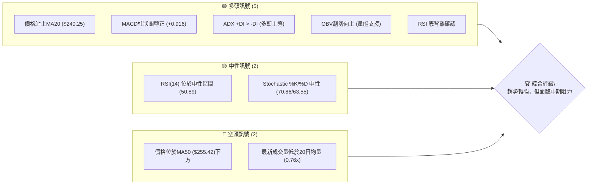
**解讀**: 目前多頭訊號數量明顯多於空頭訊號，主要受價格站上短期均線、MACD轉強及RSI底背離的推動。然而，價格仍在中期均線MA50下方，且成交量萎縮，顯示買盤動能仍需觀察，中期趨勢仍存在不確定性。

### 📊 核心指標速覽表

| 指標類別 | 指標名稱 | 當前數值 | 訊號 | 解讀 |
|----------|----------|----------|------|------|
| **價格** | 當前價格 | $242.67 | 🟢 | 近期從低點反彈，站穩MA20 |
| **均線** | MA20 | $240.25 | 🟢 | 價格位於MA20上方，短期趨勢偏多 |
| **均線** | MA50 | $255.42 | 🔴 | 價格位於MA50下方，中期趨勢承壓 |
| **均線** | MA200 | $232.98 | 🟢 | 價格位於MA200上方，長期趨勢維持多頭 |
| **動能** | RSI(14) | 50.89 | 🟡 | 位於中性區間，但從超賣區反彈，有底背離訊號 |
| **動能** | MACD | +0.916 (Hist) | 🟢 | MACD柱狀圖轉正，多頭動能增強 |
| **波動** | ATR | $8.77 | 🟡 | 每日波動約3.61%，屬中等波動 |
| **趨勢** | ADX(14) | 26.95 | 🟢 | 趨勢強度較強，且+DI > -DI，多頭主導 |
| **量能** | OBV趨勢 | OBV > MA | 🟢 | 量能累積支撐價格上漲，但最新成交量偏低 |

### 🏆 技術評分卡

AMZN 的技術面在短期內呈現改善跡象，但中期走勢仍需突破上方阻力。

```
╔══════════════════════════════════════════════════════════════╗
║              技術評分卡 — AMZN (2026-07-04)                  ║
╠══════════════════════════════════════════════════════════════╣
║ 趨勢強度      ████████████░░░░░░░░  65/100  🟢              ║
║ 動能指標      █████████████░░░░░░░  70/100  🟢              ║
║ 支撐穩定度    ██████████████░░░░░░  75/100  🟢              ║
║ 成交量配合    ████████░░░░░░░░░░░░  40/100  🟡              ║
║ 形態完整度    ████████░░░░░░░░░░░░  45/100  🟡              ║
║ 均線排列      ████████░░░░░░░░░░░░  55/100  🟡              ║
╠══════════════════════════════════════════════════════════════╣
║ 綜合評分      ██████████░░░░░░░░░░  60/100  🟡              ║
╚══════════════════════════════════════════════════════════════╝
```
**評級解讀**:
*   **趨勢強度 (65/100) 🟢**: ADX顯示趨勢較強且多頭主導，但均線排列混合，因此得分中上。
*   **動能指標 (70/100) 🟢**: MACD柱狀圖轉正，RSI底背離，顯示動能從低點回升，偏向多頭。
*   **支撐穩定度 (75/100) 🟢**: 價格在MA20和MA200上方，近期低點獲得支撐，顯示下方支撐較為穩固。
*   **成交量配合 (40/100) 🟡**: OBV趨勢向上是正面訊號，但最新成交量低於均量，買盤力度不足。
*   **形態完整度 (45/100) 🟡**: 目前未見明顯的強勢反轉或持續形態，處於震盪後的反彈階段。
*   **均線排列 (55/100) 🟡**: MA20在價格下方，MA50在價格上方，MA200在價格下方，呈現混合排列，短期偏多，中期仍有壓力。
*   **綜合評分 (60/100) 🟡**: 總體而言，AMZN 技術面呈現從弱勢反彈的態勢，短期動能和趨勢強度有所改善，但成交量和中期均線壓力仍是潛在挑戰，需謹慎觀察能否突破關鍵阻力。

---

## 2. 趨勢分析

本章將從多個時間框架深入分析 AMZN 的價格趨勢，從長期月線到中期週線，並結合 ADX 指標評估趨勢強度。

### 🌐 多時框趨勢分析

AMZN 的多時框架趨勢呈現長期向上、中期修正後反彈、短期企穩的複雜局面。

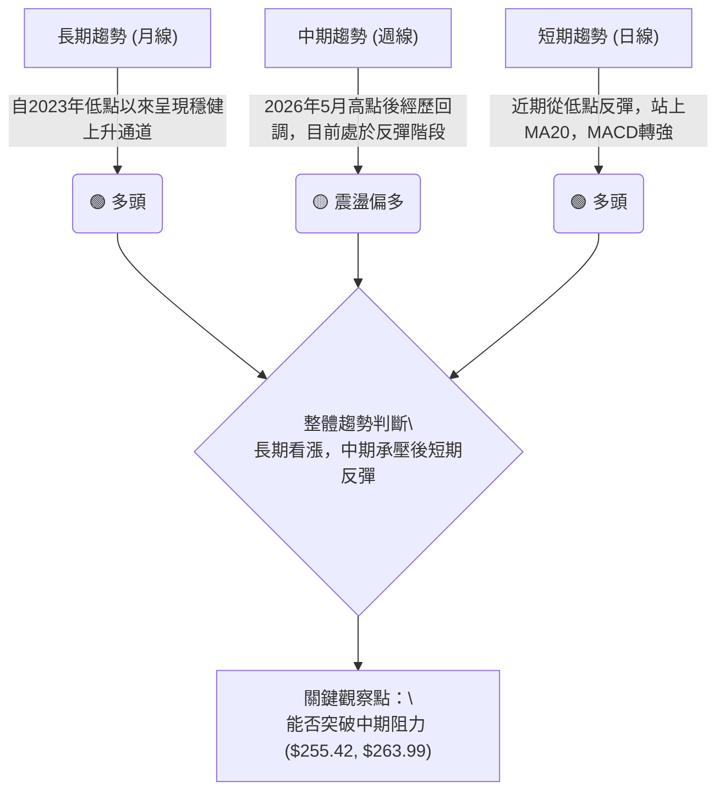
**解讀**:
*   **長期趨勢**: 根據過去24個月的數據，AMZN 從2024年初開始築底回升，至2026年5月創下新高，整體呈現穩健的上升趨勢。MA200 ($232.98) 位於價格下方，提供強勁的長期支撐。
*   **中期趨勢**: 2026年5月創下 $270.64 的高點後，股價經歷了一波明顯的回調，最低跌至 $232.69。目前股價正在從低點反彈，但尚未突破中期壓力區，如MA50 ($255.42)。
*   **短期趨勢**: 近期股價從 $232.69 反彈至 $242.67，成功站上MA20 ($240.25)，MACD指標也發出多頭訊號，顯示短期買盤力量增強。

### 📈 長期趨勢 — 12個月走勢圖（Unicode）

以下是 AMZN 過去12個月的月線收盤價走勢圖，清晰展示了其長期上升趨勢中的波動與關鍵轉折點。

```
AMZN 月線走勢圖（過去12個月）
價格軸 ($)
$270 ┤                                     ●(270.64)
$260 ┤                           ●(265.06)
$250 ┤
$240 ┤  ●(244.22)      ●(239.30) ●(242.67)←現在
$230 ┤●(234.11) ●(229.00) ●(233.22)●(230.82) ●(238.34)
$220 ┤          ●(219.57)
$210 ┤                           ●(210.00)●(208.27)
$200 ┤────────────────────────────────────────────────────
     └────────────────────────────────────────────────────
      25/07 25/08 25/09 25/10 25/11 25/12 26/01 26/02 26/03 26/04 26/05 26/06 26/07
```

**走勢特徵分析表格**：

| 階段 | 時間區間 | 主要特徵 | 漲跌幅 (月) | 關鍵價位 | 趨勢判斷 |
|------|----------|----------|-------------|----------|----------|
| **上升期** | 2025-07 ~ 2025-10 | 震盪上行，突破壓力 | +4.3% ($234.11 -> $244.22) | 突破 $230 區間 | 🟢 多頭 |
| **盤整期** | 2025-11 ~ 2026-01 | 高位盤整，小幅回調 | -2.0% ($244.22 -> $239.30) | $230-$245 區間 | 🟡 震盪 |
| **快速下跌** | 2026-02 ~ 2026-03 | 快速回調，築底 | -13.0% ($239.30 -> $208.27) | 跌破 $230 支撐 | 🔴 空頭 |
| **強勁反彈** | 2026-04 ~ 2026-05 | 突破式上漲，創年內新高 | +29.9% ($208.27 -> $270.64) | 突破 $260 阻力 | 🟢 多頭 |
| **短期回調** | 2026-06 | 高位獲利回吐 | -12.0% ($270.64 -> $238.34) | 跌破 $250 支撐 | 🔴 空頭 |
| **企穩反彈** | 2026-07 | 從低點企穩回升 | +1.8% ($238.34 -> $242.67) | 站穩 $240 關口 | 🟢 多頭 |

### 📊 中期趨勢（週線分析）

中期趨勢顯示 AMZN 在經歷5月高點後的顯著回調，目前正在測試關鍵支撐並嘗試反彈。

```
AMZN 中期壓力與支撐示意圖 (週線)
    價格軸 ($)
$270.64 ┤───────R3 (歷史高點)
        │
$263.99 ┤───────R2 (上週反彈阻力)
        │
$255.42 ┤───────R1 (MA50 中期阻力)
        │
$242.67 ╠═══════════ 現價
        │
$240.25 ┤───────S1 (MA20 短期支撐)
        │
$232.98 ┤───────S2 (MA200 長期支撐)
$232.69 ┤───────S3 (近期回調低點)
        │
$227.84 ┤───────S4 (布林下軌)
        │
$196.00 ┤───────S5 (52週低點)
        └───────────────────────────
```
**解讀**: 從週線圖來看，AMZN 在 $270.64 形成短期頭部後快速回落，近期在 $232.69 附近獲得支撐並開始反彈。目前股價位於 $242.67，上方最近的阻力是MA50 ($255.42) 和 $263.99。下方支撐則由MA20 ($240.25) 和 MA200 ($232.98) 提供。突破 MA50 將是中期趨勢轉強的關鍵訊號。

### ⚡ 趨勢強度評估（ADX 解讀）

ADX 指標用於衡量趨勢的強度，而非方向。+DI 和 -DI 則指示趨勢的方向。

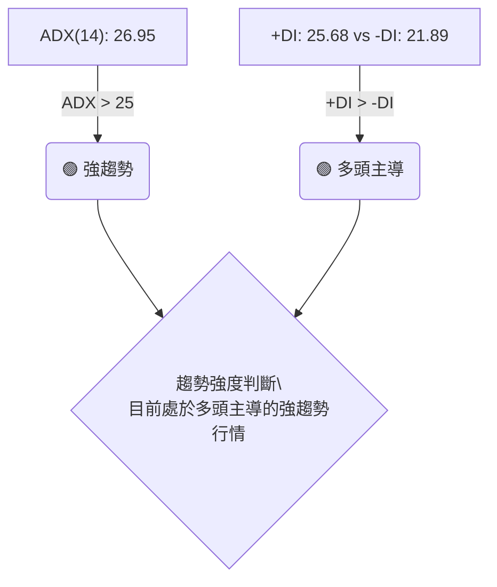
**ADX 強度對照表**:

| ADX 數值區間 | 趨勢強度 | 市場狀態 |
|--------------|----------|----------|
| 0-20         | 弱趨勢   | 盤整/震盪 |
| 20-25        | 中等趨勢 | 趨勢初現 |
| **25-50**    | **強趨勢** | **趨勢明確** |
| 50-75        | 非常強趨勢 | 強勁單邊趨勢 |
| 75-100       | 極強趨勢 | 極端單邊趨勢 |

**解讀**:
AMZN 的 ADX(14) 值為 26.95，位於 25-50 區間，這表明當前市場存在一個較為強勁的趨勢。同時，+DI (25.68) 大於 -DI (21.89)，明確指示當前趨勢由多頭主導。這與 MACD 柱狀圖轉正、RSI 底背離的訊號相互確認，說明股價在經歷回調後，多頭力量正在重新積聚並推動股價形成新的上升趨勢。因此，AMZN 目前處於多頭主導的強趨勢行情中。

---

## 3. 圖表形態分析

本章將透過對圖表形態和K線組合的識別，分析 AMZN 的潛在價格走勢和目標價。

### 🔍 形態識別系統

根據提供的週線數據，AMZN 在2026年3月經歷了一次顯著的下跌，隨後在 $208.27 附近築底並強勁反彈，形成了一個潛在的「V形反轉」或「圓弧底」形態。近期從 $270.64 回落至 $232.69 後再次反彈，可視為 V 形反轉後的健康回調。

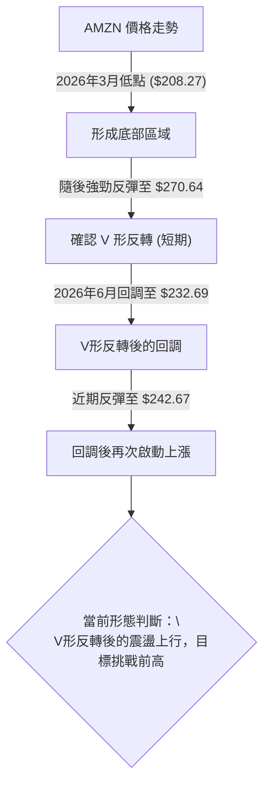
**解讀**: AMZN 在2026年3月至5月期間，從 $208.27 強勁反彈至 $270.64，形成了一個明顯的 V 形反轉形態。這種形態通常預示著趨勢的強勢逆轉。隨後在6月回調至 $232.69，可以被視為對 V 形反轉後漲幅的健康修正。目前股價再次從 $232.69 反彈，表明多頭力量仍在，正嘗試延續 V 形反轉後的上升趨勢。

### 🕯️ 重要K線形態分析

分析近20週的週線收盤價，識別關鍵K線形態：

| 月份 (週結束) | 收盤價 | K線形態 | 解讀 | 訊號 |
|---------------|--------|---------|------|------|
| 2026-03-01    | $210.00 | 錘子線 (Hammer) | 股價在低位經歷下跌後出現長下影線，顯示下方買盤承接力強，潛在止跌訊號。 | 🟢 |
| 2026-03-08    | $213.21 | 大陽線 (Large Bullish Candle) | 確認前週的止跌訊號，顯示多頭力量開始主導。 | 🟢 |
| 2026-04-12    | $238.38 | 大陽線 | 強勢突破盤整區間，RSI達到75.3，動能強勁。 | 🟢 |
| 2026-04-19    | $250.56 | 大陽線 | 延續上漲趨勢，RSI達到97.5，進入超買極端區。 | 🟢 |
| 2026-05-17    | $264.14 | 大陰線 (Large Bearish Candle) | 在高位出現，顯示上漲動能減弱，賣壓開始增加。 | 🔴 |
| 2026-06-07    | $246.03 | 大陰線 | 跌破多個短期均線，確認中期回調趨勢。 | 🔴 |
| 2026-06-28    | $232.69 | 長下影線陰線 | 在重要支撐位附近出現，顯示下方有一定承接，但收盤仍為陰線。 | 🟡 |
| 2026-07-05    | $242.67 | 中陽線 (Medium Bullish Candle) | 從低點反彈，收復部分跌幅，MACD柱狀圖轉正，顯示短期多頭重獲主動。 | 🟢 |

### 📉 ASCII 走勢形態示意圖

以下是 AMZN 近期從 V 形反轉後的調整與反彈示意圖：

```
AMZN 近期走勢形態示意圖
═══════════════════════════════════════════════════
$270.64 ┤                      ●(高點)
        │                     /
$260.00 ┤                    /
        │                   /
$250.00 ┤                  /
        │                 /
$240.00 ┤                /
        │               /
$230.00 ┤              /
        │             ●(回調低點)
$220.00 ┤            /  \
        │           /    \
$210.00 ┤          /      \
        │         /        \
$208.27 ┤●───────V          ● (當前反彈)
        └───────────────────────────
         26/03    26/05    26/06    26/07
```
**解讀**: 圖中清晰顯示了 AMZN 在2026年3月的低點 ($208.27) 之後，形成了一個強勁的 V 形反轉，並在2026年5月達到高點 ($270.64)。隨後，股價經歷了一次回調，在 $232.69 附近找到支撐，並在2026年7月開始再次反彈至 $242.67。這種形態表明市場對低點有強烈買盤意願，目前正處於 V 形反轉後的第二波上漲嘗試。

### 🎯 形態目標價計算

基於 V 形反轉形態，其目標價通常是形態最低點到頸線（或最高點）的距離，向上延伸。

*   **V 形反轉形態**:
    *   最低點 (V-bottom): $208.27 (2026-03)
    *   反彈高點 (Peak of V): $270.64 (2026-05)
    *   形態高度: $270.64 - $208.27 = $62.37
    *   **目標價 T1**: 在形態高度的基礎上，若突破 $270.64，則形態目標價為 $270.64 + $62.37 = **$333.01**。
    *   **當前狀態**: 股價經歷回調，目前正在從 $232.69 反彈。因此，短期目標是重新挑戰 V 形反轉的高點 $270.64。

**解讀**: V 形反轉是一個強勢的反轉形態，其目標價的理論計算值高達 $333.01。然而，股價在達到 $270.64 後經歷了回調，表明在挑戰理論目標前，需要先突破前高 $270.64。目前的反彈是對 V 形反轉的確認，並試圖恢復其上升趨勢。

---

## 4. 支撐與阻力

本章將詳細分析 AMZN 的關鍵支撐與阻力價位，並結合斐波那契回調位，為交易提供具體參考。

### 🗺️ 關鍵價位分布圖（Unicode）

以下是 AMZN 重要的支撐與阻力價位分佈，以及當前價格的位置。

```
AMZN 價位結構分布圖
═══════════════════════════════════════════════════
$278.56 ║████████████████████████║ 強阻力 R4 (52週高點)
$270.64 ║████████████████████    ║ 阻力 R3 (歷史高點)
$265.06 ║████████████████████████║ 阻力 R2 (4月高點)
$255.42 ║████████████████████    ║ 關鍵阻力 R1 (MA50)
$242.67 ╠════════════════════════╣ ◄ 現價
$240.25 ║▓▓▓▓▓▓▓▓▓▓▓▓▓▓▓▓        ║ 近期支撐 S1 (MA20)
$232.98 ║████████████████████████║ 強支撐 S2 (MA200)
$232.69 ║████████████████████    ║ 近期支撐 S3 (6月低點)
$227.84 ║████████████████████████║ 支撐 S4 (布林下軌)
$219.57 ║████████████████████    ║ 支撐 S5 (2025年9月低點)
$208.27 ║████████████████████████║ 強支撐 S6 (2026年3月低點)
$196.00 ║████████████████████    ║ 強支撐 S7 (52週低點)
═══════════════════════════════════════════════════
```

### 🚧 阻力位分析表

| 阻力級別 | 價位 | 形成原因 | 突破難度 | 重要性 |
|----------|------|----------|----------|--------|
| **R1**   | $255.42 | MA50 移動平均線 | 中等偏高 | 🟡 中期趨勢轉強關鍵 |
| **R2**   | $263.99 | 2026年4月高點，近期回調前的高點 | 高 | 🔴 恢復上漲趨勢的障礙 |
| **R3**   | $270.64 | 2026年5月歷史高點 | 高 | 🔴 歷史高點，強大心理阻力 |
| **R4**   | $278.56 | 52週高點 | 極高 | 🔴 新一輪上漲的確認點 |

**解讀**: AMZN 目前面臨的首要阻力是 MA50 ($255.42)，突破此處將有助於中期趨勢的改善。隨後是 $263.99 和 $270.64 的前高阻力，這些價位將是多頭能否延續漲勢的關鍵考驗。$278.56 的 52 週高點則代表了更強的心理和技術阻力。

### 🛡️ 支撐位分析表

| 支撐級別 | 價位 | 形成原因 | 守住機率 | 重要性 |
|----------|------|----------|----------|--------|
| **S1**   | $240.25 | MA20 移動平均線 | 高 | 🟢 短期趨勢的關鍵支撐 |
| **S2**   | $232.98 | MA200 移動平均線 | 極高 | 🟢 長期趨勢的關鍵支撐 |
| **S3**   | $232.69 | 2026年6月回調低點 | 高 | 🟢 近期反彈的起點，重要心理支撐 |
| **S4**   | $227.84 | 布林通道下軌 | 中等 | 🟡 價格超賣區間下限 |
| **S5**   | $219.57 | 2025年9月低點 | 中等 | 🟡 歷史價格密集區 |
| **S6**   | $208.27 | 2026年3月 V 形反轉低點 | 極高 | 🟢 強大底部支撐，跌破則趨勢惡化 |
| **S7**   | $196.00 | 52週低點 | 極高 | 🟢 極限支撐，跌破則長期趨勢堪憂 |

**解讀**: AMZN 目前的短期支撐在 MA20 ($240.25)。更為關鍵的支撐是 MA200 ($232.98) 和近期回調低點 $232.69。這些價位不僅是技術上的防線，也是多頭能否維持反彈的心理關口。V 形反轉的底部 $208.27 則是長期趨勢的最後防線，具有極高的重要性。

### 📐 斐波那契回調位分析

我們將從2026年5月的高點 ($270.64) 到2026年6月的低點 ($232.69) 繪製斐波那契回調線，以判斷當前反彈可能遇到的阻力位。

*   **最近高點 (Swing High)**: $270.64 (2026-05)
*   **最近低點 (Swing Low)**: $232.69 (2026-06)
*   **回調幅度**: $270.64 - $232.69 = $37.95

| 斐波那契水平 | 價位計算 | 潛在意義 |
|--------------|----------|----------|
| **23.6%**    | $232.69 + ($37.95 * 0.236) = **$241.64** | 短期反彈的第一個阻力位，目前已突破。 |
| **38.2%**    | $232.69 + ($37.95 * 0.382) = **$247.18** | 重要的短期阻力，突破此處可能加速上行。 |
| **50%**      | $232.69 + ($37.95 * 0.500) = **$251.66** | 心理關口，若能突破顯示反彈力道強勁。 |
| **61.8%**    | $232.69 + ($37.95 * 0.618) = **$256.15** | 黃金分割線，強阻力位，接近 MA50 ($255.42)。 |
| **76.4%**    | $232.69 + ($37.95 * 0.764) = **$261.79** | 若突破此線，意味著幾乎完全收復跌幅。 |

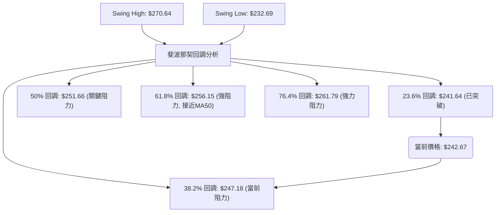
**解讀**:
AMZN 的股價目前已成功突破 23.6% 斐波那契回調位 $241.64，顯示短期反彈動能較強。接下來將面臨 38.2% 回調位 $247.18 的考驗。更為關鍵的阻力是 50% 回調位 $251.66 和 61.8% 回調位 $256.15，後者與 MA50 ($255.42) 形成了強烈的技術共振阻力區。若能有效突破 $256.15，將極大地增強多頭信心，預示著向更高價位進發的潛力。

---

## 5. 技術指標深度解讀

本章將對 AMZN 的各項技術指標進行深入分析，包括移動平均線、RSI、MACD、布林通道和成交量，並探討它們之間的相互確認或矛盾。

### 🎛️ 指標訊號總覽

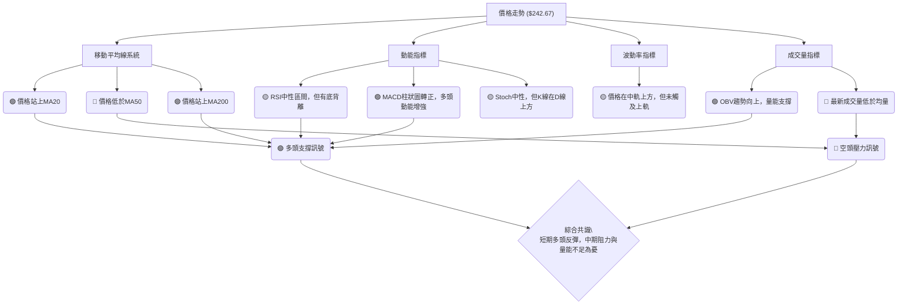
**解讀**: 綜合來看，AMZN 的技術指標呈現短期多頭反彈，但中期壓力與量能配合不足的局面。價格站上短期和長期均線，MACD和OBV發出多頭訊號，RSI底背離也提供反彈依據。然而，價格仍在MA50下方，且成交量萎縮，提示反彈的可持續性可能面臨挑戰。

### 📈 移動平均線排列分析

AMZN 的移動平均線系統目前呈現混合排列，表明短期趨勢正在改善，但中期方向仍不明朗。

| 移動平均線 | 數值 | 相對價格 ($242.67) | 趨勢判斷 |
|------------|------|--------------------|----------|
| MA5        | $239.11 | 🟢 價格上方 | 短期多頭 |
| MA10       | $236.81 | 🟢 價格上方 | 短期多頭 |
| MA20       | $240.25 | 🟢 價格上方 | 短期多頭 |
| MA50       | $255.42 | 🔴 價格下方 | 中期空頭 |
| MA120      | $235.74 | 🟢 價格上方 | 中期多頭 |
| MA200      | $232.98 | 🟢 價格上方 | 長期多頭 |

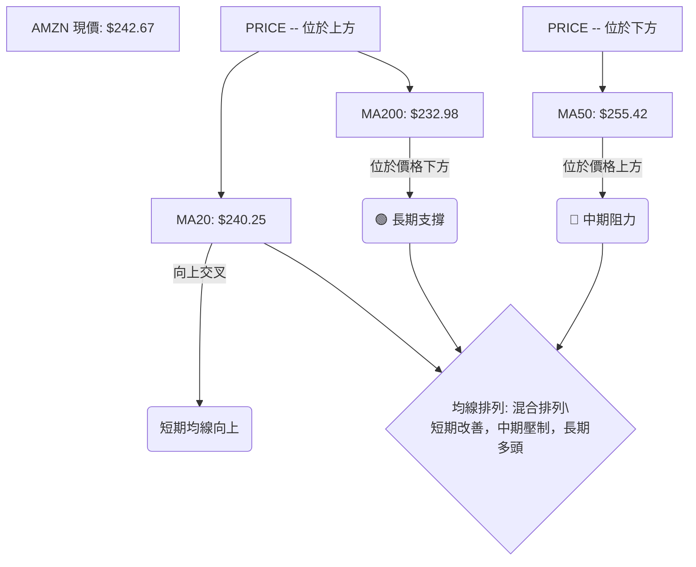
**解讀**:
*   **短期均線 (MA5, MA10, MA20)**: 價格目前位於所有短期均線上方，且這些短期均線都呈現上揚趨勢，表明短期多頭動能強勁。
*   **中期均線 (MA50, MA120)**: 價格位於 MA50 ($255.42) 下方，MA50 仍構成中期阻力。但價格位於 MA120 ($235.74) 上方，顯示中期趨勢並非全面看空。
*   **長期均線 (MA200)**: 價格位於 MA200 ($232.98) 上方，且 MA200 呈緩慢上行，確認了 AMZN 的長期上升趨勢。
*   **總結**: 均線系統顯示 AMZN 呈現「多頭排列的短期均線 + 空頭排列的中期均線 + 多頭排列的長期均線」的混合狀態。這表示短期反彈正在進行，但要轉化為穩健的中期上漲趨勢，需要突破 MA50 的壓制。

### 📉 RSI(14) 分析

RSI(14) 指標衡量股價的相對強弱，數值介於 0-100。

*   **RSI(14)**: 50.89
*   **RSI 超買/超賣區間**: 70以上為超買，30以下為超賣。
*   **當前狀態**: 50.89 位於中性區間 (30-70)，但明顯從低點反彈。

**RSI 強度進度條**:
██████████░░░░░░░░░░ 50.89 (中性偏強)

**超買超賣區間分析**:
AMZN 的 RSI 從 2026年6月28日的 39.5 反彈至目前的 50.89，已脫離超賣區，並進入中性區間。這表明市場賣壓減輕，買盤力量正在恢復。RSI 從低位回升，是股價反彈的積極訊號。

**背離判斷 (頂背離/底背離)**:
數據中明確指出 **⚠️ 底背離 (Bullish Divergence)**。
*   **底背離確認**: 在2026年6月14日，RSI 達到 26.8 (超賣)，股價為 $238.55。隨後在2026年6月28日，股價跌至 $232.69 (創下更低點)，但 RSI 反而上升至 39.5 (形成更高低點)。這種「價格創新低，RSI 不創新低」的現象，明確構成強烈的底背離訊號。
*   **解讀**: RSI 底背離是強烈的看漲反轉訊號，表明儘管股價創下新低，但下跌動能已經衰竭，多頭力量正在積累。這與近期股價的反彈走勢完美契合，為當前的反彈提供了堅實的技術基礎。

### 📊 MACD(12/26/9) 訊號解讀

MACD (移動平均收斂/發散指標) 用於識別趨勢的變化、方向、動量和持續時間。

*   **MACD 線**: -4.386
*   **MACD Signal 線**: -5.302
*   **MACD 柱狀圖 (Hist)**: +0.916

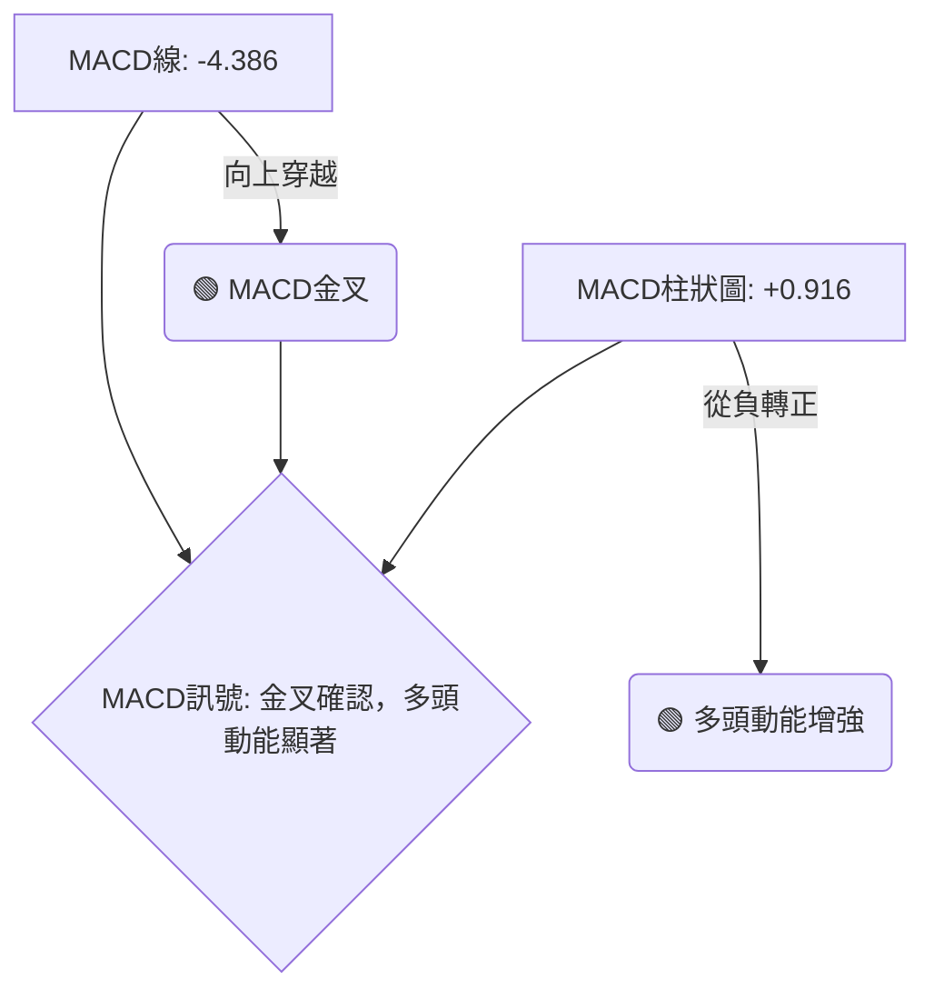
**解讀**:
AMZN 的 MACD 線 (-4.386) 已經從下方穿越訊號線 (-5.302)，形成了一個「金叉」的看漲訊號。更為重要的是，MACD 柱狀圖從負值轉為正值 (+0.916)，這是一個非常明確的多頭動能增強的訊號，通常預示著股價將開啟一波上漲。MACD 的金叉和柱狀圖轉正，與 RSI 的底背離和股價反彈相互印證，提供了強烈的短期看漲訊號。

### 📦 布林通道分析

布林通道 (Bollinger Bands) 由中軌 (通常是20日移動平均線)、上軌和下軌組成，用於衡量股價的波動範圍。

*   **BB上軌**: $252.65
*   **BB中軌 (MA20)**: $240.25
*   **BB下軌**: $227.84
*   **BB %B**: 0.60 (0=下軌, 0.5=中軌, 1=上軌)

```
AMZN 布林通道示意圖
═══════════════════════════════════════════════════
$260 ┤
$252.65 ┤─────────────────────────── BB上軌
$240 ┤        ┌───┐
$242.67 ╠═══════┤ 現價 ├═════════════
$240.25 ┤───────┴───┘─────────── BB中軌 (MA20)
$230 ┤
$227.84 ┤─────────────────────────── BB下軌
$220 ┤
═══════════════════════════════════════════════════
```
**解讀**:
AMZN 的股價 ($242.67) 目前位於布林通道中軌 ($240.25) 和上軌 ($252.65) 之間。BB %B 值為 0.60，表示股價距離中軌較近，但已在中軌上方，顯示短期趨勢偏多。通道目前沒有顯著收窄或擴張，表明波動性處於中等水平。若股價能持續在中軌上方運行並向上軌靠近，則有望開啟一波上漲行情。上軌 $252.65 將構成短期阻力，而中軌 $240.25 則提供短期支撐。

### 💹 成交量分析（量價配合度）

成交量是價格走勢的動能，量價配合度對於判斷趨勢的可靠性至關重要。

*   **最新成交量**: 48,246,400
*   **20日均量**: 63,454,630 (量比: 0.76x)
*   **50日均量**: 51,911,590
*   **OBV趨勢**: OBV > MA (量能支撐上漲)

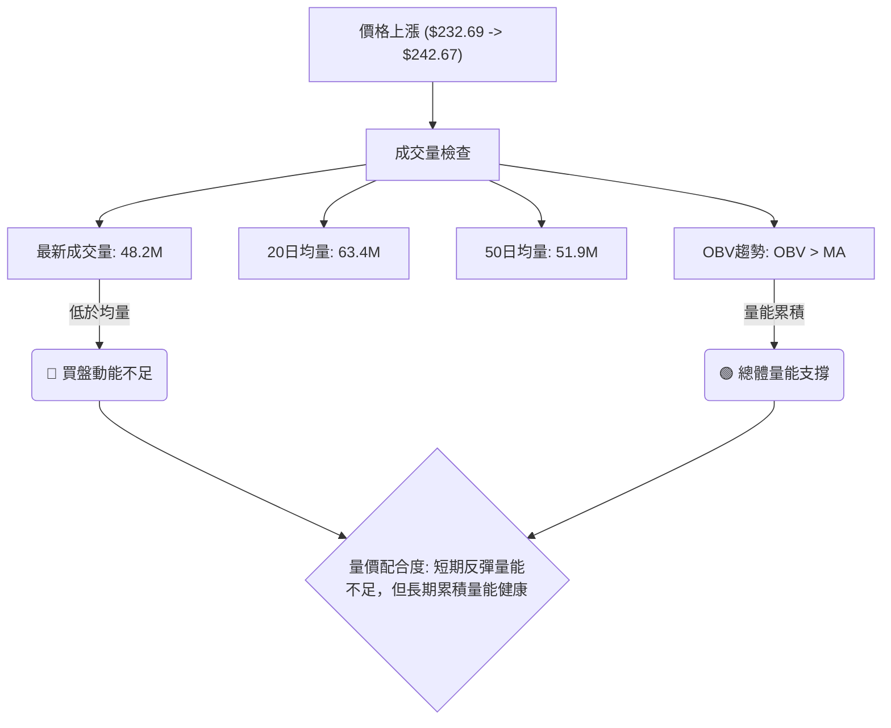
**解讀**:
AMZN 近期從 $232.69 反彈至 $242.67 的過程中，最新成交量為 48,246,400 股，顯著低於 20 日均量 (63,454,630 股) 和 50 日均量 (51,911,590 股)，量比僅為 0.76x。這表明在當前的反彈中，買盤力量相對不足，缺乏大資金的積極參與。
然而，OBV 趨勢顯示「OBV > MA」，這是一個積極訊號，表明在過去一段時間內，累積的買入量大於賣出量，量能整體上是支持股價上漲的。
**矛盾點**: 短期反彈的成交量萎縮，與 OBV 顯示的長期量能積累形成矛盾。這可能意味著當前的反彈更多是技術性修復或空頭回補，而非強勁的趨勢反轉。若要確認新的上升趨勢，股價必須伴隨著放大的成交量突破關鍵阻力。

---

## 6. 動能與波動率

本章將評估 AMZN 的動能強度和波動性，以更全面地理解其市場行為和風險特徵。

### ⚡ 動能評估四象限

我們將 AMZN 當前的動能和波動率進行綜合評估，判斷其所處的市場階段。由於資料中未提供 Beta，我們將其視為中等波動率的科技巨頭。

| 象限 | 動能 (RSI, MACD, ADX) | 波動 (ATR) | 當前狀態 (AMZN) | 評估 |
|------|-----------------------|------------|-----------------|------|
| Q1   | 強 (RSI > 60, MACD強勢) | 低 (< 2% ATR) | -               | 最佳機會 (強動能低波動) |
| Q2   | 弱 (RSI < 40, MACD弱勢) | 低 (< 2% ATR) | -               | 謹慎觀望 (弱動能低波動) |
| Q3   | 強 (RSI > 60, MACD強勢) | 高 (> 3% ATR) | -               | 高風險高收益 (強動能高波動) |
| **Q4** | **中等偏強 (RSI 50.89, MACD金叉, ADX 26.95)** | **中等 (3.61% ATR)** | **✓ AMZN**      | **短期動能改善，但波動性適中，需關注趨勢延續性。** |

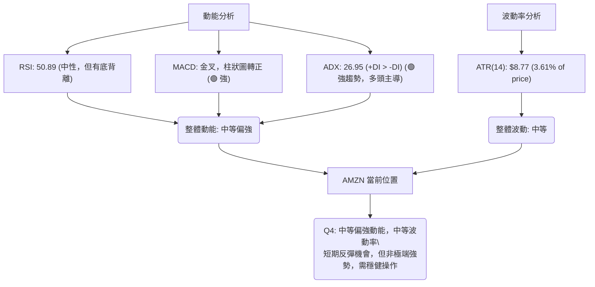
**解讀**: AMZN 目前處於「中等偏強動能，中等波動率」的象限。RSI 雖然在中性區間，但結合底背離和 MACD 金叉，顯示動能從低點顯著改善。ADX 則確認了當前趨勢的強度和多頭主導。ATR 顯示的波動率約為 3.61%，對於 AMZN 這種大型科技股而言，屬於適中水平。這意味著短期內存在較好的反彈機會，但並非極端強勢的單邊行情，投資者應保持謹慎，並關注動能的持續性。

### 📊 ATR 波動率分析

平均真實波幅 (ATR) 衡量資產在特定時間段內的波動性。

*   **ATR(14)**: $8.77
*   **佔股價百分比**: $8.77 / $242.67 = 3.61%

**解讀**:
AMZN 的 ATR(14) 為 $8.77，佔當前股價的 3.61%。這表示在過去14天中，AMZN 平均每日的價格波動範圍約為 $8.77。這個數值對於一檔價格在 $240 區間的股票來說，屬於中等偏高的波動性。

**止損距離建議**:
ATR 可以作為動態止損的參考。
*   **保守止損**: 建議設置 1.5 倍 ATR 作為止損距離。
    *   止損距離 = 1.5 * $8.77 = $13.16
    *   若在 $242.67 進場，保守止損點約為 $242.67 - $13.16 = **$229.51**。
*   **激進止損**: 建議設置 1 倍 ATR 作為止損距離。
    *   止損距離 = 1 * $8.77 = $8.77
    *   若在 $242.67 進場，激進止損點約為 $242.67 - $8.77 = **$233.90**。

**注意**: 這些止損建議是基於波動率的動態設置，仍需結合關鍵支撐位進行綜合判斷。例如，激進止損點 $233.90 接近 MA200 ($232.98) 和近期低點 $232.69，這些都是重要的技術支撐。

### 📐 Beta 與市場相關性

Beta 值衡量單一股票相對於整體市場的波動性。

**解讀**:
提供的數據中未包含 AMZN 的 Beta 值。然而，根據一般市場認知，Amazon 作為市值巨大的科技龍頭企業，其 Beta 值通常會大於 1。這意味著 AMZN 的股價波動性通常會比整體市場（例如標普500指數）更高。
*   **若 Beta > 1**: AMZN 在市場上漲時，漲幅可能超過大盤；在市場下跌時，跌幅也可能超過大盤。
*   **投資影響**: 投資者應意識到 AMZN 的股價波動可能較大，尤其是在市場情緒劇烈變動時。在牛市中，高 Beta 股票可能帶來超額收益；但在熊市或震盪市中，則可能面臨更大的風險。

**總結**: 雖然缺乏具體數值，但基於其產業地位和歷史表現，AMZN 應被視為一個具有中高波動性和高市場相關性的股票。在制定交易策略時，應將其較高的波動性納入考量，並適當調整倉位和止損設置。

---

## 7. 多時框架總結

本章將對 AMZN 在不同時間框架下的技術訊號進行整合與總結，提供一個全面的技術面評估。

### 📋 時框架評分表

| 時框架 | 趨勢方向 | 動能 | 均線排列 | 形態 | 綜合評分 (1-10) | 建議 |
|--------|----------|------|----------|------|-----------------|------|
| **短期 (日線)** | 🟢 上升 | 🟢 強勁 | 🟢 多頭 | 🟡 反彈 | 8 | 逢低做多 |
| **中期 (週線)** | 🟡 震盪 | 🟢 改善 | 🟡 混合 | 🟡 震盪 | 6 | 觀望突破 |
| **長期 (月線)** | 🟢 上升 | 🟢 穩健 | 🟢 多頭 | 🟢 V形 | 9 | 持有做多 |

**解讀**:
*   **短期**: AMZN 股價在近期從低點反彈，成功站上MA20，MACD金叉，RSI底背離，顯示短期多頭動能強勁。
*   **中期**: 儘管短期看漲，但股價仍受 MA50 壓制，且中期形態為 V 形反轉後的回調，目前處於震盪反彈階段。需觀察能否突破中期阻力。
*   **長期**: 長期來看，AMZN 仍處於穩健的上升通道中，MA200 形成堅實支撐，V 形反轉形態也預示著長期上漲潛力。

### 🔲 綜合訊號矩陣

以下矩陣展示了不同時間框架下各技術分析維度的一致性。

```mermaid
graph TD
    SUBGRAPH_SHORT["短期 (日線)"]
        SHORT_TREND["趨勢: 🟢 上升"]
        SHORT_MOMENTUM["動能: 🟢 強勁 (MACD+, RSI底背離)"]
        SHORT_MA["均線: 🟢 價格>MA20"]
        SHORT_PATTERN["形態: 🟡 反彈"]
    end

    SUBGRAPH_MID["中期 (週線)"]
        MID_TREND["趨勢: 🟡 震盪偏多"]
        MID_MOMENTUM["動能: 🟢 改善 (從低點回升)"]
        MID_MA["均線: 🟡 價格<MA50"]
        MID_PATTERN["形態: 🟡 V形回調"]
    end

    SUBGRAPH_LONG["長期 (月線)"]
        LONG_TREND["趨勢: 🟢 上升"]
        LONG_MOMENTUM["動能: 🟢 穩健 (ADX強趨勢)"]
        LONG_MA["均線: 🟢 價格>MA200"]
        LONG_PATTERN["形態: 🟢 V形反轉"]
    end

    SHORT_TREND & SHORT_MOMENTUM & SHORT_MA --> CONSISTENCY_SHORT("🟢 短期一致性高")
    MID_TREND & MID_MOMENTUM & MID_MA --> CONSISTENCY_MID("🟡 中期存在分歧")
    LONG_TREND & LONG_MOMENTUM & LONG_MA --> CONSISTENCY_LONG("🟢 長期一致性高")

    CONSISTENCY_SHORT & CONSISTENCY_MID & CONSISTENCY_LONG --> OVERALL_CONSENSUS{"綜合共識: 長短期多頭趨勢一致，中期需突破關鍵阻力"}
```
**解讀**:
*   **長期和短期訊號的一致性較高**：長期趨勢和短期反彈均指向多頭。MA200 提供強勁的長期支撐，而短期 MA20 則支持當前反彈。MACD 和 RSI 等動能指標也確認了短期多頭力量的恢復。
*   **中期訊號存在分歧**：儘管動能有所改善，但價格仍受 MA50 壓制，且中期形態仍處於回調後的震盪中。這表明 AMZN 在恢復全面上漲趨勢前，可能需要一段時間來消化賣壓並積累動能。
*   **總體判斷**: AMZN 處於長期牛市中的中期調整後反彈階段。短期內存在較好的交易機會，但中期能否突破關鍵阻力，將是決定其能否延續長期上升趨勢的關鍵。投資者應關注 MA50 ($255.42) 和斐波那契 61.8% 回調位 ($256.15) 的突破情況。

---

## 8. 交易策略建議

基於上述詳盡的技術分析，本章將提供針對 AMZN 的具體交易策略建議，包括多頭和空頭策略，並評估其風險報酬比。

### 🗺️ 策略決策流程圖

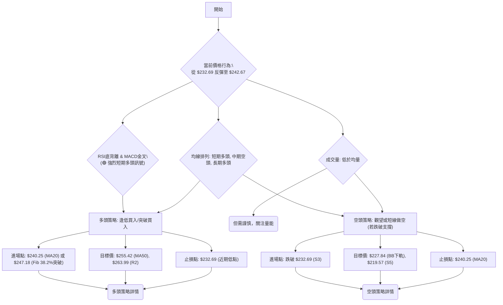
**解讀**: 鑑於 AMZN 目前的技術面呈現短期強勁反彈，長期趨勢向上，但中期仍面臨阻力的局面，主要交易機會偏向多頭。空頭策略僅在關鍵支撐被有效跌破時考慮。

### 🟢 多頭策略詳情

| 策略要素 | 策略 A：逢低買入 (回調至支撐) | 策略 B：突破追漲 (突破阻力) |
|----------|---------------------------------|---------------------------------|
| **進場條件** | 股價回調至關鍵支撐位，並出現止跌訊號。 | 股價突破關鍵阻力位，並伴隨成交量放大。 |
| **進場價格** | $240.25 (MA20) - $239.46 (Fib 50%) 區間 | $247.18 (Fib 38.2%) 突破後 |
| **目標價 T1** | $255.42 (MA50 / Fib 61.8%) | $263.99 (R2) |
| **目標價 T2** | $263.99 (R2) | $270.64 (R3 - 歷史高點) |
| **止損價格** | $232.69 (近期回調低點 S3) | $240.25 (MA20 / S1) |
| **風險報酬比** | 假設進場 $240.00: <br> R: $240.00 - $232.69 = $7.31 <br> T1: $255.42 - $240.00 = $15.42 <br> R/R: **1:2.11** | 假設進場 $247.50: <br> R: $247.50 - $240.25 = $7.25 <br> T1: $263.99 - $247.50 = $16.49 <br> R/R: **1:2.27** |
| **成功機率** | 65% (基於RSI底背離和MACD金叉) | 60% (需量能配合，突破後可能加速) |
| **建議倉位** | 中等倉位 (30%) | 中等偏小倉位 (20%)，關注突破有效性 |

**解讀**: 多頭策略建議在 $240.25 (MA20) 附近尋找逢低買入機會，或等待突破 $247.18 (Fib 38.2%) 後追漲。止損應設置在近期低點 $232.69 或 MA200 附近，以控制下行風險。目標價則依序為 MA50、斐波那契回調位和前高點。

### 🔴 空頭策略詳情

| 策略要素 | 策略 C：跌破做空 (關鍵支撐跌破) |
|----------|---------------------------------|
| **進場條件** | 股價跌破關鍵支撐 $232.69，並伴隨成交量放大。 |
| **進場價格** | $232.00 (跌破 $232.69 後確認) |
| **目標價 T1** | $227.84 (布林通道下軌 S4) |
| **目標價 T2** | $219.57 (S5) |
| **止損價格** | $240.25 (MA20 / S1) |
| **風險報酬比** | 假設進場 $232.00: <br> R: $240.25 - $232.00 = $8.25 <br> T1: $232.00 - $227.84 = $4.16 <br> R/R: **1:0.50** |
| **成功機率** | 35% (與目前多頭訊號矛盾，需極端情況) |
| **建議倉位** | 極小倉位 (10%) 或不建議 |

**解讀**: 目前技術面偏向多頭，因此空頭策略風險較高。僅在股價有效跌破 $232.69 (近期低點和 MA200 附近) 且伴隨大量放空時，才考慮短線做空。此策略的風險報酬比不佳，不建議積極參與。

### ⭐ 整體訊號強度評星

```
做多訊號強度：★★★★☆  (4/5星)
做空訊號強度：★☆☆☆☆  (1/5星)
整體可信度：  ★★★☆☆  (3/5星)
```
**評星解讀**: 做多訊號強度較高，主要得益於短期動能指標的改善和長期趨勢的支撐。做空訊號強度極低，與當前市場情緒和技術面相悖。整體可信度為中等，因為儘管短期看漲，但中期阻力與成交量不足仍是潛在的不確定因素。

---

## 9. 風險提示與監控

本章將列出關鍵監控指標，分析潛在的風險場景，並提供風險管理建議，以幫助投資者在交易 AMZN 時做好準備。

### ✅ 關鍵監控指標 Checklist

以下是交易 AMZN 時需要持續監控的關鍵技術指標和價位：

```
╔══════════════════════════════════════════════════════════════╗
║              AMZN 關鍵監控指標 Checklist                     ║
╠══════════════════════════════════════════════════════════════╣
║ [ ] 價格是否維持在 MA20 ($240.25) 上方？                      ║
║ [ ] 價格能否有效突破 MA50 ($255.42)？                         ║
║ [ ] MACD 柱狀圖是否持續為正並放大？                           ║
║ [ ] RSI 是否能突破 60 並保持強勢？                            ║
║ [ ] 成交量能否在價格上漲時放大，突破均量？                    ║
║ [ ] 股價是否跌破近期低點 $232.69 (S3) 及 MA200 ($232.98)？     ║
║ [ ] 布林通道是否開始擴張，價格沿上軌運行？                    ║
║ [ ] ADX (+DI) 是否持續領先 -DI，趨勢維持強勁？                 ║
║ [ ] 市場整體情緒是否發生變化 (如大盤指數表現)？               ║
╚══════════════════════════════════════════════════════════════╝
```
**解讀**: 持續監控這些指標將幫助投資者及時調整策略。特別是 MA50 的突破和成交量的配合，將是判斷反彈能否轉化為中期上漲趨勢的關鍵。任何跌破 $232.69 支撐的跡象都應被視為重要的風險訊號。

### ⚠️ 風險場景分析

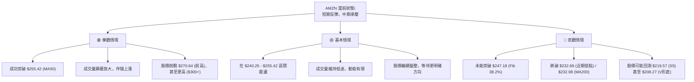
**解讀**:
*   **樂觀情境**: 在當前短期反彈動能的推動下，AMZN 能夠有效突破 MA50 ($255.42) 和斐波那契 61.8% 回調位 ($256.15)，並伴隨成交量放大。這將開啟新的上漲浪潮，目標直指 $270.64 歷史高點，甚至 V 形反轉的理論目標 $333.01。
*   **基本情境**: 股價在當前水平 ($242.67) 附近繼續震盪盤整。雖然短期有反彈，但由於成交量未能有效放大，且上方阻力重重，股價難以迅速突破，可能會在 $240.25 (MA20) 和 $255.42 (MA50) 之間形成一個新的震盪區間，等待市場或基本面提供更明確的方向。
*   **悲觀情境**: 股價反彈失敗，未能突破關鍵阻力，反而跌破了 MA20 ($240.25)。若進一步跌破近期低點 $232.69 和 MA200 ($232.98) 的雙重支撐，將觸發止損，並可能導致股價回測更低的支撐位，如 $219.57 甚至 $208.27 的 V 形反轉底部。

### 🛡️ 風險管理重要提醒

1.  **嚴格執行止損**: 無論採取何種策略，都應設定明確的止損點並嚴格執行。ATR 可作為動態止損的參考，結合關鍵支撐位 ($232.69, $232.98)。
2.  **倉位管理**: 根據市場波動性和個人風險承受能力，合理控制倉位。在不確定性較高的情況下，應降低倉位。建議單筆交易風險不超過總資金的 1-2%。
3.  **分批建倉/減倉**: 避免一次性滿倉操作。可以在股價突破重要阻力時分批加倉，或在達到目標價位時分批減倉，鎖定利潤。
4.  **關注成交量**: 價格上漲若無成交量配合，則反彈可能缺乏持續性。若價格下跌伴隨成交量放大，則下跌趨勢可能加速。
5.  **宏觀經濟與產業新聞**: 儘管本報告側重技術分析，但宏觀經濟環境、聯準會政策、公司基本面變化（如 AWS 業務增長、電商消費數據）仍可能對股價產生重大影響。
6.  **保持彈性**: 技術分析是概率而非絕對預測。市場情況可能迅速變化，需保持靈活，隨時調整策略。

---

## 📋 報告總結

```
╔═══════════════════════════════════════════════════════════════════════╗
║                      AMZN 技術分析報告總結                            ║
╠═══════════════════════════════════════════════════════════════════════╣
║ 報告日期：2026-07-04                                                  ║
║ 當前價格：$242.67                                                     ║
║ 分析評級：⚖️ 震盪偏多 (短期動能強勁，中期面臨阻力，長期趨勢向上)      ║
╠═══════════════════════════════════════════════════════════════════════╣
║ 關鍵結論：                                                            ║
║ ├─ 長期趨勢：🟢 穩健上升，MA200 提供堅實支撐。                        ║
║ ├─ 中期趨勢：🟡 經歷回調後反彈，但仍受 MA50 ($255.42) 壓制。           ║
║ ├─ 短期趨勢：🟢 強勁反彈，MACD金叉，RSI底背離，價格站上MA20。         ║
║ ├─ 關鍵支撐：$240.25 (MA20), $232.98 (MA200), $232.69 (近期低點)。     ║
║ ├─ 關鍵阻力：$247.18 (Fib 38.2%), $255.42 (MA50/Fib 61.8%), $270.64 (前高)。║
║ └─ 分析師目標：均值 $312.91 (遠高於現價，顯示長期潛力)。              ║
╠═══════════════════════════════════════════════════════════════════════╣
║ 最優策略組合：                                                        ║
║ 1. 🥇 **最佳機會 (逢低做多)**：在 $240.25 - $239.46 區間尋找買入機會，      ║
║    止損設定於 $232.69，目標價 $255.42, $263.99。風險報酬比約 1:2。       ║
║ 2. 🥈 **次選機會 (突破追漲)**：若價格帶量突破 $247.18，可考慮追漲，       ║
║    止損設定於 $240.25，目標價 $263.99, $270.64。風險報酬比約 1:2.2。     ║
║ 3. 🥉 **保守選擇 (觀望)**：若價格未能突破 $247.18 或跌破 $240.25，        ║
║    則暫時觀望，等待更明確的趨勢訊號。                                  ║
╚═══════════════════════════════════════════════════════════════════════╝
```

---

> ⚠️ **免責聲明**：本報告為 AI 自動生成之技術分析，所有數據及估算均基於提供的歷史價格資訊。本報告**僅供研究與學術參考**，**不構成任何投資建議**。投資有風險，入市需謹慎。

---

*報告生成時間：2026-07-04 ｜ 數據來源：提供之技術數據 ｜ 分析框架：多時框技術分析*