<details>
<summary>📊 靜態圖表 (點擊展開)</summary>
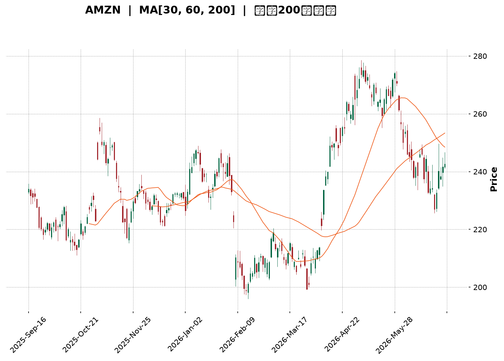
</details>

<html>
<head><meta charset="utf-8" /></head>
<body>
    <div style="height:500px; width:100%;">                        <script>window.PlotlyConfig = {MathJaxConfig: 'local'};</script>
        <script charset="utf-8" src="https://cdn.plot.ly/plotly-3.6.0.min.js" integrity="sha256-QaOVwtVY0T02VaHrr6pnoHLCwayMJp4O5n4YyaE3rJk=" crossorigin="anonymous"></script>                <div id="candlestick-chart" class="plotly-graph-div" style="height:100%; width:100%;"></div>            <script>                window.PLOTLYENV=window.PLOTLYENV || {};                                if (document.getElementById("candlestick-chart")) {                    Plotly.newPlot(                        "candlestick-chart",                        [{"close":{"dtype":"f8","bdata":"AAAAoJlBbUAAAAAA1\u002fNsQAAAACBc52xAAAAAIFzvbEAAAAAAKXRsQAAAAGC4lmtAAAAAYLiGa0AAAADAzERrQAAAAMD1eGtAAAAAoHDFa0AAAACAPXJrQAAAAAAplGtAAAAAwB7Na0AAAADgUXBrQAAAAMDMnGtAAAAAwPW4a0AAAABACidsQAAAACCud2xAAAAAANcLa0AAAACAPYJrQAAAAOB6DGtAAAAAgD3yakAAAABACs9qQAAAAKBHoWpAAAAAIFwPa0AAAADA9cBrQAAAAGBmPmtAAAAAQOGia0AAAABguAZsQAAAAEAKX2xAAAAAAACobEAAAACgmclsQAAAACCF22tAAAAAQAqHbkAAAAAAAMBvQAAAAIA9Km9AAAAAYGZGb0AAAACgR2FuQAAAAMAejW5AAAAAwMwMb0AAAABAMyNvQAAAAGBmhm5AAAAAYI+ybUAAAACAFFZtQAAAAADXG21AAAAAoJnRa0AAAACAFNZrQAAAAOB6JGtAAAAAgBSWa0AAAADA9UhsQAAAAKBwtWxAAAAAwB6lbEAAAABACidtQAAAAAApPG1AAAAAoHBNbUAAAAAAKQxtQAAAACCFo2xAAAAAwPWwbEAAAADgelxsQAAAAKBwfWxAAAAAwPX4bEAAAADA9chsQAAAAIAURmxAAAAAoEfRa0AAAACA69FrQAAAAOCjqGtAAAAA4FFYbEAAAABAM2tsQAAAAIDCjWxAAAAA4HoEbUAAAAAAKQxtQAAAAOCjEG1AAAAAgD0CbUAAAADA9RBtQAAAAIA92mxAAAAAAABQbEAAAACA6yFtQAAAAIDCHW5AAAAAgOsxbkAAAACgR8luQAAAAAAp7G5AAAAAQArPbkAAAABAM1NuQAAAAMDMlG1AAAAAgMLFbUAAAAAA1+NtQAAAAAAA4GxAAAAAgOvpbEAAAABA4UptQAAAAMAe5W1AAAAAoHDNbUAAAACAwpVuQAAAAOBRYG5AAAAAIFw3bkAAAACgmeltQAAAAGC4Xm5AAAAAANfTbUAAAAAgrh9tQAAAAIAU1mtAAAAAgD1KakAAAABAChdqQAAAAGC43mlAAAAAYI+CaUAAAABAM\u002fNoQAAAAKBH2WhAAAAAwMwkaUAAAACgR5lpQAAAACCFm2lAAAAAIIVDakAAAADgo6hpQAAAAIDrEWpAAAAA4HpUakAAAACgcP1pQAAAAAAAQGpAAAAA4HoMakAAAAAgXBdqQAAAAIA9GmtAAAAAgBRea0AAAABguKZqQAAAACCur2pAAAAAYI\u002fKakAAAADAzJRqQAAAAMD1MGpAAAAAoHD1aUAAAAAgrndqQAAAAGBm5mpAAAAAANc7akAAAADgURhqQAAAAADXq2lAAAAA4HpEakAAAAAgrudpQAAAAGC4dmpAAAAAoEfxaUAAAABA4epoQAAAAGBmHmlAAAAA4KMIakAAAACAPVJqQAAAAOCjOGpAAAAAoEeZakAAAADgo7hqQAAAAAAAqGtAAAAAwMw0bUAAAAAAKcxtQAAAAOB6\u002fG1AAAAA4KMgb0AAAAAAABBvQAAAAGBmNm9AAAAAgOtRb0AAAADA9QhvQAAAAMAePW9AAAAAIIXrb0AAAABgj+JvQAAAAADXf3BAAAAAgOtRcEAAAABAMztwQAAAAOCjcHBAAAAAwPWQcEAAAAAAKcRwQAAAAMDMAHFAAAAAwMwYcUAAAAAA1y9xQAAAAGC48nBAAAAAQOEKcUAAAAAA189wQAAAAMAenXBAAAAAgBTicEAAAAAghbNwQAAAAIA9gnBAAAAAgMKNcEAAAACgcDVwQAAAAAApkHBAAAAAIFzHcEAAAADAHqVwQAAAAOCjlHBAAAAAoJn9cEAAAAAAACBxQAAAAIA96nBAAAAAAClUcEAAAADgUQhwQAAAAOCjQG9AAAAAoEe5b0AAAADA9cBuQAAAAEAKp25AAAAAgBSGbkAAAAAAAMBtQAAAAOBRMG5AAAAAoJnRbUAAAADgo8BuQAAAAAAAwG5AAAAAAACwbUAAAADgeoxuQAAAAKBHGW1AAAAAIIVDbUAAAADgo0htQAAAAOBRYGxAAAAAgBQWbUAAAADgegRuQAAAAEDhym1AAAAAYGY2bkAAAACgcFVuQA=="},"high":{"dtype":"f8","bdata":"AAAAwMx8bUAAAACgmUltQAAAACBcL21AAAAAwB5FbUAAAACAPdJsQAAAACCFe2xAAAAAgOsRbEAAAACgcJVrQAAAAKCZoWtAAAAAQDPTa0AAAAAgrsdrQAAAAMDMxGtAAAAAgOvZa0AAAABgZgZsQAAAACBct2tAAAAA4Hrca0AAAAAgXFdsQAAAAGC4hmxAAAAAAACIbEAAAACAwpVrQAAAAIA9amtAAAAAYLg2a0AAAABA4VJrQAAAAKCZ2WpAAAAAgBQWa0AAAACAPeprQAAAAOBRgGtAAAAAoJmpa0AAAADAzCxsQAAAAMDMjGxAAAAAIK7vbEAAAACAPRptQAAAAIAUjmxAAAAAAABQb0AAAACgmSlwQAAAAAApEHBAAAAAAABgb0AAAAAAKUxvQAAAAMDMnG5AAAAAAAB4b0AAAAAAADhvQAAAAADXS29AAAAAAAB4bkAAAAAgXNdtQAAAAEAzU21AAAAAYGbGbEAAAAAgrvdrQAAAAMAebWxAAAAAYLjGa0AAAABgj2psQAAAAOCj0GxAAAAAAAD4bEAAAACgRyltQAAAAKCZeW1AAAAAQArfbUAAAAAAKSxtQAAAAAAAMG1AAAAAIK7nbEAAAABgj9psQAAAAIA9kmxAAAAAoHANbUAAAAAghQNtQAAAAGCPwmxAAAAAgMJ9bEAAAADAHvVrQAAAAIAUJmxAAAAAIFynbEAAAAAAKaRsQAAAACBcr2xAAAAAYGYObUAAAABgZh5tQAAAACCuH21AAAAAQDMTbUAAAADgoxhtQAAAACCuH21AAAAAYLhubUAAAAAAAEBtQAAAAIDCZW5AAAAAoEepbkAAAADAHs1uQAAAACCF+25AAAAAgBQeb0AAAADAHvVuQAAAAMD1KG5AAAAAwMwUbkAAAACAPfJtQAAAAEDhYm1AAAAAoJkJbUAAAABACndtQAAAAGBmDm5AAAAAYGYebkAAAAAAKZxuQAAAAMD1+G5AAAAAAABgbkAAAACAPWpuQAAAAAAptG5AAAAAQDPLbkAAAAAghdttQAAAAIDrSWxAAAAAgBRuakAAAACA65lqQAAAAMDMlGpAAAAAgD0SakAAAABguH5pQAAAAMAeJWlAAAAAIK43aUAAAAAghdtpQAAAAOB6tGlAAAAAoHBlakAAAACAwg1qQAAAACCFS2pAAAAAQOFyakAAAACgmWFqQAAAAGCPSmpAAAAAIFw3akAAAACAwiVqQAAAAKBHMWtAAAAAQAqPa0AAAACAPSprQAAAAIA9umpAAAAAwMz0akAAAAAAACBrQAAAAGC4dmpAAAAAgOtRakAAAABACpdqQAAAAGBm9mpAAAAA4HrkakAAAAAA1yNqQAAAAKBH8WlAAAAAoJmZakAAAABAMytqQAAAAIA9ompAAAAA4HqcakAAAABAM9NpQAAAAKCZeWlAAAAAwPVIakAAAABgj7JqQAAAAGC4hmpAAAAAYGaeakAAAABACr9qQAAAAEAzQ2xAAAAAoJk5bUAAAACAwg1uQAAAAAAAAG5AAAAAgMKFb0AAAACAFE5vQAAAAAAAQG9AAAAAQOECcEAAAACAwkVvQAAAAEDh4m9AAAAAgBT+b0AAAADgoyxwQAAAAAAAiHBAAAAAYGaCcEAAAADgelBwQAAAAGCPnnBAAAAAgBQecUAAAADAHhVxQAAAAKCZQXFAAAAAwPVocUAAAADAzFxxQAAAAIAUSnFAAAAAAAAgcUAAAACAFBpxQAAAAGBmunBAAAAAIIXrcEAAAADgeuxwQAAAAIDChXBAAAAAoJnNcEAAAAAAAGRwQAAAAKBHmXBAAAAAANfXcEAAAADgo9xwQAAAAMDM1HBAAAAAYI8GcUAAAAAAAChxQAAAAAAALHFAAAAAgBSqcEAAAABAM1NwQAAAAKBwEXBAAAAAYI\u002f6b0AAAACAFAZwQAAAAKBwLW9AAAAAgMJNb0AAAACAPYJuQAAAAOB6RG5AAAAAIIVrbkAAAACA6\u002fluQAAAAOBRMG9AAAAAwB69bkAAAAAgXLduQAAAAAAAQG5AAAAAANebbUAAAACgcE1uQAAAAIA9Cm1AAAAAwMw8bUAAAABguDZvQAAAAKBHMW5AAAAAwMycbkAAAABACtduQA=="},"hovertemplate":"\u003cb\u003e%{x|%Y-%m-%d}\u003c\u002fb\u003e\u003cbr\u003e\u958b: $%{open:.2f}\u003cbr\u003e\u9ad8: $%{high:.2f}\u003cbr\u003e\u4f4e: $%{low:.2f}\u003cbr\u003e\u6536: $%{close:.2f}\u003cextra\u003e\u003c\u002fextra\u003e","low":{"dtype":"f8","bdata":"AAAAIFwHbUAAAABguJZsQAAAAKBHmWxAAAAAYGa2bEAAAADgUXBsQAAAAIA9gmtAAAAAYGZua0AAAABACg9rQAAAAOCjQGtAAAAAoJlpa0AAAADgejxrQAAAACCFE2tAAAAAYGZea0AAAABA4WprQAAAAMD1AGtAAAAAoHCFa0AAAACAFKZrQAAAAAAAuGtAAAAAAAAAa0AAAACgRyFrQAAAAEAzk2pAAAAAwB6VakAAAACA65lqQAAAAMD1YGpAAAAAQOGyakAAAAAgrj9rQAAAAOCjEGtAAAAAgMJFa0AAAADAzLxrQAAAAKBHMWxAAAAAYLhGbEAAAADgUXhsQAAAAAAA2GtAAAAAIFx\u002fbkAAAADAzJxvQAAAAMAeFW9AAAAAwB7FbkAAAACgcEVuQAAAACCuz21AAAAAQOGybkAAAAAgXOduQAAAAAAAeG5AAAAAAACQbUAAAADgehxtQAAAAIAUpmxAAAAAoHDNa0AAAADgo1BrQAAAACCuF2tAAAAAgMLlakAAAADgo8hrQAAAAKCZ+WtAAAAA4KOYbEAAAABACsdsQAAAAAAACG1AAAAAoJkxbUAAAAAghdNsQAAAAKCZWWxAAAAAoJmRbEAAAADgo0hsQAAAACCFI2xAAAAAYLiObEAAAACAFJZsQAAAAADXI2xAAAAAAACwa0AAAAAAKaRrQAAAACCun2tAAAAAwB4NbEAAAABgjzJsQAAAAGC4VmxAAAAAIFyXbEAAAABgj+psQAAAAIDC5WxAAAAA4KPYbEAAAABgZsZsQAAAAADXw2xAAAAAYGYWbEAAAACAwmVsQAAAAIA9Am1AAAAA4KPwbUAAAAAAKTxuQAAAACCuR25AAAAAYLi+bkAAAAAAAAhuQAAAAEAKh21AAAAAACmUbUAAAADAHo1tQAAAAEDhqmxAAAAAAClcbEAAAADAzNxsQAAAAIA9Um1AAAAAoEexbUAAAABgj8JtQAAAAMD1MG5AAAAAIK6XbUAAAADgerRtQAAAAKBwxW1AAAAAYGZubUAAAACAPfpsQAAAAAApjGtAAAAAgOsJaUAAAABAM2tpQAAAAMAezWlAAAAAIK5PaUAAAACA67FoQAAAAMD1qGhAAAAAAACAaEAAAADgUTBpQAAAAIDrWWlAAAAAAAB4aUAAAAAghWNpQAAAAAAAaGlAAAAAgMIdakAAAABAM6tpQAAAAGBmpmlAAAAAYLhuaUAAAAAgXE9pQAAAAMDMRGpAAAAAQOHyakAAAADA9ZBqQAAAACCF42lAAAAAgMKNakAAAABAM2tqQAAAAMDMBGpAAAAAQArHaUAAAABgZu5pQAAAAIDCjWpAAAAAYI8aakAAAACgmcFpQAAAAIA9imlAAAAA4FEwakAAAADgetRpQAAAAMDMPGpAAAAAANfjaUAAAADgeuRoQAAAACBc\u002f2hAAAAA4HqEaUAAAACAFAZqQAAAAMDMnGlAAAAAQOEyakAAAABgjyJqQAAAAADXc2tAAAAA4KPoa0AAAABguGZtQAAAAAAAeG1AAAAAwPU4bkAAAABgZuZuQAAAAGBmhm5AAAAAIIVDb0AAAAAA16tuQAAAAEAzI29AAAAAYI9Kb0AAAACAPaJvQAAAAEAKG3BAAAAAoHBFcEAAAACAFApwQAAAAEAzG3BAAAAAYI8CcEAAAAAA12twQAAAAMDMzHBAAAAAgBQGcUAAAAAgXANxQAAAAADX53BAAAAAQDPfcEAAAAAgrsdwQAAAAIAUanBAAAAAQDNzcEAAAACAFKpwQAAAAIA9TnBAAAAA4HpocEAAAACAFOZvQAAAAOB6OHBAAAAAgOtVcEAAAAAA16NwQAAAAMAeYXBAAAAAQDObcEAAAABACrdwQAAAAIA92nBAAAAAQDNLcEAAAAAA18tvQAAAAGC49m5AAAAAAAB4b0AAAADA9bhuQAAAACCFa25AAAAAwMwMbkAAAABgZq5tQAAAAIDCZW1AAAAAQOEybUAAAAAgXJduQAAAAGBmrm5AAAAAAACAbUAAAADgo4BtQAAAACCuB21AAAAAAAAAbUAAAABgZh5tQAAAAKCZMWxAAAAAAClEbEAAAACgmTltQAAAAKBwpW1AAAAAwMxcbUAAAABgjyJuQA=="},"name":"\u50f9\u683c","open":{"dtype":"f8","bdata":"AAAAgBQebUAAAADgozhtQAAAAAAAEG1AAAAAANcLbUAAAACA69FsQAAAAGCPemxAAAAAwMwEbEAAAACA64FrQAAAAGCPYmtAAAAAYI+Ca0AAAADA9cBrQAAAACCFK2tAAAAA4FGga0AAAACAFO5rQAAAAAAAoGtAAAAAACmca0AAAACgcN1rQAAAAAAAIGxAAAAAYLhGbEAAAABgZjZrQAAAAIDr8WpAAAAAANcTa0AAAACgcPVqQAAAAIDr0WpAAAAAACm8akAAAACAwk1rQAAAAKCZaWtAAAAAAABga0AAAABACr9rQAAAAMAedWxAAAAAQAqHbEAAAACgcPVsQAAAAIDrYWxAAAAAQDNDb0AAAAAghetvQAAAAAApTG9AAAAAwPUgb0AAAADAHiVvQAAAAMDMXG5AAAAAQOEKb0AAAADAHg1vQAAAACCuR29AAAAAoJlhbkAAAACA62FtQAAAAAAAKG1AAAAAQDODbEAAAAAgrvdrQAAAAKCZYWxAAAAAQDMLa0AAAACA69FrQAAAAAApTGxAAAAAIK7XbEAAAAAgrudsQAAAAEAKJ21AAAAA4FFgbUAAAABAMyttQAAAAOCjGG1AAAAAgD3KbEAAAABA4bJsQAAAAEDhWmxAAAAAgOuZbEAAAABguNZsQAAAAADXu2xAAAAAgMJ9bEAAAACgR+FrQAAAAMAeFWxAAAAAYLg2bEAAAADgUVhsQAAAACCFk2xAAAAAgOuhbEAAAAAAKQRtQAAAAKBHAW1AAAAAgBT+bEAAAABguOZsQAAAAMAeHW1AAAAAQOHqbEAAAABA4ZpsQAAAAEAzA21AAAAAIIXzbUAAAACA62FuQAAAAIA9km5AAAAAIFzXbkAAAADA9dBuQAAAAMDMJG5AAAAAgOvpbUAAAABA4eJtQAAAAOBROG1AAAAAQOHibEAAAACgmUFtQAAAAGC4Xm1AAAAAIFz\u002fbUAAAACAFPZtQAAAAADXy25AAAAAgD1abkAAAADgevxtQAAAAIDryW1AAAAAIFyfbkAAAAAghdttQAAAAMAeHWxAAAAAYGZWaUAAAABACh9qQAAAAKCZGWpAAAAAgOsBakAAAABguH5pQAAAAAAp3GhAAAAAACnEaEAAAACAPUJpQAAAAKCZeWlAAAAA4FGYaUAAAABAMwNqQAAAAEAKr2lAAAAAYLhOakAAAAAgXFdqQAAAAGCP2mlAAAAAoJmRaUAAAABAM2NpQAAAAEAKT2pAAAAAIFz\u002fakAAAAAgrt9qQAAAAGBmTmpAAAAAgBTGakAAAABguPZqQAAAAOB6TGpAAAAAIIUzakAAAABAMwtqQAAAAIA9mmpAAAAAgMK9akAAAACA6+FpQAAAAMDM7GlAAAAAoEc5akAAAABgZv5pQAAAAIDrcWpAAAAAIIVTakAAAABguM5pQAAAACBcL2lAAAAAQDObaUAAAACAFE5qQAAAAKBH0WlAAAAAoJk5akAAAAAgrmdqQAAAAKBH+WtAAAAAIFwnbEAAAACgmWltQAAAAGBmrm1AAAAAwPU4bkAAAAAAAChvQAAAAOBREG9AAAAAIK7fb0AAAACAFCZvQAAAAEDh4m9AAAAAgBSOb0AAAADgeuxvQAAAACCuP3BAAAAAIFx3cEAAAACAPSZwQAAAAADXH3BAAAAAYLgScUAAAACgR5lwQAAAAMDMzHBAAAAAoEdBcUAAAACAPQ5xQAAAAOBRMHFAAAAAgBT6cEAAAACgcN1wQAAAACBcq3BAAAAAQOGGcEAAAABgZtJwQAAAAAAAaHBAAAAAgOt9cEAAAADgo2BwQAAAAMDMQHBAAAAAAAB4cEAAAABgj8pwQAAAAEAKv3BAAAAAYGaicEAAAADgUQRxQAAAAOCj9HBAAAAA4KOkcEAAAABgjxJwQAAAAGBm1m9AAAAAANejb0AAAADgUchvQAAAAIDC1W5AAAAAIFz3bkAAAAAghXNuQAAAAIDCvW1AAAAAYLhmbkAAAADgo6BuQAAAAAAAAG9AAAAAwMycbkAAAAAA1wNuQAAAAGCPAm5AAAAAoJkRbUAAAABAMzttQAAAAOCjAG1AAAAAYLhmbEAAAABACkdtQAAAAEAzq21AAAAAAAD4bUAAAAAghTNuQA=="},"x":["2025-09-16T00:00:00-04:00","2025-09-17T00:00:00-04:00","2025-09-18T00:00:00-04:00","2025-09-19T00:00:00-04:00","2025-09-22T00:00:00-04:00","2025-09-23T00:00:00-04:00","2025-09-24T00:00:00-04:00","2025-09-25T00:00:00-04:00","2025-09-26T00:00:00-04:00","2025-09-29T00:00:00-04:00","2025-09-30T00:00:00-04:00","2025-10-01T00:00:00-04:00","2025-10-02T00:00:00-04:00","2025-10-03T00:00:00-04:00","2025-10-06T00:00:00-04:00","2025-10-07T00:00:00-04:00","2025-10-08T00:00:00-04:00","2025-10-09T00:00:00-04:00","2025-10-10T00:00:00-04:00","2025-10-13T00:00:00-04:00","2025-10-14T00:00:00-04:00","2025-10-15T00:00:00-04:00","2025-10-16T00:00:00-04:00","2025-10-17T00:00:00-04:00","2025-10-20T00:00:00-04:00","2025-10-21T00:00:00-04:00","2025-10-22T00:00:00-04:00","2025-10-23T00:00:00-04:00","2025-10-24T00:00:00-04:00","2025-10-27T00:00:00-04:00","2025-10-28T00:00:00-04:00","2025-10-29T00:00:00-04:00","2025-10-30T00:00:00-04:00","2025-10-31T00:00:00-04:00","2025-11-03T00:00:00-05:00","2025-11-04T00:00:00-05:00","2025-11-05T00:00:00-05:00","2025-11-06T00:00:00-05:00","2025-11-07T00:00:00-05:00","2025-11-10T00:00:00-05:00","2025-11-11T00:00:00-05:00","2025-11-12T00:00:00-05:00","2025-11-13T00:00:00-05:00","2025-11-14T00:00:00-05:00","2025-11-17T00:00:00-05:00","2025-11-18T00:00:00-05:00","2025-11-19T00:00:00-05:00","2025-11-20T00:00:00-05:00","2025-11-21T00:00:00-05:00","2025-11-24T00:00:00-05:00","2025-11-25T00:00:00-05:00","2025-11-26T00:00:00-05:00","2025-11-28T00:00:00-05:00","2025-12-01T00:00:00-05:00","2025-12-02T00:00:00-05:00","2025-12-03T00:00:00-05:00","2025-12-04T00:00:00-05:00","2025-12-05T00:00:00-05:00","2025-12-08T00:00:00-05:00","2025-12-09T00:00:00-05:00","2025-12-10T00:00:00-05:00","2025-12-11T00:00:00-05:00","2025-12-12T00:00:00-05:00","2025-12-15T00:00:00-05:00","2025-12-16T00:00:00-05:00","2025-12-17T00:00:00-05:00","2025-12-18T00:00:00-05:00","2025-12-19T00:00:00-05:00","2025-12-22T00:00:00-05:00","2025-12-23T00:00:00-05:00","2025-12-24T00:00:00-05:00","2025-12-26T00:00:00-05:00","2025-12-29T00:00:00-05:00","2025-12-30T00:00:00-05:00","2025-12-31T00:00:00-05:00","2026-01-02T00:00:00-05:00","2026-01-05T00:00:00-05:00","2026-01-06T00:00:00-05:00","2026-01-07T00:00:00-05:00","2026-01-08T00:00:00-05:00","2026-01-09T00:00:00-05:00","2026-01-12T00:00:00-05:00","2026-01-13T00:00:00-05:00","2026-01-14T00:00:00-05:00","2026-01-15T00:00:00-05:00","2026-01-16T00:00:00-05:00","2026-01-20T00:00:00-05:00","2026-01-21T00:00:00-05:00","2026-01-22T00:00:00-05:00","2026-01-23T00:00:00-05:00","2026-01-26T00:00:00-05:00","2026-01-27T00:00:00-05:00","2026-01-28T00:00:00-05:00","2026-01-29T00:00:00-05:00","2026-01-30T00:00:00-05:00","2026-02-02T00:00:00-05:00","2026-02-03T00:00:00-05:00","2026-02-04T00:00:00-05:00","2026-02-05T00:00:00-05:00","2026-02-06T00:00:00-05:00","2026-02-09T00:00:00-05:00","2026-02-10T00:00:00-05:00","2026-02-11T00:00:00-05:00","2026-02-12T00:00:00-05:00","2026-02-13T00:00:00-05:00","2026-02-17T00:00:00-05:00","2026-02-18T00:00:00-05:00","2026-02-19T00:00:00-05:00","2026-02-20T00:00:00-05:00","2026-02-23T00:00:00-05:00","2026-02-24T00:00:00-05:00","2026-02-25T00:00:00-05:00","2026-02-26T00:00:00-05:00","2026-02-27T00:00:00-05:00","2026-03-02T00:00:00-05:00","2026-03-03T00:00:00-05:00","2026-03-04T00:00:00-05:00","2026-03-05T00:00:00-05:00","2026-03-06T00:00:00-05:00","2026-03-09T00:00:00-04:00","2026-03-10T00:00:00-04:00","2026-03-11T00:00:00-04:00","2026-03-12T00:00:00-04:00","2026-03-13T00:00:00-04:00","2026-03-16T00:00:00-04:00","2026-03-17T00:00:00-04:00","2026-03-18T00:00:00-04:00","2026-03-19T00:00:00-04:00","2026-03-20T00:00:00-04:00","2026-03-23T00:00:00-04:00","2026-03-24T00:00:00-04:00","2026-03-25T00:00:00-04:00","2026-03-26T00:00:00-04:00","2026-03-27T00:00:00-04:00","2026-03-30T00:00:00-04:00","2026-03-31T00:00:00-04:00","2026-04-01T00:00:00-04:00","2026-04-02T00:00:00-04:00","2026-04-06T00:00:00-04:00","2026-04-07T00:00:00-04:00","2026-04-08T00:00:00-04:00","2026-04-09T00:00:00-04:00","2026-04-10T00:00:00-04:00","2026-04-13T00:00:00-04:00","2026-04-14T00:00:00-04:00","2026-04-15T00:00:00-04:00","2026-04-16T00:00:00-04:00","2026-04-17T00:00:00-04:00","2026-04-20T00:00:00-04:00","2026-04-21T00:00:00-04:00","2026-04-22T00:00:00-04:00","2026-04-23T00:00:00-04:00","2026-04-24T00:00:00-04:00","2026-04-27T00:00:00-04:00","2026-04-28T00:00:00-04:00","2026-04-29T00:00:00-04:00","2026-04-30T00:00:00-04:00","2026-05-01T00:00:00-04:00","2026-05-04T00:00:00-04:00","2026-05-05T00:00:00-04:00","2026-05-06T00:00:00-04:00","2026-05-07T00:00:00-04:00","2026-05-08T00:00:00-04:00","2026-05-11T00:00:00-04:00","2026-05-12T00:00:00-04:00","2026-05-13T00:00:00-04:00","2026-05-14T00:00:00-04:00","2026-05-15T00:00:00-04:00","2026-05-18T00:00:00-04:00","2026-05-19T00:00:00-04:00","2026-05-20T00:00:00-04:00","2026-05-21T00:00:00-04:00","2026-05-22T00:00:00-04:00","2026-05-26T00:00:00-04:00","2026-05-27T00:00:00-04:00","2026-05-28T00:00:00-04:00","2026-05-29T00:00:00-04:00","2026-06-01T00:00:00-04:00","2026-06-02T00:00:00-04:00","2026-06-03T00:00:00-04:00","2026-06-04T00:00:00-04:00","2026-06-05T00:00:00-04:00","2026-06-08T00:00:00-04:00","2026-06-09T00:00:00-04:00","2026-06-10T00:00:00-04:00","2026-06-11T00:00:00-04:00","2026-06-12T00:00:00-04:00","2026-06-15T00:00:00-04:00","2026-06-16T00:00:00-04:00","2026-06-17T00:00:00-04:00","2026-06-18T00:00:00-04:00","2026-06-22T00:00:00-04:00","2026-06-23T00:00:00-04:00","2026-06-24T00:00:00-04:00","2026-06-25T00:00:00-04:00","2026-06-26T00:00:00-04:00","2026-06-29T00:00:00-04:00","2026-06-30T00:00:00-04:00","2026-07-01T00:00:00-04:00","2026-07-02T00:00:00-04:00"],"type":"candlestick"},{"hovertemplate":"MA30: $%{y:.2f}\u003cextra\u003e\u003c\u002fextra\u003e","line":{"color":"#2196F3","dash":"dash","width":2},"mode":"lines","name":"MA30","x":["2025-09-16T00:00:00-04:00","2025-09-17T00:00:00-04:00","2025-09-18T00:00:00-04:00","2025-09-19T00:00:00-04:00","2025-09-22T00:00:00-04:00","2025-09-23T00:00:00-04:00","2025-09-24T00:00:00-04:00","2025-09-25T00:00:00-04:00","2025-09-26T00:00:00-04:00","2025-09-29T00:00:00-04:00","2025-09-30T00:00:00-04:00","2025-10-01T00:00:00-04:00","2025-10-02T00:00:00-04:00","2025-10-03T00:00:00-04:00","2025-10-06T00:00:00-04:00","2025-10-07T00:00:00-04:00","2025-10-08T00:00:00-04:00","2025-10-09T00:00:00-04:00","2025-10-10T00:00:00-04:00","2025-10-13T00:00:00-04:00","2025-10-14T00:00:00-04:00","2025-10-15T00:00:00-04:00","2025-10-16T00:00:00-04:00","2025-10-17T00:00:00-04:00","2025-10-20T00:00:00-04:00","2025-10-21T00:00:00-04:00","2025-10-22T00:00:00-04:00","2025-10-23T00:00:00-04:00","2025-10-24T00:00:00-04:00","2025-10-27T00:00:00-04:00","2025-10-28T00:00:00-04:00","2025-10-29T00:00:00-04:00","2025-10-30T00:00:00-04:00","2025-10-31T00:00:00-04:00","2025-11-03T00:00:00-05:00","2025-11-04T00:00:00-05:00","2025-11-05T00:00:00-05:00","2025-11-06T00:00:00-05:00","2025-11-07T00:00:00-05:00","2025-11-10T00:00:00-05:00","2025-11-11T00:00:00-05:00","2025-11-12T00:00:00-05:00","2025-11-13T00:00:00-05:00","2025-11-14T00:00:00-05:00","2025-11-17T00:00:00-05:00","2025-11-18T00:00:00-05:00","2025-11-19T00:00:00-05:00","2025-11-20T00:00:00-05:00","2025-11-21T00:00:00-05:00","2025-11-24T00:00:00-05:00","2025-11-25T00:00:00-05:00","2025-11-26T00:00:00-05:00","2025-11-28T00:00:00-05:00","2025-12-01T00:00:00-05:00","2025-12-02T00:00:00-05:00","2025-12-03T00:00:00-05:00","2025-12-04T00:00:00-05:00","2025-12-05T00:00:00-05:00","2025-12-08T00:00:00-05:00","2025-12-09T00:00:00-05:00","2025-12-10T00:00:00-05:00","2025-12-11T00:00:00-05:00","2025-12-12T00:00:00-05:00","2025-12-15T00:00:00-05:00","2025-12-16T00:00:00-05:00","2025-12-17T00:00:00-05:00","2025-12-18T00:00:00-05:00","2025-12-19T00:00:00-05:00","2025-12-22T00:00:00-05:00","2025-12-23T00:00:00-05:00","2025-12-24T00:00:00-05:00","2025-12-26T00:00:00-05:00","2025-12-29T00:00:00-05:00","2025-12-30T00:00:00-05:00","2025-12-31T00:00:00-05:00","2026-01-02T00:00:00-05:00","2026-01-05T00:00:00-05:00","2026-01-06T00:00:00-05:00","2026-01-07T00:00:00-05:00","2026-01-08T00:00:00-05:00","2026-01-09T00:00:00-05:00","2026-01-12T00:00:00-05:00","2026-01-13T00:00:00-05:00","2026-01-14T00:00:00-05:00","2026-01-15T00:00:00-05:00","2026-01-16T00:00:00-05:00","2026-01-20T00:00:00-05:00","2026-01-21T00:00:00-05:00","2026-01-22T00:00:00-05:00","2026-01-23T00:00:00-05:00","2026-01-26T00:00:00-05:00","2026-01-27T00:00:00-05:00","2026-01-28T00:00:00-05:00","2026-01-29T00:00:00-05:00","2026-01-30T00:00:00-05:00","2026-02-02T00:00:00-05:00","2026-02-03T00:00:00-05:00","2026-02-04T00:00:00-05:00","2026-02-05T00:00:00-05:00","2026-02-06T00:00:00-05:00","2026-02-09T00:00:00-05:00","2026-02-10T00:00:00-05:00","2026-02-11T00:00:00-05:00","2026-02-12T00:00:00-05:00","2026-02-13T00:00:00-05:00","2026-02-17T00:00:00-05:00","2026-02-18T00:00:00-05:00","2026-02-19T00:00:00-05:00","2026-02-20T00:00:00-05:00","2026-02-23T00:00:00-05:00","2026-02-24T00:00:00-05:00","2026-02-25T00:00:00-05:00","2026-02-26T00:00:00-05:00","2026-02-27T00:00:00-05:00","2026-03-02T00:00:00-05:00","2026-03-03T00:00:00-05:00","2026-03-04T00:00:00-05:00","2026-03-05T00:00:00-05:00","2026-03-06T00:00:00-05:00","2026-03-09T00:00:00-04:00","2026-03-10T00:00:00-04:00","2026-03-11T00:00:00-04:00","2026-03-12T00:00:00-04:00","2026-03-13T00:00:00-04:00","2026-03-16T00:00:00-04:00","2026-03-17T00:00:00-04:00","2026-03-18T00:00:00-04:00","2026-03-19T00:00:00-04:00","2026-03-20T00:00:00-04:00","2026-03-23T00:00:00-04:00","2026-03-24T00:00:00-04:00","2026-03-25T00:00:00-04:00","2026-03-26T00:00:00-04:00","2026-03-27T00:00:00-04:00","2026-03-30T00:00:00-04:00","2026-03-31T00:00:00-04:00","2026-04-01T00:00:00-04:00","2026-04-02T00:00:00-04:00","2026-04-06T00:00:00-04:00","2026-04-07T00:00:00-04:00","2026-04-08T00:00:00-04:00","2026-04-09T00:00:00-04:00","2026-04-10T00:00:00-04:00","2026-04-13T00:00:00-04:00","2026-04-14T00:00:00-04:00","2026-04-15T00:00:00-04:00","2026-04-16T00:00:00-04:00","2026-04-17T00:00:00-04:00","2026-04-20T00:00:00-04:00","2026-04-21T00:00:00-04:00","2026-04-22T00:00:00-04:00","2026-04-23T00:00:00-04:00","2026-04-24T00:00:00-04:00","2026-04-27T00:00:00-04:00","2026-04-28T00:00:00-04:00","2026-04-29T00:00:00-04:00","2026-04-30T00:00:00-04:00","2026-05-01T00:00:00-04:00","2026-05-04T00:00:00-04:00","2026-05-05T00:00:00-04:00","2026-05-06T00:00:00-04:00","2026-05-07T00:00:00-04:00","2026-05-08T00:00:00-04:00","2026-05-11T00:00:00-04:00","2026-05-12T00:00:00-04:00","2026-05-13T00:00:00-04:00","2026-05-14T00:00:00-04:00","2026-05-15T00:00:00-04:00","2026-05-18T00:00:00-04:00","2026-05-19T00:00:00-04:00","2026-05-20T00:00:00-04:00","2026-05-21T00:00:00-04:00","2026-05-22T00:00:00-04:00","2026-05-26T00:00:00-04:00","2026-05-27T00:00:00-04:00","2026-05-28T00:00:00-04:00","2026-05-29T00:00:00-04:00","2026-06-01T00:00:00-04:00","2026-06-02T00:00:00-04:00","2026-06-03T00:00:00-04:00","2026-06-04T00:00:00-04:00","2026-06-05T00:00:00-04:00","2026-06-08T00:00:00-04:00","2026-06-09T00:00:00-04:00","2026-06-10T00:00:00-04:00","2026-06-11T00:00:00-04:00","2026-06-12T00:00:00-04:00","2026-06-15T00:00:00-04:00","2026-06-16T00:00:00-04:00","2026-06-17T00:00:00-04:00","2026-06-18T00:00:00-04:00","2026-06-22T00:00:00-04:00","2026-06-23T00:00:00-04:00","2026-06-24T00:00:00-04:00","2026-06-25T00:00:00-04:00","2026-06-26T00:00:00-04:00","2026-06-29T00:00:00-04:00","2026-06-30T00:00:00-04:00","2026-07-01T00:00:00-04:00","2026-07-02T00:00:00-04:00"],"y":{"dtype":"f8","bdata":"AAAAAAAA+H8AAAAAAAD4fwAAAAAAAPh\u002fAAAAAAAA+H8AAAAAAAD4fwAAAAAAAPh\u002fAAAAAAAA+H8AAAAAAAD4fwAAAAAAAPh\u002fAAAAAAAA+H8AAAAAAAD4fwAAAAAAAPh\u002fAAAAAAAA+H8AAAAAAAD4fwAAAAAAAPh\u002fAAAAAAAA+H8AAAAAAAD4fwAAAAAAAPh\u002fAAAAAAAA+H8AAAAAAAD4fwAAAAAAAPh\u002fAAAAAAAA+H8AAAAAAAD4fwAAAAAAAPh\u002fAAAAAAAA+H8AAAAAAAD4fwAAAAAAAPh\u002fAAAAAAAA+H8AAAAAAAD4f6uqqlpkv2tAIiIiokW6a0AAAAAw3bhrQO\u002fu7p7vr2tA3t3dfYa9a0AiIiJCp9lrQCIiIrIr+GtAZmZm9igYbEB3d3eXtTJsQJqZmTn7TGxAMzMzw\u002fVobEC8u7trdYhsQJqZmZmZoWxAVVVVBcixbEDNzMws+cFsQImIiMi9zmxAvLu7C5DPbEAAAAAw3cxsQN7d3a2OwWxAREREVCrGbEAiIiISysxsQFVVVWX02mxA7+7uXnPpbEDv7u5ec\u002f1sQFVVVRWuE21AZmZm5tAmbUBEREQk2zFtQBEREZHCPW1AAAAAQMNGbUARERERn0ltQKuqqnqiSm1AZmZmVlVNbUAAAADgT01tQAAAADDdUG1AmpmZGb05bUAiIiLiMxhtQM3MzFxI+mxA3t3drUfhbEBEREREi9BsQImIiKh\u002fv2xAiYiImCeubEC8u7vrUZxsQBEREYHcj2xAiYiI6PuJbEBVVVUVrodsQM3MzEx+hWxAmpmZ6bSJbEDNzMycxJRsQN7d3d0krmxARERExGfEbEBERETUv9lsQHd3d9ej7GxAAAAAoBr\u002fbEDe3d39GwltQCIiImIQDG1AzczMHBMQbUBERESUQxdtQM3MzKxHGW1AvLu7uy0bbUBEREQUICNtQJqZmVkdL21AMzMzgzI2bUC8u7urjkVtQGZmZqZ\u002fV21AzczMzPdrbUAAAADw0n1tQBEREcH1lG1AMzMzU5yhbUC8u7troKdtQFVVVQWBoW1AVVVVtTqKbUAzMzPz\u002fXBtQN7d3V26VW1Aq6qqOt83bUBVVVUlvxRtQBEREdGU8mxAMzMzk4rXbECrqqr6YrlsQHd3d3fpkmxAVVVVhV1xbEBERERUnEVsQBEREeEzHGxAZmZm5vv1a0AiIiLy\u002fdBrQImIiLiQtGtAEREREcqUa0AiIiKSX3RrQM3MzHw\u002fZWtAd3d3pw1Ya0AiIiLCg0FrQDMzMyMiJmtAZmZm9m8Ma0AzMzOjRepqQN7d3V2PxmpAd3d3tzqiakAAAAAA1YRqQKuqqqo4Z2pAAAAAAI5IakB3d3eXtS5qQDMzMxM8HGpAvLu76wocakCJiIjIdhpqQJqZmdmHH2pAiYiIqDgjakCJiIio8SJqQLy7u3s\u002fJWpAiYiIuNcsakDNzMwMAjNqQO\u002fu7s4+OGpAAAAAoBo7akARERGxK0RqQImIiOi0UWpAvLu7K0BqakCJiIjIvYpqQO\u002fu7r6fqmpAIiIicvbVakDv7u5OYgBrQM3MzLx0I2tAq6qqGi9Fa0DNzMyMl2prQDMzM6NwkWtAAAAAkDS9a0CJiIjIduprQN7d3f2NJGxAd3d3Z5FdbEDv7u6uuZBsQCIiIjLBw2xA7+7uvp\u002f+bEB3d3c3Fz5tQM3MzEw3hW1AREREdNrIbUB3d3e3HhFuQDMzM0OLUG5AMzMz0waWbkCrqqrqUeBuQBEREcGDJW9AiYiIqH9nb0AiIiLi7KNvQFVVVYXr3W9AzczMDLsKcEB3d3ffCCNwQKuqqpJfOnBARERETPBMcEAiIiIK11twQM3MzPxiaXBAMzMzC5B1cEDNzMykKYNwQHd3d6dUjnBAAAAAkAmUcECJiIiYbphwQFVVVZ19mHBAmpmZQaeXcEARERGh05JwQGZmZubQiHBAREREZMl\u002fcEDe3d2dNnRwQFVVVQ27aHBA3t3djZdacEBVVVUNu05wQERERFzWQHBA3t3dVZwtcECrqqpqSh1wQLy7u0PSCHBAmpmZWYDob0Crqqp6d8NvQCIiIsIRmm9AREREJCJyb0Dv7u5+P1VvQO\u002fu7l66OW9AZmZmJgYhb0AREREhPg9vQA=="},"type":"scatter"},{"hovertemplate":"MA60: $%{y:.2f}\u003cextra\u003e\u003c\u002fextra\u003e","line":{"color":"#9C27B0","dash":"dash","width":2},"mode":"lines","name":"MA60","x":["2025-09-16T00:00:00-04:00","2025-09-17T00:00:00-04:00","2025-09-18T00:00:00-04:00","2025-09-19T00:00:00-04:00","2025-09-22T00:00:00-04:00","2025-09-23T00:00:00-04:00","2025-09-24T00:00:00-04:00","2025-09-25T00:00:00-04:00","2025-09-26T00:00:00-04:00","2025-09-29T00:00:00-04:00","2025-09-30T00:00:00-04:00","2025-10-01T00:00:00-04:00","2025-10-02T00:00:00-04:00","2025-10-03T00:00:00-04:00","2025-10-06T00:00:00-04:00","2025-10-07T00:00:00-04:00","2025-10-08T00:00:00-04:00","2025-10-09T00:00:00-04:00","2025-10-10T00:00:00-04:00","2025-10-13T00:00:00-04:00","2025-10-14T00:00:00-04:00","2025-10-15T00:00:00-04:00","2025-10-16T00:00:00-04:00","2025-10-17T00:00:00-04:00","2025-10-20T00:00:00-04:00","2025-10-21T00:00:00-04:00","2025-10-22T00:00:00-04:00","2025-10-23T00:00:00-04:00","2025-10-24T00:00:00-04:00","2025-10-27T00:00:00-04:00","2025-10-28T00:00:00-04:00","2025-10-29T00:00:00-04:00","2025-10-30T00:00:00-04:00","2025-10-31T00:00:00-04:00","2025-11-03T00:00:00-05:00","2025-11-04T00:00:00-05:00","2025-11-05T00:00:00-05:00","2025-11-06T00:00:00-05:00","2025-11-07T00:00:00-05:00","2025-11-10T00:00:00-05:00","2025-11-11T00:00:00-05:00","2025-11-12T00:00:00-05:00","2025-11-13T00:00:00-05:00","2025-11-14T00:00:00-05:00","2025-11-17T00:00:00-05:00","2025-11-18T00:00:00-05:00","2025-11-19T00:00:00-05:00","2025-11-20T00:00:00-05:00","2025-11-21T00:00:00-05:00","2025-11-24T00:00:00-05:00","2025-11-25T00:00:00-05:00","2025-11-26T00:00:00-05:00","2025-11-28T00:00:00-05:00","2025-12-01T00:00:00-05:00","2025-12-02T00:00:00-05:00","2025-12-03T00:00:00-05:00","2025-12-04T00:00:00-05:00","2025-12-05T00:00:00-05:00","2025-12-08T00:00:00-05:00","2025-12-09T00:00:00-05:00","2025-12-10T00:00:00-05:00","2025-12-11T00:00:00-05:00","2025-12-12T00:00:00-05:00","2025-12-15T00:00:00-05:00","2025-12-16T00:00:00-05:00","2025-12-17T00:00:00-05:00","2025-12-18T00:00:00-05:00","2025-12-19T00:00:00-05:00","2025-12-22T00:00:00-05:00","2025-12-23T00:00:00-05:00","2025-12-24T00:00:00-05:00","2025-12-26T00:00:00-05:00","2025-12-29T00:00:00-05:00","2025-12-30T00:00:00-05:00","2025-12-31T00:00:00-05:00","2026-01-02T00:00:00-05:00","2026-01-05T00:00:00-05:00","2026-01-06T00:00:00-05:00","2026-01-07T00:00:00-05:00","2026-01-08T00:00:00-05:00","2026-01-09T00:00:00-05:00","2026-01-12T00:00:00-05:00","2026-01-13T00:00:00-05:00","2026-01-14T00:00:00-05:00","2026-01-15T00:00:00-05:00","2026-01-16T00:00:00-05:00","2026-01-20T00:00:00-05:00","2026-01-21T00:00:00-05:00","2026-01-22T00:00:00-05:00","2026-01-23T00:00:00-05:00","2026-01-26T00:00:00-05:00","2026-01-27T00:00:00-05:00","2026-01-28T00:00:00-05:00","2026-01-29T00:00:00-05:00","2026-01-30T00:00:00-05:00","2026-02-02T00:00:00-05:00","2026-02-03T00:00:00-05:00","2026-02-04T00:00:00-05:00","2026-02-05T00:00:00-05:00","2026-02-06T00:00:00-05:00","2026-02-09T00:00:00-05:00","2026-02-10T00:00:00-05:00","2026-02-11T00:00:00-05:00","2026-02-12T00:00:00-05:00","2026-02-13T00:00:00-05:00","2026-02-17T00:00:00-05:00","2026-02-18T00:00:00-05:00","2026-02-19T00:00:00-05:00","2026-02-20T00:00:00-05:00","2026-02-23T00:00:00-05:00","2026-02-24T00:00:00-05:00","2026-02-25T00:00:00-05:00","2026-02-26T00:00:00-05:00","2026-02-27T00:00:00-05:00","2026-03-02T00:00:00-05:00","2026-03-03T00:00:00-05:00","2026-03-04T00:00:00-05:00","2026-03-05T00:00:00-05:00","2026-03-06T00:00:00-05:00","2026-03-09T00:00:00-04:00","2026-03-10T00:00:00-04:00","2026-03-11T00:00:00-04:00","2026-03-12T00:00:00-04:00","2026-03-13T00:00:00-04:00","2026-03-16T00:00:00-04:00","2026-03-17T00:00:00-04:00","2026-03-18T00:00:00-04:00","2026-03-19T00:00:00-04:00","2026-03-20T00:00:00-04:00","2026-03-23T00:00:00-04:00","2026-03-24T00:00:00-04:00","2026-03-25T00:00:00-04:00","2026-03-26T00:00:00-04:00","2026-03-27T00:00:00-04:00","2026-03-30T00:00:00-04:00","2026-03-31T00:00:00-04:00","2026-04-01T00:00:00-04:00","2026-04-02T00:00:00-04:00","2026-04-06T00:00:00-04:00","2026-04-07T00:00:00-04:00","2026-04-08T00:00:00-04:00","2026-04-09T00:00:00-04:00","2026-04-10T00:00:00-04:00","2026-04-13T00:00:00-04:00","2026-04-14T00:00:00-04:00","2026-04-15T00:00:00-04:00","2026-04-16T00:00:00-04:00","2026-04-17T00:00:00-04:00","2026-04-20T00:00:00-04:00","2026-04-21T00:00:00-04:00","2026-04-22T00:00:00-04:00","2026-04-23T00:00:00-04:00","2026-04-24T00:00:00-04:00","2026-04-27T00:00:00-04:00","2026-04-28T00:00:00-04:00","2026-04-29T00:00:00-04:00","2026-04-30T00:00:00-04:00","2026-05-01T00:00:00-04:00","2026-05-04T00:00:00-04:00","2026-05-05T00:00:00-04:00","2026-05-06T00:00:00-04:00","2026-05-07T00:00:00-04:00","2026-05-08T00:00:00-04:00","2026-05-11T00:00:00-04:00","2026-05-12T00:00:00-04:00","2026-05-13T00:00:00-04:00","2026-05-14T00:00:00-04:00","2026-05-15T00:00:00-04:00","2026-05-18T00:00:00-04:00","2026-05-19T00:00:00-04:00","2026-05-20T00:00:00-04:00","2026-05-21T00:00:00-04:00","2026-05-22T00:00:00-04:00","2026-05-26T00:00:00-04:00","2026-05-27T00:00:00-04:00","2026-05-28T00:00:00-04:00","2026-05-29T00:00:00-04:00","2026-06-01T00:00:00-04:00","2026-06-02T00:00:00-04:00","2026-06-03T00:00:00-04:00","2026-06-04T00:00:00-04:00","2026-06-05T00:00:00-04:00","2026-06-08T00:00:00-04:00","2026-06-09T00:00:00-04:00","2026-06-10T00:00:00-04:00","2026-06-11T00:00:00-04:00","2026-06-12T00:00:00-04:00","2026-06-15T00:00:00-04:00","2026-06-16T00:00:00-04:00","2026-06-17T00:00:00-04:00","2026-06-18T00:00:00-04:00","2026-06-22T00:00:00-04:00","2026-06-23T00:00:00-04:00","2026-06-24T00:00:00-04:00","2026-06-25T00:00:00-04:00","2026-06-26T00:00:00-04:00","2026-06-29T00:00:00-04:00","2026-06-30T00:00:00-04:00","2026-07-01T00:00:00-04:00","2026-07-02T00:00:00-04:00"],"y":{"dtype":"f8","bdata":"AAAAAAAA+H8AAAAAAAD4fwAAAAAAAPh\u002fAAAAAAAA+H8AAAAAAAD4fwAAAAAAAPh\u002fAAAAAAAA+H8AAAAAAAD4fwAAAAAAAPh\u002fAAAAAAAA+H8AAAAAAAD4fwAAAAAAAPh\u002fAAAAAAAA+H8AAAAAAAD4fwAAAAAAAPh\u002fAAAAAAAA+H8AAAAAAAD4fwAAAAAAAPh\u002fAAAAAAAA+H8AAAAAAAD4fwAAAAAAAPh\u002fAAAAAAAA+H8AAAAAAAD4fwAAAAAAAPh\u002fAAAAAAAA+H8AAAAAAAD4fwAAAAAAAPh\u002fAAAAAAAA+H8AAAAAAAD4fwAAAAAAAPh\u002fAAAAAAAA+H8AAAAAAAD4fwAAAAAAAPh\u002fAAAAAAAA+H8AAAAAAAD4fwAAAAAAAPh\u002fAAAAAAAA+H8AAAAAAAD4fwAAAAAAAPh\u002fAAAAAAAA+H8AAAAAAAD4fwAAAAAAAPh\u002fAAAAAAAA+H8AAAAAAAD4fwAAAAAAAPh\u002fAAAAAAAA+H8AAAAAAAD4fwAAAAAAAPh\u002fAAAAAAAA+H8AAAAAAAD4fwAAAAAAAPh\u002fAAAAAAAA+H8AAAAAAAD4fwAAAAAAAPh\u002fAAAAAAAA+H8AAAAAAAD4fwAAAAAAAPh\u002fAAAAAAAA+H8AAAAAAAD4f6uqqmoDhWxAREREfM2DbEAAAACIFoNsQHd3d2dmgGxAvLu7y6F7bEAiIiKS7XhsQHd3dwc6eWxAIiIiUrh8bEDe3d1toIFsQBEREXE9hmxA3t3drY6LbEC8u7urY5JsQFVVVQ27mGxA7+7u9uGdbEARERGh06RsQKuqqgoeqmxAq6qqeqKsbEBmZmbm0LBsQN7d3cXZt2xAREREDEnFbEAzMzPzRNNsQGZmZh7M42xAd3d3\u002f0b0bEBmZmauRwNtQLy7uzvfD21AmpmZAXIbbUBERERcjyRtQO\u002fu7h6FK21A3t3dffgwbUCrqqqSXzZtQCIiIurfPG1AzczM7MNBbUDe3d1Fb0ltQDMzM2suVG1AMzMzc9pSbUARERFpA0ttQO\u002fu7g6fR21AiYiIAHJBbUAAAADYFTxtQO\u002fu7laAMG1A7+7uJjEcbUB3d3fvpwZtQHd3d2\u002fL8mxAmpmZke3gbEBVVVWdNs5sQO\u002fu7o4JvGxAZmZmvp+wbEC8u7vLE6dsQKuqqiqHoGxAzczMpOKabEBEREQUro9sQERERNxrhGxAMzMzQ4t6bEAAAAD4DG1sQFVVVY1QYGxA7+7ulm5SbEAzMzOT0UVsQM3MzJRDP2xAmpmZsZ05bEAzMzPrUTJsQGZmZr6fKmxAzczMPFEhbEB3d3cn6hdsQCIiIoIHD2xAIiIiQhkHbEAAAAD4UwFsQN7d3TUX\u002fmtAmpmZKRX1a0CamZkBK+trQERERIze3mtAiYiI0CLTa0De3d1dusVrQLy7uxuhumtAmpmZ8Yuta0Dv7u5m2JtrQGZmZibqi2tA3t3dJTGCa0C8u7uDMnZrQDMzMyOUZWtAq6qqEjxWa0CrqqoC5ERrQM3MzGT0NmtAERERCR4wa0BVVVXd3S1rQLy7uzuYL2tAmpmZQWA1a0CJiIjwYDprQM3MzBxaRGtAERERYZ5Oa0B3d3enDVZrQDMzM2PJW2tAMzMzQ9Jka0De3d01XmprQN7d3a2OdWtAd3d3D+Z\u002fa0B3d3dXx4prQGZmZu58lWtAd3d335aja0B3d3dnZrZrQAAAALC50GtAAAAAsHLya0AAAADAyhVsQGZmZo4JOGxA3t3dvZ9cbECamZnJoYFsQGZmZp5hpWxAiYiIsCvKbEB3d3d3d+tsQCIiIioVC21AzczMXEgobUAAAAC4HkVtQO\u002fu7gY6Y21AIiIiYhCCbUBmZmbuNaFtQERERNyyvm1ARERERIvgbUBERETMWgNuQN7d3QUPIG5AVVVVHaE2bkDv7u5euk1uQO\u002fu7u41YW5AmpmZiUF2bkBVVVUFD4huQFVVVeUXm25AAAAAGJKubkBVVVV1k7xuQGZmZqabym5AVVVVbefZbkARERGpxu1uQKuqqgJyA29AAAAAkAkSb0BmZmbG2SVvQFVVVeUXMW9AZmZmlkM\u002fb0Crqqqy5FFvQJqZmcHKX29AZmZm5tBsb0CJiIgwlnxvQCIiIvLSi29AAAAAID6bb0AAAADwp6pvQA=="},"type":"scatter"},{"hovertemplate":"MA200: $%{y:.2f}\u003cextra\u003e\u003c\u002fextra\u003e","line":{"color":"#FF6F00","dash":"solid","width":2},"mode":"lines","name":"MA200","x":["2025-09-16T00:00:00-04:00","2025-09-17T00:00:00-04:00","2025-09-18T00:00:00-04:00","2025-09-19T00:00:00-04:00","2025-09-22T00:00:00-04:00","2025-09-23T00:00:00-04:00","2025-09-24T00:00:00-04:00","2025-09-25T00:00:00-04:00","2025-09-26T00:00:00-04:00","2025-09-29T00:00:00-04:00","2025-09-30T00:00:00-04:00","2025-10-01T00:00:00-04:00","2025-10-02T00:00:00-04:00","2025-10-03T00:00:00-04:00","2025-10-06T00:00:00-04:00","2025-10-07T00:00:00-04:00","2025-10-08T00:00:00-04:00","2025-10-09T00:00:00-04:00","2025-10-10T00:00:00-04:00","2025-10-13T00:00:00-04:00","2025-10-14T00:00:00-04:00","2025-10-15T00:00:00-04:00","2025-10-16T00:00:00-04:00","2025-10-17T00:00:00-04:00","2025-10-20T00:00:00-04:00","2025-10-21T00:00:00-04:00","2025-10-22T00:00:00-04:00","2025-10-23T00:00:00-04:00","2025-10-24T00:00:00-04:00","2025-10-27T00:00:00-04:00","2025-10-28T00:00:00-04:00","2025-10-29T00:00:00-04:00","2025-10-30T00:00:00-04:00","2025-10-31T00:00:00-04:00","2025-11-03T00:00:00-05:00","2025-11-04T00:00:00-05:00","2025-11-05T00:00:00-05:00","2025-11-06T00:00:00-05:00","2025-11-07T00:00:00-05:00","2025-11-10T00:00:00-05:00","2025-11-11T00:00:00-05:00","2025-11-12T00:00:00-05:00","2025-11-13T00:00:00-05:00","2025-11-14T00:00:00-05:00","2025-11-17T00:00:00-05:00","2025-11-18T00:00:00-05:00","2025-11-19T00:00:00-05:00","2025-11-20T00:00:00-05:00","2025-11-21T00:00:00-05:00","2025-11-24T00:00:00-05:00","2025-11-25T00:00:00-05:00","2025-11-26T00:00:00-05:00","2025-11-28T00:00:00-05:00","2025-12-01T00:00:00-05:00","2025-12-02T00:00:00-05:00","2025-12-03T00:00:00-05:00","2025-12-04T00:00:00-05:00","2025-12-05T00:00:00-05:00","2025-12-08T00:00:00-05:00","2025-12-09T00:00:00-05:00","2025-12-10T00:00:00-05:00","2025-12-11T00:00:00-05:00","2025-12-12T00:00:00-05:00","2025-12-15T00:00:00-05:00","2025-12-16T00:00:00-05:00","2025-12-17T00:00:00-05:00","2025-12-18T00:00:00-05:00","2025-12-19T00:00:00-05:00","2025-12-22T00:00:00-05:00","2025-12-23T00:00:00-05:00","2025-12-24T00:00:00-05:00","2025-12-26T00:00:00-05:00","2025-12-29T00:00:00-05:00","2025-12-30T00:00:00-05:00","2025-12-31T00:00:00-05:00","2026-01-02T00:00:00-05:00","2026-01-05T00:00:00-05:00","2026-01-06T00:00:00-05:00","2026-01-07T00:00:00-05:00","2026-01-08T00:00:00-05:00","2026-01-09T00:00:00-05:00","2026-01-12T00:00:00-05:00","2026-01-13T00:00:00-05:00","2026-01-14T00:00:00-05:00","2026-01-15T00:00:00-05:00","2026-01-16T00:00:00-05:00","2026-01-20T00:00:00-05:00","2026-01-21T00:00:00-05:00","2026-01-22T00:00:00-05:00","2026-01-23T00:00:00-05:00","2026-01-26T00:00:00-05:00","2026-01-27T00:00:00-05:00","2026-01-28T00:00:00-05:00","2026-01-29T00:00:00-05:00","2026-01-30T00:00:00-05:00","2026-02-02T00:00:00-05:00","2026-02-03T00:00:00-05:00","2026-02-04T00:00:00-05:00","2026-02-05T00:00:00-05:00","2026-02-06T00:00:00-05:00","2026-02-09T00:00:00-05:00","2026-02-10T00:00:00-05:00","2026-02-11T00:00:00-05:00","2026-02-12T00:00:00-05:00","2026-02-13T00:00:00-05:00","2026-02-17T00:00:00-05:00","2026-02-18T00:00:00-05:00","2026-02-19T00:00:00-05:00","2026-02-20T00:00:00-05:00","2026-02-23T00:00:00-05:00","2026-02-24T00:00:00-05:00","2026-02-25T00:00:00-05:00","2026-02-26T00:00:00-05:00","2026-02-27T00:00:00-05:00","2026-03-02T00:00:00-05:00","2026-03-03T00:00:00-05:00","2026-03-04T00:00:00-05:00","2026-03-05T00:00:00-05:00","2026-03-06T00:00:00-05:00","2026-03-09T00:00:00-04:00","2026-03-10T00:00:00-04:00","2026-03-11T00:00:00-04:00","2026-03-12T00:00:00-04:00","2026-03-13T00:00:00-04:00","2026-03-16T00:00:00-04:00","2026-03-17T00:00:00-04:00","2026-03-18T00:00:00-04:00","2026-03-19T00:00:00-04:00","2026-03-20T00:00:00-04:00","2026-03-23T00:00:00-04:00","2026-03-24T00:00:00-04:00","2026-03-25T00:00:00-04:00","2026-03-26T00:00:00-04:00","2026-03-27T00:00:00-04:00","2026-03-30T00:00:00-04:00","2026-03-31T00:00:00-04:00","2026-04-01T00:00:00-04:00","2026-04-02T00:00:00-04:00","2026-04-06T00:00:00-04:00","2026-04-07T00:00:00-04:00","2026-04-08T00:00:00-04:00","2026-04-09T00:00:00-04:00","2026-04-10T00:00:00-04:00","2026-04-13T00:00:00-04:00","2026-04-14T00:00:00-04:00","2026-04-15T00:00:00-04:00","2026-04-16T00:00:00-04:00","2026-04-17T00:00:00-04:00","2026-04-20T00:00:00-04:00","2026-04-21T00:00:00-04:00","2026-04-22T00:00:00-04:00","2026-04-23T00:00:00-04:00","2026-04-24T00:00:00-04:00","2026-04-27T00:00:00-04:00","2026-04-28T00:00:00-04:00","2026-04-29T00:00:00-04:00","2026-04-30T00:00:00-04:00","2026-05-01T00:00:00-04:00","2026-05-04T00:00:00-04:00","2026-05-05T00:00:00-04:00","2026-05-06T00:00:00-04:00","2026-05-07T00:00:00-04:00","2026-05-08T00:00:00-04:00","2026-05-11T00:00:00-04:00","2026-05-12T00:00:00-04:00","2026-05-13T00:00:00-04:00","2026-05-14T00:00:00-04:00","2026-05-15T00:00:00-04:00","2026-05-18T00:00:00-04:00","2026-05-19T00:00:00-04:00","2026-05-20T00:00:00-04:00","2026-05-21T00:00:00-04:00","2026-05-22T00:00:00-04:00","2026-05-26T00:00:00-04:00","2026-05-27T00:00:00-04:00","2026-05-28T00:00:00-04:00","2026-05-29T00:00:00-04:00","2026-06-01T00:00:00-04:00","2026-06-02T00:00:00-04:00","2026-06-03T00:00:00-04:00","2026-06-04T00:00:00-04:00","2026-06-05T00:00:00-04:00","2026-06-08T00:00:00-04:00","2026-06-09T00:00:00-04:00","2026-06-10T00:00:00-04:00","2026-06-11T00:00:00-04:00","2026-06-12T00:00:00-04:00","2026-06-15T00:00:00-04:00","2026-06-16T00:00:00-04:00","2026-06-17T00:00:00-04:00","2026-06-18T00:00:00-04:00","2026-06-22T00:00:00-04:00","2026-06-23T00:00:00-04:00","2026-06-24T00:00:00-04:00","2026-06-25T00:00:00-04:00","2026-06-26T00:00:00-04:00","2026-06-29T00:00:00-04:00","2026-06-30T00:00:00-04:00","2026-07-01T00:00:00-04:00","2026-07-02T00:00:00-04:00"],"y":{"dtype":"f8","bdata":"AAAAAAAA+H8AAAAAAAD4fwAAAAAAAPh\u002fAAAAAAAA+H8AAAAAAAD4fwAAAAAAAPh\u002fAAAAAAAA+H8AAAAAAAD4fwAAAAAAAPh\u002fAAAAAAAA+H8AAAAAAAD4fwAAAAAAAPh\u002fAAAAAAAA+H8AAAAAAAD4fwAAAAAAAPh\u002fAAAAAAAA+H8AAAAAAAD4fwAAAAAAAPh\u002fAAAAAAAA+H8AAAAAAAD4fwAAAAAAAPh\u002fAAAAAAAA+H8AAAAAAAD4fwAAAAAAAPh\u002fAAAAAAAA+H8AAAAAAAD4fwAAAAAAAPh\u002fAAAAAAAA+H8AAAAAAAD4fwAAAAAAAPh\u002fAAAAAAAA+H8AAAAAAAD4fwAAAAAAAPh\u002fAAAAAAAA+H8AAAAAAAD4fwAAAAAAAPh\u002fAAAAAAAA+H8AAAAAAAD4fwAAAAAAAPh\u002fAAAAAAAA+H8AAAAAAAD4fwAAAAAAAPh\u002fAAAAAAAA+H8AAAAAAAD4fwAAAAAAAPh\u002fAAAAAAAA+H8AAAAAAAD4fwAAAAAAAPh\u002fAAAAAAAA+H8AAAAAAAD4fwAAAAAAAPh\u002fAAAAAAAA+H8AAAAAAAD4fwAAAAAAAPh\u002fAAAAAAAA+H8AAAAAAAD4fwAAAAAAAPh\u002fAAAAAAAA+H8AAAAAAAD4fwAAAAAAAPh\u002fAAAAAAAA+H8AAAAAAAD4fwAAAAAAAPh\u002fAAAAAAAA+H8AAAAAAAD4fwAAAAAAAPh\u002fAAAAAAAA+H8AAAAAAAD4fwAAAAAAAPh\u002fAAAAAAAA+H8AAAAAAAD4fwAAAAAAAPh\u002fAAAAAAAA+H8AAAAAAAD4fwAAAAAAAPh\u002fAAAAAAAA+H8AAAAAAAD4fwAAAAAAAPh\u002fAAAAAAAA+H8AAAAAAAD4fwAAAAAAAPh\u002fAAAAAAAA+H8AAAAAAAD4fwAAAAAAAPh\u002fAAAAAAAA+H8AAAAAAAD4fwAAAAAAAPh\u002fAAAAAAAA+H8AAAAAAAD4fwAAAAAAAPh\u002fAAAAAAAA+H8AAAAAAAD4fwAAAAAAAPh\u002fAAAAAAAA+H8AAAAAAAD4fwAAAAAAAPh\u002fAAAAAAAA+H8AAAAAAAD4fwAAAAAAAPh\u002fAAAAAAAA+H8AAAAAAAD4fwAAAAAAAPh\u002fAAAAAAAA+H8AAAAAAAD4fwAAAAAAAPh\u002fAAAAAAAA+H8AAAAAAAD4fwAAAAAAAPh\u002fAAAAAAAA+H8AAAAAAAD4fwAAAAAAAPh\u002fAAAAAAAA+H8AAAAAAAD4fwAAAAAAAPh\u002fAAAAAAAA+H8AAAAAAAD4fwAAAAAAAPh\u002fAAAAAAAA+H8AAAAAAAD4fwAAAAAAAPh\u002fAAAAAAAA+H8AAAAAAAD4fwAAAAAAAPh\u002fAAAAAAAA+H8AAAAAAAD4fwAAAAAAAPh\u002fAAAAAAAA+H8AAAAAAAD4fwAAAAAAAPh\u002fAAAAAAAA+H8AAAAAAAD4fwAAAAAAAPh\u002fAAAAAAAA+H8AAAAAAAD4fwAAAAAAAPh\u002fAAAAAAAA+H8AAAAAAAD4fwAAAAAAAPh\u002fAAAAAAAA+H8AAAAAAAD4fwAAAAAAAPh\u002fAAAAAAAA+H8AAAAAAAD4fwAAAAAAAPh\u002fAAAAAAAA+H8AAAAAAAD4fwAAAAAAAPh\u002fAAAAAAAA+H8AAAAAAAD4fwAAAAAAAPh\u002fAAAAAAAA+H8AAAAAAAD4fwAAAAAAAPh\u002fAAAAAAAA+H8AAAAAAAD4fwAAAAAAAPh\u002fAAAAAAAA+H8AAAAAAAD4fwAAAAAAAPh\u002fAAAAAAAA+H8AAAAAAAD4fwAAAAAAAPh\u002fAAAAAAAA+H8AAAAAAAD4fwAAAAAAAPh\u002fAAAAAAAA+H8AAAAAAAD4fwAAAAAAAPh\u002fAAAAAAAA+H8AAAAAAAD4fwAAAAAAAPh\u002fAAAAAAAA+H8AAAAAAAD4fwAAAAAAAPh\u002fAAAAAAAA+H8AAAAAAAD4fwAAAAAAAPh\u002fAAAAAAAA+H8AAAAAAAD4fwAAAAAAAPh\u002fAAAAAAAA+H8AAAAAAAD4fwAAAAAAAPh\u002fAAAAAAAA+H8AAAAAAAD4fwAAAAAAAPh\u002fAAAAAAAA+H8AAAAAAAD4fwAAAAAAAPh\u002fAAAAAAAA+H8AAAAAAAD4fwAAAAAAAPh\u002fAAAAAAAA+H8AAAAAAAD4fwAAAAAAAPh\u002fAAAAAAAA+H8AAAAAAAD4fwAAAAAAAPh\u002fAAAAAAAA+H+PwvUMcR9tQA=="},"type":"scatter"}],                        {"template":{"data":{"barpolar":[{"marker":{"line":{"color":"rgb(17,17,17)","width":0.5},"pattern":{"fillmode":"overlay","size":10,"solidity":0.2}},"type":"barpolar"}],"bar":[{"error_x":{"color":"#f2f5fa"},"error_y":{"color":"#f2f5fa"},"marker":{"line":{"color":"rgb(17,17,17)","width":0.5},"pattern":{"fillmode":"overlay","size":10,"solidity":0.2}},"type":"bar"}],"carpet":[{"aaxis":{"endlinecolor":"#A2B1C6","gridcolor":"#506784","linecolor":"#506784","minorgridcolor":"#506784","startlinecolor":"#A2B1C6"},"baxis":{"endlinecolor":"#A2B1C6","gridcolor":"#506784","linecolor":"#506784","minorgridcolor":"#506784","startlinecolor":"#A2B1C6"},"type":"carpet"}],"choropleth":[{"colorbar":{"outlinewidth":0,"ticks":""},"type":"choropleth"}],"contourcarpet":[{"colorbar":{"outlinewidth":0,"ticks":""},"type":"contourcarpet"}],"contour":[{"colorbar":{"outlinewidth":0,"ticks":""},"colorscale":[[0.0,"#0d0887"],[0.1111111111111111,"#46039f"],[0.2222222222222222,"#7201a8"],[0.3333333333333333,"#9c179e"],[0.4444444444444444,"#bd3786"],[0.5555555555555556,"#d8576b"],[0.6666666666666666,"#ed7953"],[0.7777777777777778,"#fb9f3a"],[0.8888888888888888,"#fdca26"],[1.0,"#f0f921"]],"type":"contour"}],"heatmap":[{"colorbar":{"outlinewidth":0,"ticks":""},"colorscale":[[0.0,"#0d0887"],[0.1111111111111111,"#46039f"],[0.2222222222222222,"#7201a8"],[0.3333333333333333,"#9c179e"],[0.4444444444444444,"#bd3786"],[0.5555555555555556,"#d8576b"],[0.6666666666666666,"#ed7953"],[0.7777777777777778,"#fb9f3a"],[0.8888888888888888,"#fdca26"],[1.0,"#f0f921"]],"type":"heatmap"}],"histogram2dcontour":[{"colorbar":{"outlinewidth":0,"ticks":""},"colorscale":[[0.0,"#0d0887"],[0.1111111111111111,"#46039f"],[0.2222222222222222,"#7201a8"],[0.3333333333333333,"#9c179e"],[0.4444444444444444,"#bd3786"],[0.5555555555555556,"#d8576b"],[0.6666666666666666,"#ed7953"],[0.7777777777777778,"#fb9f3a"],[0.8888888888888888,"#fdca26"],[1.0,"#f0f921"]],"type":"histogram2dcontour"}],"histogram2d":[{"colorbar":{"outlinewidth":0,"ticks":""},"colorscale":[[0.0,"#0d0887"],[0.1111111111111111,"#46039f"],[0.2222222222222222,"#7201a8"],[0.3333333333333333,"#9c179e"],[0.4444444444444444,"#bd3786"],[0.5555555555555556,"#d8576b"],[0.6666666666666666,"#ed7953"],[0.7777777777777778,"#fb9f3a"],[0.8888888888888888,"#fdca26"],[1.0,"#f0f921"]],"type":"histogram2d"}],"histogram":[{"marker":{"pattern":{"fillmode":"overlay","size":10,"solidity":0.2}},"type":"histogram"}],"mesh3d":[{"colorbar":{"outlinewidth":0,"ticks":""},"type":"mesh3d"}],"parcoords":[{"line":{"colorbar":{"outlinewidth":0,"ticks":""}},"type":"parcoords"}],"pie":[{"automargin":true,"type":"pie"}],"scatter3d":[{"line":{"colorbar":{"outlinewidth":0,"ticks":""}},"marker":{"colorbar":{"outlinewidth":0,"ticks":""}},"type":"scatter3d"}],"scattercarpet":[{"marker":{"colorbar":{"outlinewidth":0,"ticks":""}},"type":"scattercarpet"}],"scattergeo":[{"marker":{"colorbar":{"outlinewidth":0,"ticks":""}},"type":"scattergeo"}],"scattergl":[{"marker":{"line":{"color":"#283442"}},"type":"scattergl"}],"scattermapbox":[{"marker":{"colorbar":{"outlinewidth":0,"ticks":""}},"type":"scattermapbox"}],"scattermap":[{"marker":{"colorbar":{"outlinewidth":0,"ticks":""}},"type":"scattermap"}],"scatterpolargl":[{"marker":{"colorbar":{"outlinewidth":0,"ticks":""}},"type":"scatterpolargl"}],"scatterpolar":[{"marker":{"colorbar":{"outlinewidth":0,"ticks":""}},"type":"scatterpolar"}],"scatter":[{"marker":{"line":{"color":"#283442"}},"type":"scatter"}],"scatterternary":[{"marker":{"colorbar":{"outlinewidth":0,"ticks":""}},"type":"scatterternary"}],"surface":[{"colorbar":{"outlinewidth":0,"ticks":""},"colorscale":[[0.0,"#0d0887"],[0.1111111111111111,"#46039f"],[0.2222222222222222,"#7201a8"],[0.3333333333333333,"#9c179e"],[0.4444444444444444,"#bd3786"],[0.5555555555555556,"#d8576b"],[0.6666666666666666,"#ed7953"],[0.7777777777777778,"#fb9f3a"],[0.8888888888888888,"#fdca26"],[1.0,"#f0f921"]],"type":"surface"}],"table":[{"cells":{"fill":{"color":"#506784"},"line":{"color":"rgb(17,17,17)"}},"header":{"fill":{"color":"#2a3f5f"},"line":{"color":"rgb(17,17,17)"}},"type":"table"}]},"layout":{"annotationdefaults":{"arrowcolor":"#f2f5fa","arrowhead":0,"arrowwidth":1},"autotypenumbers":"strict","coloraxis":{"colorbar":{"outlinewidth":0,"ticks":""}},"colorscale":{"diverging":[[0,"#8e0152"],[0.1,"#c51b7d"],[0.2,"#de77ae"],[0.3,"#f1b6da"],[0.4,"#fde0ef"],[0.5,"#f7f7f7"],[0.6,"#e6f5d0"],[0.7,"#b8e186"],[0.8,"#7fbc41"],[0.9,"#4d9221"],[1,"#276419"]],"sequential":[[0.0,"#0d0887"],[0.1111111111111111,"#46039f"],[0.2222222222222222,"#7201a8"],[0.3333333333333333,"#9c179e"],[0.4444444444444444,"#bd3786"],[0.5555555555555556,"#d8576b"],[0.6666666666666666,"#ed7953"],[0.7777777777777778,"#fb9f3a"],[0.8888888888888888,"#fdca26"],[1.0,"#f0f921"]],"sequentialminus":[[0.0,"#0d0887"],[0.1111111111111111,"#46039f"],[0.2222222222222222,"#7201a8"],[0.3333333333333333,"#9c179e"],[0.4444444444444444,"#bd3786"],[0.5555555555555556,"#d8576b"],[0.6666666666666666,"#ed7953"],[0.7777777777777778,"#fb9f3a"],[0.8888888888888888,"#fdca26"],[1.0,"#f0f921"]]},"colorway":["#636efa","#EF553B","#00cc96","#ab63fa","#FFA15A","#19d3f3","#FF6692","#B6E880","#FF97FF","#FECB52"],"font":{"color":"#f2f5fa"},"geo":{"bgcolor":"rgb(17,17,17)","lakecolor":"rgb(17,17,17)","landcolor":"rgb(17,17,17)","showlakes":true,"showland":true,"subunitcolor":"#506784"},"hoverlabel":{"align":"left"},"hovermode":"closest","mapbox":{"style":"dark"},"paper_bgcolor":"rgb(17,17,17)","plot_bgcolor":"rgb(17,17,17)","polar":{"angularaxis":{"gridcolor":"#506784","linecolor":"#506784","ticks":""},"bgcolor":"rgb(17,17,17)","radialaxis":{"gridcolor":"#506784","linecolor":"#506784","ticks":""}},"scene":{"xaxis":{"backgroundcolor":"rgb(17,17,17)","gridcolor":"#506784","gridwidth":2,"linecolor":"#506784","showbackground":true,"ticks":"","zerolinecolor":"#C8D4E3"},"yaxis":{"backgroundcolor":"rgb(17,17,17)","gridcolor":"#506784","gridwidth":2,"linecolor":"#506784","showbackground":true,"ticks":"","zerolinecolor":"#C8D4E3"},"zaxis":{"backgroundcolor":"rgb(17,17,17)","gridcolor":"#506784","gridwidth":2,"linecolor":"#506784","showbackground":true,"ticks":"","zerolinecolor":"#C8D4E3"}},"shapedefaults":{"line":{"color":"#f2f5fa"}},"sliderdefaults":{"bgcolor":"#C8D4E3","bordercolor":"rgb(17,17,17)","borderwidth":1,"tickwidth":0},"ternary":{"aaxis":{"gridcolor":"#506784","linecolor":"#506784","ticks":""},"baxis":{"gridcolor":"#506784","linecolor":"#506784","ticks":""},"bgcolor":"rgb(17,17,17)","caxis":{"gridcolor":"#506784","linecolor":"#506784","ticks":""}},"title":{"x":0.05},"updatemenudefaults":{"bgcolor":"#506784","borderwidth":0},"xaxis":{"automargin":true,"gridcolor":"#283442","linecolor":"#506784","ticks":"","title":{"standoff":15},"zerolinecolor":"#283442","zerolinewidth":2},"yaxis":{"automargin":true,"gridcolor":"#283442","linecolor":"#506784","ticks":"","title":{"standoff":15},"zerolinecolor":"#283442","zerolinewidth":2}}},"xaxis":{"rangeslider":{"visible":false},"title":{"text":"\u65e5\u671f"}},"font":{"size":11},"title":{"text":"AMZN  |  MA(30\u002f60\u002f200)  |  \u6700\u8fd1200\u4ea4\u6613\u65e5"},"yaxis":{"title":{"text":"\u80a1\u50f9 (USD)"}},"hovermode":"x unified","height":500},                        {"responsive": true}                    )                };            </script>        </div>
</body>
</html>

# AMZN 技術分析報告

> **報告日期**：2026-07-05 ｜ **語言**：繁體中文 ｜ **數據來源**：Yahoo Finance ｜ **當前價格**：$242.67

---

## 目錄

| 章節 | 內容 |
|------|------|
| [1. 技術面概覽](#1-技術面概覽) | 訊號儀表板、核心指標、評分卡 |
| [2. 趨勢分析](#2-趨勢分析) | 多時框趨勢、長中短期走勢 |
| [3. 圖表形態分析](#3-圖表形態分析) | 形態識別、K線組合、目標價 |
| [4. 支撐與阻力](#4-支撐與阻力) | 關鍵價位、斐波那契回調 |
| [5. 技術指標深度解讀](#5-技術指標深度解讀) | MA/RSI/MACD/布林/成交量 |
| [6. 動能與波動率](#6-動能與波動率) | 動能評估、ATR、Beta |
| [7. 多時框架總結](#7-多時框架總結) | 時框架評分矩陣 |
| [8. 交易策略建議](#8-交易策略建議) | 多空策略、風險報酬比 |
| [9. 風險提示與監控](#9-風險提示與監控) | 監控指標、風險場景 |

---

## 1. 技術面概覽

本章將提供 AMZN 股票當前技術面的高層次概覽，透過視覺化儀表板、核心指標速覽及綜合評分卡，快速捕捉市場情緒與潛在交易訊號。

### 🎯 技術訊號儀表板

當前 AMZN 的技術訊號呈現多空交織的局面，但多頭訊號在短期內佔據主導，尤其是在價格從近期低點反彈後。

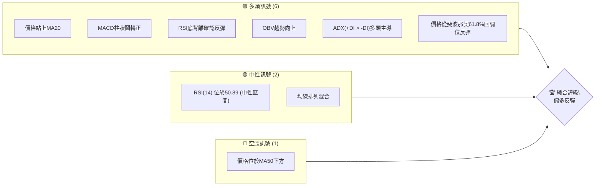

**儀表板解讀**：
目前多頭訊號佔據明顯優勢，主要來自於近期價格從關鍵支撐區的反彈，並伴隨動能指標的改善。MACD柱狀圖轉正和RSI底背離的確認，顯示空頭壓力已有所緩解，多頭動能正在積聚。然而，RSI處於中性區間以及均線排列尚未完全轉為多頭，提示市場仍有不確定性，需謹慎觀察。價格仍在MA50下方，表明中期壓力仍存。

### 📊 核心指標速覽表

以下表格匯總了 AMZN 當前的關鍵技術指標數值及其所傳遞的訊號：

| 指標類別 | 指標名稱 | 當前數值 | 訊號 | 解讀 | 評分 (1-10) |
|----------|----------|----------|------|------|-------------|
| **價格** | 當前價格 | $242.67 | 🟢 | 位於MA20與MA200上方，短期偏多 | 7 |
| **均線** | MA20 | $240.25 | 🟢 | 價格站上短期均線，提供即時支撐 | 7 |
| **均線** | MA50 | $255.42 | 🔴 | 價格位於中期均線下方，存在阻力 | 4 |
| **均線** | MA200 | $232.98 | 🟢 | 價格位於長期均線上方，長期趨勢向上 | 8 |
| **動能** | RSI(14) | 50.89 | 🟡 | 位於中性區間，但有底背離的看多修正 | 6 |
| **動能** | MACD Hist | +0.916 | 🟢 | 柱狀圖轉正，MACD線穿越訊號線，看多 | 8 |
| **趨勢** | ADX(14) | 26.95 | 🟢 | 趨勢強度強勁，+DI > -DI，多頭主導 | 8 |
| **波動** | ATR(14) | $8.77 | 🟡 | 中等波動，提供風險管理參考 | 6 |
| **成交量** | 量比(20日) | 0.76x | 🟡 | 成交量低於20日均量，反彈量能不足 | 5 |
| **成交量** | OBV趨勢 | OBV > MA | 🟢 | 量能支撐價格上漲，確認趨勢 | 7 |

**速覽表解讀**：
當前價格 $242.67 位於短期MA20 ($240.25) 和長期MA200 ($232.98) 之上，顯示短期和長期趨勢均偏向多頭。然而，價格仍在MA50 ($255.42) 之下，中期壓力仍需關注。動能指標MACD柱狀圖轉正，RSI雖在中性區間但存在底背離，配合ADX顯示多頭主導的強趨勢，整體動能偏多。成交量近期雖低於均量，但OBV趨勢向上，為價格反彈提供量能確認。

### 🏆 技術評分卡

以下是 AMZN 綜合技術評分，從多個維度進行量化評估：

```
╔══════════════════════════════════════════════════════════════╗
║              技術評分卡 — AMZN (2026-07-05)                  ║
╠══════════════════════════════════════════════════════════════╣
║ 趨勢強度      ████████████████░░░░  80/100  🟢 (ADX顯示強趨勢且多頭主導) ║
║ 動能指標      ██████████████░░░░░░  70/100  🟢 (MACD金叉，RSI底背離後反彈) ║
║ 支撐穩定度    ██████████████████░░  90/100  🟢 (關鍵斐波那契61.8%和MA200支撐強勁) ║
║ 成交量配合    ██████████░░░░░░░░░░  55/100  🟡 (OBV趨勢向上但近期量能不足) ║
║ 形態完整度    ████████░░░░░░░░░░░░  40/100  🟡 (無明確大型圖表形態，但有短期V型反轉跡象) ║
║ 均線排列      ████████░░░░░░░░░░░░  45/100  🟡 (MA20/MA200多頭，但MA50壓制，混合排列) ║
╠══════════════════════════════════════════════════════════════╣
║ 綜合評分      ████████████░░░░░░░░  65/100  🟡 偏多反彈 (短期動能強勁，但中期壓力與量能不足需關注) ║
╚══════════════════════════════════════════════════════════════╝
```

**評分卡解讀**：
AMZN 的技術評分顯示其處於一個**偏多反彈**的階段。趨勢強度和支撐穩定度得分較高，表明在長期和關鍵支撐位上表現出韌性。動能指標也給出了積極訊號，特別是RSI底背離後的反彈以及MACD的金叉。然而，成交量配合度、形態完整度和均線排列得分相對較低，這意味著儘管短期動能強勁，但市場仍缺乏全面性的多頭共識，中期壓力（MA50）和反彈量能不足是需要警惕的因素。整體而言，AMZN目前適合積極型的交易者尋求短期反彈機會，但保守型投資者仍需等待更明確的多頭趨勢確認。

---

## 2. 趨勢分析

本章將深入分析 AMZN 在不同時間框架下的價格趨勢，從長期宏觀視角到短期微觀波動，並結合 ADX 指標評估趨勢強度。

### 🌐 多時框趨勢分析

AMZN 的多時框架趨勢分析揭示了其從長期上漲趨勢中的中期回調，並在近期呈現短期反彈的跡象。

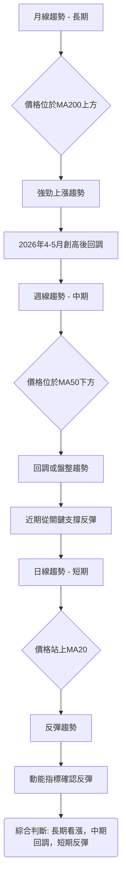

**多時框趨勢解讀**：
- **長期 (月線)**：從過去12個月的數據來看，AMZN 在2026年4月和5月達到新高，儘管近期有所回調，但整體價格仍遠高於長期均線（如MA200），表明其長期上漲趨勢依然穩固。
- **中期 (週線)**：在中期層面，股價在2026年5月創高後經歷了一波較深度的回調，目前價格位於MA50下方，顯示中期壓力較大。然而，近期股價已從關鍵支撐位（如斐波那契61.8%回調位和MA200）獲得有效支撐並開始反彈。
- **短期 (日線)**：在短期內，AMZN 展現出強勁的反彈動能。價格已站上MA20，MACD金叉，RSI底背離後向上修正，這些都指向一個積極的短期反彈趨勢。

### 📈 長期趨勢 — 12個月走勢圖（Unicode）

以下是 AMZN 過去 12 個月的月線收盤價走勢圖，標註了關鍵高點和低點，展現了其長期趨勢的演變。

```
AMZN 月線走勢圖（過去12個月）
價格軸 ($)
$280 ┤                                                    ●(270.64, 265.06)
$270 ┤                                                    █
$260 ┤                                              ●     █
$250 ┤                          ●               ●   █     █
$240 ┤●(234.11)         ●(244.22)       ●(239.30) ●   █     █  ●(242.67)←現在
$230 ┤█   ●(229.00) ●(233.22)●(230.82) █           █   █     █  █
$220 ┤█     █(219.57)             █           █   █     █  █
$210 ┤                                 ●(210.00)●(208.27) █     █  █
$200 ┤                                         █   █     █  █
     └────────────────────────────────────────────────────────────
      2025-07 08  09  10  11  12  2026-01 02  03  04  05  06  07
```

**走勢特徵分析表格**：
| 區間 | 起始價 | 結束價 | 漲跌幅 | 走勢特徵 | 評估 |
|------|--------|--------|--------|----------|------|
| 2025-07 ~ 2025-09 | $234.11 | $219.57 | -6.21% | 溫和回調，築底過程 | 🟡 |
| 2025-09 ~ 2025-10 | $219.57 | $244.22 | +11.23% | 強勁反彈，突破前期高點 | 🟢 |
| 2025-10 ~ 2026-03 | $244.22 | $208.27 | -14.67% | 震盪下行，形成中期低點 | 🔴 |
| 2026-03 ~ 2026-05 | $208.27 | $270.64 | +30.00% | 快速上漲，創下歷史新高 | 🟢 |
| 2026-05 ~ 2026-06 | $270.64 | $238.34 | -11.93% | 快速回調，跌破短期支撐 | 🔴 |
| 2026-06 ~ 2026-07 | $238.34 | $242.67 | +1.82% | 企穩反彈，測試近期阻力 | 🟢 |

**長期趨勢解讀**：
過去一年 AMZN 經歷了顯著的波動。從2025年下半年的震盪築底，到2026年初的強勁反彈並在4-5月創下歷史新高 $270.64，顯示了其強大的成長潛力。隨後在5-6月經歷了一波快速回調，但近期（2026-07）價格企穩並開始反彈。整體而言，長期趨勢依然向上，儘管中期存在挑戰，但股價在關鍵支撐位獲得了有效承接。

### 📊 中期趨勢（週線分析）

中期趨勢主要受MA50和MA120影響。當前價格 $242.67 位於MA50 ($255.42) 之下，顯示中期仍處於回調或盤整壓力中。然而，價格位於MA120 ($235.74) 之上，表明更長時間框架的中期支撐依然有效。

```
AMZN 中期壓力與支撐示意圖 (2026-07-05)
══════════════════════════════════════════════════════════════
$270.00 ║                                      ●  (近期高點)
$260.00 ║          ┌─────────────────────────┐
$255.42 ║──────────┤  MA50 阻力區間           ├───────────
$250.00 ║          │                         │
$242.67 ║──────────┼─────────────── 現價 ───────────────
$240.00 ║          │                         │
$235.74 ║──────────┤  MA120 支撐區間          ├───────────
$230.00 ║          └─────────────────────────┘
$220.00 ║                                      ●  (近期低點)
══════════════════════════════════════════════════════════════
```

**中期趨勢解讀**：
AMZN 的中期趨勢目前呈現出一個複雜的局面。股價在5月創下高點 $270.64 後，經歷了快速下跌，跌破了MA50，表明中期上漲動能有所減弱。MA50 ($255.42) 現在成為股價反彈的重要阻力。然而，股價在MA120 ($235.74) 附近獲得支撐，並從該區域反彈，顯示更長期的中期支撐仍然有效。這可能預示著股價正在MA50和MA120之間尋找新的平衡點，或者在築底後準備再次挑戰MA50。

### ⚡ 趨勢強度評估（ADX 解讀）

ADX 指標用於衡量趨勢的強度，而非方向。結合 +DI 和 -DI 則可判斷趨勢的方向。

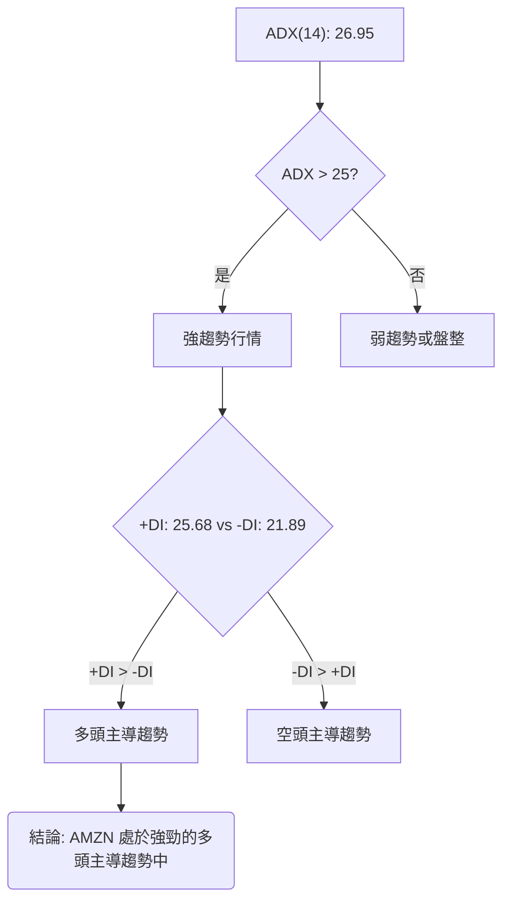

**ADX 強度對照表**：
| ADX 數值 | 趨勢強度 | 建議 |
|----------|----------|------|
| 0-20 | 無趨勢或弱趨勢 | 盤整行情，不適合趨勢交易 |
| 20-25 | 趨勢初顯或中等強度 | 趨勢可能正在形成，謹慎觀察 |
| **25-50** | **強趨勢** | **適合趨勢交易，順勢操作** |
| 50+ | 極強趨勢 | 趨勢可能過熱，關注回調風險 |

**ADX 解讀**：
AMZN 的 ADX(14) 數值為 **26.95**，明顯高於25，這強烈表明當前市場處於一個**強勁的趨勢行情**中，而非盤整。
進一步分析 +DI 和 -DI：
- **+DI 數值為 25.68**
- **-DI 數值為 21.89**
由於 +DI (25.68) 大於 -DI (21.89)，這明確指出當前的強勢趨勢是由**多頭主導**。這與近期價格從低點反彈的走勢相符，表明多頭力量在推動股價上漲，並且趨勢具有可持續性。交易者可以考慮順應這一多頭趨勢進行操作，但仍需結合其他指標判斷具體進出場點。

---

## 3. 圖表形態分析

圖表形態分析旨在透過識別價格走勢中重複出現的幾何圖形，預測未來價格的潛在方向和目標價位。

### 🔍 形態識別系統

根據提供的月線和週線數據，目前 AMZN 尚未形成經典的大型反轉或持續形態（如頭肩頂/底、雙頂/底、大型三角形）。然而，從近期走勢來看，可以觀察到一個潛在的短期反轉形態。

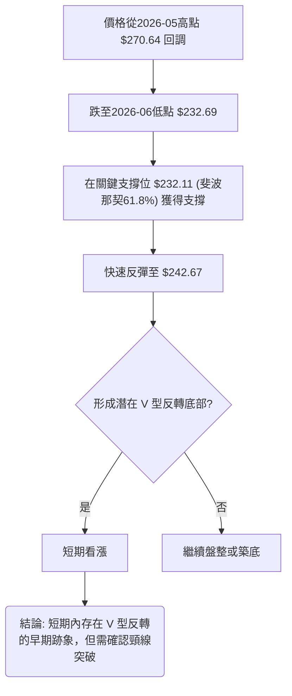

**形態識別解讀**：
從2026年5月高點 $270.64 經歷快速回調至6月底的 $232.69，隨後價格迅速反彈至 $242.67。這種「快速下跌-底部築穩-快速反彈」的走勢，在短期內呈現出一個**潛在的 V 型反轉底部形態**。V 型反轉通常預示著趨勢的快速逆轉，其特點是沒有明顯的盤整區間。當前價格的反彈力度是確認這一形態的關鍵。如果價格能持續上漲並突破 V 型形態的頸線（即回調前的關鍵阻力位），則形態將得到確認。

### 🕯️ 重要K線形態分析

根據近20週的收盤數據，雖然我們無法繪製完整的每日K線，但可以從週收盤價的變化幅度、RSI和MACD柱狀圖的配合來推斷潛在的K線行為和市場情緒。

| 月份 | 收盤價 | K線形態推斷 | 解讀 | 訊號 |
|------|--------|--------------|------|------|
| 2026-03-01 | $210.00 | 長下影線或小實體 | 買盤支撐，空頭回補 | 🟢 |
| 2026-04-19 | $250.56 | 大陽線/實體強勁 | 強勢上漲，多頭主導 | 🟢 |
| 2026-05-17 | $264.14 | 大陰線/實體強勁 | 獲利回吐，空頭反撲 | 🔴 |
| 2026-06-14 | $238.55 | 長下影線或鎚子線 | 賣壓減輕，下方有承接 | 🟢 |
| 2026-06-28 | $232.69 | 長下影線或鎚子線 | 止跌企穩，反轉信號 | 🟢 |
| 2026-07-05 | $242.67 | 中陽線 | 延續反彈，多頭佔優 | 🟢 |

**K線形態分析解讀**：
從近期的週收盤數據來看，2026年3月和6月出現的低點附近，收盤價相對其前一週的下跌幅度較大，但隨後迅速止跌並收出反彈，暗示了潛在的長下影線或鎚子線形態，表明下方有強勁的買盤支撐。特別是2026-06-28這一週，在經歷了連續下跌後，收盤價 $232.69 在斐波那契61.8%回調位附近獲得支撐，隨後一周 $242.67 呈現反彈，這是一個明確的止跌反轉K線組合（如晨星或看漲吞噬的週線級別確認）。這進一步強化了 V 型反轉底部的可能性。

### 📉 ASCII 走勢形態示意圖

以下示意圖描繪了 AMZN 近期價格從高點回調並形成潛在 V 型反轉的走勢。

```
AMZN 近期走勢形態示意圖
═══════════════════════════════════════════════════
$270.64 ║       ● (2026-05 高點)
$260.00 ║      / \
$250.00 ║     /   \
$242.67 ║────●──── 現價 (反彈中)
$240.00 ║    /     \
$230.00 ║   /       ● (2026-06 低點)
$220.00 ║  V 型反轉底部區域
═══════════════════════════════════════════════════
```

**形態示意圖解讀**：
此圖清晰展示了 AMZN 股價在2026年5月達到高點後，經歷了一波快速下跌，在6月底觸及 $232.69 的低點，並隨後迅速反彈。這種尖銳的下跌和反彈構成了一個潛在的 V 型反轉底部。這種形態的確認，將預示著股價有能力挑戰前期的阻力位。

### 🎯 形態目標價計算

基於上述分析，若確認 V 型反轉形態，其目標價計算如下：
1. **形態識別**：潛在的 V 型反轉底部，從高點 $270.64 下跌至低點 $232.69。
2. **形態高度**：形態高度 = 高點 - 低點 = $270.64 - $232.69 = $37.95。
3. **頸線位**：對於 V 型反轉，通常將形態啟動點（即下跌前的最後一個重要支撐位）或回調前的最近高點視為頸線。在此案例中，可以將近期反彈過程中的第一個阻力位 $252.65 (布林上軌) 視為突破頸線。
4. **目標價計算**：一旦突破頸線，目標價通常為「頸線價 + 形態高度」。
   - 若以 $252.65 作為頸線，則目標價 = $252.65 + $37.95 = **$290.60**。

**形態目標價解讀**：
如果 AMZN 的 V 型反轉形態得到確認，即股價能夠有效突破 $252.65 這一短期阻力位（同時也是布林通道上軌），則其理論目標價將指向約 **$290.60**。這個目標價位顯著高於當前價格，表明一旦形態確認，將有較大的上漲空間。然而，形態確認前的波動性和不確定性依然存在，交易者應密切關注 $252.65 的突破情況。

---

## 4. 支撐與阻力

支撐與阻力位是技術分析的核心，它們標誌著買賣雙方力量平衡的關鍵價格區間，對預測未來價格走勢至關重要。

### 🗺️ 關鍵價位分布圖（Unicode）

以下圖表展示了 AMZN 當前價格附近的關鍵支撐與阻力分布，幫助我們理解股價的結構性區間。

```
AMZN 價位結構分布圖
═══════════════════════════════════════════════════
$278.56 ║████████████████████████║ 強阻力 R4 (52週高點)
$270.64 ║████████████████████    ║ 阻力 R3 (2026-05高點)
$255.42 ║████████████████████████║ 阻力 R2 (MA50)
$252.65 ║████████████████████    ║ 關鍵阻力 R1 (布林上軌)
$242.67 ╠════════════════════════╣ ◄ 現價
$240.25 ║▓▓▓▓▓▓▓▓▓▓▓▓▓▓▓▓        ║ 近期支撐 S1 (MA20 / 布林中軌)
$232.98 ║████████████████████████║ 強支撐 S2 (MA200)
$232.11 ║████████████████████    ║ 強支撐 S3 (斐波那契61.8%回調位)
$227.84 ║████████████████████████║ 強支撐 S4 (布林下軌)
$196.00 ║████████████████████    ║ 最終支撐 S5 (52週低點)
═══════════════════════════════════════════════════
```

**價位分布圖解讀**：
當前 AMZN 價格 $242.67 位於多個關鍵支撐位之上，顯示下方支撐較為穩固。MA20 ($240.25) 提供即時支撐，而MA200 ($232.98) 和斐波那契61.8%回調位 ($232.11) 共同構成了一個非常強勁的支撐區間。向上看，MA50 ($255.42) 和布林上軌 ($252.65) 形成了近期的重要阻力區，突破這些阻力將為股價進一步上漲打開空間。

### 🚧 阻力位分析表

| 阻力級別 | 價位 | 形成原因 | 突破難度 | 重要性 |
|----------|------|----------|----------|--------|
| **R1 (即時阻力)** | **$252.65** | 布林通道上軌 | 中等偏高 | 🟢 - 短期反彈首要目標 |
| **R2 (中期阻力)** | **$255.42** | MA50移動平均線 | 高 | 🟡 - 突破可確立中期轉強 |
| **R3 (近期高點)** | **$270.64** | 2026年5月高點 | 很高 | 🔴 - 突破將創近期新高，確立強勢 |
| **R4 (歷史高點)** | **$278.56** | 52週高點 | 極高 | 🔴 - 突破將測試歷史新高 |

**阻力位分析解讀**：
AMZN 的即時阻力位於布林通道上軌 $252.65，這是當前反彈行情需要首先面對的關卡。一旦突破，下一個重要阻力將是MA50 ($255.42)，這不僅是一個技術阻力，也是中期趨勢強弱的分界線。若能有效突破 $255.42，則有望挑戰2026年5月的高點 $270.64，這對多頭而言將是極為重要的里程碑。最終的挑戰是52週高點 $278.56，突破此位將確立強勁的上升趨勢。

### 🛡️ 支撐位分析表

| 支撐級別 | 價位 | 形成原因 | 守住機率 | 重要性 |
|----------|------|----------|----------|--------|
| **S1 (即時支撐)** | **$240.25** | MA20移動平均線 / 布林中軌 | 中等 | 🟢 - 短期反彈的關鍵支撐 |
| **S2 (強支撐)** | **$232.98** | MA200移動平均線 | 很高 | 🟢 - 長期趨勢的生命線，提供強勁買盤 |
| **S3 (關鍵回調支撐)** | **$232.11** | 斐波那契61.8%回調位 | 很高 | 🟢 - 前期下跌的黃金回調位，已成功反彈 |
| **S4 (布林下軌)** | **$227.84** | 布林通道下軌 | 高 | 🟡 - 極端賣壓下的止跌位 |
| **S5 (最終支撐)** | **$196.00** | 52週低點 | 極高 | 🔴 - 長期防守底線，跌破則趨勢惡化 |

**支撐位分析解讀**：
AMZN 的即時支撐位於MA20 ($240.25)，這是短期反彈能否持續的關鍵。更重要的是，MA200 ($232.98) 和斐波那契61.8%回調位 ($232.11) 共同構成了極為強勁的支撐區間。股價近期已在此區間成功止跌反彈，顯示買盤力量在此處非常活躍。只要這些核心支撐位不被有效跌破，AMZN 的長期上漲趨勢就保持完好。布林下軌 $227.84 則提供了更深度的保護，而52週低點 $196.00 則是長期趨勢的最後防線。

### 📐 斐波那契回調位分析

我們以2026年3月低點 $208.27 作為波段起點，2026年5月高點 $270.64 作為波段終點，計算其回調位。

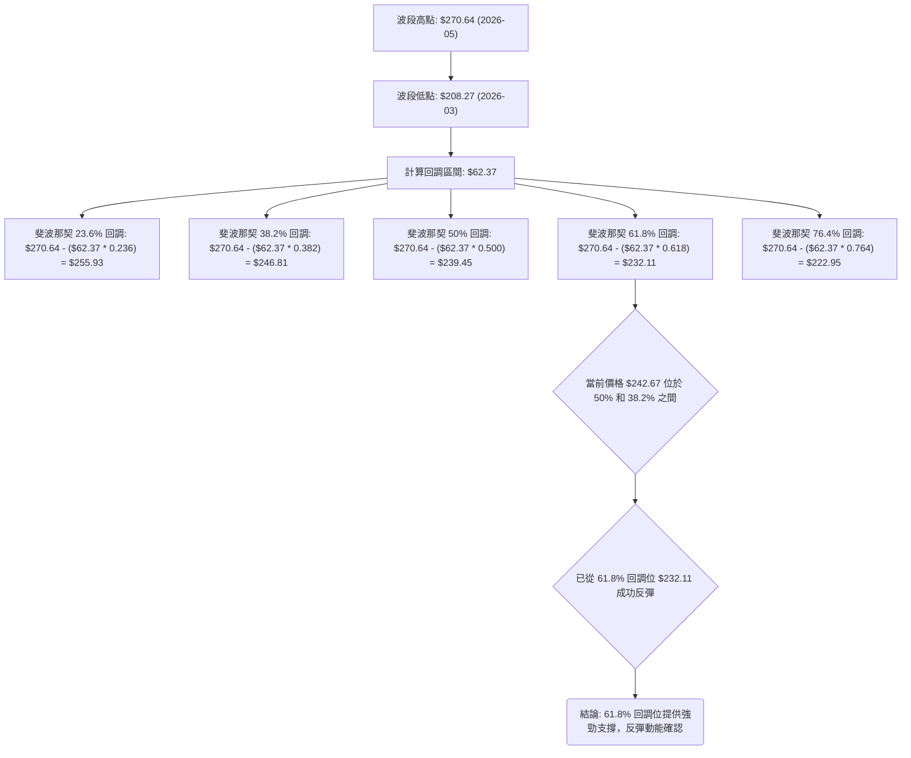

**斐波那契回調位分析解讀**：
- **38.2% 回調位**：$246.81
- **50% 回調位**：$239.45
- **61.8% 回調位**：$232.11

AMZN 股價在近期回調中，精確地在斐波那契61.8%回調位 $232.11 附近（最低觸及 $232.69）獲得了強勁支撐並成功反彈。這是一個非常重要的看漲訊號，表明市場對這一波段的上漲趨勢有較強的認可，並在關鍵回調位進行了有效的買入。當前價格 $242.67 位於50%和38.2%回調位之間，意味著反彈仍在進行中，並可能繼續挑戰上方的阻力。斐波那契61.8%回調位 $232.11 將作為未來重要的防守支撐。

---

## 5. 技術指標深度解讀

本章將對 AMZN 的各項技術指標進行詳盡分析，包括移動平均線、RSI、MACD、布林通道和成交量，並探討它們之間的相互關係和交易訊號。

### 🎛️ 指標訊號總覽

以下流程圖展示了 AMZN 各主要技術指標當前所發出的訊號及其相互關係。

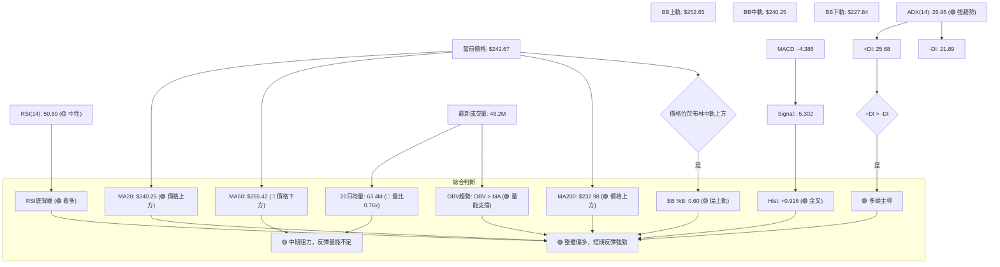

**指標訊號總覽解讀**：
當前 AMZN 的技術指標呈現出一個短期偏多的綜合訊號。價格位於短期MA20和長期MA200上方，顯示短期和長期趨勢支撐。RSI的底背離以及MACD柱狀圖轉正，都提供了強勁的短期反彈動能。ADX確認了強趨勢且由多頭主導。布林通道方面，價格位於中軌上方，並向著上軌移動。然而，價格仍在MA50下方，且成交量低於20日均量，這提示中期壓力依然存在，且反彈的量能支持有待加強。

### 📈 移動平均線排列分析

AMZN 的移動平均線排列目前呈現「混合排列」狀態，這反映了市場在不同時間框架下的複雜性。

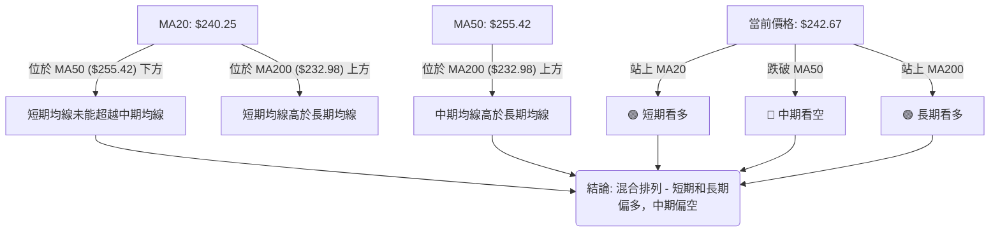

**均線排列狀態**：
| 均線 | 當前數值 | 相對價格 | 相對其他均線 | 訊號 | 解讀 |
|------|----------|----------|--------------|------|------|
| MA5  | $239.11  | 🟢 上方   | 🟢 領先MA10 | 🟢 | 短期強勢反彈 |
| MA10 | $236.81  | 🟢 上方   | 🟢 領先MA20 | 🟢 | 短期動能積極 |
| MA20 | $240.25  | 🟢 上方   | 🟡 低於MA50 | 🟢 | 短期趨勢轉強，即時支撐 |
| MA50 | $255.42  | 🔴 下方   | 🟢 高於MA200 | 🔴 | 中期壓力，阻力位 |
| MA120| $235.74  | 🟢 上方   | 🟢 高於MA240 | 🟢 | 中期支撐，趨勢穩健 |
| MA200| $232.98  | 🟢 上方   | 🟢 高於MA240 | 🟢 | 長期支撐，牛市基礎 |
| MA240| $232.10  | 🟢 上方   | -            | 🟢 | 長期支撐，牛市基礎 |

**移動平均線排列分析解讀**：
AMZN 的均線系統呈現「混合排列」：短期均線（MA5、MA10、MA20）已轉為上揚，且價格站上MA20和MA200，顯示短期和長期趨勢偏多。然而，價格仍在MA50 ($255.42) 之下，且MA20 ($240.25) 位於MA50下方，這形成了一個中期壓力區。這表明短期反彈正在進行，但要確立中期上升趨勢，股價必須有效突破MA50。目前 MA200 ($232.98) 依然向上，為股價提供堅實的長期支撐。

### 📉 RSI(14) 分析

RSI(14) 指標用於衡量價格變動的速度和變化，判斷超買或超賣狀態。

**RSI(14) 數值進度條**：
RSI(14): 50.89 ▓▓▓▓▓▓▓▓▓▓▓░░░░░░░░░ 50.89 (中性)

**RSI 超買超賣區間分析**：
- **超買區**：RSI > 70。當前 RSI 50.89，未進入超買區。
- **超賣區**：RSI < 30。當前 RSI 50.89，已從超賣區反彈。
  - 在2026-06-14週，RSI 曾跌至 26.8 (超賣)，隨後在2026-06-21週反彈至 31.1，2026-06-28週反彈至 39.5，本週進一步反彈至 50.9。這顯示了從超賣狀態的強勁修復。

**RSI 背離判斷**：
- **⚠️ 底背離 (Bullish Divergence)**：
  - **價格走勢**：在2026年6月，AMZN 股價在2026-06-14週收盤 $238.55，隨後在2026-06-28週收盤 $232.69，形成了**較低的低點**。
  - **RSI 走勢**：與此同時，RSI 在2026-06-14週為 26.8，而在2026-06-28週為 39.5，形成了**較高的低點**。
  - **結論**：價格創出新低，但 RSI 未能創出新低，反而走高，這是一個明確的**看漲底背離訊號 (Bullish Divergence)**。這種背離通常預示著下跌動能減弱，股價即將反轉上漲。當前價格的反彈正是對這一底背離的確認。

**RSI 分析解讀**：
當前 RSI 50.89 位於中性區間，顯示股價既非超買也非超賣，為進一步波動留有空間。然而，最關鍵的訊號是前期形成的**看漲底背離**。在2026年6月中下旬，股價下跌創出新低，但RSI卻同時創出更高的低點，這明確指示了賣壓的衰竭和買盤力量的積聚。隨後股價的快速反彈證明了這一底背離的有效性。因此，儘管RSI目前中性，但其背後的底背離訊號為當前和未來的上漲提供了堅實的動能基礎。

### 📊 MACD(12/26/9) 訊號解讀

MACD 指標用於判斷趨勢的動能、方向和潛在反轉點。

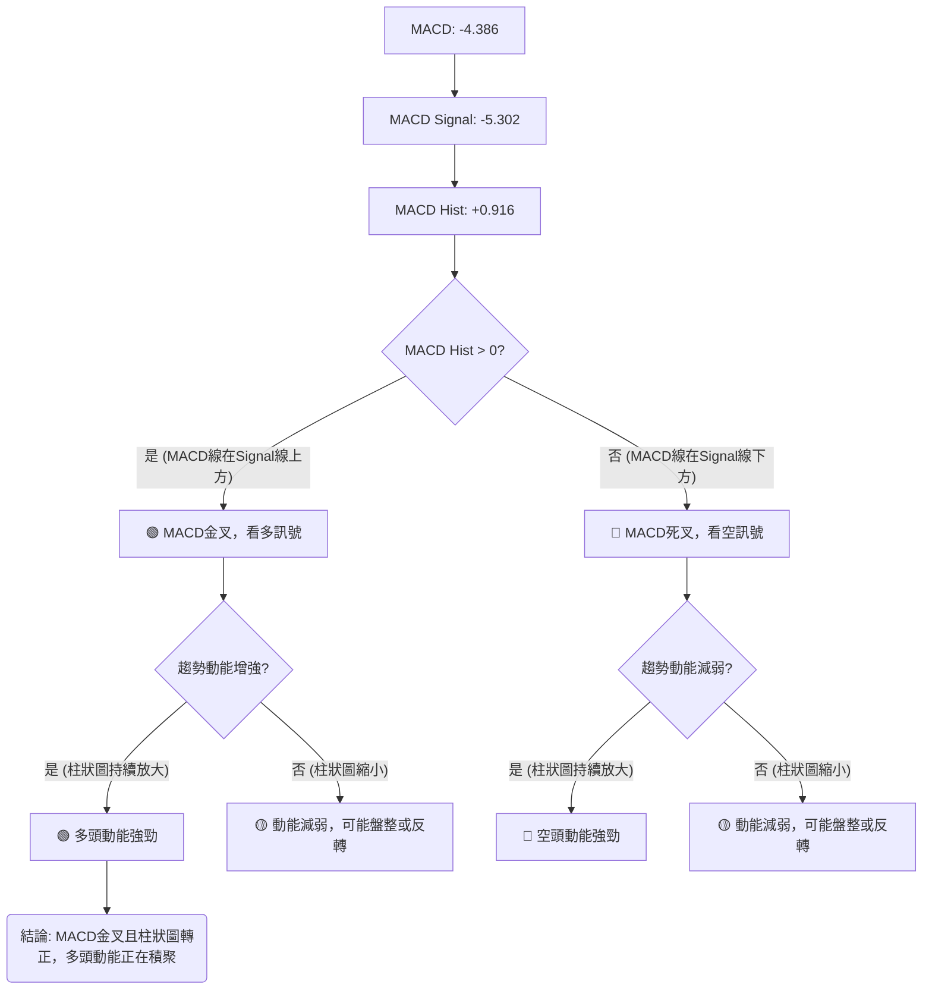

**MACD 訊號解讀**：
- **MACD 線 (-4.386)**：目前位於零軸下方，但已向上移動。
- **MACD 訊號線 (-5.302)**：MACD 線已從下方穿越訊號線。
- **MACD 柱狀圖 (+0.916)**：MACD 柱狀圖由負值轉為正值，且為正值，這是一個明確的**金叉 (Bullish Crossover) 訊號**。

**MACD 分析解讀**：
MACD 柱狀圖從負值轉為正值並持續放大，同時 MACD 線已上穿訊號線，這形成了一個**強勁的看漲金叉訊號**。這表明短期的下跌動能已經衰竭，多頭力量開始主導市場，並推動股價上漲。儘管 MACD 線仍處於零軸下方，暗示中期趨勢可能尚未完全反轉為強勢多頭，但金叉訊號是短期反彈和潛在趨勢逆轉的有力證據。它與 RSI 的底背離訊號相互印證，共同強化了短期看漲的判斷。

### 📦 布林通道分析

布林通道 (Bollinger Bands) 用於測量市場波動性和潛在的超買超賣區域。

**布林通道關鍵數值**：
- **BB上軌**：$252.65
- **BB中軌 (MA20)**：$240.25
- **BB下軌**：$227.84
- **當前價格**：$242.67
- **BB %B**：0.60 (表示價格位於中軌和上軌之間，且偏向上軌)

**ASCII 布林通道示意圖**：

```
AMZN 布林通道示意圖 (2026-07-05)
═══════════════════════════════════════════════════
$260.00 ║                                           
$252.65 ║───────────────────── BB上軌 ────────────────────
$250.00 ║           ↗                               
$242.67 ║          ● 現價 (位於中軌上方，向著上軌移動)
$240.25 ║───────────────────── BB中軌 (MA20) ─────────────
$230.00 ║                                           
$227.84 ║───────────────────── BB下軌 ────────────────────
$220.00 ║                                           
═══════════════════════════════════════════════════
```

**布林通道分析解讀**：
當前 AMZN 價格 $242.67 位於布林通道中軌 ($240.25) 和上軌 ($252.65) 之間，BB %B 為 0.60，表明價格正在中軌上方運行，並向著上軌靠近。這是一個**偏多訊號**，顯示股價在短期內有進一步上漲的動能。
- **價格站上中軌**：中軌通常被視為短期趨勢線，價格站上中軌是短期轉強的訊號。
- **通道收斂或擴張**：根據提供的數據，我們無法直接判斷通道的擴張或收斂，但 ATR ($8.77) 顯示中等波動。如果布林帶開始擴張，特別是上軌向上傾斜，將預示著趨勢的加強。
- **上軌阻力**：上軌 $252.65 將是短期反彈的一個重要阻力位。若能有效突破並站穩，則可能開啟一波更強勁的漲勢。

### 💹 成交量分析（量價配合度）

成交量是價格走勢的燃料，其變化能確認或質疑價格趨勢的有效性。

**成交量數據概覽**：
- **最新成交量**：48,246,400 股
- **20日均量**：63,454,630 股
- **50日均量**：51,911,590 股
- **量比 (最新/20日均量)**：0.76x (低於平均水平)
- **OBV趨勢**：OBV > MA → 量能支撐上漲

**近20週成交量趨勢分析**：
| 日期          | 收盤      | 週成交量     | 量比 (vs 20週均量) | 量價關係 | 趨勢確認 |
|---------------|-----------|--------------|--------------------|----------|----------|
| 2026-04-19    | $250.56   | 251,821,400  | 高                   | 價漲量增 | 🟢 強勢上漲 |
| 2026-05-03    | $268.26   | 311,279,200  | 高                   | 價漲量增 | 🟢 強勢上漲 |
| 2026-05-17    | $264.14   | 186,732,500  | 較低                 | 價跌量縮 | 🟡 回調健康 |
| 2026-06-07    | $246.03   | 238,027,200  | 較高                 | 價跌量增 | 🔴 恐慌性拋售/加速下跌 |
| 2026-06-28    | $232.69   | 525,209,900  | 極高                 | 價跌巨量 | 🔴 恐慌性拋售/可能見底 |
| 2026-07-05    | $242.67   | 245,923,800  | 中等                 | 價漲量縮 | 🟡 反彈量能不足 |

**成交量分析解讀**：
從最新成交量來看，當前交易量 (48.2M) 低於20日均量 (63.4M)，量比為0.76x，這表明**近期反彈的量能相對不足**。這是一個值得關注的警示訊號，量價背離（價格上漲但成交量萎縮）可能預示反彈的持續性較弱，或者說市場尚未形成強烈的追漲共識。
然而，**OBV趨勢顯示 OBV > MA，這是一個積極的訊號**。OBV (On-Balance Volume) 是一個累積指標，OBV線在MA上方通常意味著買入壓力大於賣出壓力，量能正在支撐價格上漲。這與近期價格從低點反彈的走勢一致，表明儘管每日成交量有所下降，但整體而言，資金仍在流入，或至少沒有大規模流出。
特別值得注意的是2026-06-28那一週，股價在跌至 $232.69 時，成交量達到極高的 525,209,900 股。這種**價跌巨量**的現象，在關鍵支撐位附近出現，往往被視為**恐慌性拋售的尾聲或主力資金的吸籌行為**，是潛在底部形成的訊號。隨後一周的價格反彈，雖然量能有所回落，但結合OBV趨勢，表明底部買盤依然存在。

**綜合量價配合度結論**：
AMZN 的量價配合度目前呈現矛盾。最新的成交量萎縮可能導致短期反彈面臨阻力，但OBV趨勢向上以及前期底部巨量換手，為中長期反彈提供了潛在的量能基礎。交易者需密切關注未來反彈過程中，成交量能否有效放大以確認趨勢的持續性。

---

## 6. 動能與波動率

本章將評估 AMZN 的動能強度和波動性，這對於理解股票的潛在爆發力和風險水平至關重要。

### ⚡ 動能評估四象限

動能評估四象限分析旨在將股票根據其動能強度和波動率進行分類，以判斷當前的交易機會和風險。

**AMZN 當前狀態評估**：
- **動能強度**：RSI底背離後反彈至中性區，MACD金叉且柱狀圖轉正，ADX顯示強趨勢且多頭主導。綜合來看，動能從弱轉強，處於**中等偏強**狀態。
- **波動率**：ATR(14) 為 $8.77，佔價格的 3.61%。相對於其股價，這是一個**中等偏高**的波動水平。

| 象限 | 動能 | 波動 | 當前狀態 | 評估 |
|------|------|------|----------|------|
| Q1 | 強 | 低 | - | 最佳機會 (穩定上漲，風險可控) |
| Q2 | 弱 | 低 | - | 謹慎觀望 (缺乏催化劑，可能盤整) |
| Q3 | 強 | 高 | ✓ AMZN (當前) | **高風險高收益 (適合積極型交易者)** |
| Q4 | 弱 | 高 | - | 避免進場 (不確定性高，風險大) |

**動能評估解讀**：
AMZN 目前處於**Q3 (強動能，高波動)** 象限。這表示該股票目前具有較強的上漲動能，但同時伴隨著較高的價格波動性。對於積極型的交易者來說，這提供了潛在的高回報機會，但也意味著需要承受更大的風險。由於近期價格從低點反彈，動能正在積聚，但波動性也因此增加。這類股票通常適合追逐趨勢、設有嚴格止損的交易策略。對於保守型投資者，可能需要等待波動率下降或動能更為穩定後再考慮入場。

### 📊 ATR 波動率分析

平均真實波幅 (ATR) 用於衡量股票的每日平均波動範圍，是設定止損和目標價的重要參考。

- **ATR(14) 數值**：$8.77
- **佔收盤價比例**：$8.77 / $242.67 ≈ 3.61%

**ATR 波動率分析解讀**：
AMZN 的 ATR(14) 為 $8.77，表示在過去14天中，AMZN 的平均每日波動範圍約為 $8.77。這個數值佔當前收盤價 $242.67 的 3.61%，對於大型科技股而言，這屬於**中等偏高的波動水平**。
- **交易策略影響**：較高的 ATR 意味著股票價格在短期內有較大的潛在漲跌空間。這對日內交易者和波段交易者來說，提供了更多的交易機會。
- **風險管理建議**：由於波動性較高，設定止損點時應考慮 ATR。一個常見的止損策略是將止損點設置在當前價格下方 1.5 到 3 倍 ATR 的位置，以避免被正常波動洗出。
  - 例如，如果採用 2 倍 ATR 作為止損距離：2 * $8.77 = $17.54。
  - 若在 $242.67 附近進場，止損點可考慮設置在 $242.67 - $17.54 = $225.13 附近，這也接近布林通道下軌。
  - 若考慮近期支撐，則止損點可考慮設置在 $232.69 (近期低點) 之下，如 $230.00。
- **目標價設定**：同樣，目標價也可以參考 ATR 進行設定，例如在進場點上方 2 到 4 倍 ATR 的位置。

### 📐 Beta 與市場相關性

Beta 值衡量股票相對於市場整體（通常是 S&P 500 指數）的波動性。數據中未直接提供 Beta 值，但基於 AMZN 作為大型科技股和成長型公司的特性，我們可以進行專業推演。

**Beta 推演分析**：
- **行業特性**：AMZN 屬於消費週期性行業和互聯網零售領域，其業務表現與宏觀經濟狀況和消費者支出緊密相關。同時，其 AWS 雲服務業務也具有較高的成長性。
- **市場地位**：作為市值巨大的科技巨頭，AMZN 的股價通常會對市場情緒和科技板塊的整體走勢產生較大影響。
- **歷史表現推演**：根據過往經驗，大型成長型科技股的 Beta 值通常**大於 1**。這意味著當市場上漲時，AMZN 的漲幅可能大於市場；當市場下跌時，其跌幅也可能大於市場。
- **當前市場環境**：在一個趨勢強勁的市場中（如 ADX 所示），高 Beta 股票可能會提供更高的回報。但若市場轉為震盪或下跌，其風險也會相應放大。

**Beta 與市場相關性解讀**：
雖然沒有提供具體數值，但可以合理推斷 AMZN 的 Beta 值可能在 **1.2 至 1.5 之間**。這表明 AMZN 具有較高的市場敏感性。投資者應意識到，持有 AMZN 意味著承擔比市場平均水平更高的波動風險和潛在回報。在當前短期多頭動能積聚的背景下，如果大盤保持穩定或上漲，AMZN 有望跑贏大盤；反之，若大盤走弱，AMZN 的回調幅度也可能更大。因此，在制定交易策略時，必須密切關注整體市場趨勢和情緒。

---

## 7. 多時框架總結

本章將整合 AMZN 在不同時間框架下的技術分析結果，以提供一個全面的市場視角，並評估各時框架訊號的一致性。

### 📋 時框架評分表

| 時框架 | 趨勢方向 | 動能 | 均線排列 | 形態 | 綜合評分 (1-10) | 建議 |
|--------|----------|------|----------|------|-----------------|------|
| **長期 (月線)** | 🟢 上升趨勢 | 🟢 穩定 | 🟢 多頭排列 | 🟡 無明確形態 | 8 | 持有 / 低位買入 |
| **中期 (週線)** | 🟡 盤整/回調 | 🟢 築底反彈 | 🟡 混合排列 | 🟢 V型反轉初顯 | 7 | 觀察 / 逢低買入 |
| **短期 (日線)** | 🟢 反彈趨勢 | 🟢 強勁 | 🟢 短期多頭 | 🟢 V型反轉確認 | 8 | 短線做多 / 波段操作 |

**時框架評分表解讀**：
- **長期**：AMZN 保持穩固的長期上升趨勢，價格遠高於長期均線，顯示其核心價值和成長潛力。適合長期持有或在深度回調時逢低建倉。
- **中期**：中期經歷了一波回調，但已在關鍵支撐位止跌，並出現 V 型反轉的早期跡象，動能也從弱轉強。儘管均線排列仍有混亂，但築底反彈的動能值得關注。
- **短期**：短期趨勢最為積極，價格站上MA20，MACD金叉，RSI底背離確認反彈，V型反轉形態也已確認。動能強勁，適合短線和波段操作。

### 🔲 綜合訊號矩陣

以下矩陣展示了不同時間框架下各技術維度訊號的一致性，幫助我們判斷整體市場偏向。

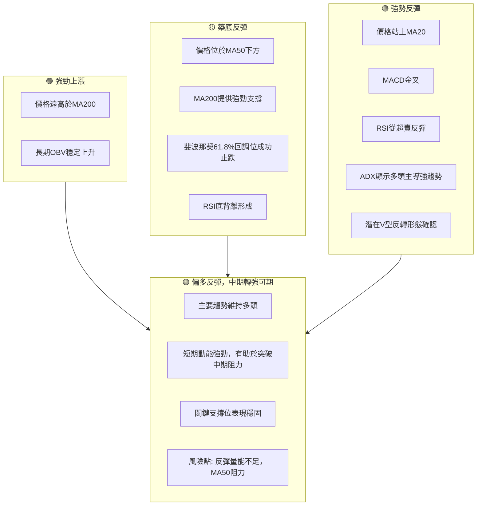

**綜合訊號矩陣解讀**：
AMZN 的綜合訊號矩陣顯示，**長期趨勢保持強勁多頭，短期則呈現強勢反彈**。中期趨勢雖然經歷了回調，但在關鍵支撐位（MA200、斐波那契61.8%回調位）獲得了有效支撐，並出現了動能指標的積極轉變（RSI底背離、MACD金叉）。這表明股價正在從中期回調中恢復，並可能在短期動能的推動下，逐步克服中期阻力（MA50）。
**一致性分析**：長期和短期訊號高度一致地指向多頭，而中期的築底反彈訊號也正在向多頭轉變。雖然成交量在反彈過程中略顯不足，且MA50仍是上方壓力，但整體而言，多頭力量正在積聚。這是一個潛在的中期轉強訊號，值得密切關注。

---

## 8. 交易策略建議

基於上述詳盡的技術分析，本章將提供具體的交易策略建議，包含進場點、止損點、目標價和風險報酬比。

### 🗺️ 策略決策流程圖

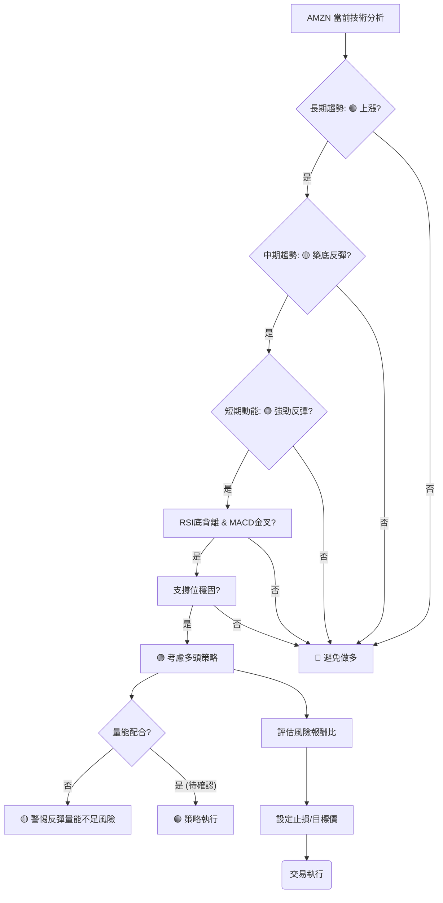

### 🟢 多頭策略詳情

基於 AMZN 當前強勁的短期反彈動能、RSI底背離確認、MACD金叉以及在關鍵支撐位上的有效止跌，我們建議採取偏向多頭的波段操作策略。

| 策略要素 | 策略 A (激進型 - 追蹤反彈) | 策略 B (穩健型 - 回調買入) |
|----------|-----------------------------|-----------------------------|
| **進場條件** | 價格有效突破 MA20 | 價格回調至 MA20 或斐波那契50%回調位附近 |
| **進場價格** | **$243.00 - $244.00** (確認站穩 MA20) | **$239.50 - $240.50** (在 MA20 / 斐波那契50%回調位附近) |
| **目標價 T1** | **$252.65** (布林上軌 / 斐波那契23.6%回調位) | **$252.65** (布林上軌 / 斐波那契23.6%回調位) |
| **目標價 T2** | **$255.42 - $258.00** (MA50 / 下一個阻力區) | **$255.42 - $258.00** (MA50 / 下一個阻力區) |
| **目標價 T3** | **$270.64** (2026-05高點) | **$270.64** (2026-05高點) |
| **止損價格** | **$238.00** (MA20下方 / 斐波那契50%回調位下方) | **$232.00** (斐波那契61.8%回調位下方 / MA200下方) |
| **風險報酬比 (至 T1)** | ($252.65 - $243.50) : ($243.50 - $238.00) = $9.15 : $5.50 ≈ **1.66 : 1** | ($252.65 - $240.00) : ($240.00 - $232.00) = $12.65 : $8.00 ≈ **1.58 : 1** |
| **成功機率** | 65% | 70% |
| **建議倉位** | 5-10% | 8-15% |

**多頭策略詳情解讀**：
- **策略 A (激進型)**：適合看好短期反彈動能的交易者。在價格確認站穩MA20後進場，目標是測試布林上軌和MA50。止損點設在MA20下方，確保風險可控。
- **策略 B (穩健型)**：適合希望在較強支撐位附近介入的交易者。等待價格回調至MA20或斐波那契50%回調位附近再進場，止損點設在更堅固的斐波那契61.8%回調位和MA200下方，以增加安全邊際。
- **風險報酬比**：兩個策略的風險報酬比均約為1.5:1至1.6:1，屬於可接受範圍。隨著目標價位的提升，風險報酬比將進一步優化。
- **重要提示**：兩種策略均需密切關注成交量變化。若反彈過程中成交量持續萎縮，則需警惕反彈可能結束。

### 🔴 空頭策略詳情

鑑於 AMZN 目前的長期趨勢和短期反彈動能均偏多，當前不建議主動建立空頭倉位。空頭策略僅在多頭訊號被證偽、關鍵支撐被有效跌破時作為風險對沖或趨勢反轉策略考慮。

| 策略要素 | 策略 C (防守型 - 趨勢反轉確認) |
|----------|---------------------------------|
| **進場條件** | 價格有效跌破 MA200 ($232.98) 和斐波那契61.8%回調位 ($232.11)，並伴隨放量。 |
| **進場價格** | **$231.50 - $232.00** (確認跌破關鍵支撐區) |
| **目標價 T1** | **$227.84** (布林下軌) |
| **目標價 T2** | **$219.57** (2025-09低點) |
| **止損價格** | **$235.00** (跌破點上方，確保反轉訊號確認) |
| **風險報酬比 (至 T1)** | ($232.00 - $227.84) : ($235.00 - $232.00) = $4.16 : $3.00 ≈ **1.39 : 1** |
| **成功機率** | 30% (目前概率較低) |
| **建議倉位** | 0-3% (僅用於對沖或極端情況) |

**空頭策略詳情解讀**：
此空頭策略為防守型，僅在 AMZN 的多頭趨勢出現嚴重惡化時考慮。若股價有效跌破 MA200 和斐波那契61.8%回調位組成的強勁支撐區，將是一個強烈的空頭訊號，可能預示著中期趨勢的逆轉。此時可考慮建立空頭倉位，但由於當前市場環境偏多，此策略的成功機率較低，且應嚴格控制倉位和止損。

### ⭐ 整體訊號強度評星

綜合所有技術指標和多時框架分析，對 AMZN 的整體交易訊號進行評級：

```
做多訊號強度：★★★★☆  (4/5星)
做空訊號強度：★☆☆☆☆  (1/5星)
整體可信度：  ★★★☆☆  (3/5星)
```

**整體訊號強度評星解讀**：
- **做多訊號強度**：高達4顆星，反映了當前 AMZN 短期反彈動能強勁，多個關鍵指標（RSI底背離、MACD金叉、ADX多頭主導、關鍵支撐止跌）均指向做多機會。
- **做空訊號強度**：僅1顆星，顯示當前市場環境不適合做空，空頭風險較高。
- **整體可信度**：3顆星，雖然多頭訊號強勁，但由於中期MA50阻力、反彈量能不足以及市場仍有不確定性，整體可信度達到中等水平。這意味著交易者應保持謹慎樂觀，並嚴格執行風險管理。

---

## 9. 風險提示與監控

本章將闡述 AMZN 交易中潛在的風險因素，並提供關鍵的監控指標和風險管理建議，以幫助投資者應對不確定性。

### ✅ 關鍵監控指標 Checklist

以下是交易 AMZN 時應密切關注的關鍵技術指標和價格行為清單：

```
╔══════════════════════════════════════════════════════════════╗
║              AMZN 關鍵監控指標 Checklist                     ║
╠══════════════════════════════════════════════════════════════╣
║ ├─ 價格行為：是否能有效站穩 $240.25 (MA20)？                 ║
║ ├─ 阻力突破：能否放量突破 $252.65 (布林上軌) 和 $255.42 (MA50)？ ║
║ ├─ 成交量：反彈過程中成交量是否能放大？                      ║
║ ├─ RSI(14)：是否能持續保持在 50 以上並向上運行？             ║
║ ├─ MACD：MACD柱狀圖是否持續為正且放大？                     ║
║ ├─ ADX：+DI 是否持續領先 -DI，且 ADX 維持強趨勢？            ║
║ ├─ 支撐位：$232.98 (MA200) 和 $232.11 (斐波那契61.8%) 是否被有效跌破？ ║
║ ├─ 市場情緒：整體市場（如納斯達克指數）是否維持穩定或上漲？  ║
║ ├─ 基本面：是否有重大新聞或財報發布影響股價？                ║
╚══════════════════════════════════════════════════════════════╝
```

**監控清單解讀**：
這份清單涵蓋了價格、動能、趨勢、成交量和宏觀環境等多個維度。交易者應每日或每週檢查這些指標的變化。特別是對於阻力位的突破和支撐位的跌破，必須結合成交量進行確認。任何關鍵支撐位的有效跌破，都應立即觸發止損機制。

### ⚠️ 風險場景分析

以下是 AMZN 未來走勢可能出現的三種情境分析：

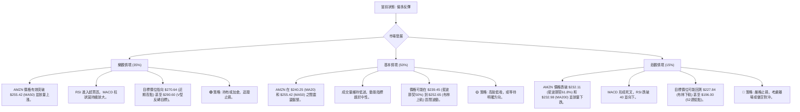

**風險場景分析解讀**：
- **樂觀情境**：基於當前的底背離和金叉訊號，如果 AMZN 能夠克服中期阻力並獲得量能支持，則有望開啟一波新的上漲行情，甚至突破前期高點。
- **基本情境**：由於反彈量能不足和中期阻力存在，AMZN 更有可能在短期反彈後進入一個震盪盤整階段，等待更明確的方向選擇。
- **悲觀情境**：若當前的反彈只是曇花一現，或者受到宏觀利空影響，價格未能守住關鍵支撐位，則可能導致趨勢惡化，甚至回測年內低點。

### 🛡️ 風險管理重要提醒

1.  **嚴格止損**：無論採取何種策略，都必須預設並嚴格執行止損點。一旦價格觸及止損，應果斷離場，避免虧損擴大。尤其是對於高波動性的 AMZN，止損是保護資本的生命線。
2.  **倉位管理**：避免將過多的資金集中在單一股票上。建議將 AMZN 的倉位控制在總投資組合的合理範圍內（例如 5%-15%），根據自身的風險承受能力和對市場的判斷進行調整。在不確定性較高時，應降低倉位。
3.  **分批建倉/減倉**：可以考慮分批建倉以平滑平均成本，尤其是在回調買入策略中。達到目標價後，也可分批減倉以鎖定利潤。
4.  **關注市場情緒與基本面**：雖然本報告專注於技術分析，但宏觀經濟環境、行業新聞以及公司的基本面變化（特別是財報發布）都可能對股價產生重大影響。應將技術分析與基本面分析相結合，做出更全面的投資決策。
5.  **保持耐心**：技術分析是概率的藝術，沒有絕對的保證。在等待交易訊號確認或目標價實現的過程中，需要保持耐心，避免盲目追漲殺跌。

---

## 📋 報告總結

```
╔════════════════════════════════════════════════════════════════════╗
║                   AMZN 技術分析報告總結                            ║
╠════════════════════════════════════════════════════════════════════╣
║ 報告日期：2026-07-05                                               ║
║ 當前價格：$242.67                                                  ║
║ 分析評級：⚖️ 偏多反彈 (短期動能強勁，中期有望轉強，但量能與阻力仍需關注) ║
║                                                                    ║
║ 關鍵結論：                                                         ║
║ ├─ 長期趨勢：🟢 穩固上漲，價格遠高於MA200。                      ║
║ ├─ 中期趨勢：🟡 從高點回調後在關鍵支撐位築底反彈，MA50為主要阻力。 ║
║ ├─ 短期趨勢：🟢 強勁反彈，RSI底背離與MACD金叉提供有力支持。       ║
║ ├─ 關鍵支撐：$232.11 (斐波那契61.8%) 和 $232.98 (MA200)。        ║
║ ├─ 關鍵阻力：$252.65 (布林上軌) 和 $255.42 (MA50)。              ║
║ └─ 分析師目標：均價 $312.91 (遠高於當前價格)。                    ║
║                                                                    ║
║ 最優策略組合：                                                     ║
║ 1. 🥇 最佳機會：**短期波段做多**。在 $243.00-$244.00 區間進場，目標 $252.65 - $258.00。止損 $238.00。 ║
║ 2. 🥈 次選機會：**穩健型回調買入**。等待價格回調至 $239.50-$240.50 區間，目標 $252.65 - $258.00。止損 $232.00。 ║
║ 3. 🥉 保守選擇：**觀望**。等待價格有效突破 $255.42 (MA50) 並放量確認，或等待更明確的市場趨勢。 ║
╚════════════════════════════════════════════════════════════════════╝
```

---

> ⚠️ **免責聲明**：本報告為 AI 自動生成之技術分析，所有數據及估算均基於提供的歷史價格資訊。本報告**僅供研究與學術參考**，**不構成任何投資建議**。投資有風險，入市需謹慎。

---

*報告生成時間：2026-07-05 ｜ 數據來源：Yahoo Finance ｜ 分析框架：多時框技術分析*