<details>
<summary>📊 靜態圖表 (點擊展開)</summary>
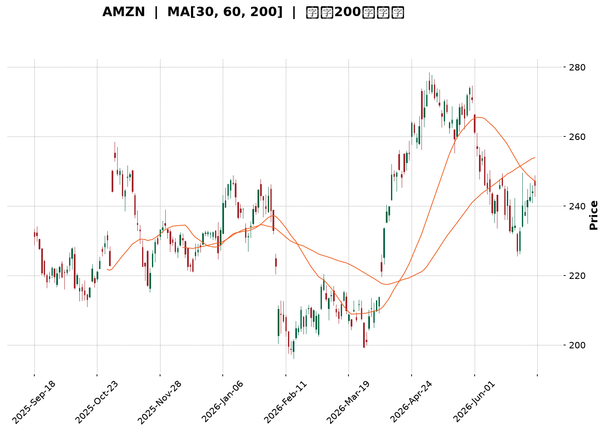
</details>

<html>
<head><meta charset="utf-8" /></head>
<body>
    <div style="height:500px; width:100%;">                        <script>window.PlotlyConfig = {MathJaxConfig: 'local'};</script>
        <script charset="utf-8" src="https://cdn.plot.ly/plotly-3.6.0.min.js" integrity="sha256-QaOVwtVY0T02VaHrr6pnoHLCwayMJp4O5n4YyaE3rJk=" crossorigin="anonymous"></script>                <div id="candlestick-chart" class="plotly-graph-div" style="height:100%; width:100%;"></div>            <script>                window.PLOTLYENV=window.PLOTLYENV || {};                                if (document.getElementById("candlestick-chart")) {                    Plotly.newPlot(                        "candlestick-chart",                        [{"close":{"dtype":"f8","bdata":"AAAAIFznbEAAAAAgXO9sQAAAAAApdGxAAAAAYLiWa0AAAABguIZrQAAAAMDMRGtAAAAAwPV4a0AAAACgcMVrQAAAAIA9cmtAAAAAACmUa0AAAADAHs1rQAAAAOBRcGtAAAAAwMyca0AAAADA9bhrQAAAAEAKJ2xAAAAAIK53bEAAAAAA1wtrQAAAAIA9gmtAAAAA4HoMa0AAAACAPfJqQAAAAEAKz2pAAAAAoEehakAAAAAgXA9rQAAAAMD1wGtAAAAAYGY+a0AAAABA4aJrQAAAAGC4BmxAAAAAQApfbEAAAAAAAKhsQAAAAKCZyWxAAAAAIIXba0AAAABACoduQAAAAAAAwG9AAAAAgD0qb0AAAABgZkZvQAAAAKBHYW5AAAAAwB6NbkAAAADAzAxvQAAAAEAzI29AAAAAYGaGbkAAAABgj7JtQAAAAIAUVm1AAAAAANcbbUAAAACgmdFrQAAAAIAU1mtAAAAA4Hoka0AAAACAFJZrQAAAAMD1SGxAAAAAoHC1bEAAAADAHqVsQAAAAEAKJ21AAAAAACk8bUAAAACgcE1tQAAAAAApDG1AAAAAIIWjbEAAAADA9bBsQAAAAOB6XGxAAAAAoHB9bEAAAADA9fhsQAAAAMD1yGxAAAAAgBRGbEAAAACgR9FrQAAAAIDr0WtAAAAA4KOoa0AAAADgUVhsQAAAAEAza2xAAAAAgMKNbEAAAADgegRtQAAAAAApDG1AAAAA4KMQbUAAAACAPQJtQAAAAMD1EG1AAAAAgD3abEAAAAAAAFBsQAAAAIDrIW1AAAAAgMIdbkAAAACA6zFuQAAAAKBHyW5AAAAAACnsbkAAAABACs9uQAAAAEAzU25AAAAAwMyUbUAAAACAwsVtQAAAAADX421AAAAAAADgbEAAAACA6+lsQAAAAEDhSm1AAAAAwB7lbUAAAACgcM1tQAAAAIDClW5AAAAA4FFgbkAAAAAgXDduQAAAAKCZ6W1AAAAAYLhebkAAAAAA19NtQAAAACCuH21AAAAAgBTWa0AAAACAPUpqQAAAAEAKF2pAAAAAYLjeaUAAAABgj4JpQAAAAEAz82hAAAAAoEfZaEAAAADAzCRpQAAAAKBHmWlAAAAAIIWbaUAAAAAghUNqQAAAAOCjqGlAAAAAgOsRakAAAADgelRqQAAAAKBw\u002fWlAAAAAAABAakAAAADgegxqQAAAACBcF2pAAAAAgD0aa0AAAACAFF5rQAAAAGC4pmpAAAAAIK6vakAAAABgj8pqQAAAAMDMlGpAAAAAwPUwakAAAACgcPVpQAAAACCud2pAAAAAYGbmakAAAAAA1ztqQAAAAOBRGGpAAAAAANeraUAAAADgekRqQAAAACCu52lAAAAAYLh2akAAAACgR\u002fFpQAAAAEDh6mhAAAAAYGYeaUAAAADgowhqQAAAAIA9UmpAAAAA4KM4akAAAACgR5lqQAAAAOCjuGpAAAAAAACoa0AAAADAzDRtQAAAAAApzG1AAAAA4Hr8bUAAAADgoyBvQAAAAAAAEG9AAAAAYGY2b0AAAACA61FvQAAAAMD1CG9AAAAAwB49b0AAAAAghetvQAAAAGCP4m9AAAAAANd\u002fcEAAAACA61FwQAAAAEAzO3BAAAAA4KNwcEAAAADA9ZBwQAAAAAApxHBAAAAAwMwAcUAAAADAzBhxQAAAAADXL3FAAAAAYLjycEAAAABA4QpxQAAAAADXz3BAAAAAwB6dcEAAAACAFOJwQAAAACCFs3BAAAAAgD2CcEAAAACAwo1wQAAAAKBwNXBAAAAAACmQcEAAAAAgXMdwQAAAAMAepXBAAAAA4KOUcEAAAACgmf1wQAAAAAAAIHFAAAAAgD3qcEAAAAAAKVRwQAAAAOBRCHBAAAAA4KNAb0AAAACgR7lvQAAAAMD1wG5AAAAAQAqnbkAAAACAFIZuQAAAAAAAwG1AAAAA4FEwbkAAAACgmdFtQAAAAOCjwG5AAAAAAADAbkAAAAAAALBtQAAAAOB6jG5AAAAAoEcZbUAAAAAghUNtQAAAAOCjSG1AAAAA4FFgbEAAAACAFBZtQAAAAOB6BG5AAAAAQOHKbUAAAABgZjZuQAAAAKBwVW5AAAAAwB6FbkAAAAAgXL9uQA=="},"high":{"dtype":"f8","bdata":"AAAAIFwvbUAAAADAHkVtQAAAAIA90mxAAAAAIIV7bEAAAACA6xFsQAAAAKBwlWtAAAAAoJmha0AAAABAM9NrQAAAACCux2tAAAAAwMzEa0AAAACA69lrQAAAAGBmBmxAAAAAIFy3a0AAAADgetxrQAAAACBcV2xAAAAAYLiGbEAAAAAAAIhsQAAAAIDClWtAAAAAgD1qa0AAAABguDZrQAAAAEDhUmtAAAAAoJnZakAAAACAFBZrQAAAAIA96mtAAAAA4FGAa0AAAACgmalrQAAAAMDMLGxAAAAAwMyMbEAAAAAgru9sQAAAAIA9Gm1AAAAAgBSObEAAAAAAAFBvQAAAAKCZKXBAAAAAACkQcEAAAAAAAGBvQAAAAAApTG9AAAAAwMycbkAAAAAAAHhvQAAAAAAAOG9AAAAAANdLb0AAAAAAAHhuQAAAACBc121AAAAAQDNTbUAAAABgZsZsQAAAACCu92tAAAAAwB5tbEAAAABguMZrQAAAAGCPamxAAAAA4KPQbEAAAAAAAPhsQAAAAKBHKW1AAAAAoJl5bUAAAABACt9tQAAAAAApLG1AAAAAAAAwbUAAAAAgrudsQAAAAGCP2mxAAAAAgD2SbEAAAACgcA1tQAAAACCFA21AAAAAYI\u002fCbEAAAACAwn1sQAAAAMAe9WtAAAAAgBQmbEAAAAAgXKdsQAAAAAAppGxAAAAAIFyvbEAAAABgZg5tQAAAAGBmHm1AAAAAIK4fbUAAAABAMxNtQAAAAOCjGG1AAAAAIK4fbUAAAABguG5tQAAAAAAAQG1AAAAAgMJlbkAAAACgR6luQAAAAMAezW5AAAAAIIX7bkAAAACAFB5vQAAAAMAe9W5AAAAAwPUobkAAAADAzBRuQAAAAIA98m1AAAAAQOFibUAAAACgmQltQAAAAEAKd21AAAAAYGYObkAAAABgZh5uQAAAAAApnG5AAAAAwPX4bkAAAAAAAGBuQAAAAIA9am5AAAAAACm0bkAAAABAM8tuQAAAACCF221AAAAAgOtJbEAAAACAFG5qQAAAAIDrmWpAAAAAwMyUakAAAACAPRJqQAAAAGC4fmlAAAAAwB4laUAAAAAgrjdpQAAAACCF22lAAAAA4Hq0aUAAAACgcGVqQAAAAIDCDWpAAAAAIIVLakAAAABA4XJqQAAAAKCZYWpAAAAAYI9KakAAAAAgXDdqQAAAAIDCJWpAAAAAoEcxa0AAAABACo9rQAAAAIA9KmtAAAAAgD26akAAAADAzPRqQAAAAAAAIGtAAAAAYLh2akAAAACA61FqQAAAAEAKl2pAAAAAYGb2akAAAADgeuRqQAAAAADXI2pAAAAAoEfxaUAAAACgmZlqQAAAAEAzK2pAAAAAgD2iakAAAADgepxqQAAAAEAz02lAAAAAoJl5aUAAAADA9UhqQAAAAGCPsmpAAAAAYLiGakAAAABgZp5qQAAAAEAKv2pAAAAAQDNDbEAAAACgmTltQAAAAIDCDW5AAAAAAAAAbkAAAACAwoVvQAAAAIAUTm9AAAAAAABAb0AAAABA4QJwQAAAAIDCRW9AAAAAQOHib0AAAACAFP5vQAAAAOCjLHBAAAAAAACIcEAAAABgZoJwQAAAAOB6UHBAAAAAYI+ecEAAAACAFB5xQAAAAMAeFXFAAAAAoJlBcUAAAADA9WhxQAAAAMDMXHFAAAAAgBRKcUAAAAAAACBxQAAAAIAUGnFAAAAAYGa6cEAAAAAghetwQAAAAOB67HBAAAAAgMKFcEAAAACgmc1wQAAAAAAAZHBAAAAAoEeZcEAAAAAA19dwQAAAAOCj3HBAAAAAwMzUcEAAAABgjwZxQAAAAAAAKHFAAAAAAAAscUAAAACAFKpwQAAAAEAzU3BAAAAAoHARcEAAAABgj\u002fpvQAAAAIAUBnBAAAAAoHAtb0AAAACAwk1vQAAAAIA9gm5AAAAA4HpEbkAAAAAghWtuQAAAAIDr+W5AAAAA4FEwb0AAAADAHr1uQAAAACBct25AAAAAAABAbkAAAAAA15ttQAAAAKBwTW5AAAAAgD0KbUAAAADAzDxtQAAAAGC4Nm9AAAAAoEcxbkAAAADAzJxuQAAAAEAK125AAAAAoEfBbkAAAACgRx1vQA=="},"hovertemplate":"\u003cb\u003e%{x|%Y-%m-%d}\u003c\u002fb\u003e\u003cbr\u003e\u958b: $%{open:.2f}\u003cbr\u003e\u9ad8: $%{high:.2f}\u003cbr\u003e\u4f4e: $%{low:.2f}\u003cbr\u003e\u6536: $%{close:.2f}\u003cextra\u003e\u003c\u002fextra\u003e","low":{"dtype":"f8","bdata":"AAAAoEeZbEAAAABgZrZsQAAAAOBRcGxAAAAAgD2Ca0AAAABgZm5rQAAAAEAKD2tAAAAA4KNAa0AAAACgmWlrQAAAAOB6PGtAAAAAIIUTa0AAAABgZl5rQAAAAEDhamtAAAAAwPUAa0AAAACgcIVrQAAAAIAUpmtAAAAAAAC4a0AAAAAAAABrQAAAAKBHIWtAAAAAQDOTakAAAADAHpVqQAAAAIDrmWpAAAAAwPVgakAAAABA4bJqQAAAACCuP2tAAAAA4KMQa0AAAACAwkVrQAAAAMDMvGtAAAAAoEcxbEAAAABguEZsQAAAAOBReGxAAAAAAADYa0AAAAAgXH9uQAAAAMDMnG9AAAAAwB4Vb0AAAADAHsVuQAAAAKBwRW5AAAAAIK7PbUAAAABA4bJuQAAAACBc525AAAAAAAB4bkAAAAAAAJBtQAAAAOB6HG1AAAAAgBSmbEAAAACgcM1rQAAAAOCjUGtAAAAAIK4Xa0AAAACAwuVqQAAAAOCjyGtAAAAAoJn5a0AAAADgo5hsQAAAAEAKx2xAAAAAAAAIbUAAAACgmTFtQAAAACCF02xAAAAAoJlZbEAAAACgmZFsQAAAAOCjSGxAAAAAIIUjbEAAAABguI5sQAAAAIAUlmxAAAAAANcjbEAAAAAAALBrQAAAAAAppGtAAAAAIK6fa0AAAADAHg1sQAAAAGCPMmxAAAAAYLhWbEAAAAAgXJdsQAAAAGCP6mxAAAAAgMLlbEAAAADgo9hsQAAAAGBmxmxAAAAAANfDbEAAAABgZhZsQAAAAIDCZWxAAAAAgD0CbUAAAADgo\u002fBtQAAAAAApPG5AAAAAIK5HbkAAAABguL5uQAAAAAAACG5AAAAAQAqHbUAAAAAAKZRtQAAAAMAejW1AAAAAQOGqbEAAAAAAKVxsQAAAAMDM3GxAAAAAgD1SbUAAAACgR7FtQAAAAGCPwm1AAAAAwPUwbkAAAAAgrpdtQAAAAOB6tG1AAAAAoHDFbUAAAABgZm5tQAAAAIA9+mxAAAAAACmMa0AAAACA6wlpQAAAAEAza2lAAAAAwB7NaUAAAAAgrk9pQAAAAIDrsWhAAAAAwPWoaEAAAAAAAIBoQAAAAOBRMGlAAAAAgOtZaUAAAAAAAHhpQAAAACCFY2lAAAAAAABoaUAAAACAwh1qQAAAAEAzq2lAAAAAYGamaUAAAABguG5pQAAAACBcT2lAAAAAwMxEakAAAABA4fJqQAAAAMD1kGpAAAAAIIXjaUAAAACAwo1qQAAAAEAza2pAAAAAwMwEakAAAABACsdpQAAAAGBm7mlAAAAAgMKNakAAAABgjxpqQAAAAKCZwWlAAAAAgD2KaUAAAADgUTBqQAAAAOB61GlAAAAAwMw8akAAAAAA1+NpQAAAAOB65GhAAAAAIFz\u002faEAAAADgeoRpQAAAAIAUBmpAAAAAwMycaUAAAABA4TJqQAAAAGCPImpAAAAAANdza0AAAADgo+hrQAAAAGC4Zm1AAAAAAAB4bUAAAADA9ThuQAAAAGBm5m5AAAAAYGaGbkAAAAAghUNvQAAAAADXq25AAAAAQDMjb0AAAABgj0pvQAAAAIA9om9AAAAAQAobcEAAAACgcEVwQAAAAIAUCnBAAAAAQDMbcEAAAABgjwJwQAAAAADXa3BAAAAAwMzMcEAAAACAFAZxQAAAACBcA3FAAAAAANfncEAAAABAM99wQAAAACCux3BAAAAAgBRqcEAAAABAM3NwQAAAAIAUqnBAAAAAgD1OcEAAAADgemhwQAAAAIAU5m9AAAAA4Ho4cEAAAACA61VwQAAAAADXo3BAAAAAwB5hcEAAAABAM5twQAAAAEAKt3BAAAAAgD3acEAAAABAM0twQAAAAADXy29AAAAAYLj2bkAAAAAAAHhvQAAAAMD1uG5AAAAAIIVrbkAAAADAzAxuQAAAAGBmrm1AAAAAgMJlbUAAAABA4TJtQAAAACBcl25AAAAAYGaubkAAAAAAAIBtQAAAAOCjgG1AAAAAIK4HbUAAAAAAAABtQAAAAGBmHm1AAAAAoJkxbEAAAAAAKURsQAAAAKCZOW1AAAAAoHClbUAAAADAzFxtQAAAAGCPIm5AAAAAACkcbkAAAABgZlZuQA=="},"name":"\u50f9\u683c","open":{"dtype":"f8","bdata":"AAAAAAAQbUAAAAAA1wttQAAAAIDr0WxAAAAAYI96bEAAAADAzARsQAAAAIDrgWtAAAAAYI9ia0AAAABgj4JrQAAAAMD1wGtAAAAAIIUra0AAAADgUaBrQAAAAIAU7mtAAAAAAACga0AAAAAAKZxrQAAAAKBw3WtAAAAAAAAgbEAAAABguEZsQAAAAGBmNmtAAAAAgOvxakAAAAAA1xNrQAAAAKBw9WpAAAAAgOvRakAAAAAAKbxqQAAAAIDCTWtAAAAAoJlpa0AAAAAAAGBrQAAAAEAKv2tAAAAAwB51bEAAAABACodsQAAAAKBw9WxAAAAAgOthbEAAAABAM0NvQAAAACCF629AAAAAAClMb0AAAADA9SBvQAAAAMAeJW9AAAAAwMxcbkAAAABA4QpvQAAAAMAeDW9AAAAAIK5Hb0AAAACgmWFuQAAAAIDrYW1AAAAAAAAobUAAAABAM4NsQAAAACCu92tAAAAAoJlhbEAAAABAMwtrQAAAAIDr0WtAAAAAAClMbEAAAAAgrtdsQAAAACCu52xAAAAAQAonbUAAAADgUWBtQAAAAEAzK21AAAAA4KMYbUAAAACAPcpsQAAAAEDhsmxAAAAAQOFabEAAAACA65lsQAAAAGC41mxAAAAAANe7bEAAAACAwn1sQAAAAKBH4WtAAAAAwB4VbEAAAABguDZsQAAAAOBRWGxAAAAAIIWTbEAAAACA66FsQAAAAAApBG1AAAAAoEcBbUAAAACAFP5sQAAAAGC45mxAAAAAwB4dbUAAAABA4epsQAAAAEDhmmxAAAAAQDMDbUAAAAAghfNtQAAAAIDrYW5AAAAAgD2SbkAAAAAgXNduQAAAAMD10G5AAAAAwMwkbkAAAACA6+ltQAAAAEDh4m1AAAAA4FE4bUAAAABA4eJsQAAAAKCZQW1AAAAAYLhebUAAAAAgXP9tQAAAAIAU9m1AAAAAANfLbkAAAACAPVpuQAAAAOB6\u002fG1AAAAAgOvJbUAAAAAgXJ9uQAAAACCF221AAAAAwB4dbEAAAABgZlZpQAAAAEAKH2pAAAAAoJkZakAAAACA6wFqQAAAAGC4fmlAAAAAACncaEAAAAAAKcRoQAAAAIA9QmlAAAAAoJl5aUAAAADgUZhpQAAAAEAzA2pAAAAAQAqvaUAAAABguE5qQAAAACBcV2pAAAAAYI\u002faaUAAAACgmZFpQAAAAEAzY2lAAAAAQApPakAAAAAgXP9qQAAAACCu32pAAAAAYGZOakAAAACAFMZqQAAAAGC49mpAAAAA4HpMakAAAAAghTNqQAAAAEAzC2pAAAAAgD2aakAAAACAwr1qQAAAAIDr4WlAAAAAwMzsaUAAAACgRzlqQAAAAGBm\u002fmlAAAAAgOtxakAAAAAghVNqQAAAAGC4zmlAAAAAIFwvaUAAAABAM5tpQAAAAIAUTmpAAAAAoEfRaUAAAACgmTlqQAAAACCuZ2pAAAAAoEf5a0AAAAAgXCdsQAAAAKCZaW1AAAAAYGaubUAAAADA9ThuQAAAAAAAKG9AAAAA4FEQb0AAAAAgrt9vQAAAAIAUJm9AAAAAQOHib0AAAACAFI5vQAAAAOB67G9AAAAAIK4\u002fcEAAAAAgXHdwQAAAAIA9JnBAAAAAANcfcEAAAABguBJxQAAAAKBHmXBAAAAAwMzMcEAAAACgR0FxQAAAAIA9DnFAAAAA4FEwcUAAAACAFPpwQAAAAKBw3XBAAAAAIFyrcEAAAABA4YZwQAAAAGBm0nBAAAAAAABocEAAAACA631wQAAAAOCjYHBAAAAAwMxAcEAAAAAAAHhwQAAAAGCPynBAAAAAQAq\u002fcEAAAABgZqJwQAAAAOBRBHFAAAAA4KP0cEAAAADgo6RwQAAAAGCPEnBAAAAAYGbWb0AAAAAA16NvQAAAAOBRyG9AAAAAgMLVbkAAAAAgXPduQAAAACCFc25AAAAAgMK9bUAAAABguGZuQAAAAOCjoG5AAAAAAAAAb0AAAADAzJxuQAAAAADXA25AAAAAYI8CbkAAAACgmRFtQAAAAEAzO21AAAAA4KMAbUAAAABguGZsQAAAAEAKR21AAAAAQDOrbUAAAAAAAPhtQAAAACCFM25AAAAAoJl5bkAAAACAPepuQA=="},"x":["2025-09-18T00:00:00-04:00","2025-09-19T00:00:00-04:00","2025-09-22T00:00:00-04:00","2025-09-23T00:00:00-04:00","2025-09-24T00:00:00-04:00","2025-09-25T00:00:00-04:00","2025-09-26T00:00:00-04:00","2025-09-29T00:00:00-04:00","2025-09-30T00:00:00-04:00","2025-10-01T00:00:00-04:00","2025-10-02T00:00:00-04:00","2025-10-03T00:00:00-04:00","2025-10-06T00:00:00-04:00","2025-10-07T00:00:00-04:00","2025-10-08T00:00:00-04:00","2025-10-09T00:00:00-04:00","2025-10-10T00:00:00-04:00","2025-10-13T00:00:00-04:00","2025-10-14T00:00:00-04:00","2025-10-15T00:00:00-04:00","2025-10-16T00:00:00-04:00","2025-10-17T00:00:00-04:00","2025-10-20T00:00:00-04:00","2025-10-21T00:00:00-04:00","2025-10-22T00:00:00-04:00","2025-10-23T00:00:00-04:00","2025-10-24T00:00:00-04:00","2025-10-27T00:00:00-04:00","2025-10-28T00:00:00-04:00","2025-10-29T00:00:00-04:00","2025-10-30T00:00:00-04:00","2025-10-31T00:00:00-04:00","2025-11-03T00:00:00-05:00","2025-11-04T00:00:00-05:00","2025-11-05T00:00:00-05:00","2025-11-06T00:00:00-05:00","2025-11-07T00:00:00-05:00","2025-11-10T00:00:00-05:00","2025-11-11T00:00:00-05:00","2025-11-12T00:00:00-05:00","2025-11-13T00:00:00-05:00","2025-11-14T00:00:00-05:00","2025-11-17T00:00:00-05:00","2025-11-18T00:00:00-05:00","2025-11-19T00:00:00-05:00","2025-11-20T00:00:00-05:00","2025-11-21T00:00:00-05:00","2025-11-24T00:00:00-05:00","2025-11-25T00:00:00-05:00","2025-11-26T00:00:00-05:00","2025-11-28T00:00:00-05:00","2025-12-01T00:00:00-05:00","2025-12-02T00:00:00-05:00","2025-12-03T00:00:00-05:00","2025-12-04T00:00:00-05:00","2025-12-05T00:00:00-05:00","2025-12-08T00:00:00-05:00","2025-12-09T00:00:00-05:00","2025-12-10T00:00:00-05:00","2025-12-11T00:00:00-05:00","2025-12-12T00:00:00-05:00","2025-12-15T00:00:00-05:00","2025-12-16T00:00:00-05:00","2025-12-17T00:00:00-05:00","2025-12-18T00:00:00-05:00","2025-12-19T00:00:00-05:00","2025-12-22T00:00:00-05:00","2025-12-23T00:00:00-05:00","2025-12-24T00:00:00-05:00","2025-12-26T00:00:00-05:00","2025-12-29T00:00:00-05:00","2025-12-30T00:00:00-05:00","2025-12-31T00:00:00-05:00","2026-01-02T00:00:00-05:00","2026-01-05T00:00:00-05:00","2026-01-06T00:00:00-05:00","2026-01-07T00:00:00-05:00","2026-01-08T00:00:00-05:00","2026-01-09T00:00:00-05:00","2026-01-12T00:00:00-05:00","2026-01-13T00:00:00-05:00","2026-01-14T00:00:00-05:00","2026-01-15T00:00:00-05:00","2026-01-16T00:00:00-05:00","2026-01-20T00:00:00-05:00","2026-01-21T00:00:00-05:00","2026-01-22T00:00:00-05:00","2026-01-23T00:00:00-05:00","2026-01-26T00:00:00-05:00","2026-01-27T00:00:00-05:00","2026-01-28T00:00:00-05:00","2026-01-29T00:00:00-05:00","2026-01-30T00:00:00-05:00","2026-02-02T00:00:00-05:00","2026-02-03T00:00:00-05:00","2026-02-04T00:00:00-05:00","2026-02-05T00:00:00-05:00","2026-02-06T00:00:00-05:00","2026-02-09T00:00:00-05:00","2026-02-10T00:00:00-05:00","2026-02-11T00:00:00-05:00","2026-02-12T00:00:00-05:00","2026-02-13T00:00:00-05:00","2026-02-17T00:00:00-05:00","2026-02-18T00:00:00-05:00","2026-02-19T00:00:00-05:00","2026-02-20T00:00:00-05:00","2026-02-23T00:00:00-05:00","2026-02-24T00:00:00-05:00","2026-02-25T00:00:00-05:00","2026-02-26T00:00:00-05:00","2026-02-27T00:00:00-05:00","2026-03-02T00:00:00-05:00","2026-03-03T00:00:00-05:00","2026-03-04T00:00:00-05:00","2026-03-05T00:00:00-05:00","2026-03-06T00:00:00-05:00","2026-03-09T00:00:00-04:00","2026-03-10T00:00:00-04:00","2026-03-11T00:00:00-04:00","2026-03-12T00:00:00-04:00","2026-03-13T00:00:00-04:00","2026-03-16T00:00:00-04:00","2026-03-17T00:00:00-04:00","2026-03-18T00:00:00-04:00","2026-03-19T00:00:00-04:00","2026-03-20T00:00:00-04:00","2026-03-23T00:00:00-04:00","2026-03-24T00:00:00-04:00","2026-03-25T00:00:00-04:00","2026-03-26T00:00:00-04:00","2026-03-27T00:00:00-04:00","2026-03-30T00:00:00-04:00","2026-03-31T00:00:00-04:00","2026-04-01T00:00:00-04:00","2026-04-02T00:00:00-04:00","2026-04-06T00:00:00-04:00","2026-04-07T00:00:00-04:00","2026-04-08T00:00:00-04:00","2026-04-09T00:00:00-04:00","2026-04-10T00:00:00-04:00","2026-04-13T00:00:00-04:00","2026-04-14T00:00:00-04:00","2026-04-15T00:00:00-04:00","2026-04-16T00:00:00-04:00","2026-04-17T00:00:00-04:00","2026-04-20T00:00:00-04:00","2026-04-21T00:00:00-04:00","2026-04-22T00:00:00-04:00","2026-04-23T00:00:00-04:00","2026-04-24T00:00:00-04:00","2026-04-27T00:00:00-04:00","2026-04-28T00:00:00-04:00","2026-04-29T00:00:00-04:00","2026-04-30T00:00:00-04:00","2026-05-01T00:00:00-04:00","2026-05-04T00:00:00-04:00","2026-05-05T00:00:00-04:00","2026-05-06T00:00:00-04:00","2026-05-07T00:00:00-04:00","2026-05-08T00:00:00-04:00","2026-05-11T00:00:00-04:00","2026-05-12T00:00:00-04:00","2026-05-13T00:00:00-04:00","2026-05-14T00:00:00-04:00","2026-05-15T00:00:00-04:00","2026-05-18T00:00:00-04:00","2026-05-19T00:00:00-04:00","2026-05-20T00:00:00-04:00","2026-05-21T00:00:00-04:00","2026-05-22T00:00:00-04:00","2026-05-26T00:00:00-04:00","2026-05-27T00:00:00-04:00","2026-05-28T00:00:00-04:00","2026-05-29T00:00:00-04:00","2026-06-01T00:00:00-04:00","2026-06-02T00:00:00-04:00","2026-06-03T00:00:00-04:00","2026-06-04T00:00:00-04:00","2026-06-05T00:00:00-04:00","2026-06-08T00:00:00-04:00","2026-06-09T00:00:00-04:00","2026-06-10T00:00:00-04:00","2026-06-11T00:00:00-04:00","2026-06-12T00:00:00-04:00","2026-06-15T00:00:00-04:00","2026-06-16T00:00:00-04:00","2026-06-17T00:00:00-04:00","2026-06-18T00:00:00-04:00","2026-06-22T00:00:00-04:00","2026-06-23T00:00:00-04:00","2026-06-24T00:00:00-04:00","2026-06-25T00:00:00-04:00","2026-06-26T00:00:00-04:00","2026-06-29T00:00:00-04:00","2026-06-30T00:00:00-04:00","2026-07-01T00:00:00-04:00","2026-07-02T00:00:00-04:00","2026-07-06T00:00:00-04:00","2026-07-07T00:00:00-04:00"],"type":"candlestick"},{"hovertemplate":"MA30: $%{y:.2f}\u003cextra\u003e\u003c\u002fextra\u003e","line":{"color":"#2196F3","dash":"dash","width":2},"mode":"lines","name":"MA30","x":["2025-09-18T00:00:00-04:00","2025-09-19T00:00:00-04:00","2025-09-22T00:00:00-04:00","2025-09-23T00:00:00-04:00","2025-09-24T00:00:00-04:00","2025-09-25T00:00:00-04:00","2025-09-26T00:00:00-04:00","2025-09-29T00:00:00-04:00","2025-09-30T00:00:00-04:00","2025-10-01T00:00:00-04:00","2025-10-02T00:00:00-04:00","2025-10-03T00:00:00-04:00","2025-10-06T00:00:00-04:00","2025-10-07T00:00:00-04:00","2025-10-08T00:00:00-04:00","2025-10-09T00:00:00-04:00","2025-10-10T00:00:00-04:00","2025-10-13T00:00:00-04:00","2025-10-14T00:00:00-04:00","2025-10-15T00:00:00-04:00","2025-10-16T00:00:00-04:00","2025-10-17T00:00:00-04:00","2025-10-20T00:00:00-04:00","2025-10-21T00:00:00-04:00","2025-10-22T00:00:00-04:00","2025-10-23T00:00:00-04:00","2025-10-24T00:00:00-04:00","2025-10-27T00:00:00-04:00","2025-10-28T00:00:00-04:00","2025-10-29T00:00:00-04:00","2025-10-30T00:00:00-04:00","2025-10-31T00:00:00-04:00","2025-11-03T00:00:00-05:00","2025-11-04T00:00:00-05:00","2025-11-05T00:00:00-05:00","2025-11-06T00:00:00-05:00","2025-11-07T00:00:00-05:00","2025-11-10T00:00:00-05:00","2025-11-11T00:00:00-05:00","2025-11-12T00:00:00-05:00","2025-11-13T00:00:00-05:00","2025-11-14T00:00:00-05:00","2025-11-17T00:00:00-05:00","2025-11-18T00:00:00-05:00","2025-11-19T00:00:00-05:00","2025-11-20T00:00:00-05:00","2025-11-21T00:00:00-05:00","2025-11-24T00:00:00-05:00","2025-11-25T00:00:00-05:00","2025-11-26T00:00:00-05:00","2025-11-28T00:00:00-05:00","2025-12-01T00:00:00-05:00","2025-12-02T00:00:00-05:00","2025-12-03T00:00:00-05:00","2025-12-04T00:00:00-05:00","2025-12-05T00:00:00-05:00","2025-12-08T00:00:00-05:00","2025-12-09T00:00:00-05:00","2025-12-10T00:00:00-05:00","2025-12-11T00:00:00-05:00","2025-12-12T00:00:00-05:00","2025-12-15T00:00:00-05:00","2025-12-16T00:00:00-05:00","2025-12-17T00:00:00-05:00","2025-12-18T00:00:00-05:00","2025-12-19T00:00:00-05:00","2025-12-22T00:00:00-05:00","2025-12-23T00:00:00-05:00","2025-12-24T00:00:00-05:00","2025-12-26T00:00:00-05:00","2025-12-29T00:00:00-05:00","2025-12-30T00:00:00-05:00","2025-12-31T00:00:00-05:00","2026-01-02T00:00:00-05:00","2026-01-05T00:00:00-05:00","2026-01-06T00:00:00-05:00","2026-01-07T00:00:00-05:00","2026-01-08T00:00:00-05:00","2026-01-09T00:00:00-05:00","2026-01-12T00:00:00-05:00","2026-01-13T00:00:00-05:00","2026-01-14T00:00:00-05:00","2026-01-15T00:00:00-05:00","2026-01-16T00:00:00-05:00","2026-01-20T00:00:00-05:00","2026-01-21T00:00:00-05:00","2026-01-22T00:00:00-05:00","2026-01-23T00:00:00-05:00","2026-01-26T00:00:00-05:00","2026-01-27T00:00:00-05:00","2026-01-28T00:00:00-05:00","2026-01-29T00:00:00-05:00","2026-01-30T00:00:00-05:00","2026-02-02T00:00:00-05:00","2026-02-03T00:00:00-05:00","2026-02-04T00:00:00-05:00","2026-02-05T00:00:00-05:00","2026-02-06T00:00:00-05:00","2026-02-09T00:00:00-05:00","2026-02-10T00:00:00-05:00","2026-02-11T00:00:00-05:00","2026-02-12T00:00:00-05:00","2026-02-13T00:00:00-05:00","2026-02-17T00:00:00-05:00","2026-02-18T00:00:00-05:00","2026-02-19T00:00:00-05:00","2026-02-20T00:00:00-05:00","2026-02-23T00:00:00-05:00","2026-02-24T00:00:00-05:00","2026-02-25T00:00:00-05:00","2026-02-26T00:00:00-05:00","2026-02-27T00:00:00-05:00","2026-03-02T00:00:00-05:00","2026-03-03T00:00:00-05:00","2026-03-04T00:00:00-05:00","2026-03-05T00:00:00-05:00","2026-03-06T00:00:00-05:00","2026-03-09T00:00:00-04:00","2026-03-10T00:00:00-04:00","2026-03-11T00:00:00-04:00","2026-03-12T00:00:00-04:00","2026-03-13T00:00:00-04:00","2026-03-16T00:00:00-04:00","2026-03-17T00:00:00-04:00","2026-03-18T00:00:00-04:00","2026-03-19T00:00:00-04:00","2026-03-20T00:00:00-04:00","2026-03-23T00:00:00-04:00","2026-03-24T00:00:00-04:00","2026-03-25T00:00:00-04:00","2026-03-26T00:00:00-04:00","2026-03-27T00:00:00-04:00","2026-03-30T00:00:00-04:00","2026-03-31T00:00:00-04:00","2026-04-01T00:00:00-04:00","2026-04-02T00:00:00-04:00","2026-04-06T00:00:00-04:00","2026-04-07T00:00:00-04:00","2026-04-08T00:00:00-04:00","2026-04-09T00:00:00-04:00","2026-04-10T00:00:00-04:00","2026-04-13T00:00:00-04:00","2026-04-14T00:00:00-04:00","2026-04-15T00:00:00-04:00","2026-04-16T00:00:00-04:00","2026-04-17T00:00:00-04:00","2026-04-20T00:00:00-04:00","2026-04-21T00:00:00-04:00","2026-04-22T00:00:00-04:00","2026-04-23T00:00:00-04:00","2026-04-24T00:00:00-04:00","2026-04-27T00:00:00-04:00","2026-04-28T00:00:00-04:00","2026-04-29T00:00:00-04:00","2026-04-30T00:00:00-04:00","2026-05-01T00:00:00-04:00","2026-05-04T00:00:00-04:00","2026-05-05T00:00:00-04:00","2026-05-06T00:00:00-04:00","2026-05-07T00:00:00-04:00","2026-05-08T00:00:00-04:00","2026-05-11T00:00:00-04:00","2026-05-12T00:00:00-04:00","2026-05-13T00:00:00-04:00","2026-05-14T00:00:00-04:00","2026-05-15T00:00:00-04:00","2026-05-18T00:00:00-04:00","2026-05-19T00:00:00-04:00","2026-05-20T00:00:00-04:00","2026-05-21T00:00:00-04:00","2026-05-22T00:00:00-04:00","2026-05-26T00:00:00-04:00","2026-05-27T00:00:00-04:00","2026-05-28T00:00:00-04:00","2026-05-29T00:00:00-04:00","2026-06-01T00:00:00-04:00","2026-06-02T00:00:00-04:00","2026-06-03T00:00:00-04:00","2026-06-04T00:00:00-04:00","2026-06-05T00:00:00-04:00","2026-06-08T00:00:00-04:00","2026-06-09T00:00:00-04:00","2026-06-10T00:00:00-04:00","2026-06-11T00:00:00-04:00","2026-06-12T00:00:00-04:00","2026-06-15T00:00:00-04:00","2026-06-16T00:00:00-04:00","2026-06-17T00:00:00-04:00","2026-06-18T00:00:00-04:00","2026-06-22T00:00:00-04:00","2026-06-23T00:00:00-04:00","2026-06-24T00:00:00-04:00","2026-06-25T00:00:00-04:00","2026-06-26T00:00:00-04:00","2026-06-29T00:00:00-04:00","2026-06-30T00:00:00-04:00","2026-07-01T00:00:00-04:00","2026-07-02T00:00:00-04:00","2026-07-06T00:00:00-04:00","2026-07-07T00:00:00-04:00"],"y":{"dtype":"f8","bdata":"AAAAAAAA+H8AAAAAAAD4fwAAAAAAAPh\u002fAAAAAAAA+H8AAAAAAAD4fwAAAAAAAPh\u002fAAAAAAAA+H8AAAAAAAD4fwAAAAAAAPh\u002fAAAAAAAA+H8AAAAAAAD4fwAAAAAAAPh\u002fAAAAAAAA+H8AAAAAAAD4fwAAAAAAAPh\u002fAAAAAAAA+H8AAAAAAAD4fwAAAAAAAPh\u002fAAAAAAAA+H8AAAAAAAD4fwAAAAAAAPh\u002fAAAAAAAA+H8AAAAAAAD4fwAAAAAAAPh\u002fAAAAAAAA+H8AAAAAAAD4fwAAAAAAAPh\u002fAAAAAAAA+H8AAAAAAAD4fwAAADDduGtA7+7unu+va0De3d19hr1rQCIiIkKn2WtAIiIisiv4a0BmZmb2KBhsQHd3d5e1MmxAmpmZOftMbEAzMzPD9WhsQLy7u2t1iGxAmpmZmZmhbEBVVVUFyLFsQM3MzCz5wWxAiYiIyL3ObEC8u7sLkM9sQAAAADDdzGxA3t3drY7BbEBERERUKsZsQCIiIhLKzGxAVVVVZfTabEDv7u5ec+lsQO\u002fu7l5z\u002fWxAVVVVFa4TbUBmZmbm0CZtQERERCTbMW1AERERkcI9bUAAAABAw0ZtQBERERGfSW1Aq6qqeqJKbUBmZmZWVU1tQAAAAOBPTW1AAAAAMN1QbUCamZkZvTltQCIiIuIzGG1AzczMXEj6bEDe3d2tR+FsQERERESL0GxAiYiIqH+\u002fbECJiIiYJ65sQLy7u+tRnGxAERERgdyPbECJiIjo+4lsQFVVVRWuh2xAzczMTH6FbECamZnptIlsQM3MzJzElGxA3t3d3SSubEBERETEZ8RsQERERNS\u002f2WxAd3d316PsbEAAAACgGv9sQN7d3f0bCW1AIiIiYhAMbUDNzMwcExBtQERERJRDF21AzczMrEcZbUC8u7u7LRttQERERBQgI21AmpmZWR0vbUAzMzODMjZtQLy7u6uORW1AZmZmpn9XbUDNzMzM92ttQAAAAPDSfW1AERERwfWUbUAzMzNTnKFtQLy7u2ugp21AVVVVBYGhbUBVVVW1OoptQDMzM\u002fP9cG1A3t3dXbpVbUCrqqo63zdtQFVVVSW\u002fFG1AERER0ZTybEAzMzOTitdsQKuqqvpiuWxAd3d3d+mSbEBVVVWFXXFsQERERFScRWxAERER4TMcbEBmZmbm+\u002fVrQCIiIvL90GtAiYiIuJC0a0ARERERypRrQCIiIpJfdGtAzczMfD9la0B3d3enDVhrQCIiIsKDQWtAMzMzIyIma0BmZmb2bwxrQDMzM6NF6mpA3t3dXY\u002fGakB3d3e3OqJqQAAAAADVhGpAq6qqqjhnakAAAAAAjkhqQHd3d5e1LmpAMzMzEzwcakC8u7vrChxqQImIiMh2GmpAmpmZ2YcfakCJiIioOCNqQImIiKjxImpAvLu7ez8lakCJiIi41yxqQM3MzAwCM2pA7+7uzj44akAAAACgGjtqQBEREbErRGpAiYiI6LRRakC8u7srQGpqQImIiMi9impA7+7uvp+qakAiIiJy9tVqQO\u002fu7k5iAGtAzczMvHQja0CrqqoaL0VrQM3MzIyXamtAMzMzo3CRa0AAAACQNL1rQImIiMh26mtA3t3d\u002fY0kbEB3d3dnkV1sQO\u002fu7q65kGxAIiIiMsHDbEDv7u6+n\u002f5sQHd3dzcXPm1AzczMTDeFbUBERER02shtQHd3d7ceEW5AMzMzQ4tQbkAzMzPTBpZuQKuqqupR4G5AERERwYMlb0CJiIiof2dvQCIiIuLso29AVVVVhevdb0DNzMwMuwpwQHd3d98II3BAq6qqkl86cEBERERM8ExwQCIiIgrXW3BAzczM\u002fGJpcEAzMzMLkHVwQM3MzKQpg3BAd3d3p1SOcEAAAACQCZRwQImIiJhumHBAVVVVnX2YcECamZlBp5dwQBEREaHTknBAZmZm5tCIcEBERERkyX9wQN7d3Z02dHBAVVVVDbtocEDe3d2Nl1pwQFVVVQ27TnBAREREXNZAcEDe3d1VnC1wQKuqqmpKHXBAvLu7Q9IIcECamZlZgOhvQKuqqnp3w29AIiIiwhGab0BEREQkInJvQO\u002fu7n4\u002fVW9A7+7uXro5b0BmZmYmBiFvQBERESE+D29AAAAAsAD5bkBmZmYmBuFuQA=="},"type":"scatter"},{"hovertemplate":"MA60: $%{y:.2f}\u003cextra\u003e\u003c\u002fextra\u003e","line":{"color":"#9C27B0","dash":"dash","width":2},"mode":"lines","name":"MA60","x":["2025-09-18T00:00:00-04:00","2025-09-19T00:00:00-04:00","2025-09-22T00:00:00-04:00","2025-09-23T00:00:00-04:00","2025-09-24T00:00:00-04:00","2025-09-25T00:00:00-04:00","2025-09-26T00:00:00-04:00","2025-09-29T00:00:00-04:00","2025-09-30T00:00:00-04:00","2025-10-01T00:00:00-04:00","2025-10-02T00:00:00-04:00","2025-10-03T00:00:00-04:00","2025-10-06T00:00:00-04:00","2025-10-07T00:00:00-04:00","2025-10-08T00:00:00-04:00","2025-10-09T00:00:00-04:00","2025-10-10T00:00:00-04:00","2025-10-13T00:00:00-04:00","2025-10-14T00:00:00-04:00","2025-10-15T00:00:00-04:00","2025-10-16T00:00:00-04:00","2025-10-17T00:00:00-04:00","2025-10-20T00:00:00-04:00","2025-10-21T00:00:00-04:00","2025-10-22T00:00:00-04:00","2025-10-23T00:00:00-04:00","2025-10-24T00:00:00-04:00","2025-10-27T00:00:00-04:00","2025-10-28T00:00:00-04:00","2025-10-29T00:00:00-04:00","2025-10-30T00:00:00-04:00","2025-10-31T00:00:00-04:00","2025-11-03T00:00:00-05:00","2025-11-04T00:00:00-05:00","2025-11-05T00:00:00-05:00","2025-11-06T00:00:00-05:00","2025-11-07T00:00:00-05:00","2025-11-10T00:00:00-05:00","2025-11-11T00:00:00-05:00","2025-11-12T00:00:00-05:00","2025-11-13T00:00:00-05:00","2025-11-14T00:00:00-05:00","2025-11-17T00:00:00-05:00","2025-11-18T00:00:00-05:00","2025-11-19T00:00:00-05:00","2025-11-20T00:00:00-05:00","2025-11-21T00:00:00-05:00","2025-11-24T00:00:00-05:00","2025-11-25T00:00:00-05:00","2025-11-26T00:00:00-05:00","2025-11-28T00:00:00-05:00","2025-12-01T00:00:00-05:00","2025-12-02T00:00:00-05:00","2025-12-03T00:00:00-05:00","2025-12-04T00:00:00-05:00","2025-12-05T00:00:00-05:00","2025-12-08T00:00:00-05:00","2025-12-09T00:00:00-05:00","2025-12-10T00:00:00-05:00","2025-12-11T00:00:00-05:00","2025-12-12T00:00:00-05:00","2025-12-15T00:00:00-05:00","2025-12-16T00:00:00-05:00","2025-12-17T00:00:00-05:00","2025-12-18T00:00:00-05:00","2025-12-19T00:00:00-05:00","2025-12-22T00:00:00-05:00","2025-12-23T00:00:00-05:00","2025-12-24T00:00:00-05:00","2025-12-26T00:00:00-05:00","2025-12-29T00:00:00-05:00","2025-12-30T00:00:00-05:00","2025-12-31T00:00:00-05:00","2026-01-02T00:00:00-05:00","2026-01-05T00:00:00-05:00","2026-01-06T00:00:00-05:00","2026-01-07T00:00:00-05:00","2026-01-08T00:00:00-05:00","2026-01-09T00:00:00-05:00","2026-01-12T00:00:00-05:00","2026-01-13T00:00:00-05:00","2026-01-14T00:00:00-05:00","2026-01-15T00:00:00-05:00","2026-01-16T00:00:00-05:00","2026-01-20T00:00:00-05:00","2026-01-21T00:00:00-05:00","2026-01-22T00:00:00-05:00","2026-01-23T00:00:00-05:00","2026-01-26T00:00:00-05:00","2026-01-27T00:00:00-05:00","2026-01-28T00:00:00-05:00","2026-01-29T00:00:00-05:00","2026-01-30T00:00:00-05:00","2026-02-02T00:00:00-05:00","2026-02-03T00:00:00-05:00","2026-02-04T00:00:00-05:00","2026-02-05T00:00:00-05:00","2026-02-06T00:00:00-05:00","2026-02-09T00:00:00-05:00","2026-02-10T00:00:00-05:00","2026-02-11T00:00:00-05:00","2026-02-12T00:00:00-05:00","2026-02-13T00:00:00-05:00","2026-02-17T00:00:00-05:00","2026-02-18T00:00:00-05:00","2026-02-19T00:00:00-05:00","2026-02-20T00:00:00-05:00","2026-02-23T00:00:00-05:00","2026-02-24T00:00:00-05:00","2026-02-25T00:00:00-05:00","2026-02-26T00:00:00-05:00","2026-02-27T00:00:00-05:00","2026-03-02T00:00:00-05:00","2026-03-03T00:00:00-05:00","2026-03-04T00:00:00-05:00","2026-03-05T00:00:00-05:00","2026-03-06T00:00:00-05:00","2026-03-09T00:00:00-04:00","2026-03-10T00:00:00-04:00","2026-03-11T00:00:00-04:00","2026-03-12T00:00:00-04:00","2026-03-13T00:00:00-04:00","2026-03-16T00:00:00-04:00","2026-03-17T00:00:00-04:00","2026-03-18T00:00:00-04:00","2026-03-19T00:00:00-04:00","2026-03-20T00:00:00-04:00","2026-03-23T00:00:00-04:00","2026-03-24T00:00:00-04:00","2026-03-25T00:00:00-04:00","2026-03-26T00:00:00-04:00","2026-03-27T00:00:00-04:00","2026-03-30T00:00:00-04:00","2026-03-31T00:00:00-04:00","2026-04-01T00:00:00-04:00","2026-04-02T00:00:00-04:00","2026-04-06T00:00:00-04:00","2026-04-07T00:00:00-04:00","2026-04-08T00:00:00-04:00","2026-04-09T00:00:00-04:00","2026-04-10T00:00:00-04:00","2026-04-13T00:00:00-04:00","2026-04-14T00:00:00-04:00","2026-04-15T00:00:00-04:00","2026-04-16T00:00:00-04:00","2026-04-17T00:00:00-04:00","2026-04-20T00:00:00-04:00","2026-04-21T00:00:00-04:00","2026-04-22T00:00:00-04:00","2026-04-23T00:00:00-04:00","2026-04-24T00:00:00-04:00","2026-04-27T00:00:00-04:00","2026-04-28T00:00:00-04:00","2026-04-29T00:00:00-04:00","2026-04-30T00:00:00-04:00","2026-05-01T00:00:00-04:00","2026-05-04T00:00:00-04:00","2026-05-05T00:00:00-04:00","2026-05-06T00:00:00-04:00","2026-05-07T00:00:00-04:00","2026-05-08T00:00:00-04:00","2026-05-11T00:00:00-04:00","2026-05-12T00:00:00-04:00","2026-05-13T00:00:00-04:00","2026-05-14T00:00:00-04:00","2026-05-15T00:00:00-04:00","2026-05-18T00:00:00-04:00","2026-05-19T00:00:00-04:00","2026-05-20T00:00:00-04:00","2026-05-21T00:00:00-04:00","2026-05-22T00:00:00-04:00","2026-05-26T00:00:00-04:00","2026-05-27T00:00:00-04:00","2026-05-28T00:00:00-04:00","2026-05-29T00:00:00-04:00","2026-06-01T00:00:00-04:00","2026-06-02T00:00:00-04:00","2026-06-03T00:00:00-04:00","2026-06-04T00:00:00-04:00","2026-06-05T00:00:00-04:00","2026-06-08T00:00:00-04:00","2026-06-09T00:00:00-04:00","2026-06-10T00:00:00-04:00","2026-06-11T00:00:00-04:00","2026-06-12T00:00:00-04:00","2026-06-15T00:00:00-04:00","2026-06-16T00:00:00-04:00","2026-06-17T00:00:00-04:00","2026-06-18T00:00:00-04:00","2026-06-22T00:00:00-04:00","2026-06-23T00:00:00-04:00","2026-06-24T00:00:00-04:00","2026-06-25T00:00:00-04:00","2026-06-26T00:00:00-04:00","2026-06-29T00:00:00-04:00","2026-06-30T00:00:00-04:00","2026-07-01T00:00:00-04:00","2026-07-02T00:00:00-04:00","2026-07-06T00:00:00-04:00","2026-07-07T00:00:00-04:00"],"y":{"dtype":"f8","bdata":"AAAAAAAA+H8AAAAAAAD4fwAAAAAAAPh\u002fAAAAAAAA+H8AAAAAAAD4fwAAAAAAAPh\u002fAAAAAAAA+H8AAAAAAAD4fwAAAAAAAPh\u002fAAAAAAAA+H8AAAAAAAD4fwAAAAAAAPh\u002fAAAAAAAA+H8AAAAAAAD4fwAAAAAAAPh\u002fAAAAAAAA+H8AAAAAAAD4fwAAAAAAAPh\u002fAAAAAAAA+H8AAAAAAAD4fwAAAAAAAPh\u002fAAAAAAAA+H8AAAAAAAD4fwAAAAAAAPh\u002fAAAAAAAA+H8AAAAAAAD4fwAAAAAAAPh\u002fAAAAAAAA+H8AAAAAAAD4fwAAAAAAAPh\u002fAAAAAAAA+H8AAAAAAAD4fwAAAAAAAPh\u002fAAAAAAAA+H8AAAAAAAD4fwAAAAAAAPh\u002fAAAAAAAA+H8AAAAAAAD4fwAAAAAAAPh\u002fAAAAAAAA+H8AAAAAAAD4fwAAAAAAAPh\u002fAAAAAAAA+H8AAAAAAAD4fwAAAAAAAPh\u002fAAAAAAAA+H8AAAAAAAD4fwAAAAAAAPh\u002fAAAAAAAA+H8AAAAAAAD4fwAAAAAAAPh\u002fAAAAAAAA+H8AAAAAAAD4fwAAAAAAAPh\u002fAAAAAAAA+H8AAAAAAAD4fwAAAAAAAPh\u002fAAAAAAAA+H8AAAAAAAD4fwAAAIgWg2xAd3d3Z2aAbEC8u7vLoXtsQCIiIpLteGxAd3d3Bzp5bEAiIiJSuHxsQN7d3W2ggWxAERERcT2GbEDe3d2tjotsQLy7u6tjkmxAVVVVDbuYbEDv7u724Z1sQBEREaHTpGxAq6qqCh6qbECrqqp6oqxsQGZmZubQsGxA3t3dxdm3bEBEREQMScVsQDMzM\u002fNE02xAZmZmHszjbEB3d3f\u002fRvRsQGZmZq5HA21AvLu7O98PbUCamZkBchttQERERFyPJG1A7+7uHoUrbUDe3d19+DBtQKuqqpJfNm1AIiIi6t88bUDNzMzsw0FtQN7d3UVvSW1AMzMzay5UbUAzMzNz2lJtQBEREWkDS21A7+7uDp9HbUCJiIgAckFtQAAAANgVPG1A7+7uVoAwbUDv7u4mMRxtQHd3d++nBm1Ad3d3b8vybECamZmR7eBsQFVVVZ02zmxA7+7ujgm8bEBmZma+n7BsQLy7u8sTp2xAq6qqKoegbEDNzMyk4ppsQERERBSuj2xARERE3GuEbEAzMzNDi3psQAAAAPgMbWxAVVVVjVBgbEDv7u6WblJsQDMzM5PRRWxAzczMlEM\u002fbECamZmxnTlsQDMzM+tRMmxAZmZmvp8qbEDNzMw8USFsQHd3dyfqF2xAIiIiggcPbEAiIiJCGQdsQAAAAPhTAWxA3t3dNRf+a0CamZkpFfVrQJqZmQEr62tAREREjN7ea0CJiIjQItNrQN7d3V26xWtAvLu7G6G6a0CamZnxi61rQO\u002fu7mbYm2tAZmZmJuqLa0De3d0lMYJrQLy7u4MydmtAMzMzI5Rla0CrqqoSPFZrQKuqqgLkRGtAzczMZPQ2a0AREREJHjBrQFVVVd3dLWtAvLu7O5gva0CamZlBYDVrQImIiPBgOmtAzczMHFpEa0ARERFhnk5rQHd3d6cNVmtAMzMzY8lba0AzMzND0mRrQN7d3TVeamtA3t3drY51a0B3d3cP5n9rQHd3d1fHimtAZmZm7nyVa0B3d3fflqNrQHd3d2dmtmtAAAAAsLnQa0AAAACwcvJrQAAAAMDKFWxAZmZmjgk4bEDe3d29n1xsQJqZmcmhgWxAZmZmnmGlbECJiIiwK8psQHd3d3d362xAIiIiKhULbUDNzMxcSChtQAAAALgeRW1A7+7uBjpjbUAiIiJiEIJtQGZmZu41oW1ARERE3LK+bUBEREREi+BtQERERMxaA25A3t3dBQ8gbkBVVVUdoTZuQO\u002fu7l66TW5A7+7u7jVhbkCamZmJQXZuQFVVVQUPiG5AVVVV5RebbkAAAAAYkq5uQFVVVXWTvG5AZmZmppvKbkBVVVVt59luQBEREanG7W5Aq6qqAnIDb0AAAACQCRJvQGZmZsbZJW9AVVVV5Rcxb0BmZmaWQz9vQKuqqrLkUW9AmpmZwcpfb0BmZmbm0GxvQImIiDCWfG9AIiIi8tKLb0AAAAAgPptvQAAAAPCnqm9Aq6qq6t+2b0B3d3dfc71vQA=="},"type":"scatter"},{"hovertemplate":"MA200: $%{y:.2f}\u003cextra\u003e\u003c\u002fextra\u003e","line":{"color":"#FF6F00","dash":"solid","width":2},"mode":"lines","name":"MA200","x":["2025-09-18T00:00:00-04:00","2025-09-19T00:00:00-04:00","2025-09-22T00:00:00-04:00","2025-09-23T00:00:00-04:00","2025-09-24T00:00:00-04:00","2025-09-25T00:00:00-04:00","2025-09-26T00:00:00-04:00","2025-09-29T00:00:00-04:00","2025-09-30T00:00:00-04:00","2025-10-01T00:00:00-04:00","2025-10-02T00:00:00-04:00","2025-10-03T00:00:00-04:00","2025-10-06T00:00:00-04:00","2025-10-07T00:00:00-04:00","2025-10-08T00:00:00-04:00","2025-10-09T00:00:00-04:00","2025-10-10T00:00:00-04:00","2025-10-13T00:00:00-04:00","2025-10-14T00:00:00-04:00","2025-10-15T00:00:00-04:00","2025-10-16T00:00:00-04:00","2025-10-17T00:00:00-04:00","2025-10-20T00:00:00-04:00","2025-10-21T00:00:00-04:00","2025-10-22T00:00:00-04:00","2025-10-23T00:00:00-04:00","2025-10-24T00:00:00-04:00","2025-10-27T00:00:00-04:00","2025-10-28T00:00:00-04:00","2025-10-29T00:00:00-04:00","2025-10-30T00:00:00-04:00","2025-10-31T00:00:00-04:00","2025-11-03T00:00:00-05:00","2025-11-04T00:00:00-05:00","2025-11-05T00:00:00-05:00","2025-11-06T00:00:00-05:00","2025-11-07T00:00:00-05:00","2025-11-10T00:00:00-05:00","2025-11-11T00:00:00-05:00","2025-11-12T00:00:00-05:00","2025-11-13T00:00:00-05:00","2025-11-14T00:00:00-05:00","2025-11-17T00:00:00-05:00","2025-11-18T00:00:00-05:00","2025-11-19T00:00:00-05:00","2025-11-20T00:00:00-05:00","2025-11-21T00:00:00-05:00","2025-11-24T00:00:00-05:00","2025-11-25T00:00:00-05:00","2025-11-26T00:00:00-05:00","2025-11-28T00:00:00-05:00","2025-12-01T00:00:00-05:00","2025-12-02T00:00:00-05:00","2025-12-03T00:00:00-05:00","2025-12-04T00:00:00-05:00","2025-12-05T00:00:00-05:00","2025-12-08T00:00:00-05:00","2025-12-09T00:00:00-05:00","2025-12-10T00:00:00-05:00","2025-12-11T00:00:00-05:00","2025-12-12T00:00:00-05:00","2025-12-15T00:00:00-05:00","2025-12-16T00:00:00-05:00","2025-12-17T00:00:00-05:00","2025-12-18T00:00:00-05:00","2025-12-19T00:00:00-05:00","2025-12-22T00:00:00-05:00","2025-12-23T00:00:00-05:00","2025-12-24T00:00:00-05:00","2025-12-26T00:00:00-05:00","2025-12-29T00:00:00-05:00","2025-12-30T00:00:00-05:00","2025-12-31T00:00:00-05:00","2026-01-02T00:00:00-05:00","2026-01-05T00:00:00-05:00","2026-01-06T00:00:00-05:00","2026-01-07T00:00:00-05:00","2026-01-08T00:00:00-05:00","2026-01-09T00:00:00-05:00","2026-01-12T00:00:00-05:00","2026-01-13T00:00:00-05:00","2026-01-14T00:00:00-05:00","2026-01-15T00:00:00-05:00","2026-01-16T00:00:00-05:00","2026-01-20T00:00:00-05:00","2026-01-21T00:00:00-05:00","2026-01-22T00:00:00-05:00","2026-01-23T00:00:00-05:00","2026-01-26T00:00:00-05:00","2026-01-27T00:00:00-05:00","2026-01-28T00:00:00-05:00","2026-01-29T00:00:00-05:00","2026-01-30T00:00:00-05:00","2026-02-02T00:00:00-05:00","2026-02-03T00:00:00-05:00","2026-02-04T00:00:00-05:00","2026-02-05T00:00:00-05:00","2026-02-06T00:00:00-05:00","2026-02-09T00:00:00-05:00","2026-02-10T00:00:00-05:00","2026-02-11T00:00:00-05:00","2026-02-12T00:00:00-05:00","2026-02-13T00:00:00-05:00","2026-02-17T00:00:00-05:00","2026-02-18T00:00:00-05:00","2026-02-19T00:00:00-05:00","2026-02-20T00:00:00-05:00","2026-02-23T00:00:00-05:00","2026-02-24T00:00:00-05:00","2026-02-25T00:00:00-05:00","2026-02-26T00:00:00-05:00","2026-02-27T00:00:00-05:00","2026-03-02T00:00:00-05:00","2026-03-03T00:00:00-05:00","2026-03-04T00:00:00-05:00","2026-03-05T00:00:00-05:00","2026-03-06T00:00:00-05:00","2026-03-09T00:00:00-04:00","2026-03-10T00:00:00-04:00","2026-03-11T00:00:00-04:00","2026-03-12T00:00:00-04:00","2026-03-13T00:00:00-04:00","2026-03-16T00:00:00-04:00","2026-03-17T00:00:00-04:00","2026-03-18T00:00:00-04:00","2026-03-19T00:00:00-04:00","2026-03-20T00:00:00-04:00","2026-03-23T00:00:00-04:00","2026-03-24T00:00:00-04:00","2026-03-25T00:00:00-04:00","2026-03-26T00:00:00-04:00","2026-03-27T00:00:00-04:00","2026-03-30T00:00:00-04:00","2026-03-31T00:00:00-04:00","2026-04-01T00:00:00-04:00","2026-04-02T00:00:00-04:00","2026-04-06T00:00:00-04:00","2026-04-07T00:00:00-04:00","2026-04-08T00:00:00-04:00","2026-04-09T00:00:00-04:00","2026-04-10T00:00:00-04:00","2026-04-13T00:00:00-04:00","2026-04-14T00:00:00-04:00","2026-04-15T00:00:00-04:00","2026-04-16T00:00:00-04:00","2026-04-17T00:00:00-04:00","2026-04-20T00:00:00-04:00","2026-04-21T00:00:00-04:00","2026-04-22T00:00:00-04:00","2026-04-23T00:00:00-04:00","2026-04-24T00:00:00-04:00","2026-04-27T00:00:00-04:00","2026-04-28T00:00:00-04:00","2026-04-29T00:00:00-04:00","2026-04-30T00:00:00-04:00","2026-05-01T00:00:00-04:00","2026-05-04T00:00:00-04:00","2026-05-05T00:00:00-04:00","2026-05-06T00:00:00-04:00","2026-05-07T00:00:00-04:00","2026-05-08T00:00:00-04:00","2026-05-11T00:00:00-04:00","2026-05-12T00:00:00-04:00","2026-05-13T00:00:00-04:00","2026-05-14T00:00:00-04:00","2026-05-15T00:00:00-04:00","2026-05-18T00:00:00-04:00","2026-05-19T00:00:00-04:00","2026-05-20T00:00:00-04:00","2026-05-21T00:00:00-04:00","2026-05-22T00:00:00-04:00","2026-05-26T00:00:00-04:00","2026-05-27T00:00:00-04:00","2026-05-28T00:00:00-04:00","2026-05-29T00:00:00-04:00","2026-06-01T00:00:00-04:00","2026-06-02T00:00:00-04:00","2026-06-03T00:00:00-04:00","2026-06-04T00:00:00-04:00","2026-06-05T00:00:00-04:00","2026-06-08T00:00:00-04:00","2026-06-09T00:00:00-04:00","2026-06-10T00:00:00-04:00","2026-06-11T00:00:00-04:00","2026-06-12T00:00:00-04:00","2026-06-15T00:00:00-04:00","2026-06-16T00:00:00-04:00","2026-06-17T00:00:00-04:00","2026-06-18T00:00:00-04:00","2026-06-22T00:00:00-04:00","2026-06-23T00:00:00-04:00","2026-06-24T00:00:00-04:00","2026-06-25T00:00:00-04:00","2026-06-26T00:00:00-04:00","2026-06-29T00:00:00-04:00","2026-06-30T00:00:00-04:00","2026-07-01T00:00:00-04:00","2026-07-02T00:00:00-04:00","2026-07-06T00:00:00-04:00","2026-07-07T00:00:00-04:00"],"y":{"dtype":"f8","bdata":"AAAAAAAA+H8AAAAAAAD4fwAAAAAAAPh\u002fAAAAAAAA+H8AAAAAAAD4fwAAAAAAAPh\u002fAAAAAAAA+H8AAAAAAAD4fwAAAAAAAPh\u002fAAAAAAAA+H8AAAAAAAD4fwAAAAAAAPh\u002fAAAAAAAA+H8AAAAAAAD4fwAAAAAAAPh\u002fAAAAAAAA+H8AAAAAAAD4fwAAAAAAAPh\u002fAAAAAAAA+H8AAAAAAAD4fwAAAAAAAPh\u002fAAAAAAAA+H8AAAAAAAD4fwAAAAAAAPh\u002fAAAAAAAA+H8AAAAAAAD4fwAAAAAAAPh\u002fAAAAAAAA+H8AAAAAAAD4fwAAAAAAAPh\u002fAAAAAAAA+H8AAAAAAAD4fwAAAAAAAPh\u002fAAAAAAAA+H8AAAAAAAD4fwAAAAAAAPh\u002fAAAAAAAA+H8AAAAAAAD4fwAAAAAAAPh\u002fAAAAAAAA+H8AAAAAAAD4fwAAAAAAAPh\u002fAAAAAAAA+H8AAAAAAAD4fwAAAAAAAPh\u002fAAAAAAAA+H8AAAAAAAD4fwAAAAAAAPh\u002fAAAAAAAA+H8AAAAAAAD4fwAAAAAAAPh\u002fAAAAAAAA+H8AAAAAAAD4fwAAAAAAAPh\u002fAAAAAAAA+H8AAAAAAAD4fwAAAAAAAPh\u002fAAAAAAAA+H8AAAAAAAD4fwAAAAAAAPh\u002fAAAAAAAA+H8AAAAAAAD4fwAAAAAAAPh\u002fAAAAAAAA+H8AAAAAAAD4fwAAAAAAAPh\u002fAAAAAAAA+H8AAAAAAAD4fwAAAAAAAPh\u002fAAAAAAAA+H8AAAAAAAD4fwAAAAAAAPh\u002fAAAAAAAA+H8AAAAAAAD4fwAAAAAAAPh\u002fAAAAAAAA+H8AAAAAAAD4fwAAAAAAAPh\u002fAAAAAAAA+H8AAAAAAAD4fwAAAAAAAPh\u002fAAAAAAAA+H8AAAAAAAD4fwAAAAAAAPh\u002fAAAAAAAA+H8AAAAAAAD4fwAAAAAAAPh\u002fAAAAAAAA+H8AAAAAAAD4fwAAAAAAAPh\u002fAAAAAAAA+H8AAAAAAAD4fwAAAAAAAPh\u002fAAAAAAAA+H8AAAAAAAD4fwAAAAAAAPh\u002fAAAAAAAA+H8AAAAAAAD4fwAAAAAAAPh\u002fAAAAAAAA+H8AAAAAAAD4fwAAAAAAAPh\u002fAAAAAAAA+H8AAAAAAAD4fwAAAAAAAPh\u002fAAAAAAAA+H8AAAAAAAD4fwAAAAAAAPh\u002fAAAAAAAA+H8AAAAAAAD4fwAAAAAAAPh\u002fAAAAAAAA+H8AAAAAAAD4fwAAAAAAAPh\u002fAAAAAAAA+H8AAAAAAAD4fwAAAAAAAPh\u002fAAAAAAAA+H8AAAAAAAD4fwAAAAAAAPh\u002fAAAAAAAA+H8AAAAAAAD4fwAAAAAAAPh\u002fAAAAAAAA+H8AAAAAAAD4fwAAAAAAAPh\u002fAAAAAAAA+H8AAAAAAAD4fwAAAAAAAPh\u002fAAAAAAAA+H8AAAAAAAD4fwAAAAAAAPh\u002fAAAAAAAA+H8AAAAAAAD4fwAAAAAAAPh\u002fAAAAAAAA+H8AAAAAAAD4fwAAAAAAAPh\u002fAAAAAAAA+H8AAAAAAAD4fwAAAAAAAPh\u002fAAAAAAAA+H8AAAAAAAD4fwAAAAAAAPh\u002fAAAAAAAA+H8AAAAAAAD4fwAAAAAAAPh\u002fAAAAAAAA+H8AAAAAAAD4fwAAAAAAAPh\u002fAAAAAAAA+H8AAAAAAAD4fwAAAAAAAPh\u002fAAAAAAAA+H8AAAAAAAD4fwAAAAAAAPh\u002fAAAAAAAA+H8AAAAAAAD4fwAAAAAAAPh\u002fAAAAAAAA+H8AAAAAAAD4fwAAAAAAAPh\u002fAAAAAAAA+H8AAAAAAAD4fwAAAAAAAPh\u002fAAAAAAAA+H8AAAAAAAD4fwAAAAAAAPh\u002fAAAAAAAA+H8AAAAAAAD4fwAAAAAAAPh\u002fAAAAAAAA+H8AAAAAAAD4fwAAAAAAAPh\u002fAAAAAAAA+H8AAAAAAAD4fwAAAAAAAPh\u002fAAAAAAAA+H8AAAAAAAD4fwAAAAAAAPh\u002fAAAAAAAA+H8AAAAAAAD4fwAAAAAAAPh\u002fAAAAAAAA+H8AAAAAAAD4fwAAAAAAAPh\u002fAAAAAAAA+H8AAAAAAAD4fwAAAAAAAPh\u002fAAAAAAAA+H8AAAAAAAD4fwAAAAAAAPh\u002fAAAAAAAA+H8AAAAAAAD4fwAAAAAAAPh\u002fAAAAAAAA+H8AAAAAAAD4fwAAAAAAAPh\u002fAAAAAAAA+H+4HoVXWyNtQA=="},"type":"scatter"}],                        {"template":{"data":{"barpolar":[{"marker":{"line":{"color":"rgb(17,17,17)","width":0.5},"pattern":{"fillmode":"overlay","size":10,"solidity":0.2}},"type":"barpolar"}],"bar":[{"error_x":{"color":"#f2f5fa"},"error_y":{"color":"#f2f5fa"},"marker":{"line":{"color":"rgb(17,17,17)","width":0.5},"pattern":{"fillmode":"overlay","size":10,"solidity":0.2}},"type":"bar"}],"carpet":[{"aaxis":{"endlinecolor":"#A2B1C6","gridcolor":"#506784","linecolor":"#506784","minorgridcolor":"#506784","startlinecolor":"#A2B1C6"},"baxis":{"endlinecolor":"#A2B1C6","gridcolor":"#506784","linecolor":"#506784","minorgridcolor":"#506784","startlinecolor":"#A2B1C6"},"type":"carpet"}],"choropleth":[{"colorbar":{"outlinewidth":0,"ticks":""},"type":"choropleth"}],"contourcarpet":[{"colorbar":{"outlinewidth":0,"ticks":""},"type":"contourcarpet"}],"contour":[{"colorbar":{"outlinewidth":0,"ticks":""},"colorscale":[[0.0,"#0d0887"],[0.1111111111111111,"#46039f"],[0.2222222222222222,"#7201a8"],[0.3333333333333333,"#9c179e"],[0.4444444444444444,"#bd3786"],[0.5555555555555556,"#d8576b"],[0.6666666666666666,"#ed7953"],[0.7777777777777778,"#fb9f3a"],[0.8888888888888888,"#fdca26"],[1.0,"#f0f921"]],"type":"contour"}],"heatmap":[{"colorbar":{"outlinewidth":0,"ticks":""},"colorscale":[[0.0,"#0d0887"],[0.1111111111111111,"#46039f"],[0.2222222222222222,"#7201a8"],[0.3333333333333333,"#9c179e"],[0.4444444444444444,"#bd3786"],[0.5555555555555556,"#d8576b"],[0.6666666666666666,"#ed7953"],[0.7777777777777778,"#fb9f3a"],[0.8888888888888888,"#fdca26"],[1.0,"#f0f921"]],"type":"heatmap"}],"histogram2dcontour":[{"colorbar":{"outlinewidth":0,"ticks":""},"colorscale":[[0.0,"#0d0887"],[0.1111111111111111,"#46039f"],[0.2222222222222222,"#7201a8"],[0.3333333333333333,"#9c179e"],[0.4444444444444444,"#bd3786"],[0.5555555555555556,"#d8576b"],[0.6666666666666666,"#ed7953"],[0.7777777777777778,"#fb9f3a"],[0.8888888888888888,"#fdca26"],[1.0,"#f0f921"]],"type":"histogram2dcontour"}],"histogram2d":[{"colorbar":{"outlinewidth":0,"ticks":""},"colorscale":[[0.0,"#0d0887"],[0.1111111111111111,"#46039f"],[0.2222222222222222,"#7201a8"],[0.3333333333333333,"#9c179e"],[0.4444444444444444,"#bd3786"],[0.5555555555555556,"#d8576b"],[0.6666666666666666,"#ed7953"],[0.7777777777777778,"#fb9f3a"],[0.8888888888888888,"#fdca26"],[1.0,"#f0f921"]],"type":"histogram2d"}],"histogram":[{"marker":{"pattern":{"fillmode":"overlay","size":10,"solidity":0.2}},"type":"histogram"}],"mesh3d":[{"colorbar":{"outlinewidth":0,"ticks":""},"type":"mesh3d"}],"parcoords":[{"line":{"colorbar":{"outlinewidth":0,"ticks":""}},"type":"parcoords"}],"pie":[{"automargin":true,"type":"pie"}],"scatter3d":[{"line":{"colorbar":{"outlinewidth":0,"ticks":""}},"marker":{"colorbar":{"outlinewidth":0,"ticks":""}},"type":"scatter3d"}],"scattercarpet":[{"marker":{"colorbar":{"outlinewidth":0,"ticks":""}},"type":"scattercarpet"}],"scattergeo":[{"marker":{"colorbar":{"outlinewidth":0,"ticks":""}},"type":"scattergeo"}],"scattergl":[{"marker":{"line":{"color":"#283442"}},"type":"scattergl"}],"scattermapbox":[{"marker":{"colorbar":{"outlinewidth":0,"ticks":""}},"type":"scattermapbox"}],"scattermap":[{"marker":{"colorbar":{"outlinewidth":0,"ticks":""}},"type":"scattermap"}],"scatterpolargl":[{"marker":{"colorbar":{"outlinewidth":0,"ticks":""}},"type":"scatterpolargl"}],"scatterpolar":[{"marker":{"colorbar":{"outlinewidth":0,"ticks":""}},"type":"scatterpolar"}],"scatter":[{"marker":{"line":{"color":"#283442"}},"type":"scatter"}],"scatterternary":[{"marker":{"colorbar":{"outlinewidth":0,"ticks":""}},"type":"scatterternary"}],"surface":[{"colorbar":{"outlinewidth":0,"ticks":""},"colorscale":[[0.0,"#0d0887"],[0.1111111111111111,"#46039f"],[0.2222222222222222,"#7201a8"],[0.3333333333333333,"#9c179e"],[0.4444444444444444,"#bd3786"],[0.5555555555555556,"#d8576b"],[0.6666666666666666,"#ed7953"],[0.7777777777777778,"#fb9f3a"],[0.8888888888888888,"#fdca26"],[1.0,"#f0f921"]],"type":"surface"}],"table":[{"cells":{"fill":{"color":"#506784"},"line":{"color":"rgb(17,17,17)"}},"header":{"fill":{"color":"#2a3f5f"},"line":{"color":"rgb(17,17,17)"}},"type":"table"}]},"layout":{"annotationdefaults":{"arrowcolor":"#f2f5fa","arrowhead":0,"arrowwidth":1},"autotypenumbers":"strict","coloraxis":{"colorbar":{"outlinewidth":0,"ticks":""}},"colorscale":{"diverging":[[0,"#8e0152"],[0.1,"#c51b7d"],[0.2,"#de77ae"],[0.3,"#f1b6da"],[0.4,"#fde0ef"],[0.5,"#f7f7f7"],[0.6,"#e6f5d0"],[0.7,"#b8e186"],[0.8,"#7fbc41"],[0.9,"#4d9221"],[1,"#276419"]],"sequential":[[0.0,"#0d0887"],[0.1111111111111111,"#46039f"],[0.2222222222222222,"#7201a8"],[0.3333333333333333,"#9c179e"],[0.4444444444444444,"#bd3786"],[0.5555555555555556,"#d8576b"],[0.6666666666666666,"#ed7953"],[0.7777777777777778,"#fb9f3a"],[0.8888888888888888,"#fdca26"],[1.0,"#f0f921"]],"sequentialminus":[[0.0,"#0d0887"],[0.1111111111111111,"#46039f"],[0.2222222222222222,"#7201a8"],[0.3333333333333333,"#9c179e"],[0.4444444444444444,"#bd3786"],[0.5555555555555556,"#d8576b"],[0.6666666666666666,"#ed7953"],[0.7777777777777778,"#fb9f3a"],[0.8888888888888888,"#fdca26"],[1.0,"#f0f921"]]},"colorway":["#636efa","#EF553B","#00cc96","#ab63fa","#FFA15A","#19d3f3","#FF6692","#B6E880","#FF97FF","#FECB52"],"font":{"color":"#f2f5fa"},"geo":{"bgcolor":"rgb(17,17,17)","lakecolor":"rgb(17,17,17)","landcolor":"rgb(17,17,17)","showlakes":true,"showland":true,"subunitcolor":"#506784"},"hoverlabel":{"align":"left"},"hovermode":"closest","mapbox":{"style":"dark"},"paper_bgcolor":"rgb(17,17,17)","plot_bgcolor":"rgb(17,17,17)","polar":{"angularaxis":{"gridcolor":"#506784","linecolor":"#506784","ticks":""},"bgcolor":"rgb(17,17,17)","radialaxis":{"gridcolor":"#506784","linecolor":"#506784","ticks":""}},"scene":{"xaxis":{"backgroundcolor":"rgb(17,17,17)","gridcolor":"#506784","gridwidth":2,"linecolor":"#506784","showbackground":true,"ticks":"","zerolinecolor":"#C8D4E3"},"yaxis":{"backgroundcolor":"rgb(17,17,17)","gridcolor":"#506784","gridwidth":2,"linecolor":"#506784","showbackground":true,"ticks":"","zerolinecolor":"#C8D4E3"},"zaxis":{"backgroundcolor":"rgb(17,17,17)","gridcolor":"#506784","gridwidth":2,"linecolor":"#506784","showbackground":true,"ticks":"","zerolinecolor":"#C8D4E3"}},"shapedefaults":{"line":{"color":"#f2f5fa"}},"sliderdefaults":{"bgcolor":"#C8D4E3","bordercolor":"rgb(17,17,17)","borderwidth":1,"tickwidth":0},"ternary":{"aaxis":{"gridcolor":"#506784","linecolor":"#506784","ticks":""},"baxis":{"gridcolor":"#506784","linecolor":"#506784","ticks":""},"bgcolor":"rgb(17,17,17)","caxis":{"gridcolor":"#506784","linecolor":"#506784","ticks":""}},"title":{"x":0.05},"updatemenudefaults":{"bgcolor":"#506784","borderwidth":0},"xaxis":{"automargin":true,"gridcolor":"#283442","linecolor":"#506784","ticks":"","title":{"standoff":15},"zerolinecolor":"#283442","zerolinewidth":2},"yaxis":{"automargin":true,"gridcolor":"#283442","linecolor":"#506784","ticks":"","title":{"standoff":15},"zerolinecolor":"#283442","zerolinewidth":2}}},"xaxis":{"rangeslider":{"visible":false},"title":{"text":"\u65e5\u671f"}},"font":{"size":11},"title":{"text":"AMZN  |  MA(30\u002f60\u002f200)  |  \u6700\u8fd1200\u4ea4\u6613\u65e5"},"yaxis":{"title":{"text":"\u80a1\u50f9 (USD)"}},"hovermode":"x unified","height":500},                        {"responsive": true}                    )                };            </script>        </div>
</body>
</html>

# AMZN 技術分析報告

> **報告日期**：2026-07-07 ｜ **語言**：繁體中文 ｜ **數據來源**：Yahoo Finance ｜ **當前價格**：$245.98

---

## 目錄

| 章節 | 內容 |
|------|------|
| [1. 技術面概覽](#1-技術面概覽) | 訊號儀表板、核心指標、評分卡 |
| [2. 趨勢分析](#2-趨勢分析) | 多時框趨勢、長中短期走勢 |
| [3. 圖表形態分析](#3-圖表形態分析) | 形態識別、K線組合、目標價 |
| [4. 支撐與阻力](#4-支撐與阻力) | 關鍵價位、斐波那契回調 |
| [5. 技術指標深度解讀](#5-技術指標深度解讀) | MA/RSI/MACD/布林/成交量 |
| [6. 動能與波動率](#6-動能與波動率) | 動能評估、ATR、Beta |
| [7. 多時框架總結](#7-多時框架總結) | 時框架評分矩陣 |
| [8. 交易策略建議](#8-交易策略建議) | 多空策略、風險報酬比 |
| [9. 風險提示與監控](#9-風險提示與監控) | 監控指標、風險場景 |
| [📋 報告總結](#📋-報告總結) | 關鍵結論、最優策略 |

---

## 1. 技術面概覽

### 🎯 技術訊號儀表板

AMZN 當前技術訊號呈現多空交織的複雜格局。短期動能指標顯示強勁的反彈，但中期趨勢仍受阻於關鍵均線，且趨勢強度不足。

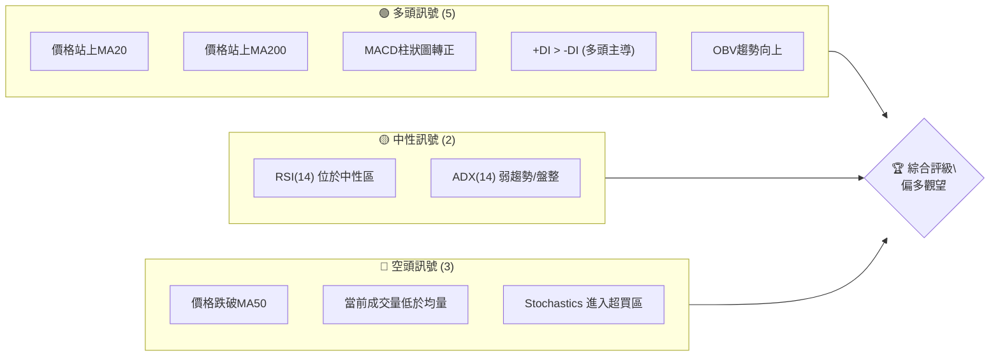

### 📊 核心指標速覽表

| 指標類別 | 指標名稱 | 當前數值 | 訊號 | 解讀 |
|----------|----------|----------|------|------|
| **價格** | 當前價格 | $245.98 | 🟡 | 位於52週區間中上部，近期反彈 |
| **均線** | MA20 | $239.76 | 🟢 | 價格位於MA20上方，短期偏多 |
| **均線** | MA50 | $255.01 | 🔴 | 價格位於MA50下方，中期受壓 |
| **均線** | MA200 | $233.10 | 🟢 | 價格位於MA200上方，長期趨勢向上 |
| **動能** | RSI(14) | 49.97 | 🟡 | 中性區間，未超買超賣 |
| **動能** | MACD | +1.620 (Hist) | 🟢 | MACD柱狀圖轉正，動能轉強 |
| **動能** | Stoch %K | 84.56 | 🔴 | 進入超買區，短線回調風險 |
| **波動** | ATR(14) | $8.23 | 🟡 | 日均波動約3.34%，波動適中偏高 |
| **趨勢** | ADX(14) | 24.66 | 🟡 | 趨勢強度不足25，處於弱趨勢/盤整 |
| **成交量** | 量比 (vs 20日) | 0.64x | 🔴 | 成交量顯著萎縮，量能不足 |
| **成交量** | OBV趨勢 | OBV > MA | 🟢 | 量能支撐近期反彈走勢 |

### 🏆 技術評分卡

AMZN 的技術面評分顯示，儘管短期動能強勁且長期趨勢仍為多頭，但中期壓力、趨勢強度不足及成交量萎縮是主要顧慮。

╔════════════════════════════════════════════════════════════════════════════════════════╗
║                                技術評分卡 — AMZN (2026-07-07)                               ║
╠════════════════════════════════════════════════════════════════════════════════════════╣
║ 趨勢強度      ████████░░░░░░░░░░░░  40/100  🟡 (ADX顯示弱趨勢，但多頭主導)                 ║
║ 動能指標      ██████████░░░░░░░░░░  60/100  🟡 (MACD轉強，RSI中性，Stoch超買)              ║
║ 支撐穩定度    ██████████████░░░░░░  70/100  🟢 (MA20、MA200、布林中軌提供多重支撐)         ║
║ 成交量配合    ████████░░░░░░░░░░░░  45/100  🟡 (OBV支持，但近期成交量萎縮)                 ║
║ 形態完整度    ██████████░░░░░░░░░░  65/100  🟡 (近期呈現V型反轉，但未形成明確突破形態)      ║
║ 均線排列      ████████░░░░░░░░░░░░  55/100  🟡 (短期均線向上，但受阻於中期均線，排列混合)   ║
╠════════════════════════════════════════════════════════════════════════════════════════╣
║ 綜合評分      ██████████░░░░░░░░░░  60/100  🟡 偏多觀望 (短期反彈具動能，但中期壓力仍存)    ║
╚════════════════════════════════════════════════════════════════════════════════════════╝

---

## 2. 趨勢分析

### 🌐 多時框趨勢分析

AMZN 的多時框架分析顯示，長期趨勢保持強勁，但中期經歷了調整，目前短期正處於從底部反彈的過程中。

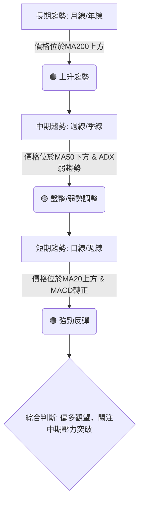

**長期趨勢 (月線/年線)**：
AMZN 股價自2024年低點後，一直維持在200日移動平均線（MA200）之上，顯示其長期上升趨勢未變。儘管近期經歷了數月的調整，但整體結構依然健康。MA200位於 $233.10，當前價格 $245.98 遠高於此，確認了長期多頭格局。

**中期趨勢 (週線/季線)**：
從2026年5月高點 $272.68 開始，AMZN 股價跌破了 MA50 ($255.01) 和 MA60 ($253.92)，進入中期調整階段。雖然 ADX 顯示趨勢強度不足，但 +DI 高於 -DI 表明多頭力量仍佔優勢。目前股價正嘗試挑戰中期均線的阻力。

**短期趨勢 (日線/週線)**：
股價從2026年6月底的低點 $232.69 展開了強勁反彈，連續站上 MA5 ($242.57)、MA10 ($238.11) 和 MA20 ($239.76)，所有短期均線呈現多頭排列。MACD 柱狀圖轉正，顯示動能快速恢復，但 Stochastics 進入超買區，提示短期可能面臨技術性回調。

### 📈 長期趨勢 — 12個月走勢圖（Unicode）

以下為 AMZN 過去12個月的月線收盤價格走勢圖，標示了關鍵的高點和低點。

```
AMZN 月線走勢圖（過去12個月：2025-07 至 2026-07）
價格軸 ($)
$278.56 ┤                                    ●(52W高點 278.56)
$270.00 ┤                                  ●
$260.00 ┤                                ●
$250.00 ┤                   ●        ●   ●
$245.98 ┤●━━━━━━━━━━━━━━━━━━━━━━━●←現在收盤價
$240.00 ┤  ●          ●    ●  ●
$230.00 ┤    ● ● ●     ●
$220.00 ┤      ●
$210.00 ┤        ●
$200.00 ┤          ●(52W低點 196.00)
     └─────────────────────────────────────────────────────
      25/07 25/08 25/09 25/10 25/11 25/12 26/01 26/02 26/03 26/04 26/05 26/06 26/07
```

**走勢特徵分析表格**：

| 階段 | 時間區間 | 主要特徵 | 漲跌幅 (約) | 關鍵價位 |
|------|----------|----------|------------|----------|
| **上升趨勢初期** | 2025-07 ~ 2025-10 | 股價穩步上漲，突破多重阻力，量能配合良好。 | +25% ($234.11 → $244.22) | 2025-07低點: $234.11, 2025-10高點: $244.22 |
| **短期回調** | 2025-11 ~ 2025-12 | 進入震盪整理，小幅回調，但仍維持在高位。 | -5% ($244.22 → $230.82) | 2025-12低點: $230.82 |
| **再度衝高** | 2026-01 ~ 2026-05 | 經歷一波強勁拉升，創下年內新高，隨後出現快速回調。 | +17% ($230.82 → $272.68) | 2026-05高點: $272.68, 52W高點: $278.56 |
| **深度調整** | 2026-05 ~ 2026-06 | 股價快速下跌，跌破關鍵中期支撐，成交量放大。 | -14% ($272.68 → $232.69) | 2026-06低點: $232.69 |
| **底部反彈** | 2026-06 ~ 2026-07 | 從低點強勁反彈，重回短期均線上方。 | +5.7% ($232.69 → $245.98) | 當前價格: $245.98 |

### 📊 中期趨勢（週線分析）

從近20週的週線數據來看，AMZN 在2026年4月達到高潮，隨後進入了為期約8週的調整期。近期則從底部強勁反彈。

```
AMZN 近期壓力與支撐示意圖 (週線視角)
════════════════════════════════════════════════════════════
$272.68 ┤  R3 (歷史高點)
$266.32 ┤  R2 (近期反彈受阻點)
$255.01 ┤  R1 (MA50阻力)
        ├────────────────────────────────────────────────────
$245.98 ┤  ● (當前價格)
        ├────────────────────────────────────────────────────
$239.76 ┤  S1 (MA20支撐)
$232.69 ┤  S2 (近期低點/強支撐)
$210.00 ┤  S3 (前次底部)
════════════════════════════════════════════════════════════
```
**分析**：
在2026年4月至5月期間，AMZN 股價達到 $272.68 的高點，隨後展開一波下跌，最低觸及 $232.69。此波下跌幅度較大，顯示中期壓力較重。目前股價在 $232.69 獲得支撐後，已成功反彈並站穩短期均線上方。然而，上方的 MA50 ($255.01) 和近期反彈高點 $266.32 構成強大阻力。若能有效突破這些阻力，中期趨勢有望轉強。

### ⚡ 趨勢強度評估（ADX 解讀）

ADX 指標用於衡量趨勢的強度，而非方向。AMZN 的 ADX 指標當前數值為 24.66，顯示趨勢強度屬於弱勢區間，暗示市場可能處於盤整或弱趨勢狀態。

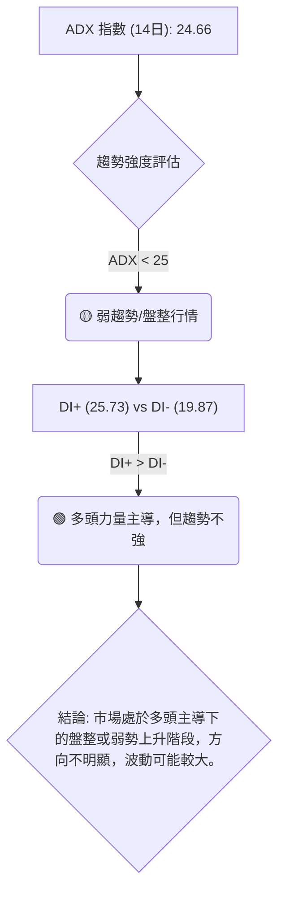

**ADX 強度對照表**：

| ADX 數值 | 趨勢強度 | 市場狀態 |
|----------|----------|----------|
| 0-25     | 弱趨勢   | 盤整或震盪 |
| 25-50    | 中等趨勢 | 趨勢形成中或持續中 |
| 50-75    | 強趨勢   | 趨勢強勁 |
| 75-100   | 極強趨勢 | 趨勢極度強勁，可能過熱 |

**綜合解讀**：
儘管 ADX 數值處於弱勢區間 (24.66)，但 +DI (25.73) 明顯高於 -DI (19.87)，這表明雖然整體趨勢不夠強勁，但市場目前仍由多頭力量主導。這意味著 AMZN 股價可能在一個較為寬廣的區間內震盪上行，或者在積蓄力量以準備下一波趨勢行情。投資者應警惕在弱勢趨勢中追漲殺跌，等待趨勢明確後再行動。

---

## 3. 圖表形態分析

### 🔍 形態識別系統

從提供的24個月歷史數據和近20週的週線數據來看，AMZN 股價在近期形成了一個潛在的 V 型反轉或小型 W 底形態。

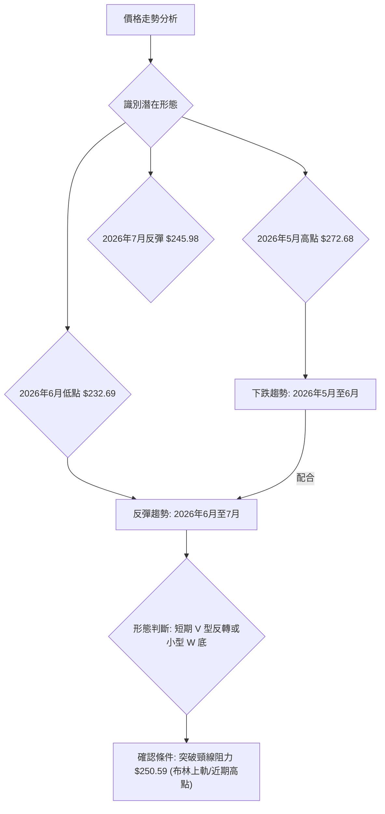

**形態分析**：
AMZN 股價在2026年5月達到相對高點 $272.68 後，經歷了快速且幅度較大的下跌，至2026年6月28日觸及 $232.69 的低點。隨後，股價迅速反彈，目前已回到 $245.98。這種「急跌急漲」的走勢，在形態上可以視為一個短期內的 V 型反轉。如果股價能在 $232.69 附近形成第二個底部並再次上攻，則會構成一個 W 底形態。目前來看，反彈動能較強，但尚未突破關鍵阻力位以確認 V 型反轉的持續性。

### 🕯️ 重要K線形態分析

分析近期的週線 K 線形態，可以發現多頭力量的顯著回歸。

| 月份 | 收盤價 | K線形態 | 解讀 | 訊號 |
|------|--------|---------|------|------|
| 2026-06-21 | $244.39 | 長下影線陽線 | 價格在低位獲得支撐，多頭嘗試反攻，但收盤漲幅有限。 | 🟡 |
| 2026-06-28 | $232.69 | 長陰線 | 雖有反彈，但最終收盤大幅下跌，空頭力量強勁，創下近期新低。 | 🔴 |
| 2026-07-05 | $242.67 | 大陽線 (吞噬前週陰線) | 股價從低點強勢反彈，完全吞噬前一週的下跌，顯示強勁的買盤介入。這是一個看漲的吞噬形態。 | 🟢 |
| 2026-07-12 | $245.98 | 中陽線 | 延續上週漲勢，收盤價再次上漲，但成交量未能放大，顯示上攻動能可能有所減弱。 | 🟢 |

**綜合分析**：
2026年6月28日的長陰線觸及 $232.69 的近期低點，顯示空頭力量的最終釋放。隨後，2026年7月5日出現的「大陽線」或「看漲吞噬」形態，強勢逆轉了前期的跌勢，是短期見底反轉的強烈訊號。本週 (2026-07-12) 的中陽線延續了反彈，但成交量萎縮，需要關注後續量能是否能配合股價上漲。

### 📉 ASCII 走勢形態示意圖

以下為 AMZN 近期 V 型反轉形態的示意圖：

```
AMZN 近期 V 型反轉形態示意圖
════════════════════════════════════════════════════════════
$272.68 ┤               ● (高點)
$260.00 ┤              ╱╲
$250.00 ┤             ╱  ╲
$245.98 ┤            ╱    ● (當前價格)
$240.00 ┤           ╱      ╱
$230.00 ┤          ╱      ╱
$220.00 ┤         ●─────── (低點/潛在支撐 $232.69)
     └────────────────────────────────────────────────────
      時間軸
```
**分析**：
圖中顯示股價從高點迅速下跌至低點，隨後快速反彈。這種 V 型反轉形態通常發生在市場情緒快速轉變時，表明買盤在低位迅速介入，阻止了跌勢並啟動了反彈。此形態的關鍵在於反彈的持續性和能否突破前期的重要阻力位。

### 🎯 形態目標價計算

基於近期從 $272.68 高點到 $232.69 低點的下跌，以及隨後的 V 型反轉，我們可以嘗試計算潛在的反彈目標價。

**形態基礎**：V 型反轉或潛在 W 底
*   高點 (H)：$272.68 (2026-05-10)
*   低點 (L)：$232.69 (2026-06-28)
*   反彈幅度 (R)：$272.68 - $232.69 = $39.99

**計算方法**：
V 型反轉的目標價通常是從形態低點向上，至少複製下跌幅度的某個百分比，或者完全複製整個下跌幅度。對於 W 底形態，其目標價通常是從頸線向上，加上形態的高度。
在此我們以 V 型反轉的恢復性目標價作為參考，同時結合斐波那契回調位。

1.  **斐波那契回調位 (基於 $272.68 → $232.69 的下跌)**：
    *   38.2% 回調：$232.69 + ($39.99 * 0.382) = **$247.96**
    *   50% 回調：$232.69 + ($39.99 * 0.50) = **$252.68**
    *   61.8% 回調：$232.69 + ($39.99 * 0.618) = **$257.39**

2.  **V 型反轉潛在目標**：
    如果反轉持續，股價有望至少挑戰下跌過程中的重要阻力位。
    *   **目標價 T1**：$250.59 (布林上軌，接近斐波那契50%回調位及MA50)
    *   **目標價 T2**：$257.39 (斐波那契61.8%回調位)
    *   **目標價 T3 (完全回補)**：$272.68 (前期高點)

**結論**：
目前股價已接近斐波那契38.2%回調位 $247.96。若能站穩此處並有效突破 $250.59 的短期阻力，則下一目標將是 $252.68 和 $257.39。然而，由於成交量未能放大，形態的持續性仍需觀察。

---

## 4. 支撐與阻力

### 🗺️ 關鍵價位分布圖（Unicode）

AMZN 的當前價格 $245.98 位於近期反彈的關鍵位置，上方阻力重重，下方有多重支撐。

```
AMZN 價位結構分布圖 (2026-07-07)
════════════════════════════════════════════════════════════
$278.56 ║████████████████████████║ 強阻力 R3 (52週高點)
$272.68 ║████████████████████    ║ 阻力 R2 (2026年5月高點)
$255.01 ║████████████████████████║ 關鍵阻力 R1 (MA50)
$250.59 ║████████████████████    ║ 近期阻力 (布林上軌)
$245.98 ╠════════════════════════╣ ◄ 現價
$239.76 ║▓▓▓▓▓▓▓▓▓▓▓▓▓▓▓▓        ║ 近期支撐 S1 (MA20 / 布林中軌)
$233.10 ║████████████████████████║ 強支撐 S2 (MA200)
$228.93 ║▓▓▓▓▓▓▓▓▓▓▓▓▓▓▓▓        ║ 支撐 S3 (布林下軌)
$207.00 ║████████████████████████║ 極強支撐 S4 (分析師低目標)
════════════════════════════════════════════════════════════
```

### 🚧 阻力位分析表

| 阻力級別 | 價位 | 形成原因 | 突破難度 | 重要性 |
|----------|------|----------|----------|--------|
| **R1**   | $250.59 | 布林通道上軌，短期反彈的自然壓力，也是斐波那契38.2%回調位附近。 | 中等偏高 | 🟡 |
| **R2**   | $255.01 | 50日移動平均線 (MA50)，中期趨勢的關鍵分水嶺，也是斐波那契50%回調位附近。 | 高       | 🔴 |
| **R3**   | $272.68 | 2026年5月歷史高點，大量套牢籌碼區，突破需極大買盤。 | 極高     | 🔴 |
| **R4**   | $278.56 | 52週高點，最高阻力。 | 極高     | 🔴 |

**分析**：
AMZN 目前面臨 $250.59 和 $255.01 的雙重阻力。突破 $250.59 (布林上軌) 將有助於測試 $255.01 (MA50)。MA50 是中期趨勢的關鍵阻力，若能帶量突破並站穩其上，將意味著中期趨勢的轉強。然而，前高 $272.68 構成極強的心理和實際阻力，需要更強勁的催化劑和成交量才能突破。

### 🛡️ 支撐位分析表

| 支撐級別 | 價位 | 形成原因 | 守住機率 | 重要性 |
|----------|------|----------|----------|--------|
| **S1**   | $239.76 | 20日移動平均線 (MA20) 及布林通道中軌，近期反彈的第一道防線。 | 中等偏高 | 🟢 |
| **S2**   | $233.10 | 200日移動平均線 (MA200)，長期趨勢的生命線，也是近期低點 $232.69 附近。 | 高       | 🟢 |
| **S3**   | $228.93 | 布林通道下軌，極端情況下的技術支撐。 | 中等     | 🟡 |
| **S4**   | $207.00 | 分析師最低目標價，歷史支撐區。 | 極高     | 🟢 |

**分析**：
當前價格 $245.98 上方有阻力，下方則有 MA20 ($239.76) 和 MA200 ($233.10) 的雙重支撐。MA200 的支撐尤為重要，因為它代表著長期趨勢的健康。近期低點 $232.69 接近 MA200，形成了強大的心理和技術支撐。只要股價能守住 MA200，長期多頭格局就不會改變。

### 📐 斐波那契回調位分析

我們以2026年5月10日高點 $272.68 到2026年6月28日低點 $232.69 作為下跌波段，計算其反彈的斐波那契回調位。

*   **下跌波段 (H-L)**: $272.68 - $232.69 = $39.99

| 回調級別 | 計算公式 | 價位 | 意義 | 視覺化 |
|----------|----------|------|------|--------|
| **23.6%**| $232.69 + ($39.99 * 0.236) | **$242.13** | 短期反彈的第一個阻力位，目前已突破。 | ▓▓▓▓▓▓▓▓▓▓▓▓▓▓▓▓▓▓▓▓░░░░░░░░░░ |
| **38.2%**| $232.69 + ($39.99 * 0.382) | **$247.96** | 重要的反彈阻力，若突破則反彈動能增強。 | ▓▓▓▓▓▓▓▓▓▓▓▓▓▓▓▓▓▓▓▓▓▓▓▓▓▓▓▓░░ |
| **50%**  | $232.69 + ($39.99 * 0.500) | **$252.68** | 心理關卡，通常是反彈的強阻力區。 | ▓▓▓▓▓▓▓▓▓▓▓▓▓▓▓▓▓▓▓▓▓▓▓▓▓▓▓▓▓▓▓▓▓▓▓▓▓▓░░ |
| **61.8%**| $232.69 + ($39.99 * 0.618) | **$257.39** | 黃金分割點，若能突破此處，則趨勢可能反轉。 | ▓▓▓▓▓▓▓▓▓▓▓▓▓▓▓▓▓▓▓▓▓▓▓▓▓▓▓▓▓▓▓▓▓▓▓▓▓▓▓▓▓▓▓▓▓▓▓▓░░ |
| **76.4%**| $232.69 + ($39.99 * 0.764) | **$263.22** | 反彈接近完成，可能重新測試高點。 | ▓▓▓▓▓▓▓▓▓▓▓▓▓▓▓▓▓▓▓▓▓▓▓▓▓▓▓▓▓▓▓▓▓▓▓▓▓▓▓▓▓▓▓▓▓▓▓▓▓▓▓▓▓▓▓▓▓▓▓▓░░ |

**當前價格 $245.98 位於 23.6% 和 38.2% 回調位之間**。這表明股價正處於反彈的早期階段，並嘗試挑戰 38.2% 回調位。若能成功突破 $247.96，則有望進一步測試 50% 和 61.8% 的回調位，這也與 MA50 和布林上軌等阻力位相吻合，形成多重阻力區。

---

## 5. 技術指標深度解讀

### 🎛️ 指標訊號總覽

以下 Mermaid 圖表展示了 AMZN 各主要技術指標之間的訊號關係及綜合判斷。

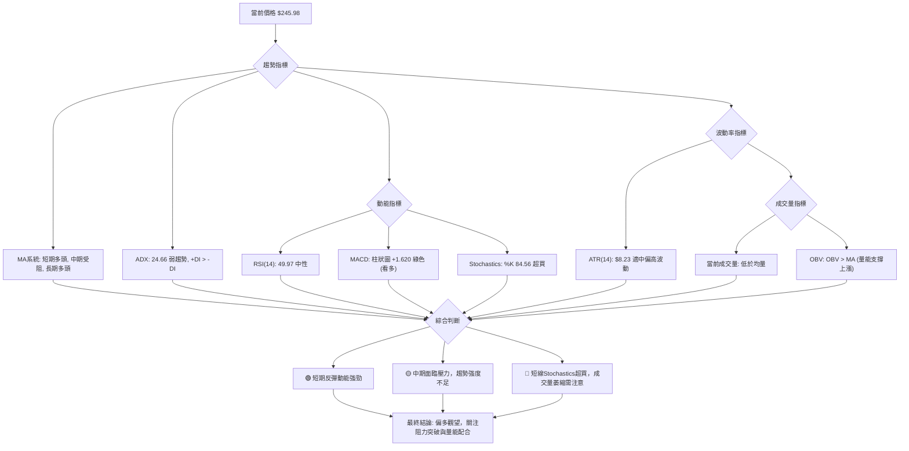

### 📈 移動平均線排列分析

AMZN 的移動平均線系統呈現混合排列，短期均線向上預示反彈，但中期均線仍構成壓力。

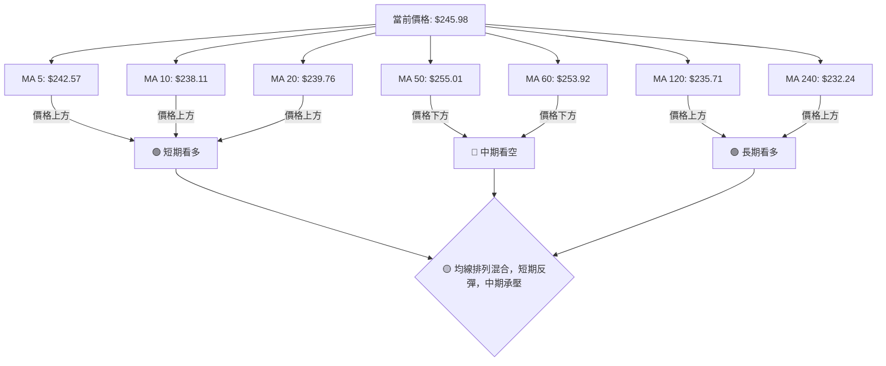
**詳細分析**：
*   **短期均線 (MA5, MA10, MA20)**：當前價格 $245.98 位於所有短期均線之上，且 MA5 ($242.57)、MA10 ($238.11) 和 MA20 ($239.76) 均呈現向上趨勢，形成短期多頭排列，顯示股價正在強勁反彈。
*   **中期均線 (MA50, MA60)**：價格 $245.98 位於 MA50 ($255.01) 和 MA60 ($253.92) 之下，這兩條均線仍構成重要的中期阻力。若要確認中期趨勢轉強，股價必須有效突破並站穩這些中期均線。
*   **長期均線 (MA120, MA240)**：價格 $245.98 位於 MA120 ($235.71) 和 MA240 ($232.24) 之上，且這些長期均線保持向上趨勢，確認 AMZN 的長期上升趨勢依然健康。

**綜合判斷**：
均線系統顯示短期反彈動能強勁，但中期壓力尚存。股價能否突破 MA50 是判斷中期走勢的關鍵。

### 📉 RSI(14) 分析

RSI(14) 數值為 49.97，位於中性區間 (30-70)。

**RSI 數值進度條展示**：
RSI(14) 49.97: ▓▓▓▓▓▓▓▓▓▓▓▓▓▓▓▓▓▓▓▓▓▓▓▓░░░░░░░░░░░░░░░░░░░░░░░░░░ 49.97%

**超買超賣區間分析**：
*   **超買區 (RSI > 70)**：指標顯示資產被過度買入，可能面臨回調。
*   **超賣區 (RSI < 30)**：指標顯示資產被過度賣出，可能面臨反彈。
當前 RSI 49.97 位於中性區間，表明市場情緒相對平衡，既無明顯超買也無明顯超賣。然而，從近20週數據看，RSI 從2026年6月14日的超賣區 26.8 迅速回升至中性區間，顯示買盤力量的快速介入。

**背離判斷 (頂背離/底背離)**：
根據提供的數據，**無明顯背離現象**。
*   **頂背離**：價格創新高，但 RSI 未創新高，暗示上漲動能減弱，可能反轉下跌。
*   **底背離**：價格創新低，但 RSI 未創新低，暗示下跌動能減弱，可能反轉上漲。
雖然數據未明確指出背離，但從2026年5月高點 $272.68 時 RSI 達到 79.6 (超買)，而2026年4月高點 $263.99 時 RSI 達到 94.6，這可能暗示了潛在的動能減弱，但由於價格持續上漲，嚴格意義上的頂背離未形成。目前 RSI 處於中性區間，沒有顯示出明確的背離訊號。

**綜合解讀**：
RSI 位於中性區，但從超賣區迅速回升，確認了短期反彈的動能。然而，由於未進入超買區，RSI 尚未發出過熱警示，但需與 Stochastics 結合判斷。

### 📊 MACD(12/26/9) 訊號解讀

MACD 指標當前數值為：
*   MACD 線 (DIF): -2.955
*   訊號線 (DEA): -4.574
*   MACD 柱狀圖 (Histogram): +1.620

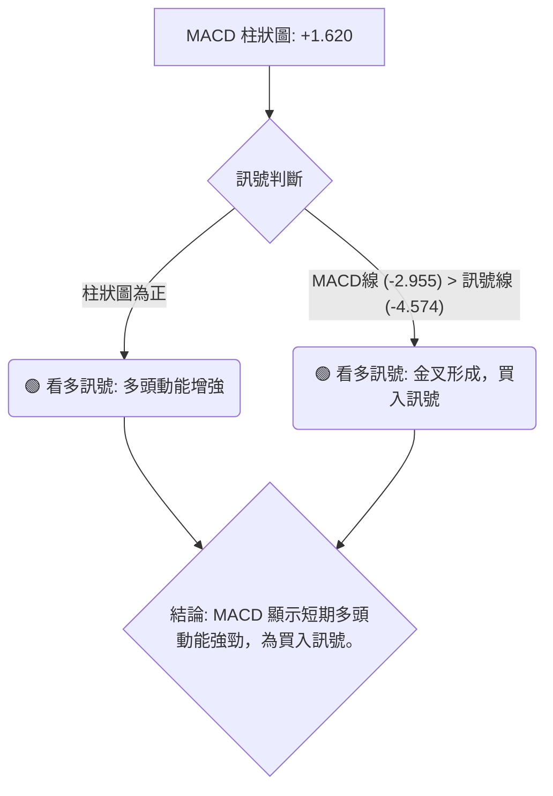

**詳細分析**：
*   **MACD 柱狀圖轉正**：MACD 柱狀圖從負值轉為正值 (+1.620)，且持續放大，顯示空頭力量減弱，多頭力量開始佔據上風，這是一個強烈的看多訊號，確認了股價的短期反彈動能。
*   **MACD 線與訊號線**：MACD 線 (-2.955) 已經向上穿越訊號線 (-4.574)，形成「黃金交叉」。這通常被視為一個買入訊號，表示短期趨勢正在轉強，動能由空轉多。
*   **歷史數據回顧**：從近20週數據來看，MACD 柱狀圖在2026年6月14日達到低點 -3.408，隨後逐步縮小負值並在2026年7月5日轉正 (+0.916)，至本週進一步放大到 +1.620，完美印證了底部反彈的過程。

**綜合解讀**：
MACD 指標發出明確的看多訊號，柱狀圖轉正和黃金交叉的形成都支持當前的反彈走勢。這與短期均線的多頭排列相互確認，進一步增強了短期看漲的信心。

### 📦 布林通道分析

布林通道由三條線組成：上軌、中軌 (MA20) 和下軌。它主要用於衡量股價的波動範圍和相對位置。

```
AMZN 布林通道示意圖 (2026-07-07)
════════════════════════════════════════════════════════════
$250.59 ║████████████████████████║ ← 布林通道上軌 (Upper Band)
        ║                      ╱ ▓
$245.98 ║                     ●  ▓ ← 現價 $245.98 (位於上軌附近)
        ║                    ╱   ▓
$239.76 ║████████████████████████║ ← 布林通道中軌 (MA20)
        ║                   ╲    ▓
        ║                    ╲   ▓
$228.93 ║████████████████████████║ ← 布林通道下軌 (Lower Band)
════════════════════════════════════════════════════════════
```
**詳細分析**：
*   **布林上軌**: $250.59
*   **布林中軌 (MA20)**: $239.76
*   **布林下軌**: $228.93
*   **當前價格**: $245.98
*   **%B 值**: 0.79 (0=下軌, 0.5=中軌, 1=上軌)

**解讀**：
當前價格 $245.98 位於布林通道中軌和上軌之間，且非常接近上軌，其 %B 值為 0.79，顯示股價處於通道的上半部分，並且正在向著上軌壓力位靠攏。
*   **通道收窄/擴張**：數據未直接提供通道寬度變化，但近期價格從低點反彈，通常會伴隨通道的收窄後擴張。如果通道開始擴張，且股價沿上軌運行，則預示著強勁的上升趨勢。
*   **價格觸及上軌**：價格接近上軌通常被視為短期超買或面臨阻力。如果股價能夠突破上軌並在上軌之上運行，則預示著強烈的上升動能。然而，如果股價觸及上軌後受阻回落，則可能回到中軌附近尋求支撐。

**綜合判斷**：
布林通道顯示股價短期動能強勁，但即將觸及上軌阻力。這與 Stochastics 的超買訊號相互印證，提示短期可能面臨回調壓力。

### 💹 成交量分析（量價配合度）

成交量是確認價格走勢的重要指標。

*   **最新成交量**: 40,399,011
*   **20日均量**: 62,915,901 (量比: 0.64x)
*   **50日均量**: 52,017,320
*   **OBV趨勢**: OBV > MA (量能支撐上漲)

**詳細分析**：
*   **量比不足**：當前成交量 40,399,011 明顯低於20日均量 (62,915,901) 和50日均量 (52,017,320)，量比僅為 0.64x。這表明在當前股價反彈的過程中，市場的參與度不高，買盤的積極性有所欠缺。在缺乏成交量配合的情況下，價格的反彈可能難以持續，或者容易遭遇阻力。
*   **OBV趨勢**：然而，OBV (On-Balance Volume) 趨勢顯示 OBV 線高於其移動平均線 (OBV > MA)，這是一個看多訊號。OBV 衡量的是累積的買賣壓力，OBV 上升表明買入壓力大於賣出壓力，支持價格上漲。雖然當前單日成交量萎縮，但 OBV 的整體趨勢向上，說明在過去一段時間內，累積的買盤力量仍然強勁，支撐了從低點的反彈。
*   **量價背離**：當前價格反彈，但成交量萎縮，這構成了一種潛在的「量價背離」現象。通常，健康的上升趨勢應伴隨成交量的放大，以確認買盤的積極性。如果價格持續上漲而成交量未能跟隨放大，則可能預示著反彈的動能不足，或隨時可能反轉。

**綜合判斷**：
OBV 趨勢支持當前的反彈，但近期成交量的萎縮是一個警訊。這表明當前的反彈可能缺乏足夠的市場共識，需要觀察後續成交量能否有效放大以確認反彈的持續性。若反彈至關鍵阻力區仍無量能配合，則回調風險將增加。

---

## 6. 動能與波動率

### ⚡ 動能評估四象限

本節將 AMZN 的動能強度和波動率進行評估，以判斷其當前的市場狀態。

| 象限 | 動能 (RSI, MACD) | 波動 (ATR) | 當前狀態 | 評估 |
|------|------------------|------------|----------|------|
| Q1   | 強               | 低         | **無**   | 最佳機會 (強勢股，穩定上漲) |
| Q2   | 弱               | 低         | **無**   | 謹慎觀望 (盤整，等待方向) |
| Q3   | 強               | 高         | **✓**    | 高風險高收益 (快速反彈，但波動大) |
| Q4   | 弱               | 高         | **無**   | 避免進場 (方向不明，風險高) |

**AMZN 當前評估**：
*   **動能**：MACD 柱狀圖轉正並放大，RSI 從超賣區快速回升至中性區，Stochastics 進入超買區。整體而言，短期動能呈現「強勁反彈」狀態，但 Stochastics 的超買提醒可能面臨短期回調。
*   **波動率**：ATR(14) 為 $8.23，佔當前價格 $245.98 的 3.34%。對於大型股而言，3.34% 的日均波動屬於「中等偏高」水平。

**結論**：
AMZN 目前處於 **Q3 (強動能，高波動)** 象限。這表示股價在經歷一波下跌後，正以較大的波動性進行強勁反彈。對於追求高回報的交易者而言，這可能提供機會，但同時也伴隨著較高的風險。這種狀態下，價格可能快速上漲，也可能隨時出現大幅回調，因此需要嚴格的風險控制和止損策略。

### 📊 ATR 波動率分析

平均真實波幅 (ATR) 衡量資產的波動性。AMZN 的 ATR(14) 為 $8.23。

**詳細分析**：
*   **ATR(14) 數值**: $8.23
*   **佔當前價格百分比**: ($8.23 / $245.98) * 100% = 3.34%

**解讀**：
3.34% 的日均波動對於 AMZN 這樣的大型科技股而言，屬於「中等偏高」的波動水平。這意味著在過去14天中，AMZN 的日均波幅約為 $8.23。
*   **高波動性影響**：高波動性意味著價格在短時間內可能出現較大的漲跌幅。這對於日內交易者而言可能提供更多機會，但對於波段交易或長期持有者而言，則增加了不確定性和風險。
*   **止損距離建議**：ATR 是設定止損點的有效工具。一般建議將止損點設置在當前價格下方 1.5 倍至 3 倍 ATR 的位置，以避免被短期波動「洗出場」。
    *   1.5 * ATR = 1.5 * $8.23 = $12.35
    *   2.0 * ATR = 2.0 * $8.23 = $16.46
    *   3.0 * ATR = 3.0 * $8.23 = $24.69
    因此，若以當前價格 $245.98 作為參考，一個合理的止損區間可能在 $245.98 - $12.35 = $233.63 至 $245.98 - $16.46 = $229.52 之間。這也與 MA200 ($233.10) 和布林下軌 ($228.93) 等關鍵支撐位吻合。

**綜合判斷**：
AMZN 的波動性較高，投資者應根據自身的風險承受能力和交易策略，合理設置止損點，並預留足夠的空間以應對市場的日常波動。

### 📐 Beta 與市場相關性

報告中未提供 AMZN 的 Beta 數值，因此無法進行精確的市場相關性分析。
然而，作為一家市值巨大的科技巨頭，AMZN 通常被視為成長型股票，其股價波動性預計會高於大盤 (Beta > 1)。在牛市中，AMZN 有望跑贏大盤；在熊市中，其跌幅也可能更大。

**一般假設** (若無提供數據，基於產業知識推斷)：
*   **Beta 預期**: 由於 AMZN 屬於科技和消費週期性行業，且具備成長屬性，其 Beta 值通常會大於 1，可能在 1.1 到 1.5 之間。
*   **相關性**：意味著 AMZN 的股價波動方向與整體市場 (如 S&P 500) 高度相關，但波動幅度更大。

**投資提示**：
若投資 AMZN，需同時關注大盤走勢。在市場風險偏好較高的環境下，AMZN 表現可能較好；反之，在市場情緒悲觀時，其回調壓力也可能較大。

---

## 7. 多時框架總結

對 AMZN 進行多時框架分析，有助於全面理解其當前走勢。

### 📋 時框架評分表

| 時框架 | 趨勢方向 | 動能 | 均線排列 | 形態 | 綜合評分 | 建議 |
|--------|----------|------|----------|------|----------|------|
| **短期** | 🟢 強勁反彈 | 🟢 強勁 (MACD, RSI回升) | 🟢 多頭排列 (MA5/10/20) | 🟢 V型反轉 | 8/10 🟢 | 偏多操作 |
| **中期** | 🟡 盤整承壓 | 🟡 恢復中 (MACD轉正) | 🔴 受阻 (價格低於MA50/60) | 🟡 底部構建中 | 6/10 🟡 | 觀望/逢低建倉 |
| **長期** | 🟢 上升趨勢 | 🟢 健康 | 🟢 多頭排列 (價格高於MA200) | 🟢 趨勢持續 | 9/10 🟢 | 長期持有 |

**詳細分析**：
*   **短期 (日線/週線)**：AMZN 正經歷強勁的反彈，MACD 和 RSI 均顯示動能轉強，短期均線形成多頭排列。V 型反轉形態也支持這種反彈。然而，Stochastics 已進入超買區，且成交量未放大，提示短期可能面臨技術性回調。
*   **中期 (週線/月線)**：股價仍受阻於 MA50 和 MA60，ADX 顯示趨勢強度不足，表明中期仍處於調整或盤整狀態。儘管底部正在構建中，但尚未突破關鍵阻力以確認中期趨勢轉強。
*   **長期 (月線/年線)**：股價穩居 MA200 之上，長期上升趨勢保持不變。基本面和產業前景依然看好，為長期投資提供了堅實基礎。

### 🔲 綜合訊號矩陣

此矩陣綜合了不同時框架的關鍵訊號，以評估整體市場情緒和趨勢一致性。

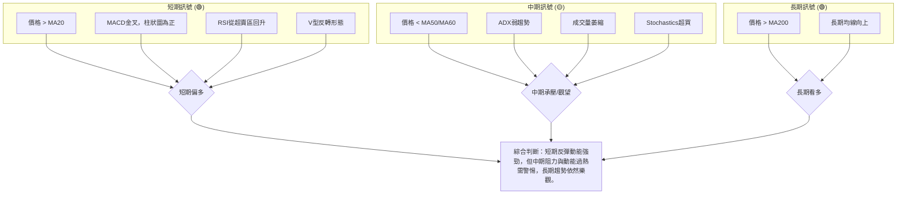

**結論**：
AMZN 的短期反彈動能強勁，為交易者提供了短期操作機會。然而，中期趨勢的阻力、ADX 顯示的弱趨勢以及成交量不足是需要警惕的因素。長期來看，AMZN 的上升趨勢仍保持健康。因此，目前的策略應是「**偏多觀望**」，在確保風險控制的前提下，把握短期反彈機會，但對中期壓力保持警惕，等待明確的突破訊號。

---

## 8. 交易策略建議

基於上述詳盡的技術分析，我們為 AMZN 提供以下交易策略建議。

### 🗺️ 策略決策流程圖

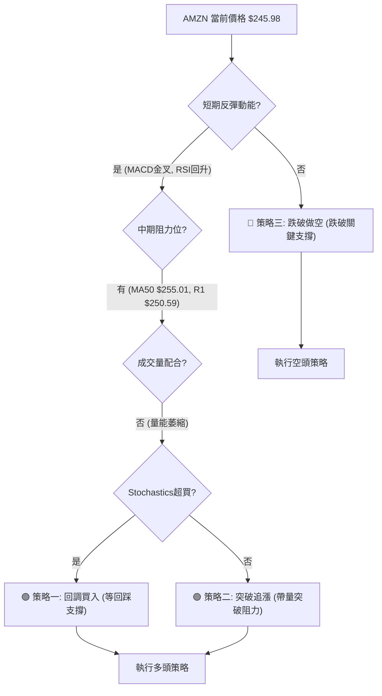

### 🟢 多頭策略詳情

考慮到短期反彈動能強勁但中期阻力重重且成交量萎縮，我們提供兩種多頭策略：

| 策略要素 | 策略 A：回調買入 (Buy the Dip) | 策略 B：突破追漲 (Breakout Play) |
|----------|--------------------------------|--------------------------------|
| **進場條件** | 股價回調至關鍵支撐位 $239.76 (MA20/布林中軌) 附近，並出現止跌訊號。 | 股價帶量突破 $250.59 (布林上軌) 和 $255.01 (MA50) 的雙重阻力。 |
| **進場價格** | 理想區間：$239.76 - $241.00 | 突破後追入：$255.50 - $256.50 (確認站穩 MA50) |
| **目標價 T1** | $250.59 (布林上軌/近期阻力) | $263.22 (斐波那契76.4%回調位) |
| **目標價 T2** | $255.01 (MA50/斐波那契50%回調位) | $272.68 (前期高點) |
| **止損價格** | $233.10 (MA200/關鍵長期支撐) | $250.00 (跌破MA50後的回踩確認失敗) |
| **風險報酬比** | (以進場 $240.00 為例) <br> T1: ($250.59-$240)/($240-$233.10) ≈ 1.53:1 <br> T2: ($255.01-$240)/($240-$233.10) ≈ 2.18:1 | (以進場 $256.00 為例) <br> T1: ($263.22-$256)/($256-$250) ≈ 1.20:1 <br> T2: ($272.68-$256)/($256-$250) ≈ 2.78:1 |
| **成功機率** | 65% (基於強勁支撐和反彈動能) | 55% (需強勁量能配合，突破阻力難度較高) |
| **建議倉位** | 中等偏高 (5-8%) | 中等 (3-5%) |

### 🔴 空頭策略詳情

若股價反彈受阻或跌破關鍵支撐，可考慮以下空頭策略：

| 策略要素 | 策略 C：反彈受阻做空 (Resistance Short) | 策略 D：跌破支撐做空 (Breakdown Short) |
|----------|------------------------------------|------------------------------------|
| **進場條件** | 股價在 $250.59 - $255.01 阻力區間內出現明顯受阻訊號 (如長上影線、陰線吞噬)，且成交量放大。 | 股價跌破 $239.76 (MA20/布林中軌) 和 $233.10 (MA200/關鍵長期支撐) 的雙重支撐。 |
| **進場價格** | 理想區間：$253.00 - $254.50 (確認受阻) | 跌破後追空：$232.50 - $231.50 (確認跌破 MA200) |
| **目標價 T1** | $239.76 (MA20/布林中軌) | $228.93 (布林下軌) |
| **目標價 T2** | $233.10 (MA200/關鍵長期支撐) | $207.00 (分析師低目標) |
| **止損價格** | $257.00 (突破 MA50 失敗後反彈) | $239.76 (未能有效跌破 MA200，重新站上 MA20) |
| **風險報酬比** | (以進場 $254.00 為例) <br> T1: ($254-$239.76)/($257-$254) ≈ 4.75:1 <br> T2: ($254-$233.10)/($257-$254) ≈ 6.97:1 | (以進場 $232.00 為例) <br> T1: ($232-$228.93)/($239.76-$232) ≈ 0.40:1 <br> T2: ($232-$207)/($239.76-$232) ≈ 3.20:1 |
| **成功機率** | 60% (基於中期阻力壓力) | 40% (MA200為強支撐，跌破難度較高) |
| **建議倉位** | 中等 (3-5%) | 輕倉 (1-3%) |

### ⭐ 整體訊號強度評星

綜合多時框架分析與交易策略，AMZN 當前的整體訊號強度如下：

```
做多訊號強度：★★★★☆  (4/5星) 🟢 (短期動能強勁，長期趨勢健康，回調買入機會較好)
做空訊號強度：★★☆☆☆  (2/5星) 🔴 (中期阻力提供做空機會，但長期趨勢仍為多頭，風險較高)
整體可信度：  ★★★☆☆  (3/5星) 🟡 (多空交織，需謹慎選擇策略並嚴格止損)
```

---

## 9. 風險提示與監控

### ✅ 關鍵監控指標 Checklist

為了有效管理交易風險，以下是 AMZN 交易中需要密切關注的關鍵指標清單：

╔════════════════════════════════════════════════════════════════════════════════════════╗
║                                AMZN 關鍵監控指標 Checklist                                 ║
╠════════════════════════════════════════════════════════════════════════════════════════╣
║ ✅ **價格行為**                                                                             ║
║ ├─ 股價是否能站穩 $239.76 (MA20)？                                                        ║
║ ├─ 股價能否帶量突破 $250.59 (布林上軌) 及 $255.01 (MA50)？                                 ║
║ ├─ 是否跌破 $233.10 (MA200) 關鍵長期支撐？                                               ║
║                                                                                            ║
║ ✅ **成交量動態**                                                                           ║
║ ├─ 股價上漲時成交量是否能放大？                                                           ║
║ ├─ 股價回調時成交量是否萎縮？                                                             ║
║ ├─ OBV 趨勢是否持續向上？                                                                 ║
║                                                                                            ║
║ ✅ **動能指標**                                                                             ║
║ ├─ MACD 柱狀圖是否持續為正且放大？                                                        ║
║ ├─ RSI 是否進入超買區 (>70) 並出現回落？                                                  ║
║ ├─ Stochastics 超買區是否出現死叉？                                                       ║
║                                                                                            ║
║ ✅ **趨勢強度**                                                                             ║
║ ├─ ADX 是否突破 25 並向上，確認趨勢形成？                                                 ║
║ ├─ +DI 與 -DI 的相對位置是否發生變化？                                                    ║
║                                                                                            ║
║ ✅ **市場情緒與新聞**                                                                       ║
║ ├─ 關注大盤走勢 (S&P 500, Nasdaq)                                                         ║
║ ├─ 關注 AMZN 相關的財報、新聞公告 (如 AWS 增長、電商數據)                                  ║
╚════════════════════════════════════════════════════════════════════════════════════════╝

### ⚠️ 風險場景分析

針對 AMZN 當前走勢，可能出現以下三種情境：

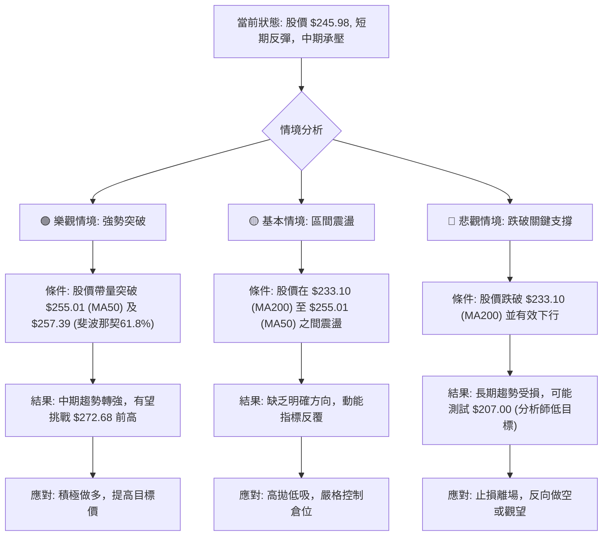

**詳細分析**：
*   **樂觀情境**：若 AMZN 能在未來幾週內，在放大成交量的配合下，成功突破 $255.01 (MA50) 和 $257.39 (斐波那契61.8%回調位)，則中期趨勢將全面轉強，有望重新挑戰甚至突破 $272.68 的前高點。此時，做多策略將獲得更強的確認。
*   **基本情境**：股價在短期反彈後，受阻於 $250.59 - $255.01 阻力區間，但同時在 $233.10 (MA200) 附近獲得支撐，形成一個較寬的區間震盪。此時市場缺乏明確方向，多空力量拉鋸，動能指標會反覆。交易策略應以高拋低吸為主，並嚴格控制倉位。
*   **悲觀情境**：如果反彈動能耗盡，股價未能突破阻力反而跌破 $239.76 (MA20) 和 $233.10 (MA200) 的關鍵支撐，並伴隨成交量放大，則長期上升趨勢將面臨考驗。此時可能觸發止損，甚至考慮反向做空，目標看向 $228.93 (布林下軌) 甚至 $207.00 (分析師低目標)。

### 🛡️ 風險管理重要提醒

1.  **倉位管理**：無論採取何種策略，都應嚴格控制單筆交易的倉位，建議不超過總資金的 5-8%。在不確定性較高的情況下，應降低倉位。
2.  **嚴格止損**：設定並嚴格執行止損點。一旦價格觸及止損位，應果斷離場，避免虧損擴大。切勿在虧損情況下盲目加倉。
3.  **分批建倉/平倉**：可以考慮分批建倉，以平攤成本；分批平倉，以鎖定利潤。
4.  **動態調整**：市場狀況瞬息萬變，應根據最新的價格行為、成交量及指標變化，動態調整交易策略和目標價。
5.  **結合基本面**：雖然本報告專注技術分析，但投資者仍應關注 AMZN 的基本面變化，如財報、AWS 業務增長、宏觀經濟環境等，這些因素可能對股價產生重大影響。
6.  **避免過度交易**：在盤整或弱趨勢行情中，過度交易容易造成虧損。耐心等待明確的交易訊號。

---

## 📋 報告總結

```
AMZN 技術分析報告總結
════════════════════════════════════════════════════════════════════════════════════════
報告日期：2026-07-07
當前價格：$245.98
分析評級：⚖️ 偏多觀望 (短期反彈動能強勁，但中期阻力與動能過熱需警惕，長期趨勢依然樂觀。)

關鍵結論：
├─ 長期趨勢：🟢 上升趨勢。價格位於MA200 ($233.10) 上方，長期格局健康。
├─ 中期趨勢：🟡 盤整承壓。價格位於MA50 ($255.01) 下方，ADX顯示趨勢強度不足。
├─ 短期趨勢：🟢 強勁反彈。MACD金叉，RSI從超賣區回升，V型反轉形態。
├─ 關鍵支撐：$239.76 (MA20/布林中軌)，$233.10 (MA200/近期低點)。
├─ 關鍵阻力：$250.59 (布林上軌)，$255.01 (MA50/斐波那契50%回調)。
└─ 分析師目標：均值 $312.91，低點 $207.00，高點 $370.00。

最優策略組合：
1. 🥇 **最佳機會 (多頭)**：回調買入策略。在股價回調至 $239.76 (MA20) 附近並出現止跌訊號時進場，止損設於 $233.10 (MA200) 之下。目標價 $250.59 - $255.01。
2. 🥈 **次選機會 (多頭)**：突破追漲策略。若股價能帶量突破 $255.01 (MA50) 阻力，確認中期趨勢轉強，可考慮追漲。止損設於 $250.00。目標價 $263.22 - $272.68。
3. 🥉 **保守選擇 (觀望)**：在 $233.10 (MA200) 至 $255.01 (MA50) 區間內觀望，等待趨勢明確或逢高減倉/逢低加倉的機會。若跌破MA200則止損離場。
════════════════════════════════════════════════════════════════════════════════════════
```

---

> ⚠️ **免責聲明**：本報告為 AI 自動生成之技術分析，所有數據及估算均基於提供的歷史價格資訊。本報告**僅供研究與學術參考**，**不構成任何投資建議**。投資有風險，入市需謹慎。

---

*報告生成時間：2026-07-07 ｜ 數據來源：Yahoo Finance ｜ 分析框架：多時框技術分析*