<details>
<summary>📊 靜態圖表 (點擊展開)</summary>
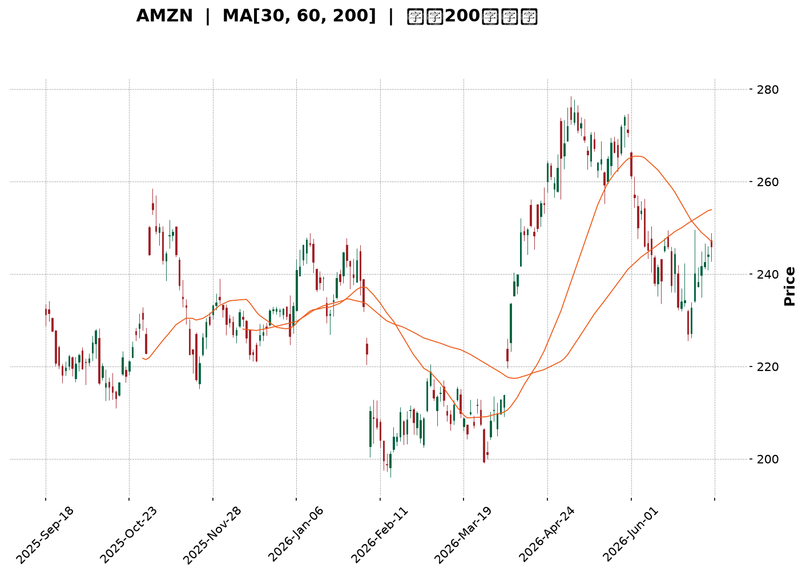
</details>

<html>
<head><meta charset="utf-8" /></head>
<body>
    <div style="height:500px; width:100%;">                        <script>window.PlotlyConfig = {MathJaxConfig: 'local'};</script>
        <script charset="utf-8" src="https://cdn.plot.ly/plotly-3.6.0.min.js" integrity="sha256-QaOVwtVY0T02VaHrr6pnoHLCwayMJp4O5n4YyaE3rJk=" crossorigin="anonymous"></script>                <div id="candlestick-chart" class="plotly-graph-div" style="height:100%; width:100%;"></div>            <script>                window.PLOTLYENV=window.PLOTLYENV || {};                                if (document.getElementById("candlestick-chart")) {                    Plotly.newPlot(                        "candlestick-chart",                        [{"close":{"dtype":"f8","bdata":"AAAAIFzvbEAAAAAAKXRsQAAAAGC4lmtAAAAAYLiGa0AAAADAzERrQAAAAMD1eGtAAAAAoHDFa0AAAACAPXJrQAAAAAAplGtAAAAAwB7Na0AAAADgUXBrQAAAAMDMnGtAAAAAwPW4a0AAAABACidsQAAAACCud2xAAAAAANcLa0AAAACAPYJrQAAAAOB6DGtAAAAAgD3yakAAAABACs9qQAAAAKBHoWpAAAAAIFwPa0AAAADA9cBrQAAAAGBmPmtAAAAAQOGia0AAAABguAZsQAAAAEAKX2xAAAAAAACobEAAAACgmclsQAAAACCF22tAAAAAQAqHbkAAAAAAAMBvQAAAAIA9Km9AAAAAYGZGb0AAAACgR2FuQAAAAMAejW5AAAAAwMwMb0AAAABAMyNvQAAAAGBmhm5AAAAAYI+ybUAAAACAFFZtQAAAAADXG21AAAAAoJnRa0AAAACAFNZrQAAAAOB6JGtAAAAAgBSWa0AAAADA9UhsQAAAAKBwtWxAAAAAwB6lbEAAAABACidtQAAAAAApPG1AAAAAoHBNbUAAAAAAKQxtQAAAACCFo2xAAAAAwPWwbEAAAADgelxsQAAAAKBwfWxAAAAAwPX4bEAAAADA9chsQAAAAIAURmxAAAAAoEfRa0AAAACA69FrQAAAAOCjqGtAAAAA4FFYbEAAAABAM2tsQAAAAIDCjWxAAAAA4HoEbUAAAAAAKQxtQAAAAOCjEG1AAAAAgD0CbUAAAADA9RBtQAAAAIA92mxAAAAAAABQbEAAAACA6yFtQAAAAIDCHW5AAAAAgOsxbkAAAACgR8luQAAAAAAp7G5AAAAAQArPbkAAAABAM1NuQAAAAMDMlG1AAAAAgMLFbUAAAAAA1+NtQAAAAAAA4GxAAAAAgOvpbEAAAABA4UptQAAAAMAe5W1AAAAAoHDNbUAAAACAwpVuQAAAAOBRYG5AAAAAIFw3bkAAAACgmeltQAAAAGC4Xm5AAAAAANfTbUAAAAAgrh9tQAAAAIAU1mtAAAAAgD1KakAAAABAChdqQAAAAGC43mlAAAAAYI+CaUAAAABAM\u002fNoQAAAAKBH2WhAAAAAwMwkaUAAAACgR5lpQAAAACCFm2lAAAAAIIVDakAAAADgo6hpQAAAAIDrEWpAAAAA4HpUakAAAACgcP1pQAAAAAAAQGpAAAAA4HoMakAAAAAgXBdqQAAAAIA9GmtAAAAAgBRea0AAAABguKZqQAAAACCur2pAAAAAYI\u002fKakAAAADAzJRqQAAAAMD1MGpAAAAAoHD1aUAAAAAgrndqQAAAAGBm5mpAAAAAANc7akAAAADgURhqQAAAAADXq2lAAAAA4HpEakAAAAAgrudpQAAAAGC4dmpAAAAAoEfxaUAAAABA4epoQAAAAGBmHmlAAAAA4KMIakAAAACAPVJqQAAAAOCjOGpAAAAAoEeZakAAAADgo7hqQAAAAAAAqGtAAAAAwMw0bUAAAAAAKcxtQAAAAOB6\u002fG1AAAAA4KMgb0AAAAAAABBvQAAAAGBmNm9AAAAAgOtRb0AAAADA9QhvQAAAAMAePW9AAAAAIIXrb0AAAABgj+JvQAAAAADXf3BAAAAAgOtRcEAAAABAMztwQAAAAOCjcHBAAAAAwPWQcEAAAAAAKcRwQAAAAMDMAHFAAAAAwMwYcUAAAAAA1y9xQAAAAGC48nBAAAAAQOEKcUAAAAAA189wQAAAAMAenXBAAAAAgBTicEAAAAAghbNwQAAAAIA9gnBAAAAAgMKNcEAAAACgcDVwQAAAAAApkHBAAAAAIFzHcEAAAADAHqVwQAAAAOCjlHBAAAAAoJn9cEAAAAAAACBxQAAAAIA96nBAAAAAAClUcEAAAADgUQhwQAAAAOCjQG9AAAAAoEe5b0AAAADA9cBuQAAAAEAKp25AAAAAgBSGbkAAAAAAAMBtQAAAAOBRMG5AAAAAoJnRbUAAAADgo8BuQAAAAAAAwG5AAAAAAACwbUAAAADgeoxuQAAAAKBHGW1AAAAAIIVDbUAAAADgo0htQAAAAOBRYGxAAAAAgBQWbUAAAADgegRuQAAAAEDhym1AAAAAYGY2bkAAAACgcFVuQAAAAMAehW5AAAAAIFy\u002fbkAAAAAA13NuQA=="},"high":{"dtype":"f8","bdata":"AAAAwB5FbUAAAACAPdJsQAAAACCFe2xAAAAAgOsRbEAAAACgcJVrQAAAAKCZoWtAAAAAQDPTa0AAAAAgrsdrQAAAAMDMxGtAAAAAgOvZa0AAAABgZgZsQAAAACBct2tAAAAA4Hrca0AAAAAgXFdsQAAAAGC4hmxAAAAAAACIbEAAAACAwpVrQAAAAIA9amtAAAAAYLg2a0AAAABA4VJrQAAAAKCZ2WpAAAAAgBQWa0AAAACAPeprQAAAAOBRgGtAAAAAoJmpa0AAAADAzCxsQAAAAMDMjGxAAAAAIK7vbEAAAACAPRptQAAAAIAUjmxAAAAAAABQb0AAAACgmSlwQAAAAAApEHBAAAAAAABgb0AAAAAAKUxvQAAAAMDMnG5AAAAAAAB4b0AAAAAAADhvQAAAAADXS29AAAAAAAB4bkAAAAAgXNdtQAAAAEAzU21AAAAAYGbGbEAAAAAgrvdrQAAAAMAebWxAAAAAYLjGa0AAAABgj2psQAAAAOCj0GxAAAAAAAD4bEAAAACgRyltQAAAAKCZeW1AAAAAQArfbUAAAAAAKSxtQAAAAAAAMG1AAAAAIK7nbEAAAABgj9psQAAAAIA9kmxAAAAAoHANbUAAAAAghQNtQAAAAGCPwmxAAAAAgMJ9bEAAAADAHvVrQAAAAIAUJmxAAAAAIFynbEAAAAAAKaRsQAAAACBcr2xAAAAAYGYObUAAAABgZh5tQAAAACCuH21AAAAAQDMTbUAAAADgoxhtQAAAACCuH21AAAAAYLhubUAAAAAAAEBtQAAAAIDCZW5AAAAAoEepbkAAAADAHs1uQAAAACCF+25AAAAAgBQeb0AAAADAHvVuQAAAAMD1KG5AAAAAwMwUbkAAAACAPfJtQAAAAEDhYm1AAAAAoJkJbUAAAABACndtQAAAAGBmDm5AAAAAYGYebkAAAAAAKZxuQAAAAMD1+G5AAAAAAABgbkAAAACAPWpuQAAAAAAptG5AAAAAQDPLbkAAAAAghdttQAAAAIDrSWxAAAAAgBRuakAAAACA65lqQAAAAMDMlGpAAAAAgD0SakAAAABguH5pQAAAAMAeJWlAAAAAIK43aUAAAAAghdtpQAAAAOB6tGlAAAAAoHBlakAAAACAwg1qQAAAACCFS2pAAAAAQOFyakAAAACgmWFqQAAAAGCPSmpAAAAAIFw3akAAAACAwiVqQAAAAKBHMWtAAAAAQAqPa0AAAACAPSprQAAAAIA9umpAAAAAwMz0akAAAAAAACBrQAAAAGC4dmpAAAAAgOtRakAAAABACpdqQAAAAGBm9mpAAAAA4HrkakAAAAAA1yNqQAAAAKBH8WlAAAAAoJmZakAAAABAMytqQAAAAIA9ompAAAAA4HqcakAAAABAM9NpQAAAAKCZeWlAAAAAwPVIakAAAABgj7JqQAAAAGC4hmpAAAAAYGaeakAAAABACr9qQAAAAEAzQ2xAAAAAoJk5bUAAAACAwg1uQAAAAAAAAG5AAAAAgMKFb0AAAACAFE5vQAAAAAAAQG9AAAAAQOECcEAAAACAwkVvQAAAAEDh4m9AAAAAgBT+b0AAAADgoyxwQAAAAAAAiHBAAAAAYGaCcEAAAADgelBwQAAAAGCPnnBAAAAAgBQecUAAAADAHhVxQAAAAKCZQXFAAAAAwPVocUAAAADAzFxxQAAAAIAUSnFAAAAAAAAgcUAAAACAFBpxQAAAAGBmunBAAAAAIIXrcEAAAADgeuxwQAAAAIDChXBAAAAAoJnNcEAAAAAAAGRwQAAAAKBHmXBAAAAAANfXcEAAAADgo9xwQAAAAMDM1HBAAAAAYI8GcUAAAAAAAChxQAAAAAAALHFAAAAAgBSqcEAAAABAM1NwQAAAAKBwEXBAAAAAYI\u002f6b0AAAACAFAZwQAAAAKBwLW9AAAAAgMJNb0AAAACAPYJuQAAAAOB6RG5AAAAAIIVrbkAAAACA6\u002fluQAAAAOBRMG9AAAAAwB69bkAAAAAgXLduQAAAAAAAQG5AAAAAANebbUAAAACgcE1uQAAAAIA9Cm1AAAAAwMw8bUAAAABguDZvQAAAAKBHMW5AAAAAwMycbkAAAABACtduQAAAAKBHwW5AAAAAgMIdb0AAAACgmZluQA=="},"hovertemplate":"\u003cb\u003e%{x|%Y-%m-%d}\u003c\u002fb\u003e\u003cbr\u003e\u958b: $%{open:.2f}\u003cbr\u003e\u9ad8: $%{high:.2f}\u003cbr\u003e\u4f4e: $%{low:.2f}\u003cbr\u003e\u6536: $%{close:.2f}\u003cextra\u003e\u003c\u002fextra\u003e","low":{"dtype":"f8","bdata":"AAAAYGa2bEAAAADgUXBsQAAAAIA9gmtAAAAAYGZua0AAAABACg9rQAAAAOCjQGtAAAAAoJlpa0AAAADgejxrQAAAACCFE2tAAAAAYGZea0AAAABA4WprQAAAAMD1AGtAAAAAoHCFa0AAAACAFKZrQAAAAAAAuGtAAAAAAAAAa0AAAACgRyFrQAAAAEAzk2pAAAAAwB6VakAAAACA65lqQAAAAMD1YGpAAAAAQOGyakAAAAAgrj9rQAAAAOCjEGtAAAAAgMJFa0AAAADAzLxrQAAAAKBHMWxAAAAAYLhGbEAAAADgUXhsQAAAAAAA2GtAAAAAIFx\u002fbkAAAADAzJxvQAAAAMAeFW9AAAAAwB7FbkAAAACgcEVuQAAAACCuz21AAAAAQOGybkAAAAAgXOduQAAAAAAAeG5AAAAAAACQbUAAAADgehxtQAAAAIAUpmxAAAAAoHDNa0AAAADgo1BrQAAAACCuF2tAAAAAgMLlakAAAADgo8hrQAAAAKCZ+WtAAAAA4KOYbEAAAABACsdsQAAAAAAACG1AAAAAoJkxbUAAAAAghdNsQAAAAKCZWWxAAAAAoJmRbEAAAADgo0hsQAAAACCFI2xAAAAAYLiObEAAAACAFJZsQAAAAADXI2xAAAAAAACwa0AAAAAAKaRrQAAAACCun2tAAAAAwB4NbEAAAABgjzJsQAAAAGC4VmxAAAAAIFyXbEAAAABgj+psQAAAAIDC5WxAAAAA4KPYbEAAAABgZsZsQAAAAADXw2xAAAAAYGYWbEAAAACAwmVsQAAAAIA9Am1AAAAA4KPwbUAAAAAAKTxuQAAAACCuR25AAAAAYLi+bkAAAAAAAAhuQAAAAEAKh21AAAAAACmUbUAAAADAHo1tQAAAAEDhqmxAAAAAAClcbEAAAADAzNxsQAAAAIA9Um1AAAAAoEexbUAAAABgj8JtQAAAAMD1MG5AAAAAIK6XbUAAAADgerRtQAAAAKBwxW1AAAAAYGZubUAAAACAPfpsQAAAAAApjGtAAAAAgOsJaUAAAABAM2tpQAAAAMAezWlAAAAAIK5PaUAAAACA67FoQAAAAMD1qGhAAAAAAACAaEAAAADgUTBpQAAAAIDrWWlAAAAAAAB4aUAAAAAghWNpQAAAAAAAaGlAAAAAgMIdakAAAABAM6tpQAAAAGBmpmlAAAAAYLhuaUAAAAAgXE9pQAAAAMDMRGpAAAAAQOHyakAAAADA9ZBqQAAAACCF42lAAAAAgMKNakAAAABAM2tqQAAAAMDMBGpAAAAAQArHaUAAAABgZu5pQAAAAIDCjWpAAAAAYI8aakAAAACgmcFpQAAAAIA9imlAAAAA4FEwakAAAADgetRpQAAAAMDMPGpAAAAAANfjaUAAAADgeuRoQAAAACBc\u002f2hAAAAA4HqEaUAAAACAFAZqQAAAAMDMnGlAAAAAQOEyakAAAABgjyJqQAAAAADXc2tAAAAA4KPoa0AAAABguGZtQAAAAAAAeG1AAAAAwPU4bkAAAABgZuZuQAAAAGBmhm5AAAAAIIVDb0AAAAAA16tuQAAAAEAzI29AAAAAYI9Kb0AAAACAPaJvQAAAAEAKG3BAAAAAoHBFcEAAAACAFApwQAAAAEAzG3BAAAAAYI8CcEAAAAAA12twQAAAAMDMzHBAAAAAgBQGcUAAAAAgXANxQAAAAADX53BAAAAAQDPfcEAAAAAgrsdwQAAAAIAUanBAAAAAQDNzcEAAAACAFKpwQAAAAIA9TnBAAAAA4HpocEAAAACAFOZvQAAAAOB6OHBAAAAAgOtVcEAAAAAA16NwQAAAAMAeYXBAAAAAQDObcEAAAABACrdwQAAAAIA92nBAAAAAQDNLcEAAAAAA18tvQAAAAGC49m5AAAAAAAB4b0AAAADA9bhuQAAAACCFa25AAAAAwMwMbkAAAABgZq5tQAAAAIDCZW1AAAAAQOEybUAAAAAgXJduQAAAAGBmrm5AAAAAAACAbUAAAADgo4BtQAAAACCuB21AAAAAAAAAbUAAAABgZh5tQAAAAKCZMWxAAAAAAClEbEAAAACgmTltQAAAAKBwpW1AAAAAwMxcbUAAAABgjyJuQAAAAAApHG5AAAAAYGZWbkAAAADgoxBuQA=="},"name":"\u50f9\u683c","open":{"dtype":"f8","bdata":"AAAAANcLbUAAAACA69FsQAAAAGCPemxAAAAAwMwEbEAAAACA64FrQAAAAGCPYmtAAAAAYI+Ca0AAAADA9cBrQAAAACCFK2tAAAAA4FGga0AAAACAFO5rQAAAAAAAoGtAAAAAACmca0AAAACgcN1rQAAAAAAAIGxAAAAAYLhGbEAAAABgZjZrQAAAAIDr8WpAAAAAANcTa0AAAACgcPVqQAAAAIDr0WpAAAAAACm8akAAAACAwk1rQAAAAKCZaWtAAAAAAABga0AAAABACr9rQAAAAMAedWxAAAAAQAqHbEAAAACgcPVsQAAAAIDrYWxAAAAAQDNDb0AAAAAghetvQAAAAAApTG9AAAAAwPUgb0AAAADAHiVvQAAAAMDMXG5AAAAAQOEKb0AAAADAHg1vQAAAACCuR29AAAAAoJlhbkAAAACA62FtQAAAAAAAKG1AAAAAQDODbEAAAAAgrvdrQAAAAKCZYWxAAAAAQDMLa0AAAACA69FrQAAAAAApTGxAAAAAIK7XbEAAAAAgrudsQAAAAEAKJ21AAAAA4FFgbUAAAABAMyttQAAAAOCjGG1AAAAAgD3KbEAAAABA4bJsQAAAAEDhWmxAAAAAgOuZbEAAAABguNZsQAAAAADXu2xAAAAAgMJ9bEAAAACgR+FrQAAAAMAeFWxAAAAAYLg2bEAAAADgUVhsQAAAACCFk2xAAAAAgOuhbEAAAAAAKQRtQAAAAKBHAW1AAAAAgBT+bEAAAABguOZsQAAAAMAeHW1AAAAAQOHqbEAAAABA4ZpsQAAAAEAzA21AAAAAIIXzbUAAAACA62FuQAAAAIA9km5AAAAAIFzXbkAAAADA9dBuQAAAAMDMJG5AAAAAgOvpbUAAAABA4eJtQAAAAOBROG1AAAAAQOHibEAAAACgmUFtQAAAAGC4Xm1AAAAAIFz\u002fbUAAAACAFPZtQAAAAADXy25AAAAAgD1abkAAAADgevxtQAAAAIDryW1AAAAAIFyfbkAAAAAghdttQAAAAMAeHWxAAAAAYGZWaUAAAABACh9qQAAAAKCZGWpAAAAAgOsBakAAAABguH5pQAAAAAAp3GhAAAAAACnEaEAAAACAPUJpQAAAAKCZeWlAAAAA4FGYaUAAAABAMwNqQAAAAEAKr2lAAAAAYLhOakAAAAAgXFdqQAAAAGCP2mlAAAAAoJmRaUAAAABAM2NpQAAAAEAKT2pAAAAAIFz\u002fakAAAAAgrt9qQAAAAGBmTmpAAAAAgBTGakAAAABguPZqQAAAAOB6TGpAAAAAIIUzakAAAABAMwtqQAAAAIA9mmpAAAAAgMK9akAAAACA6+FpQAAAAMDM7GlAAAAAoEc5akAAAABgZv5pQAAAAIDrcWpAAAAAIIVTakAAAABguM5pQAAAACBcL2lAAAAAQDObaUAAAACAFE5qQAAAAKBH0WlAAAAAoJk5akAAAAAgrmdqQAAAAKBH+WtAAAAAIFwnbEAAAACgmWltQAAAAGBmrm1AAAAAwPU4bkAAAAAAAChvQAAAAOBREG9AAAAAIK7fb0AAAACAFCZvQAAAAEDh4m9AAAAAgBSOb0AAAADgeuxvQAAAACCuP3BAAAAAIFx3cEAAAACAPSZwQAAAAADXH3BAAAAAYLgScUAAAACgR5lwQAAAAMDMzHBAAAAAoEdBcUAAAACAPQ5xQAAAAOBRMHFAAAAAgBT6cEAAAACgcN1wQAAAACBcq3BAAAAAQOGGcEAAAABgZtJwQAAAAAAAaHBAAAAAgOt9cEAAAADgo2BwQAAAAMDMQHBAAAAAAAB4cEAAAABgj8pwQAAAAEAKv3BAAAAAYGaicEAAAADgUQRxQAAAAOCj9HBAAAAA4KOkcEAAAABgjxJwQAAAAGBm1m9AAAAAANejb0AAAADgUchvQAAAAIDC1W5AAAAAIFz3bkAAAAAghXNuQAAAAIDCvW1AAAAAYLhmbkAAAADgo6BuQAAAAAAAAG9AAAAAwMycbkAAAAAA1wNuQAAAAGCPAm5AAAAAoJkRbUAAAABAMzttQAAAAOCjAG1AAAAAYLhmbEAAAABACkdtQAAAAEAzq21AAAAAAAD4bUAAAAAghTNuQAAAAKCZeW5AAAAAIFzfbkAAAADgeoRuQA=="},"x":["2025-09-19T00:00:00-04:00","2025-09-22T00:00:00-04:00","2025-09-23T00:00:00-04:00","2025-09-24T00:00:00-04:00","2025-09-25T00:00:00-04:00","2025-09-26T00:00:00-04:00","2025-09-29T00:00:00-04:00","2025-09-30T00:00:00-04:00","2025-10-01T00:00:00-04:00","2025-10-02T00:00:00-04:00","2025-10-03T00:00:00-04:00","2025-10-06T00:00:00-04:00","2025-10-07T00:00:00-04:00","2025-10-08T00:00:00-04:00","2025-10-09T00:00:00-04:00","2025-10-10T00:00:00-04:00","2025-10-13T00:00:00-04:00","2025-10-14T00:00:00-04:00","2025-10-15T00:00:00-04:00","2025-10-16T00:00:00-04:00","2025-10-17T00:00:00-04:00","2025-10-20T00:00:00-04:00","2025-10-21T00:00:00-04:00","2025-10-22T00:00:00-04:00","2025-10-23T00:00:00-04:00","2025-10-24T00:00:00-04:00","2025-10-27T00:00:00-04:00","2025-10-28T00:00:00-04:00","2025-10-29T00:00:00-04:00","2025-10-30T00:00:00-04:00","2025-10-31T00:00:00-04:00","2025-11-03T00:00:00-05:00","2025-11-04T00:00:00-05:00","2025-11-05T00:00:00-05:00","2025-11-06T00:00:00-05:00","2025-11-07T00:00:00-05:00","2025-11-10T00:00:00-05:00","2025-11-11T00:00:00-05:00","2025-11-12T00:00:00-05:00","2025-11-13T00:00:00-05:00","2025-11-14T00:00:00-05:00","2025-11-17T00:00:00-05:00","2025-11-18T00:00:00-05:00","2025-11-19T00:00:00-05:00","2025-11-20T00:00:00-05:00","2025-11-21T00:00:00-05:00","2025-11-24T00:00:00-05:00","2025-11-25T00:00:00-05:00","2025-11-26T00:00:00-05:00","2025-11-28T00:00:00-05:00","2025-12-01T00:00:00-05:00","2025-12-02T00:00:00-05:00","2025-12-03T00:00:00-05:00","2025-12-04T00:00:00-05:00","2025-12-05T00:00:00-05:00","2025-12-08T00:00:00-05:00","2025-12-09T00:00:00-05:00","2025-12-10T00:00:00-05:00","2025-12-11T00:00:00-05:00","2025-12-12T00:00:00-05:00","2025-12-15T00:00:00-05:00","2025-12-16T00:00:00-05:00","2025-12-17T00:00:00-05:00","2025-12-18T00:00:00-05:00","2025-12-19T00:00:00-05:00","2025-12-22T00:00:00-05:00","2025-12-23T00:00:00-05:00","2025-12-24T00:00:00-05:00","2025-12-26T00:00:00-05:00","2025-12-29T00:00:00-05:00","2025-12-30T00:00:00-05:00","2025-12-31T00:00:00-05:00","2026-01-02T00:00:00-05:00","2026-01-05T00:00:00-05:00","2026-01-06T00:00:00-05:00","2026-01-07T00:00:00-05:00","2026-01-08T00:00:00-05:00","2026-01-09T00:00:00-05:00","2026-01-12T00:00:00-05:00","2026-01-13T00:00:00-05:00","2026-01-14T00:00:00-05:00","2026-01-15T00:00:00-05:00","2026-01-16T00:00:00-05:00","2026-01-20T00:00:00-05:00","2026-01-21T00:00:00-05:00","2026-01-22T00:00:00-05:00","2026-01-23T00:00:00-05:00","2026-01-26T00:00:00-05:00","2026-01-27T00:00:00-05:00","2026-01-28T00:00:00-05:00","2026-01-29T00:00:00-05:00","2026-01-30T00:00:00-05:00","2026-02-02T00:00:00-05:00","2026-02-03T00:00:00-05:00","2026-02-04T00:00:00-05:00","2026-02-05T00:00:00-05:00","2026-02-06T00:00:00-05:00","2026-02-09T00:00:00-05:00","2026-02-10T00:00:00-05:00","2026-02-11T00:00:00-05:00","2026-02-12T00:00:00-05:00","2026-02-13T00:00:00-05:00","2026-02-17T00:00:00-05:00","2026-02-18T00:00:00-05:00","2026-02-19T00:00:00-05:00","2026-02-20T00:00:00-05:00","2026-02-23T00:00:00-05:00","2026-02-24T00:00:00-05:00","2026-02-25T00:00:00-05:00","2026-02-26T00:00:00-05:00","2026-02-27T00:00:00-05:00","2026-03-02T00:00:00-05:00","2026-03-03T00:00:00-05:00","2026-03-04T00:00:00-05:00","2026-03-05T00:00:00-05:00","2026-03-06T00:00:00-05:00","2026-03-09T00:00:00-04:00","2026-03-10T00:00:00-04:00","2026-03-11T00:00:00-04:00","2026-03-12T00:00:00-04:00","2026-03-13T00:00:00-04:00","2026-03-16T00:00:00-04:00","2026-03-17T00:00:00-04:00","2026-03-18T00:00:00-04:00","2026-03-19T00:00:00-04:00","2026-03-20T00:00:00-04:00","2026-03-23T00:00:00-04:00","2026-03-24T00:00:00-04:00","2026-03-25T00:00:00-04:00","2026-03-26T00:00:00-04:00","2026-03-27T00:00:00-04:00","2026-03-30T00:00:00-04:00","2026-03-31T00:00:00-04:00","2026-04-01T00:00:00-04:00","2026-04-02T00:00:00-04:00","2026-04-06T00:00:00-04:00","2026-04-07T00:00:00-04:00","2026-04-08T00:00:00-04:00","2026-04-09T00:00:00-04:00","2026-04-10T00:00:00-04:00","2026-04-13T00:00:00-04:00","2026-04-14T00:00:00-04:00","2026-04-15T00:00:00-04:00","2026-04-16T00:00:00-04:00","2026-04-17T00:00:00-04:00","2026-04-20T00:00:00-04:00","2026-04-21T00:00:00-04:00","2026-04-22T00:00:00-04:00","2026-04-23T00:00:00-04:00","2026-04-24T00:00:00-04:00","2026-04-27T00:00:00-04:00","2026-04-28T00:00:00-04:00","2026-04-29T00:00:00-04:00","2026-04-30T00:00:00-04:00","2026-05-01T00:00:00-04:00","2026-05-04T00:00:00-04:00","2026-05-05T00:00:00-04:00","2026-05-06T00:00:00-04:00","2026-05-07T00:00:00-04:00","2026-05-08T00:00:00-04:00","2026-05-11T00:00:00-04:00","2026-05-12T00:00:00-04:00","2026-05-13T00:00:00-04:00","2026-05-14T00:00:00-04:00","2026-05-15T00:00:00-04:00","2026-05-18T00:00:00-04:00","2026-05-19T00:00:00-04:00","2026-05-20T00:00:00-04:00","2026-05-21T00:00:00-04:00","2026-05-22T00:00:00-04:00","2026-05-26T00:00:00-04:00","2026-05-27T00:00:00-04:00","2026-05-28T00:00:00-04:00","2026-05-29T00:00:00-04:00","2026-06-01T00:00:00-04:00","2026-06-02T00:00:00-04:00","2026-06-03T00:00:00-04:00","2026-06-04T00:00:00-04:00","2026-06-05T00:00:00-04:00","2026-06-08T00:00:00-04:00","2026-06-09T00:00:00-04:00","2026-06-10T00:00:00-04:00","2026-06-11T00:00:00-04:00","2026-06-12T00:00:00-04:00","2026-06-15T00:00:00-04:00","2026-06-16T00:00:00-04:00","2026-06-17T00:00:00-04:00","2026-06-18T00:00:00-04:00","2026-06-22T00:00:00-04:00","2026-06-23T00:00:00-04:00","2026-06-24T00:00:00-04:00","2026-06-25T00:00:00-04:00","2026-06-26T00:00:00-04:00","2026-06-29T00:00:00-04:00","2026-06-30T00:00:00-04:00","2026-07-01T00:00:00-04:00","2026-07-02T00:00:00-04:00","2026-07-06T00:00:00-04:00","2026-07-07T00:00:00-04:00","2026-07-08T00:00:00-04:00"],"type":"candlestick"},{"hovertemplate":"MA30: $%{y:.2f}\u003cextra\u003e\u003c\u002fextra\u003e","line":{"color":"#2196F3","dash":"dash","width":2},"mode":"lines","name":"MA30","x":["2025-09-19T00:00:00-04:00","2025-09-22T00:00:00-04:00","2025-09-23T00:00:00-04:00","2025-09-24T00:00:00-04:00","2025-09-25T00:00:00-04:00","2025-09-26T00:00:00-04:00","2025-09-29T00:00:00-04:00","2025-09-30T00:00:00-04:00","2025-10-01T00:00:00-04:00","2025-10-02T00:00:00-04:00","2025-10-03T00:00:00-04:00","2025-10-06T00:00:00-04:00","2025-10-07T00:00:00-04:00","2025-10-08T00:00:00-04:00","2025-10-09T00:00:00-04:00","2025-10-10T00:00:00-04:00","2025-10-13T00:00:00-04:00","2025-10-14T00:00:00-04:00","2025-10-15T00:00:00-04:00","2025-10-16T00:00:00-04:00","2025-10-17T00:00:00-04:00","2025-10-20T00:00:00-04:00","2025-10-21T00:00:00-04:00","2025-10-22T00:00:00-04:00","2025-10-23T00:00:00-04:00","2025-10-24T00:00:00-04:00","2025-10-27T00:00:00-04:00","2025-10-28T00:00:00-04:00","2025-10-29T00:00:00-04:00","2025-10-30T00:00:00-04:00","2025-10-31T00:00:00-04:00","2025-11-03T00:00:00-05:00","2025-11-04T00:00:00-05:00","2025-11-05T00:00:00-05:00","2025-11-06T00:00:00-05:00","2025-11-07T00:00:00-05:00","2025-11-10T00:00:00-05:00","2025-11-11T00:00:00-05:00","2025-11-12T00:00:00-05:00","2025-11-13T00:00:00-05:00","2025-11-14T00:00:00-05:00","2025-11-17T00:00:00-05:00","2025-11-18T00:00:00-05:00","2025-11-19T00:00:00-05:00","2025-11-20T00:00:00-05:00","2025-11-21T00:00:00-05:00","2025-11-24T00:00:00-05:00","2025-11-25T00:00:00-05:00","2025-11-26T00:00:00-05:00","2025-11-28T00:00:00-05:00","2025-12-01T00:00:00-05:00","2025-12-02T00:00:00-05:00","2025-12-03T00:00:00-05:00","2025-12-04T00:00:00-05:00","2025-12-05T00:00:00-05:00","2025-12-08T00:00:00-05:00","2025-12-09T00:00:00-05:00","2025-12-10T00:00:00-05:00","2025-12-11T00:00:00-05:00","2025-12-12T00:00:00-05:00","2025-12-15T00:00:00-05:00","2025-12-16T00:00:00-05:00","2025-12-17T00:00:00-05:00","2025-12-18T00:00:00-05:00","2025-12-19T00:00:00-05:00","2025-12-22T00:00:00-05:00","2025-12-23T00:00:00-05:00","2025-12-24T00:00:00-05:00","2025-12-26T00:00:00-05:00","2025-12-29T00:00:00-05:00","2025-12-30T00:00:00-05:00","2025-12-31T00:00:00-05:00","2026-01-02T00:00:00-05:00","2026-01-05T00:00:00-05:00","2026-01-06T00:00:00-05:00","2026-01-07T00:00:00-05:00","2026-01-08T00:00:00-05:00","2026-01-09T00:00:00-05:00","2026-01-12T00:00:00-05:00","2026-01-13T00:00:00-05:00","2026-01-14T00:00:00-05:00","2026-01-15T00:00:00-05:00","2026-01-16T00:00:00-05:00","2026-01-20T00:00:00-05:00","2026-01-21T00:00:00-05:00","2026-01-22T00:00:00-05:00","2026-01-23T00:00:00-05:00","2026-01-26T00:00:00-05:00","2026-01-27T00:00:00-05:00","2026-01-28T00:00:00-05:00","2026-01-29T00:00:00-05:00","2026-01-30T00:00:00-05:00","2026-02-02T00:00:00-05:00","2026-02-03T00:00:00-05:00","2026-02-04T00:00:00-05:00","2026-02-05T00:00:00-05:00","2026-02-06T00:00:00-05:00","2026-02-09T00:00:00-05:00","2026-02-10T00:00:00-05:00","2026-02-11T00:00:00-05:00","2026-02-12T00:00:00-05:00","2026-02-13T00:00:00-05:00","2026-02-17T00:00:00-05:00","2026-02-18T00:00:00-05:00","2026-02-19T00:00:00-05:00","2026-02-20T00:00:00-05:00","2026-02-23T00:00:00-05:00","2026-02-24T00:00:00-05:00","2026-02-25T00:00:00-05:00","2026-02-26T00:00:00-05:00","2026-02-27T00:00:00-05:00","2026-03-02T00:00:00-05:00","2026-03-03T00:00:00-05:00","2026-03-04T00:00:00-05:00","2026-03-05T00:00:00-05:00","2026-03-06T00:00:00-05:00","2026-03-09T00:00:00-04:00","2026-03-10T00:00:00-04:00","2026-03-11T00:00:00-04:00","2026-03-12T00:00:00-04:00","2026-03-13T00:00:00-04:00","2026-03-16T00:00:00-04:00","2026-03-17T00:00:00-04:00","2026-03-18T00:00:00-04:00","2026-03-19T00:00:00-04:00","2026-03-20T00:00:00-04:00","2026-03-23T00:00:00-04:00","2026-03-24T00:00:00-04:00","2026-03-25T00:00:00-04:00","2026-03-26T00:00:00-04:00","2026-03-27T00:00:00-04:00","2026-03-30T00:00:00-04:00","2026-03-31T00:00:00-04:00","2026-04-01T00:00:00-04:00","2026-04-02T00:00:00-04:00","2026-04-06T00:00:00-04:00","2026-04-07T00:00:00-04:00","2026-04-08T00:00:00-04:00","2026-04-09T00:00:00-04:00","2026-04-10T00:00:00-04:00","2026-04-13T00:00:00-04:00","2026-04-14T00:00:00-04:00","2026-04-15T00:00:00-04:00","2026-04-16T00:00:00-04:00","2026-04-17T00:00:00-04:00","2026-04-20T00:00:00-04:00","2026-04-21T00:00:00-04:00","2026-04-22T00:00:00-04:00","2026-04-23T00:00:00-04:00","2026-04-24T00:00:00-04:00","2026-04-27T00:00:00-04:00","2026-04-28T00:00:00-04:00","2026-04-29T00:00:00-04:00","2026-04-30T00:00:00-04:00","2026-05-01T00:00:00-04:00","2026-05-04T00:00:00-04:00","2026-05-05T00:00:00-04:00","2026-05-06T00:00:00-04:00","2026-05-07T00:00:00-04:00","2026-05-08T00:00:00-04:00","2026-05-11T00:00:00-04:00","2026-05-12T00:00:00-04:00","2026-05-13T00:00:00-04:00","2026-05-14T00:00:00-04:00","2026-05-15T00:00:00-04:00","2026-05-18T00:00:00-04:00","2026-05-19T00:00:00-04:00","2026-05-20T00:00:00-04:00","2026-05-21T00:00:00-04:00","2026-05-22T00:00:00-04:00","2026-05-26T00:00:00-04:00","2026-05-27T00:00:00-04:00","2026-05-28T00:00:00-04:00","2026-05-29T00:00:00-04:00","2026-06-01T00:00:00-04:00","2026-06-02T00:00:00-04:00","2026-06-03T00:00:00-04:00","2026-06-04T00:00:00-04:00","2026-06-05T00:00:00-04:00","2026-06-08T00:00:00-04:00","2026-06-09T00:00:00-04:00","2026-06-10T00:00:00-04:00","2026-06-11T00:00:00-04:00","2026-06-12T00:00:00-04:00","2026-06-15T00:00:00-04:00","2026-06-16T00:00:00-04:00","2026-06-17T00:00:00-04:00","2026-06-18T00:00:00-04:00","2026-06-22T00:00:00-04:00","2026-06-23T00:00:00-04:00","2026-06-24T00:00:00-04:00","2026-06-25T00:00:00-04:00","2026-06-26T00:00:00-04:00","2026-06-29T00:00:00-04:00","2026-06-30T00:00:00-04:00","2026-07-01T00:00:00-04:00","2026-07-02T00:00:00-04:00","2026-07-06T00:00:00-04:00","2026-07-07T00:00:00-04:00","2026-07-08T00:00:00-04:00"],"y":{"dtype":"f8","bdata":"AAAAAAAA+H8AAAAAAAD4fwAAAAAAAPh\u002fAAAAAAAA+H8AAAAAAAD4fwAAAAAAAPh\u002fAAAAAAAA+H8AAAAAAAD4fwAAAAAAAPh\u002fAAAAAAAA+H8AAAAAAAD4fwAAAAAAAPh\u002fAAAAAAAA+H8AAAAAAAD4fwAAAAAAAPh\u002fAAAAAAAA+H8AAAAAAAD4fwAAAAAAAPh\u002fAAAAAAAA+H8AAAAAAAD4fwAAAAAAAPh\u002fAAAAAAAA+H8AAAAAAAD4fwAAAAAAAPh\u002fAAAAAAAA+H8AAAAAAAD4fwAAAAAAAPh\u002fAAAAAAAA+H8AAAAAAAD4f+\u002fu7p7vr2tA3t3dfYa9a0AiIiJCp9lrQCIiIrIr+GtAZmZm9igYbEB3d3eXtTJsQJqZmTn7TGxAMzMzw\u002fVobEC8u7trdYhsQJqZmZmZoWxAVVVVBcixbEDNzMws+cFsQImIiMi9zmxAvLu7C5DPbEAAAAAw3cxsQN7d3a2OwWxAREREVCrGbEAiIiISysxsQFVVVWX02mxA7+7uXnPpbEDv7u5ec\u002f1sQFVVVRWuE21AZmZm5tAmbUBEREQk2zFtQBEREZHCPW1AAAAAQMNGbUARERERn0ltQKuqqnqiSm1AZmZmVlVNbUAAAADgT01tQAAAADDdUG1AmpmZGb05bUAiIiLiMxhtQM3MzFxI+mxA3t3drUfhbEBEREREi9BsQImIiKh\u002fv2xAiYiImCeubEC8u7vrUZxsQBEREYHcj2xAiYiI6PuJbEBVVVUVrodsQM3MzEx+hWxAmpmZ6bSJbEDNzMycxJRsQN7d3d0krmxARERExGfEbEBERETUv9lsQHd3d9ej7GxAAAAAoBr\u002fbEDe3d39GwltQCIiImIQDG1AzczMHBMQbUBERESUQxdtQM3MzKxHGW1AvLu7uy0bbUBEREQUICNtQJqZmVkdL21AMzMzgzI2bUC8u7urjkVtQGZmZqZ\u002fV21AzczMzPdrbUAAAADw0n1tQBEREcH1lG1AMzMzU5yhbUC8u7troKdtQFVVVQWBoW1AVVVVtTqKbUAzMzPz\u002fXBtQN7d3V26VW1Aq6qqOt83bUBVVVUlvxRtQBEREdGU8mxAMzMzk4rXbECrqqr6YrlsQHd3d3fpkmxAVVVVhV1xbEBERERUnEVsQBEREeEzHGxAZmZm5vv1a0AiIiLy\u002fdBrQImIiLiQtGtAEREREcqUa0AiIiKSX3RrQM3MzHw\u002fZWtAd3d3pw1Ya0AiIiLCg0FrQDMzMyMiJmtAZmZm9m8Ma0AzMzOjRepqQN7d3V2PxmpAd3d3tzqiakAAAAAA1YRqQKuqqqo4Z2pAAAAAAI5IakB3d3eXtS5qQDMzMxM8HGpAvLu76wocakCJiIjIdhpqQJqZmdmHH2pAiYiIqDgjakCJiIio8SJqQLy7u3s\u002fJWpAiYiIuNcsakDNzMwMAjNqQO\u002fu7s4+OGpAAAAAoBo7akARERGxK0RqQImIiOi0UWpAvLu7K0BqakCJiIjIvYpqQO\u002fu7r6fqmpAIiIicvbVakDv7u5OYgBrQM3MzLx0I2tAq6qqGi9Fa0DNzMyMl2prQDMzM6NwkWtAAAAAkDS9a0CJiIjIduprQN7d3f2NJGxAd3d3Z5FdbEDv7u6uuZBsQCIiIjLBw2xA7+7uvp\u002f+bEB3d3c3Fz5tQM3MzEw3hW1AREREdNrIbUB3d3e3HhFuQDMzM0OLUG5AMzMz0waWbkCrqqrqUeBuQBEREcGDJW9AiYiIqH9nb0AiIiLi7KNvQFVVVYXr3W9AzczMDLsKcEB3d3ffCCNwQKuqqpJfOnBARERETPBMcEAiIiIK11twQM3MzPxiaXBAMzMzC5B1cEDNzMykKYNwQHd3d6dUjnBAAAAAkAmUcECJiIiYbphwQFVVVZ19mHBAmpmZQaeXcEARERGh05JwQGZmZubQiHBAREREZMl\u002fcEDe3d2dNnRwQFVVVQ27aHBA3t3djZdacEBVVVUNu05wQERERFzWQHBA3t3dVZwtcECrqqpqSh1wQLy7u0PSCHBAmpmZWYDob0Crqqp6d8NvQCIiIsIRmm9AREREJCJyb0Dv7u5+P1VvQO\u002fu7l66OW9AZmZmJgYhb0AREREhPg9vQAAAALAA+W5AZmZmJgbhbkCJiIiIz8huQA=="},"type":"scatter"},{"hovertemplate":"MA60: $%{y:.2f}\u003cextra\u003e\u003c\u002fextra\u003e","line":{"color":"#9C27B0","dash":"dash","width":2},"mode":"lines","name":"MA60","x":["2025-09-19T00:00:00-04:00","2025-09-22T00:00:00-04:00","2025-09-23T00:00:00-04:00","2025-09-24T00:00:00-04:00","2025-09-25T00:00:00-04:00","2025-09-26T00:00:00-04:00","2025-09-29T00:00:00-04:00","2025-09-30T00:00:00-04:00","2025-10-01T00:00:00-04:00","2025-10-02T00:00:00-04:00","2025-10-03T00:00:00-04:00","2025-10-06T00:00:00-04:00","2025-10-07T00:00:00-04:00","2025-10-08T00:00:00-04:00","2025-10-09T00:00:00-04:00","2025-10-10T00:00:00-04:00","2025-10-13T00:00:00-04:00","2025-10-14T00:00:00-04:00","2025-10-15T00:00:00-04:00","2025-10-16T00:00:00-04:00","2025-10-17T00:00:00-04:00","2025-10-20T00:00:00-04:00","2025-10-21T00:00:00-04:00","2025-10-22T00:00:00-04:00","2025-10-23T00:00:00-04:00","2025-10-24T00:00:00-04:00","2025-10-27T00:00:00-04:00","2025-10-28T00:00:00-04:00","2025-10-29T00:00:00-04:00","2025-10-30T00:00:00-04:00","2025-10-31T00:00:00-04:00","2025-11-03T00:00:00-05:00","2025-11-04T00:00:00-05:00","2025-11-05T00:00:00-05:00","2025-11-06T00:00:00-05:00","2025-11-07T00:00:00-05:00","2025-11-10T00:00:00-05:00","2025-11-11T00:00:00-05:00","2025-11-12T00:00:00-05:00","2025-11-13T00:00:00-05:00","2025-11-14T00:00:00-05:00","2025-11-17T00:00:00-05:00","2025-11-18T00:00:00-05:00","2025-11-19T00:00:00-05:00","2025-11-20T00:00:00-05:00","2025-11-21T00:00:00-05:00","2025-11-24T00:00:00-05:00","2025-11-25T00:00:00-05:00","2025-11-26T00:00:00-05:00","2025-11-28T00:00:00-05:00","2025-12-01T00:00:00-05:00","2025-12-02T00:00:00-05:00","2025-12-03T00:00:00-05:00","2025-12-04T00:00:00-05:00","2025-12-05T00:00:00-05:00","2025-12-08T00:00:00-05:00","2025-12-09T00:00:00-05:00","2025-12-10T00:00:00-05:00","2025-12-11T00:00:00-05:00","2025-12-12T00:00:00-05:00","2025-12-15T00:00:00-05:00","2025-12-16T00:00:00-05:00","2025-12-17T00:00:00-05:00","2025-12-18T00:00:00-05:00","2025-12-19T00:00:00-05:00","2025-12-22T00:00:00-05:00","2025-12-23T00:00:00-05:00","2025-12-24T00:00:00-05:00","2025-12-26T00:00:00-05:00","2025-12-29T00:00:00-05:00","2025-12-30T00:00:00-05:00","2025-12-31T00:00:00-05:00","2026-01-02T00:00:00-05:00","2026-01-05T00:00:00-05:00","2026-01-06T00:00:00-05:00","2026-01-07T00:00:00-05:00","2026-01-08T00:00:00-05:00","2026-01-09T00:00:00-05:00","2026-01-12T00:00:00-05:00","2026-01-13T00:00:00-05:00","2026-01-14T00:00:00-05:00","2026-01-15T00:00:00-05:00","2026-01-16T00:00:00-05:00","2026-01-20T00:00:00-05:00","2026-01-21T00:00:00-05:00","2026-01-22T00:00:00-05:00","2026-01-23T00:00:00-05:00","2026-01-26T00:00:00-05:00","2026-01-27T00:00:00-05:00","2026-01-28T00:00:00-05:00","2026-01-29T00:00:00-05:00","2026-01-30T00:00:00-05:00","2026-02-02T00:00:00-05:00","2026-02-03T00:00:00-05:00","2026-02-04T00:00:00-05:00","2026-02-05T00:00:00-05:00","2026-02-06T00:00:00-05:00","2026-02-09T00:00:00-05:00","2026-02-10T00:00:00-05:00","2026-02-11T00:00:00-05:00","2026-02-12T00:00:00-05:00","2026-02-13T00:00:00-05:00","2026-02-17T00:00:00-05:00","2026-02-18T00:00:00-05:00","2026-02-19T00:00:00-05:00","2026-02-20T00:00:00-05:00","2026-02-23T00:00:00-05:00","2026-02-24T00:00:00-05:00","2026-02-25T00:00:00-05:00","2026-02-26T00:00:00-05:00","2026-02-27T00:00:00-05:00","2026-03-02T00:00:00-05:00","2026-03-03T00:00:00-05:00","2026-03-04T00:00:00-05:00","2026-03-05T00:00:00-05:00","2026-03-06T00:00:00-05:00","2026-03-09T00:00:00-04:00","2026-03-10T00:00:00-04:00","2026-03-11T00:00:00-04:00","2026-03-12T00:00:00-04:00","2026-03-13T00:00:00-04:00","2026-03-16T00:00:00-04:00","2026-03-17T00:00:00-04:00","2026-03-18T00:00:00-04:00","2026-03-19T00:00:00-04:00","2026-03-20T00:00:00-04:00","2026-03-23T00:00:00-04:00","2026-03-24T00:00:00-04:00","2026-03-25T00:00:00-04:00","2026-03-26T00:00:00-04:00","2026-03-27T00:00:00-04:00","2026-03-30T00:00:00-04:00","2026-03-31T00:00:00-04:00","2026-04-01T00:00:00-04:00","2026-04-02T00:00:00-04:00","2026-04-06T00:00:00-04:00","2026-04-07T00:00:00-04:00","2026-04-08T00:00:00-04:00","2026-04-09T00:00:00-04:00","2026-04-10T00:00:00-04:00","2026-04-13T00:00:00-04:00","2026-04-14T00:00:00-04:00","2026-04-15T00:00:00-04:00","2026-04-16T00:00:00-04:00","2026-04-17T00:00:00-04:00","2026-04-20T00:00:00-04:00","2026-04-21T00:00:00-04:00","2026-04-22T00:00:00-04:00","2026-04-23T00:00:00-04:00","2026-04-24T00:00:00-04:00","2026-04-27T00:00:00-04:00","2026-04-28T00:00:00-04:00","2026-04-29T00:00:00-04:00","2026-04-30T00:00:00-04:00","2026-05-01T00:00:00-04:00","2026-05-04T00:00:00-04:00","2026-05-05T00:00:00-04:00","2026-05-06T00:00:00-04:00","2026-05-07T00:00:00-04:00","2026-05-08T00:00:00-04:00","2026-05-11T00:00:00-04:00","2026-05-12T00:00:00-04:00","2026-05-13T00:00:00-04:00","2026-05-14T00:00:00-04:00","2026-05-15T00:00:00-04:00","2026-05-18T00:00:00-04:00","2026-05-19T00:00:00-04:00","2026-05-20T00:00:00-04:00","2026-05-21T00:00:00-04:00","2026-05-22T00:00:00-04:00","2026-05-26T00:00:00-04:00","2026-05-27T00:00:00-04:00","2026-05-28T00:00:00-04:00","2026-05-29T00:00:00-04:00","2026-06-01T00:00:00-04:00","2026-06-02T00:00:00-04:00","2026-06-03T00:00:00-04:00","2026-06-04T00:00:00-04:00","2026-06-05T00:00:00-04:00","2026-06-08T00:00:00-04:00","2026-06-09T00:00:00-04:00","2026-06-10T00:00:00-04:00","2026-06-11T00:00:00-04:00","2026-06-12T00:00:00-04:00","2026-06-15T00:00:00-04:00","2026-06-16T00:00:00-04:00","2026-06-17T00:00:00-04:00","2026-06-18T00:00:00-04:00","2026-06-22T00:00:00-04:00","2026-06-23T00:00:00-04:00","2026-06-24T00:00:00-04:00","2026-06-25T00:00:00-04:00","2026-06-26T00:00:00-04:00","2026-06-29T00:00:00-04:00","2026-06-30T00:00:00-04:00","2026-07-01T00:00:00-04:00","2026-07-02T00:00:00-04:00","2026-07-06T00:00:00-04:00","2026-07-07T00:00:00-04:00","2026-07-08T00:00:00-04:00"],"y":{"dtype":"f8","bdata":"AAAAAAAA+H8AAAAAAAD4fwAAAAAAAPh\u002fAAAAAAAA+H8AAAAAAAD4fwAAAAAAAPh\u002fAAAAAAAA+H8AAAAAAAD4fwAAAAAAAPh\u002fAAAAAAAA+H8AAAAAAAD4fwAAAAAAAPh\u002fAAAAAAAA+H8AAAAAAAD4fwAAAAAAAPh\u002fAAAAAAAA+H8AAAAAAAD4fwAAAAAAAPh\u002fAAAAAAAA+H8AAAAAAAD4fwAAAAAAAPh\u002fAAAAAAAA+H8AAAAAAAD4fwAAAAAAAPh\u002fAAAAAAAA+H8AAAAAAAD4fwAAAAAAAPh\u002fAAAAAAAA+H8AAAAAAAD4fwAAAAAAAPh\u002fAAAAAAAA+H8AAAAAAAD4fwAAAAAAAPh\u002fAAAAAAAA+H8AAAAAAAD4fwAAAAAAAPh\u002fAAAAAAAA+H8AAAAAAAD4fwAAAAAAAPh\u002fAAAAAAAA+H8AAAAAAAD4fwAAAAAAAPh\u002fAAAAAAAA+H8AAAAAAAD4fwAAAAAAAPh\u002fAAAAAAAA+H8AAAAAAAD4fwAAAAAAAPh\u002fAAAAAAAA+H8AAAAAAAD4fwAAAAAAAPh\u002fAAAAAAAA+H8AAAAAAAD4fwAAAAAAAPh\u002fAAAAAAAA+H8AAAAAAAD4fwAAAAAAAPh\u002fAAAAAAAA+H8AAAAAAAD4f3d3d2dmgGxAvLu7y6F7bEAiIiKS7XhsQHd3dwc6eWxAIiIiUrh8bEDe3d1toIFsQBEREXE9hmxA3t3drY6LbEC8u7urY5JsQFVVVQ27mGxA7+7u9uGdbEARERGh06RsQKuqqgoeqmxAq6qqeqKsbEBmZmbm0LBsQN7d3cXZt2xAREREDEnFbEAzMzPzRNNsQGZmZh7M42xAd3d3\u002f0b0bEBmZmauRwNtQLy7uzvfD21AmpmZAXIbbUBERERcjyRtQO\u002fu7h6FK21A3t3dffgwbUCrqqqSXzZtQCIiIurfPG1AzczM7MNBbUDe3d1Fb0ltQDMzM2suVG1AMzMzc9pSbUARERFpA0ttQO\u002fu7g6fR21AiYiIAHJBbUAAAADYFTxtQO\u002fu7laAMG1A7+7uJjEcbUB3d3fvpwZtQHd3d2\u002fL8mxAmpmZke3gbEBVVVWdNs5sQO\u002fu7o4JvGxAZmZmvp+wbEC8u7vLE6dsQKuqqiqHoGxAzczMpOKabEBEREQUro9sQERERNxrhGxAMzMzQ4t6bEAAAAD4DG1sQFVVVY1QYGxA7+7ulm5SbEAzMzOT0UVsQM3MzJRDP2xAmpmZsZ05bEAzMzPrUTJsQGZmZr6fKmxAzczMPFEhbEB3d3cn6hdsQCIiIoIHD2xAIiIiQhkHbEAAAAD4UwFsQN7d3TUX\u002fmtAmpmZKRX1a0CamZkBK+trQERERIze3mtAiYiI0CLTa0De3d1dusVrQLy7uxuhumtAmpmZ8Yuta0Dv7u5m2JtrQGZmZibqi2tA3t3dJTGCa0C8u7uDMnZrQDMzMyOUZWtAq6qqEjxWa0CrqqoC5ERrQM3MzGT0NmtAERERCR4wa0BVVVXd3S1rQLy7uzuYL2tAmpmZQWA1a0CJiIjwYDprQM3MzBxaRGtAERERYZ5Oa0B3d3enDVZrQDMzM2PJW2tAMzMzQ9Jka0De3d01XmprQN7d3a2OdWtAd3d3D+Z\u002fa0B3d3dXx4prQGZmZu58lWtAd3d335aja0B3d3dnZrZrQAAAALC50GtAAAAAsHLya0AAAADAyhVsQGZmZo4JOGxA3t3dvZ9cbECamZnJoYFsQGZmZp5hpWxAiYiIsCvKbEB3d3d3d+tsQCIiIioVC21AzczMXEgobUAAAAC4HkVtQO\u002fu7gY6Y21AIiIiYhCCbUBmZmbuNaFtQERERNyyvm1ARERERIvgbUBERETMWgNuQN7d3QUPIG5AVVVVHaE2bkDv7u5euk1uQO\u002fu7u41YW5AmpmZiUF2bkBVVVUFD4huQFVVVeUXm25AAAAAGJKubkBVVVV1k7xuQGZmZqabym5AVVVVbefZbkARERGpxu1uQKuqqgJyA29AAAAAkAkSb0BmZmbG2SVvQFVVVeUXMW9AZmZmlkM\u002fb0Crqqqy5FFvQJqZmcHKX29AZmZm5tBsb0CJiIgwlnxvQCIiIvLSi29AAAAAID6bb0AAAADwp6pvQKuqqurftm9Ad3d3X3O9b0BmZmbOPsBvQA=="},"type":"scatter"},{"hovertemplate":"MA200: $%{y:.2f}\u003cextra\u003e\u003c\u002fextra\u003e","line":{"color":"#FF6F00","dash":"solid","width":2},"mode":"lines","name":"MA200","x":["2025-09-19T00:00:00-04:00","2025-09-22T00:00:00-04:00","2025-09-23T00:00:00-04:00","2025-09-24T00:00:00-04:00","2025-09-25T00:00:00-04:00","2025-09-26T00:00:00-04:00","2025-09-29T00:00:00-04:00","2025-09-30T00:00:00-04:00","2025-10-01T00:00:00-04:00","2025-10-02T00:00:00-04:00","2025-10-03T00:00:00-04:00","2025-10-06T00:00:00-04:00","2025-10-07T00:00:00-04:00","2025-10-08T00:00:00-04:00","2025-10-09T00:00:00-04:00","2025-10-10T00:00:00-04:00","2025-10-13T00:00:00-04:00","2025-10-14T00:00:00-04:00","2025-10-15T00:00:00-04:00","2025-10-16T00:00:00-04:00","2025-10-17T00:00:00-04:00","2025-10-20T00:00:00-04:00","2025-10-21T00:00:00-04:00","2025-10-22T00:00:00-04:00","2025-10-23T00:00:00-04:00","2025-10-24T00:00:00-04:00","2025-10-27T00:00:00-04:00","2025-10-28T00:00:00-04:00","2025-10-29T00:00:00-04:00","2025-10-30T00:00:00-04:00","2025-10-31T00:00:00-04:00","2025-11-03T00:00:00-05:00","2025-11-04T00:00:00-05:00","2025-11-05T00:00:00-05:00","2025-11-06T00:00:00-05:00","2025-11-07T00:00:00-05:00","2025-11-10T00:00:00-05:00","2025-11-11T00:00:00-05:00","2025-11-12T00:00:00-05:00","2025-11-13T00:00:00-05:00","2025-11-14T00:00:00-05:00","2025-11-17T00:00:00-05:00","2025-11-18T00:00:00-05:00","2025-11-19T00:00:00-05:00","2025-11-20T00:00:00-05:00","2025-11-21T00:00:00-05:00","2025-11-24T00:00:00-05:00","2025-11-25T00:00:00-05:00","2025-11-26T00:00:00-05:00","2025-11-28T00:00:00-05:00","2025-12-01T00:00:00-05:00","2025-12-02T00:00:00-05:00","2025-12-03T00:00:00-05:00","2025-12-04T00:00:00-05:00","2025-12-05T00:00:00-05:00","2025-12-08T00:00:00-05:00","2025-12-09T00:00:00-05:00","2025-12-10T00:00:00-05:00","2025-12-11T00:00:00-05:00","2025-12-12T00:00:00-05:00","2025-12-15T00:00:00-05:00","2025-12-16T00:00:00-05:00","2025-12-17T00:00:00-05:00","2025-12-18T00:00:00-05:00","2025-12-19T00:00:00-05:00","2025-12-22T00:00:00-05:00","2025-12-23T00:00:00-05:00","2025-12-24T00:00:00-05:00","2025-12-26T00:00:00-05:00","2025-12-29T00:00:00-05:00","2025-12-30T00:00:00-05:00","2025-12-31T00:00:00-05:00","2026-01-02T00:00:00-05:00","2026-01-05T00:00:00-05:00","2026-01-06T00:00:00-05:00","2026-01-07T00:00:00-05:00","2026-01-08T00:00:00-05:00","2026-01-09T00:00:00-05:00","2026-01-12T00:00:00-05:00","2026-01-13T00:00:00-05:00","2026-01-14T00:00:00-05:00","2026-01-15T00:00:00-05:00","2026-01-16T00:00:00-05:00","2026-01-20T00:00:00-05:00","2026-01-21T00:00:00-05:00","2026-01-22T00:00:00-05:00","2026-01-23T00:00:00-05:00","2026-01-26T00:00:00-05:00","2026-01-27T00:00:00-05:00","2026-01-28T00:00:00-05:00","2026-01-29T00:00:00-05:00","2026-01-30T00:00:00-05:00","2026-02-02T00:00:00-05:00","2026-02-03T00:00:00-05:00","2026-02-04T00:00:00-05:00","2026-02-05T00:00:00-05:00","2026-02-06T00:00:00-05:00","2026-02-09T00:00:00-05:00","2026-02-10T00:00:00-05:00","2026-02-11T00:00:00-05:00","2026-02-12T00:00:00-05:00","2026-02-13T00:00:00-05:00","2026-02-17T00:00:00-05:00","2026-02-18T00:00:00-05:00","2026-02-19T00:00:00-05:00","2026-02-20T00:00:00-05:00","2026-02-23T00:00:00-05:00","2026-02-24T00:00:00-05:00","2026-02-25T00:00:00-05:00","2026-02-26T00:00:00-05:00","2026-02-27T00:00:00-05:00","2026-03-02T00:00:00-05:00","2026-03-03T00:00:00-05:00","2026-03-04T00:00:00-05:00","2026-03-05T00:00:00-05:00","2026-03-06T00:00:00-05:00","2026-03-09T00:00:00-04:00","2026-03-10T00:00:00-04:00","2026-03-11T00:00:00-04:00","2026-03-12T00:00:00-04:00","2026-03-13T00:00:00-04:00","2026-03-16T00:00:00-04:00","2026-03-17T00:00:00-04:00","2026-03-18T00:00:00-04:00","2026-03-19T00:00:00-04:00","2026-03-20T00:00:00-04:00","2026-03-23T00:00:00-04:00","2026-03-24T00:00:00-04:00","2026-03-25T00:00:00-04:00","2026-03-26T00:00:00-04:00","2026-03-27T00:00:00-04:00","2026-03-30T00:00:00-04:00","2026-03-31T00:00:00-04:00","2026-04-01T00:00:00-04:00","2026-04-02T00:00:00-04:00","2026-04-06T00:00:00-04:00","2026-04-07T00:00:00-04:00","2026-04-08T00:00:00-04:00","2026-04-09T00:00:00-04:00","2026-04-10T00:00:00-04:00","2026-04-13T00:00:00-04:00","2026-04-14T00:00:00-04:00","2026-04-15T00:00:00-04:00","2026-04-16T00:00:00-04:00","2026-04-17T00:00:00-04:00","2026-04-20T00:00:00-04:00","2026-04-21T00:00:00-04:00","2026-04-22T00:00:00-04:00","2026-04-23T00:00:00-04:00","2026-04-24T00:00:00-04:00","2026-04-27T00:00:00-04:00","2026-04-28T00:00:00-04:00","2026-04-29T00:00:00-04:00","2026-04-30T00:00:00-04:00","2026-05-01T00:00:00-04:00","2026-05-04T00:00:00-04:00","2026-05-05T00:00:00-04:00","2026-05-06T00:00:00-04:00","2026-05-07T00:00:00-04:00","2026-05-08T00:00:00-04:00","2026-05-11T00:00:00-04:00","2026-05-12T00:00:00-04:00","2026-05-13T00:00:00-04:00","2026-05-14T00:00:00-04:00","2026-05-15T00:00:00-04:00","2026-05-18T00:00:00-04:00","2026-05-19T00:00:00-04:00","2026-05-20T00:00:00-04:00","2026-05-21T00:00:00-04:00","2026-05-22T00:00:00-04:00","2026-05-26T00:00:00-04:00","2026-05-27T00:00:00-04:00","2026-05-28T00:00:00-04:00","2026-05-29T00:00:00-04:00","2026-06-01T00:00:00-04:00","2026-06-02T00:00:00-04:00","2026-06-03T00:00:00-04:00","2026-06-04T00:00:00-04:00","2026-06-05T00:00:00-04:00","2026-06-08T00:00:00-04:00","2026-06-09T00:00:00-04:00","2026-06-10T00:00:00-04:00","2026-06-11T00:00:00-04:00","2026-06-12T00:00:00-04:00","2026-06-15T00:00:00-04:00","2026-06-16T00:00:00-04:00","2026-06-17T00:00:00-04:00","2026-06-18T00:00:00-04:00","2026-06-22T00:00:00-04:00","2026-06-23T00:00:00-04:00","2026-06-24T00:00:00-04:00","2026-06-25T00:00:00-04:00","2026-06-26T00:00:00-04:00","2026-06-29T00:00:00-04:00","2026-06-30T00:00:00-04:00","2026-07-01T00:00:00-04:00","2026-07-02T00:00:00-04:00","2026-07-06T00:00:00-04:00","2026-07-07T00:00:00-04:00","2026-07-08T00:00:00-04:00"],"y":{"dtype":"f8","bdata":"AAAAAAAA+H8AAAAAAAD4fwAAAAAAAPh\u002fAAAAAAAA+H8AAAAAAAD4fwAAAAAAAPh\u002fAAAAAAAA+H8AAAAAAAD4fwAAAAAAAPh\u002fAAAAAAAA+H8AAAAAAAD4fwAAAAAAAPh\u002fAAAAAAAA+H8AAAAAAAD4fwAAAAAAAPh\u002fAAAAAAAA+H8AAAAAAAD4fwAAAAAAAPh\u002fAAAAAAAA+H8AAAAAAAD4fwAAAAAAAPh\u002fAAAAAAAA+H8AAAAAAAD4fwAAAAAAAPh\u002fAAAAAAAA+H8AAAAAAAD4fwAAAAAAAPh\u002fAAAAAAAA+H8AAAAAAAD4fwAAAAAAAPh\u002fAAAAAAAA+H8AAAAAAAD4fwAAAAAAAPh\u002fAAAAAAAA+H8AAAAAAAD4fwAAAAAAAPh\u002fAAAAAAAA+H8AAAAAAAD4fwAAAAAAAPh\u002fAAAAAAAA+H8AAAAAAAD4fwAAAAAAAPh\u002fAAAAAAAA+H8AAAAAAAD4fwAAAAAAAPh\u002fAAAAAAAA+H8AAAAAAAD4fwAAAAAAAPh\u002fAAAAAAAA+H8AAAAAAAD4fwAAAAAAAPh\u002fAAAAAAAA+H8AAAAAAAD4fwAAAAAAAPh\u002fAAAAAAAA+H8AAAAAAAD4fwAAAAAAAPh\u002fAAAAAAAA+H8AAAAAAAD4fwAAAAAAAPh\u002fAAAAAAAA+H8AAAAAAAD4fwAAAAAAAPh\u002fAAAAAAAA+H8AAAAAAAD4fwAAAAAAAPh\u002fAAAAAAAA+H8AAAAAAAD4fwAAAAAAAPh\u002fAAAAAAAA+H8AAAAAAAD4fwAAAAAAAPh\u002fAAAAAAAA+H8AAAAAAAD4fwAAAAAAAPh\u002fAAAAAAAA+H8AAAAAAAD4fwAAAAAAAPh\u002fAAAAAAAA+H8AAAAAAAD4fwAAAAAAAPh\u002fAAAAAAAA+H8AAAAAAAD4fwAAAAAAAPh\u002fAAAAAAAA+H8AAAAAAAD4fwAAAAAAAPh\u002fAAAAAAAA+H8AAAAAAAD4fwAAAAAAAPh\u002fAAAAAAAA+H8AAAAAAAD4fwAAAAAAAPh\u002fAAAAAAAA+H8AAAAAAAD4fwAAAAAAAPh\u002fAAAAAAAA+H8AAAAAAAD4fwAAAAAAAPh\u002fAAAAAAAA+H8AAAAAAAD4fwAAAAAAAPh\u002fAAAAAAAA+H8AAAAAAAD4fwAAAAAAAPh\u002fAAAAAAAA+H8AAAAAAAD4fwAAAAAAAPh\u002fAAAAAAAA+H8AAAAAAAD4fwAAAAAAAPh\u002fAAAAAAAA+H8AAAAAAAD4fwAAAAAAAPh\u002fAAAAAAAA+H8AAAAAAAD4fwAAAAAAAPh\u002fAAAAAAAA+H8AAAAAAAD4fwAAAAAAAPh\u002fAAAAAAAA+H8AAAAAAAD4fwAAAAAAAPh\u002fAAAAAAAA+H8AAAAAAAD4fwAAAAAAAPh\u002fAAAAAAAA+H8AAAAAAAD4fwAAAAAAAPh\u002fAAAAAAAA+H8AAAAAAAD4fwAAAAAAAPh\u002fAAAAAAAA+H8AAAAAAAD4fwAAAAAAAPh\u002fAAAAAAAA+H8AAAAAAAD4fwAAAAAAAPh\u002fAAAAAAAA+H8AAAAAAAD4fwAAAAAAAPh\u002fAAAAAAAA+H8AAAAAAAD4fwAAAAAAAPh\u002fAAAAAAAA+H8AAAAAAAD4fwAAAAAAAPh\u002fAAAAAAAA+H8AAAAAAAD4fwAAAAAAAPh\u002fAAAAAAAA+H8AAAAAAAD4fwAAAAAAAPh\u002fAAAAAAAA+H8AAAAAAAD4fwAAAAAAAPh\u002fAAAAAAAA+H8AAAAAAAD4fwAAAAAAAPh\u002fAAAAAAAA+H8AAAAAAAD4fwAAAAAAAPh\u002fAAAAAAAA+H8AAAAAAAD4fwAAAAAAAPh\u002fAAAAAAAA+H8AAAAAAAD4fwAAAAAAAPh\u002fAAAAAAAA+H8AAAAAAAD4fwAAAAAAAPh\u002fAAAAAAAA+H8AAAAAAAD4fwAAAAAAAPh\u002fAAAAAAAA+H8AAAAAAAD4fwAAAAAAAPh\u002fAAAAAAAA+H8AAAAAAAD4fwAAAAAAAPh\u002fAAAAAAAA+H8AAAAAAAD4fwAAAAAAAPh\u002fAAAAAAAA+H8AAAAAAAD4fwAAAAAAAPh\u002fAAAAAAAA+H8AAAAAAAD4fwAAAAAAAPh\u002fAAAAAAAA+H8AAAAAAAD4fwAAAAAAAPh\u002fAAAAAAAA+H8AAAAAAAD4fwAAAAAAAPh\u002fAAAAAAAA+H8AAAAAAAD4fwAAAAAAAPh\u002fAAAAAAAA+H\u002fhehTWViVtQA=="},"type":"scatter"}],                        {"template":{"data":{"barpolar":[{"marker":{"line":{"color":"rgb(17,17,17)","width":0.5},"pattern":{"fillmode":"overlay","size":10,"solidity":0.2}},"type":"barpolar"}],"bar":[{"error_x":{"color":"#f2f5fa"},"error_y":{"color":"#f2f5fa"},"marker":{"line":{"color":"rgb(17,17,17)","width":0.5},"pattern":{"fillmode":"overlay","size":10,"solidity":0.2}},"type":"bar"}],"carpet":[{"aaxis":{"endlinecolor":"#A2B1C6","gridcolor":"#506784","linecolor":"#506784","minorgridcolor":"#506784","startlinecolor":"#A2B1C6"},"baxis":{"endlinecolor":"#A2B1C6","gridcolor":"#506784","linecolor":"#506784","minorgridcolor":"#506784","startlinecolor":"#A2B1C6"},"type":"carpet"}],"choropleth":[{"colorbar":{"outlinewidth":0,"ticks":""},"type":"choropleth"}],"contourcarpet":[{"colorbar":{"outlinewidth":0,"ticks":""},"type":"contourcarpet"}],"contour":[{"colorbar":{"outlinewidth":0,"ticks":""},"colorscale":[[0.0,"#0d0887"],[0.1111111111111111,"#46039f"],[0.2222222222222222,"#7201a8"],[0.3333333333333333,"#9c179e"],[0.4444444444444444,"#bd3786"],[0.5555555555555556,"#d8576b"],[0.6666666666666666,"#ed7953"],[0.7777777777777778,"#fb9f3a"],[0.8888888888888888,"#fdca26"],[1.0,"#f0f921"]],"type":"contour"}],"heatmap":[{"colorbar":{"outlinewidth":0,"ticks":""},"colorscale":[[0.0,"#0d0887"],[0.1111111111111111,"#46039f"],[0.2222222222222222,"#7201a8"],[0.3333333333333333,"#9c179e"],[0.4444444444444444,"#bd3786"],[0.5555555555555556,"#d8576b"],[0.6666666666666666,"#ed7953"],[0.7777777777777778,"#fb9f3a"],[0.8888888888888888,"#fdca26"],[1.0,"#f0f921"]],"type":"heatmap"}],"histogram2dcontour":[{"colorbar":{"outlinewidth":0,"ticks":""},"colorscale":[[0.0,"#0d0887"],[0.1111111111111111,"#46039f"],[0.2222222222222222,"#7201a8"],[0.3333333333333333,"#9c179e"],[0.4444444444444444,"#bd3786"],[0.5555555555555556,"#d8576b"],[0.6666666666666666,"#ed7953"],[0.7777777777777778,"#fb9f3a"],[0.8888888888888888,"#fdca26"],[1.0,"#f0f921"]],"type":"histogram2dcontour"}],"histogram2d":[{"colorbar":{"outlinewidth":0,"ticks":""},"colorscale":[[0.0,"#0d0887"],[0.1111111111111111,"#46039f"],[0.2222222222222222,"#7201a8"],[0.3333333333333333,"#9c179e"],[0.4444444444444444,"#bd3786"],[0.5555555555555556,"#d8576b"],[0.6666666666666666,"#ed7953"],[0.7777777777777778,"#fb9f3a"],[0.8888888888888888,"#fdca26"],[1.0,"#f0f921"]],"type":"histogram2d"}],"histogram":[{"marker":{"pattern":{"fillmode":"overlay","size":10,"solidity":0.2}},"type":"histogram"}],"mesh3d":[{"colorbar":{"outlinewidth":0,"ticks":""},"type":"mesh3d"}],"parcoords":[{"line":{"colorbar":{"outlinewidth":0,"ticks":""}},"type":"parcoords"}],"pie":[{"automargin":true,"type":"pie"}],"scatter3d":[{"line":{"colorbar":{"outlinewidth":0,"ticks":""}},"marker":{"colorbar":{"outlinewidth":0,"ticks":""}},"type":"scatter3d"}],"scattercarpet":[{"marker":{"colorbar":{"outlinewidth":0,"ticks":""}},"type":"scattercarpet"}],"scattergeo":[{"marker":{"colorbar":{"outlinewidth":0,"ticks":""}},"type":"scattergeo"}],"scattergl":[{"marker":{"line":{"color":"#283442"}},"type":"scattergl"}],"scattermapbox":[{"marker":{"colorbar":{"outlinewidth":0,"ticks":""}},"type":"scattermapbox"}],"scattermap":[{"marker":{"colorbar":{"outlinewidth":0,"ticks":""}},"type":"scattermap"}],"scatterpolargl":[{"marker":{"colorbar":{"outlinewidth":0,"ticks":""}},"type":"scatterpolargl"}],"scatterpolar":[{"marker":{"colorbar":{"outlinewidth":0,"ticks":""}},"type":"scatterpolar"}],"scatter":[{"marker":{"line":{"color":"#283442"}},"type":"scatter"}],"scatterternary":[{"marker":{"colorbar":{"outlinewidth":0,"ticks":""}},"type":"scatterternary"}],"surface":[{"colorbar":{"outlinewidth":0,"ticks":""},"colorscale":[[0.0,"#0d0887"],[0.1111111111111111,"#46039f"],[0.2222222222222222,"#7201a8"],[0.3333333333333333,"#9c179e"],[0.4444444444444444,"#bd3786"],[0.5555555555555556,"#d8576b"],[0.6666666666666666,"#ed7953"],[0.7777777777777778,"#fb9f3a"],[0.8888888888888888,"#fdca26"],[1.0,"#f0f921"]],"type":"surface"}],"table":[{"cells":{"fill":{"color":"#506784"},"line":{"color":"rgb(17,17,17)"}},"header":{"fill":{"color":"#2a3f5f"},"line":{"color":"rgb(17,17,17)"}},"type":"table"}]},"layout":{"annotationdefaults":{"arrowcolor":"#f2f5fa","arrowhead":0,"arrowwidth":1},"autotypenumbers":"strict","coloraxis":{"colorbar":{"outlinewidth":0,"ticks":""}},"colorscale":{"diverging":[[0,"#8e0152"],[0.1,"#c51b7d"],[0.2,"#de77ae"],[0.3,"#f1b6da"],[0.4,"#fde0ef"],[0.5,"#f7f7f7"],[0.6,"#e6f5d0"],[0.7,"#b8e186"],[0.8,"#7fbc41"],[0.9,"#4d9221"],[1,"#276419"]],"sequential":[[0.0,"#0d0887"],[0.1111111111111111,"#46039f"],[0.2222222222222222,"#7201a8"],[0.3333333333333333,"#9c179e"],[0.4444444444444444,"#bd3786"],[0.5555555555555556,"#d8576b"],[0.6666666666666666,"#ed7953"],[0.7777777777777778,"#fb9f3a"],[0.8888888888888888,"#fdca26"],[1.0,"#f0f921"]],"sequentialminus":[[0.0,"#0d0887"],[0.1111111111111111,"#46039f"],[0.2222222222222222,"#7201a8"],[0.3333333333333333,"#9c179e"],[0.4444444444444444,"#bd3786"],[0.5555555555555556,"#d8576b"],[0.6666666666666666,"#ed7953"],[0.7777777777777778,"#fb9f3a"],[0.8888888888888888,"#fdca26"],[1.0,"#f0f921"]]},"colorway":["#636efa","#EF553B","#00cc96","#ab63fa","#FFA15A","#19d3f3","#FF6692","#B6E880","#FF97FF","#FECB52"],"font":{"color":"#f2f5fa"},"geo":{"bgcolor":"rgb(17,17,17)","lakecolor":"rgb(17,17,17)","landcolor":"rgb(17,17,17)","showlakes":true,"showland":true,"subunitcolor":"#506784"},"hoverlabel":{"align":"left"},"hovermode":"closest","mapbox":{"style":"dark"},"paper_bgcolor":"rgb(17,17,17)","plot_bgcolor":"rgb(17,17,17)","polar":{"angularaxis":{"gridcolor":"#506784","linecolor":"#506784","ticks":""},"bgcolor":"rgb(17,17,17)","radialaxis":{"gridcolor":"#506784","linecolor":"#506784","ticks":""}},"scene":{"xaxis":{"backgroundcolor":"rgb(17,17,17)","gridcolor":"#506784","gridwidth":2,"linecolor":"#506784","showbackground":true,"ticks":"","zerolinecolor":"#C8D4E3"},"yaxis":{"backgroundcolor":"rgb(17,17,17)","gridcolor":"#506784","gridwidth":2,"linecolor":"#506784","showbackground":true,"ticks":"","zerolinecolor":"#C8D4E3"},"zaxis":{"backgroundcolor":"rgb(17,17,17)","gridcolor":"#506784","gridwidth":2,"linecolor":"#506784","showbackground":true,"ticks":"","zerolinecolor":"#C8D4E3"}},"shapedefaults":{"line":{"color":"#f2f5fa"}},"sliderdefaults":{"bgcolor":"#C8D4E3","bordercolor":"rgb(17,17,17)","borderwidth":1,"tickwidth":0},"ternary":{"aaxis":{"gridcolor":"#506784","linecolor":"#506784","ticks":""},"baxis":{"gridcolor":"#506784","linecolor":"#506784","ticks":""},"bgcolor":"rgb(17,17,17)","caxis":{"gridcolor":"#506784","linecolor":"#506784","ticks":""}},"title":{"x":0.05},"updatemenudefaults":{"bgcolor":"#506784","borderwidth":0},"xaxis":{"automargin":true,"gridcolor":"#283442","linecolor":"#506784","ticks":"","title":{"standoff":15},"zerolinecolor":"#283442","zerolinewidth":2},"yaxis":{"automargin":true,"gridcolor":"#283442","linecolor":"#506784","ticks":"","title":{"standoff":15},"zerolinecolor":"#283442","zerolinewidth":2}}},"xaxis":{"rangeslider":{"visible":false},"title":{"text":"\u65e5\u671f"}},"font":{"size":11},"title":{"text":"AMZN  |  MA(30\u002f60\u002f200)  |  \u6700\u8fd1200\u4ea4\u6613\u65e5"},"yaxis":{"title":{"text":"\u80a1\u50f9 (USD)"}},"hovermode":"x unified","height":500},                        {"responsive": true}                    )                };            </script>        </div>
</body>
</html>

# AMZN 技術分析報告

> **報告日期**：2026-07-08 ｜ **語言**：繁體中文 ｜ **數據來源**：Yahoo Finance ｜ **當前價格**：$243.62

---

## 目錄

| 章節 | 內容 |
|------|------|
| [1. 技術面概覽](#1-技術面概覽) | 訊號儀表板、核心指標、評分卡 |
| [2. 趨勢分析](#2-趨勢分析) | 多時框趨勢、長中短期走勢 |
| [3. 圖表形態分析](#3-圖表形態分析) | 形態識別、K線組合、目標價 |
| [4. 支撐與阻力](#4-支撐與阻力) | 關鍵價位、斐波那契回調 |
| [5. 技術指標深度解讀](#5-技術指標深度解讀) | MA/RSI/MACD/布林/成交量 |
| [6. 動能與波動率](#6-動能與波動率) | 動能評估、ATR、Beta |
| [7. 多時框架總結](#7-多時框架總結) | 時框架評分矩陣 |
| [8. 交易策略建議](#8-交易策略建議) | 多空策略、風險報酬比 |
| [9. 風險提示與監控](#9-風險提示與監控) | 監控指標、風險場景 |

---

## 1. 技術面概覽

### 🎯 技術訊號儀表板

本節將AMZN當前技術指標訊號進行匯總，以視覺化方式呈現多空力量的對比。當前價格為 $243.62。

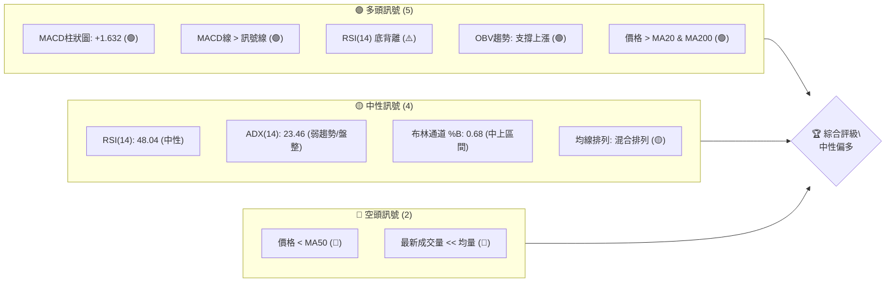

**解讀**：
從訊號儀表板來看，AMZN目前呈現多空交織的複雜局面。多頭訊號主要來自MACD的看多交叉與柱狀圖轉正、RSI的底背離以及OBV的量能支撐，同時價格站穩短期MA20和長期MA200上方。這顯示短期動能正在轉強，且長期趨勢仍維持上行。然而，中性訊號指出ADX趨勢強度不足，RSI處於中性區間，且均線排列混亂，表明市場缺乏明確的方向性。最主要的空頭壓力來自於價格仍受制於中期MA50，且近期成交量顯著萎縮，這可能預示著當前反彈的動能不足以支持突破關鍵阻力。綜合來看，市場處於一個短期反彈但中期面臨阻力、長期趨勢向上但缺乏強勁動能的盤整區間，傾向於**中性偏多**的判斷，等待進一步的催化劑。

### 📊 核心指標速覽表

| 指標類別 | 指標名稱 | 當前數值 | 訊號 | 解讀 |
|----------|----------|----------|------|------|
| **價格** | 當前價格 | $243.62 | 🟡 | 位於52週高低區間的57.7%，近期從低點反彈 |
| **均線** | MA20 | $239.68 | 🟢 | 價格位於MA20上方，短期偏多 |
| **均線** | MA50 | $254.60 | 🔴 | 價格位於MA50下方，中期偏空 |
| **均線** | MA200 | $233.17 | 🟢 | 價格位於MA200上方，長期偏多 |
| **動能** | RSI(14) | 48.04 | 🟡 | 處於中性區間，未達超買或超賣 |
| **動能** | MACD | +1.632 | 🟢 | MACD柱狀圖轉正，MACD線上穿訊號線，多頭動能增強 |
| **波動** | ATR(14) | $8.33 | 🟡 | 每日平均波動約3.42%，屬於中等波動水平 |

### 🏆 技術評分卡

本評分卡旨在綜合評估AMZN當前的技術面狀況，滿分為100分。

```
╔══════════════════════════════════════════════════════════════╗
║              技術評分卡 — AMZN (2026-07-08)                  ║
╠══════════════════════════════════════════════════════════════╣
║ 趨勢強度      ████░░░░░░░░░░░░░░░░  25/100  🟡 (ADX < 25, 弱趨勢)  ║
║ 動能指標      ████████████░░░░░░░░  65/100  🟢 (RSI底背離, MACD金叉)║
║ 支撐穩定度    ███████████████░░░░░  85/100  🟢 (強勁的歷史支撐區)  ║
║ 成交量配合    ████░░░░░░░░░░░░░░░░  40/100  🔴 (現量低於均量, OBV矛盾)║
║ 形態完整度    ██████░░░░░░░░░░░░░░  30/100  🔴 (無高信心度幾何形態)║
║ 均線排列      ██████░░░░░░░░░░░░░░  50/100  🟡 (混合排列, 短多長多中空)║
╠══════════════════════════════════════════════════════════════╣
║ 綜合評分      ████████░░░░░░░░░░░░  49/100  ⚖️ 中性偏多 (在區間內尋找方向)║
╚══════════════════════════════════════════════════════════════╝
```
**評分解讀**：
AMZN的技術評分卡顯示其綜合評分為49/100，處於中性偏多的區間。
- **趨勢強度**得分較低，ADX指示目前處於弱趨勢或盤整狀態，市場缺乏明確方向。
- **動能指標**表現較好，RSI底背離和MACD金叉提供了短期上漲動能的訊號。
- **支撐穩定度**得分最高，顯示下方存在堅實的支撐區域，為價格提供了緩衝。
- **成交量配合**得分較低，最新成交量遠低於平均水平，這為當前反彈的持續性帶來疑慮，儘管OBV訊號看多，但短期量能不足仍是風險。
- **形態完整度**得分最低，目前尚未識別出具備高信心度的經典圖表形態，增加了判斷的不確定性。
- **均線排列**呈現混合狀態，短期和長期均線看多，但中期均線仍壓制價格，顯示多空拉鋸。

整體而言，AMZN當前處於一個震盪築底的階段，短期動能有所恢復，但缺乏強勁的趨勢和成交量支持，中期壓力仍存。因此，策略上應以區間操作為主，等待明確的突破訊號。

---

## 2. 趨勢分析

### 🌐 多時框趨勢分析

對AMZN的多時框架趨勢進行逐級評估，從長期月線到短期日線，以描繪其整體市場結構。

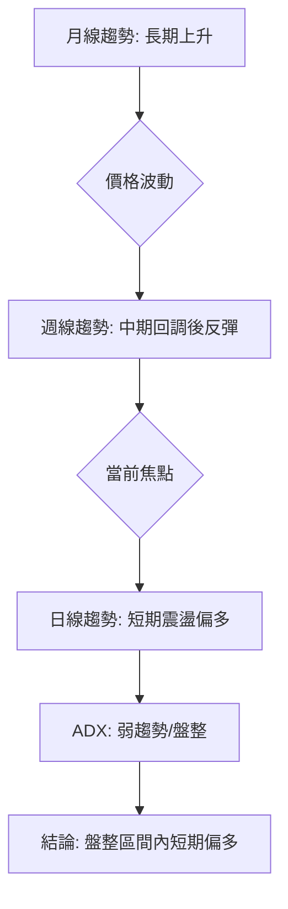

**詳細解讀**：
1.  **月線趨勢 (長期)**：從過去24個月的數據來看，AMZN的收盤價從2024年7月的$186.98穩步上升至2026年5月的$270.64，儘管期間有多次回調，但整體呈現明顯的上升趨勢。2026年6月和7月價格有所回落，但仍遠高於一年前的水平，且MA200 ($233.17) 持續上揚並位於現價下方，確認了長期多頭格局。
2.  **週線趨勢 (中期)**：觀察近20週收盤走勢，AMZN在2026年5月達到高點$272.68後，經歷了一輪顯著的回調，最低跌至2026年6月14日的$238.55，甚至在2026年6月28日短暫觸及$232.69。這波回調在觸及斐波那契61.8%回調位 ($227.54) 和50%回調位 ($237.28) 附近獲得支撐後，最近兩週 ($242.67, $243.62) 出現反彈。週線MA50 ($254.60) 仍位於價格上方並呈現下降趨勢，顯示中期壓力猶存，但反彈動能正在累積。
3.  **日線趨勢 (短期)**：當前價格 $243.62 位於MA20 ($239.68) 和MA200 ($233.17) 上方，顯示短期和長期動能偏多。MACD金叉和RSI底背離也支持短期反彈。然而，價格仍未能突破MA50 ($254.60) 和布林通道上軌 ($250.37)，表明短期上行空間面臨考驗。ADX(14) 23.46 顯示當前市場處於弱趨勢或盤整狀態，缺乏明確的單邊方向。

### 📈 長期趨勢 — 12個月走勢圖（Unicode）

以下為AMZN過去12個月的月線收盤價走勢圖，清晰展示其長期價格軌跡。

```
AMZN 月線走勢圖（過去12個月）
價格軸 ($)
$280 ┤                                        ● (270.64)
$270 ┤                                      ●
$260 ┤                                ●
$250 ┤                          ●
$240 ┤                    ●           ●       ● ← 現在 (243.62)
$230 ┤              ● ● ●
$220 ┤          ●
$210 ┤      ●
$200 ┤    ●(190.26)
$190 ┤●(184.42)
     └────────────────────────────────────────────────────────
      2025-04 05 06 07 08 09 10 11 12 2026-01 02 03 04 05 06 07
```

**走勢特徵分析表格**：

| 時間區間 | 起始價 | 結束價 | 漲跌幅 | 主要特徵 |
|----------|--------|--------|--------|----------|
| 2025-04 ~ 2025-10 | $184.42 | $244.22 | +32.4% | 強勁上升趨勢，期間伴隨小幅回調，但動能十足。 |
| 2025-10 ~ 2026-03 | $244.22 | $208.27 | -14.7% | 經歷一波中期回調，價格跌破部分均線支撐。 |
| 2026-03 ~ 2026-05 | $208.27 | $270.64 | +29.9% | 快速反彈並創下新高，動能非常強勁。 |
| 2026-05 ~ 2026-07 | $270.64 | $243.62 | -9.9% | 近期出現一次較大幅度回調，但已在關鍵支撐位附近止跌反彈。 |

**結論**：AMZN的長期走勢呈現「階梯式上升」的特點，即在強勁上漲後進行中期回調，然後再次突破前高。目前正處於從2026年5月高點回調後的反彈階段，長期上升趨勢的結構保持完好。

### 📊 中期趨勢（週線分析）

中期來看，AMZN在經歷了2026年5月的高點 ($272.68) 後，進入了為期約一個半月的調整期，價格從高點回落約15%。最近兩週則出現止跌反彈的跡象，試圖挑戰中期下行壓力。

```
AMZN 週線近期壓力與支撐示意圖
價格軸 ($)
$280 ┤                                          R3 ($276.65)
$270 ┤                                        ● (272.68)
$260 ┤                                    R2 ($258.60)
$250 ┤                                  MA50 ($254.60)
$240 ┤           ┌───────────┐      ● (243.62) ← 現價
$230 ┤           │           │    S1 ($223.82)
$220 ┤           │           │
$210 ┤           └───────────┘    S2 ($215.82)
$200 ┤
     └──────────────────────────────────────────────────
      2026-05-10  2026-05-24  2026-06-07  2026-06-21  2026-07-08
```
**圖示解讀**：
-   價格在2026年5月中旬達到高點後開始回落。
-   中期下行趨勢在2026年6月底觸及S1 ($223.82) 和斐波那契50% ($237.28) / 61.8% ($227.54) 回調位附近獲得支撐。
-   目前價格正從低點反彈，但上方仍面臨MA50 ($254.60) 和R1 ($248.81) / R2 ($258.60) 的雙重壓力。
-   該圖顯示AMZN目前處於一個從中期回調中嘗試恢復的階段，上方阻力顯著，下方支撐相對堅實。

### ⚡ 趨勢強度評估（ADX 解讀）

ADX (Average Directional Index) 指標用於衡量趨勢的強度，而非方向。

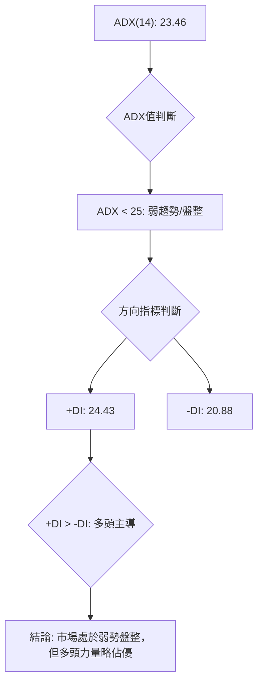

**ADX 強度對照表**：

| ADX 數值範圍 | 趨勢強度 | 市場狀態 |
|--------------|----------|----------|
| 0-25         | 弱趨勢   | 盤整/震盪 |
| 25-50        | 中等趨勢 | 趨勢形成中 |
| 50-75        | 強趨勢   | 趨勢明確 |
| 75-100       | 極強趨勢 | 趨勢加速 |

**解讀**：
AMZN的ADX(14)為**23.46**，根據對照表，這明確指示當前市場處於**弱趨勢或盤整狀態**。這意味著市場缺乏一個強勁、明確的單邊方向，價格更有可能在一個區間內震盪。
儘管ADX值較低，但我們還需觀察方向指標(+DI和-DI)。目前+DI (24.43) 高於-DI (20.88)，這表明在當前的弱勢盤整格局中，**多頭力量略佔主導**。換言之，雖然整體趨勢不明顯，但市場更傾向於向上試探或在區間底部獲得支撐。這與RSI底背離和MACD金叉的短期看多訊號相符，提示我們在盤整中尋找偏多的交易機會。

---

## 3. 圖表形態分析

### 🔍 形態識別系統

根據提供的週線收盤價數據，AMZN近期走勢為：從2026年3月底的低點$199.34開始強勁反彈至2026年5月初的$272.68，隨後經歷了一次約一個半月的修正，最低回落至$232.69，然後近期再次反彈至$243.62。

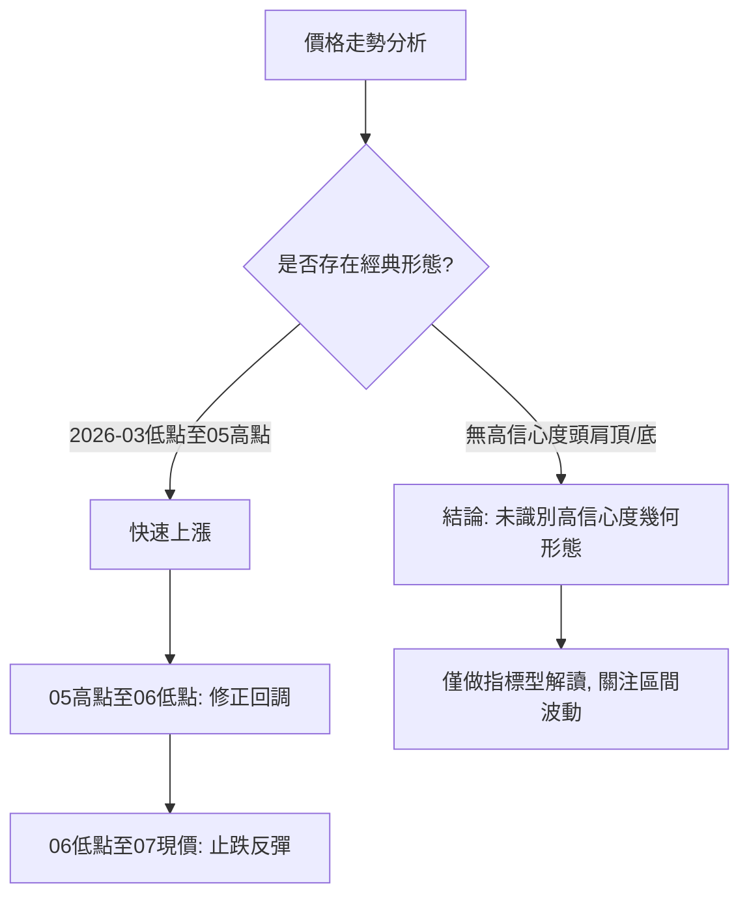

**形態信心度表格**：

| 形態 | 信心度 | 判斷依據（引用數據） | 完成度 | 目標價（附計算式） |
|------|--------|----------------------|--------|--------------------|
| **反彈形態** | 60% | 價格從2026-06-28 $232.69 止跌，並連續兩週收高 ($242.67, $243.62)，配合RSI底背離。 | 70% | 挑戰R1 $248.81 |
| **矩形/區間震盪** | 55% | ADX指示弱趨勢/盤整，價格受制於MA50 ($254.60) 和R1 ($248.81)，下方有S1 ($223.82) 支撐。 | 60% | 區間 $223.82 - $248.81 |
| **下降旗形** | 30% | 價格從高點回調，但尚未形成明確的平行通道，且近期已止跌反彈，信心度不足。 | 0% | 訊號不足，僅做指標型解讀 |

**解讀**：
根據提供的週線數據，AMZN的價格走勢在近期表現為從一個高點回落後的**止跌反彈形態**，並可能進入一個**矩形或區間震盪**的階段。
-   **反彈形態 (信心度 60%)**：價格在2026年6月底的低點 $232.69 附近獲得支撐後，出現了連續兩週的反彈，且RSI出現了底背離訊號，這支持了短期反彈的判斷。然而，由於成交量相對較低，反彈的強度仍需觀察。
-   **矩形/區間震盪 (信心度 55%)**：由於ADX指示市場處於弱趨勢/盤整狀態，且價格上方有R1 ($248.81) 和MA50 ($254.60) 壓制，下方有S1 ($223.82) 和斐波那契50% ($237.28) 支撐，因此價格在這些關鍵價位之間震盪的可能性較大。當前價格 $243.62 位於此區間中上部。
-   **其他複雜幾何形態**：如頭肩頂/底、雙頂/底或旗形，由於週線數據的粒度較大，且價格走勢尚未形成清晰的結構，目前無法以高信心度識別。例如，雖然經歷了大幅回調，但尚未形成明確的下降旗形或下降通道。因此，我們將重點放在對當前反彈和區間震盪的解讀。

### 🕯️ 重要K線形態分析

根據近20週的收盤價走勢，我們可以觀察到以下幾個關鍵週期的K線表現：

| 月份 | 收盤價 | K線形態 | 解讀 | 訊號 |
|------|--------|---------|------|------|
| 2026-04-19 | $250.56 | 長陽線 / 突破 | 價格強勢突破，RSI達97.5極度超買，顯示市場極度亢奮。 | 🟢 極強多頭 |
| 2026-05-17 | $264.14 | 長陰線 / 吞噬 | 從高點 $272.68 (2026-05-10) 回落，形成較大實體陰線，顯示賣壓湧現。 | 🔴 強空頭 |
| 2026-06-07 | $246.03 | 長陰線 | 價格加速下跌，RSI降至35.6，顯示中期回調動能強勁。 | 🔴 強空頭 |
| 2026-06-14 | $238.55 | 長陰線 | 延續跌勢，RSI跌至26.8，接近超賣區，預示可能止跌。 | 🔴 強空頭 |
| 2026-06-21 | $244.39 | 錘子線 / 止跌 | 價格收高，形成帶下影線的K線，顯示下方有買盤支撐。 | 🟢 潛在止跌 |
| 2026-07-05 | $242.67 | 實體陽線 | 止跌後的第二根陽線，RSI回升至50.9，確認反彈勢頭。 | 🟢 短期反彈 |

**總結**：
在2026年4月至5月期間，AMZN經歷了一波強勁的單邊上漲，形成多根長陽線。然而，隨後在5月中旬至6月中旬，市場出現快速且深度的回調，連續出現長陰線，顯示賣壓沉重。值得關注的是，在2026年6月21日和7月5日，價格在關鍵支撐位附近形成了帶有止跌意味的K線，特別是RSI在低位出現底背離，這為當前的反彈提供了較強的技術支持。儘管如此，目前的成交量較低，暗示反彈的持續性仍需更多量能配合。

### 📉 ASCII 走勢形態示意圖

以下為AMZN近期價格走勢的示意圖，展示了從高點回調後的反彈路徑。

```
AMZN 近期走勢與形態示意圖
價格軸 ($)
$275 ┤                                  ● (272.68, 2026-05-10 高點)
$270 ┤                                  ╲
$265 ┤                                   ╲
$260 ┤                                    ╲
$255 ┤                                     ╲
$250 ┤                                      ╲
$245 ┤                                       ● (243.62, 現價)
$240 ┤                                      ╱
$235 ┤                                     ╱
$230 ┤                                 ● (232.69, 2026-06-28 低點)
$225 ┤                                 S1 ($223.82)
     └───────────────────────────────────────────────────────────
      2026-05-03   2026-05-17   2026-05-31   2026-06-14   2026-06-28   2026-07-08
```
**圖示解讀**：
-   圖中可見AMZN從5月初的高點 $272.68 開始下行，形成一個明顯的修正趨勢。
-   價格在6月底觸及 $232.69 的低點，並在此獲得支撐。
-   隨後價格開始反彈，目前位於 $243.62，呈現出「V型反轉」的初步形態，但反轉的力度和持續性仍有待觀察。
-   下方 $223.82 為一個重要支撐位 (S1)，而上方 $248.81 (R1) 將是反彈的首個阻力考驗。

### 🎯 形態目標價計算

由於目前未識別到具備高信心度的經典幾何形態（如頭肩、雙底等），因此無法提供基於這些形態的精確目標價。目前的走勢更傾向於**從中期回調中反彈**，並可能進入**區間震盪**。

若將當前視為一個初步的**反彈形態**，其近期目標將是挑戰最近的阻力位：
-   **近期反彈目標**：挑戰 R1 阻力位 **$248.81**。
-   **區間震盪目標**：若能突破 R1，則目標可能延伸至 R2 **$258.60**，這也接近斐波那契23.6%回調位 $259.08 和中期MA50 $254.60。

**計算方法**：由於缺乏明確的形態高度或頸線，目標價主要基於提供的關鍵阻力位。若價格能有效突破R1，則意味著反彈動能增強，將進一步向上測試R2。

---

## 4. 支撐與阻力

### 🗺️ 關鍵價位分布圖（Unicode）

以下為AMZN當前價格 $243.62 周圍的關鍵支撐與阻力位分布圖。

```
AMZN 價位結構分布圖
═══════════════════════════════════════════════════
$278.56 ║████████████████████████║ 52W High
$276.65 ║████████████████████████║ 強阻力 R3
$259.08 ║████████████████████████║ 斐波那契 23.6%
$258.60 ║████████████████████    ║ 阻力 R2
$250.37 ║████████████████████████║ 布林上軌
$248.81 ║████████████████████████║ 關鍵阻力 R1
$247.02 ║████████████████████████║ 斐波那契 38.2%
$243.62 ╠════════════════════════╣ ◄ 現價
$239.68 ║▓▓▓▓▓▓▓▓▓▓▓▓▓▓▓▓        ║ 布林中軌 / MA20
$237.28 ║████████████████████████║ 斐波那契 50.0%
$233.17 ║████████████████████████║ MA200
$229.00 ║████████████████████████║ 布林下軌
$227.54 ║████████████████████████║ 斐波那契 61.8%
$223.82 ║▓▓▓▓▓▓▓▓▓▓▓▓▓▓▓▓        ║ 近期支撐 S1
$215.82 ║████████████████████████║ 強支撐 S2
$213.67 ║████████████████████████║ 斐波那契 78.6%
$211.22 ║████████████████████████║ 強支撐 S3
$196.00 ║████████████████████████║ 52W Low
═══════════════════════════════════════════════════
```

### 🚧 阻力位分析表

以下列出AMZN的關鍵阻力位及其技術意義。這些價位是基於歷史價格行為和波段高點聚類分析而來。

| 阻力級別 | 價位 | 形成原因 | 突破難度 | 重要性 |
|----------|------|----------|----------|--------|
| **R1**   | $248.81 | 近期波段高點聚類，也是當前反彈的首個考驗，接近斐波那契38.2%回調位 ($247.02) 和布林通道上軌 ($250.37)。 | 中等 | 🟢 決定短期反彈能否持續的關鍵 |
| **R2**   | $258.60 | 較強的歷史阻力區域，接近斐波那契23.6%回調位 ($259.08) 和MA50 ($254.60)。 | 高 | 🟡 突破此處將打開中期上漲空間 |
| **R3**   | $276.65 | 一年內的高點區域，接近52週高點 ($278.56)，代表了極強的賣壓區。 | 極高 | 🔴 突破意味著重回強勢上漲趨勢 |

**解讀**：
AMZN目前價格 $243.62 距離第一個關鍵阻力 R1 $248.81 僅有約2.13%的距離。成功突破並站穩 R1 將是確認短期反彈動能的關鍵。R2 $258.60 則代表了中期壓力，其突破將需要更強的買盤支持，並可能伴隨MA50的轉頭向上。R3 $276.65 則為長期趨勢的終極考驗，目前距離較遠。

### 🛡️ 支撐位分析表

以下列出AMZN的關鍵支撐位及其技術意義。這些價位是基於歷史價格行為和波段低點聚類分析而來。

| 支撐級別 | 價位 | 形成原因 | 守住機率 | 重要性 |
|----------|------|----------|----------|--------|
| **S1**   | $223.82 | 近期波段低點聚類，接近斐波那契61.8%回調位 ($227.54) 和布林通道下軌 ($229.00)。 | 高 | 🟢 決定短期反彈是否結束的關鍵 |
| **S2**   | $215.82 | 較強的歷史支撐區域，接近斐波那契78.6%回調位 ($213.67)。 | 中等 | 🟡 跌破將預示中期趨勢轉弱 |
| **S3**   | $211.22 | 過去一年內的較低支撐位，具有較強的心理支撐作用。 | 極高 | 🔴 跌破意味著長期趨勢可能面臨挑戰 |

**解讀**：
AMZN當前價格 $243.62 距離第一個關鍵支撐 S1 $223.82 有約8.13%的緩衝空間。近期價格已在此區域附近獲得支撐並反彈，顯示此處買盤力量較強。若跌破 S1，則可能向下測試 S2 $215.82，屆時中期趨勢將面臨嚴峻考驗。S3 $211.22 則為更深層次的長期支撐，其重要性不言而喻。

### 📐 斐波那契回調位分析

我們將基於AMZN過去52週的價格區間 ($196.00 至 $278.56) 進行斐波那契回調位分析。

-   **0.0%  (52W High)**   $278.56
-   **23.6%**              $259.08
-   **38.2%**              $247.02
-   **50.0%**              $237.28
-   **61.8%**              $227.54
-   **78.6%**              $213.67
-   **100.0% (52W Low)**   $196.00

**解讀**：
當前價格 $243.62 位於斐波那契 **38.2% 回調位 ($247.02)** 和 **50.0% 回調位 ($237.28)** 之間。
-   在最近的回調中，價格跌破了38.2%回調位，並在50.0%回調位附近獲得了初步支撐。
-   目前價格正試圖反彈，如果能夠重新站穩38.2%回調位 $247.02 上方，將是看多訊號，目標將指向23.6%回調位 $259.08。
-   反之，若反彈受阻並再次跌破50.0%回調位 $237.28，則可能進一步下探61.8%回調位 $227.54，該位置與S1 $223.82 構成一個強大的支撐區域，是重要的觀察點。

---

## 5. 技術指標深度解讀

### 🎛️ 指標訊號總覽

以下Mermaid圖展示了AMZN各主要技術指標當前的訊號關係及其對價格的影響。

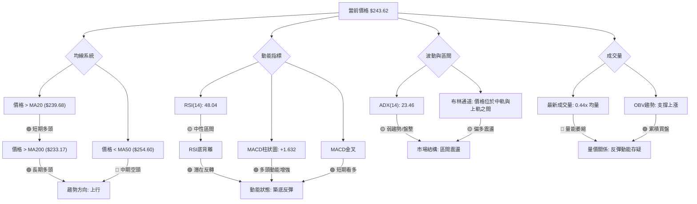

**總結**：
AMZN的技術指標呈現複雜而有趣的組合。均線系統顯示短期和長期趨勢偏多，但中期仍受MA50壓制。動能指標（RSI底背離、MACD金叉）強烈支持短期反彈，預示著潛在的築底和上漲動能。然而，ADX指示市場仍處於弱勢盤整，布林通道也支持區間震盪。最值得關注的是成交量：最新成交量萎縮，但OBV趨勢卻顯示累積買盤支撐上漲。這暗示當前反彈可能缺乏爆發力，但潛在的底部支撐較為堅實。

### 📈 移動平均線排列分析

AMZN的移動平均線（MA）系統顯示出一個混合的排列，反映了不同時間框架下的多空拉鋸。

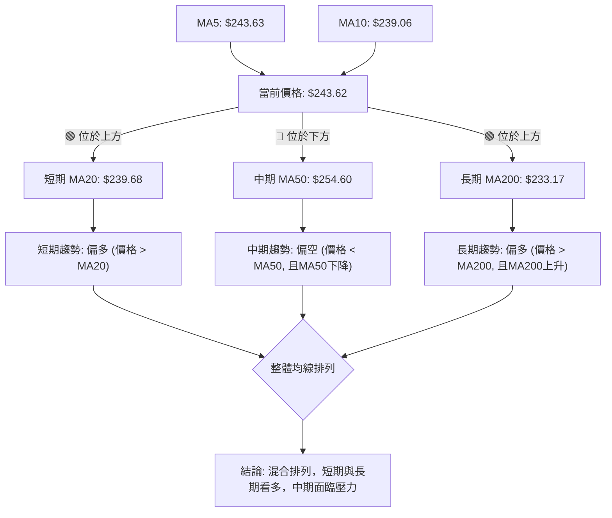

**詳細分析**：
-   **MA5 ($243.63)** 與當前價格 $243.62 幾乎持平，顯示短期動能非常接近平衡點，但略微壓制價格。
-   **MA10 ($239.06)** 位於當前價格下方並呈上升趨勢，表明更短期的趨勢是向上的。
-   **MA20 ($239.68)** 位於當前價格下方並呈上升趨勢，提供短期支撐，確認了短期偏多的訊號。
-   **MA50 ($254.60)** 位於當前價格上方並呈下降趨勢，這是中期趨勢的主要阻力。價格未能突破MA50，顯示中期修正壓力仍然存在。
-   **MA200 ($233.17)** 位於當前價格下方並呈上升趨勢，提供了強勁的長期支撐，並確認AMZN的長期上升趨勢保持不變。

**結論**：AMZN的均線系統呈現「短期多頭、中期空頭、長期多頭」的混合排列。這意味著在長期上漲趨勢的背景下，股價經歷了中期調整，目前正試圖在短期內反彈。MA50將是中期趨勢能否扭轉的關鍵阻力。

### 📉 RSI(14) 分析

RSI(14) 指標用於衡量價格變動的速度和幅度，判斷超買超賣狀態。

-   **RSI(14) 數值**：48.04
-   **RSI 進度條**：▓▓▓▓▓▓▓▓▓▓░░░░░░░░░░ 48.04%
-   **超買/超賣區間**：
    -   超買區 (>70)：未進入
    -   超賣區 (<30)：未進入
    -   中性區 (30-70)：**處於中性區間** 🟡

**解讀**：
AMZN的RSI(14)目前為**48.04**，位於30至70的中性區間，這表示價格既未處於超買也未處於超賣狀態，市場情緒相對平衡。這與ADX指示的弱趨勢/盤整狀態相符。

**RSI 背離判斷**：
數據中明確指出：**⚠️ 底背離 (Bullish Divergence)**。
-   **底背離**發生在股價創下更低的新低，但RSI指標卻創下更高的低點，或者股價在低點盤整而RSI卻開始回升。
-   在AMZN的案例中，這暗示儘管價格在近期回調中可能觸及了較低的點位，但市場內在的賣壓已顯著減弱，買盤力量正在積聚。
-   **意義**：RSI底背離是一個強烈的**潛在看漲反轉訊號**，通常預示著價格可能在不久的將來止跌回升或開啟一波反彈。這與MACD金叉的訊號形成共振，增強了短期偏多的判斷。

### 📊 MACD(12/26/9) 訊號解讀

MACD (Moving Average Convergence Divergence) 指標用於識別趨勢的動能、方向和潛在反轉。

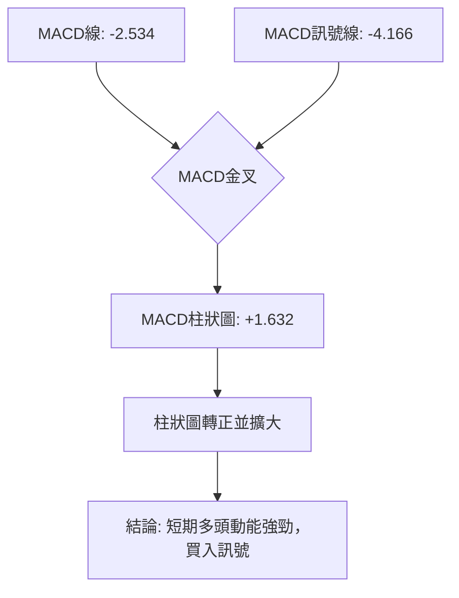

**詳細分析**：
-   **MACD線 (-2.534)**：MACD線已由負轉正或正在快速接近零軸。
-   **MACD訊號線 (-4.166)**：訊號線位於MACD線下方。
-   **MACD柱狀圖 (+1.632)**：柱狀圖為正值，且正在擴大。

**訊號解讀**：
1.  **MACD金叉 (Bullish Crossover)**：MACD線從下方上穿訊號線，這是一個經典的**買入訊號** 🟢。它表明短期移動平均線（快線）開始加速上行，超越了長期移動平均線（慢線），預示著股價的短期上漲動能正在增強。
2.  **MACD柱狀圖轉正並擴大 (Positive and Expanding Histogram)**：柱狀圖從負值轉為正值，並呈現擴大趨勢，這進一步確認了多頭力量的增強。柱狀圖的擴大表明MACD線與訊號線之間的距離正在拉大，顯示上漲動能正在加速。

**綜合結論**：MACD指標清晰地發出了**看多訊號**。MACD金叉和柱狀圖轉正並擴大，都強烈暗示AMZN在短期內具備上漲動能。這與RSI底背離的潛在反轉訊號相互印證，為當前的反彈提供了堅實的動能支持。

### 📦 布林通道分析

布林通道 (Bollinger Bands) 用於衡量價格的波動區間和相對高低點。

```
AMZN 布林通道示意圖
價格軸 ($)
$255 ┤                     ┌─────────┐
$250 ┤                     │  BB上軌 ($250.37)
$245 ┤                     │  ● 現價 ($243.62)
$240 ┤                     │  BB中軌 (MA20 $239.68)
$235 ┤                     │
$230 ┤                     │  BB下軌 ($229.00)
$225 ┤                     └─────────┘
     └──────────────────────────────────
      時間軸
```

**詳細分析**：
-   **BB上軌**：$250.37
-   **BB中軌 (MA20)**：$239.68
-   **BB下軌**：$229.00
-   **當前價格**：$243.62
-   **BB %B**：0.68 (表示價格位於中軌和上軌之間，且偏向上軌)

**訊號解讀**：
1.  **價格位置**：當前價格 $243.62 位於布林通道中軌 ($239.68) 和上軌 ($250.37) 之間，且靠近中軌。BB %B 為0.68，進一步確認了這一點。這通常被視為一個**偏多但尚未強勢突破**的訊號。價格在中軌上方運行，表明短期趨勢向上。
2.  **通道寬度**：雖然數據未直接提供布林帶寬，但從上中下軌的數值來看，通道寬度適中。在ADX指示弱趨勢/盤整的情況下，價格在中軌上方運行，可能預示著價格正在嘗試向布林上軌挑戰，或者在通道內進行區間上行震盪。
3.  **潛在阻力與支撐**：布林上軌 $250.37 構成了一個潛在的短期阻力，而中軌 $239.68 (即MA20) 則提供了堅實的短期支撐。如果價格能夠有效突破上軌，則可能預示著一波新的上漲趨勢；如果未能突破並跌回中軌下方，則可能再次測試下軌。

**結論**：布林通道分析顯示AMZN短期內偏向多頭，價格在中軌上方運行，正嘗試向布林上軌移動。在ADX指示盤整的背景下，這可能意味著股價在一個較寬的區間內向上震盪，或正在積蓄力量準備突破。

### 💹 成交量分析（量價配合度）

成交量是價格走勢的能量來源，對於判斷趨勢的可靠性至關重要。

-   **最新成交量**：27,799,758
-   **20日均量**：62,619,943
-   **50日均量**：51,501,379
-   **量比**：0.44x (最新成交量遠低於20日均量)
-   **OBV趨勢**：OBV > MA → 量能支撐上漲 🟢

**詳細分析與量價配合度**：
1.  **最新成交量與均量對比**：當前成交量 (27.8M) 僅為20日均量 (62.6M) 的約44%，顯著萎縮。這是一個**警示訊號** 🔴。通常，在價格上漲或反彈時，需要有放大的成交量來確認其強度和可持續性。當前價格正在反彈，但成交量卻大幅萎縮，這構成了一種**量價背離**，表明當前的反彈可能缺乏強勁的買盤支持，其持續性存疑。
2.  **OBV (On Balance Volume) 趨勢**：然而，數據同時指出 "OBV趨勢: OBV > MA → 量能支撐上漲" 🟢。OBV是一個累積性指標，它將成交量與價格變動聯繫起來，旨在判斷資金流向。OBV高於其移動平均線，表明在過去一段時間內，累積的買盤壓力大於賣盤壓力，資金仍在流入，這通常被視為一個**看漲訊號**。

**矛盾與解讀**：
這裡存在一個顯著的矛盾：
-   **短期視角**：最新成交量萎縮，對當前價格的反彈構成量價背離，是偏空訊號。
-   **中長期視角**：OBV趨勢向上，表明累積性資金流動是健康的，支持潛在的上漲。

**綜合結論**：
這種矛盾暗示當前AMZN的價格反彈是在**較低短期熱度**下進行的，市場參與者的追漲意願不強。但從**中長期資金流向**來看，多頭仍在默默積累籌碼。這意味著當前的反彈可能不會是急劇拉升，而更傾向於溫和上行或在區間內震盪上行，且任何快速拉升都可能因量能不足而受阻。投資者應警惕低量反彈的風險，但同時也要認識到OBV所指示的潛在買盤力量。若要確認強勁上漲趨勢，未來必須看到成交量顯著放大配合價格上漲。

---

## 6. 動能與波動率

### ⚡ 動能評估四象限

本節將AMZN的動能與波動率進行綜合評估，以判斷其當前所處的市場階段。

| 象限 | 動能 | 波動 | 當前狀態 (AMZN) | 評估 |
|------|------|------|-----------------|------|
| Q1   | 強   | 低   | 否              | 最佳機會 (強動能低風險) |
| Q2   | 弱   | 低   | 否              | 謹慎觀望 (缺乏機會) |
| Q3   | 強   | 高   | 否              | 高風險高收益 (追漲殺跌) |
| Q4   | 弱   | 高   | ✓ (中等波動)    | **避免進場 (不確定性高)** |

**AMZN 動能與波動率分析**：
-   **動能評分**：
    -   RSI(14): 48.04 (中性)
    -   MACD: 金叉，柱狀圖轉正 (🟢 看多)
    -   RSI 背離: 底背離 (⚠️ 潛在反轉)
    -   綜合來看，短期動能正在從底部恢復，但ADX (23.46) 顯示整體趨勢強度不足。因此，AMZN的動能可評估為**中等偏弱**。
-   **波動率評分**：
    -   ATR(14): $8.33 (佔股價3.42%)
    -   Beta: 1.461
    -   ATR顯示AMZN的每日波動幅度屬於**中等水平**。Beta值較高則意味著其波動性高於大盤。

**結論**：
AMZN當前處於「**中等偏弱動能**」與「**中等波動率**」的狀態。這將其置於介於Q2和Q4之間的區域，但更傾向於**Q4 (弱動能，高波動)**，因為Beta值較高。在這種情境下，市場缺乏明確的單邊動能，但價格波動性相對較高，這使得交易風險增加，且收益確定性降低。因此，目前的市場環境對於積極追逐趨勢的交易者而言，並非最佳進場時機，更適合區間操作或等待明確的趨勢確認。

### 📊 ATR 波動率分析

ATR (Average True Range) 指標衡量資產價格在特定時間段內的平均真實波動範圍，反映其波動性。

-   **ATR(14)**：$8.33
-   **佔當前價格比例**：$8.33 / $243.62 = 3.42%

**詳細分析**：
-   **波動水平**：AMZN的ATR(14)為 $8.33，佔當前價格的3.42%。這表明在過去14天裡，AMZN平均每天的價格波動範圍約為 $8.33。對於一支價格在 $240 區間的股票而言，3.42%的日均波動屬於**中等偏高水平**。這意味著AMZN的股價變動相對活躍，為短線交易提供了機會，但也增加了日內風險。
-   **止損距離建議**：ATR是設定止損點的常用工具。一般建議將止損點設置在ATR的1倍至2倍距離之外，以避免被正常市場噪音震出。
    -   **保守止損**：1 x ATR = $8.33。若進場價格為 $243.62，則止損點可設在 $243.62 - $8.33 = $235.29。
    -   **寬鬆止損**：1.5 x ATR = $12.50。若進場價格為 $243.62，則止損點可設在 $243.62 - $12.50 = $231.12。
    -   **考量**：由於AMZN目前處於盤整狀態，且下方有較強的支撐位 S1 ($223.82) 和斐波那契50% ($237.28) / 61.8% ($227.54)，在實際操作中，應將ATR計算出的止損點與這些關鍵支撐位結合考慮，以提高止損的有效性。例如，將止損設在 S1 之下，或斐波那契50%之下，再根據ATR微調。

**結論**：AMZN的ATR顯示其具有中等偏高的波動性，交易者在制定策略時應充分考慮這一點，合理設置止損，並預留足夠的波動空間。

### 📐 Beta 與市場相關性

Beta 值衡量單一資產相對於整體市場的波動性，是評估系統性風險的關鍵指標。

-   **Beta 值**：1.461

**詳細分析**：
-   **波動特徵**：AMZN的Beta值為**1.461**，遠高於1。這意味著AMZN的股價波動性顯著高於整體市場。具體來說，當市場（如標普500指數）上漲1%時，AMZN的股價平均上漲1.461%；反之，當市場下跌1%時，AMZN的股價平均下跌1.461%。
-   **市場相關性**：高Beta值表明AMZN與市場的相關性較強，但其價格變動被放大。這使得AMZN成為一個高成長、高風險的股票，在牛市中通常表現優於大盤，但在熊市中也可能遭受更大的損失。
-   **對投資的影響**：
    -   **牛市環境**：在整體市場趨勢向上的背景下，AMZN有望提供超額回報。
    -   **熊市環境**：在市場下跌時，AMZN的跌幅可能更大，因此需要更嚴格的風險控制。
    -   **盤整環境**：在市場缺乏明確方向的盤整期，高Beta股票的波動可能更劇烈，增加了交易的複雜性和不確定性。

**結論**：AMZN的高Beta值 (1.461) 表明其股價對市場變動高度敏感且波動幅度更大。投資者在配置AMZN時，應充分認識到其較高的系統性風險，並結合對整體市場趨勢的判斷來制定策略。在當前ADX指示盤整的市場環境下，AMZN的高波動性可能導致更大的區間震盪，而非明確的單邊趨勢。

---

## 7. 多時框架總結

### 📋 時框架評分表

本表綜合評估AMZN在不同時間框架下的技術訊號，並給出建議。

| 時框架 | 趨勢方向 | 動能 | 均線排列 | 形態 | 綜合評分 | 建議 |
|--------|----------|------|----------|------|----------|------|
| **月線** | 🟢 上升趨勢 | 🟡 中性偏多 | 🟢 多頭排列 (MA200上升) | 🟢 長期築底/上升 | 7/10 | 長期持有，關注回調機會 |
| **週線** | 🟡 回調後反彈 | 🟢 築底反彈 | 🟡 混合排列 (受MA50壓制) | 🟡 初步反彈形態 | 6/10 | 區間操作，關注阻力突破 |
| **日線** | 🟢 短期偏多 | 🟢 強勁恢復 | 🟡 混合排列 (短期金叉) | 🟡 止跌反彈 | 7/10 | 短線偏多，但需量能確認 |

### 🔲 綜合訊號矩陣

以下矩陣展示了AMZN在各個關鍵技術維度上的訊號一致性或衝突。

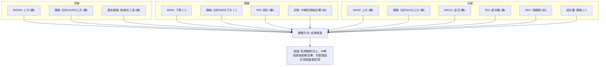

**一致性分析**：
-   **長期趨勢**與**短期動能**：長期趨勢（月線MA200上升，價格位於其上方）明確看漲。短期動能（MACD金叉，RSI底背離，價格位於MA20上方）也顯示出強勁的恢復跡象。這兩者形成共振，為當前反彈提供了堅實的基礎。
-   **中期趨勢與短期動能的衝突**：中期趨勢（價格位於MA50下方，且MA50下降）顯示中期壓力仍然存在。這與短期動能的看漲訊號形成衝突，意味著短期反彈可能會在中期阻力位（如MA50或R1/R2）附近遭遇考驗。
-   **趨勢強度與量能的限制**：ADX指示市場處於弱趨勢/盤整狀態，且最新成交量萎縮，這對短期反彈的持續性構成限制。即使動能指標看好，缺乏量能支持的突破往往難以持久。

### ⚖️ 多時框收斂結論

根據「嚴格要求 14」的多時框收斂規則：

1.  **判斷當前市場狀態**：ADX(14) 為 23.46，**小於25**。這明確指示AMZN目前處於**盤整行情**或弱趨勢。
2.  **主導時框與交易區間**：在盤整行情中，應**以日線布林通道上下軌為主要交易區間**。當前價格 $243.62 位於布林中軌 ($239.68) 和上軌 ($250.37) 之間。
3.  **綜合判斷**：
    -   **長期**：月線趨勢和MA200均明確支持長期上漲。
    -   **中期**：價格從高點回調，受制於下降的MA50 ($254.60)，顯示中期壓力。
    -   **短期**：日線MACD金叉、RSI底背離、價格站穩MA20和MA200上方，都發出強烈的短期看多訊號。價格正在布林通道中軌上方運行，試圖挑戰上軌。
    -   **量能與趨勢強度**：最新成交量萎縮，但OBV趨勢向上，ADX指示弱勢盤整。這意味著短期反彈雖有動能，但缺乏爆發式上漲的條件，更可能在區間內溫和上行。

**最終結論**：
AMZN目前處於一個**弱勢盤整但短期偏多**的階段。儘管長期趨勢保持向上，且短期動能指標（RSI底背離、MACD金叉）發出看漲訊號，但ADX指示整體市場缺乏強勁趨勢，且價格受制於中期MA50，同時成交量萎縮，限制了上漲空間。因此，**主導策略應為在日線布林通道區間內進行操作，方向上傾向於逢低做多**，目標價位為布林上軌及近期阻力位，但需警惕量能不足帶來的反彈受阻風險。

---

## 8. 交易策略建議

### 🗺️ 策略決策流程圖

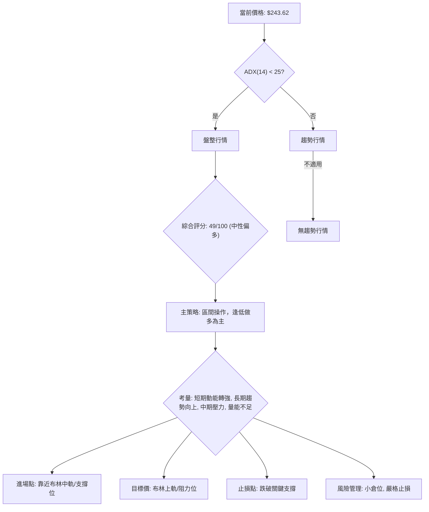

### 🧭 策略路由

**當前主策略方向 = ⚖️ 中性偏多（依評分 49/100）**

基於綜合評分49/100，AMZN目前處於中性偏多狀態，且ADX指示為盤整行情。因此，主策略將聚焦於**區間操作中的逢低做多機會**，同時密切關注突破訊號。空頭策略僅作為反轉風險的提示。

### 🎯 價格情境階梯（Price Scenarios）

以下情境劇本基於當前價格 $243.62 及關鍵支撐阻力位。

| 觸發條件 | 下一目標 | 後續延伸 | 情境含義 |
|----------|----------|----------|----------|
| **突破 R1 $248.81** | R2 $258.60 | R3 $276.65 | 短線轉強，有望挑戰中期阻力，若能帶量突破，則確立新一波上漲。 |
| **站穩現價區間** | —        | —        | 在 $237.28 (斐波那契50%) 與 $248.81 (R1) 之間震盪，等待方向選擇。 |
| **跌破 S1 $223.82** | S2 $215.82 | S3 $211.22 | 中期轉弱，反彈結束，可能再次探底，甚至挑戰長期支撐。 |

### 📊 情境機率分佈

以下為三種情境的機率估計，並說明其依據。

| 情境 | 機率 | 主要依據 |
|------|------|----------|
| 繼續上行 / 反彈 | 45% | MACD金叉、RSI底背離、價格站穩MA20/MA200、OBV趨勢向上。短期動能支持反彈。 |
| 區間震盪 | 40% | ADX指示弱趨勢/盤整、價格受制於MA50和R1、最新成交量萎縮。市場缺乏明確趨勢。 |
| 回落 / 再探底 | 15% | 若無法突破R1，且成交量持續萎縮，則可能再次回落測試S1/S2。 |
| **總和** | **100%** | | |

**解讀**：由於AMZN當前處於盤整行情，且多空訊號交織，因此區間震盪和繼續上行的機率較高。短期動能強勁為反彈提供支持，但趨勢強度和成交量不足限制了其爆發性，使其更可能在區間內上行。

### 🟢 主策略詳情（方向：中性偏多，區間操作）

基於以上分析，我們建議採取**逢低做多**的區間操作策略，並密切關注關鍵阻力位的突破情況。

| 策略要素 | 策略 A (短線反彈) | 策略 B (區間底部建倉) |
|----------|-------------------|-----------------------|
| 進場條件 | 價格成功站穩布林中軌 $239.68 | 價格回落至 S1 $223.82 附近並出現止跌訊號 |
| 進場價格 | $239.68 - $240.50 區間 | $224.00 - $228.00 區間 (靠近S1和斐波那契61.8%) |
| 目標價 T1 | $248.81 (R1)       | $237.28 (斐波那契50%) |
| 目標價 T2 | $258.60 (R2)       | $248.81 (R1)          |
| 止損價格 | $237.28 (斐波那契50%) | $215.82 (S2)          |
| 風險報酬比 | T1: ~1:2.5, T2: ~1:4 | T1: ~1:2.5, T2: ~1:6  |
| 成功機率 | 60%               | 70%                   |
| 建議倉位 | 輕倉 (10-15%)     | 中倉 (15-20%)         |

**策略 A 解讀**：在當前價格已從低點反彈，且MACD金叉，RSI底背離的情況下，若能確認站穩布林中軌，則有機會繼續向上挑戰R1。此策略的風險報酬比良好，但需警惕量能不足可能導致反彈受阻。

**策略 B 解讀**：若市場再次回調至S1附近，該區域與斐波那契61.8%回調位重合，提供強勁支撐。在此處等待止跌訊號建倉，具有更高的成功機率和更優的風險報酬比，是更為穩健的選擇。

### 🔴 反向風險觸發點（對沖提示）

以下為可能推翻主策略的關鍵價位與訊號，供風險管理參考：
-   **跌破布林中軌 $239.68**：若價格未能守住中軌，將削弱短期反彈動能。
-   **跌破斐波那契50%回調位 $237.28**：這是從高點回調的關鍵心理關口，跌破將預示可能進一步下探。
-   **跌破 S1 $223.82**：這將是中期趨勢轉弱的明確訊號，可能引發更大規模的下跌。
-   **MACD 死叉或RSI再次走弱**：若動能指標轉差，則反彈動能可能耗盡。
-   **成交量持續低迷，反彈無法突破R1**：量價背離持續，反彈受阻，可能再次回調。

### ⭐ 整體訊號強度評星

```
做多訊號強度：★★★☆☆  (3/5星) (短期動能強，長期趨勢向上，但中期受阻且量能不足)
做空訊號強度：★★☆☆☆  (2/5星) (中期有壓力，但下方支撐強勁，且短期動能看多)
整體可信度：  ★★★☆☆  (3/5星) (盤整行情，需耐心等待明確訊號或在區間內操作)
```

---

## 9. 風險提示與監控

### ✅ 關鍵監控指標 Checklist

以下為投資者應密切關注的關鍵技術指標和價位，以應對AMZN股價的潛在變化。

```
╔══════════════════════════════════════════════════════════════╗
║              AMZN 關鍵監控指標 Checklist                     ║
╠══════════════════════════════════════════════════════════════╣
║ ├─ 價格行為監控                                               ║
║ │  ├─ 突破 R1 $248.81 並帶量?                      [ ] 是 [ ] 否║
║ │  ├─ 跌破 S1 $223.82 並放量?                      [ ] 是 [ ] 否║
║ │  ├─ 價格是否站穩布林中軌 $239.68?                 [ ] 是 [ ] 否║
║ ├─ 動能指標監控                                               ║
║ │  ├─ MACD 線是否維持金叉並柱狀圖擴大?              [ ] 是 [ ] 否║
║ │  ├─ RSI(14) 是否維持在中性偏多區間 (40-60)?       [ ] 是 [ ] 否║
║ │  ├─ RSI 是否出現頂背離訊號?                      [ ] 是 [ ] 否║
║ ├─ 趨勢與波動率監控                                           ║
║ │  ├─ ADX(14) 是否突破25，指示趨勢形成?             [ ] 是 [ ] 否║
║ │  ├─ MA50 ($254.60) 是否轉為上揚並被突破?          [ ] 是 [ ] 否║
║ │  ├─ ATR(14) 波動率是否異常放大或縮小?             [ ] 是 [ ] 否║
║ ├─ 成交量監控                                                 ║
║ │  ├─ 價格上漲時是否伴隨成交量放大?                 [ ] 是 [ ] 否║
║ │  ├─ OBV趨勢是否持續向上?                         [ ] 是 [ ] 否║
╚══════════════════════════════════════════════════════════════╝
```

### ⚠️ 風險場景分析

以下為AMZN股價在不同情境下的潛在走勢分析。

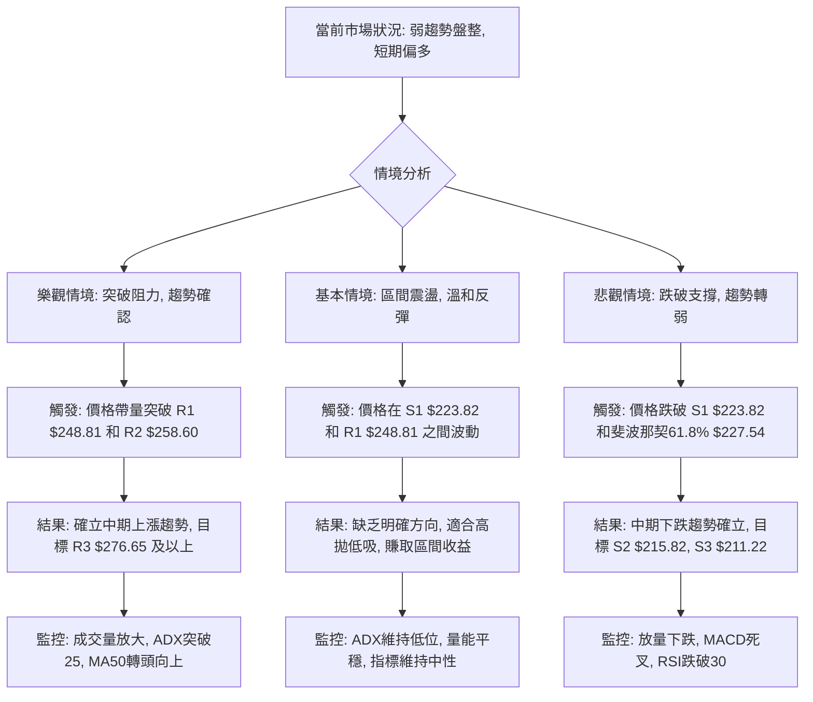

### 🛡️ 風險管理重要提醒

1.  **倉位管理**：由於目前市場處於盤整狀態，且ADX指示趨勢強度不足，建議採用**輕倉或中等倉位**進行操作。避免重倉押注單邊方向，以降低不確定性帶來的風險。
2.  **嚴格止損**：無論採取何種策略，**務必設定並嚴格執行止損點**。尤其在區間操作中，一旦價格跌破關鍵支撐位，應果斷離場，避免虧損擴大。可參考ATR或關鍵支撐位（如S1 $223.82，或斐波那契50% $237.28）設置止損。
3.  **多時框確認**：在進行任何交易決策前，應再次確認日線、週線、月線等不同時間框架的訊號是否一致。當前雖然短期偏多，但中期壓力仍存，因此在突破中期阻力前，仍需保持警惕。
4.  **量能配合**：密切關注成交量的變化。在盤整行情中，價格的突破需要有放大的成交量來確認其有效性。若價格上漲而成交量萎縮，則反彈可能缺乏持續性，應視為警示訊號。
5.  **市場情緒**：雖然本報告側重技術分析，但仍需留意宏觀經濟數據、公司基本面消息以及整體市場情緒的變化，這些因素可能對股價產生重大影響。AMZN的Beta值較高，意味著其股價對大盤波動敏感。

---

## 📋 報告總結

```
╔════════════════════════════════════════════════════════════════════╗
║                   AMZN 技術分析報告總結                            ║
╠════════════════════════════════════════════════════════════════════╣
║ 報告日期：2026-07-08                                                 ║
║ 當前價格：$243.62                                                    ║
║ 分析評級：⚖️ 中性偏多 (在弱勢盤整區間內尋找短期上行機會)            ║
║                                                                      ║
║ 關鍵結論：                                                           ║
║ ├─ 長期趨勢：🟢 穩健的上升趨勢，MA200持續上揚並提供堅實支撐。        ║
║ ├─ 中期趨勢：🟡 經歷高點回調後初步反彈，但仍受制於下降的MA50壓力。  ║
║ ├─ 短期趨勢：🟢 短期動能強勁恢復，MACD金叉與RSI底背離指示反彈。      ║
║ ├─ 關鍵支撐：$223.82 (S1) 與 $237.28 (斐波那契50%) 構成強勁底部區域。║
║ ├─ 關鍵阻力：$248.81 (R1) 與 $258.60 (R2) 是反彈上行的主要挑戰。    ║
║ └─ 分析師目標：$312.91 (平均目標價，顯示長期潛在漲幅較大)。          ║
║                                                                      ║
║ 最優策略組合：                                                       ║
║ 1. 🥇 最佳機會：在 $224.00 - $228.00 區間 (靠近S1和斐波那契61.8%) 逢低建倉，║
║                 目標 $237.28 (T1) 和 $248.81 (T2)，止損設於 $215.82。 ║
║ 2. 🥈 次選機會：若價格站穩布林中軌 $239.68，可輕倉做多，目標 $248.81 (T1)║
║                 和 $258.60 (T2)，止損設於 $237.28。                 ║
║ 3. 🥉 保守選擇：等待價格帶量突破 R1 $248.81 並站穩，確認趨勢後再追漲。 ║
║                 此時風險較低，但收益空間可能縮小。                   ║
╚════════════════════════════════════════════════════════════════════╝
```

---

> ⚠️ **免責聲明**：本報告為 AI 自動生成之技術分析，所有數據及估算均基於提供的歷史價格資訊。本報告**僅供研究與學術參考**，**不構成任何投資建議**。投資有風險，入市需謹慎。

---

*報告生成時間：2026-07-08 ｜ 數據來源：Yahoo Finance ｜ 分析框架：多時框技術分析*