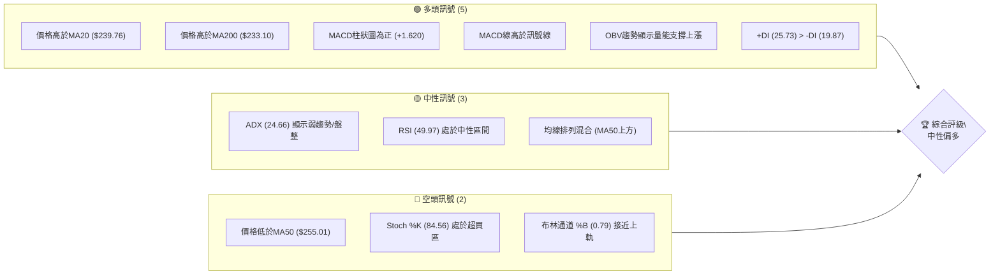
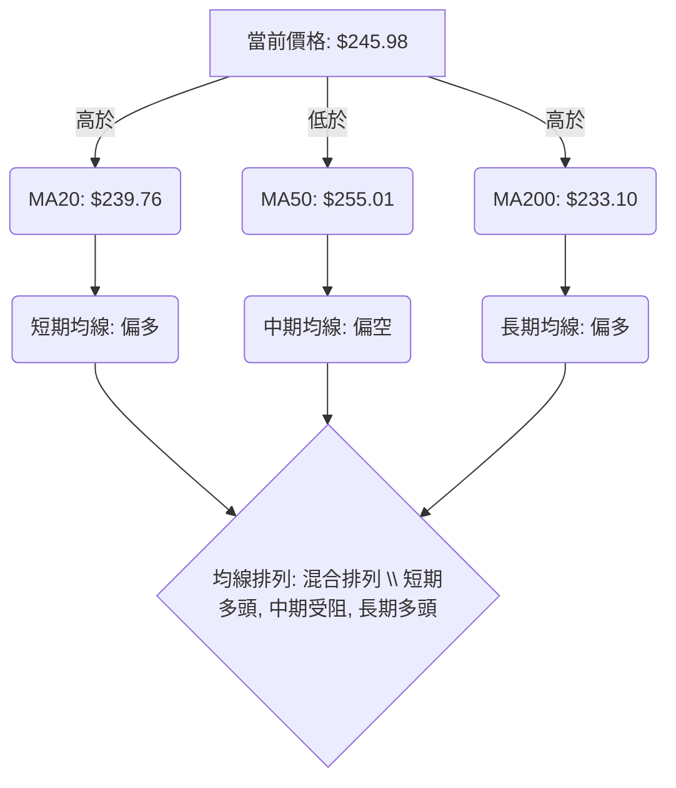
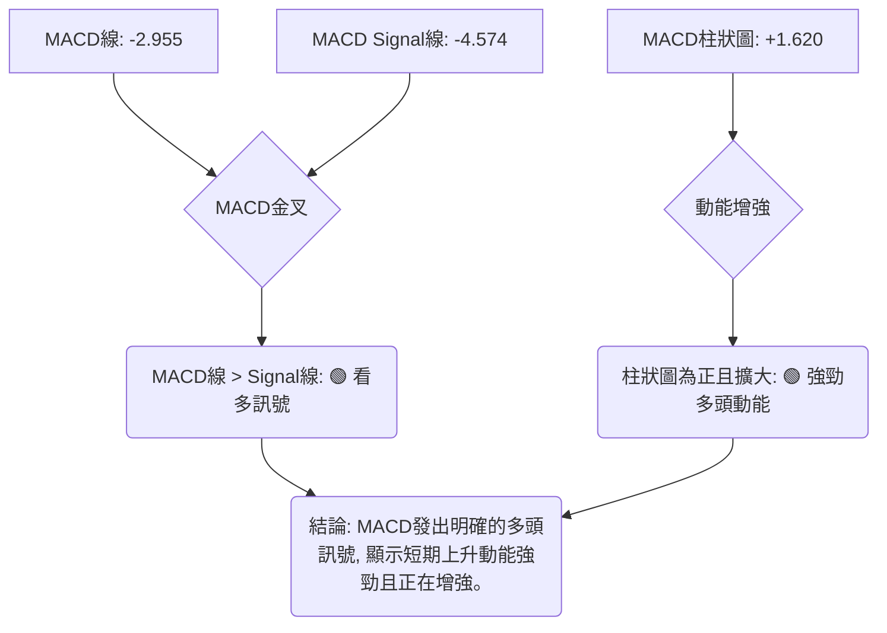

<details>
<summary>📊 靜態圖表 (點擊展開)</summary>

</details>

<html>
<head><meta charset="utf-8" /></head>
<body>
    <div style="height:500px; width:100%;">                        <script>window.PlotlyConfig = {MathJaxConfig: 'local'};</script>
        <script charset="utf-8" src="https://cdn.plot.ly/plotly-3.6.0.min.js" integrity="sha256-QaOVwtVY0T02VaHrr6pnoHLCwayMJp4O5n4YyaE3rJk=" crossorigin="anonymous"></script>                <div id="candlestick-chart" class="plotly-graph-div" style="height:100%; width:100%;"></div>            <script>                window.PLOTLYENV=window.PLOTLYENV || {};                                if (document.getElementById("candlestick-chart")) {                    Plotly.newPlot(                        "candlestick-chart",                        [{"close":{"dtype":"f8","bdata":"AAAAIFznbEAAAAAgXO9sQAAAAAApdGxAAAAAYLiWa0AAAABguIZrQAAAAMDMRGtAAAAAwPV4a0AAAACgcMVrQAAAAIA9cmtAAAAAACmUa0AAAADAHs1rQAAAAOBRcGtAAAAAwMyca0AAAADA9bhrQAAAAEAKJ2xAAAAAIK53bEAAAAAA1wtrQAAAAIA9gmtAAAAA4HoMa0AAAACAPfJqQAAAAEAKz2pAAAAAoEehakAAAAAgXA9rQAAAAMD1wGtAAAAAYGY+a0AAAABA4aJrQAAAAGC4BmxAAAAAQApfbEAAAAAAAKhsQAAAAKCZyWxAAAAAIIXba0AAAABACoduQAAAAAAAwG9AAAAAgD0qb0AAAABgZkZvQAAAAKBHYW5AAAAAwB6NbkAAAADAzAxvQAAAAEAzI29AAAAAYGaGbkAAAABgj7JtQAAAAIAUVm1AAAAAANcbbUAAAACgmdFrQAAAAIAU1mtAAAAA4Hoka0AAAACAFJZrQAAAAMD1SGxAAAAAoHC1bEAAAADAHqVsQAAAAEAKJ21AAAAAACk8bUAAAACgcE1tQAAAAAApDG1AAAAAIIWjbEAAAADA9bBsQAAAAOB6XGxAAAAAoHB9bEAAAADA9fhsQAAAAMD1yGxAAAAAgBRGbEAAAACgR9FrQAAAAIDr0WtAAAAA4KOoa0AAAADgUVhsQAAAAEAza2xAAAAAgMKNbEAAAADgegRtQAAAAAApDG1AAAAA4KMQbUAAAACAPQJtQAAAAMD1EG1AAAAAgD3abEAAAAAAAFBsQAAAAIDrIW1AAAAAgMIdbkAAAACA6zFuQAAAAKBHyW5AAAAAACnsbkAAAABACs9uQAAAAEAzU25AAAAAwMyUbUAAAACAwsVtQAAAAADX421AAAAAAADgbEAAAACA6+lsQAAAAEDhSm1AAAAAwB7lbUAAAACgcM1tQAAAAIDClW5AAAAA4FFgbkAAAAAgXDduQAAAAKCZ6W1AAAAAYLhebkAAAAAA19NtQAAAACCuH21AAAAAgBTWa0AAAACAPUpqQAAAAEAKF2pAAAAAYLjeaUAAAABgj4JpQAAAAEAz82hAAAAAoEfZaEAAAADAzCRpQAAAAKBHmWlAAAAAIIWbaUAAAAAghUNqQAAAAOCjqGlAAAAAgOsRakAAAADgelRqQAAAAKBw\u002fWlAAAAAAABAakAAAADgegxqQAAAACBcF2pAAAAAgD0aa0AAAACAFF5rQAAAAGC4pmpAAAAAIK6vakAAAABgj8pqQAAAAMDMlGpAAAAAwPUwakAAAACgcPVpQAAAACCud2pAAAAAYGbmakAAAAAA1ztqQAAAAOBRGGpAAAAAANeraUAAAADgekRqQAAAACCu52lAAAAAYLh2akAAAACgR\u002fFpQAAAAEDh6mhAAAAAYGYeaUAAAADgowhqQAAAAIA9UmpAAAAA4KM4akAAAACgR5lqQAAAAOCjuGpAAAAAAACoa0AAAADAzDRtQAAAAAApzG1AAAAA4Hr8bUAAAADgoyBvQAAAAAAAEG9AAAAAYGY2b0AAAACA61FvQAAAAMD1CG9AAAAAwB49b0AAAAAghetvQAAAAGCP4m9AAAAAANd\u002fcEAAAACA61FwQAAAAEAzO3BAAAAA4KNwcEAAAADA9ZBwQAAAAAApxHBAAAAAwMwAcUAAAADAzBhxQAAAAADXL3FAAAAAYLjycEAAAABA4QpxQAAAAADXz3BAAAAAwB6dcEAAAACAFOJwQAAAACCFs3BAAAAAgD2CcEAAAACAwo1wQAAAAKBwNXBAAAAAACmQcEAAAAAgXMdwQAAAAMAepXBAAAAA4KOUcEAAAACgmf1wQAAAAAAAIHFAAAAAgD3qcEAAAAAAKVRwQAAAAOBRCHBAAAAA4KNAb0AAAACgR7lvQAAAAMD1wG5AAAAAQAqnbkAAAACAFIZuQAAAAAAAwG1AAAAA4FEwbkAAAACgmdFtQAAAAOCjwG5AAAAAAADAbkAAAAAAALBtQAAAAOB6jG5AAAAAoEcZbUAAAAAghUNtQAAAAOCjSG1AAAAA4FFgbEAAAACAFBZtQAAAAOB6BG5AAAAAQOHKbUAAAABgZjZuQAAAAKBwVW5AAAAAwB6FbkAAAAAgXL9uQA=="},"high":{"dtype":"f8","bdata":"AAAAIFwvbUAAAADAHkVtQAAAAIA90mxAAAAAIIV7bEAAAACA6xFsQAAAAKBwlWtAAAAAoJmha0AAAABAM9NrQAAAACCux2tAAAAAwMzEa0AAAACA69lrQAAAAGBmBmxAAAAAIFy3a0AAAADgetxrQAAAACBcV2xAAAAAYLiGbEAAAAAAAIhsQAAAAIDClWtAAAAAgD1qa0AAAABguDZrQAAAAEDhUmtAAAAAoJnZakAAAACAFBZrQAAAAIA96mtAAAAA4FGAa0AAAACgmalrQAAAAMDMLGxAAAAAwMyMbEAAAAAgru9sQAAAAIA9Gm1AAAAAgBSObEAAAAAAAFBvQAAAAKCZKXBAAAAAACkQcEAAAAAAAGBvQAAAAAApTG9AAAAAwMycbkAAAAAAAHhvQAAAAAAAOG9AAAAAANdLb0AAAAAAAHhuQAAAACBc121AAAAAQDNTbUAAAABgZsZsQAAAACCu92tAAAAAwB5tbEAAAABguMZrQAAAAGCPamxAAAAA4KPQbEAAAAAAAPhsQAAAAKBHKW1AAAAAoJl5bUAAAABACt9tQAAAAAApLG1AAAAAAAAwbUAAAAAgrudsQAAAAGCP2mxAAAAAgD2SbEAAAACgcA1tQAAAACCFA21AAAAAYI\u002fCbEAAAACAwn1sQAAAAMAe9WtAAAAAgBQmbEAAAAAgXKdsQAAAAAAppGxAAAAAIFyvbEAAAABgZg5tQAAAAGBmHm1AAAAAIK4fbUAAAABAMxNtQAAAAOCjGG1AAAAAIK4fbUAAAABguG5tQAAAAAAAQG1AAAAAgMJlbkAAAACgR6luQAAAAMAezW5AAAAAIIX7bkAAAACAFB5vQAAAAMAe9W5AAAAAwPUobkAAAADAzBRuQAAAAIA98m1AAAAAQOFibUAAAACgmQltQAAAAEAKd21AAAAAYGYObkAAAABgZh5uQAAAAAApnG5AAAAAwPX4bkAAAAAAAGBuQAAAAIA9am5AAAAAACm0bkAAAABAM8tuQAAAACCF221AAAAAgOtJbEAAAACAFG5qQAAAAIDrmWpAAAAAwMyUakAAAACAPRJqQAAAAGC4fmlAAAAAwB4laUAAAAAgrjdpQAAAACCF22lAAAAA4Hq0aUAAAACgcGVqQAAAAIDCDWpAAAAAIIVLakAAAABA4XJqQAAAAKCZYWpAAAAAYI9KakAAAAAgXDdqQAAAAIDCJWpAAAAAoEcxa0AAAABACo9rQAAAAIA9KmtAAAAAgD26akAAAADAzPRqQAAAAAAAIGtAAAAAYLh2akAAAACA61FqQAAAAEAKl2pAAAAAYGb2akAAAADgeuRqQAAAAADXI2pAAAAAoEfxaUAAAACgmZlqQAAAAEAzK2pAAAAAgD2iakAAAADgepxqQAAAAEAz02lAAAAAoJl5aUAAAADA9UhqQAAAAGCPsmpAAAAAYLiGakAAAABgZp5qQAAAAEAKv2pAAAAAQDNDbEAAAACgmTltQAAAAIDCDW5AAAAAAAAAbkAAAACAwoVvQAAAAIAUTm9AAAAAAABAb0AAAABA4QJwQAAAAIDCRW9AAAAAQOHib0AAAACAFP5vQAAAAOCjLHBAAAAAAACIcEAAAABgZoJwQAAAAOB6UHBAAAAAYI+ecEAAAACAFB5xQAAAAMAeFXFAAAAAoJlBcUAAAADA9WhxQAAAAMDMXHFAAAAAgBRKcUAAAAAAACBxQAAAAIAUGnFAAAAAYGa6cEAAAAAghetwQAAAAOB67HBAAAAAgMKFcEAAAACgmc1wQAAAAAAAZHBAAAAAoEeZcEAAAAAA19dwQAAAAOCj3HBAAAAAwMzUcEAAAABgjwZxQAAAAAAAKHFAAAAAAAAscUAAAACAFKpwQAAAAEAzU3BAAAAAoHARcEAAAABgj\u002fpvQAAAAIAUBnBAAAAAoHAtb0AAAACAwk1vQAAAAIA9gm5AAAAA4HpEbkAAAAAghWtuQAAAAIDr+W5AAAAA4FEwb0AAAADAHr1uQAAAACBct25AAAAAAABAbkAAAAAA15ttQAAAAKBwTW5AAAAAgD0KbUAAAADAzDxtQAAAAGC4Nm9AAAAAoEcxbkAAAADAzJxuQAAAAEAK125AAAAAoEfBbkAAAACgRx1vQA=="},"hovertemplate":"\u003cb\u003e%{x|%Y-%m-%d}\u003c\u002fb\u003e\u003cbr\u003e\u958b: $%{open:.2f}\u003cbr\u003e\u9ad8: $%{high:.2f}\u003cbr\u003e\u4f4e: $%{low:.2f}\u003cbr\u003e\u6536: $%{close:.2f}\u003cextra\u003e\u003c\u002fextra\u003e","low":{"dtype":"f8","bdata":"AAAAoEeZbEAAAABgZrZsQAAAAOBRcGxAAAAAgD2Ca0AAAABgZm5rQAAAAEAKD2tAAAAA4KNAa0AAAACgmWlrQAAAAOB6PGtAAAAAIIUTa0AAAABgZl5rQAAAAEDhamtAAAAAwPUAa0AAAACgcIVrQAAAAIAUpmtAAAAAAAC4a0AAAAAAAABrQAAAAKBHIWtAAAAAQDOTakAAAADAHpVqQAAAAIDrmWpAAAAAwPVgakAAAABA4bJqQAAAACCuP2tAAAAA4KMQa0AAAACAwkVrQAAAAMDMvGtAAAAAoEcxbEAAAABguEZsQAAAAOBReGxAAAAAAADYa0AAAAAgXH9uQAAAAMDMnG9AAAAAwB4Vb0AAAADAHsVuQAAAAKBwRW5AAAAAIK7PbUAAAABA4bJuQAAAACBc525AAAAAAAB4bkAAAAAAAJBtQAAAAOB6HG1AAAAAgBSmbEAAAACgcM1rQAAAAOCjUGtAAAAAIK4Xa0AAAACAwuVqQAAAAOCjyGtAAAAAoJn5a0AAAADgo5hsQAAAAEAKx2xAAAAAAAAIbUAAAACgmTFtQAAAACCF02xAAAAAoJlZbEAAAACgmZFsQAAAAOCjSGxAAAAAIIUjbEAAAABguI5sQAAAAIAUlmxAAAAAANcjbEAAAAAAALBrQAAAAAAppGtAAAAAIK6fa0AAAADAHg1sQAAAAGCPMmxAAAAAYLhWbEAAAAAgXJdsQAAAAGCP6mxAAAAAgMLlbEAAAADgo9hsQAAAAGBmxmxAAAAAANfDbEAAAABgZhZsQAAAAIDCZWxAAAAAgD0CbUAAAADgo\u002fBtQAAAAAApPG5AAAAAIK5HbkAAAABguL5uQAAAAAAACG5AAAAAQAqHbUAAAAAAKZRtQAAAAMAejW1AAAAAQOGqbEAAAAAAKVxsQAAAAMDM3GxAAAAAgD1SbUAAAACgR7FtQAAAAGCPwm1AAAAAwPUwbkAAAAAgrpdtQAAAAOB6tG1AAAAAoHDFbUAAAABgZm5tQAAAAIA9+mxAAAAAACmMa0AAAACA6wlpQAAAAEAza2lAAAAAwB7NaUAAAAAgrk9pQAAAAIDrsWhAAAAAwPWoaEAAAAAAAIBoQAAAAOBRMGlAAAAAgOtZaUAAAAAAAHhpQAAAACCFY2lAAAAAAABoaUAAAACAwh1qQAAAAEAzq2lAAAAAYGamaUAAAABguG5pQAAAACBcT2lAAAAAwMxEakAAAABA4fJqQAAAAMD1kGpAAAAAIIXjaUAAAACAwo1qQAAAAEAza2pAAAAAwMwEakAAAABACsdpQAAAAGBm7mlAAAAAgMKNakAAAABgjxpqQAAAAKCZwWlAAAAAgD2KaUAAAADgUTBqQAAAAOB61GlAAAAAwMw8akAAAAAA1+NpQAAAAOB65GhAAAAAIFz\u002faEAAAADgeoRpQAAAAIAUBmpAAAAAwMycaUAAAABA4TJqQAAAAGCPImpAAAAAANdza0AAAADgo+hrQAAAAGC4Zm1AAAAAAAB4bUAAAADA9ThuQAAAAGBm5m5AAAAAYGaGbkAAAAAghUNvQAAAAADXq25AAAAAQDMjb0AAAABgj0pvQAAAAIA9om9AAAAAQAobcEAAAACgcEVwQAAAAIAUCnBAAAAAQDMbcEAAAABgjwJwQAAAAADXa3BAAAAAwMzMcEAAAACAFAZxQAAAACBcA3FAAAAAANfncEAAAABAM99wQAAAACCux3BAAAAAgBRqcEAAAABAM3NwQAAAAIAUqnBAAAAAgD1OcEAAAADgemhwQAAAAIAU5m9AAAAA4Ho4cEAAAACA61VwQAAAAADXo3BAAAAAwB5hcEAAAABAM5twQAAAAEAKt3BAAAAAgD3acEAAAABAM0twQAAAAADXy29AAAAAYLj2bkAAAAAAAHhvQAAAAMD1uG5AAAAAIIVrbkAAAADAzAxuQAAAAGBmrm1AAAAAgMJlbUAAAABA4TJtQAAAACBcl25AAAAAYGaubkAAAAAAAIBtQAAAAOCjgG1AAAAAIK4HbUAAAAAAAABtQAAAAGBmHm1AAAAAoJkxbEAAAAAAKURsQAAAAKCZOW1AAAAAoHClbUAAAADAzFxtQAAAAGCPIm5AAAAAACkcbkAAAABgZlZuQA=="},"name":"\u50f9\u683c","open":{"dtype":"f8","bdata":"AAAAAAAQbUAAAAAA1wttQAAAAIDr0WxAAAAAYI96bEAAAADAzARsQAAAAIDrgWtAAAAAYI9ia0AAAABgj4JrQAAAAMD1wGtAAAAAIIUra0AAAADgUaBrQAAAAIAU7mtAAAAAAACga0AAAAAAKZxrQAAAAKBw3WtAAAAAAAAgbEAAAABguEZsQAAAAGBmNmtAAAAAgOvxakAAAAAA1xNrQAAAAKBw9WpAAAAAgOvRakAAAAAAKbxqQAAAAIDCTWtAAAAAoJlpa0AAAAAAAGBrQAAAAEAKv2tAAAAAwB51bEAAAABACodsQAAAAKBw9WxAAAAAgOthbEAAAABAM0NvQAAAACCF629AAAAAAClMb0AAAADA9SBvQAAAAMAeJW9AAAAAwMxcbkAAAABA4QpvQAAAAMAeDW9AAAAAIK5Hb0AAAACgmWFuQAAAAIDrYW1AAAAAAAAobUAAAABAM4NsQAAAACCu92tAAAAAoJlhbEAAAABAMwtrQAAAAIDr0WtAAAAAAClMbEAAAAAgrtdsQAAAACCu52xAAAAAQAonbUAAAADgUWBtQAAAAEAzK21AAAAA4KMYbUAAAACAPcpsQAAAAEDhsmxAAAAAQOFabEAAAACA65lsQAAAAGC41mxAAAAAANe7bEAAAACAwn1sQAAAAKBH4WtAAAAAwB4VbEAAAABguDZsQAAAAOBRWGxAAAAAIIWTbEAAAACA66FsQAAAAAApBG1AAAAAoEcBbUAAAACAFP5sQAAAAGC45mxAAAAAwB4dbUAAAABA4epsQAAAAEDhmmxAAAAAQDMDbUAAAAAghfNtQAAAAIDrYW5AAAAAgD2SbkAAAAAgXNduQAAAAMD10G5AAAAAwMwkbkAAAACA6+ltQAAAAEDh4m1AAAAA4FE4bUAAAABA4eJsQAAAAKCZQW1AAAAAYLhebUAAAAAgXP9tQAAAAIAU9m1AAAAAANfLbkAAAACAPVpuQAAAAOB6\u002fG1AAAAAgOvJbUAAAAAgXJ9uQAAAACCF221AAAAAwB4dbEAAAABgZlZpQAAAAEAKH2pAAAAAoJkZakAAAACA6wFqQAAAAGC4fmlAAAAAACncaEAAAAAAKcRoQAAAAIA9QmlAAAAAoJl5aUAAAADgUZhpQAAAAEAzA2pAAAAAQAqvaUAAAABguE5qQAAAACBcV2pAAAAAYI\u002faaUAAAACgmZFpQAAAAEAzY2lAAAAAQApPakAAAAAgXP9qQAAAACCu32pAAAAAYGZOakAAAACAFMZqQAAAAGC49mpAAAAA4HpMakAAAAAghTNqQAAAAEAzC2pAAAAAgD2aakAAAACAwr1qQAAAAIDr4WlAAAAAwMzsaUAAAACgRzlqQAAAAGBm\u002fmlAAAAAgOtxakAAAAAghVNqQAAAAGC4zmlAAAAAIFwvaUAAAABAM5tpQAAAAIAUTmpAAAAAoEfRaUAAAACgmTlqQAAAACCuZ2pAAAAAoEf5a0AAAAAgXCdsQAAAAKCZaW1AAAAAYGaubUAAAADA9ThuQAAAAAAAKG9AAAAA4FEQb0AAAAAgrt9vQAAAAIAUJm9AAAAAQOHib0AAAACAFI5vQAAAAOB67G9AAAAAIK4\u002fcEAAAAAgXHdwQAAAAIA9JnBAAAAAANcfcEAAAABguBJxQAAAAKBHmXBAAAAAwMzMcEAAAACgR0FxQAAAAIA9DnFAAAAA4FEwcUAAAACAFPpwQAAAAKBw3XBAAAAAIFyrcEAAAABA4YZwQAAAAGBm0nBAAAAAAABocEAAAACA631wQAAAAOCjYHBAAAAAwMxAcEAAAAAAAHhwQAAAAGCPynBAAAAAQAq\u002fcEAAAABgZqJwQAAAAOBRBHFAAAAA4KP0cEAAAADgo6RwQAAAAGCPEnBAAAAAYGbWb0AAAAAA16NvQAAAAOBRyG9AAAAAgMLVbkAAAAAgXPduQAAAACCFc25AAAAAgMK9bUAAAABguGZuQAAAAOCjoG5AAAAAAAAAb0AAAADAzJxuQAAAAADXA25AAAAAYI8CbkAAAACgmRFtQAAAAEAzO21AAAAA4KMAbUAAAABguGZsQAAAAEAKR21AAAAAQDOrbUAAAAAAAPhtQAAAACCFM25AAAAAoJl5bkAAAACAPepuQA=="},"x":["2025-09-18T00:00:00-04:00","2025-09-19T00:00:00-04:00","2025-09-22T00:00:00-04:00","2025-09-23T00:00:00-04:00","2025-09-24T00:00:00-04:00","2025-09-25T00:00:00-04:00","2025-09-26T00:00:00-04:00","2025-09-29T00:00:00-04:00","2025-09-30T00:00:00-04:00","2025-10-01T00:00:00-04:00","2025-10-02T00:00:00-04:00","2025-10-03T00:00:00-04:00","2025-10-06T00:00:00-04:00","2025-10-07T00:00:00-04:00","2025-10-08T00:00:00-04:00","2025-10-09T00:00:00-04:00","2025-10-10T00:00:00-04:00","2025-10-13T00:00:00-04:00","2025-10-14T00:00:00-04:00","2025-10-15T00:00:00-04:00","2025-10-16T00:00:00-04:00","2025-10-17T00:00:00-04:00","2025-10-20T00:00:00-04:00","2025-10-21T00:00:00-04:00","2025-10-22T00:00:00-04:00","2025-10-23T00:00:00-04:00","2025-10-24T00:00:00-04:00","2025-10-27T00:00:00-04:00","2025-10-28T00:00:00-04:00","2025-10-29T00:00:00-04:00","2025-10-30T00:00:00-04:00","2025-10-31T00:00:00-04:00","2025-11-03T00:00:00-05:00","2025-11-04T00:00:00-05:00","2025-11-05T00:00:00-05:00","2025-11-06T00:00:00-05:00","2025-11-07T00:00:00-05:00","2025-11-10T00:00:00-05:00","2025-11-11T00:00:00-05:00","2025-11-12T00:00:00-05:00","2025-11-13T00:00:00-05:00","2025-11-14T00:00:00-05:00","2025-11-17T00:00:00-05:00","2025-11-18T00:00:00-05:00","2025-11-19T00:00:00-05:00","2025-11-20T00:00:00-05:00","2025-11-21T00:00:00-05:00","2025-11-24T00:00:00-05:00","2025-11-25T00:00:00-05:00","2025-11-26T00:00:00-05:00","2025-11-28T00:00:00-05:00","2025-12-01T00:00:00-05:00","2025-12-02T00:00:00-05:00","2025-12-03T00:00:00-05:00","2025-12-04T00:00:00-05:00","2025-12-05T00:00:00-05:00","2025-12-08T00:00:00-05:00","2025-12-09T00:00:00-05:00","2025-12-10T00:00:00-05:00","2025-12-11T00:00:00-05:00","2025-12-12T00:00:00-05:00","2025-12-15T00:00:00-05:00","2025-12-16T00:00:00-05:00","2025-12-17T00:00:00-05:00","2025-12-18T00:00:00-05:00","2025-12-19T00:00:00-05:00","2025-12-22T00:00:00-05:00","2025-12-23T00:00:00-05:00","2025-12-24T00:00:00-05:00","2025-12-26T00:00:00-05:00","2025-12-29T00:00:00-05:00","2025-12-30T00:00:00-05:00","2025-12-31T00:00:00-05:00","2026-01-02T00:00:00-05:00","2026-01-05T00:00:00-05:00","2026-01-06T00:00:00-05:00","2026-01-07T00:00:00-05:00","2026-01-08T00:00:00-05:00","2026-01-09T00:00:00-05:00","2026-01-12T00:00:00-05:00","2026-01-13T00:00:00-05:00","2026-01-14T00:00:00-05:00","2026-01-15T00:00:00-05:00","2026-01-16T00:00:00-05:00","2026-01-20T00:00:00-05:00","2026-01-21T00:00:00-05:00","2026-01-22T00:00:00-05:00","2026-01-23T00:00:00-05:00","2026-01-26T00:00:00-05:00","2026-01-27T00:00:00-05:00","2026-01-28T00:00:00-05:00","2026-01-29T00:00:00-05:00","2026-01-30T00:00:00-05:00","2026-02-02T00:00:00-05:00","2026-02-03T00:00:00-05:00","2026-02-04T00:00:00-05:00","2026-02-05T00:00:00-05:00","2026-02-06T00:00:00-05:00","2026-02-09T00:00:00-05:00","2026-02-10T00:00:00-05:00","2026-02-11T00:00:00-05:00","2026-02-12T00:00:00-05:00","2026-02-13T00:00:00-05:00","2026-02-17T00:00:00-05:00","2026-02-18T00:00:00-05:00","2026-02-19T00:00:00-05:00","2026-02-20T00:00:00-05:00","2026-02-23T00:00:00-05:00","2026-02-24T00:00:00-05:00","2026-02-25T00:00:00-05:00","2026-02-26T00:00:00-05:00","2026-02-27T00:00:00-05:00","2026-03-02T00:00:00-05:00","2026-03-03T00:00:00-05:00","2026-03-04T00:00:00-05:00","2026-03-05T00:00:00-05:00","2026-03-06T00:00:00-05:00","2026-03-09T00:00:00-04:00","2026-03-10T00:00:00-04:00","2026-03-11T00:00:00-04:00","2026-03-12T00:00:00-04:00","2026-03-13T00:00:00-04:00","2026-03-16T00:00:00-04:00","2026-03-17T00:00:00-04:00","2026-03-18T00:00:00-04:00","2026-03-19T00:00:00-04:00","2026-03-20T00:00:00-04:00","2026-03-23T00:00:00-04:00","2026-03-24T00:00:00-04:00","2026-03-25T00:00:00-04:00","2026-03-26T00:00:00-04:00","2026-03-27T00:00:00-04:00","2026-03-30T00:00:00-04:00","2026-03-31T00:00:00-04:00","2026-04-01T00:00:00-04:00","2026-04-02T00:00:00-04:00","2026-04-06T00:00:00-04:00","2026-04-07T00:00:00-04:00","2026-04-08T00:00:00-04:00","2026-04-09T00:00:00-04:00","2026-04-10T00:00:00-04:00","2026-04-13T00:00:00-04:00","2026-04-14T00:00:00-04:00","2026-04-15T00:00:00-04:00","2026-04-16T00:00:00-04:00","2026-04-17T00:00:00-04:00","2026-04-20T00:00:00-04:00","2026-04-21T00:00:00-04:00","2026-04-22T00:00:00-04:00","2026-04-23T00:00:00-04:00","2026-04-24T00:00:00-04:00","2026-04-27T00:00:00-04:00","2026-04-28T00:00:00-04:00","2026-04-29T00:00:00-04:00","2026-04-30T00:00:00-04:00","2026-05-01T00:00:00-04:00","2026-05-04T00:00:00-04:00","2026-05-05T00:00:00-04:00","2026-05-06T00:00:00-04:00","2026-05-07T00:00:00-04:00","2026-05-08T00:00:00-04:00","2026-05-11T00:00:00-04:00","2026-05-12T00:00:00-04:00","2026-05-13T00:00:00-04:00","2026-05-14T00:00:00-04:00","2026-05-15T00:00:00-04:00","2026-05-18T00:00:00-04:00","2026-05-19T00:00:00-04:00","2026-05-20T00:00:00-04:00","2026-05-21T00:00:00-04:00","2026-05-22T00:00:00-04:00","2026-05-26T00:00:00-04:00","2026-05-27T00:00:00-04:00","2026-05-28T00:00:00-04:00","2026-05-29T00:00:00-04:00","2026-06-01T00:00:00-04:00","2026-06-02T00:00:00-04:00","2026-06-03T00:00:00-04:00","2026-06-04T00:00:00-04:00","2026-06-05T00:00:00-04:00","2026-06-08T00:00:00-04:00","2026-06-09T00:00:00-04:00","2026-06-10T00:00:00-04:00","2026-06-11T00:00:00-04:00","2026-06-12T00:00:00-04:00","2026-06-15T00:00:00-04:00","2026-06-16T00:00:00-04:00","2026-06-17T00:00:00-04:00","2026-06-18T00:00:00-04:00","2026-06-22T00:00:00-04:00","2026-06-23T00:00:00-04:00","2026-06-24T00:00:00-04:00","2026-06-25T00:00:00-04:00","2026-06-26T00:00:00-04:00","2026-06-29T00:00:00-04:00","2026-06-30T00:00:00-04:00","2026-07-01T00:00:00-04:00","2026-07-02T00:00:00-04:00","2026-07-06T00:00:00-04:00","2026-07-07T00:00:00-04:00"],"type":"candlestick"},{"hovertemplate":"MA30: $%{y:.2f}\u003cextra\u003e\u003c\u002fextra\u003e","line":{"color":"#2196F3","dash":"dash","width":2},"mode":"lines","name":"MA30","x":["2025-09-18T00:00:00-04:00","2025-09-19T00:00:00-04:00","2025-09-22T00:00:00-04:00","2025-09-23T00:00:00-04:00","2025-09-24T00:00:00-04:00","2025-09-25T00:00:00-04:00","2025-09-26T00:00:00-04:00","2025-09-29T00:00:00-04:00","2025-09-30T00:00:00-04:00","2025-10-01T00:00:00-04:00","2025-10-02T00:00:00-04:00","2025-10-03T00:00:00-04:00","2025-10-06T00:00:00-04:00","2025-10-07T00:00:00-04:00","2025-10-08T00:00:00-04:00","2025-10-09T00:00:00-04:00","2025-10-10T00:00:00-04:00","2025-10-13T00:00:00-04:00","2025-10-14T00:00:00-04:00","2025-10-15T00:00:00-04:00","2025-10-16T00:00:00-04:00","2025-10-17T00:00:00-04:00","2025-10-20T00:00:00-04:00","2025-10-21T00:00:00-04:00","2025-10-22T00:00:00-04:00","2025-10-23T00:00:00-04:00","2025-10-24T00:00:00-04:00","2025-10-27T00:00:00-04:00","2025-10-28T00:00:00-04:00","2025-10-29T00:00:00-04:00","2025-10-30T00:00:00-04:00","2025-10-31T00:00:00-04:00","2025-11-03T00:00:00-05:00","2025-11-04T00:00:00-05:00","2025-11-05T00:00:00-05:00","2025-11-06T00:00:00-05:00","2025-11-07T00:00:00-05:00","2025-11-10T00:00:00-05:00","2025-11-11T00:00:00-05:00","2025-11-12T00:00:00-05:00","2025-11-13T00:00:00-05:00","2025-11-14T00:00:00-05:00","2025-11-17T00:00:00-05:00","2025-11-18T00:00:00-05:00","2025-11-19T00:00:00-05:00","2025-11-20T00:00:00-05:00","2025-11-21T00:00:00-05:00","2025-11-24T00:00:00-05:00","2025-11-25T00:00:00-05:00","2025-11-26T00:00:00-05:00","2025-11-28T00:00:00-05:00","2025-12-01T00:00:00-05:00","2025-12-02T00:00:00-05:00","2025-12-03T00:00:00-05:00","2025-12-04T00:00:00-05:00","2025-12-05T00:00:00-05:00","2025-12-08T00:00:00-05:00","2025-12-09T00:00:00-05:00","2025-12-10T00:00:00-05:00","2025-12-11T00:00:00-05:00","2025-12-12T00:00:00-05:00","2025-12-15T00:00:00-05:00","2025-12-16T00:00:00-05:00","2025-12-17T00:00:00-05:00","2025-12-18T00:00:00-05:00","2025-12-19T00:00:00-05:00","2025-12-22T00:00:00-05:00","2025-12-23T00:00:00-05:00","2025-12-24T00:00:00-05:00","2025-12-26T00:00:00-05:00","2025-12-29T00:00:00-05:00","2025-12-30T00:00:00-05:00","2025-12-31T00:00:00-05:00","2026-01-02T00:00:00-05:00","2026-01-05T00:00:00-05:00","2026-01-06T00:00:00-05:00","2026-01-07T00:00:00-05:00","2026-01-08T00:00:00-05:00","2026-01-09T00:00:00-05:00","2026-01-12T00:00:00-05:00","2026-01-13T00:00:00-05:00","2026-01-14T00:00:00-05:00","2026-01-15T00:00:00-05:00","2026-01-16T00:00:00-05:00","2026-01-20T00:00:00-05:00","2026-01-21T00:00:00-05:00","2026-01-22T00:00:00-05:00","2026-01-23T00:00:00-05:00","2026-01-26T00:00:00-05:00","2026-01-27T00:00:00-05:00","2026-01-28T00:00:00-05:00","2026-01-29T00:00:00-05:00","2026-01-30T00:00:00-05:00","2026-02-02T00:00:00-05:00","2026-02-03T00:00:00-05:00","2026-02-04T00:00:00-05:00","2026-02-05T00:00:00-05:00","2026-02-06T00:00:00-05:00","2026-02-09T00:00:00-05:00","2026-02-10T00:00:00-05:00","2026-02-11T00:00:00-05:00","2026-02-12T00:00:00-05:00","2026-02-13T00:00:00-05:00","2026-02-17T00:00:00-05:00","2026-02-18T00:00:00-05:00","2026-02-19T00:00:00-05:00","2026-02-20T00:00:00-05:00","2026-02-23T00:00:00-05:00","2026-02-24T00:00:00-05:00","2026-02-25T00:00:00-05:00","2026-02-26T00:00:00-05:00","2026-02-27T00:00:00-05:00","2026-03-02T00:00:00-05:00","2026-03-03T00:00:00-05:00","2026-03-04T00:00:00-05:00","2026-03-05T00:00:00-05:00","2026-03-06T00:00:00-05:00","2026-03-09T00:00:00-04:00","2026-03-10T00:00:00-04:00","2026-03-11T00:00:00-04:00","2026-03-12T00:00:00-04:00","2026-03-13T00:00:00-04:00","2026-03-16T00:00:00-04:00","2026-03-17T00:00:00-04:00","2026-03-18T00:00:00-04:00","2026-03-19T00:00:00-04:00","2026-03-20T00:00:00-04:00","2026-03-23T00:00:00-04:00","2026-03-24T00:00:00-04:00","2026-03-25T00:00:00-04:00","2026-03-26T00:00:00-04:00","2026-03-27T00:00:00-04:00","2026-03-30T00:00:00-04:00","2026-03-31T00:00:00-04:00","2026-04-01T00:00:00-04:00","2026-04-02T00:00:00-04:00","2026-04-06T00:00:00-04:00","2026-04-07T00:00:00-04:00","2026-04-08T00:00:00-04:00","2026-04-09T00:00:00-04:00","2026-04-10T00:00:00-04:00","2026-04-13T00:00:00-04:00","2026-04-14T00:00:00-04:00","2026-04-15T00:00:00-04:00","2026-04-16T00:00:00-04:00","2026-04-17T00:00:00-04:00","2026-04-20T00:00:00-04:00","2026-04-21T00:00:00-04:00","2026-04-22T00:00:00-04:00","2026-04-23T00:00:00-04:00","2026-04-24T00:00:00-04:00","2026-04-27T00:00:00-04:00","2026-04-28T00:00:00-04:00","2026-04-29T00:00:00-04:00","2026-04-30T00:00:00-04:00","2026-05-01T00:00:00-04:00","2026-05-04T00:00:00-04:00","2026-05-05T00:00:00-04:00","2026-05-06T00:00:00-04:00","2026-05-07T00:00:00-04:00","2026-05-08T00:00:00-04:00","2026-05-11T00:00:00-04:00","2026-05-12T00:00:00-04:00","2026-05-13T00:00:00-04:00","2026-05-14T00:00:00-04:00","2026-05-15T00:00:00-04:00","2026-05-18T00:00:00-04:00","2026-05-19T00:00:00-04:00","2026-05-20T00:00:00-04:00","2026-05-21T00:00:00-04:00","2026-05-22T00:00:00-04:00","2026-05-26T00:00:00-04:00","2026-05-27T00:00:00-04:00","2026-05-28T00:00:00-04:00","2026-05-29T00:00:00-04:00","2026-06-01T00:00:00-04:00","2026-06-02T00:00:00-04:00","2026-06-03T00:00:00-04:00","2026-06-04T00:00:00-04:00","2026-06-05T00:00:00-04:00","2026-06-08T00:00:00-04:00","2026-06-09T00:00:00-04:00","2026-06-10T00:00:00-04:00","2026-06-11T00:00:00-04:00","2026-06-12T00:00:00-04:00","2026-06-15T00:00:00-04:00","2026-06-16T00:00:00-04:00","2026-06-17T00:00:00-04:00","2026-06-18T00:00:00-04:00","2026-06-22T00:00:00-04:00","2026-06-23T00:00:00-04:00","2026-06-24T00:00:00-04:00","2026-06-25T00:00:00-04:00","2026-06-26T00:00:00-04:00","2026-06-29T00:00:00-04:00","2026-06-30T00:00:00-04:00","2026-07-01T00:00:00-04:00","2026-07-02T00:00:00-04:00","2026-07-06T00:00:00-04:00","2026-07-07T00:00:00-04:00"],"y":{"dtype":"f8","bdata":"AAAAAAAA+H8AAAAAAAD4fwAAAAAAAPh\u002fAAAAAAAA+H8AAAAAAAD4fwAAAAAAAPh\u002fAAAAAAAA+H8AAAAAAAD4fwAAAAAAAPh\u002fAAAAAAAA+H8AAAAAAAD4fwAAAAAAAPh\u002fAAAAAAAA+H8AAAAAAAD4fwAAAAAAAPh\u002fAAAAAAAA+H8AAAAAAAD4fwAAAAAAAPh\u002fAAAAAAAA+H8AAAAAAAD4fwAAAAAAAPh\u002fAAAAAAAA+H8AAAAAAAD4fwAAAAAAAPh\u002fAAAAAAAA+H8AAAAAAAD4fwAAAAAAAPh\u002fAAAAAAAA+H8AAAAAAAD4fwAAADDduGtA7+7unu+va0De3d19hr1rQCIiIkKn2WtAIiIisiv4a0BmZmb2KBhsQHd3d5e1MmxAmpmZOftMbEAzMzPD9WhsQLy7u2t1iGxAmpmZmZmhbEBVVVUFyLFsQM3MzCz5wWxAiYiIyL3ObEC8u7sLkM9sQAAAADDdzGxA3t3drY7BbEBERERUKsZsQCIiIhLKzGxAVVVVZfTabEDv7u5ec+lsQO\u002fu7l5z\u002fWxAVVVVFa4TbUBmZmbm0CZtQERERCTbMW1AERERkcI9bUAAAABAw0ZtQBERERGfSW1Aq6qqeqJKbUBmZmZWVU1tQAAAAOBPTW1AAAAAMN1QbUCamZkZvTltQCIiIuIzGG1AzczMXEj6bEDe3d2tR+FsQERERESL0GxAiYiIqH+\u002fbECJiIiYJ65sQLy7u+tRnGxAERERgdyPbECJiIjo+4lsQFVVVRWuh2xAzczMTH6FbECamZnptIlsQM3MzJzElGxA3t3d3SSubEBERETEZ8RsQERERNS\u002f2WxAd3d316PsbEAAAACgGv9sQN7d3f0bCW1AIiIiYhAMbUDNzMwcExBtQERERJRDF21AzczMrEcZbUC8u7u7LRttQERERBQgI21AmpmZWR0vbUAzMzODMjZtQLy7u6uORW1AZmZmpn9XbUDNzMzM92ttQAAAAPDSfW1AERERwfWUbUAzMzNTnKFtQLy7u2ugp21AVVVVBYGhbUBVVVW1OoptQDMzM\u002fP9cG1A3t3dXbpVbUCrqqo63zdtQFVVVSW\u002fFG1AERER0ZTybEAzMzOTitdsQKuqqvpiuWxAd3d3d+mSbEBVVVWFXXFsQERERFScRWxAERER4TMcbEBmZmbm+\u002fVrQCIiIvL90GtAiYiIuJC0a0ARERERypRrQCIiIpJfdGtAzczMfD9la0B3d3enDVhrQCIiIsKDQWtAMzMzIyIma0BmZmb2bwxrQDMzM6NF6mpA3t3dXY\u002fGakB3d3e3OqJqQAAAAADVhGpAq6qqqjhnakAAAAAAjkhqQHd3d5e1LmpAMzMzEzwcakC8u7vrChxqQImIiMh2GmpAmpmZ2YcfakCJiIioOCNqQImIiKjxImpAvLu7ez8lakCJiIi41yxqQM3MzAwCM2pA7+7uzj44akAAAACgGjtqQBEREbErRGpAiYiI6LRRakC8u7srQGpqQImIiMi9impA7+7uvp+qakAiIiJy9tVqQO\u002fu7k5iAGtAzczMvHQja0CrqqoaL0VrQM3MzIyXamtAMzMzo3CRa0AAAACQNL1rQImIiMh26mtA3t3d\u002fY0kbEB3d3dnkV1sQO\u002fu7q65kGxAIiIiMsHDbEDv7u6+n\u002f5sQHd3dzcXPm1AzczMTDeFbUBERER02shtQHd3d7ceEW5AMzMzQ4tQbkAzMzPTBpZuQKuqqupR4G5AERERwYMlb0CJiIiof2dvQCIiIuLso29AVVVVhevdb0DNzMwMuwpwQHd3d98II3BAq6qqkl86cEBERERM8ExwQCIiIgrXW3BAzczM\u002fGJpcEAzMzMLkHVwQM3MzKQpg3BAd3d3p1SOcEAAAACQCZRwQImIiJhumHBAVVVVnX2YcECamZlBp5dwQBEREaHTknBAZmZm5tCIcEBERERkyX9wQN7d3Z02dHBAVVVVDbtocEDe3d2Nl1pwQFVVVQ27TnBAREREXNZAcEDe3d1VnC1wQKuqqmpKHXBAvLu7Q9IIcECamZlZgOhvQKuqqnp3w29AIiIiwhGab0BEREQkInJvQO\u002fu7n4\u002fVW9A7+7uXro5b0BmZmYmBiFvQBERESE+D29AAAAAsAD5bkBmZmYmBuFuQA=="},"type":"scatter"},{"hovertemplate":"MA60: $%{y:.2f}\u003cextra\u003e\u003c\u002fextra\u003e","line":{"color":"#9C27B0","dash":"dash","width":2},"mode":"lines","name":"MA60","x":["2025-09-18T00:00:00-04:00","2025-09-19T00:00:00-04:00","2025-09-22T00:00:00-04:00","2025-09-23T00:00:00-04:00","2025-09-24T00:00:00-04:00","2025-09-25T00:00:00-04:00","2025-09-26T00:00:00-04:00","2025-09-29T00:00:00-04:00","2025-09-30T00:00:00-04:00","2025-10-01T00:00:00-04:00","2025-10-02T00:00:00-04:00","2025-10-03T00:00:00-04:00","2025-10-06T00:00:00-04:00","2025-10-07T00:00:00-04:00","2025-10-08T00:00:00-04:00","2025-10-09T00:00:00-04:00","2025-10-10T00:00:00-04:00","2025-10-13T00:00:00-04:00","2025-10-14T00:00:00-04:00","2025-10-15T00:00:00-04:00","2025-10-16T00:00:00-04:00","2025-10-17T00:00:00-04:00","2025-10-20T00:00:00-04:00","2025-10-21T00:00:00-04:00","2025-10-22T00:00:00-04:00","2025-10-23T00:00:00-04:00","2025-10-24T00:00:00-04:00","2025-10-27T00:00:00-04:00","2025-10-28T00:00:00-04:00","2025-10-29T00:00:00-04:00","2025-10-30T00:00:00-04:00","2025-10-31T00:00:00-04:00","2025-11-03T00:00:00-05:00","2025-11-04T00:00:00-05:00","2025-11-05T00:00:00-05:00","2025-11-06T00:00:00-05:00","2025-11-07T00:00:00-05:00","2025-11-10T00:00:00-05:00","2025-11-11T00:00:00-05:00","2025-11-12T00:00:00-05:00","2025-11-13T00:00:00-05:00","2025-11-14T00:00:00-05:00","2025-11-17T00:00:00-05:00","2025-11-18T00:00:00-05:00","2025-11-19T00:00:00-05:00","2025-11-20T00:00:00-05:00","2025-11-21T00:00:00-05:00","2025-11-24T00:00:00-05:00","2025-11-25T00:00:00-05:00","2025-11-26T00:00:00-05:00","2025-11-28T00:00:00-05:00","2025-12-01T00:00:00-05:00","2025-12-02T00:00:00-05:00","2025-12-03T00:00:00-05:00","2025-12-04T00:00:00-05:00","2025-12-05T00:00:00-05:00","2025-12-08T00:00:00-05:00","2025-12-09T00:00:00-05:00","2025-12-10T00:00:00-05:00","2025-12-11T00:00:00-05:00","2025-12-12T00:00:00-05:00","2025-12-15T00:00:00-05:00","2025-12-16T00:00:00-05:00","2025-12-17T00:00:00-05:00","2025-12-18T00:00:00-05:00","2025-12-19T00:00:00-05:00","2025-12-22T00:00:00-05:00","2025-12-23T00:00:00-05:00","2025-12-24T00:00:00-05:00","2025-12-26T00:00:00-05:00","2025-12-29T00:00:00-05:00","2025-12-30T00:00:00-05:00","2025-12-31T00:00:00-05:00","2026-01-02T00:00:00-05:00","2026-01-05T00:00:00-05:00","2026-01-06T00:00:00-05:00","2026-01-07T00:00:00-05:00","2026-01-08T00:00:00-05:00","2026-01-09T00:00:00-05:00","2026-01-12T00:00:00-05:00","2026-01-13T00:00:00-05:00","2026-01-14T00:00:00-05:00","2026-01-15T00:00:00-05:00","2026-01-16T00:00:00-05:00","2026-01-20T00:00:00-05:00","2026-01-21T00:00:00-05:00","2026-01-22T00:00:00-05:00","2026-01-23T00:00:00-05:00","2026-01-26T00:00:00-05:00","2026-01-27T00:00:00-05:00","2026-01-28T00:00:00-05:00","2026-01-29T00:00:00-05:00","2026-01-30T00:00:00-05:00","2026-02-02T00:00:00-05:00","2026-02-03T00:00:00-05:00","2026-02-04T00:00:00-05:00","2026-02-05T00:00:00-05:00","2026-02-06T00:00:00-05:00","2026-02-09T00:00:00-05:00","2026-02-10T00:00:00-05:00","2026-02-11T00:00:00-05:00","2026-02-12T00:00:00-05:00","2026-02-13T00:00:00-05:00","2026-02-17T00:00:00-05:00","2026-02-18T00:00:00-05:00","2026-02-19T00:00:00-05:00","2026-02-20T00:00:00-05:00","2026-02-23T00:00:00-05:00","2026-02-24T00:00:00-05:00","2026-02-25T00:00:00-05:00","2026-02-26T00:00:00-05:00","2026-02-27T00:00:00-05:00","2026-03-02T00:00:00-05:00","2026-03-03T00:00:00-05:00","2026-03-04T00:00:00-05:00","2026-03-05T00:00:00-05:00","2026-03-06T00:00:00-05:00","2026-03-09T00:00:00-04:00","2026-03-10T00:00:00-04:00","2026-03-11T00:00:00-04:00","2026-03-12T00:00:00-04:00","2026-03-13T00:00:00-04:00","2026-03-16T00:00:00-04:00","2026-03-17T00:00:00-04:00","2026-03-18T00:00:00-04:00","2026-03-19T00:00:00-04:00","2026-03-20T00:00:00-04:00","2026-03-23T00:00:00-04:00","2026-03-24T00:00:00-04:00","2026-03-25T00:00:00-04:00","2026-03-26T00:00:00-04:00","2026-03-27T00:00:00-04:00","2026-03-30T00:00:00-04:00","2026-03-31T00:00:00-04:00","2026-04-01T00:00:00-04:00","2026-04-02T00:00:00-04:00","2026-04-06T00:00:00-04:00","2026-04-07T00:00:00-04:00","2026-04-08T00:00:00-04:00","2026-04-09T00:00:00-04:00","2026-04-10T00:00:00-04:00","2026-04-13T00:00:00-04:00","2026-04-14T00:00:00-04:00","2026-04-15T00:00:00-04:00","2026-04-16T00:00:00-04:00","2026-04-17T00:00:00-04:00","2026-04-20T00:00:00-04:00","2026-04-21T00:00:00-04:00","2026-04-22T00:00:00-04:00","2026-04-23T00:00:00-04:00","2026-04-24T00:00:00-04:00","2026-04-27T00:00:00-04:00","2026-04-28T00:00:00-04:00","2026-04-29T00:00:00-04:00","2026-04-30T00:00:00-04:00","2026-05-01T00:00:00-04:00","2026-05-04T00:00:00-04:00","2026-05-05T00:00:00-04:00","2026-05-06T00:00:00-04:00","2026-05-07T00:00:00-04:00","2026-05-08T00:00:00-04:00","2026-05-11T00:00:00-04:00","2026-05-12T00:00:00-04:00","2026-05-13T00:00:00-04:00","2026-05-14T00:00:00-04:00","2026-05-15T00:00:00-04:00","2026-05-18T00:00:00-04:00","2026-05-19T00:00:00-04:00","2026-05-20T00:00:00-04:00","2026-05-21T00:00:00-04:00","2026-05-22T00:00:00-04:00","2026-05-26T00:00:00-04:00","2026-05-27T00:00:00-04:00","2026-05-28T00:00:00-04:00","2026-05-29T00:00:00-04:00","2026-06-01T00:00:00-04:00","2026-06-02T00:00:00-04:00","2026-06-03T00:00:00-04:00","2026-06-04T00:00:00-04:00","2026-06-05T00:00:00-04:00","2026-06-08T00:00:00-04:00","2026-06-09T00:00:00-04:00","2026-06-10T00:00:00-04:00","2026-06-11T00:00:00-04:00","2026-06-12T00:00:00-04:00","2026-06-15T00:00:00-04:00","2026-06-16T00:00:00-04:00","2026-06-17T00:00:00-04:00","2026-06-18T00:00:00-04:00","2026-06-22T00:00:00-04:00","2026-06-23T00:00:00-04:00","2026-06-24T00:00:00-04:00","2026-06-25T00:00:00-04:00","2026-06-26T00:00:00-04:00","2026-06-29T00:00:00-04:00","2026-06-30T00:00:00-04:00","2026-07-01T00:00:00-04:00","2026-07-02T00:00:00-04:00","2026-07-06T00:00:00-04:00","2026-07-07T00:00:00-04:00"],"y":{"dtype":"f8","bdata":"AAAAAAAA+H8AAAAAAAD4fwAAAAAAAPh\u002fAAAAAAAA+H8AAAAAAAD4fwAAAAAAAPh\u002fAAAAAAAA+H8AAAAAAAD4fwAAAAAAAPh\u002fAAAAAAAA+H8AAAAAAAD4fwAAAAAAAPh\u002fAAAAAAAA+H8AAAAAAAD4fwAAAAAAAPh\u002fAAAAAAAA+H8AAAAAAAD4fwAAAAAAAPh\u002fAAAAAAAA+H8AAAAAAAD4fwAAAAAAAPh\u002fAAAAAAAA+H8AAAAAAAD4fwAAAAAAAPh\u002fAAAAAAAA+H8AAAAAAAD4fwAAAAAAAPh\u002fAAAAAAAA+H8AAAAAAAD4fwAAAAAAAPh\u002fAAAAAAAA+H8AAAAAAAD4fwAAAAAAAPh\u002fAAAAAAAA+H8AAAAAAAD4fwAAAAAAAPh\u002fAAAAAAAA+H8AAAAAAAD4fwAAAAAAAPh\u002fAAAAAAAA+H8AAAAAAAD4fwAAAAAAAPh\u002fAAAAAAAA+H8AAAAAAAD4fwAAAAAAAPh\u002fAAAAAAAA+H8AAAAAAAD4fwAAAAAAAPh\u002fAAAAAAAA+H8AAAAAAAD4fwAAAAAAAPh\u002fAAAAAAAA+H8AAAAAAAD4fwAAAAAAAPh\u002fAAAAAAAA+H8AAAAAAAD4fwAAAAAAAPh\u002fAAAAAAAA+H8AAAAAAAD4fwAAAIgWg2xAd3d3Z2aAbEC8u7vLoXtsQCIiIpLteGxAd3d3Bzp5bEAiIiJSuHxsQN7d3W2ggWxAERERcT2GbEDe3d2tjotsQLy7u6tjkmxAVVVVDbuYbEDv7u724Z1sQBEREaHTpGxAq6qqCh6qbECrqqp6oqxsQGZmZubQsGxA3t3dxdm3bEBEREQMScVsQDMzM\u002fNE02xAZmZmHszjbEB3d3f\u002fRvRsQGZmZq5HA21AvLu7O98PbUCamZkBchttQERERFyPJG1A7+7uHoUrbUDe3d19+DBtQKuqqpJfNm1AIiIi6t88bUDNzMzsw0FtQN7d3UVvSW1AMzMzay5UbUAzMzNz2lJtQBEREWkDS21A7+7uDp9HbUCJiIgAckFtQAAAANgVPG1A7+7uVoAwbUDv7u4mMRxtQHd3d++nBm1Ad3d3b8vybECamZmR7eBsQFVVVZ02zmxA7+7ujgm8bEBmZma+n7BsQLy7u8sTp2xAq6qqKoegbEDNzMyk4ppsQERERBSuj2xARERE3GuEbEAzMzNDi3psQAAAAPgMbWxAVVVVjVBgbEDv7u6WblJsQDMzM5PRRWxAzczMlEM\u002fbECamZmxnTlsQDMzM+tRMmxAZmZmvp8qbEDNzMw8USFsQHd3dyfqF2xAIiIiggcPbEAiIiJCGQdsQAAAAPhTAWxA3t3dNRf+a0CamZkpFfVrQJqZmQEr62tAREREjN7ea0CJiIjQItNrQN7d3V26xWtAvLu7G6G6a0CamZnxi61rQO\u002fu7mbYm2tAZmZmJuqLa0De3d0lMYJrQLy7u4MydmtAMzMzI5Rla0CrqqoSPFZrQKuqqgLkRGtAzczMZPQ2a0AREREJHjBrQFVVVd3dLWtAvLu7O5gva0CamZlBYDVrQImIiPBgOmtAzczMHFpEa0ARERFhnk5rQHd3d6cNVmtAMzMzY8lba0AzMzND0mRrQN7d3TVeamtA3t3drY51a0B3d3cP5n9rQHd3d1fHimtAZmZm7nyVa0B3d3fflqNrQHd3d2dmtmtAAAAAsLnQa0AAAACwcvJrQAAAAMDKFWxAZmZmjgk4bEDe3d29n1xsQJqZmcmhgWxAZmZmnmGlbECJiIiwK8psQHd3d3d362xAIiIiKhULbUDNzMxcSChtQAAAALgeRW1A7+7uBjpjbUAiIiJiEIJtQGZmZu41oW1ARERE3LK+bUBEREREi+BtQERERMxaA25A3t3dBQ8gbkBVVVUdoTZuQO\u002fu7l66TW5A7+7u7jVhbkCamZmJQXZuQFVVVQUPiG5AVVVV5RebbkAAAAAYkq5uQFVVVXWTvG5AZmZmppvKbkBVVVVt59luQBEREanG7W5Aq6qqAnIDb0AAAACQCRJvQGZmZsbZJW9AVVVV5Rcxb0BmZmaWQz9vQKuqqrLkUW9AmpmZwcpfb0BmZmbm0GxvQImIiDCWfG9AIiIi8tKLb0AAAAAgPptvQAAAAPCnqm9Aq6qq6t+2b0B3d3dfc71vQA=="},"type":"scatter"},{"hovertemplate":"MA200: $%{y:.2f}\u003cextra\u003e\u003c\u002fextra\u003e","line":{"color":"#FF6F00","dash":"solid","width":2},"mode":"lines","name":"MA200","x":["2025-09-18T00:00:00-04:00","2025-09-19T00:00:00-04:00","2025-09-22T00:00:00-04:00","2025-09-23T00:00:00-04:00","2025-09-24T00:00:00-04:00","2025-09-25T00:00:00-04:00","2025-09-26T00:00:00-04:00","2025-09-29T00:00:00-04:00","2025-09-30T00:00:00-04:00","2025-10-01T00:00:00-04:00","2025-10-02T00:00:00-04:00","2025-10-03T00:00:00-04:00","2025-10-06T00:00:00-04:00","2025-10-07T00:00:00-04:00","2025-10-08T00:00:00-04:00","2025-10-09T00:00:00-04:00","2025-10-10T00:00:00-04:00","2025-10-13T00:00:00-04:00","2025-10-14T00:00:00-04:00","2025-10-15T00:00:00-04:00","2025-10-16T00:00:00-04:00","2025-10-17T00:00:00-04:00","2025-10-20T00:00:00-04:00","2025-10-21T00:00:00-04:00","2025-10-22T00:00:00-04:00","2025-10-23T00:00:00-04:00","2025-10-24T00:00:00-04:00","2025-10-27T00:00:00-04:00","2025-10-28T00:00:00-04:00","2025-10-29T00:00:00-04:00","2025-10-30T00:00:00-04:00","2025-10-31T00:00:00-04:00","2025-11-03T00:00:00-05:00","2025-11-04T00:00:00-05:00","2025-11-05T00:00:00-05:00","2025-11-06T00:00:00-05:00","2025-11-07T00:00:00-05:00","2025-11-10T00:00:00-05:00","2025-11-11T00:00:00-05:00","2025-11-12T00:00:00-05:00","2025-11-13T00:00:00-05:00","2025-11-14T00:00:00-05:00","2025-11-17T00:00:00-05:00","2025-11-18T00:00:00-05:00","2025-11-19T00:00:00-05:00","2025-11-20T00:00:00-05:00","2025-11-21T00:00:00-05:00","2025-11-24T00:00:00-05:00","2025-11-25T00:00:00-05:00","2025-11-26T00:00:00-05:00","2025-11-28T00:00:00-05:00","2025-12-01T00:00:00-05:00","2025-12-02T00:00:00-05:00","2025-12-03T00:00:00-05:00","2025-12-04T00:00:00-05:00","2025-12-05T00:00:00-05:00","2025-12-08T00:00:00-05:00","2025-12-09T00:00:00-05:00","2025-12-10T00:00:00-05:00","2025-12-11T00:00:00-05:00","2025-12-12T00:00:00-05:00","2025-12-15T00:00:00-05:00","2025-12-16T00:00:00-05:00","2025-12-17T00:00:00-05:00","2025-12-18T00:00:00-05:00","2025-12-19T00:00:00-05:00","2025-12-22T00:00:00-05:00","2025-12-23T00:00:00-05:00","2025-12-24T00:00:00-05:00","2025-12-26T00:00:00-05:00","2025-12-29T00:00:00-05:00","2025-12-30T00:00:00-05:00","2025-12-31T00:00:00-05:00","2026-01-02T00:00:00-05:00","2026-01-05T00:00:00-05:00","2026-01-06T00:00:00-05:00","2026-01-07T00:00:00-05:00","2026-01-08T00:00:00-05:00","2026-01-09T00:00:00-05:00","2026-01-12T00:00:00-05:00","2026-01-13T00:00:00-05:00","2026-01-14T00:00:00-05:00","2026-01-15T00:00:00-05:00","2026-01-16T00:00:00-05:00","2026-01-20T00:00:00-05:00","2026-01-21T00:00:00-05:00","2026-01-22T00:00:00-05:00","2026-01-23T00:00:00-05:00","2026-01-26T00:00:00-05:00","2026-01-27T00:00:00-05:00","2026-01-28T00:00:00-05:00","2026-01-29T00:00:00-05:00","2026-01-30T00:00:00-05:00","2026-02-02T00:00:00-05:00","2026-02-03T00:00:00-05:00","2026-02-04T00:00:00-05:00","2026-02-05T00:00:00-05:00","2026-02-06T00:00:00-05:00","2026-02-09T00:00:00-05:00","2026-02-10T00:00:00-05:00","2026-02-11T00:00:00-05:00","2026-02-12T00:00:00-05:00","2026-02-13T00:00:00-05:00","2026-02-17T00:00:00-05:00","2026-02-18T00:00:00-05:00","2026-02-19T00:00:00-05:00","2026-02-20T00:00:00-05:00","2026-02-23T00:00:00-05:00","2026-02-24T00:00:00-05:00","2026-02-25T00:00:00-05:00","2026-02-26T00:00:00-05:00","2026-02-27T00:00:00-05:00","2026-03-02T00:00:00-05:00","2026-03-03T00:00:00-05:00","2026-03-04T00:00:00-05:00","2026-03-05T00:00:00-05:00","2026-03-06T00:00:00-05:00","2026-03-09T00:00:00-04:00","2026-03-10T00:00:00-04:00","2026-03-11T00:00:00-04:00","2026-03-12T00:00:00-04:00","2026-03-13T00:00:00-04:00","2026-03-16T00:00:00-04:00","2026-03-17T00:00:00-04:00","2026-03-18T00:00:00-04:00","2026-03-19T00:00:00-04:00","2026-03-20T00:00:00-04:00","2026-03-23T00:00:00-04:00","2026-03-24T00:00:00-04:00","2026-03-25T00:00:00-04:00","2026-03-26T00:00:00-04:00","2026-03-27T00:00:00-04:00","2026-03-30T00:00:00-04:00","2026-03-31T00:00:00-04:00","2026-04-01T00:00:00-04:00","2026-04-02T00:00:00-04:00","2026-04-06T00:00:00-04:00","2026-04-07T00:00:00-04:00","2026-04-08T00:00:00-04:00","2026-04-09T00:00:00-04:00","2026-04-10T00:00:00-04:00","2026-04-13T00:00:00-04:00","2026-04-14T00:00:00-04:00","2026-04-15T00:00:00-04:00","2026-04-16T00:00:00-04:00","2026-04-17T00:00:00-04:00","2026-04-20T00:00:00-04:00","2026-04-21T00:00:00-04:00","2026-04-22T00:00:00-04:00","2026-04-23T00:00:00-04:00","2026-04-24T00:00:00-04:00","2026-04-27T00:00:00-04:00","2026-04-28T00:00:00-04:00","2026-04-29T00:00:00-04:00","2026-04-30T00:00:00-04:00","2026-05-01T00:00:00-04:00","2026-05-04T00:00:00-04:00","2026-05-05T00:00:00-04:00","2026-05-06T00:00:00-04:00","2026-05-07T00:00:00-04:00","2026-05-08T00:00:00-04:00","2026-05-11T00:00:00-04:00","2026-05-12T00:00:00-04:00","2026-05-13T00:00:00-04:00","2026-05-14T00:00:00-04:00","2026-05-15T00:00:00-04:00","2026-05-18T00:00:00-04:00","2026-05-19T00:00:00-04:00","2026-05-20T00:00:00-04:00","2026-05-21T00:00:00-04:00","2026-05-22T00:00:00-04:00","2026-05-26T00:00:00-04:00","2026-05-27T00:00:00-04:00","2026-05-28T00:00:00-04:00","2026-05-29T00:00:00-04:00","2026-06-01T00:00:00-04:00","2026-06-02T00:00:00-04:00","2026-06-03T00:00:00-04:00","2026-06-04T00:00:00-04:00","2026-06-05T00:00:00-04:00","2026-06-08T00:00:00-04:00","2026-06-09T00:00:00-04:00","2026-06-10T00:00:00-04:00","2026-06-11T00:00:00-04:00","2026-06-12T00:00:00-04:00","2026-06-15T00:00:00-04:00","2026-06-16T00:00:00-04:00","2026-06-17T00:00:00-04:00","2026-06-18T00:00:00-04:00","2026-06-22T00:00:00-04:00","2026-06-23T00:00:00-04:00","2026-06-24T00:00:00-04:00","2026-06-25T00:00:00-04:00","2026-06-26T00:00:00-04:00","2026-06-29T00:00:00-04:00","2026-06-30T00:00:00-04:00","2026-07-01T00:00:00-04:00","2026-07-02T00:00:00-04:00","2026-07-06T00:00:00-04:00","2026-07-07T00:00:00-04:00"],"y":{"dtype":"f8","bdata":"AAAAAAAA+H8AAAAAAAD4fwAAAAAAAPh\u002fAAAAAAAA+H8AAAAAAAD4fwAAAAAAAPh\u002fAAAAAAAA+H8AAAAAAAD4fwAAAAAAAPh\u002fAAAAAAAA+H8AAAAAAAD4fwAAAAAAAPh\u002fAAAAAAAA+H8AAAAAAAD4fwAAAAAAAPh\u002fAAAAAAAA+H8AAAAAAAD4fwAAAAAAAPh\u002fAAAAAAAA+H8AAAAAAAD4fwAAAAAAAPh\u002fAAAAAAAA+H8AAAAAAAD4fwAAAAAAAPh\u002fAAAAAAAA+H8AAAAAAAD4fwAAAAAAAPh\u002fAAAAAAAA+H8AAAAAAAD4fwAAAAAAAPh\u002fAAAAAAAA+H8AAAAAAAD4fwAAAAAAAPh\u002fAAAAAAAA+H8AAAAAAAD4fwAAAAAAAPh\u002fAAAAAAAA+H8AAAAAAAD4fwAAAAAAAPh\u002fAAAAAAAA+H8AAAAAAAD4fwAAAAAAAPh\u002fAAAAAAAA+H8AAAAAAAD4fwAAAAAAAPh\u002fAAAAAAAA+H8AAAAAAAD4fwAAAAAAAPh\u002fAAAAAAAA+H8AAAAAAAD4fwAAAAAAAPh\u002fAAAAAAAA+H8AAAAAAAD4fwAAAAAAAPh\u002fAAAAAAAA+H8AAAAAAAD4fwAAAAAAAPh\u002fAAAAAAAA+H8AAAAAAAD4fwAAAAAAAPh\u002fAAAAAAAA+H8AAAAAAAD4fwAAAAAAAPh\u002fAAAAAAAA+H8AAAAAAAD4fwAAAAAAAPh\u002fAAAAAAAA+H8AAAAAAAD4fwAAAAAAAPh\u002fAAAAAAAA+H8AAAAAAAD4fwAAAAAAAPh\u002fAAAAAAAA+H8AAAAAAAD4fwAAAAAAAPh\u002fAAAAAAAA+H8AAAAAAAD4fwAAAAAAAPh\u002fAAAAAAAA+H8AAAAAAAD4fwAAAAAAAPh\u002fAAAAAAAA+H8AAAAAAAD4fwAAAAAAAPh\u002fAAAAAAAA+H8AAAAAAAD4fwAAAAAAAPh\u002fAAAAAAAA+H8AAAAAAAD4fwAAAAAAAPh\u002fAAAAAAAA+H8AAAAAAAD4fwAAAAAAAPh\u002fAAAAAAAA+H8AAAAAAAD4fwAAAAAAAPh\u002fAAAAAAAA+H8AAAAAAAD4fwAAAAAAAPh\u002fAAAAAAAA+H8AAAAAAAD4fwAAAAAAAPh\u002fAAAAAAAA+H8AAAAAAAD4fwAAAAAAAPh\u002fAAAAAAAA+H8AAAAAAAD4fwAAAAAAAPh\u002fAAAAAAAA+H8AAAAAAAD4fwAAAAAAAPh\u002fAAAAAAAA+H8AAAAAAAD4fwAAAAAAAPh\u002fAAAAAAAA+H8AAAAAAAD4fwAAAAAAAPh\u002fAAAAAAAA+H8AAAAAAAD4fwAAAAAAAPh\u002fAAAAAAAA+H8AAAAAAAD4fwAAAAAAAPh\u002fAAAAAAAA+H8AAAAAAAD4fwAAAAAAAPh\u002fAAAAAAAA+H8AAAAAAAD4fwAAAAAAAPh\u002fAAAAAAAA+H8AAAAAAAD4fwAAAAAAAPh\u002fAAAAAAAA+H8AAAAAAAD4fwAAAAAAAPh\u002fAAAAAAAA+H8AAAAAAAD4fwAAAAAAAPh\u002fAAAAAAAA+H8AAAAAAAD4fwAAAAAAAPh\u002fAAAAAAAA+H8AAAAAAAD4fwAAAAAAAPh\u002fAAAAAAAA+H8AAAAAAAD4fwAAAAAAAPh\u002fAAAAAAAA+H8AAAAAAAD4fwAAAAAAAPh\u002fAAAAAAAA+H8AAAAAAAD4fwAAAAAAAPh\u002fAAAAAAAA+H8AAAAAAAD4fwAAAAAAAPh\u002fAAAAAAAA+H8AAAAAAAD4fwAAAAAAAPh\u002fAAAAAAAA+H8AAAAAAAD4fwAAAAAAAPh\u002fAAAAAAAA+H8AAAAAAAD4fwAAAAAAAPh\u002fAAAAAAAA+H8AAAAAAAD4fwAAAAAAAPh\u002fAAAAAAAA+H8AAAAAAAD4fwAAAAAAAPh\u002fAAAAAAAA+H8AAAAAAAD4fwAAAAAAAPh\u002fAAAAAAAA+H8AAAAAAAD4fwAAAAAAAPh\u002fAAAAAAAA+H8AAAAAAAD4fwAAAAAAAPh\u002fAAAAAAAA+H8AAAAAAAD4fwAAAAAAAPh\u002fAAAAAAAA+H8AAAAAAAD4fwAAAAAAAPh\u002fAAAAAAAA+H8AAAAAAAD4fwAAAAAAAPh\u002fAAAAAAAA+H8AAAAAAAD4fwAAAAAAAPh\u002fAAAAAAAA+H8AAAAAAAD4fwAAAAAAAPh\u002fAAAAAAAA+H8AAAAAAAD4fwAAAAAAAPh\u002fAAAAAAAA+H+4HoVXWyNtQA=="},"type":"scatter"}],                        {"template":{"data":{"barpolar":[{"marker":{"line":{"color":"rgb(17,17,17)","width":0.5},"pattern":{"fillmode":"overlay","size":10,"solidity":0.2}},"type":"barpolar"}],"bar":[{"error_x":{"color":"#f2f5fa"},"error_y":{"color":"#f2f5fa"},"marker":{"line":{"color":"rgb(17,17,17)","width":0.5},"pattern":{"fillmode":"overlay","size":10,"solidity":0.2}},"type":"bar"}],"carpet":[{"aaxis":{"endlinecolor":"#A2B1C6","gridcolor":"#506784","linecolor":"#506784","minorgridcolor":"#506784","startlinecolor":"#A2B1C6"},"baxis":{"endlinecolor":"#A2B1C6","gridcolor":"#506784","linecolor":"#506784","minorgridcolor":"#506784","startlinecolor":"#A2B1C6"},"type":"carpet"}],"choropleth":[{"colorbar":{"outlinewidth":0,"ticks":""},"type":"choropleth"}],"contourcarpet":[{"colorbar":{"outlinewidth":0,"ticks":""},"type":"contourcarpet"}],"contour":[{"colorbar":{"outlinewidth":0,"ticks":""},"colorscale":[[0.0,"#0d0887"],[0.1111111111111111,"#46039f"],[0.2222222222222222,"#7201a8"],[0.3333333333333333,"#9c179e"],[0.4444444444444444,"#bd3786"],[0.5555555555555556,"#d8576b"],[0.6666666666666666,"#ed7953"],[0.7777777777777778,"#fb9f3a"],[0.8888888888888888,"#fdca26"],[1.0,"#f0f921"]],"type":"contour"}],"heatmap":[{"colorbar":{"outlinewidth":0,"ticks":""},"colorscale":[[0.0,"#0d0887"],[0.1111111111111111,"#46039f"],[0.2222222222222222,"#7201a8"],[0.3333333333333333,"#9c179e"],[0.4444444444444444,"#bd3786"],[0.5555555555555556,"#d8576b"],[0.6666666666666666,"#ed7953"],[0.7777777777777778,"#fb9f3a"],[0.8888888888888888,"#fdca26"],[1.0,"#f0f921"]],"type":"heatmap"}],"histogram2dcontour":[{"colorbar":{"outlinewidth":0,"ticks":""},"colorscale":[[0.0,"#0d0887"],[0.1111111111111111,"#46039f"],[0.2222222222222222,"#7201a8"],[0.3333333333333333,"#9c179e"],[0.4444444444444444,"#bd3786"],[0.5555555555555556,"#d8576b"],[0.6666666666666666,"#ed7953"],[0.7777777777777778,"#fb9f3a"],[0.8888888888888888,"#fdca26"],[1.0,"#f0f921"]],"type":"histogram2dcontour"}],"histogram2d":[{"colorbar":{"outlinewidth":0,"ticks":""},"colorscale":[[0.0,"#0d0887"],[0.1111111111111111,"#46039f"],[0.2222222222222222,"#7201a8"],[0.3333333333333333,"#9c179e"],[0.4444444444444444,"#bd3786"],[0.5555555555555556,"#d8576b"],[0.6666666666666666,"#ed7953"],[0.7777777777777778,"#fb9f3a"],[0.8888888888888888,"#fdca26"],[1.0,"#f0f921"]],"type":"histogram2d"}],"histogram":[{"marker":{"pattern":{"fillmode":"overlay","size":10,"solidity":0.2}},"type":"histogram"}],"mesh3d":[{"colorbar":{"outlinewidth":0,"ticks":""},"type":"mesh3d"}],"parcoords":[{"line":{"colorbar":{"outlinewidth":0,"ticks":""}},"type":"parcoords"}],"pie":[{"automargin":true,"type":"pie"}],"scatter3d":[{"line":{"colorbar":{"outlinewidth":0,"ticks":""}},"marker":{"colorbar":{"outlinewidth":0,"ticks":""}},"type":"scatter3d"}],"scattercarpet":[{"marker":{"colorbar":{"outlinewidth":0,"ticks":""}},"type":"scattercarpet"}],"scattergeo":[{"marker":{"colorbar":{"outlinewidth":0,"ticks":""}},"type":"scattergeo"}],"scattergl":[{"marker":{"line":{"color":"#283442"}},"type":"scattergl"}],"scattermapbox":[{"marker":{"colorbar":{"outlinewidth":0,"ticks":""}},"type":"scattermapbox"}],"scattermap":[{"marker":{"colorbar":{"outlinewidth":0,"ticks":""}},"type":"scattermap"}],"scatterpolargl":[{"marker":{"colorbar":{"outlinewidth":0,"ticks":""}},"type":"scatterpolargl"}],"scatterpolar":[{"marker":{"colorbar":{"outlinewidth":0,"ticks":""}},"type":"scatterpolar"}],"scatter":[{"marker":{"line":{"color":"#283442"}},"type":"scatter"}],"scatterternary":[{"marker":{"colorbar":{"outlinewidth":0,"ticks":""}},"type":"scatterternary"}],"surface":[{"colorbar":{"outlinewidth":0,"ticks":""},"colorscale":[[0.0,"#0d0887"],[0.1111111111111111,"#46039f"],[0.2222222222222222,"#7201a8"],[0.3333333333333333,"#9c179e"],[0.4444444444444444,"#bd3786"],[0.5555555555555556,"#d8576b"],[0.6666666666666666,"#ed7953"],[0.7777777777777778,"#fb9f3a"],[0.8888888888888888,"#fdca26"],[1.0,"#f0f921"]],"type":"surface"}],"table":[{"cells":{"fill":{"color":"#506784"},"line":{"color":"rgb(17,17,17)"}},"header":{"fill":{"color":"#2a3f5f"},"line":{"color":"rgb(17,17,17)"}},"type":"table"}]},"layout":{"annotationdefaults":{"arrowcolor":"#f2f5fa","arrowhead":0,"arrowwidth":1},"autotypenumbers":"strict","coloraxis":{"colorbar":{"outlinewidth":0,"ticks":""}},"colorscale":{"diverging":[[0,"#8e0152"],[0.1,"#c51b7d"],[0.2,"#de77ae"],[0.3,"#f1b6da"],[0.4,"#fde0ef"],[0.5,"#f7f7f7"],[0.6,"#e6f5d0"],[0.7,"#b8e186"],[0.8,"#7fbc41"],[0.9,"#4d9221"],[1,"#276419"]],"sequential":[[0.0,"#0d0887"],[0.1111111111111111,"#46039f"],[0.2222222222222222,"#7201a8"],[0.3333333333333333,"#9c179e"],[0.4444444444444444,"#bd3786"],[0.5555555555555556,"#d8576b"],[0.6666666666666666,"#ed7953"],[0.7777777777777778,"#fb9f3a"],[0.8888888888888888,"#fdca26"],[1.0,"#f0f921"]],"sequentialminus":[[0.0,"#0d0887"],[0.1111111111111111,"#46039f"],[0.2222222222222222,"#7201a8"],[0.3333333333333333,"#9c179e"],[0.4444444444444444,"#bd3786"],[0.5555555555555556,"#d8576b"],[0.6666666666666666,"#ed7953"],[0.7777777777777778,"#fb9f3a"],[0.8888888888888888,"#fdca26"],[1.0,"#f0f921"]]},"colorway":["#636efa","#EF553B","#00cc96","#ab63fa","#FFA15A","#19d3f3","#FF6692","#B6E880","#FF97FF","#FECB52"],"font":{"color":"#f2f5fa"},"geo":{"bgcolor":"rgb(17,17,17)","lakecolor":"rgb(17,17,17)","landcolor":"rgb(17,17,17)","showlakes":true,"showland":true,"subunitcolor":"#506784"},"hoverlabel":{"align":"left"},"hovermode":"closest","mapbox":{"style":"dark"},"paper_bgcolor":"rgb(17,17,17)","plot_bgcolor":"rgb(17,17,17)","polar":{"angularaxis":{"gridcolor":"#506784","linecolor":"#506784","ticks":""},"bgcolor":"rgb(17,17,17)","radialaxis":{"gridcolor":"#506784","linecolor":"#506784","ticks":""}},"scene":{"xaxis":{"backgroundcolor":"rgb(17,17,17)","gridcolor":"#506784","gridwidth":2,"linecolor":"#506784","showbackground":true,"ticks":"","zerolinecolor":"#C8D4E3"},"yaxis":{"backgroundcolor":"rgb(17,17,17)","gridcolor":"#506784","gridwidth":2,"linecolor":"#506784","showbackground":true,"ticks":"","zerolinecolor":"#C8D4E3"},"zaxis":{"backgroundcolor":"rgb(17,17,17)","gridcolor":"#506784","gridwidth":2,"linecolor":"#506784","showbackground":true,"ticks":"","zerolinecolor":"#C8D4E3"}},"shapedefaults":{"line":{"color":"#f2f5fa"}},"sliderdefaults":{"bgcolor":"#C8D4E3","bordercolor":"rgb(17,17,17)","borderwidth":1,"tickwidth":0},"ternary":{"aaxis":{"gridcolor":"#506784","linecolor":"#506784","ticks":""},"baxis":{"gridcolor":"#506784","linecolor":"#506784","ticks":""},"bgcolor":"rgb(17,17,17)","caxis":{"gridcolor":"#506784","linecolor":"#506784","ticks":""}},"title":{"x":0.05},"updatemenudefaults":{"bgcolor":"#506784","borderwidth":0},"xaxis":{"automargin":true,"gridcolor":"#283442","linecolor":"#506784","ticks":"","title":{"standoff":15},"zerolinecolor":"#283442","zerolinewidth":2},"yaxis":{"automargin":true,"gridcolor":"#283442","linecolor":"#506784","ticks":"","title":{"standoff":15},"zerolinecolor":"#283442","zerolinewidth":2}}},"xaxis":{"rangeslider":{"visible":false},"title":{"text":"\u65e5\u671f"}},"font":{"size":11},"title":{"text":"AMZN  |  MA(30\u002f60\u002f200)  |  \u6700\u8fd1200\u4ea4\u6613\u65e5"},"yaxis":{"title":{"text":"\u80a1\u50f9 (USD)"}},"hovermode":"x unified","height":500},                        {"responsive": true}                    )                };            </script>        </div>
</body>
</html>

# AMZN 技術分析報告

> **報告日期**：2026-07-08 ｜ **語言**：繁體中文 ｜ **數據來源**：Yahoo Finance ｜ **當前價格**：$245.98

---

## 目錄

| 章節 | 內容 |
|------|------|
| [1. 技術面概覽](#1-技術面概覽) | 訊號儀表板、核心指標、評分卡 |
| [2. 趨勢分析](#2-趨勢分析) | 多時框趨勢、長中短期走勢 |
| [3. 圖表形態分析](#3-圖表形態分析) | 形態識別、K線組合、目標價 |
| [4. 支撐與阻力](#4-支撐與阻力) | 關鍵價位、斐波那契回調 |
| [5. 技術指標深度解讀](#5-技術指標深度解讀) | MA/RSI/MACD/布林/成交量 |
| [6. 動能與波動率](#6-動能與波動率) | 動能評估、ATR、Beta |
| [7. 多時框架總結](#7-多時框架總結) | 時框架評分矩陣 |
| [8. 交易策略建議](#8-交易策略建議) | 多空策略、風險報酬比 |
| [9. 風險提示與監控](#9-風險提示與監控) | 監控指標、風險場景 |

---

## 1. 技術面概覽

### 🎯 技術訊號儀表板

本儀表板匯總 AMZN 當前技術面多空訊號，提供快速一覽。



**解讀**：目前多頭訊號數量多於空頭，但中性訊號的存在，特別是 ADX 顯示趨勢強度不足，表明市場可能處於震盪或弱勢反彈階段。短期動能偏強，但需警惕超買風險及上方阻力。

### 📊 核心指標速覽表

| 指標類別 | 指標名稱 | 當前數值 | 訊號 | 解讀 |
|----------|----------|----------|------|------|
| **價格** | 當前價格 | $245.98 | 🟡 | 位於52W區間中上部 (60.5%) |
| **均線** | MA20 | $239.76 | 🟢 | 價格在MA20上方，短期偏多 |
| **均線** | MA50 | $255.01 | 🔴 | 價格在MA50下方，中期偏空 |
| **均線** | MA200 | $233.10 | 🟢 | 價格在MA200上方，長期偏多 |
| **動能** | RSI(14) | 49.97 | 🟡 | 處於中性區間，無明顯超買超賣 |
| **動能** | MACD Hist | +1.620 | 🟢 | MACD柱狀圖為正並擴大，動能增強 |
| **動能** | Stoch %K | 84.56 | 🔴 | 進入超買區，短期回調風險增高 |
| **趨勢** | ADX(14) | 24.66 | 🟡 | 趨勢強度較弱，市場可能處於盤整 |
| **波動** | ATR(14) | $8.23 | 🟡 | 每日波動約3.34%，波動適中 |

### 🏆 技術評分卡

```
╔══════════════════════════════════════════════════════════════╗
║             AMZN 技術評分卡 (2026-07-08)                     ║
╠══════════════════════════════════════════════════════════════╣
║ 趨勢強度    ████░░░░░░░░░░░░░░░░  40/100  🟡 (ADX<25, 弱趨勢)  ║
║ 動能指標    ██████░░░░░░░░░░░░░░  60/100  🟡 (MACD強, Stoch超買)║
║ 支撐穩定度  ████████░░░░░░░░░░░░  80/100  🟢 (遠離強支撐位)    ║
║ 成交量配合  █████░░░░░░░░░░░░░░░  50/100  🟡 (OBV正, 近期量縮) ║
║ 形態完整度  ████░░░░░░░░░░░░░░░░  40/100  🟡 (無明確幾何形態) ║
║ 均線排列    █████░░░░░░░░░░░░░░░  55/100  🟡 (短期多, 中期空) ║
╠══════════════════════════════════════════════════════════════╣
║ 綜合評分    ██████░░░░░░░░░░░░░░  54/100  ⚖️ 中性偏多         ║
╚══════════════════════════════════════════════════════════════╝
```

**評分解讀**：AMZN 的技術面目前呈現「中性偏多」的態勢。儘管短期動能強勁且有長期均線支撐，但 ADX 顯示趨勢強度不足，市場可能處於盤整或弱勢反彈。同時，Stochastics 指標已進入超買區，暗示短期有回調風險。成交量配合度一般，形態上缺乏明確的強勢幾何形態。整體而言，短期內可能繼續向上測試阻力，但需警惕上方壓力及趨勢強度。

---

## 2. 趨勢分析

### 🌐 多時框趨勢分析

AMZN 在不同時間框架下的趨勢判斷如下，將從月線、週線到日線層層遞進分析，以確保對整體市場方向有清晰的理解。

```mermaid
graph TD
    A[月線趨勢: 長期上升] --> B{過去12個月價格走勢}
    B --> C[2025年7月以來呈現強勁上升趨勢]
    C --> D[MA200 ($233.10) 位於現價下方, 提供強勁長期支撐]

    E[週線趨勢: 中期盤整/回調後反彈] --> F{近期高點回落與反彈}
    F --> G[MA50 ($255.01) 位於現價上方, 構成中期阻力]
    G --> H[價格在2026年6月跌至低點後快速反彈]
    H --> I[ADX (24.66) 顯示中期趨勢強度不足]

    J[日線趨勢: 短期反彈/偏多] --> K{近幾日價格行為}
    K --> L[價格高於MA5/MA10/MA20, 短期動能強勁]
    L --> M[MACD柱狀圖轉正, RSI中性偏強]
    M --> N[Stochastics進入超買區, 提示短期超漲風險]

    D & I & N --> O(綜合判斷: 長期看漲, 中期盤整偏多, 短期反彈但有超買風險)
```

### 📈 長期趨勢 — 12個月走勢圖（Unicode）

過去12個月的月線收盤價數據顯示，AMZN 經歷了顯著的上升趨勢，儘管期間伴隨數次回調。

```
AMZN 月線走勢圖（過去12個月）
價格軸 ($)
$280 ┤                                        ● (270.64)
$270 ┤                                        │
$260 ┤                                        │
$250 ┤                                        ● (245.98 - 現在)
$240 ┤     ●                     ●            │
$230 ┤   ●   ●                 ●              │
$220 ┤ ●       ●             ●                │
$210 ┤           ●         ●                  │
$200 ┤             ●     ●                    │
$190 ┤               ●                        │
$180 ┤                                        │
     └────────────────────────────────────────────
      25/07 25/08 25/09 25/10 25/11 25/12 26/01 26/02 26/03 26/04 26/05 26/06 26/07
      (月)
```

**走勢特徵分析表格**：

| 階段 | 時間區間 | 價格範圍 | 漲跌幅 | 走勢特徵 |
|------|------------|----------|--------|----------|
| **起漲回調** | 2025-07 ~ 2025-09 | $234.11 → $219.57 | -6.21% | 從高點回落，初步消化漲幅，但仍維持在較高水平。 |
| **強勁上漲** | 2025-09 ~ 2025-10 | $219.57 → $244.22 | +11.23% | 突破前期阻力，呈現強勁的單邊上漲，確立上行趨勢。 |
| **高位盤整** | 2025-10 ~ 2026-03 | $244.22 → $208.27 | -14.63% | 經歷數月高位震盪及回調，但整體支撐 $208-$210 區間。 |
| **快速拉升** | 2026-03 ~ 2026-05 | $208.27 → $270.64 | +29.95% | 再次發力，突破歷史高點，創下52週新高 $278.56，動能強勁。 |
| **短期回調** | 2026-05 ~ 2026-06 | $270.64 → $238.34 | -11.93% | 創高後獲利回吐壓力顯現，快速回調至 $238 附近。 |
| **近期反彈** | 2026-06 ~ 2026-07 | $238.34 → $245.98 | +3.20% | 在關鍵支撐位附近獲得支撐，呈現溫和反彈。 |

**結論**：從長期月線圖來看，AMZN 在過去12個月中呈現明顯的上升趨勢，尤其是在2026年4月至5月期間創下新高。儘管近期有所回調，但整體結構仍偏多頭。

### 📊 中期趨勢（週線分析）

中期趨勢主要由週線圖和中長期移動平均線來判斷。

```
AMZN 中期趨勢示意圖 (近期壓力與支撐)
價格軸 ($)
$278.56 ┤                     R3 (52W High)
$270.64 ┤                         ● (5月高點)
$258.60 ┤                     R2 (潛在阻力)
$255.01 ┤─────────── MA50 (中期阻力)
$248.81 ┤                 R1 (近期阻力)
$245.98 ├───●───────── 現價
$239.76 ┤─── MA20 (短期支撐)
$233.10 ┤─────────────── MA200 (長期支撐)
$223.82 ┤                 S1 (近期支撐)
$215.82 ┤             S2 (較強支撐)
$196.00 ┤S3 (52W Low)
        └───────────────────────────────────
         時間軸
```

**分析**：
*   **MA50 ($255.01)**：目前股價 $245.98 位於 MA50 之下，MA50 構成中期上漲的關鍵阻力。若能突破並站穩 MA50，將確認中期趨勢轉強。
*   **MA200 ($233.10)**：股價位於 MA200 之上，MA200 為重要的長期牛市分界線，提供強勁的趨勢支撐。
*   **近期走勢**：AMZN 在5月初達到 $270.64 的高點後，經歷了一波較深的回調，最低觸及 $232.69 (2026-06-28 週收盤價附近)。隨後，股價在6月底至7月初開始反彈，目前已回升至 $245.98，顯示在 MA200 附近獲得有效支撐。
*   **結論**：中期來看，AMZN 正在從前期的回調中恢復，並在長期支撐線上方運行。然而，MA50 仍構成上行壓力，需要突破此水平才能確認中期趨勢的全面復甦。

### ⚡ 趨勢強度評估（ADX 解讀）

ADX (Average Directional Index) 用於衡量趨勢的強度，而非方向。

```mermaid
graph TD
    A[ADX (14): 24.66] --> B{ADX值判斷}
    B --> C{ADX < 25: 弱趨勢/盤整行情}
    C --> D[市場缺乏明確方向, 震盪可能性高]

    E[+DI: 25.73] --> F{多頭力量}
    F --> G[多頭力量略強]

    H[-DI: 19.87] --> I{空頭力量}
    I --> J[空頭力量較弱]

    C & G & J --> K(結論: 儘管多頭力量佔優, 但整體趨勢強度不足, 預計短期內以震盪盤整為主, 上行突破需更大動能。)
```

**ADX 強度對照表**：

| ADX 數值範圍 | 趨勢強度 | 市場行為 |
|--------------|----------|----------|
| 0 - 25       | 弱趨勢   | 盤整或震盪 |
| 25 - 50      | 中度趨勢 | 有方向性趨勢 |
| 50 - 75      | 強趨勢   | 強勁的單邊趨勢 |
| 75 - 100     | 極強趨勢 | 爆發性趨勢 |

**解讀**：AMZN 的 ADX(14) 值為 24.66，略低於 25 的閾值，這明確指示當前市場處於**弱趨勢或盤整行情**。這意味著股價缺乏強勁的單邊動能，預期將在一定區間內震盪。然而，+DI (25.73) 高於 -DI (19.87)，表明在這種弱勢趨勢中，多頭力量仍佔據主導地位。因此，雖然趨勢不強，但方向上仍偏向多方，只是上漲的持續性和幅度可能受限。

---

## 3. 圖表形態分析

### 🔍 形態識別系統

根據提供的周線收盤價和關鍵價位數據，要識別傳統的複雜幾何圖表形態（如頭肩頂、雙底、三角形收斂等）存在較高難度，因為這些形態通常需要詳細的日線或盤中 K 線數據才能精確判斷其形成結構與頸線。然而，我們可以從價格行為中觀察到一些重要的「價格行為模式」。

**已識別的價格行為模式**：

1.  **近期反彈模式 (Bounce from Support)**：
    *   **信心度**：70%
    *   **判斷依據**：股價在2026年6月跌至 $232.69 (週收盤價) 附近，該區域接近MA200 ($233.10) 和強支撐 S1 ($223.82)。隨後，股價從該低點開始迅速反彈，至 $245.98。這種從關鍵支撐位快速回升的行為，表明下方買盤承接力道強勁。
    *   **完成度**：反彈已開始，但能否持續突破阻力仍待確認，完成度約 60%。
    *   **目標價（推算）**：此反彈的第一目標是測試近期阻力 R1 ($248.81)，若突破則延伸至 R2 ($258.60)。
        *   **計算式**：
            *   T1 = R1 = $248.81
            *   T2 = R2 = $258.60

**未識別的複雜幾何形態說明**：
由於缺乏詳細的日線 OHLCV 數據，無法高信心度地識別出如頭肩頂/底、雙頂/底、旗形、三角形等複雜的幾何形態。我們將主要依賴指標型解讀和價格行為分析。

### 🕯️ 重要K線形態分析

由於提供的是週線收盤價而非 K 線數據，無法直接分析具體的 K 線形態（如錘子線、吞噬形態等）。但我們可以根據週線收盤價的變化來推斷市場情緒。

| 月份 | 收盤價 | K線形態 (推斷) | 解讀 | 訊號 |
|------|--------|------------------|------|------|
| 2026-05-10 | $272.68 | (高位震盪/潛在頂部) | 在高點附近動能減弱，RSI 達到79.6，顯示超買。 | 🔴 |
| 2026-05-17 | $264.14 | (回落開始) | 價格從高位回落，MACD 柱狀圖轉負，動能減弱。 | 🔴 |
| 2026-06-14 | $238.55 | (探底/潛在底部) | 價格跌至低點，RSI 達到26.8，進入超賣區，顯示短期可能超跌。 | 🟢 |
| 2026-07-05 | $242.67 | (底部反彈) | 價格在低點後開始反彈，MACD 柱狀圖轉正，顯示動能恢復。 | 🟢 |
| 2026-07-12 | $245.98 | (反彈延續) | 反彈繼續，RSI 回升至中性，MACD 柱狀圖增強。 | 🟢 |

**解讀**：從週線收盤價的趨勢來看，AMZN 在5月初達到高點後，經歷了約一個月的下跌調整，在6月中旬觸及超賣區。隨後，從6月底開始，股價呈現出明顯的反彈跡象，MACD 動能柱轉正，顯示市場情緒已由悲觀轉為樂觀。

### 📉 ASCII 走勢形態示意圖

以下是 AMZN 近期價格走勢的簡化示意圖，展示了從高點回落及從支撐位反彈的價格行為。

```
AMZN 近期價格行為示意圖
═══════════════════════════════════════════════════
$272.68 ┤  ● (5月初高點)
$260.00 ┤  │\
$248.81 ┤  │ ├── R1 (阻力)
$245.98 ├──┼─● (現價)
$239.76 ┤  │ /│
$233.10 ┤  │/ │ MA200 (長期支撐)
$223.82 ┤  ●  S1 (支撐)
        └───────────────────────────────────
         時間軸 (近期回落後反彈)
```

**解讀**：圖中顯示股價在5月初達到高點後，經歷了一波回調，但隨後在 MA200 和 S1 附近獲得支撐，並開始反彈。當前價格已回升至 MA200 之上，並正在向 R1 阻力位測試。這個形態可以看作是從一個短期回調低點的「V形反彈」或「W底的右側形成」的初期階段，但仍需突破關鍵阻力才能確立更強的上升趨勢。

### 🎯 形態目標價計算

基於上述「近期反彈模式」的判斷，其目標價主要依據關鍵阻力位：

1.  **第一目標價 (T1)**：
    *   **參考依據**：近期阻力 R1
    *   **計算式**：T1 = R1 = **$248.81**
    *   **解讀**：這是反彈過程中首先會遇到的阻力，也是短線多頭需要突破的關鍵點位。

2.  **第二目標價 (T2)**：
    *   **參考依據**：阻力 R2
    *   **計算式**：T2 = R2 = **$258.60**
    *   **解讀**：如果能夠有效突破 R1，則股價有望繼續上攻至 R2，這將確認中期反彈的強度。

---

## 4. 支撐與阻力

支撐與阻力是技術分析的核心，界定了價格波動的潛在範圍和關鍵轉折點。本節將詳細分析 AMZN 的關鍵價位。

### 🗺️ 關鍵價位分布圖（Unicode）

以下是 AMZN 重要的支撐與阻力位分布圖，直觀展示了當前價格相對於這些關鍵價位的位置。

```
AMZN 價位結構分布圖
═══════════════════════════════════════════════════
$278.56 ║████████████████████████║ 強阻力 R3 (52W 高點)
$258.60 ║████████████████████    ║ 阻力 R2 (中期反彈目標)
$248.81 ║████████████████████████║ 關鍵阻力 R1 (近期壓力)
$245.98 ╠════════════════════════╣ ◄ 現價
$239.76 ║▓▓▓▓▓▓▓▓▓▓▓▓▓▓▓▓        ║ MA20 (短期動態支撐)
$233.10 ║████████████████████████║ MA200 (長期動態支撐)
$223.82 ║████████████████████████║ 近期支撐 S1 (回調買點)
$215.82 ║████████████████████████║ 強支撐 S2 (歷史交易密集區)
$211.22 ║████████████████████████║ 強支撐 S3 (重要心理關口)
$196.00 ║████████████████████████║ 52W Low (極限支撐)
═══════════════════════════════════════════════════
```

### 🚧 阻力位分析表

以下列出 AMZN 當前需關注的阻力位及其重要性。這些價位是基於歷史波段高點聚類計算而得。

| 阻力級別 | 價位 | 形成原因 | 突破難度 | 重要性 |
|----------|------|----------|----------|--------|
| **R1**   | $248.81 | 近期波段高點、斐波那契38.2%回調位 ($247.02) 附近 | 中等偏高 | 短期上漲動能的考驗，突破則有望挑戰更高點。 |
| **R2**   | $258.60 | 歷史交易密集區、前期小高點 | 較高 | 中期反彈的關鍵門檻，突破則可視為中期趨勢轉強訊號。 |
| **R3**   | $276.65 | 52週高點 ($278.56) 附近、歷史高位阻力 | 極高 | 突破此位將創歷史新高，確立新的強勁多頭趨勢。 |

**分析**：當前價格 $245.98 接近 R1 ($248.81)，同時也靠近斐波那契 38.2% 回調位 ($247.02) 和布林通道上軌 ($250.59)。這三重阻力疊加，使得 $247-$251 區間成為短期內需要重點關注的強大壓力區。

### 🛡️ 支撐位分析表

以下列出 AMZN 當前需關注的支撐位及其重要性。這些價位是基於歷史波段低點聚類計算而得。

| 支撐級別 | 價位 | 形成原因 | 守住機率 | 重要性 |
|----------|------|----------|----------|--------|
| **S1**   | $223.82 | 近期波段低點、MA200 ($233.10) 附近、布林通道下軌 ($228.93) | 中等偏高 | 短期回調的關鍵防線，跌破則可能引發更深度的調整。 |
| **S2**   | $215.82 | 歷史交易密集區、前期重要低點 | 較高 | 中期趨勢的關鍵支撐，跌破將對多頭信心造成嚴重打擊。 |
| **S3**   | $211.22 | 重要心理關口、前期底部區間 | 極高 | 長期多頭趨勢的最後防線，跌破則可能宣告長期趨勢轉弱。 |

**分析**：當前價格 $245.98 距離 S1 ($223.82) 尚有一段距離，S1 附近有 MA200 ($233.10) 和布林通道下軌 ($228.93) 的雙重支撐，提供了相對穩固的緩衝區。這表明即使短期回調，下方仍有較強的買盤支撐。

### 📐 斐波那契回調位分析

斐波那契回調位是根據 AMZN 過去52週 ($196.00 → $278.56) 的高點和低點計算得出，用於識別潛在的支撐和阻力區域。

| 斐波那契回調 | 價位 | 解讀 |
|--------------|------|------|
| 0.0% (52W High) | $278.56 | 52週最高點，上方極限阻力。 |
| 23.6%          | $259.08 | 突破後可能成為支撐，或構成回調時的阻力。 |
| **38.2%**      | **$247.02** | **當前價格 $245.98 位於此回調位附近，構成短期關鍵阻力。若能突破，則反彈有望延續。** |
| 50.0%          | $237.28 | 重要的心理支撐位，通常是強勢回調的極限。 |
| 61.8%          | $227.54 | 黃金分割位，若跌破此位，則趨勢可能轉弱。 |
| 78.6%          | $213.67 | 較深度的回調位，通常在強勢上漲趨勢中不會觸及。 |
| 100.0% (52W Low) | $196.00 | 52週最低點，下方極限支撐。 |

**分析**：當前價格 $245.98 正位於 38.2% 斐波那契回調位 $247.02 附近。這表明該區域是一個重要的多空爭奪點。若能有效突破 $247.02，將為股價進一步挑戰 23.6% 回調位 ($259.08) 鋪平道路。反之，若在此位受阻回落，則可能重新測試 50.0% 回調位 ($237.28) 甚至更低的支撐。

---

## 5. 技術指標深度解讀

### 🎛️ 指標訊號總覽

以下 Mermaid 圖展示了各項技術指標之間的關係及其當前訊號，幫助我們理解 AMZN 的技術面全貌。

```mermaid
graph TD
    A[價格: $245.98] --> B(均線系統)
    A --> C(動能指標)
    A --> D(波動率指標)
    A --> E(成交量分析)

    B --> B1[MA20: $239.76 🟢]
    B --> B2[MA50: $255.01 🔴]
    B --> B3[MA200: $233.10 🟢]
    B1 --> B4{均線排列: 短期多頭, 中期受阻, 長期多頭}
    B2 --> B4
    B3 --> B4

    C --> C1[RSI(14): 49.97 🟡]
    C --> C2[MACD Hist: +1.620 🟢]
    C --> C3[Stoch %K: 84.56 🔴]
    C1 --> C4{動能總結: 短期偏強但有超買風險, 中性RSI}
    C2 --> C4
    C3 --> C4

    D --> D1[ADX(14): 24.66 🟡]
    D --> D2[ATR(14): $8.23 🟡]
    D1 --> D3{趨勢/波動總結: 弱趨勢/盤整, 波動適中}
    D2 --> D3

    E --> E1[最新成交量: 低於均量 🔴]
    E --> E2[OBV趨勢: 上漲 🟢]
    E1 --> E3{量價配合: OBV確認上漲, 但近期量能不足}
    E2 --> E3

    B4 & C4 & D3 & E3 --> F(綜合判斷: 短期反彈動能強勁, 但趨勢強度不足, 上方阻力重重, 需警惕超買回調風險。)
```

### 📈 移動平均線排列分析

移動平均線（MA）是判斷趨勢方向和支撐阻力的重要工具。

**當前均線狀態**：
*   **MA5**：$242.57 (價格上方) 🟢
*   **MA10**：$238.11 (價格上方) 🟢
*   **MA20**：$239.76 (價格上方) 🟢
*   **MA50**：$255.01 (價格下方) 🔴
*   **MA200**：$233.10 (價格上方) 🟢



**分析**：
*   **短期趨勢**：MA5 ($242.57), MA10 ($238.11), MA20 ($239.76) 均位於當前價格 $245.98 之下，且呈多頭排列，顯示短期上漲動能強勁。這些均線將在回調時提供支撐。
*   **中期趨勢**：MA50 ($255.01) 位於當前價格上方，對股價構成中期阻力。若要確立中期上升趨勢，股價必須有效突破並站穩 MA50。
*   **長期趨勢**：MA200 ($233.10) 位於當前價格之下，提供強勁的長期支撐。這表明 AMZN 的長期趨勢仍然是健康的牛市。
*   **綜合結論**：目前均線呈現「混合排列」。短期動能充足，但中期面臨來自 MA50 的壓力。長期趨勢保持樂觀。這種排列通常出現在從回調中反彈，但尚未完全扭轉中期弱勢的階段，也與 ADX 顯示的弱趨勢/盤整行情相符。

### 📉 RSI(14) 分析

RSI (Relative Strength Index) 用於衡量市場的超買和超賣狀態。

**RSI 數值進度條**：
RSI(14): 49.97 ▓▓▓▓▓▓▓▓▓▓░░░░░░░░░░ 50% 🟡

**超買超賣區間分析**：
*   RSI 數值 49.97 位於 30-70 的中性區間，表明當前市場既非超買也非超賣。這與 Stochastics 進入超買區形成對比，RSI 相對滯後，但其中性狀態也暗示短期漲幅可能尚未達到極限，或者正在消化前期漲幅。
*   從提供的週線數據觀察：
    *   2026-04-19 (RSI 97.5) 和 2026-04-26 (RSI 94.6) 顯示股價處於極度超買狀態，隨後在5月至6月經歷了一次回調。
    *   2026-06-14 (RSI 26.8) 顯示股價進入超賣區，隨後開始反彈。
    *   目前的日線 RSI 49.97 正是從超賣區回升至中性區間的結果。

**背離判斷**：
*   **頂背離**：從週線數據來看，2026-05-10 股價達到 $272.68 (相對高點)，而當週 RSI 為 79.6。在 2026-04-19 股價 $250.56 時 RSI 達到 97.5。雖然不是嚴格意義上的連續高點，但在5月高點時 RSI 並未創出新高，形成了一個**潛在的週線頂背離**，預示了隨後5-6月的下跌。
*   **底背離**：目前數據中未偵測到明顯的日線或週線底背離。最近的低點反彈伴隨 RSI 從超賣區回升，是正常的動能恢復。

**結論**：日線 RSI 處於中性區間，顯示目前動能平衡。然而，歷史週線數據中存在頂背離，預示了此前的下跌。當前 RSI 從超賣區回升，是反彈的健康跡象，但尚未進入強勢區，表明反彈仍需進一步確認。

### 📊 MACD(12/26/9) 訊號解讀

MACD (Moving Average Convergence Divergence) 用於判斷趨勢的動能和方向。

**當前 MACD 狀態**：
*   MACD 線：-2.955
*   MACD Signal 線：-4.574
*   MACD 柱狀圖 (Histogram)：+1.620 🟢



**分析**：
*   **MACD 金叉**：MACD 線 (-2.955) 已上穿其訊號線 (-4.574)，形成「金叉」，這是一個經典的買入訊號，表示短期動能已轉強並超越中期動能。
*   **MACD 柱狀圖**：柱狀圖值為正 (+1.620)，且從前期的負值轉為正值，並呈現擴大趨勢。這進一步確認了多頭動能的增強，表明買盤力量正在積聚。
*   **結論**：MACD 指標發出明確的看多訊號，顯示 AMZN 短期內有較強的上漲動能。這與價格從支撐位反彈的走勢相互印證。

### 📦 布林通道分析

布林通道 (Bollinger Bands) 用於衡量價格波動的範圍和相對位置。

**布林通道關鍵數值**：
*   BB上軌：$250.59
*   BB中軌 (MA20)：$239.76
*   BB下軌：$228.93
*   當前價格：$245.98
*   BB %B：0.79 (價格位於通道的 79% 位置，接近上軌)

```
AMZN 布林通道示意圖
═══════════════════════════════════════════════════
$250.59 ┤────────────────────────── BB上軌 (壓力)
$245.98 ├───●────────────────────── 現價 (接近上軌)
$239.76 ┤─────────────── MA20 (中軌/動態支撐)
$228.93 ┤────────────────────────── BB下軌 (支撐)
        └───────────────────────────────────
         時間軸
```

**分析**：
*   **價格位置**：當前價格 $245.98 位於布林通道中軌 ($239.76) 和上軌 ($250.59) 之間，且靠近上軌。BB %B 值為 0.79 也印證了這一點。這表明股價近期經歷了一波上漲，並正在測試通道上邊界。
*   **通道寬度**：通道寬度 (上軌 - 下軌 = $21.66) 相對於 ATR ($8.23) 顯示出適中的波動性。若通道開始收窄，則可能預示著盤整；若通道開口擴大，則可能預示著新的趨勢形成。
*   **訊號**：價格接近上軌，可能面臨短期阻力，或在突破上軌後加速上漲。由於 ADX 顯示趨勢較弱，價格傾向於在中軌和上軌之間震盪，而不是立即突破上軌展開強勢趨勢。短期內，上軌 $250.59 將構成一個重要的阻力位。

### 💹 成交量分析（量價配合度）

成交量是價格走勢的能量，量價關係可以驗證趨勢的可靠性。

**當前成交量數據**：
*   最新成交量：40,399,011
*   20日均量：62,915,901 (量比: 0.64x)
*   50日均量：52,017,320
*   OBV 趨勢：OBV > MA → 量能支撐上漲 🟢

**分析**：
*   **最新成交量**：當日成交量 40,399,011 顯著低於 20 日均量 (62,915,901) 和 50 日均量 (52,017,320)。這表明近期雖然股價有所反彈，但追漲的資金活躍度不高，市場參與度相對較低。
*   **OBV 趨勢**：OBV (On-Balance Volume) 顯示 OBV 線高於其移動平均線，這是一個看漲訊號，表明儘管近期成交量萎縮，但累積的買盤壓力仍在增加，量能整體上支持價格上漲。
*   **量價配合度**：
    *   **矛盾訊號**：最新成交量萎縮，而價格處於反彈中。傳統理論認為，價格上漲若伴隨成交量萎縮，其上漲的可靠性會降低，可能預示著反彈動能不足，或容易遇到阻力。
    *   **確認訊號**：然而，OBV 趨勢的正面表現，一定程度上彌補了單日成交量不足的疑慮。OBV 衡量的是累積的買賣壓力，其上升趨勢表明在過去一段時間內，買盤力量整體上佔優。
*   **結論**：AMZN 的量價配合度呈現複雜情況。OBV 的上升趨勢支持價格上漲，但近期實際成交量偏低，可能會限制反彈的高度和持續性。若要持續上攻，需要看到成交量明顯放大來確認買盤的積極性。

---

## 6. 動能與波動率

### ⚡ 動能評估四象限

本節將根據 AMZN 的動能強度和波動率來評估其當前市場狀態，以判斷潛在的交易機會和風險。

| 象限 | 動能 (MACD, RSI) | 波動 (ADX, ATR) | 當前狀態 | 評估 |
|------|--------------------|-------------------|----------|------|
| Q1   | 強                 | 低                | -        | 最佳機會 (強趨勢, 低風險) |
| Q2   | 弱                 | 低                | -        | 謹慎觀望 (盤整, 無方向) |
| Q3   | 強                 | 高                | -        | 高風險高收益 (趨勢強勁, 波動大) |
| Q4   | 弱                 | 高                | ✓ AMZN   | 避免進場 (盤整, 波動大) |

**AMZN 當前狀態評估**：
*   **動能**：MACD 柱狀圖為正且擴大 (+1.620)，顯示短期動能強勁。然而，RSI 處於中性區間 (49.97)，Stochastics 處於超買區 (84.56)。這表明短期動能偏強，但存在過熱和回調風險。綜合來看，動能評估為**中等偏強**。
*   **波動率**：ADX (14) 為 24.66，顯示趨勢強度較弱，接近盤整區間。ATR (14) 為 $8.23，佔當前價格的 3.34%，屬於**中等波動**。
*   **綜合定位**：AMZN 目前處於「動能中等偏強，波動中等，趨勢強度弱」的狀態。這將其定位在 Q4 象限的邊緣，更傾向於**中性偏多但伴隨較高不確定性**。它不是典型的強趨勢行情，也不是完全的弱盤整。由於 ADX 低於 25，我們將其視為盤整行情，因此當前狀態為「弱動能」但「波動適中」。

**結論**：AMZN 目前缺乏明確的強勁趨勢，但短期動能有所恢復。市場可能處於一個築底或反彈的初期階段，波動性適中。對於追求趨勢交易的投資者來說，目前可能需要等待更明確的趨勢訊號。對於區間交易者，則可關注布林通道上下軌和關鍵支撐阻力。

### 📊 ATR 波動率分析

ATR (Average True Range) 衡量資產價格在特定時間段內的平均波動幅度，是評估風險和設定止損的重要依據。

*   **ATR(14)**：$8.23
*   **佔股價比例**：$8.23 / $245.98 = 3.34%

**分析**：
*   AMZN 的 ATR 為 $8.23，這意味著在過去14個交易日中，AMZN 平均每天的波動幅度約為 $8.23。相對其 $245.98 的股價，3.34% 的波動率屬於**中等水平**。
*   **止損距離建議**：在波動率適中的情況下，為了避免被市場噪音震出，通常建議將止損點設置在 1.5 倍至 2 倍 ATR 的距離。
    *   1.5 * ATR = 1.5 * $8.23 = $12.345
    *   2.0 * ATR = 2.0 * $8.23 = $16.46
    *   這意味著，如果進場價格為 $245.98，一個合理的止損區間可能在 $245.98 - $12.345 = $233.635 到 $245.98 - $16.46 = $229.52 之間。這個區間與 S1 ($223.82) 和 MA200 ($233.10) 這些關鍵支撐位具有一定的重疊，增加了止損設置的合理性。

**結論**：AMZN 的波動率適中，為交易者提供了相對清晰的風險管理參考。投資者應根據 ATR 數值合理設置止損，以控制單筆交易的風險。

### 📐 Beta 與市場相關性

Beta 值衡量股票相對於大盤（通常是 S&P 500 指數）的波動性。

*   **Beta**：1.461

**分析**：
*   AMZN 的 Beta 值為 1.461，這表明其股價波動性**高於**大盤。具體來說，當大盤上漲或下跌 1% 時，AMZN 的股價預計會同向波動約 1.461%。
*   **市場相關性**：Beta 值大於 1，說明 AMZN 是一隻**進攻性較強**的股票，在大盤上漲時通常表現更好，但在大盤下跌時也可能跌得更多。
*   **投資影響**：對於追求高成長和高收益的投資者而言，AMZN 提供更高的潛在回報，但也伴隨更高的風險。在市場情緒偏向樂觀時，AMZN 更容易受到資金追捧；而在市場情緒低迷時，其跌幅也可能更大。投資者在配置 AMZN 時，應充分考慮其與大盤的高度相關性和較高的波動性。

**結論**：AMZN 具有較高的 Beta 值，表明其股價波動性較大，對市場情緒敏感。投資者應將其視為一個具備較高風險和回報潛力的標的，並在市場擇時和倉位管理上更加謹慎。

---

## 7. 多時框架總結

### 📋 時框架評分表

本表綜合了 AMZN 在不同時間框架下的技術訊號，提供一個整體評估。

| 時框架 | 趨勢方向 | 動能 (RSI/MACD) | 均線排列 | 形態 (S/R) | 綜合評分 | 建議 |
|--------|----------|-----------------|----------|------------|----------|------|
| **長期 (月線)** | 🟢 上升 | 🟢 積極 (OBV) | 🟢 多頭 (MA200下方) | 🟢 強勁支撐 | 8/10     | 偏多 |
| **中期 (週線)** | 🟡 盤整偏多 | 🟡 中性偏強 (MACD轉正, RSI中性) | 🟡 混合 (MA50壓制) | 🟡 支撐穩固 | 6/10     | 觀望/逢低 |
| **短期 (日線)** | 🟢 反彈偏多 | 🟢 強勁 (MACD金叉, Stoch超買) | 🟢 多頭 (MA5,10,20下方) | 🟡 測試阻力 | 7/10     | 偏多但謹慎 |

### 🔲 綜合訊號矩陣

|            | 短期 (日線) | 中期 (週線) | 長期 (月線) |
|:-----------|:-----------:|:-----------:|:-----------:|
| **趨勢方向** | 🟢 向上反彈 | 🟡 盤整偏多 | 🟢 上升趨勢 |
| **動能指標** | 🟢 強勁     | 🟡 中性     | 🟢 積極     |
| **均線排列** | 🟢 多頭     | 🟡 混合     | 🟢 多頭     |
| **支撐阻力** | 🟡 測試R1   | 🟡 MA50阻力 | 🟢 強支撐   |
| **ADX**      | 🟡 弱趨勢   | 🟡 弱趨勢   | 🟡 弱趨勢   |
| **OBV**      | 🟢 上升     | 🟢 上升     | 🟢 上升     |

**一致性分析**：
*   **長期趨勢**：AMZN 的長期趨勢是明確的上升趨勢，MA200 提供堅實支撐，OBV 也確認了量能的積極配合。
*   **短期趨勢**：目前日線呈現強勁反彈，MACD 金叉，多條短期均線形成多頭排列，動能強勁。
*   **中期趨勢**：中期趨勢則較為複雜，ADX 顯示弱勢趨勢，MA50 構成上方阻力。儘管從低點反彈，但尚未完全擺脫盤整格局。

### ⚖️ 多時框收斂結論

根據「嚴格要求 14」的多時框收斂規則：

1.  **趨勢行情判斷**：
    *   AMZN 的 ADX(14) 值為 24.66，**低於 25**。這明確指示當前市場處於**弱趨勢或盤整行情**。

2.  **主導時框架**：
    *   在盤整行情中，應以日線布林通道上下軌和關鍵支撐阻力為主要交易區間。
    *   儘管長期趨勢是上升的，但短期和中期的盤整特性使得日線級別的區間操作更為關鍵。

3.  **訊號衝突取捨**：
    *   **日線**：MACD 金叉、短期均線多頭排列、價格反彈，偏多。但 Stochastics 超買，布林通道接近上軌，提示短期有回調需求。
    *   **週線**：價格位於 MA50 之下，MA50 構成阻力。ADX 顯示弱趨勢。RSI 從超賣區回升至中性。整體偏中性，但有從底部反彈的跡象。
    *   **月線**：強勁的長期上升趨勢，MA200 提供堅實支撐。
    *   **取捨**：由於 ADX 顯示弱趨勢/盤整，我們需要更強調區間操作。雖然短期動能強勁，但上方阻力（R1 $248.81, BB上軌 $250.59, MA50 $255.01, 斐波那契 23.6% $259.08）密集，且有超買訊號。因此，儘管短期偏多，但難以形成強勁的單邊趨勢。

**最終方向性結論**：
AMZN 目前處於一個**中性偏多的盤整區間**。長期趨勢雖然看漲，但短期反彈動能面臨上方阻力密集區和超買指標的壓力，且整體趨勢強度不足。因此，主要策略應為在關鍵支撐位附近尋找短期做多機會，並在阻力位附近謹慎操作或減倉，等待更明確的突破訊號。

---

## 8. 交易策略建議

### 🗺️ 策略決策流程圖

```mermaid
graph TD
    A[開始] --> B{ADX(14) < 25?}
    B -->|是| C[判斷為盤整行情]
    B -->|否| D[判斷為趨勢行情]

    C --> C1{日線布林通道/關鍵S/R區間操作為主}
    C1 --> C2{當前價格位置?}
    C2 --> C3[接近支撐S1 ($223.82)/MA20 ($239.76): 尋找多頭機會]
    C2 --> C4[接近阻力R1 ($248.81)/BB上軌 ($250.59): 謹慎觀察/減倉]

    D --> D1{中長期MA方向為主, 日線找進場點}
    D1 --> D2[此處不適用 (ADX<25)]

    C3 --> E(制定多頭策略)
    C4 --> F(制定防守策略/觀察)
    E & F --> G[結束]
```

### 🧭 策略路由（依評分卡分流，不得兩頭下注）

**當前主策略方向 = 中性偏多 (依評分 54/100)**

根據第 1 章的技術評分卡綜合評分 54/100 (中性偏多)，以及第 7 章多時框架收斂結論為「中性偏多的盤整區間」，我們將主要推薦**區間操作中的多頭策略**，並對上方阻力保持警惕。空頭策略將作為反轉風險觸發點提示。

### 🎯 價格情境階梯（Price Scenarios）

以當前價格 $245.98 為基準，構建未來可能的價格情境：

| 觸發條件 | 下一目標 | 後續延伸 | 情境含義 |
|----------|----------|----------|----------|
| **突破 R1 $248.81** | R2 $258.60 | R3 $276.65 | **短線轉強**：若能有效突破並站穩 R1，將打開上行空間，挑戰中期阻力。 |
| **站穩現價區間** | — | — | **區間震盪**：在 $239.76 (MA20) 和 $248.81 (R1) 之間震盪，等待方向選擇。 |
| **跌破 S1 $223.82** | S2 $215.82 | S3 $211.22 | **中期轉弱**：若跌破關鍵支撐 S1，將確認中期下行趨勢，並可能測試更深層次的支撐。 |

### 📊 情境機率分佈

| 情境 | 機率 | 主要依據 |
|------|------|----------|
| 繼續上行 / 反彈 | 40% | MACD金叉、短期均線多頭、OBV上升、價格從支撐反彈。 |
| 區間震盪 | 45% | ADX弱趨勢、RSI中性、Stoch超買、上方阻力密集。 |
| 回落 / 再探底 | 15% | 接近阻力區、Stoch超買、成交量不足、若跌破MA20。 |

**分析**：由於 ADX 顯示弱趨勢，區間震盪的機率最高。但因 MACD 等短期動能指標偏多，且價格剛從支撐反彈，因此反彈或繼續上行的機率也較高。若無法突破阻力區，則可能轉為回落。

### 🟢 主策略詳情（方向：中性偏多的區間操作）

**策略目標**：在當前盤整區間內，把握短期反彈機會，並在重要阻力位附近獲利了結或調整倉位。

| 策略要素 | 策略 A：回調買入 | 策略 B：突破跟進 |
|----------|------------------|------------------|
| **進場條件** | 價格回調至 MA20 或 S1 附近，並出現止跌訊號 (如K線反轉、MACD維持多頭) | 價格有效突破 R1 ($248.81) 並站穩，伴隨放量 |
| **進場價格** | $239.76 (MA20) 或 $223.82 (S1) | $249.00 - $250.00 (確認突破R1) |
| **目標價 T1** | $248.81 (R1) | $258.60 (R2) |
| **目標價 T2** | $258.60 (R2) | $276.65 (R3) |
| **止損價格** | $223.00 (略低於 S1) | $245.00 (R1下方，若突破失敗) |
| **風險報酬比** | 假設進場 $239.76, 止損 $223.00 (風險 $16.76)；目標 $248.81 (回報 $9.05)。風報比 1:0.54。若目標 T2 $258.60 (回報 $18.84)，風報比 1:1.12。 | 假設進場 $249.50, 止損 $245.00 (風險 $4.50)；目標 $258.60 (回報 $9.10)。風報比 1:2.02。若目標 T2 $276.65 (回報 $27.15)，風報比 1:6.03。 |
| **成功機率** | 60% | 45% |
| **建議倉位** | 中等 (10-15%) | 較小 (5-10%) |

**分析**：
*   **策略 A**：考慮到 Stochastics 超買和上方阻力密集，等待回調至較強支撐位買入，風險較低，長期來看更容易成功。MA20 ($239.76) 是短期關鍵支撐，S1 ($223.82) 則是更堅實的防線。
*   **策略 B**：突破 R1 ($248.81) 將確認短期動能的延續，但由於 ADX 顯示趨勢不強，突破後可能仍會遇到較大賣壓，因此突破跟進的成功機率相對較低，需要更嚴格的止損和倉位控制。

### 🔴 反向風險觸發點（對沖提示）

以下情況可能推翻主策略，需密切監控：
*   **跌破 S1 ($223.82) 並持續下行**：這是中期趨勢轉弱的明確訊號，可能預示股價將進一步探底至 S2 ($215.82) 或 S3 ($211.22)。
*   **MACD 再次形成死叉**：若 MACD 線跌破訊號線，將顯示短期動能轉弱。
*   **RSI 跌破 40**：若 RSI 從中性區間跌入弱勢區，表明賣壓增加。
*   **成交量在下跌時顯著放大**：這將確認下跌趨勢的有效性。

### ⭐ 整體訊號強度評星

```
做多訊號強度：★★★☆☆  (3/5星) (短期動能強, 但中期阻力與超買風險限制)
做空訊號強度：★★☆☆☆  (2/5星) (短期無明顯空頭訊號, 但上方阻力可能引發回調)
整體可信度：  ★★★☆☆  (3/5星) (盤整行情, 區間操作策略的可信度適中)
```

---

## 9. 風險提示與監控

### ✅ 關鍵監控指標 Checklist

以下是交易 AMZN 時應密切監控的關鍵技術指標清單，以動態調整策略。

```
╔══════════════════════════════════════════════════════════════╗
║             AMZN 關鍵監控指標 Checklist                      ║
╠══════════════════════════════════════════════════════════════╣
║ [ ] 價格是否有效突破 R1 ($248.81) 並站穩？                   ║
║ [ ] 價格是否跌破 MA20 ($239.76) 或 S1 ($223.82)？             ║
║ [ ] ADX(14) 是否突破 25 並持續上升，確認趨勢形成？            ║
║ [ ] MACD 是否維持金叉，或形成死叉？                          ║
║ [ ] RSI 是否進入超買 (>70) 或超賣 (<30) 區間？                ║
║ [ ] Stochastics 是否從超買區回落或形成死叉？                 ║
║ [ ] 成交量是否在突破或跌破關鍵價位時顯著放大？               ║
║ [ ] 布林通道是否擴大 (趨勢) 或收窄 (盤整)？                  ║
║ [ ] 52週高點 ($278.56) / 低點 ($196.00) 的動態變化。         ║
╚══════════════════════════════════════════════════════════════╝
```

### ⚠️ 風險場景分析

```mermaid
graph TD
    A[當前狀態: 中性偏多盤整] --> B(樂觀情境)
    A --> C(基本情境)
    A --> D(悲觀情境)

    B --> B1[觸發條件: 價格放量突破 R1 ($248.81) 和 MA50 ($255.01)]
    B1 --> B2[MACD/RSI/ADX同步走強, 成交量放大]
    B2 --> B3[結果: 股價加速上漲, 目標 R2 ($258.60) -> R3 ($276.65)]
    B3 --> B4[策略: 積極持有或加碼, 上移止損]

    C --> C1[觸發條件: 價格在 R1 ($248.81) 和 S1 ($223.82) 之間震盪]
    C1 --> C2[ADX維持弱勢, 指標中性或反覆]
    C2 --> C3[結果: 股價維持區間波動, 難以形成明確趨勢]
    C3 --> C4[策略: 區間高拋低吸, 嚴格止損]

    D --> D1[觸發條件: 價格跌破 S1 ($223.82) 並持續下行]
    D1 --> D2[MACD死叉, RSI跌破40, 成交量放大]
    D2 --> D3[結果: 股價轉為中期下跌, 目標 S2 ($215.82) -> S3 ($211.22)]
    D3 --> D4[策略: 止損離場, 或考慮反向操作]
```

### 🛡️ 風險管理重要提醒

1.  **倉位管理**：鑑於 AMZN 較高的 Beta 值 (1.461) 和當前弱趨勢的盤整行情，建議採用較為保守的倉位策略。在趨勢不明朗時，不宜重倉。將單筆交易的風險控制在總資本的 1-2% 以內。
2.  **嚴格止損**：無論採取何種策略，必須設定並嚴格執行止損。可根據 ATR 指標或關鍵支撐位（如 S1、MA200）來設定止損點。一旦觸及止損位，應果斷離場，避免虧損擴大。
3.  **動態調整**：市場狀況瞬息萬變，技術指標會隨之變化。應定期審視上述監控指標，並根據市場的最新發展動態調整交易策略和止損點。
4.  **避免過度交易**：在盤整行情中，市場噪音較多，頻繁交易容易導致交易成本增加和不必要的虧損。應耐心等待明確的交易訊號和突破。
5.  **結合基本面**：雖然本報告是純技術分析，但長期投資仍需結合公司的基本面和宏觀經濟環境進行綜合判斷。任何技術訊號都可能因突發的基本面消息而失效。

---

## 📋 報告總結

```
╔════════════════════════════════════════════════════════════╗
║             AMZN 技術分析報告總結                          ║
╠════════════════════════════════════════════════════════════╣
║ 報告日期：2026-07-08                                       ║
║ 當前價格：$245.98                                          ║
║ 分析評級：⚖️ 中性偏多 (54/100)                             ║
║                                                            ║
║ 關鍵結論：                                                 ║
║ ├─ 長期趨勢：🟢 上升趨勢，MA200 提供強勁支撐。              ║
║ ├─ 中期趨勢：🟡 盤整偏多，MA50 ($255.01) 構成關鍵阻力。     ║
║ ├─ 短期趨勢：🟢 反彈偏多，MACD金叉，但Stochastics超買，且ADX顯示弱趨勢。 ║
║ ├─ 關鍵支撐：$223.82 (S1), $233.10 (MA200)。               ║
║ ├─ 關鍵阻力：$248.81 (R1), $258.60 (R2)。                  ║
║ └─ 分析師目標：均值 $312.91 (顯示長期潛力)。              ║
║                                                            ║
║ 最優策略組合 (中性偏多盤整行情下)：                          ║
║ 1. 🥇 最佳機會：等待價格回調至 MA20 ($239.76) 或 S1 ($223.82) 附近，尋找止跌訊號後做多，目標 R1 ($248.81) -> R2 ($258.60)。此策略風險報酬比相對合理，成功機率較高。 ║
║ 2. 🥈 次選機會：若價格放量有效突破 R1 ($248.81)，可小倉位追高，目標 R2 ($258.60) -> R3 ($276.65)，但需設嚴格止損。此策略成功機率較低，風險較高。 ║
║ 3. 🥉 保守選擇：在 ADX 確認趨勢形成前，保持觀望或僅進行小倉位區間操作，避免在不明確的趨勢中承擔不必要的風險。 ║
╚════════════════════════════════════════════════════════════╝
```

---

> ⚠️ **免責聲明**：本報告為 AI 自動生成之技術分析，所有數據及估算均基於提供的歷史價格資訊。本報告**僅供研究與學術參考**，**不構成任何投資建議**。投資有風險，入市需謹慎。

---

*報告生成時間：2026-07-08 ｜ 數據來源：Yahoo Finance ｜ 分析框架：多時框技術分析*