<details>
<summary>📊 靜態圖表 (點擊展開)</summary>
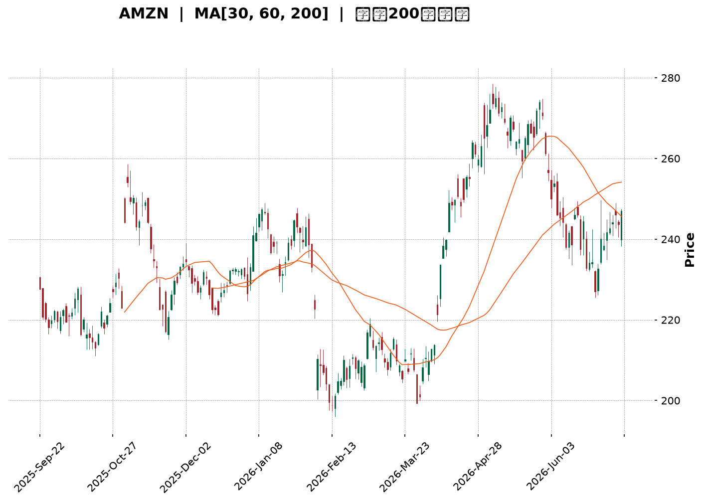
</details>

<html>
<head><meta charset="utf-8" /></head>
<body>
    <div style="height:500px; width:100%;">                        <script>window.PlotlyConfig = {MathJaxConfig: 'local'};</script>
        <script charset="utf-8" src="https://cdn.plot.ly/plotly-3.7.0.min.js" integrity="sha256-jvTGqxNp8AGWEcvNLVuKr+8j5dGe9Yw51LQkmDH+IYA=" crossorigin="anonymous"></script>                <div id="candlestick-chart" class="plotly-graph-div" style="height:100%; width:100%;"></div>            <script>                window.PLOTLYENV=window.PLOTLYENV || {};                                if (document.getElementById("candlestick-chart")) {                    Plotly.newPlot(                        "candlestick-chart",                        [{"close":{"dtype":"f8","bdata":"AAAAACl0bEAAAABguJZrQAAAAGC4hmtAAAAAwMxEa0AAAADA9XhrQAAAAKBwxWtAAAAAgD1ya0AAAAAAKZRrQAAAAMAezWtAAAAA4FFwa0AAAADAzJxrQAAAAMD1uGtAAAAAQAonbEAAAAAgrndsQAAAAADXC2tAAAAAgD2Ca0AAAADgegxrQAAAAIA98mpAAAAAQArPakAAAACgR6FqQAAAACBcD2tAAAAAwPXAa0AAAABgZj5rQAAAAEDhomtAAAAAYLgGbEAAAABACl9sQAAAAAAAqGxAAAAAoJnJbEAAAAAghdtrQAAAAEAKh25AAAAAAADAb0AAAACAPSpvQAAAAGBmRm9AAAAAoEdhbkAAAADAHo1uQAAAAMDMDG9AAAAAQDMjb0AAAABgZoZuQAAAAGCPsm1AAAAAgBRWbUAAAAAA1xttQAAAAKCZ0WtAAAAAgBTWa0AAAADgeiRrQAAAAIAUlmtAAAAAwPVIbEAAAACgcLVsQAAAAMAepWxAAAAAQAonbUAAAAAAKTxtQAAAAKBwTW1AAAAAACkMbUAAAAAghaNsQAAAAMD1sGxAAAAA4HpcbEAAAACgcH1sQAAAAMD1+GxAAAAAwPXIbEAAAACAFEZsQAAAAKBH0WtAAAAAgOvRa0AAAADgo6hrQAAAAOBRWGxAAAAAQDNrbEAAAACAwo1sQAAAAOB6BG1AAAAAACkMbUAAAADgoxBtQAAAAIA9Am1AAAAAwPUQbUAAAACAPdpsQAAAAAAAUGxAAAAAgOshbUAAAACAwh1uQAAAAIDrMW5AAAAAoEfJbkAAAAAAKexuQAAAAEAKz25AAAAAQDNTbkAAAADAzJRtQAAAAIDCxW1AAAAAANfjbUAAAAAAAOBsQAAAAIDr6WxAAAAAQOFKbUAAAADAHuVtQAAAAKBwzW1AAAAAgMKVbkAAAADgUWBuQAAAACBcN25AAAAAoJnpbUAAAABguF5uQAAAAADX021AAAAAIK4fbUAAAACAFNZrQAAAAIA9SmpAAAAAQAoXakAAAABguN5pQAAAAGCPgmlAAAAAQDPzaEAAAACgR9loQAAAAMDMJGlAAAAAoEeZaUAAAAAghZtpQAAAACCFQ2pAAAAA4KOoaUAAAACA6xFqQAAAAOB6VGpAAAAAoHD9aUAAAAAAAEBqQAAAAOB6DGpAAAAAIFwXakAAAACAPRprQAAAAIAUXmtAAAAAYLimakAAAAAgrq9qQAAAAGCPympAAAAAwMyUakAAAADA9TBqQAAAAKBw9WlAAAAAIK53akAAAABgZuZqQAAAAADXO2pAAAAA4FEYakAAAAAA16tpQAAAAOB6RGpAAAAAIK7naUAAAABguHZqQAAAAKBH8WlAAAAAQOHqaEAAAABgZh5pQAAAAOCjCGpAAAAAgD1SakAAAADgozhqQAAAAKBHmWpAAAAA4KO4akAAAAAAAKhrQAAAAMDMNG1AAAAAACnMbUAAAADgevxtQAAAAOCjIG9AAAAAAAAQb0AAAABgZjZvQAAAAIDrUW9AAAAAwPUIb0AAAADAHj1vQAAAACCF629AAAAAYI\u002fib0AAAAAA139wQAAAAIDrUXBAAAAAQDM7cEAAAADgo3BwQAAAAMD1kHBAAAAAACnEcEAAAADAzABxQAAAAMDMGHFAAAAAANcvcUAAAABguPJwQAAAAEDhCnFAAAAAANfPcEAAAADAHp1wQAAAAIAU4nBAAAAAIIWzcEAAAACAPYJwQAAAAIDCjXBAAAAAoHA1cEAAAAAAKZBwQAAAACBcx3BAAAAAwB6lcEAAAADgo5RwQAAAAKCZ\u002fXBAAAAAAAAgcUAAAACAPepwQAAAAAApVHBAAAAA4FEIcEAAAADgo0BvQAAAAKBHuW9AAAAAwPXAbkAAAABACqduQAAAAIAUhm5AAAAAAADAbUAAAADgUTBuQAAAAKCZ0W1AAAAA4KPAbkAAAAAAAMBuQAAAAAAAsG1AAAAA4HqMbkAAAACgRxltQAAAACCFQ21AAAAA4KNIbUAAAADgUWBsQAAAAIAUFm1AAAAA4HoEbkAAAABA4cptQAAAAGBmNm5AAAAAoHBVbkAAAADAHoVuQAAAACBcv25AAAAAANdzbkAAAACgR+FuQA=="},"high":{"dtype":"f8","bdata":"AAAAgD3SbEAAAAAghXtsQAAAAIDrEWxAAAAAoHCVa0AAAACgmaFrQAAAAEAz02tAAAAAIK7Ha0AAAADAzMRrQAAAAIDr2WtAAAAAYGYGbEAAAAAgXLdrQAAAAOB63GtAAAAAIFxXbEAAAABguIZsQAAAAAAAiGxAAAAAgMKVa0AAAACAPWprQAAAAGC4NmtAAAAAQOFSa0AAAACgmdlqQAAAAIAUFmtAAAAAgD3qa0AAAADgUYBrQAAAAKCZqWtAAAAAwMwsbEAAAADAzIxsQAAAACCu72xAAAAAgD0abUAAAACAFI5sQAAAAAAAUG9AAAAAoJkpcEAAAAAAKRBwQAAAAAAAYG9AAAAAAClMb0AAAADAzJxuQAAAAAAAeG9AAAAAAAA4b0AAAAAA10tvQAAAAAAAeG5AAAAAIFzXbUAAAABAM1NtQAAAAGBmxmxAAAAAIK73a0AAAADAHm1sQAAAAGC4xmtAAAAAYI9qbEAAAADgo9BsQAAAAAAA+GxAAAAAoEcpbUAAAACgmXltQAAAAEAK321AAAAAACksbUAAAAAAADBtQAAAACCu52xAAAAAYI\u002fabEAAAACAPZJsQAAAAKBwDW1AAAAAIIUDbUAAAABgj8JsQAAAAIDCfWxAAAAAwB71a0AAAACAFCZsQAAAACBcp2xAAAAAACmkbEAAAAAgXK9sQAAAAGBmDm1AAAAAYGYebUAAAAAgrh9tQAAAAEAzE21AAAAA4KMYbUAAAAAgrh9tQAAAAGC4bm1AAAAAAABAbUAAAACAwmVuQAAAAKBHqW5AAAAAwB7NbkAAAAAghftuQAAAAIAUHm9AAAAAwB71bkAAAADA9ShuQAAAAMDMFG5AAAAAgD3ybUAAAABA4WJtQAAAAKCZCW1AAAAAQAp3bUAAAABgZg5uQAAAAGBmHm5AAAAAACmcbkAAAADA9fhuQAAAAAAAYG5AAAAAgD1qbkAAAAAAKbRuQAAAAEAzy25AAAAAIIXbbUAAAACA60lsQAAAAIAUbmpAAAAAgOuZakAAAADAzJRqQAAAAIA9EmpAAAAAYLh+aUAAAADAHiVpQAAAACCuN2lAAAAAIIXbaUAAAADgerRpQAAAAKBwZWpAAAAAgMINakAAAAAghUtqQAAAAEDhcmpAAAAAoJlhakAAAABgj0pqQAAAACBcN2pAAAAAgMIlakAAAACgRzFrQAAAAEAKj2tAAAAAgD0qa0AAAACAPbpqQAAAAMDM9GpAAAAAAAAga0AAAABguHZqQAAAAIDrUWpAAAAAQAqXakAAAABgZvZqQAAAAOB65GpAAAAAANcjakAAAACgR\u002fFpQAAAAKCZmWpAAAAAQDMrakAAAACAPaJqQAAAAOB6nGpAAAAAQDPTaUAAAACgmXlpQAAAAMD1SGpAAAAAYI+yakAAAABguIZqQAAAAGBmnmpAAAAAQAq\u002fakAAAABAM0NsQAAAAKCZOW1AAAAAgMINbkAAAAAAAABuQAAAAIDChW9AAAAAgBROb0AAAAAAAEBvQAAAAEDhAnBAAAAAgMJFb0AAAABA4eJvQAAAAIAU\u002fm9AAAAA4KMscEAAAAAAAIhwQAAAAGBmgnBAAAAA4HpQcEAAAABgj55wQAAAAIAUHnFAAAAAwB4VcUAAAACgmUFxQAAAAMD1aHFAAAAAwMxccUAAAACAFEpxQAAAAAAAIHFAAAAAgBQacUAAAABgZrpwQAAAACCF63BAAAAA4HrscEAAAACAwoVwQAAAAKCZzXBAAAAAAABkcEAAAACgR5lwQAAAAADX13BAAAAA4KPccEAAAADAzNRwQAAAAGCPBnFAAAAAAAAocUAAAAAAACxxQAAAAIAUqnBAAAAAQDNTcEAAAACgcBFwQAAAAGCP+m9AAAAAgBQGcEAAAACgcC1vQAAAAIDCTW9AAAAAgD2CbkAAAADgekRuQAAAACCFa25AAAAAgOv5bkAAAADgUTBvQAAAAMAevW5AAAAAIFy3bkAAAAAAAEBuQAAAAADXm21AAAAAoHBNbkAAAACAPQptQAAAAMDMPG1AAAAAYLg2b0AAAACgRzFuQAAAAMDMnG5AAAAAQArXbkAAAACgR8FuQAAAAIDCHW9AAAAAoJmZbkAAAACAt+5uQA=="},"hovertemplate":"\u003cb\u003e%{x|%Y-%m-%d}\u003c\u002fb\u003e\u003cbr\u003e\u958b: $%{open:.2f}\u003cbr\u003e\u9ad8: $%{high:.2f}\u003cbr\u003e\u4f4e: $%{low:.2f}\u003cbr\u003e\u6536: $%{close:.2f}\u003cextra\u003e\u003c\u002fextra\u003e","low":{"dtype":"f8","bdata":"AAAA4FFwbEAAAACAPYJrQAAAAGBmbmtAAAAAQAoPa0AAAADgo0BrQAAAAKCZaWtAAAAA4Ho8a0AAAAAghRNrQAAAAGBmXmtAAAAAQOFqa0AAAADA9QBrQAAAAKBwhWtAAAAAgBSma0AAAAAAALhrQAAAAAAAAGtAAAAAoEcha0AAAABAM5NqQAAAAMAelWpAAAAAgOuZakAAAADA9WBqQAAAAEDhsmpAAAAAIK4\u002fa0AAAADgoxBrQAAAAIDCRWtAAAAAwMy8a0AAAACgRzFsQAAAAGC4RmxAAAAA4FF4bEAAAAAAANhrQAAAACBcf25AAAAAwMycb0AAAADAHhVvQAAAAMAexW5AAAAAoHBFbkAAAAAgrs9tQAAAAEDhsm5AAAAAIFznbkAAAAAAAHhuQAAAAAAAkG1AAAAA4HocbUAAAACAFKZsQAAAAKBwzWtAAAAA4KNQa0AAAAAgrhdrQAAAAIDC5WpAAAAA4KPIa0AAAACgmflrQAAAAOCjmGxAAAAAQArHbEAAAAAAAAhtQAAAAKCZMW1AAAAAIIXTbEAAAACgmVlsQAAAAKCZkWxAAAAA4KNIbEAAAAAghSNsQAAAAGC4jmxAAAAAgBSWbEAAAAAA1yNsQAAAAAAAsGtAAAAAACmka0AAAAAgrp9rQAAAAMAeDWxAAAAAYI8ybEAAAABguFZsQAAAACBcl2xAAAAAYI\u002fqbEAAAACAwuVsQAAAAOCj2GxAAAAAYGbGbEAAAAAA18NsQAAAAGBmFmxAAAAAgMJlbEAAAACAPQJtQAAAAOCj8G1AAAAAACk8bkAAAAAgrkduQAAAAGC4vm5AAAAAAAAIbkAAAABACodtQAAAAAAplG1AAAAAwB6NbUAAAABA4apsQAAAAAApXGxAAAAAwMzcbEAAAACAPVJtQAAAAKBHsW1AAAAAYI\u002fCbUAAAADA9TBuQAAAACCul21AAAAA4Hq0bUAAAACgcMVtQAAAAGBmbm1AAAAAgD36bEAAAAAAKYxrQAAAAIDrCWlAAAAAQDNraUAAAADAHs1pQAAAACCuT2lAAAAAgOuxaEAAAADA9ahoQAAAAAAAgGhAAAAA4FEwaUAAAACA61lpQAAAAAAAeGlAAAAAIIVjaUAAAAAAAGhpQAAAAIDCHWpAAAAAQDOraUAAAABgZqZpQAAAAGC4bmlAAAAAIFxPaUAAAADAzERqQAAAAEDh8mpAAAAAwPWQakAAAAAgheNpQAAAAIDCjWpAAAAAQDNrakAAAADAzARqQAAAAEAKx2lAAAAAYGbuaUAAAACAwo1qQAAAAGCPGmpAAAAAoJnBaUAAAACAPYppQAAAAOBRMGpAAAAA4HrUaUAAAADAzDxqQAAAAADX42lAAAAA4HrkaEAAAAAgXP9oQAAAAOB6hGlAAAAAgBQGakAAAADAzJxpQAAAAEDhMmpAAAAAYI8iakAAAAAA13NrQAAAAOCj6GtAAAAAYLhmbUAAAAAAAHhtQAAAAMD1OG5AAAAAYGbmbkAAAABgZoZuQAAAACCFQ29AAAAAANerbkAAAABAMyNvQAAAAGCPSm9AAAAAgD2ib0AAAABAChtwQAAAAKBwRXBAAAAAgBQKcEAAAABAMxtwQAAAAGCPAnBAAAAAANdrcEAAAADAzMxwQAAAAIAUBnFAAAAAIFwDcUAAAAAA1+dwQAAAAEAz33BAAAAAIK7HcEAAAACAFGpwQAAAAEAzc3BAAAAAgBSqcEAAAACAPU5wQAAAAOB6aHBAAAAAgBTmb0AAAADgejhwQAAAAIDrVXBAAAAAANejcEAAAADAHmFwQAAAAEAzm3BAAAAAQAq3cEAAAACAPdpwQAAAAEAzS3BAAAAAANfLb0AAAABguPZuQAAAAAAAeG9AAAAAwPW4bkAAAAAghWtuQAAAAMDMDG5AAAAAYGaubUAAAACAwmVtQAAAAEDhMm1AAAAAIFyXbkAAAABgZq5uQAAAAAAAgG1AAAAA4KOAbUAAAAAgrgdtQAAAAAAAAG1AAAAAYGYebUAAAACgmTFsQAAAAAApRGxAAAAAoJk5bUAAAACgcKVtQAAAAMDMXG1AAAAAYI8ibkAAAAAAKRxuQAAAAGBmVm5AAAAA4KMQbkAAAAAAAMhtQA=="},"name":"\u50f9\u683c","open":{"dtype":"f8","bdata":"AAAAgOvRbEAAAABgj3psQAAAAMDMBGxAAAAAgOuBa0AAAABgj2JrQAAAAGCPgmtAAAAAwPXAa0AAAAAghStrQAAAAOBRoGtAAAAAgBTua0AAAAAAAKBrQAAAAAApnGtAAAAAoHDda0AAAAAAACBsQAAAAGC4RmxAAAAAYGY2a0AAAACA6\u002fFqQAAAAADXE2tAAAAAoHD1akAAAACA69FqQAAAAAApvGpAAAAAgMJNa0AAAACgmWlrQAAAAAAAYGtAAAAAQAq\u002fa0AAAADAHnVsQAAAAEAKh2xAAAAAoHD1bEAAAACA62FsQAAAAEAzQ29AAAAAIIXrb0AAAAAAKUxvQAAAAMD1IG9AAAAAwB4lb0AAAADAzFxuQAAAAEDhCm9AAAAAwB4Nb0AAAAAgrkdvQAAAAKCZYW5AAAAAgOthbUAAAAAAAChtQAAAAEAzg2xAAAAAIK73a0AAAACgmWFsQAAAAEAzC2tAAAAAgOvRa0AAAAAAKUxsQAAAACCu12xAAAAAIK7nbEAAAABACidtQAAAAOBRYG1AAAAAQDMrbUAAAADgoxhtQAAAAIA9ymxAAAAAQOGybEAAAABA4VpsQAAAAIDrmWxAAAAAYLjWbEAAAAAA17tsQAAAAIDCfWxAAAAAoEfha0AAAADAHhVsQAAAAGC4NmxAAAAA4FFYbEAAAAAghZNsQAAAAIDroWxAAAAAACkEbUAAAACgRwFtQAAAAIAU\u002fmxAAAAAYLjmbEAAAADAHh1tQAAAAEDh6mxAAAAAQOGabEAAAABAMwNtQAAAACCF821AAAAAgOthbkAAAACAPZJuQAAAACBc125AAAAAwPXQbkAAAADAzCRuQAAAAIDr6W1AAAAAQOHibUAAAADgUThtQAAAAEDh4mxAAAAAoJlBbUAAAABguF5tQAAAACBc\u002f21AAAAAgBT2bUAAAAAA18tuQAAAAIA9Wm5AAAAA4Hr8bUAAAACA68ltQAAAACBcn25AAAAAIIXbbUAAAADAHh1sQAAAAGBmVmlAAAAAQAofakAAAACgmRlqQAAAAIDrAWpAAAAAYLh+aUAAAAAAKdxoQAAAAAApxGhAAAAAgD1CaUAAAACgmXlpQAAAAOBRmGlAAAAAQDMDakAAAABACq9pQAAAAGC4TmpAAAAAIFxXakAAAABgj9ppQAAAAKCZkWlAAAAAQDNjaUAAAABACk9qQAAAACBc\u002f2pAAAAAIK7fakAAAABgZk5qQAAAAIAUxmpAAAAAYLj2akAAAADgekxqQAAAACCFM2pAAAAAQDMLakAAAACAPZpqQAAAAIDCvWpAAAAAgOvhaUAAAADAzOxpQAAAAKBHOWpAAAAAYGb+aUAAAACA63FqQAAAACCFU2pAAAAAYLjOaUAAAAAgXC9pQAAAAEAzm2lAAAAAgBROakAAAACgR9FpQAAAAKCZOWpAAAAAIK5nakAAAACgR\u002flrQAAAACBcJ2xAAAAAoJlpbUAAAABgZq5tQAAAAMD1OG5AAAAAAAAob0AAAADgURBvQAAAACCu329AAAAAgBQmb0AAAABA4eJvQAAAAIAUjm9AAAAA4Hrsb0AAAAAgrj9wQAAAACBcd3BAAAAAgD0mcEAAAAAA1x9wQAAAAGC4EnFAAAAAoEeZcEAAAADAzMxwQAAAAKBHQXFAAAAAgD0OcUAAAADgUTBxQAAAAIAU+nBAAAAAoHDdcEAAAAAgXKtwQAAAAEDhhnBAAAAAYGbScEAAAAAAAGhwQAAAAIDrfXBAAAAA4KNgcEAAAADAzEBwQAAAAAAAeHBAAAAAYI\u002fKcEAAAABACr9wQAAAAGBmonBAAAAA4FEEcUAAAADgo\u002fRwQAAAAOCjpHBAAAAAYI8ScEAAAABgZtZvQAAAAADXo29AAAAA4FHIb0AAAACAwtVuQAAAACBc925AAAAAIIVzbkAAAACAwr1tQAAAAGC4Zm5AAAAA4KOgbkAAAAAAAABvQAAAAMDMnG5AAAAAANcDbkAAAABgjwJuQAAAAKCZEW1AAAAAQDM7bUAAAADgowBtQAAAAGC4ZmxAAAAAQApHbUAAAABAM6ttQAAAAAAA+G1AAAAAIIUzbkAAAACgmXluQAAAACBc325AAAAA4KOIbkAAAACAPfptQA=="},"x":["2025-09-22T00:00:00-04:00","2025-09-23T00:00:00-04:00","2025-09-24T00:00:00-04:00","2025-09-25T00:00:00-04:00","2025-09-26T00:00:00-04:00","2025-09-29T00:00:00-04:00","2025-09-30T00:00:00-04:00","2025-10-01T00:00:00-04:00","2025-10-02T00:00:00-04:00","2025-10-03T00:00:00-04:00","2025-10-06T00:00:00-04:00","2025-10-07T00:00:00-04:00","2025-10-08T00:00:00-04:00","2025-10-09T00:00:00-04:00","2025-10-10T00:00:00-04:00","2025-10-13T00:00:00-04:00","2025-10-14T00:00:00-04:00","2025-10-15T00:00:00-04:00","2025-10-16T00:00:00-04:00","2025-10-17T00:00:00-04:00","2025-10-20T00:00:00-04:00","2025-10-21T00:00:00-04:00","2025-10-22T00:00:00-04:00","2025-10-23T00:00:00-04:00","2025-10-24T00:00:00-04:00","2025-10-27T00:00:00-04:00","2025-10-28T00:00:00-04:00","2025-10-29T00:00:00-04:00","2025-10-30T00:00:00-04:00","2025-10-31T00:00:00-04:00","2025-11-03T00:00:00-05:00","2025-11-04T00:00:00-05:00","2025-11-05T00:00:00-05:00","2025-11-06T00:00:00-05:00","2025-11-07T00:00:00-05:00","2025-11-10T00:00:00-05:00","2025-11-11T00:00:00-05:00","2025-11-12T00:00:00-05:00","2025-11-13T00:00:00-05:00","2025-11-14T00:00:00-05:00","2025-11-17T00:00:00-05:00","2025-11-18T00:00:00-05:00","2025-11-19T00:00:00-05:00","2025-11-20T00:00:00-05:00","2025-11-21T00:00:00-05:00","2025-11-24T00:00:00-05:00","2025-11-25T00:00:00-05:00","2025-11-26T00:00:00-05:00","2025-11-28T00:00:00-05:00","2025-12-01T00:00:00-05:00","2025-12-02T00:00:00-05:00","2025-12-03T00:00:00-05:00","2025-12-04T00:00:00-05:00","2025-12-05T00:00:00-05:00","2025-12-08T00:00:00-05:00","2025-12-09T00:00:00-05:00","2025-12-10T00:00:00-05:00","2025-12-11T00:00:00-05:00","2025-12-12T00:00:00-05:00","2025-12-15T00:00:00-05:00","2025-12-16T00:00:00-05:00","2025-12-17T00:00:00-05:00","2025-12-18T00:00:00-05:00","2025-12-19T00:00:00-05:00","2025-12-22T00:00:00-05:00","2025-12-23T00:00:00-05:00","2025-12-24T00:00:00-05:00","2025-12-26T00:00:00-05:00","2025-12-29T00:00:00-05:00","2025-12-30T00:00:00-05:00","2025-12-31T00:00:00-05:00","2026-01-02T00:00:00-05:00","2026-01-05T00:00:00-05:00","2026-01-06T00:00:00-05:00","2026-01-07T00:00:00-05:00","2026-01-08T00:00:00-05:00","2026-01-09T00:00:00-05:00","2026-01-12T00:00:00-05:00","2026-01-13T00:00:00-05:00","2026-01-14T00:00:00-05:00","2026-01-15T00:00:00-05:00","2026-01-16T00:00:00-05:00","2026-01-20T00:00:00-05:00","2026-01-21T00:00:00-05:00","2026-01-22T00:00:00-05:00","2026-01-23T00:00:00-05:00","2026-01-26T00:00:00-05:00","2026-01-27T00:00:00-05:00","2026-01-28T00:00:00-05:00","2026-01-29T00:00:00-05:00","2026-01-30T00:00:00-05:00","2026-02-02T00:00:00-05:00","2026-02-03T00:00:00-05:00","2026-02-04T00:00:00-05:00","2026-02-05T00:00:00-05:00","2026-02-06T00:00:00-05:00","2026-02-09T00:00:00-05:00","2026-02-10T00:00:00-05:00","2026-02-11T00:00:00-05:00","2026-02-12T00:00:00-05:00","2026-02-13T00:00:00-05:00","2026-02-17T00:00:00-05:00","2026-02-18T00:00:00-05:00","2026-02-19T00:00:00-05:00","2026-02-20T00:00:00-05:00","2026-02-23T00:00:00-05:00","2026-02-24T00:00:00-05:00","2026-02-25T00:00:00-05:00","2026-02-26T00:00:00-05:00","2026-02-27T00:00:00-05:00","2026-03-02T00:00:00-05:00","2026-03-03T00:00:00-05:00","2026-03-04T00:00:00-05:00","2026-03-05T00:00:00-05:00","2026-03-06T00:00:00-05:00","2026-03-09T00:00:00-04:00","2026-03-10T00:00:00-04:00","2026-03-11T00:00:00-04:00","2026-03-12T00:00:00-04:00","2026-03-13T00:00:00-04:00","2026-03-16T00:00:00-04:00","2026-03-17T00:00:00-04:00","2026-03-18T00:00:00-04:00","2026-03-19T00:00:00-04:00","2026-03-20T00:00:00-04:00","2026-03-23T00:00:00-04:00","2026-03-24T00:00:00-04:00","2026-03-25T00:00:00-04:00","2026-03-26T00:00:00-04:00","2026-03-27T00:00:00-04:00","2026-03-30T00:00:00-04:00","2026-03-31T00:00:00-04:00","2026-04-01T00:00:00-04:00","2026-04-02T00:00:00-04:00","2026-04-06T00:00:00-04:00","2026-04-07T00:00:00-04:00","2026-04-08T00:00:00-04:00","2026-04-09T00:00:00-04:00","2026-04-10T00:00:00-04:00","2026-04-13T00:00:00-04:00","2026-04-14T00:00:00-04:00","2026-04-15T00:00:00-04:00","2026-04-16T00:00:00-04:00","2026-04-17T00:00:00-04:00","2026-04-20T00:00:00-04:00","2026-04-21T00:00:00-04:00","2026-04-22T00:00:00-04:00","2026-04-23T00:00:00-04:00","2026-04-24T00:00:00-04:00","2026-04-27T00:00:00-04:00","2026-04-28T00:00:00-04:00","2026-04-29T00:00:00-04:00","2026-04-30T00:00:00-04:00","2026-05-01T00:00:00-04:00","2026-05-04T00:00:00-04:00","2026-05-05T00:00:00-04:00","2026-05-06T00:00:00-04:00","2026-05-07T00:00:00-04:00","2026-05-08T00:00:00-04:00","2026-05-11T00:00:00-04:00","2026-05-12T00:00:00-04:00","2026-05-13T00:00:00-04:00","2026-05-14T00:00:00-04:00","2026-05-15T00:00:00-04:00","2026-05-18T00:00:00-04:00","2026-05-19T00:00:00-04:00","2026-05-20T00:00:00-04:00","2026-05-21T00:00:00-04:00","2026-05-22T00:00:00-04:00","2026-05-26T00:00:00-04:00","2026-05-27T00:00:00-04:00","2026-05-28T00:00:00-04:00","2026-05-29T00:00:00-04:00","2026-06-01T00:00:00-04:00","2026-06-02T00:00:00-04:00","2026-06-03T00:00:00-04:00","2026-06-04T00:00:00-04:00","2026-06-05T00:00:00-04:00","2026-06-08T00:00:00-04:00","2026-06-09T00:00:00-04:00","2026-06-10T00:00:00-04:00","2026-06-11T00:00:00-04:00","2026-06-12T00:00:00-04:00","2026-06-15T00:00:00-04:00","2026-06-16T00:00:00-04:00","2026-06-17T00:00:00-04:00","2026-06-18T00:00:00-04:00","2026-06-22T00:00:00-04:00","2026-06-23T00:00:00-04:00","2026-06-24T00:00:00-04:00","2026-06-25T00:00:00-04:00","2026-06-26T00:00:00-04:00","2026-06-29T00:00:00-04:00","2026-06-30T00:00:00-04:00","2026-07-01T00:00:00-04:00","2026-07-02T00:00:00-04:00","2026-07-06T00:00:00-04:00","2026-07-07T00:00:00-04:00","2026-07-08T00:00:00-04:00","2026-07-09T00:00:00-04:00"],"type":"candlestick"},{"hovertemplate":"MA30: $%{y:.2f}\u003cextra\u003e\u003c\u002fextra\u003e","line":{"color":"#2196F3","dash":"dash","width":2},"mode":"lines","name":"MA30","x":["2025-09-22T00:00:00-04:00","2025-09-23T00:00:00-04:00","2025-09-24T00:00:00-04:00","2025-09-25T00:00:00-04:00","2025-09-26T00:00:00-04:00","2025-09-29T00:00:00-04:00","2025-09-30T00:00:00-04:00","2025-10-01T00:00:00-04:00","2025-10-02T00:00:00-04:00","2025-10-03T00:00:00-04:00","2025-10-06T00:00:00-04:00","2025-10-07T00:00:00-04:00","2025-10-08T00:00:00-04:00","2025-10-09T00:00:00-04:00","2025-10-10T00:00:00-04:00","2025-10-13T00:00:00-04:00","2025-10-14T00:00:00-04:00","2025-10-15T00:00:00-04:00","2025-10-16T00:00:00-04:00","2025-10-17T00:00:00-04:00","2025-10-20T00:00:00-04:00","2025-10-21T00:00:00-04:00","2025-10-22T00:00:00-04:00","2025-10-23T00:00:00-04:00","2025-10-24T00:00:00-04:00","2025-10-27T00:00:00-04:00","2025-10-28T00:00:00-04:00","2025-10-29T00:00:00-04:00","2025-10-30T00:00:00-04:00","2025-10-31T00:00:00-04:00","2025-11-03T00:00:00-05:00","2025-11-04T00:00:00-05:00","2025-11-05T00:00:00-05:00","2025-11-06T00:00:00-05:00","2025-11-07T00:00:00-05:00","2025-11-10T00:00:00-05:00","2025-11-11T00:00:00-05:00","2025-11-12T00:00:00-05:00","2025-11-13T00:00:00-05:00","2025-11-14T00:00:00-05:00","2025-11-17T00:00:00-05:00","2025-11-18T00:00:00-05:00","2025-11-19T00:00:00-05:00","2025-11-20T00:00:00-05:00","2025-11-21T00:00:00-05:00","2025-11-24T00:00:00-05:00","2025-11-25T00:00:00-05:00","2025-11-26T00:00:00-05:00","2025-11-28T00:00:00-05:00","2025-12-01T00:00:00-05:00","2025-12-02T00:00:00-05:00","2025-12-03T00:00:00-05:00","2025-12-04T00:00:00-05:00","2025-12-05T00:00:00-05:00","2025-12-08T00:00:00-05:00","2025-12-09T00:00:00-05:00","2025-12-10T00:00:00-05:00","2025-12-11T00:00:00-05:00","2025-12-12T00:00:00-05:00","2025-12-15T00:00:00-05:00","2025-12-16T00:00:00-05:00","2025-12-17T00:00:00-05:00","2025-12-18T00:00:00-05:00","2025-12-19T00:00:00-05:00","2025-12-22T00:00:00-05:00","2025-12-23T00:00:00-05:00","2025-12-24T00:00:00-05:00","2025-12-26T00:00:00-05:00","2025-12-29T00:00:00-05:00","2025-12-30T00:00:00-05:00","2025-12-31T00:00:00-05:00","2026-01-02T00:00:00-05:00","2026-01-05T00:00:00-05:00","2026-01-06T00:00:00-05:00","2026-01-07T00:00:00-05:00","2026-01-08T00:00:00-05:00","2026-01-09T00:00:00-05:00","2026-01-12T00:00:00-05:00","2026-01-13T00:00:00-05:00","2026-01-14T00:00:00-05:00","2026-01-15T00:00:00-05:00","2026-01-16T00:00:00-05:00","2026-01-20T00:00:00-05:00","2026-01-21T00:00:00-05:00","2026-01-22T00:00:00-05:00","2026-01-23T00:00:00-05:00","2026-01-26T00:00:00-05:00","2026-01-27T00:00:00-05:00","2026-01-28T00:00:00-05:00","2026-01-29T00:00:00-05:00","2026-01-30T00:00:00-05:00","2026-02-02T00:00:00-05:00","2026-02-03T00:00:00-05:00","2026-02-04T00:00:00-05:00","2026-02-05T00:00:00-05:00","2026-02-06T00:00:00-05:00","2026-02-09T00:00:00-05:00","2026-02-10T00:00:00-05:00","2026-02-11T00:00:00-05:00","2026-02-12T00:00:00-05:00","2026-02-13T00:00:00-05:00","2026-02-17T00:00:00-05:00","2026-02-18T00:00:00-05:00","2026-02-19T00:00:00-05:00","2026-02-20T00:00:00-05:00","2026-02-23T00:00:00-05:00","2026-02-24T00:00:00-05:00","2026-02-25T00:00:00-05:00","2026-02-26T00:00:00-05:00","2026-02-27T00:00:00-05:00","2026-03-02T00:00:00-05:00","2026-03-03T00:00:00-05:00","2026-03-04T00:00:00-05:00","2026-03-05T00:00:00-05:00","2026-03-06T00:00:00-05:00","2026-03-09T00:00:00-04:00","2026-03-10T00:00:00-04:00","2026-03-11T00:00:00-04:00","2026-03-12T00:00:00-04:00","2026-03-13T00:00:00-04:00","2026-03-16T00:00:00-04:00","2026-03-17T00:00:00-04:00","2026-03-18T00:00:00-04:00","2026-03-19T00:00:00-04:00","2026-03-20T00:00:00-04:00","2026-03-23T00:00:00-04:00","2026-03-24T00:00:00-04:00","2026-03-25T00:00:00-04:00","2026-03-26T00:00:00-04:00","2026-03-27T00:00:00-04:00","2026-03-30T00:00:00-04:00","2026-03-31T00:00:00-04:00","2026-04-01T00:00:00-04:00","2026-04-02T00:00:00-04:00","2026-04-06T00:00:00-04:00","2026-04-07T00:00:00-04:00","2026-04-08T00:00:00-04:00","2026-04-09T00:00:00-04:00","2026-04-10T00:00:00-04:00","2026-04-13T00:00:00-04:00","2026-04-14T00:00:00-04:00","2026-04-15T00:00:00-04:00","2026-04-16T00:00:00-04:00","2026-04-17T00:00:00-04:00","2026-04-20T00:00:00-04:00","2026-04-21T00:00:00-04:00","2026-04-22T00:00:00-04:00","2026-04-23T00:00:00-04:00","2026-04-24T00:00:00-04:00","2026-04-27T00:00:00-04:00","2026-04-28T00:00:00-04:00","2026-04-29T00:00:00-04:00","2026-04-30T00:00:00-04:00","2026-05-01T00:00:00-04:00","2026-05-04T00:00:00-04:00","2026-05-05T00:00:00-04:00","2026-05-06T00:00:00-04:00","2026-05-07T00:00:00-04:00","2026-05-08T00:00:00-04:00","2026-05-11T00:00:00-04:00","2026-05-12T00:00:00-04:00","2026-05-13T00:00:00-04:00","2026-05-14T00:00:00-04:00","2026-05-15T00:00:00-04:00","2026-05-18T00:00:00-04:00","2026-05-19T00:00:00-04:00","2026-05-20T00:00:00-04:00","2026-05-21T00:00:00-04:00","2026-05-22T00:00:00-04:00","2026-05-26T00:00:00-04:00","2026-05-27T00:00:00-04:00","2026-05-28T00:00:00-04:00","2026-05-29T00:00:00-04:00","2026-06-01T00:00:00-04:00","2026-06-02T00:00:00-04:00","2026-06-03T00:00:00-04:00","2026-06-04T00:00:00-04:00","2026-06-05T00:00:00-04:00","2026-06-08T00:00:00-04:00","2026-06-09T00:00:00-04:00","2026-06-10T00:00:00-04:00","2026-06-11T00:00:00-04:00","2026-06-12T00:00:00-04:00","2026-06-15T00:00:00-04:00","2026-06-16T00:00:00-04:00","2026-06-17T00:00:00-04:00","2026-06-18T00:00:00-04:00","2026-06-22T00:00:00-04:00","2026-06-23T00:00:00-04:00","2026-06-24T00:00:00-04:00","2026-06-25T00:00:00-04:00","2026-06-26T00:00:00-04:00","2026-06-29T00:00:00-04:00","2026-06-30T00:00:00-04:00","2026-07-01T00:00:00-04:00","2026-07-02T00:00:00-04:00","2026-07-06T00:00:00-04:00","2026-07-07T00:00:00-04:00","2026-07-08T00:00:00-04:00","2026-07-09T00:00:00-04:00"],"y":{"dtype":"f8","bdata":"AAAAAAAA+H8AAAAAAAD4fwAAAAAAAPh\u002fAAAAAAAA+H8AAAAAAAD4fwAAAAAAAPh\u002fAAAAAAAA+H8AAAAAAAD4fwAAAAAAAPh\u002fAAAAAAAA+H8AAAAAAAD4fwAAAAAAAPh\u002fAAAAAAAA+H8AAAAAAAD4fwAAAAAAAPh\u002fAAAAAAAA+H8AAAAAAAD4fwAAAAAAAPh\u002fAAAAAAAA+H8AAAAAAAD4fwAAAAAAAPh\u002fAAAAAAAA+H8AAAAAAAD4fwAAAAAAAPh\u002fAAAAAAAA+H8AAAAAAAD4fwAAAAAAAPh\u002fAAAAAAAA+H8AAAAAAAD4f97d3X2GvWtAIiIiQqfZa0AiIiKyK\u002fhrQGZmZvYoGGxAd3d3l7UybECamZk5+0xsQDMzM8P1aGxAvLu7a3WIbECamZmZmaFsQFVVVQXIsWxAzczMLPnBbECJiIjIvc5sQLy7uwuQz2xAAAAAMN3MbEDe3d2tjsFsQERERFQqxmxAIiIiEsrMbEBVVVVl9NpsQO\u002fu7l5z6WxA7+7uXnP9bEBVVVUVrhNtQGZmZubQJm1AREREJNsxbUARERGRwj1tQAAAAEDDRm1AEREREZ9JbUCrqqp6okptQGZmZlZVTW1AAAAA4E9NbUAAAAAw3VBtQJqZmRm9OW1AIiIi4jMYbUDNzMxcSPpsQN7d3a1H4WxARERERIvQbECJiIiof79sQImIiJgnrmxAvLu761GcbEARERGB3I9sQImIiOj7iWxAVVVVFa6HbEDNzMxMfoVsQJqZmem0iWxAzczMnMSUbEDe3d3dJK5sQERERMRnxGxARERE1L\u002fZbEB3d3fXo+xsQAAAAKAa\u002f2xA3t3d\u002fRsJbUAiIiJiEAxtQM3MzBwTEG1ARERElEMXbUDNzMysRxltQLy7u7stG21AREREFCAjbUCamZlZHS9tQDMzM4MyNm1AvLu7q45FbUBmZmamf1dtQM3MzMz3a21AAAAA8NJ9bUARERHB9ZRtQDMzM1OcoW1AvLu7a6CnbUBVVVUFgaFtQFVVVbU6im1AMzMz8\u002f1wbUDe3d1dulVtQKuqqjrfN21AVVVVJb8UbUARERHRlPJsQDMzM5OK12xAq6qq+mK5bEB3d3d36ZJsQFVVVYVdcWxAREREVJxFbEARERHhMxxsQGZmZub79WtAIiIi8v3Qa0CJiIi4kLRrQBERERHKlGtAIiIikl90a0DNzMx8P2VrQHd3d6cNWGtAIiIiwoNBa0AzMzMjIiZrQGZmZvZvDGtAMzMzo0XqakDe3d1dj8ZqQHd3d7c6ompAAAAAANWEakCrqqqqOGdqQAAAAACOSGpAd3d3l7UuakAzMzMTPBxqQLy7u+sKHGpAiYiIyHYaakCamZnZhx9qQImIiKg4I2pAiYiIqPEiakC8u7t7PyVqQImIiLjXLGpAzczMDAIzakDv7u7OPjhqQAAAAKAaO2pAERERsStEakCJiIjotFFqQLy7uytAampAiYiIyL2KakDv7u6+n6pqQCIiInL21WpA7+7uTmIAa0DNzMy8dCNrQKuqqhovRWtAzczMjJdqa0AzMzOjcJFrQAAAAJA0vWtAiYiIyHbqa0De3d39jSRsQHd3d2eRXWxA7+7urrmQbEAiIiIywcNsQO\u002fu7r6f\u002fmxAd3d3Nxc+bUDNzMxMN4VtQERERHTayG1Ad3d3tx4RbkAzMzNDi1BuQDMzM9MGlm5Aq6qq6lHgbkARERHBgyVvQImIiKh\u002fZ29AIiIi4uyjb0BVVVWF691vQM3MzAy7CnBAd3d33wgjcECrqqqSXzpwQEREREzwTHBAIiIiCtdbcEDNzMz8YmlwQDMzMwuQdXBAzczMpCmDcEB3d3enVI5wQAAAAJAJlHBAiYiImG6YcEBVVVWdfZhwQJqZmUGnl3BAERERodOScEBmZmbm0IhwQERERGTJf3BA3t3dnTZ0cEBVVVUNu2hwQN7d3Y2XWnBAVVVVDbtOcEBERERc1kBwQN7d3VWcLXBAq6qqakodcEC8u7tD0ghwQJqZmVmA6G9Aq6qqenfDb0AiIiLCEZpvQERERCQicm9A7+7ufj9Vb0Dv7u5eujlvQGZmZiYGIW9AERERIT4Pb0AAAACwAPluQGZmZiYG4W5AiYiIiM\u002fIbkAAAAAQWLVuQA=="},"type":"scatter"},{"hovertemplate":"MA60: $%{y:.2f}\u003cextra\u003e\u003c\u002fextra\u003e","line":{"color":"#9C27B0","dash":"dash","width":2},"mode":"lines","name":"MA60","x":["2025-09-22T00:00:00-04:00","2025-09-23T00:00:00-04:00","2025-09-24T00:00:00-04:00","2025-09-25T00:00:00-04:00","2025-09-26T00:00:00-04:00","2025-09-29T00:00:00-04:00","2025-09-30T00:00:00-04:00","2025-10-01T00:00:00-04:00","2025-10-02T00:00:00-04:00","2025-10-03T00:00:00-04:00","2025-10-06T00:00:00-04:00","2025-10-07T00:00:00-04:00","2025-10-08T00:00:00-04:00","2025-10-09T00:00:00-04:00","2025-10-10T00:00:00-04:00","2025-10-13T00:00:00-04:00","2025-10-14T00:00:00-04:00","2025-10-15T00:00:00-04:00","2025-10-16T00:00:00-04:00","2025-10-17T00:00:00-04:00","2025-10-20T00:00:00-04:00","2025-10-21T00:00:00-04:00","2025-10-22T00:00:00-04:00","2025-10-23T00:00:00-04:00","2025-10-24T00:00:00-04:00","2025-10-27T00:00:00-04:00","2025-10-28T00:00:00-04:00","2025-10-29T00:00:00-04:00","2025-10-30T00:00:00-04:00","2025-10-31T00:00:00-04:00","2025-11-03T00:00:00-05:00","2025-11-04T00:00:00-05:00","2025-11-05T00:00:00-05:00","2025-11-06T00:00:00-05:00","2025-11-07T00:00:00-05:00","2025-11-10T00:00:00-05:00","2025-11-11T00:00:00-05:00","2025-11-12T00:00:00-05:00","2025-11-13T00:00:00-05:00","2025-11-14T00:00:00-05:00","2025-11-17T00:00:00-05:00","2025-11-18T00:00:00-05:00","2025-11-19T00:00:00-05:00","2025-11-20T00:00:00-05:00","2025-11-21T00:00:00-05:00","2025-11-24T00:00:00-05:00","2025-11-25T00:00:00-05:00","2025-11-26T00:00:00-05:00","2025-11-28T00:00:00-05:00","2025-12-01T00:00:00-05:00","2025-12-02T00:00:00-05:00","2025-12-03T00:00:00-05:00","2025-12-04T00:00:00-05:00","2025-12-05T00:00:00-05:00","2025-12-08T00:00:00-05:00","2025-12-09T00:00:00-05:00","2025-12-10T00:00:00-05:00","2025-12-11T00:00:00-05:00","2025-12-12T00:00:00-05:00","2025-12-15T00:00:00-05:00","2025-12-16T00:00:00-05:00","2025-12-17T00:00:00-05:00","2025-12-18T00:00:00-05:00","2025-12-19T00:00:00-05:00","2025-12-22T00:00:00-05:00","2025-12-23T00:00:00-05:00","2025-12-24T00:00:00-05:00","2025-12-26T00:00:00-05:00","2025-12-29T00:00:00-05:00","2025-12-30T00:00:00-05:00","2025-12-31T00:00:00-05:00","2026-01-02T00:00:00-05:00","2026-01-05T00:00:00-05:00","2026-01-06T00:00:00-05:00","2026-01-07T00:00:00-05:00","2026-01-08T00:00:00-05:00","2026-01-09T00:00:00-05:00","2026-01-12T00:00:00-05:00","2026-01-13T00:00:00-05:00","2026-01-14T00:00:00-05:00","2026-01-15T00:00:00-05:00","2026-01-16T00:00:00-05:00","2026-01-20T00:00:00-05:00","2026-01-21T00:00:00-05:00","2026-01-22T00:00:00-05:00","2026-01-23T00:00:00-05:00","2026-01-26T00:00:00-05:00","2026-01-27T00:00:00-05:00","2026-01-28T00:00:00-05:00","2026-01-29T00:00:00-05:00","2026-01-30T00:00:00-05:00","2026-02-02T00:00:00-05:00","2026-02-03T00:00:00-05:00","2026-02-04T00:00:00-05:00","2026-02-05T00:00:00-05:00","2026-02-06T00:00:00-05:00","2026-02-09T00:00:00-05:00","2026-02-10T00:00:00-05:00","2026-02-11T00:00:00-05:00","2026-02-12T00:00:00-05:00","2026-02-13T00:00:00-05:00","2026-02-17T00:00:00-05:00","2026-02-18T00:00:00-05:00","2026-02-19T00:00:00-05:00","2026-02-20T00:00:00-05:00","2026-02-23T00:00:00-05:00","2026-02-24T00:00:00-05:00","2026-02-25T00:00:00-05:00","2026-02-26T00:00:00-05:00","2026-02-27T00:00:00-05:00","2026-03-02T00:00:00-05:00","2026-03-03T00:00:00-05:00","2026-03-04T00:00:00-05:00","2026-03-05T00:00:00-05:00","2026-03-06T00:00:00-05:00","2026-03-09T00:00:00-04:00","2026-03-10T00:00:00-04:00","2026-03-11T00:00:00-04:00","2026-03-12T00:00:00-04:00","2026-03-13T00:00:00-04:00","2026-03-16T00:00:00-04:00","2026-03-17T00:00:00-04:00","2026-03-18T00:00:00-04:00","2026-03-19T00:00:00-04:00","2026-03-20T00:00:00-04:00","2026-03-23T00:00:00-04:00","2026-03-24T00:00:00-04:00","2026-03-25T00:00:00-04:00","2026-03-26T00:00:00-04:00","2026-03-27T00:00:00-04:00","2026-03-30T00:00:00-04:00","2026-03-31T00:00:00-04:00","2026-04-01T00:00:00-04:00","2026-04-02T00:00:00-04:00","2026-04-06T00:00:00-04:00","2026-04-07T00:00:00-04:00","2026-04-08T00:00:00-04:00","2026-04-09T00:00:00-04:00","2026-04-10T00:00:00-04:00","2026-04-13T00:00:00-04:00","2026-04-14T00:00:00-04:00","2026-04-15T00:00:00-04:00","2026-04-16T00:00:00-04:00","2026-04-17T00:00:00-04:00","2026-04-20T00:00:00-04:00","2026-04-21T00:00:00-04:00","2026-04-22T00:00:00-04:00","2026-04-23T00:00:00-04:00","2026-04-24T00:00:00-04:00","2026-04-27T00:00:00-04:00","2026-04-28T00:00:00-04:00","2026-04-29T00:00:00-04:00","2026-04-30T00:00:00-04:00","2026-05-01T00:00:00-04:00","2026-05-04T00:00:00-04:00","2026-05-05T00:00:00-04:00","2026-05-06T00:00:00-04:00","2026-05-07T00:00:00-04:00","2026-05-08T00:00:00-04:00","2026-05-11T00:00:00-04:00","2026-05-12T00:00:00-04:00","2026-05-13T00:00:00-04:00","2026-05-14T00:00:00-04:00","2026-05-15T00:00:00-04:00","2026-05-18T00:00:00-04:00","2026-05-19T00:00:00-04:00","2026-05-20T00:00:00-04:00","2026-05-21T00:00:00-04:00","2026-05-22T00:00:00-04:00","2026-05-26T00:00:00-04:00","2026-05-27T00:00:00-04:00","2026-05-28T00:00:00-04:00","2026-05-29T00:00:00-04:00","2026-06-01T00:00:00-04:00","2026-06-02T00:00:00-04:00","2026-06-03T00:00:00-04:00","2026-06-04T00:00:00-04:00","2026-06-05T00:00:00-04:00","2026-06-08T00:00:00-04:00","2026-06-09T00:00:00-04:00","2026-06-10T00:00:00-04:00","2026-06-11T00:00:00-04:00","2026-06-12T00:00:00-04:00","2026-06-15T00:00:00-04:00","2026-06-16T00:00:00-04:00","2026-06-17T00:00:00-04:00","2026-06-18T00:00:00-04:00","2026-06-22T00:00:00-04:00","2026-06-23T00:00:00-04:00","2026-06-24T00:00:00-04:00","2026-06-25T00:00:00-04:00","2026-06-26T00:00:00-04:00","2026-06-29T00:00:00-04:00","2026-06-30T00:00:00-04:00","2026-07-01T00:00:00-04:00","2026-07-02T00:00:00-04:00","2026-07-06T00:00:00-04:00","2026-07-07T00:00:00-04:00","2026-07-08T00:00:00-04:00","2026-07-09T00:00:00-04:00"],"y":{"dtype":"f8","bdata":"AAAAAAAA+H8AAAAAAAD4fwAAAAAAAPh\u002fAAAAAAAA+H8AAAAAAAD4fwAAAAAAAPh\u002fAAAAAAAA+H8AAAAAAAD4fwAAAAAAAPh\u002fAAAAAAAA+H8AAAAAAAD4fwAAAAAAAPh\u002fAAAAAAAA+H8AAAAAAAD4fwAAAAAAAPh\u002fAAAAAAAA+H8AAAAAAAD4fwAAAAAAAPh\u002fAAAAAAAA+H8AAAAAAAD4fwAAAAAAAPh\u002fAAAAAAAA+H8AAAAAAAD4fwAAAAAAAPh\u002fAAAAAAAA+H8AAAAAAAD4fwAAAAAAAPh\u002fAAAAAAAA+H8AAAAAAAD4fwAAAAAAAPh\u002fAAAAAAAA+H8AAAAAAAD4fwAAAAAAAPh\u002fAAAAAAAA+H8AAAAAAAD4fwAAAAAAAPh\u002fAAAAAAAA+H8AAAAAAAD4fwAAAAAAAPh\u002fAAAAAAAA+H8AAAAAAAD4fwAAAAAAAPh\u002fAAAAAAAA+H8AAAAAAAD4fwAAAAAAAPh\u002fAAAAAAAA+H8AAAAAAAD4fwAAAAAAAPh\u002fAAAAAAAA+H8AAAAAAAD4fwAAAAAAAPh\u002fAAAAAAAA+H8AAAAAAAD4fwAAAAAAAPh\u002fAAAAAAAA+H8AAAAAAAD4fwAAAAAAAPh\u002fAAAAAAAA+H8AAAAAAAD4f7y7u8uhe2xAIiIiku14bEB3d3cHOnlsQCIiIlK4fGxA3t3dbaCBbEARERFxPYZsQN7d3a2Oi2xAvLu7q2OSbEBVVVUNu5hsQO\u002fu7vbhnWxAERERodOkbECrqqoKHqpsQKuqqnqirGxAZmZm5tCwbEDe3d3F2bdsQERERAxJxWxAMzMz80TTbEBmZmYezONsQHd3d\u002f9G9GxAZmZmrkcDbUC8u7s73w9tQJqZmQFyG21AREREXI8kbUDv7u4ehSttQN7d3X34MG1Aq6qqkl82bUAiIiLq3zxtQM3MzOzDQW1A3t3dRW9JbUAzMzNrLlRtQDMzM3PaUm1AERERaQNLbUDv7u4On0dtQImIiAByQW1AAAAA2BU8bUDv7u5WgDBtQO\u002fu7iYxHG1Ad3d376cGbUB3d3dvy\u002fJsQJqZmZHt4GxAVVVVnTbObEDv7u6OCbxsQGZmZr6fsGxAvLu7yxOnbECrqqoqh6BsQM3MzKTimmxAREREFK6PbEBERETca4RsQDMzM0OLemxAAAAA+AxtbEBVVVWNUGBsQO\u002fu7pZuUmxAMzMzk9FFbEDNzMyUQz9sQJqZmbGdOWxAMzMz61EybEBmZma+nypsQM3MzDxRIWxAd3d3J+oXbEAiIiKCBw9sQCIiIkIZB2xAAAAA+FMBbEDe3d01F\u002f5rQJqZmSkV9WtAmpmZASvra0BERESM3t5rQImIiNAi02tA3t3dXbrFa0C8u7sbobprQJqZmfGLrWtA7+7uZtiba0BmZmYm6otrQN7d3SUxgmtAvLu7gzJ2a0AzMzMjlGVrQKuqqhI8VmtAq6qqAuREa0DNzMxk9DZrQBEREQkeMGtAVVVV3d0ta0C8u7s7mC9rQJqZmUFgNWtAiYiI8GA6a0DNzMwcWkRrQBEREWGeTmtAd3d3pw1Wa0AzMzNjyVtrQDMzM0PSZGtA3t3dNV5qa0De3d2tjnVrQHd3dw\u002fmf2tAd3d3V8eKa0BmZmbufJVrQHd3d9+Wo2tAd3d3Z2a2a0AAAACwudBrQAAAALBy8mtAAAAAwMoVbEBmZmaOCThsQN7d3b2fXGxAmpmZyaGBbEBmZmaeYaVsQImIiLArymxAd3d3d3frbEAiIiIqFQttQM3MzFxIKG1AAAAAuB5FbUDv7u4GOmNtQCIiImIQgm1AZmZm7jWhbUBERETcsr5tQERERESL4G1AREREzFoDbkDe3d0FDyBuQFVVVR2hNm5A7+7uXrpNbkDv7u7uNWFuQJqZmYlBdm5AVVVVBQ+IbkBVVVXlF5tuQAAAABiSrm5AVVVVdZO8bkBmZmamm8puQFVVVW3n2W5AERERqcbtbkCrqqoCcgNvQAAAAJAJEm9AZmZmxtklb0BVVVXlFzFvQGZmZpZDP29Aq6qqsuRRb0CamZnByl9vQGZmZubQbG9AiYiIMJZ8b0AiIiLy0otvQAAAACA+m29AAAAA8Keqb0Crqqrq37ZvQHd3d19zvW9AZmZmzj7Ab0DNzMwED8RvQA=="},"type":"scatter"},{"hovertemplate":"MA200: $%{y:.2f}\u003cextra\u003e\u003c\u002fextra\u003e","line":{"color":"#FF6F00","dash":"solid","width":2},"mode":"lines","name":"MA200","x":["2025-09-22T00:00:00-04:00","2025-09-23T00:00:00-04:00","2025-09-24T00:00:00-04:00","2025-09-25T00:00:00-04:00","2025-09-26T00:00:00-04:00","2025-09-29T00:00:00-04:00","2025-09-30T00:00:00-04:00","2025-10-01T00:00:00-04:00","2025-10-02T00:00:00-04:00","2025-10-03T00:00:00-04:00","2025-10-06T00:00:00-04:00","2025-10-07T00:00:00-04:00","2025-10-08T00:00:00-04:00","2025-10-09T00:00:00-04:00","2025-10-10T00:00:00-04:00","2025-10-13T00:00:00-04:00","2025-10-14T00:00:00-04:00","2025-10-15T00:00:00-04:00","2025-10-16T00:00:00-04:00","2025-10-17T00:00:00-04:00","2025-10-20T00:00:00-04:00","2025-10-21T00:00:00-04:00","2025-10-22T00:00:00-04:00","2025-10-23T00:00:00-04:00","2025-10-24T00:00:00-04:00","2025-10-27T00:00:00-04:00","2025-10-28T00:00:00-04:00","2025-10-29T00:00:00-04:00","2025-10-30T00:00:00-04:00","2025-10-31T00:00:00-04:00","2025-11-03T00:00:00-05:00","2025-11-04T00:00:00-05:00","2025-11-05T00:00:00-05:00","2025-11-06T00:00:00-05:00","2025-11-07T00:00:00-05:00","2025-11-10T00:00:00-05:00","2025-11-11T00:00:00-05:00","2025-11-12T00:00:00-05:00","2025-11-13T00:00:00-05:00","2025-11-14T00:00:00-05:00","2025-11-17T00:00:00-05:00","2025-11-18T00:00:00-05:00","2025-11-19T00:00:00-05:00","2025-11-20T00:00:00-05:00","2025-11-21T00:00:00-05:00","2025-11-24T00:00:00-05:00","2025-11-25T00:00:00-05:00","2025-11-26T00:00:00-05:00","2025-11-28T00:00:00-05:00","2025-12-01T00:00:00-05:00","2025-12-02T00:00:00-05:00","2025-12-03T00:00:00-05:00","2025-12-04T00:00:00-05:00","2025-12-05T00:00:00-05:00","2025-12-08T00:00:00-05:00","2025-12-09T00:00:00-05:00","2025-12-10T00:00:00-05:00","2025-12-11T00:00:00-05:00","2025-12-12T00:00:00-05:00","2025-12-15T00:00:00-05:00","2025-12-16T00:00:00-05:00","2025-12-17T00:00:00-05:00","2025-12-18T00:00:00-05:00","2025-12-19T00:00:00-05:00","2025-12-22T00:00:00-05:00","2025-12-23T00:00:00-05:00","2025-12-24T00:00:00-05:00","2025-12-26T00:00:00-05:00","2025-12-29T00:00:00-05:00","2025-12-30T00:00:00-05:00","2025-12-31T00:00:00-05:00","2026-01-02T00:00:00-05:00","2026-01-05T00:00:00-05:00","2026-01-06T00:00:00-05:00","2026-01-07T00:00:00-05:00","2026-01-08T00:00:00-05:00","2026-01-09T00:00:00-05:00","2026-01-12T00:00:00-05:00","2026-01-13T00:00:00-05:00","2026-01-14T00:00:00-05:00","2026-01-15T00:00:00-05:00","2026-01-16T00:00:00-05:00","2026-01-20T00:00:00-05:00","2026-01-21T00:00:00-05:00","2026-01-22T00:00:00-05:00","2026-01-23T00:00:00-05:00","2026-01-26T00:00:00-05:00","2026-01-27T00:00:00-05:00","2026-01-28T00:00:00-05:00","2026-01-29T00:00:00-05:00","2026-01-30T00:00:00-05:00","2026-02-02T00:00:00-05:00","2026-02-03T00:00:00-05:00","2026-02-04T00:00:00-05:00","2026-02-05T00:00:00-05:00","2026-02-06T00:00:00-05:00","2026-02-09T00:00:00-05:00","2026-02-10T00:00:00-05:00","2026-02-11T00:00:00-05:00","2026-02-12T00:00:00-05:00","2026-02-13T00:00:00-05:00","2026-02-17T00:00:00-05:00","2026-02-18T00:00:00-05:00","2026-02-19T00:00:00-05:00","2026-02-20T00:00:00-05:00","2026-02-23T00:00:00-05:00","2026-02-24T00:00:00-05:00","2026-02-25T00:00:00-05:00","2026-02-26T00:00:00-05:00","2026-02-27T00:00:00-05:00","2026-03-02T00:00:00-05:00","2026-03-03T00:00:00-05:00","2026-03-04T00:00:00-05:00","2026-03-05T00:00:00-05:00","2026-03-06T00:00:00-05:00","2026-03-09T00:00:00-04:00","2026-03-10T00:00:00-04:00","2026-03-11T00:00:00-04:00","2026-03-12T00:00:00-04:00","2026-03-13T00:00:00-04:00","2026-03-16T00:00:00-04:00","2026-03-17T00:00:00-04:00","2026-03-18T00:00:00-04:00","2026-03-19T00:00:00-04:00","2026-03-20T00:00:00-04:00","2026-03-23T00:00:00-04:00","2026-03-24T00:00:00-04:00","2026-03-25T00:00:00-04:00","2026-03-26T00:00:00-04:00","2026-03-27T00:00:00-04:00","2026-03-30T00:00:00-04:00","2026-03-31T00:00:00-04:00","2026-04-01T00:00:00-04:00","2026-04-02T00:00:00-04:00","2026-04-06T00:00:00-04:00","2026-04-07T00:00:00-04:00","2026-04-08T00:00:00-04:00","2026-04-09T00:00:00-04:00","2026-04-10T00:00:00-04:00","2026-04-13T00:00:00-04:00","2026-04-14T00:00:00-04:00","2026-04-15T00:00:00-04:00","2026-04-16T00:00:00-04:00","2026-04-17T00:00:00-04:00","2026-04-20T00:00:00-04:00","2026-04-21T00:00:00-04:00","2026-04-22T00:00:00-04:00","2026-04-23T00:00:00-04:00","2026-04-24T00:00:00-04:00","2026-04-27T00:00:00-04:00","2026-04-28T00:00:00-04:00","2026-04-29T00:00:00-04:00","2026-04-30T00:00:00-04:00","2026-05-01T00:00:00-04:00","2026-05-04T00:00:00-04:00","2026-05-05T00:00:00-04:00","2026-05-06T00:00:00-04:00","2026-05-07T00:00:00-04:00","2026-05-08T00:00:00-04:00","2026-05-11T00:00:00-04:00","2026-05-12T00:00:00-04:00","2026-05-13T00:00:00-04:00","2026-05-14T00:00:00-04:00","2026-05-15T00:00:00-04:00","2026-05-18T00:00:00-04:00","2026-05-19T00:00:00-04:00","2026-05-20T00:00:00-04:00","2026-05-21T00:00:00-04:00","2026-05-22T00:00:00-04:00","2026-05-26T00:00:00-04:00","2026-05-27T00:00:00-04:00","2026-05-28T00:00:00-04:00","2026-05-29T00:00:00-04:00","2026-06-01T00:00:00-04:00","2026-06-02T00:00:00-04:00","2026-06-03T00:00:00-04:00","2026-06-04T00:00:00-04:00","2026-06-05T00:00:00-04:00","2026-06-08T00:00:00-04:00","2026-06-09T00:00:00-04:00","2026-06-10T00:00:00-04:00","2026-06-11T00:00:00-04:00","2026-06-12T00:00:00-04:00","2026-06-15T00:00:00-04:00","2026-06-16T00:00:00-04:00","2026-06-17T00:00:00-04:00","2026-06-18T00:00:00-04:00","2026-06-22T00:00:00-04:00","2026-06-23T00:00:00-04:00","2026-06-24T00:00:00-04:00","2026-06-25T00:00:00-04:00","2026-06-26T00:00:00-04:00","2026-06-29T00:00:00-04:00","2026-06-30T00:00:00-04:00","2026-07-01T00:00:00-04:00","2026-07-02T00:00:00-04:00","2026-07-06T00:00:00-04:00","2026-07-07T00:00:00-04:00","2026-07-08T00:00:00-04:00","2026-07-09T00:00:00-04:00"],"y":{"dtype":"f8","bdata":"AAAAAAAA+H8AAAAAAAD4fwAAAAAAAPh\u002fAAAAAAAA+H8AAAAAAAD4fwAAAAAAAPh\u002fAAAAAAAA+H8AAAAAAAD4fwAAAAAAAPh\u002fAAAAAAAA+H8AAAAAAAD4fwAAAAAAAPh\u002fAAAAAAAA+H8AAAAAAAD4fwAAAAAAAPh\u002fAAAAAAAA+H8AAAAAAAD4fwAAAAAAAPh\u002fAAAAAAAA+H8AAAAAAAD4fwAAAAAAAPh\u002fAAAAAAAA+H8AAAAAAAD4fwAAAAAAAPh\u002fAAAAAAAA+H8AAAAAAAD4fwAAAAAAAPh\u002fAAAAAAAA+H8AAAAAAAD4fwAAAAAAAPh\u002fAAAAAAAA+H8AAAAAAAD4fwAAAAAAAPh\u002fAAAAAAAA+H8AAAAAAAD4fwAAAAAAAPh\u002fAAAAAAAA+H8AAAAAAAD4fwAAAAAAAPh\u002fAAAAAAAA+H8AAAAAAAD4fwAAAAAAAPh\u002fAAAAAAAA+H8AAAAAAAD4fwAAAAAAAPh\u002fAAAAAAAA+H8AAAAAAAD4fwAAAAAAAPh\u002fAAAAAAAA+H8AAAAAAAD4fwAAAAAAAPh\u002fAAAAAAAA+H8AAAAAAAD4fwAAAAAAAPh\u002fAAAAAAAA+H8AAAAAAAD4fwAAAAAAAPh\u002fAAAAAAAA+H8AAAAAAAD4fwAAAAAAAPh\u002fAAAAAAAA+H8AAAAAAAD4fwAAAAAAAPh\u002fAAAAAAAA+H8AAAAAAAD4fwAAAAAAAPh\u002fAAAAAAAA+H8AAAAAAAD4fwAAAAAAAPh\u002fAAAAAAAA+H8AAAAAAAD4fwAAAAAAAPh\u002fAAAAAAAA+H8AAAAAAAD4fwAAAAAAAPh\u002fAAAAAAAA+H8AAAAAAAD4fwAAAAAAAPh\u002fAAAAAAAA+H8AAAAAAAD4fwAAAAAAAPh\u002fAAAAAAAA+H8AAAAAAAD4fwAAAAAAAPh\u002fAAAAAAAA+H8AAAAAAAD4fwAAAAAAAPh\u002fAAAAAAAA+H8AAAAAAAD4fwAAAAAAAPh\u002fAAAAAAAA+H8AAAAAAAD4fwAAAAAAAPh\u002fAAAAAAAA+H8AAAAAAAD4fwAAAAAAAPh\u002fAAAAAAAA+H8AAAAAAAD4fwAAAAAAAPh\u002fAAAAAAAA+H8AAAAAAAD4fwAAAAAAAPh\u002fAAAAAAAA+H8AAAAAAAD4fwAAAAAAAPh\u002fAAAAAAAA+H8AAAAAAAD4fwAAAAAAAPh\u002fAAAAAAAA+H8AAAAAAAD4fwAAAAAAAPh\u002fAAAAAAAA+H8AAAAAAAD4fwAAAAAAAPh\u002fAAAAAAAA+H8AAAAAAAD4fwAAAAAAAPh\u002fAAAAAAAA+H8AAAAAAAD4fwAAAAAAAPh\u002fAAAAAAAA+H8AAAAAAAD4fwAAAAAAAPh\u002fAAAAAAAA+H8AAAAAAAD4fwAAAAAAAPh\u002fAAAAAAAA+H8AAAAAAAD4fwAAAAAAAPh\u002fAAAAAAAA+H8AAAAAAAD4fwAAAAAAAPh\u002fAAAAAAAA+H8AAAAAAAD4fwAAAAAAAPh\u002fAAAAAAAA+H8AAAAAAAD4fwAAAAAAAPh\u002fAAAAAAAA+H8AAAAAAAD4fwAAAAAAAPh\u002fAAAAAAAA+H8AAAAAAAD4fwAAAAAAAPh\u002fAAAAAAAA+H8AAAAAAAD4fwAAAAAAAPh\u002fAAAAAAAA+H8AAAAAAAD4fwAAAAAAAPh\u002fAAAAAAAA+H8AAAAAAAD4fwAAAAAAAPh\u002fAAAAAAAA+H8AAAAAAAD4fwAAAAAAAPh\u002fAAAAAAAA+H8AAAAAAAD4fwAAAAAAAPh\u002fAAAAAAAA+H8AAAAAAAD4fwAAAAAAAPh\u002fAAAAAAAA+H8AAAAAAAD4fwAAAAAAAPh\u002fAAAAAAAA+H8AAAAAAAD4fwAAAAAAAPh\u002fAAAAAAAA+H8AAAAAAAD4fwAAAAAAAPh\u002fAAAAAAAA+H8AAAAAAAD4fwAAAAAAAPh\u002fAAAAAAAA+H8AAAAAAAD4fwAAAAAAAPh\u002fAAAAAAAA+H8AAAAAAAD4fwAAAAAAAPh\u002fAAAAAAAA+H8AAAAAAAD4fwAAAAAAAPh\u002fAAAAAAAA+H8AAAAAAAD4fwAAAAAAAPh\u002fAAAAAAAA+H8AAAAAAAD4fwAAAAAAAPh\u002fAAAAAAAA+H8AAAAAAAD4fwAAAAAAAPh\u002fAAAAAAAA+H8AAAAAAAD4fwAAAAAAAPh\u002fAAAAAAAA+H8AAAAAAAD4fwAAAAAAAPh\u002fAAAAAAAA+H9I4Xos1CdtQA=="},"type":"scatter"}],                        {"template":{"data":{"barpolar":[{"marker":{"line":{"color":"rgb(17,17,17)","width":0.5},"pattern":{"fillmode":"overlay","size":10,"solidity":0.2}},"type":"barpolar"}],"bar":[{"error_x":{"color":"#f2f5fa"},"error_y":{"color":"#f2f5fa"},"marker":{"line":{"color":"rgb(17,17,17)","width":0.5},"pattern":{"fillmode":"overlay","size":10,"solidity":0.2}},"type":"bar"}],"carpet":[{"aaxis":{"endlinecolor":"#A2B1C6","gridcolor":"#506784","linecolor":"#506784","minorgridcolor":"#506784","startlinecolor":"#A2B1C6"},"baxis":{"endlinecolor":"#A2B1C6","gridcolor":"#506784","linecolor":"#506784","minorgridcolor":"#506784","startlinecolor":"#A2B1C6"},"type":"carpet"}],"choropleth":[{"colorbar":{"outlinewidth":0,"ticks":""},"type":"choropleth"}],"contourcarpet":[{"colorbar":{"outlinewidth":0,"ticks":""},"type":"contourcarpet"}],"contour":[{"colorbar":{"outlinewidth":0,"ticks":""},"colorscale":[[0.0,"#0d0887"],[0.1111111111111111,"#46039f"],[0.2222222222222222,"#7201a8"],[0.3333333333333333,"#9c179e"],[0.4444444444444444,"#bd3786"],[0.5555555555555556,"#d8576b"],[0.6666666666666666,"#ed7953"],[0.7777777777777778,"#fb9f3a"],[0.8888888888888888,"#fdca26"],[1.0,"#f0f921"]],"type":"contour"}],"heatmap":[{"colorbar":{"outlinewidth":0,"ticks":""},"colorscale":[[0.0,"#0d0887"],[0.1111111111111111,"#46039f"],[0.2222222222222222,"#7201a8"],[0.3333333333333333,"#9c179e"],[0.4444444444444444,"#bd3786"],[0.5555555555555556,"#d8576b"],[0.6666666666666666,"#ed7953"],[0.7777777777777778,"#fb9f3a"],[0.8888888888888888,"#fdca26"],[1.0,"#f0f921"]],"type":"heatmap"}],"histogram2dcontour":[{"colorbar":{"outlinewidth":0,"ticks":""},"colorscale":[[0.0,"#0d0887"],[0.1111111111111111,"#46039f"],[0.2222222222222222,"#7201a8"],[0.3333333333333333,"#9c179e"],[0.4444444444444444,"#bd3786"],[0.5555555555555556,"#d8576b"],[0.6666666666666666,"#ed7953"],[0.7777777777777778,"#fb9f3a"],[0.8888888888888888,"#fdca26"],[1.0,"#f0f921"]],"type":"histogram2dcontour"}],"histogram2d":[{"colorbar":{"outlinewidth":0,"ticks":""},"colorscale":[[0.0,"#0d0887"],[0.1111111111111111,"#46039f"],[0.2222222222222222,"#7201a8"],[0.3333333333333333,"#9c179e"],[0.4444444444444444,"#bd3786"],[0.5555555555555556,"#d8576b"],[0.6666666666666666,"#ed7953"],[0.7777777777777778,"#fb9f3a"],[0.8888888888888888,"#fdca26"],[1.0,"#f0f921"]],"type":"histogram2d"}],"histogram":[{"marker":{"pattern":{"fillmode":"overlay","size":10,"solidity":0.2}},"type":"histogram"}],"mesh3d":[{"colorbar":{"outlinewidth":0,"ticks":""},"type":"mesh3d"}],"parcoords":[{"line":{"colorbar":{"outlinewidth":0,"ticks":""}},"type":"parcoords"}],"pie":[{"automargin":true,"type":"pie"}],"scatter3d":[{"line":{"colorbar":{"outlinewidth":0,"ticks":""}},"marker":{"colorbar":{"outlinewidth":0,"ticks":""}},"type":"scatter3d"}],"scattercarpet":[{"marker":{"colorbar":{"outlinewidth":0,"ticks":""}},"type":"scattercarpet"}],"scattergeo":[{"marker":{"colorbar":{"outlinewidth":0,"ticks":""}},"type":"scattergeo"}],"scattergl":[{"marker":{"line":{"color":"#283442"}},"type":"scattergl"}],"scattermapbox":[{"marker":{"colorbar":{"outlinewidth":0,"ticks":""}},"type":"scattermapbox"}],"scattermap":[{"marker":{"colorbar":{"outlinewidth":0,"ticks":""}},"type":"scattermap"}],"scatterpolargl":[{"marker":{"colorbar":{"outlinewidth":0,"ticks":""}},"type":"scatterpolargl"}],"scatterpolar":[{"marker":{"colorbar":{"outlinewidth":0,"ticks":""}},"type":"scatterpolar"}],"scatter":[{"marker":{"line":{"color":"#283442"}},"type":"scatter"}],"scatterternary":[{"marker":{"colorbar":{"outlinewidth":0,"ticks":""}},"type":"scatterternary"}],"surface":[{"colorbar":{"outlinewidth":0,"ticks":""},"colorscale":[[0.0,"#0d0887"],[0.1111111111111111,"#46039f"],[0.2222222222222222,"#7201a8"],[0.3333333333333333,"#9c179e"],[0.4444444444444444,"#bd3786"],[0.5555555555555556,"#d8576b"],[0.6666666666666666,"#ed7953"],[0.7777777777777778,"#fb9f3a"],[0.8888888888888888,"#fdca26"],[1.0,"#f0f921"]],"type":"surface"}],"table":[{"cells":{"fill":{"color":"#506784"},"line":{"color":"rgb(17,17,17)"}},"header":{"fill":{"color":"#2a3f5f"},"line":{"color":"rgb(17,17,17)"}},"type":"table"}]},"layout":{"annotationdefaults":{"arrowcolor":"#f2f5fa","arrowhead":0,"arrowwidth":1},"autotypenumbers":"strict","coloraxis":{"colorbar":{"outlinewidth":0,"ticks":""}},"colorscale":{"diverging":[[0,"#8e0152"],[0.1,"#c51b7d"],[0.2,"#de77ae"],[0.3,"#f1b6da"],[0.4,"#fde0ef"],[0.5,"#f7f7f7"],[0.6,"#e6f5d0"],[0.7,"#b8e186"],[0.8,"#7fbc41"],[0.9,"#4d9221"],[1,"#276419"]],"sequential":[[0.0,"#0d0887"],[0.1111111111111111,"#46039f"],[0.2222222222222222,"#7201a8"],[0.3333333333333333,"#9c179e"],[0.4444444444444444,"#bd3786"],[0.5555555555555556,"#d8576b"],[0.6666666666666666,"#ed7953"],[0.7777777777777778,"#fb9f3a"],[0.8888888888888888,"#fdca26"],[1.0,"#f0f921"]],"sequentialminus":[[0.0,"#0d0887"],[0.1111111111111111,"#46039f"],[0.2222222222222222,"#7201a8"],[0.3333333333333333,"#9c179e"],[0.4444444444444444,"#bd3786"],[0.5555555555555556,"#d8576b"],[0.6666666666666666,"#ed7953"],[0.7777777777777778,"#fb9f3a"],[0.8888888888888888,"#fdca26"],[1.0,"#f0f921"]]},"colorway":["#636efa","#EF553B","#00cc96","#ab63fa","#FFA15A","#19d3f3","#FF6692","#B6E880","#FF97FF","#FECB52"],"font":{"color":"#f2f5fa"},"geo":{"bgcolor":"rgb(17,17,17)","lakecolor":"rgb(17,17,17)","landcolor":"rgb(17,17,17)","showlakes":true,"showland":true,"subunitcolor":"#506784"},"hoverlabel":{"align":"left"},"hovermode":"closest","mapbox":{"style":"dark"},"paper_bgcolor":"rgb(17,17,17)","plot_bgcolor":"rgb(17,17,17)","polar":{"angularaxis":{"gridcolor":"#506784","linecolor":"#506784","ticks":""},"bgcolor":"rgb(17,17,17)","radialaxis":{"gridcolor":"#506784","linecolor":"#506784","ticks":""}},"scene":{"xaxis":{"backgroundcolor":"rgb(17,17,17)","gridcolor":"#506784","gridwidth":2,"linecolor":"#506784","showbackground":true,"ticks":"","zerolinecolor":"#C8D4E3"},"yaxis":{"backgroundcolor":"rgb(17,17,17)","gridcolor":"#506784","gridwidth":2,"linecolor":"#506784","showbackground":true,"ticks":"","zerolinecolor":"#C8D4E3"},"zaxis":{"backgroundcolor":"rgb(17,17,17)","gridcolor":"#506784","gridwidth":2,"linecolor":"#506784","showbackground":true,"ticks":"","zerolinecolor":"#C8D4E3"}},"shapedefaults":{"line":{"color":"#f2f5fa"}},"sliderdefaults":{"bgcolor":"#C8D4E3","bordercolor":"rgb(17,17,17)","borderwidth":1,"tickwidth":0},"ternary":{"aaxis":{"gridcolor":"#506784","linecolor":"#506784","ticks":""},"baxis":{"gridcolor":"#506784","linecolor":"#506784","ticks":""},"bgcolor":"rgb(17,17,17)","caxis":{"gridcolor":"#506784","linecolor":"#506784","ticks":""}},"title":{"x":0.05},"updatemenudefaults":{"bgcolor":"#506784","borderwidth":0},"xaxis":{"automargin":true,"gridcolor":"#283442","linecolor":"#506784","ticks":"","title":{"standoff":15},"zerolinecolor":"#283442","zerolinewidth":2},"yaxis":{"automargin":true,"gridcolor":"#283442","linecolor":"#506784","ticks":"","title":{"standoff":15},"zerolinecolor":"#283442","zerolinewidth":2}}},"xaxis":{"rangeslider":{"visible":false},"title":{"text":"\u65e5\u671f"}},"font":{"size":11},"title":{"text":"AMZN  |  MA(30\u002f60\u002f200)  |  \u6700\u8fd1200\u4ea4\u6613\u65e5"},"yaxis":{"title":{"text":"\u80a1\u50f9 (USD)"}},"hovermode":"x unified","height":500},                        {"responsive": true}                    )                };            </script>        </div>
</body>
</html>

# AMZN 技術分析報告

> **報告日期**：2026-07-09 ｜ **語言**：繁體中文 ｜ **數據來源**：Yahoo Finance ｜ **當前價格**：$247.04

---

## 目錄

| 章節 | 內容 |
|------|------|
| [1. 技術面概覽](#1-技術面概覽) | 訊號儀表板、核心指標、評分卡 |
| [2. 趨勢分析](#2-趨勢分析) | 多時框趨勢、長中短期走勢 |
| [3. 圖表形態分析](#3-圖表形態分析) | 形態識別、K線組合、目標價 |
| [4. 支撐與阻力](#4-支撐與阻力) | 關鍵價位、斐波那契回調 |
| [5. 技術指標深度解讀](#5-技術指標深度解讀) | MA/RSI/MACD/布林/成交量 |
| [6. 動能與波動率](#6-動能與波動率) | 動能評估、ATR、Beta |
| [7. 多時框架總結](#7-多時框架總結) | 時框架評分矩陣 |
| [8. 交易策略建議](#8-交易策略建議) | 多空策略、風險報酬比 |
| [9. 風險提示與監控](#9-風險提示與監控) | 監控指標、風險場景 |

---

## 1. 技術面概覽

### 🎯 技術訊號儀表板

本節透過 Mermaid 圖表整合當前 AMZN 的關鍵技術訊號，提供一個宏觀的多空力量分佈概覽。

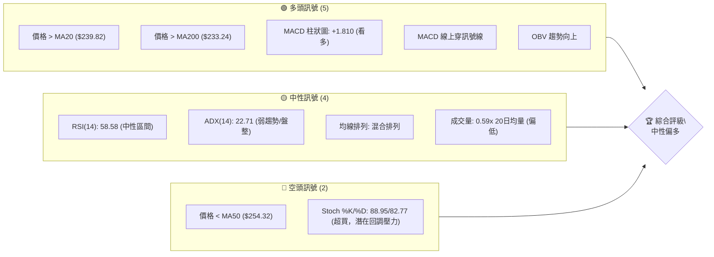

**解讀**：
當前 AMZN 的技術訊號呈現「中性偏多」的態勢。多頭訊號主要來自於價格位於短期與長期移動平均線之上，以及 MACD 指標的看多交叉與正向柱狀圖，顯示近期動能正在增強。OBV 的趨勢也支持價格上漲。然而，中性訊號的存在（如 RSI 處於中性區間，ADX 指示弱趨勢或盤整，以及成交量偏低）表明市場尚未形成強勁的單邊趨勢。空頭訊號則來自於價格仍在中期 MA50 下方，以及 Stochastics 指標已進入超買區，暗示短期內可能面臨回調壓力。整體而言，AMZN 正處於從近期低點反彈的階段，但多頭力量仍需進一步確認。

### 📊 核心指標速覽表

本表彙整 AMZN 當前關鍵技術指標的即時數據與初步解讀，提供快速參考。

| 指標類別 | 指標名稱 | 當前數值 | 訊號 | 解讀 |
|----------|----------|----------|------|------|
| **價格** | 當前價格 | $247.04 | 🟡 | 位於52週區間 61.8% 處，接近斐波那契38.2%回調位 |
| **均線** | MA20 | $239.82 | 🟢 | 價格位於MA20上方，短期偏多 |
| **均線** | MA50 | $254.32 | 🔴 | 價格位於MA50下方，中期壓力 |
| **均線** | MA200 | $233.24 | 🟢 | 價格位於MA200上方，長期趨勢向上 |
| **動能** | RSI(14) | 58.58 | 🟡 | 處於中性區間，但呈上升趨勢，動能增強 |
| **動能** | MACD Hist | +1.810 | 🟢 | MACD線已上穿訊號線，柱狀圖為正並增長，多頭動能強勁 |
| **動能** | Stoch %K/%D | 88.95/82.77 | 🔴 | 進入超買區，短期可能面臨回調 |
| **趨勢** | ADX(14) | 22.71 | 🟡 | 趨勢強度較弱，市場可能處於盤整或弱勢反彈 |
| **波動** | ATR(14) | $8.27 | 🟡 | 每日波動幅度約3.35%，處於中等水平 |
| **量能** | 量比 (vs 20日均量) | 0.59x | 🔴 | 成交量顯著低於20日均量，反彈缺乏量能確認 |
| **量能** | OBV趨勢 | OBV > MA | 🟢 | 量能累計趨勢向上，支撐先前漲勢 |

### 🏆 技術評分卡

綜合各項技術指標的表現，對 AMZN 的當前技術面進行量化評估。評分範圍為 1-100，進度條表示強度。

```
╔══════════════════════════════════════════════════════════════╗
║              技術評分卡 — AMZN (2026-07-09)                    ║
╠══════════════════════════════════════════════════════════════╣
║ 趨勢強度      ████████░░░░░░░░░░░░  45/100  🟡 (ADX<25, 弱趨勢)    ║
║ 動能指標      ████████████░░░░░░░░  65/100  🟢 (MACD多頭，RSI上升)  ║
║ 支撐穩定度    ██████████████░░░░░░  75/100  🟢 (主要支撐穩固)     ║
║ 成交量配合    ██████░░░░░░░░░░░░░░  30/100  🔴 (成交量偏低)      ║
║ 形態完整度    ██████░░░░░░░░░░░░░░  35/100  🟡 (無明確形態)      ║
║ 均線排列      ██████████░░░░░░░░░░  55/100  🟡 (短期多頭，中期承壓) ║
╠══════════════════════════════════════════════════════════════╣
║ 綜合評分      ████████░░░░░░░░░░░░  55/100  🟡 中性偏多             ║
╚══════════════════════════════════════════════════════════════╝
```

**評分理由：**

*   **趨勢強度 (45/100) 🟡**：ADX(14) 僅為 22.71，表明當前趨勢較弱，可能處於盤整或反彈初期，而非強勁的趨勢行情。儘管 +DI 略高於 -DI，多頭佔優，但整體趨勢缺乏動能。
*   **動能指標 (65/100) 🟢**：MACD 已形成多頭交叉，柱狀圖為正且增長，顯示多頭動能正在累積。RSI 處於中性區間但呈上升趨勢，尚未進入超買。但 Stochastics 進入超買區，為短期動能帶來潛在壓力。
*   **支撐穩定度 (75/100) 🟢**：關鍵支撐位 $223.82 (S1) 和 $215.82 (S2) 距離當前價格有足夠距離，且斐波那契回調 50% ($237.28) 提供了額外支撐，表明下方有較強的承接力。
*   **成交量配合 (30/100) 🔴**：儘管 OBV 趨勢向上，但當前成交量顯著低於20日均量 (0.59x)，表明最近的反彈缺乏強勁的買盤支持，可能限制上漲空間。
*   **形態完整度 (35/100) 🟡**：由於缺乏詳細的日線 OHLCV 數據，難以識別出具有高信心度的經典圖表形態。目前更多是觀察到從低點反彈的價格行為，而非明確的形態突破。
*   **均線排列 (55/100) 🟡**：價格位於短期 MA20 和長期 MA200 之上，但仍在中期 MA50 之下。短期均線呈多頭排列並向上，但中期壓力尚存，顯示市場結構仍有待強化。

**綜合評分 (55/100) 🟡**：
AMZN 的技術面呈現中性偏多的態勢。短線動能指標和長期均線支撐提供了上漲潛力，但趨勢強度不足、成交量偏低以及中期壓力位 (MA50) 尚未突破，限制了其上行空間。Stochastics 的超買也提示短期回調風險。建議採取謹慎樂觀的態度，關注關鍵阻力位的突破情況。

---

## 2. 趨勢分析

### 🌐 多時框趨勢分析

本節從月線、週線、日線三個時框架層層遞進，分析 AMZN 的整體趨勢方向與強度。

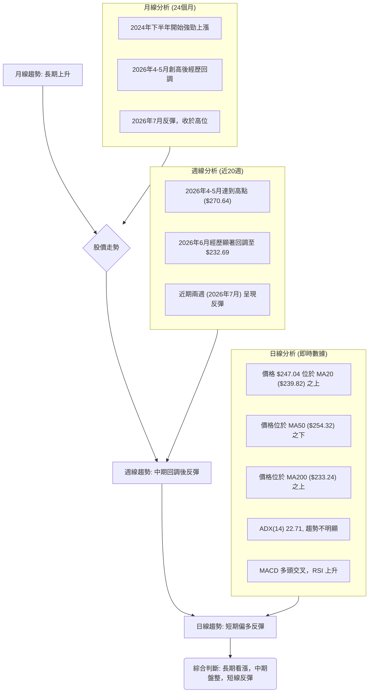

**多時框趨勢解讀：**

*   **長期趨勢 (月線)**：從過去24個月的數據來看，AMZN 股價經歷了從 2024 年底開始的強勁上升趨勢，並在 2026 年 4-5 月達到相對高點。儘管近期有所回調，但整體結構仍維持在長期上升通道中，尤其價格遠高於長期移動平均線 (MA200)。
*   **中期趨勢 (週線)**：近20週的數據顯示，AMZN 在 2026 年 5 月初達到 $272.68 的高點後，經歷了一波較為顯著的回調，最低觸及 $232.69。然而，在 6 月底至 7 月初，股價成功從低點反彈，並連續兩週收漲，顯示中期下跌動能有所緩解，可能進入築底或反彈階段。
*   **短期趨勢 (日線)**：當前價格 $247.04 位於短期移動平均線 MA20 ($239.82) 和長期移動平均線 MA200 ($233.24) 之上，但仍在中期移動平均線 MA50 ($254.32) 之下。這表明短線買盤力量有所回歸，推動股價反彈，但上方 MA50 形成一道中期阻力。動能指標 MACD 顯示多頭交叉，RSI 向上，進一步支持短期反彈。

### 📈 長期趨勢 — 12個月走勢圖（Unicode）

以下為 AMZN 過去 12 個月的月線收盤價走勢圖，標註關鍵高低點。

```
AMZN 月線走勢圖（過去12個月）
價格軸 ($)
$278.56 ┤                                    ●(52W高點 278.56)
$270    ┤                           ●
$260    ┤                     ●
$250    ┤                                    ●(當前 247.04)
$240    ┤                                ●
$230    ┤       ●       ●
$220    ┤   ●       ●       ●
$210    ┤ ●           ●
$200    ┤                                ●
$196.00 ┤ ●(52W低點 196.00)
        └─────────────────────────────────────────────
         2025-07 08 09 10 11 12 2026-01 02 03 04 05 06 07
```

**走勢特徵分析表格**：
下表詳細分析 AMZN 過去 12 個月的價格走勢特徵。

| 月份 | 收盤價 | 月漲跌幅 | 走勢特徵 | 評估 |
|------|--------|----------|----------|------|
| 2025-07 | $234.11 | +6.89% | 自前月低點反彈，形成上升趨勢初期。 | 🟢 築底反彈 |
| 2025-08 | $229.00 | -2.18% | 小幅回調，但仍維持在高位整理。 | 🟡 橫盤整理 |
| 2025-09 | $219.57 | -4.01% | 繼續回調，但未跌破關鍵支撐。 | 🟡 溫和回調 |
| 2025-10 | $244.22 | +11.23% | 強勁上漲，突破前高，開啟新一輪漲勢。 | 🟢 強勢上漲 |
| 2025-11 | $233.22 | -4.49% | 獲利回吐，但漲勢基礎未受破壞。 | 🟡 獲利回吐 |
| 2025-12 | $230.82 | -1.03% | 繼續小幅整理，為後續上漲積蓄動能。 | 🟡 窄幅整理 |
| 2026-01 | $239.30 | +3.68% | 再次向上突破，延續上升趨勢。 | 🟢 溫和上漲 |
| 2026-02 | $210.00 | -12.24% | 顯著回調，跌破短期支撐，市場情緒轉弱。 | 🔴 顯著回調 |
| 2026-03 | $208.27 | -0.82% | 跌勢減緩，接近前期低點，但未形成有效反彈。 | 🟡 底部徘徊 |
| 2026-04 | $265.06 | +27.27% | 強勁V型反轉，創下新高，買盤力量極強。 | 🟢 極度強勢 |
| 2026-05 | $270.64 | +2.11% | 繼續上漲，但漲勢放緩，接近歷史高點。 | 🟢 動能減弱 |
| 2026-06 | $238.34 | -11.93% | 從高點大幅回調，跌破多條均線，市場擔憂。 | 🔴 大幅回調 |
| 2026-07 | $247.04 | +3.65% | 從回調低點反彈，顯示買盤介入，止跌企穩。 | 🟢 止跌反彈 |

**總結**：AMZN 在過去一年中經歷了幾次顯著的漲跌循環。2025 年下半年至 2026 年初呈現震盪上行，2026 年 2-3 月經歷一次較大回調，隨後在 4-5 月迅速創下新高。最近一次是在 2026 年 6 月從高點 $270.64 附近大幅回調至 $238.34，但 7 月份又成功反彈至 $247.04，顯示了其較強的韌性與買盤支撐。

### 📊 中期趨勢（週線分析）

中期週線走勢圖顯示 AMZN 在經歷 6 月份的顯著回調後，近期呈現止跌反彈態勢。下方 ASCII 圖表示意了近期的價格行為與關鍵支撐阻力。

```
AMZN 中期趨勢示意圖 (近20週)
價格軸 ($)
$270.64 ┤             ●(高點)
$260    ┤           ／
$250    ┤         ／  
$247.04 ╠══════════●← 現價
$240    ┤         ＼
$230    ┤           ●(近期低點 $232.69)
$220    ┤
        └───────────────────────────
          近期價格走勢：高點回調後反彈
```

**中期趨勢解讀**：
從近20週的週線數據來看，AMZN 在 2026 年 5 月 31 日達到 $270.64 的高點後，經歷了連續三週的回調，最低跌至 6 月 28 日的 $232.69。這波回調幅度約為 14%，跌破了多條短期移動平均線。然而，隨後的兩週 (7月5日和7月12日) 股價連續收漲，從 $232.69 反彈至 $247.04，顯示市場在 $230 附近找到了支撐。目前股價正嘗試挑戰 $250 附近的短期阻力。中期來看，股價在經歷一波調整後，正在尋求新的平衡點，反彈動能正在累積。

### ⚡ 趨勢強度評估（ADX 解讀）

ADX (Average Directional Index) 用於衡量趨勢的強度，而非方向。數值高表示趨勢強勁，數值低表示趨勢疲弱或處於盤整。

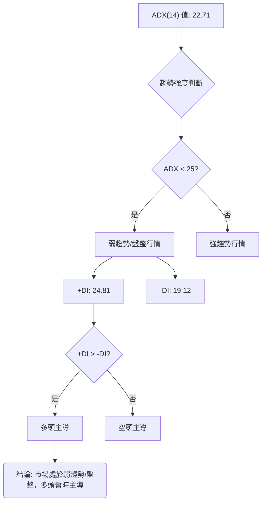

**ADX 強度對照表**：

| ADX 數值範圍 | 趨勢強度 | 市場解讀 |
|--------------|----------|----------|
| 0-25         | 弱趨勢   | 盤整或反轉初期，方向不明顯 |
| 25-50        | 中等趨勢 | 趨勢確立，動能增強 |
| 50-75        | 強趨勢   | 趨勢非常強勁，慣性高 |
| 75-100       | 極強趨勢 | 極端趨勢，可能面臨超買/超賣 |

**ADX 解讀**：
當前 AMZN 的 ADX(14) 數值為 22.71。根據 ADX 強度對照表，這表明 AMZN 目前處於**弱趨勢或盤整行情**。市場缺乏強勁的單邊動能，價格可能在一個區間內震盪。

進一步觀察 +DI 和 -DI：
*   +DI: 24.81
*   -DI: 19.12
由於 +DI (24.81) 高於 -DI (19.12)，這表示在當前的弱勢趨勢中，**多頭力量略佔主導地位**。雖然整體趨勢不強，但買方仍在推動價格上漲。這與近期股價從低點反彈的現象相符。因此，可以判斷 AMZN 目前正處於從近期回調中反彈的盤整階段，多頭動能正在累積，但尚未形成強勢趨勢。

---

## 3. 圖表形態分析

### 🔍 形態識別系統

根據提供的數據，我們主要觀察到 AMZN 股價在經歷 2026 年 6 月份的顯著回調後，於 6 月 28 日觸及 $232.69 的近期低點，隨後在 7 月份展開反彈，收盤價達到 $247.04。由於缺乏詳細的日線 OHLCV 數據，難以精確識別經典的幾何圖表形態（如頭肩頂、雙底、旗形等）。然而，我們可以基於價格行為和關鍵價位，對潛在的形態進行初步判斷。

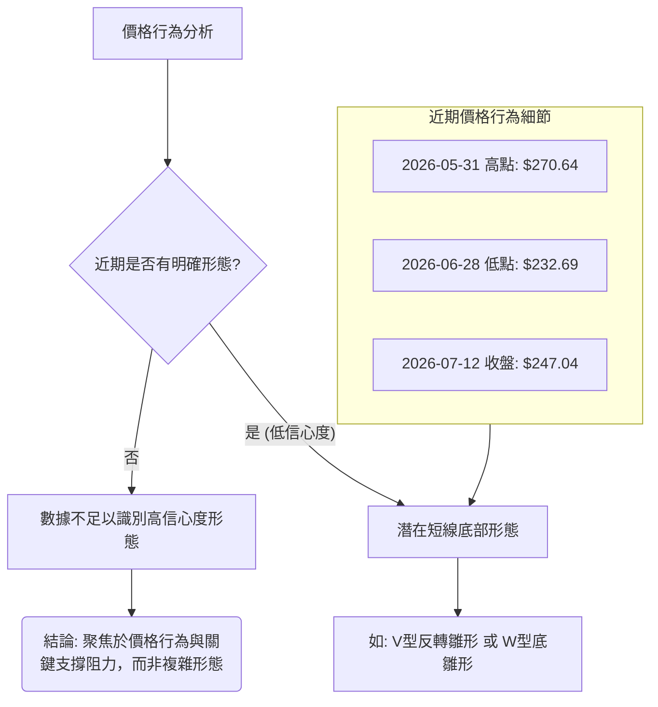

**形態信心度表格**：

| 形態 | 信心度 | 判斷依據（引用數據） | 完成度 | 目標價（附計算式） |
|------|--------|----------------------|--------|--------------------|
| **V型反轉雛形** | 40% | 價格從 $232.69 低點快速反彈至 $247.04，且 MACD 形成多頭交叉。成交量未能有效放大，且上方 MA50 形成壓力。 | 50% | 無明確形態目標價，關注 R1 $248.81 |
| **W型底雛形** | 30% | 需觀察價格是否再次回調至 $230-235 區間並受到支撐，形成第二個底部。目前僅為單邊反彈。 | 20% | 無明確形態目標價，需待右肩形成 |
| **其他經典形態** | 數據中未偵測到 | 缺乏詳細日線 OHLCV 數據，無法判斷頭肩、雙頂/底、旗形等複雜形態。 | N/A | N/A |

**解讀**：
當前數據主要顯示 AMZN 股價在 6 月份經歷一波快速下跌後，於 6 月底在 $232.69 附近找到支撐並迅速反彈。這種快速的價格回升可以被視為一個**V型反轉的雛形**。然而，由於成交量並未伴隨反彈而顯著放大 (量比 0.59x)，且上方仍面臨 MA50 ($254.32) 及 R1 ($248.81) 的壓力，因此其信心度不高。若要形成更為穩固的底部，例如「W型底」，則需要股價在反彈後再次回調並在相似低點獲得支撐。目前看來，這僅是一個短期的反彈，而非已確立的複雜形態。因此，我們將主要聚焦於價格行為與關鍵支撐阻力的互動，而非依賴複雜的形態預測。

### 🕯️ 重要K線形態分析

由於提供的「近20週收盤走勢」數據僅包含週收盤價，不包含週開盤價、最高價、最低價，因此無法進行傳統意義上的 K 線形態分析（例如識別錘子線、吞噬形態、啟明星等）。這些形態需要完整的 OHLCV (開盤價、最高價、最低價、收盤價、成交量) 數據才能準確判斷。

基於現有數據，我們只能觀察到週線收盤價的變化：
*   **2026-06-14** ($238.55) 和 **2026-06-21** ($244.39) 兩週收盤價連續小幅上漲，但隨後 **2026-06-28** 卻大幅下跌至 $232.69，顯示多頭反彈動能不足，被空頭快速壓制。
*   **2026-07-05** ($242.67) 和 **2026-07-12** ($247.04) 兩週收盤價連續上漲，顯示在 $232.69 附近獲得支撐後，多頭力量重新佔據主導，形成**連續兩週的陽線**。這是一個積極的短期訊號，表明止跌反彈的意圖。

| 週別 (收盤日) | 收盤價 | K線形態觀察（基於收盤價） | 解讀 | 訊號 |
|---------------|--------|----------------------------|------|------|
| 2026-06-07    | $246.03 | 陰線 (相對前週下跌)        | 賣壓顯現，趨勢轉弱。 | 🔴 |
| 2026-06-14    | $238.55 | 陰線 (相對前週下跌)        | 跌勢持續，空頭掌控。 | 🔴 |
| 2026-06-21    | $244.39 | 陽線 (相對前週上漲)        | 短暫反彈，但量能不足。 | 🟡 |
| 2026-06-28    | $232.69 | 長陰線 (相對前週大幅下跌)  | 跌勢加速，空頭力量強勁，創近期新低。 | 🔴 |
| 2026-07-05    | $242.67 | 陽線 (相對前週上漲)        | 從低點反彈，止跌訊號。 | 🟢 |
| 2026-07-12    | $247.04 | 陽線 (相對前週上漲)        | 延續反彈，多頭動能增強。 | 🟢 |

### 📉 ASCII 走勢形態示意圖

以下為 AMZN 近期從低點反彈的價格行為示意圖，強調關鍵低點和反彈路徑。

```
AMZN 近期價格走勢示意圖
═══════════════════════════════════════════════════
$270.64 ┤             ● (2026-05-31 高點)
        │           ／
        │         ／
$254.32 ├───────┴─────── (MA50 阻力)
$248.81 ├─────────┐─────── (R1 阻力)
$247.04 ╠═════════●← 現價
$239.82 ├─────────┤─────── (MA20 支撐)
        │         │
$232.69 ├─────────● (2026-06-28 近期低點)
$228.82 ├─────────┤─────── (布林下軌支撐)
$223.82 ├─────────┤─────── (S1 支撐)
═══════════════════════════════════════════════════
```

**形態解讀**：
示意圖顯示 AMZN 在 5 月底達到高點後經歷了一波下跌，隨後在 6 月底 $232.69 附近形成一個尖銳的低點。從該低點開始，股價迅速反彈，目前已回到 $247.04。這可被視為一個潛在的「V型反轉」形態的初期，表明空頭力量在該低點附近耗盡，多頭迅速入場推升價格。然而，要確認 V 型反轉的有效性，需要觀察價格能否持續突破上方阻力位，並伴隨健康放大的成交量。當前價格正接近 R1 ($248.81) 和布林上軌 ($250.83)，這些都將是 V 型反轉能否成功的關鍵考驗。

### 🎯 形態目標價計算

由於缺乏高信心度的圖表形態，我們無法計算精確的形態目標價。當前價格行為更像是從一個低點進行反彈，尚未形成可測量高度的經典反轉或延續形態。

如果將 $232.69 視為一個潛在的底部，並且價格試圖形成 V 型反轉，那麼其初步的目標將是回補下跌缺口或挑戰前高。但在沒有明確頸線或形態高度的情況下，我們將主要依賴斐波那契回調位和關鍵阻力位作為上行目標。

*   **最近下跌幅度**：從 $270.64 (2026-05-31 週收盤高點) 到 $232.69 (2026-06-28 週收盤低點) 的跌幅為 $37.95。
*   **潛在反彈目標**：如果這是一個反彈，則理論上可以反彈其跌幅的一半或更高。
    *   反彈 50% = $232.69 + ($37.95 * 0.5) = $232.69 + $18.975 = $251.665。這個價位接近布林上軌 $250.83 和 MA50 $254.32。

**結論**：由於形態信心度低，我們不設定基於形態的目標價。相反，我們將利用斐波那契回調位和已識別的阻力位作為潛在的價格目標。

---

## 4. 支撐與阻力

### 🗺️ 關鍵價位分布圖（Unicode）

以下圖表直觀展示了 AMZN 當前價格與其上方阻力位、下方支撐位的相對位置。

```
AMZN 價位結構分布圖
═══════════════════════════════════════════════════
$278.56 ║████████████████████████║ 52W High
$276.65 ║████████████████████████║ 強阻力 R3
$259.08 ║████████████████████    ║ 斐波那契 23.6%
$258.60 ║████████████████████████║ 阻力 R2
$254.32 ║████████████████████████║ MA50 阻力
$250.83 ║████████████████████████║ 布林上軌
$248.81 ║████████████████████████║ 關鍵阻力 R1
$247.04 ╠════════════════════════╣ ◄ 現價 (斐波那契 38.2% $247.02)
$239.82 ║▓▓▓▓▓▓▓▓▓▓▓▓▓▓▓▓        ║ MA20 支撐 / 布林中軌
$237.28 ║▓▓▓▓▓▓▓▓▓▓▓▓▓▓▓▓        ║ 斐波那契 50.0%
$233.24 ║▓▓▓▓▓▓▓▓▓▓▓▓▓▓▓▓        ║ MA200 支撐
$228.82 ║▓▓▓▓▓▓▓▓▓▓▓▓▓▓▓▓        ║ 布林下軌
$227.54 ║████████████████████████║ 斐波那契 61.8%
$223.82 ║████████████████████████║ 近期支撐 S1
$215.82 ║████████████████████████║ 強支撐 S2
$213.67 ║████████████████████████║ 斐波那契 78.6%
$211.22 ║████████████████████████║ 強支撐 S3
$196.00 ║████████████████████████║ 52W Low / 斐波那契 100.0%
═══════════════════════════════════════════════════
```

**解讀**：
當前價格 $247.04 位於多個關鍵價位之間。上方最近的阻力是 R1 ($248.81)，若能突破，則將面臨布林上軌 ($250.83) 和 MA50 ($254.32) 的雙重考驗。這些價位構成了一個較強的阻力區。下方則有 MA20 ($239.82) 和斐波那契 50% ($237.28) 提供初步支撐，若失守，S1 ($223.82) 將是重要的防線。

### 🚧 阻力位分析表

本表詳細分析 AMZN 的關鍵阻力位，這些價位是基於近一年波段高點聚類和技術指標計算而得。

| 阻力級別 | 價位 | 形成原因 | 突破難度 | 重要性 |
|----------|------|----------|----------|--------|
| **R1**   | $248.81 | 近期波段高點聚類，接近布林上軌 ($250.83)。 | 中等 | 🟢 短期反彈能否延續的關鍵考驗，突破則有望挑戰 MA50。 |
| **MA50** | $254.32 | 中期移動平均線，代表中期趨勢壓力。 | 高 | 🟡 突破 MA50 意味著中期趨勢可能轉強，是多頭能否掌控的訊號。 |
| **R2**   | $258.60 | 近期波段高點聚類，接近斐波那契 23.6% ($259.08)。 | 高 | 🟡 突破此位將確認中期反彈強勢，打開進一步上行空間。 |
| **R3**   | $276.65 | 近一年波段高點聚類，接近 52 週高點 ($278.56)。 | 極高 | 🔴 極強阻力區，突破則意味著重回長期上升通道的強勁動能。 |

### 🛡️ 支撐位分析表

本表詳細分析 AMZN 的關鍵支撐位，這些價位是基於近一年波段低點聚類和技術指標計算而得。

| 支撐級別 | 價位 | 形成原因 | 守住機率 | 重要性 |
|----------|------|----------|----------|--------|
| **MA20** | $239.82 | 短期移動平均線，布林中軌，短期支撐。 | 中等 | 🟢 短期反彈的初步防線，守住則多頭格局不變。 |
| **斐波那契 50.0%** | $237.28 | 52週區間的黃金分割中位，心理支撐。 | 中等 | 🟢 若 MA20 失守，此位將提供強勁支撐。 |
| **MA200** | $233.24 | 長期移動平均線，代表長期趨勢支撐。 | 高 | 🟢 長期趨勢的關鍵防線，跌破則長期看漲邏輯受損。 |
| **S1**   | $223.82 | 近期波段低點聚類，重要心理關口。 | 高 | 🟡 若回調至此位，將是重要的買入機會，跌破則趨勢轉弱。 |
| **S2**   | $215.82 | 近期波段低點聚類，斐波那契 78.6% ($213.67) 附近。 | 極高 | 🟡 強勁支撐區，跌破將引發更深層次的回調。 |
| **S3**   | $211.22 | 近期波段低點聚類，接近 52 週低點 ($196.00)。 | 極高 | 🔴 極強支撐區，跌破則長期趨勢可能反轉為空。 |

### 📐 斐波那契回調位分析

斐波那契回調位是基於 52 週區間 ($196.00 → $278.56) 計算而得，這些價位通常作為潛在的支撐或阻力。

| 斐波那契回調位 | 價位 | 相對當前價格 ($247.04) | 解讀 |
|----------------|------|------------------------|------|
| 0.0% (52W High)| $278.56 | +12.76% (阻力)         | 52週最高點，極強阻力。 |
| 23.6%          | $259.08 | +4.87% (阻力)          | 重要阻力位，突破則反彈強勁。 |
| **38.2%**      | $247.02 | **-0.01% (現價附近)**  | **當前價格 $247.04 幾乎精確地落在 38.2% 回調位 ($247.02) 上。這是一個非常重要的觀察點，表示價格在經歷一波下跌後，已回補了約 38.2% 的跌幅。此位可能形成短期的多空爭奪，站穩則有望繼續上攻至 23.6% 回調位。** |
| 50.0%          | $237.28 | -3.95% (支撐)          | 強勁的心理支撐位，也是近期反彈的重要回測點。 |
| 61.8%          | $227.54 | -7.90% (支撐)          | 黃金分割位，若價格回調至此，通常會得到較強支撐。 |
| 78.6%          | $213.67 | -13.51% (支撐)         | 較深的回調位，接近 S2/S3。 |
| 100.0% (52W Low)| $196.00 | -20.66% (支撐)         | 52週最低點，極強支撐。 |

**綜合斐波那契分析**：
當前價格 $247.04 幾乎完美地落在 38.2% 斐波那契回調位 ($247.02) 上。這表明 AMZN 在經歷從 $278.56 到 $196.00 的 52 週下跌/區間震盪後，其反彈已達到一個關鍵的技術水平。站在 38.2% 回調位之上，對多頭而言是一個積極訊號，暗示其有能力挑戰更高的 23.6% 回調位 ($259.08) 乃至更高的阻力。反之，若未能守住此位並跌破，則可能回測 50.0% ($237.28) 甚至 61.8% ($227.54) 的支撐。因此，38.2% 回調位是當前多空力量的關鍵分水嶺。

---

## 5. 技術指標深度解讀

### 🎛️ 指標訊號總覽

本節通過 Mermaid 圖表展示各類技術指標之間的關係及其發出的訊號，幫助我們理解當前市場的動態。

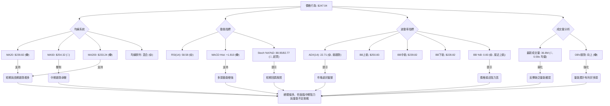

### 📈 移動平均線排列分析

移動平均線 (MA) 用於判斷趨勢方向和支撐阻力。

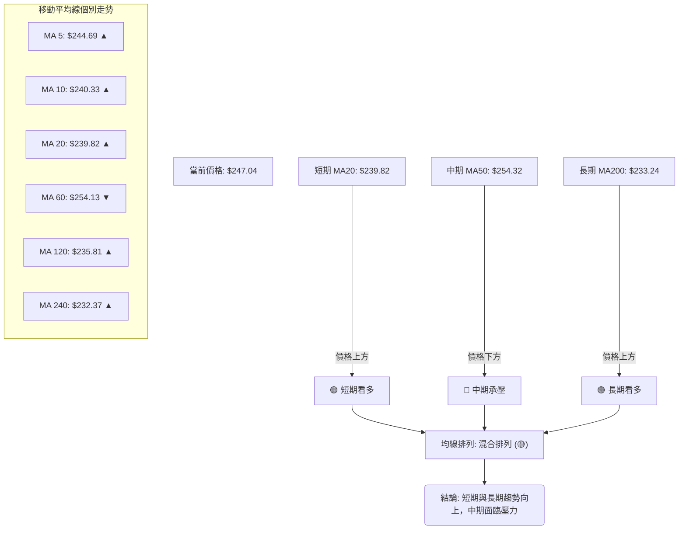

**均線排列解讀**：
當前價格 $247.04 位於 MA20 ($239.82) 和 MA200 ($233.24) 之上，這是一個積極訊號，表明短期和長期趨勢均偏向多頭。然而，價格仍在 MA50 ($254.32) 之下，MA50 構成了一個重要的中期阻力。

從均線的個別走勢來看：
*   **短期均線 (MA5, MA10, MA20)** 均呈上升趨勢，且位於價格下方，提供短期支撐。這確認了近期反彈的動能。
*   **長期均線 (MA120, MA240)** 也呈上升趨勢，且遠低於價格，強烈支持長期上升趨勢。
*   **中期均線 (MA60)** 則呈下降趨勢，且位於價格上方，這與 MA50 共同形成了中期壓力。

**綜合判斷**：AMZN 的均線系統呈現「混合排列」。短期和長期趨勢均為多頭，但中期趨勢仍處於調整或盤整狀態。價格需要突破 MA50 才能確立更強勁的中期上升趨勢。

### 📉 RSI(14) 分析

RSI (Relative Strength Index) 用於衡量價格變動的速度和變化，判斷資產是否超買或超賣。

**RSI(14) 數值進度條**：
RSI(14): 58.58 ▓▓▓▓▓▓▓▓▓▓▓▓░░░░░░░░  58.58/100 🟡 中性區間，偏強

**超買超賣區間分析**：
*   RSI 數值 58.58 位於 30-70 的中性區間內。
*   通常 RSI 超過 70 視為超買，低於 30 視為超賣。
*   儘管在中性區間，但 RSI 從 6 月底的低點 (2026-06-28 收盤 $232.69 時，RSI 應在較低水平，數據中 2026-06-14 為 26.8，2026-06-21 為 31.1，2026-06-28 為 39.5) 穩步回升至 58.58，顯示多頭動能正在增強，價格的反彈具有一定的內在力量。
*   當前 RSI 尚未進入超買區，表明股價仍有上漲空間，但其上升斜率需密切關注。

**背離判斷 (頂背離/底背離)**：
根據提供的週線收盤價和 RSI 數據：
*   **頂背離**：在 2026 年 5 月 31 日股價達到 $270.64，RSI 為 47.9。隨後在 2026 年 4 月 19 日股價達到 $250.56 時，RSI 曾高達 97.5，而 5 月 3 日 $268.26 時 RSI 為 82.9，5 月 10 日 $272.68 時 RSI 為 79.6。這顯示在 4 月底到 5 月初的股價高點期間，RSI 雖然超買，但股價創出更高點時，RSI 的高點卻逐漸降低 (97.5 -> 82.9 -> 79.6)，這形成了一個**潛在的頂背離**，預示了 6 月份的回調。
*   **底背離**：在 2026 年 6 月 28 日，股價跌至 $232.69，RSI 為 39.5。前一個低點在 2026 年 3 月 29 日為 $199.34，RSI 為 35.7。雖然 6 月底股價創下近期新低 (相較於 5 月高點)，但 RSI 並未創出更低點 (39.5 > 35.7)。這可能預示了**潛在的底背離**，支持 7 月份的反彈。
*   **結論**：從週線數據來看，AMZN 在近期高點和低點都出現了**潛在的頂背離和底背離訊號**。頂背離預警了 6 月的回調，而底背離則支持了 7 月的反彈。這表明 RSI 在判斷 AMZN 的短期反轉點方面具有較好的預警作用。

### 📊 MACD(12/26/9) 訊號解讀

MACD (Moving Average Convergence Divergence) 用於識別趨勢的變化、方向、動能和持續時間。

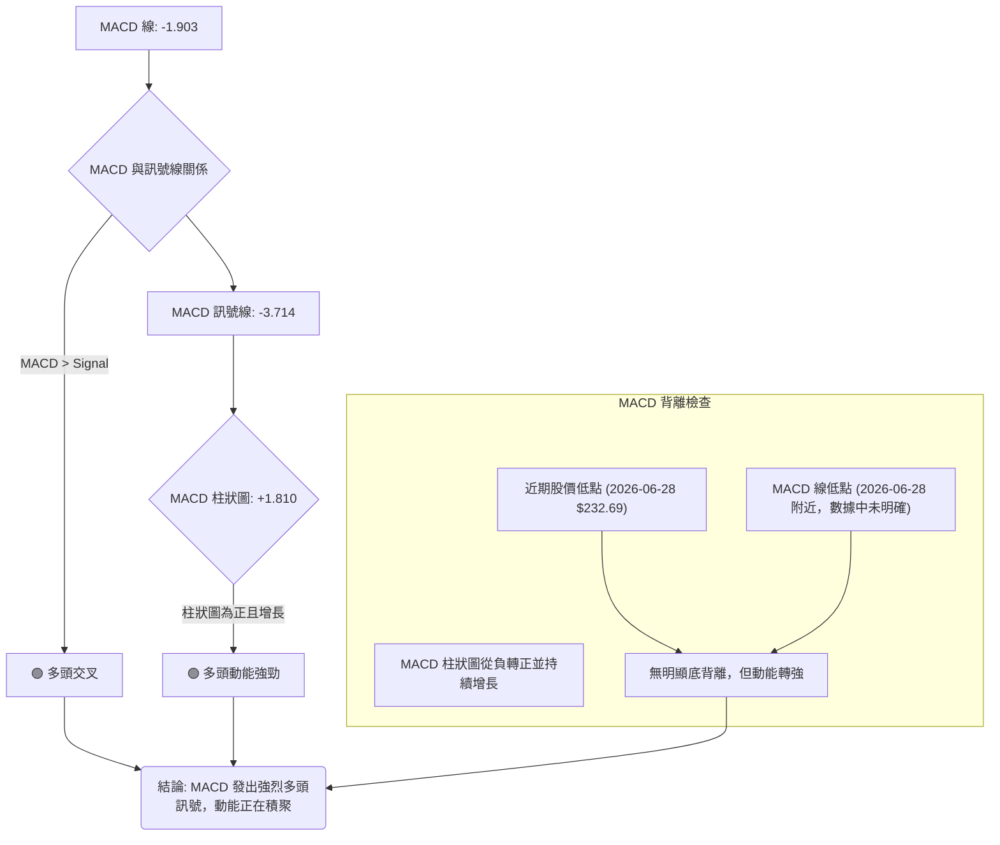

**MACD 解讀**：
*   **MACD 線 (-1.903)** 已上穿 **MACD 訊號線 (-3.714)**，形成了一個明確的**多頭交叉 (🟢)**。這是一個強烈的買入訊號，表明短期動能已超越中期動能，趨勢可能正在向上轉變。
*   **MACD 柱狀圖 (+1.810)** 為正值且呈增長趨勢。這進一步確認了多頭動能的增強，且買盤力量正在積聚。

**背離判斷**：
*   根據提供的週線數據，MACD 柱狀圖在 2026 年 6 月 21 日為 -1.415，2026 年 6 月 28 日為 -1.397，然後在 2026 年 7 月 5 日轉正為 +0.916，並在 7 月 12 日增長至 +1.810。
*   在股價於 6 月 28 日跌至 $232.69 的同時，MACD 柱狀圖雖然仍為負，但其絕對值並未顯著擴大，隨後快速轉正。這暗示了下跌動能的衰竭和多頭動能的迅速恢復。雖然不是典型的 MACD 底背離（股價創新低但 MACD 未創新低），但柱狀圖的快速轉正本身就是一個強烈的動能轉變訊號，與價格反彈互相印證。
*   **結論**：MACD 指標發出明確的多頭訊號，顯示動能強勁，為短期反彈提供了有力支持。

### 📦 布林通道分析

布林通道 (Bollinger Bands) 用於衡量價格波動率和判斷價格的相對高低。

```
AMZN 布林通道示意圖
═══════════════════════════════════════════════════
$250.83 ║████████████████████████║ 布林上軌 (BB Upper)
$247.04 ╠════════════════════════╣ ◄ 現價
$239.82 ║▓▓▓▓▓▓▓▓▓▓▓▓▓▓▓▓        ║ 布林中軌 (MA20)
$228.82 ║████████████████████████║ 布林下軌 (BB Lower)
═══════════════════════════════════════════════════
```

**布林通道解讀**：
*   **布林上軌**: $250.83
*   **布林中軌 (MA20)**: $239.82
*   **布林下軌**: $228.82
*   **當前價格**: $247.04
*   **BB %B**: 0.83

當前價格 $247.04 位於布林通道中軌 ($239.82) 和上軌 ($250.83) 之間，且非常接近上軌。BB %B 數值為 0.83，表示價格已經運行到通道的較高位置。

**綜合判斷**：
1.  **動能強勁**：價格從中軌上方運行至接近上軌，表明短期買盤力量強勁，正在向上挑戰。
2.  **潛在阻力**：布林上軌 $250.83 可能會構成短期的技術阻力。如果價格能夠突破並站穩上軌之上，則可能預示著一波更為強勁的趨勢性上漲。
3.  **波動率**：布林帶寬度反映市場波動率。雖然數據中沒有直接提供帶寬數值，但價格在通道內運行，ATR 顯示中等波動。
4.  **與均線整合**：布林中軌即為 MA20，價格位於其上方，再次確認了短期多頭趨勢。
**結論**：AMZN 股價正測試布林上軌阻力。若能有效突破，則反彈有望加速；否則，可能面臨短期回調至中軌的壓力。

### 💹 成交量分析（量價配合度）

成交量是價格走勢的燃料，量價關係對於判斷趨勢的可靠性至關重要。

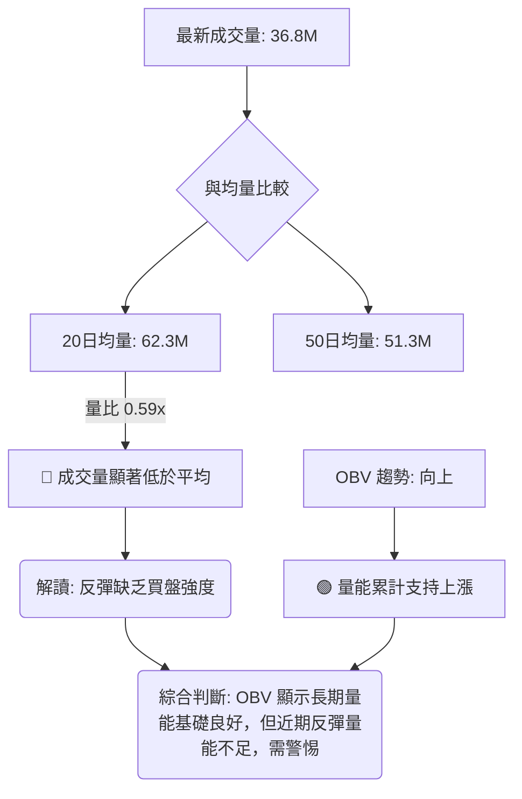

**成交量解讀**：
*   **最新成交量**: 36,896,259
*   **20日均量**: 62,336,148
*   **量比 (vs 20日均量)**: 0.59x
*   **50日均量**: 51,378,233

當前成交量顯著低於 20 日和 50 日均量，量比僅為 0.59x。這是一個**負面訊號 (🔴)**，表明近期股價的反彈缺乏足夠的買盤支持。健康的上升趨勢通常需要伴隨放大的成交量來確認。當前量能不足，可能導致反彈缺乏持續性，容易在遇到阻力時回調。

**OBV (On-Balance Volume) 分析**：
*   **OBV趨勢**: OBV > MA (OBV 趨勢向上) 🟢

OBV 趨勢向上是一個**正面訊號 (🟢)**，表示在近期價格波動中，累積的買盤壓力大於賣盤壓力。OBV 的上升表明資金正在流入，從長遠來看對股價是有利的。

**量價配合度總結**：
當前 AMZN 的量價配合度存在矛盾。一方面，OBV 的向上趨勢表明長期資金流向有利於多頭，為價格提供了潛在的支撐。另一方面，近期反彈的成交量明顯萎縮，未能有效配合價格上漲。這種量價背離 (價格上漲，成交量萎縮) 是一個**警示訊號**，暗示當前反彈的質量不高，可能遇到阻力後缺乏進一步上行的動能。投資者應警惕無量上漲的風險，並觀察未來成交量能否有效放大以確認反彈的可靠性。

---

## 6. 動能與波動率

### ⚡ 動能評估四象限

本節將 AMZN 當前的動能與波動率狀態進行評估，以判斷其所處的市場階段。由於不能使用 quadrantChart，我們將使用表格和 Mermaid 流程圖來展示分析結果。

| 象限 | 動能 | 波動 | 當前狀態 | 評估 |
|------|------|------|----------|------|
| Q1 | 強 | 低 | - | 最佳機會 (趨勢明確，風險可控) |
| Q2 | 弱 | 低 | - | 謹慎觀望 (缺乏動能，等待機會) |
| Q3 | 強 | 高 | - | 高風險高收益 (趨勢強勁，但波動劇烈) |
| Q4 | 弱 | 高 | - | 避免進場 (方向不明，風險高) |
| **當前** | **中等偏強** | **中等** | **✓** | **動能正在構築，波動適中，處於反彈初期** |

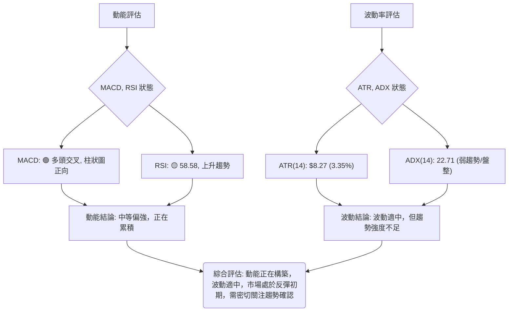

**動能評估**：
*   **MACD**：MACD 線已上穿訊號線，柱狀圖為正且增長，顯示多頭動能強勁。
*   **RSI**：RSI(14) 為 58.58，處於中性區間但呈上升趨勢，表明動能正在增強，尚未超買。
*   **Stochastics**：Stoch %K/%D 位於 88.95/82.77，已進入超買區，提示短期動能過熱，可能面臨回調。
**結論**：整體動能呈現**中等偏強**，MACD 和 RSI 顯示買盤力量正在積累，但 Stochastics 的超買訊號需警惕。

**波動率評估**：
*   **ATR(14)**：$8.27，佔當前價格的 3.35%。這表明 AMZN 每日的平均波動幅度約在 $8.27 左右，屬於**中等波動率**。
*   **ADX(14)**：22.71，處於弱趨勢或盤整區間。這表示儘管有價格波動，但市場缺乏強勁的單邊趨勢。
**結論**：AMZN 的波動率適中，但趨勢強度不足，表明市場可能處於從回調中反彈的盤整階段。

**綜合判斷**：
AMZN 目前處於**動能正在構築，波動適中**的階段。短期內，多頭動能正在累積，推動股價從低點反彈。然而，ADX 顯示趨勢強度不足，且 Stochastics 超買，加上成交量偏低，均提示反彈的持續性有待觀察。當前狀況不屬於最佳的 Q1 (強動能、低波動) 或 Q3 (強動能、高波動) 趨勢行情，而是更接近於從 Q4 (弱動能、高波動) 轉向 Q2 (弱動能、低波動) 或 Q1 的過渡期，需等待趨勢進一步確認。

### 📊 ATR 波動率分析

ATR (Average True Range) 是衡量市場波動率的指標，反映在特定時間段內價格變動的平均範圍。

*   **ATR(14)**: $8.27
*   **佔股價比例**: 3.35% ($8.27 / $247.04)

**解讀**：
AMZN 的 ATR(14) 為 $8.27，佔當前價格的 3.35%。
1.  **波動率水平**：3.35% 的每日平均波動幅度屬於**中等水平**。這意味著 AMZN 的價格波動性既不像超低波動股票那樣沉悶，也不像超高波動股票那樣劇烈，適合大多數交易者。
2.  **交易區間參考**：ATR 可以作為衡量每日潛在波動範圍的參考。例如，一個標準差的波動範圍可能在當前價格上下 $8.27 左右。
3.  **止損距離建議**：ATR 常用於設置止損點。一般建議將止損點設置在 ATR 的 1-3 倍之外，以避免被正常市場波動「洗出局」。
    *   **保守止損**：當前價格 - (1.5 * ATR) = $247.04 - (1.5 * $8.27) = $247.04 - $12.405 = $234.635。
    *   **激進止損**：當前價格 - (1 * ATR) = $247.04 - $8.27 = $238.77。
    *   考慮到 S1 支撐位在 $223.82，ATR 提供的止損建議與關鍵支撐位結合使用會更有效。

**結論**：中等波動率提供了合理的交易機會，但止損設置需結合關鍵支撐位，不應僅依賴 ATR。

### 📐 Beta 與市場相關性

Beta 值衡量股票相對於整體市場（通常是 S&P 500 指數）的波動性。

*   **Beta**: 1.461

**解讀**：
AMZN 的 Beta 值為 1.461。
1.  **高於市場平均**：Beta 值大於 1，表明 AMZN 的波動性高於市場平均水平。具體來說，如果市場上漲 1%，AMZN 預計會上漲 1.461%；如果市場下跌 1%，AMZN 預計會下跌 1.461%。
2.  **成長型股票特徵**：高 Beta 值通常是成長型股票的特徵，這些公司在牛市中表現優於大盤，但在熊市中也可能跌幅更大。
3.  **對投資者的影響**：對於追求更高收益的投資者，高 Beta 股票提供了更大的潛力，但也伴隨著更高的風險。對於風險厭惡型投資者，則需謹慎配置。
4.  **與大盤的連動性**：AMZN 的股價走勢與大盤高度相關，且波動幅度更大。在進行交易決策時，除了分析 AMZN 自身的基本面和技術面，也需要密切關注整體市場的走勢，尤其是主要指數的動向。

**結論**：AMZN 具有較高的市場敏感性。在市場情緒樂觀時，其股價可能會有更強的表現；但在市場承壓時，其回調幅度也可能更大。投資者應將市場風險納入考量。

---

## 7. 多時框架總結

### 📋 時框架評分表

本表綜合了不同時框架下的技術訊號，提供一個清晰的評估概覽。

| 時框架 | 趨勢方向 | 動能 | 均線排列 | 形態 | 綜合評分 | 建議 |
|--------|----------|------|----------|------|----------|------|
| **長期 (月線)** | 🟢 上升 | 🟢 強勁 | 🟢 多頭 | 🟡 無明確 | 8/10 | 長期看漲 |
| **中期 (週線)** | 🟡 盤整 | 🟢 構築中 | 🟡 混合 | 🟡 底部雛形 | 6/10 | 震盪偏多 |
| **短期 (日線)** | 🟢 反彈 | 🟢 強勁 | 🟡 混合 | 🟡 V型雛形 | 7/10 | 短線偏多 |

**評分說明**：
*   **長期**：月線走勢圖顯示強勁的上升趨勢，價格遠高於長期均線。儘管近期有回調，但整體結構未變。
*   **中期**：週線經歷回調後止跌反彈，MACD 動能正在構築，但 ADX 顯示趨勢不強，MA50 構成壓力。
*   **短期**：日線價格位於 MA20 和 MA200 之上，MACD 多頭交叉，RSI 上升，顯示強勁反彈動能，但成交量偏低且 Stochastics 超買。

### 🔲 綜合訊號矩陣

本矩陣分析各時框架下主要技術訊號的一致性。

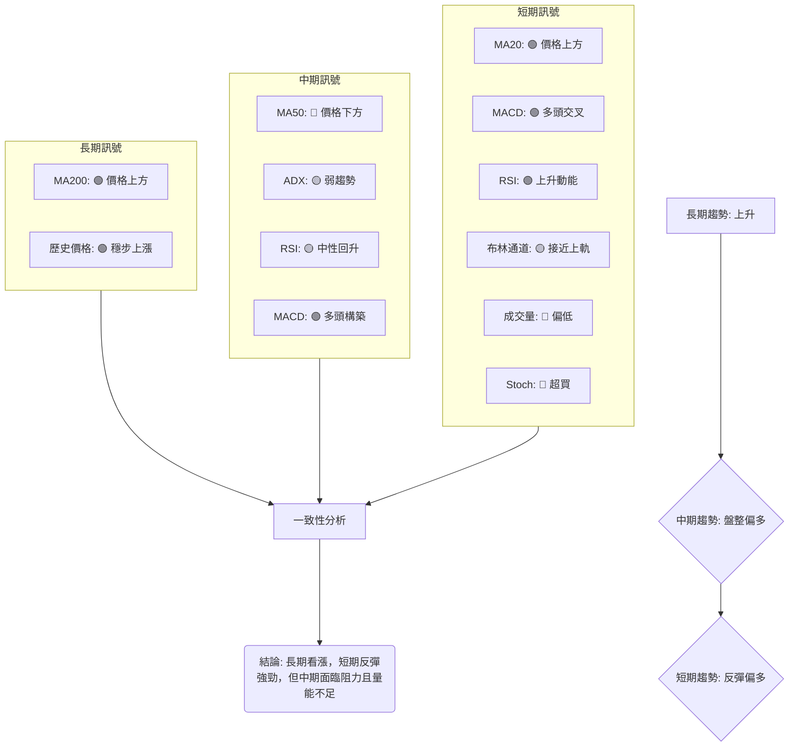

**一致性分析**：
*   **長期與中期/短期**：長期趨勢強勁上升，為中期和短期提供宏觀支撐。中期和短期趨勢均顯示從回調中反彈的跡象，與長期方向一致。
*   **中期與短期**：中期趨勢仍處於盤整，但短期指標顯示動能正在積聚，試圖向上突破。短期的反彈動能正在挑戰中期的阻力。
*   **指標衝突**：短期內，MACD 和 RSI 顯示強勁多頭動能，但成交量偏低和 Stochastics 超買則提示反彈的質量和可持續性存在隱憂。ADX 則指出整體趨勢強度不足。

### ⚖️ 多時框收斂結論

根據「嚴格要求 14」的多時框架收斂規則：

1.  **ADX(14) 判斷**：AMZN 的 ADX(14) 為 22.71，**小於 25**。因此，目前市場處於**盤整行情**。
2.  **主導時框**：在盤整行情中，應以日線布林通道上下軌為主要交易區間。然而，我們也必須考慮長期趨勢的影響。
3.  **訊號整合**：
    *   **長期 (月線)**：明顯的多頭趨勢，股價位於 MA200 之上，為整體市場提供堅實的底部支撐。
    *   **中期 (週線)**：經歷了從高點的回調，目前正在築底反彈，但仍面臨 MA50 ($254.32) 等中期阻力。ADX 指示趨勢強度不足。
    *   **短期 (日線)**：價格已突破 MA20 ($239.82)，MACD 形成多頭交叉，RSI 向上，顯示短線反彈動能強勁。價格正接近布林上軌 ($250.83) 和 R1 ($248.81)。但成交量不足和 Stochastics 超買為反彈帶來不確定性。

**最終結論**：
AMZN 處於**長期上升趨勢中的中期盤整與短期反彈階段**。儘管 ADX 指示當前為盤整行情，但短期動能指標顯示強勁的買盤力量正在推動股價從近期低點反彈。這種反彈已將價格推至關鍵斐波那契回調 38.2% ($247.02) 附近，並接近布林上軌和短期阻力 R1。

綜合判斷，AMZN 的市場結構為**中性偏多**。主策略應聚焦於在當前盤整區間內尋找多頭機會，尤其是在價格成功突破中期阻力位 (MA50) 後，或在回調至關鍵支撐位時。短線操作可依據日線布林通道進行，但需警惕量能不足和超買指標帶來的短期回調風險。**因此，本報告的交易策略將以「中性偏多」為主要方向，尋找突破阻力後的進場機會或回調至支撐後的買入機會。**

---

## 8. 交易策略建議

### 🗺️ 策略決策流程圖

基於多時框架分析和 ADX 判斷為盤整行情 (ADX < 25)，但結合 MACD 和 RSI 的多頭訊號，我們將採取「中性偏多」的策略。以下是策略決策流程圖。

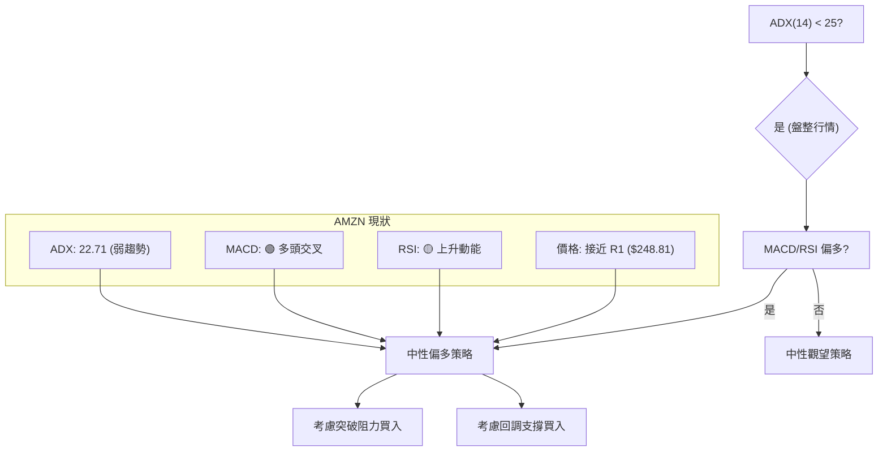

### 🧭 策略路由

**當前主策略方向 = 中性偏多 (依綜合評分 55/100)**

由於 AMZN 的綜合評分落在 40–60 的中性區間，且 ADX 指示為盤整行情，我們將重點關注區間操作和等待突破確認。然而，由於 MACD 柱狀圖為正，RSI 上升，短期動能偏強，因此策略傾向於「中性偏多」，即在盤整區間內尋找多頭機會。

### 🎯 價格情境階梯（Price Scenarios）

以下情境階梯以當前價格 $247.04 為基準，列出可能的價格走勢與關鍵觸發點。所有價位均引用第 4 章「支撐與阻力」區塊的實際數值。

| 觸發條件 | 下一目標 | 後續延伸 | 情境含義 |
|----------|----------|----------|----------|
| **突破 R1 $248.81** | MA50 $254.32 / R2 $258.60 | R3 $276.65 / 52W High $278.56 | 短線轉強，有望挑戰中期阻力，開啟新一輪上漲。 |
| **站穩現價區間** | R1 $248.81 & MA20 $239.82 之間 | — | 區間震盪，價格在 $239.82 - $248.81 之間波動，等待方向。 |
| **跌破 MA20 $239.82** | 斐波那契 50% $237.28 / MA200 $233.24 | S1 $223.82 / S2 $215.82 | 短線轉弱，反彈結束，可能回測關鍵支撐。 |

### 📊 情境機率分佈

根據當前技術指標狀態，對三種情境的機率進行估計。

| 情境 | 機率 | 主要依據 |
|------|------|----------|
| **繼續上行 / 反彈** | 45% | MACD 多頭交叉且柱狀圖為正、RSI 上升動能強勁、價格位於 MA20 和 MA200 之上、OBV 趨勢向上。 |
| **區間震盪** | 40% | ADX < 25 (弱趨勢/盤整)、成交量偏低、Stochastics 超買提示回調壓力、上方 MA50 形成阻力。 |
| **回落 / 再探底** | 15% | 若無法突破 R1 或 MA50，且成交量持續低迷，則超買的 Stochastics 可能引發回調，跌破 MA20 後將測試更低支撐。 |

**總結**：目前市場傾向於繼續反彈或進入區間震盪。繼續上行的可能性略高，但區間震盪的機率也很高，這反映了 ADX 所示的弱趨勢和多空力量的拉鋸。

### 🟢 主策略詳情（中性偏多）

基於當前中性偏多的評級，我們提供兩種主要策略：突破追漲和回調買入。

| 策略要素 | 策略 A：突破追漲 (Breakout Buy) | 策略 B：回調買入 (Buy the Dip) |
|----------|---------------------------------|---------------------------------|
| **進場條件** | 價格有效突破 R1 $248.81 並站穩，伴隨放大的成交量。 | 價格回調至 MA20 $239.82 或斐波那契 50% $237.28 附近，並出現止跌訊號 (如K線反轉)。 |
| **進場價格** | $249.00 - $250.00 | $237.50 - $239.00 |
| **目標價 T1** | MA50 $254.32 | MA20 $239.82 (若從更低點買入) / R1 $248.81 |
| **目標價 T2** | R2 $258.60 | R2 $258.60 |
| **止損價格** | $245.00 (R1 假突破下方) | $233.00 (跌破 MA200 $233.24 支撐) |
| **風險報酬比** | (T1: $254.32 - $249.50) / ($249.50 - $245.00) = 4.82 / 4.5 = **1.07:1**<br>(T2: $258.60 - $249.50) / ($249.50 - $245.00) = 9.1 / 4.5 = **2.02:1** | (T1: $248.81 - $238.25) / ($238.25 - $233.00) = 10.56 / 5.25 = **2.01:1**<br>(T2: $258.60 - $238.25) / ($238.25 - $233.00) = 20.35 / 5.25 = **3.88:1** |
| **成功機率** | 45% | 55% |
| **建議倉位** | 中等 (5-10%) | 中等 (5-10%) |

**策略 A (突破追漲) 詳細說明**：
此策略適用於當價格成功突破短期阻力 R1 ($248.81) 後，確認多頭動能進一步釋放。進場時需觀察成交量是否放大，以確認突破的有效性。止損點設在突破位下方，以防假突破。目標價首先看向 MA50 ($254.32) 和 R2 ($258.60)。

**策略 B (回調買入) 詳細說明**：
此策略適用於價格在反彈後因超買或阻力而回調，但在關鍵支撐位獲得支撐。MA20 ($239.82) 和斐波那契 50% ($237.28) 是重要的潛在買入區域。止損點設在 MA200 ($233.24) 之下，以保護長期趨勢不被破壞。回調買入的風險報酬比通常更優。

### 🔴 反向風險觸發點（對沖提示）

以下為可能推翻「中性偏多」主策略的關鍵訊號和價位，供風險控制參考：
*   **跌破 MA200 $233.24**：如果股價跌破長期移動平均線 MA200，將對長期看漲趨勢構成嚴重威脅，可能預示著趨勢反轉。
*   **跌破 S1 $223.82**：如果股價無法守住 S1 支撐，則可能引發更深層次的回調，目標看向 S2 ($215.82) 甚至 S3 ($211.22)。
*   **MACD 形成空頭交叉**：若 MACD 線再次下穿訊號線，且柱狀圖轉負，將顯示多頭動能衰竭，空頭力量佔優。
*   **RSI 跌破 50**：若 RSI 從當前水平跌破 50 關口，表明市場動能轉弱，偏向空頭。
*   **成交量持續萎縮或放量下跌**：若股價上漲時成交量持續萎縮，或在下跌時成交量顯著放大，均為負面訊號。

### ⭐ 整體訊號強度評星

```
做多訊號強度：★★★★☆  (4/5星) - 短期動能強勁，長期趨勢向上，但有短期超買和量能不足問題。
做空訊號強度：★★☆☆☆  (2/5星) - 僅有中期阻力、Stochastics 超買和成交量不足作為空頭依據，整體賣壓不強。
整體可信度：  ★★★☆☆  (3/5星) - 儘管多頭訊號明顯，但 ADX 弱趨勢和量能問題降低了單邊趨勢的可靠性，需謹慎。
```

---

## 9. 風險提示與監控

### ✅ 關鍵監控指標 Checklist

以下方框圖列出了在 AMZN 交易中需要密切監控的關鍵技術指標和價位。

```
╔══════════════════════════════════════════════════════════════╗
║               AMZN 關鍵監控指標 Checklist                      ║
╠══════════════════════════════════════════════════════════════╣
║ [ ] 價格是否站穩 MA20 ($239.82)                       🟢/🔴 ║
║ [ ] 價格能否突破 MA50 ($254.32) 和 R1 ($248.81)        🟢/🔴 ║
║ [ ] RSI(14) 是否進入超買區 (>70) 或跌破 50 關口       🟢/🟡/🔴║
║ [ ] MACD 是否維持多頭交叉，柱狀圖是否持續增長          🟢/🔴 ║
║ [ ] ADX(14) 是否突破 25，確認趨勢強度                 🟢/🟡 ║
║ [ ] 成交量能否有效放大以配合價格上漲                   🟢/🔴 ║
║ [ ] Stochastics 是否從超買區回落並形成死叉            🟡/🔴 ║
║ [ ] 價格是否跌破斐波那契 50% ($237.28) 或 MA200 ($233.24) 🔴 ║
║ [ ] 52週高點 ($278.56) 和 52週低點 ($196.00) 的相對位置 🟡 ║
╚══════════════════════════════════════════════════════════════╝
```

### ⚠️ 風險場景分析

針對 AMZN 的未來走勢，我們構築三種情境，以評估潛在的風險和機會。

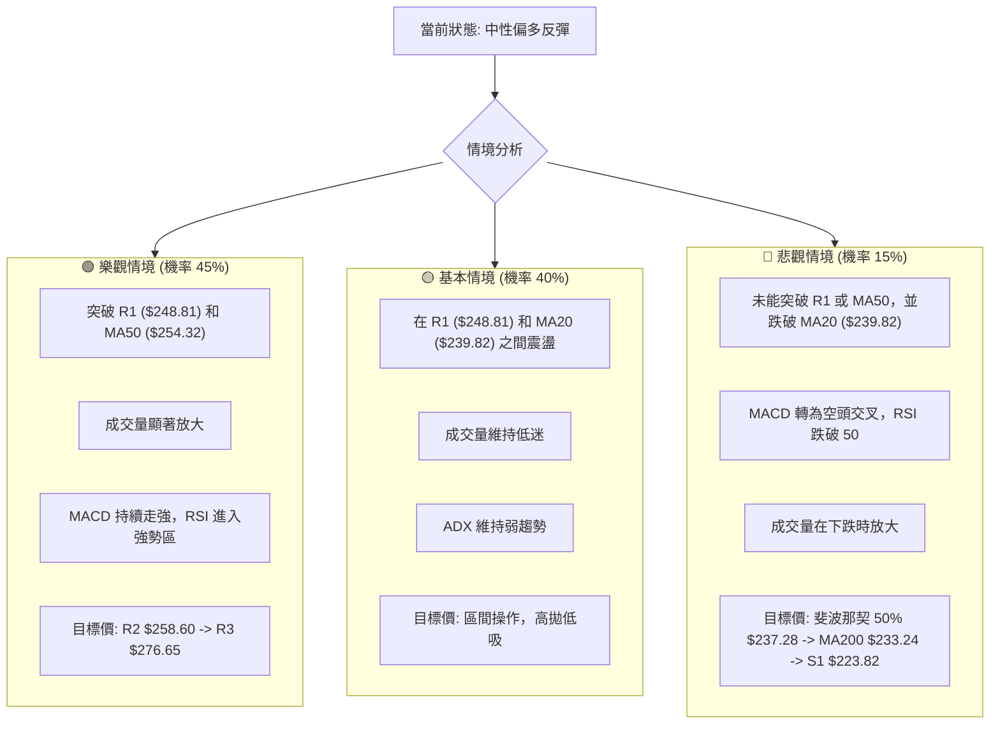

### 🛡️ 風險管理重要提醒

1.  **倉位管理**：鑑於當前 AMZN 處於盤整行情且成交量偏低，建議採取中等倉位 (例如總資產的 5-10%) 進行操作。避免重倉單一股票，以分散風險。
2.  **止損設置**：嚴格執行止損策略。無論是突破追漲還是回調買入，都應預設明確的止損點。止損點應考慮 ATR 波動率和關鍵支撐位，例如跌破 MA200 ($233.24) 或 S1 ($223.82) 時應果斷止損。
3.  **量能確認**：密切關注成交量。任何突破或反彈若缺乏成交量的有效配合，其可靠性將大打折扣。無量上漲應視為潛在的陷阱，放量下跌則為強烈警示。
4.  **多時框驗證**：在日線級別操作時，應時刻關注週線和月線的宏觀趨勢。若日線訊號與更長時框架趨勢相悖，應降低倉位或謹慎操作。
5.  **市場情緒**：AMZN 的 Beta 值較高 (1.461)，其股價對整體市場情緒高度敏感。在市場不確定性增加時，應特別警惕其可能出現的放大波動。
6.  **基本面配合**：技術分析是基於歷史價格行為和市場心理的判斷。長期投資者應結合基本面分析，確保公司營運狀況良好，以提供股價長期上漲的內在動力。

---

## 📋 報告總結

```
AMZN 技術分析報告總結
════════════════════════════════════════════════════════
報告日期：2026-07-09
當前價格：$247.04
分析評級：⚖️ 中性偏多 (綜合評分 55/100)

關鍵結論：
├─ 長期趨勢：🟢 上升趨勢穩固，價格位於 MA200 之上。
├─ 中期趨勢：🟡 經歷回調後止跌反彈，但 ADX 顯示趨勢強度不足，MA50 構成壓力。
├─ 短期趨勢：🟢 強勁反彈，MACD 多頭交叉，RSI 上升，但成交量偏低且 Stochastics 超買。
├─ 關鍵支撐：$239.82 (MA20), $237.28 (斐波那契 50%), $233.24 (MA200), $223.82 (S1)。
├─ 關鍵阻力：$248.81 (R1), $250.83 (布林上軌), $254.32 (MA50)。
└─ 分析師目標：$312.91 (平均目標價，顯示長期潛力)。

最優策略組合：
1. 🥇 最佳機會：**突破 R1 $248.81 後追漲**。若價格能帶量突破 R1 和布林上軌，並站穩 MA50 ($254.32) 之上，則確認中期趨勢轉強，目標看向 R2 $258.60 至 R3 $276.65。
2. 🥈 次選機會：**回調至關鍵支撐位買入**。若價格因阻力或超買回調，可在 MA20 ($239.82) 或斐波那契 50% ($237.28) 附近尋找止跌訊號後進場，止損設於 MA200 ($233.24) 之下。
3. 🥉 保守選擇：**區間震盪操作或觀望**。在價格未能明確突破 R1 或跌破 MA200 之前，可考慮在 $239.82 - $248.81 區間內高拋低吸，或保持觀望等待趨勢明確。
════════════════════════════════════════════════════════
```

---

> ⚠️ **免責聲明**：本報告為 AI 自動生成之技術分析，所有數據及估算均基於提供的歷史價格資訊。本報告**僅供研究與學術參考**，**不構成任何投資建議**。投資有風險，入市需謹慎。

---

*報告生成時間：2026-07-09 ｜ 數據來源：Yahoo Finance ｜ 分析框架：多時框技術分析*